# Parent Section Magnitude-Probability Distributions

Only fault sections with at least one triggered aftershock are plotted. Sections are sorted by total supraseismogenic trigger rate (decreasing)

## Table Of Contents

* [Garlock (Central)](#garlock-central)
* [Tank Canyon](#tank-canyon)
* [Little Lake](#little-lake)
* [Airport Lake](#airport-lake)
* [Owl Lake](#owl-lake)
* [Panamint Valley](#panamint-valley)
* [Garlock (East)](#garlock-east)
* [Hunter Mountain-Saline Valley](#hunter-mountain-saline-valley)
* [Ash Hill](#ash-hill)
* [Blackwater](#blackwater)
* [Garlock (West)](#garlock-west)
* [McLean Lake](#mclean-lake)
* [Goldstone Lake](#goldstone-lake)
* [Gravel Hills-Harper Lk](#gravel-hills-harper-lk)
* [Coyote Canyon](#coyote-canyon)
* [So Sierra Nevada](#so-sierra-nevada)
* [San Andreas (Mojave S)](#san-andreas-mojave-s)
* [Nelson Lake](#nelson-lake)
* [Death Valley (So)](#death-valley-so)
* [San Andreas (Mojave N)](#san-andreas-mojave-n)
* [Lenwood-Lockhart-Old Woman Springs](#lenwood-lockhart-old-woman-springs)
* [Towne Pass](#towne-pass)
* [Bicycle Lake](#bicycle-lake)
* [Paradise](#paradise)
* [San Andreas (San Bernardino N)](#san-andreas-san-bernardino-n)
* [Garlic Springs](#garlic-springs)
* [Death Valley (Black Mtns Frontal)](#death-valley-black-mtns-frontal)
* [San Andreas (San Bernardino S)](#san-andreas-san-bernardino-s)
* [Coyote Lake](#coyote-lake)
* [Helendale-So Lockhart](#helendale-so-lockhart)
* [San Andreas (Big Bend)](#san-andreas-big-bend)
* [San Andreas (Parkfield)](#san-andreas-parkfield)
* [Death Valley (No)](#death-valley-no)
* [San Andreas (San Gorgonio Pass-Garnet HIll)](#san-andreas-san-gorgonio-pass-garnet-hill)
* [San Andreas (Coachella) rev](#san-andreas-coachella-rev)
* [Sierra Nevada  (No Extension)](#sierra-nevada--no-extension)
* [Scodie Lineament](#scodie-lineament)
* [San Andreas (Carrizo) rev](#san-andreas-carrizo-rev)
* [Red Pass](#red-pass)
* [Calico-Hidalgo](#calico-hidalgo)
* [San Andreas (Cholame) rev](#san-andreas-cholame-rev)
* [Baker](#baker)
* [Elsinore (Glen Ivy) rev](#elsinore-glen-ivy-rev)
* [Cady](#cady)
* [White Wolf (Extension)](#white-wolf-extension)
* [San Andreas (Creeping Section) 2011 CFM](#san-andreas-creeping-section-2011-cfm)
* [Ludlow](#ludlow)
* [Manix-Afton Hills](#manix-afton-hills)
* [San Jacinto (San Bernardino)](#san-jacinto-san-bernardino)
* [Death Valley (Fish Lake Valley)](#death-valley-fish-lake-valley)
* [Cleghorn Lake](#cleghorn-lake)
* [San Andreas (North Branch Mill Creek)](#san-andreas-north-branch-mill-creek)
* [Santa Ynez (West)](#santa-ynez-west)
* [Cleghorn Pass](#cleghorn-pass)
* [Brawley (Seismic Zone) alt 1](#brawley-seismic-zone-alt-1)
* [Pinto Mtn](#pinto-mtn)
* [Imperial](#imperial)
* [Whittier alt 1](#whittier-alt-1)
* [Lake Isabella (Seismicity)](#lake-isabella-seismicity)
* [San Jacinto (San Jacinto Valley) rev](#san-jacinto-san-jacinto-valley-rev)
* [Pleito](#pleito)
* [Owens Valley](#owens-valley)
* [San Jacinto (Stepovers Combined)](#san-jacinto-stepovers-combined)
* [Pisgah-Bullion Mtn-Mesquite Lk](#pisgah-bullion-mtn-mesquite-lk)
* [Independence rev 2011](#independence-rev-2011)
* [San Clemente](#san-clemente)
* [Santa Rosa Island](#santa-rosa-island)
* [Mission Ridge-Arroyo Parida-Santa Ana](#mission-ridge-arroyo-parida-santa-ana)
* [Santa Ynez (East)](#santa-ynez-east)
* [Red Mountain](#red-mountain)
* [San Jacinto (Anza) rev](#san-jacinto-anza-rev)
* [Deep Springs](#deep-springs)
* [San Andreas (Santa Cruz Mts) 2011 CFM](#san-andreas-santa-cruz-mts-2011-cfm)
* [Santa Cruz Island](#santa-cruz-island)
* [Mission Creek](#mission-creek)
* [Lost Hills](#lost-hills)
* [Sheephole](#sheephole)
* [Ventura-Pitas Point](#ventura-pitas-point)
* [San Pedro Basin](#san-pedro-basin)
* [Coronado Bank alt1](#coronado-bank-alt1)
* [San Jacinto (Superstition Mtn)](#san-jacinto-superstition-mtn)
* [San Diego Trough north alt1](#san-diego-trough-north-alt1)
* [White Mountains](#white-mountains)
* [Blue Cut](#blue-cut)
* [Kern Canyon (North Kern) 2011](#kern-canyon-north-kern-2011)
* [San Jacinto (Borrego)](#san-jacinto-borrego)
* [San Jacinto (Coyote Creek)](#san-jacinto-coyote-creek)
* [Elysian Park (Upper)](#elysian-park-upper)
* [Rose Canyon](#rose-canyon)
* [Elmore Ranch](#elmore-ranch)
* [Pine Mtn](#pine-mtn)
* [Channel Islands Thrust](#channel-islands-thrust)
* [Palos Verdes](#palos-verdes)
* [Hunting Creek - Berryessa 2011 CFM](#hunting-creek---berryessa-2011-cfm)
* [Oceanic - West Huasna](#oceanic---west-huasna)
* [Hosgri (Extension)](#hosgri-extension)
* [Chino alt 1](#chino-alt-1)
* [Cleghorn](#cleghorn)
* [Big Pine (East)](#big-pine-east)
* [Camp Rock 2011](#camp-rock-2011)
* [Tin Mountain](#tin-mountain)
* [Big Pine (Central)](#big-pine-central)
* [Rinconada 2011 CFM](#rinconada-2011-cfm)
* [Elsinore (Temecula) rev](#elsinore-temecula-rev)
* [Puente Hills](#puente-hills)
* [Bullion Mountains](#bullion-mountains)
* [San Gabriel](#san-gabriel)
* [San Juan](#san-juan)
* [San Andreas (Peninsula) 2011 CFM](#san-andreas-peninsula-2011-cfm)
* [San Cayetano](#san-cayetano)
* [Kern Canyon (Lake Isabella) 2011](#kern-canyon-lake-isabella-2011)
* [Ortigalita (North)](#ortigalita-north)
* [Hosgri](#hosgri)
* [Raymond](#raymond)
* [Hollywood](#hollywood)
* [Great Valley 09 (Laguna Seca)](#great-valley-09-laguna-seca)
* [Emerson-Copper Mtn 2011](#emerson-copper-mtn-2011)
* [Casmalia 2011 CFM](#casmalia-2011-cfm)
* [San Gregorio (South) 2011 CFM](#san-gregorio-south-2011-cfm)
* [Oak Ridge (Onshore)](#oak-ridge-onshore)
* [Hartley Springs 2011 CFM](#hartley-springs-2011-cfm)
* [Hayward (So) 2011 CFM](#hayward-so-2011-cfm)
* [San Luis Range 2011 CFM](#san-luis-range-2011-cfm)
* [Great Valley 07 (Orestimba)](#great-valley-07-orestimba)
* [San Jacinto (Lytle Creek connector)](#san-jacinto-lytle-creek-connector)
* [Sierra Madre](#sierra-madre)
* [North Frontal  (West)](#north-frontal--west)
* [Santa Susana East (connector)](#santa-susana-east-connector)
* [Los Alamos 2011 CFM](#los-alamos-2011-cfm)
* [Santa Susana alt 1](#santa-susana-alt-1)
* [Bartlett Springs 2011 CFM](#bartlett-springs-2011-cfm)
* [Johnson Valley (No) 2011 rev](#johnson-valley-no-2011-rev)
* [Redondo Canyon alt 1](#redondo-canyon-alt-1)
* [San Gorgonio Pass](#san-gorgonio-pass)
* [South Klamath Lake West](#south-klamath-lake-west)
* [Dry Mountain](#dry-mountain)
* [Cucamonga](#cucamonga)
* [Big Pine (West)](#big-pine-west)
* [Earthquake Valley (No  Extension)](#earthquake-valley-no--extension)
* [Superstition Hills](#superstition-hills)
* [Great Valley 03a Dunnigan Hills](#great-valley-03a-dunnigan-hills)
* [Hayward (No) 2011 CFM](#hayward-no-2011-cfm)
* [Hunting Creek - Bartlett Springs connector 2011](#hunting-creek---bartlett-springs-connector-2011)
* [Owens Valley Keough Hot Springs](#owens-valley-keough-hot-springs)
* [Santa Cruz Catalina Ridge alt1](#santa-cruz-catalina-ridge-alt1)
* [Ortigalita (South)](#ortigalita-south)
* [Calaveras (Central) 2011 CFM](#calaveras-central-2011-cfm)
* [San Jacinto (Clark) rev](#san-jacinto-clark-rev)
* [Laguna Salada](#laguna-salada)
* [Elsinore (Stepovers Combined)](#elsinore-stepovers-combined)
* [Calaveras (So) - Paicines extension 2011 CFM](#calaveras-so---paicines-extension-2011-cfm)
* [Kern Canyon (South Kern) 2011](#kern-canyon-south-kern-2011)
* [Santa Ynez River](#santa-ynez-river)
* [Jess Valley](#jess-valley)
* [San Diego Trough south](#san-diego-trough-south)
* [Sargent 2011 CFM](#sargent-2011-cfm)
* [San Gregorio (North) 2011 CFM](#san-gregorio-north-2011-cfm)
* [San Gabriel (Extension)](#san-gabriel-extension)
* [La Panza 2011](#la-panza-2011)
* [Simi-Santa Rosa](#simi-santa-rosa)
* [White Wolf](#white-wolf)
* [Breckenridge 2011](#breckenridge-2011)
* [Monterey Bay-Tularcitos](#monterey-bay-tularcitos)
* [Fish Slough 2011 CFM](#fish-slough-2011-cfm)
* [Morales (West)](#morales-west)
* [Surprise Valley 2011 CFM](#surprise-valley-2011-cfm)
* [Homestead Valley 2011](#homestead-valley-2011)
* [Earthquake Valley](#earthquake-valley)
* [Likely 2011 CFM](#likely-2011-cfm)
* [Robinson Creek](#robinson-creek)
* [Newport-Inglewood alt 1](#newport-inglewood-alt-1)
* [North Salt Lake](#north-salt-lake)
* [Sierra Madre (San Fernando)](#sierra-madre-san-fernando)
* [Holser alt 1](#holser-alt-1)
* [Los Osos 2011](#los-osos-2011)
* [Malibu Coast alt 1](#malibu-coast-alt-1)
* [Lions Head 2011 CFM](#lions-head-2011-cfm)
* [Reliz 2011 CFM](#reliz-2011-cfm)
* [Richfield](#richfield)
* [Monte Vista - Shannon 2011 CFM](#monte-vista---shannon-2011-cfm)
* [Concord 2011 CFM](#concord-2011-cfm)
* [Ozena](#ozena)
* [Point Reyes 2011 connector](#point-reyes-2011-connector)
* [Point Reyes 2011 CFM](#point-reyes-2011-cfm)
* [Great Valley 04a Trout Creek](#great-valley-04a-trout-creek)
* [San Jose](#san-jose)
* [Trinidad (alt1)](#trinidad-alt1)
* [Elsinore (Julian)](#elsinore-julian)
* [San Andreas (North Coast) 2011 CFM](#san-andreas-north-coast-2011-cfm)
* [Northridge](#northridge)
* [Eaton Roughs 2011 CFM](#eaton-roughs-2011-cfm)
* [Calaveras (No) 2011 CFM](#calaveras-no-2011-cfm)
* [West Tahoe](#west-tahoe)
* [South Cuyama](#south-cuyama)
* [Los Alamos extension](#los-alamos-extension)
* [Hayward (So) extension 2011 CFM](#hayward-so-extension-2011-cfm)
* [Verdugo](#verdugo)
* [Malibu Coast (Extension) alt 1](#malibu-coast-extension-alt-1)
* [Green Valley 2011 CFM](#green-valley-2011-cfm)
* [Cerro Prieto](#cerro-prieto)
* [Great Valley 03 Mysterious Ridge](#great-valley-03-mysterious-ridge)

## Garlock (Central)
*[(top)](#table-of-contents)*

| 1 Week | 1 Month | 1 Year | 10 Year |
|-----|-----|-----|-----|
| 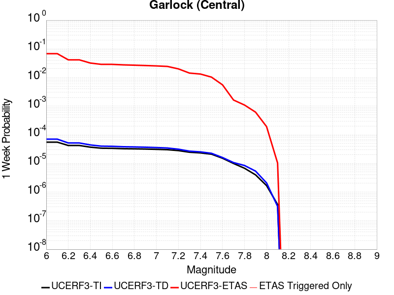 | 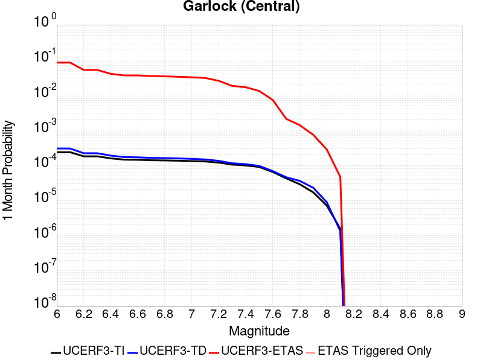 | 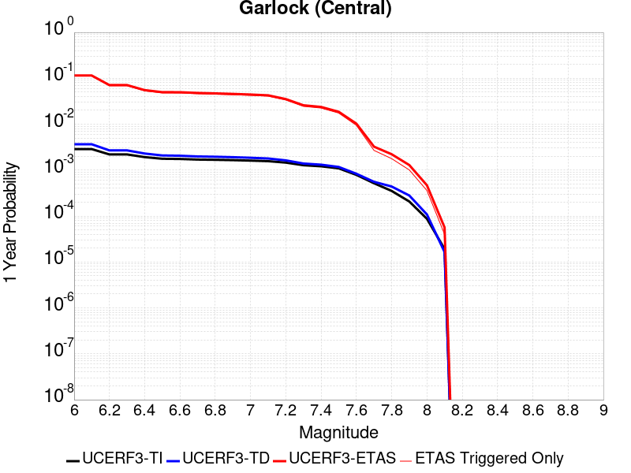 | 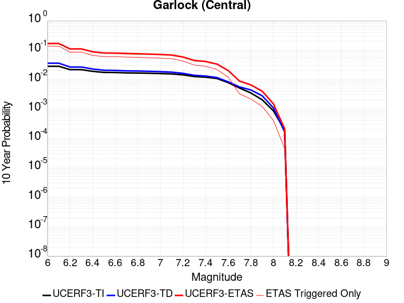 |

| Magnitude | 1 wk TI Prob | 1 wk TD Prob | 1 wk ETAS Prob | 1 wk ETAS/TD Gain | 1 wk ETAS Triggered Only | 1 mo TI Prob | 1 mo TD Prob | 1 mo ETAS Prob | 1 mo ETAS/TD Gain | 1 mo ETAS Triggered Only | 1 yr TI Prob | 1 yr TD Prob | 1 yr ETAS Prob | 1 yr ETAS/TD Gain | 1 yr ETAS Triggered Only | 10 yr TI Prob | 10 yr TD Prob | 10 yr ETAS Prob | 10 yr ETAS/TD Gain | 10 yr ETAS Triggered Only |
|-----|-----|-----|-----|-----|-----|-----|-----|-----|-----|-----|-----|-----|-----|-----|-----|-----|-----|-----|-----|-----|
| 6.0 | 5.5131142E-5 | 7.024681E-5 | 0.06721926 | 956.9012 | 0.06715373 | 2.3625491E-4 | 3.010234E-4 | 0.08385273 | 278.55887 | 0.083576865 | 0.0028726095 | 0.0036588663 | 0.11402981 | 31.165339 | 0.11077625 | 0.028357591 | 0.036079824 | 0.16812369 | 4.65977 | 0.1369863 |
| 6.1 | 5.5131142E-5 | 7.024681E-5 | 0.06721926 | 956.9012 | 0.06715373 | 2.3625491E-4 | 3.010234E-4 | 0.08385273 | 278.55887 | 0.083576865 | 0.0028726095 | 0.0036588663 | 0.11402981 | 31.165339 | 0.11077625 | 0.028357591 | 0.036079824 | 0.16812369 | 4.65977 | 0.1369863 |
| 6.2 | 4.216245E-5 | 5.1661493E-5 | 0.04140417 | 801.45123 | 0.04135464 | 1.806837E-4 | 2.2138779E-4 | 0.051884227 | 234.35902 | 0.051674277 | 0.0021976046 | 0.0026920962 | 0.07100086 | 26.373817 | 0.06849315 | 0.021759989 | 0.026689773 | 0.10997669 | 4.120555 | 0.085570775 |
| 6.3 | 4.216245E-5 | 5.1661493E-5 | 0.04140417 | 801.45123 | 0.04135464 | 1.806837E-4 | 2.2138779E-4 | 0.051884227 | 234.35902 | 0.051674277 | 0.0021976046 | 0.0026920962 | 0.07100086 | 26.373817 | 0.06849315 | 0.021759989 | 0.026689773 | 0.10997669 | 4.120555 | 0.085570775 |
| 6.4 | 3.6858168E-5 | 4.411054E-5 | 0.032021392 | 725.9351 | 0.031978693 | 1.5795401E-4 | 1.8903162E-4 | 0.04018147 | 212.5648 | 0.04 | 0.0019213937 | 0.002299056 | 0.055327546 | 24.065332 | 0.053150684 | 0.019048655 | 0.02284894 | 0.08800722 | 3.851698 | 0.066681884 |
| 6.5 | 3.39199E-5 | 4.0018083E-5 | 0.028988631 | 724.3883 | 0.028949771 | 1.453629E-4 | 1.7149492E-4 | 0.03623837 | 211.3087 | 0.03607306 | 0.0017683565 | 0.002085973 | 0.050067868 | 24.002165 | 0.04808219 | 0.017543508 | 0.020759864 | 0.07987198 | 3.8474233 | 0.060365297 |
| 6.6 | 3.3571985E-5 | 3.9472274E-5 | 0.028957661 | 733.6203 | 0.02891933 | 1.4387199E-4 | 1.6915603E-4 | 0.036205675 | 214.03716 | 0.03604262 | 0.0017502342 | 0.0020575512 | 0.049995244 | 24.29842 | 0.04803653 | 0.017365133 | 0.020481179 | 0.07953558 | 3.8833497 | 0.060289193 |
| 6.7 | 3.2580007E-5 | 3.8088703E-5 | 0.027845249 | 731.06323 | 0.02780822 | 1.3962112E-4 | 1.632272E-4 | 0.034845542 | 213.47876 | 0.034687977 | 0.0016985617 | 0.0019855013 | 0.04821013 | 24.281088 | 0.04631659 | 0.016856372 | 0.019773813 | 0.07675226 | 3.88151 | 0.058127854 |
| 6.8 | 3.2185937E-5 | 3.7515918E-5 | 0.027190227 | 724.765 | 0.027153729 | 1.3793244E-4 | 1.6077272E-4 | 0.034067042 | 211.89565 | 0.03391172 | 0.0016780337 | 0.001955672 | 0.04713351 | 24.100927 | 0.045266364 | 0.016654192 | 0.019480614 | 0.07529709 | 3.8652318 | 0.05692542 |
| 6.9 | 3.165394E-5 | 3.6720503E-5 | 0.026382785 | 718.4756 | 0.026347032 | 1.3565269E-4 | 1.5736422E-4 | 0.03305934 | 210.08168 | 0.032907154 | 0.0016503202 | 0.001914247 | 0.045817867 | 23.93519 | 0.04398782 | 0.01638118 | 0.019073246 | 0.07327057 | 3.8415363 | 0.05525114 |
| 7.0 | 3.0903822E-5 | 3.5625766E-5 | 0.025575051 | 717.88074 | 0.025540335 | 1.3243823E-4 | 1.5267303E-4 | 0.032035172 | 209.82861 | 0.031887367 | 0.0016112428 | 0.0018572307 | 0.04439604 | 23.90443 | 0.04261796 | 0.015996104 | 0.018512413 | 0.07112732 | 3.8421419 | 0.053607307 |
| 7.1 | 3.0069863E-5 | 3.4392073E-5 | 0.024523657 | 713.06134 | 0.024490107 | 1.2886449E-4 | 1.4738638E-4 | 0.030690828 | 208.23383 | 0.030547945 | 0.0015677959 | 0.0017929734 | 0.042602472 | 23.760796 | 0.0408828 | 0.01556781 | 0.017880075 | 0.06830154 | 3.8199809 | 0.05133942 |
| 7.2 | 2.7957109E-5 | 3.128145E-5 | 0.020213298 | 646.1752 | 0.020182649 | 1.1981068E-4 | 1.340566E-4 | 0.025351375 | 189.10951 | 0.0252207 | 0.0014577188 | 0.0016309366 | 0.03551774 | 21.777512 | 0.033942163 | 0.014481937 | 0.016283695 | 0.05837238 | 3.5847135 | 0.042785387 |
| 7.3 | 2.4519275E-5 | 2.6714795E-5 | 0.014349011 | 537.1185 | 0.014322679 | 1.0507837E-4 | 1.1448703E-4 | 0.018209828 | 159.0558 | 0.018097412 | 0.0012785783 | 0.001393003 | 0.025818596 | 18.534485 | 0.024459666 | 0.012712469 | 0.013928054 | 0.04457583 | 3.200435 | 0.031080669 |
| 7.4 | 2.3225532E-5 | 2.51994E-5 | 0.013342977 | 529.4958 | 0.013318113 | 9.95342E-5 | 1.0799304E-4 | 0.016727204 | 154.8915 | 0.016621005 | 0.0012111551 | 0.0013140367 | 0.023704667 | 18.03958 | 0.022420092 | 0.012045753 | 0.013145725 | 0.041159168 | 3.1309927 | 0.028386606 |
| 7.5 | 2.097765E-5 | 2.2483688E-5 | 0.010463649 | 465.3885 | 0.0104414 | 8.9901114E-5 | 9.635517E-5 | 0.013032704 | 135.25693 | 0.012937595 | 0.0010939965 | 0.0011725046 | 0.018488554 | 15.768428 | 0.017336378 | 0.010886264 | 0.011740365 | 0.033581354 | 2.860333 | 0.022100456 |
| 7.6 | 1.511254E-5 | 1.5991332E-5 | 0.005708442 | 356.971 | 0.005692542 | 6.476642E-5 | 6.853253E-5 | 0.0072522108 | 105.82144 | 0.0071841707 | 7.882459E-4 | 8.3407195E-4 | 0.010369491 | 12.43237 | 0.009543379 | 0.007854558 | 0.008383559 | 0.020307105 | 2.4222536 | 0.012024353 |
| 7.7 | 9.934069E-6 | 1.0678794E-5 | 0.0016697174 | 156.35825 | 0.0016590563 | 4.2573887E-5 | 4.5765457E-5 | 0.002100466 | 45.896317 | 0.0020547945 | 5.182138E-4 | 5.570524E-4 | 0.0032496157 | 5.833591 | 0.0026940638 | 0.00517007 | 0.005627684 | 0.008896853 | 1.5809085 | 0.0032876711 |
| 7.8 | 6.7562896E-6 | 8.428449E-6 | 0.0011195302 | 132.82755 | 0.0011111111 | 2.8955206E-5 | 3.6121426E-5 | 0.0013907148 | 38.501106 | 0.0013546423 | 3.5247262E-4 | 4.3968976E-4 | 0.0022197287 | 5.0483975 | 0.001780822 | 0.0035191406 | 0.004446654 | 0.006613536 | 1.4873061 | 0.0021765602 |
| 7.9 | 3.975453E-6 | 5.37103E-6 | 5.9897517E-4 | 111.5196 | 5.936073E-4 | 1.7037546E-5 | 2.3018498E-5 | 7.3837495E-4 | 32.077457 | 7.153729E-4 | 2.0741238E-4 | 2.8021427E-4 | 0.0012540661 | 4.475383 | 9.741248E-4 | 0.002072189 | 0.0028336283 | 0.0040630116 | 1.4338548 | 0.0012328767 |
| 8.0 | 1.6729537E-6 | 2.0775144E-6 | 2.1516687E-4 | 103.56938 | 2.130898E-4 | 7.169782E-6 | 8.903603E-6 | 2.8287378E-4 | 31.770708 | 2.739726E-4 | 8.7288594E-5 | 1.0839601E-4 | 4.7365323E-4 | 4.3696556 | 3.6529682E-4 | 8.7254314E-4 | 0.0010969337 | 0.0015074419 | 1.3742324 | 4.109589E-4 |
| 8.1 | 3.6733252E-7 | 3.1489964E-7 | 1.5535596E-5 | 49.335068 | 1.52207E-5 | 1.5742813E-6 | 1.3495693E-6 | 4.7011607E-5 | 34.834526 | 4.5662102E-5 | 1.9166706E-5 | 1.6430899E-5 | 6.209225E-5 | 3.778993 | 4.5662102E-5 | 1.9165053E-4 | 1.6638759E-4 | 2.1204208E-4 | 1.2743865 | 4.5662102E-5 |

## Tank Canyon
*[(top)](#table-of-contents)*

| 1 Week | 1 Month | 1 Year | 10 Year |
|-----|-----|-----|-----|
| 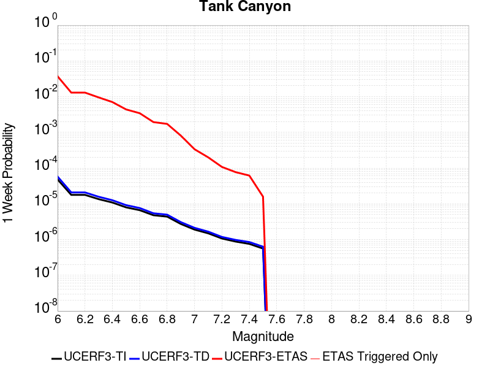 | 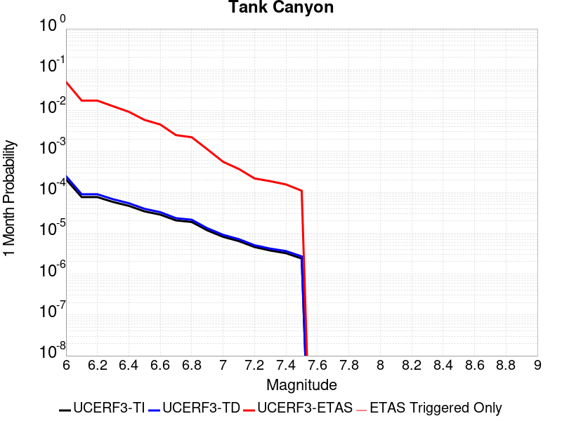 | 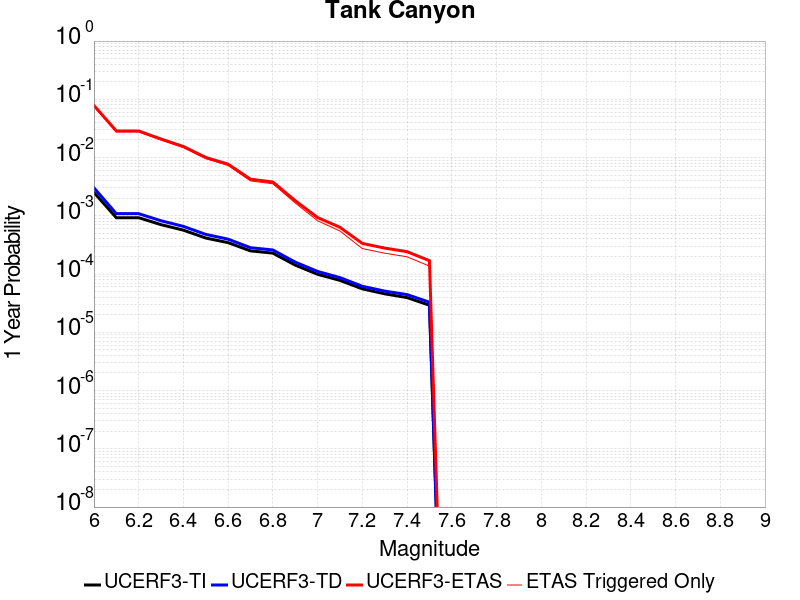 | 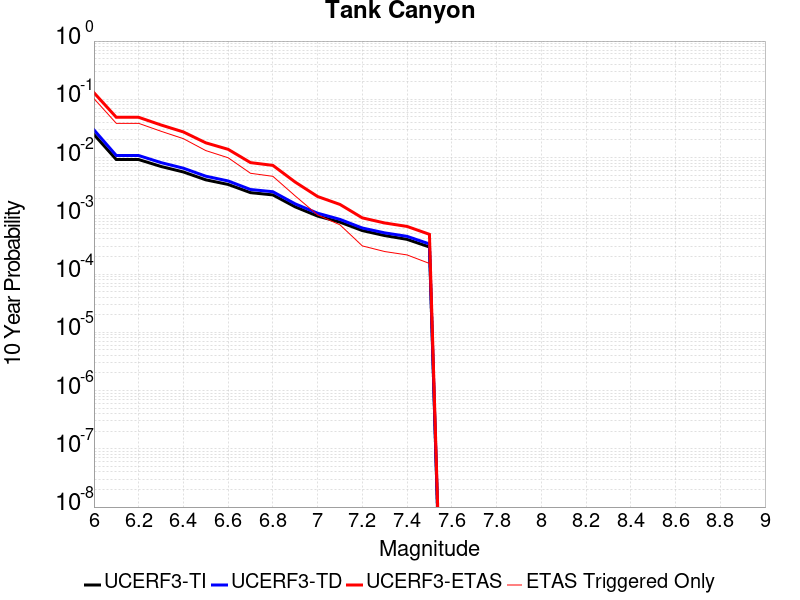 |

| Magnitude | 1 wk TI Prob | 1 wk TD Prob | 1 wk ETAS Prob | 1 wk ETAS/TD Gain | 1 wk ETAS Triggered Only | 1 mo TI Prob | 1 mo TD Prob | 1 mo ETAS Prob | 1 mo ETAS/TD Gain | 1 mo ETAS Triggered Only | 1 yr TI Prob | 1 yr TD Prob | 1 yr ETAS Prob | 1 yr ETAS/TD Gain | 1 yr ETAS Triggered Only | 10 yr TI Prob | 10 yr TD Prob | 10 yr ETAS Prob | 10 yr ETAS/TD Gain | 10 yr ETAS Triggered Only |
|-----|-----|-----|-----|-----|-----|-----|-----|-----|-----|-----|-----|-----|-----|-----|-----|-----|-----|-----|-----|-----|
| 6.0 | 4.8284557E-5 | 5.7964822E-5 | 0.0371791 | 641.40796 | 0.03712329 | 2.0691741E-4 | 2.4840087E-4 | 0.05017511 | 201.99251 | 0.04993912 | 0.0025163088 | 0.0030207601 | 0.07840878 | 25.956638 | 0.07561644 | 0.02488006 | 0.029863637 | 0.12978621 | 4.345961 | 0.10299848 |
| 6.1 | 1.7796336E-5 | 2.0873314E-5 | 0.012988639 | 622.2605 | 0.012968036 | 7.626778E-5 | 8.945422E-5 | 0.017485159 | 195.46489 | 0.01739726 | 9.281647E-4 | 0.0010885983 | 0.02862328 | 26.293703 | 0.027564688 | 0.009242975 | 0.010836744 | 0.04909342 | 4.5302744 | 0.0386758 |
| 6.2 | 1.7796336E-5 | 2.0873314E-5 | 0.012988639 | 622.2605 | 0.012968036 | 7.626778E-5 | 8.945422E-5 | 0.017485159 | 195.46489 | 0.01739726 | 9.281647E-4 | 0.0010885983 | 0.02862328 | 26.293703 | 0.027564688 | 0.009242975 | 0.010836744 | 0.04909342 | 4.5302744 | 0.0386758 |
| 6.3 | 1.3515912E-5 | 1.5759564E-5 | 0.009513327 | 603.6542 | 0.009497717 | 5.792405E-5 | 6.753938E-5 | 0.012730307 | 188.48717 | 0.012663622 | 7.049971E-4 | 8.2200574E-4 | 0.020805566 | 25.31073 | 0.02 | 0.007027647 | 0.0081922645 | 0.03624065 | 4.423764 | 0.02828006 |
| 6.4 | 1.0870146E-5 | 1.2618021E-5 | 0.0070597134 | 559.4945 | 0.0070471843 | 4.658551E-5 | 5.4076212E-5 | 0.009322981 | 172.40448 | 0.009269406 | 5.67031E-4 | 6.581969E-4 | 0.0154886115 | 23.531881 | 0.014840183 | 0.005655863 | 0.0065644905 | 0.027521897 | 4.192541 | 0.02109589 |
| 6.5 | 7.964826E-6 | 9.196094E-6 | 0.0043927175 | 477.6721 | 0.0043835617 | 3.4134522E-5 | 3.9411298E-5 | 0.00589915 | 149.6817 | 0.0058599696 | 4.1550855E-4 | 4.7973756E-4 | 0.010048965 | 20.946796 | 0.00957382 | 0.0041473247 | 0.004788321 | 0.017906332 | 3.7395847 | 0.013181127 |
| 6.6 | 6.6317E-6 | 7.6122988E-6 | 0.0034322438 | 450.88138 | 0.0034246575 | 2.8421264E-5 | 3.2623782E-5 | 0.004553024 | 139.56151 | 0.004520548 | 3.4597394E-4 | 3.9713128E-4 | 0.0077001657 | 19.389473 | 0.007305936 | 0.0034543579 | 0.003965368 | 0.013849912 | 3.4927182 | 0.009923897 |
| 6.7 | 4.793663E-6 | 5.4307857E-6 | 0.0019384492 | 356.93716 | 0.0019330289 | 2.0544108E-5 | 2.3274613E-5 | 0.002504191 | 107.59324 | 0.0024809742 | 2.500958E-4 | 2.8333595E-4 | 0.0042548133 | 15.0168495 | 0.0039726025 | 0.0024981452 | 0.0028304397 | 0.008188139 | 2.892886 | 0.005372907 |
| 6.8 | 4.382823E-6 | 4.9692567E-6 | 0.0017248999 | 347.11423 | 0.0017199392 | 1.8783392E-5 | 2.1296666E-5 | 0.0022282512 | 104.62911 | 0.0022070014 | 2.286638E-4 | 2.5926033E-4 | 0.003804764 | 14.675458 | 0.003546423 | 0.0022842865 | 0.002590253 | 0.007341992 | 2.834469 | 0.004764079 |
| 6.9 | 2.729601E-6 | 3.0735416E-6 | 8.0976816E-4 | 263.4642 | 8.066971E-4 | 1.1698237E-5 | 1.3172262E-5 | 0.0011242687 | 85.35123 | 0.0011111111 | 1.4241673E-4 | 1.6036171E-4 | 0.001819152 | 11.344054 | 0.0016590563 | 0.001423255 | 0.0016026258 | 0.003790894 | 2.3654268 | 0.0021917808 |
| 7.0 | 1.8987357E-6 | 2.126939E-6 | 3.3698164E-4 | 158.43501 | 3.348554E-4 | 8.137413E-6 | 9.115425E-6 | 5.5705564E-4 | 61.111317 | 5.479452E-4 | 9.90685E-5 | 1.1097535E-4 | 9.328019E-4 | 8.405488 | 8.219178E-4 | 9.902435E-4 | 0.0011092679 | 0.0021431274 | 1.9320196 | 0.0010350076 |
| 7.1 | 1.4928986E-6 | 1.6641272E-6 | 1.995329E-4 | 119.902435 | 1.978691E-4 | 6.398121E-6 | 7.1319573E-6 | 3.7242615E-4 | 52.219345 | 3.6529682E-4 | 7.789434E-5 | 8.682871E-5 | 6.347263E-4 | 7.310097 | 5.479452E-4 | 7.786704E-4 | 8.6800574E-4 | 0.0015675502 | 1.8059214 | 7.001522E-4 |
| 7.2 | 1.069082E-6 | 1.1828573E-6 | 1.0772763E-4 | 91.07407 | 1.065449E-4 | 4.581772E-6 | 5.0693816E-6 | 2.1815811E-4 | 43.034462 | 2.130898E-4 | 5.5781646E-5 | 6.171851E-5 | 3.356742E-4 | 5.4387937 | 2.739726E-4 | 5.576765E-4 | 6.170659E-4 | 9.2129206E-4 | 1.4930205 | 3.0441402E-4 |
| 7.3 | 8.776551E-7 | 9.770005E-7 | 7.7080425E-5 | 78.89497 | 7.6103504E-5 | 3.7613736E-6 | 4.1871413E-6 | 1.8683478E-4 | 44.621086 | 1.8264841E-4 | 4.579376E-5 | 5.097777E-5 | 2.7927663E-4 | 5.4784 | 2.283105E-4 | 4.5784327E-4 | 5.097118E-4 | 7.5311883E-4 | 1.4775386 | 2.435312E-4 |
| 7.4 | 7.55721E-7 | 8.510244E-7 | 6.173377E-5 | 72.54054 | 6.08828E-5 | 3.2388E-6 | 3.6472454E-6 | 1.5585369E-4 | 42.73189 | 1.5220701E-4 | 3.9431678E-5 | 4.4404827E-5 | 2.4226515E-4 | 5.455829 | 1.978691E-4 | 3.942468E-4 | 4.440104E-4 | 6.570056E-4 | 1.4797077 | 2.130898E-4 |
| 7.5 | 5.587665E-7 | 6.305619E-7 | 1.5851252E-5 | 25.138298 | 1.52207E-5 | 2.3947114E-6 | 2.702408E-6 | 1.0924702E-4 | 40.425804 | 1.065449E-4 | 2.915522E-5 | 3.290182E-5 | 1.6988361E-4 | 5.16335 | 1.369863E-4 | 2.9151395E-4 | 3.290182E-4 | 4.811751E-4 | 1.4624575 | 1.5220701E-4 |

## Little Lake
*[(top)](#table-of-contents)*

| 1 Week | 1 Month | 1 Year | 10 Year |
|-----|-----|-----|-----|
| 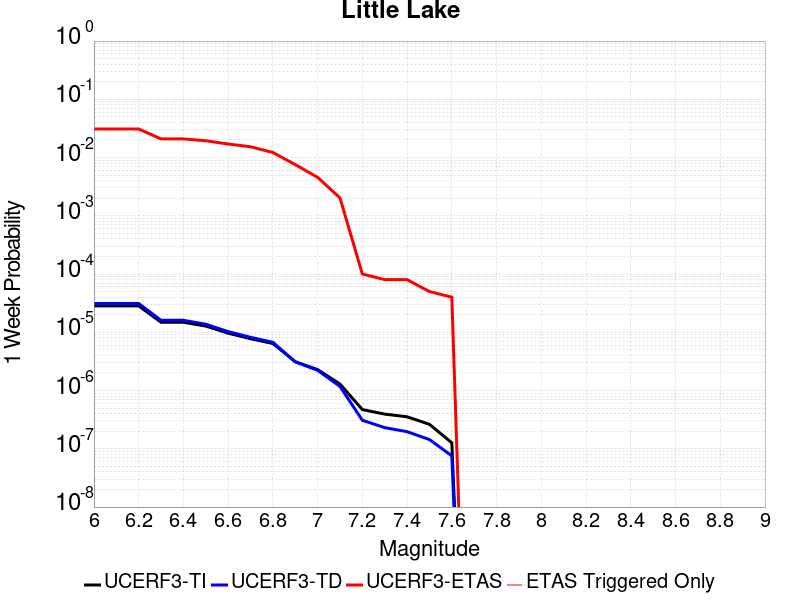 | 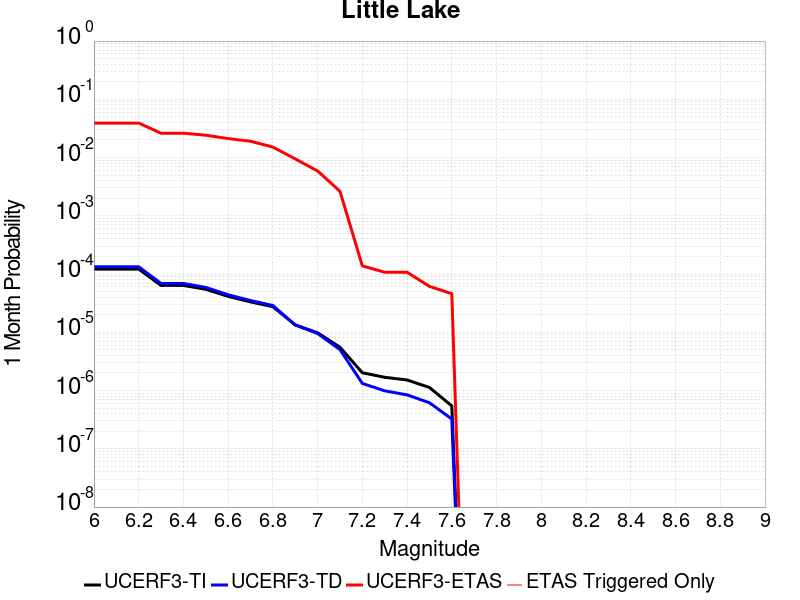 | 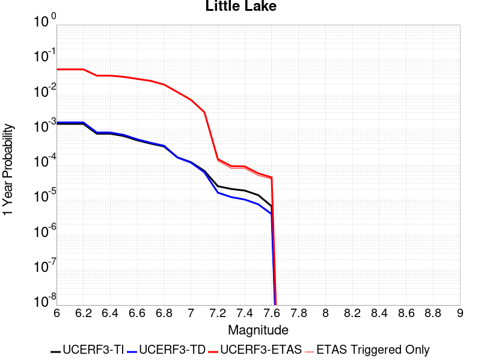 | 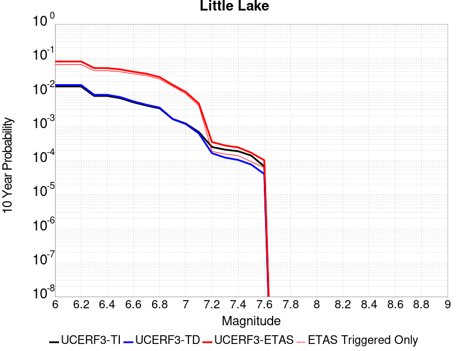 |

| Magnitude | 1 wk TI Prob | 1 wk TD Prob | 1 wk ETAS Prob | 1 wk ETAS/TD Gain | 1 wk ETAS Triggered Only | 1 mo TI Prob | 1 mo TD Prob | 1 mo ETAS Prob | 1 mo ETAS/TD Gain | 1 mo ETAS Triggered Only | 1 yr TI Prob | 1 yr TD Prob | 1 yr ETAS Prob | 1 yr ETAS/TD Gain | 1 yr ETAS Triggered Only | 10 yr TI Prob | 10 yr TD Prob | 10 yr ETAS Prob | 10 yr ETAS/TD Gain | 10 yr ETAS Triggered Only |
|-----|-----|-----|-----|-----|-----|-----|-----|-----|-----|-----|-----|-----|-----|-----|-----|-----|-----|-----|-----|-----|
| 6.0 | 2.8424427E-5 | 3.120572E-5 | 0.031597953 | 1012.5692 | 0.031567734 | 1.2181328E-4 | 1.337327E-4 | 0.039108735 | 292.43958 | 0.038980212 | 0.0014820677 | 0.0016271127 | 0.0532477 | 32.72527 | 0.05170472 | 0.014722223 | 0.016165402 | 0.079613 | 4.924901 | 0.06449011 |
| 6.1 | 2.8424427E-5 | 3.120572E-5 | 0.031597953 | 1012.5692 | 0.031567734 | 1.2181328E-4 | 1.337327E-4 | 0.039108735 | 292.43958 | 0.038980212 | 0.0014820677 | 0.0016271127 | 0.0532477 | 32.72527 | 0.05170472 | 0.014722223 | 0.016165402 | 0.079613 | 4.924901 | 0.06449011 |
| 6.2 | 2.8424427E-5 | 3.120572E-5 | 0.031597953 | 1012.5692 | 0.031567734 | 1.2181328E-4 | 1.337327E-4 | 0.039108735 | 292.43958 | 0.038980212 | 0.0014820677 | 0.0016271127 | 0.0532477 | 32.72527 | 0.05170472 | 0.014722223 | 0.016165402 | 0.079613 | 4.924901 | 0.06449011 |
| 6.3 | 1.48860645E-5 | 1.6081389E-5 | 0.021218175 | 1319.4243 | 0.021202436 | 6.379586E-5 | 6.8918576E-5 | 0.02618584 | 379.95328 | 0.026118722 | 7.7643775E-4 | 8.3878887E-4 | 0.035299964 | 42.084446 | 0.034490105 | 0.007737305 | 0.008359048 | 0.05087735 | 6.0865006 | 0.042876713 |
| 6.4 | 1.48860645E-5 | 1.6081389E-5 | 0.021218175 | 1319.4243 | 0.021202436 | 6.379586E-5 | 6.8918576E-5 | 0.02618584 | 379.95328 | 0.026118722 | 7.7643775E-4 | 8.3878887E-4 | 0.035299964 | 42.084446 | 0.034490105 | 0.007737305 | 0.008359048 | 0.05087735 | 6.0865006 | 0.042876713 |
| 6.5 | 1.2797581E-5 | 1.3765565E-5 | 0.019632978 | 1426.2384 | 0.019619482 | 5.4845623E-5 | 5.899409E-5 | 0.02421282 | 410.42792 | 0.024155252 | 6.675408E-4 | 7.18042E-4 | 0.03264335 | 45.461617 | 0.03194825 | 0.006655392 | 0.00715977 | 0.046495587 | 6.4940057 | 0.039619483 |
| 6.6 | 9.661896E-6 | 1.0289038E-5 | 0.017239945 | 1675.5643 | 0.017229833 | 4.1407468E-5 | 4.409522E-5 | 0.021169495 | 480.08594 | 0.021126332 | 5.040193E-4 | 5.367433E-4 | 0.028451737 | 53.008087 | 0.027929984 | 0.005028777 | 0.0053560743 | 0.03976742 | 7.424733 | 0.03459665 |
| 6.7 | 7.767871E-6 | 8.199687E-6 | 0.015594069 | 1901.7885 | 0.015585997 | 3.329045E-5 | 3.5141118E-5 | 0.019060347 | 542.3945 | 0.019025875 | 4.0523586E-4 | 4.2777284E-4 | 0.025302973 | 59.150486 | 0.024885844 | 0.004044977 | 0.004270846 | 0.034703482 | 8.1256695 | 0.030563166 |
| 6.8 | 6.4235196E-6 | 6.7357446E-6 | 0.012472405 | 1851.6743 | 0.012465754 | 2.752908E-5 | 2.8867229E-5 | 0.015142586 | 524.55975 | 0.015114156 | 3.35115E-4 | 3.5141467E-4 | 0.019979218 | 56.853683 | 0.019634703 | 0.003346101 | 0.00350985 | 0.027716825 | 7.8968687 | 0.024292238 |
| 6.9 | 3.1283696E-6 | 3.1121804E-6 | 0.0077960864 | 2505.024 | 0.0077929986 | 1.3407229E-5 | 1.3337856E-5 | 0.009480487 | 710.7954 | 0.009467276 | 1.6322079E-4 | 1.6237781E-4 | 0.012291306 | 75.695724 | 0.012130898 | 0.0016310095 | 0.00162274 | 0.016393254 | 10.102205 | 0.01479452 |
| 7.0 | 2.290603E-6 | 2.2286815E-6 | 0.004766297 | 2138.6174 | 0.004764079 | 9.816834E-6 | 9.551463E-6 | 0.0058846856 | 616.103 | 0.0058751903 | 1.19513395E-4 | 1.162839E-4 | 0.00757356 | 65.129906 | 0.007458143 | 0.0011944914 | 0.0011623327 | 0.010132108 | 8.717046 | 0.008980213 |
| 7.1 | 1.293693E-6 | 1.1776827E-6 | 0.0021472939 | 1823.3212 | 0.0021461188 | 5.5443866E-6 | 5.0472063E-6 | 0.002638215 | 522.708 | 0.0026331812 | 6.750081E-5 | 6.14487E-5 | 0.003348918 | 54.499413 | 0.0032876711 | 6.7480316E-4 | 6.143856E-4 | 0.00461497 | 7.5115213 | 0.004003044 |
| 7.2 | 4.715842E-7 | 3.0917857E-7 | 1.2207474E-4 | 394.83572 | 1.217656E-4 | 2.0210737E-6 | 1.3250503E-6 | 1.3831117E-4 | 104.38182 | 1.369863E-4 | 2.4606294E-5 | 1.6132375E-5 | 1.5311646E-4 | 9.491254 | 1.369863E-4 | 2.460357E-4 | 1.6131258E-4 | 3.4393152E-4 | 2.1320813 | 1.8264841E-4 |
| 7.3 | 3.9430947E-7 | 2.3097488E-7 | 1.0677585E-4 | 462.28342 | 1.065449E-4 | 1.6898966E-6 | 9.89892E-7 | 1.0753469E-4 | 108.63275 | 1.065449E-4 | 2.0574296E-5 | 1.2051869E-5 | 1.1859548E-4 | 9.840424 | 1.065449E-4 | 2.0572392E-4 | 1.20512224E-4 | 2.7270088E-4 | 2.2628484 | 1.5220701E-4 |
| 7.4 | 3.547123E-7 | 1.9679135E-7 | 1.06741674E-4 | 542.41034 | 1.065449E-4 | 1.5201948E-6 | 8.4339126E-7 | 1.073882E-4 | 127.32905 | 1.065449E-4 | 1.8508214E-5 | 1.0268241E-5 | 1.1681205E-4 | 11.376053 | 1.065449E-4 | 1.8506673E-4 | 1.02677724E-4 | 2.3964996E-4 | 2.3340015 | 1.369863E-4 |
| 7.5 | 2.6354266E-7 | 1.4423138E-7 | 6.102702E-5 | 423.1189 | 6.08828E-5 | 1.129468E-6 | 6.181344E-7 | 6.15009E-5 | 99.494385 | 6.08828E-5 | 1.3751187E-5 | 7.5257603E-6 | 6.84081E-5 | 9.089859 | 6.08828E-5 | 1.3750336E-4 | 7.5255106E-5 | 1.6657244E-4 | 2.2134368 | 9.1324204E-5 |
| 7.6 | 1.269913E-7 | 7.572556E-8 | 4.5737823E-5 | 603.9945 | 4.5662102E-5 | 5.4424834E-7 | 3.245381E-7 | 4.5986624E-5 | 141.6987 | 4.5662102E-5 | 6.6262032E-6 | 3.9512443E-6 | 4.9613165E-5 | 12.556339 | 4.5662102E-5 | 6.626006E-5 | 3.9511775E-5 | 1.0039217E-4 | 2.5408165 | 6.08828E-5 |

## Airport Lake
*[(top)](#table-of-contents)*

| 1 Week | 1 Month | 1 Year | 10 Year |
|-----|-----|-----|-----|
| 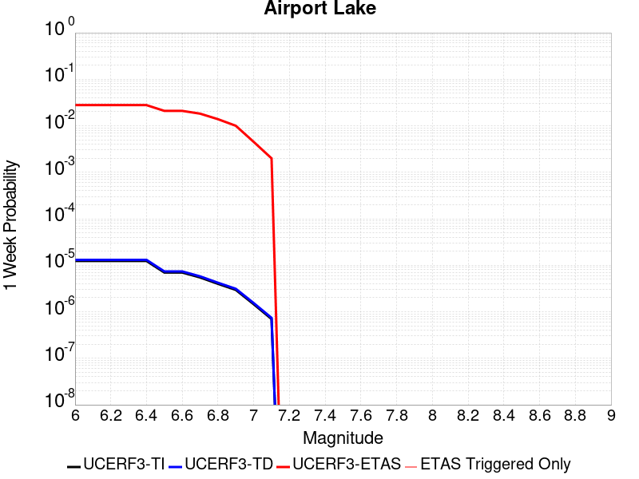 | 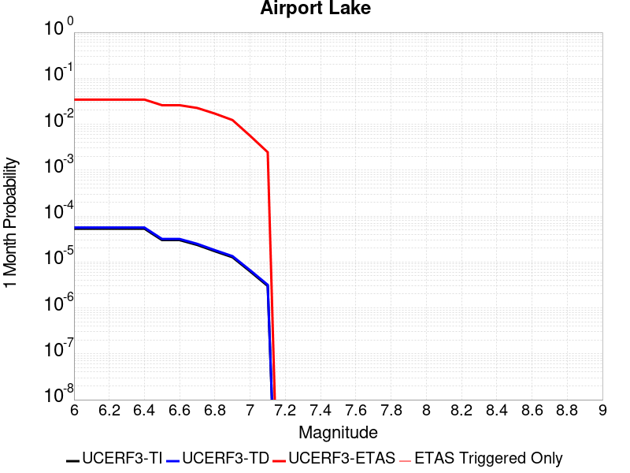 | 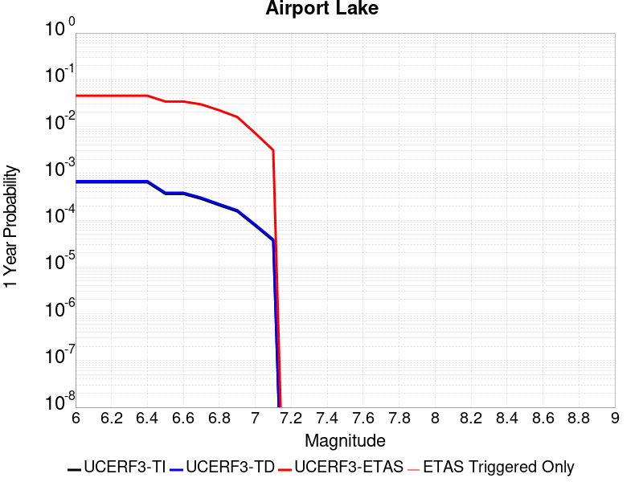 | 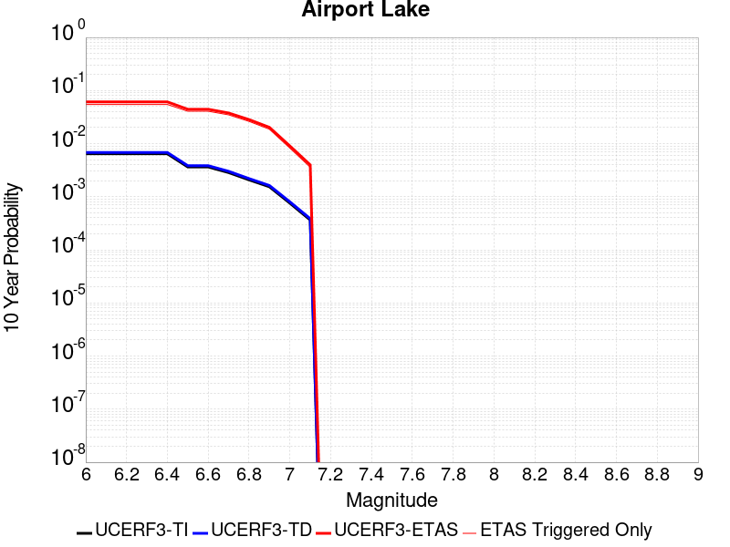 |

| Magnitude | 1 wk TI Prob | 1 wk TD Prob | 1 wk ETAS Prob | 1 wk ETAS/TD Gain | 1 wk ETAS Triggered Only | 1 mo TI Prob | 1 mo TD Prob | 1 mo ETAS Prob | 1 mo ETAS/TD Gain | 1 mo ETAS Triggered Only | 1 yr TI Prob | 1 yr TD Prob | 1 yr ETAS Prob | 1 yr ETAS/TD Gain | 1 yr ETAS Triggered Only | 10 yr TI Prob | 10 yr TD Prob | 10 yr ETAS Prob | 10 yr ETAS/TD Gain | 10 yr ETAS Triggered Only |
|-----|-----|-----|-----|-----|-----|-----|-----|-----|-----|-----|-----|-----|-----|-----|-----|-----|-----|-----|-----|-----|
| 6.0 | 1.2387061E-5 | 1.3103157E-5 | 0.02783618 | 2124.3872 | 0.02782344 | 5.3086325E-5 | 5.615534E-5 | 0.034392126 | 612.4463 | 0.0343379 | 6.461343E-4 | 6.8350515E-4 | 0.045645144 | 66.780975 | 0.04499239 | 0.0064425888 | 0.0068168393 | 0.06072386 | 8.90792 | 0.054277018 |
| 6.1 | 1.2387061E-5 | 1.3103157E-5 | 0.02783618 | 2124.3872 | 0.02782344 | 5.3086325E-5 | 5.615534E-5 | 0.034392126 | 612.4463 | 0.0343379 | 6.461343E-4 | 6.8350515E-4 | 0.045645144 | 66.780975 | 0.04499239 | 0.0064425888 | 0.0068168393 | 0.06072386 | 8.90792 | 0.054277018 |
| 6.2 | 1.2387061E-5 | 1.3103157E-5 | 0.02783618 | 2124.3872 | 0.02782344 | 5.3086325E-5 | 5.615534E-5 | 0.034392126 | 612.4463 | 0.0343379 | 6.461343E-4 | 6.8350515E-4 | 0.045645144 | 66.780975 | 0.04499239 | 0.0064425888 | 0.0068168393 | 0.06072386 | 8.90792 | 0.054277018 |
| 6.3 | 1.2387061E-5 | 1.3103157E-5 | 0.02783618 | 2124.3872 | 0.02782344 | 5.3086325E-5 | 5.615534E-5 | 0.034392126 | 612.4463 | 0.0343379 | 6.461343E-4 | 6.8350515E-4 | 0.045645144 | 66.780975 | 0.04499239 | 0.0064425888 | 0.0068168393 | 0.06072386 | 8.90792 | 0.054277018 |
| 6.4 | 1.2387061E-5 | 1.3103157E-5 | 0.02783618 | 2124.3872 | 0.02782344 | 5.3086325E-5 | 5.615534E-5 | 0.034392126 | 612.4463 | 0.0343379 | 6.461343E-4 | 6.8350515E-4 | 0.045645144 | 66.780975 | 0.04499239 | 0.0064425888 | 0.0068168393 | 0.06072386 | 8.90792 | 0.054277018 |
| 6.5 | 6.9922594E-6 | 7.384925E-6 | 0.020920472 | 2832.8618 | 0.020913241 | 2.996648E-5 | 3.1649324E-5 | 0.02590602 | 818.5331 | 0.02587519 | 3.6478083E-4 | 3.8526783E-4 | 0.034314353 | 89.06622 | 0.033942163 | 0.003641826 | 0.0038465366 | 0.044541758 | 11.579704 | 0.04085236 |
| 6.6 | 6.9922594E-6 | 7.384925E-6 | 0.020920472 | 2832.8618 | 0.020913241 | 2.996648E-5 | 3.1649324E-5 | 0.02590602 | 818.5331 | 0.02587519 | 3.6478083E-4 | 3.8526783E-4 | 0.034314353 | 89.06622 | 0.033942163 | 0.003641826 | 0.0038465366 | 0.044541758 | 11.579704 | 0.04085236 |
| 6.7 | 5.477277E-6 | 5.7860684E-6 | 0.01824008 | 3152.4133 | 0.018234398 | 2.3473833E-5 | 2.4797222E-5 | 0.022550875 | 909.4113 | 0.022526637 | 2.8575645E-4 | 3.0186825E-4 | 0.029760249 | 98.586876 | 0.029467275 | 0.0028538927 | 0.003014966 | 0.038190175 | 12.666868 | 0.035281584 |
| 6.8 | 3.9950432E-6 | 4.2190873E-6 | 0.013870219 | 3287.493 | 0.013866058 | 1.7121502E-5 | 1.8081691E-5 | 0.017019296 | 941.2447 | 0.017001523 | 2.0843433E-4 | 2.2012512E-4 | 0.022270065 | 101.17003 | 0.022054795 | 0.0020823893 | 0.0021993418 | 0.028731422 | 13.063646 | 0.026590563 |
| 6.9 | 2.95695E-6 | 3.1230243E-6 | 0.010003092 | 3203.0144 | 0.01 | 1.2672582E-5 | 1.3384334E-5 | 0.012311545 | 919.8475 | 0.012298326 | 1.5427776E-4 | 1.6294434E-4 | 0.016005112 | 98.2244 | 0.01584475 | 0.001541707 | 0.0016284712 | 0.020668952 | 12.692243 | 0.019071538 |
| 7.0 | 1.456072E-6 | 1.540812E-6 | 0.0045068613 | 2924.991 | 0.0045053274 | 6.2402937E-6 | 6.603469E-6 | 0.0055925637 | 846.91296 | 0.005585997 | 7.597293E-5 | 8.039528E-5 | 0.0072031105 | 89.59618 | 0.007123288 | 7.594696E-4 | 8.0376083E-4 | 0.009335711 | 11.615035 | 0.008538812 |
| 7.1 | 6.995192E-7 | 7.4089746E-7 | 0.001994651 | 2692.2095 | 0.0019939118 | 2.997936E-6 | 3.1752747E-6 | 0.0024537002 | 772.7521 | 0.0024505327 | 3.649926E-5 | 3.865897E-5 | 0.0031283416 | 80.92149 | 0.003089802 | 3.6493264E-4 | 3.865897E-4 | 0.0041142195 | 10.642342 | 0.0037290715 |

## Owl Lake
*[(top)](#table-of-contents)*

| 1 Week | 1 Month | 1 Year | 10 Year |
|-----|-----|-----|-----|
| 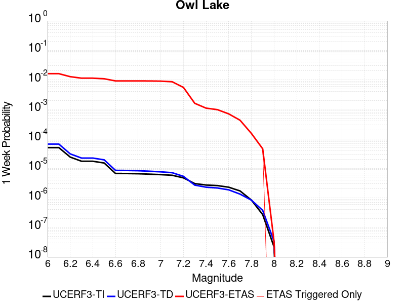 | 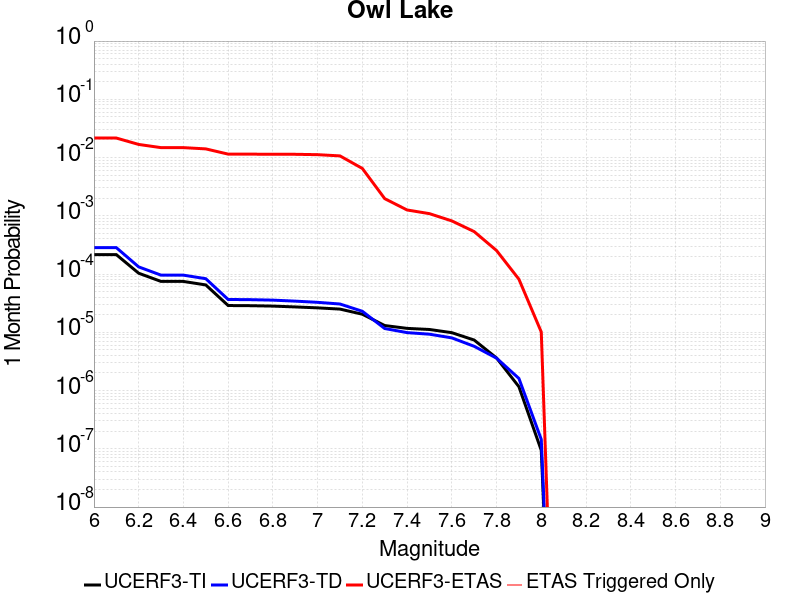 | 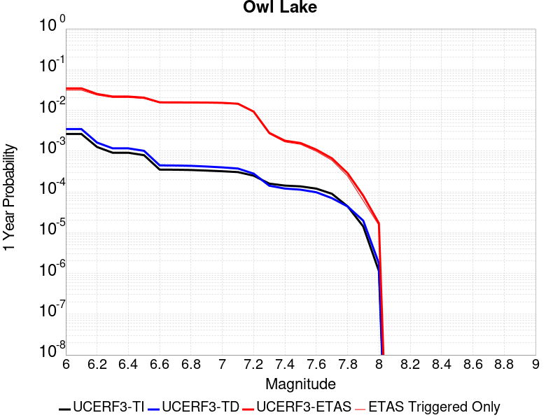 | 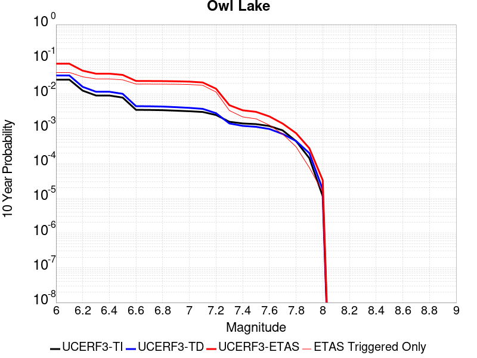 |

| Magnitude | 1 wk TI Prob | 1 wk TD Prob | 1 wk ETAS Prob | 1 wk ETAS/TD Gain | 1 wk ETAS Triggered Only | 1 mo TI Prob | 1 mo TD Prob | 1 mo ETAS Prob | 1 mo ETAS/TD Gain | 1 mo ETAS Triggered Only | 1 yr TI Prob | 1 yr TD Prob | 1 yr ETAS Prob | 1 yr ETAS/TD Gain | 1 yr ETAS Triggered Only | 10 yr TI Prob | 10 yr TD Prob | 10 yr ETAS Prob | 10 yr ETAS/TD Gain | 10 yr ETAS Triggered Only |
|-----|-----|-----|-----|-----|-----|-----|-----|-----|-----|-----|-----|-----|-----|-----|-----|-----|-----|-----|-----|-----|
| 6.0 | 5.0320643E-5 | 6.635816E-5 | 0.01615357 | 243.43007 | 0.01608828 | 2.1564208E-4 | 2.843674E-4 | 0.02166337 | 76.18092 | 0.021385083 | 0.0026222812 | 0.0034577388 | 0.03452195 | 9.983967 | 0.031171994 | 0.02591553 | 0.034140717 | 0.07440691 | 2.1794183 | 0.041689496 |
| 6.1 | 5.0320643E-5 | 6.635816E-5 | 0.01615357 | 243.43007 | 0.01608828 | 2.1564208E-4 | 2.843674E-4 | 0.02166337 | 76.18092 | 0.021385083 | 0.0026222812 | 0.0034577388 | 0.03452195 | 9.983967 | 0.031171994 | 0.02591553 | 0.034140717 | 0.07440691 | 2.1794183 | 0.041689496 |
| 6.2 | 2.4125871E-5 | 3.0981035E-5 | 0.012800753 | 413.18027 | 0.012770168 | 1.0339249E-4 | 1.3277028E-4 | 0.016690694 | 125.71107 | 0.016560122 | 0.0012580766 | 0.001615439 | 0.025184609 | 15.589948 | 0.023607306 | 0.012509781 | 0.016070465 | 0.046891272 | 2.917854 | 0.0313242 |
| 6.3 | 1.7433485E-5 | 2.2355514E-5 | 0.011376744 | 508.90103 | 0.011354642 | 7.471279E-5 | 9.580672E-5 | 0.014660621 | 153.02289 | 0.01456621 | 9.0924866E-4 | 0.0011659743 | 0.021750772 | 18.65459 | 0.020608827 | 0.009055373 | 0.011628896 | 0.038481902 | 3.309162 | 0.02716895 |
| 6.4 | 1.7433485E-5 | 2.2355514E-5 | 0.011376744 | 508.90103 | 0.011354642 | 7.471279E-5 | 9.580672E-5 | 0.014660621 | 153.02289 | 0.01456621 | 9.0924866E-4 | 0.0011659743 | 0.021750772 | 18.65459 | 0.020608827 | 0.009055373 | 0.011628896 | 0.038481902 | 3.309162 | 0.02716895 |
| 6.5 | 1.5182742E-5 | 1.9429144E-5 | 0.010871577 | 559.55 | 0.010852359 | 6.506727E-5 | 8.326596E-5 | 0.013856852 | 166.41678 | 0.013774734 | 7.919061E-4 | 0.0010134429 | 0.02043058 | 20.159576 | 0.019436834 | 0.0078909 | 0.010118429 | 0.035460602 | 3.5045562 | 0.025601218 |
| 6.6 | 6.7271576E-6 | 8.547361E-6 | 0.009186551 | 1074.7821 | 0.009178082 | 2.8830356E-5 | 3.6631063E-5 | 0.011451738 | 312.6237 | 0.011415525 | 3.5095305E-4 | 4.458976E-4 | 0.01569024 | 35.187984 | 0.015251142 | 0.0035039932 | 0.004467813 | 0.023757195 | 5.317411 | 0.019375952 |
| 6.7 | 6.682835E-6 | 8.479807E-6 | 0.009171263 | 1081.5415 | 0.009162862 | 2.8640408E-5 | 3.6341557E-5 | 0.011421012 | 314.26865 | 0.011385084 | 3.4864116E-4 | 4.4237426E-4 | 0.015625913 | 35.322834 | 0.015190259 | 0.003480947 | 0.0044327388 | 0.023647036 | 5.334633 | 0.019299848 |
| 6.8 | 6.5774975E-6 | 8.32628E-6 | 0.0091711115 | 1101.4656 | 0.009162862 | 2.8188972E-5 | 3.5683603E-5 | 0.011405141 | 319.61853 | 0.011369863 | 3.4314668E-4 | 4.343669E-4 | 0.015572385 | 35.850765 | 0.015144597 | 0.0034261728 | 0.004352885 | 0.023508105 | 5.4005804 | 0.019238966 |
| 6.9 | 6.363419E-6 | 7.999454E-6 | 0.009140346 | 1142.6212 | 0.00913242 | 2.727151E-5 | 3.428296E-5 | 0.011373316 | 331.74838 | 0.011339421 | 3.3198006E-4 | 4.1732067E-4 | 0.015479526 | 37.09264 | 0.015068493 | 0.0033148455 | 0.0041828766 | 0.02322011 | 5.5512304 | 0.019117199 |
| 7.0 | 6.1342453E-6 | 7.6316555E-6 | 0.009018217 | 1181.6855 | 0.009010655 | 2.6289357E-5 | 3.2706717E-5 | 0.011189115 | 342.1045 | 0.011156773 | 3.2002592E-4 | 3.9813702E-4 | 0.015232411 | 38.25922 | 0.014840183 | 0.0031956544 | 0.003991571 | 0.022714103 | 5.690518 | 0.018797565 |
| 7.1 | 5.842926E-6 | 7.142211E-6 | 0.008621997 | 1207.1887 | 0.008614916 | 2.504087E-5 | 3.0609146E-5 | 0.010639112 | 347.5795 | 0.010608828 | 3.0482994E-4 | 3.7260808E-4 | 0.014492155 | 38.89383 | 0.01412481 | 0.0030441214 | 0.0037370329 | 0.021493865 | 5.751586 | 0.01782344 |
| 7.2 | 4.77173E-6 | 5.358483E-6 | 0.005530443 | 1032.0912 | 0.005525114 | 2.045011E-5 | 2.2964748E-5 | 0.0067655803 | 294.60718 | 0.0067427703 | 2.4895166E-4 | 2.79564E-4 | 0.009302916 | 33.276516 | 0.0090258755 | 0.0024867293 | 0.002808645 | 0.014207286 | 5.058413 | 0.011430746 |
| 7.3 | 3.0494948E-6 | 2.710463E-6 | 0.0016008796 | 590.6296 | 0.0015981735 | 1.3069198E-5 | 1.1616219E-5 | 0.0020207253 | 173.95723 | 0.0020091324 | 1.5910587E-4 | 1.4141845E-4 | 0.0027894457 | 19.724766 | 0.0026484018 | 0.0015899199 | 0.0014232415 | 0.0047670295 | 3.3494174 | 0.003348554 |
| 7.4 | 2.7263884E-6 | 2.3056762E-6 | 0.0010981936 | 476.3 | 0.0010958904 | 1.1684469E-5 | 9.881433E-6 | 0.0013188487 | 133.46736 | 0.0013089802 | 1.4224913E-4 | 1.20299905E-4 | 0.0017943755 | 14.915852 | 0.001674277 | 0.0014215811 | 0.0012112238 | 0.00340035 | 2.807367 | 0.0021917808 |
| 7.5 | 2.6090431E-6 | 2.1656133E-6 | 9.7628834E-4 | 450.81378 | 9.741248E-4 | 1.1181565E-5 | 9.281167E-6 | 0.0011660437 | 125.63545 | 0.0011567732 | 1.3612706E-4 | 1.1299244E-4 | 0.0015740145 | 13.9302635 | 0.0014611873 | 0.001360437 | 0.0011379806 | 0.0030688099 | 2.6967154 | 0.0019330289 |
| 7.6 | 2.3008756E-6 | 1.8727933E-6 | 7.020237E-4 | 374.8538 | 7.001522E-4 | 9.860858E-6 | 8.0262325E-6 | 8.1471686E-4 | 101.50675 | 8.066971E-4 | 1.20049335E-4 | 9.7715085E-5 | 0.0010869639 | 11.123809 | 9.893455E-4 | 0.001199845 | 9.849932E-4 | 0.0022622726 | 2.2967393 | 0.0012785388 |
| 7.7 | 1.7184348E-6 | 1.3419171E-6 | 4.2752095E-4 | 318.5897 | 4.261796E-4 | 7.3646997E-6 | 5.7510606E-6 | 5.080313E-4 | 88.33697 | 5.022831E-4 | 8.966153E-5 | 7.0016955E-5 | 6.635827E-4 | 9.477457 | 5.936073E-4 | 8.962536E-4 | 7.078345E-4 | 0.0014074912 | 1.9884466 | 7.001522E-4 |
| 7.8 | 8.4612907E-7 | 8.4058576E-7 | 1.5304745E-4 | 182.07239 | 1.5220701E-4 | 3.6262625E-6 | 3.6025056E-6 | 2.0147089E-4 | 55.925213 | 1.978691E-4 | 4.4148852E-5 | 4.3859643E-5 | 2.8738016E-4 | 6.5522685 | 2.435312E-4 | 4.414008E-4 | 4.4398365E-4 | 7.482625E-4 | 1.685338 | 3.0441402E-4 |
| 7.9 | 2.716738E-7 | 3.768106E-7 | 4.6038895E-5 | 122.18047 | 4.5662102E-5 | 1.1643157E-6 | 1.6149015E-6 | 6.24976E-5 | 38.700565 | 6.08828E-5 | 1.4175452E-5 | 1.966126E-5 | 8.0542864E-5 | 4.096526 | 6.08828E-5 | 1.4174548E-4 | 1.9836679E-4 | 2.744552E-4 | 1.3835744 | 7.6103504E-5 |
| 8.0 | 2.1995428E-8 | 3.384878E-8 | 3.384878E-8 | 1.0 | 0.0 | 9.426611E-8 | 1.4506621E-7 | 1.5365764E-5 | 105.922424 | 1.52207E-5 | 1.1476893E-6 | 1.7661803E-6 | 1.6986854E-5 | 9.617848 | 1.52207E-5 | 1.14768345E-5 | 1.7963059E-5 | 3.3183485E-5 | 1.8473182 | 1.52207E-5 |

## Panamint Valley
*[(top)](#table-of-contents)*

| 1 Week | 1 Month | 1 Year | 10 Year |
|-----|-----|-----|-----|
| 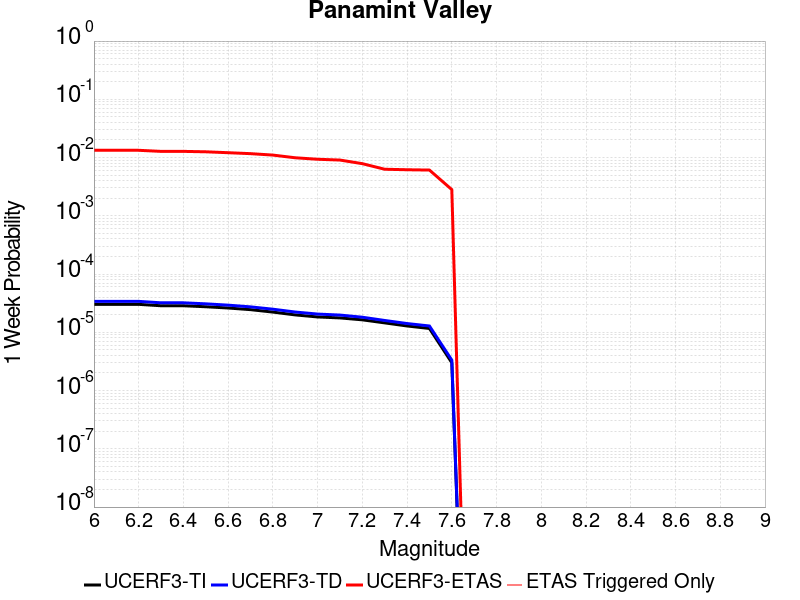 | 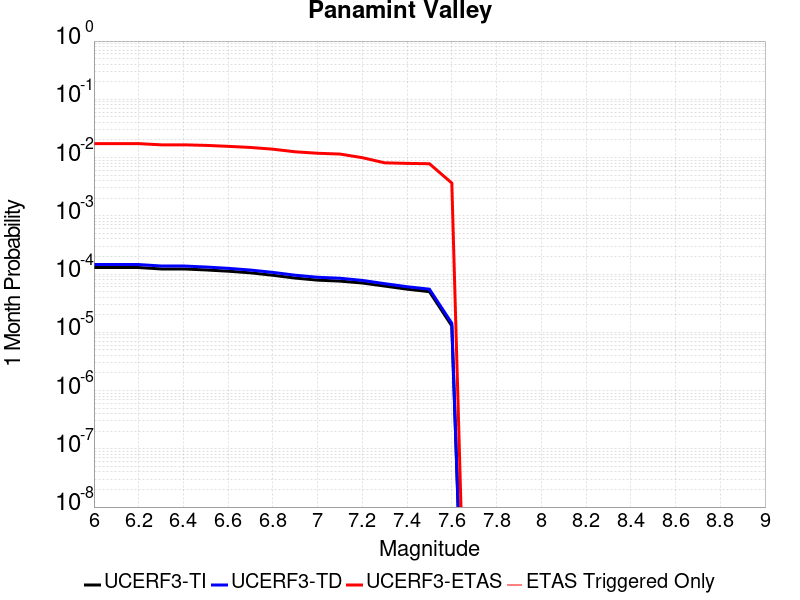 | 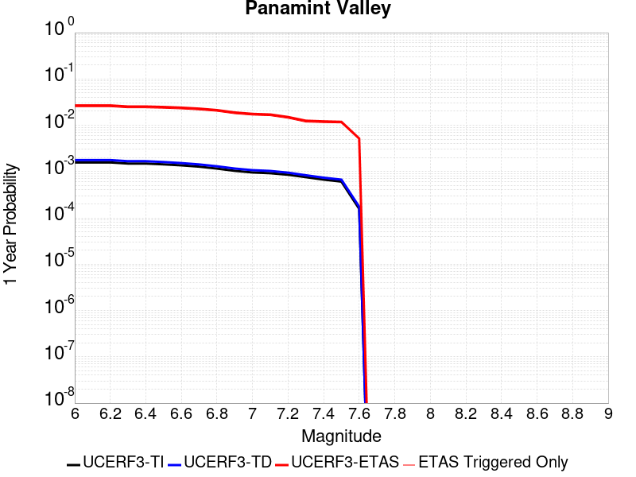 | 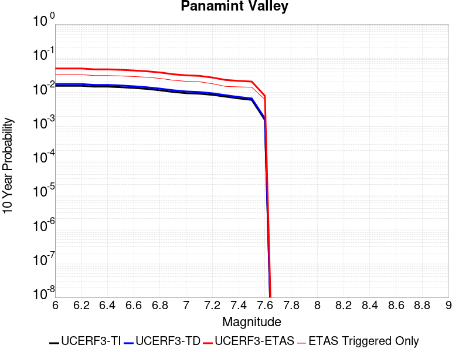 |

| Magnitude | 1 wk TI Prob | 1 wk TD Prob | 1 wk ETAS Prob | 1 wk ETAS/TD Gain | 1 wk ETAS Triggered Only | 1 mo TI Prob | 1 mo TD Prob | 1 mo ETAS Prob | 1 mo ETAS/TD Gain | 1 mo ETAS Triggered Only | 1 yr TI Prob | 1 yr TD Prob | 1 yr ETAS Prob | 1 yr ETAS/TD Gain | 1 yr ETAS Triggered Only | 10 yr TI Prob | 10 yr TD Prob | 10 yr ETAS Prob | 10 yr ETAS/TD Gain | 10 yr ETAS Triggered Only |
|-----|-----|-----|-----|-----|-----|-----|-----|-----|-----|-----|-----|-----|-----|-----|-----|-----|-----|-----|-----|-----|
| 6.0 | 3.0211835E-5 | 3.3984514E-5 | 0.013321204 | 391.97867 | 0.013287671 | 1.2947287E-4 | 1.4563995E-4 | 0.017342526 | 119.07809 | 0.017199391 | 0.0015751923 | 0.0017717537 | 0.026613507 | 15.020997 | 0.024885844 | 0.015640736 | 0.017583137 | 0.050135978 | 2.851367 | 0.033135463 |
| 6.1 | 3.0211835E-5 | 3.3984514E-5 | 0.013321204 | 391.97867 | 0.013287671 | 1.2947287E-4 | 1.4563995E-4 | 0.017342526 | 119.07809 | 0.017199391 | 0.0015751923 | 0.0017717537 | 0.026613507 | 15.020997 | 0.024885844 | 0.015640736 | 0.017583137 | 0.050135978 | 2.851367 | 0.033135463 |
| 6.2 | 3.0211835E-5 | 3.3984514E-5 | 0.013321204 | 391.97867 | 0.013287671 | 1.2947287E-4 | 1.4563995E-4 | 0.017342526 | 119.07809 | 0.017199391 | 0.0015751923 | 0.0017717537 | 0.026613507 | 15.020997 | 0.024885844 | 0.015640736 | 0.017583137 | 0.050135978 | 2.851367 | 0.033135463 |
| 6.3 | 2.8573924E-5 | 3.210268E-5 | 0.01277142 | 397.83032 | 0.012739726 | 1.2245393E-4 | 1.3757581E-4 | 0.016543234 | 120.24812 | 0.016407914 | 0.001489857 | 0.0016737265 | 0.025195934 | 15.053795 | 0.023561643 | 0.01479908 | 0.016617801 | 0.04731669 | 2.8473496 | 0.031217655 |
| 6.4 | 2.8573924E-5 | 3.210268E-5 | 0.01277142 | 397.83032 | 0.012739726 | 1.2245393E-4 | 1.3757581E-4 | 0.016543234 | 120.24812 | 0.016407914 | 0.001489857 | 0.0016737265 | 0.025195934 | 15.053795 | 0.023561643 | 0.01479908 | 0.016617801 | 0.04731669 | 2.8473496 | 0.031217655 |
| 6.5 | 2.7468774E-5 | 3.0828433E-5 | 0.012557078 | 407.32132 | 0.012526636 | 1.1771801E-4 | 1.3211532E-4 | 0.016187832 | 122.528046 | 0.016057838 | 0.0014322745 | 0.0016073446 | 0.024568856 | 15.28537 | 0.022998478 | 0.014230782 | 0.015963677 | 0.04585921 | 2.8727224 | 0.030380517 |
| 6.6 | 2.6135967E-5 | 2.925248E-5 | 0.012114135 | 414.12335 | 0.012085236 | 1.1200648E-4 | 1.253619E-4 | 0.015587655 | 124.34125 | 0.015464231 | 0.0013628257 | 0.0015252391 | 0.02363758 | 15.497623 | 0.022146119 | 0.013544982 | 0.015154043 | 0.04394992 | 2.9002109 | 0.029238965 |
| 6.7 | 2.4498746E-5 | 2.7341335E-5 | 0.011670859 | 426.85767 | 0.011643835 | 1.04990395E-4 | 1.1717203E-4 | 0.014909959 | 127.24845 | 0.01479452 | 0.0012775084 | 0.0014256609 | 0.022597868 | 15.850801 | 0.021202436 | 0.012701893 | 0.014171274 | 0.041615427 | 2.9366043 | 0.02783866 |
| 6.8 | 2.2244329E-5 | 2.4935423E-5 | 0.011029228 | 442.31158 | 0.011004566 | 9.532935E-5 | 1.0686185E-4 | 0.013925781 | 130.31573 | 0.013820396 | 0.0011600169 | 0.0013002884 | 0.021031069 | 16.174158 | 0.019756468 | 0.011539802 | 0.0129325185 | 0.03841298 | 2.970263 | 0.025814308 |
| 6.9 | 1.9902658E-5 | 2.2290267E-5 | 0.009915525 | 444.83652 | 0.009893456 | 8.529431E-5 | 9.552632E-5 | 0.012560089 | 131.48302 | 0.012465754 | 0.0010379635 | 0.0011624309 | 0.018645888 | 16.040428 | 0.017503805 | 0.010331288 | 0.011568608 | 0.034075357 | 2.9455018 | 0.022770168 |
| 7.0 | 1.8353881E-5 | 2.0566185E-5 | 0.009350663 | 454.66202 | 0.009330289 | 7.865712E-5 | 8.813792E-5 | 0.011852702 | 134.47903 | 0.011765601 | 9.5722964E-4 | 0.0010725686 | 0.017462885 | 16.281368 | 0.016407914 | 0.009531168 | 0.010678849 | 0.03162475 | 2.9614382 | 0.021171995 |
| 7.1 | 1.7667631E-5 | 1.9772613E-5 | 0.00906069 | 458.24445 | 0.009041096 | 7.571623E-5 | 8.473711E-5 | 0.011484075 | 135.52592 | 0.011400305 | 9.2145515E-4 | 0.0010312037 | 0.016920432 | 16.40843 | 0.015905632 | 0.009176437 | 0.010269073 | 0.030590946 | 2.9789395 | 0.020532725 |
| 7.2 | 1.6381597E-5 | 1.8158249E-5 | 0.007856676 | 432.67807 | 0.007838661 | 7.020495E-5 | 7.781885E-5 | 0.009955284 | 127.92896 | 0.009878234 | 8.544101E-4 | 9.4704994E-4 | 0.014754357 | 15.579281 | 0.013820396 | 0.008511325 | 0.009434792 | 0.027270997 | 2.8904715 | 0.018006088 |
| 7.3 | 1.4520491E-5 | 1.5966476E-5 | 0.0063020154 | 394.70297 | 0.0062861494 | 6.222919E-5 | 6.842605E-5 | 0.008119625 | 118.66278 | 0.00805175 | 7.57377E-4 | 8.327849E-4 | 0.012147555 | 14.586665 | 0.011324201 | 0.0075480095 | 0.00829975 | 0.02321299 | 2.79683 | 0.015038052 |
| 7.4 | 1.2852287E-5 | 1.4145411E-5 | 0.006178442 | 436.78064 | 0.0061643836 | 5.5080065E-5 | 6.062187E-5 | 0.007944467 | 131.04951 | 0.007884323 | 6.7039346E-4 | 7.378371E-4 | 0.0117342835 | 15.903624 | 0.011004566 | 0.0066837464 | 0.0073567946 | 0.021800736 | 2.963347 | 0.0145509895 |
| 7.5 | 1.1637851E-5 | 1.2836797E-5 | 0.006101039 | 475.2773 | 0.00608828 | 4.987555E-5 | 5.5013777E-5 | 0.007832363 | 142.37096 | 0.007777778 | 6.070656E-4 | 6.6960254E-4 | 0.011423432 | 17.060019 | 0.010761035 | 0.006054099 | 0.0066787465 | 0.020784816 | 3.1120834 | 0.014200913 |
| 7.6 | 3.0068115E-6 | 3.3330316E-6 | 0.0028191532 | 845.8225 | 0.0028158296 | 1.2886271E-5 | 1.4284384E-5 | 0.0036519798 | 255.6624 | 0.0036377474 | 1.5687906E-4 | 1.7390578E-4 | 0.0050741187 | 29.177402 | 0.0049010655 | 0.0015676835 | 0.0017391363 | 0.007953576 | 4.573291 | 0.0062252665 |

## Garlock (East)
*[(top)](#table-of-contents)*

| 1 Week | 1 Month | 1 Year | 10 Year |
|-----|-----|-----|-----|
|  | 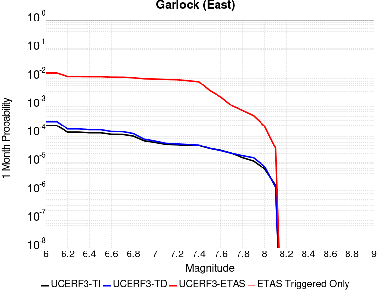 | 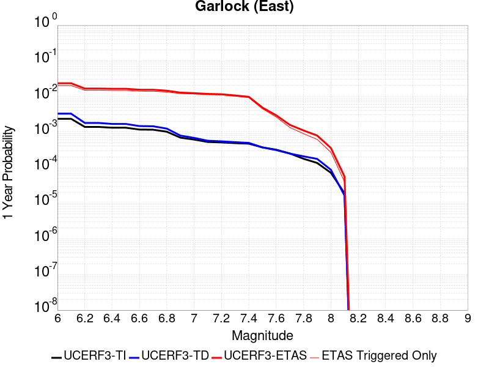 | 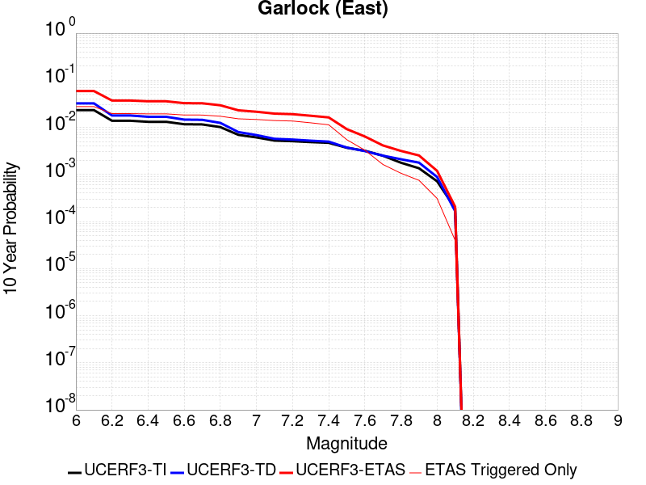 |

| Magnitude | 1 wk TI Prob | 1 wk TD Prob | 1 wk ETAS Prob | 1 wk ETAS/TD Gain | 1 wk ETAS Triggered Only | 1 mo TI Prob | 1 mo TD Prob | 1 mo ETAS Prob | 1 mo ETAS/TD Gain | 1 mo ETAS Triggered Only | 1 yr TI Prob | 1 yr TD Prob | 1 yr ETAS Prob | 1 yr ETAS/TD Gain | 1 yr ETAS Triggered Only | 10 yr TI Prob | 10 yr TD Prob | 10 yr ETAS Prob | 10 yr ETAS/TD Gain | 10 yr ETAS Triggered Only |
|-----|-----|-----|-----|-----|-----|-----|-----|-----|-----|-----|-----|-----|-----|-----|-----|-----|-----|-----|-----|-----|
| 6.0 | 4.5092507E-5 | 6.290325E-5 | 0.010260131 | 163.10971 | 0.0101978695 | 1.9323928E-4 | 2.6956003E-4 | 0.013979714 | 51.86123 | 0.013713851 | 0.0023501497 | 0.0032774 | 0.023788342 | 7.258297 | 0.020578386 | 0.023254504 | 0.032351844 | 0.059363514 | 1.8349345 | 0.027914764 |
| 6.1 | 4.5092507E-5 | 6.290325E-5 | 0.010260131 | 163.10971 | 0.0101978695 | 1.9323928E-4 | 2.6956003E-4 | 0.013979714 | 51.86123 | 0.013713851 | 0.0023501497 | 0.0032774 | 0.023788342 | 7.258297 | 0.020578386 | 0.023254504 | 0.032351844 | 0.059363514 | 1.8349345 | 0.027914764 |
| 6.2 | 2.6674514E-5 | 3.4509674E-5 | 0.00791856 | 229.45914 | 0.007884323 | 1.1431433E-4 | 1.4789042E-4 | 0.010511654 | 71.077324 | 0.010365297 | 0.0013908884 | 0.0017991117 | 0.016901268 | 9.394229 | 0.015129376 | 0.01382215 | 0.017890299 | 0.03729332 | 2.0845554 | 0.019756468 |
| 6.3 | 2.6674514E-5 | 3.4509674E-5 | 0.00791856 | 229.45914 | 0.007884323 | 1.1431433E-4 | 1.4789042E-4 | 0.010511654 | 71.077324 | 0.010365297 | 0.0013908884 | 0.0017991117 | 0.016901268 | 9.394229 | 0.015129376 | 0.01382215 | 0.017890299 | 0.03729332 | 2.0845554 | 0.019756468 |
| 6.4 | 2.5312667E-5 | 3.233893E-5 | 0.007870746 | 243.38301 | 0.007838661 | 1.0847834E-4 | 1.3858822E-4 | 0.0104263555 | 75.23263 | 0.010289193 | 0.0013199237 | 0.0016860351 | 0.016653147 | 9.877106 | 0.01499239 | 0.013121112 | 0.016778335 | 0.035978843 | 2.1443632 | 0.019528158 |
| 6.5 | 2.5312667E-5 | 3.233893E-5 | 0.007870746 | 243.38301 | 0.007838661 | 1.0847834E-4 | 1.3858822E-4 | 0.0104263555 | 75.23263 | 0.010289193 | 0.0013199237 | 0.0016860351 | 0.016653147 | 9.877106 | 0.01499239 | 0.013121112 | 0.016778335 | 0.035978843 | 2.1443632 | 0.019528158 |
| 6.6 | 2.246556E-5 | 2.8133776E-5 | 0.007592609 | 269.8752 | 0.007564688 | 9.627742E-5 | 1.20567885E-4 | 0.009997611 | 82.92101 | 0.009878234 | 0.0011715472 | 0.0014669491 | 0.015601436 | 10.635294 | 0.014155251 | 0.011653901 | 0.01461866 | 0.032691482 | 2.2362845 | 0.018340943 |
| 6.7 | 2.2241198E-5 | 2.7803519E-5 | 0.0075922813 | 273.06906 | 0.007564688 | 9.531594E-5 | 1.1915263E-4 | 0.00999621 | 83.894165 | 0.009878234 | 0.0011598538 | 0.0014497414 | 0.015584471 | 10.749828 | 0.014155251 | 0.011538187 | 0.014448853 | 0.032509793 | 2.249991 | 0.018325724 |
| 6.8 | 1.9528685E-5 | 2.389819E-5 | 0.007238338 | 302.88223 | 0.007214612 | 8.369167E-5 | 1.0241691E-4 | 0.0095382845 | 93.13193 | 0.009436834 | 0.0010184698 | 0.0012462323 | 0.01474537 | 11.83196 | 0.013515982 | 0.010138147 | 0.012436427 | 0.029572234 | 2.377872 | 0.017351598 |
| 6.9 | 1.3318621E-5 | 1.5198884E-5 | 0.0068491893 | 450.63763 | 0.0068340944 | 5.7078556E-5 | 6.513648E-5 | 0.008892568 | 136.52206 | 0.008828006 | 6.9470983E-4 | 7.927538E-4 | 0.013096538 | 16.52031 | 0.012313547 | 0.0069254204 | 0.007939888 | 0.023311535 | 2.936003 | 0.015494673 |
| 7.0 | 1.1760853E-5 | 1.31077895E-5 | 0.006710128 | 511.91913 | 0.006697108 | 5.0402683E-5 | 5.6175057E-5 | 0.008716267 | 155.16258 | 0.008660578 | 6.134799E-4 | 6.8372174E-4 | 0.012623802 | 18.463362 | 0.011948249 | 0.0061178906 | 0.00685652 | 0.021761231 | 3.173801 | 0.01500761 |
| 7.1 | 1.0064758E-5 | 1.0902931E-5 | 0.006555733 | 601.28174 | 0.006544901 | 4.3133965E-5 | 4.672603E-5 | 0.00846338 | 181.12775 | 0.008417048 | 5.2502943E-4 | 5.687444E-4 | 0.012038625 | 21.167023 | 0.011476408 | 0.005237907 | 0.0057129986 | 0.019847916 | 3.4741678 | 0.014216134 |
| 7.2 | 9.768808E-6 | 1.0498807E-5 | 0.006464008 | 615.68976 | 0.006453577 | 4.186565E-5 | 4.499413E-5 | 0.008339902 | 185.35535 | 0.008295282 | 5.095951E-4 | 5.4766936E-4 | 0.011835244 | 21.610199 | 0.01129376 | 0.0050842804 | 0.0055032647 | 0.019368699 | 3.5194924 | 0.013942162 |
| 7.3 | 9.344516E-6 | 9.944468E-6 | 0.0059611793 | 599.4468 | 0.0059512937 | 4.004731E-5 | 4.261847E-5 | 0.007637424 | 179.20456 | 0.0075951293 | 4.8746695E-4 | 5.1875977E-4 | 0.010909105 | 21.029203 | 0.010395738 | 0.0048639905 | 0.0052149445 | 0.017933657 | 3.4388971 | 0.012785388 |
| 7.4 | 9.023491E-6 | 9.490661E-6 | 0.005519332 | 581.554 | 0.0055098934 | 3.867153E-5 | 4.0673647E-5 | 0.0069810306 | 171.63522 | 0.006940639 | 4.7072413E-4 | 4.950925E-4 | 0.009988107 | 20.174225 | 0.009497717 | 0.004697283 | 0.0049783974 | 0.016503686 | 3.31506 | 0.011582953 |
| 7.5 | 7.081253E-6 | 7.087672E-6 | 0.0028076766 | 396.13525 | 0.0028006088 | 3.0347876E-5 | 3.0375388E-5 | 0.0034853693 | 114.74321 | 0.003455099 | 3.6942272E-4 | 3.6975832E-4 | 0.0050255703 | 13.5915 | 0.0046575344 | 0.003688092 | 0.0037243143 | 0.009289507 | 2.4942865 | 0.005585997 |
| 7.6 | 6.116396E-6 | 5.959245E-6 | 0.0016954469 | 284.50702 | 0.0016894977 | 2.6212863E-5 | 2.5539372E-5 | 0.0021411628 | 83.83772 | 0.0021156773 | 3.1909486E-4 | 3.1089774E-4 | 0.0031410677 | 10.103218 | 0.0028310502 | 0.0031863707 | 0.0031357552 | 0.0065951925 | 2.103223 | 0.0034703196 |
| 7.7 | 4.797145E-6 | 4.757281E-6 | 8.266712E-4 | 173.76967 | 8.219178E-4 | 2.055903E-5 | 2.0388188E-5 | 0.0010553747 | 51.764023 | 0.0010350076 | 2.5027743E-4 | 2.4819805E-4 | 0.0016633718 | 6.7017927 | 0.0014155251 | 0.0024999576 | 0.0025093474 | 0.004209788 | 1.6776426 | 0.0017047185 |
| 7.8 | 3.4028885E-6 | 3.978462E-6 | 6.280247E-4 | 157.85616 | 6.240487E-4 | 1.4583726E-5 | 1.7050439E-5 | 7.476316E-4 | 43.848232 | 7.3059363E-4 | 1.775424E-4 | 2.0756939E-4 | 0.001181492 | 5.692034 | 9.741248E-4 | 0.0017740062 | 0.0021012232 | 0.0032251882 | 1.53491 | 0.0011263319 |
| 7.9 | 2.5928412E-6 | 3.3724489E-6 | 4.1432996E-4 | 122.8573 | 4.109589E-4 | 1.1112129E-5 | 1.4453272E-5 | 4.7106767E-4 | 32.592457 | 4.56621E-4 | 1.3528178E-4 | 1.7595445E-4 | 8.455474E-4 | 4.8054905 | 6.697108E-4 | 0.0013519945 | 0.0017812408 | 0.0025713074 | 1.4435484 | 7.914764E-4 |
| 8.0 | 1.3743648E-6 | 1.6734747E-6 | 1.691009E-4 | 101.047775 | 1.674277E-4 | 5.8901214E-6 | 7.1720146E-6 | 2.050397E-4 | 28.588856 | 1.978691E-4 | 7.1709874E-5 | 8.731581E-5 | 3.6126448E-4 | 4.1374464 | 2.739726E-4 | 7.1686733E-4 | 8.837234E-4 | 0.0011878683 | 1.3441631 | 3.0441402E-4 |
| 8.1 | 3.6733252E-7 | 3.1489964E-7 | 1.5535596E-5 | 49.335068 | 1.52207E-5 | 1.5742813E-6 | 1.3495693E-6 | 4.7011607E-5 | 34.834526 | 4.5662102E-5 | 1.9166706E-5 | 1.6430899E-5 | 6.209225E-5 | 3.778993 | 4.5662102E-5 | 1.9165053E-4 | 1.6638759E-4 | 2.1204208E-4 | 1.2743865 | 4.5662102E-5 |

## Hunter Mountain-Saline Valley
*[(top)](#table-of-contents)*

| 1 Week | 1 Month | 1 Year | 10 Year |
|-----|-----|-----|-----|
| 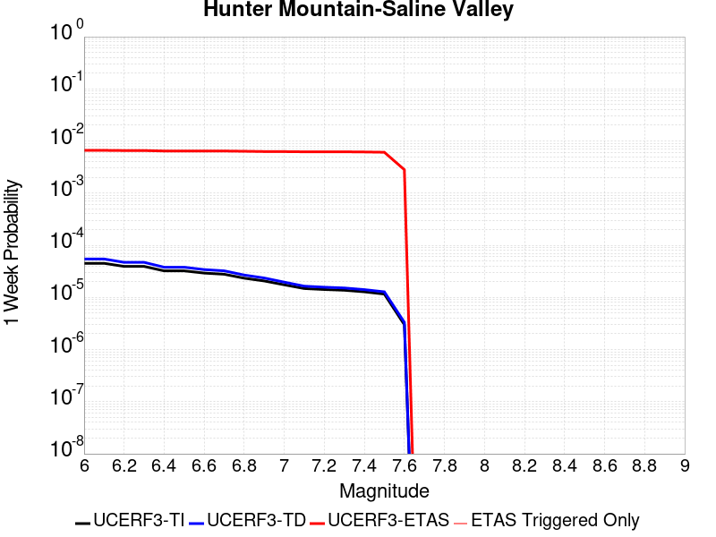 | 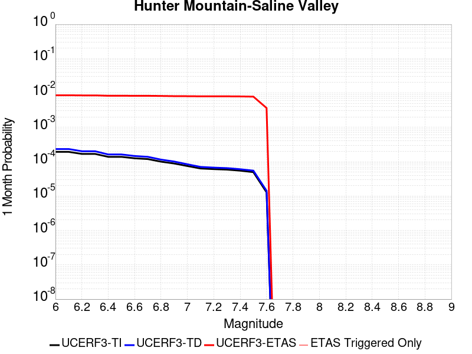 | 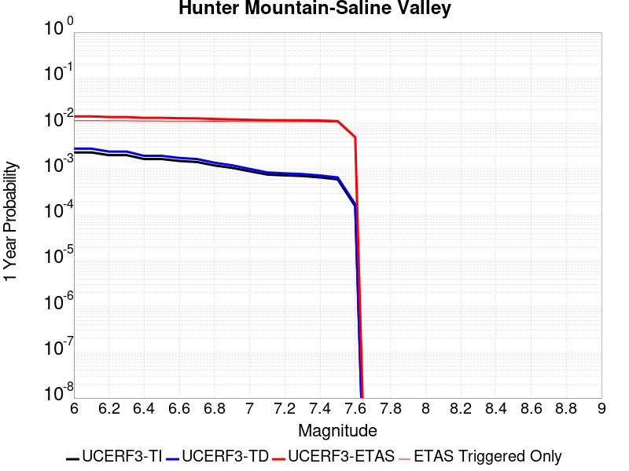 | 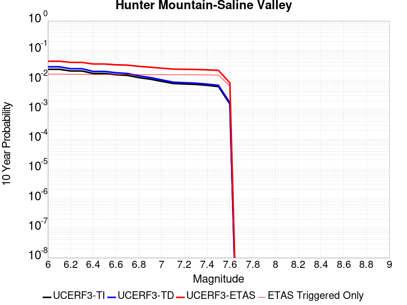 |

| Magnitude | 1 wk TI Prob | 1 wk TD Prob | 1 wk ETAS Prob | 1 wk ETAS/TD Gain | 1 wk ETAS Triggered Only | 1 mo TI Prob | 1 mo TD Prob | 1 mo ETAS Prob | 1 mo ETAS/TD Gain | 1 mo ETAS Triggered Only | 1 yr TI Prob | 1 yr TD Prob | 1 yr ETAS Prob | 1 yr ETAS/TD Gain | 1 yr ETAS Triggered Only | 10 yr TI Prob | 10 yr TD Prob | 10 yr ETAS Prob | 10 yr ETAS/TD Gain | 10 yr ETAS Triggered Only |
|-----|-----|-----|-----|-----|-----|-----|-----|-----|-----|-----|-----|-----|-----|-----|-----|-----|-----|-----|-----|-----|
| 6.0 | 4.5103672E-5 | 5.4570177E-5 | 0.006614334 | 121.207855 | 0.0065601217 | 1.9328714E-4 | 2.3385242E-4 | 0.008572846 | 36.65921 | 0.008340944 | 0.002350731 | 0.0028435152 | 0.014439064 | 5.0778923 | 0.011628615 | 0.023260195 | 0.028091887 | 0.043003354 | 1.5308105 | 0.015342466 |
| 6.1 | 4.5103672E-5 | 5.4570177E-5 | 0.006614334 | 121.207855 | 0.0065601217 | 1.9328714E-4 | 2.3385242E-4 | 0.008572846 | 36.65921 | 0.008340944 | 0.002350731 | 0.0028435152 | 0.014439064 | 5.0778923 | 0.011628615 | 0.023260195 | 0.028091887 | 0.043003354 | 1.5308105 | 0.015342466 |
| 6.2 | 3.9363465E-5 | 4.706337E-5 | 0.0065612164 | 139.41238 | 0.00651446 | 1.6868966E-4 | 2.0168544E-4 | 0.008495294 | 42.121502 | 0.008295282 | 0.002051862 | 0.0024528175 | 0.013992176 | 5.704532 | 0.011567732 | 0.020330196 | 0.024273481 | 0.039154425 | 1.6130536 | 0.015251142 |
| 6.3 | 3.9363465E-5 | 4.706337E-5 | 0.0065612164 | 139.41238 | 0.00651446 | 1.6868966E-4 | 2.0168544E-4 | 0.008495294 | 42.121502 | 0.008295282 | 0.002051862 | 0.0024528175 | 0.013992176 | 5.704532 | 0.011567732 | 0.020330196 | 0.024273481 | 0.039154425 | 1.6130536 | 0.015251142 |
| 6.4 | 3.2311684E-5 | 3.795099E-5 | 0.0064304024 | 169.43965 | 0.006392694 | 1.384713E-4 | 1.6263737E-4 | 0.008304387 | 51.06076 | 0.008143075 | 0.0016845843 | 0.0019783843 | 0.013386516 | 6.766388 | 0.011430746 | 0.016718714 | 0.019616475 | 0.034389377 | 1.7530866 | 0.015068493 |
| 6.5 | 3.2311684E-5 | 3.795099E-5 | 0.0064304024 | 169.43965 | 0.006392694 | 1.384713E-4 | 1.6263737E-4 | 0.008304387 | 51.06076 | 0.008143075 | 0.0016845843 | 0.0019783843 | 0.013386516 | 6.766388 | 0.011430746 | 0.016718714 | 0.019616475 | 0.034389377 | 1.7530866 | 0.015068493 |
| 6.6 | 2.9305844E-5 | 3.418183E-5 | 0.0064266576 | 188.01384 | 0.006392694 | 1.2559042E-4 | 1.4648569E-4 | 0.008273149 | 56.477524 | 0.008127854 | 0.0015279909 | 0.001782067 | 0.013146861 | 7.3773103 | 0.011385084 | 0.015175272 | 0.01768569 | 0.03242788 | 1.833566 | 0.01500761 |
| 6.7 | 2.7826512E-5 | 3.2344276E-5 | 0.0064248317 | 198.63892 | 0.006392694 | 1.19251024E-4 | 1.386113E-4 | 0.008265339 | 59.629616 | 0.008127854 | 0.0014509142 | 0.0016863465 | 0.013052231 | 7.7399464 | 0.011385084 | 0.014414776 | 0.016743187 | 0.03149952 | 1.8813337 | 0.01500761 |
| 6.8 | 2.3389874E-5 | 2.6866714E-5 | 0.006358508 | 236.66861 | 0.006331811 | 1.0023846E-4 | 1.15138246E-4 | 0.008181181 | 71.05528 | 0.008066971 | 0.00121972 | 0.001400954 | 0.012678891 | 9.050184 | 0.01129376 | 0.01213047 | 0.013927434 | 0.028605957 | 2.0539289 | 0.014885845 |
| 6.9 | 2.069209E-5 | 2.3570032E-5 | 0.0062791305 | 266.40314 | 0.0062557077 | 8.867737E-5 | 1.01010715E-4 | 0.008075852 | 79.95045 | 0.007975647 | 0.0010791123 | 0.0012291478 | 0.01238741 | 10.078048 | 0.011171994 | 0.010738871 | 0.012228523 | 0.026797025 | 2.191354 | 0.014748858 |
| 7.0 | 1.7462342E-5 | 1.9633546E-5 | 0.0062599983 | 318.84195 | 0.006240487 | 7.483646E-5 | 8.414118E-5 | 0.008043897 | 95.600006 | 0.007960427 | 9.1075303E-4 | 0.0010239601 | 0.012154104 | 11.869705 | 0.011141553 | 0.009070295 | 0.0101960525 | 0.0247644 | 2.4288223 | 0.014718417 |
| 7.1 | 1.4807709E-5 | 1.6441749E-5 | 0.006211165 | 377.76788 | 0.006194825 | 6.3460066E-5 | 7.046283E-5 | 0.007984669 | 113.31747 | 0.007914764 | 7.723524E-4 | 8.575638E-4 | 0.011928732 | 13.910022 | 0.01108067 | 0.007696735 | 0.008545532 | 0.02307781 | 2.7005703 | 0.014657535 |
| 7.2 | 1.4180048E-5 | 1.5698337E-5 | 0.006210426 | 395.61047 | 0.006194825 | 6.077022E-5 | 6.727694E-5 | 0.007981509 | 118.63661 | 0.007914764 | 7.396263E-4 | 8.188051E-4 | 0.011890402 | 14.52165 | 0.01108067 | 0.0073716943 | 0.008160833 | 0.02269875 | 2.7814255 | 0.014657535 |
| 7.3 | 1.3730402E-5 | 1.5172075E-5 | 0.006209903 | 409.2982 | 0.006194825 | 5.8843252E-5 | 6.502165E-5 | 0.007979271 | 122.71714 | 0.007914764 | 7.161811E-4 | 7.9136714E-4 | 0.0118480595 | 14.971634 | 0.011065449 | 0.007138774 | 0.007888422 | 0.022400131 | 2.839621 | 0.0146270925 |
| 7.4 | 1.2810095E-5 | 1.4109277E-5 | 0.0061631855 | 436.81793 | 0.006149163 | 5.489925E-5 | 6.0467017E-5 | 0.007929093 | 131.13087 | 0.007869102 | 6.681934E-4 | 7.359531E-4 | 0.0117172105 | 15.921139 | 0.010989346 | 0.006661878 | 0.007338053 | 0.021767158 | 2.9663396 | 0.014535769 |
| 7.5 | 1.1595659E-5 | 1.2800664E-5 | 0.0060857823 | 475.4271 | 0.0060730595 | 4.9694736E-5 | 5.4858923E-5 | 0.00781699 | 142.4926 | 0.007762557 | 6.0486543E-4 | 6.6771836E-4 | 0.011406357 | 17.082588 | 0.010745814 | 0.006032217 | 0.0066599925 | 0.020751208 | 3.1158006 | 0.014185692 |
| 7.6 | 2.997694E-6 | 3.3251579E-6 | 0.0028191453 | 847.823 | 0.0028158296 | 1.28471975E-5 | 1.425064E-5 | 0.003651946 | 256.2654 | 0.0036377474 | 1.564034E-4 | 1.73495E-4 | 0.0050737103 | 29.244127 | 0.0049010655 | 0.0015629337 | 0.001735031 | 0.007949497 | 4.5817604 | 0.0062252665 |

## Ash Hill
*[(top)](#table-of-contents)*

| 1 Week | 1 Month | 1 Year | 10 Year |
|-----|-----|-----|-----|
| 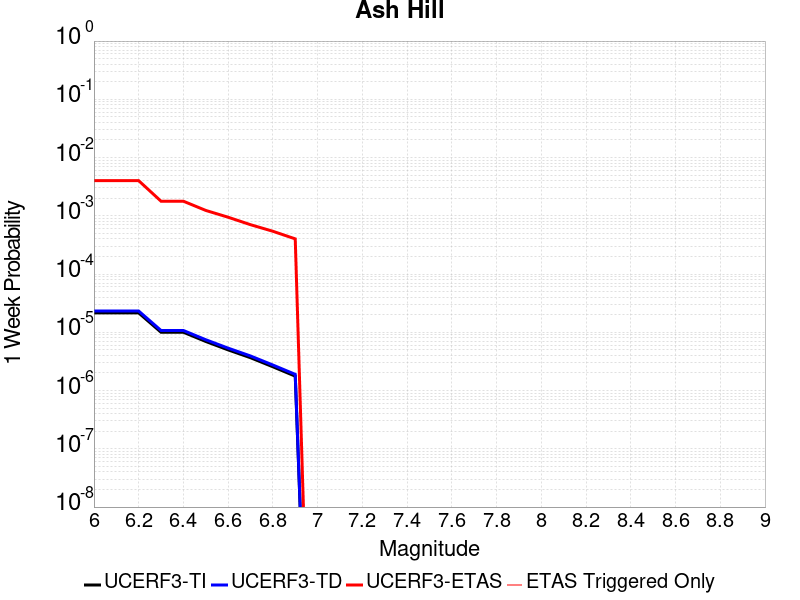 | 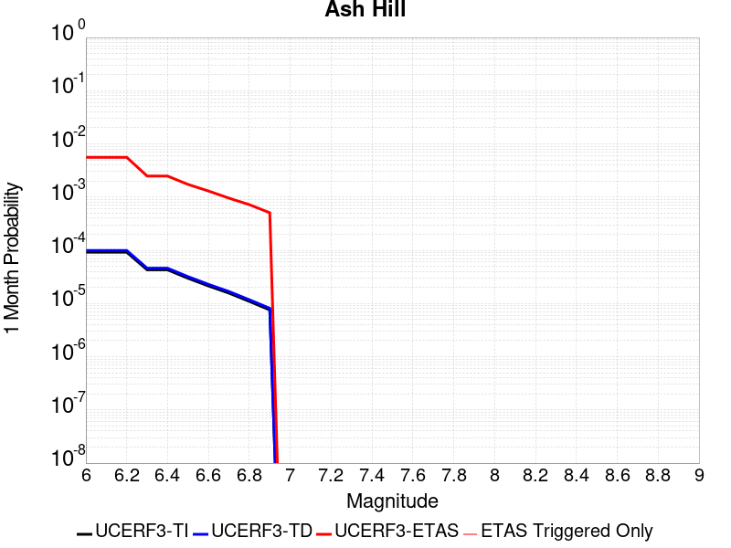 | 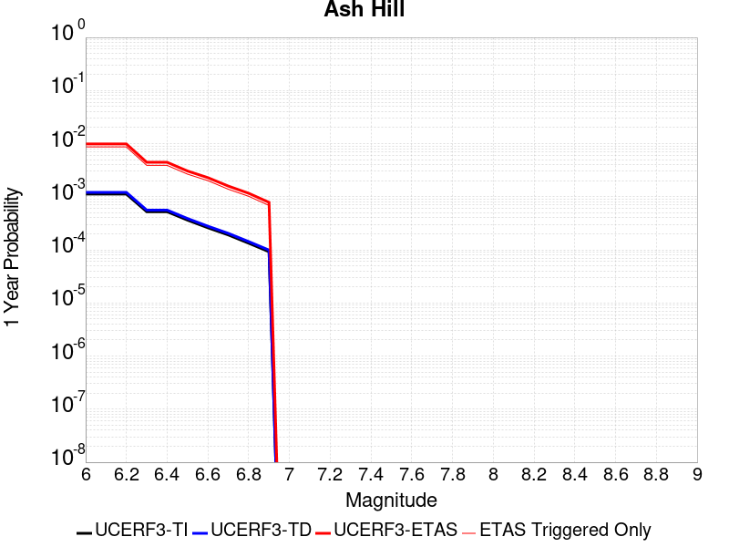 | 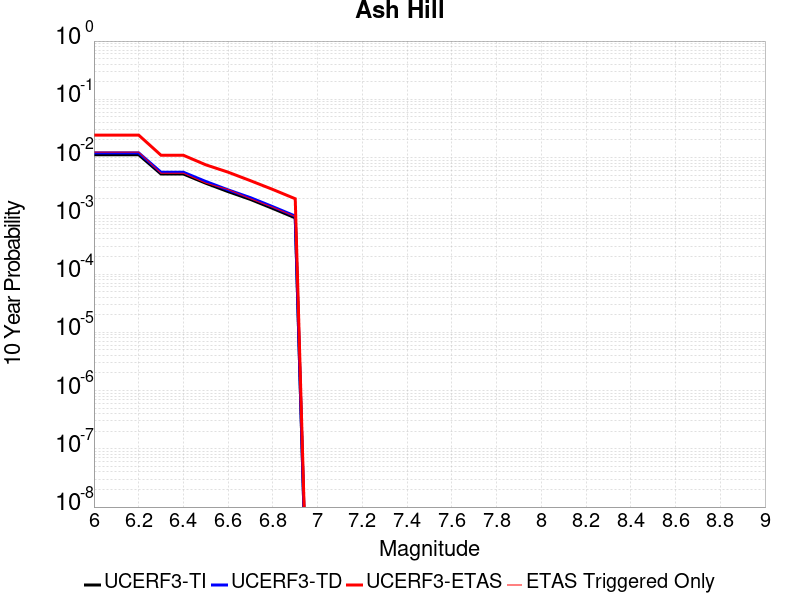 |

| Magnitude | 1 wk TI Prob | 1 wk TD Prob | 1 wk ETAS Prob | 1 wk ETAS/TD Gain | 1 wk ETAS Triggered Only | 1 mo TI Prob | 1 mo TD Prob | 1 mo ETAS Prob | 1 mo ETAS/TD Gain | 1 mo ETAS Triggered Only | 1 yr TI Prob | 1 yr TD Prob | 1 yr ETAS Prob | 1 yr ETAS/TD Gain | 1 yr ETAS Triggered Only | 10 yr TI Prob | 10 yr TD Prob | 10 yr ETAS Prob | 10 yr ETAS/TD Gain | 10 yr ETAS Triggered Only |
|-----|-----|-----|-----|-----|-----|-----|-----|-----|-----|-----|-----|-----|-----|-----|-----|-----|-----|-----|-----|-----|
| 6.0 | 2.1545662E-5 | 2.3194447E-5 | 0.0040413663 | 174.23853 | 0.004018265 | 9.2335285E-5 | 9.940143E-5 | 0.0057457197 | 57.80319 | 0.00564688 | 0.0011236023 | 0.0012096206 | 0.009874925 | 8.163655 | 0.008675799 | 0.011179381 | 0.012038348 | 0.024308922 | 2.0192904 | 0.012420092 |
| 6.1 | 2.1545662E-5 | 2.3194447E-5 | 0.0040413663 | 174.23853 | 0.004018265 | 9.2335285E-5 | 9.940143E-5 | 0.0057457197 | 57.80319 | 0.00564688 | 0.0011236023 | 0.0012096206 | 0.009874925 | 8.163655 | 0.008675799 | 0.011179381 | 0.012038348 | 0.024308922 | 2.0192904 | 0.012420092 |
| 6.2 | 2.1545662E-5 | 2.3194447E-5 | 0.0040413663 | 174.23853 | 0.004018265 | 9.2335285E-5 | 9.940143E-5 | 0.0057457197 | 57.80319 | 0.00564688 | 0.0011236023 | 0.0012096206 | 0.009874925 | 8.163655 | 0.008675799 | 0.011179381 | 0.012038348 | 0.024308922 | 2.0192904 | 0.012420092 |
| 6.3 | 1.0025529E-5 | 1.0746934E-5 | 0.0017915497 | 166.70332 | 0.001780822 | 4.2965847E-5 | 4.605755E-5 | 0.0025421374 | 55.1948 | 0.0024961948 | 5.229836E-4 | 5.6061964E-4 | 0.0044549345 | 7.9464474 | 0.0038964993 | 0.005217545 | 0.0055933665 | 0.010951356 | 1.9579186 | 0.0053881276 |
| 6.4 | 1.0025529E-5 | 1.0746934E-5 | 0.0017915497 | 166.70332 | 0.001780822 | 4.2965847E-5 | 4.605755E-5 | 0.0025421374 | 55.1948 | 0.0024961948 | 5.229836E-4 | 5.6061964E-4 | 0.0044549345 | 7.9464474 | 0.0038964993 | 0.005217545 | 0.0055933665 | 0.010951356 | 1.9579186 | 0.0053881276 |
| 6.5 | 6.9617327E-6 | 7.456634E-6 | 0.0012555447 | 168.37956 | 0.0012480974 | 2.9835655E-5 | 3.195666E-5 | 0.0017822812 | 55.771824 | 0.0017503805 | 3.6318856E-4 | 3.8901155E-4 | 0.0030515979 | 7.844492 | 0.0026636226 | 0.0036259557 | 0.0038841602 | 0.0075077782 | 1.9329218 | 0.0036377474 |
| 6.6 | 4.9919777E-6 | 5.3466883E-6 | 9.794662E-4 | 183.19121 | 9.741248E-4 | 2.1394015E-5 | 2.2914215E-5 | 0.0013623051 | 59.452404 | 0.0013394216 | 2.60441E-4 | 2.7895154E-4 | 0.0022875236 | 8.200433 | 0.0020091324 | 0.0026013597 | 0.0027866727 | 0.0056098336 | 2.013094 | 0.0028310502 |
| 6.7 | 3.6630722E-6 | 3.924624E-6 | 6.8885344E-4 | 175.52089 | 6.849315E-4 | 1.5698786E-5 | 1.681974E-5 | 9.604873E-4 | 57.104763 | 9.4368344E-4 | 1.9111596E-4 | 2.0476682E-4 | 0.0015895669 | 7.7628145 | 0.0013850838 | 0.0019095168 | 0.0020463446 | 0.0040057967 | 1.9575379 | 0.0019634704 |
| 6.8 | 2.5599613E-6 | 2.744925E-6 | 5.202473E-4 | 189.53061 | 5.175038E-4 | 1.0971216E-5 | 1.1763939E-5 | 6.966874E-4 | 59.222286 | 6.849315E-4 | 1.3356637E-4 | 1.4322149E-4 | 0.0011628624 | 8.1193285 | 0.0010197869 | 0.0013348613 | 0.0014317769 | 0.0028300765 | 1.9766183 | 0.0014003044 |
| 6.9 | 1.7684905E-6 | 1.8968707E-6 | 4.12855E-4 | 217.65057 | 4.109589E-4 | 7.579223E-6 | 8.129446E-6 | 5.104085E-4 | 62.78515 | 5.022831E-4 | 9.2273134E-5 | 9.8976E-5 | 7.838397E-4 | 7.9194922 | 6.849315E-4 | 9.223483E-4 | 9.8976E-4 | 0.0019629207 | 1.9832289 | 9.741248E-4 |

## Blackwater
*[(top)](#table-of-contents)*

| 1 Week | 1 Month | 1 Year | 10 Year |
|-----|-----|-----|-----|
| 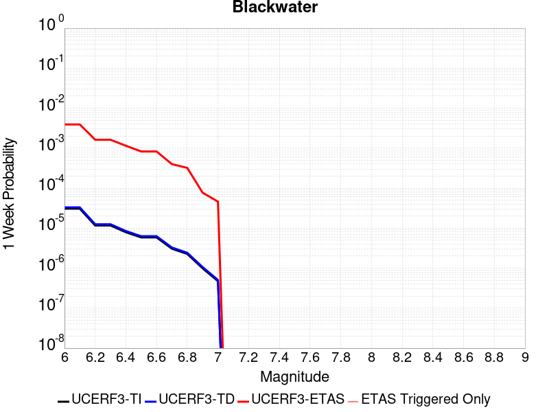 | 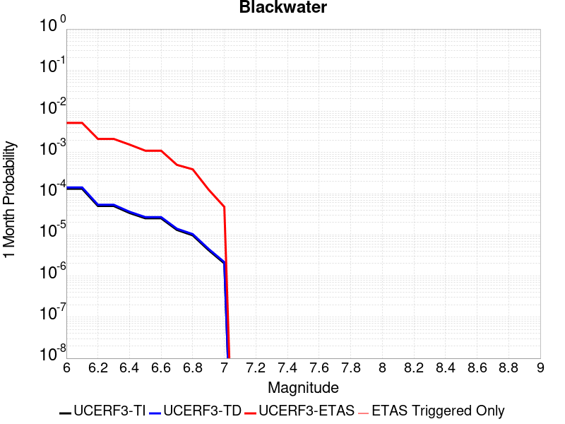 | 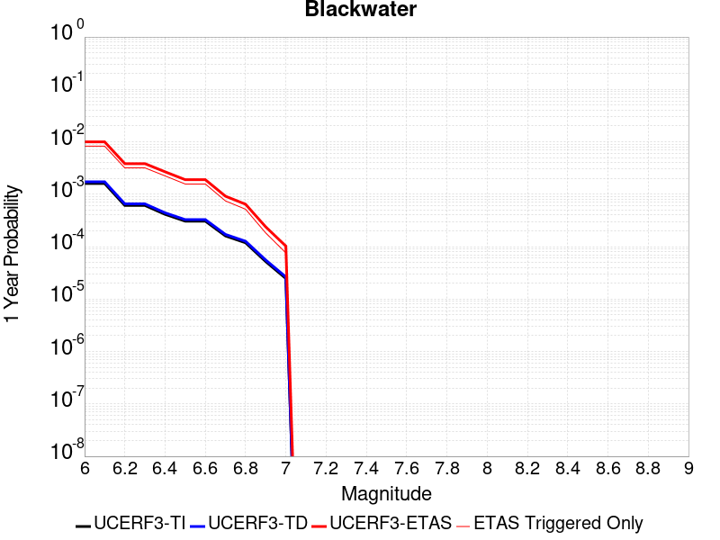 | 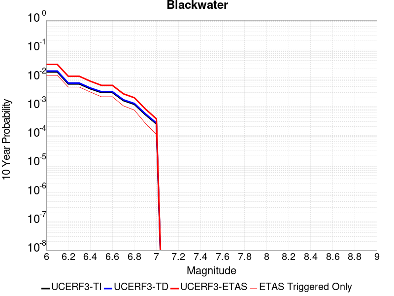 |

| Magnitude | 1 wk TI Prob | 1 wk TD Prob | 1 wk ETAS Prob | 1 wk ETAS/TD Gain | 1 wk ETAS Triggered Only | 1 mo TI Prob | 1 mo TD Prob | 1 mo ETAS Prob | 1 mo ETAS/TD Gain | 1 mo ETAS Triggered Only | 1 yr TI Prob | 1 yr TD Prob | 1 yr ETAS Prob | 1 yr ETAS/TD Gain | 1 yr ETAS Triggered Only | 10 yr TI Prob | 10 yr TD Prob | 10 yr ETAS Prob | 10 yr ETAS/TD Gain | 10 yr ETAS Triggered Only |
|-----|-----|-----|-----|-----|-----|-----|-----|-----|-----|-----|-----|-----|-----|-----|-----|-----|-----|-----|-----|-----|
| 6.0 | 3.0708583E-5 | 3.3095846E-5 | 0.003929466 | 118.72988 | 0.0038964993 | 1.3160157E-4 | 1.4183241E-4 | 0.0052400436 | 36.94532 | 0.0050989348 | 0.0016010714 | 0.0017255784 | 0.009960962 | 5.7725353 | 0.008249619 | 0.015895851 | 0.017135633 | 0.02910354 | 1.6984222 | 0.01217656 |
| 6.1 | 3.0708583E-5 | 3.3095846E-5 | 0.003929466 | 118.72988 | 0.0038964993 | 1.3160157E-4 | 1.4183241E-4 | 0.0052400436 | 36.94532 | 0.0050989348 | 0.0016010714 | 0.0017255784 | 0.009960962 | 5.7725353 | 0.008249619 | 0.015895851 | 0.017135633 | 0.02910354 | 1.6984222 | 0.01217656 |
| 6.2 | 1.1707779E-5 | 1.2545122E-5 | 0.0016259191 | 129.60568 | 0.0016133942 | 5.017523E-5 | 5.3763757E-5 | 0.0021388875 | 39.783077 | 0.002085236 | 6.107122E-4 | 6.5438676E-4 | 0.0038334313 | 5.858052 | 0.0031811264 | 0.006090366 | 0.0065255696 | 0.011228317 | 1.7206647 | 0.004733638 |
| 6.3 | 1.1707779E-5 | 1.2545122E-5 | 0.0016259191 | 129.60568 | 0.0016133942 | 5.017523E-5 | 5.3763757E-5 | 0.0021388875 | 39.783077 | 0.002085236 | 6.107122E-4 | 6.5438676E-4 | 0.0038334313 | 5.858052 | 0.0031811264 | 0.006090366 | 0.0065255696 | 0.011228317 | 1.7206647 | 0.004733638 |
| 6.4 | 7.929244E-6 | 8.480098E-6 | 0.001150023 | 135.61435 | 0.0011415525 | 3.3982033E-5 | 3.6342793E-5 | 0.0015583575 | 42.87941 | 0.00152207 | 4.136527E-4 | 4.423877E-4 | 0.002678841 | 6.055414 | 0.0022374429 | 0.0041288356 | 0.0044154758 | 0.007582556 | 1.7172681 | 0.0031811264 |
| 6.5 | 5.8832115E-6 | 6.285991E-6 | 8.281986E-4 | 131.75308 | 8.219178E-4 | 2.521352E-5 | 2.6939697E-5 | 0.0011075803 | 41.113316 | 0.0010806697 | 3.0693135E-4 | 3.27944E-4 | 0.0018951619 | 5.7789197 | 0.0015677321 | 0.0030650778 | 0.0032748538 | 0.005444286 | 1.6624516 | 0.0021765602 |
| 6.6 | 5.8832115E-6 | 6.285991E-6 | 8.281986E-4 | 131.75308 | 8.219178E-4 | 2.521352E-5 | 2.6939697E-5 | 0.0011075803 | 41.113316 | 0.0010806697 | 3.0693135E-4 | 3.27944E-4 | 0.0018951619 | 5.7789197 | 0.0015677321 | 0.0030650778 | 0.0032748538 | 0.005444286 | 1.6624516 | 0.0021765602 |
| 6.7 | 3.0715053E-6 | 3.2814662E-6 | 3.9901838E-4 | 121.59759 | 3.957382E-4 | 1.3163528E-5 | 1.4063357E-5 | 5.011189E-4 | 35.63295 | 4.870624E-4 | 1.6025416E-4 | 1.7120909E-4 | 9.168957E-4 | 5.355415 | 7.458143E-4 | 0.0016013865 | 0.0017108864 | 0.0027593179 | 1.6128001 | 0.0010502283 |
| 6.8 | 2.2722281E-6 | 2.4287538E-6 | 3.2206267E-4 | 132.6041 | 3.196347E-4 | 9.738084E-6 | 1.0408908E-5 | 3.9092245E-4 | 37.55653 | 3.805175E-4 | 1.1855473E-4 | 1.26722E-4 | 6.441602E-4 | 5.083255 | 5.175038E-4 | 0.001184915 | 0.0012665876 | 0.0020114572 | 1.5880917 | 7.458143E-4 |
| 6.9 | 9.952399E-7 | 1.0653489E-6 | 7.716877E-5 | 72.43521 | 7.6103504E-5 | 4.265307E-6 | 4.5657757E-6 | 1.2633082E-4 | 27.66908 | 1.217656E-4 | 5.1928873E-5 | 5.5587418E-5 | 2.3822566E-4 | 4.285604 | 1.8264841E-4 | 5.191674E-4 | 5.557858E-4 | 8.1439386E-4 | 1.4653018 | 2.587519E-4 |
| 7.0 | 4.7385504E-7 | 5.0755597E-7 | 4.6169633E-5 | 90.96462 | 4.5662102E-5 | 2.0308057E-6 | 2.1752398E-6 | 4.7837242E-5 | 21.991709 | 4.5662102E-5 | 2.4724779E-5 | 2.6483543E-5 | 1.0258503E-4 | 3.8735385 | 7.6103504E-5 | 2.4722028E-4 | 2.6483546E-4 | 3.7135213E-4 | 1.4021995 | 1.065449E-4 |

## Garlock (West)
*[(top)](#table-of-contents)*

| 1 Week | 1 Month | 1 Year | 10 Year |
|-----|-----|-----|-----|
| 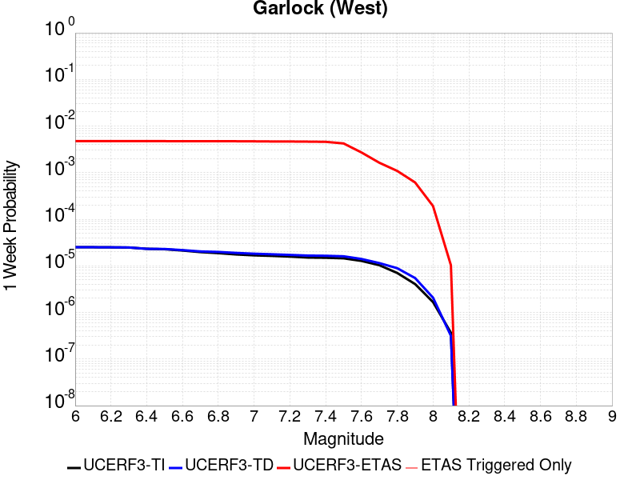 | 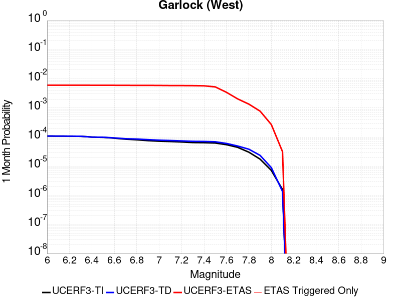 |  | 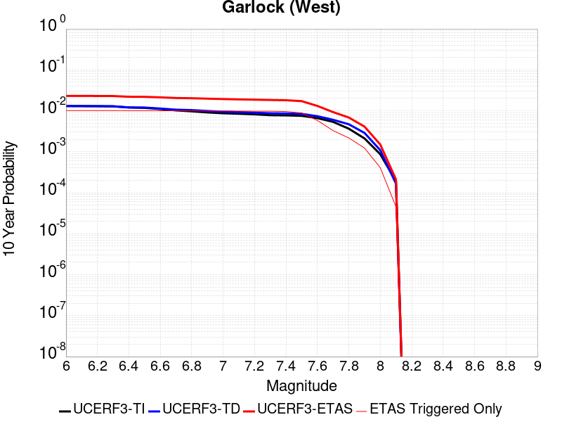 |

| Magnitude | 1 wk TI Prob | 1 wk TD Prob | 1 wk ETAS Prob | 1 wk ETAS/TD Gain | 1 wk ETAS Triggered Only | 1 mo TI Prob | 1 mo TD Prob | 1 mo ETAS Prob | 1 mo ETAS/TD Gain | 1 mo ETAS Triggered Only | 1 yr TI Prob | 1 yr TD Prob | 1 yr ETAS Prob | 1 yr ETAS/TD Gain | 1 yr ETAS Triggered Only | 10 yr TI Prob | 10 yr TD Prob | 10 yr ETAS Prob | 10 yr ETAS/TD Gain | 10 yr ETAS Triggered Only |
|-----|-----|-----|-----|-----|-----|-----|-----|-----|-----|-----|-----|-----|-----|-----|-----|-----|-----|-----|-----|-----|
| 6.0 | 2.5181727E-5 | 2.51973E-5 | 0.0050022407 | 198.52289 | 0.004977169 | 1.0791722E-4 | 1.0798398E-4 | 0.00630214 | 58.361805 | 0.006194825 | 0.0013131002 | 0.0013139155 | 0.00943109 | 7.177851 | 0.008127854 | 0.013053683 | 0.013141977 | 0.023145743 | 1.7612071 | 0.010136986 |
| 6.1 | 2.5077732E-5 | 2.5098372E-5 | 0.0050021424 | 199.30147 | 0.004977169 | 1.0747157E-4 | 1.0756004E-4 | 0.0063017188 | 58.587917 | 0.006194825 | 0.001307681 | 0.0013087603 | 0.009425976 | 7.2022185 | 0.008127854 | 0.013000126 | 0.013091032 | 0.023095315 | 1.7642088 | 0.010136986 |
| 6.2 | 2.494612E-5 | 2.498005E-5 | 0.0050020246 | 200.24078 | 0.004977169 | 1.0690756E-4 | 1.0705298E-4 | 0.006301215 | 58.86071 | 0.006194825 | 0.0013008224 | 0.0013025942 | 0.009419861 | 7.2316155 | 0.008127854 | 0.012932341 | 0.013030097 | 0.023034997 | 1.7678301 | 0.010136986 |
| 6.3 | 2.4733758E-5 | 2.479942E-5 | 0.005001845 | 201.69202 | 0.004977169 | 1.0599751E-4 | 1.06278916E-4 | 0.0063004456 | 59.282177 | 0.006194825 | 0.0012897556 | 0.0012931811 | 0.009410524 | 7.2770348 | 0.008127854 | 0.012822957 | 0.012937066 | 0.02294291 | 1.7734245 | 0.010136986 |
| 6.4 | 2.3237335E-5 | 2.317873E-5 | 0.004985012 | 215.06837 | 0.0049619484 | 9.958477E-5 | 9.933365E-5 | 0.006278324 | 63.204403 | 0.006179604 | 0.0012117702 | 0.001208719 | 0.009296344 | 7.691071 | 0.008097412 | 0.012051838 | 0.012101916 | 0.022056079 | 1.8225279 | 0.010076104 |
| 6.5 | 2.2732203E-5 | 2.2993298E-5 | 0.0049848272 | 216.7948 | 0.0049619484 | 9.742009E-5 | 9.8539E-5 | 0.006277534 | 63.70609 | 0.006179604 | 0.0011854442 | 0.0011990548 | 0.0092867585 | 7.745065 | 0.008097412 | 0.011791403 | 0.012006322 | 0.021961449 | 1.829157 | 0.010076104 |
| 6.6 | 2.1319436E-5 | 2.17735E-5 | 0.004968393 | 228.18535 | 0.004946728 | 9.136581E-5 | 9.331167E-5 | 0.00625712 | 67.05614 | 0.0061643836 | 0.001111811 | 0.0011354799 | 0.009193291 | 8.096393 | 0.008066971 | 0.011062649 | 0.011377227 | 0.021308597 | 1.8729167 | 0.0100456625 |
| 6.7 | 1.970802E-5 | 2.0393396E-5 | 0.0049517998 | 242.81389 | 0.0049315067 | 8.446021E-5 | 8.739735E-5 | 0.006236023 | 71.35254 | 0.006149163 | 0.001027818 | 0.001063545 | 0.009106732 | 8.56262 | 0.00805175 | 0.010230771 | 0.010664964 | 0.020558314 | 1.9276496 | 0.01 |
| 6.8 | 1.8744462E-5 | 1.9901045E-5 | 0.00495131 | 248.79648 | 0.0049315067 | 8.033094E-5 | 8.5287415E-5 | 0.0062187063 | 72.9147 | 0.006133942 | 9.775903E-4 | 0.0010378812 | 0.00906607 | 8.73517 | 0.00803653 | 0.009733009 | 0.01041075 | 0.020291582 | 1.9490987 | 0.009984779 |
| 6.9 | 1.7559682E-5 | 1.8953415E-5 | 0.004950367 | 261.186 | 0.0049315067 | 7.5253614E-5 | 8.12264E-5 | 0.0062146704 | 76.510475 | 0.006133942 | 9.158276E-4 | 9.884841E-4 | 0.00901707 | 9.122119 | 0.00803653 | 0.0091206245 | 0.009921231 | 0.01980695 | 1.9964205 | 0.009984779 |
| 7.0 | 1.6794445E-5 | 1.8216237E-5 | 0.0049191923 | 270.04437 | 0.0049010655 | 7.197421E-5 | 7.8067256E-5 | 0.006165872 | 78.98154 | 0.00608828 | 8.759337E-4 | 9.5005584E-4 | 0.008918125 | 9.386949 | 0.007975647 | 0.008724891 | 0.009540141 | 0.019369362 | 2.0303016 | 0.009923897 |
| 7.1 | 1.6337795E-5 | 1.7717046E-5 | 0.0048730345 | 275.0478 | 0.004855403 | 7.0017246E-5 | 7.5927994E-5 | 0.006087648 | 80.1766 | 0.0060121766 | 8.521265E-4 | 9.240326E-4 | 0.008816277 | 9.541088 | 0.007899543 | 0.008488664 | 0.009281996 | 0.019008223 | 2.0478594 | 0.009817352 |
| 7.2 | 1.5780008E-5 | 1.7165687E-5 | 0.0048724855 | 283.85034 | 0.004855403 | 6.762685E-5 | 7.356516E-5 | 0.0060852994 | 82.71986 | 0.0060121766 | 8.2304585E-4 | 8.9528906E-4 | 0.0087877605 | 9.815556 | 0.007899543 | 0.008200042 | 0.008996838 | 0.01871078 | 2.0797062 | 0.009802131 |
| 7.3 | 1.5058865E-5 | 1.6618762E-5 | 0.0048415004 | 291.3274 | 0.004824962 | 6.45364E-5 | 7.122133E-5 | 0.0060525304 | 84.981995 | 0.005981735 | 7.854473E-4 | 8.667759E-4 | 0.008729057 | 10.07072 | 0.007869102 | 0.00782677 | 0.008713539 | 0.018400082 | 2.111666 | 0.00977169 |
| 7.4 | 1.4887923E-5 | 1.6454731E-5 | 0.004795676 | 291.44662 | 0.0047792997 | 6.380382E-5 | 7.051838E-5 | 0.005960514 | 84.52426 | 0.005890411 | 7.7653467E-4 | 8.582243E-4 | 0.008629327 | 10.054862 | 0.007777778 | 0.0077382675 | 0.008628399 | 0.018149791 | 2.1034946 | 0.009604262 |
| 7.5 | 1.4509299E-5 | 1.6046748E-5 | 0.0045060813 | 280.80963 | 0.0044901064 | 6.218123E-5 | 6.876997E-5 | 0.005563065 | 80.89381 | 0.005494673 | 7.567935E-4 | 8.36954E-4 | 0.008060736 | 9.631038 | 0.0072298325 | 0.0075422134 | 0.008416704 | 0.017230777 | 2.0472121 | 0.008888889 |
| 7.6 | 1.2756717E-5 | 1.4050848E-5 | 0.0028907228 | 205.73297 | 0.0028767122 | 5.4670498E-5 | 6.0216535E-5 | 0.003606426 | 59.89096 | 0.003546423 | 6.6541E-4 | 7.328904E-4 | 0.005387011 | 7.350364 | 0.0046575344 | 0.006634211 | 0.0073816874 | 0.013153075 | 1.7818521 | 0.0058143074 |
| 7.7 | 1.0328985E-5 | 1.1460557E-5 | 0.0016704978 | 145.76062 | 0.0016590563 | 4.4266326E-5 | 4.911575E-5 | 0.0021038093 | 42.833702 | 0.0020547945 | 5.388092E-4 | 5.978206E-4 | 0.003290274 | 5.503782 | 0.0026940638 | 0.0053750467 | 0.006038511 | 0.00930633 | 1.541163 | 0.0032876711 |
| 7.8 | 7.0306583E-6 | 8.899601E-6 | 0.0011200008 | 125.84843 | 0.0011111111 | 3.0131043E-5 | 3.814059E-5 | 0.0013927312 | 36.515724 | 0.0013546423 | 3.667837E-4 | 4.642629E-4 | 0.002244258 | 4.834024 | 0.001780822 | 0.003661789 | 0.0046952725 | 0.006861613 | 1.4613876 | 0.0021765602 |
| 7.9 | 4.060633E-6 | 5.4653938E-6 | 5.9906946E-4 | 109.6114 | 5.936073E-4 | 1.7402595E-5 | 2.3422906E-5 | 7.387791E-4 | 31.540878 | 7.153729E-4 | 2.11856E-4 | 2.851367E-4 | 0.0012589837 | 4.4153695 | 9.741248E-4 | 0.0021165414 | 0.002884201 | 0.004113522 | 1.4262258 | 0.0012328767 |
| 8.0 | 1.6729537E-6 | 2.0775144E-6 | 2.1516687E-4 | 103.56938 | 2.130898E-4 | 7.169782E-6 | 8.903603E-6 | 2.8287378E-4 | 31.770708 | 2.739726E-4 | 8.7288594E-5 | 1.0839601E-4 | 4.7365323E-4 | 4.3696556 | 3.6529682E-4 | 8.7254314E-4 | 0.0010969337 | 0.0015074419 | 1.3742324 | 4.109589E-4 |
| 8.1 | 3.6733252E-7 | 3.1489964E-7 | 1.5535596E-5 | 49.335068 | 1.52207E-5 | 1.5742813E-6 | 1.3495693E-6 | 4.7011607E-5 | 34.834526 | 4.5662102E-5 | 1.9166706E-5 | 1.6430899E-5 | 6.209225E-5 | 3.778993 | 4.5662102E-5 | 1.9165053E-4 | 1.6638759E-4 | 2.1204208E-4 | 1.2743865 | 4.5662102E-5 |

## McLean Lake
*[(top)](#table-of-contents)*

| 1 Week | 1 Month | 1 Year | 10 Year |
|-----|-----|-----|-----|
| 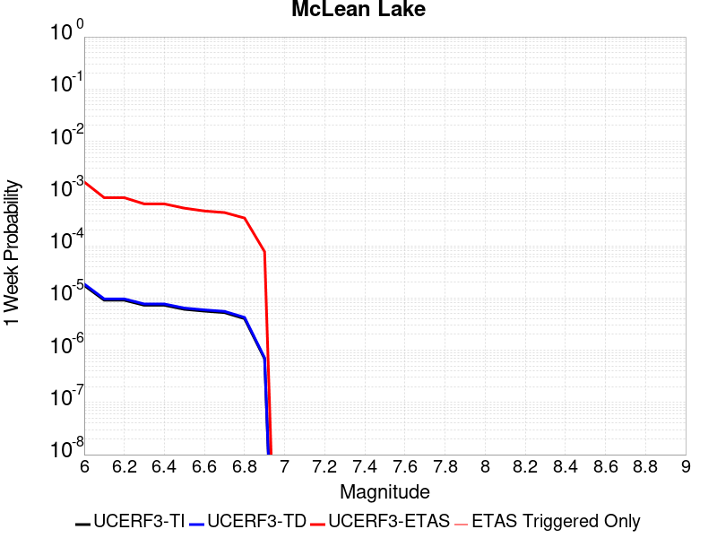 | 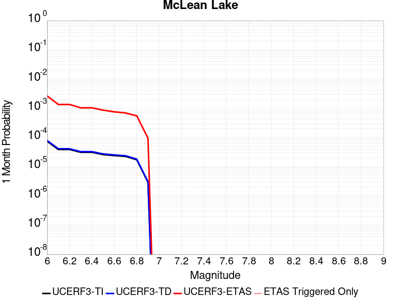 | 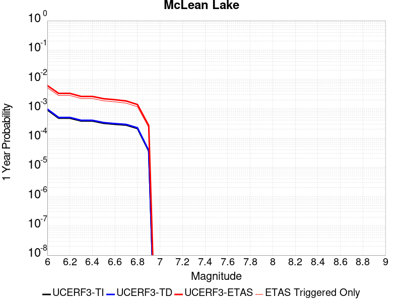 | 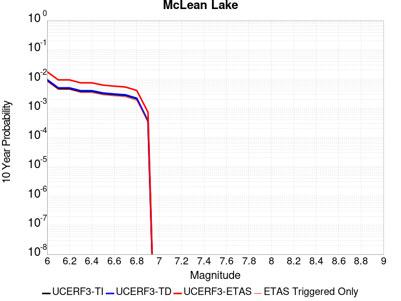 |

| Magnitude | 1 wk TI Prob | 1 wk TD Prob | 1 wk ETAS Prob | 1 wk ETAS/TD Gain | 1 wk ETAS Triggered Only | 1 mo TI Prob | 1 mo TD Prob | 1 mo ETAS Prob | 1 mo ETAS/TD Gain | 1 mo ETAS Triggered Only | 1 yr TI Prob | 1 yr TD Prob | 1 yr ETAS Prob | 1 yr ETAS/TD Gain | 1 yr ETAS Triggered Only | 10 yr TI Prob | 10 yr TD Prob | 10 yr ETAS Prob | 10 yr ETAS/TD Gain | 10 yr ETAS Triggered Only |
|-----|-----|-----|-----|-----|-----|-----|-----|-----|-----|-----|-----|-----|-----|-----|-----|-----|-----|-----|-----|-----|
| 6.0 | 1.7360222E-5 | 1.8501627E-5 | 0.0016623068 | 89.84652 | 0.0016438356 | 7.439883E-5 | 7.9290556E-5 | 0.002651385 | 33.43885 | 0.0025722983 | 9.0542925E-4 | 9.6498354E-4 | 0.006135028 | 6.35765 | 0.0051750382 | 0.009017491 | 0.0096127745 | 0.018069506 | 1.8797388 | 0.008538812 |
| 6.1 | 9.062689E-6 | 9.592193E-6 | 8.3150214E-4 | 86.685295 | 8.219178E-4 | 3.8839516E-5 | 4.1108804E-5 | 0.0013500352 | 32.840538 | 0.0013089802 | 4.727685E-4 | 5.003936E-4 | 0.003314814 | 6.624413 | 0.0028158296 | 0.0047176396 | 0.004993552 | 0.009658118 | 1.9341179 | 0.0046879756 |
| 6.2 | 9.062689E-6 | 9.592193E-6 | 8.3150214E-4 | 86.685295 | 8.219178E-4 | 3.8839516E-5 | 4.1108804E-5 | 0.0013500352 | 32.840538 | 0.0013089802 | 4.727685E-4 | 5.003936E-4 | 0.003314814 | 6.624413 | 0.0028158296 | 0.0047176396 | 0.004993552 | 0.009658118 | 1.9341179 | 0.0046879756 |
| 6.3 | 7.2575485E-6 | 7.66771E-6 | 6.317116E-4 | 82.38596 | 6.240487E-4 | 3.110341E-5 | 3.2861237E-5 | 0.0010373944 | 31.56894 | 0.0010045662 | 3.786182E-4 | 4.0001926E-4 | 0.002606138 | 6.5150313 | 0.0022070014 | 0.0037797375 | 0.0039936965 | 0.007616916 | 1.9072344 | 0.0036377474 |
| 6.4 | 7.2575485E-6 | 7.66771E-6 | 6.317116E-4 | 82.38596 | 6.240487E-4 | 3.110341E-5 | 3.2861237E-5 | 0.0010373944 | 31.56894 | 0.0010045662 | 3.786182E-4 | 4.0001926E-4 | 0.002606138 | 6.5150313 | 0.0022070014 | 0.0037797375 | 0.0039936965 | 0.007616916 | 1.9072344 | 0.0036377474 |
| 6.5 | 6.06582E-6 | 6.4038773E-6 | 5.239044E-4 | 81.81049 | 5.175038E-4 | 2.5996113E-5 | 2.7444936E-5 | 8.645605E-4 | 31.50164 | 8.371385E-4 | 3.164567E-4 | 3.3409733E-4 | 0.0021751868 | 6.5106378 | 0.0018417047 | 0.0031600643 | 0.0033365893 | 0.0063705724 | 1.9093068 | 0.00304414 |
| 6.6 | 5.598744E-6 | 5.910262E-6 | 4.6252858E-4 | 78.25855 | 4.56621E-4 | 2.3994397E-5 | 2.5329486E-5 | 7.559046E-4 | 29.842873 | 7.3059363E-4 | 2.9209262E-4 | 3.0834923E-4 | 0.002012542 | 6.5268264 | 0.0017047185 | 0.0029170897 | 0.003079843 | 0.0058718263 | 1.9065343 | 0.0028006088 |
| 6.7 | 5.246996E-6 | 5.539162E-6 | 4.317164E-4 | 77.938934 | 4.261796E-4 | 2.2486933E-5 | 2.3739085E-5 | 6.93434E-4 | 29.210644 | 6.697108E-4 | 2.73744E-4 | 2.8899137E-4 | 0.0018258379 | 6.3179665 | 0.0015372908 | 0.0027340704 | 0.0028867796 | 0.005466829 | 1.8937466 | 0.0025875191 |
| 6.8 | 4.02324E-6 | 4.2469046E-6 | 3.391009E-4 | 79.8466 | 3.348554E-4 | 1.7242342E-5 | 1.8200926E-5 | 5.509157E-4 | 30.268557 | 5.327245E-4 | 2.099053E-4 | 2.2157968E-4 | 0.0013780966 | 6.2194176 | 0.0011567732 | 0.0020970714 | 0.002214172 | 0.0041884817 | 1.8916696 | 0.001978691 |
| 6.9 | 6.835972E-7 | 7.1399285E-7 | 7.6817436E-5 | 107.58853 | 7.6103504E-5 | 2.9296991E-6 | 3.0599674E-6 | 9.438389E-5 | 30.844736 | 9.1324204E-5 | 3.56685E-5 | 3.7254784E-5 | 2.655568E-4 | 7.128125 | 2.283105E-4 | 3.5662777E-4 | 3.7251666E-4 | 7.833225E-4 | 2.102785 | 4.109589E-4 |

## Goldstone Lake
*[(top)](#table-of-contents)*

| 1 Week | 1 Month | 1 Year | 10 Year |
|-----|-----|-----|-----|
| 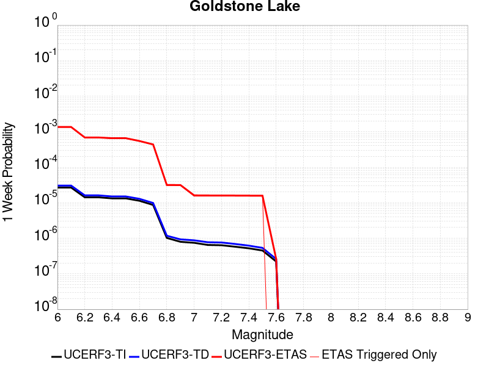 | 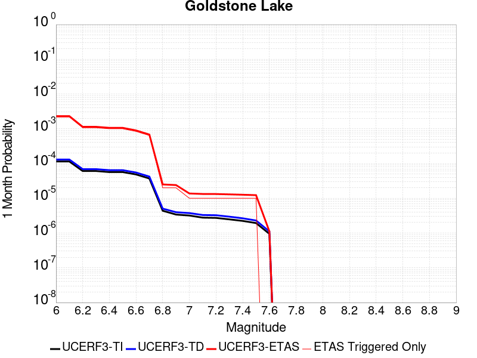 | 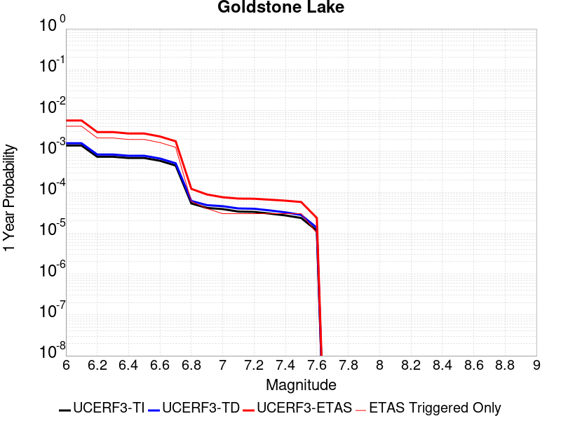 | 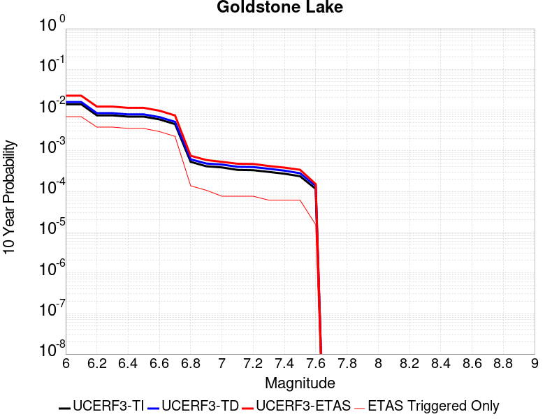 |

| Magnitude | 1 wk TI Prob | 1 wk TD Prob | 1 wk ETAS Prob | 1 wk ETAS/TD Gain | 1 wk ETAS Triggered Only | 1 mo TI Prob | 1 mo TD Prob | 1 mo ETAS Prob | 1 mo ETAS/TD Gain | 1 mo ETAS Triggered Only | 1 yr TI Prob | 1 yr TD Prob | 1 yr ETAS Prob | 1 yr ETAS/TD Gain | 1 yr ETAS Triggered Only | 10 yr TI Prob | 10 yr TD Prob | 10 yr ETAS Prob | 10 yr ETAS/TD Gain | 10 yr ETAS Triggered Only |
|-----|-----|-----|-----|-----|-----|-----|-----|-----|-----|-----|-----|-----|-----|-----|-----|-----|-----|-----|-----|-----|
| 6.0 | 2.671352E-5 | 3.037609E-5 | 0.0013545367 | 44.592205 | 0.0013242009 | 1.1448149E-4 | 1.3017785E-4 | 0.0024282043 | 18.652977 | 0.0022983258 | 0.001392921 | 0.0015839594 | 0.0059605776 | 3.7630873 | 0.0043835617 | 0.013842222 | 0.015746197 | 0.02248766 | 1.4281329 | 0.006849315 |
| 6.1 | 2.671352E-5 | 3.037609E-5 | 0.0013545367 | 44.592205 | 0.0013242009 | 1.1448149E-4 | 1.3017785E-4 | 0.0024282043 | 18.652977 | 0.0022983258 | 0.001392921 | 0.0015839594 | 0.0059605776 | 3.7630873 | 0.0043835617 | 0.013842222 | 0.015746197 | 0.02248766 | 1.4281329 | 0.006849315 |
| 6.2 | 1.4197047E-5 | 1.6096245E-5 | 6.8579626E-4 | 42.60598 | 6.697108E-4 | 6.0843064E-5 | 6.8982634E-5 | 0.001225676 | 17.767893 | 0.0011567732 | 7.4051257E-4 | 8.3963864E-4 | 0.0031512424 | 3.7530937 | 0.0023135464 | 0.007380498 | 0.0083743585 | 0.012147668 | 1.4505789 | 0.003805175 |
| 6.3 | 1.4197047E-5 | 1.6096245E-5 | 6.8579626E-4 | 42.60598 | 6.697108E-4 | 6.0843064E-5 | 6.8982634E-5 | 0.001225676 | 17.767893 | 0.0011567732 | 7.4051257E-4 | 8.3963864E-4 | 0.0031512424 | 3.7530937 | 0.0023135464 | 0.007380498 | 0.0083743585 | 0.012147668 | 1.4505789 | 0.003805175 |
| 6.4 | 1.3238931E-5 | 1.500846E-5 | 6.5426825E-4 | 43.5933 | 6.392694E-4 | 5.6737044E-5 | 6.4320935E-5 | 0.0011601408 | 18.036753 | 0.0010958904 | 6.9055456E-4 | 7.82924E-4 | 0.0029425712 | 3.7584379 | 0.0021613394 | 0.006884126 | 0.0078112837 | 0.011314902 | 1.448533 | 0.0035312024 |
| 6.5 | 1.3238931E-5 | 1.500846E-5 | 6.5426825E-4 | 43.5933 | 6.392694E-4 | 5.6737044E-5 | 6.4320935E-5 | 0.0011601408 | 18.036753 | 0.0010958904 | 6.9055456E-4 | 7.82924E-4 | 0.0029425712 | 3.7584379 | 0.0021613394 | 0.006884126 | 0.0078112837 | 0.011314902 | 1.448533 | 0.0035312024 |
| 6.6 | 1.1328278E-5 | 1.2855166E-5 | 5.4557284E-4 | 42.43997 | 5.327245E-4 | 4.8548856E-5 | 5.5092944E-5 | 9.682846E-4 | 17.575476 | 9.13242E-4 | 5.90922E-4 | 6.7064585E-4 | 0.0024806943 | 3.6989634 | 0.0018112633 | 0.0058935313 | 0.0066956086 | 0.0096286535 | 1.438055 | 0.0029528157 |
| 6.7 | 8.651175E-6 | 9.824565E-6 | 4.3599997E-4 | 44.378555 | 4.261796E-4 | 3.707594E-5 | 4.2105108E-5 | 7.422278E-4 | 17.627977 | 7.001522E-4 | 4.5130608E-4 | 5.1259965E-4 | 0.0018969734 | 3.700692 | 0.0013850838 | 0.0045039062 | 0.005123051 | 0.0073641744 | 1.4374586 | 0.0022526637 |
| 6.8 | 1.0215377E-6 | 1.1754702E-6 | 3.1616833E-5 | 26.89718 | 3.04414E-5 | 4.378012E-6 | 5.0377203E-6 | 3.5478966E-5 | 7.042663 | 3.04414E-5 | 5.3300988E-5 | 6.1332634E-5 | 1.5265124E-4 | 2.488907 | 9.1324204E-5 | 5.3288206E-4 | 6.1316835E-4 | 7.5007067E-4 | 1.2232703 | 1.369863E-4 |
| 6.9 | 7.9360774E-7 | 9.2833966E-7 | 3.1369713E-5 | 33.791203 | 3.04414E-5 | 3.4011714E-6 | 3.9785928E-6 | 3.441987E-5 | 8.651268 | 3.04414E-5 | 4.1408475E-5 | 4.843836E-5 | 1.09318215E-4 | 2.256852 | 6.08828E-5 | 4.140076E-4 | 4.8428503E-4 | 5.9077836E-4 | 1.219898 | 1.065449E-4 |
| 7.0 | 7.4382757E-7 | 8.7473285E-7 | 1.609542E-5 | 18.400383 | 1.52207E-5 | 3.1878285E-6 | 3.74885E-6 | 1.8969493E-5 | 5.0600834 | 1.52207E-5 | 3.8811122E-5 | 4.564136E-5 | 9.130138E-5 | 2.0004086 | 4.5662102E-5 | 3.8804344E-4 | 4.5632652E-4 | 5.3239526E-4 | 1.1666981 | 7.6103504E-5 |
| 7.1 | 6.4709513E-7 | 7.7113E-7 | 1.5991818E-5 | 20.738161 | 1.52207E-5 | 2.773262E-6 | 3.3048389E-6 | 1.8525488E-5 | 5.6055646 | 1.52207E-5 | 3.376394E-5 | 4.0235733E-5 | 8.5896E-5 | 2.1348188 | 4.5662102E-5 | 3.375881E-4 | 4.0229043E-4 | 4.783633E-4 | 1.1890994 | 7.6103504E-5 |
| 7.2 | 6.356704E-7 | 7.5883594E-7 | 1.5979525E-5 | 21.057943 | 1.52207E-5 | 2.7242988E-6 | 3.2521505E-6 | 1.8472801E-5 | 5.6801805 | 1.52207E-5 | 3.3167835E-5 | 3.959427E-5 | 8.525456E-5 | 2.1532044 | 4.5662102E-5 | 3.3162883E-4 | 3.958781E-4 | 4.7195147E-4 | 1.1921636 | 7.6103504E-5 |
| 7.3 | 5.7695723E-7 | 6.8965653E-7 | 1.5910346E-5 | 23.069956 | 1.52207E-5 | 2.4726714E-6 | 2.9556677E-6 | 1.8176323E-5 | 6.14965 | 1.52207E-5 | 3.0104358E-5 | 3.5984718E-5 | 8.164518E-5 | 2.2688847 | 4.5662102E-5 | 3.0100282E-4 | 3.5979465E-4 | 4.2065556E-4 | 1.1691545 | 6.08828E-5 |
| 7.4 | 5.209647E-7 | 6.193514E-7 | 1.5840042E-5 | 25.57521 | 1.52207E-5 | 2.232704E-6 | 2.6543607E-6 | 1.787502E-5 | 6.7342095 | 1.52207E-5 | 2.718283E-5 | 3.2316417E-5 | 7.797704E-5 | 2.4129233 | 4.5662102E-5 | 2.7179506E-4 | 3.2312275E-4 | 3.8398587E-4 | 1.1883591 | 6.08828E-5 |
| 7.5 | 4.512955E-7 | 5.348885E-7 | 1.575558E-5 | 29.455822 | 1.52207E-5 | 1.934122E-6 | 2.2923775E-6 | 1.7513043E-5 | 7.639685 | 1.52207E-5 | 2.3547682E-5 | 2.7909393E-5 | 7.357022E-5 | 2.6360378 | 4.5662102E-5 | 2.3545188E-4 | 2.7906417E-4 | 3.3993E-4 | 1.2181069 | 6.08828E-5 |
| 7.6 | 2.21172E-7 | 2.603961E-7 | 2.603961E-7 | 1.0 | 0.0 | 9.478797E-7 | 1.1159829E-6 | 1.1159829E-6 | 1.0 | 0.0 | 1.1540374E-5 | 1.3587036E-5 | 2.8807528E-5 | 2.1202219 | 1.52207E-5 | 1.1539775E-4 | 1.3586486E-4 | 1.510835E-4 | 1.112013 | 1.52207E-5 |

## Gravel Hills-Harper Lk
*[(top)](#table-of-contents)*

| 1 Week | 1 Month | 1 Year | 10 Year |
|-----|-----|-----|-----|
| 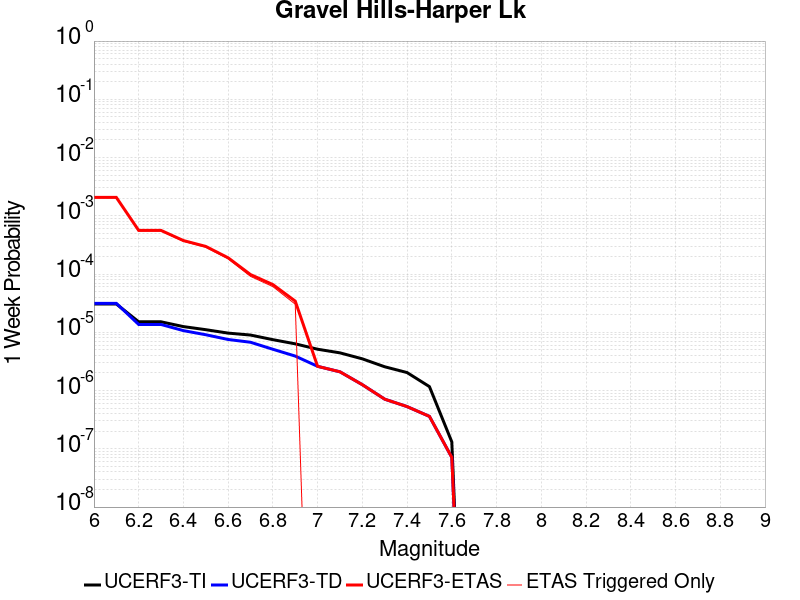 | 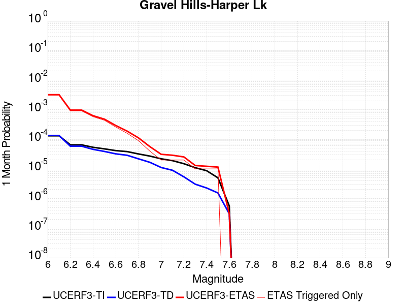 | 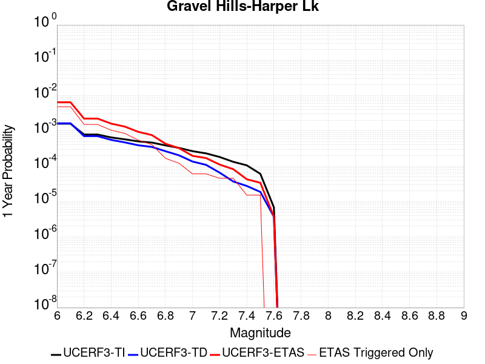 | 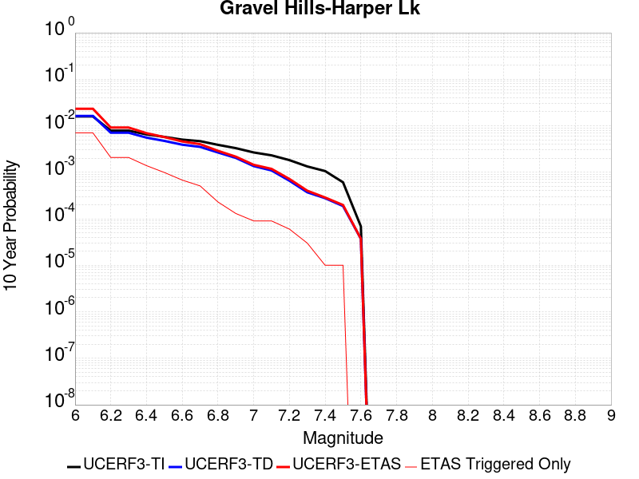 |

| Magnitude | 1 wk TI Prob | 1 wk TD Prob | 1 wk ETAS Prob | 1 wk ETAS/TD Gain | 1 wk ETAS Triggered Only | 1 mo TI Prob | 1 mo TD Prob | 1 mo ETAS Prob | 1 mo ETAS/TD Gain | 1 mo ETAS Triggered Only | 1 yr TI Prob | 1 yr TD Prob | 1 yr ETAS Prob | 1 yr ETAS/TD Gain | 1 yr ETAS Triggered Only | 10 yr TI Prob | 10 yr TD Prob | 10 yr ETAS Prob | 10 yr ETAS/TD Gain | 10 yr ETAS Triggered Only |
|-----|-----|-----|-----|-----|-----|-----|-----|-----|-----|-----|-----|-----|-----|-----|-----|-----|-----|-----|-----|-----|
| 6.0 | 3.0679566E-5 | 3.1464646E-5 | 0.0020709743 | 65.819084 | 0.0020395739 | 1.3147724E-4 | 1.3484273E-4 | 0.0030872603 | 22.895266 | 0.0029528157 | 0.0015995599 | 0.0016406906 | 0.0064577363 | 3.9359865 | 0.004824962 | 0.015880952 | 0.01630734 | 0.023209658 | 1.4232645 | 0.0070167426 |
| 6.1 | 3.0679566E-5 | 3.1464646E-5 | 0.0020709743 | 65.819084 | 0.0020395739 | 1.3147724E-4 | 1.3484273E-4 | 0.0030872603 | 22.895266 | 0.0029528157 | 0.0015995599 | 0.0016406906 | 0.0064577363 | 3.9359865 | 0.004824962 | 0.015880952 | 0.01630734 | 0.023209658 | 1.4232645 | 0.0070167426 |
| 6.2 | 1.514536E-5 | 1.3635206E-5 | 5.6157296E-4 | 41.18551 | 5.479452E-4 | 6.490707E-5 | 5.843536E-5 | 8.955249E-4 | 15.325052 | 8.371385E-4 | 7.8995706E-4 | 7.1123015E-4 | 0.0022322177 | 3.1385307 | 0.00152207 | 0.007871548 | 0.0070907404 | 0.009221641 | 1.3005189 | 0.0021461188 |
| 6.3 | 1.514536E-5 | 1.3635206E-5 | 5.6157296E-4 | 41.18551 | 5.479452E-4 | 6.490707E-5 | 5.843536E-5 | 8.955249E-4 | 15.325052 | 8.371385E-4 | 7.8995706E-4 | 7.1123015E-4 | 0.0022322177 | 3.1385307 | 0.00152207 | 0.007871548 | 0.0070907404 | 0.009221641 | 1.3005189 | 0.0021461188 |
| 6.4 | 1.2532521E-5 | 1.06896905E-5 | 3.7598258E-4 | 35.172447 | 3.6529682E-4 | 5.37097E-5 | 4.581219E-5 | 6.241723E-4 | 13.62459 | 5.783866E-4 | 6.537194E-4 | 5.576265E-4 | 0.0016072692 | 2.88234 | 0.0010502283 | 0.0065179965 | 0.005562863 | 0.0070159216 | 1.261207 | 0.0014611873 |
| 6.5 | 1.1094058E-5 | 9.083664E-6 | 2.9827433E-4 | 32.83635 | 2.891933E-4 | 4.7545094E-5 | 3.892943E-5 | 5.107528E-4 | 13.119966 | 4.7184172E-4 | 5.787078E-4 | 4.7386673E-4 | 0.0013258221 | 2.7978795 | 8.523592E-4 | 0.0057720304 | 0.0047289706 | 0.005849976 | 1.2370507 | 0.0011263319 |
| 6.6 | 9.688328E-6 | 7.5316952E-6 | 1.9017872E-4 | 25.250454 | 1.8264841E-4 | 4.1520743E-5 | 3.227831E-5 | 3.2146228E-4 | 9.959081 | 2.891933E-4 | 5.053978E-4 | 3.9292008E-4 | 9.4065E-4 | 2.3939981 | 5.479452E-4 | 0.0050424994 | 0.0039225104 | 0.0046653994 | 1.1893911 | 7.458143E-4 |
| 6.7 | 8.974824E-6 | 6.749413E-6 | 9.8073E-5 | 14.530597 | 9.1324204E-5 | 3.8462964E-5 | 2.8925748E-5 | 2.1156887E-4 | 7.3142056 | 1.8264841E-4 | 4.6818596E-4 | 3.5211627E-4 | 7.629305E-4 | 2.1667004 | 4.109589E-4 | 0.004672008 | 0.0035158044 | 0.004092158 | 1.1639321 | 5.783866E-4 |
| 6.8 | 7.4780046E-6 | 5.1161933E-6 | 6.599868E-5 | 12.899959 | 6.08828E-5 | 3.20482E-5 | 2.1926366E-5 | 1.1324856E-4 | 5.164949 | 9.1324204E-5 | 3.9011694E-4 | 2.669222E-4 | 4.343052E-4 | 1.6270854 | 1.674277E-4 | 0.0038943281 | 0.0026661542 | 0.002893856 | 1.0854046 | 2.283105E-4 |
| 6.9 | 6.3409307E-6 | 3.9074966E-6 | 3.4348777E-5 | 8.790482 | 3.04414E-5 | 2.7175134E-5 | 1.6746313E-5 | 6.240765E-5 | 3.72665 | 4.5662102E-5 | 3.3080703E-4 | 2.0386827E-4 | 3.2560906E-4 | 1.5971541 | 1.217656E-4 | 0.0033031502 | 0.0020369107 | 0.002173618 | 1.067115 | 1.369863E-4 |
| 7.0 | 5.1239335E-6 | 2.6058565E-6 | 2.6058565E-6 | 1.0 | 0.0 | 2.195953E-5 | 1.116791E-5 | 2.638844E-5 | 2.3628807 | 1.52207E-5 | 2.6732447E-4 | 1.3596108E-4 | 1.968356E-4 | 1.447735 | 6.08828E-5 | 0.0026700313 | 0.0013588042 | 0.0014348043 | 1.0559316 | 7.6103504E-5 |
| 7.1 | 4.438899E-6 | 2.0984728E-6 | 2.0984728E-6 | 1.0 | 0.0 | 1.9023713E-5 | 8.993425E-6 | 2.4213989E-5 | 2.69241 | 1.52207E-5 | 2.315891E-4 | 1.0948967E-4 | 1.703658E-4 | 1.5559989 | 6.08828E-5 | 0.002313479 | 0.0010943791 | 0.0011703994 | 1.0694642 | 7.6103504E-5 |
| 7.2 | 3.50367E-6 | 1.2615716E-6 | 1.2615716E-6 | 1.0 | 0.0 | 1.5015643E-5 | 5.4067245E-6 | 2.0627342E-5 | 3.8151271 | 1.52207E-5 | 1.8280011E-4 | 6.582497E-5 | 1.1148406E-4 | 1.693644 | 4.5662102E-5 | 0.0018264982 | 6.580629E-4 | 7.1890565E-4 | 1.0924573 | 6.08828E-5 |
| 7.3 | 2.561638E-6 | 7.1191585E-7 | 7.1191585E-7 | 1.0 | 0.0 | 1.0978401E-5 | 3.0510646E-6 | 1.8271718E-5 | 5.988637 | 1.52207E-5 | 1.3365384E-4 | 3.71461E-5 | 8.28065E-5 | 2.2292113 | 4.5662102E-5 | 0.0013357349 | 3.7140088E-4 | 4.1704602E-4 | 1.1228999 | 4.5662102E-5 |
| 7.4 | 2.0368864E-6 | 5.304837E-7 | 5.304837E-7 | 1.0 | 0.0 | 8.729483E-6 | 2.2734996E-6 | 1.7494165E-5 | 7.6948175 | 1.52207E-5 | 1.06276275E-4 | 2.7679513E-5 | 4.2899792E-5 | 1.5498753 | 1.52207E-5 | 0.0010622547 | 2.767612E-4 | 2.919777E-4 | 1.0549805 | 1.52207E-5 |
| 7.5 | 1.1681728E-6 | 3.6030585E-7 | 3.6030585E-7 | 1.0 | 0.0 | 5.0064455E-6 | 1.544167E-6 | 1.6764843E-5 | 10.856885 | 1.52207E-5 | 6.0951766E-5 | 1.8800076E-5 | 3.402049E-5 | 1.8095932 | 1.52207E-5 | 6.093505E-4 | 1.8798532E-4 | 2.0320316E-4 | 1.0809523 | 1.52207E-5 |
| 7.6 | 1.3154387E-7 | 7.1197384E-8 | 7.1197384E-8 | 1.0 | 0.0 | 5.6375933E-7 | 3.051316E-7 | 3.051316E-7 | 1.0 | 0.0 | 6.863748E-6 | 3.7149728E-6 | 3.7149728E-6 | 1.0 | 0.0 | 6.863536E-5 | 3.7149264E-5 | 3.7149264E-5 | 1.0 | 0.0 |

## Coyote Canyon
*[(top)](#table-of-contents)*

| 1 Week | 1 Month | 1 Year | 10 Year |
|-----|-----|-----|-----|
| 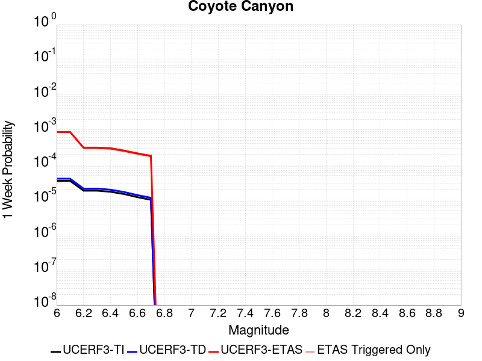 | 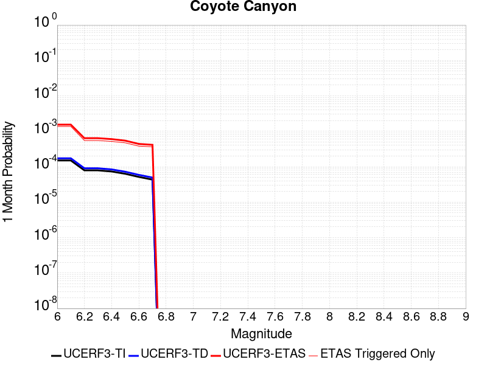 | 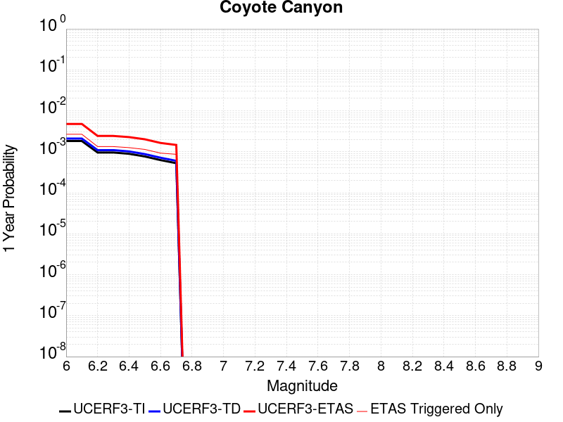 | 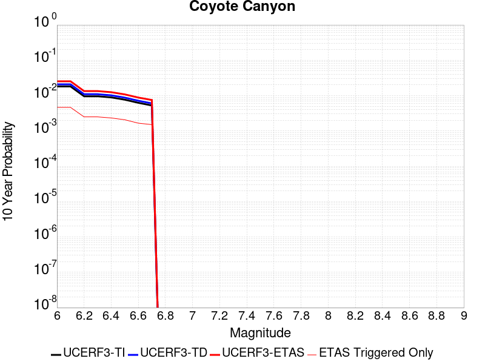 |

| Magnitude | 1 wk TI Prob | 1 wk TD Prob | 1 wk ETAS Prob | 1 wk ETAS/TD Gain | 1 wk ETAS Triggered Only | 1 mo TI Prob | 1 mo TD Prob | 1 mo ETAS Prob | 1 mo ETAS/TD Gain | 1 mo ETAS Triggered Only | 1 yr TI Prob | 1 yr TD Prob | 1 yr ETAS Prob | 1 yr ETAS/TD Gain | 1 yr ETAS Triggered Only | 10 yr TI Prob | 10 yr TD Prob | 10 yr ETAS Prob | 10 yr ETAS/TD Gain | 10 yr ETAS Triggered Only |
|-----|-----|-----|-----|-----|-----|-----|-----|-----|-----|-----|-----|-----|-----|-----|-----|-----|-----|-----|-----|-----|
| 6.0 | 3.5090034E-5 | 4.0364324E-5 | 8.6224894E-4 | 21.36166 | 8.219178E-4 | 1.503772E-4 | 1.7297994E-4 | 0.001542606 | 8.917831 | 0.001369863 | 0.0018293047 | 0.0021042528 | 0.004777459 | 2.2703826 | 0.0026788432 | 0.018143194 | 0.020869201 | 0.025414634 | 1.2178057 | 0.0046423133 |
| 6.1 | 3.5090034E-5 | 4.0364324E-5 | 8.6224894E-4 | 21.36166 | 8.219178E-4 | 1.503772E-4 | 1.7297994E-4 | 0.001542606 | 8.917831 | 0.001369863 | 0.0018293047 | 0.0021042528 | 0.004777459 | 2.2703826 | 0.0026788432 | 0.018143194 | 0.020869201 | 0.025414634 | 1.2178057 | 0.0046423133 |
| 6.2 | 1.841879E-5 | 2.1059794E-5 | 3.2546738E-4 | 15.454443 | 3.0441402E-4 | 7.8935285E-5 | 9.0253714E-5 | 6.3814945E-4 | 7.0706177 | 5.479452E-4 | 9.606133E-4 | 0.001098387 | 0.0024363373 | 2.2181048 | 0.0013394216 | 0.0095647145 | 0.010939667 | 0.013408555 | 1.2256821 | 0.0024961948 |
| 6.3 | 1.841879E-5 | 2.1059794E-5 | 3.2546738E-4 | 15.454443 | 3.0441402E-4 | 7.8935285E-5 | 9.0253714E-5 | 6.3814945E-4 | 7.0706177 | 5.479452E-4 | 9.606133E-4 | 0.001098387 | 0.0024363373 | 2.2181048 | 0.0013394216 | 0.0095647145 | 0.010939667 | 0.013408555 | 1.2256821 | 0.0024961948 |
| 6.4 | 1.712201E-5 | 1.9565212E-5 | 3.0875285E-4 | 15.780706 | 2.891933E-4 | 7.337798E-5 | 8.3848776E-5 | 6.013092E-4 | 7.171353 | 5.175038E-4 | 8.930107E-4 | 0.0010204813 | 0.0022825103 | 2.2366996 | 0.0012633181 | 0.008894307 | 0.010167871 | 0.012472959 | 1.2267032 | 0.0023287672 |
| 6.5 | 1.4744935E-5 | 1.6836972E-5 | 2.6036406E-4 | 15.463831 | 2.435312E-4 | 6.3191044E-5 | 7.215698E-5 | 5.439646E-4 | 7.538628 | 4.7184172E-4 | 7.6907943E-4 | 8.7825063E-4 | 0.0020188007 | 2.298661 | 0.0011415525 | 0.007664232 | 0.008756994 | 0.010808882 | 1.2343142 | 0.0020700153 |
| 6.6 | 1.2017839E-5 | 1.37240895E-5 | 2.1159048E-4 | 15.417451 | 1.978691E-4 | 5.150401E-5 | 5.88167E-5 | 4.393118E-4 | 7.469168 | 3.805175E-4 | 6.268809E-4 | 7.159466E-4 | 0.0016437445 | 2.295904 | 9.284627E-4 | 0.0062511545 | 0.0071450938 | 0.008792296 | 1.2305361 | 0.0016590563 |
| 6.7 | 1.00956095E-5 | 1.1533517E-5 | 1.9417981E-4 | 16.836132 | 1.8264841E-4 | 4.326618E-5 | 4.942891E-5 | 4.1470767E-4 | 8.389982 | 3.6529682E-4 | 5.266384E-4 | 6.017178E-4 | 0.0014687757 | 2.440971 | 8.675799E-4 | 0.005253921 | 0.0060094125 | 0.0075072064 | 1.2492414 | 0.0015068493 |

## So Sierra Nevada
*[(top)](#table-of-contents)*

| 1 Week | 1 Month | 1 Year | 10 Year |
|-----|-----|-----|-----|
| 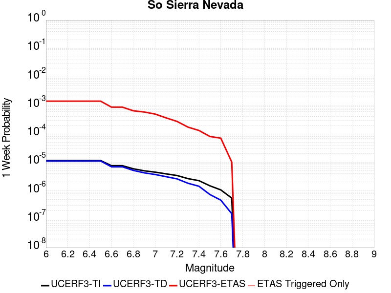 | 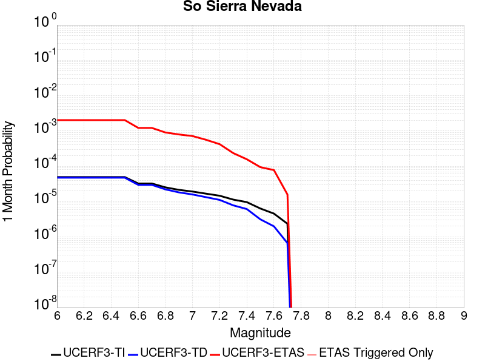 | 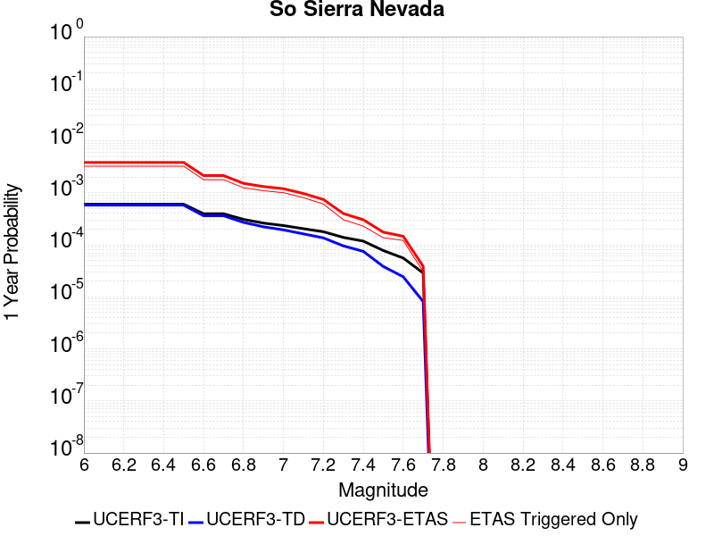 | 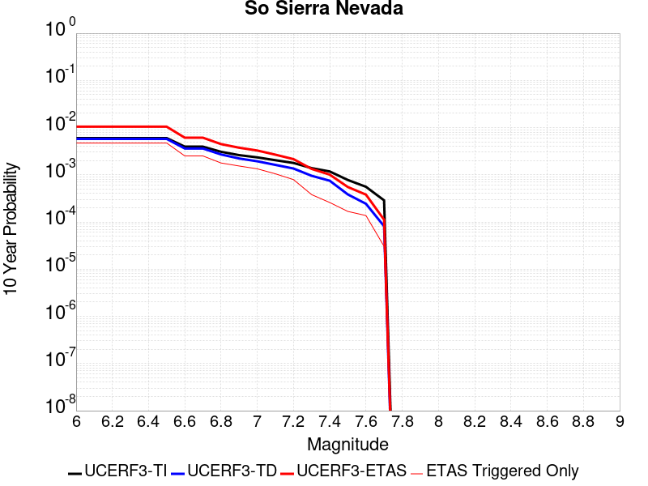 |

| Magnitude | 1 wk TI Prob | 1 wk TD Prob | 1 wk ETAS Prob | 1 wk ETAS/TD Gain | 1 wk ETAS Triggered Only | 1 mo TI Prob | 1 mo TD Prob | 1 mo ETAS Prob | 1 mo ETAS/TD Gain | 1 mo ETAS Triggered Only | 1 yr TI Prob | 1 yr TD Prob | 1 yr ETAS Prob | 1 yr ETAS/TD Gain | 1 yr ETAS Triggered Only | 10 yr TI Prob | 10 yr TD Prob | 10 yr ETAS Prob | 10 yr ETAS/TD Gain | 10 yr ETAS Triggered Only |
|-----|-----|-----|-----|-----|-----|-----|-----|-----|-----|-----|-----|-----|-----|-----|-----|-----|-----|-----|-----|-----|
| 6.0 | 1.15488665E-5 | 1.1079643E-5 | 0.0014418096 | 130.13142 | 0.0014307458 | 4.9494203E-5 | 4.748339E-5 | 0.0020260804 | 42.669247 | 0.001978691 | 6.024253E-4 | 5.7796965E-4 | 0.003833317 | 6.6323843 | 0.00325723 | 0.006007948 | 0.005765934 | 0.010457145 | 1.8136082 | 0.004718417 |
| 6.1 | 1.15488665E-5 | 1.1079643E-5 | 0.0014418096 | 130.13142 | 0.0014307458 | 4.9494203E-5 | 4.748339E-5 | 0.0020260804 | 42.669247 | 0.001978691 | 6.024253E-4 | 5.7796965E-4 | 0.003833317 | 6.6323843 | 0.00325723 | 0.006007948 | 0.005765934 | 0.010457145 | 1.8136082 | 0.004718417 |
| 6.2 | 1.15488665E-5 | 1.1079643E-5 | 0.0014418096 | 130.13142 | 0.0014307458 | 4.9494203E-5 | 4.748339E-5 | 0.0020260804 | 42.669247 | 0.001978691 | 6.024253E-4 | 5.7796965E-4 | 0.003833317 | 6.6323843 | 0.00325723 | 0.006007948 | 0.005765934 | 0.010457145 | 1.8136082 | 0.004718417 |
| 6.3 | 1.15488665E-5 | 1.1079643E-5 | 0.0014418096 | 130.13142 | 0.0014307458 | 4.9494203E-5 | 4.748339E-5 | 0.0020260804 | 42.669247 | 0.001978691 | 6.024253E-4 | 5.7796965E-4 | 0.003833317 | 6.6323843 | 0.00325723 | 0.006007948 | 0.005765934 | 0.010457145 | 1.8136082 | 0.004718417 |
| 6.4 | 1.15488665E-5 | 1.1079643E-5 | 0.0014418096 | 130.13142 | 0.0014307458 | 4.9494203E-5 | 4.748339E-5 | 0.0020260804 | 42.669247 | 0.001978691 | 6.024253E-4 | 5.7796965E-4 | 0.003833317 | 6.6323843 | 0.00325723 | 0.006007948 | 0.005765934 | 0.010457145 | 1.8136082 | 0.004718417 |
| 6.5 | 1.15488665E-5 | 1.1079643E-5 | 0.0014418096 | 130.13142 | 0.0014307458 | 4.9494203E-5 | 4.748339E-5 | 0.0020260804 | 42.669247 | 0.001978691 | 6.024253E-4 | 5.7796965E-4 | 0.003833317 | 6.6323843 | 0.00325723 | 0.006007948 | 0.005765934 | 0.010457145 | 1.8136082 | 0.004718417 |
| 6.6 | 7.587044E-6 | 6.935635E-6 | 9.201713E-4 | 132.67297 | 9.13242E-4 | 3.2515498E-5 | 2.9723828E-5 | 0.0012169031 | 40.940323 | 0.0011872146 | 3.9580427E-4 | 3.6183043E-4 | 0.002142008 | 5.919922 | 0.001780822 | 0.003951 | 0.0036127048 | 0.0061150473 | 1.6926507 | 0.0025114156 |
| 6.7 | 7.587044E-6 | 6.935635E-6 | 9.201713E-4 | 132.67297 | 9.13242E-4 | 3.2515498E-5 | 2.9723828E-5 | 0.0012169031 | 40.940323 | 0.0011872146 | 3.9580427E-4 | 3.6183043E-4 | 0.002142008 | 5.919922 | 0.001780822 | 0.003951 | 0.0036127048 | 0.0061150473 | 1.6926507 | 0.0025114156 |
| 6.8 | 5.9026956E-6 | 5.1793927E-6 | 7.0532796E-4 | 136.17967 | 7.001522E-4 | 2.5297022E-5 | 2.2197215E-5 | 9.0497825E-4 | 40.7699 | 8.828006E-4 | 3.0794772E-4 | 2.7021873E-4 | 0.0015179788 | 5.617593 | 0.0012480974 | 0.0030752132 | 0.002699018 | 0.0044750334 | 1.6580229 | 0.001780822 |
| 6.9 | 5.0118915E-6 | 4.2524252E-6 | 6.435191E-4 | 151.32991 | 6.392694E-4 | 2.1479358E-5 | 1.8224557E-5 | 7.944661E-4 | 43.593166 | 7.7625574E-4 | 2.614798E-4 | 2.2186211E-4 | 0.0013175093 | 5.9384155 | 0.0010958904 | 0.0026117235 | 0.0022164788 | 0.0037503622 | 1.6920362 | 0.0015372908 |
| 7.0 | 4.4924795E-6 | 3.7139177E-6 | 5.820984E-4 | 156.73433 | 5.783866E-4 | 1.925334E-5 | 1.5916696E-5 | 7.160578E-4 | 44.98784 | 7.001522E-4 | 2.3438422E-4 | 1.9376918E-4 | 0.0011981408 | 6.18334 | 0.0010045662 | 0.0023413717 | 0.0019360651 | 0.0032728936 | 1.6904873 | 0.0013394216 |
| 7.1 | 3.9118436E-6 | 3.1119775E-6 | 4.2929026E-4 | 137.94774 | 4.261796E-4 | 1.6764936E-5 | 1.3336982E-5 | 5.612749E-4 | 42.0841 | 5.479452E-4 | 2.0409399E-4 | 1.6236622E-4 | 9.6893235E-4 | 5.967573 | 8.066971E-4 | 0.0020390663 | 0.001622532 | 0.0026710564 | 1.6462271 | 0.0010502283 |
| 7.2 | 3.4200818E-6 | 2.6054543E-6 | 3.2223933E-4 | 123.67875 | 3.196347E-4 | 1.4657411E-5 | 1.11661875E-5 | 4.221205E-4 | 37.80346 | 4.109589E-4 | 1.7843937E-4 | 1.3594035E-4 | 7.446856E-4 | 5.4780316 | 6.0882804E-4 | 0.0017829615 | 0.0013586218 | 0.0021490229 | 1.5817668 | 7.914764E-4 |
| 7.3 | 2.6593618E-6 | 1.8284203E-6 | 1.9969716E-4 | 109.218414 | 1.978691E-4 | 1.13972155E-5 | 7.836065E-6 | 2.3614478E-4 | 30.135633 | 2.283105E-4 | 1.3875226E-4 | 9.540021E-5 | 3.9978517E-4 | 4.190611 | 3.0441402E-4 | 0.0013866565 | 9.5362146E-4 | 0.001333776 | 1.3986431 | 3.805175E-4 |
| 7.4 | 2.2577992E-6 | 1.436438E-6 | 1.5364322E-4 | 106.96126 | 1.5220701E-4 | 9.676246E-6 | 6.15615E-6 | 1.5836222E-4 | 25.72423 | 1.5220701E-4 | 1.1780193E-4 | 7.49488E-5 | 3.0324218E-4 | 4.0459914 | 2.283105E-4 | 0.001177395 | 7.492603E-4 | 0.0010078183 | 1.3450844 | 2.587519E-4 |
| 7.5 | 1.489319E-6 | 7.353936E-7 | 9.205953E-5 | 125.18402 | 9.1324204E-5 | 6.3827797E-6 | 3.1516831E-6 | 9.4475596E-5 | 29.976236 | 9.1324204E-5 | 7.770758E-5 | 3.8371072E-5 | 1.7535212E-4 | 4.5699043 | 1.369863E-4 | 7.7680405E-4 | 3.836449E-4 | 5.510083E-4 | 1.4362458 | 1.674277E-4 |
| 7.6 | 1.0680322E-6 | 4.6596554E-7 | 7.656943E-5 | 164.32423 | 7.6103504E-5 | 4.577273E-6 | 1.9969937E-6 | 7.810034E-5 | 39.10896 | 7.6103504E-5 | 5.5726876E-5 | 2.4313129E-5 | 1.4607576E-4 | 6.0081024 | 1.217656E-4 | 5.5712904E-4 | 2.4310495E-4 | 3.8005796E-4 | 1.5633492 | 1.369863E-4 |
| 7.7 | 5.509146E-7 | 1.5580486E-7 | 1.5376503E-5 | 98.69078 | 1.52207E-5 | 2.3610605E-6 | 6.677349E-7 | 1.5888425E-5 | 23.794508 | 1.52207E-5 | 2.8745531E-5 | 8.129644E-6 | 3.8570797E-5 | 4.7444634 | 3.04414E-5 | 2.8741814E-4 | 8.1293576E-5 | 1.1173251E-4 | 1.3744321 | 3.04414E-5 |

## San Andreas (Mojave S)
*[(top)](#table-of-contents)*

| 1 Week | 1 Month | 1 Year | 10 Year |
|-----|-----|-----|-----|
| 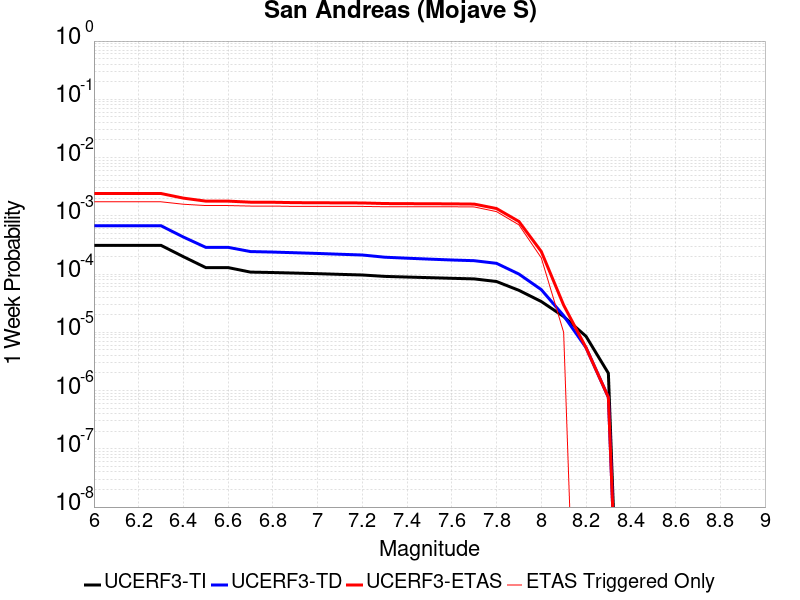 | 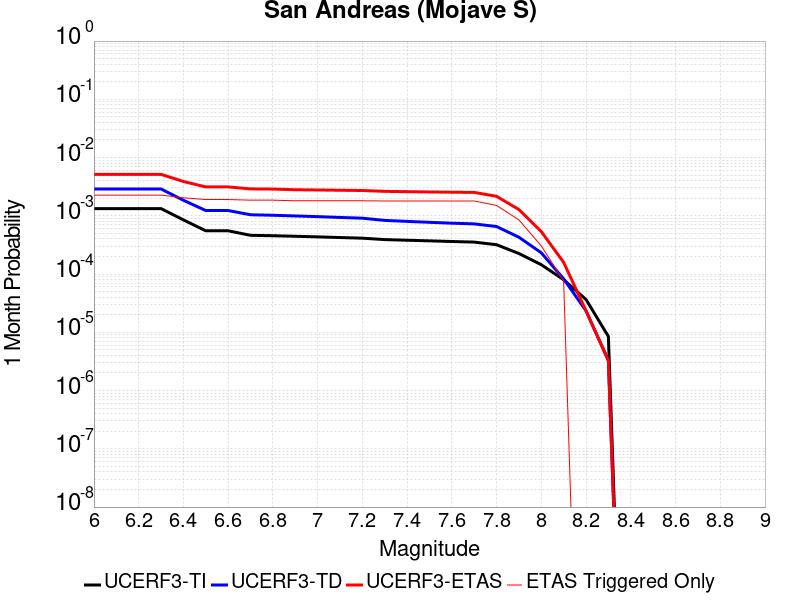 | 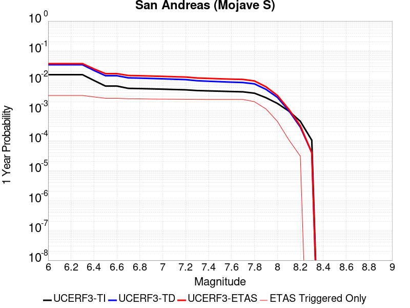 | 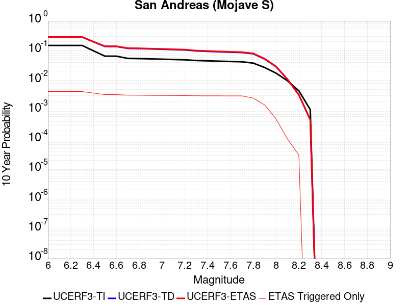 |

| Magnitude | 1 wk TI Prob | 1 wk TD Prob | 1 wk ETAS Prob | 1 wk ETAS/TD Gain | 1 wk ETAS Triggered Only | 1 mo TI Prob | 1 mo TD Prob | 1 mo ETAS Prob | 1 mo ETAS/TD Gain | 1 mo ETAS Triggered Only | 1 yr TI Prob | 1 yr TD Prob | 1 yr ETAS Prob | 1 yr ETAS/TD Gain | 1 yr ETAS Triggered Only | 10 yr TI Prob | 10 yr TD Prob | 10 yr ETAS Prob | 10 yr ETAS/TD Gain | 10 yr ETAS Triggered Only |
|-----|-----|-----|-----|-----|-----|-----|-----|-----|-----|-----|-----|-----|-----|-----|-----|-----|-----|-----|-----|-----|
| 6.0 | 3.1064058E-4 | 6.7460834E-4 | 0.002423808 | 3.5929115 | 0.0017503805 | 0.0013306376 | 0.0028881032 | 0.0051494376 | 1.7829826 | 0.0022678843 | 0.016080605 | 0.03462235 | 0.037766807 | 1.0908216 | 0.00325723 | 0.1496549 | 0.28660452 | 0.28960145 | 1.0104566 | 0.004200913 |
| 6.1 | 3.1064058E-4 | 6.7460834E-4 | 0.002423808 | 3.5929115 | 0.0017503805 | 0.0013306376 | 0.0028881032 | 0.0051494376 | 1.7829826 | 0.0022678843 | 0.016080605 | 0.03462235 | 0.037766807 | 1.0908216 | 0.00325723 | 0.1496549 | 0.28660452 | 0.28960145 | 1.0104566 | 0.004200913 |
| 6.2 | 3.1064058E-4 | 6.7460834E-4 | 0.002423808 | 3.5929115 | 0.0017503805 | 0.0013306376 | 0.0028881032 | 0.0051494376 | 1.7829826 | 0.0022678843 | 0.016080605 | 0.03462235 | 0.037766807 | 1.0908216 | 0.00325723 | 0.1496549 | 0.28660452 | 0.28960145 | 1.0104566 | 0.004200913 |
| 6.3 | 3.1064058E-4 | 6.7460834E-4 | 0.002423808 | 3.5929115 | 0.0017503805 | 0.0013306376 | 0.0028881032 | 0.0051494376 | 1.7829826 | 0.0022678843 | 0.016080605 | 0.03462235 | 0.037766807 | 1.0908216 | 0.00325723 | 0.1496549 | 0.28660452 | 0.28960145 | 1.0104566 | 0.004200913 |
| 6.4 | 1.9872203E-4 | 4.3179357E-4 | 0.002029277 | 4.6996465 | 0.0015981735 | 8.5138786E-4 | 0.0018492596 | 0.0038850617 | 2.1008742 | 0.0020395739 | 0.010316478 | 0.02228844 | 0.025130797 | 1.127526 | 0.0029071537 | 0.098504856 | 0.19699748 | 0.19997971 | 1.0151384 | 0.0037138509 |
| 6.5 | 1.291105E-4 | 2.875267E-4 | 0.0017939428 | 6.2392216 | 0.0015068493 | 5.5321335E-4 | 0.0012316781 | 0.0031319223 | 2.542809 | 0.0019025875 | 0.006714592 | 0.0148934 | 0.01747237 | 1.173162 | 0.0026179603 | 0.065152965 | 0.13803436 | 0.14089446 | 1.0207202 | 0.0033181126 |
| 6.6 | 1.291105E-4 | 2.875267E-4 | 0.0017939428 | 6.2392216 | 0.0015068493 | 5.5321335E-4 | 0.0012316781 | 0.0031319223 | 2.542809 | 0.0019025875 | 0.006714592 | 0.0148934 | 0.01747237 | 1.173162 | 0.0026179603 | 0.065152965 | 0.13803436 | 0.14089446 | 1.0207202 | 0.0033181126 |
| 6.7 | 1.08001186E-4 | 2.4333889E-4 | 0.0017346045 | 7.1283493 | 0.0014916286 | 4.6278012E-4 | 0.0010424647 | 0.0028974544 | 2.7794268 | 0.0018569254 | 0.0056198016 | 0.012618446 | 0.0151132 | 1.1977069 | 0.0025266362 | 0.054797906 | 0.119176775 | 0.12197878 | 1.0235114 | 0.0031811264 |
| 6.8 | 1.0624356E-4 | 2.3851555E-4 | 0.0017297884 | 7.252309 | 0.0014916286 | 4.5525006E-4 | 0.0010218095 | 0.0028768375 | 2.8154342 | 0.0018569254 | 0.0055285925 | 0.012369843 | 0.014850193 | 1.2005159 | 0.0025114156 | 0.053930566 | 0.11712591 | 0.11992101 | 1.023864 | 0.0031659056 |
| 6.9 | 1.0393785E-4 | 2.3221898E-4 | 0.0016930669 | 7.29082 | 0.0014611873 | 4.4537184E-4 | 9.948451E-4 | 0.0028043066 | 2.8188374 | 0.0018112633 | 0.0054089287 | 0.012045221 | 0.014481274 | 1.2022423 | 0.0024657534 | 0.05279156 | 0.11442335 | 0.11718657 | 1.0241491 | 0.0031202435 |
| 7.0 | 1.0155622E-4 | 2.2591476E-4 | 0.0016867719 | 7.4664087 | 0.0014611873 | 4.3516833E-4 | 9.6784724E-4 | 0.0027773576 | 2.869624 | 0.0018112633 | 0.005285311 | 0.0117200995 | 0.014141912 | 1.2066375 | 0.0024505327 | 0.05161361 | 0.111683756 | 0.114442 | 1.024697 | 0.003105023 |
| 7.1 | 9.885595E-5 | 2.1879886E-4 | 0.0016796663 | 7.67676 | 0.0014611873 | 4.2359953E-4 | 9.3737274E-4 | 0.0027469383 | 2.9304652 | 0.0018112633 | 0.0051451353 | 0.011352993 | 0.013760657 | 1.2120731 | 0.0024353121 | 0.05027629 | 0.1085682 | 0.11132255 | 1.0253698 | 0.003089802 |
| 7.2 | 9.6411415E-5 | 2.124288E-4 | 0.0016733056 | 7.8770185 | 0.0014611873 | 4.1312634E-4 | 9.1009185E-4 | 0.0027197066 | 2.988387 | 0.0018112633 | 0.005018219 | 0.011024255 | 0.013417668 | 1.2171042 | 0.0024200913 | 0.049064007 | 0.105758004 | 0.10849381 | 1.0258685 | 0.0030593607 |
| 7.3 | 9.1180635E-5 | 1.9471257E-4 | 0.0016403976 | 8.424713 | 0.0014459665 | 3.907156E-4 | 8.342157E-4 | 0.00262876 | 3.1511755 | 0.0017960427 | 0.004746591 | 0.01010939 | 0.012489948 | 1.23548 | 0.0024048707 | 0.046464786 | 0.09795115 | 0.10068338 | 1.0278938 | 0.0030289192 |
| 7.4 | 8.887388E-5 | 1.8719878E-4 | 0.0016328946 | 8.722784 | 0.0014459665 | 3.8083247E-4 | 8.020339E-4 | 0.002596636 | 3.2375638 | 0.0017960427 | 0.0046267817 | 0.00972114 | 0.01208756 | 1.2434303 | 0.0023896499 | 0.045316286 | 0.09458615 | 0.09731479 | 1.0288483 | 0.0030136986 |
| 7.5 | 8.6750515E-5 | 1.8051457E-4 | 0.0016262201 | 9.008802 | 0.0014459665 | 3.7173493E-4 | 7.7340455E-4 | 0.0025680582 | 3.320459 | 0.0017960427 | 0.004516484 | 0.009375632 | 0.011742878 | 1.2524892 | 0.0023896499 | 0.04425787 | 0.091549896 | 0.094287686 | 1.029905 | 0.0030136986 |
| 7.6 | 8.453092E-5 | 1.7439072E-4 | 0.0016201051 | 9.290088 | 0.0014459665 | 3.6222505E-4 | 7.471748E-4 | 0.0025418755 | 3.4019823 | 0.0017960427 | 0.0044011753 | 0.009058985 | 0.011426986 | 1.2613982 | 0.0023896499 | 0.04315024 | 0.08870898 | 0.09144147 | 1.0308028 | 0.002998478 |
| 7.7 | 8.259102E-5 | 1.6961215E-4 | 0.0016153334 | 9.523689 | 0.0014459665 | 3.539135E-4 | 7.2670676E-4 | 0.002521444 | 3.4696858 | 0.0017960427 | 0.004300386 | 0.008811831 | 0.011180423 | 1.2687969 | 0.0023896499 | 0.042181134 | 0.08645982 | 0.08919905 | 1.0316821 | 0.002998478 |
| 7.8 | 7.444844E-5 | 1.5283503E-4 | 0.0013550866 | 8.866335 | 0.0012024353 | 3.1902574E-4 | 6.548429E-4 | 0.0021607054 | 3.2995784 | 0.0015068493 | 0.0038772223 | 0.007943616 | 0.009936789 | 1.250915 | 0.0020091324 | 0.03810269 | 0.078290746 | 0.08061957 | 1.0297458 | 0.0025266362 |
| 7.9 | 5.2586525E-5 | 1.00064186E-4 | 7.8492716E-4 | 7.844237 | 6.849315E-4 | 2.2535135E-4 | 4.2877605E-4 | 0.0012807698 | 2.9870367 | 8.523592E-4 | 0.0027402006 | 0.005207864 | 0.006358613 | 1.2209637 | 0.0011567732 | 0.027066574 | 0.052200034 | 0.0536138 | 1.0270836 | 0.0014916286 |
| 8.0 | 3.379877E-5 | 5.4074168E-5 | 2.6715244E-4 | 4.940482 | 2.130898E-4 | 1.4484383E-4 | 2.3172585E-4 | 5.3606933E-4 | 2.3133771 | 3.0441402E-4 | 0.0017620471 | 0.002817614 | 0.0032577706 | 1.156216 | 4.414003E-4 | 0.017481409 | 0.028834904 | 0.029322702 | 1.016917 | 5.022831E-4 |
| 8.1 | 1.8668277E-5 | 1.9309397E-5 | 3.4529803E-5 | 1.7882383 | 1.52207E-5 | 8.000444E-5 | 8.275194E-5 | 1.5884914E-4 | 1.9195821 | 7.6103504E-5 | 9.736188E-4 | 0.0010070398 | 0.0011134774 | 1.1056936 | 1.065449E-4 | 0.009693642 | 0.010798888 | 0.010904282 | 1.0097598 | 1.065449E-4 |
| 8.2 | 8.541571E-6 | 5.460819E-6 | 5.460819E-6 | 1.0 | 0.0 | 3.660622E-5 | 2.3403301E-5 | 2.3403301E-5 | 1.0 | 0.0 | 4.455896E-4 | 2.84898E-4 | 3.1533075E-4 | 1.1068197 | 3.04414E-5 | 0.0044469717 | 0.0032408056 | 0.0032711483 | 1.0093627 | 3.04414E-5 |
| 8.3 | 1.983087E-6 | 7.6599065E-7 | 7.6599065E-7 | 1.0 | 0.0 | 8.498917E-6 | 3.282813E-6 | 3.282813E-6 | 1.0 | 0.0 | 1.034694E-4 | 3.9967534E-5 | 3.9967534E-5 | 1.0 | 0.0 | 0.0010342124 | 4.719687E-4 | 4.719687E-4 | 1.0 | 0.0 |

## Nelson Lake
*[(top)](#table-of-contents)*

| 1 Week | 1 Month | 1 Year | 10 Year |
|-----|-----|-----|-----|
| 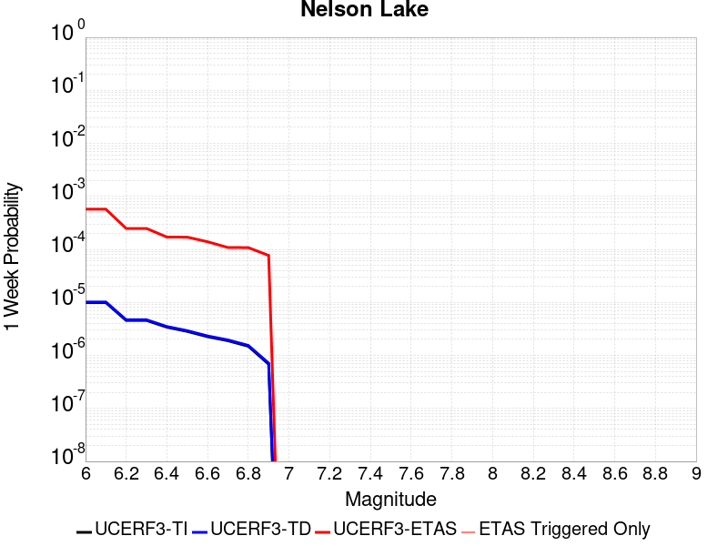 | 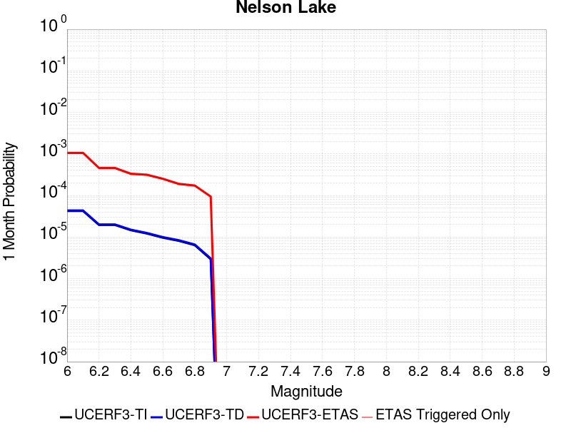 | 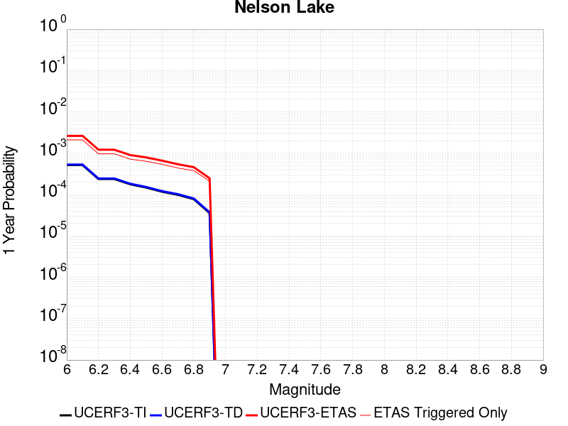 | 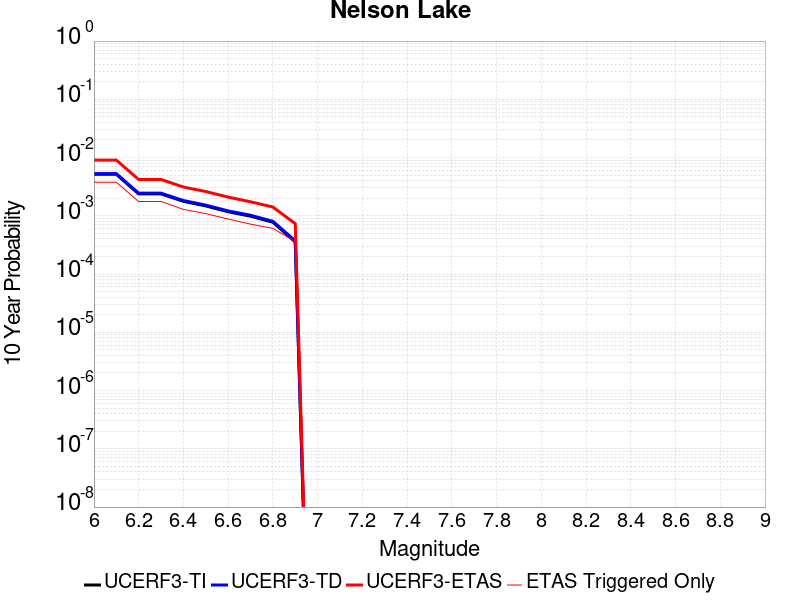 |

| Magnitude | 1 wk TI Prob | 1 wk TD Prob | 1 wk ETAS Prob | 1 wk ETAS/TD Gain | 1 wk ETAS Triggered Only | 1 mo TI Prob | 1 mo TD Prob | 1 mo ETAS Prob | 1 mo ETAS/TD Gain | 1 mo ETAS Triggered Only | 1 yr TI Prob | 1 yr TD Prob | 1 yr ETAS Prob | 1 yr ETAS/TD Gain | 1 yr ETAS Triggered Only | 10 yr TI Prob | 10 yr TD Prob | 10 yr ETAS Prob | 10 yr ETAS/TD Gain | 10 yr ETAS Triggered Only |
|-----|-----|-----|-----|-----|-----|-----|-----|-----|-----|-----|-----|-----|-----|-----|-----|-----|-----|-----|-----|-----|
| 6.0 | 9.913453E-6 | 1.0192255E-5 | 5.7335244E-4 | 56.253735 | 5.6316593E-4 | 4.2485535E-5 | 4.3680422E-5 | 0.0010634228 | 24.345526 | 0.0010197869 | 5.1713863E-4 | 5.316897E-4 | 0.0027983682 | 5.2631607 | 0.0022678843 | 0.0051593683 | 0.005305204 | 0.009332431 | 1.7591088 | 0.004048706 |
| 6.1 | 9.913453E-6 | 1.0192255E-5 | 5.7335244E-4 | 56.253735 | 5.6316593E-4 | 4.2485535E-5 | 4.3680422E-5 | 0.0010634228 | 24.345526 | 0.0010197869 | 5.1713863E-4 | 5.316897E-4 | 0.0027983682 | 5.2631607 | 0.0022678843 | 0.0051593683 | 0.005305204 | 0.009332431 | 1.7591088 | 0.004048706 |
| 6.2 | 4.5596407E-6 | 4.696313E-6 | 2.4822637E-4 | 52.855583 | 2.435312E-4 | 1.954117E-5 | 2.0126909E-5 | 4.6151833E-4 | 22.930414 | 4.414003E-4 | 2.3788778E-4 | 2.4501883E-4 | 0.0013406407 | 5.4715824 | 0.0010958904 | 0.0023763329 | 0.0024476128 | 0.0043455437 | 1.7754211 | 0.0019025875 |
| 6.3 | 4.5596407E-6 | 4.696313E-6 | 2.4822637E-4 | 52.855583 | 2.435312E-4 | 1.954117E-5 | 2.0126909E-5 | 4.6151833E-4 | 22.930414 | 4.414003E-4 | 2.3788778E-4 | 2.4501883E-4 | 0.0013406407 | 5.4715824 | 0.0010958904 | 0.0023763329 | 0.0024476128 | 0.0043455437 | 1.7754211 | 0.0019025875 |
| 6.4 | 3.4025713E-6 | 3.5098972E-6 | 1.7093701E-4 | 48.701427 | 1.674277E-4 | 1.4582367E-5 | 1.5042335E-5 | 3.3467222E-4 | 22.24869 | 3.196347E-4 | 1.7752586E-4 | 1.8312587E-4 | 9.288036E-4 | 5.071941 | 7.458143E-4 | 0.001773841 | 0.0018298327 | 0.003197189 | 1.7472576 | 0.001369863 |
| 6.5 | 2.8352947E-6 | 2.927856E-6 | 1.7035507E-4 | 58.184235 | 1.674277E-4 | 1.2151207E-5 | 1.2547898E-5 | 3.169581E-4 | 25.259853 | 3.0441402E-4 | 1.479309E-4 | 1.5276071E-4 | 8.5280597E-4 | 5.5826263 | 7.001522E-4 | 0.0014783246 | 0.0015266308 | 0.0027272305 | 1.7864374 | 0.0012024353 |
| 6.6 | 2.251518E-6 | 2.3290677E-6 | 1.3931505E-4 | 59.815804 | 1.369863E-4 | 9.649328E-6 | 9.981683E-6 | 2.5351046E-4 | 25.397566 | 2.435312E-4 | 1.1747423E-4 | 1.2152085E-4 | 6.846183E-4 | 5.633752 | 5.6316593E-4 | 0.0011741214 | 0.0012146058 | 0.002172345 | 1.7885188 | 9.589041E-4 |
| 6.7 | 1.8911853E-6 | 1.9591396E-6 | 1.0850383E-4 | 55.383408 | 1.065449E-4 | 8.105055E-6 | 8.39629E-6 | 1.9104316E-4 | 22.753284 | 1.8264841E-4 | 9.867457E-5 | 1.0222061E-4 | 5.740141E-4 | 5.6154437 | 4.7184172E-4 | 9.863076E-4 | 0.0010217935 | 0.0018276663 | 1.7886847 | 8.066971E-4 |
| 6.8 | 1.4874814E-6 | 1.5438305E-6 | 1.0808857E-4 | 70.01324 | 1.065449E-4 | 6.374905E-6 | 6.6164025E-6 | 1.74043E-4 | 26.304777 | 1.674277E-4 | 7.76117E-5 | 8.055224E-5 | 4.914781E-4 | 6.1013575 | 4.109589E-4 | 7.75846E-4 | 8.0528157E-4 | 0.0015200784 | 1.887636 | 7.153729E-4 |
| 6.9 | 6.835972E-7 | 7.1399285E-7 | 7.6817436E-5 | 107.58853 | 7.6103504E-5 | 2.9296991E-6 | 3.0599674E-6 | 9.438389E-5 | 30.844736 | 9.1324204E-5 | 3.56685E-5 | 3.7254784E-5 | 2.655568E-4 | 7.128125 | 2.283105E-4 | 3.5662777E-4 | 3.7251666E-4 | 7.833225E-4 | 2.102785 | 4.109589E-4 |

## Death Valley (So)
*[(top)](#table-of-contents)*

| 1 Week | 1 Month | 1 Year | 10 Year |
|-----|-----|-----|-----|
| 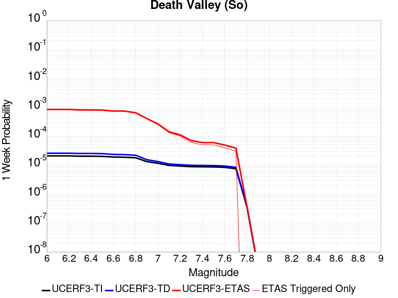 | 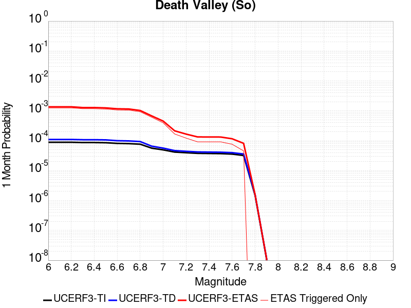 | 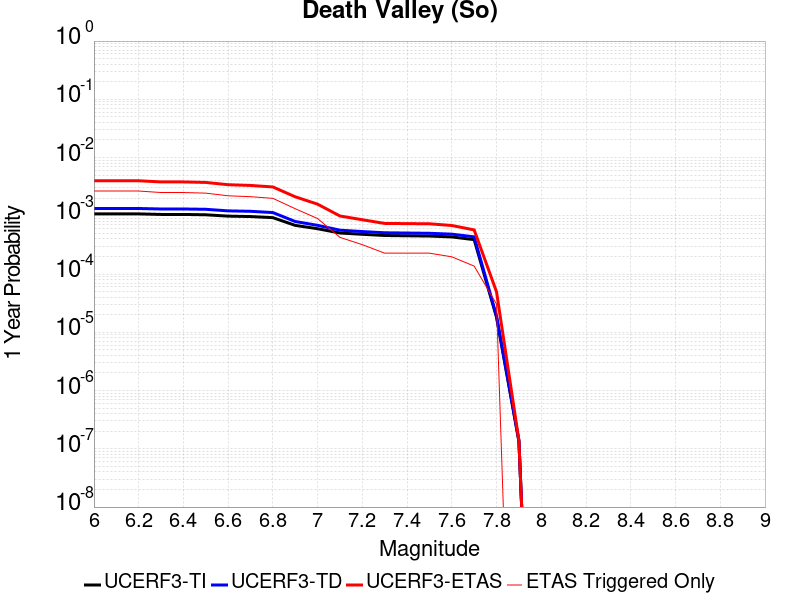 | 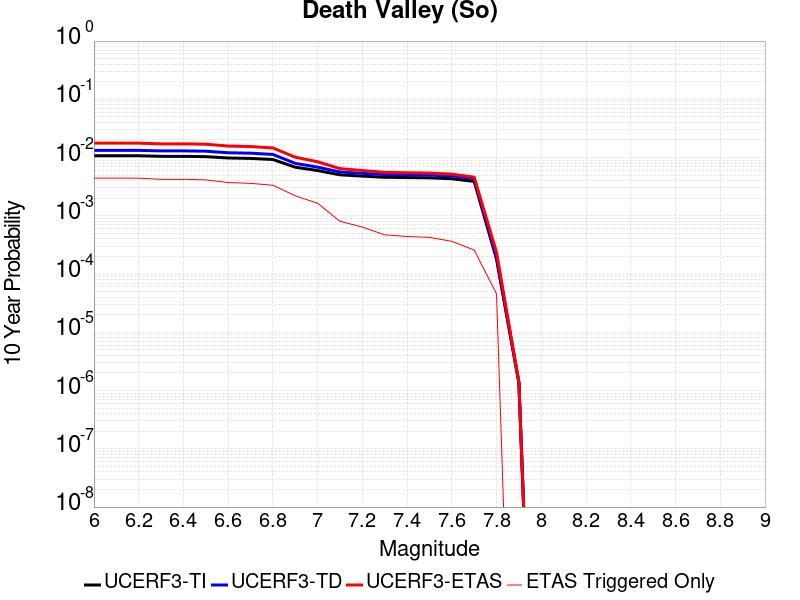 |

| Magnitude | 1 wk TI Prob | 1 wk TD Prob | 1 wk ETAS Prob | 1 wk ETAS/TD Gain | 1 wk ETAS Triggered Only | 1 mo TI Prob | 1 mo TD Prob | 1 mo ETAS Prob | 1 mo ETAS/TD Gain | 1 mo ETAS Triggered Only | 1 yr TI Prob | 1 yr TD Prob | 1 yr ETAS Prob | 1 yr ETAS/TD Gain | 1 yr ETAS Triggered Only | 10 yr TI Prob | 10 yr TD Prob | 10 yr ETAS Prob | 10 yr ETAS/TD Gain | 10 yr ETAS Triggered Only |
|-----|-----|-----|-----|-----|-----|-----|-----|-----|-----|-----|-----|-----|-----|-----|-----|-----|-----|-----|-----|-----|
| 6.0 | 2.0684236E-5 | 2.5617775E-5 | 8.170739E-4 | 31.894802 | 7.914764E-4 | 8.864371E-5 | 1.0978594E-4 | 0.0013577463 | 12.367214 | 0.0012480974 | 0.0010787029 | 0.0013358411 | 0.0039959056 | 2.991303 | 0.0026636226 | 0.010734817 | 0.013281397 | 0.017651794 | 1.3290616 | 0.004429224 |
| 6.1 | 2.0684236E-5 | 2.5617775E-5 | 8.170739E-4 | 31.894802 | 7.914764E-4 | 8.864371E-5 | 1.0978594E-4 | 0.0013577463 | 12.367214 | 0.0012480974 | 0.0010787029 | 0.0013358411 | 0.0039959056 | 2.991303 | 0.0026636226 | 0.010734817 | 0.013281397 | 0.017651794 | 1.3290616 | 0.004429224 |
| 6.2 | 2.0684236E-5 | 2.5617775E-5 | 8.170739E-4 | 31.894802 | 7.914764E-4 | 8.864371E-5 | 1.0978594E-4 | 0.0013577463 | 12.367214 | 0.0012480974 | 0.0010787029 | 0.0013358411 | 0.0039959056 | 2.991303 | 0.0026636226 | 0.010734817 | 0.013281397 | 0.017651794 | 1.3290616 | 0.004429224 |
| 6.3 | 2.0240292E-5 | 2.511786E-5 | 7.8613375E-4 | 31.2978 | 7.61035E-4 | 8.6741224E-5 | 1.07643624E-4 | 0.0012795114 | 11.88655 | 0.0011719939 | 0.0010555626 | 0.00130979 | 0.0038179161 | 2.914907 | 0.0025114156 | 0.010505628 | 0.013023956 | 0.017200202 | 1.3206588 | 0.0042313547 |
| 6.4 | 2.0240292E-5 | 2.511786E-5 | 7.8613375E-4 | 31.2978 | 7.61035E-4 | 8.6741224E-5 | 1.07643624E-4 | 0.0012795114 | 11.88655 | 0.0011719939 | 0.0010555626 | 0.00130979 | 0.0038179161 | 2.914907 | 0.0025114156 | 0.010505628 | 0.013023956 | 0.017200202 | 1.3206588 | 0.0042313547 |
| 6.5 | 1.9962767E-5 | 2.4807114E-5 | 7.706029E-4 | 31.063787 | 7.458143E-4 | 8.55519E-5 | 1.0631196E-4 | 0.0012477431 | 11.73662 | 0.0011415525 | 0.0010410968 | 0.0012935963 | 0.003740959 | 2.891906 | 0.0024505327 | 0.010362327 | 0.012863902 | 0.016950676 | 1.3176931 | 0.0041400306 |
| 6.6 | 1.8937297E-5 | 2.3310964E-5 | 7.2344684E-4 | 31.034616 | 7.001522E-4 | 8.115732E-5 | 9.990039E-5 | 0.001165243 | 11.664048 | 0.001065449 | 9.876423E-4 | 0.0012156231 | 0.0034199418 | 2.813324 | 0.0022070014 | 0.009832645 | 0.012092789 | 0.015776765 | 1.3046424 | 0.0037290715 |
| 6.7 | 1.8621096E-5 | 2.2911607E-5 | 7.2304776E-4 | 31.558144 | 7.001522E-4 | 7.980225E-5 | 9.818898E-5 | 0.0011483142 | 11.694939 | 0.0010502283 | 9.711593E-4 | 0.0011948098 | 0.0033231617 | 2.7813313 | 0.002130898 | 0.009669261 | 0.011886904 | 0.01545133 | 1.2998617 | 0.003607306 |
| 6.8 | 1.7830353E-5 | 2.1805688E-5 | 6.1540003E-4 | 28.221996 | 5.936073E-4 | 7.641356E-5 | 9.344968E-5 | 0.0010218256 | 10.934501 | 9.284627E-4 | 9.29938E-4 | 0.00113717 | 0.0031288143 | 2.751404 | 0.0019939118 | 0.009260561 | 0.011316354 | 0.014627015 | 1.2925555 | 0.003348554 |
| 6.9 | 1.3135183E-5 | 1.5303925E-5 | 4.2625653E-4 | 27.85276 | 4.109589E-4 | 5.6292425E-5 | 6.558664E-5 | 6.743747E-4 | 10.282197 | 6.0882804E-4 | 6.8514474E-4 | 7.982312E-4 | 0.0021213752 | 2.6575947 | 0.0013242009 | 0.006830362 | 0.007954649 | 0.010144094 | 1.275241 | 0.0022070014 |
| 7.0 | 1.1507512E-5 | 1.3154199E-5 | 2.566822E-4 | 19.513327 | 2.435312E-4 | 4.9316975E-5 | 5.6373956E-5 | 4.5208985E-4 | 8.019481 | 3.957382E-4 | 6.002687E-4 | 6.8614254E-4 | 0.0015835477 | 2.307899 | 8.9802133E-4 | 0.0059864987 | 0.0068409415 | 0.008473531 | 1.23865 | 0.0016438356 |
| 7.1 | 9.715903E-6 | 1.0865278E-5 | 1.3262956E-4 | 12.206734 | 1.217656E-4 | 4.1638916E-5 | 4.656467E-5 | 2.1398457E-4 | 4.5954275 | 1.674277E-4 | 5.068359E-4 | 5.667817E-4 | 9.927197E-4 | 1.7515029 | 4.261796E-4 | 0.0050568148 | 0.0056538144 | 0.006455951 | 1.1418753 | 8.066971E-4 |
| 7.2 | 9.233269E-6 | 1.02863105E-5 | 1.1683012E-4 | 11.357825 | 1.065449E-4 | 3.9570554E-5 | 4.4083466E-5 | 1.658437E-4 | 3.7620385 | 1.217656E-4 | 4.81665E-4 | 5.3658825E-4 | 8.5605145E-4 | 1.59536 | 3.196347E-4 | 0.0048062233 | 0.0053533576 | 0.0059892046 | 1.1187754 | 6.392694E-4 |
| 7.3 | 8.8041315E-6 | 9.808164E-6 | 8.591092E-5 | 8.759124 | 7.6103504E-5 | 3.7731446E-5 | 4.2034335E-5 | 1.333547E-4 | 3.1725183 | 9.1324204E-5 | 4.592835E-4 | 5.1165203E-4 | 7.3984574E-4 | 1.4459939 | 2.283105E-4 | 0.0045833546 | 0.005105167 | 0.0055746 | 1.0919524 | 4.7184172E-4 |
| 7.4 | 8.708749E-6 | 9.707175E-6 | 8.580994E-5 | 8.839847 | 7.6103504E-5 | 3.7322676E-5 | 4.160154E-5 | 1.3292194E-4 | 3.1951208 | 9.1324204E-5 | 4.5430884E-4 | 5.0638523E-4 | 7.345801E-4 | 1.450635 | 2.283105E-4 | 0.004533812 | 0.0050527398 | 0.0054919096 | 1.0869172 | 4.414003E-4 |
| 7.5 | 8.612678E-6 | 9.604817E-6 | 8.570759E-5 | 8.923396 | 7.6103504E-5 | 3.6910955E-5 | 4.1162875E-5 | 1.3248331E-4 | 3.2185147 | 9.1324204E-5 | 4.492982E-4 | 5.01047E-4 | 7.292431E-4 | 1.4554385 | 2.283105E-4 | 0.004483909 | 0.0049995985 | 0.0054236474 | 1.0848166 | 4.261796E-4 |
| 7.6 | 8.319024E-6 | 9.283916E-6 | 7.016615E-5 | 7.557818 | 6.08828E-5 | 3.5652476E-5 | 3.978763E-5 | 1.15888106E-4 | 2.9126666 | 7.6103504E-5 | 4.3398244E-4 | 4.8431093E-4 | 6.820842E-4 | 1.4083601 | 1.978691E-4 | 0.0043313587 | 0.0048329784 | 0.00519651 | 1.0752189 | 3.6529682E-4 |
| 7.7 | 7.4718328E-6 | 8.34517E-6 | 5.400689E-5 | 6.4716344 | 4.5662102E-5 | 3.2021748E-5 | 3.5764548E-5 | 8.1425016E-5 | 2.2766964 | 4.5662102E-5 | 3.8979502E-4 | 4.353504E-4 | 5.7227706E-4 | 1.3145206 | 1.369863E-4 | 0.00389112 | 0.0043453807 | 0.0046030083 | 1.0592877 | 2.587519E-4 |
| 7.8 | 3.4586725E-7 | 3.6482615E-7 | 3.6482615E-7 | 1.0 | 0.0 | 1.4822873E-6 | 1.5635396E-6 | 1.5635396E-6 | 1.0 | 0.0 | 1.80467E-5 | 1.9035933E-5 | 4.9476756E-5 | 2.5991242 | 3.04414E-5 | 1.8045233E-4 | 1.9034347E-4 | 2.3599688E-4 | 1.2398475 | 4.5662102E-5 |
| 7.9 | 2.5591178E-9 | 2.6696718E-9 | 2.6696718E-9 | 1.0 | 0.0 | 1.0967647E-8 | 1.14414505E-8 | 1.14414505E-8 | 1.0 | 0.0 | 1.335311E-7 | 1.3929966E-7 | 1.3929966E-7 | 1.0 | 0.0 | 1.3353102E-6 | 1.3929966E-6 | 1.3929966E-6 | 1.0 | 0.0 |

## San Andreas (Mojave N)
*[(top)](#table-of-contents)*

| 1 Week | 1 Month | 1 Year | 10 Year |
|-----|-----|-----|-----|
| 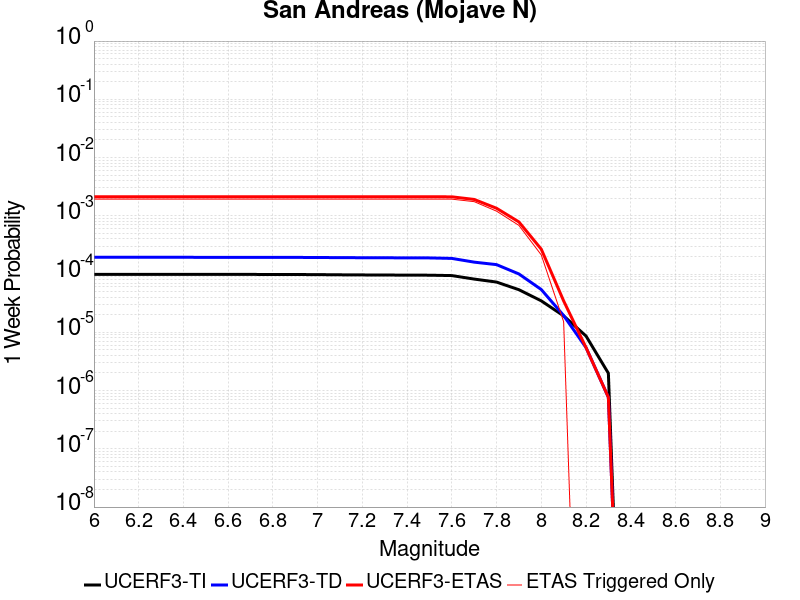 | 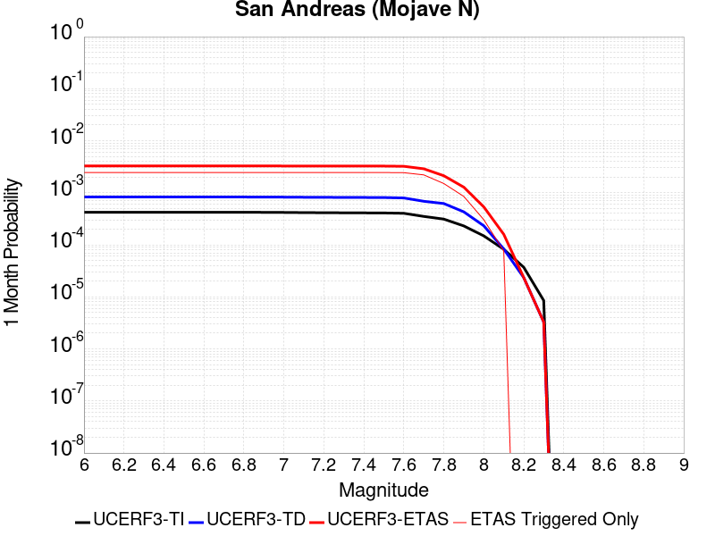 | 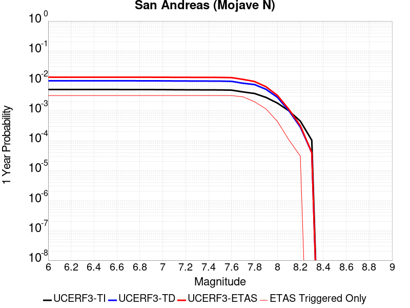 | 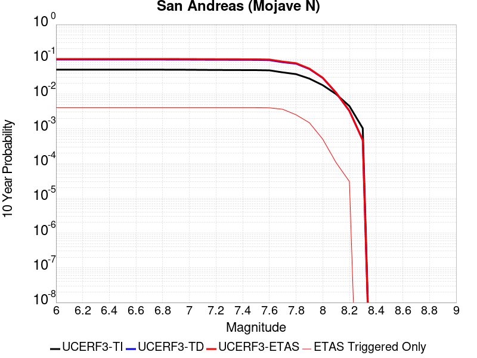 |

| Magnitude | 1 wk TI Prob | 1 wk TD Prob | 1 wk ETAS Prob | 1 wk ETAS/TD Gain | 1 wk ETAS Triggered Only | 1 mo TI Prob | 1 mo TD Prob | 1 mo ETAS Prob | 1 mo ETAS/TD Gain | 1 mo ETAS Triggered Only | 1 yr TI Prob | 1 yr TD Prob | 1 yr ETAS Prob | 1 yr ETAS/TD Gain | 1 yr ETAS Triggered Only | 10 yr TI Prob | 10 yr TD Prob | 10 yr ETAS Prob | 10 yr ETAS/TD Gain | 10 yr ETAS Triggered Only |
|-----|-----|-----|-----|-----|-----|-----|-----|-----|-----|-----|-----|-----|-----|-----|-----|-----|-----|-----|-----|-----|
| 6.0 | 9.877682E-5 | 1.9400702E-4 | 0.002126661 | 10.961773 | 0.0019330289 | 4.2326056E-4 | 8.311939E-4 | 0.0032796897 | 3.9457579 | 0.0024505327 | 0.0051410277 | 0.010072956 | 0.013297376 | 1.3201066 | 0.00325723 | 0.05023708 | 0.09831428 | 0.101964936 | 1.0371325 | 0.004048706 |
| 6.1 | 9.877682E-5 | 1.9400702E-4 | 0.002126661 | 10.961773 | 0.0019330289 | 4.2326056E-4 | 8.311939E-4 | 0.0032796897 | 3.9457579 | 0.0024505327 | 0.0051410277 | 0.010072956 | 0.013297376 | 1.3201066 | 0.00325723 | 0.05023708 | 0.09831428 | 0.101964936 | 1.0371325 | 0.004048706 |
| 6.2 | 9.877682E-5 | 1.9400702E-4 | 0.002126661 | 10.961773 | 0.0019330289 | 4.2326056E-4 | 8.311939E-4 | 0.0032796897 | 3.9457579 | 0.0024505327 | 0.0051410277 | 0.010072956 | 0.013297376 | 1.3201066 | 0.00325723 | 0.05023708 | 0.09831428 | 0.101964936 | 1.0371325 | 0.004048706 |
| 6.3 | 9.877682E-5 | 1.9400702E-4 | 0.002126661 | 10.961773 | 0.0019330289 | 4.2326056E-4 | 8.311939E-4 | 0.0032796897 | 3.9457579 | 0.0024505327 | 0.0051410277 | 0.010072956 | 0.013297376 | 1.3201066 | 0.00325723 | 0.05023708 | 0.09831428 | 0.101964936 | 1.0371325 | 0.004048706 |
| 6.4 | 9.877682E-5 | 1.9400702E-4 | 0.002126661 | 10.961773 | 0.0019330289 | 4.2326056E-4 | 8.311939E-4 | 0.0032796897 | 3.9457579 | 0.0024505327 | 0.0051410277 | 0.010072956 | 0.013297376 | 1.3201066 | 0.00325723 | 0.05023708 | 0.09831428 | 0.101964936 | 1.0371325 | 0.004048706 |
| 6.5 | 9.861474E-5 | 1.9374468E-4 | 0.0021263992 | 10.975265 | 0.0019330289 | 4.2256617E-4 | 8.300703E-4 | 0.0032785689 | 3.9497485 | 0.0024505327 | 0.0051326132 | 0.010059402 | 0.013283866 | 1.3205423 | 0.00325723 | 0.050156746 | 0.098192066 | 0.10184322 | 1.0371838 | 0.004048706 |
| 6.6 | 9.861474E-5 | 1.9374468E-4 | 0.0021263992 | 10.975265 | 0.0019330289 | 4.2256617E-4 | 8.300703E-4 | 0.0032785689 | 3.9497485 | 0.0024505327 | 0.0051326132 | 0.010059402 | 0.013283866 | 1.3205423 | 0.00325723 | 0.050156746 | 0.098192066 | 0.10184322 | 1.0371838 | 0.004048706 |
| 6.7 | 9.8552715E-5 | 1.9364421E-4 | 0.0021262988 | 10.980441 | 0.0019330289 | 4.223004E-4 | 8.2964E-4 | 0.0032781397 | 3.9512796 | 0.0024505327 | 0.0051293927 | 0.010054212 | 0.013278693 | 1.3207095 | 0.00325723 | 0.050125998 | 0.098145254 | 0.1017966 | 1.0372034 | 0.004048706 |
| 6.8 | 9.8464974E-5 | 1.9349584E-4 | 0.0021261508 | 10.988095 | 0.0019330289 | 4.219245E-4 | 8.290045E-4 | 0.0032775057 | 3.953544 | 0.0024505327 | 0.0051248376 | 0.010046546 | 0.013271052 | 1.3209566 | 0.00325723 | 0.05008251 | 0.09807528 | 0.10172691 | 1.0372329 | 0.004048706 |
| 6.9 | 9.825824E-5 | 1.9317595E-4 | 0.0021258316 | 11.004639 | 0.0019330289 | 4.2103877E-4 | 8.276344E-4 | 0.003276139 | 3.9584374 | 0.0024505327 | 0.0051141046 | 0.010030019 | 0.013254579 | 1.3214909 | 0.00325723 | 0.049980022 | 0.09792438 | 0.10157662 | 1.0372965 | 0.004048706 |
| 7.0 | 9.781462E-5 | 1.924896E-4 | 0.0021251463 | 11.0403185 | 0.0019330289 | 4.1913814E-4 | 8.246948E-4 | 0.0032732065 | 3.9689913 | 0.0024505327 | 0.005091073 | 0.009994558 | 0.013219234 | 1.322643 | 0.00325723 | 0.04976007 | 0.09760077 | 0.10125432 | 1.0374336 | 0.004048706 |
| 7.1 | 9.7121134E-5 | 1.9150671E-4 | 0.0021241654 | 11.091859 | 0.0019330289 | 4.1616702E-4 | 8.204851E-4 | 0.0032690072 | 3.9842372 | 0.0024505327 | 0.005055068 | 0.009943774 | 0.013168615 | 1.3243076 | 0.00325723 | 0.04941613 | 0.09713728 | 0.100792706 | 1.0376315 | 0.004048706 |
| 7.2 | 9.663819E-5 | 1.9081456E-4 | 0.0021234746 | 11.128472 | 0.0019330289 | 4.1409794E-4 | 8.175206E-4 | 0.00326605 | 3.9950674 | 0.0024505327 | 0.0050299936 | 0.00990801 | 0.013132968 | 1.3254899 | 0.00325723 | 0.049176537 | 0.09681055 | 0.100467294 | 1.0377722 | 0.004048706 |
| 7.3 | 9.6277574E-5 | 1.9033969E-4 | 0.0021230008 | 11.153747 | 0.0019330289 | 4.125529E-4 | 8.154867E-4 | 0.0032640211 | 4.0025434 | 0.0024505327 | 0.0050112694 | 0.009883473 | 0.01310851 | 1.3263061 | 0.00325723 | 0.04899759 | 0.09658401 | 0.100241676 | 1.0378703 | 0.004048706 |
| 7.4 | 9.593308E-5 | 1.897375E-4 | 0.0021223996 | 11.185979 | 0.0019330289 | 4.1107697E-4 | 8.129075E-4 | 0.0032614481 | 4.012078 | 0.0024505327 | 0.0049933824 | 0.009852355 | 0.013077494 | 1.3273469 | 0.00325723 | 0.04882661 | 0.09630218 | 0.09996099 | 1.037993 | 0.004048706 |
| 7.5 | 9.561707E-5 | 1.8919831E-4 | 0.0021218616 | 11.215013 | 0.0019330289 | 4.0972308E-4 | 8.1059814E-4 | 0.0032591445 | 4.020666 | 0.0024505327 | 0.0049769743 | 0.009824493 | 0.013049722 | 1.3282845 | 0.00325723 | 0.048669744 | 0.09604836 | 0.0997082 | 1.038104 | 0.004048706 |
| 7.6 | 9.418194E-5 | 1.8572104E-4 | 0.002118391 | 11.406305 | 0.0019330289 | 4.0357444E-4 | 7.957047E-4 | 0.003229079 | 4.0581374 | 0.0024353121 | 0.004902454 | 0.009644784 | 0.012840451 | 1.3313363 | 0.0032267885 | 0.047957025 | 0.094430685 | 0.09805572 | 1.0383883 | 0.004003044 |
| 7.7 | 8.202141E-5 | 1.6021315E-4 | 0.0019103133 | 11.9235735 | 0.0017503805 | 3.51473E-4 | 6.8644714E-4 | 0.0028919338 | 4.2129006 | 0.0022070014 | 0.00427079 | 0.008325525 | 0.011223569 | 1.3480915 | 0.0029223745 | 0.04189639 | 0.08223219 | 0.085570805 | 1.0405997 | 0.0036377474 |
| 7.8 | 7.2859846E-5 | 1.4516473E-4 | 0.0013474255 | 9.282045 | 0.0012024353 | 3.1221908E-4 | 6.219862E-4 | 0.0021278984 | 3.4211342 | 0.0015068493 | 0.003794643 | 0.0075464295 | 0.0095404005 | 1.264227 | 0.0020091324 | 0.037304975 | 0.07472468 | 0.07706252 | 1.031286 | 0.0025266362 |
| 7.9 | 5.3874453E-5 | 1.0045676E-4 | 7.853195E-4 | 7.8174872 | 6.849315E-4 | 2.3087008E-4 | 4.3045796E-4 | 0.0012824503 | 2.9792695 | 8.523592E-4 | 0.0028072202 | 0.0052282433 | 0.0063789682 | 1.2200979 | 0.0011567732 | 0.02772022 | 0.05242443 | 0.053837862 | 1.0269613 | 0.0014916286 |
| 8.0 | 3.468538E-5 | 5.4260272E-5 | 2.673385E-4 | 4.926966 | 2.130898E-4 | 1.4864317E-4 | 2.325233E-4 | 5.3686654E-4 | 2.308872 | 3.0441402E-4 | 0.0018082283 | 0.002827298 | 0.0032674503 | 1.1556795 | 4.414003E-4 | 0.017935853 | 0.028947512 | 0.029435255 | 1.0168493 | 5.022831E-4 |
| 8.1 | 1.9152367E-5 | 1.940263E-5 | 3.4623034E-5 | 1.7844507 | 1.52207E-5 | 8.207899E-5 | 8.3151484E-5 | 1.5924865E-4 | 1.9151632 | 7.6103504E-5 | 9.988535E-4 | 0.0010118998 | 0.0011183368 | 1.1051854 | 1.065449E-4 | 0.009943757 | 0.01085625 | 0.010961639 | 1.0097076 | 1.065449E-4 |
| 8.2 | 8.643924E-6 | 5.4748625E-6 | 5.4748625E-6 | 1.0 | 0.0 | 3.704486E-5 | 2.3463486E-5 | 2.3463486E-5 | 1.0 | 0.0 | 4.5092785E-4 | 2.8563058E-4 | 3.1606326E-4 | 1.1065457 | 3.04414E-5 | 0.0045001395 | 0.0032487072 | 0.0032790496 | 1.0093399 | 3.04414E-5 |
| 8.3 | 1.983087E-6 | 7.6599065E-7 | 7.6599065E-7 | 1.0 | 0.0 | 8.498917E-6 | 3.282813E-6 | 3.282813E-6 | 1.0 | 0.0 | 1.034694E-4 | 3.9967534E-5 | 3.9967534E-5 | 1.0 | 0.0 | 0.0010342124 | 4.719687E-4 | 4.719687E-4 | 1.0 | 0.0 |

## Lenwood-Lockhart-Old Woman Springs
*[(top)](#table-of-contents)*

| 1 Week | 1 Month | 1 Year | 10 Year |
|-----|-----|-----|-----|
|  |  | 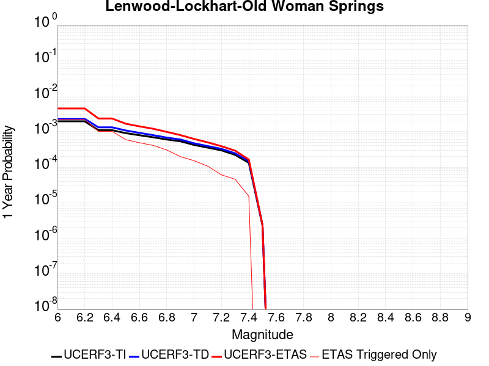 | 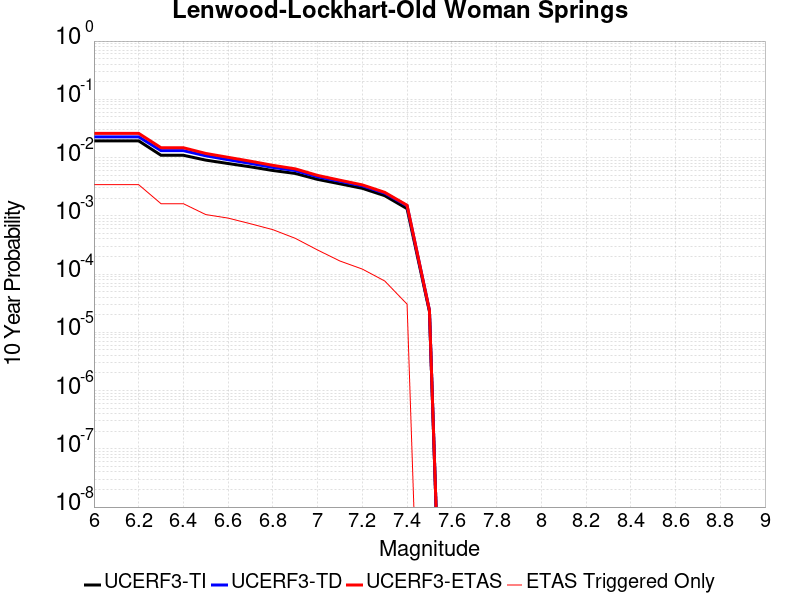 |

| Magnitude | 1 wk TI Prob | 1 wk TD Prob | 1 wk ETAS Prob | 1 wk ETAS/TD Gain | 1 wk ETAS Triggered Only | 1 mo TI Prob | 1 mo TD Prob | 1 mo ETAS Prob | 1 mo ETAS/TD Gain | 1 mo ETAS Triggered Only | 1 yr TI Prob | 1 yr TD Prob | 1 yr ETAS Prob | 1 yr ETAS/TD Gain | 1 yr ETAS Triggered Only | 10 yr TI Prob | 10 yr TD Prob | 10 yr ETAS Prob | 10 yr ETAS/TD Gain | 10 yr ETAS Triggered Only |
|-----|-----|-----|-----|-----|-----|-----|-----|-----|-----|-----|-----|-----|-----|-----|-----|-----|-----|-----|-----|-----|
| 6.0 | 3.744542E-5 | 4.396252E-5 | 9.1150426E-4 | 20.733667 | 8.675799E-4 | 1.604705E-4 | 1.8839816E-4 | 0.0014058248 | 7.4619875 | 0.0012176561 | 0.0019519776 | 0.0022915069 | 0.004478265 | 1.9542884 | 0.0021917808 | 0.019349206 | 0.022696787 | 0.026043717 | 1.1474627 | 0.0034246575 |
| 6.1 | 3.744542E-5 | 4.396252E-5 | 9.1150426E-4 | 20.733667 | 8.675799E-4 | 1.604705E-4 | 1.8839816E-4 | 0.0014058248 | 7.4619875 | 0.0012176561 | 0.0019519776 | 0.0022915069 | 0.004478265 | 1.9542884 | 0.0021917808 | 0.019349206 | 0.022696787 | 0.026043717 | 1.1474627 | 0.0034246575 |
| 6.2 | 3.744542E-5 | 4.396252E-5 | 9.1150426E-4 | 20.733667 | 8.675799E-4 | 1.604705E-4 | 1.8839816E-4 | 0.0014058248 | 7.4619875 | 0.0012176561 | 0.0019519776 | 0.0022915069 | 0.004478265 | 1.9542884 | 0.0021917808 | 0.019349206 | 0.022696787 | 0.026043717 | 1.1474627 | 0.0034246575 |
| 6.3 | 2.1079984E-5 | 2.5353434E-5 | 5.276238E-4 | 20.810743 | 5.022831E-4 | 9.0339665E-5 | 1.0865316E-4 | 7.17415E-4 | 6.6027994 | 6.0882804E-4 | 0.0010993304 | 0.0013220694 | 0.0023405082 | 1.7703367 | 0.0010197869 | 0.010939079 | 0.0131442575 | 0.014736445 | 1.1211318 | 0.0016133942 |
| 6.4 | 2.1079984E-5 | 2.5353434E-5 | 5.276238E-4 | 20.810743 | 5.022831E-4 | 9.0339665E-5 | 1.0865316E-4 | 7.17415E-4 | 6.6027994 | 6.0882804E-4 | 0.0010993304 | 0.0013220694 | 0.0023405082 | 1.7703367 | 0.0010197869 | 0.010939079 | 0.0131442575 | 0.014736445 | 1.1211318 | 0.0016133942 |
| 6.5 | 1.7397282E-5 | 2.066241E-5 | 2.9462934E-4 | 14.259196 | 2.739726E-4 | 7.455765E-5 | 8.8550245E-5 | 4.23376E-4 | 4.781195 | 3.348554E-4 | 9.073613E-4 | 0.0010775778 | 0.0016705454 | 1.5502783 | 5.936073E-4 | 0.009036654 | 0.010724821 | 0.011763786 | 1.0968748 | 0.0010502283 |
| 6.6 | 1.52050325E-5 | 1.7679693E-5 | 2.3076573E-4 | 13.052587 | 2.130898E-4 | 6.51628E-5 | 7.576796E-5 | 3.497198E-4 | 4.615669 | 2.739726E-4 | 7.9306826E-4 | 9.220924E-4 | 0.0014087057 | 1.5277272 | 4.870624E-4 | 0.007902439 | 0.009183526 | 0.010088381 | 1.0985303 | 9.13242E-4 |
| 6.7 | 1.332523E-5 | 1.5264002E-5 | 1.8268915E-4 | 11.968627 | 1.674277E-4 | 5.7106878E-5 | 6.5415545E-5 | 2.937111E-4 | 4.4899282 | 2.283105E-4 | 6.950544E-4 | 7.961491E-4 | 0.0012067808 | 1.5157723 | 4.109589E-4 | 0.006928845 | 0.007933599 | 0.008658396 | 1.091358 | 7.3059363E-4 |
| 6.8 | 1.1525329E-5 | 1.3030979E-5 | 1.1957449E-4 | 9.176171 | 1.065449E-4 | 4.9393333E-5 | 5.584588E-5 | 2.0804438E-4 | 3.7253308 | 1.5220701E-4 | 6.011979E-4 | 6.797157E-4 | 9.839229E-4 | 1.4475504 | 3.0441402E-4 | 0.00599574 | 0.006776819 | 0.0073512862 | 1.0847694 | 5.783866E-4 |
| 6.9 | 1.0253909E-5 | 1.15144385E-5 | 7.2396535E-5 | 6.287457 | 6.08828E-5 | 4.3944583E-5 | 4.9346683E-5 | 1.4066638E-4 | 2.8505743 | 9.1324204E-5 | 5.3489394E-4 | 6.0063385E-4 | 7.9838414E-4 | 1.3292359 | 1.978691E-4 | 0.0053360825 | 0.0059904843 | 0.0063989814 | 1.0681909 | 4.109589E-4 |
| 7.0 | 8.104563E-6 | 8.991279E-6 | 6.987353E-5 | 7.7712564 | 6.08828E-5 | 3.4733377E-5 | 3.8533497E-5 | 1.2985418E-4 | 3.3699038 | 9.1324204E-5 | 4.2279682E-4 | 4.6904673E-4 | 6.211824E-4 | 1.3243506 | 1.5220701E-4 | 0.0042199334 | 0.0046808156 | 0.0049383566 | 1.0550205 | 2.587519E-4 |
| 7.1 | 6.7986157E-6 | 7.515816E-6 | 5.3177573E-5 | 7.075423 | 4.5662102E-5 | 2.91366E-5 | 3.2210253E-5 | 1.083113E-4 | 3.3626342 | 7.6103504E-5 | 3.5468035E-4 | 3.920914E-4 | 4.9859454E-4 | 1.2716283 | 1.065449E-4 | 0.003541148 | 0.003914213 | 0.004080985 | 1.0426068 | 1.674277E-4 |
| 7.2 | 5.6893327E-6 | 6.2800136E-6 | 5.1941828E-5 | 8.270973 | 4.5662102E-5 | 2.4382627E-5 | 2.6914078E-5 | 8.779524E-5 | 3.2620564 | 6.08828E-5 | 2.9681803E-4 | 3.2763163E-4 | 3.8849446E-4 | 1.1857661 | 6.08828E-5 | 0.002964219 | 0.0032716845 | 0.0033930517 | 1.0370963 | 1.217656E-4 |
| 7.3 | 4.253348E-6 | 4.7069107E-6 | 3.514817E-5 | 7.4673543 | 3.04414E-5 | 1.8228506E-5 | 2.0172329E-5 | 6.5833505E-5 | 3.2635553 | 4.5662102E-5 | 2.2190946E-4 | 2.4557224E-4 | 2.9122314E-4 | 1.1858959 | 4.5662102E-5 | 0.00221688 | 0.0024531898 | 0.0025291066 | 1.0309461 | 7.6103504E-5 |
| 7.4 | 2.5448119E-6 | 2.852045E-6 | 1.8072702E-5 | 6.336752 | 1.52207E-5 | 1.0906291E-5 | 1.2223002E-5 | 2.7443517E-5 | 2.2452354 | 1.52207E-5 | 1.3277601E-4 | 1.4880655E-4 | 1.6402497E-4 | 1.1022699 | 1.52207E-5 | 0.001326967 | 0.0014872311 | 0.0015176273 | 1.0204381 | 3.04414E-5 |
| 7.5 | 4.3706837E-8 | 4.562909E-8 | 4.562909E-8 | 1.0 | 0.0 | 1.8731501E-7 | 1.9555324E-7 | 1.9555324E-7 | 1.0 | 0.0 | 2.2805577E-6 | 2.3808586E-6 | 2.3808586E-6 | 1.0 | 0.0 | 2.2805343E-5 | 2.3808387E-5 | 2.3808387E-5 | 1.0 | 0.0 |

## Towne Pass
*[(top)](#table-of-contents)*

| 1 Week | 1 Month | 1 Year | 10 Year |
|-----|-----|-----|-----|
| 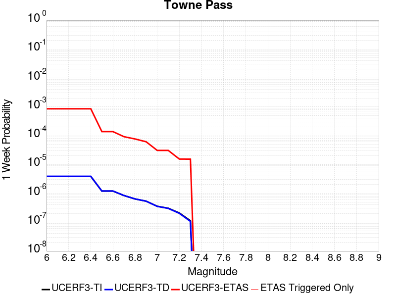 | 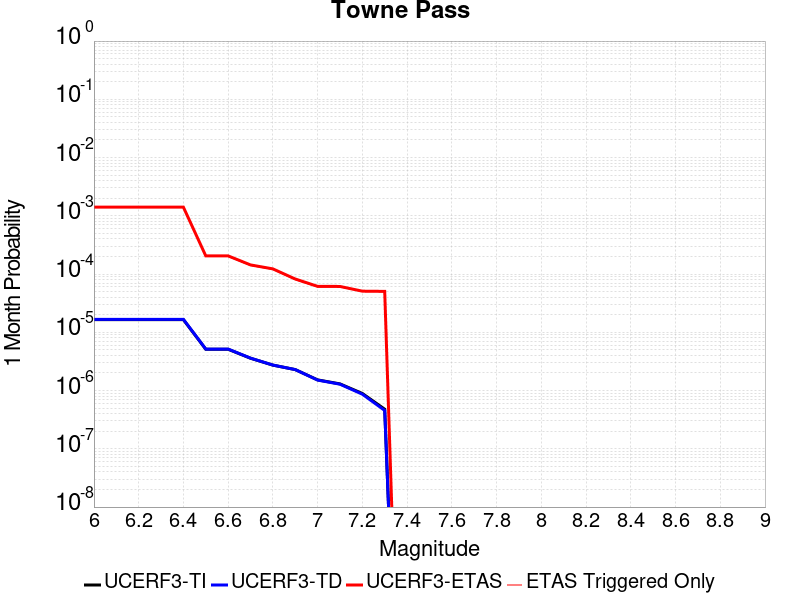 | 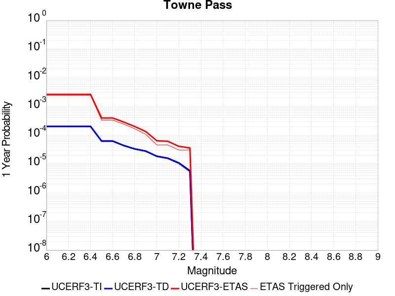 | 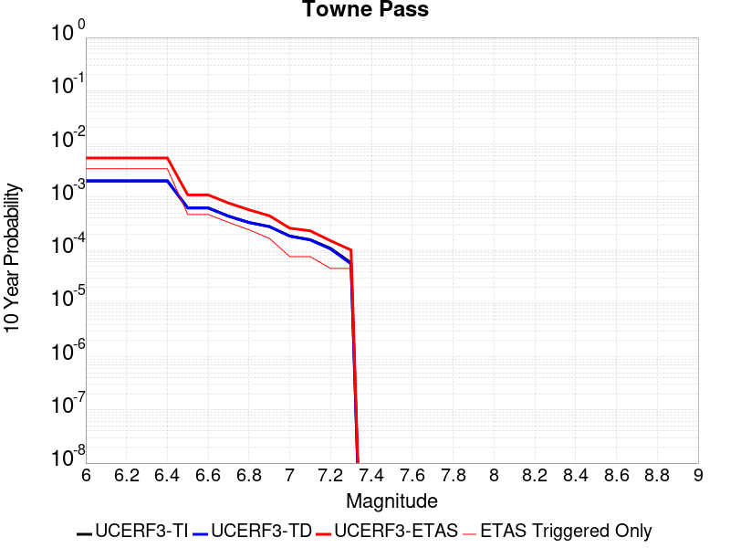 |

| Magnitude | 1 wk TI Prob | 1 wk TD Prob | 1 wk ETAS Prob | 1 wk ETAS/TD Gain | 1 wk ETAS Triggered Only | 1 mo TI Prob | 1 mo TD Prob | 1 mo ETAS Prob | 1 mo ETAS/TD Gain | 1 mo ETAS Triggered Only | 1 yr TI Prob | 1 yr TD Prob | 1 yr ETAS Prob | 1 yr ETAS/TD Gain | 1 yr ETAS Triggered Only | 10 yr TI Prob | 10 yr TD Prob | 10 yr ETAS Prob | 10 yr ETAS/TD Gain | 10 yr ETAS Triggered Only |
|-----|-----|-----|-----|-----|-----|-----|-----|-----|-----|-----|-----|-----|-----|-----|-----|-----|-----|-----|-----|-----|
| 6.0 | 3.849728E-6 | 3.8945414E-6 | 8.562504E-4 | 219.85912 | 8.523592E-4 | 1.649873E-5 | 1.669081E-5 | 0.0013104287 | 78.51199 | 0.0012937596 | 2.0085352E-4 | 2.0319603E-4 | 0.002638013 | 12.982602 | 0.0024353121 | 0.0020067208 | 0.0020305314 | 0.0054330453 | 2.6756766 | 0.003409437 |
| 6.1 | 3.849728E-6 | 3.8945414E-6 | 8.562504E-4 | 219.85912 | 8.523592E-4 | 1.649873E-5 | 1.669081E-5 | 0.0013104287 | 78.51199 | 0.0012937596 | 2.0085352E-4 | 2.0319603E-4 | 0.002638013 | 12.982602 | 0.0024353121 | 0.0020067208 | 0.0020305314 | 0.0054330453 | 2.6756766 | 0.003409437 |
| 6.2 | 3.849728E-6 | 3.8945414E-6 | 8.562504E-4 | 219.85912 | 8.523592E-4 | 1.649873E-5 | 1.669081E-5 | 0.0013104287 | 78.51199 | 0.0012937596 | 2.0085352E-4 | 2.0319603E-4 | 0.002638013 | 12.982602 | 0.0024353121 | 0.0020067208 | 0.0020305314 | 0.0054330453 | 2.6756766 | 0.003409437 |
| 6.3 | 3.849728E-6 | 3.8945414E-6 | 8.562504E-4 | 219.85912 | 8.523592E-4 | 1.649873E-5 | 1.669081E-5 | 0.0013104287 | 78.51199 | 0.0012937596 | 2.0085352E-4 | 2.0319603E-4 | 0.002638013 | 12.982602 | 0.0024353121 | 0.0020067208 | 0.0020305314 | 0.0054330453 | 2.6756766 | 0.003409437 |
| 6.4 | 3.849728E-6 | 3.8945414E-6 | 8.562504E-4 | 219.85912 | 8.523592E-4 | 1.649873E-5 | 1.669081E-5 | 0.0013104287 | 78.51199 | 0.0012937596 | 2.0085352E-4 | 2.0319603E-4 | 0.002638013 | 12.982602 | 0.0024353121 | 0.0020067208 | 0.0020305314 | 0.0054330453 | 2.6756766 | 0.003409437 |
| 6.5 | 1.1953545E-6 | 1.203052E-6 | 1.3818919E-4 | 114.86552 | 1.369863E-4 | 5.1229376E-6 | 5.1559277E-6 | 1.7258276E-4 | 33.47269 | 1.674277E-4 | 6.236998E-5 | 6.277173E-5 | 3.976061E-4 | 6.334159 | 3.348554E-4 | 6.235248E-4 | 6.275517E-4 | 0.0010990973 | 1.7514051 | 4.7184172E-4 |
| 6.6 | 1.1953545E-6 | 1.203052E-6 | 1.3818919E-4 | 114.86552 | 1.369863E-4 | 5.1229376E-6 | 5.1559277E-6 | 1.7258276E-4 | 33.47269 | 1.674277E-4 | 6.236998E-5 | 6.277173E-5 | 3.976061E-4 | 6.334159 | 3.348554E-4 | 6.235248E-4 | 6.275517E-4 | 0.0010990973 | 1.7514051 | 4.7184172E-4 |
| 6.7 | 8.375951E-7 | 8.4106705E-7 | 9.216519E-5 | 109.58127 | 9.1324204E-5 | 3.5896885E-6 | 3.6045683E-6 | 1.2536973E-4 | 34.78079 | 1.217656E-4 | 4.370358E-5 | 4.3884793E-5 | 2.874053E-4 | 6.5490866 | 2.435312E-4 | 4.3694986E-4 | 4.38767E-4 | 7.7347545E-4 | 1.7628388 | 3.348554E-4 |
| 6.8 | 6.38041E-7 | 6.392156E-7 | 7.674267E-5 | 120.057556 | 7.6103504E-5 | 2.7344586E-6 | 2.7394929E-6 | 9.406344E-5 | 34.33608 | 9.1324204E-5 | 3.3291526E-5 | 3.3352855E-5 | 2.0077497E-4 | 6.019724 | 1.674277E-4 | 3.3286537E-4 | 3.334823E-4 | 5.769323E-4 | 1.7300237 | 2.435312E-4 |
| 6.9 | 5.3460053E-7 | 5.345333E-7 | 6.1417304E-5 | 114.898926 | 6.08828E-5 | 2.2911431E-6 | 2.2908553E-6 | 7.839418E-5 | 34.220486 | 7.6103504E-5 | 2.789431E-5 | 2.789084E-5 | 1.3443278E-4 | 4.8199615 | 1.065449E-4 | 2.789081E-4 | 2.7887672E-4 | 4.462577E-4 | 1.6001972 | 1.674277E-4 |
| 7.0 | 3.557783E-7 | 3.5324226E-7 | 3.0794632E-5 | 87.177086 | 3.04414E-5 | 1.5247632E-6 | 1.5138945E-6 | 4.7175927E-5 | 31.161963 | 4.5662102E-5 | 1.8563835E-5 | 1.843152E-5 | 6.4092776E-5 | 3.4773464 | 4.5662102E-5 | 1.8562283E-4 | 1.8430075E-4 | 2.6039022E-4 | 1.4128549 | 7.6103504E-5 |
| 7.1 | 3.037942E-7 | 3.0002218E-7 | 3.0741412E-5 | 102.4638 | 3.04414E-5 | 1.3019744E-6 | 1.2858087E-6 | 4.694785E-5 | 36.512314 | 4.5662102E-5 | 1.5851423E-5 | 1.5654618E-5 | 6.1316E-5 | 3.9168 | 4.5662102E-5 | 1.5850292E-4 | 1.5653588E-4 | 2.3262747E-4 | 1.4860967 | 7.6103504E-5 |
| 7.2 | 2.0808248E-7 | 2.0217689E-7 | 1.5422875E-5 | 76.28406 | 1.52207E-5 | 8.917818E-7 | 8.6647213E-7 | 3.1307845E-5 | 36.13255 | 3.04414E-5 | 1.0857389E-5 | 1.0549252E-5 | 4.099033E-5 | 3.885615 | 3.04414E-5 | 1.0856859E-4 | 1.0548797E-4 | 1.5114526E-4 | 1.4328198 | 4.5662102E-5 |
| 7.3 | 1.1162073E-7 | 1.0636894E-7 | 1.5327067E-5 | 144.09346 | 1.52207E-5 | 4.7837443E-7 | 4.558668E-7 | 3.0897252E-5 | 67.77693 | 3.04414E-5 | 5.8241935E-6 | 5.550166E-6 | 3.5991397E-5 | 6.484742 | 3.04414E-5 | 5.8240406E-5 | 5.5500474E-5 | 1.0116004E-4 | 1.8226879 | 4.5662102E-5 |

## Bicycle Lake
*[(top)](#table-of-contents)*

| 1 Week | 1 Month | 1 Year | 10 Year |
|-----|-----|-----|-----|
| 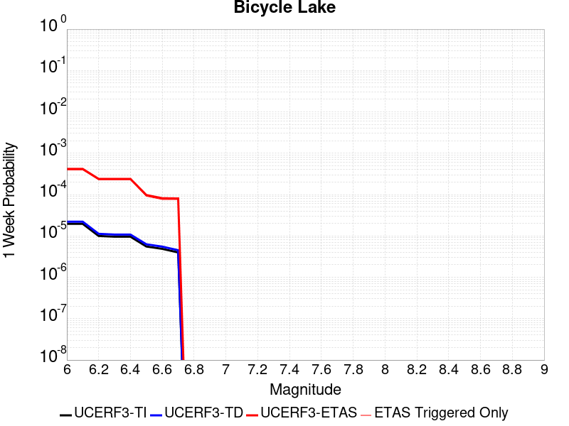 | 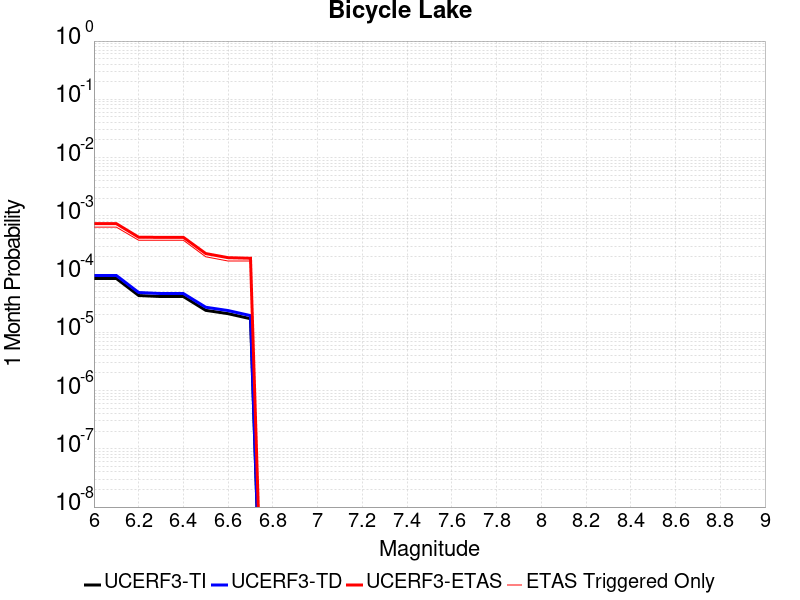 | 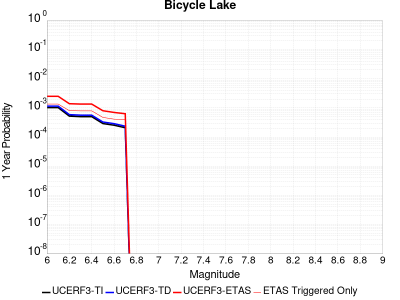 | 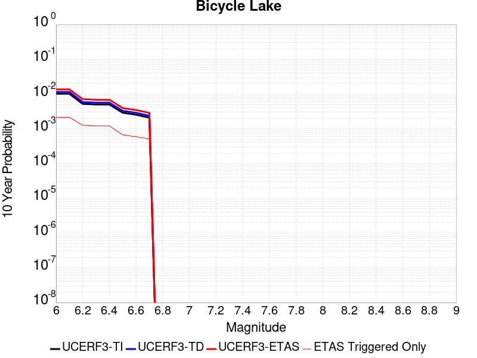 |

| Magnitude | 1 wk TI Prob | 1 wk TD Prob | 1 wk ETAS Prob | 1 wk ETAS/TD Gain | 1 wk ETAS Triggered Only | 1 mo TI Prob | 1 mo TD Prob | 1 mo ETAS Prob | 1 mo ETAS/TD Gain | 1 mo ETAS Triggered Only | 1 yr TI Prob | 1 yr TD Prob | 1 yr ETAS Prob | 1 yr ETAS/TD Gain | 1 yr ETAS Triggered Only | 10 yr TI Prob | 10 yr TD Prob | 10 yr ETAS Prob | 10 yr ETAS/TD Gain | 10 yr ETAS Triggered Only |
|-----|-----|-----|-----|-----|-----|-----|-----|-----|-----|-----|-----|-----|-----|-----|-----|-----|-----|-----|-----|-----|
| 6.0 | 1.9621975E-5 | 2.2097078E-5 | 4.1782655E-4 | 18.908678 | 3.957382E-4 | 8.4091465E-5 | 9.4699084E-5 | 7.33908E-4 | 7.7498946 | 6.392694E-4 | 0.0010233327 | 0.0011524865 | 0.0025055676 | 2.1740537 | 0.0013546423 | 0.01018633 | 0.011478408 | 0.01379549 | 1.2018645 | 0.0023439878 |
| 6.1 | 1.9621975E-5 | 2.2097078E-5 | 4.1782655E-4 | 18.908678 | 3.957382E-4 | 8.4091465E-5 | 9.4699084E-5 | 7.33908E-4 | 7.7498946 | 6.392694E-4 | 0.0010233327 | 0.0011524865 | 0.0025055676 | 2.1740537 | 0.0013546423 | 0.01018633 | 0.011478408 | 0.01379549 | 1.2018645 | 0.0023439878 |
| 6.2 | 9.9971285E-6 | 1.1255639E-5 | 2.3956357E-4 | 21.28387 | 2.283105E-4 | 4.2844134E-5 | 4.8237856E-5 | 4.28737E-4 | 8.887978 | 3.805175E-4 | 5.2150246E-4 | 5.871896E-4 | 0.001393413 | 2.3730204 | 8.066971E-4 | 0.0052028033 | 0.005861487 | 0.007238452 | 1.2349174 | 0.0013850838 |
| 6.3 | 9.589428E-6 | 1.0798346E-5 | 2.3910639E-4 | 22.142872 | 2.283105E-4 | 4.10969E-5 | 4.62781E-5 | 4.26778E-4 | 9.22203 | 3.805175E-4 | 5.002399E-4 | 5.6334207E-4 | 0.0013543726 | 2.4041746 | 7.914764E-4 | 0.0049911533 | 0.0056242296 | 0.006940983 | 1.2341216 | 0.0013242009 |
| 6.4 | 9.589428E-6 | 1.0798346E-5 | 2.3910639E-4 | 22.142872 | 2.283105E-4 | 4.10969E-5 | 4.62781E-5 | 4.26778E-4 | 9.22203 | 3.805175E-4 | 5.002399E-4 | 5.6334207E-4 | 0.0013543726 | 2.4041746 | 7.914764E-4 | 0.0049911533 | 0.0056242296 | 0.006940983 | 1.2341216 | 0.0013242009 |
| 6.5 | 5.557707E-6 | 6.2856016E-6 | 9.760923E-5 | 15.529019 | 9.1324204E-5 | 2.3818526E-5 | 2.6938165E-5 | 2.2480193E-4 | 8.345109 | 1.978691E-4 | 2.8995197E-4 | 3.2794967E-4 | 7.9963665E-4 | 2.4382906 | 4.7184172E-4 | 0.0028957394 | 0.0032772934 | 0.003990322 | 1.2175663 | 7.153729E-4 |
| 6.6 | 4.8742945E-6 | 5.5132896E-6 | 8.1616374E-5 | 14.80357 | 7.6103504E-5 | 2.0889667E-5 | 2.3628318E-5 | 1.9105207E-4 | 8.085724 | 1.674277E-4 | 2.54302E-4 | 2.87663E-4 | 6.985037E-4 | 2.4282014 | 4.109589E-4 | 0.002540112 | 0.0028754752 | 0.0035129064 | 1.2216786 | 6.392694E-4 |
| 6.7 | 3.991108E-6 | 4.5159104E-6 | 8.0619066E-5 | 17.85223 | 7.6103504E-5 | 1.7104636E-5 | 1.9353902E-5 | 1.8677836E-4 | 9.650682 | 1.674277E-4 | 2.0822904E-4 | 2.3563375E-4 | 6.3127873E-4 | 2.6790674 | 3.957382E-4 | 0.0020803404 | 0.0023563374 | 0.0029333613 | 1.2448816 | 5.783866E-4 |

## Paradise
*[(top)](#table-of-contents)*

| 1 Week | 1 Month | 1 Year | 10 Year |
|-----|-----|-----|-----|
| 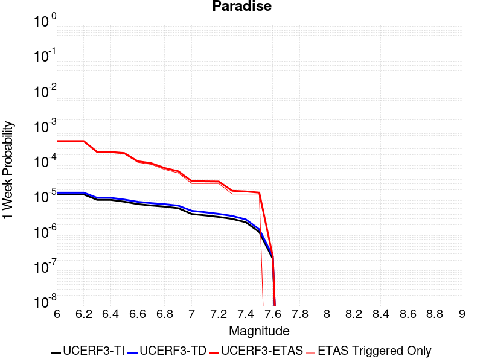 | 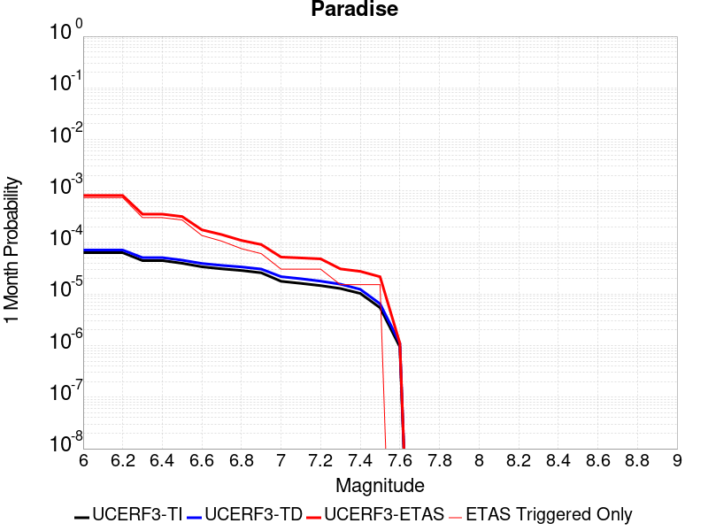 | 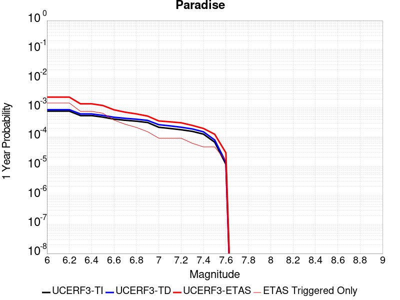 | 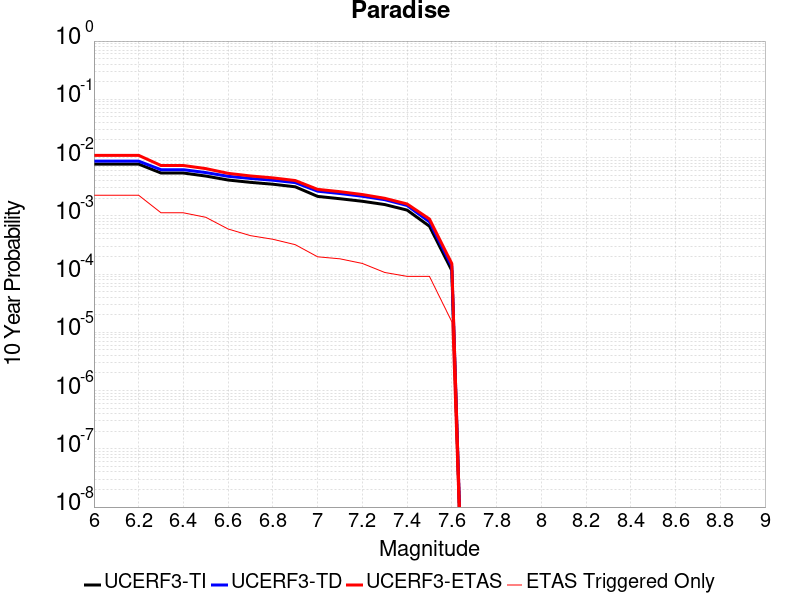 |

| Magnitude | 1 wk TI Prob | 1 wk TD Prob | 1 wk ETAS Prob | 1 wk ETAS/TD Gain | 1 wk ETAS Triggered Only | 1 mo TI Prob | 1 mo TD Prob | 1 mo ETAS Prob | 1 mo ETAS/TD Gain | 1 mo ETAS Triggered Only | 1 yr TI Prob | 1 yr TD Prob | 1 yr ETAS Prob | 1 yr ETAS/TD Gain | 1 yr ETAS Triggered Only | 10 yr TI Prob | 10 yr TD Prob | 10 yr ETAS Prob | 10 yr ETAS/TD Gain | 10 yr ETAS Triggered Only |
|-----|-----|-----|-----|-----|-----|-----|-----|-----|-----|-----|-----|-----|-----|-----|-----|-----|-----|-----|-----|-----|
| 6.0 | 1.4851273E-5 | 1.6694692E-5 | 4.885285E-4 | 29.262506 | 4.7184172E-4 | 6.364676E-5 | 7.154685E-5 | 8.173078E-4 | 11.423393 | 7.458143E-4 | 7.7462377E-4 | 8.707584E-4 | 0.0023458807 | 2.6940663 | 0.0014764079 | 0.0077192914 | 0.008675844 | 0.010908964 | 1.2573951 | 0.0022526637 |
| 6.1 | 1.4851273E-5 | 1.6694692E-5 | 4.885285E-4 | 29.262506 | 4.7184172E-4 | 6.364676E-5 | 7.154685E-5 | 8.173078E-4 | 11.423393 | 7.458143E-4 | 7.7462377E-4 | 8.707584E-4 | 0.0023458807 | 2.6940663 | 0.0014764079 | 0.0077192914 | 0.008675844 | 0.010908964 | 1.2573951 | 0.0022526637 |
| 6.2 | 1.4851273E-5 | 1.6694692E-5 | 4.885285E-4 | 29.262506 | 4.7184172E-4 | 6.364676E-5 | 7.154685E-5 | 8.173078E-4 | 11.423393 | 7.458143E-4 | 7.7462377E-4 | 8.707584E-4 | 0.0023458807 | 2.6940663 | 0.0014764079 | 0.0077192914 | 0.008675844 | 0.010908964 | 1.2573951 | 0.0022526637 |
| 6.3 | 1.0426831E-5 | 1.188862E-5 | 2.401964E-4 | 20.203892 | 2.283105E-4 | 4.4685654E-5 | 5.0950268E-5 | 3.5534875E-4 | 6.974424 | 3.0441402E-4 | 5.43912E-4 | 6.201489E-4 | 0.0013807119 | 2.2264202 | 7.61035E-4 | 0.0054258266 | 0.0061847917 | 0.007304157 | 1.1809868 | 0.0011263319 |
| 6.4 | 1.0426831E-5 | 1.188862E-5 | 2.401964E-4 | 20.203892 | 2.283105E-4 | 4.4685654E-5 | 5.0950268E-5 | 3.5534875E-4 | 6.974424 | 3.0441402E-4 | 5.43912E-4 | 6.201489E-4 | 0.0013807119 | 2.2264202 | 7.61035E-4 | 0.0054258266 | 0.0061847917 | 0.007304157 | 1.1809868 | 0.0011263319 |
| 6.5 | 9.25027E-6 | 1.06199595E-5 | 2.237075E-4 | 21.064816 | 2.130898E-4 | 3.964341E-5 | 4.551335E-5 | 3.1947347E-4 | 7.019336 | 2.739726E-4 | 4.8255164E-4 | 5.53989E-4 | 0.0012081165 | 2.180759 | 6.544901E-4 | 0.0048150513 | 0.0055265795 | 0.0064650476 | 1.1698099 | 9.4368344E-4 |
| 6.6 | 7.904275E-6 | 9.159525E-6 | 1.3092402E-4 | 14.293756 | 1.217656E-4 | 3.3875025E-5 | 3.9254537E-5 | 1.7623547E-4 | 4.4895563 | 1.369863E-4 | 4.1235037E-4 | 4.7782314E-4 | 8.581588E-4 | 1.7959759 | 3.805175E-4 | 0.0041158604 | 0.0047683544 | 0.0053591314 | 1.1238953 | 5.936073E-4 |
| 6.7 | 7.2061953E-6 | 8.407248E-6 | 1.1495125E-4 | 13.672874 | 1.065449E-4 | 3.088333E-5 | 3.6030586E-5 | 1.4257165E-4 | 3.9569616 | 1.065449E-4 | 3.7593965E-4 | 4.3858777E-4 | 7.1244023E-4 | 1.624396 | 2.739726E-4 | 0.003753043 | 0.004377591 | 0.004832213 | 1.1038522 | 4.56621E-4 |
| 6.8 | 6.6948724E-6 | 7.842166E-6 | 8.394507E-5 | 10.704322 | 7.6103504E-5 | 2.8691995E-5 | 3.360887E-5 | 1.09709814E-4 | 3.2643113 | 7.6103504E-5 | 3.4926904E-4 | 4.0911473E-4 | 6.2211737E-4 | 1.5206428 | 2.130898E-4 | 0.003487206 | 0.0040839734 | 0.004478095 | 1.0965046 | 3.957382E-4 |
| 6.9 | 6.0421025E-6 | 7.130621E-6 | 6.801299E-5 | 9.538157 | 6.08828E-5 | 2.5894467E-5 | 3.0559466E-5 | 9.144041E-5 | 2.9922123 | 6.08828E-5 | 3.1521954E-4 | 3.7200135E-4 | 5.241517E-4 | 1.4090049 | 1.5220701E-4 | 0.0031477278 | 0.0037141247 | 0.0040325723 | 1.0857396 | 3.196347E-4 |
| 7.0 | 4.134091E-6 | 5.0803087E-6 | 3.5521556E-5 | 6.992007 | 3.04414E-5 | 1.7717413E-5 | 2.177258E-5 | 5.2213316E-5 | 2.3981228 | 3.04414E-5 | 2.1568815E-4 | 2.6505045E-4 | 3.5635044E-4 | 1.3444628 | 9.1324204E-5 | 0.0021547892 | 0.0026474963 | 0.0028448417 | 1.0745404 | 1.978691E-4 |
| 7.1 | 3.7674888E-6 | 4.6318696E-6 | 3.5073128E-5 | 7.5721326 | 3.04414E-5 | 1.6146281E-5 | 1.9850726E-5 | 5.029152E-5 | 2.5334852 | 3.04414E-5 | 1.9656324E-4 | 2.4165731E-4 | 3.3295943E-4 | 1.3778166 | 9.1324204E-5 | 0.0019638946 | 0.002414096 | 0.0025963034 | 1.0754765 | 1.8264841E-4 |
| 7.2 | 3.4065345E-6 | 4.156723E-6 | 3.4597997E-5 | 8.323382 | 3.04414E-5 | 1.4599351E-5 | 1.7814415E-5 | 4.825527E-5 | 2.7087767 | 3.04414E-5 | 1.777326E-4 | 2.1687041E-4 | 3.0817481E-4 | 1.421009 | 9.1324204E-5 | 0.0017759053 | 0.002166736 | 0.002318613 | 1.070095 | 1.5220701E-4 |
| 7.3 | 2.9934936E-6 | 3.6293168E-6 | 1.8849962E-5 | 5.1938047 | 1.52207E-5 | 1.2829195E-5 | 1.555413E-5 | 3.0774594E-5 | 1.978548 | 1.52207E-5 | 1.5618425E-4 | 1.8935655E-4 | 2.5022784E-4 | 1.3214638 | 6.08828E-5 | 0.0015607453 | 0.0018920974 | 0.0019984408 | 1.056204 | 1.065449E-4 |
| 7.4 | 2.4049796E-6 | 2.8889842E-6 | 1.810964E-5 | 6.268515 | 1.52207E-5 | 1.0307015E-5 | 1.238131E-5 | 2.7601822E-5 | 2.2293136 | 1.52207E-5 | 1.2548068E-4 | 1.5073347E-4 | 1.9638868E-4 | 1.3028871 | 4.5662102E-5 | 0.0012540985 | 0.0015064536 | 0.0015976403 | 1.0605307 | 9.1324204E-5 |
| 7.5 | 1.2710091E-6 | 1.5134682E-6 | 1.6734146E-5 | 11.05682 | 1.52207E-5 | 5.44717E-6 | 6.4862834E-6 | 2.1706885E-5 | 3.346583 | 1.52207E-5 | 6.631728E-5 | 7.8968886E-5 | 1.2462738E-4 | 1.5781833 | 4.5662102E-5 | 6.6297496E-4 | 7.8953087E-4 | 8.8078296E-4 | 1.1155776 | 9.1324204E-5 |
| 7.6 | 2.21172E-7 | 2.603961E-7 | 2.603961E-7 | 1.0 | 0.0 | 9.478797E-7 | 1.1159829E-6 | 1.1159829E-6 | 1.0 | 0.0 | 1.1540374E-5 | 1.3587036E-5 | 2.8807528E-5 | 2.1202219 | 1.52207E-5 | 1.1539775E-4 | 1.3586486E-4 | 1.510835E-4 | 1.112013 | 1.52207E-5 |

## San Andreas (San Bernardino N)
*[(top)](#table-of-contents)*

| 1 Week | 1 Month | 1 Year | 10 Year |
|-----|-----|-----|-----|
| 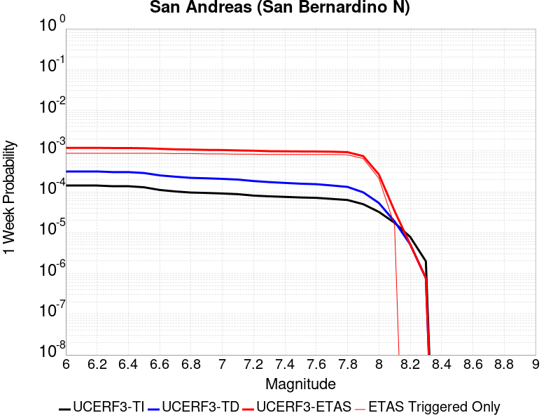 | 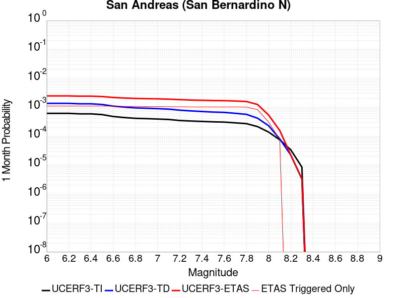 | 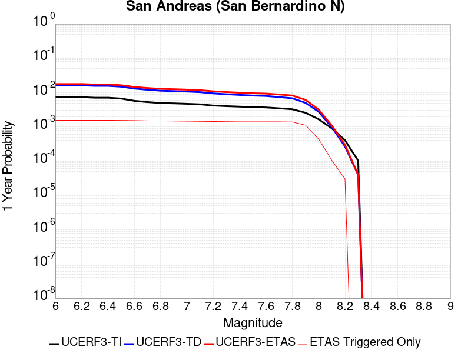 | 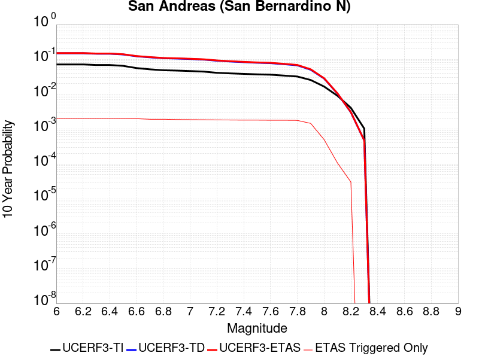 |

| Magnitude | 1 wk TI Prob | 1 wk TD Prob | 1 wk ETAS Prob | 1 wk ETAS/TD Gain | 1 wk ETAS Triggered Only | 1 mo TI Prob | 1 mo TD Prob | 1 mo ETAS Prob | 1 mo ETAS/TD Gain | 1 mo ETAS Triggered Only | 1 yr TI Prob | 1 yr TD Prob | 1 yr ETAS Prob | 1 yr ETAS/TD Gain | 1 yr ETAS Triggered Only | 10 yr TI Prob | 10 yr TD Prob | 10 yr ETAS Prob | 10 yr ETAS/TD Gain | 10 yr ETAS Triggered Only |
|-----|-----|-----|-----|-----|-----|-----|-----|-----|-----|-----|-----|-----|-----|-----|-----|-----|-----|-----|-----|-----|
| 6.0 | 1.4273766E-4 | 3.1606483E-4 | 0.0011985864 | 3.7922168 | 8.828006E-4 | 6.115894E-4 | 0.0013538664 | 0.0024482731 | 1.8083565 | 0.0010958904 | 0.0074207084 | 0.016360244 | 0.017902326 | 1.094258 | 0.0015677321 | 0.07177748 | 0.15026689 | 0.15201291 | 1.0116194 | 0.0020547945 |
| 6.1 | 1.4273766E-4 | 3.1606483E-4 | 0.0011985864 | 3.7922168 | 8.828006E-4 | 6.115894E-4 | 0.0013538664 | 0.0024482731 | 1.8083565 | 0.0010958904 | 0.0074207084 | 0.016360244 | 0.017902326 | 1.094258 | 0.0015677321 | 0.07177748 | 0.15026689 | 0.15201291 | 1.0116194 | 0.0020547945 |
| 6.2 | 1.4273766E-4 | 3.1606483E-4 | 0.0011985864 | 3.7922168 | 8.828006E-4 | 6.115894E-4 | 0.0013538664 | 0.0024482731 | 1.8083565 | 0.0010958904 | 0.0074207084 | 0.016360244 | 0.017902326 | 1.094258 | 0.0015677321 | 0.07177748 | 0.15026689 | 0.15201291 | 1.0116194 | 0.0020547945 |
| 6.3 | 1.3730655E-4 | 3.0511338E-4 | 0.0011876447 | 3.89247 | 8.828006E-4 | 5.883239E-4 | 0.0013069791 | 0.0024014374 | 1.8373952 | 0.0010958904 | 0.0071393442 | 0.015797773 | 0.017340738 | 1.0976698 | 0.0015677321 | 0.06914291 | 0.14556676 | 0.14732245 | 1.012061 | 0.0020547945 |
| 6.4 | 1.3730655E-4 | 3.0511338E-4 | 0.0011876447 | 3.89247 | 8.828006E-4 | 5.883239E-4 | 0.0013069791 | 0.0024014374 | 1.8373952 | 0.0010958904 | 0.0071393442 | 0.015797773 | 0.017340738 | 1.0976698 | 0.0015677321 | 0.06914291 | 0.14556676 | 0.14732245 | 1.012061 | 0.0020547945 |
| 6.5 | 1.2942807E-4 | 2.8925808E-4 | 0.0011718033 | 4.0510654 | 8.828006E-4 | 5.545738E-4 | 0.0012390936 | 0.0023336262 | 1.8833332 | 0.0010958904 | 0.0067310524 | 0.01498286 | 0.01651211 | 1.1020666 | 0.0015525115 | 0.06530788 | 0.13870941 | 0.14045298 | 1.0125699 | 0.002024353 |
| 6.6 | 1.1125901E-4 | 2.536472E-4 | 0.0011362239 | 4.4795446 | 8.828006E-4 | 4.767372E-4 | 0.0010866089 | 0.0021661043 | 1.9934536 | 0.0010806697 | 0.005788839 | 0.013149847 | 0.014666922 | 1.1153682 | 0.0015372908 | 0.056403454 | 0.122999296 | 0.124747954 | 1.0142169 | 0.0019939118 |
| 6.7 | 1.02209575E-4 | 2.3499702E-4 | 0.001102373 | 4.6910086 | 8.675799E-4 | 4.3796748E-4 | 0.0010067427 | 0.0020711191 | 2.0572476 | 0.001065449 | 0.0053192247 | 0.012188629 | 0.013677113 | 1.1221206 | 0.0015068493 | 0.051936906 | 0.114790924 | 0.11648858 | 1.0147891 | 0.0019178082 |
| 6.8 | 9.610582E-5 | 2.2025521E-4 | 0.001087644 | 4.938108 | 8.675799E-4 | 4.1181705E-4 | 9.436101E-4 | 0.0020080537 | 2.1280546 | 0.001065449 | 0.0050023515 | 0.011428202 | 0.01291783 | 1.1303468 | 0.0015068493 | 0.048912346 | 0.1081929 | 0.10990322 | 1.015808 | 0.0019178082 |
| 6.9 | 9.3877505E-5 | 2.1481077E-4 | 0.0010669869 | 4.9671016 | 8.523592E-4 | 4.0227012E-4 | 9.2029345E-4 | 0.0019695552 | 2.1401384 | 0.0010502283 | 0.0048866454 | 0.011147255 | 0.012622257 | 1.1323197 | 0.0014916286 | 0.04780577 | 0.10578323 | 0.107470945 | 1.0159545 | 0.0018873669 |
| 7.0 | 9.1019785E-5 | 2.0808022E-4 | 0.0010602621 | 5.0954485 | 8.523592E-4 | 3.900265E-4 | 8.914682E-4 | 0.0019407603 | 2.1770382 | 0.0010502283 | 0.0047382377 | 0.010799837 | 0.0122603 | 1.1352301 | 0.0014764079 | 0.046384744 | 0.102753714 | 0.10443349 | 1.0163476 | 0.0018721462 |
| 7.1 | 8.771155E-5 | 1.9982594E-4 | 0.0010367972 | 5.1885014 | 8.371385E-4 | 3.758525E-4 | 8.5611636E-4 | 0.0018902379 | 2.2079217 | 0.0010350076 | 0.0045664064 | 0.0103736 | 0.011819629 | 1.1393951 | 0.0014611873 | 0.044737056 | 0.09906527 | 0.100738235 | 1.0168875 | 0.0018569254 |
| 7.2 | 8.0830236E-5 | 1.8388197E-4 | 0.0010208666 | 5.5517488 | 8.371385E-4 | 3.4636928E-4 | 7.8782777E-4 | 0.0018220199 | 2.3127136 | 0.0010350076 | 0.0042088944 | 0.009549725 | 0.010981883 | 1.1499685 | 0.0014459665 | 0.041300658 | 0.09179615 | 0.09346879 | 1.0182213 | 0.0018417047 |
| 7.3 | 7.7668235E-5 | 1.7331762E-4 | 9.95093E-4 | 5.7414417 | 8.219178E-4 | 3.328214E-4 | 7.425784E-4 | 0.0017616081 | 2.3722856 | 0.0010197869 | 0.0040445733 | 0.009003494 | 0.010421358 | 1.1574793 | 0.0014307458 | 0.03971748 | 0.08706327 | 0.08873073 | 1.0191523 | 0.001826484 |
| 7.4 | 7.520177E-5 | 1.6551897E-4 | 9.873008E-4 | 5.9648795 | 8.219178E-4 | 3.2225347E-4 | 7.0917426E-4 | 0.001728238 | 2.4369721 | 0.0010197869 | 0.0039163795 | 0.008600081 | 0.010003433 | 1.1631788 | 0.0014155251 | 0.038480744 | 0.08351955 | 0.08517954 | 1.0198754 | 0.0018112633 |
| 7.5 | 7.274697E-5 | 1.5839566E-4 | 9.801832E-4 | 6.188195 | 8.219178E-4 | 3.1173544E-4 | 6.78662E-4 | 0.0016977568 | 2.5016236 | 0.0010197869 | 0.003788775 | 0.008231463 | 0.009635336 | 1.1705496 | 0.0014155251 | 0.03724827 | 0.08023631 | 0.08190224 | 1.0207628 | 0.0018112633 |
| 7.6 | 7.1185845E-5 | 1.540943E-4 | 9.758855E-4 | 6.33304 | 8.219178E-4 | 3.0504653E-4 | 6.6023704E-4 | 0.0016793506 | 2.5435572 | 0.0010197869 | 0.0037076178 | 0.008008812 | 0.009412999 | 1.1753304 | 0.0014155251 | 0.036463667 | 0.07822598 | 0.07988152 | 1.0211636 | 0.0017960427 |
| 7.7 | 6.709961E-5 | 1.4318313E-4 | 9.6498325E-4 | 6.739504 | 8.219178E-4 | 2.8753807E-4 | 6.1349774E-4 | 0.001632659 | 2.6612308 | 0.0010197869 | 0.003495157 | 0.0074437927 | 0.008848781 | 1.1887463 | 0.0014155251 | 0.034406938 | 0.07305469 | 0.074719526 | 1.0227889 | 0.0017960427 |
| 7.8 | 6.300812E-5 | 1.3202413E-4 | 9.386147E-4 | 7.1094184 | 8.066971E-4 | 2.7000686E-4 | 5.65695E-4 | 0.001569693 | 2.7748044 | 0.0010045662 | 0.0032823787 | 0.006865616 | 0.008256306 | 1.2025588 | 0.0014003044 | 0.032343175 | 0.06771354 | 0.06937377 | 1.0245185 | 0.001780822 |
| 7.9 | 4.983037E-5 | 9.723488E-5 | 7.5166137E-4 | 7.7303677 | 6.544901E-4 | 2.1354125E-4 | 4.1665437E-4 | 0.0012382297 | 2.971839 | 8.219178E-4 | 0.0025967648 | 0.0050609782 | 0.00618161 | 1.2214259 | 0.0011263319 | 0.025666296 | 0.05064886 | 0.05203604 | 1.0273882 | 0.0014611873 |
| 8.0 | 3.2211527E-5 | 5.3304586E-5 | 2.6638302E-4 | 4.9973755 | 2.130898E-4 | 1.380421E-4 | 2.2842824E-4 | 5.327727E-4 | 2.3323417 | 3.0441402E-4 | 0.0016793669 | 0.0027775685 | 0.003217743 | 1.1584747 | 4.414003E-4 | 0.016667323 | 0.028361378 | 0.028849415 | 1.0172079 | 5.022831E-4 |
| 8.1 | 1.743376E-5 | 1.8824427E-5 | 3.404484E-5 | 1.808546 | 1.52207E-5 | 7.471398E-5 | 8.067362E-5 | 1.5677098E-4 | 1.9432744 | 7.6103504E-5 | 9.0926304E-4 | 9.817594E-4 | 0.0010881997 | 1.1084179 | 1.065449E-4 | 0.009055517 | 0.010484105 | 0.010589533 | 1.010056 | 1.065449E-4 |
| 8.2 | 7.831616E-6 | 5.1551065E-6 | 5.1551065E-6 | 1.0 | 0.0 | 3.3563636E-5 | 2.2093127E-5 | 2.2093127E-5 | 1.0 | 0.0 | 4.0856065E-4 | 2.6895068E-4 | 2.9938392E-4 | 1.1131554 | 3.04414E-5 | 0.004078103 | 0.0030418145 | 0.0030721633 | 1.0099772 | 3.04414E-5 |
| 8.3 | 1.983087E-6 | 7.6599065E-7 | 7.6599065E-7 | 1.0 | 0.0 | 8.498917E-6 | 3.282813E-6 | 3.282813E-6 | 1.0 | 0.0 | 1.034694E-4 | 3.9967534E-5 | 3.9967534E-5 | 1.0 | 0.0 | 0.0010342124 | 4.719687E-4 | 4.719687E-4 | 1.0 | 0.0 |

## Garlic Springs
*[(top)](#table-of-contents)*

| 1 Week | 1 Month | 1 Year | 10 Year |
|-----|-----|-----|-----|
| 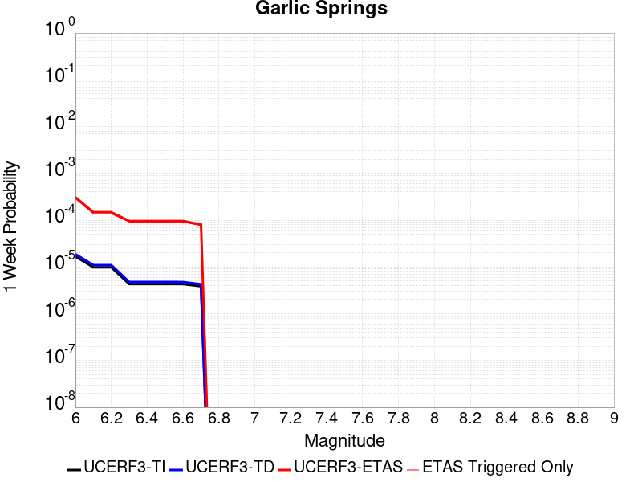 | 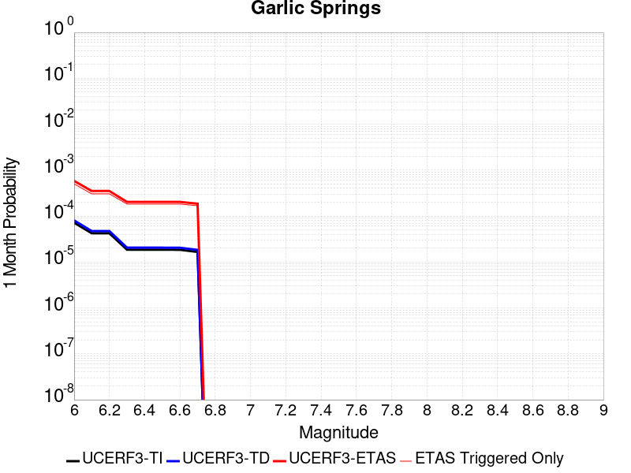 | 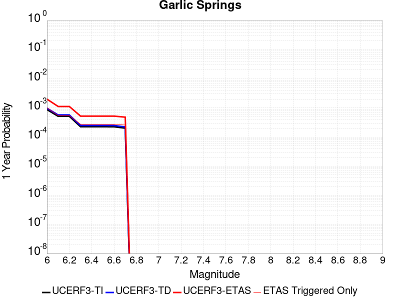 | 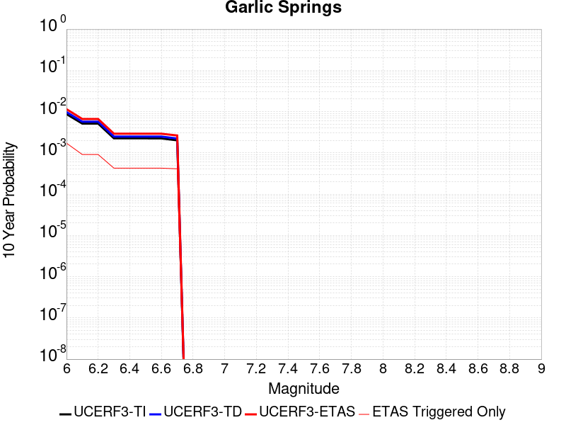 |

| Magnitude | 1 wk TI Prob | 1 wk TD Prob | 1 wk ETAS Prob | 1 wk ETAS/TD Gain | 1 wk ETAS Triggered Only | 1 mo TI Prob | 1 mo TD Prob | 1 mo ETAS Prob | 1 mo ETAS/TD Gain | 1 mo ETAS Triggered Only | 1 yr TI Prob | 1 yr TD Prob | 1 yr ETAS Prob | 1 yr ETAS/TD Gain | 1 yr ETAS Triggered Only | 10 yr TI Prob | 10 yr TD Prob | 10 yr ETAS Prob | 10 yr ETAS/TD Gain | 10 yr ETAS Triggered Only |
|-----|-----|-----|-----|-----|-----|-----|-----|-----|-----|-----|-----|-----|-----|-----|-----|-----|-----|-----|-----|-----|
| 6.0 | 1.6760017E-5 | 1.8776833E-5 | 3.079647E-4 | 16.401314 | 2.891933E-4 | 7.182667E-5 | 8.0470316E-5 | 5.82713E-4 | 7.2413406 | 5.022831E-4 | 8.7413884E-4 | 9.794032E-4 | 0.0019981912 | 2.040213 | 0.0010197869 | 0.008707083 | 0.009762413 | 0.011465562 | 1.1744598 | 0.0017199392 |
| 6.1 | 9.852767E-6 | 1.09735865E-5 | 1.4795839E-4 | 13.483138 | 1.369863E-4 | 4.222546E-5 | 4.702921E-5 | 3.514289E-4 | 7.4725666 | 3.0441402E-4 | 5.139737E-4 | 5.7250116E-4 | 0.0011201326 | 1.9565597 | 5.479452E-4 | 0.005127866 | 0.005717221 | 0.006625242 | 1.1588221 | 9.13242E-4 |
| 6.2 | 9.852767E-6 | 1.09735865E-5 | 1.4795839E-4 | 13.483138 | 1.369863E-4 | 4.222546E-5 | 4.702921E-5 | 3.514289E-4 | 7.4725666 | 3.0441402E-4 | 5.139737E-4 | 5.7250116E-4 | 0.0011201326 | 1.9565597 | 5.479452E-4 | 0.005127866 | 0.005717221 | 0.006625242 | 1.1588221 | 9.13242E-4 |
| 6.3 | 4.3167724E-6 | 4.7780286E-6 | 9.6101794E-5 | 20.113274 | 9.1324204E-5 | 1.8500323E-5 | 2.0477235E-5 | 2.0312189E-4 | 9.919401 | 1.8264841E-4 | 2.2521814E-4 | 2.4930484E-4 | 5.2320916E-4 | 2.0986722 | 2.739726E-4 | 0.0022499003 | 0.00249251 | 0.0029176273 | 1.170558 | 4.261796E-4 |
| 6.4 | 4.3167724E-6 | 4.7780286E-6 | 9.6101794E-5 | 20.113274 | 9.1324204E-5 | 1.8500323E-5 | 2.0477235E-5 | 2.0312189E-4 | 9.919401 | 1.8264841E-4 | 2.2521814E-4 | 2.4930484E-4 | 5.2320916E-4 | 2.0986722 | 2.739726E-4 | 0.0022499003 | 0.00249251 | 0.0029176273 | 1.170558 | 4.261796E-4 |
| 6.5 | 4.3167724E-6 | 4.7780286E-6 | 9.6101794E-5 | 20.113274 | 9.1324204E-5 | 1.8500323E-5 | 2.0477235E-5 | 2.0312189E-4 | 9.919401 | 1.8264841E-4 | 2.2521814E-4 | 2.4930484E-4 | 5.2320916E-4 | 2.0986722 | 2.739726E-4 | 0.0022499003 | 0.00249251 | 0.0029176273 | 1.170558 | 4.261796E-4 |
| 6.6 | 4.301311E-6 | 4.760897E-6 | 9.608467E-5 | 20.18205 | 9.1324204E-5 | 1.8434059E-5 | 2.0403815E-5 | 2.0304849E-4 | 9.951496 | 1.8264841E-4 | 2.2441156E-4 | 2.4841115E-4 | 5.223157E-4 | 2.1026258 | 2.739726E-4 | 0.0022418506 | 0.002483593 | 0.0029087143 | 1.1711718 | 4.261796E-4 |
| 6.7 | 3.8599724E-6 | 4.27106E-6 | 8.037424E-5 | 18.818335 | 7.6103504E-5 | 1.6542634E-5 | 1.8304541E-5 | 1.8572918E-4 | 10.146617 | 1.674277E-4 | 2.0138794E-4 | 2.228578E-4 | 4.8155204E-4 | 2.160804 | 2.587519E-4 | 0.0020120554 | 0.002228578 | 0.002638621 | 1.1839931 | 4.109589E-4 |

## Death Valley (Black Mtns Frontal)
*[(top)](#table-of-contents)*

| 1 Week | 1 Month | 1 Year | 10 Year |
|-----|-----|-----|-----|
| 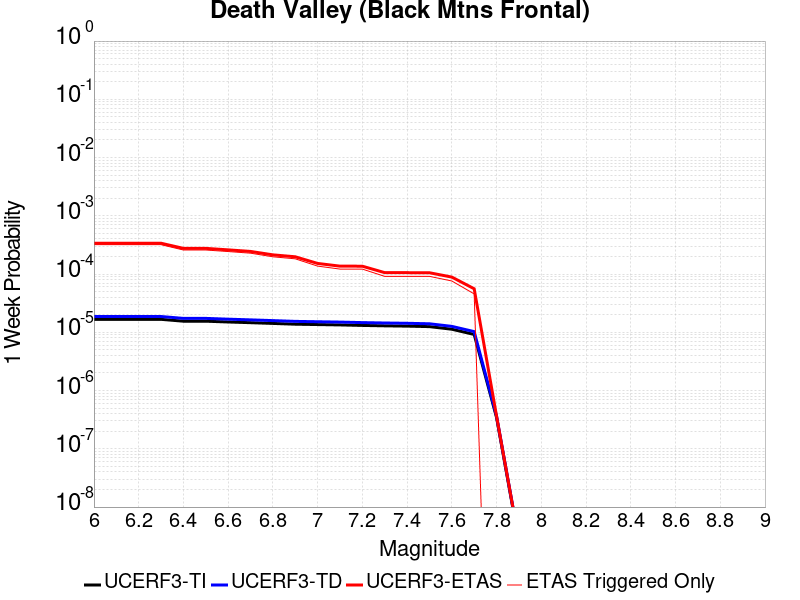 | 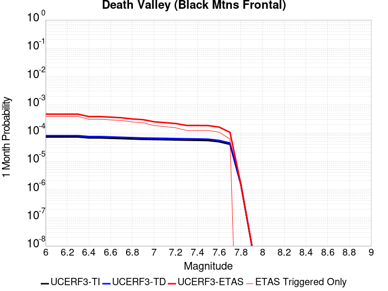 | 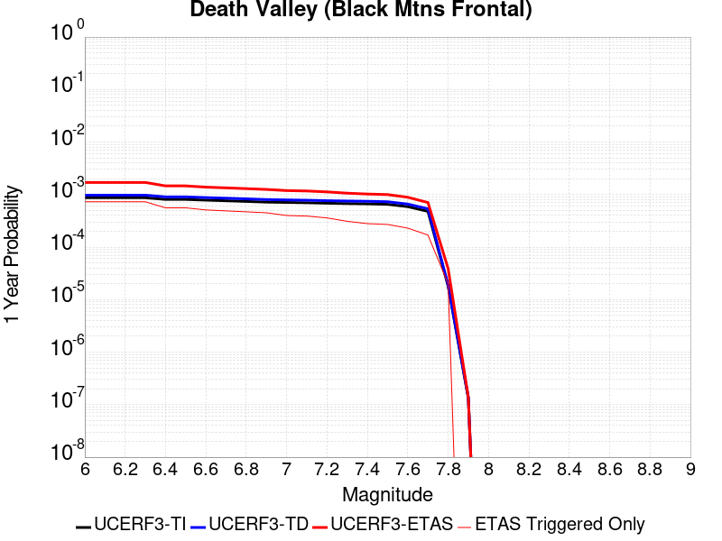 | 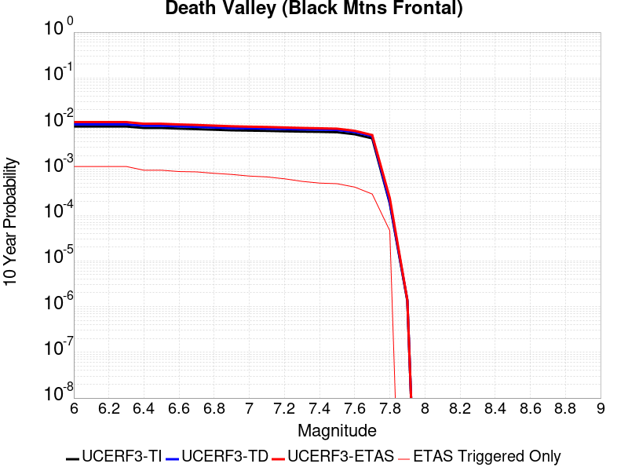 |

| Magnitude | 1 wk TI Prob | 1 wk TD Prob | 1 wk ETAS Prob | 1 wk ETAS/TD Gain | 1 wk ETAS Triggered Only | 1 mo TI Prob | 1 mo TD Prob | 1 mo ETAS Prob | 1 mo ETAS/TD Gain | 1 mo ETAS Triggered Only | 1 yr TI Prob | 1 yr TD Prob | 1 yr ETAS Prob | 1 yr ETAS/TD Gain | 1 yr ETAS Triggered Only | 10 yr TI Prob | 10 yr TD Prob | 10 yr ETAS Prob | 10 yr ETAS/TD Gain | 10 yr ETAS Triggered Only |
|-----|-----|-----|-----|-----|-----|-----|-----|-----|-----|-----|-----|-----|-----|-----|-----|-----|-----|-----|-----|-----|
| 6.0 | 1.6707214E-5 | 1.867027E-5 | 3.38299E-4 | 18.119665 | 3.196347E-4 | 7.160038E-5 | 8.001302E-5 | 4.6050007E-4 | 5.755314 | 3.805175E-4 | 8.71386E-4 | 9.737309E-4 | 0.0017188189 | 1.7651889 | 7.458143E-4 | 0.00867977 | 0.009695496 | 0.010841055 | 1.1181536 | 0.0011567732 |
| 6.1 | 1.6707214E-5 | 1.867027E-5 | 3.38299E-4 | 18.119665 | 3.196347E-4 | 7.160038E-5 | 8.001302E-5 | 4.6050007E-4 | 5.755314 | 3.805175E-4 | 8.71386E-4 | 9.737309E-4 | 0.0017188189 | 1.7651889 | 7.458143E-4 | 0.00867977 | 0.009695496 | 0.010841055 | 1.1181536 | 0.0011567732 |
| 6.2 | 1.6707214E-5 | 1.867027E-5 | 3.38299E-4 | 18.119665 | 3.196347E-4 | 7.160038E-5 | 8.001302E-5 | 4.6050007E-4 | 5.755314 | 3.805175E-4 | 8.71386E-4 | 9.737309E-4 | 0.0017188189 | 1.7651889 | 7.458143E-4 | 0.00867977 | 0.009695496 | 0.010841055 | 1.1181536 | 0.0011567732 |
| 6.3 | 1.6707214E-5 | 1.867027E-5 | 3.38299E-4 | 18.119665 | 3.196347E-4 | 7.160038E-5 | 8.001302E-5 | 4.6050007E-4 | 5.755314 | 3.805175E-4 | 8.71386E-4 | 9.737309E-4 | 0.0017188189 | 1.7651889 | 7.458143E-4 | 0.00867977 | 0.009695496 | 0.010841055 | 1.1181536 | 0.0011567732 |
| 6.4 | 1.5515609E-5 | 1.7338214E-5 | 2.7608563E-4 | 15.923534 | 2.587519E-4 | 6.649377E-5 | 7.4304546E-5 | 3.7869593E-4 | 5.0965376 | 3.0441402E-4 | 8.0926094E-4 | 9.042885E-4 | 0.001482152 | 1.6390257 | 5.783866E-4 | 0.008063202 | 0.009006773 | 0.009957041 | 1.1055058 | 9.589041E-4 |
| 6.5 | 1.5515609E-5 | 1.7338214E-5 | 2.7608563E-4 | 15.923534 | 2.587519E-4 | 6.649377E-5 | 7.4304546E-5 | 3.7869593E-4 | 5.0965376 | 3.0441402E-4 | 8.0926094E-4 | 9.042885E-4 | 0.001482152 | 1.6390257 | 5.783866E-4 | 0.008063202 | 0.009006773 | 0.009957041 | 1.1055058 | 9.589041E-4 |
| 6.6 | 1.5041828E-5 | 1.6809145E-5 | 2.6033627E-4 | 15.487775 | 2.435312E-4 | 6.4463384E-5 | 7.203723E-5 | 3.612097E-4 | 5.0142083 | 2.891933E-4 | 7.8455906E-4 | 8.767063E-4 | 0.0014241711 | 1.6244563 | 5.479452E-4 | 0.00781795 | 0.008733132 | 0.009623311 | 1.1019312 | 8.9802133E-4 |
| 6.7 | 1.4634985E-5 | 1.6356016E-5 | 2.4466278E-4 | 14.95858 | 2.283105E-4 | 6.271985E-5 | 7.009536E-5 | 3.4404875E-4 | 4.9082956 | 2.739726E-4 | 7.6334673E-4 | 8.5308263E-4 | 0.0013853527 | 1.6239372 | 5.327245E-4 | 0.007607299 | 0.008498715 | 0.009374013 | 1.1029918 | 8.828006E-4 |
| 6.8 | 1.4209158E-5 | 1.5882048E-5 | 2.13748E-4 | 13.458467 | 1.978691E-4 | 6.089497E-5 | 6.8064175E-5 | 3.115788E-4 | 4.577721 | 2.435312E-4 | 7.4114406E-4 | 8.2837185E-4 | 0.0013302389 | 1.6058475 | 5.022831E-4 | 0.007386771 | 0.008253456 | 0.009068591 | 1.0987628 | 8.219178E-4 |
| 6.9 | 1.3780098E-5 | 1.5404594E-5 | 1.9805018E-4 | 12.856567 | 1.8264841E-4 | 5.9056227E-5 | 6.6018045E-5 | 2.9431348E-4 | 4.458076 | 2.283105E-4 | 7.1877235E-4 | 8.0347876E-4 | 0.0012749414 | 1.5867767 | 4.7184172E-4 | 0.0071645193 | 0.008006332 | 0.008776373 | 1.096179 | 7.7625574E-4 |
| 7.0 | 1.3585064E-5 | 1.5188155E-5 | 1.5217238E-4 | 10.019148 | 1.369863E-4 | 5.8220405E-5 | 6.50905E-5 | 2.47727E-4 | 3.8058858 | 1.8264841E-4 | 7.086029E-4 | 7.9219416E-4 | 0.0012028276 | 1.5183494 | 4.109589E-4 | 0.007063476 | 0.007894293 | 0.008604019 | 1.0899036 | 7.153729E-4 |
| 7.1 | 1.3398601E-5 | 1.49813395E-5 | 1.3674512E-4 | 9.127696 | 1.217656E-4 | 5.742131E-5 | 6.420419E-5 | 2.3162115E-4 | 3.6075704 | 1.674277E-4 | 6.9888023E-4 | 7.8141113E-4 | 0.00117684 | 1.5060447 | 3.957382E-4 | 0.0069668638 | 0.007787224 | 0.008466822 | 1.0872709 | 6.849315E-4 |
| 7.2 | 1.3126312E-5 | 1.4679561E-5 | 1.3644337E-4 | 9.2947855 | 1.217656E-4 | 5.6254412E-5 | 6.291092E-5 | 2.1510835E-4 | 3.419253 | 1.5220701E-4 | 6.846822E-4 | 7.6567667E-4 | 0.0011154847 | 1.4568614 | 3.500761E-4 | 0.006825765 | 0.00763097 | 0.008250257 | 1.0811543 | 6.240487E-4 |
| 7.3 | 1.2922429E-5 | 1.4453788E-5 | 1.0577667E-4 | 7.3182664 | 9.1324204E-5 | 5.5380664E-5 | 6.194336E-5 | 1.8370143E-4 | 2.9656353 | 1.217656E-4 | 6.74051E-4 | 7.53905E-4 | 0.0010428802 | 1.3833046 | 2.891933E-4 | 0.006720101 | 0.007514055 | 0.008057883 | 1.0723747 | 5.479452E-4 |
| 7.4 | 1.2768878E-5 | 1.4283772E-5 | 1.0560667E-4 | 7.393472 | 9.1324204E-5 | 5.4722615E-5 | 6.1214756E-5 | 1.829729E-4 | 2.9890325 | 1.217656E-4 | 6.660441E-4 | 7.4504025E-4 | 0.0010188087 | 1.3674546 | 2.739726E-4 | 0.0066405144 | 0.0074260035 | 0.007924557 | 1.0671362 | 5.022831E-4 |
| 7.5 | 1.2521929E-5 | 1.40120155E-5 | 1.0533493E-4 | 7.5174723 | 9.1324204E-5 | 5.366431E-5 | 6.005014E-5 | 1.8180843E-4 | 3.0276103 | 1.217656E-4 | 6.531671E-4 | 7.3087064E-4 | 0.001004643 | 1.3745838 | 2.739726E-4 | 0.006512506 | 0.0072852457 | 0.00776876 | 1.0663689 | 4.870624E-4 |
| 7.6 | 1.1301089E-5 | 1.2648149E-5 | 8.875069E-5 | 7.0168915 | 7.6103504E-5 | 4.8432343E-5 | 5.4205255E-5 | 1.6074438E-4 | 2.965476 | 1.065449E-4 | 5.895042E-4 | 6.5975444E-4 | 8.879143E-4 | 1.3458254 | 2.283105E-4 | 0.0058794282 | 0.00657851 | 0.0069867657 | 1.0620589 | 4.109589E-4 |
| 7.7 | 9.189108E-6 | 1.0283358E-5 | 5.594499E-5 | 5.4403424 | 4.5662102E-5 | 3.93813E-5 | 4.407082E-5 | 1.0495094E-4 | 2.3814156 | 6.08828E-5 | 4.7936183E-4 | 5.3643517E-4 | 6.8856054E-4 | 1.2835857 | 1.5220701E-4 | 0.004783291 | 0.005351914 | 0.0056395596 | 1.0537463 | 2.891933E-4 |
| 7.8 | 3.4586725E-7 | 3.6482615E-7 | 3.6482615E-7 | 1.0 | 0.0 | 1.4822873E-6 | 1.5635396E-6 | 1.5635396E-6 | 1.0 | 0.0 | 1.80467E-5 | 1.9035933E-5 | 4.9476756E-5 | 2.5991242 | 3.04414E-5 | 1.8045233E-4 | 1.9034347E-4 | 2.3599688E-4 | 1.2398475 | 4.5662102E-5 |
| 7.9 | 2.5591178E-9 | 2.6696718E-9 | 2.6696718E-9 | 1.0 | 0.0 | 1.0967647E-8 | 1.14414505E-8 | 1.14414505E-8 | 1.0 | 0.0 | 1.335311E-7 | 1.3929966E-7 | 1.3929966E-7 | 1.0 | 0.0 | 1.3353102E-6 | 1.3929966E-6 | 1.3929966E-6 | 1.0 | 0.0 |

## San Andreas (San Bernardino S)
*[(top)](#table-of-contents)*

| 1 Week | 1 Month | 1 Year | 10 Year |
|-----|-----|-----|-----|
| 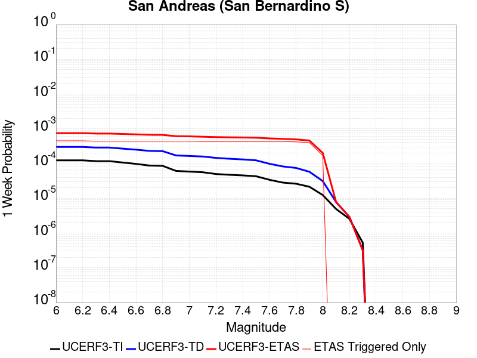 | 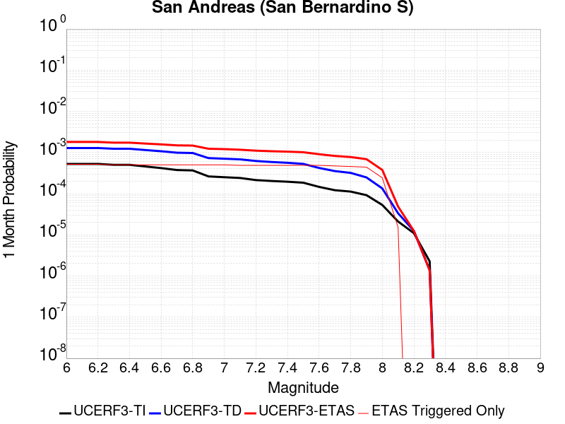 | 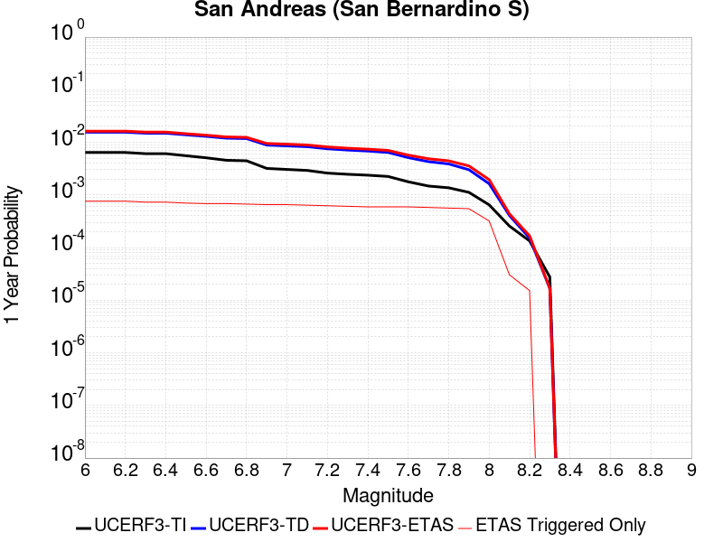 | 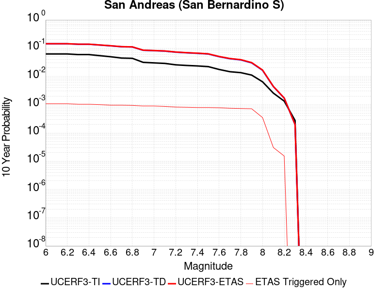 |

| Magnitude | 1 wk TI Prob | 1 wk TD Prob | 1 wk ETAS Prob | 1 wk ETAS/TD Gain | 1 wk ETAS Triggered Only | 1 mo TI Prob | 1 mo TD Prob | 1 mo ETAS Prob | 1 mo ETAS/TD Gain | 1 mo ETAS Triggered Only | 1 yr TI Prob | 1 yr TD Prob | 1 yr ETAS Prob | 1 yr ETAS/TD Gain | 1 yr ETAS Triggered Only | 10 yr TI Prob | 10 yr TD Prob | 10 yr ETAS Prob | 10 yr ETAS/TD Gain | 10 yr ETAS Triggered Only |
|-----|-----|-----|-----|-----|-----|-----|-----|-----|-----|-----|-----|-----|-----|-----|-----|-----|-----|-----|-----|-----|
| 6.0 | 1.2336002E-4 | 3.0004102E-4 | 7.108766E-4 | 2.3692648 | 4.109589E-4 | 5.2857865E-4 | 0.0012852824 | 0.0018021212 | 1.4021207 | 5.175038E-4 | 0.006416472 | 0.015540994 | 0.0162902 | 1.0482085 | 7.61035E-4 | 0.06234337 | 0.14283717 | 0.14376348 | 1.0064851 | 0.0010806697 |
| 6.1 | 1.2336002E-4 | 3.0004102E-4 | 7.108766E-4 | 2.3692648 | 4.109589E-4 | 5.2857865E-4 | 0.0012852824 | 0.0018021212 | 1.4021207 | 5.175038E-4 | 0.006416472 | 0.015540994 | 0.0162902 | 1.0482085 | 7.61035E-4 | 0.06234337 | 0.14283717 | 0.14376348 | 1.0064851 | 0.0010806697 |
| 6.2 | 1.2336002E-4 | 3.0004102E-4 | 7.108766E-4 | 2.3692648 | 4.109589E-4 | 5.2857865E-4 | 0.0012852824 | 0.0018021212 | 1.4021207 | 5.175038E-4 | 0.006416472 | 0.015540994 | 0.0162902 | 1.0482085 | 7.61035E-4 | 0.06234337 | 0.14283717 | 0.14376348 | 1.0064851 | 0.0010806697 |
| 6.3 | 1.1712257E-4 | 2.8792414E-4 | 6.835484E-4 | 2.3740573 | 3.957382E-4 | 5.018573E-4 | 0.0012334028 | 0.0017350663 | 1.4067314 | 5.022831E-4 | 0.006093008 | 0.014918125 | 0.015637819 | 1.0482429 | 7.3059363E-4 | 0.059286322 | 0.13754563 | 0.13843827 | 1.0064899 | 0.0010350076 |
| 6.4 | 1.1712257E-4 | 2.8792414E-4 | 6.835484E-4 | 2.3740573 | 3.957382E-4 | 5.018573E-4 | 0.0012334028 | 0.0017350663 | 1.4067314 | 5.022831E-4 | 0.006093008 | 0.014918125 | 0.015637819 | 1.0482429 | 7.3059363E-4 | 0.059286322 | 0.13754563 | 0.13843827 | 1.0064899 | 0.0010350076 |
| 6.5 | 1.0689076E-4 | 2.680528E-4 | 6.636849E-4 | 2.4759486 | 3.957382E-4 | 4.5802278E-4 | 0.0011483167 | 0.001650023 | 1.4369059 | 5.022831E-4 | 0.0055621783 | 0.01389575 | 0.014586173 | 1.049686 | 7.001522E-4 | 0.05425003 | 0.12879294 | 0.12966813 | 1.0067953 | 0.0010045662 |
| 6.6 | 9.7648895E-5 | 2.50501E-4 | 6.461401E-4 | 2.579391 | 3.957382E-4 | 4.1842813E-4 | 0.0010731576 | 0.0015749017 | 1.4675399 | 5.022831E-4 | 0.005082469 | 0.012991785 | 0.013667818 | 1.0520355 | 6.849315E-4 | 0.049677886 | 0.12095292 | 0.12179584 | 1.006969 | 9.589041E-4 |
| 6.7 | 8.757013E-5 | 2.3120902E-4 | 6.268557E-4 | 2.7112079 | 3.957382E-4 | 3.7524657E-4 | 9.905418E-4 | 0.0014923274 | 1.5065769 | 5.022831E-4 | 0.00455906 | 0.011997245 | 0.012673959 | 1.0564058 | 6.849315E-4 | 0.04466656 | 0.11226123 | 0.11311249 | 1.0075828 | 9.589041E-4 |
| 6.8 | 8.562978E-5 | 2.2680782E-4 | 6.2245625E-4 | 2.7444215 | 3.957382E-4 | 3.6693315E-4 | 9.7169366E-4 | 0.0014734888 | 1.5164129 | 5.022831E-4 | 0.004458263 | 0.011770263 | 0.012432092 | 1.0562289 | 6.697108E-4 | 0.043698758 | 0.11027153 | 0.11111116 | 1.0076141 | 9.4368344E-4 |
| 6.9 | 6.124075E-5 | 1.7065753E-4 | 5.663282E-4 | 3.318507 | 3.957382E-4 | 2.6243398E-4 | 7.311852E-4 | 0.001233101 | 1.6864414 | 5.022831E-4 | 0.0031904527 | 0.008866051 | 0.009514738 | 1.0731653 | 6.544901E-4 | 0.031450346 | 0.08418263 | 0.08500505 | 1.0097696 | 8.9802133E-4 |
| 7.0 | 5.8598747E-5 | 1.649477E-4 | 5.606206E-4 | 3.398778 | 3.957382E-4 | 2.5111332E-4 | 7.06728E-4 | 0.0012086561 | 1.710214 | 5.022831E-4 | 0.0030530186 | 0.008570663 | 0.009219544 | 1.0757095 | 6.544901E-4 | 0.03011414 | 0.081500374 | 0.082325205 | 1.0101206 | 8.9802133E-4 |
| 7.1 | 5.613814E-5 | 1.5913323E-4 | 5.395902E-4 | 3.3908076 | 3.805175E-4 | 2.4056983E-4 | 6.818221E-4 | 0.0011685523 | 1.7138671 | 4.870624E-4 | 0.0029250039 | 0.008269769 | 0.008903751 | 1.0766627 | 6.392694E-4 | 0.028868021 | 0.07879931 | 0.07959852 | 1.0101424 | 8.675799E-4 |
| 7.2 | 4.991222E-5 | 1.4519796E-4 | 5.2566023E-4 | 3.6203003 | 3.805175E-4 | 2.1389198E-4 | 6.2212895E-4 | 0.0011088883 | 1.7824092 | 4.870624E-4 | 0.002601025 | 0.007548217 | 0.008167556 | 1.0820509 | 6.240487E-4 | 0.025707912 | 0.07225321 | 0.07301574 | 1.0105536 | 8.219178E-4 |
| 7.3 | 4.7410045E-5 | 1.3714004E-4 | 5.1760534E-4 | 3.7742834 | 3.805175E-4 | 2.0317009E-4 | 5.8761094E-4 | 0.0010743871 | 1.8283988 | 4.870624E-4 | 0.0024707897 | 0.0071307817 | 0.007735268 | 1.0847714 | 6.0882804E-4 | 0.024434982 | 0.06853558 | 0.06928699 | 1.0109638 | 8.066971E-4 |
| 7.4 | 4.5556746E-5 | 1.3121912E-4 | 5.1168667E-4 | 3.8994827 | 3.805175E-4 | 1.952286E-4 | 5.622468E-4 | 0.0010490353 | 1.8657917 | 4.870624E-4 | 0.002374317 | 0.0068239477 | 0.007413504 | 1.0863953 | 5.936073E-4 | 0.023491086 | 0.065788016 | 0.06652742 | 1.0112393 | 7.914764E-4 |
| 7.5 | 4.3084514E-5 | 1.2357246E-4 | 5.0404295E-4 | 4.078926 | 3.805175E-4 | 1.8463485E-4 | 5.2948913E-4 | 0.0010162937 | 1.9193853 | 4.870624E-4 | 0.0022456115 | 0.0064275465 | 0.0070173386 | 1.09176 | 5.936073E-4 | 0.022230545 | 0.062188786 | 0.06293104 | 1.0119355 | 7.914764E-4 |
| 7.6 | 3.408608E-5 | 9.83552E-5 | 4.7883528E-4 | 4.8684287 | 3.805175E-4 | 1.4607502E-4 | 4.214543E-4 | 9.083114E-4 | 2.1551838 | 4.870624E-4 | 0.0017770125 | 0.0051191594 | 0.0057097278 | 1.1153643 | 5.936073E-4 | 0.017628696 | 0.050020292 | 0.05075772 | 1.0147426 | 7.7625574E-4 |
| 7.7 | 2.8315713E-5 | 8.248679E-5 | 4.629729E-4 | 5.6126914 | 3.805175E-4 | 1.2134742E-4 | 3.5346695E-4 | 8.251419E-4 | 2.3344243 | 4.7184172E-4 | 0.0014764034 | 0.0042949775 | 0.00487088 | 1.1340874 | 5.783866E-4 | 0.01466633 | 0.0422714 | 0.04298569 | 1.0168977 | 7.458143E-4 |
| 7.8 | 2.6222975E-5 | 7.463088E-5 | 4.399004E-4 | 5.8943486 | 3.6529682E-4 | 1.1237934E-4 | 3.1980744E-4 | 7.762824E-4 | 2.4273431 | 4.56621E-4 | 0.0013673597 | 0.0038867102 | 0.004447687 | 1.144332 | 5.6316593E-4 | 0.013589768 | 0.03843674 | 0.039139252 | 1.018277 | 7.3059363E-4 |
| 7.9 | 2.1469694E-5 | 5.787864E-5 | 4.0793448E-4 | 7.0481005 | 3.500761E-4 | 9.200973E-5 | 2.4802773E-4 | 6.893186E-4 | 2.7791994 | 4.414003E-4 | 0.0011196428 | 0.0030155594 | 0.0035618523 | 1.1811581 | 5.479452E-4 | 0.011140184 | 0.030152109 | 0.030845912 | 1.0230101 | 7.153729E-4 |
| 8.0 | 1.2420249E-5 | 3.131896E-5 | 2.2918187E-4 | 7.317672 | 1.978691E-4 | 5.322855E-5 | 1.342172E-4 | 3.7771574E-4 | 2.8142123 | 2.435312E-4 | 6.478649E-4 | 0.0016328706 | 0.0019519834 | 1.1954305 | 3.196347E-4 | 0.0064597935 | 0.016522504 | 0.016866796 | 1.0208378 | 3.500761E-4 |
| 8.1 | 4.9197724E-6 | 7.822348E-6 | 7.822348E-6 | 1.0 | 0.0 | 2.1084568E-5 | 3.352392E-5 | 4.874411E-5 | 1.4540099 | 1.52207E-5 | 2.566744E-4 | 4.0807744E-4 | 4.3850642E-4 | 1.0745667 | 3.04414E-5 | 0.002563781 | 0.0043843705 | 0.004414678 | 1.0069127 | 3.04414E-5 |
| 8.2 | 2.5634774E-6 | 2.9067196E-6 | 2.9067196E-6 | 1.0 | 0.0 | 1.0986286E-5 | 1.2457311E-5 | 1.2457311E-5 | 1.0 | 0.0 | 1.3374983E-4 | 1.5165724E-4 | 1.6687563E-4 | 1.1003473 | 1.52207E-5 | 0.0013366934 | 0.0017049741 | 0.0017201687 | 1.008912 | 1.52207E-5 |
| 8.3 | 5.2850464E-7 | 3.2088764E-7 | 3.2088764E-7 | 1.0 | 0.0 | 2.2650179E-6 | 1.375232E-6 | 1.375232E-6 | 1.0 | 0.0 | 2.7576245E-5 | 1.6743334E-5 | 1.6743334E-5 | 1.0 | 0.0 | 2.7572823E-4 | 1.9870348E-4 | 1.9870348E-4 | 1.0 | 0.0 |

## Coyote Lake
*[(top)](#table-of-contents)*

| 1 Week | 1 Month | 1 Year | 10 Year |
|-----|-----|-----|-----|
| 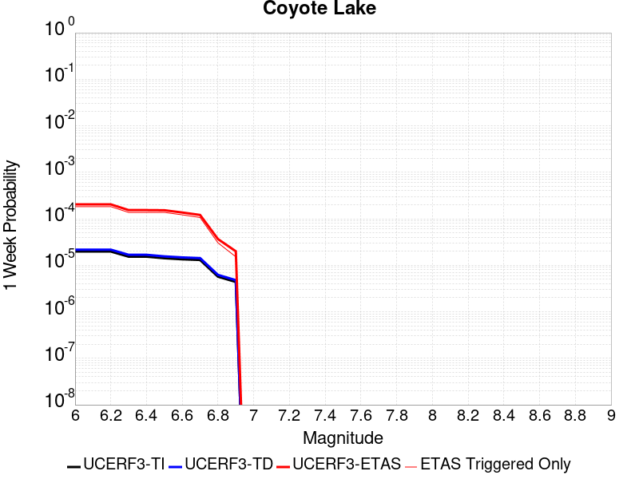 | 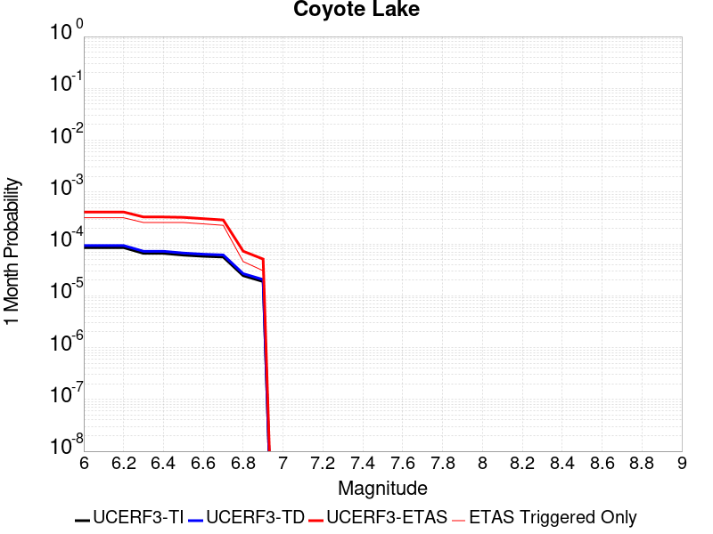 |  | 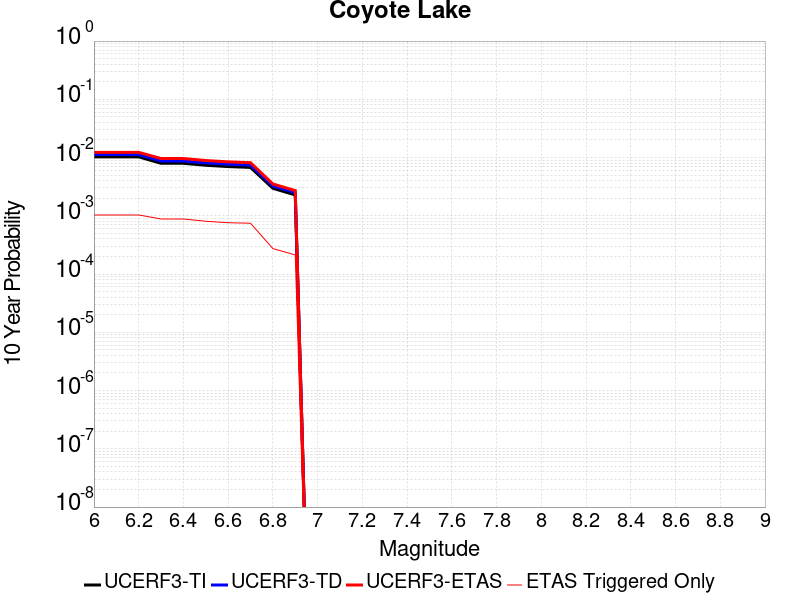 |

| Magnitude | 1 wk TI Prob | 1 wk TD Prob | 1 wk ETAS Prob | 1 wk ETAS/TD Gain | 1 wk ETAS Triggered Only | 1 mo TI Prob | 1 mo TD Prob | 1 mo ETAS Prob | 1 mo ETAS/TD Gain | 1 mo ETAS Triggered Only | 1 yr TI Prob | 1 yr TD Prob | 1 yr ETAS Prob | 1 yr ETAS/TD Gain | 1 yr ETAS Triggered Only | 10 yr TI Prob | 10 yr TD Prob | 10 yr ETAS Prob | 10 yr ETAS/TD Gain | 10 yr ETAS Triggered Only |
|-----|-----|-----|-----|-----|-----|-----|-----|-----|-----|-----|-----|-----|-----|-----|-----|-----|-----|-----|-----|-----|
| 6.0 | 1.980352E-5 | 2.1706745E-5 | 2.0435118E-4 | 9.414179 | 1.8264841E-4 | 8.486947E-5 | 9.302599E-5 | 4.1263097E-4 | 4.4356523 | 3.196347E-4 | 0.0010327959 | 0.0011320751 | 0.0017706208 | 1.5640489 | 6.392694E-4 | 0.010280091 | 0.011270258 | 0.0122936005 | 1.0908003 | 0.0010350076 |
| 6.1 | 1.980352E-5 | 2.1706745E-5 | 2.0435118E-4 | 9.414179 | 1.8264841E-4 | 8.486947E-5 | 9.302599E-5 | 4.1263097E-4 | 4.4356523 | 3.196347E-4 | 0.0010327959 | 0.0011320751 | 0.0017706208 | 1.5640489 | 6.392694E-4 | 0.010280091 | 0.011270258 | 0.0122936005 | 1.0908003 | 0.0010350076 |
| 6.2 | 1.980352E-5 | 2.1706745E-5 | 2.0435118E-4 | 9.414179 | 1.8264841E-4 | 8.486947E-5 | 9.302599E-5 | 4.1263097E-4 | 4.4356523 | 3.196347E-4 | 0.0010327959 | 0.0011320751 | 0.0017706208 | 1.5640489 | 6.392694E-4 | 0.010280091 | 0.011270258 | 0.0122936005 | 1.0908003 | 0.0010350076 |
| 6.3 | 1.5344787E-5 | 1.682067E-5 | 1.5380466E-4 | 9.14379 | 1.369863E-4 | 6.576172E-5 | 7.2086936E-5 | 3.3082018E-4 | 4.589184 | 2.587519E-4 | 8.003548E-4 | 8.773662E-4 | 0.0014248308 | 1.6239862 | 5.479452E-4 | 0.007974784 | 0.00874507 | 0.00962015 | 1.1000656 | 8.828006E-4 |
| 6.4 | 1.5344787E-5 | 1.682067E-5 | 1.5380466E-4 | 9.14379 | 1.369863E-4 | 6.576172E-5 | 7.2086936E-5 | 3.3082018E-4 | 4.589184 | 2.587519E-4 | 8.003548E-4 | 8.773662E-4 | 0.0014248308 | 1.6239862 | 5.479452E-4 | 0.007974784 | 0.00874507 | 0.00962015 | 1.1000656 | 8.828006E-4 |
| 6.5 | 1.4189697E-5 | 1.5557987E-5 | 1.5254215E-4 | 9.8047495 | 1.369863E-4 | 6.081157E-5 | 6.6675726E-5 | 3.2541036E-4 | 4.8804927 | 2.587519E-4 | 7.401293E-4 | 8.115349E-4 | 0.001298202 | 1.5996872 | 4.870624E-4 | 0.0073766913 | 0.008091656 | 0.008891826 | 1.0988883 | 8.066971E-4 |
| 6.6 | 1.3469301E-5 | 1.4771577E-5 | 1.3653538E-4 | 9.243114 | 1.217656E-4 | 5.7724297E-5 | 6.330556E-5 | 3.0682134E-4 | 4.846673 | 2.435312E-4 | 7.025667E-4 | 7.7053264E-4 | 0.0012268018 | 1.5921477 | 4.56621E-4 | 0.0070034964 | 0.0076845144 | 0.008439701 | 1.0982739 | 7.61035E-4 |
| 6.7 | 1.3027966E-5 | 1.4281745E-5 | 1.2082513E-4 | 8.46011 | 1.065449E-4 | 5.5832945E-5 | 6.120638E-5 | 2.895029E-4 | 4.7299466 | 2.283105E-4 | 6.7955407E-4 | 7.4499263E-4 | 0.0011860641 | 1.592048 | 4.414003E-4 | 0.006774798 | 0.0074308286 | 0.008171101 | 1.0996218 | 7.458143E-4 |
| 6.8 | 5.695434E-6 | 6.2244176E-6 | 3.6665628E-5 | 5.8906116 | 3.04414E-5 | 2.4408775E-5 | 2.6675973E-5 | 7.233686E-5 | 2.7116857 | 4.5662102E-5 | 2.971363E-4 | 3.2476155E-4 | 4.6170337E-4 | 1.4216688 | 1.369863E-4 | 0.0029673933 | 0.0032458105 | 0.0035188938 | 1.0841341 | 2.739726E-4 |
| 6.9 | 4.385688E-6 | 4.7930553E-6 | 2.0013682E-5 | 4.1755586 | 1.52207E-5 | 1.879567E-5 | 2.0541665E-5 | 5.0982442E-5 | 2.4819038 | 3.04414E-5 | 2.2881327E-4 | 2.5009477E-4 | 3.4139614E-4 | 1.365067 | 9.1324204E-5 | 0.002285778 | 0.0025009478 | 0.0027135047 | 1.0849905 | 2.130898E-4 |

## Helendale-So Lockhart
*[(top)](#table-of-contents)*

| 1 Week | 1 Month | 1 Year | 10 Year |
|-----|-----|-----|-----|
| 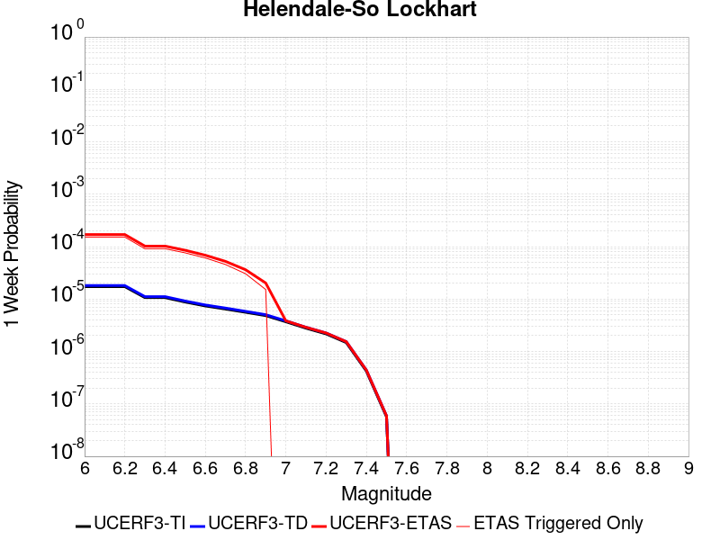 | 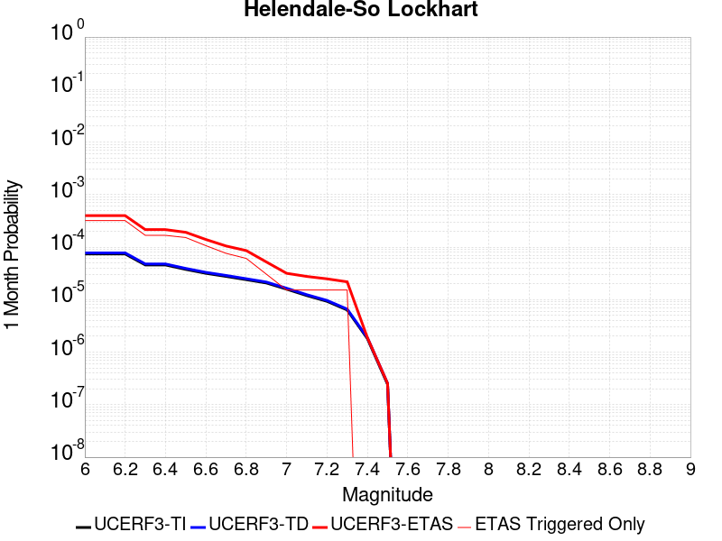 | 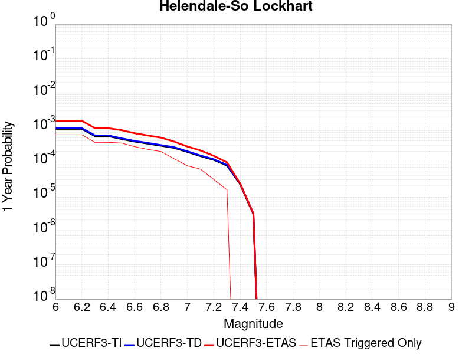 | 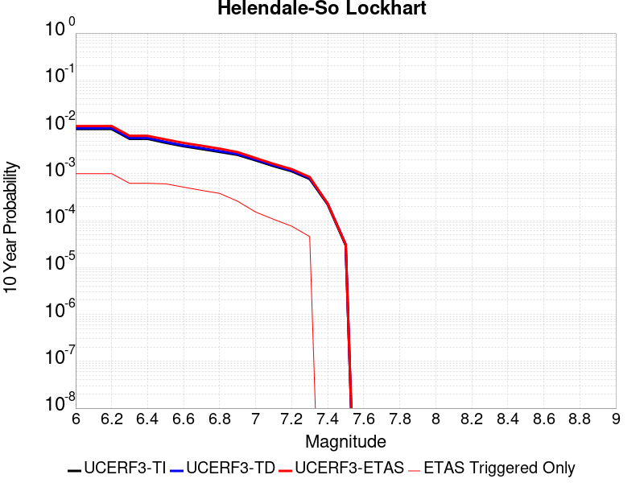 |

| Magnitude | 1 wk TI Prob | 1 wk TD Prob | 1 wk ETAS Prob | 1 wk ETAS/TD Gain | 1 wk ETAS Triggered Only | 1 mo TI Prob | 1 mo TD Prob | 1 mo ETAS Prob | 1 mo ETAS/TD Gain | 1 mo ETAS Triggered Only | 1 yr TI Prob | 1 yr TD Prob | 1 yr ETAS Prob | 1 yr ETAS/TD Gain | 1 yr ETAS Triggered Only | 10 yr TI Prob | 10 yr TD Prob | 10 yr ETAS Prob | 10 yr ETAS/TD Gain | 10 yr ETAS Triggered Only |
|-----|-----|-----|-----|-----|-----|-----|-----|-----|-----|-----|-----|-----|-----|-----|-----|-----|-----|-----|-----|-----|
| 6.0 | 1.7296055E-5 | 1.8103729E-5 | 1.7030798E-4 | 9.407342 | 1.5220701E-4 | 7.412385E-5 | 7.7585224E-5 | 3.9719514E-4 | 5.1194687 | 3.196347E-4 | 9.0208417E-4 | 9.4421144E-4 | 0.0015524646 | 1.6441916 | 6.0882804E-4 | 0.008984311 | 0.009404116 | 0.010399235 | 1.1058174 | 0.0010045662 |
| 6.1 | 1.7296055E-5 | 1.8103729E-5 | 1.7030798E-4 | 9.407342 | 1.5220701E-4 | 7.412385E-5 | 7.7585224E-5 | 3.9719514E-4 | 5.1194687 | 3.196347E-4 | 9.0208417E-4 | 9.4421144E-4 | 0.0015524646 | 1.6441916 | 6.0882804E-4 | 0.008984311 | 0.009404116 | 0.010399235 | 1.1058174 | 0.0010045662 |
| 6.2 | 1.7296055E-5 | 1.8103729E-5 | 1.7030798E-4 | 9.407342 | 1.5220701E-4 | 7.412385E-5 | 7.7585224E-5 | 3.9719514E-4 | 5.1194687 | 3.196347E-4 | 9.0208417E-4 | 9.4421144E-4 | 0.0015524646 | 1.6441916 | 6.0882804E-4 | 0.008984311 | 0.009404116 | 0.010399235 | 1.1058174 | 0.0010045662 |
| 6.3 | 1.0669118E-5 | 1.1135425E-5 | 1.0245861E-4 | 9.20114 | 9.1324204E-5 | 4.5723988E-5 | 4.772239E-5 | 2.151421E-4 | 4.5082006 | 1.674277E-4 | 5.5654737E-4 | 5.80868E-4 | 9.459526E-4 | 1.6285156 | 3.6529682E-4 | 0.0055515557 | 0.0057937936 | 0.0064142267 | 1.1070858 | 6.240487E-4 |
| 6.4 | 1.0669118E-5 | 1.1135425E-5 | 1.0245861E-4 | 9.20114 | 9.1324204E-5 | 4.5723988E-5 | 4.772239E-5 | 2.151421E-4 | 4.5082006 | 1.674277E-4 | 5.5654737E-4 | 5.80868E-4 | 9.459526E-4 | 1.6285156 | 3.6529682E-4 | 0.0055515557 | 0.0057937936 | 0.0064142267 | 1.1070858 | 6.240487E-4 |
| 6.5 | 8.790038E-6 | 9.170197E-6 | 8.5273E-5 | 9.298928 | 7.6103504E-5 | 3.767105E-5 | 3.930026E-5 | 1.9150128E-4 | 4.8727736 | 1.5220701E-4 | 4.585485E-4 | 4.7837716E-4 | 8.282858E-4 | 1.7314492 | 3.500761E-4 | 0.0045760344 | 0.004773638 | 0.00537956 | 1.1269308 | 6.0882804E-4 |
| 6.6 | 7.396949E-6 | 7.715537E-6 | 6.859787E-5 | 8.890874 | 6.08828E-5 | 3.1700827E-5 | 3.3066175E-5 | 1.3960755E-4 | 4.2220654 | 1.065449E-4 | 3.858892E-4 | 4.025073E-4 | 6.7636964E-4 | 1.680391 | 2.739726E-4 | 0.003852198 | 0.00401789 | 0.004533314 | 1.1282824 | 5.175038E-4 |
| 6.7 | 6.4600285E-6 | 6.738031E-6 | 5.2399824E-5 | 7.7767262 | 4.5662102E-5 | 2.7685543E-5 | 2.887696E-5 | 1.04978266E-4 | 3.635364 | 7.6103504E-5 | 3.3701936E-4 | 3.5152107E-4 | 5.7975133E-4 | 1.6492648 | 2.283105E-4 | 0.0033650869 | 0.003509732 | 0.003949583 | 1.1253233 | 4.414003E-4 |
| 6.8 | 5.600104E-6 | 5.836009E-6 | 3.6277233E-5 | 6.2161026 | 3.04414E-5 | 2.4000226E-5 | 2.5011232E-5 | 8.589251E-5 | 3.4341574 | 6.08828E-5 | 2.9216358E-4 | 3.044698E-4 | 5.022787E-4 | 1.649683 | 1.978691E-4 | 0.0029177975 | 0.003040588 | 0.0034199485 | 1.1247655 | 3.805175E-4 |
| 6.9 | 4.839122E-6 | 5.0395092E-6 | 2.0260133E-5 | 4.020259 | 1.52207E-5 | 2.0738931E-5 | 2.159772E-5 | 5.2038464E-5 | 2.4094424 | 3.04414E-5 | 2.5246723E-4 | 2.6292098E-4 | 3.8465456E-4 | 1.4630045 | 1.217656E-4 | 0.002521806 | 0.002626147 | 0.0028842192 | 1.0982704 | 2.587519E-4 |
| 7.0 | 3.6937633E-6 | 3.845208E-6 | 3.845208E-6 | 1.0 | 0.0 | 1.5830317E-5 | 1.647936E-5 | 3.169981E-5 | 1.9236068 | 1.52207E-5 | 1.9271708E-4 | 2.0061806E-4 | 2.767063E-4 | 1.3792691 | 7.6103504E-5 | 0.0019255003 | 0.002004401 | 0.0021563028 | 1.0757842 | 1.5220701E-4 |
| 7.1 | 2.7858857E-6 | 2.8978538E-6 | 2.8978538E-6 | 1.0 | 0.0 | 1.1939455E-5 | 1.2419316E-5 | 2.7639826E-5 | 2.2255516 | 1.52207E-5 | 1.4535317E-4 | 1.511949E-4 | 2.1206848E-4 | 1.4026167 | 6.08828E-5 | 0.0014525814 | 0.0015109418 | 0.0016173257 | 1.070409 | 1.065449E-4 |
| 7.2 | 2.1672065E-6 | 2.2540128E-6 | 2.2540128E-6 | 1.0 | 0.0 | 9.2879945E-6 | 9.66002E-6 | 2.4880574E-5 | 2.5756233 | 1.52207E-5 | 1.1307546E-4 | 1.1760458E-4 | 1.480424E-4 | 1.2588149 | 3.04414E-5 | 0.0011301794 | 0.0011754417 | 0.0012514557 | 1.0646685 | 7.6103504E-5 |
| 7.3 | 1.4823496E-6 | 1.5422102E-6 | 1.5422102E-6 | 1.0 | 0.0 | 6.3529114E-6 | 6.6094562E-6 | 2.1830056E-5 | 3.302852 | 1.52207E-5 | 7.734395E-5 | 8.046731E-5 | 9.568679E-5 | 1.1891387 | 1.52207E-5 | 7.731704E-4 | 8.0439687E-4 | 8.5002225E-4 | 1.05672 | 4.5662102E-5 |
| 7.4 | 4.2321457E-7 | 4.4108765E-7 | 4.4108765E-7 | 1.0 | 0.0 | 1.8137755E-6 | 1.8903745E-6 | 1.8903745E-6 | 1.0 | 0.0 | 2.2082493E-5 | 2.3015113E-5 | 2.3015113E-5 | 1.0 | 0.0 | 2.2080299E-4 | 2.3013182E-4 | 2.3013182E-4 | 1.0 | 0.0 |
| 7.5 | 5.6942316E-8 | 5.9415648E-8 | 5.9415648E-8 | 1.0 | 0.0 | 2.440385E-7 | 2.5463845E-7 | 2.5463845E-7 | 1.0 | 0.0 | 2.9711643E-6 | 3.1002196E-6 | 3.1002196E-6 | 1.0 | 0.0 | 2.9711247E-5 | 3.1001844E-5 | 3.1001844E-5 | 1.0 | 0.0 |

## San Andreas (Big Bend)
*[(top)](#table-of-contents)*

| 1 Week | 1 Month | 1 Year | 10 Year |
|-----|-----|-----|-----|
| 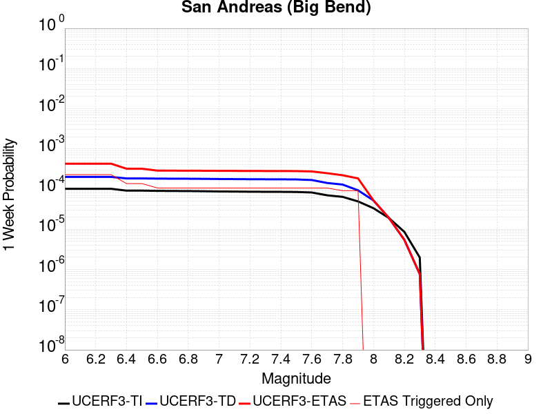 | 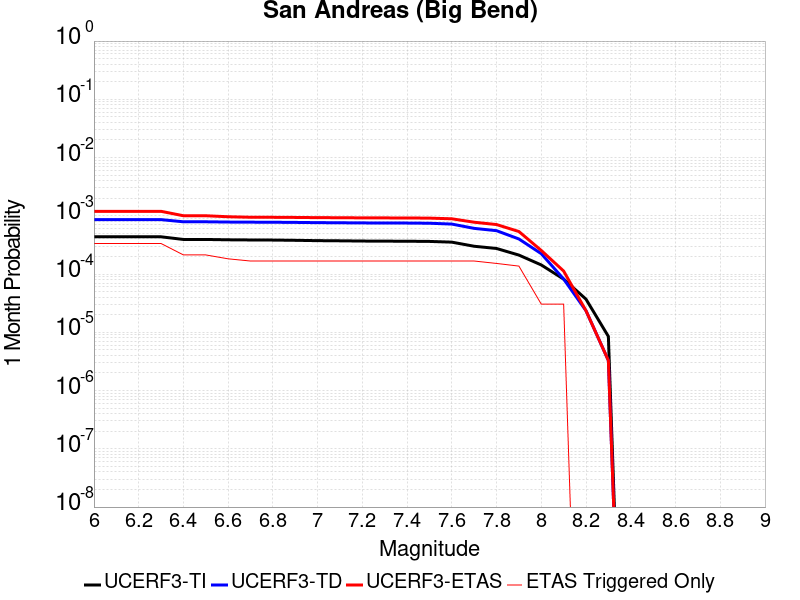 | 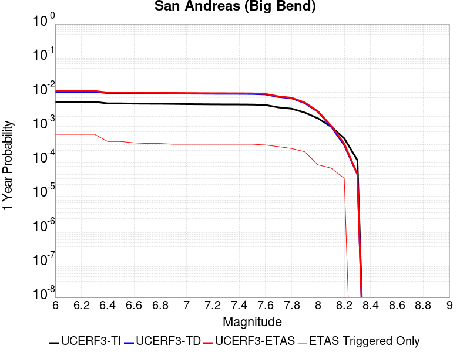 | 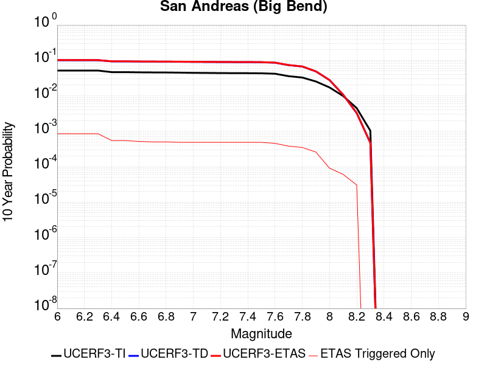 |

| Magnitude | 1 wk TI Prob | 1 wk TD Prob | 1 wk ETAS Prob | 1 wk ETAS/TD Gain | 1 wk ETAS Triggered Only | 1 mo TI Prob | 1 mo TD Prob | 1 mo ETAS Prob | 1 mo ETAS/TD Gain | 1 mo ETAS Triggered Only | 1 yr TI Prob | 1 yr TD Prob | 1 yr ETAS Prob | 1 yr ETAS/TD Gain | 1 yr ETAS Triggered Only | 10 yr TI Prob | 10 yr TD Prob | 10 yr ETAS Prob | 10 yr ETAS/TD Gain | 10 yr ETAS Triggered Only |
|-----|-----|-----|-----|-----|-----|-----|-----|-----|-----|-----|-----|-----|-----|-----|-----|-----|-----|-----|-----|-----|
| 6.0 | 1.0179969E-4 | 2.0072258E-4 | 4.2898726E-4 | 2.1372147 | 2.283105E-4 | 4.362114E-4 | 8.599571E-4 | 0.0011945246 | 1.3890513 | 3.348554E-4 | 0.0052979486 | 0.010419999 | 0.011007421 | 1.0563744 | 5.936073E-4 | 0.051734097 | 0.10144902 | 0.10221491 | 1.0075495 | 8.523592E-4 |
| 6.1 | 1.0179969E-4 | 2.0072258E-4 | 4.2898726E-4 | 2.1372147 | 2.283105E-4 | 4.362114E-4 | 8.599571E-4 | 0.0011945246 | 1.3890513 | 3.348554E-4 | 0.0052979486 | 0.010419999 | 0.011007421 | 1.0563744 | 5.936073E-4 | 0.051734097 | 0.10144902 | 0.10221491 | 1.0075495 | 8.523592E-4 |
| 6.2 | 1.0179969E-4 | 2.0072258E-4 | 4.2898726E-4 | 2.1372147 | 2.283105E-4 | 4.362114E-4 | 8.599571E-4 | 0.0011945246 | 1.3890513 | 3.348554E-4 | 0.0052979486 | 0.010419999 | 0.011007421 | 1.0563744 | 5.936073E-4 | 0.051734097 | 0.10144902 | 0.10221491 | 1.0075495 | 8.523592E-4 |
| 6.3 | 1.0179969E-4 | 2.0072258E-4 | 4.2898726E-4 | 2.1372147 | 2.283105E-4 | 4.362114E-4 | 8.599571E-4 | 0.0011945246 | 1.3890513 | 3.348554E-4 | 0.0052979486 | 0.010419999 | 0.011007421 | 1.0563744 | 5.936073E-4 | 0.051734097 | 0.10144902 | 0.10221491 | 1.0075495 | 8.523592E-4 |
| 6.4 | 9.1639464E-5 | 1.8429532E-4 | 3.2125638E-4 | 1.7431608 | 1.369863E-4 | 3.9268145E-4 | 7.895982E-4 | 0.0010025197 | 1.2696581 | 2.130898E-4 | 0.0047704205 | 0.009571102 | 0.009932903 | 1.0378014 | 3.6529682E-4 | 0.046693064 | 0.09377527 | 0.09427183 | 1.0052953 | 5.479452E-4 |
| 6.5 | 9.1639464E-5 | 1.8429532E-4 | 3.2125638E-4 | 1.7431608 | 1.369863E-4 | 3.9268145E-4 | 7.895982E-4 | 0.0010025197 | 1.2696581 | 2.130898E-4 | 0.0047704205 | 0.009571102 | 0.009932903 | 1.0378014 | 3.6529682E-4 | 0.046693064 | 0.09377527 | 0.09427183 | 1.0052953 | 5.479452E-4 |
| 6.6 | 9.042622E-5 | 1.823659E-4 | 2.8889137E-4 | 1.5841304 | 1.065449E-4 | 3.8748336E-4 | 7.8133424E-4 | 9.6383994E-4 | 1.2335821 | 1.8264841E-4 | 0.0047074095 | 0.009471365 | 0.009803049 | 1.0350196 | 3.348554E-4 | 0.046089325 | 0.092869274 | 0.09333872 | 1.0050548 | 5.175038E-4 |
| 6.7 | 8.9836685E-5 | 1.8150927E-4 | 2.8803482E-4 | 1.5868877 | 1.065449E-4 | 3.8495753E-4 | 7.776651E-4 | 9.449626E-4 | 1.215128 | 1.674277E-4 | 0.00467679 | 0.00942708 | 0.009743702 | 1.0335864 | 3.196347E-4 | 0.045795817 | 0.09246355 | 0.09291939 | 1.0049299 | 5.022831E-4 |
| 6.8 | 8.9471854E-5 | 1.8097709E-4 | 2.875027E-4 | 1.5886139 | 1.065449E-4 | 3.8339442E-4 | 7.7538576E-4 | 9.426836E-4 | 1.2157608 | 1.674277E-4 | 0.004657841 | 0.009399569 | 0.009716199 | 1.0336856 | 3.196347E-4 | 0.04561414 | 0.092210755 | 0.09266672 | 1.0049448 | 5.022831E-4 |
| 6.9 | 8.858234E-5 | 1.7979681E-4 | 2.8632255E-4 | 1.5924785 | 1.065449E-4 | 3.7958333E-4 | 7.703304E-4 | 9.3762914E-4 | 1.2171779 | 1.674277E-4 | 0.004611638 | 0.009338548 | 0.00964012 | 1.0322932 | 3.0441402E-4 | 0.04517103 | 0.09165087 | 0.0920933 | 1.0048273 | 4.870624E-4 |
| 7.0 | 8.7433385E-5 | 1.7818481E-4 | 2.8471072E-4 | 1.5978395 | 1.065449E-4 | 3.746607E-4 | 7.634259E-4 | 9.307258E-4 | 1.2191436 | 1.674277E-4 | 0.004551957 | 0.009255203 | 0.0095568 | 1.0325867 | 3.0441402E-4 | 0.044598386 | 0.09088532 | 0.091328114 | 1.0048721 | 4.870624E-4 |
| 7.1 | 8.684964E-5 | 1.7730435E-4 | 2.8383036E-4 | 1.6008087 | 1.065449E-4 | 3.7215967E-4 | 7.596547E-4 | 9.269552E-4 | 1.2202324 | 1.674277E-4 | 0.0045216335 | 0.009209678 | 0.009511288 | 1.0327493 | 3.0441402E-4 | 0.04430731 | 0.09046686 | 0.09090986 | 1.0048968 | 4.870624E-4 |
| 7.2 | 8.606521E-5 | 1.762105E-4 | 2.8273664E-4 | 1.604539 | 1.065449E-4 | 3.6879873E-4 | 7.549695E-4 | 9.222708E-4 | 1.2216 | 1.674277E-4 | 0.0044808835 | 0.0091531165 | 0.009454744 | 1.0329535 | 3.0441402E-4 | 0.043916024 | 0.089947365 | 0.09039062 | 1.0049279 | 4.870624E-4 |
| 7.3 | 8.568266E-5 | 1.7563057E-4 | 2.8215675E-4 | 1.6065356 | 1.065449E-4 | 3.6715972E-4 | 7.524855E-4 | 9.197872E-4 | 1.2223321 | 1.674277E-4 | 0.0044610105 | 0.009123127 | 0.009424764 | 1.0330628 | 3.0441402E-4 | 0.043725148 | 0.08966853 | 0.09011191 | 1.0049448 | 4.870624E-4 |
| 7.4 | 8.5432206E-5 | 1.7525644E-4 | 2.8178268E-4 | 1.6078306 | 1.065449E-4 | 3.6608664E-4 | 7.50883E-4 | 9.18185E-4 | 1.2228069 | 1.674277E-4 | 0.004447999 | 0.009103781 | 0.009405423 | 1.0331337 | 3.0441402E-4 | 0.043600157 | 0.08948871 | 0.08993218 | 1.0049556 | 4.870624E-4 |
| 7.5 | 8.4791965E-5 | 1.7394972E-4 | 2.804761E-4 | 1.6123974 | 1.065449E-4 | 3.633435E-4 | 7.4528606E-4 | 9.1258896E-4 | 1.2244815 | 1.674277E-4 | 0.0044147377 | 0.009036204 | 0.009337868 | 1.0333838 | 3.0441402E-4 | 0.043280575 | 0.088866346 | 0.089310125 | 1.0049938 | 4.870624E-4 |
| 7.6 | 8.241105E-5 | 1.6840403E-4 | 2.74931E-4 | 1.6325678 | 1.065449E-4 | 3.531424E-4 | 7.215321E-4 | 8.88839E-4 | 1.2318773 | 1.674277E-4 | 0.0042910352 | 0.008749358 | 0.009036021 | 1.0327638 | 2.891933E-4 | 0.042091176 | 0.086243294 | 0.086660534 | 1.004838 | 4.56621E-4 |
| 7.7 | 7.00432E-5 | 1.42045E-4 | 2.4857477E-4 | 1.749972 | 1.065449E-4 | 3.001506E-4 | 6.0862233E-4 | 7.759481E-4 | 1.2749255 | 1.674277E-4 | 0.0036482112 | 0.0073848404 | 0.0076416815 | 1.0347795 | 2.587519E-4 | 0.035888977 | 0.07351733 | 0.07386987 | 1.0047953 | 3.805175E-4 |
| 7.8 | 6.415362E-5 | 1.2968935E-4 | 2.210017E-4 | 1.7040854 | 9.1324204E-5 | 2.749151E-4 | 5.556931E-4 | 7.078155E-4 | 1.2737526 | 1.5220701E-4 | 0.0033419547 | 0.0067446055 | 0.0069713765 | 1.0336225 | 2.283105E-4 | 0.03292141 | 0.06725231 | 0.06757884 | 1.0048554 | 3.500761E-4 |
| 7.9 | 4.939911E-5 | 9.3411545E-5 | 1.847272E-4 | 1.977563 | 9.1324204E-5 | 2.116933E-4 | 4.0027377E-4 | 5.3720525E-4 | 1.3420945 | 1.369863E-4 | 0.0025743195 | 0.004862453 | 0.005044213 | 1.0373803 | 1.8264841E-4 | 0.025447013 | 0.048914436 | 0.049160533 | 1.0050311 | 2.587519E-4 |
| 8.0 | 3.344983E-5 | 5.222685E-5 | 5.222685E-5 | 1.0 | 0.0 | 1.4334853E-4 | 2.2381016E-4 | 2.5424475E-4 | 1.135984 | 3.04414E-5 | 0.0017438711 | 0.0027214854 | 0.002797382 | 1.0278878 | 7.6103504E-5 | 0.017302496 | 0.027922187 | 0.028010963 | 1.0031793 | 9.1324204E-5 |
| 8.1 | 1.9104898E-5 | 1.9173063E-5 | 1.9173063E-5 | 1.0 | 0.0 | 8.1875565E-5 | 8.216769E-5 | 1.1260659E-4 | 1.3704485 | 3.04414E-5 | 9.963791E-4 | 9.999331E-4 | 0.001060755 | 1.060826 | 6.08828E-5 | 0.009919235 | 0.010749801 | 0.01081003 | 1.0056027 | 6.08828E-5 |
| 8.2 | 8.643924E-6 | 5.4748625E-6 | 5.4748625E-6 | 1.0 | 0.0 | 3.704486E-5 | 2.3463486E-5 | 2.3463486E-5 | 1.0 | 0.0 | 4.5092785E-4 | 2.8563058E-4 | 3.1606326E-4 | 1.1065457 | 3.04414E-5 | 0.0045001395 | 0.0032487072 | 0.0032790496 | 1.0093399 | 3.04414E-5 |
| 8.3 | 1.983087E-6 | 7.6599065E-7 | 7.6599065E-7 | 1.0 | 0.0 | 8.498917E-6 | 3.282813E-6 | 3.282813E-6 | 1.0 | 0.0 | 1.034694E-4 | 3.9967534E-5 | 3.9967534E-5 | 1.0 | 0.0 | 0.0010342124 | 4.719687E-4 | 4.719687E-4 | 1.0 | 0.0 |

## San Andreas (Parkfield)
*[(top)](#table-of-contents)*

| 1 Week | 1 Month | 1 Year | 10 Year |
|-----|-----|-----|-----|
| 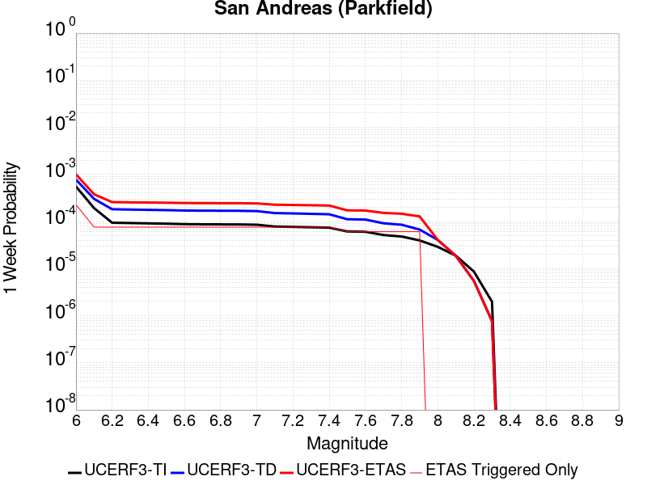 | 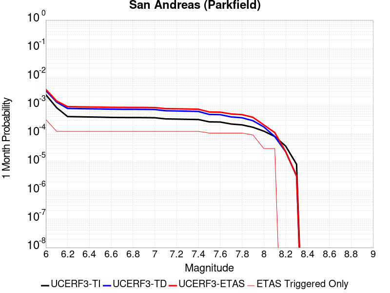 |  | 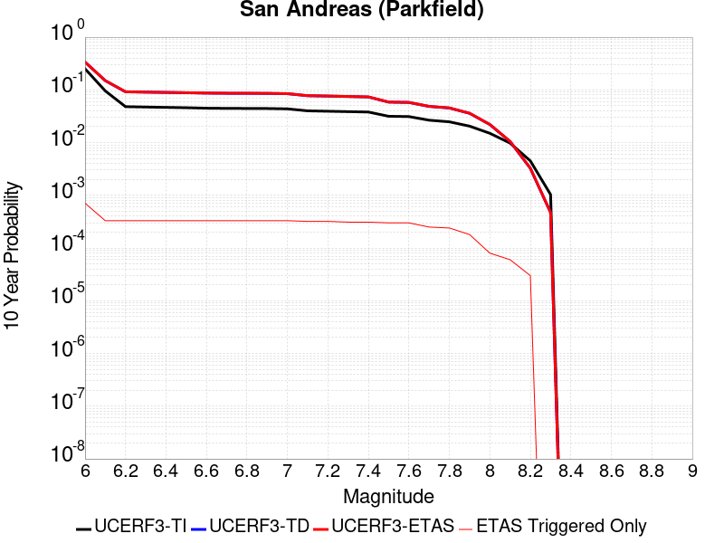 |

| Magnitude | 1 wk TI Prob | 1 wk TD Prob | 1 wk ETAS Prob | 1 wk ETAS/TD Gain | 1 wk ETAS Triggered Only | 1 mo TI Prob | 1 mo TD Prob | 1 mo ETAS Prob | 1 mo ETAS/TD Gain | 1 mo ETAS Triggered Only | 1 yr TI Prob | 1 yr TD Prob | 1 yr ETAS Prob | 1 yr ETAS/TD Gain | 1 yr ETAS Triggered Only | 10 yr TI Prob | 10 yr TD Prob | 10 yr ETAS Prob | 10 yr ETAS/TD Gain | 10 yr ETAS Triggered Only |
|-----|-----|-----|-----|-----|-----|-----|-----|-----|-----|-----|-----|-----|-----|-----|-----|-----|-----|-----|-----|-----|
| 6.0 | 5.556969E-4 | 7.7782426E-4 | 0.0010059571 | 1.2932962 | 2.283105E-4 | 0.0023793848 | 0.0033298214 | 0.0036483917 | 1.0956719 | 3.196347E-4 | 0.028586963 | 0.040191233 | 0.040746372 | 1.0138124 | 5.783866E-4 | 0.25176284 | 0.33716413 | 0.33767867 | 1.001526 | 7.7625574E-4 |
| 6.1 | 1.925858E-4 | 3.0276453E-4 | 3.78845E-4 | 1.2512859 | 7.6103504E-5 | 8.2510663E-4 | 0.0012970108 | 0.0014186185 | 1.0937599 | 1.217656E-4 | 0.0099994885 | 0.015778083 | 0.016002791 | 1.0142418 | 2.283105E-4 | 0.095613256 | 0.1497237 | 0.1500343 | 1.0020745 | 3.6529682E-4 |
| 6.2 | 9.4306815E-5 | 1.8242796E-4 | 2.5851757E-4 | 1.417094 | 7.6103504E-5 | 4.0410945E-4 | 7.816011E-4 | 9.0327155E-4 | 1.1556681 | 1.217656E-4 | 0.0049089384 | 0.009474681 | 0.009700828 | 1.0238686 | 2.283105E-4 | 0.048019063 | 0.09185409 | 0.09218583 | 1.0036117 | 3.6529682E-4 |
| 6.3 | 9.283051E-5 | 1.7939322E-4 | 2.5548306E-4 | 1.4241512 | 7.6103504E-5 | 3.9778434E-4 | 7.686027E-4 | 8.902747E-4 | 1.1583029 | 1.217656E-4 | 0.0048322747 | 0.009317789 | 0.009543972 | 1.0242743 | 2.283105E-4 | 0.047285385 | 0.09050704 | 0.09083927 | 1.0036708 | 3.6529682E-4 |
| 6.4 | 9.138826E-5 | 1.770153E-4 | 2.5310533E-4 | 1.42985 | 7.6103504E-5 | 3.916052E-4 | 7.5841765E-4 | 8.800909E-4 | 1.1604304 | 1.217656E-4 | 0.0047573745 | 0.00919484 | 0.009421051 | 1.0246019 | 2.283105E-4 | 0.046568092 | 0.08940927 | 0.08974191 | 1.0037204 | 3.6529682E-4 |
| 6.5 | 9.000255E-5 | 1.7459576E-4 | 2.5068596E-4 | 1.435808 | 7.6103504E-5 | 3.8566816E-4 | 7.480541E-4 | 8.697286E-4 | 1.1626546 | 1.217656E-4 | 0.0046854047 | 0.009069731 | 0.009295972 | 1.0249445 | 2.283105E-4 | 0.045878403 | 0.088295065 | 0.088628106 | 1.0037719 | 3.6529682E-4 |
| 6.6 | 8.8109264E-5 | 1.7140752E-4 | 2.4749798E-4 | 1.4439155 | 7.6103504E-5 | 3.7755648E-4 | 7.3439797E-4 | 8.5607416E-4 | 1.1656815 | 1.217656E-4 | 0.0045870654 | 0.008904854 | 0.009131132 | 1.0254105 | 2.283105E-4 | 0.04493529 | 0.0868267 | 0.087160274 | 1.0038419 | 3.6529682E-4 |
| 6.7 | 8.738073E-5 | 1.7007832E-4 | 2.4616887E-4 | 1.4473854 | 7.6103504E-5 | 3.7443507E-4 | 7.287046E-4 | 8.503815E-4 | 1.1669769 | 1.217656E-4 | 0.0045492216 | 0.008836143 | 0.009062436 | 1.02561 | 2.283105E-4 | 0.04457213 | 0.08622707 | 0.08656086 | 1.0038712 | 3.6529682E-4 |
| 6.8 | 8.710195E-5 | 1.6953335E-4 | 2.4562393E-4 | 1.4488238 | 7.6103504E-5 | 3.7324068E-4 | 7.263703E-4 | 8.4804744E-4 | 1.167514 | 1.217656E-4 | 0.0045347405 | 0.008807961 | 0.00903426 | 1.0256926 | 2.283105E-4 | 0.04443313 | 0.08597467 | 0.08630856 | 1.0038836 | 3.6529682E-4 |
| 6.9 | 8.6801556E-5 | 1.689429E-4 | 2.4503353E-4 | 1.4503927 | 7.6103504E-5 | 3.7195362E-4 | 7.2384125E-4 | 8.455187E-4 | 1.1680996 | 1.217656E-4 | 0.0045191357 | 0.008777418 | 0.009003725 | 1.0257828 | 2.283105E-4 | 0.044283327 | 0.085700735 | 0.08603472 | 1.0038972 | 3.6529682E-4 |
| 7.0 | 8.5571606E-5 | 1.6647128E-4 | 2.425621E-4 | 1.4570808 | 7.6103504E-5 | 3.6668387E-4 | 7.132544E-4 | 8.349332E-4 | 1.1705966 | 1.217656E-4 | 0.004455241 | 0.008649553 | 0.008875889 | 1.0261673 | 2.283105E-4 | 0.043669727 | 0.08454914 | 0.08488355 | 1.0039552 | 3.6529682E-4 |
| 7.1 | 7.82589E-5 | 1.5128135E-4 | 2.2737334E-4 | 1.5029832 | 7.6103504E-5 | 3.3535215E-4 | 6.481883E-4 | 7.6987495E-4 | 1.1877335 | 1.217656E-4 | 0.0040752706 | 0.007863307 | 0.008089822 | 1.0288066 | 2.283105E-4 | 0.040013418 | 0.07746111 | 0.07779811 | 1.0043505 | 3.6529682E-4 |
| 7.2 | 7.690929E-5 | 1.4865391E-4 | 2.247461E-4 | 1.5118748 | 7.6103504E-5 | 3.2956956E-4 | 6.369334E-4 | 7.5862143E-4 | 1.191053 | 1.217656E-4 | 0.004005129 | 0.007727258 | 0.007953804 | 1.0293179 | 2.283105E-4 | 0.0393371 | 0.07623427 | 0.07657172 | 1.0044265 | 3.6529682E-4 |
| 7.3 | 7.5543794E-5 | 1.4561978E-4 | 2.217122E-4 | 1.5225418 | 7.6103504E-5 | 3.2371894E-4 | 6.2393624E-4 | 7.456259E-4 | 1.1950353 | 1.217656E-4 | 0.003934157 | 0.007570127 | 0.0077967094 | 1.0299311 | 2.283105E-4 | 0.038652334 | 0.074797355 | 0.07512124 | 1.0043303 | 3.500761E-4 |
| 7.4 | 7.4214564E-5 | 1.4262961E-4 | 2.1872226E-4 | 1.5334982 | 7.6103504E-5 | 3.1802364E-4 | 6.111273E-4 | 7.328185E-4 | 1.1991258 | 1.217656E-4 | 0.003865065 | 0.00741525 | 0.0076418673 | 1.030561 | 2.283105E-4 | 0.03798529 | 0.07337123 | 0.07369562 | 1.0044212 | 3.500761E-4 |
| 7.5 | 6.149578E-5 | 1.11907226E-4 | 1.7278321E-4 | 1.5439862 | 6.08828E-5 | 2.6352672E-4 | 4.7951436E-4 | 5.860082E-4 | 1.2220868 | 1.065449E-4 | 0.0032037178 | 0.0058224914 | 0.0060343402 | 1.0363846 | 2.130898E-4 | 0.03157923 | 0.058557566 | 0.05887281 | 1.0053835 | 3.348554E-4 |
| 7.6 | 6.0643448E-5 | 1.10193796E-4 | 1.7106989E-4 | 1.5524458 | 6.08828E-5 | 2.598746E-4 | 4.7217376E-4 | 5.786684E-4 | 1.2255411 | 1.065449E-4 | 0.0031593828 | 0.0057335934 | 0.005945462 | 1.036952 | 2.130898E-4 | 0.031148417 | 0.057718582 | 0.058034107 | 1.0054667 | 3.348554E-4 |
| 7.7 | 5.1652263E-5 | 9.174698E-5 | 1.526242E-4 | 1.6635337 | 6.08828E-5 | 2.2134806E-4 | 3.931421E-4 | 4.9964513E-4 | 1.270902 | 1.065449E-4 | 0.002691582 | 0.0047760103 | 0.0049577863 | 1.0380602 | 1.8264841E-4 | 0.026592141 | 0.04853623 | 0.048796903 | 1.0053707 | 2.739726E-4 |
| 7.8 | 4.8090482E-5 | 8.559635E-5 | 1.4647395E-4 | 1.711217 | 6.08828E-5 | 2.060858E-4 | 3.6678996E-4 | 4.7329578E-4 | 1.2903727 | 1.065449E-4 | 0.0025062072 | 0.0044565317 | 0.0046232133 | 1.0374017 | 1.674277E-4 | 0.024781305 | 0.04530245 | 0.04554948 | 1.0054529 | 2.587519E-4 |
| 7.9 | 3.970278E-5 | 6.750426E-5 | 1.2838295E-4 | 1.9018496 | 6.08828E-5 | 1.7014367E-4 | 2.892719E-4 | 3.805697E-4 | 1.3156123 | 9.1324204E-5 | 0.002069531 | 0.0035162016 | 0.003637539 | 1.0345081 | 1.217656E-4 | 0.020503636 | 0.035881363 | 0.036057457 | 1.0049077 | 1.8264841E-4 |
| 8.0 | 2.8982335E-5 | 4.069796E-5 | 4.069796E-5 | 1.0 | 0.0 | 1.2420409E-4 | 1.7440817E-4 | 2.0484427E-4 | 1.1745107 | 3.04414E-5 | 0.0015111357 | 0.0021213528 | 0.0021821065 | 1.0286391 | 6.08828E-5 | 0.015009012 | 0.022010697 | 0.022085125 | 1.0033815 | 7.6103504E-5 |
| 8.1 | 1.8836186E-5 | 1.8681134E-5 | 1.8681134E-5 | 1.0 | 0.0 | 8.0724014E-5 | 8.005955E-5 | 1.1049851E-4 | 1.380204 | 3.04414E-5 | 9.823717E-4 | 9.742898E-4 | 0.0010351132 | 1.0624286 | 6.08828E-5 | 0.009780403 | 0.010488115 | 0.01054836 | 1.0057441 | 6.08828E-5 |
| 8.2 | 8.643924E-6 | 5.4748625E-6 | 5.4748625E-6 | 1.0 | 0.0 | 3.704486E-5 | 2.3463486E-5 | 2.3463486E-5 | 1.0 | 0.0 | 4.5092785E-4 | 2.8563058E-4 | 3.1606326E-4 | 1.1065457 | 3.04414E-5 | 0.0045001395 | 0.0032487072 | 0.0032790496 | 1.0093399 | 3.04414E-5 |
| 8.3 | 1.983087E-6 | 7.6599065E-7 | 7.6599065E-7 | 1.0 | 0.0 | 8.498917E-6 | 3.282813E-6 | 3.282813E-6 | 1.0 | 0.0 | 1.034694E-4 | 3.9967534E-5 | 3.9967534E-5 | 1.0 | 0.0 | 0.0010342124 | 4.719687E-4 | 4.719687E-4 | 1.0 | 0.0 |

## Death Valley (No)
*[(top)](#table-of-contents)*

| 1 Week | 1 Month | 1 Year | 10 Year |
|-----|-----|-----|-----|
|  | 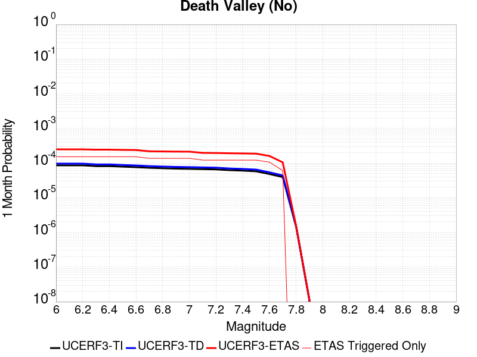 | 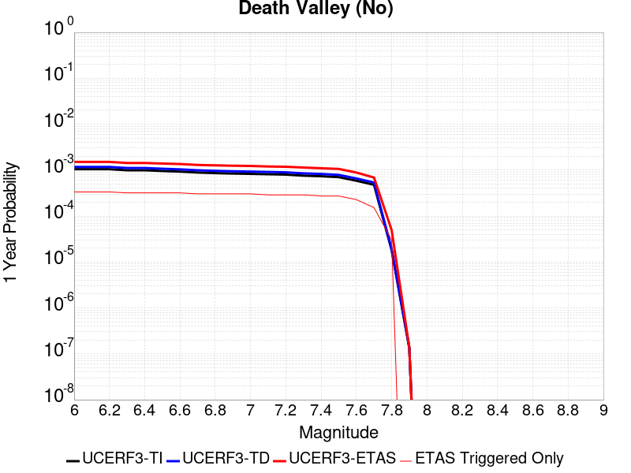 | 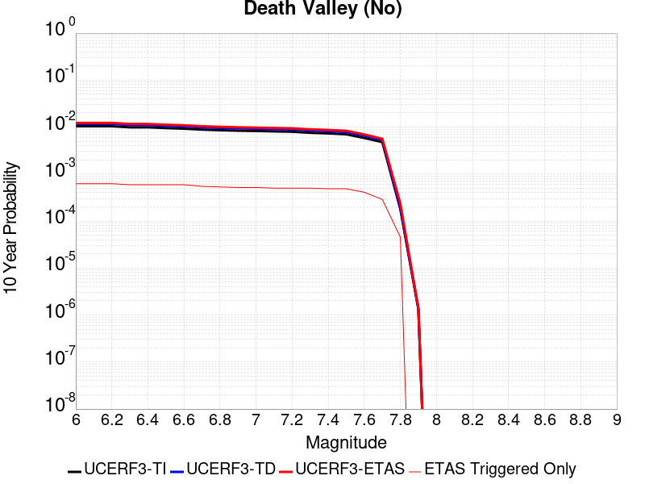 |

| Magnitude | 1 wk TI Prob | 1 wk TD Prob | 1 wk ETAS Prob | 1 wk ETAS/TD Gain | 1 wk ETAS Triggered Only | 1 mo TI Prob | 1 mo TD Prob | 1 mo ETAS Prob | 1 mo ETAS/TD Gain | 1 mo ETAS Triggered Only | 1 yr TI Prob | 1 yr TD Prob | 1 yr ETAS Prob | 1 yr ETAS/TD Gain | 1 yr ETAS Triggered Only | 10 yr TI Prob | 10 yr TD Prob | 10 yr ETAS Prob | 10 yr ETAS/TD Gain | 10 yr ETAS Triggered Only |
|-----|-----|-----|-----|-----|-----|-----|-----|-----|-----|-----|-----|-----|-----|-----|-----|-----|-----|-----|-----|-----|
| 6.0 | 2.0074807E-5 | 2.2500084E-5 | 1.4426294E-4 | 6.4116626 | 1.217656E-4 | 8.603206E-5 | 9.642541E-5 | 2.4861773E-4 | 2.5783427 | 1.5220701E-4 | 0.001046937 | 0.0011733545 | 0.001507817 | 1.2850481 | 3.348554E-4 | 0.010420183 | 0.011672506 | 0.012289271 | 1.052839 | 6.240487E-4 |
| 6.1 | 2.0074807E-5 | 2.2500084E-5 | 1.4426294E-4 | 6.4116626 | 1.217656E-4 | 8.603206E-5 | 9.642541E-5 | 2.4861773E-4 | 2.5783427 | 1.5220701E-4 | 0.001046937 | 0.0011733545 | 0.001507817 | 1.2850481 | 3.348554E-4 | 0.010420183 | 0.011672506 | 0.012289271 | 1.052839 | 6.240487E-4 |
| 6.2 | 2.0074807E-5 | 2.2500084E-5 | 1.4426294E-4 | 6.4116626 | 1.217656E-4 | 8.603206E-5 | 9.642541E-5 | 2.4861773E-4 | 2.5783427 | 1.5220701E-4 | 0.001046937 | 0.0011733545 | 0.001507817 | 1.2850481 | 3.348554E-4 | 0.010420183 | 0.011672506 | 0.012289271 | 1.052839 | 6.240487E-4 |
| 6.3 | 1.9050609E-5 | 2.1336948E-5 | 1.4309995E-4 | 6.706674 | 1.217656E-4 | 8.164292E-5 | 9.1440896E-5 | 2.4363397E-4 | 2.6643875 | 1.5220701E-4 | 9.935491E-4 | 0.001112731 | 0.0014320101 | 1.2869328 | 3.196347E-4 | 0.009891188 | 0.011072419 | 0.011659454 | 1.0530177 | 5.936073E-4 |
| 6.4 | 1.9050609E-5 | 2.1336948E-5 | 1.4309995E-4 | 6.706674 | 1.217656E-4 | 8.164292E-5 | 9.1440896E-5 | 2.4363397E-4 | 2.6643875 | 1.5220701E-4 | 9.935491E-4 | 0.001112731 | 0.0014320101 | 1.2869328 | 3.196347E-4 | 0.009891188 | 0.011072419 | 0.011659454 | 1.0530177 | 5.936073E-4 |
| 6.5 | 1.8367004E-5 | 2.0561009E-5 | 1.423241E-4 | 6.922039 | 1.217656E-4 | 7.8713354E-5 | 8.811567E-5 | 2.4030925E-4 | 2.7272024 | 1.5220701E-4 | 9.5791375E-4 | 0.0010722869 | 0.0013915788 | 1.2977673 | 3.196347E-4 | 0.009537951 | 0.0106719155 | 0.011259188 | 1.0550297 | 5.936073E-4 |
| 6.6 | 1.779439E-5 | 1.9910927E-5 | 1.416741E-4 | 7.1153946 | 1.217656E-4 | 7.625944E-5 | 8.53298E-5 | 2.3752381E-4 | 2.7835975 | 1.5220701E-4 | 9.280632E-4 | 0.0010384015 | 0.0013577043 | 1.3074945 | 3.196347E-4 | 0.009241969 | 0.010336253 | 0.010923725 | 1.056836 | 5.936073E-4 |
| 6.7 | 1.7025437E-5 | 1.9043426E-5 | 1.255863E-4 | 6.5947328 | 1.065449E-4 | 7.296412E-5 | 8.161216E-5 | 2.1858729E-4 | 2.6783664 | 1.369863E-4 | 8.87976E-4 | 9.931813E-4 | 0.001297293 | 1.3061996 | 3.0441402E-4 | 0.008844362 | 0.009888145 | 0.010430672 | 1.0548664 | 5.479452E-4 |
| 6.8 | 1.6545107E-5 | 1.8512545E-5 | 1.2505548E-4 | 6.7551746 | 1.065449E-4 | 7.090568E-5 | 7.93371E-5 | 2.1631253E-4 | 2.726499 | 1.369863E-4 | 8.629347E-4 | 9.655073E-4 | 0.0012696274 | 1.3149848 | 3.0441402E-4 | 0.008595915 | 0.009613829 | 0.010141431 | 1.0548795 | 5.327245E-4 |
| 6.9 | 1.615478E-5 | 1.8087594E-5 | 1.2463056E-4 | 6.8903894 | 1.065449E-4 | 6.9232934E-5 | 7.751599E-5 | 2.1449168E-4 | 2.7670636 | 1.369863E-4 | 8.4258494E-4 | 9.433546E-4 | 0.0012474814 | 1.3223886 | 3.0441402E-4 | 0.008393973 | 0.009394196 | 0.009906838 | 1.0545701 | 5.175038E-4 |
| 7.0 | 1.5894311E-5 | 1.780555E-5 | 1.2434856E-4 | 6.9836965 | 1.065449E-4 | 6.81167E-5 | 7.6307304E-5 | 2.1328314E-4 | 2.7950556 | 1.369863E-4 | 8.2900526E-4 | 9.286515E-4 | 0.0012327828 | 1.3274978 | 3.0441402E-4 | 0.008259195 | 0.009248397 | 0.009761116 | 1.0554385 | 5.175038E-4 |
| 7.1 | 1.5602263E-5 | 1.7483504E-5 | 1.0880611E-4 | 6.2233586 | 9.1324204E-5 | 6.6865134E-5 | 7.492718E-5 | 1.9668366E-4 | 2.6249974 | 1.217656E-4 | 8.137789E-4 | 9.118627E-4 | 0.0012007923 | 1.3168565 | 2.891933E-4 | 0.008108052 | 0.009081894 | 0.009579616 | 1.0548037 | 5.022831E-4 |
| 7.2 | 1.5323829E-5 | 1.717063E-5 | 1.0849327E-4 | 6.318537 | 9.1324204E-5 | 6.56719E-5 | 7.358637E-5 | 1.9534302E-4 | 2.6546085 | 1.217656E-4 | 7.99262E-4 | 8.9555193E-4 | 0.0011844862 | 1.3226327 | 2.891933E-4 | 0.007963934 | 0.008920107 | 0.009417909 | 1.0558068 | 5.022831E-4 |
| 7.3 | 1.4556212E-5 | 1.6302456E-5 | 1.07625165E-4 | 6.6017766 | 9.1324204E-5 | 6.238227E-5 | 6.9865826E-5 | 1.9162292E-4 | 2.7427275 | 1.217656E-4 | 7.592395E-4 | 8.5029035E-4 | 0.0011392378 | 1.339822 | 2.891933E-4 | 0.0075665074 | 0.008471014 | 0.008969042 | 1.058792 | 5.022831E-4 |
| 7.4 | 1.411725E-5 | 1.580796E-5 | 1.0713072E-4 | 6.777011 | 9.1324204E-5 | 6.0501097E-5 | 6.7746674E-5 | 1.8950402E-4 | 2.7972448 | 1.217656E-4 | 7.363519E-4 | 8.245094E-4 | 0.0010982561 | 1.3320116 | 2.739726E-4 | 0.0073391674 | 0.008215138 | 0.008698199 | 1.0588013 | 4.870624E-4 |
| 7.5 | 1.3503312E-5 | 1.5126289E-5 | 1.0644911E-4 | 7.037358 | 9.1324204E-5 | 5.7870053E-5 | 6.482538E-5 | 1.8658309E-4 | 2.8782415 | 1.217656E-4 | 7.043401E-4 | 7.8896893E-4 | 0.0010627254 | 1.34698 | 2.739726E-4 | 0.007021119 | 0.007862304 | 0.008345537 | 1.061462 | 4.870624E-4 |
| 7.6 | 1.1279839E-5 | 1.2626327E-5 | 8.872887E-5 | 7.0272903 | 7.6103504E-5 | 4.834127E-5 | 5.4111737E-5 | 1.6065087E-4 | 2.968873 | 1.065449E-4 | 5.88396E-4 | 6.5861654E-4 | 8.867767E-4 | 1.3464233 | 2.283105E-4 | 0.005868405 | 0.006567199 | 0.0069754585 | 1.0621666 | 4.109589E-4 |
| 7.7 | 9.189108E-6 | 1.0283358E-5 | 5.594499E-5 | 5.4403424 | 4.5662102E-5 | 3.93813E-5 | 4.407082E-5 | 1.0495094E-4 | 2.3814156 | 6.08828E-5 | 4.7936183E-4 | 5.3643517E-4 | 6.8856054E-4 | 1.2835857 | 1.5220701E-4 | 0.004783291 | 0.005351914 | 0.0056395596 | 1.0537463 | 2.891933E-4 |
| 7.8 | 3.4586725E-7 | 3.6482615E-7 | 3.6482615E-7 | 1.0 | 0.0 | 1.4822873E-6 | 1.5635396E-6 | 1.5635396E-6 | 1.0 | 0.0 | 1.80467E-5 | 1.9035933E-5 | 4.9476756E-5 | 2.5991242 | 3.04414E-5 | 1.8045233E-4 | 1.9034347E-4 | 2.3599688E-4 | 1.2398475 | 4.5662102E-5 |
| 7.9 | 2.5591178E-9 | 2.6696718E-9 | 2.6696718E-9 | 1.0 | 0.0 | 1.0967647E-8 | 1.14414505E-8 | 1.14414505E-8 | 1.0 | 0.0 | 1.335311E-7 | 1.3929966E-7 | 1.3929966E-7 | 1.0 | 0.0 | 1.3353102E-6 | 1.3929966E-6 | 1.3929966E-6 | 1.0 | 0.0 |

## San Andreas (San Gorgonio Pass-Garnet HIll)
*[(top)](#table-of-contents)*

| 1 Week | 1 Month | 1 Year | 10 Year |
|-----|-----|-----|-----|
| 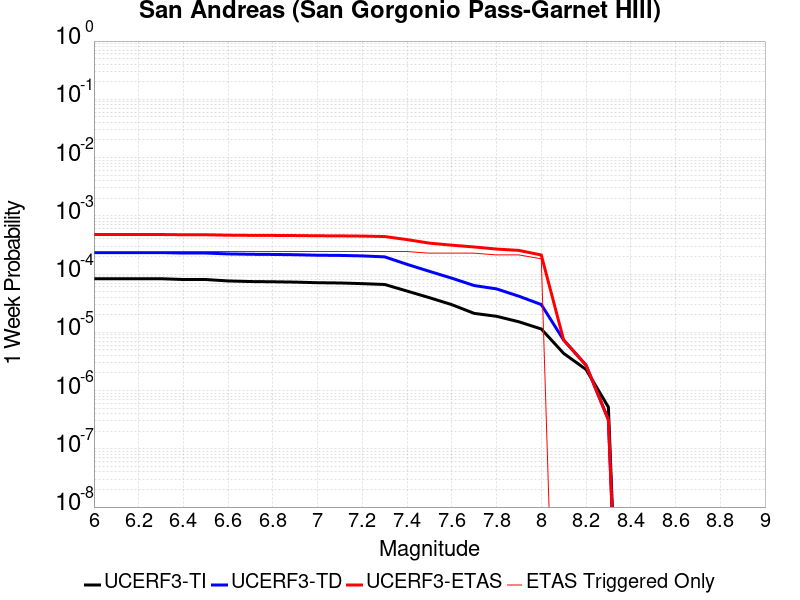 | 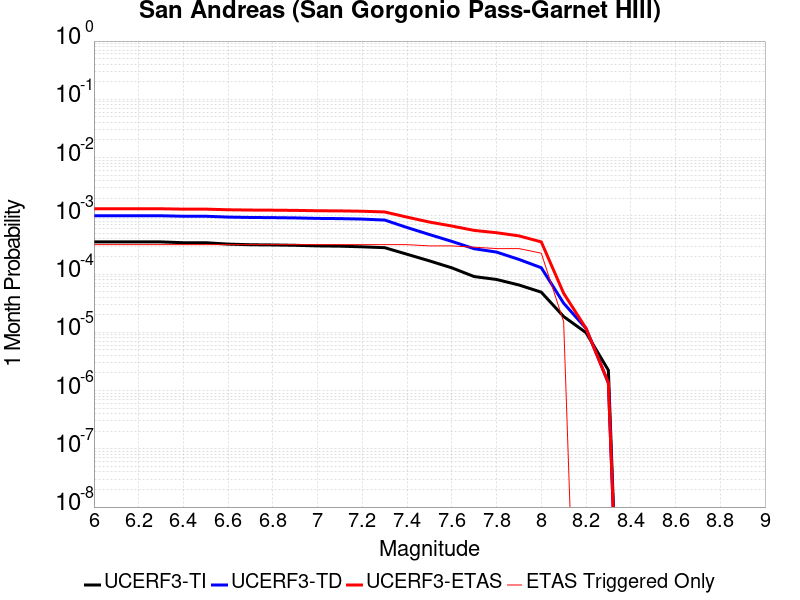 | 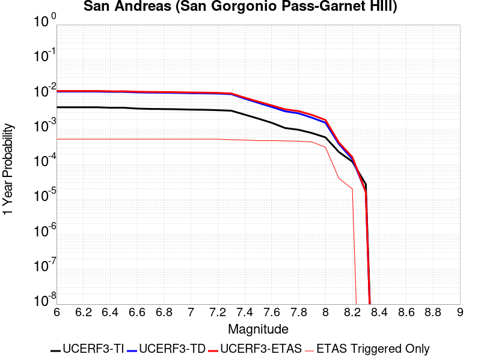 | 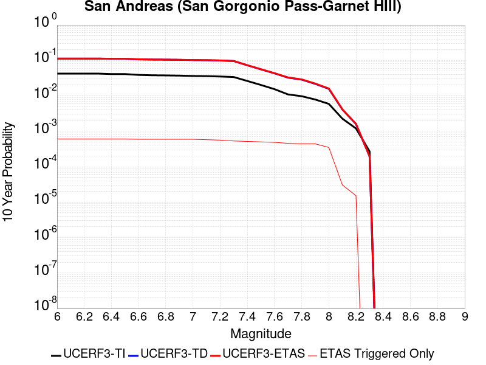 |

| Magnitude | 1 wk TI Prob | 1 wk TD Prob | 1 wk ETAS Prob | 1 wk ETAS/TD Gain | 1 wk ETAS Triggered Only | 1 mo TI Prob | 1 mo TD Prob | 1 mo ETAS Prob | 1 mo ETAS/TD Gain | 1 mo ETAS Triggered Only | 1 yr TI Prob | 1 yr TD Prob | 1 yr ETAS Prob | 1 yr ETAS/TD Gain | 1 yr ETAS Triggered Only | 10 yr TI Prob | 10 yr TD Prob | 10 yr ETAS Prob | 10 yr ETAS/TD Gain | 10 yr ETAS Triggered Only |
|-----|-----|-----|-----|-----|-----|-----|-----|-----|-----|-----|-----|-----|-----|-----|-----|-----|-----|-----|-----|-----|
| 6.0 | 8.31567E-5 | 2.3382473E-4 | 4.77299E-4 | 2.041268 | 2.435312E-4 | 3.5633717E-4 | 0.0010017233 | 0.0013210379 | 1.3187652 | 3.196347E-4 | 0.004329778 | 0.012127888 | 0.012578972 | 1.0371939 | 4.56621E-4 | 0.042463828 | 0.11257892 | 0.11311921 | 1.0047991 | 6.0882804E-4 |
| 6.1 | 8.31567E-5 | 2.3382473E-4 | 4.77299E-4 | 2.041268 | 2.435312E-4 | 3.5633717E-4 | 0.0010017233 | 0.0013210379 | 1.3187652 | 3.196347E-4 | 0.004329778 | 0.012127888 | 0.012578972 | 1.0371939 | 4.56621E-4 | 0.042463828 | 0.11257892 | 0.11311921 | 1.0047991 | 6.0882804E-4 |
| 6.2 | 8.31567E-5 | 2.3382473E-4 | 4.77299E-4 | 2.041268 | 2.435312E-4 | 3.5633717E-4 | 0.0010017233 | 0.0013210379 | 1.3187652 | 3.196347E-4 | 0.004329778 | 0.012127888 | 0.012578972 | 1.0371939 | 4.56621E-4 | 0.042463828 | 0.11257892 | 0.11311921 | 1.0047991 | 6.0882804E-4 |
| 6.3 | 8.31567E-5 | 2.3382473E-4 | 4.77299E-4 | 2.041268 | 2.435312E-4 | 3.5633717E-4 | 0.0010017233 | 0.0013210379 | 1.3187652 | 3.196347E-4 | 0.004329778 | 0.012127888 | 0.012578972 | 1.0371939 | 4.56621E-4 | 0.042463828 | 0.11257892 | 0.11311921 | 1.0047991 | 6.0882804E-4 |
| 6.4 | 8.059055E-5 | 2.2940808E-4 | 4.7288343E-4 | 2.0613198 | 2.435312E-4 | 3.4534236E-4 | 9.828096E-4 | 0.00130213 | 1.3249059 | 3.196347E-4 | 0.0041964394 | 0.011900152 | 0.012351339 | 1.0379144 | 4.56621E-4 | 0.041180745 | 0.11056015 | 0.111101665 | 1.004898 | 6.0882804E-4 |
| 6.5 | 8.059055E-5 | 2.2940808E-4 | 4.7288343E-4 | 2.0613198 | 2.435312E-4 | 3.4534236E-4 | 9.828096E-4 | 0.00130213 | 1.3249059 | 3.196347E-4 | 0.0041964394 | 0.011900152 | 0.012351339 | 1.0379144 | 4.56621E-4 | 0.041180745 | 0.11056015 | 0.111101665 | 1.004898 | 6.0882804E-4 |
| 6.6 | 7.619237E-5 | 2.218517E-4 | 4.653289E-4 | 2.0974772 | 2.435312E-4 | 3.2649786E-4 | 9.5044886E-4 | 0.0012697798 | 1.335979 | 3.196347E-4 | 0.0039678677 | 0.01151087 | 0.011962235 | 1.0392121 | 4.56621E-4 | 0.03897764 | 0.10709683 | 0.10762686 | 1.0049491 | 5.936073E-4 |
| 6.7 | 7.440636E-5 | 2.1860997E-4 | 4.6208792E-4 | 2.113755 | 2.435312E-4 | 3.188454E-4 | 9.3656575E-4 | 0.0012559011 | 1.3409642 | 3.196347E-4 | 0.0038750346 | 0.011343609 | 0.0117950495 | 1.039797 | 4.56621E-4 | 0.038081564 | 0.105605274 | 0.106136195 | 1.0050274 | 5.936073E-4 |
| 6.8 | 7.3735864E-5 | 2.1708169E-4 | 4.6056003E-4 | 2.1215978 | 2.435312E-4 | 3.1597257E-4 | 9.3002064E-4 | 0.001249358 | 1.343366 | 3.196347E-4 | 0.0038401815 | 0.011264749 | 0.011716226 | 1.0400788 | 4.56621E-4 | 0.03774495 | 0.10490683 | 0.10543816 | 1.0050648 | 5.936073E-4 |
| 6.9 | 7.27575E-5 | 2.1477141E-4 | 4.5825032E-4 | 2.1336653 | 2.435312E-4 | 3.117806E-4 | 9.201265E-4 | 0.0012394671 | 1.3470616 | 3.196347E-4 | 0.003789323 | 0.011145527 | 0.011597058 | 1.0405123 | 4.56621E-4 | 0.037253562 | 0.103854746 | 0.1043867 | 1.0051222 | 5.936073E-4 |
| 7.0 | 7.102591E-5 | 2.1061185E-4 | 4.5409176E-4 | 2.15606 | 2.435312E-4 | 3.0436125E-4 | 9.023122E-4 | 0.0012216585 | 1.35392 | 3.196347E-4 | 0.003699303 | 0.010930831 | 0.011382461 | 1.0413171 | 4.56621E-4 | 0.03638325 | 0.10195695 | 0.10249003 | 1.0052285 | 5.936073E-4 |
| 7.1 | 7.028513E-5 | 2.0896831E-4 | 4.524486E-4 | 2.1651542 | 2.435312E-4 | 3.0118722E-4 | 8.9527335E-4 | 0.0012146218 | 1.3567051 | 3.196347E-4 | 0.0036607897 | 0.010845989 | 0.011297658 | 1.0416439 | 4.56621E-4 | 0.036010686 | 0.101199985 | 0.10171984 | 1.0051368 | 5.783866E-4 |
| 7.2 | 6.8498244E-5 | 2.0504706E-4 | 4.4852833E-4 | 2.1874409 | 2.435312E-4 | 2.9353087E-4 | 8.784794E-4 | 0.0011978333 | 1.3635304 | 3.196347E-4 | 0.003567883 | 0.010643536 | 0.011095297 | 1.0424446 | 4.56621E-4 | 0.035111405 | 0.09939202 | 0.09989921 | 1.005103 | 5.6316593E-4 |
| 7.3 | 6.622592E-5 | 1.9732013E-4 | 4.4080327E-4 | 2.23395 | 2.435312E-4 | 2.8379448E-4 | 8.453858E-4 | 0.0011647503 | 1.3777736 | 3.196347E-4 | 0.0034497243 | 0.0102444785 | 0.010666292 | 1.0411748 | 4.261796E-4 | 0.033966612 | 0.095888525 | 0.09637017 | 1.0050229 | 5.327245E-4 |
| 7.4 | 5.1050705E-5 | 1.4689034E-4 | 3.9038577E-4 | 2.657668 | 2.435312E-4 | 2.1877038E-4 | 6.29379E-4 | 9.488125E-4 | 1.5075376 | 3.196347E-4 | 0.002660276 | 0.0076359594 | 0.00804378 | 1.0534079 | 4.109589E-4 | 0.02628654 | 0.07286301 | 0.073342815 | 1.0065849 | 5.175038E-4 |
| 7.5 | 3.9302922E-5 | 1.1129847E-4 | 3.3958355E-4 | 3.0511072 | 2.283105E-4 | 1.6843023E-4 | 4.7690657E-4 | 7.811754E-4 | 1.6380051 | 3.0441402E-4 | 0.0020487092 | 0.005790949 | 0.0061843954 | 1.0679417 | 3.957382E-4 | 0.020299247 | 0.05600951 | 0.05648366 | 1.0084655 | 5.022831E-4 |
| 7.6 | 2.9851626E-5 | 8.4949745E-5 | 3.1324086E-4 | 3.6873667 | 2.283105E-4 | 1.2792926E-4 | 3.6401965E-4 | 6.6832284E-4 | 1.8359526 | 3.0441402E-4 | 0.0015564259 | 0.0044229585 | 0.004816946 | 1.089078 | 3.957382E-4 | 0.0154556995 | 0.04319374 | 0.04365976 | 1.0107892 | 4.870624E-4 |
| 7.7 | 2.1135214E-5 | 6.3529005E-5 | 2.91825E-4 | 4.593571 | 2.283105E-4 | 9.0576345E-5 | 2.7223877E-4 | 5.6135334E-4 | 2.061989 | 2.891933E-4 | 0.0011022091 | 0.0033094748 | 0.003688733 | 1.1145977 | 3.805175E-4 | 0.010967582 | 0.032582592 | 0.033024337 | 1.0135577 | 4.56621E-4 |
| 7.8 | 1.883379E-5 | 5.564028E-5 | 2.6871823E-4 | 4.8295627 | 2.130898E-4 | 8.0713755E-5 | 2.3843657E-4 | 5.1234383E-4 | 2.1487637 | 2.739726E-4 | 9.822468E-4 | 0.0028991038 | 0.0032633417 | 1.125638 | 3.6529682E-4 | 0.0097791655 | 0.028695205 | 0.02912394 | 1.014941 | 4.414003E-4 |
| 7.9 | 1.5156185E-5 | 4.1658426E-5 | 2.5473934E-4 | 6.114954 | 2.130898E-4 | 6.495346E-5 | 1.785239E-4 | 4.524476E-4 | 2.5343812 | 2.739726E-4 | 7.9052144E-4 | 0.0021713632 | 0.0025358668 | 1.1678686 | 3.6529682E-4 | 0.007877152 | 0.021759422 | 0.022191219 | 1.019844 | 4.414003E-4 |
| 8.0 | 1.1405907E-5 | 2.9974231E-5 | 2.1261716E-4 | 7.0933313 | 1.8264841E-4 | 4.8881542E-5 | 1.2845467E-4 | 3.5673584E-4 | 2.7771342 | 2.283105E-4 | 5.9497025E-4 | 0.0015628147 | 0.0018819498 | 1.2042054 | 3.196347E-4 | 0.005933798 | 0.015772851 | 0.016117405 | 1.0218447 | 3.500761E-4 |
| 8.1 | 4.3511436E-6 | 7.369219E-6 | 7.369219E-6 | 1.0 | 0.0 | 1.8647626E-5 | 3.1581985E-5 | 4.6802204E-5 | 1.4819273 | 1.52207E-5 | 2.2701119E-4 | 3.8444297E-4 | 4.1487266E-4 | 1.0791527 | 3.04414E-5 | 0.0022677942 | 0.0041163345 | 0.004146651 | 1.0073649 | 3.04414E-5 |
| 8.2 | 2.3042528E-6 | 2.7329415E-6 | 2.7329415E-6 | 1.0 | 0.0 | 9.875332E-6 | 1.1712554E-5 | 1.1712554E-5 | 1.0 | 0.0 | 1.2022553E-4 | 1.4259106E-4 | 1.5780958E-4 | 1.1067286 | 1.52207E-5 | 0.0012016051 | 0.0015979785 | 0.0016131749 | 1.0095098 | 1.52207E-5 |
| 8.3 | 5.202968E-7 | 3.1598344E-7 | 3.1598344E-7 | 1.0 | 0.0 | 2.2298414E-6 | 1.3542141E-6 | 1.3542141E-6 | 1.0 | 0.0 | 2.714798E-5 | 1.6487444E-5 | 1.6487444E-5 | 1.0 | 0.0 | 2.7144665E-4 | 1.9563142E-4 | 1.9563142E-4 | 1.0 | 0.0 |

## San Andreas (Coachella) rev
*[(top)](#table-of-contents)*

| 1 Week | 1 Month | 1 Year | 10 Year |
|-----|-----|-----|-----|
| 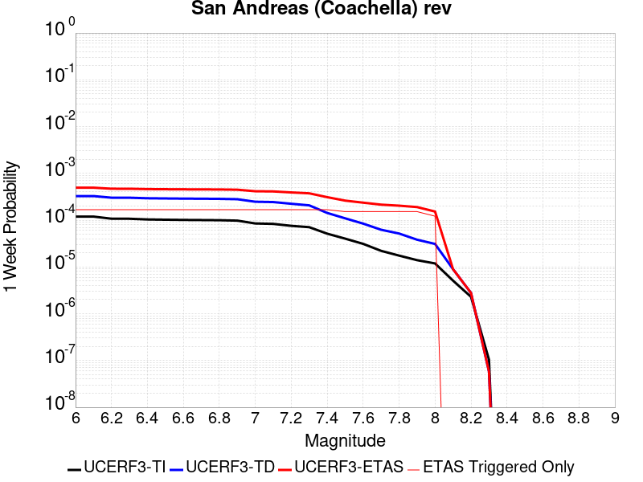 | 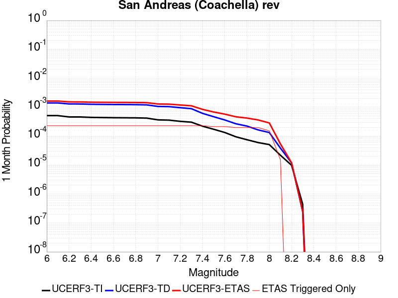 |  | 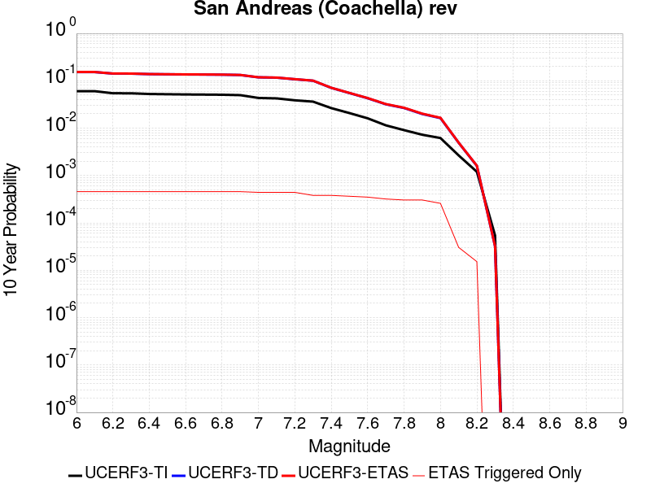 |

| Magnitude | 1 wk TI Prob | 1 wk TD Prob | 1 wk ETAS Prob | 1 wk ETAS/TD Gain | 1 wk ETAS Triggered Only | 1 mo TI Prob | 1 mo TD Prob | 1 mo ETAS Prob | 1 mo ETAS/TD Gain | 1 mo ETAS Triggered Only | 1 yr TI Prob | 1 yr TD Prob | 1 yr ETAS Prob | 1 yr ETAS/TD Gain | 1 yr ETAS Triggered Only | 10 yr TI Prob | 10 yr TD Prob | 10 yr ETAS Prob | 10 yr ETAS/TD Gain | 10 yr ETAS Triggered Only |
|-----|-----|-----|-----|-----|-----|-----|-----|-----|-----|-----|-----|-----|-----|-----|-----|-----|-----|-----|-----|-----|
| 6.0 | 1.1925945E-4 | 3.2729402E-4 | 4.946669E-4 | 1.5113839 | 1.674277E-4 | 5.110118E-4 | 0.0014019393 | 0.0016299298 | 1.1626251 | 2.283105E-4 | 0.0062038354 | 0.016936364 | 0.017295474 | 1.0212035 | 3.6529682E-4 | 0.060334753 | 0.15265316 | 0.15304007 | 1.0025346 | 4.56621E-4 |
| 6.1 | 1.1925945E-4 | 3.2729402E-4 | 4.946669E-4 | 1.5113839 | 1.674277E-4 | 5.110118E-4 | 0.0014019393 | 0.0016299298 | 1.1626251 | 2.283105E-4 | 0.0062038354 | 0.016936364 | 0.017295474 | 1.0212035 | 3.6529682E-4 | 0.060334753 | 0.15265316 | 0.15304007 | 1.0025346 | 4.56621E-4 |
| 6.2 | 1.07432395E-4 | 3.0230157E-4 | 4.6967863E-4 | 1.5536759 | 1.674277E-4 | 4.603433E-4 | 0.0012949388 | 0.0015229537 | 1.1760815 | 2.283105E-4 | 0.005590286 | 0.015653009 | 0.016012587 | 1.0229719 | 3.6529682E-4 | 0.05451731 | 0.14182423 | 0.1422161 | 1.002763 | 4.56621E-4 |
| 6.3 | 1.0718766E-4 | 3.0175463E-4 | 4.691318E-4 | 1.5546798 | 1.674277E-4 | 4.592948E-4 | 0.0012925972 | 0.0015206125 | 1.176401 | 2.283105E-4 | 0.005577586 | 0.015624908 | 0.015984496 | 1.0230138 | 3.6529682E-4 | 0.054396555 | 0.14159249 | 0.14198446 | 1.0027683 | 4.56621E-4 |
| 6.4 | 1.0355944E-4 | 2.9383553E-4 | 4.6121402E-4 | 1.5696334 | 1.674277E-4 | 4.4375064E-4 | 0.0012586913 | 0.0014867145 | 1.1811589 | 2.283105E-4 | 0.0053892885 | 0.015217941 | 0.0155776795 | 1.0236391 | 3.6529682E-4 | 0.052604496 | 0.13815255 | 0.1385461 | 1.0028486 | 4.56621E-4 |
| 6.5 | 1.0227914E-4 | 2.9102986E-4 | 4.5840885E-4 | 1.5751264 | 1.674277E-4 | 4.382655E-4 | 0.0012466786 | 0.0014747045 | 1.1829067 | 2.283105E-4 | 0.0053228354 | 0.01507372 | 0.015433511 | 1.0238687 | 3.6529682E-4 | 0.051971316 | 0.13693172 | 0.13732582 | 1.0028781 | 4.56621E-4 |
| 6.6 | 1.0116757E-4 | 2.8868738E-4 | 4.5606674E-4 | 1.5797945 | 1.674277E-4 | 4.3350324E-4 | 0.0012366489 | 0.001464677 | 1.184392 | 2.283105E-4 | 0.0052651367 | 0.01495329 | 0.015313125 | 1.024064 | 3.6529682E-4 | 0.051421247 | 0.1359099 | 0.13630445 | 1.0029031 | 4.56621E-4 |
| 6.7 | 1.0050676E-4 | 2.8727303E-4 | 4.5465262E-4 | 1.58265 | 1.674277E-4 | 4.3067214E-4 | 0.0012305931 | 0.0014586226 | 1.1853005 | 2.283105E-4 | 0.005230834 | 0.014880571 | 0.015240431 | 1.0241833 | 3.6529682E-4 | 0.051094085 | 0.13529462 | 0.13568947 | 1.0029184 | 4.56621E-4 |
| 6.8 | 9.976819E-5 | 2.853096E-4 | 4.5268954E-4 | 1.5866607 | 1.674277E-4 | 4.2750788E-4 | 0.0012221863 | 0.0014502178 | 1.1865767 | 2.283105E-4 | 0.0051924936 | 0.0147796115 | 0.015139509 | 1.024351 | 3.6529682E-4 | 0.050728295 | 0.13444631 | 0.13484155 | 1.0029397 | 4.56621E-4 |
| 6.9 | 9.77719E-5 | 2.8027873E-4 | 4.4765952E-4 | 1.597194 | 1.674277E-4 | 4.1895514E-4 | 0.0012006456 | 0.0014286819 | 1.1899282 | 2.283105E-4 | 0.0050888555 | 0.014520878 | 0.0148808705 | 1.0247914 | 3.6529682E-4 | 0.049738888 | 0.1322748 | 0.13267103 | 1.0029955 | 4.56621E-4 |
| 7.0 | 8.500761E-5 | 2.4762485E-4 | 4.150111E-4 | 1.6759671 | 1.674277E-4 | 3.6426744E-4 | 0.001060821 | 0.0012888893 | 1.2149923 | 2.283105E-4 | 0.0044259406 | 0.012839786 | 0.013185367 | 1.0269148 | 3.500761E-4 | 0.04338823 | 0.11813272 | 0.11852198 | 1.0032951 | 4.414003E-4 |
| 7.1 | 8.319876E-5 | 2.4365232E-4 | 4.1103922E-4 | 1.6869909 | 1.674277E-4 | 3.5651738E-4 | 0.0010438096 | 0.0012718817 | 1.2184998 | 2.283105E-4 | 0.004331963 | 0.012635092 | 0.012980745 | 1.0273566 | 3.500761E-4 | 0.042484846 | 0.116353 | 0.11674304 | 1.0033523 | 4.414003E-4 |
| 7.2 | 7.563917E-5 | 2.2413683E-4 | 3.9152702E-4 | 1.7468214 | 1.674277E-4 | 3.2412758E-4 | 9.602359E-4 | 0.0011883272 | 1.2375367 | 2.283105E-4 | 0.0039391145 | 0.011628893 | 0.011974898 | 1.0297539 | 3.500761E-4 | 0.03870018 | 0.10775925 | 0.10815308 | 1.0036547 | 4.414003E-4 |
| 7.3 | 7.082985E-5 | 2.0729867E-4 | 3.7469168E-4 | 1.8074967 | 1.674277E-4 | 3.0352117E-4 | 8.881233E-4 | 0.001116231 | 1.2568424 | 2.283105E-4 | 0.0036891096 | 0.010759917 | 0.011076112 | 1.0293864 | 3.196347E-4 | 0.03628465 | 0.100282 | 0.10062436 | 1.0034139 | 3.805175E-4 |
| 7.4 | 5.146215E-5 | 1.4273795E-4 | 3.1014174E-4 | 2.1728053 | 1.674277E-4 | 2.2053342E-4 | 6.115915E-4 | 8.397624E-4 | 1.3730773 | 2.283105E-4 | 0.0026816884 | 0.0074208933 | 0.007738156 | 1.0427526 | 3.196347E-4 | 0.02649557 | 0.070849575 | 0.071203135 | 1.0049902 | 3.805175E-4 |
| 7.5 | 4.0285166E-5 | 1.09416E-4 | 2.6160636E-4 | 2.3909333 | 1.5220701E-4 | 1.7263928E-4 | 4.6884175E-4 | 6.818317E-4 | 1.4542896 | 2.130898E-4 | 0.002099857 | 0.0056932783 | 0.005995959 | 1.0531646 | 3.0441402E-4 | 0.020801254 | 0.055011146 | 0.05535635 | 1.0062752 | 3.6529682E-4 |
| 7.6 | 3.1168736E-5 | 8.4389096E-5 | 2.3658325E-4 | 2.8034813 | 1.5220701E-4 | 1.3357346E-4 | 3.6161754E-4 | 5.746303E-4 | 1.5890553 | 2.130898E-4 | 0.0016250437 | 0.0043938323 | 0.004696909 | 1.0689777 | 3.0441402E-4 | 0.016132116 | 0.04281005 | 0.04314514 | 1.0078274 | 3.500761E-4 |
| 7.7 | 2.2100989E-5 | 6.238755E-5 | 2.1458506E-4 | 3.4395492 | 1.5220701E-4 | 9.4715084E-5 | 2.6734784E-4 | 4.6516405E-4 | 1.7399206 | 1.978691E-4 | 0.001152546 | 0.0032501083 | 0.0035383618 | 1.0886904 | 2.891933E-4 | 0.011465867 | 0.0319002 | 0.03220964 | 1.0097002 | 3.196347E-4 |
| 7.8 | 1.7484861E-5 | 5.179572E-5 | 2.0399483E-4 | 3.9384499 | 1.5220701E-4 | 7.493296E-5 | 2.2196278E-4 | 4.1978798E-4 | 1.8912538 | 1.978691E-4 | 9.1192697E-4 | 0.0026990508 | 0.0029722839 | 1.101233 | 2.739726E-4 | 0.009081938 | 0.026640115 | 0.026936421 | 1.0111225 | 3.0441402E-4 |
| 7.9 | 1.3967285E-5 | 3.822255E-5 | 1.9042373E-4 | 4.981973 | 1.5220701E-4 | 5.985842E-5 | 1.6380067E-4 | 3.6163736E-4 | 2.2077894 | 1.978691E-4 | 7.2853256E-4 | 0.00199245 | 0.0022658769 | 1.1372313 | 2.739726E-4 | 0.0072614877 | 0.019909438 | 0.02020779 | 1.0149856 | 3.0441402E-4 |
| 8.0 | 1.1887396E-5 | 3.106521E-5 | 1.5282702E-4 | 4.9195557 | 1.217656E-4 | 5.094499E-5 | 1.3312983E-4 | 2.8531658E-4 | 2.1431453 | 1.5220701E-4 | 6.200787E-4 | 0.0016196516 | 0.0018475923 | 1.1407344 | 2.283105E-4 | 0.006183513 | 0.016279267 | 0.016533807 | 1.0156358 | 2.587519E-4 |
| 8.1 | 5.100864E-6 | 8.973418E-6 | 8.973418E-6 | 1.0 | 0.0 | 2.1860664E-5 | 3.8456936E-5 | 5.3677053E-5 | 1.3957703 | 1.52207E-5 | 2.6612106E-4 | 4.6811273E-4 | 4.985399E-4 | 1.0649996 | 3.04414E-5 | 0.002658026 | 0.004917731 | 0.0049480223 | 1.0061597 | 3.04414E-5 |
| 8.2 | 2.3004484E-6 | 2.7864487E-6 | 2.7864487E-6 | 1.0 | 0.0 | 9.859027E-6 | 1.1941868E-5 | 1.1941868E-5 | 1.0 | 0.0 | 1.2002704E-4 | 1.4538258E-4 | 1.6060106E-4 | 1.1046789 | 1.52207E-5 | 0.0011996223 | 0.0015973912 | 0.0016125876 | 1.0095133 | 1.52207E-5 |
| 8.3 | 1.0424446E-7 | 5.8161504E-8 | 5.8161504E-8 | 1.0 | 0.0 | 4.4676187E-7 | 2.4926356E-7 | 2.4926356E-7 | 1.0 | 0.0 | 5.439312E-6 | 3.03478E-6 | 3.03478E-6 | 1.0 | 0.0 | 5.4391792E-5 | 3.190716E-5 | 3.190716E-5 | 1.0 | 0.0 |

## Sierra Nevada  (No Extension)
*[(top)](#table-of-contents)*

| 1 Week | 1 Month | 1 Year | 10 Year |
|-----|-----|-----|-----|
| 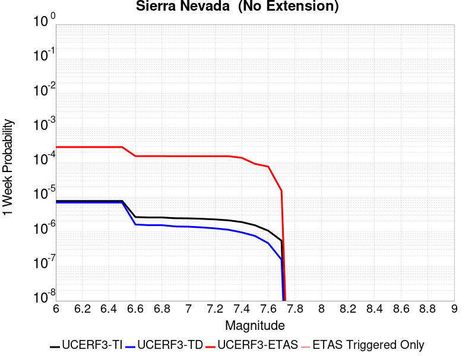 | 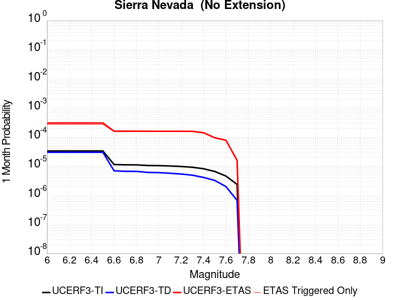 | 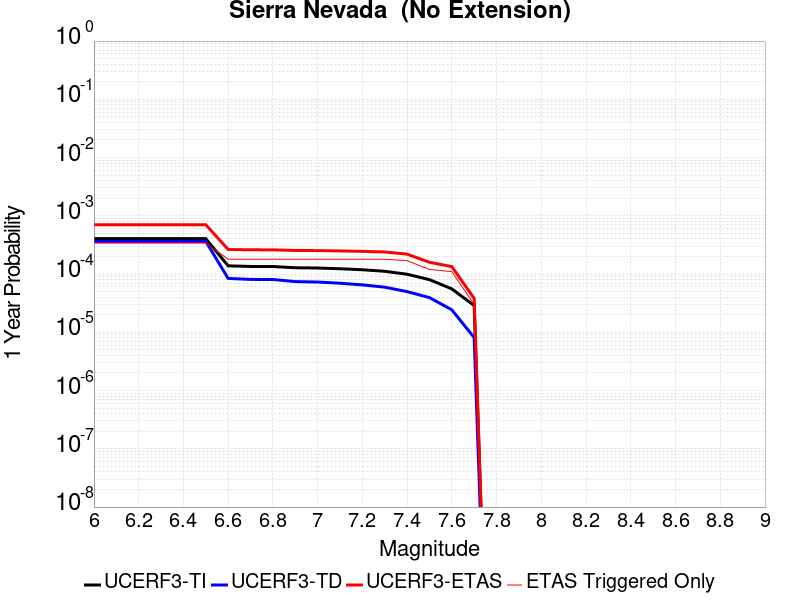 | 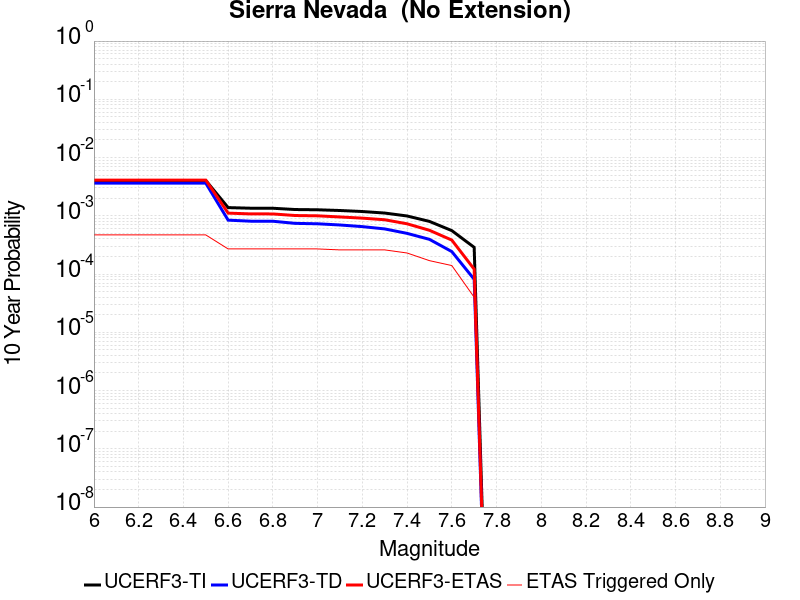 |

| Magnitude | 1 wk TI Prob | 1 wk TD Prob | 1 wk ETAS Prob | 1 wk ETAS/TD Gain | 1 wk ETAS Triggered Only | 1 mo TI Prob | 1 mo TD Prob | 1 mo ETAS Prob | 1 mo ETAS/TD Gain | 1 mo ETAS Triggered Only | 1 yr TI Prob | 1 yr TD Prob | 1 yr ETAS Prob | 1 yr ETAS/TD Gain | 1 yr ETAS Triggered Only | 10 yr TI Prob | 10 yr TD Prob | 10 yr ETAS Prob | 10 yr ETAS/TD Gain | 10 yr ETAS Triggered Only |
|-----|-----|-----|-----|-----|-----|-----|-----|-----|-----|-----|-----|-----|-----|-----|-----|-----|-----|-----|-----|-----|
| 6.0 | 7.7690465E-6 | 6.976322E-6 | 2.8094702E-4 | 40.27151 | 2.739726E-4 | 3.329549E-5 | 2.9898381E-5 | 3.038628E-4 | 10.163185 | 2.739726E-4 | 4.0529718E-4 | 3.6398784E-4 | 7.2915165E-4 | 2.0032308 | 3.6529682E-4 | 0.004045588 | 0.0036374326 | 0.0040772273 | 1.120908 | 4.414003E-4 |
| 6.1 | 7.7690465E-6 | 6.976322E-6 | 2.8094702E-4 | 40.27151 | 2.739726E-4 | 3.329549E-5 | 2.9898381E-5 | 3.038628E-4 | 10.163185 | 2.739726E-4 | 4.0529718E-4 | 3.6398784E-4 | 7.2915165E-4 | 2.0032308 | 3.6529682E-4 | 0.004045588 | 0.0036374326 | 0.0040772273 | 1.120908 | 4.414003E-4 |
| 6.2 | 7.7690465E-6 | 6.976322E-6 | 2.8094702E-4 | 40.27151 | 2.739726E-4 | 3.329549E-5 | 2.9898381E-5 | 3.038628E-4 | 10.163185 | 2.739726E-4 | 4.0529718E-4 | 3.6398784E-4 | 7.2915165E-4 | 2.0032308 | 3.6529682E-4 | 0.004045588 | 0.0036374326 | 0.0040772273 | 1.120908 | 4.414003E-4 |
| 6.3 | 7.7690465E-6 | 6.976322E-6 | 2.8094702E-4 | 40.27151 | 2.739726E-4 | 3.329549E-5 | 2.9898381E-5 | 3.038628E-4 | 10.163185 | 2.739726E-4 | 4.0529718E-4 | 3.6398784E-4 | 7.2915165E-4 | 2.0032308 | 3.6529682E-4 | 0.004045588 | 0.0036374326 | 0.0040772273 | 1.120908 | 4.414003E-4 |
| 6.4 | 7.7690465E-6 | 6.976322E-6 | 2.8094702E-4 | 40.27151 | 2.739726E-4 | 3.329549E-5 | 2.9898381E-5 | 3.038628E-4 | 10.163185 | 2.739726E-4 | 4.0529718E-4 | 3.6398784E-4 | 7.2915165E-4 | 2.0032308 | 3.6529682E-4 | 0.004045588 | 0.0036374326 | 0.0040772273 | 1.120908 | 4.414003E-4 |
| 6.5 | 7.7690465E-6 | 6.976322E-6 | 2.8094702E-4 | 40.27151 | 2.739726E-4 | 3.329549E-5 | 2.9898381E-5 | 3.038628E-4 | 10.163185 | 2.739726E-4 | 4.0529718E-4 | 3.6398784E-4 | 7.2915165E-4 | 2.0032308 | 3.6529682E-4 | 0.004045588 | 0.0036374326 | 0.0040772273 | 1.120908 | 4.414003E-4 |
| 6.6 | 2.653E-6 | 1.614854E-6 | 1.5382162E-4 | 95.25419 | 1.5220701E-4 | 1.136995E-5 | 6.9207845E-6 | 1.5912674E-4 | 22.992586 | 1.5220701E-4 | 1.3842035E-4 | 8.425733E-5 | 2.9732918E-4 | 3.5288227 | 2.130898E-4 | 0.0013833415 | 8.422573E-4 | 0.0011007913 | 1.3069537 | 2.587519E-4 |
| 6.7 | 2.5902466E-6 | 1.5501876E-6 | 1.5375695E-4 | 99.186035 | 1.5220701E-4 | 1.11010095E-5 | 6.643644E-6 | 1.5884964E-4 | 23.910015 | 1.5220701E-4 | 1.351464E-4 | 8.0883394E-5 | 2.9395596E-4 | 3.6343179 | 2.130898E-4 | 0.0013506424 | 8.0854254E-4 | 0.0010670852 | 1.3197639 | 2.587519E-4 |
| 6.8 | 2.5853892E-6 | 1.5469877E-6 | 1.5375376E-4 | 99.38912 | 1.5220701E-4 | 1.1080193E-5 | 6.629931E-6 | 1.5883593E-4 | 23.957403 | 1.5220701E-4 | 1.34893E-4 | 8.071645E-5 | 2.9378905E-4 | 3.639767 | 2.130898E-4 | 0.0013481114 | 8.068743E-4 | 0.0010654174 | 1.3204255 | 2.587519E-4 |
| 6.9 | 2.458257E-6 | 1.4220619E-6 | 1.5362885E-4 | 108.032455 | 1.5220701E-4 | 1.0535345E-5 | 6.094537E-6 | 1.5830061E-4 | 25.97418 | 1.5220701E-4 | 1.2826028E-4 | 7.4198484E-5 | 2.8727247E-4 | 3.8716757 | 2.130898E-4 | 0.0012818627 | 7.4173906E-4 | 0.001000299 | 1.3485862 | 2.587519E-4 |
| 7.0 | 2.4341468E-6 | 1.3990258E-6 | 1.5360581E-4 | 109.79484 | 1.5220701E-4 | 1.0432016E-5 | 5.9958115E-6 | 1.582019E-4 | 26.385403 | 1.5220701E-4 | 1.270024E-4 | 7.2996576E-5 | 2.8607083E-4 | 3.9189622 | 2.130898E-4 | 0.0012692984 | 7.297279E-4 | 9.88291E-4 | 1.354328 | 2.587519E-4 |
| 7.1 | 2.3652476E-6 | 1.3339754E-6 | 1.5354078E-4 | 115.10015 | 1.5220701E-4 | 1.0136736E-5 | 5.717025E-6 | 1.5792316E-4 | 27.62331 | 1.5220701E-4 | 1.2340778E-4 | 6.9602575E-5 | 2.8267756E-4 | 4.061309 | 2.130898E-4 | 0.0012333926 | 6.9580943E-4 | 9.543813E-4 | 1.371613 | 2.587519E-4 |
| 7.2 | 2.272158E-6 | 1.2502821E-6 | 1.5345709E-4 | 122.73797 | 1.5220701E-4 | 9.737784E-6 | 5.3583412E-6 | 1.5756453E-4 | 29.405468 | 1.5220701E-4 | 1.1855107E-4 | 6.5235865E-5 | 2.7831175E-4 | 4.2662387 | 2.130898E-4 | 0.0011848784 | 6.5216864E-4 | 9.107518E-4 | 1.3964974 | 2.587519E-4 |
| 7.3 | 2.1382127E-6 | 1.1419703E-6 | 1.533488E-4 | 134.28441 | 1.5220701E-4 | 9.163737E-6 | 4.8941492E-6 | 1.5710041E-4 | 32.099636 | 1.5220701E-4 | 1.1156279E-4 | 5.958465E-5 | 2.7266177E-4 | 4.5760403 | 2.130898E-4 | 0.001115068 | 5.956879E-4 | 8.5428567E-4 | 1.4341162 | 2.587519E-4 |
| 7.4 | 1.9048055E-6 | 9.575242E-7 | 1.379437E-4 | 144.06288 | 1.369863E-4 | 8.163426E-6 | 4.1036687E-6 | 1.410894E-4 | 34.381283 | 1.369863E-4 | 9.9385186E-5 | 4.996103E-5 | 2.4782025E-4 | 4.960271 | 1.978691E-4 | 9.934074E-4 | 4.994987E-4 | 7.276951E-4 | 1.456851 | 2.283105E-4 |
| 7.5 | 1.5373403E-6 | 7.560042E-7 | 9.208014E-5 | 121.79844 | 9.1324204E-5 | 6.5885843E-6 | 3.2400142E-6 | 9.456392E-5 | 29.186268 | 9.1324204E-5 | 8.021306E-5 | 3.9446462E-5 | 1.7642736E-4 | 4.4725776 | 1.369863E-4 | 8.0184115E-4 | 3.943951E-4 | 5.617568E-4 | 1.4243503 | 1.674277E-4 |
| 7.6 | 1.0680322E-6 | 4.6596554E-7 | 7.656943E-5 | 164.32423 | 7.6103504E-5 | 4.577273E-6 | 1.9969937E-6 | 7.810034E-5 | 39.10896 | 7.6103504E-5 | 5.5726876E-5 | 2.4313129E-5 | 1.4607576E-4 | 6.0081024 | 1.217656E-4 | 5.5712904E-4 | 2.4310495E-4 | 3.8005796E-4 | 1.5633492 | 1.369863E-4 |
| 7.7 | 5.509146E-7 | 1.5580486E-7 | 1.5376503E-5 | 98.69078 | 1.52207E-5 | 2.3610605E-6 | 6.677349E-7 | 1.5888425E-5 | 23.794508 | 1.52207E-5 | 2.8745531E-5 | 8.129644E-6 | 3.8570797E-5 | 4.7444634 | 3.04414E-5 | 2.8741814E-4 | 8.1293576E-5 | 1.1173251E-4 | 1.3744321 | 3.04414E-5 |

## Scodie Lineament
*[(top)](#table-of-contents)*

| 1 Week | 1 Month | 1 Year | 10 Year |
|-----|-----|-----|-----|
| 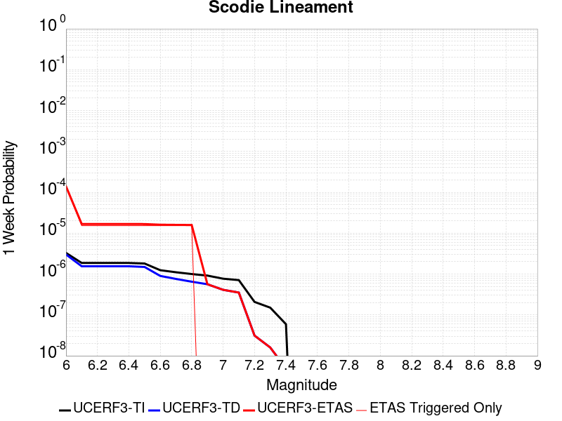 | 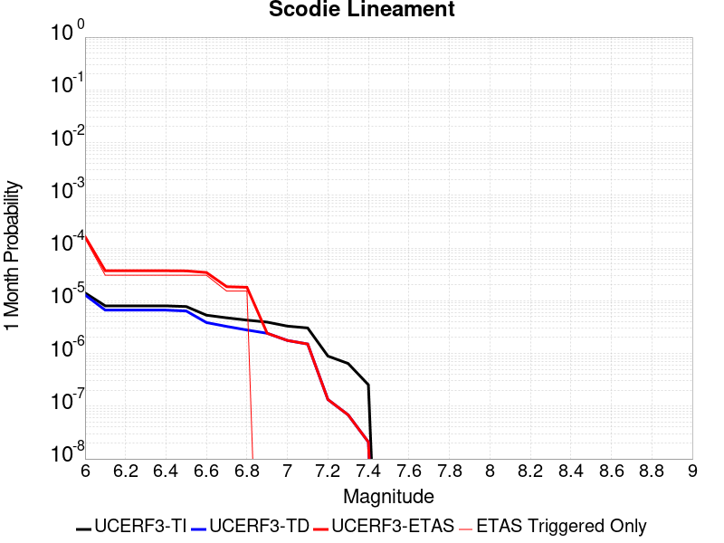 | 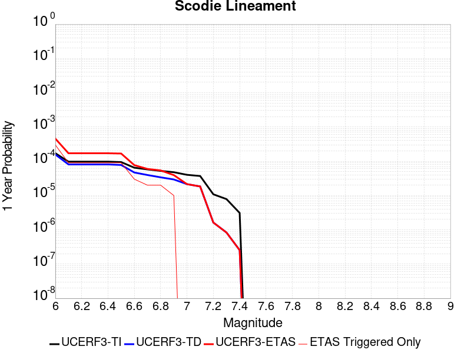 | 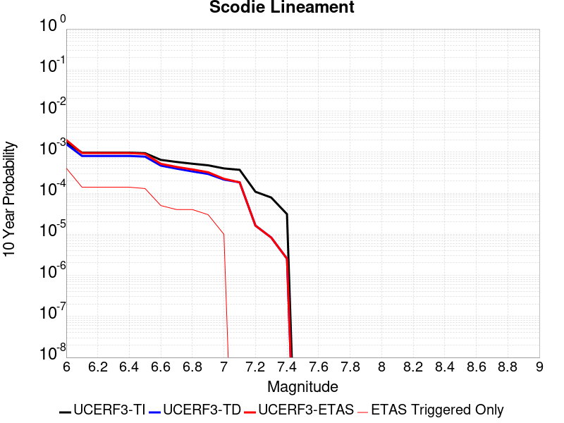 |

| Magnitude | 1 wk TI Prob | 1 wk TD Prob | 1 wk ETAS Prob | 1 wk ETAS/TD Gain | 1 wk ETAS Triggered Only | 1 mo TI Prob | 1 mo TD Prob | 1 mo ETAS Prob | 1 mo ETAS/TD Gain | 1 mo ETAS Triggered Only | 1 yr TI Prob | 1 yr TD Prob | 1 yr ETAS Prob | 1 yr ETAS/TD Gain | 1 yr ETAS Triggered Only | 10 yr TI Prob | 10 yr TD Prob | 10 yr ETAS Prob | 10 yr ETAS/TD Gain | 10 yr ETAS Triggered Only |
|-----|-----|-----|-----|-----|-----|-----|-----|-----|-----|-----|-----|-----|-----|-----|-----|-----|-----|-----|-----|-----|
| 6.0 | 3.2919327E-6 | 3.0133422E-6 | 1.3999923E-4 | 46.459785 | 1.369863E-4 | 1.4108206E-5 | 1.2914278E-5 | 1.6511932E-4 | 12.785795 | 1.5220701E-4 | 1.7175387E-4 | 1.5722317E-4 | 5.072442E-4 | 3.226269 | 3.500761E-4 | 0.0017162118 | 0.0015714309 | 0.0020273344 | 1.29012 | 4.56621E-4 |
| 6.1 | 1.8663811E-6 | 1.5490499E-6 | 1.6769727E-5 | 10.825814 | 1.52207E-5 | 7.998751E-6 | 6.6387715E-6 | 3.7079968E-5 | 5.5853662 | 3.04414E-5 | 9.738045E-5 | 8.082454E-5 | 1.8736083E-4 | 2.318118 | 1.065449E-4 | 9.7337784E-4 | 8.080003E-4 | 9.752927E-4 | 1.207045 | 1.674277E-4 |
| 6.2 | 1.8663811E-6 | 1.5490499E-6 | 1.6769727E-5 | 10.825814 | 1.52207E-5 | 7.998751E-6 | 6.6387715E-6 | 3.7079968E-5 | 5.5853662 | 3.04414E-5 | 9.738045E-5 | 8.082454E-5 | 1.8736083E-4 | 2.318118 | 1.065449E-4 | 9.7337784E-4 | 8.080003E-4 | 9.752927E-4 | 1.207045 | 1.674277E-4 |
| 6.3 | 1.8663811E-6 | 1.5490499E-6 | 1.6769727E-5 | 10.825814 | 1.52207E-5 | 7.998751E-6 | 6.6387715E-6 | 3.7079968E-5 | 5.5853662 | 3.04414E-5 | 9.738045E-5 | 8.082454E-5 | 1.8736083E-4 | 2.318118 | 1.065449E-4 | 9.7337784E-4 | 8.080003E-4 | 9.752927E-4 | 1.207045 | 1.674277E-4 |
| 6.4 | 1.8663811E-6 | 1.5490499E-6 | 1.6769727E-5 | 10.825814 | 1.52207E-5 | 7.998751E-6 | 6.6387715E-6 | 3.7079968E-5 | 5.5853662 | 3.04414E-5 | 9.738045E-5 | 8.082454E-5 | 1.8736083E-4 | 2.318118 | 1.065449E-4 | 9.7337784E-4 | 8.080003E-4 | 9.752927E-4 | 1.207045 | 1.674277E-4 |
| 6.5 | 1.8106311E-6 | 1.4909839E-6 | 1.6711661E-5 | 11.208478 | 1.52207E-5 | 7.759824E-6 | 6.3899183E-6 | 3.6831123E-5 | 5.7639427 | 3.04414E-5 | 9.447177E-5 | 7.7794975E-5 | 1.8433158E-4 | 2.3694537 | 1.065449E-4 | 9.4431615E-4 | 7.7772606E-4 | 9.298147E-4 | 1.1955556 | 1.5220701E-4 |
| 6.6 | 1.2414679E-6 | 8.997558E-7 | 1.6120443E-5 | 17.916464 | 1.52207E-5 | 5.320566E-6 | 3.856091E-6 | 3.4297373E-5 | 8.894338 | 3.04414E-5 | 6.477596E-5 | 4.6946985E-5 | 9.260694E-5 | 1.9725856 | 4.5662102E-5 | 6.475708E-4 | 4.693793E-4 | 5.3023355E-4 | 1.1296483 | 6.08828E-5 |
| 6.7 | 1.1062215E-6 | 7.594311E-7 | 1.598012E-5 | 21.042225 | 1.52207E-5 | 4.7409408E-6 | 3.2547011E-6 | 1.8475352E-5 | 5.6765127 | 1.52207E-5 | 5.7719422E-5 | 3.9625334E-5 | 7.006553E-5 | 1.7682003 | 3.04414E-5 | 5.770443E-4 | 3.961897E-4 | 4.418337E-4 | 1.1152074 | 4.5662102E-5 |
| 6.8 | 1.0006736E-6 | 6.500397E-7 | 1.587073E-5 | 24.415018 | 1.52207E-5 | 4.288594E-6 | 2.7858816E-6 | 1.800654E-5 | 6.4634976 | 1.52207E-5 | 5.221238E-5 | 3.3917644E-5 | 6.435801E-5 | 1.8974788 | 3.04414E-5 | 5.220012E-4 | 3.3913075E-4 | 3.8477735E-4 | 1.1345989 | 4.5662102E-5 |
| 6.9 | 9.167364E-7 | 5.631625E-7 | 5.631625E-7 | 1.0 | 0.0 | 3.9288643E-6 | 2.4135516E-6 | 2.4135516E-6 | 1.0 | 0.0 | 4.7832873E-5 | 2.9384651E-5 | 4.4604905E-5 | 1.517966 | 1.52207E-5 | 4.782258E-4 | 2.9381333E-4 | 3.242458E-4 | 1.1035775 | 3.04414E-5 |
| 7.0 | 7.6987664E-7 | 4.113383E-7 | 4.113383E-7 | 1.0 | 0.0 | 3.2994672E-6 | 1.7628774E-6 | 1.7628774E-6 | 1.0 | 0.0 | 4.0170275E-5 | 2.1462862E-5 | 2.1462862E-5 | 1.0 | 0.0 | 4.0163012E-4 | 2.1461173E-4 | 2.2982917E-4 | 1.0709068 | 1.52207E-5 |
| 7.1 | 7.1038727E-7 | 3.5211494E-7 | 3.5211494E-7 | 1.0 | 0.0 | 3.0445133E-6 | 1.5090633E-6 | 1.5090633E-6 | 1.0 | 0.0 | 3.706632E-5 | 1.8372726E-5 | 1.8372726E-5 | 1.0 | 0.0 | 3.7060137E-4 | 1.8371557E-4 | 1.8371557E-4 | 1.0 | 0.0 |
| 7.2 | 2.0799602E-7 | 3.1186854E-8 | 3.1186854E-8 | 1.0 | 0.0 | 8.914113E-7 | 1.3365793E-7 | 1.3365793E-7 | 1.0 | 0.0 | 1.0852878E-5 | 1.6272843E-6 | 1.6272843E-6 | 1.0 | 0.0 | 1.08523476E-4 | 1.627273E-5 | 1.627273E-5 | 1.0 | 0.0 |
| 7.3 | 1.5048182E-7 | 1.5945696E-8 | 1.5945696E-8 | 1.0 | 0.0 | 6.449219E-7 | 6.83387E-8 | 6.83387E-8 | 1.0 | 0.0 | 7.851896E-6 | 8.320234E-7 | 8.320234E-7 | 1.0 | 0.0 | 7.851618E-5 | 8.320206E-6 | 8.320206E-6 | 1.0 | 0.0 |
| 7.4 | 5.9334678E-8 | 4.8683537E-9 | 4.8683537E-9 | 1.0 | 0.0 | 2.5429145E-7 | 2.0864372E-8 | 2.0864372E-8 | 1.0 | 0.0 | 3.095994E-6 | 2.5402372E-7 | 2.5402372E-7 | 1.0 | 0.0 | 3.095951E-5 | 2.5402353E-6 | 2.5402353E-6 | 1.0 | 0.0 |

## San Andreas (Carrizo) rev
*[(top)](#table-of-contents)*

| 1 Week | 1 Month | 1 Year | 10 Year |
|-----|-----|-----|-----|
|  | 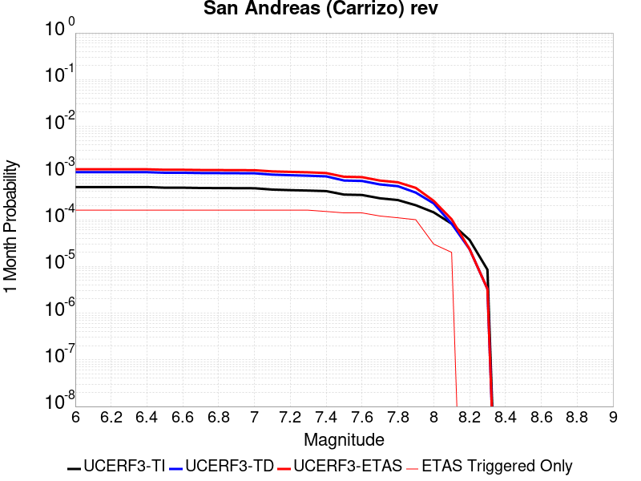 | 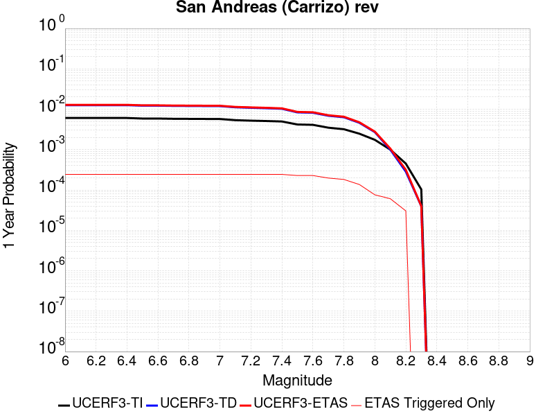 | 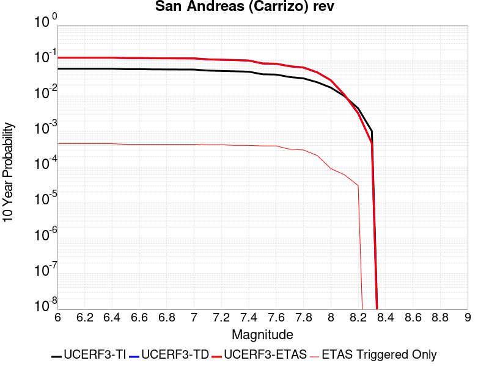 |

| Magnitude | 1 wk TI Prob | 1 wk TD Prob | 1 wk ETAS Prob | 1 wk ETAS/TD Gain | 1 wk ETAS Triggered Only | 1 mo TI Prob | 1 mo TD Prob | 1 mo ETAS Prob | 1 mo ETAS/TD Gain | 1 mo ETAS Triggered Only | 1 yr TI Prob | 1 yr TD Prob | 1 yr ETAS Prob | 1 yr ETAS/TD Gain | 1 yr ETAS Triggered Only | 10 yr TI Prob | 10 yr TD Prob | 10 yr ETAS Prob | 10 yr ETAS/TD Gain | 10 yr ETAS Triggered Only |
|-----|-----|-----|-----|-----|-----|-----|-----|-----|-----|-----|-----|-----|-----|-----|-----|-----|-----|-----|-----|-----|
| 6.0 | 1.1674632E-4 | 2.432302E-4 | 3.1931518E-4 | 1.3128107 | 7.6103504E-5 | 5.002454E-4 | 0.0010420004 | 0.001163639 | 1.1167358 | 1.217656E-4 | 0.006073493 | 0.012613042 | 0.012853502 | 1.0190643 | 2.435312E-4 | 0.0591016 | 0.12061418 | 0.12101573 | 1.0033292 | 4.56621E-4 |
| 6.1 | 1.1674632E-4 | 2.432302E-4 | 3.1931518E-4 | 1.3128107 | 7.6103504E-5 | 5.002454E-4 | 0.0010420004 | 0.001163639 | 1.1167358 | 1.217656E-4 | 0.006073493 | 0.012613042 | 0.012853502 | 1.0190643 | 2.435312E-4 | 0.0591016 | 0.12061418 | 0.12101573 | 1.0033292 | 4.56621E-4 |
| 6.2 | 1.1674632E-4 | 2.432302E-4 | 3.1931518E-4 | 1.3128107 | 7.6103504E-5 | 5.002454E-4 | 0.0010420004 | 0.001163639 | 1.1167358 | 1.217656E-4 | 0.006073493 | 0.012613042 | 0.012853502 | 1.0190643 | 2.435312E-4 | 0.0591016 | 0.12061418 | 0.12101573 | 1.0033292 | 4.56621E-4 |
| 6.3 | 1.1674632E-4 | 2.432302E-4 | 3.1931518E-4 | 1.3128107 | 7.6103504E-5 | 5.002454E-4 | 0.0010420004 | 0.001163639 | 1.1167358 | 1.217656E-4 | 0.006073493 | 0.012613042 | 0.012853502 | 1.0190643 | 2.435312E-4 | 0.0591016 | 0.12061418 | 0.12101573 | 1.0033292 | 4.56621E-4 |
| 6.4 | 1.1674632E-4 | 2.432302E-4 | 3.1931518E-4 | 1.3128107 | 7.6103504E-5 | 5.002454E-4 | 0.0010420004 | 0.001163639 | 1.1167358 | 1.217656E-4 | 0.006073493 | 0.012613042 | 0.012853502 | 1.0190643 | 2.435312E-4 | 0.0591016 | 0.12061418 | 0.12101573 | 1.0033292 | 4.56621E-4 |
| 6.5 | 1.13136164E-4 | 2.3643032E-4 | 3.1251583E-4 | 1.3218094 | 7.6103504E-5 | 4.847792E-4 | 0.0010128808 | 0.0011345231 | 1.1200954 | 1.217656E-4 | 0.0058862255 | 0.012262545 | 0.012503089 | 1.0196162 | 2.435312E-4 | 0.057327334 | 0.117585555 | 0.11797505 | 1.0033125 | 4.414003E-4 |
| 6.6 | 1.13136164E-4 | 2.3643032E-4 | 3.1251583E-4 | 1.3218094 | 7.6103504E-5 | 4.847792E-4 | 0.0010128808 | 0.0011345231 | 1.1200954 | 1.217656E-4 | 0.0058862255 | 0.012262545 | 0.012503089 | 1.0196162 | 2.435312E-4 | 0.057327334 | 0.117585555 | 0.11797505 | 1.0033125 | 4.414003E-4 |
| 6.7 | 1.1149675E-4 | 2.3334254E-4 | 3.094283E-4 | 1.3260689 | 7.6103504E-5 | 4.777557E-4 | 9.996577E-4 | 0.0011213016 | 1.1216855 | 1.217656E-4 | 0.0058011734 | 0.012103349 | 0.012343933 | 1.0198774 | 2.435312E-4 | 0.05652051 | 0.1162071 | 0.116597205 | 1.003357 | 4.414003E-4 |
| 6.8 | 1.1103589E-4 | 2.3236412E-4 | 3.0844993E-4 | 1.3274422 | 7.6103504E-5 | 4.7578133E-4 | 9.954676E-4 | 0.0011171121 | 1.1221982 | 1.217656E-4 | 0.005777263 | 0.012052901 | 0.012293497 | 1.0199617 | 2.435312E-4 | 0.056293584 | 0.1157674 | 0.116157696 | 1.0033715 | 4.414003E-4 |
| 6.9 | 1.1053259E-4 | 2.3128795E-4 | 3.0737385E-4 | 1.3289661 | 7.6103504E-5 | 4.7362508E-4 | 9.90859E-4 | 0.0011125039 | 1.1227672 | 1.217656E-4 | 0.0057511497 | 0.01199741 | 0.01223802 | 1.0200552 | 2.435312E-4 | 0.05604569 | 0.11528359 | 0.11567411 | 1.0033875 | 4.414003E-4 |
| 7.0 | 1.1005377E-4 | 2.3029637E-4 | 3.0638234E-4 | 1.3303828 | 7.6103504E-5 | 4.7157376E-4 | 9.866126E-4 | 0.0011082581 | 1.123296 | 1.217656E-4 | 0.0057263062 | 0.011946279 | 0.012186901 | 1.020142 | 2.435312E-4 | 0.055809796 | 0.11483591 | 0.11522662 | 1.0034024 | 4.414003E-4 |
| 7.1 | 1.0308142E-4 | 2.1539345E-4 | 2.9148054E-4 | 1.353247 | 7.6103504E-5 | 4.417027E-4 | 9.227892E-4 | 0.0010444424 | 1.1318321 | 1.217656E-4 | 0.0053644776 | 0.011177397 | 0.011418207 | 1.0215443 | 2.435312E-4 | 0.052368138 | 0.108092256 | 0.10847237 | 1.0035166 | 4.261796E-4 |
| 7.2 | 1.0027479E-4 | 2.094724E-4 | 2.8555997E-4 | 1.3632343 | 7.6103504E-5 | 4.296783E-4 | 8.9743105E-4 | 0.0010190874 | 1.1355606 | 1.217656E-4 | 0.0052187922 | 0.010871782 | 0.011112666 | 1.0221567 | 2.435312E-4 | 0.050979212 | 0.10539625 | 0.10577751 | 1.0036174 | 4.261796E-4 |
| 7.3 | 9.816942E-5 | 2.0422463E-4 | 2.803126E-4 | 1.3725699 | 7.6103504E-5 | 4.2065824E-4 | 8.7495585E-4 | 9.966149E-4 | 1.139046 | 1.217656E-4 | 0.005109493 | 0.010600842 | 0.0108417915 | 1.0227293 | 2.435312E-4 | 0.049935985 | 0.102979995 | 0.103348635 | 1.0035797 | 4.109589E-4 |
| 7.4 | 9.5634205E-5 | 1.9791997E-4 | 2.740084E-4 | 1.3844404 | 7.6103504E-5 | 4.0979648E-4 | 8.479536E-4 | 9.6961594E-4 | 1.1434776 | 1.217656E-4 | 0.0049778637 | 0.010275229 | 0.010516258 | 1.0234573 | 2.435312E-4 | 0.048678253 | 0.10006632 | 0.10043615 | 1.003696 | 4.109589E-4 |
| 7.5 | 8.052417E-5 | 1.611261E-4 | 2.2199909E-4 | 1.3777972 | 6.08828E-5 | 3.4505792E-4 | 6.903579E-4 | 7.968292E-4 | 1.1542263 | 1.065449E-4 | 0.0041929903 | 0.008372796 | 0.008599195 | 1.0270398 | 2.283105E-4 | 0.04114753 | 0.08281049 | 0.08317346 | 1.0043831 | 3.957382E-4 |
| 7.6 | 7.897024E-5 | 1.5765853E-4 | 2.1853174E-4 | 1.3861079 | 6.08828E-5 | 3.384E-4 | 6.755046E-4 | 7.8197755E-4 | 1.1576198 | 1.065449E-4 | 0.0041122385 | 0.008193332 | 0.008419772 | 1.0276371 | 2.283105E-4 | 0.040369697 | 0.08115171 | 0.08151533 | 1.0044808 | 3.957382E-4 |
| 7.7 | 6.707427E-5 | 1.3276102E-4 | 1.9363574E-4 | 1.4585285 | 6.08828E-5 | 2.8742946E-4 | 5.688518E-4 | 6.753361E-4 | 1.1871916 | 1.065449E-4 | 0.003493839 | 0.00690381 | 0.007100313 | 1.028463 | 1.978691E-4 | 0.034394164 | 0.069048055 | 0.06934562 | 1.0043095 | 3.196347E-4 |
| 7.8 | 6.147705E-5 | 1.2197486E-4 | 1.8285024E-4 | 1.4990813 | 6.08828E-5 | 2.6344648E-4 | 5.226447E-4 | 6.2913395E-4 | 1.2037507 | 1.065449E-4 | 0.0032027436 | 0.006344659 | 0.0065261484 | 1.0286051 | 1.8264841E-4 | 0.031569764 | 0.06351457 | 0.06379964 | 1.0044883 | 3.0441402E-4 |
| 7.9 | 4.7636717E-5 | 8.87977E-5 | 1.4967509E-4 | 1.685574 | 6.08828E-5 | 2.0414138E-4 | 3.8050607E-4 | 4.7179553E-4 | 1.2399158 | 9.1324204E-5 | 0.0024825884 | 0.0046228287 | 0.0047591818 | 1.0294956 | 1.369863E-4 | 0.024550365 | 0.046628095 | 0.046831246 | 1.0043569 | 2.130898E-4 |
| 8.0 | 3.3554235E-5 | 5.2136907E-5 | 5.2136907E-5 | 1.0 | 0.0 | 1.4379594E-4 | 2.2342477E-4 | 2.5385935E-4 | 1.1362185 | 3.04414E-5 | 0.0017493097 | 0.002716805 | 0.0027927018 | 1.027936 | 7.6103504E-5 | 0.017356034 | 0.027880952 | 0.027969731 | 1.0031842 | 9.1324204E-5 |
| 8.1 | 1.9175432E-5 | 1.9184976E-5 | 1.9184976E-5 | 1.0 | 0.0 | 8.217783E-5 | 8.2218736E-5 | 1.1265763E-4 | 1.3702185 | 3.04414E-5 | 0.0010000558 | 0.0010005541 | 0.001061376 | 1.0607882 | 6.08828E-5 | 0.009955673 | 0.0107580265 | 0.010818254 | 1.0055984 | 6.08828E-5 |
| 8.2 | 8.643924E-6 | 5.4748625E-6 | 5.4748625E-6 | 1.0 | 0.0 | 3.704486E-5 | 2.3463486E-5 | 2.3463486E-5 | 1.0 | 0.0 | 4.5092785E-4 | 2.8563058E-4 | 3.1606326E-4 | 1.1065457 | 3.04414E-5 | 0.0045001395 | 0.0032487072 | 0.0032790496 | 1.0093399 | 3.04414E-5 |
| 8.3 | 1.983087E-6 | 7.6599065E-7 | 7.6599065E-7 | 1.0 | 0.0 | 8.498917E-6 | 3.282813E-6 | 3.282813E-6 | 1.0 | 0.0 | 1.034694E-4 | 3.9967534E-5 | 3.9967534E-5 | 1.0 | 0.0 | 0.0010342124 | 4.719687E-4 | 4.719687E-4 | 1.0 | 0.0 |

## Red Pass
*[(top)](#table-of-contents)*

| 1 Week | 1 Month | 1 Year | 10 Year |
|-----|-----|-----|-----|
| 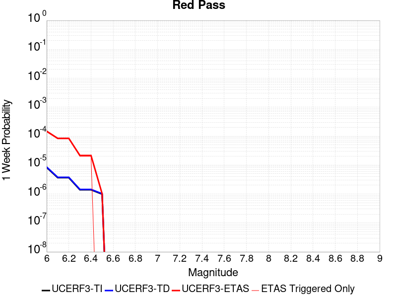 | 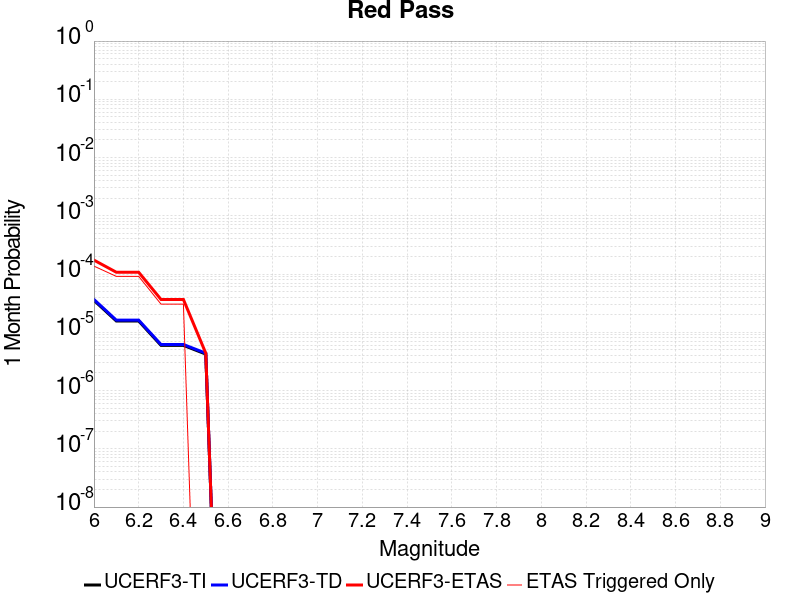 | 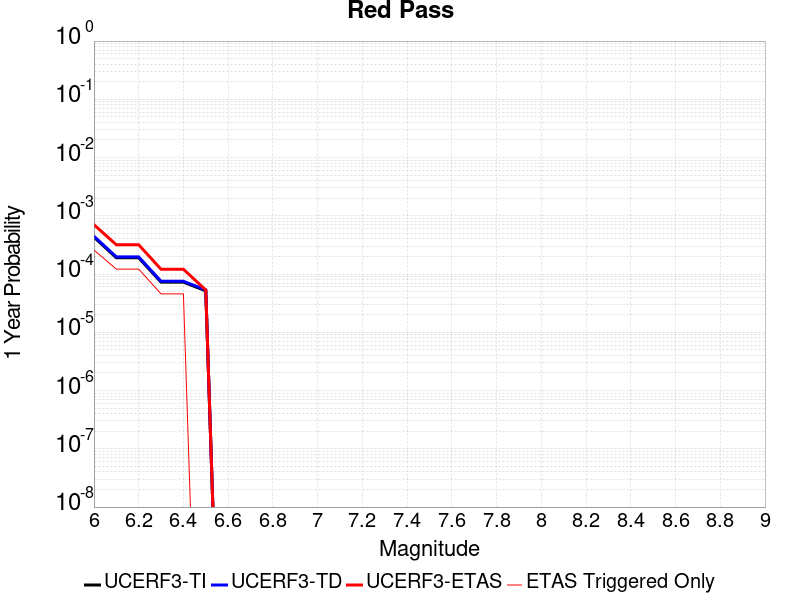 | 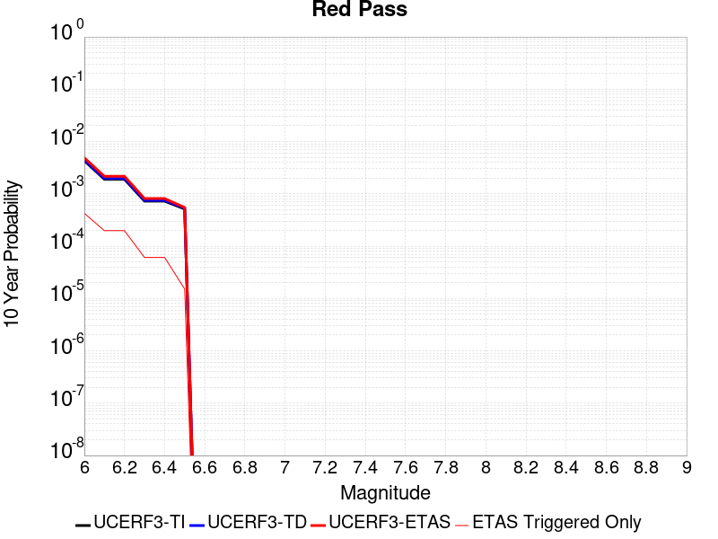 |

| Magnitude | 1 wk TI Prob | 1 wk TD Prob | 1 wk ETAS Prob | 1 wk ETAS/TD Gain | 1 wk ETAS Triggered Only | 1 mo TI Prob | 1 mo TD Prob | 1 mo ETAS Prob | 1 mo ETAS/TD Gain | 1 mo ETAS Triggered Only | 1 yr TI Prob | 1 yr TD Prob | 1 yr ETAS Prob | 1 yr ETAS/TD Gain | 1 yr ETAS Triggered Only | 10 yr TI Prob | 10 yr TD Prob | 10 yr ETAS Prob | 10 yr ETAS/TD Gain | 10 yr ETAS Triggered Only |
|-----|-----|-----|-----|-----|-----|-----|-----|-----|-----|-----|-----|-----|-----|-----|-----|-----|-----|-----|-----|-----|
| 6.0 | 8.258278E-6 | 8.551265E-6 | 1.455364E-4 | 17.019283 | 1.369863E-4 | 3.539214E-5 | 3.6647863E-5 | 1.7362915E-4 | 4.7377696 | 1.369863E-4 | 4.308141E-4 | 4.4611428E-4 | 7.0475077E-4 | 1.5797539 | 2.587519E-4 | 0.0042997985 | 0.004453945 | 0.004878226 | 1.0952597 | 4.261796E-4 |
| 6.1 | 3.649988E-6 | 3.7753161E-6 | 9.5099174E-5 | 25.189724 | 9.1324204E-5 | 1.5642712E-5 | 1.6179853E-5 | 1.0750258E-4 | 6.6442246 | 9.1324204E-5 | 1.9043336E-4 | 1.9697666E-4 | 3.187183E-4 | 1.6180509 | 1.217656E-4 | 0.0019027026 | 0.001968488 | 0.0021659676 | 1.1003205 | 1.978691E-4 |
| 6.2 | 3.649988E-6 | 3.7753161E-6 | 9.5099174E-5 | 25.189724 | 9.1324204E-5 | 1.5642712E-5 | 1.6179853E-5 | 1.0750258E-4 | 6.6442246 | 9.1324204E-5 | 1.9043336E-4 | 1.9697666E-4 | 3.187183E-4 | 1.6180509 | 1.217656E-4 | 0.0019027026 | 0.001968488 | 0.0021659676 | 1.1003205 | 1.978691E-4 |
| 6.3 | 1.3924937E-6 | 1.4411166E-6 | 3.188247E-5 | 22.123451 | 3.04414E-5 | 5.9678164E-6 | 6.1762075E-6 | 3.661742E-5 | 5.928787 | 3.04414E-5 | 7.265574E-5 | 7.519415E-5 | 1.2085281E-4 | 1.6072104 | 4.5662102E-5 | 7.263199E-4 | 7.518258E-4 | 8.126628E-4 | 1.080919 | 6.08828E-5 |
| 6.4 | 1.3924937E-6 | 1.4411166E-6 | 3.188247E-5 | 22.123451 | 3.04414E-5 | 5.9678164E-6 | 6.1762075E-6 | 3.661742E-5 | 5.928787 | 3.04414E-5 | 7.265574E-5 | 7.519415E-5 | 1.2085281E-4 | 1.6072104 | 4.5662102E-5 | 7.263199E-4 | 7.518258E-4 | 8.126628E-4 | 1.080919 | 6.08828E-5 |
| 6.5 | 9.876812E-7 | 1.0221912E-6 | 1.0221912E-6 | 1.0 | 0.0 | 4.2329125E-6 | 4.3808195E-6 | 4.3808195E-6 | 1.0 | 0.0 | 5.153449E-5 | 5.3336476E-5 | 5.3336476E-5 | 1.0 | 0.0 | 5.1522546E-4 | 5.333648E-4 | 5.4857734E-4 | 1.0285219 | 1.52207E-5 |

## Calico-Hidalgo
*[(top)](#table-of-contents)*

| 1 Week | 1 Month | 1 Year | 10 Year |
|-----|-----|-----|-----|
| 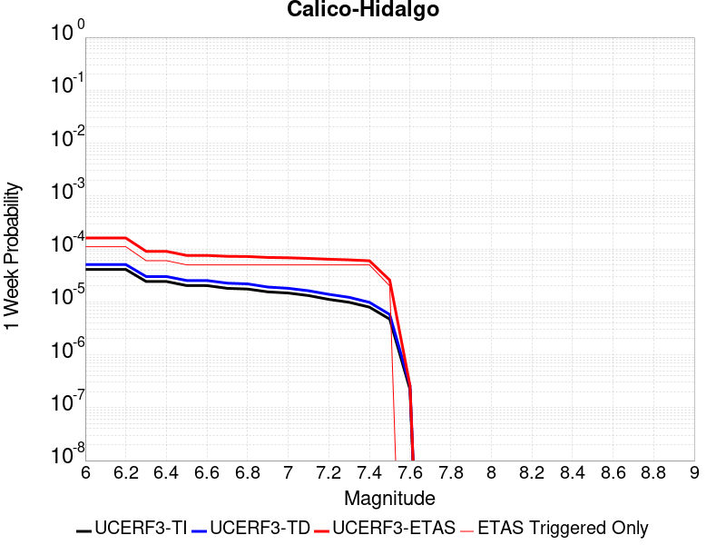 | 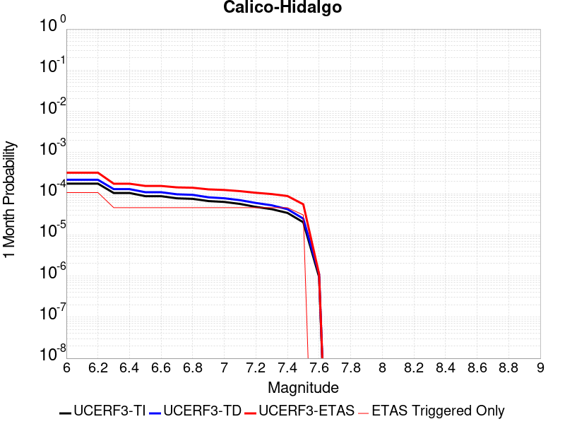 |  | 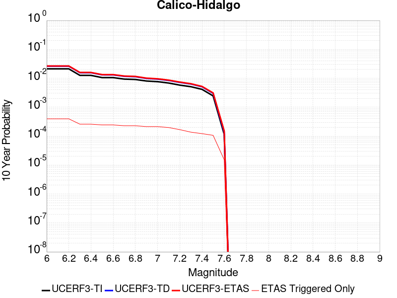 |

| Magnitude | 1 wk TI Prob | 1 wk TD Prob | 1 wk ETAS Prob | 1 wk ETAS/TD Gain | 1 wk ETAS Triggered Only | 1 mo TI Prob | 1 mo TD Prob | 1 mo ETAS Prob | 1 mo ETAS/TD Gain | 1 mo ETAS Triggered Only | 1 yr TI Prob | 1 yr TD Prob | 1 yr ETAS Prob | 1 yr ETAS/TD Gain | 1 yr ETAS Triggered Only | 10 yr TI Prob | 10 yr TD Prob | 10 yr ETAS Prob | 10 yr ETAS/TD Gain | 10 yr ETAS Triggered Only |
|-----|-----|-----|-----|-----|-----|-----|-----|-----|-----|-----|-----|-----|-----|-----|-----|-----|-----|-----|-----|-----|
| 6.0 | 4.0906612E-5 | 5.0703686E-5 | 1.4202326E-4 | 2.801044 | 9.1324204E-5 | 1.7530227E-4 | 2.172857E-4 | 3.2380744E-4 | 1.4902382 | 1.065449E-4 | 0.0021322158 | 0.002642648 | 0.0028703553 | 1.0861663 | 2.283105E-4 | 0.02111873 | 0.026152607 | 0.026537996 | 1.0147362 | 3.957382E-4 |
| 6.1 | 4.0906612E-5 | 5.0703686E-5 | 1.4202326E-4 | 2.801044 | 9.1324204E-5 | 1.7530227E-4 | 2.172857E-4 | 3.2380744E-4 | 1.4902382 | 1.065449E-4 | 0.0021322158 | 0.002642648 | 0.0028703553 | 1.0861663 | 2.283105E-4 | 0.02111873 | 0.026152607 | 0.026537996 | 1.0147362 | 3.957382E-4 |
| 6.2 | 4.0906612E-5 | 5.0703686E-5 | 1.4202326E-4 | 2.801044 | 9.1324204E-5 | 1.7530227E-4 | 2.172857E-4 | 3.2380744E-4 | 1.4902382 | 1.065449E-4 | 0.0021322158 | 0.002642648 | 0.0028703553 | 1.0861663 | 2.283105E-4 | 0.02111873 | 0.026152607 | 0.026537996 | 1.0147362 | 3.957382E-4 |
| 6.3 | 2.4242801E-5 | 3.0090669E-5 | 7.575139E-5 | 2.5174382 | 4.5662102E-5 | 1.0389358E-4 | 1.2895382E-4 | 1.7461003E-4 | 1.3540509 | 4.5662102E-5 | 0.0012641704 | 0.0015689151 | 0.0017056864 | 1.0871757 | 1.369863E-4 | 0.01257003 | 0.01558206 | 0.01583678 | 1.016347 | 2.587519E-4 |
| 6.4 | 2.4242801E-5 | 3.0090669E-5 | 7.575139E-5 | 2.5174382 | 4.5662102E-5 | 1.0389358E-4 | 1.2895382E-4 | 1.7461003E-4 | 1.3540509 | 4.5662102E-5 | 0.0012641704 | 0.0015689151 | 0.0017056864 | 1.0871757 | 1.369863E-4 | 0.01257003 | 0.01558206 | 0.01583678 | 1.016347 | 2.587519E-4 |
| 6.5 | 2.0286952E-5 | 2.5315738E-5 | 7.097668E-5 | 2.8036585 | 4.5662102E-5 | 8.694118E-5 | 1.0849161E-4 | 1.5414876E-4 | 1.4208357 | 4.5662102E-5 | 0.0010579949 | 0.001320102 | 0.0014417069 | 1.0921178 | 1.217656E-4 | 0.010529719 | 0.013124538 | 0.013364873 | 1.0183119 | 2.435312E-4 |
| 6.6 | 2.0269223E-5 | 2.5296687E-5 | 7.0957634E-5 | 2.8050168 | 4.5662102E-5 | 8.6865206E-5 | 1.08409964E-4 | 1.5406712E-4 | 1.4211527 | 4.5662102E-5 | 0.0010570707 | 0.0013191093 | 0.0014407142 | 1.0921872 | 1.217656E-4 | 0.010520565 | 0.013114728 | 0.013355065 | 1.0183258 | 2.435312E-4 |
| 6.7 | 1.799852E-5 | 2.25406E-5 | 6.820167E-5 | 3.0257256 | 4.5662102E-5 | 7.713423E-5 | 9.659908E-5 | 1.4225677E-4 | 1.4726514 | 4.5662102E-5 | 9.3870464E-4 | 0.0011754738 | 0.0012970963 | 1.1034667 | 1.217656E-4 | 0.009347493 | 0.011694173 | 0.011919814 | 1.0192951 | 2.283105E-4 |
| 6.8 | 1.7458793E-5 | 2.184212E-5 | 6.750322E-5 | 3.090507 | 4.5662102E-5 | 7.4821255E-5 | 9.3605806E-5 | 1.3926363E-4 | 1.487767 | 4.5662102E-5 | 9.10568E-4 | 0.0011390693 | 0.0012606962 | 1.1067774 | 1.217656E-4 | 0.009068459 | 0.011333893 | 0.011559616 | 1.0199157 | 2.283105E-4 |
| 6.9 | 1.542884E-5 | 1.9025927E-5 | 6.4687156E-5 | 3.399948 | 4.5662102E-5 | 6.612192E-5 | 8.153721E-5 | 1.2719558E-4 | 1.5599698 | 4.5662102E-5 | 8.04737E-4 | 9.922766E-4 | 0.0010987158 | 1.1072676 | 1.065449E-4 | 0.008018291 | 0.009879857 | 0.010090842 | 1.021355 | 2.130898E-4 |
| 7.0 | 1.468253E-5 | 1.8030598E-5 | 6.369188E-5 | 3.5324326 | 4.5662102E-5 | 6.292361E-5 | 7.7271776E-5 | 1.2293035E-4 | 1.5908829 | 4.5662102E-5 | 7.658257E-4 | 9.4039086E-4 | 0.0010468356 | 1.113192 | 1.065449E-4 | 0.0076319184 | 0.009365481 | 0.009576575 | 1.0225396 | 2.130898E-4 |
| 7.1 | 1.3139281E-5 | 1.6200942E-5 | 6.18623E-5 | 3.8184385 | 4.5662102E-5 | 5.6309986E-5 | 6.943083E-5 | 1.15089766E-4 | 1.6576174 | 4.5662102E-5 | 6.853584E-4 | 8.4500515E-4 | 9.5146004E-4 | 1.1259813 | 1.065449E-4 | 0.0068324856 | 0.0084192185 | 0.008615422 | 1.0233042 | 1.978691E-4 |
| 7.2 | 1.1127404E-5 | 1.3866597E-5 | 5.9528065E-5 | 4.2929106 | 4.5662102E-5 | 4.7688E-5 | 5.942698E-5 | 1.0508637E-4 | 1.7683276 | 4.5662102E-5 | 5.8044674E-4 | 7.232942E-4 | 8.297621E-4 | 1.1471986 | 1.065449E-4 | 0.0057893298 | 0.0072105085 | 0.007376729 | 1.0230526 | 1.674277E-4 |
| 7.3 | 9.808154E-6 | 1.2176215E-5 | 5.783776E-5 | 4.7500606 | 4.5662102E-5 | 4.2034266E-5 | 5.2182797E-5 | 9.7842516E-5 | 1.8749956 | 4.5662102E-5 | 5.11647E-4 | 6.3515105E-4 | 7.2641723E-4 | 1.1436921 | 9.1324204E-5 | 0.0051047057 | 0.006334433 | 0.0064705517 | 1.0214887 | 1.369863E-4 |
| 7.4 | 7.942452E-6 | 9.792144E-6 | 5.54538E-5 | 5.6630907 | 4.5662102E-5 | 3.4038632E-5 | 4.1965708E-5 | 8.762589E-5 | 2.0880356 | 4.5662102E-5 | 4.1434157E-4 | 5.1082217E-4 | 5.868868E-4 | 1.1489062 | 7.6103504E-5 | 0.0041356985 | 0.005097421 | 0.005218566 | 1.0237659 | 1.217656E-4 |
| 7.5 | 4.7121216E-6 | 5.772836E-6 | 3.621406E-5 | 6.2731833 | 3.04414E-5 | 2.019465E-5 | 2.4740535E-5 | 5.5181183E-5 | 2.2303956 | 3.04414E-5 | 2.4584212E-4 | 3.0118204E-4 | 3.620465E-4 | 1.2020853 | 6.08828E-5 | 0.0024557032 | 0.0030084911 | 0.0031147155 | 1.0353082 | 1.065449E-4 |
| 7.6 | 2.21172E-7 | 2.603961E-7 | 2.603961E-7 | 1.0 | 0.0 | 9.478797E-7 | 1.1159829E-6 | 1.1159829E-6 | 1.0 | 0.0 | 1.1540374E-5 | 1.3587036E-5 | 2.8807528E-5 | 2.1202219 | 1.52207E-5 | 1.1539775E-4 | 1.3586486E-4 | 1.510835E-4 | 1.112013 | 1.52207E-5 |

## San Andreas (Cholame) rev
*[(top)](#table-of-contents)*

| 1 Week | 1 Month | 1 Year | 10 Year |
|-----|-----|-----|-----|
| 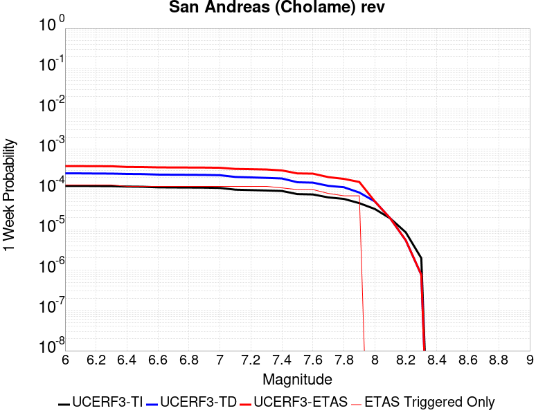 |  | 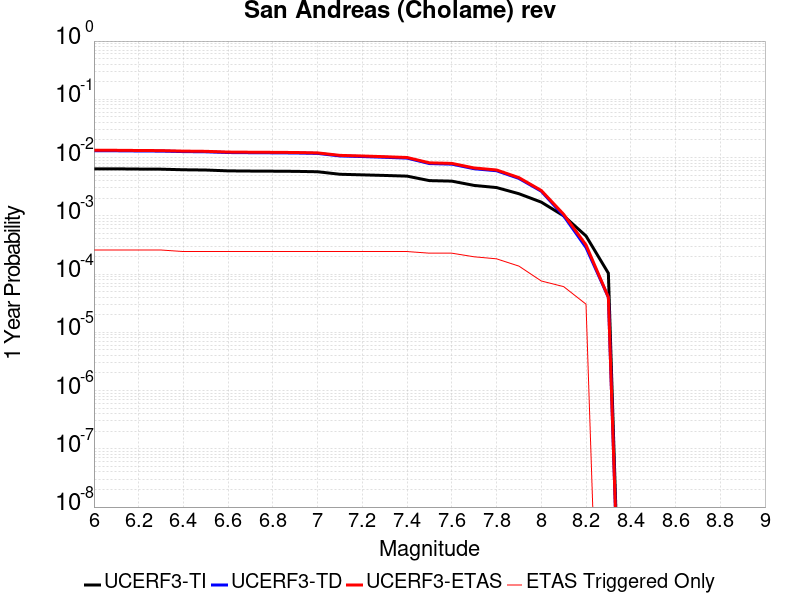 | 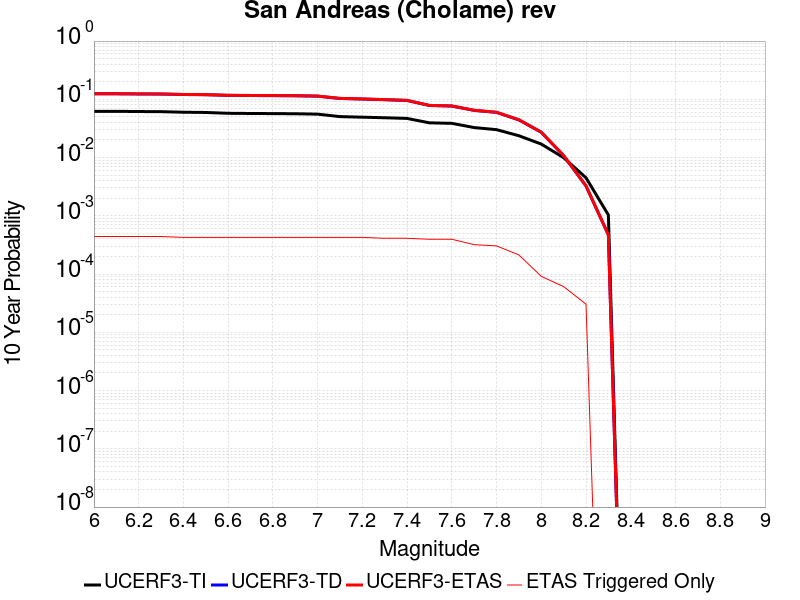 |

| Magnitude | 1 wk TI Prob | 1 wk TD Prob | 1 wk ETAS Prob | 1 wk ETAS/TD Gain | 1 wk ETAS Triggered Only | 1 mo TI Prob | 1 mo TD Prob | 1 mo ETAS Prob | 1 mo ETAS/TD Gain | 1 mo ETAS Triggered Only | 1 yr TI Prob | 1 yr TD Prob | 1 yr ETAS Prob | 1 yr ETAS/TD Gain | 1 yr ETAS Triggered Only | 10 yr TI Prob | 10 yr TD Prob | 10 yr ETAS Prob | 10 yr ETAS/TD Gain | 10 yr ETAS Triggered Only |
|-----|-----|-----|-----|-----|-----|-----|-----|-----|-----|-----|-----|-----|-----|-----|-----|-----|-----|-----|-----|-----|
| 6.0 | 1.2302514E-4 | 2.5204287E-4 | 3.4334406E-4 | 1.3622446 | 9.1324204E-5 | 5.27144E-4 | 0.0010797381 | 0.0012165766 | 1.126733 | 1.369863E-4 | 0.0063991086 | 0.0130670825 | 0.013322453 | 1.019543 | 2.587519E-4 | 0.06217949 | 0.12439073 | 0.12477722 | 1.0031071 | 4.414003E-4 |
| 6.1 | 1.2302514E-4 | 2.5204287E-4 | 3.4334406E-4 | 1.3622446 | 9.1324204E-5 | 5.27144E-4 | 0.0010797381 | 0.0012165766 | 1.126733 | 1.369863E-4 | 0.0063991086 | 0.0130670825 | 0.013322453 | 1.019543 | 2.587519E-4 | 0.06217949 | 0.12439073 | 0.12477722 | 1.0031071 | 4.414003E-4 |
| 6.2 | 1.2203569E-4 | 2.5021084E-4 | 3.4151218E-4 | 1.3648976 | 9.1324204E-5 | 5.2290526E-4 | 0.0010718931 | 0.0012087326 | 1.1276615 | 1.369863E-4 | 0.006347804 | 0.01297271 | 0.013228104 | 1.019687 | 2.587519E-4 | 0.061695136 | 0.12357691 | 0.12396376 | 1.0031304 | 4.414003E-4 |
| 6.3 | 1.2142645E-4 | 2.4907055E-4 | 3.40372E-4 | 1.3665687 | 9.1324204E-5 | 5.202953E-4 | 0.0010670102 | 0.0012038504 | 1.1282463 | 1.369863E-4 | 0.006316212 | 0.012913967 | 0.013169377 | 1.0197779 | 2.587519E-4 | 0.06139677 | 0.12307103 | 0.12345811 | 1.0031451 | 4.414003E-4 |
| 6.4 | 1.1865206E-4 | 2.44126E-4 | 3.2021094E-4 | 1.3116626 | 7.6103504E-5 | 5.0840975E-4 | 0.0010458364 | 0.0011674747 | 1.1163071 | 1.217656E-4 | 0.006172335 | 0.012659196 | 0.012899645 | 1.018994 | 2.435312E-4 | 0.060036868 | 0.1208638 | 0.12123848 | 1.0030999 | 4.261796E-4 |
| 6.5 | 1.17443946E-4 | 2.4205919E-4 | 3.1814427E-4 | 1.3143243 | 7.6103504E-5 | 5.032341E-4 | 0.0010369857 | 0.001158625 | 1.1173009 | 1.217656E-4 | 0.006109677 | 0.012552682 | 0.012793156 | 1.0191572 | 2.435312E-4 | 0.059444077 | 0.11993805 | 0.120313115 | 1.0031271 | 4.261796E-4 |
| 6.6 | 1.13579066E-4 | 2.3514954E-4 | 3.1123514E-4 | 1.3235626 | 7.6103504E-5 | 4.866766E-4 | 0.001007396 | 0.001129039 | 1.1207498 | 1.217656E-4 | 0.0059092017 | 0.012196515 | 0.012437075 | 1.0197238 | 2.435312E-4 | 0.057545185 | 0.11685214 | 0.11722852 | 1.003221 | 4.261796E-4 |
| 6.7 | 1.1271412E-4 | 2.3359268E-4 | 3.096784E-4 | 1.3257196 | 7.6103504E-5 | 4.829711E-4 | 0.0010007289 | 0.0011223727 | 1.1215551 | 1.217656E-4 | 0.005864331 | 0.012116249 | 0.012356829 | 1.019856 | 2.435312E-4 | 0.057119697 | 0.116155714 | 0.116532385 | 1.0032429 | 4.261796E-4 |
| 6.8 | 1.1217975E-4 | 2.3247694E-4 | 3.0856277E-4 | 1.3272833 | 7.6103504E-5 | 4.8068175E-4 | 9.959509E-4 | 0.0011175952 | 1.1221389 | 1.217656E-4 | 0.005836608 | 0.012058721 | 0.012299316 | 1.0199519 | 2.435312E-4 | 0.056856725 | 0.11565396 | 0.11603086 | 1.0032588 | 4.261796E-4 |
| 6.9 | 1.1146753E-4 | 2.3096445E-4 | 3.070504E-4 | 1.329427 | 7.6103504E-5 | 4.7763053E-4 | 9.894737E-4 | 0.0011111188 | 1.1229392 | 1.217656E-4 | 0.0057996577 | 0.011980731 | 0.012221345 | 1.0200834 | 2.435312E-4 | 0.056506127 | 0.11497439 | 0.11535157 | 1.0032805 | 4.261796E-4 |
| 7.0 | 1.0965793E-4 | 2.2719789E-4 | 3.032841E-4 | 1.3348897 | 7.6103504E-5 | 4.698779E-4 | 9.733434E-4 | 0.0010949905 | 1.1249785 | 1.217656E-4 | 0.005705768 | 0.011786487 | 0.012027147 | 1.0204184 | 2.435312E-4 | 0.055614736 | 0.11327597 | 0.11365387 | 1.0033362 | 4.261796E-4 |
| 7.1 | 9.927982E-5 | 2.0538924E-4 | 2.814771E-4 | 1.3704569 | 7.6103504E-5 | 4.2541555E-4 | 8.7994366E-4 | 0.0010016022 | 1.1382571 | 1.217656E-4 | 0.0051671406 | 0.010660981 | 0.010901916 | 1.0225997 | 2.435312E-4 | 0.05048634 | 0.1033706 | 0.103752725 | 1.0036967 | 4.261796E-4 |
| 7.2 | 9.696786E-5 | 2.0043184E-4 | 2.765201E-4 | 1.3796215 | 7.6103504E-5 | 4.1551032E-4 | 8.5871184E-4 | 9.803729E-4 | 1.1416786 | 1.217656E-4 | 0.00504711 | 0.010404981 | 0.010645978 | 1.0231618 | 2.435312E-4 | 0.04934009 | 0.1011086 | 0.10149169 | 1.0037888 | 4.261796E-4 |
| 7.3 | 9.4727984E-5 | 1.9472468E-4 | 2.7081335E-4 | 1.39075 | 7.6103504E-5 | 4.0591392E-4 | 8.3426846E-4 | 9.559325E-4 | 1.1458331 | 1.217656E-4 | 0.0049308087 | 0.010110183 | 0.010351252 | 1.0238442 | 2.435312E-4 | 0.048228268 | 0.09847952 | 0.098850004 | 1.0037621 | 4.109589E-4 |
| 7.4 | 9.220358E-5 | 1.8843076E-4 | 2.645199E-4 | 1.4038043 | 7.6103504E-5 | 3.9509835E-4 | 8.073114E-4 | 9.2897867E-4 | 1.1507068 | 1.217656E-4 | 0.004799717 | 0.009784967 | 0.010026115 | 1.0246447 | 2.435312E-4 | 0.046973653 | 0.095557496 | 0.09592918 | 1.0038897 | 4.109589E-4 |
| 7.5 | 7.71631E-5 | 1.5177966E-4 | 2.1265322E-4 | 1.4010653 | 6.08828E-5 | 3.306571E-4 | 6.503223E-4 | 7.567979E-4 | 1.1637274 | 1.065449E-4 | 0.0040183207 | 0.007889002 | 0.00811551 | 1.028712 | 2.283105E-4 | 0.03946433 | 0.07828531 | 0.078650065 | 1.0046593 | 3.957382E-4 |
| 7.6 | 7.5634416E-5 | 1.483744E-4 | 2.0924816E-4 | 1.4102714 | 6.08828E-5 | 3.241072E-4 | 6.3573546E-4 | 7.4221264E-4 | 1.1674865 | 1.065449E-4 | 0.0039388672 | 0.0077126776 | 0.007939227 | 1.0293736 | 2.283105E-4 | 0.038697794 | 0.07664872 | 0.077014126 | 1.0047673 | 3.957382E-4 |
| 7.7 | 6.3783E-5 | 1.235872E-4 | 1.8446248E-4 | 1.4925694 | 6.08828E-5 | 2.7332708E-4 | 5.29552E-4 | 6.3604047E-4 | 1.2010916 | 1.065449E-4 | 0.0033226798 | 0.0064282627 | 0.0066248598 | 1.0305833 | 1.978691E-4 | 0.032734364 | 0.06454029 | 0.064839296 | 1.0046328 | 3.196347E-4 |
| 7.8 | 5.863422E-5 | 1.1416107E-4 | 1.7503693E-4 | 1.5332452 | 6.08828E-5 | 2.512653E-4 | 4.8917E-4 | 5.956628E-4 | 1.217701 | 1.065449E-4 | 0.003054864 | 0.0059394026 | 0.0061209663 | 1.0305693 | 1.8264841E-4 | 0.030132094 | 0.059659187 | 0.059945438 | 1.0047982 | 3.0441402E-4 |
| 7.9 | 4.595283E-5 | 8.426331E-5 | 1.4514098E-4 | 1.7224694 | 6.08828E-5 | 1.9692584E-4 | 3.610785E-4 | 4.5236974E-4 | 1.2528293 | 9.1324204E-5 | 0.0023949358 | 0.0043872762 | 0.0045236615 | 1.0310866 | 1.369863E-4 | 0.023692891 | 0.044362005 | 0.044565644 | 1.0045904 | 2.130898E-4 |
| 8.0 | 3.2950178E-5 | 5.0772942E-5 | 5.0772942E-5 | 1.0 | 0.0 | 1.412074E-4 | 2.1758018E-4 | 2.4801496E-4 | 1.1398784 | 3.04414E-5 | 0.0017178444 | 0.0026458222 | 0.0027217246 | 1.0286876 | 7.6103504E-5 | 0.017046256 | 0.027180137 | 0.02726898 | 1.0032686 | 9.1324204E-5 |
| 8.1 | 1.9177472E-5 | 1.9185145E-5 | 1.9185145E-5 | 1.0 | 0.0 | 8.218658E-5 | 8.221946E-5 | 1.1265836E-4 | 1.3702152 | 3.04414E-5 | 0.0010001622 | 0.0010005629 | 0.0010613848 | 1.0607877 | 6.08828E-5 | 0.009956728 | 0.010758142 | 0.010818371 | 1.0055983 | 6.08828E-5 |
| 8.2 | 8.643924E-6 | 5.4748625E-6 | 5.4748625E-6 | 1.0 | 0.0 | 3.704486E-5 | 2.3463486E-5 | 2.3463486E-5 | 1.0 | 0.0 | 4.5092785E-4 | 2.8563058E-4 | 3.1606326E-4 | 1.1065457 | 3.04414E-5 | 0.0045001395 | 0.0032487072 | 0.0032790496 | 1.0093399 | 3.04414E-5 |
| 8.3 | 1.983087E-6 | 7.6599065E-7 | 7.6599065E-7 | 1.0 | 0.0 | 8.498917E-6 | 3.282813E-6 | 3.282813E-6 | 1.0 | 0.0 | 1.034694E-4 | 3.9967534E-5 | 3.9967534E-5 | 1.0 | 0.0 | 0.0010342124 | 4.719687E-4 | 4.719687E-4 | 1.0 | 0.0 |

## Baker
*[(top)](#table-of-contents)*

| 1 Week | 1 Month | 1 Year | 10 Year |
|-----|-----|-----|-----|
| 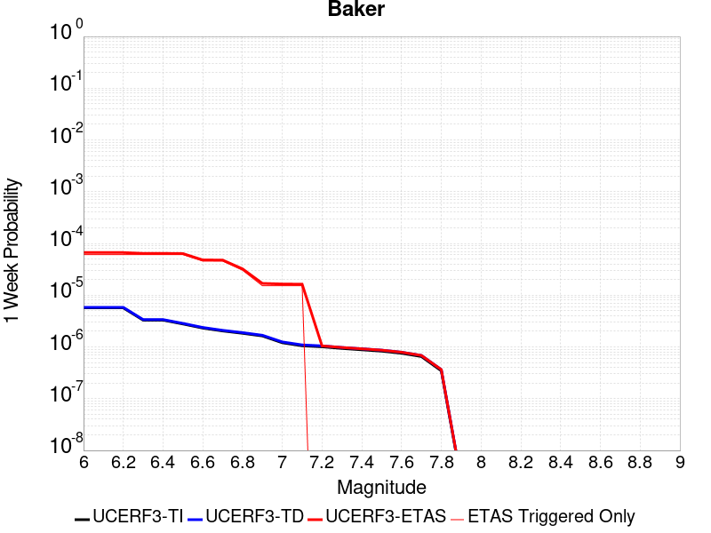 | 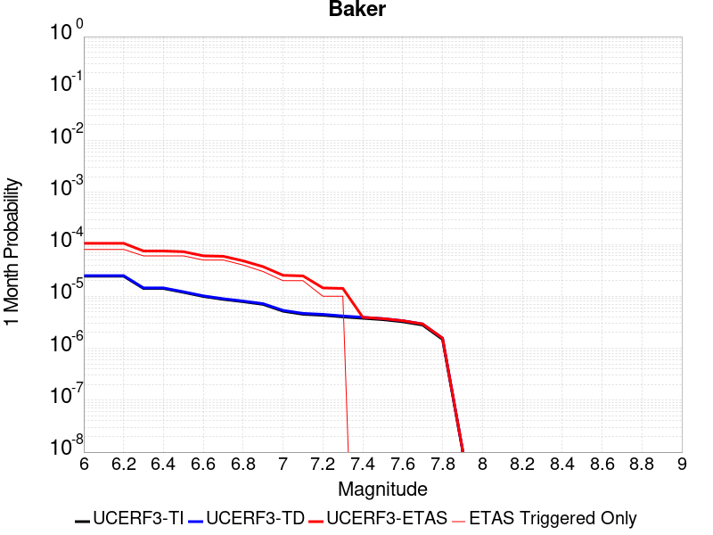 | 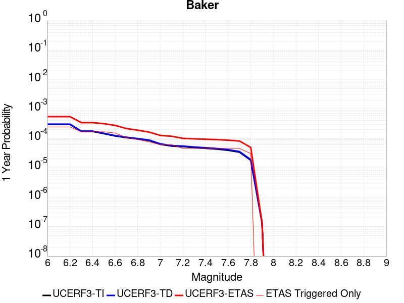 | 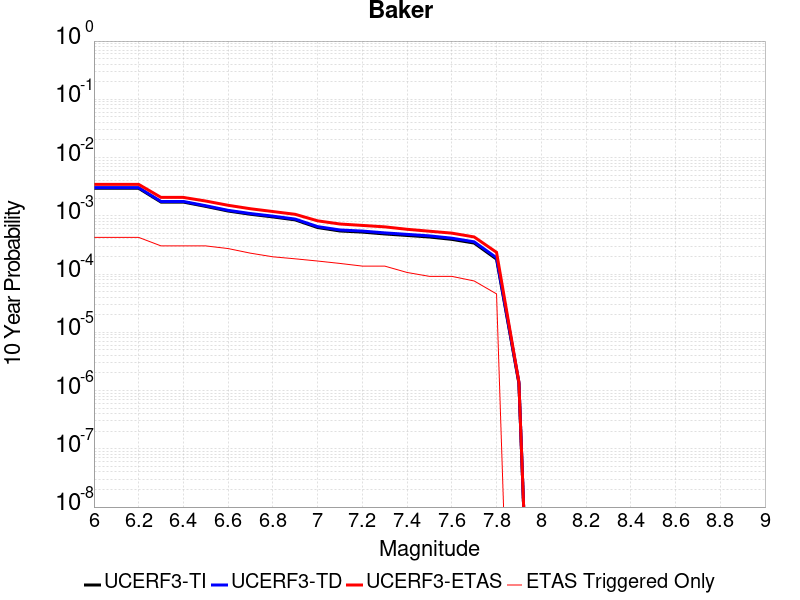 |

| Magnitude | 1 wk TI Prob | 1 wk TD Prob | 1 wk ETAS Prob | 1 wk ETAS/TD Gain | 1 wk ETAS Triggered Only | 1 mo TI Prob | 1 mo TD Prob | 1 mo ETAS Prob | 1 mo ETAS/TD Gain | 1 mo ETAS Triggered Only | 1 yr TI Prob | 1 yr TD Prob | 1 yr ETAS Prob | 1 yr ETAS/TD Gain | 1 yr ETAS Triggered Only | 10 yr TI Prob | 10 yr TD Prob | 10 yr ETAS Prob | 10 yr ETAS/TD Gain | 10 yr ETAS Triggered Only |
|-----|-----|-----|-----|-----|-----|-----|-----|-----|-----|-----|-----|-----|-----|-----|-----|-----|-----|-----|-----|-----|
| 6.0 | 5.695525E-6 | 5.8348373E-6 | 6.671728E-5 | 11.4343 | 6.08828E-5 | 2.4409164E-5 | 2.5006228E-5 | 1.3154847E-4 | 5.260628 | 1.065449E-4 | 2.9714106E-4 | 3.044123E-4 | 5.4786936E-4 | 1.7997609 | 2.435312E-4 | 0.0029674405 | 0.0030403486 | 0.0034652327 | 1.1397485 | 4.261796E-4 |
| 6.1 | 5.695525E-6 | 5.8348373E-6 | 6.671728E-5 | 11.4343 | 6.08828E-5 | 2.4409164E-5 | 2.5006228E-5 | 1.3154847E-4 | 5.260628 | 1.065449E-4 | 2.9714106E-4 | 3.044123E-4 | 5.4786936E-4 | 1.7997609 | 2.435312E-4 | 0.0029674405 | 0.0030403486 | 0.0034652327 | 1.1397485 | 4.261796E-4 |
| 6.2 | 5.695525E-6 | 5.8348373E-6 | 6.671728E-5 | 11.4343 | 6.08828E-5 | 2.4409164E-5 | 2.5006228E-5 | 1.3154847E-4 | 5.260628 | 1.065449E-4 | 2.9714106E-4 | 3.044123E-4 | 5.4786936E-4 | 1.7997609 | 2.435312E-4 | 0.0029674405 | 0.0030403486 | 0.0034652327 | 1.1397485 | 4.261796E-4 |
| 6.3 | 3.2995713E-6 | 3.383667E-6 | 6.426626E-5 | 18.99308 | 6.08828E-5 | 1.4140943E-5 | 1.4501353E-5 | 9.060375E-5 | 6.2479515 | 7.6103504E-5 | 1.7215237E-4 | 1.7654014E-4 | 3.4393827E-4 | 1.9482158 | 1.674277E-4 | 0.0017201907 | 0.001764046 | 0.002067923 | 1.1722614 | 3.0441402E-4 |
| 6.4 | 3.2995713E-6 | 3.383667E-6 | 6.426626E-5 | 18.99308 | 6.08828E-5 | 1.4140943E-5 | 1.4501353E-5 | 9.060375E-5 | 6.2479515 | 7.6103504E-5 | 1.7215237E-4 | 1.7654014E-4 | 3.4393827E-4 | 1.9482158 | 1.674277E-4 | 0.0017201907 | 0.001764046 | 0.002067923 | 1.1722614 | 3.0441402E-4 |
| 6.5 | 2.782202E-6 | 2.8558404E-6 | 6.3738466E-5 | 22.318638 | 6.08828E-5 | 1.1923668E-5 | 1.223926E-5 | 8.834183E-5 | 7.217906 | 7.6103504E-5 | 1.4516099E-4 | 1.4900314E-4 | 3.164059E-4 | 2.1234848 | 1.674277E-4 | 0.001450662 | 0.0014890651 | 0.0017930258 | 1.2041285 | 3.0441402E-4 |
| 6.6 | 2.3163404E-6 | 2.38092E-6 | 4.804291E-5 | 20.178297 | 4.5662102E-5 | 9.927136E-6 | 1.0203904E-5 | 7.1086084E-5 | 6.9665575 | 6.08828E-5 | 1.20856166E-4 | 1.2422565E-4 | 2.7641375E-4 | 2.2250938 | 1.5220701E-4 | 0.0012079047 | 0.0012415823 | 0.0015152148 | 1.2203901 | 2.739726E-4 |
| 6.7 | 2.037056E-6 | 2.0965003E-6 | 4.7758505E-5 | 22.780107 | 4.5662102E-5 | 8.7302105E-6 | 8.984972E-6 | 6.986722E-5 | 7.7760096 | 6.08828E-5 | 1.0628513E-4 | 1.093867E-4 | 2.1591995E-4 | 1.973914 | 1.065449E-4 | 0.0010623431 | 0.0010933448 | 0.0013214056 | 1.2085901 | 2.283105E-4 |
| 6.8 | 1.8356744E-6 | 1.8915287E-6 | 3.233287E-5 | 17.093513 | 3.04414E-5 | 7.867153E-6 | 8.106527E-6 | 5.3768257E-5 | 6.632712 | 4.5662102E-5 | 9.577837E-5 | 9.869264E-5 | 1.9000782E-4 | 1.9252483 | 9.1324204E-5 | 9.57371E-4 | 9.86502E-4 | 0.001184176 | 1.2003787 | 1.978691E-4 |
| 6.9 | 1.6310546E-6 | 1.6832072E-6 | 1.6903881E-5 | 10.042663 | 1.52207E-5 | 6.9902153E-6 | 7.213726E-6 | 3.7654907E-5 | 5.2198973 | 3.04414E-5 | 8.510255E-5 | 8.782368E-5 | 1.639205E-4 | 1.8664726 | 7.6103504E-5 | 8.5069967E-4 | 8.7790104E-4 | 0.0010603891 | 1.2078686 | 1.8264841E-4 |
| 7.0 | 1.2058036E-6 | 1.2508665E-6 | 1.6471547E-5 | 13.16811 | 1.52207E-5 | 5.1677193E-6 | 5.3608455E-6 | 2.0581465E-5 | 3.8392196 | 1.52207E-5 | 6.291517E-5 | 6.5266366E-5 | 1.261452E-4 | 1.9327749 | 6.08828E-5 | 6.289736E-4 | 6.524743E-4 | 8.1979274E-4 | 1.2564368 | 1.674277E-4 |
| 7.1 | 1.052382E-6 | 1.0951609E-6 | 1.6315844E-5 | 14.898126 | 1.52207E-5 | 4.5102006E-6 | 4.693538E-6 | 1.9914167E-5 | 4.2428904 | 1.52207E-5 | 5.491031E-5 | 5.7142337E-5 | 1.1802166E-4 | 2.0653977 | 6.08828E-5 | 5.4896745E-4 | 5.7127734E-4 | 7.2339736E-4 | 1.2662805 | 1.5220701E-4 |
| 7.2 | 1.0067454E-6 | 1.0487711E-6 | 1.0487711E-6 | 1.0 | 0.0 | 4.3146156E-6 | 4.4947255E-6 | 4.4947255E-6 | 1.0 | 0.0 | 5.252918E-5 | 5.4721917E-5 | 1.0038152E-4 | 1.8343934 | 4.5662102E-5 | 5.251676E-4 | 5.470853E-4 | 6.8399665E-4 | 1.250256 | 1.369863E-4 |
| 7.3 | 9.3596316E-7 | 9.767723E-7 | 9.767723E-7 | 1.0 | 0.0 | 4.0112645E-6 | 4.1861604E-6 | 4.1861604E-6 | 1.0 | 0.0 | 4.8836053E-5 | 5.096532E-5 | 9.6625095E-5 | 1.8958989 | 4.5662102E-5 | 4.8825322E-4 | 5.095371E-4 | 6.464536E-4 | 1.2687076 | 1.369863E-4 |
| 7.4 | 8.8117395E-7 | 9.2076635E-7 | 9.2076635E-7 | 1.0 | 0.0 | 3.7764542E-6 | 3.9461356E-6 | 3.9461356E-6 | 1.0 | 0.0 | 4.5977362E-5 | 4.8043148E-5 | 9.3703056E-5 | 1.9503937 | 4.5662102E-5 | 4.596785E-4 | 4.8032837E-4 | 5.868221E-4 | 1.2217102 | 1.065449E-4 |
| 7.5 | 8.292386E-7 | 8.6745956E-7 | 8.6745956E-7 | 1.0 | 0.0 | 3.5538749E-6 | 3.7176785E-6 | 3.7176785E-6 | 1.0 | 0.0 | 4.326757E-5 | 4.5261804E-5 | 9.0921836E-5 | 2.0087984 | 4.5662102E-5 | 4.3259145E-4 | 4.5252658E-4 | 5.438095E-4 | 1.2017182 | 9.1324204E-5 |
| 7.6 | 7.553842E-7 | 7.9144706E-7 | 7.9144706E-7 | 1.0 | 0.0 | 3.2373566E-6 | 3.3919116E-6 | 3.3919116E-6 | 1.0 | 0.0 | 3.9414106E-5 | 4.129575E-5 | 8.6955966E-5 | 2.105688 | 4.5662102E-5 | 3.9407116E-4 | 4.1288146E-4 | 5.041679E-4 | 1.2210962 | 9.1324204E-5 |
| 7.7 | 6.5285366E-7 | 6.852797E-7 | 6.852797E-7 | 1.0 | 0.0 | 2.797941E-6 | 2.9369096E-6 | 2.9369096E-6 | 1.0 | 0.0 | 3.40644E-5 | 3.5756293E-5 | 8.1416765E-5 | 2.2769911 | 4.5662102E-5 | 3.405918E-4 | 3.5750607E-4 | 4.3358238E-4 | 1.2127972 | 7.6103504E-5 |
| 7.8 | 3.4586725E-7 | 3.6482615E-7 | 3.6482615E-7 | 1.0 | 0.0 | 1.4822873E-6 | 1.5635396E-6 | 1.5635396E-6 | 1.0 | 0.0 | 1.80467E-5 | 1.9035933E-5 | 4.9476756E-5 | 2.5991242 | 3.04414E-5 | 1.8045233E-4 | 1.9034347E-4 | 2.3599688E-4 | 1.2398475 | 4.5662102E-5 |
| 7.9 | 2.5591178E-9 | 2.6696718E-9 | 2.6696718E-9 | 1.0 | 0.0 | 1.0967647E-8 | 1.14414505E-8 | 1.14414505E-8 | 1.0 | 0.0 | 1.335311E-7 | 1.3929966E-7 | 1.3929966E-7 | 1.0 | 0.0 | 1.3353102E-6 | 1.3929966E-6 | 1.3929966E-6 | 1.0 | 0.0 |

## Elsinore (Glen Ivy) rev
*[(top)](#table-of-contents)*

| 1 Week | 1 Month | 1 Year | 10 Year |
|-----|-----|-----|-----|
| 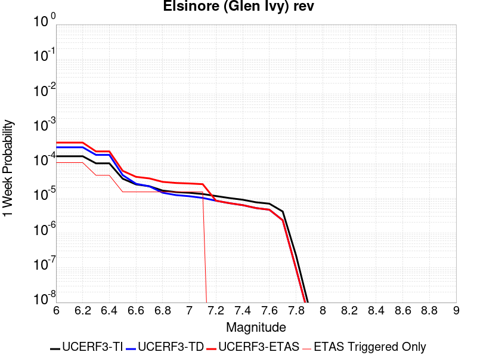 | 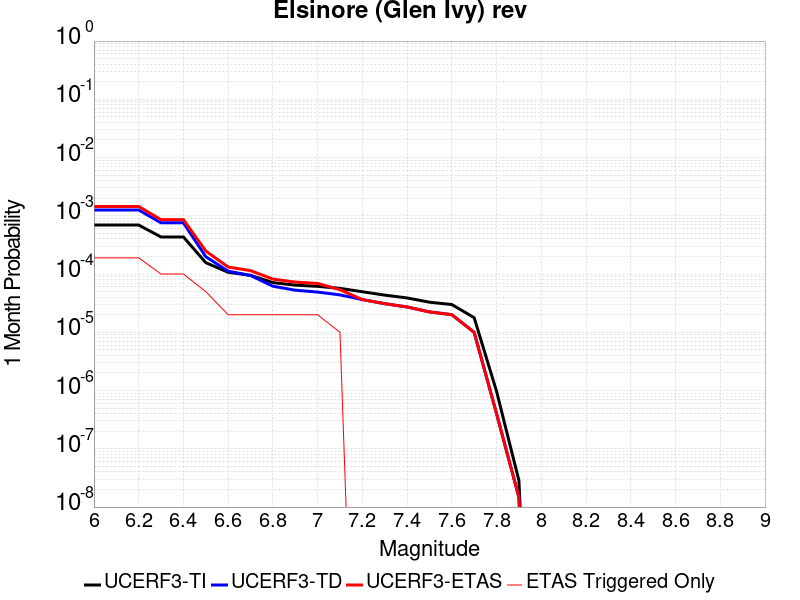 | 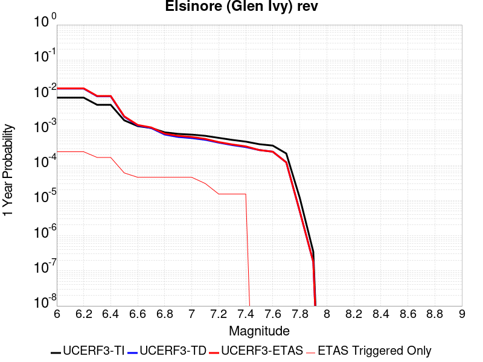 | 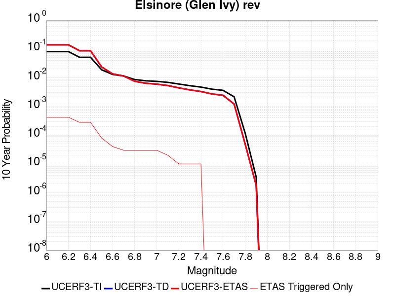 |

| Magnitude | 1 wk TI Prob | 1 wk TD Prob | 1 wk ETAS Prob | 1 wk ETAS/TD Gain | 1 wk ETAS Triggered Only | 1 mo TI Prob | 1 mo TD Prob | 1 mo ETAS Prob | 1 mo ETAS/TD Gain | 1 mo ETAS Triggered Only | 1 yr TI Prob | 1 yr TD Prob | 1 yr ETAS Prob | 1 yr ETAS/TD Gain | 1 yr ETAS Triggered Only | 10 yr TI Prob | 10 yr TD Prob | 10 yr ETAS Prob | 10 yr ETAS/TD Gain | 10 yr ETAS Triggered Only |
|-----|-----|-----|-----|-----|-----|-----|-----|-----|-----|-----|-----|-----|-----|-----|-----|-----|-----|-----|-----|-----|
| 6.0 | 1.6204086E-4 | 2.9360707E-4 | 4.0012068E-4 | 1.362776 | 1.065449E-4 | 6.94276E-4 | 0.0012578638 | 0.0014098794 | 1.1208521 | 1.5220701E-4 | 0.008420097 | 0.015234485 | 0.015474306 | 1.015742 | 2.435312E-4 | 0.081081145 | 0.13969168 | 0.13997975 | 1.0020622 | 3.348554E-4 |
| 6.1 | 1.6204086E-4 | 2.9360707E-4 | 4.0012068E-4 | 1.362776 | 1.065449E-4 | 6.94276E-4 | 0.0012578638 | 0.0014098794 | 1.1208521 | 1.5220701E-4 | 0.008420097 | 0.015234485 | 0.015474306 | 1.015742 | 2.435312E-4 | 0.081081145 | 0.13969168 | 0.13997975 | 1.0020622 | 3.348554E-4 |
| 6.2 | 1.6204086E-4 | 2.9360707E-4 | 4.0012068E-4 | 1.362776 | 1.065449E-4 | 6.94276E-4 | 0.0012578638 | 0.0014098794 | 1.1208521 | 1.5220701E-4 | 0.008420097 | 0.015234485 | 0.015474306 | 1.015742 | 2.435312E-4 | 0.081081145 | 0.13969168 | 0.13997975 | 1.0020622 | 3.348554E-4 |
| 6.3 | 1.0111737E-4 | 1.7703383E-4 | 2.2268784E-4 | 1.2578831 | 4.5662102E-5 | 4.332882E-4 | 7.5861247E-4 | 8.346582E-4 | 1.1002432 | 7.6103504E-5 | 0.005262531 | 0.009217682 | 0.009383567 | 1.0179963 | 1.674277E-4 | 0.0513964 | 0.0870191 | 0.087227546 | 1.0023954 | 2.283105E-4 |
| 6.4 | 1.0111737E-4 | 1.7703383E-4 | 2.2268784E-4 | 1.2578831 | 4.5662102E-5 | 4.332882E-4 | 7.5861247E-4 | 8.346582E-4 | 1.1002432 | 7.6103504E-5 | 0.005262531 | 0.009217682 | 0.009383567 | 1.0179963 | 1.674277E-4 | 0.0513964 | 0.0870191 | 0.087227546 | 1.0023954 | 2.283105E-4 |
| 6.5 | 3.6624708E-5 | 4.6391084E-5 | 6.161108E-5 | 1.3280802 | 1.52207E-5 | 1.569536E-4 | 1.9880582E-4 | 2.4445885E-4 | 1.2296362 | 4.5662102E-5 | 0.001909235 | 0.0024181372 | 0.0024788727 | 1.0251167 | 6.08828E-5 | 0.01892915 | 0.023739954 | 0.023814252 | 1.0031296 | 7.6103504E-5 |
| 6.6 | 2.5051324E-5 | 2.614772E-5 | 4.136802E-5 | 1.5820891 | 1.52207E-5 | 1.073584E-4 | 1.12057096E-4 | 1.4249509E-4 | 1.2716293 | 3.04414E-5 | 0.0013063047 | 0.0013634858 | 0.0014090857 | 1.0334436 | 4.5662102E-5 | 0.012986525 | 0.013564618 | 0.013609661 | 1.0033206 | 4.5662102E-5 |
| 6.7 | 2.2189772E-5 | 2.2072849E-5 | 3.729321E-5 | 1.6895515 | 1.52207E-5 | 9.509556E-5 | 9.4594696E-5 | 1.2503321E-4 | 1.3217783 | 3.04414E-5 | 0.0011571734 | 0.0011511183 | 0.0011967279 | 1.039622 | 4.5662102E-5 | 0.011511663 | 0.011465415 | 0.011510554 | 1.0039369 | 4.5662102E-5 |
| 6.8 | 1.6654378E-5 | 1.4437705E-5 | 2.9658186E-5 | 2.0542173 | 1.52207E-5 | 7.137396E-5 | 6.187444E-5 | 9.231396E-5 | 1.4919562 | 3.04414E-5 | 8.686314E-4 | 7.530661E-4 | 7.986938E-4 | 1.0605893 | 4.5662102E-5 | 0.008652439 | 0.00751048 | 0.0075557996 | 1.0060341 | 4.5662102E-5 |
| 6.9 | 1.5042909E-5 | 1.2332022E-5 | 2.7552534E-5 | 2.2342267 | 1.52207E-5 | 6.446802E-5 | 5.285047E-5 | 8.3290266E-5 | 1.5759606 | 3.04414E-5 | 7.8461546E-4 | 6.4326765E-4 | 6.889004E-4 | 1.070939 | 4.5662102E-5 | 0.007818509 | 0.00641828 | 0.006463649 | 1.0070688 | 4.5662102E-5 |
| 7.0 | 1.4361385E-5 | 1.1451324E-5 | 2.667185E-5 | 2.32915 | 1.52207E-5 | 6.154734E-5 | 4.9076196E-5 | 7.95161E-5 | 1.6202581 | 3.04414E-5 | 7.490812E-4 | 5.973418E-4 | 6.429766E-4 | 1.0763965 | 4.5662102E-5 | 0.007465612 | 0.0059613534 | 0.0060067433 | 1.007614 | 4.5662102E-5 |
| 7.1 | 1.3265571E-5 | 1.0244926E-5 | 2.546547E-5 | 2.4856665 | 1.52207E-5 | 5.6851208E-5 | 4.39061E-5 | 5.912613E-5 | 1.3466496 | 1.52207E-5 | 6.919436E-4 | 5.344282E-4 | 5.648533E-4 | 1.0569303 | 3.04414E-5 | 0.006897931 | 0.0053347866 | 0.0053650658 | 1.0056758 | 3.04414E-5 |
| 7.2 | 1.1596403E-5 | 8.505067E-6 | 8.505067E-6 | 1.0 | 0.0 | 4.9697923E-5 | 3.6449786E-5 | 3.6449786E-5 | 1.0 | 0.0 | 6.049042E-4 | 4.436875E-4 | 4.5890143E-4 | 1.0342898 | 1.52207E-5 | 0.006032603 | 0.0044294316 | 0.0044445847 | 1.0034211 | 1.52207E-5 |
| 7.3 | 1.0150827E-5 | 7.2387597E-6 | 7.2387597E-6 | 1.0 | 0.0 | 4.3502816E-5 | 3.1022897E-5 | 3.1022897E-5 | 1.0 | 0.0 | 5.2951806E-4 | 3.7763975E-4 | 3.9285468E-4 | 1.0402896 | 1.52207E-5 | 0.005282581 | 0.0037703665 | 0.0037855299 | 1.0040218 | 1.52207E-5 |
| 7.4 | 9.080705E-6 | 6.352519E-6 | 6.352519E-6 | 1.0 | 0.0 | 3.8916725E-5 | 2.7224805E-5 | 2.7224805E-5 | 1.0 | 0.0 | 4.7370812E-4 | 3.3141294E-4 | 3.466286E-4 | 1.0459114 | 1.52207E-5 | 0.004726996 | 0.0033093381 | 0.0033245084 | 1.0045841 | 1.52207E-5 |
| 7.5 | 7.671649E-6 | 5.2256332E-6 | 5.2256332E-6 | 1.0 | 0.0 | 3.287808E-5 | 2.2395385E-5 | 2.2395385E-5 | 1.0 | 0.0 | 4.0021708E-4 | 2.7263095E-4 | 2.7263095E-4 | 1.0 | 0.0 | 0.0039949706 | 0.00272309 | 0.00272309 | 1.0 | 0.0 |
| 7.6 | 6.990086E-6 | 4.687545E-6 | 4.687545E-6 | 1.0 | 0.0 | 2.9957167E-5 | 2.008933E-5 | 2.008933E-5 | 1.0 | 0.0 | 3.6466747E-4 | 2.445613E-4 | 2.445613E-4 | 1.0 | 0.0 | 0.0036406964 | 0.002443038 | 0.002443038 | 1.0 | 0.0 |
| 7.7 | 4.163505E-6 | 2.3295343E-6 | 2.3295343E-6 | 1.0 | 0.0 | 1.7843471E-5 | 9.983683E-6 | 9.983683E-6 | 1.0 | 0.0 | 2.172226E-4 | 1.21545316E-4 | 1.21545316E-4 | 1.0 | 0.0 | 0.0021701038 | 0.0012148614 | 0.0012148614 | 1.0 | 0.0 |
| 7.8 | 2.2692414E-7 | 9.3854695E-8 | 9.3854695E-8 | 1.0 | 0.0 | 9.725317E-7 | 4.0223435E-7 | 4.0223435E-7 | 1.0 | 0.0 | 1.1840509E-5 | 4.8971956E-6 | 4.8971956E-6 | 1.0 | 0.0 | 1.1839878E-4 | 4.8971204E-5 | 4.8971204E-5 | 1.0 | 0.0 |
| 7.9 | 6.676829E-9 | 3.439853E-9 | 3.439853E-9 | 1.0 | 0.0 | 2.861498E-8 | 1.4742227E-8 | 1.4742227E-8 | 1.0 | 0.0 | 3.4838732E-7 | 1.7948659E-7 | 1.7948659E-7 | 1.0 | 0.0 | 3.4838679E-6 | 1.7948646E-6 | 1.7948646E-6 | 1.0 | 0.0 |

## Cady
*[(top)](#table-of-contents)*

| 1 Week | 1 Month | 1 Year | 10 Year |
|-----|-----|-----|-----|
| 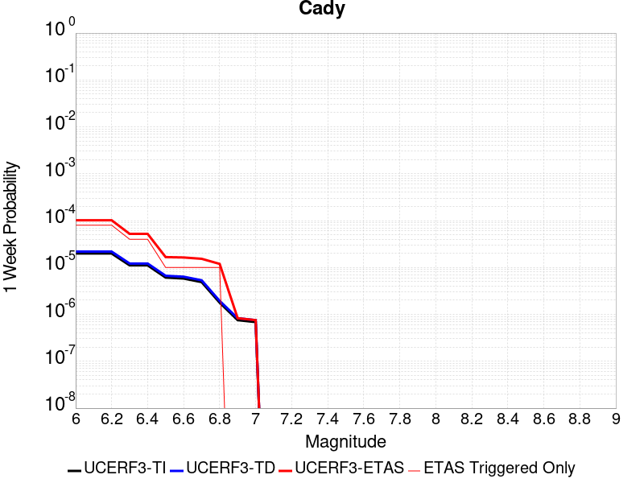 | 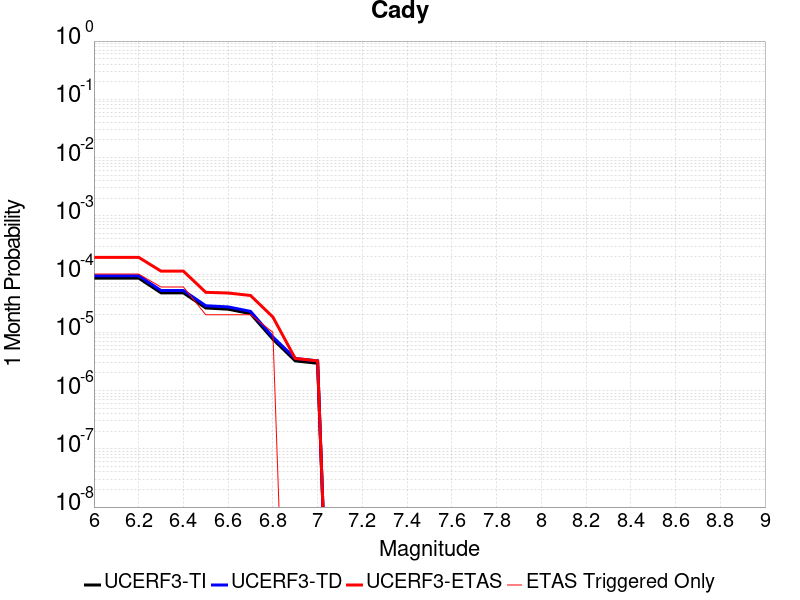 | 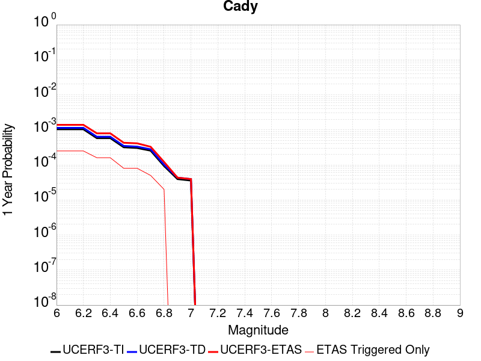 | 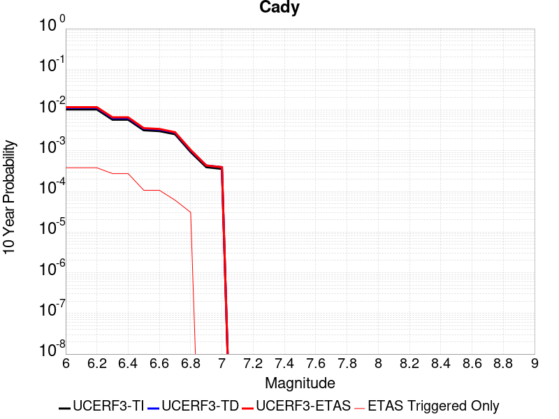 |

| Magnitude | 1 wk TI Prob | 1 wk TD Prob | 1 wk ETAS Prob | 1 wk ETAS/TD Gain | 1 wk ETAS Triggered Only | 1 mo TI Prob | 1 mo TD Prob | 1 mo ETAS Prob | 1 mo ETAS/TD Gain | 1 mo ETAS Triggered Only | 1 yr TI Prob | 1 yr TD Prob | 1 yr ETAS Prob | 1 yr ETAS/TD Gain | 1 yr ETAS Triggered Only | 10 yr TI Prob | 10 yr TD Prob | 10 yr ETAS Prob | 10 yr ETAS/TD Gain | 10 yr ETAS Triggered Only |
|-----|-----|-----|-----|-----|-----|-----|-----|-----|-----|-----|-----|-----|-----|-----|-----|-----|-----|-----|-----|-----|
| 6.0 | 1.9892565E-5 | 2.1858728E-5 | 1.284013E-4 | 5.874143 | 1.065449E-4 | 8.525106E-5 | 9.3677416E-5 | 2.3065088E-4 | 2.4621823 | 1.369863E-4 | 0.0010374374 | 0.0011400167 | 0.0013984736 | 1.2267133 | 2.587519E-4 | 0.010326075 | 0.011350701 | 0.011726899 | 1.0331432 | 3.805175E-4 |
| 6.1 | 1.9892565E-5 | 2.1858728E-5 | 1.284013E-4 | 5.874143 | 1.065449E-4 | 8.525106E-5 | 9.3677416E-5 | 2.3065088E-4 | 2.4621823 | 1.369863E-4 | 0.0010374374 | 0.0011400167 | 0.0013984736 | 1.2267133 | 2.587519E-4 | 0.010326075 | 0.011350701 | 0.011726899 | 1.0331432 | 3.805175E-4 |
| 6.2 | 1.9892565E-5 | 2.1858728E-5 | 1.284013E-4 | 5.874143 | 1.065449E-4 | 8.525106E-5 | 9.3677416E-5 | 2.3065088E-4 | 2.4621823 | 1.369863E-4 | 0.0010374374 | 0.0011400167 | 0.0013984736 | 1.2267133 | 2.587519E-4 | 0.010326075 | 0.011350701 | 0.011726899 | 1.0331432 | 3.805175E-4 |
| 6.3 | 1.1117327E-5 | 1.2176583E-5 | 7.305864E-5 | 5.9999294 | 6.08828E-5 | 4.764482E-5 | 5.2184492E-5 | 1.4350393E-4 | 2.7499344 | 9.1324204E-5 | 5.7992124E-4 | 6.351925E-4 | 8.1772485E-4 | 1.2873654 | 1.8264841E-4 | 0.0057841022 | 0.0063368753 | 0.006609112 | 1.0429606 | 2.739726E-4 |
| 6.4 | 1.1117327E-5 | 1.2176583E-5 | 7.305864E-5 | 5.9999294 | 6.08828E-5 | 4.764482E-5 | 5.2184492E-5 | 1.4350393E-4 | 2.7499344 | 9.1324204E-5 | 5.7992124E-4 | 6.351925E-4 | 8.1772485E-4 | 1.2873654 | 1.8264841E-4 | 0.0057841022 | 0.0063368753 | 0.006609112 | 1.0429606 | 2.739726E-4 |
| 6.5 | 6.103093E-6 | 6.672021E-6 | 2.189262E-5 | 3.2812576 | 1.52207E-5 | 2.615585E-5 | 2.8594131E-5 | 5.903466E-5 | 2.0645726 | 3.04414E-5 | 3.1840094E-4 | 3.480905E-4 | 4.2416752E-4 | 1.2185552 | 7.6103504E-5 | 0.0031794512 | 0.0034766865 | 0.003582861 | 1.030539 | 1.065449E-4 |
| 6.6 | 5.817237E-6 | 6.3656585E-6 | 2.1586262E-5 | 3.3910494 | 1.52207E-5 | 2.4930776E-5 | 2.728118E-5 | 5.7721747E-5 | 2.1158085 | 3.04414E-5 | 3.034899E-4 | 3.3211018E-4 | 4.081884E-4 | 1.2290753 | 7.6103504E-5 | 0.0030307577 | 0.0033173605 | 0.003423552 | 1.0320108 | 1.065449E-4 |
| 6.7 | 4.8846314E-6 | 5.3405684E-6 | 2.0561187E-5 | 3.85 | 1.52207E-5 | 2.0933967E-5 | 2.2888014E-5 | 5.332872E-5 | 2.3299844 | 3.04414E-5 | 2.5484123E-4 | 2.7863772E-4 | 3.242871E-4 | 1.1638305 | 4.5662102E-5 | 0.0025454918 | 0.0027840391 | 0.0028447525 | 1.0218077 | 6.08828E-5 |
| 6.8 | 1.7788773E-6 | 1.9399079E-6 | 1.7160579E-5 | 8.846079 | 1.52207E-5 | 7.6237375E-6 | 8.313874E-6 | 2.3534447E-5 | 2.830744 | 1.52207E-5 | 9.281505E-5 | 1.01218284E-4 | 1.1643745E-4 | 1.1503597 | 1.52207E-5 | 9.2776294E-4 | 0.0010118765 | 0.0010422871 | 1.0300536 | 3.04414E-5 |
| 6.9 | 7.5455404E-7 | 8.297092E-7 | 8.297092E-7 | 1.0 | 0.0 | 3.233799E-6 | 3.5558937E-6 | 3.5558937E-6 | 1.0 | 0.0 | 3.937079E-5 | 4.3292483E-5 | 4.3292483E-5 | 1.0 | 0.0 | 3.9363815E-4 | 4.3287344E-4 | 4.3287344E-4 | 1.0 | 0.0 |
| 7.0 | 6.8578805E-7 | 7.541816E-7 | 7.541816E-7 | 1.0 | 0.0 | 2.9390883E-6 | 3.2322048E-6 | 3.2322048E-6 | 1.0 | 0.0 | 3.578281E-5 | 3.9351715E-5 | 3.9351715E-5 | 1.0 | 0.0 | 3.577705E-4 | 3.9347992E-4 | 3.9347992E-4 | 1.0 | 0.0 |

## White Wolf (Extension)
*[(top)](#table-of-contents)*

| 1 Week | 1 Month | 1 Year | 10 Year |
|-----|-----|-----|-----|
| 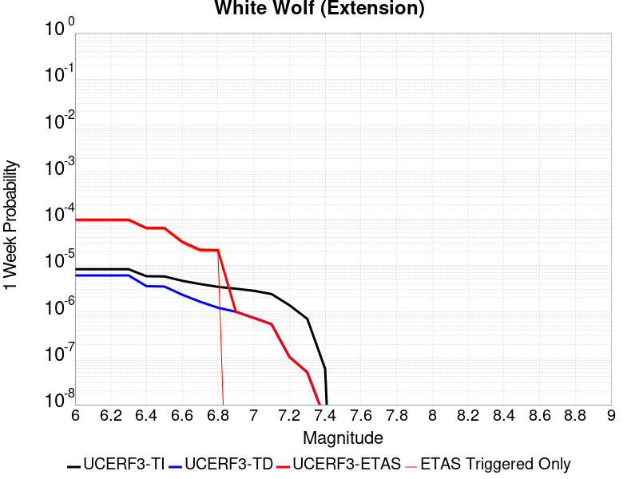 | 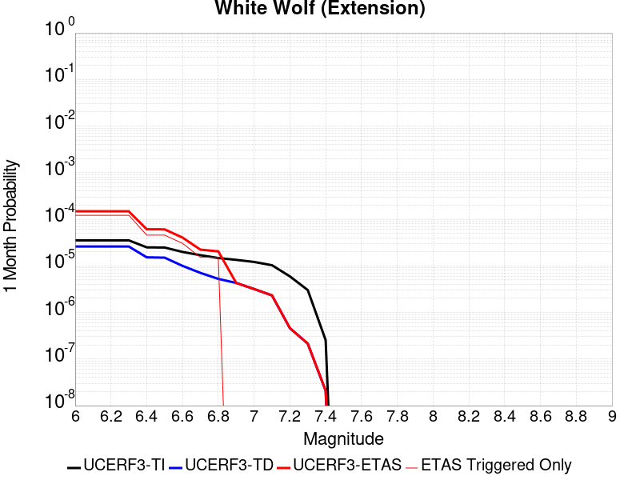 | 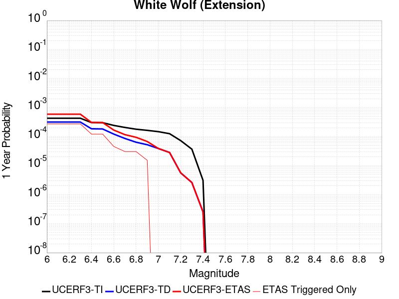 | 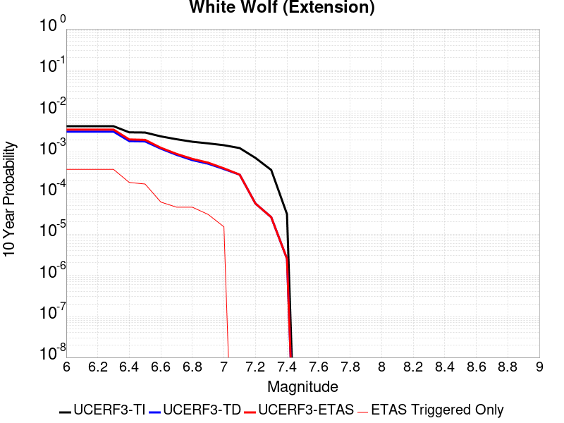 |

| Magnitude | 1 wk TI Prob | 1 wk TD Prob | 1 wk ETAS Prob | 1 wk ETAS/TD Gain | 1 wk ETAS Triggered Only | 1 mo TI Prob | 1 mo TD Prob | 1 mo ETAS Prob | 1 mo ETAS/TD Gain | 1 mo ETAS Triggered Only | 1 yr TI Prob | 1 yr TD Prob | 1 yr ETAS Prob | 1 yr ETAS/TD Gain | 1 yr ETAS Triggered Only | 10 yr TI Prob | 10 yr TD Prob | 10 yr ETAS Prob | 10 yr ETAS/TD Gain | 10 yr ETAS Triggered Only |
|-----|-----|-----|-----|-----|-----|-----|-----|-----|-----|-----|-----|-----|-----|-----|-----|-----|-----|-----|-----|-----|
| 6.0 | 8.222555E-6 | 6.0666657E-6 | 8.21697E-5 | 13.544459 | 7.6103504E-5 | 3.5239045E-5 | 2.5999774E-5 | 1.4776221E-4 | 5.6832113 | 1.217656E-4 | 4.289509E-4 | 3.1650788E-4 | 5.903938E-4 | 1.8653367 | 2.739726E-4 | 0.0042812387 | 0.003161223 | 0.0035405376 | 1.1199899 | 3.805175E-4 |
| 6.1 | 8.222555E-6 | 6.0666657E-6 | 8.21697E-5 | 13.544459 | 7.6103504E-5 | 3.5239045E-5 | 2.5999774E-5 | 1.4776221E-4 | 5.6832113 | 1.217656E-4 | 4.289509E-4 | 3.1650788E-4 | 5.903938E-4 | 1.8653367 | 2.739726E-4 | 0.0042812387 | 0.003161223 | 0.0035405376 | 1.1199899 | 3.805175E-4 |
| 6.2 | 8.222555E-6 | 6.0666657E-6 | 8.21697E-5 | 13.544459 | 7.6103504E-5 | 3.5239045E-5 | 2.5999774E-5 | 1.4776221E-4 | 5.6832113 | 1.217656E-4 | 4.289509E-4 | 3.1650788E-4 | 5.903938E-4 | 1.8653367 | 2.739726E-4 | 0.0042812387 | 0.003161223 | 0.0035405376 | 1.1199899 | 3.805175E-4 |
| 6.3 | 8.222555E-6 | 6.0666657E-6 | 8.21697E-5 | 13.544459 | 7.6103504E-5 | 3.5239045E-5 | 2.5999774E-5 | 1.4776221E-4 | 5.6832113 | 1.217656E-4 | 4.289509E-4 | 3.1650788E-4 | 5.903938E-4 | 1.8653367 | 2.739726E-4 | 0.0042812387 | 0.003161223 | 0.0035405376 | 1.1199899 | 3.805175E-4 |
| 6.4 | 5.821773E-6 | 3.5571766E-6 | 3.399847E-5 | 9.557712 | 3.04414E-5 | 2.4950215E-5 | 1.5244959E-5 | 6.0906365E-5 | 3.9951806 | 4.5662102E-5 | 3.0372653E-4 | 1.8559267E-4 | 3.0733566E-4 | 1.6559688 | 1.217656E-4 | 0.0030331176 | 0.001854485 | 0.0020367948 | 1.0983075 | 1.8264841E-4 |
| 6.5 | 5.766023E-6 | 3.4991106E-6 | 3.3940403E-5 | 9.699723 | 3.04414E-5 | 2.4711293E-5 | 1.4996108E-5 | 6.0657523E-5 | 4.044884 | 4.5662102E-5 | 3.0081844E-4 | 1.8256342E-4 | 3.043068E-4 | 1.6668552 | 1.217656E-4 | 0.0030041158 | 0.0018242426 | 0.0019913649 | 1.0916119 | 1.674277E-4 |
| 6.6 | 4.643576E-6 | 2.332624E-6 | 1.755329E-5 | 7.5251255 | 1.52207E-5 | 1.9900888E-5 | 9.996925E-6 | 4.043802E-5 | 4.0450463 | 3.04414E-5 | 2.4226638E-4 | 1.2170619E-4 | 1.6736273E-4 | 1.3751374 | 4.5662102E-5 | 0.0024200242 | 0.0012164378 | 0.0012772465 | 1.0499892 | 6.08828E-5 |
| 6.7 | 3.9529173E-6 | 1.6483477E-6 | 1.6869022E-5 | 10.233898 | 1.52207E-5 | 1.6940963E-5 | 7.0643296E-6 | 2.2284923E-5 | 3.15457 | 1.52207E-5 | 2.0623671E-4 | 8.6005006E-5 | 1.16443785E-4 | 1.3539187 | 3.04414E-5 | 0.002060454 | 8.597357E-4 | 9.053586E-4 | 1.0530661 | 4.5662102E-5 |
| 6.8 | 3.4377522E-6 | 1.2245237E-6 | 1.6445205E-5 | 13.429879 | 1.52207E-5 | 1.473314E-5 | 5.2479486E-6 | 2.046857E-5 | 3.900299 | 1.52207E-5 | 1.7936122E-4 | 6.3891996E-5 | 9.433145E-5 | 1.4764205 | 3.04414E-5 | 0.0017921652 | 6.387454E-4 | 6.8437826E-4 | 1.0714415 | 4.5662102E-5 |
| 6.9 | 3.1367306E-6 | 1.0033783E-6 | 1.0033783E-6 | 1.0 | 0.0 | 1.3443062E-5 | 4.3001864E-6 | 4.3001864E-6 | 1.0 | 0.0 | 1.63657E-4 | 5.235359E-5 | 6.757349E-5 | 1.2907137 | 1.52207E-5 | 0.0016353652 | 5.2342017E-4 | 5.5384566E-4 | 1.0581282 | 3.04414E-5 |
| 7.0 | 2.8298145E-6 | 7.4286646E-7 | 7.4286646E-7 | 1.0 | 0.0 | 1.2127721E-5 | 3.1837099E-6 | 3.1837099E-6 | 1.0 | 0.0 | 1.47645E-4 | 3.8761027E-5 | 3.8761027E-5 | 1.0 | 0.0 | 0.0014754693 | 3.8754768E-4 | 4.0276247E-4 | 1.0392592 | 1.52207E-5 |
| 7.1 | 2.4091064E-6 | 5.4227525E-7 | 5.4227525E-7 | 1.0 | 0.0 | 1.03247E-5 | 2.3240348E-6 | 2.3240348E-6 | 1.0 | 0.0 | 1.2569598E-4 | 2.8294799E-5 | 2.8294799E-5 | 1.0 | 0.0 | 0.001256249 | 2.8291598E-4 | 2.8291598E-4 | 1.0 | 0.0 |
| 7.2 | 1.3875518E-6 | 1.0743063E-7 | 1.0743063E-7 | 1.0 | 0.0 | 5.9466374E-6 | 4.6041689E-7 | 4.6041689E-7 | 1.0 | 0.0 | 7.23979E-5 | 5.6055624E-6 | 5.6055624E-6 | 1.0 | 0.0 | 7.2374323E-4 | 5.6054323E-5 | 5.6054323E-5 | 1.0 | 0.0 |
| 7.3 | 7.056077E-7 | 5.002034E-8 | 5.002034E-8 | 1.0 | 0.0 | 3.0240296E-6 | 2.1437286E-7 | 2.1437286E-7 | 1.0 | 0.0 | 3.681694E-5 | 2.609987E-6 | 2.609987E-6 | 1.0 | 0.0 | 3.681084E-4 | 2.609961E-5 | 2.609961E-5 | 1.0 | 0.0 |
| 7.4 | 5.9334678E-8 | 4.8683537E-9 | 4.8683537E-9 | 1.0 | 0.0 | 2.5429145E-7 | 2.0864372E-8 | 2.0864372E-8 | 1.0 | 0.0 | 3.095994E-6 | 2.5402372E-7 | 2.5402372E-7 | 1.0 | 0.0 | 3.095951E-5 | 2.5402353E-6 | 2.5402353E-6 | 1.0 | 0.0 |

## San Andreas (Creeping Section) 2011 CFM
*[(top)](#table-of-contents)*

| 1 Week | 1 Month | 1 Year | 10 Year |
|-----|-----|-----|-----|
| 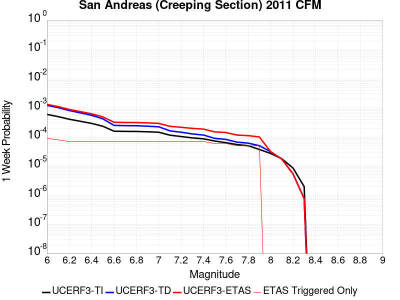 | 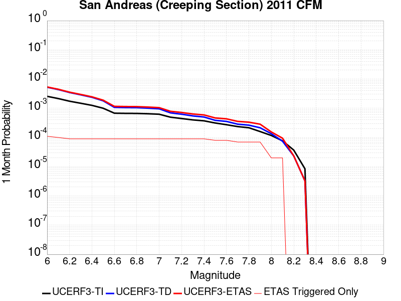 | 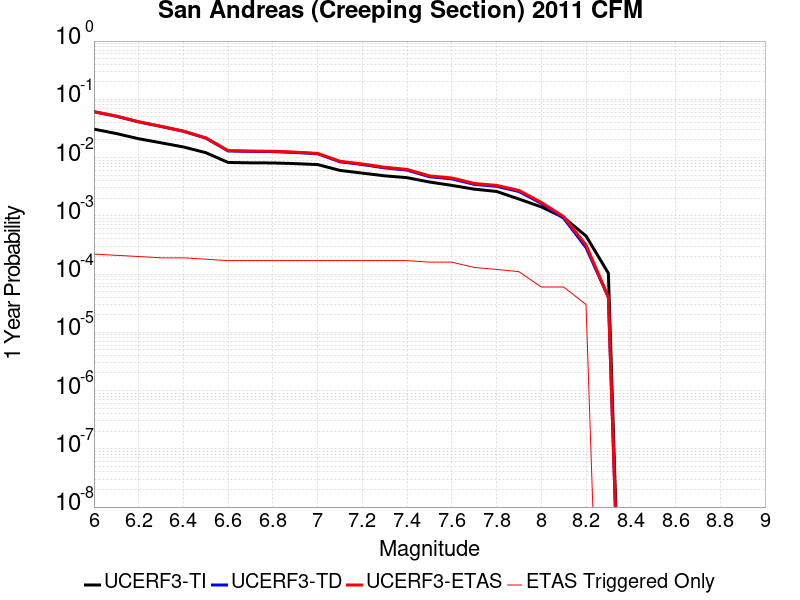 | 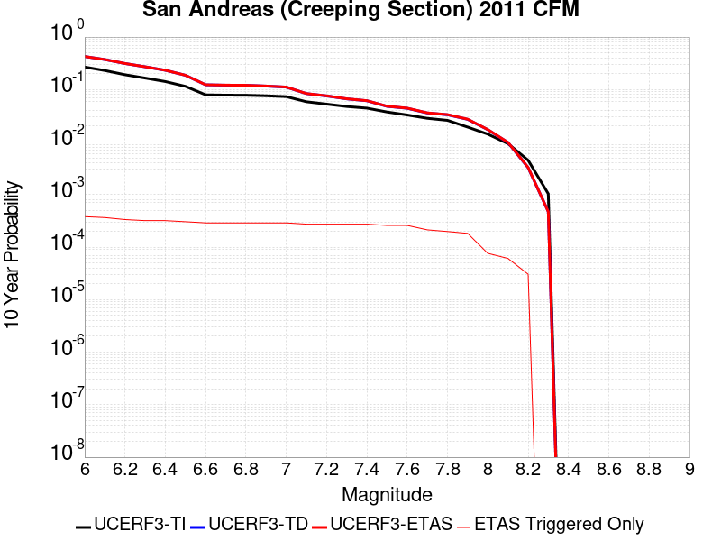 |

| Magnitude | 1 wk TI Prob | 1 wk TD Prob | 1 wk ETAS Prob | 1 wk ETAS/TD Gain | 1 wk ETAS Triggered Only | 1 mo TI Prob | 1 mo TD Prob | 1 mo ETAS Prob | 1 mo ETAS/TD Gain | 1 mo ETAS Triggered Only | 1 yr TI Prob | 1 yr TD Prob | 1 yr ETAS Prob | 1 yr ETAS/TD Gain | 1 yr ETAS Triggered Only | 10 yr TI Prob | 10 yr TD Prob | 10 yr ETAS Prob | 10 yr ETAS/TD Gain | 10 yr ETAS Triggered Only |
|-----|-----|-----|-----|-----|-----|-----|-----|-----|-----|-----|-----|-----|-----|-----|-----|-----|-----|-----|-----|-----|
| 6.0 | 5.986481E-4 | 0.001228691 | 0.0013351049 | 1.0866076 | 1.065449E-4 | 0.0025631124 | 0.005246795 | 0.0053830626 | 1.0259715 | 1.369863E-4 | 0.030762846 | 0.061203245 | 0.06146045 | 1.0042025 | 2.739726E-4 | 0.26835477 | 0.425928 | 0.42614645 | 1.0005128 | 3.805175E-4 |
| 6.1 | 5.015945E-4 | 0.0010230356 | 0.0011142663 | 1.0891765 | 9.1324204E-5 | 0.00214792 | 0.004369436 | 0.0044906694 | 1.0277458 | 1.217656E-4 | 0.025839351 | 0.051246606 | 0.0514921 | 1.0047904 | 2.587519E-4 | 0.23032776 | 0.37284943 | 0.37307855 | 1.0006144 | 3.6529682E-4 |
| 6.2 | 4.073338E-4 | 8.1157376E-4 | 8.876155E-4 | 1.0936966 | 7.6103504E-5 | 0.0017445484 | 0.0034683137 | 0.003574489 | 1.030613 | 1.065449E-4 | 0.021034058 | 0.04093177 | 0.041165333 | 1.0057062 | 2.435312E-4 | 0.19150782 | 0.31302592 | 0.31325594 | 1.0007349 | 3.348554E-4 |
| 6.3 | 3.464099E-4 | 6.7455834E-4 | 7.506105E-4 | 1.1127436 | 7.6103504E-5 | 0.0014837692 | 0.0028832308 | 0.0029894686 | 1.0368468 | 1.065449E-4 | 0.017915873 | 0.034187846 | 0.034408353 | 1.0064498 | 2.283105E-4 | 0.16538359 | 0.27130842 | 0.27154133 | 1.0008585 | 3.196347E-4 |
| 6.4 | 2.935057E-4 | 5.5516965E-4 | 6.312309E-4 | 1.1370054 | 7.6103504E-5 | 0.0012572751 | 0.0023727308 | 0.0024790228 | 1.0447974 | 1.065449E-4 | 0.015200248 | 0.02826279 | 0.028484648 | 1.0078498 | 2.283105E-4 | 0.14201577 | 0.23297668 | 0.23322184 | 1.0010524 | 3.196347E-4 |
| 6.5 | 2.3409708E-4 | 4.2132285E-4 | 4.973943E-4 | 1.1805538 | 7.6103504E-5 | 0.0010028875 | 0.0018017791 | 0.0019081321 | 1.0590266 | 1.065449E-4 | 0.012141965 | 0.021586355 | 0.021794844 | 1.0096585 | 2.130898E-4 | 0.11499573 | 0.1868149 | 0.18706246 | 1.0013251 | 3.0441402E-4 |
| 6.6 | 1.5842178E-4 | 2.5068692E-4 | 3.2677135E-4 | 1.3035038 | 7.6103504E-5 | 6.7877385E-4 | 0.0010739256 | 0.0011803561 | 1.0991042 | 1.065449E-4 | 0.0082328 | 0.012995283 | 0.0131905805 | 1.0150284 | 1.978691E-4 | 0.07934396 | 0.12313759 | 0.123391174 | 1.0020593 | 2.891933E-4 |
| 6.7 | 1.5616413E-4 | 2.4605254E-4 | 3.2213732E-4 | 1.3092216 | 7.6103504E-5 | 6.691031E-4 | 0.0010540807 | 0.0011605133 | 1.1009719 | 1.065449E-4 | 0.0081159435 | 0.012757154 | 0.012952499 | 1.0153126 | 1.978691E-4 | 0.0782586 | 0.12116472 | 0.12141887 | 1.0020976 | 2.891933E-4 |
| 6.8 | 1.5538467E-4 | 2.442914E-4 | 3.2037633E-4 | 1.3114514 | 7.6103504E-5 | 6.6576427E-4 | 0.001046539 | 0.0011529725 | 1.1017003 | 1.065449E-4 | 0.008075596 | 0.012666538 | 0.012861901 | 1.0154235 | 1.978691E-4 | 0.07788358 | 0.12039561 | 0.12064998 | 1.0021129 | 2.891933E-4 |
| 6.9 | 1.5153569E-4 | 2.3538464E-4 | 3.114702E-4 | 1.3232394 | 7.6103504E-5 | 6.49277E-4 | 0.0010084033 | 0.0011148407 | 1.1055505 | 1.065449E-4 | 0.007876333 | 0.012208726 | 0.01240418 | 1.0160093 | 1.978691E-4 | 0.07602952 | 0.11646574 | 0.11672126 | 1.0021939 | 2.891933E-4 |
| 7.0 | 1.4588932E-4 | 2.2395732E-4 | 3.000438E-4 | 1.3397365 | 7.6103504E-5 | 6.250901E-4 | 9.59466E-4 | 0.0010659087 | 1.1109395 | 1.065449E-4 | 0.0075839474 | 0.011619428 | 0.0118149975 | 1.0168313 | 1.978691E-4 | 0.073302895 | 0.11131206 | 0.11156907 | 1.0023088 | 2.891933E-4 |
| 7.1 | 1.1565079E-4 | 1.6281323E-4 | 2.3890434E-4 | 1.4673522 | 7.6103504E-5 | 4.955521E-4 | 6.9758523E-4 | 8.040558E-4 | 1.1526273 | 1.065449E-4 | 0.006016669 | 0.008460228 | 0.008656424 | 1.0231903 | 1.978691E-4 | 0.058563538 | 0.08366478 | 0.08391584 | 1.0030006 | 2.739726E-4 |
| 7.2 | 1.0393792E-4 | 1.4615392E-4 | 2.222463E-4 | 1.5206318 | 7.6103504E-5 | 4.4537216E-4 | 6.262243E-4 | 7.327025E-4 | 1.170032 | 1.065449E-4 | 0.005408933 | 0.0075977976 | 0.007794163 | 1.025845 | 1.978691E-4 | 0.052791595 | 0.07561503 | 0.07586829 | 1.0033493 | 2.739726E-4 |
| 7.3 | 9.332884E-5 | 1.2780601E-4 | 2.0389978E-4 | 1.595385 | 7.6103504E-5 | 3.999194E-4 | 5.4762565E-4 | 6.541122E-4 | 1.1944513 | 1.065449E-4 | 0.0048581534 | 0.0066470946 | 0.0068436484 | 1.0295699 | 1.978691E-4 | 0.047533102 | 0.06647954 | 0.066735305 | 1.0038472 | 2.739726E-4 |
| 7.4 | 8.670252E-5 | 1.1702972E-4 | 1.9312432E-4 | 1.650216 | 7.6103504E-5 | 3.715293E-4 | 5.014601E-4 | 6.079516E-4 | 1.2123628 | 1.065449E-4 | 0.004513991 | 0.0060883067 | 0.0062849713 | 1.032302 | 1.978691E-4 | 0.044233937 | 0.061148684 | 0.061405905 | 1.0042064 | 2.739726E-4 |
| 7.5 | 7.3036405E-5 | 9.005699E-5 | 1.509343E-4 | 1.6759866 | 6.08828E-5 | 3.129756E-4 | 3.859015E-4 | 4.7719045E-4 | 1.2365602 | 9.1324204E-5 | 0.0038038217 | 0.0046882504 | 0.0048700427 | 1.0387762 | 1.8264841E-4 | 0.03739367 | 0.047875606 | 0.04812197 | 1.0051459 | 2.587519E-4 |
| 7.6 | 6.3935775E-5 | 8.280209E-5 | 1.4367985E-4 | 1.7352201 | 6.08828E-5 | 2.7398168E-4 | 3.5481792E-4 | 4.461097E-4 | 1.2572919 | 9.1324204E-5 | 0.0033306254 | 0.00431137 | 0.004493231 | 1.0421817 | 1.8264841E-4 | 0.032811474 | 0.043990135 | 0.044237506 | 1.0056233 | 2.587519E-4 |
| 7.7 | 5.5050095E-5 | 6.661729E-5 | 1.2749604E-4 | 1.9138579 | 6.08828E-5 | 2.3590765E-4 | 2.8547147E-4 | 3.767696E-4 | 1.3198153 | 9.1324204E-5 | 0.0028683927 | 0.0034700802 | 0.003621759 | 1.0437105 | 1.5220701E-4 | 0.0283165 | 0.03579509 | 0.03600055 | 1.0057399 | 2.130898E-4 |
| 7.8 | 5.027131E-5 | 6.1627725E-5 | 1.2250677E-4 | 1.9878516 | 6.08828E-5 | 2.1543067E-4 | 2.640921E-4 | 3.5539217E-4 | 1.345713 | 9.1324204E-5 | 0.0026197135 | 0.003210584 | 0.0033471305 | 1.0425301 | 1.369863E-4 | 0.025890453 | 0.03312572 | 0.033317033 | 1.0057755 | 1.978691E-4 |
| 7.9 | 3.7271806E-5 | 5.0224386E-5 | 1.1110413E-4 | 2.212155 | 6.08828E-5 | 1.5972654E-4 | 2.1522962E-4 | 3.0653417E-4 | 1.4242193 | 9.1324204E-5 | 0.0019429359 | 0.0026172737 | 0.0027387205 | 1.0464021 | 1.217656E-4 | 0.019260362 | 0.027066687 | 0.027244393 | 1.0065655 | 1.8264841E-4 |
| 8.0 | 2.7310243E-5 | 3.1428404E-5 | 3.1428404E-5 | 1.0 | 0.0 | 1.17038646E-4 | 1.3468621E-4 | 1.651235E-4 | 1.2259867 | 3.04414E-5 | 0.0014240141 | 0.0016385721 | 0.0016993551 | 1.0370951 | 6.08828E-5 | 0.014149235 | 0.01721387 | 0.017288662 | 1.0043449 | 7.6103504E-5 |
| 8.1 | 1.7940547E-5 | 1.7400796E-5 | 1.7400796E-5 | 1.0 | 0.0 | 7.688579E-5 | 7.457271E-5 | 1.05011844E-4 | 1.4081806 | 3.04414E-5 | 9.3568244E-4 | 9.075451E-4 | 9.683727E-4 | 1.0670242 | 6.08828E-5 | 0.009317525 | 0.009799073 | 0.00985936 | 1.0061523 | 6.08828E-5 |
| 8.2 | 8.643924E-6 | 5.4748625E-6 | 5.4748625E-6 | 1.0 | 0.0 | 3.704486E-5 | 2.3463486E-5 | 2.3463486E-5 | 1.0 | 0.0 | 4.5092785E-4 | 2.8563058E-4 | 3.1606326E-4 | 1.1065457 | 3.04414E-5 | 0.0045001395 | 0.0032487072 | 0.0032790496 | 1.0093399 | 3.04414E-5 |
| 8.3 | 1.983087E-6 | 7.6599065E-7 | 7.6599065E-7 | 1.0 | 0.0 | 8.498917E-6 | 3.282813E-6 | 3.282813E-6 | 1.0 | 0.0 | 1.034694E-4 | 3.9967534E-5 | 3.9967534E-5 | 1.0 | 0.0 | 0.0010342124 | 4.719687E-4 | 4.719687E-4 | 1.0 | 0.0 |

## Ludlow
*[(top)](#table-of-contents)*

| 1 Week | 1 Month | 1 Year | 10 Year |
|-----|-----|-----|-----|
| 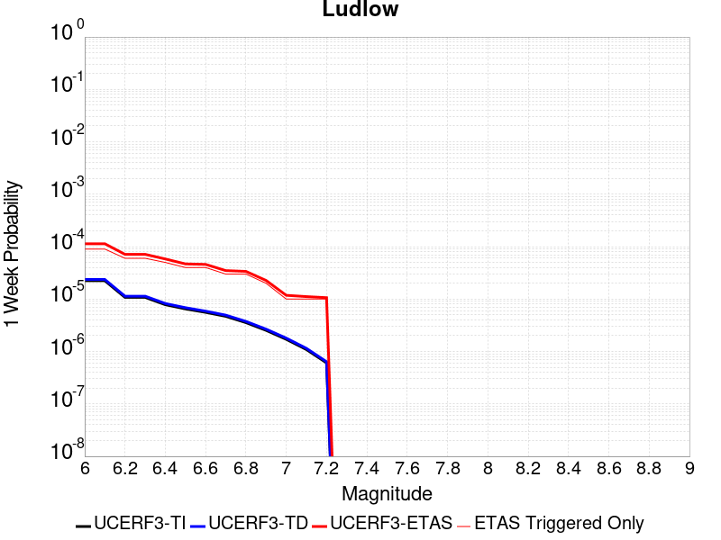 | 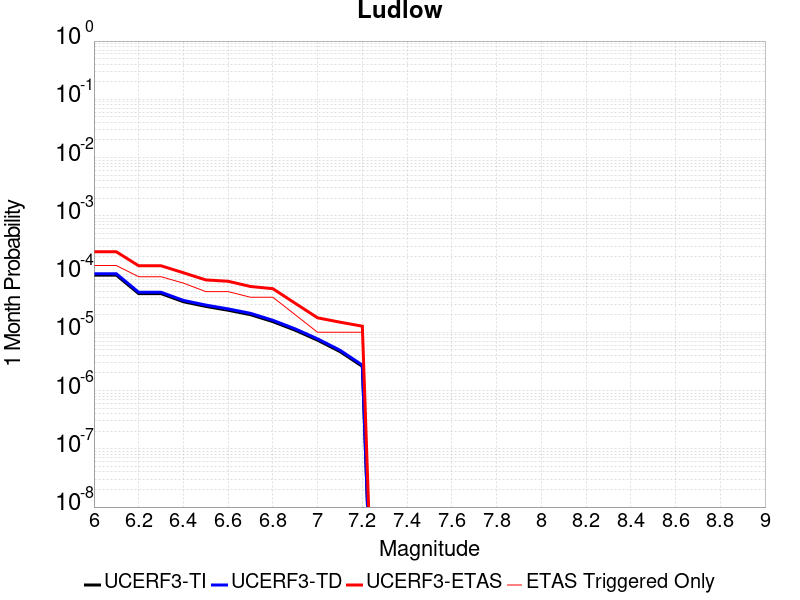 | 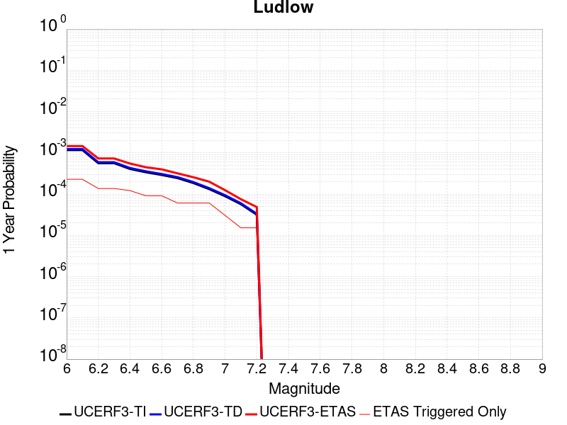 | 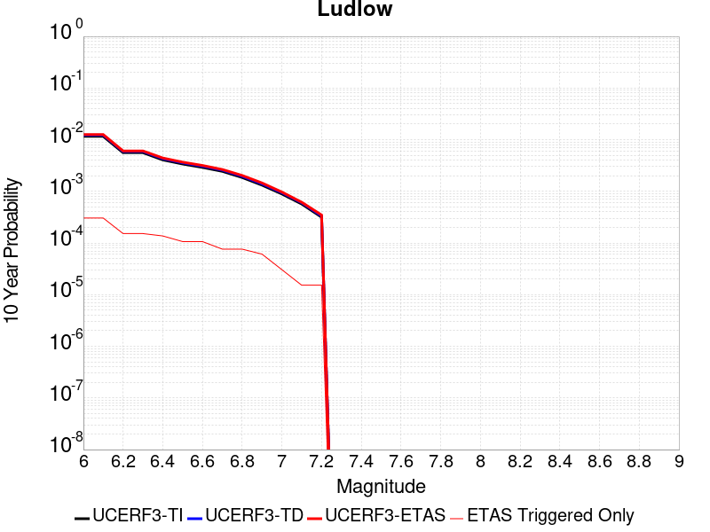 |

| Magnitude | 1 wk TI Prob | 1 wk TD Prob | 1 wk ETAS Prob | 1 wk ETAS/TD Gain | 1 wk ETAS Triggered Only | 1 mo TI Prob | 1 mo TD Prob | 1 mo ETAS Prob | 1 mo ETAS/TD Gain | 1 mo ETAS Triggered Only | 1 yr TI Prob | 1 yr TD Prob | 1 yr ETAS Prob | 1 yr ETAS/TD Gain | 1 yr ETAS Triggered Only | 10 yr TI Prob | 10 yr TD Prob | 10 yr ETAS Prob | 10 yr ETAS/TD Gain | 10 yr ETAS Triggered Only |
|-----|-----|-----|-----|-----|-----|-----|-----|-----|-----|-----|-----|-----|-----|-----|-----|-----|-----|-----|-----|-----|
| 6.0 | 2.2407607E-5 | 2.3657254E-5 | 1.14979295E-4 | 4.8602133 | 9.1324204E-5 | 9.602906E-5 | 1.0138454E-4 | 2.2313779E-4 | 2.2009056 | 1.217656E-4 | 0.0011685267 | 0.001233702 | 0.0014617308 | 1.184833 | 2.283105E-4 | 0.011624013 | 0.012273042 | 0.01257372 | 1.024499 | 3.0441402E-4 |
| 6.1 | 2.2407607E-5 | 2.3657254E-5 | 1.14979295E-4 | 4.8602133 | 9.1324204E-5 | 9.602906E-5 | 1.0138454E-4 | 2.2313779E-4 | 2.2009056 | 1.217656E-4 | 0.0011685267 | 0.001233702 | 0.0014617308 | 1.184833 | 2.283105E-4 | 0.011624013 | 0.012273042 | 0.01257372 | 1.024499 | 3.0441402E-4 |
| 6.2 | 1.0781252E-5 | 1.1365663E-5 | 5.7027246E-5 | 5.0175023 | 4.5662102E-5 | 4.620455E-5 | 4.8709102E-5 | 1.0958894E-4 | 2.2498658 | 6.08828E-5 | 5.623952E-4 | 5.9287593E-4 | 7.2978105E-4 | 1.2309169 | 1.369863E-4 | 0.00560974 | 0.0059133614 | 0.0060646683 | 1.0255873 | 1.5220701E-4 |
| 6.3 | 1.0781252E-5 | 1.1365663E-5 | 5.7027246E-5 | 5.0175023 | 4.5662102E-5 | 4.620455E-5 | 4.8709102E-5 | 1.0958894E-4 | 2.2498658 | 6.08828E-5 | 5.623952E-4 | 5.9287593E-4 | 7.2978105E-4 | 1.2309169 | 1.369863E-4 | 0.00560974 | 0.0059133614 | 0.0060646683 | 1.0255873 | 1.5220701E-4 |
| 6.4 | 7.814439E-6 | 8.237729E-6 | 3.8678878E-5 | 4.695333 | 3.04414E-5 | 3.3490025E-5 | 3.530408E-5 | 8.096457E-5 | 2.2933488 | 4.5662102E-5 | 4.0766477E-4 | 4.2974384E-4 | 5.514571E-4 | 1.2832228 | 1.217656E-4 | 0.0040691774 | 0.0042892746 | 0.0044256733 | 1.0317999 | 1.369863E-4 |
| 6.5 | 6.4986366E-6 | 6.85092E-6 | 3.7292113E-5 | 5.443373 | 3.04414E-5 | 2.7851002E-5 | 2.9360759E-5 | 5.9801267E-5 | 2.036775 | 3.04414E-5 | 3.390332E-4 | 3.5740953E-4 | 4.487011E-4 | 1.2554257 | 9.1324204E-5 | 0.003385164 | 0.0035684432 | 0.003674608 | 1.029751 | 1.065449E-4 |
| 6.6 | 5.582177E-6 | 5.8860055E-6 | 3.6327227E-5 | 6.1717963 | 3.04414E-5 | 2.3923398E-5 | 2.5225498E-5 | 5.566613E-5 | 2.2067406 | 3.04414E-5 | 2.9122844E-4 | 3.0707786E-4 | 3.9837402E-4 | 1.2973062 | 9.1324204E-5 | 0.0029084706 | 0.003066609 | 0.003172827 | 1.034637 | 1.065449E-4 |
| 6.7 | 4.6858763E-6 | 4.940427E-6 | 3.5381676E-5 | 7.1616635 | 3.04414E-5 | 2.0082172E-5 | 2.1173091E-5 | 5.1613846E-5 | 2.4377096 | 3.04414E-5 | 2.4447302E-4 | 2.5775246E-4 | 3.1861954E-4 | 1.2361456 | 6.08828E-5 | 0.0024420423 | 0.0025745912 | 0.0026504989 | 1.0294833 | 7.6103504E-5 |
| 6.8 | 3.5584908E-6 | 3.7520183E-6 | 3.4193305E-5 | 9.11331 | 3.04414E-5 | 1.5250586E-5 | 1.6079981E-5 | 4.6520894E-5 | 2.8930936 | 3.04414E-5 | 1.8566006E-4 | 1.957566E-4 | 2.5662748E-4 | 1.3109518 | 6.08828E-5 | 0.0018550502 | 0.0019558826 | 0.0020318374 | 1.038834 | 7.6103504E-5 |
| 6.9 | 2.532834E-6 | 2.6710034E-6 | 3.3112323E-5 | 12.39696 | 3.04414E-5 | 1.0854958E-5 | 1.1447109E-5 | 4.188816E-5 | 3.6592786 | 3.04414E-5 | 1.3215111E-4 | 1.3935992E-4 | 2.0023424E-4 | 1.4368137 | 6.08828E-5 | 0.0013207254 | 0.0013927529 | 0.0014535509 | 1.0436531 | 6.08828E-5 |
| 7.0 | 1.7083285E-6 | 1.8019439E-6 | 1.7022616E-5 | 9.446808 | 1.52207E-5 | 7.3213873E-6 | 7.722595E-6 | 2.2943177E-5 | 2.9709156 | 1.52207E-5 | 8.913424E-5 | 9.40187E-5 | 1.2445723E-4 | 1.3237498 | 3.04414E-5 | 8.9098496E-4 | 9.3980576E-4 | 9.7021856E-4 | 1.0323607 | 3.04414E-5 |
| 7.1 | 1.0905424E-6 | 1.1497619E-6 | 1.6370444E-5 | 14.238116 | 1.52207E-5 | 4.6737446E-6 | 4.9275427E-6 | 2.0148167E-5 | 4.0888877 | 1.52207E-5 | 5.6901354E-5 | 5.999128E-5 | 7.5211065E-5 | 1.2537 | 1.52207E-5 | 5.6886784E-4 | 5.997606E-4 | 6.149722E-4 | 1.0253627 | 1.52207E-5 |
| 7.2 | 6.06668E-7 | 6.387277E-7 | 1.5859418E-5 | 24.829699 | 1.52207E-5 | 2.600003E-6 | 2.7374022E-6 | 1.795806E-5 | 6.5602565 | 1.52207E-5 | 3.1654577E-5 | 3.3327433E-5 | 4.8547623E-5 | 1.4566866 | 1.52207E-5 | 3.1650066E-4 | 3.3323118E-4 | 3.484468E-4 | 1.0456609 | 1.52207E-5 |

## Manix-Afton Hills
*[(top)](#table-of-contents)*

| 1 Week | 1 Month | 1 Year | 10 Year |
|-----|-----|-----|-----|
| 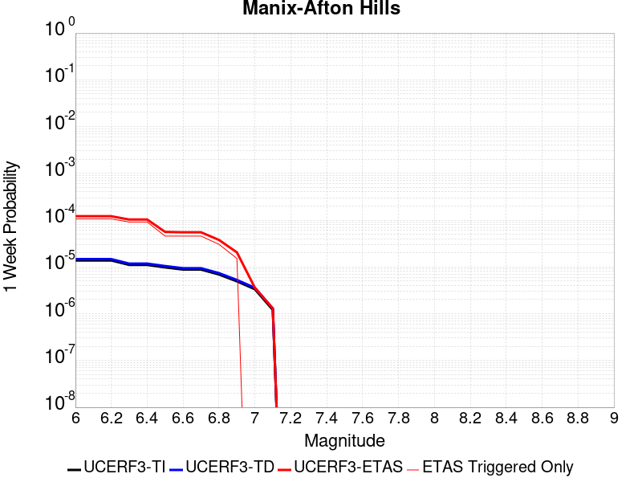 | 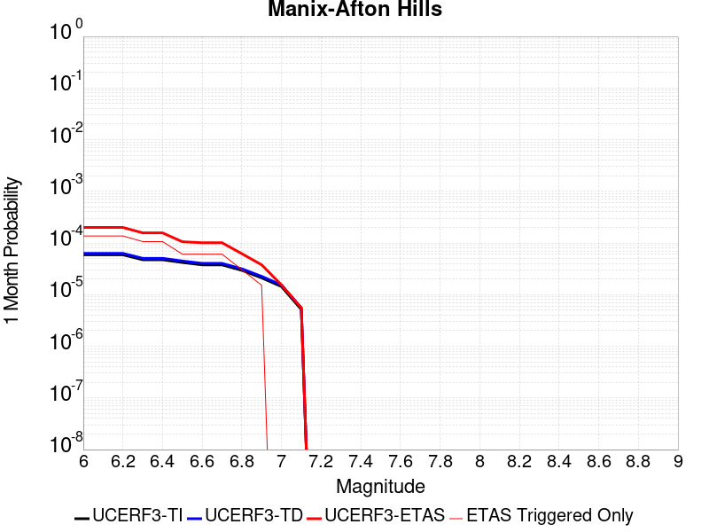 | 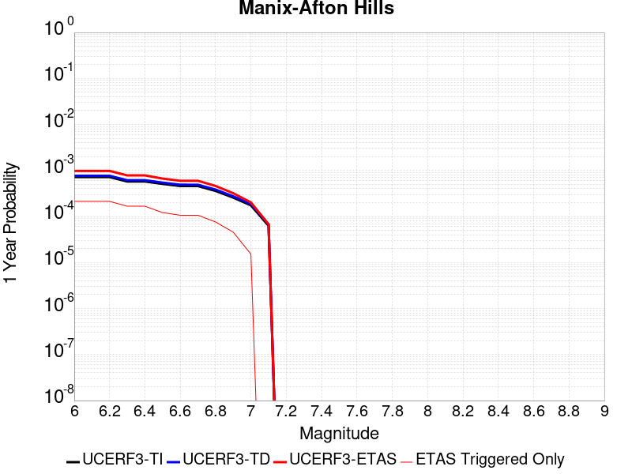 | 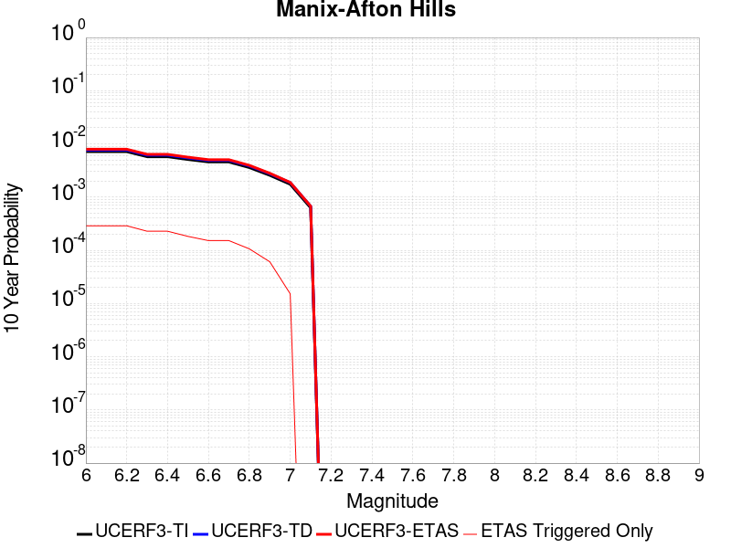 |

| Magnitude | 1 wk TI Prob | 1 wk TD Prob | 1 wk ETAS Prob | 1 wk ETAS/TD Gain | 1 wk ETAS Triggered Only | 1 mo TI Prob | 1 mo TD Prob | 1 mo ETAS Prob | 1 mo ETAS/TD Gain | 1 mo ETAS Triggered Only | 1 yr TI Prob | 1 yr TD Prob | 1 yr ETAS Prob | 1 yr ETAS/TD Gain | 1 yr ETAS Triggered Only | 10 yr TI Prob | 10 yr TD Prob | 10 yr ETAS Prob | 10 yr ETAS/TD Gain | 10 yr ETAS Triggered Only |
|-----|-----|-----|-----|-----|-----|-----|-----|-----|-----|-----|-----|-----|-----|-----|-----|-----|-----|-----|-----|-----|
| 6.0 | 1.3783202E-5 | 1.47110895E-5 | 1.2125442E-4 | 8.242382 | 1.065449E-4 | 5.906953E-5 | 6.30461E-5 | 2.0002377E-4 | 3.1726587 | 1.369863E-4 | 7.189342E-4 | 7.6733343E-4 | 9.802597E-4 | 1.2774886 | 2.130898E-4 | 0.0071661277 | 0.007648596 | 0.007935577 | 1.0375208 | 2.891933E-4 |
| 6.1 | 1.3783202E-5 | 1.47110895E-5 | 1.2125442E-4 | 8.242382 | 1.065449E-4 | 5.906953E-5 | 6.30461E-5 | 2.0002377E-4 | 3.1726587 | 1.369863E-4 | 7.189342E-4 | 7.6733343E-4 | 9.802597E-4 | 1.2774886 | 2.130898E-4 | 0.0071661277 | 0.007648596 | 0.007935577 | 1.0375208 | 2.891933E-4 |
| 6.2 | 1.3783202E-5 | 1.47110895E-5 | 1.2125442E-4 | 8.242382 | 1.065449E-4 | 5.906953E-5 | 6.30461E-5 | 2.0002377E-4 | 3.1726587 | 1.369863E-4 | 7.189342E-4 | 7.6733343E-4 | 9.802597E-4 | 1.2774886 | 2.130898E-4 | 0.0071661277 | 0.007648596 | 0.007935577 | 1.0375208 | 2.891933E-4 |
| 6.3 | 1.10494875E-5 | 1.1793136E-5 | 1.0311626E-4 | 8.7437525 | 9.1324204E-5 | 4.7354086E-5 | 5.054109E-5 | 1.570806E-4 | 3.1079783 | 1.065449E-4 | 5.763835E-4 | 6.151744E-4 | 7.824991E-4 | 1.2719955 | 1.674277E-4 | 0.005748908 | 0.0061357557 | 0.006362665 | 1.0369816 | 2.283105E-4 |
| 6.4 | 1.10494875E-5 | 1.1793136E-5 | 1.0311626E-4 | 8.7437525 | 9.1324204E-5 | 4.7354086E-5 | 5.054109E-5 | 1.570806E-4 | 3.1079783 | 1.065449E-4 | 5.763835E-4 | 6.151744E-4 | 7.824991E-4 | 1.2719955 | 1.674277E-4 | 0.005748908 | 0.0061357557 | 0.006362665 | 1.0369816 | 2.283105E-4 |
| 6.5 | 9.788949E-6 | 1.045432E-5 | 5.6115943E-5 | 5.3677278 | 4.5662102E-5 | 4.1951964E-5 | 4.480351E-5 | 1.0568358E-4 | 2.3588238 | 6.08828E-5 | 5.1064545E-4 | 5.453555E-4 | 6.670547E-4 | 1.2231557 | 1.217656E-4 | 0.0050947363 | 0.0054410985 | 0.0056227534 | 1.0333856 | 1.8264841E-4 |
| 6.6 | 8.810006E-6 | 9.4136285E-6 | 5.50753E-5 | 5.850592 | 4.5662102E-5 | 3.775662E-5 | 4.0343548E-5 | 1.0122389E-4 | 2.509048 | 6.08828E-5 | 4.5958988E-4 | 4.9108086E-4 | 5.9757347E-4 | 1.2168535 | 1.065449E-4 | 0.0045864056 | 0.004900839 | 0.0050523 | 1.0309051 | 1.5220701E-4 |
| 6.7 | 8.80128E-6 | 9.404108E-6 | 5.506578E-5 | 5.8555026 | 4.5662102E-5 | 3.7719226E-5 | 4.0302748E-5 | 1.011831E-4 | 2.5105755 | 6.08828E-5 | 4.591348E-4 | 4.9058435E-4 | 5.97077E-4 | 1.2170731 | 1.065449E-4 | 0.004581874 | 0.0048958957 | 0.0050473576 | 1.0309365 | 1.5220701E-4 |
| 6.8 | 6.8994877E-6 | 7.380076E-6 | 3.782125E-5 | 5.1247783 | 3.04414E-5 | 2.9568899E-5 | 3.162856E-5 | 6.2069E-5 | 1.9624351 | 3.04414E-5 | 3.5994186E-4 | 3.8501783E-4 | 4.6109204E-4 | 1.1975862 | 7.6103504E-5 | 0.003593594 | 0.0038443129 | 0.0039504482 | 1.0276084 | 1.065449E-4 |
| 6.9 | 4.9328037E-6 | 5.2709615E-6 | 2.0491581E-5 | 3.8876364 | 1.52207E-5 | 2.1140417E-5 | 2.2589675E-5 | 3.781003E-5 | 1.673775 | 1.52207E-5 | 2.5735417E-4 | 2.7500073E-4 | 3.2065026E-4 | 1.1659979 | 4.5662102E-5 | 0.0025705635 | 0.0027472095 | 0.002807925 | 1.0221008 | 6.08828E-5 |
| 7.0 | 3.347973E-6 | 3.59003E-6 | 3.59003E-6 | 1.0 | 0.0 | 1.4348378E-5 | 1.5385775E-5 | 1.5385775E-5 | 1.0 | 0.0 | 1.746775E-4 | 1.8730981E-4 | 2.0252766E-4 | 1.0812442 | 1.52207E-5 | 0.0017454025 | 0.0018719219 | 0.0018871141 | 1.0081159 | 1.52207E-5 |
| 7.1 | 1.2073567E-6 | 1.293482E-6 | 1.293482E-6 | 1.0 | 0.0 | 5.1743755E-6 | 5.543492E-6 | 5.543492E-6 | 1.0 | 0.0 | 6.29962E-5 | 6.749156E-5 | 6.749156E-5 | 1.0 | 0.0 | 6.297835E-4 | 6.7487074E-4 | 6.7487074E-4 | 1.0 | 0.0 |

## San Jacinto (San Bernardino)
*[(top)](#table-of-contents)*

| 1 Week | 1 Month | 1 Year | 10 Year |
|-----|-----|-----|-----|
| 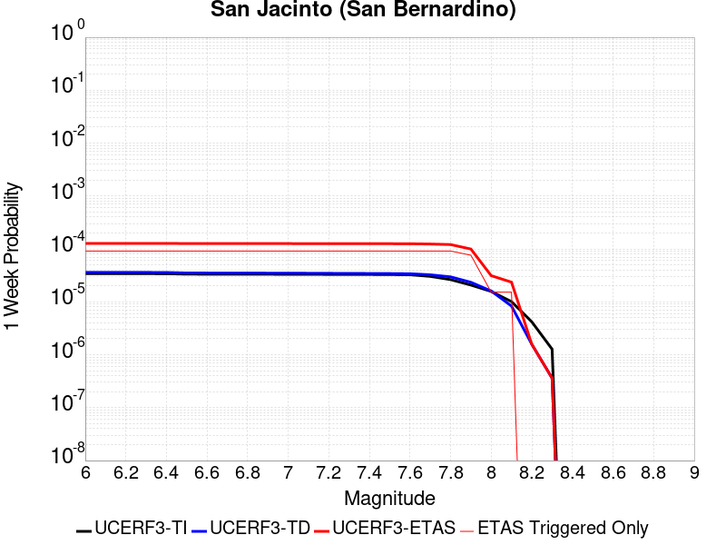 | 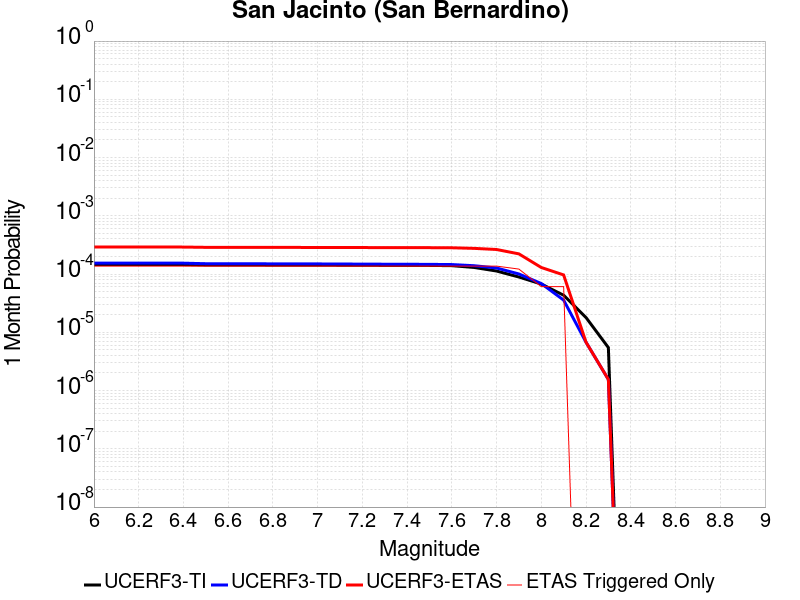 | 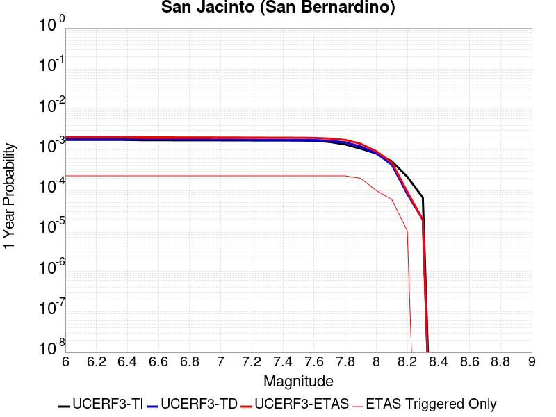 | 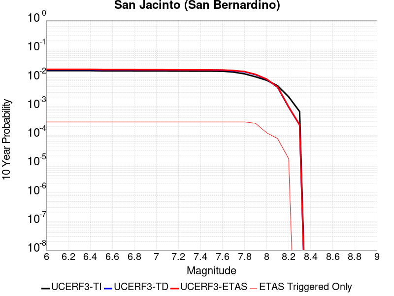 |

| Magnitude | 1 wk TI Prob | 1 wk TD Prob | 1 wk ETAS Prob | 1 wk ETAS/TD Gain | 1 wk ETAS Triggered Only | 1 mo TI Prob | 1 mo TD Prob | 1 mo ETAS Prob | 1 mo ETAS/TD Gain | 1 mo ETAS Triggered Only | 1 yr TI Prob | 1 yr TD Prob | 1 yr ETAS Prob | 1 yr ETAS/TD Gain | 1 yr ETAS Triggered Only | 10 yr TI Prob | 10 yr TD Prob | 10 yr ETAS Prob | 10 yr ETAS/TD Gain | 10 yr ETAS Triggered Only |
|-----|-----|-----|-----|-----|-----|-----|-----|-----|-----|-----|-----|-----|-----|-----|-----|-----|-----|-----|-----|-----|
| 6.0 | 3.409352E-5 | 3.5986508E-5 | 1.2730743E-4 | 3.537643 | 9.1324204E-5 | 1.461069E-4 | 1.542188E-4 | 2.9118397E-4 | 1.8881224 | 1.369863E-4 | 0.0017774 | 0.0018759987 | 0.002119073 | 1.1295706 | 2.435312E-4 | 0.01763251 | 0.019349935 | 0.019633533 | 1.0146563 | 2.891933E-4 |
| 6.1 | 3.409352E-5 | 3.5986508E-5 | 1.2730743E-4 | 3.537643 | 9.1324204E-5 | 1.461069E-4 | 1.542188E-4 | 2.9118397E-4 | 1.8881224 | 1.369863E-4 | 0.0017774 | 0.0018759987 | 0.002119073 | 1.1295706 | 2.435312E-4 | 0.01763251 | 0.019349935 | 0.019633533 | 1.0146563 | 2.891933E-4 |
| 6.2 | 3.409352E-5 | 3.5986508E-5 | 1.2730743E-4 | 3.537643 | 9.1324204E-5 | 1.461069E-4 | 1.542188E-4 | 2.9118397E-4 | 1.8881224 | 1.369863E-4 | 0.0017774 | 0.0018759987 | 0.002119073 | 1.1295706 | 2.435312E-4 | 0.01763251 | 0.019349935 | 0.019633533 | 1.0146563 | 2.891933E-4 |
| 6.3 | 3.409352E-5 | 3.5986508E-5 | 1.2730743E-4 | 3.537643 | 9.1324204E-5 | 1.461069E-4 | 1.542188E-4 | 2.9118397E-4 | 1.8881224 | 1.369863E-4 | 0.0017774 | 0.0018759987 | 0.002119073 | 1.1295706 | 2.435312E-4 | 0.01763251 | 0.019349935 | 0.019633533 | 1.0146563 | 2.891933E-4 |
| 6.4 | 3.400795E-5 | 3.5879173E-5 | 1.272001E-4 | 3.545235 | 9.1324204E-5 | 1.4574021E-4 | 1.5375883E-4 | 2.9072407E-4 | 1.8907796 | 1.369863E-4 | 0.0017729428 | 0.0018704084 | 0.002113484 | 1.1299586 | 2.435312E-4 | 0.017588645 | 0.019295016 | 0.01957863 | 1.0146987 | 2.891933E-4 |
| 6.5 | 3.341482E-5 | 3.5139812E-5 | 1.264608E-4 | 3.5987902 | 9.1324204E-5 | 1.4319851E-4 | 1.5059051E-4 | 2.8755618E-4 | 1.909524 | 1.369863E-4 | 0.0017420477 | 0.0018318989 | 0.0020749841 | 1.1326957 | 2.435312E-4 | 0.017284546 | 0.018916558 | 0.019200282 | 1.0149987 | 2.891933E-4 |
| 6.6 | 3.3364955E-5 | 3.5077028E-5 | 1.2639802E-4 | 3.6034415 | 9.1324204E-5 | 1.4298483E-4 | 1.5032147E-4 | 2.8728717E-4 | 1.911152 | 1.369863E-4 | 0.0017394501 | 0.001828629 | 0.002071715 | 1.1329334 | 2.435312E-4 | 0.017258976 | 0.018884424 | 0.019168155 | 1.0150247 | 2.891933E-4 |
| 6.7 | 3.335922E-5 | 3.5066805E-5 | 1.2638781E-4 | 3.6042008 | 9.1324204E-5 | 1.4296026E-4 | 1.5027766E-4 | 2.8724337E-4 | 1.9114177 | 1.369863E-4 | 0.0017391514 | 0.0018280965 | 0.0020711825 | 1.1329722 | 2.435312E-4 | 0.017256035 | 0.018879214 | 0.01916295 | 1.0150288 | 2.891933E-4 |
| 6.8 | 3.327683E-5 | 3.496087E-5 | 1.2628188E-4 | 3.612092 | 9.1324204E-5 | 1.4260718E-4 | 1.498237E-4 | 2.8678947E-4 | 1.9141797 | 1.369863E-4 | 0.0017348597 | 0.0018225788 | 0.0020656663 | 1.1333755 | 2.435312E-4 | 0.017213784 | 0.018824987 | 0.019108735 | 1.0150731 | 2.891933E-4 |
| 6.9 | 3.3235785E-5 | 3.4901823E-5 | 1.2622283E-4 | 3.616511 | 9.1324204E-5 | 1.4243131E-4 | 1.4957068E-4 | 2.865365E-4 | 1.9157263 | 1.369863E-4 | 0.0017327217 | 0.0018195034 | 0.0020625915 | 1.1336013 | 2.435312E-4 | 0.017192734 | 0.018794855 | 0.019078612 | 1.0150976 | 2.891933E-4 |
| 7.0 | 3.3197095E-5 | 3.4841752E-5 | 1.2616278E-4 | 3.6210225 | 9.1324204E-5 | 1.422655E-4 | 1.4931326E-4 | 2.862791E-4 | 1.9173052 | 1.369863E-4 | 0.0017307063 | 0.0018163746 | 0.0020594634 | 1.1338319 | 2.435312E-4 | 0.017172894 | 0.018764233 | 0.019048 | 1.0151228 | 2.891933E-4 |
| 7.1 | 3.3129716E-5 | 3.4721965E-5 | 1.26043E-4 | 3.6300652 | 9.1324204E-5 | 1.4197677E-4 | 1.4879994E-4 | 2.8576585E-4 | 1.9204702 | 1.369863E-4 | 0.0017271966 | 0.0018101353 | 0.0020532256 | 1.134294 | 2.435312E-4 | 0.017138338 | 0.018703312 | 0.018987097 | 1.015173 | 2.891933E-4 |
| 7.2 | 3.3034008E-5 | 3.458941E-5 | 1.2591046E-4 | 3.6401443 | 9.1324204E-5 | 1.4156665E-4 | 1.4823192E-4 | 2.8519792E-4 | 1.923998 | 1.369863E-4 | 0.0017222111 | 0.0018032312 | 0.0020463231 | 1.1348091 | 2.435312E-4 | 0.017089253 | 0.018635705 | 0.018919509 | 1.015229 | 2.891933E-4 |
| 7.3 | 3.2956614E-5 | 3.445717E-5 | 1.2577823E-4 | 3.6502774 | 9.1324204E-5 | 1.4123498E-4 | 1.4766524E-4 | 2.846313E-4 | 1.9275445 | 1.369863E-4 | 0.0017181796 | 0.0017963431 | 0.002039437 | 1.135327 | 2.435312E-4 | 0.017049557 | 0.018568452 | 0.018852277 | 1.0152853 | 2.891933E-4 |
| 7.4 | 3.2915937E-5 | 3.4378863E-5 | 1.2569992E-4 | 3.6563141 | 9.1324204E-5 | 1.4106068E-4 | 1.4732967E-4 | 2.842958E-4 | 1.9296573 | 1.369863E-4 | 0.0017160608 | 0.0017922645 | 0.0020353592 | 1.1356355 | 2.435312E-4 | 0.017028693 | 0.018528719 | 0.018812554 | 1.0153186 | 2.891933E-4 |
| 7.5 | 3.281791E-5 | 3.4243778E-5 | 1.2556485E-4 | 3.666793 | 9.1324204E-5 | 1.406406E-4 | 1.4675081E-4 | 2.83717E-4 | 1.933325 | 1.369863E-4 | 0.0017109542 | 0.0017852283 | 0.0020283246 | 1.1361711 | 2.435312E-4 | 0.016978411 | 0.018459605 | 0.018743461 | 1.015377 | 2.891933E-4 |
| 7.6 | 3.2521442E-5 | 3.396873E-5 | 1.2528982E-4 | 3.6883872 | 9.1324204E-5 | 1.3937015E-4 | 1.4557215E-4 | 2.825385E-4 | 1.9408829 | 1.369863E-4 | 0.0016955109 | 0.0017709016 | 0.0020140016 | 1.1372746 | 2.435312E-4 | 0.016826328 | 0.018317232 | 0.018601129 | 1.0154989 | 2.891933E-4 |
| 7.7 | 3.0287873E-5 | 3.245276E-5 | 1.2377399E-4 | 3.8139741 | 9.1324204E-5 | 1.297987E-4 | 1.3907586E-4 | 2.760431E-4 | 1.9848384 | 1.369863E-4 | 0.0015791537 | 0.0016919347 | 0.0019350538 | 1.143693 | 2.435312E-4 | 0.01567979 | 0.01752809 | 0.017812215 | 1.0162096 | 2.891933E-4 |
| 7.8 | 2.6316151E-5 | 2.9663592E-5 | 1.2098508E-4 | 4.078572 | 9.1324204E-5 | 1.1277862E-4 | 1.2712348E-4 | 2.6409238E-4 | 2.0774474 | 1.369863E-4 | 0.0013722149 | 0.0015466306 | 0.0017897851 | 1.1572157 | 2.435312E-4 | 0.013637724 | 0.016069634 | 0.01635418 | 1.0177071 | 2.891933E-4 |
| 7.9 | 2.0761147E-5 | 2.34181E-5 | 9.951982E-5 | 4.2496963 | 7.6103504E-5 | 8.897331E-5 | 1.0035944E-4 | 2.2211281E-4 | 2.2131732 | 1.217656E-4 | 0.0010827117 | 0.0012211921 | 0.0014340216 | 1.1742802 | 2.130898E-4 | 0.010774517 | 0.012793174 | 0.013048615 | 1.0199671 | 2.587519E-4 |
| 8.0 | 1.5738568E-5 | 1.6033575E-5 | 3.1254032E-5 | 1.9492865 | 1.52207E-5 | 6.744926E-5 | 6.871352E-5 | 1.2959214E-4 | 1.8859773 | 6.08828E-5 | 8.2088535E-4 | 8.3626667E-4 | 9.427224E-4 | 1.1272988 | 1.065449E-4 | 0.008178596 | 0.008865921 | 0.008986606 | 1.0136124 | 1.217656E-4 |
| 8.1 | 1.0105832E-5 | 8.3304985E-6 | 2.3551072E-5 | 2.8270905 | 1.52207E-5 | 4.3309992E-5 | 3.570165E-5 | 9.658228E-5 | 2.705261 | 6.08828E-5 | 5.2717153E-4 | 4.345814E-4 | 5.1065185E-4 | 1.175043 | 7.6103504E-5 | 0.005259227 | 0.004677232 | 0.0047529796 | 1.0161949 | 7.6103504E-5 |
| 8.2 | 4.189207E-6 | 1.5784357E-6 | 1.5784357E-6 | 1.0 | 0.0 | 1.7953622E-5 | 6.7647065E-6 | 6.7647065E-6 | 1.0 | 0.0 | 2.1856341E-4 | 8.235722E-5 | 9.757667E-5 | 1.184798 | 1.52207E-5 | 0.0021834858 | 9.565867E-4 | 9.7179285E-4 | 1.0158962 | 1.52207E-5 |
| 8.3 | 1.2758221E-6 | 3.6149942E-7 | 3.6149942E-7 | 1.0 | 0.0 | 5.4677976E-6 | 1.5492824E-6 | 1.5492824E-6 | 1.0 | 0.0 | 6.65684E-5 | 1.8862354E-5 | 1.8862354E-5 | 1.0 | 0.0 | 6.6548464E-4 | 2.2751294E-4 | 2.2751294E-4 | 1.0 | 0.0 |

## Death Valley (Fish Lake Valley)
*[(top)](#table-of-contents)*

| 1 Week | 1 Month | 1 Year | 10 Year |
|-----|-----|-----|-----|
| 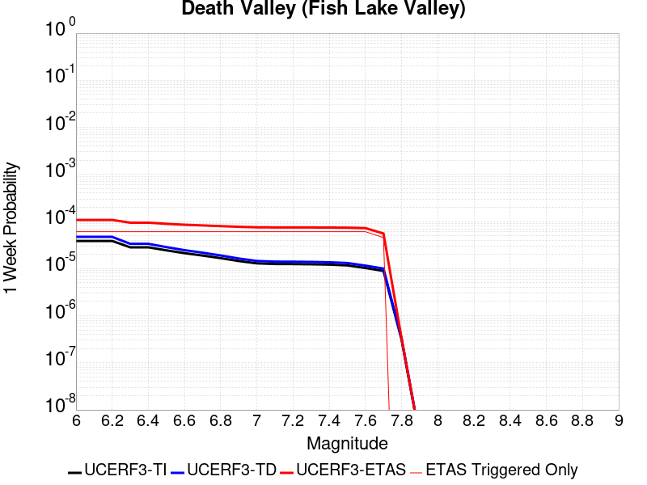 | 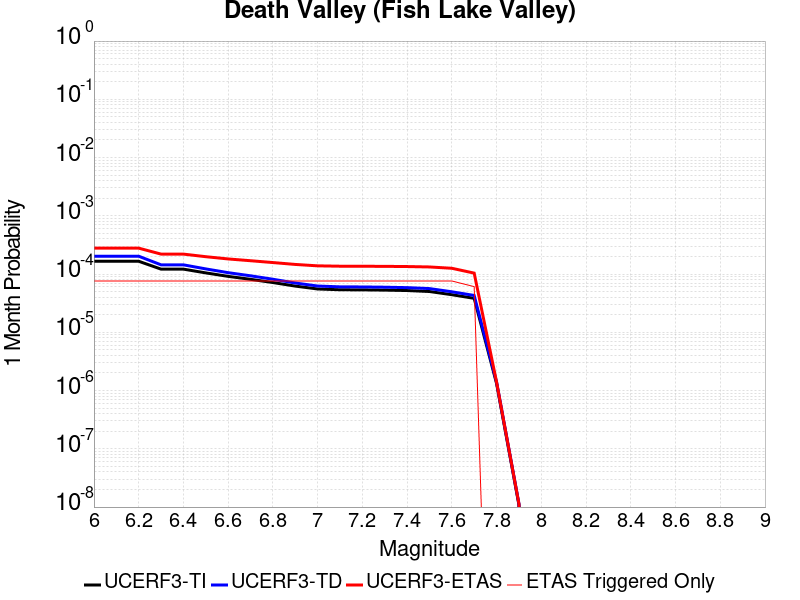 | 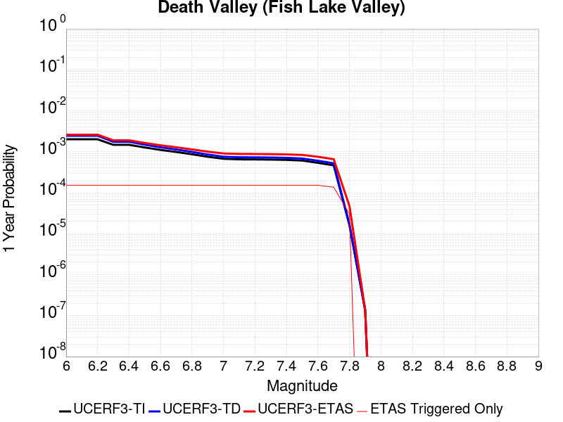 | 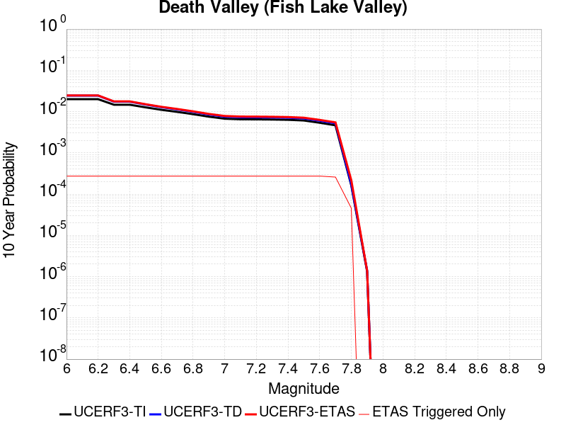 |

| Magnitude | 1 wk TI Prob | 1 wk TD Prob | 1 wk ETAS Prob | 1 wk ETAS/TD Gain | 1 wk ETAS Triggered Only | 1 mo TI Prob | 1 mo TD Prob | 1 mo ETAS Prob | 1 mo ETAS/TD Gain | 1 mo ETAS Triggered Only | 1 yr TI Prob | 1 yr TD Prob | 1 yr ETAS Prob | 1 yr ETAS/TD Gain | 1 yr ETAS Triggered Only | 10 yr TI Prob | 10 yr TD Prob | 10 yr ETAS Prob | 10 yr ETAS/TD Gain | 10 yr ETAS Triggered Only |
|-----|-----|-----|-----|-----|-----|-----|-----|-----|-----|-----|-----|-----|-----|-----|-----|-----|-----|-----|-----|-----|
| 6.0 | 3.872328E-5 | 4.7267473E-5 | 1.081474E-4 | 2.2879877 | 6.08828E-5 | 1.6594635E-4 | 2.0256084E-4 | 2.7864892E-4 | 1.3756307 | 7.6103504E-5 | 0.0020185246 | 0.002463534 | 0.0026153661 | 1.0616318 | 1.5220701E-4 | 0.02000288 | 0.024388181 | 0.024655472 | 1.0109599 | 2.739726E-4 |
| 6.1 | 3.872328E-5 | 4.7267473E-5 | 1.081474E-4 | 2.2879877 | 6.08828E-5 | 1.6594635E-4 | 2.0256084E-4 | 2.7864892E-4 | 1.3756307 | 7.6103504E-5 | 0.0020185246 | 0.002463534 | 0.0026153661 | 1.0616318 | 1.5220701E-4 | 0.02000288 | 0.024388181 | 0.024655472 | 1.0109599 | 2.739726E-4 |
| 6.2 | 3.872328E-5 | 4.7267473E-5 | 1.081474E-4 | 2.2879877 | 6.08828E-5 | 1.6594635E-4 | 2.0256084E-4 | 2.7864892E-4 | 1.3756307 | 7.6103504E-5 | 0.0020185246 | 0.002463534 | 0.0026153661 | 1.0616318 | 1.5220701E-4 | 0.02000288 | 0.024388181 | 0.024655472 | 1.0109599 | 2.739726E-4 |
| 6.3 | 2.8356371E-5 | 3.3609853E-5 | 9.4490606E-5 | 2.8113961 | 6.08828E-5 | 1.2152165E-4 | 1.4403471E-4 | 2.2012726E-4 | 1.528293 | 7.6103504E-5 | 0.0014785219 | 0.0017522911 | 0.0019042314 | 1.0867095 | 1.5220701E-4 | 0.014687235 | 0.017391782 | 0.01766099 | 1.015479 | 2.739726E-4 |
| 6.4 | 2.8356371E-5 | 3.3609853E-5 | 9.4490606E-5 | 2.8113961 | 6.08828E-5 | 1.2152165E-4 | 1.4403471E-4 | 2.2012726E-4 | 1.528293 | 7.6103504E-5 | 0.0014785219 | 0.0017522911 | 0.0019042314 | 1.0867095 | 1.5220701E-4 | 0.014687235 | 0.017391782 | 0.01766099 | 1.015479 | 2.739726E-4 |
| 6.5 | 2.4448687E-5 | 2.8607552E-5 | 8.948861E-5 | 3.1281464 | 6.08828E-5 | 1.0477588E-4 | 1.2259831E-4 | 1.9869249E-4 | 1.6206788 | 7.6103504E-5 | 0.0012748998 | 0.0014916632 | 0.001643643 | 1.1018863 | 1.5220701E-4 | 0.012676105 | 0.014821377 | 0.015091289 | 1.018211 | 2.739726E-4 |
| 6.6 | 2.1298161E-5 | 2.4660083E-5 | 8.554138E-5 | 3.4688196 | 6.08828E-5 | 9.127464E-5 | 1.0568198E-4 | 1.8177745E-4 | 1.7200419 | 7.6103504E-5 | 0.0011107022 | 0.0012859525 | 0.0014379638 | 1.1182091 | 1.5220701E-4 | 0.011051672 | 0.012788526 | 0.013058994 | 1.0211494 | 2.739726E-4 |
| 6.7 | 1.8959729E-5 | 2.1781025E-5 | 8.2662504E-5 | 3.795161 | 6.08828E-5 | 8.125345E-5 | 9.334405E-5 | 1.6944045E-4 | 1.8152249 | 7.6103504E-5 | 9.888117E-4 | 0.001135897 | 0.0012879311 | 1.133845 | 1.5220701E-4 | 0.009844234 | 0.01130357 | 0.011574445 | 1.0239637 | 2.739726E-4 |
| 6.8 | 1.6691629E-5 | 1.9018353E-5 | 7.99E-5 | 4.201205 | 6.08828E-5 | 7.153359E-5 | 8.150477E-5 | 1.5760207E-4 | 1.9336545 | 7.6103504E-5 | 8.7057345E-4 | 9.918857E-4 | 0.0011439418 | 1.1532999 | 1.5220701E-4 | 0.008671708 | 0.009876343 | 0.010147611 | 1.0274663 | 2.739726E-4 |
| 6.9 | 1.450505E-5 | 1.638954E-5 | 7.727134E-5 | 4.7146745 | 6.08828E-5 | 6.216302E-5 | 7.0239046E-5 | 1.463372E-4 | 2.0834167 | 7.6103504E-5 | 7.5657194E-4 | 8.5483363E-4 | 0.0010069105 | 1.1779023 | 1.5220701E-4 | 0.007540013 | 0.008516385 | 0.008788025 | 1.0318961 | 2.739726E-4 |
| 7.0 | 1.2940855E-5 | 1.4537972E-5 | 7.5419885E-5 | 5.187786 | 6.08828E-5 | 5.545963E-5 | 6.230414E-5 | 1.384029E-4 | 2.221408 | 7.6103504E-5 | 6.750118E-4 | 7.5829466E-4 | 9.1038627E-4 | 1.2005706 | 1.5220701E-4 | 0.006729651 | 0.0075576897 | 0.007829592 | 1.0359769 | 2.739726E-4 |
| 7.1 | 1.2544658E-5 | 1.4078208E-5 | 7.496015E-5 | 5.324552 | 6.08828E-5 | 5.3761712E-5 | 6.0333812E-5 | 1.3643272E-4 | 2.261298 | 7.6103504E-5 | 6.5435225E-4 | 7.343222E-4 | 8.864174E-4 | 1.2071233 | 1.5220701E-4 | 0.006524288 | 0.007319551 | 0.007591518 | 1.0371562 | 2.739726E-4 |
| 7.2 | 1.2489416E-5 | 1.4015674E-5 | 7.489762E-5 | 5.3438473 | 6.08828E-5 | 5.3524967E-5 | 6.0065824E-5 | 1.3616476E-4 | 2.2669256 | 7.6103504E-5 | 6.514716E-4 | 7.310616E-4 | 8.8315737E-4 | 1.2080477 | 1.5220701E-4 | 0.006495651 | 0.0072871596 | 0.0075591356 | 1.0373226 | 2.739726E-4 |
| 7.3 | 1.2368307E-5 | 1.3879812E-5 | 7.476177E-5 | 5.3863673 | 6.08828E-5 | 5.3005948E-5 | 5.9483587E-5 | 1.3558257E-4 | 2.2793272 | 7.6103504E-5 | 6.451563E-4 | 7.2397763E-4 | 8.760744E-4 | 1.2100849 | 1.5220701E-4 | 0.0064328653 | 0.007216782 | 0.0074887774 | 1.0376893 | 2.739726E-4 |
| 7.4 | 1.2161707E-5 | 1.36478675E-5 | 7.452984E-5 | 5.460914 | 6.08828E-5 | 5.212056E-5 | 5.8489582E-5 | 1.3458863E-4 | 2.3010702 | 7.6103504E-5 | 6.3438306E-4 | 7.118836E-4 | 8.6398225E-4 | 1.2136567 | 1.5220701E-4 | 0.006325751 | 0.0070966207 | 0.007368649 | 1.0383321 | 2.739726E-4 |
| 7.5 | 1.1707948E-5 | 1.3145515E-5 | 7.402751E-5 | 5.6313896 | 6.08828E-5 | 5.0175953E-5 | 5.6336736E-5 | 1.3243595E-4 | 2.350792 | 7.6103504E-5 | 6.10721E-4 | 6.856895E-4 | 8.377921E-4 | 1.2218244 | 1.5220701E-4 | 0.0060904534 | 0.006836321 | 0.007108421 | 1.0398021 | 2.739726E-4 |
| 7.6 | 1.0319538E-5 | 1.1579622E-5 | 7.246172E-5 | 6.257693 | 6.08828E-5 | 4.4225842E-5 | 4.9626036E-5 | 1.2572577E-4 | 2.5334637 | 7.6103504E-5 | 5.383166E-4 | 6.040347E-4 | 7.5614976E-4 | 1.2518317 | 1.5220701E-4 | 0.0053701443 | 0.0060244603 | 0.0062967823 | 1.0452027 | 2.739726E-4 |
| 7.7 | 8.937764E-6 | 1.0022779E-5 | 5.568442E-5 | 5.5557866 | 4.5662102E-5 | 3.830414E-5 | 4.295409E-5 | 1.03834274E-4 | 2.4173315 | 6.08828E-5 | 4.6625308E-4 | 5.228456E-4 | 6.5976026E-4 | 1.2618644 | 1.369863E-4 | 0.0046527605 | 0.005216664 | 0.0054740664 | 1.0493423 | 2.587519E-4 |
| 7.8 | 3.108007E-7 | 3.284654E-7 | 3.284654E-7 | 1.0 | 0.0 | 1.3320023E-6 | 1.407708E-6 | 1.407708E-6 | 1.0 | 0.0 | 1.6217007E-5 | 1.7138715E-5 | 4.7579593E-5 | 2.7761471 | 3.04414E-5 | 1.6215823E-4 | 1.7137431E-4 | 2.1702859E-4 | 1.2664009 | 4.5662102E-5 |
| 7.9 | 2.5591178E-9 | 2.6696718E-9 | 2.6696718E-9 | 1.0 | 0.0 | 1.0967647E-8 | 1.14414505E-8 | 1.14414505E-8 | 1.0 | 0.0 | 1.335311E-7 | 1.3929966E-7 | 1.3929966E-7 | 1.0 | 0.0 | 1.3353102E-6 | 1.3929966E-6 | 1.3929966E-6 | 1.0 | 0.0 |

## Cleghorn Lake
*[(top)](#table-of-contents)*

| 1 Week | 1 Month | 1 Year | 10 Year |
|-----|-----|-----|-----|
| 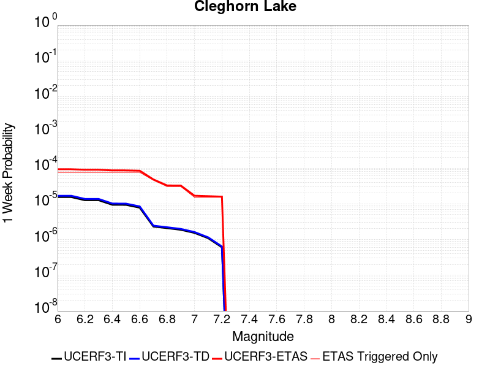 | 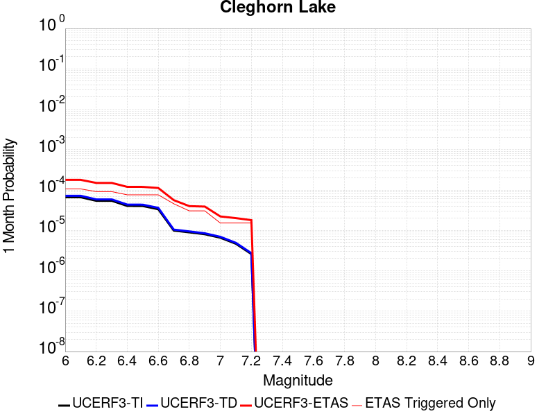 | 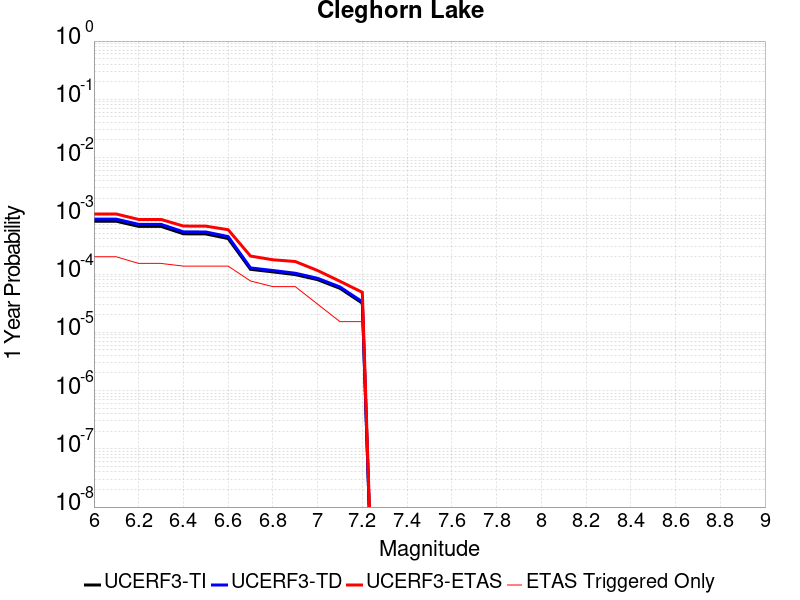 | 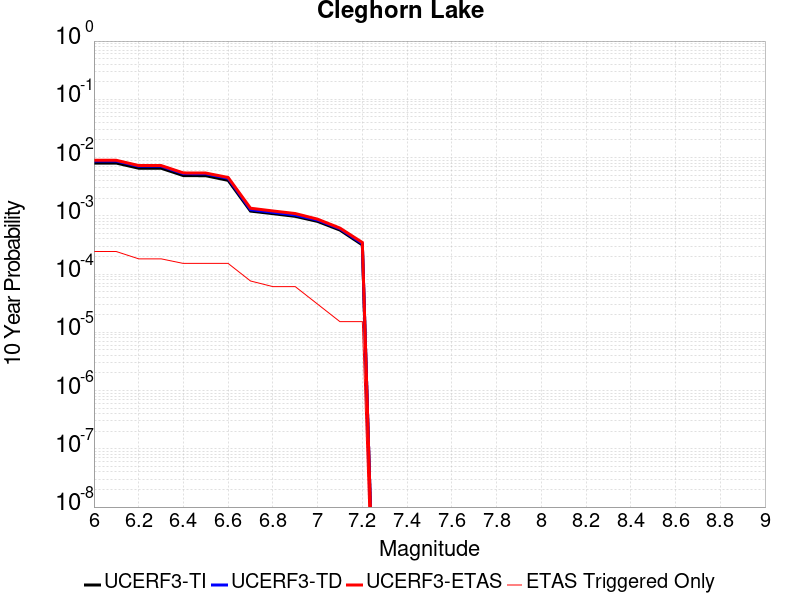 |

| Magnitude | 1 wk TI Prob | 1 wk TD Prob | 1 wk ETAS Prob | 1 wk ETAS/TD Gain | 1 wk ETAS Triggered Only | 1 mo TI Prob | 1 mo TD Prob | 1 mo ETAS Prob | 1 mo ETAS/TD Gain | 1 mo ETAS Triggered Only | 1 yr TI Prob | 1 yr TD Prob | 1 yr ETAS Prob | 1 yr ETAS/TD Gain | 1 yr ETAS Triggered Only | 10 yr TI Prob | 10 yr TD Prob | 10 yr ETAS Prob | 10 yr ETAS/TD Gain | 10 yr ETAS Triggered Only |
|-----|-----|-----|-----|-----|-----|-----|-----|-----|-----|-----|-----|-----|-----|-----|-----|-----|-----|-----|-----|-----|
| 6.0 | 1.5467183E-5 | 1.6794203E-5 | 9.289643E-5 | 5.5314574 | 7.6103504E-5 | 6.6286244E-5 | 7.197348E-5 | 1.7851072E-4 | 2.480229 | 1.065449E-4 | 8.067362E-4 | 8.759797E-4 | 0.0010736755 | 1.2256854 | 1.978691E-4 | 0.008038137 | 0.008730696 | 0.008972101 | 1.0276501 | 2.435312E-4 |
| 6.1 | 1.5467183E-5 | 1.6794203E-5 | 9.289643E-5 | 5.5314574 | 7.6103504E-5 | 6.6286244E-5 | 7.197348E-5 | 1.7851072E-4 | 2.480229 | 1.065449E-4 | 8.067362E-4 | 8.759797E-4 | 0.0010736755 | 1.2256854 | 1.978691E-4 | 0.008038137 | 0.008730696 | 0.008972101 | 1.0276501 | 2.435312E-4 |
| 6.2 | 1.2624631E-5 | 1.3681544E-5 | 8.978401E-5 | 6.562417 | 7.6103504E-5 | 5.410444E-5 | 5.863415E-5 | 1.4995299E-4 | 2.5574346 | 9.1324204E-5 | 6.585225E-4 | 7.1368564E-4 | 8.65784E-4 | 1.2131168 | 1.5220701E-4 | 0.0065657445 | 0.0071187317 | 0.00730008 | 1.0254748 | 1.8264841E-4 |
| 6.3 | 1.2624631E-5 | 1.3681544E-5 | 8.978401E-5 | 6.562417 | 7.6103504E-5 | 5.410444E-5 | 5.863415E-5 | 1.4995299E-4 | 2.5574346 | 9.1324204E-5 | 6.585225E-4 | 7.1368564E-4 | 8.65784E-4 | 1.2131168 | 1.5220701E-4 | 0.0065657445 | 0.0071187317 | 0.00730008 | 1.0254748 | 1.8264841E-4 |
| 6.4 | 9.417684E-6 | 1.0170118E-5 | 8.627284E-5 | 8.482974 | 7.6103504E-5 | 4.036088E-5 | 4.3585722E-5 | 1.1968591E-4 | 2.7459888 | 7.6103504E-5 | 4.912829E-4 | 5.3056807E-4 | 6.674817E-4 | 1.258051 | 1.369863E-4 | 0.004901982 | 0.005297049 | 0.00544845 | 1.0285821 | 1.5220701E-4 |
| 6.5 | 9.368219E-6 | 1.0117545E-5 | 8.622027E-5 | 8.521858 | 7.6103504E-5 | 4.014889E-5 | 4.3360415E-5 | 1.19460616E-4 | 2.7550616 | 7.6103504E-5 | 4.8870314E-4 | 5.2782625E-4 | 6.647403E-4 | 1.2593921 | 1.369863E-4 | 0.004876298 | 0.0052697617 | 0.0054211663 | 1.0287309 | 1.5220701E-4 |
| 6.6 | 7.803798E-6 | 8.441831E-6 | 8.454469E-5 | 10.014971 | 7.6103504E-5 | 3.3444423E-5 | 3.6179E-5 | 1.1227975E-4 | 3.1034508 | 7.6103504E-5 | 4.0710976E-4 | 4.4043022E-4 | 5.773562E-4 | 1.3108914 | 1.369863E-4 | 0.0040636472 | 0.0043994905 | 0.004551028 | 1.0344443 | 1.5220701E-4 |
| 6.7 | 2.3108669E-6 | 2.4438336E-6 | 4.8105823E-5 | 19.684574 | 4.5662102E-5 | 9.903678E-6 | 1.0473532E-5 | 5.6135155E-5 | 5.359716 | 4.5662102E-5 | 1.205706E-4 | 1.2750797E-4 | 2.0360177E-4 | 1.5967767 | 7.6103504E-5 | 0.001205052 | 0.0012743667 | 0.0013503733 | 1.0596426 | 7.6103504E-5 |
| 6.8 | 2.0882828E-6 | 2.2062823E-6 | 3.2647615E-5 | 14.79757 | 3.04414E-5 | 8.949753E-6 | 9.455462E-6 | 3.9896575E-5 | 4.219421 | 3.04414E-5 | 1.08957785E-4 | 1.1511434E-4 | 1.7599014E-4 | 1.528829 | 6.08828E-5 | 0.0010890438 | 0.0011505639 | 0.0012113766 | 1.0528548 | 6.08828E-5 |
| 6.9 | 1.876935E-6 | 1.981051E-6 | 3.242239E-5 | 16.366259 | 3.04414E-5 | 8.043982E-6 | 8.490192E-6 | 3.8931335E-5 | 4.5854483 | 3.04414E-5 | 9.7931086E-5 | 1.03363345E-4 | 1.6423986E-4 | 1.5889565 | 6.08828E-5 | 9.788794E-4 | 0.0010331686 | 0.0010939885 | 1.0588673 | 6.08828E-5 |
| 7.0 | 1.5357559E-6 | 1.6202807E-6 | 1.6840957E-5 | 10.393851 | 1.52207E-5 | 6.5817944E-6 | 6.9440425E-6 | 2.2164637E-5 | 3.1918924 | 1.52207E-5 | 8.01304E-5 | 8.454057E-5 | 1.1497939E-4 | 1.36005 | 3.04414E-5 | 8.010151E-4 | 8.450965E-4 | 8.7551214E-4 | 1.0359907 | 3.04414E-5 |
| 7.1 | 1.0905424E-6 | 1.1497619E-6 | 1.6370444E-5 | 14.238116 | 1.52207E-5 | 4.6737446E-6 | 4.9275427E-6 | 2.0148167E-5 | 4.0888877 | 1.52207E-5 | 5.6901354E-5 | 5.999128E-5 | 7.5211065E-5 | 1.2537 | 1.52207E-5 | 5.6886784E-4 | 5.997606E-4 | 6.149722E-4 | 1.0253627 | 1.52207E-5 |
| 7.2 | 6.06668E-7 | 6.387277E-7 | 1.5859418E-5 | 24.829699 | 1.52207E-5 | 2.600003E-6 | 2.7374022E-6 | 1.795806E-5 | 6.5602565 | 1.52207E-5 | 3.1654577E-5 | 3.3327433E-5 | 4.8547623E-5 | 1.4566866 | 1.52207E-5 | 3.1650066E-4 | 3.3323118E-4 | 3.484468E-4 | 1.0456609 | 1.52207E-5 |

## San Andreas (North Branch Mill Creek)
*[(top)](#table-of-contents)*

| 1 Week | 1 Month | 1 Year | 10 Year |
|-----|-----|-----|-----|
| 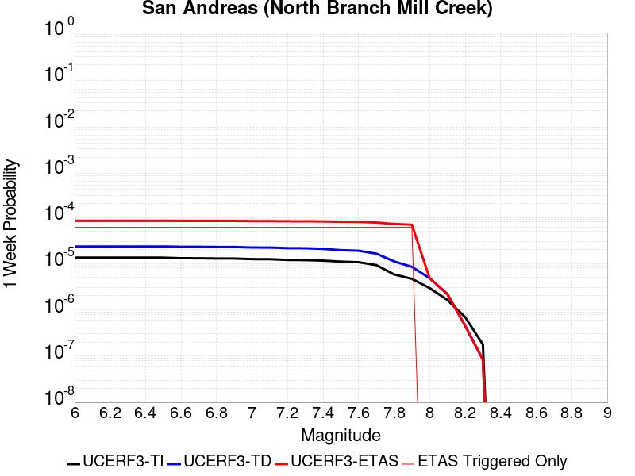 | 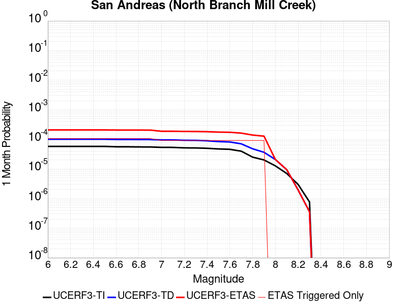 | 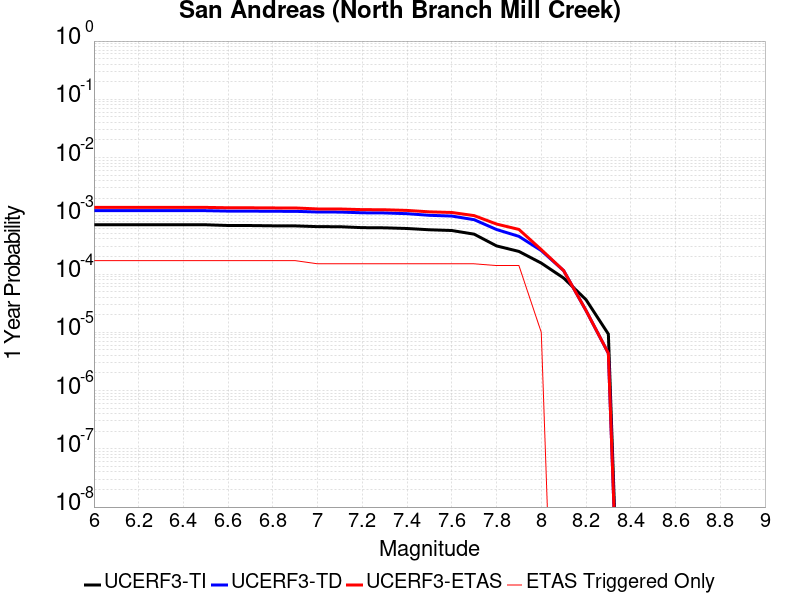 | 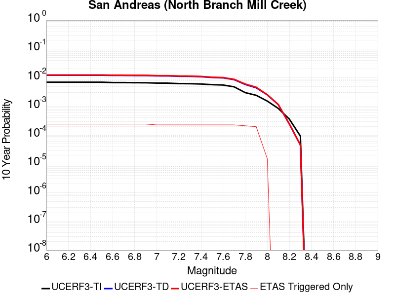 |

| Magnitude | 1 wk TI Prob | 1 wk TD Prob | 1 wk ETAS Prob | 1 wk ETAS/TD Gain | 1 wk ETAS Triggered Only | 1 mo TI Prob | 1 mo TD Prob | 1 mo ETAS Prob | 1 mo ETAS/TD Gain | 1 mo ETAS Triggered Only | 1 yr TI Prob | 1 yr TD Prob | 1 yr ETAS Prob | 1 yr ETAS/TD Gain | 1 yr ETAS Triggered Only | 10 yr TI Prob | 10 yr TD Prob | 10 yr ETAS Prob | 10 yr ETAS/TD Gain | 10 yr ETAS Triggered Only |
|-----|-----|-----|-----|-----|-----|-----|-----|-----|-----|-----|-----|-----|-----|-----|-----|-----|-----|-----|-----|-----|
| 6.0 | 1.3461156E-5 | 2.3499893E-5 | 8.438126E-5 | 3.5907085 | 6.08828E-5 | 5.7689394E-5 | 1.00709956E-4 | 2.0724413E-4 | 2.0578315 | 1.065449E-4 | 7.02142E-4 | 0.0012254574 | 0.0013926799 | 1.1364572 | 1.674277E-4 | 0.0069992766 | 0.01222957 | 0.012470122 | 1.0196698 | 2.435312E-4 |
| 6.1 | 1.3461156E-5 | 2.3499893E-5 | 8.438126E-5 | 3.5907085 | 6.08828E-5 | 5.7689394E-5 | 1.00709956E-4 | 2.0724413E-4 | 2.0578315 | 1.065449E-4 | 7.02142E-4 | 0.0012254574 | 0.0013926799 | 1.1364572 | 1.674277E-4 | 0.0069992766 | 0.01222957 | 0.012470122 | 1.0196698 | 2.435312E-4 |
| 6.2 | 1.3461156E-5 | 2.3499893E-5 | 8.438126E-5 | 3.5907085 | 6.08828E-5 | 5.7689394E-5 | 1.00709956E-4 | 2.0724413E-4 | 2.0578315 | 1.065449E-4 | 7.02142E-4 | 0.0012254574 | 0.0013926799 | 1.1364572 | 1.674277E-4 | 0.0069992766 | 0.01222957 | 0.012470122 | 1.0196698 | 2.435312E-4 |
| 6.3 | 1.3461156E-5 | 2.3499893E-5 | 8.438126E-5 | 3.5907085 | 6.08828E-5 | 5.7689394E-5 | 1.00709956E-4 | 2.0724413E-4 | 2.0578315 | 1.065449E-4 | 7.02142E-4 | 0.0012254574 | 0.0013926799 | 1.1364572 | 1.674277E-4 | 0.0069992766 | 0.01222957 | 0.012470122 | 1.0196698 | 2.435312E-4 |
| 6.4 | 1.3461156E-5 | 2.3499893E-5 | 8.438126E-5 | 3.5907085 | 6.08828E-5 | 5.7689394E-5 | 1.00709956E-4 | 2.0724413E-4 | 2.0578315 | 1.065449E-4 | 7.02142E-4 | 0.0012254574 | 0.0013926799 | 1.1364572 | 1.674277E-4 | 0.0069992766 | 0.01222957 | 0.012470122 | 1.0196698 | 2.435312E-4 |
| 6.5 | 1.3450706E-5 | 2.3488852E-5 | 8.437022E-5 | 3.591926 | 6.08828E-5 | 5.764461E-5 | 1.0066265E-4 | 2.0719682E-4 | 2.0583289 | 1.065449E-4 | 7.0159714E-4 | 0.001224882 | 0.0013921047 | 1.1365215 | 1.674277E-4 | 0.006993862 | 0.01222388 | 0.012464434 | 1.0196791 | 2.435312E-4 |
| 6.6 | 1.3074523E-5 | 2.3103135E-5 | 8.398453E-5 | 3.6352005 | 6.08828E-5 | 5.6032466E-5 | 9.9009696E-5 | 2.0554406E-4 | 2.0759993 | 1.065449E-4 | 6.8198174E-4 | 0.0012047797 | 0.0013720057 | 1.1388022 | 1.674277E-4 | 0.006798926 | 0.012025044 | 0.012265647 | 1.0200084 | 2.435312E-4 |
| 6.7 | 1.3050216E-5 | 2.3078432E-5 | 8.395983E-5 | 3.6380212 | 6.08828E-5 | 5.59283E-5 | 9.890384E-5 | 2.0543819E-4 | 2.077151 | 1.065449E-4 | 6.8071426E-4 | 0.0012034923 | 0.0013707185 | 1.1389508 | 1.674277E-4 | 0.0067863287 | 0.012012309 | 0.012252915 | 1.0200299 | 2.435312E-4 |
| 6.8 | 1.29049395E-5 | 2.292684E-5 | 8.380825E-5 | 3.6554642 | 6.08828E-5 | 5.530571E-5 | 9.825421E-5 | 2.0478864E-4 | 2.0842736 | 1.065449E-4 | 6.73139E-4 | 0.0011955918 | 0.0013628192 | 1.13987 | 1.674277E-4 | 0.0067110364 | 0.011934154 | 0.012174779 | 1.0201627 | 2.435312E-4 |
| 6.9 | 1.2867369E-5 | 2.2886245E-5 | 8.376765E-5 | 3.6601746 | 6.08828E-5 | 5.51447E-5 | 9.8080236E-5 | 2.0461468E-4 | 2.086197 | 1.065449E-4 | 6.711799E-4 | 0.0011934759 | 0.0013607038 | 1.1401184 | 1.674277E-4 | 0.006691564 | 0.011913223 | 0.012153854 | 1.0201986 | 2.435312E-4 |
| 7.0 | 1.2495996E-5 | 2.2286325E-5 | 8.316777E-5 | 3.7317848 | 6.08828E-5 | 5.3553173E-5 | 9.550934E-5 | 1.8682482E-4 | 1.9560895 | 9.1324204E-5 | 6.518148E-4 | 0.0011622087 | 0.0013142389 | 1.1308113 | 1.5220701E-4 | 0.0064990623 | 0.0116038285 | 0.01182949 | 1.0194471 | 2.283105E-4 |
| 7.1 | 1.2452067E-5 | 2.2231397E-5 | 8.311284E-5 | 3.7385342 | 6.08828E-5 | 5.3364907E-5 | 9.527396E-5 | 1.8658946E-4 | 1.9584519 | 9.1324204E-5 | 6.4952404E-4 | 0.0011593461 | 0.0013113766 | 1.1311347 | 1.5220701E-4 | 0.0064762887 | 0.0115755 | 0.011801167 | 1.0194952 | 2.283105E-4 |
| 7.2 | 1.2002777E-5 | 2.1609963E-5 | 8.2491446E-5 | 3.8172877 | 6.08828E-5 | 5.143946E-5 | 9.2610855E-5 | 1.839266E-4 | 1.9860156 | 9.1324204E-5 | 6.2609545E-4 | 0.0011269567 | 0.001278992 | 1.134908 | 1.5220701E-4 | 0.006243344 | 0.011254923 | 0.011480664 | 1.0200571 | 2.283105E-4 |
| 7.3 | 1.1923425E-5 | 2.1479793E-5 | 8.2361286E-5 | 3.8343613 | 6.08828E-5 | 5.109939E-5 | 9.205302E-5 | 1.8336881E-4 | 1.9919913 | 9.1324204E-5 | 6.219575E-4 | 0.001120172 | 0.0012722085 | 1.1357261 | 1.5220701E-4 | 0.0062021962 | 0.011187789 | 0.011413545 | 1.0201788 | 2.283105E-4 |
| 7.4 | 1.16105175E-5 | 2.0853771E-5 | 8.173531E-5 | 3.9194493 | 6.08828E-5 | 4.975841E-5 | 8.937026E-5 | 1.806863E-4 | 2.0217721 | 9.1324204E-5 | 6.0564023E-4 | 0.0010875424 | 0.0012395838 | 1.1398028 | 1.5220701E-4 | 0.006039923 | 0.010865397 | 0.011091227 | 1.0207843 | 2.283105E-4 |
| 7.5 | 1.1037265E-5 | 1.9553907E-5 | 8.0435515E-5 | 4.113527 | 6.08828E-5 | 4.7301706E-5 | 8.379978E-5 | 1.7511632E-4 | 2.089699 | 9.1324204E-5 | 5.757461E-4 | 0.0010197869 | 0.0011718387 | 1.1491015 | 1.5220701E-4 | 0.005742567 | 0.010194898 | 0.01042088 | 1.0221663 | 2.283105E-4 |
| 7.6 | 1.0720915E-5 | 1.899582E-5 | 7.987746E-5 | 4.2050023 | 6.08828E-5 | 4.5945973E-5 | 8.140812E-5 | 1.7272489E-4 | 2.1217155 | 9.1324204E-5 | 5.592486E-4 | 9.906954E-4 | 0.0011427517 | 1.1534843 | 1.5220701E-4 | 0.005578433 | 0.009906623 | 0.010132671 | 1.022818 | 2.283105E-4 |
| 7.7 | 9.276279E-6 | 1.6441649E-5 | 7.732345E-5 | 4.7029014 | 6.08828E-5 | 3.9754876E-5 | 7.0462316E-5 | 1.6178007E-4 | 2.2959802 | 9.1324204E-5 | 4.839081E-4 | 8.575427E-4 | 0.0010096192 | 1.1773398 | 1.5220701E-4 | 0.0048285574 | 0.008586041 | 0.008812391 | 1.0263625 | 2.283105E-4 |
| 7.8 | 5.8346777E-6 | 1.1155013E-5 | 7.203713E-5 | 6.457826 | 6.08828E-5 | 2.5005522E-5 | 4.7806327E-5 | 1.3912616E-4 | 2.910204 | 9.1324204E-5 | 3.043997E-4 | 5.818867E-4 | 7.1879325E-4 | 1.2352805 | 1.369863E-4 | 0.0030398308 | 0.0058469265 | 0.00605877 | 1.0362316 | 2.130898E-4 |
| 7.9 | 4.690204E-6 | 8.509093E-6 | 6.9391375E-5 | 8.154967 | 6.08828E-5 | 2.0100719E-5 | 3.6467034E-5 | 1.277879E-4 | 3.5042033 | 9.1324204E-5 | 2.4469878E-4 | 4.4389578E-4 | 5.808213E-4 | 1.3084631 | 1.369863E-4 | 0.002444295 | 0.0044707474 | 0.0046677315 | 1.0440607 | 1.978691E-4 |
| 8.0 | 2.9570454E-6 | 4.846947E-6 | 4.846947E-6 | 1.0 | 0.0 | 1.267299E-5 | 2.0772464E-5 | 2.0772464E-5 | 1.0 | 0.0 | 1.5428272E-4 | 2.5287544E-4 | 2.680923E-4 | 1.0601753 | 1.52207E-5 | 0.0015417566 | 0.002549644 | 0.002564826 | 1.0059545 | 1.52207E-5 |
| 8.1 | 1.6376824E-6 | 2.1968929E-6 | 2.1968929E-6 | 1.0 | 0.0 | 7.01862E-6 | 9.41522E-6 | 9.41522E-6 | 1.0 | 0.0 | 8.544835E-5 | 1.14624294E-4 | 1.14624294E-4 | 1.0 | 0.0 | 8.54155E-4 | 0.0011606582 | 0.0011606582 | 1.0 | 0.0 |
| 8.2 | 6.9631557E-7 | 4.5360213E-7 | 4.5360213E-7 | 1.0 | 0.0 | 2.984206E-6 | 1.9440076E-6 | 1.9440076E-6 | 1.0 | 0.0 | 3.63321E-5 | 2.3668037E-5 | 2.3668037E-5 | 1.0 | 0.0 | 3.6326164E-4 | 2.451564E-4 | 2.451564E-4 | 1.0 | 0.0 |
| 8.3 | 1.7876137E-7 | 8.360375E-8 | 8.360375E-8 | 1.0 | 0.0 | 7.661199E-7 | 3.5830175E-7 | 3.5830175E-7 | 1.0 | 0.0 | 9.32747E-6 | 4.3623154E-6 | 4.3623154E-6 | 1.0 | 0.0 | 9.3270784E-5 | 4.5817014E-5 | 4.5817014E-5 | 1.0 | 0.0 |

## Santa Ynez (West)
*[(top)](#table-of-contents)*

| 1 Week | 1 Month | 1 Year | 10 Year |
|-----|-----|-----|-----|
| 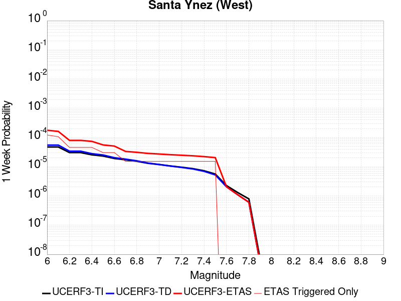 | 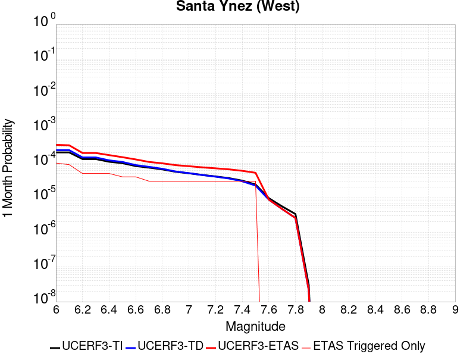 | 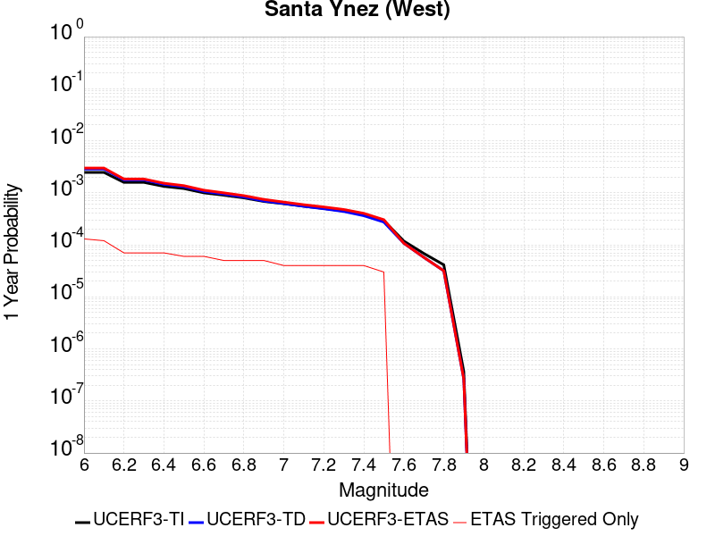 | 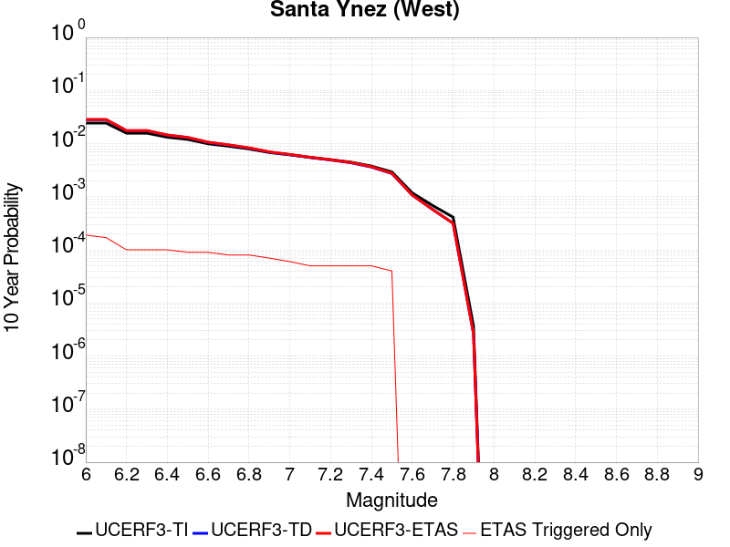 |

| Magnitude | 1 wk TI Prob | 1 wk TD Prob | 1 wk ETAS Prob | 1 wk ETAS/TD Gain | 1 wk ETAS Triggered Only | 1 mo TI Prob | 1 mo TD Prob | 1 mo ETAS Prob | 1 mo ETAS/TD Gain | 1 mo ETAS Triggered Only | 1 yr TI Prob | 1 yr TD Prob | 1 yr ETAS Prob | 1 yr ETAS/TD Gain | 1 yr ETAS Triggered Only | 10 yr TI Prob | 10 yr TD Prob | 10 yr ETAS Prob | 10 yr ETAS/TD Gain | 10 yr ETAS Triggered Only |
|-----|-----|-----|-----|-----|-----|-----|-----|-----|-----|-----|-----|-----|-----|-----|-----|-----|-----|-----|-----|-----|
| 6.0 | 4.7352758E-5 | 5.4972126E-5 | 1.7673103E-4 | 3.2149208 | 1.217656E-4 | 2.0292461E-4 | 2.3557522E-4 | 3.5731212E-4 | 1.5167645 | 1.217656E-4 | 0.0024678076 | 0.0028645284 | 0.0030011223 | 1.0476846 | 1.369863E-4 | 0.024405818 | 0.028304417 | 0.028467106 | 1.0057478 | 1.674277E-4 |
| 6.1 | 4.7352758E-5 | 5.4972126E-5 | 1.6151117E-4 | 2.9380558 | 1.065449E-4 | 2.0292461E-4 | 2.3557522E-4 | 3.42095E-4 | 1.452169 | 1.065449E-4 | 0.0024678076 | 0.0028645284 | 0.0029859452 | 1.0423863 | 1.217656E-4 | 0.024405818 | 0.028304417 | 0.028452316 | 1.0052253 | 1.5220701E-4 |
| 6.2 | 3.0415853E-5 | 3.392511E-5 | 7.958566E-5 | 2.345922 | 4.5662102E-5 | 1.3034715E-4 | 1.4538545E-4 | 1.910409E-4 | 1.3140305 | 4.5662102E-5 | 0.0015858212 | 0.0017686661 | 0.0018294412 | 1.0343621 | 6.08828E-5 | 0.015745522 | 0.017549807 | 0.017639529 | 1.0051124 | 9.1324204E-5 |
| 6.3 | 3.0415853E-5 | 3.392511E-5 | 7.958566E-5 | 2.345922 | 4.5662102E-5 | 1.3034715E-4 | 1.4538545E-4 | 1.910409E-4 | 1.3140305 | 4.5662102E-5 | 0.0015858212 | 0.0017686661 | 0.0018294412 | 1.0343621 | 6.08828E-5 | 0.015745522 | 0.017549807 | 0.017639529 | 1.0051124 | 9.1324204E-5 |
| 6.4 | 2.5452082E-5 | 2.7912422E-5 | 7.357325E-5 | 2.6358604 | 4.5662102E-5 | 1.09075794E-4 | 1.196193E-4 | 1.6527594E-4 | 1.3816829 | 4.5662102E-5 | 0.0013271887 | 0.0014554089 | 0.001516203 | 1.0417712 | 6.08828E-5 | 0.013192902 | 0.014460951 | 0.014550955 | 1.0062239 | 9.1324204E-5 |
| 6.5 | 2.3143784E-5 | 2.5128256E-5 | 5.5568893E-5 | 2.2114105 | 3.04414E-5 | 9.9183875E-5 | 1.0768817E-4 | 1.3812628E-4 | 1.2826506 | 3.04414E-5 | 0.0012068948 | 0.0013103267 | 0.0013559291 | 1.0348022 | 4.5662102E-5 | 0.012003611 | 0.01302768 | 0.013102792 | 1.0057656 | 7.6103504E-5 |
| 6.6 | 1.9118515E-5 | 2.035434E-5 | 5.079512E-5 | 2.4955425 | 3.04414E-5 | 8.193392E-5 | 8.7230015E-5 | 1.1766876E-4 | 1.3489481 | 3.04414E-5 | 9.97089E-4 | 0.001061516 | 0.0011071296 | 1.0429703 | 4.5662102E-5 | 0.00992627 | 0.010565365 | 0.010640664 | 1.007127 | 7.6103504E-5 |
| 6.7 | 1.722807E-5 | 1.8146347E-5 | 3.336677E-5 | 1.8387597 | 1.52207E-5 | 7.3832496E-5 | 7.776777E-5 | 9.298729E-5 | 1.1957047 | 1.52207E-5 | 8.985399E-4 | 9.464169E-4 | 9.768296E-4 | 1.0321344 | 3.04414E-5 | 0.008949154 | 0.0094245095 | 0.009484819 | 1.0063992 | 6.08828E-5 |
| 6.8 | 1.5317364E-5 | 1.5926486E-5 | 3.114694E-5 | 1.9556696 | 1.52207E-5 | 6.56442E-5 | 6.82546E-5 | 8.347427E-5 | 1.2229837 | 1.52207E-5 | 7.98925E-4 | 8.306873E-4 | 8.6110336E-4 | 1.0366156 | 3.04414E-5 | 0.007960589 | 0.00827631 | 0.008336688 | 1.0072954 | 6.08828E-5 |
| 6.9 | 1.3071226E-5 | 1.3329624E-5 | 2.8550121E-5 | 2.141855 | 1.52207E-5 | 5.6018336E-5 | 5.7125722E-5 | 7.234555E-5 | 1.2664269 | 1.52207E-5 | 6.8180985E-4 | 6.9528597E-4 | 7.257062E-4 | 1.0437521 | 3.04414E-5 | 0.0067972173 | 0.006931367 | 0.0069767125 | 1.0065421 | 4.5662102E-5 |
| 7.0 | 1.1836986E-5 | 1.19327815E-5 | 2.71533E-5 | 2.2755215 | 1.52207E-5 | 5.0728955E-5 | 5.11395E-5 | 6.635942E-5 | 1.2976158 | 1.52207E-5 | 6.1745E-4 | 6.2244723E-4 | 6.3765846E-4 | 1.0244378 | 1.52207E-5 | 0.006157372 | 0.006207231 | 0.0062374836 | 1.0048738 | 3.04414E-5 |
| 7.1 | 1.0597169E-5 | 1.0542201E-5 | 2.5762742E-5 | 2.4437726 | 1.52207E-5 | 4.541565E-5 | 4.5180084E-5 | 6.04001E-5 | 1.3368744 | 1.52207E-5 | 5.5279525E-4 | 5.4992986E-4 | 5.651422E-4 | 1.0276623 | 1.52207E-5 | 0.0055142213 | 0.005485821 | 0.0055009583 | 1.0027593 | 1.52207E-5 |
| 7.2 | 9.59113E-6 | 9.459144E-6 | 2.46797E-5 | 2.609084 | 1.52207E-5 | 4.11042E-5 | 4.0538565E-5 | 5.5758646E-5 | 1.375447 | 1.52207E-5 | 5.0032866E-4 | 4.934463E-4 | 5.086595E-4 | 1.0308305 | 1.52207E-5 | 0.004992037 | 0.0049236254 | 0.004938771 | 1.0030762 | 1.52207E-5 |
| 7.3 | 8.586084E-6 | 8.379583E-6 | 2.3600156E-5 | 2.8163877 | 1.52207E-5 | 3.679698E-5 | 3.5912013E-5 | 5.1132163E-5 | 1.4238179 | 1.52207E-5 | 4.4791115E-4 | 4.3714207E-4 | 4.523561E-4 | 1.0348034 | 1.52207E-5 | 0.004470094 | 0.004362933 | 0.0043780874 | 1.0034734 | 1.52207E-5 |
| 7.4 | 7.2622997E-6 | 6.9515427E-6 | 2.2172137E-5 | 3.1895275 | 1.52207E-5 | 3.112377E-5 | 2.979199E-5 | 4.501224E-5 | 1.5108838 | 1.52207E-5 | 3.78866E-4 | 3.626581E-4 | 3.7787328E-4 | 1.0419546 | 1.52207E-5 | 0.0037822074 | 0.0036207628 | 0.0036359285 | 1.0041885 | 1.52207E-5 |
| 7.5 | 5.627296E-6 | 5.251588E-6 | 2.0472207E-5 | 3.8982892 | 1.52207E-5 | 2.411676E-5 | 2.2506614E-5 | 3.772697E-5 | 1.6762615 | 1.52207E-5 | 2.9358198E-4 | 2.739843E-4 | 2.8920083E-4 | 1.0555379 | 1.52207E-5 | 0.0029319443 | 0.002736537 | 0.002751716 | 1.0055468 | 1.52207E-5 |
| 7.6 | 2.265244E-6 | 2.0608625E-6 | 2.0608625E-6 | 1.0 | 0.0 | 9.708152E-6 | 8.832238E-6 | 8.832238E-6 | 1.0 | 0.0 | 1.18190335E-4 | 1.0752728E-4 | 1.0752728E-4 | 1.0 | 0.0 | 0.001181275 | 0.0010747612 | 0.0010747612 | 1.0 | 0.0 |
| 7.7 | 1.3099874E-6 | 1.1016252E-6 | 1.1016252E-6 | 1.0 | 0.0 | 5.61422E-6 | 4.7212425E-6 | 4.7212425E-6 | 1.0 | 0.0 | 6.8350986E-5 | 5.7479636E-5 | 5.7479636E-5 | 1.0 | 0.0 | 6.832996E-4 | 5.7465007E-4 | 5.7465007E-4 | 1.0 | 0.0 |
| 7.8 | 7.903951E-7 | 6.0711415E-7 | 6.0711415E-7 | 1.0 | 0.0 | 3.3874032E-6 | 2.6019152E-6 | 2.6019152E-6 | 1.0 | 0.0 | 4.1240855E-5 | 3.167787E-5 | 3.167787E-5 | 1.0 | 0.0 | 4.12332E-4 | 3.167349E-4 | 3.167349E-4 | 1.0 | 0.0 |
| 7.9 | 7.0753297E-9 | 5.0899476E-9 | 5.0899476E-9 | 1.0 | 0.0 | 3.032284E-8 | 2.181406E-8 | 2.181406E-8 | 1.0 | 0.0 | 3.6918053E-7 | 2.6558615E-7 | 2.6558615E-7 | 1.0 | 0.0 | 3.691799E-6 | 2.6558594E-6 | 2.6558594E-6 | 1.0 | 0.0 |

## Cleghorn Pass
*[(top)](#table-of-contents)*

| 1 Week | 1 Month | 1 Year | 10 Year |
|-----|-----|-----|-----|
| 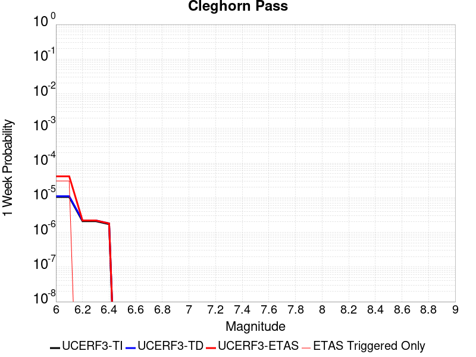 | 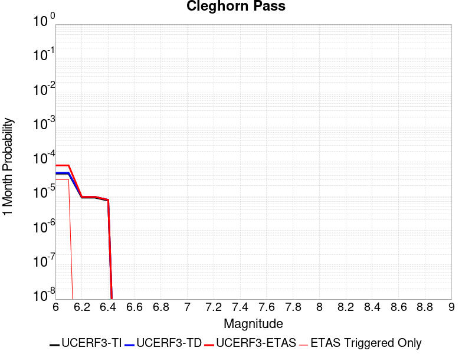 | 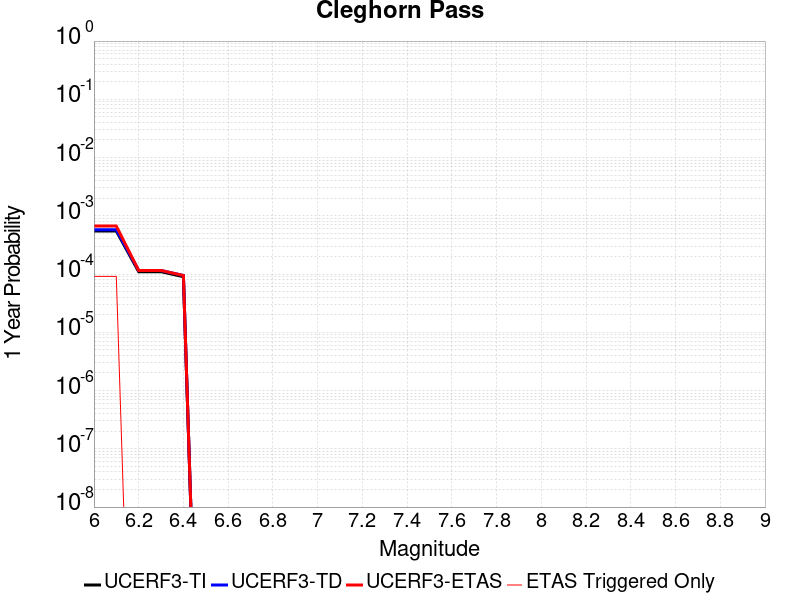 | 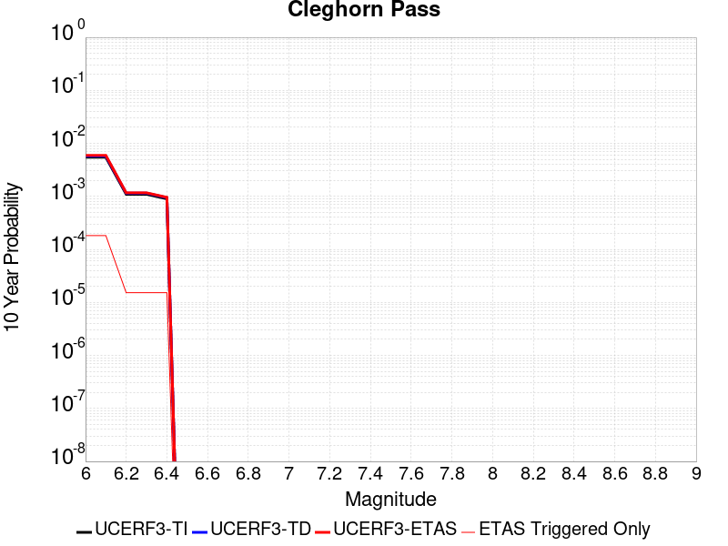 |

| Magnitude | 1 wk TI Prob | 1 wk TD Prob | 1 wk ETAS Prob | 1 wk ETAS/TD Gain | 1 wk ETAS Triggered Only | 1 mo TI Prob | 1 mo TD Prob | 1 mo ETAS Prob | 1 mo ETAS/TD Gain | 1 mo ETAS Triggered Only | 1 yr TI Prob | 1 yr TD Prob | 1 yr ETAS Prob | 1 yr ETAS/TD Gain | 1 yr ETAS Triggered Only | 10 yr TI Prob | 10 yr TD Prob | 10 yr ETAS Prob | 10 yr ETAS/TD Gain | 10 yr ETAS Triggered Only |
|-----|-----|-----|-----|-----|-----|-----|-----|-----|-----|-----|-----|-----|-----|-----|-----|-----|-----|-----|-----|-----|
| 6.0 | 1.0522846E-5 | 1.1040642E-5 | 4.1481704E-5 | 3.7571826 | 3.04414E-5 | 4.509713E-5 | 4.7316473E-5 | 7.7756435E-5 | 1.6433269 | 3.04414E-5 | 5.4891926E-4 | 5.759784E-4 | 6.672501E-4 | 1.1584636 | 9.1324204E-5 | 0.0054756533 | 0.005750022 | 0.00593162 | 1.0315821 | 1.8264841E-4 |
| 6.1 | 1.0522846E-5 | 1.1040642E-5 | 4.1481704E-5 | 3.7571826 | 3.04414E-5 | 4.509713E-5 | 4.7316473E-5 | 7.7756435E-5 | 1.6433269 | 3.04414E-5 | 5.4891926E-4 | 5.759784E-4 | 6.672501E-4 | 1.1584636 | 9.1324204E-5 | 0.0054756533 | 0.005750022 | 0.00593162 | 1.0315821 | 1.8264841E-4 |
| 6.2 | 2.1045846E-6 | 2.2082024E-6 | 2.2082024E-6 | 1.0 | 0.0 | 9.019617E-6 | 9.463714E-6 | 9.463714E-6 | 1.0 | 0.0 | 1.098083E-4 | 1.1521882E-4 | 1.1521882E-4 | 1.0 | 0.0 | 0.0010975406 | 0.0011520023 | 0.0011672054 | 1.0131972 | 1.52207E-5 |
| 6.3 | 2.1045846E-6 | 2.2082024E-6 | 2.2082024E-6 | 1.0 | 0.0 | 9.019617E-6 | 9.463714E-6 | 9.463714E-6 | 1.0 | 0.0 | 1.098083E-4 | 1.1521882E-4 | 1.1521882E-4 | 1.0 | 0.0 | 0.0010975406 | 0.0011520023 | 0.0011672054 | 1.0131972 | 1.52207E-5 |
| 6.4 | 1.7259927E-6 | 1.810877E-6 | 1.810877E-6 | 1.0 | 0.0 | 7.3970905E-6 | 7.760902E-6 | 7.760902E-6 | 1.0 | 0.0 | 9.005586E-5 | 9.4488976E-5 | 9.4488976E-5 | 1.0 | 0.0 | 9.001937E-4 | 9.448898E-4 | 9.6009613E-4 | 1.0160933 | 1.52207E-5 |

## Brawley (Seismic Zone) alt 1
*[(top)](#table-of-contents)*

| 1 Week | 1 Month | 1 Year | 10 Year |
|-----|-----|-----|-----|
| 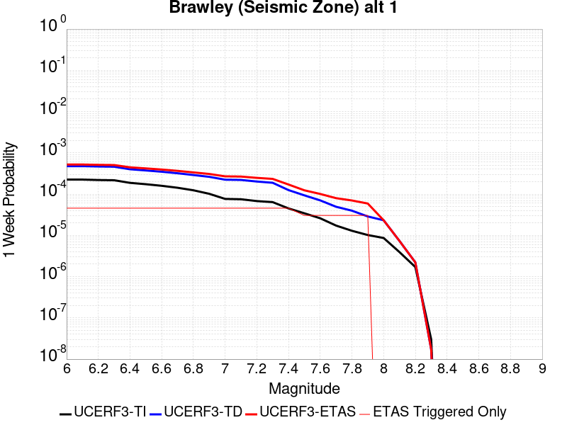 | 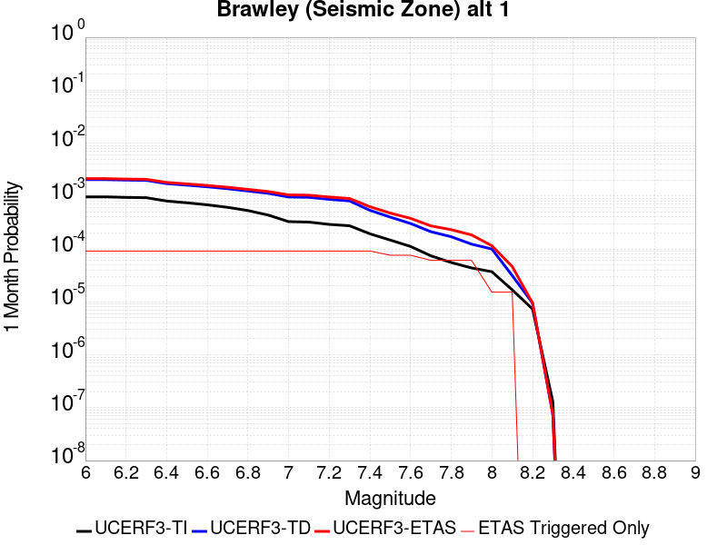 | 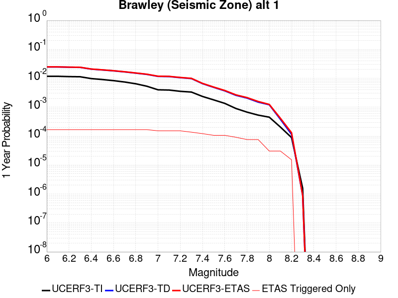 | 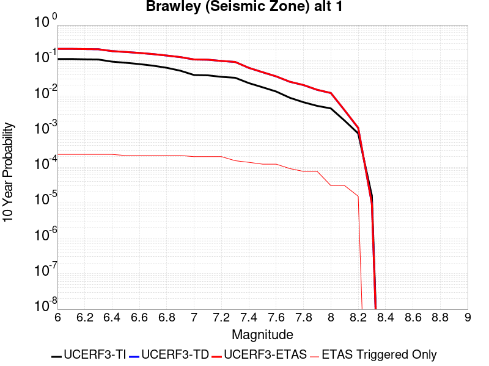 |

| Magnitude | 1 wk TI Prob | 1 wk TD Prob | 1 wk ETAS Prob | 1 wk ETAS/TD Gain | 1 wk ETAS Triggered Only | 1 mo TI Prob | 1 mo TD Prob | 1 mo ETAS Prob | 1 mo ETAS/TD Gain | 1 mo ETAS Triggered Only | 1 yr TI Prob | 1 yr TD Prob | 1 yr ETAS Prob | 1 yr ETAS/TD Gain | 1 yr ETAS Triggered Only | 10 yr TI Prob | 10 yr TD Prob | 10 yr ETAS Prob | 10 yr ETAS/TD Gain | 10 yr ETAS Triggered Only |
|-----|-----|-----|-----|-----|-----|-----|-----|-----|-----|-----|-----|-----|-----|-----|-----|-----|-----|-----|-----|-----|
| 6.0 | 2.2521618E-4 | 4.7632487E-4 | 5.219652E-4 | 1.0958177 | 4.5662102E-5 | 9.6485513E-4 | 0.0020398323 | 0.0021309701 | 1.0446792 | 9.1324204E-5 | 0.011683988 | 0.024546238 | 0.024709554 | 1.0066534 | 1.674277E-4 | 0.11088423 | 0.21350002 | 0.21367958 | 1.000841 | 2.283105E-4 |
| 6.1 | 2.2521618E-4 | 4.7632487E-4 | 5.219652E-4 | 1.0958177 | 4.5662102E-5 | 9.6485513E-4 | 0.0020398323 | 0.0021309701 | 1.0446792 | 9.1324204E-5 | 0.011683988 | 0.024546238 | 0.024709554 | 1.0066534 | 1.674277E-4 | 0.11088423 | 0.21350002 | 0.21367958 | 1.000841 | 2.283105E-4 |
| 6.2 | 2.198148E-4 | 4.6717093E-4 | 5.128117E-4 | 1.0976961 | 4.5662102E-5 | 9.417233E-4 | 0.0020006616 | 0.0020918031 | 1.0455557 | 9.1324204E-5 | 0.011405343 | 0.024080504 | 0.024243899 | 1.0067854 | 1.674277E-4 | 0.10837428 | 0.20993657 | 0.21011695 | 1.0008593 | 2.283105E-4 |
| 6.3 | 2.1704129E-4 | 4.615278E-4 | 5.071688E-4 | 1.0988911 | 4.5662102E-5 | 9.298453E-4 | 0.0019765133 | 0.0020676572 | 1.0461134 | 9.1324204E-5 | 0.011262234 | 0.02379366 | 0.023957105 | 1.0068692 | 1.674277E-4 | 0.107082725 | 0.20782755 | 0.20800841 | 1.0008702 | 2.283105E-4 |
| 6.4 | 1.876142E-4 | 4.00449E-4 | 4.4609283E-4 | 1.1139816 | 4.5662102E-5 | 8.038131E-4 | 0.0017150956 | 0.0018062632 | 1.053156 | 9.1324204E-5 | 0.00974259 | 0.020680401 | 0.020844366 | 1.0079285 | 1.674277E-4 | 0.093263686 | 0.18457815 | 0.18476433 | 1.0010086 | 2.283105E-4 |
| 6.5 | 1.7390939E-4 | 3.7477075E-4 | 4.2041574E-4 | 1.1217945 | 4.5662102E-5 | 7.45113E-4 | 0.0016051838 | 0.0016963615 | 1.0568019 | 9.1324204E-5 | 0.009034078 | 0.019368723 | 0.019532908 | 1.0084769 | 1.674277E-4 | 0.086755216 | 0.17440031 | 0.17457624 | 1.0010087 | 2.130898E-4 |
| 6.6 | 1.591791E-4 | 3.4891962E-4 | 3.9456578E-4 | 1.1308215 | 4.5662102E-5 | 6.8201777E-4 | 0.0014945229 | 0.0015857106 | 1.0610147 | 9.1324204E-5 | 0.008271996 | 0.018045569 | 0.018209975 | 1.0091106 | 1.674277E-4 | 0.07970774 | 0.16380852 | 0.16398671 | 1.0010878 | 2.130898E-4 |
| 6.7 | 1.4268003E-4 | 3.20582E-4 | 3.6622948E-4 | 1.1423893 | 4.5662102E-5 | 6.1134255E-4 | 0.0013732077 | 0.0014644065 | 1.0664129 | 9.1324204E-5 | 0.007417723 | 0.016592601 | 0.016757252 | 1.0099231 | 1.674277E-4 | 0.07174956 | 0.15193306 | 0.15211378 | 1.0011895 | 2.130898E-4 |
| 6.8 | 1.239713E-4 | 2.9053655E-4 | 3.361854E-4 | 1.157119 | 4.5662102E-5 | 5.3119735E-4 | 0.0012445687 | 0.0013357792 | 1.0732869 | 9.1324204E-5 | 0.0064481674 | 0.015048777 | 0.015213685 | 1.0109582 | 1.674277E-4 | 0.06264243 | 0.13837762 | 0.13856123 | 1.0013268 | 2.130898E-4 |
| 6.9 | 1.0180238E-4 | 2.625439E-4 | 3.0819402E-4 | 1.173876 | 4.5662102E-5 | 4.3622297E-4 | 0.0011247073 | 0.0012159287 | 1.0811069 | 9.1324204E-5 | 0.005298089 | 0.013608336 | 0.013773485 | 1.0121359 | 1.674277E-4 | 0.05173543 | 0.124961674 | 0.12514813 | 1.0014921 | 2.130898E-4 |
| 7.0 | 7.6619996E-5 | 2.23993E-4 | 2.6964486E-4 | 1.2038094 | 4.5662102E-5 | 3.283301E-4 | 9.5962E-4 | 0.0010508565 | 1.0950757 | 9.1324204E-5 | 0.0039900932 | 0.011621496 | 0.011771933 | 1.0129448 | 1.5220701E-4 | 0.039192066 | 0.107266866 | 0.10744351 | 1.0016468 | 1.978691E-4 |
| 7.1 | 7.5127435E-5 | 2.2082464E-4 | 2.6647665E-4 | 1.2067343 | 4.5662102E-5 | 3.2193496E-4 | 9.4605127E-4 | 0.001037289 | 1.0964407 | 9.1324204E-5 | 0.0039125155 | 0.011458045 | 0.0116085075 | 1.0131316 | 1.5220701E-4 | 0.038443442 | 0.10583085 | 0.10600778 | 1.0016718 | 1.978691E-4 |
| 7.2 | 6.788582E-5 | 2.0210193E-4 | 2.477548E-4 | 1.2258903 | 4.5662102E-5 | 2.9090676E-4 | 8.6586666E-4 | 9.571118E-4 | 1.10538 | 9.1324204E-5 | 0.0035360386 | 0.0104916105 | 0.01064222 | 1.0143553 | 1.5220701E-4 | 0.034803 | 0.09750131 | 0.09767989 | 1.0018315 | 1.978691E-4 |
| 7.3 | 6.399602E-5 | 1.8841137E-4 | 2.3406486E-4 | 1.2423075 | 4.5662102E-5 | 2.7423984E-4 | 8.072303E-4 | 8.9848076E-4 | 1.1130414 | 9.1324204E-5 | 0.0033337586 | 0.009784332 | 0.009919977 | 1.0138636 | 1.369863E-4 | 0.03284188 | 0.09139617 | 0.09153446 | 1.0015131 | 1.5220701E-4 |
| 7.4 | 4.506759E-5 | 1.2529209E-4 | 1.7094846E-4 | 1.3643996 | 4.5662102E-5 | 1.9313251E-4 | 5.368565E-4 | 6.281316E-4 | 1.1700178 | 9.1324204E-5 | 0.0023488526 | 0.0065168133 | 0.0066377856 | 1.018563 | 1.217656E-4 | 0.023241805 | 0.062363707 | 0.062492147 | 1.0020596 | 1.369863E-4 |
| 7.5 | 3.43289E-5 | 9.33541E-5 | 1.2379266E-4 | 1.3260548 | 3.04414E-5 | 1.4711556E-4 | 4.00028E-4 | 4.7610104E-4 | 1.1901693 | 7.6103504E-5 | 0.0017896603 | 0.0048595266 | 0.0049655535 | 1.0218184 | 1.065449E-4 | 0.01775316 | 0.04705519 | 0.047171224 | 1.002466 | 1.217656E-4 |
| 7.6 | 2.5980507E-5 | 7.053101E-5 | 1.0097026E-4 | 1.4315727 | 3.04414E-5 | 1.1134028E-4 | 3.0224086E-4 | 3.7832136E-4 | 1.2517214 | 7.6103504E-5 | 0.001354725 | 0.003673598 | 0.0037797515 | 1.0288963 | 1.065449E-4 | 0.013464959 | 0.035840835 | 0.035958234 | 1.0032756 | 1.217656E-4 |
| 7.7 | 1.7292105E-5 | 4.9407296E-5 | 7.9847196E-5 | 1.6161013 | 3.04414E-5 | 7.4106916E-5 | 2.117284E-4 | 2.7259832E-4 | 1.2874905 | 6.08828E-5 | 9.018782E-4 | 0.0025747516 | 0.0026658408 | 1.0353779 | 9.1324204E-5 | 0.008982267 | 0.025290398 | 0.025379412 | 1.0035197 | 9.1324204E-5 |
| 7.8 | 1.2927471E-5 | 3.9693266E-5 | 7.013346E-5 | 1.7668855 | 3.04414E-5 | 5.5402274E-5 | 1.7010293E-4 | 2.3097538E-4 | 1.3578565 | 6.08828E-5 | 6.743139E-4 | 0.0020690386 | 0.0021449847 | 1.036706 | 7.6103504E-5 | 0.0067227143 | 0.020431727 | 0.020506276 | 1.0036486 | 7.6103504E-5 |
| 7.9 | 1.0200774E-5 | 2.874569E-5 | 5.9186215E-5 | 2.0589597 | 3.04414E-5 | 4.371687E-5 | 1.2319001E-4 | 1.840653E-4 | 1.4941578 | 6.08828E-5 | 5.321229E-4 | 0.0014988075 | 0.001574797 | 1.0507 | 7.6103504E-5 | 0.005308505 | 0.014991644 | 0.015066606 | 1.0050002 | 7.6103504E-5 |
| 8.0 | 8.650396E-6 | 2.3277367E-5 | 2.3277367E-5 | 1.0 | 0.0 | 3.70726E-5 | 9.975634E-5 | 1.1497552E-4 | 1.1525636 | 1.52207E-5 | 4.5126543E-4 | 0.0012138576 | 0.001244262 | 1.0250478 | 3.04414E-5 | 0.0045035016 | 0.012211097 | 0.012241167 | 1.0024625 | 3.04414E-5 |
| 8.1 | 3.9368224E-6 | 7.3279825E-6 | 7.3279825E-6 | 1.0 | 0.0 | 1.6871985E-5 | 3.140526E-5 | 4.6625482E-5 | 1.4846393 | 1.52207E-5 | 2.0539707E-4 | 3.8229208E-4 | 4.1272186E-4 | 1.0795982 | 3.04414E-5 | 0.0020520731 | 0.004001185 | 0.004031504 | 1.0075777 | 3.04414E-5 |
| 8.2 | 1.7101195E-6 | 2.217876E-6 | 2.217876E-6 | 1.0 | 0.0 | 7.329063E-6 | 9.505149E-6 | 9.505149E-6 | 1.0 | 0.0 | 8.922769E-5 | 1.1571907E-4 | 1.3093802E-4 | 1.1315162 | 1.52207E-5 | 8.9191867E-4 | 0.0012666774 | 0.0012818788 | 1.012001 | 1.52207E-5 |
| 8.3 | 3.0346666E-8 | 1.721586E-8 | 1.721586E-8 | 1.0 | 0.0 | 1.3005713E-7 | 7.378226E-8 | 7.378226E-8 | 1.0 | 0.0 | 1.5834444E-6 | 8.9829894E-7 | 8.9829894E-7 | 1.0 | 0.0 | 1.5834332E-5 | 9.367729E-6 | 9.367729E-6 | 1.0 | 0.0 |

## Pinto Mtn
*[(top)](#table-of-contents)*

| 1 Week | 1 Month | 1 Year | 10 Year |
|-----|-----|-----|-----|
| 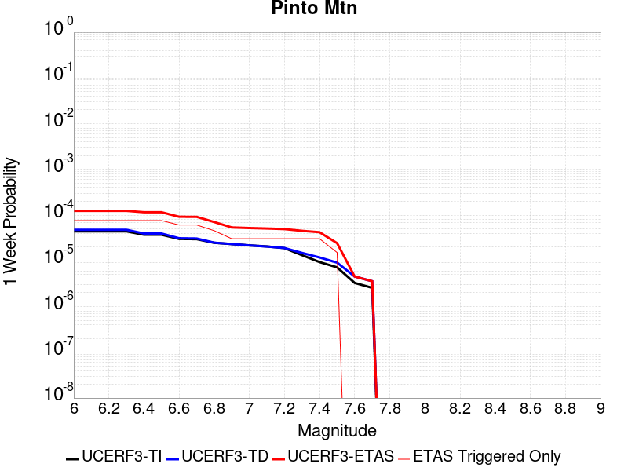 | 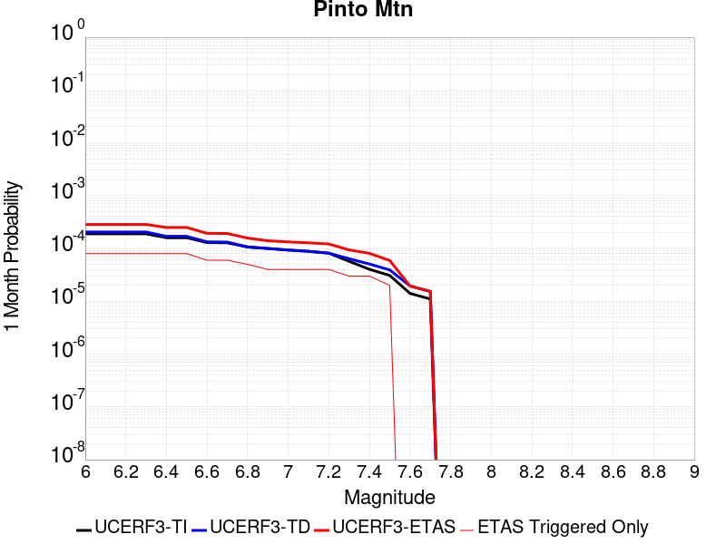 | 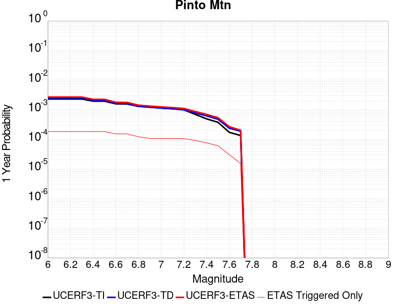 | 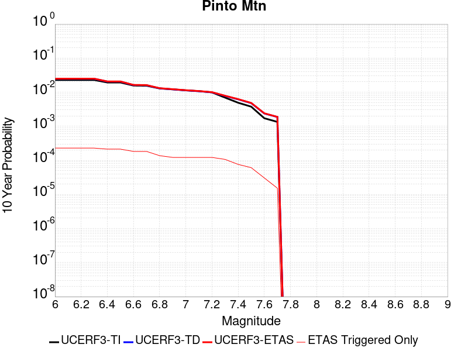 |

| Magnitude | 1 wk TI Prob | 1 wk TD Prob | 1 wk ETAS Prob | 1 wk ETAS/TD Gain | 1 wk ETAS Triggered Only | 1 mo TI Prob | 1 mo TD Prob | 1 mo ETAS Prob | 1 mo ETAS/TD Gain | 1 mo ETAS Triggered Only | 1 yr TI Prob | 1 yr TD Prob | 1 yr ETAS Prob | 1 yr ETAS/TD Gain | 1 yr ETAS Triggered Only | 10 yr TI Prob | 10 yr TD Prob | 10 yr ETAS Prob | 10 yr ETAS/TD Gain | 10 yr ETAS Triggered Only |
|-----|-----|-----|-----|-----|-----|-----|-----|-----|-----|-----|-----|-----|-----|-----|-----|-----|-----|-----|-----|-----|
| 6.0 | 4.4194956E-5 | 4.785362E-5 | 1.2395348E-4 | 2.5902634 | 7.6103504E-5 | 1.893932E-4 | 2.0507174E-4 | 3.115948E-4 | 1.5194428 | 1.065449E-4 | 0.0023034236 | 0.0024940541 | 0.0026762472 | 1.0730509 | 1.8264841E-4 | 0.022796938 | 0.024678145 | 0.024900822 | 1.0090232 | 2.283105E-4 |
| 6.1 | 4.4194956E-5 | 4.785362E-5 | 1.2395348E-4 | 2.5902634 | 7.6103504E-5 | 1.893932E-4 | 2.0507174E-4 | 3.115948E-4 | 1.5194428 | 1.065449E-4 | 0.0023034236 | 0.0024940541 | 0.0026762472 | 1.0730509 | 1.8264841E-4 | 0.022796938 | 0.024678145 | 0.024900822 | 1.0090232 | 2.283105E-4 |
| 6.2 | 4.4194956E-5 | 4.785362E-5 | 1.2395348E-4 | 2.5902634 | 7.6103504E-5 | 1.893932E-4 | 2.0507174E-4 | 3.115948E-4 | 1.5194428 | 1.065449E-4 | 0.0023034236 | 0.0024940541 | 0.0026762472 | 1.0730509 | 1.8264841E-4 | 0.022796938 | 0.024678145 | 0.024900822 | 1.0090232 | 2.283105E-4 |
| 6.3 | 4.4194956E-5 | 4.785362E-5 | 1.2395348E-4 | 2.5902634 | 7.6103504E-5 | 1.893932E-4 | 2.0507174E-4 | 3.115948E-4 | 1.5194428 | 1.065449E-4 | 0.0023034236 | 0.0024940541 | 0.0026762472 | 1.0730509 | 1.8264841E-4 | 0.022796938 | 0.024678145 | 0.024900822 | 1.0090232 | 2.283105E-4 |
| 6.4 | 3.729929E-5 | 3.9603186E-5 | 1.15703675E-4 | 2.9215748 | 7.6103504E-5 | 1.5984432E-4 | 1.6971743E-4 | 2.7624425E-4 | 1.6276717 | 1.065449E-4 | 0.0019443673 | 0.002064445 | 0.0022467163 | 1.0882907 | 1.8264841E-4 | 0.019274427 | 0.02046269 | 0.02067142 | 1.0102005 | 2.130898E-4 |
| 6.5 | 3.729929E-5 | 3.9603186E-5 | 1.15703675E-4 | 2.9215748 | 7.6103504E-5 | 1.5984432E-4 | 1.6971743E-4 | 2.7624425E-4 | 1.6276717 | 1.065449E-4 | 0.0019443673 | 0.002064445 | 0.0022467163 | 1.0882907 | 1.8264841E-4 | 0.019274427 | 0.02046269 | 0.02067142 | 1.0102005 | 2.130898E-4 |
| 6.6 | 3.0204548E-5 | 3.1205298E-5 | 9.20862E-5 | 2.9509797 | 6.08828E-5 | 1.2944164E-4 | 1.3373033E-4 | 2.2504231E-4 | 1.6828068 | 9.1324204E-5 | 0.0015748127 | 0.0016269855 | 0.0017789449 | 1.0933993 | 1.5220701E-4 | 0.015636992 | 0.01615461 | 0.016334306 | 1.0111237 | 1.8264841E-4 |
| 6.7 | 2.9857754E-5 | 3.081468E-5 | 9.1695605E-5 | 2.9757116 | 6.08828E-5 | 1.2795553E-4 | 1.3205643E-4 | 2.2336858E-4 | 1.691463 | 9.1324204E-5 | 0.0015567453 | 0.001606636 | 0.0017585984 | 1.0945842 | 1.5220701E-4 | 0.015458848 | 0.01595405 | 0.016133783 | 1.0112658 | 1.8264841E-4 |
| 6.8 | 2.4819734E-5 | 2.5009364E-5 | 7.067032E-5 | 2.8257546 | 4.5662102E-5 | 1.0636595E-4 | 1.07178705E-4 | 1.8327405E-4 | 1.7099857 | 7.6103504E-5 | 0.0012942362 | 0.0013041412 | 0.001425748 | 1.0932467 | 1.217656E-4 | 0.012867244 | 0.0129672475 | 0.013102457 | 1.010427 | 1.369863E-4 |
| 6.9 | 2.331124E-5 | 2.3337643E-5 | 5.377833E-5 | 2.3043602 | 3.04414E-5 | 9.990149E-5 | 1.00014746E-4 | 1.6089146E-4 | 1.6086774 | 6.08828E-5 | 0.001215622 | 0.0012170197 | 0.001323435 | 1.0874392 | 1.065449E-4 | 0.012089936 | 0.012105742 | 0.012226033 | 1.0099367 | 1.217656E-4 |
| 7.0 | 2.1818534E-5 | 2.1760772E-5 | 5.220151E-5 | 2.3988814 | 3.04414E-5 | 9.3504656E-5 | 9.325723E-5 | 1.5413435E-4 | 1.6527872 | 6.08828E-5 | 0.0011378246 | 0.0011348352 | 0.0012412592 | 1.0937792 | 1.065449E-4 | 0.011320163 | 0.011292503 | 0.011412894 | 1.0106611 | 1.217656E-4 |
| 7.1 | 2.066081E-5 | 2.0540418E-5 | 5.098119E-5 | 2.481994 | 3.04414E-5 | 8.854332E-5 | 8.8027504E-5 | 1.4890495E-4 | 1.691573 | 6.08828E-5 | 0.0010774818 | 0.0010712275 | 0.0011776582 | 1.099354 | 1.065449E-4 | 0.010722724 | 0.010662688 | 0.010783155 | 1.0112981 | 1.217656E-4 |
| 7.2 | 1.8990233E-5 | 1.9053701E-5 | 4.9494523E-5 | 2.597633 | 3.04414E-5 | 8.138417E-5 | 8.1656275E-5 | 1.425341E-4 | 1.7455376 | 6.08828E-5 | 9.904018E-4 | 9.937311E-4 | 0.0011001701 | 1.1071105 | 1.065449E-4 | 0.009859995 | 0.009894874 | 0.010015435 | 1.0121841 | 1.217656E-4 |
| 7.3 | 1.3335872E-5 | 1.4906372E-5 | 4.534732E-5 | 3.0421433 | 3.04414E-5 | 5.7152483E-5 | 6.388296E-5 | 1.0954214E-4 | 1.7147318 | 4.5662102E-5 | 6.956093E-4 | 7.775102E-4 | 8.687634E-4 | 1.117366 | 9.1324204E-5 | 0.006934359 | 0.0077491994 | 0.007854919 | 1.0136425 | 1.065449E-4 |
| 7.4 | 9.414066E-6 | 1.186061E-5 | 4.230165E-5 | 3.566566 | 3.04414E-5 | 4.0345374E-5 | 5.0830247E-5 | 9.649003E-5 | 1.8982797 | 4.5662102E-5 | 4.910942E-4 | 6.1869196E-4 | 6.947484E-4 | 1.122931 | 7.6103504E-5 | 0.0049001034 | 0.006170644 | 0.0062462776 | 1.0122571 | 7.6103504E-5 |
| 7.5 | 7.2101157E-6 | 9.157893E-6 | 2.4378454E-5 | 2.6620154 | 1.52207E-5 | 3.090013E-5 | 3.924757E-5 | 6.9687776E-5 | 1.7755947 | 3.04414E-5 | 3.7614413E-4 | 4.7774217E-4 | 5.385959E-4 | 1.1273777 | 6.08828E-5 | 0.0037550807 | 0.004767927 | 0.004828519 | 1.0127083 | 6.08828E-5 |
| 7.6 | 3.296375E-6 | 4.5453176E-6 | 4.5453176E-6 | 1.0 | 0.0 | 1.4127245E-5 | 1.9479796E-5 | 1.9479796E-5 | 1.0 | 0.0 | 1.7198564E-4 | 2.3714209E-4 | 2.6757628E-4 | 1.1283374 | 3.04414E-5 | 0.0017185259 | 0.0023690276 | 0.0023993968 | 1.0128193 | 3.04414E-5 |
| 7.7 | 2.5741092E-6 | 3.584251E-6 | 3.584251E-6 | 1.0 | 0.0 | 1.103185E-5 | 1.5360993E-5 | 1.5360993E-5 | 1.0 | 0.0 | 1.3430449E-4 | 1.8700535E-4 | 2.0222321E-4 | 1.0813766 | 1.52207E-5 | 0.0013422335 | 0.0018686098 | 0.001883802 | 1.0081302 | 1.52207E-5 |

## Imperial
*[(top)](#table-of-contents)*

| 1 Week | 1 Month | 1 Year | 10 Year |
|-----|-----|-----|-----|
| 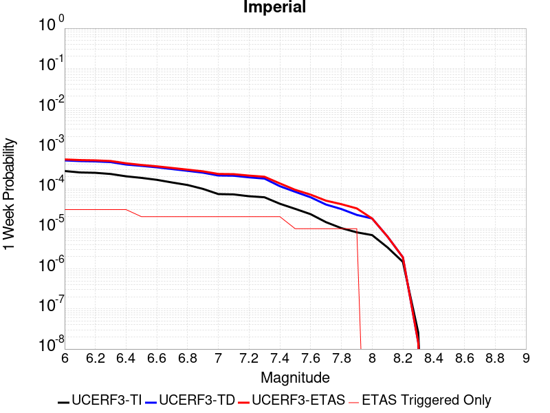 | 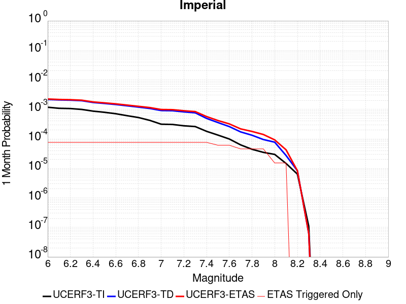 | 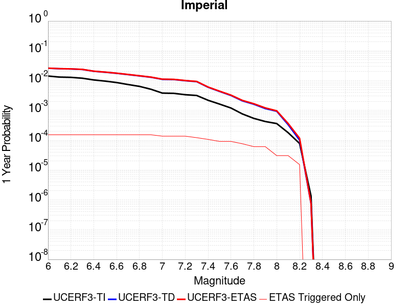 | 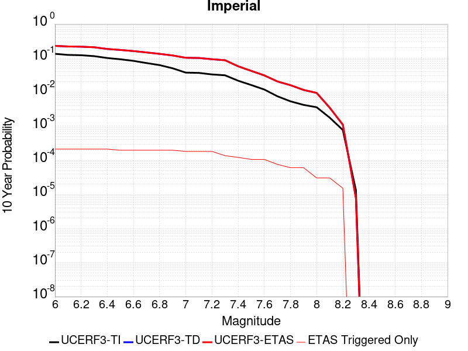 |

| Magnitude | 1 wk TI Prob | 1 wk TD Prob | 1 wk ETAS Prob | 1 wk ETAS/TD Gain | 1 wk ETAS Triggered Only | 1 mo TI Prob | 1 mo TD Prob | 1 mo ETAS Prob | 1 mo ETAS/TD Gain | 1 mo ETAS Triggered Only | 1 yr TI Prob | 1 yr TD Prob | 1 yr ETAS Prob | 1 yr ETAS/TD Gain | 1 yr ETAS Triggered Only | 10 yr TI Prob | 10 yr TD Prob | 10 yr ETAS Prob | 10 yr ETAS/TD Gain | 10 yr ETAS Triggered Only |
|-----|-----|-----|-----|-----|-----|-----|-----|-----|-----|-----|-----|-----|-----|-----|-----|-----|-----|-----|-----|-----|
| 6.0 | 2.7496446E-4 | 5.0552754E-4 | 5.3595356E-4 | 1.0601866 | 3.04414E-5 | 0.0011778869 | 0.002164787 | 0.0022407258 | 1.0350791 | 7.6103504E-5 | 0.0142467655 | 0.026038699 | 0.026186941 | 1.0056932 | 1.5220701E-4 | 0.13367249 | 0.2280438 | 0.22820829 | 1.0007213 | 2.130898E-4 |
| 6.1 | 2.5356023E-4 | 4.8656776E-4 | 5.1699433E-4 | 1.0625331 | 3.04414E-5 | 0.001086234 | 0.0020836622 | 0.0021596071 | 1.0364478 | 7.6103504E-5 | 0.013144928 | 0.025071215 | 0.025219606 | 1.0059187 | 1.5220701E-4 | 0.123940155 | 0.21947981 | 0.21964613 | 1.0007578 | 2.130898E-4 |
| 6.2 | 2.4820742E-4 | 4.7752203E-4 | 5.0794886E-4 | 1.0637182 | 3.04414E-5 | 0.0010633124 | 0.0020449557 | 0.0021209037 | 1.0371392 | 7.6103504E-5 | 0.01286919 | 0.024611235 | 0.024759697 | 1.0060322 | 1.5220701E-4 | 0.12148927 | 0.21598552 | 0.2161526 | 1.0007735 | 2.130898E-4 |
| 6.3 | 2.3205351E-4 | 4.5890483E-4 | 4.8933225E-4 | 1.0663044 | 3.04414E-5 | 9.94136E-4 | 0.0019652895 | 0.0020412432 | 1.0386477 | 7.6103504E-5 | 0.012036599 | 0.02366133 | 0.023809936 | 1.0062805 | 1.5220701E-4 | 0.11405133 | 0.20793462 | 0.2081034 | 1.0008117 | 2.130898E-4 |
| 6.4 | 2.0304754E-4 | 3.987652E-4 | 4.2919445E-4 | 1.0763087 | 3.04414E-5 | 8.6991355E-4 | 0.0017078889 | 0.0017838625 | 1.0444839 | 7.6103504E-5 | 0.010539869 | 0.020595672 | 0.020744743 | 1.007238 | 1.5220701E-4 | 0.100537635 | 0.1850669 | 0.18524055 | 1.0009383 | 2.130898E-4 |
| 6.5 | 1.854992E-4 | 3.6988858E-4 | 4.0031874E-4 | 1.0822684 | 3.04414E-5 | 7.9475436E-4 | 0.0015842861 | 0.001660269 | 1.0479604 | 7.6103504E-5 | 0.009633281 | 0.01911948 | 0.01926878 | 1.0078087 | 1.5220701E-4 | 0.0922623 | 0.173298 | 0.17346159 | 1.0009439 | 1.978691E-4 |
| 6.6 | 1.6586106E-4 | 3.403506E-4 | 3.7078166E-4 | 1.0894109 | 3.04414E-5 | 7.106394E-4 | 0.0014578402 | 0.0015338329 | 1.0521268 | 7.6103504E-5 | 0.008617763 | 0.01760642 | 0.017755948 | 1.0084927 | 1.5220701E-4 | 0.08291132 | 0.16077545 | 0.1609415 | 1.0010328 | 1.978691E-4 |
| 6.7 | 1.4224656E-4 | 3.076692E-4 | 3.381012E-4 | 1.0989115 | 3.04414E-5 | 6.094856E-4 | 0.001317924 | 0.0013939273 | 1.0576689 | 7.6103504E-5 | 0.0073952693 | 0.015929576 | 0.016079359 | 1.0094028 | 1.5220701E-4 | 0.07153955 | 0.14648417 | 0.14665304 | 1.0011529 | 1.978691E-4 |
| 6.8 | 1.2317259E-4 | 2.779122E-4 | 3.0834513E-4 | 1.1095057 | 3.04414E-5 | 5.2777573E-4 | 0.0011905148 | 0.0012665276 | 1.0638487 | 7.6103504E-5 | 0.0064067547 | 0.0143995695 | 0.014549585 | 1.010418 | 1.5220701E-4 | 0.06225166 | 0.13293684 | 0.13310839 | 1.0012906 | 1.978691E-4 |
| 6.9 | 9.859898E-5 | 2.5014306E-4 | 2.8057685E-4 | 1.1216655 | 3.04414E-5 | 4.2249862E-4 | 0.0010716055 | 0.0011476274 | 1.0709422 | 7.6103504E-5 | 0.0051317946 | 0.012969712 | 0.013119944 | 1.0115833 | 1.5220701E-4 | 0.05014893 | 0.11940631 | 0.11958056 | 1.0014592 | 1.978691E-4 |
| 7.0 | 7.3191884E-5 | 2.1266776E-4 | 2.4310268E-4 | 1.1431102 | 3.04414E-5 | 3.136418E-4 | 9.1111806E-4 | 9.871522E-4 | 1.0834515 | 7.6103504E-5 | 0.003811904 | 0.011037128 | 0.011172602 | 1.0122744 | 1.369863E-4 | 0.037471764 | 0.10206493 | 0.10222893 | 1.001607 | 1.8264841E-4 |
| 7.1 | 7.1760296E-5 | 2.0968143E-4 | 2.4011644E-4 | 1.1451489 | 3.04414E-5 | 3.0750787E-4 | 8.983284E-4 | 9.743635E-4 | 1.0846407 | 7.6103504E-5 | 0.003737482 | 0.010882978 | 0.011018474 | 1.0124502 | 1.369863E-4 | 0.03675245 | 0.10070146 | 0.100865714 | 1.0016311 | 1.8264841E-4 |
| 7.2 | 6.46614E-5 | 1.9136685E-4 | 2.2180243E-4 | 1.1590431 | 3.04414E-5 | 2.7709085E-4 | 8.1988896E-4 | 8.9593005E-4 | 1.0927457 | 7.6103504E-5 | 0.0033683628 | 0.0099370815 | 0.010072706 | 1.0136484 | 1.369863E-4 | 0.033177625 | 0.09250898 | 0.09267473 | 1.0017917 | 1.8264841E-4 |
| 7.3 | 6.088115E-5 | 1.78084E-4 | 2.0851997E-4 | 1.170908 | 3.04414E-5 | 2.6089314E-4 | 7.6299673E-4 | 8.390422E-4 | 1.0996668 | 7.6103504E-5 | 0.0031717476 | 0.009250494 | 0.009371133 | 1.0130414 | 1.217656E-4 | 0.031268585 | 0.08655989 | 0.086685024 | 1.0014455 | 1.369863E-4 |
| 7.4 | 4.199346E-5 | 1.1510366E-4 | 1.4554156E-4 | 1.264439 | 3.04414E-5 | 1.7995955E-4 | 4.9320905E-4 | 5.69275E-4 | 1.1542267 | 7.6103504E-5 | 0.0021888057 | 0.0059884563 | 0.006094363 | 1.0176852 | 1.065449E-4 | 0.02167372 | 0.057439793 | 0.057554565 | 1.0019981 | 1.217656E-4 |
| 7.5 | 3.130448E-5 | 8.33328E-5 | 9.8552235E-5 | 1.1826344 | 1.52207E-5 | 1.3415517E-4 | 3.57092E-4 | 4.1795307E-4 | 1.1704352 | 6.08828E-5 | 0.0016321153 | 0.004338988 | 0.004429916 | 1.020956 | 9.1324204E-5 | 0.016201803 | 0.04213201 | 0.042234063 | 1.0024223 | 1.065449E-4 |
| 7.6 | 2.3074248E-5 | 6.0844646E-5 | 7.6064425E-5 | 1.2501415 | 1.52207E-5 | 9.888588E-5 | 2.6073685E-4 | 3.2160376E-4 | 1.233442 | 6.08828E-5 | 0.0012032706 | 0.0031698733 | 0.0032609082 | 1.0287187 | 9.1324204E-5 | 0.011967761 | 0.031026395 | 0.031129634 | 1.0033275 | 1.065449E-4 |
| 7.7 | 1.45864815E-5 | 4.0124698E-5 | 5.534479E-5 | 1.3793197 | 1.52207E-5 | 6.2511994E-5 | 1.7195169E-4 | 2.1760594E-4 | 1.2655063 | 4.5662102E-5 | 7.608177E-4 | 0.0020915072 | 0.0021674514 | 1.0363108 | 7.6103504E-5 | 0.007582182 | 0.020627763 | 0.020702297 | 1.0036132 | 7.6103504E-5 |
| 7.8 | 1.0352979E-5 | 3.0960902E-5 | 4.618113E-5 | 1.4915951 | 1.52207E-5 | 4.4369157E-5 | 1.3268284E-4 | 1.7833889E-4 | 1.344099 | 4.5662102E-5 | 5.400606E-4 | 0.0016142189 | 0.0016750034 | 1.0376557 | 6.08828E-5 | 0.0053875 | 0.016016833 | 0.01607674 | 1.0037403 | 6.08828E-5 |
| 7.9 | 8.137906E-6 | 2.2149103E-5 | 3.7369464E-5 | 1.6871774 | 1.52207E-5 | 3.4876273E-5 | 9.492128E-5 | 1.4057904E-4 | 1.4810066 | 4.5662102E-5 | 4.2453592E-4 | 0.0011550548 | 0.0012158672 | 1.052649 | 6.08828E-5 | 0.004237258 | 0.011617903 | 0.011678078 | 1.0051795 | 6.08828E-5 |
| 8.0 | 6.93792E-6 | 1.8008766E-5 | 1.8008766E-5 | 1.0 | 0.0 | 2.9733603E-5 | 7.717814E-5 | 9.239767E-5 | 1.1972 | 1.52207E-5 | 3.6194647E-4 | 9.3923963E-4 | 9.6965244E-4 | 1.0323802 | 3.04414E-5 | 0.0036135751 | 0.00950155 | 0.009531703 | 1.0031734 | 3.04414E-5 |
| 8.1 | 3.4286315E-6 | 6.379872E-6 | 6.379872E-6 | 1.0 | 0.0 | 1.4694053E-5 | 2.7342023E-5 | 4.2562307E-5 | 1.5566627 | 1.52207E-5 | 1.7888541E-4 | 3.328384E-4 | 3.6326968E-4 | 1.0914296 | 3.04414E-5 | 0.0017874148 | 0.003486031 | 0.0035163662 | 1.0087019 | 3.04414E-5 |
| 8.2 | 1.4906886E-6 | 1.9366646E-6 | 1.9366646E-6 | 1.0 | 0.0 | 6.3886496E-6 | 8.299965E-6 | 8.299965E-6 | 1.0 | 0.0 | 7.7779034E-5 | 1.0104742E-4 | 1.1626658E-4 | 1.150614 | 1.52207E-5 | 7.775182E-4 | 0.0011075331 | 0.001122737 | 1.0137277 | 1.52207E-5 |
| 8.3 | 2.5758007E-8 | 1.4500102E-8 | 1.4500102E-8 | 1.0 | 0.0 | 1.10391454E-7 | 6.214329E-8 | 6.214329E-8 | 1.0 | 0.0 | 1.3440151E-6 | 7.565946E-7 | 7.565946E-7 | 1.0 | 0.0 | 1.344007E-5 | 7.887763E-6 | 7.887763E-6 | 1.0 | 0.0 |

## Whittier alt 1
*[(top)](#table-of-contents)*

| 1 Week | 1 Month | 1 Year | 10 Year |
|-----|-----|-----|-----|
| 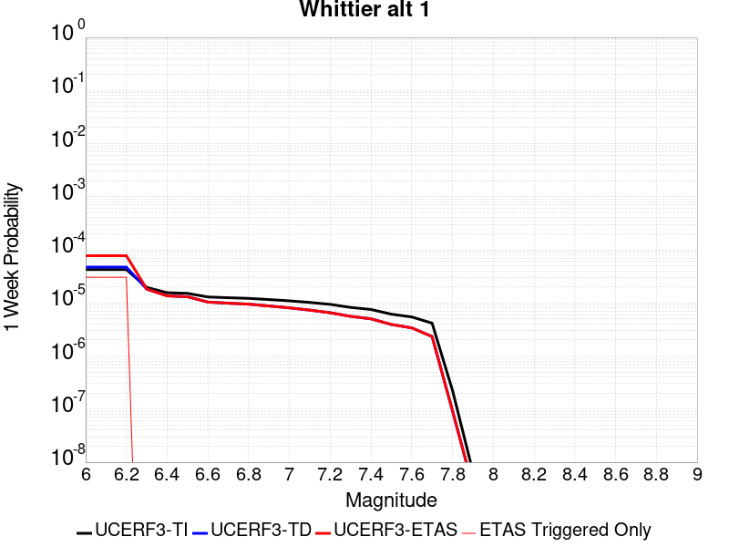 | 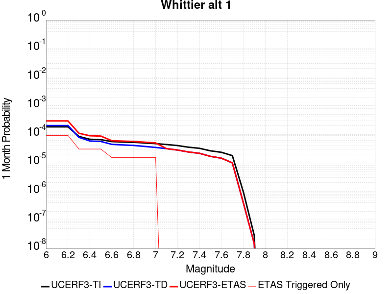 | 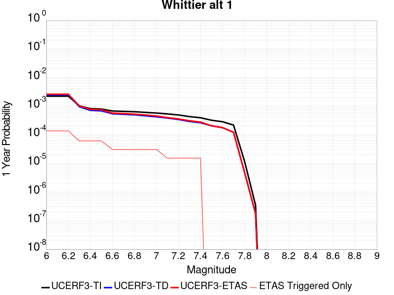 | 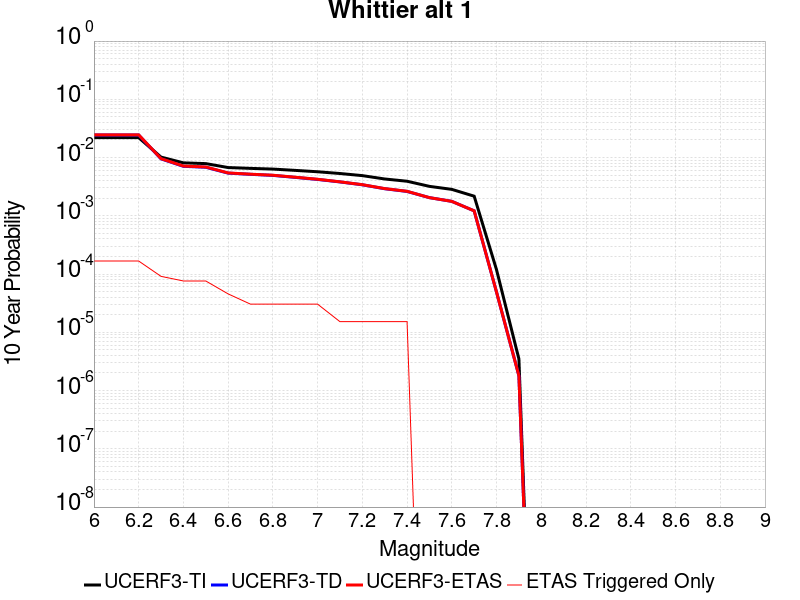 |

| Magnitude | 1 wk TI Prob | 1 wk TD Prob | 1 wk ETAS Prob | 1 wk ETAS/TD Gain | 1 wk ETAS Triggered Only | 1 mo TI Prob | 1 mo TD Prob | 1 mo ETAS Prob | 1 mo ETAS/TD Gain | 1 mo ETAS Triggered Only | 1 yr TI Prob | 1 yr TD Prob | 1 yr ETAS Prob | 1 yr ETAS/TD Gain | 1 yr ETAS Triggered Only | 10 yr TI Prob | 10 yr TD Prob | 10 yr ETAS Prob | 10 yr ETAS/TD Gain | 10 yr ETAS Triggered Only |
|-----|-----|-----|-----|-----|-----|-----|-----|-----|-----|-----|-----|-----|-----|-----|-----|-----|-----|-----|-----|-----|
| 6.0 | 4.2554693E-5 | 4.725218E-5 | 7.769214E-5 | 1.6442024 | 3.04414E-5 | 1.8236451E-4 | 2.0249544E-4 | 2.9380116E-4 | 1.4509026 | 9.1324204E-5 | 0.002218027 | 0.0024629154 | 0.0025995641 | 1.0554826 | 1.369863E-4 | 0.02196019 | 0.024390234 | 0.024553578 | 1.006697 | 1.674277E-4 |
| 6.1 | 4.2554693E-5 | 4.725218E-5 | 7.769214E-5 | 1.6442024 | 3.04414E-5 | 1.8236451E-4 | 2.0249544E-4 | 2.9380116E-4 | 1.4509026 | 9.1324204E-5 | 0.002218027 | 0.0024629154 | 0.0025995641 | 1.0554826 | 1.369863E-4 | 0.02196019 | 0.024390234 | 0.024553578 | 1.006697 | 1.674277E-4 |
| 6.2 | 4.2554693E-5 | 4.725218E-5 | 7.769214E-5 | 1.6442024 | 3.04414E-5 | 1.8236451E-4 | 2.0249544E-4 | 2.9380116E-4 | 1.4509026 | 9.1324204E-5 | 0.002218027 | 0.0024629154 | 0.0025995641 | 1.0554826 | 1.369863E-4 | 0.02196019 | 0.024390234 | 0.024553578 | 1.006697 | 1.674277E-4 |
| 6.3 | 1.9617712E-5 | 1.8268593E-5 | 1.8268593E-5 | 1.0 | 0.0 | 8.40732E-5 | 7.829172E-5 | 1.0873074E-4 | 1.3887898 | 3.04414E-5 | 0.0010231105 | 9.52804E-4 | 0.0010136288 | 1.0638376 | 6.08828E-5 | 0.01018413 | 0.009490474 | 0.009580932 | 1.0095314 | 9.1324204E-5 |
| 6.4 | 1.5611336E-5 | 1.3604271E-5 | 1.3604271E-5 | 1.0 | 0.0 | 6.690401E-5 | 5.8302747E-5 | 8.8742374E-5 | 1.5220959 | 3.04414E-5 | 8.142519E-4 | 7.0961076E-4 | 7.7045034E-4 | 1.0857366 | 6.08828E-5 | 0.008112748 | 0.0070754145 | 0.0071509797 | 1.01068 | 7.6103504E-5 |
| 6.5 | 1.5150166E-5 | 1.3100925E-5 | 1.3100925E-5 | 1.0 | 0.0 | 6.492767E-5 | 5.6145647E-5 | 8.6585336E-5 | 1.5421559 | 3.04414E-5 | 7.9020765E-4 | 6.8336475E-4 | 7.442059E-4 | 1.0890318 | 6.08828E-5 | 0.007874036 | 0.0068145846 | 0.00689017 | 1.0110916 | 7.6103504E-5 |
| 6.6 | 1.295588E-5 | 1.0380725E-5 | 1.0380725E-5 | 1.0 | 0.0 | 5.552402E-5 | 4.4488075E-5 | 5.9708098E-5 | 1.3421147 | 1.52207E-5 | 6.7579525E-4 | 5.4150965E-4 | 5.7193456E-4 | 1.0561854 | 3.04414E-5 | 0.006737438 | 0.0054033357 | 0.005448751 | 1.0084051 | 4.5662102E-5 |
| 6.7 | 1.2542085E-5 | 9.899369E-6 | 9.899369E-6 | 1.0 | 0.0 | 5.3750682E-5 | 4.242519E-5 | 5.764524E-5 | 1.3587505 | 1.52207E-5 | 6.542181E-4 | 5.164061E-4 | 5.468318E-4 | 1.0589181 | 3.04414E-5 | 0.006522954 | 0.0051534795 | 0.005183764 | 1.0058765 | 3.04414E-5 |
| 6.8 | 1.2195878E-5 | 9.495415E-6 | 9.495415E-6 | 1.0 | 0.0 | 5.2267E-5 | 4.069401E-5 | 5.591409E-5 | 1.3740128 | 1.52207E-5 | 6.36165E-4 | 4.9533875E-4 | 5.257651E-4 | 1.0614253 | 3.04414E-5 | 0.0063434686 | 0.004943688 | 0.0049739787 | 1.0061272 | 3.04414E-5 |
| 6.9 | 1.1580298E-5 | 8.772933E-6 | 8.772933E-6 | 1.0 | 0.0 | 4.9628903E-5 | 3.7597754E-5 | 5.2817883E-5 | 1.4048148 | 1.52207E-5 | 6.040644E-4 | 4.5765814E-4 | 4.880856E-4 | 1.0664852 | 3.04414E-5 | 0.00602425 | 0.0045684157 | 0.004598718 | 1.006633 | 3.04414E-5 |
| 7.0 | 1.0964795E-5 | 8.083994E-6 | 8.083994E-6 | 1.0 | 0.0 | 4.6991136E-5 | 3.4645236E-5 | 4.9865408E-5 | 1.4393151 | 1.52207E-5 | 5.7196687E-4 | 4.2172565E-4 | 4.521542E-4 | 1.0721525 | 3.04414E-5 | 0.0057049696 | 0.004210462 | 0.004240775 | 1.0071995 | 3.04414E-5 |
| 7.1 | 1.0230601E-5 | 7.3266697E-6 | 7.3266697E-6 | 1.0 | 0.0 | 4.3844695E-5 | 3.1399642E-5 | 3.1399642E-5 | 1.0 | 0.0 | 5.336784E-4 | 3.8222488E-4 | 3.9743976E-4 | 1.0398061 | 1.52207E-5 | 0.005323986 | 0.0038168381 | 0.0038320008 | 1.0039725 | 1.52207E-5 |
| 7.2 | 9.40865E-6 | 6.543289E-6 | 6.543289E-6 | 1.0 | 0.0 | 4.032216E-5 | 2.8042374E-5 | 2.8042374E-5 | 1.0 | 0.0 | 4.908117E-4 | 3.4136363E-4 | 3.5657914E-4 | 1.0445727 | 1.52207E-5 | 0.0048972913 | 0.003409485 | 0.003424654 | 1.004449 | 1.52207E-5 |
| 7.3 | 8.237384E-6 | 5.5977525E-6 | 5.5977525E-6 | 1.0 | 0.0 | 3.5302593E-5 | 2.3990153E-5 | 2.3990153E-5 | 1.0 | 0.0 | 4.2972428E-4 | 2.92042E-4 | 3.0725828E-4 | 1.0521029 | 1.52207E-5 | 0.0042889426 | 0.002916903 | 0.0029320794 | 1.0052029 | 1.52207E-5 |
| 7.4 | 7.5316966E-6 | 5.027819E-6 | 5.027819E-6 | 1.0 | 0.0 | 3.2278298E-5 | 2.1547625E-5 | 2.1547625E-5 | 1.0 | 0.0 | 3.9291743E-4 | 2.6231175E-4 | 2.7752845E-4 | 1.05801 | 1.52207E-5 | 0.0039222343 | 0.0026201333 | 0.0026353141 | 1.0057939 | 1.52207E-5 |
| 7.5 | 6.149649E-6 | 3.933841E-6 | 3.933841E-6 | 1.0 | 0.0 | 2.6355372E-5 | 1.6859214E-5 | 1.6859214E-5 | 1.0 | 0.0 | 3.208294E-4 | 2.052425E-4 | 2.052425E-4 | 1.0 | 0.0 | 0.003203666 | 0.0020506186 | 0.0020506186 | 1.0 | 0.0 |
| 7.6 | 5.457711E-6 | 3.3953788E-6 | 3.3953788E-6 | 1.0 | 0.0 | 2.338998E-5 | 1.4551547E-5 | 1.4551547E-5 | 1.0 | 0.0 | 2.8473578E-4 | 1.771515E-4 | 1.771515E-4 | 1.0 | 0.0 | 0.0028437122 | 0.0017701836 | 0.0017701836 | 1.0 | 0.0 |
| 7.7 | 4.1676276E-6 | 2.3331952E-6 | 2.3331952E-6 | 1.0 | 0.0 | 1.7861139E-5 | 9.999374E-6 | 9.999374E-6 | 1.0 | 0.0 | 2.1743766E-4 | 1.2173632E-4 | 1.2173632E-4 | 1.0 | 0.0 | 0.0021722503 | 0.0012167693 | 0.0012167693 | 1.0 | 0.0 |
| 7.8 | 2.2692414E-7 | 9.3854695E-8 | 9.3854695E-8 | 1.0 | 0.0 | 9.725317E-7 | 4.0223435E-7 | 4.0223435E-7 | 1.0 | 0.0 | 1.1840509E-5 | 4.8971956E-6 | 4.8971956E-6 | 1.0 | 0.0 | 1.1839878E-4 | 4.8971204E-5 | 4.8971204E-5 | 1.0 | 0.0 |
| 7.9 | 6.676829E-9 | 3.439853E-9 | 3.439853E-9 | 1.0 | 0.0 | 2.861498E-8 | 1.4742227E-8 | 1.4742227E-8 | 1.0 | 0.0 | 3.4838732E-7 | 1.7948659E-7 | 1.7948659E-7 | 1.0 | 0.0 | 3.4838679E-6 | 1.7948646E-6 | 1.7948646E-6 | 1.0 | 0.0 |

## Lake Isabella (Seismicity)
*[(top)](#table-of-contents)*

| 1 Week | 1 Month | 1 Year | 10 Year |
|-----|-----|-----|-----|
| 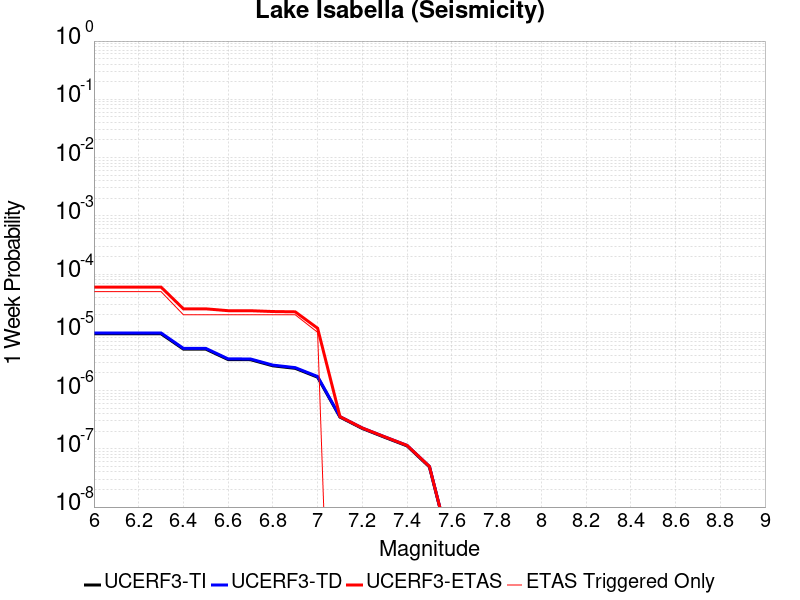 | 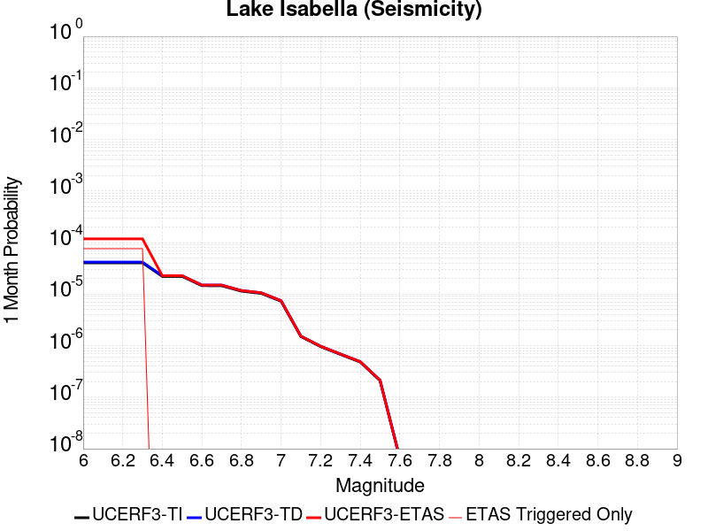 | 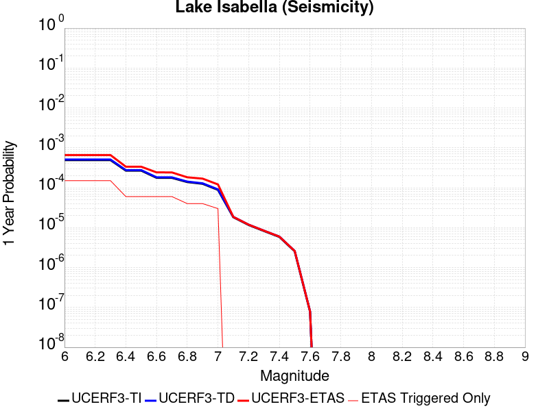 | 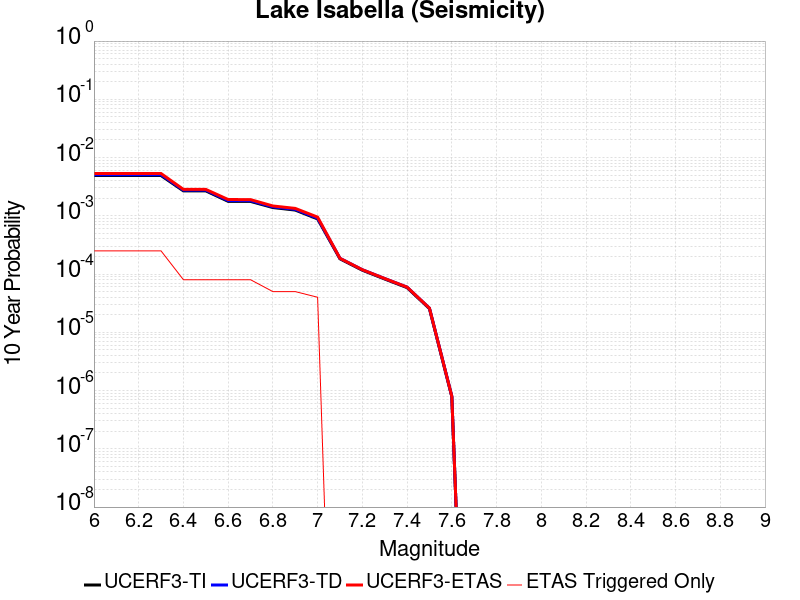 |

| Magnitude | 1 wk TI Prob | 1 wk TD Prob | 1 wk ETAS Prob | 1 wk ETAS/TD Gain | 1 wk ETAS Triggered Only | 1 mo TI Prob | 1 mo TD Prob | 1 mo ETAS Prob | 1 mo ETAS/TD Gain | 1 mo ETAS Triggered Only | 1 yr TI Prob | 1 yr TD Prob | 1 yr ETAS Prob | 1 yr ETAS/TD Gain | 1 yr ETAS Triggered Only | 10 yr TI Prob | 10 yr TD Prob | 10 yr ETAS Prob | 10 yr ETAS/TD Gain | 10 yr ETAS Triggered Only |
|-----|-----|-----|-----|-----|-----|-----|-----|-----|-----|-----|-----|-----|-----|-----|-----|-----|-----|-----|-----|-----|
| 6.0 | 9.431637E-6 | 9.741651E-6 | 5.5403307E-5 | 5.68726 | 4.5662102E-5 | 4.0420677E-5 | 4.1749343E-5 | 1.1784967E-4 | 2.822791 | 7.6103504E-5 | 4.920106E-4 | 5.0819275E-4 | 6.4510945E-4 | 1.2694188 | 1.369863E-4 | 0.004909227 | 0.005071599 | 0.0052684643 | 1.0388173 | 1.978691E-4 |
| 6.1 | 9.431637E-6 | 9.741651E-6 | 5.5403307E-5 | 5.68726 | 4.5662102E-5 | 4.0420677E-5 | 4.1749343E-5 | 1.1784967E-4 | 2.822791 | 7.6103504E-5 | 4.920106E-4 | 5.0819275E-4 | 6.4510945E-4 | 1.2694188 | 1.369863E-4 | 0.004909227 | 0.005071599 | 0.0052684643 | 1.0388173 | 1.978691E-4 |
| 6.2 | 9.431637E-6 | 9.741651E-6 | 5.5403307E-5 | 5.68726 | 4.5662102E-5 | 4.0420677E-5 | 4.1749343E-5 | 1.1784967E-4 | 2.822791 | 7.6103504E-5 | 4.920106E-4 | 5.0819275E-4 | 6.4510945E-4 | 1.2694188 | 1.369863E-4 | 0.004909227 | 0.005071599 | 0.0052684643 | 1.0388173 | 1.978691E-4 |
| 6.3 | 9.431637E-6 | 9.741651E-6 | 5.5403307E-5 | 5.68726 | 4.5662102E-5 | 4.0420677E-5 | 4.1749343E-5 | 1.1784967E-4 | 2.822791 | 7.6103504E-5 | 4.920106E-4 | 5.0819275E-4 | 6.4510945E-4 | 1.2694188 | 1.369863E-4 | 0.004909227 | 0.005071599 | 0.0052684643 | 1.0388173 | 1.978691E-4 |
| 6.4 | 5.144063E-6 | 5.3000763E-6 | 5.3000763E-6 | 1.0 | 0.0 | 2.2045799E-5 | 2.2714434E-5 | 2.2714434E-5 | 1.0 | 0.0 | 2.6837454E-4 | 2.765166E-4 | 3.0694957E-4 | 1.1100584 | 3.04414E-5 | 0.0026805066 | 0.0027620657 | 0.0027924231 | 1.0109909 | 3.04414E-5 |
| 6.5 | 5.144063E-6 | 5.3000763E-6 | 5.3000763E-6 | 1.0 | 0.0 | 2.2045799E-5 | 2.2714434E-5 | 2.2714434E-5 | 1.0 | 0.0 | 2.6837454E-4 | 2.765166E-4 | 3.0694957E-4 | 1.1100584 | 3.04414E-5 | 0.0026805066 | 0.0027620657 | 0.0027924231 | 1.0109909 | 3.04414E-5 |
| 6.6 | 3.4009804E-6 | 3.498786E-6 | 3.498786E-6 | 1.0 | 0.0 | 1.4575549E-5 | 1.4994721E-5 | 1.4994721E-5 | 1.0 | 0.0 | 1.7744285E-4 | 1.8254704E-4 | 2.1298288E-4 | 1.1667287 | 3.04414E-5 | 0.0017730123 | 0.0018241286 | 0.0018545145 | 1.0166577 | 3.04414E-5 |
| 6.7 | 3.3880428E-6 | 3.4856528E-6 | 3.4856528E-6 | 1.0 | 0.0 | 1.4520103E-5 | 1.4938435E-5 | 1.4938435E-5 | 1.0 | 0.0 | 1.767679E-4 | 1.8186188E-4 | 2.1229775E-4 | 1.1673571 | 3.04414E-5 | 0.0017662736 | 0.0018172882 | 0.0018476743 | 1.0167205 | 3.04414E-5 |
| 6.8 | 2.6582E-6 | 2.7337003E-6 | 2.7337003E-6 | 1.0 | 0.0 | 1.1392236E-5 | 1.1715813E-5 | 1.1715813E-5 | 1.0 | 0.0 | 1.3869164E-4 | 1.4263204E-4 | 1.5785056E-4 | 1.1066978 | 1.52207E-5 | 0.0013860512 | 0.0014255369 | 0.0014407359 | 1.010662 | 1.52207E-5 |
| 6.9 | 2.406011E-6 | 2.4743288E-6 | 2.4743288E-6 | 1.0 | 0.0 | 1.0311434E-5 | 1.0604231E-5 | 1.0604231E-5 | 1.0 | 0.0 | 1.2553448E-4 | 1.2910018E-4 | 1.4431891E-4 | 1.1178831 | 1.52207E-5 | 0.0012546359 | 0.0012903814 | 0.0013055825 | 1.0117803 | 1.52207E-5 |
| 7.0 | 1.6953097E-6 | 1.7429371E-6 | 1.7429371E-6 | 1.0 | 0.0 | 7.265593E-6 | 7.469715E-6 | 7.469715E-6 | 1.0 | 0.0 | 8.8455E-5 | 9.094104E-5 | 1.06160354E-4 | 1.1673536 | 1.52207E-5 | 8.84198E-4 | 9.09141E-4 | 9.2434784E-4 | 1.0167266 | 1.52207E-5 |
| 7.1 | 3.5013824E-7 | 3.5714822E-7 | 3.5714822E-7 | 1.0 | 0.0 | 1.5005916E-6 | 1.5306344E-6 | 1.5306344E-6 | 1.0 | 0.0 | 1.826955E-5 | 1.8635317E-5 | 1.8635317E-5 | 1.0 | 0.0 | 1.8268047E-4 | 1.863378E-4 | 1.863378E-4 | 1.0 | 0.0 |
| 7.2 | 2.2321095E-7 | 2.2750574E-7 | 2.2750574E-7 | 1.0 | 0.0 | 9.56618E-7 | 9.750242E-7 | 9.750242E-7 | 1.0 | 0.0 | 1.1646762E-5 | 1.1870856E-5 | 1.1870856E-5 | 1.0 | 0.0 | 1.1646151E-4 | 1.1870232E-4 | 1.1870232E-4 | 1.0 | 0.0 |
| 7.3 | 1.5760406E-7 | 1.6060922E-7 | 1.6060922E-7 | 1.0 | 0.0 | 6.7544585E-7 | 6.8832503E-7 | 6.8832503E-7 | 1.0 | 0.0 | 8.223522E-6 | 8.380326E-6 | 8.380326E-6 | 1.0 | 0.0 | 8.2232174E-5 | 8.3800165E-5 | 8.3800165E-5 | 1.0 | 0.0 |
| 7.4 | 1.1216497E-7 | 1.1431706E-7 | 1.1431706E-7 | 1.0 | 0.0 | 4.8070694E-7 | 4.899302E-7 | 4.899302E-7 | 1.0 | 0.0 | 5.852591E-6 | 5.964884E-6 | 5.964884E-6 | 1.0 | 0.0 | 5.8524372E-5 | 5.9647282E-5 | 5.9647282E-5 | 1.0 | 0.0 |
| 7.5 | 4.885185E-8 | 4.9787737E-8 | 4.9787737E-8 | 1.0 | 0.0 | 2.0936506E-7 | 2.13376E-7 | 2.13376E-7 | 1.0 | 0.0 | 2.5490165E-6 | 2.59785E-6 | 2.59785E-6 | 1.0 | 0.0 | 2.5489873E-5 | 2.5978214E-5 | 2.5978214E-5 | 1.0 | 0.0 |
| 7.6 | 1.504641E-9 | 1.5317903E-9 | 1.5317903E-9 | 1.0 | 0.0 | 6.4484613E-9 | 6.5648154E-9 | 6.5648154E-9 | 1.0 | 0.0 | 7.851001E-8 | 7.992663E-8 | 7.992663E-8 | 1.0 | 0.0 | 7.8509987E-7 | 7.992663E-7 | 7.992663E-7 | 1.0 | 0.0 |

## San Jacinto (San Jacinto Valley) rev
*[(top)](#table-of-contents)*

| 1 Week | 1 Month | 1 Year | 10 Year |
|-----|-----|-----|-----|
| 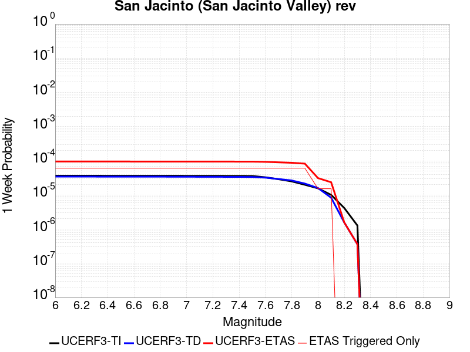 | 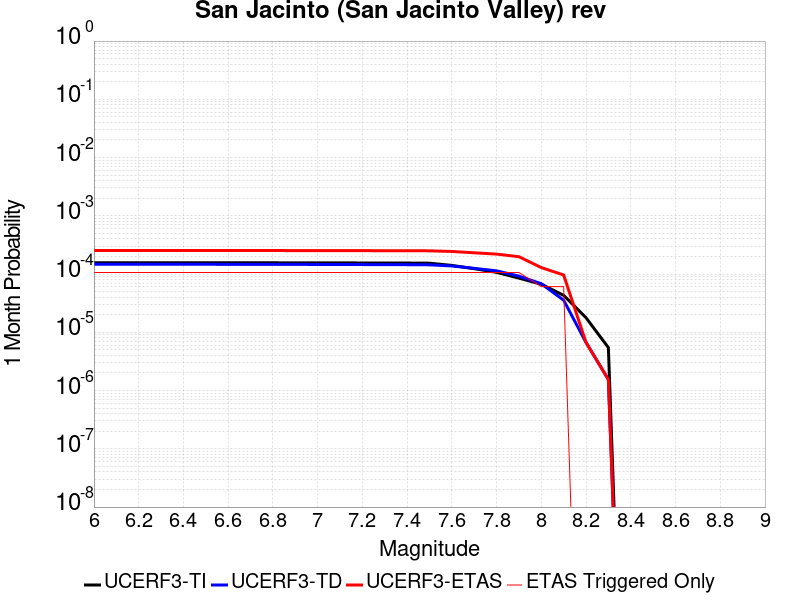 | 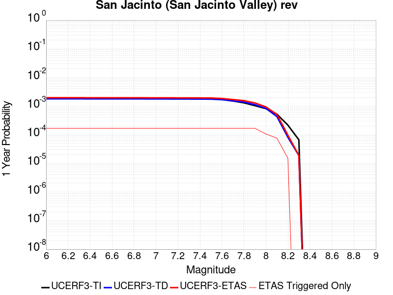 | 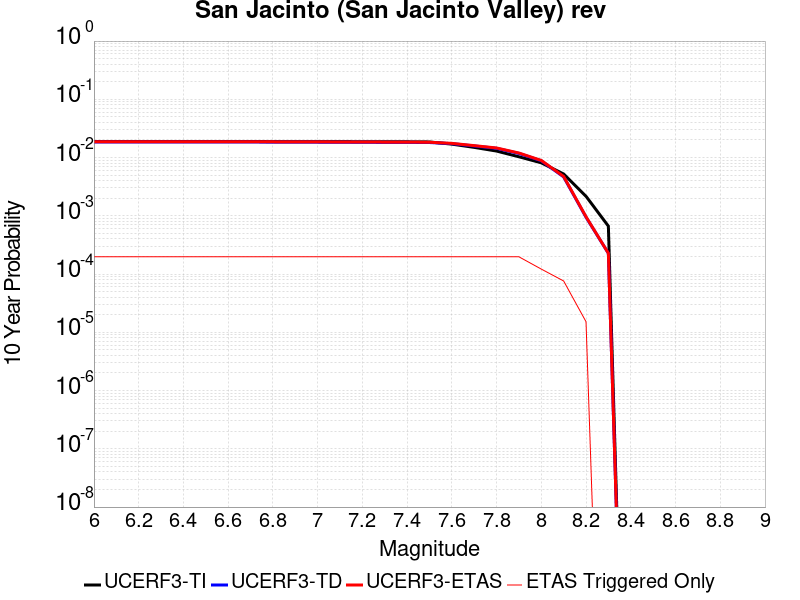 |

| Magnitude | 1 wk TI Prob | 1 wk TD Prob | 1 wk ETAS Prob | 1 wk ETAS/TD Gain | 1 wk ETAS Triggered Only | 1 mo TI Prob | 1 mo TD Prob | 1 mo ETAS Prob | 1 mo ETAS/TD Gain | 1 mo ETAS Triggered Only | 1 yr TI Prob | 1 yr TD Prob | 1 yr ETAS Prob | 1 yr ETAS/TD Gain | 1 yr ETAS Triggered Only | 10 yr TI Prob | 10 yr TD Prob | 10 yr ETAS Prob | 10 yr ETAS/TD Gain | 10 yr ETAS Triggered Only |
|-----|-----|-----|-----|-----|-----|-----|-----|-----|-----|-----|-----|-----|-----|-----|-----|-----|-----|-----|-----|-----|
| 6.0 | 3.652694E-5 | 3.4402394E-5 | 9.5283096E-5 | 2.769665 | 6.08828E-5 | 1.5653463E-4 | 1.474305E-4 | 2.539597E-4 | 1.7225722 | 1.065449E-4 | 0.0019041431 | 0.00179349 | 0.0019606175 | 1.0931855 | 1.674277E-4 | 0.018879099 | 0.018526595 | 0.018720798 | 1.0104824 | 1.978691E-4 |
| 6.1 | 3.652694E-5 | 3.4402394E-5 | 9.5283096E-5 | 2.769665 | 6.08828E-5 | 1.5653463E-4 | 1.474305E-4 | 2.539597E-4 | 1.7225722 | 1.065449E-4 | 0.0019041431 | 0.00179349 | 0.0019606175 | 1.0931855 | 1.674277E-4 | 0.018879099 | 0.018526595 | 0.018720798 | 1.0104824 | 1.978691E-4 |
| 6.2 | 3.652694E-5 | 3.4402394E-5 | 9.5283096E-5 | 2.769665 | 6.08828E-5 | 1.5653463E-4 | 1.474305E-4 | 2.539597E-4 | 1.7225722 | 1.065449E-4 | 0.0019041431 | 0.00179349 | 0.0019606175 | 1.0931855 | 1.674277E-4 | 0.018879099 | 0.018526595 | 0.018720798 | 1.0104824 | 1.978691E-4 |
| 6.3 | 3.652694E-5 | 3.4402394E-5 | 9.5283096E-5 | 2.769665 | 6.08828E-5 | 1.5653463E-4 | 1.474305E-4 | 2.539597E-4 | 1.7225722 | 1.065449E-4 | 0.0019041431 | 0.00179349 | 0.0019606175 | 1.0931855 | 1.674277E-4 | 0.018879099 | 0.018526595 | 0.018720798 | 1.0104824 | 1.978691E-4 |
| 6.4 | 3.646941E-5 | 3.432397E-5 | 9.520468E-5 | 2.7737083 | 6.08828E-5 | 1.5628811E-4 | 1.4709444E-4 | 2.5362367E-4 | 1.7242234 | 1.065449E-4 | 0.0019011468 | 0.0017894056 | 0.0019565336 | 1.0933987 | 1.674277E-4 | 0.018849645 | 0.018486476 | 0.018680688 | 1.0105056 | 1.978691E-4 |
| 6.5 | 3.646941E-5 | 3.432397E-5 | 9.520468E-5 | 2.7737083 | 6.08828E-5 | 1.5628811E-4 | 1.4709444E-4 | 2.5362367E-4 | 1.7242234 | 1.065449E-4 | 0.0019011468 | 0.0017894056 | 0.0019565336 | 1.0933987 | 1.674277E-4 | 0.018849645 | 0.018486476 | 0.018680688 | 1.0105056 | 1.978691E-4 |
| 6.6 | 3.6442503E-5 | 3.4287354E-5 | 9.516807E-5 | 2.7756026 | 6.08828E-5 | 1.561728E-4 | 1.4693754E-4 | 2.5346677E-4 | 1.7249968 | 1.065449E-4 | 0.0018997455 | 0.0017874985 | 0.001954627 | 1.0934985 | 1.674277E-4 | 0.018835869 | 0.018467745 | 0.01866196 | 1.0105164 | 1.978691E-4 |
| 6.7 | 3.6432113E-5 | 3.4272925E-5 | 9.515364E-5 | 2.77635 | 6.08828E-5 | 1.5612828E-4 | 1.4687571E-4 | 2.5340496E-4 | 1.725302 | 1.065449E-4 | 0.0018992044 | 0.0017867472 | 0.0019538759 | 1.0935379 | 1.674277E-4 | 0.018830549 | 0.018460369 | 0.018654585 | 1.0105207 | 1.978691E-4 |
| 6.8 | 3.6409598E-5 | 3.424198E-5 | 9.51227E-5 | 2.7779553 | 6.08828E-5 | 1.560318E-4 | 1.4674311E-4 | 2.532724E-4 | 1.7259575 | 1.065449E-4 | 0.0018980318 | 0.0017851355 | 0.0019522642 | 1.0936224 | 1.674277E-4 | 0.018819023 | 0.018444523 | 0.018638743 | 1.0105299 | 1.978691E-4 |
| 6.9 | 3.638078E-5 | 3.4202407E-5 | 9.508312E-5 | 2.7800128 | 6.08828E-5 | 1.5590832E-4 | 1.4657351E-4 | 2.531028E-4 | 1.7267976 | 1.065449E-4 | 0.0018965311 | 0.001783074 | 0.0019502032 | 1.0937309 | 1.674277E-4 | 0.018804269 | 0.018424258 | 0.018618481 | 1.0105417 | 1.978691E-4 |
| 7.0 | 3.6294874E-5 | 3.408442E-5 | 9.4965144E-5 | 2.7861745 | 6.08828E-5 | 1.5554018E-4 | 1.4606792E-4 | 2.5259727E-4 | 1.7293137 | 1.065449E-4 | 0.0018920569 | 0.001776929 | 0.0019440592 | 1.0940557 | 1.674277E-4 | 0.018760284 | 0.018363839 | 0.018558076 | 1.0105771 | 1.978691E-4 |
| 7.1 | 3.6260717E-5 | 3.4040702E-5 | 9.492143E-5 | 2.7884686 | 6.08828E-5 | 1.5539382E-4 | 1.4588058E-4 | 2.5240993E-4 | 1.7302505 | 1.065449E-4 | 0.001890278 | 0.0017746518 | 0.0019417824 | 1.0941765 | 1.674277E-4 | 0.018742796 | 0.018341439 | 0.01853568 | 1.0105902 | 1.978691E-4 |
| 7.2 | 3.6210204E-5 | 3.397492E-5 | 9.4855655E-5 | 2.7919314 | 6.08828E-5 | 1.5517735E-4 | 1.455987E-4 | 2.5212808E-4 | 1.7316644 | 1.065449E-4 | 0.001887647 | 0.0017712255 | 0.0019383566 | 1.094359 | 1.674277E-4 | 0.01871693 | 0.01830772 | 0.018501965 | 1.0106101 | 1.978691E-4 |
| 7.3 | 3.6119454E-5 | 3.386321E-5 | 9.474395E-5 | 2.7978432 | 6.08828E-5 | 1.5478847E-4 | 1.4511998E-4 | 2.516494E-4 | 1.7340784 | 1.065449E-4 | 0.0018829206 | 0.0017654065 | 0.0019325386 | 1.0946707 | 1.674277E-4 | 0.018670462 | 0.018250274 | 0.01844453 | 1.0106441 | 1.978691E-4 |
| 7.4 | 3.607848E-5 | 3.381071E-5 | 9.469145E-5 | 2.8006349 | 6.08828E-5 | 1.5461289E-4 | 1.44895E-4 | 2.5142447E-4 | 1.7352183 | 1.065449E-4 | 0.0018807866 | 0.0017626719 | 0.0019298044 | 1.0948178 | 1.674277E-4 | 0.018649481 | 0.018223269 | 0.018417532 | 1.0106602 | 1.978691E-4 |
| 7.5 | 3.5856774E-5 | 3.3620483E-5 | 9.4501236E-5 | 2.8108234 | 6.08828E-5 | 1.5366284E-4 | 1.4407984E-4 | 2.506094E-4 | 1.7393786 | 1.065449E-4 | 0.0018692396 | 0.0017527633 | 0.0019198975 | 1.0953547 | 1.674277E-4 | 0.018535944 | 0.018124366 | 0.01831865 | 1.0107194 | 1.978691E-4 |
| 7.6 | 3.286655E-5 | 3.2143445E-5 | 9.302429E-5 | 2.894036 | 6.08828E-5 | 1.4084904E-4 | 1.3775036E-4 | 2.4428059E-4 | 1.7733572 | 1.065449E-4 | 0.001713488 | 0.0016758227 | 0.0018429697 | 1.0997404 | 1.674277E-4 | 0.017003361 | 0.017344031 | 0.017538467 | 1.0112106 | 1.978691E-4 |
| 7.7 | 2.8882527E-5 | 2.9236293E-5 | 9.011731E-5 | 3.0823781 | 6.08828E-5 | 1.237764E-4 | 1.2529238E-4 | 2.3182394E-4 | 1.8502636 | 1.065449E-4 | 0.0015059357 | 0.0015243685 | 0.001691541 | 1.1096667 | 1.674277E-4 | 0.014957713 | 0.015830461 | 0.016025197 | 1.0123014 | 1.978691E-4 |
| 7.8 | 2.4950225E-5 | 2.6527203E-5 | 8.7408385E-5 | 3.2950473 | 6.08828E-5 | 1.0692515E-4 | 1.1368306E-4 | 2.2021585E-4 | 1.9371034 | 1.065449E-4 | 0.0013010362 | 0.0013832134 | 0.0015504095 | 1.1208751 | 1.674277E-4 | 0.012934455 | 0.014411755 | 0.014606772 | 1.0135318 | 1.978691E-4 |
| 7.9 | 1.9881603E-5 | 2.1507445E-5 | 8.2388935E-5 | 3.830717 | 6.08828E-5 | 8.520408E-5 | 9.217151E-5 | 1.9870659E-4 | 2.1558352 | 1.065449E-4 | 0.001036866 | 0.0011216112 | 0.0012888511 | 1.1491069 | 1.674277E-4 | 0.010320415 | 0.011777027 | 0.011972565 | 1.0166034 | 1.978691E-4 |
| 8.0 | 1.563292E-5 | 1.5937347E-5 | 3.1157804E-5 | 1.9550183 | 1.52207E-5 | 6.6996516E-5 | 6.8301124E-5 | 1.2917977E-4 | 1.891327 | 6.08828E-5 | 8.153773E-4 | 8.3124964E-4 | 9.37706E-4 | 1.1280679 | 1.065449E-4 | 0.00812392 | 0.008810506 | 0.008931199 | 1.0136987 | 1.217656E-4 |
| 8.1 | 1.0045313E-5 | 8.301802E-6 | 2.3522376E-5 | 2.833406 | 1.52207E-5 | 4.305063E-5 | 3.5578672E-5 | 9.6459305E-5 | 2.7111554 | 6.08828E-5 | 5.2401534E-4 | 4.3308473E-4 | 5.091553E-4 | 1.1756482 | 7.6103504E-5 | 0.0052278144 | 0.0046591135 | 0.0047348626 | 1.0162582 | 7.6103504E-5 |
| 8.2 | 4.1554413E-6 | 1.5655598E-6 | 1.5655598E-6 | 1.0 | 0.0 | 1.7808914E-5 | 6.709525E-6 | 6.709525E-6 | 1.0 | 0.0 | 2.1680194E-4 | 8.168544E-5 | 9.690489E-5 | 1.1863179 | 1.52207E-5 | 0.0021659054 | 9.482903E-4 | 9.634965E-4 | 1.0160354 | 1.52207E-5 |
| 8.3 | 1.2758221E-6 | 3.6149942E-7 | 3.6149942E-7 | 1.0 | 0.0 | 5.4677976E-6 | 1.5492824E-6 | 1.5492824E-6 | 1.0 | 0.0 | 6.65684E-5 | 1.8862354E-5 | 1.8862354E-5 | 1.0 | 0.0 | 6.6548464E-4 | 2.2751294E-4 | 2.2751294E-4 | 1.0 | 0.0 |

## Pleito
*[(top)](#table-of-contents)*

| 1 Week | 1 Month | 1 Year | 10 Year |
|-----|-----|-----|-----|
| 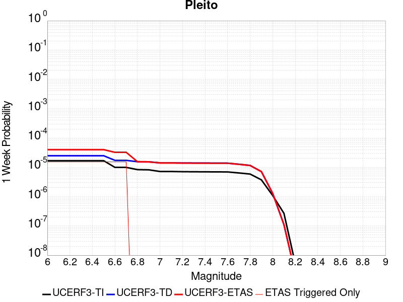 | 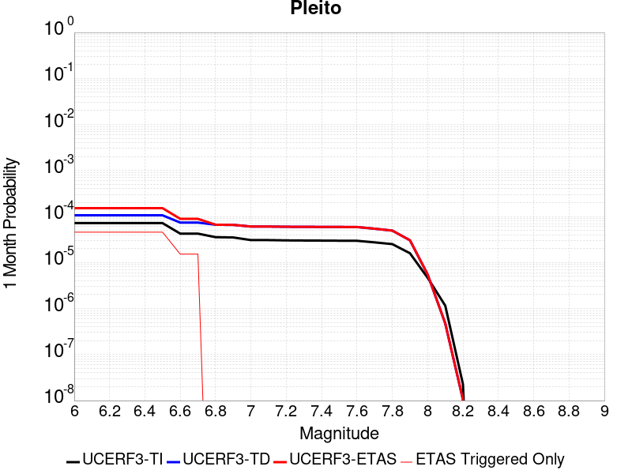 | 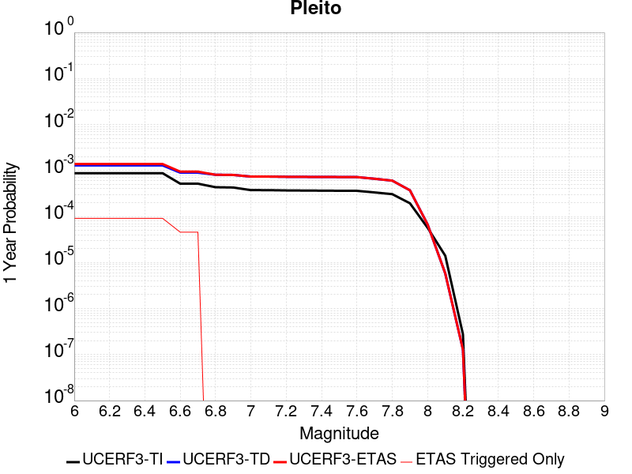 | 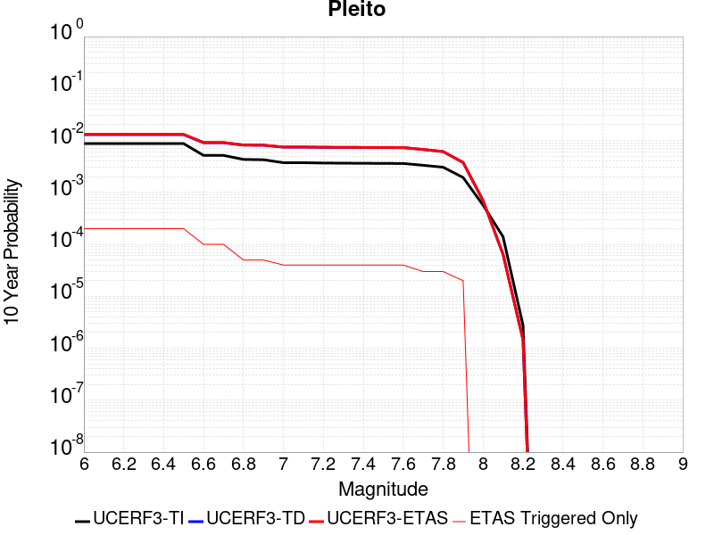 |

| Magnitude | 1 wk TI Prob | 1 wk TD Prob | 1 wk ETAS Prob | 1 wk ETAS/TD Gain | 1 wk ETAS Triggered Only | 1 mo TI Prob | 1 mo TD Prob | 1 mo ETAS Prob | 1 mo ETAS/TD Gain | 1 mo ETAS Triggered Only | 1 yr TI Prob | 1 yr TD Prob | 1 yr ETAS Prob | 1 yr ETAS/TD Gain | 1 yr ETAS Triggered Only | 10 yr TI Prob | 10 yr TD Prob | 10 yr ETAS Prob | 10 yr ETAS/TD Gain | 10 yr ETAS Triggered Only |
|-----|-----|-----|-----|-----|-----|-----|-----|-----|-----|-----|-----|-----|-----|-----|-----|-----|-----|-----|-----|-----|
| 6.0 | 1.6763008E-5 | 2.4763838E-5 | 3.9984163E-5 | 1.6146189 | 1.52207E-5 | 7.183948E-5 | 1.0612683E-4 | 1.5178409E-4 | 1.430214 | 4.5662102E-5 | 8.742947E-4 | 0.0012914003 | 0.0013826066 | 1.0706259 | 9.1324204E-5 | 0.00870863 | 0.0129538905 | 0.013149196 | 1.015077 | 1.978691E-4 |
| 6.1 | 1.6763008E-5 | 2.4763838E-5 | 3.9984163E-5 | 1.6146189 | 1.52207E-5 | 7.183948E-5 | 1.0612683E-4 | 1.5178409E-4 | 1.430214 | 4.5662102E-5 | 8.742947E-4 | 0.0012914003 | 0.0013826066 | 1.0706259 | 9.1324204E-5 | 0.00870863 | 0.0129538905 | 0.013149196 | 1.015077 | 1.978691E-4 |
| 6.2 | 1.6763008E-5 | 2.4763838E-5 | 3.9984163E-5 | 1.6146189 | 1.52207E-5 | 7.183948E-5 | 1.0612683E-4 | 1.5178409E-4 | 1.430214 | 4.5662102E-5 | 8.742947E-4 | 0.0012914003 | 0.0013826066 | 1.0706259 | 9.1324204E-5 | 0.00870863 | 0.0129538905 | 0.013149196 | 1.015077 | 1.978691E-4 |
| 6.3 | 1.6763008E-5 | 2.4763838E-5 | 3.9984163E-5 | 1.6146189 | 1.52207E-5 | 7.183948E-5 | 1.0612683E-4 | 1.5178409E-4 | 1.430214 | 4.5662102E-5 | 8.742947E-4 | 0.0012914003 | 0.0013826066 | 1.0706259 | 9.1324204E-5 | 0.00870863 | 0.0129538905 | 0.013149196 | 1.015077 | 1.978691E-4 |
| 6.4 | 1.6763008E-5 | 2.4763838E-5 | 3.9984163E-5 | 1.6146189 | 1.52207E-5 | 7.183948E-5 | 1.0612683E-4 | 1.5178409E-4 | 1.430214 | 4.5662102E-5 | 8.742947E-4 | 0.0012914003 | 0.0013826066 | 1.0706259 | 9.1324204E-5 | 0.00870863 | 0.0129538905 | 0.013149196 | 1.015077 | 1.978691E-4 |
| 6.5 | 1.6763008E-5 | 2.4763838E-5 | 3.9984163E-5 | 1.6146189 | 1.52207E-5 | 7.183948E-5 | 1.0612683E-4 | 1.5178409E-4 | 1.430214 | 4.5662102E-5 | 8.742947E-4 | 0.0012914003 | 0.0013826066 | 1.0706259 | 9.1324204E-5 | 0.00870863 | 0.0129538905 | 0.013149196 | 1.015077 | 1.978691E-4 |
| 6.6 | 9.910213E-6 | 1.7214623E-5 | 3.2435062E-5 | 1.8841575 | 1.52207E-5 | 4.247165E-5 | 7.377489E-5 | 8.899447E-5 | 1.2062975 | 1.52207E-5 | 5.169696E-4 | 8.978429E-4 | 9.43464E-4 | 1.0508119 | 4.5662102E-5 | 0.0051576863 | 0.009050702 | 0.009156283 | 1.0116655 | 1.065449E-4 |
| 6.7 | 9.910213E-6 | 1.7214623E-5 | 3.2435062E-5 | 1.8841575 | 1.52207E-5 | 4.247165E-5 | 7.377489E-5 | 8.899447E-5 | 1.2062975 | 1.52207E-5 | 5.169696E-4 | 8.978429E-4 | 9.43464E-4 | 1.0508119 | 4.5662102E-5 | 0.0051576863 | 0.009050702 | 0.009156283 | 1.0116655 | 1.065449E-4 |
| 6.8 | 8.300162E-6 | 1.5474232E-5 | 1.5474232E-5 | 1.0 | 0.0 | 3.557164E-5 | 6.631646E-5 | 6.631646E-5 | 1.0 | 0.0 | 4.3299864E-4 | 8.071053E-4 | 8.071053E-4 | 1.0 | 0.0 | 0.004321559 | 0.008150139 | 0.008195429 | 1.005557 | 4.5662102E-5 |
| 6.9 | 8.183114E-6 | 1.5345448E-5 | 1.5345448E-5 | 1.0 | 0.0 | 3.5070017E-5 | 6.576455E-5 | 6.576455E-5 | 1.0 | 0.0 | 4.2689382E-4 | 8.003907E-4 | 8.003907E-4 | 1.0 | 0.0 | 0.0042607468 | 0.008083483 | 0.008128776 | 1.0056032 | 4.5662102E-5 |
| 7.0 | 7.1748823E-6 | 1.413244E-5 | 1.413244E-5 | 1.0 | 0.0 | 3.0749135E-5 | 6.0566195E-5 | 6.0566195E-5 | 1.0 | 0.0 | 3.743064E-4 | 7.371445E-4 | 7.371445E-4 | 1.0 | 0.0 | 0.0037367654 | 0.007454939 | 0.007500261 | 1.0060794 | 4.5662102E-5 |
| 7.1 | 7.1671807E-6 | 1.412281E-5 | 1.412281E-5 | 1.0 | 0.0 | 3.0716128E-5 | 6.052493E-5 | 6.052493E-5 | 1.0 | 0.0 | 3.7390468E-4 | 7.366424E-4 | 7.366424E-4 | 1.0 | 0.0 | 0.0037327618 | 0.0074499524 | 0.0074952743 | 1.0060835 | 4.5662102E-5 |
| 7.2 | 7.0649667E-6 | 1.39701015E-5 | 1.39701015E-5 | 1.0 | 0.0 | 3.0278077E-5 | 5.9870494E-5 | 5.9870494E-5 | 1.0 | 0.0 | 3.6857324E-4 | 7.2868E-4 | 7.2868E-4 | 1.0 | 0.0 | 0.0036796255 | 0.0073707094 | 0.007416035 | 1.0061494 | 4.5662102E-5 |
| 7.3 | 7.02082E-6 | 1.3913556E-5 | 1.3913556E-5 | 1.0 | 0.0 | 3.008888E-5 | 5.9628168E-5 | 5.9628168E-5 | 1.0 | 0.0 | 3.6627054E-4 | 7.2573166E-4 | 7.2573166E-4 | 1.0 | 0.0 | 0.0036566744 | 0.007341209 | 0.007386536 | 1.0061743 | 4.5662102E-5 |
| 7.4 | 6.987146E-6 | 1.3873118E-5 | 1.3873118E-5 | 1.0 | 0.0 | 2.9944567E-5 | 5.945487E-5 | 5.945487E-5 | 1.0 | 0.0 | 3.6451413E-4 | 7.2362315E-4 | 7.2362315E-4 | 1.0 | 0.0 | 0.0036391679 | 0.007320144 | 0.007365472 | 1.0061922 | 4.5662102E-5 |
| 7.5 | 6.9494554E-6 | 1.3830024E-5 | 1.3830024E-5 | 1.0 | 0.0 | 2.9783041E-5 | 5.9270187E-5 | 5.9270187E-5 | 1.0 | 0.0 | 3.625482E-4 | 7.2137616E-4 | 7.2137616E-4 | 1.0 | 0.0 | 0.0036195726 | 0.0072977724 | 0.0073431013 | 1.0062113 | 4.5662102E-5 |
| 7.6 | 6.92694E-6 | 1.3789138E-5 | 1.3789138E-5 | 1.0 | 0.0 | 2.9686547E-5 | 5.909497E-5 | 5.909497E-5 | 1.0 | 0.0 | 3.6137376E-4 | 7.1924424E-4 | 7.1924424E-4 | 1.0 | 0.0 | 0.0036078666 | 0.0072765257 | 0.0073218555 | 1.0062296 | 4.5662102E-5 |
| 7.7 | 6.395867E-6 | 1.2668219E-5 | 1.2668219E-5 | 1.0 | 0.0 | 2.741057E-5 | 5.429124E-5 | 5.429124E-5 | 1.0 | 0.0 | 3.336726E-4 | 6.6079566E-4 | 6.6079566E-4 | 1.0 | 0.0 | 0.0033317201 | 0.0066951844 | 0.0067405407 | 1.0067744 | 4.5662102E-5 |
| 7.8 | 5.8664327E-6 | 1.153586E-5 | 1.153586E-5 | 1.0 | 0.0 | 2.5141611E-5 | 4.9438466E-5 | 4.9438466E-5 | 1.0 | 0.0 | 3.060561E-4 | 6.017473E-4 | 6.017473E-4 | 1.0 | 0.0 | 0.0030563495 | 0.0061006667 | 0.00614605 | 1.0074391 | 4.5662102E-5 |
| 7.9 | 3.7167474E-6 | 7.1140853E-6 | 7.1140853E-6 | 1.0 | 0.0 | 1.592882E-5 | 3.0488582E-5 | 3.0488582E-5 | 1.0 | 0.0 | 1.9391612E-4 | 3.7113542E-4 | 3.7113542E-4 | 1.0 | 0.0 | 0.0019374699 | 0.0037674906 | 0.0037978173 | 1.0080496 | 3.04414E-5 |
| 8.0 | 1.0903841E-6 | 1.2879392E-6 | 1.2879392E-6 | 1.0 | 0.0 | 4.6730665E-6 | 5.5197274E-6 | 5.5197274E-6 | 1.0 | 0.0 | 5.68931E-5 | 6.720063E-5 | 6.720063E-5 | 1.0 | 0.0 | 5.6878536E-4 | 6.941948E-4 | 6.941948E-4 | 1.0 | 0.0 |
| 8.1 | 2.6894583E-7 | 1.1060341E-7 | 1.1060341E-7 | 1.0 | 0.0 | 1.1526245E-6 | 4.740145E-7 | 4.740145E-7 | 1.0 | 0.0 | 1.4033113E-5 | 5.7711113E-6 | 5.7711113E-6 | 1.0 | 0.0 | 1.4032227E-4 | 6.456908E-5 | 6.456908E-5 | 1.0 | 0.0 |
| 8.2 | 5.2967013E-9 | 2.4578228E-9 | 2.4578228E-9 | 1.0 | 0.0 | 2.2700148E-8 | 1.0533527E-8 | 1.0533527E-8 | 1.0 | 0.0 | 2.7637427E-7 | 1.2824569E-7 | 1.2824569E-7 | 1.0 | 0.0 | 2.7637393E-6 | 1.4592787E-6 | 1.4592787E-6 | 1.0 | 0.0 |

## Owens Valley
*[(top)](#table-of-contents)*

| 1 Week | 1 Month | 1 Year | 10 Year |
|-----|-----|-----|-----|
| 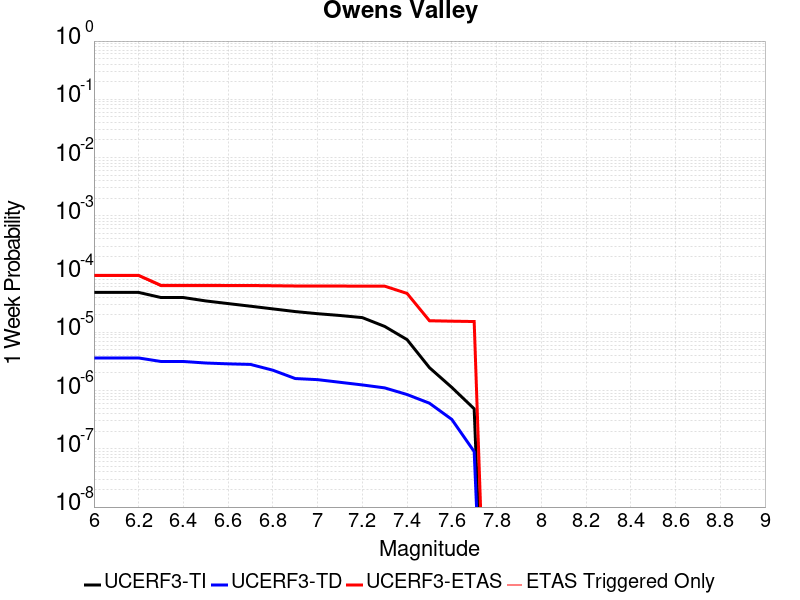 | 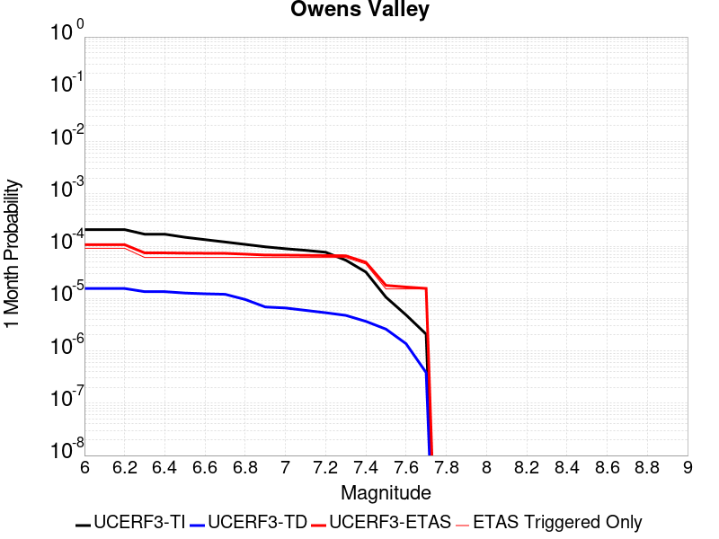 | 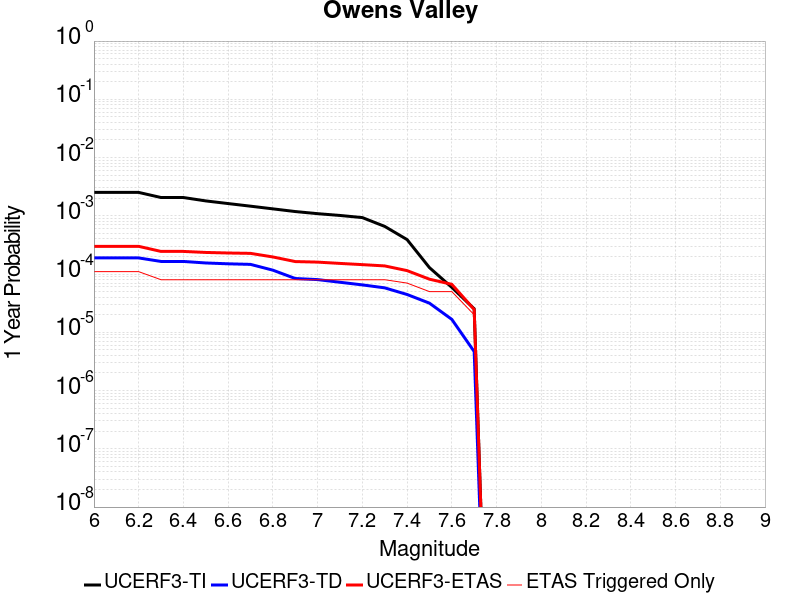 | 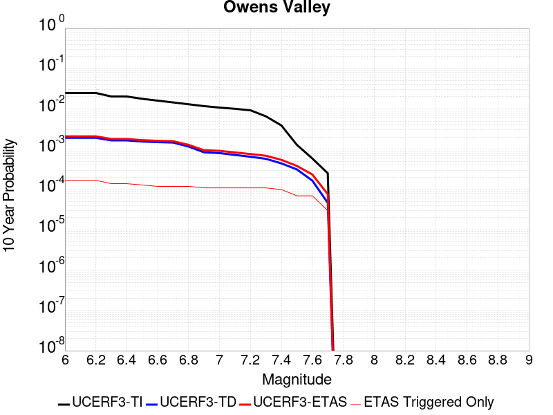 |

| Magnitude | 1 wk TI Prob | 1 wk TD Prob | 1 wk ETAS Prob | 1 wk ETAS/TD Gain | 1 wk ETAS Triggered Only | 1 mo TI Prob | 1 mo TD Prob | 1 mo ETAS Prob | 1 mo ETAS/TD Gain | 1 mo ETAS Triggered Only | 1 yr TI Prob | 1 yr TD Prob | 1 yr ETAS Prob | 1 yr ETAS/TD Gain | 1 yr ETAS Triggered Only | 10 yr TI Prob | 10 yr TD Prob | 10 yr ETAS Prob | 10 yr ETAS/TD Gain | 10 yr ETAS Triggered Only |
|-----|-----|-----|-----|-----|-----|-----|-----|-----|-----|-----|-----|-----|-----|-----|-----|-----|-----|-----|-----|-----|
| 6.0 | 4.83821E-5 | 3.626567E-6 | 9.495044E-5 | 26.181906 | 9.1324204E-5 | 2.0733538E-4 | 1.5542342E-5 | 1.06865125E-4 | 6.875741 | 9.1324204E-5 | 0.002521386 | 1.8921259E-4 | 3.4139078E-4 | 1.804271 | 1.5220701E-4 | 0.024929691 | 0.001925011 | 0.0021224993 | 1.1025907 | 1.978691E-4 |
| 6.1 | 4.83821E-5 | 3.626567E-6 | 9.495044E-5 | 26.181906 | 9.1324204E-5 | 2.0733538E-4 | 1.5542342E-5 | 1.06865125E-4 | 6.875741 | 9.1324204E-5 | 0.002521386 | 1.8921259E-4 | 3.4139078E-4 | 1.804271 | 1.5220701E-4 | 0.024929691 | 0.001925011 | 0.0021224993 | 1.1025907 | 1.978691E-4 |
| 6.2 | 4.83821E-5 | 3.626567E-6 | 9.495044E-5 | 26.181906 | 9.1324204E-5 | 2.0733538E-4 | 1.5542342E-5 | 1.06865125E-4 | 6.875741 | 9.1324204E-5 | 0.002521386 | 1.8921259E-4 | 3.4139078E-4 | 1.804271 | 1.5220701E-4 | 0.024929691 | 0.001925011 | 0.0021224993 | 1.1025907 | 1.978691E-4 |
| 6.3 | 3.953008E-5 | 3.1553948E-6 | 6.4038E-5 | 20.294767 | 6.08828E-5 | 1.6940363E-4 | 1.3523055E-5 | 7.4405034E-5 | 5.5020876 | 6.08828E-5 | 0.002060538 | 1.6463149E-4 | 2.7115885E-4 | 1.6470655 | 1.065449E-4 | 0.020415364 | 0.0016592 | 0.0018111544 | 1.091583 | 1.5220701E-4 |
| 6.4 | 3.953008E-5 | 3.1553948E-6 | 6.4038E-5 | 20.294767 | 6.08828E-5 | 1.6940363E-4 | 1.3523055E-5 | 7.4405034E-5 | 5.5020876 | 6.08828E-5 | 0.002060538 | 1.6463149E-4 | 2.7115885E-4 | 1.6470655 | 1.065449E-4 | 0.020415364 | 0.0016592 | 0.0018111544 | 1.091583 | 1.5220701E-4 |
| 6.5 | 3.457342E-5 | 2.9715961E-6 | 6.385422E-5 | 21.488188 | 6.08828E-5 | 1.4816338E-4 | 1.2735354E-5 | 7.361738E-5 | 5.7805524 | 6.08828E-5 | 0.0018023965 | 1.550426E-4 | 2.61571E-4 | 1.687091 | 1.065449E-4 | 0.017878477 | 0.001555719 | 0.0016924922 | 1.0879164 | 1.369863E-4 |
| 6.6 | 3.1127765E-5 | 2.8744932E-6 | 6.375712E-5 | 22.180298 | 6.08828E-5 | 1.3339789E-4 | 1.2319203E-5 | 7.3201256E-5 | 5.9420447 | 6.08828E-5 | 0.0016229092 | 1.4997667E-4 | 2.565056E-4 | 1.7103033 | 1.065449E-4 | 0.016111081 | 0.0015012559 | 0.0016228387 | 1.0809873 | 1.217656E-4 |
| 6.7 | 2.806885E-5 | 2.8104134E-6 | 6.369304E-5 | 22.663229 | 6.08828E-5 | 1.2028952E-4 | 1.20445775E-5 | 7.292665E-5 | 6.0547285 | 6.08828E-5 | 0.001463541 | 1.4663354E-4 | 2.531628E-4 | 1.7265 | 1.065449E-4 | 0.014539397 | 0.0014657511 | 0.0015873382 | 1.0829521 | 1.217656E-4 |
| 6.8 | 2.524524E-5 | 2.2353688E-6 | 6.311803E-5 | 28.236073 | 6.08828E-5 | 1.0818939E-4 | 9.580118E-6 | 7.046234E-5 | 7.355059 | 6.08828E-5 | 0.0013164099 | 1.16632E-4 | 2.2316448E-4 | 1.913407 | 1.065449E-4 | 0.01308639 | 0.0011659812 | 0.0012876048 | 1.1043102 | 1.217656E-4 |
| 6.9 | 2.2704568E-5 | 1.6081682E-6 | 6.249087E-5 | 38.858418 | 6.08828E-5 | 9.730166E-5 | 6.8921313E-6 | 6.777451E-5 | 9.833607 | 6.08828E-5 | 0.0011840039 | 8.390849E-5 | 1.9044445E-4 | 2.2696686 | 1.065449E-4 | 0.011777153 | 8.3897985E-4 | 9.454354E-4 | 1.1268868 | 1.065449E-4 |
| 7.0 | 2.0871712E-5 | 1.5395453E-6 | 6.242225E-5 | 40.545902 | 6.08828E-5 | 8.944713E-5 | 6.598035E-6 | 6.748043E-5 | 10.227353 | 6.08828E-5 | 0.0010884746 | 8.032813E-5 | 1.8686448E-4 | 2.3262644 | 1.065449E-4 | 0.010831586 | 8.0316263E-4 | 9.0962194E-4 | 1.1325501 | 1.065449E-4 |
| 7.1 | 1.944928E-5 | 1.3864178E-6 | 6.226914E-5 | 44.91369 | 6.08828E-5 | 8.335139E-5 | 5.941777E-6 | 6.6824214E-5 | 11.246504 | 6.08828E-5 | 0.0010143308 | 7.233874E-5 | 1.7887594E-4 | 2.4727542 | 1.065449E-4 | 0.010097133 | 7.2330976E-4 | 8.2977756E-4 | 1.1471953 | 1.065449E-4 |
| 7.2 | 1.7876306E-5 | 1.2489141E-6 | 6.2131636E-5 | 49.748528 | 6.08828E-5 | 7.6610486E-5 | 5.352478E-6 | 6.6234956E-5 | 12.374633 | 6.08828E-5 | 9.3233347E-4 | 6.516448E-5 | 1.7170244E-4 | 2.6349084 | 1.065449E-4 | 0.009284316 | 6.5159105E-4 | 7.5806654E-4 | 1.1634084 | 1.065449E-4 |
| 7.3 | 1.2618672E-5 | 1.1115209E-6 | 6.199425E-5 | 55.774258 | 6.08828E-5 | 5.40789E-5 | 4.763652E-6 | 6.564616E-5 | 13.780637 | 6.08828E-5 | 6.582117E-4 | 5.799593E-5 | 1.6453465E-4 | 2.8370035 | 1.065449E-4 | 0.0065626553 | 5.7994033E-4 | 6.8642345E-4 | 1.1836104 | 1.065449E-4 |
| 7.4 | 7.4874442E-6 | 8.5486437E-7 | 4.6516925E-5 | 54.41439 | 4.5662102E-5 | 3.208865E-5 | 3.6636993E-6 | 4.9325634E-5 | 13.463341 | 4.5662102E-5 | 3.906093E-4 | 4.4604632E-5 | 1.3592475E-4 | 3.047324 | 9.1324204E-5 | 0.003899234 | 4.4604883E-4 | 5.373323E-4 | 1.2046491 | 9.1324204E-5 |
| 7.5 | 2.4734156E-6 | 6.068616E-7 | 1.5827552E-5 | 26.080994 | 1.52207E-5 | 1.060031E-5 | 2.6008327E-6 | 1.7821494E-5 | 6.852226 | 1.52207E-5 | 1.2905113E-4 | 3.166468E-5 | 9.254555E-5 | 2.9226744 | 6.08828E-5 | 0.0012897621 | 3.1660203E-4 | 3.7746556E-4 | 1.1922399 | 6.08828E-5 |
| 7.6 | 1.1328841E-6 | 3.196531E-7 | 1.5540349E-5 | 48.61629 | 1.52207E-5 | 4.8552088E-6 | 1.3699412E-6 | 1.659062E-5 | 12.110462 | 1.52207E-5 | 5.9110564E-5 | 1.6678909E-5 | 7.756069E-5 | 4.650226 | 6.08828E-5 | 5.9094845E-4 | 1.6677675E-4 | 2.2764939E-4 | 1.3649948 | 6.08828E-5 |
| 7.7 | 4.8613185E-7 | 8.964689E-8 | 1.5310346E-5 | 170.78502 | 1.52207E-5 | 2.0834207E-6 | 3.8420092E-7 | 1.5604895E-5 | 40.616497 | 1.52207E-5 | 2.536535E-5 | 4.6776368E-6 | 3.5118894E-5 | 7.5078287 | 3.04414E-5 | 2.5362454E-4 | 4.677545E-5 | 7.721542E-5 | 1.6507682 | 3.04414E-5 |

## San Jacinto (Stepovers Combined)
*[(top)](#table-of-contents)*

| 1 Week | 1 Month | 1 Year | 10 Year |
|-----|-----|-----|-----|
| 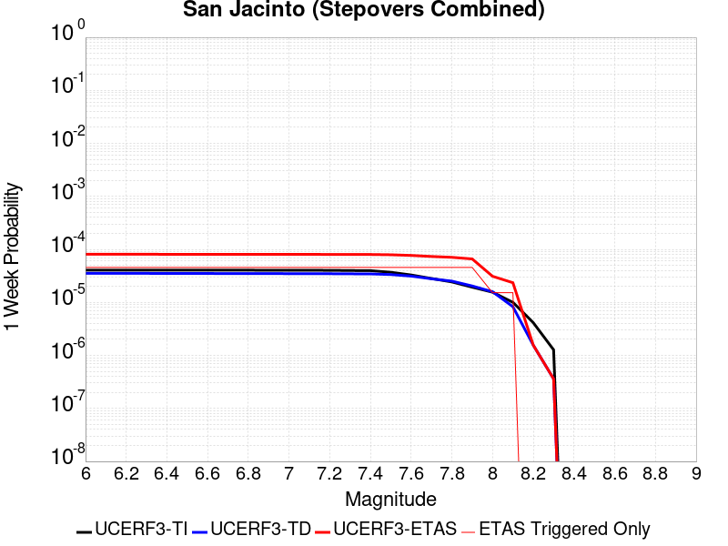 | 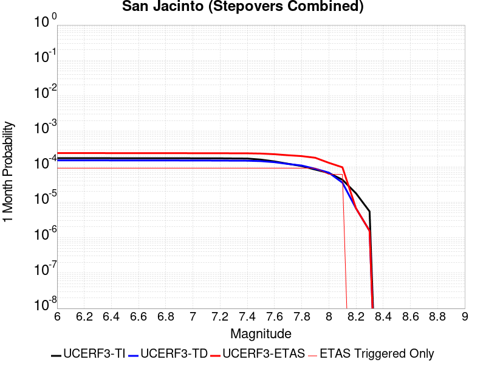 | 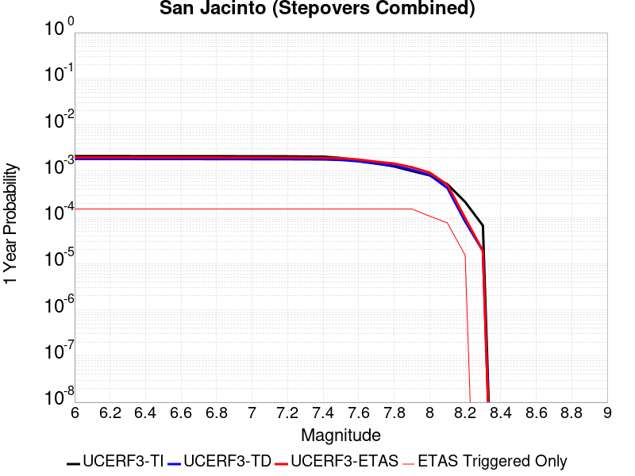 | 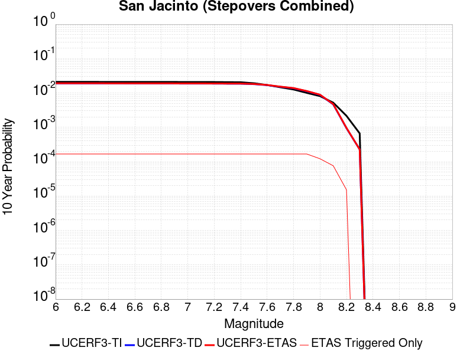 |

| Magnitude | 1 wk TI Prob | 1 wk TD Prob | 1 wk ETAS Prob | 1 wk ETAS/TD Gain | 1 wk ETAS Triggered Only | 1 mo TI Prob | 1 mo TD Prob | 1 mo ETAS Prob | 1 mo ETAS/TD Gain | 1 mo ETAS Triggered Only | 1 yr TI Prob | 1 yr TD Prob | 1 yr ETAS Prob | 1 yr ETAS/TD Gain | 1 yr ETAS Triggered Only | 10 yr TI Prob | 10 yr TD Prob | 10 yr ETAS Prob | 10 yr ETAS/TD Gain | 10 yr ETAS Triggered Only |
|-----|-----|-----|-----|-----|-----|-----|-----|-----|-----|-----|-----|-----|-----|-----|-----|-----|-----|-----|-----|-----|
| 6.0 | 4.0667746E-5 | 3.5272755E-5 | 8.093325E-5 | 2.2944975 | 4.5662102E-5 | 1.742787E-4 | 1.5116022E-4 | 2.424706E-4 | 1.6040637 | 9.1324204E-5 | 0.0021197782 | 0.0018388226 | 0.0019907497 | 1.0826219 | 1.5220701E-4 | 0.020996714 | 0.018986892 | 0.01915114 | 1.0086507 | 1.674277E-4 |
| 6.1 | 4.0667746E-5 | 3.5272755E-5 | 8.093325E-5 | 2.2944975 | 4.5662102E-5 | 1.742787E-4 | 1.5116022E-4 | 2.424706E-4 | 1.6040637 | 9.1324204E-5 | 0.0021197782 | 0.0018388226 | 0.0019907497 | 1.0826219 | 1.5220701E-4 | 0.020996714 | 0.018986892 | 0.01915114 | 1.0086507 | 1.674277E-4 |
| 6.2 | 4.0667746E-5 | 3.5272755E-5 | 8.093325E-5 | 2.2944975 | 4.5662102E-5 | 1.742787E-4 | 1.5116022E-4 | 2.424706E-4 | 1.6040637 | 9.1324204E-5 | 0.0021197782 | 0.0018388226 | 0.0019907497 | 1.0826219 | 1.5220701E-4 | 0.020996714 | 0.018986892 | 0.01915114 | 1.0086507 | 1.674277E-4 |
| 6.3 | 4.0667746E-5 | 3.5272755E-5 | 8.093325E-5 | 2.2944975 | 4.5662102E-5 | 1.742787E-4 | 1.5116022E-4 | 2.424706E-4 | 1.6040637 | 9.1324204E-5 | 0.0021197782 | 0.0018388226 | 0.0019907497 | 1.0826219 | 1.5220701E-4 | 0.020996714 | 0.018986892 | 0.01915114 | 1.0086507 | 1.674277E-4 |
| 6.4 | 4.0577226E-5 | 3.5144654E-5 | 8.080515E-5 | 2.2992158 | 4.5662102E-5 | 1.738908E-4 | 1.5061127E-4 | 2.4192172E-4 | 1.6062657 | 9.1324204E-5 | 0.0021150648 | 0.0018321523 | 0.0019840803 | 1.0829233 | 1.5220701E-4 | 0.020950472 | 0.018921461 | 0.01908572 | 1.0086812 | 1.674277E-4 |
| 6.5 | 4.0577226E-5 | 3.5144654E-5 | 8.080515E-5 | 2.2992158 | 4.5662102E-5 | 1.738908E-4 | 1.5061127E-4 | 2.4192172E-4 | 1.6062657 | 9.1324204E-5 | 0.0021150648 | 0.0018321523 | 0.0019840803 | 1.0829233 | 1.5220701E-4 | 0.020950472 | 0.018921461 | 0.01908572 | 1.0086812 | 1.674277E-4 |
| 6.6 | 4.053861E-5 | 3.509E-5 | 8.07505E-5 | 2.3012395 | 4.5662102E-5 | 1.7372532E-4 | 1.5037706E-4 | 2.4168754E-4 | 1.60721 | 9.1324204E-5 | 0.0021130538 | 0.0018293057 | 0.0019812342 | 1.0830526 | 1.5220701E-4 | 0.020930743 | 0.018893538 | 0.019057803 | 1.0086942 | 1.674277E-4 |
| 6.7 | 4.0516545E-5 | 3.5059067E-5 | 8.071957E-5 | 2.3023877 | 4.5662102E-5 | 1.7363077E-4 | 1.5024451E-4 | 2.41555E-4 | 1.6077459 | 9.1324204E-5 | 0.002111905 | 0.001827695 | 0.001979624 | 1.083126 | 1.5220701E-4 | 0.020919468 | 0.018877735 | 0.019042002 | 1.0087017 | 1.674277E-4 |
| 6.8 | 4.049434E-5 | 3.5030633E-5 | 8.0691134E-5 | 2.303445 | 4.5662102E-5 | 1.7353562E-4 | 1.5012265E-4 | 2.4143314E-4 | 1.6082393 | 9.1324204E-5 | 0.0021107488 | 0.0018262138 | 0.001978143 | 1.0831934 | 1.5220701E-4 | 0.020908125 | 0.018863149 | 0.019027418 | 1.0087085 | 1.674277E-4 |
| 6.9 | 4.046386E-5 | 3.499319E-5 | 8.065369E-5 | 2.3048396 | 4.5662102E-5 | 1.73405E-4 | 1.4996222E-4 | 2.4127272E-4 | 1.60889 | 9.1324204E-5 | 0.0021091616 | 0.0018242638 | 0.0019761932 | 1.0832826 | 1.5220701E-4 | 0.020892553 | 0.01884392 | 0.019008193 | 1.0087175 | 1.674277E-4 |
| 7.0 | 4.036382E-5 | 3.487376E-5 | 8.0534264E-5 | 2.3093085 | 4.5662102E-5 | 1.7297632E-4 | 1.4945042E-4 | 2.4076097E-4 | 1.6109755 | 9.1324204E-5 | 0.0021039525 | 0.0018180435 | 0.0019699738 | 1.083568 | 1.5220701E-4 | 0.02084144 | 0.018782536 | 0.018946819 | 1.0087466 | 1.674277E-4 |
| 7.1 | 4.0343282E-5 | 3.4852223E-5 | 8.051273E-5 | 2.3101177 | 4.5662102E-5 | 1.7288832E-4 | 1.4935812E-4 | 2.4066868E-4 | 1.6113532 | 9.1324204E-5 | 0.002102883 | 0.0018169218 | 0.0019688522 | 1.0836197 | 1.5220701E-4 | 0.020830948 | 0.018771412 | 0.018935697 | 1.0087519 | 1.674277E-4 |
| 7.2 | 4.0257353E-5 | 3.4756722E-5 | 8.041724E-5 | 2.3137176 | 4.5662102E-5 | 1.725201E-4 | 1.489489E-4 | 2.402595E-4 | 1.613033 | 9.1324204E-5 | 0.0020984085 | 0.0018119477 | 0.001963879 | 1.0838497 | 1.5220701E-4 | 0.020787042 | 0.018722152 | 0.018886445 | 1.0087754 | 1.674277E-4 |
| 7.3 | 3.9940667E-5 | 3.4584376E-5 | 8.02449E-5 | 2.3202643 | 4.5662102E-5 | 1.7116306E-4 | 1.4821035E-4 | 2.3952102E-4 | 1.6160883 | 9.1324204E-5 | 0.0020819185 | 0.0018029709 | 0.0019549036 | 1.0842679 | 1.5220701E-4 | 0.020625217 | 0.018630784 | 0.018795092 | 1.0088192 | 1.674277E-4 |
| 7.4 | 3.9721202E-5 | 3.4469766E-5 | 8.0130296E-5 | 2.3246543 | 4.5662102E-5 | 1.7022261E-4 | 1.4771923E-4 | 2.3902993E-4 | 1.618137 | 9.1324204E-5 | 0.0020704903 | 0.0017970012 | 0.0019489347 | 1.0845484 | 1.5220701E-4 | 0.020513052 | 0.018569905 | 0.018734224 | 1.0088487 | 1.674277E-4 |
| 7.5 | 3.7036873E-5 | 3.3537188E-5 | 7.919776E-5 | 2.3614907 | 4.5662102E-5 | 1.5871979E-4 | 1.437229E-4 | 2.3503398E-4 | 1.6353272 | 9.1324204E-5 | 0.0019307006 | 0.0017484248 | 0.0019003657 | 1.0869015 | 1.5220701E-4 | 0.019140124 | 0.018071463 | 0.018235866 | 1.0090973 | 1.674277E-4 |
| 7.6 | 3.2940967E-5 | 3.1317984E-5 | 7.697866E-5 | 2.4579697 | 4.5662102E-5 | 1.4116794E-4 | 1.3421304E-4 | 2.2552499E-4 | 1.6803508 | 9.1324204E-5 | 0.0017173645 | 0.0016328214 | 0.0017847798 | 1.093065 | 1.5220701E-4 | 0.01704153 | 0.016904354 | 0.01706895 | 1.009737 | 1.674277E-4 |
| 7.7 | 2.8236149E-5 | 2.7883889E-5 | 7.354472E-5 | 2.6375344 | 4.5662102E-5 | 1.2100645E-4 | 1.19496915E-4 | 2.108102E-4 | 1.7641476 | 9.1324204E-5 | 0.0014722579 | 0.001453905 | 0.0016058908 | 1.1045362 | 1.5220701E-4 | 0.014625421 | 0.015115095 | 0.0152799925 | 1.0109094 | 1.674277E-4 |
| 7.8 | 2.4329287E-5 | 2.5207537E-5 | 7.086849E-5 | 2.8114007 | 4.5662102E-5 | 1.042642E-4 | 1.0802783E-4 | 1.9934216E-4 | 1.8452853 | 9.1324204E-5 | 0.0012686774 | 0.0013144462 | 0.0014664531 | 1.1156434 | 1.5220701E-4 | 0.012614589 | 0.013712396 | 0.013877528 | 1.0120425 | 1.674277E-4 |
| 7.9 | 1.9370926E-5 | 2.0421452E-5 | 6.608262E-5 | 3.2359414 | 4.5662102E-5 | 8.301561E-5 | 8.7517576E-5 | 1.7883378E-4 | 2.0434043 | 9.1324204E-5 | 0.0010102465 | 0.0010650064 | 0.0012170513 | 1.1427643 | 1.5220701E-4 | 0.0100566605 | 0.011199483 | 0.011365035 | 1.0147822 | 1.674277E-4 |
| 8.0 | 1.5583017E-5 | 1.588647E-5 | 3.1106927E-5 | 1.9580768 | 1.52207E-5 | 6.6782646E-5 | 6.808309E-5 | 1.2896175E-4 | 1.8941817 | 6.08828E-5 | 8.127754E-4 | 8.285971E-4 | 9.3505374E-4 | 1.1284782 | 1.065449E-4 | 0.008098091 | 0.008781809 | 0.008902506 | 1.0137439 | 1.217656E-4 |
| 8.1 | 1.0024873E-5 | 8.292404E-6 | 2.3512977E-5 | 2.8354838 | 1.52207E-5 | 4.2963035E-5 | 3.5538393E-5 | 9.641903E-5 | 2.7130947 | 6.08828E-5 | 5.229494E-4 | 4.3259456E-4 | 5.086651E-4 | 1.1758473 | 7.6103504E-5 | 0.0052172043 | 0.0046534105 | 0.00472916 | 1.0162783 | 7.6103504E-5 |
| 8.2 | 4.142796E-6 | 1.5610041E-6 | 1.5610041E-6 | 1.0 | 0.0 | 1.775472E-5 | 6.69E-6 | 6.69E-6 | 1.0 | 0.0 | 2.1614227E-4 | 8.144774E-5 | 9.6667194E-5 | 1.1868616 | 1.52207E-5 | 0.0021593217 | 9.454649E-4 | 9.6067117E-4 | 1.0160835 | 1.52207E-5 |
| 8.3 | 1.2750878E-6 | 3.612133E-7 | 3.612133E-7 | 1.0 | 0.0 | 5.4646503E-6 | 1.548056E-6 | 1.548056E-6 | 1.0 | 0.0 | 6.653009E-5 | 1.8847424E-5 | 1.8847424E-5 | 1.0 | 0.0 | 6.6510175E-4 | 2.2734253E-4 | 2.2734253E-4 | 1.0 | 0.0 |

## Pisgah-Bullion Mtn-Mesquite Lk
*[(top)](#table-of-contents)*

| 1 Week | 1 Month | 1 Year | 10 Year |
|-----|-----|-----|-----|
| 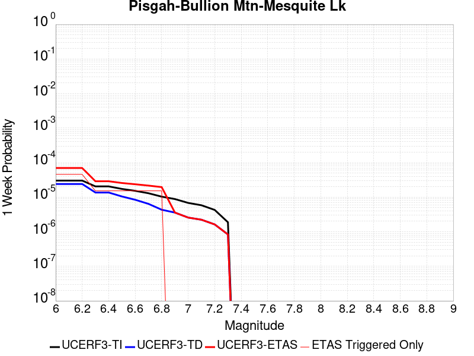 | 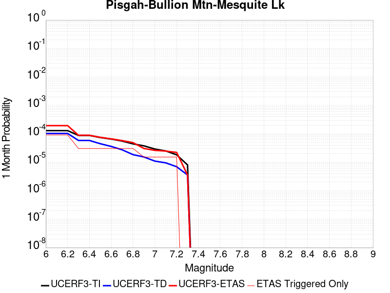 | 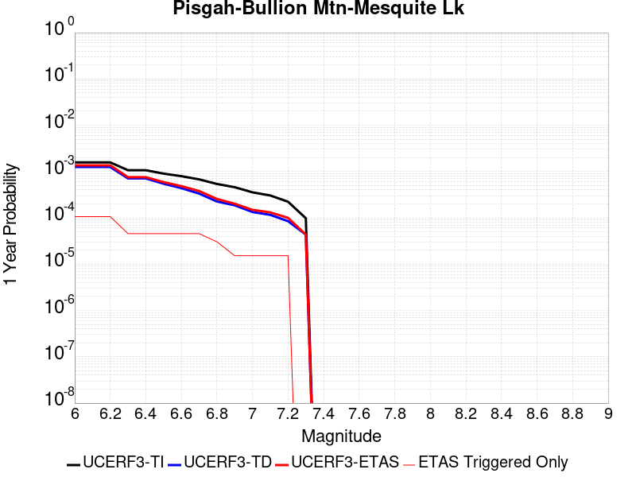 | 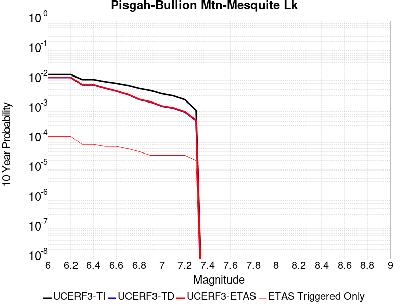 |

| Magnitude | 1 wk TI Prob | 1 wk TD Prob | 1 wk ETAS Prob | 1 wk ETAS/TD Gain | 1 wk ETAS Triggered Only | 1 mo TI Prob | 1 mo TD Prob | 1 mo ETAS Prob | 1 mo ETAS/TD Gain | 1 mo ETAS Triggered Only | 1 yr TI Prob | 1 yr TD Prob | 1 yr ETAS Prob | 1 yr ETAS/TD Gain | 1 yr ETAS Triggered Only | 10 yr TI Prob | 10 yr TD Prob | 10 yr ETAS Prob | 10 yr ETAS/TD Gain | 10 yr ETAS Triggered Only |
|-----|-----|-----|-----|-----|-----|-----|-----|-----|-----|-----|-----|-----|-----|-----|-----|-----|-----|-----|-----|-----|
| 6.0 | 3.0240792E-5 | 2.4091114E-5 | 6.975212E-5 | 2.8953462 | 4.5662102E-5 | 1.2959696E-4 | 1.03244114E-4 | 1.9455889E-4 | 1.884455 | 9.1324204E-5 | 0.0015767008 | 0.0012563728 | 0.0013627838 | 1.084697 | 1.065449E-4 | 0.015655609 | 0.012502721 | 0.012653025 | 1.0120217 | 1.5220701E-4 |
| 6.1 | 3.0240792E-5 | 2.4091114E-5 | 6.975212E-5 | 2.8953462 | 4.5662102E-5 | 1.2959696E-4 | 1.03244114E-4 | 1.9455889E-4 | 1.884455 | 9.1324204E-5 | 0.0015767008 | 0.0012563728 | 0.0013627838 | 1.084697 | 1.065449E-4 | 0.015655609 | 0.012502721 | 0.012653025 | 1.0120217 | 1.5220701E-4 |
| 6.2 | 3.0240792E-5 | 2.4091114E-5 | 6.975212E-5 | 2.8953462 | 4.5662102E-5 | 1.2959696E-4 | 1.03244114E-4 | 1.9455889E-4 | 1.884455 | 9.1324204E-5 | 0.0015767008 | 0.0012563728 | 0.0013627838 | 1.084697 | 1.065449E-4 | 0.015655609 | 0.012502721 | 0.012653025 | 1.0120217 | 1.5220701E-4 |
| 6.3 | 2.0498217E-5 | 1.36380695E-5 | 2.8858562E-5 | 2.1160297 | 1.52207E-5 | 8.784654E-5 | 5.844765E-5 | 8.8887275E-5 | 1.5208014 | 3.04414E-5 | 0.0010690069 | 7.1138405E-4 | 7.570137E-4 | 1.064142 | 4.5662102E-5 | 0.01063879 | 0.0070926943 | 0.007168258 | 1.0106537 | 7.6103504E-5 |
| 6.4 | 2.0498217E-5 | 1.36380695E-5 | 2.8858562E-5 | 2.1160297 | 1.52207E-5 | 8.784654E-5 | 5.844765E-5 | 8.8887275E-5 | 1.5208014 | 3.04414E-5 | 0.0010690069 | 7.1138405E-4 | 7.570137E-4 | 1.064142 | 4.5662102E-5 | 0.01063879 | 0.0070926943 | 0.007168258 | 1.0106537 | 7.6103504E-5 |
| 6.5 | 1.7316182E-5 | 1.0477042E-5 | 2.5697584E-5 | 2.4527516 | 1.52207E-5 | 7.42101E-5 | 4.4900895E-5 | 7.5340926E-5 | 1.6779382 | 3.04414E-5 | 9.0313336E-4 | 5.465413E-4 | 5.9217843E-4 | 1.0835017 | 4.5662102E-5 | 0.008994718 | 0.0054529672 | 0.0055135177 | 1.0111042 | 6.08828E-5 |
| 6.6 | 1.5251077E-5 | 8.414273E-6 | 2.3634844E-5 | 2.8088992 | 1.52207E-5 | 6.536012E-5 | 3.6060712E-5 | 6.6501016E-5 | 1.8441404 | 3.04414E-5 | 7.9546886E-4 | 4.3895794E-4 | 4.8460002E-4 | 1.1039782 | 4.5662102E-5 | 0.007926274 | 0.0043816264 | 0.0044422424 | 1.0138341 | 6.08828E-5 |
| 6.7 | 1.2997425E-5 | 6.4114965E-6 | 2.1632099E-5 | 3.3739548 | 1.52207E-5 | 5.570206E-5 | 2.7477578E-5 | 5.7918143E-5 | 2.107833 | 3.04414E-5 | 6.7796157E-4 | 3.3449283E-4 | 3.8013965E-4 | 1.1364658 | 4.5662102E-5 | 0.0067589693 | 0.0033403537 | 0.003401033 | 1.0181656 | 6.08828E-5 |
| 6.8 | 1.035386E-5 | 4.3332193E-6 | 1.9553854E-5 | 4.5125465 | 1.52207E-5 | 4.437293E-5 | 1.8570812E-5 | 4.9011647E-5 | 2.6391761 | 3.04414E-5 | 5.401065E-4 | 2.2607706E-4 | 2.565116E-4 | 1.1346201 | 3.04414E-5 | 0.0053879567 | 0.0022585576 | 0.0023041165 | 1.0201718 | 4.5662102E-5 |
| 6.9 | 8.816252E-6 | 3.580638E-6 | 3.580638E-6 | 1.0 | 0.0 | 3.778339E-5 | 1.5345504E-5 | 3.056597E-5 | 1.9918519 | 1.52207E-5 | 4.5991567E-4 | 1.8681608E-4 | 2.0203393E-4 | 1.081459 | 1.52207E-5 | 0.00458965 | 0.0018666488 | 0.0018970333 | 1.0162776 | 3.04414E-5 |
| 7.0 | 6.8232207E-6 | 2.5675843E-6 | 2.5675843E-6 | 1.0 | 0.0 | 2.9242048E-5 | 1.1003888E-5 | 2.6224421E-5 | 2.3831959 | 1.52207E-5 | 3.5596377E-4 | 1.3396442E-4 | 1.4918308E-4 | 1.1136023 | 1.52207E-5 | 0.0035539411 | 0.0013388677 | 0.0013692683 | 1.0227063 | 3.04414E-5 |
| 7.1 | 5.837013E-6 | 2.22738E-6 | 2.22738E-6 | 1.0 | 0.0 | 2.501553E-5 | 9.545881E-6 | 2.4766436E-5 | 2.594463 | 1.52207E-5 | 3.045215E-4 | 1.16215204E-4 | 1.3143414E-4 | 1.1309547 | 1.52207E-5 | 0.0030410455 | 0.0011615733 | 0.0011919793 | 1.0261766 | 3.04414E-5 |
| 7.2 | 4.278052E-6 | 1.6275711E-6 | 1.6275711E-6 | 1.0 | 0.0 | 1.833438E-5 | 6.9752873E-6 | 2.2195882E-5 | 3.182074 | 1.52207E-5 | 2.231982E-4 | 8.492105E-5 | 1.0014046E-4 | 1.1792183 | 1.52207E-5 | 0.0022297418 | 8.489092E-4 | 8.793248E-4 | 1.035829 | 3.04414E-5 |
| 7.3 | 1.8803692E-6 | 8.344926E-7 | 8.344926E-7 | 1.0 | 0.0 | 8.0587E-6 | 3.5763926E-6 | 3.5763926E-6 | 1.0 | 0.0 | 9.811026E-5 | 4.354186E-5 | 4.354186E-5 | 1.0 | 0.0 | 9.806695E-4 | 4.3534773E-4 | 4.505618E-4 | 1.0349469 | 1.52207E-5 |

## Independence rev 2011
*[(top)](#table-of-contents)*

| 1 Week | 1 Month | 1 Year | 10 Year |
|-----|-----|-----|-----|
| 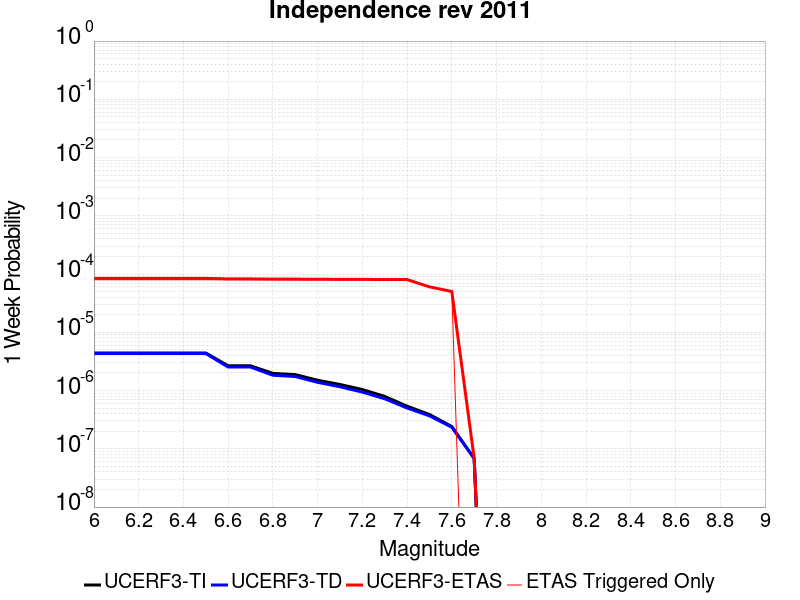 | 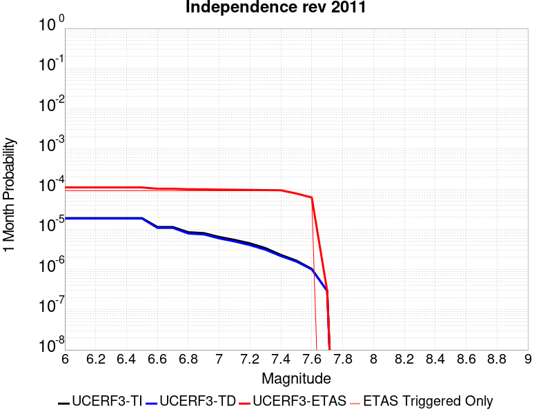 | 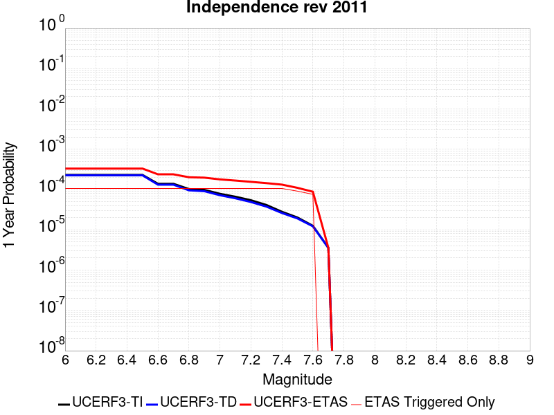 | 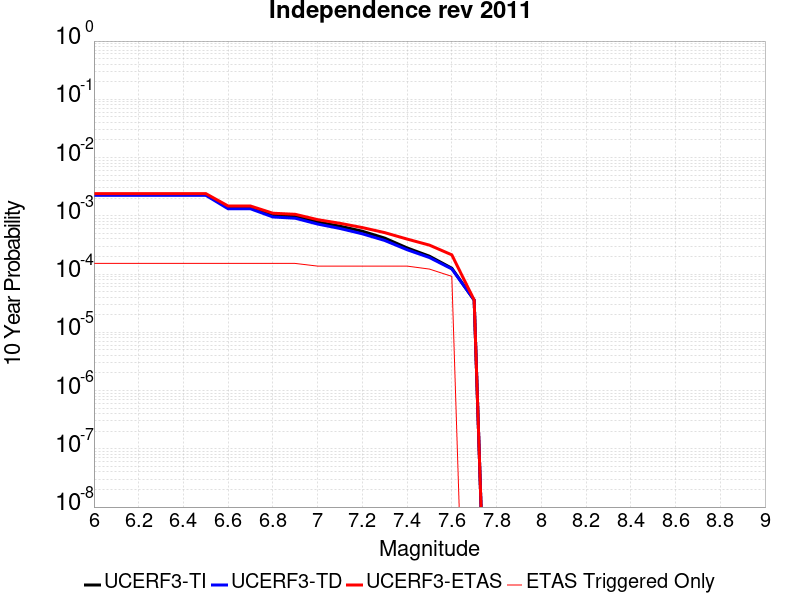 |

| Magnitude | 1 wk TI Prob | 1 wk TD Prob | 1 wk ETAS Prob | 1 wk ETAS/TD Gain | 1 wk ETAS Triggered Only | 1 mo TI Prob | 1 mo TD Prob | 1 mo ETAS Prob | 1 mo ETAS/TD Gain | 1 mo ETAS Triggered Only | 1 yr TI Prob | 1 yr TD Prob | 1 yr ETAS Prob | 1 yr ETAS/TD Gain | 1 yr ETAS Triggered Only | 10 yr TI Prob | 10 yr TD Prob | 10 yr ETAS Prob | 10 yr ETAS/TD Gain | 10 yr ETAS Triggered Only |
|-----|-----|-----|-----|-----|-----|-----|-----|-----|-----|-----|-----|-----|-----|-----|-----|-----|-----|-----|-----|-----|
| 6.0 | 4.422171E-6 | 4.326227E-6 | 9.565003E-5 | 22.109343 | 9.1324204E-5 | 1.8952025E-5 | 1.8540857E-5 | 1.09863366E-4 | 5.9254737 | 9.1324204E-5 | 2.3071647E-4 | 2.2571455E-4 | 3.322354E-4 | 1.4719273 | 1.065449E-4 | 0.0023047708 | 0.0022551466 | 0.0024070102 | 1.067341 | 1.5220701E-4 |
| 6.1 | 4.422171E-6 | 4.326227E-6 | 9.565003E-5 | 22.109343 | 9.1324204E-5 | 1.8952025E-5 | 1.8540857E-5 | 1.09863366E-4 | 5.9254737 | 9.1324204E-5 | 2.3071647E-4 | 2.2571455E-4 | 3.322354E-4 | 1.4719273 | 1.065449E-4 | 0.0023047708 | 0.0022551466 | 0.0024070102 | 1.067341 | 1.5220701E-4 |
| 6.2 | 4.422171E-6 | 4.326227E-6 | 9.565003E-5 | 22.109343 | 9.1324204E-5 | 1.8952025E-5 | 1.8540857E-5 | 1.09863366E-4 | 5.9254737 | 9.1324204E-5 | 2.3071647E-4 | 2.2571455E-4 | 3.322354E-4 | 1.4719273 | 1.065449E-4 | 0.0023047708 | 0.0022551466 | 0.0024070102 | 1.067341 | 1.5220701E-4 |
| 6.3 | 4.422171E-6 | 4.326227E-6 | 9.565003E-5 | 22.109343 | 9.1324204E-5 | 1.8952025E-5 | 1.8540857E-5 | 1.09863366E-4 | 5.9254737 | 9.1324204E-5 | 2.3071647E-4 | 2.2571455E-4 | 3.322354E-4 | 1.4719273 | 1.065449E-4 | 0.0023047708 | 0.0022551466 | 0.0024070102 | 1.067341 | 1.5220701E-4 |
| 6.4 | 4.422171E-6 | 4.326227E-6 | 9.565003E-5 | 22.109343 | 9.1324204E-5 | 1.8952025E-5 | 1.8540857E-5 | 1.09863366E-4 | 5.9254737 | 9.1324204E-5 | 2.3071647E-4 | 2.2571455E-4 | 3.322354E-4 | 1.4719273 | 1.065449E-4 | 0.0023047708 | 0.0022551466 | 0.0024070102 | 1.067341 | 1.5220701E-4 |
| 6.5 | 4.422171E-6 | 4.326227E-6 | 9.565003E-5 | 22.109343 | 9.1324204E-5 | 1.8952025E-5 | 1.8540857E-5 | 1.09863366E-4 | 5.9254737 | 9.1324204E-5 | 2.3071647E-4 | 2.2571455E-4 | 3.322354E-4 | 1.4719273 | 1.065449E-4 | 0.0023047708 | 0.0022551466 | 0.0024070102 | 1.067341 | 1.5220701E-4 |
| 6.6 | 2.663744E-6 | 2.5319862E-6 | 9.385595E-5 | 37.068115 | 9.1324204E-5 | 1.1415996E-5 | 1.0851327E-5 | 1.02174534E-4 | 9.415856 | 9.1324204E-5 | 1.3898089E-4 | 1.3210738E-4 | 2.3863821E-4 | 1.8063956 | 1.065449E-4 | 0.0013889399 | 0.0013203367 | 0.0014723428 | 1.1151267 | 1.5220701E-4 |
| 6.7 | 2.663744E-6 | 2.5319862E-6 | 9.385595E-5 | 37.068115 | 9.1324204E-5 | 1.1415996E-5 | 1.0851327E-5 | 1.02174534E-4 | 9.415856 | 9.1324204E-5 | 1.3898089E-4 | 1.3210738E-4 | 2.3863821E-4 | 1.8063956 | 1.065449E-4 | 0.0013889399 | 0.0013203367 | 0.0014723428 | 1.1151267 | 1.5220701E-4 |
| 6.8 | 1.9716529E-6 | 1.8322585E-6 | 9.315629E-5 | 50.84233 | 9.1324204E-5 | 8.449913E-6 | 7.852514E-6 | 9.9175995E-5 | 12.629842 | 9.1324204E-5 | 1.0287284E-4 | 9.5600284E-5 | 2.02135E-4 | 2.1143765 | 1.065449E-4 | 0.0010282523 | 9.556045E-4 | 0.0011076661 | 1.159126 | 1.5220701E-4 |
| 6.9 | 1.8788617E-6 | 1.7429993E-6 | 9.306704E-5 | 53.394768 | 9.1324204E-5 | 8.0522395E-6 | 7.4699765E-6 | 9.87935E-5 | 13.2254095 | 9.1324204E-5 | 9.80316E-5 | 9.0943286E-5 | 1.974785E-4 | 2.1714466 | 1.065449E-4 | 9.798837E-4 | 9.0907275E-4 | 0.0010611414 | 1.1672789 | 1.5220701E-4 |
| 7.0 | 1.5045488E-6 | 1.3849503E-6 | 9.270902E-5 | 66.94032 | 9.1324204E-5 | 6.44805E-6 | 5.9354884E-6 | 9.7259144E-5 | 16.38604 | 9.1324204E-5 | 7.8502184E-5 | 7.226223E-5 | 1.7879943E-4 | 2.4743137 | 1.065449E-4 | 7.8474457E-4 | 7.2239246E-4 | 8.5927977E-4 | 1.1894916 | 1.369863E-4 |
| 7.1 | 1.272341E-6 | 1.1625096E-6 | 9.24866E-5 | 79.55771 | 9.1324204E-5 | 5.4528787E-6 | 4.982175E-6 | 9.630592E-5 | 19.330095 | 9.1324204E-5 | 6.6386776E-5 | 6.0656326E-5 | 1.6719477E-4 | 2.7564275 | 1.065449E-4 | 6.636695E-4 | 6.064009E-4 | 7.4330415E-4 | 1.2257636 | 1.369863E-4 |
| 7.2 | 1.0416892E-6 | 9.4098806E-7 | 9.22651E-5 | 98.0513 | 9.1324204E-5 | 4.464375E-6 | 4.0328E-6 | 9.5356634E-5 | 23.645267 | 9.1324204E-5 | 5.4352407E-5 | 4.909825E-5 | 1.5563791E-4 | 3.169928 | 1.065449E-4 | 5.4339116E-4 | 4.9087586E-4 | 6.2779494E-4 | 1.278928 | 1.369863E-4 |
| 7.3 | 7.9450155E-7 | 7.235002E-7 | 9.204764E-5 | 127.22545 | 9.1324204E-5 | 3.4050022E-6 | 3.1007114E-6 | 9.442463E-5 | 30.45257 | 9.1324204E-5 | 4.1455114E-5 | 3.775052E-5 | 1.4429139E-4 | 3.822236 | 1.065449E-4 | 4.144738E-4 | 3.7744216E-4 | 5.143768E-4 | 1.3627962 | 1.369863E-4 |
| 7.4 | 5.3893444E-7 | 5.019512E-7 | 9.182611E-5 | 182.93831 | 9.1324204E-5 | 2.309717E-6 | 2.1512178E-6 | 9.3475224E-5 | 43.452236 | 9.1324204E-5 | 2.8120441E-5 | 2.6190766E-5 | 1.3273288E-4 | 5.0679264 | 1.065449E-4 | 2.8116882E-4 | 2.6187726E-4 | 3.988277E-4 | 1.5229566 | 1.369863E-4 |
| 7.5 | 3.8852085E-7 | 3.682554E-7 | 7.6471726E-5 | 207.6595 | 7.6103504E-5 | 1.6650882E-6 | 1.5782365E-6 | 7.7681616E-5 | 49.22052 | 7.6103504E-5 | 2.027226E-5 | 1.9214862E-5 | 1.1053731E-4 | 5.7526984 | 9.1324204E-5 | 2.0270412E-4 | 1.9213221E-4 | 3.1387442E-4 | 1.6336377 | 1.217656E-4 |
| 7.6 | 2.414929E-7 | 2.345755E-7 | 6.111736E-5 | 260.54453 | 6.08828E-5 | 1.0349692E-6 | 1.0053232E-6 | 6.1888066E-5 | 61.560364 | 6.08828E-5 | 1.2600677E-5 | 1.2239742E-5 | 8.834231E-5 | 7.217661 | 7.6103504E-5 | 1.2599962E-4 | 1.223908E-4 | 2.1370382E-4 | 1.7460774 | 9.1324204E-5 |
| 7.7 | 6.8298014E-8 | 6.85897E-8 | 6.85897E-8 | 1.0 | 0.0 | 2.9270575E-7 | 2.9395582E-7 | 2.9395582E-7 | 1.0 | 0.0 | 3.5636867E-6 | 3.5789067E-6 | 3.5789067E-6 | 1.0 | 0.0 | 3.5636294E-5 | 3.5788536E-5 | 3.5788536E-5 | 1.0 | 0.0 |

## San Clemente
*[(top)](#table-of-contents)*

| 1 Week | 1 Month | 1 Year | 10 Year |
|-----|-----|-----|-----|
| 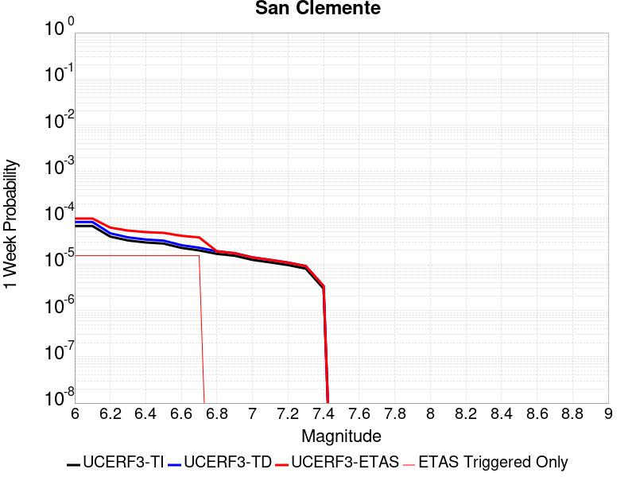 | 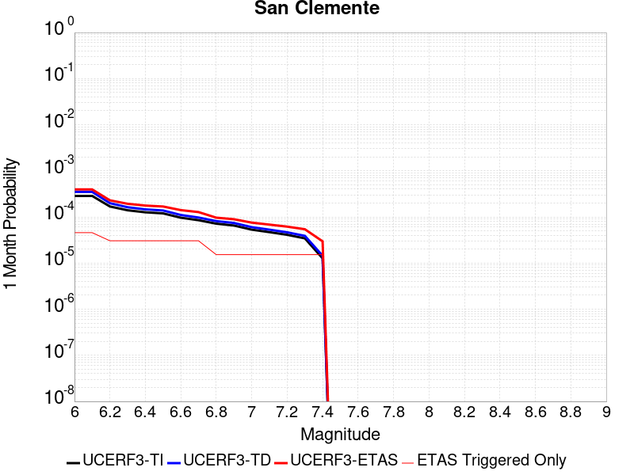 | 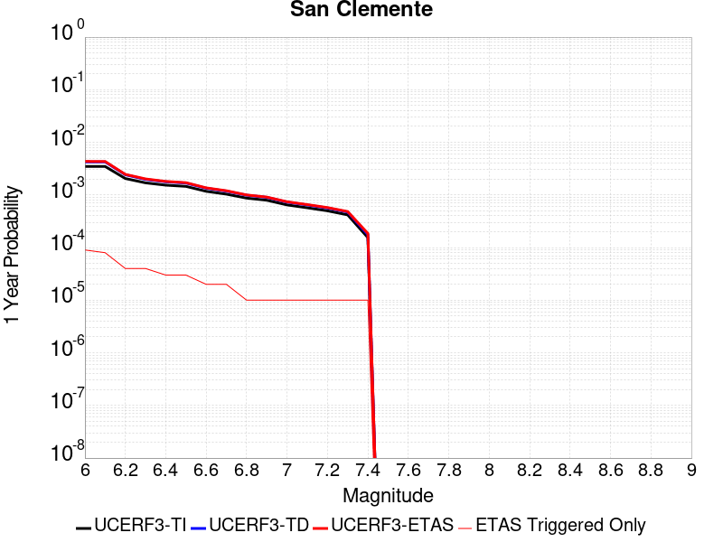 | 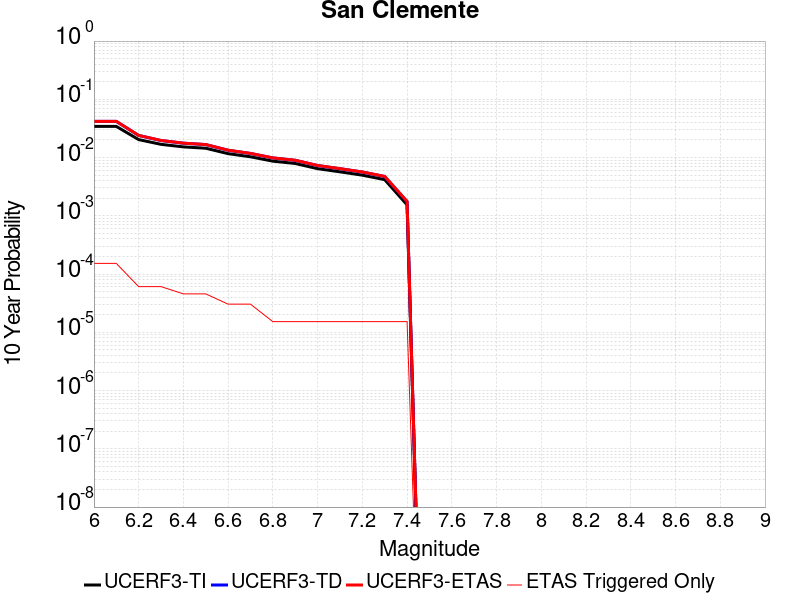 |

| Magnitude | 1 wk TI Prob | 1 wk TD Prob | 1 wk ETAS Prob | 1 wk ETAS/TD Gain | 1 wk ETAS Triggered Only | 1 mo TI Prob | 1 mo TD Prob | 1 mo ETAS Prob | 1 mo ETAS/TD Gain | 1 mo ETAS Triggered Only | 1 yr TI Prob | 1 yr TD Prob | 1 yr ETAS Prob | 1 yr ETAS/TD Gain | 1 yr ETAS Triggered Only | 10 yr TI Prob | 10 yr TD Prob | 10 yr ETAS Prob | 10 yr ETAS/TD Gain | 10 yr ETAS Triggered Only |
|-----|-----|-----|-----|-----|-----|-----|-----|-----|-----|-----|-----|-----|-----|-----|-----|-----|-----|-----|-----|-----|
| 6.0 | 6.681379E-5 | 8.163422E-5 | 9.6853684E-5 | 1.1864347 | 1.52207E-5 | 2.8631336E-4 | 3.498173E-4 | 3.9546343E-4 | 1.1304857 | 4.5662102E-5 | 0.003480294 | 0.0042512873 | 0.0043573794 | 1.0249553 | 1.065449E-4 | 0.03426291 | 0.041755714 | 0.041901566 | 1.003493 | 1.5220701E-4 |
| 6.1 | 6.681379E-5 | 8.163422E-5 | 9.6853684E-5 | 1.1864347 | 1.52207E-5 | 2.8631336E-4 | 3.498173E-4 | 3.9546343E-4 | 1.1304857 | 4.5662102E-5 | 0.003480294 | 0.0042512873 | 0.0043573794 | 1.0249553 | 1.065449E-4 | 0.03426291 | 0.041755714 | 0.041901566 | 1.003493 | 1.5220701E-4 |
| 6.2 | 3.9400576E-5 | 4.6451984E-5 | 6.167198E-5 | 1.32765 | 1.52207E-5 | 1.6884868E-4 | 1.9906509E-4 | 2.2950044E-4 | 1.1528914 | 3.04414E-5 | 0.0020537945 | 0.002420985 | 0.0024817202 | 1.0250871 | 6.08828E-5 | 0.020349167 | 0.02395286 | 0.024012284 | 1.0024809 | 6.08828E-5 |
| 6.3 | 3.2590255E-5 | 3.7929087E-5 | 5.314921E-5 | 1.4012784 | 1.52207E-5 | 1.3966505E-4 | 1.6254328E-4 | 1.9297973E-4 | 1.1872513 | 3.04414E-5 | 0.0016990956 | 0.0019771985 | 0.0020379608 | 1.0307316 | 6.08828E-5 | 0.01686163 | 0.019599866 | 0.019659555 | 1.0030454 | 6.08828E-5 |
| 6.4 | 2.9454652E-5 | 3.4097775E-5 | 4.9317958E-5 | 1.4463687 | 1.52207E-5 | 1.2622811E-4 | 1.4612528E-4 | 1.7656224E-4 | 1.2082936 | 3.04414E-5 | 0.0015357438 | 0.0017776482 | 0.0018232291 | 1.0256411 | 4.5662102E-5 | 0.015251739 | 0.017637458 | 0.017682314 | 1.0025432 | 4.5662102E-5 |
| 6.5 | 2.790836E-5 | 3.2247463E-5 | 4.746767E-5 | 1.4719816 | 1.52207E-5 | 1.1960178E-4 | 1.3819622E-4 | 1.6863341E-4 | 1.2202462 | 3.04414E-5 | 0.001455179 | 0.0016812651 | 0.0017268504 | 1.0271137 | 4.5662102E-5 | 0.014456868 | 0.016688475 | 0.016733374 | 1.0026904 | 4.5662102E-5 |
| 6.6 | 2.2492153E-5 | 2.5762707E-5 | 4.0983014E-5 | 1.5907884 | 1.52207E-5 | 9.639138E-5 | 1.1040701E-4 | 1.4084505E-4 | 1.2756894 | 3.04414E-5 | 0.0011729331 | 0.0013433908 | 0.0013737914 | 1.0226297 | 3.04414E-5 | 0.011667615 | 0.013354415 | 0.01338445 | 1.002249 | 3.04414E-5 |
| 6.7 | 1.9862755E-5 | 2.2666423E-5 | 3.7886777E-5 | 1.6714935 | 1.52207E-5 | 8.512331E-5 | 9.713826E-5 | 1.275767E-4 | 1.3133518 | 3.04414E-5 | 0.0010358836 | 0.0011820279 | 0.0012124333 | 1.0257231 | 3.04414E-5 | 0.010310682 | 0.011758701 | 0.0117887845 | 1.0025584 | 3.04414E-5 |
| 6.8 | 1.6697575E-5 | 1.897771E-5 | 1.897771E-5 | 1.0 | 0.0 | 7.155907E-5 | 8.133056E-5 | 9.655002E-5 | 1.1871309 | 1.52207E-5 | 8.7088346E-4 | 9.897591E-4 | 0.0010049647 | 1.015363 | 1.52207E-5 | 0.008674784 | 0.0098545365 | 0.009869607 | 1.0015293 | 1.52207E-5 |
| 6.9 | 1.5218415E-5 | 1.72694E-5 | 1.72694E-5 | 1.0 | 0.0 | 6.522015E-5 | 7.4009666E-5 | 8.922924E-5 | 1.205643 | 1.52207E-5 | 7.93766E-4 | 9.00704E-4 | 9.15911E-4 | 1.0168835 | 1.52207E-5 | 0.007909367 | 0.008971481 | 0.008986564 | 1.0016813 | 1.52207E-5 |
| 7.0 | 1.2392958E-5 | 1.4033016E-5 | 1.4033016E-5 | 1.0 | 0.0 | 5.3111595E-5 | 6.014015E-5 | 7.535994E-5 | 1.2530719 | 1.52207E-5 | 6.4644177E-4 | 7.319679E-4 | 7.471775E-4 | 1.020779 | 1.52207E-5 | 0.0064456454 | 0.0072963564 | 0.007311466 | 1.0020709 | 1.52207E-5 |
| 7.1 | 1.0934128E-5 | 1.2375138E-5 | 1.2375138E-5 | 1.0 | 0.0 | 4.6859706E-5 | 5.303527E-5 | 6.825516E-5 | 1.2869768 | 1.52207E-5 | 5.7036756E-4 | 6.455204E-4 | 6.607313E-4 | 1.0235637 | 1.52207E-5 | 0.0056890585 | 0.0064371997 | 0.0064523225 | 1.0023493 | 1.52207E-5 |
| 7.2 | 9.5798805E-6 | 1.0844935E-5 | 1.0844935E-5 | 1.0 | 0.0 | 4.1055984E-5 | 4.6477508E-5 | 6.16975E-5 | 1.3274701 | 1.52207E-5 | 4.9974193E-4 | 5.657239E-4 | 5.8093603E-4 | 1.0268896 | 1.52207E-5 | 0.0049861963 | 0.0056435615 | 0.0056586964 | 1.0026817 | 1.52207E-5 |
| 7.3 | 8.0167365E-6 | 9.083918E-6 | 9.083918E-6 | 1.0 | 0.0 | 3.4356988E-5 | 3.8930535E-5 | 5.415064E-5 | 1.3909556 | 1.52207E-5 | 4.1821605E-4 | 4.7388324E-4 | 4.8909674E-4 | 1.0321039 | 1.52207E-5 | 0.0041742986 | 0.0047294297 | 0.0047445786 | 1.003203 | 1.52207E-5 |
| 7.4 | 2.9581017E-6 | 3.3623792E-6 | 3.3623792E-6 | 1.0 | 0.0 | 1.2677518E-5 | 1.4410146E-5 | 2.9630626E-5 | 2.0562336 | 1.52207E-5 | 1.5433785E-4 | 1.7543444E-4 | 1.9065247E-4 | 1.0867448 | 1.52207E-5 | 0.001542307 | 0.0017534546 | 0.0017686486 | 1.0086652 | 1.52207E-5 |

## Santa Rosa Island
*[(top)](#table-of-contents)*

| 1 Week | 1 Month | 1 Year | 10 Year |
|-----|-----|-----|-----|
| 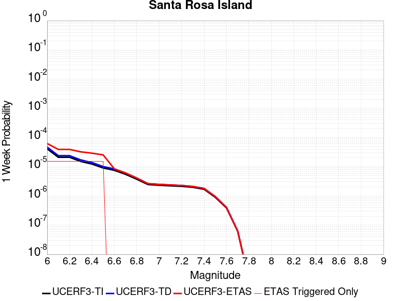 | 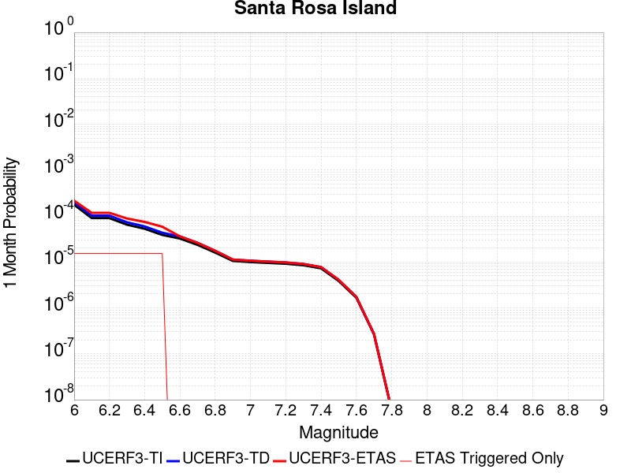 | 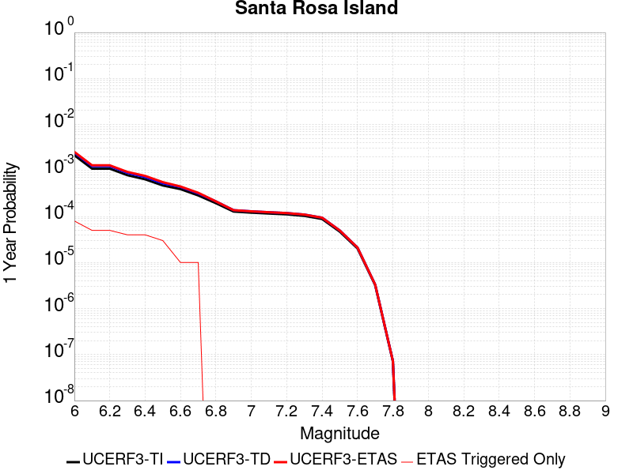 | 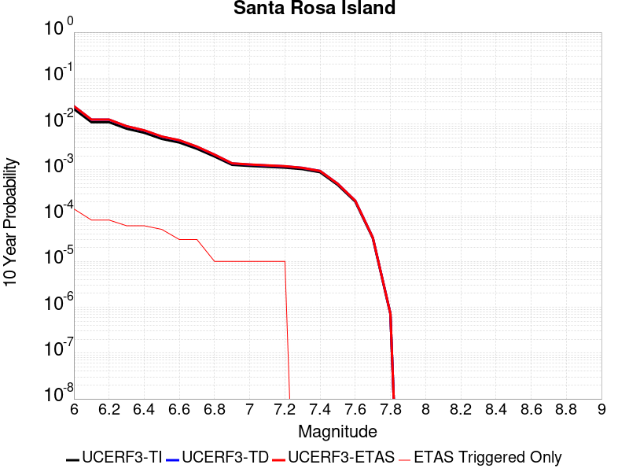 |

| Magnitude | 1 wk TI Prob | 1 wk TD Prob | 1 wk ETAS Prob | 1 wk ETAS/TD Gain | 1 wk ETAS Triggered Only | 1 mo TI Prob | 1 mo TD Prob | 1 mo ETAS Prob | 1 mo ETAS/TD Gain | 1 mo ETAS Triggered Only | 1 yr TI Prob | 1 yr TD Prob | 1 yr ETAS Prob | 1 yr ETAS/TD Gain | 1 yr ETAS Triggered Only | 10 yr TI Prob | 10 yr TD Prob | 10 yr ETAS Prob | 10 yr ETAS/TD Gain | 10 yr ETAS Triggered Only |
|-----|-----|-----|-----|-----|-----|-----|-----|-----|-----|-----|-----|-----|-----|-----|-----|-----|-----|-----|-----|-----|
| 6.0 | 4.1143165E-5 | 4.7091133E-5 | 6.231112E-5 | 1.3232027 | 1.52207E-5 | 1.7631594E-4 | 2.0180465E-4 | 2.1702227E-4 | 1.0754077 | 1.52207E-5 | 0.002144533 | 0.0024544 | 0.0025455 | 1.037117 | 9.1324204E-5 | 0.021239553 | 0.024293551 | 0.02444206 | 1.0061132 | 1.5220701E-4 |
| 6.1 | 2.1061249E-5 | 2.3864959E-5 | 3.90853E-5 | 1.6377692 | 1.52207E-5 | 9.0259375E-5 | 1.0227455E-4 | 1.174937E-4 | 1.1488067 | 1.52207E-5 | 0.0010983539 | 0.0012445104 | 0.0012901156 | 1.0366452 | 4.5662102E-5 | 0.01092941 | 0.012378449 | 0.01245361 | 1.0060719 | 7.6103504E-5 |
| 6.2 | 2.1061249E-5 | 2.3864959E-5 | 3.90853E-5 | 1.6377692 | 1.52207E-5 | 9.0259375E-5 | 1.0227455E-4 | 1.174937E-4 | 1.1488067 | 1.52207E-5 | 0.0010983539 | 0.0012445104 | 0.0012901156 | 1.0366452 | 4.5662102E-5 | 0.01092941 | 0.012378449 | 0.01245361 | 1.0060719 | 7.6103504E-5 |
| 6.3 | 1.5158236E-5 | 1.7074419E-5 | 3.2294858E-5 | 1.8914177 | 1.52207E-5 | 6.496225E-5 | 7.3174095E-5 | 8.839368E-5 | 1.2079915 | 1.52207E-5 | 7.906284E-4 | 8.905424E-4 | 9.209567E-4 | 1.0341525 | 3.04414E-5 | 0.007878214 | 0.008870989 | 0.008931332 | 1.0068022 | 6.08828E-5 |
| 6.4 | 1.2341918E-5 | 1.3852917E-5 | 2.9073406E-5 | 2.098721 | 1.52207E-5 | 5.2892858E-5 | 5.9368336E-5 | 7.458813E-5 | 1.2563622 | 1.52207E-5 | 6.437803E-4 | 7.225779E-4 | 7.5299735E-4 | 1.0420984 | 3.04414E-5 | 0.006419184 | 0.007203121 | 0.0072635654 | 1.0083914 | 6.08828E-5 |
| 6.5 | 9.061158E-6 | 1.0117031E-5 | 2.5337577E-5 | 2.504448 | 1.52207E-5 | 3.883296E-5 | 4.3358013E-5 | 5.8578054E-5 | 1.3510318 | 1.52207E-5 | 4.726887E-4 | 5.277613E-4 | 5.581866E-4 | 1.0576499 | 3.04414E-5 | 0.004716845 | 0.0052656173 | 0.00532618 | 1.0115014 | 6.08828E-5 |
| 6.6 | 7.5461685E-6 | 8.400733E-6 | 8.400733E-6 | 1.0 | 0.0 | 3.2340322E-5 | 3.600267E-5 | 3.600267E-5 | 1.0 | 0.0 | 3.936723E-4 | 4.3824865E-4 | 4.5346268E-4 | 1.0347155 | 1.52207E-5 | 0.003929756 | 0.0043742736 | 0.004419736 | 1.0103931 | 4.5662102E-5 |
| 6.7 | 5.5023775E-6 | 6.087381E-6 | 6.087381E-6 | 1.0 | 0.0 | 2.3581404E-5 | 2.6088532E-5 | 2.6088532E-5 | 1.0 | 0.0 | 2.8706578E-4 | 3.1758484E-4 | 3.328007E-4 | 1.0479112 | 1.52207E-5 | 0.0028669522 | 0.0031716314 | 0.0032171488 | 1.0143514 | 4.5662102E-5 |
| 6.8 | 3.7351679E-6 | 4.0831405E-6 | 4.0831405E-6 | 1.0 | 0.0 | 1.6007763E-5 | 1.749907E-5 | 1.749907E-5 | 1.0 | 0.0 | 1.948771E-4 | 2.1303284E-4 | 2.1303284E-4 | 1.0 | 0.0 | 0.0019470629 | 0.0021285315 | 0.0021437197 | 1.0071356 | 1.52207E-5 |
| 6.9 | 2.456366E-6 | 2.6292705E-6 | 2.6292705E-6 | 1.0 | 0.0 | 1.0527241E-5 | 1.1268254E-5 | 1.1268254E-5 | 1.0 | 0.0 | 1.2816161E-4 | 1.3718237E-4 | 1.3718237E-4 | 1.0 | 0.0 | 0.0012808773 | 0.0013709799 | 0.0013861797 | 1.0110868 | 1.52207E-5 |
| 7.0 | 2.3245157E-6 | 2.4827782E-6 | 2.4827782E-6 | 1.0 | 0.0 | 9.962172E-6 | 1.0640435E-5 | 1.0640435E-5 | 1.0 | 0.0 | 1.2128269E-4 | 1.2953962E-4 | 1.2953962E-4 | 1.0 | 0.0 | 0.0012121652 | 0.0012946434 | 0.0013098443 | 1.0117414 | 1.52207E-5 |
| 7.1 | 2.2248344E-6 | 2.37325E-6 | 2.37325E-6 | 1.0 | 0.0 | 9.53497E-6 | 1.0171032E-5 | 1.0171032E-5 | 1.0 | 0.0 | 1.1608207E-4 | 1.2382529E-4 | 1.2382529E-4 | 1.0 | 0.0 | 0.0011602144 | 0.001237565 | 0.0012527668 | 1.0122837 | 1.52207E-5 |
| 7.2 | 2.1350402E-6 | 2.276154E-6 | 2.276154E-6 | 1.0 | 0.0 | 9.150141E-6 | 9.754909E-6 | 9.754909E-6 | 1.0 | 0.0 | 1.1139726E-4 | 1.1875956E-4 | 1.1875956E-4 | 1.0 | 0.0 | 0.0011134144 | 0.0011869629 | 0.0012021655 | 1.012808 | 1.52207E-5 |
| 7.3 | 1.9793572E-6 | 2.108719E-6 | 2.108719E-6 | 1.0 | 0.0 | 8.482932E-6 | 9.037336E-6 | 9.037336E-6 | 1.0 | 0.0 | 1.032748E-4 | 1.10024026E-4 | 1.10024026E-4 | 1.0 | 0.0 | 0.0010322682 | 0.0010996973 | 0.0010996973 | 1.0 | 0.0 |
| 7.4 | 1.6951194E-6 | 1.8045733E-6 | 1.8045733E-6 | 1.0 | 0.0 | 7.264777E-6 | 7.733863E-6 | 7.733863E-6 | 1.0 | 0.0 | 8.844508E-5 | 9.415573E-5 | 9.415573E-5 | 1.0 | 0.0 | 8.840988E-4 | 9.4116E-4 | 9.4116E-4 | 1.0 | 0.0 |
| 7.5 | 8.987207E-7 | 9.5122147E-7 | 9.5122147E-7 | 1.0 | 0.0 | 3.8516546E-6 | 4.076657E-6 | 4.076657E-6 | 1.0 | 0.0 | 4.6892885E-5 | 4.963218E-5 | 4.963218E-5 | 1.0 | 0.0 | 4.688299E-4 | 4.9621216E-4 | 4.9621216E-4 | 1.0 | 0.0 |
| 7.6 | 3.8783037E-7 | 4.052932E-7 | 4.052932E-7 | 1.0 | 0.0 | 1.6621291E-6 | 1.7369698E-6 | 1.7369698E-6 | 1.0 | 0.0 | 2.0236233E-5 | 2.1147409E-5 | 2.1147409E-5 | 1.0 | 0.0 | 2.023439E-4 | 2.1145462E-4 | 2.1145462E-4 | 1.0 | 0.0 |
| 7.7 | 6.181804E-8 | 6.339035E-8 | 6.339035E-8 | 1.0 | 0.0 | 2.6493444E-7 | 2.7167292E-7 | 2.7167292E-7 | 1.0 | 0.0 | 3.225572E-6 | 3.3076128E-6 | 3.3076128E-6 | 1.0 | 0.0 | 3.225525E-5 | 3.307564E-5 | 3.307564E-5 | 1.0 | 0.0 |
| 7.8 | 1.3704449E-9 | 1.3964153E-9 | 1.3964153E-9 | 1.0 | 0.0 | 5.873335E-9 | 5.984637E-9 | 5.984637E-9 | 1.0 | 0.0 | 7.1507856E-8 | 7.286295E-8 | 7.286295E-8 | 1.0 | 0.0 | 7.1507833E-7 | 7.286294E-7 | 7.286294E-7 | 1.0 | 0.0 |

## Mission Ridge-Arroyo Parida-Santa Ana
*[(top)](#table-of-contents)*

| 1 Week | 1 Month | 1 Year | 10 Year |
|-----|-----|-----|-----|
| 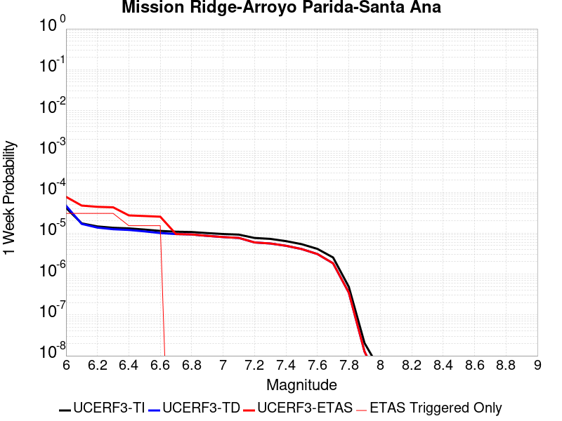 | 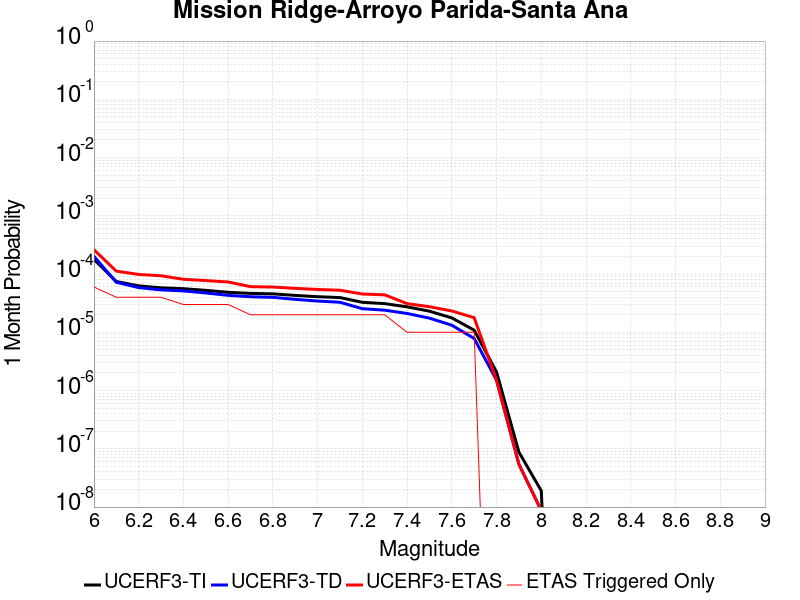 |  | 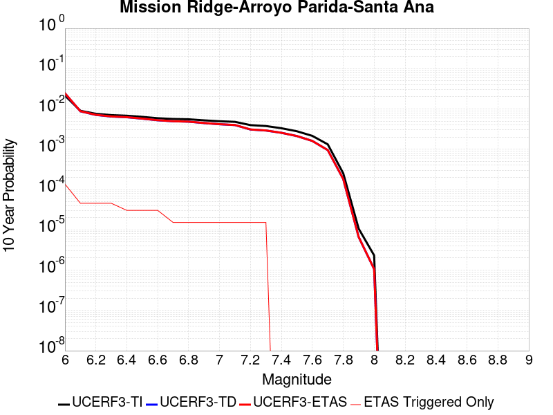 |

| Magnitude | 1 wk TI Prob | 1 wk TD Prob | 1 wk ETAS Prob | 1 wk ETAS/TD Gain | 1 wk ETAS Triggered Only | 1 mo TI Prob | 1 mo TD Prob | 1 mo ETAS Prob | 1 mo ETAS/TD Gain | 1 mo ETAS Triggered Only | 1 yr TI Prob | 1 yr TD Prob | 1 yr ETAS Prob | 1 yr ETAS/TD Gain | 1 yr ETAS Triggered Only | 10 yr TI Prob | 10 yr TD Prob | 10 yr ETAS Prob | 10 yr ETAS/TD Gain | 10 yr ETAS Triggered Only |
|-----|-----|-----|-----|-----|-----|-----|-----|-----|-----|-----|-----|-----|-----|-----|-----|-----|-----|-----|-----|-----|
| 6.0 | 4.169034E-5 | 4.7138263E-5 | 7.757823E-5 | 1.6457591 | 3.04414E-5 | 1.7866064E-4 | 2.0201034E-4 | 2.6288084E-4 | 1.3013237 | 6.08828E-5 | 0.0021730233 | 0.00245745 | 0.0025789163 | 1.0494279 | 1.217656E-4 | 0.021518968 | 0.024384614 | 0.02451826 | 1.0054808 | 1.369863E-4 |
| 6.1 | 1.73813E-5 | 1.6854226E-5 | 4.7295114E-5 | 2.8061278 | 3.04414E-5 | 7.4489166E-5 | 7.223046E-5 | 1.1788926E-4 | 1.6321267 | 4.5662102E-5 | 9.065282E-4 | 8.790618E-4 | 9.2468376E-4 | 1.0518985 | 4.5662102E-5 | 0.009028391 | 0.008756988 | 0.00880225 | 1.0051687 | 4.5662102E-5 |
| 6.2 | 1.4622182E-5 | 1.367329E-5 | 4.4114273E-5 | 3.2263103 | 3.04414E-5 | 6.2664985E-5 | 5.8598518E-5 | 1.04257946E-4 | 1.7791908 | 4.5662102E-5 | 7.6267915E-4 | 7.132073E-4 | 7.5883686E-4 | 1.063978 | 4.5662102E-5 | 0.007600669 | 0.007109627 | 0.007154965 | 1.0063769 | 4.5662102E-5 |
| 6.3 | 1.3552434E-5 | 1.2482201E-5 | 4.292322E-5 | 3.4387543 | 3.04414E-5 | 5.8080568E-5 | 5.3494066E-5 | 9.915372E-5 | 1.8535463 | 4.5662102E-5 | 7.069015E-4 | 6.510988E-4 | 6.9673115E-4 | 1.0700852 | 4.5662102E-5 | 0.00704657 | 0.006492275 | 0.0065376405 | 1.0069877 | 4.5662102E-5 |
| 6.4 | 1.30977305E-5 | 1.1979156E-5 | 2.7199674E-5 | 2.2705834 | 1.52207E-5 | 5.613192E-5 | 5.1338247E-5 | 8.177808E-5 | 1.5929271 | 3.04414E-5 | 6.831918E-4 | 6.248669E-4 | 6.552893E-4 | 1.0486861 | 3.04414E-5 | 0.006810953 | 0.0062314444 | 0.006261696 | 1.0048547 | 3.04414E-5 |
| 6.5 | 1.225205E-5 | 1.1048803E-5 | 2.6269336E-5 | 2.377573 | 1.52207E-5 | 5.2507727E-5 | 4.7351168E-5 | 7.779113E-5 | 1.6428555 | 3.04414E-5 | 6.3909404E-4 | 5.7635066E-4 | 6.067745E-4 | 1.0527871 | 3.04414E-5 | 0.006372592 | 0.005748869 | 0.0057791355 | 1.0052648 | 3.04414E-5 |
| 6.6 | 1.1352241E-5 | 1.0063535E-5 | 2.5284082E-5 | 2.5124454 | 1.52207E-5 | 4.8651553E-5 | 4.3128734E-5 | 7.356882E-5 | 1.705796 | 3.04414E-5 | 5.921717E-4 | 5.2496797E-4 | 5.5539334E-4 | 1.0579567 | 3.04414E-5 | 0.0059059616 | 0.0052375244 | 0.0052678064 | 1.0057818 | 3.04414E-5 |
| 6.7 | 1.0864116E-5 | 9.517027E-6 | 9.517027E-6 | 1.0 | 0.0 | 4.6559664E-5 | 4.0786632E-5 | 5.6006713E-5 | 1.3731635 | 1.52207E-5 | 5.667165E-4 | 4.964661E-4 | 5.116793E-4 | 1.0306429 | 1.52207E-5 | 0.005652734 | 0.004953804 | 0.004968949 | 1.0030574 | 1.52207E-5 |
| 6.8 | 1.0666365E-5 | 9.299779E-6 | 9.299779E-6 | 1.0 | 0.0 | 4.571219E-5 | 3.9855597E-5 | 5.507569E-5 | 1.381881 | 1.52207E-5 | 5.564038E-4 | 4.8513585E-4 | 5.0034915E-4 | 1.0313588 | 1.52207E-5 | 0.005550127 | 0.0048410003 | 0.0048561473 | 1.0031289 | 1.52207E-5 |
| 6.9 | 1.0038665E-5 | 8.592046E-6 | 8.592046E-6 | 1.0 | 0.0 | 4.302214E-5 | 3.682254E-5 | 5.204268E-5 | 1.4133376 | 1.52207E-5 | 5.236687E-4 | 4.4822405E-4 | 4.6343793E-4 | 1.0339426 | 1.52207E-5 | 0.005224364 | 0.004473411 | 0.0044885636 | 1.0033872 | 1.52207E-5 |
| 7.0 | 9.5379955E-6 | 8.025073E-6 | 8.025073E-6 | 1.0 | 0.0 | 4.0876483E-5 | 3.4392728E-5 | 4.9612903E-5 | 1.4425405 | 1.52207E-5 | 4.975576E-4 | 4.1865272E-4 | 4.3386704E-4 | 1.0363412 | 1.52207E-5 | 0.00496445 | 0.0041788397 | 0.004193997 | 1.0036271 | 1.52207E-5 |
| 7.1 | 9.207389E-6 | 7.652375E-6 | 7.652375E-6 | 1.0 | 0.0 | 3.945964E-5 | 3.279549E-5 | 4.8015692E-5 | 1.4640943 | 1.52207E-5 | 4.803152E-4 | 3.9921363E-4 | 4.1442824E-4 | 1.0381114 | 1.52207E-5 | 0.004792784 | 0.003985161 | 0.004000321 | 1.0038041 | 1.52207E-5 |
| 7.2 | 7.638091E-6 | 5.9311183E-6 | 5.9311183E-6 | 1.0 | 0.0 | 3.2734264E-5 | 2.541883E-5 | 4.0639145E-5 | 1.598781 | 1.52207E-5 | 3.984668E-4 | 3.0943064E-4 | 3.2464662E-4 | 1.0491742 | 1.52207E-5 | 0.0039775306 | 0.0030900547 | 0.0031052283 | 1.0049105 | 1.52207E-5 |
| 7.3 | 7.2500147E-6 | 5.5961527E-6 | 5.5961527E-6 | 1.0 | 0.0 | 3.1071122E-5 | 2.3983293E-5 | 3.9203627E-5 | 1.6346225 | 1.52207E-5 | 3.7822526E-4 | 2.9195778E-4 | 3.0717402E-4 | 1.0521181 | 1.52207E-5 | 0.0037758215 | 0.0029157975 | 0.002930974 | 1.0052049 | 1.52207E-5 |
| 7.4 | 6.3899715E-6 | 4.9184964E-6 | 4.9184964E-6 | 1.0 | 0.0 | 2.7385306E-5 | 2.10791E-5 | 2.10791E-5 | 1.0 | 0.0 | 3.3336508E-4 | 2.5660804E-4 | 2.5660804E-4 | 1.0 | 0.0 | 0.0033286542 | 0.0025631618 | 0.0025631618 | 1.0 | 0.0 |
| 7.5 | 5.379025E-6 | 4.0838527E-6 | 4.0838527E-6 | 1.0 | 0.0 | 2.305276E-5 | 1.7502109E-5 | 1.7502109E-5 | 1.0 | 0.0 | 2.806312E-4 | 2.1306744E-4 | 2.1306744E-4 | 1.0 | 0.0 | 0.0028027708 | 0.002128643 | 0.002128643 | 1.0 | 0.0 |
| 7.6 | 4.1270696E-6 | 3.0883439E-6 | 3.0883439E-6 | 1.0 | 0.0 | 1.768732E-5 | 1.3235693E-5 | 1.3235693E-5 | 1.0 | 0.0 | 2.1532185E-4 | 1.6113273E-4 | 1.6113273E-4 | 1.0 | 0.0 | 0.0021511333 | 0.001610167 | 0.001610167 | 1.0 | 0.0 |
| 7.7 | 2.5406805E-6 | 1.8282013E-6 | 1.8282013E-6 | 1.0 | 0.0 | 1.0888585E-5 | 7.835125E-6 | 7.835125E-6 | 1.0 | 0.0 | 1.3256045E-4 | 9.538854E-5 | 9.538854E-5 | 1.0 | 0.0 | 0.0013248142 | 9.534821E-4 | 9.534821E-4 | 1.0 | 0.0 |
| 7.8 | 4.8608285E-7 | 3.5098864E-7 | 3.5098864E-7 | 1.0 | 0.0 | 2.0832106E-6 | 1.5042363E-6 | 1.5042363E-6 | 1.0 | 0.0 | 2.5362791E-5 | 1.8313924E-5 | 1.8313924E-5 | 1.0 | 0.0 | 2.5359896E-4 | 1.8312426E-4 | 1.8312426E-4 | 1.0 | 0.0 |
| 7.9 | 2.0472514E-8 | 1.2688783E-8 | 1.2688783E-8 | 1.0 | 0.0 | 8.7739345E-8 | 5.43805E-8 | 5.43805E-8 | 1.0 | 0.0 | 1.068226E-6 | 6.6208236E-7 | 6.6208236E-7 | 1.0 | 0.0 | 1.0682209E-5 | 6.620805E-6 | 6.620805E-6 | 1.0 | 0.0 |
| 8.0 | 4.443582E-9 | 2.0321211E-9 | 2.0321211E-9 | 1.0 | 0.0 | 1.9043922E-8 | 8.70909E-9 | 8.70909E-9 | 1.0 | 0.0 | 2.3185973E-7 | 1.0603316E-7 | 1.0603316E-7 | 1.0 | 0.0 | 2.3185949E-6 | 1.0603312E-6 | 1.0603312E-6 | 1.0 | 0.0 |

## Santa Ynez (East)
*[(top)](#table-of-contents)*

| 1 Week | 1 Month | 1 Year | 10 Year |
|-----|-----|-----|-----|
| 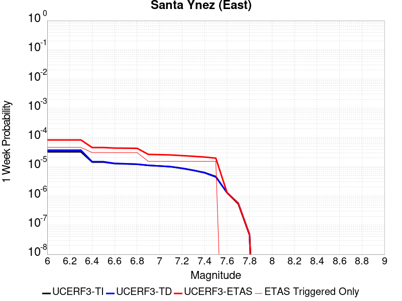 | 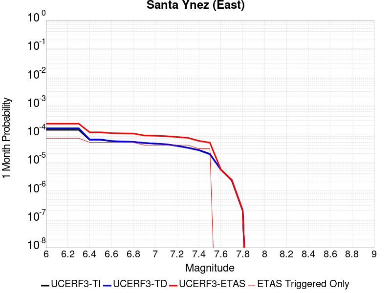 | 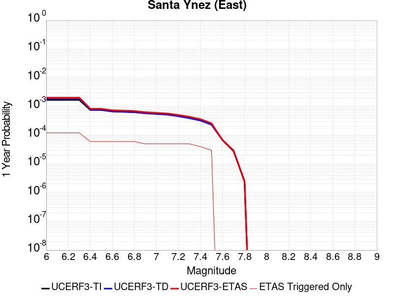 | 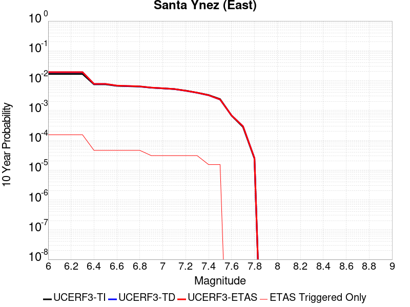 |

| Magnitude | 1 wk TI Prob | 1 wk TD Prob | 1 wk ETAS Prob | 1 wk ETAS/TD Gain | 1 wk ETAS Triggered Only | 1 mo TI Prob | 1 mo TD Prob | 1 mo ETAS Prob | 1 mo ETAS/TD Gain | 1 mo ETAS Triggered Only | 1 yr TI Prob | 1 yr TD Prob | 1 yr ETAS Prob | 1 yr ETAS/TD Gain | 1 yr ETAS Triggered Only | 10 yr TI Prob | 10 yr TD Prob | 10 yr ETAS Prob | 10 yr ETAS/TD Gain | 10 yr ETAS Triggered Only |
|-----|-----|-----|-----|-----|-----|-----|-----|-----|-----|-----|-----|-----|-----|-----|-----|-----|-----|-----|-----|-----|
| 6.0 | 3.2269712E-5 | 3.67505E-5 | 8.241092E-5 | 2.2424436 | 4.5662102E-5 | 1.3829143E-4 | 1.5749598E-4 | 2.1836918E-4 | 1.3865064 | 6.08828E-5 | 0.0016823979 | 0.0019164166 | 0.0020227574 | 1.0554893 | 1.065449E-4 | 0.016697178 | 0.019056441 | 0.019205747 | 1.0078349 | 1.5220701E-4 |
| 6.1 | 3.2269712E-5 | 3.67505E-5 | 8.241092E-5 | 2.2424436 | 4.5662102E-5 | 1.3829143E-4 | 1.5749598E-4 | 2.1836918E-4 | 1.3865064 | 6.08828E-5 | 0.0016823979 | 0.0019164166 | 0.0020227574 | 1.0554893 | 1.065449E-4 | 0.016697178 | 0.019056441 | 0.019205747 | 1.0078349 | 1.5220701E-4 |
| 6.2 | 3.2269712E-5 | 3.67505E-5 | 8.241092E-5 | 2.2424436 | 4.5662102E-5 | 1.3829143E-4 | 1.5749598E-4 | 2.1836918E-4 | 1.3865064 | 6.08828E-5 | 0.0016823979 | 0.0019164166 | 0.0020227574 | 1.0554893 | 1.065449E-4 | 0.016697178 | 0.019056441 | 0.019205747 | 1.0078349 | 1.5220701E-4 |
| 6.3 | 3.2269712E-5 | 3.67505E-5 | 8.241092E-5 | 2.2424436 | 4.5662102E-5 | 1.3829143E-4 | 1.5749598E-4 | 2.1836918E-4 | 1.3865064 | 6.08828E-5 | 0.0016823979 | 0.0019164166 | 0.0020227574 | 1.0554893 | 1.065449E-4 | 0.016697178 | 0.019056441 | 0.019205747 | 1.0078349 | 1.5220701E-4 |
| 6.4 | 1.4404779E-5 | 1.4849382E-5 | 4.529033E-5 | 3.0499809 | 3.04414E-5 | 6.1733306E-5 | 6.363868E-5 | 1.0929788E-4 | 1.7174754 | 4.5662102E-5 | 7.513438E-4 | 7.745306E-4 | 8.2015735E-4 | 1.0589089 | 4.5662102E-5 | 0.0074880854 | 0.007718862 | 0.0077641713 | 1.00587 | 4.5662102E-5 |
| 6.5 | 1.4404779E-5 | 1.4849382E-5 | 4.529033E-5 | 3.0499809 | 3.04414E-5 | 6.1733306E-5 | 6.363868E-5 | 1.0929788E-4 | 1.7174754 | 4.5662102E-5 | 7.513438E-4 | 7.745306E-4 | 8.2015735E-4 | 1.0589089 | 4.5662102E-5 | 0.0074880854 | 0.007718862 | 0.0077641713 | 1.00587 | 4.5662102E-5 |
| 6.6 | 1.280208E-5 | 1.3011947E-5 | 4.345295E-5 | 3.3394656 | 3.04414E-5 | 5.4864904E-5 | 5.5764307E-5 | 1.0142386E-4 | 1.8187953 | 4.5662102E-5 | 6.6777546E-4 | 6.787207E-4 | 7.243518E-4 | 1.067231 | 4.5662102E-5 | 0.006657724 | 0.0067666885 | 0.0068120416 | 1.0067024 | 4.5662102E-5 |
| 6.7 | 1.2457027E-5 | 1.2628468E-5 | 4.306948E-5 | 3.4105074 | 3.04414E-5 | 5.3386164E-5 | 5.412089E-5 | 9.978052E-5 | 1.84366 | 4.5662102E-5 | 6.497827E-4 | 6.587243E-4 | 7.043563E-4 | 1.0692734 | 4.5662102E-5 | 0.00647886 | 0.006567915 | 0.006613277 | 1.0069066 | 4.5662102E-5 |
| 6.8 | 1.2095134E-5 | 1.2230915E-5 | 4.267194E-5 | 3.4888594 | 3.04414E-5 | 5.1835254E-5 | 5.241716E-5 | 9.807687E-5 | 1.8710831 | 4.5662102E-5 | 6.309115E-4 | 6.379937E-4 | 6.836266E-4 | 1.0715257 | 4.5662102E-5 | 0.0062912325 | 0.006361809 | 0.006407181 | 1.0071318 | 4.5662102E-5 |
| 6.9 | 1.1104036E-5 | 1.1157347E-5 | 2.6377878E-5 | 2.364171 | 1.52207E-5 | 4.758786E-5 | 4.781633E-5 | 7.825628E-5 | 1.6366014 | 3.04414E-5 | 5.7922816E-4 | 5.820096E-4 | 6.124333E-4 | 1.0522735 | 3.04414E-5 | 0.005777207 | 0.0058049993 | 0.005835264 | 1.0052135 | 3.04414E-5 |
| 7.0 | 1.0577444E-5 | 1.058168E-5 | 2.580222E-5 | 2.438386 | 1.52207E-5 | 4.5331115E-5 | 4.5349276E-5 | 7.57893E-5 | 1.671235 | 3.04414E-5 | 5.5176654E-4 | 5.519888E-4 | 5.824134E-4 | 1.0551182 | 3.04414E-5 | 0.0055039856 | 0.0055063153 | 0.0055365893 | 1.005498 | 3.04414E-5 |
| 7.1 | 1.0021775E-5 | 9.980988E-6 | 2.5201536E-5 | 2.524954 | 1.52207E-5 | 4.294976E-5 | 4.2774966E-5 | 7.3215066E-5 | 1.7116334 | 3.04414E-5 | 5.2278786E-4 | 5.2066194E-4 | 5.510875E-4 | 1.0584363 | 3.04414E-5 | 0.0052155964 | 0.0051945536 | 0.005224837 | 1.0058298 | 3.04414E-5 |
| 7.2 | 8.874109E-6 | 8.748793E-6 | 2.396936E-5 | 2.7397332 | 1.52207E-5 | 3.8031343E-5 | 3.7494297E-5 | 6.7934554E-5 | 1.8118637 | 3.04414E-5 | 4.629332E-4 | 4.5639853E-4 | 4.8682603E-4 | 1.0666687 | 3.04414E-5 | 0.0046197 | 0.0045547304 | 0.004585033 | 1.0066531 | 3.04414E-5 |
| 7.3 | 7.5504267E-6 | 7.5051175E-6 | 2.2725704E-5 | 3.0280275 | 1.52207E-5 | 3.235857E-5 | 3.21644E-5 | 6.260482E-5 | 1.946401 | 3.04414E-5 | 3.9389438E-4 | 3.915322E-4 | 4.2196168E-4 | 1.077719 | 3.04414E-5 | 0.0039319694 | 0.003908531 | 0.0039388533 | 1.007758 | 3.04414E-5 |
| 7.4 | 6.309394E-6 | 6.1831556E-6 | 2.1403761E-5 | 3.4616241 | 1.52207E-5 | 2.703998E-5 | 2.6498974E-5 | 4.171927E-5 | 1.574373 | 1.52207E-5 | 3.2916202E-4 | 3.225782E-4 | 3.37794E-4 | 1.0471693 | 1.52207E-5 | 0.003286749 | 0.003221197 | 0.0032363688 | 1.00471 | 1.52207E-5 |
| 7.5 | 4.6103073E-6 | 4.4408903E-6 | 1.9661524E-5 | 4.427383 | 1.52207E-5 | 1.975831E-5 | 1.9032252E-5 | 3.4252662E-5 | 1.7997167 | 1.52207E-5 | 2.4053088E-4 | 2.3169373E-4 | 2.469109E-4 | 1.065678 | 1.52207E-5 | 0.002402707 | 0.002314591 | 0.0023297765 | 1.0065608 | 1.52207E-5 |
| 7.6 | 1.2858658E-6 | 1.3008173E-6 | 1.3008173E-6 | 1.0 | 0.0 | 5.5108417E-6 | 5.5749197E-6 | 5.5749197E-6 | 1.0 | 0.0 | 6.7092435E-5 | 6.78726E-5 | 6.78726E-5 | 1.0 | 0.0 | 6.707218E-4 | 6.785256E-4 | 6.785256E-4 | 1.0 | 0.0 |
| 7.7 | 5.3302307E-7 | 5.612138E-7 | 5.612138E-7 | 1.0 | 0.0 | 2.2843826E-6 | 2.4052001E-6 | 2.4052001E-6 | 1.0 | 0.0 | 2.7812002E-5 | 2.9282954E-5 | 2.9282954E-5 | 1.0 | 0.0 | 2.7808524E-4 | 2.9279452E-4 | 2.9279452E-4 | 1.0 | 0.0 |
| 7.8 | 4.613933E-8 | 4.80301E-8 | 4.80301E-8 | 1.0 | 0.0 | 1.9773998E-7 | 2.0584326E-7 | 2.0584326E-7 | 1.0 | 0.0 | 2.4074816E-6 | 2.5061388E-6 | 2.5061388E-6 | 1.0 | 0.0 | 2.4074554E-5 | 2.5061116E-5 | 2.5061116E-5 | 1.0 | 0.0 |

## Red Mountain
*[(top)](#table-of-contents)*

| 1 Week | 1 Month | 1 Year | 10 Year |
|-----|-----|-----|-----|
| 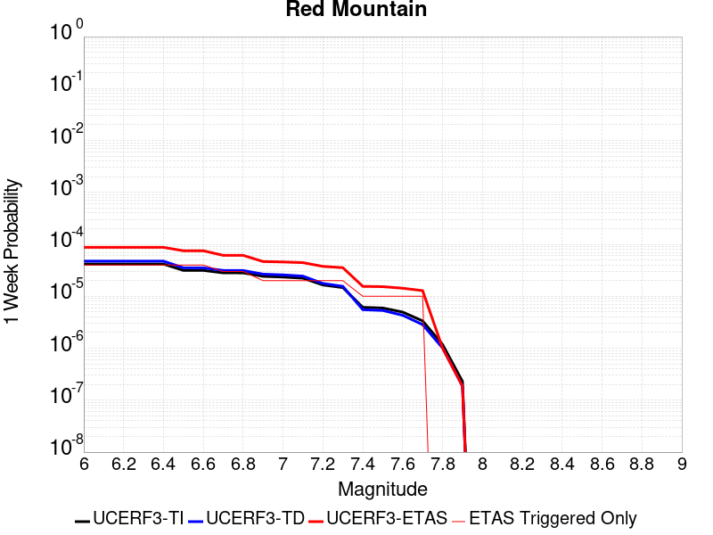 | 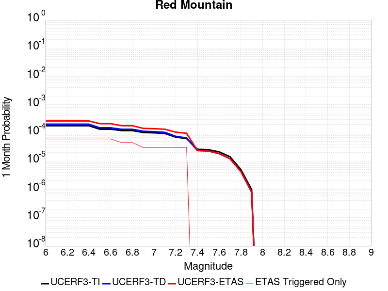 | 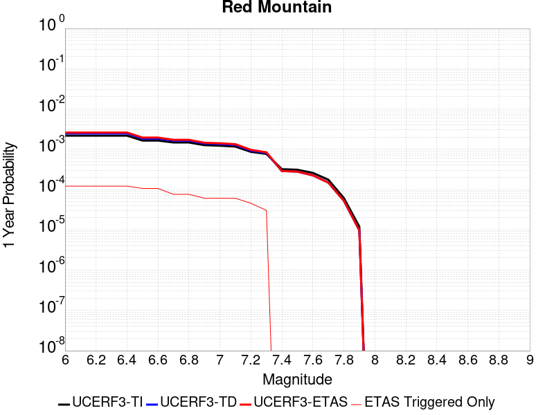 | 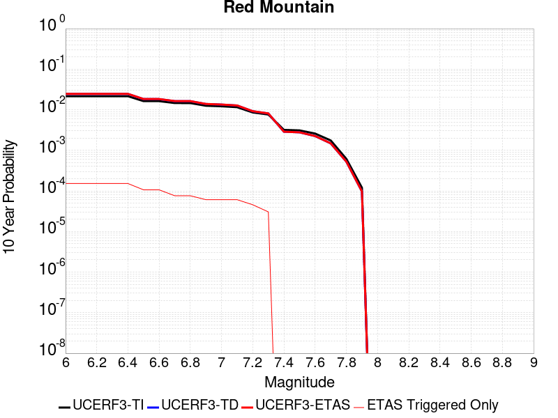 |

| Magnitude | 1 wk TI Prob | 1 wk TD Prob | 1 wk ETAS Prob | 1 wk ETAS/TD Gain | 1 wk ETAS Triggered Only | 1 mo TI Prob | 1 mo TD Prob | 1 mo ETAS Prob | 1 mo ETAS/TD Gain | 1 mo ETAS Triggered Only | 1 yr TI Prob | 1 yr TD Prob | 1 yr ETAS Prob | 1 yr ETAS/TD Gain | 1 yr ETAS Triggered Only | 10 yr TI Prob | 10 yr TD Prob | 10 yr ETAS Prob | 10 yr ETAS/TD Gain | 10 yr ETAS Triggered Only |
|-----|-----|-----|-----|-----|-----|-----|-----|-----|-----|-----|-----|-----|-----|-----|-----|-----|-----|-----|-----|-----|
| 6.0 | 4.1810763E-5 | 4.7589947E-5 | 9.324987E-5 | 1.9594448 | 4.5662102E-5 | 1.7917668E-4 | 2.039419E-4 | 2.648123E-4 | 1.2984692 | 6.08828E-5 | 0.0021792934 | 0.0024803306 | 0.0026017942 | 1.0489707 | 1.217656E-4 | 0.021580452 | 0.024544092 | 0.024692563 | 1.0060492 | 1.5220701E-4 |
| 6.1 | 4.1810763E-5 | 4.7589947E-5 | 9.324987E-5 | 1.9594448 | 4.5662102E-5 | 1.7917668E-4 | 2.039419E-4 | 2.648123E-4 | 1.2984692 | 6.08828E-5 | 0.0021792934 | 0.0024803306 | 0.0026017942 | 1.0489707 | 1.217656E-4 | 0.021580452 | 0.024544092 | 0.024692563 | 1.0060492 | 1.5220701E-4 |
| 6.2 | 4.1810763E-5 | 4.7589947E-5 | 9.324987E-5 | 1.9594448 | 4.5662102E-5 | 1.7917668E-4 | 2.039419E-4 | 2.648123E-4 | 1.2984692 | 6.08828E-5 | 0.0021792934 | 0.0024803306 | 0.0026017942 | 1.0489707 | 1.217656E-4 | 0.021580452 | 0.024544092 | 0.024692563 | 1.0060492 | 1.5220701E-4 |
| 6.3 | 4.1810763E-5 | 4.7589947E-5 | 9.324987E-5 | 1.9594448 | 4.5662102E-5 | 1.7917668E-4 | 2.039419E-4 | 2.648123E-4 | 1.2984692 | 6.08828E-5 | 0.0021792934 | 0.0024803306 | 0.0026017942 | 1.0489707 | 1.217656E-4 | 0.021580452 | 0.024544092 | 0.024692563 | 1.0060492 | 1.5220701E-4 |
| 6.4 | 4.1810763E-5 | 4.7589947E-5 | 9.324987E-5 | 1.9594448 | 4.5662102E-5 | 1.7917668E-4 | 2.039419E-4 | 2.648123E-4 | 1.2984692 | 6.08828E-5 | 0.0021792934 | 0.0024803306 | 0.0026017942 | 1.0489707 | 1.217656E-4 | 0.021580452 | 0.024544092 | 0.024692563 | 1.0060492 | 1.5220701E-4 |
| 6.5 | 3.154503E-5 | 3.5359728E-5 | 8.102021E-5 | 2.2913132 | 4.5662102E-5 | 1.3518598E-4 | 1.5153342E-4 | 2.1240699E-4 | 1.4017172 | 6.08828E-5 | 0.0016446467 | 0.0018434501 | 0.0019497987 | 1.0576899 | 1.065449E-4 | 0.01632528 | 0.018291233 | 0.01839583 | 1.0057184 | 1.065449E-4 |
| 6.6 | 3.1535834E-5 | 3.534911E-5 | 8.1009595E-5 | 2.291701 | 4.5662102E-5 | 1.3514658E-4 | 1.5148791E-4 | 2.1236148E-4 | 1.4018378 | 6.08828E-5 | 0.0016441676 | 0.001842897 | 0.0019492457 | 1.0577073 | 1.065449E-4 | 0.01632056 | 0.018285794 | 0.018390391 | 1.0057201 | 1.065449E-4 |
| 6.7 | 2.8267326E-5 | 3.146934E-5 | 6.1909785E-5 | 1.9673048 | 3.04414E-5 | 1.2114006E-4 | 1.348621E-4 | 1.8051805E-4 | 1.3385379 | 4.5662102E-5 | 0.0014738824 | 0.0016407946 | 0.0017167731 | 1.046306 | 7.6103504E-5 | 0.014641452 | 0.016295563 | 0.016370427 | 1.0045941 | 7.6103504E-5 |
| 6.8 | 2.8212884E-5 | 3.1407224E-5 | 6.184767E-5 | 1.9692179 | 3.04414E-5 | 1.20906756E-4 | 1.3459593E-4 | 1.8025188E-4 | 1.3392075 | 4.5662102E-5 | 0.0014710457 | 0.0016375587 | 0.0017135376 | 1.0463977 | 7.6103504E-5 | 0.014613459 | 0.01626368 | 0.016338546 | 1.0046033 | 7.6103504E-5 |
| 6.9 | 2.4227871E-5 | 2.6706979E-5 | 4.1927273E-5 | 1.5698996 | 1.52207E-5 | 1.03829596E-4 | 1.14453884E-4 | 1.448918E-4 | 1.2659404 | 3.04414E-5 | 0.0012633923 | 0.0013926612 | 0.0014534593 | 1.043656 | 6.08828E-5 | 0.012562336 | 0.013847026 | 0.013907066 | 1.0043359 | 6.08828E-5 |
| 7.0 | 2.348524E-5 | 2.5835763E-5 | 4.105607E-5 | 1.5891178 | 1.52207E-5 | 1.0064714E-4 | 1.1072042E-4 | 1.4115845E-4 | 1.2749089 | 3.04414E-5 | 0.0012246901 | 0.0013472632 | 0.001408064 | 1.0451291 | 6.08828E-5 | 0.012179627 | 0.01339859 | 0.013458657 | 1.0044831 | 6.08828E-5 |
| 7.1 | 2.2311642E-5 | 2.4462828E-5 | 3.9683157E-5 | 1.6221819 | 1.52207E-5 | 9.561782E-5 | 1.048369E-4 | 1.3527511E-4 | 1.2903386 | 3.04414E-5 | 0.0011635252 | 0.0012757168 | 0.0013365219 | 1.0476635 | 6.08828E-5 | 0.01157452 | 0.012691451 | 0.012751562 | 1.0047363 | 6.08828E-5 |
| 7.2 | 1.6533986E-5 | 1.7670347E-5 | 3.2890777E-5 | 1.8613545 | 1.52207E-5 | 7.085802E-5 | 7.572822E-5 | 1.0616731E-4 | 1.4019518 | 3.04414E-5 | 8.623549E-4 | 9.216645E-4 | 9.6728455E-4 | 1.0494974 | 4.5662102E-5 | 0.008590161 | 0.009184699 | 0.009229941 | 1.0049258 | 4.5662102E-5 |
| 7.3 | 1.4703092E-5 | 1.555952E-5 | 3.0779986E-5 | 1.978209 | 1.52207E-5 | 6.301173E-5 | 6.66823E-5 | 9.712167E-5 | 1.4564835 | 3.04414E-5 | 7.668978E-4 | 8.1161625E-4 | 8.4203295E-4 | 1.0374767 | 3.04414E-5 | 0.0076425658 | 0.008092596 | 0.008122791 | 1.0037313 | 3.04414E-5 |
| 7.4 | 6.1331984E-6 | 5.528872E-6 | 5.528872E-6 | 1.0 | 0.0 | 2.6284872E-5 | 2.3694953E-5 | 2.3694953E-5 | 1.0 | 0.0 | 3.199713E-4 | 2.8844838E-4 | 2.8844838E-4 | 1.0 | 0.0 | 0.0031951098 | 0.0028807942 | 0.0028807942 | 1.0 | 0.0 |
| 7.5 | 5.954766E-6 | 5.3385015E-6 | 5.3385015E-6 | 1.0 | 0.0 | 2.5520176E-5 | 2.2879094E-5 | 2.2879094E-5 | 1.0 | 0.0 | 3.1066386E-4 | 2.785179E-4 | 2.785179E-4 | 1.0 | 0.0 | 0.003102299 | 0.0027817423 | 0.0027817423 | 1.0 | 0.0 |
| 7.6 | 4.9726646E-6 | 4.315295E-6 | 4.315295E-6 | 1.0 | 0.0 | 2.1311245E-5 | 1.8493993E-5 | 1.8493993E-5 | 1.0 | 0.0 | 2.5943352E-4 | 2.2514143E-4 | 2.2514143E-4 | 1.0 | 0.0 | 0.0025913084 | 0.002249168 | 0.002249168 | 1.0 | 0.0 |
| 7.7 | 3.3613894E-6 | 2.8526642E-6 | 2.8526642E-6 | 1.0 | 0.0 | 1.4405875E-5 | 1.2225649E-5 | 1.2225649E-5 | 1.0 | 0.0 | 1.7537741E-4 | 1.4883737E-4 | 1.4883737E-4 | 1.0 | 0.0 | 0.0017523908 | 0.0014874031 | 0.0014874031 | 1.0 | 0.0 |
| 7.8 | 1.1828961E-6 | 1.0122756E-6 | 1.0122756E-6 | 1.0 | 0.0 | 5.069545E-6 | 4.338317E-6 | 4.338317E-6 | 1.0 | 0.0 | 6.171996E-5 | 5.281776E-5 | 5.281776E-5 | 1.0 | 0.0 | 6.170282E-4 | 5.2805495E-4 | 5.2805495E-4 | 1.0 | 0.0 |
| 7.9 | 2.2967266E-7 | 1.8618952E-7 | 1.8618952E-7 | 1.0 | 0.0 | 9.843111E-7 | 7.9795484E-7 | 7.9795484E-7 | 1.0 | 0.0 | 1.19839215E-5 | 9.7150605E-6 | 9.7150605E-6 | 1.0 | 0.0 | 1.1983275E-4 | 9.714664E-5 | 9.714664E-5 | 1.0 | 0.0 |

## San Jacinto (Anza) rev
*[(top)](#table-of-contents)*

| 1 Week | 1 Month | 1 Year | 10 Year |
|-----|-----|-----|-----|
| 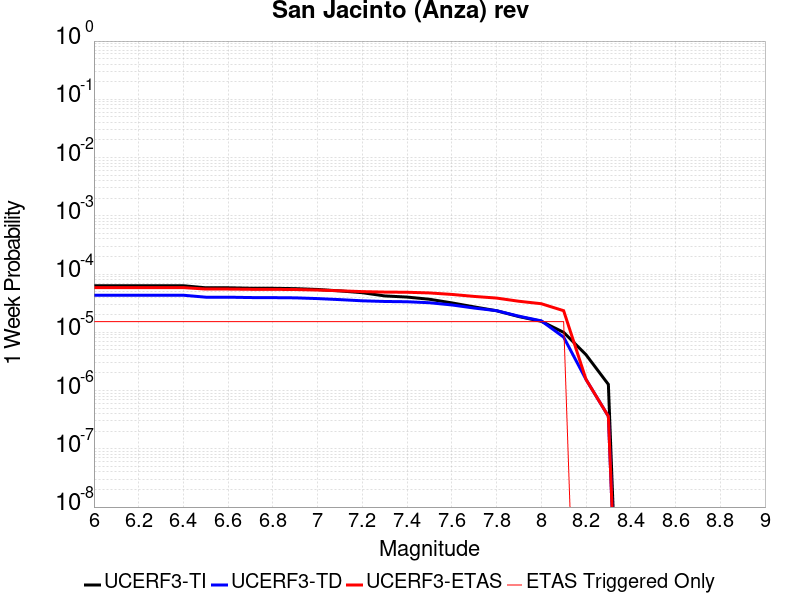 | 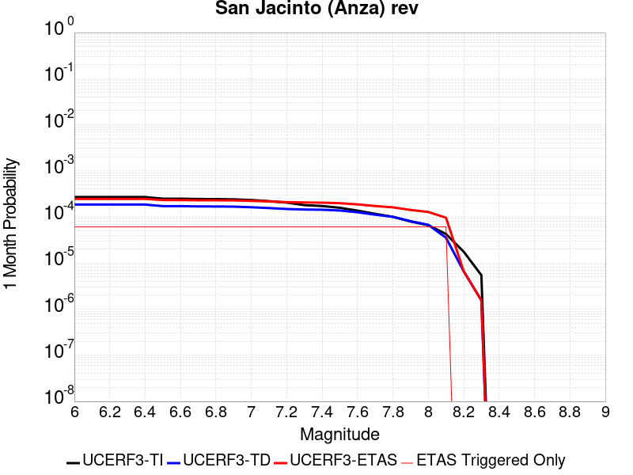 | 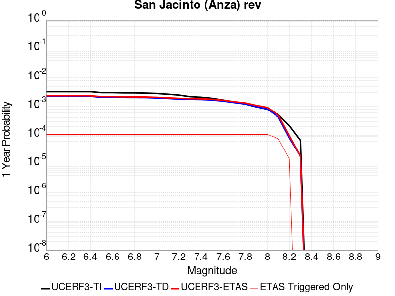 | 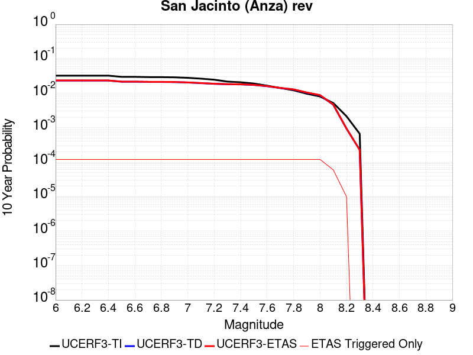 |

| Magnitude | 1 wk TI Prob | 1 wk TD Prob | 1 wk ETAS Prob | 1 wk ETAS/TD Gain | 1 wk ETAS Triggered Only | 1 mo TI Prob | 1 mo TD Prob | 1 mo ETAS Prob | 1 mo ETAS/TD Gain | 1 mo ETAS Triggered Only | 1 yr TI Prob | 1 yr TD Prob | 1 yr ETAS Prob | 1 yr ETAS/TD Gain | 1 yr ETAS Triggered Only | 10 yr TI Prob | 10 yr TD Prob | 10 yr ETAS Prob | 10 yr ETAS/TD Gain | 10 yr ETAS Triggered Only |
|-----|-----|-----|-----|-----|-----|-----|-----|-----|-----|-----|-----|-----|-----|-----|-----|-----|-----|-----|-----|-----|
| 6.0 | 6.3015636E-5 | 4.3302647E-5 | 5.8522688E-5 | 1.3514806 | 1.52207E-5 | 2.7003905E-4 | 1.8556965E-4 | 2.4644114E-4 | 1.3280251 | 6.08828E-5 | 0.0032827691 | 0.0022569813 | 0.0023632857 | 1.0471003 | 1.065449E-4 | 0.032346968 | 0.023296192 | 0.02341512 | 1.0051051 | 1.217656E-4 |
| 6.1 | 6.3015636E-5 | 4.3302647E-5 | 5.8522688E-5 | 1.3514806 | 1.52207E-5 | 2.7003905E-4 | 1.8556965E-4 | 2.4644114E-4 | 1.3280251 | 6.08828E-5 | 0.0032827691 | 0.0022569813 | 0.0023632857 | 1.0471003 | 1.065449E-4 | 0.032346968 | 0.023296192 | 0.02341512 | 1.0051051 | 1.217656E-4 |
| 6.2 | 6.3015636E-5 | 4.3302647E-5 | 5.8522688E-5 | 1.3514806 | 1.52207E-5 | 2.7003905E-4 | 1.8556965E-4 | 2.4644114E-4 | 1.3280251 | 6.08828E-5 | 0.0032827691 | 0.0022569813 | 0.0023632857 | 1.0471003 | 1.065449E-4 | 0.032346968 | 0.023296192 | 0.02341512 | 1.0051051 | 1.217656E-4 |
| 6.3 | 6.3015636E-5 | 4.3302647E-5 | 5.8522688E-5 | 1.3514806 | 1.52207E-5 | 2.7003905E-4 | 1.8556965E-4 | 2.4644114E-4 | 1.3280251 | 6.08828E-5 | 0.0032827691 | 0.0022569813 | 0.0023632857 | 1.0471003 | 1.065449E-4 | 0.032346968 | 0.023296192 | 0.02341512 | 1.0051051 | 1.217656E-4 |
| 6.4 | 6.3015636E-5 | 4.3302647E-5 | 5.8522688E-5 | 1.3514806 | 1.52207E-5 | 2.7003905E-4 | 1.8556965E-4 | 2.4644114E-4 | 1.3280251 | 6.08828E-5 | 0.0032827691 | 0.0022569813 | 0.0023632857 | 1.0471003 | 1.065449E-4 | 0.032346968 | 0.023296192 | 0.02341512 | 1.0051051 | 1.217656E-4 |
| 6.5 | 5.811017E-5 | 4.0082516E-5 | 5.5302604E-5 | 1.3797189 | 1.52207E-5 | 2.4901982E-4 | 1.7177092E-4 | 2.3264327E-4 | 1.354381 | 6.08828E-5 | 0.0030276014 | 0.002089311 | 0.002195633 | 1.0508887 | 1.065449E-4 | 0.02986684 | 0.021593736 | 0.021712873 | 1.0055171 | 1.217656E-4 |
| 6.6 | 5.811017E-5 | 4.0082516E-5 | 5.5302604E-5 | 1.3797189 | 1.52207E-5 | 2.4901982E-4 | 1.7177092E-4 | 2.3264327E-4 | 1.354381 | 6.08828E-5 | 0.0030276014 | 0.002089311 | 0.002195633 | 1.0508887 | 1.065449E-4 | 0.02986684 | 0.021593736 | 0.021712873 | 1.0055171 | 1.217656E-4 |
| 6.7 | 5.712442E-5 | 3.9505223E-5 | 5.4725322E-5 | 1.385268 | 1.52207E-5 | 2.4479596E-4 | 1.6929714E-4 | 2.3016964E-4 | 1.3595601 | 6.08828E-5 | 0.0029763177 | 0.0020592497 | 0.0021655753 | 1.0516331 | 1.065449E-4 | 0.029367693 | 0.021285562 | 0.021404736 | 1.0055988 | 1.217656E-4 |
| 6.8 | 5.6967532E-5 | 3.9361643E-5 | 5.4581746E-5 | 1.3866735 | 1.52207E-5 | 2.4412372E-4 | 1.6868189E-4 | 2.2955441E-4 | 1.3608718 | 6.08828E-5 | 0.0029681553 | 0.002051773 | 0.0021580993 | 1.0518217 | 1.065449E-4 | 0.029288229 | 0.021210281 | 0.021329464 | 1.0056192 | 1.217656E-4 |
| 6.9 | 5.6211324E-5 | 3.9066435E-5 | 5.4286542E-5 | 1.3895954 | 1.52207E-5 | 2.4088343E-4 | 1.6741687E-4 | 2.2828947E-4 | 1.3635991 | 6.08828E-5 | 0.0029288116 | 0.0020364004 | 0.0021427283 | 1.0522137 | 1.065449E-4 | 0.028905109 | 0.021049714 | 0.021168916 | 1.0056629 | 1.217656E-4 |
| 7.0 | 5.4383527E-5 | 3.792697E-5 | 5.314709E-5 | 1.4013008 | 1.52207E-5 | 2.3305144E-4 | 1.6253405E-4 | 2.2340695E-4 | 1.374524 | 6.08828E-5 | 0.0028337094 | 0.001977061 | 0.0020833951 | 1.053784 | 1.065449E-4 | 0.027978465 | 0.020440677 | 0.020559954 | 1.0058353 | 1.217656E-4 |
| 7.1 | 5.1393665E-5 | 3.6389913E-5 | 5.161006E-5 | 1.4182518 | 1.52207E-5 | 2.2023996E-4 | 1.5594746E-4 | 2.1682077E-4 | 1.390345 | 6.08828E-5 | 0.0026781242 | 0.0018970112 | 0.002003354 | 1.056058 | 1.065449E-4 | 0.026460782 | 0.019614287 | 0.019733664 | 1.0060862 | 1.217656E-4 |
| 7.2 | 4.785222E-5 | 3.4741795E-5 | 4.9961967E-5 | 1.438094 | 1.52207E-5 | 2.0506482E-4 | 1.4888494E-4 | 2.0975867E-4 | 1.4088643 | 6.08828E-5 | 0.0024938055 | 0.0018111705 | 0.0019175224 | 1.05872 | 1.065449E-4 | 0.024660049 | 0.018728992 | 0.018848477 | 1.0063797 | 1.217656E-4 |
| 7.3 | 4.2143256E-5 | 3.383628E-5 | 4.9056463E-5 | 1.4498185 | 1.52207E-5 | 1.8060145E-4 | 1.4500458E-4 | 2.0587856E-4 | 1.4198072 | 6.08828E-5 | 0.002196605 | 0.0017640047 | 0.0018703616 | 1.0602928 | 1.065449E-4 | 0.02175019 | 0.01823724 | 0.018356785 | 1.006555 | 1.217656E-4 |
| 7.4 | 4.0264713E-5 | 3.347446E-5 | 4.8694652E-5 | 1.4546807 | 1.52207E-5 | 1.7255165E-4 | 1.4345412E-4 | 2.0432819E-4 | 1.4243453 | 6.08828E-5 | 0.002098792 | 0.0017451581 | 0.001851517 | 1.0609452 | 1.065449E-4 | 0.020790804 | 0.018041821 | 0.01816139 | 1.0066273 | 1.217656E-4 |
| 7.5 | 3.694492E-5 | 3.218847E-5 | 4.7408677E-5 | 1.4728467 | 1.52207E-5 | 1.5832575E-4 | 1.379433E-4 | 1.988177E-4 | 1.4413002 | 6.08828E-5 | 0.0019259118 | 0.001678169 | 0.0017845351 | 1.0633823 | 1.065449E-4 | 0.01909306 | 0.01735827 | 0.017477922 | 1.006893 | 1.217656E-4 |
| 7.6 | 3.200565E-5 | 2.9504106E-5 | 4.472436E-5 | 1.5158689 | 1.52207E-5 | 1.3715986E-4 | 1.2644005E-4 | 1.8731516E-4 | 1.4814543 | 6.08828E-5 | 0.001668642 | 0.0015383229 | 0.0016447039 | 1.0691539 | 1.065449E-4 | 0.01656168 | 0.0159463 | 0.016066125 | 1.0075142 | 1.217656E-4 |
| 7.7 | 2.731642E-5 | 2.6092788E-5 | 4.131309E-5 | 1.5833145 | 1.52207E-5 | 1.1706512E-4 | 1.1182144E-4 | 1.7269744E-4 | 1.5444036 | 6.08828E-5 | 0.001424336 | 0.0013605768 | 0.0014669768 | 1.0782021 | 1.065449E-4 | 0.014152412 | 0.014167004 | 0.014287045 | 1.0084733 | 1.217656E-4 |
| 7.8 | 2.3466424E-5 | 2.3504817E-5 | 3.872516E-5 | 1.6475414 | 1.52207E-5 | 1.0056651E-4 | 1.0073105E-4 | 1.6160772E-4 | 1.6043485 | 6.08828E-5 | 0.0012237094 | 0.0012257113 | 0.0013321256 | 1.0868185 | 1.065449E-4 | 0.012169928 | 0.012808893 | 0.012929099 | 1.0093845 | 1.217656E-4 |
| 7.9 | 1.8611925E-5 | 1.8908117E-5 | 3.412853E-5 | 1.8049672 | 1.52207E-5 | 7.9762955E-5 | 8.1032274E-5 | 1.4191015E-4 | 1.7512792 | 6.08828E-5 | 9.7068126E-4 | 9.861222E-4 | 0.001092562 | 1.1079378 | 1.065449E-4 | 0.0096645225 | 0.010393824 | 0.0105143245 | 1.0115935 | 1.217656E-4 |
| 8.0 | 1.5460775E-5 | 1.5740965E-5 | 3.0961426E-5 | 1.9669331 | 1.52207E-5 | 6.6258784E-5 | 6.7459536E-5 | 1.2833823E-4 | 1.9024476 | 6.08828E-5 | 8.0640207E-4 | 8.21011E-4 | 9.2746847E-4 | 1.1296662 | 1.065449E-4 | 0.008034821 | 0.0087028835 | 0.008823589 | 1.0138696 | 1.217656E-4 |
| 8.1 | 9.983884E-6 | 8.269952E-6 | 2.3490526E-5 | 2.8404672 | 1.52207E-5 | 4.2787375E-5 | 3.544217E-5 | 9.6322816E-5 | 2.7177458 | 6.08828E-5 | 5.2081177E-4 | 4.314235E-4 | 5.074942E-4 | 1.1763248 | 7.6103504E-5 | 0.0051959283 | 0.004640022 | 0.0047157723 | 1.0163255 | 7.6103504E-5 |
| 8.2 | 4.1226E-6 | 1.5529788E-6 | 1.5529788E-6 | 1.0 | 0.0 | 1.7668166E-5 | 6.6556063E-6 | 6.6556063E-6 | 1.0 | 0.0 | 2.1508869E-4 | 8.102902E-5 | 9.624849E-5 | 1.1878273 | 1.52207E-5 | 0.0021488064 | 9.4050163E-4 | 9.5570803E-4 | 1.0161684 | 1.52207E-5 |
| 8.3 | 1.2750878E-6 | 3.612133E-7 | 3.612133E-7 | 1.0 | 0.0 | 5.4646503E-6 | 1.548056E-6 | 1.548056E-6 | 1.0 | 0.0 | 6.653009E-5 | 1.8847424E-5 | 1.8847424E-5 | 1.0 | 0.0 | 6.6510175E-4 | 2.2734253E-4 | 2.2734253E-4 | 1.0 | 0.0 |

## Deep Springs
*[(top)](#table-of-contents)*

| 1 Week | 1 Month | 1 Year | 10 Year |
|-----|-----|-----|-----|
| 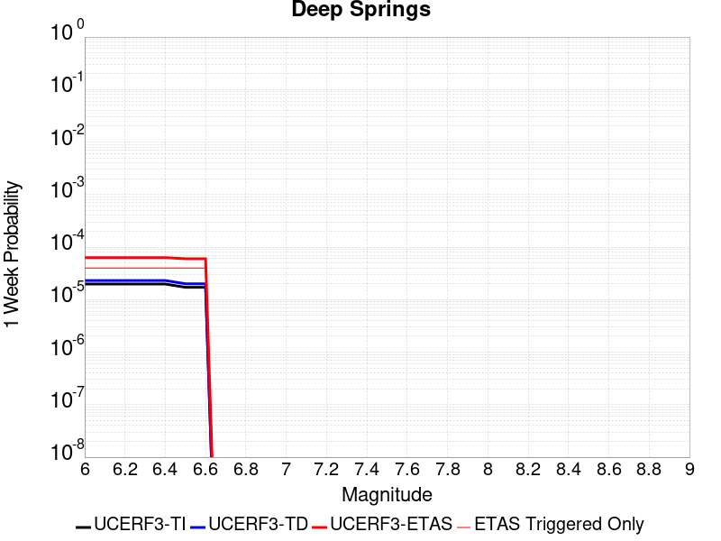 | 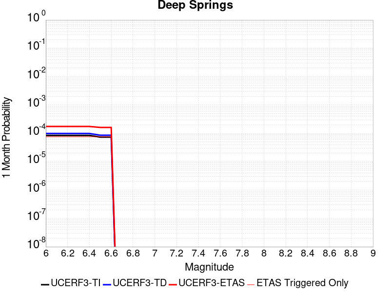 | 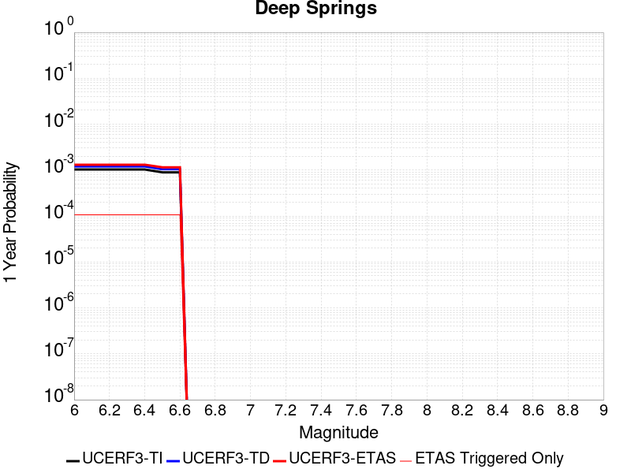 | 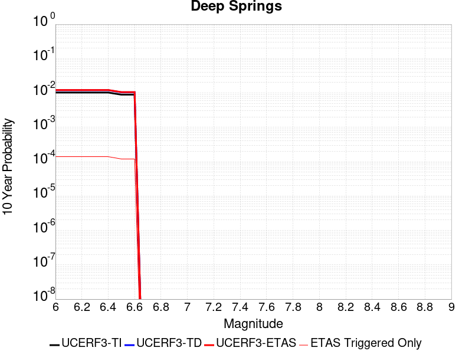 |

| Magnitude | 1 wk TI Prob | 1 wk TD Prob | 1 wk ETAS Prob | 1 wk ETAS/TD Gain | 1 wk ETAS Triggered Only | 1 mo TI Prob | 1 mo TD Prob | 1 mo ETAS Prob | 1 mo ETAS/TD Gain | 1 mo ETAS Triggered Only | 1 yr TI Prob | 1 yr TD Prob | 1 yr ETAS Prob | 1 yr ETAS/TD Gain | 1 yr ETAS Triggered Only | 10 yr TI Prob | 10 yr TD Prob | 10 yr ETAS Prob | 10 yr ETAS/TD Gain | 10 yr ETAS Triggered Only |
|-----|-----|-----|-----|-----|-----|-----|-----|-----|-----|-----|-----|-----|-----|-----|-----|-----|-----|-----|-----|-----|
| 6.0 | 1.9810619E-5 | 2.311252E-5 | 8.399392E-5 | 3.6341305 | 6.08828E-5 | 8.489989E-5 | 9.905276E-5 | 1.7514873E-4 | 1.7682366 | 7.6103504E-5 | 0.001033166 | 0.0012058079 | 0.0013122243 | 1.0882533 | 1.065449E-4 | 0.010283757 | 0.012042425 | 0.0121627245 | 1.0099896 | 1.217656E-4 |
| 6.1 | 1.9810619E-5 | 2.311252E-5 | 8.399392E-5 | 3.6341305 | 6.08828E-5 | 8.489989E-5 | 9.905276E-5 | 1.7514873E-4 | 1.7682366 | 7.6103504E-5 | 0.001033166 | 0.0012058079 | 0.0013122243 | 1.0882533 | 1.065449E-4 | 0.010283757 | 0.012042425 | 0.0121627245 | 1.0099896 | 1.217656E-4 |
| 6.2 | 1.9810619E-5 | 2.311252E-5 | 8.399392E-5 | 3.6341305 | 6.08828E-5 | 8.489989E-5 | 9.905276E-5 | 1.7514873E-4 | 1.7682366 | 7.6103504E-5 | 0.001033166 | 0.0012058079 | 0.0013122243 | 1.0882533 | 1.065449E-4 | 0.010283757 | 0.012042425 | 0.0121627245 | 1.0099896 | 1.217656E-4 |
| 6.3 | 1.9810619E-5 | 2.311252E-5 | 8.399392E-5 | 3.6341305 | 6.08828E-5 | 8.489989E-5 | 9.905276E-5 | 1.7514873E-4 | 1.7682366 | 7.6103504E-5 | 0.001033166 | 0.0012058079 | 0.0013122243 | 1.0882533 | 1.065449E-4 | 0.010283757 | 0.012042425 | 0.0121627245 | 1.0099896 | 1.217656E-4 |
| 6.4 | 1.9810619E-5 | 2.311252E-5 | 8.399392E-5 | 3.6341305 | 6.08828E-5 | 8.489989E-5 | 9.905276E-5 | 1.7514873E-4 | 1.7682366 | 7.6103504E-5 | 0.001033166 | 0.0012058079 | 0.0013122243 | 1.0882533 | 1.065449E-4 | 0.010283757 | 0.012042425 | 0.0121627245 | 1.0099896 | 1.217656E-4 |
| 6.5 | 1.7190405E-5 | 2.0050555E-5 | 8.0932135E-5 | 4.0364037 | 6.08828E-5 | 7.367108E-5 | 8.593095E-5 | 1.620279E-4 | 1.8855594 | 7.6103504E-5 | 8.9657627E-4 | 0.0010462094 | 0.0011526428 | 1.1017325 | 1.065449E-4 | 0.008929676 | 0.010462056 | 0.010582548 | 1.011517 | 1.217656E-4 |
| 6.6 | 1.7190405E-5 | 2.0050555E-5 | 8.0932135E-5 | 4.0364037 | 6.08828E-5 | 7.367108E-5 | 8.593095E-5 | 1.620279E-4 | 1.8855594 | 7.6103504E-5 | 8.9657627E-4 | 0.0010462094 | 0.0011526428 | 1.1017325 | 1.065449E-4 | 0.008929676 | 0.010462056 | 0.010582548 | 1.011517 | 1.217656E-4 |

## San Andreas (Santa Cruz Mts) 2011 CFM
*[(top)](#table-of-contents)*

| 1 Week | 1 Month | 1 Year | 10 Year |
|-----|-----|-----|-----|
| 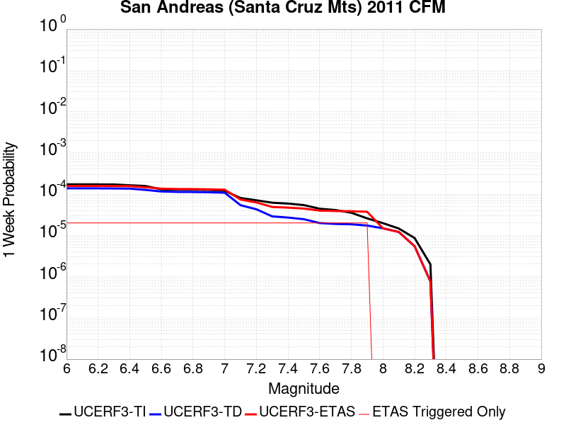 | 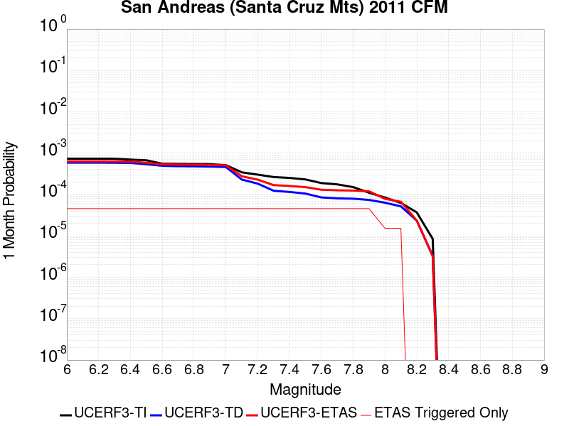 |  | 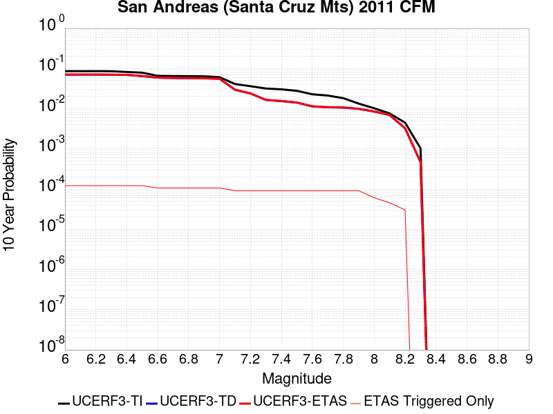 |

| Magnitude | 1 wk TI Prob | 1 wk TD Prob | 1 wk ETAS Prob | 1 wk ETAS/TD Gain | 1 wk ETAS Triggered Only | 1 mo TI Prob | 1 mo TD Prob | 1 mo ETAS Prob | 1 mo ETAS/TD Gain | 1 mo ETAS Triggered Only | 1 yr TI Prob | 1 yr TD Prob | 1 yr ETAS Prob | 1 yr ETAS/TD Gain | 1 yr ETAS Triggered Only | 10 yr TI Prob | 10 yr TD Prob | 10 yr ETAS Prob | 10 yr ETAS/TD Gain | 10 yr ETAS Triggered Only |
|-----|-----|-----|-----|-----|-----|-----|-----|-----|-----|-----|-----|-----|-----|-----|-----|-----|-----|-----|-----|-----|
| 6.0 | 1.7221631E-4 | 1.3793171E-4 | 1.683689E-4 | 1.2206687 | 3.04414E-5 | 7.378611E-4 | 5.9100403E-4 | 6.3663913E-4 | 1.0772163 | 4.5662102E-5 | 0.008946515 | 0.007172124 | 0.0072476817 | 1.0105349 | 7.6103504E-5 | 0.08594794 | 0.0705551 | 0.07066827 | 1.0016041 | 1.217656E-4 |
| 6.1 | 1.7221631E-4 | 1.3793171E-4 | 1.683689E-4 | 1.2206687 | 3.04414E-5 | 7.378611E-4 | 5.9100403E-4 | 6.3663913E-4 | 1.0772163 | 4.5662102E-5 | 0.008946515 | 0.007172124 | 0.0072476817 | 1.0105349 | 7.6103504E-5 | 0.08594794 | 0.0705551 | 0.07066827 | 1.0016041 | 1.217656E-4 |
| 6.2 | 1.7221631E-4 | 1.3793171E-4 | 1.683689E-4 | 1.2206687 | 3.04414E-5 | 7.378611E-4 | 5.9100403E-4 | 6.3663913E-4 | 1.0772163 | 4.5662102E-5 | 0.008946515 | 0.007172124 | 0.0072476817 | 1.0105349 | 7.6103504E-5 | 0.08594794 | 0.0705551 | 0.07066827 | 1.0016041 | 1.217656E-4 |
| 6.3 | 1.716926E-4 | 1.3712609E-4 | 1.6756331E-4 | 1.2219653 | 3.04414E-5 | 7.3561794E-4 | 5.875529E-4 | 6.331882E-4 | 1.0776701 | 4.5662102E-5 | 0.008919428 | 0.0071303817 | 0.007205942 | 1.010597 | 7.6103504E-5 | 0.08569809 | 0.070167266 | 0.070280485 | 1.0016136 | 1.217656E-4 |
| 6.4 | 1.6392978E-4 | 1.3588481E-4 | 1.6632208E-4 | 1.2239932 | 3.04414E-5 | 7.02367E-4 | 5.822355E-4 | 6.27871E-4 | 1.0783799 | 4.5662102E-5 | 0.008517839 | 0.007066063 | 0.007141629 | 1.0106941 | 7.6103504E-5 | 0.08198654 | 0.06940135 | 0.06951467 | 1.0016327 | 1.217656E-4 |
| 6.5 | 1.5742714E-4 | 1.2648388E-4 | 1.5692142E-4 | 1.2406437 | 3.04414E-5 | 6.745133E-4 | 5.4196286E-4 | 5.876002E-4 | 1.0842075 | 4.5662102E-5 | 0.00818132 | 0.0065787593 | 0.006654362 | 1.011492 | 7.6103504E-5 | 0.078865945 | 0.06486309 | 0.06497696 | 1.0017555 | 1.217656E-4 |
| 6.6 | 1.3038084E-4 | 1.1588213E-4 | 1.4632E-4 | 1.2626623 | 3.04414E-5 | 5.5865536E-4 | 4.9654447E-4 | 5.421839E-4 | 1.091914 | 4.5662102E-5 | 0.006780438 | 0.0060289134 | 0.006104558 | 1.012547 | 7.6103504E-5 | 0.0657725 | 0.05932738 | 0.059427604 | 1.0016893 | 1.065449E-4 |
| 6.7 | 1.2867592E-4 | 1.1314701E-4 | 1.4358497E-4 | 1.2690125 | 3.04414E-5 | 5.5135164E-4 | 4.8482692E-4 | 5.304669E-4 | 1.0941366 | 4.5662102E-5 | 0.0066920654 | 0.00588703 | 0.0059626857 | 1.0128512 | 7.6103504E-5 | 0.06494093 | 0.058038417 | 0.058138777 | 1.0017292 | 1.065449E-4 |
| 6.8 | 1.2801298E-4 | 1.1252261E-4 | 1.4296059E-4 | 1.2705054 | 3.04414E-5 | 5.485117E-4 | 4.8215193E-4 | 5.27792E-4 | 1.0946591 | 4.5662102E-5 | 0.0066577005 | 0.0058546383 | 0.005930296 | 1.0129228 | 7.6103504E-5 | 0.06461738 | 0.057752274 | 0.057852663 | 1.0017383 | 1.065449E-4 |
| 6.9 | 1.269149E-4 | 1.1094465E-4 | 1.4138268E-4 | 1.2743533 | 3.04414E-5 | 5.4380763E-4 | 4.7539172E-4 | 5.210321E-4 | 1.0960059 | 4.5662102E-5 | 0.006600777 | 0.005772772 | 0.0058484357 | 1.0131071 | 7.6103504E-5 | 0.06408122 | 0.0570241 | 0.057124566 | 1.0017619 | 1.065449E-4 |
| 7.0 | 1.2030331E-4 | 1.0824504E-4 | 1.3868314E-4 | 1.2811964 | 3.04414E-5 | 5.154837E-4 | 4.638261E-4 | 5.0946703E-4 | 1.098401 | 4.5662102E-5 | 0.006257969 | 0.0056326967 | 0.0057083713 | 1.0134349 | 7.6103504E-5 | 0.06084648 | 0.055696685 | 0.055797298 | 1.0018064 | 1.065449E-4 |
| 7.1 | 8.049617E-5 | 5.3926604E-5 | 8.436636E-5 | 1.5644665 | 3.04414E-5 | 3.4493793E-4 | 2.3109373E-4 | 2.7674527E-4 | 1.1975456 | 4.5662102E-5 | 0.0041915346 | 0.0028099709 | 0.0028858606 | 1.0270072 | 7.6103504E-5 | 0.041133516 | 0.029618956 | 0.029707575 | 1.002992 | 9.1324204E-5 |
| 7.2 | 7.093979E-5 | 4.2937932E-5 | 7.3378025E-5 | 1.7089325 | 3.04414E-5 | 3.0399222E-4 | 1.8400686E-4 | 2.2966055E-4 | 1.2481086 | 4.5662102E-5 | 0.0036948253 | 0.0022380045 | 0.0023139378 | 1.033929 | 7.6103504E-5 | 0.03633994 | 0.023941692 | 0.024030829 | 1.0037231 | 9.1324204E-5 |
| 7.3 | 6.193693E-5 | 2.8894141E-5 | 5.9334663E-5 | 2.0535188 | 3.04414E-5 | 2.6541698E-4 | 1.2382616E-4 | 1.694826E-4 | 1.3687141 | 4.5662102E-5 | 0.0032266637 | 0.0015065427 | 0.0015825316 | 1.0504392 | 7.6103504E-5 | 0.031802133 | 0.016499156 | 0.016588973 | 1.0054438 | 9.1324204E-5 |
| 7.4 | 5.906492E-5 | 2.702346E-5 | 5.746404E-5 | 2.12645 | 3.04414E-5 | 2.5311083E-4 | 1.1580969E-4 | 1.6146651E-4 | 1.39424 | 4.5662102E-5 | 0.0030772698 | 0.0014090725 | 0.0014850688 | 1.0539335 | 7.6103504E-5 | 0.030350044 | 0.015471023 | 0.015560933 | 1.0058116 | 9.1324204E-5 |
| 7.5 | 5.424296E-5 | 2.4678277E-5 | 5.5118926E-5 | 2.2334998 | 3.04414E-5 | 2.324491E-4 | 1.05759755E-4 | 1.5141703E-4 | 1.4317074 | 4.5662102E-5 | 0.002826395 | 0.0012868657 | 0.0013628713 | 1.0590626 | 7.6103504E-5 | 0.027907165 | 0.014163188 | 0.014253219 | 1.0063567 | 9.1324204E-5 |
| 7.6 | 4.43084E-5 | 1.990431E-5 | 5.0345105E-5 | 2.529357 | 3.04414E-5 | 1.8987931E-4 | 8.53014E-5 | 1.309596E-4 | 1.5352575 | 4.5662102E-5 | 0.0023093296 | 0.0010380499 | 0.0011140745 | 1.0732378 | 7.6103504E-5 | 0.022854783 | 0.011412679 | 0.011502962 | 1.0079107 | 9.1324204E-5 |
| 7.7 | 4.118098E-5 | 1.8936442E-5 | 4.9377268E-5 | 2.607526 | 3.04414E-5 | 1.7647797E-4 | 8.115366E-5 | 1.2681205E-4 | 1.5626166 | 4.5662102E-5 | 0.002146502 | 9.875982E-4 | 0.0010636265 | 1.0769831 | 7.6103504E-5 | 0.021258866 | 0.010870468 | 0.0109608 | 1.0083098 | 9.1324204E-5 |
| 7.8 | 3.5408906E-5 | 1.856446E-5 | 4.9005295E-5 | 2.6397371 | 3.04414E-5 | 1.5174363E-4 | 7.955955E-5 | 1.2521802E-4 | 1.5738904 | 4.5662102E-5 | 0.0018459131 | 9.682073E-4 | 0.0010442372 | 1.0785264 | 7.6103504E-5 | 0.018306552 | 0.010652021 | 0.010742372 | 1.0084821 | 9.1324204E-5 |
| 7.9 | 2.5860836E-5 | 1.7315993E-5 | 4.775687E-5 | 2.757963 | 3.04414E-5 | 1.10827445E-4 | 7.420929E-5 | 1.19868004E-4 | 1.6152695 | 4.5662102E-5 | 0.001348489 | 9.031238E-4 | 9.791586E-4 | 1.0841908 | 7.6103504E-5 | 0.013403354 | 0.009907599 | 0.009998018 | 1.0091263 | 9.1324204E-5 |
| 8.0 | 1.9777332E-5 | 1.4839596E-5 | 1.4839596E-5 | 1.0 | 0.0 | 8.4757245E-5 | 6.3596715E-5 | 7.881645E-5 | 1.2393163 | 1.52207E-5 | 0.0010314309 | 7.740152E-4 | 8.196419E-4 | 1.0589482 | 4.5662102E-5 | 0.010266567 | 0.008508967 | 0.008569333 | 1.0070943 | 6.08828E-5 |
| 8.1 | 1.468494E-5 | 1.2107374E-5 | 1.2107374E-5 | 1.0 | 0.0 | 6.293394E-5 | 5.1887713E-5 | 6.710762E-5 | 1.293324 | 1.52207E-5 | 7.6595135E-4 | 6.3155E-4 | 6.771832E-4 | 1.072256 | 4.5662102E-5 | 0.0076331664 | 0.006969149 | 0.007014493 | 1.0065063 | 4.5662102E-5 |
| 8.2 | 8.63836E-6 | 5.469061E-6 | 5.469061E-6 | 1.0 | 0.0 | 3.7021015E-5 | 2.3438623E-5 | 2.3438623E-5 | 1.0 | 0.0 | 4.5063766E-4 | 2.8532793E-4 | 3.1576064E-4 | 1.1066587 | 3.04414E-5 | 0.004497249 | 0.00324569 | 0.0032760324 | 1.0093486 | 3.04414E-5 |
| 8.3 | 1.983087E-6 | 7.6599065E-7 | 7.6599065E-7 | 1.0 | 0.0 | 8.498917E-6 | 3.282813E-6 | 3.282813E-6 | 1.0 | 0.0 | 1.034694E-4 | 3.9967534E-5 | 3.9967534E-5 | 1.0 | 0.0 | 0.0010342124 | 4.719687E-4 | 4.719687E-4 | 1.0 | 0.0 |

## Santa Cruz Island
*[(top)](#table-of-contents)*

| 1 Week | 1 Month | 1 Year | 10 Year |
|-----|-----|-----|-----|
| 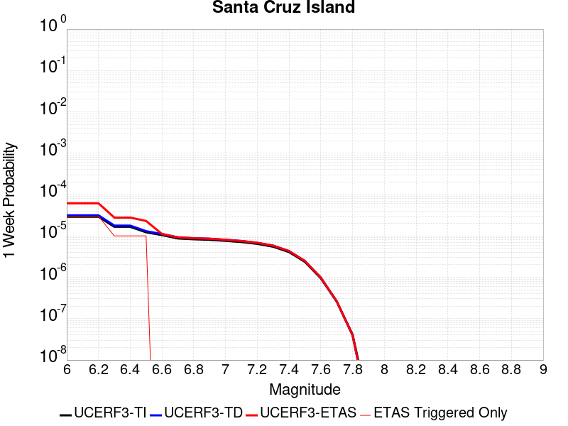 | 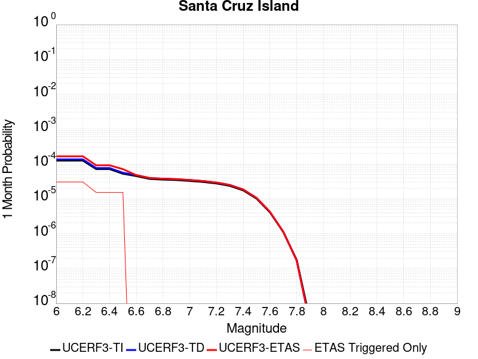 | 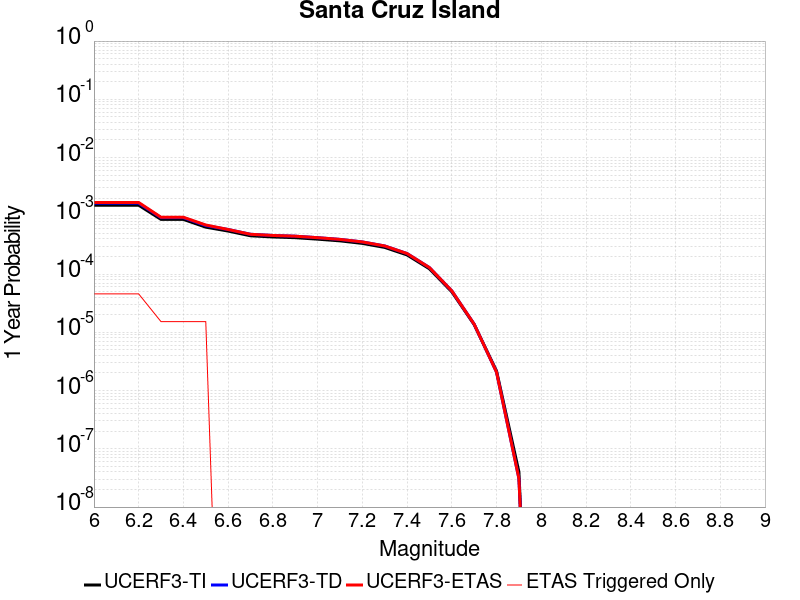 | 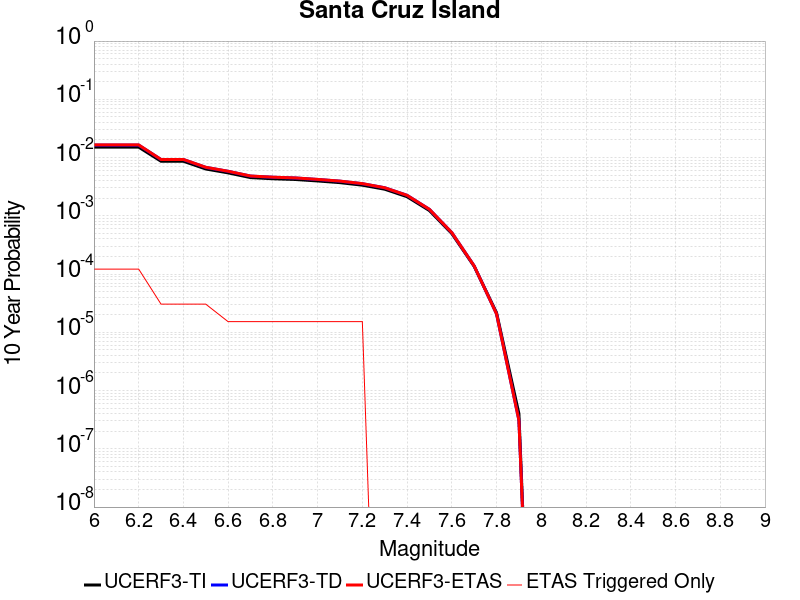 |

| Magnitude | 1 wk TI Prob | 1 wk TD Prob | 1 wk ETAS Prob | 1 wk ETAS/TD Gain | 1 wk ETAS Triggered Only | 1 mo TI Prob | 1 mo TD Prob | 1 mo ETAS Prob | 1 mo ETAS/TD Gain | 1 mo ETAS Triggered Only | 1 yr TI Prob | 1 yr TD Prob | 1 yr ETAS Prob | 1 yr ETAS/TD Gain | 1 yr ETAS Triggered Only | 10 yr TI Prob | 10 yr TD Prob | 10 yr ETAS Prob | 10 yr ETAS/TD Gain | 10 yr ETAS Triggered Only |
|-----|-----|-----|-----|-----|-----|-----|-----|-----|-----|-----|-----|-----|-----|-----|-----|-----|-----|-----|-----|-----|
| 6.0 | 2.9164563E-5 | 3.1599742E-5 | 6.2040184E-5 | 1.9633129 | 3.04414E-5 | 1.2498499E-4 | 1.3542121E-4 | 1.658585E-4 | 1.22476 | 3.04414E-5 | 0.0015206301 | 0.0016476426 | 0.0016932294 | 1.0276679 | 4.5662102E-5 | 0.015102667 | 0.016368 | 0.016487772 | 1.0073174 | 1.217656E-4 |
| 6.1 | 2.9164563E-5 | 3.1599742E-5 | 6.2040184E-5 | 1.9633129 | 3.04414E-5 | 1.2498499E-4 | 1.3542121E-4 | 1.658585E-4 | 1.22476 | 3.04414E-5 | 0.0015206301 | 0.0016476426 | 0.0016932294 | 1.0276679 | 4.5662102E-5 | 0.015102667 | 0.016368 | 0.016487772 | 1.0073174 | 1.217656E-4 |
| 6.2 | 2.9164563E-5 | 3.1599742E-5 | 6.2040184E-5 | 1.9633129 | 3.04414E-5 | 1.2498499E-4 | 1.3542121E-4 | 1.658585E-4 | 1.22476 | 3.04414E-5 | 0.0015206301 | 0.0016476426 | 0.0016932294 | 1.0276679 | 4.5662102E-5 | 0.015102667 | 0.016368 | 0.016487772 | 1.0073174 | 1.217656E-4 |
| 6.3 | 1.6635553E-5 | 1.780436E-5 | 3.302479E-5 | 1.8548709 | 1.52207E-5 | 7.1293274E-5 | 7.630226E-5 | 9.1521804E-5 | 1.1994638 | 1.52207E-5 | 8.6765E-4 | 9.2860236E-4 | 9.4380893E-4 | 1.0163758 | 1.52207E-5 | 0.008642701 | 0.009249094 | 0.009279254 | 1.0032609 | 3.04414E-5 |
| 6.4 | 1.6635553E-5 | 1.780436E-5 | 3.302479E-5 | 1.8548709 | 1.52207E-5 | 7.1293274E-5 | 7.630226E-5 | 9.1521804E-5 | 1.1994638 | 1.52207E-5 | 8.6765E-4 | 9.2860236E-4 | 9.4380893E-4 | 1.0163758 | 1.52207E-5 | 0.008642701 | 0.009249094 | 0.009279254 | 1.0032609 | 3.04414E-5 |
| 6.5 | 1.2238748E-5 | 1.3042995E-5 | 2.8263497E-5 | 2.1669483 | 1.52207E-5 | 5.2450723E-5 | 5.5897377E-5 | 7.1117225E-5 | 1.272282 | 1.52207E-5 | 6.3840044E-4 | 6.8034173E-4 | 6.955521E-4 | 1.0223569 | 1.52207E-5 | 0.0063656955 | 0.0067829876 | 0.0068132225 | 1.0044575 | 3.04414E-5 |
| 6.6 | 1.0489767E-5 | 1.1156636E-5 | 1.1156636E-5 | 1.0 | 0.0 | 4.495537E-5 | 4.781329E-5 | 4.781329E-5 | 1.0 | 0.0 | 5.4719415E-4 | 5.819735E-4 | 5.819735E-4 | 1.0 | 0.0 | 0.005458487 | 0.0058047357 | 0.0058198683 | 1.0026069 | 1.52207E-5 |
| 6.7 | 8.699222E-6 | 9.236782E-6 | 9.236782E-6 | 1.0 | 0.0 | 3.7281847E-5 | 3.958561E-5 | 3.958561E-5 | 1.0 | 0.0 | 4.5381195E-4 | 4.8184878E-4 | 4.8184878E-4 | 1.0 | 0.0 | 0.0045288634 | 0.004808108 | 0.0048232554 | 1.0031505 | 1.52207E-5 |
| 6.8 | 8.307732E-6 | 8.8169045E-6 | 8.8169045E-6 | 1.0 | 0.0 | 3.560408E-5 | 3.7786187E-5 | 3.7786187E-5 | 1.0 | 0.0 | 4.3339343E-4 | 4.5995016E-4 | 4.5995016E-4 | 1.0 | 0.0 | 0.004325492 | 0.0045900354 | 0.004605186 | 1.0033008 | 1.52207E-5 |
| 6.9 | 8.073121E-6 | 8.564939E-6 | 8.564939E-6 | 1.0 | 0.0 | 3.459863E-5 | 3.6706366E-5 | 3.6706366E-5 | 1.0 | 0.0 | 4.2115687E-4 | 4.468088E-4 | 4.468088E-4 | 1.0 | 0.0 | 0.004203596 | 0.004459156 | 0.004474309 | 1.0033982 | 1.52207E-5 |
| 7.0 | 7.617019E-6 | 8.074664E-6 | 8.074664E-6 | 1.0 | 0.0 | 3.264396E-5 | 3.4605247E-5 | 3.4605247E-5 | 1.0 | 0.0 | 3.9736772E-4 | 4.212378E-4 | 4.212378E-4 | 1.0 | 0.0 | 0.003966579 | 0.0042044413 | 0.0042195977 | 1.0036049 | 1.52207E-5 |
| 7.1 | 7.1224836E-6 | 7.545788E-6 | 7.545788E-6 | 1.0 | 0.0 | 3.052457E-5 | 3.2338692E-5 | 3.2338692E-5 | 1.0 | 0.0 | 3.715733E-4 | 3.936528E-4 | 3.936528E-4 | 1.0 | 0.0 | 0.003709526 | 0.003929598 | 0.003944759 | 1.0038581 | 1.52207E-5 |
| 7.2 | 6.441115E-6 | 6.8273835E-6 | 6.8273835E-6 | 1.0 | 0.0 | 2.7604487E-5 | 2.9259887E-5 | 2.9259887E-5 | 1.0 | 0.0 | 3.360328E-4 | 3.5618112E-4 | 3.5618112E-4 | 1.0 | 0.0 | 0.0033552512 | 0.003556131 | 0.0035712975 | 1.004265 | 1.52207E-5 |
| 7.3 | 5.494274E-6 | 5.8199944E-6 | 5.8199944E-6 | 1.0 | 0.0 | 2.3546674E-5 | 2.4942596E-5 | 2.4942596E-5 | 1.0 | 0.0 | 2.8664304E-4 | 3.0363398E-4 | 3.0363398E-4 | 1.0 | 0.0 | 0.002862736 | 0.0030322142 | 0.0030322142 | 1.0 | 0.0 |
| 7.4 | 4.0802624E-6 | 4.312256E-6 | 4.312256E-6 | 1.0 | 0.0 | 1.7486722E-5 | 1.8480967E-5 | 1.8480967E-5 | 1.0 | 0.0 | 2.1288003E-4 | 2.2498262E-4 | 2.2498262E-4 | 1.0 | 0.0 | 0.0021267622 | 0.0022475575 | 0.0022475575 | 1.0 | 0.0 |
| 7.5 | 2.3584746E-6 | 2.4753094E-6 | 2.4753094E-6 | 1.0 | 0.0 | 1.0107709E-5 | 1.0608426E-5 | 1.0608426E-5 | 1.0 | 0.0 | 1.2305441E-4 | 1.2915E-4 | 1.2915E-4 | 1.0 | 0.0 | 0.0012298629 | 0.0012907543 | 0.0012907543 | 1.0 | 0.0 |
| 7.6 | 9.4981914E-7 | 9.86093E-7 | 9.86093E-7 | 1.0 | 0.0 | 4.0706473E-6 | 4.2261063E-6 | 4.2261063E-6 | 1.0 | 0.0 | 4.9559E-5 | 5.145164E-5 | 5.145164E-5 | 1.0 | 0.0 | 4.954795E-4 | 5.1439856E-4 | 5.1439856E-4 | 1.0 | 0.0 |
| 7.7 | 2.6013532E-7 | 2.6416603E-7 | 2.6416603E-7 | 1.0 | 0.0 | 1.1148652E-6 | 1.1321397E-6 | 1.1321397E-6 | 1.0 | 0.0 | 1.3573399E-5 | 1.3783714E-5 | 1.3783714E-5 | 1.0 | 0.0 | 1.357257E-4 | 1.3782867E-4 | 1.3782867E-4 | 1.0 | 0.0 |
| 7.8 | 4.1522263E-8 | 3.965679E-8 | 3.965679E-8 | 1.0 | 0.0 | 1.7795254E-7 | 1.6995766E-7 | 1.6995766E-7 | 1.0 | 0.0 | 2.16657E-6 | 2.0692328E-6 | 2.0692328E-6 | 1.0 | 0.0 | 2.1665488E-5 | 2.0692156E-5 | 2.0692156E-5 | 1.0 | 0.0 |
| 7.9 | 7.7242046E-10 | 5.9468175E-10 | 5.9468175E-10 | 1.0 | 0.0 | 3.3103735E-9 | 2.5486364E-9 | 2.5486364E-9 | 1.0 | 0.0 | 4.0303796E-8 | 3.1029646E-8 | 3.1029646E-8 | 1.0 | 0.0 | 4.030379E-7 | 3.1029643E-7 | 3.1029643E-7 | 1.0 | 0.0 |

## Mission Creek
*[(top)](#table-of-contents)*

| 1 Week | 1 Month | 1 Year | 10 Year |
|-----|-----|-----|-----|
| 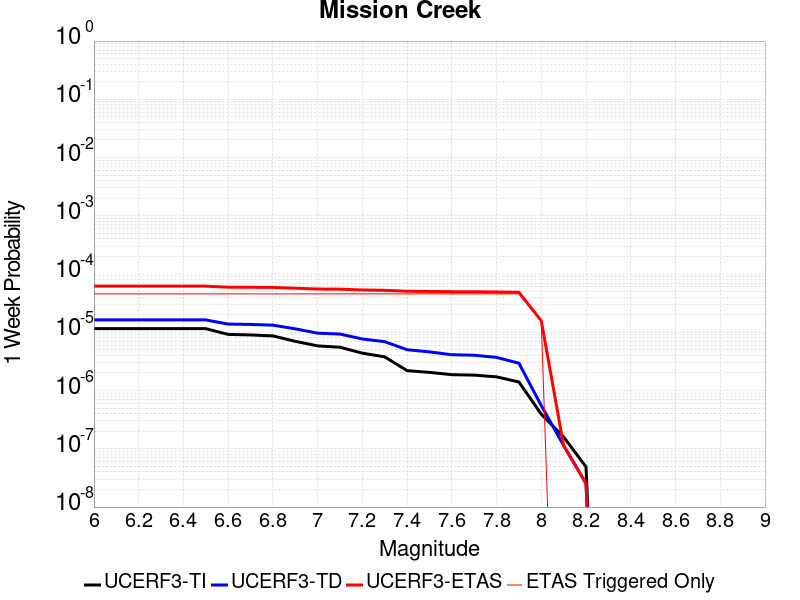 |  | 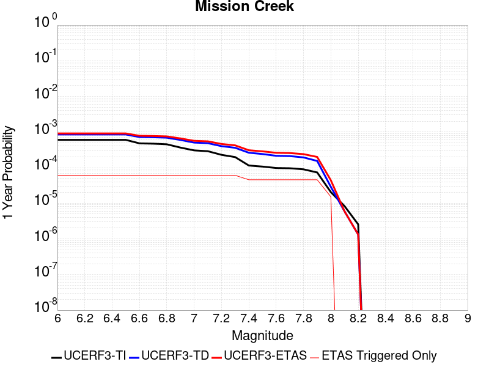 | 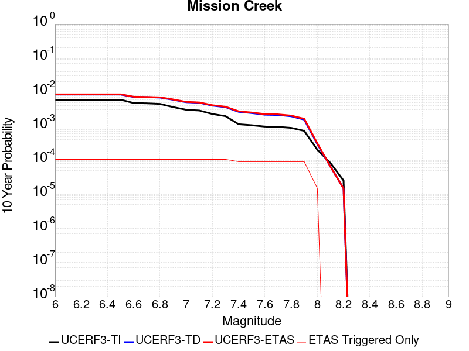 |

| Magnitude | 1 wk TI Prob | 1 wk TD Prob | 1 wk ETAS Prob | 1 wk ETAS/TD Gain | 1 wk ETAS Triggered Only | 1 mo TI Prob | 1 mo TD Prob | 1 mo ETAS Prob | 1 mo ETAS/TD Gain | 1 mo ETAS Triggered Only | 1 yr TI Prob | 1 yr TD Prob | 1 yr ETAS Prob | 1 yr ETAS/TD Gain | 1 yr ETAS Triggered Only | 10 yr TI Prob | 10 yr TD Prob | 10 yr ETAS Prob | 10 yr ETAS/TD Gain | 10 yr ETAS Triggered Only |
|-----|-----|-----|-----|-----|-----|-----|-----|-----|-----|-----|-----|-----|-----|-----|-----|-----|-----|-----|-----|-----|
| 6.0 | 1.1549387E-5 | 1.632237E-5 | 6.198372E-5 | 3.7974708 | 4.5662102E-5 | 4.9496433E-5 | 6.9951224E-5 | 1.1561013E-4 | 1.6527249 | 4.5662102E-5 | 6.0245243E-4 | 8.513384E-4 | 9.1216934E-4 | 1.0714533 | 6.08828E-5 | 0.006008218 | 0.008509998 | 0.008615636 | 1.0124134 | 1.065449E-4 |
| 6.1 | 1.1549387E-5 | 1.632237E-5 | 6.198372E-5 | 3.7974708 | 4.5662102E-5 | 4.9496433E-5 | 6.9951224E-5 | 1.1561013E-4 | 1.6527249 | 4.5662102E-5 | 6.0245243E-4 | 8.513384E-4 | 9.1216934E-4 | 1.0714533 | 6.08828E-5 | 0.006008218 | 0.008509998 | 0.008615636 | 1.0124134 | 1.065449E-4 |
| 6.2 | 1.1549387E-5 | 1.632237E-5 | 6.198372E-5 | 3.7974708 | 4.5662102E-5 | 4.9496433E-5 | 6.9951224E-5 | 1.1561013E-4 | 1.6527249 | 4.5662102E-5 | 6.0245243E-4 | 8.513384E-4 | 9.1216934E-4 | 1.0714533 | 6.08828E-5 | 0.006008218 | 0.008509998 | 0.008615636 | 1.0124134 | 1.065449E-4 |
| 6.3 | 1.1549387E-5 | 1.632237E-5 | 6.198372E-5 | 3.7974708 | 4.5662102E-5 | 4.9496433E-5 | 6.9951224E-5 | 1.1561013E-4 | 1.6527249 | 4.5662102E-5 | 6.0245243E-4 | 8.513384E-4 | 9.1216934E-4 | 1.0714533 | 6.08828E-5 | 0.006008218 | 0.008509998 | 0.008615636 | 1.0124134 | 1.065449E-4 |
| 6.4 | 1.1549387E-5 | 1.632237E-5 | 6.198372E-5 | 3.7974708 | 4.5662102E-5 | 4.9496433E-5 | 6.9951224E-5 | 1.1561013E-4 | 1.6527249 | 4.5662102E-5 | 6.0245243E-4 | 8.513384E-4 | 9.1216934E-4 | 1.0714533 | 6.08828E-5 | 0.006008218 | 0.008509998 | 0.008615636 | 1.0124134 | 1.065449E-4 |
| 6.5 | 1.1549387E-5 | 1.632237E-5 | 6.198372E-5 | 3.7974708 | 4.5662102E-5 | 4.9496433E-5 | 6.9951224E-5 | 1.1561013E-4 | 1.6527249 | 4.5662102E-5 | 6.0245243E-4 | 8.513384E-4 | 9.1216934E-4 | 1.0714533 | 6.08828E-5 | 0.006008218 | 0.008509998 | 0.008615636 | 1.0124134 | 1.065449E-4 |
| 6.6 | 9.202681E-6 | 1.3845646E-5 | 5.9507114E-5 | 4.2978935 | 4.5662102E-5 | 3.9439463E-5 | 5.9337188E-5 | 1.0499658E-4 | 1.7694904 | 4.5662102E-5 | 4.800697E-4 | 7.221998E-4 | 7.830387E-4 | 1.084241 | 6.08828E-5 | 0.004790339 | 0.0072271815 | 0.0073329564 | 1.0146357 | 1.065449E-4 |
| 6.7 | 9.019164E-6 | 1.3651316E-5 | 5.931279E-5 | 4.3448405 | 4.5662102E-5 | 3.8652986E-5 | 5.8504378E-5 | 1.0416381E-4 | 1.7804446 | 4.5662102E-5 | 4.7049852E-4 | 7.12067E-4 | 7.7290647E-4 | 1.0854406 | 6.08828E-5 | 0.004695036 | 0.007126506 | 0.0072322916 | 1.014844 | 1.065449E-4 |
| 6.8 | 8.673558E-6 | 1.3273427E-5 | 5.8934922E-5 | 4.4400682 | 4.5662102E-5 | 3.717186E-5 | 5.6884925E-5 | 1.0254443E-4 | 1.8026644 | 4.5662102E-5 | 4.524734E-4 | 6.923627E-4 | 7.5320335E-4 | 1.0878739 | 6.08828E-5 | 0.0045155324 | 0.006930694 | 0.0070365006 | 1.0152664 | 1.065449E-4 |
| 6.9 | 7.002255E-6 | 1.1477657E-5 | 5.7139234E-5 | 4.9783015 | 4.5662102E-5 | 3.000932E-5 | 4.9189068E-5 | 9.4848925E-5 | 1.9282521 | 4.5662102E-5 | 3.653022E-4 | 5.9871917E-4 | 6.5956556E-4 | 1.1016275 | 6.08828E-5 | 0.0036470229 | 0.005999517 | 0.006105423 | 1.0176524 | 1.065449E-4 |
| 7.0 | 5.84644E-6 | 9.67498E-6 | 5.5336637E-5 | 5.719561 | 4.5662102E-5 | 2.5055931E-5 | 4.1463565E-5 | 8.712377E-5 | 2.1012127 | 4.5662102E-5 | 3.0501327E-4 | 5.047066E-4 | 5.655586E-4 | 1.1205692 | 6.08828E-5 | 0.0030459496 | 0.0050638523 | 0.0051698578 | 1.0209337 | 1.065449E-4 |
| 7.1 | 5.54703E-6 | 9.329456E-6 | 5.499113E-5 | 5.8943553 | 4.5662102E-5 | 2.377277E-5 | 3.9982795E-5 | 8.564307E-5 | 2.141998 | 4.5662102E-5 | 2.8939504E-4 | 4.8668624E-4 | 5.4753944E-4 | 1.1250358 | 6.08828E-5 | 0.0028901845 | 0.004884446 | 0.0049904706 | 1.0217066 | 1.065449E-4 |
| 7.2 | 4.384709E-6 | 7.68157E-6 | 5.334332E-5 | 6.9443245 | 4.5662102E-5 | 1.8791474E-5 | 3.2920623E-5 | 7.858122E-5 | 2.3869908 | 4.5662102E-5 | 2.2876218E-4 | 4.0073853E-4 | 4.615969E-4 | 1.1518656 | 6.08828E-5 | 0.0022852682 | 0.004028366 | 0.0041344813 | 1.0263422 | 1.065449E-4 |
| 7.3 | 3.7888456E-6 | 6.915452E-6 | 5.2577238E-5 | 7.6028633 | 4.5662102E-5 | 1.623781E-5 | 2.9637333E-5 | 7.529808E-5 | 2.5406497 | 4.5662102E-5 | 1.9767738E-4 | 3.6077813E-4 | 4.2163898E-4 | 1.1686933 | 6.08828E-5 | 0.0019750162 | 0.0036301152 | 0.0037362732 | 1.0292437 | 1.065449E-4 |
| 7.4 | 2.1982462E-6 | 5.0237763E-6 | 5.068565E-5 | 10.089152 | 4.5662102E-5 | 9.421021E-6 | 2.1530293E-5 | 6.719141E-5 | 3.1207848 | 4.5662102E-5 | 1.1469489E-4 | 2.621E-4 | 3.0775013E-4 | 1.1741707 | 4.5662102E-5 | 0.0011463572 | 0.0026458844 | 0.002736967 | 1.0344242 | 9.1324204E-5 |
| 7.5 | 2.051923E-6 | 4.615016E-6 | 5.0276907E-5 | 10.894199 | 4.5662102E-5 | 8.793926E-6 | 1.9778492E-5 | 6.5439686E-5 | 3.308629 | 4.5662102E-5 | 1.0706078E-4 | 2.4077666E-4 | 2.8642776E-4 | 1.1895994 | 4.5662102E-5 | 0.0010700922 | 0.0024335422 | 0.002524644 | 1.037436 | 9.1324204E-5 |
| 7.6 | 1.8733427E-6 | 4.1233748E-6 | 4.978529E-5 | 12.073917 | 4.5662102E-5 | 8.028587E-6 | 1.7671488E-5 | 6.333278E-5 | 3.5838964 | 4.5662102E-5 | 9.774366E-5 | 2.151292E-4 | 2.6078147E-4 | 1.2122086 | 4.5662102E-5 | 9.770069E-4 | 0.0021780801 | 0.0022692054 | 1.0418375 | 9.1324204E-5 |
| 7.7 | 1.8411953E-6 | 4.0430496E-6 | 4.9704966E-5 | 12.293929 | 4.5662102E-5 | 7.890813E-6 | 1.732724E-5 | 6.298855E-5 | 3.6352324 | 4.5662102E-5 | 9.606641E-5 | 2.1093882E-4 | 2.565913E-4 | 1.2164252 | 4.5662102E-5 | 9.6024893E-4 | 0.0021363653 | 0.0022274945 | 1.0426562 | 9.1324204E-5 |
| 7.8 | 1.7194251E-6 | 3.7104276E-6 | 4.937236E-5 | 13.30638 | 4.5662102E-5 | 7.368944E-6 | 1.5901736E-5 | 6.156311E-5 | 3.8714712 | 4.5662102E-5 | 8.97132E-5 | 1.9358651E-4 | 2.3923977E-4 | 1.2358288 | 4.5662102E-5 | 8.967699E-4 | 0.0019623525 | 0.0020534974 | 1.0464468 | 9.1324204E-5 |
| 7.9 | 1.4035052E-6 | 2.9500632E-6 | 4.861203E-5 | 16.478302 | 4.5662102E-5 | 6.0150082E-6 | 1.2643067E-5 | 5.830459E-5 | 4.611586 | 4.5662102E-5 | 7.3230265E-5 | 1.5391852E-4 | 1.995736E-4 | 1.2966185 | 4.5662102E-5 | 7.3206134E-4 | 0.0015631086 | 0.0016542901 | 1.0583334 | 9.1324204E-5 |
| 8.0 | 3.9318823E-7 | 5.528522E-7 | 1.5773543E-5 | 28.531212 | 1.52207E-5 | 1.6850913E-6 | 2.3693647E-6 | 1.759003E-5 | 7.4239435 | 1.52207E-5 | 2.0515794E-5 | 2.8846638E-5 | 4.40669E-5 | 1.5276269 | 1.52207E-5 | 2.0513899E-4 | 2.9899E-4 | 3.1420615E-4 | 1.0508919 | 1.52207E-5 |
| 8.1 | 1.596793E-7 | 1.1380002E-7 | 1.1380002E-7 | 1.0 | 0.0 | 6.8433974E-7 | 4.877143E-7 | 4.877143E-7 | 1.0 | 0.0 | 8.331805E-6 | 5.937906E-6 | 5.937906E-6 | 1.0 | 0.0 | 8.331492E-5 | 6.549966E-5 | 6.549966E-5 | 1.0 | 0.0 |
| 8.2 | 4.9003038E-8 | 2.5444924E-8 | 2.5444924E-8 | 1.0 | 0.0 | 2.10013E-7 | 1.0904967E-7 | 1.0904967E-7 | 1.0 | 0.0 | 2.5569052E-6 | 1.327679E-6 | 1.327679E-6 | 1.0 | 0.0 | 2.556876E-5 | 1.495635E-5 | 1.495635E-5 | 1.0 | 0.0 |

## Lost Hills
*[(top)](#table-of-contents)*

| 1 Week | 1 Month | 1 Year | 10 Year |
|-----|-----|-----|-----|
| 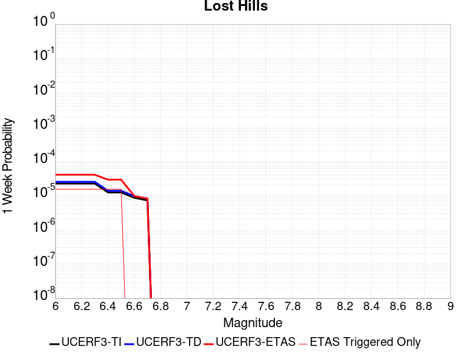 | 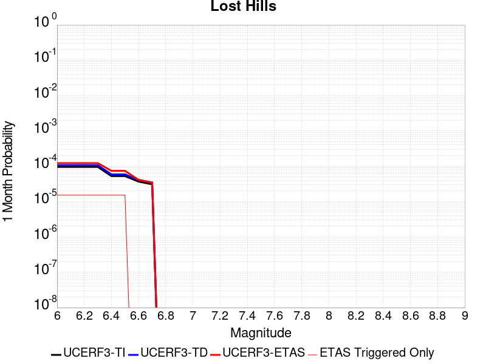 | 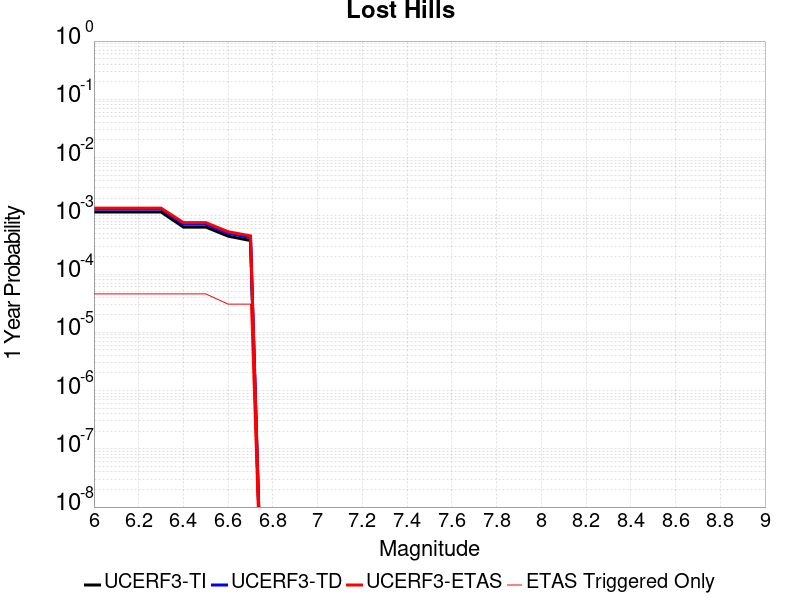 |  |

| Magnitude | 1 wk TI Prob | 1 wk TD Prob | 1 wk ETAS Prob | 1 wk ETAS/TD Gain | 1 wk ETAS Triggered Only | 1 mo TI Prob | 1 mo TD Prob | 1 mo ETAS Prob | 1 mo ETAS/TD Gain | 1 mo ETAS Triggered Only | 1 yr TI Prob | 1 yr TD Prob | 1 yr ETAS Prob | 1 yr ETAS/TD Gain | 1 yr ETAS Triggered Only | 10 yr TI Prob | 10 yr TD Prob | 10 yr ETAS Prob | 10 yr ETAS/TD Gain | 10 yr ETAS Triggered Only |
|-----|-----|-----|-----|-----|-----|-----|-----|-----|-----|-----|-----|-----|-----|-----|-----|-----|-----|-----|-----|-----|
| 6.0 | 2.233523E-5 | 2.5106583E-5 | 4.03269E-5 | 1.6062282 | 1.52207E-5 | 9.571891E-5 | 1.0759615E-4 | 1.2281521E-4 | 1.1414461 | 1.52207E-5 | 0.0011647546 | 0.001309364 | 0.0013549663 | 1.0348278 | 4.5662102E-5 | 0.011586686 | 0.013033091 | 0.013138247 | 1.0080684 | 1.065449E-4 |
| 6.1 | 2.233523E-5 | 2.5106583E-5 | 4.03269E-5 | 1.6062282 | 1.52207E-5 | 9.571891E-5 | 1.0759615E-4 | 1.2281521E-4 | 1.1414461 | 1.52207E-5 | 0.0011647546 | 0.001309364 | 0.0013549663 | 1.0348278 | 4.5662102E-5 | 0.011586686 | 0.013033091 | 0.013138247 | 1.0080684 | 1.065449E-4 |
| 6.2 | 2.233523E-5 | 2.5106583E-5 | 4.03269E-5 | 1.6062282 | 1.52207E-5 | 9.571891E-5 | 1.0759615E-4 | 1.2281521E-4 | 1.1414461 | 1.52207E-5 | 0.0011647546 | 0.001309364 | 0.0013549663 | 1.0348278 | 4.5662102E-5 | 0.011586686 | 0.013033091 | 0.013138247 | 1.0080684 | 1.065449E-4 |
| 6.3 | 2.233523E-5 | 2.5106583E-5 | 4.03269E-5 | 1.6062282 | 1.52207E-5 | 9.571891E-5 | 1.0759615E-4 | 1.2281521E-4 | 1.1414461 | 1.52207E-5 | 0.0011647546 | 0.001309364 | 0.0013549663 | 1.0348278 | 4.5662102E-5 | 0.011586686 | 0.013033091 | 0.013138247 | 1.0080684 | 1.065449E-4 |
| 6.4 | 1.2288092E-5 | 1.3781108E-5 | 2.9001598E-5 | 2.1044462 | 1.52207E-5 | 5.2662188E-5 | 5.906108E-5 | 7.4280884E-5 | 1.2576959 | 1.52207E-5 | 6.409735E-4 | 7.189252E-4 | 7.645545E-4 | 1.0634687 | 4.5662102E-5 | 0.006391279 | 0.0071752006 | 0.0072507584 | 1.0105304 | 7.6103504E-5 |
| 6.5 | 1.2288092E-5 | 1.3781108E-5 | 2.9001598E-5 | 2.1044462 | 1.52207E-5 | 5.2662188E-5 | 5.906108E-5 | 7.4280884E-5 | 1.2576959 | 1.52207E-5 | 6.409735E-4 | 7.189252E-4 | 7.645545E-4 | 1.0634687 | 4.5662102E-5 | 0.006391279 | 0.0071752006 | 0.0072507584 | 1.0105304 | 7.6103504E-5 |
| 6.6 | 8.58281E-6 | 9.63377E-6 | 9.63377E-6 | 1.0 | 0.0 | 3.6782953E-5 | 4.12874E-5 | 4.12874E-5 | 1.0 | 0.0 | 4.4774043E-4 | 5.026414E-4 | 5.330675E-4 | 1.0605325 | 3.04414E-5 | 0.0044683935 | 0.005023205 | 0.005083782 | 1.0120595 | 6.08828E-5 |
| 6.7 | 7.205685E-6 | 8.088302E-6 | 8.088302E-6 | 1.0 | 0.0 | 3.088114E-5 | 3.466415E-5 | 3.466415E-5 | 1.0 | 0.0 | 3.7591302E-4 | 4.2203604E-4 | 4.524646E-4 | 1.0720994 | 3.04414E-5 | 0.0037527776 | 0.0042203604 | 0.0042809863 | 1.0143651 | 6.08828E-5 |

## Sheephole
*[(top)](#table-of-contents)*

| 1 Week | 1 Month | 1 Year | 10 Year |
|-----|-----|-----|-----|
| 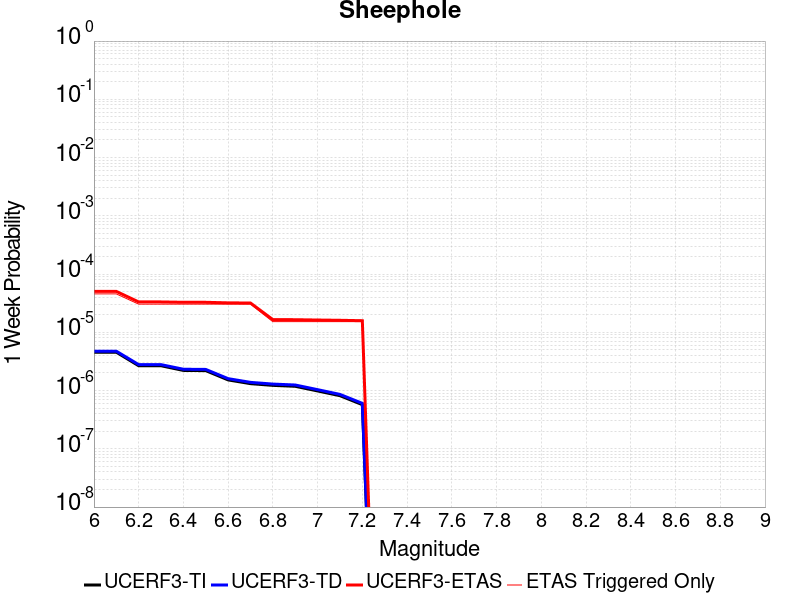 | 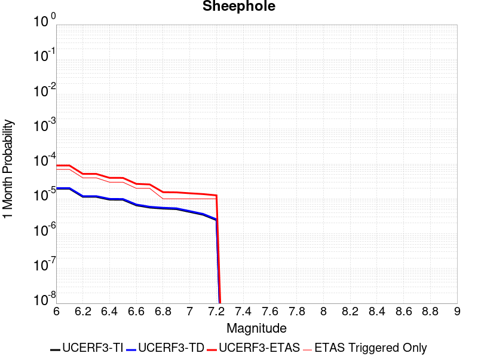 | 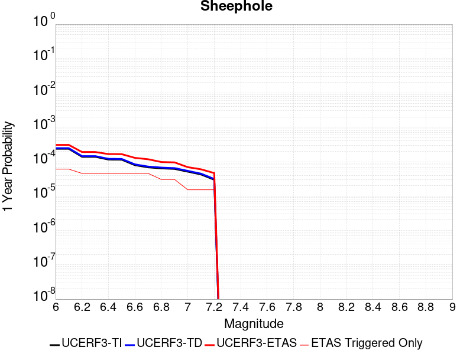 | 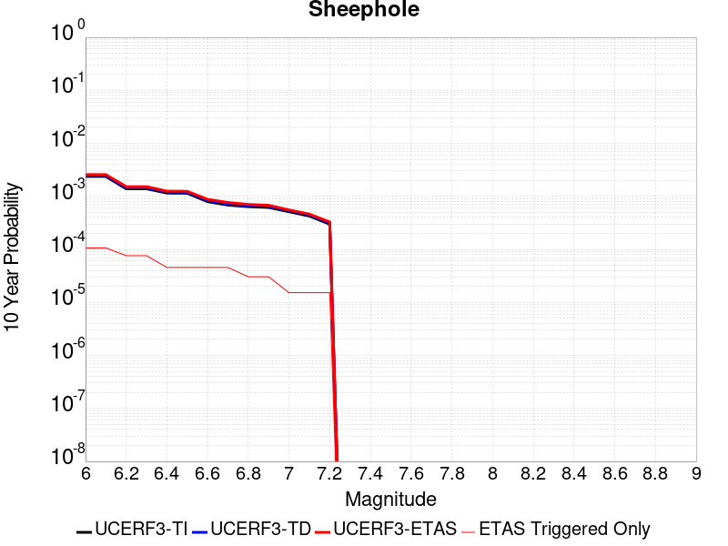 |

| Magnitude | 1 wk TI Prob | 1 wk TD Prob | 1 wk ETAS Prob | 1 wk ETAS/TD Gain | 1 wk ETAS Triggered Only | 1 mo TI Prob | 1 mo TD Prob | 1 mo ETAS Prob | 1 mo ETAS/TD Gain | 1 mo ETAS Triggered Only | 1 yr TI Prob | 1 yr TD Prob | 1 yr ETAS Prob | 1 yr ETAS/TD Gain | 1 yr ETAS Triggered Only | 10 yr TI Prob | 10 yr TD Prob | 10 yr ETAS Prob | 10 yr ETAS/TD Gain | 10 yr ETAS Triggered Only |
|-----|-----|-----|-----|-----|-----|-----|-----|-----|-----|-----|-----|-----|-----|-----|-----|-----|-----|-----|-----|-----|
| 6.0 | 4.5579695E-6 | 4.7412627E-6 | 5.0403145E-5 | 10.630744 | 4.5662102E-5 | 1.9534009E-5 | 2.031957E-5 | 6.598074E-5 | 3.2471526 | 4.5662102E-5 | 2.3780059E-4 | 2.473682E-4 | 3.0823596E-4 | 1.2460613 | 6.08828E-5 | 0.0023754628 | 0.002471473 | 0.0025777547 | 1.0430033 | 1.065449E-4 |
| 6.1 | 4.5579695E-6 | 4.7412627E-6 | 5.0403145E-5 | 10.630744 | 4.5662102E-5 | 1.9534009E-5 | 2.031957E-5 | 6.598074E-5 | 3.2471526 | 4.5662102E-5 | 2.3780059E-4 | 2.473682E-4 | 3.0823596E-4 | 1.2460613 | 6.08828E-5 | 0.0023754628 | 0.002471473 | 0.0025777547 | 1.0430033 | 1.065449E-4 |
| 6.2 | 2.6677674E-6 | 2.7873941E-6 | 3.322871E-5 | 11.921065 | 3.04414E-5 | 1.1433239E-5 | 1.1945926E-5 | 4.2386964E-5 | 3.5482357 | 3.04414E-5 | 1.3919079E-4 | 1.4543302E-4 | 1.9108849E-4 | 1.3139278 | 4.5662102E-5 | 0.0013910364 | 0.0014534844 | 0.0015294773 | 1.0522833 | 7.6103504E-5 |
| 6.3 | 2.6677674E-6 | 2.7873941E-6 | 3.322871E-5 | 11.921065 | 3.04414E-5 | 1.1433239E-5 | 1.1945926E-5 | 4.2386964E-5 | 3.5482357 | 3.04414E-5 | 1.3919079E-4 | 1.4543302E-4 | 1.9108849E-4 | 1.3139278 | 4.5662102E-5 | 0.0013910364 | 0.0014534844 | 0.0015294773 | 1.0522833 | 7.6103504E-5 |
| 6.4 | 2.2159759E-6 | 2.3228788E-6 | 3.276421E-5 | 14.105001 | 3.04414E-5 | 9.497005E-6 | 9.955161E-6 | 4.039626E-5 | 4.057821 | 3.04414E-5 | 1.156199E-4 | 1.2119815E-4 | 1.6685472E-4 | 1.37671 | 4.5662102E-5 | 0.0011555976 | 0.0012113999 | 0.0012570067 | 1.037648 | 4.5662102E-5 |
| 6.5 | 2.1986082E-6 | 2.304759E-6 | 3.2746088E-5 | 14.208032 | 3.04414E-5 | 9.4225725E-6 | 9.877506E-6 | 4.0318606E-5 | 4.081861 | 3.04414E-5 | 1.1471378E-4 | 1.2025281E-4 | 1.6590941E-4 | 1.3796719 | 4.5662102E-5 | 0.0011465458 | 0.0012019566 | 0.0012475639 | 1.0379442 | 4.5662102E-5 |
| 6.6 | 1.5232331E-6 | 1.6018919E-6 | 3.2043245E-5 | 20.003376 | 3.04414E-5 | 6.5281256E-6 | 6.865234E-6 | 3.7306425E-5 | 5.4341087 | 3.04414E-5 | 7.947703E-5 | 8.35812E-5 | 1.2923949E-4 | 1.5462745 | 4.5662102E-5 | 7.9448614E-4 | 8.3551643E-4 | 8.8114035E-4 | 1.0546057 | 4.5662102E-5 |
| 6.7 | 1.3137362E-6 | 1.382819E-6 | 3.1824176E-5 | 23.013985 | 3.04414E-5 | 5.6302856E-6 | 5.926355E-6 | 3.6367575E-5 | 6.1365843 | 3.04414E-5 | 6.854657E-5 | 7.215112E-5 | 1.1780993E-4 | 1.6328218 | 4.5662102E-5 | 6.8525434E-4 | 7.212908E-4 | 7.6692E-4 | 1.0632604 | 4.5662102E-5 |
| 6.8 | 1.2275751E-6 | 1.2922847E-6 | 1.6512966E-5 | 12.778117 | 1.52207E-5 | 5.2610258E-6 | 5.5383516E-6 | 2.0758967E-5 | 3.7482212 | 1.52207E-5 | 6.4051106E-5 | 6.7427485E-5 | 9.786683E-5 | 1.4514383 | 3.04414E-5 | 6.4032647E-4 | 6.740836E-4 | 7.045045E-4 | 1.0451293 | 3.04414E-5 |
| 6.9 | 1.1837088E-6 | 1.246102E-6 | 1.6466784E-5 | 13.214635 | 1.52207E-5 | 5.0730278E-6 | 5.340427E-6 | 2.0561047E-5 | 3.8500752 | 1.52207E-5 | 6.176237E-5 | 6.501789E-5 | 9.545731E-5 | 1.4681699 | 3.04414E-5 | 6.17452E-4 | 6.5000186E-4 | 6.8042346E-4 | 1.0468024 | 3.04414E-5 |
| 7.0 | 9.849371E-7 | 1.0366288E-6 | 1.6257312E-5 | 15.682868 | 1.52207E-5 | 4.2211523E-6 | 4.442688E-6 | 1.9663321E-5 | 4.4259963 | 1.52207E-5 | 5.1391315E-5 | 5.4088487E-5 | 6.9308364E-5 | 1.2813885 | 1.52207E-5 | 5.137943E-4 | 5.407633E-4 | 5.5597577E-4 | 1.0281315 | 1.52207E-5 |
| 7.1 | 8.1643645E-7 | 8.591669E-7 | 1.6079854E-5 | 18.715635 | 1.52207E-5 | 3.4990085E-6 | 3.682139E-6 | 1.8902783E-5 | 5.1336417 | 1.52207E-5 | 4.2599597E-5 | 4.482921E-5 | 6.0049228E-5 | 1.3395112 | 1.52207E-5 | 4.259143E-4 | 4.4821028E-4 | 4.6342416E-4 | 1.0339437 | 1.52207E-5 |
| 7.2 | 5.7295756E-7 | 6.029502E-7 | 1.5823642E-5 | 26.243696 | 1.52207E-5 | 2.45553E-6 | 2.58407E-6 | 1.780473E-5 | 6.8901887 | 1.52207E-5 | 2.9895667E-5 | 3.1460666E-5 | 4.668089E-5 | 1.4837857 | 1.52207E-5 | 2.9891645E-4 | 3.145688E-4 | 3.2978473E-4 | 1.0483707 | 1.52207E-5 |

## Ventura-Pitas Point
*[(top)](#table-of-contents)*

| 1 Week | 1 Month | 1 Year | 10 Year |
|-----|-----|-----|-----|
| 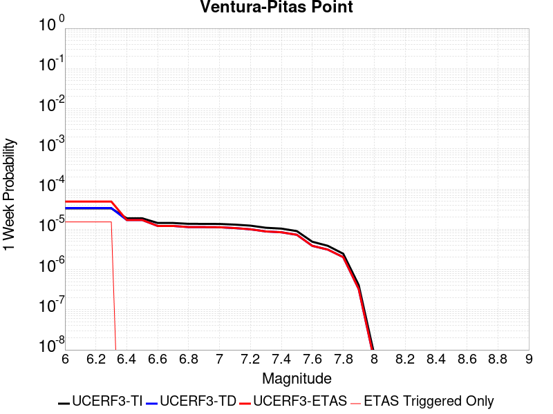 | 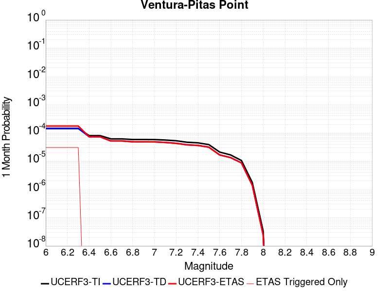 | 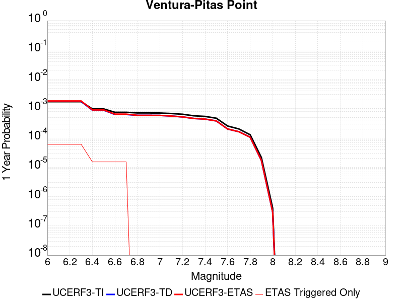 | 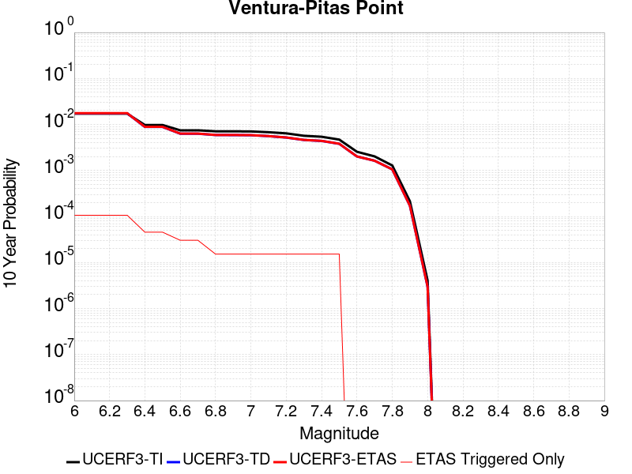 |

| Magnitude | 1 wk TI Prob | 1 wk TD Prob | 1 wk ETAS Prob | 1 wk ETAS/TD Gain | 1 wk ETAS Triggered Only | 1 mo TI Prob | 1 mo TD Prob | 1 mo ETAS Prob | 1 mo ETAS/TD Gain | 1 mo ETAS Triggered Only | 1 yr TI Prob | 1 yr TD Prob | 1 yr ETAS Prob | 1 yr ETAS/TD Gain | 1 yr ETAS Triggered Only | 10 yr TI Prob | 10 yr TD Prob | 10 yr ETAS Prob | 10 yr ETAS/TD Gain | 10 yr ETAS Triggered Only |
|-----|-----|-----|-----|-----|-----|-----|-----|-----|-----|-----|-----|-----|-----|-----|-----|-----|-----|-----|-----|-----|
| 6.0 | 3.3179622E-5 | 3.3735185E-5 | 4.895537E-5 | 1.4511665 | 1.52207E-5 | 1.4219063E-4 | 1.445728E-4 | 1.750098E-4 | 1.2105306 | 3.04414E-5 | 0.0017297962 | 0.0017590096 | 0.0018197853 | 1.0345511 | 6.08828E-5 | 0.017163932 | 0.0174764 | 0.017581083 | 1.0059899 | 1.065449E-4 |
| 6.1 | 3.3179622E-5 | 3.3735185E-5 | 4.895537E-5 | 1.4511665 | 1.52207E-5 | 1.4219063E-4 | 1.445728E-4 | 1.750098E-4 | 1.2105306 | 3.04414E-5 | 0.0017297962 | 0.0017590096 | 0.0018197853 | 1.0345511 | 6.08828E-5 | 0.017163932 | 0.0174764 | 0.017581083 | 1.0059899 | 1.065449E-4 |
| 6.2 | 3.3179622E-5 | 3.3735185E-5 | 4.895537E-5 | 1.4511665 | 1.52207E-5 | 1.4219063E-4 | 1.445728E-4 | 1.750098E-4 | 1.2105306 | 3.04414E-5 | 0.0017297962 | 0.0017590096 | 0.0018197853 | 1.0345511 | 6.08828E-5 | 0.017163932 | 0.0174764 | 0.017581083 | 1.0059899 | 1.065449E-4 |
| 6.3 | 3.3179622E-5 | 3.3735185E-5 | 4.895537E-5 | 1.4511665 | 1.52207E-5 | 1.4219063E-4 | 1.445728E-4 | 1.750098E-4 | 1.2105306 | 3.04414E-5 | 0.0017297962 | 0.0017590096 | 0.0018197853 | 1.0345511 | 6.08828E-5 | 0.017163932 | 0.0174764 | 0.017581083 | 1.0059899 | 1.065449E-4 |
| 6.4 | 1.8754668E-5 | 1.701961E-5 | 1.701961E-5 | 1.0 | 0.0 | 8.037467E-5 | 7.293928E-5 | 7.293928E-5 | 1.0 | 0.0 | 9.781223E-4 | 8.8769704E-4 | 9.029042E-4 | 1.0171311 | 1.52207E-5 | 0.009738282 | 0.008843848 | 0.008889106 | 1.0051175 | 4.5662102E-5 |
| 6.5 | 1.8754668E-5 | 1.701961E-5 | 1.701961E-5 | 1.0 | 0.0 | 8.037467E-5 | 7.293928E-5 | 7.293928E-5 | 1.0 | 0.0 | 9.781223E-4 | 8.8769704E-4 | 9.029042E-4 | 1.0171311 | 1.52207E-5 | 0.009738282 | 0.008843848 | 0.008889106 | 1.0051175 | 4.5662102E-5 |
| 6.6 | 1.4361558E-5 | 1.2122275E-5 | 1.2122275E-5 | 1.0 | 0.0 | 6.154808E-5 | 5.1951585E-5 | 5.1951585E-5 | 1.0 | 0.0 | 7.490902E-4 | 6.3232926E-4 | 6.475404E-4 | 1.0240556 | 1.52207E-5 | 0.0074657016 | 0.0063055577 | 0.006335807 | 1.0047972 | 3.04414E-5 |
| 6.7 | 1.4361558E-5 | 1.2122275E-5 | 1.2122275E-5 | 1.0 | 0.0 | 6.154808E-5 | 5.1951585E-5 | 5.1951585E-5 | 1.0 | 0.0 | 7.490902E-4 | 6.3232926E-4 | 6.475404E-4 | 1.0240556 | 1.52207E-5 | 0.0074657016 | 0.0063055577 | 0.006335807 | 1.0047972 | 3.04414E-5 |
| 6.8 | 1.3663846E-5 | 1.13444175E-5 | 1.13444175E-5 | 1.0 | 0.0 | 5.8558027E-5 | 4.861804E-5 | 4.861804E-5 | 1.0 | 0.0 | 7.127108E-4 | 5.917658E-4 | 5.917658E-4 | 1.0 | 0.0 | 0.007104293 | 0.005902116 | 0.005917247 | 1.0025636 | 1.52207E-5 |
| 6.9 | 1.3644157E-5 | 1.1322519E-5 | 1.1322519E-5 | 1.0 | 0.0 | 5.8473648E-5 | 4.8524187E-5 | 4.8524187E-5 | 1.0 | 0.0 | 7.116841E-4 | 5.9062376E-4 | 5.9062376E-4 | 1.0 | 0.0 | 0.007094092 | 0.0058907564 | 0.0059058876 | 1.0025686 | 1.52207E-5 |
| 7.0 | 1.3568845E-5 | 1.1242086E-5 | 1.1242086E-5 | 1.0 | 0.0 | 5.8150898E-5 | 4.817949E-5 | 4.817949E-5 | 1.0 | 0.0 | 7.077572E-4 | 5.864293E-4 | 5.864293E-4 | 1.0 | 0.0 | 0.007055073 | 0.0058490336 | 0.0058641653 | 1.0025871 | 1.52207E-5 |
| 7.1 | 1.306572E-5 | 1.072054E-5 | 1.072054E-5 | 1.0 | 0.0 | 5.599474E-5 | 4.5944373E-5 | 4.5944373E-5 | 1.0 | 0.0 | 6.815227E-4 | 5.5923103E-4 | 5.5923103E-4 | 1.0 | 0.0 | 0.0067943637 | 0.0055784425 | 0.005593578 | 1.0027133 | 1.52207E-5 |
| 7.2 | 1.232604E-5 | 9.995143E-6 | 9.995143E-6 | 1.0 | 0.0 | 5.2824813E-5 | 4.2835632E-5 | 4.2835632E-5 | 1.0 | 0.0 | 6.429523E-4 | 5.214008E-4 | 5.214008E-4 | 1.0 | 0.0 | 0.0064109527 | 0.005201967 | 0.0052171084 | 1.0029107 | 1.52207E-5 |
| 7.3 | 1.0917261E-5 | 8.84384E-6 | 8.84384E-6 | 1.0 | 0.0 | 4.678742E-5 | 3.790163E-5 | 3.790163E-5 | 1.0 | 0.0 | 5.69488E-4 | 4.6135622E-4 | 4.6135622E-4 | 1.0 | 0.0 | 0.0056803077 | 0.00460415 | 0.004619301 | 1.0032907 | 1.52207E-5 |
| 7.4 | 1.039959E-5 | 8.423562E-6 | 8.423562E-6 | 1.0 | 0.0 | 4.456891E-5 | 3.610049E-5 | 3.610049E-5 | 1.0 | 0.0 | 5.424914E-4 | 4.3943635E-4 | 4.3943635E-4 | 1.0 | 0.0 | 0.0054116896 | 0.004385836 | 0.00440099 | 1.0034552 | 1.52207E-5 |
| 7.5 | 9.015877E-6 | 7.2975445E-6 | 7.2975445E-6 | 1.0 | 0.0 | 3.86389E-5 | 3.1274823E-5 | 3.1274823E-5 | 1.0 | 0.0 | 4.7032707E-4 | 3.8070587E-4 | 3.8070587E-4 | 1.0 | 0.0 | 0.004693329 | 0.0038006818 | 0.0038158447 | 1.0039895 | 1.52207E-5 |
| 7.6 | 4.900162E-6 | 3.8741155E-6 | 3.8741155E-6 | 1.0 | 0.0 | 2.1000526E-5 | 1.6603248E-5 | 1.6603248E-5 | 1.0 | 0.0 | 2.556514E-4 | 2.0212591E-4 | 2.0212591E-4 | 1.0 | 0.0 | 0.0025535747 | 0.0020194345 | 0.0020194345 | 1.0 | 0.0 |
| 7.7 | 3.8850626E-6 | 3.1267302E-6 | 3.1267302E-6 | 1.0 | 0.0 | 1.6650163E-5 | 1.3400205E-5 | 1.3400205E-5 | 1.0 | 0.0 | 2.0269687E-4 | 1.6313537E-4 | 1.6313537E-4 | 1.0 | 0.0 | 0.002025121 | 0.0016301654 | 0.0016301654 | 1.0 | 0.0 |
| 7.8 | 2.4654719E-6 | 2.029875E-6 | 2.029875E-6 | 1.0 | 0.0 | 1.0566265E-5 | 8.699436E-6 | 8.699436E-6 | 1.0 | 0.0 | 1.2863669E-4 | 1.0591053E-4 | 1.0591053E-4 | 1.0 | 0.0 | 0.0012856225 | 0.0010586053 | 0.0010586053 | 1.0 | 0.0 |
| 7.9 | 4.095894E-7 | 3.2764765E-7 | 3.2764765E-7 | 1.0 | 0.0 | 1.7553821E-6 | 1.4042034E-6 | 1.4042034E-6 | 1.0 | 0.0 | 2.1371567E-5 | 1.7096047E-5 | 1.7096047E-5 | 1.0 | 0.0 | 2.1369511E-4 | 1.7094762E-4 | 1.7094762E-4 | 1.0 | 0.0 |
| 8.0 | 7.791402E-9 | 5.683497E-9 | 5.683497E-9 | 1.0 | 0.0 | 3.3391725E-8 | 2.4357844E-8 | 2.4357844E-8 | 1.0 | 0.0 | 4.0654416E-7 | 2.9655675E-7 | 2.9655675E-7 | 1.0 | 0.0 | 4.065434E-6 | 2.9655655E-6 | 2.9655655E-6 | 1.0 | 0.0 |

## San Pedro Basin
*[(top)](#table-of-contents)*

| 1 Week | 1 Month | 1 Year | 10 Year |
|-----|-----|-----|-----|
| 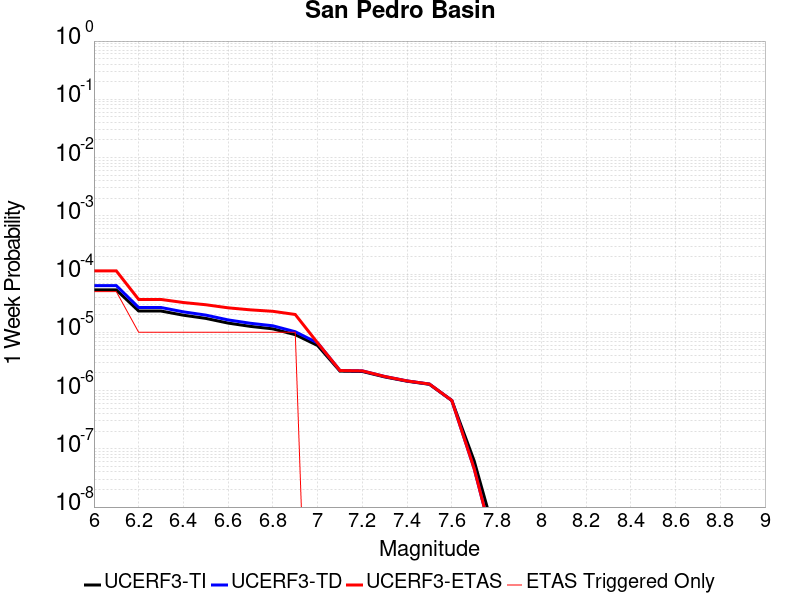 | 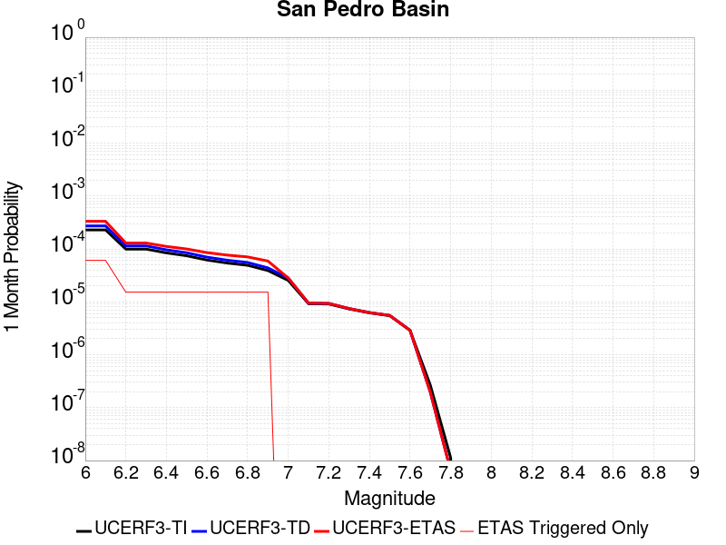 | 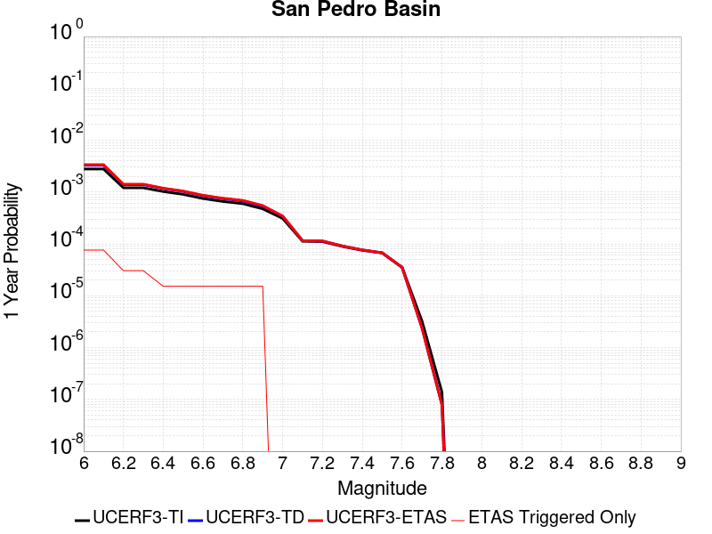 | 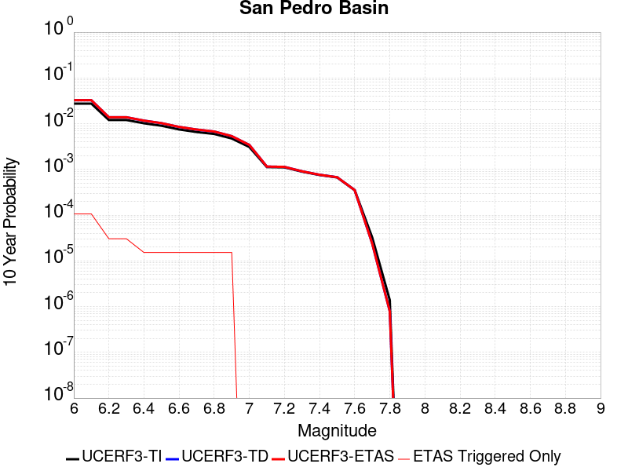 |

| Magnitude | 1 wk TI Prob | 1 wk TD Prob | 1 wk ETAS Prob | 1 wk ETAS/TD Gain | 1 wk ETAS Triggered Only | 1 mo TI Prob | 1 mo TD Prob | 1 mo ETAS Prob | 1 mo ETAS/TD Gain | 1 mo ETAS Triggered Only | 1 yr TI Prob | 1 yr TD Prob | 1 yr ETAS Prob | 1 yr ETAS/TD Gain | 1 yr ETAS Triggered Only | 10 yr TI Prob | 10 yr TD Prob | 10 yr ETAS Prob | 10 yr ETAS/TD Gain | 10 yr ETAS Triggered Only |
|-----|-----|-----|-----|-----|-----|-----|-----|-----|-----|-----|-----|-----|-----|-----|-----|-----|-----|-----|-----|-----|
| 6.0 | 5.3449043E-5 | 6.336954E-5 | 1.2424847E-4 | 1.9606973 | 6.08828E-5 | 2.2904722E-4 | 2.715589E-4 | 3.3242517E-4 | 1.2241365 | 6.08828E-5 | 0.0027850836 | 0.0033018254 | 0.0033776776 | 1.0229728 | 7.6103504E-5 | 0.027504366 | 0.03258945 | 0.03269252 | 1.0031627 | 1.065449E-4 |
| 6.1 | 5.3449043E-5 | 6.336954E-5 | 1.2424847E-4 | 1.9606973 | 6.08828E-5 | 2.2904722E-4 | 2.715589E-4 | 3.3242517E-4 | 1.2241365 | 6.08828E-5 | 0.0027850836 | 0.0033018254 | 0.0033776776 | 1.0229728 | 7.6103504E-5 | 0.027504366 | 0.03258945 | 0.03269252 | 1.0031627 | 1.065449E-4 |
| 6.2 | 2.3189454E-5 | 2.6642796E-5 | 4.186309E-5 | 1.5712724 | 1.52207E-5 | 9.9379584E-5 | 1.14178685E-4 | 1.2939764E-4 | 1.1332908 | 1.52207E-5 | 0.0012092749 | 0.0013892864 | 0.0014196855 | 1.0218811 | 3.04414E-5 | 0.012027155 | 0.013810883 | 0.013840904 | 1.0021737 | 3.04414E-5 |
| 6.3 | 2.3189454E-5 | 2.6642796E-5 | 4.186309E-5 | 1.5712724 | 1.52207E-5 | 9.9379584E-5 | 1.14178685E-4 | 1.2939764E-4 | 1.1332908 | 1.52207E-5 | 0.0012092749 | 0.0013892864 | 0.0014196855 | 1.0218811 | 3.04414E-5 | 0.012027155 | 0.013810883 | 0.013840904 | 1.0021737 | 3.04414E-5 |
| 6.4 | 1.966056E-5 | 2.2463413E-5 | 3.768377E-5 | 1.6775621 | 1.52207E-5 | 8.425682E-5 | 9.626844E-5 | 1.1148768E-4 | 1.1580917 | 1.52207E-5 | 0.001025344 | 0.0011714783 | 0.0011866812 | 1.0129775 | 1.52207E-5 | 0.010206259 | 0.011657117 | 0.01167216 | 1.0012904 | 1.52207E-5 |
| 6.5 | 1.7342953E-5 | 1.9745148E-5 | 3.496555E-5 | 1.7708426 | 1.52207E-5 | 7.4324824E-5 | 8.4619525E-5 | 9.983894E-5 | 1.179857 | 1.52207E-5 | 9.04529E-4 | 0.0010297928 | 0.0010449978 | 1.0147651 | 1.52207E-5 | 0.009008561 | 0.010253931 | 0.010268996 | 1.0014691 | 1.52207E-5 |
| 6.6 | 1.439804E-5 | 1.6322716E-5 | 3.1543168E-5 | 1.9324706 | 1.52207E-5 | 6.170443E-5 | 6.99528E-5 | 8.517244E-5 | 1.2175701 | 1.52207E-5 | 7.509924E-4 | 8.513747E-4 | 8.6658244E-4 | 1.0178626 | 1.52207E-5 | 0.0074845953 | 0.008484332 | 0.008499424 | 1.0017787 | 1.52207E-5 |
| 6.7 | 1.2634884E-5 | 1.4285297E-5 | 2.950578E-5 | 2.065465 | 1.52207E-5 | 5.414838E-5 | 6.1221435E-5 | 7.64412E-5 | 1.2486019 | 1.52207E-5 | 6.590571E-4 | 7.4514654E-4 | 7.603559E-4 | 1.0204113 | 1.52207E-5 | 0.006571059 | 0.007429501 | 0.007444609 | 1.0020335 | 1.52207E-5 |
| 6.8 | 1.146091E-5 | 1.2933192E-5 | 2.8153696E-5 | 2.176856 | 1.52207E-5 | 4.911726E-5 | 5.5426954E-5 | 7.064681E-5 | 1.274593 | 1.52207E-5 | 5.9783855E-4 | 6.7464396E-4 | 6.8985444E-4 | 1.0225458 | 1.52207E-5 | 0.0059623276 | 0.006728899 | 0.0067440174 | 1.0022467 | 1.52207E-5 |
| 6.9 | 9.109035E-6 | 1.0235011E-5 | 2.5455556E-5 | 2.4871056 | 1.52207E-5 | 3.9038136E-5 | 4.3863754E-5 | 5.9083788E-5 | 1.3469843 | 1.52207E-5 | 4.7518566E-4 | 5.3393835E-4 | 5.491509E-4 | 1.0284913 | 1.52207E-5 | 0.0047417083 | 0.005329309 | 0.0053444486 | 1.0028408 | 1.52207E-5 |
| 7.0 | 5.9351028E-6 | 6.583964E-6 | 6.583964E-6 | 1.0 | 0.0 | 2.5435906E-5 | 2.8216817E-5 | 2.8216817E-5 | 1.0 | 0.0 | 3.0963816E-4 | 3.435092E-4 | 3.435092E-4 | 1.0 | 0.0 | 0.0030920706 | 0.0034320992 | 0.0034320992 | 1.0 | 0.0 |
| 7.1 | 2.1557585E-6 | 2.209648E-6 | 2.209648E-6 | 1.0 | 0.0 | 9.238933E-6 | 9.469887E-6 | 9.469887E-6 | 1.0 | 0.0 | 1.1247819E-4 | 1.1528993E-4 | 1.1528993E-4 | 1.0 | 0.0 | 0.0011242128 | 0.0011523166 | 0.0011523166 | 1.0 | 0.0 |
| 7.2 | 2.1251979E-6 | 2.1779945E-6 | 2.1779945E-6 | 1.0 | 0.0 | 9.107958E-6 | 9.334229E-6 | 9.334229E-6 | 1.0 | 0.0 | 1.1088375E-4 | 1.1363847E-4 | 1.1363847E-4 | 1.0 | 0.0 | 0.0011082845 | 0.0011358189 | 0.0011358189 | 1.0 | 0.0 |
| 7.3 | 1.7145798E-6 | 1.7442874E-6 | 1.7442874E-6 | 1.0 | 0.0 | 7.3481783E-6 | 7.4754967E-6 | 7.4754967E-6 | 1.0 | 0.0 | 8.94604E-5 | 9.1010465E-5 | 9.1010465E-5 | 1.0 | 0.0 | 8.9424395E-4 | 9.0974104E-4 | 9.0974104E-4 | 1.0 | 0.0 |
| 7.4 | 1.4467993E-6 | 1.4641868E-6 | 1.4641868E-6 | 1.0 | 0.0 | 6.200554E-6 | 6.2750714E-6 | 6.2750714E-6 | 1.0 | 0.0 | 7.548913E-5 | 7.639639E-5 | 7.639639E-5 | 1.0 | 0.0 | 7.546349E-4 | 7.6370855E-4 | 7.6370855E-4 | 1.0 | 0.0 |
| 7.5 | 1.2803735E-6 | 1.2931497E-6 | 1.2931497E-6 | 1.0 | 0.0 | 5.487303E-6 | 5.5420587E-6 | 5.5420587E-6 | 1.0 | 0.0 | 6.680587E-5 | 6.7472545E-5 | 6.7472545E-5 | 1.0 | 0.0 | 6.678579E-4 | 6.7452766E-4 | 6.7452766E-4 | 1.0 | 0.0 |
| 7.6 | 6.755009E-7 | 6.769465E-7 | 6.769465E-7 | 1.0 | 0.0 | 2.8950008E-6 | 2.9011965E-6 | 2.9011965E-6 | 1.0 | 0.0 | 3.5246063E-5 | 3.5321555E-5 | 3.5321555E-5 | 1.0 | 0.0 | 3.5240475E-4 | 3.5316512E-4 | 3.5316512E-4 | 1.0 | 0.0 |
| 7.7 | 6.211885E-8 | 4.569953E-8 | 4.569953E-8 | 1.0 | 0.0 | 2.6622362E-7 | 1.9585512E-7 | 1.9585512E-7 | 1.0 | 0.0 | 3.2412677E-6 | 2.3845337E-6 | 2.3845337E-6 | 1.0 | 0.0 | 3.2412205E-5 | 2.3845101E-5 | 2.3845101E-5 | 1.0 | 0.0 |
| 7.8 | 2.6580573E-9 | 1.5138163E-9 | 1.5138163E-9 | 1.0 | 0.0 | 1.1391674E-8 | 6.487784E-9 | 6.487784E-9 | 1.0 | 0.0 | 1.3869362E-7 | 7.898877E-8 | 7.898877E-8 | 1.0 | 0.0 | 1.3869354E-6 | 7.898877E-7 | 7.898877E-7 | 1.0 | 0.0 |

## Coronado Bank alt1
*[(top)](#table-of-contents)*

| 1 Week | 1 Month | 1 Year | 10 Year |
|-----|-----|-----|-----|
| 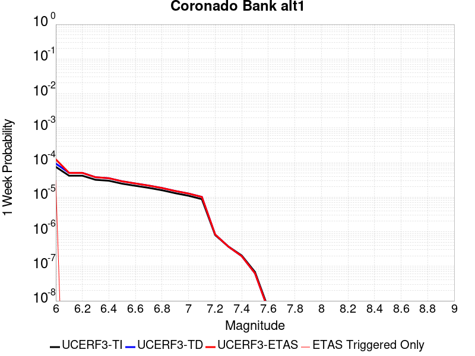 | 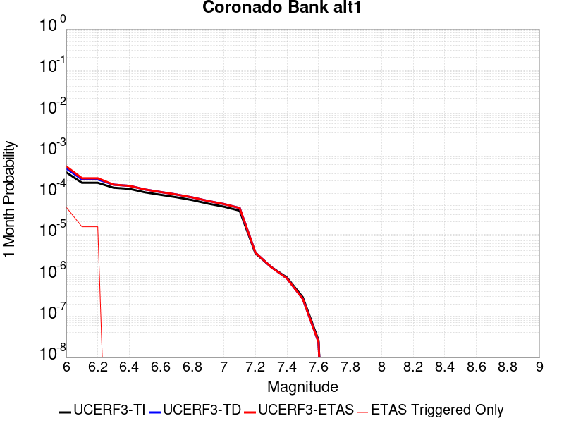 | 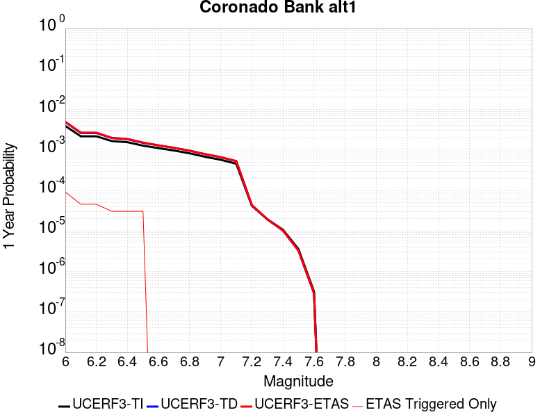 | 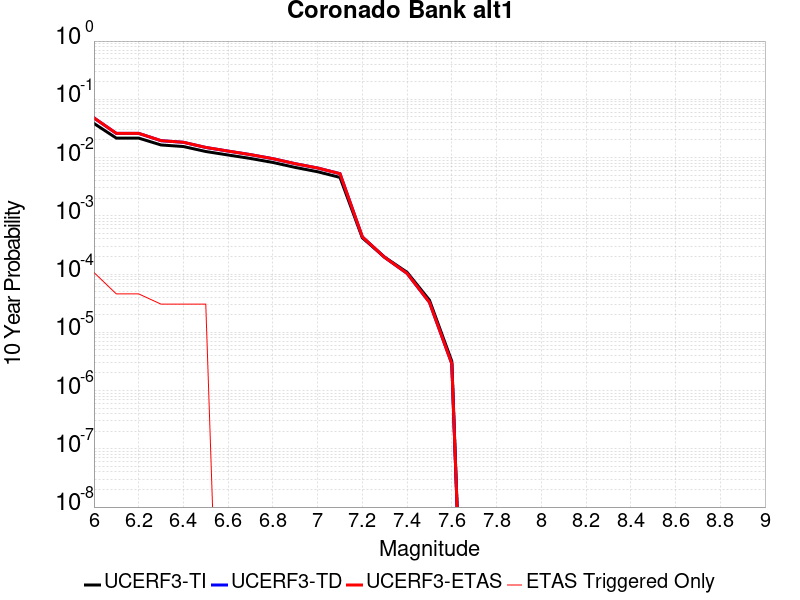 |

| Magnitude | 1 wk TI Prob | 1 wk TD Prob | 1 wk ETAS Prob | 1 wk ETAS/TD Gain | 1 wk ETAS Triggered Only | 1 mo TI Prob | 1 mo TD Prob | 1 mo ETAS Prob | 1 mo ETAS/TD Gain | 1 mo ETAS Triggered Only | 1 yr TI Prob | 1 yr TD Prob | 1 yr ETAS Prob | 1 yr ETAS/TD Gain | 1 yr ETAS Triggered Only | 10 yr TI Prob | 10 yr TD Prob | 10 yr ETAS Prob | 10 yr ETAS/TD Gain | 10 yr ETAS Triggered Only |
|-----|-----|-----|-----|-----|-----|-----|-----|-----|-----|-----|-----|-----|-----|-----|-----|-----|-----|-----|-----|-----|
| 6.0 | 7.533492E-5 | 9.394913E-5 | 1.2438768E-4 | 1.3239896 | 3.04414E-5 | 3.22824E-4 | 4.0258127E-4 | 4.4822498E-4 | 1.1133777 | 4.5662102E-5 | 0.0039233007 | 0.0048909658 | 0.0049818433 | 1.0185807 | 9.1324204E-5 | 0.03854755 | 0.04790356 | 0.048005003 | 1.0021176 | 1.065449E-4 |
| 6.1 | 4.1807285E-5 | 5.049283E-5 | 5.049283E-5 | 1.0 | 0.0 | 1.7916178E-4 | 2.1638049E-4 | 2.3159789E-4 | 1.070327 | 1.52207E-5 | 0.0021791123 | 0.0026313474 | 0.0026768893 | 1.0173075 | 4.5662102E-5 | 0.021578677 | 0.026011046 | 0.02605552 | 1.0017098 | 4.5662102E-5 |
| 6.2 | 4.1807285E-5 | 5.049283E-5 | 5.049283E-5 | 1.0 | 0.0 | 1.7916178E-4 | 2.1638049E-4 | 2.3159789E-4 | 1.070327 | 1.52207E-5 | 0.0021791123 | 0.0026313474 | 0.0026768893 | 1.0173075 | 4.5662102E-5 | 0.021578677 | 0.026011046 | 0.02605552 | 1.0017098 | 4.5662102E-5 |
| 6.3 | 3.1793104E-5 | 3.7711117E-5 | 3.7711117E-5 | 1.0 | 0.0 | 1.3624904E-4 | 1.6160926E-4 | 1.6160926E-4 | 1.0 | 0.0 | 0.0016575698 | 0.001965848 | 0.0019962296 | 1.0154546 | 3.04414E-5 | 0.016452603 | 0.019488465 | 0.019518312 | 1.0015316 | 3.04414E-5 |
| 6.4 | 2.9878007E-5 | 3.5335794E-5 | 3.5335794E-5 | 1.0 | 0.0 | 1.2804232E-4 | 1.5143053E-4 | 1.5143053E-4 | 1.0 | 0.0 | 0.0015578003 | 0.0018421387 | 0.001872524 | 1.0164946 | 3.04414E-5 | 0.015469253 | 0.01827244 | 0.018302327 | 1.0016356 | 3.04414E-5 |
| 6.5 | 2.4512565E-5 | 2.8764043E-5 | 2.8764043E-5 | 1.0 | 0.0 | 1.0504962E-4 | 1.2326881E-4 | 1.2326881E-4 | 1.0 | 0.0 | 0.0012782287 | 0.0014997921 | 0.0015301879 | 1.0202667 | 3.04414E-5 | 0.012709012 | 0.014899683 | 0.014929671 | 1.0020126 | 3.04414E-5 |
| 6.6 | 2.1317413E-5 | 2.490667E-5 | 2.490667E-5 | 1.0 | 0.0 | 9.135714E-5 | 1.0673863E-4 | 1.0673863E-4 | 1.0 | 0.0 | 0.0011117056 | 0.0012987906 | 0.0012987906 | 1.0 | 0.0 | 0.011061605 | 0.012914404 | 0.012914404 | 1.0 | 0.0 |
| 6.7 | 1.8585655E-5 | 2.163488E-5 | 2.163488E-5 | 1.0 | 0.0 | 7.9650374E-5 | 9.271773E-5 | 9.271773E-5 | 1.0 | 0.0 | 9.6931186E-4 | 0.0011282742 | 0.0011282742 | 1.0 | 0.0 | 0.0096509475 | 0.011227623 | 0.011227623 | 1.0 | 0.0 |
| 6.8 | 1.5862879E-5 | 1.8419474E-5 | 1.8419474E-5 | 1.0 | 0.0 | 6.798199E-5 | 7.893833E-5 | 7.893833E-5 | 1.0 | 0.0 | 8.273665E-4 | 9.6066965E-4 | 9.6066965E-4 | 1.0 | 0.0 | 0.008242928 | 0.00956715 | 0.00956715 | 1.0 | 0.0 |
| 6.9 | 1.3021509E-5 | 1.5095265E-5 | 1.5095265E-5 | 1.0 | 0.0 | 5.5805274E-5 | 6.469249E-5 | 6.469249E-5 | 1.0 | 0.0 | 6.792174E-4 | 7.8736455E-4 | 7.8736455E-4 | 1.0 | 0.0 | 0.006771452 | 0.007847573 | 0.007847573 | 1.0 | 0.0 |
| 7.0 | 1.0974371E-5 | 1.2720104E-5 | 1.2720104E-5 | 1.0 | 0.0 | 4.7032172E-5 | 5.451369E-5 | 5.451369E-5 | 1.0 | 0.0 | 5.7246623E-4 | 6.6351966E-4 | 6.6351966E-4 | 1.0 | 0.0 | 0.0057099373 | 0.006617135 | 0.006617135 | 1.0 | 0.0 |
| 7.1 | 8.766221E-6 | 1.01638325E-5 | 1.01638325E-5 | 1.0 | 0.0 | 3.7568978E-5 | 4.355865E-5 | 4.355865E-5 | 1.0 | 0.0 | 4.573063E-4 | 5.3021475E-4 | 5.3021475E-4 | 1.0 | 0.0 | 0.0045636636 | 0.0052911965 | 0.0052911965 | 1.0 | 0.0 |
| 7.2 | 8.026024E-7 | 8.331765E-7 | 8.331765E-7 | 1.0 | 0.0 | 3.43972E-6 | 3.5707515E-6 | 3.5707515E-6 | 1.0 | 0.0 | 4.1877785E-5 | 4.3473043E-5 | 4.3473043E-5 | 1.0 | 0.0 | 4.1869894E-4 | 4.3464647E-4 | 4.3464647E-4 | 1.0 | 0.0 |
| 7.3 | 3.7293114E-7 | 3.7000953E-7 | 3.7000953E-7 | 1.0 | 0.0 | 1.5982754E-6 | 1.5857541E-6 | 1.5857541E-6 | 1.0 | 0.0 | 1.9458828E-5 | 1.9306386E-5 | 1.9306386E-5 | 1.0 | 0.0 | 1.9457124E-4 | 1.9304715E-4 | 1.9304715E-4 | 1.0 | 0.0 |
| 7.4 | 2.0557036E-7 | 1.9674363E-7 | 1.9674363E-7 | 1.0 | 0.0 | 8.810155E-7 | 8.431867E-7 | 8.431867E-7 | 1.0 | 0.0 | 1.0726311E-5 | 1.026575E-5 | 1.026575E-5 | 1.0 | 0.0 | 1.0725793E-4 | 1.0265279E-4 | 1.0265279E-4 | 1.0 | 0.0 |
| 7.5 | 6.845446E-8 | 6.279369E-8 | 6.279369E-8 | 1.0 | 0.0 | 2.9337625E-7 | 2.691158E-7 | 2.691158E-7 | 1.0 | 0.0 | 3.5718497E-6 | 3.2764797E-6 | 3.2764797E-6 | 1.0 | 0.0 | 3.5717923E-5 | 3.2764325E-5 | 3.2764325E-5 | 1.0 | 0.0 |
| 7.6 | 6.0975145E-9 | 5.53185E-9 | 5.53185E-9 | 1.0 | 0.0 | 2.6132206E-8 | 2.370793E-8 | 2.370793E-8 | 1.0 | 0.0 | 3.1815955E-7 | 2.88644E-7 | 2.88644E-7 | 1.0 | 0.0 | 3.181591E-6 | 2.8864374E-6 | 2.8864374E-6 | 1.0 | 0.0 |

## San Jacinto (Superstition Mtn)
*[(top)](#table-of-contents)*

| 1 Week | 1 Month | 1 Year | 10 Year |
|-----|-----|-----|-----|
|  | 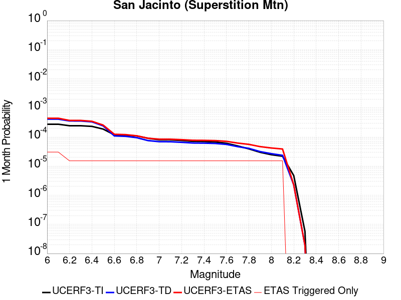 | 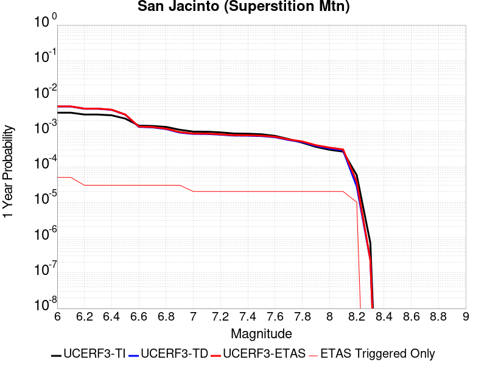 | 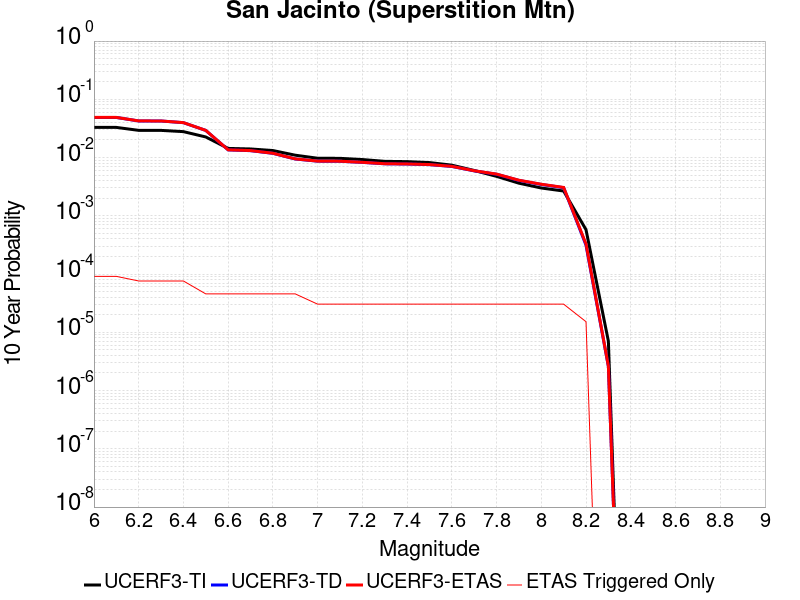 |

| Magnitude | 1 wk TI Prob | 1 wk TD Prob | 1 wk ETAS Prob | 1 wk ETAS/TD Gain | 1 wk ETAS Triggered Only | 1 mo TI Prob | 1 mo TD Prob | 1 mo ETAS Prob | 1 mo ETAS/TD Gain | 1 mo ETAS Triggered Only | 1 yr TI Prob | 1 yr TD Prob | 1 yr ETAS Prob | 1 yr ETAS/TD Gain | 1 yr ETAS Triggered Only | 10 yr TI Prob | 10 yr TD Prob | 10 yr ETAS Prob | 10 yr ETAS/TD Gain | 10 yr ETAS Triggered Only |
|-----|-----|-----|-----|-----|-----|-----|-----|-----|-----|-----|-----|-----|-----|-----|-----|-----|-----|-----|-----|-----|
| 6.0 | 6.4193904E-5 | 9.599367E-5 | 1.1121291E-4 | 1.1585442 | 1.52207E-5 | 2.7508775E-4 | 4.1134638E-4 | 4.4177525E-4 | 1.0739739 | 3.04414E-5 | 0.0033440501 | 0.0049980893 | 0.005058668 | 1.0121204 | 6.08828E-5 | 0.03294174 | 0.048823986 | 0.04891085 | 1.0017792 | 9.1324204E-5 |
| 6.1 | 6.4193904E-5 | 9.599367E-5 | 1.1121291E-4 | 1.1585442 | 1.52207E-5 | 2.7508775E-4 | 4.1134638E-4 | 4.4177525E-4 | 1.0739739 | 3.04414E-5 | 0.0033440501 | 0.0049980893 | 0.005058668 | 1.0121204 | 6.08828E-5 | 0.03294174 | 0.048823986 | 0.04891085 | 1.0017792 | 9.1324204E-5 |
| 6.2 | 5.7023593E-5 | 8.3144434E-5 | 8.3144434E-5 | 1.0 | 0.0 | 2.4436394E-4 | 3.5629404E-4 | 3.715093E-4 | 1.0427042 | 1.52207E-5 | 0.002971072 | 0.0043308944 | 0.004376359 | 1.0104977 | 4.5662102E-5 | 0.029316625 | 0.04250403 | 0.042576898 | 1.0017143 | 7.6103504E-5 |
| 6.3 | 5.6940098E-5 | 8.298979E-5 | 8.298979E-5 | 1.0 | 0.0 | 2.4400617E-4 | 3.5563146E-4 | 3.7084677E-4 | 1.0427839 | 1.52207E-5 | 0.002966728 | 0.00432286 | 0.0043683248 | 1.0105172 | 4.5662102E-5 | 0.029274331 | 0.042427283 | 0.042500157 | 1.0017177 | 7.6103504E-5 |
| 6.4 | 5.4171585E-5 | 7.7483564E-5 | 7.7483564E-5 | 1.0 | 0.0 | 2.3214328E-4 | 3.3203943E-4 | 3.472551E-4 | 1.0458248 | 1.52207E-5 | 0.0028226813 | 0.0040367353 | 0.0040822127 | 1.011266 | 4.5662102E-5 | 0.02787096 | 0.03971653 | 0.039789613 | 1.0018401 | 7.6103504E-5 |
| 6.5 | 4.375144E-5 | 5.642133E-5 | 5.642133E-5 | 1.0 | 0.0 | 1.874927E-4 | 2.4178992E-4 | 2.5700693E-4 | 1.0629349 | 1.52207E-5 | 0.0022803338 | 0.002940994 | 0.0029865217 | 1.0154804 | 4.5662102E-5 | 0.022570757 | 0.029236801 | 0.029281128 | 1.0015161 | 4.5662102E-5 |
| 6.6 | 2.772192E-5 | 2.5488358E-5 | 2.5488358E-5 | 1.0 | 0.0 | 1.1880282E-4 | 1.09231354E-4 | 1.244504E-4 | 1.1393285 | 1.52207E-5 | 0.0014454646 | 0.0013290998 | 0.0013747012 | 1.03431 | 4.5662102E-5 | 0.014360986 | 0.01354049 | 0.013585534 | 1.0033267 | 4.5662102E-5 |
| 6.7 | 2.7124124E-5 | 2.4699386E-5 | 2.4699386E-5 | 1.0 | 0.0 | 1.1624106E-4 | 1.05850326E-4 | 1.2106942E-4 | 1.1437793 | 1.52207E-5 | 0.0014143161 | 0.001287985 | 0.0013335884 | 1.0354067 | 4.5662102E-5 | 0.014053487 | 0.013133943 | 0.013179006 | 1.003431 | 4.5662102E-5 |
| 6.8 | 2.5475807E-5 | 2.216446E-5 | 2.216446E-5 | 1.0 | 0.0 | 1.0917746E-4 | 9.4987154E-5 | 1.10206405E-4 | 1.1602243 | 1.52207E-5 | 0.001328425 | 0.001155867 | 0.0012014763 | 1.039459 | 4.5662102E-5 | 0.0132051185 | 0.011822182 | 0.011867304 | 1.0038167 | 4.5662102E-5 |
| 6.9 | 2.1162023E-5 | 1.7626244E-5 | 1.7626244E-5 | 1.0 | 0.0 | 9.069123E-5 | 7.5538876E-5 | 9.0758425E-5 | 1.2014797 | 1.52207E-5 | 0.0011036064 | 9.193016E-4 | 9.649217E-4 | 1.0496248 | 4.5662102E-5 | 0.010981417 | 0.00944688 | 0.00949211 | 1.0047879 | 4.5662102E-5 |
| 7.0 | 1.8754288E-5 | 1.6161559E-5 | 1.6161559E-5 | 1.0 | 0.0 | 8.037304E-5 | 6.9261994E-5 | 8.4481646E-5 | 1.2197403 | 1.52207E-5 | 9.781026E-4 | 8.4294105E-4 | 8.7335677E-4 | 1.0360829 | 3.04414E-5 | 0.009738087 | 0.008670042 | 0.00870022 | 1.0034807 | 3.04414E-5 |
| 7.1 | 1.8678527E-5 | 1.6086702E-5 | 1.6086702E-5 | 1.0 | 0.0 | 8.0048376E-5 | 6.89412E-5 | 8.416085E-5 | 1.2207627 | 1.52207E-5 | 9.7415317E-4 | 8.3903834E-4 | 8.694542E-4 | 1.0362508 | 3.04414E-5 | 0.009698939 | 0.008630998 | 0.008661177 | 1.0034965 | 3.04414E-5 |
| 7.2 | 1.7804578E-5 | 1.5381282E-5 | 1.5381282E-5 | 1.0 | 0.0 | 7.6303106E-5 | 6.5918124E-5 | 8.113782E-5 | 1.2308879 | 1.52207E-5 | 9.285943E-4 | 8.022599E-4 | 8.326769E-4 | 1.0379142 | 3.04414E-5 | 0.009247236 | 0.008262311 | 0.008292502 | 1.0036539 | 3.04414E-5 |
| 7.3 | 1.6583685E-5 | 1.4530388E-5 | 1.4530388E-5 | 1.0 | 0.0 | 7.1070994E-5 | 6.227162E-5 | 7.749137E-5 | 1.2444091 | 1.52207E-5 | 8.649459E-4 | 7.5789524E-4 | 7.8831357E-4 | 1.0401353 | 3.04414E-5 | 0.00861587 | 0.007817623 | 0.007847827 | 1.0038635 | 3.04414E-5 |
| 7.4 | 1.6387552E-5 | 1.4395274E-5 | 1.4395274E-5 | 1.0 | 0.0 | 7.023047E-5 | 6.169258E-5 | 7.691234E-5 | 1.2467033 | 1.52207E-5 | 8.5472054E-4 | 7.5085036E-4 | 7.812689E-4 | 1.0405121 | 3.04414E-5 | 0.008514405 | 0.0077470057 | 0.0077772113 | 1.003899 | 3.04414E-5 |
| 7.5 | 1.5790754E-5 | 1.4035962E-5 | 1.4035962E-5 | 1.0 | 0.0 | 6.767291E-5 | 6.0152746E-5 | 7.537253E-5 | 1.253019 | 1.52207E-5 | 8.236062E-4 | 7.321156E-4 | 7.625347E-4 | 1.0415496 | 3.04414E-5 | 0.008205604 | 0.007557569 | 0.0075877802 | 1.0039974 | 3.04414E-5 |
| 7.6 | 1.4248672E-5 | 1.3054932E-5 | 1.3054932E-5 | 1.0 | 0.0 | 6.106431E-5 | 5.594852E-5 | 7.116837E-5 | 1.2720331 | 1.52207E-5 | 7.432043E-4 | 6.8096205E-4 | 7.113827E-4 | 1.0446731 | 3.04414E-5 | 0.007407237 | 0.0070401574 | 0.0070703845 | 1.0042936 | 3.04414E-5 |
| 7.7 | 1.15449975E-5 | 1.090368E-5 | 1.090368E-5 | 1.0 | 0.0 | 4.947762E-5 | 4.6729223E-5 | 6.194921E-5 | 1.325706 | 1.52207E-5 | 6.022235E-4 | 5.687805E-4 | 5.992046E-4 | 1.05349 | 3.04414E-5 | 0.006005941 | 0.0059101824 | 0.005940444 | 1.0051203 | 3.04414E-5 |
| 7.8 | 9.1391985E-6 | 9.514299E-6 | 9.514299E-6 | 1.0 | 0.0 | 3.9167408E-5 | 4.0774932E-5 | 5.5995013E-5 | 1.3732705 | 1.52207E-5 | 4.767588E-4 | 4.963223E-4 | 5.267486E-4 | 1.0613035 | 3.04414E-5 | 0.0047573727 | 0.0051766867 | 0.0052069705 | 1.0058501 | 3.04414E-5 |
| 7.9 | 6.973017E-6 | 7.3821784E-6 | 7.3821784E-6 | 1.0 | 0.0 | 2.9884017E-5 | 3.1637526E-5 | 4.6857745E-5 | 1.4810811 | 1.52207E-5 | 3.6377716E-4 | 3.8511935E-4 | 4.1554903E-4 | 1.0790136 | 3.04414E-5 | 0.0036318225 | 0.0040517948 | 0.0040821126 | 1.0074826 | 3.04414E-5 |
| 8.0 | 5.7638235E-6 | 6.259972E-6 | 6.259972E-6 | 1.0 | 0.0 | 2.4701867E-5 | 2.6828178E-5 | 4.204847E-5 | 1.5673249 | 1.52207E-5 | 3.0070372E-4 | 3.2658462E-4 | 3.5701608E-4 | 1.0931809 | 3.04414E-5 | 0.0030029714 | 0.0034534496 | 0.0034837858 | 1.0087843 | 3.04414E-5 |
| 8.1 | 5.1124434E-6 | 5.4956718E-6 | 5.4956718E-6 | 1.0 | 0.0 | 2.1910288E-5 | 2.355267E-5 | 3.877301E-5 | 1.6462258 | 1.52207E-5 | 2.6672508E-4 | 2.867165E-4 | 3.1714916E-4 | 1.106142 | 3.04414E-5 | 0.0026640517 | 0.003040336 | 0.003070685 | 1.0099821 | 3.04414E-5 |
| 8.2 | 1.1075938E-6 | 5.336568E-7 | 5.336568E-7 | 1.0 | 0.0 | 4.7468216E-6 | 2.2870988E-6 | 2.2870988E-6 | 1.0 | 0.0 | 5.779102E-5 | 2.7845093E-5 | 4.306537E-5 | 1.5466053 | 1.52207E-5 | 5.777599E-4 | 3.1346595E-4 | 3.286819E-4 | 1.048541 | 1.52207E-5 |
| 8.3 | 1.3584393E-8 | 4.473836E-9 | 4.473836E-9 | 1.0 | 0.0 | 5.8218827E-8 | 1.9173582E-8 | 1.9173582E-8 | 1.0 | 0.0 | 7.0881396E-7 | 2.3343837E-7 | 2.3343837E-7 | 1.0 | 0.0 | 7.0881174E-6 | 2.6163038E-6 | 2.6163038E-6 | 1.0 | 0.0 |

## San Diego Trough north alt1
*[(top)](#table-of-contents)*

| 1 Week | 1 Month | 1 Year | 10 Year |
|-----|-----|-----|-----|
| 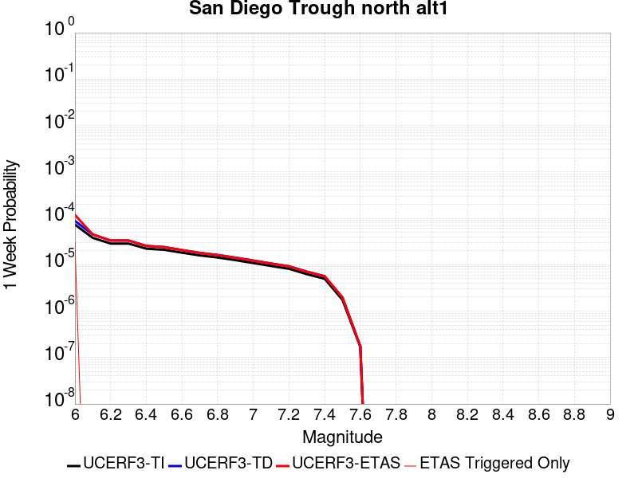 | 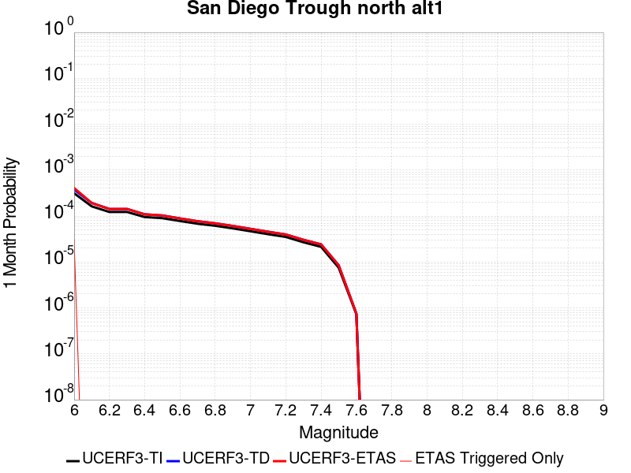 | 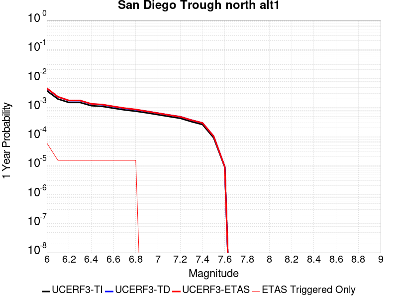 | 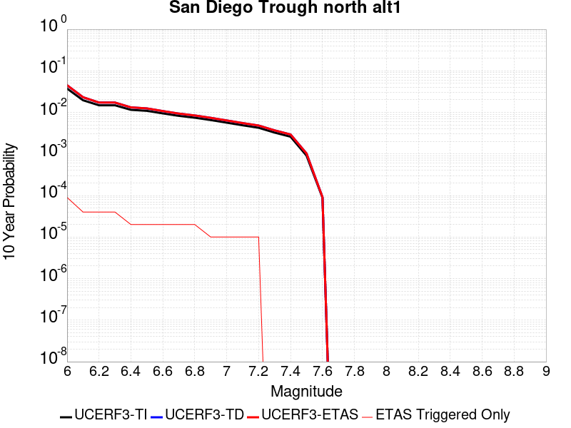 |

| Magnitude | 1 wk TI Prob | 1 wk TD Prob | 1 wk ETAS Prob | 1 wk ETAS/TD Gain | 1 wk ETAS Triggered Only | 1 mo TI Prob | 1 mo TD Prob | 1 mo ETAS Prob | 1 mo ETAS/TD Gain | 1 mo ETAS Triggered Only | 1 yr TI Prob | 1 yr TD Prob | 1 yr ETAS Prob | 1 yr ETAS/TD Gain | 1 yr ETAS Triggered Only | 10 yr TI Prob | 10 yr TD Prob | 10 yr ETAS Prob | 10 yr ETAS/TD Gain | 10 yr ETAS Triggered Only |
|-----|-----|-----|-----|-----|-----|-----|-----|-----|-----|-----|-----|-----|-----|-----|-----|-----|-----|-----|-----|-----|
| 6.0 | 7.329252E-5 | 8.821093E-5 | 1.18649645E-4 | 1.3450674 | 3.04414E-5 | 3.14073E-4 | 3.7799572E-4 | 4.084256E-4 | 1.0805032 | 3.04414E-5 | 0.0038171355 | 0.004593027 | 0.0046536303 | 1.0131946 | 6.08828E-5 | 0.03752231 | 0.045044992 | 0.0451322 | 1.0019361 | 9.1324204E-5 |
| 6.1 | 3.7940346E-5 | 4.4885E-5 | 4.4885E-5 | 1.0 | 0.0 | 1.6259136E-4 | 1.9235066E-4 | 1.9235066E-4 | 1.0 | 0.0 | 0.0019777524 | 0.0023394432 | 0.0023546284 | 1.006491 | 1.52207E-5 | 0.019602431 | 0.023156688 | 0.023186423 | 1.0012841 | 3.04414E-5 |
| 6.2 | 2.8645263E-5 | 3.329678E-5 | 3.329678E-5 | 1.0 | 0.0 | 1.2275964E-4 | 1.4269284E-4 | 1.4269284E-4 | 1.0 | 0.0 | 0.0014935739 | 0.0017359189 | 0.0017511132 | 1.0087528 | 1.52207E-5 | 0.0148357535 | 0.017226247 | 0.017256165 | 1.0017368 | 3.04414E-5 |
| 6.3 | 2.8645263E-5 | 3.329678E-5 | 3.329678E-5 | 1.0 | 0.0 | 1.2275964E-4 | 1.4269284E-4 | 1.4269284E-4 | 1.0 | 0.0 | 0.0014935739 | 0.0017359189 | 0.0017511132 | 1.0087528 | 1.52207E-5 | 0.0148357535 | 0.017226247 | 0.017256165 | 1.0017368 | 3.04414E-5 |
| 6.4 | 2.2204576E-5 | 2.5448318E-5 | 2.5448318E-5 | 1.0 | 0.0 | 9.5159E-5 | 1.0905972E-4 | 1.0905972E-4 | 1.0 | 0.0 | 0.001157945 | 0.0013270034 | 0.0013422038 | 1.0114547 | 1.52207E-5 | 0.011519298 | 0.013191955 | 0.013206975 | 1.0011386 | 1.52207E-5 |
| 6.5 | 2.1004838E-5 | 2.4024694E-5 | 2.4024694E-5 | 1.0 | 0.0 | 9.0017624E-5 | 1.0295896E-4 | 1.0295896E-4 | 1.0 | 0.0 | 0.0010954136 | 0.0012528138 | 0.0012680155 | 1.012134 | 1.52207E-5 | 0.010900296 | 0.012458589 | 0.01247362 | 1.0012065 | 1.52207E-5 |
| 6.6 | 1.820557E-5 | 2.0704787E-5 | 2.0704787E-5 | 1.0 | 0.0 | 7.802154E-5 | 8.873181E-5 | 8.873181E-5 | 1.0 | 0.0 | 9.4949827E-4 | 0.0010797799 | 0.0010949841 | 1.0140809 | 1.52207E-5 | 0.009454516 | 0.010746004 | 0.010761062 | 1.0014012 | 1.52207E-5 |
| 6.7 | 1.5884485E-5 | 1.7983646E-5 | 1.7983646E-5 | 1.0 | 0.0 | 6.807459E-5 | 7.707051E-5 | 7.707051E-5 | 1.0 | 0.0 | 8.284929E-4 | 9.3793223E-4 | 9.531387E-4 | 1.0162127 | 1.52207E-5 | 0.008254109 | 0.009340104 | 0.009355182 | 1.0016143 | 1.52207E-5 |
| 6.8 | 1.4331171E-5 | 1.6201066E-5 | 1.6201066E-5 | 1.0 | 0.0 | 6.141786E-5 | 6.94313E-5 | 6.94313E-5 | 1.0 | 0.0 | 7.4750587E-4 | 8.450002E-4 | 8.6020806E-4 | 1.0179974 | 1.52207E-5 | 0.0074499645 | 0.008418139 | 0.008433231 | 1.0017929 | 1.52207E-5 |
| 6.9 | 1.2574203E-5 | 1.4205835E-5 | 1.4205835E-5 | 1.0 | 0.0 | 5.3888325E-5 | 6.0880735E-5 | 6.0880735E-5 | 1.0 | 0.0 | 6.558929E-4 | 7.409723E-4 | 7.409723E-4 | 1.0 | 0.0 | 0.0065396037 | 0.007385203 | 0.007385203 | 1.0 | 0.0 |
| 7.0 | 1.0883844E-5 | 1.2289262E-5 | 1.2289262E-5 | 1.0 | 0.0 | 4.664421E-5 | 5.2667205E-5 | 5.2667205E-5 | 1.0 | 0.0 | 5.677453E-4 | 6.4103556E-4 | 6.4103556E-4 | 1.0 | 0.0 | 0.00566297 | 0.006391993 | 0.006391993 | 1.0 | 0.0 |
| 7.1 | 9.393088E-6 | 1.060702E-5 | 1.060702E-5 | 1.0 | 0.0 | 4.025547E-5 | 4.545787E-5 | 4.545787E-5 | 1.0 | 0.0 | 4.900001E-4 | 5.533098E-4 | 5.533098E-4 | 1.0 | 0.0 | 0.0048892107 | 0.005519418 | 0.005519418 | 1.0 | 0.0 |
| 7.2 | 8.190791E-6 | 9.258625E-6 | 9.258625E-6 | 1.0 | 0.0 | 3.510292E-5 | 3.9679224E-5 | 3.9679224E-5 | 1.0 | 0.0 | 4.2729423E-4 | 4.8298817E-4 | 4.8298817E-4 | 1.0 | 0.0 | 0.0042647356 | 0.004819465 | 0.004819465 | 1.0 | 0.0 |
| 7.3 | 6.268162E-6 | 7.089716E-6 | 7.089716E-6 | 1.0 | 0.0 | 2.6863276E-5 | 3.0384144E-5 | 3.0384144E-5 | 1.0 | 0.0 | 3.2701128E-4 | 3.6986457E-4 | 3.6986457E-4 | 1.0 | 0.0 | 0.003265305 | 0.003692536 | 0.003692536 | 1.0 | 0.0 |
| 7.4 | 4.985186E-6 | 5.6426816E-6 | 5.6426816E-6 | 1.0 | 0.0 | 2.1364907E-5 | 2.4182698E-5 | 2.4182698E-5 | 1.0 | 0.0 | 2.600867E-4 | 2.9438498E-4 | 2.9438498E-4 | 1.0 | 0.0 | 0.002597825 | 0.0029399914 | 0.0029399914 | 1.0 | 0.0 |
| 7.5 | 1.7489613E-6 | 1.969678E-6 | 1.969678E-6 | 1.0 | 0.0 | 7.495527E-6 | 8.4414505E-6 | 8.4414505E-6 | 1.0 | 0.0 | 9.125422E-5 | 1.02770035E-4 | 1.02770035E-4 | 1.0 | 0.0 | 9.1216754E-4 | 0.0010272472 | 0.0010272472 | 1.0 | 0.0 |
| 7.6 | 1.6988751E-7 | 1.7533823E-7 | 1.7533823E-7 | 1.0 | 0.0 | 7.2808916E-7 | 7.5144936E-7 | 7.5144936E-7 | 1.0 | 0.0 | 8.864449E-6 | 9.14886E-6 | 9.14886E-6 | 1.0 | 0.0 | 8.8640954E-5 | 9.1485024E-5 | 9.1485024E-5 | 1.0 | 0.0 |

## White Mountains
*[(top)](#table-of-contents)*

| 1 Week | 1 Month | 1 Year | 10 Year |
|-----|-----|-----|-----|
| 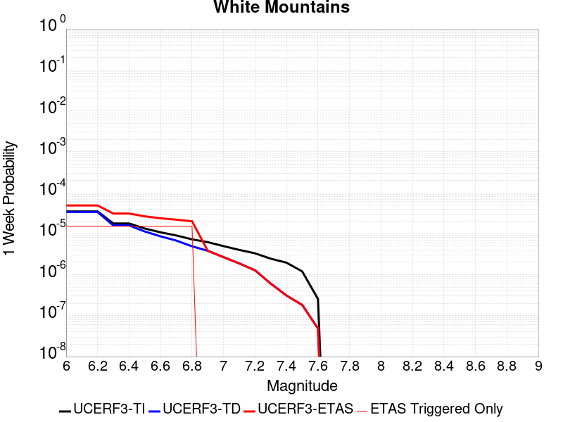 | 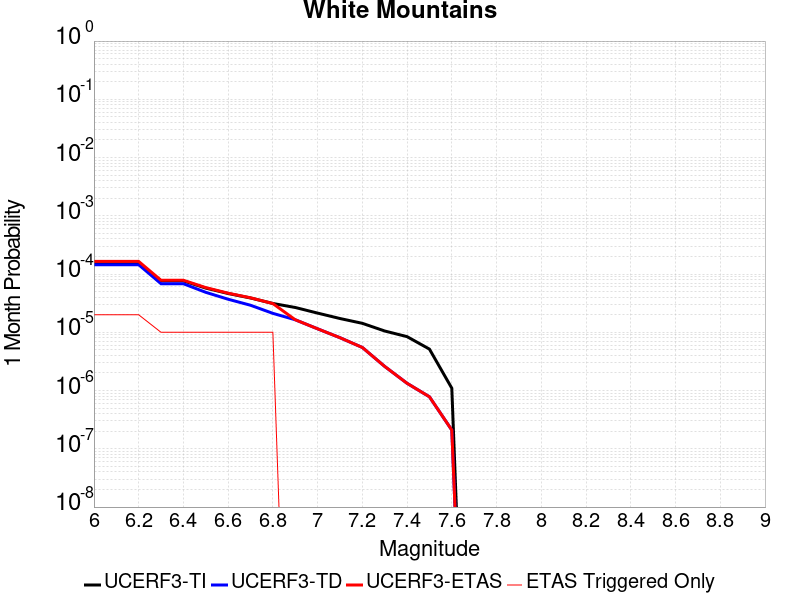 | 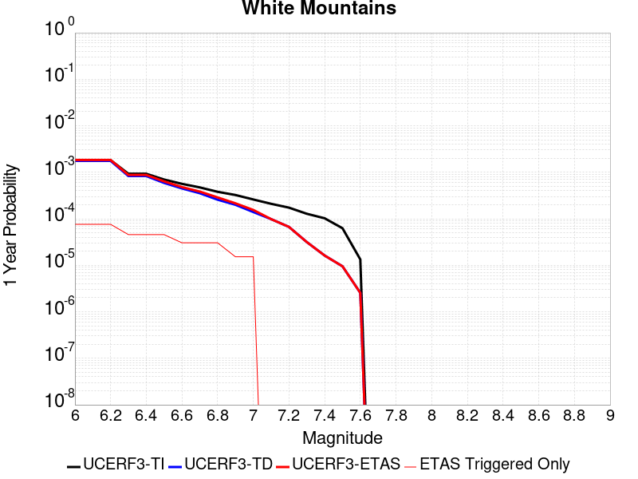 | 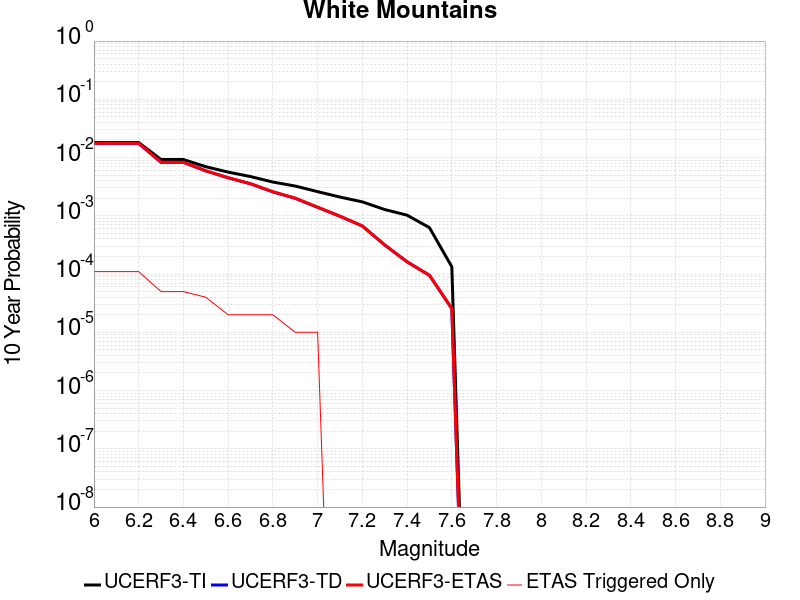 |

| Magnitude | 1 wk TI Prob | 1 wk TD Prob | 1 wk ETAS Prob | 1 wk ETAS/TD Gain | 1 wk ETAS Triggered Only | 1 mo TI Prob | 1 mo TD Prob | 1 mo ETAS Prob | 1 mo ETAS/TD Gain | 1 mo ETAS Triggered Only | 1 yr TI Prob | 1 yr TD Prob | 1 yr ETAS Prob | 1 yr ETAS/TD Gain | 1 yr ETAS Triggered Only | 10 yr TI Prob | 10 yr TD Prob | 10 yr ETAS Prob | 10 yr ETAS/TD Gain | 10 yr ETAS Triggered Only |
|-----|-----|-----|-----|-----|-----|-----|-----|-----|-----|-----|-----|-----|-----|-----|-----|-----|-----|-----|-----|-----|
| 6.0 | 3.503579E-5 | 3.378405E-5 | 4.9004237E-5 | 1.450514 | 1.52207E-5 | 1.5014476E-4 | 1.4478143E-4 | 1.5999994E-4 | 1.1051136 | 1.52207E-5 | 0.0018264796 | 0.0017614096 | 0.001837379 | 1.0431299 | 7.6103504E-5 | 0.018115403 | 0.017486818 | 0.017576545 | 1.0051311 | 9.1324204E-5 |
| 6.1 | 3.503579E-5 | 3.378405E-5 | 4.9004237E-5 | 1.450514 | 1.52207E-5 | 1.5014476E-4 | 1.4478143E-4 | 1.5999994E-4 | 1.1051136 | 1.52207E-5 | 0.0018264796 | 0.0017614096 | 0.001837379 | 1.0431299 | 7.6103504E-5 | 0.018115403 | 0.017486818 | 0.017576545 | 1.0051311 | 9.1324204E-5 |
| 6.2 | 3.503579E-5 | 3.378405E-5 | 4.9004237E-5 | 1.450514 | 1.52207E-5 | 1.5014476E-4 | 1.4478143E-4 | 1.5999994E-4 | 1.1051136 | 1.52207E-5 | 0.0018264796 | 0.0017614096 | 0.001837379 | 1.0431299 | 7.6103504E-5 | 0.018115403 | 0.017486818 | 0.017576545 | 1.0051311 | 9.1324204E-5 |
| 6.3 | 1.7818425E-5 | 1.5916074E-5 | 3.1136533E-5 | 1.9562948 | 1.52207E-5 | 7.636245E-5 | 6.821004E-5 | 8.34297E-5 | 1.2231294 | 1.52207E-5 | 9.293162E-4 | 8.301551E-4 | 8.757793E-4 | 1.0549586 | 4.5662102E-5 | 0.009254395 | 0.008271999 | 0.008317283 | 1.0054744 | 4.5662102E-5 |
| 6.4 | 1.7818425E-5 | 1.5916074E-5 | 3.1136533E-5 | 1.9562948 | 1.52207E-5 | 7.636245E-5 | 6.821004E-5 | 8.34297E-5 | 1.2231294 | 1.52207E-5 | 9.293162E-4 | 8.301551E-4 | 8.757793E-4 | 1.0549586 | 4.5662102E-5 | 0.009254395 | 0.008271999 | 0.008317283 | 1.0054744 | 4.5662102E-5 |
| 6.5 | 1.3397557E-5 | 1.13362685E-5 | 2.6556796E-5 | 2.34264 | 1.52207E-5 | 5.741684E-5 | 4.858314E-5 | 6.3803105E-5 | 1.3132765 | 1.52207E-5 | 6.988258E-4 | 5.913462E-4 | 6.369813E-4 | 1.0771716 | 4.5662102E-5 | 0.006966323 | 0.005898432 | 0.0059438245 | 1.0076957 | 4.5662102E-5 |
| 6.6 | 1.0818695E-5 | 8.625366E-6 | 2.3845934E-5 | 2.7646286 | 1.52207E-5 | 4.6365014E-5 | 3.6965357E-5 | 5.2185493E-5 | 1.4117405 | 1.52207E-5 | 5.6434784E-4 | 4.4996463E-4 | 4.8039234E-4 | 1.0676224 | 3.04414E-5 | 0.005629168 | 0.004490972 | 0.004521277 | 1.006748 | 3.04414E-5 |
| 6.7 | 9.067908E-6 | 6.802442E-6 | 2.202304E-5 | 3.2375195 | 1.52207E-5 | 3.8861883E-5 | 2.9153016E-5 | 4.437327E-5 | 1.5220817 | 1.52207E-5 | 4.7304068E-4 | 3.5488335E-4 | 3.8531394E-4 | 1.0857482 | 3.04414E-5 | 0.00472035 | 0.0035434833 | 0.003573817 | 1.0085604 | 3.04414E-5 |
| 6.8 | 7.295947E-6 | 4.936391E-6 | 2.0157016E-5 | 4.0833507 | 1.52207E-5 | 3.126797E-5 | 2.1155796E-5 | 3.6376176E-5 | 1.7194425 | 1.52207E-5 | 3.8062103E-4 | 2.575425E-4 | 2.8797606E-4 | 1.1181691 | 3.04414E-5 | 0.0037996976 | 0.0025725532 | 0.0026029164 | 1.0118027 | 3.04414E-5 |
| 6.9 | 6.2243444E-6 | 3.832213E-6 | 3.832213E-6 | 1.0 | 0.0 | 2.6675489E-5 | 1.642367E-5 | 1.642367E-5 | 1.0 | 0.0 | 3.2472567E-4 | 1.9994036E-4 | 2.1515803E-4 | 1.076111 | 1.52207E-5 | 0.0032425157 | 0.0019976576 | 0.0020128477 | 1.007604 | 1.52207E-5 |
| 7.0 | 4.9878413E-6 | 2.6795342E-6 | 2.6795342E-6 | 1.0 | 0.0 | 2.1376287E-5 | 1.14836685E-5 | 1.14836685E-5 | 1.0 | 0.0 | 2.602252E-4 | 1.3980496E-4 | 1.5502353E-4 | 1.1088557 | 1.52207E-5 | 0.002599207 | 0.0013971963 | 0.0014123957 | 1.0108786 | 1.52207E-5 |
| 7.1 | 4.0252844E-6 | 1.8857575E-6 | 1.8857575E-6 | 1.0 | 0.0 | 1.7251105E-5 | 8.081794E-6 | 8.081794E-6 | 1.0 | 0.0 | 2.1001195E-4 | 9.8391516E-5 | 9.8391516E-5 | 1.0 | 0.0 | 0.0020981359 | 9.834924E-4 | 9.834924E-4 | 1.0 | 0.0 |
| 7.2 | 3.3284066E-6 | 1.281964E-6 | 1.281964E-6 | 1.0 | 0.0 | 1.4264522E-5 | 5.494121E-6 | 5.494121E-6 | 1.0 | 0.0 | 1.736567E-4 | 6.688897E-5 | 6.688897E-5 | 1.0 | 0.0 | 0.0017352107 | 6.6869846E-4 | 6.6869846E-4 | 1.0 | 0.0 |
| 7.3 | 2.458226E-6 | 6.05722E-7 | 6.05722E-7 | 1.0 | 0.0 | 1.0535211E-5 | 2.5959491E-6 | 2.5959491E-6 | 1.0 | 0.0 | 1.2825865E-4 | 3.1605257E-5 | 3.1605257E-5 | 1.0 | 0.0 | 0.0012818464 | 3.160114E-4 | 3.160114E-4 | 1.0 | 0.0 |
| 7.4 | 1.965953E-6 | 3.1089303E-7 | 3.1089303E-7 | 1.0 | 0.0 | 8.425486E-6 | 1.332398E-6 | 1.332398E-6 | 1.0 | 0.0 | 1.0257547E-4 | 1.6221828E-5 | 1.6221828E-5 | 1.0 | 0.0 | 0.0010252813 | 1.6220656E-4 | 1.6220656E-4 | 1.0 | 0.0 |
| 7.5 | 1.2014192E-6 | 1.8244253E-7 | 1.8244253E-7 | 1.0 | 0.0 | 5.148929E-6 | 7.8189635E-7 | 7.8189635E-7 | 1.0 | 0.0 | 6.2686406E-5 | 9.519547E-6 | 9.519547E-6 | 1.0 | 0.0 | 6.266873E-4 | 9.519148E-5 | 9.519148E-5 | 1.0 | 0.0 |
| 7.6 | 2.5612175E-7 | 4.8946475E-8 | 4.8946475E-8 | 1.0 | 0.0 | 1.0976642E-6 | 2.0977059E-7 | 2.0977059E-7 | 1.0 | 0.0 | 1.3363979E-5 | 2.5539543E-6 | 2.5539543E-6 | 1.0 | 0.0 | 1.3363175E-4 | 2.5539286E-5 | 2.5539286E-5 | 1.0 | 0.0 |

## Blue Cut
*[(top)](#table-of-contents)*

| 1 Week | 1 Month | 1 Year | 10 Year |
|-----|-----|-----|-----|
| 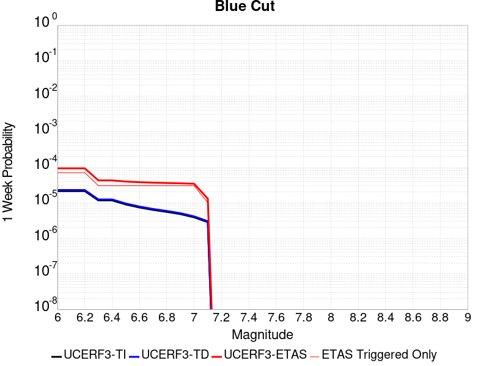 | 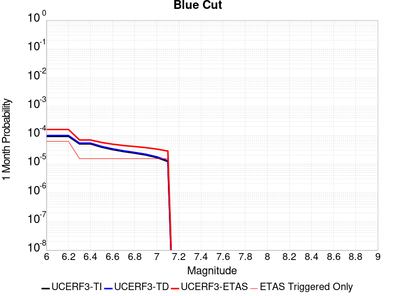 | 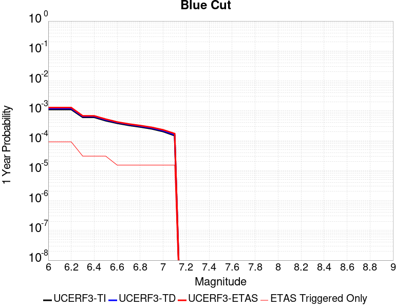 | 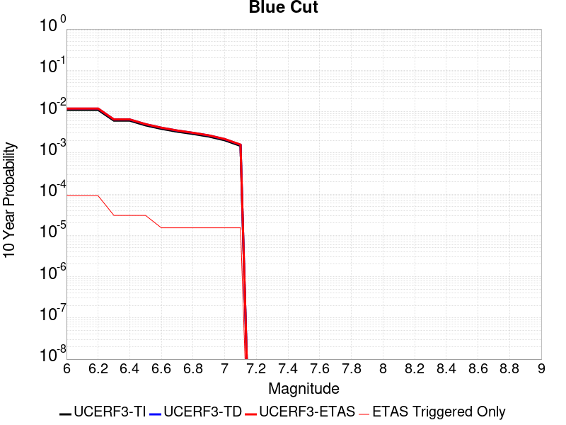 |

| Magnitude | 1 wk TI Prob | 1 wk TD Prob | 1 wk ETAS Prob | 1 wk ETAS/TD Gain | 1 wk ETAS Triggered Only | 1 mo TI Prob | 1 mo TD Prob | 1 mo ETAS Prob | 1 mo ETAS/TD Gain | 1 mo ETAS Triggered Only | 1 yr TI Prob | 1 yr TD Prob | 1 yr ETAS Prob | 1 yr ETAS/TD Gain | 1 yr ETAS Triggered Only | 10 yr TI Prob | 10 yr TD Prob | 10 yr ETAS Prob | 10 yr ETAS/TD Gain | 10 yr ETAS Triggered Only |
|-----|-----|-----|-----|-----|-----|-----|-----|-----|-----|-----|-----|-----|-----|-----|-----|-----|-----|-----|-----|-----|
| 6.0 | 2.1227985E-5 | 2.2719574E-5 | 8.360099E-5 | 3.6796901 | 6.08828E-5 | 9.097391E-5 | 9.73663E-5 | 1.5824317E-4 | 1.6252356 | 6.08828E-5 | 0.0011070445 | 0.0011848481 | 0.0012760641 | 1.0769854 | 9.1324204E-5 | 0.011015458 | 0.011791152 | 0.011881399 | 1.0076538 | 9.1324204E-5 |
| 6.1 | 2.1227985E-5 | 2.2719574E-5 | 8.360099E-5 | 3.6796901 | 6.08828E-5 | 9.097391E-5 | 9.73663E-5 | 1.5824317E-4 | 1.6252356 | 6.08828E-5 | 0.0011070445 | 0.0011848481 | 0.0012760641 | 1.0769854 | 9.1324204E-5 | 0.011015458 | 0.011791152 | 0.011881399 | 1.0076538 | 9.1324204E-5 |
| 6.2 | 2.1227985E-5 | 2.2719574E-5 | 8.360099E-5 | 3.6796901 | 6.08828E-5 | 9.097391E-5 | 9.73663E-5 | 1.5824317E-4 | 1.6252356 | 6.08828E-5 | 0.0011070445 | 0.0011848481 | 0.0012760641 | 1.0769854 | 9.1324204E-5 | 0.011015458 | 0.011791152 | 0.011881399 | 1.0076538 | 9.1324204E-5 |
| 6.3 | 1.1613981E-5 | 1.2353542E-5 | 2.7574055E-5 | 2.232077 | 1.52207E-5 | 4.9773254E-5 | 5.2942745E-5 | 6.816264E-5 | 1.2874783 | 1.52207E-5 | 6.0582085E-4 | 6.443998E-4 | 6.7482155E-4 | 1.0472095 | 3.04414E-5 | 0.0060417196 | 0.0064265593 | 0.006456805 | 1.0047064 | 3.04414E-5 |
| 6.4 | 1.1613981E-5 | 1.2353542E-5 | 2.7574055E-5 | 2.232077 | 1.52207E-5 | 4.9773254E-5 | 5.2942745E-5 | 6.816264E-5 | 1.2874783 | 1.52207E-5 | 6.0582085E-4 | 6.443998E-4 | 6.7482155E-4 | 1.0472095 | 3.04414E-5 | 0.0060417196 | 0.0064265593 | 0.006456805 | 1.0047064 | 3.04414E-5 |
| 6.5 | 8.931326E-6 | 9.4816E-6 | 2.4702156E-5 | 2.605273 | 1.52207E-5 | 3.8276554E-5 | 4.0634844E-5 | 5.585493E-5 | 1.3745574 | 1.52207E-5 | 4.6591737E-4 | 4.946261E-4 | 5.250524E-4 | 1.0615138 | 3.04414E-5 | 0.0046494175 | 0.004936161 | 0.0049664523 | 1.0061365 | 3.04414E-5 |
| 6.6 | 7.345353E-6 | 7.79028E-6 | 2.301086E-5 | 2.9537916 | 1.52207E-5 | 3.1479703E-5 | 3.338653E-5 | 4.8606722E-5 | 1.4558783 | 1.52207E-5 | 3.83198E-4 | 4.064132E-4 | 4.216277E-4 | 1.0374361 | 1.52207E-5 | 0.0038253788 | 0.0040574907 | 0.00407265 | 1.003736 | 1.52207E-5 |
| 6.7 | 6.2775666E-6 | 6.655149E-6 | 2.1875749E-5 | 3.287041 | 1.52207E-5 | 2.690358E-5 | 2.8521798E-5 | 4.3742064E-5 | 1.5336363 | 1.52207E-5 | 3.2750185E-4 | 3.472051E-4 | 3.6242048E-4 | 1.0438225 | 1.52207E-5 | 0.0032701963 | 0.003467367 | 0.003482535 | 1.0043745 | 1.52207E-5 |
| 6.8 | 5.5234095E-6 | 5.8551113E-6 | 2.1075723E-5 | 3.5995426 | 1.52207E-5 | 2.367154E-5 | 2.5093133E-5 | 4.031345E-5 | 1.6065531 | 1.52207E-5 | 2.8816288E-4 | 3.0547334E-4 | 3.206894E-4 | 1.0498114 | 1.52207E-5 | 0.002877895 | 0.0030512505 | 0.0030664247 | 1.0049732 | 1.52207E-5 |
| 6.9 | 4.7780054E-6 | 5.0654203E-6 | 2.0286043E-5 | 4.0048094 | 1.52207E-5 | 2.0477004E-5 | 2.1708804E-5 | 3.6929174E-5 | 1.701115 | 1.52207E-5 | 2.4927902E-4 | 2.642797E-4 | 2.7949637E-4 | 1.057578 | 1.52207E-5 | 0.0024899957 | 0.002640346 | 0.0026555266 | 1.0057495 | 1.52207E-5 |
| 7.0 | 3.883171E-6 | 4.118487E-6 | 1.9339124E-5 | 4.6956863 | 1.52207E-5 | 1.6642054E-5 | 1.7650578E-5 | 3.287101E-5 | 1.8623191 | 1.52207E-5 | 2.0259817E-4 | 2.1488148E-4 | 2.3009891E-4 | 1.0708178 | 1.52207E-5 | 0.0020241356 | 0.0021474129 | 0.0021626009 | 1.0070727 | 1.52207E-5 |
| 7.1 | 2.8358215E-6 | 3.0097158E-6 | 1.823037E-5 | 6.0571733 | 1.52207E-5 | 1.2153464E-5 | 1.2898756E-5 | 2.8119259E-5 | 2.179998 | 1.52207E-5 | 1.4795837E-4 | 1.5703762E-4 | 1.7225592E-4 | 1.0969087 | 1.52207E-5 | 0.001478599 | 0.0015699116 | 0.0015851085 | 1.00968 | 1.52207E-5 |

## Kern Canyon (North Kern) 2011
*[(top)](#table-of-contents)*

| 1 Week | 1 Month | 1 Year | 10 Year |
|-----|-----|-----|-----|
| 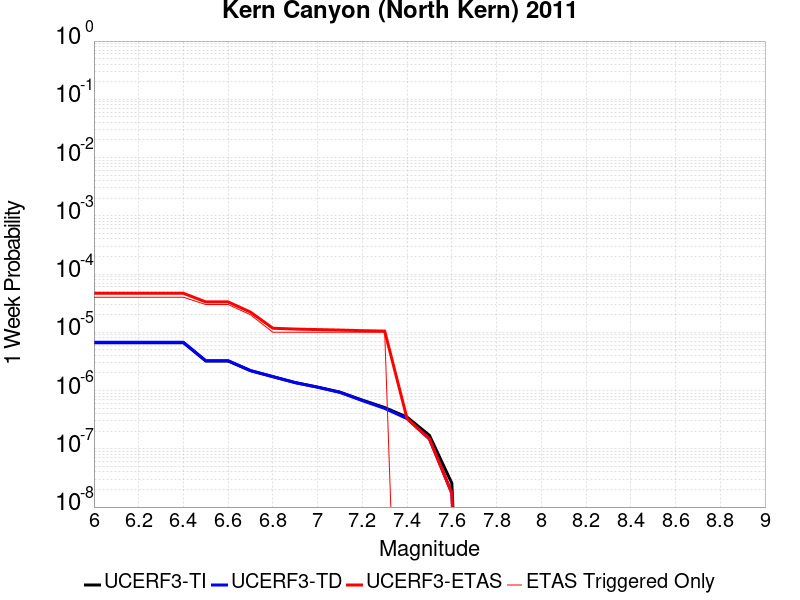 | 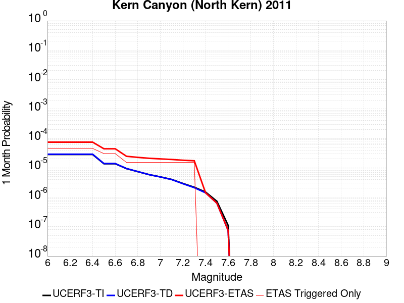 | 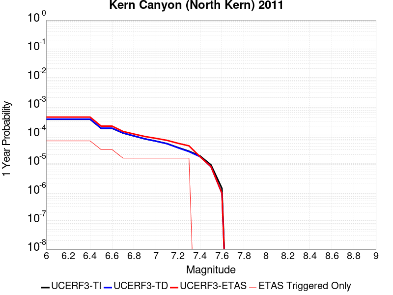 | 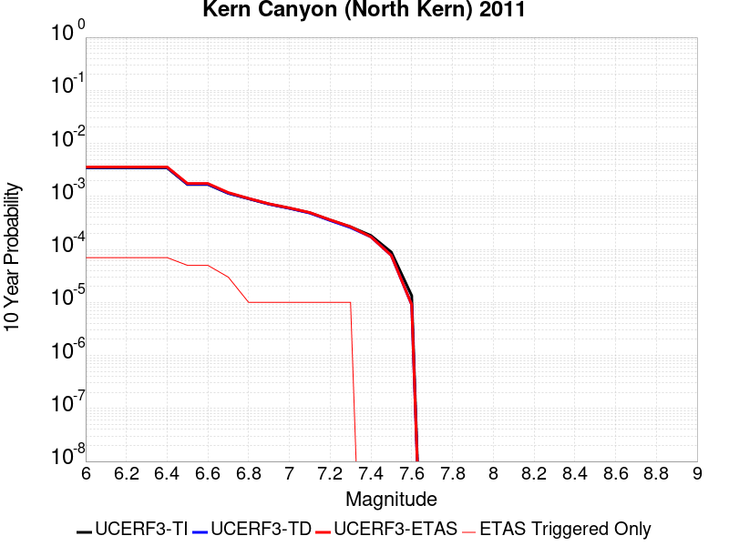 |

| Magnitude | 1 wk TI Prob | 1 wk TD Prob | 1 wk ETAS Prob | 1 wk ETAS/TD Gain | 1 wk ETAS Triggered Only | 1 mo TI Prob | 1 mo TD Prob | 1 mo ETAS Prob | 1 mo ETAS/TD Gain | 1 mo ETAS Triggered Only | 1 yr TI Prob | 1 yr TD Prob | 1 yr ETAS Prob | 1 yr ETAS/TD Gain | 1 yr ETAS Triggered Only | 10 yr TI Prob | 10 yr TD Prob | 10 yr ETAS Prob | 10 yr ETAS/TD Gain | 10 yr ETAS Triggered Only |
|-----|-----|-----|-----|-----|-----|-----|-----|-----|-----|-----|-----|-----|-----|-----|-----|-----|-----|-----|-----|-----|
| 6.0 | 6.6264497E-6 | 6.75733E-6 | 5.2419124E-5 | 7.757372 | 4.5662102E-5 | 2.8398761E-5 | 2.895971E-5 | 7.462049E-5 | 2.5767002 | 4.5662102E-5 | 3.4570007E-4 | 3.5253543E-4 | 4.1339677E-4 | 1.1726389 | 6.08828E-5 | 0.0034516277 | 0.0035205502 | 0.003611553 | 1.025849 | 9.1324204E-5 |
| 6.1 | 6.6264497E-6 | 6.75733E-6 | 5.2419124E-5 | 7.757372 | 4.5662102E-5 | 2.8398761E-5 | 2.895971E-5 | 7.462049E-5 | 2.5767002 | 4.5662102E-5 | 3.4570007E-4 | 3.5253543E-4 | 4.1339677E-4 | 1.1726389 | 6.08828E-5 | 0.0034516277 | 0.0035205502 | 0.003611553 | 1.025849 | 9.1324204E-5 |
| 6.2 | 6.6264497E-6 | 6.75733E-6 | 5.2419124E-5 | 7.757372 | 4.5662102E-5 | 2.8398761E-5 | 2.895971E-5 | 7.462049E-5 | 2.5767002 | 4.5662102E-5 | 3.4570007E-4 | 3.5253543E-4 | 4.1339677E-4 | 1.1726389 | 6.08828E-5 | 0.0034516277 | 0.0035205502 | 0.003611553 | 1.025849 | 9.1324204E-5 |
| 6.3 | 6.6264497E-6 | 6.75733E-6 | 5.2419124E-5 | 7.757372 | 4.5662102E-5 | 2.8398761E-5 | 2.895971E-5 | 7.462049E-5 | 2.5767002 | 4.5662102E-5 | 3.4570007E-4 | 3.5253543E-4 | 4.1339677E-4 | 1.1726389 | 6.08828E-5 | 0.0034516277 | 0.0035205502 | 0.003611553 | 1.025849 | 9.1324204E-5 |
| 6.4 | 6.6264497E-6 | 6.75733E-6 | 5.2419124E-5 | 7.757372 | 4.5662102E-5 | 2.8398761E-5 | 2.895971E-5 | 7.462049E-5 | 2.5767002 | 4.5662102E-5 | 3.4570007E-4 | 3.5253543E-4 | 4.1339677E-4 | 1.1726389 | 6.08828E-5 | 0.0034516277 | 0.0035205502 | 0.003611553 | 1.025849 | 9.1324204E-5 |
| 6.5 | 3.2162225E-6 | 3.2570915E-6 | 3.3698394E-5 | 10.346161 | 3.04414E-5 | 1.3783738E-5 | 1.3958893E-5 | 4.439987E-5 | 3.1807585 | 3.04414E-5 | 1.6780409E-4 | 1.6993708E-4 | 2.0037331E-4 | 1.1791029 | 3.04414E-5 | 0.0016767744 | 0.001698151 | 0.0017589304 | 1.0357915 | 6.08828E-5 |
| 6.6 | 3.2162225E-6 | 3.2570915E-6 | 3.3698394E-5 | 10.346161 | 3.04414E-5 | 1.3783738E-5 | 1.3958893E-5 | 4.439987E-5 | 3.1807585 | 3.04414E-5 | 1.6780409E-4 | 1.6993708E-4 | 2.0037331E-4 | 1.1791029 | 3.04414E-5 | 0.0016767744 | 0.001698151 | 0.0017589304 | 1.0357915 | 6.08828E-5 |
| 6.7 | 2.1908265E-6 | 2.2071222E-6 | 1.7427788E-5 | 7.8961596 | 1.52207E-5 | 9.389223E-6 | 9.459061E-6 | 2.4679617E-5 | 2.609098 | 1.52207E-5 | 1.1430779E-4 | 1.1515819E-4 | 1.3037713E-4 | 1.1321568 | 1.52207E-5 | 0.0011424901 | 0.0011510046 | 0.0011814109 | 1.0264173 | 3.04414E-5 |
| 6.8 | 1.7303895E-6 | 1.7365529E-6 | 1.6957227E-5 | 9.764877 | 1.52207E-5 | 7.415934E-6 | 7.4423488E-6 | 2.2662936E-5 | 3.0451322 | 1.52207E-5 | 9.028525E-5 | 9.0606925E-5 | 1.0582625E-4 | 1.1679708 | 1.52207E-5 | 9.024858E-4 | 9.057096E-4 | 9.209165E-4 | 1.01679 | 1.52207E-5 |
| 6.9 | 1.3700314E-6 | 1.3688622E-6 | 1.6589542E-5 | 12.11922 | 1.52207E-5 | 5.87155E-6 | 5.8665396E-6 | 2.108715E-5 | 3.5944786 | 1.52207E-5 | 7.148377E-5 | 7.142282E-5 | 8.664244E-5 | 1.2130917 | 1.52207E-5 | 7.146078E-4 | 7.140032E-4 | 7.2921306E-4 | 1.0213022 | 1.52207E-5 |
| 7.0 | 1.1467797E-6 | 1.1413804E-6 | 1.6362063E-5 | 14.335328 | 1.52207E-5 | 4.9147607E-6 | 4.8916213E-6 | 2.0112248E-5 | 4.111571 | 1.52207E-5 | 5.983557E-5 | 5.9553895E-5 | 7.4773685E-5 | 1.2555634 | 1.52207E-5 | 5.981946E-4 | 5.953825E-4 | 6.105941E-4 | 1.0255494 | 1.52207E-5 |
| 7.1 | 9.3952065E-7 | 9.3026904E-7 | 1.6150954E-5 | 17.361595 | 1.52207E-5 | 4.026511E-6 | 3.9868614E-6 | 1.92075E-5 | 4.8177 | 1.52207E-5 | 4.9021666E-5 | 4.8538972E-5 | 6.375893E-5 | 1.3135617 | 1.52207E-5 | 4.901085E-4 | 4.8528548E-4 | 5.004988E-4 | 1.0313492 | 1.52207E-5 |
| 7.2 | 6.858055E-7 | 6.7193E-7 | 1.589262E-5 | 23.652195 | 1.52207E-5 | 2.939163E-6 | 2.879697E-6 | 1.8100352E-5 | 6.2855062 | 1.52207E-5 | 3.5783723E-5 | 3.5059755E-5 | 5.0279923E-5 | 1.4341208 | 1.52207E-5 | 3.5777962E-4 | 3.5054312E-4 | 3.657585E-4 | 1.043405 | 1.52207E-5 |
| 7.3 | 5.1101983E-7 | 4.9393E-7 | 1.5714622E-5 | 31.815487 | 1.52207E-5 | 2.1900833E-6 | 2.116841E-6 | 1.7337508E-5 | 8.190274 | 1.52207E-5 | 2.6663936E-5 | 2.5772239E-5 | 4.099255E-5 | 1.5905699 | 1.52207E-5 | 2.6660739E-4 | 2.57693E-4 | 2.7290976E-4 | 1.0590501 | 1.52207E-5 |
| 7.4 | 3.4999414E-7 | 3.2995905E-7 | 3.2995905E-7 | 1.0 | 0.0 | 1.499974E-6 | 1.4141094E-6 | 1.4141094E-6 | 1.0 | 0.0 | 1.8262032E-5 | 1.721665E-5 | 1.721665E-5 | 1.0 | 0.0 | 1.826053E-4 | 1.7215339E-4 | 1.7215339E-4 | 1.0 | 0.0 |
| 7.5 | 1.7021522E-7 | 1.4750044E-7 | 1.4750044E-7 | 1.0 | 0.0 | 7.2949354E-7 | 6.321446E-7 | 6.321446E-7 | 1.0 | 0.0 | 8.881548E-6 | 7.696334E-6 | 7.696334E-6 | 1.0 | 0.0 | 8.8811925E-5 | 7.696076E-5 | 7.696076E-5 | 1.0 | 0.0 |
| 7.6 | 2.572245E-8 | 1.7352555E-8 | 1.7352555E-8 | 1.0 | 0.0 | 1.10239064E-7 | 7.436809E-8 | 7.436809E-8 | 1.0 | 0.0 | 1.3421597E-6 | 9.054312E-7 | 9.054312E-7 | 1.0 | 0.0 | 1.3421517E-5 | 9.05428E-6 | 9.05428E-6 | 1.0 | 0.0 |

## San Jacinto (Borrego)
*[(top)](#table-of-contents)*

| 1 Week | 1 Month | 1 Year | 10 Year |
|-----|-----|-----|-----|
| 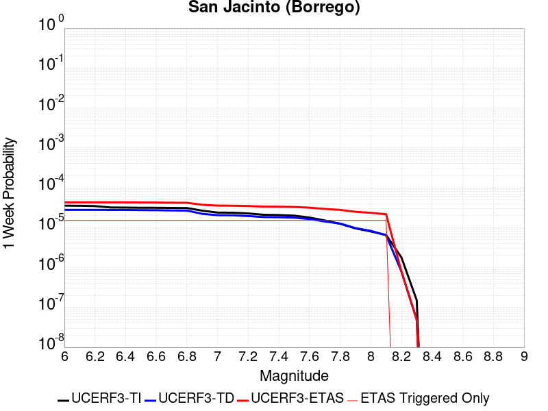 | 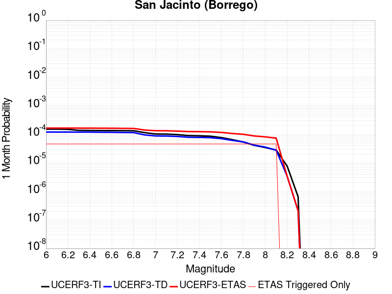 |  | 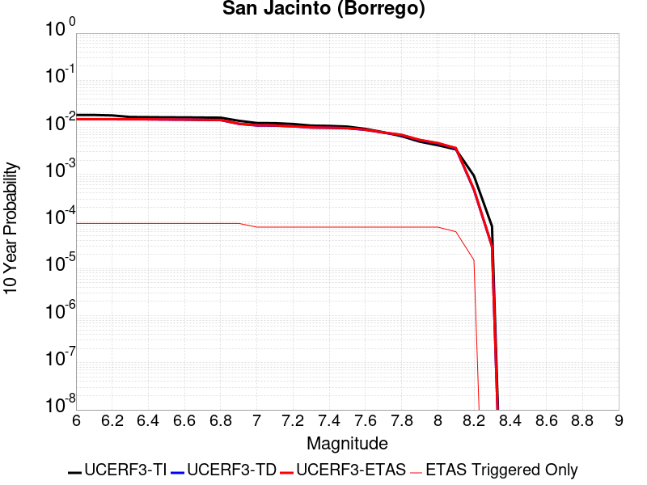 |

| Magnitude | 1 wk TI Prob | 1 wk TD Prob | 1 wk ETAS Prob | 1 wk ETAS/TD Gain | 1 wk ETAS Triggered Only | 1 mo TI Prob | 1 mo TD Prob | 1 mo ETAS Prob | 1 mo ETAS/TD Gain | 1 mo ETAS Triggered Only | 1 yr TI Prob | 1 yr TD Prob | 1 yr ETAS Prob | 1 yr ETAS/TD Gain | 1 yr ETAS Triggered Only | 10 yr TI Prob | 10 yr TD Prob | 10 yr ETAS Prob | 10 yr ETAS/TD Gain | 10 yr ETAS Triggered Only |
|-----|-----|-----|-----|-----|-----|-----|-----|-----|-----|-----|-----|-----|-----|-----|-----|-----|-----|-----|-----|-----|
| 6.0 | 3.543992E-5 | 2.7926513E-5 | 4.314679E-5 | 1.5450116 | 1.52207E-5 | 1.5187653E-4 | 1.1967963E-4 | 1.6533627E-4 | 1.3814905 | 4.5662102E-5 | 0.0018475284 | 0.0014561379 | 0.001547329 | 1.0626254 | 9.1324204E-5 | 0.018322436 | 0.014869647 | 0.014959614 | 1.0060503 | 9.1324204E-5 |
| 6.1 | 3.542281E-5 | 2.7926513E-5 | 4.314679E-5 | 1.5450116 | 1.52207E-5 | 1.5180321E-4 | 1.1967963E-4 | 1.6533627E-4 | 1.3814905 | 4.5662102E-5 | 0.0018466372 | 0.0014561379 | 0.001547329 | 1.0626254 | 9.1324204E-5 | 0.018313672 | 0.014869647 | 0.014959614 | 1.0060503 | 9.1324204E-5 |
| 6.2 | 3.4688688E-5 | 2.7926511E-5 | 4.314679E-5 | 1.5450116 | 1.52207E-5 | 1.4865733E-4 | 1.1967963E-4 | 1.6533627E-4 | 1.3814905 | 4.5662102E-5 | 0.0018084005 | 0.0014561379 | 0.001547329 | 1.0626254 | 9.1324204E-5 | 0.017937548 | 0.014869647 | 0.014959613 | 1.0060503 | 9.1324204E-5 |
| 6.3 | 3.2087122E-5 | 2.7771865E-5 | 4.2992142E-5 | 1.5480467 | 1.52207E-5 | 1.3750899E-4 | 1.1901691E-4 | 1.6467358E-4 | 1.3836149 | 4.5662102E-5 | 0.0016728862 | 0.00144808 | 0.0015392719 | 1.0629743 | 9.1324204E-5 | 0.016603488 | 0.014790683 | 0.014880656 | 1.0060831 | 9.1324204E-5 |
| 6.4 | 3.1828724E-5 | 2.7738852E-5 | 4.2959127E-5 | 1.5486989 | 1.52207E-5 | 1.364017E-4 | 1.1887544E-4 | 1.6453212E-4 | 1.3840715 | 4.5662102E-5 | 0.0016594254 | 0.0014463598 | 0.001537552 | 1.0630494 | 9.1324204E-5 | 0.016470885 | 0.014773762 | 0.014863737 | 1.0060902 | 9.1324204E-5 |
| 6.5 | 3.1563577E-5 | 2.747857E-5 | 4.269885E-5 | 1.5538964 | 1.52207E-5 | 1.3526545E-4 | 1.1776006E-4 | 1.6341677E-4 | 1.3877097 | 4.5662102E-5 | 0.0016456128 | 0.0014327979 | 0.0015239912 | 1.063647 | 9.1324204E-5 | 0.0163348 | 0.014640348 | 0.014730335 | 1.0061466 | 9.1324204E-5 |
| 6.6 | 3.1467625E-5 | 2.7322796E-5 | 4.254308E-5 | 1.5570544 | 1.52207E-5 | 1.3485427E-4 | 1.1709251E-4 | 1.6274926E-4 | 1.3899204 | 4.5662102E-5 | 0.0016406142 | 0.0014246812 | 0.0015158752 | 1.0640101 | 9.1324204E-5 | 0.016285548 | 0.014560594 | 0.014650589 | 1.0061806 | 9.1324204E-5 |
| 6.7 | 3.1223695E-5 | 2.6940816E-5 | 4.2161104E-5 | 1.5649529 | 1.52207E-5 | 1.3380898E-4 | 1.15455594E-4 | 1.6111242E-4 | 1.3954493 | 4.5662102E-5 | 0.0016279068 | 0.0014047775 | 0.0014959734 | 1.0649184 | 9.1324204E-5 | 0.01616033 | 0.014364966 | 0.0144549785 | 1.0062661 | 9.1324204E-5 |
| 6.8 | 3.1015585E-5 | 2.6761822E-5 | 4.1982115E-5 | 1.5687315 | 1.52207E-5 | 1.3291716E-4 | 1.1468855E-4 | 1.6034541E-4 | 1.3980943 | 4.5662102E-5 | 0.001617065 | 0.0013954508 | 0.0014866475 | 1.0653529 | 9.1324204E-5 | 0.016053487 | 0.014272246 | 0.014362266 | 1.0063074 | 9.1324204E-5 |
| 6.9 | 2.6641965E-5 | 2.2184247E-5 | 3.740461E-5 | 1.6860888 | 1.52207E-5 | 1.1417485E-4 | 9.50719E-5 | 1.4072967E-4 | 1.4802445 | 4.5662102E-5 | 0.0013891924 | 0.0011568897 | 0.0012481082 | 1.0788481 | 9.1324204E-5 | 0.0138054015 | 0.011882438 | 0.011972678 | 1.0075943 | 9.1324204E-5 |
| 7.0 | 2.3854353E-5 | 2.0479023E-5 | 3.5699413E-5 | 1.7432184 | 1.52207E-5 | 1.02228936E-4 | 8.77643E-5 | 1.3342239E-4 | 1.5202353 | 4.5662102E-5 | 0.0012439266 | 0.0010680092 | 0.0011440314 | 1.0711813 | 7.6103504E-5 | 0.012369866 | 0.0109828 | 0.011058068 | 1.0068532 | 7.6103504E-5 |
| 7.1 | 2.3672901E-5 | 2.031551E-5 | 3.55359E-5 | 1.7492005 | 1.52207E-5 | 1.0145135E-4 | 8.7063585E-5 | 1.327217E-4 | 1.5244228 | 4.5662102E-5 | 0.0012344702 | 0.0010594862 | 0.0011355091 | 1.0717545 | 7.6103504E-5 | 0.0122763505 | 0.010897976 | 0.0109732505 | 1.0069072 | 7.6103504E-5 |
| 7.2 | 2.2717244E-5 | 1.9542893E-5 | 3.4763296E-5 | 1.7788204 | 1.52207E-5 | 9.735599E-5 | 8.375258E-5 | 1.2941085E-4 | 1.5451567 | 4.5662102E-5 | 0.0011846646 | 0.001019213 | 0.001095239 | 1.0745928 | 7.6103504E-5 | 0.01178369 | 0.010495341 | 0.010570646 | 1.0071751 | 7.6103504E-5 |
| 7.3 | 2.1016205E-5 | 1.8384526E-5 | 3.3604945E-5 | 1.827893 | 1.52207E-5 | 9.006634E-5 | 7.878846E-5 | 1.2444696E-4 | 1.5795076 | 4.5662102E-5 | 0.001096006 | 9.5882936E-4 | 0.0010348599 | 1.0792952 | 7.6103504E-5 | 0.010906163 | 0.009890967 | 0.009966318 | 1.0076182 | 7.6103504E-5 |
| 7.4 | 2.0683625E-5 | 1.8187047E-5 | 3.3407472E-5 | 1.8368826 | 1.52207E-5 | 8.86411E-5 | 7.794217E-5 | 1.2360071E-4 | 1.5858003 | 4.5662102E-5 | 0.001078671 | 9.485349E-4 | 0.0010245661 | 1.0801566 | 7.6103504E-5 | 0.010734501 | 0.009787692 | 0.009863051 | 1.0076994 | 7.6103504E-5 |
| 7.5 | 1.9993966E-5 | 1.7782075E-5 | 3.3002503E-5 | 1.8559424 | 1.52207E-5 | 8.568561E-5 | 7.620667E-5 | 1.218653E-4 | 1.5991421 | 4.5662102E-5 | 0.001042723 | 9.2742336E-4 | 0.0010034563 | 1.081983 | 7.6103504E-5 | 0.010378438 | 0.009574614 | 0.009649989 | 1.0078723 | 7.6103504E-5 |
| 7.6 | 1.788966E-5 | 1.6435291E-5 | 3.165574E-5 | 1.9260834 | 1.52207E-5 | 7.666772E-5 | 7.043507E-5 | 1.1609395E-4 | 1.6482408 | 4.5662102E-5 | 9.3302975E-4 | 8.572113E-4 | 9.332496E-4 | 1.0887042 | 7.6103504E-5 | 0.00929122 | 0.008866487 | 0.008941916 | 1.0085071 | 7.6103504E-5 |
| 7.7 | 1.5125781E-5 | 1.4237377E-5 | 2.945786E-5 | 2.069051 | 1.52207E-5 | 6.4823165E-5 | 6.1015908E-5 | 1.0667522E-4 | 1.7483182 | 4.5662102E-5 | 7.889362E-4 | 7.426163E-4 | 8.186633E-4 | 1.1024041 | 7.6103504E-5 | 0.007861412 | 0.0077142045 | 0.007789721 | 1.0097892 | 7.6103504E-5 |
| 7.8 | 1.250089E-5 | 1.26304985E-5 | 2.7851007E-5 | 2.20506 | 1.52207E-5 | 5.3574146E-5 | 5.412959E-5 | 9.978922E-5 | 1.8435245 | 4.5662102E-5 | 6.5207E-4 | 6.588291E-4 | 7.3488243E-4 | 1.1154372 | 7.6103504E-5 | 0.006501599 | 0.0068677636 | 0.0069433446 | 1.0110052 | 7.6103504E-5 |
| 7.9 | 9.561E-6 | 9.754616E-6 | 2.4975168E-5 | 2.5603435 | 1.52207E-5 | 4.0975072E-5 | 4.1804833E-5 | 8.746502E-5 | 2.0922227 | 4.5662102E-5 | 4.987573E-4 | 5.088555E-4 | 5.849203E-4 | 1.149482 | 7.6103504E-5 | 0.0049763937 | 0.0053523467 | 0.0054280427 | 1.0141426 | 7.6103504E-5 |
| 8.0 | 8.01699E-6 | 8.293488E-6 | 2.3514061E-5 | 2.8352442 | 1.52207E-5 | 3.4358076E-5 | 3.554304E-5 | 8.1203514E-5 | 2.2846532 | 4.5662102E-5 | 4.1822926E-4 | 4.3265108E-4 | 5.087216E-4 | 1.1758243 | 7.6103504E-5 | 0.0041744304 | 0.004573375 | 0.0046491306 | 1.0165645 | 7.6103504E-5 |
| 8.1 | 6.541947E-6 | 6.4622354E-6 | 2.1682838E-5 | 3.3553152 | 1.52207E-5 | 2.8036617E-5 | 2.7695003E-5 | 7.335584E-5 | 2.648703 | 4.5662102E-5 | 3.4129233E-4 | 3.37135E-4 | 3.9799727E-4 | 1.1805279 | 6.08828E-5 | 0.0034076865 | 0.0035806994 | 0.0036413642 | 1.0169421 | 6.08828E-5 |
| 8.2 | 1.7968189E-6 | 7.9713476E-7 | 7.9713476E-7 | 1.0 | 0.0 | 7.70063E-6 | 3.4162877E-6 | 3.4162877E-6 | 1.0 | 0.0 | 9.3751136E-5 | 4.159253E-5 | 5.6812598E-5 | 1.3659327 | 1.52207E-5 | 9.371159E-4 | 4.712058E-4 | 4.8641933E-4 | 1.0322864 | 1.52207E-5 |
| 8.3 | 1.5167889E-7 | 4.897714E-8 | 4.897714E-8 | 1.0 | 0.0 | 6.500522E-7 | 2.09902E-7 | 2.09902E-7 | 1.0 | 0.0 | 7.9143565E-6 | 2.5555544E-6 | 2.5555544E-6 | 1.0 | 0.0 | 7.914075E-5 | 2.969505E-5 | 2.969505E-5 | 1.0 | 0.0 |

## San Jacinto (Coyote Creek)
*[(top)](#table-of-contents)*

| 1 Week | 1 Month | 1 Year | 10 Year |
|-----|-----|-----|-----|
| 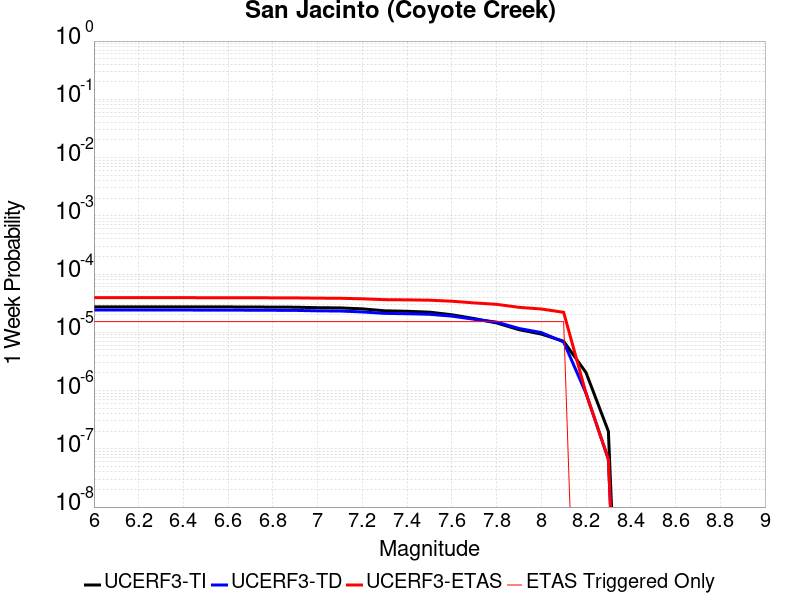 |  |  | 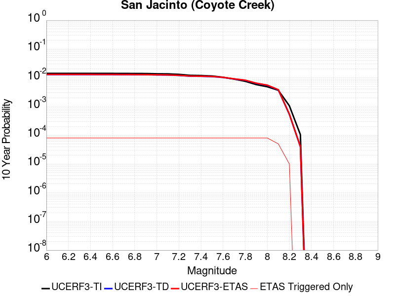 |

| Magnitude | 1 wk TI Prob | 1 wk TD Prob | 1 wk ETAS Prob | 1 wk ETAS/TD Gain | 1 wk ETAS Triggered Only | 1 mo TI Prob | 1 mo TD Prob | 1 mo ETAS Prob | 1 mo ETAS/TD Gain | 1 mo ETAS Triggered Only | 1 yr TI Prob | 1 yr TD Prob | 1 yr ETAS Prob | 1 yr ETAS/TD Gain | 1 yr ETAS Triggered Only | 10 yr TI Prob | 10 yr TD Prob | 10 yr ETAS Prob | 10 yr ETAS/TD Gain | 10 yr ETAS Triggered Only |
|-----|-----|-----|-----|-----|-----|-----|-----|-----|-----|-----|-----|-----|-----|-----|-----|-----|-----|-----|-----|-----|
| 6.0 | 2.7374346E-5 | 2.4145214E-5 | 3.9365546E-5 | 1.6303664 | 1.52207E-5 | 1.1731335E-4 | 1.034754E-4 | 1.4913277E-4 | 1.441239 | 4.5662102E-5 | 0.0014273542 | 0.0012590875 | 0.0013502967 | 1.0724407 | 9.1324204E-5 | 0.01418221 | 0.012928318 | 0.013018462 | 1.0069726 | 9.1324204E-5 |
| 6.1 | 2.7374346E-5 | 2.4145214E-5 | 3.9365546E-5 | 1.6303664 | 1.52207E-5 | 1.1731335E-4 | 1.034754E-4 | 1.4913277E-4 | 1.441239 | 4.5662102E-5 | 0.0014273542 | 0.0012590875 | 0.0013502967 | 1.0724407 | 9.1324204E-5 | 0.01418221 | 0.012928318 | 0.013018462 | 1.0069726 | 9.1324204E-5 |
| 6.2 | 2.7374346E-5 | 2.4145214E-5 | 3.9365546E-5 | 1.6303664 | 1.52207E-5 | 1.1731335E-4 | 1.034754E-4 | 1.4913277E-4 | 1.441239 | 4.5662102E-5 | 0.0014273542 | 0.0012590875 | 0.0013502967 | 1.0724407 | 9.1324204E-5 | 0.01418221 | 0.012928318 | 0.013018462 | 1.0069726 | 9.1324204E-5 |
| 6.3 | 2.7374346E-5 | 2.4145214E-5 | 3.9365546E-5 | 1.6303664 | 1.52207E-5 | 1.1731335E-4 | 1.034754E-4 | 1.4913277E-4 | 1.441239 | 4.5662102E-5 | 0.0014273542 | 0.0012590875 | 0.0013502967 | 1.0724407 | 9.1324204E-5 | 0.01418221 | 0.012928318 | 0.013018462 | 1.0069726 | 9.1324204E-5 |
| 6.4 | 2.7374346E-5 | 2.4145214E-5 | 3.9365546E-5 | 1.6303664 | 1.52207E-5 | 1.1731335E-4 | 1.034754E-4 | 1.4913277E-4 | 1.441239 | 4.5662102E-5 | 0.0014273542 | 0.0012590875 | 0.0013502967 | 1.0724407 | 9.1324204E-5 | 0.01418221 | 0.012928318 | 0.013018462 | 1.0069726 | 9.1324204E-5 |
| 6.5 | 2.7282445E-5 | 2.4031293E-5 | 3.9251627E-5 | 1.6333548 | 1.52207E-5 | 1.16919524E-4 | 1.029872E-4 | 1.486446E-4 | 1.4433308 | 4.5662102E-5 | 0.0014225657 | 0.0012531505 | 0.0013443603 | 1.0727843 | 9.1324204E-5 | 0.014134934 | 0.012869646 | 0.012959794 | 1.0070047 | 9.1324204E-5 |
| 6.6 | 2.7282445E-5 | 2.4031293E-5 | 3.9251627E-5 | 1.6333548 | 1.52207E-5 | 1.16919524E-4 | 1.029872E-4 | 1.486446E-4 | 1.4433308 | 4.5662102E-5 | 0.0014225657 | 0.0012531505 | 0.0013443603 | 1.0727843 | 9.1324204E-5 | 0.014134934 | 0.012869646 | 0.012959794 | 1.0070047 | 9.1324204E-5 |
| 6.7 | 2.7216198E-5 | 2.3956412E-5 | 3.917675E-5 | 1.6353345 | 1.52207E-5 | 1.1663563E-4 | 1.02666316E-4 | 1.4832373E-4 | 1.4447166 | 4.5662102E-5 | 0.0014191137 | 0.0012492483 | 0.0013404584 | 1.073012 | 9.1324204E-5 | 0.014100855 | 0.0128310565 | 0.012921209 | 1.0070261 | 9.1324204E-5 |
| 6.8 | 2.7078617E-5 | 2.387363E-5 | 3.9093968E-5 | 1.6375376 | 1.52207E-5 | 1.1604605E-4 | 1.0231156E-4 | 1.4796898E-4 | 1.4462588 | 4.5662102E-5 | 0.001411945 | 0.0012449342 | 0.0013361446 | 1.0732653 | 9.1324204E-5 | 0.014030075 | 0.012788199 | 0.012878356 | 1.0070499 | 9.1324204E-5 |
| 6.9 | 2.6982952E-5 | 2.3793142E-5 | 3.901348E-5 | 1.6396943 | 1.52207E-5 | 1.15636096E-4 | 1.0196664E-4 | 1.4762409E-4 | 1.4477684 | 4.5662102E-5 | 0.0014069602 | 0.0012407395 | 0.0013319503 | 1.0735134 | 9.1324204E-5 | 0.013980856 | 0.012746515 | 0.012836674 | 1.0070733 | 9.1324204E-5 |
| 7.0 | 2.6449972E-5 | 2.3370165E-5 | 3.8590508E-5 | 1.6512724 | 1.52207E-5 | 1.1335209E-4 | 1.00154015E-4 | 1.4581154E-4 | 1.4558731 | 4.5662102E-5 | 0.001379188 | 0.0012186957 | 0.0013099086 | 1.0748447 | 9.1324204E-5 | 0.0137065975 | 0.0125278765 | 0.012618057 | 1.0071983 | 9.1324204E-5 |
| 7.1 | 2.6257849E-5 | 2.3196202E-5 | 3.8416547E-5 | 1.6561569 | 1.52207E-5 | 1.1252879E-4 | 9.940852E-5 | 1.4506608E-4 | 1.4592923 | 4.5662102E-5 | 0.0013691769 | 0.0012096294 | 0.0013008431 | 1.0754063 | 9.1324204E-5 | 0.013607717 | 0.012437741 | 0.01252793 | 1.0072511 | 9.1324204E-5 |
| 7.2 | 2.5270041E-5 | 2.2390966E-5 | 3.7611324E-5 | 1.6797545 | 1.52207E-5 | 1.0829568E-4 | 9.595777E-5 | 1.4161548E-4 | 1.4758105 | 4.5662102E-5 | 0.0013177024 | 0.0011676621 | 0.0012588797 | 1.0781199 | 9.1324204E-5 | 0.013099162 | 0.012018777 | 0.012109004 | 1.0075071 | 9.1324204E-5 |
| 7.3 | 2.339701E-5 | 2.1122814E-5 | 3.6343194E-5 | 1.7205658 | 1.52207E-5 | 1.0026905E-4 | 9.0523215E-5 | 1.3618119E-4 | 1.5043786 | 4.5662102E-5 | 0.001220092 | 0.0011015651 | 0.0011927886 | 1.0828127 | 9.1324204E-5 | 0.012134149 | 0.011357696 | 0.011447983 | 1.0079494 | 9.1324204E-5 |
| 7.4 | 2.296333E-5 | 2.0853171E-5 | 3.6073554E-5 | 1.7298834 | 1.52207E-5 | 9.841056E-5 | 8.936768E-5 | 1.350257E-4 | 1.5109009 | 4.5662102E-5 | 0.0011974899 | 0.0010875105 | 0.0011787354 | 1.0838841 | 9.1324204E-5 | 0.011910575 | 0.01121681 | 0.011307109 | 1.0080504 | 9.1324204E-5 |
| 7.5 | 2.2188895E-5 | 2.0376096E-5 | 3.5596484E-5 | 1.7469728 | 1.52207E-5 | 9.50918E-5 | 8.732321E-5 | 1.3298132E-4 | 1.5228634 | 4.5662102E-5 | 0.0011571277 | 0.0010626436 | 0.0011538707 | 1.0858493 | 9.1324204E-5 | 0.011511209 | 0.010966429 | 0.011056751 | 1.0082363 | 9.1324204E-5 |
| 7.6 | 2.0013189E-5 | 1.8962366E-5 | 3.4182776E-5 | 1.8026642 | 1.52207E-5 | 8.5767984E-5 | 8.1264756E-5 | 1.2692314E-4 | 1.5618473 | 4.5662102E-5 | 0.001043725 | 9.889511E-4 | 0.0010801851 | 1.0922532 | 9.1324204E-5 | 0.010388365 | 0.010224434 | 0.010314824 | 1.0088407 | 9.1324204E-5 |
| 7.7 | 1.7230794E-5 | 1.674371E-5 | 3.1964155E-5 | 1.9090247 | 1.52207E-5 | 7.384417E-5 | 7.175679E-5 | 1.1741561E-4 | 1.6362997 | 4.5662102E-5 | 8.986819E-4 | 8.7328954E-4 | 9.64534E-4 | 1.1044836 | 9.1324204E-5 | 0.008950562 | 0.009062956 | 0.009153453 | 1.0099853 | 9.1324204E-5 |
| 7.8 | 1.4478809E-5 | 1.4990978E-5 | 3.021145E-5 | 2.0153089 | 1.52207E-5 | 6.205057E-5 | 6.424547E-5 | 1.09904635E-4 | 1.7106986 | 4.5662102E-5 | 7.552038E-4 | 7.819085E-4 | 8.7316136E-4 | 1.1167052 | 9.1324204E-5 | 0.0075264242 | 0.008141387 | 0.008231968 | 1.0111259 | 9.1324204E-5 |
| 7.9 | 1.1114467E-5 | 1.1645102E-5 | 2.6865626E-5 | 2.307032 | 1.52207E-5 | 4.7632562E-5 | 4.990663E-5 | 9.556645E-5 | 1.914905 | 4.5662102E-5 | 5.797721E-4 | 6.074444E-4 | 6.987131E-4 | 1.1502503 | 9.1324204E-5 | 0.0057826187 | 0.0063803247 | 0.0064710663 | 1.014222 | 9.1324204E-5 |
| 8.0 | 9.327402E-6 | 9.899186E-6 | 2.5119736E-5 | 2.5375557 | 1.52207E-5 | 3.9973966E-5 | 4.2424395E-5 | 8.808456E-5 | 2.0762713 | 4.5662102E-5 | 4.8657437E-4 | 5.1639514E-4 | 6.076722E-4 | 1.1767582 | 9.1324204E-5 | 0.0048551033 | 0.0054499684 | 0.005540795 | 1.0166655 | 9.1324204E-5 |
| 8.1 | 7.0235833E-6 | 6.827495E-6 | 2.204809E-5 | 3.229309 | 1.52207E-5 | 3.0100724E-5 | 2.9260367E-5 | 7.492113E-5 | 2.5604987 | 4.5662102E-5 | 3.664147E-4 | 3.5618723E-4 | 4.1704834E-4 | 1.1708683 | 6.08828E-5 | 0.003658111 | 0.0037876023 | 0.0038482544 | 1.0160134 | 6.08828E-5 |
| 8.2 | 2.0358202E-6 | 8.994527E-7 | 8.994527E-7 | 1.0 | 0.0 | 8.724915E-6 | 3.854792E-6 | 3.854792E-6 | 1.0 | 0.0 | 1.06220665E-4 | 4.69311E-5 | 6.2151084E-5 | 1.3243049 | 1.52207E-5 | 0.001061699 | 5.3254166E-4 | 5.477542E-4 | 1.028566 | 1.52207E-5 |
| 8.3 | 2.0051264E-7 | 6.617272E-8 | 6.617272E-8 | 1.0 | 0.0 | 8.5933965E-7 | 2.8359733E-7 | 2.8359733E-7 | 1.0 | 0.0 | 1.046241E-5 | 3.4527925E-6 | 3.4527925E-6 | 1.0 | 0.0 | 1.0461917E-4 | 4.01389E-5 | 4.01389E-5 | 1.0 | 0.0 |

## Elysian Park (Upper)
*[(top)](#table-of-contents)*

| 1 Week | 1 Month | 1 Year | 10 Year |
|-----|-----|-----|-----|
| 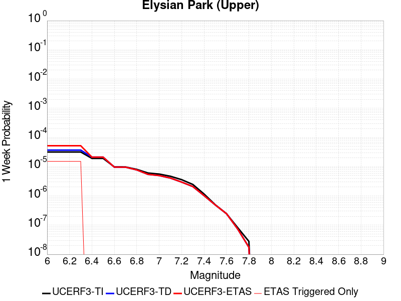 | 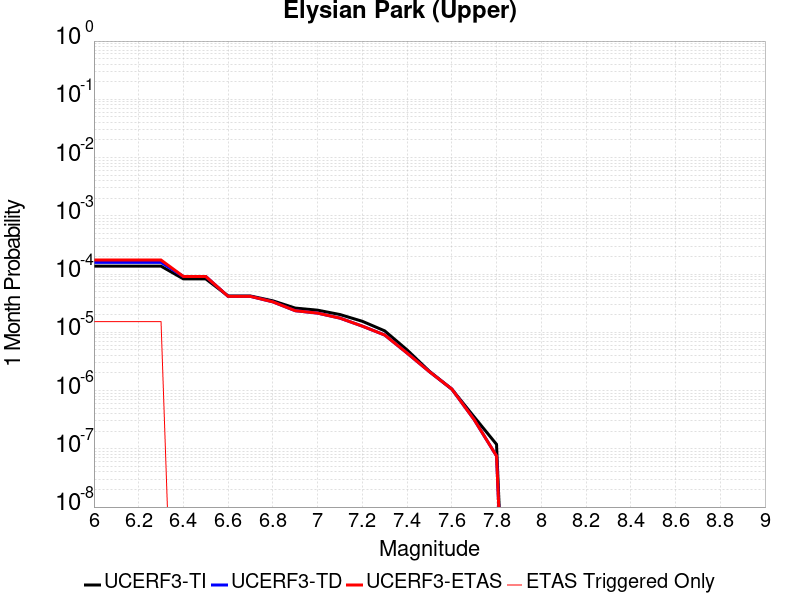 | 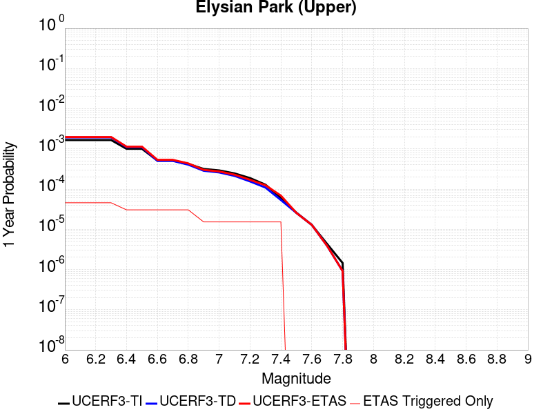 | 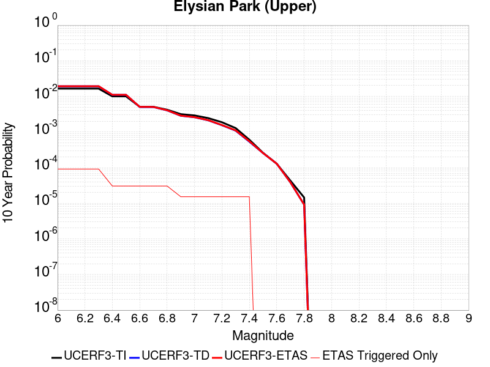 |

| Magnitude | 1 wk TI Prob | 1 wk TD Prob | 1 wk ETAS Prob | 1 wk ETAS/TD Gain | 1 wk ETAS Triggered Only | 1 mo TI Prob | 1 mo TD Prob | 1 mo ETAS Prob | 1 mo ETAS/TD Gain | 1 mo ETAS Triggered Only | 1 yr TI Prob | 1 yr TD Prob | 1 yr ETAS Prob | 1 yr ETAS/TD Gain | 1 yr ETAS Triggered Only | 10 yr TI Prob | 10 yr TD Prob | 10 yr ETAS Prob | 10 yr ETAS/TD Gain | 10 yr ETAS Triggered Only |
|-----|-----|-----|-----|-----|-----|-----|-----|-----|-----|-----|-----|-----|-----|-----|-----|-----|-----|-----|-----|-----|
| 6.0 | 3.1876025E-5 | 3.7035516E-5 | 5.225565E-5 | 1.4109606 | 1.52207E-5 | 1.3660437E-4 | 1.587167E-4 | 1.73935E-4 | 1.0958834 | 1.52207E-5 | 0.0016618895 | 0.0019311075 | 0.0019766814 | 1.0235999 | 4.5662102E-5 | 0.016495159 | 0.019189782 | 0.019279355 | 1.0046676 | 9.1324204E-5 |
| 6.1 | 3.1876025E-5 | 3.7035516E-5 | 5.225565E-5 | 1.4109606 | 1.52207E-5 | 1.3660437E-4 | 1.587167E-4 | 1.73935E-4 | 1.0958834 | 1.52207E-5 | 0.0016618895 | 0.0019311075 | 0.0019766814 | 1.0235999 | 4.5662102E-5 | 0.016495159 | 0.019189782 | 0.019279355 | 1.0046676 | 9.1324204E-5 |
| 6.2 | 3.1876025E-5 | 3.7035516E-5 | 5.225565E-5 | 1.4109606 | 1.52207E-5 | 1.3660437E-4 | 1.587167E-4 | 1.73935E-4 | 1.0958834 | 1.52207E-5 | 0.0016618895 | 0.0019311075 | 0.0019766814 | 1.0235999 | 4.5662102E-5 | 0.016495159 | 0.019189782 | 0.019279355 | 1.0046676 | 9.1324204E-5 |
| 6.3 | 3.1876025E-5 | 3.7035516E-5 | 5.225565E-5 | 1.4109606 | 1.52207E-5 | 1.3660437E-4 | 1.587167E-4 | 1.73935E-4 | 1.0958834 | 1.52207E-5 | 0.0016618895 | 0.0019311075 | 0.0019766814 | 1.0235999 | 4.5662102E-5 | 0.016495159 | 0.019189782 | 0.019279355 | 1.0046676 | 9.1324204E-5 |
| 6.4 | 1.9273462E-5 | 2.1202266E-5 | 2.1202266E-5 | 1.0 | 0.0 | 8.259794E-5 | 9.086466E-5 | 9.086466E-5 | 1.0 | 0.0 | 0.001005166 | 0.0011058892 | 0.001136297 | 1.0274962 | 3.04414E-5 | 0.010006315 | 0.011020724 | 0.01105083 | 1.0027318 | 3.04414E-5 |
| 6.5 | 1.9273462E-5 | 2.1202266E-5 | 2.1202266E-5 | 1.0 | 0.0 | 8.259794E-5 | 9.086466E-5 | 9.086466E-5 | 1.0 | 0.0 | 0.001005166 | 0.0011058892 | 0.001136297 | 1.0274962 | 3.04414E-5 | 0.010006315 | 0.011020724 | 0.01105083 | 1.0027318 | 3.04414E-5 |
| 6.6 | 9.813258E-6 | 9.665599E-6 | 9.665599E-6 | 1.0 | 0.0 | 4.205614E-5 | 4.1423376E-5 | 4.1423376E-5 | 1.0 | 0.0 | 5.119132E-4 | 5.0422014E-4 | 5.346462E-4 | 1.0603428 | 3.04414E-5 | 0.005107356 | 0.0050314846 | 0.005061773 | 1.0060197 | 3.04414E-5 |
| 6.7 | 9.801478E-6 | 9.653168E-6 | 9.653168E-6 | 1.0 | 0.0 | 4.2005657E-5 | 4.1370105E-5 | 4.1370105E-5 | 1.0 | 0.0 | 5.112989E-4 | 5.035719E-4 | 5.3399795E-4 | 1.0604205 | 3.04414E-5 | 0.0051012407 | 0.0050250315 | 0.0050553195 | 1.0060275 | 3.04414E-5 |
| 6.8 | 8.102489E-6 | 7.773004E-6 | 7.773004E-6 | 1.0 | 0.0 | 3.4724493E-5 | 3.3312477E-5 | 3.3312477E-5 | 1.0 | 0.0 | 4.2268867E-4 | 4.055089E-4 | 4.3593795E-4 | 1.0750391 | 3.04414E-5 | 0.004218856 | 0.0040481836 | 0.004078502 | 1.0074893 | 3.04414E-5 |
| 6.9 | 6.08275E-6 | 5.4814514E-6 | 5.4814514E-6 | 1.0 | 0.0 | 2.6068668E-5 | 2.3491726E-5 | 2.3491726E-5 | 1.0 | 0.0 | 3.173398E-4 | 2.85975E-4 | 3.0119135E-4 | 1.0532087 | 1.52207E-5 | 0.0031688702 | 0.0028561477 | 0.002871325 | 1.0053139 | 1.52207E-5 |
| 7.0 | 5.5995934E-6 | 4.98278E-6 | 4.98278E-6 | 1.0 | 0.0 | 2.3998036E-5 | 2.13546E-5 | 2.13546E-5 | 1.0 | 0.0 | 2.9213692E-4 | 2.599619E-4 | 2.7517867E-4 | 1.0585345 | 1.52207E-5 | 0.0029175316 | 0.0025966454 | 0.0026118266 | 1.0058465 | 1.52207E-5 |
| 7.1 | 4.709881E-6 | 4.0874015E-6 | 4.0874015E-6 | 1.0 | 0.0 | 2.0185047E-5 | 1.7517319E-5 | 1.7517319E-5 | 1.0 | 0.0 | 2.4572524E-4 | 2.132529E-4 | 2.2847035E-4 | 1.0713587 | 1.52207E-5 | 0.002454537 | 0.002130524 | 0.0021457123 | 1.0071288 | 1.52207E-5 |
| 7.2 | 3.6063436E-6 | 2.9779544E-6 | 2.9779544E-6 | 1.0 | 0.0 | 1.5455667E-5 | 1.27626E-5 | 1.27626E-5 | 1.0 | 0.0 | 1.881565E-4 | 1.5537368E-4 | 1.7059201E-4 | 1.0979466 | 1.52207E-5 | 0.0018799726 | 0.0015526618 | 0.0015678589 | 1.0097878 | 1.52207E-5 |
| 7.3 | 2.471135E-6 | 2.0954615E-6 | 2.0954615E-6 | 1.0 | 0.0 | 1.0590536E-5 | 8.980519E-6 | 8.980519E-6 | 1.0 | 0.0 | 1.2893214E-4 | 1.093324E-4 | 1.2455144E-4 | 1.1391997 | 1.52207E-5 | 0.0012885736 | 0.0010927934 | 0.0011079975 | 1.013913 | 1.52207E-5 |
| 7.4 | 1.163943E-6 | 1.0275091E-6 | 1.0275091E-6 | 1.0 | 0.0 | 4.988318E-6 | 4.4036033E-6 | 4.4036033E-6 | 1.0 | 0.0 | 6.0731076E-5 | 5.3612584E-5 | 6.8832465E-5 | 1.2838864 | 1.52207E-5 | 6.071448E-4 | 5.359995E-4 | 5.51212E-4 | 1.0283816 | 1.52207E-5 |
| 7.5 | 4.99459E-7 | 4.917604E-7 | 4.917604E-7 | 1.0 | 0.0 | 2.140537E-6 | 2.1075427E-6 | 2.1075427E-6 | 1.0 | 0.0 | 2.6060725E-5 | 2.5659048E-5 | 2.5659048E-5 | 1.0 | 0.0 | 2.605767E-4 | 2.5656243E-4 | 2.5656243E-4 | 1.0 | 0.0 |
| 7.6 | 2.4667852E-7 | 2.4778336E-7 | 2.4778336E-7 | 1.0 | 0.0 | 1.0571932E-6 | 1.0619283E-6 | 1.0619283E-6 | 1.0 | 0.0 | 1.2871251E-5 | 1.2928905E-5 | 1.2928905E-5 | 1.0 | 0.0 | 1.2870505E-4 | 1.2928189E-4 | 1.2928189E-4 | 1.0 | 0.0 |
| 7.7 | 8.2312795E-8 | 7.3864456E-8 | 7.3864456E-8 | 1.0 | 0.0 | 3.527691E-7 | 3.165619E-7 | 3.165619E-7 | 1.0 | 0.0 | 4.294955E-6 | 3.8541357E-6 | 3.8541357E-6 | 1.0 | 0.0 | 4.2948723E-5 | 3.8540802E-5 | 3.8540802E-5 | 1.0 | 0.0 |
| 7.8 | 2.7819295E-8 | 1.7566023E-8 | 1.7566023E-8 | 1.0 | 0.0 | 1.1922555E-7 | 7.5282955E-8 | 7.5282955E-8 | 1.0 | 0.0 | 1.45157E-6 | 9.165697E-7 | 9.165697E-7 | 1.0 | 0.0 | 1.45156055E-5 | 9.165675E-6 | 9.165675E-6 | 1.0 | 0.0 |

## Rose Canyon
*[(top)](#table-of-contents)*

| 1 Week | 1 Month | 1 Year | 10 Year |
|-----|-----|-----|-----|
| 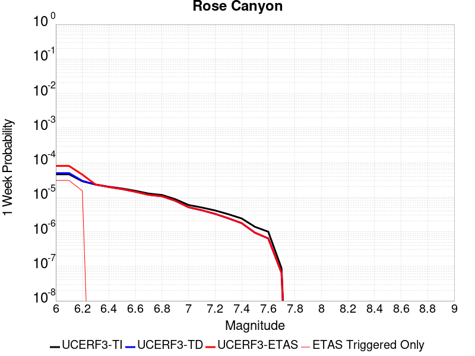 | 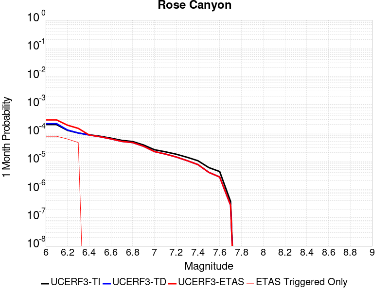 | 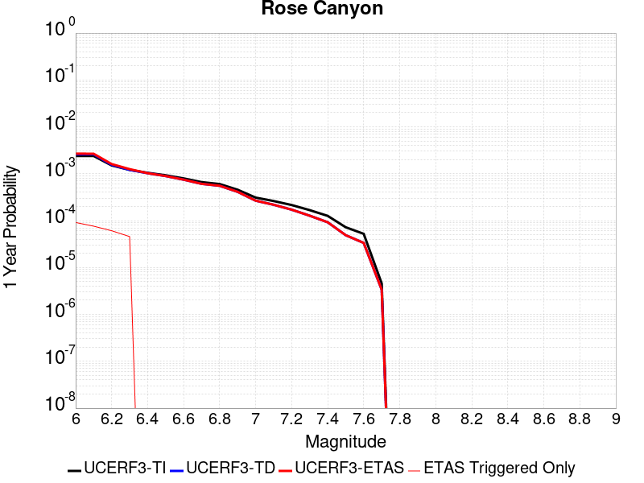 | 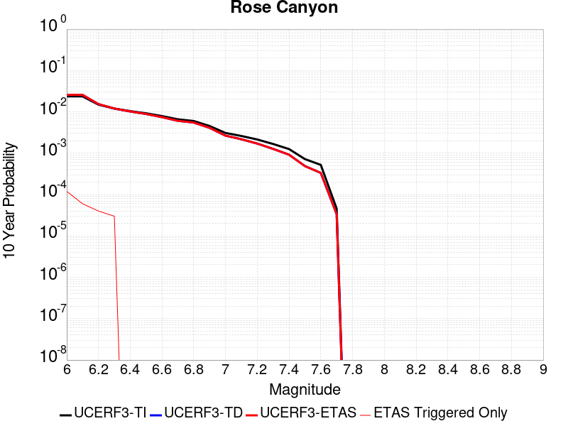 |

| Magnitude | 1 wk TI Prob | 1 wk TD Prob | 1 wk ETAS Prob | 1 wk ETAS/TD Gain | 1 wk ETAS Triggered Only | 1 mo TI Prob | 1 mo TD Prob | 1 mo ETAS Prob | 1 mo ETAS/TD Gain | 1 mo ETAS Triggered Only | 1 yr TI Prob | 1 yr TD Prob | 1 yr ETAS Prob | 1 yr ETAS/TD Gain | 1 yr ETAS Triggered Only | 10 yr TI Prob | 10 yr TD Prob | 10 yr ETAS Prob | 10 yr ETAS/TD Gain | 10 yr ETAS Triggered Only |
|-----|-----|-----|-----|-----|-----|-----|-----|-----|-----|-----|-----|-----|-----|-----|-----|-----|-----|-----|-----|-----|
| 6.0 | 4.5923203E-5 | 4.9714225E-5 | 8.015411E-5 | 1.6122973 | 3.04414E-5 | 1.9679888E-4 | 2.1304491E-4 | 2.891322E-4 | 1.357142 | 7.6103504E-5 | 0.0023933933 | 0.0025909345 | 0.002682022 | 1.0351562 | 9.1324204E-5 | 0.023677798 | 0.02563999 | 0.025728973 | 1.0034704 | 9.1324204E-5 |
| 6.1 | 4.5923203E-5 | 4.9714225E-5 | 8.015411E-5 | 1.6122973 | 3.04414E-5 | 1.9679888E-4 | 2.1304491E-4 | 2.891322E-4 | 1.357142 | 7.6103504E-5 | 0.0023933933 | 0.0025909345 | 0.0026668408 | 1.0292969 | 7.6103504E-5 | 0.023677798 | 0.02563999 | 0.025714142 | 1.002892 | 7.6103504E-5 |
| 6.2 | 2.8844734E-5 | 2.9668723E-5 | 4.488897E-5 | 1.5130066 | 1.52207E-5 | 1.2361443E-4 | 1.2714567E-4 | 1.8802073E-4 | 1.478782 | 6.08828E-5 | 0.0015039665 | 0.0015468939 | 0.0016076824 | 1.0392972 | 6.08828E-5 | 0.0149382865 | 0.015374276 | 0.015434223 | 1.0038992 | 6.08828E-5 |
| 6.3 | 2.3171577E-5 | 2.3161238E-5 | 2.3161238E-5 | 1.0 | 0.0 | 9.9302975E-5 | 9.9258745E-5 | 1.4491631E-4 | 1.4599854 | 4.5662102E-5 | 0.0012083431 | 0.0012078186 | 0.0012534256 | 1.0377598 | 4.5662102E-5 | 0.012017938 | 0.012022437 | 0.01206755 | 1.0037525 | 4.5662102E-5 |
| 6.4 | 2.0066604E-5 | 1.9667024E-5 | 1.9667024E-5 | 1.0 | 0.0 | 8.599689E-5 | 8.4284584E-5 | 8.4284584E-5 | 1.0 | 0.0 | 0.0010465092 | 0.0010256917 | 0.0010256917 | 1.0 | 0.0 | 0.010415946 | 0.010217559 | 0.010217559 | 1.0 | 0.0 |
| 6.5 | 1.776989E-5 | 1.7113807E-5 | 1.7113807E-5 | 1.0 | 0.0 | 7.615444E-5 | 7.334287E-5 | 7.334287E-5 | 1.0 | 0.0 | 9.267859E-4 | 8.925905E-4 | 8.925905E-4 | 1.0 | 0.0 | 0.009229303 | 0.008896211 | 0.008896211 | 1.0 | 0.0 |
| 6.6 | 1.5227364E-5 | 1.433926E-5 | 1.433926E-5 | 1.0 | 0.0 | 6.52585E-5 | 6.1452556E-5 | 6.1452556E-5 | 1.0 | 0.0 | 7.942326E-4 | 7.479332E-4 | 7.479332E-4 | 1.0 | 0.0 | 0.007914 | 0.007458359 | 0.007458359 | 1.0 | 0.0 |
| 6.7 | 1.2703898E-5 | 1.1673274E-5 | 1.1673274E-5 | 1.0 | 0.0 | 5.4444143E-5 | 5.0027378E-5 | 5.0027378E-5 | 1.0 | 0.0 | 6.626558E-4 | 6.089174E-4 | 6.089174E-4 | 1.0 | 0.0 | 0.006606833 | 0.0060750856 | 0.0060750856 | 1.0 | 0.0 |
| 6.8 | 1.1554917E-5 | 1.0609337E-5 | 1.0609337E-5 | 1.0 | 0.0 | 4.9520135E-5 | 4.546782E-5 | 4.546782E-5 | 1.0 | 0.0 | 6.0274085E-4 | 5.5343413E-4 | 5.5343413E-4 | 1.0 | 0.0 | 0.0060110865 | 0.0055225673 | 0.0055225673 | 1.0 | 0.0 |
| 6.9 | 8.732078E-6 | 7.881357E-6 | 7.881357E-6 | 1.0 | 0.0 | 3.7422655E-5 | 3.3776825E-5 | 3.3776825E-5 | 1.0 | 0.0 | 4.5552556E-4 | 4.111582E-4 | 4.111582E-4 | 1.0 | 0.0 | 0.0045459294 | 0.0041048084 | 0.0041048084 | 1.0 | 0.0 |
| 7.0 | 5.9337494E-6 | 5.1074853E-6 | 5.1074853E-6 | 1.0 | 0.0 | 2.5430107E-5 | 2.188904E-5 | 2.188904E-5 | 1.0 | 0.0 | 3.0956755E-4 | 2.664666E-4 | 2.664666E-4 | 1.0 | 0.0 | 0.0030913667 | 0.0026614866 | 0.0026614866 | 1.0 | 0.0 |
| 7.1 | 5.013409E-6 | 4.1773833E-6 | 4.1773833E-6 | 1.0 | 0.0 | 2.1485863E-5 | 1.7902948E-5 | 1.7902948E-5 | 1.0 | 0.0 | 2.6155898E-4 | 2.179467E-4 | 2.179467E-4 | 1.0 | 0.0 | 0.0026125133 | 0.0021773411 | 0.0021773411 | 1.0 | 0.0 |
| 7.2 | 4.120763E-6 | 3.2821383E-6 | 3.2821383E-6 | 1.0 | 0.0 | 1.7660293E-5 | 1.4066231E-5 | 1.4066231E-5 | 1.0 | 0.0 | 2.1499286E-4 | 1.7124301E-4 | 1.7124301E-4 | 1.0 | 0.0 | 0.0021478499 | 0.00171112 | 0.00171112 | 1.0 | 0.0 |
| 7.3 | 3.2081239E-6 | 2.4405372E-6 | 2.4405372E-6 | 1.0 | 0.0 | 1.374903E-5 | 1.0459404E-5 | 1.0459404E-5 | 1.0 | 0.0 | 1.6738157E-4 | 1.2733586E-4 | 1.2733586E-4 | 1.0 | 0.0 | 0.0016725556 | 0.001272636 | 0.001272636 | 1.0 | 0.0 |
| 7.4 | 2.4194755E-6 | 1.7680634E-6 | 1.7680634E-6 | 1.0 | 0.0 | 1.0369139E-5 | 7.577393E-6 | 7.577393E-6 | 1.0 | 0.0 | 1.2623696E-4 | 9.2250906E-5 | 9.2250906E-5 | 1.0 | 0.0 | 0.0012616527 | 9.2213147E-4 | 9.2213147E-4 | 1.0 | 0.0 |
| 7.5 | 1.3842889E-6 | 9.3786275E-7 | 9.3786275E-7 | 1.0 | 0.0 | 5.9326535E-6 | 4.019406E-6 | 4.019406E-6 | 1.0 | 0.0 | 7.222766E-5 | 4.8935202E-5 | 4.8935202E-5 | 1.0 | 0.0 | 7.220419E-4 | 4.892478E-4 | 4.892478E-4 | 1.0 | 0.0 |
| 7.6 | 1.0021575E-6 | 6.411463E-7 | 6.411463E-7 | 1.0 | 0.0 | 4.2949537E-6 | 2.7477672E-6 | 2.7477672E-6 | 1.0 | 0.0 | 5.2289808E-5 | 3.3453573E-5 | 3.3453573E-5 | 1.0 | 0.0 | 5.2277505E-4 | 3.344875E-4 | 3.344875E-4 | 1.0 | 0.0 |
| 7.7 | 8.7620116E-8 | 6.4492404E-8 | 6.4492404E-8 | 1.0 | 0.0 | 3.7551473E-7 | 2.76396E-7 | 2.76396E-7 | 1.0 | 0.0 | 4.5718825E-6 | 3.3651165E-6 | 3.3651165E-6 | 1.0 | 0.0 | 4.5717883E-5 | 3.3650686E-5 | 3.3650686E-5 | 1.0 | 0.0 |

## Elmore Ranch
*[(top)](#table-of-contents)*

| 1 Week | 1 Month | 1 Year | 10 Year |
|-----|-----|-----|-----|
| 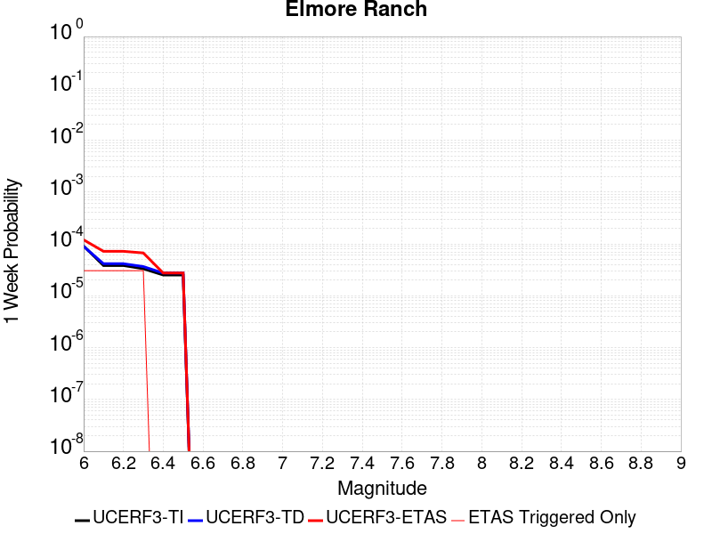 | 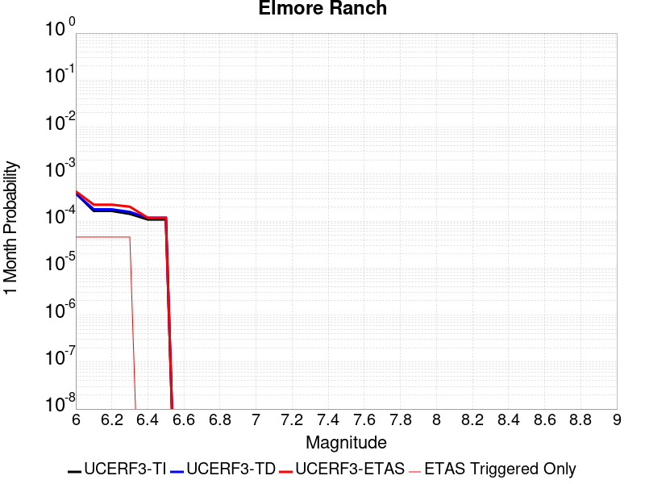 | 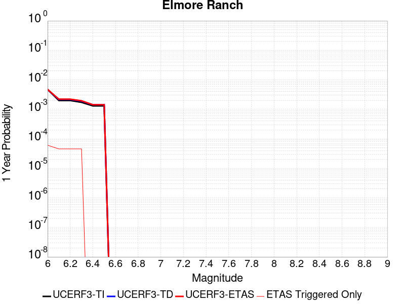 | 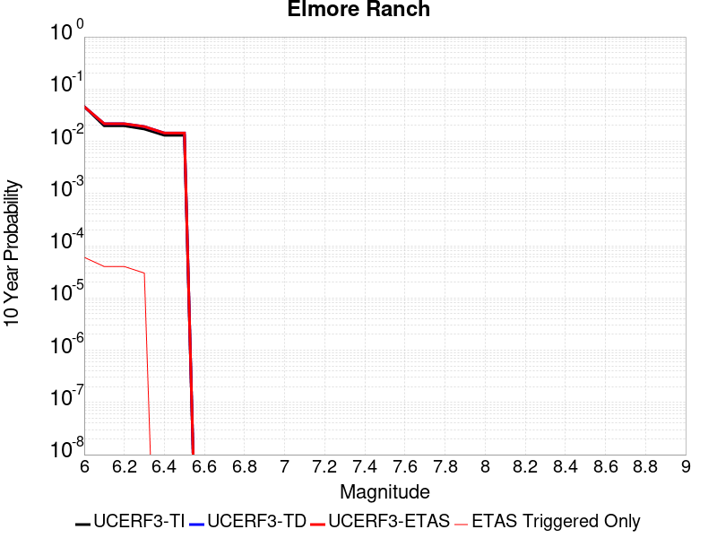 |

| Magnitude | 1 wk TI Prob | 1 wk TD Prob | 1 wk ETAS Prob | 1 wk ETAS/TD Gain | 1 wk ETAS Triggered Only | 1 mo TI Prob | 1 mo TD Prob | 1 mo ETAS Prob | 1 mo ETAS/TD Gain | 1 mo ETAS Triggered Only | 1 yr TI Prob | 1 yr TD Prob | 1 yr ETAS Prob | 1 yr ETAS/TD Gain | 1 yr ETAS Triggered Only | 10 yr TI Prob | 10 yr TD Prob | 10 yr ETAS Prob | 10 yr ETAS/TD Gain | 10 yr ETAS Triggered Only |
|-----|-----|-----|-----|-----|-----|-----|-----|-----|-----|-----|-----|-----|-----|-----|-----|-----|-----|-----|-----|-----|
| 6.0 | 9.102099E-5 | 8.952015E-5 | 1.1995882E-4 | 1.3400204 | 3.04414E-5 | 3.9003167E-4 | 3.8361453E-4 | 4.2925912E-4 | 1.1189855 | 4.5662102E-5 | 0.0047383 | 0.004662009 | 0.004722608 | 1.0129985 | 6.08828E-5 | 0.046385348 | 0.045870975 | 0.045943588 | 1.001583 | 7.6103504E-5 |
| 6.1 | 3.8306698E-5 | 4.1498504E-5 | 7.193864E-5 | 1.7335237 | 3.04414E-5 | 1.6416123E-4 | 1.7784268E-4 | 2.2349667E-4 | 1.2567099 | 4.5662102E-5 | 0.0019968306 | 0.0021631396 | 0.002208703 | 1.0210636 | 4.5662102E-5 | 0.019789828 | 0.021628205 | 0.021672878 | 1.0020655 | 4.5662102E-5 |
| 6.2 | 3.8306698E-5 | 4.1498504E-5 | 7.193864E-5 | 1.7335237 | 3.04414E-5 | 1.6416123E-4 | 1.7784268E-4 | 2.2349667E-4 | 1.2567099 | 4.5662102E-5 | 0.0019968306 | 0.0021631396 | 0.002208703 | 1.0210636 | 4.5662102E-5 | 0.019789828 | 0.021628205 | 0.021672878 | 1.0020655 | 4.5662102E-5 |
| 6.3 | 3.3197924E-5 | 3.6554302E-5 | 6.699459E-5 | 1.8327416 | 3.04414E-5 | 1.4226905E-4 | 1.5665586E-4 | 2.0231081E-4 | 1.2914346 | 4.5662102E-5 | 0.0017307495 | 0.001905917 | 0.001951492 | 1.0239124 | 4.5662102E-5 | 0.017173318 | 0.01908996 | 0.01913475 | 1.0023463 | 4.5662102E-5 |
| 6.4 | 2.5148964E-5 | 2.7420487E-5 | 2.7420487E-5 | 1.0 | 0.0 | 1.0777682E-4 | 1.17514726E-4 | 1.17514726E-4 | 1.0 | 0.0 | 0.0013113929 | 0.0014304507 | 0.0014304507 | 1.0 | 0.0 | 0.01303681 | 0.014387194 | 0.014387194 | 1.0 | 0.0 |
| 6.5 | 2.5148964E-5 | 2.7420487E-5 | 2.7420487E-5 | 1.0 | 0.0 | 1.0777682E-4 | 1.17514726E-4 | 1.17514726E-4 | 1.0 | 0.0 | 0.0013113929 | 0.0014304507 | 0.0014304507 | 1.0 | 0.0 | 0.01303681 | 0.014387194 | 0.014387194 | 1.0 | 0.0 |

## Pine Mtn
*[(top)](#table-of-contents)*

| 1 Week | 1 Month | 1 Year | 10 Year |
|-----|-----|-----|-----|
| 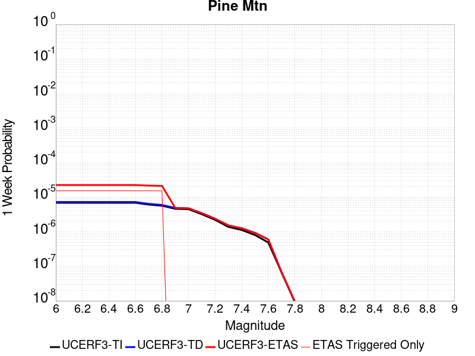 | 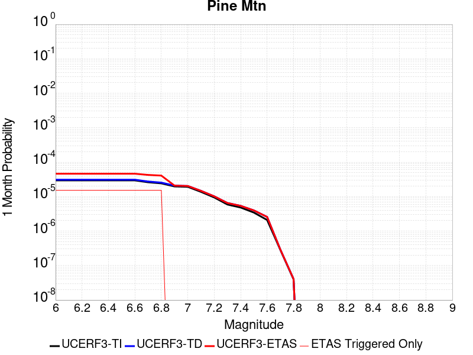 | 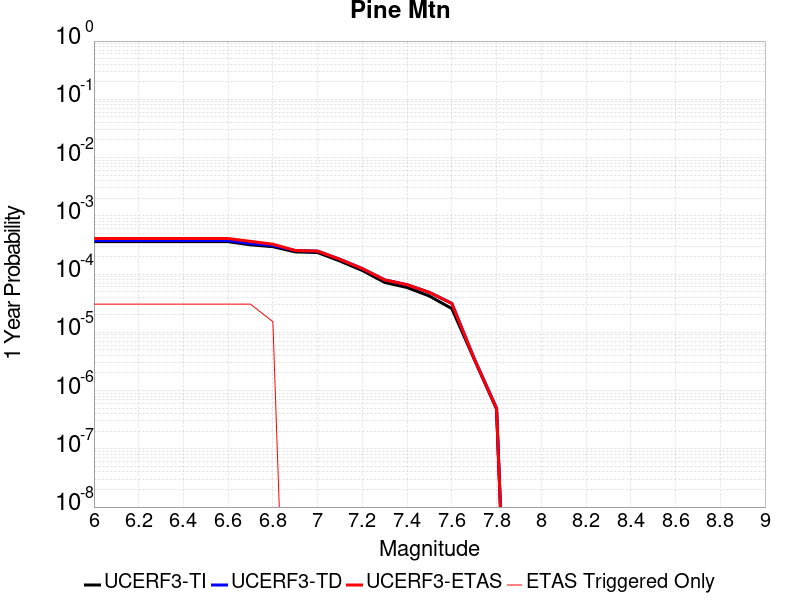 | 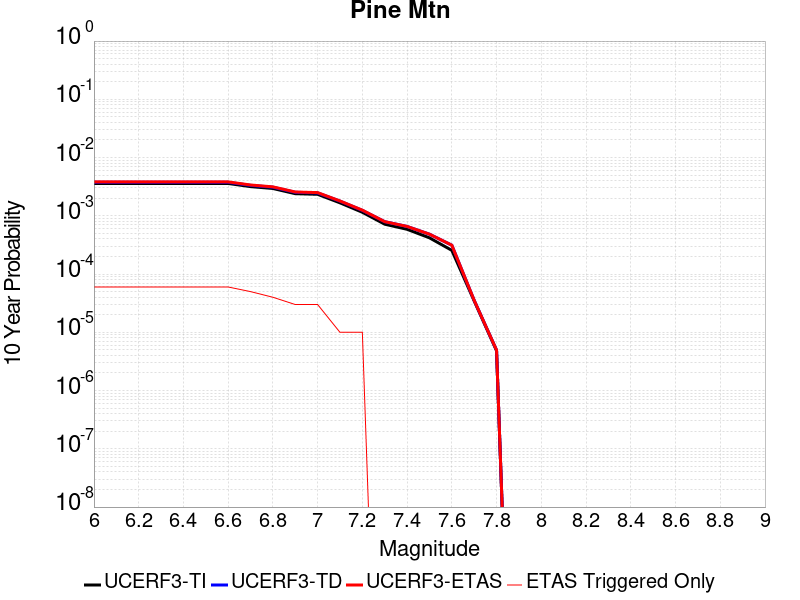 |

| Magnitude | 1 wk TI Prob | 1 wk TD Prob | 1 wk ETAS Prob | 1 wk ETAS/TD Gain | 1 wk ETAS Triggered Only | 1 mo TI Prob | 1 mo TD Prob | 1 mo ETAS Prob | 1 mo ETAS/TD Gain | 1 mo ETAS Triggered Only | 1 yr TI Prob | 1 yr TD Prob | 1 yr ETAS Prob | 1 yr ETAS/TD Gain | 1 yr ETAS Triggered Only | 10 yr TI Prob | 10 yr TD Prob | 10 yr ETAS Prob | 10 yr ETAS/TD Gain | 10 yr ETAS Triggered Only |
|-----|-----|-----|-----|-----|-----|-----|-----|-----|-----|-----|-----|-----|-----|-----|-----|-----|-----|-----|-----|-----|
| 6.0 | 6.894797E-6 | 7.225461E-6 | 2.2446051E-5 | 3.1065216 | 1.52207E-5 | 2.9548795E-5 | 3.096591E-5 | 4.6186142E-5 | 1.4915156 | 1.52207E-5 | 3.596972E-4 | 3.7694772E-4 | 4.0737767E-4 | 1.0807272 | 3.04414E-5 | 0.0035911554 | 0.003763381 | 0.0038240347 | 1.0161169 | 6.08828E-5 |
| 6.1 | 6.894797E-6 | 7.225461E-6 | 2.2446051E-5 | 3.1065216 | 1.52207E-5 | 2.9548795E-5 | 3.096591E-5 | 4.6186142E-5 | 1.4915156 | 1.52207E-5 | 3.596972E-4 | 3.7694772E-4 | 4.0737767E-4 | 1.0807272 | 3.04414E-5 | 0.0035911554 | 0.003763381 | 0.0038240347 | 1.0161169 | 6.08828E-5 |
| 6.2 | 6.894797E-6 | 7.225461E-6 | 2.2446051E-5 | 3.1065216 | 1.52207E-5 | 2.9548795E-5 | 3.096591E-5 | 4.6186142E-5 | 1.4915156 | 1.52207E-5 | 3.596972E-4 | 3.7694772E-4 | 4.0737767E-4 | 1.0807272 | 3.04414E-5 | 0.0035911554 | 0.003763381 | 0.0038240347 | 1.0161169 | 6.08828E-5 |
| 6.3 | 6.894797E-6 | 7.225461E-6 | 2.2446051E-5 | 3.1065216 | 1.52207E-5 | 2.9548795E-5 | 3.096591E-5 | 4.6186142E-5 | 1.4915156 | 1.52207E-5 | 3.596972E-4 | 3.7694772E-4 | 4.0737767E-4 | 1.0807272 | 3.04414E-5 | 0.0035911554 | 0.003763381 | 0.0038240347 | 1.0161169 | 6.08828E-5 |
| 6.4 | 6.894797E-6 | 7.225461E-6 | 2.2446051E-5 | 3.1065216 | 1.52207E-5 | 2.9548795E-5 | 3.096591E-5 | 4.6186142E-5 | 1.4915156 | 1.52207E-5 | 3.596972E-4 | 3.7694772E-4 | 4.0737767E-4 | 1.0807272 | 3.04414E-5 | 0.0035911554 | 0.003763381 | 0.0038240347 | 1.0161169 | 6.08828E-5 |
| 6.5 | 6.894797E-6 | 7.225461E-6 | 2.2446051E-5 | 3.1065216 | 1.52207E-5 | 2.9548795E-5 | 3.096591E-5 | 4.6186142E-5 | 1.4915156 | 1.52207E-5 | 3.596972E-4 | 3.7694772E-4 | 4.0737767E-4 | 1.0807272 | 3.04414E-5 | 0.0035911554 | 0.003763381 | 0.0038240347 | 1.0161169 | 6.08828E-5 |
| 6.6 | 6.894797E-6 | 7.225461E-6 | 2.2446051E-5 | 3.1065216 | 1.52207E-5 | 2.9548795E-5 | 3.096591E-5 | 4.6186142E-5 | 1.4915156 | 1.52207E-5 | 3.596972E-4 | 3.7694772E-4 | 4.0737767E-4 | 1.0807272 | 3.04414E-5 | 0.0035911554 | 0.003763381 | 0.0038240347 | 1.0161169 | 6.08828E-5 |
| 6.7 | 6.0867933E-6 | 6.3971133E-6 | 2.1617716E-5 | 3.3792925 | 1.52207E-5 | 2.6085996E-5 | 2.7415923E-5 | 4.2636206E-5 | 1.5551622 | 1.52207E-5 | 3.1755073E-4 | 3.3373994E-4 | 3.641712E-4 | 1.0911825 | 3.04414E-5 | 0.0031709734 | 0.0033326065 | 0.0033781163 | 1.0136559 | 4.5662102E-5 |
| 6.8 | 5.6530425E-6 | 5.9505956E-6 | 2.1171205E-5 | 3.5578296 | 1.52207E-5 | 2.42271E-5 | 2.5502315E-5 | 4.0722625E-5 | 1.5968208 | 1.52207E-5 | 2.94925E-4 | 3.104485E-4 | 3.2566447E-4 | 1.0490129 | 1.52207E-5 | 0.002945339 | 0.0031003528 | 0.0031306997 | 1.0097883 | 3.04414E-5 |
| 6.9 | 4.6015225E-6 | 4.863834E-6 | 4.863834E-6 | 1.0 | 0.0 | 1.9720663E-5 | 2.0844845E-5 | 2.0844845E-5 | 1.0 | 0.0 | 2.4007261E-4 | 2.5375787E-4 | 2.5375787E-4 | 1.0 | 0.0 | 0.0023981342 | 0.0025348254 | 0.0025500075 | 1.0059894 | 1.52207E-5 |
| 7.0 | 4.4875965E-6 | 4.747473E-6 | 4.747473E-6 | 1.0 | 0.0 | 1.9232413E-5 | 2.0346162E-5 | 2.0346162E-5 | 1.0 | 0.0 | 2.3412947E-4 | 2.4768783E-4 | 2.4768783E-4 | 1.0 | 0.0 | 0.0023388295 | 0.0024742614 | 0.0024894446 | 1.0061364 | 1.52207E-5 |
| 7.1 | 3.203907E-6 | 3.4294096E-6 | 3.4294096E-6 | 1.0 | 0.0 | 1.3730958E-5 | 1.4697391E-5 | 1.4697391E-5 | 1.0 | 0.0 | 1.6716159E-4 | 1.789267E-4 | 1.789267E-4 | 1.0 | 0.0 | 0.0016703589 | 0.0017878925 | 0.001803086 | 1.008498 | 1.52207E-5 |
| 7.2 | 2.2060601E-6 | 2.3784817E-6 | 2.3784817E-6 | 1.0 | 0.0 | 9.4545085E-6 | 1.0193455E-5 | 1.0193455E-5 | 1.0 | 0.0 | 1.15102564E-4 | 1.240987E-4 | 1.240987E-4 | 1.0 | 0.0 | 0.0011504296 | 0.0012403389 | 0.0012555406 | 1.0122561 | 1.52207E-5 |
| 7.3 | 1.3765207E-6 | 1.5216481E-6 | 1.5216481E-6 | 1.0 | 0.0 | 5.899361E-6 | 6.521333E-6 | 6.521333E-6 | 1.0 | 0.0 | 7.182235E-5 | 7.939443E-5 | 7.939443E-5 | 1.0 | 0.0 | 7.1799144E-4 | 7.936697E-4 | 7.936697E-4 | 1.0 | 0.0 |
| 7.4 | 1.1245983E-6 | 1.2587075E-6 | 1.2587075E-6 | 1.0 | 0.0 | 4.819698E-6 | 5.39445E-6 | 5.39445E-6 | 1.0 | 0.0 | 5.8678244E-5 | 6.567554E-5 | 6.567554E-5 | 1.0 | 0.0 | 5.866275E-4 | 6.5656955E-4 | 6.5656955E-4 | 1.0 | 0.0 |
| 7.5 | 8.031682E-7 | 9.276951E-7 | 9.276951E-7 | 1.0 | 0.0 | 3.4421448E-6 | 3.9758306E-6 | 3.9758306E-6 | 1.0 | 0.0 | 4.1907308E-5 | 4.840473E-5 | 4.840473E-5 | 1.0 | 0.0 | 4.1899405E-4 | 4.8394862E-4 | 4.8394862E-4 | 1.0 | 0.0 |
| 7.6 | 4.8953444E-7 | 6.003009E-7 | 6.003009E-7 | 1.0 | 0.0 | 2.098003E-6 | 2.5727159E-6 | 2.5727159E-6 | 1.0 | 0.0 | 2.5542888E-5 | 3.1322415E-5 | 3.1322415E-5 | 1.0 | 0.0 | 2.5539953E-4 | 3.1318486E-4 | 3.1318486E-4 | 1.0 | 0.0 |
| 7.7 | 6.634529E-8 | 6.788826E-8 | 6.788826E-8 | 1.0 | 0.0 | 2.843369E-7 | 2.9094966E-7 | 2.9094966E-7 | 1.0 | 0.0 | 3.4617963E-6 | 3.5423066E-6 | 3.5423066E-6 | 1.0 | 0.0 | 3.4617424E-5 | 3.542255E-5 | 3.542255E-5 | 1.0 | 0.0 |
| 7.8 | 9.235578E-9 | 9.488566E-9 | 9.488566E-9 | 1.0 | 0.0 | 3.9581046E-8 | 4.0665284E-8 | 4.0665284E-8 | 1.0 | 0.0 | 4.818991E-7 | 4.950997E-7 | 4.950997E-7 | 1.0 | 0.0 | 4.8189804E-6 | 4.950988E-6 | 4.950988E-6 | 1.0 | 0.0 |

## Channel Islands Thrust
*[(top)](#table-of-contents)*

| 1 Week | 1 Month | 1 Year | 10 Year |
|-----|-----|-----|-----|
|  | 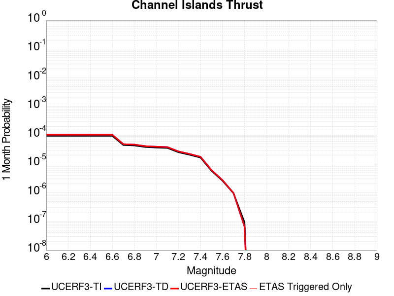 | 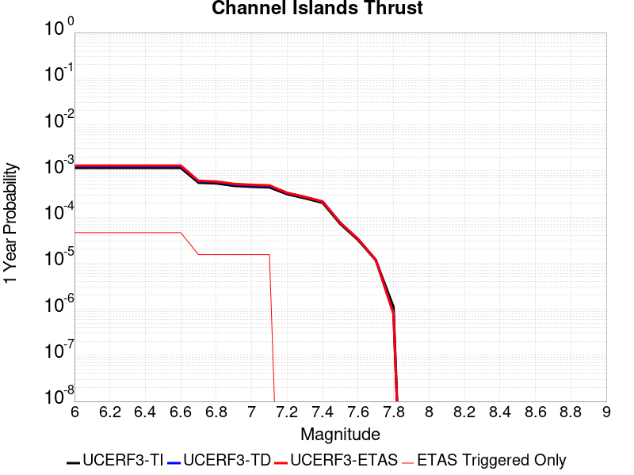 |  |

| Magnitude | 1 wk TI Prob | 1 wk TD Prob | 1 wk ETAS Prob | 1 wk ETAS/TD Gain | 1 wk ETAS Triggered Only | 1 mo TI Prob | 1 mo TD Prob | 1 mo ETAS Prob | 1 mo ETAS/TD Gain | 1 mo ETAS Triggered Only | 1 yr TI Prob | 1 yr TD Prob | 1 yr ETAS Prob | 1 yr ETAS/TD Gain | 1 yr ETAS Triggered Only | 10 yr TI Prob | 10 yr TD Prob | 10 yr ETAS Prob | 10 yr ETAS/TD Gain | 10 yr ETAS Triggered Only |
|-----|-----|-----|-----|-----|-----|-----|-----|-----|-----|-----|-----|-----|-----|-----|-----|-----|-----|-----|-----|-----|
| 6.0 | 2.2156251E-5 | 2.4092022E-5 | 2.4092022E-5 | 1.0 | 0.0 | 9.495191E-5 | 1.03248036E-4 | 1.03248036E-4 | 1.0 | 0.0 | 0.0011554264 | 0.0012564264 | 0.0013020312 | 1.0362972 | 4.5662102E-5 | 0.011494373 | 0.0125038205 | 0.012578973 | 1.0060103 | 7.6103504E-5 |
| 6.1 | 2.2156251E-5 | 2.4092022E-5 | 2.4092022E-5 | 1.0 | 0.0 | 9.495191E-5 | 1.03248036E-4 | 1.03248036E-4 | 1.0 | 0.0 | 0.0011554264 | 0.0012564264 | 0.0013020312 | 1.0362972 | 4.5662102E-5 | 0.011494373 | 0.0125038205 | 0.012578973 | 1.0060103 | 7.6103504E-5 |
| 6.2 | 2.2156251E-5 | 2.4092022E-5 | 2.4092022E-5 | 1.0 | 0.0 | 9.495191E-5 | 1.03248036E-4 | 1.03248036E-4 | 1.0 | 0.0 | 0.0011554264 | 0.0012564264 | 0.0013020312 | 1.0362972 | 4.5662102E-5 | 0.011494373 | 0.0125038205 | 0.012578973 | 1.0060103 | 7.6103504E-5 |
| 6.3 | 2.2156251E-5 | 2.4092022E-5 | 2.4092022E-5 | 1.0 | 0.0 | 9.495191E-5 | 1.03248036E-4 | 1.03248036E-4 | 1.0 | 0.0 | 0.0011554264 | 0.0012564264 | 0.0013020312 | 1.0362972 | 4.5662102E-5 | 0.011494373 | 0.0125038205 | 0.012578973 | 1.0060103 | 7.6103504E-5 |
| 6.4 | 2.2156251E-5 | 2.4092022E-5 | 2.4092022E-5 | 1.0 | 0.0 | 9.495191E-5 | 1.03248036E-4 | 1.03248036E-4 | 1.0 | 0.0 | 0.0011554264 | 0.0012564264 | 0.0013020312 | 1.0362972 | 4.5662102E-5 | 0.011494373 | 0.0125038205 | 0.012578973 | 1.0060103 | 7.6103504E-5 |
| 6.5 | 2.2156251E-5 | 2.4092022E-5 | 2.4092022E-5 | 1.0 | 0.0 | 9.495191E-5 | 1.03248036E-4 | 1.03248036E-4 | 1.0 | 0.0 | 0.0011554264 | 0.0012564264 | 0.0013020312 | 1.0362972 | 4.5662102E-5 | 0.011494373 | 0.0125038205 | 0.012578973 | 1.0060103 | 7.6103504E-5 |
| 6.6 | 2.2156251E-5 | 2.4092022E-5 | 2.4092022E-5 | 1.0 | 0.0 | 9.495191E-5 | 1.03248036E-4 | 1.03248036E-4 | 1.0 | 0.0 | 0.0011554264 | 0.0012564264 | 0.0013020312 | 1.0362972 | 4.5662102E-5 | 0.011494373 | 0.0125038205 | 0.012578973 | 1.0060103 | 7.6103504E-5 |
| 6.7 | 1.0601296E-5 | 1.1379544E-5 | 1.1379544E-5 | 1.0 | 0.0 | 4.5433335E-5 | 4.876859E-5 | 4.876859E-5 | 1.0 | 0.0 | 5.5301044E-4 | 5.936007E-4 | 6.088124E-4 | 1.0256261 | 1.52207E-5 | 0.005516363 | 0.005920653 | 0.0059509147 | 1.0051111 | 3.04414E-5 |
| 6.8 | 1.0246747E-5 | 1.0996669E-5 | 1.0996669E-5 | 1.0 | 0.0 | 4.391389E-5 | 4.7127756E-5 | 4.7127756E-5 | 1.0 | 0.0 | 5.345204E-4 | 5.7363417E-4 | 5.888461E-4 | 1.0265186 | 1.52207E-5 | 0.0053323656 | 0.005722025 | 0.005752292 | 1.0052896 | 3.04414E-5 |
| 6.9 | 9.049551E-6 | 9.699645E-6 | 9.699645E-6 | 1.0 | 0.0 | 3.878322E-5 | 4.1569267E-5 | 4.1569267E-5 | 1.0 | 0.0 | 4.7208337E-4 | 5.059924E-4 | 5.2120537E-4 | 1.0300657 | 1.52207E-5 | 0.0047108172 | 0.0050488203 | 0.005079108 | 1.005999 | 3.04414E-5 |
| 7.0 | 8.6542195E-6 | 9.274603E-6 | 9.274603E-6 | 1.0 | 0.0 | 3.7088983E-5 | 3.9747716E-5 | 3.9747716E-5 | 1.0 | 0.0 | 4.5146482E-4 | 4.8382508E-4 | 4.990384E-4 | 1.0314438 | 1.52207E-5 | 0.004505487 | 0.004828129 | 0.0048584235 | 1.0062746 | 3.04414E-5 |
| 7.1 | 8.391028E-6 | 8.992924E-6 | 8.992924E-6 | 1.0 | 0.0 | 3.5961057E-5 | 3.854056E-5 | 3.854056E-5 | 1.0 | 0.0 | 4.3773788E-4 | 4.6913436E-4 | 4.8434793E-4 | 1.032429 | 1.52207E-5 | 0.004368766 | 0.0046818503 | 0.004712149 | 1.0064715 | 3.04414E-5 |
| 7.2 | 5.965188E-6 | 6.3716952E-6 | 6.3716952E-6 | 1.0 | 0.0 | 2.556484E-5 | 2.7306982E-5 | 2.7306982E-5 | 1.0 | 0.0 | 3.1120746E-4 | 3.3241234E-4 | 3.3241234E-4 | 1.0 | 0.0 | 0.00310772 | 0.0033192092 | 0.0033192092 | 1.0 | 0.0 |
| 7.3 | 4.877518E-6 | 5.2060063E-6 | 5.2060063E-6 | 1.0 | 0.0 | 2.0903482E-5 | 2.2311267E-5 | 2.2311267E-5 | 1.0 | 0.0 | 2.5447016E-4 | 2.716063E-4 | 2.716063E-4 | 1.0 | 0.0 | 0.0025417898 | 0.0027127895 | 0.0027127895 | 1.0 | 0.0 |
| 7.4 | 3.8829853E-6 | 4.141863E-6 | 4.141863E-6 | 1.0 | 0.0 | 1.664126E-5 | 1.7750723E-5 | 1.7750723E-5 | 1.0 | 0.0 | 2.0258849E-4 | 2.1609402E-4 | 2.1609402E-4 | 1.0 | 0.0 | 0.002024039 | 0.0021588807 | 0.0021588807 | 1.0 | 0.0 |
| 7.5 | 1.3489616E-6 | 1.4277903E-6 | 1.4277903E-6 | 1.0 | 0.0 | 5.7812517E-6 | 6.119087E-6 | 6.119087E-6 | 1.0 | 0.0 | 7.038446E-5 | 7.449738E-5 | 7.449738E-5 | 1.0 | 0.0 | 7.036218E-4 | 7.44728E-4 | 7.44728E-4 | 1.0 | 0.0 |
| 7.6 | 6.058192E-7 | 6.353778E-7 | 6.353778E-7 | 1.0 | 0.0 | 2.5963652E-6 | 2.7230449E-6 | 2.7230449E-6 | 1.0 | 0.0 | 3.161029E-5 | 3.3152584E-5 | 3.3152584E-5 | 1.0 | 0.0 | 3.1605794E-4 | 3.31478E-4 | 3.31478E-4 | 1.0 | 0.0 |
| 7.7 | 2.2170494E-7 | 2.2607902E-7 | 2.2607902E-7 | 1.0 | 0.0 | 9.5016367E-7 | 9.689098E-7 | 9.689098E-7 | 1.0 | 0.0 | 1.1568181E-5 | 1.1796425E-5 | 1.1796425E-5 | 1.0 | 0.0 | 1.1567579E-4 | 1.1795909E-4 | 1.1795909E-4 | 1.0 | 0.0 |
| 7.8 | 2.1613102E-8 | 1.5466682E-8 | 1.5466682E-8 | 1.0 | 0.0 | 9.262757E-8 | 6.628578E-8 | 6.628578E-8 | 1.0 | 0.0 | 1.1277401E-6 | 8.070291E-7 | 8.070291E-7 | 1.0 | 0.0 | 1.1277344E-5 | 8.070269E-6 | 8.070269E-6 | 1.0 | 0.0 |

## Palos Verdes
*[(top)](#table-of-contents)*

| 1 Week | 1 Month | 1 Year | 10 Year |
|-----|-----|-----|-----|
| 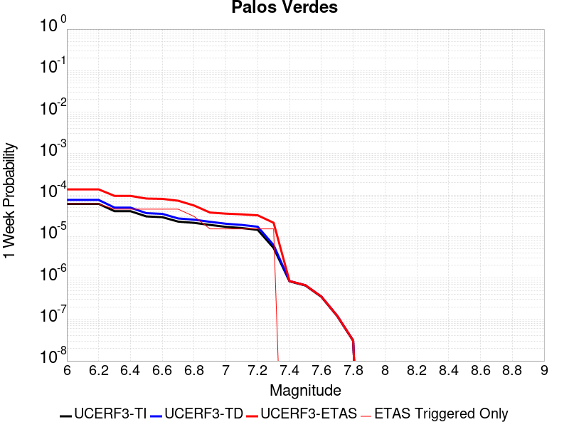 | 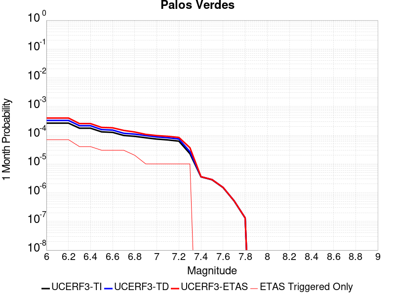 | 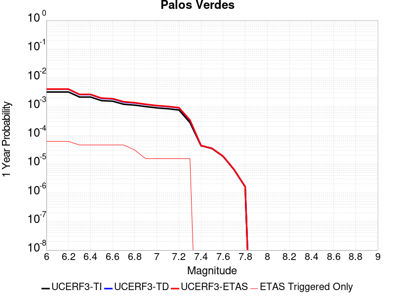 | 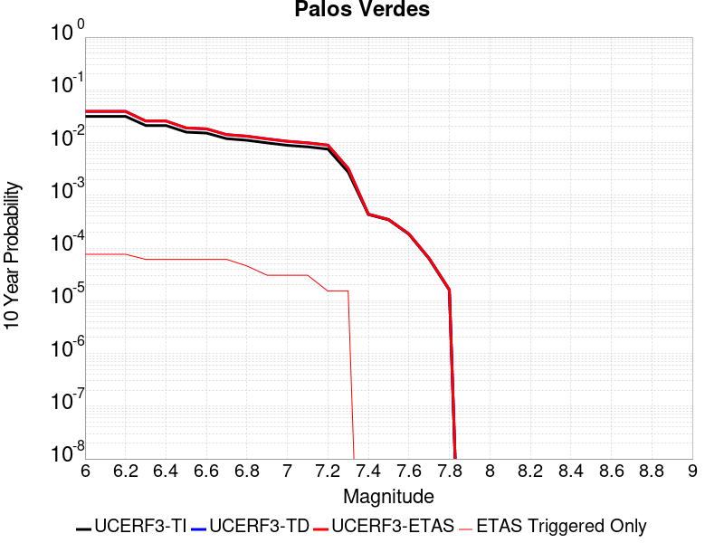 |

| Magnitude | 1 wk TI Prob | 1 wk TD Prob | 1 wk ETAS Prob | 1 wk ETAS/TD Gain | 1 wk ETAS Triggered Only | 1 mo TI Prob | 1 mo TD Prob | 1 mo ETAS Prob | 1 mo ETAS/TD Gain | 1 mo ETAS Triggered Only | 1 yr TI Prob | 1 yr TD Prob | 1 yr ETAS Prob | 1 yr ETAS/TD Gain | 1 yr ETAS Triggered Only | 10 yr TI Prob | 10 yr TD Prob | 10 yr ETAS Prob | 10 yr ETAS/TD Gain | 10 yr ETAS Triggered Only |
|-----|-----|-----|-----|-----|-----|-----|-----|-----|-----|-----|-----|-----|-----|-----|-----|-----|-----|-----|-----|-----|
| 6.0 | 6.126063E-5 | 7.622612E-5 | 1.3710427E-4 | 1.7986522 | 6.08828E-5 | 2.6251914E-4 | 3.2664582E-4 | 3.8750874E-4 | 1.186327 | 6.08828E-5 | 0.0031914865 | 0.003970174 | 0.0040308153 | 1.0152742 | 6.08828E-5 | 0.031460393 | 0.039048895 | 0.03912203 | 1.0018728 | 7.6103504E-5 |
| 6.1 | 6.126063E-5 | 7.622612E-5 | 1.3710427E-4 | 1.7986522 | 6.08828E-5 | 2.6251914E-4 | 3.2664582E-4 | 3.8750874E-4 | 1.186327 | 6.08828E-5 | 0.0031914865 | 0.003970174 | 0.0040308153 | 1.0152742 | 6.08828E-5 | 0.031460393 | 0.039048895 | 0.03912203 | 1.0018728 | 7.6103504E-5 |
| 6.2 | 6.126063E-5 | 7.622612E-5 | 1.3710427E-4 | 1.7986522 | 6.08828E-5 | 2.6251914E-4 | 3.2664582E-4 | 3.8750874E-4 | 1.186327 | 6.08828E-5 | 0.0031914865 | 0.003970174 | 0.0040308153 | 1.0152742 | 6.08828E-5 | 0.031460393 | 0.039048895 | 0.03912203 | 1.0018728 | 7.6103504E-5 |
| 6.3 | 4.0838047E-5 | 4.9749437E-5 | 9.540926E-5 | 1.9177959 | 4.5662102E-5 | 1.7500846E-4 | 2.1319572E-4 | 2.5884807E-4 | 1.2141336 | 4.5662102E-5 | 0.0021286458 | 0.0025927818 | 0.0026383256 | 1.0175656 | 4.5662102E-5 | 0.021083709 | 0.025646681 | 0.025706002 | 1.002313 | 6.08828E-5 |
| 6.4 | 4.0838047E-5 | 4.9749437E-5 | 9.540926E-5 | 1.9177959 | 4.5662102E-5 | 1.7500846E-4 | 2.1319572E-4 | 2.5884807E-4 | 1.2141336 | 4.5662102E-5 | 0.0021286458 | 0.0025927818 | 0.0026383256 | 1.0175656 | 4.5662102E-5 | 0.021083709 | 0.025646681 | 0.025706002 | 1.002313 | 6.08828E-5 |
| 6.5 | 3.0512005E-5 | 3.656162E-5 | 8.222205E-5 | 2.2488623 | 4.5662102E-5 | 1.3075917E-4 | 1.5668393E-4 | 2.0233888E-4 | 1.2913824 | 4.5662102E-5 | 0.0015908304 | 0.0019060767 | 0.0019516516 | 1.0239104 | 4.5662102E-5 | 0.015794903 | 0.018909154 | 0.018968886 | 1.0031589 | 6.08828E-5 |
| 6.6 | 2.9255087E-5 | 3.515442E-5 | 8.081491E-5 | 2.298855 | 4.5662102E-5 | 1.2537291E-4 | 1.5065377E-4 | 1.9630897E-4 | 1.3030473 | 4.5662102E-5 | 0.0015253464 | 0.0018327828 | 0.0018783612 | 1.0248684 | 4.5662102E-5 | 0.015149189 | 0.018188225 | 0.018248001 | 1.0032865 | 6.08828E-5 |
| 6.7 | 2.287198E-5 | 2.7248278E-5 | 7.290913E-5 | 2.6757336 | 4.5662102E-5 | 9.801909E-5 | 1.16773626E-4 | 1.624304E-4 | 1.3909853 | 4.5662102E-5 | 0.001192729 | 0.0014208833 | 0.0014664805 | 1.0320908 | 4.5662102E-5 | 0.011863477 | 0.014127217 | 0.01418724 | 1.0042487 | 6.08828E-5 |
| 6.8 | 2.1325764E-5 | 2.5431877E-5 | 5.5872504E-5 | 2.1969476 | 3.04414E-5 | 9.139293E-5 | 1.0898971E-4 | 1.394278E-4 | 1.2792748 | 3.04414E-5 | 0.001112141 | 0.0013262323 | 0.0013566333 | 1.0229229 | 3.04414E-5 | 0.011065915 | 0.013192211 | 0.0132372705 | 1.0034156 | 4.5662102E-5 |
| 6.9 | 1.9009392E-5 | 2.2613547E-5 | 3.7833903E-5 | 1.6730636 | 1.52207E-5 | 8.1466285E-5 | 9.6912096E-5 | 1.12131325E-4 | 1.1570415 | 1.52207E-5 | 9.914007E-4 | 0.0011793535 | 0.0011945562 | 1.0128907 | 1.52207E-5 | 0.009869894 | 0.011739632 | 0.011769717 | 1.0025626 | 3.04414E-5 |
| 7.0 | 1.7098473E-5 | 2.0319356E-5 | 3.5539746E-5 | 1.7490587 | 1.52207E-5 | 7.3277115E-5 | 8.708052E-5 | 1.022999E-4 | 1.1747736 | 1.52207E-5 | 8.917837E-4 | 0.001059775 | 0.0010749795 | 1.014347 | 1.52207E-5 | 0.008882134 | 0.010555646 | 0.010585766 | 1.0028535 | 3.04414E-5 |
| 7.1 | 1.5982785E-5 | 1.899476E-5 | 3.4215172E-5 | 1.8012953 | 1.52207E-5 | 6.849585E-5 | 8.1404054E-5 | 9.662352E-5 | 1.186962 | 1.52207E-5 | 8.336179E-4 | 9.907284E-4 | 0.0010059341 | 1.015348 | 1.52207E-5 | 0.008304977 | 0.009871479 | 0.00990162 | 1.0030533 | 3.04414E-5 |
| 7.2 | 1.4468002E-5 | 1.7197237E-5 | 3.2417676E-5 | 1.8850514 | 1.52207E-5 | 6.200425E-5 | 7.370083E-5 | 8.892041E-5 | 1.2065048 | 1.52207E-5 | 7.546402E-4 | 8.970222E-4 | 9.1222924E-4 | 1.0169528 | 1.52207E-5 | 0.007520827 | 0.008942284 | 0.008957368 | 1.0016869 | 1.52207E-5 |
| 7.3 | 5.288233E-6 | 6.2036747E-6 | 2.1424281E-5 | 3.4534822 | 1.52207E-5 | 2.2663658E-5 | 2.6587102E-5 | 4.1807398E-5 | 1.5724691 | 1.52207E-5 | 2.7589512E-4 | 3.236848E-4 | 3.3890057E-4 | 1.047008 | 1.52207E-5 | 0.0027555283 | 0.0032355562 | 0.0032507277 | 1.004689 | 1.52207E-5 |
| 7.4 | 8.279556E-7 | 8.408347E-7 | 8.408347E-7 | 1.0 | 0.0 | 3.5483763E-6 | 3.6035726E-6 | 3.6035726E-6 | 1.0 | 0.0 | 4.3200624E-5 | 4.3872686E-5 | 4.3872686E-5 | 1.0 | 0.0 | 4.3192226E-4 | 4.3864746E-4 | 4.3864746E-4 | 1.0 | 0.0 |
| 7.5 | 6.559831E-7 | 6.667229E-7 | 6.667229E-7 | 1.0 | 0.0 | 2.8113532E-6 | 2.857381E-6 | 2.857381E-6 | 1.0 | 0.0 | 3.4227687E-5 | 3.4788125E-5 | 3.4788125E-5 | 1.0 | 0.0 | 3.4222414E-4 | 3.4783344E-4 | 3.4783344E-4 | 1.0 | 0.0 |
| 7.6 | 3.5018968E-7 | 3.5620027E-7 | 3.5620027E-7 | 1.0 | 0.0 | 1.500812E-6 | 1.526572E-6 | 1.526572E-6 | 1.0 | 0.0 | 1.8272232E-5 | 1.8585903E-5 | 1.8585903E-5 | 1.0 | 0.0 | 1.8270731E-4 | 1.8584808E-4 | 1.8584808E-4 | 1.0 | 0.0 |
| 7.7 | 1.1986104E-7 | 1.2198376E-7 | 1.2198376E-7 | 1.0 | 0.0 | 5.1369005E-7 | 5.2278745E-7 | 5.2278745E-7 | 1.0 | 0.0 | 6.2541585E-6 | 6.364919E-6 | 6.364919E-6 | 1.0 | 0.0 | 6.2539824E-5 | 6.364741E-5 | 6.364741E-5 | 1.0 | 0.0 |
| 7.8 | 3.0445005E-8 | 3.1027582E-8 | 3.1027582E-8 | 1.0 | 0.0 | 1.3047858E-7 | 1.3297536E-7 | 1.3297536E-7 | 1.0 | 0.0 | 1.5885756E-6 | 1.6189739E-6 | 1.6189739E-6 | 1.0 | 0.0 | 1.5885644E-5 | 1.6189642E-5 | 1.6189642E-5 | 1.0 | 0.0 |

## Hunting Creek - Berryessa 2011 CFM
*[(top)](#table-of-contents)*

| 1 Week | 1 Month | 1 Year | 10 Year |
|-----|-----|-----|-----|
| 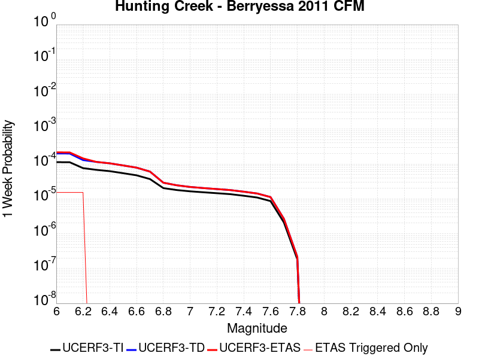 | 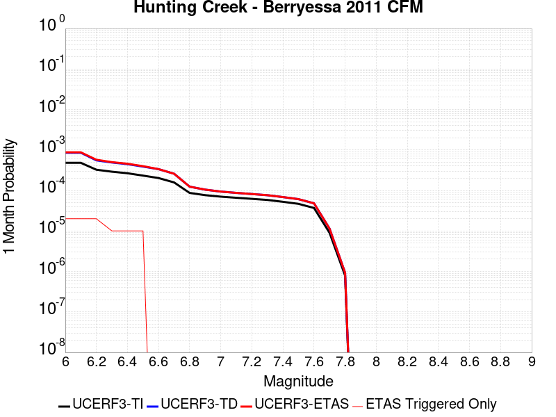 | 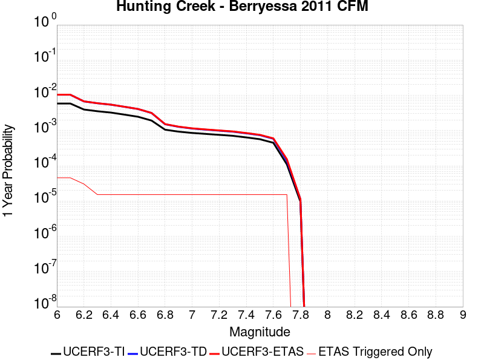 | 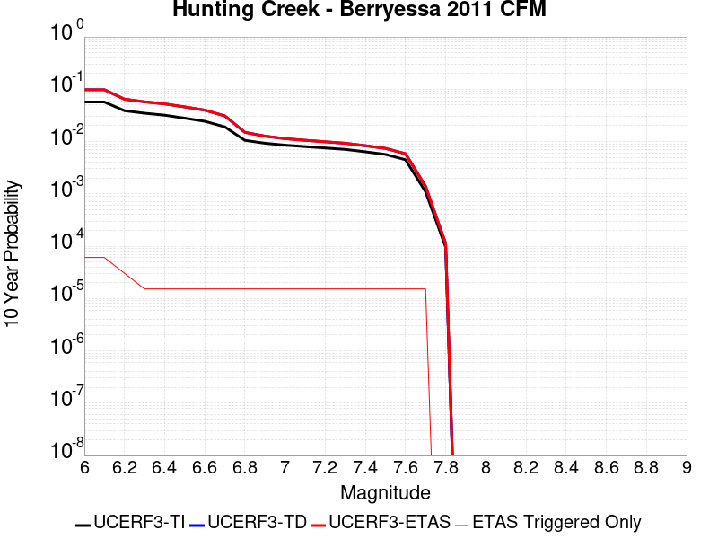 |

| Magnitude | 1 wk TI Prob | 1 wk TD Prob | 1 wk ETAS Prob | 1 wk ETAS/TD Gain | 1 wk ETAS Triggered Only | 1 mo TI Prob | 1 mo TD Prob | 1 mo ETAS Prob | 1 mo ETAS/TD Gain | 1 mo ETAS Triggered Only | 1 yr TI Prob | 1 yr TD Prob | 1 yr ETAS Prob | 1 yr ETAS/TD Gain | 1 yr ETAS Triggered Only | 10 yr TI Prob | 10 yr TD Prob | 10 yr ETAS Prob | 10 yr ETAS/TD Gain | 10 yr ETAS Triggered Only |
|-----|-----|-----|-----|-----|-----|-----|-----|-----|-----|-----|-----|-----|-----|-----|-----|-----|-----|-----|-----|-----|
| 6.0 | 1.1270982E-4 | 2.0012174E-4 | 2.153394E-4 | 1.0760419 | 1.52207E-5 | 4.8295266E-4 | 8.5739547E-4 | 8.878108E-4 | 1.0354741 | 3.04414E-5 | 0.0058641075 | 0.010386313 | 0.010431501 | 1.0043507 | 4.5662102E-5 | 0.057117578 | 0.09803703 | 0.09809194 | 1.0005602 | 6.08828E-5 |
| 6.1 | 1.1239393E-4 | 1.9960315E-4 | 2.148208E-4 | 1.0762396 | 1.52207E-5 | 4.8159933E-4 | 8.551744E-4 | 8.8558975E-4 | 1.0355663 | 3.04414E-5 | 0.0058477195 | 0.010359551 | 0.01040474 | 1.0043621 | 4.5662102E-5 | 0.056962132 | 0.09779551 | 0.097850434 | 1.0005617 | 6.08828E-5 |
| 6.2 | 7.596265E-5 | 1.2940196E-4 | 1.4462069E-4 | 1.1176082 | 1.52207E-5 | 3.2551357E-4 | 5.5444165E-4 | 5.8486615E-4 | 1.0548742 | 3.04414E-5 | 0.0039559277 | 0.0067210156 | 0.006751253 | 1.0044988 | 3.04414E-5 | 0.038862433 | 0.0645915 | 0.06461997 | 1.0004408 | 3.04414E-5 |
| 6.3 | 6.78794E-5 | 1.145119E-4 | 1.145119E-4 | 1.0 | 0.0 | 2.9087928E-4 | 4.906513E-4 | 5.058645E-4 | 1.0310062 | 1.52207E-5 | 0.003535705 | 0.005952679 | 0.005967809 | 1.0025418 | 1.52207E-5 | 0.034799766 | 0.057465393 | 0.05747974 | 1.0002496 | 1.52207E-5 |
| 6.4 | 6.2165134E-5 | 1.0436625E-4 | 1.0436625E-4 | 1.0 | 0.0 | 2.6639478E-4 | 4.4721062E-4 | 4.6242453E-4 | 1.0340195 | 1.52207E-5 | 0.0032385332 | 0.005427573 | 0.005442711 | 1.0027891 | 1.52207E-5 | 0.03191742 | 0.052550517 | 0.052564938 | 1.0002744 | 1.52207E-5 |
| 6.5 | 5.4368087E-5 | 9.071415E-5 | 9.071415E-5 | 1.0 | 0.0 | 2.3298527E-4 | 3.8872007E-4 | 4.0393486E-4 | 1.0391407 | 1.52207E-5 | 0.0028329059 | 0.0047198683 | 0.004735017 | 1.0032096 | 1.52207E-5 | 0.027970633 | 0.045880128 | 0.04589465 | 1.0003165 | 1.52207E-5 |
| 6.6 | 4.729947E-5 | 7.847572E-5 | 7.847572E-5 | 1.0 | 0.0 | 2.0269625E-4 | 3.362842E-4 | 3.362842E-4 | 1.0 | 0.0 | 0.002465034 | 0.0040849647 | 0.0041001234 | 1.0037109 | 1.52207E-5 | 0.02437869 | 0.03985155 | 0.039866164 | 1.0003667 | 1.52207E-5 |
| 6.7 | 3.6875328E-5 | 6.0451803E-5 | 6.0451803E-5 | 1.0 | 0.0 | 1.5802756E-4 | 2.59056E-4 | 2.59056E-4 | 1.0 | 0.0 | 0.0019222875 | 0.0031482063 | 0.0031633792 | 1.0048195 | 1.52207E-5 | 0.019057442 | 0.03089237 | 0.030907122 | 1.0004774 | 1.52207E-5 |
| 6.8 | 2.0292036E-5 | 2.8976308E-5 | 2.8976308E-5 | 1.0 | 0.0 | 8.6962966E-5 | 1.2417832E-4 | 1.2417832E-4 | 1.0 | 0.0 | 0.0010582599 | 0.0015108072 | 0.001526005 | 1.0100594 | 1.52207E-5 | 0.010532344 | 0.014978523 | 0.014993516 | 1.001001 | 1.52207E-5 |
| 6.9 | 1.7871042E-5 | 2.4472254E-5 | 2.4472254E-5 | 1.0 | 0.0 | 7.658793E-5 | 1.048769E-4 | 1.048769E-4 | 1.0 | 0.0 | 9.320591E-4 | 0.0012761299 | 0.0012913311 | 1.011912 | 1.52207E-5 | 0.009281595 | 0.012679775 | 0.012694803 | 1.0011852 | 1.52207E-5 |
| 7.0 | 1.6415532E-5 | 2.1906277E-5 | 2.1906277E-5 | 1.0 | 0.0 | 7.035038E-5 | 9.3880684E-5 | 9.3880684E-5 | 1.0 | 0.0 | 8.561793E-4 | 0.0011424015 | 0.0011576047 | 1.0133082 | 1.52207E-5 | 0.008528882 | 0.01136452 | 0.011379567 | 1.001324 | 1.52207E-5 |
| 7.1 | 1.5409885E-5 | 2.0346342E-5 | 2.0346342E-5 | 1.0 | 0.0 | 6.6040695E-5 | 8.7195716E-5 | 8.7195716E-5 | 1.0 | 0.0 | 8.0374884E-4 | 0.0010610938 | 0.0010762983 | 1.0143291 | 1.52207E-5 | 0.00800848 | 0.010560595 | 0.010575655 | 1.0014261 | 1.52207E-5 |
| 7.2 | 1.4497423E-5 | 1.9054964E-5 | 1.9054964E-5 | 1.0 | 0.0 | 6.213033E-5 | 8.166159E-5 | 8.166159E-5 | 1.0 | 0.0 | 7.5617427E-4 | 9.937795E-4 | 0.001008985 | 1.0153008 | 1.52207E-5 | 0.0075360634 | 0.009893929 | 0.009908998 | 1.0015231 | 1.52207E-5 |
| 7.3 | 1.3615175E-5 | 1.7826127E-5 | 1.7826127E-5 | 1.0 | 0.0 | 5.8349444E-5 | 7.639547E-5 | 7.639547E-5 | 1.0 | 0.0 | 7.101729E-4 | 9.297209E-4 | 9.449274E-4 | 1.016356 | 1.52207E-5 | 0.0070790765 | 0.009258823 | 0.009273902 | 1.0016286 | 1.52207E-5 |
| 7.4 | 1.2252825E-5 | 1.602625E-5 | 1.602625E-5 | 1.0 | 0.0 | 5.251105E-5 | 6.868213E-5 | 6.868213E-5 | 1.0 | 0.0 | 6.391345E-4 | 8.35887E-4 | 8.5109496E-4 | 1.0181938 | 1.52207E-5 | 0.0063729943 | 0.008327872 | 0.0083429655 | 1.0018125 | 1.52207E-5 |
| 7.5 | 1.0913301E-5 | 1.4241117E-5 | 1.4241117E-5 | 1.0 | 0.0 | 4.6770452E-5 | 6.1031948E-5 | 6.1031948E-5 | 1.0 | 0.0 | 5.6928146E-4 | 7.4281334E-4 | 7.5802277E-4 | 1.0204754 | 1.52207E-5 | 0.0056782532 | 0.0074036797 | 0.0074187876 | 1.0020406 | 1.52207E-5 |
| 7.6 | 8.623192E-6 | 1.12346415E-5 | 1.12346415E-5 | 1.0 | 0.0 | 3.6956015E-5 | 4.814759E-5 | 4.814759E-5 | 1.0 | 0.0 | 4.4984656E-4 | 5.8604183E-4 | 6.012536E-4 | 1.0259569 | 1.52207E-5 | 0.00448937 | 0.0058452785 | 0.00586041 | 1.0025887 | 1.52207E-5 |
| 7.7 | 2.0993634E-6 | 2.662584E-6 | 2.662584E-6 | 1.0 | 0.0 | 8.997241E-6 | 1.1411025E-5 | 1.1411025E-5 | 1.0 | 0.0 | 1.09535904E-4 | 1.3892044E-4 | 1.5413902E-4 | 1.1095489 | 1.52207E-5 | 0.0010948193 | 0.0013883426 | 0.0014035421 | 1.010948 | 1.52207E-5 |
| 7.8 | 1.8428308E-7 | 2.167437E-7 | 2.167437E-7 | 1.0 | 0.0 | 7.897844E-7 | 9.289013E-7 | 9.289013E-7 | 1.0 | 0.0 | 9.615583E-6 | 1.1309318E-5 | 1.1309318E-5 | 1.0 | 0.0 | 9.615166E-5 | 1.13086026E-4 | 1.13086026E-4 | 1.0 | 0.0 |

## Oceanic - West Huasna
*[(top)](#table-of-contents)*

| 1 Week | 1 Month | 1 Year | 10 Year |
|-----|-----|-----|-----|
| 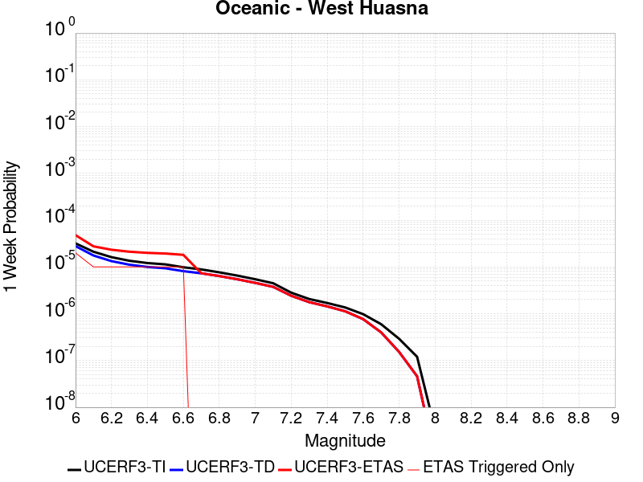 | 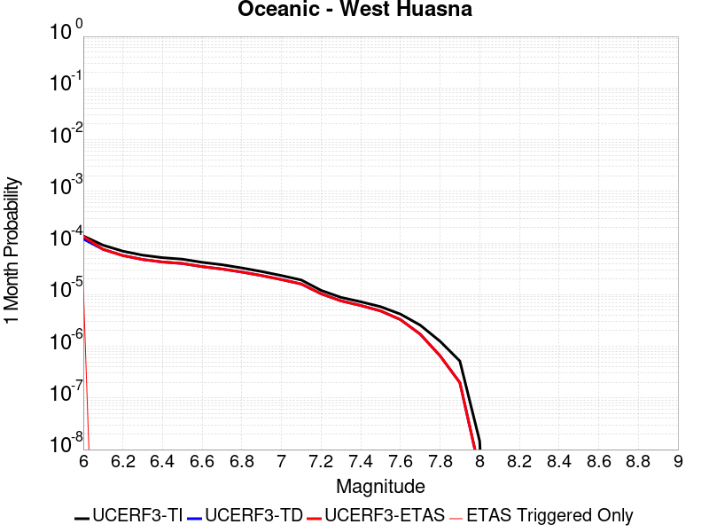 | 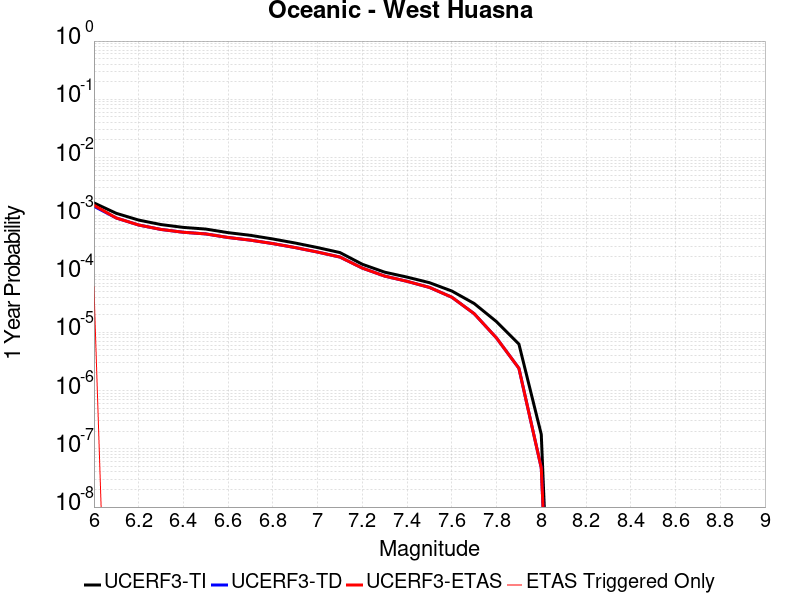 | 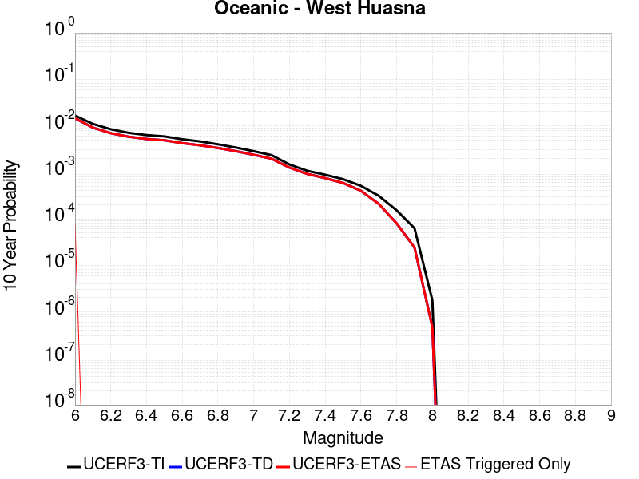 |

| Magnitude | 1 wk TI Prob | 1 wk TD Prob | 1 wk ETAS Prob | 1 wk ETAS/TD Gain | 1 wk ETAS Triggered Only | 1 mo TI Prob | 1 mo TD Prob | 1 mo ETAS Prob | 1 mo ETAS/TD Gain | 1 mo ETAS Triggered Only | 1 yr TI Prob | 1 yr TD Prob | 1 yr ETAS Prob | 1 yr ETAS/TD Gain | 1 yr ETAS Triggered Only | 10 yr TI Prob | 10 yr TD Prob | 10 yr ETAS Prob | 10 yr ETAS/TD Gain | 10 yr ETAS Triggered Only |
|-----|-----|-----|-----|-----|-----|-----|-----|-----|-----|-----|-----|-----|-----|-----|-----|-----|-----|-----|-----|-----|
| 6.0 | 3.195567E-5 | 2.7926868E-5 | 4.314714E-5 | 1.5450047 | 1.52207E-5 | 1.3694567E-4 | 1.1968133E-4 | 1.3490021E-4 | 1.1271616 | 1.52207E-5 | 0.0016660384 | 0.0014561893 | 0.0015169835 | 1.0417488 | 6.08828E-5 | 0.016536033 | 0.014471028 | 0.01454603 | 1.0051829 | 7.6103504E-5 |
| 6.1 | 2.1156782E-5 | 1.7573486E-5 | 1.7573486E-5 | 1.0 | 0.0 | 9.066878E-5 | 7.531282E-5 | 7.531282E-5 | 1.0 | 0.0 | 0.0011033333 | 9.165572E-4 | 9.165572E-4 | 1.0 | 0.0 | 0.010978713 | 0.009128777 | 0.009128777 | 1.0 | 0.0 |
| 6.2 | 1.6195117E-5 | 1.3327152E-5 | 1.3327152E-5 | 1.0 | 0.0 | 6.9405796E-5 | 5.7115132E-5 | 5.7115132E-5 | 1.0 | 0.0 | 8.44688E-4 | 6.9515745E-4 | 6.9515745E-4 | 1.0 | 0.0 | 0.008414844 | 0.006930123 | 0.006930123 | 1.0 | 0.0 |
| 6.3 | 1.3559345E-5 | 1.1179142E-5 | 1.1179142E-5 | 1.0 | 0.0 | 5.811018E-5 | 4.7909736E-5 | 4.7909736E-5 | 1.0 | 0.0 | 7.072618E-4 | 5.831459E-4 | 5.831459E-4 | 1.0 | 0.0 | 0.0070501505 | 0.0058162753 | 0.0058162753 | 1.0 | 0.0 |
| 6.4 | 1.2120619E-5 | 1.0000977E-5 | 1.0000977E-5 | 1.0 | 0.0 | 5.1944477E-5 | 4.2860633E-5 | 4.2860633E-5 | 1.0 | 0.0 | 6.322405E-4 | 5.2170374E-4 | 5.2170374E-4 | 1.0 | 0.0 | 0.006304447 | 0.0052048573 | 0.0052048573 | 1.0 | 0.0 |
| 6.5 | 1.13511915E-5 | 9.3674735E-6 | 9.3674735E-6 | 1.0 | 0.0 | 4.8647056E-5 | 4.01457E-5 | 4.01457E-5 | 1.0 | 0.0 | 5.9211696E-4 | 4.886647E-4 | 4.886647E-4 | 1.0 | 0.0 | 0.0059054173 | 0.0048759608 | 0.0048759608 | 1.0 | 0.0 |
| 6.6 | 9.850605E-6 | 8.135418E-6 | 8.135418E-6 | 1.0 | 0.0 | 4.2216197E-5 | 3.4865614E-5 | 3.4865614E-5 | 1.0 | 0.0 | 5.1386096E-4 | 4.2440637E-4 | 4.2440637E-4 | 1.0 | 0.0 | 0.0051267436 | 0.004235991 | 0.004235991 | 1.0 | 0.0 |
| 6.7 | 8.8558645E-6 | 7.318433E-6 | 7.318433E-6 | 1.0 | 0.0 | 3.7953152E-5 | 3.1364336E-5 | 3.1364336E-5 | 1.0 | 0.0 | 4.6198163E-4 | 3.8179406E-4 | 3.8179406E-4 | 1.0 | 0.0 | 0.004610224 | 0.0038114067 | 0.0038114067 | 1.0 | 0.0 |
| 6.8 | 7.67136E-6 | 6.391756E-6 | 6.391756E-6 | 1.0 | 0.0 | 3.2876844E-5 | 2.7392953E-5 | 2.7392953E-5 | 1.0 | 0.0 | 4.0020206E-4 | 3.3345833E-4 | 3.3345833E-4 | 1.0 | 0.0 | 0.003994821 | 0.0033296007 | 0.0033296007 | 1.0 | 0.0 |
| 6.9 | 6.534529E-6 | 5.4583297E-6 | 5.4583297E-6 | 1.0 | 0.0 | 2.8004823E-5 | 2.3392633E-5 | 2.3392633E-5 | 1.0 | 0.0 | 3.4090536E-4 | 2.847682E-4 | 2.847682E-4 | 1.0 | 0.0 | 0.0034038287 | 0.0028440498 | 0.0028440498 | 1.0 | 0.0 |
| 7.0 | 5.460525E-6 | 4.5699517E-6 | 4.5699517E-6 | 1.0 | 0.0 | 2.3402039E-5 | 1.958536E-5 | 1.958536E-5 | 1.0 | 0.0 | 2.8488258E-4 | 2.3842578E-4 | 2.3842578E-4 | 1.0 | 0.0 | 0.0028451765 | 0.0023817138 | 0.0023817138 | 1.0 | 0.0 |
| 7.1 | 4.4825083E-6 | 3.7524428E-6 | 3.7524428E-6 | 1.0 | 0.0 | 1.9210609E-5 | 1.60818E-5 | 1.60818E-5 | 1.0 | 0.0 | 2.3386406E-4 | 1.9577841E-4 | 1.9577841E-4 | 1.0 | 0.0 | 0.002336181 | 0.0019560715 | 0.0019560715 | 1.0 | 0.0 |
| 7.2 | 2.821708E-6 | 2.4249334E-6 | 2.4249334E-6 | 1.0 | 0.0 | 1.2092979E-5 | 1.039253E-5 | 1.039253E-5 | 1.0 | 0.0 | 1.4722206E-4 | 1.2652173E-4 | 1.2652173E-4 | 1.0 | 0.0 | 0.0014712457 | 0.0012644994 | 0.0012644994 | 1.0 | 0.0 |
| 7.3 | 2.0644757E-6 | 1.7687412E-6 | 1.7687412E-6 | 1.0 | 0.0 | 8.847723E-6 | 7.5802973E-6 | 7.5802973E-6 | 1.0 | 0.0 | 1.0771569E-4 | 9.228622E-5 | 9.228622E-5 | 1.0 | 0.0 | 0.001076635 | 9.2248066E-4 | 9.2248066E-4 | 1.0 | 0.0 |
| 7.4 | 1.6980367E-6 | 1.4379892E-6 | 1.4379892E-6 | 1.0 | 0.0 | 7.27728E-6 | 6.162796E-6 | 6.162796E-6 | 1.0 | 0.0 | 8.8597284E-5 | 7.5029464E-5 | 7.5029464E-5 | 1.0 | 0.0 | 8.8561967E-4 | 7.500429E-4 | 7.500429E-4 | 1.0 | 0.0 |
| 7.5 | 1.3637683E-6 | 1.1302635E-6 | 1.1302635E-6 | 1.0 | 0.0 | 5.844708E-6 | 4.8439774E-6 | 4.8439774E-6 | 1.0 | 0.0 | 7.1156996E-5 | 5.897383E-5 | 5.897383E-5 | 1.0 | 0.0 | 7.1134215E-4 | 5.895833E-4 | 5.895833E-4 | 1.0 | 0.0 |
| 7.6 | 9.802994E-7 | 7.677247E-7 | 7.677247E-7 | 1.0 | 0.0 | 4.2012766E-6 | 3.2902446E-6 | 3.2902446E-6 | 1.0 | 0.0 | 5.1149345E-5 | 4.0057992E-5 | 4.0057992E-5 | 1.0 | 0.0 | 5.113757E-4 | 4.0050913E-4 | 4.0050913E-4 | 1.0 | 0.0 |
| 7.7 | 5.986191E-7 | 4.0050548E-7 | 4.0050548E-7 | 1.0 | 0.0 | 2.5655079E-6 | 1.7164509E-6 | 1.7164509E-6 | 1.0 | 0.0 | 3.1234613E-5 | 2.089759E-5 | 2.089759E-5 | 1.0 | 0.0 | 3.123022E-4 | 2.089576E-4 | 2.089576E-4 | 1.0 | 0.0 |
| 7.8 | 2.9189815E-7 | 1.5285792E-7 | 1.5285792E-7 | 1.0 | 0.0 | 1.2509914E-6 | 6.5510517E-7 | 6.5510517E-7 | 1.0 | 0.0 | 1.5230714E-5 | 7.9758765E-6 | 7.9758765E-6 | 1.0 | 0.0 | 1.522967E-4 | 7.9757214E-5 | 7.9757214E-5 | 1.0 | 0.0 |
| 7.9 | 1.2057845E-7 | 4.621248E-8 | 4.621248E-8 | 1.0 | 0.0 | 5.1676466E-7 | 1.9805347E-7 | 1.9805347E-7 | 1.0 | 0.0 | 6.2915915E-6 | 2.4112983E-6 | 2.4112983E-6 | 1.0 | 0.0 | 6.2914136E-5 | 2.4114026E-5 | 2.4114026E-5 | 1.0 | 0.0 |
| 8.0 | 3.3806387E-9 | 9.011393E-10 | 9.011393E-10 | 1.0 | 0.0 | 1.4488451E-8 | 3.8620254E-9 | 3.8620254E-9 | 1.0 | 0.0 | 1.7639688E-7 | 4.702016E-8 | 4.702016E-8 | 1.0 | 0.0 | 1.7639674E-6 | 4.7129527E-7 | 4.7129527E-7 | 1.0 | 0.0 |

## Hosgri (Extension)
*[(top)](#table-of-contents)*

| 1 Week | 1 Month | 1 Year | 10 Year |
|-----|-----|-----|-----|
| 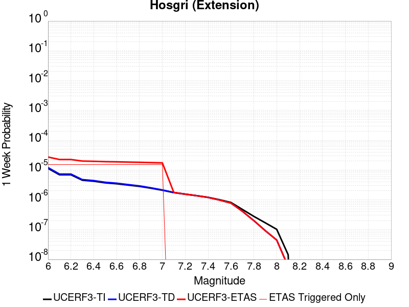 | 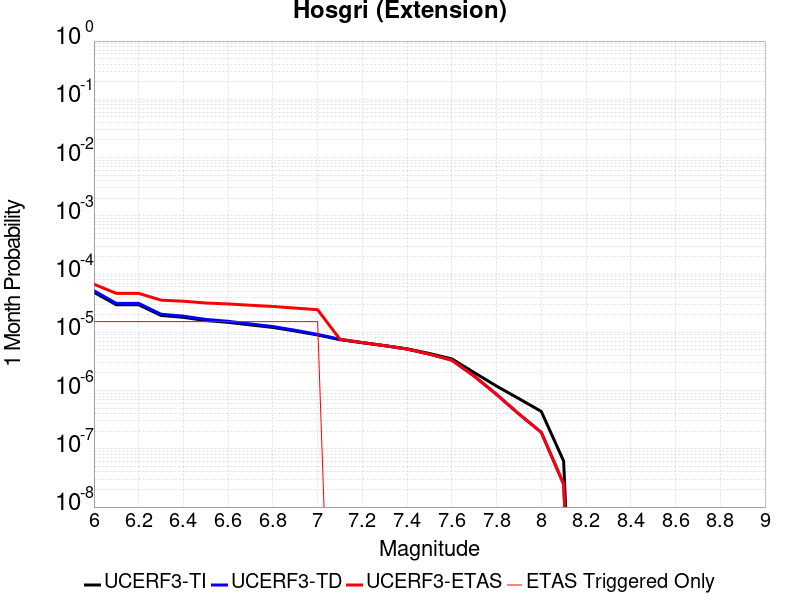 | 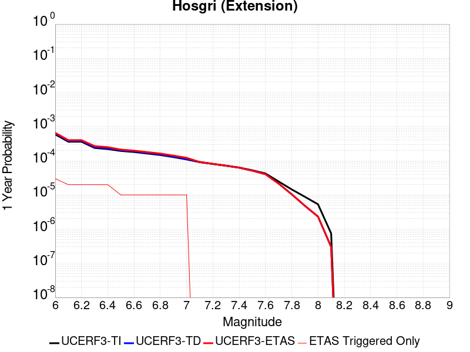 | 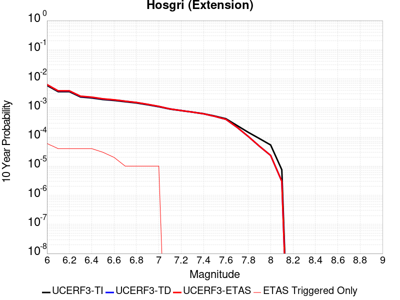 |

| Magnitude | 1 wk TI Prob | 1 wk TD Prob | 1 wk ETAS Prob | 1 wk ETAS/TD Gain | 1 wk ETAS Triggered Only | 1 mo TI Prob | 1 mo TD Prob | 1 mo ETAS Prob | 1 mo ETAS/TD Gain | 1 mo ETAS Triggered Only | 1 yr TI Prob | 1 yr TD Prob | 1 yr ETAS Prob | 1 yr ETAS/TD Gain | 1 yr ETAS Triggered Only | 10 yr TI Prob | 10 yr TD Prob | 10 yr ETAS Prob | 10 yr ETAS/TD Gain | 10 yr ETAS Triggered Only |
|-----|-----|-----|-----|-----|-----|-----|-----|-----|-----|-----|-----|-----|-----|-----|-----|-----|-----|-----|-----|-----|
| 6.0 | 1.1369135E-5 | 1.2083072E-5 | 2.7303588E-5 | 2.2596562 | 1.52207E-5 | 4.8723956E-5 | 5.1783692E-5 | 6.700361E-5 | 1.2939132 | 1.52207E-5 | 5.9305265E-4 | 6.3030684E-4 | 6.60729E-4 | 1.0482657 | 3.04414E-5 | 0.005914725 | 0.0062874397 | 0.00634794 | 1.0096223 | 6.08828E-5 |
| 6.1 | 6.934979E-6 | 7.324555E-6 | 2.2545144E-5 | 3.0780222 | 1.52207E-5 | 2.9721E-5 | 3.1390595E-5 | 4.6610818E-5 | 1.4848657 | 1.52207E-5 | 3.617931E-4 | 3.8211764E-4 | 4.125474E-4 | 1.0796345 | 3.04414E-5 | 0.0036120464 | 0.0038150186 | 0.0038605065 | 1.0119234 | 4.5662102E-5 |
| 6.2 | 6.934979E-6 | 7.324555E-6 | 2.2545144E-5 | 3.0780222 | 1.52207E-5 | 2.9721E-5 | 3.1390595E-5 | 4.6610818E-5 | 1.4848657 | 1.52207E-5 | 3.617931E-4 | 3.8211764E-4 | 4.125474E-4 | 1.0796345 | 3.04414E-5 | 0.0036120464 | 0.0038150186 | 0.0038605065 | 1.0119234 | 4.5662102E-5 |
| 6.3 | 4.5484676E-6 | 4.76933E-6 | 1.9989959E-5 | 4.191355 | 1.52207E-5 | 1.9493287E-5 | 2.043983E-5 | 3.5660218E-5 | 1.7446437 | 1.52207E-5 | 2.3730492E-4 | 2.4882692E-4 | 2.7926074E-4 | 1.1223092 | 3.04414E-5 | 0.0023705168 | 0.0024855258 | 0.0025310742 | 1.0183256 | 4.5662102E-5 |
| 6.4 | 4.218095E-6 | 4.4168614E-6 | 1.9637495E-5 | 4.446029 | 1.52207E-5 | 1.8077424E-5 | 1.8929271E-5 | 3.414968E-5 | 1.8040675 | 1.52207E-5 | 2.2007042E-4 | 2.3043984E-4 | 2.6087422E-4 | 1.1320709 | 3.04414E-5 | 0.002198526 | 0.0023020422 | 0.0023475992 | 1.0197898 | 4.5662102E-5 |
| 6.5 | 3.717374E-6 | 3.8838775E-6 | 1.9104518E-5 | 4.918929 | 1.52207E-5 | 1.5931506E-5 | 1.6645085E-5 | 3.1865533E-5 | 1.914411 | 1.52207E-5 | 1.9394881E-4 | 2.0263524E-4 | 2.1785285E-4 | 1.0750985 | 1.52207E-5 | 0.0019377962 | 0.0020245234 | 0.0020549034 | 1.015006 | 3.04414E-5 |
| 6.6 | 3.4605036E-6 | 3.608306E-6 | 1.882895E-5 | 5.2182245 | 1.52207E-5 | 1.4830645E-5 | 1.5464078E-5 | 3.0684543E-5 | 1.9842465 | 1.52207E-5 | 1.8054814E-4 | 1.8825903E-4 | 2.0347685E-4 | 1.0808345 | 1.52207E-5 | 0.0018040152 | 0.0018810101 | 0.0018962022 | 1.0080765 | 1.52207E-5 |
| 6.7 | 3.123439E-6 | 3.2465687E-6 | 1.8467219E-5 | 5.6882267 | 1.52207E-5 | 1.33860985E-5 | 1.3913792E-5 | 2.913428E-5 | 2.0939138 | 1.52207E-5 | 1.6296357E-4 | 1.6938736E-4 | 1.8460548E-4 | 1.0898421 | 1.52207E-5 | 0.001628441 | 0.0016925934 | 0.0017077883 | 1.0089773 | 1.52207E-5 |
| 6.8 | 2.8290783E-6 | 2.9305404E-6 | 1.8151195E-5 | 6.193805 | 1.52207E-5 | 1.2124565E-5 | 1.2559399E-5 | 2.7779908E-5 | 2.2118819 | 1.52207E-5 | 1.4760658E-4 | 1.5290003E-4 | 1.6811841E-4 | 1.0995315 | 1.52207E-5 | 0.0014750857 | 0.001527957 | 0.0015431545 | 1.0099462 | 1.52207E-5 |
| 6.9 | 2.454112E-6 | 2.5283196E-6 | 1.7748982E-5 | 7.0200706 | 1.52207E-5 | 1.0517581E-5 | 1.0835611E-5 | 2.6056146E-5 | 2.4046772 | 1.52207E-5 | 1.2804402E-4 | 1.3191563E-4 | 1.4713433E-4 | 1.1153668 | 1.52207E-5 | 0.0012797028 | 0.0013183793 | 0.00133358 | 1.0115298 | 1.52207E-5 |
| 7.0 | 2.1008145E-6 | 2.1498704E-6 | 1.7370538E-5 | 8.079807 | 1.52207E-5 | 9.003459E-6 | 9.213698E-6 | 2.4434257E-5 | 2.6519492 | 1.52207E-5 | 1.096116E-4 | 1.1217103E-4 | 1.2739003E-4 | 1.1356766 | 1.52207E-5 | 0.0010955755 | 0.0011211479 | 0.0011363515 | 1.0135608 | 1.52207E-5 |
| 7.1 | 1.744384E-6 | 1.7686352E-6 | 1.7686352E-6 | 1.0 | 0.0 | 7.47591E-6 | 7.5798434E-6 | 7.5798434E-6 | 1.0 | 0.0 | 9.1015405E-5 | 9.22807E-5 | 9.22807E-5 | 1.0 | 0.0 | 9.097813E-4 | 9.2242553E-4 | 9.2242553E-4 | 1.0 | 0.0 |
| 7.2 | 1.5456587E-6 | 1.5562882E-6 | 1.5562882E-6 | 1.0 | 0.0 | 6.6242346E-6 | 6.66979E-6 | 6.66979E-6 | 1.0 | 0.0 | 8.064707E-5 | 8.120168E-5 | 8.120168E-5 | 1.0 | 0.0 | 8.0617814E-4 | 8.117213E-4 | 8.117213E-4 | 1.0 | 0.0 |
| 7.3 | 1.3775123E-6 | 1.3766082E-6 | 1.3766082E-6 | 1.0 | 0.0 | 5.9036106E-6 | 5.899736E-6 | 5.899736E-6 | 1.0 | 0.0 | 7.187409E-5 | 7.182693E-5 | 7.182693E-5 | 1.0 | 0.0 | 7.185085E-4 | 7.180382E-4 | 7.180382E-4 | 1.0 | 0.0 |
| 7.4 | 1.214491E-6 | 1.2023461E-6 | 1.2023461E-6 | 1.0 | 0.0 | 5.2049513E-6 | 5.1529014E-6 | 5.1529014E-6 | 1.0 | 0.0 | 6.336844E-5 | 6.2734776E-5 | 6.2734776E-5 | 1.0 | 0.0 | 6.335037E-4 | 6.271715E-4 | 6.271715E-4 | 1.0 | 0.0 |
| 7.5 | 1.0101123E-6 | 9.842246E-7 | 9.842246E-7 | 1.0 | 0.0 | 4.3290456E-6 | 4.2180986E-6 | 4.2180986E-6 | 1.0 | 0.0 | 5.2704854E-5 | 5.1354145E-5 | 5.1354145E-5 | 1.0 | 0.0 | 5.2692357E-4 | 5.1342335E-4 | 5.1342335E-4 | 1.0 | 0.0 |
| 7.6 | 8.1558215E-7 | 7.765966E-7 | 7.765966E-7 | 1.0 | 0.0 | 3.4953473E-6 | 3.328267E-6 | 3.328267E-6 | 1.0 | 0.0 | 4.255502E-5 | 4.0520903E-5 | 4.0520903E-5 | 1.0 | 0.0 | 4.2546875E-4 | 4.0513556E-4 | 4.0513556E-4 | 1.0 | 0.0 |
| 7.7 | 4.757816E-7 | 4.1308888E-7 | 4.1308888E-7 | 1.0 | 0.0 | 2.0390623E-6 | 1.7703798E-6 | 1.7703798E-6 | 1.0 | 0.0 | 2.4825302E-5 | 2.155416E-5 | 2.155416E-5 | 1.0 | 0.0 | 2.482253E-4 | 2.1552083E-4 | 2.1552083E-4 | 1.0 | 0.0 |
| 7.8 | 2.782787E-7 | 2.0047722E-7 | 2.0047722E-7 | 1.0 | 0.0 | 1.1926223E-6 | 8.5918776E-7 | 8.5918776E-7 | 1.0 | 0.0 | 1.452008E-5 | 1.04605615E-5 | 1.04605615E-5 | 1.0 | 0.0 | 1.4519131E-4 | 1.04600724E-4 | 1.04600724E-4 | 1.0 | 0.0 |
| 7.9 | 1.6948086E-7 | 9.244227E-8 | 9.244227E-8 | 1.0 | 0.0 | 7.2634634E-7 | 3.961811E-7 | 3.961811E-7 | 1.0 | 0.0 | 8.843231E-6 | 4.8234942E-6 | 4.8234942E-6 | 1.0 | 0.0 | 8.842879E-5 | 4.8233902E-5 | 4.8233902E-5 | 1.0 | 0.0 |
| 8.0 | 1.0225492E-7 | 4.4738776E-8 | 4.4738776E-8 | 1.0 | 0.0 | 4.382353E-7 | 1.917376E-7 | 1.917376E-7 | 1.0 | 0.0 | 5.335502E-6 | 2.3344028E-6 | 2.3344028E-6 | 1.0 | 0.0 | 5.335374E-5 | 2.3343786E-5 | 2.3343786E-5 | 1.0 | 0.0 |
| 8.1 | 1.43711345E-8 | 5.787707E-9 | 5.787707E-9 | 1.0 | 0.0 | 6.1590576E-8 | 2.480446E-8 | 2.480446E-8 | 1.0 | 0.0 | 7.4986497E-7 | 3.0199428E-7 | 3.0199428E-7 | 1.0 | 0.0 | 7.4986247E-6 | 3.0199392E-6 | 3.0199392E-6 | 1.0 | 0.0 |

## Chino alt 1
*[(top)](#table-of-contents)*

| 1 Week | 1 Month | 1 Year | 10 Year |
|-----|-----|-----|-----|
| 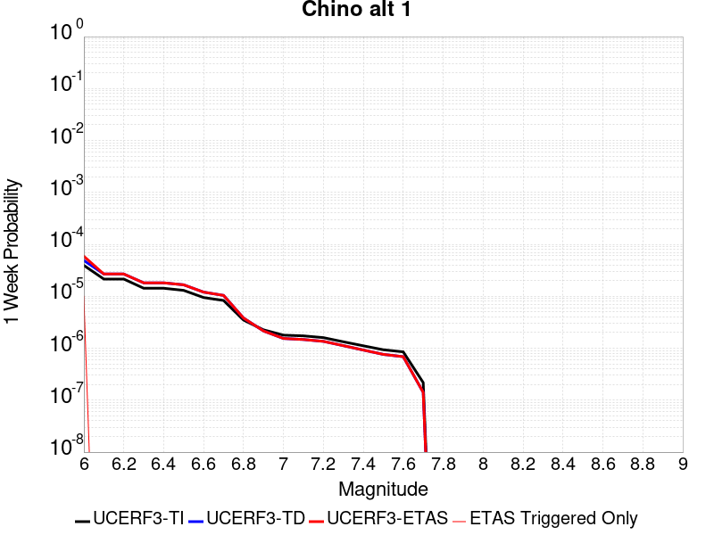 | 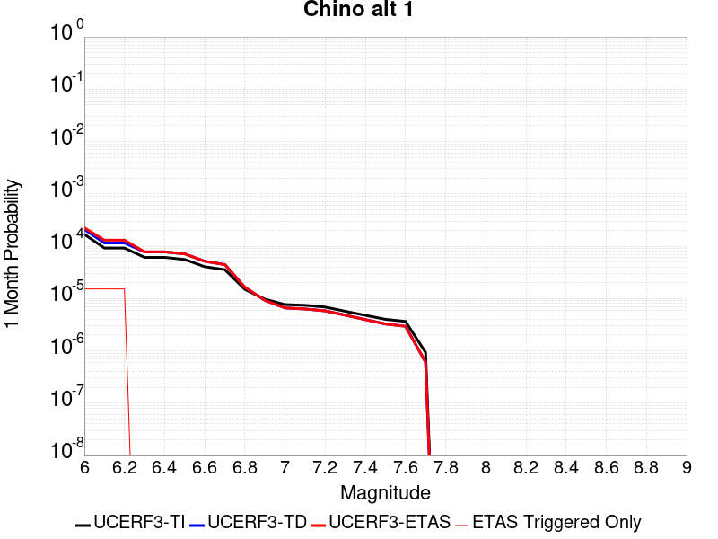 | 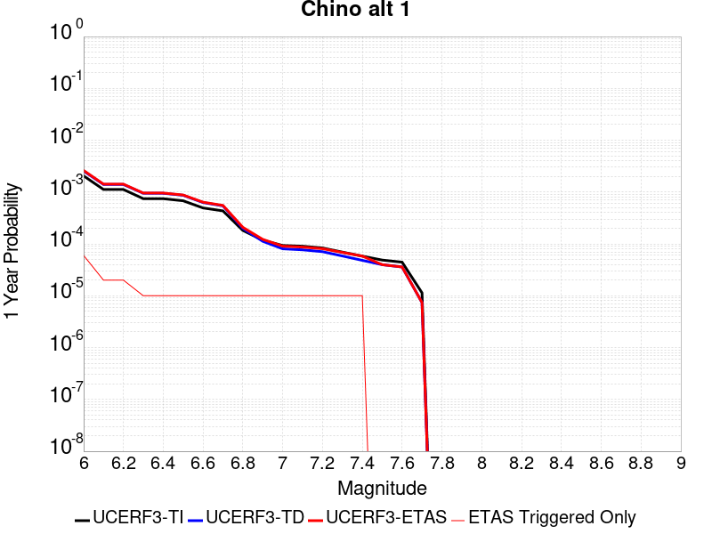 | 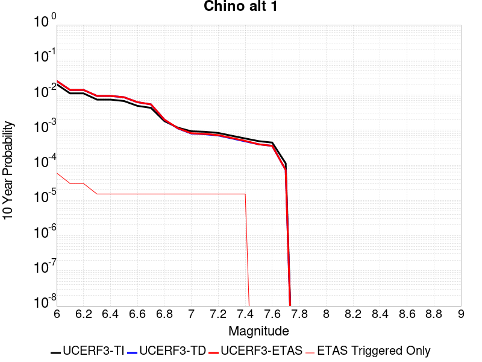 |

| Magnitude | 1 wk TI Prob | 1 wk TD Prob | 1 wk ETAS Prob | 1 wk ETAS/TD Gain | 1 wk ETAS Triggered Only | 1 mo TI Prob | 1 mo TD Prob | 1 mo ETAS Prob | 1 mo ETAS/TD Gain | 1 mo ETAS Triggered Only | 1 yr TI Prob | 1 yr TD Prob | 1 yr ETAS Prob | 1 yr ETAS/TD Gain | 1 yr ETAS Triggered Only | 10 yr TI Prob | 10 yr TD Prob | 10 yr ETAS Prob | 10 yr ETAS/TD Gain | 10 yr ETAS Triggered Only |
|-----|-----|-----|-----|-----|-----|-----|-----|-----|-----|-----|-----|-----|-----|-----|-----|-----|-----|-----|-----|-----|
| 6.0 | 3.939946E-5 | 4.8948554E-5 | 4.8948554E-5 | 1.0 | 0.0 | 1.6884391E-4 | 2.097656E-4 | 2.249831E-4 | 1.0725453 | 1.52207E-5 | 0.0020537362 | 0.0025513945 | 0.0025969401 | 1.0178512 | 4.5662102E-5 | 0.020348595 | 0.025277847 | 0.025337191 | 1.0023477 | 6.08828E-5 |
| 6.1 | 2.1505624E-5 | 2.6879026E-5 | 2.6879026E-5 | 1.0 | 0.0 | 9.2163704E-5 | 1.1519137E-4 | 1.304103E-4 | 1.1321188 | 1.52207E-5 | 0.0011215154 | 0.001401664 | 0.0014320627 | 1.0216876 | 3.04414E-5 | 0.011158722 | 0.013945141 | 0.013975158 | 1.0021524 | 3.04414E-5 |
| 6.2 | 2.1505624E-5 | 2.6879026E-5 | 2.6879026E-5 | 1.0 | 0.0 | 9.2163704E-5 | 1.1519137E-4 | 1.304103E-4 | 1.1321188 | 1.52207E-5 | 0.0011215154 | 0.001401664 | 0.0014320627 | 1.0216876 | 3.04414E-5 | 0.011158722 | 0.013945141 | 0.013975158 | 1.0021524 | 3.04414E-5 |
| 6.3 | 1.4290785E-5 | 1.8165128E-5 | 1.8165128E-5 | 1.0 | 0.0 | 6.1244784E-5 | 7.784848E-5 | 7.784848E-5 | 1.0 | 0.0 | 7.454001E-4 | 9.4743853E-4 | 9.6264476E-4 | 1.0160499 | 1.52207E-5 | 0.007429048 | 0.0094444575 | 0.009459535 | 1.0015963 | 1.52207E-5 |
| 6.4 | 1.4290785E-5 | 1.8165128E-5 | 1.8165128E-5 | 1.0 | 0.0 | 6.1244784E-5 | 7.784848E-5 | 7.784848E-5 | 1.0 | 0.0 | 7.454001E-4 | 9.4743853E-4 | 9.6264476E-4 | 1.0160499 | 1.52207E-5 | 0.007429048 | 0.0094444575 | 0.009459535 | 1.0015963 | 1.52207E-5 |
| 6.5 | 1.3017944E-5 | 1.6652088E-5 | 1.6652088E-5 | 1.0 | 0.0 | 5.5789995E-5 | 7.136439E-5 | 7.136439E-5 | 1.0 | 0.0 | 6.790315E-4 | 8.685589E-4 | 8.8376633E-4 | 1.0175089 | 1.52207E-5 | 0.0067696036 | 0.008661949 | 0.008677038 | 1.001742 | 1.52207E-5 |
| 6.6 | 9.470016E-6 | 1.2039424E-5 | 1.2039424E-5 | 1.0 | 0.0 | 4.058515E-5 | 5.1596704E-5 | 5.1596704E-5 | 1.0 | 0.0 | 4.940122E-4 | 6.280428E-4 | 6.432539E-4 | 1.0242199 | 1.52207E-5 | 0.004929154 | 0.0062718987 | 0.006287024 | 1.0024116 | 1.52207E-5 |
| 6.7 | 8.314155E-6 | 1.0407736E-5 | 1.0407736E-5 | 1.0 | 0.0 | 3.5631605E-5 | 4.4604003E-5 | 4.4604003E-5 | 1.0 | 0.0 | 4.3372845E-4 | 5.429507E-4 | 5.581631E-4 | 1.0280181 | 1.52207E-5 | 0.004328829 | 0.005425775 | 0.005440913 | 1.0027901 | 1.52207E-5 |
| 6.8 | 3.4856364E-6 | 3.8133708E-6 | 3.8133708E-6 | 1.0 | 0.0 | 1.4938357E-5 | 1.6342927E-5 | 1.6342927E-5 | 1.0 | 0.0 | 1.8185932E-4 | 1.9895904E-4 | 2.1417672E-4 | 1.0764865 | 1.52207E-5 | 0.0018171056 | 0.0019894864 | 0.002004677 | 1.0076354 | 1.52207E-5 |
| 6.9 | 2.2645952E-6 | 2.1529022E-6 | 2.1529022E-6 | 1.0 | 0.0 | 9.705372E-6 | 9.226692E-6 | 9.226692E-6 | 1.0 | 0.0 | 1.18156495E-4 | 1.123294E-4 | 1.275484E-4 | 1.1354854 | 1.52207E-5 | 0.0011809369 | 0.0011233423 | 0.0011385459 | 1.0135343 | 1.52207E-5 |
| 7.0 | 1.7864003E-6 | 1.5430785E-6 | 1.5430785E-6 | 1.0 | 0.0 | 7.655979E-6 | 6.613177E-6 | 6.613177E-6 | 1.0 | 0.0 | 9.3207556E-5 | 8.051251E-5 | 9.5731986E-5 | 1.1890324 | 1.52207E-5 | 9.316847E-4 | 8.0528046E-4 | 8.204889E-4 | 1.0188859 | 1.52207E-5 |
| 7.1 | 1.7315456E-6 | 1.4733511E-6 | 1.4733511E-6 | 1.0 | 0.0 | 7.420889E-6 | 6.3143466E-6 | 6.3143466E-6 | 1.0 | 0.0 | 9.034557E-5 | 7.6874516E-5 | 9.2094044E-5 | 1.1979789 | 1.52207E-5 | 9.0308854E-4 | 7.6891703E-4 | 7.84126E-4 | 1.0197798 | 1.52207E-5 |
| 7.2 | 1.6008337E-6 | 1.3574215E-6 | 1.3574215E-6 | 1.0 | 0.0 | 6.860698E-6 | 5.817508E-6 | 5.817508E-6 | 1.0 | 0.0 | 8.352579E-5 | 7.082591E-5 | 8.604553E-5 | 1.2148877 | 1.52207E-5 | 8.34944E-4 | 7.0845755E-4 | 7.2366744E-4 | 1.0214691 | 1.52207E-5 |
| 7.3 | 1.3320939E-6 | 1.121782E-6 | 1.121782E-6 | 1.0 | 0.0 | 5.7089615E-6 | 4.807629E-6 | 4.807629E-6 | 1.0 | 0.0 | 6.9504385E-5 | 5.8531357E-5 | 7.3751165E-5 | 1.2600284 | 1.52207E-5 | 6.9482654E-4 | 5.8530393E-4 | 6.005157E-4 | 1.0259895 | 1.52207E-5 |
| 7.4 | 1.114294E-6 | 9.237111E-7 | 9.237111E-7 | 1.0 | 0.0 | 4.775537E-6 | 3.958756E-6 | 3.958756E-6 | 1.0 | 0.0 | 5.8140613E-5 | 4.8196827E-5 | 6.3416795E-5 | 1.3157878 | 1.52207E-5 | 5.81254E-4 | 4.8188053E-4 | 4.970939E-4 | 1.0315708 | 1.52207E-5 |
| 7.5 | 9.354081E-7 | 7.6234323E-7 | 7.6234323E-7 | 1.0 | 0.0 | 4.0088858E-6 | 3.2671815E-6 | 3.2671815E-6 | 1.0 | 0.0 | 4.8807087E-5 | 3.9777242E-5 | 3.9777242E-5 | 1.0 | 0.0 | 4.879637E-4 | 3.977046E-4 | 3.977046E-4 | 1.0 | 0.0 |
| 7.6 | 8.521771E-7 | 6.88071E-7 | 6.88071E-7 | 1.0 | 0.0 | 3.6521824E-6 | 2.9488726E-6 | 2.9488726E-6 | 1.0 | 0.0 | 4.4464414E-5 | 3.5901965E-5 | 3.5901965E-5 | 1.0 | 0.0 | 4.4455516E-4 | 3.589648E-4 | 3.589648E-4 | 1.0 | 0.0 |
| 7.7 | 2.1803626E-7 | 1.418649E-7 | 1.418649E-7 | 1.0 | 0.0 | 9.344408E-7 | 6.079923E-7 | 6.079923E-7 | 1.0 | 0.0 | 1.1376757E-5 | 7.4022914E-6 | 7.4022914E-6 | 1.0 | 0.0 | 1.13761744E-4 | 7.402141E-5 | 7.402141E-5 | 1.0 | 0.0 |

## Cleghorn
*[(top)](#table-of-contents)*

| 1 Week | 1 Month | 1 Year | 10 Year |
|-----|-----|-----|-----|
|  | 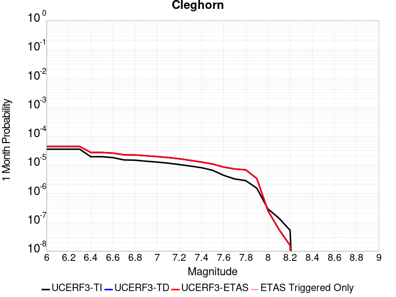 | 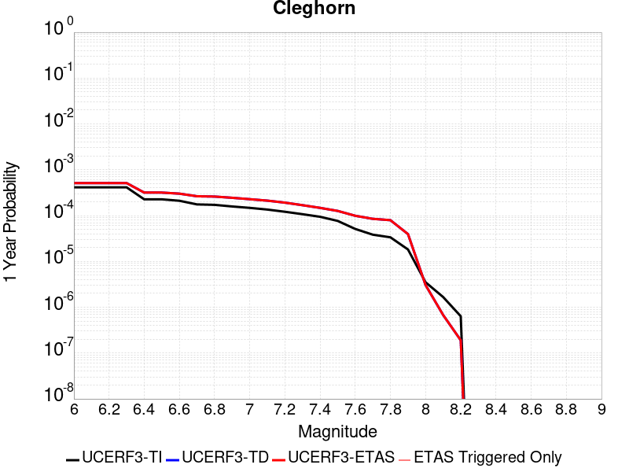 | 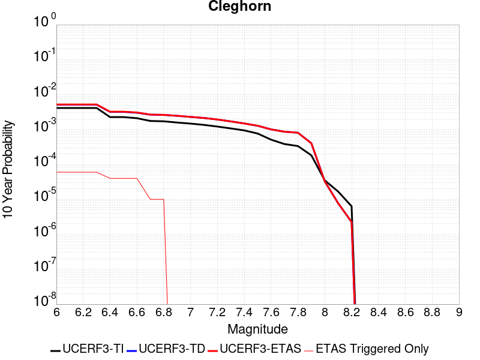 |

| Magnitude | 1 wk TI Prob | 1 wk TD Prob | 1 wk ETAS Prob | 1 wk ETAS/TD Gain | 1 wk ETAS Triggered Only | 1 mo TI Prob | 1 mo TD Prob | 1 mo ETAS Prob | 1 mo ETAS/TD Gain | 1 mo ETAS Triggered Only | 1 yr TI Prob | 1 yr TD Prob | 1 yr ETAS Prob | 1 yr ETAS/TD Gain | 1 yr ETAS Triggered Only | 10 yr TI Prob | 10 yr TD Prob | 10 yr ETAS Prob | 10 yr ETAS/TD Gain | 10 yr ETAS Triggered Only |
|-----|-----|-----|-----|-----|-----|-----|-----|-----|-----|-----|-----|-----|-----|-----|-----|-----|-----|-----|-----|-----|
| 6.0 | 7.9267165E-6 | 9.831582E-6 | 9.831582E-6 | 1.0 | 0.0 | 3.39712E-5 | 4.2134732E-5 | 4.2134732E-5 | 1.0 | 0.0 | 4.1352084E-4 | 5.128803E-4 | 5.128803E-4 | 1.0 | 0.0 | 0.004127522 | 0.0051320773 | 0.00520779 | 1.0147529 | 7.6103504E-5 |
| 6.1 | 7.9267165E-6 | 9.831582E-6 | 9.831582E-6 | 1.0 | 0.0 | 3.39712E-5 | 4.2134732E-5 | 4.2134732E-5 | 1.0 | 0.0 | 4.1352084E-4 | 5.128803E-4 | 5.128803E-4 | 1.0 | 0.0 | 0.004127522 | 0.0051320773 | 0.00520779 | 1.0147529 | 7.6103504E-5 |
| 6.2 | 7.9267165E-6 | 9.831582E-6 | 9.831582E-6 | 1.0 | 0.0 | 3.39712E-5 | 4.2134732E-5 | 4.2134732E-5 | 1.0 | 0.0 | 4.1352084E-4 | 5.128803E-4 | 5.128803E-4 | 1.0 | 0.0 | 0.004127522 | 0.0051320773 | 0.00520779 | 1.0147529 | 7.6103504E-5 |
| 6.3 | 7.9267165E-6 | 9.831582E-6 | 9.831582E-6 | 1.0 | 0.0 | 3.39712E-5 | 4.2134732E-5 | 4.2134732E-5 | 1.0 | 0.0 | 4.1352084E-4 | 5.128803E-4 | 5.128803E-4 | 1.0 | 0.0 | 0.004127522 | 0.0051320773 | 0.00520779 | 1.0147529 | 7.6103504E-5 |
| 6.4 | 4.3445207E-6 | 6.0914435E-6 | 6.0914435E-6 | 1.0 | 0.0 | 1.8619241E-5 | 2.610593E-5 | 2.610593E-5 | 1.0 | 0.0 | 2.2666567E-4 | 3.1779436E-4 | 3.1779436E-4 | 1.0 | 0.0 | 0.0022643462 | 0.0031875873 | 0.003248276 | 1.019039 | 6.08828E-5 |
| 6.5 | 4.3445207E-6 | 6.0914435E-6 | 6.0914435E-6 | 1.0 | 0.0 | 1.8619241E-5 | 2.610593E-5 | 2.610593E-5 | 1.0 | 0.0 | 2.2666567E-4 | 3.1779436E-4 | 3.1779436E-4 | 1.0 | 0.0 | 0.0022643462 | 0.0031875873 | 0.003248276 | 1.019039 | 6.08828E-5 |
| 6.6 | 4.040109E-6 | 5.773851E-6 | 5.773851E-6 | 1.0 | 0.0 | 1.7314638E-5 | 2.4744846E-5 | 2.4744846E-5 | 1.0 | 0.0 | 2.1078532E-4 | 3.012278E-4 | 3.012278E-4 | 1.0 | 0.0 | 0.002105855 | 0.003022377 | 0.0030830759 | 1.0200832 | 6.08828E-5 |
| 6.7 | 3.3632055E-6 | 5.067348E-6 | 5.067348E-6 | 1.0 | 0.0 | 1.4413658E-5 | 2.1717027E-5 | 2.1717027E-5 | 1.0 | 0.0 | 1.7547216E-4 | 2.6437303E-4 | 2.6437303E-4 | 1.0 | 0.0 | 0.0017533366 | 0.0026547113 | 0.0026698916 | 1.0057182 | 1.52207E-5 |
| 6.8 | 3.2902772E-6 | 4.9892556E-6 | 4.9892556E-6 | 1.0 | 0.0 | 1.4101111E-5 | 2.1382351E-5 | 2.1382351E-5 | 1.0 | 0.0 | 1.716675E-4 | 2.6029933E-4 | 2.6029933E-4 | 1.0 | 0.0 | 0.0017153495 | 0.0026140702 | 0.002629251 | 1.0058074 | 1.52207E-5 |
| 6.9 | 3.031547E-6 | 4.6910186E-6 | 4.6910186E-6 | 1.0 | 0.0 | 1.299228E-5 | 2.0104211E-5 | 2.0104211E-5 | 1.0 | 0.0 | 1.5816953E-4 | 2.4474156E-4 | 2.4474156E-4 | 1.0 | 0.0 | 0.00158057 | 0.0024588439 | 0.0024588439 | 1.0 | 0.0 |
| 7.0 | 2.8259715E-6 | 4.3705895E-6 | 4.3705895E-6 | 1.0 | 0.0 | 1.211125E-5 | 1.8730963E-5 | 1.8730963E-5 | 1.0 | 0.0 | 1.4744449E-4 | 2.2802586E-4 | 2.2802586E-4 | 1.0 | 0.0 | 0.001473467 | 0.0022920412 | 0.0022920412 | 1.0 | 0.0 |
| 7.1 | 2.5962665E-6 | 4.0658106E-6 | 4.0658106E-6 | 1.0 | 0.0 | 1.1126809E-5 | 1.7424789E-5 | 1.7424789E-5 | 1.0 | 0.0 | 1.3546048E-4 | 2.1212637E-4 | 2.1212637E-4 | 1.0 | 0.0 | 0.0013537793 | 0.002133366 | 0.002133366 | 1.0 | 0.0 |
| 7.2 | 2.3247253E-6 | 3.6763672E-6 | 3.6763672E-6 | 1.0 | 0.0 | 9.96307E-6 | 1.5755764E-5 | 1.5755764E-5 | 1.0 | 0.0 | 1.21293626E-4 | 1.9180974E-4 | 1.9180974E-4 | 1.0 | 0.0 | 0.0012122744 | 0.0019305905 | 0.0019305905 | 1.0 | 0.0 |
| 7.3 | 2.056928E-6 | 3.2350938E-6 | 3.2350938E-6 | 1.0 | 0.0 | 8.815376E-6 | 1.3864615E-5 | 1.3864615E-5 | 1.0 | 0.0 | 1.0732192E-4 | 1.6878877E-4 | 1.6878877E-4 | 1.0 | 0.0 | 0.001072701 | 0.0017008206 | 0.0017008206 | 1.0 | 0.0 |
| 7.4 | 1.8055999E-6 | 2.8255042E-6 | 2.8255042E-6 | 1.0 | 0.0 | 7.738263E-6 | 1.2109249E-5 | 1.2109249E-5 | 1.0 | 0.0 | 9.4209274E-5 | 1.4742027E-4 | 1.4742027E-4 | 1.0 | 0.0 | 9.4169343E-4 | 0.0014875771 | 0.0014875771 | 1.0 | 0.0 |
| 7.5 | 1.4683443E-6 | 2.4247483E-6 | 2.4247483E-6 | 1.0 | 0.0 | 6.292889E-6 | 1.0391738E-5 | 1.0391738E-5 | 1.0 | 0.0 | 7.661323E-5 | 1.2651215E-4 | 1.2651215E-4 | 1.0 | 0.0 | 7.658682E-4 | 0.0012787961 | 0.0012787961 | 1.0 | 0.0 |
| 7.6 | 9.804088E-7 | 1.900266E-6 | 1.900266E-6 | 1.0 | 0.0 | 4.201745E-6 | 8.143972E-6 | 8.143972E-6 | 1.0 | 0.0 | 5.1155046E-5 | 9.91484E-5 | 9.91484E-5 | 1.0 | 0.0 | 5.114327E-4 | 0.001005471 | 0.001005471 | 1.0 | 0.0 |
| 7.7 | 7.3434086E-7 | 1.6284146E-6 | 1.6284146E-6 | 1.0 | 0.0 | 3.1471714E-6 | 6.978901E-6 | 6.978901E-6 | 1.0 | 0.0 | 3.831614E-5 | 8.4964835E-5 | 8.4964835E-5 | 1.0 | 0.0 | 3.8309532E-4 | 8.6378685E-4 | 8.6378685E-4 | 1.0 | 0.0 |
| 7.8 | 6.434184E-7 | 1.5220047E-6 | 1.5220047E-6 | 1.0 | 0.0 | 2.7575045E-6 | 6.5228614E-6 | 6.5228614E-6 | 1.0 | 0.0 | 3.35721E-5 | 7.941297E-5 | 7.941297E-5 | 1.0 | 0.0 | 3.3567028E-4 | 8.079678E-4 | 8.079678E-4 | 1.0 | 0.0 |
| 7.9 | 3.4943926E-7 | 7.574459E-7 | 7.574459E-7 | 1.0 | 0.0 | 1.497596E-6 | 3.2461926E-6 | 3.2461926E-6 | 1.0 | 0.0 | 1.8233079E-5 | 3.952169E-5 | 3.952169E-5 | 1.0 | 0.0 | 1.8231584E-4 | 4.040099E-4 | 4.040099E-4 | 1.0 | 0.0 |
| 8.0 | 6.717524E-8 | 5.838828E-8 | 5.838828E-8 | 1.0 | 0.0 | 2.8789387E-7 | 2.5023547E-7 | 2.5023547E-7 | 1.0 | 0.0 | 3.505102E-6 | 3.0466126E-6 | 3.0466126E-6 | 1.0 | 0.0 | 3.5050467E-5 | 3.273506E-5 | 3.273506E-5 | 1.0 | 0.0 |
| 8.1 | 3.1984914E-8 | 1.2956093E-8 | 1.2956093E-8 | 1.0 | 0.0 | 1.370782E-7 | 5.552611E-8 | 5.552611E-8 | 1.0 | 0.0 | 1.6689258E-6 | 6.760302E-7 | 6.760302E-7 | 1.0 | 0.0 | 1.6689133E-5 | 7.74454E-6 | 7.74454E-6 | 1.0 | 0.0 |
| 8.2 | 1.21887656E-8 | 3.6495305E-9 | 3.6495305E-9 | 1.0 | 0.0 | 5.2237567E-8 | 1.5640845E-8 | 1.5640845E-8 | 1.0 | 0.0 | 6.359922E-7 | 1.9042727E-7 | 1.9042727E-7 | 1.0 | 0.0 | 6.3599036E-6 | 2.2470974E-6 | 2.2470974E-6 | 1.0 | 0.0 |

## Big Pine (East)
*[(top)](#table-of-contents)*

| 1 Week | 1 Month | 1 Year | 10 Year |
|-----|-----|-----|-----|
| 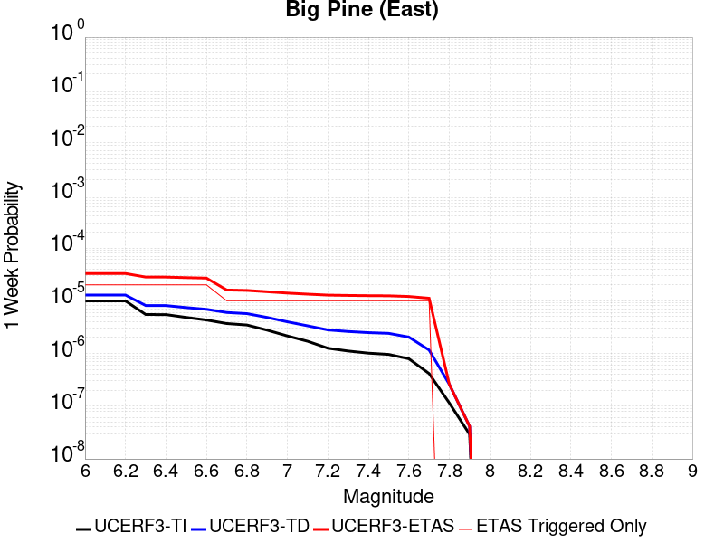 | 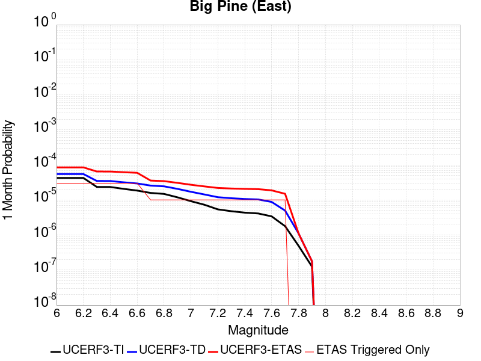 | 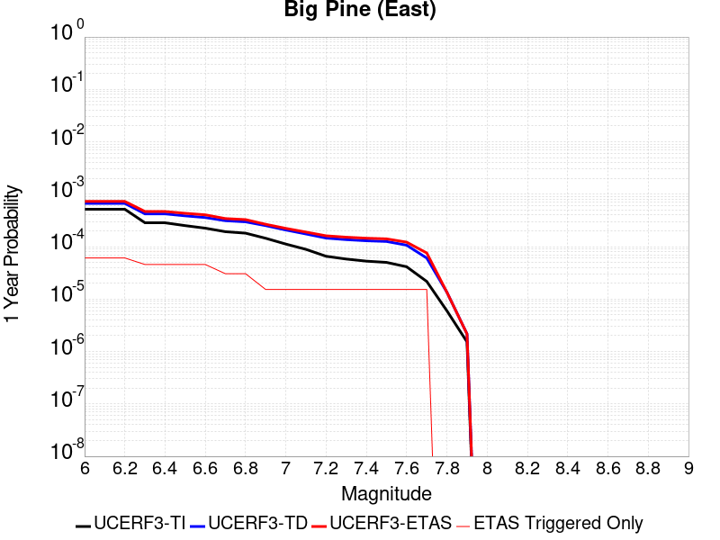 |  |

| Magnitude | 1 wk TI Prob | 1 wk TD Prob | 1 wk ETAS Prob | 1 wk ETAS/TD Gain | 1 wk ETAS Triggered Only | 1 mo TI Prob | 1 mo TD Prob | 1 mo ETAS Prob | 1 mo ETAS/TD Gain | 1 mo ETAS Triggered Only | 1 yr TI Prob | 1 yr TD Prob | 1 yr ETAS Prob | 1 yr ETAS/TD Gain | 1 yr ETAS Triggered Only | 10 yr TI Prob | 10 yr TD Prob | 10 yr ETAS Prob | 10 yr ETAS/TD Gain | 10 yr ETAS Triggered Only |
|-----|-----|-----|-----|-----|-----|-----|-----|-----|-----|-----|-----|-----|-----|-----|-----|-----|-----|-----|-----|-----|
| 6.0 | 9.916913E-6 | 1.2816984E-5 | 2.803749E-5 | 2.1875262 | 1.52207E-5 | 4.250036E-5 | 5.49289E-5 | 8.536863E-5 | 1.554166 | 3.04414E-5 | 5.173191E-4 | 6.685763E-4 | 7.2941836E-4 | 1.0910025 | 6.08828E-5 | 0.0051611643 | 0.006670441 | 0.006746037 | 1.011333 | 7.6103504E-5 |
| 6.1 | 9.916913E-6 | 1.2816984E-5 | 2.803749E-5 | 2.1875262 | 1.52207E-5 | 4.250036E-5 | 5.49289E-5 | 8.536863E-5 | 1.554166 | 3.04414E-5 | 5.173191E-4 | 6.685763E-4 | 7.2941836E-4 | 1.0910025 | 6.08828E-5 | 0.0051611643 | 0.006670441 | 0.006746037 | 1.011333 | 7.6103504E-5 |
| 6.2 | 9.916913E-6 | 1.2816984E-5 | 2.803749E-5 | 2.1875262 | 1.52207E-5 | 4.250036E-5 | 5.49289E-5 | 8.536863E-5 | 1.554166 | 3.04414E-5 | 5.173191E-4 | 6.685763E-4 | 7.2941836E-4 | 1.0910025 | 6.08828E-5 | 0.0051611643 | 0.006670441 | 0.006746037 | 1.011333 | 7.6103504E-5 |
| 6.3 | 5.479711E-6 | 8.112951E-6 | 2.3333529E-5 | 2.8760839 | 1.52207E-5 | 2.3484265E-5 | 3.4769346E-5 | 6.5209686E-5 | 1.8754936 | 3.04414E-5 | 2.858834E-4 | 4.2323777E-4 | 4.6888055E-4 | 1.107842 | 4.5662102E-5 | 0.0028551589 | 0.004227244 | 0.004272713 | 1.0107563 | 4.5662102E-5 |
| 6.4 | 5.465009E-6 | 8.097245E-6 | 2.3317822E-5 | 2.8797228 | 1.52207E-5 | 2.3421257E-5 | 3.4702036E-5 | 6.5142376E-5 | 1.8771919 | 3.04414E-5 | 2.851165E-4 | 4.2241855E-4 | 4.6806136E-4 | 1.1080512 | 4.5662102E-5 | 0.0028475097 | 0.0042190826 | 0.004264552 | 1.0107771 | 4.5662102E-5 |
| 6.5 | 4.826767E-6 | 7.422301E-6 | 2.264289E-5 | 3.050656 | 1.52207E-5 | 2.068598E-5 | 3.180949E-5 | 6.224992E-5 | 1.9569607 | 3.04414E-5 | 2.518227E-4 | 3.872145E-4 | 4.328589E-4 | 1.1178789 | 4.5662102E-5 | 0.0025153751 | 0.003868283 | 0.0039137686 | 1.0117586 | 4.5662102E-5 |
| 6.6 | 4.3146847E-6 | 6.8822374E-6 | 2.2102833E-5 | 3.2115767 | 1.52207E-5 | 1.8491375E-5 | 2.9494982E-5 | 5.9935486E-5 | 2.032057 | 3.04414E-5 | 2.2510924E-4 | 3.590447E-4 | 4.046904E-4 | 1.127131 | 4.5662102E-5 | 0.0022488134 | 0.0035874986 | 0.0036329967 | 1.0126824 | 4.5662102E-5 |
| 6.7 | 3.6968106E-6 | 5.9954727E-6 | 2.1216081E-5 | 3.5386837 | 1.52207E-5 | 1.5843378E-5 | 2.5694639E-5 | 4.0914947E-5 | 1.5923535 | 1.52207E-5 | 1.9287605E-4 | 3.1278885E-4 | 3.4322072E-4 | 1.0972921 | 3.04414E-5 | 0.0019270873 | 0.0031262483 | 0.0031565945 | 1.009707 | 3.04414E-5 |
| 6.8 | 3.4671132E-6 | 5.702177E-6 | 2.0922791E-5 | 3.6692634 | 1.52207E-5 | 1.4858972E-5 | 2.4437682E-5 | 3.965801E-5 | 1.622822 | 1.52207E-5 | 1.8089297E-4 | 2.974896E-4 | 3.2792194E-4 | 1.1022972 | 3.04414E-5 | 0.0018074579 | 0.002973667 | 0.0030040182 | 1.0102066 | 3.04414E-5 |
| 6.9 | 2.7686972E-6 | 4.825223E-6 | 2.004585E-5 | 4.154388 | 1.52207E-5 | 1.1865792E-5 | 2.0679368E-5 | 3.5899753E-5 | 1.736018 | 1.52207E-5 | 1.4445644E-4 | 2.5174298E-4 | 2.6695983E-4 | 1.060446 | 1.52207E-5 | 0.0014436257 | 0.0025172636 | 0.002532446 | 1.0060313 | 1.52207E-5 |
| 7.0 | 2.1472624E-6 | 3.9850406E-6 | 1.920568E-5 | 4.819444 | 1.52207E-5 | 9.20252E-6 | 1.7078637E-5 | 3.2299078E-5 | 1.8911976 | 1.52207E-5 | 1.12034926E-4 | 2.079131E-4 | 2.2313063E-4 | 1.0731918 | 1.52207E-5 | 0.0011197845 | 0.0020798394 | 0.0020950283 | 1.007303 | 1.52207E-5 |
| 7.1 | 1.7018335E-6 | 3.344876E-6 | 1.8565524E-5 | 5.5504375 | 1.52207E-5 | 7.293552E-6 | 1.4335106E-5 | 2.9555587E-5 | 2.0617628 | 1.52207E-5 | 8.879537E-5 | 1.7451629E-4 | 1.8973433E-4 | 1.0872012 | 1.52207E-5 | 8.87599E-4 | 0.0017464145 | 0.0017616085 | 1.0087001 | 1.52207E-5 |
| 7.2 | 1.25603E-6 | 2.794484E-6 | 1.8015142E-5 | 6.4466786 | 1.52207E-5 | 5.3829745E-6 | 1.1976307E-5 | 2.7196826E-5 | 2.2708857 | 1.52207E-5 | 6.553574E-5 | 1.4580201E-4 | 1.6102049E-4 | 1.1043777 | 1.52207E-5 | 6.551642E-4 | 0.001459661 | 0.0014748595 | 1.0104123 | 1.52207E-5 |
| 7.3 | 1.112297E-6 | 2.610332E-6 | 1.7830993E-5 | 6.830929 | 1.52207E-5 | 4.7669787E-6 | 1.118709E-5 | 2.640762E-5 | 2.360544 | 1.52207E-5 | 5.803642E-5 | 1.3619453E-4 | 1.5141316E-4 | 1.1117418 | 1.52207E-5 | 5.802127E-4 | 0.0013635408 | 0.0013787408 | 1.0111474 | 1.52207E-5 |
| 7.4 | 1.0137181E-6 | 2.4834917E-6 | 1.7704155E-5 | 7.1287346 | 1.52207E-5 | 4.3444993E-6 | 1.0643494E-5 | 2.5864032E-5 | 2.430032 | 1.52207E-5 | 5.2892992E-5 | 1.2957705E-4 | 1.4479578E-4 | 1.1174493 | 1.52207E-5 | 5.288041E-4 | 0.0012972289 | 0.0013124299 | 1.011718 | 1.52207E-5 |
| 7.5 | 9.598608E-7 | 2.4071483E-6 | 1.7627812E-5 | 7.32311 | 1.52207E-5 | 4.1136827E-6 | 1.031631E-5 | 2.5536854E-5 | 2.4753864 | 1.52207E-5 | 5.0082934E-5 | 1.2559404E-4 | 1.4081284E-4 | 1.1211745 | 1.52207E-5 | 5.007165E-4 | 0.0012572526 | 0.0012724542 | 1.012091 | 1.52207E-5 |
| 7.6 | 7.929459E-7 | 2.0448588E-6 | 1.7265527E-5 | 8.443383 | 1.52207E-5 | 3.3983351E-6 | 8.763653E-6 | 2.398422E-5 | 2.7367835 | 1.52207E-5 | 4.1373947E-5 | 1.06692416E-4 | 1.2191149E-4 | 1.1426444 | 1.52207E-5 | 4.1366243E-4 | 0.0010685222 | 0.0010837266 | 1.0142294 | 1.52207E-5 |
| 7.7 | 4.155788E-7 | 1.1605589E-6 | 1.6381242E-5 | 14.114959 | 1.52207E-5 | 1.7810507E-6 | 4.9738146E-6 | 2.0194439E-5 | 4.060151 | 1.52207E-5 | 2.1684076E-5 | 6.0554554E-5 | 7.577433E-5 | 1.2513399 | 1.52207E-5 | 2.1681961E-4 | 6.0857297E-4 | 6.2378444E-4 | 1.0249952 | 1.52207E-5 |
| 7.8 | 1.14666925E-7 | 2.592015E-7 | 2.592015E-7 | 1.0 | 0.0 | 4.914296E-7 | 1.1108631E-6 | 1.1108631E-6 | 1.0 | 0.0 | 5.9831386E-6 | 1.3524678E-5 | 1.3524678E-5 | 1.0 | 0.0 | 5.9829777E-5 | 1.3634123E-4 | 1.3634123E-4 | 1.0 | 0.0 |
| 7.9 | 2.9231824E-8 | 4.1463963E-8 | 4.1463963E-8 | 1.0 | 0.0 | 1.2527924E-7 | 1.7770269E-7 | 1.7770269E-7 | 1.0 | 0.0 | 1.5252737E-6 | 2.1635283E-6 | 2.1635283E-6 | 1.0 | 0.0 | 1.5252632E-5 | 2.1967755E-5 | 2.1967755E-5 | 1.0 | 0.0 |

## Camp Rock 2011
*[(top)](#table-of-contents)*

| 1 Week | 1 Month | 1 Year | 10 Year |
|-----|-----|-----|-----|
| 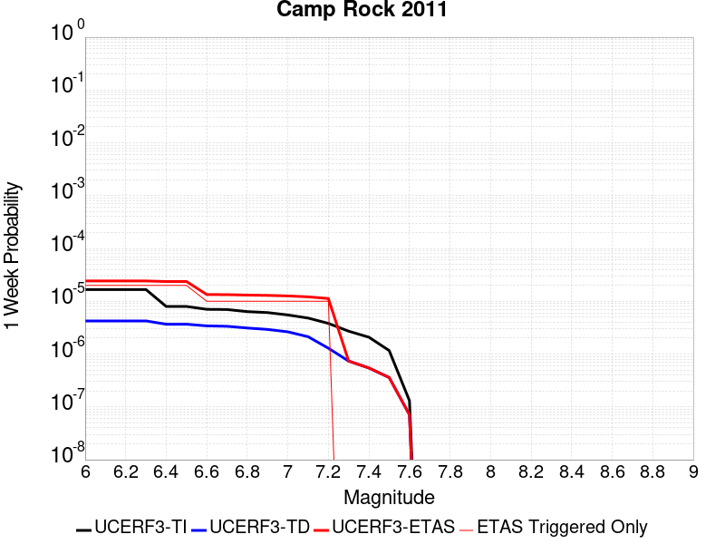 | 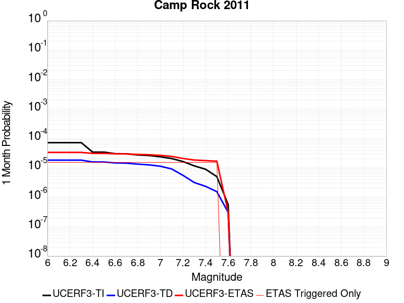 | 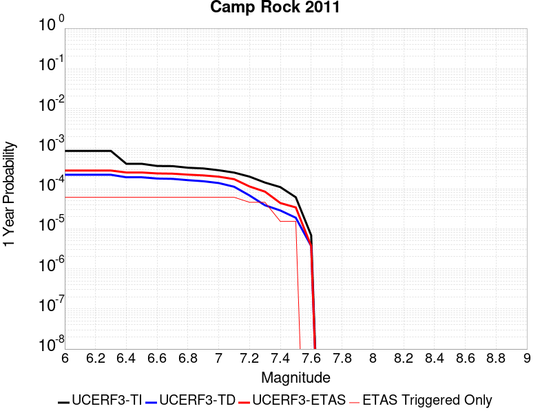 |  |

| Magnitude | 1 wk TI Prob | 1 wk TD Prob | 1 wk ETAS Prob | 1 wk ETAS/TD Gain | 1 wk ETAS Triggered Only | 1 mo TI Prob | 1 mo TD Prob | 1 mo ETAS Prob | 1 mo ETAS/TD Gain | 1 mo ETAS Triggered Only | 1 yr TI Prob | 1 yr TD Prob | 1 yr ETAS Prob | 1 yr ETAS/TD Gain | 1 yr ETAS Triggered Only | 10 yr TI Prob | 10 yr TD Prob | 10 yr ETAS Prob | 10 yr ETAS/TD Gain | 10 yr ETAS Triggered Only |
|-----|-----|-----|-----|-----|-----|-----|-----|-----|-----|-----|-----|-----|-----|-----|-----|-----|-----|-----|-----|-----|
| 6.0 | 1.6710783E-5 | 4.25026E-6 | 4.25026E-6 | 1.0 | 0.0 | 7.161568E-5 | 1.8215276E-5 | 3.34357E-5 | 1.8355856 | 1.52207E-5 | 8.7157206E-4 | 2.2174895E-4 | 2.8261825E-4 | 1.2744964 | 6.08828E-5 | 0.008681616 | 0.0022153298 | 0.0022912647 | 1.0342771 | 7.6103504E-5 |
| 6.1 | 1.6710783E-5 | 4.25026E-6 | 4.25026E-6 | 1.0 | 0.0 | 7.161568E-5 | 1.8215276E-5 | 3.34357E-5 | 1.8355856 | 1.52207E-5 | 8.7157206E-4 | 2.2174895E-4 | 2.8261825E-4 | 1.2744964 | 6.08828E-5 | 0.008681616 | 0.0022153298 | 0.0022912647 | 1.0342771 | 7.6103504E-5 |
| 6.2 | 1.6710783E-5 | 4.25026E-6 | 4.25026E-6 | 1.0 | 0.0 | 7.161568E-5 | 1.8215276E-5 | 3.34357E-5 | 1.8355856 | 1.52207E-5 | 8.7157206E-4 | 2.2174895E-4 | 2.8261825E-4 | 1.2744964 | 6.08828E-5 | 0.008681616 | 0.0022153298 | 0.0022912647 | 1.0342771 | 7.6103504E-5 |
| 6.3 | 1.6710783E-5 | 4.25026E-6 | 4.25026E-6 | 1.0 | 0.0 | 7.161568E-5 | 1.8215276E-5 | 3.34357E-5 | 1.8355856 | 1.52207E-5 | 8.7157206E-4 | 2.2174895E-4 | 2.8261825E-4 | 1.2744964 | 6.08828E-5 | 0.008681616 | 0.0022153298 | 0.0022912647 | 1.0342771 | 7.6103504E-5 |
| 6.4 | 7.982846E-6 | 3.6820884E-6 | 3.6820884E-6 | 1.0 | 0.0 | 3.421175E-5 | 1.5780286E-5 | 3.1000745E-5 | 1.9645237 | 1.52207E-5 | 4.1644843E-4 | 1.9210839E-4 | 2.529795E-4 | 1.3168582 | 6.08828E-5 | 0.0041566887 | 0.001919458 | 0.0019954154 | 1.0395724 | 7.6103504E-5 |
| 6.5 | 7.982846E-6 | 3.6820884E-6 | 3.6820884E-6 | 1.0 | 0.0 | 3.421175E-5 | 1.5780286E-5 | 3.1000745E-5 | 1.9645237 | 1.52207E-5 | 4.1644843E-4 | 1.9210839E-4 | 2.529795E-4 | 1.3168582 | 6.08828E-5 | 0.0041566887 | 0.001919458 | 0.0019954154 | 1.0395724 | 7.6103504E-5 |
| 6.6 | 7.048869E-6 | 3.4243571E-6 | 3.4243571E-6 | 1.0 | 0.0 | 3.0209088E-5 | 1.4675736E-5 | 2.9896213E-5 | 2.0371184 | 1.52207E-5 | 3.677336E-4 | 1.7866275E-4 | 2.3953467E-4 | 1.3407085 | 6.08828E-5 | 0.0036712566 | 0.0017852228 | 0.0018611904 | 1.0425535 | 7.6103504E-5 |
| 6.7 | 6.987307E-6 | 3.3623348E-6 | 3.3623348E-6 | 1.0 | 0.0 | 2.9945259E-5 | 1.4409929E-5 | 2.963041E-5 | 2.0562496 | 1.52207E-5 | 3.6452254E-4 | 1.7542706E-4 | 2.3629918E-4 | 1.3469939 | 6.08828E-5 | 0.0036392517 | 0.001752917 | 0.001828887 | 1.0433393 | 7.6103504E-5 |
| 6.8 | 6.3737602E-6 | 3.1179077E-6 | 3.1179077E-6 | 1.0 | 0.0 | 2.731583E-5 | 1.3362394E-5 | 2.8582892E-5 | 2.1390545 | 1.52207E-5 | 3.3251947E-4 | 1.626753E-4 | 2.235482E-4 | 1.3741988 | 6.08828E-5 | 0.0033202237 | 0.0016255907 | 0.0017015706 | 1.0467398 | 7.6103504E-5 |
| 6.9 | 6.112211E-6 | 2.9331156E-6 | 2.9331156E-6 | 1.0 | 0.0 | 2.6194928E-5 | 1.2570436E-5 | 2.7790946E-5 | 2.2108178 | 1.52207E-5 | 3.1887658E-4 | 1.5303459E-4 | 2.1390808E-4 | 1.397776 | 6.08828E-5 | 0.003184194 | 0.0015293199 | 0.001605307 | 1.0496869 | 7.6103504E-5 |
| 7.0 | 5.5140117E-6 | 2.641923E-6 | 2.641923E-6 | 1.0 | 0.0 | 2.3631264E-5 | 1.132248E-5 | 2.6543006E-5 | 2.3442752 | 1.52207E-5 | 2.8767265E-4 | 1.3784273E-4 | 1.9871713E-4 | 1.4416223 | 6.08828E-5 | 0.0028730053 | 0.0013775975 | 0.0014535962 | 1.0551676 | 7.6103504E-5 |
| 7.1 | 4.8151105E-6 | 2.1342705E-6 | 2.1342705E-6 | 1.0 | 0.0 | 2.0636026E-5 | 9.146843E-6 | 2.4367404E-5 | 2.6640236 | 1.52207E-5 | 2.5121463E-4 | 1.1135734E-4 | 1.7223335E-4 | 1.5466727 | 6.08828E-5 | 0.0025093083 | 0.0011130372 | 0.0011890561 | 1.0682985 | 7.6103504E-5 |
| 7.2 | 3.818335E-6 | 1.2937425E-6 | 1.2937425E-6 | 1.0 | 0.0 | 1.6364189E-5 | 5.5445994E-6 | 2.0765216E-5 | 3.7451246 | 1.52207E-5 | 1.9921579E-4 | 6.750349E-5 | 1.131625E-4 | 1.6763949 | 4.5662102E-5 | 0.0019903728 | 6.748381E-4 | 7.3567976E-4 | 1.0901575 | 6.08828E-5 |
| 7.3 | 2.7166698E-6 | 7.3835776E-7 | 7.3835776E-7 | 1.0 | 0.0 | 1.1642818E-5 | 3.1643867E-6 | 1.8385039E-5 | 5.8099847 | 1.52207E-5 | 1.4174209E-4 | 3.8525748E-5 | 8.418609E-5 | 2.1851902 | 4.5662102E-5 | 0.0014165172 | 3.851927E-4 | 4.308372E-4 | 1.1184978 | 4.5662102E-5 |
| 7.4 | 2.0893426E-6 | 5.4618386E-7 | 5.4618386E-7 | 1.0 | 0.0 | 8.954295E-6 | 2.3407858E-6 | 1.756145E-5 | 7.5023737 | 1.52207E-5 | 1.0901308E-4 | 2.84987E-5 | 4.3718966E-5 | 1.5340688 | 1.52207E-5 | 0.0010895962 | 2.84951E-4 | 3.0016736E-4 | 1.0533999 | 1.52207E-5 |
| 7.5 | 1.1681728E-6 | 3.6030585E-7 | 3.6030585E-7 | 1.0 | 0.0 | 5.0064455E-6 | 1.544167E-6 | 1.6764843E-5 | 10.856885 | 1.52207E-5 | 6.0951766E-5 | 1.8800076E-5 | 3.402049E-5 | 1.8095932 | 1.52207E-5 | 6.093505E-4 | 1.8798532E-4 | 2.0320316E-4 | 1.0809523 | 1.52207E-5 |
| 7.6 | 1.3154387E-7 | 7.1197384E-8 | 7.1197384E-8 | 1.0 | 0.0 | 5.6375933E-7 | 3.051316E-7 | 3.051316E-7 | 1.0 | 0.0 | 6.863748E-6 | 3.7149728E-6 | 3.7149728E-6 | 1.0 | 0.0 | 6.863536E-5 | 3.7149264E-5 | 3.7149264E-5 | 1.0 | 0.0 |

## Tin Mountain
*[(top)](#table-of-contents)*

| 1 Week | 1 Month | 1 Year | 10 Year |
|-----|-----|-----|-----|
|  | 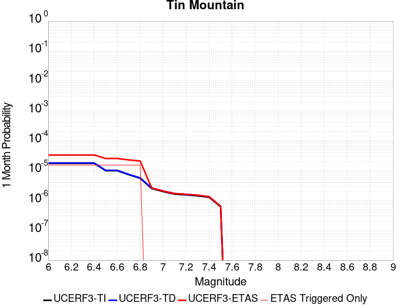 | 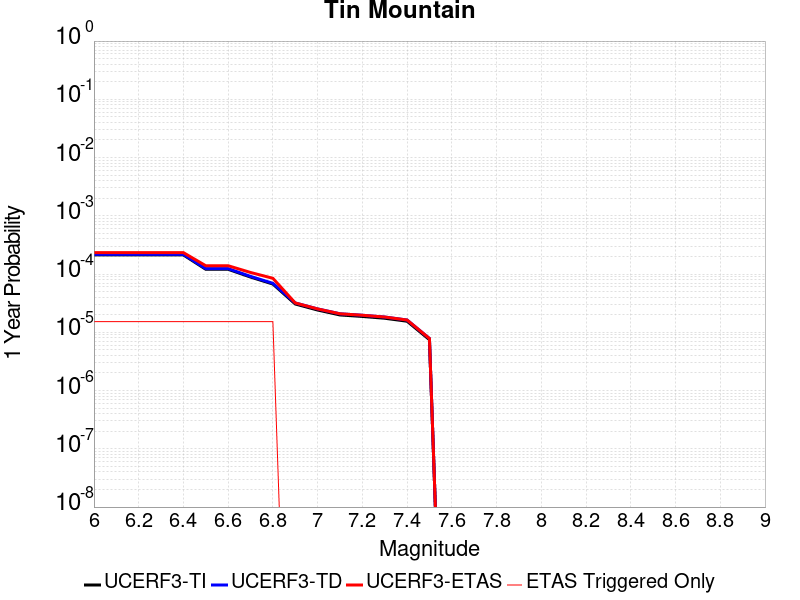 | 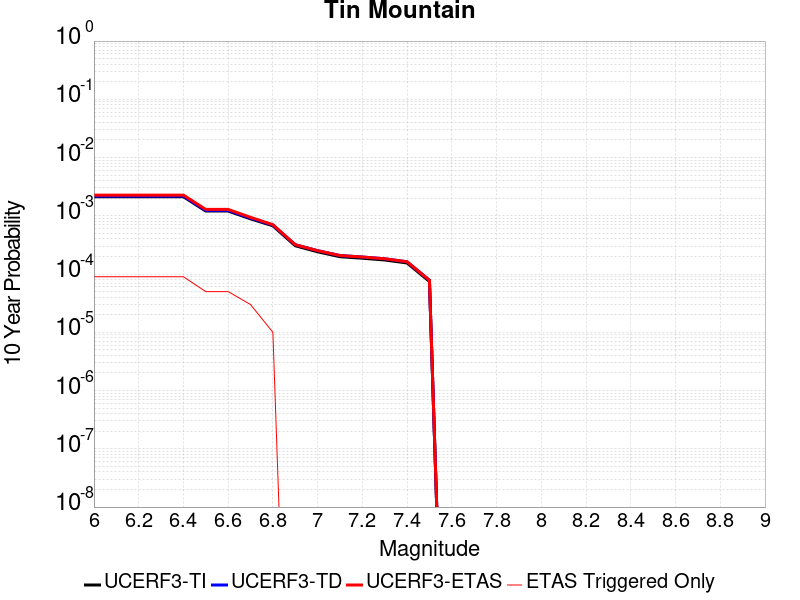 |

| Magnitude | 1 wk TI Prob | 1 wk TD Prob | 1 wk ETAS Prob | 1 wk ETAS/TD Gain | 1 wk ETAS Triggered Only | 1 mo TI Prob | 1 mo TD Prob | 1 mo ETAS Prob | 1 mo ETAS/TD Gain | 1 mo ETAS Triggered Only | 1 yr TI Prob | 1 yr TD Prob | 1 yr ETAS Prob | 1 yr ETAS/TD Gain | 1 yr ETAS Triggered Only | 10 yr TI Prob | 10 yr TD Prob | 10 yr ETAS Prob | 10 yr ETAS/TD Gain | 10 yr ETAS Triggered Only |
|-----|-----|-----|-----|-----|-----|-----|-----|-----|-----|-----|-----|-----|-----|-----|-----|-----|-----|-----|-----|-----|
| 6.0 | 4.083776E-6 | 4.1815365E-6 | 4.1815365E-6 | 1.0 | 0.0 | 1.750178E-5 | 1.792077E-5 | 3.3141197E-5 | 1.8493178 | 1.52207E-5 | 2.1306332E-4 | 2.1816725E-4 | 2.3338462E-4 | 1.069751 | 1.52207E-5 | 0.0021285915 | 0.0021798965 | 0.002255834 | 1.0348355 | 7.6103504E-5 |
| 6.1 | 4.083776E-6 | 4.1815365E-6 | 4.1815365E-6 | 1.0 | 0.0 | 1.750178E-5 | 1.792077E-5 | 3.3141197E-5 | 1.8493178 | 1.52207E-5 | 2.1306332E-4 | 2.1816725E-4 | 2.3338462E-4 | 1.069751 | 1.52207E-5 | 0.0021285915 | 0.0021798965 | 0.002255834 | 1.0348355 | 7.6103504E-5 |
| 6.2 | 4.083776E-6 | 4.1815365E-6 | 4.1815365E-6 | 1.0 | 0.0 | 1.750178E-5 | 1.792077E-5 | 3.3141197E-5 | 1.8493178 | 1.52207E-5 | 2.1306332E-4 | 2.1816725E-4 | 2.3338462E-4 | 1.069751 | 1.52207E-5 | 0.0021285915 | 0.0021798965 | 0.002255834 | 1.0348355 | 7.6103504E-5 |
| 6.3 | 4.083776E-6 | 4.1815365E-6 | 4.1815365E-6 | 1.0 | 0.0 | 1.750178E-5 | 1.792077E-5 | 3.3141197E-5 | 1.8493178 | 1.52207E-5 | 2.1306332E-4 | 2.1816725E-4 | 2.3338462E-4 | 1.069751 | 1.52207E-5 | 0.0021285915 | 0.0021798965 | 0.002255834 | 1.0348355 | 7.6103504E-5 |
| 6.4 | 4.083776E-6 | 4.1815365E-6 | 4.1815365E-6 | 1.0 | 0.0 | 1.750178E-5 | 1.792077E-5 | 3.3141197E-5 | 1.8493178 | 1.52207E-5 | 2.1306332E-4 | 2.1816725E-4 | 2.3338462E-4 | 1.069751 | 1.52207E-5 | 0.0021285915 | 0.0021798965 | 0.002255834 | 1.0348355 | 7.6103504E-5 |
| 6.5 | 2.3143427E-6 | 2.3731573E-6 | 2.3731573E-6 | 1.0 | 0.0 | 9.9185745E-6 | 1.0170638E-5 | 2.5391184E-5 | 2.4965181 | 1.52207E-5 | 1.2075195E-4 | 1.2382126E-4 | 1.3904007E-4 | 1.1229095 | 1.52207E-5 | 0.0012068636 | 0.0012375986 | 0.001298406 | 1.0491334 | 6.08828E-5 |
| 6.6 | 2.3143427E-6 | 2.3731573E-6 | 2.3731573E-6 | 1.0 | 0.0 | 9.9185745E-6 | 1.0170638E-5 | 2.5391184E-5 | 2.4965181 | 1.52207E-5 | 1.2075195E-4 | 1.2382126E-4 | 1.3904007E-4 | 1.1229095 | 1.52207E-5 | 0.0012068636 | 0.0012375986 | 0.001298406 | 1.0491334 | 6.08828E-5 |
| 6.7 | 1.7029532E-6 | 1.7497915E-6 | 1.7497915E-6 | 1.0 | 0.0 | 7.2983503E-6 | 7.499088E-6 | 2.2719674E-5 | 3.0296583 | 1.52207E-5 | 8.885379E-5 | 9.1298105E-5 | 1.06517415E-4 | 1.166699 | 1.52207E-5 | 8.881827E-4 | 9.1265864E-4 | 9.5827907E-4 | 1.0499862 | 4.5662102E-5 |
| 6.8 | 1.2914646E-6 | 1.3299378E-6 | 1.3299378E-6 | 1.0 | 0.0 | 5.534837E-6 | 5.6997237E-6 | 2.0920337E-5 | 3.6704125 | 1.52207E-5 | 6.738455E-5 | 6.939237E-5 | 8.461201E-5 | 1.2193273 | 1.52207E-5 | 6.736412E-4 | 6.9375033E-4 | 7.089605E-4 | 1.0219245 | 1.52207E-5 |
| 6.9 | 5.8708974E-7 | 6.1169936E-7 | 6.1169936E-7 | 1.0 | 0.0 | 2.5160964E-6 | 2.6215664E-6 | 2.6215664E-6 | 1.0 | 0.0 | 3.0633044E-5 | 3.1917145E-5 | 3.1917145E-5 | 1.0 | 0.0 | 3.0628822E-4 | 3.191297E-4 | 3.191297E-4 | 1.0 | 0.0 |
| 7.0 | 4.6248786E-7 | 4.832015E-7 | 4.832015E-7 | 1.0 | 0.0 | 1.9820893E-6 | 2.0708624E-6 | 2.0708624E-6 | 1.0 | 0.0 | 2.413167E-5 | 2.5212494E-5 | 2.5212494E-5 | 1.0 | 0.0 | 2.412905E-4 | 2.5210003E-4 | 2.5210003E-4 | 1.0 | 0.0 |
| 7.1 | 3.804606E-7 | 3.987147E-7 | 3.987147E-7 | 1.0 | 0.0 | 1.6305444E-6 | 1.7087764E-6 | 1.7087764E-6 | 1.0 | 0.0 | 1.9851697E-5 | 2.0804187E-5 | 2.0804187E-5 | 1.0 | 0.0 | 1.9849923E-4 | 2.0802575E-4 | 2.0802575E-4 | 1.0 | 0.0 |
| 7.2 | 3.5864858E-7 | 3.7616863E-7 | 3.7616863E-7 | 1.0 | 0.0 | 1.5370645E-6 | 1.6121504E-6 | 1.6121504E-6 | 1.0 | 0.0 | 1.87136E-5 | 1.9627789E-5 | 1.9627789E-5 | 1.0 | 0.0 | 1.8712023E-4 | 1.9626386E-4 | 1.9626386E-4 | 1.0 | 0.0 |
| 7.3 | 3.342063E-7 | 3.506347E-7 | 3.506347E-7 | 1.0 | 0.0 | 1.4323119E-6 | 1.5027196E-6 | 1.5027196E-6 | 1.0 | 0.0 | 1.7438259E-5 | 1.829549E-5 | 1.829549E-5 | 1.0 | 0.0 | 1.743689E-4 | 1.8294314E-4 | 1.8294314E-4 | 1.0 | 0.0 |
| 7.4 | 2.971242E-7 | 3.1165817E-7 | 3.1165817E-7 | 1.0 | 0.0 | 1.2733886E-6 | 1.3356774E-6 | 1.3356774E-6 | 1.0 | 0.0 | 1.5503398E-5 | 1.6261785E-5 | 1.6261785E-5 | 1.0 | 0.0 | 1.5502315E-4 | 1.6260923E-4 | 1.6260923E-4 | 1.0 | 0.0 |
| 7.5 | 1.4326713E-7 | 1.5012525E-7 | 1.5012525E-7 | 1.0 | 0.0 | 6.140018E-7 | 6.433939E-7 | 6.433939E-7 | 1.0 | 0.0 | 7.4754466E-6 | 7.8333205E-6 | 7.8333205E-6 | 1.0 | 0.0 | 7.475195E-5 | 7.833321E-5 | 7.833321E-5 | 1.0 | 0.0 |

## Big Pine (Central)
*[(top)](#table-of-contents)*

| 1 Week | 1 Month | 1 Year | 10 Year |
|-----|-----|-----|-----|
| 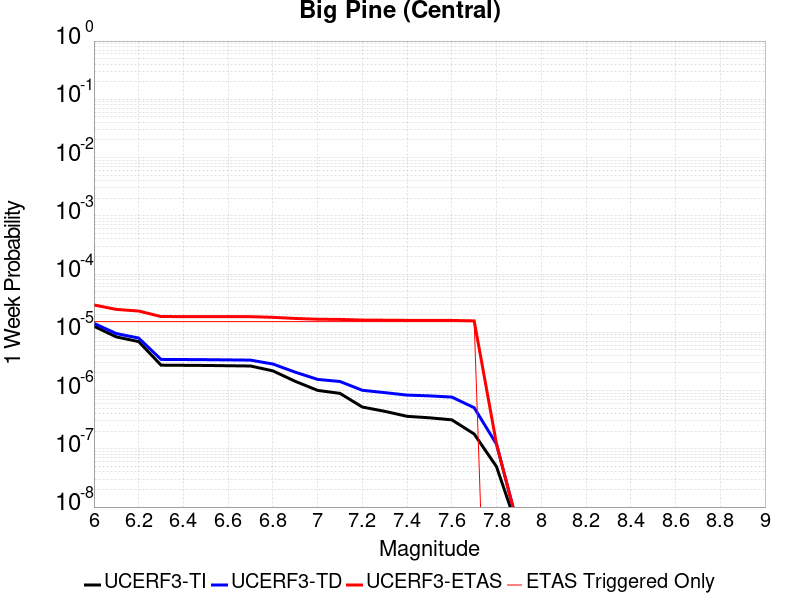 | 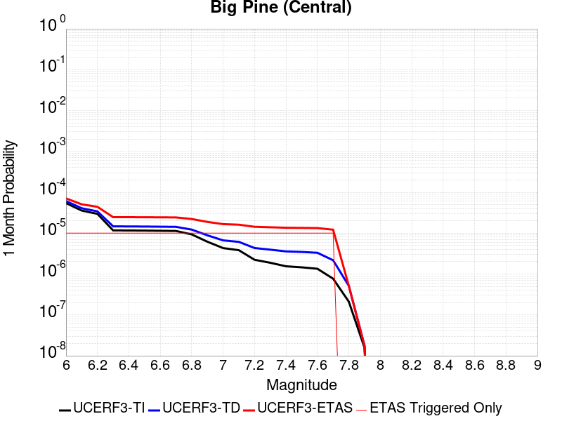 | 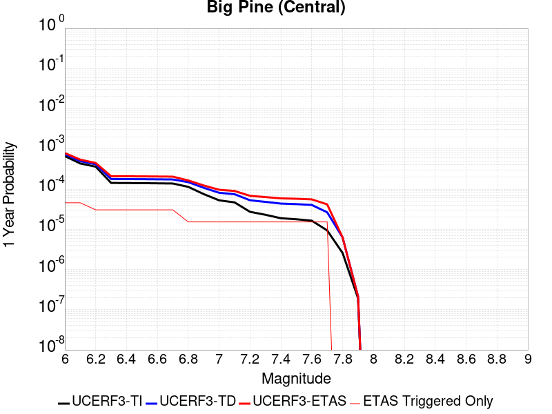 | 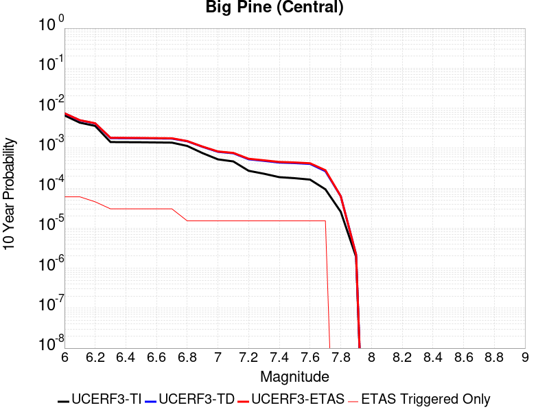 |

| Magnitude | 1 wk TI Prob | 1 wk TD Prob | 1 wk ETAS Prob | 1 wk ETAS/TD Gain | 1 wk ETAS Triggered Only | 1 mo TI Prob | 1 mo TD Prob | 1 mo ETAS Prob | 1 mo ETAS/TD Gain | 1 mo ETAS Triggered Only | 1 yr TI Prob | 1 yr TD Prob | 1 yr ETAS Prob | 1 yr ETAS/TD Gain | 1 yr ETAS Triggered Only | 10 yr TI Prob | 10 yr TD Prob | 10 yr ETAS Prob | 10 yr ETAS/TD Gain | 10 yr ETAS Triggered Only |
|-----|-----|-----|-----|-----|-----|-----|-----|-----|-----|-----|-----|-----|-----|-----|-----|-----|-----|-----|-----|-----|
| 6.0 | 1.2706755E-5 | 1.4250529E-5 | 2.9471012E-5 | 2.0680645 | 1.52207E-5 | 5.4456385E-5 | 6.107247E-5 | 7.629224E-5 | 1.2492083 | 1.52207E-5 | 6.628048E-4 | 7.433402E-4 | 7.8896835E-4 | 1.0613827 | 4.5662102E-5 | 0.006608314 | 0.0074135666 | 0.0074739982 | 1.0081514 | 6.08828E-5 |
| 6.1 | 8.342579E-6 | 9.510762E-6 | 2.4731316E-5 | 2.6003509 | 1.52207E-5 | 3.5753423E-5 | 4.0759893E-5 | 5.5979974E-5 | 1.3734082 | 1.52207E-5 | 4.3521097E-4 | 4.961604E-4 | 5.417999E-4 | 1.0919852 | 4.5662102E-5 | 0.0043435963 | 0.0049540824 | 0.0050146636 | 1.0122285 | 6.08828E-5 |
| 6.2 | 6.923899E-6 | 7.967147E-6 | 2.3187726E-5 | 2.9104176 | 1.52207E-5 | 2.9673516E-5 | 3.4144578E-5 | 4.936476E-5 | 1.4457569 | 1.52207E-5 | 3.6121515E-4 | 4.156502E-4 | 4.4607892E-4 | 1.0732076 | 3.04414E-5 | 0.003606286 | 0.0041520367 | 0.004197509 | 1.0109519 | 4.5662102E-5 |
| 6.3 | 2.728396E-6 | 3.4242908E-6 | 1.8644938E-5 | 5.4449053 | 1.52207E-5 | 1.1693074E-5 | 1.4675454E-5 | 2.9895931E-5 | 2.0371385 | 1.52207E-5 | 1.4235388E-4 | 1.7865987E-4 | 2.0909583E-4 | 1.170357 | 3.04414E-5 | 0.0014226272 | 0.0017866704 | 0.0018170574 | 1.0170076 | 3.04414E-5 |
| 6.4 | 2.7136944E-6 | 3.408584E-6 | 1.8629233E-5 | 5.4653873 | 1.52207E-5 | 1.1630066E-5 | 1.4608141E-5 | 2.9828618E-5 | 2.0419176 | 1.52207E-5 | 1.4158686E-4 | 1.7784047E-4 | 2.0827645E-4 | 1.1711421 | 3.04414E-5 | 0.0014149669 | 0.0017784894 | 0.0018088768 | 1.017086 | 3.04414E-5 |
| 6.5 | 2.6971882E-6 | 3.3909291E-6 | 1.8611578E-5 | 5.4886365 | 1.52207E-5 | 1.1559327E-5 | 1.45324775E-5 | 2.9752957E-5 | 2.0473423 | 1.52207E-5 | 1.4072572E-4 | 1.7691942E-4 | 2.0735544E-4 | 1.1720332 | 3.04414E-5 | 0.0014063664 | 0.0017692937 | 0.0017996812 | 1.017175 | 3.04414E-5 |
| 6.6 | 2.669092E-6 | 3.3609497E-6 | 1.8581599E-5 | 5.528675 | 1.52207E-5 | 1.1438916E-5 | 1.4403995E-5 | 2.9624476E-5 | 2.0566847 | 1.52207E-5 | 1.3925991E-4 | 1.753554E-4 | 2.0579147E-4 | 1.1735679 | 3.04414E-5 | 0.0013917267 | 0.0017536782 | 0.0017840662 | 1.0173281 | 3.04414E-5 |
| 6.7 | 2.6408059E-6 | 3.3309752E-6 | 1.8551626E-5 | 5.5694275 | 1.52207E-5 | 1.1317691E-5 | 1.4275535E-5 | 2.9496017E-5 | 2.0661936 | 1.52207E-5 | 1.3778417E-4 | 1.7379165E-4 | 2.0422776E-4 | 1.1751299 | 3.04414E-5 | 0.0013769877 | 0.0017380653 | 0.0017684537 | 1.0174841 | 3.04414E-5 |
| 6.8 | 2.1786943E-6 | 2.8544325E-6 | 1.8075089E-5 | 6.332288 | 1.52207E-5 | 9.337228E-6 | 1.2233229E-5 | 2.7453743E-5 | 2.2441943 | 1.52207E-5 | 1.1367482E-4 | 1.4893012E-4 | 1.6414856E-4 | 1.102185 | 1.52207E-5 | 0.0011361669 | 0.0014897975 | 0.0015049955 | 1.0102015 | 1.52207E-5 |
| 6.9 | 1.4411696E-6 | 2.068499E-6 | 1.7289167E-5 | 8.358315 | 1.52207E-5 | 6.1764263E-6 | 8.864968E-6 | 2.4085533E-5 | 2.7169342 | 1.52207E-5 | 7.51954E-5 | 1.079259E-4 | 1.2314496E-4 | 1.141014 | 1.52207E-5 | 7.5169955E-4 | 0.0010801847 | 0.0010953889 | 1.0140756 | 1.52207E-5 |
| 7.0 | 1.0073411E-6 | 1.554261E-6 | 1.6774937E-5 | 10.7928705 | 1.52207E-5 | 4.317169E-6 | 6.6611024E-6 | 2.18817E-5 | 3.284997 | 1.52207E-5 | 5.2560266E-5 | 8.1096056E-5 | 9.631552E-5 | 1.1876721 | 1.52207E-5 | 5.2547833E-4 | 8.1210316E-4 | 8.273115E-4 | 1.0187271 | 1.52207E-5 |
| 7.1 | 8.947104E-7 | 1.4302494E-6 | 1.6650927E-5 | 11.641975 | 1.52207E-5 | 3.834468E-6 | 6.129627E-6 | 2.1350234E-5 | 3.4831214 | 1.52207E-5 | 4.6683643E-5 | 7.46258E-5 | 8.9845365E-5 | 1.203945 | 1.52207E-5 | 4.6673836E-4 | 7.474457E-4 | 7.6265505E-4 | 1.0203484 | 1.52207E-5 |
| 7.2 | 5.215166E-7 | 1.0111678E-6 | 1.6231852E-5 | 16.05258 | 1.52207E-5 | 2.2350691E-6 | 4.3335694E-6 | 1.9554203E-5 | 4.512263 | 1.52207E-5 | 2.7211627E-5 | 5.2759973E-5 | 6.797987E-5 | 1.2884743 | 1.52207E-5 | 2.7208295E-4 | 5.2890263E-4 | 5.441153E-4 | 1.0287627 | 1.52207E-5 |
| 7.3 | 4.4024807E-7 | 9.219589E-7 | 1.6142645E-5 | 17.509073 | 1.52207E-5 | 1.8867761E-6 | 3.9512465E-6 | 1.9171886E-5 | 4.852111 | 1.52207E-5 | 2.2971257E-5 | 4.810541E-5 | 6.332537E-5 | 1.3163879 | 1.52207E-5 | 2.2968883E-4 | 4.8237795E-4 | 4.975913E-4 | 1.0315382 | 1.52207E-5 |
| 7.4 | 3.6130905E-7 | 8.358523E-7 | 1.605654E-5 | 19.209782 | 1.52207E-5 | 1.5484665E-6 | 3.5822195E-6 | 1.8802864E-5 | 5.248943 | 1.52207E-5 | 1.8852415E-5 | 4.3612687E-5 | 5.8832724E-5 | 1.3489819 | 1.52207E-5 | 1.8850817E-4 | 4.374597E-4 | 4.5267376E-4 | 1.0347781 | 1.52207E-5 |
| 7.5 | 3.408184E-7 | 8.108147E-7 | 1.6031503E-5 | 19.77209 | 1.52207E-5 | 1.4606494E-6 | 3.4749157E-6 | 1.8695564E-5 | 5.3801484 | 1.52207E-5 | 1.7783263E-5 | 4.2306317E-5 | 5.7526373E-5 | 1.3597585 | 1.52207E-5 | 1.778184E-4 | 4.2437963E-4 | 4.3959386E-4 | 1.0358505 | 1.52207E-5 |
| 7.6 | 3.1428627E-7 | 7.7316E-7 | 1.5993848E-5 | 20.686337 | 1.52207E-5 | 1.3469405E-6 | 3.3135389E-6 | 1.8534189E-5 | 5.5934725 | 1.52207E-5 | 1.6398877E-5 | 4.0341627E-5 | 5.5561715E-5 | 1.3772799 | 1.52207E-5 | 1.6397667E-4 | 4.0471106E-4 | 4.1992558E-4 | 1.0375936 | 1.52207E-5 |
| 7.7 | 1.7972785E-7 | 5.077752E-7 | 1.5728468E-5 | 30.975256 | 1.52207E-5 | 7.70262E-7 | 2.1761778E-6 | 1.7396846E-5 | 7.9942203 | 1.52207E-5 | 9.377899E-6 | 2.6494654E-5 | 4.171495E-5 | 1.5744667 | 1.52207E-5 | 9.377503E-5 | 2.662899E-4 | 2.8150654E-4 | 1.0571432 | 1.52207E-5 |
| 7.8 | 4.9230927E-8 | 1.198079E-7 | 1.198079E-7 | 1.0 | 0.0 | 2.1098968E-7 | 5.134623E-7 | 5.134623E-7 | 1.0 | 0.0 | 2.5687964E-6 | 6.2513873E-6 | 6.2513873E-6 | 1.0 | 0.0 | 2.5687666E-5 | 6.295415E-5 | 6.295415E-5 | 1.0 | 0.0 |
| 7.9 | 3.6805972E-9 | 4.105293E-9 | 4.105293E-9 | 1.0 | 0.0 | 1.5773987E-8 | 1.7594115E-8 | 1.7594115E-8 | 1.0 | 0.0 | 1.9204828E-7 | 2.1420831E-7 | 2.1420831E-7 | 1.0 | 0.0 | 1.920481E-6 | 2.1900614E-6 | 2.1900614E-6 | 1.0 | 0.0 |

## Rinconada 2011 CFM
*[(top)](#table-of-contents)*

| 1 Week | 1 Month | 1 Year | 10 Year |
|-----|-----|-----|-----|
|  |  | 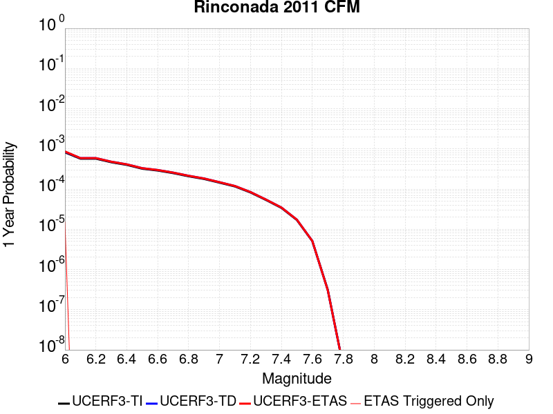 | 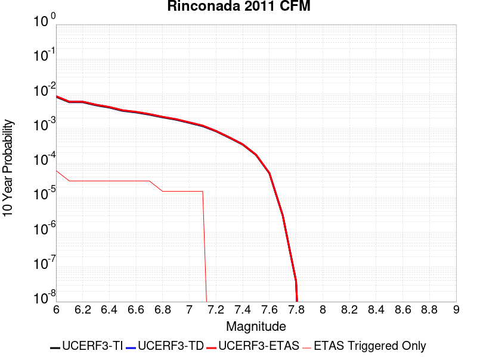 |

| Magnitude | 1 wk TI Prob | 1 wk TD Prob | 1 wk ETAS Prob | 1 wk ETAS/TD Gain | 1 wk ETAS Triggered Only | 1 mo TI Prob | 1 mo TD Prob | 1 mo ETAS Prob | 1 mo ETAS/TD Gain | 1 mo ETAS Triggered Only | 1 yr TI Prob | 1 yr TD Prob | 1 yr ETAS Prob | 1 yr ETAS/TD Gain | 1 yr ETAS Triggered Only | 10 yr TI Prob | 10 yr TD Prob | 10 yr ETAS Prob | 10 yr ETAS/TD Gain | 10 yr ETAS Triggered Only |
|-----|-----|-----|-----|-----|-----|-----|-----|-----|-----|-----|-----|-----|-----|-----|-----|-----|-----|-----|-----|-----|
| 6.0 | 1.5752368E-5 | 1.6274716E-5 | 1.6274716E-5 | 1.0 | 0.0 | 6.75084E-5 | 6.974694E-5 | 6.974694E-5 | 1.0 | 0.0 | 8.2160486E-4 | 8.488412E-4 | 8.64049E-4 | 1.017916 | 1.52207E-5 | 0.008185739 | 0.00845637 | 0.008516738 | 1.0071387 | 6.08828E-5 |
| 6.1 | 1.0966133E-5 | 1.1323029E-5 | 1.1323029E-5 | 1.0 | 0.0 | 4.6996865E-5 | 4.852637E-5 | 4.852637E-5 | 1.0 | 0.0 | 5.720366E-4 | 5.906491E-4 | 5.906491E-4 | 1.0 | 0.0 | 0.0057056635 | 0.0058908886 | 0.005921151 | 1.0051371 | 3.04414E-5 |
| 6.2 | 1.0966133E-5 | 1.1323029E-5 | 1.1323029E-5 | 1.0 | 0.0 | 4.6996865E-5 | 4.852637E-5 | 4.852637E-5 | 1.0 | 0.0 | 5.720366E-4 | 5.906491E-4 | 5.906491E-4 | 1.0 | 0.0 | 0.0057056635 | 0.0058908886 | 0.005921151 | 1.0051371 | 3.04414E-5 |
| 6.3 | 8.926149E-6 | 9.212771E-6 | 9.212771E-6 | 1.0 | 0.0 | 3.8254362E-5 | 3.948271E-5 | 3.948271E-5 | 1.0 | 0.0 | 4.6564735E-4 | 4.805963E-4 | 4.805963E-4 | 1.0 | 0.0 | 0.0046467283 | 0.0047956146 | 0.00482591 | 1.0063173 | 3.04414E-5 |
| 6.4 | 7.676955E-6 | 7.920191E-6 | 7.920191E-6 | 1.0 | 0.0 | 3.290082E-5 | 3.3943234E-5 | 3.3943234E-5 | 1.0 | 0.0 | 4.0049385E-4 | 4.1318068E-4 | 4.1318068E-4 | 1.0 | 0.0 | 0.0039977287 | 0.004124151 | 0.004154467 | 1.0073508 | 3.04414E-5 |
| 6.5 | 6.1671026E-6 | 6.3589546E-6 | 6.3589546E-6 | 1.0 | 0.0 | 2.6430173E-5 | 2.725238E-5 | 2.725238E-5 | 1.0 | 0.0 | 3.2173982E-4 | 3.317473E-4 | 3.317473E-4 | 1.0 | 0.0 | 0.003212744 | 0.0033125326 | 0.003342873 | 1.0091593 | 3.04414E-5 |
| 6.6 | 5.553456E-6 | 5.7248126E-6 | 5.7248126E-6 | 1.0 | 0.0 | 2.3800309E-5 | 2.453468E-5 | 2.453468E-5 | 1.0 | 0.0 | 2.897302E-4 | 2.9866883E-4 | 2.9866883E-4 | 1.0 | 0.0 | 0.0028935277 | 0.002982683 | 0.0030130337 | 1.0101756 | 3.04414E-5 |
| 6.7 | 4.787857E-6 | 4.9333094E-6 | 4.9333094E-6 | 1.0 | 0.0 | 2.0519226E-5 | 2.1142583E-5 | 2.1142583E-5 | 1.0 | 0.0 | 2.4979294E-4 | 2.573806E-4 | 2.573806E-4 | 1.0 | 0.0 | 0.0024951235 | 0.0025708308 | 0.002601194 | 1.0118107 | 3.04414E-5 |
| 6.8 | 3.9955166E-6 | 4.1134763E-6 | 4.1134763E-6 | 1.0 | 0.0 | 1.7123532E-5 | 1.7629065E-5 | 1.7629065E-5 | 1.0 | 0.0 | 2.0845905E-4 | 2.1461274E-4 | 2.1461274E-4 | 1.0 | 0.0 | 0.002082636 | 0.0021440585 | 0.0021592465 | 1.0070838 | 1.52207E-5 |
| 6.9 | 3.4250072E-6 | 3.5224464E-6 | 3.5224464E-6 | 1.0 | 0.0 | 1.46785205E-5 | 1.5096111E-5 | 1.5096111E-5 | 1.0 | 0.0 | 1.7869633E-4 | 1.8377967E-4 | 1.8377967E-4 | 1.0 | 0.0 | 0.001785527 | 0.0018362794 | 0.0018514721 | 1.0082736 | 1.52207E-5 |
| 7.0 | 2.7712713E-6 | 2.8467E-6 | 2.8467E-6 | 1.0 | 0.0 | 1.1876823E-5 | 1.2200086E-5 | 1.2200086E-5 | 1.0 | 0.0 | 1.4459073E-4 | 1.4852593E-4 | 1.4852593E-4 | 1.0 | 0.0 | 0.0014449668 | 0.0014842682 | 0.0014994664 | 1.0102395 | 1.52207E-5 |
| 7.1 | 2.227358E-6 | 2.2856984E-6 | 2.2856984E-6 | 1.0 | 0.0 | 9.545785E-6 | 9.795814E-6 | 9.795814E-6 | 1.0 | 0.0 | 1.16213734E-4 | 1.19257515E-4 | 1.19257515E-4 | 1.0 | 0.0 | 0.0011615298 | 0.0011919362 | 0.0012071388 | 1.0127546 | 1.52207E-5 |
| 7.2 | 1.581796E-6 | 1.6209011E-6 | 1.6209011E-6 | 1.0 | 0.0 | 6.779108E-6 | 6.9467005E-6 | 6.9467005E-6 | 1.0 | 0.0 | 8.253252E-5 | 8.457281E-5 | 8.457281E-5 | 1.0 | 0.0 | 8.250187E-4 | 8.454067E-4 | 8.454067E-4 | 1.0 | 0.0 |
| 7.3 | 1.0306567E-6 | 1.0546477E-6 | 1.0546477E-6 | 1.0 | 0.0 | 4.4170924E-6 | 4.519911E-6 | 4.519911E-6 | 1.0 | 0.0 | 5.3776774E-5 | 5.5028526E-5 | 5.5028526E-5 | 1.0 | 0.0 | 5.376376E-4 | 5.5014924E-4 | 5.5014924E-4 | 1.0 | 0.0 |
| 7.4 | 6.535541E-7 | 6.682742E-7 | 6.682742E-7 | 1.0 | 0.0 | 2.800943E-6 | 2.864029E-6 | 2.864029E-6 | 1.0 | 0.0 | 3.4100947E-5 | 3.4868997E-5 | 3.4868997E-5 | 1.0 | 0.0 | 3.4095717E-4 | 3.4863537E-4 | 3.4863537E-4 | 1.0 | 0.0 |
| 7.5 | 3.2656962E-7 | 3.3316687E-7 | 3.3316687E-7 | 1.0 | 0.0 | 1.3995833E-6 | 1.4278572E-6 | 1.4278572E-6 | 1.0 | 0.0 | 1.7039794E-5 | 1.7384024E-5 | 1.7384024E-5 | 1.0 | 0.0 | 1.7038487E-4 | 1.7382667E-4 | 1.7382667E-4 | 1.0 | 0.0 |
| 7.6 | 9.754343E-8 | 9.82099E-8 | 9.82099E-8 | 1.0 | 0.0 | 4.180432E-7 | 4.208995E-7 | 4.208995E-7 | 1.0 | 0.0 | 5.089664E-6 | 5.1244397E-6 | 5.1244397E-6 | 1.0 | 0.0 | 5.0895473E-5 | 5.1243223E-5 | 5.1243223E-5 | 1.0 | 0.0 |
| 7.7 | 6.0001453E-9 | 5.8490435E-9 | 5.8490435E-9 | 1.0 | 0.0 | 2.5714908E-8 | 2.506733E-8 | 2.506733E-8 | 1.0 | 0.0 | 3.1307894E-7 | 3.051947E-7 | 3.051947E-7 | 1.0 | 0.0 | 3.1307852E-6 | 3.051943E-6 | 3.051943E-6 | 1.0 | 0.0 |
| 7.8 | 7.400003E-11 | 7.4654505E-11 | 7.4654505E-11 | 1.0 | 0.0 | 3.171432E-10 | 3.1994773E-10 | 3.1994773E-10 | 1.0 | 0.0 | 3.861218E-9 | 3.895363E-9 | 3.895363E-9 | 1.0 | 0.0 | 3.861218E-8 | 3.895363E-8 | 3.895363E-8 | 1.0 | 0.0 |

## Elsinore (Temecula) rev
*[(top)](#table-of-contents)*

| 1 Week | 1 Month | 1 Year | 10 Year |
|-----|-----|-----|-----|
| 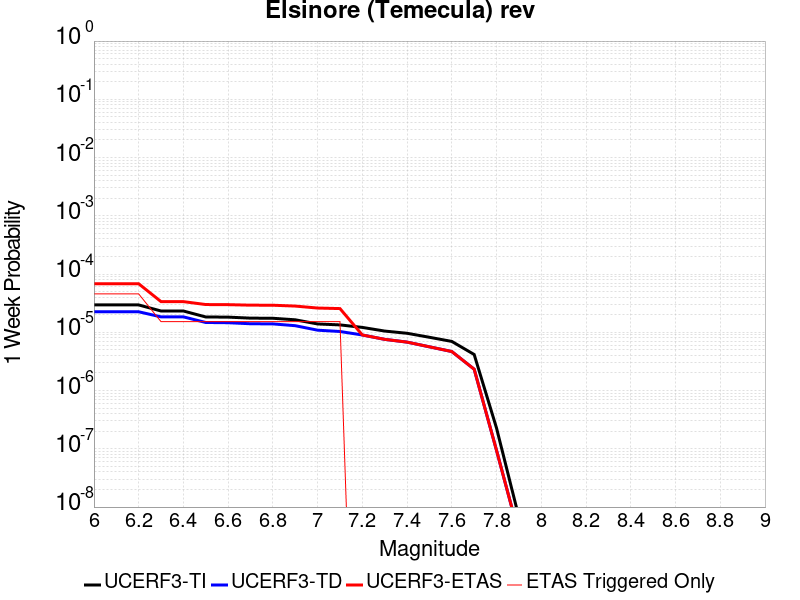 | 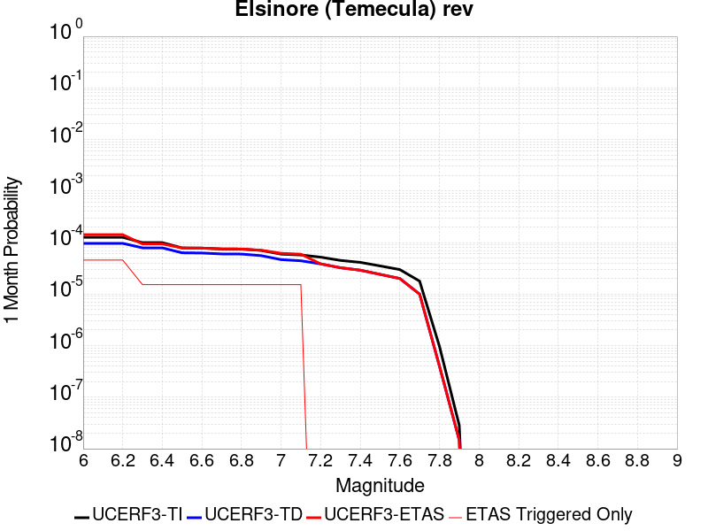 | 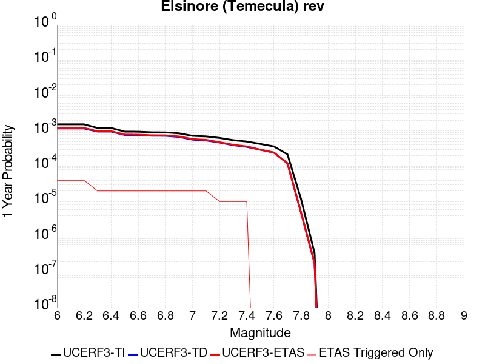 | 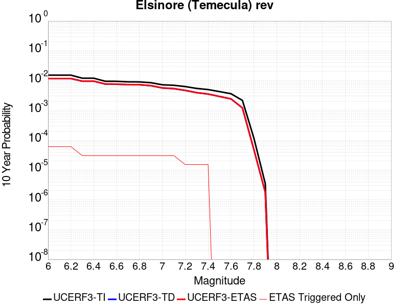 |

| Magnitude | 1 wk TI Prob | 1 wk TD Prob | 1 wk ETAS Prob | 1 wk ETAS/TD Gain | 1 wk ETAS Triggered Only | 1 mo TI Prob | 1 mo TD Prob | 1 mo ETAS Prob | 1 mo ETAS/TD Gain | 1 mo ETAS Triggered Only | 1 yr TI Prob | 1 yr TD Prob | 1 yr ETAS Prob | 1 yr ETAS/TD Gain | 1 yr ETAS Triggered Only | 10 yr TI Prob | 10 yr TD Prob | 10 yr ETAS Prob | 10 yr ETAS/TD Gain | 10 yr ETAS Triggered Only |
|-----|-----|-----|-----|-----|-----|-----|-----|-----|-----|-----|-----|-----|-----|-----|-----|-----|-----|-----|-----|-----|
| 6.0 | 2.9514995E-5 | 2.2517117E-5 | 6.817819E-5 | 3.0278382 | 4.5662102E-5 | 1.264867E-4 | 9.649849E-5 | 1.4215618E-4 | 1.4731442 | 4.5662102E-5 | 0.0015388876 | 0.0011742581 | 0.0012350694 | 1.051787 | 6.08828E-5 | 0.015282745 | 0.011696897 | 0.011757068 | 1.0051441 | 6.08828E-5 |
| 6.1 | 2.9514995E-5 | 2.2517117E-5 | 6.817819E-5 | 3.0278382 | 4.5662102E-5 | 1.264867E-4 | 9.649849E-5 | 1.4215618E-4 | 1.4731442 | 4.5662102E-5 | 0.0015388876 | 0.0011742581 | 0.0012350694 | 1.051787 | 6.08828E-5 | 0.015282745 | 0.011696897 | 0.011757068 | 1.0051441 | 6.08828E-5 |
| 6.2 | 2.9514995E-5 | 2.2517117E-5 | 6.817819E-5 | 3.0278382 | 4.5662102E-5 | 1.264867E-4 | 9.649849E-5 | 1.4215618E-4 | 1.4731442 | 4.5662102E-5 | 0.0015388876 | 0.0011742581 | 0.0012350694 | 1.051787 | 6.08828E-5 | 0.015282745 | 0.011696897 | 0.011757068 | 1.0051441 | 6.08828E-5 |
| 6.3 | 2.3223649E-5 | 1.8406454E-5 | 3.3626875E-5 | 1.8269067 | 1.52207E-5 | 9.952613E-5 | 7.888251E-5 | 9.410202E-5 | 1.1929388 | 1.52207E-5 | 0.001211057 | 9.599888E-4 | 9.904009E-4 | 1.0316797 | 3.04414E-5 | 0.012044783 | 0.009569948 | 0.009600097 | 1.0031505 | 3.04414E-5 |
| 6.4 | 2.3223649E-5 | 1.8406454E-5 | 3.3626875E-5 | 1.8269067 | 1.52207E-5 | 9.952613E-5 | 7.888251E-5 | 9.410202E-5 | 1.1929388 | 1.52207E-5 | 0.001211057 | 9.599888E-4 | 9.904009E-4 | 1.0316797 | 3.04414E-5 | 0.012044783 | 0.009569948 | 0.009600097 | 1.0031505 | 3.04414E-5 |
| 6.5 | 1.8338875E-5 | 1.4750118E-5 | 2.9970593E-5 | 2.0318885 | 1.52207E-5 | 7.8592806E-5 | 6.321331E-5 | 7.843305E-5 | 1.240768 | 1.52207E-5 | 9.5644733E-4 | 7.69359E-4 | 7.99777E-4 | 1.0395368 | 3.04414E-5 | 0.009523412 | 0.0076739118 | 0.0077041197 | 1.0039364 | 3.04414E-5 |
| 6.6 | 1.8223333E-5 | 1.4612673E-5 | 2.983315E-5 | 2.0415943 | 1.52207E-5 | 7.809766E-5 | 6.262429E-5 | 7.784404E-5 | 1.2430327 | 1.52207E-5 | 9.504242E-4 | 7.6219277E-4 | 7.926109E-4 | 1.0399088 | 3.04414E-5 | 0.009463696 | 0.0076027405 | 0.007632951 | 1.0039736 | 3.04414E-5 |
| 6.7 | 1.7512752E-5 | 1.402721E-5 | 2.9247696E-5 | 2.0850687 | 1.52207E-5 | 7.505249E-5 | 6.011528E-5 | 7.533506E-5 | 1.2531767 | 1.52207E-5 | 9.13381E-4 | 7.3166634E-4 | 7.6208543E-4 | 1.0415752 | 3.04414E-5 | 0.00909636 | 0.00729892 | 0.007329139 | 1.0041403 | 3.04414E-5 |
| 6.8 | 1.7417142E-5 | 1.3951195E-5 | 2.9171682E-5 | 2.090981 | 1.52207E-5 | 7.4642754E-5 | 5.9789512E-5 | 7.50093E-5 | 1.2545562 | 1.52207E-5 | 9.083966E-4 | 7.277028E-4 | 7.58122E-4 | 1.0418017 | 3.04414E-5 | 0.009046922 | 0.0072594886 | 0.007289709 | 1.0041629 | 3.04414E-5 |
| 6.9 | 1.6402591E-5 | 1.2988613E-5 | 2.8209115E-5 | 2.1718342 | 1.52207E-5 | 7.0294926E-5 | 5.5664343E-5 | 7.08842E-5 | 1.273422 | 1.52207E-5 | 8.5550465E-4 | 6.775103E-4 | 7.0793106E-4 | 1.0449008 | 3.04414E-5 | 0.008522186 | 0.006760169 | 0.006790404 | 1.0044726 | 3.04414E-5 |
| 7.0 | 1.3912486E-5 | 1.0878233E-5 | 2.6098767E-5 | 2.3991735 | 1.52207E-5 | 5.9623577E-5 | 4.6620182E-5 | 6.1840175E-5 | 1.3264679 | 1.52207E-5 | 7.2567526E-4 | 5.674556E-4 | 5.9787976E-4 | 1.053615 | 3.04414E-5 | 0.0072331014 | 0.005663986 | 0.0056942548 | 1.0053442 | 3.04414E-5 |
| 7.1 | 1.3405147E-5 | 1.03274215E-5 | 2.5547964E-5 | 2.473799 | 1.52207E-5 | 5.7449364E-5 | 4.425964E-5 | 5.9479666E-5 | 1.3438805 | 1.52207E-5 | 6.9922156E-4 | 5.3873047E-4 | 5.6915544E-4 | 1.0564754 | 3.04414E-5 | 0.0069702556 | 0.005377577 | 0.0054078544 | 1.0056304 | 3.04414E-5 |
| 7.2 | 1.21402E-5 | 8.996737E-6 | 8.996737E-6 | 1.0 | 0.0 | 5.202839E-5 | 3.8556886E-5 | 3.8556886E-5 | 1.0 | 0.0 | 6.332616E-4 | 4.6933076E-4 | 4.845443E-4 | 1.0324154 | 1.52207E-5 | 0.0063146 | 0.004684821 | 0.00469997 | 1.0032337 | 1.52207E-5 |
| 7.3 | 1.05047775E-5 | 7.571771E-6 | 7.571771E-6 | 1.0 | 0.0 | 4.5019697E-5 | 3.245005E-5 | 3.245005E-5 | 1.0 | 0.0 | 5.4797693E-4 | 3.950092E-4 | 4.102239E-4 | 1.0385174 | 1.52207E-5 | 0.005466277 | 0.00394346 | 0.003958621 | 1.0038445 | 1.52207E-5 |
| 7.4 | 9.624483E-6 | 6.7868696E-6 | 6.7868696E-6 | 1.0 | 0.0 | 4.124713E-5 | 2.9086266E-5 | 2.9086266E-5 | 1.0 | 0.0 | 5.0206814E-4 | 3.5406914E-4 | 3.6928445E-4 | 1.0429727 | 1.52207E-5 | 0.005009353 | 0.003535204 | 0.003550371 | 1.0042902 | 1.52207E-5 |
| 7.5 | 8.215151E-6 | 5.635538E-6 | 5.635538E-6 | 1.0 | 0.0 | 3.5207315E-5 | 2.4152088E-5 | 2.4152088E-5 | 1.0 | 0.0 | 4.2856473E-4 | 2.9401327E-4 | 2.9401327E-4 | 1.0 | 0.0 | 0.004277392 | 0.002936371 | 0.002936371 | 1.0 | 0.0 |
| 7.6 | 6.975058E-6 | 4.676045E-6 | 4.676045E-6 | 1.0 | 0.0 | 2.9892764E-5 | 2.0040046E-5 | 2.0040046E-5 | 1.0 | 0.0 | 3.6388362E-4 | 2.439614E-4 | 2.439614E-4 | 1.0 | 0.0 | 0.0036328835 | 0.002437052 | 0.002437052 | 1.0 | 0.0 |
| 7.7 | 4.159604E-6 | 2.3269924E-6 | 2.3269924E-6 | 1.0 | 0.0 | 1.7826753E-5 | 9.97279E-6 | 9.97279E-6 | 1.0 | 0.0 | 2.1701909E-4 | 1.21412704E-4 | 1.21412704E-4 | 1.0 | 0.0 | 0.0021680726 | 0.0012135367 | 0.0012135367 | 1.0 | 0.0 |
| 7.8 | 2.2692414E-7 | 9.3854695E-8 | 9.3854695E-8 | 1.0 | 0.0 | 9.725317E-7 | 4.0223435E-7 | 4.0223435E-7 | 1.0 | 0.0 | 1.1840509E-5 | 4.8971956E-6 | 4.8971956E-6 | 1.0 | 0.0 | 1.1839878E-4 | 4.8971204E-5 | 4.8971204E-5 | 1.0 | 0.0 |
| 7.9 | 6.676829E-9 | 3.439853E-9 | 3.439853E-9 | 1.0 | 0.0 | 2.861498E-8 | 1.4742227E-8 | 1.4742227E-8 | 1.0 | 0.0 | 3.4838732E-7 | 1.7948659E-7 | 1.7948659E-7 | 1.0 | 0.0 | 3.4838679E-6 | 1.7948646E-6 | 1.7948646E-6 | 1.0 | 0.0 |

## Puente Hills
*[(top)](#table-of-contents)*

| 1 Week | 1 Month | 1 Year | 10 Year |
|-----|-----|-----|-----|
| 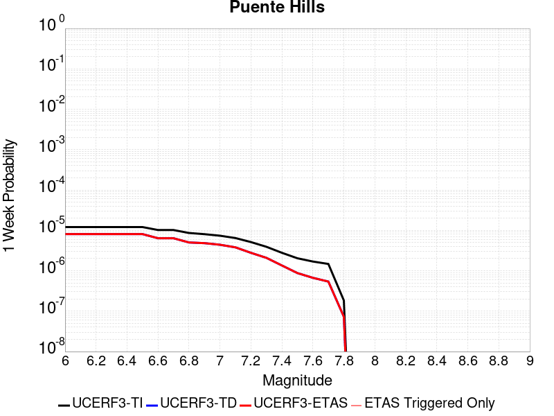 | 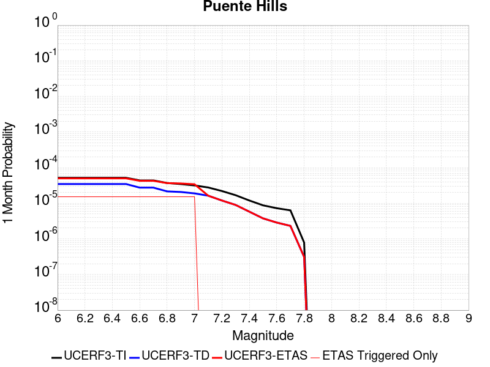 | 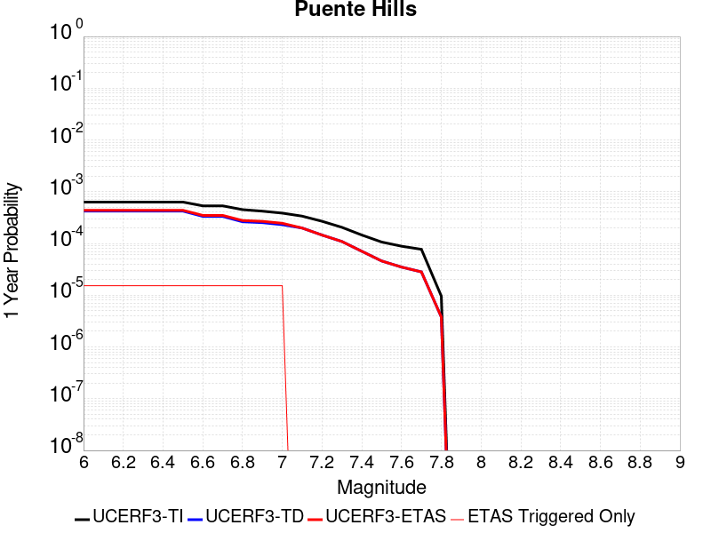 | 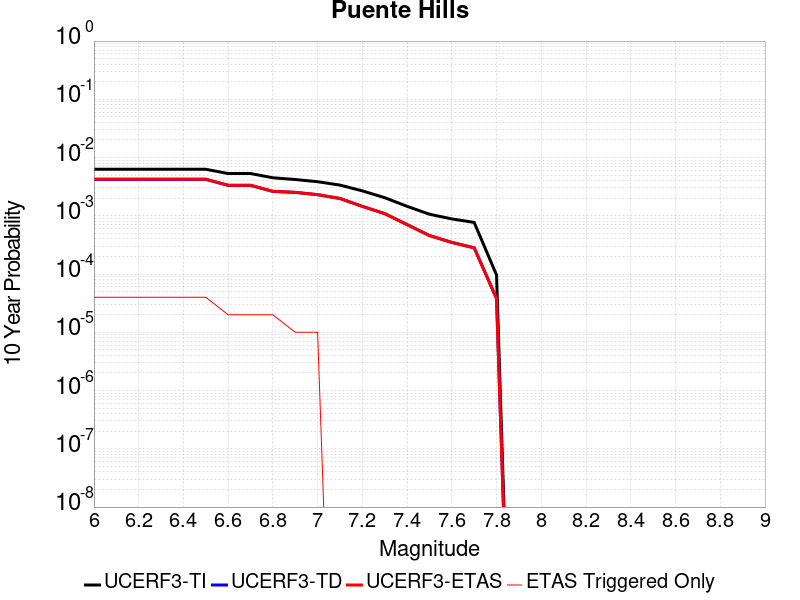 |

| Magnitude | 1 wk TI Prob | 1 wk TD Prob | 1 wk ETAS Prob | 1 wk ETAS/TD Gain | 1 wk ETAS Triggered Only | 1 mo TI Prob | 1 mo TD Prob | 1 mo ETAS Prob | 1 mo ETAS/TD Gain | 1 mo ETAS Triggered Only | 1 yr TI Prob | 1 yr TD Prob | 1 yr ETAS Prob | 1 yr ETAS/TD Gain | 1 yr ETAS Triggered Only | 10 yr TI Prob | 10 yr TD Prob | 10 yr ETAS Prob | 10 yr ETAS/TD Gain | 10 yr ETAS Triggered Only |
|-----|-----|-----|-----|-----|-----|-----|-----|-----|-----|-----|-----|-----|-----|-----|-----|-----|-----|-----|-----|-----|
| 6.0 | 1.2101656E-5 | 8.098625E-6 | 8.098625E-6 | 1.0 | 0.0 | 5.1863204E-5 | 3.4707962E-5 | 4.9928134E-5 | 1.438521 | 1.52207E-5 | 6.312516E-4 | 4.2249315E-4 | 4.377074E-4 | 1.0360107 | 1.52207E-5 | 0.0062946146 | 0.0042174594 | 0.0042780857 | 1.014375 | 6.08828E-5 |
| 6.1 | 1.2101656E-5 | 8.098625E-6 | 8.098625E-6 | 1.0 | 0.0 | 5.1863204E-5 | 3.4707962E-5 | 4.9928134E-5 | 1.438521 | 1.52207E-5 | 6.312516E-4 | 4.2249315E-4 | 4.377074E-4 | 1.0360107 | 1.52207E-5 | 0.0062946146 | 0.0042174594 | 0.0042780857 | 1.014375 | 6.08828E-5 |
| 6.2 | 1.2101656E-5 | 8.098625E-6 | 8.098625E-6 | 1.0 | 0.0 | 5.1863204E-5 | 3.4707962E-5 | 4.9928134E-5 | 1.438521 | 1.52207E-5 | 6.312516E-4 | 4.2249315E-4 | 4.377074E-4 | 1.0360107 | 1.52207E-5 | 0.0062946146 | 0.0042174594 | 0.0042780857 | 1.014375 | 6.08828E-5 |
| 6.3 | 1.2101656E-5 | 8.098625E-6 | 8.098625E-6 | 1.0 | 0.0 | 5.1863204E-5 | 3.4707962E-5 | 4.9928134E-5 | 1.438521 | 1.52207E-5 | 6.312516E-4 | 4.2249315E-4 | 4.377074E-4 | 1.0360107 | 1.52207E-5 | 0.0062946146 | 0.0042174594 | 0.0042780857 | 1.014375 | 6.08828E-5 |
| 6.4 | 1.2101656E-5 | 8.098625E-6 | 8.098625E-6 | 1.0 | 0.0 | 5.1863204E-5 | 3.4707962E-5 | 4.9928134E-5 | 1.438521 | 1.52207E-5 | 6.312516E-4 | 4.2249315E-4 | 4.377074E-4 | 1.0360107 | 1.52207E-5 | 0.0062946146 | 0.0042174594 | 0.0042780857 | 1.014375 | 6.08828E-5 |
| 6.5 | 1.2101656E-5 | 8.098625E-6 | 8.098625E-6 | 1.0 | 0.0 | 5.1863204E-5 | 3.4707962E-5 | 4.9928134E-5 | 1.438521 | 1.52207E-5 | 6.312516E-4 | 4.2249315E-4 | 4.377074E-4 | 1.0360107 | 1.52207E-5 | 0.0062946146 | 0.0042174594 | 0.0042780857 | 1.014375 | 6.08828E-5 |
| 6.6 | 1.0222488E-5 | 6.3991847E-6 | 6.3991847E-6 | 1.0 | 0.0 | 4.3809923E-5 | 2.7424803E-5 | 4.2645086E-5 | 1.5549824 | 1.52207E-5 | 5.332553E-4 | 3.3384826E-4 | 3.490639E-4 | 1.0455765 | 1.52207E-5 | 0.0053197746 | 0.0033337125 | 0.0033640524 | 1.0091009 | 3.04414E-5 |
| 6.7 | 1.0222488E-5 | 6.3991847E-6 | 6.3991847E-6 | 1.0 | 0.0 | 4.3809923E-5 | 2.7424803E-5 | 4.2645086E-5 | 1.5549824 | 1.52207E-5 | 5.332553E-4 | 3.3384826E-4 | 3.490639E-4 | 1.0455765 | 1.52207E-5 | 0.0053197746 | 0.0033337125 | 0.0033640524 | 1.0091009 | 3.04414E-5 |
| 6.8 | 8.6367845E-6 | 5.0282533E-6 | 5.0282533E-6 | 1.0 | 0.0 | 3.7014266E-5 | 2.1549482E-5 | 3.6769856E-5 | 1.7062987 | 1.52207E-5 | 4.505555E-4 | 2.623339E-4 | 2.775506E-4 | 1.0580051 | 1.52207E-5 | 0.004496431 | 0.0026202986 | 0.0026506602 | 1.0115871 | 3.04414E-5 |
| 6.9 | 8.066481E-6 | 4.836117E-6 | 4.836117E-6 | 1.0 | 0.0 | 3.4570177E-5 | 2.0726053E-5 | 3.594644E-5 | 1.73436 | 1.52207E-5 | 4.2081063E-4 | 2.52311E-4 | 2.6752788E-4 | 1.0603099 | 1.52207E-5 | 0.0042001465 | 0.0025202993 | 0.0025354817 | 1.006024 | 1.52207E-5 |
| 7.0 | 7.393828E-6 | 4.417296E-6 | 4.417296E-6 | 1.0 | 0.0 | 3.168745E-5 | 1.8931134E-5 | 3.4151548E-5 | 1.8039883 | 1.52207E-5 | 3.857264E-4 | 2.3046264E-4 | 2.4567984E-4 | 1.0660288 | 1.52207E-5 | 0.0038505755 | 0.0023022818 | 0.0023174675 | 1.006596 | 1.52207E-5 |
| 7.1 | 6.4660953E-6 | 3.8044495E-6 | 3.8044495E-6 | 1.0 | 0.0 | 2.7711543E-5 | 1.6304684E-5 | 1.6304684E-5 | 1.0 | 0.0 | 3.373358E-4 | 1.984918E-4 | 1.984918E-4 | 1.0 | 0.0 | 0.0033682417 | 0.001983181 | 0.001983181 | 1.0 | 0.0 |
| 7.2 | 5.143232E-6 | 2.7865456E-6 | 2.7865456E-6 | 1.0 | 0.0 | 2.2042237E-5 | 1.1942284E-5 | 1.1942284E-5 | 1.0 | 0.0 | 2.6833118E-4 | 1.453877E-4 | 1.453877E-4 | 1.0 | 0.0 | 0.002680074 | 0.0014529356 | 0.0014529356 | 1.0 | 0.0 |
| 7.3 | 3.928255E-6 | 2.0913774E-6 | 2.0913774E-6 | 1.0 | 0.0 | 1.683527E-5 | 8.963015E-6 | 8.963015E-6 | 1.0 | 0.0 | 2.0495013E-4 | 1.0911931E-4 | 1.0911931E-4 | 1.0 | 0.0 | 0.002047612 | 0.001090664 | 0.001090664 | 1.0 | 0.0 |
| 7.4 | 2.7894434E-6 | 1.3546753E-6 | 1.3546753E-6 | 1.0 | 0.0 | 1.1954703E-5 | 5.8057385E-6 | 5.8057385E-6 | 1.0 | 0.0 | 1.4553878E-4 | 7.068262E-5 | 7.068262E-5 | 1.0 | 0.0 | 0.001454435 | 7.066058E-4 | 7.066058E-4 | 1.0 | 0.0 |
| 7.5 | 2.041735E-6 | 8.787305E-7 | 8.787305E-7 | 1.0 | 0.0 | 8.750263E-6 | 3.7659825E-6 | 3.7659825E-6 | 1.0 | 0.0 | 1.06529245E-4 | 4.5849905E-5 | 4.5849905E-5 | 1.0 | 0.0 | 0.0010647819 | 4.5840783E-4 | 4.5840783E-4 | 1.0 | 0.0 |
| 7.6 | 1.6959062E-6 | 6.6986263E-7 | 6.6986263E-7 | 1.0 | 0.0 | 7.268149E-6 | 2.8708366E-6 | 2.8708366E-6 | 1.0 | 0.0 | 8.848612E-5 | 3.4951907E-5 | 3.4951907E-5 | 1.0 | 0.0 | 8.84509E-4 | 3.4946698E-4 | 3.4946698E-4 | 1.0 | 0.0 |
| 7.7 | 1.4767965E-6 | 5.407607E-7 | 5.407607E-7 | 1.0 | 0.0 | 6.3291122E-6 | 2.317544E-6 | 2.317544E-6 | 1.0 | 0.0 | 7.705422E-5 | 2.8215758E-5 | 2.8215758E-5 | 1.0 | 0.0 | 7.702751E-4 | 2.8212433E-4 | 2.8212433E-4 | 1.0 | 0.0 |
| 7.8 | 1.8432911E-7 | 7.28201E-8 | 7.28201E-8 | 1.0 | 0.0 | 7.8998164E-7 | 3.1208612E-7 | 3.1208612E-7 | 1.0 | 0.0 | 9.617985E-6 | 3.7996451E-6 | 3.7996451E-6 | 1.0 | 0.0 | 9.617568E-5 | 3.7996128E-5 | 3.7996128E-5 | 1.0 | 0.0 |

## Bullion Mountains
*[(top)](#table-of-contents)*

| 1 Week | 1 Month | 1 Year | 10 Year |
|-----|-----|-----|-----|
| 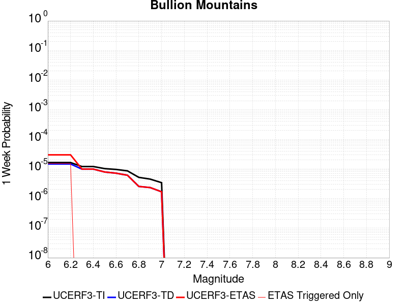 | 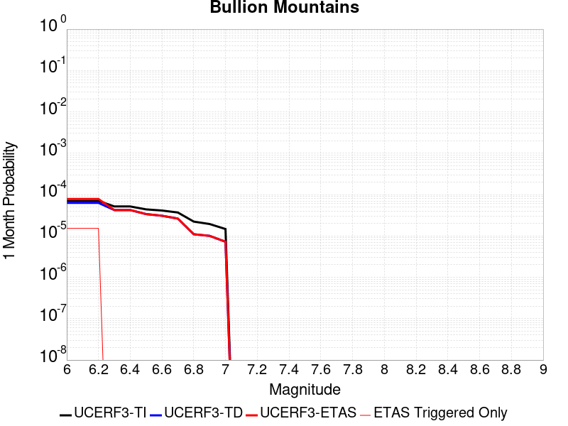 |  | 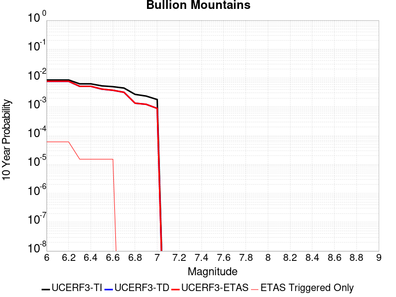 |

| Magnitude | 1 wk TI Prob | 1 wk TD Prob | 1 wk ETAS Prob | 1 wk ETAS/TD Gain | 1 wk ETAS Triggered Only | 1 mo TI Prob | 1 mo TD Prob | 1 mo ETAS Prob | 1 mo ETAS/TD Gain | 1 mo ETAS Triggered Only | 1 yr TI Prob | 1 yr TD Prob | 1 yr ETAS Prob | 1 yr ETAS/TD Gain | 1 yr ETAS Triggered Only | 10 yr TI Prob | 10 yr TD Prob | 10 yr ETAS Prob | 10 yr ETAS/TD Gain | 10 yr ETAS Triggered Only |
|-----|-----|-----|-----|-----|-----|-----|-----|-----|-----|-----|-----|-----|-----|-----|-----|-----|-----|-----|-----|-----|
| 6.0 | 1.6420427E-5 | 1.4692089E-5 | 2.9912566E-5 | 2.035964 | 1.52207E-5 | 7.037136E-5 | 6.296479E-5 | 7.818454E-5 | 1.2417183 | 1.52207E-5 | 8.5643446E-4 | 7.663651E-4 | 7.967832E-4 | 1.0396913 | 3.04414E-5 | 0.008531413 | 0.007641016 | 0.0077014337 | 1.007907 | 6.08828E-5 |
| 6.1 | 1.6420427E-5 | 1.4692089E-5 | 2.9912566E-5 | 2.035964 | 1.52207E-5 | 7.037136E-5 | 6.296479E-5 | 7.818454E-5 | 1.2417183 | 1.52207E-5 | 8.5643446E-4 | 7.663651E-4 | 7.967832E-4 | 1.0396913 | 3.04414E-5 | 0.008531413 | 0.007641016 | 0.0077014337 | 1.007907 | 6.08828E-5 |
| 6.2 | 1.6420427E-5 | 1.4692089E-5 | 2.9912566E-5 | 2.035964 | 1.52207E-5 | 7.037136E-5 | 6.296479E-5 | 7.818454E-5 | 1.2417183 | 1.52207E-5 | 8.5643446E-4 | 7.663651E-4 | 7.967832E-4 | 1.0396913 | 3.04414E-5 | 0.008531413 | 0.007641016 | 0.0077014337 | 1.007907 | 6.08828E-5 |
| 6.3 | 1.2046778E-5 | 9.862335E-6 | 9.862335E-6 | 1.0 | 0.0 | 5.1628023E-5 | 4.2266598E-5 | 4.2266598E-5 | 1.0 | 0.0 | 6.283899E-4 | 5.144975E-4 | 5.297104E-4 | 1.0295684 | 1.52207E-5 | 0.0062661595 | 0.005135345 | 0.0051504876 | 1.0029486 | 1.52207E-5 |
| 6.4 | 1.2046778E-5 | 9.862335E-6 | 9.862335E-6 | 1.0 | 0.0 | 5.1628023E-5 | 4.2266598E-5 | 4.2266598E-5 | 1.0 | 0.0 | 6.283899E-4 | 5.144975E-4 | 5.297104E-4 | 1.0295684 | 1.52207E-5 | 0.0062661595 | 0.005135345 | 0.0051504876 | 1.0029486 | 1.52207E-5 |
| 6.5 | 1.0244343E-5 | 7.879458E-6 | 7.879458E-6 | 1.0 | 0.0 | 4.390359E-5 | 3.3768785E-5 | 3.3768785E-5 | 1.0 | 0.0 | 5.343951E-4 | 4.110781E-4 | 4.2629254E-4 | 1.037011 | 1.52207E-5 | 0.005331118 | 0.004105208 | 0.004120366 | 1.0036924 | 1.52207E-5 |
| 6.6 | 9.605408E-6 | 7.1774966E-6 | 7.1774966E-6 | 1.0 | 0.0 | 4.1165385E-5 | 3.076045E-5 | 3.076045E-5 | 1.0 | 0.0 | 5.010733E-4 | 3.744645E-4 | 3.8967948E-4 | 1.0406314 | 1.52207E-5 | 0.00499945 | 0.003740332 | 0.0037554959 | 1.0040541 | 1.52207E-5 |
| 6.7 | 8.60418E-6 | 6.1240044E-6 | 6.1240044E-6 | 1.0 | 0.0 | 3.687454E-5 | 2.624558E-5 | 2.624558E-5 | 1.0 | 0.0 | 4.48855E-4 | 3.1951256E-4 | 3.1951256E-4 | 1.0 | 0.0 | 0.004479495 | 0.0031924439 | 0.0031924439 | 1.0 | 0.0 |
| 6.8 | 5.187994E-6 | 2.5631666E-6 | 2.5631666E-6 | 1.0 | 0.0 | 2.223407E-5 | 1.0984976E-5 | 1.0984976E-5 | 1.0 | 0.0 | 2.7066618E-4 | 1.3373788E-4 | 1.3373788E-4 | 1.0 | 0.0 | 0.0027033675 | 0.0013369655 | 0.0013369655 | 1.0 | 0.0 |
| 6.9 | 4.5302368E-6 | 2.3443165E-6 | 2.3443165E-6 | 1.0 | 0.0 | 1.9415156E-5 | 1.0047055E-5 | 1.0047055E-5 | 1.0 | 0.0 | 2.3635388E-4 | 1.2232E-4 | 1.2232E-4 | 1.0 | 0.0 | 0.0023610266 | 0.0012229157 | 0.0012229157 | 1.0 | 0.0 |
| 7.0 | 3.431668E-6 | 1.6882402E-6 | 1.6882402E-6 | 1.0 | 0.0 | 1.4707065E-5 | 7.235315E-6 | 7.235315E-6 | 1.0 | 0.0 | 1.7904381E-4 | 8.808996E-5 | 8.808996E-5 | 1.0 | 0.0 | 0.0017889962 | 8.808996E-4 | 8.808996E-4 | 1.0 | 0.0 |

## San Gabriel
*[(top)](#table-of-contents)*

| 1 Week | 1 Month | 1 Year | 10 Year |
|-----|-----|-----|-----|
| 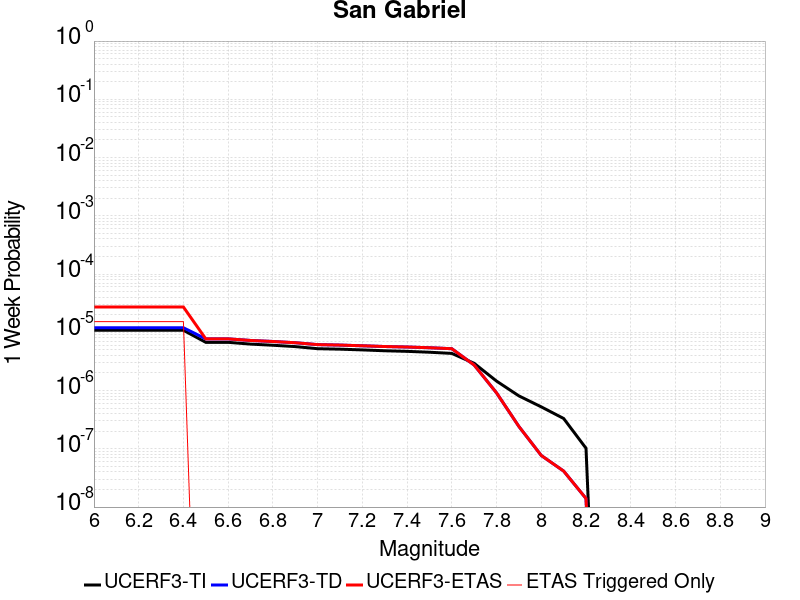 | 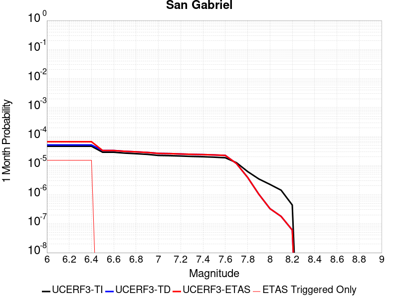 | 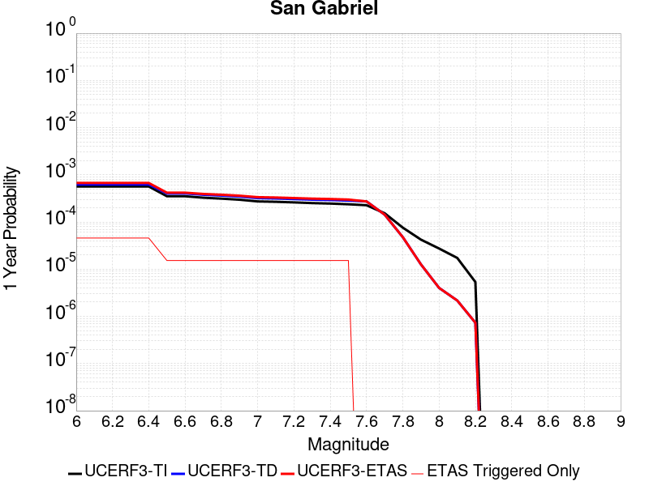 | 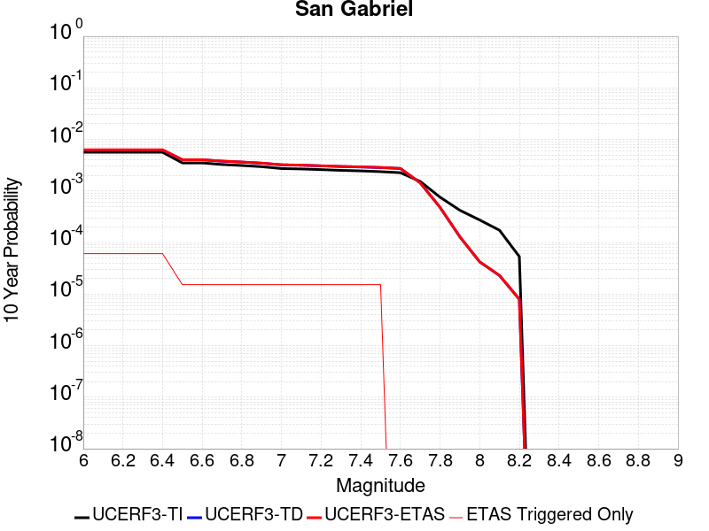 |

| Magnitude | 1 wk TI Prob | 1 wk TD Prob | 1 wk ETAS Prob | 1 wk ETAS/TD Gain | 1 wk ETAS Triggered Only | 1 mo TI Prob | 1 mo TD Prob | 1 mo ETAS Prob | 1 mo ETAS/TD Gain | 1 mo ETAS Triggered Only | 1 yr TI Prob | 1 yr TD Prob | 1 yr ETAS Prob | 1 yr ETAS/TD Gain | 1 yr ETAS Triggered Only | 10 yr TI Prob | 10 yr TD Prob | 10 yr ETAS Prob | 10 yr ETAS/TD Gain | 10 yr ETAS Triggered Only |
|-----|-----|-----|-----|-----|-----|-----|-----|-----|-----|-----|-----|-----|-----|-----|-----|-----|-----|-----|-----|-----|
| 6.0 | 1.083775E-5 | 1.19851875E-5 | 2.7205706E-5 | 2.269944 | 1.52207E-5 | 4.6446676E-5 | 5.1364143E-5 | 6.658406E-5 | 1.2963141 | 1.52207E-5 | 5.653415E-4 | 6.251903E-4 | 6.7082385E-4 | 1.0729915 | 4.5662102E-5 | 0.0056390543 | 0.006246409 | 0.006306912 | 1.009686 | 6.08828E-5 |
| 6.1 | 1.083775E-5 | 1.19851875E-5 | 2.7205706E-5 | 2.269944 | 1.52207E-5 | 4.6446676E-5 | 5.1364143E-5 | 6.658406E-5 | 1.2963141 | 1.52207E-5 | 5.653415E-4 | 6.251903E-4 | 6.7082385E-4 | 1.0729915 | 4.5662102E-5 | 0.0056390543 | 0.006246409 | 0.006306912 | 1.009686 | 6.08828E-5 |
| 6.2 | 1.083775E-5 | 1.19851875E-5 | 2.7205706E-5 | 2.269944 | 1.52207E-5 | 4.6446676E-5 | 5.1364143E-5 | 6.658406E-5 | 1.2963141 | 1.52207E-5 | 5.653415E-4 | 6.251903E-4 | 6.7082385E-4 | 1.0729915 | 4.5662102E-5 | 0.0056390543 | 0.006246409 | 0.006306912 | 1.009686 | 6.08828E-5 |
| 6.3 | 1.083775E-5 | 1.19851875E-5 | 2.7205706E-5 | 2.269944 | 1.52207E-5 | 4.6446676E-5 | 5.1364143E-5 | 6.658406E-5 | 1.2963141 | 1.52207E-5 | 5.653415E-4 | 6.251903E-4 | 6.7082385E-4 | 1.0729915 | 4.5662102E-5 | 0.0056390543 | 0.006246409 | 0.006306912 | 1.009686 | 6.08828E-5 |
| 6.4 | 1.083775E-5 | 1.19851875E-5 | 2.7205706E-5 | 2.269944 | 1.52207E-5 | 4.6446676E-5 | 5.1364143E-5 | 6.658406E-5 | 1.2963141 | 1.52207E-5 | 5.653415E-4 | 6.251903E-4 | 6.7082385E-4 | 1.0729915 | 4.5662102E-5 | 0.0056390543 | 0.006246409 | 0.006306912 | 1.009686 | 6.08828E-5 |
| 6.5 | 6.7317824E-6 | 7.716944E-6 | 7.716944E-6 | 1.0 | 0.0 | 2.8850178E-5 | 3.3072207E-5 | 3.3072207E-5 | 1.0 | 0.0 | 3.511943E-4 | 4.0258077E-4 | 4.1779535E-4 | 1.0377926 | 1.52207E-5 | 0.003506398 | 0.0040296097 | 0.004044769 | 1.003762 | 1.52207E-5 |
| 6.6 | 6.7317824E-6 | 7.716944E-6 | 7.716944E-6 | 1.0 | 0.0 | 2.8850178E-5 | 3.3072207E-5 | 3.3072207E-5 | 1.0 | 0.0 | 3.511943E-4 | 4.0258077E-4 | 4.1779535E-4 | 1.0377926 | 1.52207E-5 | 0.003506398 | 0.0040296097 | 0.004044769 | 1.003762 | 1.52207E-5 |
| 6.7 | 6.274881E-6 | 7.2458647E-6 | 7.2458647E-6 | 1.0 | 0.0 | 2.6892068E-5 | 3.1053343E-5 | 3.1053343E-5 | 1.0 | 0.0 | 3.2736175E-4 | 3.780098E-4 | 3.9322476E-4 | 1.0402502 | 1.52207E-5 | 0.0032687993 | 0.0037847564 | 0.0037999195 | 1.0040064 | 1.52207E-5 |
| 6.8 | 5.996209E-6 | 6.958585E-6 | 6.958585E-6 | 1.0 | 0.0 | 2.5697784E-5 | 2.9822171E-5 | 2.9822171E-5 | 1.0 | 0.0 | 3.128256E-4 | 3.6302538E-4 | 3.7824054E-4 | 1.0419122 | 1.52207E-5 | 0.003123856 | 0.0036354093 | 0.0036505747 | 1.0041716 | 1.52207E-5 |
| 6.9 | 5.686331E-6 | 6.6236316E-6 | 6.6236316E-6 | 1.0 | 0.0 | 2.4369761E-5 | 2.8386688E-5 | 2.8386688E-5 | 1.0 | 0.0 | 2.9666146E-4 | 3.4555403E-4 | 3.6076948E-4 | 1.044032 | 1.52207E-5 | 0.0029626573 | 0.0034612515 | 0.0034764195 | 1.0043823 | 1.52207E-5 |
| 7.0 | 5.2329838E-6 | 6.147514E-6 | 6.147514E-6 | 1.0 | 0.0 | 2.242688E-5 | 2.6346226E-5 | 2.6346226E-5 | 1.0 | 0.0 | 2.7301308E-4 | 3.2071886E-4 | 3.359347E-4 | 1.0474429 | 1.52207E-5 | 0.002726779 | 0.0032136322 | 0.0032288039 | 1.004721 | 1.52207E-5 |
| 7.1 | 5.135671E-6 | 6.03764E-6 | 6.03764E-6 | 1.0 | 0.0 | 2.2009834E-5 | 2.5875348E-5 | 2.5875348E-5 | 1.0 | 0.0 | 2.6793676E-4 | 3.1498758E-4 | 3.3020347E-4 | 1.0483063 | 1.52207E-5 | 0.0026761394 | 0.0031564834 | 0.003171656 | 1.0048069 | 1.52207E-5 |
| 7.2 | 4.989062E-6 | 5.87102E-6 | 5.87102E-6 | 1.0 | 0.0 | 2.1381518E-5 | 2.5161276E-5 | 2.5161276E-5 | 1.0 | 0.0 | 2.6028889E-4 | 3.0629625E-4 | 3.2151229E-4 | 1.0496775 | 1.52207E-5 | 0.0025998424 | 0.003069813 | 0.003084987 | 1.004943 | 1.52207E-5 |
| 7.3 | 4.8219395E-6 | 5.702574E-6 | 5.702574E-6 | 1.0 | 0.0 | 2.0665291E-5 | 2.443938E-5 | 2.443938E-5 | 1.0 | 0.0 | 2.5157086E-4 | 2.9750957E-4 | 3.1272572E-4 | 1.0511452 | 1.52207E-5 | 0.0025128627 | 0.0029821852 | 0.0029973604 | 1.0050887 | 1.52207E-5 |
| 7.4 | 4.7118383E-6 | 5.5911332E-6 | 5.5911332E-6 | 1.0 | 0.0 | 2.0193436E-5 | 2.3961782E-5 | 2.3961782E-5 | 1.0 | 0.0 | 2.4582737E-4 | 2.916964E-4 | 3.0691267E-4 | 1.0521647 | 1.52207E-5 | 0.002455556 | 0.0029242067 | 0.002939383 | 1.0051899 | 1.52207E-5 |
| 7.5 | 4.5506545E-6 | 5.4365014E-6 | 5.4365014E-6 | 1.0 | 0.0 | 1.9502659E-5 | 2.3299088E-5 | 2.3299088E-5 | 1.0 | 0.0 | 2.37419E-4 | 2.8363022E-4 | 2.988466E-4 | 1.0536487 | 1.52207E-5 | 0.002371655 | 0.002843753 | 0.0028589303 | 1.0053371 | 1.52207E-5 |
| 7.6 | 4.343636E-6 | 5.2293817E-6 | 5.2293817E-6 | 1.0 | 0.0 | 1.861545E-5 | 2.2411448E-5 | 2.2411448E-5 | 1.0 | 0.0 | 2.2661954E-4 | 2.7282597E-4 | 2.7282597E-4 | 1.0 | 0.0 | 0.0022638857 | 0.0027359722 | 0.0027359722 | 1.0 | 0.0 |
| 7.7 | 2.936235E-6 | 2.7440458E-6 | 2.7440458E-6 | 1.0 | 0.0 | 1.2583803E-5 | 1.1760143E-5 | 1.1760143E-5 | 1.0 | 0.0 | 1.5319703E-4 | 1.4317037E-4 | 1.4317037E-4 | 1.0 | 0.0 | 0.0015309147 | 0.0014380751 | 0.0014380751 | 1.0 | 0.0 |
| 7.8 | 1.4541639E-6 | 9.1237047E-7 | 9.1237047E-7 | 1.0 | 0.0 | 6.232116E-6 | 3.9101533E-6 | 3.9101533E-6 | 1.0 | 0.0 | 7.587337E-5 | 4.7605077E-5 | 4.7605077E-5 | 1.0 | 0.0 | 7.584747E-4 | 4.8085177E-4 | 4.8085177E-4 | 1.0 | 0.0 |
| 7.9 | 8.098958E-7 | 2.41753E-7 | 2.41753E-7 | 1.0 | 0.0 | 3.4709774E-6 | 1.0360839E-6 | 1.0360839E-6 | 1.0 | 0.0 | 4.225833E-5 | 1.2614248E-5 | 1.2614248E-5 | 1.0 | 0.0 | 4.2250296E-4 | 1.2921814E-4 | 1.2921814E-4 | 1.0 | 0.0 |
| 8.0 | 5.2473234E-7 | 7.6792055E-8 | 7.6792055E-8 | 1.0 | 0.0 | 2.248851E-6 | 3.2910876E-7 | 3.2910876E-7 | 1.0 | 0.0 | 2.7379416E-5 | 4.0068917E-6 | 4.0068917E-6 | 1.0 | 0.0 | 2.7376044E-4 | 4.21918E-5 | 4.21918E-5 | 1.0 | 0.0 |
| 8.1 | 3.3162388E-7 | 4.1496126E-8 | 4.1496126E-8 | 1.0 | 0.0 | 1.4212444E-6 | 1.7784053E-7 | 1.7784053E-7 | 1.0 | 0.0 | 1.7303513E-5 | 2.1652063E-6 | 2.1652063E-6 | 1.0 | 0.0 | 1.7302166E-4 | 2.2965523E-5 | 2.2965523E-5 | 1.0 | 0.0 |
| 8.2 | 1.0235345E-7 | 1.4043474E-8 | 1.4043474E-8 | 1.0 | 0.0 | 4.3865757E-7 | 6.0186316E-8 | 6.0186316E-8 | 1.0 | 0.0 | 5.340643E-6 | 7.327681E-7 | 7.327681E-7 | 1.0 | 0.0 | 5.3405143E-5 | 7.9273705E-6 | 7.9273705E-6 | 1.0 | 0.0 |

## San Juan
*[(top)](#table-of-contents)*

| 1 Week | 1 Month | 1 Year | 10 Year |
|-----|-----|-----|-----|
| 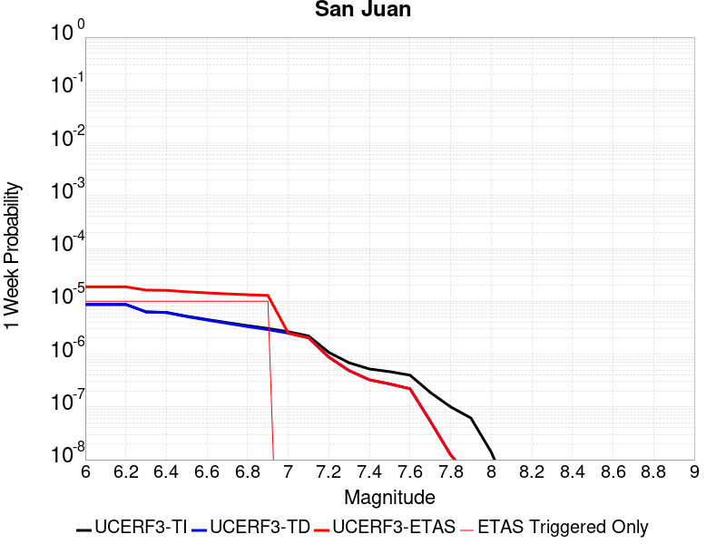 | 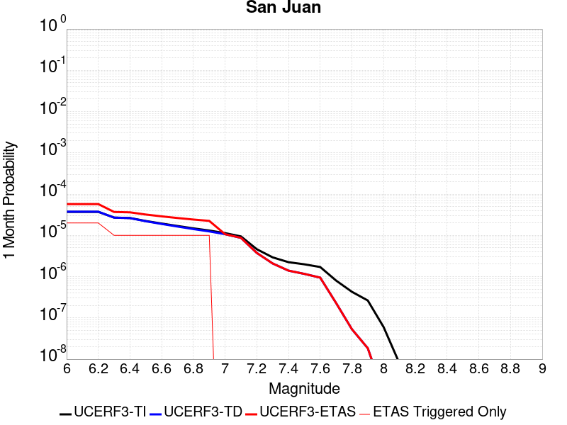 | 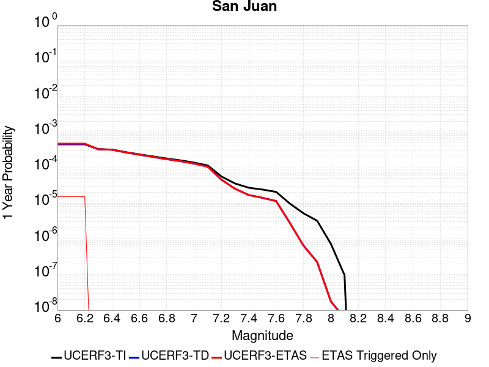 | 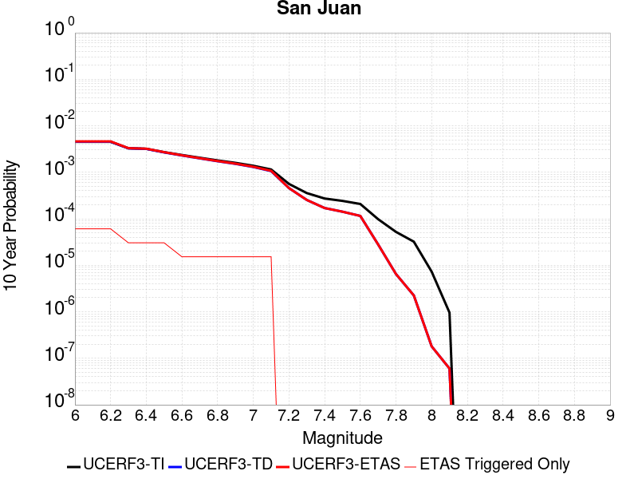 |

| Magnitude | 1 wk TI Prob | 1 wk TD Prob | 1 wk ETAS Prob | 1 wk ETAS/TD Gain | 1 wk ETAS Triggered Only | 1 mo TI Prob | 1 mo TD Prob | 1 mo ETAS Prob | 1 mo ETAS/TD Gain | 1 mo ETAS Triggered Only | 1 yr TI Prob | 1 yr TD Prob | 1 yr ETAS Prob | 1 yr ETAS/TD Gain | 1 yr ETAS Triggered Only | 10 yr TI Prob | 10 yr TD Prob | 10 yr ETAS Prob | 10 yr ETAS/TD Gain | 10 yr ETAS Triggered Only |
|-----|-----|-----|-----|-----|-----|-----|-----|-----|-----|-----|-----|-----|-----|-----|-----|-----|-----|-----|-----|-----|
| 6.0 | 8.682808E-6 | 8.7491635E-6 | 8.7491635E-6 | 1.0 | 0.0 | 3.72115E-5 | 3.74959E-5 | 5.2716034E-5 | 1.4059144 | 1.52207E-5 | 4.5295584E-4 | 4.564218E-4 | 4.7163558E-4 | 1.0333327 | 1.52207E-5 | 0.004520337 | 0.004555385 | 0.0046159904 | 1.0133041 | 6.08828E-5 |
| 6.1 | 8.682808E-6 | 8.7491635E-6 | 8.7491635E-6 | 1.0 | 0.0 | 3.72115E-5 | 3.74959E-5 | 5.2716034E-5 | 1.4059144 | 1.52207E-5 | 4.5295584E-4 | 4.564218E-4 | 4.7163558E-4 | 1.0333327 | 1.52207E-5 | 0.004520337 | 0.004555385 | 0.0046159904 | 1.0133041 | 6.08828E-5 |
| 6.2 | 8.682808E-6 | 8.7491635E-6 | 8.7491635E-6 | 1.0 | 0.0 | 3.72115E-5 | 3.74959E-5 | 5.2716034E-5 | 1.4059144 | 1.52207E-5 | 4.5295584E-4 | 4.564218E-4 | 4.7163558E-4 | 1.0333327 | 1.52207E-5 | 0.004520337 | 0.004555385 | 0.0046159904 | 1.0133041 | 6.08828E-5 |
| 6.3 | 6.3054235E-6 | 6.2825848E-6 | 6.2825848E-6 | 1.0 | 0.0 | 2.7022963E-5 | 2.6925094E-5 | 2.6925094E-5 | 1.0 | 0.0 | 3.2895492E-4 | 3.2776513E-4 | 3.2776513E-4 | 1.0 | 0.0 | 0.003284684 | 0.003273017 | 0.0033033586 | 1.0092703 | 3.04414E-5 |
| 6.4 | 6.1490473E-6 | 6.1144656E-6 | 6.1144656E-6 | 1.0 | 0.0 | 2.6352795E-5 | 2.6204598E-5 | 2.6204598E-5 | 1.0 | 0.0 | 3.2079802E-4 | 3.1899565E-4 | 3.1899565E-4 | 1.0 | 0.0 | 0.0032033534 | 0.0031855737 | 0.0032159183 | 1.0095255 | 3.04414E-5 |
| 6.5 | 5.204848E-6 | 5.137233E-6 | 5.137233E-6 | 1.0 | 0.0 | 2.23063E-5 | 2.2016533E-5 | 2.2016533E-5 | 1.0 | 0.0 | 2.7154534E-4 | 2.6801927E-4 | 2.6801927E-4 | 1.0 | 0.0 | 0.0027121378 | 0.0026771144 | 0.0027074744 | 1.0113405 | 3.04414E-5 |
| 6.6 | 4.5179986E-6 | 4.4150297E-6 | 4.4150297E-6 | 1.0 | 0.0 | 1.9362706E-5 | 1.8921424E-5 | 1.8921424E-5 | 1.0 | 0.0 | 2.3571544E-4 | 2.3034477E-4 | 2.3034477E-4 | 1.0 | 0.0 | 0.0023546559 | 0.0023011973 | 0.002316383 | 1.0065991 | 1.52207E-5 |
| 6.7 | 3.9442616E-6 | 3.819828E-6 | 3.819828E-6 | 1.0 | 0.0 | 1.6903869E-5 | 1.6370592E-5 | 1.6370592E-5 | 1.0 | 0.0 | 2.0578515E-4 | 1.992944E-4 | 1.992944E-4 | 1.0 | 0.0 | 0.002055947 | 0.0019912818 | 0.002006472 | 1.0076284 | 1.52207E-5 |
| 6.8 | 3.4536245E-6 | 3.3163353E-6 | 3.3163353E-6 | 1.0 | 0.0 | 1.4801163E-5 | 1.4212792E-5 | 1.4212792E-5 | 1.0 | 0.0 | 1.8018926E-4 | 1.7302761E-4 | 1.7302761E-4 | 1.0 | 0.0 | 0.0018004322 | 0.0017290477 | 0.0017442422 | 1.0087878 | 1.52207E-5 |
| 6.9 | 3.059865E-6 | 2.9120315E-6 | 2.9120315E-6 | 1.0 | 0.0 | 1.3113641E-5 | 1.2480078E-5 | 1.2480078E-5 | 1.0 | 0.0 | 1.596469E-4 | 1.5193493E-4 | 1.5193493E-4 | 1.0 | 0.0 | 0.0015953224 | 0.0015184252 | 0.0015336229 | 1.0100088 | 1.52207E-5 |
| 7.0 | 2.6504351E-6 | 2.4920002E-6 | 2.4920002E-6 | 1.0 | 0.0 | 1.1358958E-5 | 1.0679961E-5 | 1.0679961E-5 | 1.0 | 0.0 | 1.3828653E-4 | 1.300213E-4 | 1.300213E-4 | 1.0 | 0.0 | 0.0013820052 | 0.0012995641 | 0.0013147651 | 1.0116969 | 1.52207E-5 |
| 7.1 | 2.2039317E-6 | 2.0338296E-6 | 2.0338296E-6 | 1.0 | 0.0 | 9.445387E-6 | 8.716386E-6 | 8.716386E-6 | 1.0 | 0.0 | 1.1499152E-4 | 1.0611736E-4 | 1.0611736E-4 | 1.0 | 0.0 | 0.0011493203 | 0.0010607769 | 0.0010759814 | 1.0143334 | 1.52207E-5 |
| 7.2 | 1.0786707E-6 | 8.7701903E-7 | 8.7701903E-7 | 1.0 | 0.0 | 4.622866E-6 | 3.7586476E-6 | 3.7586476E-6 | 1.0 | 0.0 | 5.628194E-5 | 4.5760586E-5 | 4.5760586E-5 | 1.0 | 0.0 | 5.6267687E-4 | 4.5757066E-4 | 4.5757066E-4 | 1.0 | 0.0 |
| 7.3 | 6.846433E-7 | 4.868805E-7 | 4.868805E-7 | 1.0 | 0.0 | 2.9341822E-6 | 2.086629E-6 | 2.086629E-6 | 1.0 | 0.0 | 3.5723086E-5 | 2.5404412E-5 | 2.5404412E-5 | 1.0 | 0.0 | 3.571734E-4 | 2.540486E-4 | 2.540486E-4 | 1.0 | 0.0 |
| 7.4 | 5.23043E-7 | 3.2628162E-7 | 3.2628162E-7 | 1.0 | 0.0 | 2.2416111E-6 | 1.398349E-6 | 1.398349E-6 | 1.0 | 0.0 | 2.7291273E-5 | 1.7024766E-5 | 1.7024766E-5 | 1.0 | 0.0 | 2.7287923E-4 | 1.7026656E-4 | 1.7026656E-4 | 1.0 | 0.0 |
| 7.5 | 4.648444E-7 | 2.7234944E-7 | 2.7234944E-7 | 1.0 | 0.0 | 1.9921886E-6 | 1.1672114E-6 | 1.1672114E-6 | 1.0 | 0.0 | 2.4254627E-5 | 1.42107065E-5 | 1.42107065E-5 | 1.0 | 0.0 | 2.425198E-4 | 1.421276E-4 | 1.421276E-4 | 1.0 | 0.0 |
| 7.6 | 3.9906567E-7 | 2.2083314E-7 | 2.2083314E-7 | 1.0 | 0.0 | 1.7102802E-6 | 9.464274E-7 | 9.464274E-7 | 1.0 | 0.0 | 2.0822463E-5 | 1.1522693E-5 | 1.1522693E-5 | 1.0 | 0.0 | 2.0820512E-4 | 1.15245566E-4 | 1.15245566E-4 | 1.0 | 0.0 |
| 7.7 | 1.8784601E-7 | 5.3666906E-8 | 5.3666906E-8 | 1.0 | 0.0 | 8.0505407E-7 | 2.30001E-7 | 2.30001E-7 | 1.0 | 0.0 | 9.80149E-6 | 2.8002585E-6 | 2.8002585E-6 | 1.0 | 0.0 | 9.801057E-5 | 2.8011282E-5 | 2.8011282E-5 | 1.0 | 0.0 |
| 7.8 | 1.00154914E-7 | 1.2415832E-8 | 1.2415832E-8 | 1.0 | 0.0 | 4.2923529E-7 | 5.3210716E-8 | 5.3210716E-8 | 1.0 | 0.0 | 5.225927E-6 | 6.4784024E-7 | 6.4784024E-7 | 1.0 | 0.0 | 5.225804E-5 | 6.484273E-6 | 6.484273E-6 | 1.0 | 0.0 |
| 7.9 | 6.171429E-8 | 4.2966155E-9 | 4.2966155E-9 | 1.0 | 0.0 | 2.6448978E-7 | 1.8414067E-8 | 1.8414067E-8 | 1.0 | 0.0 | 3.2201583E-6 | 2.2419121E-7 | 2.2419121E-7 | 1.0 | 0.0 | 3.2201115E-5 | 2.2472002E-6 | 2.2472002E-6 | 1.0 | 0.0 |
| 8.0 | 1.3974572E-8 | 3.3788217E-10 | 3.3788217E-10 | 1.0 | 0.0 | 5.989102E-8 | 1.448067E-9 | 1.448067E-9 | 1.0 | 0.0 | 7.2917294E-7 | 1.763022E-8 | 1.763022E-8 | 1.0 | 0.0 | 7.2917055E-6 | 1.8060365E-7 | 1.8060365E-7 | 1.0 | 0.0 |
| 8.1 | 1.8403477E-9 | 1.1302803E-10 | 1.1302803E-10 | 1.0 | 0.0 | 7.887204E-9 | 4.844063E-10 | 4.844063E-10 | 1.0 | 0.0 | 9.602671E-8 | 5.8976446E-9 | 5.8976446E-9 | 1.0 | 0.0 | 9.602667E-7 | 6.021993E-8 | 6.021993E-8 | 1.0 | 0.0 |

## San Andreas (Peninsula) 2011 CFM
*[(top)](#table-of-contents)*

| 1 Week | 1 Month | 1 Year | 10 Year |
|-----|-----|-----|-----|
|  | 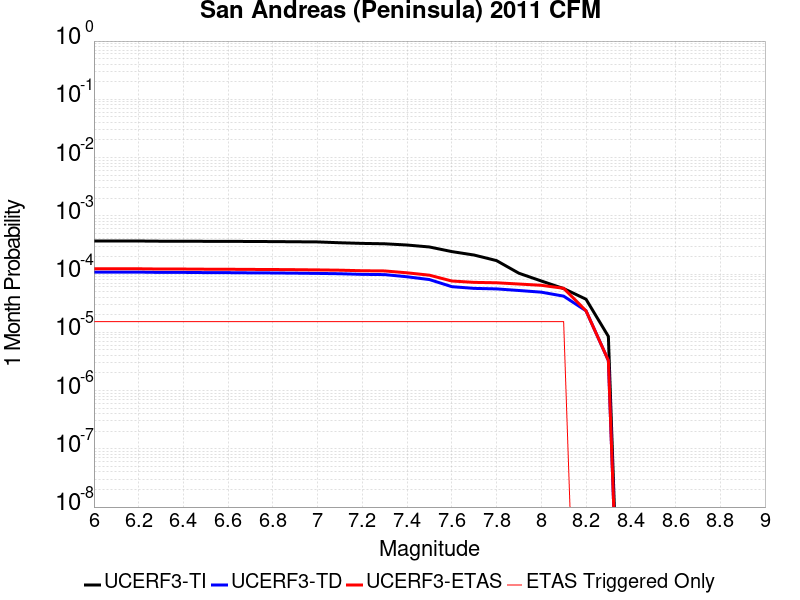 | 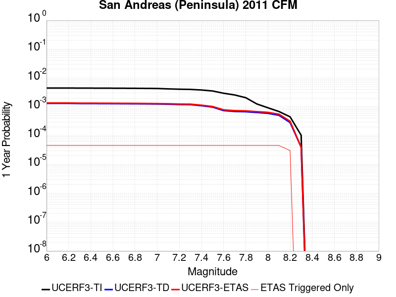 | 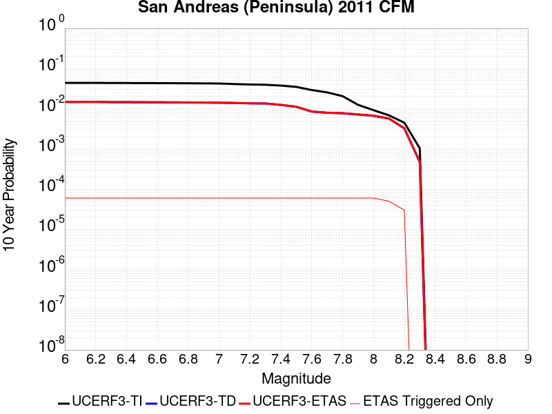 |

| Magnitude | 1 wk TI Prob | 1 wk TD Prob | 1 wk ETAS Prob | 1 wk ETAS/TD Gain | 1 wk ETAS Triggered Only | 1 mo TI Prob | 1 mo TD Prob | 1 mo ETAS Prob | 1 mo ETAS/TD Gain | 1 mo ETAS Triggered Only | 1 yr TI Prob | 1 yr TD Prob | 1 yr ETAS Prob | 1 yr ETAS/TD Gain | 1 yr ETAS Triggered Only | 10 yr TI Prob | 10 yr TD Prob | 10 yr ETAS Prob | 10 yr ETAS/TD Gain | 10 yr ETAS Triggered Only |
|-----|-----|-----|-----|-----|-----|-----|-----|-----|-----|-----|-----|-----|-----|-----|-----|-----|-----|-----|-----|-----|
| 6.0 | 8.6200685E-5 | 2.52136E-5 | 2.52136E-5 | 1.0 | 0.0 | 3.6937918E-4 | 1.0805382E-4 | 1.2327287E-4 | 1.140847 | 1.52207E-5 | 0.0044879215 | 0.001314763 | 0.0013603651 | 1.0346847 | 4.5662102E-5 | 0.043983612 | 0.014774441 | 0.0148344245 | 1.0040599 | 6.08828E-5 |
| 6.1 | 8.6200685E-5 | 2.52136E-5 | 2.52136E-5 | 1.0 | 0.0 | 3.6937918E-4 | 1.0805382E-4 | 1.2327287E-4 | 1.140847 | 1.52207E-5 | 0.0044879215 | 0.001314763 | 0.0013603651 | 1.0346847 | 4.5662102E-5 | 0.043983612 | 0.014774441 | 0.0148344245 | 1.0040599 | 6.08828E-5 |
| 6.2 | 8.6200685E-5 | 2.52136E-5 | 2.52136E-5 | 1.0 | 0.0 | 3.6937918E-4 | 1.0805382E-4 | 1.2327287E-4 | 1.140847 | 1.52207E-5 | 0.0044879215 | 0.001314763 | 0.0013603651 | 1.0346847 | 4.5662102E-5 | 0.043983612 | 0.014774441 | 0.0148344245 | 1.0040599 | 6.08828E-5 |
| 6.3 | 8.551163E-5 | 2.490552E-5 | 2.490552E-5 | 1.0 | 0.0 | 3.6642692E-4 | 1.06733576E-4 | 1.2195265E-4 | 1.1425893 | 1.52207E-5 | 0.004452125 | 0.0012987083 | 0.001344311 | 1.0351139 | 4.5662102E-5 | 0.043639794 | 0.014601416 | 0.01466141 | 1.0041088 | 6.08828E-5 |
| 6.4 | 8.551163E-5 | 2.490552E-5 | 2.490552E-5 | 1.0 | 0.0 | 3.6642692E-4 | 1.06733576E-4 | 1.2195265E-4 | 1.1425893 | 1.52207E-5 | 0.004452125 | 0.0012987083 | 0.001344311 | 1.0351139 | 4.5662102E-5 | 0.043639794 | 0.014601416 | 0.01466141 | 1.0041088 | 6.08828E-5 |
| 6.5 | 8.511146E-5 | 2.4726973E-5 | 2.4726973E-5 | 1.0 | 0.0 | 3.647124E-4 | 1.05968444E-4 | 1.2118753E-4 | 1.1436191 | 1.52207E-5 | 0.004431336 | 0.0012894038 | 0.001335007 | 1.0353677 | 4.5662102E-5 | 0.04344007 | 0.0145011945 | 0.014561194 | 1.0041376 | 6.08828E-5 |
| 6.6 | 8.4985084E-5 | 2.4657606E-5 | 2.4657606E-5 | 1.0 | 0.0 | 3.6417096E-4 | 1.05671184E-4 | 1.20890276E-4 | 1.1440231 | 1.52207E-5 | 0.0044247704 | 0.001285789 | 0.0013313923 | 1.0354673 | 4.5662102E-5 | 0.043376986 | 0.014463263 | 0.014523265 | 1.0041486 | 6.08828E-5 |
| 6.7 | 8.462618E-5 | 2.4486113E-5 | 2.4486113E-5 | 1.0 | 0.0 | 3.6263323E-4 | 1.0493627E-4 | 1.2015537E-4 | 1.1450318 | 1.52207E-5 | 0.004406125 | 0.0012768519 | 0.0013224557 | 1.0357158 | 4.5662102E-5 | 0.043197807 | 0.01436807 | 0.014428078 | 1.0041765 | 6.08828E-5 |
| 6.8 | 8.42337E-5 | 2.438192E-5 | 2.438192E-5 | 1.0 | 0.0 | 3.6095164E-4 | 1.04489765E-4 | 1.1970887E-4 | 1.1456517 | 1.52207E-5 | 0.004385734 | 0.0012714221 | 0.0013170261 | 1.0358685 | 4.5662102E-5 | 0.043001823 | 0.014308756 | 0.014368768 | 1.004194 | 6.08828E-5 |
| 6.9 | 8.365989E-5 | 2.4186513E-5 | 2.4186513E-5 | 1.0 | 0.0 | 3.5849313E-4 | 1.03652375E-4 | 1.18871496E-4 | 1.1468285 | 1.52207E-5 | 0.004355922 | 0.0012612387 | 0.0013068432 | 1.0361586 | 4.5662102E-5 | 0.04271523 | 0.014201242 | 0.01426126 | 1.0042262 | 6.08828E-5 |
| 7.0 | 8.30936E-5 | 2.3948E-5 | 2.3948E-5 | 1.0 | 0.0 | 3.560668E-4 | 1.02630256E-4 | 1.1784939E-4 | 1.148291 | 1.52207E-5 | 0.004326499 | 0.0012488087 | 0.0012944138 | 1.0365188 | 4.5662102E-5 | 0.042432297 | 0.014072227 | 0.014132253 | 1.0042655 | 6.08828E-5 |
| 7.1 | 8.041264E-5 | 2.3634402E-5 | 2.3634402E-5 | 1.0 | 0.0 | 3.4458007E-4 | 1.0128637E-4 | 1.1650553E-4 | 1.1502587 | 1.52207E-5 | 0.0041871946 | 0.0012324656 | 0.0012780714 | 1.0370038 | 4.5662102E-5 | 0.041091725 | 0.013895032 | 0.013955069 | 1.0043207 | 6.08828E-5 |
| 7.2 | 7.8427016E-5 | 2.3058019E-5 | 2.3058019E-5 | 1.0 | 0.0 | 3.3607247E-4 | 9.8816345E-5 | 1.1403554E-4 | 1.154015 | 1.52207E-5 | 0.004084008 | 0.0012024266 | 0.0012480337 | 1.0379293 | 4.5662102E-5 | 0.040097635 | 0.013579085 | 0.013639141 | 1.0044227 | 6.08828E-5 |
| 7.3 | 7.721087E-5 | 2.2842805E-5 | 2.2842805E-5 | 1.0 | 0.0 | 3.3086175E-4 | 9.7894066E-5 | 1.1311328E-4 | 1.1554661 | 1.52207E-5 | 0.004020803 | 0.0011912102 | 0.0012368179 | 1.0382869 | 4.5662102E-5 | 0.03948827 | 0.013462781 | 0.013522845 | 1.0044614 | 6.08828E-5 |
| 7.4 | 7.3536525E-5 | 2.0960428E-5 | 2.0960428E-5 | 1.0 | 0.0 | 3.1511846E-4 | 8.982732E-5 | 1.0504665E-4 | 1.1694288 | 1.52207E-5 | 0.0038298194 | 0.0010931002 | 0.0011387124 | 1.0417273 | 4.5662102E-5 | 0.037644852 | 0.012419564 | 0.01247969 | 1.0048413 | 6.08828E-5 |
| 7.5 | 6.806207E-5 | 1.876674E-5 | 1.876674E-5 | 1.0 | 0.0 | 2.9166197E-4 | 8.042641E-5 | 9.564589E-5 | 1.1892349 | 1.52207E-5 | 0.0035452035 | 9.787527E-4 | 0.0010243702 | 1.0466077 | 4.5662102E-5 | 0.034891766 | 0.01117254 | 0.011232742 | 1.0053885 | 6.08828E-5 |
| 7.6 | 5.6731416E-5 | 1.4177827E-5 | 1.4177827E-5 | 1.0 | 0.0 | 2.43112E-4 | 6.07607E-5 | 7.5980475E-5 | 1.2504872 | 1.52207E-5 | 0.0029558712 | 7.395106E-4 | 7.851389E-4 | 1.0617007 | 4.5662102E-5 | 0.02916862 | 0.008485565 | 0.008545931 | 1.0071139 | 6.08828E-5 |
| 7.7 | 4.946994E-5 | 1.3246218E-5 | 1.3246218E-5 | 1.0 | 0.0 | 2.1199681E-4 | 5.6768273E-5 | 7.1988106E-5 | 1.2681047 | 1.52207E-5 | 0.002578006 | 6.9093466E-4 | 7.365652E-4 | 1.0660418 | 4.5662102E-5 | 0.02548303 | 0.0079078935 | 0.007968295 | 1.0076381 | 6.08828E-5 |
| 7.8 | 3.9718198E-5 | 1.2982541E-5 | 1.2982541E-5 | 1.0 | 0.0 | 1.7020974E-4 | 5.5638273E-5 | 7.085813E-5 | 1.27355 | 1.52207E-5 | 0.0020703338 | 6.771856E-4 | 7.228168E-4 | 1.0673835 | 4.5662102E-5 | 0.020511515 | 0.0077184658 | 0.007778879 | 1.007827 | 6.08828E-5 |
| 7.9 | 2.4115114E-5 | 1.218559E-5 | 1.218559E-5 | 1.0 | 0.0 | 1.0334639E-4 | 5.2222913E-5 | 6.7442816E-5 | 1.2914411 | 1.52207E-5 | 0.001257516 | 6.3562865E-4 | 6.812617E-4 | 1.071792 | 4.5662102E-5 | 0.012504238 | 0.007159044 | 0.0072194906 | 1.0084435 | 6.08828E-5 |
| 8.0 | 1.7756569E-5 | 1.1410005E-5 | 1.1410005E-5 | 1.0 | 0.0 | 7.6097356E-5 | 4.8899106E-5 | 6.411906E-5 | 1.3112522 | 1.52207E-5 | 9.260915E-4 | 5.951841E-4 | 6.40819E-4 | 1.0766736 | 4.5662102E-5 | 0.009222416 | 0.006659493 | 0.00671997 | 1.0090814 | 6.08828E-5 |
| 8.1 | 1.3159258E-5 | 9.746194E-6 | 9.746194E-6 | 1.0 | 0.0 | 5.6395602E-5 | 4.1768737E-5 | 5.69888E-5 | 1.364389 | 1.52207E-5 | 6.864001E-4 | 5.0841586E-4 | 5.5405474E-4 | 1.0897669 | 4.5662102E-5 | 0.0068428386 | 0.005689538 | 0.00573494 | 1.00798 | 4.5662102E-5 |
| 8.2 | 8.635426E-6 | 5.466912E-6 | 5.466912E-6 | 1.0 | 0.0 | 3.700844E-5 | 2.3429413E-5 | 2.3429413E-5 | 1.0 | 0.0 | 4.5048463E-4 | 2.8521585E-4 | 3.1564856E-4 | 1.1067007 | 3.04414E-5 | 0.004495725 | 0.0032445018 | 0.0032748443 | 1.009352 | 3.04414E-5 |
| 8.3 | 1.983087E-6 | 7.6599065E-7 | 7.6599065E-7 | 1.0 | 0.0 | 8.498917E-6 | 3.282813E-6 | 3.282813E-6 | 1.0 | 0.0 | 1.034694E-4 | 3.9967534E-5 | 3.9967534E-5 | 1.0 | 0.0 | 0.0010342124 | 4.719687E-4 | 4.719687E-4 | 1.0 | 0.0 |

## San Cayetano
*[(top)](#table-of-contents)*

| 1 Week | 1 Month | 1 Year | 10 Year |
|-----|-----|-----|-----|
| 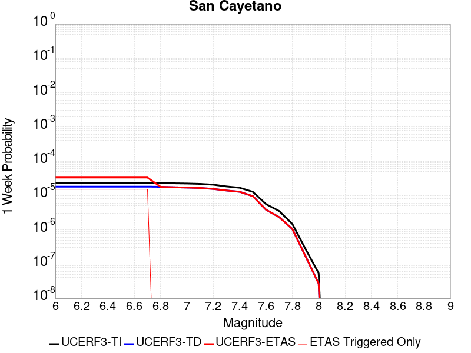 |  | 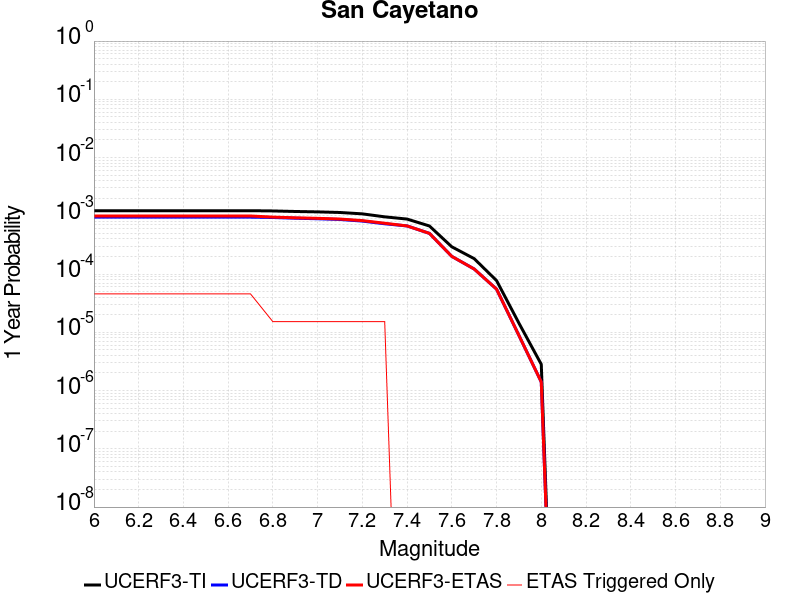 |  |

| Magnitude | 1 wk TI Prob | 1 wk TD Prob | 1 wk ETAS Prob | 1 wk ETAS/TD Gain | 1 wk ETAS Triggered Only | 1 mo TI Prob | 1 mo TD Prob | 1 mo ETAS Prob | 1 mo ETAS/TD Gain | 1 mo ETAS Triggered Only | 1 yr TI Prob | 1 yr TD Prob | 1 yr ETAS Prob | 1 yr ETAS/TD Gain | 1 yr ETAS Triggered Only | 10 yr TI Prob | 10 yr TD Prob | 10 yr ETAS Prob | 10 yr ETAS/TD Gain | 10 yr ETAS Triggered Only |
|-----|-----|-----|-----|-----|-----|-----|-----|-----|-----|-----|-----|-----|-----|-----|-----|-----|-----|-----|-----|-----|
| 6.0 | 2.3476267E-5 | 1.816928E-5 | 3.33897E-5 | 1.8377011 | 1.52207E-5 | 1.0060869E-4 | 7.786603E-5 | 1.2352457E-4 | 1.5863731 | 4.5662102E-5 | 0.0012242225 | 9.476103E-4 | 9.932291E-4 | 1.0481409 | 4.5662102E-5 | 0.012175002 | 0.009436584 | 0.009496893 | 1.0063909 | 6.08828E-5 |
| 6.1 | 2.3476267E-5 | 1.816928E-5 | 3.33897E-5 | 1.8377011 | 1.52207E-5 | 1.0060869E-4 | 7.786603E-5 | 1.2352457E-4 | 1.5863731 | 4.5662102E-5 | 0.0012242225 | 9.476103E-4 | 9.932291E-4 | 1.0481409 | 4.5662102E-5 | 0.012175002 | 0.009436584 | 0.009496893 | 1.0063909 | 6.08828E-5 |
| 6.2 | 2.3476267E-5 | 1.816928E-5 | 3.33897E-5 | 1.8377011 | 1.52207E-5 | 1.0060869E-4 | 7.786603E-5 | 1.2352457E-4 | 1.5863731 | 4.5662102E-5 | 0.0012242225 | 9.476103E-4 | 9.932291E-4 | 1.0481409 | 4.5662102E-5 | 0.012175002 | 0.009436584 | 0.009496893 | 1.0063909 | 6.08828E-5 |
| 6.3 | 2.3476267E-5 | 1.816928E-5 | 3.33897E-5 | 1.8377011 | 1.52207E-5 | 1.0060869E-4 | 7.786603E-5 | 1.2352457E-4 | 1.5863731 | 4.5662102E-5 | 0.0012242225 | 9.476103E-4 | 9.932291E-4 | 1.0481409 | 4.5662102E-5 | 0.012175002 | 0.009436584 | 0.009496893 | 1.0063909 | 6.08828E-5 |
| 6.4 | 2.3476267E-5 | 1.816928E-5 | 3.33897E-5 | 1.8377011 | 1.52207E-5 | 1.0060869E-4 | 7.786603E-5 | 1.2352457E-4 | 1.5863731 | 4.5662102E-5 | 0.0012242225 | 9.476103E-4 | 9.932291E-4 | 1.0481409 | 4.5662102E-5 | 0.012175002 | 0.009436584 | 0.009496893 | 1.0063909 | 6.08828E-5 |
| 6.5 | 2.3476267E-5 | 1.816928E-5 | 3.33897E-5 | 1.8377011 | 1.52207E-5 | 1.0060869E-4 | 7.786603E-5 | 1.2352457E-4 | 1.5863731 | 4.5662102E-5 | 0.0012242225 | 9.476103E-4 | 9.932291E-4 | 1.0481409 | 4.5662102E-5 | 0.012175002 | 0.009436584 | 0.009496893 | 1.0063909 | 6.08828E-5 |
| 6.6 | 2.3476267E-5 | 1.816928E-5 | 3.33897E-5 | 1.8377011 | 1.52207E-5 | 1.0060869E-4 | 7.786603E-5 | 1.2352457E-4 | 1.5863731 | 4.5662102E-5 | 0.0012242225 | 9.476103E-4 | 9.932291E-4 | 1.0481409 | 4.5662102E-5 | 0.012175002 | 0.009436584 | 0.009496893 | 1.0063909 | 6.08828E-5 |
| 6.7 | 2.3476267E-5 | 1.816928E-5 | 3.33897E-5 | 1.8377011 | 1.52207E-5 | 1.0060869E-4 | 7.786603E-5 | 1.2352457E-4 | 1.5863731 | 4.5662102E-5 | 0.0012242225 | 9.476103E-4 | 9.932291E-4 | 1.0481409 | 4.5662102E-5 | 0.012175002 | 0.009436584 | 0.009496893 | 1.0063909 | 6.08828E-5 |
| 6.8 | 2.3241924E-5 | 1.7936987E-5 | 1.7936987E-5 | 1.0 | 0.0 | 9.960445E-5 | 7.687056E-5 | 9.2090086E-5 | 1.1979891 | 1.52207E-5 | 0.0012120095 | 9.3550084E-4 | 9.507073E-4 | 1.0162549 | 1.52207E-5 | 0.012054204 | 0.009316482 | 0.00934664 | 1.003237 | 3.04414E-5 |
| 6.9 | 2.2761007E-5 | 1.7432423E-5 | 1.7432423E-5 | 1.0 | 0.0 | 9.7543525E-5 | 7.470827E-5 | 8.992783E-5 | 1.20372 | 1.52207E-5 | 0.0011869454 | 9.09197E-4 | 9.244039E-4 | 1.0167255 | 1.52207E-5 | 0.011806256 | 0.009055603 | 0.009085769 | 1.0033312 | 3.04414E-5 |
| 7.0 | 2.240283E-5 | 1.7066168E-5 | 1.7066168E-5 | 1.0 | 0.0 | 9.600859E-5 | 7.313869E-5 | 8.8358276E-5 | 1.2080921 | 1.52207E-5 | 0.0011682777 | 8.9010317E-4 | 9.053103E-4 | 1.0170847 | 1.52207E-5 | 0.011621549 | 0.008866196 | 0.008896367 | 1.003403 | 3.04414E-5 |
| 7.1 | 2.1871154E-5 | 1.6586018E-5 | 1.6586018E-5 | 1.0 | 0.0 | 9.373015E-5 | 7.108101E-5 | 8.6300635E-5 | 1.2141165 | 1.52207E-5 | 0.0011405671 | 8.6507114E-4 | 8.8027865E-4 | 1.0175796 | 1.52207E-5 | 0.011347309 | 0.008617838 | 0.008648017 | 1.0035019 | 3.04414E-5 |
| 7.2 | 2.0714133E-5 | 1.5564561E-5 | 1.5564561E-5 | 1.0 | 0.0 | 8.8771834E-5 | 6.670357E-5 | 8.192326E-5 | 1.228169 | 1.52207E-5 | 0.0010802611 | 8.1181666E-4 | 8.2702504E-4 | 1.0187337 | 1.52207E-5 | 0.010750249 | 0.008089285 | 0.008119481 | 1.0037327 | 3.04414E-5 |
| 7.3 | 1.8408395E-5 | 1.3996864E-5 | 1.3996864E-5 | 1.0 | 0.0 | 7.8890735E-5 | 5.99852E-5 | 7.520499E-5 | 1.2537256 | 1.52207E-5 | 9.600714E-4 | 7.300781E-4 | 7.452877E-4 | 1.0208328 | 1.52207E-5 | 0.009559342 | 0.0072775153 | 0.0073077353 | 1.0041525 | 3.04414E-5 |
| 7.4 | 1.6856795E-5 | 1.28500815E-5 | 1.28500815E-5 | 1.0 | 0.0 | 7.2241404E-5 | 5.5070628E-5 | 5.5070628E-5 | 1.0 | 0.0 | 8.7918417E-4 | 6.7028153E-4 | 6.7028153E-4 | 1.0 | 0.0 | 0.00875714 | 0.0066832784 | 0.0066983975 | 1.0022622 | 1.52207E-5 |
| 7.5 | 1.2822778E-5 | 9.577542E-6 | 9.577542E-6 | 1.0 | 0.0 | 5.495361E-5 | 4.1045972E-5 | 4.1045972E-5 | 1.0 | 0.0 | 6.688548E-4 | 4.996217E-4 | 4.996217E-4 | 1.0 | 0.0 | 0.006668452 | 0.0049851555 | 0.0050003002 | 1.0030379 | 1.52207E-5 |
| 7.6 | 5.6272684E-6 | 3.854903E-6 | 3.854903E-6 | 1.0 | 0.0 | 2.4116642E-5 | 1.652091E-5 | 1.652091E-5 | 1.0 | 0.0 | 2.9358055E-4 | 2.0112359E-4 | 2.0112359E-4 | 1.0 | 0.0 | 0.0029319301 | 0.0020094267 | 0.0020094267 | 1.0 | 0.0 |
| 7.7 | 3.5261346E-6 | 2.3407013E-6 | 2.3407013E-6 | 1.0 | 0.0 | 1.5111918E-5 | 1.0031539E-5 | 1.0031539E-5 | 1.0 | 0.0 | 1.8397206E-4 | 1.2212721E-4 | 1.2212721E-4 | 1.0 | 0.0 | 0.0018381984 | 0.0012206084 | 0.0012206084 | 1.0 | 0.0 |
| 7.8 | 1.4826929E-6 | 1.056428E-6 | 1.056428E-6 | 1.0 | 0.0 | 6.354383E-6 | 4.5275406E-6 | 4.5275406E-6 | 1.0 | 0.0 | 7.736187E-5 | 5.5121433E-5 | 5.5121433E-5 | 1.0 | 0.0 | 7.733494E-4 | 5.5107963E-4 | 5.5107963E-4 | 1.0 | 0.0 |
| 7.9 | 2.7568166E-7 | 1.6978244E-7 | 1.6978244E-7 | 1.0 | 0.0 | 1.1814923E-6 | 7.2763885E-7 | 7.2763885E-7 | 1.0 | 0.0 | 1.4384574E-5 | 8.858967E-6 | 8.858967E-6 | 1.0 | 0.0 | 1.4383643E-4 | 8.8586174E-5 | 8.8586174E-5 | 1.0 | 0.0 |
| 8.0 | 5.407832E-8 | 2.6887697E-8 | 2.6887697E-8 | 1.0 | 0.0 | 2.3176422E-7 | 1.15232986E-7 | 1.15232986E-7 | 1.0 | 0.0 | 2.8217257E-6 | 1.4029607E-6 | 1.4029607E-6 | 1.0 | 0.0 | 2.8216898E-5 | 1.4029522E-5 | 1.4029522E-5 | 1.0 | 0.0 |

## Kern Canyon (Lake Isabella) 2011
*[(top)](#table-of-contents)*

| 1 Week | 1 Month | 1 Year | 10 Year |
|-----|-----|-----|-----|
| 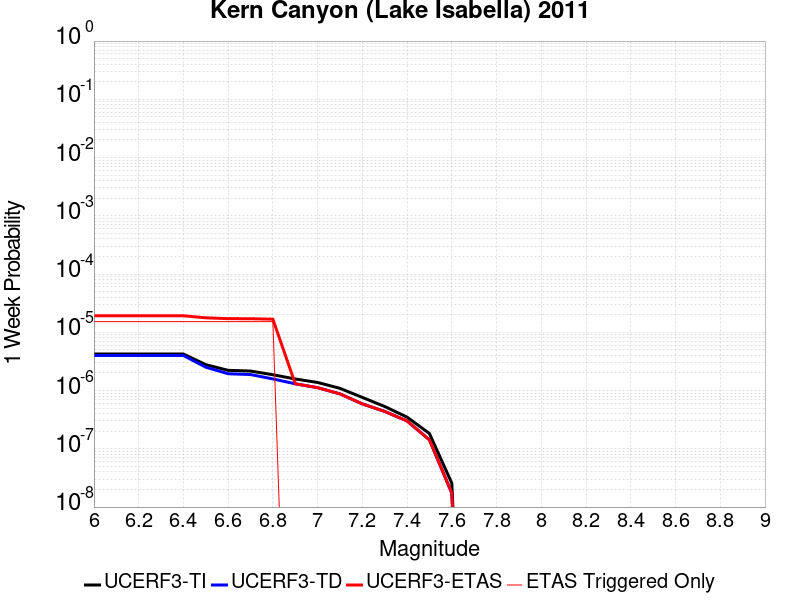 | 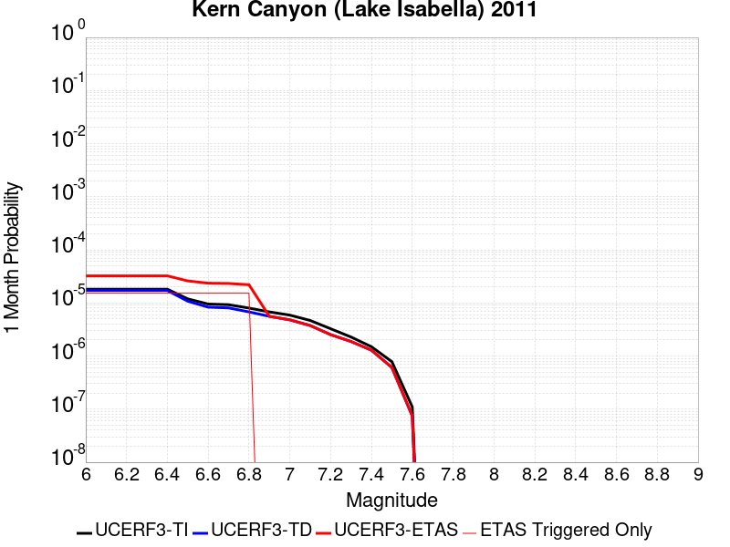 | 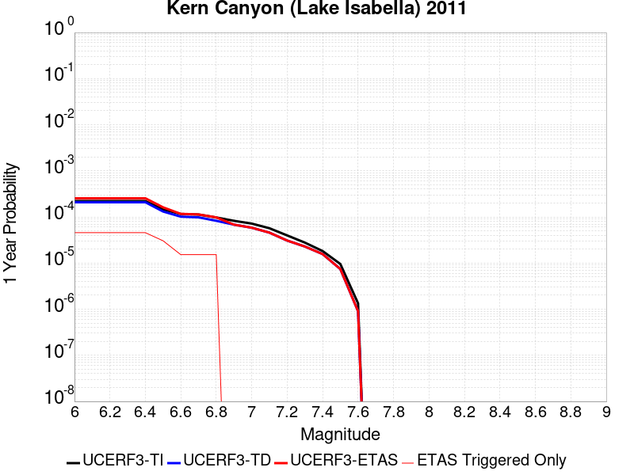 | 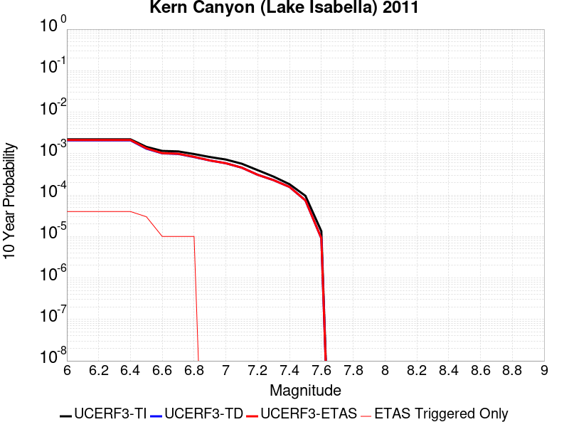 |

| Magnitude | 1 wk TI Prob | 1 wk TD Prob | 1 wk ETAS Prob | 1 wk ETAS/TD Gain | 1 wk ETAS Triggered Only | 1 mo TI Prob | 1 mo TD Prob | 1 mo ETAS Prob | 1 mo ETAS/TD Gain | 1 mo ETAS Triggered Only | 1 yr TI Prob | 1 yr TD Prob | 1 yr ETAS Prob | 1 yr ETAS/TD Gain | 1 yr ETAS Triggered Only | 10 yr TI Prob | 10 yr TD Prob | 10 yr ETAS Prob | 10 yr ETAS/TD Gain | 10 yr ETAS Triggered Only |
|-----|-----|-----|-----|-----|-----|-----|-----|-----|-----|-----|-----|-----|-----|-----|-----|-----|-----|-----|-----|-----|
| 6.0 | 4.2387383E-6 | 4.001639E-6 | 1.9222278E-5 | 4.8036017 | 1.52207E-5 | 1.8165894E-5 | 1.7149778E-5 | 3.2370215E-5 | 1.8875006 | 1.52207E-5 | 2.2114732E-4 | 2.087804E-4 | 2.5443296E-4 | 1.2186631 | 4.5662102E-5 | 0.0022092736 | 0.0020860266 | 0.0021467824 | 1.0291251 | 6.08828E-5 |
| 6.1 | 4.2387383E-6 | 4.001639E-6 | 1.9222278E-5 | 4.8036017 | 1.52207E-5 | 1.8165894E-5 | 1.7149778E-5 | 3.2370215E-5 | 1.8875006 | 1.52207E-5 | 2.2114732E-4 | 2.087804E-4 | 2.5443296E-4 | 1.2186631 | 4.5662102E-5 | 0.0022092736 | 0.0020860266 | 0.0021467824 | 1.0291251 | 6.08828E-5 |
| 6.2 | 4.2387383E-6 | 4.001639E-6 | 1.9222278E-5 | 4.8036017 | 1.52207E-5 | 1.8165894E-5 | 1.7149778E-5 | 3.2370215E-5 | 1.8875006 | 1.52207E-5 | 2.2114732E-4 | 2.087804E-4 | 2.5443296E-4 | 1.2186631 | 4.5662102E-5 | 0.0022092736 | 0.0020860266 | 0.0021467824 | 1.0291251 | 6.08828E-5 |
| 6.3 | 4.2387383E-6 | 4.001639E-6 | 1.9222278E-5 | 4.8036017 | 1.52207E-5 | 1.8165894E-5 | 1.7149778E-5 | 3.2370215E-5 | 1.8875006 | 1.52207E-5 | 2.2114732E-4 | 2.087804E-4 | 2.5443296E-4 | 1.2186631 | 4.5662102E-5 | 0.0022092736 | 0.0020860266 | 0.0021467824 | 1.0291251 | 6.08828E-5 |
| 6.4 | 4.2387383E-6 | 4.001639E-6 | 1.9222278E-5 | 4.8036017 | 1.52207E-5 | 1.8165894E-5 | 1.7149778E-5 | 3.2370215E-5 | 1.8875006 | 1.52207E-5 | 2.2114732E-4 | 2.087804E-4 | 2.5443296E-4 | 1.2186631 | 4.5662102E-5 | 0.0022092736 | 0.0020860266 | 0.0021467824 | 1.0291251 | 6.08828E-5 |
| 6.5 | 2.7857532E-6 | 2.517867E-6 | 1.7738528E-5 | 7.045062 | 1.52207E-5 | 1.1938888E-5 | 1.0790815E-5 | 2.6011352E-5 | 2.4105084 | 1.52207E-5 | 1.4534626E-4 | 1.3137059E-4 | 1.6180798E-4 | 1.2316911 | 3.04414E-5 | 0.0014525123 | 0.001312962 | 0.0013585641 | 1.0347322 | 4.5662102E-5 |
| 6.6 | 2.2233348E-6 | 1.9441236E-6 | 1.7164793E-5 | 8.829065 | 1.52207E-5 | 9.528543E-6 | 8.331932E-6 | 2.3552506E-5 | 2.826776 | 1.52207E-5 | 1.1600384E-4 | 1.01436635E-4 | 1.1665579E-4 | 1.1500361 | 1.52207E-5 | 0.001159433 | 0.001013912 | 0.0010291173 | 1.0149966 | 1.52207E-5 |
| 6.7 | 2.1635126E-6 | 1.8835036E-6 | 1.7104176E-5 | 9.081042 | 1.52207E-5 | 9.272164E-6 | 8.072134E-6 | 2.329271E-5 | 2.8855705 | 1.52207E-5 | 1.1288274E-4 | 9.827388E-5 | 1.1349308E-4 | 1.1548653 | 1.52207E-5 | 0.0011282542 | 9.823124E-4 | 9.975181E-4 | 1.0154796 | 1.52207E-5 |
| 6.8 | 1.8685711E-6 | 1.5831425E-6 | 1.6803819E-5 | 10.614217 | 1.52207E-5 | 8.008137E-6 | 6.784879E-6 | 2.2005475E-5 | 3.2433114 | 1.52207E-5 | 9.74947E-5 | 8.260282E-5 | 9.782227E-5 | 1.1842484 | 1.52207E-5 | 9.745194E-4 | 8.2572614E-4 | 8.409342E-4 | 1.0184178 | 1.52207E-5 |
| 6.9 | 1.5815071E-6 | 1.3064928E-6 | 1.3064928E-6 | 1.0 | 0.0 | 6.77787E-6 | 5.599243E-6 | 5.599243E-6 | 1.0 | 0.0 | 8.251744E-5 | 6.816868E-5 | 6.816868E-5 | 1.0 | 0.0 | 8.248681E-4 | 6.8148033E-4 | 6.8148033E-4 | 1.0 | 0.0 |
| 7.0 | 1.3772564E-6 | 1.1210718E-6 | 1.1210718E-6 | 1.0 | 0.0 | 5.9025137E-6 | 4.8045845E-6 | 4.8045845E-6 | 1.0 | 0.0 | 7.186073E-5 | 5.8494268E-5 | 5.8494268E-5 | 1.0 | 0.0 | 7.18375E-4 | 5.847908E-4 | 5.847908E-4 | 1.0 | 0.0 |
| 7.1 | 1.0916998E-6 | 8.763777E-7 | 8.763777E-7 | 1.0 | 0.0 | 4.678705E-6 | 3.7558991E-6 | 3.7558991E-6 | 1.0 | 0.0 | 5.6961744E-5 | 4.5727127E-5 | 4.5727127E-5 | 1.0 | 0.0 | 5.6947145E-4 | 4.571785E-4 | 4.571785E-4 | 1.0 | 0.0 |
| 7.2 | 7.6277024E-7 | 5.901454E-7 | 5.901454E-7 | 1.0 | 0.0 | 3.2690114E-6 | 2.5291922E-6 | 2.5291922E-6 | 1.0 | 0.0 | 3.9799485E-5 | 3.0792486E-5 | 3.0792486E-5 | 1.0 | 0.0 | 3.9792358E-4 | 3.0788282E-4 | 3.0788282E-4 | 1.0 | 0.0 |
| 7.3 | 5.3265916E-7 | 4.3824414E-7 | 4.3824414E-7 | 1.0 | 0.0 | 2.282823E-6 | 1.878188E-6 | 1.878188E-6 | 1.0 | 0.0 | 2.7793016E-5 | 2.2866701E-5 | 2.2866701E-5 | 1.0 | 0.0 | 2.778954E-4 | 2.2864387E-4 | 2.2864387E-4 | 1.0 | 0.0 |
| 7.4 | 3.4946007E-7 | 3.006571E-7 | 3.006571E-7 | 1.0 | 0.0 | 1.497685E-6 | 1.2885298E-6 | 1.2885298E-6 | 1.0 | 0.0 | 1.8234163E-5 | 1.568774E-5 | 1.568774E-5 | 1.0 | 0.0 | 1.8232666E-4 | 1.5686655E-4 | 1.5686655E-4 | 1.0 | 0.0 |
| 7.5 | 1.8317026E-7 | 1.4244812E-7 | 1.4244812E-7 | 1.0 | 0.0 | 7.850152E-7 | 6.104918E-7 | 6.104918E-7 | 1.0 | 0.0 | 9.557518E-6 | 7.432713E-6 | 7.432713E-6 | 1.0 | 0.0 | 9.5571064E-5 | 7.432472E-5 | 7.432472E-5 | 1.0 | 0.0 |
| 7.6 | 2.572245E-8 | 1.7352555E-8 | 1.7352555E-8 | 1.0 | 0.0 | 1.10239064E-7 | 7.436809E-8 | 7.436809E-8 | 1.0 | 0.0 | 1.3421597E-6 | 9.054312E-7 | 9.054312E-7 | 1.0 | 0.0 | 1.3421517E-5 | 9.05428E-6 | 9.05428E-6 | 1.0 | 0.0 |

## Ortigalita (North)
*[(top)](#table-of-contents)*

| 1 Week | 1 Month | 1 Year | 10 Year |
|-----|-----|-----|-----|
| 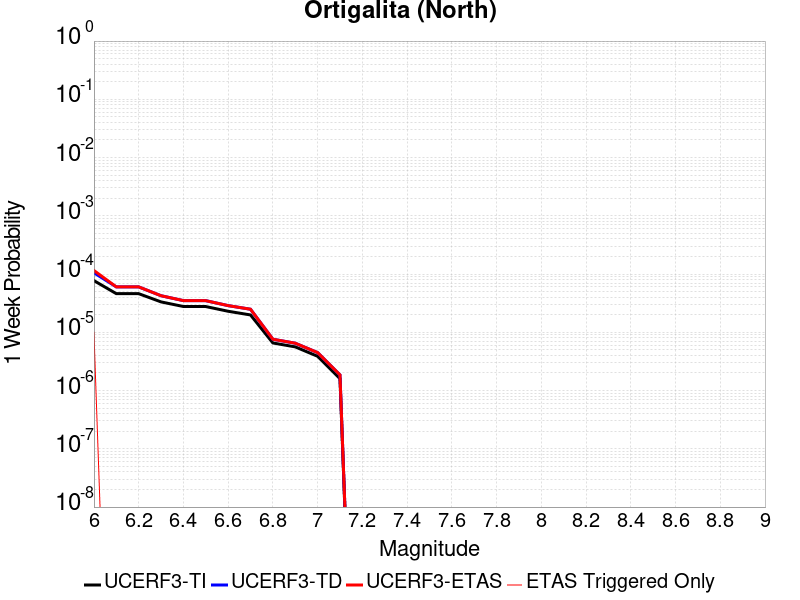 | 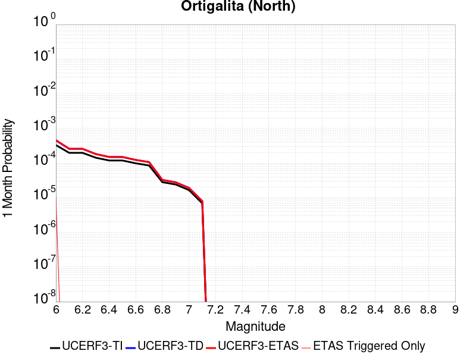 | 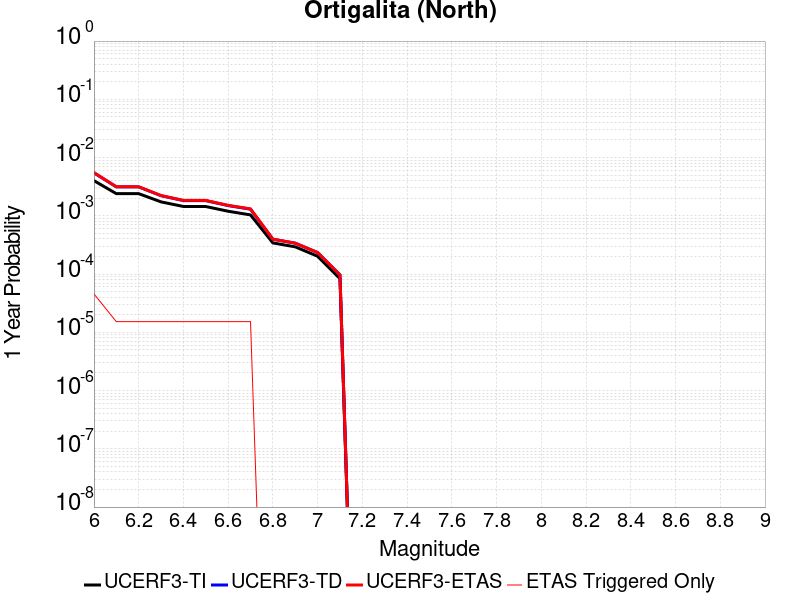 | 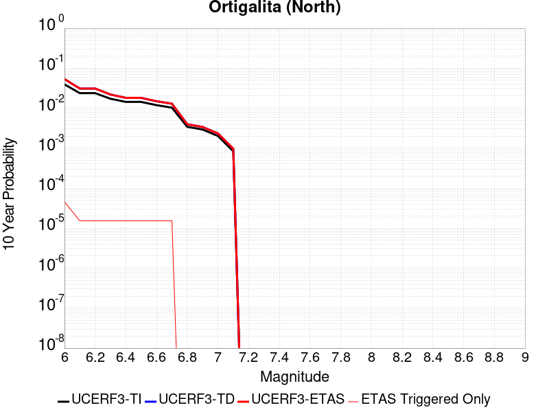 |

| Magnitude | 1 wk TI Prob | 1 wk TD Prob | 1 wk ETAS Prob | 1 wk ETAS/TD Gain | 1 wk ETAS Triggered Only | 1 mo TI Prob | 1 mo TD Prob | 1 mo ETAS Prob | 1 mo ETAS/TD Gain | 1 mo ETAS Triggered Only | 1 yr TI Prob | 1 yr TD Prob | 1 yr ETAS Prob | 1 yr ETAS/TD Gain | 1 yr ETAS Triggered Only | 10 yr TI Prob | 10 yr TD Prob | 10 yr ETAS Prob | 10 yr ETAS/TD Gain | 10 yr ETAS Triggered Only |
|-----|-----|-----|-----|-----|-----|-----|-----|-----|-----|-----|-----|-----|-----|-----|-----|-----|-----|-----|-----|-----|
| 6.0 | 7.711876E-5 | 1.05064966E-4 | 1.05064966E-4 | 1.0 | 0.0 | 3.3046713E-4 | 4.502116E-4 | 4.502116E-4 | 1.0 | 0.0 | 0.004016016 | 0.0054681194 | 0.005513532 | 1.008305 | 4.5662102E-5 | 0.039442103 | 0.053454787 | 0.053498007 | 1.0008086 | 4.5662102E-5 |
| 6.1 | 4.607858E-5 | 6.0239203E-5 | 6.0239203E-5 | 1.0 | 0.0 | 1.9746469E-4 | 2.5814527E-4 | 2.5814527E-4 | 1.0 | 0.0 | 0.0024014818 | 0.0031387596 | 0.0031539325 | 1.004834 | 1.52207E-5 | 0.023756953 | 0.030975068 | 0.030989818 | 1.0004761 | 1.52207E-5 |
| 6.2 | 4.607858E-5 | 6.0239203E-5 | 6.0239203E-5 | 1.0 | 0.0 | 1.9746469E-4 | 2.5814527E-4 | 2.5814527E-4 | 1.0 | 0.0 | 0.0024014818 | 0.0031387596 | 0.0031539325 | 1.004834 | 1.52207E-5 | 0.023756953 | 0.030975068 | 0.030989818 | 1.0004761 | 1.52207E-5 |
| 6.3 | 3.327423E-5 | 4.2475127E-5 | 4.2475127E-5 | 1.0 | 0.0 | 1.4259605E-4 | 1.8202531E-4 | 1.8202531E-4 | 1.0 | 0.0 | 0.0017347244 | 0.002214197 | 0.0022293841 | 1.006859 | 1.52207E-5 | 0.017212452 | 0.021945644 | 0.02196053 | 1.0006783 | 1.52207E-5 |
| 6.4 | 2.7732503E-5 | 3.4998593E-5 | 3.4998593E-5 | 1.0 | 0.0 | 1.1884817E-4 | 1.4998685E-4 | 1.4998685E-4 | 1.0 | 0.0 | 0.001446016 | 0.0018248095 | 0.0018400025 | 1.0083258 | 1.52207E-5 | 0.014366428 | 0.018121224 | 0.018136168 | 1.0008247 | 1.52207E-5 |
| 6.5 | 2.7689714E-5 | 3.4948407E-5 | 3.4948407E-5 | 1.0 | 0.0 | 1.186648E-4 | 1.497718E-4 | 1.497718E-4 | 1.0 | 0.0 | 0.0014437864 | 0.0018221956 | 0.0018373885 | 1.0083377 | 1.52207E-5 | 0.014344421 | 0.01809551 | 0.018110456 | 1.0008259 | 1.52207E-5 |
| 6.6 | 2.2976905E-5 | 2.8718265E-5 | 2.8718265E-5 | 1.0 | 0.0 | 9.846873E-5 | 1.230739E-4 | 1.230739E-4 | 1.0 | 0.0 | 0.0011981975 | 0.0014976363 | 0.0015128342 | 1.0101479 | 1.52207E-5 | 0.011917574 | 0.014898697 | 0.014913691 | 1.0010064 | 1.52207E-5 |
| 6.7 | 1.9871539E-5 | 2.4904411E-5 | 2.4904411E-5 | 1.0 | 0.0 | 8.516096E-5 | 1.0673023E-4 | 1.0673023E-4 | 1.0 | 0.0 | 0.0010363415 | 0.0012989145 | 0.0013141155 | 1.0117028 | 1.52207E-5 | 0.010315218 | 0.012936919 | 0.012951943 | 1.0011613 | 1.52207E-5 |
| 6.8 | 6.5640475E-6 | 7.6054926E-6 | 7.6054926E-6 | 1.0 | 0.0 | 2.813133E-5 | 3.2594577E-5 | 3.2594577E-5 | 1.0 | 0.0 | 3.424451E-4 | 3.9676955E-4 | 3.9676955E-4 | 1.0 | 0.0 | 0.0034191788 | 0.003960899 | 0.003960899 | 1.0 | 0.0 |
| 6.9 | 5.6219683E-6 | 6.5018376E-6 | 6.5018376E-6 | 1.0 | 0.0 | 2.4093928E-5 | 2.7864735E-5 | 2.7864735E-5 | 1.0 | 0.0 | 2.933041E-4 | 3.3920293E-4 | 3.3920293E-4 | 1.0 | 0.0 | 0.0029291727 | 0.003387109 | 0.003387109 | 1.0 | 0.0 |
| 7.0 | 3.875591E-6 | 4.4847548E-6 | 4.4847548E-6 | 1.0 | 0.0 | 1.6609569E-5 | 1.9220248E-5 | 1.9220248E-5 | 1.0 | 0.0 | 2.0220275E-4 | 2.339835E-4 | 2.339835E-4 | 1.0 | 0.0 | 0.0020201886 | 0.0023375798 | 0.0023375798 | 1.0 | 0.0 |
| 7.1 | 1.6017933E-6 | 1.8570418E-6 | 1.8570418E-6 | 1.0 | 0.0 | 6.8648105E-6 | 7.958732E-6 | 7.958732E-6 | 1.0 | 0.0 | 8.357586E-5 | 9.689432E-5 | 9.689432E-5 | 1.0 | 0.0 | 8.3544437E-4 | 9.686254E-4 | 9.686254E-4 | 1.0 | 0.0 |

## Hosgri
*[(top)](#table-of-contents)*

| 1 Week | 1 Month | 1 Year | 10 Year |
|-----|-----|-----|-----|
| 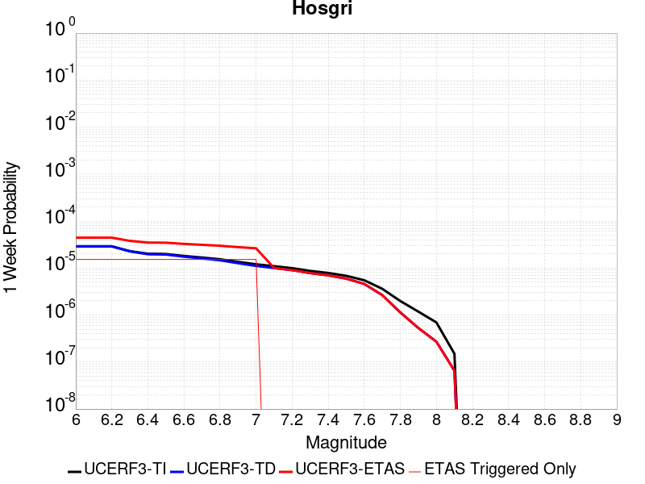 | 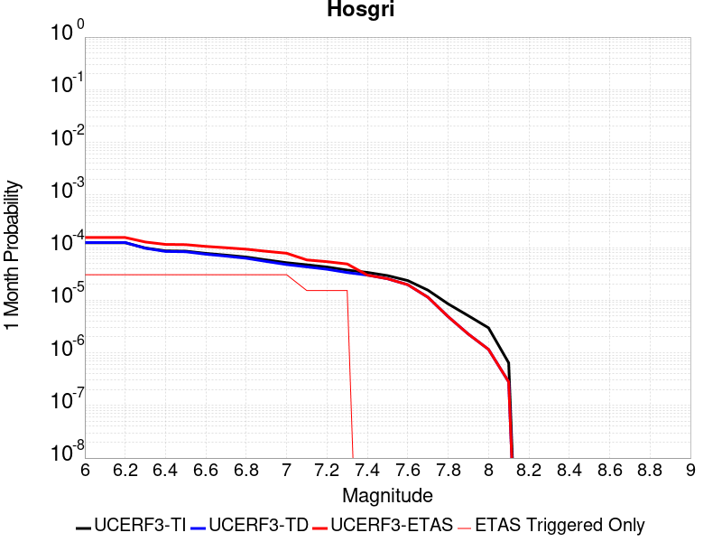 | 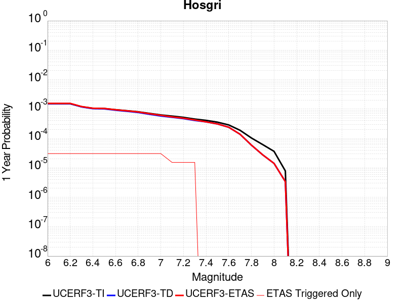 | 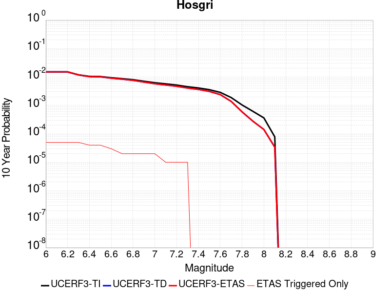 |

| Magnitude | 1 wk TI Prob | 1 wk TD Prob | 1 wk ETAS Prob | 1 wk ETAS/TD Gain | 1 wk ETAS Triggered Only | 1 mo TI Prob | 1 mo TD Prob | 1 mo ETAS Prob | 1 mo ETAS/TD Gain | 1 mo ETAS Triggered Only | 1 yr TI Prob | 1 yr TD Prob | 1 yr ETAS Prob | 1 yr ETAS/TD Gain | 1 yr ETAS Triggered Only | 10 yr TI Prob | 10 yr TD Prob | 10 yr ETAS Prob | 10 yr ETAS/TD Gain | 10 yr ETAS Triggered Only |
|-----|-----|-----|-----|-----|-----|-----|-----|-----|-----|-----|-----|-----|-----|-----|-----|-----|-----|-----|-----|-----|
| 6.0 | 2.883978E-5 | 2.9128416E-5 | 4.434867E-5 | 1.5225227 | 1.52207E-5 | 1.235932E-4 | 1.2483024E-4 | 1.5526784E-4 | 1.2438319 | 3.04414E-5 | 0.0015037085 | 0.001518776 | 0.0015491712 | 1.020013 | 3.04414E-5 | 0.01493574 | 0.01508774 | 0.015132713 | 1.0029808 | 4.5662102E-5 |
| 6.1 | 2.883978E-5 | 2.9128416E-5 | 4.434867E-5 | 1.5225227 | 1.52207E-5 | 1.235932E-4 | 1.2483024E-4 | 1.5526784E-4 | 1.2438319 | 3.04414E-5 | 0.0015037085 | 0.001518776 | 0.0015491712 | 1.020013 | 3.04414E-5 | 0.01493574 | 0.01508774 | 0.015132713 | 1.0029808 | 4.5662102E-5 |
| 6.2 | 2.883978E-5 | 2.9128416E-5 | 4.434867E-5 | 1.5225227 | 1.52207E-5 | 1.235932E-4 | 1.2483024E-4 | 1.5526784E-4 | 1.2438319 | 3.04414E-5 | 0.0015037085 | 0.001518776 | 0.0015491712 | 1.020013 | 3.04414E-5 | 0.01493574 | 0.01508774 | 0.015132713 | 1.0029808 | 4.5662102E-5 |
| 6.3 | 2.2914428E-5 | 2.2641969E-5 | 3.7862326E-5 | 1.6722187 | 1.52207E-5 | 9.8200995E-5 | 9.703343E-5 | 1.2747188E-4 | 1.3136903 | 3.04414E-5 | 0.0011949413 | 0.0011807467 | 0.0012111522 | 1.025751 | 3.04414E-5 | 0.011885363 | 0.011746133 | 0.011791259 | 1.0038418 | 4.5662102E-5 |
| 6.4 | 2.0195741E-5 | 1.969656E-5 | 3.491696E-5 | 1.772744 | 1.52207E-5 | 8.65503E-5 | 8.4411105E-5 | 1.14849936E-4 | 1.3606021 | 3.04414E-5 | 0.0010532405 | 0.0010272227 | 0.0010576328 | 1.0296042 | 3.04414E-5 | 0.010482626 | 0.010225792 | 0.010270988 | 1.0044197 | 4.5662102E-5 |
| 6.5 | 1.9924333E-5 | 1.940898E-5 | 3.4629385E-5 | 1.7841939 | 1.52207E-5 | 8.53872E-5 | 8.3178704E-5 | 1.1361758E-4 | 1.3659455 | 3.04414E-5 | 0.0010390934 | 0.0010122322 | 0.0010426427 | 1.0300431 | 3.04414E-5 | 0.010342481 | 0.010077253 | 0.010122455 | 1.0044855 | 4.5662102E-5 |
| 6.6 | 1.809694E-5 | 1.74583E-5 | 3.2678734E-5 | 1.8718165 | 1.52207E-5 | 7.7556004E-5 | 7.4819145E-5 | 1.05258274E-4 | 1.406836 | 3.04414E-5 | 9.438353E-4 | 9.105437E-4 | 9.4095746E-4 | 1.0334017 | 3.04414E-5 | 0.009398366 | 0.009069073 | 0.009099239 | 1.0033262 | 3.04414E-5 |
| 6.7 | 1.675989E-5 | 1.6042764E-5 | 3.1263222E-5 | 1.9487427 | 1.52207E-5 | 7.182612E-5 | 6.87529E-5 | 9.9192206E-5 | 1.4427348 | 3.04414E-5 | 8.7413215E-4 | 8.3674624E-4 | 8.6716213E-4 | 1.0363503 | 3.04414E-5 | 0.008707017 | 0.0083368635 | 0.00836705 | 1.003621 | 3.04414E-5 |
| 6.8 | 1.5401129E-5 | 1.4614083E-5 | 2.983456E-5 | 2.041494 | 1.52207E-5 | 6.6003166E-5 | 6.2630286E-5 | 9.306978E-5 | 1.4860188 | 3.04414E-5 | 8.032922E-4 | 7.622578E-4 | 7.92676E-4 | 1.0399054 | 3.04414E-5 | 0.008003947 | 0.007597296 | 0.0076275063 | 1.0039765 | 3.04414E-5 |
| 6.9 | 1.356559E-5 | 1.2689968E-5 | 2.7910475E-5 | 2.1994126 | 1.52207E-5 | 5.8136946E-5 | 5.4384444E-5 | 8.482419E-5 | 1.5597142 | 3.04414E-5 | 7.0758746E-4 | 6.619299E-4 | 6.9235114E-4 | 1.0459584 | 3.04414E-5 | 0.007053386 | 0.006600388 | 0.0066306284 | 1.0045816 | 3.04414E-5 |
| 7.0 | 1.2030819E-5 | 1.1095962E-5 | 2.6316493E-5 | 2.3717182 | 1.52207E-5 | 5.155963E-5 | 4.7553254E-5 | 7.799321E-5 | 1.6401235 | 3.04414E-5 | 6.275577E-4 | 5.7880714E-4 | 6.0923095E-4 | 1.052563 | 3.04414E-5 | 0.006257884 | 0.005773757 | 0.005804023 | 1.005242 | 3.04414E-5 |
| 7.1 | 1.0972698E-5 | 1.0022179E-5 | 1.0022179E-5 | 1.0 | 0.0 | 4.7025E-5 | 4.2951488E-5 | 5.8171536E-5 | 1.3543544 | 1.52207E-5 | 5.72379E-4 | 5.22809E-4 | 5.3802173E-4 | 1.029098 | 1.52207E-5 | 0.0057090693 | 0.005216542 | 0.0052316836 | 1.0029025 | 1.52207E-5 |
| 7.2 | 9.961926E-6 | 9.034746E-6 | 9.034746E-6 | 1.0 | 0.0 | 4.2693267E-5 | 3.8719765E-5 | 5.3939875E-5 | 1.3930838 | 1.52207E-5 | 5.1966653E-4 | 4.713112E-4 | 4.8652475E-4 | 1.0322791 | 1.52207E-5 | 0.00518453 | 0.0047038626 | 0.0047190115 | 1.0032206 | 1.52207E-5 |
| 7.3 | 8.700929E-6 | 7.8281E-6 | 7.8281E-6 | 1.0 | 0.0 | 3.7289166E-5 | 3.354857E-5 | 4.876876E-5 | 1.4536762 | 1.52207E-5 | 4.53901E-4 | 4.0837732E-4 | 4.235918E-4 | 1.037256 | 1.52207E-5 | 0.00452975 | 0.004077008 | 0.0040921667 | 1.0037181 | 1.52207E-5 |
| 7.4 | 7.866285E-6 | 6.998739E-6 | 6.998739E-6 | 1.0 | 0.0 | 3.3712215E-5 | 2.9994251E-5 | 2.9994251E-5 | 1.0 | 0.0 | 4.103689E-4 | 3.6511885E-4 | 3.6511885E-4 | 1.0 | 0.0 | 0.004096119 | 0.0036459267 | 0.0036459267 | 1.0 | 0.0 |
| 7.5 | 6.8381305E-6 | 5.9596955E-6 | 5.9596955E-6 | 1.0 | 0.0 | 2.9305946E-5 | 2.5541302E-5 | 2.5541302E-5 | 1.0 | 0.0 | 3.5674145E-4 | 3.10921E-4 | 3.10921E-4 | 1.0 | 0.0 | 0.0035616932 | 0.0031055948 | 0.0031055948 | 1.0 | 0.0 |
| 7.6 | 5.503376E-6 | 4.5952443E-6 | 4.5952443E-6 | 1.0 | 0.0 | 2.3585684E-5 | 1.9693754E-5 | 1.9693754E-5 | 1.0 | 0.0 | 2.8711787E-4 | 2.397451E-4 | 2.397451E-4 | 1.0 | 0.0 | 0.002867472 | 0.0023955975 | 0.0023955975 | 1.0 | 0.0 |
| 7.7 | 3.6144982E-6 | 2.6522112E-6 | 2.6522112E-6 | 1.0 | 0.0 | 1.5490614E-5 | 1.1366569E-5 | 1.1366569E-5 | 1.0 | 0.0 | 1.8858191E-4 | 1.383792E-4 | 1.383792E-4 | 1.0 | 0.0 | 0.0018842196 | 0.0013836613 | 0.0013836613 | 1.0 | 0.0 |
| 7.8 | 1.9853494E-6 | 1.1361129E-6 | 1.1361129E-6 | 1.0 | 0.0 | 8.508612E-6 | 4.8690463E-6 | 4.8690463E-6 | 1.0 | 0.0 | 1.0358743E-4 | 5.9279027E-5 | 5.9279027E-5 | 1.0 | 0.0 | 0.0010353916 | 5.9336185E-4 | 5.9336185E-4 | 1.0 | 0.0 |
| 7.9 | 1.1818757E-6 | 5.2951856E-7 | 5.2951856E-7 | 1.0 | 0.0 | 5.0651715E-6 | 2.2693632E-6 | 2.2693632E-6 | 1.0 | 0.0 | 6.1666724E-5 | 2.7629147E-5 | 2.7629147E-5 | 1.0 | 0.0 | 6.1649614E-4 | 2.7694515E-4 | 2.7694515E-4 | 1.0 | 0.0 |
| 8.0 | 6.962958E-7 | 2.7139782E-7 | 2.7139782E-7 | 1.0 | 0.0 | 2.9841215E-6 | 1.163133E-6 | 1.163133E-6 | 1.0 | 0.0 | 3.6331072E-5 | 1.4161053E-5 | 1.4161053E-5 | 1.0 | 0.0 | 3.6325134E-4 | 1.4217179E-4 | 1.4217179E-4 | 1.0 | 0.0 |
| 8.1 | 1.5033264E-7 | 6.527624E-8 | 6.527624E-8 | 1.0 | 0.0 | 6.442826E-7 | 2.7975528E-7 | 2.7975528E-7 | 1.0 | 0.0 | 7.844113E-6 | 3.4060151E-6 | 3.4060151E-6 | 1.0 | 0.0 | 7.843835E-5 | 3.407693E-5 | 3.407693E-5 | 1.0 | 0.0 |

## Raymond
*[(top)](#table-of-contents)*

| 1 Week | 1 Month | 1 Year | 10 Year |
|-----|-----|-----|-----|
|  |  | 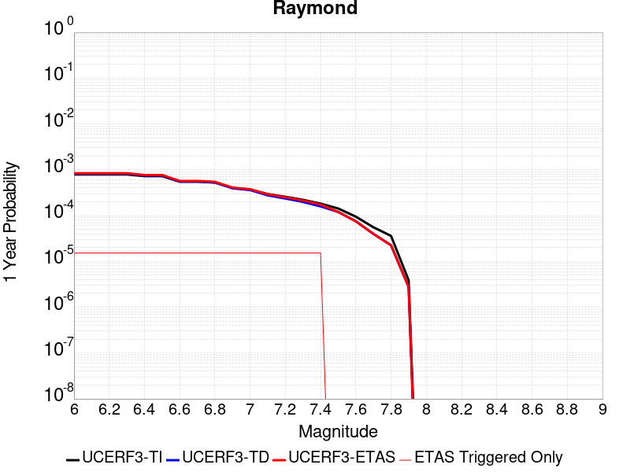 | 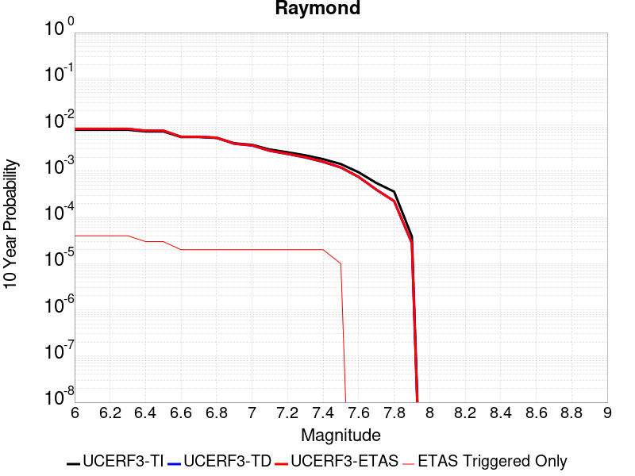 |

| Magnitude | 1 wk TI Prob | 1 wk TD Prob | 1 wk ETAS Prob | 1 wk ETAS/TD Gain | 1 wk ETAS Triggered Only | 1 mo TI Prob | 1 mo TD Prob | 1 mo ETAS Prob | 1 mo ETAS/TD Gain | 1 mo ETAS Triggered Only | 1 yr TI Prob | 1 yr TD Prob | 1 yr ETAS Prob | 1 yr ETAS/TD Gain | 1 yr ETAS Triggered Only | 10 yr TI Prob | 10 yr TD Prob | 10 yr ETAS Prob | 10 yr ETAS/TD Gain | 10 yr ETAS Triggered Only |
|-----|-----|-----|-----|-----|-----|-----|-----|-----|-----|-----|-----|-----|-----|-----|-----|-----|-----|-----|-----|-----|
| 6.0 | 1.5157413E-5 | 1.5810128E-5 | 1.5810128E-5 | 1.0 | 0.0 | 6.4958724E-5 | 6.7756075E-5 | 6.7756075E-5 | 1.0 | 0.0 | 7.905855E-4 | 8.2464307E-4 | 8.398512E-4 | 1.0184422 | 1.52207E-5 | 0.007877788 | 0.008218348 | 0.008263635 | 1.0055104 | 4.5662102E-5 |
| 6.1 | 1.5157413E-5 | 1.5810128E-5 | 1.5810128E-5 | 1.0 | 0.0 | 6.4958724E-5 | 6.7756075E-5 | 6.7756075E-5 | 1.0 | 0.0 | 7.905855E-4 | 8.2464307E-4 | 8.398512E-4 | 1.0184422 | 1.52207E-5 | 0.007877788 | 0.008218348 | 0.008263635 | 1.0055104 | 4.5662102E-5 |
| 6.2 | 1.5157413E-5 | 1.5810128E-5 | 1.5810128E-5 | 1.0 | 0.0 | 6.4958724E-5 | 6.7756075E-5 | 6.7756075E-5 | 1.0 | 0.0 | 7.905855E-4 | 8.2464307E-4 | 8.398512E-4 | 1.0184422 | 1.52207E-5 | 0.007877788 | 0.008218348 | 0.008263635 | 1.0055104 | 4.5662102E-5 |
| 6.3 | 1.5157413E-5 | 1.5810128E-5 | 1.5810128E-5 | 1.0 | 0.0 | 6.4958724E-5 | 6.7756075E-5 | 6.7756075E-5 | 1.0 | 0.0 | 7.905855E-4 | 8.2464307E-4 | 8.398512E-4 | 1.0184422 | 1.52207E-5 | 0.007877788 | 0.008218348 | 0.008263635 | 1.0055104 | 4.5662102E-5 |
| 6.4 | 1.3941944E-5 | 1.445469E-5 | 1.445469E-5 | 1.0 | 0.0 | 5.9749822E-5 | 6.1947336E-5 | 6.1947336E-5 | 1.0 | 0.0 | 7.2721124E-4 | 7.5397117E-4 | 7.6918036E-4 | 1.0201721 | 1.52207E-5 | 0.007248361 | 0.0075164647 | 0.007561784 | 1.0060292 | 4.5662102E-5 |
| 6.5 | 1.3941944E-5 | 1.445469E-5 | 1.445469E-5 | 1.0 | 0.0 | 5.9749822E-5 | 6.1947336E-5 | 6.1947336E-5 | 1.0 | 0.0 | 7.2721124E-4 | 7.5397117E-4 | 7.6918036E-4 | 1.0201721 | 1.52207E-5 | 0.007248361 | 0.0075164647 | 0.007561784 | 1.0060292 | 4.5662102E-5 |
| 6.6 | 1.0542609E-5 | 1.0671113E-5 | 1.0671113E-5 | 1.0 | 0.0 | 4.5181827E-5 | 4.573257E-5 | 4.573257E-5 | 1.0 | 0.0 | 5.499499E-4 | 5.5665727E-4 | 5.718695E-4 | 1.0273278 | 1.52207E-5 | 0.005485909 | 0.00555319 | 0.005583463 | 1.0054513 | 3.04414E-5 |
| 6.7 | 1.0542609E-5 | 1.0671113E-5 | 1.0671113E-5 | 1.0 | 0.0 | 4.5181827E-5 | 4.573257E-5 | 4.573257E-5 | 1.0 | 0.0 | 5.499499E-4 | 5.5665727E-4 | 5.718695E-4 | 1.0273278 | 1.52207E-5 | 0.005485909 | 0.00555319 | 0.005583463 | 1.0054513 | 3.04414E-5 |
| 6.8 | 1.0079132E-5 | 1.0176646E-5 | 1.0176646E-5 | 1.0 | 0.0 | 4.3195567E-5 | 4.3613498E-5 | 4.3613498E-5 | 1.0 | 0.0 | 5.257791E-4 | 5.3087034E-4 | 5.4608297E-4 | 1.028656 | 1.52207E-5 | 0.0052453685 | 0.005296571 | 0.0053268513 | 1.0057169 | 3.04414E-5 |
| 6.9 | 7.721598E-6 | 7.5489047E-6 | 7.5489047E-6 | 1.0 | 0.0 | 3.3092143E-5 | 3.2352054E-5 | 3.2352054E-5 | 1.0 | 0.0 | 4.0282236E-4 | 3.9381627E-4 | 4.09031E-4 | 1.0386341 | 1.52207E-5 | 0.0040209293 | 0.0039313175 | 0.0039616395 | 1.0077128 | 3.04414E-5 |
| 7.0 | 7.137566E-6 | 6.9113057E-6 | 6.9113057E-6 | 1.0 | 0.0 | 3.058921E-5 | 2.961955E-5 | 2.961955E-5 | 1.0 | 0.0 | 3.7236E-4 | 3.6055944E-4 | 3.7577466E-4 | 1.0421989 | 1.52207E-5 | 0.0037173668 | 0.0035998628 | 0.0036301946 | 1.0084258 | 3.04414E-5 |
| 7.1 | 5.654976E-6 | 5.29954E-6 | 5.29954E-6 | 1.0 | 0.0 | 2.4235387E-5 | 2.2712118E-5 | 2.2712118E-5 | 1.0 | 0.0 | 2.9502588E-4 | 2.7648517E-4 | 2.9170167E-4 | 1.0550355 | 1.52207E-5 | 0.0029463451 | 0.002761443 | 0.0027918003 | 1.0109932 | 3.04414E-5 |
| 7.2 | 4.9358455E-6 | 4.5266574E-6 | 4.5266574E-6 | 1.0 | 0.0 | 2.1153453E-5 | 1.9399817E-5 | 1.9399817E-5 | 1.0 | 0.0 | 2.5751285E-4 | 2.3616731E-4 | 2.5138442E-4 | 1.0644336 | 1.52207E-5 | 0.0025721465 | 0.0023591854 | 0.002389555 | 1.0128729 | 3.04414E-5 |
| 7.3 | 4.2368597E-6 | 3.8056164E-6 | 3.8056164E-6 | 1.0 | 0.0 | 1.8157843E-5 | 1.6309683E-5 | 1.6309683E-5 | 1.0 | 0.0 | 2.2104931E-4 | 1.9855241E-4 | 2.137701E-4 | 1.0766431 | 1.52207E-5 | 0.0022082955 | 0.0019837688 | 0.00201415 | 1.0153148 | 3.04414E-5 |
| 7.4 | 3.4999923E-6 | 3.043744E-6 | 3.043744E-6 | 1.0 | 0.0 | 1.49998805E-5 | 1.3044552E-5 | 1.3044552E-5 | 1.0 | 0.0 | 1.8260824E-4 | 1.5880594E-4 | 1.7402422E-4 | 1.0958295 | 1.52207E-5 | 0.0018245826 | 0.0015869403 | 0.0016173334 | 1.019152 | 3.04414E-5 |
| 7.5 | 2.738017E-6 | 2.3020468E-6 | 2.3020468E-6 | 1.0 | 0.0 | 1.1734306E-5 | 9.865878E-6 | 9.865878E-6 | 1.0 | 0.0 | 1.428558E-4 | 1.2011051E-4 | 1.2011051E-4 | 1.0 | 0.0 | 0.0014276401 | 0.0012004703 | 0.0012156727 | 1.0126637 | 1.52207E-5 |
| 7.6 | 1.8186392E-6 | 1.442312E-6 | 1.442312E-6 | 1.0 | 0.0 | 7.794145E-6 | 6.181323E-6 | 6.181323E-6 | 1.0 | 0.0 | 9.488958E-5 | 7.5255055E-5 | 7.5255055E-5 | 1.0 | 0.0 | 9.4849075E-4 | 7.523072E-4 | 7.523072E-4 | 1.0 | 0.0 |
| 7.7 | 1.0660348E-6 | 7.6438056E-7 | 7.6438056E-7 | 1.0 | 0.0 | 4.5687125E-6 | 3.2759126E-6 | 3.2759126E-6 | 1.0 | 0.0 | 5.5622655E-5 | 3.9883522E-5 | 3.9883522E-5 | 1.0 | 0.0 | 5.5608735E-4 | 3.9877277E-4 | 3.9877277E-4 | 1.0 | 0.0 |
| 7.8 | 6.913602E-7 | 4.3204133E-7 | 4.3204133E-7 | 1.0 | 0.0 | 2.962969E-6 | 1.8516045E-6 | 1.8516045E-6 | 1.0 | 0.0 | 3.607355E-5 | 2.2543056E-5 | 2.2543056E-5 | 1.0 | 0.0 | 3.6067693E-4 | 2.2541556E-4 | 2.2541556E-4 | 1.0 | 0.0 |
| 7.9 | 7.425201E-8 | 5.3222113E-8 | 5.3222113E-8 | 1.0 | 0.0 | 3.1822285E-7 | 2.2809476E-7 | 2.2809476E-7 | 1.0 | 0.0 | 3.874356E-6 | 2.7770516E-6 | 2.7770516E-6 | 1.0 | 0.0 | 3.8742884E-5 | 2.7770298E-5 | 2.7770298E-5 | 1.0 | 0.0 |

## Hollywood
*[(top)](#table-of-contents)*

| 1 Week | 1 Month | 1 Year | 10 Year |
|-----|-----|-----|-----|
| 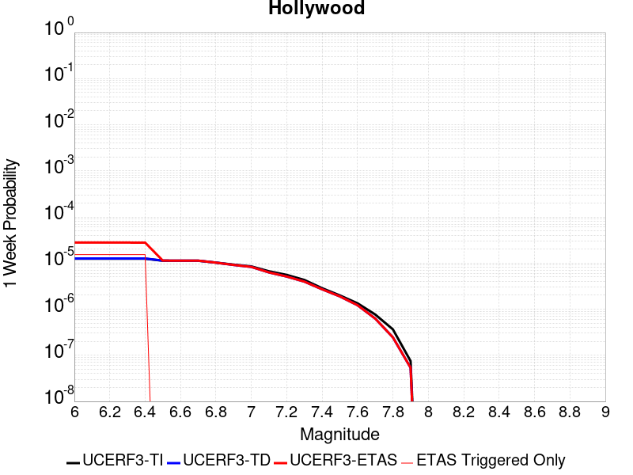 | 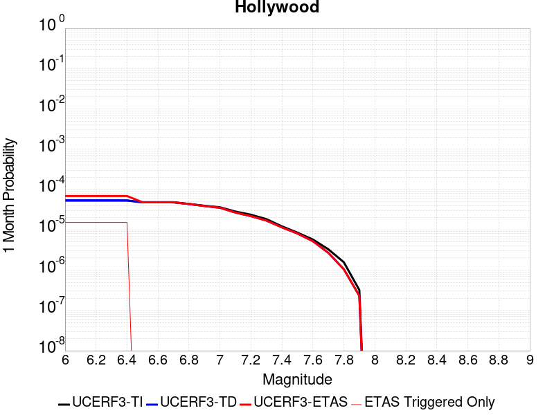 | 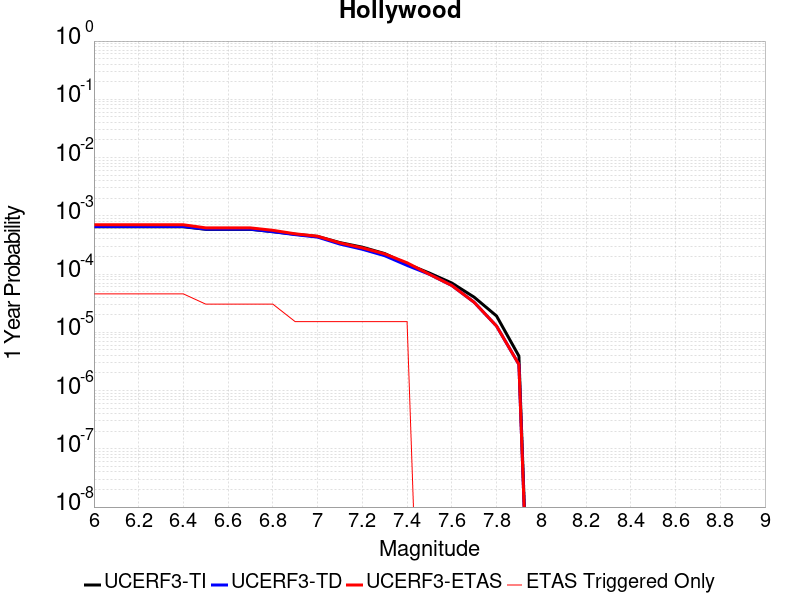 | 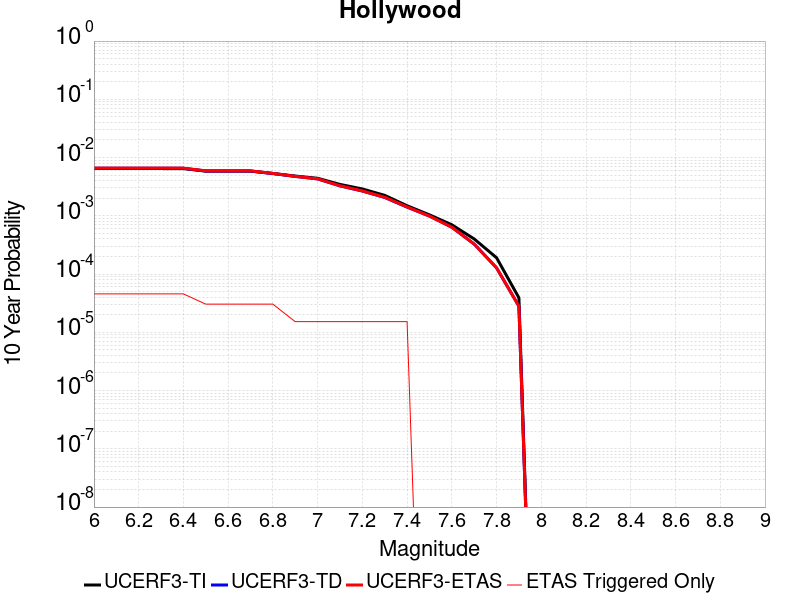 |

| Magnitude | 1 wk TI Prob | 1 wk TD Prob | 1 wk ETAS Prob | 1 wk ETAS/TD Gain | 1 wk ETAS Triggered Only | 1 mo TI Prob | 1 mo TD Prob | 1 mo ETAS Prob | 1 mo ETAS/TD Gain | 1 mo ETAS Triggered Only | 1 yr TI Prob | 1 yr TD Prob | 1 yr ETAS Prob | 1 yr ETAS/TD Gain | 1 yr ETAS Triggered Only | 10 yr TI Prob | 10 yr TD Prob | 10 yr ETAS Prob | 10 yr ETAS/TD Gain | 10 yr ETAS Triggered Only |
|-----|-----|-----|-----|-----|-----|-----|-----|-----|-----|-----|-----|-----|-----|-----|-----|-----|-----|-----|-----|-----|
| 6.0 | 1.24487615E-5 | 1.2593226E-5 | 2.7813734E-5 | 2.2086267 | 1.52207E-5 | 5.3350745E-5 | 5.3969878E-5 | 6.918976E-5 | 1.2820069 | 1.52207E-5 | 6.4935174E-4 | 6.568898E-4 | 7.0252194E-4 | 1.069467 | 4.5662102E-5 | 0.0064745755 | 0.006549969 | 0.006595332 | 1.0069257 | 4.5662102E-5 |
| 6.1 | 1.24487615E-5 | 1.2593226E-5 | 2.7813734E-5 | 2.2086267 | 1.52207E-5 | 5.3350745E-5 | 5.3969878E-5 | 6.918976E-5 | 1.2820069 | 1.52207E-5 | 6.4935174E-4 | 6.568898E-4 | 7.0252194E-4 | 1.069467 | 4.5662102E-5 | 0.0064745755 | 0.006549969 | 0.006595332 | 1.0069257 | 4.5662102E-5 |
| 6.2 | 1.24487615E-5 | 1.2593226E-5 | 2.7813734E-5 | 2.2086267 | 1.52207E-5 | 5.3350745E-5 | 5.3969878E-5 | 6.918976E-5 | 1.2820069 | 1.52207E-5 | 6.4935174E-4 | 6.568898E-4 | 7.0252194E-4 | 1.069467 | 4.5662102E-5 | 0.0064745755 | 0.006549969 | 0.006595332 | 1.0069257 | 4.5662102E-5 |
| 6.3 | 1.24487615E-5 | 1.2593226E-5 | 2.7813734E-5 | 2.2086267 | 1.52207E-5 | 5.3350745E-5 | 5.3969878E-5 | 6.918976E-5 | 1.2820069 | 1.52207E-5 | 6.4935174E-4 | 6.568898E-4 | 7.0252194E-4 | 1.069467 | 4.5662102E-5 | 0.0064745755 | 0.006549969 | 0.006595332 | 1.0069257 | 4.5662102E-5 |
| 6.4 | 1.2431024E-5 | 1.2573839E-5 | 2.7794347E-5 | 2.2104902 | 1.52207E-5 | 5.327473E-5 | 5.3886797E-5 | 6.9106674E-5 | 1.2824417 | 1.52207E-5 | 6.4842677E-4 | 6.558789E-4 | 7.0151105E-4 | 1.069574 | 4.5662102E-5 | 0.0064653796 | 0.0065399194 | 0.0065852827 | 1.0069364 | 4.5662102E-5 |
| 6.5 | 1.1242222E-5 | 1.13178E-5 | 1.13178E-5 | 1.0 | 0.0 | 4.8180063E-5 | 4.850397E-5 | 4.850397E-5 | 1.0 | 0.0 | 5.864344E-4 | 5.9037853E-4 | 6.2080193E-4 | 1.051532 | 3.04414E-5 | 0.0058488925 | 0.005888388 | 0.00591865 | 1.0051394 | 3.04414E-5 |
| 6.6 | 1.1234066E-5 | 1.13089145E-5 | 1.13089145E-5 | 1.0 | 0.0 | 4.8145106E-5 | 4.846589E-5 | 4.846589E-5 | 1.0 | 0.0 | 5.86009E-4 | 5.8991514E-4 | 6.203386E-4 | 1.0515726 | 3.04414E-5 | 0.005844661 | 0.0058837784 | 0.005914041 | 1.0051433 | 3.04414E-5 |
| 6.7 | 1.12294E-5 | 1.1303658E-5 | 1.1303658E-5 | 1.0 | 0.0 | 4.812511E-5 | 4.8443362E-5 | 4.8443362E-5 | 1.0 | 0.0 | 5.857657E-4 | 5.89641E-4 | 6.2006444E-4 | 1.0515965 | 3.04414E-5 | 0.0058422405 | 0.005881052 | 0.005911314 | 1.0051458 | 3.04414E-5 |
| 6.8 | 1.0252819E-5 | 1.0218445E-5 | 1.0218445E-5 | 1.0 | 0.0 | 4.3939912E-5 | 4.379261E-5 | 4.379261E-5 | 1.0 | 0.0 | 5.3483713E-4 | 5.330467E-4 | 5.634719E-4 | 1.0570779 | 3.04414E-5 | 0.005335517 | 0.005317908 | 0.005348187 | 1.0056939 | 3.04414E-5 |
| 6.9 | 9.252289E-6 | 9.110306E-6 | 9.110306E-6 | 1.0 | 0.0 | 3.9652066E-5 | 3.9043593E-5 | 3.9043593E-5 | 1.0 | 0.0 | 4.8265693E-4 | 4.752537E-4 | 4.904672E-4 | 1.0320113 | 1.52207E-5 | 0.0048161 | 0.004742547 | 0.0047576954 | 1.0031942 | 1.52207E-5 |
| 7.0 | 8.474604E-6 | 8.258257E-6 | 8.258257E-6 | 1.0 | 0.0 | 3.6319227E-5 | 3.539206E-5 | 3.539206E-5 | 1.0 | 0.0 | 4.4209688E-4 | 4.3081454E-4 | 4.460287E-4 | 1.0353148 | 1.52207E-5 | 0.004412184 | 0.004299944 | 0.004315099 | 1.0035245 | 1.52207E-5 |
| 7.1 | 6.643643E-6 | 6.2683675E-6 | 6.2683675E-6 | 1.0 | 0.0 | 2.8472443E-5 | 2.6864158E-5 | 2.6864158E-5 | 1.0 | 0.0 | 3.4659685E-4 | 3.2702246E-4 | 3.422382E-4 | 1.0465281 | 1.52207E-5 | 0.0034605677 | 0.0032654584 | 0.0032806294 | 1.004646 | 1.52207E-5 |
| 7.2 | 5.549002E-6 | 5.108709E-6 | 5.108709E-6 | 1.0 | 0.0 | 2.378122E-5 | 2.1894284E-5 | 2.1894284E-5 | 1.0 | 0.0 | 2.8949787E-4 | 2.6653046E-4 | 2.817471E-4 | 1.0570916 | 1.52207E-5 | 0.0028912104 | 0.0026621243 | 0.0026773047 | 1.0057023 | 1.52207E-5 |
| 7.3 | 4.3059727E-6 | 3.9598885E-6 | 3.9598885E-6 | 1.0 | 0.0 | 1.8454039E-5 | 1.6970842E-5 | 1.6970842E-5 | 1.0 | 0.0 | 2.2465475E-4 | 2.066005E-4 | 2.2181806E-4 | 1.0736569 | 1.52207E-5 | 0.0022442779 | 0.0020640944 | 0.0020792836 | 1.0073588 | 1.52207E-5 |
| 7.4 | 2.8550733E-6 | 2.7012966E-6 | 2.7012966E-6 | 1.0 | 0.0 | 1.2235971E-5 | 1.1576934E-5 | 1.1576934E-5 | 1.0 | 0.0 | 1.4896276E-4 | 1.409401E-4 | 1.5615865E-4 | 1.1079789 | 1.52207E-5 | 0.0014886294 | 0.0014085122 | 0.0014237115 | 1.0107911 | 1.52207E-5 |
| 7.5 | 1.9927045E-6 | 1.8976367E-6 | 1.8976367E-6 | 1.0 | 0.0 | 8.540134E-6 | 8.132703E-6 | 8.132703E-6 | 1.0 | 0.0 | 1.0397117E-4 | 9.90112E-5 | 9.90112E-5 | 1.0 | 0.0 | 0.0010392254 | 9.896745E-4 | 9.896745E-4 | 1.0 | 0.0 |
| 7.6 | 1.345084E-6 | 1.2216007E-6 | 1.2216007E-6 | 1.0 | 0.0 | 5.764633E-6 | 5.235421E-6 | 5.235421E-6 | 1.0 | 0.0 | 7.018215E-5 | 6.3739404E-5 | 6.3739404E-5 | 1.0 | 0.0 | 7.0159987E-4 | 6.3721323E-4 | 6.3721323E-4 | 1.0 | 0.0 |
| 7.7 | 7.6835164E-7 | 6.277697E-7 | 6.277697E-7 | 1.0 | 0.0 | 3.2929315E-6 | 2.6904388E-6 | 2.6904388E-6 | 1.0 | 0.0 | 4.00907E-5 | 3.2755615E-5 | 3.2755615E-5 | 1.0 | 0.0 | 4.0083472E-4 | 3.2750933E-4 | 3.2750933E-4 | 1.0 | 0.0 |
| 7.8 | 3.6562128E-7 | 2.453479E-7 | 2.453479E-7 | 1.0 | 0.0 | 1.5669474E-6 | 1.0514907E-6 | 1.0514907E-6 | 1.0 | 0.0 | 1.9077417E-5 | 1.2801827E-5 | 1.2801827E-5 | 1.0 | 0.0 | 1.907578E-4 | 1.2801126E-4 | 1.2801126E-4 | 1.0 | 0.0 |
| 7.9 | 7.5024424E-8 | 5.3816795E-8 | 5.3816795E-8 | 1.0 | 0.0 | 3.215332E-7 | 2.306434E-7 | 2.306434E-7 | 1.0 | 0.0 | 3.91466E-6 | 2.808081E-6 | 2.808081E-6 | 1.0 | 0.0 | 3.9145907E-5 | 2.8080585E-5 | 2.8080585E-5 | 1.0 | 0.0 |

## Great Valley 09 (Laguna Seca)
*[(top)](#table-of-contents)*

| 1 Week | 1 Month | 1 Year | 10 Year |
|-----|-----|-----|-----|
| 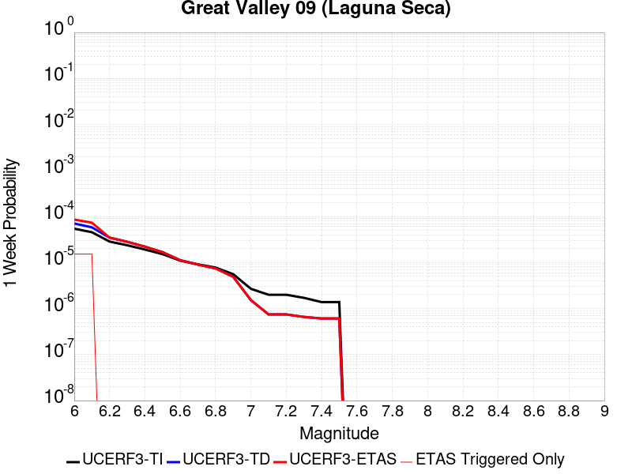 | 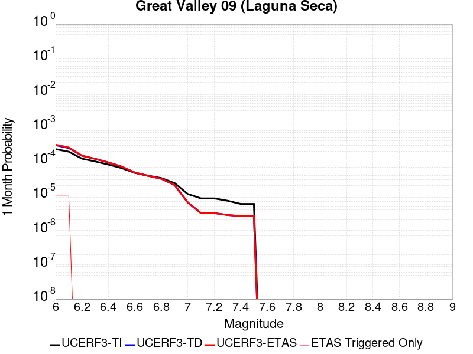 |  | 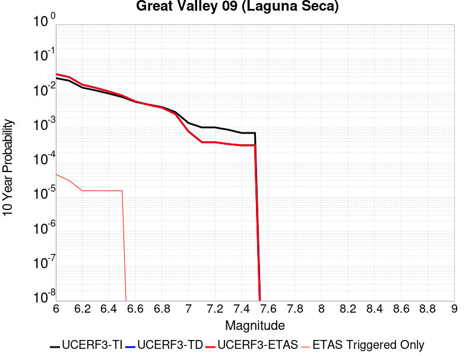 |

| Magnitude | 1 wk TI Prob | 1 wk TD Prob | 1 wk ETAS Prob | 1 wk ETAS/TD Gain | 1 wk ETAS Triggered Only | 1 mo TI Prob | 1 mo TD Prob | 1 mo ETAS Prob | 1 mo ETAS/TD Gain | 1 mo ETAS Triggered Only | 1 yr TI Prob | 1 yr TD Prob | 1 yr ETAS Prob | 1 yr ETAS/TD Gain | 1 yr ETAS Triggered Only | 10 yr TI Prob | 10 yr TD Prob | 10 yr ETAS Prob | 10 yr ETAS/TD Gain | 10 yr ETAS Triggered Only |
|-----|-----|-----|-----|-----|-----|-----|-----|-----|-----|-----|-----|-----|-----|-----|-----|-----|-----|-----|-----|-----|
| 6.0 | 5.4353277E-5 | 7.05022E-5 | 8.5721826E-5 | 1.2158746 | 1.52207E-5 | 2.3292181E-4 | 3.0211566E-4 | 3.1733178E-4 | 1.0503652 | 1.52207E-5 | 0.0028321352 | 0.0036721937 | 0.0037025234 | 1.0082593 | 3.04414E-5 | 0.02796312 | 0.03611547 | 0.036159486 | 1.0012187 | 4.5662102E-5 |
| 6.1 | 4.5578287E-5 | 5.822118E-5 | 7.3441E-5 | 1.2614137 | 1.52207E-5 | 1.953209E-4 | 2.4949326E-4 | 2.6471016E-4 | 1.0609913 | 1.52207E-5 | 0.0023754383 | 0.003033432 | 0.0030486064 | 1.0050024 | 1.52207E-5 | 0.023502063 | 0.029919548 | 0.029949078 | 1.000987 | 3.04414E-5 |
| 6.2 | 2.8536782E-5 | 3.4737273E-5 | 3.4737273E-5 | 1.0 | 0.0 | 1.2229476E-4 | 1.4886224E-4 | 1.4886224E-4 | 1.0 | 0.0 | 0.0014879217 | 0.001810813 | 0.001810813 | 1.0 | 0.0 | 0.014779986 | 0.017958116 | 0.017973064 | 1.0008323 | 1.52207E-5 |
| 6.3 | 2.3698774E-5 | 2.8213295E-5 | 2.8213295E-5 | 1.0 | 0.0 | 1.01562226E-4 | 1.20905075E-4 | 1.20905075E-4 | 1.0 | 0.0 | 0.0012358186 | 0.0014710218 | 0.0014710218 | 1.0 | 0.0 | 0.012289686 | 0.014611342 | 0.01462634 | 1.0010265 | 1.52207E-5 |
| 6.4 | 1.9191197E-5 | 2.2123184E-5 | 2.2123184E-5 | 1.0 | 0.0 | 8.2245395E-5 | 9.4806666E-5 | 9.4806666E-5 | 1.0 | 0.0 | 0.0010008777 | 0.0011536429 | 0.0011536429 | 1.0 | 0.0 | 0.009963818 | 0.011476948 | 0.011491993 | 1.001311 | 1.52207E-5 |
| 6.5 | 1.5203241E-5 | 1.6802203E-5 | 1.6802203E-5 | 1.0 | 0.0 | 6.5155116E-5 | 7.200386E-5 | 7.200386E-5 | 1.0 | 0.0 | 7.9297484E-4 | 8.7626575E-4 | 8.7626575E-4 | 1.0 | 0.0 | 0.007901512 | 0.0087295165 | 0.008744605 | 1.0017284 | 1.52207E-5 |
| 6.6 | 1.0984925E-5 | 1.1242595E-5 | 1.1242595E-5 | 1.0 | 0.0 | 4.70774E-5 | 4.8181686E-5 | 4.8181686E-5 | 1.0 | 0.0 | 5.730166E-4 | 5.8645656E-4 | 5.8645656E-4 | 1.0 | 0.0 | 0.005715413 | 0.0058494853 | 0.0058494853 | 1.0 | 0.0 |
| 6.7 | 9.134616E-6 | 9.019894E-6 | 9.019894E-6 | 1.0 | 0.0 | 3.9147766E-5 | 3.865613E-5 | 3.865613E-5 | 1.0 | 0.0 | 4.7651984E-4 | 4.7053912E-4 | 4.7053912E-4 | 1.0 | 0.0 | 0.004754993 | 0.0046956735 | 0.0046956735 | 1.0 | 0.0 |
| 6.8 | 7.785589E-6 | 7.4519444E-6 | 7.4519444E-6 | 1.0 | 0.0 | 3.3366385E-5 | 3.1936524E-5 | 3.1936524E-5 | 1.0 | 0.0 | 4.0616E-4 | 3.8875983E-4 | 3.8875983E-4 | 1.0 | 0.0 | 0.0040541845 | 0.0038810016 | 0.0038810016 | 1.0 | 0.0 |
| 6.9 | 5.579095E-6 | 4.898492E-6 | 4.898492E-6 | 1.0 | 0.0 | 2.3910188E-5 | 2.0993377E-5 | 2.0993377E-5 | 1.0 | 0.0 | 2.9106764E-4 | 2.5556577E-4 | 2.5556577E-4 | 1.0 | 0.0 | 0.002906867 | 0.002552856 | 0.002552856 | 1.0 | 0.0 |
| 7.0 | 2.6816688E-6 | 1.5216126E-6 | 1.5216126E-6 | 1.0 | 0.0 | 1.1492816E-5 | 6.521181E-6 | 6.521181E-6 | 1.0 | 0.0 | 1.3991605E-4 | 7.939258E-5 | 7.939258E-5 | 1.0 | 0.0 | 0.0013982799 | 7.9365086E-4 | 7.9365086E-4 | 1.0 | 0.0 |
| 7.1 | 1.9951021E-6 | 7.453827E-7 | 7.453827E-7 | 1.0 | 0.0 | 8.55041E-6 | 3.1944935E-6 | 3.1944935E-6 | 1.0 | 0.0 | 1.0409627E-4 | 3.8892307E-5 | 3.8892307E-5 | 1.0 | 0.0 | 0.0010404752 | 3.8885913E-4 | 3.8885913E-4 | 1.0 | 0.0 |
| 7.2 | 1.9951021E-6 | 7.453827E-7 | 7.453827E-7 | 1.0 | 0.0 | 8.55041E-6 | 3.1944935E-6 | 3.1944935E-6 | 1.0 | 0.0 | 1.0409627E-4 | 3.8892307E-5 | 3.8892307E-5 | 1.0 | 0.0 | 0.0010404752 | 3.8885913E-4 | 3.8885913E-4 | 1.0 | 0.0 |
| 7.3 | 1.7087556E-6 | 6.578881E-7 | 6.578881E-7 | 1.0 | 0.0 | 7.3232177E-6 | 2.8195177E-6 | 2.8195177E-6 | 1.0 | 0.0 | 8.915652E-5 | 3.4327128E-5 | 3.4327128E-5 | 1.0 | 0.0 | 8.9120766E-4 | 3.432223E-4 | 3.432223E-4 | 1.0 | 0.0 |
| 7.4 | 1.3804846E-6 | 6.073852E-7 | 6.073852E-7 | 1.0 | 0.0 | 5.916349E-6 | 2.6030768E-6 | 2.6030768E-6 | 1.0 | 0.0 | 7.2029165E-5 | 3.169204E-5 | 3.169204E-5 | 1.0 | 0.0 | 7.200583E-4 | 3.1687922E-4 | 3.1687922E-4 | 1.0 | 0.0 |
| 7.5 | 1.3804846E-6 | 6.073852E-7 | 6.073852E-7 | 1.0 | 0.0 | 5.916349E-6 | 2.6030768E-6 | 2.6030768E-6 | 1.0 | 0.0 | 7.2029165E-5 | 3.169204E-5 | 3.169204E-5 | 1.0 | 0.0 | 7.200583E-4 | 3.1687922E-4 | 3.1687922E-4 | 1.0 | 0.0 |

## Emerson-Copper Mtn 2011
*[(top)](#table-of-contents)*

| 1 Week | 1 Month | 1 Year | 10 Year |
|-----|-----|-----|-----|
| 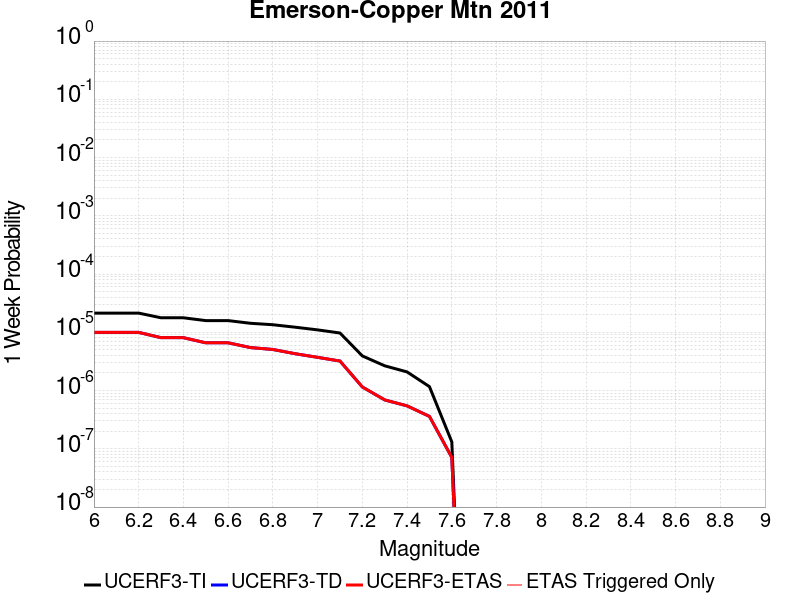 | 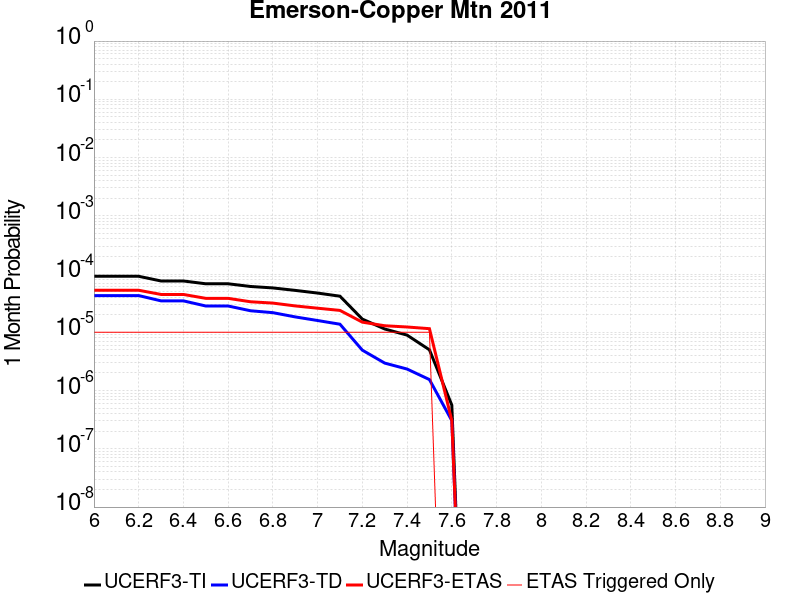 | 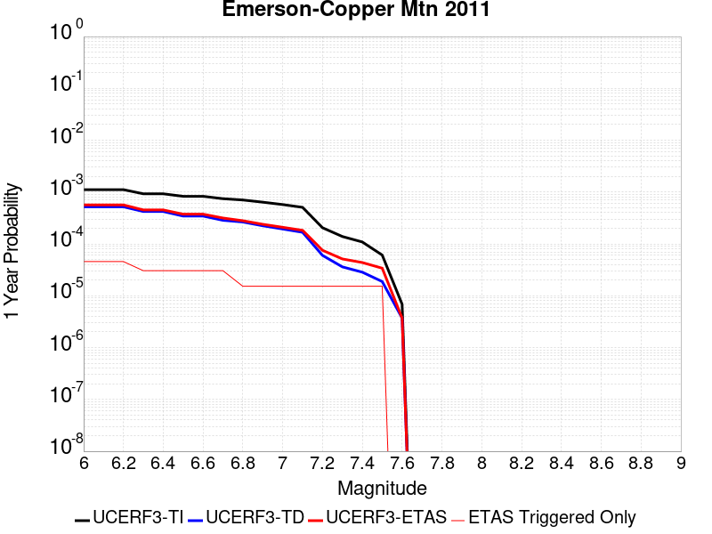 | 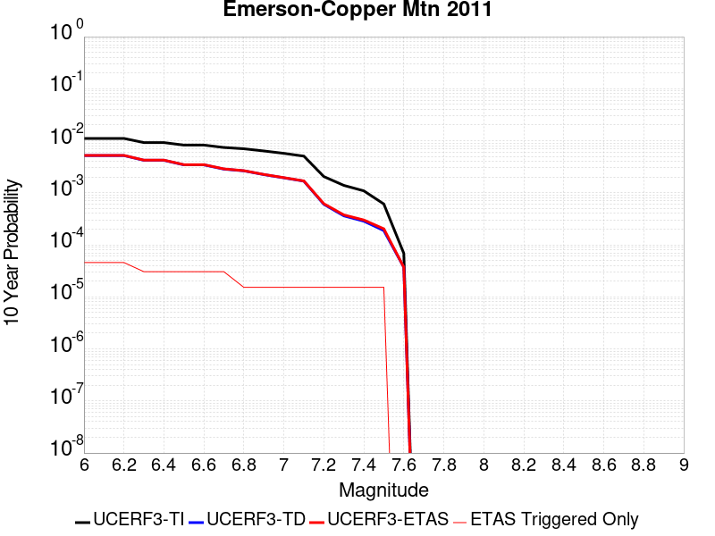 |

| Magnitude | 1 wk TI Prob | 1 wk TD Prob | 1 wk ETAS Prob | 1 wk ETAS/TD Gain | 1 wk ETAS Triggered Only | 1 mo TI Prob | 1 mo TD Prob | 1 mo ETAS Prob | 1 mo ETAS/TD Gain | 1 mo ETAS Triggered Only | 1 yr TI Prob | 1 yr TD Prob | 1 yr ETAS Prob | 1 yr ETAS/TD Gain | 1 yr ETAS Triggered Only | 10 yr TI Prob | 10 yr TD Prob | 10 yr ETAS Prob | 10 yr ETAS/TD Gain | 10 yr ETAS Triggered Only |
|-----|-----|-----|-----|-----|-----|-----|-----|-----|-----|-----|-----|-----|-----|-----|-----|-----|-----|-----|-----|-----|
| 6.0 | 2.1364202E-5 | 9.968114E-6 | 9.968114E-6 | 1.0 | 0.0 | 9.1557646E-5 | 4.2719836E-5 | 5.7939884E-5 | 1.3562759 | 1.52207E-5 | 0.0011141442 | 5.199986E-4 | 5.6563696E-4 | 1.0877663 | 4.5662102E-5 | 0.011085749 | 0.005188688 | 0.0052341134 | 1.0087546 | 4.5662102E-5 |
| 6.1 | 2.1364202E-5 | 9.968114E-6 | 9.968114E-6 | 1.0 | 0.0 | 9.1557646E-5 | 4.2719836E-5 | 5.7939884E-5 | 1.3562759 | 1.52207E-5 | 0.0011141442 | 5.199986E-4 | 5.6563696E-4 | 1.0877663 | 4.5662102E-5 | 0.011085749 | 0.005188688 | 0.0052341134 | 1.0087546 | 4.5662102E-5 |
| 6.2 | 2.1364202E-5 | 9.968114E-6 | 9.968114E-6 | 1.0 | 0.0 | 9.1557646E-5 | 4.2719836E-5 | 5.7939884E-5 | 1.3562759 | 1.52207E-5 | 0.0011141442 | 5.199986E-4 | 5.6563696E-4 | 1.0877663 | 4.5662102E-5 | 0.011085749 | 0.005188688 | 0.0052341134 | 1.0087546 | 4.5662102E-5 |
| 6.3 | 1.7751237E-5 | 8.089227E-6 | 8.089227E-6 | 1.0 | 0.0 | 7.607452E-5 | 3.466769E-5 | 4.988786E-5 | 1.4390305 | 1.52207E-5 | 9.258136E-4 | 4.2200365E-4 | 4.524322E-4 | 1.0721049 | 3.04414E-5 | 0.00921966 | 0.0042126453 | 0.0042429585 | 1.0071957 | 3.04414E-5 |
| 6.4 | 1.7751237E-5 | 8.089227E-6 | 8.089227E-6 | 1.0 | 0.0 | 7.607452E-5 | 3.466769E-5 | 4.988786E-5 | 1.4390305 | 1.52207E-5 | 9.258136E-4 | 4.2200365E-4 | 4.524322E-4 | 1.0721049 | 3.04414E-5 | 0.00921966 | 0.0042126453 | 0.0042429585 | 1.0071957 | 3.04414E-5 |
| 6.5 | 1.5886664E-5 | 6.603819E-6 | 6.603819E-6 | 1.0 | 0.0 | 6.808392E-5 | 2.8301802E-5 | 4.352207E-5 | 1.5377845 | 1.52207E-5 | 8.286065E-4 | 3.4452465E-4 | 3.7495556E-4 | 1.0883273 | 3.04414E-5 | 0.008255237 | 0.0034403696 | 0.0034707063 | 1.0088179 | 3.04414E-5 |
| 6.6 | 1.5886664E-5 | 6.603819E-6 | 6.603819E-6 | 1.0 | 0.0 | 6.808392E-5 | 2.8301802E-5 | 4.352207E-5 | 1.5377845 | 1.52207E-5 | 8.286065E-4 | 3.4452465E-4 | 3.7495556E-4 | 1.0883273 | 3.04414E-5 | 0.008255237 | 0.0034403696 | 0.0034707063 | 1.0088179 | 3.04414E-5 |
| 6.7 | 1.428471E-5 | 5.470403E-6 | 5.470403E-6 | 1.0 | 0.0 | 6.121875E-5 | 2.3444394E-5 | 3.8664737E-5 | 1.6492103 | 1.52207E-5 | 7.450834E-4 | 2.8540206E-4 | 3.1583477E-4 | 1.106631 | 3.04414E-5 | 0.007425902 | 0.0028507432 | 0.0028810978 | 1.010648 | 3.04414E-5 |
| 6.8 | 1.3490684E-5 | 5.073699E-6 | 5.073699E-6 | 1.0 | 0.0 | 5.7815934E-5 | 2.1744265E-5 | 3.6964633E-5 | 1.6999717 | 1.52207E-5 | 7.0368167E-4 | 2.6470813E-4 | 2.799248E-4 | 1.0574847 | 1.52207E-5 | 0.007014576 | 0.002644309 | 0.0026594896 | 1.0057408 | 1.52207E-5 |
| 6.9 | 1.2235421E-5 | 4.289677E-6 | 4.289677E-6 | 1.0 | 0.0 | 5.2436466E-5 | 1.838422E-5 | 3.360464E-5 | 1.8279067 | 1.52207E-5 | 6.38227E-4 | 2.238085E-4 | 2.390258E-4 | 1.0679924 | 1.52207E-5 | 0.0063639707 | 0.0022361854 | 0.002251372 | 1.0067914 | 1.52207E-5 |
| 7.0 | 1.1009851E-5 | 3.7189886E-6 | 3.7189886E-6 | 1.0 | 0.0 | 4.7184225E-5 | 1.5938444E-5 | 3.1158903E-5 | 1.9549525 | 1.52207E-5 | 5.743165E-4 | 1.9403672E-4 | 2.0925446E-4 | 1.0784272 | 1.52207E-5 | 0.005728345 | 0.0019390108 | 0.001954202 | 1.0078346 | 1.52207E-5 |
| 7.1 | 9.726373E-6 | 3.2117953E-6 | 3.2117953E-6 | 1.0 | 0.0 | 4.168379E-5 | 1.3764783E-5 | 2.8985274E-5 | 2.1057558 | 1.52207E-5 | 5.07382E-4 | 1.6757673E-4 | 1.8279487E-4 | 1.090813 | 1.52207E-5 | 0.0050622504 | 0.0016748349 | 0.0016900301 | 1.0090727 | 1.52207E-5 |
| 7.2 | 3.9335127E-6 | 1.1524792E-6 | 1.1524792E-6 | 1.0 | 0.0 | 1.6857803E-5 | 4.9391874E-6 | 2.0159812E-5 | 4.081605 | 1.52207E-5 | 2.0522442E-4 | 6.0133007E-5 | 7.535279E-5 | 1.2531021 | 1.52207E-5 | 0.00205035 | 6.011733E-4 | 6.1638484E-4 | 1.0253031 | 1.52207E-5 |
| 7.3 | 2.661632E-6 | 6.911505E-7 | 6.911505E-7 | 1.0 | 0.0 | 1.14069435E-5 | 2.9620703E-6 | 1.8182725E-5 | 6.1385193 | 1.52207E-5 | 1.3887069E-4 | 3.6062618E-5 | 5.128277E-5 | 1.4220479 | 1.52207E-5 | 0.0013878393 | 3.605687E-4 | 3.7578391E-4 | 1.0421978 | 1.52207E-5 |
| 7.4 | 2.0893426E-6 | 5.4618386E-7 | 5.4618386E-7 | 1.0 | 0.0 | 8.954295E-6 | 2.3407858E-6 | 1.756145E-5 | 7.5023737 | 1.52207E-5 | 1.0901308E-4 | 2.84987E-5 | 4.3718966E-5 | 1.5340688 | 1.52207E-5 | 0.0010895962 | 2.84951E-4 | 3.0016736E-4 | 1.0533999 | 1.52207E-5 |
| 7.5 | 1.1681728E-6 | 3.6030585E-7 | 3.6030585E-7 | 1.0 | 0.0 | 5.0064455E-6 | 1.544167E-6 | 1.6764843E-5 | 10.856885 | 1.52207E-5 | 6.0951766E-5 | 1.8800076E-5 | 3.402049E-5 | 1.8095932 | 1.52207E-5 | 6.093505E-4 | 1.8798532E-4 | 2.0320316E-4 | 1.0809523 | 1.52207E-5 |
| 7.6 | 1.3154387E-7 | 7.1197384E-8 | 7.1197384E-8 | 1.0 | 0.0 | 5.6375933E-7 | 3.051316E-7 | 3.051316E-7 | 1.0 | 0.0 | 6.863748E-6 | 3.7149728E-6 | 3.7149728E-6 | 1.0 | 0.0 | 6.863536E-5 | 3.7149264E-5 | 3.7149264E-5 | 1.0 | 0.0 |

## Casmalia 2011 CFM
*[(top)](#table-of-contents)*

| 1 Week | 1 Month | 1 Year | 10 Year |
|-----|-----|-----|-----|
| 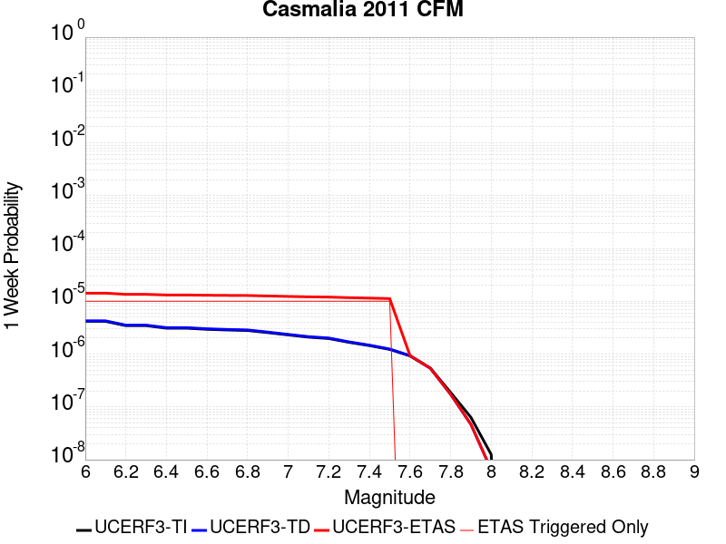 | 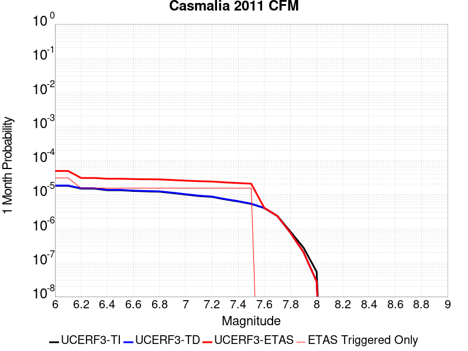 |  | 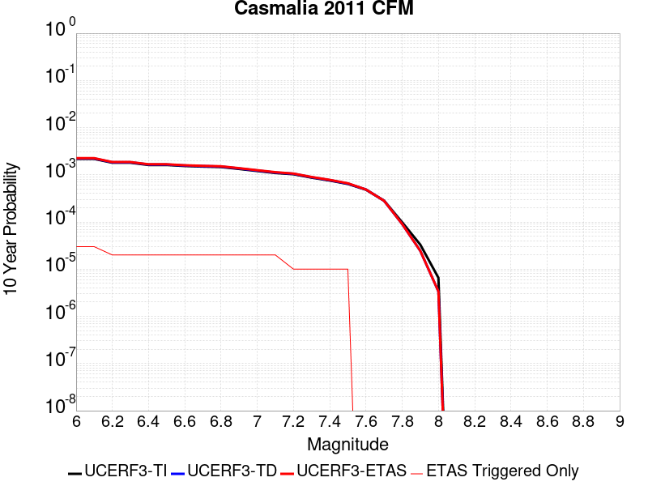 |

| Magnitude | 1 wk TI Prob | 1 wk TD Prob | 1 wk ETAS Prob | 1 wk ETAS/TD Gain | 1 wk ETAS Triggered Only | 1 mo TI Prob | 1 mo TD Prob | 1 mo ETAS Prob | 1 mo ETAS/TD Gain | 1 mo ETAS Triggered Only | 1 yr TI Prob | 1 yr TD Prob | 1 yr ETAS Prob | 1 yr ETAS/TD Gain | 1 yr ETAS Triggered Only | 10 yr TI Prob | 10 yr TD Prob | 10 yr ETAS Prob | 10 yr ETAS/TD Gain | 10 yr ETAS Triggered Only |
|-----|-----|-----|-----|-----|-----|-----|-----|-----|-----|-----|-----|-----|-----|-----|-----|-----|-----|-----|-----|-----|
| 6.0 | 4.1704893E-6 | 4.262483E-6 | 1.9483117E-5 | 4.570838 | 1.52207E-5 | 1.7873403E-5 | 1.8267656E-5 | 4.87085E-5 | 2.6663792 | 3.04414E-5 | 2.1758694E-4 | 2.2238622E-4 | 2.5282084E-4 | 1.1368549 | 3.04414E-5 | 0.0021737402 | 0.0022216577 | 0.0022672184 | 1.0205075 | 4.5662102E-5 |
| 6.1 | 4.1704893E-6 | 4.262483E-6 | 1.9483117E-5 | 4.570838 | 1.52207E-5 | 1.7873403E-5 | 1.8267656E-5 | 4.87085E-5 | 2.6663792 | 3.04414E-5 | 2.1758694E-4 | 2.2238622E-4 | 2.5282084E-4 | 1.1368549 | 3.04414E-5 | 0.0021737402 | 0.0022216577 | 0.0022672184 | 1.0205075 | 4.5662102E-5 |
| 6.2 | 3.457312E-6 | 3.5370217E-6 | 1.8757668E-5 | 5.303238 | 1.52207E-5 | 1.4816967E-5 | 1.5158577E-5 | 3.0379046E-5 | 2.004083 | 1.52207E-5 | 1.8038164E-4 | 1.8454014E-4 | 1.9975803E-4 | 1.0824639 | 1.52207E-5 | 0.001802353 | 0.0018438784 | 0.0018742636 | 1.016479 | 3.04414E-5 |
| 6.3 | 3.457312E-6 | 3.5370217E-6 | 1.8757668E-5 | 5.303238 | 1.52207E-5 | 1.4816967E-5 | 1.5158577E-5 | 3.0379046E-5 | 2.004083 | 1.52207E-5 | 1.8038164E-4 | 1.8454014E-4 | 1.9975803E-4 | 1.0824639 | 1.52207E-5 | 0.001802353 | 0.0018438784 | 0.0018742636 | 1.016479 | 3.04414E-5 |
| 6.4 | 3.0957337E-6 | 3.1692257E-6 | 1.8389877E-5 | 5.8026404 | 1.52207E-5 | 1.3267363E-5 | 1.3582326E-5 | 2.8802819E-5 | 2.1206102 | 1.52207E-5 | 1.6151817E-4 | 1.6535232E-4 | 1.8057051E-4 | 1.0920349 | 1.52207E-5 | 0.0016140083 | 0.0016522991 | 0.0016826901 | 1.0183933 | 3.04414E-5 |
| 6.5 | 3.0957337E-6 | 3.1692257E-6 | 1.8389877E-5 | 5.8026404 | 1.52207E-5 | 1.3267363E-5 | 1.3582326E-5 | 2.8802819E-5 | 2.1206102 | 1.52207E-5 | 1.6151817E-4 | 1.6535232E-4 | 1.8057051E-4 | 1.0920349 | 1.52207E-5 | 0.0016140083 | 0.0016522991 | 0.0016826901 | 1.0183933 | 3.04414E-5 |
| 6.6 | 2.9459152E-6 | 3.0165752E-6 | 1.823723E-5 | 6.045674 | 1.52207E-5 | 1.262529E-5 | 1.2928115E-5 | 2.814862E-5 | 2.177318 | 1.52207E-5 | 1.5370206E-4 | 1.5738848E-4 | 1.7260679E-4 | 1.0966926 | 1.52207E-5 | 0.0015359579 | 0.0015727758 | 0.0016031694 | 1.0193248 | 3.04414E-5 |
| 6.7 | 2.8634809E-6 | 2.9324726E-6 | 1.8153129E-5 | 6.190383 | 1.52207E-5 | 1.2272003E-5 | 1.256768E-5 | 2.7788188E-5 | 2.2110834 | 1.52207E-5 | 1.4940138E-4 | 1.530008E-4 | 1.6821918E-4 | 1.099466 | 1.52207E-5 | 0.0014930099 | 0.0015289601 | 0.001559355 | 1.0198795 | 3.04414E-5 |
| 6.8 | 2.7999822E-6 | 2.8675968E-6 | 1.8088253E-5 | 6.3078094 | 1.52207E-5 | 1.1999869E-5 | 1.2289643E-5 | 2.7510156E-5 | 2.238483 | 1.52207E-5 | 1.460886E-4 | 1.4961617E-4 | 1.648346E-4 | 1.1017164 | 1.52207E-5 | 0.001459926 | 0.0014951597 | 0.0015255556 | 1.0203295 | 3.04414E-5 |
| 6.9 | 2.551052E-6 | 2.6119649E-6 | 1.7832625E-5 | 6.827284 | 1.52207E-5 | 1.0933034E-5 | 1.1194087E-5 | 2.6414617E-5 | 2.3596938 | 1.52207E-5 | 1.3310155E-4 | 1.3627953E-4 | 1.5149816E-4 | 1.1116722 | 1.52207E-5 | 0.0013302186 | 0.0013619636 | 0.0013923635 | 1.0223206 | 3.04414E-5 |
| 7.0 | 2.3081875E-6 | 2.3624088E-6 | 1.7583074E-5 | 7.4428577 | 1.52207E-5 | 9.892195E-6 | 1.01245705E-5 | 2.5345116E-5 | 2.5033276 | 1.52207E-5 | 1.20430814E-4 | 1.232597E-4 | 1.3847851E-4 | 1.1234696 | 1.52207E-5 | 0.0012036557 | 0.0012319161 | 0.0012623201 | 1.0246801 | 3.04414E-5 |
| 7.1 | 2.093245E-6 | 2.1417243E-6 | 1.7362392E-5 | 8.106735 | 1.52207E-5 | 8.971019E-6 | 9.178786E-6 | 2.4399347E-5 | 2.6582325 | 1.52207E-5 | 1.09216686E-4 | 1.1174601E-4 | 1.2696501E-4 | 1.1361928 | 1.52207E-5 | 0.0010916302 | 0.0011169002 | 0.0011473077 | 1.0272248 | 3.04414E-5 |
| 7.2 | 1.9714576E-6 | 2.0165091E-6 | 1.7237178E-5 | 8.548029 | 1.52207E-5 | 8.449076E-6 | 8.642153E-6 | 2.3862722E-5 | 2.761201 | 1.52207E-5 | 1.0286264E-4 | 1.05213156E-4 | 1.20432254E-4 | 1.1446501 | 1.52207E-5 | 0.0010281504 | 0.0010516352 | 0.00106684 | 1.0144582 | 1.52207E-5 |
| 7.3 | 1.6689512E-6 | 1.7047131E-6 | 1.6925387E-5 | 9.928584 | 1.52207E-5 | 7.1526288E-6 | 7.3058927E-6 | 2.2526481E-5 | 3.0833304 | 1.52207E-5 | 8.7079774E-5 | 8.894562E-5 | 1.0416497E-4 | 1.1711085 | 1.52207E-5 | 8.7045657E-4 | 8.89101E-4 | 9.0430817E-4 | 1.017104 | 1.52207E-5 |
| 7.4 | 1.4490954E-6 | 1.4778908E-6 | 1.6698568E-5 | 11.298919 | 1.52207E-5 | 6.210394E-6 | 6.333802E-6 | 2.1554406E-5 | 3.4030752 | 1.52207E-5 | 7.560892E-5 | 7.711132E-5 | 9.233085E-5 | 1.1973709 | 1.52207E-5 | 7.55832E-4 | 7.7084627E-4 | 7.860552E-4 | 1.0197302 | 1.52207E-5 |
| 7.5 | 1.226873E-6 | 1.2481701E-6 | 1.6468852E-5 | 13.194396 | 1.52207E-5 | 5.2580162E-6 | 5.3492895E-6 | 2.0569909E-5 | 3.8453534 | 1.52207E-5 | 6.401447E-5 | 6.5125656E-5 | 8.0345366E-5 | 1.2336975 | 1.52207E-5 | 6.399603E-4 | 6.5106625E-4 | 6.66277E-4 | 1.0233629 | 1.52207E-5 |
| 7.6 | 9.2561345E-7 | 9.361923E-7 | 9.361923E-7 | 1.0 | 0.0 | 3.966909E-6 | 4.012247E-6 | 4.012247E-6 | 1.0 | 0.0 | 4.8296046E-5 | 4.884801E-5 | 4.884801E-5 | 1.0 | 0.0 | 4.828555E-4 | 4.8837316E-4 | 4.8837316E-4 | 1.0 | 0.0 |
| 7.7 | 5.4367933E-7 | 5.392888E-7 | 5.392888E-7 | 1.0 | 0.0 | 2.3300522E-6 | 2.3112357E-6 | 2.3112357E-6 | 1.0 | 0.0 | 2.8368017E-5 | 2.8138933E-5 | 2.8138933E-5 | 1.0 | 0.0 | 2.8364395E-4 | 2.8135383E-4 | 2.8135383E-4 | 1.0 | 0.0 |
| 7.8 | 1.8825742E-7 | 1.7342276E-7 | 1.7342276E-7 | 1.0 | 0.0 | 8.068173E-7 | 7.4324015E-7 | 7.4324015E-7 | 1.0 | 0.0 | 9.822956E-6 | 9.048912E-6 | 9.048912E-6 | 1.0 | 0.0 | 9.822522E-5 | 9.048546E-5 | 9.048546E-5 | 1.0 | 0.0 |
| 7.9 | 6.342771E-8 | 4.6790706E-8 | 4.6790706E-8 | 1.0 | 0.0 | 2.7183304E-7 | 2.0053157E-7 | 2.0053157E-7 | 1.0 | 0.0 | 3.3095623E-6 | 2.4414692E-6 | 2.4414692E-6 | 1.0 | 0.0 | 3.309513E-5 | 2.4414428E-5 | 2.4414428E-5 | 1.0 | 0.0 |
| 8.0 | 1.2574819E-8 | 6.4733463E-9 | 6.4733463E-9 | 1.0 | 0.0 | 5.3892084E-8 | 2.7742912E-8 | 2.7742912E-8 | 1.0 | 0.0 | 6.561359E-7 | 3.377699E-7 | 3.377699E-7 | 1.0 | 0.0 | 6.56134E-6 | 3.377694E-6 | 3.377694E-6 | 1.0 | 0.0 |

## San Gregorio (South) 2011 CFM
*[(top)](#table-of-contents)*

| 1 Week | 1 Month | 1 Year | 10 Year |
|-----|-----|-----|-----|
| 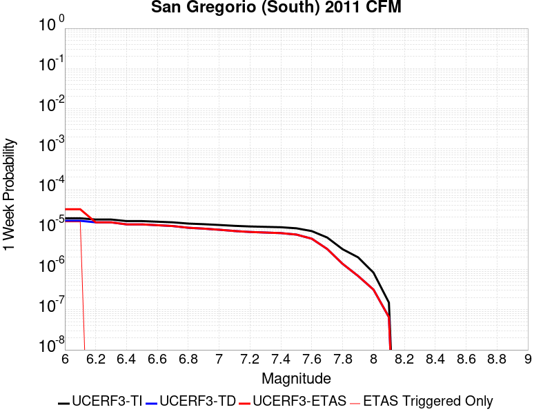 | 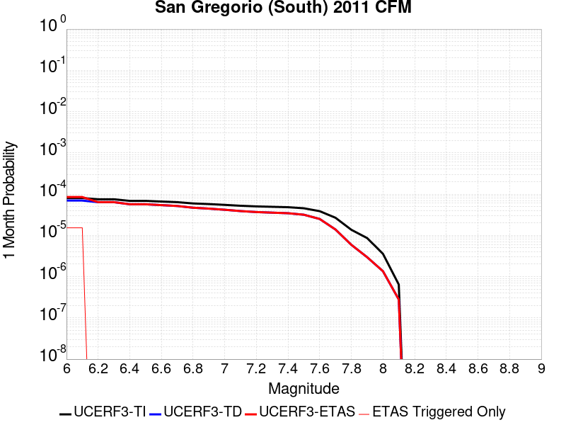 | 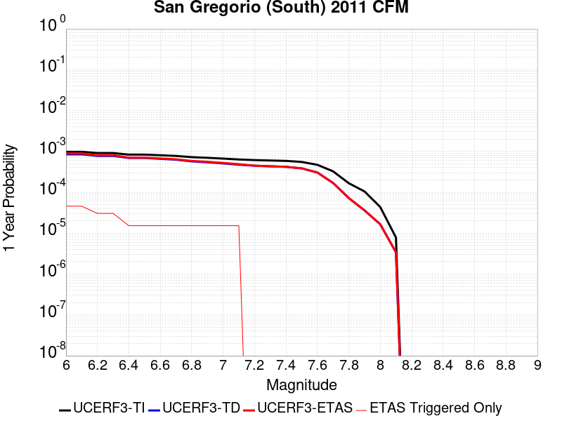 | 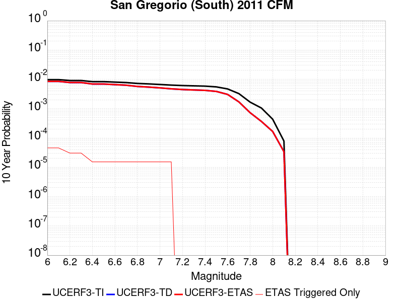 |

| Magnitude | 1 wk TI Prob | 1 wk TD Prob | 1 wk ETAS Prob | 1 wk ETAS/TD Gain | 1 wk ETAS Triggered Only | 1 mo TI Prob | 1 mo TD Prob | 1 mo ETAS Prob | 1 mo ETAS/TD Gain | 1 mo ETAS Triggered Only | 1 yr TI Prob | 1 yr TD Prob | 1 yr ETAS Prob | 1 yr ETAS/TD Gain | 1 yr ETAS Triggered Only | 10 yr TI Prob | 10 yr TD Prob | 10 yr ETAS Prob | 10 yr ETAS/TD Gain | 10 yr ETAS Triggered Only |
|-----|-----|-----|-----|-----|-----|-----|-----|-----|-----|-----|-----|-----|-----|-----|-----|-----|-----|-----|-----|-----|
| 6.0 | 1.8770423E-5 | 1.6279751E-5 | 3.1500203E-5 | 1.9349315 | 1.52207E-5 | 8.044219E-5 | 6.976852E-5 | 8.4988154E-5 | 1.2181448 | 1.52207E-5 | 9.789435E-4 | 8.491044E-4 | 8.9472777E-4 | 1.0537311 | 4.5662102E-5 | 0.009746423 | 0.008471312 | 0.008516587 | 1.0053445 | 4.5662102E-5 |
| 6.1 | 1.8770423E-5 | 1.6279751E-5 | 3.1500203E-5 | 1.9349315 | 1.52207E-5 | 8.044219E-5 | 6.976852E-5 | 8.4988154E-5 | 1.2181448 | 1.52207E-5 | 9.789435E-4 | 8.491044E-4 | 8.9472777E-4 | 1.0537311 | 4.5662102E-5 | 0.009746423 | 0.008471312 | 0.008516587 | 1.0053445 | 4.5662102E-5 |
| 6.2 | 1.7508692E-5 | 1.4899257E-5 | 1.4899257E-5 | 1.0 | 0.0 | 7.5035096E-5 | 6.3852414E-5 | 6.3852414E-5 | 1.0 | 0.0 | 9.1316935E-4 | 7.7712885E-4 | 8.075466E-4 | 1.0391412 | 3.04414E-5 | 0.00909426 | 0.00775674 | 0.007786945 | 1.0038941 | 3.04414E-5 |
| 6.3 | 1.7508692E-5 | 1.4899257E-5 | 1.4899257E-5 | 1.0 | 0.0 | 7.5035096E-5 | 6.3852414E-5 | 6.3852414E-5 | 1.0 | 0.0 | 9.1316935E-4 | 7.7712885E-4 | 8.075466E-4 | 1.0391412 | 3.04414E-5 | 0.00909426 | 0.00775674 | 0.007786945 | 1.0038941 | 3.04414E-5 |
| 6.4 | 1.6004591E-5 | 1.3249094E-5 | 1.3249094E-5 | 1.0 | 0.0 | 6.85893E-5 | 5.6780602E-5 | 5.6780602E-5 | 1.0 | 0.0 | 8.347548E-4 | 6.910856E-4 | 7.062958E-4 | 1.0220091 | 1.52207E-5 | 0.008316261 | 0.006901791 | 0.0069169067 | 1.0021901 | 1.52207E-5 |
| 6.5 | 1.6004591E-5 | 1.3249094E-5 | 1.3249094E-5 | 1.0 | 0.0 | 6.85893E-5 | 5.6780602E-5 | 5.6780602E-5 | 1.0 | 0.0 | 8.347548E-4 | 6.910856E-4 | 7.062958E-4 | 1.0220091 | 1.52207E-5 | 0.008316261 | 0.006901791 | 0.0069169067 | 1.0021901 | 1.52207E-5 |
| 6.6 | 1.5442201E-5 | 1.2633725E-5 | 1.2633725E-5 | 1.0 | 0.0 | 6.617918E-5 | 5.4143416E-5 | 5.4143416E-5 | 1.0 | 0.0 | 8.0543366E-4 | 6.5899757E-4 | 6.742083E-4 | 1.0230815 | 1.52207E-5 | 0.008025207 | 0.006582842 | 0.0065979627 | 1.0022969 | 1.52207E-5 |
| 6.7 | 1.489921E-5 | 1.2042234E-5 | 1.2042234E-5 | 1.0 | 0.0 | 6.3852196E-5 | 5.1608557E-5 | 5.1608557E-5 | 1.0 | 0.0 | 7.7712315E-4 | 6.2815374E-4 | 6.433649E-4 | 1.0242156 | 1.52207E-5 | 0.0077441116 | 0.006276176 | 0.006291301 | 1.0024099 | 1.52207E-5 |
| 6.8 | 1.3876024E-5 | 1.0921184E-5 | 1.0921184E-5 | 1.0 | 0.0 | 5.9467322E-5 | 4.6804238E-5 | 4.6804238E-5 | 1.0 | 0.0 | 7.237741E-4 | 5.69693E-4 | 5.8490504E-4 | 1.0267022 | 1.52207E-5 | 0.0072142133 | 0.0056946846 | 0.0057098186 | 1.0026575 | 1.52207E-5 |
| 6.9 | 1.33922495E-5 | 1.0392687E-5 | 1.0392687E-5 | 1.0 | 0.0 | 5.7394092E-5 | 4.4539327E-5 | 4.4539327E-5 | 1.0 | 0.0 | 6.9854903E-4 | 5.4213166E-4 | 5.573441E-4 | 1.0280604 | 1.52207E-5 | 0.0069635725 | 0.005420442 | 0.0054355804 | 1.0027928 | 1.52207E-5 |
| 7.0 | 1.2807324E-5 | 9.752649E-6 | 9.752649E-6 | 1.0 | 0.0 | 5.4887376E-5 | 4.1796397E-5 | 4.1796397E-5 | 1.0 | 0.0 | 6.680489E-4 | 5.087525E-4 | 5.2396546E-4 | 1.0299025 | 1.52207E-5 | 0.006660442 | 0.0050882204 | 0.0051033637 | 1.0029762 | 1.52207E-5 |
| 7.1 | 1.2191438E-5 | 9.061537E-6 | 9.061537E-6 | 1.0 | 0.0 | 5.224797E-5 | 3.8834576E-5 | 3.8834576E-5 | 1.0 | 0.0 | 6.3593336E-4 | 4.727085E-4 | 4.87922E-4 | 1.0321836 | 1.52207E-5 | 0.0063411663 | 0.0047293645 | 0.004744513 | 1.0032032 | 1.52207E-5 |
| 7.2 | 1.1769438E-5 | 8.581731E-6 | 8.581731E-6 | 1.0 | 0.0 | 5.0439474E-5 | 3.677833E-5 | 3.677833E-5 | 1.0 | 0.0 | 6.1392755E-4 | 4.4768423E-4 | 4.4768423E-4 | 1.0 | 0.0 | 0.0061223423 | 0.004480157 | 0.004480157 | 1.0 | 0.0 |
| 7.3 | 1.150374E-5 | 8.29716E-6 | 8.29716E-6 | 1.0 | 0.0 | 4.9300812E-5 | 3.5558773E-5 | 3.5558773E-5 | 1.0 | 0.0 | 6.0007203E-4 | 4.3284212E-4 | 4.3284212E-4 | 1.0 | 0.0 | 0.0059845424 | 0.0043323063 | 0.0043323063 | 1.0 | 0.0 |
| 7.4 | 1.12514E-5 | 8.042902E-6 | 8.042902E-6 | 1.0 | 0.0 | 4.8219394E-5 | 3.4469125E-5 | 3.4469125E-5 | 1.0 | 0.0 | 5.8691297E-4 | 4.1958084E-4 | 4.1958084E-4 | 1.0 | 0.0 | 0.005853653 | 0.0042001884 | 0.0042001884 | 1.0 | 0.0 |
| 7.5 | 1.059696E-5 | 7.3931915E-6 | 7.3931915E-6 | 1.0 | 0.0 | 4.5414752E-5 | 3.168472E-5 | 3.168472E-5 | 1.0 | 0.0 | 5.5278436E-4 | 3.8569325E-4 | 3.8569325E-4 | 1.0 | 0.0 | 0.0055141128 | 0.0038624762 | 0.0038624762 | 1.0 | 0.0 |
| 7.6 | 9.018592E-6 | 5.8369624E-6 | 5.8369624E-6 | 1.0 | 0.0 | 3.8650534E-5 | 2.5015313E-5 | 2.5015313E-5 | 1.0 | 0.0 | 4.7046866E-4 | 3.045189E-4 | 3.045189E-4 | 1.0 | 0.0 | 0.004694739 | 0.0030528754 | 0.0030528754 | 1.0 | 0.0 |
| 7.7 | 6.243489E-6 | 3.2395455E-6 | 3.2395455E-6 | 1.0 | 0.0 | 2.6757538E-5 | 1.3883692E-5 | 1.3883692E-5 | 1.0 | 0.0 | 3.257243E-4 | 1.6902086E-4 | 1.6902086E-4 | 1.0 | 0.0 | 0.003252473 | 0.001699108 | 0.001699108 | 1.0 | 0.0 |
| 7.8 | 3.1941963E-6 | 1.3809986E-6 | 1.3809986E-6 | 1.0 | 0.0 | 1.368934E-5 | 5.9185513E-6 | 5.9185513E-6 | 1.0 | 0.0 | 1.6665498E-4 | 7.2055984E-5 | 7.2055984E-5 | 1.0 | 0.0 | 0.0016653005 | 7.263174E-4 | 7.263174E-4 | 1.0 | 0.0 |
| 7.9 | 2.0098398E-6 | 6.9161155E-7 | 6.9161155E-7 | 1.0 | 0.0 | 8.6135715E-6 | 2.964046E-6 | 2.964046E-6 | 1.0 | 0.0 | 1.0486518E-4 | 3.608666E-5 | 3.608666E-5 | 1.0 | 0.0 | 0.0010481571 | 3.657225E-4 | 3.657225E-4 | 1.0 | 0.0 |
| 8.0 | 8.353119E-7 | 3.1623412E-7 | 3.1623412E-7 | 1.0 | 0.0 | 3.579903E-6 | 1.3552883E-6 | 1.3552883E-6 | 1.0 | 0.0 | 4.358445E-5 | 1.6500511E-5 | 1.6500511E-5 | 1.0 | 0.0 | 4.3575902E-4 | 1.6619264E-4 | 1.6619264E-4 | 1.0 | 0.0 |
| 8.1 | 1.5033264E-7 | 6.527624E-8 | 6.527624E-8 | 1.0 | 0.0 | 6.442826E-7 | 2.7975528E-7 | 2.7975528E-7 | 1.0 | 0.0 | 7.844113E-6 | 3.4060151E-6 | 3.4060151E-6 | 1.0 | 0.0 | 7.843835E-5 | 3.407693E-5 | 3.407693E-5 | 1.0 | 0.0 |

## Oak Ridge (Onshore)
*[(top)](#table-of-contents)*

| 1 Week | 1 Month | 1 Year | 10 Year |
|-----|-----|-----|-----|
| 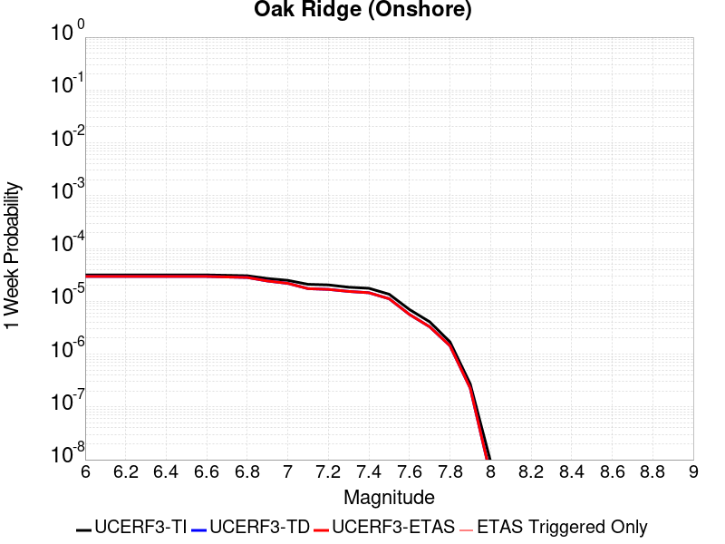 | 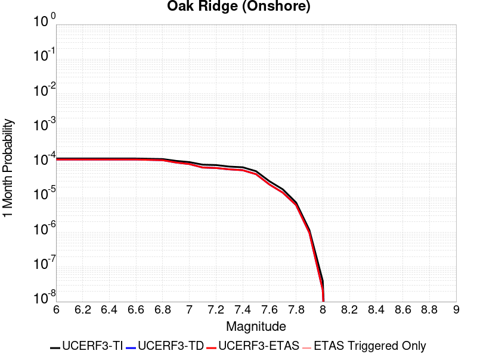 | 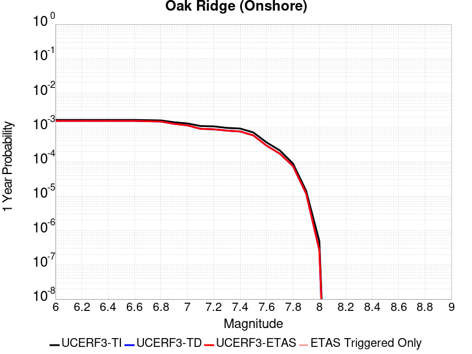 | 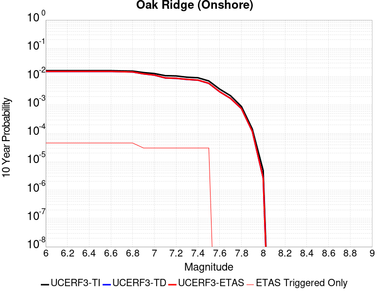 |

| Magnitude | 1 wk TI Prob | 1 wk TD Prob | 1 wk ETAS Prob | 1 wk ETAS/TD Gain | 1 wk ETAS Triggered Only | 1 mo TI Prob | 1 mo TD Prob | 1 mo ETAS Prob | 1 mo ETAS/TD Gain | 1 mo ETAS Triggered Only | 1 yr TI Prob | 1 yr TD Prob | 1 yr ETAS Prob | 1 yr ETAS/TD Gain | 1 yr ETAS Triggered Only | 10 yr TI Prob | 10 yr TD Prob | 10 yr ETAS Prob | 10 yr ETAS/TD Gain | 10 yr ETAS Triggered Only |
|-----|-----|-----|-----|-----|-----|-----|-----|-----|-----|-----|-----|-----|-----|-----|-----|-----|-----|-----|-----|-----|
| 6.0 | 3.155064E-5 | 2.9525974E-5 | 2.9525974E-5 | 1.0 | 0.0 | 1.3521002E-4 | 1.2653397E-4 | 1.2653397E-4 | 1.0 | 0.0 | 0.001644939 | 0.0015395004 | 0.0015395004 | 1.0 | 0.0 | 0.01632816 | 0.015292859 | 0.015337823 | 1.0029402 | 4.5662102E-5 |
| 6.1 | 3.155064E-5 | 2.9525974E-5 | 2.9525974E-5 | 1.0 | 0.0 | 1.3521002E-4 | 1.2653397E-4 | 1.2653397E-4 | 1.0 | 0.0 | 0.001644939 | 0.0015395004 | 0.0015395004 | 1.0 | 0.0 | 0.01632816 | 0.015292859 | 0.015337823 | 1.0029402 | 4.5662102E-5 |
| 6.2 | 3.155064E-5 | 2.9525974E-5 | 2.9525974E-5 | 1.0 | 0.0 | 1.3521002E-4 | 1.2653397E-4 | 1.2653397E-4 | 1.0 | 0.0 | 0.001644939 | 0.0015395004 | 0.0015395004 | 1.0 | 0.0 | 0.01632816 | 0.015292859 | 0.015337823 | 1.0029402 | 4.5662102E-5 |
| 6.3 | 3.155064E-5 | 2.9525974E-5 | 2.9525974E-5 | 1.0 | 0.0 | 1.3521002E-4 | 1.2653397E-4 | 1.2653397E-4 | 1.0 | 0.0 | 0.001644939 | 0.0015395004 | 0.0015395004 | 1.0 | 0.0 | 0.01632816 | 0.015292859 | 0.015337823 | 1.0029402 | 4.5662102E-5 |
| 6.4 | 3.155064E-5 | 2.9525974E-5 | 2.9525974E-5 | 1.0 | 0.0 | 1.3521002E-4 | 1.2653397E-4 | 1.2653397E-4 | 1.0 | 0.0 | 0.001644939 | 0.0015395004 | 0.0015395004 | 1.0 | 0.0 | 0.01632816 | 0.015292859 | 0.015337823 | 1.0029402 | 4.5662102E-5 |
| 6.5 | 3.155064E-5 | 2.9525974E-5 | 2.9525974E-5 | 1.0 | 0.0 | 1.3521002E-4 | 1.2653397E-4 | 1.2653397E-4 | 1.0 | 0.0 | 0.001644939 | 0.0015395004 | 0.0015395004 | 1.0 | 0.0 | 0.01632816 | 0.015292859 | 0.015337823 | 1.0029402 | 4.5662102E-5 |
| 6.6 | 3.155064E-5 | 2.9525974E-5 | 2.9525974E-5 | 1.0 | 0.0 | 1.3521002E-4 | 1.2653397E-4 | 1.2653397E-4 | 1.0 | 0.0 | 0.001644939 | 0.0015395004 | 0.0015395004 | 1.0 | 0.0 | 0.01632816 | 0.015292859 | 0.015337823 | 1.0029402 | 4.5662102E-5 |
| 6.7 | 3.098897E-5 | 2.8864175E-5 | 2.8864175E-5 | 1.0 | 0.0 | 1.328031E-4 | 1.2369796E-4 | 1.2369796E-4 | 1.0 | 0.0 | 0.0016156785 | 0.0015050198 | 0.0015050198 | 1.0 | 0.0 | 0.016039822 | 0.014952714 | 0.014997693 | 1.0030081 | 4.5662102E-5 |
| 6.8 | 3.0449872E-5 | 2.8239372E-5 | 2.8239372E-5 | 1.0 | 0.0 | 1.3049292E-4 | 1.2102048E-4 | 1.2102048E-4 | 1.0 | 0.0 | 0.0015875935 | 0.0014724657 | 0.0014724657 | 1.0 | 0.0 | 0.015762992 | 0.014631462 | 0.014676455 | 1.0030751 | 4.5662102E-5 |
| 6.9 | 2.697928E-5 | 2.4219773E-5 | 2.4219773E-5 | 1.0 | 0.0 | 1.15620365E-4 | 1.0379502E-4 | 1.0379502E-4 | 1.0 | 0.0 | 0.0014067689 | 0.0012629933 | 0.0012629933 | 1.0 | 0.0 | 0.0139789665 | 0.01256087 | 0.012590929 | 1.0023931 | 3.04414E-5 |
| 7.0 | 2.4893961E-5 | 2.1862043E-5 | 2.1862043E-5 | 1.0 | 0.0 | 1.0668404E-4 | 9.3691204E-5 | 9.3691204E-5 | 1.0 | 0.0 | 0.0012981043 | 0.0011401111 | 0.0011401111 | 1.0 | 0.0 | 0.012905477 | 0.011344905 | 0.011375002 | 1.0026529 | 3.04414E-5 |
| 7.1 | 2.0945363E-5 | 1.7354487E-5 | 1.7354487E-5 | 1.0 | 0.0 | 8.976275E-5 | 7.437428E-5 | 7.437428E-5 | 1.0 | 0.0 | 0.0010923136 | 9.051354E-4 | 9.051354E-4 | 1.0 | 0.0 | 0.0108696 | 0.009015423 | 0.00904559 | 1.0033462 | 3.04414E-5 |
| 7.2 | 2.0439404E-5 | 1.6809423E-5 | 1.6809423E-5 | 1.0 | 0.0 | 8.7594504E-5 | 7.203843E-5 | 7.203843E-5 | 1.0 | 0.0 | 0.0010659413 | 8.767196E-4 | 8.767196E-4 | 1.0 | 0.0 | 0.010608427 | 0.008733526 | 0.008763702 | 1.0034552 | 3.04414E-5 |
| 7.3 | 1.8463334E-5 | 1.5381811E-5 | 1.5381811E-5 | 1.0 | 0.0 | 7.912617E-5 | 6.59204E-5 | 6.59204E-5 | 1.0 | 0.0 | 9.6293533E-4 | 8.0228975E-4 | 8.0228975E-4 | 1.0 | 0.0 | 0.009587734 | 0.007994797 | 0.008024995 | 1.0037773 | 3.04414E-5 |
| 7.4 | 1.763139E-5 | 1.451684E-5 | 1.451684E-5 | 1.0 | 0.0 | 7.556091E-5 | 6.221356E-5 | 6.221356E-5 | 1.0 | 0.0 | 9.1956573E-4 | 7.571909E-4 | 7.571909E-4 | 1.0 | 0.0 | 0.009157699 | 0.007546914 | 0.0075771254 | 1.0040032 | 3.04414E-5 |
| 7.5 | 1.3594944E-5 | 1.1163356E-5 | 1.1163356E-5 | 1.0 | 0.0 | 5.8262744E-5 | 4.784209E-5 | 4.784209E-5 | 1.0 | 0.0 | 7.0911803E-4 | 5.8232434E-4 | 5.8232434E-4 | 1.0 | 0.0 | 0.007068595 | 0.0058082556 | 0.0058385204 | 1.0052106 | 3.04414E-5 |
| 7.6 | 6.9889534E-6 | 5.6367144E-6 | 5.6367144E-6 | 1.0 | 0.0 | 2.9952313E-5 | 2.4157125E-5 | 2.4157125E-5 | 1.0 | 0.0 | 3.646084E-4 | 2.9407372E-4 | 2.9407372E-4 | 1.0 | 0.0 | 0.0036401073 | 0.0029368899 | 0.0029368899 | 1.0 | 0.0 |
| 7.7 | 4.0824193E-6 | 3.2832586E-6 | 3.2832586E-6 | 1.0 | 0.0 | 1.7495966E-5 | 1.4071033E-5 | 1.4071033E-5 | 1.0 | 0.0 | 2.1299256E-4 | 1.713015E-4 | 1.713015E-4 | 1.0 | 0.0 | 0.0021278851 | 0.0017117079 | 0.0017117079 | 1.0 | 0.0 |
| 7.8 | 1.7023609E-6 | 1.4370495E-6 | 1.4370495E-6 | 1.0 | 0.0 | 7.295812E-6 | 6.1587693E-6 | 6.1587693E-6 | 1.0 | 0.0 | 8.882289E-5 | 7.498047E-5 | 7.498047E-5 | 1.0 | 0.0 | 8.8787393E-4 | 7.495545E-4 | 7.495545E-4 | 1.0 | 0.0 |
| 7.9 | 2.721225E-7 | 2.2616497E-7 | 2.2616497E-7 | 1.0 | 0.0 | 1.1662388E-6 | 9.692781E-7 | 9.692781E-7 | 1.0 | 0.0 | 1.4198865E-5 | 1.1800899E-5 | 1.1800899E-5 | 1.0 | 0.0 | 1.4197957E-4 | 1.1800301E-4 | 1.1800301E-4 | 1.0 | 0.0 |
| 8.0 | 9.364255E-9 | 5.1206666E-9 | 5.1206666E-9 | 1.0 | 0.0 | 4.0132523E-8 | 2.1945715E-8 | 2.1945715E-8 | 1.0 | 0.0 | 4.8861335E-7 | 2.6718905E-7 | 2.6718905E-7 | 1.0 | 0.0 | 4.8861225E-6 | 2.6718876E-6 | 2.6718876E-6 | 1.0 | 0.0 |

## Hartley Springs 2011 CFM
*[(top)](#table-of-contents)*

| 1 Week | 1 Month | 1 Year | 10 Year |
|-----|-----|-----|-----|
| 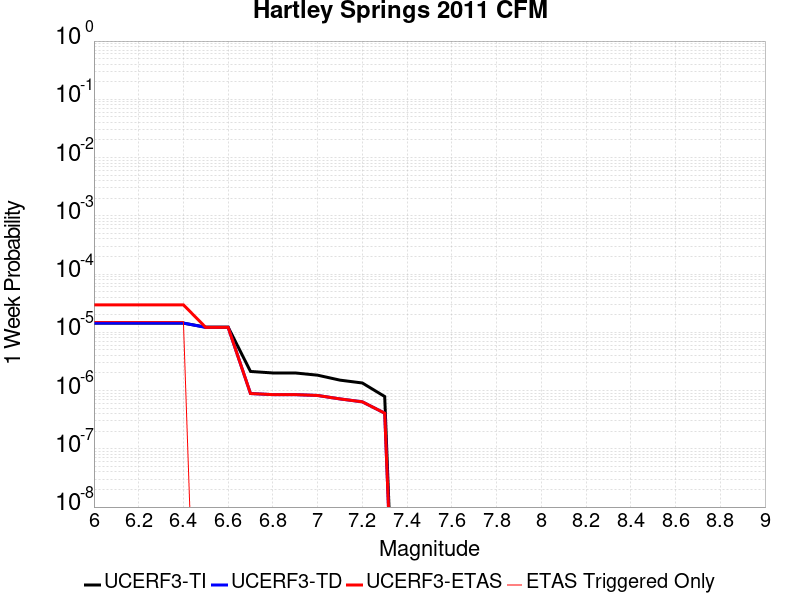 | 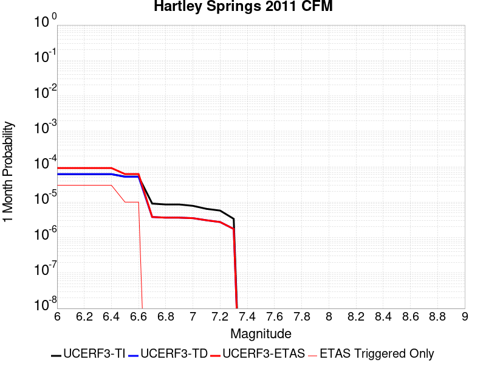 |  | 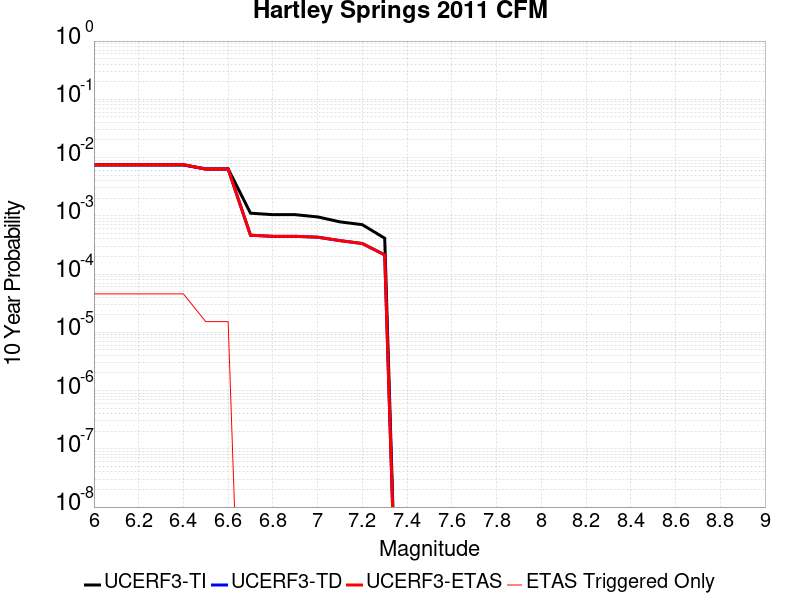 |

| Magnitude | 1 wk TI Prob | 1 wk TD Prob | 1 wk ETAS Prob | 1 wk ETAS/TD Gain | 1 wk ETAS Triggered Only | 1 mo TI Prob | 1 mo TD Prob | 1 mo ETAS Prob | 1 mo ETAS/TD Gain | 1 mo ETAS Triggered Only | 1 yr TI Prob | 1 yr TD Prob | 1 yr ETAS Prob | 1 yr ETAS/TD Gain | 1 yr ETAS Triggered Only | 10 yr TI Prob | 10 yr TD Prob | 10 yr ETAS Prob | 10 yr ETAS/TD Gain | 10 yr ETAS Triggered Only |
|-----|-----|-----|-----|-----|-----|-----|-----|-----|-----|-----|-----|-----|-----|-----|-----|-----|-----|-----|-----|-----|
| 6.0 | 1.4352418E-5 | 1.4434182E-5 | 2.9654662E-5 | 2.0544748 | 1.52207E-5 | 6.1508916E-5 | 6.1860235E-5 | 1.0751952E-4 | 1.7381037 | 4.5662102E-5 | 7.486137E-4 | 7.5305253E-4 | 7.9868024E-4 | 1.0605904 | 4.5662102E-5 | 0.007460968 | 0.0075211283 | 0.007566447 | 1.0060256 | 4.5662102E-5 |
| 6.1 | 1.4352418E-5 | 1.4434182E-5 | 2.9654662E-5 | 2.0544748 | 1.52207E-5 | 6.1508916E-5 | 6.1860235E-5 | 1.0751952E-4 | 1.7381037 | 4.5662102E-5 | 7.486137E-4 | 7.5305253E-4 | 7.9868024E-4 | 1.0605904 | 4.5662102E-5 | 0.007460968 | 0.0075211283 | 0.007566447 | 1.0060256 | 4.5662102E-5 |
| 6.2 | 1.4352418E-5 | 1.4434182E-5 | 2.9654662E-5 | 2.0544748 | 1.52207E-5 | 6.1508916E-5 | 6.1860235E-5 | 1.0751952E-4 | 1.7381037 | 4.5662102E-5 | 7.486137E-4 | 7.5305253E-4 | 7.9868024E-4 | 1.0605904 | 4.5662102E-5 | 0.007460968 | 0.0075211283 | 0.007566447 | 1.0060256 | 4.5662102E-5 |
| 6.3 | 1.4352418E-5 | 1.4434182E-5 | 2.9654662E-5 | 2.0544748 | 1.52207E-5 | 6.1508916E-5 | 6.1860235E-5 | 1.0751952E-4 | 1.7381037 | 4.5662102E-5 | 7.486137E-4 | 7.5305253E-4 | 7.9868024E-4 | 1.0605904 | 4.5662102E-5 | 0.007460968 | 0.0075211283 | 0.007566447 | 1.0060256 | 4.5662102E-5 |
| 6.4 | 1.4352418E-5 | 1.4434182E-5 | 2.9654662E-5 | 2.0544748 | 1.52207E-5 | 6.1508916E-5 | 6.1860235E-5 | 1.0751952E-4 | 1.7381037 | 4.5662102E-5 | 7.486137E-4 | 7.5305253E-4 | 7.9868024E-4 | 1.0605904 | 4.5662102E-5 | 0.007460968 | 0.0075211283 | 0.007566447 | 1.0060256 | 4.5662102E-5 |
| 6.5 | 1.2279858E-5 | 1.2133106E-5 | 1.2133106E-5 | 1.0 | 0.0 | 5.26269E-5 | 5.1998883E-5 | 6.721879E-5 | 1.2926968 | 1.52207E-5 | 6.4054417E-4 | 6.3306064E-4 | 6.482717E-4 | 1.0240278 | 1.52207E-5 | 0.0063870098 | 0.006328085 | 0.006343209 | 1.00239 | 1.52207E-5 |
| 6.6 | 1.2279858E-5 | 1.2133106E-5 | 1.2133106E-5 | 1.0 | 0.0 | 5.26269E-5 | 5.1998883E-5 | 6.721879E-5 | 1.2926968 | 1.52207E-5 | 6.4054417E-4 | 6.3306064E-4 | 6.482717E-4 | 1.0240278 | 1.52207E-5 | 0.0063870098 | 0.006328085 | 0.006343209 | 1.00239 | 1.52207E-5 |
| 6.7 | 2.1282601E-6 | 8.8948315E-7 | 8.8948315E-7 | 1.0 | 0.0 | 9.121083E-6 | 3.8120663E-6 | 3.8120663E-6 | 1.0 | 0.0 | 1.11043526E-4 | 4.641118E-5 | 4.641118E-5 | 1.0 | 0.0 | 0.0011098806 | 4.6404017E-4 | 4.6404017E-4 | 1.0 | 0.0 |
| 6.8 | 2.00516E-6 | 8.517597E-7 | 8.517597E-7 | 1.0 | 0.0 | 8.593515E-6 | 3.650395E-6 | 3.650395E-6 | 1.0 | 0.0 | 1.04621024E-4 | 4.444291E-5 | 4.444291E-5 | 1.0 | 0.0 | 0.0010457177 | 4.4436535E-4 | 4.4436535E-4 | 1.0 | 0.0 |
| 6.9 | 2.00516E-6 | 8.517597E-7 | 8.517597E-7 | 1.0 | 0.0 | 8.593515E-6 | 3.650395E-6 | 3.650395E-6 | 1.0 | 0.0 | 1.04621024E-4 | 4.444291E-5 | 4.444291E-5 | 1.0 | 0.0 | 0.0010457177 | 4.4436535E-4 | 4.4436535E-4 | 1.0 | 0.0 |
| 7.0 | 1.8366732E-6 | 8.237307E-7 | 8.237307E-7 | 1.0 | 0.0 | 7.871433E-6 | 3.5302712E-6 | 3.5302712E-6 | 1.0 | 0.0 | 9.583048E-5 | 4.298046E-5 | 4.298046E-5 | 1.0 | 0.0 | 9.5789164E-4 | 4.2974652E-4 | 4.2974652E-4 | 1.0 | 0.0 |
| 7.1 | 1.5097997E-6 | 7.1902616E-7 | 7.1902616E-7 | 1.0 | 0.0 | 6.470554E-6 | 3.0815384E-6 | 3.0815384E-6 | 1.0 | 0.0 | 7.877615E-5 | 3.7517326E-5 | 3.7517326E-5 | 1.0 | 0.0 | 7.874823E-4 | 3.7513362E-4 | 3.7513362E-4 | 1.0 | 0.0 |
| 7.2 | 1.3490993E-6 | 6.405254E-7 | 6.405254E-7 | 1.0 | 0.0 | 5.7818415E-6 | 2.7451074E-6 | 2.7451074E-6 | 1.0 | 0.0 | 7.0391645E-5 | 3.3421402E-5 | 3.3421402E-5 | 1.0 | 0.0 | 7.0369354E-4 | 3.341867E-4 | 3.341867E-4 | 1.0 | 0.0 |
| 7.3 | 7.900015E-7 | 4.0889498E-7 | 4.0889498E-7 | 1.0 | 0.0 | 3.3857161E-6 | 1.752407E-6 | 1.752407E-6 | 1.0 | 0.0 | 4.1220315E-5 | 2.1335554E-5 | 2.1335554E-5 | 1.0 | 0.0 | 4.121267E-4 | 2.1335555E-4 | 2.1335555E-4 | 1.0 | 0.0 |

## Hayward (So) 2011 CFM
*[(top)](#table-of-contents)*

| 1 Week | 1 Month | 1 Year | 10 Year |
|-----|-----|-----|-----|
| 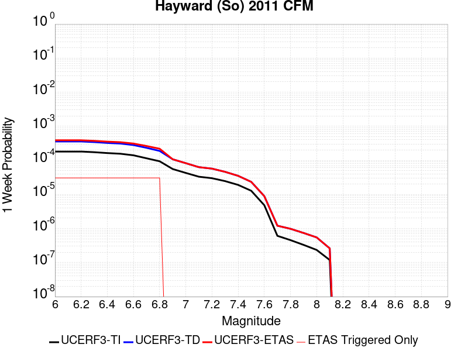 | 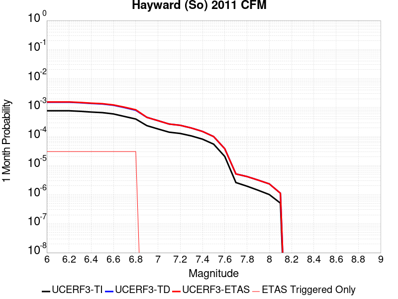 | 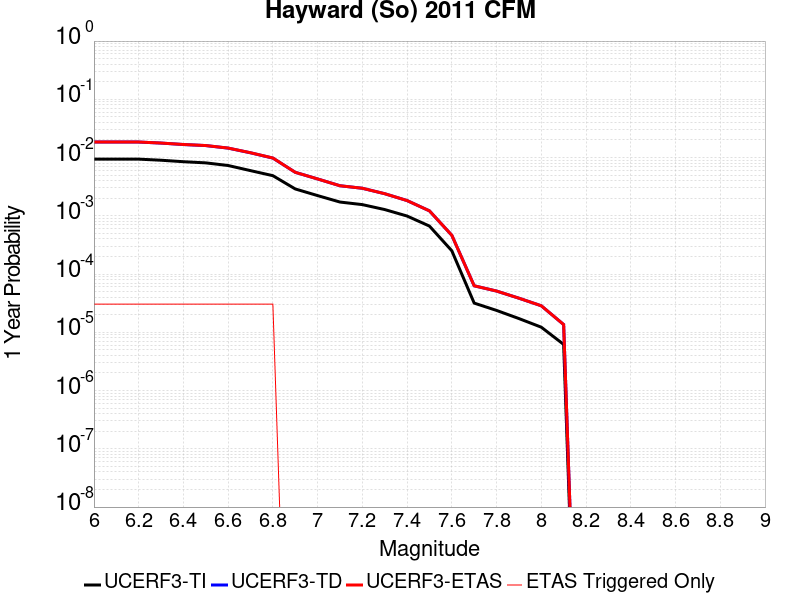 | 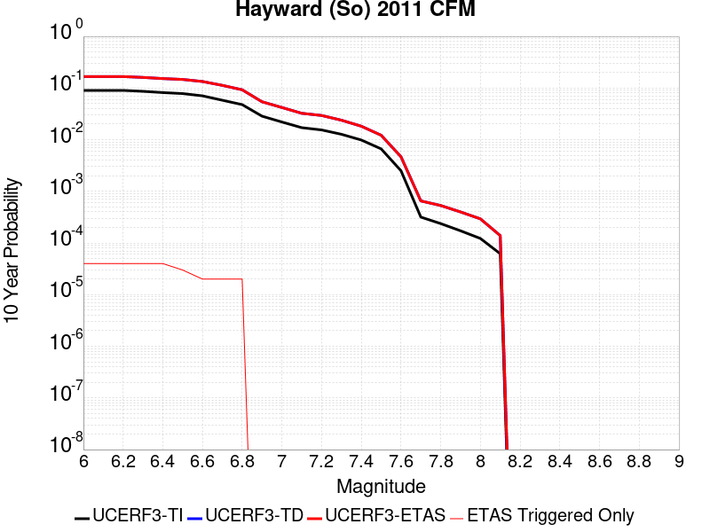 |

| Magnitude | 1 wk TI Prob | 1 wk TD Prob | 1 wk ETAS Prob | 1 wk ETAS/TD Gain | 1 wk ETAS Triggered Only | 1 mo TI Prob | 1 mo TD Prob | 1 mo ETAS Prob | 1 mo ETAS/TD Gain | 1 mo ETAS Triggered Only | 1 yr TI Prob | 1 yr TD Prob | 1 yr ETAS Prob | 1 yr ETAS/TD Gain | 1 yr ETAS Triggered Only | 10 yr TI Prob | 10 yr TD Prob | 10 yr ETAS Prob | 10 yr ETAS/TD Gain | 10 yr ETAS Triggered Only |
|-----|-----|-----|-----|-----|-----|-----|-----|-----|-----|-----|-----|-----|-----|-----|-----|-----|-----|-----|-----|-----|
| 6.0 | 1.8091932E-4 | 3.570541E-4 | 3.8748462E-4 | 1.0852267 | 3.04414E-5 | 7.751381E-4 | 0.0015293444 | 0.0015597391 | 1.0198745 | 3.04414E-5 | 0.00939654 | 0.018463207 | 0.018493088 | 1.0016183 | 3.04414E-5 | 0.090090066 | 0.16673161 | 0.16676965 | 1.0002282 | 4.5662102E-5 |
| 6.1 | 1.8091932E-4 | 3.570541E-4 | 3.8748462E-4 | 1.0852267 | 3.04414E-5 | 7.751381E-4 | 0.0015293444 | 0.0015597391 | 1.0198745 | 3.04414E-5 | 0.00939654 | 0.018463207 | 0.018493088 | 1.0016183 | 3.04414E-5 | 0.090090066 | 0.16673161 | 0.16676965 | 1.0002282 | 4.5662102E-5 |
| 6.2 | 1.8091932E-4 | 3.570541E-4 | 3.8748462E-4 | 1.0852267 | 3.04414E-5 | 7.751381E-4 | 0.0015293444 | 0.0015597391 | 1.0198745 | 3.04414E-5 | 0.00939654 | 0.018463207 | 0.018493088 | 1.0016183 | 3.04414E-5 | 0.090090066 | 0.16673161 | 0.16676965 | 1.0002282 | 4.5662102E-5 |
| 6.3 | 1.7322872E-4 | 3.426234E-4 | 3.7305435E-4 | 1.0888176 | 3.04414E-5 | 7.4219756E-4 | 0.0014675693 | 0.001497966 | 1.0207123 | 3.04414E-5 | 0.0089988755 | 0.017723544 | 0.017753446 | 1.0016872 | 3.04414E-5 | 0.08643075 | 0.16066726 | 0.16070558 | 1.0002385 | 4.5662102E-5 |
| 6.4 | 1.6334097E-4 | 3.234411E-4 | 3.5387266E-4 | 1.0940869 | 3.04414E-5 | 6.998449E-4 | 0.0013854484 | 0.0014158477 | 1.0219418 | 3.04414E-5 | 0.008487372 | 0.016739385 | 0.016769318 | 1.0017881 | 3.04414E-5 | 0.081704415 | 0.15255594 | 0.15259464 | 1.0002537 | 4.5662102E-5 |
| 6.5 | 1.5600289E-4 | 3.1018828E-4 | 3.4062023E-4 | 1.098108 | 3.04414E-5 | 6.684125E-4 | 0.0013287093 | 0.0013591102 | 1.0228801 | 3.04414E-5 | 0.008107598 | 0.016058935 | 0.016088886 | 1.0018651 | 3.04414E-5 | 0.078181036 | 0.14683272 | 0.14685868 | 1.0001769 | 3.04414E-5 |
| 6.6 | 1.4046066E-4 | 2.8032906E-4 | 3.1076194E-4 | 1.1085613 | 3.04414E-5 | 6.018354E-4 | 0.0012008639 | 0.0012312687 | 1.0253191 | 3.04414E-5 | 0.0073027555 | 0.014524006 | 0.014554005 | 1.0020655 | 3.04414E-5 | 0.07067384 | 0.13391982 | 0.1339462 | 1.0001968 | 3.04414E-5 |
| 6.7 | 1.14696966E-4 | 2.3271477E-4 | 2.6314906E-4 | 1.1307795 | 3.04414E-5 | 4.914658E-4 | 9.969729E-4 | 0.0010273838 | 1.0305034 | 3.04414E-5 | 0.0059671924 | 0.012071652 | 0.012101727 | 1.0024912 | 3.04414E-5 | 0.058094822 | 0.11274672 | 0.11277373 | 1.0002396 | 3.04414E-5 |
| 6.8 | 9.3874296E-5 | 1.8861453E-4 | 2.1905018E-4 | 1.1613643 | 3.04414E-5 | 4.0225635E-4 | 8.0810126E-4 | 8.385181E-4 | 1.0376399 | 3.04414E-5 | 0.0048864787 | 0.009794984 | 0.009825127 | 1.0030774 | 3.04414E-5 | 0.047804173 | 0.09259856 | 0.092626184 | 1.0002983 | 3.04414E-5 |
| 6.9 | 5.551852E-5 | 1.072948E-4 | 1.072948E-4 | 1.0 | 0.0 | 2.3791482E-4 | 4.5975443E-4 | 4.5975443E-4 | 1.0 | 0.0 | 0.0028927654 | 0.0055832625 | 0.0055832625 | 1.0 | 0.0 | 0.028553981 | 0.054245494 | 0.054245494 | 1.0 | 0.0 |
| 7.0 | 4.2662363E-5 | 8.2464416E-5 | 8.2464416E-5 | 1.0 | 0.0 | 1.8282588E-4 | 3.5337146E-4 | 3.5337146E-4 | 1.0 | 0.0 | 0.0022236328 | 0.0042938837 | 0.0042938837 | 1.0 | 0.0 | 0.022015138 | 0.042064495 | 0.042064495 | 1.0 | 0.0 |
| 7.1 | 3.305886E-5 | 6.3019055E-5 | 6.3019055E-5 | 1.0 | 0.0 | 1.4167312E-4 | 2.700538E-4 | 2.700538E-4 | 1.0 | 0.0 | 0.0017235056 | 0.0032829668 | 0.0032829668 | 1.0 | 0.0 | 0.017101998 | 0.032452874 | 0.032452874 | 1.0 | 0.0 |
| 7.2 | 2.9856887E-5 | 5.7013647E-5 | 5.7013647E-5 | 1.0 | 0.0 | 1.2795182E-4 | 2.4432142E-4 | 2.4432142E-4 | 1.0 | 0.0 | 0.0015567001 | 0.0029705726 | 0.0029705726 | 1.0 | 0.0 | 0.015458403 | 0.029453589 | 0.029453589 | 1.0 | 0.0 |
| 7.3 | 2.4559737E-5 | 4.599088E-5 | 4.599088E-5 | 1.0 | 0.0 | 1.0525176E-4 | 1.9708896E-4 | 1.9708896E-4 | 1.0 | 0.0 | 0.0012806869 | 0.0023969305 | 0.0023969305 | 1.0 | 0.0 | 0.012733313 | 0.023857482 | 0.023857482 | 1.0 | 0.0 |
| 7.4 | 1.9002231E-5 | 3.5049303E-5 | 3.5049303E-5 | 1.0 | 0.0 | 8.143559E-5 | 1.502027E-4 | 1.502027E-4 | 1.0 | 0.0 | 9.910273E-4 | 0.0018271938 | 0.0018271938 | 1.0 | 0.0 | 0.009866194 | 0.018258283 | 0.018258283 | 1.0 | 0.0 |
| 7.5 | 1.2783333E-5 | 2.3330069E-5 | 2.3330069E-5 | 1.0 | 0.0 | 5.4784563E-5 | 9.998221E-5 | 9.998221E-5 | 1.0 | 0.0 | 6.667979E-4 | 0.0012166094 | 0.0012166094 | 1.0 | 0.0 | 0.006648007 | 0.012209582 | 0.012209582 | 1.0 | 0.0 |
| 7.6 | 4.8149627E-6 | 8.887544E-6 | 8.887544E-6 | 1.0 | 0.0 | 2.063539E-5 | 3.8088925E-5 | 3.8088925E-5 | 1.0 | 0.0 | 2.5120692E-4 | 4.636352E-4 | 4.636352E-4 | 1.0 | 0.0 | 0.0025092314 | 0.0046812436 | 0.0046812436 | 1.0 | 0.0 |
| 7.7 | 6.0838227E-7 | 1.2056693E-6 | 1.2056693E-6 | 1.0 | 0.0 | 2.6073499E-6 | 5.1671436E-6 | 5.1671436E-6 | 1.0 | 0.0 | 3.174402E-5 | 6.290816E-5 | 6.290816E-5 | 1.0 | 0.0 | 3.1739488E-4 | 6.5293367E-4 | 6.5293367E-4 | 1.0 | 0.0 |
| 7.8 | 4.5542808E-7 | 9.792182E-7 | 9.792182E-7 | 1.0 | 0.0 | 1.9518332E-6 | 4.1966427E-6 | 4.1966427E-6 | 1.0 | 0.0 | 2.376331E-5 | 5.1092928E-5 | 5.1092928E-5 | 1.0 | 0.0 | 2.3760769E-4 | 5.321372E-4 | 5.321372E-4 | 1.0 | 0.0 |
| 7.9 | 3.3016747E-7 | 7.386335E-7 | 7.386335E-7 | 1.0 | 0.0 | 1.4150027E-6 | 3.1655684E-6 | 3.1655684E-6 | 1.0 | 0.0 | 1.7227521E-5 | 3.8540114E-5 | 3.8540114E-5 | 1.0 | 0.0 | 1.7226185E-4 | 3.9930744E-4 | 3.9930744E-4 | 1.0 | 0.0 |
| 8.0 | 2.347038E-7 | 5.4714894E-7 | 5.4714894E-7 | 1.0 | 0.0 | 1.0058731E-6 | 2.344922E-6 | 2.344922E-6 | 1.0 | 0.0 | 1.2246436E-5 | 2.8549053E-5 | 2.8549053E-5 | 1.0 | 0.0 | 1.2245761E-4 | 2.9355253E-4 | 2.9355253E-4 | 1.0 | 0.0 |
| 8.1 | 1.18822804E-7 | 2.6058973E-7 | 2.6058973E-7 | 1.0 | 0.0 | 5.092405E-7 | 1.1168127E-6 | 1.1168127E-6 | 1.0 | 0.0 | 6.1999854E-6 | 1.359711E-5 | 1.359711E-5 | 1.0 | 0.0 | 6.199812E-5 | 1.3917852E-4 | 1.3917852E-4 | 1.0 | 0.0 |

## San Luis Range 2011 CFM
*[(top)](#table-of-contents)*

| 1 Week | 1 Month | 1 Year | 10 Year |
|-----|-----|-----|-----|
| 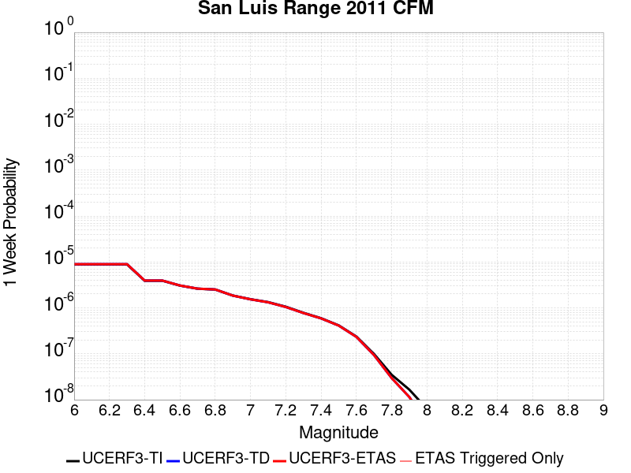 | 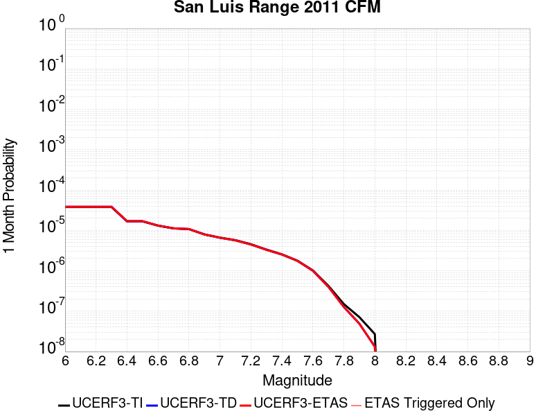 | 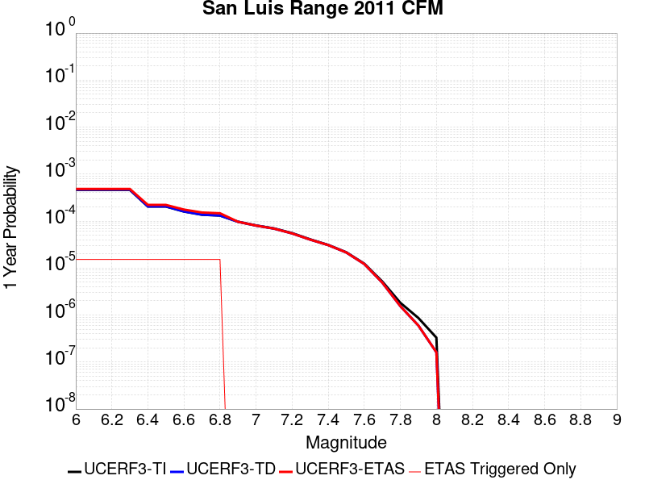 | 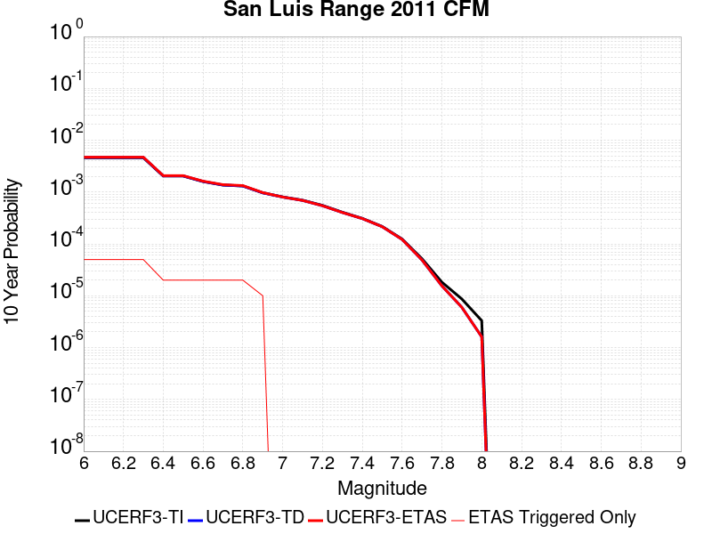 |

| Magnitude | 1 wk TI Prob | 1 wk TD Prob | 1 wk ETAS Prob | 1 wk ETAS/TD Gain | 1 wk ETAS Triggered Only | 1 mo TI Prob | 1 mo TD Prob | 1 mo ETAS Prob | 1 mo ETAS/TD Gain | 1 mo ETAS Triggered Only | 1 yr TI Prob | 1 yr TD Prob | 1 yr ETAS Prob | 1 yr ETAS/TD Gain | 1 yr ETAS Triggered Only | 10 yr TI Prob | 10 yr TD Prob | 10 yr ETAS Prob | 10 yr ETAS/TD Gain | 10 yr ETAS Triggered Only |
|-----|-----|-----|-----|-----|-----|-----|-----|-----|-----|-----|-----|-----|-----|-----|-----|-----|-----|-----|-----|-----|
| 6.0 | 8.8368415E-6 | 8.965454E-6 | 8.965454E-6 | 1.0 | 0.0 | 3.787163E-5 | 3.842285E-5 | 3.842285E-5 | 1.0 | 0.0 | 4.609895E-4 | 4.677057E-4 | 4.8291928E-4 | 1.0325282 | 1.52207E-5 | 0.0046003438 | 0.0046679964 | 0.004713445 | 1.0097363 | 4.5662102E-5 |
| 6.1 | 8.8368415E-6 | 8.965454E-6 | 8.965454E-6 | 1.0 | 0.0 | 3.787163E-5 | 3.842285E-5 | 3.842285E-5 | 1.0 | 0.0 | 4.609895E-4 | 4.677057E-4 | 4.8291928E-4 | 1.0325282 | 1.52207E-5 | 0.0046003438 | 0.0046679964 | 0.004713445 | 1.0097363 | 4.5662102E-5 |
| 6.2 | 8.8368415E-6 | 8.965454E-6 | 8.965454E-6 | 1.0 | 0.0 | 3.787163E-5 | 3.842285E-5 | 3.842285E-5 | 1.0 | 0.0 | 4.609895E-4 | 4.677057E-4 | 4.8291928E-4 | 1.0325282 | 1.52207E-5 | 0.0046003438 | 0.0046679964 | 0.004713445 | 1.0097363 | 4.5662102E-5 |
| 6.3 | 8.8368415E-6 | 8.965454E-6 | 8.965454E-6 | 1.0 | 0.0 | 3.787163E-5 | 3.842285E-5 | 3.842285E-5 | 1.0 | 0.0 | 4.609895E-4 | 4.677057E-4 | 4.8291928E-4 | 1.0325282 | 1.52207E-5 | 0.0046003438 | 0.0046679964 | 0.004713445 | 1.0097363 | 4.5662102E-5 |
| 6.4 | 3.9094193E-6 | 3.9412025E-6 | 3.9412025E-6 | 1.0 | 0.0 | 1.6754546E-5 | 1.689076E-5 | 1.689076E-5 | 1.0 | 0.0 | 2.039675E-4 | 2.056259E-4 | 2.2084346E-4 | 1.0740061 | 1.52207E-5 | 0.0020378039 | 0.0020543851 | 0.0020695745 | 1.0073937 | 1.52207E-5 |
| 6.5 | 3.9094193E-6 | 3.9412025E-6 | 3.9412025E-6 | 1.0 | 0.0 | 1.6754546E-5 | 1.689076E-5 | 1.689076E-5 | 1.0 | 0.0 | 2.039675E-4 | 2.056259E-4 | 2.2084346E-4 | 1.0740061 | 1.52207E-5 | 0.0020378039 | 0.0020543851 | 0.0020695745 | 1.0073937 | 1.52207E-5 |
| 6.6 | 3.0587726E-6 | 3.0753883E-6 | 3.0753883E-6 | 1.0 | 0.0 | 1.3108959E-5 | 1.318017E-5 | 1.318017E-5 | 1.0 | 0.0 | 1.595899E-4 | 1.6045687E-4 | 1.7567512E-4 | 1.0948433 | 1.52207E-5 | 0.0015947534 | 0.0016034221 | 0.0016186184 | 1.0094774 | 1.52207E-5 |
| 6.7 | 2.6160574E-6 | 2.6251273E-6 | 2.6251273E-6 | 1.0 | 0.0 | 1.1211626E-5 | 1.1250498E-5 | 1.1250498E-5 | 1.0 | 0.0 | 1.3649299E-4 | 1.3696625E-4 | 1.5218488E-4 | 1.1111121 | 1.52207E-5 | 0.0013640919 | 0.0013688246 | 0.0013840244 | 1.0111043 | 1.52207E-5 |
| 6.8 | 2.5110312E-6 | 2.51814E-6 | 2.51814E-6 | 1.0 | 0.0 | 1.0761518E-5 | 1.0791985E-5 | 1.0791985E-5 | 1.0 | 0.0 | 1.310136E-4 | 1.3138456E-4 | 1.4660326E-4 | 1.1158333 | 1.52207E-5 | 0.0013093639 | 0.0013130746 | 0.0013282753 | 1.0115764 | 1.52207E-5 |
| 6.9 | 1.8564405E-6 | 1.852487E-6 | 1.852487E-6 | 1.0 | 0.0 | 7.95615E-6 | 7.939206E-6 | 7.939206E-6 | 1.0 | 0.0 | 9.686181E-5 | 9.665557E-5 | 9.665557E-5 | 1.0 | 0.0 | 9.68196E-4 | 9.661373E-4 | 9.661373E-4 | 1.0 | 0.0 |
| 7.0 | 1.546127E-6 | 1.5369537E-6 | 1.5369537E-6 | 1.0 | 0.0 | 6.626242E-6 | 6.586928E-6 | 6.586928E-6 | 1.0 | 0.0 | 8.06715E-5 | 8.0192905E-5 | 8.0192905E-5 | 1.0 | 0.0 | 8.0642226E-4 | 8.016404E-4 | 8.016404E-4 | 1.0 | 0.0 |
| 7.1 | 1.3368208E-6 | 1.3235326E-6 | 1.3235326E-6 | 1.0 | 0.0 | 5.7292195E-6 | 5.67227E-6 | 5.67227E-6 | 1.0 | 0.0 | 6.975101E-5 | 6.905771E-5 | 6.905771E-5 | 1.0 | 0.0 | 6.972912E-4 | 6.9036294E-4 | 6.9036294E-4 | 1.0 | 0.0 |
| 7.2 | 1.0623363E-6 | 1.0454368E-6 | 1.0454368E-6 | 1.0 | 0.0 | 4.5528623E-6 | 4.4804356E-6 | 4.4804356E-6 | 1.0 | 0.0 | 5.5429686E-5 | 5.4547938E-5 | 5.4547938E-5 | 1.0 | 0.0 | 5.5415864E-4 | 5.4534577E-4 | 5.4534577E-4 | 1.0 | 0.0 |
| 7.3 | 7.831679E-7 | 7.7273904E-7 | 7.7273904E-7 | 1.0 | 0.0 | 3.3564295E-6 | 3.3117344E-6 | 3.3117344E-6 | 1.0 | 0.0 | 4.086376E-5 | 4.0319625E-5 | 4.0319625E-5 | 1.0 | 0.0 | 4.0856248E-4 | 4.031232E-4 | 4.031232E-4 | 1.0 | 0.0 |
| 7.4 | 5.9558846E-7 | 5.910636E-7 | 5.910636E-7 | 1.0 | 0.0 | 2.5525194E-6 | 2.5331274E-6 | 2.5331274E-6 | 1.0 | 0.0 | 3.107648E-5 | 3.084039E-5 | 3.084039E-5 | 1.0 | 0.0 | 3.1072134E-4 | 3.083612E-4 | 3.083612E-4 | 1.0 | 0.0 |
| 7.5 | 4.1616502E-7 | 4.119631E-7 | 4.119631E-7 | 1.0 | 0.0 | 1.7835631E-6 | 1.7655549E-6 | 1.7655549E-6 | 1.0 | 0.0 | 2.1714664E-5 | 2.149542E-5 | 2.149542E-5 | 1.0 | 0.0 | 2.1712543E-4 | 2.1493346E-4 | 2.1493346E-4 | 1.0 | 0.0 |
| 7.6 | 2.3816014E-7 | 2.3376548E-7 | 2.3376548E-7 | 1.0 | 0.0 | 1.0206859E-6 | 1.0018516E-6 | 1.0018516E-6 | 1.0 | 0.0 | 1.242678E-5 | 1.2197475E-5 | 1.2197475E-5 | 1.0 | 0.0 | 1.2426086E-4 | 1.2196808E-4 | 1.2196808E-4 | 1.0 | 0.0 |
| 7.7 | 9.918777E-8 | 9.3867584E-8 | 9.3867584E-8 | 1.0 | 0.0 | 4.2509038E-7 | 4.0228957E-7 | 4.0228957E-7 | 1.0 | 0.0 | 5.1754632E-6 | 4.8978645E-6 | 4.8978645E-6 | 1.0 | 0.0 | 5.1753424E-5 | 4.897757E-5 | 4.897757E-5 | 1.0 | 0.0 |
| 7.8 | 3.4982556E-8 | 2.968655E-8 | 2.968655E-8 | 1.0 | 0.0 | 1.4992524E-7 | 1.2722806E-7 | 1.2722806E-7 | 1.0 | 0.0 | 1.8253382E-6 | 1.5490006E-6 | 1.5490006E-6 | 1.0 | 0.0 | 1.8253233E-5 | 1.5489897E-5 | 1.5489897E-5 | 1.0 | 0.0 |
| 7.9 | 1.6624908E-8 | 1.1477036E-8 | 1.1477036E-8 | 1.0 | 0.0 | 7.12496E-8 | 4.91873E-8 | 4.91873E-8 | 1.0 | 0.0 | 8.6746354E-7 | 5.988552E-7 | 5.988552E-7 | 1.0 | 0.0 | 8.674601E-6 | 5.988536E-6 | 5.988536E-6 | 1.0 | 0.0 |
| 8.0 | 6.3352315E-9 | 3.0888412E-9 | 3.0888412E-9 | 1.0 | 0.0 | 2.715099E-8 | 1.3237893E-8 | 1.3237893E-8 | 1.0 | 0.0 | 3.3056327E-7 | 1.6117131E-7 | 1.6117131E-7 | 1.0 | 0.0 | 3.3056278E-6 | 1.611712E-6 | 1.611712E-6 | 1.0 | 0.0 |

## Great Valley 07 (Orestimba)
*[(top)](#table-of-contents)*

| 1 Week | 1 Month | 1 Year | 10 Year |
|-----|-----|-----|-----|
| 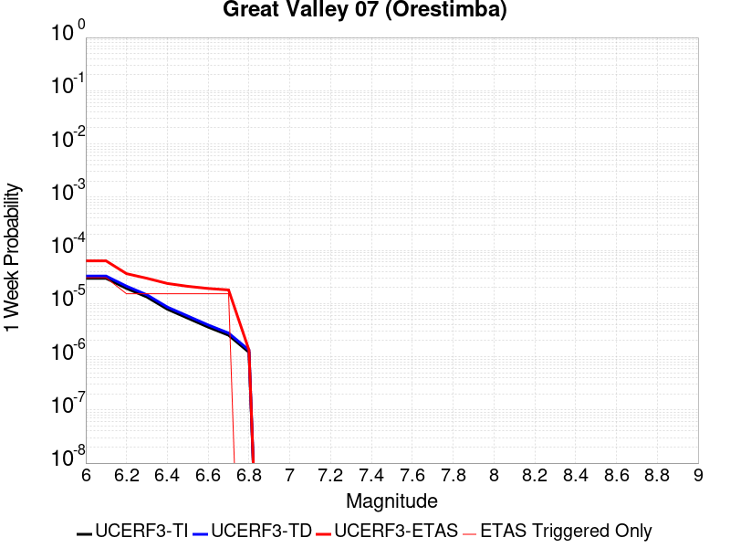 |  | 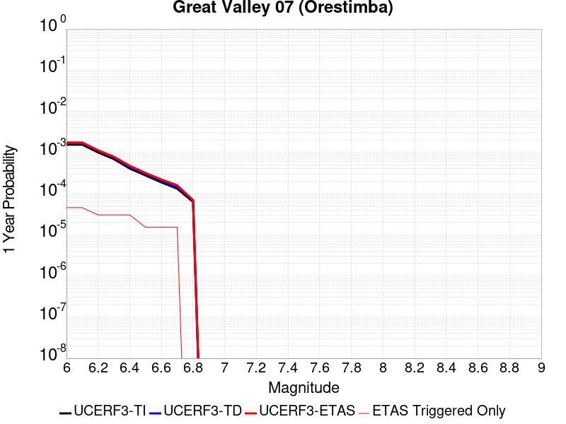 | 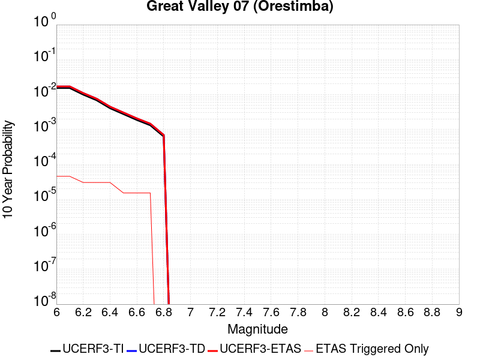 |

| Magnitude | 1 wk TI Prob | 1 wk TD Prob | 1 wk ETAS Prob | 1 wk ETAS/TD Gain | 1 wk ETAS Triggered Only | 1 mo TI Prob | 1 mo TD Prob | 1 mo ETAS Prob | 1 mo ETAS/TD Gain | 1 mo ETAS Triggered Only | 1 yr TI Prob | 1 yr TD Prob | 1 yr ETAS Prob | 1 yr ETAS/TD Gain | 1 yr ETAS Triggered Only | 10 yr TI Prob | 10 yr TD Prob | 10 yr ETAS Prob | 10 yr ETAS/TD Gain | 10 yr ETAS Triggered Only |
|-----|-----|-----|-----|-----|-----|-----|-----|-----|-----|-----|-----|-----|-----|-----|-----|-----|-----|-----|-----|-----|
| 6.0 | 2.9687902E-5 | 3.27575E-5 | 6.3197906E-5 | 1.9292651 | 3.04414E-5 | 1.2722766E-4 | 1.4038214E-4 | 1.7081926E-4 | 1.2168162 | 3.04414E-5 | 0.0015478961 | 0.0017078844 | 0.0017534685 | 1.0266904 | 4.5662102E-5 | 0.015371585 | 0.016955135 | 0.017000023 | 1.0026474 | 4.5662102E-5 |
| 6.1 | 2.9687902E-5 | 3.27575E-5 | 6.3197906E-5 | 1.9292651 | 3.04414E-5 | 1.2722766E-4 | 1.4038214E-4 | 1.7081926E-4 | 1.2168162 | 3.04414E-5 | 0.0015478961 | 0.0017078844 | 0.0017534685 | 1.0266904 | 4.5662102E-5 | 0.015371585 | 0.016955135 | 0.017000023 | 1.0026474 | 4.5662102E-5 |
| 6.2 | 1.9231524E-5 | 2.1159167E-5 | 3.6379544E-5 | 1.7193279 | 1.52207E-5 | 8.2418206E-5 | 9.067912E-5 | 1.0589844E-4 | 1.1678371 | 1.52207E-5 | 0.0010029797 | 0.0011034822 | 0.00113389 | 1.0275562 | 3.04414E-5 | 0.00998465 | 0.01098244 | 0.011012548 | 1.0027413 | 3.04414E-5 |
| 6.3 | 1.324766E-5 | 1.4548534E-5 | 2.9769011E-5 | 2.0461864 | 1.52207E-5 | 5.6774446E-5 | 6.234942E-5 | 7.756917E-5 | 1.2441041 | 1.52207E-5 | 6.910097E-4 | 7.5884897E-4 | 7.8926724E-4 | 1.0400848 | 3.04414E-5 | 0.006888649 | 0.0075635235 | 0.0075937347 | 1.0039943 | 3.04414E-5 |
| 6.4 | 7.818645E-6 | 8.57284E-6 | 2.379341E-5 | 2.7754407 | 1.52207E-5 | 3.3508048E-5 | 3.6740246E-5 | 5.1960385E-5 | 1.4142635 | 1.52207E-5 | 4.078841E-4 | 4.4722404E-4 | 4.7765183E-4 | 1.068037 | 3.04414E-5 | 0.004071363 | 0.0044635804 | 0.004493886 | 1.0067896 | 3.04414E-5 |
| 6.5 | 5.3076565E-6 | 5.8178007E-6 | 2.1038413E-5 | 3.616214 | 1.52207E-5 | 2.27469E-5 | 2.4933206E-5 | 4.0153525E-5 | 1.6104438 | 1.52207E-5 | 2.7690834E-4 | 3.035216E-4 | 3.1873767E-4 | 1.0501318 | 1.52207E-5 | 0.0027656353 | 0.00303128 | 0.0030464544 | 1.005006 | 1.52207E-5 |
| 6.6 | 3.6003578E-6 | 3.9484953E-6 | 1.9169136E-5 | 4.854795 | 1.52207E-5 | 1.5430012E-5 | 1.6922022E-5 | 3.2142463E-5 | 1.8994459 | 1.52207E-5 | 1.8784421E-4 | 2.0600771E-4 | 2.2122527E-4 | 1.0738689 | 1.52207E-5 | 0.0018768552 | 0.0020583214 | 0.0020735108 | 1.0073795 | 1.52207E-5 |
| 6.7 | 2.5361826E-6 | 2.7834678E-6 | 1.8004126E-5 | 6.4682355 | 1.52207E-5 | 1.0869308E-5 | 1.1929101E-5 | 2.714962E-5 | 2.275915 | 1.52207E-5 | 1.3232579E-4 | 1.4522845E-4 | 1.6044694E-4 | 1.10479 | 1.52207E-5 | 0.0013224703 | 0.0014514653 | 0.0014666639 | 1.0104712 | 1.52207E-5 |
| 6.8 | 1.2115831E-6 | 1.3313797E-6 | 1.3313797E-6 | 1.0 | 0.0 | 5.1924885E-6 | 5.7059065E-6 | 5.7059065E-6 | 1.0 | 0.0 | 6.3216714E-5 | 6.9468166E-5 | 6.9468166E-5 | 1.0 | 0.0 | 6.3198735E-4 | 6.945596E-4 | 6.945596E-4 | 1.0 | 0.0 |

## San Jacinto (Lytle Creek connector)
*[(top)](#table-of-contents)*

| 1 Week | 1 Month | 1 Year | 10 Year |
|-----|-----|-----|-----|
| 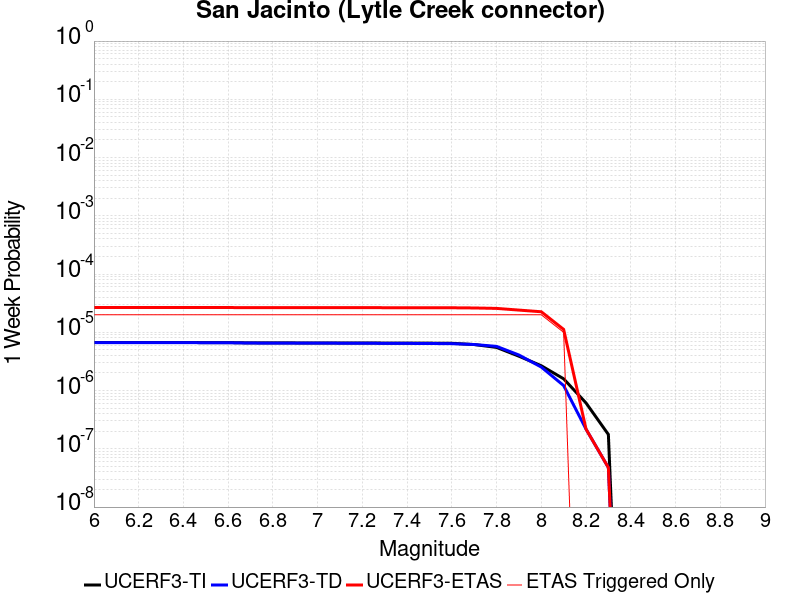 | 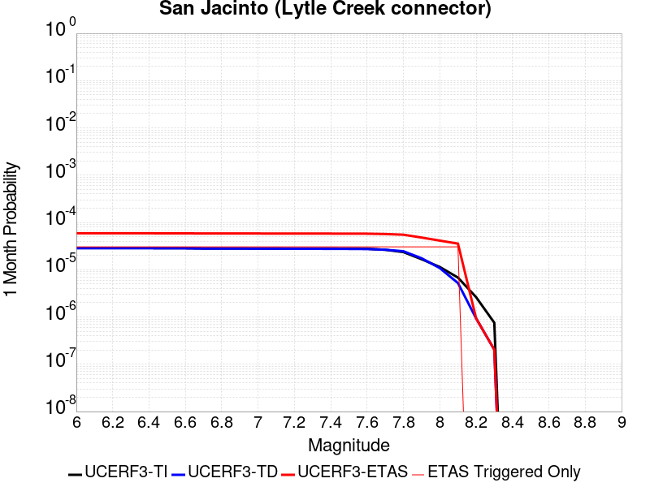 | 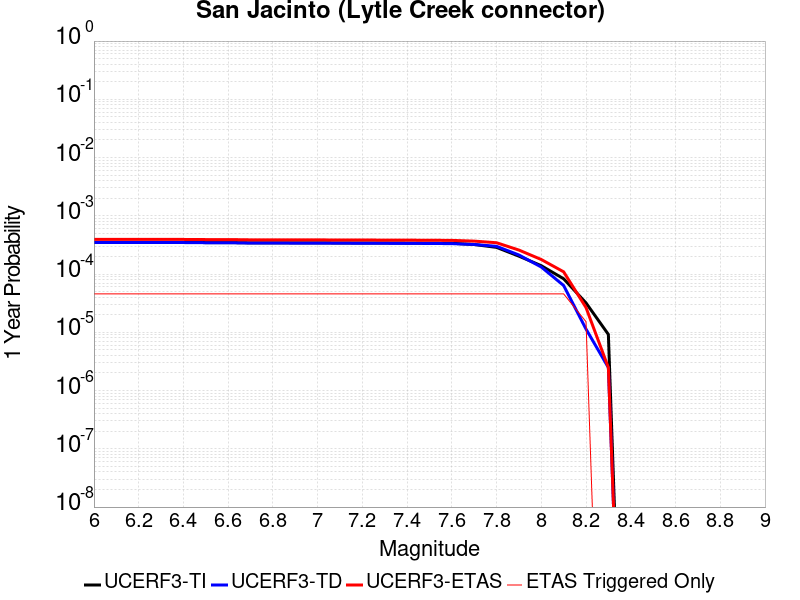 | 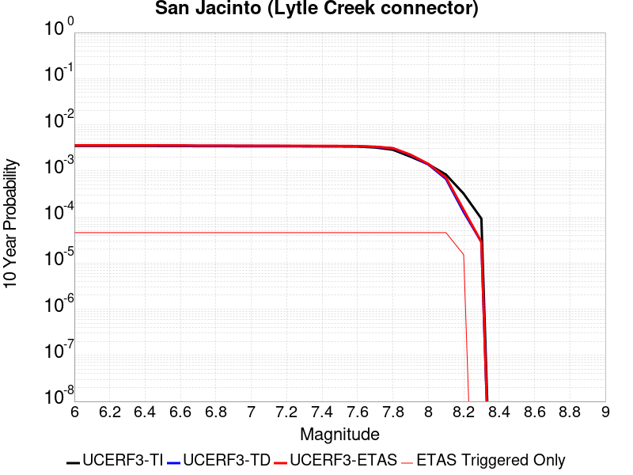 |

| Magnitude | 1 wk TI Prob | 1 wk TD Prob | 1 wk ETAS Prob | 1 wk ETAS/TD Gain | 1 wk ETAS Triggered Only | 1 mo TI Prob | 1 mo TD Prob | 1 mo ETAS Prob | 1 mo ETAS/TD Gain | 1 mo ETAS Triggered Only | 1 yr TI Prob | 1 yr TD Prob | 1 yr ETAS Prob | 1 yr ETAS/TD Gain | 1 yr ETAS Triggered Only | 10 yr TI Prob | 10 yr TD Prob | 10 yr ETAS Prob | 10 yr ETAS/TD Gain | 10 yr ETAS Triggered Only |
|-----|-----|-----|-----|-----|-----|-----|-----|-----|-----|-----|-----|-----|-----|-----|-----|-----|-----|-----|-----|-----|
| 6.0 | 6.693995E-6 | 6.660216E-6 | 2.1880815E-5 | 3.285301 | 1.52207E-5 | 2.8688235E-5 | 2.854347E-5 | 5.8984002E-5 | 2.066462 | 3.04414E-5 | 3.492233E-4 | 3.4746144E-4 | 3.9310768E-4 | 1.1313707 | 4.5662102E-5 | 0.00348675 | 0.0035493854 | 0.0035948853 | 1.0128192 | 4.5662102E-5 |
| 6.1 | 6.693995E-6 | 6.660216E-6 | 2.1880815E-5 | 3.285301 | 1.52207E-5 | 2.8688235E-5 | 2.854347E-5 | 5.8984002E-5 | 2.066462 | 3.04414E-5 | 3.492233E-4 | 3.4746144E-4 | 3.9310768E-4 | 1.1313707 | 4.5662102E-5 | 0.00348675 | 0.0035493854 | 0.0035948853 | 1.0128192 | 4.5662102E-5 |
| 6.2 | 6.693995E-6 | 6.660216E-6 | 2.1880815E-5 | 3.285301 | 1.52207E-5 | 2.8688235E-5 | 2.854347E-5 | 5.8984002E-5 | 2.066462 | 3.04414E-5 | 3.492233E-4 | 3.4746144E-4 | 3.9310768E-4 | 1.1313707 | 4.5662102E-5 | 0.00348675 | 0.0035493854 | 0.0035948853 | 1.0128192 | 4.5662102E-5 |
| 6.3 | 6.693995E-6 | 6.660216E-6 | 2.1880815E-5 | 3.285301 | 1.52207E-5 | 2.8688235E-5 | 2.854347E-5 | 5.8984002E-5 | 2.066462 | 3.04414E-5 | 3.492233E-4 | 3.4746144E-4 | 3.9310768E-4 | 1.1313707 | 4.5662102E-5 | 0.00348675 | 0.0035493854 | 0.0035948853 | 1.0128192 | 4.5662102E-5 |
| 6.4 | 6.693995E-6 | 6.660216E-6 | 2.1880815E-5 | 3.285301 | 1.52207E-5 | 2.8688235E-5 | 2.854347E-5 | 5.8984002E-5 | 2.066462 | 3.04414E-5 | 3.492233E-4 | 3.4746144E-4 | 3.9310768E-4 | 1.1313707 | 4.5662102E-5 | 0.00348675 | 0.0035493854 | 0.0035948853 | 1.0128192 | 4.5662102E-5 |
| 6.5 | 6.6561875E-6 | 6.6204343E-6 | 2.1841033E-5 | 3.2990334 | 1.52207E-5 | 2.8526205E-5 | 2.837298E-5 | 5.881352E-5 | 2.0728705 | 3.04414E-5 | 3.472512E-4 | 3.4538636E-4 | 3.910327E-4 | 1.1321602 | 4.5662102E-5 | 0.0034670907 | 0.003528701 | 0.0035742018 | 1.0128945 | 4.5662102E-5 |
| 6.6 | 6.6561875E-6 | 6.6204343E-6 | 2.1841033E-5 | 3.2990334 | 1.52207E-5 | 2.8526205E-5 | 2.837298E-5 | 5.881352E-5 | 2.0728705 | 3.04414E-5 | 3.472512E-4 | 3.4538636E-4 | 3.910327E-4 | 1.1321602 | 4.5662102E-5 | 0.0034670907 | 0.003528701 | 0.0035742018 | 1.0128945 | 4.5662102E-5 |
| 6.7 | 6.5802237E-6 | 6.539611E-6 | 2.1760212E-5 | 3.3274474 | 1.52207E-5 | 2.8200653E-5 | 2.8026603E-5 | 5.846715E-5 | 2.0861304 | 3.04414E-5 | 3.4328885E-4 | 3.4117055E-4 | 3.8681706E-4 | 1.1337938 | 4.5662102E-5 | 0.0034275902 | 0.0034866752 | 0.0035321782 | 1.0130506 | 4.5662102E-5 |
| 6.8 | 6.575632E-6 | 6.5341005E-6 | 2.1754702E-5 | 3.32941 | 1.52207E-5 | 2.8180975E-5 | 2.8002989E-5 | 5.8443537E-5 | 2.0870464 | 3.04414E-5 | 3.4304935E-4 | 3.4088313E-4 | 3.8652966E-4 | 1.1339067 | 4.5662102E-5 | 0.0034252026 | 0.00348381 | 0.003529313 | 1.0130613 | 4.5662102E-5 |
| 6.9 | 6.570433E-6 | 6.525495E-6 | 2.1746097E-5 | 3.3324823 | 1.52207E-5 | 2.8158694E-5 | 2.7966107E-5 | 5.8406655E-5 | 2.08848 | 3.04414E-5 | 3.4277816E-4 | 3.4043423E-4 | 3.860808E-4 | 1.1340834 | 4.5662102E-5 | 0.0034224992 | 0.0034793352 | 0.0035248385 | 1.0130781 | 4.5662102E-5 |
| 7.0 | 6.5643826E-6 | 6.515616E-6 | 2.1736218E-5 | 3.3360188 | 1.52207E-5 | 2.8132765E-5 | 2.792377E-5 | 5.836432E-5 | 2.0901303 | 3.04414E-5 | 3.424626E-4 | 3.3991894E-4 | 3.855655E-4 | 1.1342866 | 4.5662102E-5 | 0.0034193532 | 0.0034741985 | 0.0035197018 | 1.0130975 | 4.5662102E-5 |
| 7.1 | 6.557402E-6 | 6.5043278E-6 | 2.1724929E-5 | 3.3400729 | 1.52207E-5 | 2.8102848E-5 | 2.7875392E-5 | 5.8315945E-5 | 2.0920224 | 3.04414E-5 | 3.4209844E-4 | 3.3933012E-4 | 3.8497674E-4 | 1.1345197 | 4.5662102E-5 | 0.0034157229 | 0.0034683298 | 0.0035138335 | 1.0131198 | 4.5662102E-5 |
| 7.2 | 6.546394E-6 | 6.4862943E-6 | 2.1706895E-5 | 3.3465788 | 1.52207E-5 | 2.8055672E-5 | 2.7798109E-5 | 5.8238664E-5 | 2.0950584 | 3.04414E-5 | 3.4152428E-4 | 3.3838948E-4 | 3.8403613E-4 | 1.1348938 | 4.5662102E-5 | 0.0034099987 | 0.0034589572 | 0.0035044614 | 1.0131555 | 4.5662102E-5 |
| 7.3 | 6.5364216E-6 | 6.4670803E-6 | 2.1687682E-5 | 3.3535507 | 1.52207E-5 | 2.8012933E-5 | 2.7715765E-5 | 5.815632E-5 | 2.098312 | 3.04414E-5 | 3.4100408E-4 | 3.3738726E-4 | 3.8303394E-4 | 1.1352947 | 4.5662102E-5 | 0.003404813 | 0.0034489788 | 0.0034944834 | 1.0131936 | 4.5662102E-5 |
| 7.4 | 6.5269523E-6 | 6.4481674E-6 | 2.166877E-5 | 3.3604538 | 1.52207E-5 | 2.7972354E-5 | 2.7634711E-5 | 5.807527E-5 | 2.1015334 | 3.04414E-5 | 3.4051016E-4 | 3.3640073E-4 | 3.8204747E-4 | 1.1356915 | 4.5662102E-5 | 0.0033998888 | 0.003439161 | 0.0034846659 | 1.0132314 | 4.5662102E-5 |
| 7.5 | 6.5111835E-6 | 6.424442E-6 | 2.1645044E-5 | 3.3691711 | 1.52207E-5 | 2.7904773E-5 | 2.7533031E-5 | 5.7973593E-5 | 2.1056015 | 3.04414E-5 | 3.3968766E-4 | 3.3516317E-4 | 3.8080997E-4 | 1.1361928 | 4.5662102E-5 | 0.0033916887 | 0.003426834 | 0.0034723396 | 1.0132792 | 4.5662102E-5 |
| 7.6 | 6.4768806E-6 | 6.383551E-6 | 2.1604154E-5 | 3.3843474 | 1.52207E-5 | 2.7757764E-5 | 2.735779E-5 | 5.7798356E-5 | 2.1126838 | 3.04414E-5 | 3.3789838E-4 | 3.3303024E-4 | 3.7867716E-4 | 1.1370653 | 4.5662102E-5 | 0.0033738504 | 0.0034055663 | 0.0034510728 | 1.0133624 | 4.5662102E-5 |
| 7.7 | 6.1655364E-6 | 6.1760365E-6 | 2.1396643E-5 | 3.4644618 | 1.52207E-5 | 2.642346E-5 | 2.646846E-5 | 5.6909055E-5 | 2.1500704 | 3.04414E-5 | 3.2165812E-4 | 3.2220592E-4 | 3.678533E-4 | 1.1416715 | 4.5662102E-5 | 0.0032119295 | 0.0032971818 | 0.0033426932 | 1.0138031 | 4.5662102E-5 |
| 7.8 | 5.5043524E-6 | 5.737097E-6 | 2.095771E-5 | 3.6530166 | 1.52207E-5 | 2.3589868E-5 | 2.4587327E-5 | 5.502798E-5 | 2.2380626 | 3.04414E-5 | 2.871688E-4 | 2.9930964E-4 | 3.4495807E-4 | 1.1525124 | 4.5662102E-5 | 0.0028679797 | 0.0030672832 | 0.0031128053 | 1.0148412 | 4.5662102E-5 |
| 7.9 | 3.889249E-6 | 4.076761E-6 | 1.9297398E-5 | 4.7335124 | 1.52207E-5 | 1.6668104E-5 | 1.7471715E-5 | 4.7912585E-5 | 2.742294 | 3.04414E-5 | 2.0291525E-4 | 2.1269741E-4 | 2.583498E-4 | 1.2146354 | 4.5662102E-5 | 0.0020273007 | 0.0021943315 | 0.0022398934 | 1.0207634 | 4.5662102E-5 |
| 8.0 | 2.668535E-6 | 2.5315155E-6 | 1.7752178E-5 | 7.0124702 | 1.52207E-5 | 1.1436528E-5 | 1.0849307E-5 | 4.1290376E-5 | 3.8058078 | 3.04414E-5 | 1.3923083E-4 | 1.3208234E-4 | 1.777384E-4 | 1.3456637 | 4.5662102E-5 | 0.0013914363 | 0.0013757964 | 0.0014213956 | 1.0331439 | 4.5662102E-5 |
| 8.1 | 1.5911459E-6 | 1.218661E-6 | 1.6439342E-5 | 13.489676 | 1.52207E-5 | 6.8191785E-6 | 5.2228224E-6 | 3.5664063E-5 | 6.8285036 | 3.04414E-5 | 8.3020335E-5 | 6.3586034E-5 | 1.0924523E-4 | 1.7180697 | 4.5662102E-5 | 8.298933E-4 | 6.6932244E-4 | 7.14954E-4 | 1.0681757 | 4.5662102E-5 |
| 8.2 | 6.1294963E-7 | 2.1812275E-7 | 2.1812275E-7 | 1.0 | 0.0 | 2.6269242E-6 | 9.3481145E-7 | 9.3481145E-7 | 1.0 | 0.0 | 3.1982334E-5 | 1.138127E-5 | 2.6601798E-5 | 2.337331 | 1.52207E-5 | 3.1977732E-4 | 1.2784546E-4 | 1.4306422E-4 | 1.1190403 | 1.52207E-5 |
| 8.3 | 1.762871E-7 | 4.7546838E-8 | 4.7546838E-8 | 1.0 | 0.0 | 7.5551594E-7 | 2.0377215E-7 | 2.0377215E-7 | 1.0 | 0.0 | 9.1983675E-6 | 2.480923E-6 | 2.480923E-6 | 1.0 | 0.0 | 9.197987E-5 | 2.868753E-5 | 2.868753E-5 | 1.0 | 0.0 |

## Sierra Madre
*[(top)](#table-of-contents)*

| 1 Week | 1 Month | 1 Year | 10 Year |
|-----|-----|-----|-----|
|  |  | 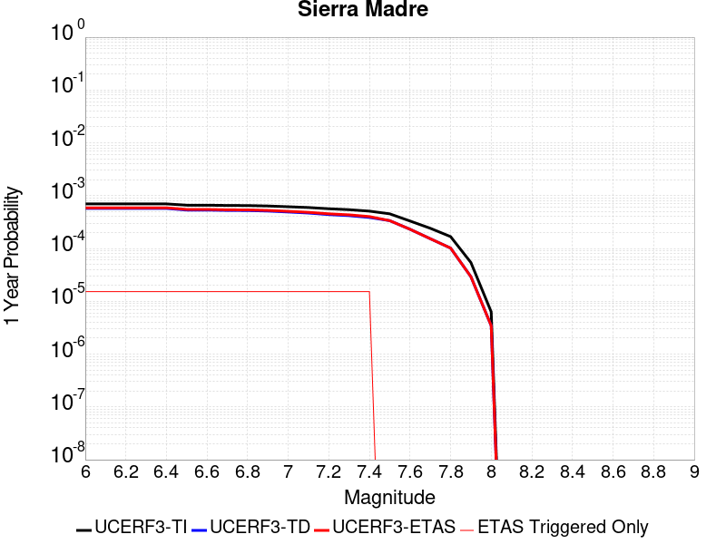 | 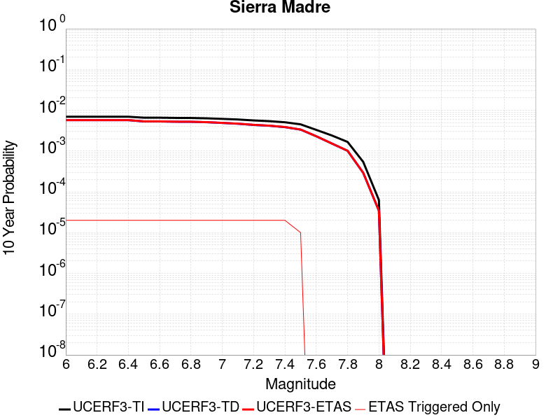 |

| Magnitude | 1 wk TI Prob | 1 wk TD Prob | 1 wk ETAS Prob | 1 wk ETAS/TD Gain | 1 wk ETAS Triggered Only | 1 mo TI Prob | 1 mo TD Prob | 1 mo ETAS Prob | 1 mo ETAS/TD Gain | 1 mo ETAS Triggered Only | 1 yr TI Prob | 1 yr TD Prob | 1 yr ETAS Prob | 1 yr ETAS/TD Gain | 1 yr ETAS Triggered Only | 10 yr TI Prob | 10 yr TD Prob | 10 yr ETAS Prob | 10 yr ETAS/TD Gain | 10 yr ETAS Triggered Only |
|-----|-----|-----|-----|-----|-----|-----|-----|-----|-----|-----|-----|-----|-----|-----|-----|-----|-----|-----|-----|-----|
| 6.0 | 1.3379373E-5 | 1.10007395E-5 | 1.10007395E-5 | 1.0 | 0.0 | 5.7338908E-5 | 4.7145186E-5 | 4.7145186E-5 | 1.0 | 0.0 | 6.978776E-4 | 5.738429E-4 | 5.890549E-4 | 1.0265089 | 1.52207E-5 | 0.0069569005 | 0.0057239756 | 0.0057542427 | 1.0052878 | 3.04414E-5 |
| 6.1 | 1.3379373E-5 | 1.10007395E-5 | 1.10007395E-5 | 1.0 | 0.0 | 5.7338908E-5 | 4.7145186E-5 | 4.7145186E-5 | 1.0 | 0.0 | 6.978776E-4 | 5.738429E-4 | 5.890549E-4 | 1.0265089 | 1.52207E-5 | 0.0069569005 | 0.0057239756 | 0.0057542427 | 1.0052878 | 3.04414E-5 |
| 6.2 | 1.3379373E-5 | 1.10007395E-5 | 1.10007395E-5 | 1.0 | 0.0 | 5.7338908E-5 | 4.7145186E-5 | 4.7145186E-5 | 1.0 | 0.0 | 6.978776E-4 | 5.738429E-4 | 5.890549E-4 | 1.0265089 | 1.52207E-5 | 0.0069569005 | 0.0057239756 | 0.0057542427 | 1.0052878 | 3.04414E-5 |
| 6.3 | 1.3379373E-5 | 1.10007395E-5 | 1.10007395E-5 | 1.0 | 0.0 | 5.7338908E-5 | 4.7145186E-5 | 4.7145186E-5 | 1.0 | 0.0 | 6.978776E-4 | 5.738429E-4 | 5.890549E-4 | 1.0265089 | 1.52207E-5 | 0.0069569005 | 0.0057239756 | 0.0057542427 | 1.0052878 | 3.04414E-5 |
| 6.4 | 1.3379373E-5 | 1.10007395E-5 | 1.10007395E-5 | 1.0 | 0.0 | 5.7338908E-5 | 4.7145186E-5 | 4.7145186E-5 | 1.0 | 0.0 | 6.978776E-4 | 5.738429E-4 | 5.890549E-4 | 1.0265089 | 1.52207E-5 | 0.0069569005 | 0.0057239756 | 0.0057542427 | 1.0052878 | 3.04414E-5 |
| 6.5 | 1.26563245E-5 | 1.0230196E-5 | 1.0230196E-5 | 1.0 | 0.0 | 5.4240263E-5 | 4.3842967E-5 | 4.3842967E-5 | 1.0 | 0.0 | 6.601751E-4 | 5.336584E-4 | 5.48871E-4 | 1.0285062 | 1.52207E-5 | 0.006582173 | 0.0053240913 | 0.0053543705 | 1.0056872 | 3.04414E-5 |
| 6.6 | 1.26563245E-5 | 1.0230196E-5 | 1.0230196E-5 | 1.0 | 0.0 | 5.4240263E-5 | 4.3842967E-5 | 4.3842967E-5 | 1.0 | 0.0 | 6.601751E-4 | 5.336584E-4 | 5.48871E-4 | 1.0285062 | 1.52207E-5 | 0.006582173 | 0.0053240913 | 0.0053543705 | 1.0056872 | 3.04414E-5 |
| 6.7 | 1.2502474E-5 | 1.006634E-5 | 1.006634E-5 | 1.0 | 0.0 | 5.3580934E-5 | 4.314075E-5 | 4.314075E-5 | 1.0 | 0.0 | 6.521526E-4 | 5.251131E-4 | 5.403258E-4 | 1.0289704 | 1.52207E-5 | 0.0065024206 | 0.0052390425 | 0.0052693244 | 1.0057801 | 3.04414E-5 |
| 6.8 | 1.2454966E-5 | 1.0018625E-5 | 1.0018625E-5 | 1.0 | 0.0 | 5.3377335E-5 | 4.2936266E-5 | 4.2936266E-5 | 1.0 | 0.0 | 6.4967526E-4 | 5.226247E-4 | 5.3783745E-4 | 1.0291084 | 1.52207E-5 | 0.006477792 | 0.0052142753 | 0.0052445577 | 1.0058076 | 3.04414E-5 |
| 6.9 | 1.2225574E-5 | 9.792602E-6 | 9.792602E-6 | 1.0 | 0.0 | 5.2394265E-5 | 4.1967625E-5 | 4.1967625E-5 | 1.0 | 0.0 | 6.3771347E-4 | 5.108371E-4 | 5.2605005E-4 | 1.0297804 | 1.52207E-5 | 0.006358865 | 0.0050969445 | 0.0051272307 | 1.005942 | 3.04414E-5 |
| 7.0 | 1.182946E-5 | 9.399144E-6 | 9.399144E-6 | 1.0 | 0.0 | 5.06967E-5 | 4.0281426E-5 | 4.0281426E-5 | 1.0 | 0.0 | 6.1705755E-4 | 4.9031706E-4 | 5.055303E-4 | 1.0310273 | 1.52207E-5 | 0.006153469 | 0.004892664 | 0.0049229567 | 1.0061914 | 3.04414E-5 |
| 7.1 | 1.14369095E-5 | 8.986159E-6 | 8.986159E-6 | 1.0 | 0.0 | 4.9014405E-5 | 3.8511545E-5 | 3.8511545E-5 | 1.0 | 0.0 | 5.9658696E-4 | 4.687782E-4 | 4.8399175E-4 | 1.0324537 | 1.52207E-5 | 0.005949879 | 0.004678199 | 0.0047084983 | 1.0064766 | 3.04414E-5 |
| 7.2 | 1.0836419E-5 | 8.3995565E-6 | 8.3995565E-6 | 1.0 | 0.0 | 4.644097E-5 | 3.5997607E-5 | 3.5997607E-5 | 1.0 | 0.0 | 5.652721E-4 | 4.3818366E-4 | 4.533977E-4 | 1.0347207 | 1.52207E-5 | 0.0056383642 | 0.004373494 | 0.0044038026 | 1.00693 | 3.04414E-5 |
| 7.3 | 1.0403439E-5 | 8.02082E-6 | 8.02082E-6 | 1.0 | 0.0 | 4.4585406E-5 | 3.4374494E-5 | 3.4374494E-5 | 1.0 | 0.0 | 5.426921E-4 | 4.1843E-4 | 4.3364434E-4 | 1.0363605 | 1.52207E-5 | 0.005413687 | 0.004176717 | 0.0042070313 | 1.0072579 | 3.04414E-5 |
| 7.4 | 9.768864E-6 | 7.414448E-6 | 7.414448E-6 | 1.0 | 0.0 | 4.186589E-5 | 3.1775824E-5 | 3.1775824E-5 | 1.0 | 0.0 | 5.09598E-4 | 3.868029E-4 | 4.020177E-4 | 1.0393348 | 1.52207E-5 | 0.0050843097 | 0.0038615882 | 0.003891912 | 1.0078527 | 3.04414E-5 |
| 7.5 | 8.687089E-6 | 6.4501564E-6 | 6.4501564E-6 | 1.0 | 0.0 | 3.722985E-5 | 2.764324E-5 | 2.764324E-5 | 1.0 | 0.0 | 4.5317915E-4 | 3.3650533E-4 | 3.3650533E-4 | 1.0 | 0.0 | 0.004522561 | 0.0033602451 | 0.0033754148 | 1.0045145 | 1.52207E-5 |
| 7.6 | 6.3506063E-6 | 4.4303215E-6 | 4.4303215E-6 | 1.0 | 0.0 | 2.72166E-5 | 1.8986955E-5 | 1.8986955E-5 | 1.0 | 0.0 | 3.3131172E-4 | 2.3114192E-4 | 2.3114192E-4 | 1.0 | 0.0 | 0.003308182 | 0.0023092402 | 0.0023092402 | 1.0 | 0.0 |
| 7.7 | 4.62223E-6 | 2.932967E-6 | 2.932967E-6 | 1.0 | 0.0 | 1.9809406E-5 | 1.2569798E-5 | 1.2569798E-5 | 1.0 | 0.0 | 2.4115283E-4 | 1.5302657E-4 | 1.5302657E-4 | 1.0 | 0.0 | 0.0024089129 | 0.001529413 | 0.001529413 | 1.0 | 0.0 |
| 7.8 | 3.2145008E-6 | 1.9494332E-6 | 1.9494332E-6 | 1.0 | 0.0 | 1.3776359E-5 | 8.3546865E-6 | 8.3546865E-6 | 1.0 | 0.0 | 1.6771426E-4 | 1.0171358E-4 | 1.0171358E-4 | 1.0 | 0.0 | 0.0016758774 | 0.0010168145 | 0.0010168145 | 1.0 | 0.0 |
| 7.9 | 1.0391769E-6 | 5.6026335E-7 | 5.6026335E-7 | 1.0 | 0.0 | 4.4536077E-6 | 2.4011265E-6 | 2.4011265E-6 | 1.0 | 0.0 | 5.4221324E-5 | 2.9233326E-5 | 2.9233326E-5 | 1.0 | 0.0 | 5.4208096E-4 | 2.9229524E-4 | 2.9229524E-4 | 1.0 | 0.0 |
| 8.0 | 1.210983E-7 | 6.613821E-8 | 6.613821E-8 | 1.0 | 0.0 | 5.1899264E-7 | 2.8344945E-7 | 2.8344945E-7 | 1.0 | 0.0 | 6.3187167E-6 | 3.4509917E-6 | 3.4509917E-6 | 1.0 | 0.0 | 6.318537E-5 | 3.45094E-5 | 3.45094E-5 | 1.0 | 0.0 |

## North Frontal  (West)
*[(top)](#table-of-contents)*

| 1 Week | 1 Month | 1 Year | 10 Year |
|-----|-----|-----|-----|
|  | 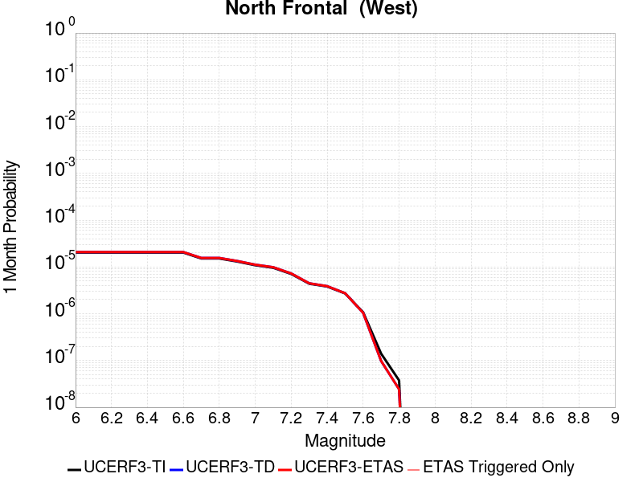 |  | 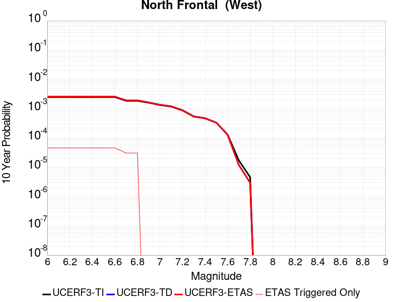 |

| Magnitude | 1 wk TI Prob | 1 wk TD Prob | 1 wk ETAS Prob | 1 wk ETAS/TD Gain | 1 wk ETAS Triggered Only | 1 mo TI Prob | 1 mo TD Prob | 1 mo ETAS Prob | 1 mo ETAS/TD Gain | 1 mo ETAS Triggered Only | 1 yr TI Prob | 1 yr TD Prob | 1 yr ETAS Prob | 1 yr ETAS/TD Gain | 1 yr ETAS Triggered Only | 10 yr TI Prob | 10 yr TD Prob | 10 yr ETAS Prob | 10 yr ETAS/TD Gain | 10 yr ETAS Triggered Only |
|-----|-----|-----|-----|-----|-----|-----|-----|-----|-----|-----|-----|-----|-----|-----|-----|-----|-----|-----|-----|-----|
| 6.0 | 4.7316266E-6 | 4.8526726E-6 | 4.8526726E-6 | 1.0 | 0.0 | 2.0278241E-5 | 2.0797012E-5 | 2.0797012E-5 | 1.0 | 0.0 | 2.4685962E-4 | 2.5317568E-4 | 2.5317568E-4 | 1.0 | 0.0 | 0.0024658558 | 0.0025290183 | 0.0025745651 | 1.0180097 | 4.5662102E-5 |
| 6.1 | 4.7316266E-6 | 4.8526726E-6 | 4.8526726E-6 | 1.0 | 0.0 | 2.0278241E-5 | 2.0797012E-5 | 2.0797012E-5 | 1.0 | 0.0 | 2.4685962E-4 | 2.5317568E-4 | 2.5317568E-4 | 1.0 | 0.0 | 0.0024658558 | 0.0025290183 | 0.0025745651 | 1.0180097 | 4.5662102E-5 |
| 6.2 | 4.7316266E-6 | 4.8526726E-6 | 4.8526726E-6 | 1.0 | 0.0 | 2.0278241E-5 | 2.0797012E-5 | 2.0797012E-5 | 1.0 | 0.0 | 2.4685962E-4 | 2.5317568E-4 | 2.5317568E-4 | 1.0 | 0.0 | 0.0024658558 | 0.0025290183 | 0.0025745651 | 1.0180097 | 4.5662102E-5 |
| 6.3 | 4.7316266E-6 | 4.8526726E-6 | 4.8526726E-6 | 1.0 | 0.0 | 2.0278241E-5 | 2.0797012E-5 | 2.0797012E-5 | 1.0 | 0.0 | 2.4685962E-4 | 2.5317568E-4 | 2.5317568E-4 | 1.0 | 0.0 | 0.0024658558 | 0.0025290183 | 0.0025745651 | 1.0180097 | 4.5662102E-5 |
| 6.4 | 4.7316266E-6 | 4.8526726E-6 | 4.8526726E-6 | 1.0 | 0.0 | 2.0278241E-5 | 2.0797012E-5 | 2.0797012E-5 | 1.0 | 0.0 | 2.4685962E-4 | 2.5317568E-4 | 2.5317568E-4 | 1.0 | 0.0 | 0.0024658558 | 0.0025290183 | 0.0025745651 | 1.0180097 | 4.5662102E-5 |
| 6.5 | 4.7316266E-6 | 4.8526726E-6 | 4.8526726E-6 | 1.0 | 0.0 | 2.0278241E-5 | 2.0797012E-5 | 2.0797012E-5 | 1.0 | 0.0 | 2.4685962E-4 | 2.5317568E-4 | 2.5317568E-4 | 1.0 | 0.0 | 0.0024658558 | 0.0025290183 | 0.0025745651 | 1.0180097 | 4.5662102E-5 |
| 6.6 | 4.7316266E-6 | 4.8526726E-6 | 4.8526726E-6 | 1.0 | 0.0 | 2.0278241E-5 | 2.0797012E-5 | 2.0797012E-5 | 1.0 | 0.0 | 2.4685962E-4 | 2.5317568E-4 | 2.5317568E-4 | 1.0 | 0.0 | 0.0024658558 | 0.0025290183 | 0.0025745651 | 1.0180097 | 4.5662102E-5 |
| 6.7 | 3.5382777E-6 | 3.6308859E-6 | 3.6308859E-6 | 1.0 | 0.0 | 1.516396E-5 | 1.5560852E-5 | 1.5560852E-5 | 1.0 | 0.0 | 1.8460557E-4 | 1.8943768E-4 | 1.8943768E-4 | 1.0 | 0.0 | 0.0018445229 | 0.0018928389 | 0.0019232227 | 1.016052 | 3.04414E-5 |
| 6.8 | 3.5382777E-6 | 3.6308859E-6 | 3.6308859E-6 | 1.0 | 0.0 | 1.516396E-5 | 1.5560852E-5 | 1.5560852E-5 | 1.0 | 0.0 | 1.8460557E-4 | 1.8943768E-4 | 1.8943768E-4 | 1.0 | 0.0 | 0.0018445229 | 0.0018928389 | 0.0019232227 | 1.016052 | 3.04414E-5 |
| 6.9 | 3.0428037E-6 | 3.1227605E-6 | 3.1227605E-6 | 1.0 | 0.0 | 1.30405215E-5 | 1.33831945E-5 | 1.33831945E-5 | 1.0 | 0.0 | 1.5875678E-4 | 1.6292889E-4 | 1.6292889E-4 | 1.0 | 0.0 | 0.0015864341 | 0.0016281615 | 0.0016281615 | 1.0 | 0.0 |
| 7.0 | 2.538778E-6 | 2.6060904E-6 | 2.6060904E-6 | 1.0 | 0.0 | 1.0880432E-5 | 1.1168913E-5 | 1.1168913E-5 | 1.0 | 0.0 | 1.324612E-4 | 1.3597352E-4 | 1.3597352E-4 | 1.0 | 0.0 | 0.0013238228 | 0.0013589499 | 0.0013589499 | 1.0 | 0.0 |
| 7.1 | 2.2418935E-6 | 2.3012074E-6 | 2.3012074E-6 | 1.0 | 0.0 | 9.60808E-6 | 9.862282E-6 | 9.862282E-6 | 1.0 | 0.0 | 1.1697209E-4 | 1.2006712E-4 | 1.2006712E-4 | 1.0 | 0.0 | 0.0011691054 | 0.0012000664 | 0.0012000664 | 1.0 | 0.0 |
| 7.2 | 1.6526745E-6 | 1.6924851E-6 | 1.6924851E-6 | 1.0 | 0.0 | 7.082872E-6 | 7.253489E-6 | 7.253489E-6 | 1.0 | 0.0 | 8.623055E-5 | 8.8307905E-5 | 8.8307905E-5 | 1.0 | 0.0 | 8.61971E-4 | 8.827532E-4 | 8.827532E-4 | 1.0 | 0.0 |
| 7.3 | 1.0246019E-6 | 1.0442261E-6 | 1.0442261E-6 | 1.0 | 0.0 | 4.391144E-6 | 4.4752474E-6 | 4.4752474E-6 | 1.0 | 0.0 | 5.3460866E-5 | 5.448489E-5 | 5.448489E-5 | 1.0 | 0.0 | 5.344801E-4 | 5.4472685E-4 | 5.4472685E-4 | 1.0 | 0.0 |
| 7.4 | 8.9045164E-7 | 9.0565584E-7 | 9.0565584E-7 | 1.0 | 0.0 | 3.8162157E-6 | 3.8813773E-6 | 3.8813773E-6 | 1.0 | 0.0 | 4.646144E-5 | 4.7254853E-5 | 4.7254853E-5 | 1.0 | 0.0 | 4.6451724E-4 | 4.7245892E-4 | 4.7245892E-4 | 1.0 | 0.0 |
| 7.5 | 6.3357E-7 | 6.4027006E-7 | 6.4027006E-7 | 1.0 | 0.0 | 2.7152971E-6 | 2.744012E-6 | 2.744012E-6 | 1.0 | 0.0 | 3.305824E-5 | 3.34079E-5 | 3.34079E-5 | 1.0 | 0.0 | 3.3053322E-4 | 3.3403534E-4 | 3.3403534E-4 | 1.0 | 0.0 |
| 7.6 | 2.5087024E-7 | 2.4361097E-7 | 2.4361097E-7 | 1.0 | 0.0 | 1.0751578E-6 | 1.0440467E-6 | 1.0440467E-6 | 1.0 | 0.0 | 1.3089967E-5 | 1.2711216E-5 | 1.2711216E-5 | 1.0 | 0.0 | 1.3089196E-4 | 1.2710695E-4 | 1.2710695E-4 | 1.0 | 0.0 |
| 7.7 | 3.282987E-8 | 2.2874195E-8 | 2.2874195E-8 | 1.0 | 0.0 | 1.4069944E-7 | 9.803227E-8 | 9.803227E-8 | 1.0 | 0.0 | 1.7130144E-6 | 1.1935423E-6 | 1.1935423E-6 | 1.0 | 0.0 | 1.7130013E-5 | 1.1935367E-5 | 1.1935367E-5 | 1.0 | 0.0 |
| 7.8 | 8.77499E-9 | 5.6815956E-9 | 5.6815956E-9 | 1.0 | 0.0 | 3.7607098E-8 | 2.4349696E-8 | 2.4349696E-8 | 1.0 | 0.0 | 4.578663E-7 | 2.9645753E-7 | 2.9645753E-7 | 1.0 | 0.0 | 4.5786537E-6 | 2.9645726E-6 | 2.9645726E-6 | 1.0 | 0.0 |

## Santa Susana East (connector)
*[(top)](#table-of-contents)*

| 1 Week | 1 Month | 1 Year | 10 Year |
|-----|-----|-----|-----|
|  | 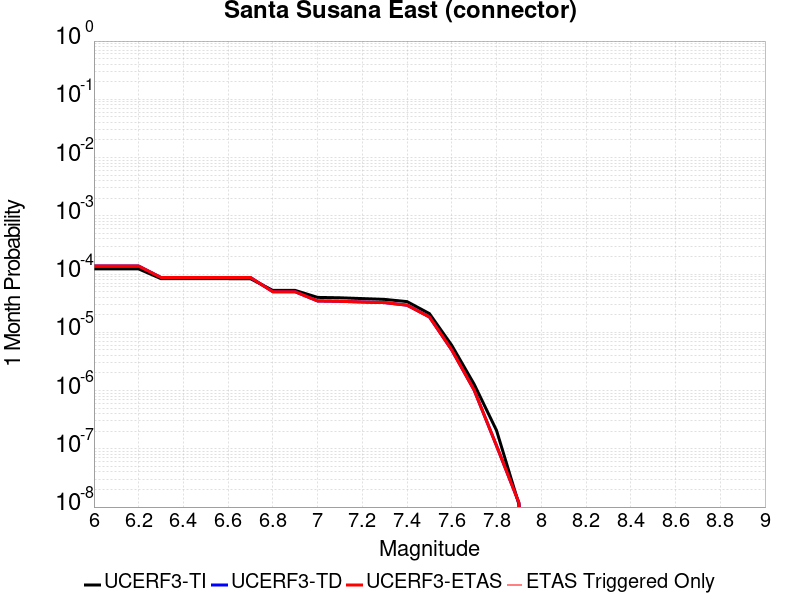 | 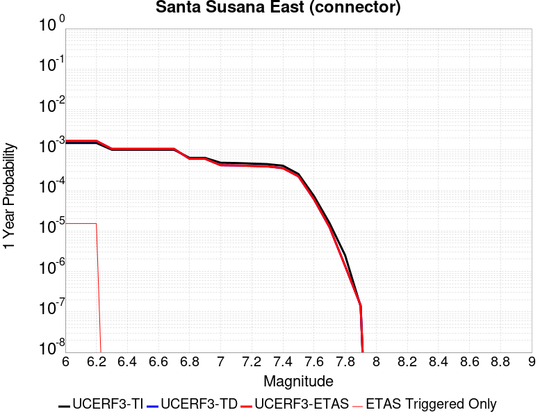 | 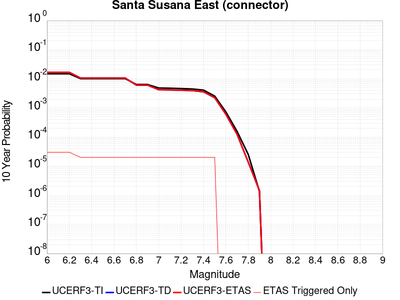 |

| Magnitude | 1 wk TI Prob | 1 wk TD Prob | 1 wk ETAS Prob | 1 wk ETAS/TD Gain | 1 wk ETAS Triggered Only | 1 mo TI Prob | 1 mo TD Prob | 1 mo ETAS Prob | 1 mo ETAS/TD Gain | 1 mo ETAS Triggered Only | 1 yr TI Prob | 1 yr TD Prob | 1 yr ETAS Prob | 1 yr ETAS/TD Gain | 1 yr ETAS Triggered Only | 10 yr TI Prob | 10 yr TD Prob | 10 yr ETAS Prob | 10 yr ETAS/TD Gain | 10 yr ETAS Triggered Only |
|-----|-----|-----|-----|-----|-----|-----|-----|-----|-----|-----|-----|-----|-----|-----|-----|-----|-----|-----|-----|-----|
| 6.0 | 2.858397E-5 | 3.202091E-5 | 3.202091E-5 | 1.0 | 0.0 | 1.2249697E-4 | 1.3722685E-4 | 1.3722685E-4 | 1.0 | 0.0 | 0.0014903803 | 0.0016697381 | 0.0016849334 | 1.0091004 | 1.52207E-5 | 0.014804244 | 0.016599052 | 0.016643956 | 1.0027052 | 4.5662102E-5 |
| 6.1 | 2.858397E-5 | 3.202091E-5 | 3.202091E-5 | 1.0 | 0.0 | 1.2249697E-4 | 1.3722685E-4 | 1.3722685E-4 | 1.0 | 0.0 | 0.0014903803 | 0.0016697381 | 0.0016849334 | 1.0091004 | 1.52207E-5 | 0.014804244 | 0.016599052 | 0.016643956 | 1.0027052 | 4.5662102E-5 |
| 6.2 | 2.858397E-5 | 3.202091E-5 | 3.202091E-5 | 1.0 | 0.0 | 1.2249697E-4 | 1.3722685E-4 | 1.3722685E-4 | 1.0 | 0.0 | 0.0014903803 | 0.0016697381 | 0.0016849334 | 1.0091004 | 1.52207E-5 | 0.014804244 | 0.016599052 | 0.016643956 | 1.0027052 | 4.5662102E-5 |
| 6.3 | 1.943582E-5 | 2.036718E-5 | 2.036718E-5 | 1.0 | 0.0 | 8.329371E-5 | 8.7285625E-5 | 8.7285625E-5 | 1.0 | 0.0 | 0.001013629 | 0.0010622967 | 0.0010622967 | 1.0 | 0.0 | 0.010090181 | 0.010583619 | 0.010613738 | 1.0028459 | 3.04414E-5 |
| 6.4 | 1.943582E-5 | 2.036718E-5 | 2.036718E-5 | 1.0 | 0.0 | 8.329371E-5 | 8.7285625E-5 | 8.7285625E-5 | 1.0 | 0.0 | 0.001013629 | 0.0010622967 | 0.0010622967 | 1.0 | 0.0 | 0.010090181 | 0.010583619 | 0.010613738 | 1.0028459 | 3.04414E-5 |
| 6.5 | 1.943582E-5 | 2.036718E-5 | 2.036718E-5 | 1.0 | 0.0 | 8.329371E-5 | 8.7285625E-5 | 8.7285625E-5 | 1.0 | 0.0 | 0.001013629 | 0.0010622967 | 0.0010622967 | 1.0 | 0.0 | 0.010090181 | 0.010583619 | 0.010613738 | 1.0028459 | 3.04414E-5 |
| 6.6 | 1.943582E-5 | 2.036718E-5 | 2.036718E-5 | 1.0 | 0.0 | 8.329371E-5 | 8.7285625E-5 | 8.7285625E-5 | 1.0 | 0.0 | 0.001013629 | 0.0010622967 | 0.0010622967 | 1.0 | 0.0 | 0.010090181 | 0.010583619 | 0.010613738 | 1.0028459 | 3.04414E-5 |
| 6.7 | 1.9404439E-5 | 2.03546E-5 | 2.03546E-5 | 1.0 | 0.0 | 8.3159226E-5 | 8.723172E-5 | 8.723172E-5 | 1.0 | 0.0 | 0.0010119933 | 0.0010616409 | 0.0010616409 | 1.0 | 0.0 | 0.010073971 | 0.010577125 | 0.0106072435 | 1.0028476 | 3.04414E-5 |
| 6.8 | 1.2217526E-5 | 1.1592998E-5 | 1.1592998E-5 | 1.0 | 0.0 | 5.2359774E-5 | 4.9683425E-5 | 4.9683425E-5 | 1.0 | 0.0 | 6.372938E-4 | 6.0474465E-4 | 6.0474465E-4 | 1.0 | 0.0 | 0.0063546924 | 0.006033037 | 0.0060632946 | 1.0050154 | 3.04414E-5 |
| 6.9 | 1.2217526E-5 | 1.1592998E-5 | 1.1592998E-5 | 1.0 | 0.0 | 5.2359774E-5 | 4.9683425E-5 | 4.9683425E-5 | 1.0 | 0.0 | 6.372938E-4 | 6.0474465E-4 | 6.0474465E-4 | 1.0 | 0.0 | 0.0063546924 | 0.006033037 | 0.0060632946 | 1.0050154 | 3.04414E-5 |
| 7.0 | 9.276017E-6 | 8.059113E-6 | 8.059113E-6 | 1.0 | 0.0 | 3.9753755E-5 | 3.4538618E-5 | 3.4538618E-5 | 1.0 | 0.0 | 4.8389446E-4 | 4.2042998E-4 | 4.2042998E-4 | 1.0 | 0.0 | 0.0048284214 | 0.0041970722 | 0.004227386 | 1.0072225 | 3.04414E-5 |
| 7.1 | 9.130355E-6 | 7.942286E-6 | 7.942286E-6 | 1.0 | 0.0 | 3.9129503E-5 | 3.4037945E-5 | 3.4037945E-5 | 1.0 | 0.0 | 4.7629757E-4 | 4.1433662E-4 | 4.1433662E-4 | 1.0 | 0.0 | 0.00475278 | 0.004136367 | 0.0041666823 | 1.007329 | 3.04414E-5 |
| 7.2 | 8.851015E-6 | 7.741445E-6 | 7.741445E-6 | 1.0 | 0.0 | 3.7932372E-5 | 3.317722E-5 | 3.317722E-5 | 1.0 | 0.0 | 4.6172875E-4 | 4.038612E-4 | 4.038612E-4 | 1.0 | 0.0 | 0.0046077054 | 0.0040319953 | 0.004062314 | 1.0075195 | 3.04414E-5 |
| 7.3 | 8.573006E-6 | 7.550166E-6 | 7.550166E-6 | 1.0 | 0.0 | 3.6740938E-5 | 3.2357475E-5 | 3.2357475E-5 | 1.0 | 0.0 | 4.472291E-4 | 3.9388443E-4 | 3.9388443E-4 | 1.0 | 0.0 | 0.004463301 | 0.0039325804 | 0.0039629024 | 1.0077103 | 3.04414E-5 |
| 7.4 | 7.852282E-6 | 6.817687E-6 | 6.817687E-6 | 1.0 | 0.0 | 3.36522E-5 | 2.9218349E-5 | 2.9218349E-5 | 1.0 | 0.0 | 4.096385E-4 | 3.5567835E-4 | 3.5567835E-4 | 1.0 | 0.0 | 0.0040888423 | 0.0035517553 | 0.0035820885 | 1.0085404 | 3.04414E-5 |
| 7.5 | 4.8869324E-6 | 4.279055E-6 | 4.279055E-6 | 1.0 | 0.0 | 2.0943828E-5 | 1.8338687E-5 | 1.8338687E-5 | 1.0 | 0.0 | 2.5496128E-4 | 2.232523E-4 | 2.232523E-4 | 1.0 | 0.0 | 0.0025466895 | 0.0022304445 | 0.002260818 | 1.0136176 | 3.04414E-5 |
| 7.6 | 1.3894544E-6 | 1.1568179E-6 | 1.1568179E-6 | 1.0 | 0.0 | 5.954791E-6 | 4.957783E-6 | 4.957783E-6 | 1.0 | 0.0 | 7.249717E-5 | 6.0359558E-5 | 6.0359558E-5 | 1.0 | 0.0 | 7.247352E-4 | 6.0345343E-4 | 6.0345343E-4 | 1.0 | 0.0 |
| 7.7 | 2.9924632E-7 | 2.371928E-7 | 2.371928E-7 | 1.0 | 0.0 | 1.2824837E-6 | 1.0165402E-6 | 1.0165402E-6 | 1.0 | 0.0 | 1.5614127E-5 | 1.2376314E-5 | 1.2376314E-5 | 1.0 | 0.0 | 1.5613029E-4 | 1.2375697E-4 | 1.2375697E-4 | 1.0 | 0.0 |
| 7.8 | 4.8188564E-8 | 2.6323061E-8 | 2.6323061E-8 | 1.0 | 0.0 | 2.065224E-7 | 1.1281311E-7 | 1.1281311E-7 | 1.0 | 0.0 | 2.5144072E-6 | 1.3734989E-6 | 1.3734989E-6 | 1.0 | 0.0 | 2.5143789E-5 | 1.3734912E-5 | 1.3734912E-5 | 1.0 | 0.0 |
| 7.9 | 2.6127251E-9 | 2.7681102E-9 | 2.7681102E-9 | 1.0 | 0.0 | 1.1197393E-8 | 1.186333E-8 | 1.186333E-8 | 1.0 | 0.0 | 1.3632825E-7 | 1.4443603E-7 | 1.4443603E-7 | 1.0 | 0.0 | 1.3632817E-6 | 1.4443604E-6 | 1.4443604E-6 | 1.0 | 0.0 |

## Los Alamos 2011 CFM
*[(top)](#table-of-contents)*

| 1 Week | 1 Month | 1 Year | 10 Year |
|-----|-----|-----|-----|
| 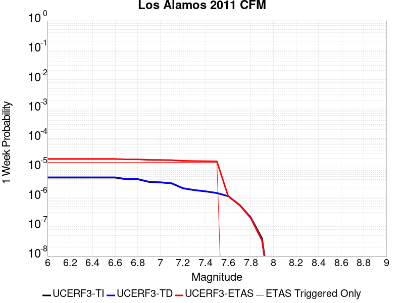 | 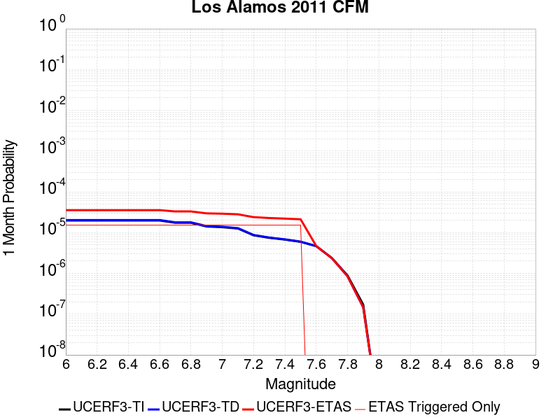 | 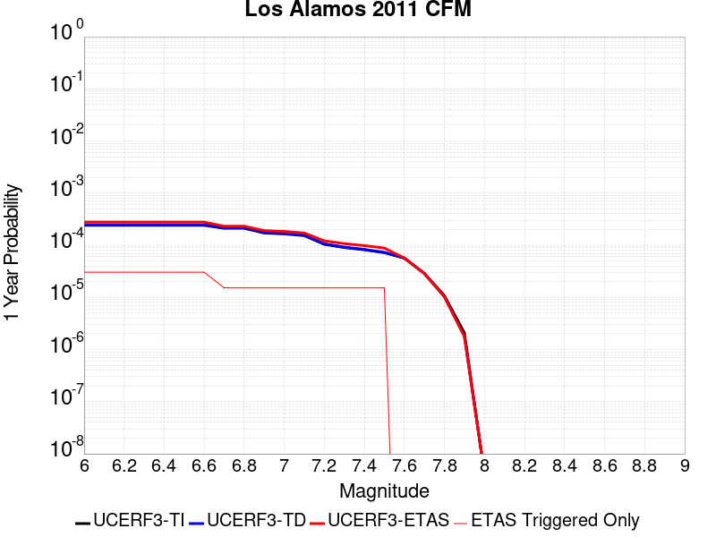 | 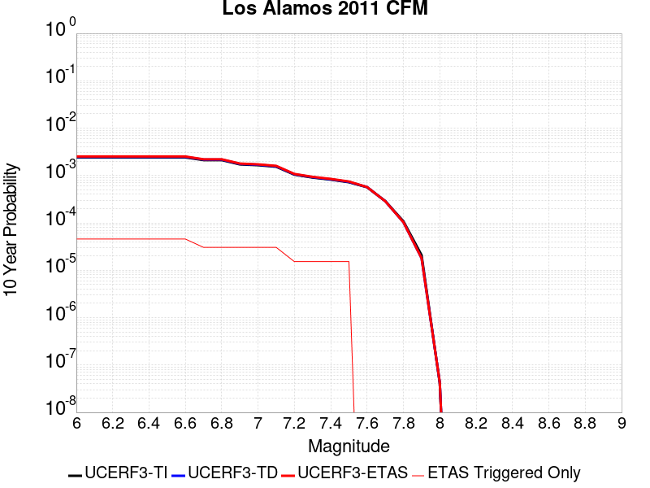 |

| Magnitude | 1 wk TI Prob | 1 wk TD Prob | 1 wk ETAS Prob | 1 wk ETAS/TD Gain | 1 wk ETAS Triggered Only | 1 mo TI Prob | 1 mo TD Prob | 1 mo ETAS Prob | 1 mo ETAS/TD Gain | 1 mo ETAS Triggered Only | 1 yr TI Prob | 1 yr TD Prob | 1 yr ETAS Prob | 1 yr ETAS/TD Gain | 1 yr ETAS Triggered Only | 10 yr TI Prob | 10 yr TD Prob | 10 yr ETAS Prob | 10 yr ETAS/TD Gain | 10 yr ETAS Triggered Only |
|-----|-----|-----|-----|-----|-----|-----|-----|-----|-----|-----|-----|-----|-----|-----|-----|-----|-----|-----|-----|-----|
| 6.0 | 4.6284417E-6 | 4.751731E-6 | 1.9972358E-5 | 4.203175 | 1.52207E-5 | 1.9836029E-5 | 2.0364414E-5 | 3.5584802E-5 | 1.7474014 | 1.52207E-5 | 2.4147688E-4 | 2.4791027E-4 | 2.7834415E-4 | 1.1227616 | 3.04414E-5 | 0.0024121467 | 0.0024765113 | 0.0025220604 | 1.0183924 | 4.5662102E-5 |
| 6.1 | 4.6284417E-6 | 4.751731E-6 | 1.9972358E-5 | 4.203175 | 1.52207E-5 | 1.9836029E-5 | 2.0364414E-5 | 3.5584802E-5 | 1.7474014 | 1.52207E-5 | 2.4147688E-4 | 2.4791027E-4 | 2.7834415E-4 | 1.1227616 | 3.04414E-5 | 0.0024121467 | 0.0024765113 | 0.0025220604 | 1.0183924 | 4.5662102E-5 |
| 6.2 | 4.6284417E-6 | 4.751731E-6 | 1.9972358E-5 | 4.203175 | 1.52207E-5 | 1.9836029E-5 | 2.0364414E-5 | 3.5584802E-5 | 1.7474014 | 1.52207E-5 | 2.4147688E-4 | 2.4791027E-4 | 2.7834415E-4 | 1.1227616 | 3.04414E-5 | 0.0024121467 | 0.0024765113 | 0.0025220604 | 1.0183924 | 4.5662102E-5 |
| 6.3 | 4.6284417E-6 | 4.751731E-6 | 1.9972358E-5 | 4.203175 | 1.52207E-5 | 1.9836029E-5 | 2.0364414E-5 | 3.5584802E-5 | 1.7474014 | 1.52207E-5 | 2.4147688E-4 | 2.4791027E-4 | 2.7834415E-4 | 1.1227616 | 3.04414E-5 | 0.0024121467 | 0.0024765113 | 0.0025220604 | 1.0183924 | 4.5662102E-5 |
| 6.4 | 4.6284417E-6 | 4.751731E-6 | 1.9972358E-5 | 4.203175 | 1.52207E-5 | 1.9836029E-5 | 2.0364414E-5 | 3.5584802E-5 | 1.7474014 | 1.52207E-5 | 2.4147688E-4 | 2.4791027E-4 | 2.7834415E-4 | 1.1227616 | 3.04414E-5 | 0.0024121467 | 0.0024765113 | 0.0025220604 | 1.0183924 | 4.5662102E-5 |
| 6.5 | 4.6284417E-6 | 4.751731E-6 | 1.9972358E-5 | 4.203175 | 1.52207E-5 | 1.9836029E-5 | 2.0364414E-5 | 3.5584802E-5 | 1.7474014 | 1.52207E-5 | 2.4147688E-4 | 2.4791027E-4 | 2.7834415E-4 | 1.1227616 | 3.04414E-5 | 0.0024121467 | 0.0024765113 | 0.0025220604 | 1.0183924 | 4.5662102E-5 |
| 6.6 | 4.6284417E-6 | 4.751731E-6 | 1.9972358E-5 | 4.203175 | 1.52207E-5 | 1.9836029E-5 | 2.0364414E-5 | 3.5584802E-5 | 1.7474014 | 1.52207E-5 | 2.4147688E-4 | 2.4791027E-4 | 2.7834415E-4 | 1.1227616 | 3.04414E-5 | 0.0024121467 | 0.0024765113 | 0.0025220604 | 1.0183924 | 4.5662102E-5 |
| 6.7 | 4.062321E-6 | 4.166349E-6 | 1.9386986E-5 | 4.6532316 | 1.52207E-5 | 1.7409831E-5 | 1.7855667E-5 | 3.3076096E-5 | 1.8524145 | 1.52207E-5 | 2.1194408E-4 | 2.1737257E-4 | 2.3258997E-4 | 1.070006 | 1.52207E-5 | 0.0021174205 | 0.0021717492 | 0.0022021246 | 1.0139866 | 3.04414E-5 |
| 6.8 | 4.062321E-6 | 4.166349E-6 | 1.9386986E-5 | 4.6532316 | 1.52207E-5 | 1.7409831E-5 | 1.7855667E-5 | 3.3076096E-5 | 1.8524145 | 1.52207E-5 | 2.1194408E-4 | 2.1737257E-4 | 2.3258997E-4 | 1.070006 | 1.52207E-5 | 0.0021174205 | 0.0021717492 | 0.0022021246 | 1.0139866 | 3.04414E-5 |
| 6.9 | 3.2936077E-6 | 3.372958E-6 | 1.8593606E-5 | 5.5125523 | 1.52207E-5 | 1.4115385E-5 | 1.4455459E-5 | 2.9675939E-5 | 2.0529227 | 1.52207E-5 | 1.7184127E-4 | 1.7598194E-4 | 1.9119996E-4 | 1.0864749 | 1.52207E-5 | 0.0017170844 | 0.0017585184 | 0.0017889063 | 1.0172803 | 3.04414E-5 |
| 7.0 | 3.1687898E-6 | 3.2448156E-6 | 1.8465465E-5 | 5.69076 | 1.52207E-5 | 1.3580457E-5 | 1.3906283E-5 | 2.9126772E-5 | 2.0945044 | 1.52207E-5 | 1.6532952E-4 | 1.6929678E-4 | 1.845149E-4 | 1.0898902 | 1.52207E-5 | 0.0016520657 | 0.0016917696 | 0.0017221596 | 1.0179634 | 3.04414E-5 |
| 7.1 | 2.9379228E-6 | 3.0073259E-6 | 1.822798E-5 | 6.0611925 | 1.52207E-5 | 1.25910365E-5 | 1.288848E-5 | 2.8108985E-5 | 2.1809385 | 1.52207E-5 | 1.5328509E-4 | 1.5690686E-4 | 1.7212518E-4 | 1.0969895 | 1.52207E-5 | 0.001531794 | 0.0015680499 | 0.0015984436 | 1.0193831 | 3.04414E-5 |
| 7.2 | 2.0020686E-6 | 2.0416298E-6 | 1.7262299E-5 | 8.455156 | 1.52207E-5 | 8.580266E-6 | 8.749813E-6 | 2.397038E-5 | 2.7395306 | 1.52207E-5 | 1.0445973E-4 | 1.0652381E-4 | 1.2174289E-4 | 1.1428702 | 1.52207E-5 | 0.0010441064 | 0.001064732 | 0.0010799364 | 1.0142801 | 1.52207E-5 |
| 7.3 | 1.7364243E-6 | 1.7678802E-6 | 1.6988553E-5 | 9.609561 | 1.52207E-5 | 7.441797E-6 | 7.576608E-6 | 2.2797192E-5 | 3.0088918 | 1.52207E-5 | 9.0600115E-5 | 9.2241324E-5 | 1.0746062E-4 | 1.1649944 | 1.52207E-5 | 9.0563187E-4 | 9.2203356E-4 | 9.372402E-4 | 1.0164925 | 1.52207E-5 |
| 7.4 | 1.5718434E-6 | 1.5983177E-6 | 1.6818993E-5 | 10.522936 | 1.52207E-5 | 6.7364545E-6 | 6.849915E-6 | 2.2070511E-5 | 3.2220123 | 1.52207E-5 | 8.201325E-5 | 8.339455E-5 | 9.8613986E-5 | 1.182499 | 1.52207E-5 | 8.198299E-4 | 8.3363557E-4 | 8.488436E-4 | 1.018243 | 1.52207E-5 |
| 7.5 | 1.3841119E-6 | 1.4042793E-6 | 1.6624957E-5 | 11.838783 | 1.52207E-5 | 5.9318945E-6 | 6.0183256E-6 | 2.1238935E-5 | 3.5290437 | 1.52207E-5 | 7.221842E-5 | 7.327068E-5 | 8.849027E-5 | 1.2077173 | 1.52207E-5 | 7.2194956E-4 | 7.324681E-4 | 7.476777E-4 | 1.0207648 | 1.52207E-5 |
| 7.6 | 1.0843726E-6 | 1.093442E-6 | 1.093442E-6 | 1.0 | 0.0 | 4.647303E-6 | 4.6861724E-6 | 4.6861724E-6 | 1.0 | 0.0 | 5.6579443E-5 | 5.705268E-5 | 5.705268E-5 | 1.0 | 0.0 | 5.656504E-4 | 5.703829E-4 | 5.703829E-4 | 1.0 | 0.0 |
| 7.7 | 5.544814E-7 | 5.5018705E-7 | 5.5018705E-7 | 1.0 | 0.0 | 2.3763469E-6 | 2.3579425E-6 | 2.3579425E-6 | 1.0 | 0.0 | 2.8931638E-5 | 2.8707573E-5 | 2.8707573E-5 | 1.0 | 0.0 | 2.8927872E-4 | 2.870388E-4 | 2.870388E-4 | 1.0 | 0.0 |
| 7.8 | 2.0707465E-7 | 1.977846E-7 | 1.977846E-7 | 1.0 | 0.0 | 8.874625E-7 | 8.4764804E-7 | 8.4764804E-7 | 1.0 | 0.0 | 1.08048025E-5 | 1.0320066E-5 | 1.0320066E-5 | 1.0 | 0.0 | 1.0804277E-4 | 1.0319592E-4 | 1.0319592E-4 | 1.0 | 0.0 |
| 7.9 | 3.9821284E-8 | 3.433109E-8 | 3.433109E-8 | 1.0 | 0.0 | 1.7066264E-7 | 1.4713324E-7 | 1.4713324E-7 | 1.0 | 0.0 | 2.0778157E-6 | 1.7913457E-6 | 1.7913457E-6 | 1.0 | 0.0 | 2.0777963E-5 | 1.7913319E-5 | 1.7913319E-5 | 1.0 | 0.0 |
| 8.0 | 7.880441E-11 | 8.2353124E-11 | 8.2353124E-11 | 1.0 | 0.0 | 3.3773329E-10 | 3.52942E-10 | 3.52942E-10 | 1.0 | 0.0 | 4.1119033E-9 | 4.2970694E-9 | 4.2970694E-9 | 1.0 | 0.0 | 4.1119034E-8 | 4.2970694E-8 | 4.2970694E-8 | 1.0 | 0.0 |

## Santa Susana alt 1
*[(top)](#table-of-contents)*

| 1 Week | 1 Month | 1 Year | 10 Year |
|-----|-----|-----|-----|
|  | 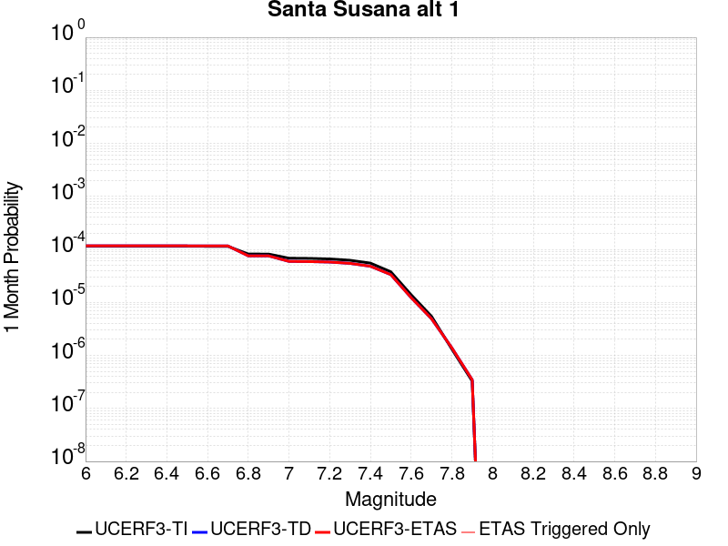 | 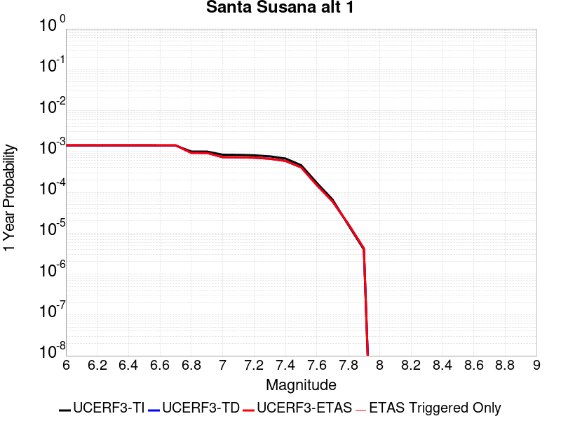 | 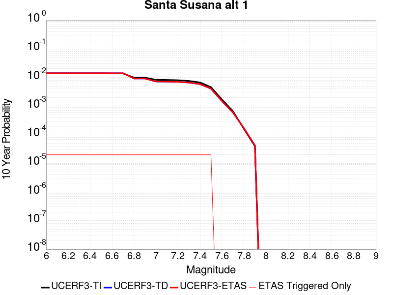 |

| Magnitude | 1 wk TI Prob | 1 wk TD Prob | 1 wk ETAS Prob | 1 wk ETAS/TD Gain | 1 wk ETAS Triggered Only | 1 mo TI Prob | 1 mo TD Prob | 1 mo ETAS Prob | 1 mo ETAS/TD Gain | 1 mo ETAS Triggered Only | 1 yr TI Prob | 1 yr TD Prob | 1 yr ETAS Prob | 1 yr ETAS/TD Gain | 1 yr ETAS Triggered Only | 10 yr TI Prob | 10 yr TD Prob | 10 yr ETAS Prob | 10 yr ETAS/TD Gain | 10 yr ETAS Triggered Only |
|-----|-----|-----|-----|-----|-----|-----|-----|-----|-----|-----|-----|-----|-----|-----|-----|-----|-----|-----|-----|-----|
| 6.0 | 2.674877E-5 | 2.7198023E-5 | 2.7198023E-5 | 1.0 | 0.0 | 1.1463255E-4 | 1.1655839E-4 | 1.1655839E-4 | 1.0 | 0.0 | 0.0013947578 | 0.0014182882 | 0.0014182882 | 1.0 | 0.0 | 0.013860362 | 0.014104128 | 0.01413414 | 1.0021279 | 3.04414E-5 |
| 6.1 | 2.674877E-5 | 2.7198023E-5 | 2.7198023E-5 | 1.0 | 0.0 | 1.1463255E-4 | 1.1655839E-4 | 1.1655839E-4 | 1.0 | 0.0 | 0.0013947578 | 0.0014182882 | 0.0014182882 | 1.0 | 0.0 | 0.013860362 | 0.014104128 | 0.01413414 | 1.0021279 | 3.04414E-5 |
| 6.2 | 2.674877E-5 | 2.7198023E-5 | 2.7198023E-5 | 1.0 | 0.0 | 1.1463255E-4 | 1.1655839E-4 | 1.1655839E-4 | 1.0 | 0.0 | 0.0013947578 | 0.0014182882 | 0.0014182882 | 1.0 | 0.0 | 0.013860362 | 0.014104128 | 0.01413414 | 1.0021279 | 3.04414E-5 |
| 6.3 | 2.674877E-5 | 2.7198023E-5 | 2.7198023E-5 | 1.0 | 0.0 | 1.1463255E-4 | 1.1655839E-4 | 1.1655839E-4 | 1.0 | 0.0 | 0.0013947578 | 0.0014182882 | 0.0014182882 | 1.0 | 0.0 | 0.013860362 | 0.014104128 | 0.01413414 | 1.0021279 | 3.04414E-5 |
| 6.4 | 2.674877E-5 | 2.7198023E-5 | 2.7198023E-5 | 1.0 | 0.0 | 1.1463255E-4 | 1.1655839E-4 | 1.1655839E-4 | 1.0 | 0.0 | 0.0013947578 | 0.0014182882 | 0.0014182882 | 1.0 | 0.0 | 0.013860362 | 0.014104128 | 0.01413414 | 1.0021279 | 3.04414E-5 |
| 6.5 | 2.674877E-5 | 2.7198023E-5 | 2.7198023E-5 | 1.0 | 0.0 | 1.1463255E-4 | 1.1655839E-4 | 1.1655839E-4 | 1.0 | 0.0 | 0.0013947578 | 0.0014182882 | 0.0014182882 | 1.0 | 0.0 | 0.013860362 | 0.014104128 | 0.01413414 | 1.0021279 | 3.04414E-5 |
| 6.6 | 2.6647976E-5 | 2.7074359E-5 | 2.7074359E-5 | 1.0 | 0.0 | 1.14200615E-4 | 1.1602845E-4 | 1.1602845E-4 | 1.0 | 0.0 | 0.0013895056 | 0.0014118447 | 0.0014118447 | 1.0 | 0.0 | 0.013808494 | 0.014040513 | 0.014070527 | 1.0021377 | 3.04414E-5 |
| 6.7 | 2.6647976E-5 | 2.7074359E-5 | 2.7074359E-5 | 1.0 | 0.0 | 1.14200615E-4 | 1.1602845E-4 | 1.1602845E-4 | 1.0 | 0.0 | 0.0013895056 | 0.0014118447 | 0.0014118447 | 1.0 | 0.0 | 0.013808494 | 0.014040513 | 0.014070527 | 1.0021377 | 3.04414E-5 |
| 6.8 | 1.9073179E-5 | 1.7637283E-5 | 1.7637283E-5 | 1.0 | 0.0 | 8.1739636E-5 | 7.558627E-5 | 7.558627E-5 | 1.0 | 0.0 | 9.947256E-4 | 9.198925E-4 | 9.198925E-4 | 1.0 | 0.0 | 0.009902848 | 0.009163101 | 0.009193264 | 1.0032917 | 3.04414E-5 |
| 6.9 | 1.9041876E-5 | 1.7619415E-5 | 1.7619415E-5 | 1.0 | 0.0 | 8.160549E-5 | 7.55097E-5 | 7.55097E-5 | 1.0 | 0.0 | 9.930939E-4 | 9.1896096E-4 | 9.1896096E-4 | 1.0 | 0.0 | 0.0098866755 | 0.0091538625 | 0.009184025 | 1.0032951 | 3.04414E-5 |
| 7.0 | 1.5917482E-5 | 1.3863864E-5 | 1.3863864E-5 | 1.0 | 0.0 | 6.8215995E-5 | 5.9415237E-5 | 5.9415237E-5 | 1.0 | 0.0 | 8.302132E-4 | 7.231451E-4 | 7.231451E-4 | 1.0 | 0.0 | 0.008271185 | 0.0072088144 | 0.0072390363 | 1.0041924 | 3.04414E-5 |
| 7.1 | 1.577788E-5 | 1.3743872E-5 | 1.3743872E-5 | 1.0 | 0.0 | 6.761774E-5 | 5.8901005E-5 | 5.8901005E-5 | 1.0 | 0.0 | 8.2293496E-4 | 7.1688846E-4 | 7.1688846E-4 | 1.0 | 0.0 | 0.008198941 | 0.007146652 | 0.0071768756 | 1.0042291 | 3.04414E-5 |
| 7.2 | 1.5416446E-5 | 1.3469944E-5 | 1.3469944E-5 | 1.0 | 0.0 | 6.606882E-5 | 5.772708E-5 | 5.772708E-5 | 1.0 | 0.0 | 8.0409093E-4 | 7.026052E-4 | 7.026052E-4 | 1.0 | 0.0 | 0.008011877 | 0.0070047234 | 0.007034952 | 1.0043154 | 3.04414E-5 |
| 7.3 | 1.4534083E-5 | 1.2717879E-5 | 1.2717879E-5 | 1.0 | 0.0 | 6.228744E-5 | 5.4504082E-5 | 5.4504082E-5 | 1.0 | 0.0 | 7.580857E-4 | 6.633896E-4 | 6.633896E-4 | 1.0 | 0.0 | 0.007555048 | 0.0066149444 | 0.0066451845 | 1.0045714 | 3.04414E-5 |
| 7.4 | 1.2858995E-5 | 1.1229652E-5 | 1.1229652E-5 | 1.0 | 0.0 | 5.5108816E-5 | 4.8126214E-5 | 4.8126214E-5 | 1.0 | 0.0 | 6.7074323E-4 | 5.857831E-4 | 5.857831E-4 | 1.0 | 0.0 | 0.0066872234 | 0.005843165 | 0.005873428 | 1.0051793 | 3.04414E-5 |
| 7.5 | 8.827668E-6 | 7.805457E-6 | 7.805457E-6 | 1.0 | 0.0 | 3.7832317E-5 | 3.3451546E-5 | 3.3451546E-5 | 1.0 | 0.0 | 4.605111E-4 | 4.071989E-4 | 4.071989E-4 | 1.0 | 0.0 | 0.0045955796 | 0.0040647765 | 0.0040950943 | 1.0074587 | 3.04414E-5 |
| 7.6 | 3.2533426E-6 | 2.871988E-6 | 2.871988E-6 | 1.0 | 0.0 | 1.3942822E-5 | 1.2308465E-5 | 1.2308465E-5 | 1.0 | 0.0 | 1.6974064E-4 | 1.4984563E-4 | 1.4984563E-4 | 1.0 | 0.0 | 0.0016961104 | 0.0014974826 | 0.0014974826 | 1.0 | 0.0 |
| 7.7 | 1.2751709E-6 | 1.1491089E-6 | 1.1491089E-6 | 1.0 | 0.0 | 5.4650063E-6 | 4.9247437E-6 | 4.9247437E-6 | 1.0 | 0.0 | 6.653442E-5 | 5.9957198E-5 | 5.9957198E-5 | 1.0 | 0.0 | 6.6514505E-4 | 5.994191E-4 | 5.994191E-4 | 1.0 | 0.0 |
| 7.8 | 3.067544E-7 | 3.2400436E-7 | 3.2400436E-7 | 1.0 | 0.0 | 1.3146611E-6 | 1.3885895E-6 | 1.3885895E-6 | 1.0 | 0.0 | 1.600588E-5 | 1.6905957E-5 | 1.6905957E-5 | 1.0 | 0.0 | 1.6004729E-4 | 1.6904772E-4 | 1.6904772E-4 | 1.0 | 0.0 |
| 7.9 | 7.622999E-8 | 8.087964E-8 | 8.087964E-8 | 1.0 | 0.0 | 3.2669993E-7 | 3.4662696E-7 | 3.4662696E-7 | 1.0 | 0.0 | 3.977564E-6 | 4.2201773E-6 | 4.2201773E-6 | 1.0 | 0.0 | 3.977493E-5 | 4.220118E-5 | 4.220118E-5 | 1.0 | 0.0 |

## Bartlett Springs 2011 CFM
*[(top)](#table-of-contents)*

| 1 Week | 1 Month | 1 Year | 10 Year |
|-----|-----|-----|-----|
| 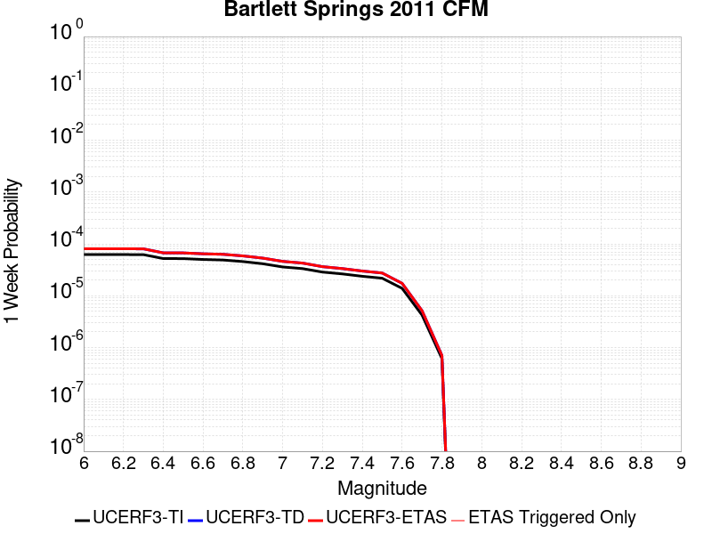 | 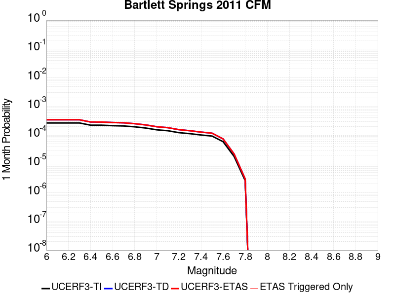 | 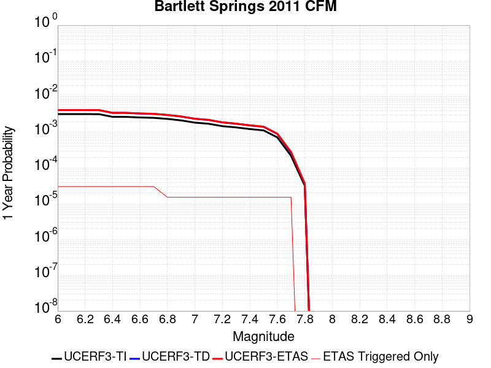 | 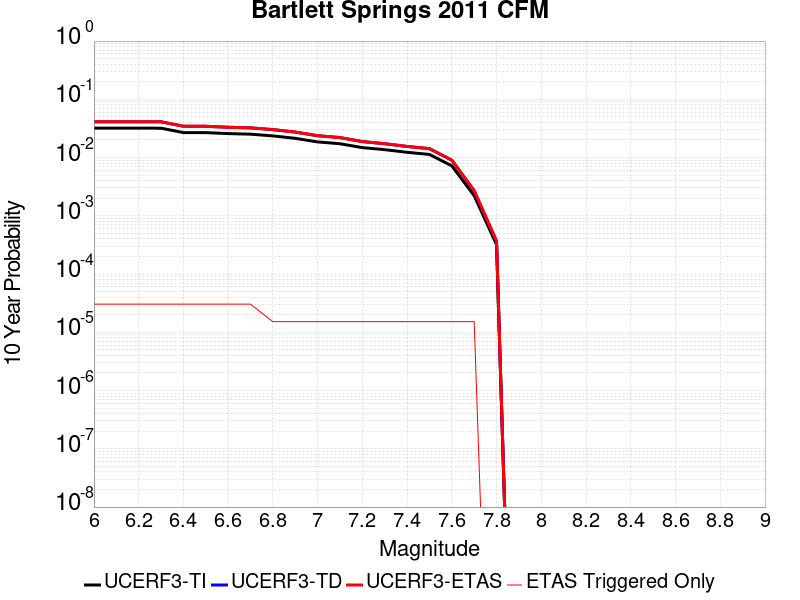 |

| Magnitude | 1 wk TI Prob | 1 wk TD Prob | 1 wk ETAS Prob | 1 wk ETAS/TD Gain | 1 wk ETAS Triggered Only | 1 mo TI Prob | 1 mo TD Prob | 1 mo ETAS Prob | 1 mo ETAS/TD Gain | 1 mo ETAS Triggered Only | 1 yr TI Prob | 1 yr TD Prob | 1 yr ETAS Prob | 1 yr ETAS/TD Gain | 1 yr ETAS Triggered Only | 10 yr TI Prob | 10 yr TD Prob | 10 yr ETAS Prob | 10 yr ETAS/TD Gain | 10 yr ETAS Triggered Only |
|-----|-----|-----|-----|-----|-----|-----|-----|-----|-----|-----|-----|-----|-----|-----|-----|-----|-----|-----|-----|-----|
| 6.0 | 6.2326144E-5 | 8.060613E-5 | 8.060613E-5 | 1.0 | 0.0 | 2.6708472E-4 | 3.454099E-4 | 3.454099E-4 | 1.0 | 0.0 | 0.003246908 | 0.0041973945 | 0.0042277086 | 1.007222 | 3.04414E-5 | 0.031998757 | 0.04119771 | 0.041226897 | 1.0007085 | 3.04414E-5 |
| 6.1 | 6.227657E-5 | 8.054363E-5 | 8.054363E-5 | 1.0 | 0.0 | 2.668723E-4 | 3.4514212E-4 | 3.4514212E-4 | 1.0 | 0.0 | 0.0032443295 | 0.004194147 | 0.004224461 | 1.0072277 | 3.04414E-5 | 0.031973712 | 0.041166443 | 0.041195635 | 1.000709 | 3.04414E-5 |
| 6.2 | 6.22452E-5 | 8.050423E-5 | 8.050423E-5 | 1.0 | 0.0 | 2.6673786E-4 | 3.4497332E-4 | 3.4497332E-4 | 1.0 | 0.0 | 0.0032426978 | 0.0041921 | 0.004222414 | 1.0072311 | 3.04414E-5 | 0.03195787 | 0.041146737 | 0.041175924 | 1.0007094 | 3.04414E-5 |
| 6.3 | 6.219006E-5 | 8.043407E-5 | 8.043407E-5 | 1.0 | 0.0 | 2.6650162E-4 | 3.4467268E-4 | 3.4467268E-4 | 1.0 | 0.0 | 0.00323983 | 0.0041884542 | 0.004218768 | 1.0072374 | 3.04414E-5 | 0.031930014 | 0.041111637 | 0.04114083 | 1.00071 | 3.04414E-5 |
| 6.4 | 5.2175856E-5 | 6.725342E-5 | 6.725342E-5 | 1.0 | 0.0 | 2.2359163E-4 | 2.8819745E-4 | 2.8819745E-4 | 1.0 | 0.0 | 0.0027188298 | 0.0035032115 | 0.0035335463 | 1.0086591 | 3.04414E-5 | 0.026858058 | 0.034489222 | 0.034518614 | 1.0008522 | 3.04414E-5 |
| 6.5 | 5.205166E-5 | 6.7096094E-5 | 6.7096094E-5 | 1.0 | 0.0 | 2.2305945E-4 | 2.8752335E-4 | 2.8752335E-4 | 1.0 | 0.0 | 0.0027123666 | 0.0034950306 | 0.0035253656 | 1.0086795 | 3.04414E-5 | 0.026794989 | 0.034409966 | 0.03443936 | 1.0008543 | 3.04414E-5 |
| 6.6 | 5.0085426E-5 | 6.449277E-5 | 6.449277E-5 | 1.0 | 0.0 | 2.1463417E-4 | 2.763686E-4 | 2.763686E-4 | 1.0 | 0.0 | 0.0026100394 | 0.0033596456 | 0.0033899846 | 1.0090305 | 3.04414E-5 | 0.025795965 | 0.033097573 | 0.033127006 | 1.0008893 | 3.04414E-5 |
| 6.7 | 4.8930866E-5 | 6.3017396E-5 | 6.3017396E-5 | 1.0 | 0.0 | 2.0968684E-4 | 2.7004688E-4 | 2.7004688E-4 | 1.0 | 0.0 | 0.0025499484 | 0.0032829174 | 0.003313259 | 1.0092422 | 3.04414E-5 | 0.025208864 | 0.03235294 | 0.032382395 | 1.0009105 | 3.04414E-5 |
| 6.8 | 4.5679535E-5 | 5.8741858E-5 | 5.8741858E-5 | 1.0 | 0.0 | 1.9575475E-4 | 2.5172674E-4 | 2.5172674E-4 | 1.0 | 0.0 | 0.002380709 | 0.0030605064 | 0.0030756807 | 1.004958 | 1.52207E-5 | 0.023553653 | 0.03019042 | 0.03020518 | 1.0004889 | 1.52207E-5 |
| 6.9 | 4.1439176E-5 | 5.3220094E-5 | 5.3220094E-5 | 1.0 | 0.0 | 1.7758438E-4 | 2.2806633E-4 | 2.2806633E-4 | 1.0 | 0.0 | 0.002159946 | 0.0027731995 | 0.002788378 | 1.0054733 | 1.52207E-5 | 0.021390721 | 0.027390772 | 0.027405577 | 1.0005405 | 1.52207E-5 |
| 7.0 | 3.5920104E-5 | 4.600871E-5 | 4.600871E-5 | 1.0 | 0.0 | 1.5393422E-4 | 1.9716538E-4 | 1.9716538E-4 | 1.0 | 0.0 | 0.001872538 | 0.0023978627 | 0.002413047 | 1.0063324 | 1.52207E-5 | 0.018568378 | 0.023723004 | 0.023737865 | 1.0006263 | 1.52207E-5 |
| 7.1 | 3.338812E-5 | 4.2689582E-5 | 4.2689582E-5 | 1.0 | 0.0 | 1.430841E-4 | 1.829426E-4 | 1.829426E-4 | 1.0 | 0.0 | 0.0017406568 | 0.0022250658 | 0.0022402527 | 1.0068253 | 1.52207E-5 | 0.017270854 | 0.02203054 | 0.022045426 | 1.0006757 | 1.52207E-5 |
| 7.2 | 2.8619615E-5 | 3.6401652E-5 | 3.6401652E-5 | 1.0 | 0.0 | 1.2264973E-4 | 1.5599781E-4 | 1.5599781E-4 | 1.0 | 0.0 | 0.0014922376 | 0.0018976285 | 0.0019128203 | 1.0080057 | 1.52207E-5 | 0.014822568 | 0.01881613 | 0.018831065 | 1.0007937 | 1.52207E-5 |
| 7.3 | 2.6376783E-5 | 3.342276E-5 | 3.342276E-5 | 1.0 | 0.0 | 1.13038455E-4 | 1.4323258E-4 | 1.4323258E-4 | 1.0 | 0.0 | 0.0013753743 | 0.001742471 | 0.0017576652 | 1.0087199 | 1.52207E-5 | 0.01366893 | 0.01728972 | 0.017304678 | 1.0008651 | 1.52207E-5 |
| 7.4 | 2.3738676E-5 | 2.9978975E-5 | 2.9978975E-5 | 1.0 | 0.0 | 1.0173322E-4 | 1.2847505E-4 | 1.2847505E-4 | 1.0 | 0.0 | 0.0012378981 | 0.0015630693 | 0.0015782663 | 1.0097225 | 1.52207E-5 | 0.012310251 | 0.015522073 | 0.015537058 | 1.0009654 | 1.52207E-5 |
| 7.5 | 2.1789481E-5 | 2.7439388E-5 | 2.7439388E-5 | 1.0 | 0.0 | 9.338015E-5 | 1.1759212E-4 | 1.1759212E-4 | 1.0 | 0.0 | 0.0011363103 | 0.0014307518 | 0.0014459506 | 1.010623 | 1.52207E-5 | 0.011305175 | 0.014216576 | 0.014231579 | 1.0010554 | 1.52207E-5 |
| 7.6 | 1.3895281E-5 | 1.7368426E-5 | 1.7368426E-5 | 1.0 | 0.0 | 5.9549846E-5 | 7.4434E-5 | 7.4434E-5 | 1.0 | 0.0 | 7.2477816E-4 | 9.0586004E-4 | 9.2106697E-4 | 1.0167873 | 1.52207E-5 | 0.0072241887 | 0.009022084 | 0.009037168 | 1.0016718 | 1.52207E-5 |
| 7.7 | 4.245981E-6 | 5.1624675E-6 | 5.1624675E-6 | 1.0 | 0.0 | 1.8196934E-5 | 2.2124674E-5 | 2.2124674E-5 | 1.0 | 0.0 | 2.2152514E-4 | 2.693348E-4 | 2.8455138E-4 | 1.056497 | 1.52207E-5 | 0.0022130446 | 0.0026901034 | 0.002705283 | 1.0056428 | 1.52207E-5 |
| 7.8 | 6.145192E-7 | 7.047006E-7 | 7.047006E-7 | 1.0 | 0.0 | 2.633651E-6 | 3.020142E-6 | 3.020142E-6 | 1.0 | 0.0 | 3.206423E-5 | 3.676962E-5 | 3.676962E-5 | 1.0 | 0.0 | 3.2059604E-4 | 3.6763478E-4 | 3.6763478E-4 | 1.0 | 0.0 |

## Johnson Valley (No) 2011 rev
*[(top)](#table-of-contents)*

| 1 Week | 1 Month | 1 Year | 10 Year |
|-----|-----|-----|-----|
| 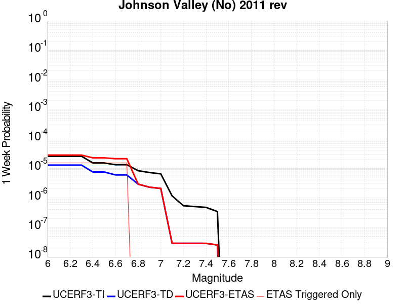 | 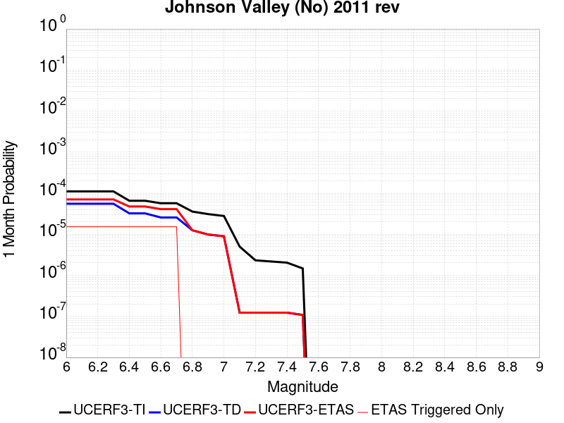 | 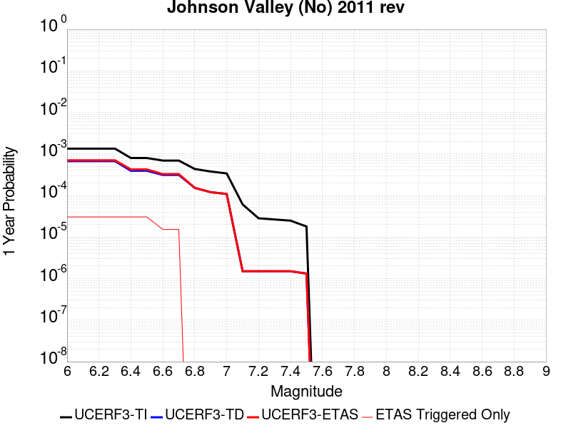 | 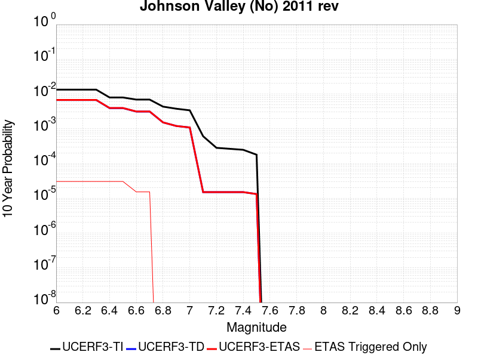 |

| Magnitude | 1 wk TI Prob | 1 wk TD Prob | 1 wk ETAS Prob | 1 wk ETAS/TD Gain | 1 wk ETAS Triggered Only | 1 mo TI Prob | 1 mo TD Prob | 1 mo ETAS Prob | 1 mo ETAS/TD Gain | 1 mo ETAS Triggered Only | 1 yr TI Prob | 1 yr TD Prob | 1 yr ETAS Prob | 1 yr ETAS/TD Gain | 1 yr ETAS Triggered Only | 10 yr TI Prob | 10 yr TD Prob | 10 yr ETAS Prob | 10 yr ETAS/TD Gain | 10 yr ETAS Triggered Only |
|-----|-----|-----|-----|-----|-----|-----|-----|-----|-----|-----|-----|-----|-----|-----|-----|-----|-----|-----|-----|-----|
| 6.0 | 2.577707E-5 | 1.2900938E-5 | 2.8121442E-5 | 2.1797981 | 1.52207E-5 | 1.1046848E-4 | 5.5288787E-5 | 7.050864E-5 | 1.2752793 | 1.52207E-5 | 0.0013441239 | 6.7297276E-4 | 7.0339366E-4 | 1.0452038 | 3.04414E-5 | 0.013360229 | 0.006713257 | 0.006743494 | 1.0045041 | 3.04414E-5 |
| 6.1 | 2.577707E-5 | 1.2900938E-5 | 2.8121442E-5 | 2.1797981 | 1.52207E-5 | 1.1046848E-4 | 5.5288787E-5 | 7.050864E-5 | 1.2752793 | 1.52207E-5 | 0.0013441239 | 6.7297276E-4 | 7.0339366E-4 | 1.0452038 | 3.04414E-5 | 0.013360229 | 0.006713257 | 0.006743494 | 1.0045041 | 3.04414E-5 |
| 6.2 | 2.577707E-5 | 1.2900938E-5 | 2.8121442E-5 | 2.1797981 | 1.52207E-5 | 1.1046848E-4 | 5.5288787E-5 | 7.050864E-5 | 1.2752793 | 1.52207E-5 | 0.0013441239 | 6.7297276E-4 | 7.0339366E-4 | 1.0452038 | 3.04414E-5 | 0.013360229 | 0.006713257 | 0.006743494 | 1.0045041 | 3.04414E-5 |
| 6.3 | 2.577707E-5 | 1.2900938E-5 | 2.8121442E-5 | 2.1797981 | 1.52207E-5 | 1.1046848E-4 | 5.5288787E-5 | 7.050864E-5 | 1.2752793 | 1.52207E-5 | 0.0013441239 | 6.7297276E-4 | 7.0339366E-4 | 1.0452038 | 3.04414E-5 | 0.013360229 | 0.006713257 | 0.006743494 | 1.0045041 | 3.04414E-5 |
| 6.4 | 1.5296591E-5 | 7.536742E-6 | 2.2757327E-5 | 3.019518 | 1.52207E-5 | 6.555518E-5 | 3.2300028E-5 | 4.7520236E-5 | 1.4712135 | 1.52207E-5 | 7.97842E-4 | 3.9320064E-4 | 4.2363006E-4 | 1.0773891 | 3.04414E-5 | 0.007949836 | 0.0039268904 | 0.0039572124 | 1.0077215 | 3.04414E-5 |
| 6.5 | 1.5296591E-5 | 7.536742E-6 | 2.2757327E-5 | 3.019518 | 1.52207E-5 | 6.555518E-5 | 3.2300028E-5 | 4.7520236E-5 | 1.4712135 | 1.52207E-5 | 7.97842E-4 | 3.9320064E-4 | 4.2363006E-4 | 1.0773891 | 3.04414E-5 | 0.007949836 | 0.0039268904 | 0.0039572124 | 1.0077215 | 3.04414E-5 |
| 6.6 | 1.3289383E-5 | 5.9917306E-6 | 2.121234E-5 | 3.5402691 | 1.52207E-5 | 5.6953253E-5 | 2.5678688E-5 | 4.0898998E-5 | 1.5927215 | 1.52207E-5 | 6.9318525E-4 | 3.1261015E-4 | 3.278261E-4 | 1.0486739 | 1.52207E-5 | 0.0069102696 | 0.0031233684 | 0.0031385415 | 1.0048579 | 1.52207E-5 |
| 6.7 | 1.3289383E-5 | 5.9917306E-6 | 2.121234E-5 | 3.5402691 | 1.52207E-5 | 5.6953253E-5 | 2.5678688E-5 | 4.0898998E-5 | 1.5927215 | 1.52207E-5 | 6.9318525E-4 | 3.1261015E-4 | 3.278261E-4 | 1.0486739 | 1.52207E-5 | 0.0069102696 | 0.0031233684 | 0.0031385415 | 1.0048579 | 1.52207E-5 |
| 6.8 | 8.330789E-6 | 2.9211888E-6 | 2.9211888E-6 | 1.0 | 0.0 | 3.570289E-5 | 1.2519352E-5 | 1.2519352E-5 | 1.0 | 0.0 | 4.34596E-4 | 1.5241816E-4 | 1.5241816E-4 | 1.0 | 0.0 | 0.0043374705 | 0.0015236961 | 0.0015236961 | 1.0 | 0.0 |
| 6.9 | 7.2359003E-6 | 2.3013247E-6 | 2.3013247E-6 | 1.0 | 0.0 | 3.1010633E-5 | 9.8628125E-6 | 9.8628125E-6 | 1.0 | 0.0 | 3.7748902E-4 | 1.2007845E-4 | 1.2007845E-4 | 1.0 | 0.0 | 0.0037684843 | 0.0012006586 | 0.0012006586 | 1.0 | 0.0 |
| 7.0 | 6.5149957E-6 | 2.088482E-6 | 2.088482E-6 | 1.0 | 0.0 | 2.792111E-5 | 8.950637E-6 | 8.950637E-6 | 1.0 | 0.0 | 3.398865E-4 | 1.0897385E-4 | 1.0897385E-4 | 1.0 | 0.0 | 0.003393671 | 0.0010897239 | 0.0010897239 | 1.0 | 0.0 |
| 7.1 | 1.1662233E-6 | 2.8802024E-8 | 2.8802024E-8 | 1.0 | 0.0 | 4.9980904E-6 | 1.2343725E-7 | 1.2343725E-7 | 1.0 | 0.0 | 6.0850052E-5 | 1.5028476E-6 | 1.5028476E-6 | 1.0 | 0.0 | 6.083339E-4 | 1.50283895E-5 | 1.50283895E-5 | 1.0 | 0.0 |
| 7.2 | 5.413881E-7 | 2.8802024E-8 | 2.8802024E-8 | 1.0 | 0.0 | 2.3202326E-6 | 1.2343725E-7 | 1.2343725E-7 | 1.0 | 0.0 | 2.8248465E-5 | 1.5028476E-6 | 1.5028476E-6 | 1.0 | 0.0 | 2.8244875E-4 | 1.50283895E-5 | 1.50283895E-5 | 1.0 | 0.0 |
| 7.3 | 5.076821E-7 | 2.8802024E-8 | 2.8802024E-8 | 1.0 | 0.0 | 2.1757785E-6 | 1.2343723E-7 | 1.2343723E-7 | 1.0 | 0.0 | 2.648978E-5 | 1.5028475E-6 | 1.5028475E-6 | 1.0 | 0.0 | 2.6486625E-4 | 1.50283895E-5 | 1.50283895E-5 | 1.0 | 0.0 |
| 7.4 | 4.7568687E-7 | 2.8783948E-8 | 2.8783948E-8 | 1.0 | 0.0 | 2.0386565E-6 | 1.2335977E-7 | 1.2335977E-7 | 1.0 | 0.0 | 2.482036E-5 | 1.5019043E-6 | 1.5019043E-6 | 1.0 | 0.0 | 2.4817587E-4 | 1.5018958E-5 | 1.5018958E-5 | 1.0 | 0.0 |
| 7.5 | 3.435626E-7 | 2.5357679E-8 | 2.5357679E-8 | 1.0 | 0.0 | 1.4724103E-6 | 1.0867576E-7 | 1.0867576E-7 | 1.0 | 0.0 | 1.7926448E-5 | 1.3231268E-6 | 1.3231268E-6 | 1.0 | 0.0 | 1.7925001E-4 | 1.3231205E-5 | 1.3231205E-5 | 1.0 | 0.0 |

## Redondo Canyon alt 1
*[(top)](#table-of-contents)*

| 1 Week | 1 Month | 1 Year | 10 Year |
|-----|-----|-----|-----|
| 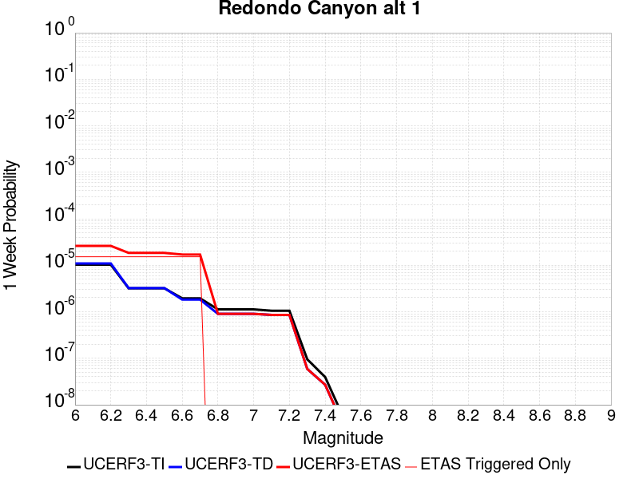 | 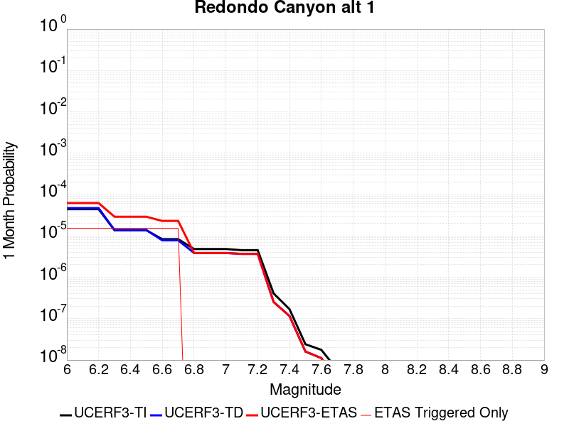 | 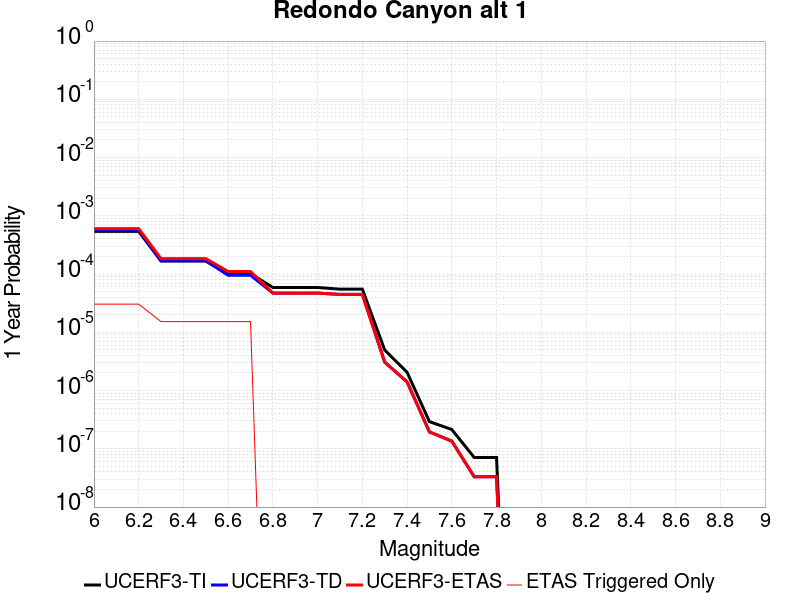 | 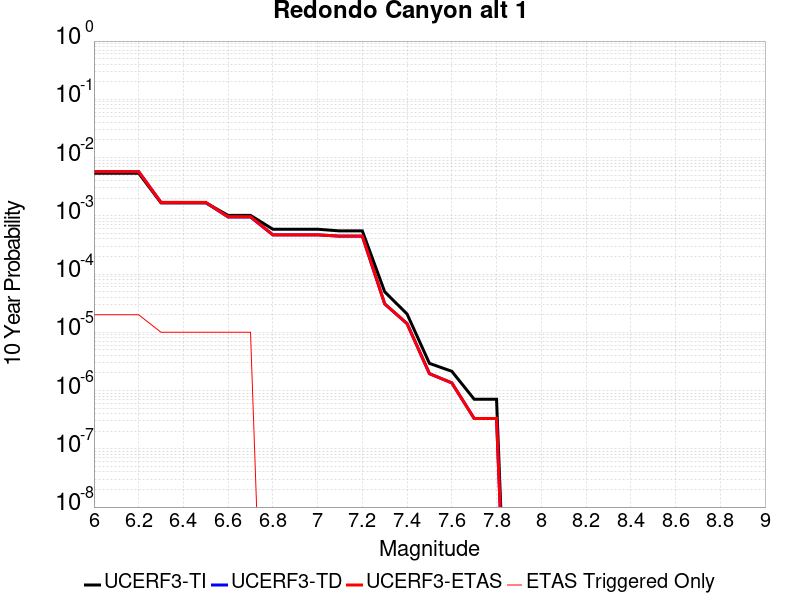 |

| Magnitude | 1 wk TI Prob | 1 wk TD Prob | 1 wk ETAS Prob | 1 wk ETAS/TD Gain | 1 wk ETAS Triggered Only | 1 mo TI Prob | 1 mo TD Prob | 1 mo ETAS Prob | 1 mo ETAS/TD Gain | 1 mo ETAS Triggered Only | 1 yr TI Prob | 1 yr TD Prob | 1 yr ETAS Prob | 1 yr ETAS/TD Gain | 1 yr ETAS Triggered Only | 10 yr TI Prob | 10 yr TD Prob | 10 yr ETAS Prob | 10 yr ETAS/TD Gain | 10 yr ETAS Triggered Only |
|-----|-----|-----|-----|-----|-----|-----|-----|-----|-----|-----|-----|-----|-----|-----|-----|-----|-----|-----|-----|-----|
| 6.0 | 1.0346246E-5 | 1.09813445E-5 | 2.6201878E-5 | 2.3860354 | 1.52207E-5 | 4.43403E-5 | 4.7062502E-5 | 6.228249E-5 | 1.3233994 | 1.52207E-5 | 5.3970946E-4 | 5.729142E-4 | 6.033382E-4 | 1.0531039 | 3.04414E-5 | 0.0053840056 | 0.005722111 | 0.0057523786 | 1.0052896 | 3.04414E-5 |
| 6.1 | 1.0346246E-5 | 1.09813445E-5 | 2.6201878E-5 | 2.3860354 | 1.52207E-5 | 4.43403E-5 | 4.7062502E-5 | 6.228249E-5 | 1.3233994 | 1.52207E-5 | 5.3970946E-4 | 5.729142E-4 | 6.033382E-4 | 1.0531039 | 3.04414E-5 | 0.0053840056 | 0.005722111 | 0.0057523786 | 1.0052896 | 3.04414E-5 |
| 6.2 | 1.0346246E-5 | 1.09813445E-5 | 2.6201878E-5 | 2.3860354 | 1.52207E-5 | 4.43403E-5 | 4.7062502E-5 | 6.228249E-5 | 1.3233994 | 1.52207E-5 | 5.3970946E-4 | 5.729142E-4 | 6.033382E-4 | 1.0531039 | 3.04414E-5 | 0.0053840056 | 0.005722111 | 0.0057523786 | 1.0052896 | 3.04414E-5 |
| 6.3 | 3.2052794E-6 | 3.2361174E-6 | 1.8456769E-5 | 5.703368 | 1.52207E-5 | 1.373684E-5 | 1.3869023E-5 | 2.9089513E-5 | 2.097445 | 1.52207E-5 | 1.6723319E-4 | 1.6884625E-4 | 1.8406438E-4 | 1.0901301 | 1.52207E-5 | 0.001671074 | 0.0016875692 | 0.0017027642 | 1.0090041 | 1.52207E-5 |
| 6.4 | 3.2052794E-6 | 3.2361174E-6 | 1.8456769E-5 | 5.703368 | 1.52207E-5 | 1.373684E-5 | 1.3869023E-5 | 2.9089513E-5 | 2.097445 | 1.52207E-5 | 1.6723319E-4 | 1.6884625E-4 | 1.8406438E-4 | 1.0901301 | 1.52207E-5 | 0.001671074 | 0.0016875692 | 0.0017027642 | 1.0090041 | 1.52207E-5 |
| 6.5 | 3.2052794E-6 | 3.2361174E-6 | 1.8456769E-5 | 5.703368 | 1.52207E-5 | 1.373684E-5 | 1.3869023E-5 | 2.9089513E-5 | 2.097445 | 1.52207E-5 | 1.6723319E-4 | 1.6884625E-4 | 1.8406438E-4 | 1.0901301 | 1.52207E-5 | 0.001671074 | 0.0016875692 | 0.0017027642 | 1.0090041 | 1.52207E-5 |
| 6.6 | 1.948328E-6 | 1.8288681E-6 | 1.704954E-5 | 9.322455 | 1.52207E-5 | 8.349951E-6 | 7.837991E-6 | 2.3058572E-5 | 2.9418983 | 1.52207E-5 | 1.016559E-4 | 9.542486E-5 | 1.10644105E-4 | 1.1594894 | 1.52207E-5 | 0.0010160941 | 9.539858E-4 | 9.6919195E-4 | 1.0159396 | 1.52207E-5 |
| 6.7 | 1.948328E-6 | 1.8288681E-6 | 1.704954E-5 | 9.322455 | 1.52207E-5 | 8.349951E-6 | 7.837991E-6 | 2.3058572E-5 | 2.9418983 | 1.52207E-5 | 1.016559E-4 | 9.542486E-5 | 1.10644105E-4 | 1.1594894 | 1.52207E-5 | 0.0010160941 | 9.539858E-4 | 9.6919195E-4 | 1.0159396 | 1.52207E-5 |
| 6.8 | 1.1278219E-6 | 9.033076E-7 | 9.033076E-7 | 1.0 | 0.0 | 4.8335132E-6 | 3.871315E-6 | 3.871315E-6 | 1.0 | 0.0 | 5.8846435E-5 | 4.7132668E-5 | 4.7132668E-5 | 1.0 | 0.0 | 5.8830855E-4 | 4.7126875E-4 | 4.7126875E-4 | 1.0 | 0.0 |
| 6.9 | 1.1278219E-6 | 9.033076E-7 | 9.033076E-7 | 1.0 | 0.0 | 4.8335132E-6 | 3.871315E-6 | 3.871315E-6 | 1.0 | 0.0 | 5.8846435E-5 | 4.7132668E-5 | 4.7132668E-5 | 1.0 | 0.0 | 5.8830855E-4 | 4.7126875E-4 | 4.7126875E-4 | 1.0 | 0.0 |
| 7.0 | 1.1278219E-6 | 9.033076E-7 | 9.033076E-7 | 1.0 | 0.0 | 4.8335132E-6 | 3.871315E-6 | 3.871315E-6 | 1.0 | 0.0 | 5.8846435E-5 | 4.7132668E-5 | 4.7132668E-5 | 1.0 | 0.0 | 5.8830855E-4 | 4.7126875E-4 | 4.7126875E-4 | 1.0 | 0.0 |
| 7.1 | 1.0545139E-6 | 8.5692716E-7 | 8.5692716E-7 | 1.0 | 0.0 | 4.5193374E-6 | 3.6725423E-6 | 3.6725423E-6 | 1.0 | 0.0 | 5.5021545E-5 | 4.471271E-5 | 4.471271E-5 | 1.0 | 0.0 | 5.500792E-4 | 4.470789E-4 | 4.470789E-4 | 1.0 | 0.0 |
| 7.2 | 1.0545139E-6 | 8.5692716E-7 | 8.5692716E-7 | 1.0 | 0.0 | 4.5193374E-6 | 3.6725423E-6 | 3.6725423E-6 | 1.0 | 0.0 | 5.5021545E-5 | 4.471271E-5 | 4.471271E-5 | 1.0 | 0.0 | 5.500792E-4 | 4.470789E-4 | 4.470789E-4 | 1.0 | 0.0 |
| 7.3 | 9.505161E-8 | 5.8957607E-8 | 5.8957607E-8 | 1.0 | 0.0 | 4.0736398E-7 | 2.5267545E-7 | 2.5267545E-7 | 1.0 | 0.0 | 4.959645E-6 | 3.0763204E-6 | 3.0763204E-6 | 1.0 | 0.0 | 4.9595343E-5 | 3.0762894E-5 | 3.0762894E-5 | 1.0 | 0.0 |
| 7.4 | 3.9520785E-8 | 2.6987191E-8 | 2.6987191E-8 | 1.0 | 0.0 | 1.6937479E-7 | 1.1565938E-7 | 1.1565938E-7 | 1.0 | 0.0 | 2.062136E-6 | 1.4081523E-6 | 1.4081523E-6 | 1.0 | 0.0 | 2.062117E-5 | 1.4081461E-5 | 1.4081461E-5 | 1.0 | 0.0 |
| 7.5 | 5.6133214E-9 | 3.7368215E-9 | 3.7368215E-9 | 1.0 | 0.0 | 2.4057092E-8 | 1.601495E-8 | 1.601495E-8 | 1.0 | 0.0 | 2.9289507E-7 | 1.9498201E-7 | 1.9498201E-7 | 1.0 | 0.0 | 2.9289467E-6 | 1.9498186E-6 | 1.9498186E-6 | 1.0 | 0.0 |
| 7.6 | 4.1064334E-9 | 2.5957634E-9 | 2.5957634E-9 | 1.0 | 0.0 | 1.7599E-8 | 1.11247E-8 | 1.11247E-8 | 1.0 | 0.0 | 2.142678E-7 | 1.3544322E-7 | 1.3544322E-7 | 1.0 | 0.0 | 2.1426758E-6 | 1.3544316E-6 | 1.3544316E-6 | 1.0 | 0.0 |
| 7.7 | 1.361975E-9 | 6.360824E-10 | 6.360824E-10 | 1.0 | 0.0 | 5.8370353E-9 | 2.7260674E-9 | 2.7260674E-9 | 1.0 | 0.0 | 7.1065905E-8 | 3.318987E-8 | 3.318987E-8 | 1.0 | 0.0 | 7.106588E-7 | 3.318987E-7 | 3.318987E-7 | 1.0 | 0.0 |
| 7.8 | 1.361975E-9 | 6.360824E-10 | 6.360824E-10 | 1.0 | 0.0 | 5.8370353E-9 | 2.7260674E-9 | 2.7260674E-9 | 1.0 | 0.0 | 7.1065905E-8 | 3.318987E-8 | 3.318987E-8 | 1.0 | 0.0 | 7.106588E-7 | 3.318987E-7 | 3.318987E-7 | 1.0 | 0.0 |

## San Gorgonio Pass
*[(top)](#table-of-contents)*

| 1 Week | 1 Month | 1 Year | 10 Year |
|-----|-----|-----|-----|
|  | 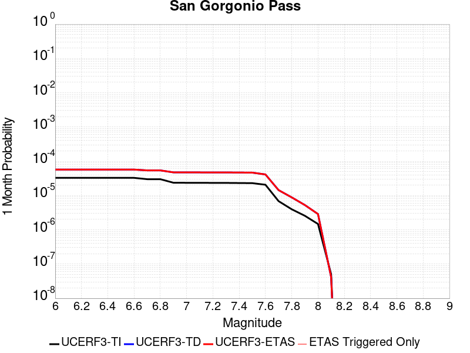 | 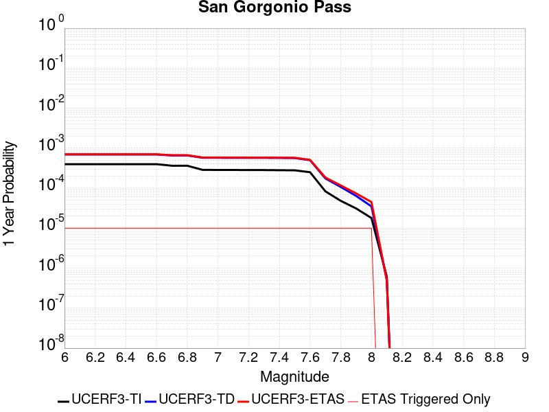 | 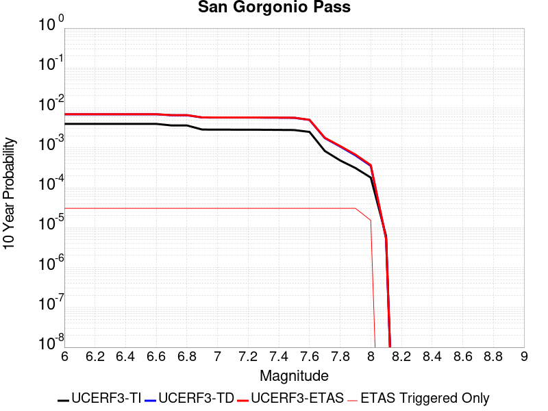 |

| Magnitude | 1 wk TI Prob | 1 wk TD Prob | 1 wk ETAS Prob | 1 wk ETAS/TD Gain | 1 wk ETAS Triggered Only | 1 mo TI Prob | 1 mo TD Prob | 1 mo ETAS Prob | 1 mo ETAS/TD Gain | 1 mo ETAS Triggered Only | 1 yr TI Prob | 1 yr TD Prob | 1 yr ETAS Prob | 1 yr ETAS/TD Gain | 1 yr ETAS Triggered Only | 10 yr TI Prob | 10 yr TD Prob | 10 yr ETAS Prob | 10 yr ETAS/TD Gain | 10 yr ETAS Triggered Only |
|-----|-----|-----|-----|-----|-----|-----|-----|-----|-----|-----|-----|-----|-----|-----|-----|-----|-----|-----|-----|-----|
| 6.0 | 7.644328E-6 | 1.3314231E-5 | 1.3314231E-5 | 1.0 | 0.0 | 3.2760996E-5 | 5.705979E-5 | 5.705979E-5 | 1.0 | 0.0 | 3.987921E-4 | 6.944901E-4 | 7.097002E-4 | 1.0219011 | 1.52207E-5 | 0.003980772 | 0.0069299806 | 0.0069602113 | 1.0043622 | 3.04414E-5 |
| 6.1 | 7.644328E-6 | 1.3314231E-5 | 1.3314231E-5 | 1.0 | 0.0 | 3.2760996E-5 | 5.705979E-5 | 5.705979E-5 | 1.0 | 0.0 | 3.987921E-4 | 6.944901E-4 | 7.097002E-4 | 1.0219011 | 1.52207E-5 | 0.003980772 | 0.0069299806 | 0.0069602113 | 1.0043622 | 3.04414E-5 |
| 6.2 | 7.644328E-6 | 1.3314231E-5 | 1.3314231E-5 | 1.0 | 0.0 | 3.2760996E-5 | 5.705979E-5 | 5.705979E-5 | 1.0 | 0.0 | 3.987921E-4 | 6.944901E-4 | 7.097002E-4 | 1.0219011 | 1.52207E-5 | 0.003980772 | 0.0069299806 | 0.0069602113 | 1.0043622 | 3.04414E-5 |
| 6.3 | 7.644328E-6 | 1.3314231E-5 | 1.3314231E-5 | 1.0 | 0.0 | 3.2760996E-5 | 5.705979E-5 | 5.705979E-5 | 1.0 | 0.0 | 3.987921E-4 | 6.944901E-4 | 7.097002E-4 | 1.0219011 | 1.52207E-5 | 0.003980772 | 0.0069299806 | 0.0069602113 | 1.0043622 | 3.04414E-5 |
| 6.4 | 7.644328E-6 | 1.3314231E-5 | 1.3314231E-5 | 1.0 | 0.0 | 3.2760996E-5 | 5.705979E-5 | 5.705979E-5 | 1.0 | 0.0 | 3.987921E-4 | 6.944901E-4 | 7.097002E-4 | 1.0219011 | 1.52207E-5 | 0.003980772 | 0.0069299806 | 0.0069602113 | 1.0043622 | 3.04414E-5 |
| 6.5 | 7.644328E-6 | 1.3314231E-5 | 1.3314231E-5 | 1.0 | 0.0 | 3.2760996E-5 | 5.705979E-5 | 5.705979E-5 | 1.0 | 0.0 | 3.987921E-4 | 6.944901E-4 | 7.097002E-4 | 1.0219011 | 1.52207E-5 | 0.003980772 | 0.0069299806 | 0.0069602113 | 1.0043622 | 3.04414E-5 |
| 6.6 | 7.644328E-6 | 1.3314231E-5 | 1.3314231E-5 | 1.0 | 0.0 | 3.2760996E-5 | 5.705979E-5 | 5.705979E-5 | 1.0 | 0.0 | 3.987921E-4 | 6.944901E-4 | 7.097002E-4 | 1.0219011 | 1.52207E-5 | 0.003980772 | 0.0069299806 | 0.0069602113 | 1.0043622 | 3.04414E-5 |
| 6.7 | 6.987586E-6 | 1.2618505E-5 | 1.2618505E-5 | 1.0 | 0.0 | 2.9946454E-5 | 5.4078235E-5 | 5.4078235E-5 | 1.0 | 0.0 | 3.645371E-4 | 6.582117E-4 | 6.734224E-4 | 1.0231091 | 1.52207E-5 | 0.0036393967 | 0.0065693567 | 0.006599598 | 1.0046034 | 3.04414E-5 |
| 6.8 | 6.987586E-6 | 1.2618505E-5 | 1.2618505E-5 | 1.0 | 0.0 | 2.9946454E-5 | 5.4078235E-5 | 5.4078235E-5 | 1.0 | 0.0 | 3.645371E-4 | 6.582117E-4 | 6.734224E-4 | 1.0231091 | 1.52207E-5 | 0.0036393967 | 0.0065693567 | 0.006599598 | 1.0046034 | 3.04414E-5 |
| 6.9 | 5.504702E-6 | 1.1049368E-5 | 1.1049368E-5 | 1.0 | 0.0 | 2.3591367E-5 | 4.7353606E-5 | 4.7353606E-5 | 1.0 | 0.0 | 2.8718702E-4 | 5.7638274E-4 | 5.915946E-4 | 1.0263921 | 1.52207E-5 | 0.0028681618 | 0.005755309 | 0.005785575 | 1.0052588 | 3.04414E-5 |
| 7.0 | 5.4825764E-6 | 1.102571E-5 | 1.102571E-5 | 1.0 | 0.0 | 2.3496545E-5 | 4.7252215E-5 | 4.7252215E-5 | 1.0 | 0.0 | 2.8603288E-4 | 5.751489E-4 | 5.9036084E-4 | 1.0264487 | 1.52207E-5 | 0.00285665 | 0.005743035 | 0.0057733017 | 1.0052701 | 3.04414E-5 |
| 7.1 | 5.4692787E-6 | 1.101142E-5 | 1.101142E-5 | 1.0 | 0.0 | 2.3439556E-5 | 4.7190973E-5 | 4.7190973E-5 | 1.0 | 0.0 | 2.8533922E-4 | 5.744037E-4 | 5.8961567E-4 | 1.026483 | 1.52207E-5 | 0.0028497311 | 0.0057356213 | 0.0057658884 | 1.005277 | 3.04414E-5 |
| 7.2 | 5.453661E-6 | 1.0994446E-5 | 1.0994446E-5 | 1.0 | 0.0 | 2.3372622E-5 | 4.7118232E-5 | 4.7118232E-5 | 1.0 | 0.0 | 2.8452452E-4 | 5.7351857E-4 | 5.887305E-4 | 1.026524 | 1.52207E-5 | 0.002841605 | 0.0057268157 | 0.0057570827 | 1.0052851 | 3.04414E-5 |
| 7.3 | 5.4422303E-6 | 1.0981369E-5 | 1.0981369E-5 | 1.0 | 0.0 | 2.3323635E-5 | 4.706219E-5 | 4.706219E-5 | 1.0 | 0.0 | 2.8392827E-4 | 5.728366E-4 | 5.880486E-4 | 1.0265555 | 1.52207E-5 | 0.0028356577 | 0.005720031 | 0.0057502985 | 1.0052915 | 3.04414E-5 |
| 7.4 | 5.398595E-6 | 1.0928734E-5 | 1.0928734E-5 | 1.0 | 0.0 | 2.313663E-5 | 4.683662E-5 | 4.683662E-5 | 1.0 | 0.0 | 2.8165206E-4 | 5.700917E-4 | 5.8530376E-4 | 1.0266834 | 1.52207E-5 | 0.0028129534 | 0.005692723 | 0.0057229917 | 1.005317 | 3.04414E-5 |
| 7.5 | 5.3578788E-6 | 1.0855281E-5 | 1.0855281E-5 | 1.0 | 0.0 | 2.2962136E-5 | 4.6521833E-5 | 4.6521833E-5 | 1.0 | 0.0 | 2.7952815E-4 | 5.662612E-4 | 5.814732E-4 | 1.026864 | 1.52207E-5 | 0.002791768 | 0.0056546377 | 0.005684907 | 1.005353 | 3.04414E-5 |
| 7.6 | 4.8091474E-6 | 9.60368E-6 | 9.60368E-6 | 1.0 | 0.0 | 2.0610469E-5 | 4.1158008E-5 | 4.1158008E-5 | 1.0 | 0.0 | 2.5090357E-4 | 5.0098833E-4 | 5.162014E-4 | 1.0303662 | 1.52207E-5 | 0.0025062046 | 0.0050053033 | 0.0050355922 | 1.0060514 | 3.04414E-5 |
| 7.7 | 1.5991155E-6 | 3.352866E-6 | 3.352866E-6 | 1.0 | 0.0 | 6.853334E-6 | 1.4369349E-5 | 1.4369349E-5 | 1.0 | 0.0 | 8.343615E-5 | 1.7493303E-4 | 1.9015107E-4 | 1.0869935 | 1.52207E-5 | 8.340483E-4 | 0.0017534072 | 0.0017837952 | 1.0173309 | 3.04414E-5 |
| 7.8 | 9.258398E-7 | 2.0579948E-6 | 2.0579948E-6 | 1.0 | 0.0 | 3.967879E-6 | 8.819949E-6 | 8.819949E-6 | 1.0 | 0.0 | 4.8307855E-5 | 1.073776E-4 | 1.2259667E-4 | 1.1417341 | 1.52207E-5 | 4.8297356E-4 | 0.001078687 | 0.0011090955 | 1.0281904 | 3.04414E-5 |
| 7.9 | 5.975575E-7 | 1.2291794E-6 | 1.2291794E-6 | 1.0 | 0.0 | 2.5609581E-6 | 5.2679006E-6 | 5.2679006E-6 | 1.0 | 0.0 | 3.117922E-5 | 6.4134816E-5 | 7.935454E-5 | 1.2373083 | 1.52207E-5 | 3.1174847E-4 | 6.463092E-4 | 6.7673094E-4 | 1.0470699 | 3.04414E-5 |
| 8.0 | 3.4413725E-7 | 6.7148494E-7 | 6.7148494E-7 | 1.0 | 0.0 | 1.4748731E-6 | 2.8777895E-6 | 2.8777895E-6 | 1.0 | 0.0 | 1.7956432E-5 | 3.503653E-5 | 5.0256698E-5 | 1.4344085 | 1.52207E-5 | 1.7954981E-4 | 3.5373896E-4 | 3.6895426E-4 | 1.0430129 | 1.52207E-5 |
| 8.1 | 1.1787731E-8 | 9.634385E-9 | 9.634385E-9 | 1.0 | 0.0 | 5.0518846E-8 | 4.129022E-8 | 4.129022E-8 | 1.0 | 0.0 | 6.1506677E-7 | 5.027083E-7 | 5.027083E-7 | 1.0 | 0.0 | 6.1506507E-6 | 5.2424944E-6 | 5.2424944E-6 | 1.0 | 0.0 |

## South Klamath Lake West
*[(top)](#table-of-contents)*

| 1 Week | 1 Month | 1 Year | 10 Year |
|-----|-----|-----|-----|
|  | 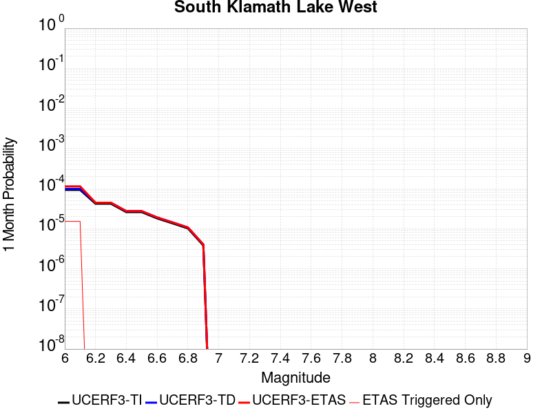 | 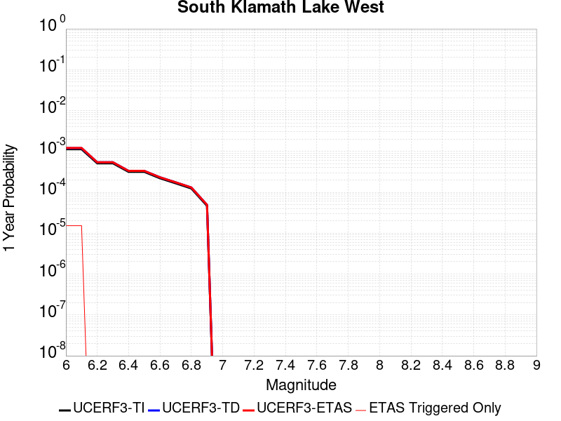 |  |

| Magnitude | 1 wk TI Prob | 1 wk TD Prob | 1 wk ETAS Prob | 1 wk ETAS/TD Gain | 1 wk ETAS Triggered Only | 1 mo TI Prob | 1 mo TD Prob | 1 mo ETAS Prob | 1 mo ETAS/TD Gain | 1 mo ETAS Triggered Only | 1 yr TI Prob | 1 yr TD Prob | 1 yr ETAS Prob | 1 yr ETAS/TD Gain | 1 yr ETAS Triggered Only | 10 yr TI Prob | 10 yr TD Prob | 10 yr ETAS Prob | 10 yr ETAS/TD Gain | 10 yr ETAS Triggered Only |
|-----|-----|-----|-----|-----|-----|-----|-----|-----|-----|-----|-----|-----|-----|-----|-----|-----|-----|-----|-----|-----|
| 6.0 | 2.174025E-5 | 2.3042025E-5 | 3.8262377E-5 | 1.6605474 | 1.52207E-5 | 9.3169176E-5 | 9.874817E-5 | 1.1396737E-4 | 1.1541213 | 1.52207E-5 | 0.0011337444 | 0.0012016617 | 0.0012168641 | 1.0126512 | 1.52207E-5 | 0.011279777 | 0.0119582405 | 0.0119732795 | 1.0012577 | 1.52207E-5 |
| 6.1 | 2.174025E-5 | 2.3042025E-5 | 3.8262377E-5 | 1.6605474 | 1.52207E-5 | 9.3169176E-5 | 9.874817E-5 | 1.1396737E-4 | 1.1541213 | 1.52207E-5 | 0.0011337444 | 0.0012016617 | 0.0012168641 | 1.0126512 | 1.52207E-5 | 0.011279777 | 0.0119582405 | 0.0119732795 | 1.0012577 | 1.52207E-5 |
| 6.2 | 9.834929E-6 | 1.0393841E-5 | 1.0393841E-5 | 1.0 | 0.0 | 4.2149015E-5 | 4.4544326E-5 | 4.4544326E-5 | 1.0 | 0.0 | 5.1304343E-4 | 5.422012E-4 | 5.422012E-4 | 1.0 | 0.0 | 0.0051186057 | 0.0054096854 | 0.0054096854 | 1.0 | 0.0 |
| 6.3 | 9.834929E-6 | 1.0393841E-5 | 1.0393841E-5 | 1.0 | 0.0 | 4.2149015E-5 | 4.4544326E-5 | 4.4544326E-5 | 1.0 | 0.0 | 5.1304343E-4 | 5.422012E-4 | 5.422012E-4 | 1.0 | 0.0 | 0.0051186057 | 0.0054096854 | 0.0054096854 | 1.0 | 0.0 |
| 6.4 | 6.066321E-6 | 6.40043E-6 | 6.40043E-6 | 1.0 | 0.0 | 2.5998259E-5 | 2.743014E-5 | 2.743014E-5 | 1.0 | 0.0 | 3.1648282E-4 | 3.3391351E-4 | 3.3391351E-4 | 1.0 | 0.0 | 0.0031603249 | 0.0033343881 | 0.0033343881 | 1.0 | 0.0 |
| 6.5 | 6.066321E-6 | 6.40043E-6 | 6.40043E-6 | 1.0 | 0.0 | 2.5998259E-5 | 2.743014E-5 | 2.743014E-5 | 1.0 | 0.0 | 3.1648282E-4 | 3.3391351E-4 | 3.3391351E-4 | 1.0 | 0.0 | 0.0031603249 | 0.0033343881 | 0.0033343881 | 1.0 | 0.0 |
| 6.6 | 4.2321803E-6 | 4.461291E-6 | 4.461291E-6 | 1.0 | 0.0 | 1.8137789E-5 | 1.9119685E-5 | 1.9119685E-5 | 1.0 | 0.0 | 2.208052E-4 | 2.3275832E-4 | 2.3275832E-4 | 1.0 | 0.0 | 0.0022058594 | 0.0023252473 | 0.0023252473 | 1.0 | 0.0 |
| 6.7 | 3.186646E-6 | 3.360305E-6 | 3.360305E-6 | 1.0 | 0.0 | 1.3656982E-5 | 1.4401232E-5 | 1.4401232E-5 | 1.0 | 0.0 | 1.6626107E-4 | 1.7532158E-4 | 1.7532158E-4 | 1.0 | 0.0 | 0.0016613674 | 0.0017518997 | 0.0017518997 | 1.0 | 0.0 |
| 6.8 | 2.380121E-6 | 2.510907E-6 | 2.510907E-6 | 1.0 | 0.0 | 1.0200479E-5 | 1.07609885E-5 | 1.07609885E-5 | 1.0 | 0.0 | 1.2418375E-4 | 1.3100762E-4 | 1.3100762E-4 | 1.0 | 0.0 | 0.0012411437 | 0.0013093497 | 0.0013093497 | 1.0 | 0.0 |
| 6.9 | 8.928287E-7 | 9.4302504E-7 | 9.4302504E-7 | 1.0 | 0.0 | 3.826403E-6 | 4.0415307E-6 | 4.0415307E-6 | 1.0 | 0.0 | 4.658546E-5 | 4.9204747E-5 | 4.9204747E-5 | 1.0 | 0.0 | 4.6575698E-4 | 4.9196015E-4 | 4.9196015E-4 | 1.0 | 0.0 |

## Dry Mountain
*[(top)](#table-of-contents)*

| 1 Week | 1 Month | 1 Year | 10 Year |
|-----|-----|-----|-----|
| 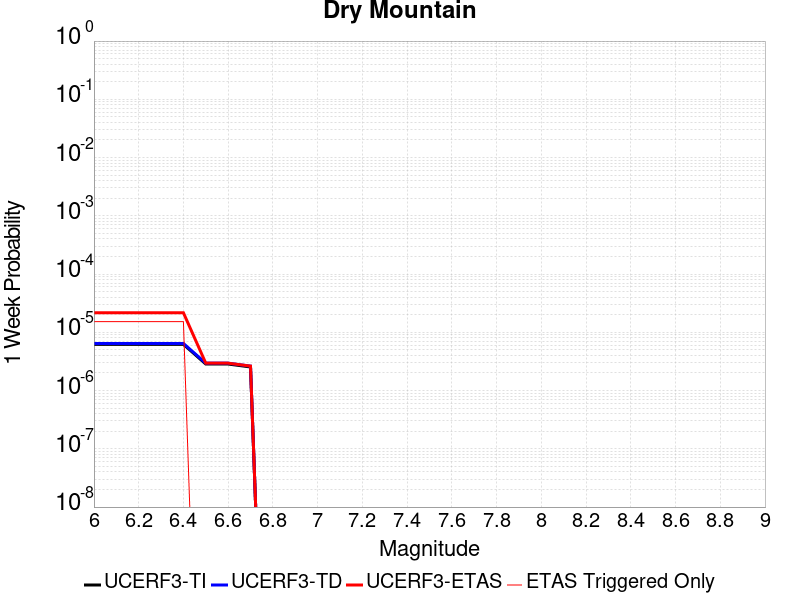 | 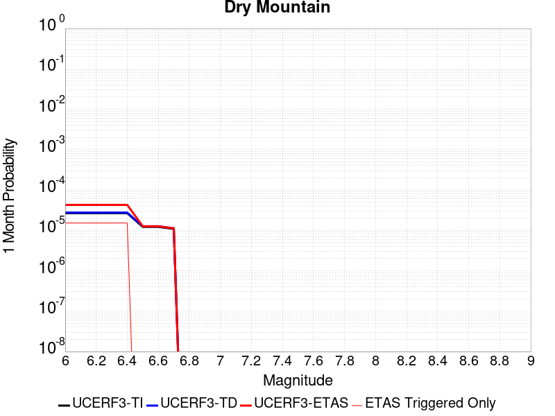 | 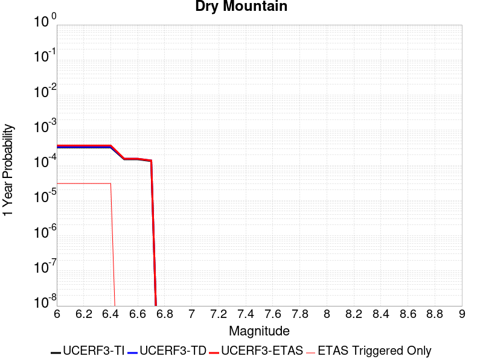 | 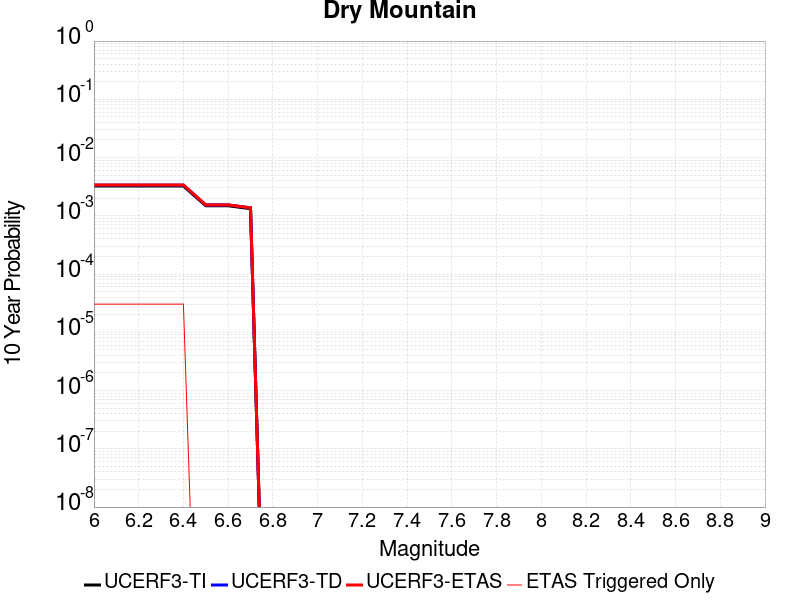 |

| Magnitude | 1 wk TI Prob | 1 wk TD Prob | 1 wk ETAS Prob | 1 wk ETAS/TD Gain | 1 wk ETAS Triggered Only | 1 mo TI Prob | 1 mo TD Prob | 1 mo ETAS Prob | 1 mo ETAS/TD Gain | 1 mo ETAS Triggered Only | 1 yr TI Prob | 1 yr TD Prob | 1 yr ETAS Prob | 1 yr ETAS/TD Gain | 1 yr ETAS Triggered Only | 10 yr TI Prob | 10 yr TD Prob | 10 yr ETAS Prob | 10 yr ETAS/TD Gain | 10 yr ETAS Triggered Only |
|-----|-----|-----|-----|-----|-----|-----|-----|-----|-----|-----|-----|-----|-----|-----|-----|-----|-----|-----|-----|-----|
| 6.0 | 6.222801E-6 | 6.439381E-6 | 2.1659984E-5 | 3.3636746 | 1.52207E-5 | 2.6668875E-5 | 2.7597147E-5 | 4.2817424E-5 | 1.5515164 | 1.52207E-5 | 3.2464517E-4 | 3.3595937E-4 | 3.6639054E-4 | 1.0905799 | 3.04414E-5 | 0.0032417132 | 0.0033560768 | 0.003386416 | 1.0090401 | 3.04414E-5 |
| 6.1 | 6.222801E-6 | 6.439381E-6 | 2.1659984E-5 | 3.3636746 | 1.52207E-5 | 2.6668875E-5 | 2.7597147E-5 | 4.2817424E-5 | 1.5515164 | 1.52207E-5 | 3.2464517E-4 | 3.3595937E-4 | 3.6639054E-4 | 1.0905799 | 3.04414E-5 | 0.0032417132 | 0.0033560768 | 0.003386416 | 1.0090401 | 3.04414E-5 |
| 6.2 | 6.222801E-6 | 6.439381E-6 | 2.1659984E-5 | 3.3636746 | 1.52207E-5 | 2.6668875E-5 | 2.7597147E-5 | 4.2817424E-5 | 1.5515164 | 1.52207E-5 | 3.2464517E-4 | 3.3595937E-4 | 3.6639054E-4 | 1.0905799 | 3.04414E-5 | 0.0032417132 | 0.0033560768 | 0.003386416 | 1.0090401 | 3.04414E-5 |
| 6.3 | 6.222801E-6 | 6.439381E-6 | 2.1659984E-5 | 3.3636746 | 1.52207E-5 | 2.6668875E-5 | 2.7597147E-5 | 4.2817424E-5 | 1.5515164 | 1.52207E-5 | 3.2464517E-4 | 3.3595937E-4 | 3.6639054E-4 | 1.0905799 | 3.04414E-5 | 0.0032417132 | 0.0033560768 | 0.003386416 | 1.0090401 | 3.04414E-5 |
| 6.4 | 6.222801E-6 | 6.439381E-6 | 2.1659984E-5 | 3.3636746 | 1.52207E-5 | 2.6668875E-5 | 2.7597147E-5 | 4.2817424E-5 | 1.5515164 | 1.52207E-5 | 3.2464517E-4 | 3.3595937E-4 | 3.6639054E-4 | 1.0905799 | 3.04414E-5 | 0.0032417132 | 0.0033560768 | 0.003386416 | 1.0090401 | 3.04414E-5 |
| 6.5 | 2.8528623E-6 | 2.9521684E-6 | 2.9521684E-6 | 1.0 | 0.0 | 1.22264955E-5 | 1.2652138E-5 | 1.2652138E-5 | 1.0 | 0.0 | 1.4884741E-4 | 1.540376E-4 | 1.540376E-4 | 1.0 | 0.0 | 0.0014874774 | 0.0015401616 | 0.0015401616 | 1.0 | 0.0 |
| 6.6 | 2.8528623E-6 | 2.9521684E-6 | 2.9521684E-6 | 1.0 | 0.0 | 1.22264955E-5 | 1.2652138E-5 | 1.2652138E-5 | 1.0 | 0.0 | 1.4884741E-4 | 1.540376E-4 | 1.540376E-4 | 1.0 | 0.0 | 0.0014874774 | 0.0015401616 | 0.0015401616 | 1.0 | 0.0 |
| 6.7 | 2.541E-6 | 2.6293578E-6 | 2.6293578E-6 | 1.0 | 0.0 | 1.0889954E-5 | 1.1268677E-5 | 1.1268677E-5 | 1.0 | 0.0 | 1.3257713E-4 | 1.3719614E-4 | 1.3719614E-4 | 1.0 | 0.0 | 0.0013249806 | 0.0013719613 | 0.0013719613 | 1.0 | 0.0 |

## Cucamonga
*[(top)](#table-of-contents)*

| 1 Week | 1 Month | 1 Year | 10 Year |
|-----|-----|-----|-----|
| 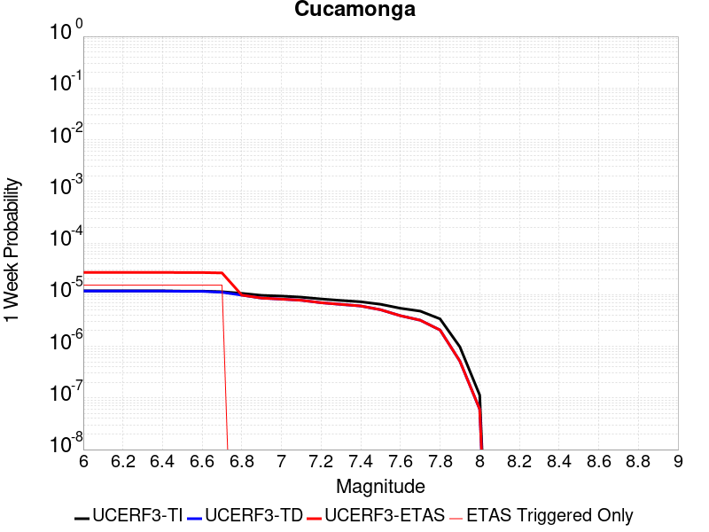 | 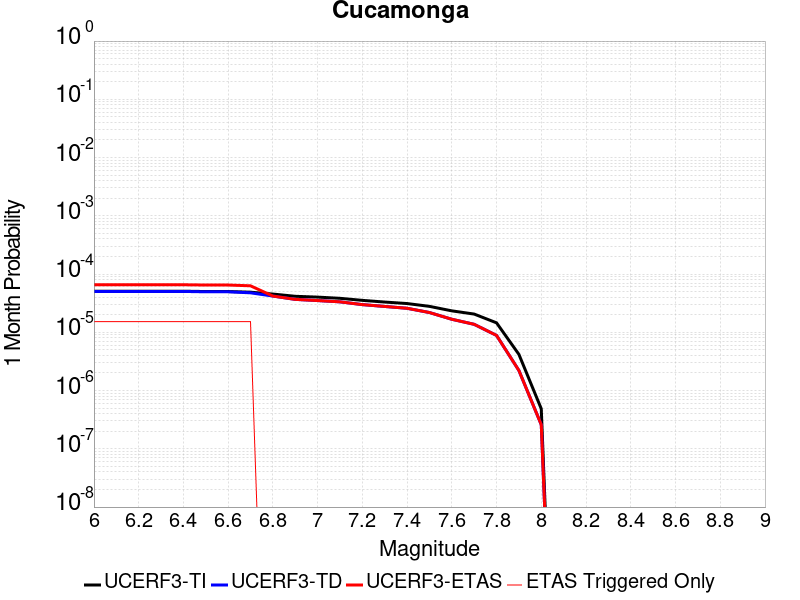 | 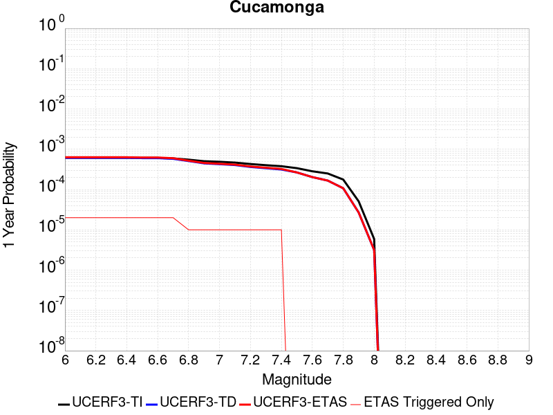 | 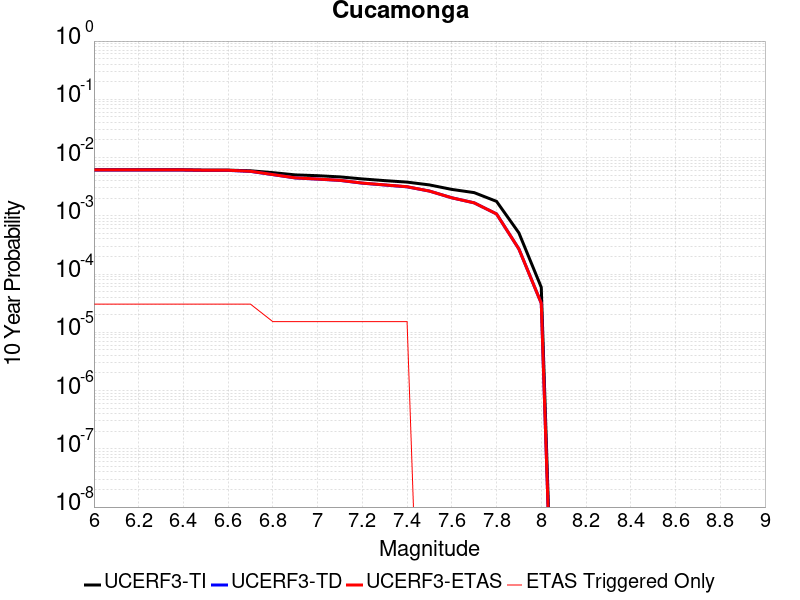 |

| Magnitude | 1 wk TI Prob | 1 wk TD Prob | 1 wk ETAS Prob | 1 wk ETAS/TD Gain | 1 wk ETAS Triggered Only | 1 mo TI Prob | 1 mo TD Prob | 1 mo ETAS Prob | 1 mo ETAS/TD Gain | 1 mo ETAS Triggered Only | 1 yr TI Prob | 1 yr TD Prob | 1 yr ETAS Prob | 1 yr ETAS/TD Gain | 1 yr ETAS Triggered Only | 10 yr TI Prob | 10 yr TD Prob | 10 yr ETAS Prob | 10 yr ETAS/TD Gain | 10 yr ETAS Triggered Only |
|-----|-----|-----|-----|-----|-----|-----|-----|-----|-----|-----|-----|-----|-----|-----|-----|-----|-----|-----|-----|-----|
| 6.0 | 1.1848348E-5 | 1.1737008E-5 | 2.695753E-5 | 2.2967973 | 1.52207E-5 | 5.0777642E-5 | 5.030051E-5 | 6.552044E-5 | 1.3025801 | 1.52207E-5 | 6.180424E-4 | 6.1223935E-4 | 6.426621E-4 | 1.049691 | 3.04414E-5 | 0.0061632637 | 0.0061067017 | 0.006136957 | 1.0049545 | 3.04414E-5 |
| 6.1 | 1.1848348E-5 | 1.1737008E-5 | 2.695753E-5 | 2.2967973 | 1.52207E-5 | 5.0777642E-5 | 5.030051E-5 | 6.552044E-5 | 1.3025801 | 1.52207E-5 | 6.180424E-4 | 6.1223935E-4 | 6.426621E-4 | 1.049691 | 3.04414E-5 | 0.0061632637 | 0.0061067017 | 0.006136957 | 1.0049545 | 3.04414E-5 |
| 6.2 | 1.1848348E-5 | 1.1737008E-5 | 2.695753E-5 | 2.2967973 | 1.52207E-5 | 5.0777642E-5 | 5.030051E-5 | 6.552044E-5 | 1.3025801 | 1.52207E-5 | 6.180424E-4 | 6.1223935E-4 | 6.426621E-4 | 1.049691 | 3.04414E-5 | 0.0061632637 | 0.0061067017 | 0.006136957 | 1.0049545 | 3.04414E-5 |
| 6.3 | 1.1848348E-5 | 1.1737008E-5 | 2.695753E-5 | 2.2967973 | 1.52207E-5 | 5.0777642E-5 | 5.030051E-5 | 6.552044E-5 | 1.3025801 | 1.52207E-5 | 6.180424E-4 | 6.1223935E-4 | 6.426621E-4 | 1.049691 | 3.04414E-5 | 0.0061632637 | 0.0061067017 | 0.006136957 | 1.0049545 | 3.04414E-5 |
| 6.4 | 1.1848348E-5 | 1.1737008E-5 | 2.695753E-5 | 2.2967973 | 1.52207E-5 | 5.0777642E-5 | 5.030051E-5 | 6.552044E-5 | 1.3025801 | 1.52207E-5 | 6.180424E-4 | 6.1223935E-4 | 6.426621E-4 | 1.049691 | 3.04414E-5 | 0.0061632637 | 0.0061067017 | 0.006136957 | 1.0049545 | 3.04414E-5 |
| 6.5 | 1.16988695E-5 | 1.15760395E-5 | 2.6796562E-5 | 2.31483 | 1.52207E-5 | 5.013705E-5 | 4.9610666E-5 | 6.4830616E-5 | 1.3067877 | 1.52207E-5 | 6.102476E-4 | 6.0384517E-4 | 6.3426816E-4 | 1.0503821 | 3.04414E-5 | 0.006085745 | 0.006023216 | 0.0060534743 | 1.0050236 | 3.04414E-5 |
| 6.6 | 1.16988695E-5 | 1.15760395E-5 | 2.6796562E-5 | 2.31483 | 1.52207E-5 | 5.013705E-5 | 4.9610666E-5 | 6.4830616E-5 | 1.3067877 | 1.52207E-5 | 6.102476E-4 | 6.0384517E-4 | 6.3426816E-4 | 1.0503821 | 3.04414E-5 | 0.006085745 | 0.006023216 | 0.0060534743 | 1.0050236 | 3.04414E-5 |
| 6.7 | 1.1397107E-5 | 1.11149475E-5 | 2.6335478E-5 | 2.369375 | 1.52207E-5 | 4.884383E-5 | 4.7634636E-5 | 6.285461E-5 | 1.3195149 | 1.52207E-5 | 5.9451134E-4 | 5.797998E-4 | 6.102236E-4 | 1.0524728 | 3.04414E-5 | 0.005929234 | 0.0057840226 | 0.0058142883 | 1.0052326 | 3.04414E-5 |
| 6.8 | 1.058387E-5 | 9.784992E-6 | 9.784992E-6 | 1.0 | 0.0 | 4.5358654E-5 | 4.193501E-5 | 4.193501E-5 | 1.0 | 0.0 | 5.521017E-4 | 5.1044027E-4 | 5.256532E-4 | 1.0298035 | 1.52207E-5 | 0.00550732 | 0.0050936877 | 0.0051088305 | 1.002973 | 1.52207E-5 |
| 6.9 | 9.690046E-6 | 8.57948E-6 | 8.57948E-6 | 1.0 | 0.0 | 4.1528107E-5 | 3.6768684E-5 | 3.6768684E-5 | 1.0 | 0.0 | 5.054874E-4 | 4.475672E-4 | 4.6278108E-4 | 1.0339924 | 1.52207E-5 | 0.005043391 | 0.004467594 | 0.0044827466 | 1.0033917 | 1.52207E-5 |
| 7.0 | 9.381461E-6 | 8.187101E-6 | 8.187101E-6 | 1.0 | 0.0 | 4.020564E-5 | 3.5087105E-5 | 3.5087105E-5 | 1.0 | 0.0 | 4.893937E-4 | 4.2710215E-4 | 4.4231635E-4 | 1.0356219 | 1.52207E-5 | 0.0048831734 | 0.0042637475 | 0.0042789034 | 1.0035546 | 1.52207E-5 |
| 7.1 | 8.946492E-6 | 7.781886E-6 | 7.781886E-6 | 1.0 | 0.0 | 3.8341543E-5 | 3.3350516E-5 | 3.3350516E-5 | 1.0 | 0.0 | 4.667083E-4 | 4.0596718E-4 | 4.211817E-4 | 1.0374773 | 1.52207E-5 | 0.0046572937 | 0.004053192 | 0.0040683514 | 1.0037401 | 1.52207E-5 |
| 7.2 | 8.251016E-6 | 6.9752796E-6 | 6.9752796E-6 | 1.0 | 0.0 | 3.5361016E-5 | 2.9893714E-5 | 2.9893714E-5 | 1.0 | 0.0 | 4.3043532E-4 | 3.6389544E-4 | 3.791106E-4 | 1.041812 | 1.52207E-5 | 0.0042960253 | 0.0036339292 | 0.0036490946 | 1.0041733 | 1.52207E-5 |
| 7.3 | 7.717881E-6 | 6.4863502E-6 | 6.4863502E-6 | 1.0 | 0.0 | 3.3076216E-5 | 2.7798349E-5 | 2.7798349E-5 | 1.0 | 0.0 | 4.026285E-4 | 3.3839257E-4 | 3.536081E-4 | 1.0449642 | 1.52207E-5 | 0.004018998 | 0.00337971 | 0.0033948794 | 1.0044883 | 1.52207E-5 |
| 7.4 | 7.275623E-6 | 6.031997E-6 | 6.031997E-6 | 1.0 | 0.0 | 3.118087E-5 | 2.585116E-5 | 2.585116E-5 | 1.0 | 0.0 | 3.7956095E-4 | 3.1469265E-4 | 3.2990857E-4 | 1.0483516 | 1.52207E-5 | 0.0037891332 | 0.0031434062 | 0.003158579 | 1.0048269 | 1.52207E-5 |
| 7.5 | 6.5109502E-6 | 5.1006014E-6 | 5.1006014E-6 | 1.0 | 0.0 | 2.7903774E-5 | 2.1859538E-5 | 2.1859538E-5 | 1.0 | 0.0 | 3.3967546E-4 | 2.661075E-4 | 2.661075E-4 | 1.0 | 0.0 | 0.0033915674 | 0.002658813 | 0.002658813 | 1.0 | 0.0 |
| 7.6 | 5.4495326E-6 | 3.90857E-6 | 3.90857E-6 | 1.0 | 0.0 | 2.335493E-5 | 1.6750908E-5 | 1.6750908E-5 | 1.0 | 0.0 | 2.8430918E-4 | 2.0392328E-4 | 2.0392328E-4 | 1.0 | 0.0 | 0.0028394572 | 0.002038282 | 0.002038282 | 1.0 | 0.0 |
| 7.7 | 4.7997164E-6 | 3.2002547E-6 | 3.2002547E-6 | 1.0 | 0.0 | 2.057005E-5 | 1.3715306E-5 | 1.3715306E-5 | 1.0 | 0.0 | 2.504116E-4 | 1.6697108E-4 | 1.6697108E-4 | 1.0 | 0.0 | 0.002501296 | 0.0016693877 | 0.0016693877 | 1.0 | 0.0 |
| 7.8 | 3.3941733E-6 | 2.0641899E-6 | 2.0641899E-6 | 1.0 | 0.0 | 1.4546376E-5 | 8.846498E-6 | 8.846498E-6 | 1.0 | 0.0 | 1.7708774E-4 | 1.07700806E-4 | 1.07700806E-4 | 1.0 | 0.0 | 0.0017694668 | 0.001076723 | 0.001076723 | 1.0 | 0.0 |
| 7.9 | 9.750552E-7 | 5.155946E-7 | 5.155946E-7 | 1.0 | 0.0 | 4.178801E-6 | 2.2096892E-6 | 2.2096892E-6 | 1.0 | 0.0 | 5.0875715E-5 | 2.690264E-5 | 2.690264E-5 | 1.0 | 0.0 | 5.086407E-4 | 2.6899425E-4 | 2.6899425E-4 | 1.0 | 0.0 |
| 8.0 | 1.133857E-7 | 6.053707E-8 | 6.053707E-8 | 1.0 | 0.0 | 4.8593864E-7 | 2.5944456E-7 | 2.5944456E-7 | 1.0 | 0.0 | 5.9162867E-6 | 3.158733E-6 | 3.158733E-6 | 1.0 | 0.0 | 5.916129E-5 | 3.1586897E-5 | 3.1586897E-5 | 1.0 | 0.0 |

## Big Pine (West)
*[(top)](#table-of-contents)*

| 1 Week | 1 Month | 1 Year | 10 Year |
|-----|-----|-----|-----|
| 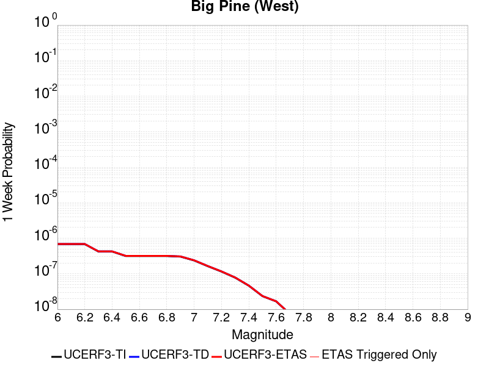 | 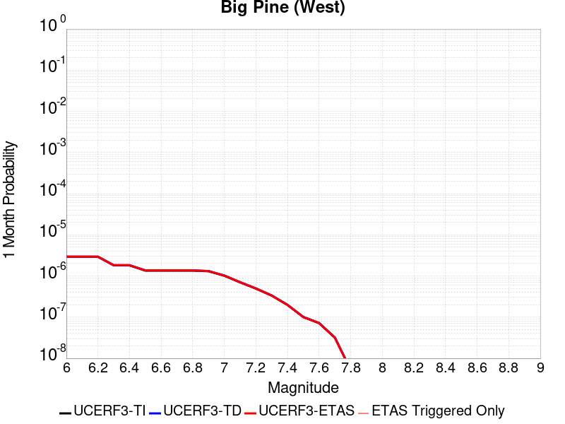 | 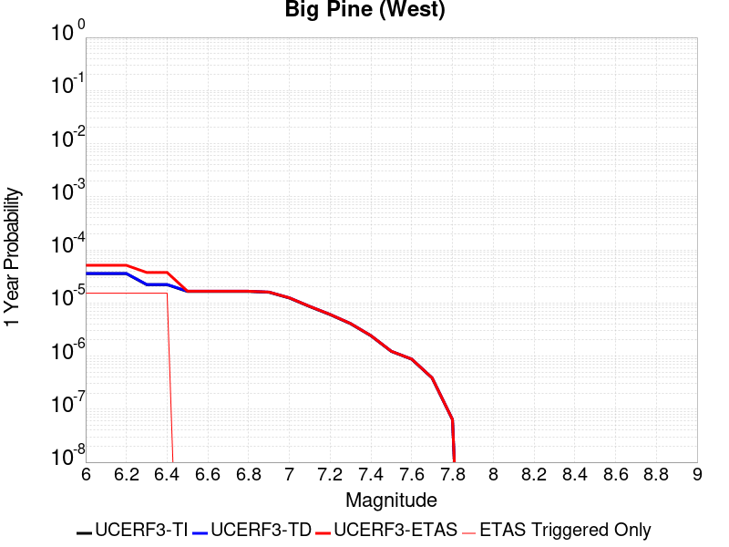 | 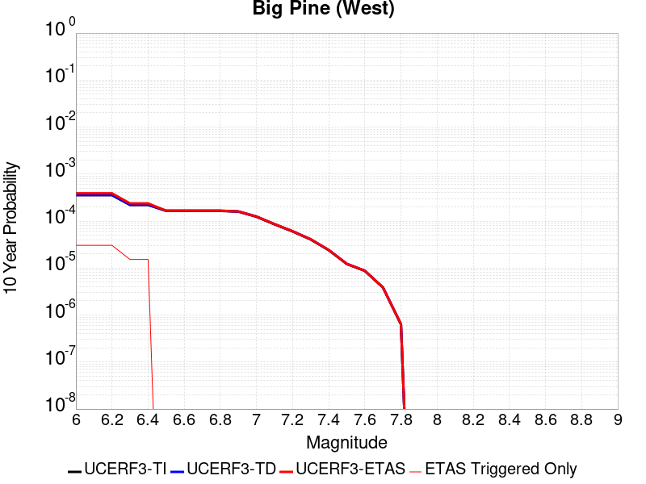 |

| Magnitude | 1 wk TI Prob | 1 wk TD Prob | 1 wk ETAS Prob | 1 wk ETAS/TD Gain | 1 wk ETAS Triggered Only | 1 mo TI Prob | 1 mo TD Prob | 1 mo ETAS Prob | 1 mo ETAS/TD Gain | 1 mo ETAS Triggered Only | 1 yr TI Prob | 1 yr TD Prob | 1 yr ETAS Prob | 1 yr ETAS/TD Gain | 1 yr ETAS Triggered Only | 10 yr TI Prob | 10 yr TD Prob | 10 yr ETAS Prob | 10 yr ETAS/TD Gain | 10 yr ETAS Triggered Only |
|-----|-----|-----|-----|-----|-----|-----|-----|-----|-----|-----|-----|-----|-----|-----|-----|-----|-----|-----|-----|-----|
| 6.0 | 6.8306974E-7 | 6.8818304E-7 | 6.8818304E-7 | 1.0 | 0.0 | 2.9274386E-6 | 2.949353E-6 | 2.949353E-6 | 1.0 | 0.0 | 3.564098E-5 | 3.5907877E-5 | 5.112803E-5 | 1.4238667 | 1.52207E-5 | 3.5635266E-4 | 3.5903015E-4 | 3.8946062E-4 | 1.0847574 | 3.04414E-5 |
| 6.1 | 6.8306974E-7 | 6.8818304E-7 | 6.8818304E-7 | 1.0 | 0.0 | 2.9274386E-6 | 2.949353E-6 | 2.949353E-6 | 1.0 | 0.0 | 3.564098E-5 | 3.5907877E-5 | 5.112803E-5 | 1.4238667 | 1.52207E-5 | 3.5635266E-4 | 3.5903015E-4 | 3.8946062E-4 | 1.0847574 | 3.04414E-5 |
| 6.2 | 6.8306974E-7 | 6.8818304E-7 | 6.8818304E-7 | 1.0 | 0.0 | 2.9274386E-6 | 2.949353E-6 | 2.949353E-6 | 1.0 | 0.0 | 3.564098E-5 | 3.5907877E-5 | 5.112803E-5 | 1.4238667 | 1.52207E-5 | 3.5635266E-4 | 3.5903015E-4 | 3.8946062E-4 | 1.0847574 | 3.04414E-5 |
| 6.3 | 4.227652E-7 | 4.2665604E-7 | 4.2665604E-7 | 1.0 | 0.0 | 1.8118495E-6 | 1.8285248E-6 | 1.8285248E-6 | 1.0 | 0.0 | 2.2059045E-5 | 2.226208E-5 | 3.748244E-5 | 1.68369 | 1.52207E-5 | 2.2056856E-4 | 2.2260031E-4 | 2.3781763E-4 | 1.0683616 | 1.52207E-5 |
| 6.4 | 4.227652E-7 | 4.2665604E-7 | 4.2665604E-7 | 1.0 | 0.0 | 1.8118495E-6 | 1.8285248E-6 | 1.8285248E-6 | 1.0 | 0.0 | 2.2059045E-5 | 2.226208E-5 | 3.748244E-5 | 1.68369 | 1.52207E-5 | 2.2056856E-4 | 2.2260031E-4 | 2.3781763E-4 | 1.0683616 | 1.52207E-5 |
| 6.5 | 3.1538403E-7 | 3.1884528E-7 | 3.1884528E-7 | 1.0 | 0.0 | 1.3516451E-6 | 1.3664791E-6 | 1.3664791E-6 | 1.0 | 0.0 | 1.6456155E-5 | 1.6636759E-5 | 1.6636759E-5 | 1.0 | 0.0 | 1.6454936E-4 | 1.6635554E-4 | 1.6635554E-4 | 1.0 | 0.0 |
| 6.6 | 3.1538403E-7 | 3.1884528E-7 | 3.1884528E-7 | 1.0 | 0.0 | 1.3516451E-6 | 1.3664791E-6 | 1.3664791E-6 | 1.0 | 0.0 | 1.6456155E-5 | 1.6636759E-5 | 1.6636759E-5 | 1.0 | 0.0 | 1.6454936E-4 | 1.6635554E-4 | 1.6635554E-4 | 1.0 | 0.0 |
| 6.7 | 3.1538403E-7 | 3.1884528E-7 | 3.1884528E-7 | 1.0 | 0.0 | 1.3516451E-6 | 1.3664791E-6 | 1.3664791E-6 | 1.0 | 0.0 | 1.6456155E-5 | 1.6636759E-5 | 1.6636759E-5 | 1.0 | 0.0 | 1.6454936E-4 | 1.6635554E-4 | 1.6635554E-4 | 1.0 | 0.0 |
| 6.8 | 3.1538403E-7 | 3.1884528E-7 | 3.1884528E-7 | 1.0 | 0.0 | 1.3516451E-6 | 1.3664791E-6 | 1.3664791E-6 | 1.0 | 0.0 | 1.6456155E-5 | 1.6636759E-5 | 1.6636759E-5 | 1.0 | 0.0 | 1.6454936E-4 | 1.6635554E-4 | 1.6635554E-4 | 1.0 | 0.0 |
| 6.9 | 3.0402092E-7 | 3.0739798E-7 | 3.0739798E-7 | 1.0 | 0.0 | 1.3029462E-6 | 1.3174192E-6 | 1.3174192E-6 | 1.0 | 0.0 | 1.5863254E-5 | 1.6039465E-5 | 1.6039465E-5 | 1.0 | 0.0 | 1.5862122E-4 | 1.6038347E-4 | 1.6038347E-4 | 1.0 | 0.0 |
| 7.0 | 2.3673063E-7 | 2.3944315E-7 | 2.3944315E-7 | 1.0 | 0.0 | 1.0145594E-6 | 1.0261845E-6 | 1.0261845E-6 | 1.0 | 0.0 | 1.235219E-5 | 1.2493728E-5 | 1.2493728E-5 | 1.0 | 0.0 | 1.2351504E-4 | 1.2493054E-4 | 1.2493054E-4 | 1.0 | 0.0 |
| 7.1 | 1.632138E-7 | 1.6514511E-7 | 1.6514511E-7 | 1.0 | 0.0 | 6.9948754E-7 | 7.0776457E-7 | 7.0776457E-7 | 1.0 | 0.0 | 8.516227E-6 | 8.617002E-6 | 8.617002E-6 | 1.0 | 0.0 | 8.5159016E-5 | 8.616685E-5 | 8.616685E-5 | 1.0 | 0.0 |
| 7.2 | 1.1523723E-7 | 1.1657165E-7 | 1.1657165E-7 | 1.0 | 0.0 | 4.9387376E-7 | 4.9959266E-7 | 4.9959266E-7 | 1.0 | 0.0 | 6.0128964E-6 | 6.082525E-6 | 6.082525E-6 | 1.0 | 0.0 | 6.0127335E-5 | 6.0823695E-5 | 6.0823695E-5 | 1.0 | 0.0 |
| 7.3 | 7.777805E-8 | 7.862446E-8 | 7.862446E-8 | 1.0 | 0.0 | 3.3333444E-7 | 3.3696193E-7 | 3.3696193E-7 | 1.0 | 0.0 | 4.0583395E-6 | 4.102504E-6 | 4.102504E-6 | 1.0 | 0.0 | 4.0582654E-5 | 4.102434E-5 | 4.102434E-5 | 1.0 | 0.0 |
| 7.4 | 4.609946E-8 | 4.6522135E-8 | 4.6522135E-8 | 1.0 | 0.0 | 1.975691E-7 | 1.9938055E-7 | 1.9938055E-7 | 1.0 | 0.0 | 2.4054011E-6 | 2.4274557E-6 | 2.4274557E-6 | 1.0 | 0.0 | 2.405375E-5 | 2.427431E-5 | 2.427431E-5 | 1.0 | 0.0 |
| 7.5 | 2.3439137E-8 | 2.3608283E-8 | 2.3608283E-8 | 1.0 | 0.0 | 1.00453434E-7 | 1.0117836E-7 | 1.0117836E-7 | 1.0 | 0.0 | 1.2230199E-6 | 1.2318458E-6 | 1.2318458E-6 | 1.0 | 0.0 | 1.2230132E-5 | 1.2318393E-5 | 1.2318393E-5 | 1.0 | 0.0 |
| 7.6 | 1.6699769E-8 | 1.6817072E-8 | 1.6817072E-8 | 1.0 | 0.0 | 7.157044E-8 | 7.207316E-8 | 7.207316E-8 | 1.0 | 0.0 | 8.713697E-7 | 8.7749044E-7 | 8.7749044E-7 | 1.0 | 0.0 | 8.713663E-6 | 8.774871E-6 | 8.774871E-6 | 1.0 | 0.0 |
| 7.7 | 7.4061512E-9 | 7.4541635E-9 | 7.4541635E-9 | 1.0 | 0.0 | 3.1740647E-8 | 3.1946417E-8 | 3.1946417E-8 | 1.0 | 0.0 | 3.864423E-7 | 3.8894754E-7 | 3.8894754E-7 | 1.0 | 0.0 | 3.8644166E-6 | 3.8894696E-6 | 3.8894696E-6 | 1.0 | 0.0 |
| 7.8 | 1.2189427E-9 | 1.2270763E-9 | 1.2270763E-9 | 1.0 | 0.0 | 5.2240403E-9 | 5.258898E-9 | 5.258898E-9 | 1.0 | 0.0 | 6.3602684E-8 | 6.4027084E-8 | 6.4027084E-8 | 1.0 | 0.0 | 6.360267E-7 | 6.4027074E-7 | 6.4027074E-7 | 1.0 | 0.0 |

## Earthquake Valley (No  Extension)
*[(top)](#table-of-contents)*

| 1 Week | 1 Month | 1 Year | 10 Year |
|-----|-----|-----|-----|
|  | 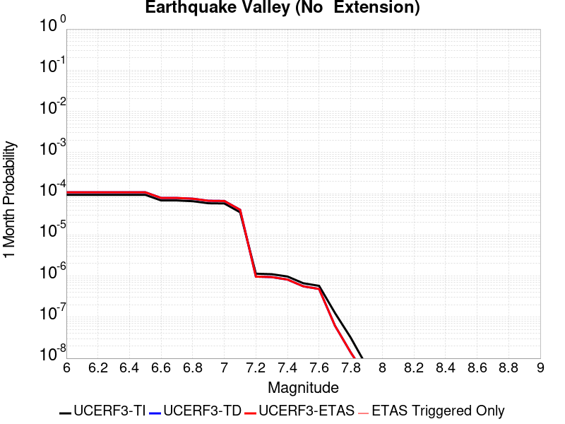 | 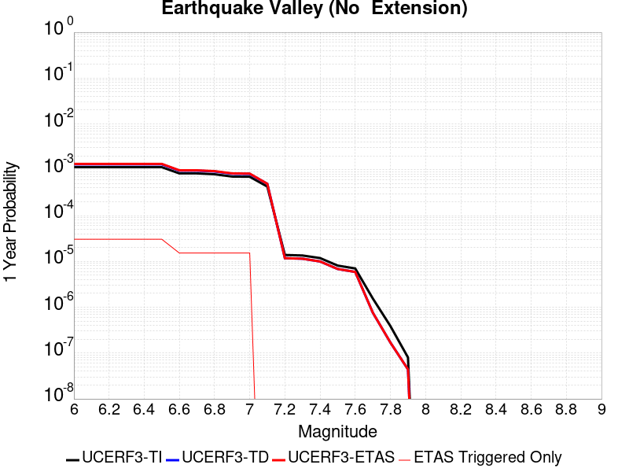 | 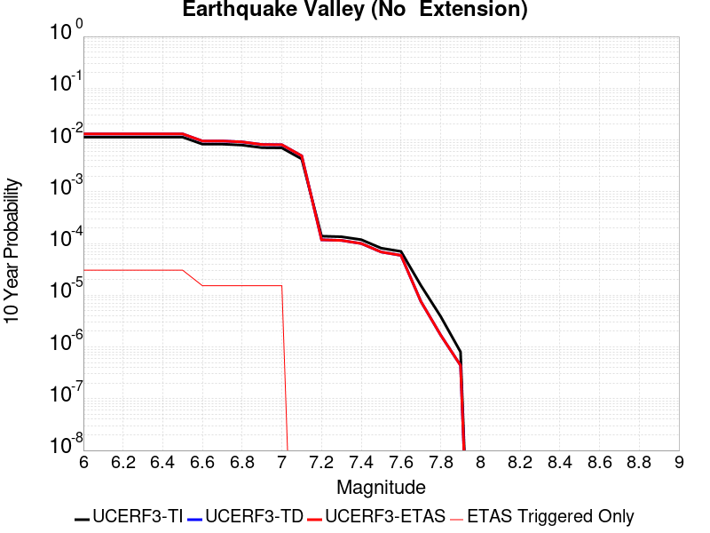 |

| Magnitude | 1 wk TI Prob | 1 wk TD Prob | 1 wk ETAS Prob | 1 wk ETAS/TD Gain | 1 wk ETAS Triggered Only | 1 mo TI Prob | 1 mo TD Prob | 1 mo ETAS Prob | 1 mo ETAS/TD Gain | 1 mo ETAS Triggered Only | 1 yr TI Prob | 1 yr TD Prob | 1 yr ETAS Prob | 1 yr ETAS/TD Gain | 1 yr ETAS Triggered Only | 10 yr TI Prob | 10 yr TD Prob | 10 yr ETAS Prob | 10 yr ETAS/TD Gain | 10 yr ETAS Triggered Only |
|-----|-----|-----|-----|-----|-----|-----|-----|-----|-----|-----|-----|-----|-----|-----|-----|-----|-----|-----|-----|-----|
| 6.0 | 2.1859703E-5 | 2.5198362E-5 | 2.5198362E-5 | 1.0 | 0.0 | 9.3681076E-5 | 1.07989326E-4 | 1.07989326E-4 | 1.0 | 0.0 | 0.0011399703 | 0.001314122 | 0.0013445234 | 1.0231344 | 3.04414E-5 | 0.011341401 | 0.013077871 | 0.0131079145 | 1.0022973 | 3.04414E-5 |
| 6.1 | 2.1859703E-5 | 2.5198362E-5 | 2.5198362E-5 | 1.0 | 0.0 | 9.3681076E-5 | 1.07989326E-4 | 1.07989326E-4 | 1.0 | 0.0 | 0.0011399703 | 0.001314122 | 0.0013445234 | 1.0231344 | 3.04414E-5 | 0.011341401 | 0.013077871 | 0.0131079145 | 1.0022973 | 3.04414E-5 |
| 6.2 | 2.1859703E-5 | 2.5198362E-5 | 2.5198362E-5 | 1.0 | 0.0 | 9.3681076E-5 | 1.07989326E-4 | 1.07989326E-4 | 1.0 | 0.0 | 0.0011399703 | 0.001314122 | 0.0013445234 | 1.0231344 | 3.04414E-5 | 0.011341401 | 0.013077871 | 0.0131079145 | 1.0022973 | 3.04414E-5 |
| 6.3 | 2.1859703E-5 | 2.5198362E-5 | 2.5198362E-5 | 1.0 | 0.0 | 9.3681076E-5 | 1.07989326E-4 | 1.07989326E-4 | 1.0 | 0.0 | 0.0011399703 | 0.001314122 | 0.0013445234 | 1.0231344 | 3.04414E-5 | 0.011341401 | 0.013077871 | 0.0131079145 | 1.0022973 | 3.04414E-5 |
| 6.4 | 2.1859703E-5 | 2.5198362E-5 | 2.5198362E-5 | 1.0 | 0.0 | 9.3681076E-5 | 1.07989326E-4 | 1.07989326E-4 | 1.0 | 0.0 | 0.0011399703 | 0.001314122 | 0.0013445234 | 1.0231344 | 3.04414E-5 | 0.011341401 | 0.013077871 | 0.0131079145 | 1.0022973 | 3.04414E-5 |
| 6.5 | 2.1859703E-5 | 2.5198362E-5 | 2.5198362E-5 | 1.0 | 0.0 | 9.3681076E-5 | 1.07989326E-4 | 1.07989326E-4 | 1.0 | 0.0 | 0.0011399703 | 0.001314122 | 0.0013445234 | 1.0231344 | 3.04414E-5 | 0.011341401 | 0.013077871 | 0.0131079145 | 1.0022973 | 3.04414E-5 |
| 6.6 | 1.597E-5 | 1.8356275E-5 | 1.8356275E-5 | 1.0 | 0.0 | 6.8441055E-5 | 7.866787E-5 | 7.866787E-5 | 1.0 | 0.0 | 8.329513E-4 | 9.574478E-4 | 9.726539E-4 | 1.0158819 | 1.52207E-5 | 0.008298361 | 0.009541836 | 0.009556911 | 1.0015799 | 1.52207E-5 |
| 6.7 | 1.597E-5 | 1.8356275E-5 | 1.8356275E-5 | 1.0 | 0.0 | 6.8441055E-5 | 7.866787E-5 | 7.866787E-5 | 1.0 | 0.0 | 8.329513E-4 | 9.574478E-4 | 9.726539E-4 | 1.0158819 | 1.52207E-5 | 0.008298361 | 0.009541836 | 0.009556911 | 1.0015799 | 1.52207E-5 |
| 6.8 | 1.5315149E-5 | 1.7602091E-5 | 1.7602091E-5 | 1.0 | 0.0 | 6.5634704E-5 | 7.543584E-5 | 7.543584E-5 | 1.0 | 0.0 | 7.988095E-4 | 9.181311E-4 | 9.3333784E-4 | 1.0165627 | 1.52207E-5 | 0.007959441 | 0.009151919 | 0.009167001 | 1.001648 | 1.52207E-5 |
| 6.9 | 1.3634728E-5 | 1.5675821E-5 | 1.5675821E-5 | 1.0 | 0.0 | 5.8433237E-5 | 6.718082E-5 | 6.718082E-5 | 1.0 | 0.0 | 7.1119244E-4 | 8.177017E-4 | 8.3290995E-4 | 1.0185988 | 1.52207E-5 | 0.007089207 | 0.008155 | 0.008170097 | 1.0018512 | 1.52207E-5 |
| 7.0 | 1.3496271E-5 | 1.5517853E-5 | 1.5517853E-5 | 1.0 | 0.0 | 5.783988E-5 | 6.650385E-5 | 6.650385E-5 | 1.0 | 0.0 | 7.03973E-4 | 8.094657E-4 | 8.246741E-4 | 1.0187882 | 1.52207E-5 | 0.007017471 | 0.0080732405 | 0.008088339 | 1.0018702 | 1.52207E-5 |
| 7.1 | 8.242798E-6 | 9.4726E-6 | 9.4726E-6 | 1.0 | 0.0 | 3.53258E-5 | 4.0596606E-5 | 4.0596606E-5 | 1.0 | 0.0 | 4.300067E-4 | 4.9421866E-4 | 4.9421866E-4 | 1.0 | 0.0 | 0.004291756 | 0.0049377717 | 0.0049377717 | 1.0 | 0.0 |
| 7.2 | 2.6506527E-7 | 2.2560312E-7 | 2.2560312E-7 | 1.0 | 0.0 | 1.1359936E-6 | 9.668702E-7 | 9.668702E-7 | 1.0 | 0.0 | 1.3830633E-5 | 1.17715845E-5 | 1.17715845E-5 | 1.0 | 0.0 | 1.3829772E-4 | 1.1771003E-4 | 1.1771003E-4 | 1.0 | 0.0 |
| 7.3 | 2.5810488E-7 | 2.1955442E-7 | 2.1955442E-7 | 1.0 | 0.0 | 1.1061633E-6 | 9.409472E-7 | 9.409472E-7 | 1.0 | 0.0 | 1.3467455E-5 | 1.1455976E-5 | 1.1455976E-5 | 1.0 | 0.0 | 1.3466639E-4 | 1.1455427E-4 | 1.1455427E-4 | 1.0 | 0.0 |
| 7.4 | 2.2676066E-7 | 1.9110601E-7 | 1.9110601E-7 | 1.0 | 0.0 | 9.71831E-7 | 8.190255E-7 | 8.190255E-7 | 1.0 | 0.0 | 1.1831979E-5 | 9.9715935E-6 | 9.9715935E-6 | 1.0 | 0.0 | 1.1831349E-4 | 9.9711855E-5 | 9.9711855E-5 | 1.0 | 0.0 |
| 7.5 | 1.5553917E-7 | 1.3112096E-7 | 1.3112096E-7 | 1.0 | 0.0 | 6.6659624E-7 | 5.619469E-7 | 5.619469E-7 | 1.0 | 0.0 | 8.115779E-6 | 6.8416834E-6 | 6.8416834E-6 | 1.0 | 0.0 | 8.115482E-5 | 6.841495E-5 | 6.841495E-5 | 1.0 | 0.0 |
| 7.6 | 1.3448629E-7 | 1.1288419E-7 | 1.1288419E-7 | 1.0 | 0.0 | 5.7636964E-7 | 4.837893E-7 | 4.837893E-7 | 1.0 | 0.0 | 7.017278E-6 | 5.890121E-6 | 5.890121E-6 | 1.0 | 0.0 | 7.0170565E-5 | 5.889986E-5 | 5.889986E-5 | 1.0 | 0.0 |
| 7.7 | 2.9719402E-8 | 1.458206E-8 | 1.458206E-8 | 1.0 | 0.0 | 1.2736886E-7 | 6.249454E-8 | 6.249454E-8 | 1.0 | 0.0 | 1.5507147E-6 | 7.608708E-7 | 7.608708E-7 | 1.0 | 0.0 | 1.550704E-5 | 7.6086876E-6 | 7.6086876E-6 | 1.0 | 0.0 |
| 7.8 | 7.4390196E-9 | 3.2502152E-9 | 3.2502152E-9 | 1.0 | 0.0 | 3.1881513E-8 | 1.3929493E-8 | 1.3929493E-8 | 1.0 | 0.0 | 3.8815733E-7 | 1.6959156E-7 | 1.6959156E-7 | 1.0 | 0.0 | 3.8815665E-6 | 1.6959145E-6 | 1.6959145E-6 | 1.0 | 0.0 |
| 7.9 | 1.5373532E-9 | 8.440161E-10 | 8.440161E-10 | 1.0 | 0.0 | 6.5886567E-9 | 3.6172119E-9 | 3.6172119E-9 | 1.0 | 0.0 | 8.021689E-8 | 4.4039556E-8 | 4.4039556E-8 | 1.0 | 0.0 | 8.0216864E-7 | 4.4039552E-7 | 4.4039552E-7 | 1.0 | 0.0 |

## Superstition Hills
*[(top)](#table-of-contents)*

| 1 Week | 1 Month | 1 Year | 10 Year |
|-----|-----|-----|-----|
|  |  | 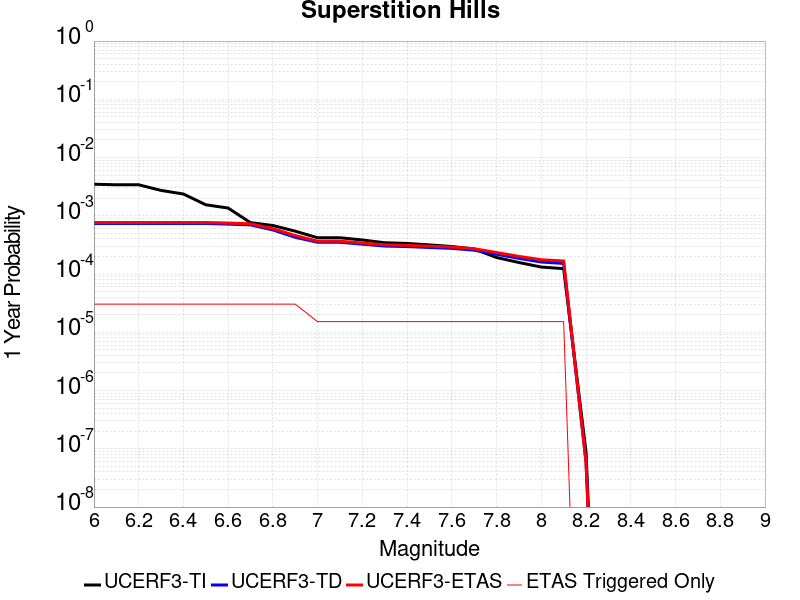 | 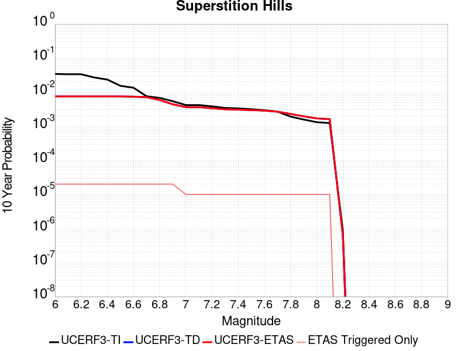 |

| Magnitude | 1 wk TI Prob | 1 wk TD Prob | 1 wk ETAS Prob | 1 wk ETAS/TD Gain | 1 wk ETAS Triggered Only | 1 mo TI Prob | 1 mo TD Prob | 1 mo ETAS Prob | 1 mo ETAS/TD Gain | 1 mo ETAS Triggered Only | 1 yr TI Prob | 1 yr TD Prob | 1 yr ETAS Prob | 1 yr ETAS/TD Gain | 1 yr ETAS Triggered Only | 10 yr TI Prob | 10 yr TD Prob | 10 yr ETAS Prob | 10 yr ETAS/TD Gain | 10 yr ETAS Triggered Only |
|-----|-----|-----|-----|-----|-----|-----|-----|-----|-----|-----|-----|-----|-----|-----|-----|-----|-----|-----|-----|-----|
| 6.0 | 6.6865185E-5 | 1.41376995E-5 | 1.41376995E-5 | 1.0 | 0.0 | 2.8653358E-4 | 6.0588824E-5 | 7.58086E-5 | 1.2511978 | 1.52207E-5 | 0.0034829667 | 7.374355E-4 | 7.6785445E-4 | 1.0412496 | 3.04414E-5 | 0.03428881 | 0.0075204074 | 0.00755062 | 1.0040174 | 3.04414E-5 |
| 6.1 | 6.544851E-5 | 1.41376995E-5 | 1.41376995E-5 | 1.0 | 0.0 | 2.8046346E-4 | 6.0588824E-5 | 7.58086E-5 | 1.2511978 | 1.52207E-5 | 0.0034092965 | 7.374355E-4 | 7.678544E-4 | 1.0412496 | 3.04414E-5 | 0.033574644 | 0.007520407 | 0.0075506195 | 1.0040174 | 3.04414E-5 |
| 6.2 | 6.544851E-5 | 1.41376995E-5 | 1.41376995E-5 | 1.0 | 0.0 | 2.8046346E-4 | 6.0588824E-5 | 7.58086E-5 | 1.2511978 | 1.52207E-5 | 0.0034092965 | 7.374355E-4 | 7.678544E-4 | 1.0412496 | 3.04414E-5 | 0.033574644 | 0.007520407 | 0.0075506195 | 1.0040174 | 3.04414E-5 |
| 6.3 | 5.2402065E-5 | 1.4137698E-5 | 1.4137698E-5 | 1.0 | 0.0 | 2.2456095E-4 | 6.058882E-5 | 7.5808595E-5 | 1.2511978 | 1.52207E-5 | 0.0027306017 | 7.374354E-4 | 7.6785433E-4 | 1.0412496 | 3.04414E-5 | 0.02697292 | 0.007520402 | 0.007550614 | 1.0040174 | 3.04414E-5 |
| 6.4 | 4.542238E-5 | 1.4137698E-5 | 1.4137698E-5 | 1.0 | 0.0 | 1.9465282E-4 | 6.0588816E-5 | 7.5808595E-5 | 1.2511978 | 1.52207E-5 | 0.0023673223 | 7.3743536E-4 | 7.6785433E-4 | 1.0412496 | 3.04414E-5 | 0.023422617 | 0.0075203986 | 0.007550611 | 1.0040174 | 3.04414E-5 |
| 6.5 | 2.9672969E-5 | 1.4137696E-5 | 1.4137696E-5 | 1.0 | 0.0 | 1.2716366E-4 | 6.058881E-5 | 7.580859E-5 | 1.2511978 | 1.52207E-5 | 0.0015471181 | 7.374353E-4 | 7.678543E-4 | 1.0412496 | 3.04414E-5 | 0.015363912 | 0.007520392 | 0.0075506046 | 1.0040174 | 3.04414E-5 |
| 6.6 | 2.6056105E-5 | 1.3803458E-5 | 1.3803458E-5 | 1.0 | 0.0 | 1.1166424E-4 | 5.9156428E-5 | 7.437623E-5 | 1.2572806 | 1.52207E-5 | 0.0013586642 | 7.200076E-4 | 7.504271E-4 | 1.0422488 | 3.04414E-5 | 0.013503874 | 0.0073448285 | 0.0073750466 | 1.0041142 | 3.04414E-5 |
| 6.7 | 1.4611248E-5 | 1.3383359E-5 | 1.3383359E-5 | 1.0 | 0.0 | 6.261813E-5 | 5.7356083E-5 | 7.257591E-5 | 1.2653568 | 1.52207E-5 | 7.6210906E-4 | 6.981025E-4 | 7.2852266E-4 | 1.0435755 | 3.04414E-5 | 0.0075950073 | 0.00712602 | 0.007156244 | 1.0042415 | 3.04414E-5 |
| 6.8 | 1.30607E-5 | 1.09787925E-5 | 1.09787925E-5 | 1.0 | 0.0 | 5.597323E-5 | 4.705117E-5 | 6.227115E-5 | 1.3234773 | 1.52207E-5 | 6.8126095E-4 | 5.7270617E-4 | 6.031301E-4 | 1.0531231 | 3.04414E-5 | 0.006791762 | 0.00587438 | 0.0059046424 | 1.0051516 | 3.04414E-5 |
| 6.9 | 1.0443096E-5 | 8.195349E-6 | 8.195349E-6 | 1.0 | 0.0 | 4.4755358E-5 | 3.5122466E-5 | 5.034263E-5 | 1.4333456 | 1.52207E-5 | 5.447602E-4 | 4.2753448E-4 | 4.5796286E-4 | 1.0711718 | 3.04414E-5 | 0.005434267 | 0.0044094524 | 0.0044397595 | 1.0068733 | 3.04414E-5 |
| 7.0 | 8.045912E-6 | 6.739692E-6 | 6.739692E-6 | 1.0 | 0.0 | 3.4482026E-5 | 2.888408E-5 | 4.410434E-5 | 1.5269428 | 1.52207E-5 | 4.197378E-4 | 3.5160795E-4 | 3.668233E-4 | 1.0432736 | 1.52207E-5 | 0.0041894587 | 0.0036334093 | 0.0036485747 | 1.0041739 | 1.52207E-5 |
| 7.1 | 8.045912E-6 | 6.739692E-6 | 6.739692E-6 | 1.0 | 0.0 | 3.4482026E-5 | 2.888408E-5 | 4.410434E-5 | 1.5269428 | 1.52207E-5 | 4.197378E-4 | 3.5160795E-4 | 3.668233E-4 | 1.0432736 | 1.52207E-5 | 0.0041894587 | 0.0036334093 | 0.0036485747 | 1.0041739 | 1.52207E-5 |
| 7.2 | 7.375506E-6 | 6.2466297E-6 | 6.2466297E-6 | 1.0 | 0.0 | 3.1608928E-5 | 2.6771E-5 | 4.1991294E-5 | 1.5685365 | 1.52207E-5 | 3.8477074E-4 | 3.2588904E-4 | 3.4110478E-4 | 1.04669 | 1.52207E-5 | 0.003841052 | 0.003373887 | 0.0033890563 | 1.0044961 | 1.52207E-5 |
| 7.3 | 6.6063913E-6 | 5.7990574E-6 | 5.7990574E-6 | 1.0 | 0.0 | 2.8312797E-5 | 2.485287E-5 | 4.007319E-5 | 1.6124171 | 1.52207E-5 | 3.446538E-4 | 3.025424E-4 | 3.177585E-4 | 1.050294 | 1.52207E-5 | 0.0034411973 | 0.003138153 | 0.0031533262 | 1.004835 | 1.52207E-5 |
| 7.4 | 6.4313126E-6 | 5.680481E-6 | 5.680481E-6 | 1.0 | 0.0 | 2.7562477E-5 | 2.4344696E-5 | 3.9565028E-5 | 1.625201 | 1.52207E-5 | 3.355215E-4 | 2.9635706E-4 | 3.1157324E-4 | 1.0513442 | 1.52207E-5 | 0.0033501536 | 0.0030759154 | 0.0030910892 | 1.0049331 | 1.52207E-5 |
| 7.5 | 6.0742927E-6 | 5.4763104E-6 | 5.4763104E-6 | 1.0 | 0.0 | 2.6032423E-5 | 2.3469694E-5 | 3.8690036E-5 | 1.6485105 | 1.52207E-5 | 3.1689866E-4 | 2.8570674E-4 | 3.0092307E-4 | 1.0532587 | 1.52207E-5 | 0.0031644711 | 0.002967756 | 0.0029829314 | 1.0051135 | 1.52207E-5 |
| 7.6 | 5.6987187E-6 | 5.294521E-6 | 5.294521E-6 | 1.0 | 0.0 | 2.4422852E-5 | 2.269061E-5 | 3.7910966E-5 | 1.6707777 | 1.52207E-5 | 2.9730765E-4 | 2.7622381E-4 | 2.9144032E-4 | 1.0550876 | 1.52207E-5 | 0.002969102 | 0.0028710118 | 0.002886189 | 1.0052863 | 1.52207E-5 |
| 7.7 | 5.1658035E-6 | 4.925535E-6 | 4.925535E-6 | 1.0 | 0.0 | 2.2138971E-5 | 2.1109268E-5 | 3.632965E-5 | 1.7210282 | 1.52207E-5 | 2.6950863E-4 | 2.5697565E-4 | 2.7219244E-4 | 1.059215 | 1.52207E-5 | 0.00269182 | 0.0026760625 | 0.0026912424 | 1.0056725 | 1.52207E-5 |
| 7.8 | 3.6864697E-6 | 4.1964995E-6 | 4.1964995E-6 | 1.0 | 0.0 | 1.579906E-5 | 1.7984876E-5 | 3.3205302E-5 | 1.8462903 | 1.52207E-5 | 1.9233658E-4 | 2.1894433E-4 | 2.341617E-4 | 1.0695033 | 1.52207E-5 | 0.0019217018 | 0.0022892624 | 0.0023044483 | 1.0066335 | 1.52207E-5 |
| 7.9 | 3.0265903E-6 | 3.5637288E-6 | 3.5637288E-6 | 1.0 | 0.0 | 1.2971037E-5 | 1.5273037E-5 | 3.0493504E-5 | 1.9965581 | 1.52207E-5 | 1.5791094E-4 | 1.859338E-4 | 2.0115166E-4 | 1.0818456 | 1.52207E-5 | 0.0015779877 | 0.0019534735 | 0.0019686646 | 1.0077764 | 1.52207E-5 |
| 8.0 | 2.5271493E-6 | 3.0867361E-6 | 3.0867361E-6 | 1.0 | 0.0 | 1.0830595E-5 | 1.3228804E-5 | 2.8449303E-5 | 2.1505575 | 1.52207E-5 | 1.3185451E-4 | 1.610492E-4 | 1.7626745E-4 | 1.0944945 | 1.52207E-5 | 0.0013177631 | 0.0016973554 | 0.0017125503 | 1.0089521 | 1.52207E-5 |
| 8.1 | 2.3749135E-6 | 2.917377E-6 | 2.917377E-6 | 1.0 | 0.0 | 1.0178161E-5 | 1.25029865E-5 | 2.7723496E-5 | 2.21735 | 1.52207E-5 | 1.2391206E-4 | 1.5221364E-4 | 1.6743202E-4 | 1.0999805 | 1.52207E-5 | 0.0012384299 | 0.001604949 | 0.0016201453 | 1.0094684 | 1.52207E-5 |
| 8.2 | 1.7186406E-9 | 1.1440594E-9 | 1.1440594E-9 | 1.0 | 0.0 | 7.3656024E-9 | 4.9031117E-9 | 4.9031117E-9 | 1.0 | 0.0 | 8.9676206E-8 | 5.969538E-8 | 5.969538E-8 | 1.0 | 0.0 | 8.9676166E-7 | 6.389059E-7 | 6.389059E-7 | 1.0 | 0.0 |

## Great Valley 03a Dunnigan Hills
*[(top)](#table-of-contents)*

| 1 Week | 1 Month | 1 Year | 10 Year |
|-----|-----|-----|-----|
|  | 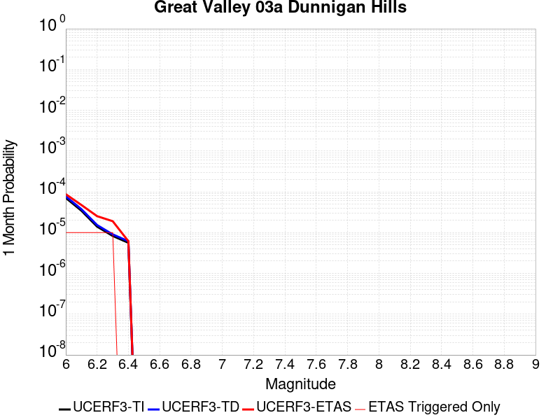 | 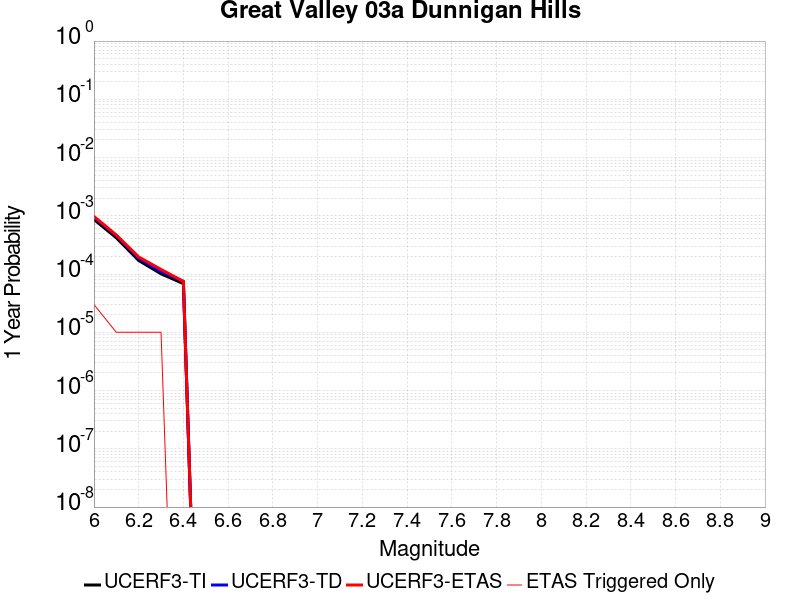 | 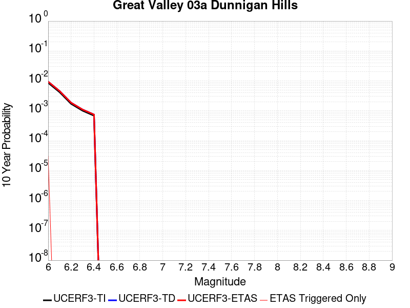 |

| Magnitude | 1 wk TI Prob | 1 wk TD Prob | 1 wk ETAS Prob | 1 wk ETAS/TD Gain | 1 wk ETAS Triggered Only | 1 mo TI Prob | 1 mo TD Prob | 1 mo ETAS Prob | 1 mo ETAS/TD Gain | 1 mo ETAS Triggered Only | 1 yr TI Prob | 1 yr TD Prob | 1 yr ETAS Prob | 1 yr ETAS/TD Gain | 1 yr ETAS Triggered Only | 10 yr TI Prob | 10 yr TD Prob | 10 yr ETAS Prob | 10 yr ETAS/TD Gain | 10 yr ETAS Triggered Only |
|-----|-----|-----|-----|-----|-----|-----|-----|-----|-----|-----|-----|-----|-----|-----|-----|-----|-----|-----|-----|-----|
| 6.0 | 1.6591328E-5 | 1.8107954E-5 | 1.8107954E-5 | 1.0 | 0.0 | 7.110376E-5 | 7.7603596E-5 | 7.7603596E-5 | 1.0 | 0.0 | 8.6534437E-4 | 9.444834E-4 | 9.596897E-4 | 1.0161002 | 1.52207E-5 | 0.008619824 | 0.009411525 | 0.00944168 | 1.003204 | 3.04414E-5 |
| 6.1 | 8.041125E-6 | 8.769726E-6 | 8.769726E-6 | 1.0 | 0.0 | 3.4461507E-5 | 3.7584115E-5 | 3.7584115E-5 | 1.0 | 0.0 | 4.194881E-4 | 4.5751085E-4 | 4.5751085E-4 | 1.0 | 0.0 | 0.004186971 | 0.004567687 | 0.004567687 | 1.0 | 0.0 |
| 6.2 | 3.2807004E-6 | 3.5795688E-6 | 3.5795688E-6 | 1.0 | 0.0 | 1.4060069E-5 | 1.5340942E-5 | 1.5340942E-5 | 1.0 | 0.0 | 1.7116789E-4 | 1.8676413E-4 | 1.8676413E-4 | 1.0 | 0.0 | 0.0017103611 | 0.0018664796 | 0.0018664796 | 1.0 | 0.0 |
| 6.3 | 1.9339366E-6 | 2.1103806E-6 | 2.1103806E-6 | 1.0 | 0.0 | 8.288273E-6 | 9.044474E-6 | 9.044474E-6 | 1.0 | 0.0 | 1.00905054E-4 | 1.1011375E-4 | 1.1011375E-4 | 1.0 | 0.0 | 0.0010085925 | 0.0011008718 | 0.0011008718 | 1.0 | 0.0 |
| 6.4 | 1.3142635E-6 | 1.4339867E-6 | 1.4339867E-6 | 1.0 | 0.0 | 5.6325457E-6 | 6.145657E-6 | 6.145657E-6 | 1.0 | 0.0 | 6.857408E-5 | 7.482337E-5 | 7.482337E-5 | 1.0 | 0.0 | 6.8552926E-4 | 7.4823375E-4 | 7.4823375E-4 | 1.0 | 0.0 |

## Hayward (No) 2011 CFM
*[(top)](#table-of-contents)*

| 1 Week | 1 Month | 1 Year | 10 Year |
|-----|-----|-----|-----|
|  | 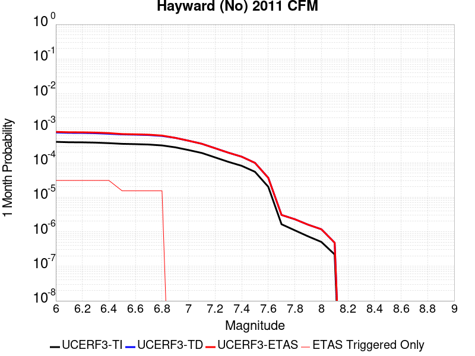 | 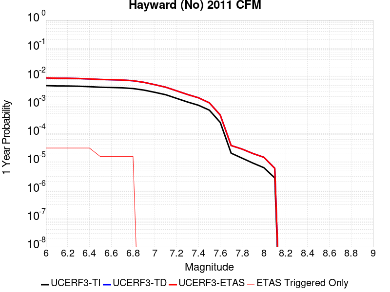 | 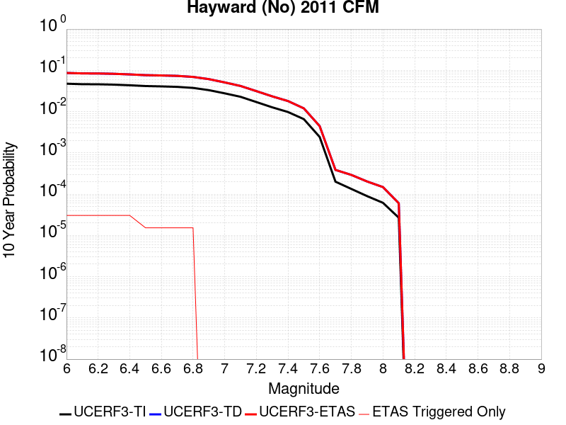 |

| Magnitude | 1 wk TI Prob | 1 wk TD Prob | 1 wk ETAS Prob | 1 wk ETAS/TD Gain | 1 wk ETAS Triggered Only | 1 mo TI Prob | 1 mo TD Prob | 1 mo ETAS Prob | 1 mo ETAS/TD Gain | 1 mo ETAS Triggered Only | 1 yr TI Prob | 1 yr TD Prob | 1 yr ETAS Prob | 1 yr ETAS/TD Gain | 1 yr ETAS Triggered Only | 10 yr TI Prob | 10 yr TD Prob | 10 yr ETAS Prob | 10 yr ETAS/TD Gain | 10 yr ETAS Triggered Only |
|-----|-----|-----|-----|-----|-----|-----|-----|-----|-----|-----|-----|-----|-----|-----|-----|-----|-----|-----|-----|-----|
| 6.0 | 9.3068506E-5 | 1.739599E-4 | 1.8917795E-4 | 1.0874802 | 1.52207E-5 | 3.9880406E-4 | 7.453244E-4 | 7.757431E-4 | 1.0408127 | 3.04414E-5 | 0.0048446343 | 0.009036438 | 0.009066604 | 1.0033383 | 3.04414E-5 | 0.047403704 | 0.08637534 | 0.086403154 | 1.000322 | 3.04414E-5 |
| 6.1 | 9.055486E-5 | 1.6947114E-4 | 1.8468926E-4 | 1.0897977 | 1.52207E-5 | 3.880345E-4 | 7.261021E-4 | 7.5652136E-4 | 1.041894 | 3.04414E-5 | 0.0047140904 | 0.008804537 | 0.008834711 | 1.003427 | 3.04414E-5 | 0.046153355 | 0.08426854 | 0.08429641 | 1.0003308 | 3.04414E-5 |
| 6.2 | 9.006742E-5 | 1.6867711E-4 | 1.8389524E-4 | 1.0902205 | 1.52207E-5 | 3.859461E-4 | 7.22701E-4 | 7.5312046E-4 | 1.0420913 | 3.04414E-5 | 0.0046887742 | 0.008763513 | 0.008793687 | 1.0034432 | 3.04414E-5 | 0.0459107 | 0.083892785 | 0.08392067 | 1.0003325 | 3.04414E-5 |
| 6.3 | 8.8336754E-5 | 1.6547246E-4 | 1.8069065E-4 | 1.091968 | 1.52207E-5 | 3.7853114E-4 | 7.089758E-4 | 7.393956E-4 | 1.0429068 | 3.04414E-5 | 0.004598882 | 0.008597788 | 0.008627968 | 1.0035101 | 3.04414E-5 | 0.04504866 | 0.08238599 | 0.08241393 | 1.000339 | 3.04414E-5 |
| 6.4 | 8.526157E-5 | 1.5974249E-4 | 1.7496075E-4 | 1.0952675 | 1.52207E-5 | 3.6535555E-4 | 6.8443175E-4 | 7.1485236E-4 | 1.0444465 | 3.04414E-5 | 0.0044391346 | 0.008301278 | 0.0083314665 | 1.0036366 | 3.04414E-5 | 0.043514993 | 0.079682834 | 0.079710856 | 1.0003515 | 3.04414E-5 |
| 6.5 | 8.152396E-5 | 1.530663E-4 | 1.6828468E-4 | 1.0994234 | 1.52207E-5 | 3.493416E-4 | 6.558342E-4 | 6.710449E-4 | 1.0231929 | 1.52207E-5 | 0.0042449418 | 0.007955698 | 0.007970798 | 1.0018979 | 1.52207E-5 | 0.04164765 | 0.07651369 | 0.076527745 | 1.0001837 | 1.52207E-5 |
| 6.6 | 7.987405E-5 | 1.5010842E-4 | 1.6532683E-4 | 1.1013829 | 1.52207E-5 | 3.4227243E-4 | 6.4316386E-4 | 6.5837475E-4 | 1.0236502 | 1.52207E-5 | 0.0041592065 | 0.0078025614 | 0.007817663 | 1.0019355 | 1.52207E-5 | 0.04082218 | 0.07510622 | 0.07512029 | 1.0001874 | 1.52207E-5 |
| 6.7 | 7.777665E-5 | 1.4650106E-4 | 1.6171952E-4 | 1.1038796 | 1.52207E-5 | 3.332859E-4 | 6.277113E-4 | 6.429224E-4 | 1.0242327 | 1.52207E-5 | 0.004050208 | 0.00761576 | 0.0076308646 | 1.0019834 | 1.52207E-5 | 0.039771806 | 0.073382616 | 0.07339672 | 1.0001922 | 1.52207E-5 |
| 6.8 | 7.3284005E-5 | 1.3800753E-4 | 1.5322614E-4 | 1.1102737 | 1.52207E-5 | 3.140365E-4 | 5.913274E-4 | 6.065391E-4 | 1.0257246 | 1.52207E-5 | 0.0038166929 | 0.0071757827 | 0.0071908943 | 1.002106 | 1.52207E-5 | 0.037518036 | 0.06929621 | 0.069310375 | 1.0002044 | 1.52207E-5 |
| 6.9 | 6.458263E-5 | 1.2131439E-4 | 1.2131439E-4 | 1.0 | 0.0 | 2.7675333E-4 | 5.198157E-4 | 5.198157E-4 | 1.0 | 0.0 | 0.0033642664 | 0.0063104923 | 0.0063104923 | 1.0 | 0.0 | 0.033137884 | 0.061225023 | 0.061225023 | 1.0 | 0.0 |
| 7.0 | 5.3853604E-5 | 1.00250414E-4 | 1.00250414E-4 | 1.0 | 0.0 | 2.3078074E-4 | 4.295742E-4 | 4.295742E-4 | 1.0 | 0.0 | 0.0028061352 | 0.0052175885 | 0.0052175885 | 1.0 | 0.0 | 0.027709642 | 0.0509578 | 0.0509578 | 1.0 | 0.0 |
| 7.1 | 4.4308683E-5 | 8.170626E-5 | 8.170626E-5 | 1.0 | 0.0 | 1.8988053E-4 | 3.501229E-4 | 3.501229E-4 | 1.0 | 0.0 | 0.0023093442 | 0.0042544557 | 0.0042544557 | 1.0 | 0.0 | 0.022854926 | 0.04182473 | 0.04182473 | 1.0 | 0.0 |
| 7.2 | 3.295973E-5 | 6.0771144E-5 | 6.0771144E-5 | 1.0 | 0.0 | 1.4124835E-4 | 2.604219E-4 | 2.604219E-4 | 1.0 | 0.0 | 0.0017183421 | 0.0031660495 | 0.0031660495 | 1.0 | 0.0 | 0.017051157 | 0.031369876 | 0.031369876 | 1.0 | 0.0 |
| 7.3 | 2.452256E-5 | 4.5180346E-5 | 4.5180346E-5 | 1.0 | 0.0 | 1.05092455E-4 | 1.9361576E-4 | 1.9361576E-4 | 1.0 | 0.0 | 0.0012787496 | 0.0023547374 | 0.0023547374 | 1.0 | 0.0 | 0.0127141625 | 0.02344111 | 0.02344111 | 1.0 | 0.0 |
| 7.4 | 1.8829967E-5 | 3.4602548E-5 | 3.4602548E-5 | 1.0 | 0.0 | 8.069736E-5 | 1.4828827E-4 | 1.4828827E-4 | 1.0 | 0.0 | 9.820475E-4 | 0.0018039243 | 0.0018039243 | 1.0 | 0.0 | 0.009777189 | 0.0180195 | 0.0180195 | 1.0 | 0.0 |
| 7.5 | 1.26374125E-5 | 2.2921116E-5 | 2.2921116E-5 | 1.0 | 0.0 | 5.4159216E-5 | 9.822969E-5 | 9.822969E-5 | 1.0 | 0.0 | 6.5918895E-4 | 0.0011952962 | 0.0011952962 | 1.0 | 0.0 | 0.00657237 | 0.011988836 | 0.011988836 | 1.0 | 0.0 |
| 7.6 | 4.666429E-6 | 8.4791645E-6 | 8.4791645E-6 | 1.0 | 0.0 | 1.9998828E-5 | 3.6338777E-5 | 3.6338777E-5 | 1.0 | 0.0 | 2.4345852E-4 | 4.4233602E-4 | 4.4233602E-4 | 1.0 | 0.0 | 0.0024319198 | 0.0044591012 | 0.0044591012 | 1.0 | 0.0 |
| 7.7 | 3.8399318E-7 | 7.133867E-7 | 7.133867E-7 | 1.0 | 0.0 | 1.6456839E-6 | 3.057368E-6 | 3.057368E-6 | 1.0 | 0.0 | 2.003602E-5 | 3.722282E-5 | 3.722282E-5 | 1.0 | 0.0 | 2.0034213E-4 | 3.8614936E-4 | 3.8614936E-4 | 1.0 | 0.0 |
| 7.8 | 2.5637698E-7 | 5.3662194E-7 | 5.3662194E-7 | 1.0 | 0.0 | 1.098758E-6 | 2.299806E-6 | 2.299806E-6 | 1.0 | 0.0 | 1.3377297E-5 | 2.7999782E-5 | 2.7999782E-5 | 1.0 | 0.0 | 1.3376492E-4 | 2.9244382E-4 | 2.9244382E-4 | 1.0 | 0.0 |
| 7.9 | 1.7141245E-7 | 3.7290573E-7 | 3.7290573E-7 | 1.0 | 0.0 | 7.3462456E-7 | 1.5981665E-6 | 1.5981665E-6 | 1.0 | 0.0 | 8.944017E-6 | 1.9457504E-5 | 1.9457504E-5 | 1.0 | 0.0 | 8.943657E-5 | 2.0245428E-4 | 2.0245428E-4 | 1.0 | 0.0 |
| 8.0 | 1.1808895E-7 | 2.7509762E-7 | 2.7509762E-7 | 1.0 | 0.0 | 5.060954E-7 | 1.1789892E-6 | 1.1789892E-6 | 1.0 | 0.0 | 6.161694E-6 | 1.43541E-5 | 1.43541E-5 | 1.0 | 0.0 | 6.161523E-5 | 1.4816441E-4 | 1.4816441E-4 | 1.0 | 0.0 |
| 8.1 | 5.138535E-8 | 1.1229867E-7 | 1.1229867E-7 | 1.0 | 0.0 | 2.2022292E-7 | 4.812799E-7 | 4.812799E-7 | 1.0 | 0.0 | 2.6812106E-6 | 5.8595674E-6 | 5.8595674E-6 | 1.0 | 0.0 | 2.6811784E-5 | 6.0158476E-5 | 6.0158476E-5 | 1.0 | 0.0 |

## Hunting Creek - Bartlett Springs connector 2011
*[(top)](#table-of-contents)*

| 1 Week | 1 Month | 1 Year | 10 Year |
|-----|-----|-----|-----|
| 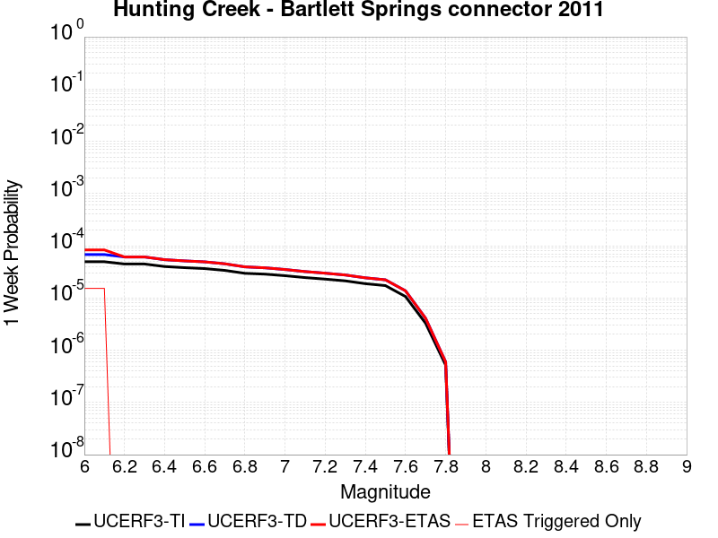 | 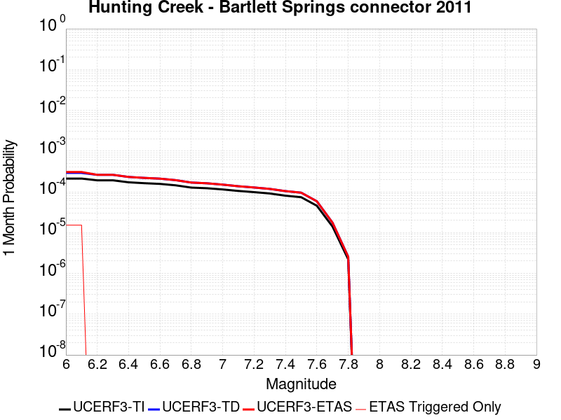 | 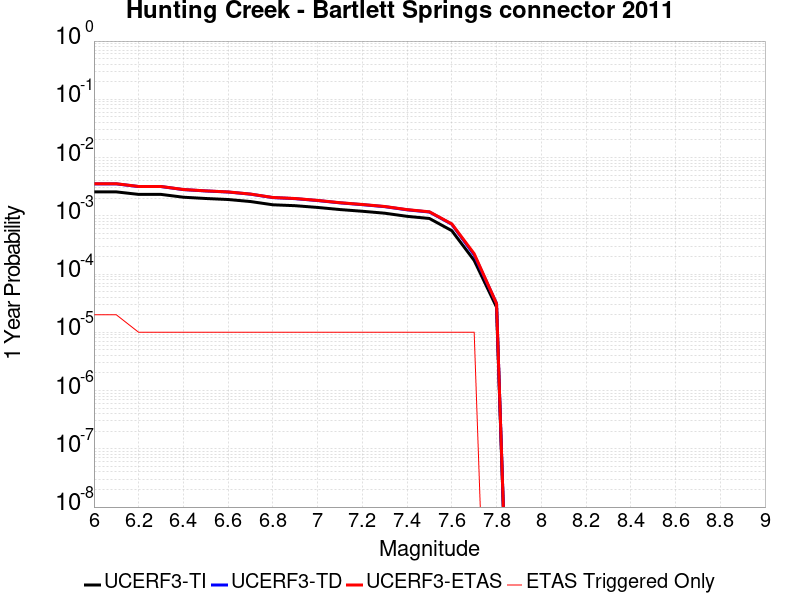 | 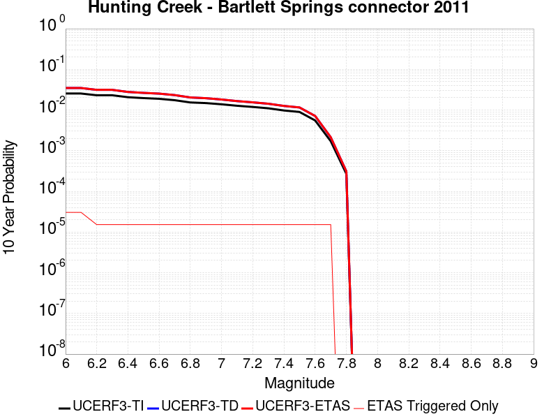 |

| Magnitude | 1 wk TI Prob | 1 wk TD Prob | 1 wk ETAS Prob | 1 wk ETAS/TD Gain | 1 wk ETAS Triggered Only | 1 mo TI Prob | 1 mo TD Prob | 1 mo ETAS Prob | 1 mo ETAS/TD Gain | 1 mo ETAS Triggered Only | 1 yr TI Prob | 1 yr TD Prob | 1 yr ETAS Prob | 1 yr ETAS/TD Gain | 1 yr ETAS Triggered Only | 10 yr TI Prob | 10 yr TD Prob | 10 yr ETAS Prob | 10 yr ETAS/TD Gain | 10 yr ETAS Triggered Only |
|-----|-----|-----|-----|-----|-----|-----|-----|-----|-----|-----|-----|-----|-----|-----|-----|-----|-----|-----|-----|-----|
| 6.0 | 4.940016E-5 | 6.786822E-5 | 8.3087885E-5 | 1.2242533 | 1.52207E-5 | 2.1169778E-4 | 2.9083234E-4 | 3.060486E-4 | 1.0523198 | 1.52207E-5 | 0.002574374 | 0.003535177 | 0.003565511 | 1.0085806 | 3.04414E-5 | 0.025447546 | 0.034773834 | 0.03480322 | 1.000845 | 3.04414E-5 |
| 6.1 | 4.940016E-5 | 6.786822E-5 | 8.3087885E-5 | 1.2242533 | 1.52207E-5 | 2.1169778E-4 | 2.9083234E-4 | 3.060486E-4 | 1.0523198 | 1.52207E-5 | 0.002574374 | 0.003535177 | 0.003565511 | 1.0085806 | 3.04414E-5 | 0.025447546 | 0.034773834 | 0.03480322 | 1.000845 | 3.04414E-5 |
| 6.2 | 4.472471E-5 | 6.1002804E-5 | 6.1002804E-5 | 1.0 | 0.0 | 1.9166325E-4 | 2.6141506E-4 | 2.6141506E-4 | 1.0 | 0.0 | 0.0023310026 | 0.003178107 | 0.0031932795 | 1.004774 | 1.52207E-5 | 0.02306703 | 0.031316914 | 0.03133166 | 1.0004708 | 1.52207E-5 |
| 6.3 | 4.472471E-5 | 6.1002804E-5 | 6.1002804E-5 | 1.0 | 0.0 | 1.9166325E-4 | 2.6141506E-4 | 2.6141506E-4 | 1.0 | 0.0 | 0.0023310026 | 0.003178107 | 0.0031932795 | 1.004774 | 1.52207E-5 | 0.02306703 | 0.031316914 | 0.03133166 | 1.0004708 | 1.52207E-5 |
| 6.4 | 4.0001003E-5 | 5.4103755E-5 | 5.4103755E-5 | 1.0 | 0.0 | 1.714216E-4 | 2.31853E-4 | 2.31853E-4 | 1.0 | 0.0 | 0.0020850603 | 0.0028191248 | 0.0028343026 | 1.0053838 | 1.52207E-5 | 0.02065605 | 0.027828315 | 0.027843112 | 1.0005317 | 1.52207E-5 |
| 6.5 | 3.8033053E-5 | 5.1266547E-5 | 5.1266547E-5 | 1.0 | 0.0 | 1.6298861E-4 | 2.1969559E-4 | 2.1969559E-4 | 1.0 | 0.0 | 0.0019825802 | 0.0026714746 | 0.0026866547 | 1.0056822 | 1.52207E-5 | 0.019649856 | 0.026390454 | 0.026405273 | 1.0005615 | 1.52207E-5 |
| 6.6 | 3.653754E-5 | 4.913017E-5 | 4.913017E-5 | 1.0 | 0.0 | 1.5658008E-4 | 2.1054115E-4 | 2.1054115E-4 | 1.0 | 0.0 | 0.0019046954 | 0.0025602852 | 0.0025754669 | 1.0059297 | 1.52207E-5 | 0.018884527 | 0.025306415 | 0.025321249 | 1.0005863 | 1.52207E-5 |
| 6.7 | 3.372024E-5 | 4.514011E-5 | 4.514011E-5 | 1.0 | 0.0 | 1.4450731E-4 | 1.9344354E-4 | 1.9344354E-4 | 1.0 | 0.0 | 0.0017579567 | 0.002352639 | 0.002367824 | 1.0064543 | 1.52207E-5 | 0.017441148 | 0.023278099 | 0.023292964 | 1.0006386 | 1.52207E-5 |
| 6.8 | 2.9650024E-5 | 3.9411374E-5 | 3.9411374E-5 | 1.0 | 0.0 | 1.2706534E-4 | 1.6889503E-4 | 1.6889503E-4 | 1.0 | 0.0 | 0.0015459227 | 0.0020543463 | 0.0020695357 | 1.0073938 | 1.52207E-5 | 0.015352124 | 0.020351216 | 0.020366127 | 1.0007327 | 1.52207E-5 |
| 6.9 | 2.860775E-5 | 3.7812544E-5 | 3.7812544E-5 | 1.0 | 0.0 | 1.2259888E-4 | 1.6204377E-4 | 1.6204377E-4 | 1.0 | 0.0 | 0.0014916194 | 0.001971107 | 0.0019862978 | 1.0077066 | 1.52207E-5 | 0.014816469 | 0.01953584 | 0.019550763 | 1.0007639 | 1.52207E-5 |
| 7.0 | 2.6696067E-5 | 3.506726E-5 | 3.506726E-5 | 1.0 | 0.0 | 1.144067E-4 | 1.5027967E-4 | 1.5027967E-4 | 1.0 | 0.0 | 0.0013920115 | 0.0018281302 | 0.0018433231 | 1.0083106 | 1.52207E-5 | 0.013833242 | 0.018131364 | 0.018146308 | 1.0008242 | 1.52207E-5 |
| 7.1 | 2.456087E-5 | 3.2013093E-5 | 3.2013093E-5 | 1.0 | 0.0 | 1.0525662E-4 | 1.371918E-4 | 1.371918E-4 | 1.0 | 0.0 | 0.001280746 | 0.0016690396 | 0.0016842348 | 1.0091043 | 1.52207E-5 | 0.012733897 | 0.016566366 | 0.016581334 | 1.0009036 | 1.52207E-5 |
| 7.2 | 2.295761E-5 | 2.9822932E-5 | 2.9822932E-5 | 1.0 | 0.0 | 9.8386045E-5 | 1.2780636E-4 | 1.2780636E-4 | 1.0 | 0.0 | 0.0011971919 | 0.001554941 | 0.0015701379 | 1.0097734 | 1.52207E-5 | 0.011907627 | 0.015442089 | 0.015457075 | 1.0009705 | 1.52207E-5 |
| 7.3 | 2.1256936E-5 | 2.7541912E-5 | 2.7541912E-5 | 1.0 | 0.0 | 9.109797E-5 | 1.1803147E-4 | 1.1803147E-4 | 1.0 | 0.0 | 0.0011085535 | 0.0014360948 | 0.0014512936 | 1.0105834 | 1.52207E-5 | 0.011030397 | 0.014269472 | 0.014284476 | 1.0010514 | 1.52207E-5 |
| 7.4 | 1.8784336E-5 | 2.4306766E-5 | 2.4306766E-5 | 1.0 | 0.0 | 8.050181E-5 | 1.0416774E-4 | 1.0416774E-4 | 1.0 | 0.0 | 9.796688E-4 | 0.001267512 | 0.0012827134 | 1.011993 | 1.52207E-5 | 0.009753612 | 0.012603902 | 0.012618931 | 1.0011925 | 1.52207E-5 |
| 7.5 | 1.7248298E-5 | 2.2268887E-5 | 2.2268887E-5 | 1.0 | 0.0 | 7.391918E-5 | 9.543464E-5 | 9.543464E-5 | 1.0 | 0.0 | 8.9959445E-4 | 0.0011613049 | 0.0011765079 | 1.0130913 | 1.52207E-5 | 0.008959615 | 0.01155334 | 0.011568384 | 1.0013022 | 1.52207E-5 |
| 7.6 | 1.0653709E-5 | 1.3722118E-5 | 1.3722118E-5 | 1.0 | 0.0 | 4.5657955E-5 | 5.8807767E-5 | 5.8807767E-5 | 1.0 | 0.0 | 5.557438E-4 | 7.157521E-4 | 7.3096185E-4 | 1.0212501 | 1.52207E-5 | 0.0055435603 | 0.0071348166 | 0.0071499287 | 1.0021181 | 1.52207E-5 |
| 7.7 | 3.286316E-6 | 4.0903437E-6 | 4.0903437E-6 | 1.0 | 0.0 | 1.4084137E-5 | 1.7529928E-5 | 1.7529928E-5 | 1.0 | 0.0 | 1.7146087E-4 | 2.1340612E-4 | 2.2862358E-4 | 1.0713074 | 1.52207E-5 | 0.0017132863 | 0.0021320276 | 0.002147216 | 1.0071238 | 1.52207E-5 |
| 7.8 | 5.1855085E-7 | 5.9720696E-7 | 5.9720696E-7 | 1.0 | 0.0 | 2.222359E-6 | 2.5594559E-6 | 2.5594559E-6 | 1.0 | 0.0 | 2.7056883E-5 | 3.116094E-5 | 3.116094E-5 | 1.0 | 0.0 | 2.705359E-4 | 3.1156495E-4 | 3.1156495E-4 | 1.0 | 0.0 |

## Owens Valley Keough Hot Springs
*[(top)](#table-of-contents)*

| 1 Week | 1 Month | 1 Year | 10 Year |
|-----|-----|-----|-----|
|  | 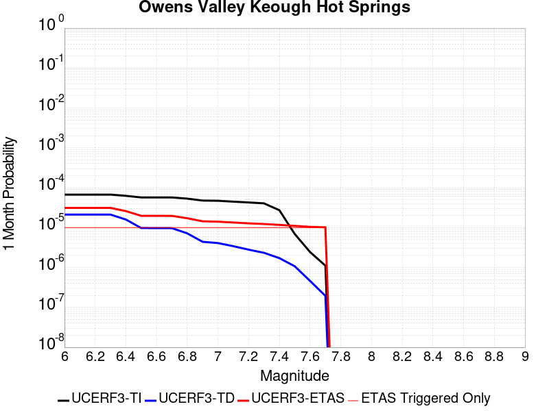 | 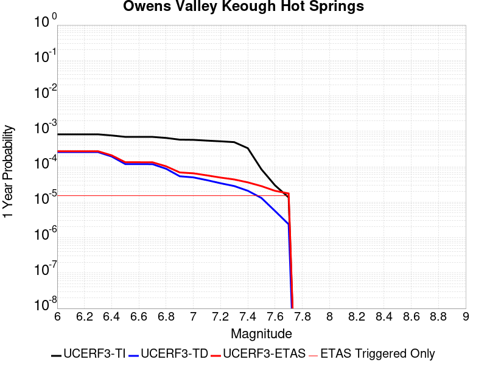 | 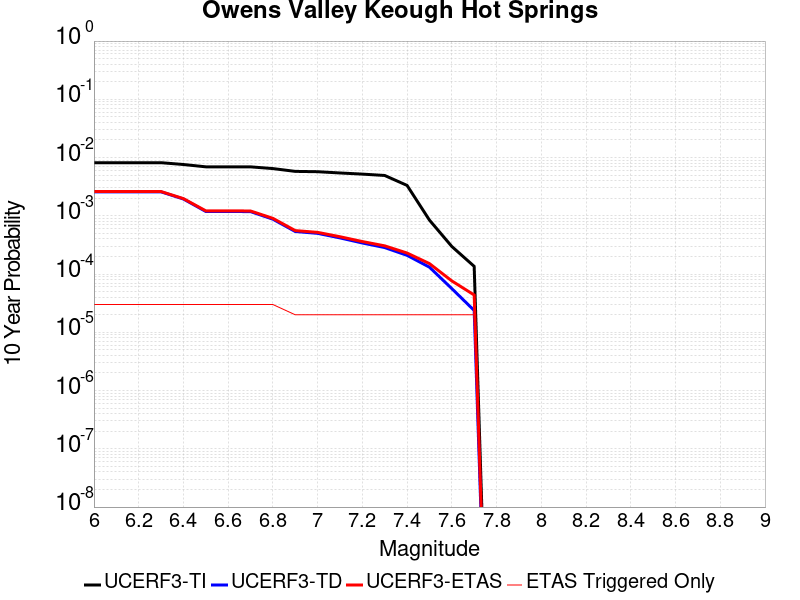 |

| Magnitude | 1 wk TI Prob | 1 wk TD Prob | 1 wk ETAS Prob | 1 wk ETAS/TD Gain | 1 wk ETAS Triggered Only | 1 mo TI Prob | 1 mo TD Prob | 1 mo ETAS Prob | 1 mo ETAS/TD Gain | 1 mo ETAS Triggered Only | 1 yr TI Prob | 1 yr TD Prob | 1 yr ETAS Prob | 1 yr ETAS/TD Gain | 1 yr ETAS Triggered Only | 10 yr TI Prob | 10 yr TD Prob | 10 yr ETAS Prob | 10 yr ETAS/TD Gain | 10 yr ETAS Triggered Only |
|-----|-----|-----|-----|-----|-----|-----|-----|-----|-----|-----|-----|-----|-----|-----|-----|-----|-----|-----|-----|-----|
| 6.0 | 1.5708529E-5 | 4.950656E-6 | 2.0171281E-5 | 4.074466 | 1.52207E-5 | 6.7320536E-5 | 2.1216953E-5 | 3.643733E-5 | 1.7173686 | 1.52207E-5 | 8.193192E-4 | 2.582909E-4 | 2.7350767E-4 | 1.0589134 | 1.52207E-5 | 0.008163051 | 0.0025805652 | 0.002610928 | 1.011766 | 3.04414E-5 |
| 6.1 | 1.5708529E-5 | 4.950656E-6 | 2.0171281E-5 | 4.074466 | 1.52207E-5 | 6.7320536E-5 | 2.1216953E-5 | 3.643733E-5 | 1.7173686 | 1.52207E-5 | 8.193192E-4 | 2.582909E-4 | 2.7350767E-4 | 1.0589134 | 1.52207E-5 | 0.008163051 | 0.0025805652 | 0.002610928 | 1.011766 | 3.04414E-5 |
| 6.2 | 1.5708529E-5 | 4.950656E-6 | 2.0171281E-5 | 4.074466 | 1.52207E-5 | 6.7320536E-5 | 2.1216953E-5 | 3.643733E-5 | 1.7173686 | 1.52207E-5 | 8.193192E-4 | 2.582909E-4 | 2.7350767E-4 | 1.0589134 | 1.52207E-5 | 0.008163051 | 0.0025805652 | 0.002610928 | 1.011766 | 3.04414E-5 |
| 6.3 | 1.5708529E-5 | 4.950656E-6 | 2.0171281E-5 | 4.074466 | 1.52207E-5 | 6.7320536E-5 | 2.1216953E-5 | 3.643733E-5 | 1.7173686 | 1.52207E-5 | 8.193192E-4 | 2.582909E-4 | 2.7350767E-4 | 1.0589134 | 1.52207E-5 | 0.008163051 | 0.0025805652 | 0.002610928 | 1.011766 | 3.04414E-5 |
| 6.4 | 1.4622509E-5 | 3.7265204E-6 | 1.8947165E-5 | 5.0844116 | 1.52207E-5 | 6.266639E-5 | 1.5970723E-5 | 3.119118E-5 | 1.9530225 | 1.52207E-5 | 7.626962E-4 | 1.944295E-4 | 2.0964725E-4 | 1.0782686 | 1.52207E-5 | 0.007600839 | 0.0019430731 | 0.0019734553 | 1.0156362 | 3.04414E-5 |
| 6.5 | 1.3335527E-5 | 2.2777172E-6 | 1.7498383E-5 | 7.682421 | 1.52207E-5 | 5.7151006E-5 | 9.761612E-6 | 2.4982164E-5 | 2.559225 | 1.52207E-5 | 6.955913E-4 | 1.18841825E-4 | 1.3406071E-4 | 1.1280601 | 1.52207E-5 | 0.0069341804 | 0.0011880046 | 0.0012184099 | 1.0255935 | 3.04414E-5 |
| 6.6 | 1.3332855E-5 | 2.2748663E-6 | 1.7495531E-5 | 7.6907954 | 1.52207E-5 | 5.7139558E-5 | 9.749395E-6 | 2.4969946E-5 | 2.5611792 | 1.52207E-5 | 6.9545204E-4 | 1.186931E-4 | 1.3391199E-4 | 1.1282206 | 1.52207E-5 | 0.0069327964 | 0.0011865189 | 0.0012169242 | 1.0256256 | 3.04414E-5 |
| 6.7 | 1.3318214E-5 | 2.2640966E-6 | 1.7484763E-5 | 7.722622 | 1.52207E-5 | 5.707681E-5 | 9.703239E-6 | 2.4923791E-5 | 2.5686054 | 1.52207E-5 | 6.946886E-4 | 1.1813121E-4 | 1.3335011E-4 | 1.1288306 | 1.52207E-5 | 0.0069252094 | 0.001180906 | 0.0012113114 | 1.0257475 | 3.04414E-5 |
| 6.8 | 1.2441338E-5 | 1.6777863E-6 | 1.689846E-5 | 10.071879 | 1.52207E-5 | 5.331893E-5 | 7.1904947E-6 | 2.2411085E-5 | 3.1167655 | 1.52207E-5 | 6.489646E-4 | 8.7541055E-5 | 1.0276042E-4 | 1.1738541 | 1.52207E-5 | 0.0064707273 | 8.752499E-4 | 9.0566464E-4 | 1.0347497 | 3.04414E-5 |
| 6.9 | 1.1130476E-5 | 1.0303868E-6 | 1.6251071E-5 | 15.771817 | 1.52207E-5 | 4.7701167E-5 | 4.415936E-6 | 1.9636569E-5 | 4.4467516 | 1.52207E-5 | 5.806069E-4 | 5.3762706E-5 | 6.898259E-5 | 1.2830937 | 1.52207E-5 | 0.0057909233 | 5.37651E-4 | 5.528635E-4 | 1.0282944 | 1.52207E-5 |
| 7.0 | 1.0986073E-5 | 9.579413E-7 | 1.6178627E-5 | 16.888954 | 1.52207E-5 | 4.7082318E-5 | 4.1054564E-6 | 1.9326095E-5 | 4.7074165 | 1.52207E-5 | 5.730765E-4 | 4.99828E-5 | 6.520274E-5 | 1.3045036 | 1.52207E-5 | 0.0057160086 | 4.9986853E-4 | 5.150816E-4 | 1.0304341 | 1.52207E-5 |
| 7.1 | 1.0451338E-5 | 8.0002656E-7 | 1.6020715E-5 | 20.025229 | 1.52207E-5 | 4.4790682E-5 | 3.4286807E-6 | 1.8649329E-5 | 5.439214 | 1.52207E-5 | 5.451901E-4 | 4.1743395E-5 | 5.6963458E-5 | 1.3646102 | 1.52207E-5 | 0.005438545 | 4.1750458E-4 | 4.3271892E-4 | 1.0364411 | 1.52207E-5 |
| 7.2 | 9.989061E-6 | 6.544956E-7 | 1.5875186E-5 | 24.255604 | 1.52207E-5 | 4.280956E-5 | 2.804978E-6 | 1.8025636E-5 | 6.4263015 | 1.52207E-5 | 5.2108173E-4 | 3.4150078E-5 | 4.9370257E-5 | 1.4456851 | 1.52207E-5 | 0.0051986156 | 3.415851E-4 | 3.568006E-4 | 1.0445439 | 1.52207E-5 |
| 7.3 | 9.465365E-6 | 5.4600474E-7 | 1.5766696E-5 | 28.876484 | 1.52207E-5 | 4.056522E-5 | 2.3400182E-6 | 1.7560682E-5 | 7.504507 | 1.52207E-5 | 4.937696E-4 | 2.8489352E-5 | 4.3709617E-5 | 1.5342441 | 1.52207E-5 | 0.0049267393 | 2.8498896E-4 | 3.002053E-4 | 1.0533928 | 1.52207E-5 |
| 7.4 | 6.3824805E-6 | 4.016335E-7 | 1.5622327E-5 | 38.896973 | 1.52207E-5 | 2.73532E-5 | 1.7212853E-6 | 1.694196E-5 | 9.842621 | 1.52207E-5 | 3.3297433E-4 | 2.095645E-5 | 3.617683E-5 | 1.7262863 | 1.52207E-5 | 0.0033247585 | 2.0963654E-4 | 2.2485404E-4 | 1.07259 | 1.52207E-5 |
| 7.5 | 1.6192645E-6 | 2.516124E-7 | 1.547231E-5 | 61.492638 | 1.52207E-5 | 6.9396865E-6 | 1.0783383E-6 | 1.6299022E-5 | 15.114943 | 1.52207E-5 | 8.448741E-5 | 1.31286915E-5 | 2.8349192E-5 | 2.159331 | 1.52207E-5 | 8.4455294E-4 | 1.3127929E-4 | 1.4649799E-4 | 1.1159261 | 1.52207E-5 |
| 7.6 | 5.7062545E-7 | 1.07924045E-7 | 1.5328622E-5 | 142.03159 | 1.52207E-5 | 2.4455355E-6 | 4.6253152E-7 | 1.5683225E-5 | 33.907364 | 1.52207E-5 | 2.9773988E-5 | 5.6313074E-6 | 2.0851921E-5 | 3.702856 | 1.52207E-5 | 2.977E-4 | 5.6311732E-5 | 7.153158E-5 | 1.2702783 | 1.52207E-5 |
| 7.7 | 2.5988817E-7 | 4.5457977E-8 | 1.5266158E-5 | 335.8301 | 1.52207E-5 | 1.113806E-6 | 1.9481989E-7 | 1.5415517E-5 | 79.127014 | 1.52207E-5 | 1.3560503E-5 | 2.3719301E-6 | 1.7592594E-5 | 7.4169955 | 1.52207E-5 | 1.3559677E-4 | 2.371909E-5 | 3.893943E-5 | 1.6416914 | 1.52207E-5 |

## Santa Cruz Catalina Ridge alt1
*[(top)](#table-of-contents)*

| 1 Week | 1 Month | 1 Year | 10 Year |
|-----|-----|-----|-----|
| 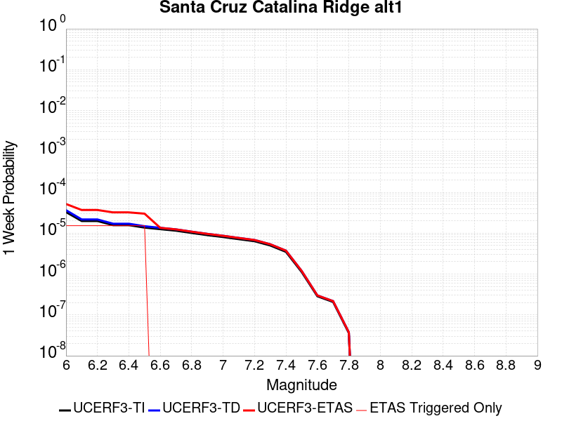 | 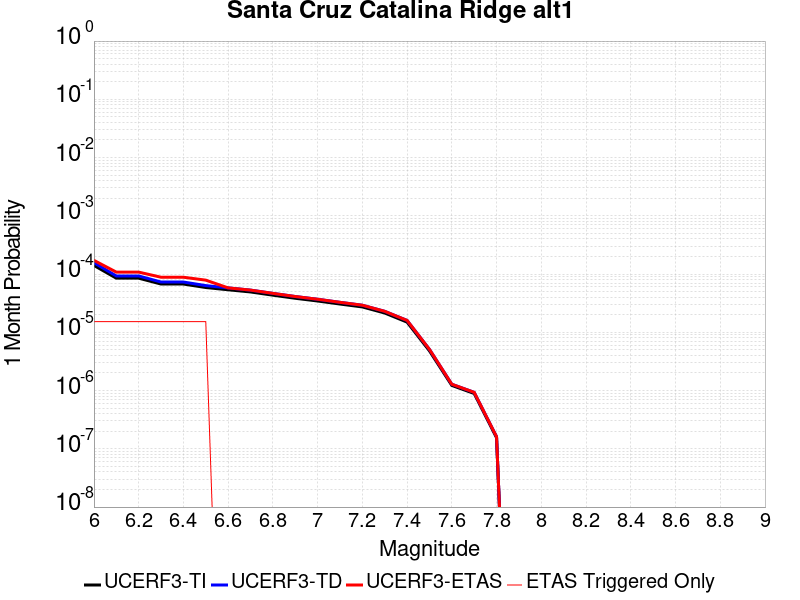 | 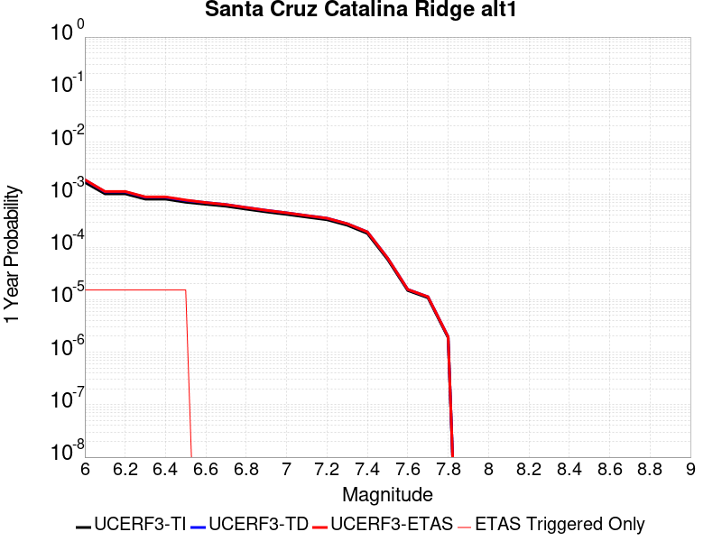 | 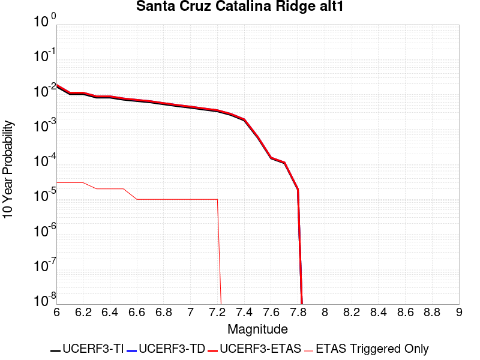 |

| Magnitude | 1 wk TI Prob | 1 wk TD Prob | 1 wk ETAS Prob | 1 wk ETAS/TD Gain | 1 wk ETAS Triggered Only | 1 mo TI Prob | 1 mo TD Prob | 1 mo ETAS Prob | 1 mo ETAS/TD Gain | 1 mo ETAS Triggered Only | 1 yr TI Prob | 1 yr TD Prob | 1 yr ETAS Prob | 1 yr ETAS/TD Gain | 1 yr ETAS Triggered Only | 10 yr TI Prob | 10 yr TD Prob | 10 yr ETAS Prob | 10 yr ETAS/TD Gain | 10 yr ETAS Triggered Only |
|-----|-----|-----|-----|-----|-----|-----|-----|-----|-----|-----|-----|-----|-----|-----|-----|-----|-----|-----|-----|-----|
| 6.0 | 3.2833184E-5 | 3.65584E-5 | 5.177854E-5 | 1.4163241 | 1.52207E-5 | 1.4070606E-4 | 1.5667039E-4 | 1.7188869E-4 | 1.0971359 | 1.52207E-5 | 0.00171175 | 0.0019059596 | 0.0019211513 | 1.0079706 | 1.52207E-5 | 0.016986247 | 0.018913029 | 0.018942894 | 1.001579 | 3.04414E-5 |
| 6.1 | 1.9835548E-5 | 2.1659505E-5 | 3.6879876E-5 | 1.7027109 | 1.52207E-5 | 8.500672E-5 | 9.282326E-5 | 1.0804255E-4 | 1.1639599 | 1.52207E-5 | 0.0010344655 | 0.0011295575 | 0.001144761 | 1.0134597 | 1.52207E-5 | 0.010296632 | 0.011240295 | 0.011270395 | 1.0026778 | 3.04414E-5 |
| 6.2 | 1.9835548E-5 | 2.1659505E-5 | 3.6879876E-5 | 1.7027109 | 1.52207E-5 | 8.500672E-5 | 9.282326E-5 | 1.0804255E-4 | 1.1639599 | 1.52207E-5 | 0.0010344655 | 0.0011295575 | 0.001144761 | 1.0134597 | 1.52207E-5 | 0.010296632 | 0.011240295 | 0.011270395 | 1.0026778 | 3.04414E-5 |
| 6.3 | 1.5728183E-5 | 1.703395E-5 | 3.225439E-5 | 1.8935356 | 1.52207E-5 | 6.7404755E-5 | 7.300063E-5 | 8.822022E-5 | 1.2084857 | 1.52207E-5 | 8.2034385E-4 | 8.884264E-4 | 9.0363354E-4 | 1.017117 | 1.52207E-5 | 0.008173222 | 0.008849427 | 0.008879599 | 1.0034095 | 3.04414E-5 |
| 6.4 | 1.5728183E-5 | 1.703395E-5 | 3.225439E-5 | 1.8935356 | 1.52207E-5 | 6.7404755E-5 | 7.300063E-5 | 8.822022E-5 | 1.2084857 | 1.52207E-5 | 8.2034385E-4 | 8.884264E-4 | 9.0363354E-4 | 1.017117 | 1.52207E-5 | 0.008173222 | 0.008849427 | 0.008879599 | 1.0034095 | 3.04414E-5 |
| 6.5 | 1.3707734E-5 | 1.4794522E-5 | 3.0014997E-5 | 2.0287912 | 1.52207E-5 | 5.8746107E-5 | 6.3403575E-5 | 7.862331E-5 | 1.2400454 | 1.52207E-5 | 7.1499916E-4 | 7.716686E-4 | 7.868776E-4 | 1.0197092 | 1.52207E-5 | 0.0071270303 | 0.0076902895 | 0.007720497 | 1.003928 | 3.04414E-5 |
| 6.6 | 1.2539813E-5 | 1.3510219E-5 | 1.3510219E-5 | 1.0 | 0.0 | 5.3740947E-5 | 5.789967E-5 | 5.789967E-5 | 1.0 | 0.0 | 6.540996E-4 | 7.0470315E-4 | 7.0470315E-4 | 1.0 | 0.0 | 0.0065217763 | 0.0070249885 | 0.007040102 | 1.0021515 | 1.52207E-5 |
| 6.7 | 1.1504083E-5 | 1.2377375E-5 | 1.2377375E-5 | 1.0 | 0.0 | 4.930228E-5 | 5.3044827E-5 | 5.3044827E-5 | 1.0 | 0.0 | 6.0008996E-4 | 6.456314E-4 | 6.456314E-4 | 1.0 | 0.0 | 0.005984721 | 0.006437786 | 0.0064529087 | 1.002349 | 1.52207E-5 |
| 6.8 | 1.012739E-5 | 1.0877071E-5 | 1.0877071E-5 | 1.0 | 0.0 | 4.340238E-5 | 4.6615194E-5 | 4.6615194E-5 | 1.0 | 0.0 | 5.282958E-4 | 5.673937E-4 | 5.673937E-4 | 1.0 | 0.0 | 0.0052704164 | 0.0056596193 | 0.0056747543 | 1.0026741 | 1.52207E-5 |
| 6.9 | 8.9607865E-6 | 9.609117E-6 | 9.609117E-6 | 1.0 | 0.0 | 3.8402806E-5 | 4.1181287E-5 | 4.1181287E-5 | 1.0 | 0.0 | 4.6745385E-4 | 5.012679E-4 | 5.012679E-4 | 1.0 | 0.0 | 0.0046647177 | 0.005001492 | 0.005016636 | 1.003028 | 1.52207E-5 |
| 7.0 | 8.046829E-6 | 8.619746E-6 | 8.619746E-6 | 1.0 | 0.0 | 3.4485955E-5 | 3.694125E-5 | 3.694125E-5 | 1.0 | 0.0 | 4.1978562E-4 | 4.496677E-4 | 4.496677E-4 | 1.0 | 0.0 | 0.004189935 | 0.0044876686 | 0.0045028212 | 1.0033765 | 1.52207E-5 |
| 7.1 | 7.136131E-6 | 7.637656E-6 | 7.637656E-6 | 1.0 | 0.0 | 3.0583058E-5 | 3.2732405E-5 | 3.2732405E-5 | 1.0 | 0.0 | 3.7228514E-4 | 3.9844486E-4 | 3.9844486E-4 | 1.0 | 0.0 | 0.0037166206 | 0.003977381 | 0.003992541 | 1.0038116 | 1.52207E-5 |
| 7.2 | 6.362014E-6 | 6.8049585E-6 | 6.8049585E-6 | 1.0 | 0.0 | 2.726549E-5 | 2.9163786E-5 | 2.9163786E-5 | 1.0 | 0.0 | 3.3190678E-4 | 3.550119E-4 | 3.550119E-4 | 1.0 | 0.0 | 0.0033141149 | 0.003544516 | 0.0035596828 | 1.0042789 | 1.52207E-5 |
| 7.3 | 5.004101E-6 | 5.351715E-6 | 5.351715E-6 | 1.0 | 0.0 | 2.1445969E-5 | 2.2935723E-5 | 2.2935723E-5 | 1.0 | 0.0 | 2.6107338E-4 | 2.792072E-4 | 2.792072E-4 | 1.0 | 0.0 | 0.002607669 | 0.0027886187 | 0.0027886187 | 1.0 | 0.0 |
| 7.4 | 3.4901443E-6 | 3.7320526E-6 | 3.7320526E-6 | 1.0 | 0.0 | 1.4957676E-5 | 1.5994416E-5 | 1.5994416E-5 | 1.0 | 0.0 | 1.8209449E-4 | 1.9471499E-4 | 1.9471499E-4 | 1.0 | 0.0 | 0.0018194534 | 0.0019454823 | 0.0019454823 | 1.0 | 0.0 |
| 7.5 | 1.1215045E-6 | 1.189387E-6 | 1.189387E-6 | 1.0 | 0.0 | 4.806439E-6 | 5.097363E-6 | 5.097363E-6 | 1.0 | 0.0 | 5.851682E-5 | 6.205866E-5 | 6.205866E-5 | 1.0 | 0.0 | 5.850142E-4 | 6.2041637E-4 | 6.2041637E-4 | 1.0 | 0.0 |
| 7.6 | 2.8599047E-7 | 2.9951994E-7 | 2.9951994E-7 | 1.0 | 0.0 | 1.2256729E-6 | 1.2836562E-6 | 1.2836562E-6 | 1.0 | 0.0 | 1.4922465E-5 | 1.5628404E-5 | 1.5628404E-5 | 1.0 | 0.0 | 1.4921463E-4 | 1.5627318E-4 | 1.5627318E-4 | 1.0 | 0.0 |
| 7.7 | 2.0781519E-7 | 2.1744323E-7 | 2.1744323E-7 | 1.0 | 0.0 | 8.906362E-7 | 9.3189925E-7 | 9.3189925E-7 | 1.0 | 0.0 | 1.08434415E-5 | 1.13458145E-5 | 1.13458145E-5 | 1.0 | 0.0 | 1.0842913E-4 | 1.1345245E-4 | 1.1345245E-4 | 1.0 | 0.0 |
| 7.8 | 3.614776E-8 | 3.764102E-8 | 3.764102E-8 | 1.0 | 0.0 | 1.5491896E-7 | 1.6131864E-7 | 1.6131864E-7 | 1.0 | 0.0 | 1.8861368E-6 | 1.9640527E-6 | 1.9640527E-6 | 1.0 | 0.0 | 1.8861208E-5 | 1.9640367E-5 | 1.9640367E-5 | 1.0 | 0.0 |

## Ortigalita (South)
*[(top)](#table-of-contents)*

| 1 Week | 1 Month | 1 Year | 10 Year |
|-----|-----|-----|-----|
|  |  | 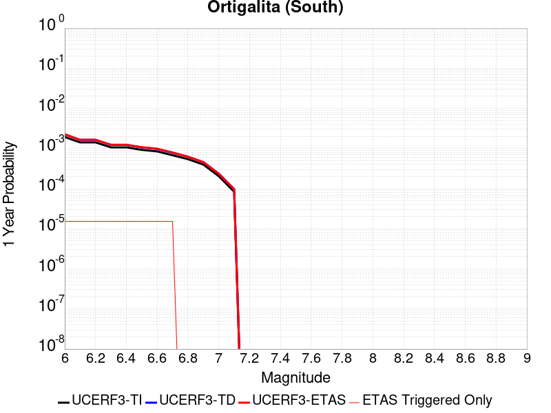 | 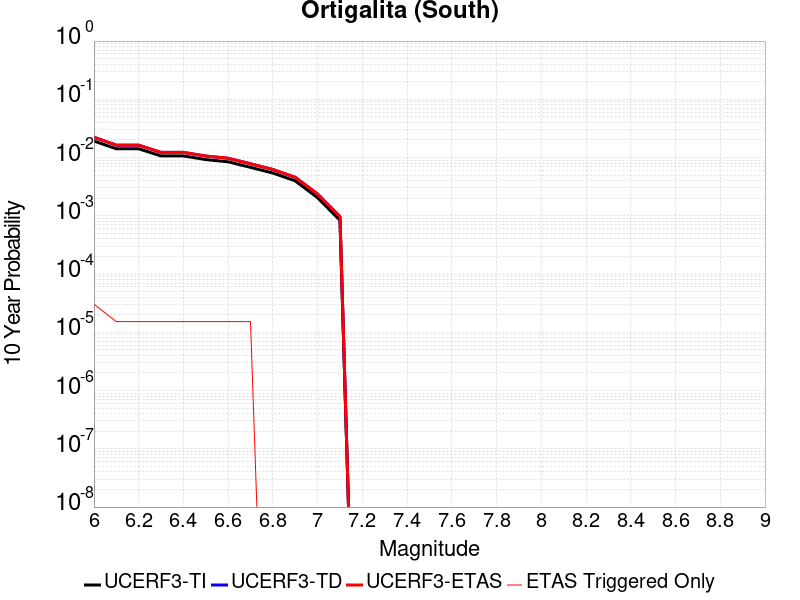 |

| Magnitude | 1 wk TI Prob | 1 wk TD Prob | 1 wk ETAS Prob | 1 wk ETAS/TD Gain | 1 wk ETAS Triggered Only | 1 mo TI Prob | 1 mo TD Prob | 1 mo ETAS Prob | 1 mo ETAS/TD Gain | 1 mo ETAS Triggered Only | 1 yr TI Prob | 1 yr TD Prob | 1 yr ETAS Prob | 1 yr ETAS/TD Gain | 1 yr ETAS Triggered Only | 10 yr TI Prob | 10 yr TD Prob | 10 yr ETAS Prob | 10 yr ETAS/TD Gain | 10 yr ETAS Triggered Only |
|-----|-----|-----|-----|-----|-----|-----|-----|-----|-----|-----|-----|-----|-----|-----|-----|-----|-----|-----|-----|-----|
| 6.0 | 3.72394E-5 | 4.325562E-5 | 4.325562E-5 | 1.0 | 0.0 | 1.5958765E-4 | 1.8536893E-4 | 1.8536893E-4 | 1.0 | 0.0 | 0.0019412481 | 0.0022546875 | 0.0022698739 | 1.0067354 | 1.52207E-5 | 0.019243775 | 0.022334497 | 0.022364259 | 1.0013325 | 3.04414E-5 |
| 6.1 | 2.7299884E-5 | 3.149204E-5 | 3.149204E-5 | 1.0 | 0.0 | 1.16994255E-4 | 1.3495922E-4 | 1.3495922E-4 | 1.0 | 0.0 | 0.0014234743 | 0.0016419457 | 0.0016571414 | 1.0092547 | 1.52207E-5 | 0.014143906 | 0.01630407 | 0.016319042 | 1.0009184 | 1.52207E-5 |
| 6.2 | 2.7299884E-5 | 3.149204E-5 | 3.149204E-5 | 1.0 | 0.0 | 1.16994255E-4 | 1.3495922E-4 | 1.3495922E-4 | 1.0 | 0.0 | 0.0014234743 | 0.0016419457 | 0.0016571414 | 1.0092547 | 1.52207E-5 | 0.014143906 | 0.01630407 | 0.016319042 | 1.0009184 | 1.52207E-5 |
| 6.3 | 2.0546433E-5 | 2.363145E-5 | 2.363145E-5 | 1.0 | 0.0 | 8.805317E-5 | 1.0127382E-4 | 1.0127382E-4 | 1.0 | 0.0 | 0.00107152 | 0.0012323303 | 0.0012475322 | 1.0123359 | 1.52207E-5 | 0.010663681 | 0.01225703 | 0.012272065 | 1.0012265 | 1.52207E-5 |
| 6.4 | 2.0546433E-5 | 2.363145E-5 | 2.363145E-5 | 1.0 | 0.0 | 8.805317E-5 | 1.0127382E-4 | 1.0127382E-4 | 1.0 | 0.0 | 0.00107152 | 0.0012323303 | 0.0012475322 | 1.0123359 | 1.52207E-5 | 0.010663681 | 0.01225703 | 0.012272065 | 1.0012265 | 1.52207E-5 |
| 6.5 | 1.7779594E-5 | 2.0446974E-5 | 2.0446974E-5 | 1.0 | 0.0 | 7.619603E-5 | 8.762702E-5 | 8.762702E-5 | 1.0 | 0.0 | 9.272918E-4 | 0.0010663504 | 0.0010815549 | 1.0142584 | 1.52207E-5 | 0.009234319 | 0.010613803 | 0.010628862 | 1.0014188 | 1.52207E-5 |
| 6.6 | 1.6272212E-5 | 1.8714967E-5 | 1.8714967E-5 | 1.0 | 0.0 | 6.973618E-5 | 8.0204605E-5 | 8.0204605E-5 | 1.0 | 0.0 | 8.487073E-4 | 9.760658E-4 | 9.912717E-4 | 1.0155787 | 1.52207E-5 | 0.008454733 | 0.009719091 | 0.009734163 | 1.0015508 | 1.52207E-5 |
| 6.7 | 1.3051484E-5 | 1.5038758E-5 | 1.5038758E-5 | 1.0 | 0.0 | 5.593373E-5 | 6.445028E-5 | 6.445028E-5 | 1.0 | 0.0 | 6.807804E-4 | 7.844092E-4 | 7.996179E-4 | 1.0193888 | 1.52207E-5 | 0.006786986 | 0.007817388 | 0.007832489 | 1.0019318 | 1.52207E-5 |
| 6.8 | 1.04277415E-5 | 1.1987235E-5 | 1.1987235E-5 | 1.0 | 0.0 | 4.4689557E-5 | 5.1372896E-5 | 5.1372896E-5 | 1.0 | 0.0 | 5.439595E-4 | 6.2529295E-4 | 6.2529295E-4 | 1.0 | 0.0 | 0.0054262993 | 0.00623609 | 0.00623609 | 1.0 | 0.0 |
| 6.9 | 7.639968E-6 | 8.791503E-6 | 8.791503E-6 | 1.0 | 0.0 | 3.274231E-5 | 3.767736E-5 | 3.767736E-5 | 1.0 | 0.0 | 3.9856473E-4 | 4.586312E-4 | 4.586312E-4 | 1.0 | 0.0 | 0.003978506 | 0.004577433 | 0.004577433 | 1.0 | 0.0 |
| 7.0 | 3.919831E-6 | 4.5334014E-6 | 4.5334014E-6 | 1.0 | 0.0 | 1.679917E-5 | 1.942873E-5 | 1.942873E-5 | 1.0 | 0.0 | 2.045107E-4 | 2.3652123E-4 | 2.3652123E-4 | 1.0 | 0.0 | 0.0020432258 | 0.0023629034 | 0.0023629034 | 1.0 | 0.0 |
| 7.1 | 1.6017933E-6 | 1.8570418E-6 | 1.8570418E-6 | 1.0 | 0.0 | 6.8648105E-6 | 7.958732E-6 | 7.958732E-6 | 1.0 | 0.0 | 8.357586E-5 | 9.689432E-5 | 9.689432E-5 | 1.0 | 0.0 | 8.3544437E-4 | 9.686254E-4 | 9.686254E-4 | 1.0 | 0.0 |

## Calaveras (Central) 2011 CFM
*[(top)](#table-of-contents)*

| 1 Week | 1 Month | 1 Year | 10 Year |
|-----|-----|-----|-----|
| 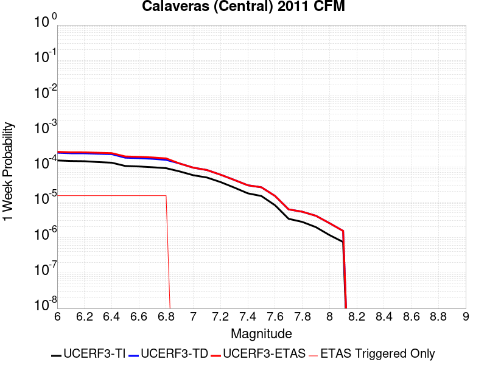 | 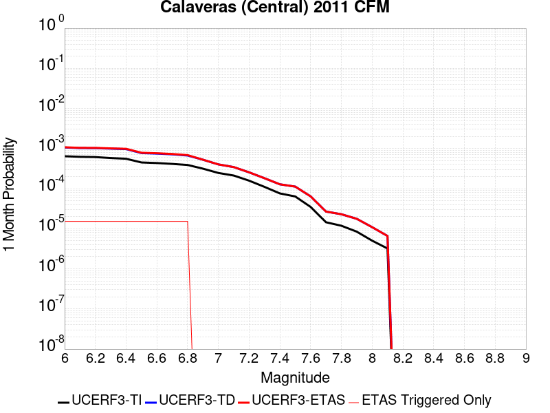 | 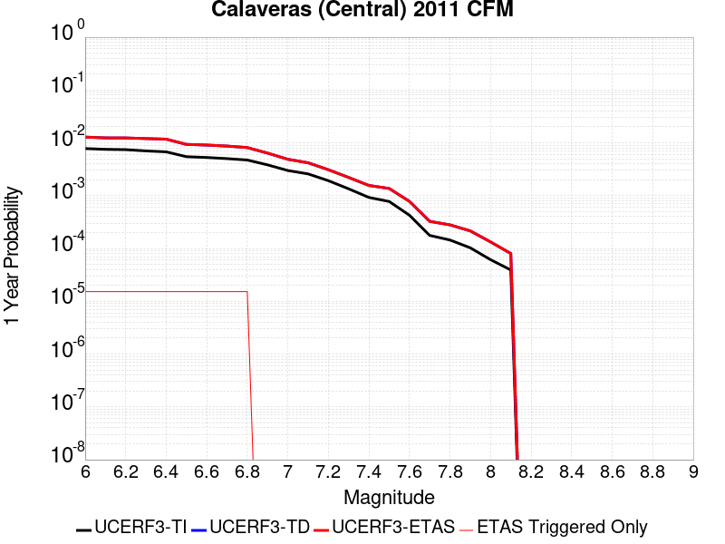 | 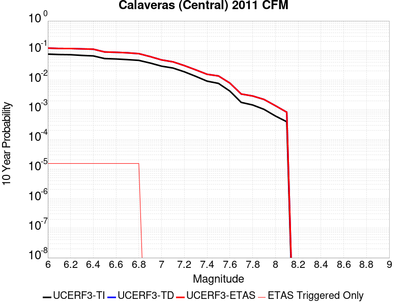 |

| Magnitude | 1 wk TI Prob | 1 wk TD Prob | 1 wk ETAS Prob | 1 wk ETAS/TD Gain | 1 wk ETAS Triggered Only | 1 mo TI Prob | 1 mo TD Prob | 1 mo ETAS Prob | 1 mo ETAS/TD Gain | 1 mo ETAS Triggered Only | 1 yr TI Prob | 1 yr TD Prob | 1 yr ETAS Prob | 1 yr ETAS/TD Gain | 1 yr ETAS Triggered Only | 10 yr TI Prob | 10 yr TD Prob | 10 yr ETAS Prob | 10 yr ETAS/TD Gain | 10 yr ETAS Triggered Only |
|-----|-----|-----|-----|-----|-----|-----|-----|-----|-----|-----|-----|-----|-----|-----|-----|-----|-----|-----|-----|-----|
| 6.0 | 1.5010907E-4 | 2.481574E-4 | 2.633743E-4 | 1.0613196 | 1.52207E-5 | 6.4316596E-4 | 0.0010621005 | 0.0010773051 | 1.0143155 | 1.52207E-5 | 0.0078024664 | 0.012850073 | 0.012865098 | 1.0011692 | 1.52207E-5 | 0.07534136 | 0.120401435 | 0.12041482 | 1.0001112 | 1.52207E-5 |
| 6.1 | 1.4521465E-4 | 2.397987E-4 | 2.5501574E-4 | 1.0634576 | 1.52207E-5 | 6.222001E-4 | 0.0010263061 | 0.0010415112 | 1.0148153 | 1.52207E-5 | 0.0075490056 | 0.012419341 | 0.012434373 | 1.0012103 | 1.52207E-5 | 0.07297657 | 0.11667323 | 0.11668667 | 1.0001153 | 1.52207E-5 |
| 6.2 | 1.429998E-4 | 2.3911126E-4 | 2.5432833E-4 | 1.0636401 | 1.52207E-5 | 6.127123E-4 | 0.0010233623 | 0.0010385674 | 1.014858 | 1.52207E-5 | 0.007434286 | 0.01238394 | 0.012398972 | 1.0012138 | 1.52207E-5 | 0.07190444 | 0.1163272 | 0.116340645 | 1.0001156 | 1.52207E-5 |
| 6.3 | 1.3536277E-4 | 2.3242626E-4 | 2.4764342E-4 | 1.0654709 | 1.52207E-5 | 5.799972E-4 | 9.947343E-4 | 0.0010099399 | 1.0152861 | 1.52207E-5 | 0.0070386264 | 0.012040132 | 0.01205517 | 1.001249 | 1.52207E-5 | 0.0681982 | 0.11323977 | 0.11325327 | 1.0001192 | 1.52207E-5 |
| 6.4 | 1.2993296E-4 | 2.2666177E-4 | 2.4187901E-4 | 1.0671364 | 1.52207E-5 | 5.5673666E-4 | 9.700479E-4 | 9.852538E-4 | 1.0156754 | 1.52207E-5 | 0.006757223 | 0.011742937 | 0.011757979 | 1.0012809 | 1.52207E-5 | 0.06555412 | 0.11051771 | 0.11053125 | 1.0001225 | 1.52207E-5 |
| 6.5 | 1.0498927E-4 | 1.7981697E-4 | 1.9503493E-4 | 1.0846303 | 1.52207E-5 | 4.498764E-4 | 7.704157E-4 | 7.8562467E-4 | 1.0197413 | 1.52207E-5 | 0.005463498 | 0.00933924 | 0.009354319 | 1.0016146 | 1.52207E-5 | 0.053311124 | 0.089199215 | 0.08921307 | 1.0001554 | 1.52207E-5 |
| 6.6 | 1.0157505E-4 | 1.7469203E-4 | 1.8991008E-4 | 1.0871135 | 1.52207E-5 | 4.35249E-4 | 7.484645E-4 | 7.636738E-4 | 1.0203207 | 1.52207E-5 | 0.0052862884 | 0.009074297 | 0.00908938 | 1.0016621 | 1.52207E-5 | 0.05162293 | 0.08677671 | 0.086790614 | 1.0001602 | 1.52207E-5 |
| 6.7 | 9.660386E-5 | 1.6728524E-4 | 1.825034E-4 | 1.0909712 | 1.52207E-5 | 4.1395082E-4 | 7.1673887E-4 | 7.3194865E-4 | 1.0212208 | 1.52207E-5 | 0.0050282106 | 0.008691208 | 0.008706297 | 1.001736 | 1.52207E-5 | 0.049159497 | 0.083266065 | 0.08328001 | 1.0001676 | 1.52207E-5 |
| 6.8 | 9.089927E-5 | 1.5643016E-4 | 1.7164848E-4 | 1.097285 | 1.52207E-5 | 3.8951015E-4 | 6.702439E-4 | 6.854544E-4 | 1.022694 | 1.52207E-5 | 0.0047319788 | 0.008129478 | 0.008144576 | 1.001857 | 1.52207E-5 | 0.046324775 | 0.078159414 | 0.07817344 | 1.0001795 | 1.52207E-5 |
| 6.9 | 7.353187E-5 | 1.2295354E-4 | 1.2295354E-4 | 1.0 | 0.0 | 3.150985E-4 | 5.2683795E-4 | 5.2683795E-4 | 1.0 | 0.0 | 0.0038295772 | 0.006395508 | 0.006395508 | 1.0 | 0.0 | 0.037642512 | 0.062187865 | 0.062187865 | 1.0 | 0.0 |
| 7.0 | 5.746064E-5 | 9.3887444E-5 | 9.3887444E-5 | 1.0 | 0.0 | 2.4623662E-4 | 4.0231308E-4 | 4.0231308E-4 | 1.0 | 0.0 | 0.0029938098 | 0.004887232 | 0.004887232 | 1.0 | 0.0 | 0.02953797 | 0.04798685 | 0.04798685 | 1.0 | 0.0 |
| 7.1 | 4.9557195E-5 | 8.052461E-5 | 8.052461E-5 | 1.0 | 0.0 | 2.123707E-4 | 3.4506017E-4 | 3.4506017E-4 | 1.0 | 0.0 | 0.0025825473 | 0.0041930773 | 0.0041930773 | 1.0 | 0.0 | 0.0255274 | 0.041373078 | 0.041373078 | 1.0 | 0.0 |
| 7.2 | 3.687595E-5 | 5.9524526E-5 | 5.9524526E-5 | 1.0 | 0.0 | 1.5803022E-4 | 2.5508032E-4 | 2.5508032E-4 | 1.0 | 0.0 | 0.0019223199 | 0.0031012094 | 0.0031012094 | 1.0 | 0.0 | 0.01905776 | 0.030883716 | 0.030883716 | 1.0 | 0.0 |
| 7.3 | 2.5846984E-5 | 4.247213E-5 | 4.247213E-5 | 1.0 | 0.0 | 1.1076809E-4 | 1.8201082E-4 | 1.8201082E-4 | 1.0 | 0.0 | 0.0013477671 | 0.002213747 | 0.002213747 | 1.0 | 0.0 | 0.013396223 | 0.02217554 | 0.02217554 | 1.0 | 0.0 |
| 7.4 | 1.7747854E-5 | 2.9936204E-5 | 2.9936204E-5 | 1.0 | 0.0 | 7.6060016E-5 | 1.2829172E-4 | 1.2829172E-4 | 1.0 | 0.0 | 9.2563726E-4 | 0.0015608355 | 0.0015608355 | 1.0 | 0.0 | 0.009217911 | 0.015709236 | 0.015709236 | 1.0 | 0.0 |
| 7.5 | 1.4883479E-5 | 2.6243379E-5 | 2.6243379E-5 | 1.0 | 0.0 | 6.378478E-5 | 1.1246678E-4 | 1.1246678E-4 | 1.0 | 0.0 | 7.76303E-4 | 0.0013684258 | 0.0013684258 | 1.0 | 0.0 | 0.0077359667 | 0.013802425 | 0.013802425 | 1.0 | 0.0 |
| 7.6 | 8.166975E-6 | 1.4963478E-5 | 1.4963478E-5 | 1.0 | 0.0 | 3.5000852E-5 | 6.412763E-5 | 6.412763E-5 | 1.0 | 0.0 | 4.2605202E-4 | 7.804755E-4 | 7.804755E-4 | 1.0 | 0.0 | 0.004252361 | 0.00793984 | 0.00793984 | 1.0 | 0.0 |
| 7.7 | 3.3858064E-6 | 6.253914E-6 | 6.253914E-6 | 1.0 | 0.0 | 1.4510518E-5 | 2.6802214E-5 | 2.6802214E-5 | 1.0 | 0.0 | 1.7665124E-4 | 3.2626814E-4 | 3.2626814E-4 | 1.0 | 0.0 | 0.0017651088 | 0.0033882293 | 0.0033882293 | 1.0 | 0.0 |
| 7.8 | 2.7721615E-6 | 5.3663807E-6 | 5.3663807E-6 | 1.0 | 0.0 | 1.1880637E-5 | 2.2998573E-5 | 2.2998573E-5 | 1.0 | 0.0 | 1.4463716E-4 | 2.799717E-4 | 2.799717E-4 | 1.0 | 0.0 | 0.0014454306 | 0.0029074624 | 0.0029074624 | 1.0 | 0.0 |
| 7.9 | 1.9736292E-6 | 4.1284193E-6 | 4.1284193E-6 | 1.0 | 0.0 | 8.4583835E-6 | 1.7693106E-5 | 1.7693106E-5 | 1.0 | 0.0 | 1.0297595E-4 | 2.1539231E-4 | 2.1539231E-4 | 1.0 | 0.0 | 0.0010292825 | 0.0022236116 | 0.0022236116 | 1.0 | 0.0 |
| 8.0 | 1.1767289E-6 | 2.5544743E-6 | 2.5544743E-6 | 1.0 | 0.0 | 5.0431145E-6 | 1.0947701E-5 | 1.0947701E-5 | 1.0 | 0.0 | 6.139818E-5 | 1.3328013E-4 | 1.3328013E-4 | 1.0 | 0.0 | 6.1381224E-4 | 0.0013660848 | 0.0013660848 | 1.0 | 0.0 |
| 8.1 | 7.5112825E-7 | 1.5409794E-6 | 1.5409794E-6 | 1.0 | 0.0 | 3.2191172E-6 | 6.6041807E-6 | 6.6041807E-6 | 1.0 | 0.0 | 3.9192048E-5 | 8.0402955E-5 | 8.0402955E-5 | 1.0 | 0.0 | 3.9185135E-4 | 8.235564E-4 | 8.235564E-4 | 1.0 | 0.0 |

## San Jacinto (Clark) rev
*[(top)](#table-of-contents)*

| 1 Week | 1 Month | 1 Year | 10 Year |
|-----|-----|-----|-----|
|  | 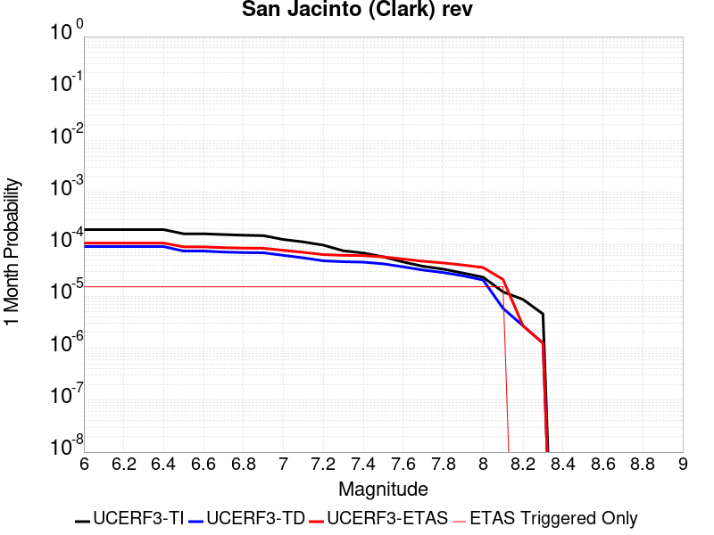 | 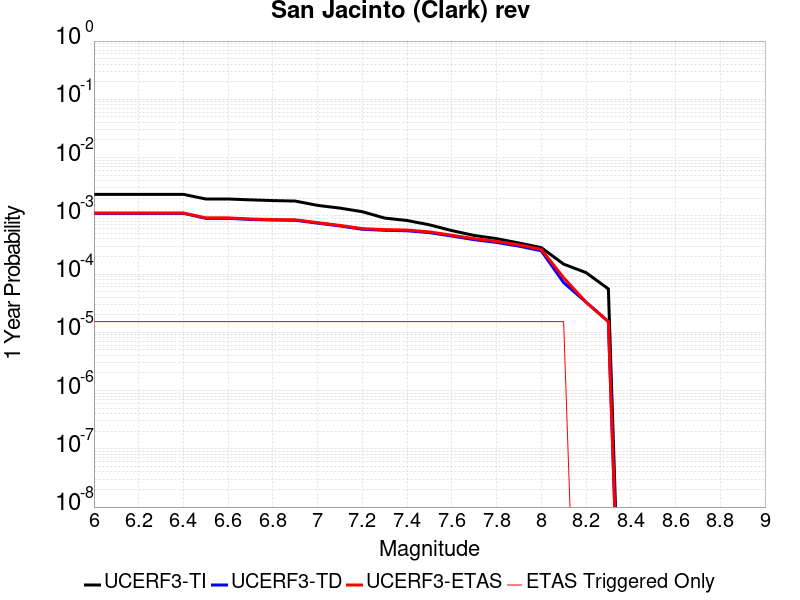 |  |

| Magnitude | 1 wk TI Prob | 1 wk TD Prob | 1 wk ETAS Prob | 1 wk ETAS/TD Gain | 1 wk ETAS Triggered Only | 1 mo TI Prob | 1 mo TD Prob | 1 mo ETAS Prob | 1 mo ETAS/TD Gain | 1 mo ETAS Triggered Only | 1 yr TI Prob | 1 yr TD Prob | 1 yr ETAS Prob | 1 yr ETAS/TD Gain | 1 yr ETAS Triggered Only | 10 yr TI Prob | 10 yr TD Prob | 10 yr ETAS Prob | 10 yr ETAS/TD Gain | 10 yr ETAS Triggered Only |
|-----|-----|-----|-----|-----|-----|-----|-----|-----|-----|-----|-----|-----|-----|-----|-----|-----|-----|-----|-----|-----|
| 6.0 | 4.482615E-5 | 2.1154196E-5 | 2.1154196E-5 | 1.0 | 0.0 | 1.9209793E-4 | 9.065773E-5 | 1.0587706E-4 | 1.1678767 | 1.52207E-5 | 0.0023362834 | 0.0011032083 | 0.0011184122 | 1.0137815 | 1.52207E-5 | 0.02311874 | 0.011503847 | 0.011533938 | 1.0026158 | 3.04414E-5 |
| 6.1 | 4.482615E-5 | 2.1154196E-5 | 2.1154196E-5 | 1.0 | 0.0 | 1.9209793E-4 | 9.065773E-5 | 1.0587706E-4 | 1.1678767 | 1.52207E-5 | 0.0023362834 | 0.0011032083 | 0.0011184122 | 1.0137815 | 1.52207E-5 | 0.02311874 | 0.011503847 | 0.011533938 | 1.0026158 | 3.04414E-5 |
| 6.2 | 4.482615E-5 | 2.1154196E-5 | 2.1154196E-5 | 1.0 | 0.0 | 1.9209793E-4 | 9.065773E-5 | 1.0587706E-4 | 1.1678767 | 1.52207E-5 | 0.0023362834 | 0.0011032083 | 0.0011184122 | 1.0137815 | 1.52207E-5 | 0.02311874 | 0.011503847 | 0.011533938 | 1.0026158 | 3.04414E-5 |
| 6.3 | 4.482615E-5 | 2.1154196E-5 | 2.1154196E-5 | 1.0 | 0.0 | 1.9209793E-4 | 9.065773E-5 | 1.0587706E-4 | 1.1678767 | 1.52207E-5 | 0.0023362834 | 0.0011032083 | 0.0011184122 | 1.0137815 | 1.52207E-5 | 0.02311874 | 0.011503847 | 0.011533938 | 1.0026158 | 3.04414E-5 |
| 6.4 | 4.482615E-5 | 2.1154196E-5 | 2.1154196E-5 | 1.0 | 0.0 | 1.9209793E-4 | 9.065773E-5 | 1.0587706E-4 | 1.1678767 | 1.52207E-5 | 0.0023362834 | 0.0011032083 | 0.0011184122 | 1.0137815 | 1.52207E-5 | 0.02311874 | 0.011503847 | 0.011533938 | 1.0026158 | 3.04414E-5 |
| 6.5 | 3.7294863E-5 | 1.7356087E-5 | 1.7356087E-5 | 1.0 | 0.0 | 1.5982533E-4 | 7.438113E-5 | 8.9600704E-5 | 1.204616 | 1.52207E-5 | 0.0019441366 | 9.052186E-4 | 9.204255E-4 | 1.0167992 | 1.52207E-5 | 0.01927216 | 0.0094941035 | 0.009524256 | 1.0031759 | 3.04414E-5 |
| 6.6 | 3.7294863E-5 | 1.7356087E-5 | 1.7356087E-5 | 1.0 | 0.0 | 1.5982533E-4 | 7.438113E-5 | 8.9600704E-5 | 1.204616 | 1.52207E-5 | 0.0019441366 | 9.052186E-4 | 9.204255E-4 | 1.0167992 | 1.52207E-5 | 0.01927216 | 0.0094941035 | 0.009524256 | 1.0031759 | 3.04414E-5 |
| 6.7 | 3.6039248E-5 | 1.6604314E-5 | 1.6604314E-5 | 1.0 | 0.0 | 1.5444479E-4 | 7.1159426E-5 | 8.637904E-5 | 1.2138805 | 1.52207E-5 | 0.0018787434 | 8.6602574E-4 | 8.8123325E-4 | 1.0175601 | 1.52207E-5 | 0.01862939 | 0.009096047 | 0.0091262115 | 1.0033162 | 3.04414E-5 |
| 6.8 | 3.5031844E-5 | 1.6232942E-5 | 1.6232942E-5 | 1.0 | 0.0 | 1.5012783E-4 | 6.956792E-5 | 8.4787556E-5 | 1.2187738 | 1.52207E-5 | 0.0018262739 | 8.4666436E-4 | 8.6187216E-4 | 1.017962 | 1.52207E-5 | 0.01811338 | 0.008895969 | 0.00892614 | 1.0033915 | 3.04414E-5 |
| 6.9 | 3.435112E-5 | 1.6063195E-5 | 1.6063195E-5 | 1.0 | 0.0 | 1.4721078E-4 | 6.884047E-5 | 8.406012E-5 | 1.2210858 | 1.52207E-5 | 0.0017908178 | 8.3781447E-4 | 8.5302244E-4 | 1.0181519 | 1.52207E-5 | 0.017764548 | 0.008804181 | 0.008834354 | 1.0034271 | 3.04414E-5 |
| 7.0 | 2.8959772E-5 | 1.4336745E-5 | 1.4336745E-5 | 1.0 | 0.0 | 1.241074E-4 | 6.144176E-5 | 7.666153E-5 | 1.2477105 | 1.52207E-5 | 0.0015099603 | 7.477995E-4 | 7.6300884E-4 | 1.0203388 | 1.52207E-5 | 0.014997416 | 0.007868037 | 0.0078982385 | 1.0038385 | 3.04414E-5 |
| 7.1 | 2.6002877E-5 | 1.2829002E-5 | 1.2829002E-5 | 1.0 | 0.0 | 1.11436144E-4 | 5.498029E-5 | 7.0200156E-5 | 1.276824 | 1.52207E-5 | 0.0013558907 | 6.691816E-4 | 6.8439206E-4 | 1.02273 | 1.52207E-5 | 0.013476475 | 0.0070465137 | 0.0070767407 | 1.0042896 | 3.04414E-5 |
| 7.2 | 2.2544838E-5 | 1.1262543E-5 | 1.1262543E-5 | 1.0 | 0.0 | 9.661716E-5 | 4.8267157E-5 | 6.3487125E-5 | 1.3153275 | 1.52207E-5 | 0.001175679 | 5.874956E-4 | 6.027074E-4 | 1.0258925 | 1.52207E-5 | 0.011694785 | 0.0061927503 | 0.006223003 | 1.0048852 | 3.04414E-5 |
| 7.3 | 1.75334E-5 | 1.0811715E-5 | 1.0811715E-5 | 1.0 | 0.0 | 7.514098E-5 | 4.6335106E-5 | 6.1555096E-5 | 1.3284765 | 1.52207E-5 | 9.144575E-4 | 5.6398526E-4 | 5.7919737E-4 | 1.0269725 | 1.52207E-5 | 0.009107036 | 0.0059337732 | 0.0059640342 | 1.0050998 | 3.04414E-5 |
| 7.4 | 1.5924552E-5 | 1.0611516E-5 | 1.0611516E-5 | 1.0 | 0.0 | 6.82463E-5 | 4.547714E-5 | 6.0697148E-5 | 1.3346738 | 1.52207E-5 | 8.305819E-4 | 5.535449E-4 | 5.687572E-4 | 1.0274816 | 1.52207E-5 | 0.008274844 | 0.0058210334 | 0.0058512976 | 1.0051991 | 3.04414E-5 |
| 7.5 | 1.3428931E-5 | 9.8519E-6 | 9.8519E-6 | 1.0 | 0.0 | 5.7551293E-5 | 4.2221753E-5 | 5.7441808E-5 | 1.3604791 | 1.52207E-5 | 7.004617E-4 | 5.1392964E-4 | 5.291425E-4 | 1.0296011 | 1.52207E-5 | 0.006982579 | 0.0054066023 | 0.005436879 | 1.0056 | 3.04414E-5 |
| 7.6 | 1.0688787E-5 | 8.614839E-6 | 8.614839E-6 | 1.0 | 0.0 | 4.5808283E-5 | 3.692022E-5 | 5.214036E-5 | 1.412244 | 1.52207E-5 | 5.5757316E-4 | 4.4941145E-4 | 4.646253E-4 | 1.0338528 | 1.52207E-5 | 0.005561762 | 0.0047416524 | 0.0047719493 | 1.0063895 | 3.04414E-5 |
| 7.7 | 8.81236E-6 | 7.4680274E-6 | 7.4680274E-6 | 1.0 | 0.0 | 3.776671E-5 | 3.2005442E-5 | 4.7225654E-5 | 1.4755508 | 1.52207E-5 | 4.597127E-4 | 3.8959677E-4 | 4.0481155E-4 | 1.0390526 | 1.52207E-5 | 0.0045876284 | 0.0041346536 | 0.004164969 | 1.0073321 | 3.04414E-5 |
| 7.8 | 7.780431E-6 | 6.696579E-6 | 6.696579E-6 | 1.0 | 0.0 | 3.3344273E-5 | 2.8699309E-5 | 4.3919572E-5 | 1.5303355 | 1.52207E-5 | 4.0589093E-4 | 3.4935825E-4 | 3.6457364E-4 | 1.0435524 | 1.52207E-5 | 0.0040515037 | 0.0037227906 | 0.0037531187 | 1.0081466 | 3.04414E-5 |
| 7.9 | 6.5437994E-6 | 5.780382E-6 | 5.780382E-6 | 1.0 | 0.0 | 2.8044553E-5 | 2.477283E-5 | 3.9993152E-5 | 1.6143959 | 1.52207E-5 | 3.4138895E-4 | 3.0156763E-4 | 3.1678376E-4 | 1.0504568 | 1.52207E-5 | 0.0034086495 | 0.0032344845 | 0.0032648274 | 1.009381 | 3.04414E-5 |
| 8.0 | 5.4488164E-6 | 4.8133406E-6 | 4.8133406E-6 | 1.0 | 0.0 | 2.3351862E-5 | 2.062844E-5 | 3.584883E-5 | 1.737835 | 1.52207E-5 | 2.8427184E-4 | 2.5112246E-4 | 2.6633934E-4 | 1.0605954 | 1.52207E-5 | 0.0028390845 | 0.002710839 | 0.0027411978 | 1.0111991 | 3.04414E-5 |
| 8.1 | 2.8397242E-6 | 1.3670389E-6 | 1.3670389E-6 | 1.0 | 0.0 | 1.217019E-5 | 5.858725E-6 | 2.1079337E-5 | 3.597939 | 1.52207E-5 | 1.4816198E-4 | 7.132765E-5 | 8.654727E-5 | 1.213376 | 1.52207E-5 | 0.0014806325 | 8.115382E-4 | 8.267465E-4 | 1.0187402 | 1.52207E-5 |
| 8.2 | 2.030244E-6 | 6.318974E-7 | 6.318974E-7 | 1.0 | 0.0 | 8.701017E-6 | 2.708129E-6 | 2.708129E-6 | 1.0 | 0.0 | 1.05929736E-4 | 3.2970976E-5 | 3.2970976E-5 | 1.0 | 0.0 | 0.0010587925 | 3.9486602E-4 | 3.9486602E-4 | 1.0 | 0.0 |
| 8.3 | 1.0659804E-6 | 2.9250086E-7 | 2.9250086E-7 | 1.0 | 0.0 | 4.568479E-6 | 1.2535745E-6 | 1.2535745E-6 | 1.0 | 0.0 | 5.5619817E-5 | 1.5262167E-5 | 1.5262167E-5 | 1.0 | 0.0 | 5.5605895E-4 | 1.8566217E-4 | 1.8566217E-4 | 1.0 | 0.0 |

## Laguna Salada
*[(top)](#table-of-contents)*

| 1 Week | 1 Month | 1 Year | 10 Year |
|-----|-----|-----|-----|
|  | 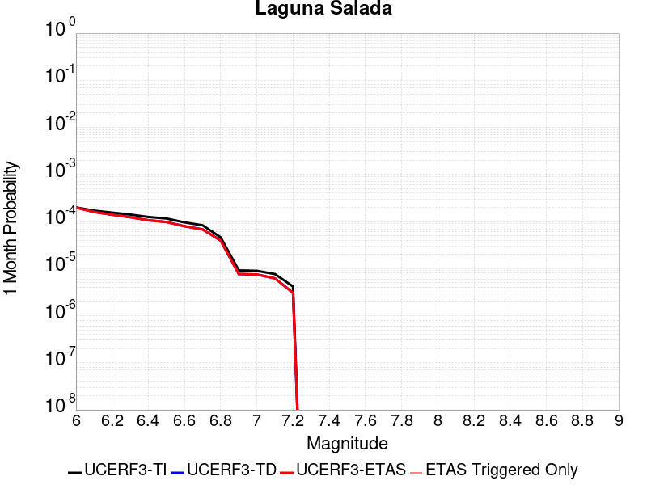 | 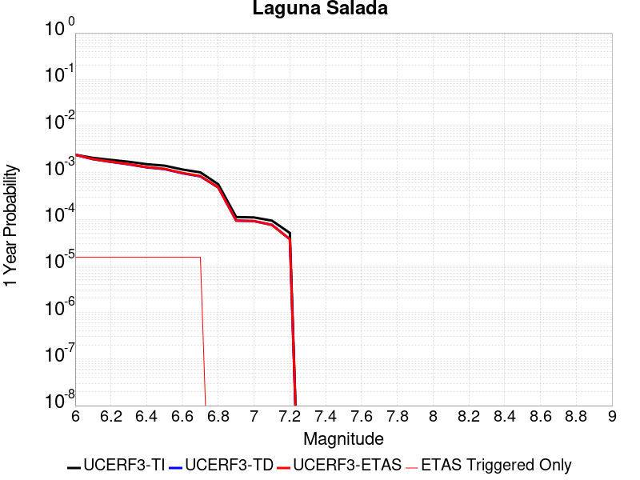 | 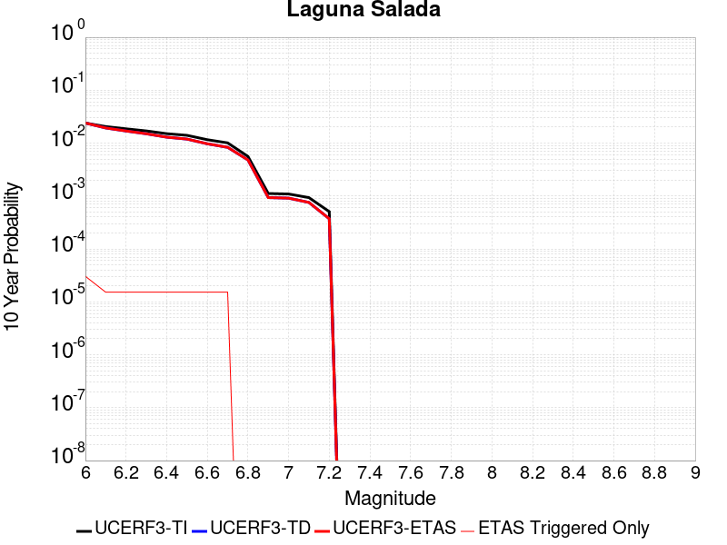 |

| Magnitude | 1 wk TI Prob | 1 wk TD Prob | 1 wk ETAS Prob | 1 wk ETAS/TD Gain | 1 wk ETAS Triggered Only | 1 mo TI Prob | 1 mo TD Prob | 1 mo ETAS Prob | 1 mo ETAS/TD Gain | 1 mo ETAS Triggered Only | 1 yr TI Prob | 1 yr TD Prob | 1 yr ETAS Prob | 1 yr ETAS/TD Gain | 1 yr ETAS Triggered Only | 10 yr TI Prob | 10 yr TD Prob | 10 yr ETAS Prob | 10 yr ETAS/TD Gain | 10 yr ETAS Triggered Only |
|-----|-----|-----|-----|-----|-----|-----|-----|-----|-----|-----|-----|-----|-----|-----|-----|-----|-----|-----|-----|-----|
| 6.0 | 4.6465593E-5 | 4.634639E-5 | 4.634639E-5 | 1.0 | 0.0 | 1.9912305E-4 | 1.9861311E-4 | 1.9861311E-4 | 1.0 | 0.0 | 0.0024216278 | 0.002415429 | 0.002430613 | 1.0062863 | 1.52207E-5 | 0.02395408 | 0.023975259 | 0.02400497 | 1.0012393 | 3.04414E-5 |
| 6.1 | 3.982297E-5 | 3.7246125E-5 | 3.7246125E-5 | 1.0 | 0.0 | 1.706587E-4 | 1.5961716E-4 | 1.5961716E-4 | 1.0 | 0.0 | 0.0020757897 | 0.0019417295 | 0.0019569206 | 1.0078235 | 1.52207E-5 | 0.020565065 | 0.019331863 | 0.019346789 | 1.0007721 | 1.52207E-5 |
| 6.2 | 3.6067784E-5 | 3.2602693E-5 | 3.2602693E-5 | 1.0 | 0.0 | 1.5456705E-4 | 1.3971896E-4 | 1.3971896E-4 | 1.0 | 0.0 | 0.0018802295 | 0.0016998611 | 0.001715056 | 1.0089389 | 1.52207E-5 | 0.018644003 | 0.016949628 | 0.01696459 | 1.0008827 | 1.52207E-5 |
| 6.3 | 3.2859112E-5 | 2.8849448E-5 | 2.8849448E-5 | 1.0 | 0.0 | 1.4081717E-4 | 1.2363521E-4 | 1.2363521E-4 | 1.0 | 0.0 | 0.0017131006 | 0.0015043203 | 0.0015195181 | 1.0101027 | 1.52207E-5 | 0.016999546 | 0.015018767 | 0.015033759 | 1.0009983 | 1.52207E-5 |
| 6.4 | 2.9132116E-5 | 2.4852965E-5 | 2.4852965E-5 | 1.0 | 0.0 | 1.2484594E-4 | 1.0650887E-4 | 1.0650887E-4 | 1.0 | 0.0 | 0.0015189396 | 0.001296065 | 0.001311266 | 1.0117285 | 1.52207E-5 | 0.015085992 | 0.012956262 | 0.012971286 | 1.0011595 | 1.52207E-5 |
| 6.5 | 2.7075037E-5 | 2.2825836E-5 | 2.2825836E-5 | 1.0 | 0.0 | 1.1603071E-4 | 9.7821845E-5 | 9.7821845E-5 | 1.0 | 0.0 | 0.0014117584 | 0.0011904186 | 0.0012056212 | 1.0127708 | 1.52207E-5 | 0.014028233 | 0.011907749 | 0.011922789 | 1.001263 | 1.52207E-5 |
| 6.6 | 2.2367465E-5 | 1.8573526E-5 | 1.8573526E-5 | 1.0 | 0.0 | 9.5857045E-5 | 7.959886E-5 | 7.959886E-5 | 1.0 | 0.0 | 0.0011664346 | 9.6876756E-4 | 9.839735E-4 | 1.0156962 | 1.52207E-5 | 0.011603311 | 0.009702191 | 0.009717263 | 1.0015535 | 1.52207E-5 |
| 6.7 | 1.9458053E-5 | 1.5914242E-5 | 1.5914242E-5 | 1.0 | 0.0 | 8.338899E-5 | 6.8202564E-5 | 6.8202564E-5 | 1.0 | 0.0 | 0.001014788 | 8.3013024E-4 | 8.453383E-4 | 1.0183201 | 1.52207E-5 | 0.010101665 | 0.0083209425 | 0.0083360365 | 1.001814 | 1.52207E-5 |
| 6.8 | 1.0767866E-5 | 9.18435E-6 | 9.18435E-6 | 1.0 | 0.0 | 4.614718E-5 | 3.9361294E-5 | 3.9361294E-5 | 1.0 | 0.0 | 5.6169706E-4 | 4.7918706E-4 | 4.7918706E-4 | 1.0 | 0.0 | 0.0056027942 | 0.0048096925 | 0.0048096925 | 1.0 | 0.0 |
| 6.9 | 2.1384765E-6 | 1.7913675E-6 | 1.7913675E-6 | 1.0 | 0.0 | 9.164866E-6 | 7.677269E-6 | 7.677269E-6 | 1.0 | 0.0 | 1.1157654E-4 | 9.346713E-5 | 9.346713E-5 | 1.0 | 0.0 | 0.0011152053 | 9.343165E-4 | 9.343165E-4 | 1.0 | 0.0 |
| 7.0 | 2.0952946E-6 | 1.7493046E-6 | 1.7493046E-6 | 1.0 | 0.0 | 8.979802E-6 | 7.4970003E-6 | 7.4970003E-6 | 1.0 | 0.0 | 1.0932361E-4 | 9.1272545E-5 | 9.1272545E-5 | 1.0 | 0.0 | 0.0010926984 | 9.123888E-4 | 9.123888E-4 | 1.0 | 0.0 |
| 7.1 | 1.7887576E-6 | 1.4500254E-6 | 1.4500254E-6 | 1.0 | 0.0 | 7.666081E-6 | 6.2143813E-6 | 6.2143813E-6 | 1.0 | 0.0 | 9.333054E-5 | 7.565777E-5 | 7.565777E-5 | 1.0 | 0.0 | 9.329135E-4 | 7.563506E-4 | 7.563506E-4 | 1.0 | 0.0 |
| 7.2 | 9.723109E-7 | 7.135619E-7 | 7.135619E-7 | 1.0 | 0.0 | 4.16704E-6 | 3.0581198E-6 | 3.0581198E-6 | 1.0 | 0.0 | 5.073253E-5 | 3.7232137E-5 | 3.7232137E-5 | 1.0 | 0.0 | 5.072095E-4 | 3.7227524E-4 | 3.7227524E-4 | 1.0 | 0.0 |

## Elsinore (Stepovers Combined)
*[(top)](#table-of-contents)*

| 1 Week | 1 Month | 1 Year | 10 Year |
|-----|-----|-----|-----|
| 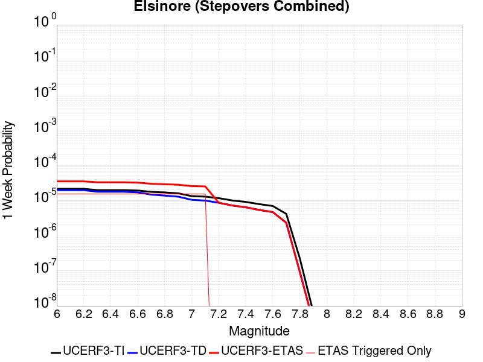 | 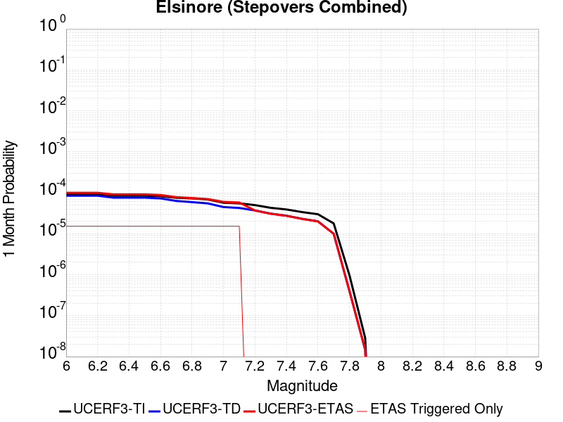 | 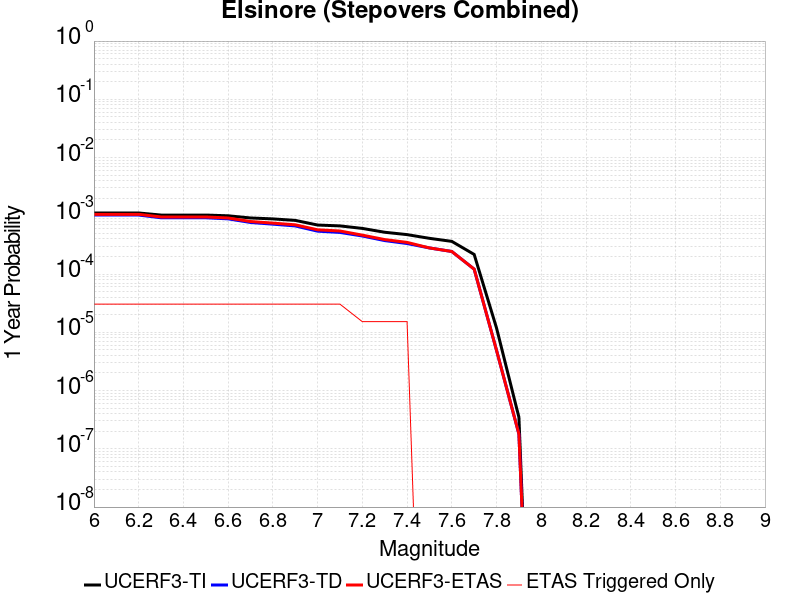 | 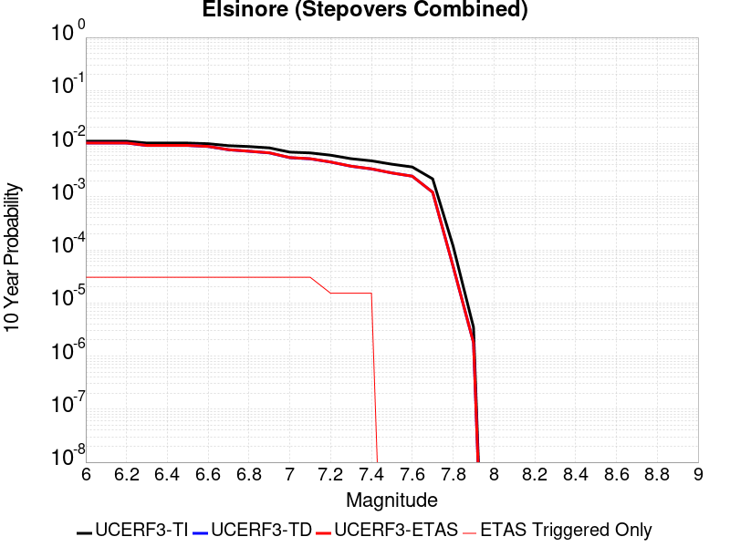 |

| Magnitude | 1 wk TI Prob | 1 wk TD Prob | 1 wk ETAS Prob | 1 wk ETAS/TD Gain | 1 wk ETAS Triggered Only | 1 mo TI Prob | 1 mo TD Prob | 1 mo ETAS Prob | 1 mo ETAS/TD Gain | 1 mo ETAS Triggered Only | 1 yr TI Prob | 1 yr TD Prob | 1 yr ETAS Prob | 1 yr ETAS/TD Gain | 1 yr ETAS Triggered Only | 10 yr TI Prob | 10 yr TD Prob | 10 yr ETAS Prob | 10 yr ETAS/TD Gain | 10 yr ETAS Triggered Only |
|-----|-----|-----|-----|-----|-----|-----|-----|-----|-----|-----|-----|-----|-----|-----|-----|-----|-----|-----|-----|-----|
| 6.0 | 2.144392E-5 | 1.9760193E-5 | 3.4980592E-5 | 1.7702556 | 1.52207E-5 | 9.189928E-5 | 8.468392E-5 | 9.990333E-5 | 1.1797202 | 1.52207E-5 | 0.0011182994 | 0.0010305607 | 0.0010609707 | 1.0295082 | 3.04414E-5 | 0.011126885 | 0.010264917 | 0.0102950465 | 1.0029352 | 3.04414E-5 |
| 6.1 | 2.144392E-5 | 1.9760193E-5 | 3.4980592E-5 | 1.7702556 | 1.52207E-5 | 9.189928E-5 | 8.468392E-5 | 9.990333E-5 | 1.1797202 | 1.52207E-5 | 0.0011182994 | 0.0010305607 | 0.0010609707 | 1.0295082 | 3.04414E-5 | 0.011126885 | 0.010264917 | 0.0102950465 | 1.0029352 | 3.04414E-5 |
| 6.2 | 2.144392E-5 | 1.9760193E-5 | 3.4980592E-5 | 1.7702556 | 1.52207E-5 | 9.189928E-5 | 8.468392E-5 | 9.990333E-5 | 1.1797202 | 1.52207E-5 | 0.0011182994 | 0.0010305607 | 0.0010609707 | 1.0295082 | 3.04414E-5 | 0.011126885 | 0.010264917 | 0.0102950465 | 1.0029352 | 3.04414E-5 |
| 6.3 | 1.9751555E-5 | 1.7741453E-5 | 3.296188E-5 | 1.8579022 | 1.52207E-5 | 8.4646774E-5 | 7.603267E-5 | 9.1252215E-5 | 1.2001711 | 1.52207E-5 | 0.0010300872 | 9.253213E-4 | 9.557345E-4 | 1.0328678 | 3.04414E-5 | 0.010253254 | 0.009221276 | 0.009251437 | 1.0032707 | 3.04414E-5 |
| 6.4 | 1.9751555E-5 | 1.7741453E-5 | 3.296188E-5 | 1.8579022 | 1.52207E-5 | 8.4646774E-5 | 7.603267E-5 | 9.1252215E-5 | 1.2001711 | 1.52207E-5 | 0.0010300872 | 9.253213E-4 | 9.557345E-4 | 1.0328678 | 3.04414E-5 | 0.010253254 | 0.009221276 | 0.009251437 | 1.0032707 | 3.04414E-5 |
| 6.5 | 1.9751555E-5 | 1.7741453E-5 | 3.296188E-5 | 1.8579022 | 1.52207E-5 | 8.4646774E-5 | 7.603267E-5 | 9.1252215E-5 | 1.2001711 | 1.52207E-5 | 0.0010300872 | 9.253213E-4 | 9.557345E-4 | 1.0328678 | 3.04414E-5 | 0.010253254 | 0.009221276 | 0.009251437 | 1.0032707 | 3.04414E-5 |
| 6.6 | 1.9188685E-5 | 1.7003393E-5 | 3.2223834E-5 | 1.8951415 | 1.52207E-5 | 8.2234634E-5 | 7.286974E-5 | 8.808933E-5 | 1.2088603 | 1.52207E-5 | 0.0010007467 | 8.868442E-4 | 9.1725856E-4 | 1.0342951 | 3.04414E-5 | 0.00996252 | 0.0088398475 | 0.00887002 | 1.0034132 | 3.04414E-5 |
| 6.7 | 1.7608272E-5 | 1.4732616E-5 | 2.9953093E-5 | 2.0331142 | 1.52207E-5 | 7.546184E-5 | 6.3138315E-5 | 7.8358054E-5 | 1.2410539 | 1.52207E-5 | 9.183606E-4 | 7.684476E-4 | 7.988656E-4 | 1.0395837 | 3.04414E-5 | 0.009145746 | 0.00766491 | 0.007695118 | 1.003941 | 3.04414E-5 |
| 6.8 | 1.697165E-5 | 1.3783365E-5 | 2.9003855E-5 | 2.1042652 | 1.52207E-5 | 7.273361E-5 | 5.9070277E-5 | 7.4290074E-5 | 1.2576559 | 1.52207E-5 | 8.8517193E-4 | 7.18952E-4 | 7.493715E-4 | 1.042311 | 3.04414E-5 | 0.008816543 | 0.007172675 | 0.007202898 | 1.0042137 | 3.04414E-5 |
| 6.9 | 1.600365E-5 | 1.2846671E-5 | 2.8067176E-5 | 2.184782 | 1.52207E-5 | 6.858527E-5 | 5.5056043E-5 | 7.0275906E-5 | 1.2764431 | 1.52207E-5 | 8.347058E-4 | 6.7010894E-4 | 7.0052996E-4 | 1.045397 | 3.04414E-5 | 0.008315775 | 0.0066867657 | 0.006717004 | 1.0045221 | 3.04414E-5 |
| 7.0 | 1.3314581E-5 | 1.0447548E-5 | 2.5668089E-5 | 2.456853 | 1.52207E-5 | 5.7061243E-5 | 4.4774453E-5 | 5.9994472E-5 | 1.3399264 | 1.52207E-5 | 6.944992E-4 | 5.449953E-4 | 5.7542016E-4 | 1.0558258 | 3.04414E-5 | 0.006923327 | 0.0054405155 | 0.005470791 | 1.0055649 | 3.04414E-5 |
| 7.1 | 1.2865345E-5 | 9.937536E-6 | 2.5158084E-5 | 2.531622 | 1.52207E-5 | 5.5136024E-5 | 4.258876E-5 | 5.780881E-5 | 1.3573725 | 1.52207E-5 | 6.710743E-4 | 5.183973E-4 | 5.488229E-4 | 1.0586917 | 3.04414E-5 | 0.0066905143 | 0.0051752133 | 0.005205497 | 1.0058517 | 3.04414E-5 |
| 7.2 | 1.1650051E-5 | 8.633809E-6 | 8.633809E-6 | 1.0 | 0.0 | 4.9927836E-5 | 3.7001522E-5 | 3.7001522E-5 | 1.0 | 0.0 | 6.0770183E-4 | 4.504022E-4 | 4.6561606E-4 | 1.0337783 | 1.52207E-5 | 0.0060604266 | 0.0044963174 | 0.0045114695 | 1.0033699 | 1.52207E-5 |
| 7.3 | 1.0008533E-5 | 7.2010425E-6 | 7.2010425E-6 | 1.0 | 0.0 | 4.2893007E-5 | 3.0861254E-5 | 3.0861254E-5 | 1.0 | 0.0 | 5.220972E-4 | 3.7567242E-4 | 3.908874E-4 | 1.0405006 | 1.52207E-5 | 0.005208723 | 0.003750761 | 0.0037659246 | 1.0040429 | 1.52207E-5 |
| 7.4 | 9.116759E-6 | 6.410068E-6 | 6.410068E-6 | 1.0 | 0.0 | 3.907124E-5 | 2.747144E-5 | 2.747144E-5 | 1.0 | 0.0 | 4.7558855E-4 | 3.3441483E-4 | 3.4963043E-4 | 1.0454992 | 1.52207E-5 | 0.00474572 | 0.0033392678 | 0.0033544376 | 1.0045428 | 1.52207E-5 |
| 7.5 | 7.870524E-6 | 5.3825365E-6 | 5.3825365E-6 | 1.0 | 0.0 | 3.3730383E-5 | 2.3067816E-5 | 2.3067816E-5 | 1.0 | 0.0 | 4.1059E-4 | 2.8081573E-4 | 2.8081573E-4 | 1.0 | 0.0 | 0.0040983222 | 0.0028047354 | 0.0028047354 | 1.0 | 0.0 |
| 7.6 | 6.9774537E-6 | 4.6776067E-6 | 4.6776067E-6 | 1.0 | 0.0 | 2.990303E-5 | 2.0046738E-5 | 2.0046738E-5 | 1.0 | 0.0 | 3.640086E-4 | 2.4404288E-4 | 2.4404288E-4 | 1.0 | 0.0 | 0.003634129 | 0.0024378651 | 0.0024378651 | 1.0 | 0.0 |
| 7.7 | 4.1616954E-6 | 2.32834E-6 | 2.32834E-6 | 1.0 | 0.0 | 1.7835715E-5 | 9.978567E-6 | 9.978567E-6 | 1.0 | 0.0 | 2.171282E-4 | 1.2148302E-4 | 1.2148302E-4 | 1.0 | 0.0 | 0.0021691616 | 0.0012142392 | 0.0012142392 | 1.0 | 0.0 |
| 7.8 | 2.2692414E-7 | 9.3854695E-8 | 9.3854695E-8 | 1.0 | 0.0 | 9.725317E-7 | 4.0223435E-7 | 4.0223435E-7 | 1.0 | 0.0 | 1.1840509E-5 | 4.8971956E-6 | 4.8971956E-6 | 1.0 | 0.0 | 1.1839878E-4 | 4.8971204E-5 | 4.8971204E-5 | 1.0 | 0.0 |
| 7.9 | 6.676829E-9 | 3.439853E-9 | 3.439853E-9 | 1.0 | 0.0 | 2.861498E-8 | 1.4742227E-8 | 1.4742227E-8 | 1.0 | 0.0 | 3.4838732E-7 | 1.7948659E-7 | 1.7948659E-7 | 1.0 | 0.0 | 3.4838679E-6 | 1.7948646E-6 | 1.7948646E-6 | 1.0 | 0.0 |

## Calaveras (So) - Paicines extension 2011 CFM
*[(top)](#table-of-contents)*

| 1 Week | 1 Month | 1 Year | 10 Year |
|-----|-----|-----|-----|
| 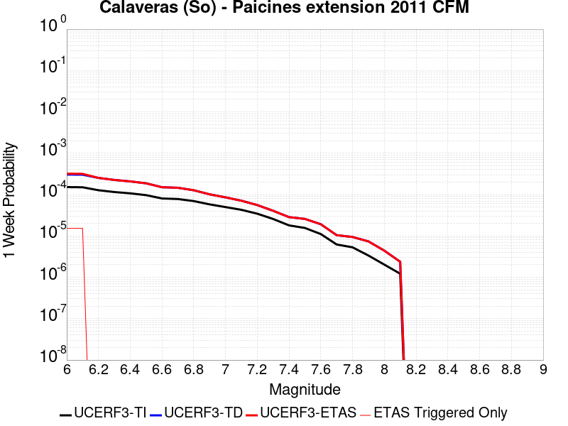 | 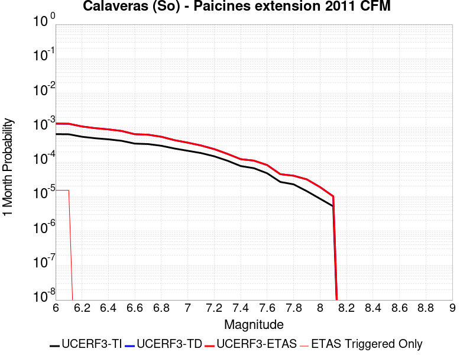 | 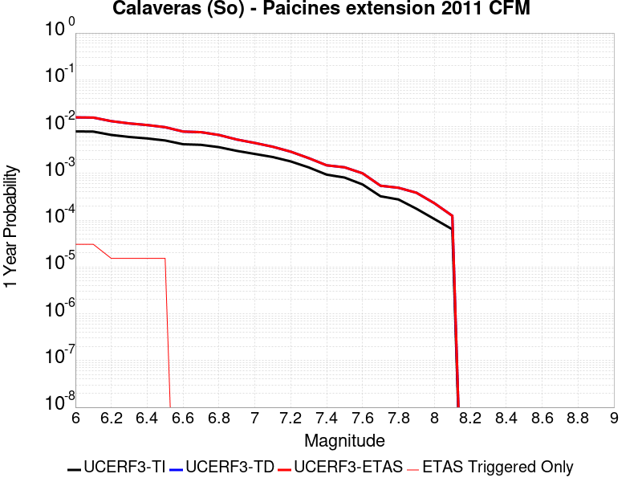 | 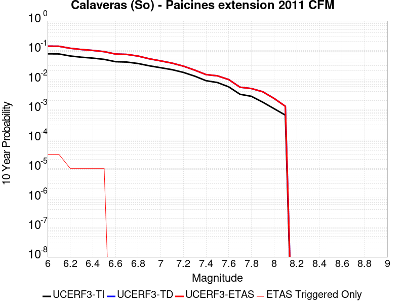 |

| Magnitude | 1 wk TI Prob | 1 wk TD Prob | 1 wk ETAS Prob | 1 wk ETAS/TD Gain | 1 wk ETAS Triggered Only | 1 mo TI Prob | 1 mo TD Prob | 1 mo ETAS Prob | 1 mo ETAS/TD Gain | 1 mo ETAS Triggered Only | 1 yr TI Prob | 1 yr TD Prob | 1 yr ETAS Prob | 1 yr ETAS/TD Gain | 1 yr ETAS Triggered Only | 10 yr TI Prob | 10 yr TD Prob | 10 yr ETAS Prob | 10 yr ETAS/TD Gain | 10 yr ETAS Triggered Only |
|-----|-----|-----|-----|-----|-----|-----|-----|-----|-----|-----|-----|-----|-----|-----|-----|-----|-----|-----|-----|-----|
| 6.0 | 1.5183659E-4 | 3.0533716E-4 | 3.205532E-4 | 1.0498337 | 1.52207E-5 | 6.5056595E-4 | 0.0013069661 | 0.0013221669 | 1.0116307 | 1.52207E-5 | 0.007891912 | 0.01569571 | 0.015725674 | 1.001909 | 3.04414E-5 | 0.076174594 | 0.13848671 | 0.13851294 | 1.0001894 | 3.04414E-5 |
| 6.1 | 1.5024997E-4 | 3.0227835E-4 | 3.1749447E-4 | 1.050338 | 1.52207E-5 | 6.437695E-4 | 0.00129387 | 0.0013090711 | 1.0117484 | 1.52207E-5 | 0.0078097614 | 0.015539104 | 0.015569072 | 1.0019286 | 3.04414E-5 | 0.075409345 | 0.13715632 | 0.1371826 | 1.0001915 | 3.04414E-5 |
| 6.2 | 1.2743923E-4 | 2.5306802E-4 | 2.5306802E-4 | 1.0 | 0.0 | 5.460538E-4 | 0.0010841049 | 0.0010841049 | 1.0 | 0.0 | 0.0066279583 | 0.013046704 | 0.0130617265 | 1.0011514 | 1.52207E-5 | 0.064337276 | 0.11725405 | 0.11726748 | 1.0001146 | 1.52207E-5 |
| 6.3 | 1.1525114E-4 | 2.2595265E-4 | 2.2595265E-4 | 1.0 | 0.0 | 4.9383997E-4 | 9.6799526E-4 | 9.6799526E-4 | 1.0 | 0.0 | 0.0059959386 | 0.011667927 | 0.01168297 | 1.0012892 | 1.52207E-5 | 0.058367174 | 0.10637007 | 0.106383674 | 1.0001279 | 1.52207E-5 |
| 6.4 | 1.07200925E-4 | 2.0836305E-4 | 2.0836305E-4 | 1.0 | 0.0 | 4.5935164E-4 | 8.926636E-4 | 8.926636E-4 | 1.0 | 0.0 | 0.0055782744 | 0.010772766 | 0.010787822 | 1.0013976 | 1.52207E-5 | 0.0544031 | 0.09919256 | 0.09920627 | 1.0001383 | 1.52207E-5 |
| 6.5 | 9.69631E-5 | 1.8729115E-4 | 1.8729115E-4 | 1.0 | 0.0 | 4.1548995E-4 | 8.024135E-4 | 8.024135E-4 | 1.0 | 0.0 | 0.0050468626 | 0.009694662 | 0.009709735 | 1.0015548 | 1.52207E-5 | 0.04933773 | 0.090084255 | 0.090098105 | 1.0001538 | 1.52207E-5 |
| 6.6 | 8.0552316E-5 | 1.5070537E-4 | 1.5070537E-4 | 1.0 | 0.0 | 3.4517853E-4 | 6.456994E-4 | 6.456994E-4 | 1.0 | 0.0 | 0.0041944524 | 0.007826256 | 0.007826256 | 1.0 | 0.0 | 0.04116161 | 0.074854024 | 0.074854024 | 1.0 | 0.0 |
| 6.7 | 7.815757E-5 | 1.4610609E-4 | 1.4610609E-4 | 1.0 | 0.0 | 3.34918E-4 | 6.260017E-4 | 6.260017E-4 | 1.0 | 0.0 | 0.004070005 | 0.0075890915 | 0.0075890915 | 1.0 | 0.0 | 0.039962657 | 0.072703585 | 0.072703585 | 1.0 | 0.0 |
| 6.8 | 6.965264E-5 | 1.2721405E-4 | 1.2721405E-4 | 1.0 | 0.0 | 2.9847719E-4 | 5.450839E-4 | 5.450839E-4 | 1.0 | 0.0 | 0.0036279052 | 0.00661342 | 0.00661342 | 1.0 | 0.0 | 0.03569247 | 0.06379891 | 0.06379891 | 1.0 | 0.0 |
| 6.9 | 5.8000453E-5 | 1.01435086E-4 | 1.01435086E-4 | 1.0 | 0.0 | 2.4854968E-4 | 4.3464993E-4 | 4.3464993E-4 | 1.0 | 0.0 | 0.0030218933 | 0.0052791284 | 0.0052791284 | 1.0 | 0.0 | 0.029811295 | 0.051501602 | 0.051501602 | 1.0 | 0.0 |
| 7.0 | 4.9865852E-5 | 8.567692E-5 | 8.567692E-5 | 1.0 | 0.0 | 2.1369329E-4 | 3.671356E-4 | 3.671356E-4 | 1.0 | 0.0 | 0.0025986114 | 0.0044608037 | 0.0044608037 | 1.0 | 0.0 | 0.025684336 | 0.043781694 | 0.043781694 | 1.0 | 0.0 |
| 7.1 | 4.283875E-5 | 7.112159E-5 | 7.112159E-5 | 1.0 | 0.0 | 1.8358172E-4 | 3.047715E-4 | 3.047715E-4 | 1.0 | 0.0 | 0.0022328163 | 0.003704336 | 0.003704336 | 1.0 | 0.0 | 0.022105146 | 0.03673583 | 0.03673583 | 1.0 | 0.0 |
| 7.2 | 3.450115E-5 | 5.5776054E-5 | 5.5776054E-5 | 1.0 | 0.0 | 1.478537E-4 | 2.390185E-4 | 2.390185E-4 | 1.0 | 0.0 | 0.0017986323 | 0.0029061958 | 0.0029061958 | 1.0 | 0.0 | 0.017841442 | 0.029079199 | 0.029079199 | 1.0 | 0.0 |
| 7.3 | 2.5709045E-5 | 4.0588155E-5 | 4.0588155E-5 | 1.0 | 0.0 | 1.1017697E-4 | 1.7393773E-4 | 1.7393773E-4 | 1.0 | 0.0 | 0.0013405791 | 0.002115652 | 0.002115652 | 1.0 | 0.0 | 0.013325208 | 0.021297242 | 0.021297242 | 1.0 | 0.0 |
| 7.4 | 1.8003093E-5 | 2.8509934E-5 | 2.8509934E-5 | 1.0 | 0.0 | 7.715383E-5 | 1.2217973E-4 | 1.2217973E-4 | 1.0 | 0.0 | 9.3894306E-4 | 0.0014865254 | 0.0014865254 | 1.0 | 0.0 | 0.009349857 | 0.015052196 | 0.015052196 | 1.0 | 0.0 |
| 7.5 | 1.5595824E-5 | 2.5822499E-5 | 2.5822499E-5 | 1.0 | 0.0 | 6.683753E-5 | 1.1066317E-4 | 1.1066317E-4 | 1.0 | 0.0 | 8.134431E-4 | 0.0013464936 | 0.0013464936 | 1.0 | 0.0 | 0.008104719 | 0.01365213 | 0.01365213 | 1.0 | 0.0 |
| 7.6 | 1.1110309E-5 | 1.9222098E-5 | 1.9222098E-5 | 1.0 | 0.0 | 4.761474E-5 | 8.2377825E-5 | 8.2377825E-5 | 1.0 | 0.0 | 5.795553E-4 | 0.0010024898 | 0.0010024898 | 1.0 | 0.0 | 0.0057804612 | 0.010203943 | 0.010203943 | 1.0 | 0.0 |
| 7.7 | 6.2140443E-6 | 1.0437076E-5 | 1.0437076E-5 | 1.0 | 0.0 | 2.6631347E-5 | 4.4729557E-5 | 4.4729557E-5 | 1.0 | 0.0 | 3.241884E-4 | 5.444464E-4 | 5.444464E-4 | 1.0 | 0.0 | 0.0032371588 | 0.005619835 | 0.005619835 | 1.0 | 0.0 |
| 7.8 | 5.305533E-6 | 9.433038E-6 | 9.433038E-6 | 1.0 | 0.0 | 2.27378E-5 | 4.042668E-5 | 4.042668E-5 | 1.0 | 0.0 | 2.7679754E-4 | 4.920837E-4 | 4.920837E-4 | 1.0 | 0.0 | 0.0027645302 | 0.005074324 | 0.005074324 | 1.0 | 0.0 |
| 7.9 | 3.363505E-6 | 7.3848937E-6 | 7.3848937E-6 | 1.0 | 0.0 | 1.4414942E-5 | 3.164916E-5 | 3.164916E-5 | 1.0 | 0.0 | 1.7548777E-4 | 3.8526047E-4 | 3.8526047E-4 | 1.0 | 0.0 | 0.0017534926 | 0.003948527 | 0.003948527 | 1.0 | 0.0 |
| 8.0 | 2.0271132E-6 | 4.413104E-6 | 4.413104E-6 | 1.0 | 0.0 | 8.687599E-6 | 1.8913164E-5 | 1.8913164E-5 | 1.0 | 0.0 | 1.05766376E-4 | 2.302435E-4 | 2.302435E-4 | 1.0 | 0.0 | 0.0010571606 | 0.002351099 | 0.002351099 | 1.0 | 0.0 |
| 8.1 | 1.2206116E-6 | 2.3751331E-6 | 2.3751331E-6 | 1.0 | 0.0 | 5.2311816E-6 | 1.0179103E-5 | 1.0179103E-5 | 1.0 | 0.0 | 6.3687774E-5 | 1.2392356E-4 | 1.2392356E-4 | 1.0 | 0.0 | 6.366953E-4 | 0.0012705477 | 0.0012705477 | 1.0 | 0.0 |

## Kern Canyon (South Kern) 2011
*[(top)](#table-of-contents)*

| 1 Week | 1 Month | 1 Year | 10 Year |
|-----|-----|-----|-----|
| 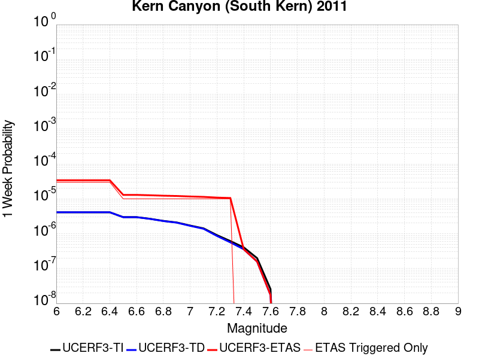 | 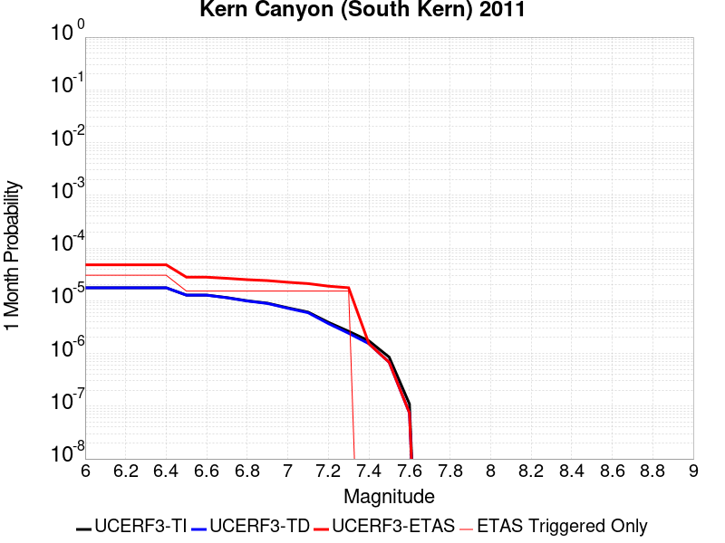 | 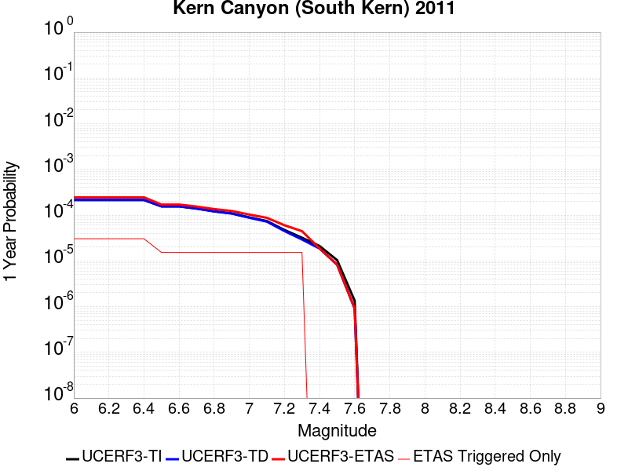 | 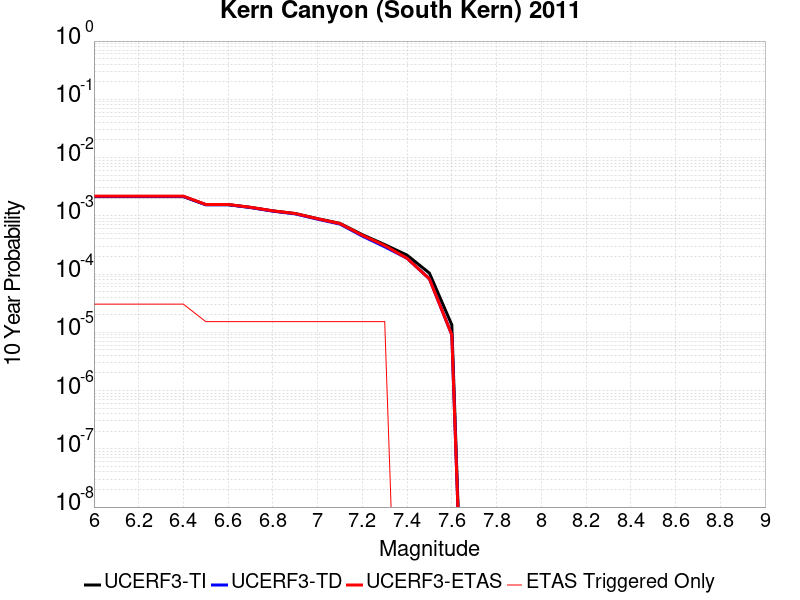 |

| Magnitude | 1 wk TI Prob | 1 wk TD Prob | 1 wk ETAS Prob | 1 wk ETAS/TD Gain | 1 wk ETAS Triggered Only | 1 mo TI Prob | 1 mo TD Prob | 1 mo ETAS Prob | 1 mo ETAS/TD Gain | 1 mo ETAS Triggered Only | 1 yr TI Prob | 1 yr TD Prob | 1 yr ETAS Prob | 1 yr ETAS/TD Gain | 1 yr ETAS Triggered Only | 10 yr TI Prob | 10 yr TD Prob | 10 yr ETAS Prob | 10 yr ETAS/TD Gain | 10 yr ETAS Triggered Only |
|-----|-----|-----|-----|-----|-----|-----|-----|-----|-----|-----|-----|-----|-----|-----|-----|-----|-----|-----|-----|-----|
| 6.0 | 4.105075E-6 | 4.1137264E-6 | 3.4555E-5 | 8.399927 | 3.04414E-5 | 1.7593058E-5 | 1.763014E-5 | 4.8071004E-5 | 2.7266376 | 3.04414E-5 | 2.1417443E-4 | 2.1462646E-4 | 2.4506132E-4 | 1.1418039 | 3.04414E-5 | 0.0021396813 | 0.0021442557 | 0.002174632 | 1.0141662 | 3.04414E-5 |
| 6.1 | 4.105075E-6 | 4.1137264E-6 | 3.4555E-5 | 8.399927 | 3.04414E-5 | 1.7593058E-5 | 1.763014E-5 | 4.8071004E-5 | 2.7266376 | 3.04414E-5 | 2.1417443E-4 | 2.1462646E-4 | 2.4506132E-4 | 1.1418039 | 3.04414E-5 | 0.0021396813 | 0.0021442557 | 0.002174632 | 1.0141662 | 3.04414E-5 |
| 6.2 | 4.105075E-6 | 4.1137264E-6 | 3.4555E-5 | 8.399927 | 3.04414E-5 | 1.7593058E-5 | 1.763014E-5 | 4.8071004E-5 | 2.7266376 | 3.04414E-5 | 2.1417443E-4 | 2.1462646E-4 | 2.4506132E-4 | 1.1418039 | 3.04414E-5 | 0.0021396813 | 0.0021442557 | 0.002174632 | 1.0141662 | 3.04414E-5 |
| 6.3 | 4.105075E-6 | 4.1137264E-6 | 3.4555E-5 | 8.399927 | 3.04414E-5 | 1.7593058E-5 | 1.763014E-5 | 4.8071004E-5 | 2.7266376 | 3.04414E-5 | 2.1417443E-4 | 2.1462646E-4 | 2.4506132E-4 | 1.1418039 | 3.04414E-5 | 0.0021396813 | 0.0021442557 | 0.002174632 | 1.0141662 | 3.04414E-5 |
| 6.4 | 4.105075E-6 | 4.1137264E-6 | 3.4555E-5 | 8.399927 | 3.04414E-5 | 1.7593058E-5 | 1.763014E-5 | 4.8071004E-5 | 2.7266376 | 3.04414E-5 | 2.1417443E-4 | 2.1462646E-4 | 2.4506132E-4 | 1.1418039 | 3.04414E-5 | 0.0021396813 | 0.0021442557 | 0.002174632 | 1.0141662 | 3.04414E-5 |
| 6.5 | 2.9849807E-6 | 2.9731548E-6 | 1.819381E-5 | 6.119362 | 1.52207E-5 | 1.2792712E-5 | 1.274203E-5 | 2.7962536E-5 | 2.194512 | 1.52207E-5 | 1.5574014E-4 | 1.5512333E-4 | 1.7034166E-4 | 1.0981048 | 1.52207E-5 | 0.0015563103 | 0.0015501656 | 0.0015653627 | 1.0098035 | 1.52207E-5 |
| 6.6 | 2.9849807E-6 | 2.9731548E-6 | 1.819381E-5 | 6.119362 | 1.52207E-5 | 1.2792712E-5 | 1.274203E-5 | 2.7962536E-5 | 2.194512 | 1.52207E-5 | 1.5574014E-4 | 1.5512333E-4 | 1.7034166E-4 | 1.0981048 | 1.52207E-5 | 0.0015563103 | 0.0015501656 | 0.0015653627 | 1.0098035 | 1.52207E-5 |
| 6.7 | 2.6756725E-6 | 2.6582206E-6 | 1.787888E-5 | 6.7258825 | 1.52207E-5 | 1.1467117E-5 | 1.1392325E-5 | 2.6612852E-5 | 2.3360333 | 1.52207E-5 | 1.396032E-4 | 1.3869285E-4 | 1.5391143E-4 | 1.1097287 | 1.52207E-5 | 0.0013951553 | 0.0013860738 | 0.0014012734 | 1.010966 | 1.52207E-5 |
| 6.8 | 2.3283721E-6 | 2.3047787E-6 | 1.7525444E-5 | 7.603959 | 1.52207E-5 | 9.9787E-6 | 9.877586E-6 | 2.5098136E-5 | 2.5409179 | 1.52207E-5 | 1.214839E-4 | 1.20253055E-4 | 1.3547193E-4 | 1.126557 | 1.52207E-5 | 0.001214175 | 0.0012018873 | 0.0012170897 | 1.0126488 | 1.52207E-5 |
| 6.9 | 2.0972677E-6 | 2.0696411E-6 | 1.729031E-5 | 8.354255 | 1.52207E-5 | 8.988259E-6 | 8.869861E-6 | 2.4090426E-5 | 2.715987 | 1.52207E-5 | 1.0942656E-4 | 1.0798526E-4 | 1.2320431E-4 | 1.1409364 | 1.52207E-5 | 0.0010937268 | 0.0010793337 | 0.001094538 | 1.0140867 | 1.52207E-5 |
| 7.0 | 1.7132242E-6 | 1.6787036E-6 | 1.6899377E-5 | 10.066922 | 1.52207E-5 | 7.3423685E-6 | 7.194424E-6 | 2.2415015E-5 | 3.1156094 | 1.52207E-5 | 8.938967E-5 | 8.758863E-5 | 1.02808E-4 | 1.1737596 | 1.52207E-5 | 8.935372E-4 | 8.7554497E-4 | 8.907523E-4 | 1.017369 | 1.52207E-5 |
| 7.1 | 1.4215541E-6 | 1.3815752E-6 | 1.6602255E-5 | 12.016902 | 1.52207E-5 | 6.0923603E-6 | 5.9210233E-6 | 2.1141634E-5 | 3.5706046 | 1.52207E-5 | 7.417196E-5 | 7.20861E-5 | 8.730571E-5 | 1.2111309 | 1.52207E-5 | 7.414721E-4 | 7.206299E-4 | 7.358396E-4 | 1.0211061 | 1.52207E-5 |
| 7.2 | 9.097853E-7 | 8.6037755E-7 | 1.6081065E-5 | 18.690706 | 1.52207E-5 | 3.899074E-6 | 3.6873273E-6 | 1.8907971E-5 | 5.1278257 | 1.52207E-5 | 4.7470192E-5 | 4.4892295E-5 | 6.011231E-5 | 1.3390341 | 1.52207E-5 | 4.7460053E-4 | 4.4883334E-4 | 4.6404722E-4 | 1.0338964 | 1.52207E-5 |
| 7.3 | 6.144169E-7 | 5.628206E-7 | 1.5783513E-5 | 28.043592 | 1.52207E-5 | 2.6332125E-6 | 2.4120861E-6 | 1.763275E-5 | 7.3101654 | 1.52207E-5 | 3.205889E-5 | 2.9366758E-5 | 4.4587014E-5 | 1.5182817 | 1.52207E-5 | 3.2054266E-4 | 2.936293E-4 | 3.088455E-4 | 1.0518212 | 1.52207E-5 |
| 7.4 | 4.049844E-7 | 3.5728314E-7 | 3.5728314E-7 | 1.0 | 0.0 | 1.7356463E-6 | 1.5312125E-6 | 1.5312125E-6 | 1.0 | 0.0 | 2.1131287E-5 | 1.8642357E-5 | 1.8642357E-5 | 1.0 | 0.0 | 2.1129279E-4 | 1.8640817E-4 | 1.8640817E-4 | 1.0 | 0.0 |
| 7.5 | 1.9871162E-7 | 1.583044E-7 | 1.583044E-7 | 1.0 | 0.0 | 8.5162094E-7 | 6.7844724E-7 | 6.7844724E-7 | 1.0 | 0.0 | 1.0368436E-5 | 8.260065E-6 | 8.260065E-6 | 1.0 | 0.0 | 1.0367952E-4 | 8.259767E-5 | 8.259767E-5 | 1.0 | 0.0 |
| 7.6 | 2.572245E-8 | 1.7352555E-8 | 1.7352555E-8 | 1.0 | 0.0 | 1.10239064E-7 | 7.436809E-8 | 7.436809E-8 | 1.0 | 0.0 | 1.3421597E-6 | 9.054312E-7 | 9.054312E-7 | 1.0 | 0.0 | 1.3421517E-5 | 9.05428E-6 | 9.05428E-6 | 1.0 | 0.0 |

## Santa Ynez River
*[(top)](#table-of-contents)*

| 1 Week | 1 Month | 1 Year | 10 Year |
|-----|-----|-----|-----|
| 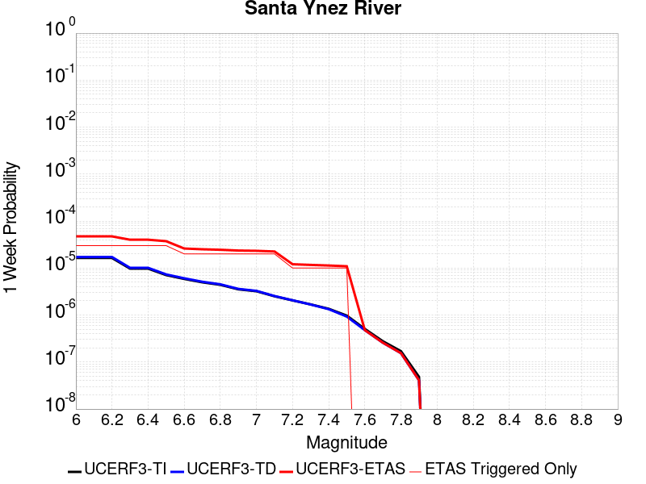 | 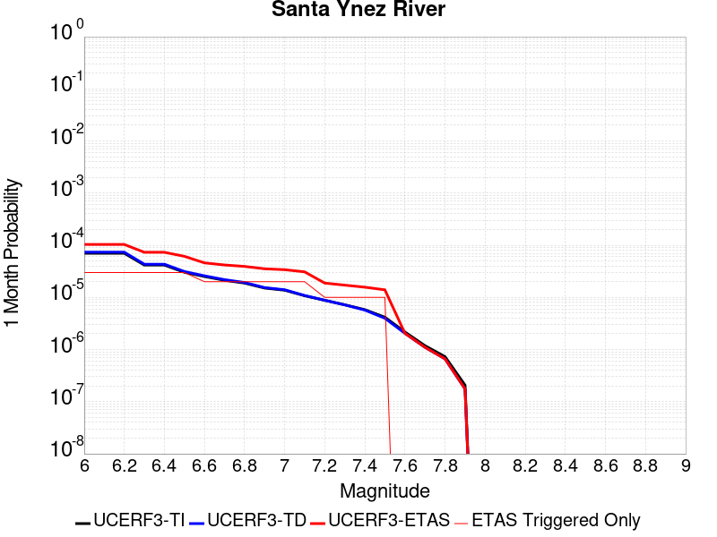 | 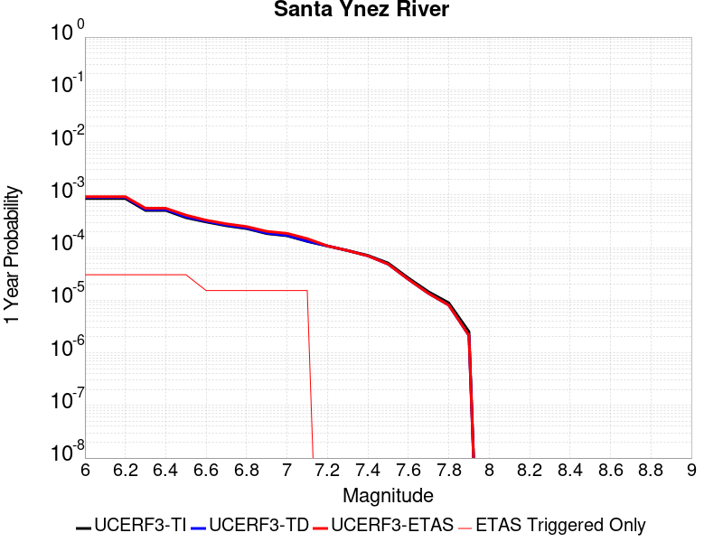 | 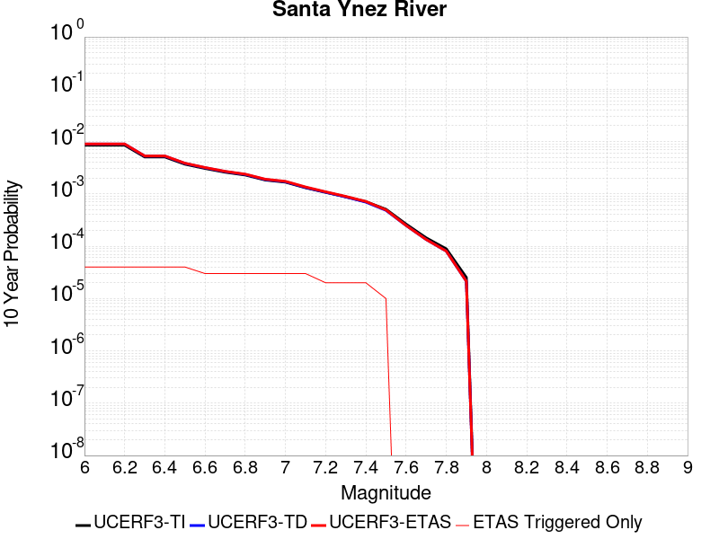 |

| Magnitude | 1 wk TI Prob | 1 wk TD Prob | 1 wk ETAS Prob | 1 wk ETAS/TD Gain | 1 wk ETAS Triggered Only | 1 mo TI Prob | 1 mo TD Prob | 1 mo ETAS Prob | 1 mo ETAS/TD Gain | 1 mo ETAS Triggered Only | 1 yr TI Prob | 1 yr TD Prob | 1 yr ETAS Prob | 1 yr ETAS/TD Gain | 1 yr ETAS Triggered Only | 10 yr TI Prob | 10 yr TD Prob | 10 yr ETAS Prob | 10 yr ETAS/TD Gain | 10 yr ETAS Triggered Only |
|-----|-----|-----|-----|-----|-----|-----|-----|-----|-----|-----|-----|-----|-----|-----|-----|-----|-----|-----|-----|-----|
| 6.0 | 1.6396456E-5 | 1.7209435E-5 | 4.7650312E-5 | 2.768848 | 3.04414E-5 | 7.026863E-5 | 7.375284E-5 | 1.04192E-4 | 1.4127184 | 3.04414E-5 | 8.551848E-4 | 8.976064E-4 | 9.280205E-4 | 1.0338836 | 3.04414E-5 | 0.0085190125 | 0.008943358 | 0.008973528 | 1.0033734 | 3.04414E-5 |
| 6.1 | 1.6396456E-5 | 1.7209435E-5 | 4.7650312E-5 | 2.768848 | 3.04414E-5 | 7.026863E-5 | 7.375284E-5 | 1.04192E-4 | 1.4127184 | 3.04414E-5 | 8.551848E-4 | 8.976064E-4 | 9.280205E-4 | 1.0338836 | 3.04414E-5 | 0.0085190125 | 0.008943358 | 0.008973528 | 1.0033734 | 3.04414E-5 |
| 6.2 | 1.6396456E-5 | 1.7209435E-5 | 4.7650312E-5 | 2.768848 | 3.04414E-5 | 7.026863E-5 | 7.375284E-5 | 1.04192E-4 | 1.4127184 | 3.04414E-5 | 8.551848E-4 | 8.976064E-4 | 9.280205E-4 | 1.0338836 | 3.04414E-5 | 0.0085190125 | 0.008943358 | 0.008973528 | 1.0033734 | 3.04414E-5 |
| 6.3 | 9.736976E-6 | 1.012233E-5 | 4.0563424E-5 | 4.0073204 | 3.04414E-5 | 4.172923E-5 | 4.338072E-5 | 7.3820804E-5 | 1.701696 | 3.04414E-5 | 5.0793495E-4 | 5.280373E-4 | 5.5846263E-4 | 1.0576197 | 3.04414E-5 | 0.005067755 | 0.005268332 | 0.005298613 | 1.0057478 | 3.04414E-5 |
| 6.4 | 9.736976E-6 | 1.012233E-5 | 4.0563424E-5 | 4.0073204 | 3.04414E-5 | 4.172923E-5 | 4.338072E-5 | 7.3820804E-5 | 1.701696 | 3.04414E-5 | 5.0793495E-4 | 5.280373E-4 | 5.5846263E-4 | 1.0576197 | 3.04414E-5 | 0.005067755 | 0.005268332 | 0.005298613 | 1.0057478 | 3.04414E-5 |
| 6.5 | 7.081964E-6 | 7.3298966E-6 | 3.7771075E-5 | 5.153016 | 3.04414E-5 | 3.035092E-5 | 3.1413474E-5 | 6.185392E-5 | 1.9690251 | 3.04414E-5 | 3.694598E-4 | 3.8239348E-4 | 4.1282325E-4 | 1.0795771 | 3.04414E-5 | 0.0036884616 | 0.0038175168 | 0.0038478419 | 1.0079437 | 3.04414E-5 |
| 6.6 | 5.873247E-6 | 6.059743E-6 | 2.1280352E-5 | 3.511758 | 1.52207E-5 | 2.5170815E-5 | 2.5970074E-5 | 4.119038E-5 | 1.5860709 | 1.52207E-5 | 3.064116E-4 | 3.1614062E-4 | 3.313565E-4 | 1.0481302 | 1.52207E-5 | 0.0030598943 | 0.0031569963 | 0.003172169 | 1.004806 | 1.52207E-5 |
| 6.7 | 4.973277E-6 | 5.115901E-6 | 2.0336523E-5 | 3.9751596 | 1.52207E-5 | 2.1313872E-5 | 2.1925109E-5 | 3.7145473E-5 | 1.694198 | 1.52207E-5 | 2.5946548E-4 | 2.66906E-4 | 2.821226E-4 | 1.0570112 | 1.52207E-5 | 0.0025916274 | 0.0026659032 | 0.0026810833 | 1.0056942 | 1.52207E-5 |
| 6.8 | 4.396492E-6 | 4.5109778E-6 | 1.973161E-5 | 4.374131 | 1.52207E-5 | 1.884197E-5 | 1.9332621E-5 | 3.4553028E-5 | 1.7872914 | 1.52207E-5 | 2.2937685E-4 | 2.3534958E-4 | 2.505667E-4 | 1.0646576 | 1.52207E-5 | 0.0022914023 | 0.0023510386 | 0.0023662236 | 1.0064588 | 1.52207E-5 |
| 6.9 | 3.5255632E-6 | 3.6013332E-6 | 1.8821978E-5 | 5.226392 | 1.52207E-5 | 1.5109469E-5 | 1.5434196E-5 | 3.065466E-5 | 1.9861522 | 1.52207E-5 | 1.8394225E-4 | 1.8789528E-4 | 2.0311312E-4 | 1.080991 | 1.52207E-5 | 0.0018379007 | 0.0018773803 | 0.0018925725 | 1.0080922 | 1.52207E-5 |
| 7.0 | 3.211603E-6 | 3.273654E-6 | 1.8494304E-5 | 5.6494374 | 1.52207E-5 | 1.376394E-5 | 1.4029872E-5 | 2.9250357E-5 | 2.084863 | 1.52207E-5 | 1.6756308E-4 | 1.7080043E-4 | 1.8601853E-4 | 1.0890987 | 1.52207E-5 | 0.0016743679 | 0.0017067058 | 0.0017219005 | 1.0089029 | 1.52207E-5 |
| 7.1 | 2.5094619E-6 | 2.5409204E-6 | 1.7761582E-5 | 6.990216 | 1.52207E-5 | 1.0754793E-5 | 1.0889614E-5 | 2.6110149E-5 | 2.397711 | 1.52207E-5 | 1.3093173E-4 | 1.3257304E-4 | 1.4779172E-4 | 1.1147947 | 1.52207E-5 | 0.0013085462 | 0.0013249456 | 0.0013401461 | 1.0114726 | 1.52207E-5 |
| 7.2 | 2.0515774E-6 | 2.0619375E-6 | 2.0619375E-6 | 1.0 | 0.0 | 8.792445E-6 | 8.836846E-6 | 8.836846E-6 | 1.0 | 0.0 | 1.0704277E-4 | 1.0758333E-4 | 1.0758333E-4 | 1.0 | 0.0 | 0.0010699122 | 0.0010753168 | 0.0010753168 | 1.0 | 0.0 |
| 7.3 | 1.6845745E-6 | 1.6773907E-6 | 1.6773907E-6 | 1.0 | 0.0 | 7.219585E-6 | 7.1887976E-6 | 7.1887976E-6 | 1.0 | 0.0 | 8.78949E-5 | 8.752012E-5 | 8.752012E-5 | 1.0 | 0.0 | 8.7860145E-4 | 8.7485946E-4 | 8.7485946E-4 | 1.0 | 0.0 |
| 7.4 | 1.3600285E-6 | 1.3333357E-6 | 1.3333357E-6 | 1.0 | 0.0 | 5.82868E-6 | 5.714284E-6 | 5.714284E-6 | 1.0 | 0.0 | 7.096187E-5 | 6.956921E-5 | 6.956921E-5 | 1.0 | 0.0 | 7.0939213E-4 | 6.954765E-4 | 6.954765E-4 | 1.0 | 0.0 |
| 7.5 | 9.735342E-7 | 9.290103E-7 | 9.290103E-7 | 1.0 | 0.0 | 4.172283E-6 | 3.9814668E-6 | 3.9814668E-6 | 1.0 | 0.0 | 5.079636E-5 | 4.8473295E-5 | 4.8473295E-5 | 1.0 | 0.0 | 5.0784746E-4 | 4.8462892E-4 | 4.8462892E-4 | 1.0 | 0.0 |
| 7.6 | 5.067187E-7 | 4.77857E-7 | 4.77857E-7 | 1.0 | 0.0 | 2.1716498E-6 | 2.047957E-6 | 2.047957E-6 | 1.0 | 0.0 | 2.6439517E-5 | 2.4933597E-5 | 2.4933597E-5 | 1.0 | 0.0 | 2.643637E-4 | 2.4930874E-4 | 2.4930874E-4 | 1.0 | 0.0 |
| 7.7 | 2.769089E-7 | 2.5759124E-7 | 2.5759124E-7 | 1.0 | 0.0 | 1.1867519E-6 | 1.1039621E-6 | 1.1039621E-6 | 1.0 | 0.0 | 1.4448608E-5 | 1.34406555E-5 | 1.34406555E-5 | 1.0 | 0.0 | 1.444767E-4 | 1.3439846E-4 | 1.3439846E-4 | 1.0 | 0.0 |
| 7.8 | 1.7044663E-7 | 1.5449015E-7 | 1.5449015E-7 | 1.0 | 0.0 | 7.3048534E-7 | 6.621005E-7 | 6.621005E-7 | 1.0 | 0.0 | 8.893623E-6 | 8.061043E-6 | 8.061043E-6 | 1.0 | 0.0 | 8.893267E-5 | 8.060753E-5 | 8.060753E-5 | 1.0 | 0.0 |
| 7.9 | 4.8344287E-8 | 4.0910923E-8 | 4.0910923E-8 | 1.0 | 0.0 | 2.0718979E-7 | 1.7533252E-7 | 1.7533252E-7 | 1.0 | 0.0 | 2.5225327E-6 | 2.1346711E-6 | 2.1346711E-6 | 1.0 | 0.0 | 2.5225041E-5 | 2.1346512E-5 | 2.1346512E-5 | 1.0 | 0.0 |

## Jess Valley
*[(top)](#table-of-contents)*

| 1 Week | 1 Month | 1 Year | 10 Year |
|-----|-----|-----|-----|
| 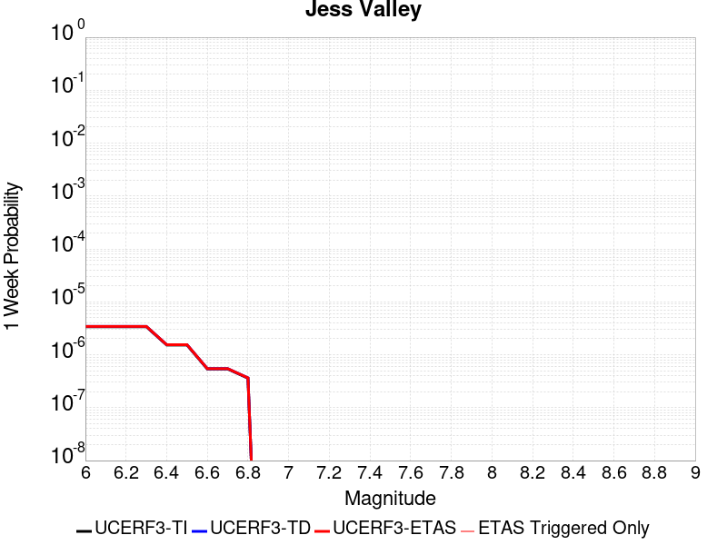 |  | 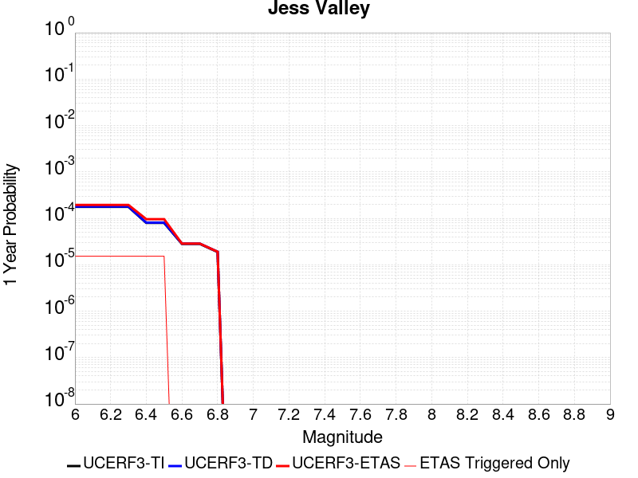 | 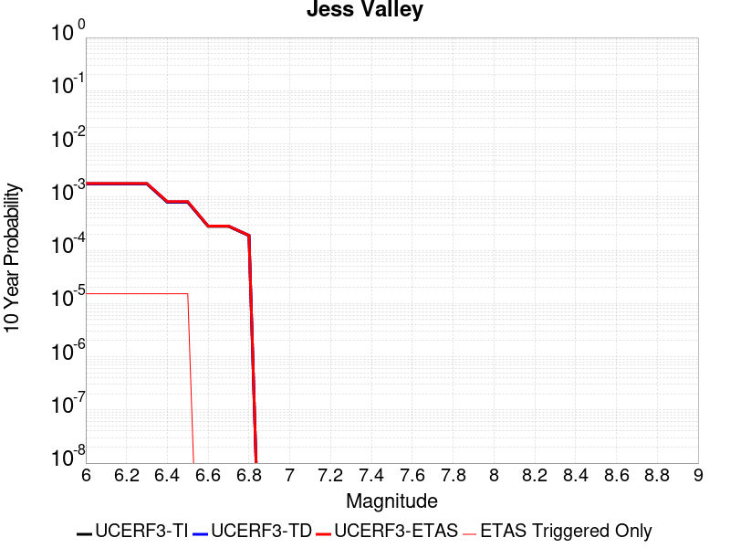 |

| Magnitude | 1 wk TI Prob | 1 wk TD Prob | 1 wk ETAS Prob | 1 wk ETAS/TD Gain | 1 wk ETAS Triggered Only | 1 mo TI Prob | 1 mo TD Prob | 1 mo ETAS Prob | 1 mo ETAS/TD Gain | 1 mo ETAS Triggered Only | 1 yr TI Prob | 1 yr TD Prob | 1 yr ETAS Prob | 1 yr ETAS/TD Gain | 1 yr ETAS Triggered Only | 10 yr TI Prob | 10 yr TD Prob | 10 yr ETAS Prob | 10 yr ETAS/TD Gain | 10 yr ETAS Triggered Only |
|-----|-----|-----|-----|-----|-----|-----|-----|-----|-----|-----|-----|-----|-----|-----|-----|-----|-----|-----|-----|-----|
| 6.0 | 3.3861274E-6 | 3.4340592E-6 | 3.4340592E-6 | 1.0 | 0.0 | 1.4511894E-5 | 1.471733E-5 | 1.471733E-5 | 1.0 | 0.0 | 1.7666799E-4 | 1.7917156E-4 | 1.9438955E-4 | 1.0849352 | 1.52207E-5 | 0.001765276 | 0.0017905476 | 0.0018057411 | 1.0084853 | 1.52207E-5 |
| 6.1 | 3.3861274E-6 | 3.4340592E-6 | 3.4340592E-6 | 1.0 | 0.0 | 1.4511894E-5 | 1.471733E-5 | 1.471733E-5 | 1.0 | 0.0 | 1.7666799E-4 | 1.7917156E-4 | 1.9438955E-4 | 1.0849352 | 1.52207E-5 | 0.001765276 | 0.0017905476 | 0.0018057411 | 1.0084853 | 1.52207E-5 |
| 6.2 | 3.3861274E-6 | 3.4340592E-6 | 3.4340592E-6 | 1.0 | 0.0 | 1.4511894E-5 | 1.471733E-5 | 1.471733E-5 | 1.0 | 0.0 | 1.7666799E-4 | 1.7917156E-4 | 1.9438955E-4 | 1.0849352 | 1.52207E-5 | 0.001765276 | 0.0017905476 | 0.0018057411 | 1.0084853 | 1.52207E-5 |
| 6.3 | 3.3861274E-6 | 3.4340592E-6 | 3.4340592E-6 | 1.0 | 0.0 | 1.4511894E-5 | 1.471733E-5 | 1.471733E-5 | 1.0 | 0.0 | 1.7666799E-4 | 1.7917156E-4 | 1.9438955E-4 | 1.0849352 | 1.52207E-5 | 0.001765276 | 0.0017905476 | 0.0018057411 | 1.0084853 | 1.52207E-5 |
| 6.4 | 1.5291708E-6 | 1.5502784E-6 | 1.5502784E-6 | 1.0 | 0.0 | 6.553573E-6 | 6.644038E-6 | 6.644038E-6 | 1.0 | 0.0 | 7.978683E-5 | 8.088895E-5 | 9.610842E-5 | 1.1881527 | 1.52207E-5 | 7.975819E-4 | 8.086733E-4 | 8.2388177E-4 | 1.0188066 | 1.52207E-5 |
| 6.5 | 1.5291708E-6 | 1.5502784E-6 | 1.5502784E-6 | 1.0 | 0.0 | 6.553573E-6 | 6.644038E-6 | 6.644038E-6 | 1.0 | 0.0 | 7.978683E-5 | 8.088895E-5 | 9.610842E-5 | 1.1881527 | 1.52207E-5 | 7.975819E-4 | 8.086733E-4 | 8.2388177E-4 | 1.0188066 | 1.52207E-5 |
| 6.6 | 5.396423E-7 | 5.4719953E-7 | 5.4719953E-7 | 1.0 | 0.0 | 2.312751E-6 | 2.3451398E-6 | 2.3451398E-6 | 1.0 | 0.0 | 2.8157378E-5 | 2.855189E-5 | 2.855189E-5 | 1.0 | 0.0 | 2.8153812E-4 | 2.8550063E-4 | 2.8550063E-4 | 1.0 | 0.0 |
| 6.7 | 5.396423E-7 | 5.4719953E-7 | 5.4719953E-7 | 1.0 | 0.0 | 2.312751E-6 | 2.3451398E-6 | 2.3451398E-6 | 1.0 | 0.0 | 2.8157378E-5 | 2.855189E-5 | 2.855189E-5 | 1.0 | 0.0 | 2.8153812E-4 | 2.8550063E-4 | 2.8550063E-4 | 1.0 | 0.0 |
| 6.8 | 3.6058395E-7 | 3.6563068E-7 | 3.6563068E-7 | 1.0 | 0.0 | 1.5453588E-6 | 1.5669885E-6 | 1.5669885E-6 | 1.0 | 0.0 | 1.8814582E-5 | 1.9078087E-5 | 1.9078087E-5 | 1.0 | 0.0 | 1.8812988E-4 | 1.9078086E-4 | 1.9078086E-4 | 1.0 | 0.0 |

## San Diego Trough south
*[(top)](#table-of-contents)*

| 1 Week | 1 Month | 1 Year | 10 Year |
|-----|-----|-----|-----|
| 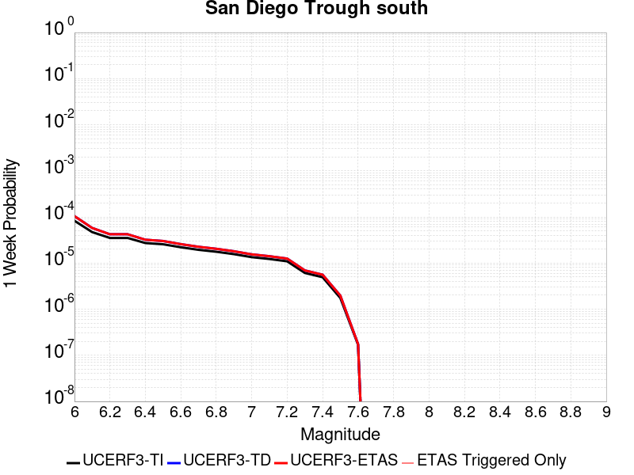 |  | 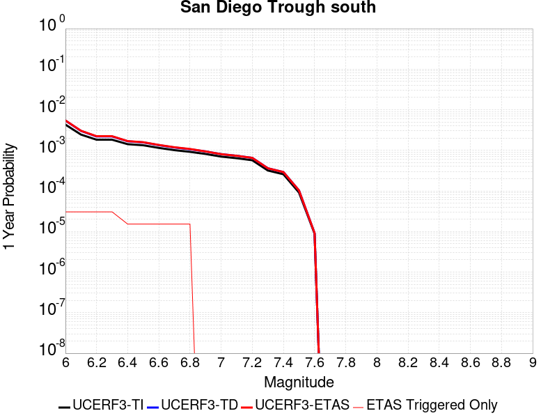 | 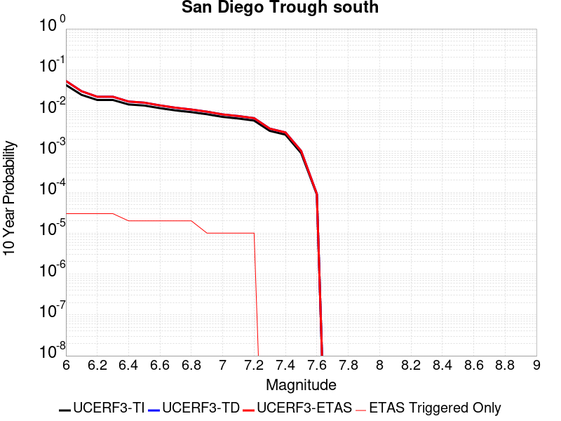 |

| Magnitude | 1 wk TI Prob | 1 wk TD Prob | 1 wk ETAS Prob | 1 wk ETAS/TD Gain | 1 wk ETAS Triggered Only | 1 mo TI Prob | 1 mo TD Prob | 1 mo ETAS Prob | 1 mo ETAS/TD Gain | 1 mo ETAS Triggered Only | 1 yr TI Prob | 1 yr TD Prob | 1 yr ETAS Prob | 1 yr ETAS/TD Gain | 1 yr ETAS Triggered Only | 10 yr TI Prob | 10 yr TD Prob | 10 yr ETAS Prob | 10 yr ETAS/TD Gain | 10 yr ETAS Triggered Only |
|-----|-----|-----|-----|-----|-----|-----|-----|-----|-----|-----|-----|-----|-----|-----|-----|-----|-----|-----|-----|-----|
| 6.0 | 8.279495E-5 | 1.04241306E-4 | 1.04241306E-4 | 1.0 | 0.0 | 3.5478722E-4 | 4.4667677E-4 | 4.4667677E-4 | 1.0 | 0.0 | 0.004310982 | 0.0054256152 | 0.0054558916 | 1.0055802 | 3.04414E-5 | 0.042283054 | 0.05299221 | 0.053021036 | 1.000544 | 3.04414E-5 |
| 6.1 | 4.6961468E-5 | 5.772944E-5 | 5.772944E-5 | 1.0 | 0.0 | 2.0124791E-4 | 2.473894E-4 | 2.473894E-4 | 1.0 | 0.0 | 0.00244744 | 0.0030079768 | 0.0030383265 | 1.0100898 | 3.04414E-5 | 0.024206603 | 0.029679462 | 0.029709 | 1.0009953 | 3.04414E-5 |
| 6.2 | 3.5079658E-5 | 4.214154E-5 | 4.214154E-5 | 1.0 | 0.0 | 1.5033272E-4 | 1.8059435E-4 | 1.8059435E-4 | 1.0 | 0.0 | 0.0018287642 | 0.0021965632 | 0.0022269376 | 1.0138282 | 3.04414E-5 | 0.018137876 | 0.021751117 | 0.021780897 | 1.0013691 | 3.04414E-5 |
| 6.3 | 3.5079658E-5 | 4.214154E-5 | 4.214154E-5 | 1.0 | 0.0 | 1.5033272E-4 | 1.8059435E-4 | 1.8059435E-4 | 1.0 | 0.0 | 0.0018287642 | 0.0021965632 | 0.0022269376 | 1.0138282 | 3.04414E-5 | 0.018137876 | 0.021751117 | 0.021780897 | 1.0013691 | 3.04414E-5 |
| 6.4 | 2.7196904E-5 | 3.2087162E-5 | 3.2087162E-5 | 1.0 | 0.0 | 1.16552954E-4 | 1.3750927E-4 | 1.3750927E-4 | 1.0 | 0.0 | 0.0014181085 | 0.0016729041 | 0.0016880993 | 1.0090832 | 1.52207E-5 | 0.014090929 | 0.016604643 | 0.016619612 | 1.0009015 | 1.52207E-5 |
| 6.5 | 2.5584688E-5 | 3.010164E-5 | 3.010164E-5 | 1.0 | 0.0 | 1.0964406E-4 | 1.2900073E-4 | 1.2900073E-4 | 1.0 | 0.0 | 0.0013340989 | 0.0015694655 | 0.0015846624 | 1.0096828 | 1.52207E-5 | 0.013261181 | 0.015585314 | 0.015600298 | 1.0009614 | 1.52207E-5 |
| 6.6 | 2.2034688E-5 | 2.5742738E-5 | 2.5742738E-5 | 1.0 | 0.0 | 9.443096E-5 | 1.1032141E-4 | 1.1032141E-4 | 1.0 | 0.0 | 0.0011490905 | 0.0013423424 | 0.0013575426 | 1.0113237 | 1.52207E-5 | 0.011431668 | 0.013343317 | 0.013358335 | 1.0011255 | 1.52207E-5 |
| 6.7 | 1.9394853E-5 | 2.254176E-5 | 2.254176E-5 | 1.0 | 0.0 | 8.311815E-5 | 9.6603995E-5 | 9.6603995E-5 | 1.0 | 0.0 | 0.0010114936 | 0.0011755243 | 0.0011907271 | 1.0129328 | 1.52207E-5 | 0.01006902 | 0.011693766 | 0.011708809 | 1.0012864 | 1.52207E-5 |
| 6.8 | 1.7615313E-5 | 2.0403182E-5 | 2.0403182E-5 | 1.0 | 0.0 | 7.549201E-5 | 8.74393E-5 | 8.74393E-5 | 1.0 | 0.0 | 9.1872766E-4 | 0.0010640579 | 0.0010792625 | 1.0142891 | 1.52207E-5 | 0.009149387 | 0.010590198 | 0.010605258 | 1.001422 | 1.52207E-5 |
| 6.9 | 1.5621423E-5 | 1.8026114E-5 | 1.8026114E-5 | 1.0 | 0.0 | 6.6947236E-5 | 7.725251E-5 | 7.725251E-5 | 1.0 | 0.0 | 8.147778E-4 | 9.40147E-4 | 9.40147E-4 | 1.0 | 0.0 | 0.008117969 | 0.009362142 | 0.009362142 | 1.0 | 0.0 |
| 7.0 | 1.3444376E-5 | 1.544809E-5 | 1.544809E-5 | 1.0 | 0.0 | 5.7617483E-5 | 6.620443E-5 | 6.620443E-5 | 1.0 | 0.0 | 7.0126704E-4 | 8.057436E-4 | 8.057436E-4 | 1.0 | 0.0 | 0.006990582 | 0.008028555 | 0.008028555 | 1.0 | 0.0 |
| 7.1 | 1.2268361E-5 | 1.407303E-5 | 1.407303E-5 | 1.0 | 0.0 | 5.2577634E-5 | 6.0311606E-5 | 6.0311606E-5 | 1.0 | 0.0 | 6.399447E-4 | 7.3404907E-4 | 7.3404907E-4 | 1.0 | 0.0 | 0.0063810493 | 0.0073165493 | 0.0073165493 | 1.0 | 0.0 |
| 7.2 | 1.0922655E-5 | 1.2513563E-5 | 1.2513563E-5 | 1.0 | 0.0 | 4.681054E-5 | 5.3628468E-5 | 5.3628468E-5 | 1.0 | 0.0 | 5.697693E-4 | 6.5273355E-4 | 6.5273355E-4 | 1.0 | 0.0 | 0.0056831064 | 0.0065084435 | 0.0065084435 | 1.0 | 0.0 |
| 7.3 | 6.1106753E-6 | 6.928925E-6 | 6.928925E-6 | 1.0 | 0.0 | 2.6188345E-5 | 2.9695057E-5 | 2.9695057E-5 | 1.0 | 0.0 | 3.1879646E-4 | 3.6147775E-4 | 3.6147775E-4 | 1.0 | 0.0 | 0.0031833951 | 0.003608943 | 0.003608943 | 1.0 | 0.0 |
| 7.4 | 4.933187E-6 | 5.5895525E-6 | 5.5895525E-6 | 1.0 | 0.0 | 2.114206E-5 | 2.3955008E-5 | 2.3955008E-5 | 1.0 | 0.0 | 2.5737417E-4 | 2.9161357E-4 | 2.9161357E-4 | 1.0 | 0.0 | 0.002570763 | 0.0029123505 | 0.0029123505 | 1.0 | 0.0 |
| 7.5 | 1.7489613E-6 | 1.969678E-6 | 1.969678E-6 | 1.0 | 0.0 | 7.495527E-6 | 8.4414505E-6 | 8.4414505E-6 | 1.0 | 0.0 | 9.125422E-5 | 1.02770035E-4 | 1.02770035E-4 | 1.0 | 0.0 | 9.1216754E-4 | 0.0010272472 | 0.0010272472 | 1.0 | 0.0 |
| 7.6 | 1.6988751E-7 | 1.7533823E-7 | 1.7533823E-7 | 1.0 | 0.0 | 7.2808916E-7 | 7.5144936E-7 | 7.5144936E-7 | 1.0 | 0.0 | 8.864449E-6 | 9.14886E-6 | 9.14886E-6 | 1.0 | 0.0 | 8.8640954E-5 | 9.1485024E-5 | 9.1485024E-5 | 1.0 | 0.0 |

## Sargent 2011 CFM
*[(top)](#table-of-contents)*

| 1 Week | 1 Month | 1 Year | 10 Year |
|-----|-----|-----|-----|
|  |  | 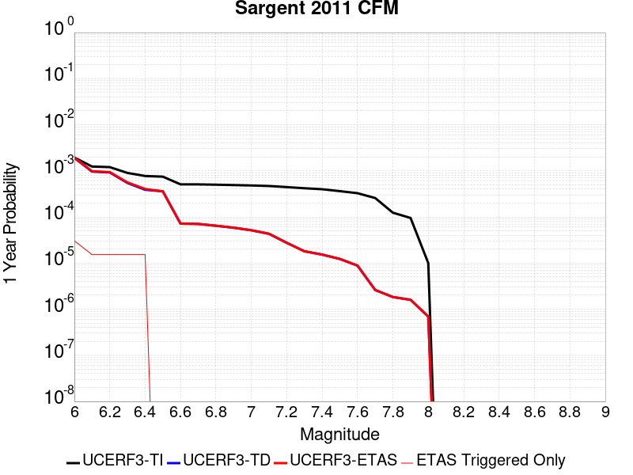 | 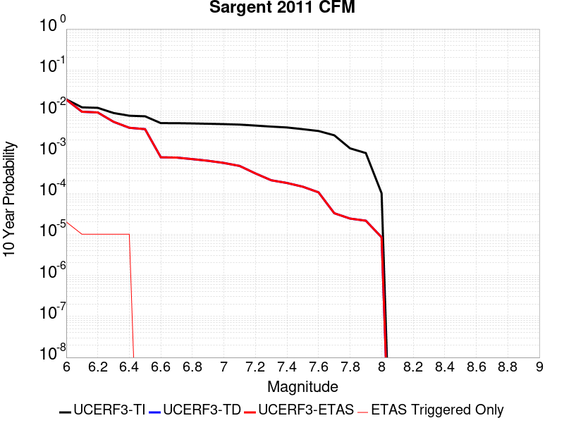 |

| Magnitude | 1 wk TI Prob | 1 wk TD Prob | 1 wk ETAS Prob | 1 wk ETAS/TD Gain | 1 wk ETAS Triggered Only | 1 mo TI Prob | 1 mo TD Prob | 1 mo ETAS Prob | 1 mo ETAS/TD Gain | 1 mo ETAS Triggered Only | 1 yr TI Prob | 1 yr TD Prob | 1 yr ETAS Prob | 1 yr ETAS/TD Gain | 1 yr ETAS Triggered Only | 10 yr TI Prob | 10 yr TD Prob | 10 yr ETAS Prob | 10 yr ETAS/TD Gain | 10 yr ETAS Triggered Only |
|-----|-----|-----|-----|-----|-----|-----|-----|-----|-----|-----|-----|-----|-----|-----|-----|-----|-----|-----|-----|-----|
| 6.0 | 3.7327867E-5 | 3.664913E-5 | 3.664913E-5 | 1.0 | 0.0 | 1.5996677E-4 | 1.5706103E-4 | 1.5706103E-4 | 1.0 | 0.0 | 0.0019458556 | 0.0019110236 | 0.0019414069 | 1.015899 | 3.04414E-5 | 0.01928905 | 0.019018095 | 0.019047957 | 1.0015702 | 3.04414E-5 |
| 6.1 | 2.3771476E-5 | 1.8479273E-5 | 1.8479273E-5 | 1.0 | 0.0 | 1.01873775E-4 | 7.919498E-5 | 7.919498E-5 | 1.0 | 0.0 | 0.0012396075 | 9.638493E-4 | 9.790553E-4 | 1.0157764 | 1.52207E-5 | 0.012327154 | 0.009636091 | 0.009651165 | 1.0015644 | 1.52207E-5 |
| 6.2 | 2.3112721E-5 | 1.7710632E-5 | 1.7710632E-5 | 1.0 | 0.0 | 9.9050754E-5 | 7.590099E-5 | 7.590099E-5 | 1.0 | 0.0 | 0.0012052758 | 9.237792E-4 | 9.3898585E-4 | 1.0164614 | 1.52207E-5 | 0.011987597 | 0.009238743 | 0.009253823 | 1.0016322 | 1.52207E-5 |
| 6.3 | 1.728509E-5 | 1.0458927E-5 | 1.0458927E-5 | 1.0 | 0.0 | 7.407686E-5 | 4.482347E-5 | 4.482347E-5 | 1.0 | 0.0 | 9.015125E-4 | 5.456343E-4 | 5.608467E-4 | 1.0278802 | 1.52207E-5 | 0.008978641 | 0.0054791216 | 0.005494259 | 1.0027627 | 1.52207E-5 |
| 6.4 | 1.48395575E-5 | 7.4559816E-6 | 7.4559816E-6 | 1.0 | 0.0 | 6.3596555E-5 | 3.195403E-5 | 3.195403E-5 | 1.0 | 0.0 | 7.7401294E-4 | 3.8900663E-4 | 4.042214E-4 | 1.0391119 | 1.52207E-5 | 0.0077132257 | 0.003918666 | 0.003933827 | 1.0038689 | 1.52207E-5 |
| 6.5 | 1.4358964E-5 | 6.894759E-6 | 6.894759E-6 | 1.0 | 0.0 | 6.1536964E-5 | 2.9548846E-5 | 2.9548846E-5 | 1.0 | 0.0 | 7.48955E-4 | 3.5973339E-4 | 3.5973339E-4 | 1.0 | 0.0 | 0.0074643586 | 0.0036269152 | 0.0036269152 | 1.0 | 0.0 |
| 6.6 | 9.772591E-6 | 1.3736154E-6 | 1.3736154E-6 | 1.0 | 0.0 | 4.188186E-5 | 5.88691E-6 | 5.88691E-6 | 1.0 | 0.0 | 5.097923E-4 | 7.16708E-5 | 7.16708E-5 | 1.0 | 0.0 | 0.005086244 | 7.483097E-4 | 7.483097E-4 | 1.0 | 0.0 |
| 6.7 | 9.752745E-6 | 1.3523068E-6 | 1.3523068E-6 | 1.0 | 0.0 | 4.179681E-5 | 5.795587E-6 | 5.795587E-6 | 1.0 | 0.0 | 5.0875737E-4 | 7.055902E-5 | 7.055902E-5 | 1.0 | 0.0 | 0.005075942 | 7.371994E-4 | 7.371994E-4 | 1.0 | 0.0 |
| 6.8 | 9.608213E-6 | 1.2361709E-6 | 1.2361709E-6 | 1.0 | 0.0 | 4.1177405E-5 | 5.2978644E-6 | 5.2978644E-6 | 1.0 | 0.0 | 5.012196E-4 | 6.449961E-5 | 6.449961E-5 | 1.0 | 0.0 | 0.005000906 | 6.7634037E-4 | 6.7634037E-4 | 1.0 | 0.0 |
| 6.9 | 9.427164E-6 | 1.12094E-6 | 1.12094E-6 | 1.0 | 0.0 | 4.04015E-5 | 4.80402E-6 | 4.80402E-6 | 1.0 | 0.0 | 4.9177726E-4 | 5.8487396E-5 | 5.8487396E-5 | 1.0 | 0.0 | 0.004906904 | 6.1557174E-4 | 6.1557174E-4 | 1.0 | 0.0 |
| 7.0 | 9.247601E-6 | 9.873988E-7 | 9.873988E-7 | 1.0 | 0.0 | 3.9631974E-5 | 4.2317024E-6 | 4.2317024E-6 | 1.0 | 0.0 | 4.8241246E-4 | 5.1519775E-5 | 5.1519775E-5 | 1.0 | 0.0 | 0.0048136655 | 5.4542476E-4 | 5.4542476E-4 | 1.0 | 0.0 |
| 7.1 | 8.995454E-6 | 8.2711284E-7 | 8.2711284E-7 | 1.0 | 0.0 | 3.8551374E-5 | 3.5447645E-6 | 3.5447645E-6 | 1.0 | 0.0 | 4.6926187E-4 | 4.3156666E-5 | 4.3156666E-5 | 1.0 | 0.0 | 0.004682722 | 4.609069E-4 | 4.609069E-4 | 1.0 | 0.0 |
| 7.2 | 8.520861E-6 | 5.2766507E-7 | 5.2766507E-7 | 1.0 | 0.0 | 3.6517464E-5 | 2.2614197E-6 | 2.2614197E-6 | 1.0 | 0.0 | 4.445094E-4 | 2.7532446E-5 | 2.7532446E-5 | 1.0 | 0.0 | 0.004436213 | 3.0297207E-4 | 3.0297207E-4 | 1.0 | 0.0 |
| 7.3 | 8.043592E-6 | 3.456507E-7 | 3.456507E-7 | 1.0 | 0.0 | 3.4472083E-5 | 1.4813593E-6 | 1.4813593E-6 | 1.0 | 0.0 | 4.196168E-4 | 1.8035402E-5 | 1.8035402E-5 | 1.0 | 0.0 | 0.004188253 | 2.0669671E-4 | 2.0669671E-4 | 1.0 | 0.0 |
| 7.4 | 7.662316E-6 | 2.928958E-7 | 2.928958E-7 | 1.0 | 0.0 | 3.2838085E-5 | 1.2552671E-6 | 1.2552671E-6 | 1.0 | 0.0 | 3.9973034E-4 | 1.528277E-5 | 1.528277E-5 | 1.0 | 0.0 | 0.0039901207 | 1.7736501E-4 | 1.7736501E-4 | 1.0 | 0.0 |
| 7.5 | 6.961638E-6 | 2.3574503E-7 | 2.3574503E-7 | 1.0 | 0.0 | 2.9835252E-5 | 1.0103355E-6 | 1.0103355E-6 | 1.0 | 0.0 | 3.6318362E-4 | 1.2300766E-5 | 1.2300766E-5 | 1.0 | 0.0 | 0.0036259065 | 1.4409334E-4 | 1.4409334E-4 | 1.0 | 0.0 |
| 7.6 | 6.282332E-6 | 1.6892966E-7 | 1.6892966E-7 | 1.0 | 0.0 | 2.6924003E-5 | 7.2398404E-7 | 7.2398404E-7 | 1.0 | 0.0 | 3.2775043E-4 | 8.814471E-6 | 8.814471E-6 | 1.0 | 0.0 | 0.0032726745 | 1.05050465E-4 | 1.05050465E-4 | 1.0 | 0.0 |
| 7.7 | 4.934408E-6 | 5.001089E-8 | 5.001089E-8 | 1.0 | 0.0 | 2.114729E-5 | 2.1433237E-7 | 2.1433237E-7 | 1.0 | 0.0 | 2.5743784E-4 | 2.6094935E-6 | 2.6094935E-6 | 1.0 | 0.0 | 0.0025713982 | 3.2545366E-5 | 3.2545366E-5 | 1.0 | 0.0 |
| 7.8 | 2.373212E-6 | 3.5172643E-8 | 3.5172643E-8 | 1.0 | 0.0 | 1.0170869E-5 | 1.507399E-7 | 1.507399E-7 | 1.0 | 0.0 | 1.238233E-4 | 1.8352566E-6 | 1.8352566E-6 | 1.0 | 0.0 | 0.0012375432 | 2.4125171E-5 | 2.4125171E-5 | 1.0 | 0.0 |
| 7.9 | 1.8227792E-6 | 3.0619603E-8 | 3.0619603E-8 | 1.0 | 0.0 | 7.811887E-6 | 1.3122687E-7 | 1.3122687E-7 | 1.0 | 0.0 | 9.510558E-5 | 1.5976858E-6 | 1.5976858E-6 | 1.0 | 0.0 | 9.5064886E-4 | 2.1410624E-5 | 2.1410624E-5 | 1.0 | 0.0 |
| 8.0 | 1.9095137E-7 | 1.326461E-8 | 1.326461E-8 | 1.0 | 0.0 | 8.1836276E-7 | 5.684833E-8 | 5.684833E-8 | 1.0 | 0.0 | 9.963521E-6 | 6.921282E-7 | 6.921282E-7 | 1.0 | 0.0 | 9.963074E-5 | 8.463319E-6 | 8.463319E-6 | 1.0 | 0.0 |

## San Gregorio (North) 2011 CFM
*[(top)](#table-of-contents)*

| 1 Week | 1 Month | 1 Year | 10 Year |
|-----|-----|-----|-----|
|  | 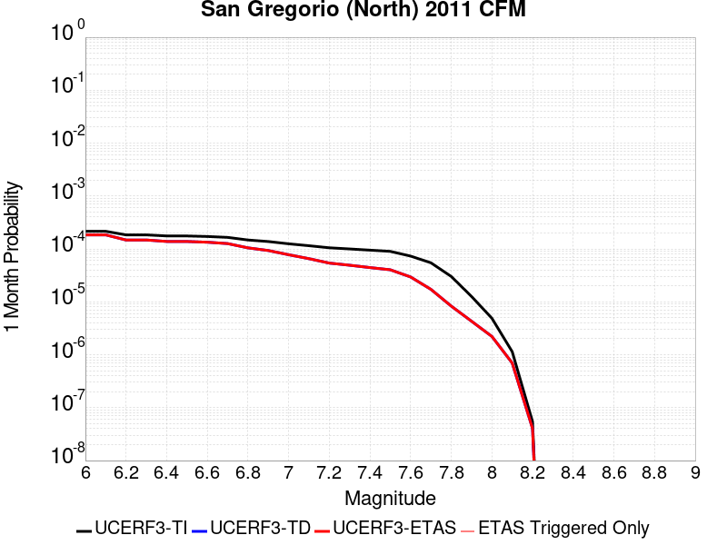 | 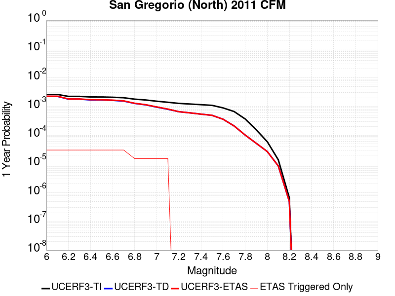 | 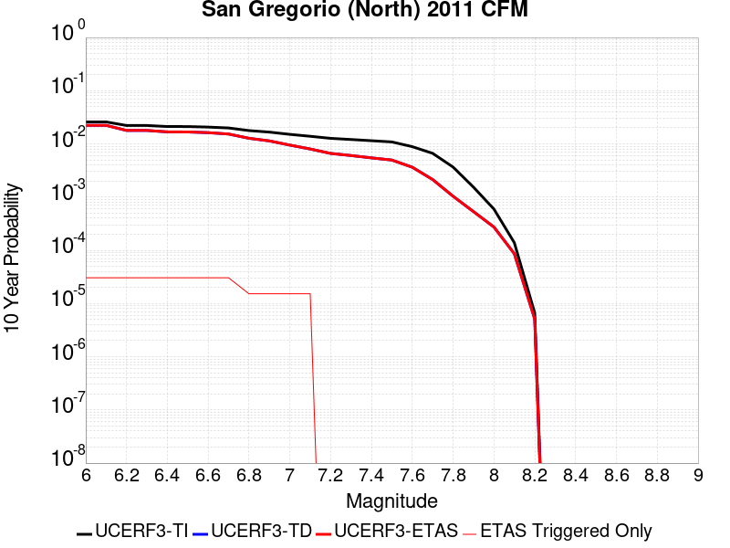 |

| Magnitude | 1 wk TI Prob | 1 wk TD Prob | 1 wk ETAS Prob | 1 wk ETAS/TD Gain | 1 wk ETAS Triggered Only | 1 mo TI Prob | 1 mo TD Prob | 1 mo ETAS Prob | 1 mo ETAS/TD Gain | 1 mo ETAS Triggered Only | 1 yr TI Prob | 1 yr TD Prob | 1 yr ETAS Prob | 1 yr ETAS/TD Gain | 1 yr ETAS Triggered Only | 10 yr TI Prob | 10 yr TD Prob | 10 yr ETAS Prob | 10 yr ETAS/TD Gain | 10 yr ETAS Triggered Only |
|-----|-----|-----|-----|-----|-----|-----|-----|-----|-----|-----|-----|-----|-----|-----|-----|-----|-----|-----|-----|-----|
| 6.0 | 5.0283932E-5 | 4.3057815E-5 | 4.3057815E-5 | 1.0 | 0.0 | 2.1548476E-4 | 1.8452053E-4 | 1.8452053E-4 | 1.0 | 0.0 | 0.0026203706 | 0.002244237 | 0.00227461 | 1.0135338 | 3.04414E-5 | 0.02589687 | 0.022293162 | 0.022322925 | 1.001335 | 3.04414E-5 |
| 6.1 | 5.0283932E-5 | 4.3057815E-5 | 4.3057815E-5 | 1.0 | 0.0 | 2.1548476E-4 | 1.8452053E-4 | 1.8452053E-4 | 1.0 | 0.0 | 0.0026203706 | 0.002244237 | 0.00227461 | 1.0135338 | 3.04414E-5 | 0.02589687 | 0.022293162 | 0.022322925 | 1.001335 | 3.04414E-5 |
| 6.2 | 4.2998647E-5 | 3.4441564E-5 | 3.4441564E-5 | 1.0 | 0.0 | 1.842669E-4 | 1.475984E-4 | 1.475984E-4 | 1.0 | 0.0 | 0.0022411412 | 0.00179554 | 0.0018259267 | 1.0169234 | 3.04414E-5 | 0.022186736 | 0.017886506 | 0.017916404 | 1.0016714 | 3.04414E-5 |
| 6.3 | 4.2998647E-5 | 3.4441564E-5 | 3.4441564E-5 | 1.0 | 0.0 | 1.842669E-4 | 1.475984E-4 | 1.475984E-4 | 1.0 | 0.0 | 0.0022411412 | 0.00179554 | 0.0018259267 | 1.0169234 | 3.04414E-5 | 0.022186736 | 0.017886506 | 0.017916404 | 1.0016714 | 3.04414E-5 |
| 6.4 | 4.1101295E-5 | 3.2326872E-5 | 3.2326872E-5 | 1.0 | 0.0 | 1.7613651E-4 | 1.3853642E-4 | 1.3853642E-4 | 1.0 | 0.0 | 0.0021423528 | 0.0016853869 | 0.001715777 | 1.0180315 | 3.04414E-5 | 0.02121817 | 0.016801886 | 0.016831815 | 1.0017813 | 3.04414E-5 |
| 6.5 | 4.1032585E-5 | 3.2244905E-5 | 3.2244905E-5 | 1.0 | 0.0 | 1.7584208E-4 | 1.3818518E-4 | 1.3818518E-4 | 1.0 | 0.0 | 0.0021387753 | 0.0016811171 | 0.0017115073 | 1.0180774 | 3.04414E-5 | 0.021183075 | 0.016759839 | 0.01678977 | 1.0017859 | 3.04414E-5 |
| 6.6 | 4.011629E-5 | 3.1266558E-5 | 3.1266558E-5 | 1.0 | 0.0 | 1.7191563E-4 | 1.339927E-4 | 1.339927E-4 | 1.0 | 0.0 | 0.0020910634 | 0.0016301516 | 0.0016605434 | 1.0186435 | 3.04414E-5 | 0.020714961 | 0.01625741 | 0.016287357 | 1.001842 | 3.04414E-5 |
| 6.7 | 3.8583938E-5 | 2.9453593E-5 | 2.9453593E-5 | 1.0 | 0.0 | 1.6534925E-4 | 1.2622366E-4 | 1.2622366E-4 | 1.0 | 0.0 | 0.0020112682 | 0.0015357039 | 0.0015660985 | 1.019792 | 3.04414E-5 | 0.019931622 | 0.015325955 | 0.01535593 | 1.0019559 | 3.04414E-5 |
| 6.8 | 3.44341E-5 | 2.4450854E-5 | 2.4450854E-5 | 1.0 | 0.0 | 1.4756636E-4 | 1.0478523E-4 | 1.0478523E-4 | 1.0 | 0.0 | 0.0017951399 | 0.0012750238 | 0.0012902251 | 1.0119224 | 1.52207E-5 | 0.017807078 | 0.012751131 | 0.012766158 | 1.0011785 | 1.52207E-5 |
| 6.9 | 3.221199E-5 | 2.1778029E-5 | 2.1778029E-5 | 1.0 | 0.0 | 1.3804408E-4 | 9.333112E-5 | 9.333112E-5 | 1.0 | 0.0 | 0.0016793909 | 0.0011357224 | 0.0011509258 | 1.0133866 | 1.52207E-5 | 0.01666756 | 0.011372583 | 0.01138763 | 1.0013231 | 1.52207E-5 |
| 7.0 | 2.9186718E-5 | 1.8146875E-5 | 1.8146875E-5 | 1.0 | 0.0 | 1.2507994E-4 | 7.7770026E-5 | 7.7770026E-5 | 1.0 | 0.0 | 0.0015217843 | 9.464431E-4 | 9.616494E-4 | 1.0160668 | 1.52207E-5 | 0.015114053 | 0.009496798 | 0.009511874 | 1.0015875 | 1.52207E-5 |
| 7.1 | 2.6840138E-5 | 1.5284508E-5 | 1.5284508E-5 | 1.0 | 0.0 | 1.1502409E-4 | 6.55034E-5 | 6.55034E-5 | 1.0 | 0.0 | 0.0013995186 | 7.9721404E-4 | 8.124226E-4 | 1.0190772 | 1.52207E-5 | 0.013907375 | 0.008015723 | 0.008030822 | 1.0018836 | 1.52207E-5 |
| 7.2 | 2.453002E-5 | 1.2606672E-5 | 1.2606672E-5 | 1.0 | 0.0 | 1.05124425E-4 | 5.4027478E-5 | 5.4027478E-5 | 1.0 | 0.0 | 0.0012791384 | 6.575866E-4 | 6.575866E-4 | 1.0 | 0.0 | 0.012718005 | 0.00662763 | 0.00662763 | 1.0 | 0.0 |
| 7.3 | 2.3330727E-5 | 1.1488677E-5 | 1.1488677E-5 | 1.0 | 0.0 | 9.9985E-5 | 4.923626E-5 | 4.923626E-5 | 1.0 | 0.0 | 0.0012166376 | 5.9928704E-4 | 5.9928704E-4 | 1.0 | 0.0 | 0.012099981 | 0.006046564 | 0.006046564 | 1.0 | 0.0 |
| 7.4 | 2.2136466E-5 | 1.0368981E-5 | 1.0368981E-5 | 1.0 | 0.0 | 9.486712E-5 | 4.4437733E-5 | 4.4437733E-5 | 1.0 | 0.0 | 0.0011543952 | 5.4089533E-4 | 5.4089533E-4 | 1.0 | 0.0 | 0.011484168 | 0.005464249 | 0.005464249 | 1.0 | 0.0 |
| 7.5 | 2.0994974E-5 | 9.427217E-6 | 9.427217E-6 | 1.0 | 0.0 | 8.997535E-5 | 4.0401734E-5 | 4.0401734E-5 | 1.0 | 0.0 | 0.0010948994 | 4.9178035E-4 | 4.9178035E-4 | 1.0 | 0.0 | 0.010895205 | 0.004973358 | 0.004973358 | 1.0 | 0.0 |
| 7.6 | 1.7091823E-5 | 6.893766E-6 | 6.893766E-6 | 1.0 | 0.0 | 7.3248615E-5 | 2.9544377E-5 | 2.9544377E-5 | 1.0 | 0.0 | 8.9143694E-4 | 3.596435E-4 | 3.596435E-4 | 1.0 | 0.0 | 0.008878695 | 0.0036482841 | 0.0036482841 | 1.0 | 0.0 |
| 7.7 | 1.2772179E-5 | 4.0208706E-6 | 4.0208706E-6 | 1.0 | 0.0 | 5.473676E-5 | 1.7232189E-5 | 1.7232189E-5 | 1.0 | 0.0 | 6.6621625E-4 | 2.0978172E-4 | 2.0978172E-4 | 1.0 | 0.0 | 0.006642225 | 0.002136922 | 0.002136922 | 1.0 | 0.0 |
| 7.8 | 7.041923E-6 | 1.940626E-6 | 1.940626E-6 | 1.0 | 0.0 | 3.017932E-5 | 8.316942E-6 | 8.316942E-6 | 1.0 | 0.0 | 3.6737128E-4 | 1.0125406E-4 | 1.0125406E-4 | 1.0 | 0.0 | 0.0036676454 | 0.0010379003 | 0.0010379003 | 1.0 | 0.0 |
| 7.9 | 2.946768E-6 | 1.0033551E-6 | 1.0033551E-6 | 1.0 | 0.0 | 1.2628945E-5 | 4.300086E-6 | 4.300086E-6 | 1.0 | 0.0 | 1.5374656E-4 | 5.235229E-5 | 5.235229E-5 | 1.0 | 0.0 | 0.0015364023 | 5.3400313E-4 | 5.3400313E-4 | 1.0 | 0.0 |
| 8.0 | 1.1433375E-6 | 5.18146E-7 | 5.18146E-7 | 1.0 | 0.0 | 4.9000087E-6 | 2.2206239E-6 | 2.2206239E-6 | 1.0 | 0.0 | 5.965597E-5 | 2.703576E-5 | 2.703576E-5 | 1.0 | 0.0 | 5.963996E-4 | 2.7398416E-4 | 2.7398416E-4 | 1.0 | 0.0 |
| 8.1 | 2.6675295E-7 | 1.62899E-7 | 1.62899E-7 | 1.0 | 0.0 | 1.1432264E-6 | 6.9813836E-7 | 6.9813836E-7 | 1.0 | 0.0 | 1.3918692E-5 | 8.499802E-6 | 8.499802E-6 | 1.0 | 0.0 | 1.391782E-4 | 8.63795E-5 | 8.63795E-5 | 1.0 | 0.0 |
| 8.2 | 1.2704569E-8 | 9.431393E-9 | 9.431393E-9 | 1.0 | 0.0 | 5.444815E-8 | 4.042026E-8 | 4.042026E-8 | 1.0 | 0.0 | 6.629061E-7 | 4.9211656E-7 | 4.9211656E-7 | 1.0 | 0.0 | 6.629041E-6 | 5.1121438E-6 | 5.1121438E-6 | 1.0 | 0.0 |

## San Gabriel (Extension)
*[(top)](#table-of-contents)*

| 1 Week | 1 Month | 1 Year | 10 Year |
|-----|-----|-----|-----|
| 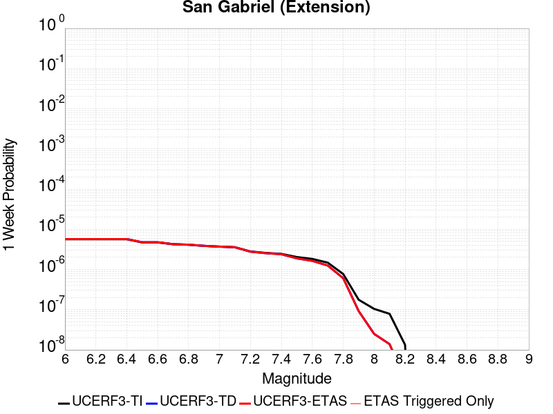 |  | 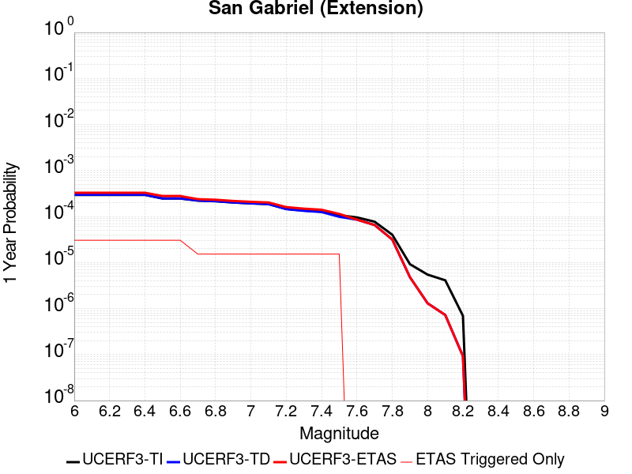 | 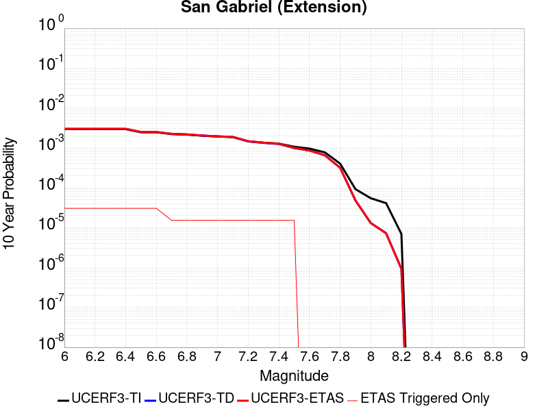 |

| Magnitude | 1 wk TI Prob | 1 wk TD Prob | 1 wk ETAS Prob | 1 wk ETAS/TD Gain | 1 wk ETAS Triggered Only | 1 mo TI Prob | 1 mo TD Prob | 1 mo ETAS Prob | 1 mo ETAS/TD Gain | 1 mo ETAS Triggered Only | 1 yr TI Prob | 1 yr TD Prob | 1 yr ETAS Prob | 1 yr ETAS/TD Gain | 1 yr ETAS Triggered Only | 10 yr TI Prob | 10 yr TD Prob | 10 yr ETAS Prob | 10 yr ETAS/TD Gain | 10 yr ETAS Triggered Only |
|-----|-----|-----|-----|-----|-----|-----|-----|-----|-----|-----|-----|-----|-----|-----|-----|-----|-----|-----|-----|-----|
| 6.0 | 5.6486106E-6 | 5.7168304E-6 | 5.7168304E-6 | 1.0 | 0.0 | 2.4208108E-5 | 2.450048E-5 | 2.450048E-5 | 1.0 | 0.0 | 2.9469383E-4 | 2.9825376E-4 | 3.286861E-4 | 1.102035 | 3.04414E-5 | 0.0029430336 | 0.0029786653 | 0.003009016 | 1.0101894 | 3.04414E-5 |
| 6.1 | 5.6486106E-6 | 5.7168304E-6 | 5.7168304E-6 | 1.0 | 0.0 | 2.4208108E-5 | 2.450048E-5 | 2.450048E-5 | 1.0 | 0.0 | 2.9469383E-4 | 2.9825376E-4 | 3.286861E-4 | 1.102035 | 3.04414E-5 | 0.0029430336 | 0.0029786653 | 0.003009016 | 1.0101894 | 3.04414E-5 |
| 6.2 | 5.6486106E-6 | 5.7168304E-6 | 5.7168304E-6 | 1.0 | 0.0 | 2.4208108E-5 | 2.450048E-5 | 2.450048E-5 | 1.0 | 0.0 | 2.9469383E-4 | 2.9825376E-4 | 3.286861E-4 | 1.102035 | 3.04414E-5 | 0.0029430336 | 0.0029786653 | 0.003009016 | 1.0101894 | 3.04414E-5 |
| 6.3 | 5.6486106E-6 | 5.7168304E-6 | 5.7168304E-6 | 1.0 | 0.0 | 2.4208108E-5 | 2.450048E-5 | 2.450048E-5 | 1.0 | 0.0 | 2.9469383E-4 | 2.9825376E-4 | 3.286861E-4 | 1.102035 | 3.04414E-5 | 0.0029430336 | 0.0029786653 | 0.003009016 | 1.0101894 | 3.04414E-5 |
| 6.4 | 5.6486106E-6 | 5.7168304E-6 | 5.7168304E-6 | 1.0 | 0.0 | 2.4208108E-5 | 2.450048E-5 | 2.450048E-5 | 1.0 | 0.0 | 2.9469383E-4 | 2.9825376E-4 | 3.286861E-4 | 1.102035 | 3.04414E-5 | 0.0029430336 | 0.0029786653 | 0.003009016 | 1.0101894 | 3.04414E-5 |
| 6.5 | 4.7134554E-6 | 4.7542544E-6 | 4.7542544E-6 | 1.0 | 0.0 | 2.0200367E-5 | 2.0375222E-5 | 2.0375222E-5 | 1.0 | 0.0 | 2.459117E-4 | 2.4804095E-4 | 2.784748E-4 | 1.1226969 | 3.04414E-5 | 0.0024563975 | 0.002477729 | 0.002508095 | 1.0122555 | 3.04414E-5 |
| 6.6 | 4.7134554E-6 | 4.7542544E-6 | 4.7542544E-6 | 1.0 | 0.0 | 2.0200367E-5 | 2.0375222E-5 | 2.0375222E-5 | 1.0 | 0.0 | 2.459117E-4 | 2.4804095E-4 | 2.784748E-4 | 1.1226969 | 3.04414E-5 | 0.0024563975 | 0.002477729 | 0.002508095 | 1.0122555 | 3.04414E-5 |
| 6.7 | 4.2468837E-6 | 4.2740717E-6 | 4.2740717E-6 | 1.0 | 0.0 | 1.8200803E-5 | 1.8317325E-5 | 1.8317325E-5 | 1.0 | 0.0 | 2.2157225E-4 | 2.2299135E-4 | 2.3820865E-4 | 1.0682417 | 1.52207E-5 | 0.0022135144 | 0.0022277518 | 0.0022429386 | 1.0068171 | 1.52207E-5 |
| 6.8 | 4.1180615E-6 | 4.1414614E-6 | 4.1414614E-6 | 1.0 | 0.0 | 1.7648716E-5 | 1.7749004E-5 | 1.7749004E-5 | 1.0 | 0.0 | 2.1485193E-4 | 2.160734E-4 | 2.3129082E-4 | 1.0704271 | 1.52207E-5 | 0.0021464431 | 0.0021587082 | 0.0021738962 | 1.0070356 | 1.52207E-5 |
| 6.9 | 3.863861E-6 | 3.8797766E-6 | 3.8797766E-6 | 1.0 | 0.0 | 1.65593E-5 | 1.6627511E-5 | 1.6627511E-5 | 1.0 | 0.0 | 2.0159081E-4 | 2.0242184E-4 | 2.1763946E-4 | 1.0751778 | 1.52207E-5 | 0.0020140803 | 0.002022446 | 0.002037636 | 1.0075107 | 1.52207E-5 |
| 7.0 | 3.6947372E-6 | 3.705676E-6 | 3.705676E-6 | 1.0 | 0.0 | 1.5834492E-5 | 1.5881375E-5 | 1.5881375E-5 | 1.0 | 0.0 | 1.9276788E-4 | 1.9333926E-4 | 2.0855702E-4 | 1.0787101 | 1.52207E-5 | 0.0019260074 | 0.0019317807 | 0.0019469721 | 1.0078639 | 1.52207E-5 |
| 7.1 | 3.5686835E-6 | 3.5728963E-6 | 3.5728963E-6 | 1.0 | 0.0 | 1.5294268E-5 | 1.5312327E-5 | 1.5312327E-5 | 1.0 | 0.0 | 1.861918E-4 | 1.8641229E-4 | 2.0163016E-4 | 1.0816355 | 1.52207E-5 | 0.0018603588 | 0.0018626289 | 0.0018778213 | 1.0081564 | 1.52207E-5 |
| 7.2 | 2.8023446E-6 | 2.7767885E-6 | 2.7767885E-6 | 1.0 | 0.0 | 1.2009994E-5 | 1.1900468E-5 | 1.1900468E-5 | 1.0 | 0.0 | 1.4621185E-4 | 1.4487868E-4 | 1.6009717E-4 | 1.105043 | 1.52207E-5 | 0.001461157 | 0.0014478569 | 0.0014630556 | 1.0104973 | 1.52207E-5 |
| 7.3 | 2.5843012E-6 | 2.5459642E-6 | 2.5459642E-6 | 1.0 | 0.0 | 1.1075529E-5 | 1.0911231E-5 | 1.0911231E-5 | 1.0 | 0.0 | 1.3483623E-4 | 1.3283623E-4 | 1.4805491E-4 | 1.1145673 | 1.52207E-5 | 0.0013475444 | 0.0013275818 | 0.0013427823 | 1.0114498 | 1.52207E-5 |
| 7.4 | 2.4464468E-6 | 2.396665E-6 | 2.396665E-6 | 1.0 | 0.0 | 1.04847295E-5 | 1.0271382E-5 | 1.0271382E-5 | 1.0 | 0.0 | 1.276441E-4 | 1.25047E-4 | 1.402658E-4 | 1.1217046 | 1.52207E-5 | 0.0012757082 | 0.0012497796 | 0.0012649813 | 1.0121635 | 1.52207E-5 |
| 7.5 | 2.0420266E-6 | 1.8910426E-6 | 1.8910426E-6 | 1.0 | 0.0 | 8.751514E-6 | 8.104444E-6 | 8.104444E-6 | 1.0 | 0.0 | 1.0654447E-4 | 9.8667166E-5 | 1.13886366E-4 | 1.1542479 | 1.52207E-5 | 0.001064934 | 9.862408E-4 | 0.0010014465 | 1.0154178 | 1.52207E-5 |
| 7.6 | 1.8326596E-6 | 1.6398341E-6 | 1.6398341E-6 | 1.0 | 0.0 | 7.854232E-6 | 7.0278415E-6 | 7.0278415E-6 | 1.0 | 0.0 | 9.562107E-5 | 8.5560634E-5 | 8.5560634E-5 | 1.0 | 0.0 | 9.5579936E-4 | 8.5528276E-4 | 8.5528276E-4 | 1.0 | 0.0 |
| 7.7 | 1.4786998E-6 | 1.2523838E-6 | 1.2523838E-6 | 1.0 | 0.0 | 6.3372695E-6 | 5.367348E-6 | 5.367348E-6 | 1.0 | 0.0 | 7.715353E-5 | 6.534551E-5 | 6.534551E-5 | 1.0 | 0.0 | 7.7126746E-4 | 6.532707E-4 | 6.532707E-4 | 1.0 | 0.0 |
| 7.8 | 7.6975533E-7 | 6.0693884E-7 | 6.0693884E-7 | 1.0 | 0.0 | 3.2989474E-6 | 2.601164E-6 | 2.601164E-6 | 1.0 | 0.0 | 4.0163945E-5 | 3.166871E-5 | 3.166871E-5 | 1.0 | 0.0 | 4.0156685E-4 | 3.1664805E-4 | 3.1664805E-4 | 1.0 | 0.0 |
| 7.9 | 1.7645915E-7 | 9.213256E-8 | 9.213256E-8 | 1.0 | 0.0 | 7.562533E-7 | 3.9485377E-7 | 3.9485377E-7 | 1.0 | 0.0 | 9.207345E-6 | 4.807334E-6 | 4.807334E-6 | 1.0 | 0.0 | 9.206964E-5 | 4.807699E-5 | 4.807699E-5 | 1.0 | 0.0 |
| 8.0 | 1.0463461E-7 | 2.4949307E-8 | 2.4949307E-8 | 1.0 | 0.0 | 4.4843398E-7 | 1.0692559E-7 | 1.0692559E-7 | 1.0 | 0.0 | 5.45967E-6 | 1.3018183E-6 | 1.3018183E-6 | 1.0 | 0.0 | 5.459536E-5 | 1.3022789E-5 | 1.3022789E-5 | 1.0 | 0.0 |
| 8.1 | 7.875717E-8 | 1.3866874E-8 | 1.3866874E-8 | 1.0 | 0.0 | 3.3753068E-7 | 5.942946E-8 | 5.942946E-8 | 1.0 | 0.0 | 4.109428E-6 | 7.235534E-7 | 7.235534E-7 | 1.0 | 0.0 | 4.109352E-5 | 7.2401926E-6 | 7.2401926E-6 | 1.0 | 0.0 |
| 8.2 | 1.33163E-8 | 1.7733891E-9 | 1.7733891E-9 | 1.0 | 0.0 | 5.7069855E-8 | 7.600239E-9 | 7.600239E-9 | 1.0 | 0.0 | 6.9482525E-7 | 9.25329E-8 | 9.25329E-8 | 1.0 | 0.0 | 6.9482307E-6 | 9.272953E-7 | 9.272953E-7 | 1.0 | 0.0 |

## La Panza 2011
*[(top)](#table-of-contents)*

| 1 Week | 1 Month | 1 Year | 10 Year |
|-----|-----|-----|-----|
| 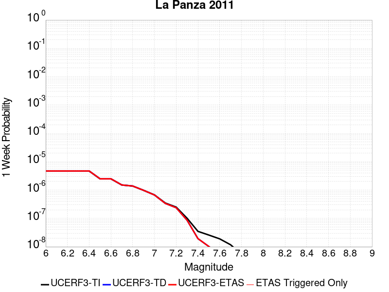 | 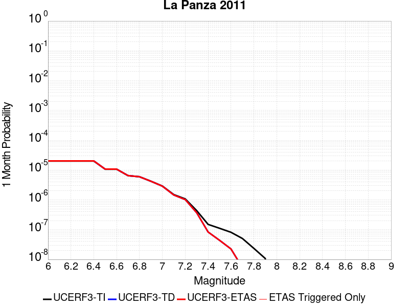 | 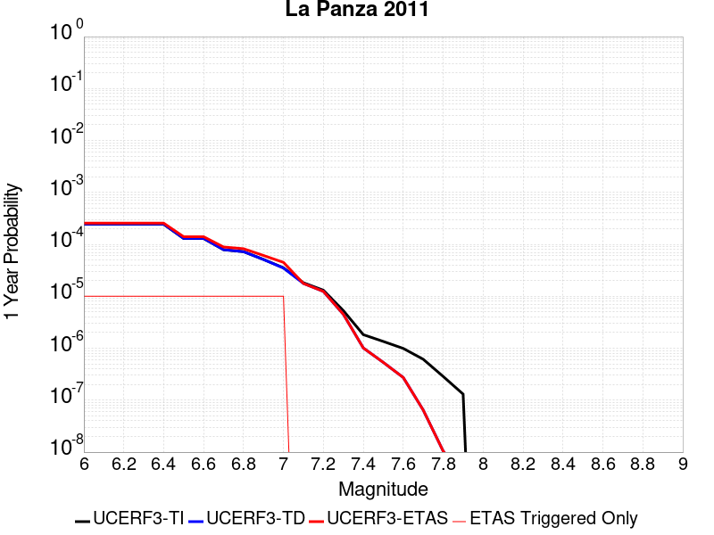 | 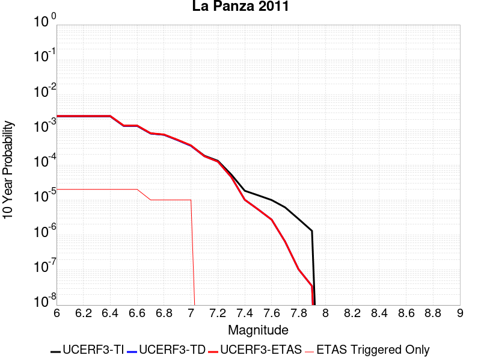 |

| Magnitude | 1 wk TI Prob | 1 wk TD Prob | 1 wk ETAS Prob | 1 wk ETAS/TD Gain | 1 wk ETAS Triggered Only | 1 mo TI Prob | 1 mo TD Prob | 1 mo ETAS Prob | 1 mo ETAS/TD Gain | 1 mo ETAS Triggered Only | 1 yr TI Prob | 1 yr TD Prob | 1 yr ETAS Prob | 1 yr ETAS/TD Gain | 1 yr ETAS Triggered Only | 10 yr TI Prob | 10 yr TD Prob | 10 yr ETAS Prob | 10 yr ETAS/TD Gain | 10 yr ETAS Triggered Only |
|-----|-----|-----|-----|-----|-----|-----|-----|-----|-----|-----|-----|-----|-----|-----|-----|-----|-----|-----|-----|-----|
| 6.0 | 4.6754544E-6 | 4.717587E-6 | 4.717587E-6 | 1.0 | 0.0 | 2.0037509E-5 | 2.0218084E-5 | 2.0218084E-5 | 1.0 | 0.0 | 2.4392935E-4 | 2.4612935E-4 | 2.613463E-4 | 1.061825 | 1.52207E-5 | 0.0024366176 | 0.002458762 | 0.0024891284 | 1.0123503 | 3.04414E-5 |
| 6.1 | 4.6754544E-6 | 4.717587E-6 | 4.717587E-6 | 1.0 | 0.0 | 2.0037509E-5 | 2.0218084E-5 | 2.0218084E-5 | 1.0 | 0.0 | 2.4392935E-4 | 2.4612935E-4 | 2.613463E-4 | 1.061825 | 1.52207E-5 | 0.0024366176 | 0.002458762 | 0.0024891284 | 1.0123503 | 3.04414E-5 |
| 6.2 | 4.6754544E-6 | 4.717587E-6 | 4.717587E-6 | 1.0 | 0.0 | 2.0037509E-5 | 2.0218084E-5 | 2.0218084E-5 | 1.0 | 0.0 | 2.4392935E-4 | 2.4612935E-4 | 2.613463E-4 | 1.061825 | 1.52207E-5 | 0.0024366176 | 0.002458762 | 0.0024891284 | 1.0123503 | 3.04414E-5 |
| 6.3 | 4.6754544E-6 | 4.717587E-6 | 4.717587E-6 | 1.0 | 0.0 | 2.0037509E-5 | 2.0218084E-5 | 2.0218084E-5 | 1.0 | 0.0 | 2.4392935E-4 | 2.4612935E-4 | 2.613463E-4 | 1.061825 | 1.52207E-5 | 0.0024366176 | 0.002458762 | 0.0024891284 | 1.0123503 | 3.04414E-5 |
| 6.4 | 4.6754544E-6 | 4.717587E-6 | 4.717587E-6 | 1.0 | 0.0 | 2.0037509E-5 | 2.0218084E-5 | 2.0218084E-5 | 1.0 | 0.0 | 2.4392935E-4 | 2.4612935E-4 | 2.613463E-4 | 1.061825 | 1.52207E-5 | 0.0024366176 | 0.002458762 | 0.0024891284 | 1.0123503 | 3.04414E-5 |
| 6.5 | 2.485343E-6 | 2.5005988E-6 | 2.5005988E-6 | 1.0 | 0.0 | 1.0651426E-5 | 1.0716811E-5 | 1.0716811E-5 | 1.0 | 0.0 | 1.296734E-4 | 1.3046975E-4 | 1.4568846E-4 | 1.1166456 | 1.52207E-5 | 0.0012959775 | 0.0013039699 | 0.0013343716 | 1.0233147 | 3.04414E-5 |
| 6.6 | 2.485343E-6 | 2.5005988E-6 | 2.5005988E-6 | 1.0 | 0.0 | 1.0651426E-5 | 1.0716811E-5 | 1.0716811E-5 | 1.0 | 0.0 | 1.296734E-4 | 1.3046975E-4 | 1.4568846E-4 | 1.1166456 | 1.52207E-5 | 0.0012959775 | 0.0013039699 | 0.0013343716 | 1.0233147 | 3.04414E-5 |
| 6.7 | 1.5108508E-6 | 1.5146375E-6 | 1.5146375E-6 | 1.0 | 0.0 | 6.4750584E-6 | 6.491288E-6 | 6.491288E-6 | 1.0 | 0.0 | 7.8830984E-5 | 7.902867E-5 | 9.424817E-5 | 1.192582 | 1.52207E-5 | 7.880303E-4 | 7.900165E-4 | 8.0522517E-4 | 1.0192511 | 1.52207E-5 |
| 6.8 | 1.3865837E-6 | 1.3885102E-6 | 1.3885102E-6 | 1.0 | 0.0 | 5.942488E-6 | 5.9507447E-6 | 5.9507447E-6 | 1.0 | 0.0 | 7.234739E-5 | 7.244801E-5 | 8.7667606E-5 | 1.2100761 | 1.52207E-5 | 7.232384E-4 | 7.242537E-4 | 7.394634E-4 | 1.0210005 | 1.52207E-5 |
| 6.9 | 9.826583E-7 | 9.796287E-7 | 9.796287E-7 | 1.0 | 0.0 | 4.2113857E-6 | 4.198402E-6 | 4.198402E-6 | 1.0 | 0.0 | 5.1272415E-5 | 5.11144E-5 | 6.633432E-5 | 1.2977619 | 1.52207E-5 | 5.126059E-4 | 5.110318E-4 | 5.262447E-4 | 1.0297691 | 1.52207E-5 |
| 7.0 | 6.7797646E-7 | 6.7102144E-7 | 6.7102144E-7 | 1.0 | 0.0 | 2.9056102E-6 | 2.8758034E-6 | 2.8758034E-6 | 1.0 | 0.0 | 3.537523E-5 | 3.5012374E-5 | 5.0232542E-5 | 1.4347082 | 1.52207E-5 | 3.5369597E-4 | 3.5007167E-4 | 3.6528704E-4 | 1.0434636 | 1.52207E-5 |
| 7.1 | 3.4979826E-7 | 3.387388E-7 | 3.387388E-7 | 1.0 | 0.0 | 1.4991346E-6 | 1.4517369E-6 | 1.4517369E-6 | 1.0 | 0.0 | 1.825181E-5 | 1.7674765E-5 | 1.7674765E-5 | 1.0 | 0.0 | 1.825031E-4 | 1.7673477E-4 | 1.7673477E-4 | 1.0 | 0.0 |
| 7.2 | 2.5088332E-7 | 2.3831899E-7 | 2.3831899E-7 | 1.0 | 0.0 | 1.0752137E-6 | 1.0213668E-6 | 1.0213668E-6 | 1.0 | 0.0 | 1.3090649E-5 | 1.2435077E-5 | 1.2435077E-5 | 1.0 | 0.0 | 1.3089878E-4 | 1.2434467E-4 | 1.2434467E-4 | 1.0 | 0.0 |
| 7.3 | 1.0159086E-7 | 8.64462E-8 | 8.64462E-8 | 1.0 | 0.0 | 4.3538932E-7 | 3.7048366E-7 | 3.7048366E-7 | 1.0 | 0.0 | 5.300852E-6 | 4.5106294E-6 | 4.5106294E-6 | 1.0 | 0.0 | 5.3007258E-5 | 4.5105422E-5 | 4.5105422E-5 | 1.0 | 0.0 |
| 7.4 | 3.5006252E-8 | 1.9404325E-8 | 1.9404325E-8 | 1.0 | 0.0 | 1.5002678E-7 | 8.3161396E-8 | 8.3161396E-8 | 1.0 | 0.0 | 1.8265745E-6 | 1.0124895E-6 | 1.0124895E-6 | 1.0 | 0.0 | 1.8265595E-5 | 1.01248515E-5 | 1.01248515E-5 | 1.0 | 0.0 |
| 7.5 | 2.592274E-8 | 1.0239094E-8 | 1.0239094E-8 | 1.0 | 0.0 | 1.1109746E-7 | 4.388183E-8 | 4.388183E-8 | 1.0 | 0.0 | 1.3526106E-6 | 5.342612E-7 | 5.342612E-7 | 1.0 | 0.0 | 1.3526024E-5 | 5.3425997E-6 | 5.3425997E-6 | 1.0 | 0.0 |
| 7.6 | 1.9016717E-8 | 5.244801E-9 | 5.244801E-9 | 1.0 | 0.0 | 8.150022E-8 | 2.247772E-8 | 2.247772E-8 | 1.0 | 0.0 | 9.922647E-7 | 2.736662E-7 | 2.736662E-7 | 1.0 | 0.0 | 9.922603E-6 | 2.7366589E-6 | 2.7366589E-6 | 1.0 | 0.0 |
| 7.7 | 1.17738495E-8 | 1.2398075E-9 | 1.2398075E-9 | 1.0 | 0.0 | 5.0459356E-8 | 5.3134603E-9 | 5.3134603E-9 | 1.0 | 0.0 | 6.1434247E-7 | 6.469138E-8 | 6.469138E-8 | 1.0 | 0.0 | 6.143408E-6 | 6.469136E-7 | 6.469136E-7 | 1.0 | 0.0 |
| 7.8 | 5.489079E-9 | 2.0111768E-10 | 2.0111768E-10 | 1.0 | 0.0 | 2.3524624E-8 | 8.6193275E-10 | 8.6193275E-10 | 1.0 | 0.0 | 2.8641225E-7 | 1.04940305E-8 | 1.04940305E-8 | 1.0 | 0.0 | 2.8641189E-6 | 1.04940305E-7 | 1.04940305E-7 | 1.0 | 0.0 |
| 7.9 | 2.5081048E-9 | 6.683887E-11 | 6.683887E-11 | 1.0 | 0.0 | 1.0749021E-8 | 2.8645197E-10 | 2.8645197E-10 | 1.0 | 0.0 | 1.3086932E-7 | 3.487552E-9 | 3.487552E-9 | 1.0 | 0.0 | 1.3086925E-6 | 3.487552E-8 | 3.487552E-8 | 1.0 | 0.0 |

## Simi-Santa Rosa
*[(top)](#table-of-contents)*

| 1 Week | 1 Month | 1 Year | 10 Year |
|-----|-----|-----|-----|
|  | 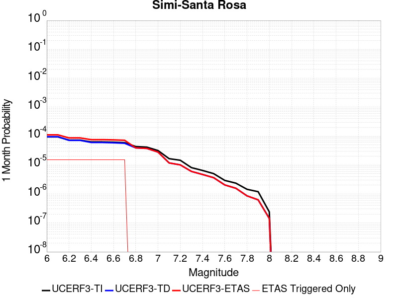 | 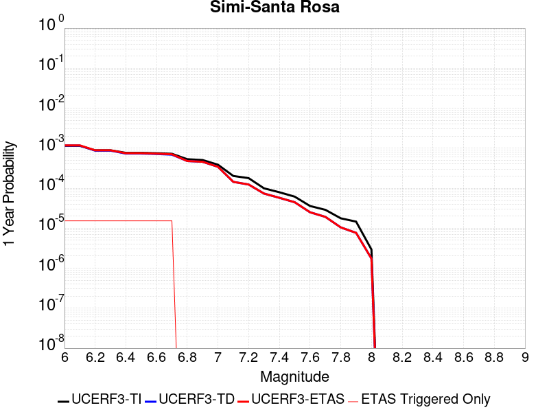 | 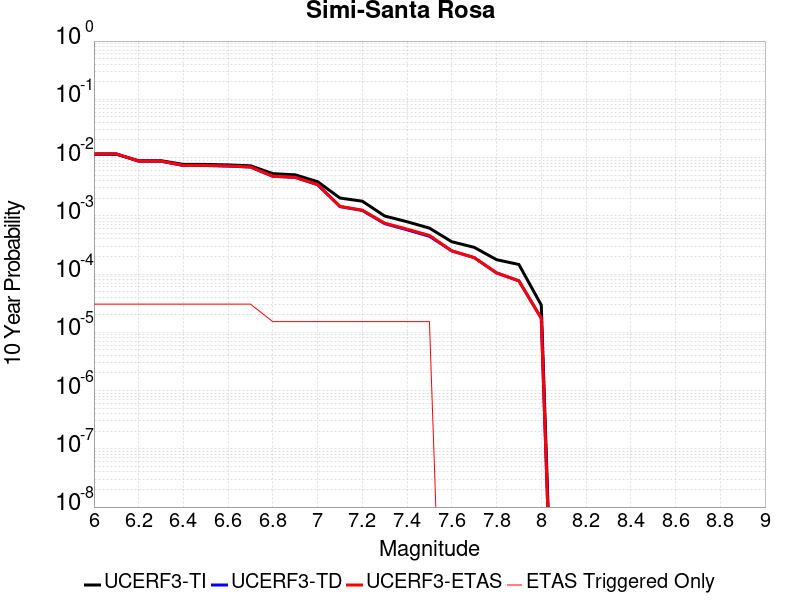 |

| Magnitude | 1 wk TI Prob | 1 wk TD Prob | 1 wk ETAS Prob | 1 wk ETAS/TD Gain | 1 wk ETAS Triggered Only | 1 mo TI Prob | 1 mo TD Prob | 1 mo ETAS Prob | 1 mo ETAS/TD Gain | 1 mo ETAS Triggered Only | 1 yr TI Prob | 1 yr TD Prob | 1 yr ETAS Prob | 1 yr ETAS/TD Gain | 1 yr ETAS Triggered Only | 10 yr TI Prob | 10 yr TD Prob | 10 yr ETAS Prob | 10 yr ETAS/TD Gain | 10 yr ETAS Triggered Only |
|-----|-----|-----|-----|-----|-----|-----|-----|-----|-----|-----|-----|-----|-----|-----|-----|-----|-----|-----|-----|-----|
| 6.0 | 2.198912E-5 | 2.2275442E-5 | 2.2275442E-5 | 1.0 | 0.0 | 9.4235686E-5 | 9.5462936E-5 | 1.1068218E-4 | 1.1594257 | 1.52207E-5 | 0.0011467156 | 0.0011616853 | 0.0011768884 | 1.013087 | 1.52207E-5 | 0.011408163 | 0.011560575 | 0.011590664 | 1.0026028 | 3.04414E-5 |
| 6.1 | 2.198912E-5 | 2.2275442E-5 | 2.2275442E-5 | 1.0 | 0.0 | 9.4235686E-5 | 9.5462936E-5 | 1.1068218E-4 | 1.1594257 | 1.52207E-5 | 0.0011467156 | 0.0011616853 | 0.0011768884 | 1.013087 | 1.52207E-5 | 0.011408163 | 0.011560575 | 0.011590664 | 1.0026028 | 3.04414E-5 |
| 6.2 | 1.69983E-5 | 1.6668559E-5 | 1.6668559E-5 | 1.0 | 0.0 | 7.284782E-5 | 7.143489E-5 | 8.66545E-5 | 1.2130557 | 1.52207E-5 | 8.865613E-4 | 8.6940196E-4 | 8.846094E-4 | 1.0174918 | 1.52207E-5 | 0.008830327 | 0.008662928 | 0.008693106 | 1.0034835 | 3.04414E-5 |
| 6.3 | 1.69983E-5 | 1.6668559E-5 | 1.6668559E-5 | 1.0 | 0.0 | 7.284782E-5 | 7.143489E-5 | 8.66545E-5 | 1.2130557 | 1.52207E-5 | 8.865613E-4 | 8.6940196E-4 | 8.846094E-4 | 1.0174918 | 1.52207E-5 | 0.008830327 | 0.008662928 | 0.008693106 | 1.0034835 | 3.04414E-5 |
| 6.4 | 1.4666188E-5 | 1.4052543E-5 | 1.4052543E-5 | 1.0 | 0.0 | 6.285358E-5 | 6.0223934E-5 | 7.544372E-5 | 1.2527199 | 1.52207E-5 | 7.6497364E-4 | 7.3300465E-4 | 7.482142E-4 | 1.0207496 | 1.52207E-5 | 0.0076234564 | 0.007308344 | 0.007338563 | 1.0041349 | 3.04414E-5 |
| 6.5 | 1.4666188E-5 | 1.4052543E-5 | 1.4052543E-5 | 1.0 | 0.0 | 6.285358E-5 | 6.0223934E-5 | 7.544372E-5 | 1.2527199 | 1.52207E-5 | 7.6497364E-4 | 7.3300465E-4 | 7.482142E-4 | 1.0207496 | 1.52207E-5 | 0.0076234564 | 0.007308344 | 0.007338563 | 1.0041349 | 3.04414E-5 |
| 6.6 | 1.4377586E-5 | 1.3729583E-5 | 1.3729583E-5 | 1.0 | 0.0 | 6.1616774E-5 | 5.883988E-5 | 7.405969E-5 | 1.2586647 | 1.52207E-5 | 7.4992597E-4 | 7.1616494E-4 | 7.313747E-4 | 1.0212379 | 1.52207E-5 | 0.007474003 | 0.0071410383 | 0.0071712625 | 1.0042324 | 3.04414E-5 |
| 6.7 | 1.3881404E-5 | 1.320755E-5 | 1.320755E-5 | 1.0 | 0.0 | 5.9490372E-5 | 5.66027E-5 | 7.1822535E-5 | 1.268889 | 1.52207E-5 | 7.240546E-4 | 6.8894465E-4 | 7.041549E-4 | 1.0220776 | 1.52207E-5 | 0.007217 | 0.006870538 | 0.0069007706 | 1.0044003 | 3.04414E-5 |
| 6.8 | 1.0176516E-5 | 9.154151E-6 | 9.154151E-6 | 1.0 | 0.0 | 4.3612912E-5 | 3.9231574E-5 | 3.9231574E-5 | 1.0 | 0.0 | 5.308578E-4 | 4.7755634E-4 | 4.7755634E-4 | 1.0 | 0.0 | 0.0052959146 | 0.004766934 | 0.0047820825 | 1.0031778 | 1.52207E-5 |
| 6.9 | 9.699797E-6 | 8.774719E-6 | 8.774719E-6 | 1.0 | 0.0 | 4.15699E-5 | 3.7605492E-5 | 3.7605492E-5 | 1.0 | 0.0 | 5.05996E-4 | 4.577671E-4 | 4.577671E-4 | 1.0 | 0.0 | 0.005048454 | 0.0045698597 | 0.004585011 | 1.0033154 | 1.52207E-5 |
| 7.0 | 7.4049476E-6 | 6.559333E-6 | 6.559333E-6 | 1.0 | 0.0 | 3.1735104E-5 | 2.8111197E-5 | 2.8111197E-5 | 1.0 | 0.0 | 3.8630638E-4 | 3.422127E-4 | 3.422127E-4 | 1.0 | 0.0 | 0.0038563553 | 0.0034180996 | 0.0034332683 | 1.0044378 | 1.52207E-5 |
| 7.1 | 3.873439E-6 | 2.7595095E-6 | 2.7595095E-6 | 1.0 | 0.0 | 1.6600346E-5 | 1.1826417E-5 | 1.1826417E-5 | 1.0 | 0.0 | 2.0209046E-4 | 1.4397735E-4 | 1.4397735E-4 | 1.0 | 0.0 | 0.0020190678 | 0.0014388643 | 0.0014540631 | 1.010563 | 1.52207E-5 |
| 7.2 | 3.417706E-6 | 2.3676484E-6 | 2.3676484E-6 | 1.0 | 0.0 | 1.4647229E-5 | 1.0147027E-5 | 1.0147027E-5 | 1.0 | 0.0 | 1.7831543E-4 | 1.2353327E-4 | 1.2353327E-4 | 1.0 | 0.0 | 0.0017817242 | 0.0012346683 | 0.0012498702 | 1.0123125 | 1.52207E-5 |
| 7.3 | 1.90225E-6 | 1.4073753E-6 | 1.4073753E-6 | 1.0 | 0.0 | 8.152474E-6 | 6.0315947E-6 | 6.0315947E-6 | 1.0 | 0.0 | 9.9251854E-5 | 7.343221E-5 | 7.343221E-5 | 1.0 | 0.0 | 9.920754E-4 | 7.340817E-4 | 7.4929127E-4 | 1.0207192 | 1.52207E-5 |
| 7.4 | 1.5170556E-6 | 1.1024773E-6 | 1.1024773E-6 | 1.0 | 0.0 | 6.5016507E-6 | 4.724894E-6 | 4.724894E-6 | 1.0 | 0.0 | 7.915472E-5 | 5.7524077E-5 | 5.7524077E-5 | 1.0 | 0.0 | 7.9126534E-4 | 5.7509297E-4 | 5.9030496E-4 | 1.0264512 | 1.52207E-5 |
| 7.5 | 1.178732E-6 | 8.535102E-7 | 8.535102E-7 | 1.0 | 0.0 | 5.0516987E-6 | 3.6578958E-6 | 3.6578958E-6 | 1.0 | 0.0 | 6.1502695E-5 | 4.453398E-5 | 4.453398E-5 | 1.0 | 0.0 | 6.148568E-4 | 4.452515E-4 | 4.6046544E-4 | 1.0341693 | 1.52207E-5 |
| 7.6 | 6.8722386E-7 | 4.793198E-7 | 4.793198E-7 | 1.0 | 0.0 | 2.9452417E-6 | 2.054226E-6 | 2.054226E-6 | 1.0 | 0.0 | 3.5857727E-5 | 2.5009915E-5 | 2.5009915E-5 | 1.0 | 0.0 | 3.5851944E-4 | 2.5007114E-4 | 2.5007114E-4 | 1.0 | 0.0 |
| 7.7 | 5.5126515E-7 | 3.6731157E-7 | 3.6731157E-7 | 1.0 | 0.0 | 2.3625628E-6 | 1.5741915E-6 | 1.5741915E-6 | 1.0 | 0.0 | 2.8763823E-5 | 1.9165615E-5 | 1.9165615E-5 | 1.0 | 0.0 | 2.87601E-4 | 1.9163972E-4 | 1.9163972E-4 | 1.0 | 0.0 |
| 7.8 | 3.3860243E-7 | 2.0075942E-7 | 2.0075942E-7 | 1.0 | 0.0 | 1.4511525E-6 | 8.6039717E-7 | 8.6039717E-7 | 1.0 | 0.0 | 1.7667637E-5 | 1.0475286E-5 | 1.0475286E-5 | 1.0 | 0.0 | 1.7666233E-4 | 1.04747975E-4 | 1.04747975E-4 | 1.0 | 0.0 |
| 7.9 | 2.7955386E-7 | 1.4649108E-7 | 1.4649108E-7 | 1.0 | 0.0 | 1.1980875E-6 | 6.278188E-7 | 6.278188E-7 | 1.0 | 0.0 | 1.4586617E-5 | 7.643667E-6 | 7.643667E-6 | 1.0 | 0.0 | 1.458566E-4 | 7.643409E-5 | 7.643409E-5 | 1.0 | 0.0 |
| 8.0 | 5.6259015E-8 | 3.3355324E-8 | 3.3355324E-8 | 1.0 | 0.0 | 2.4111003E-7 | 1.4295138E-7 | 1.4295138E-7 | 1.0 | 0.0 | 2.9355108E-6 | 1.7404317E-6 | 1.7404317E-6 | 1.0 | 0.0 | 2.935472E-5 | 1.7404194E-5 | 1.7404194E-5 | 1.0 | 0.0 |

## White Wolf
*[(top)](#table-of-contents)*

| 1 Week | 1 Month | 1 Year | 10 Year |
|-----|-----|-----|-----|
| 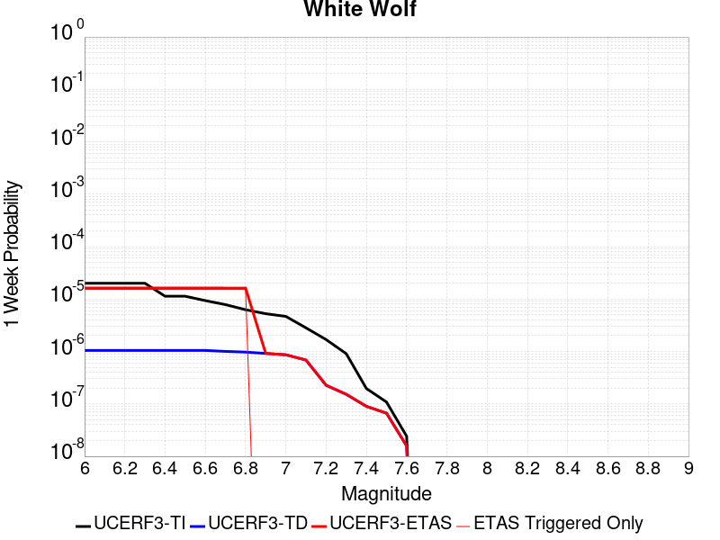 | 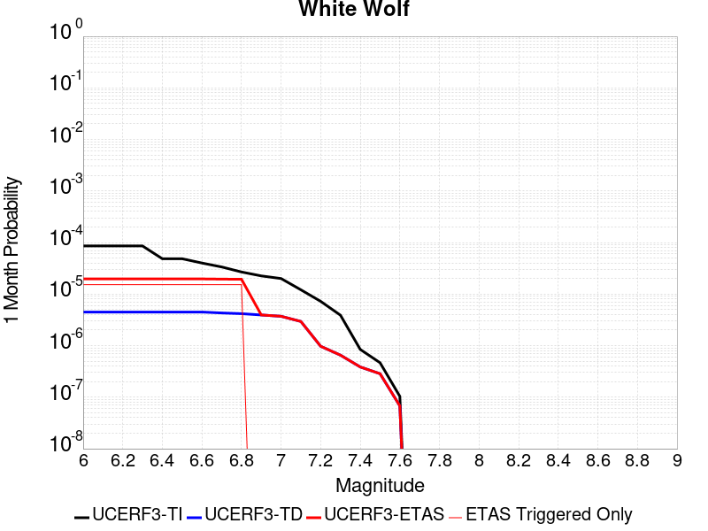 | 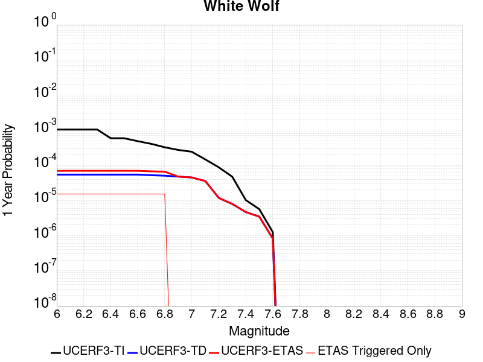 | 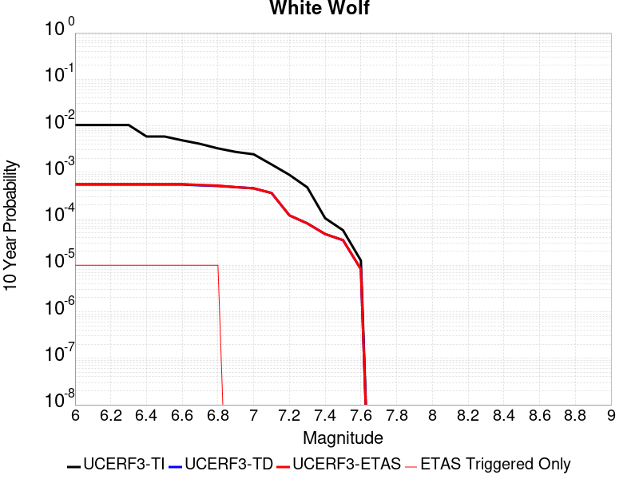 |

| Magnitude | 1 wk TI Prob | 1 wk TD Prob | 1 wk ETAS Prob | 1 wk ETAS/TD Gain | 1 wk ETAS Triggered Only | 1 mo TI Prob | 1 mo TD Prob | 1 mo ETAS Prob | 1 mo ETAS/TD Gain | 1 mo ETAS Triggered Only | 1 yr TI Prob | 1 yr TD Prob | 1 yr ETAS Prob | 1 yr ETAS/TD Gain | 1 yr ETAS Triggered Only | 10 yr TI Prob | 10 yr TD Prob | 10 yr ETAS Prob | 10 yr ETAS/TD Gain | 10 yr ETAS Triggered Only |
|-----|-----|-----|-----|-----|-----|-----|-----|-----|-----|-----|-----|-----|-----|-----|-----|-----|-----|-----|-----|-----|
| 6.0 | 2.0037822E-5 | 1.0469162E-6 | 1.62676E-5 | 15.5385895 | 1.52207E-5 | 8.587355E-5 | 4.486776E-6 | 1.9707408E-5 | 4.3923316 | 1.52207E-5 | 0.001045009 | 5.4625183E-5 | 6.984505E-5 | 1.2786237 | 1.52207E-5 | 0.010401085 | 5.461226E-4 | 5.61335E-4 | 1.0278553 | 1.52207E-5 |
| 6.1 | 2.0037822E-5 | 1.0469162E-6 | 1.62676E-5 | 15.5385895 | 1.52207E-5 | 8.587355E-5 | 4.486776E-6 | 1.9707408E-5 | 4.3923316 | 1.52207E-5 | 0.001045009 | 5.4625183E-5 | 6.984505E-5 | 1.2786237 | 1.52207E-5 | 0.010401085 | 5.461226E-4 | 5.61335E-4 | 1.0278553 | 1.52207E-5 |
| 6.2 | 2.0037822E-5 | 1.0469162E-6 | 1.62676E-5 | 15.5385895 | 1.52207E-5 | 8.587355E-5 | 4.486776E-6 | 1.9707408E-5 | 4.3923316 | 1.52207E-5 | 0.001045009 | 5.4625183E-5 | 6.984505E-5 | 1.2786237 | 1.52207E-5 | 0.010401085 | 5.461226E-4 | 5.61335E-4 | 1.0278553 | 1.52207E-5 |
| 6.3 | 2.0037822E-5 | 1.0469162E-6 | 1.62676E-5 | 15.5385895 | 1.52207E-5 | 8.587355E-5 | 4.486776E-6 | 1.9707408E-5 | 4.3923316 | 1.52207E-5 | 0.001045009 | 5.4625183E-5 | 6.984505E-5 | 1.2786237 | 1.52207E-5 | 0.010401085 | 5.461226E-4 | 5.61335E-4 | 1.0278553 | 1.52207E-5 |
| 6.4 | 1.132487E-5 | 1.0469162E-6 | 1.62676E-5 | 15.5385895 | 1.52207E-5 | 4.8534253E-5 | 4.486776E-6 | 1.9707408E-5 | 4.3923316 | 1.52207E-5 | 5.907443E-4 | 5.4625183E-5 | 6.984505E-5 | 1.2786237 | 1.52207E-5 | 0.005891764 | 5.461226E-4 | 5.61335E-4 | 1.0278553 | 1.52207E-5 |
| 6.5 | 1.132487E-5 | 1.0469162E-6 | 1.62676E-5 | 15.5385895 | 1.52207E-5 | 4.8534253E-5 | 4.486776E-6 | 1.9707408E-5 | 4.3923316 | 1.52207E-5 | 5.907443E-4 | 5.4625183E-5 | 6.984505E-5 | 1.2786237 | 1.52207E-5 | 0.005891764 | 5.461226E-4 | 5.61335E-4 | 1.0278553 | 1.52207E-5 |
| 6.6 | 9.347473E-6 | 1.0469162E-6 | 1.62676E-5 | 15.5385895 | 1.52207E-5 | 4.0059982E-5 | 4.486776E-6 | 1.9707408E-5 | 4.3923316 | 1.52207E-5 | 4.8762115E-4 | 5.4625183E-5 | 6.984505E-5 | 1.2786237 | 1.52207E-5 | 0.0048655253 | 5.461226E-4 | 5.61335E-4 | 1.0278553 | 1.52207E-5 |
| 6.7 | 7.842647E-6 | 1.0048342E-6 | 1.6225518E-5 | 16.147459 | 1.52207E-5 | 3.361091E-5 | 4.3064256E-6 | 1.952706E-5 | 4.534401 | 1.52207E-5 | 4.0913603E-4 | 5.2429517E-5 | 6.7649424E-5 | 1.2902926 | 1.52207E-5 | 0.004083836 | 5.2417646E-4 | 5.3938915E-4 | 1.0290221 | 1.52207E-5 |
| 6.8 | 6.26597E-6 | 9.734822E-7 | 1.6194168E-5 | 16.6353 | 1.52207E-5 | 2.685388E-5 | 4.17206E-6 | 1.9392697E-5 | 4.6482306 | 1.52207E-5 | 3.2689696E-4 | 5.0793697E-5 | 6.601363E-5 | 1.2996421 | 1.52207E-5 | 0.003264165 | 5.078258E-4 | 5.230388E-4 | 1.029957 | 1.52207E-5 |
| 6.9 | 5.258436E-6 | 9.183254E-7 | 9.183254E-7 | 1.0 | 0.0 | 2.2535958E-5 | 3.9356746E-6 | 3.9356746E-6 | 1.0 | 0.0 | 2.7434074E-4 | 4.7915833E-5 | 4.7915833E-5 | 1.0 | 0.0 | 0.0027400232 | 4.790598E-4 | 4.790598E-4 | 1.0 | 0.0 |
| 7.0 | 4.675028E-6 | 8.6611794E-7 | 8.6611794E-7 | 1.0 | 0.0 | 2.003568E-5 | 3.7119291E-6 | 3.7119291E-6 | 1.0 | 0.0 | 2.4390711E-4 | 4.5191846E-5 | 4.5191846E-5 | 1.0 | 0.0 | 0.0024363957 | 4.518313E-4 | 4.518313E-4 | 1.0 | 0.0 |
| 7.1 | 2.8270078E-6 | 6.8741696E-7 | 6.8741696E-7 | 1.0 | 0.0 | 1.2115692E-5 | 2.9460696E-6 | 2.9460696E-6 | 1.0 | 0.0 | 1.4749856E-4 | 3.5867848E-5 | 3.5867848E-5 | 1.0 | 0.0 | 0.001474007 | 3.586247E-4 | 3.586247E-4 | 1.0 | 0.0 |
| 7.2 | 1.6881406E-6 | 2.2706382E-7 | 2.2706382E-7 | 1.0 | 0.0 | 7.2348685E-6 | 9.731303E-7 | 9.731303E-7 | 1.0 | 0.0 | 8.808096E-5 | 1.1847799E-5 | 1.1847799E-5 | 1.0 | 0.0 | 8.8046055E-4 | 1.1847183E-4 | 1.1847183E-4 | 1.0 | 0.0 |
| 7.3 | 9.086107E-7 | 1.5266386E-7 | 1.5266386E-7 | 1.0 | 0.0 | 3.8940398E-6 | 6.5427355E-7 | 6.5427355E-7 | 1.0 | 0.0 | 4.7408903E-5 | 7.965752E-6 | 7.965752E-6 | 1.0 | 0.0 | 4.739879E-4 | 7.965475E-5 | 7.965475E-5 | 1.0 | 0.0 |
| 7.4 | 1.9717383E-7 | 9.003913E-8 | 9.003913E-8 | 1.0 | 0.0 | 8.450304E-7 | 3.8588192E-7 | 3.8588192E-7 | 1.0 | 0.0 | 1.0288197E-5 | 4.6981027E-6 | 4.6981027E-6 | 1.0 | 0.0 | 1.028772E-4 | 4.6980065E-5 | 4.6980065E-5 | 1.0 | 0.0 |
| 7.5 | 1.086975E-7 | 6.6597195E-8 | 6.6597195E-8 | 1.0 | 0.0 | 4.6584634E-7 | 2.8541652E-7 | 2.8541652E-7 | 1.0 | 0.0 | 5.6716644E-6 | 3.474941E-6 | 3.474941E-6 | 1.0 | 0.0 | 5.6715195E-5 | 3.474889E-5 | 3.474889E-5 | 1.0 | 0.0 |
| 7.6 | 2.4217808E-8 | 1.5820765E-8 | 1.5820765E-8 | 1.0 | 0.0 | 1.03790605E-7 | 6.780328E-8 | 6.780328E-8 | 1.0 | 0.0 | 1.2636499E-6 | 8.255046E-7 | 8.255046E-7 | 1.0 | 0.0 | 1.2636427E-5 | 8.2550205E-6 | 8.2550205E-6 | 1.0 | 0.0 |

## Breckenridge 2011
*[(top)](#table-of-contents)*

| 1 Week | 1 Month | 1 Year | 10 Year |
|-----|-----|-----|-----|
| 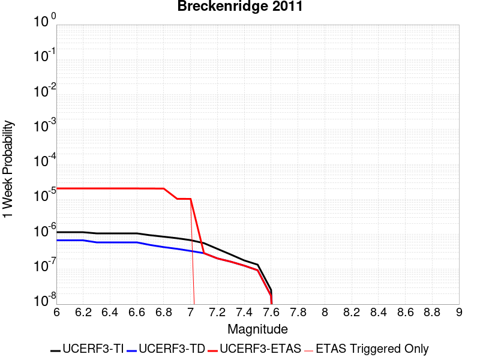 | 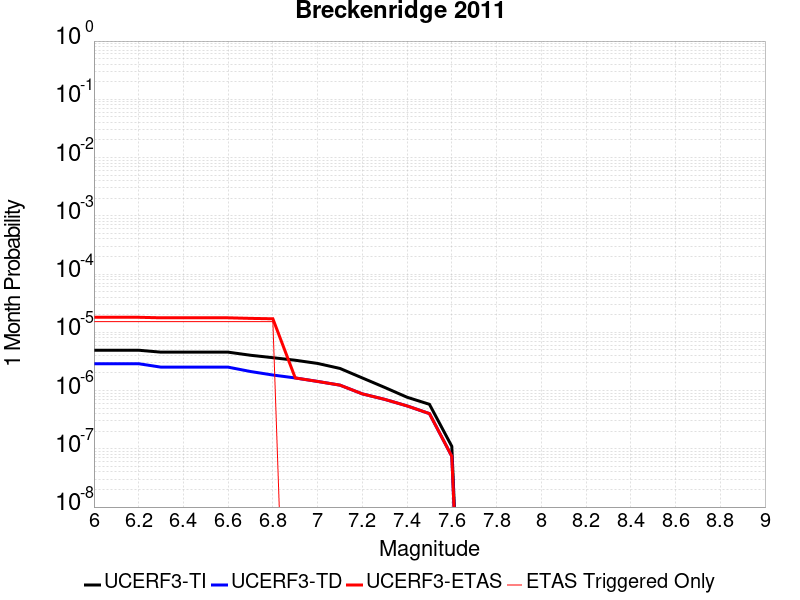 | 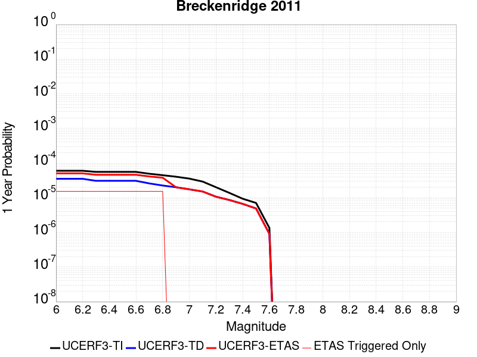 | 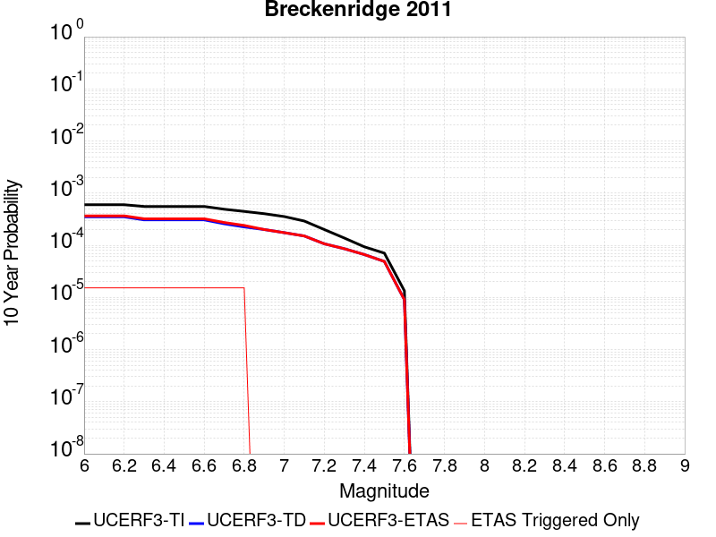 |

| Magnitude | 1 wk TI Prob | 1 wk TD Prob | 1 wk ETAS Prob | 1 wk ETAS/TD Gain | 1 wk ETAS Triggered Only | 1 mo TI Prob | 1 mo TD Prob | 1 mo ETAS Prob | 1 mo ETAS/TD Gain | 1 mo ETAS Triggered Only | 1 yr TI Prob | 1 yr TD Prob | 1 yr ETAS Prob | 1 yr ETAS/TD Gain | 1 yr ETAS Triggered Only | 10 yr TI Prob | 10 yr TD Prob | 10 yr ETAS Prob | 10 yr ETAS/TD Gain | 10 yr ETAS Triggered Only |
|-----|-----|-----|-----|-----|-----|-----|-----|-----|-----|-----|-----|-----|-----|-----|-----|-----|-----|-----|-----|-----|
| 6.0 | 1.1490393E-6 | 6.7380773E-7 | 1.5894497E-5 | 23.58907 | 1.52207E-5 | 4.924445E-6 | 2.8877444E-6 | 1.81084E-5 | 6.2707767 | 1.52207E-5 | 5.995347E-5 | 3.515774E-5 | 5.0377905E-5 | 1.4329108 | 1.52207E-5 | 5.9937296E-4 | 3.5152383E-4 | 3.667392E-4 | 1.0432839 | 1.52207E-5 |
| 6.1 | 1.1490393E-6 | 6.7380773E-7 | 1.5894497E-5 | 23.58907 | 1.52207E-5 | 4.924445E-6 | 2.8877444E-6 | 1.81084E-5 | 6.2707767 | 1.52207E-5 | 5.995347E-5 | 3.515774E-5 | 5.0377905E-5 | 1.4329108 | 1.52207E-5 | 5.9937296E-4 | 3.5152383E-4 | 3.667392E-4 | 1.0432839 | 1.52207E-5 |
| 6.2 | 1.1490393E-6 | 6.7380773E-7 | 1.5894497E-5 | 23.58907 | 1.52207E-5 | 4.924445E-6 | 2.8877444E-6 | 1.81084E-5 | 6.2707767 | 1.52207E-5 | 5.995347E-5 | 3.515774E-5 | 5.0377905E-5 | 1.4329108 | 1.52207E-5 | 5.9937296E-4 | 3.5152383E-4 | 3.667392E-4 | 1.0432839 | 1.52207E-5 |
| 6.3 | 1.064617E-6 | 5.886475E-7 | 1.5809339E-5 | 26.857056 | 1.52207E-5 | 4.5626366E-6 | 2.5227728E-6 | 1.7743434E-5 | 7.033307 | 1.52207E-5 | 5.5548684E-5 | 3.0714335E-5 | 4.593457E-5 | 1.4955417 | 1.52207E-5 | 5.55348E-4 | 3.0710208E-4 | 3.223181E-4 | 1.0495471 | 1.52207E-5 |
| 6.4 | 1.064617E-6 | 5.886475E-7 | 1.5809339E-5 | 26.857056 | 1.52207E-5 | 4.5626366E-6 | 2.5227728E-6 | 1.7743434E-5 | 7.033307 | 1.52207E-5 | 5.5548684E-5 | 3.0714335E-5 | 4.593457E-5 | 1.4955417 | 1.52207E-5 | 5.55348E-4 | 3.0710208E-4 | 3.223181E-4 | 1.0495471 | 1.52207E-5 |
| 6.5 | 1.064617E-6 | 5.886475E-7 | 1.5809339E-5 | 26.857056 | 1.52207E-5 | 4.5626366E-6 | 2.5227728E-6 | 1.7743434E-5 | 7.033307 | 1.52207E-5 | 5.5548684E-5 | 3.0714335E-5 | 4.593457E-5 | 1.4955417 | 1.52207E-5 | 5.55348E-4 | 3.0710208E-4 | 3.223181E-4 | 1.0495471 | 1.52207E-5 |
| 6.6 | 1.064617E-6 | 5.886475E-7 | 1.5809339E-5 | 26.857056 | 1.52207E-5 | 4.5626366E-6 | 2.5227728E-6 | 1.7743434E-5 | 7.033307 | 1.52207E-5 | 5.5548684E-5 | 3.0714335E-5 | 4.593457E-5 | 1.4955417 | 1.52207E-5 | 5.55348E-4 | 3.0710208E-4 | 3.223181E-4 | 1.0495471 | 1.52207E-5 |
| 6.7 | 9.4219524E-7 | 4.954078E-7 | 1.5716101E-5 | 31.723564 | 1.52207E-5 | 4.037973E-6 | 2.1231745E-6 | 1.7343842E-5 | 8.168825 | 1.52207E-5 | 4.916122E-5 | 2.5849351E-5 | 4.1069656E-5 | 1.5888081 | 1.52207E-5 | 4.9150345E-4 | 2.5846408E-4 | 2.7368084E-4 | 1.0588738 | 1.52207E-5 |
| 6.8 | 8.556422E-7 | 4.311975E-7 | 1.565189E-5 | 36.29866 | 1.52207E-5 | 3.667033E-6 | 1.847988E-6 | 1.706866E-5 | 9.236348 | 1.52207E-5 | 4.464521E-5 | 2.2499025E-5 | 3.7719383E-5 | 1.6764897 | 1.52207E-5 | 4.4636242E-4 | 2.2496787E-4 | 2.4018515E-4 | 1.067642 | 1.52207E-5 |
| 6.9 | 7.7357794E-7 | 3.8420345E-7 | 3.8420345E-7 | 1.0 | 0.0 | 3.3153299E-6 | 1.6465851E-6 | 1.6465851E-6 | 1.0 | 0.0 | 4.0363393E-5 | 2.0046993E-5 | 2.0046993E-5 | 1.0 | 0.0 | 4.035606E-4 | 2.0045215E-4 | 2.0045215E-4 | 1.0 | 0.0 |
| 7.0 | 6.8172454E-7 | 3.3471417E-7 | 3.3471417E-7 | 1.0 | 0.0 | 2.9216735E-6 | 1.4344886E-6 | 1.4344886E-6 | 1.0 | 0.0 | 3.5570793E-5 | 1.7464761E-5 | 1.7464761E-5 | 1.0 | 0.0 | 3.55651E-4 | 1.746341E-4 | 1.746341E-4 | 1.0 | 0.0 |
| 7.1 | 5.5936397E-7 | 2.890966E-7 | 2.890966E-7 | 1.0 | 0.0 | 2.397272E-6 | 1.2389849E-6 | 1.2389849E-6 | 1.0 | 0.0 | 2.9186394E-5 | 1.5084538E-5 | 1.5084538E-5 | 1.0 | 0.0 | 2.9182562E-4 | 1.5083532E-4 | 1.5083532E-4 | 1.0 | 0.0 |
| 7.2 | 3.8420822E-7 | 2.0468339E-7 | 2.0468339E-7 | 1.0 | 0.0 | 1.6466057E-6 | 8.7721423E-7 | 8.7721423E-7 | 1.0 | 0.0 | 2.004724E-5 | 1.0680032E-5 | 1.0680032E-5 | 1.0 | 0.0 | 2.004543E-4 | 1.0679527E-4 | 1.0679527E-4 | 1.0 | 0.0 |
| 7.3 | 2.6405158E-7 | 1.647323E-7 | 1.647323E-7 | 1.0 | 0.0 | 1.1316491E-6 | 7.059954E-7 | 7.059954E-7 | 1.0 | 0.0 | 1.37777415E-5 | 8.595461E-6 | 8.595461E-6 | 1.0 | 0.0 | 1.3776887E-4 | 8.5951346E-5 | 8.5951346E-5 | 1.0 | 0.0 |
| 7.4 | 1.792114E-7 | 1.2725314E-7 | 1.2725314E-7 | 1.0 | 0.0 | 7.6804866E-7 | 5.4537054E-7 | 5.4537054E-7 | 1.0 | 0.0 | 9.3509525E-6 | 6.6398666E-6 | 6.6398666E-6 | 1.0 | 0.0 | 9.350559E-5 | 6.639673E-5 | 6.639673E-5 | 1.0 | 0.0 |
| 7.5 | 1.3548703E-7 | 9.3854034E-8 | 9.3854034E-8 | 1.0 | 0.0 | 5.8065854E-7 | 4.022315E-7 | 4.022315E-7 | 1.0 | 0.0 | 7.0694946E-6 | 4.897158E-6 | 4.897158E-6 | 1.0 | 0.0 | 7.0692695E-5 | 4.8970534E-5 | 4.8970534E-5 | 1.0 | 0.0 |
| 7.6 | 2.572245E-8 | 1.7352555E-8 | 1.7352555E-8 | 1.0 | 0.0 | 1.10239064E-7 | 7.436809E-8 | 7.436809E-8 | 1.0 | 0.0 | 1.3421597E-6 | 9.054312E-7 | 9.054312E-7 | 1.0 | 0.0 | 1.3421517E-5 | 9.05428E-6 | 9.05428E-6 | 1.0 | 0.0 |

## Monterey Bay-Tularcitos
*[(top)](#table-of-contents)*

| 1 Week | 1 Month | 1 Year | 10 Year |
|-----|-----|-----|-----|
| 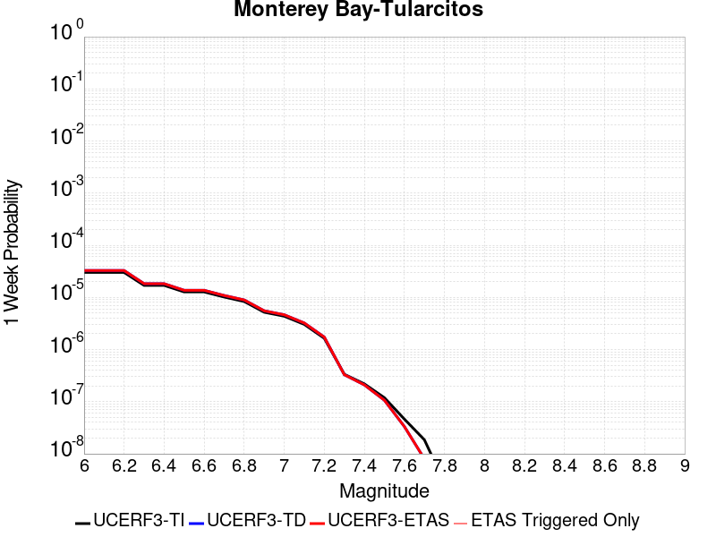 |  | 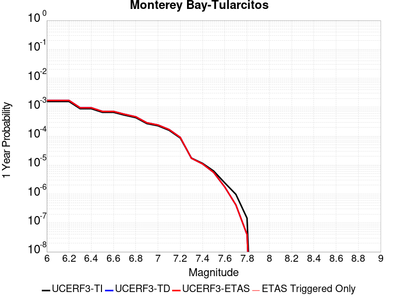 | 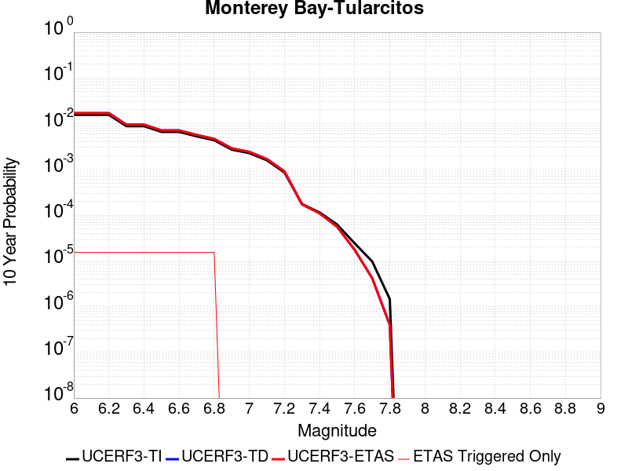 |

| Magnitude | 1 wk TI Prob | 1 wk TD Prob | 1 wk ETAS Prob | 1 wk ETAS/TD Gain | 1 wk ETAS Triggered Only | 1 mo TI Prob | 1 mo TD Prob | 1 mo ETAS Prob | 1 mo ETAS/TD Gain | 1 mo ETAS Triggered Only | 1 yr TI Prob | 1 yr TD Prob | 1 yr ETAS Prob | 1 yr ETAS/TD Gain | 1 yr ETAS Triggered Only | 10 yr TI Prob | 10 yr TD Prob | 10 yr ETAS Prob | 10 yr ETAS/TD Gain | 10 yr ETAS Triggered Only |
|-----|-----|-----|-----|-----|-----|-----|-----|-----|-----|-----|-----|-----|-----|-----|-----|-----|-----|-----|-----|-----|
| 6.0 | 3.0131365E-5 | 3.279877E-5 | 3.279877E-5 | 1.0 | 0.0 | 1.2912804E-4 | 1.4055918E-4 | 1.4055918E-4 | 1.0 | 0.0 | 0.001571 | 0.0017100703 | 0.0017100703 | 1.0 | 0.0 | 0.015599402 | 0.016979916 | 0.016994879 | 1.0008812 | 1.52207E-5 |
| 6.1 | 3.0131365E-5 | 3.279877E-5 | 3.279877E-5 | 1.0 | 0.0 | 1.2912804E-4 | 1.4055918E-4 | 1.4055918E-4 | 1.0 | 0.0 | 0.001571 | 0.0017100703 | 0.0017100703 | 1.0 | 0.0 | 0.015599402 | 0.016979916 | 0.016994879 | 1.0008812 | 1.52207E-5 |
| 6.2 | 3.0131365E-5 | 3.279877E-5 | 3.279877E-5 | 1.0 | 0.0 | 1.2912804E-4 | 1.4055918E-4 | 1.4055918E-4 | 1.0 | 0.0 | 0.001571 | 0.0017100703 | 0.0017100703 | 1.0 | 0.0 | 0.015599402 | 0.016979916 | 0.016994879 | 1.0008812 | 1.52207E-5 |
| 6.3 | 1.6998249E-5 | 1.8330798E-5 | 1.8330798E-5 | 1.0 | 0.0 | 7.28476E-5 | 7.85583E-5 | 7.85583E-5 | 1.0 | 0.0 | 8.865586E-4 | 9.5604634E-4 | 9.5604634E-4 | 1.0 | 0.0 | 0.0088303005 | 0.009521258 | 0.009536334 | 1.0015833 | 1.52207E-5 |
| 6.4 | 1.6998249E-5 | 1.8330798E-5 | 1.8330798E-5 | 1.0 | 0.0 | 7.28476E-5 | 7.85583E-5 | 7.85583E-5 | 1.0 | 0.0 | 8.865586E-4 | 9.5604634E-4 | 9.5604634E-4 | 1.0 | 0.0 | 0.0088303005 | 0.009521258 | 0.009536334 | 1.0015833 | 1.52207E-5 |
| 6.5 | 1.27470785E-5 | 1.3693312E-5 | 1.3693312E-5 | 1.0 | 0.0 | 5.4629192E-5 | 5.8684363E-5 | 5.8684363E-5 | 1.0 | 0.0 | 6.649074E-4 | 7.1425823E-4 | 7.1425823E-4 | 1.0 | 0.0 | 0.0066292146 | 0.007120678 | 0.007135791 | 1.0021223 | 1.52207E-5 |
| 6.6 | 1.2739422E-5 | 1.36854E-5 | 1.36854E-5 | 1.0 | 0.0 | 5.4596385E-5 | 5.8650454E-5 | 5.8650454E-5 | 1.0 | 0.0 | 6.645082E-4 | 7.1384566E-4 | 7.1384566E-4 | 1.0 | 0.0 | 0.0066252467 | 0.007116579 | 0.007131691 | 1.0021236 | 1.52207E-5 |
| 6.7 | 1.0160109E-5 | 1.0885755E-5 | 1.0885755E-5 | 1.0 | 0.0 | 4.35426E-5 | 4.665244E-5 | 4.665244E-5 | 1.0 | 0.0 | 5.300022E-4 | 5.6785246E-4 | 5.6785246E-4 | 1.0 | 0.0 | 0.005287399 | 0.0056647263 | 0.0056798607 | 1.0026717 | 1.52207E-5 |
| 6.8 | 8.349859E-6 | 8.932587E-6 | 8.932587E-6 | 1.0 | 0.0 | 3.578462E-5 | 3.8281985E-5 | 3.8281985E-5 | 1.0 | 0.0 | 4.3559066E-4 | 4.6598914E-4 | 4.6598914E-4 | 1.0 | 0.0 | 0.004347378 | 0.004650685 | 0.0046658353 | 1.0032575 | 1.52207E-5 |
| 6.9 | 5.193639E-6 | 5.53643E-6 | 5.53643E-6 | 1.0 | 0.0 | 2.2258262E-5 | 2.372736E-5 | 2.372736E-5 | 1.0 | 0.0 | 2.7096065E-4 | 2.8884556E-4 | 2.8884556E-4 | 1.0 | 0.0 | 0.0027063051 | 0.0028850222 | 0.0028850222 | 1.0 | 0.0 |
| 7.0 | 4.359381E-6 | 4.643366E-6 | 4.643366E-6 | 1.0 | 0.0 | 1.8682927E-5 | 1.9900004E-5 | 1.9900004E-5 | 1.0 | 0.0 | 2.274409E-4 | 2.422586E-4 | 2.422586E-4 | 1.0 | 0.0 | 0.0022720827 | 0.002420238 | 0.002420238 | 1.0 | 0.0 |
| 7.1 | 3.0398533E-6 | 3.2310427E-6 | 3.2310427E-6 | 1.0 | 0.0 | 1.3027877E-5 | 1.3847267E-5 | 1.3847267E-5 | 1.0 | 0.0 | 1.5860285E-4 | 1.6858005E-4 | 1.6858005E-4 | 1.0 | 0.0 | 0.001584897 | 0.0016847793 | 0.0016847793 | 1.0 | 0.0 |
| 7.2 | 1.642335E-6 | 1.7333153E-6 | 1.7333153E-6 | 1.0 | 0.0 | 7.0385595E-6 | 7.428485E-6 | 7.428485E-6 | 1.0 | 0.0 | 8.569109E-5 | 9.044012E-5 | 9.044012E-5 | 1.0 | 0.0 | 8.5658056E-4 | 9.042358E-4 | 9.042358E-4 | 1.0 | 0.0 |
| 7.3 | 3.356842E-7 | 3.2952389E-7 | 3.2952389E-7 | 1.0 | 0.0 | 1.4386458E-6 | 1.4122444E-6 | 1.4122444E-6 | 1.0 | 0.0 | 1.7515373E-5 | 1.7193941E-5 | 1.7193941E-5 | 1.0 | 0.0 | 1.7513991E-4 | 1.719262E-4 | 1.719262E-4 | 1.0 | 0.0 |
| 7.4 | 2.1973483E-7 | 2.1006413E-7 | 2.1006413E-7 | 1.0 | 0.0 | 9.417204E-7 | 9.0027453E-7 | 9.0027453E-7 | 1.0 | 0.0 | 1.1465385E-5 | 1.0960787E-5 | 1.0960787E-5 | 1.0 | 0.0 | 1.1464794E-4 | 1.096025E-4 | 1.096025E-4 | 1.0 | 0.0 |
| 7.5 | 1.1944135E-7 | 1.0696043E-7 | 1.0696043E-7 | 1.0 | 0.0 | 5.118914E-7 | 4.5840173E-7 | 4.5840173E-7 | 1.0 | 0.0 | 6.23226E-6 | 5.581027E-6 | 5.581027E-6 | 1.0 | 0.0 | 6.2320854E-5 | 5.5808883E-5 | 5.5808883E-5 | 1.0 | 0.0 |
| 7.6 | 4.636058E-8 | 3.336489E-8 | 3.336489E-8 | 1.0 | 0.0 | 1.9868818E-7 | 1.4299238E-7 | 1.4299238E-7 | 1.0 | 0.0 | 2.419026E-6 | 1.7409308E-6 | 1.7409308E-6 | 1.0 | 0.0 | 2.4189996E-5 | 1.7409173E-5 | 1.7409173E-5 | 1.0 | 0.0 |
| 7.7 | 1.8588572E-8 | 8.003744E-9 | 8.003744E-9 | 1.0 | 0.0 | 7.9665305E-8 | 3.430176E-8 | 3.430176E-8 | 1.0 | 0.0 | 9.699246E-7 | 4.1762385E-7 | 4.1762385E-7 | 1.0 | 0.0 | 9.699204E-6 | 4.176231E-6 | 4.176231E-6 | 1.0 | 0.0 |
| 7.8 | 2.7960154E-9 | 7.6099427E-10 | 7.6099427E-10 | 1.0 | 0.0 | 1.1982923E-8 | 3.2614043E-9 | 3.2614043E-9 | 1.0 | 0.0 | 1.4589209E-7 | 3.9707597E-8 | 3.9707597E-8 | 1.0 | 0.0 | 1.4589199E-6 | 3.9707595E-7 | 3.9707595E-7 | 1.0 | 0.0 |

## Fish Slough 2011 CFM
*[(top)](#table-of-contents)*

| 1 Week | 1 Month | 1 Year | 10 Year |
|-----|-----|-----|-----|
|  | 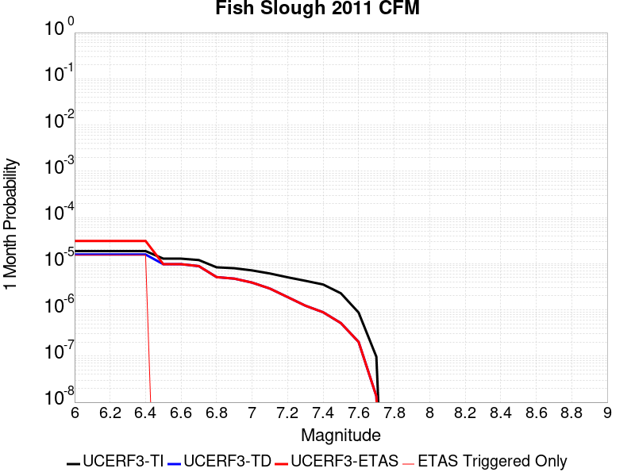 | 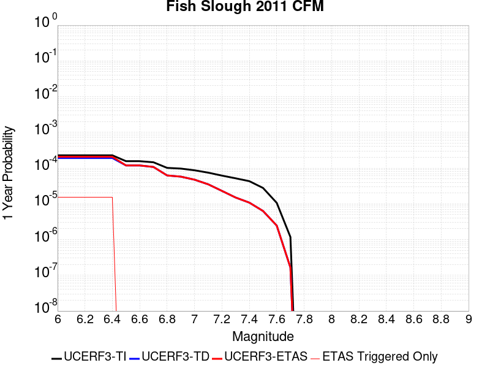 | 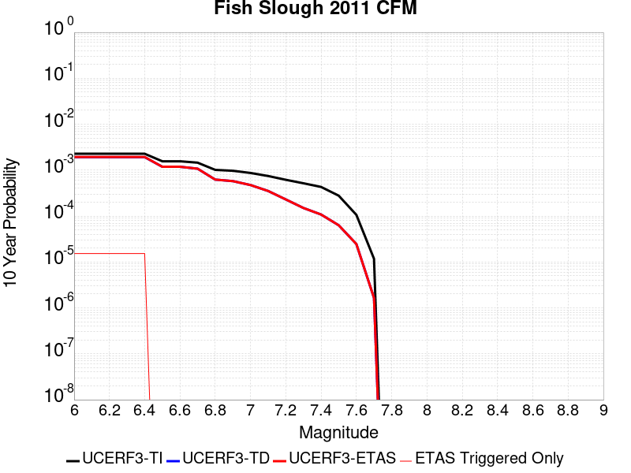 |

| Magnitude | 1 wk TI Prob | 1 wk TD Prob | 1 wk ETAS Prob | 1 wk ETAS/TD Gain | 1 wk ETAS Triggered Only | 1 mo TI Prob | 1 mo TD Prob | 1 mo ETAS Prob | 1 mo ETAS/TD Gain | 1 mo ETAS Triggered Only | 1 yr TI Prob | 1 yr TD Prob | 1 yr ETAS Prob | 1 yr ETAS/TD Gain | 1 yr ETAS Triggered Only | 10 yr TI Prob | 10 yr TD Prob | 10 yr ETAS Prob | 10 yr ETAS/TD Gain | 10 yr ETAS Triggered Only |
|-----|-----|-----|-----|-----|-----|-----|-----|-----|-----|-----|-----|-----|-----|-----|-----|-----|-----|-----|-----|-----|
| 6.0 | 4.3629925E-6 | 3.6772697E-6 | 1.8897914E-5 | 5.1391153 | 1.52207E-5 | 1.8698405E-5 | 1.5759644E-5 | 3.0980103E-5 | 1.965787 | 1.52207E-5 | 2.276293E-4 | 1.918589E-4 | 2.0707668E-4 | 1.0793176 | 1.52207E-5 | 0.0022739628 | 0.0019171416 | 0.0019323331 | 1.0079241 | 1.52207E-5 |
| 6.1 | 4.3629925E-6 | 3.6772697E-6 | 1.8897914E-5 | 5.1391153 | 1.52207E-5 | 1.8698405E-5 | 1.5759644E-5 | 3.0980103E-5 | 1.965787 | 1.52207E-5 | 2.276293E-4 | 1.918589E-4 | 2.0707668E-4 | 1.0793176 | 1.52207E-5 | 0.0022739628 | 0.0019171416 | 0.0019323331 | 1.0079241 | 1.52207E-5 |
| 6.2 | 4.3629925E-6 | 3.6772697E-6 | 1.8897914E-5 | 5.1391153 | 1.52207E-5 | 1.8698405E-5 | 1.5759644E-5 | 3.0980103E-5 | 1.965787 | 1.52207E-5 | 2.276293E-4 | 1.918589E-4 | 2.0707668E-4 | 1.0793176 | 1.52207E-5 | 0.0022739628 | 0.0019171416 | 0.0019323331 | 1.0079241 | 1.52207E-5 |
| 6.3 | 4.3629925E-6 | 3.6772697E-6 | 1.8897914E-5 | 5.1391153 | 1.52207E-5 | 1.8698405E-5 | 1.5759644E-5 | 3.0980103E-5 | 1.965787 | 1.52207E-5 | 2.276293E-4 | 1.918589E-4 | 2.0707668E-4 | 1.0793176 | 1.52207E-5 | 0.0022739628 | 0.0019171416 | 0.0019323331 | 1.0079241 | 1.52207E-5 |
| 6.4 | 4.3629925E-6 | 3.6772697E-6 | 1.8897914E-5 | 5.1391153 | 1.52207E-5 | 1.8698405E-5 | 1.5759644E-5 | 3.0980103E-5 | 1.965787 | 1.52207E-5 | 2.276293E-4 | 1.918589E-4 | 2.0707668E-4 | 1.0793176 | 1.52207E-5 | 0.0022739628 | 0.0019171416 | 0.0019323331 | 1.0079241 | 1.52207E-5 |
| 6.5 | 2.991715E-6 | 2.2703898E-6 | 2.2703898E-6 | 1.0 | 0.0 | 1.2821573E-5 | 9.730211E-6 | 9.730211E-6 | 1.0 | 0.0 | 1.5609147E-4 | 1.1845979E-4 | 1.1845979E-4 | 1.0 | 0.0 | 0.0015598187 | 0.0011840566 | 0.0011840566 | 1.0 | 0.0 |
| 6.6 | 2.991715E-6 | 2.2703898E-6 | 2.2703898E-6 | 1.0 | 0.0 | 1.2821573E-5 | 9.730211E-6 | 9.730211E-6 | 1.0 | 0.0 | 1.5609147E-4 | 1.1845979E-4 | 1.1845979E-4 | 1.0 | 0.0 | 0.0015598187 | 0.0011840566 | 0.0011840566 | 1.0 | 0.0 |
| 6.7 | 2.7890346E-6 | 2.0621853E-6 | 2.0621853E-6 | 1.0 | 0.0 | 1.1952951E-5 | 8.837912E-6 | 8.837912E-6 | 1.0 | 0.0 | 1.4551746E-4 | 1.0759717E-4 | 1.0759717E-4 | 1.0 | 0.0 | 0.0014542221 | 0.0010755389 | 0.0010755389 | 1.0 | 0.0 |
| 6.8 | 1.9416723E-6 | 1.192555E-6 | 1.192555E-6 | 1.0 | 0.0 | 8.321425E-6 | 5.1109405E-6 | 5.1109405E-6 | 1.0 | 0.0 | 1.01308644E-4 | 6.222397E-5 | 6.222397E-5 | 1.0 | 0.0 | 0.0010126247 | 6.220695E-4 | 6.220695E-4 | 1.0 | 0.0 |
| 6.9 | 1.8567416E-6 | 1.1046966E-6 | 1.1046966E-6 | 1.0 | 0.0 | 7.957439E-6 | 4.7344056E-6 | 4.7344056E-6 | 1.0 | 0.0 | 9.687752E-5 | 5.7639903E-5 | 5.7639903E-5 | 1.0 | 0.0 | 9.6835295E-4 | 5.762534E-4 | 5.762534E-4 | 1.0 | 0.0 |
| 7.0 | 1.6634067E-6 | 9.073966E-7 | 9.073966E-7 | 1.0 | 0.0 | 7.1288664E-6 | 3.888837E-6 | 3.888837E-6 | 1.0 | 0.0 | 8.679049E-5 | 4.734559E-5 | 4.734559E-5 | 1.0 | 0.0 | 8.6756604E-4 | 4.733579E-4 | 4.733579E-4 | 1.0 | 0.0 |
| 7.1 | 1.4281054E-6 | 6.7366227E-7 | 6.7366227E-7 | 1.0 | 0.0 | 6.1204373E-6 | 2.8871211E-6 | 2.8871211E-6 | 1.0 | 0.0 | 7.451377E-5 | 3.515015E-5 | 3.515015E-5 | 1.0 | 0.0 | 7.44888E-4 | 3.5144767E-4 | 3.5144767E-4 | 1.0 | 0.0 |
| 7.2 | 1.1810387E-6 | 4.408355E-7 | 4.408355E-7 | 1.0 | 0.0 | 5.0615845E-6 | 1.8892936E-6 | 1.8892936E-6 | 1.0 | 0.0 | 6.1623046E-5 | 2.3001916E-5 | 2.3001916E-5 | 1.0 | 0.0 | 6.160596E-4 | 2.2999625E-4 | 2.2999625E-4 | 1.0 | 0.0 |
| 7.3 | 9.918052E-7 | 2.8733467E-7 | 2.8733467E-7 | 1.0 | 0.0 | 4.2505867E-6 | 1.2314338E-6 | 1.2314338E-6 | 1.0 | 0.0 | 5.1749663E-5 | 1.4992604E-5 | 1.4992604E-5 | 1.0 | 0.0 | 5.173762E-4 | 1.4991604E-4 | 1.4991604E-4 | 1.0 | 0.0 |
| 7.4 | 8.25252E-7 | 2.0694807E-7 | 2.0694807E-7 | 1.0 | 0.0 | 3.5367896E-6 | 8.8692E-7 | 8.8692E-7 | 1.0 | 0.0 | 4.3059565E-5 | 1.0798199E-5 | 1.0798199E-5 | 1.0 | 0.0 | 4.305122E-4 | 1.07976804E-4 | 1.07976804E-4 | 1.0 | 0.0 |
| 7.5 | 5.3248567E-7 | 1.2072739E-7 | 1.2072739E-7 | 1.0 | 0.0 | 2.2820795E-6 | 5.17403E-7 | 5.17403E-7 | 1.0 | 0.0 | 2.7783964E-5 | 6.299364E-6 | 6.299364E-6 | 1.0 | 0.0 | 2.778049E-4 | 6.2991894E-5 | 6.2991894E-5 | 1.0 | 0.0 |
| 7.6 | 2.037542E-7 | 4.7129152E-8 | 4.7129152E-8 | 1.0 | 0.0 | 8.73232E-7 | 2.0198206E-7 | 2.0198206E-7 | 1.0 | 0.0 | 1.0631547E-5 | 2.459129E-6 | 2.459129E-6 | 1.0 | 0.0 | 1.0631039E-4 | 2.459104E-5 | 2.459104E-5 | 1.0 | 0.0 |
| 7.7 | 2.2501226E-8 | 3.1514258E-9 | 3.1514258E-9 | 1.0 | 0.0 | 9.6433816E-8 | 1.350611E-8 | 1.350611E-8 | 1.0 | 0.0 | 1.1740811E-6 | 1.6443688E-7 | 1.6443688E-7 | 1.0 | 0.0 | 1.1740749E-5 | 1.6443678E-6 | 1.6443678E-6 | 1.0 | 0.0 |

## Morales (West)
*[(top)](#table-of-contents)*

| 1 Week | 1 Month | 1 Year | 10 Year |
|-----|-----|-----|-----|
| 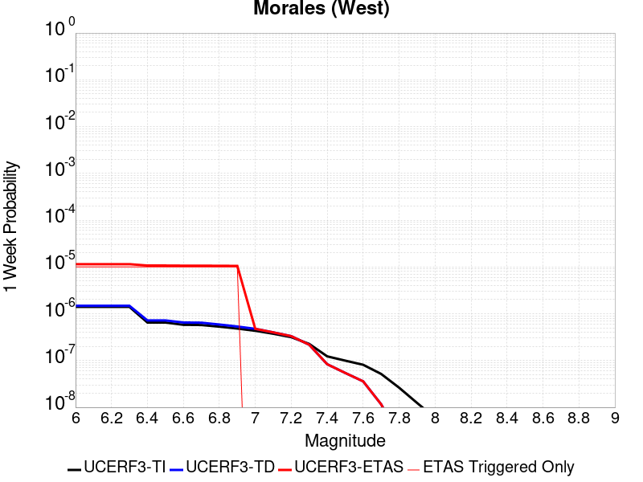 |  | 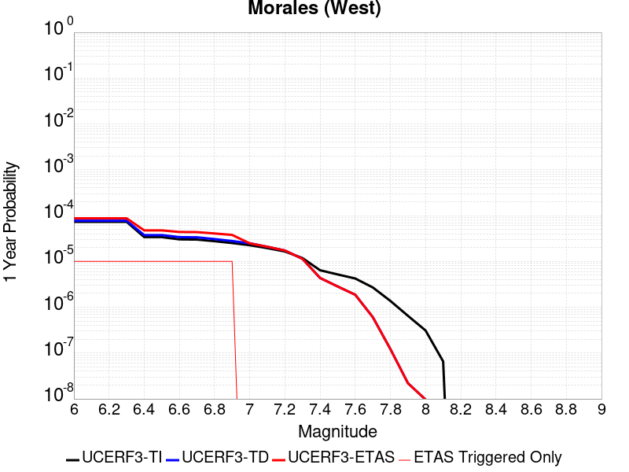 | 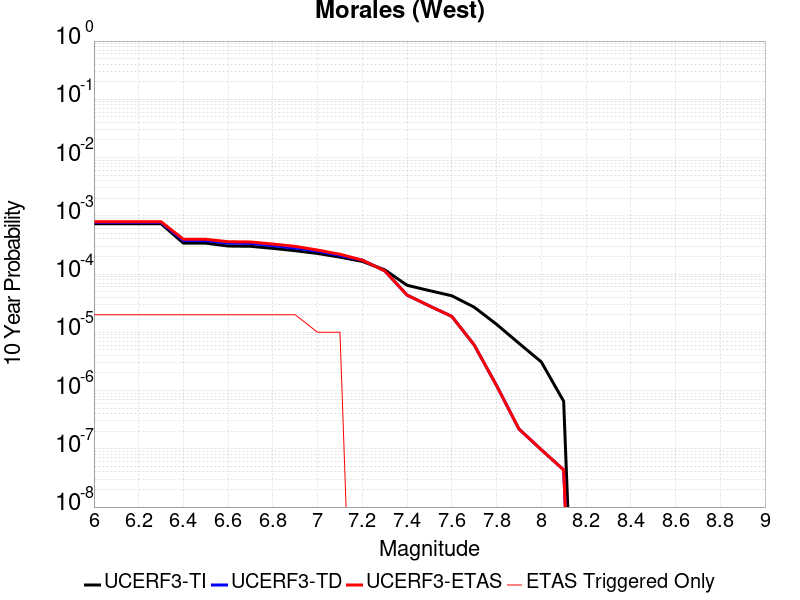 |

| Magnitude | 1 wk TI Prob | 1 wk TD Prob | 1 wk ETAS Prob | 1 wk ETAS/TD Gain | 1 wk ETAS Triggered Only | 1 mo TI Prob | 1 mo TD Prob | 1 mo ETAS Prob | 1 mo ETAS/TD Gain | 1 mo ETAS Triggered Only | 1 yr TI Prob | 1 yr TD Prob | 1 yr ETAS Prob | 1 yr ETAS/TD Gain | 1 yr ETAS Triggered Only | 10 yr TI Prob | 10 yr TD Prob | 10 yr ETAS Prob | 10 yr ETAS/TD Gain | 10 yr ETAS Triggered Only |
|-----|-----|-----|-----|-----|-----|-----|-----|-----|-----|-----|-----|-----|-----|-----|-----|-----|-----|-----|-----|-----|
| 6.0 | 1.4027072E-6 | 1.4791576E-6 | 1.4791576E-6 | 1.0 | 0.0 | 6.0115885E-6 | 6.339236E-6 | 6.339236E-6 | 1.0 | 0.0 | 7.318863E-5 | 7.7178156E-5 | 7.7178156E-5 | 1.0 | 0.0 | 7.316453E-4 | 7.715821E-4 | 7.867911E-4 | 1.0197114 | 1.52207E-5 |
| 6.1 | 1.4027072E-6 | 1.4791576E-6 | 1.4791576E-6 | 1.0 | 0.0 | 6.0115885E-6 | 6.339236E-6 | 6.339236E-6 | 1.0 | 0.0 | 7.318863E-5 | 7.7178156E-5 | 7.7178156E-5 | 1.0 | 0.0 | 7.316453E-4 | 7.715821E-4 | 7.867911E-4 | 1.0197114 | 1.52207E-5 |
| 6.2 | 1.4027072E-6 | 1.4791576E-6 | 1.4791576E-6 | 1.0 | 0.0 | 6.0115885E-6 | 6.339236E-6 | 6.339236E-6 | 1.0 | 0.0 | 7.318863E-5 | 7.7178156E-5 | 7.7178156E-5 | 1.0 | 0.0 | 7.316453E-4 | 7.715821E-4 | 7.867911E-4 | 1.0197114 | 1.52207E-5 |
| 6.3 | 1.4027072E-6 | 1.4791576E-6 | 1.4791576E-6 | 1.0 | 0.0 | 6.0115885E-6 | 6.339236E-6 | 6.339236E-6 | 1.0 | 0.0 | 7.318863E-5 | 7.7178156E-5 | 7.7178156E-5 | 1.0 | 0.0 | 7.316453E-4 | 7.715821E-4 | 7.867911E-4 | 1.0197114 | 1.52207E-5 |
| 6.4 | 6.504502E-7 | 7.2038824E-7 | 7.2038824E-7 | 1.0 | 0.0 | 2.7876408E-6 | 3.0873746E-6 | 3.0873746E-6 | 1.0 | 0.0 | 3.3939E-5 | 3.758815E-5 | 3.758815E-5 | 1.0 | 0.0 | 3.3933815E-4 | 3.758191E-4 | 3.910341E-4 | 1.0404849 | 1.52207E-5 |
| 6.5 | 6.504502E-7 | 7.2038824E-7 | 7.2038824E-7 | 1.0 | 0.0 | 2.7876408E-6 | 3.0873746E-6 | 3.0873746E-6 | 1.0 | 0.0 | 3.3939E-5 | 3.758815E-5 | 3.758815E-5 | 1.0 | 0.0 | 3.3933815E-4 | 3.758191E-4 | 3.910341E-4 | 1.0404849 | 1.52207E-5 |
| 6.6 | 5.8056526E-7 | 6.500143E-7 | 6.500143E-7 | 1.0 | 0.0 | 2.4881344E-6 | 2.7857725E-6 | 2.7857725E-6 | 1.0 | 0.0 | 3.0292615E-5 | 3.3916258E-5 | 3.3916258E-5 | 1.0 | 0.0 | 3.0288487E-4 | 3.3911143E-4 | 3.5432697E-4 | 1.0448688 | 1.52207E-5 |
| 6.7 | 5.741448E-7 | 6.435454E-7 | 6.435454E-7 | 1.0 | 0.0 | 2.4606184E-6 | 2.7580488E-6 | 2.7580488E-6 | 1.0 | 0.0 | 2.9957617E-5 | 3.3578734E-5 | 3.3578734E-5 | 1.0 | 0.0 | 2.9953578E-4 | 3.357372E-4 | 3.509528E-4 | 1.0453199 | 1.52207E-5 |
| 6.8 | 5.299428E-7 | 5.8909023E-7 | 5.8909023E-7 | 1.0 | 0.0 | 2.2711813E-6 | 2.52467E-6 | 2.52467E-6 | 1.0 | 0.0 | 2.7651282E-5 | 3.073743E-5 | 3.073743E-5 | 1.0 | 0.0 | 2.7647841E-4 | 3.0733226E-4 | 3.2254827E-4 | 1.04951 | 1.52207E-5 |
| 6.9 | 4.82394E-7 | 5.3416807E-7 | 5.3416807E-7 | 1.0 | 0.0 | 2.0674013E-6 | 2.2892896E-6 | 2.2892896E-6 | 1.0 | 0.0 | 2.517032E-5 | 2.7871749E-5 | 2.7871749E-5 | 1.0 | 0.0 | 2.516747E-4 | 2.7868294E-4 | 2.938994E-4 | 1.0546013 | 1.52207E-5 |
| 7.0 | 4.3264512E-7 | 4.759864E-7 | 4.759864E-7 | 1.0 | 0.0 | 1.8541921E-6 | 2.0399402E-6 | 2.0399402E-6 | 1.0 | 0.0 | 2.2574555E-5 | 2.4835992E-5 | 2.4835992E-5 | 1.0 | 0.0 | 2.2572262E-4 | 2.4833248E-4 | 2.6354942E-4 | 1.0612764 | 1.52207E-5 |
| 7.1 | 3.7388565E-7 | 4.000384E-7 | 4.000384E-7 | 1.0 | 0.0 | 1.6023661E-6 | 1.7144492E-6 | 1.7144492E-6 | 1.0 | 0.0 | 1.9508632E-5 | 2.0873222E-5 | 2.0873222E-5 | 1.0 | 0.0 | 1.950692E-4 | 2.0871284E-4 | 2.2393037E-4 | 1.0729113 | 1.52207E-5 |
| 7.2 | 3.1592543E-7 | 3.3199075E-7 | 3.3199075E-7 | 1.0 | 0.0 | 1.3539654E-6 | 1.4228168E-6 | 1.4228168E-6 | 1.0 | 0.0 | 1.6484404E-5 | 1.7322658E-5 | 1.7322658E-5 | 1.0 | 0.0 | 1.6483181E-4 | 1.7321325E-4 | 1.7321325E-4 | 1.0 | 0.0 |
| 7.3 | 2.2677783E-7 | 2.1793869E-7 | 2.1793869E-7 | 1.0 | 0.0 | 9.719047E-7 | 9.3402264E-7 | 9.3402264E-7 | 1.0 | 0.0 | 1.1832874E-5 | 1.1371666E-5 | 1.1371666E-5 | 1.0 | 0.0 | 1.18322445E-4 | 1.1371089E-4 | 1.1371089E-4 | 1.0 | 0.0 |
| 7.4 | 1.2295531E-7 | 8.350771E-8 | 8.350771E-8 | 1.0 | 0.0 | 5.269512E-7 | 3.5789014E-7 | 3.5789014E-7 | 1.0 | 0.0 | 6.4156125E-6 | 4.3573036E-6 | 4.3573036E-6 | 1.0 | 0.0 | 6.415427E-5 | 4.357219E-5 | 4.357219E-5 | 1.0 | 0.0 |
| 7.5 | 9.9632544E-8 | 5.443089E-8 | 5.443089E-8 | 1.0 | 0.0 | 4.2699656E-7 | 2.3327522E-7 | 2.3327522E-7 | 1.0 | 0.0 | 5.198671E-6 | 2.840122E-6 | 2.840122E-6 | 1.0 | 0.0 | 5.198549E-5 | 2.8400864E-5 | 2.8400864E-5 | 1.0 | 0.0 |
| 7.6 | 8.125894E-8 | 3.594956E-8 | 3.594956E-8 | 1.0 | 0.0 | 3.4825257E-7 | 1.5406955E-7 | 1.5406955E-7 | 1.0 | 0.0 | 4.2399665E-6 | 1.8757952E-6 | 1.8757952E-6 | 1.0 | 0.0 | 4.2398857E-5 | 1.8757797E-5 | 1.8757797E-5 | 1.0 | 0.0 |
| 7.7 | 5.1810765E-8 | 1.1642662E-8 | 1.1642662E-8 | 1.0 | 0.0 | 2.2204613E-7 | 4.9897128E-8 | 4.9897128E-8 | 1.0 | 0.0 | 2.7034082E-6 | 6.074974E-7 | 6.074974E-7 | 1.0 | 0.0 | 2.7033753E-5 | 6.0749603E-6 | 6.0749603E-6 | 1.0 | 0.0 |
| 7.8 | 2.6315043E-8 | 2.3383624E-9 | 2.3383624E-9 | 1.0 | 0.0 | 1.1277875E-7 | 1.0021558E-8 | 1.0021558E-8 | 1.0 | 0.0 | 1.3730804E-6 | 1.2201247E-7 | 1.2201247E-7 | 1.0 | 0.0 | 1.3730719E-5 | 1.2201268E-6 | 1.2201268E-6 | 1.0 | 0.0 |
| 7.9 | 1.24281545E-8 | 4.207228E-10 | 4.207228E-10 | 1.0 | 0.0 | 5.3263516E-8 | 1.8031033E-9 | 1.8031033E-9 | 1.0 | 0.0 | 6.4848314E-7 | 2.1952776E-8 | 2.1952776E-8 | 1.0 | 0.0 | 6.4848123E-6 | 2.195305E-7 | 2.195305E-7 | 1.0 | 0.0 |
| 8.0 | 5.954214E-9 | 1.8509339E-10 | 1.8509339E-10 | 1.0 | 0.0 | 2.551806E-8 | 7.9326146E-10 | 7.9326146E-10 | 1.0 | 0.0 | 3.1068234E-7 | 9.657958E-9 | 9.657958E-9 | 1.0 | 0.0 | 3.1068191E-6 | 9.658236E-8 | 9.658236E-8 | 1.0 | 0.0 |
| 8.1 | 1.2586262E-9 | 8.346668E-11 | 8.346668E-11 | 1.0 | 0.0 | 5.3941123E-9 | 3.5771386E-10 | 3.5771386E-10 | 1.0 | 0.0 | 6.567332E-8 | 4.355168E-9 | 4.355168E-9 | 1.0 | 0.0 | 6.56733E-7 | 4.3554458E-8 | 4.3554458E-8 | 1.0 | 0.0 |

## Surprise Valley 2011 CFM
*[(top)](#table-of-contents)*

| 1 Week | 1 Month | 1 Year | 10 Year |
|-----|-----|-----|-----|
|  |  |  | 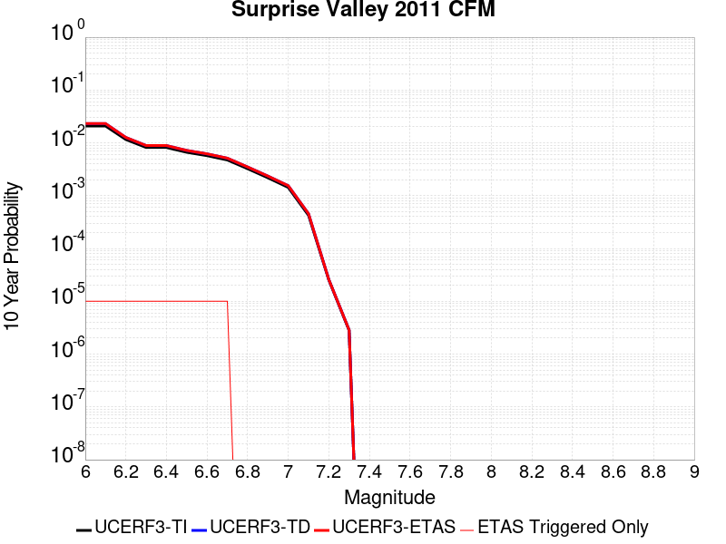 |

| Magnitude | 1 wk TI Prob | 1 wk TD Prob | 1 wk ETAS Prob | 1 wk ETAS/TD Gain | 1 wk ETAS Triggered Only | 1 mo TI Prob | 1 mo TD Prob | 1 mo ETAS Prob | 1 mo ETAS/TD Gain | 1 mo ETAS Triggered Only | 1 yr TI Prob | 1 yr TD Prob | 1 yr ETAS Prob | 1 yr ETAS/TD Gain | 1 yr ETAS Triggered Only | 10 yr TI Prob | 10 yr TD Prob | 10 yr ETAS Prob | 10 yr ETAS/TD Gain | 10 yr ETAS Triggered Only |
|-----|-----|-----|-----|-----|-----|-----|-----|-----|-----|-----|-----|-----|-----|-----|-----|-----|-----|-----|-----|-----|
| 6.0 | 4.0396248E-5 | 4.485131E-5 | 4.485131E-5 | 1.0 | 0.0 | 1.7311527E-4 | 1.9220692E-4 | 1.9220692E-4 | 1.0 | 0.0 | 0.002105641 | 0.0023378176 | 0.0023378176 | 1.0 | 0.0 | 0.020858008 | 0.023153966 | 0.023168834 | 1.0006422 | 1.52207E-5 |
| 6.1 | 4.0396248E-5 | 4.485131E-5 | 4.485131E-5 | 1.0 | 0.0 | 1.7311527E-4 | 1.9220692E-4 | 1.9220692E-4 | 1.0 | 0.0 | 0.002105641 | 0.0023378176 | 0.0023378176 | 1.0 | 0.0 | 0.020858008 | 0.023153966 | 0.023168834 | 1.0006422 | 1.52207E-5 |
| 6.2 | 2.2295266E-5 | 2.440125E-5 | 2.440125E-5 | 1.0 | 0.0 | 9.554764E-5 | 1.0457276E-4 | 1.0457276E-4 | 1.0 | 0.0 | 0.0011626717 | 0.0012724606 | 0.0012724606 | 1.0 | 0.0 | 0.011566074 | 0.012654981 | 0.012670008 | 1.0011876 | 1.52207E-5 |
| 6.3 | 1.572643E-5 | 1.7096807E-5 | 1.7096807E-5 | 1.0 | 0.0 | 6.7397246E-5 | 7.327003E-5 | 7.327003E-5 | 1.0 | 0.0 | 8.202525E-4 | 8.91708E-4 | 8.91708E-4 | 1.0 | 0.0 | 0.008172315 | 0.008882407 | 0.008897493 | 1.0016984 | 1.52207E-5 |
| 6.4 | 1.5714395E-5 | 1.7084629E-5 | 1.7084629E-5 | 1.0 | 0.0 | 6.734567E-5 | 7.3217845E-5 | 7.3217845E-5 | 1.0 | 0.0 | 8.1962504E-4 | 8.9107314E-4 | 8.9107314E-4 | 1.0 | 0.0 | 0.008166086 | 0.008876109 | 0.008891194 | 1.0016996 | 1.52207E-5 |
| 6.5 | 1.2733495E-5 | 1.38016E-5 | 1.38016E-5 | 1.0 | 0.0 | 5.457098E-5 | 5.9148413E-5 | 5.9148413E-5 | 1.0 | 0.0 | 6.641992E-4 | 7.1990065E-4 | 7.1990065E-4 | 1.0 | 0.0 | 0.0066221743 | 0.0071763797 | 0.007191491 | 1.0021057 | 1.52207E-5 |
| 6.6 | 1.0983784E-5 | 1.1886554E-5 | 1.1886554E-5 | 1.0 | 0.0 | 4.7072506E-5 | 5.094141E-5 | 5.094141E-5 | 1.0 | 0.0 | 5.7295704E-4 | 6.200405E-4 | 6.200405E-4 | 1.0 | 0.0 | 0.0057148207 | 0.0061836545 | 0.006198781 | 1.0024462 | 1.52207E-5 |
| 6.7 | 9.104806E-6 | 9.839491E-6 | 9.839491E-6 | 1.0 | 0.0 | 3.902001E-5 | 4.2168587E-5 | 4.2168587E-5 | 1.0 | 0.0 | 4.7496508E-4 | 5.132855E-4 | 5.132855E-4 | 1.0 | 0.0 | 0.004739512 | 0.005121397 | 0.0051365397 | 1.0029567 | 1.52207E-5 |
| 6.8 | 6.2162403E-6 | 6.7041337E-6 | 6.7041337E-6 | 1.0 | 0.0 | 2.6640759E-5 | 2.8731698E-5 | 2.8731698E-5 | 1.0 | 0.0 | 3.2430296E-4 | 3.497545E-4 | 3.497545E-4 | 1.0 | 0.0 | 0.003238301 | 0.0034922638 | 0.0034922638 | 1.0 | 0.0 |
| 6.9 | 4.1792696E-6 | 4.50323E-6 | 4.50323E-6 | 1.0 | 0.0 | 1.7911032E-5 | 1.9299423E-5 | 1.9299423E-5 | 1.0 | 0.0 | 2.1804498E-4 | 2.3494668E-4 | 2.3494668E-4 | 1.0 | 0.0 | 0.0021783116 | 0.0023471361 | 0.0023471361 | 1.0 | 0.0 |
| 7.0 | 2.7478413E-6 | 2.9622424E-6 | 2.9622424E-6 | 1.0 | 0.0 | 1.177641E-5 | 1.269527E-5 | 1.269527E-5 | 1.0 | 0.0 | 1.4336836E-4 | 1.545552E-4 | 1.545552E-4 | 1.0 | 0.0 | 0.001432759 | 0.0015445995 | 0.0015445995 | 1.0 | 0.0 |
| 7.1 | 8.128648E-7 | 8.724922E-7 | 8.724922E-7 | 1.0 | 0.0 | 3.4837017E-6 | 3.7392501E-6 | 3.7392501E-6 | 1.0 | 0.0 | 4.2413245E-5 | 4.552502E-5 | 4.552502E-5 | 1.0 | 0.0 | 4.2405148E-4 | 4.5521575E-4 | 4.5521575E-4 | 1.0 | 0.0 |
| 7.2 | 4.8641045E-8 | 4.9402068E-8 | 4.9402068E-8 | 1.0 | 0.0 | 2.084616E-7 | 2.1172312E-7 | 2.1172312E-7 | 1.0 | 0.0 | 2.538017E-6 | 2.577726E-6 | 2.577726E-6 | 1.0 | 0.0 | 2.537988E-5 | 2.5776973E-5 | 2.5776973E-5 | 1.0 | 0.0 |
| 7.3 | 5.3911844E-9 | 5.4758145E-9 | 5.4758145E-9 | 1.0 | 0.0 | 2.3105075E-8 | 2.3467775E-8 | 2.3467775E-8 | 1.0 | 0.0 | 2.8130427E-7 | 2.8572015E-7 | 2.8572015E-7 | 1.0 | 0.0 | 2.8130391E-6 | 2.8571992E-6 | 2.8571992E-6 | 1.0 | 0.0 |

## Homestead Valley 2011
*[(top)](#table-of-contents)*

| 1 Week | 1 Month | 1 Year | 10 Year |
|-----|-----|-----|-----|
|  | 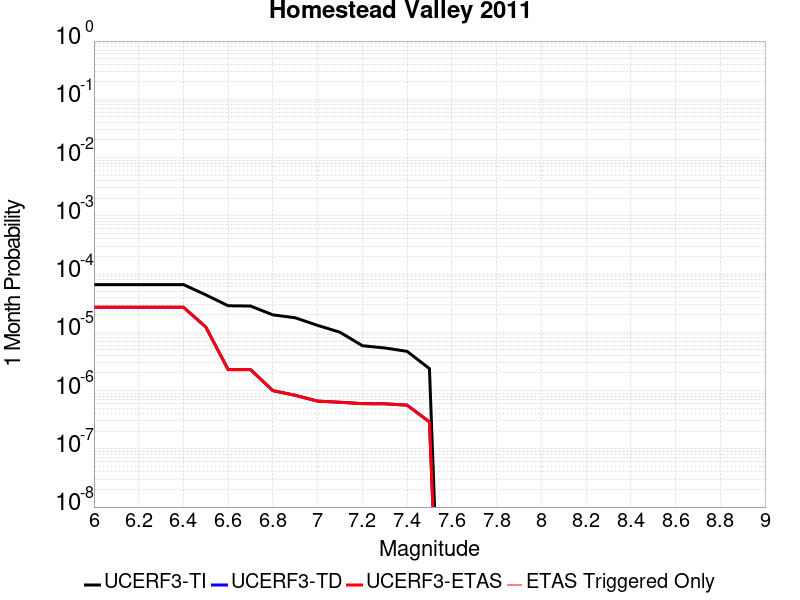 | 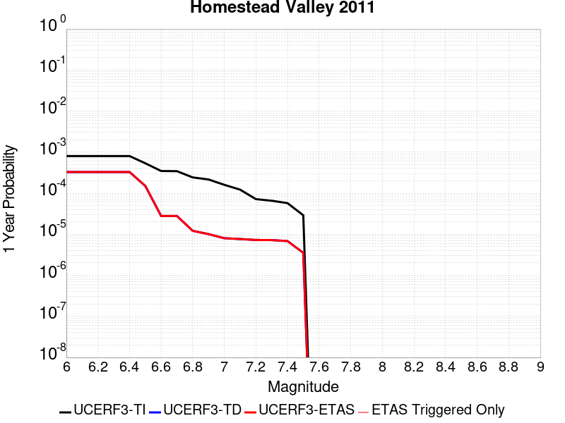 | 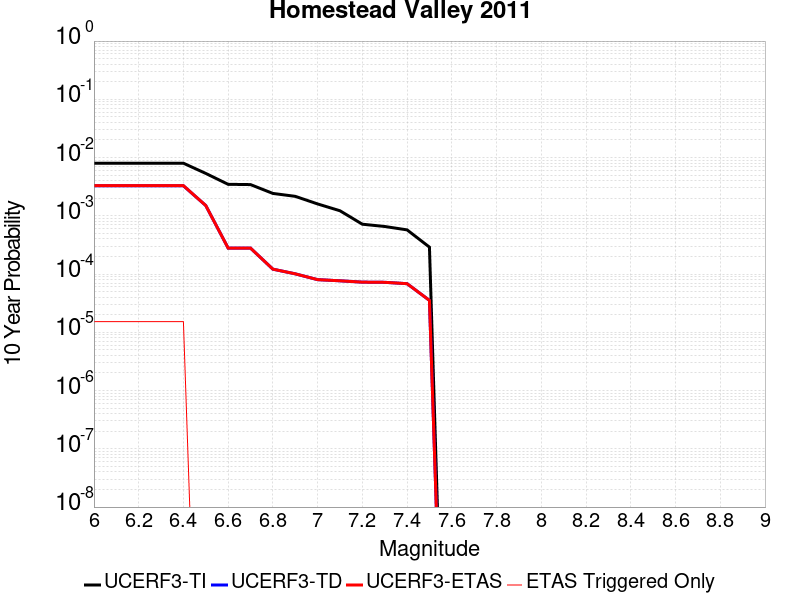 |

| Magnitude | 1 wk TI Prob | 1 wk TD Prob | 1 wk ETAS Prob | 1 wk ETAS/TD Gain | 1 wk ETAS Triggered Only | 1 mo TI Prob | 1 mo TD Prob | 1 mo ETAS Prob | 1 mo ETAS/TD Gain | 1 mo ETAS Triggered Only | 1 yr TI Prob | 1 yr TD Prob | 1 yr ETAS Prob | 1 yr ETAS/TD Gain | 1 yr ETAS Triggered Only | 10 yr TI Prob | 10 yr TD Prob | 10 yr ETAS Prob | 10 yr ETAS/TD Gain | 10 yr ETAS Triggered Only |
|-----|-----|-----|-----|-----|-----|-----|-----|-----|-----|-----|-----|-----|-----|-----|-----|-----|-----|-----|-----|-----|
| 6.0 | 1.539795E-5 | 6.286606E-6 | 6.286606E-6 | 1.0 | 0.0 | 6.5989545E-5 | 2.6942436E-5 | 2.6942436E-5 | 1.0 | 0.0 | 8.0312655E-4 | 3.279954E-4 | 3.279954E-4 | 1.0 | 0.0 | 0.008002302 | 0.0032771337 | 0.0032923047 | 1.0046293 | 1.52207E-5 |
| 6.1 | 1.539795E-5 | 6.286606E-6 | 6.286606E-6 | 1.0 | 0.0 | 6.5989545E-5 | 2.6942436E-5 | 2.6942436E-5 | 1.0 | 0.0 | 8.0312655E-4 | 3.279954E-4 | 3.279954E-4 | 1.0 | 0.0 | 0.008002302 | 0.0032771337 | 0.0032923047 | 1.0046293 | 1.52207E-5 |
| 6.2 | 1.539795E-5 | 6.286606E-6 | 6.286606E-6 | 1.0 | 0.0 | 6.5989545E-5 | 2.6942436E-5 | 2.6942436E-5 | 1.0 | 0.0 | 8.0312655E-4 | 3.279954E-4 | 3.279954E-4 | 1.0 | 0.0 | 0.008002302 | 0.0032771337 | 0.0032923047 | 1.0046293 | 1.52207E-5 |
| 6.3 | 1.539795E-5 | 6.286606E-6 | 6.286606E-6 | 1.0 | 0.0 | 6.5989545E-5 | 2.6942436E-5 | 2.6942436E-5 | 1.0 | 0.0 | 8.0312655E-4 | 3.279954E-4 | 3.279954E-4 | 1.0 | 0.0 | 0.008002302 | 0.0032771337 | 0.0032923047 | 1.0046293 | 1.52207E-5 |
| 6.4 | 1.539795E-5 | 6.286606E-6 | 6.286606E-6 | 1.0 | 0.0 | 6.5989545E-5 | 2.6942436E-5 | 2.6942436E-5 | 1.0 | 0.0 | 8.0312655E-4 | 3.279954E-4 | 3.279954E-4 | 1.0 | 0.0 | 0.008002302 | 0.0032771337 | 0.0032923047 | 1.0046293 | 1.52207E-5 |
| 6.5 | 1.0265258E-5 | 2.8788488E-6 | 2.8788488E-6 | 1.0 | 0.0 | 4.3993223E-5 | 1.2337905E-5 | 1.2337905E-5 | 1.0 | 0.0 | 5.3548586E-4 | 1.5021059E-4 | 1.5021059E-4 | 1.0 | 0.0 | 0.005341973 | 0.0015017724 | 0.0015017724 | 1.0 | 0.0 |
| 6.6 | 6.664671E-6 | 5.348204E-7 | 5.348204E-7 | 1.0 | 0.0 | 2.8562565E-5 | 2.2920863E-6 | 2.2920863E-6 | 1.0 | 0.0 | 3.476937E-4 | 2.7905911E-5 | 2.7905911E-5 | 1.0 | 0.0 | 0.003471502 | 2.790357E-4 | 2.790357E-4 | 1.0 | 0.0 |
| 6.7 | 6.5954046E-6 | 5.348204E-7 | 5.348204E-7 | 1.0 | 0.0 | 2.8265715E-5 | 2.2920863E-6 | 2.2920863E-6 | 1.0 | 0.0 | 3.4408073E-4 | 2.7905911E-5 | 2.7905911E-5 | 1.0 | 0.0 | 0.0034354846 | 2.790357E-4 | 2.790357E-4 | 1.0 | 0.0 |
| 6.8 | 4.648189E-6 | 2.3265572E-7 | 2.3265572E-7 | 1.0 | 0.0 | 1.9920659E-5 | 9.970956E-7 | 9.970956E-7 | 1.0 | 0.0 | 2.4250703E-4 | 1.2139576E-5 | 1.2139576E-5 | 1.0 | 0.0 | 0.0024224254 | 1.2138961E-4 | 1.2138961E-4 | 1.0 | 0.0 |
| 6.9 | 4.1428534E-6 | 1.9344557E-7 | 1.9344557E-7 | 1.0 | 0.0 | 1.7754966E-5 | 8.290522E-7 | 8.290522E-7 | 1.0 | 0.0 | 2.1614527E-4 | 1.0093667E-5 | 1.0093667E-5 | 1.0 | 0.0 | 0.0021593515 | 1.0093238E-4 | 1.0093238E-4 | 1.0 | 0.0 |
| 7.0 | 3.0673707E-6 | 1.5367603E-7 | 1.5367603E-7 | 1.0 | 0.0 | 1.3145808E-5 | 6.586114E-7 | 6.586114E-7 | 1.0 | 0.0 | 1.6003846E-4 | 8.0185655E-6 | 8.0185655E-6 | 1.0 | 0.0 | 0.0015992324 | 8.0182865E-5 | 8.0182865E-5 | 1.0 | 0.0 |
| 7.1 | 2.340854E-6 | 1.468766E-7 | 1.468766E-7 | 1.0 | 0.0 | 1.0032193E-5 | 6.29471E-7 | 6.29471E-7 | 1.0 | 0.0 | 1.221351E-4 | 7.663783E-6 | 7.663783E-6 | 1.0 | 0.0 | 0.00122068 | 7.663529E-5 | 7.663529E-5 | 1.0 | 0.0 |
| 7.2 | 1.3754182E-6 | 1.3922634E-7 | 1.3922634E-7 | 1.0 | 0.0 | 5.8946357E-6 | 5.966842E-7 | 5.966842E-7 | 1.0 | 0.0 | 7.176483E-5 | 7.2646067E-6 | 7.2646067E-6 | 1.0 | 0.0 | 7.174166E-4 | 7.264379E-5 | 7.264379E-5 | 1.0 | 0.0 |
| 7.3 | 1.2573237E-6 | 1.3827146E-7 | 1.3827146E-7 | 1.0 | 0.0 | 5.388519E-6 | 5.9259185E-7 | 5.9259185E-7 | 1.0 | 0.0 | 6.560324E-5 | 7.2147827E-6 | 7.2147827E-6 | 1.0 | 0.0 | 6.558388E-4 | 7.214558E-5 | 7.214558E-5 | 1.0 | 0.0 |
| 7.4 | 1.0994207E-6 | 1.3106106E-7 | 1.3106106E-7 | 1.0 | 0.0 | 4.7117946E-6 | 5.616901E-7 | 5.616901E-7 | 1.0 | 0.0 | 5.736459E-5 | 6.8385566E-6 | 6.8385566E-6 | 1.0 | 0.0 | 5.734978E-4 | 6.838355E-5 | 6.838355E-5 | 1.0 | 0.0 |
| 7.5 | 5.5569126E-7 | 6.772991E-8 | 6.772991E-8 | 1.0 | 0.0 | 2.3815317E-6 | 2.90271E-7 | 2.90271E-7 | 1.0 | 0.0 | 2.8994764E-5 | 3.5340445E-6 | 3.5340445E-6 | 1.0 | 0.0 | 2.899098E-4 | 3.5339945E-5 | 3.5339945E-5 | 1.0 | 0.0 |

## Earthquake Valley
*[(top)](#table-of-contents)*

| 1 Week | 1 Month | 1 Year | 10 Year |
|-----|-----|-----|-----|
|  |  | 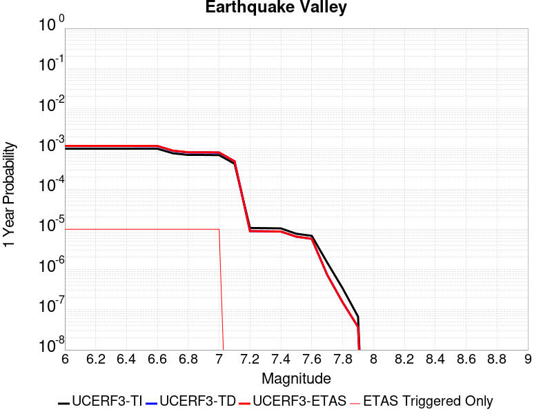 | 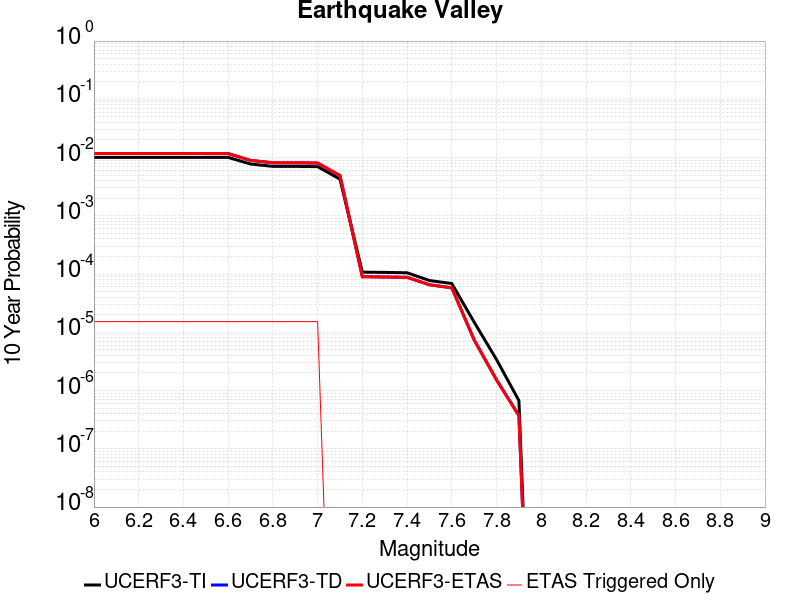 |

| Magnitude | 1 wk TI Prob | 1 wk TD Prob | 1 wk ETAS Prob | 1 wk ETAS/TD Gain | 1 wk ETAS Triggered Only | 1 mo TI Prob | 1 mo TD Prob | 1 mo ETAS Prob | 1 mo ETAS/TD Gain | 1 mo ETAS Triggered Only | 1 yr TI Prob | 1 yr TD Prob | 1 yr ETAS Prob | 1 yr ETAS/TD Gain | 1 yr ETAS Triggered Only | 10 yr TI Prob | 10 yr TD Prob | 10 yr ETAS Prob | 10 yr ETAS/TD Gain | 10 yr ETAS Triggered Only |
|-----|-----|-----|-----|-----|-----|-----|-----|-----|-----|-----|-----|-----|-----|-----|-----|-----|-----|-----|-----|-----|
| 6.0 | 1.9416384E-5 | 2.258408E-5 | 2.258408E-5 | 1.0 | 0.0 | 8.321042E-5 | 9.6785996E-5 | 9.6785996E-5 | 1.0 | 0.0 | 0.001012616 | 0.0011778527 | 0.0011930555 | 1.0129071 | 1.52207E-5 | 0.010080142 | 0.011727943 | 0.011742985 | 1.0012826 | 1.52207E-5 |
| 6.1 | 1.9416384E-5 | 2.258408E-5 | 2.258408E-5 | 1.0 | 0.0 | 8.321042E-5 | 9.6785996E-5 | 9.6785996E-5 | 1.0 | 0.0 | 0.001012616 | 0.0011778527 | 0.0011930555 | 1.0129071 | 1.52207E-5 | 0.010080142 | 0.011727943 | 0.011742985 | 1.0012826 | 1.52207E-5 |
| 6.2 | 1.9416384E-5 | 2.258408E-5 | 2.258408E-5 | 1.0 | 0.0 | 8.321042E-5 | 9.6785996E-5 | 9.6785996E-5 | 1.0 | 0.0 | 0.001012616 | 0.0011778527 | 0.0011930555 | 1.0129071 | 1.52207E-5 | 0.010080142 | 0.011727943 | 0.011742985 | 1.0012826 | 1.52207E-5 |
| 6.3 | 1.9416384E-5 | 2.258408E-5 | 2.258408E-5 | 1.0 | 0.0 | 8.321042E-5 | 9.6785996E-5 | 9.6785996E-5 | 1.0 | 0.0 | 0.001012616 | 0.0011778527 | 0.0011930555 | 1.0129071 | 1.52207E-5 | 0.010080142 | 0.011727943 | 0.011742985 | 1.0012826 | 1.52207E-5 |
| 6.4 | 1.9416384E-5 | 2.258408E-5 | 2.258408E-5 | 1.0 | 0.0 | 8.321042E-5 | 9.6785996E-5 | 9.6785996E-5 | 1.0 | 0.0 | 0.001012616 | 0.0011778527 | 0.0011930555 | 1.0129071 | 1.52207E-5 | 0.010080142 | 0.011727943 | 0.011742985 | 1.0012826 | 1.52207E-5 |
| 6.5 | 1.9389157E-5 | 2.255267E-5 | 2.255267E-5 | 1.0 | 0.0 | 8.309374E-5 | 9.665139E-5 | 9.665139E-5 | 1.0 | 0.0 | 0.0010111968 | 0.0011762156 | 0.0011914184 | 1.0129251 | 1.52207E-5 | 0.010066078 | 0.011711745 | 0.011726787 | 1.0012844 | 1.52207E-5 |
| 6.6 | 1.9389157E-5 | 2.255267E-5 | 2.255267E-5 | 1.0 | 0.0 | 8.309374E-5 | 9.665139E-5 | 9.665139E-5 | 1.0 | 0.0 | 0.0010111968 | 0.0011762156 | 0.0011914184 | 1.0129251 | 1.52207E-5 | 0.010066078 | 0.011711745 | 0.011726787 | 1.0012844 | 1.52207E-5 |
| 6.7 | 1.4925434E-5 | 1.7208227E-5 | 1.7208227E-5 | 1.0 | 0.0 | 6.396457E-5 | 7.374794E-5 | 7.374794E-5 | 1.0 | 0.0 | 7.7849044E-4 | 8.9759636E-4 | 9.128034E-4 | 1.0169419 | 1.52207E-5 | 0.007757689 | 0.008948085 | 0.0089631695 | 1.0016857 | 1.52207E-5 |
| 6.8 | 1.3570335E-5 | 1.5616843E-5 | 1.5616843E-5 | 1.0 | 0.0 | 5.8157282E-5 | 6.692807E-5 | 6.692807E-5 | 1.0 | 0.0 | 7.0783484E-4 | 8.1462675E-4 | 8.298351E-4 | 1.018669 | 1.52207E-5 | 0.0070558446 | 0.008124476 | 0.008139574 | 1.0018582 | 1.52207E-5 |
| 6.9 | 1.3570335E-5 | 1.5616843E-5 | 1.5616843E-5 | 1.0 | 0.0 | 5.8157282E-5 | 6.692807E-5 | 6.692807E-5 | 1.0 | 0.0 | 7.0783484E-4 | 8.1462675E-4 | 8.298351E-4 | 1.018669 | 1.52207E-5 | 0.0070558446 | 0.008124476 | 0.008139574 | 1.0018582 | 1.52207E-5 |
| 7.0 | 1.3433392E-5 | 1.5460388E-5 | 1.5460388E-5 | 1.0 | 0.0 | 5.757041E-5 | 6.6257584E-5 | 6.6257584E-5 | 1.0 | 0.0 | 7.0069433E-4 | 8.064695E-4 | 8.2167797E-4 | 1.0188581 | 1.52207E-5 | 0.006984891 | 0.008043497 | 0.008058595 | 1.0018771 | 1.52207E-5 |
| 7.1 | 8.181609E-6 | 9.416851E-6 | 9.416851E-6 | 1.0 | 0.0 | 3.5063567E-5 | 4.0357685E-5 | 4.0357685E-5 | 1.0 | 0.0 | 4.268153E-4 | 4.9131113E-4 | 4.9131113E-4 | 1.0 | 0.0 | 0.0042599645 | 0.0049088253 | 0.0049088253 | 1.0 | 0.0 |
| 7.2 | 2.0663983E-7 | 1.726294E-7 | 1.726294E-7 | 1.0 | 0.0 | 8.855989E-7 | 7.398401E-7 | 7.398401E-7 | 1.0 | 0.0 | 1.0782113E-5 | 9.00752E-6 | 9.00752E-6 | 1.0 | 0.0 | 1.07815904E-4 | 9.00719E-5 | 9.00719E-5 | 1.0 | 0.0 |
| 7.3 | 2.0462376E-7 | 1.7078433E-7 | 1.7078433E-7 | 1.0 | 0.0 | 8.7695867E-7 | 7.319327E-7 | 7.319327E-7 | 1.0 | 0.0 | 1.0676919E-5 | 8.911247E-6 | 8.911247E-6 | 1.0 | 0.0 | 1.0676406E-4 | 8.910926E-5 | 8.910926E-5 | 1.0 | 0.0 |
| 7.4 | 2.0171088E-7 | 1.6860913E-7 | 1.6860913E-7 | 1.0 | 0.0 | 8.644749E-7 | 7.2261037E-7 | 7.2261037E-7 | 1.0 | 0.0 | 1.0524931E-5 | 8.79775E-6 | 8.79775E-6 | 1.0 | 0.0 | 1.05244326E-4 | 8.7974375E-5 | 8.7974375E-5 | 1.0 | 0.0 |
| 7.5 | 1.4847944E-7 | 1.2559275E-7 | 1.2559275E-7 | 1.0 | 0.0 | 6.363403E-7 | 5.3825454E-7 | 5.3825454E-7 | 1.0 | 0.0 | 7.747416E-6 | 6.5532317E-6 | 6.5532317E-6 | 1.0 | 0.0 | 7.747146E-5 | 6.55306E-5 | 6.55306E-5 | 1.0 | 0.0 |
| 7.6 | 1.3185847E-7 | 1.1123213E-7 | 1.1123213E-7 | 1.0 | 0.0 | 5.6510765E-7 | 4.7670906E-7 | 4.7670906E-7 | 1.0 | 0.0 | 6.8801637E-6 | 5.8039195E-6 | 5.8039195E-6 | 1.0 | 0.0 | 6.8799505E-5 | 5.803789E-5 | 5.803789E-5 | 1.0 | 0.0 |
| 7.7 | 2.8609954E-8 | 1.4170958E-8 | 1.4170958E-8 | 1.0 | 0.0 | 1.2261408E-7 | 6.0732674E-8 | 6.0732674E-8 | 1.0 | 0.0 | 1.4928254E-6 | 7.394201E-7 | 7.394201E-7 | 1.0 | 0.0 | 1.4928154E-5 | 7.394182E-6 | 7.394182E-6 | 1.0 | 0.0 |
| 7.8 | 6.527266E-9 | 2.923417E-9 | 2.923417E-9 | 1.0 | 0.0 | 2.7973995E-8 | 1.2528931E-8 | 1.2528931E-8 | 1.0 | 0.0 | 3.4058334E-7 | 1.5253973E-7 | 1.5253973E-7 | 1.0 | 0.0 | 3.4058282E-6 | 1.5253964E-6 | 1.5253964E-6 | 1.0 | 0.0 |
| 7.9 | 1.2898267E-9 | 7.127684E-10 | 7.127684E-10 | 1.0 | 0.0 | 5.527829E-9 | 3.0547218E-9 | 3.0547218E-9 | 1.0 | 0.0 | 6.7301315E-8 | 3.719124E-8 | 3.719124E-8 | 1.0 | 0.0 | 6.7301295E-7 | 3.719124E-7 | 3.719124E-7 | 1.0 | 0.0 |

## Likely 2011 CFM
*[(top)](#table-of-contents)*

| 1 Week | 1 Month | 1 Year | 10 Year |
|-----|-----|-----|-----|
|  |  |  | 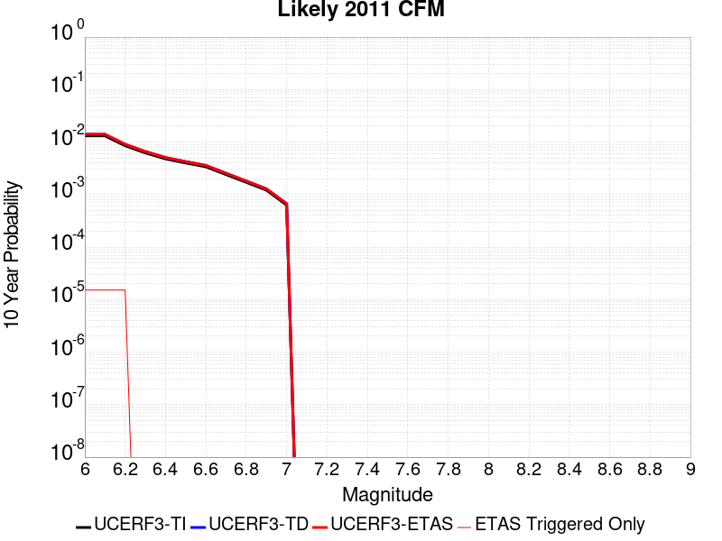 |

| Magnitude | 1 wk TI Prob | 1 wk TD Prob | 1 wk ETAS Prob | 1 wk ETAS/TD Gain | 1 wk ETAS Triggered Only | 1 mo TI Prob | 1 mo TD Prob | 1 mo ETAS Prob | 1 mo ETAS/TD Gain | 1 mo ETAS Triggered Only | 1 yr TI Prob | 1 yr TD Prob | 1 yr ETAS Prob | 1 yr ETAS/TD Gain | 1 yr ETAS Triggered Only | 10 yr TI Prob | 10 yr TD Prob | 10 yr ETAS Prob | 10 yr ETAS/TD Gain | 10 yr ETAS Triggered Only |
|-----|-----|-----|-----|-----|-----|-----|-----|-----|-----|-----|-----|-----|-----|-----|-----|-----|-----|-----|-----|-----|
| 6.0 | 2.5315949E-5 | 2.7104748E-5 | 2.7104748E-5 | 1.0 | 0.0 | 1.0849241E-4 | 1.16158284E-4 | 1.16158284E-4 | 1.0 | 0.0 | 0.0013200947 | 0.0014133542 | 0.0014133542 | 1.0 | 0.0 | 0.013122803 | 0.01404831 | 0.014063317 | 1.0010682 | 1.52207E-5 |
| 6.1 | 2.5315949E-5 | 2.7104748E-5 | 2.7104748E-5 | 1.0 | 0.0 | 1.0849241E-4 | 1.16158284E-4 | 1.16158284E-4 | 1.0 | 0.0 | 0.0013200947 | 0.0014133542 | 0.0014133542 | 1.0 | 0.0 | 0.013122803 | 0.01404831 | 0.014063317 | 1.0010682 | 1.52207E-5 |
| 6.2 | 1.6375941E-5 | 1.7465842E-5 | 1.7465842E-5 | 1.0 | 0.0 | 7.0180715E-5 | 7.485153E-5 | 7.485153E-5 | 1.0 | 0.0 | 8.5411523E-4 | 9.109487E-4 | 9.109487E-4 | 1.0 | 0.0 | 0.008508399 | 0.009073433 | 0.009088515 | 1.0016623 | 1.52207E-5 |
| 6.3 | 1.1945543E-5 | 1.2712587E-5 | 1.2712587E-5 | 1.0 | 0.0 | 5.119418E-5 | 5.4481407E-5 | 5.4481407E-5 | 1.0 | 0.0 | 6.2311086E-4 | 6.631146E-4 | 6.631146E-4 | 1.0 | 0.0 | 0.0062136655 | 0.0066119144 | 0.0066119144 | 1.0 | 0.0 |
| 6.4 | 9.192729E-6 | 9.768488E-6 | 9.768488E-6 | 1.0 | 0.0 | 3.939681E-5 | 4.1864292E-5 | 4.1864292E-5 | 1.0 | 0.0 | 4.7955062E-4 | 5.0958124E-4 | 5.0958124E-4 | 1.0 | 0.0 | 0.004785171 | 0.0050844094 | 0.0050844094 | 1.0 | 0.0 |
| 6.5 | 7.67906E-6 | 8.152622E-6 | 8.152622E-6 | 1.0 | 0.0 | 3.2909844E-5 | 3.4939352E-5 | 3.4939352E-5 | 1.0 | 0.0 | 4.006037E-4 | 4.2530545E-4 | 4.2530545E-4 | 1.0 | 0.0 | 0.0039988225 | 0.004245108 | 0.004245108 | 1.0 | 0.0 |
| 6.6 | 6.4884057E-6 | 6.8847507E-6 | 6.8847507E-6 | 1.0 | 0.0 | 2.7807157E-5 | 2.9505749E-5 | 2.9505749E-5 | 1.0 | 0.0 | 3.3849955E-4 | 3.591747E-4 | 3.591747E-4 | 1.0 | 0.0 | 0.003379844 | 0.0035860867 | 0.0035860867 | 1.0 | 0.0 |
| 6.7 | 4.6060636E-6 | 4.884041E-6 | 4.884041E-6 | 1.0 | 0.0 | 1.9740122E-5 | 2.0931442E-5 | 2.0931442E-5 | 1.0 | 0.0 | 2.403095E-4 | 2.5481134E-4 | 2.5481134E-4 | 1.0 | 0.0 | 0.002400498 | 0.0025452746 | 0.0025452746 | 1.0 | 0.0 |
| 6.8 | 3.2795615E-6 | 3.4773732E-6 | 3.4773732E-6 | 1.0 | 0.0 | 1.4055187E-5 | 1.4902946E-5 | 1.4902946E-5 | 1.0 | 0.0 | 1.7110848E-4 | 1.8142881E-4 | 1.8142881E-4 | 1.0 | 0.0 | 0.0017097679 | 0.0018128622 | 0.0018128622 | 1.0 | 0.0 |
| 6.9 | 2.3289967E-6 | 2.4705569E-6 | 2.4705569E-6 | 1.0 | 0.0 | 9.981376E-6 | 1.058806E-5 | 1.058806E-5 | 1.0 | 0.0 | 1.2151648E-4 | 1.2890245E-4 | 1.2890245E-4 | 1.0 | 0.0 | 0.0012145005 | 0.0012883197 | 0.0012883197 | 1.0 | 0.0 |
| 7.0 | 1.211292E-6 | 1.2863958E-6 | 1.2863958E-6 | 1.0 | 0.0 | 5.1912407E-6 | 5.5131145E-6 | 5.5131145E-6 | 1.0 | 0.0 | 6.320152E-5 | 6.712041E-5 | 6.712041E-5 | 1.0 | 0.0 | 6.3183554E-4 | 6.710312E-4 | 6.710312E-4 | 1.0 | 0.0 |

## Robinson Creek
*[(top)](#table-of-contents)*

| 1 Week | 1 Month | 1 Year | 10 Year |
|-----|-----|-----|-----|
|  | 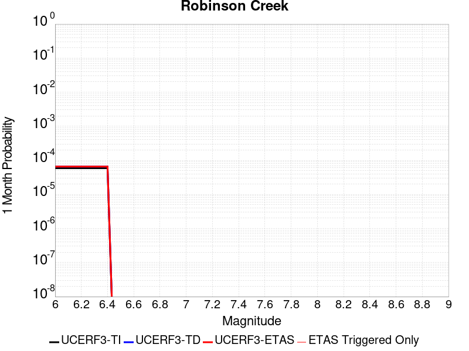 |  | 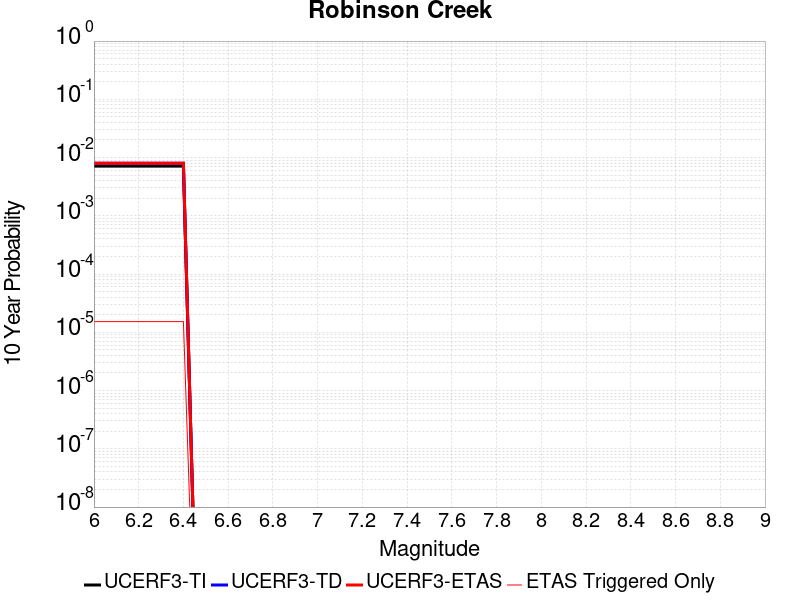 |

| Magnitude | 1 wk TI Prob | 1 wk TD Prob | 1 wk ETAS Prob | 1 wk ETAS/TD Gain | 1 wk ETAS Triggered Only | 1 mo TI Prob | 1 mo TD Prob | 1 mo ETAS Prob | 1 mo ETAS/TD Gain | 1 mo ETAS Triggered Only | 1 yr TI Prob | 1 yr TD Prob | 1 yr ETAS Prob | 1 yr ETAS/TD Gain | 1 yr ETAS Triggered Only | 10 yr TI Prob | 10 yr TD Prob | 10 yr ETAS Prob | 10 yr ETAS/TD Gain | 10 yr ETAS Triggered Only |
|-----|-----|-----|-----|-----|-----|-----|-----|-----|-----|-----|-----|-----|-----|-----|-----|-----|-----|-----|-----|-----|
| 6.0 | 1.3705327E-5 | 1.5285013E-5 | 1.5285013E-5 | 1.0 | 0.0 | 5.8735794E-5 | 6.55072E-5 | 6.55072E-5 | 1.0 | 0.0 | 7.1487366E-4 | 7.9755014E-4 | 7.9755014E-4 | 1.0 | 0.0 | 0.0071257832 | 0.007975501 | 0.007990601 | 1.0018932 | 1.52207E-5 |
| 6.1 | 1.3705327E-5 | 1.5285013E-5 | 1.5285013E-5 | 1.0 | 0.0 | 5.8735794E-5 | 6.55072E-5 | 6.55072E-5 | 1.0 | 0.0 | 7.1487366E-4 | 7.9755014E-4 | 7.9755014E-4 | 1.0 | 0.0 | 0.0071257832 | 0.007975501 | 0.007990601 | 1.0018932 | 1.52207E-5 |
| 6.2 | 1.3705327E-5 | 1.5285013E-5 | 1.5285013E-5 | 1.0 | 0.0 | 5.8735794E-5 | 6.55072E-5 | 6.55072E-5 | 1.0 | 0.0 | 7.1487366E-4 | 7.9755014E-4 | 7.9755014E-4 | 1.0 | 0.0 | 0.0071257832 | 0.007975501 | 0.007990601 | 1.0018932 | 1.52207E-5 |
| 6.3 | 1.3705327E-5 | 1.5285013E-5 | 1.5285013E-5 | 1.0 | 0.0 | 5.8735794E-5 | 6.55072E-5 | 6.55072E-5 | 1.0 | 0.0 | 7.1487366E-4 | 7.9755014E-4 | 7.9755014E-4 | 1.0 | 0.0 | 0.0071257832 | 0.007975501 | 0.007990601 | 1.0018932 | 1.52207E-5 |
| 6.4 | 1.3705327E-5 | 1.5285013E-5 | 1.5285013E-5 | 1.0 | 0.0 | 5.8735794E-5 | 6.55072E-5 | 6.55072E-5 | 1.0 | 0.0 | 7.1487366E-4 | 7.9755014E-4 | 7.9755014E-4 | 1.0 | 0.0 | 0.0071257832 | 0.007975501 | 0.007990601 | 1.0018932 | 1.52207E-5 |

## Newport-Inglewood alt 1
*[(top)](#table-of-contents)*

| 1 Week | 1 Month | 1 Year | 10 Year |
|-----|-----|-----|-----|
| 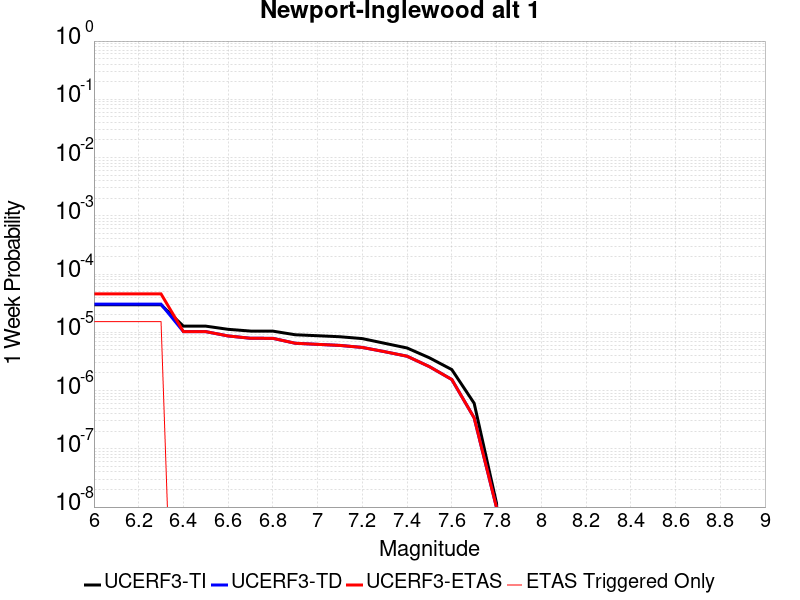 | 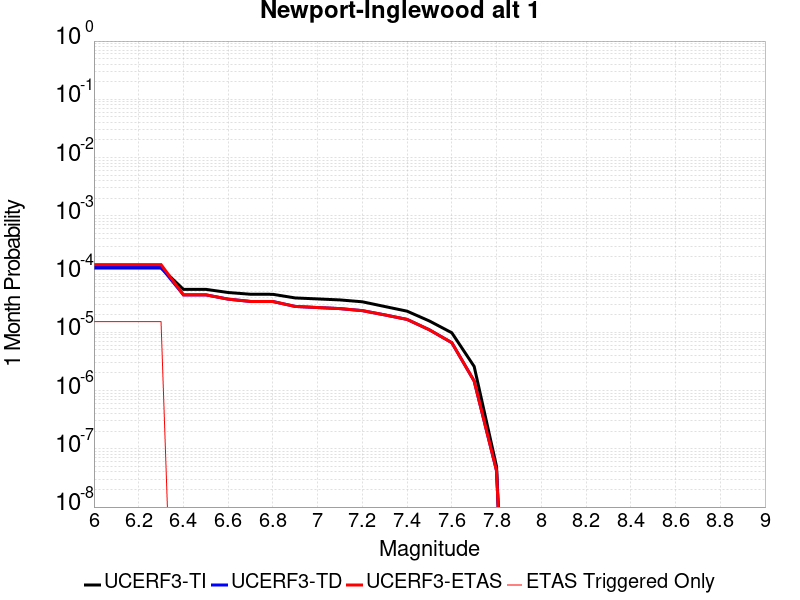 | 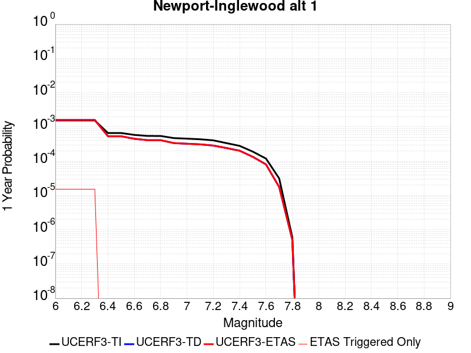 | 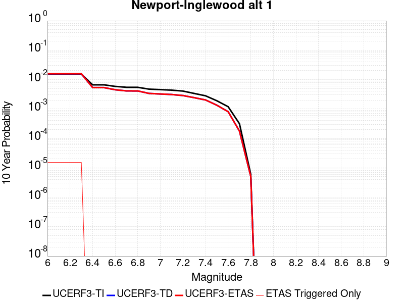 |

| Magnitude | 1 wk TI Prob | 1 wk TD Prob | 1 wk ETAS Prob | 1 wk ETAS/TD Gain | 1 wk ETAS Triggered Only | 1 mo TI Prob | 1 mo TD Prob | 1 mo ETAS Prob | 1 mo ETAS/TD Gain | 1 mo ETAS Triggered Only | 1 yr TI Prob | 1 yr TD Prob | 1 yr ETAS Prob | 1 yr ETAS/TD Gain | 1 yr ETAS Triggered Only | 10 yr TI Prob | 10 yr TD Prob | 10 yr ETAS Prob | 10 yr ETAS/TD Gain | 10 yr ETAS Triggered Only |
|-----|-----|-----|-----|-----|-----|-----|-----|-----|-----|-----|-----|-----|-----|-----|-----|-----|-----|-----|-----|-----|
| 6.0 | 2.9668912E-5 | 3.0404817E-5 | 4.5625053E-5 | 1.5005864 | 1.52207E-5 | 1.2714628E-4 | 1.303026E-4 | 1.455213E-4 | 1.1167952 | 1.52207E-5 | 0.0015469068 | 0.0015857625 | 0.0016009591 | 1.0095831 | 1.52207E-5 | 0.015361829 | 0.015792042 | 0.015807023 | 1.0009485 | 1.52207E-5 |
| 6.1 | 2.9668912E-5 | 3.0404817E-5 | 4.5625053E-5 | 1.5005864 | 1.52207E-5 | 1.2714628E-4 | 1.303026E-4 | 1.455213E-4 | 1.1167952 | 1.52207E-5 | 0.0015469068 | 0.0015857625 | 0.0016009591 | 1.0095831 | 1.52207E-5 | 0.015361829 | 0.015792042 | 0.015807023 | 1.0009485 | 1.52207E-5 |
| 6.2 | 2.9668912E-5 | 3.0404817E-5 | 4.5625053E-5 | 1.5005864 | 1.52207E-5 | 1.2714628E-4 | 1.303026E-4 | 1.455213E-4 | 1.1167952 | 1.52207E-5 | 0.0015469068 | 0.0015857625 | 0.0016009591 | 1.0095831 | 1.52207E-5 | 0.015361829 | 0.015792042 | 0.015807023 | 1.0009485 | 1.52207E-5 |
| 6.3 | 2.9668912E-5 | 3.0404817E-5 | 4.5625053E-5 | 1.5005864 | 1.52207E-5 | 1.2714628E-4 | 1.303026E-4 | 1.455213E-4 | 1.1167952 | 1.52207E-5 | 0.0015469068 | 0.0015857625 | 0.0016009591 | 1.0095831 | 1.52207E-5 | 0.015361829 | 0.015792042 | 0.015807023 | 1.0009485 | 1.52207E-5 |
| 6.4 | 1.275942E-5 | 1.0272503E-5 | 1.0272503E-5 | 1.0 | 0.0 | 5.4682085E-5 | 4.402429E-5 | 4.402429E-5 | 1.0 | 0.0 | 6.65551E-4 | 5.358681E-4 | 5.358681E-4 | 1.0 | 0.0 | 0.0066356123 | 0.005346184 | 0.005346184 | 1.0 | 0.0 |
| 6.5 | 1.275942E-5 | 1.0272503E-5 | 1.0272503E-5 | 1.0 | 0.0 | 5.4682085E-5 | 4.402429E-5 | 4.402429E-5 | 1.0 | 0.0 | 6.65551E-4 | 5.358681E-4 | 5.358681E-4 | 1.0 | 0.0 | 0.0066356123 | 0.005346184 | 0.005346184 | 1.0 | 0.0 |
| 6.6 | 1.1255358E-5 | 8.661884E-6 | 8.661884E-6 | 1.0 | 0.0 | 4.8236358E-5 | 3.712184E-5 | 3.712184E-5 | 1.0 | 0.0 | 5.871194E-4 | 4.518664E-4 | 4.518664E-4 | 1.0 | 0.0 | 0.005855706 | 0.004509653 | 0.004509653 | 1.0 | 0.0 |
| 6.7 | 1.0504745E-5 | 7.8997955E-6 | 7.8997955E-6 | 1.0 | 0.0 | 4.5019555E-5 | 3.3855835E-5 | 3.3855835E-5 | 1.0 | 0.0 | 5.4797524E-4 | 4.1211807E-4 | 4.1211807E-4 | 1.0 | 0.0 | 0.0054662596 | 0.004113668 | 0.004113668 | 1.0 | 0.0 |
| 6.8 | 1.0476007E-5 | 7.881176E-6 | 7.881176E-6 | 1.0 | 0.0 | 4.4896402E-5 | 3.3776043E-5 | 3.3776043E-5 | 1.0 | 0.0 | 5.464766E-4 | 4.1114696E-4 | 4.1114696E-4 | 1.0 | 0.0 | 0.005451347 | 0.0041039926 | 0.0041039926 | 1.0 | 0.0 |
| 6.9 | 9.076797E-6 | 6.4896312E-6 | 6.4896312E-6 | 1.0 | 0.0 | 3.889998E-5 | 2.781241E-5 | 2.781241E-5 | 1.0 | 0.0 | 4.7350433E-4 | 3.385638E-4 | 3.385638E-4 | 1.0 | 0.0 | 0.004724967 | 0.0033805177 | 0.0033805177 | 1.0 | 0.0 |
| 7.0 | 8.73795E-6 | 6.2120125E-6 | 6.2120125E-6 | 1.0 | 0.0 | 3.7447822E-5 | 2.6622642E-5 | 2.6622642E-5 | 1.0 | 0.0 | 4.5583185E-4 | 3.2408274E-4 | 3.2408274E-4 | 1.0 | 0.0 | 0.0045489795 | 0.0032361327 | 0.0032361327 | 1.0 | 0.0 |
| 7.1 | 8.391299E-6 | 5.95579E-6 | 5.95579E-6 | 1.0 | 0.0 | 3.5962214E-5 | 2.5524565E-5 | 2.5524565E-5 | 1.0 | 0.0 | 4.37752E-4 | 3.1071753E-4 | 3.1071753E-4 | 1.0 | 0.0 | 0.004368907 | 0.0031028606 | 0.0031028606 | 1.0 | 0.0 |
| 7.2 | 7.796882E-6 | 5.4965344E-6 | 5.4965344E-6 | 1.0 | 0.0 | 3.341478E-5 | 2.3556364E-5 | 2.3556364E-5 | 1.0 | 0.0 | 4.06749E-4 | 2.867612E-4 | 2.867612E-4 | 1.0 | 0.0 | 0.0040600533 | 0.0028639357 | 0.0028639357 | 1.0 | 0.0 |
| 7.3 | 6.4738833E-6 | 4.6478162E-6 | 4.6478162E-6 | 1.0 | 0.0 | 2.774492E-5 | 1.9919062E-5 | 1.9919062E-5 | 1.0 | 0.0 | 3.3774204E-4 | 2.4248775E-4 | 2.4248775E-4 | 1.0 | 0.0 | 0.0033722918 | 0.0024222482 | 0.0024222482 | 1.0 | 0.0 |
| 7.4 | 5.382145E-6 | 3.8857597E-6 | 3.8857597E-6 | 1.0 | 0.0 | 2.3066134E-5 | 1.665315E-5 | 1.665315E-5 | 1.0 | 0.0 | 2.8079396E-4 | 2.0273338E-4 | 2.0273338E-4 | 1.0 | 0.0 | 0.0028043943 | 0.0020254988 | 0.0020254988 | 1.0 | 0.0 |
| 7.5 | 3.648244E-6 | 2.5737843E-6 | 2.5737843E-6 | 1.0 | 0.0 | 1.5635238E-5 | 1.1030458E-5 | 1.1030458E-5 | 1.0 | 0.0 | 1.9034238E-4 | 1.3428765E-4 | 1.3428765E-4 | 1.0 | 0.0 | 0.0019017943 | 0.0013420755 | 0.0013420755 | 1.0 | 0.0 |
| 7.6 | 2.2906888E-6 | 1.5479842E-6 | 1.5479842E-6 | 1.0 | 0.0 | 9.817201E-6 | 6.634202E-6 | 6.634202E-6 | 1.0 | 0.0 | 1.1951787E-4 | 8.076848E-5 | 8.076848E-5 | 1.0 | 0.0 | 0.0011945361 | 8.07398E-4 | 8.07398E-4 | 1.0 | 0.0 |
| 7.7 | 6.0479874E-7 | 3.397512E-7 | 3.397512E-7 | 1.0 | 0.0 | 2.5919921E-6 | 1.4560758E-6 | 1.4560758E-6 | 1.0 | 0.0 | 3.1557047E-5 | 1.7727592E-5 | 1.7727592E-5 | 1.0 | 0.0 | 3.1552566E-4 | 1.7726317E-4 | 1.7726317E-4 | 1.0 | 0.0 |
| 7.8 | 1.16056995E-8 | 9.782373E-9 | 9.782373E-9 | 1.0 | 0.0 | 4.9738713E-8 | 4.1924455E-8 | 4.1924455E-8 | 1.0 | 0.0 | 6.0556863E-7 | 5.1043025E-7 | 5.1043025E-7 | 1.0 | 0.0 | 6.05567E-6 | 5.1043025E-6 | 5.1043025E-6 | 1.0 | 0.0 |

## North Salt Lake
*[(top)](#table-of-contents)*

| 1 Week | 1 Month | 1 Year | 10 Year |
|-----|-----|-----|-----|
| 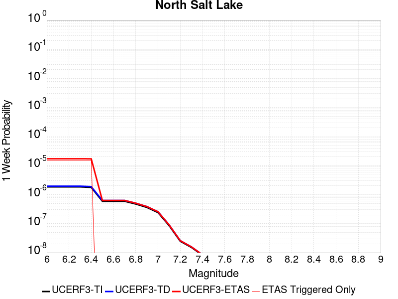 | 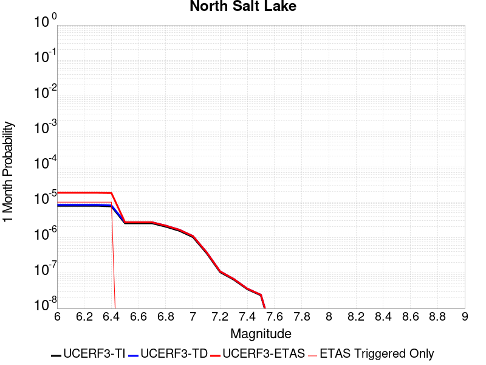 | 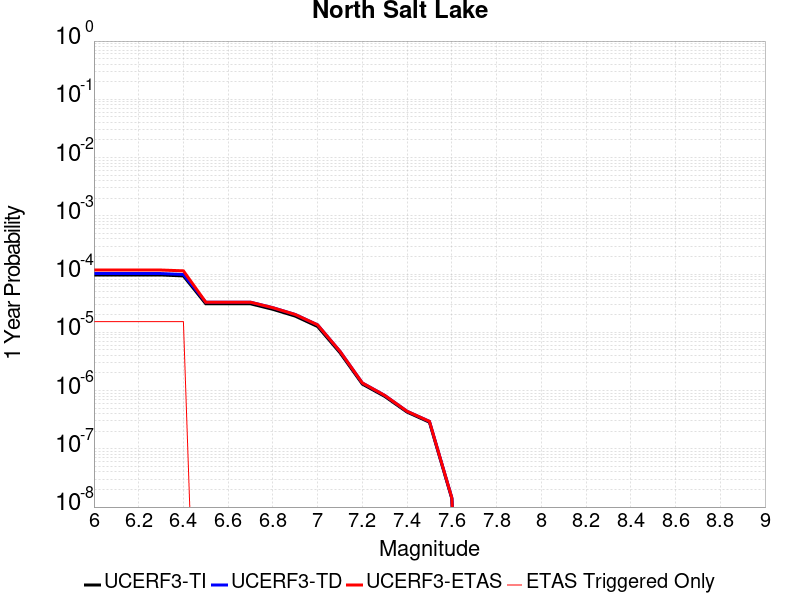 | 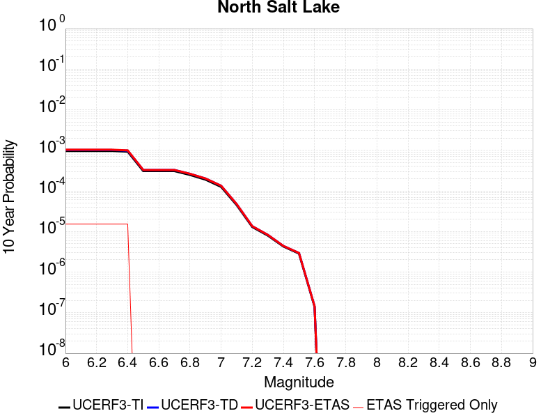 |

| Magnitude | 1 wk TI Prob | 1 wk TD Prob | 1 wk ETAS Prob | 1 wk ETAS/TD Gain | 1 wk ETAS Triggered Only | 1 mo TI Prob | 1 mo TD Prob | 1 mo ETAS Prob | 1 mo ETAS/TD Gain | 1 mo ETAS Triggered Only | 1 yr TI Prob | 1 yr TD Prob | 1 yr ETAS Prob | 1 yr ETAS/TD Gain | 1 yr ETAS Triggered Only | 10 yr TI Prob | 10 yr TD Prob | 10 yr ETAS Prob | 10 yr ETAS/TD Gain | 10 yr ETAS Triggered Only |
|-----|-----|-----|-----|-----|-----|-----|-----|-----|-----|-----|-----|-----|-----|-----|-----|-----|-----|-----|-----|-----|
| 6.0 | 1.849599E-6 | 1.955571E-6 | 1.7176242E-5 | 8.7832365 | 1.52207E-5 | 7.926829E-6 | 8.381003E-6 | 2.3601575E-5 | 2.81608 | 1.52207E-5 | 9.650487E-5 | 1.0203594E-4 | 1.1725509E-4 | 1.1491548 | 1.52207E-5 | 9.646297E-4 | 0.0010200888 | 0.0010352939 | 1.0149057 | 1.52207E-5 |
| 6.1 | 1.849599E-6 | 1.955571E-6 | 1.7176242E-5 | 8.7832365 | 1.52207E-5 | 7.926829E-6 | 8.381003E-6 | 2.3601575E-5 | 2.81608 | 1.52207E-5 | 9.650487E-5 | 1.0203594E-4 | 1.1725509E-4 | 1.1491548 | 1.52207E-5 | 9.646297E-4 | 0.0010200888 | 0.0010352939 | 1.0149057 | 1.52207E-5 |
| 6.2 | 1.849599E-6 | 1.955571E-6 | 1.7176242E-5 | 8.7832365 | 1.52207E-5 | 7.926829E-6 | 8.381003E-6 | 2.3601575E-5 | 2.81608 | 1.52207E-5 | 9.650487E-5 | 1.0203594E-4 | 1.1725509E-4 | 1.1491548 | 1.52207E-5 | 9.646297E-4 | 0.0010200888 | 0.0010352939 | 1.0149057 | 1.52207E-5 |
| 6.3 | 1.849599E-6 | 1.955571E-6 | 1.7176242E-5 | 8.7832365 | 1.52207E-5 | 7.926829E-6 | 8.381003E-6 | 2.3601575E-5 | 2.81608 | 1.52207E-5 | 9.650487E-5 | 1.0203594E-4 | 1.1725509E-4 | 1.1491548 | 1.52207E-5 | 9.646297E-4 | 0.0010200888 | 0.0010352939 | 1.0149057 | 1.52207E-5 |
| 6.4 | 1.7803909E-6 | 1.8860707E-6 | 1.7106742E-5 | 9.070043 | 1.52207E-5 | 7.630225E-6 | 8.083147E-6 | 2.3303724E-5 | 2.8830016 | 1.52207E-5 | 9.289402E-5 | 9.840987E-5 | 1.13629074E-4 | 1.1546512 | 1.52207E-5 | 9.28552E-4 | 9.838602E-4 | 9.990659E-4 | 1.0154551 | 1.52207E-5 |
| 6.5 | 5.9157696E-7 | 6.3001835E-7 | 6.3001835E-7 | 1.0 | 0.0 | 2.5353274E-6 | 2.7000763E-6 | 2.7000763E-6 | 1.0 | 0.0 | 3.0867173E-5 | 3.2872973E-5 | 3.2872973E-5 | 1.0 | 0.0 | 3.0862886E-4 | 3.28685E-4 | 3.28685E-4 | 1.0 | 0.0 |
| 6.6 | 5.9157696E-7 | 6.3001835E-7 | 6.3001835E-7 | 1.0 | 0.0 | 2.5353274E-6 | 2.7000763E-6 | 2.7000763E-6 | 1.0 | 0.0 | 3.0867173E-5 | 3.2872973E-5 | 3.2872973E-5 | 1.0 | 0.0 | 3.0862886E-4 | 3.28685E-4 | 3.28685E-4 | 1.0 | 0.0 |
| 6.7 | 5.9157696E-7 | 6.3001835E-7 | 6.3001835E-7 | 1.0 | 0.0 | 2.5353274E-6 | 2.7000763E-6 | 2.7000763E-6 | 1.0 | 0.0 | 3.0867173E-5 | 3.2872973E-5 | 3.2872973E-5 | 1.0 | 0.0 | 3.0862886E-4 | 3.28685E-4 | 3.28685E-4 | 1.0 | 0.0 |
| 6.8 | 4.7536267E-7 | 5.066019E-7 | 5.066019E-7 | 1.0 | 0.0 | 2.037267E-6 | 2.1711494E-6 | 2.1711494E-6 | 1.0 | 0.0 | 2.4803443E-5 | 2.6433447E-5 | 2.6433447E-5 | 1.0 | 0.0 | 2.4800675E-4 | 2.6430548E-4 | 2.6430548E-4 | 1.0 | 0.0 |
| 6.9 | 3.6345344E-7 | 3.8750048E-7 | 3.8750048E-7 | 1.0 | 0.0 | 1.5576567E-6 | 1.6607154E-6 | 1.6607154E-6 | 1.0 | 0.0 | 1.8964305E-5 | 2.021904E-5 | 2.021904E-5 | 1.0 | 0.0 | 1.8962687E-4 | 2.021737E-4 | 2.021737E-4 | 1.0 | 0.0 |
| 7.0 | 2.4087325E-7 | 2.5709335E-7 | 2.5709335E-7 | 1.0 | 0.0 | 1.0323135E-6 | 1.1018283E-6 | 1.1018283E-6 | 1.0 | 0.0 | 1.25683455E-5 | 1.3414689E-5 | 1.3414689E-5 | 1.0 | 0.0 | 1.2567634E-4 | 1.3414006E-4 | 1.3414006E-4 | 1.0 | 0.0 |
| 7.1 | 8.551555E-8 | 9.044477E-8 | 9.044477E-8 | 1.0 | 0.0 | 3.6649516E-7 | 3.876204E-7 | 3.876204E-7 | 1.0 | 0.0 | 4.4620692E-6 | 4.7192693E-6 | 4.7192693E-6 | 1.0 | 0.0 | 4.46198E-5 | 4.719181E-5 | 4.719181E-5 | 1.0 | 0.0 |
| 7.2 | 2.475279E-8 | 2.5893172E-8 | 2.5893172E-8 | 1.0 | 0.0 | 1.0608338E-7 | 1.1097074E-7 | 1.1097074E-7 | 1.0 | 0.0 | 1.2915643E-6 | 1.3510679E-6 | 1.3510679E-6 | 1.0 | 0.0 | 1.2915569E-5 | 1.3510604E-5 | 1.3510604E-5 | 1.0 | 0.0 |
| 7.3 | 1.5212393E-8 | 1.5847489E-8 | 1.5847489E-8 | 1.0 | 0.0 | 6.519597E-8 | 6.791781E-8 | 6.791781E-8 | 1.0 | 0.0 | 7.9376065E-7 | 8.2689905E-7 | 8.2689905E-7 | 1.0 | 0.0 | 7.937579E-6 | 8.268963E-6 | 8.268963E-6 | 1.0 | 0.0 |
| 7.4 | 8.182E-9 | 8.447294E-9 | 8.447294E-9 | 1.0 | 0.0 | 3.5065714E-8 | 3.620269E-8 | 3.620269E-8 | 1.0 | 0.0 | 4.26925E-7 | 4.4076765E-7 | 4.4076765E-7 | 1.0 | 0.0 | 4.269242E-6 | 4.4076683E-6 | 4.4076683E-6 | 1.0 | 0.0 |
| 7.5 | 5.479913E-9 | 5.6680434E-9 | 5.6680434E-9 | 1.0 | 0.0 | 2.3485342E-8 | 2.4291614E-8 | 2.4291614E-8 | 1.0 | 0.0 | 2.85934E-7 | 2.9575037E-7 | 2.9575037E-7 | 1.0 | 0.0 | 2.8593363E-6 | 2.9575E-6 | 2.9575E-6 | 1.0 | 0.0 |
| 7.6 | 2.6813562E-10 | 2.773195E-10 | 2.773195E-10 | 1.0 | 0.0 | 1.1491527E-9 | 1.1885122E-9 | 1.1885122E-9 | 1.0 | 0.0 | 1.3990933E-8 | 1.4470135E-8 | 1.4470135E-8 | 1.0 | 0.0 | 1.3990932E-7 | 1.4470135E-7 | 1.4470135E-7 | 1.0 | 0.0 |

## Sierra Madre (San Fernando)
*[(top)](#table-of-contents)*

| 1 Week | 1 Month | 1 Year | 10 Year |
|-----|-----|-----|-----|
| 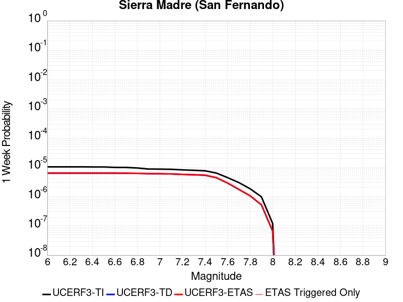 | 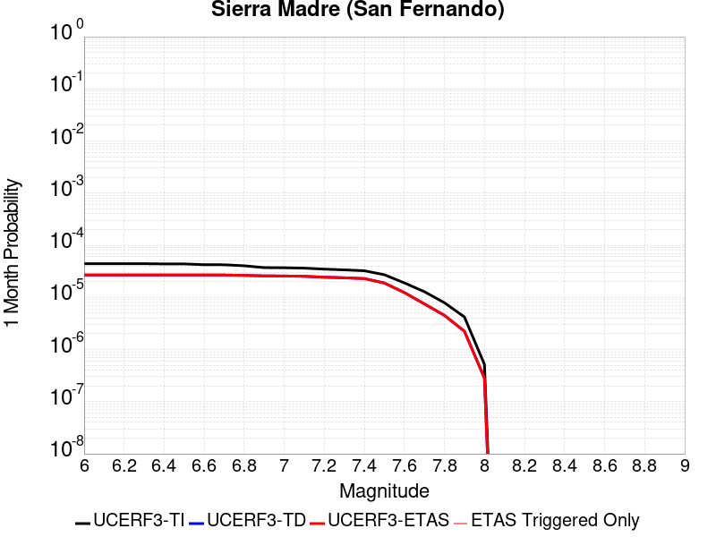 | 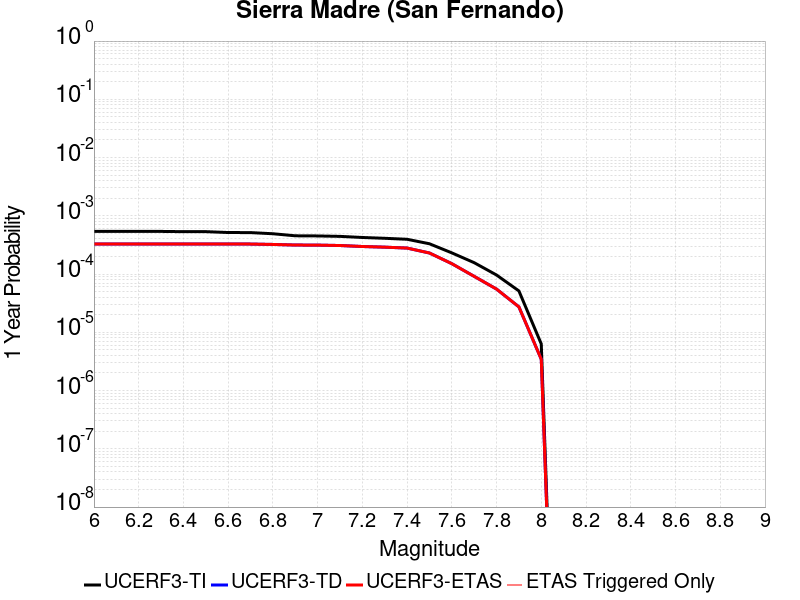 | 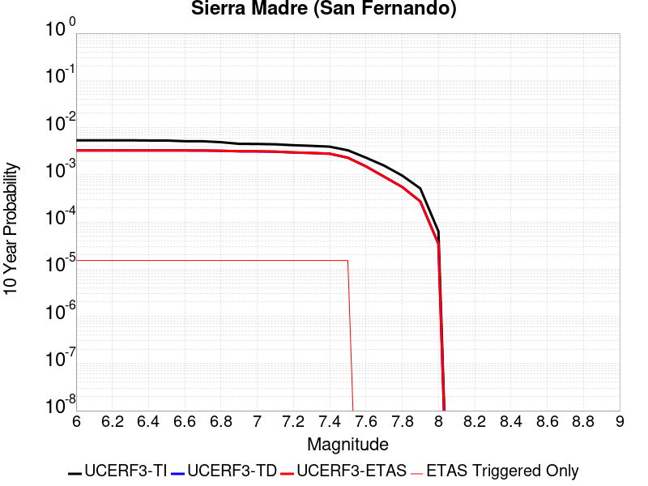 |

| Magnitude | 1 wk TI Prob | 1 wk TD Prob | 1 wk ETAS Prob | 1 wk ETAS/TD Gain | 1 wk ETAS Triggered Only | 1 mo TI Prob | 1 mo TD Prob | 1 mo ETAS Prob | 1 mo ETAS/TD Gain | 1 mo ETAS Triggered Only | 1 yr TI Prob | 1 yr TD Prob | 1 yr ETAS Prob | 1 yr ETAS/TD Gain | 1 yr ETAS Triggered Only | 10 yr TI Prob | 10 yr TD Prob | 10 yr ETAS Prob | 10 yr ETAS/TD Gain | 10 yr ETAS Triggered Only |
|-----|-----|-----|-----|-----|-----|-----|-----|-----|-----|-----|-----|-----|-----|-----|-----|-----|-----|-----|-----|-----|
| 6.0 | 1.0346413E-5 | 6.2872605E-6 | 6.2872605E-6 | 1.0 | 0.0 | 4.4341014E-5 | 2.694513E-5 | 2.694513E-5 | 1.0 | 0.0 | 5.3971814E-4 | 3.280087E-4 | 3.280087E-4 | 1.0 | 0.0 | 0.0053840918 | 0.0032753581 | 0.003290529 | 1.0046318 | 1.52207E-5 |
| 6.1 | 1.0346413E-5 | 6.2872605E-6 | 6.2872605E-6 | 1.0 | 0.0 | 4.4341014E-5 | 2.694513E-5 | 2.694513E-5 | 1.0 | 0.0 | 5.3971814E-4 | 3.280087E-4 | 3.280087E-4 | 1.0 | 0.0 | 0.0053840918 | 0.0032753581 | 0.003290529 | 1.0046318 | 1.52207E-5 |
| 6.2 | 1.0346413E-5 | 6.2872605E-6 | 6.2872605E-6 | 1.0 | 0.0 | 4.4341014E-5 | 2.694513E-5 | 2.694513E-5 | 1.0 | 0.0 | 5.3971814E-4 | 3.280087E-4 | 3.280087E-4 | 1.0 | 0.0 | 0.0053840918 | 0.0032753581 | 0.003290529 | 1.0046318 | 1.52207E-5 |
| 6.3 | 1.0346413E-5 | 6.2872605E-6 | 6.2872605E-6 | 1.0 | 0.0 | 4.4341014E-5 | 2.694513E-5 | 2.694513E-5 | 1.0 | 0.0 | 5.3971814E-4 | 3.280087E-4 | 3.280087E-4 | 1.0 | 0.0 | 0.0053840918 | 0.0032753581 | 0.003290529 | 1.0046318 | 1.52207E-5 |
| 6.4 | 1.0249558E-5 | 6.2872605E-6 | 6.2872605E-6 | 1.0 | 0.0 | 4.392594E-5 | 2.694513E-5 | 2.694513E-5 | 1.0 | 0.0 | 5.3466705E-4 | 3.280087E-4 | 3.280087E-4 | 1.0 | 0.0 | 0.0053338245 | 0.0032753581 | 0.003290529 | 1.0046318 | 1.52207E-5 |
| 6.5 | 1.0249558E-5 | 6.2872605E-6 | 6.2872605E-6 | 1.0 | 0.0 | 4.392594E-5 | 2.694513E-5 | 2.694513E-5 | 1.0 | 0.0 | 5.3466705E-4 | 3.280087E-4 | 3.280087E-4 | 1.0 | 0.0 | 0.0053338245 | 0.0032753581 | 0.003290529 | 1.0046318 | 1.52207E-5 |
| 6.6 | 9.9035515E-6 | 6.2872605E-6 | 6.2872605E-6 | 1.0 | 0.0 | 4.2443102E-5 | 2.694513E-5 | 2.694513E-5 | 1.0 | 0.0 | 5.166222E-4 | 3.280087E-4 | 3.280087E-4 | 1.0 | 0.0 | 0.0051542283 | 0.0032753581 | 0.003290529 | 1.0046318 | 1.52207E-5 |
| 6.7 | 9.87217E-6 | 6.2746817E-6 | 6.2746817E-6 | 1.0 | 0.0 | 4.2308613E-5 | 2.689122E-5 | 2.689122E-5 | 1.0 | 0.0 | 5.149856E-4 | 3.2735255E-4 | 3.2735255E-4 | 1.0 | 0.0 | 0.005137938 | 0.0032688158 | 0.0032839868 | 1.004641 | 1.52207E-5 |
| 6.8 | 9.4359175E-6 | 6.1786586E-6 | 6.1786586E-6 | 1.0 | 0.0 | 4.043902E-5 | 2.6479704E-5 | 2.6479704E-5 | 1.0 | 0.0 | 4.9223384E-4 | 3.2234378E-4 | 3.2234378E-4 | 1.0 | 0.0 | 0.0049114493 | 0.0032188739 | 0.0032340456 | 1.0047134 | 1.52207E-5 |
| 6.9 | 8.700447E-6 | 6.039922E-6 | 6.039922E-6 | 1.0 | 0.0 | 3.72871E-5 | 2.5885129E-5 | 2.5885129E-5 | 1.0 | 0.0 | 4.5387587E-4 | 3.1510694E-4 | 3.1510694E-4 | 1.0 | 0.0 | 0.0045295 | 0.003146711 | 0.0031618837 | 1.0048218 | 1.52207E-5 |
| 7.0 | 8.648878E-6 | 6.0148373E-6 | 6.0148373E-6 | 1.0 | 0.0 | 3.7066096E-5 | 2.5777625E-5 | 2.5777625E-5 | 1.0 | 0.0 | 4.5118626E-4 | 3.1379846E-4 | 3.1379846E-4 | 1.0 | 0.0 | 0.004502713 | 0.003133663 | 0.003148836 | 1.0048419 | 1.52207E-5 |
| 7.1 | 8.505786E-6 | 5.9244676E-6 | 5.9244676E-6 | 1.0 | 0.0 | 3.645286E-5 | 2.5390334E-5 | 2.5390334E-5 | 1.0 | 0.0 | 4.437232E-4 | 3.0908454E-4 | 3.0908454E-4 | 1.0 | 0.0 | 0.0044283825 | 0.0030866556 | 0.0031018294 | 1.004916 | 1.52207E-5 |
| 7.2 | 8.139752E-6 | 5.6987624E-6 | 5.6987624E-6 | 1.0 | 0.0 | 3.4884186E-5 | 2.4423045E-5 | 2.4423045E-5 | 1.0 | 0.0 | 4.246322E-4 | 2.9731105E-4 | 2.9731105E-4 | 1.0 | 0.0 | 0.004238217 | 0.0029692391 | 0.0029844146 | 1.0051109 | 1.52207E-5 |
| 7.3 | 7.8816E-6 | 5.552077E-6 | 5.552077E-6 | 1.0 | 0.0 | 3.3777847E-5 | 2.3794404E-5 | 2.3794404E-5 | 1.0 | 0.0 | 4.111677E-4 | 2.896594E-4 | 2.896594E-4 | 1.0 | 0.0 | 0.004104078 | 0.0028929242 | 0.0029081008 | 1.0052462 | 1.52207E-5 |
| 7.4 | 7.5810603E-6 | 5.3563126E-6 | 5.3563126E-6 | 1.0 | 0.0 | 3.2489854E-5 | 2.2955428E-5 | 2.2955428E-5 | 1.0 | 0.0 | 3.9549218E-4 | 2.7944756E-4 | 2.7944756E-4 | 1.0 | 0.0 | 0.0039478904 | 0.0027910667 | 0.002806245 | 1.0054381 | 1.52207E-5 |
| 7.5 | 6.349153E-6 | 4.407576E-6 | 4.407576E-6 | 1.0 | 0.0 | 2.7210372E-5 | 1.888948E-5 | 1.888948E-5 | 1.0 | 0.0 | 3.312359E-4 | 2.2995596E-4 | 2.2995596E-4 | 1.0 | 0.0 | 0.0033074263 | 0.0022972622 | 0.0023124479 | 1.0066104 | 1.52207E-5 |
| 7.6 | 4.430576E-6 | 2.8905868E-6 | 2.8905868E-6 | 1.0 | 0.0 | 1.8988047E-5 | 1.2388171E-5 | 1.2388171E-5 | 1.0 | 0.0 | 2.3115493E-4 | 1.5081577E-4 | 1.5081577E-4 | 1.0 | 0.0 | 0.0023091463 | 0.0015071568 | 0.0015071568 | 1.0 | 0.0 |
| 7.7 | 3.005066E-6 | 1.7510115E-6 | 1.7510115E-6 | 1.0 | 0.0 | 1.2878791E-5 | 7.504313E-6 | 7.504313E-6 | 1.0 | 0.0 | 1.56788E-4 | 9.1361195E-5 | 9.1361195E-5 | 1.0 | 0.0 | 0.0015667742 | 9.132375E-4 | 9.132375E-4 | 1.0 | 0.0 |
| 7.8 | 1.8459098E-6 | 1.0582091E-6 | 1.0582091E-6 | 1.0 | 0.0 | 7.911018E-6 | 4.535174E-6 | 4.535174E-6 | 1.0 | 0.0 | 9.631238E-5 | 5.5214347E-5 | 5.5214347E-5 | 1.0 | 0.0 | 9.627065E-4 | 5.5200676E-4 | 5.5200676E-4 | 1.0 | 0.0 |
| 7.9 | 9.839262E-7 | 5.23421E-7 | 5.23421E-7 | 1.0 | 0.0 | 4.2168194E-6 | 2.2432312E-6 | 2.2432312E-6 | 1.0 | 0.0 | 5.1338568E-5 | 2.7310998E-5 | 2.7310998E-5 | 1.0 | 0.0 | 5.132671E-4 | 2.730767E-4 | 2.730767E-4 | 1.0 | 0.0 |
| 8.0 | 1.210983E-7 | 6.613821E-8 | 6.613821E-8 | 1.0 | 0.0 | 5.1899264E-7 | 2.8344945E-7 | 2.8344945E-7 | 1.0 | 0.0 | 6.3187167E-6 | 3.4509917E-6 | 3.4509917E-6 | 1.0 | 0.0 | 6.318537E-5 | 3.45094E-5 | 3.45094E-5 | 1.0 | 0.0 |

## Holser alt 1
*[(top)](#table-of-contents)*

| 1 Week | 1 Month | 1 Year | 10 Year |
|-----|-----|-----|-----|
|  | 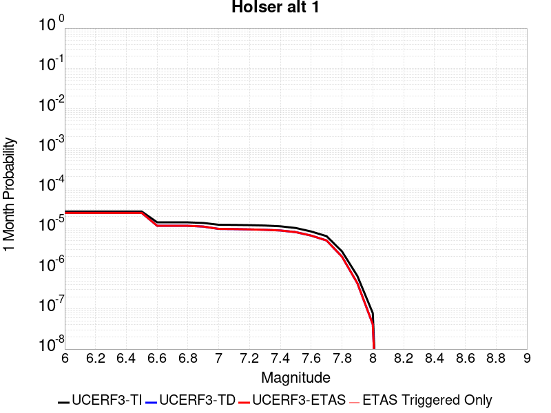 | 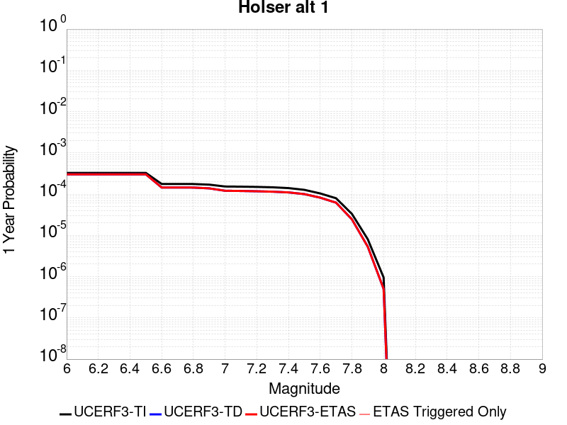 | 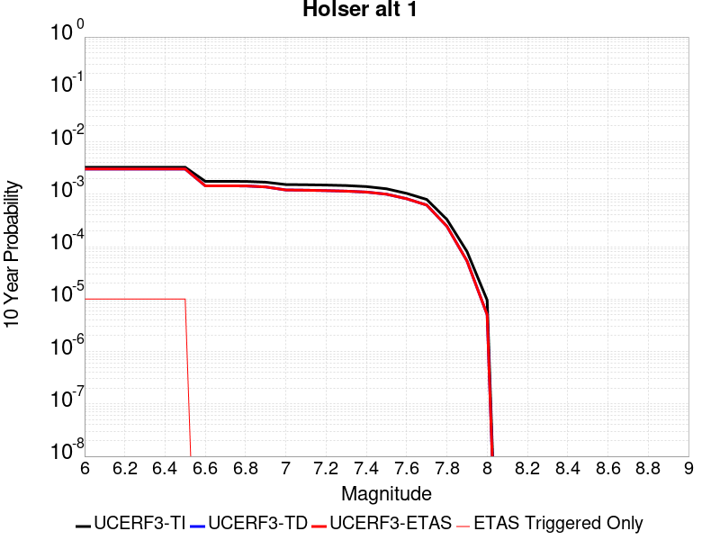 |

| Magnitude | 1 wk TI Prob | 1 wk TD Prob | 1 wk ETAS Prob | 1 wk ETAS/TD Gain | 1 wk ETAS Triggered Only | 1 mo TI Prob | 1 mo TD Prob | 1 mo ETAS Prob | 1 mo ETAS/TD Gain | 1 mo ETAS Triggered Only | 1 yr TI Prob | 1 yr TD Prob | 1 yr ETAS Prob | 1 yr ETAS/TD Gain | 1 yr ETAS Triggered Only | 10 yr TI Prob | 10 yr TD Prob | 10 yr ETAS Prob | 10 yr ETAS/TD Gain | 10 yr ETAS Triggered Only |
|-----|-----|-----|-----|-----|-----|-----|-----|-----|-----|-----|-----|-----|-----|-----|-----|-----|-----|-----|-----|-----|
| 6.0 | 6.2746653E-6 | 5.789965E-6 | 5.789965E-6 | 1.0 | 0.0 | 2.6891146E-5 | 2.4813964E-5 | 2.4813964E-5 | 1.0 | 0.0 | 3.273505E-4 | 3.020797E-4 | 3.020797E-4 | 1.0 | 0.0 | 0.0032686873 | 0.0030178234 | 0.0030329982 | 1.0050284 | 1.52207E-5 |
| 6.1 | 6.2746653E-6 | 5.789965E-6 | 5.789965E-6 | 1.0 | 0.0 | 2.6891146E-5 | 2.4813964E-5 | 2.4813964E-5 | 1.0 | 0.0 | 3.273505E-4 | 3.020797E-4 | 3.020797E-4 | 1.0 | 0.0 | 0.0032686873 | 0.0030178234 | 0.0030329982 | 1.0050284 | 1.52207E-5 |
| 6.2 | 6.2746653E-6 | 5.789965E-6 | 5.789965E-6 | 1.0 | 0.0 | 2.6891146E-5 | 2.4813964E-5 | 2.4813964E-5 | 1.0 | 0.0 | 3.273505E-4 | 3.020797E-4 | 3.020797E-4 | 1.0 | 0.0 | 0.0032686873 | 0.0030178234 | 0.0030329982 | 1.0050284 | 1.52207E-5 |
| 6.3 | 6.2746653E-6 | 5.789965E-6 | 5.789965E-6 | 1.0 | 0.0 | 2.6891146E-5 | 2.4813964E-5 | 2.4813964E-5 | 1.0 | 0.0 | 3.273505E-4 | 3.020797E-4 | 3.020797E-4 | 1.0 | 0.0 | 0.0032686873 | 0.0030178234 | 0.0030329982 | 1.0050284 | 1.52207E-5 |
| 6.4 | 6.2746653E-6 | 5.789965E-6 | 5.789965E-6 | 1.0 | 0.0 | 2.6891146E-5 | 2.4813964E-5 | 2.4813964E-5 | 1.0 | 0.0 | 3.273505E-4 | 3.020797E-4 | 3.020797E-4 | 1.0 | 0.0 | 0.0032686873 | 0.0030178234 | 0.0030329982 | 1.0050284 | 1.52207E-5 |
| 6.5 | 6.2746653E-6 | 5.789965E-6 | 5.789965E-6 | 1.0 | 0.0 | 2.6891146E-5 | 2.4813964E-5 | 2.4813964E-5 | 1.0 | 0.0 | 3.273505E-4 | 3.020797E-4 | 3.020797E-4 | 1.0 | 0.0 | 0.0032686873 | 0.0030178234 | 0.0030329982 | 1.0050284 | 1.52207E-5 |
| 6.6 | 3.375825E-6 | 2.7711897E-6 | 2.7711897E-6 | 1.0 | 0.0 | 1.4467741E-5 | 1.1876474E-5 | 1.1876474E-5 | 1.0 | 0.0 | 1.761305E-4 | 1.4458665E-4 | 1.4458665E-4 | 1.0 | 0.0 | 0.0017599097 | 0.0014449427 | 0.0014449427 | 1.0 | 0.0 |
| 6.7 | 3.375825E-6 | 2.7711897E-6 | 2.7711897E-6 | 1.0 | 0.0 | 1.4467741E-5 | 1.1876474E-5 | 1.1876474E-5 | 1.0 | 0.0 | 1.761305E-4 | 1.4458665E-4 | 1.4458665E-4 | 1.0 | 0.0 | 0.0017599097 | 0.0014449427 | 0.0014449427 | 1.0 | 0.0 |
| 6.8 | 3.366533E-6 | 2.7615893E-6 | 2.7615893E-6 | 1.0 | 0.0 | 1.4427919E-5 | 1.183533E-5 | 1.183533E-5 | 1.0 | 0.0 | 1.7564575E-4 | 1.4408577E-4 | 1.4408577E-4 | 1.0 | 0.0 | 0.0017550698 | 0.0014399405 | 0.0014399405 | 1.0 | 0.0 |
| 6.9 | 3.253174E-6 | 2.6438113E-6 | 2.6438113E-6 | 1.0 | 0.0 | 1.39421E-5 | 1.1330571E-5 | 1.1330571E-5 | 1.0 | 0.0 | 1.6973184E-4 | 1.3794114E-4 | 1.3794114E-4 | 1.0 | 0.0 | 0.0016960226 | 0.001378571 | 0.001378571 | 1.0 | 0.0 |
| 7.0 | 2.9336593E-6 | 2.311799E-6 | 2.311799E-6 | 1.0 | 0.0 | 1.2572766E-5 | 9.907673E-6 | 9.907673E-6 | 1.0 | 0.0 | 1.5306266E-4 | 1.2061927E-4 | 1.2061927E-4 | 1.0 | 0.0 | 0.0015295728 | 0.0012055405 | 0.0012055405 | 1.0 | 0.0 |
| 7.1 | 2.9087812E-6 | 2.2876513E-6 | 2.2876513E-6 | 1.0 | 0.0 | 1.2466146E-5 | 9.804184E-6 | 9.804184E-6 | 1.0 | 0.0 | 1.5176475E-4 | 1.19359414E-4 | 1.19359414E-4 | 1.0 | 0.0 | 0.0015166114 | 0.0011929555 | 0.0011929555 | 1.0 | 0.0 |
| 7.2 | 2.8674524E-6 | 2.2475429E-6 | 2.2475429E-6 | 1.0 | 0.0 | 1.2289024E-5 | 9.63229E-6 | 9.63229E-6 | 1.0 | 0.0 | 1.4960859E-4 | 1.1726685E-4 | 1.1726685E-4 | 1.0 | 0.0 | 0.0014950791 | 0.001172052 | 0.001172052 | 1.0 | 0.0 |
| 7.3 | 2.8057775E-6 | 2.1954324E-6 | 2.1954324E-6 | 1.0 | 0.0 | 1.2024705E-5 | 9.408962E-6 | 9.408962E-6 | 1.0 | 0.0 | 1.4639096E-4 | 1.14548115E-4 | 1.14548115E-4 | 1.0 | 0.0 | 0.0014629456 | 0.001144893 | 0.001144893 | 1.0 | 0.0 |
| 7.4 | 2.683666E-6 | 2.1092305E-6 | 2.1092305E-6 | 1.0 | 0.0 | 1.1501375E-5 | 9.039529E-6 | 9.039529E-6 | 1.0 | 0.0 | 1.4002025E-4 | 1.1005072E-4 | 1.1005072E-4 | 1.0 | 0.0 | 0.0013993206 | 0.0010999644 | 0.0010999644 | 1.0 | 0.0 |
| 7.5 | 2.434495E-6 | 1.9195363E-6 | 1.9195363E-6 | 1.0 | 0.0 | 1.0433508E-5 | 8.226558E-6 | 8.226558E-6 | 1.0 | 0.0 | 1.2702055E-4 | 1.0015376E-4 | 1.0015376E-4 | 1.0 | 0.0 | 0.0012694797 | 0.0010010883 | 0.0010010883 | 1.0 | 0.0 |
| 7.6 | 1.9914562E-6 | 1.5731459E-6 | 1.5731459E-6 | 1.0 | 0.0 | 8.534785E-6 | 6.742037E-6 | 6.742037E-6 | 1.0 | 0.0 | 1.03906044E-4 | 8.208122E-5 | 8.208122E-5 | 1.0 | 0.0 | 0.0010385747 | 8.205106E-4 | 8.205106E-4 | 1.0 | 0.0 |
| 7.7 | 1.5229501E-6 | 1.1896061E-6 | 1.1896061E-6 | 1.0 | 0.0 | 6.526913E-6 | 5.098302E-6 | 5.098302E-6 | 1.0 | 0.0 | 7.946226E-5 | 6.2070074E-5 | 6.2070074E-5 | 1.0 | 0.0 | 7.943385E-4 | 6.2052865E-4 | 6.2052865E-4 | 1.0 | 0.0 |
| 7.8 | 6.3489426E-7 | 4.687806E-7 | 4.687806E-7 | 1.0 | 0.0 | 2.7209726E-6 | 2.009058E-6 | 2.009058E-6 | 1.0 | 0.0 | 3.312734E-5 | 2.4460009E-5 | 2.4460009E-5 | 1.0 | 0.0 | 3.31224E-4 | 2.4457334E-4 | 2.4457334E-4 | 1.0 | 0.0 |
| 7.9 | 1.5459432E-7 | 1.0193758E-7 | 1.0193758E-7 | 1.0 | 0.0 | 6.6254694E-7 | 4.3687527E-7 | 4.3687527E-7 | 1.0 | 0.0 | 8.066479E-6 | 5.3189433E-6 | 5.3189433E-6 | 1.0 | 0.0 | 8.066186E-5 | 5.3188178E-5 | 5.3188178E-5 | 1.0 | 0.0 |
| 8.0 | 1.8307812E-8 | 9.690293E-9 | 9.690293E-9 | 1.0 | 0.0 | 7.846205E-8 | 4.152983E-8 | 4.152983E-8 | 1.0 | 0.0 | 9.55275E-7 | 5.0562556E-7 | 5.0562556E-7 | 1.0 | 0.0 | 9.552709E-6 | 5.0562444E-6 | 5.0562444E-6 | 1.0 | 0.0 |

## Los Osos 2011
*[(top)](#table-of-contents)*

| 1 Week | 1 Month | 1 Year | 10 Year |
|-----|-----|-----|-----|
|  | 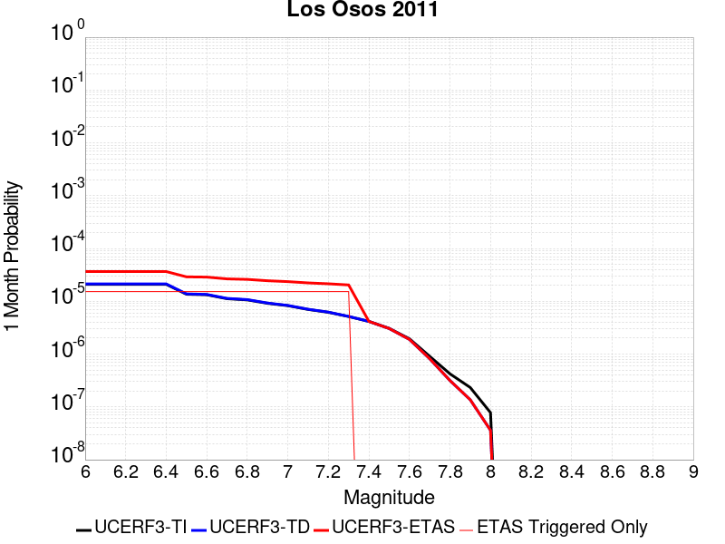 | 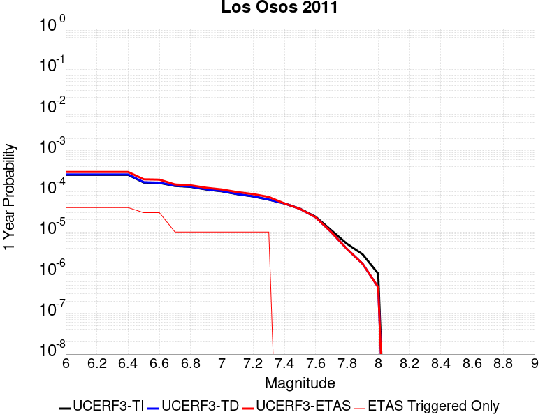 | 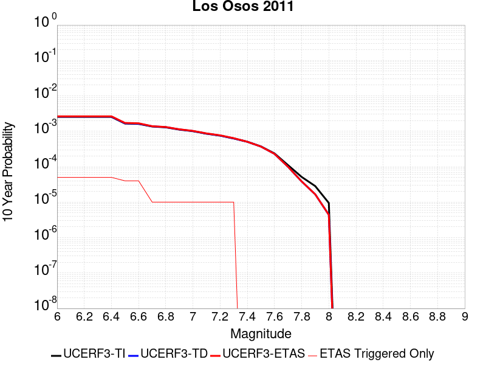 |

| Magnitude | 1 wk TI Prob | 1 wk TD Prob | 1 wk ETAS Prob | 1 wk ETAS/TD Gain | 1 wk ETAS Triggered Only | 1 mo TI Prob | 1 mo TD Prob | 1 mo ETAS Prob | 1 mo ETAS/TD Gain | 1 mo ETAS Triggered Only | 1 yr TI Prob | 1 yr TD Prob | 1 yr ETAS Prob | 1 yr ETAS/TD Gain | 1 yr ETAS Triggered Only | 10 yr TI Prob | 10 yr TD Prob | 10 yr ETAS Prob | 10 yr ETAS/TD Gain | 10 yr ETAS Triggered Only |
|-----|-----|-----|-----|-----|-----|-----|-----|-----|-----|-----|-----|-----|-----|-----|-----|-----|-----|-----|-----|-----|
| 6.0 | 4.8871775E-6 | 4.9814835E-6 | 4.9814835E-6 | 1.0 | 0.0 | 2.0944879E-5 | 2.1349055E-5 | 3.6569432E-5 | 1.7129297 | 1.52207E-5 | 2.5497406E-4 | 2.5989654E-4 | 2.7511327E-4 | 1.0585493 | 1.52207E-5 | 0.002546817 | 0.0025962002 | 0.0026113815 | 1.0058475 | 1.52207E-5 |
| 6.1 | 4.8871775E-6 | 4.9814835E-6 | 4.9814835E-6 | 1.0 | 0.0 | 2.0944879E-5 | 2.1349055E-5 | 3.6569432E-5 | 1.7129297 | 1.52207E-5 | 2.5497406E-4 | 2.5989654E-4 | 2.7511327E-4 | 1.0585493 | 1.52207E-5 | 0.002546817 | 0.0025962002 | 0.0026113815 | 1.0058475 | 1.52207E-5 |
| 6.2 | 4.8871775E-6 | 4.9814835E-6 | 4.9814835E-6 | 1.0 | 0.0 | 2.0944879E-5 | 2.1349055E-5 | 3.6569432E-5 | 1.7129297 | 1.52207E-5 | 2.5497406E-4 | 2.5989654E-4 | 2.7511327E-4 | 1.0585493 | 1.52207E-5 | 0.002546817 | 0.0025962002 | 0.0026113815 | 1.0058475 | 1.52207E-5 |
| 6.3 | 4.8871775E-6 | 4.9814835E-6 | 4.9814835E-6 | 1.0 | 0.0 | 2.0944879E-5 | 2.1349055E-5 | 3.6569432E-5 | 1.7129297 | 1.52207E-5 | 2.5497406E-4 | 2.5989654E-4 | 2.7511327E-4 | 1.0585493 | 1.52207E-5 | 0.002546817 | 0.0025962002 | 0.0026113815 | 1.0058475 | 1.52207E-5 |
| 6.4 | 4.8871775E-6 | 4.9814835E-6 | 4.9814835E-6 | 1.0 | 0.0 | 2.0944879E-5 | 2.1349055E-5 | 3.6569432E-5 | 1.7129297 | 1.52207E-5 | 2.5497406E-4 | 2.5989654E-4 | 2.7511327E-4 | 1.0585493 | 1.52207E-5 | 0.002546817 | 0.0025962002 | 0.0026113815 | 1.0058475 | 1.52207E-5 |
| 6.5 | 3.1724062E-6 | 3.223395E-6 | 3.223395E-6 | 1.0 | 0.0 | 1.3595956E-5 | 1.3814477E-5 | 2.9034967E-5 | 2.1017783 | 1.52207E-5 | 1.6551818E-4 | 1.681784E-4 | 1.8339655E-4 | 1.0904881 | 1.52207E-5 | 0.0016539496 | 0.0016805249 | 0.00169572 | 1.0090419 | 1.52207E-5 |
| 6.6 | 3.1022591E-6 | 3.1511045E-6 | 3.1511045E-6 | 1.0 | 0.0 | 1.3295328E-5 | 1.3504664E-5 | 2.8725159E-5 | 2.1270547 | 1.52207E-5 | 1.618586E-4 | 1.64407E-4 | 1.796252E-4 | 1.0925642 | 1.52207E-5 | 0.0016174077 | 0.0016428665 | 0.0016580622 | 1.0092494 | 1.52207E-5 |
| 6.7 | 2.611518E-6 | 2.6491832E-6 | 2.6491832E-6 | 1.0 | 0.0 | 1.1192172E-5 | 1.1353593E-5 | 2.657412E-5 | 2.3405912 | 1.52207E-5 | 1.3625617E-4 | 1.3822126E-4 | 1.5343986E-4 | 1.1101031 | 1.52207E-5 | 0.0013617266 | 0.0013813575 | 0.0013965572 | 1.0110034 | 1.52207E-5 |
| 6.8 | 2.4780884E-6 | 2.5121592E-6 | 2.5121592E-6 | 1.0 | 0.0 | 1.0620336E-5 | 1.0766353E-5 | 2.5986888E-5 | 2.4137132 | 1.52207E-5 | 1.2929492E-4 | 1.3107249E-4 | 1.462912E-4 | 1.116109 | 1.52207E-5 | 0.0012921972 | 0.001309956 | 0.0013251568 | 1.0116041 | 1.52207E-5 |
| 6.9 | 2.1376322E-6 | 2.1635055E-6 | 2.1635055E-6 | 1.0 | 0.0 | 9.161248E-6 | 9.272134E-6 | 2.4492692E-5 | 2.641538 | 1.52207E-5 | 1.1153249E-4 | 1.128824E-4 | 1.2810138E-4 | 1.1348215 | 1.52207E-5 | 0.0011147653 | 0.0011282525 | 0.0011434561 | 1.0134753 | 1.52207E-5 |
| 7.0 | 1.9282882E-6 | 1.9494585E-6 | 1.9494585E-6 | 1.0 | 0.0 | 8.264066E-6 | 8.354796E-6 | 2.3575369E-5 | 2.8217769 | 1.52207E-5 | 1.0061036E-4 | 1.017149E-4 | 1.16934054E-4 | 1.1496255 | 1.52207E-5 | 0.0010056482 | 0.0010166848 | 0.00103189 | 1.0149556 | 1.52207E-5 |
| 7.1 | 1.6353226E-6 | 1.6501118E-6 | 1.6501118E-6 | 1.0 | 0.0 | 7.0085066E-6 | 7.0718884E-6 | 2.2292481E-5 | 3.152267 | 1.52207E-5 | 8.532523E-5 | 8.609685E-5 | 1.0131624E-4 | 1.1767706 | 1.52207E-5 | 8.529247E-4 | 8.6063566E-4 | 8.758433E-4 | 1.0176702 | 1.52207E-5 |
| 7.2 | 1.4446276E-6 | 1.4553341E-6 | 1.4553341E-6 | 1.0 | 0.0 | 6.191247E-6 | 6.237131E-6 | 2.1457736E-5 | 3.4403214 | 1.52207E-5 | 7.537582E-5 | 7.593443E-5 | 9.1153976E-5 | 1.20043 | 1.52207E-5 | 7.535026E-4 | 7.590854E-4 | 7.742946E-4 | 1.0200361 | 1.52207E-5 |
| 7.3 | 1.2014582E-6 | 1.2069073E-6 | 1.2069073E-6 | 1.0 | 0.0 | 5.149096E-6 | 5.1724496E-6 | 2.039307E-5 | 3.9426332 | 1.52207E-5 | 6.268844E-5 | 6.297276E-5 | 7.81925E-5 | 1.2416878 | 1.52207E-5 | 6.267076E-4 | 6.295495E-4 | 6.447606E-4 | 1.0241619 | 1.52207E-5 |
| 7.4 | 9.707733E-7 | 9.709773E-7 | 9.709773E-7 | 1.0 | 0.0 | 4.16045E-6 | 4.161325E-6 | 4.161325E-6 | 1.0 | 0.0 | 5.0652303E-5 | 5.066295E-5 | 5.066295E-5 | 1.0 | 0.0 | 5.064076E-4 | 5.065143E-4 | 5.065143E-4 | 1.0 | 0.0 |
| 7.5 | 7.174908E-7 | 7.1149134E-7 | 7.1149134E-7 | 1.0 | 0.0 | 3.074957E-6 | 3.0492452E-6 | 3.0492452E-6 | 1.0 | 0.0 | 3.743696E-5 | 3.712393E-5 | 3.712393E-5 | 1.0 | 0.0 | 3.7430652E-4 | 3.7117745E-4 | 3.7117745E-4 | 1.0 | 0.0 |
| 7.6 | 4.5535776E-7 | 4.420792E-7 | 4.420792E-7 | 1.0 | 0.0 | 1.9515319E-6 | 1.8946238E-6 | 1.8946238E-6 | 1.0 | 0.0 | 2.3759641E-5 | 2.3066801E-5 | 2.3066801E-5 | 1.0 | 0.0 | 2.37571E-4 | 2.3064416E-4 | 2.3064416E-4 | 1.0 | 0.0 |
| 7.7 | 2.1173553E-7 | 1.9060796E-7 | 1.9060796E-7 | 1.0 | 0.0 | 9.0743765E-7 | 8.1689103E-7 | 8.1689103E-7 | 1.0 | 0.0 | 1.1047998E-5 | 9.945603E-6 | 9.945603E-6 | 1.0 | 0.0 | 1.1047449E-4 | 9.945161E-5 | 9.945161E-5 | 1.0 | 0.0 |
| 7.8 | 9.873608E-8 | 7.3675665E-8 | 7.3675665E-8 | 1.0 | 0.0 | 4.2315455E-7 | 3.157528E-7 | 3.157528E-7 | 1.0 | 0.0 | 5.1518946E-6 | 3.8442836E-6 | 3.8442836E-6 | 1.0 | 0.0 | 5.1517753E-5 | 3.8442176E-5 | 3.8442176E-5 | 1.0 | 0.0 |
| 7.9 | 5.4399106E-8 | 3.1880155E-8 | 3.1880155E-8 | 1.0 | 0.0 | 2.33139E-7 | 1.3662923E-7 | 1.3662923E-7 | 1.0 | 0.0 | 2.8384638E-6 | 1.6634596E-6 | 1.6634596E-6 | 1.0 | 0.0 | 2.8384275E-5 | 1.6634473E-5 | 1.6634473E-5 | 1.0 | 0.0 |
| 8.0 | 1.817203E-8 | 8.420727E-9 | 8.420727E-9 | 1.0 | 0.0 | 7.7880124E-8 | 3.608883E-8 | 3.608883E-8 | 1.0 | 0.0 | 9.481901E-7 | 4.393814E-7 | 4.393814E-7 | 1.0 | 0.0 | 9.481861E-6 | 4.3938057E-6 | 4.3938057E-6 | 1.0 | 0.0 |

## Malibu Coast alt 1
*[(top)](#table-of-contents)*

| 1 Week | 1 Month | 1 Year | 10 Year |
|-----|-----|-----|-----|
|  | 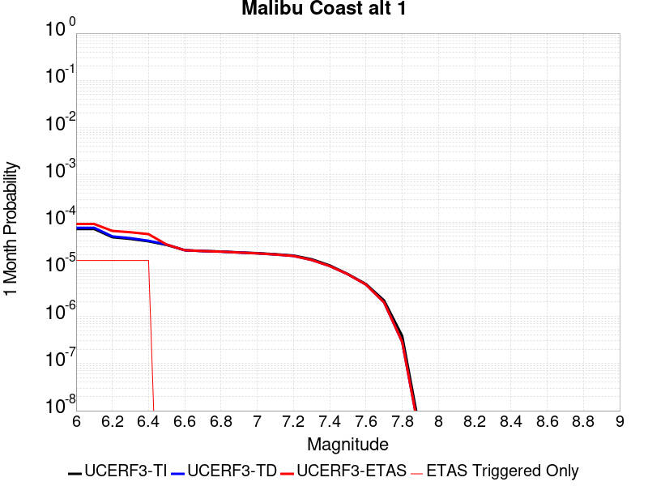 | 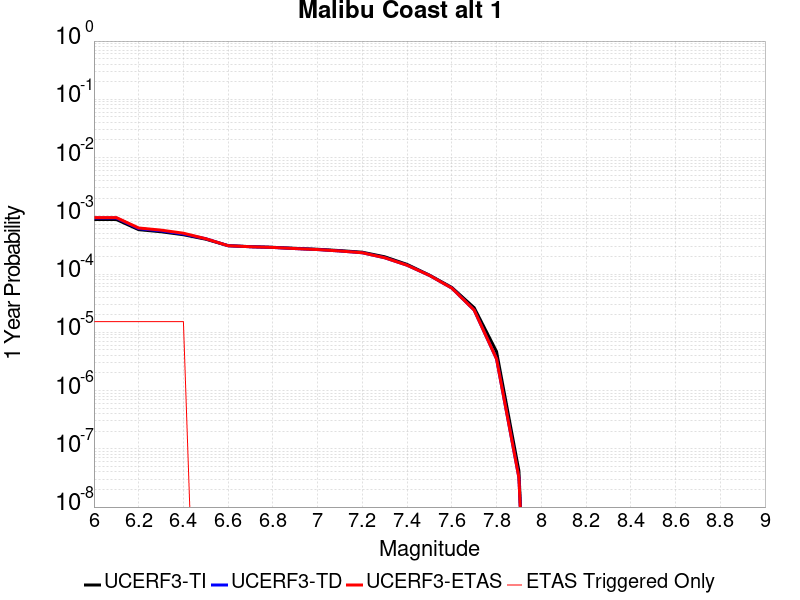 | 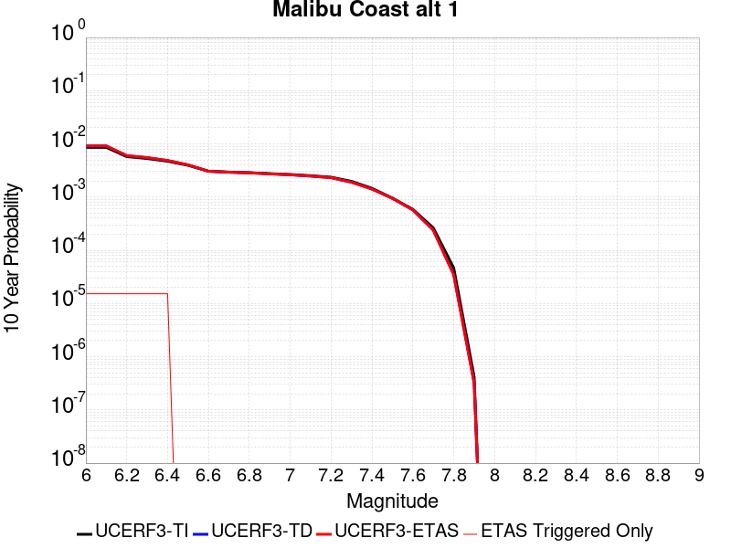 |

| Magnitude | 1 wk TI Prob | 1 wk TD Prob | 1 wk ETAS Prob | 1 wk ETAS/TD Gain | 1 wk ETAS Triggered Only | 1 mo TI Prob | 1 mo TD Prob | 1 mo ETAS Prob | 1 mo ETAS/TD Gain | 1 mo ETAS Triggered Only | 1 yr TI Prob | 1 yr TD Prob | 1 yr ETAS Prob | 1 yr ETAS/TD Gain | 1 yr ETAS Triggered Only | 10 yr TI Prob | 10 yr TD Prob | 10 yr ETAS Prob | 10 yr ETAS/TD Gain | 10 yr ETAS Triggered Only |
|-----|-----|-----|-----|-----|-----|-----|-----|-----|-----|-----|-----|-----|-----|-----|-----|-----|-----|-----|-----|-----|
| 6.0 | 1.6572556E-5 | 1.7598066E-5 | 1.7598066E-5 | 1.0 | 0.0 | 7.102331E-5 | 7.541821E-5 | 9.063776E-5 | 1.2018021 | 1.52207E-5 | 8.6436566E-4 | 9.178488E-4 | 9.3305553E-4 | 1.0165678 | 1.52207E-5 | 0.0086101135 | 0.009142512 | 0.009157594 | 1.0016496 | 1.52207E-5 |
| 6.1 | 1.6572556E-5 | 1.7598066E-5 | 1.7598066E-5 | 1.0 | 0.0 | 7.102331E-5 | 7.541821E-5 | 9.063776E-5 | 1.2018021 | 1.52207E-5 | 8.6436566E-4 | 9.178488E-4 | 9.3305553E-4 | 1.0165678 | 1.52207E-5 | 0.0086101135 | 0.009142512 | 0.009157594 | 1.0016496 | 1.52207E-5 |
| 6.2 | 1.1085717E-5 | 1.1557147E-5 | 1.1557147E-5 | 1.0 | 0.0 | 4.750935E-5 | 4.952971E-5 | 6.4749656E-5 | 1.3072892 | 1.52207E-5 | 5.782728E-4 | 6.028609E-4 | 6.180724E-4 | 1.0252322 | 1.52207E-5 | 0.0057677035 | 0.0060126255 | 0.006027755 | 1.0025163 | 1.52207E-5 |
| 6.3 | 1.0208568E-5 | 1.0592237E-5 | 1.0592237E-5 | 1.0 | 0.0 | 4.375027E-5 | 4.539453E-5 | 6.061454E-5 | 1.3352829 | 1.52207E-5 | 5.325294E-4 | 5.5254117E-4 | 5.677535E-4 | 1.0275315 | 1.52207E-5 | 0.0053125503 | 0.0055119814 | 0.005527118 | 1.0027461 | 1.52207E-5 |
| 6.4 | 9.0682315E-6 | 9.342637E-6 | 9.342637E-6 | 1.0 | 0.0 | 3.8863272E-5 | 4.003927E-5 | 5.5259363E-5 | 1.3801291 | 1.52207E-5 | 4.730576E-4 | 4.8737114E-4 | 5.025844E-4 | 1.031215 | 1.52207E-5 | 0.0047205184 | 0.004863236 | 0.004878383 | 1.0031146 | 1.52207E-5 |
| 6.5 | 7.605796E-6 | 7.748587E-6 | 7.748587E-6 | 1.0 | 0.0 | 3.259586E-5 | 3.3207816E-5 | 3.3207816E-5 | 1.0 | 0.0 | 3.9678233E-4 | 4.0423148E-4 | 4.0423148E-4 | 1.0 | 0.0 | 0.0039607463 | 0.0040351 | 0.0040351 | 1.0 | 0.0 |
| 6.6 | 5.889873E-6 | 5.8795385E-6 | 5.8795385E-6 | 1.0 | 0.0 | 2.5242069E-5 | 2.519778E-5 | 2.519778E-5 | 1.0 | 0.0 | 3.0727885E-4 | 3.0673988E-4 | 3.0673988E-4 | 1.0 | 0.0 | 0.003068543 | 0.0030631777 | 0.0030631777 | 1.0 | 0.0 |
| 6.7 | 5.66586E-6 | 5.641641E-6 | 5.641641E-6 | 1.0 | 0.0 | 2.428203E-5 | 2.417824E-5 | 2.417824E-5 | 1.0 | 0.0 | 2.955936E-4 | 2.9433038E-4 | 2.9433038E-4 | 1.0 | 0.0 | 0.0029520073 | 0.0029394177 | 0.0029394177 | 1.0 | 0.0 |
| 6.8 | 5.521556E-6 | 5.489427E-6 | 5.489427E-6 | 1.0 | 0.0 | 2.3663597E-5 | 2.3525903E-5 | 2.3525903E-5 | 1.0 | 0.0 | 2.880662E-4 | 2.8639034E-4 | 2.8639034E-4 | 1.0 | 0.0 | 0.0028769306 | 0.002860224 | 0.002860224 | 1.0 | 0.0 |
| 6.9 | 5.29752E-6 | 5.2499317E-6 | 5.2499317E-6 | 1.0 | 0.0 | 2.270346E-5 | 2.2499513E-5 | 2.2499513E-5 | 1.0 | 0.0 | 2.7637955E-4 | 2.7389723E-4 | 2.7389723E-4 | 1.0 | 0.0 | 0.0027603607 | 0.0027356069 | 0.0027356069 | 1.0 | 0.0 |
| 7.0 | 5.106743E-6 | 5.0476788E-6 | 5.0476788E-6 | 1.0 | 0.0 | 2.1885859E-5 | 2.163273E-5 | 2.163273E-5 | 1.0 | 0.0 | 2.6642776E-4 | 2.6334674E-4 | 2.6334674E-4 | 1.0 | 0.0 | 0.0026610855 | 0.0026303562 | 0.0026303562 | 1.0 | 0.0 |
| 7.1 | 4.8469647E-6 | 4.770373E-6 | 4.770373E-6 | 1.0 | 0.0 | 2.0772539E-5 | 2.0444295E-5 | 2.0444295E-5 | 1.0 | 0.0 | 2.528763E-4 | 2.4888094E-4 | 2.4888094E-4 | 1.0 | 0.0 | 0.0025258875 | 0.00248603 | 0.00248603 | 1.0 | 0.0 |
| 7.2 | 4.545514E-6 | 4.4481935E-6 | 4.4481935E-6 | 1.0 | 0.0 | 1.9480629E-5 | 1.9063547E-5 | 1.9063547E-5 | 1.0 | 0.0 | 2.3715083E-4 | 2.3207403E-4 | 2.3207403E-4 | 1.0 | 0.0 | 0.0023689792 | 0.0023183243 | 0.0023183243 | 1.0 | 0.0 |
| 7.3 | 3.794097E-6 | 3.6519348E-6 | 3.6519348E-6 | 1.0 | 0.0 | 1.6260314E-5 | 1.5651056E-5 | 1.5651056E-5 | 1.0 | 0.0 | 1.9795135E-4 | 1.9053498E-4 | 1.9053498E-4 | 1.0 | 0.0 | 0.001977751 | 0.0019037209 | 0.0019037209 | 1.0 | 0.0 |
| 7.4 | 2.808217E-6 | 2.719077E-6 | 2.719077E-6 | 1.0 | 0.0 | 1.203516E-5 | 1.1653135E-5 | 1.1653135E-5 | 1.0 | 0.0 | 1.4651821E-4 | 1.418677E-4 | 1.418677E-4 | 1.0 | 0.0 | 0.0014642165 | 0.001417774 | 0.001417774 | 1.0 | 0.0 |
| 7.5 | 1.83809E-6 | 1.8190691E-6 | 1.8190691E-6 | 1.0 | 0.0 | 7.877505E-6 | 7.795988E-6 | 7.795988E-6 | 1.0 | 0.0 | 9.59044E-5 | 9.491203E-5 | 9.491203E-5 | 1.0 | 0.0 | 9.5863023E-4 | 9.48717E-4 | 9.48717E-4 | 1.0 | 0.0 |
| 7.6 | 1.1292672E-6 | 1.1001447E-6 | 1.1001447E-6 | 1.0 | 0.0 | 4.839708E-6 | 4.714897E-6 | 4.714897E-6 | 1.0 | 0.0 | 5.8921847E-5 | 5.7402376E-5 | 5.7402376E-5 | 1.0 | 0.0 | 5.890623E-4 | 5.738771E-4 | 5.738771E-4 | 1.0 | 0.0 |
| 7.7 | 5.065272E-7 | 4.609151E-7 | 4.609151E-7 | 1.0 | 0.0 | 2.170829E-6 | 1.975349E-6 | 1.975349E-6 | 1.0 | 0.0 | 2.6429525E-5 | 2.404962E-5 | 2.404962E-5 | 1.0 | 0.0 | 2.642638E-4 | 2.4047129E-4 | 2.4047129E-4 | 1.0 | 0.0 |
| 7.8 | 8.952991E-8 | 6.707874E-8 | 6.707874E-8 | 1.0 | 0.0 | 3.8369956E-7 | 2.8748025E-7 | 2.8748025E-7 | 1.0 | 0.0 | 4.671532E-6 | 3.5000667E-6 | 3.5000667E-6 | 1.0 | 0.0 | 4.671434E-5 | 3.5000136E-5 | 3.5000136E-5 | 1.0 | 0.0 |
| 7.9 | 8.007447E-10 | 6.1608785E-10 | 6.1608785E-10 | 1.0 | 0.0 | 3.4317629E-9 | 2.6403764E-9 | 2.6403764E-9 | 1.0 | 0.0 | 4.1781714E-8 | 3.2146584E-8 | 3.2146584E-8 | 1.0 | 0.0 | 4.1781706E-7 | 3.214658E-7 | 3.214658E-7 | 1.0 | 0.0 |

## Lions Head 2011 CFM
*[(top)](#table-of-contents)*

| 1 Week | 1 Month | 1 Year | 10 Year |
|-----|-----|-----|-----|
| 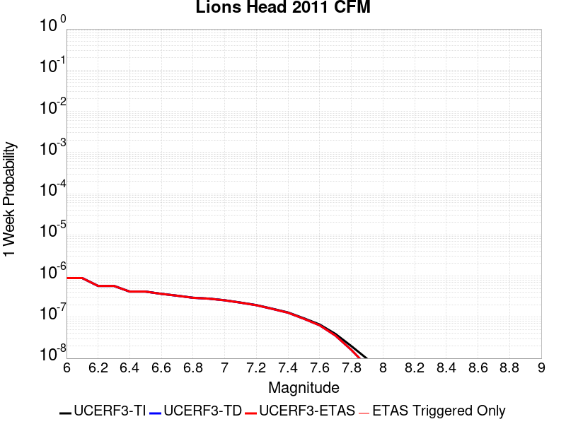 | 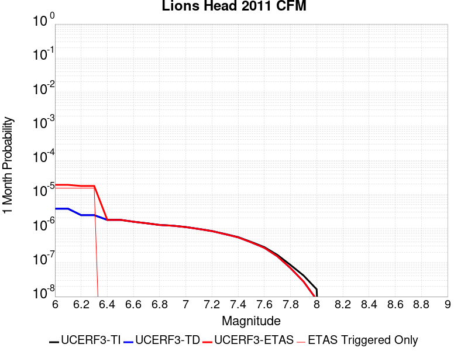 | 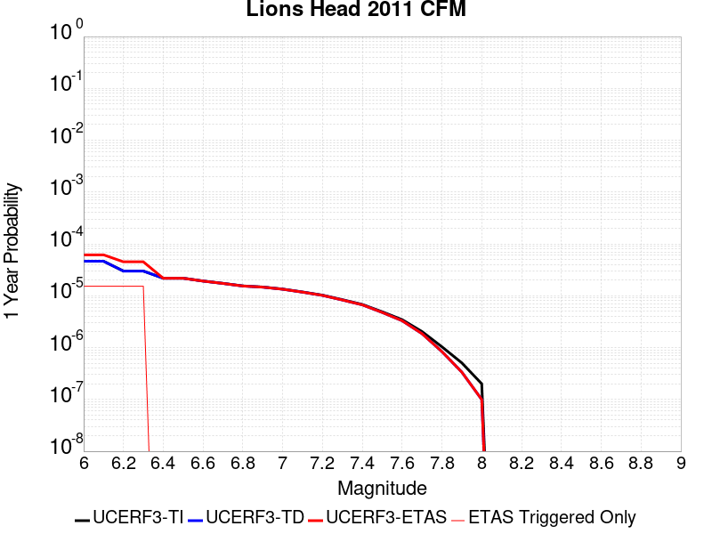 | 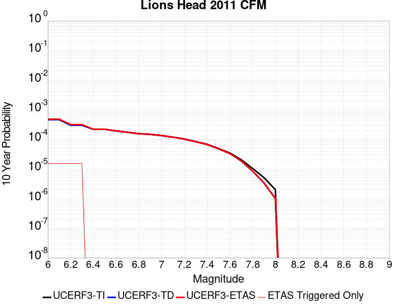 |

| Magnitude | 1 wk TI Prob | 1 wk TD Prob | 1 wk ETAS Prob | 1 wk ETAS/TD Gain | 1 wk ETAS Triggered Only | 1 mo TI Prob | 1 mo TD Prob | 1 mo ETAS Prob | 1 mo ETAS/TD Gain | 1 mo ETAS Triggered Only | 1 yr TI Prob | 1 yr TD Prob | 1 yr ETAS Prob | 1 yr ETAS/TD Gain | 1 yr ETAS Triggered Only | 10 yr TI Prob | 10 yr TD Prob | 10 yr ETAS Prob | 10 yr ETAS/TD Gain | 10 yr ETAS Triggered Only |
|-----|-----|-----|-----|-----|-----|-----|-----|-----|-----|-----|-----|-----|-----|-----|-----|-----|-----|-----|-----|-----|
| 6.0 | 8.889363E-7 | 8.891425E-7 | 8.891425E-7 | 1.0 | 0.0 | 3.8097214E-6 | 3.8106054E-6 | 1.9031248E-5 | 4.9942846 | 1.52207E-5 | 4.638237E-5 | 4.6393197E-5 | 6.161319E-5 | 1.3280652 | 1.52207E-5 | 4.637269E-4 | 4.638414E-4 | 4.7905504E-4 | 1.0327992 | 1.52207E-5 |
| 6.1 | 8.889363E-7 | 8.891425E-7 | 8.891425E-7 | 1.0 | 0.0 | 3.8097214E-6 | 3.8106054E-6 | 1.9031248E-5 | 4.9942846 | 1.52207E-5 | 4.638237E-5 | 4.6393197E-5 | 6.161319E-5 | 1.3280652 | 1.52207E-5 | 4.637269E-4 | 4.638414E-4 | 4.7905504E-4 | 1.0327992 | 1.52207E-5 |
| 6.2 | 5.7435483E-7 | 5.736071E-7 | 5.736071E-7 | 1.0 | 0.0 | 2.4615185E-6 | 2.458314E-6 | 1.7678976E-5 | 7.191505 | 1.52207E-5 | 2.9968574E-5 | 2.9929575E-5 | 4.514982E-5 | 1.5085353 | 1.52207E-5 | 2.9964533E-4 | 2.992569E-4 | 3.1447306E-4 | 1.0508465 | 1.52207E-5 |
| 6.3 | 5.7435483E-7 | 5.736071E-7 | 5.736071E-7 | 1.0 | 0.0 | 2.4615185E-6 | 2.458314E-6 | 1.7678976E-5 | 7.191505 | 1.52207E-5 | 2.9968574E-5 | 2.9929575E-5 | 4.514982E-5 | 1.5085353 | 1.52207E-5 | 2.9964533E-4 | 2.992569E-4 | 3.1447306E-4 | 1.0508465 | 1.52207E-5 |
| 6.4 | 4.1835764E-7 | 4.171541E-7 | 4.171541E-7 | 1.0 | 0.0 | 1.7929601E-6 | 1.787802E-6 | 1.787802E-6 | 1.0 | 0.0 | 2.1829072E-5 | 2.1766275E-5 | 2.1766275E-5 | 1.0 | 0.0 | 2.1826927E-4 | 2.1764166E-4 | 2.1764166E-4 | 1.0 | 0.0 |
| 6.5 | 4.1835764E-7 | 4.171541E-7 | 4.171541E-7 | 1.0 | 0.0 | 1.7929601E-6 | 1.787802E-6 | 1.787802E-6 | 1.0 | 0.0 | 2.1829072E-5 | 2.1766275E-5 | 2.1766275E-5 | 1.0 | 0.0 | 2.1826927E-4 | 2.1764166E-4 | 2.1764166E-4 | 1.0 | 0.0 |
| 6.6 | 3.6896213E-7 | 3.6761884E-7 | 3.6761884E-7 | 1.0 | 0.0 | 1.5812653E-6 | 1.5755083E-6 | 1.5755083E-6 | 1.0 | 0.0 | 1.9251736E-5 | 1.9181647E-5 | 1.9181647E-5 | 1.0 | 0.0 | 1.9250068E-4 | 1.9180003E-4 | 1.9180003E-4 | 1.0 | 0.0 |
| 6.7 | 3.3283942E-7 | 3.3139824E-7 | 3.3139824E-7 | 1.0 | 0.0 | 1.4264539E-6 | 1.4202773E-6 | 1.4202773E-6 | 1.0 | 0.0 | 1.7366938E-5 | 1.7291739E-5 | 1.7291739E-5 | 1.0 | 0.0 | 1.736558E-4 | 1.7290401E-4 | 1.7290401E-4 | 1.0 | 0.0 |
| 6.8 | 2.9684807E-7 | 2.953145E-7 | 2.953145E-7 | 1.0 | 0.0 | 1.2722054E-6 | 1.2656328E-6 | 1.2656328E-6 | 1.0 | 0.0 | 1.5488991E-5 | 1.5408972E-5 | 1.5408972E-5 | 1.0 | 0.0 | 1.5487912E-4 | 1.5407907E-4 | 1.5407907E-4 | 1.0 | 0.0 |
| 6.9 | 2.8254823E-7 | 2.8096647E-7 | 2.8096647E-7 | 1.0 | 0.0 | 1.2109203E-6 | 1.2041414E-6 | 1.2041414E-6 | 1.0 | 0.0 | 1.4742856E-5 | 1.4660324E-5 | 1.4660324E-5 | 1.0 | 0.0 | 1.4741877E-4 | 1.465936E-4 | 1.465936E-4 | 1.0 | 0.0 |
| 7.0 | 2.5794475E-7 | 2.5627148E-7 | 2.5627148E-7 | 1.0 | 0.0 | 1.105477E-6 | 1.0983058E-6 | 1.0983058E-6 | 1.0 | 0.0 | 1.34591E-5 | 1.3371792E-5 | 1.3371792E-5 | 1.0 | 0.0 | 1.3458285E-4 | 1.337099E-4 | 1.337099E-4 | 1.0 | 0.0 |
| 7.1 | 2.2678832E-7 | 2.2496131E-7 | 2.2496131E-7 | 1.0 | 0.0 | 9.719496E-7 | 9.641195E-7 | 9.641195E-7 | 1.0 | 0.0 | 1.1833421E-5 | 1.1738091E-5 | 1.1738091E-5 | 1.0 | 0.0 | 1.1832791E-4 | 1.1737474E-4 | 1.1737474E-4 | 1.0 | 0.0 |
| 7.2 | 1.968546E-7 | 1.9487938E-7 | 1.9487938E-7 | 1.0 | 0.0 | 8.436623E-7 | 8.35197E-7 | 8.35197E-7 | 1.0 | 0.0 | 1.027154E-5 | 1.0168476E-5 | 1.0168476E-5 | 1.0 | 0.0 | 1.0271065E-4 | 1.0168012E-4 | 1.0168012E-4 | 1.0 | 0.0 |
| 7.3 | 1.6101195E-7 | 1.5880458E-7 | 1.5880458E-7 | 1.0 | 0.0 | 6.90051E-7 | 6.8059086E-7 | 6.8059086E-7 | 1.0 | 0.0 | 8.401339E-6 | 8.2861625E-6 | 8.2861625E-6 | 1.0 | 0.0 | 8.4010215E-5 | 8.285854E-5 | 8.285854E-5 | 1.0 | 0.0 |
| 7.4 | 1.304744E-7 | 1.2803389E-7 | 1.2803389E-7 | 1.0 | 0.0 | 5.591759E-7 | 5.487165E-7 | 5.487165E-7 | 1.0 | 0.0 | 6.807945E-6 | 6.680603E-6 | 6.680603E-6 | 1.0 | 0.0 | 6.807737E-5 | 6.680403E-5 | 6.680403E-5 | 1.0 | 0.0 |
| 7.5 | 9.410614E-8 | 9.132599E-8 | 9.132599E-8 | 1.0 | 0.0 | 4.0331196E-7 | 3.91397E-7 | 3.91397E-7 | 1.0 | 0.0 | 4.910312E-6 | 4.7652484E-6 | 4.7652484E-6 | 1.0 | 0.0 | 4.9102036E-5 | 4.765146E-5 | 4.765146E-5 | 1.0 | 0.0 |
| 7.6 | 6.6360826E-8 | 6.327055E-8 | 6.327055E-8 | 1.0 | 0.0 | 2.844035E-7 | 2.7115945E-7 | 2.7115945E-7 | 1.0 | 0.0 | 3.462607E-6 | 3.3013614E-6 | 3.3013614E-6 | 1.0 | 0.0 | 3.4625533E-5 | 3.3013126E-5 | 3.3013126E-5 | 1.0 | 0.0 |
| 7.7 | 3.9100893E-8 | 3.5617894E-8 | 3.5617894E-8 | 1.0 | 0.0 | 1.6757524E-7 | 1.5264811E-7 | 1.5264811E-7 | 1.0 | 0.0 | 2.0402267E-6 | 1.8584891E-6 | 1.8584891E-6 | 1.0 | 0.0 | 2.040208E-5 | 1.8584737E-5 | 1.8584737E-5 | 1.0 | 0.0 |
| 7.8 | 1.9858547E-8 | 1.6059074E-8 | 1.6059074E-8 | 1.0 | 0.0 | 8.5108056E-8 | 6.882461E-8 | 6.882461E-8 | 1.0 | 0.0 | 1.0361902E-6 | 8.3793924E-7 | 8.3793924E-7 | 1.0 | 0.0 | 1.0361853E-5 | 8.379361E-6 | 8.379361E-6 | 1.0 | 0.0 |
| 7.9 | 9.717722E-9 | 6.4448784E-9 | 6.4448784E-9 | 1.0 | 0.0 | 4.1647375E-8 | 2.762091E-8 | 2.762091E-8 | 1.0 | 0.0 | 5.070567E-7 | 3.3628453E-7 | 3.3628453E-7 | 1.0 | 0.0 | 5.0705553E-6 | 3.3628403E-6 | 3.3628403E-6 | 1.0 | 0.0 |
| 8.0 | 3.8397716E-9 | 1.908926E-9 | 1.908926E-9 | 1.0 | 0.0 | 1.6456164E-8 | 8.18111E-9 | 8.18111E-9 | 1.0 | 0.0 | 2.0035378E-7 | 9.9605E-8 | 9.9605E-8 | 1.0 | 0.0 | 2.0035359E-6 | 9.960496E-7 | 9.960496E-7 | 1.0 | 0.0 |

## Reliz 2011 CFM
*[(top)](#table-of-contents)*

| 1 Week | 1 Month | 1 Year | 10 Year |
|-----|-----|-----|-----|
| 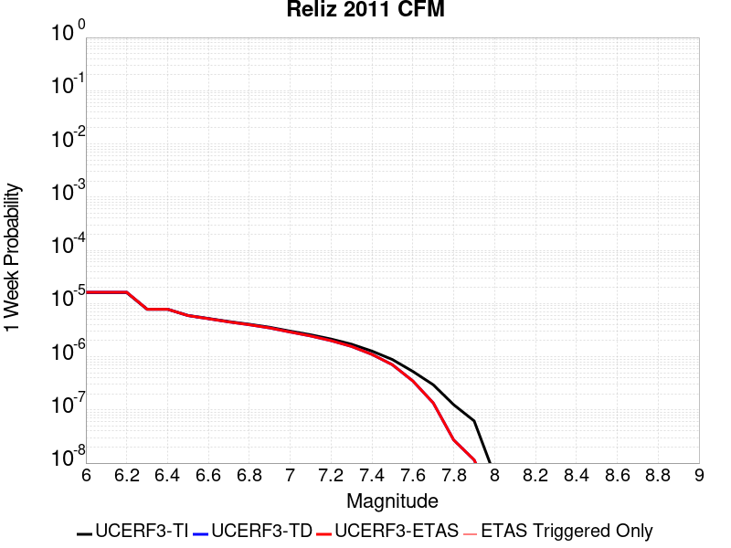 |  | 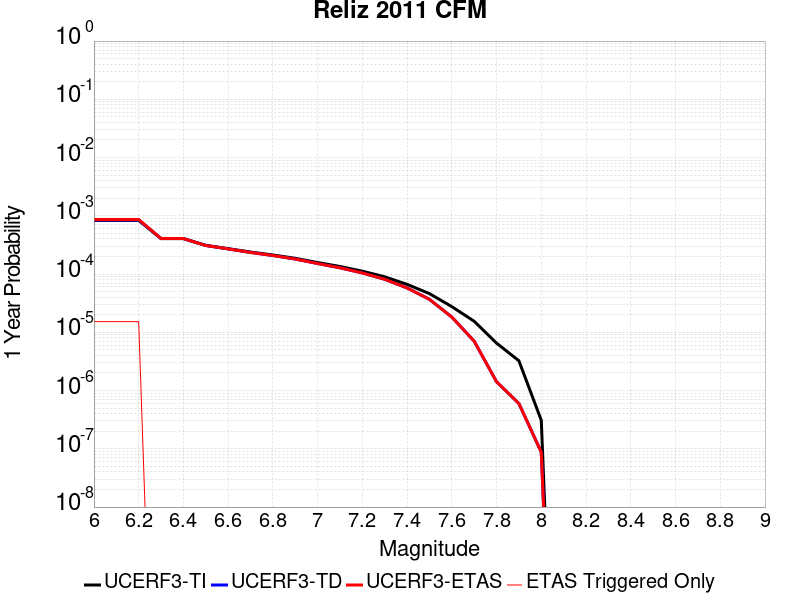 | 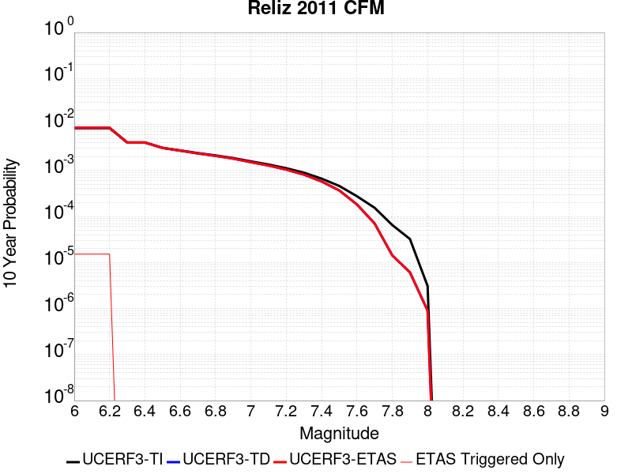 |

| Magnitude | 1 wk TI Prob | 1 wk TD Prob | 1 wk ETAS Prob | 1 wk ETAS/TD Gain | 1 wk ETAS Triggered Only | 1 mo TI Prob | 1 mo TD Prob | 1 mo ETAS Prob | 1 mo ETAS/TD Gain | 1 mo ETAS Triggered Only | 1 yr TI Prob | 1 yr TD Prob | 1 yr ETAS Prob | 1 yr ETAS/TD Gain | 1 yr ETAS Triggered Only | 10 yr TI Prob | 10 yr TD Prob | 10 yr ETAS Prob | 10 yr ETAS/TD Gain | 10 yr ETAS Triggered Only |
|-----|-----|-----|-----|-----|-----|-----|-----|-----|-----|-----|-----|-----|-----|-----|-----|-----|-----|-----|-----|-----|
| 6.0 | 1.6002472E-5 | 1.6282804E-5 | 1.6282804E-5 | 1.0 | 0.0 | 6.8580215E-5 | 6.9781694E-5 | 6.9781694E-5 | 1.0 | 0.0 | 8.3464425E-4 | 8.4928074E-4 | 8.6448854E-4 | 1.0179067 | 1.52207E-5 | 0.008315164 | 0.008462547 | 0.008477639 | 1.0017834 | 1.52207E-5 |
| 6.1 | 1.6002472E-5 | 1.6282804E-5 | 1.6282804E-5 | 1.0 | 0.0 | 6.8580215E-5 | 6.9781694E-5 | 6.9781694E-5 | 1.0 | 0.0 | 8.3464425E-4 | 8.4928074E-4 | 8.6448854E-4 | 1.0179067 | 1.52207E-5 | 0.008315164 | 0.008462547 | 0.008477639 | 1.0017834 | 1.52207E-5 |
| 6.2 | 1.6002472E-5 | 1.6282804E-5 | 1.6282804E-5 | 1.0 | 0.0 | 6.8580215E-5 | 6.9781694E-5 | 6.9781694E-5 | 1.0 | 0.0 | 8.3464425E-4 | 8.4928074E-4 | 8.6448854E-4 | 1.0179067 | 1.52207E-5 | 0.008315164 | 0.008462547 | 0.008477639 | 1.0017834 | 1.52207E-5 |
| 6.3 | 7.792404E-6 | 7.803802E-6 | 7.803802E-6 | 1.0 | 0.0 | 3.339559E-5 | 3.344444E-5 | 3.344444E-5 | 1.0 | 0.0 | 4.0651546E-4 | 4.0711078E-4 | 4.0711078E-4 | 1.0 | 0.0 | 0.0040577264 | 0.004063926 | 0.004063926 | 1.0 | 0.0 |
| 6.4 | 7.792404E-6 | 7.803802E-6 | 7.803802E-6 | 1.0 | 0.0 | 3.339559E-5 | 3.344444E-5 | 3.344444E-5 | 1.0 | 0.0 | 4.0651546E-4 | 4.0711078E-4 | 4.0711078E-4 | 1.0 | 0.0 | 0.0040577264 | 0.004063926 | 0.004063926 | 1.0 | 0.0 |
| 6.5 | 5.9659374E-6 | 5.928738E-6 | 5.928738E-6 | 1.0 | 0.0 | 2.5568053E-5 | 2.5408632E-5 | 2.5408632E-5 | 1.0 | 0.0 | 3.1124658E-4 | 3.093064E-4 | 3.093064E-4 | 1.0 | 0.0 | 0.00310811 | 0.0030889767 | 0.0030889767 | 1.0 | 0.0 |
| 6.6 | 5.2350692E-6 | 5.178986E-6 | 5.178986E-6 | 1.0 | 0.0 | 2.2435817E-5 | 2.2195467E-5 | 2.2195467E-5 | 1.0 | 0.0 | 2.7312184E-4 | 2.7019644E-4 | 2.7019644E-4 | 1.0 | 0.0 | 0.002727864 | 0.0026988892 | 0.0026988892 | 1.0 | 0.0 |
| 6.7 | 4.580206E-6 | 4.5061206E-6 | 4.5061206E-6 | 1.0 | 0.0 | 1.9629308E-5 | 1.9311801E-5 | 1.9311801E-5 | 1.0 | 0.0 | 2.389606E-4 | 2.350959E-4 | 2.350959E-4 | 1.0 | 0.0 | 0.002387038 | 0.0023486738 | 0.0023486738 | 1.0 | 0.0 |
| 6.8 | 4.0765017E-6 | 3.9882384E-6 | 3.9882384E-6 | 1.0 | 0.0 | 1.7470604E-5 | 1.7092338E-5 | 1.7092338E-5 | 1.0 | 0.0 | 2.1268385E-4 | 2.0807938E-4 | 2.0807938E-4 | 1.0 | 0.0 | 0.002124804 | 0.0020790435 | 0.0020790435 | 1.0 | 0.0 |
| 6.9 | 3.5752896E-6 | 3.4725176E-6 | 3.4725176E-6 | 1.0 | 0.0 | 1.532258E-5 | 1.4882134E-5 | 1.4882134E-5 | 1.0 | 0.0 | 1.8653645E-4 | 1.8117494E-4 | 1.8117494E-4 | 1.0 | 0.0 | 0.0018637994 | 0.0018104686 | 0.0018104686 | 1.0 | 0.0 |
| 7.0 | 3.0259848E-6 | 2.9079417E-6 | 2.9079417E-6 | 1.0 | 0.0 | 1.2968442E-5 | 1.2462548E-5 | 1.2462548E-5 | 1.0 | 0.0 | 1.5787935E-4 | 1.5172097E-4 | 1.5172097E-4 | 1.0 | 0.0 | 0.0015776722 | 0.001516369 | 0.001516369 | 1.0 | 0.0 |
| 7.1 | 2.5861116E-6 | 2.455167E-6 | 2.455167E-6 | 1.0 | 0.0 | 1.1083288E-5 | 1.05221025E-5 | 1.05221025E-5 | 1.0 | 0.0 | 1.3493067E-4 | 1.2809907E-4 | 1.2809907E-4 | 1.0 | 0.0 | 0.0013484878 | 0.001280447 | 0.001280447 | 1.0 | 0.0 |
| 7.2 | 2.1482588E-6 | 2.003237E-6 | 2.003237E-6 | 1.0 | 0.0 | 9.20679E-6 | 8.585273E-6 | 8.585273E-6 | 1.0 | 0.0 | 1.12086906E-4 | 1.0452068E-4 | 1.0452068E-4 | 1.0 | 0.0 | 0.0011203039 | 0.0010449095 | 0.0010449095 | 1.0 | 0.0 |
| 7.3 | 1.7194744E-6 | 1.5611241E-6 | 1.5611241E-6 | 1.0 | 0.0 | 7.3691554E-6 | 6.690515E-6 | 6.690515E-6 | 1.0 | 0.0 | 8.971577E-5 | 8.1453974E-5 | 8.1453974E-5 | 1.0 | 0.0 | 8.967956E-4 | 8.1443513E-4 | 8.1443513E-4 | 1.0 | 0.0 |
| 7.4 | 1.2755178E-6 | 1.10563E-6 | 1.10563E-6 | 1.0 | 0.0 | 5.4664933E-6 | 4.7384056E-6 | 4.7384056E-6 | 1.0 | 0.0 | 6.655252E-5 | 5.768856E-5 | 5.768856E-5 | 1.0 | 0.0 | 6.6532596E-4 | 5.7692965E-4 | 5.7692965E-4 | 1.0 | 0.0 |
| 7.5 | 8.8463224E-7 | 7.0580273E-7 | 7.0580273E-7 | 1.0 | 0.0 | 3.7912755E-6 | 3.0248652E-6 | 3.0248652E-6 | 1.0 | 0.0 | 4.6157802E-5 | 3.6827114E-5 | 3.6827114E-5 | 1.0 | 0.0 | 4.6148215E-4 | 3.684038E-4 | 3.684038E-4 | 1.0 | 0.0 |
| 7.6 | 5.291355E-7 | 3.500777E-7 | 3.500777E-7 | 1.0 | 0.0 | 2.2677216E-6 | 1.5003321E-6 | 1.5003321E-6 | 1.0 | 0.0 | 2.760916E-5 | 1.8266392E-5 | 1.8266392E-5 | 1.0 | 0.0 | 2.760573E-4 | 1.8284164E-4 | 1.8284164E-4 | 1.0 | 0.0 |
| 7.7 | 2.9663357E-7 | 1.351113E-7 | 1.351113E-7 | 1.0 | 0.0 | 1.2712861E-6 | 5.7904833E-7 | 5.7904833E-7 | 1.0 | 0.0 | 1.5477797E-5 | 7.049891E-6 | 7.049891E-6 | 1.0 | 0.0 | 1.547672E-4 | 7.068132E-5 | 7.068132E-5 | 1.0 | 0.0 |
| 7.8 | 1.2509386E-7 | 2.7157126E-8 | 2.7157126E-8 | 1.0 | 0.0 | 5.3611643E-7 | 1.1638769E-7 | 1.1638769E-7 | 1.0 | 0.0 | 6.527198E-6 | 1.4170191E-6 | 1.4170191E-6 | 1.0 | 0.0 | 6.527006E-5 | 1.4326506E-5 | 1.4326506E-5 | 1.0 | 0.0 |
| 7.9 | 6.213493E-8 | 1.1482114E-8 | 1.1482114E-8 | 1.0 | 0.0 | 2.6629255E-7 | 4.920906E-8 | 4.920906E-8 | 1.0 | 0.0 | 3.242107E-6 | 5.9912014E-7 | 5.9912014E-7 | 1.0 | 0.0 | 3.2420594E-5 | 6.1224223E-6 | 6.1224223E-6 | 1.0 | 0.0 |
| 8.0 | 5.92383E-9 | 1.677887E-9 | 1.677887E-9 | 1.0 | 0.0 | 2.5387841E-8 | 7.190944E-9 | 7.190944E-9 | 1.0 | 0.0 | 3.0909692E-7 | 8.754974E-8 | 8.754974E-8 | 1.0 | 0.0 | 3.090965E-6 | 9.003061E-7 | 9.003061E-7 | 1.0 | 0.0 |

## Richfield
*[(top)](#table-of-contents)*

| 1 Week | 1 Month | 1 Year | 10 Year |
|-----|-----|-----|-----|
|  |  | 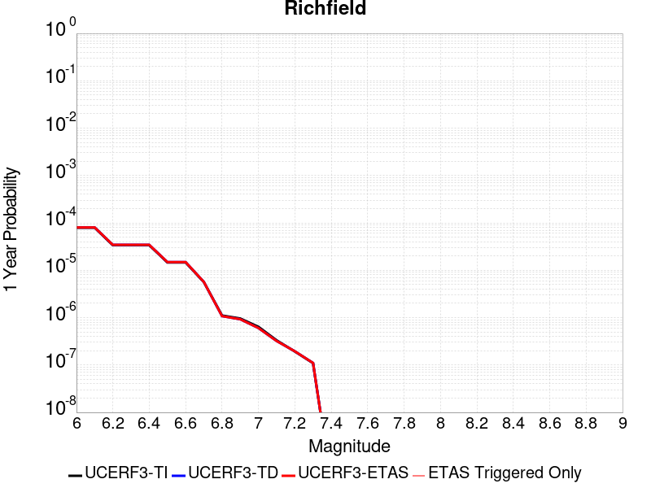 | 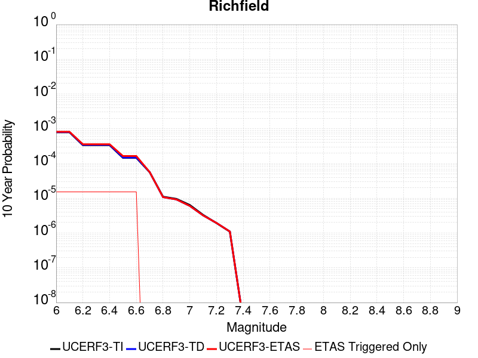 |

| Magnitude | 1 wk TI Prob | 1 wk TD Prob | 1 wk ETAS Prob | 1 wk ETAS/TD Gain | 1 wk ETAS Triggered Only | 1 mo TI Prob | 1 mo TD Prob | 1 mo ETAS Prob | 1 mo ETAS/TD Gain | 1 mo ETAS Triggered Only | 1 yr TI Prob | 1 yr TD Prob | 1 yr ETAS Prob | 1 yr ETAS/TD Gain | 1 yr ETAS Triggered Only | 10 yr TI Prob | 10 yr TD Prob | 10 yr ETAS Prob | 10 yr ETAS/TD Gain | 10 yr ETAS Triggered Only |
|-----|-----|-----|-----|-----|-----|-----|-----|-----|-----|-----|-----|-----|-----|-----|-----|-----|-----|-----|-----|-----|
| 6.0 | 1.5166896E-6 | 1.5392679E-6 | 1.5392679E-6 | 1.0 | 0.0 | 6.5000822E-6 | 6.596852E-6 | 6.596852E-6 | 1.0 | 0.0 | 7.913562E-5 | 8.0314814E-5 | 8.0314814E-5 | 1.0 | 0.0 | 7.910745E-4 | 8.0296566E-4 | 8.1817416E-4 | 1.0189403 | 1.52207E-5 |
| 6.1 | 1.5166896E-6 | 1.5392679E-6 | 1.5392679E-6 | 1.0 | 0.0 | 6.5000822E-6 | 6.596852E-6 | 6.596852E-6 | 1.0 | 0.0 | 7.913562E-5 | 8.0314814E-5 | 8.0314814E-5 | 1.0 | 0.0 | 7.910745E-4 | 8.0296566E-4 | 8.1817416E-4 | 1.0189403 | 1.52207E-5 |
| 6.2 | 6.473272E-7 | 6.598479E-7 | 6.598479E-7 | 1.0 | 0.0 | 2.7742565E-6 | 2.8279173E-6 | 2.8279173E-6 | 1.0 | 0.0 | 3.377605E-5 | 3.4429482E-5 | 3.4429482E-5 | 1.0 | 0.0 | 3.3770915E-4 | 3.442545E-4 | 3.5947E-4 | 1.0441983 | 1.52207E-5 |
| 6.3 | 6.473272E-7 | 6.598479E-7 | 6.598479E-7 | 1.0 | 0.0 | 2.7742565E-6 | 2.8279173E-6 | 2.8279173E-6 | 1.0 | 0.0 | 3.377605E-5 | 3.4429482E-5 | 3.4429482E-5 | 1.0 | 0.0 | 3.3770915E-4 | 3.442545E-4 | 3.5947E-4 | 1.0441983 | 1.52207E-5 |
| 6.4 | 6.473272E-7 | 6.598479E-7 | 6.598479E-7 | 1.0 | 0.0 | 2.7742565E-6 | 2.8279173E-6 | 2.8279173E-6 | 1.0 | 0.0 | 3.377605E-5 | 3.4429482E-5 | 3.4429482E-5 | 1.0 | 0.0 | 3.3770915E-4 | 3.442545E-4 | 3.5947E-4 | 1.0441983 | 1.52207E-5 |
| 6.5 | 2.7954403E-7 | 2.8531605E-7 | 2.8531605E-7 | 1.0 | 0.0 | 1.1980452E-6 | 1.2227827E-6 | 1.2227827E-6 | 1.0 | 0.0 | 1.4586103E-5 | 1.4887321E-5 | 1.4887321E-5 | 1.0 | 0.0 | 1.4585146E-4 | 1.4886749E-4 | 1.6408591E-4 | 1.102228 | 1.52207E-5 |
| 6.6 | 2.7954403E-7 | 2.8531605E-7 | 2.8531605E-7 | 1.0 | 0.0 | 1.1980452E-6 | 1.2227827E-6 | 1.2227827E-6 | 1.0 | 0.0 | 1.4586103E-5 | 1.4887321E-5 | 1.4887321E-5 | 1.0 | 0.0 | 1.4585146E-4 | 1.4886749E-4 | 1.6408591E-4 | 1.102228 | 1.52207E-5 |
| 6.7 | 1.0777299E-7 | 1.08788136E-7 | 1.08788136E-7 | 1.0 | 0.0 | 4.6188418E-7 | 4.6623484E-7 | 4.6623484E-7 | 1.0 | 0.0 | 5.6234253E-6 | 5.6763984E-6 | 5.6763984E-6 | 1.0 | 0.0 | 5.623283E-5 | 5.6762965E-5 | 5.6762965E-5 | 1.0 | 0.0 |
| 6.8 | 2.1301874E-8 | 2.0666182E-8 | 2.0666182E-8 | 1.0 | 0.0 | 9.129375E-8 | 8.8569344E-8 | 8.8569344E-8 | 1.0 | 0.0 | 1.1115008E-6 | 1.0783313E-6 | 1.0783313E-6 | 1.0 | 0.0 | 1.1114952E-5 | 1.0783265E-5 | 1.0783265E-5 | 1.0 | 0.0 |
| 6.9 | 1.8413502E-8 | 1.7751145E-8 | 1.7751145E-8 | 1.0 | 0.0 | 7.891501E-8 | 7.607633E-8 | 7.607633E-8 | 1.0 | 0.0 | 9.607899E-7 | 9.26229E-7 | 9.26229E-7 | 1.0 | 0.0 | 9.607857E-6 | 9.262254E-6 | 9.262254E-6 | 1.0 | 0.0 |
| 7.0 | 1.2290541E-8 | 1.1574364E-8 | 1.1574364E-8 | 1.0 | 0.0 | 5.2673748E-8 | 4.9604413E-8 | 4.9604413E-8 | 1.0 | 0.0 | 6.413027E-7 | 6.039336E-7 | 6.039336E-7 | 1.0 | 0.0 | 6.4130086E-6 | 6.039321E-6 | 6.039321E-6 | 1.0 | 0.0 |
| 7.1 | 6.373573E-9 | 6.155796E-9 | 6.155796E-9 | 1.0 | 0.0 | 2.7315311E-8 | 2.6381983E-8 | 2.6381983E-8 | 1.0 | 0.0 | 3.3256384E-7 | 3.212006E-7 | 3.212006E-7 | 1.0 | 0.0 | 3.3256335E-6 | 3.2120017E-6 | 3.2120017E-6 | 1.0 | 0.0 |
| 7.2 | 3.6989944E-9 | 3.7360146E-9 | 3.7360146E-9 | 1.0 | 0.0 | 1.5852834E-8 | 1.6011493E-8 | 1.6011493E-8 | 1.0 | 0.0 | 1.9300822E-7 | 1.9493989E-7 | 1.9493989E-7 | 1.0 | 0.0 | 1.9300805E-6 | 1.9493975E-6 | 1.9493975E-6 | 1.0 | 0.0 |
| 7.3 | 2.097397E-9 | 2.1200501E-9 | 2.1200501E-9 | 1.0 | 0.0 | 8.9888434E-9 | 9.085929E-9 | 9.085929E-9 | 1.0 | 0.0 | 1.0943917E-7 | 1.1062118E-7 | 1.1062118E-7 | 1.0 | 0.0 | 1.0943911E-6 | 1.1062115E-6 | 1.1062115E-6 | 1.0 | 0.0 |
| 7.4 | 5.8314464E-12 | 5.8918426E-12 | 5.8918426E-12 | 1.0 | 0.0 | 2.4991786E-11 | 2.5250912E-11 | 2.5250912E-11 | 1.0 | 0.0 | 3.0427527E-10 | 3.0742975E-10 | 3.0742975E-10 | 1.0 | 0.0 | 3.0427532E-9 | 3.0742973E-9 | 3.0742973E-9 | 1.0 | 0.0 |

## Monte Vista - Shannon 2011 CFM
*[(top)](#table-of-contents)*

| 1 Week | 1 Month | 1 Year | 10 Year |
|-----|-----|-----|-----|
|  |  | 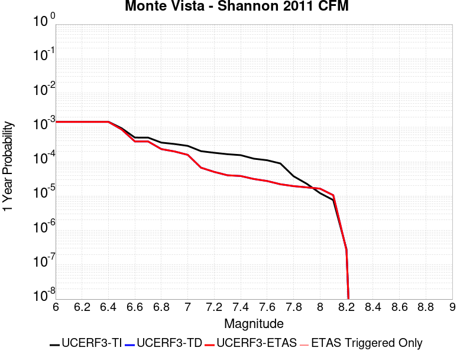 | 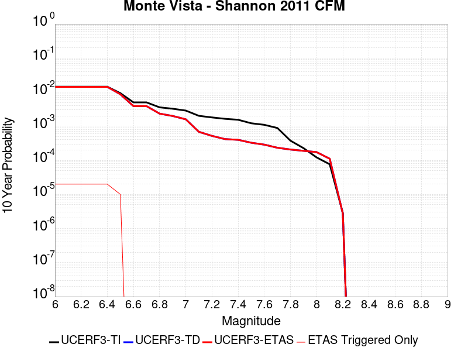 |

| Magnitude | 1 wk TI Prob | 1 wk TD Prob | 1 wk ETAS Prob | 1 wk ETAS/TD Gain | 1 wk ETAS Triggered Only | 1 mo TI Prob | 1 mo TD Prob | 1 mo ETAS Prob | 1 mo ETAS/TD Gain | 1 mo ETAS Triggered Only | 1 yr TI Prob | 1 yr TD Prob | 1 yr ETAS Prob | 1 yr ETAS/TD Gain | 1 yr ETAS Triggered Only | 10 yr TI Prob | 10 yr TD Prob | 10 yr ETAS Prob | 10 yr ETAS/TD Gain | 10 yr ETAS Triggered Only |
|-----|-----|-----|-----|-----|-----|-----|-----|-----|-----|-----|-----|-----|-----|-----|-----|-----|-----|-----|-----|-----|
| 6.0 | 2.7907707E-5 | 2.7584209E-5 | 2.7584209E-5 | 1.0 | 0.0 | 1.19598975E-4 | 1.1821338E-4 | 1.1821338E-4 | 1.0 | 0.0 | 0.0014551448 | 0.0014384214 | 0.0014384214 | 1.0 | 0.0 | 0.014456532 | 0.014320195 | 0.014335197 | 1.0010476 | 1.52207E-5 |
| 6.1 | 2.7907707E-5 | 2.7584209E-5 | 2.7584209E-5 | 1.0 | 0.0 | 1.19598975E-4 | 1.1821338E-4 | 1.1821338E-4 | 1.0 | 0.0 | 0.0014551448 | 0.0014384214 | 0.0014384214 | 1.0 | 0.0 | 0.014456532 | 0.014320195 | 0.014335197 | 1.0010476 | 1.52207E-5 |
| 6.2 | 2.7907707E-5 | 2.7584209E-5 | 2.7584209E-5 | 1.0 | 0.0 | 1.19598975E-4 | 1.1821338E-4 | 1.1821338E-4 | 1.0 | 0.0 | 0.0014551448 | 0.0014384214 | 0.0014384214 | 1.0 | 0.0 | 0.014456532 | 0.014320195 | 0.014335197 | 1.0010476 | 1.52207E-5 |
| 6.3 | 2.7907707E-5 | 2.7584209E-5 | 2.7584209E-5 | 1.0 | 0.0 | 1.19598975E-4 | 1.1821338E-4 | 1.1821338E-4 | 1.0 | 0.0 | 0.0014551448 | 0.0014384214 | 0.0014384214 | 1.0 | 0.0 | 0.014456532 | 0.014320195 | 0.014335197 | 1.0010476 | 1.52207E-5 |
| 6.4 | 2.7907707E-5 | 2.7584209E-5 | 2.7584209E-5 | 1.0 | 0.0 | 1.19598975E-4 | 1.1821338E-4 | 1.1821338E-4 | 1.0 | 0.0 | 0.0014551448 | 0.0014384214 | 0.0014384214 | 1.0 | 0.0 | 0.014456532 | 0.014320195 | 0.014335197 | 1.0010476 | 1.52207E-5 |
| 6.5 | 1.7990213E-5 | 1.6639884E-5 | 1.6639884E-5 | 1.0 | 0.0 | 7.709863E-5 | 7.131221E-5 | 7.131221E-5 | 1.0 | 0.0 | 9.382716E-4 | 8.679467E-4 | 8.679467E-4 | 1.0 | 0.0 | 0.0093431985 | 0.008668941 | 0.00868403 | 1.0017406 | 1.52207E-5 |
| 6.6 | 9.650407E-6 | 7.4571435E-6 | 7.4571435E-6 | 1.0 | 0.0 | 4.135823E-5 | 3.195884E-5 | 3.195884E-5 | 1.0 | 0.0 | 5.0342013E-4 | 3.8903722E-4 | 3.8903722E-4 | 1.0 | 0.0 | 0.005022812 | 0.0039012418 | 0.0039012418 | 1.0 | 0.0 |
| 6.7 | 9.62828E-6 | 7.4350583E-6 | 7.4350583E-6 | 1.0 | 0.0 | 4.1263404E-5 | 3.186419E-5 | 3.186419E-5 | 1.0 | 0.0 | 5.022661E-4 | 3.878853E-4 | 3.878853E-4 | 1.0 | 0.0 | 0.0050113243 | 0.003889763 | 0.003889763 | 1.0 | 0.0 |
| 6.8 | 6.887523E-6 | 4.4615676E-6 | 4.4615676E-6 | 1.0 | 0.0 | 2.9517621E-5 | 1.9120876E-5 | 1.9120876E-5 | 1.0 | 0.0 | 3.5931775E-4 | 2.3277402E-4 | 2.3277402E-4 | 1.0 | 0.0 | 0.0035873733 | 0.0023424553 | 0.0023424553 | 1.0 | 0.0 |
| 6.9 | 6.2722347E-6 | 3.8034377E-6 | 3.8034377E-6 | 1.0 | 0.0 | 2.6880729E-5 | 1.6300357E-5 | 1.6300357E-5 | 1.0 | 0.0 | 3.2722374E-4 | 1.984408E-4 | 1.984408E-4 | 1.0 | 0.0 | 0.003267423 | 0.0019997752 | 0.0019997752 | 1.0 | 0.0 |
| 7.0 | 5.5320347E-6 | 3.0305885E-6 | 3.0305885E-6 | 1.0 | 0.0 | 2.3708504E-5 | 1.2988182E-5 | 1.2988182E-5 | 1.0 | 0.0 | 2.8861282E-4 | 1.5812147E-4 | 1.5812147E-4 | 1.0 | 0.0 | 0.0028823826 | 0.001597215 | 0.001597215 | 1.0 | 0.0 |
| 7.1 | 3.8794055E-6 | 1.2837862E-6 | 1.2837862E-6 | 1.0 | 0.0 | 1.6625918E-5 | 5.5019295E-6 | 5.5019295E-6 | 1.0 | 0.0 | 2.0240174E-4 | 6.698394E-5 | 6.698394E-5 | 1.0 | 0.0 | 0.002022175 | 6.865884E-4 | 6.865884E-4 | 1.0 | 0.0 |
| 7.2 | 3.4813652E-6 | 9.671046E-7 | 9.671046E-7 | 1.0 | 0.0 | 1.49200505E-5 | 4.1447274E-6 | 4.1447274E-6 | 1.0 | 0.0 | 1.8163648E-4 | 5.0460894E-5 | 5.0460894E-5 | 1.0 | 0.0 | 0.0018148809 | 5.214329E-4 | 5.214329E-4 | 1.0 | 0.0 |
| 7.3 | 3.1682148E-6 | 7.719097E-7 | 7.719097E-7 | 1.0 | 0.0 | 1.3577992E-5 | 3.30818E-6 | 3.30818E-6 | 1.0 | 0.0 | 1.6529951E-4 | 4.027635E-5 | 4.027635E-5 | 1.0 | 0.0 | 0.0016517661 | 4.1960424E-4 | 4.1960424E-4 | 1.0 | 0.0 |
| 7.4 | 2.9707667E-6 | 7.3457204E-7 | 7.3457204E-7 | 1.0 | 0.0 | 1.2731795E-5 | 3.148162E-6 | 3.148162E-6 | 1.0 | 0.0 | 1.5499859E-4 | 3.8328202E-5 | 3.8328202E-5 | 1.0 | 0.0 | 0.0015489052 | 3.9992164E-4 | 3.9992164E-4 | 1.0 | 0.0 |
| 7.5 | 2.3462758E-6 | 6.007889E-7 | 6.007889E-7 | 1.0 | 0.0 | 1.0055429E-5 | 2.574807E-6 | 2.574807E-6 | 1.0 | 0.0 | 1.2241797E-4 | 3.1347827E-5 | 3.1347827E-5 | 1.0 | 0.0 | 0.0012235056 | 3.2839534E-4 | 3.2839534E-4 | 1.0 | 0.0 |
| 7.6 | 2.112783E-6 | 5.251582E-7 | 5.251582E-7 | 1.0 | 0.0 | 9.054753E-6 | 2.250676E-6 | 2.250676E-6 | 1.0 | 0.0 | 1.1023604E-4 | 2.7401638E-5 | 2.7401638E-5 | 1.0 | 0.0 | 0.0011018137 | 2.885138E-4 | 2.885138E-4 | 1.0 | 0.0 |
| 7.7 | 1.7022471E-6 | 4.231601E-7 | 4.231601E-7 | 1.0 | 0.0 | 7.2953244E-6 | 1.8135419E-6 | 1.8135419E-6 | 1.0 | 0.0 | 8.881695E-5 | 2.207965E-5 | 2.207965E-5 | 1.0 | 0.0 | 8.878146E-4 | 2.3398738E-4 | 2.3398738E-4 | 1.0 | 0.0 |
| 7.8 | 7.230914E-7 | 3.7285864E-7 | 3.7285864E-7 | 1.0 | 0.0 | 3.0989595E-6 | 1.5979647E-6 | 1.5979647E-6 | 1.0 | 0.0 | 3.772918E-5 | 1.9455047E-5 | 1.9455047E-5 | 1.0 | 0.0 | 3.7722773E-4 | 2.0726922E-4 | 2.0726922E-4 | 1.0 | 0.0 |
| 7.9 | 4.3588446E-7 | 3.4305793E-7 | 3.4305793E-7 | 1.0 | 0.0 | 1.868075E-6 | 1.4702474E-6 | 1.4702474E-6 | 1.0 | 0.0 | 2.2743576E-5 | 1.7900116E-5 | 1.7900116E-5 | 1.0 | 0.0 | 2.2741247E-4 | 1.8995286E-4 | 1.8995286E-4 | 1.0 | 0.0 |
| 8.0 | 2.3317523E-7 | 3.1513588E-7 | 3.1513588E-7 | 1.0 | 0.0 | 9.99322E-7 | 1.3505817E-6 | 1.3505817E-6 | 1.0 | 0.0 | 1.2166677E-5 | 1.644321E-5 | 1.644321E-5 | 1.0 | 0.0 | 1.21660116E-4 | 1.7399415E-4 | 1.7399415E-4 | 1.0 | 0.0 |
| 8.1 | 1.4662456E-7 | 2.030774E-7 | 2.030774E-7 | 1.0 | 0.0 | 6.283908E-7 | 8.703314E-7 | 8.703314E-7 | 1.0 | 0.0 | 7.650631E-6 | 1.05962345E-5 | 1.05962345E-5 | 1.0 | 0.0 | 7.650368E-5 | 1.113227E-4 | 1.113227E-4 | 1.0 | 0.0 |
| 8.2 | 5.4931775E-9 | 5.07573E-9 | 5.07573E-9 | 1.0 | 0.0 | 2.3542189E-8 | 2.1753127E-8 | 2.1753127E-8 | 1.0 | 0.0 | 2.8662612E-7 | 2.6484432E-7 | 2.6484432E-7 | 1.0 | 0.0 | 2.8662573E-6 | 2.7539324E-6 | 2.7539324E-6 | 1.0 | 0.0 |

## Concord 2011 CFM
*[(top)](#table-of-contents)*

| 1 Week | 1 Month | 1 Year | 10 Year |
|-----|-----|-----|-----|
| 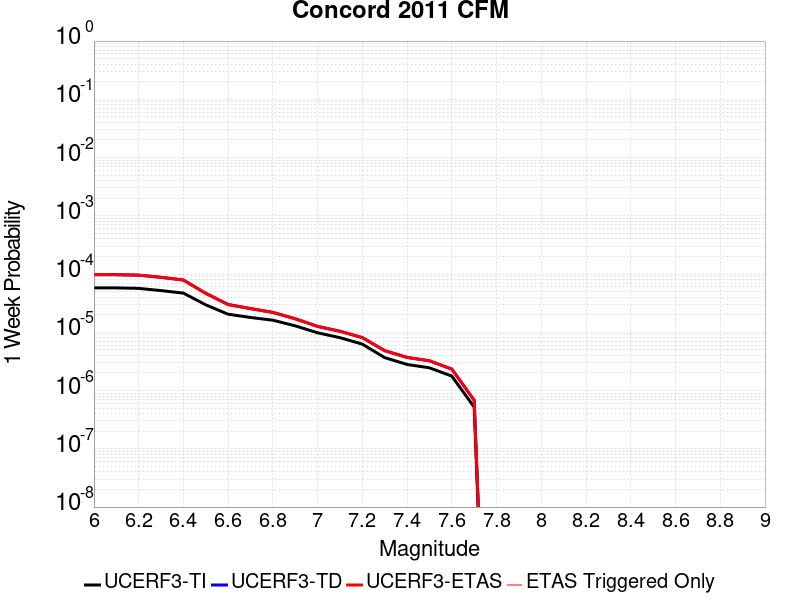 |  | 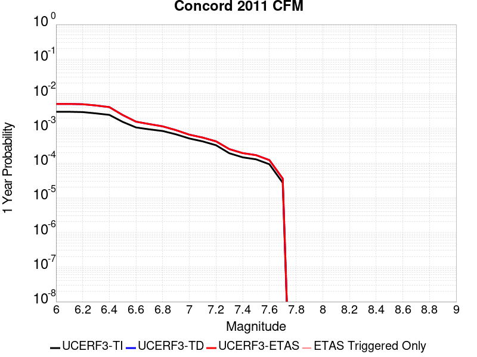 | 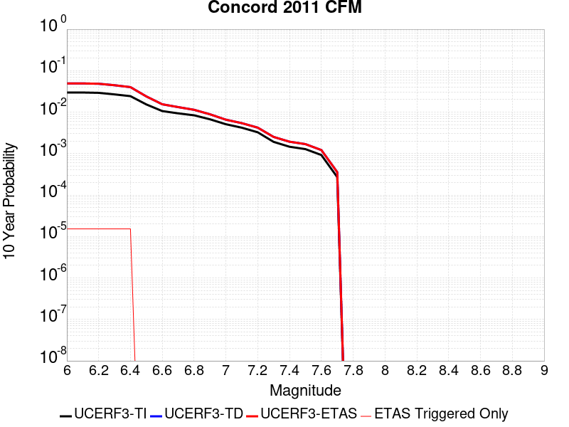 |

| Magnitude | 1 wk TI Prob | 1 wk TD Prob | 1 wk ETAS Prob | 1 wk ETAS/TD Gain | 1 wk ETAS Triggered Only | 1 mo TI Prob | 1 mo TD Prob | 1 mo ETAS Prob | 1 mo ETAS/TD Gain | 1 mo ETAS Triggered Only | 1 yr TI Prob | 1 yr TD Prob | 1 yr ETAS Prob | 1 yr ETAS/TD Gain | 1 yr ETAS Triggered Only | 10 yr TI Prob | 10 yr TD Prob | 10 yr ETAS Prob | 10 yr ETAS/TD Gain | 10 yr ETAS Triggered Only |
|-----|-----|-----|-----|-----|-----|-----|-----|-----|-----|-----|-----|-----|-----|-----|-----|-----|-----|-----|-----|-----|
| 6.0 | 5.7865112E-5 | 9.759152E-5 | 9.759152E-5 | 1.0 | 0.0 | 2.4796976E-4 | 4.1818706E-4 | 4.1818706E-4 | 1.0 | 0.0 | 0.0030148525 | 0.005079467 | 0.005079467 | 1.0 | 0.0 | 0.029742775 | 0.049248982 | 0.04926345 | 1.0002939 | 1.52207E-5 |
| 6.1 | 5.7865112E-5 | 9.759152E-5 | 9.759152E-5 | 1.0 | 0.0 | 2.4796976E-4 | 4.1818706E-4 | 4.1818706E-4 | 1.0 | 0.0 | 0.0030148525 | 0.005079467 | 0.005079467 | 1.0 | 0.0 | 0.029742775 | 0.049248982 | 0.04926345 | 1.0002939 | 1.52207E-5 |
| 6.2 | 5.6789337E-5 | 9.5795076E-5 | 9.5795076E-5 | 1.0 | 0.0 | 2.4336016E-4 | 4.104905E-4 | 4.104905E-4 | 1.0 | 0.0 | 0.0029588845 | 0.0049861916 | 0.0049861916 | 1.0 | 0.0 | 0.029197963 | 0.04836556 | 0.048380043 | 1.0002995 | 1.52207E-5 |
| 6.3 | 5.203322E-5 | 8.803056E-5 | 8.803056E-5 | 1.0 | 0.0 | 2.2298045E-4 | 3.7722368E-4 | 3.7722368E-4 | 1.0 | 0.0 | 0.0027114071 | 0.0045838105 | 0.0045838105 | 1.0 | 0.0 | 0.026785625 | 0.04453672 | 0.04455126 | 1.0003265 | 1.52207E-5 |
| 6.4 | 4.7120942E-5 | 7.897404E-5 | 7.897404E-5 | 1.0 | 0.0 | 2.0193127E-4 | 3.3842045E-4 | 3.3842045E-4 | 1.0 | 0.0 | 0.0024557412 | 0.00411323 | 0.00411323 | 1.0 | 0.0 | 0.024287801 | 0.040065527 | 0.040080138 | 1.0003647 | 1.52207E-5 |
| 6.5 | 2.9598437E-5 | 4.667486E-5 | 4.667486E-5 | 1.0 | 0.0 | 1.2684427E-4 | 2.0002096E-4 | 2.0002096E-4 | 1.0 | 0.0 | 0.001543235 | 0.0024327459 | 0.0024327459 | 1.0 | 0.0 | 0.015325619 | 0.023909973 | 0.023909973 | 1.0 | 0.0 |
| 6.6 | 2.0443718E-5 | 2.998433E-5 | 2.998433E-5 | 1.0 | 0.0 | 8.7613E-5 | 1.2849816E-4 | 1.2849816E-4 | 1.0 | 0.0 | 0.0010661662 | 0.0015633785 | 0.0015633785 | 1.0 | 0.0 | 0.010610655 | 0.015466996 | 0.015466996 | 1.0 | 0.0 |
| 6.7 | 1.798539E-5 | 2.5557381E-5 | 2.5557381E-5 | 1.0 | 0.0 | 7.7077966E-5 | 1.0952716E-4 | 1.0952716E-4 | 1.0 | 0.0 | 9.380202E-4 | 0.001332699 | 0.001332699 | 1.0 | 0.0 | 0.009340706 | 0.013217433 | 0.013217433 | 1.0 | 0.0 |
| 6.8 | 1.613555E-5 | 2.1959211E-5 | 2.1959211E-5 | 1.0 | 0.0 | 6.915052E-5 | 9.4107585E-5 | 9.4107585E-5 | 1.0 | 0.0 | 8.4158237E-4 | 0.0011451716 | 0.0011451716 | 1.0 | 0.0 | 0.008384023 | 0.0113782035 | 0.0113782035 | 1.0 | 0.0 |
| 6.9 | 1.2916435E-5 | 1.7081054E-5 | 1.7081054E-5 | 1.0 | 0.0 | 5.5354973E-5 | 7.32025E-5 | 7.32025E-5 | 1.0 | 0.0 | 6.7373837E-4 | 8.908818E-4 | 8.908818E-4 | 1.0 | 0.0 | 0.006716994 | 0.008867139 | 0.008867139 | 1.0 | 0.0 |
| 7.0 | 9.81129E-6 | 1.2630829E-5 | 1.2630829E-5 | 1.0 | 0.0 | 4.2047708E-5 | 5.413101E-5 | 5.413101E-5 | 1.0 | 0.0 | 5.118106E-4 | 6.588474E-4 | 6.588474E-4 | 1.0 | 0.0 | 0.005106334 | 0.006569153 | 0.006569153 | 1.0 | 0.0 |
| 7.1 | 8.0889195E-6 | 1.0418261E-5 | 1.0418261E-5 | 1.0 | 0.0 | 3.4666336E-5 | 4.4648932E-5 | 4.4648932E-5 | 1.0 | 0.0 | 4.219809E-4 | 5.434662E-4 | 5.434662E-4 | 1.0 | 0.0 | 0.004211805 | 0.0054215975 | 0.0054215975 | 1.0 | 0.0 |
| 7.2 | 6.267438E-6 | 8.115699E-6 | 8.115699E-6 | 1.0 | 0.0 | 2.6860173E-5 | 3.4781104E-5 | 3.4781104E-5 | 1.0 | 0.0 | 3.2697353E-4 | 4.233784E-4 | 4.233784E-4 | 1.0 | 0.0 | 0.0032649285 | 0.004225969 | 0.004225969 | 1.0 | 0.0 |
| 7.3 | 3.6761196E-6 | 4.8401653E-6 | 4.8401653E-6 | 1.0 | 0.0 | 1.5754704E-5 | 2.0743402E-5 | 2.0743402E-5 | 1.0 | 0.0 | 1.9179663E-4 | 2.5252186E-4 | 2.5252186E-4 | 1.0 | 0.0 | 0.0019163118 | 0.002522487 | 0.002522487 | 1.0 | 0.0 |
| 7.4 | 2.8044356E-6 | 3.7096036E-6 | 3.7096036E-6 | 1.0 | 0.0 | 1.2018954E-5 | 1.5898204E-5 | 1.5898204E-5 | 1.0 | 0.0 | 1.4632095E-4 | 1.9354356E-4 | 1.9354356E-4 | 1.0 | 0.0 | 0.0014622464 | 0.0019338481 | 0.0019338481 | 1.0 | 0.0 |
| 7.5 | 2.4578699E-6 | 3.2447442E-6 | 3.2447442E-6 | 1.0 | 0.0 | 1.0533685E-5 | 1.3905973E-5 | 1.3905973E-5 | 1.0 | 0.0 | 1.2824008E-4 | 1.6929218E-4 | 1.6929218E-4 | 1.0 | 0.0 | 0.0012816609 | 0.001691713 | 0.001691713 | 1.0 | 0.0 |
| 7.6 | 1.7713267E-6 | 2.3351192E-6 | 2.3351192E-6 | 1.0 | 0.0 | 7.591378E-6 | 1.0007616E-5 | 1.0007616E-5 | 1.0 | 0.0 | 9.2421105E-5 | 1.21836E-4 | 1.21836E-4 | 1.0 | 0.0 | 9.2382677E-4 | 0.0012177454 | 0.0012177454 | 1.0 | 0.0 |
| 7.7 | 5.1912366E-7 | 6.8290143E-7 | 6.8290143E-7 | 1.0 | 0.0 | 2.2248137E-6 | 2.9267171E-6 | 2.9267171E-6 | 1.0 | 0.0 | 2.708677E-5 | 3.5632213E-5 | 3.5632213E-5 | 1.0 | 0.0 | 2.708347E-4 | 3.5627294E-4 | 3.5627294E-4 | 1.0 | 0.0 |

## Ozena
*[(top)](#table-of-contents)*

| 1 Week | 1 Month | 1 Year | 10 Year |
|-----|-----|-----|-----|
|  |  | 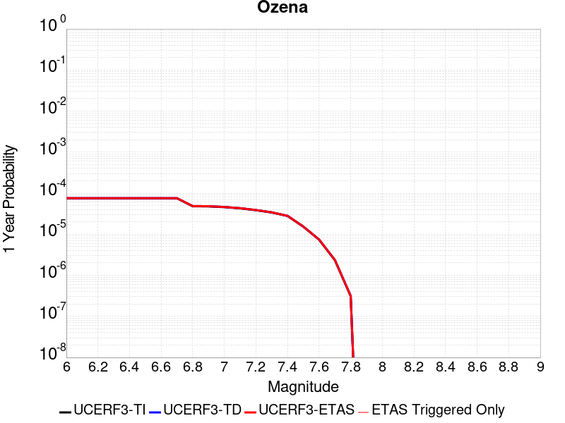 | 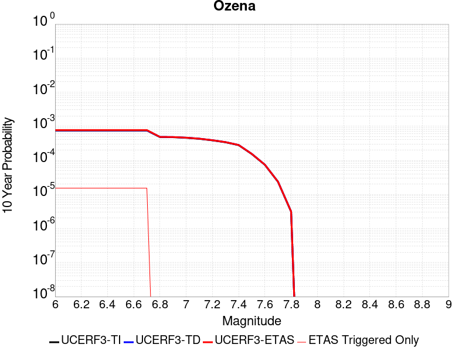 |

| Magnitude | 1 wk TI Prob | 1 wk TD Prob | 1 wk ETAS Prob | 1 wk ETAS/TD Gain | 1 wk ETAS Triggered Only | 1 mo TI Prob | 1 mo TD Prob | 1 mo ETAS Prob | 1 mo ETAS/TD Gain | 1 mo ETAS Triggered Only | 1 yr TI Prob | 1 yr TD Prob | 1 yr ETAS Prob | 1 yr ETAS/TD Gain | 1 yr ETAS Triggered Only | 10 yr TI Prob | 10 yr TD Prob | 10 yr ETAS Prob | 10 yr ETAS/TD Gain | 10 yr ETAS Triggered Only |
|-----|-----|-----|-----|-----|-----|-----|-----|-----|-----|-----|-----|-----|-----|-----|-----|-----|-----|-----|-----|-----|
| 6.0 | 1.4377547E-6 | 1.4513782E-6 | 1.4513782E-6 | 1.0 | 0.0 | 6.161791E-6 | 6.2201793E-6 | 6.2201793E-6 | 1.0 | 0.0 | 7.5017226E-5 | 7.572832E-5 | 7.572832E-5 | 1.0 | 0.0 | 7.4991904E-4 | 7.570518E-4 | 7.7226094E-4 | 1.02009 | 1.52207E-5 |
| 6.1 | 1.4377547E-6 | 1.4513782E-6 | 1.4513782E-6 | 1.0 | 0.0 | 6.161791E-6 | 6.2201793E-6 | 6.2201793E-6 | 1.0 | 0.0 | 7.5017226E-5 | 7.572832E-5 | 7.572832E-5 | 1.0 | 0.0 | 7.4991904E-4 | 7.570518E-4 | 7.7226094E-4 | 1.02009 | 1.52207E-5 |
| 6.2 | 1.4377547E-6 | 1.4513782E-6 | 1.4513782E-6 | 1.0 | 0.0 | 6.161791E-6 | 6.2201793E-6 | 6.2201793E-6 | 1.0 | 0.0 | 7.5017226E-5 | 7.572832E-5 | 7.572832E-5 | 1.0 | 0.0 | 7.4991904E-4 | 7.570518E-4 | 7.7226094E-4 | 1.02009 | 1.52207E-5 |
| 6.3 | 1.4377547E-6 | 1.4513782E-6 | 1.4513782E-6 | 1.0 | 0.0 | 6.161791E-6 | 6.2201793E-6 | 6.2201793E-6 | 1.0 | 0.0 | 7.5017226E-5 | 7.572832E-5 | 7.572832E-5 | 1.0 | 0.0 | 7.4991904E-4 | 7.570518E-4 | 7.7226094E-4 | 1.02009 | 1.52207E-5 |
| 6.4 | 1.4377547E-6 | 1.4513782E-6 | 1.4513782E-6 | 1.0 | 0.0 | 6.161791E-6 | 6.2201793E-6 | 6.2201793E-6 | 1.0 | 0.0 | 7.5017226E-5 | 7.572832E-5 | 7.572832E-5 | 1.0 | 0.0 | 7.4991904E-4 | 7.570518E-4 | 7.7226094E-4 | 1.02009 | 1.52207E-5 |
| 6.5 | 1.4377547E-6 | 1.4513782E-6 | 1.4513782E-6 | 1.0 | 0.0 | 6.161791E-6 | 6.2201793E-6 | 6.2201793E-6 | 1.0 | 0.0 | 7.5017226E-5 | 7.572832E-5 | 7.572832E-5 | 1.0 | 0.0 | 7.4991904E-4 | 7.570518E-4 | 7.7226094E-4 | 1.02009 | 1.52207E-5 |
| 6.6 | 1.4377547E-6 | 1.4513782E-6 | 1.4513782E-6 | 1.0 | 0.0 | 6.161791E-6 | 6.2201793E-6 | 6.2201793E-6 | 1.0 | 0.0 | 7.5017226E-5 | 7.572832E-5 | 7.572832E-5 | 1.0 | 0.0 | 7.4991904E-4 | 7.570518E-4 | 7.7226094E-4 | 1.02009 | 1.52207E-5 |
| 6.7 | 1.4377547E-6 | 1.4513782E-6 | 1.4513782E-6 | 1.0 | 0.0 | 6.161791E-6 | 6.2201793E-6 | 6.2201793E-6 | 1.0 | 0.0 | 7.5017226E-5 | 7.572832E-5 | 7.572832E-5 | 1.0 | 0.0 | 7.4991904E-4 | 7.570518E-4 | 7.7226094E-4 | 1.02009 | 1.52207E-5 |
| 6.8 | 9.223257E-7 | 9.317624E-7 | 9.317624E-7 | 1.0 | 0.0 | 3.9528186E-6 | 3.9932615E-6 | 3.9932615E-6 | 1.0 | 0.0 | 4.81245E-5 | 4.8616912E-5 | 4.8616912E-5 | 1.0 | 0.0 | 4.811408E-4 | 4.860668E-4 | 4.860668E-4 | 1.0 | 0.0 |
| 6.9 | 9.141515E-7 | 9.235371E-7 | 9.235371E-7 | 1.0 | 0.0 | 3.917786E-6 | 3.9580104E-6 | 3.9580104E-6 | 1.0 | 0.0 | 4.7698002E-5 | 4.818775E-5 | 4.818775E-5 | 1.0 | 0.0 | 4.7687767E-4 | 4.8177704E-4 | 4.8177704E-4 | 1.0 | 0.0 |
| 7.0 | 8.767648E-7 | 8.8585773E-7 | 8.8585773E-7 | 1.0 | 0.0 | 3.757558E-6 | 3.7965276E-6 | 3.7965276E-6 | 1.0 | 0.0 | 4.5747307E-5 | 4.6221783E-5 | 4.6221783E-5 | 1.0 | 0.0 | 4.5737892E-4 | 4.6212564E-4 | 4.6212564E-4 | 1.0 | 0.0 |
| 7.1 | 8.199402E-7 | 8.2853984E-7 | 8.2853984E-7 | 1.0 | 0.0 | 3.5140247E-6 | 3.5508804E-6 | 3.5508804E-6 | 1.0 | 0.0 | 4.2782412E-5 | 4.323115E-5 | 4.323115E-5 | 1.0 | 0.0 | 4.2774176E-4 | 4.322311E-4 | 4.322311E-4 | 1.0 | 0.0 |
| 7.2 | 7.38705E-7 | 7.464262E-7 | 7.464262E-7 | 1.0 | 0.0 | 3.1658747E-6 | 3.198966E-6 | 3.198966E-6 | 1.0 | 0.0 | 3.8543843E-5 | 3.894675E-5 | 3.894675E-5 | 1.0 | 0.0 | 3.853716E-4 | 3.8940276E-4 | 3.8940276E-4 | 1.0 | 0.0 |
| 7.3 | 6.490017E-7 | 6.557802E-7 | 6.557802E-7 | 1.0 | 0.0 | 2.7814328E-6 | 2.8104837E-6 | 2.8104837E-6 | 1.0 | 0.0 | 3.386342E-5 | 3.4217133E-5 | 3.4217133E-5 | 1.0 | 0.0 | 3.3858258E-4 | 3.4212202E-4 | 3.4212202E-4 | 1.0 | 0.0 |
| 7.4 | 5.346736E-7 | 5.4022604E-7 | 5.4022604E-7 | 1.0 | 0.0 | 2.291456E-6 | 2.3152527E-6 | 2.3152527E-6 | 1.0 | 0.0 | 2.789812E-5 | 2.8187867E-5 | 2.8187867E-5 | 1.0 | 0.0 | 2.789462E-4 | 2.8184598E-4 | 2.8184598E-4 | 1.0 | 0.0 |
| 7.5 | 2.939325E-7 | 2.9666057E-7 | 2.9666057E-7 | 1.0 | 0.0 | 1.25971E-6 | 1.271402E-6 | 1.271402E-6 | 1.0 | 0.0 | 1.5336862E-5 | 1.5479225E-5 | 1.5479225E-5 | 1.0 | 0.0 | 1.5335804E-4 | 1.5478309E-4 | 1.5478309E-4 | 1.0 | 0.0 |
| 7.6 | 1.4151905E-7 | 1.4253266E-7 | 1.4253266E-7 | 1.0 | 0.0 | 6.065101E-7 | 6.108541E-7 | 6.108541E-7 | 1.0 | 0.0 | 7.3842357E-6 | 7.4371237E-6 | 7.4371237E-6 | 1.0 | 0.0 | 7.38399E-5 | 7.436883E-5 | 7.436883E-5 | 1.0 | 0.0 |
| 7.7 | 4.4957577E-8 | 4.5252243E-8 | 4.5252243E-8 | 1.0 | 0.0 | 1.9267533E-7 | 1.9393818E-7 | 1.9393818E-7 | 1.0 | 0.0 | 2.3458194E-6 | 2.3611947E-6 | 2.3611947E-6 | 1.0 | 0.0 | 2.3457947E-5 | 2.3611707E-5 | 2.3611707E-5 | 1.0 | 0.0 |
| 7.8 | 5.9993255E-9 | 6.0412972E-9 | 6.0412972E-9 | 1.0 | 0.0 | 2.5711394E-8 | 2.5891273E-8 | 2.5891273E-8 | 1.0 | 0.0 | 3.1303617E-7 | 3.1522623E-7 | 3.1522623E-7 | 1.0 | 0.0 | 3.1303573E-6 | 3.1522588E-6 | 3.1522588E-6 | 1.0 | 0.0 |

## Point Reyes 2011 connector
*[(top)](#table-of-contents)*

| 1 Week | 1 Month | 1 Year | 10 Year |
|-----|-----|-----|-----|
| 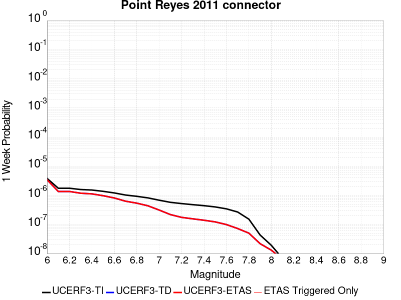 | 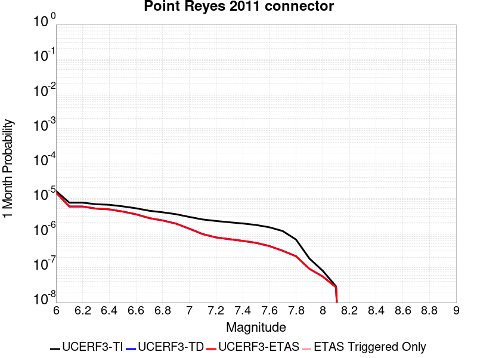 | 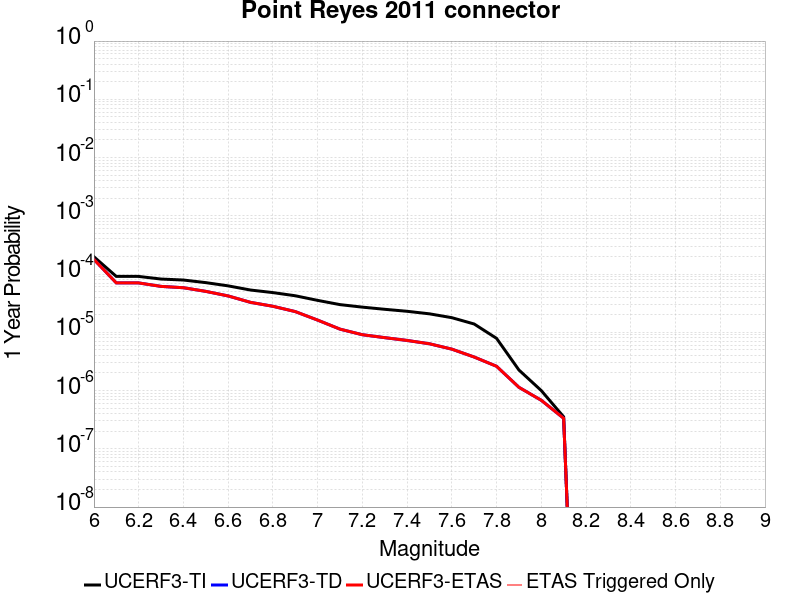 | 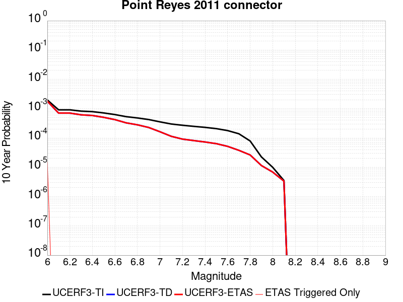 |

| Magnitude | 1 wk TI Prob | 1 wk TD Prob | 1 wk ETAS Prob | 1 wk ETAS/TD Gain | 1 wk ETAS Triggered Only | 1 mo TI Prob | 1 mo TD Prob | 1 mo ETAS Prob | 1 mo ETAS/TD Gain | 1 mo ETAS Triggered Only | 1 yr TI Prob | 1 yr TD Prob | 1 yr ETAS Prob | 1 yr ETAS/TD Gain | 1 yr ETAS Triggered Only | 10 yr TI Prob | 10 yr TD Prob | 10 yr ETAS Prob | 10 yr ETAS/TD Gain | 10 yr ETAS Triggered Only |
|-----|-----|-----|-----|-----|-----|-----|-----|-----|-----|-----|-----|-----|-----|-----|-----|-----|-----|-----|-----|-----|
| 6.0 | 3.7893044E-6 | 3.419046E-6 | 3.419046E-6 | 1.0 | 0.0 | 1.6239776E-5 | 1.4652984E-5 | 1.4652984E-5 | 1.0 | 0.0 | 1.9770133E-4 | 1.783876E-4 | 1.783876E-4 | 1.0 | 0.0 | 0.0019752553 | 0.0017829017 | 0.0017980953 | 1.0085218 | 1.52207E-5 |
| 6.1 | 1.7449562E-6 | 1.3500958E-6 | 1.3500958E-6 | 1.0 | 0.0 | 7.478362E-6 | 5.786112E-6 | 5.786112E-6 | 1.0 | 0.0 | 9.104525E-5 | 7.044369E-5 | 7.044369E-5 | 1.0 | 0.0 | 9.1007963E-4 | 7.044673E-4 | 7.044673E-4 | 1.0 | 0.0 |
| 6.2 | 1.7449562E-6 | 1.3500958E-6 | 1.3500958E-6 | 1.0 | 0.0 | 7.478362E-6 | 5.786112E-6 | 5.786112E-6 | 1.0 | 0.0 | 9.104525E-5 | 7.044369E-5 | 7.044369E-5 | 1.0 | 0.0 | 9.1007963E-4 | 7.044673E-4 | 7.044673E-4 | 1.0 | 0.0 |
| 6.3 | 1.5739171E-6 | 1.1773358E-6 | 1.1773358E-6 | 1.0 | 0.0 | 6.7453416E-6 | 5.0457156E-6 | 5.0457156E-6 | 1.0 | 0.0 | 8.212144E-5 | 6.14299E-5 | 6.14299E-5 | 1.0 | 0.0 | 8.2091097E-4 | 6.1438145E-4 | 6.1438145E-4 | 1.0 | 0.0 |
| 6.4 | 1.5138507E-6 | 1.1166904E-6 | 1.1166904E-6 | 1.0 | 0.0 | 6.4879155E-6 | 4.7858075E-6 | 4.7858075E-6 | 1.0 | 0.0 | 7.898751E-5 | 5.8265687E-5 | 5.8265687E-5 | 1.0 | 0.0 | 7.8959437E-4 | 5.827562E-4 | 5.827562E-4 | 1.0 | 0.0 |
| 6.5 | 1.3662817E-6 | 9.671372E-7 | 9.671372E-7 | 1.0 | 0.0 | 5.8554797E-6 | 4.1448675E-6 | 4.1448675E-6 | 1.0 | 0.0 | 7.128814E-5 | 5.046261E-5 | 5.046261E-5 | 1.0 | 0.0 | 7.126527E-4 | 5.047615E-4 | 5.047615E-4 | 1.0 | 0.0 |
| 6.6 | 1.2022703E-6 | 8.0703006E-7 | 8.0703006E-7 | 1.0 | 0.0 | 5.1525767E-6 | 3.4586958E-6 | 3.4586958E-6 | 1.0 | 0.0 | 6.273081E-5 | 4.210882E-5 | 4.210882E-5 | 1.0 | 0.0 | 6.271311E-4 | 4.2125754E-4 | 4.2125754E-4 | 1.0 | 0.0 |
| 6.7 | 1.0194848E-6 | 6.265979E-7 | 6.265979E-7 | 1.0 | 0.0 | 4.3692135E-6 | 2.6854168E-6 | 2.6854168E-6 | 1.0 | 0.0 | 5.319387E-5 | 3.2694465E-5 | 3.2694465E-5 | 1.0 | 0.0 | 5.3181144E-4 | 3.271452E-4 | 3.271452E-4 | 1.0 | 0.0 |
| 6.8 | 9.212307E-7 | 5.3645635E-7 | 5.3645635E-7 | 1.0 | 0.0 | 3.9481256E-6 | 2.2990966E-6 | 2.2990966E-6 | 1.0 | 0.0 | 4.806737E-5 | 2.7991146E-5 | 2.7991146E-5 | 1.0 | 0.0 | 4.8056975E-4 | 2.8012466E-4 | 2.8012466E-4 | 1.0 | 0.0 |
| 6.9 | 8.1306075E-7 | 4.350046E-7 | 4.350046E-7 | 1.0 | 0.0 | 3.4845416E-6 | 1.8643041E-6 | 1.8643041E-6 | 1.0 | 0.0 | 4.2423468E-5 | 2.2697668E-5 | 2.2697668E-5 | 1.0 | 0.0 | 4.241537E-4 | 2.2720183E-4 | 2.2720183E-4 | 1.0 | 0.0 |
| 7.0 | 6.773335E-7 | 3.1073702E-7 | 3.1073702E-7 | 1.0 | 0.0 | 2.9028547E-6 | 1.3317294E-6 | 1.3317294E-6 | 1.0 | 0.0 | 3.5341684E-5 | 1.6213686E-5 | 1.6213686E-5 | 1.0 | 0.0 | 3.5336064E-4 | 1.6237324E-4 | 1.6237324E-4 | 1.0 | 0.0 |
| 7.1 | 5.7279397E-7 | 2.1742792E-7 | 2.1742792E-7 | 1.0 | 0.0 | 2.454829E-6 | 9.3183365E-7 | 9.3183365E-7 | 1.0 | 0.0 | 2.9887131E-5 | 1.1345015E-5 | 1.1345015E-5 | 1.0 | 0.0 | 2.9883112E-4 | 1.13692506E-4 | 1.13692506E-4 | 1.0 | 0.0 |
| 7.2 | 5.185539E-7 | 1.7429139E-7 | 1.7429139E-7 | 1.0 | 0.0 | 2.222372E-6 | 7.469629E-7 | 7.469629E-7 | 1.0 | 0.0 | 2.7057044E-5 | 9.094235E-6 | 9.094235E-6 | 1.0 | 0.0 | 2.7053748E-4 | 9.118677E-5 | 9.118677E-5 | 1.0 | 0.0 |
| 7.3 | 4.7599846E-7 | 1.5520465E-7 | 1.5520465E-7 | 1.0 | 0.0 | 2.0399918E-6 | 6.6516264E-7 | 6.6516264E-7 | 1.0 | 0.0 | 2.4836616E-5 | 8.0983245E-6 | 8.0983245E-6 | 1.0 | 0.0 | 2.4833842E-4 | 8.122844E-5 | 8.122844E-5 | 1.0 | 0.0 |
| 7.4 | 4.3987393E-7 | 1.3893278E-7 | 1.3893278E-7 | 1.0 | 0.0 | 1.8851727E-6 | 5.9542606E-7 | 5.9542606E-7 | 1.0 | 0.0 | 2.2951735E-5 | 7.249288E-6 | 7.249288E-6 | 1.0 | 0.0 | 2.2949366E-4 | 7.273859E-5 | 7.273859E-5 | 1.0 | 0.0 |
| 7.5 | 3.980054E-7 | 1.218581E-7 | 1.218581E-7 | 1.0 | 0.0 | 1.7057363E-6 | 5.222489E-7 | 5.222489E-7 | 1.0 | 0.0 | 2.0767142E-5 | 6.358361E-6 | 6.358361E-6 | 1.0 | 0.0 | 2.0765202E-4 | 6.382455E-5 | 6.382455E-5 | 1.0 | 0.0 |
| 7.6 | 3.4188398E-7 | 9.8577246E-8 | 9.8577246E-8 | 1.0 | 0.0 | 1.4652163E-6 | 4.2247387E-7 | 4.2247387E-7 | 1.0 | 0.0 | 1.7838862E-5 | 5.143607E-6 | 5.143607E-6 | 1.0 | 0.0 | 1.783743E-4 | 5.166426E-5 | 5.166426E-5 | 1.0 | 0.0 |
| 7.7 | 2.6611437E-7 | 7.213626E-8 | 7.213626E-8 | 1.0 | 0.0 | 1.1404896E-6 | 3.0915538E-7 | 3.0915538E-7 | 1.0 | 0.0 | 1.3885373E-5 | 3.7639602E-6 | 3.7639602E-6 | 1.0 | 0.0 | 1.3884505E-4 | 3.78245E-5 | 3.78245E-5 | 1.0 | 0.0 |
| 7.8 | 1.5107078E-7 | 5.0054087E-8 | 5.0054087E-8 | 1.0 | 0.0 | 6.474461E-7 | 2.145175E-7 | 2.145175E-7 | 1.0 | 0.0 | 7.882627E-6 | 2.6117473E-6 | 2.6117473E-6 | 1.0 | 0.0 | 7.8823476E-5 | 2.6281212E-5 | 2.6281212E-5 | 1.0 | 0.0 |
| 7.9 | 4.3228205E-8 | 2.1818217E-8 | 2.1818217E-8 | 1.0 | 0.0 | 1.8526373E-7 | 9.350663E-8 | 9.350663E-8 | 1.0 | 0.0 | 2.2555835E-6 | 1.1384427E-6 | 1.1384427E-6 | 1.0 | 0.0 | 2.2555607E-5 | 1.1461557E-5 | 1.1461557E-5 | 1.0 | 0.0 |
| 8.0 | 1.9149928E-8 | 1.30497515E-8 | 1.30497515E-8 | 1.0 | 0.0 | 8.207112E-8 | 5.5927494E-8 | 5.5927494E-8 | 1.0 | 0.0 | 9.992154E-7 | 6.80917E-7 | 6.80917E-7 | 1.0 | 0.0 | 9.992109E-6 | 6.857356E-6 | 6.857356E-6 | 1.0 | 0.0 |
| 8.1 | 6.7792816E-9 | 6.4085857E-9 | 6.4085857E-9 | 1.0 | 0.0 | 2.9054062E-8 | 2.7465362E-8 | 2.7465362E-8 | 1.0 | 0.0 | 3.5373316E-7 | 3.3439076E-7 | 3.3439076E-7 | 1.0 | 0.0 | 3.537326E-6 | 3.3694284E-6 | 3.3694284E-6 | 1.0 | 0.0 |

## Point Reyes 2011 CFM
*[(top)](#table-of-contents)*

| 1 Week | 1 Month | 1 Year | 10 Year |
|-----|-----|-----|-----|
| 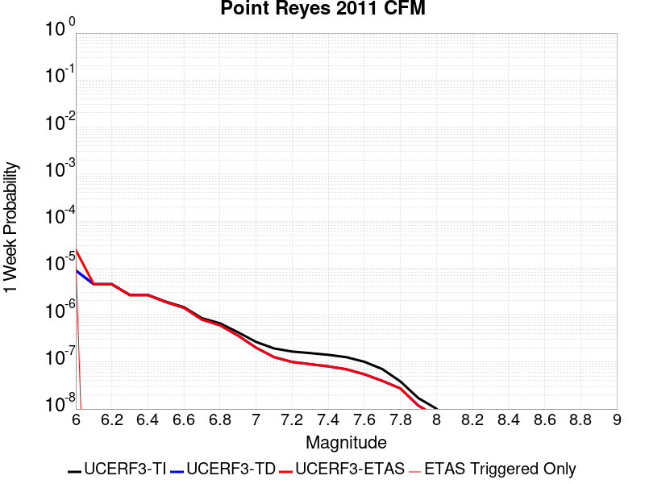 | 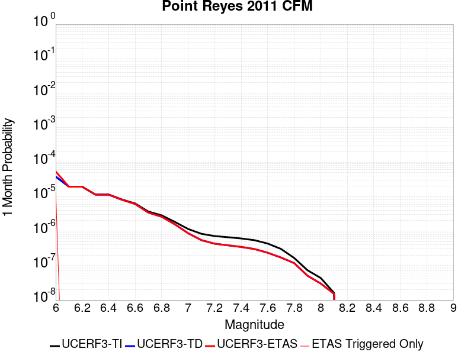 | 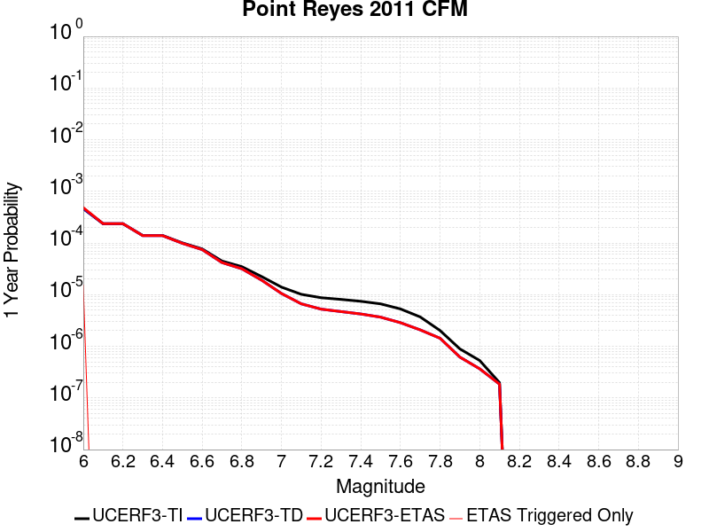 | 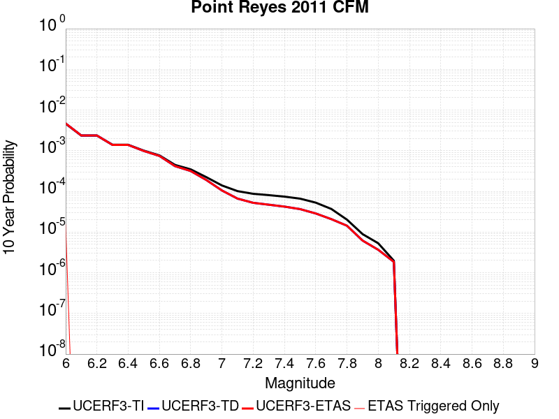 |

| Magnitude | 1 wk TI Prob | 1 wk TD Prob | 1 wk ETAS Prob | 1 wk ETAS/TD Gain | 1 wk ETAS Triggered Only | 1 mo TI Prob | 1 mo TD Prob | 1 mo ETAS Prob | 1 mo ETAS/TD Gain | 1 mo ETAS Triggered Only | 1 yr TI Prob | 1 yr TD Prob | 1 yr ETAS Prob | 1 yr ETAS/TD Gain | 1 yr ETAS Triggered Only | 10 yr TI Prob | 10 yr TD Prob | 10 yr ETAS Prob | 10 yr ETAS/TD Gain | 10 yr ETAS Triggered Only |
|-----|-----|-----|-----|-----|-----|-----|-----|-----|-----|-----|-----|-----|-----|-----|-----|-----|-----|-----|-----|-----|
| 6.0 | 8.8644965E-6 | 8.967163E-6 | 2.4187728E-5 | 2.6973667 | 1.52207E-5 | 3.7990147E-5 | 3.843017E-5 | 5.3650285E-5 | 1.396046 | 1.52207E-5 | 4.624319E-4 | 4.6779314E-4 | 4.8300673E-4 | 1.0325221 | 1.52207E-5 | 0.0046147075 | 0.004668713 | 0.0046838624 | 1.0032449 | 1.52207E-5 |
| 6.1 | 4.526405E-6 | 4.5392185E-6 | 4.5392185E-6 | 1.0 | 0.0 | 1.9398734E-5 | 1.9453653E-5 | 1.9453653E-5 | 1.0 | 0.0 | 2.36154E-4 | 2.3682354E-4 | 2.3682354E-4 | 1.0 | 0.0 | 0.002359032 | 0.0023658178 | 0.0023658178 | 1.0 | 0.0 |
| 6.2 | 4.526405E-6 | 4.5392185E-6 | 4.5392185E-6 | 1.0 | 0.0 | 1.9398734E-5 | 1.9453653E-5 | 1.9453653E-5 | 1.0 | 0.0 | 2.36154E-4 | 2.3682354E-4 | 2.3682354E-4 | 1.0 | 0.0 | 0.002359032 | 0.0023658178 | 0.0023658178 | 1.0 | 0.0 |
| 6.3 | 2.6842322E-6 | 2.660676E-6 | 2.660676E-6 | 1.0 | 0.0 | 1.1503801E-5 | 1.1402849E-5 | 1.1402849E-5 | 1.0 | 0.0 | 1.4004979E-4 | 1.3882104E-4 | 1.3882104E-4 | 1.0 | 0.0 | 0.0013996155 | 0.0013873649 | 0.0013873649 | 1.0 | 0.0 |
| 6.4 | 2.6842322E-6 | 2.660676E-6 | 2.660676E-6 | 1.0 | 0.0 | 1.1503801E-5 | 1.1402849E-5 | 1.1402849E-5 | 1.0 | 0.0 | 1.4004979E-4 | 1.3882104E-4 | 1.3882104E-4 | 1.0 | 0.0 | 0.0013996155 | 0.0013873649 | 0.0013873649 | 1.0 | 0.0 |
| 6.5 | 1.9281833E-6 | 1.8906262E-6 | 1.8906262E-6 | 1.0 | 0.0 | 8.263617E-6 | 8.102659E-6 | 8.102659E-6 | 1.0 | 0.0 | 1.0060489E-4 | 9.86455E-5 | 9.86455E-5 | 1.0 | 0.0 | 0.0010055936 | 9.860279E-4 | 9.860279E-4 | 1.0 | 0.0 |
| 6.6 | 1.4726726E-6 | 1.4269577E-6 | 1.4269577E-6 | 1.0 | 0.0 | 6.3114385E-6 | 6.1155188E-6 | 6.1155188E-6 | 1.0 | 0.0 | 7.683905E-5 | 7.445395E-5 | 7.445395E-5 | 1.0 | 0.0 | 7.6812494E-4 | 7.4429717E-4 | 7.4429717E-4 | 1.0 | 0.0 |
| 6.7 | 8.572307E-7 | 8.007212E-7 | 8.007212E-7 | 1.0 | 0.0 | 3.6738406E-6 | 3.431658E-6 | 3.431658E-6 | 1.0 | 0.0 | 4.472809E-5 | 4.1779647E-5 | 4.1779647E-5 | 1.0 | 0.0 | 4.471909E-4 | 4.1772184E-4 | 4.1772184E-4 | 1.0 | 0.0 |
| 6.8 | 6.6745434E-7 | 6.0773E-7 | 6.0773E-7 | 1.0 | 0.0 | 2.8605155E-6 | 2.6045543E-6 | 2.6045543E-6 | 1.0 | 0.0 | 3.482622E-5 | 3.171E-5 | 3.171E-5 | 1.0 | 0.0 | 3.4820763E-4 | 3.1705803E-4 | 3.1705803E-4 | 1.0 | 0.0 |
| 6.9 | 4.291521E-7 | 3.6535937E-7 | 3.6535937E-7 | 1.0 | 0.0 | 1.839222E-6 | 1.565825E-6 | 1.565825E-6 | 1.0 | 0.0 | 2.2392298E-5 | 1.9063755E-5 | 1.9063755E-5 | 1.0 | 0.0 | 2.2390042E-4 | 1.9062385E-4 | 1.9062385E-4 | 1.0 | 0.0 |
| 7.0 | 2.6812808E-7 | 2.0187414E-7 | 2.0187414E-7 | 1.0 | 0.0 | 1.1491198E-6 | 8.651746E-7 | 8.651746E-7 | 1.0 | 0.0 | 1.3990444E-5 | 1.0533451E-5 | 1.0533451E-5 | 1.0 | 0.0 | 1.3989564E-4 | 1.0533186E-4 | 1.0533186E-4 | 1.0 | 0.0 |
| 7.1 | 1.9451231E-7 | 1.2725499E-7 | 1.2725499E-7 | 1.0 | 0.0 | 8.336239E-7 | 5.453784E-7 | 5.453784E-7 | 1.0 | 0.0 | 1.0149324E-5 | 6.6399616E-6 | 6.6399616E-6 | 1.0 | 0.0 | 1.014886E-4 | 6.639991E-5 | 6.639991E-5 | 1.0 | 0.0 |
| 7.2 | 1.6715143E-7 | 1.00428394E-7 | 1.00428394E-7 | 1.0 | 0.0 | 7.1636305E-7 | 4.3040734E-7 | 4.3040734E-7 | 1.0 | 0.0 | 8.721685E-6 | 5.2401965E-6 | 5.2401965E-6 | 1.0 | 0.0 | 8.721343E-5 | 5.2402997E-5 | 5.2402997E-5 | 1.0 | 0.0 |
| 7.3 | 1.5503173E-7 | 9.0131024E-8 | 9.0131024E-8 | 1.0 | 0.0 | 6.644215E-7 | 3.8627576E-7 | 3.8627576E-7 | 1.0 | 0.0 | 8.089301E-6 | 4.702897E-6 | 4.702897E-6 | 1.0 | 0.0 | 8.089007E-5 | 4.7030244E-5 | 4.7030244E-5 | 1.0 | 0.0 |
| 7.4 | 1.4251614E-7 | 8.097624E-8 | 8.097624E-8 | 1.0 | 0.0 | 6.1078333E-7 | 3.47041E-7 | 3.47041E-7 | 1.0 | 0.0 | 7.4362615E-6 | 4.225216E-6 | 4.225216E-6 | 1.0 | 0.0 | 7.436013E-5 | 4.2253625E-5 | 4.2253625E-5 | 1.0 | 0.0 |
| 7.5 | 1.2710186E-7 | 7.0296394E-8 | 7.0296394E-8 | 1.0 | 0.0 | 5.447221E-7 | 3.0127023E-7 | 3.0127023E-7 | 1.0 | 0.0 | 6.6319717E-6 | 3.667959E-6 | 3.667959E-6 | 1.0 | 0.0 | 6.6317734E-5 | 3.6681253E-5 | 3.6681253E-5 | 1.0 | 0.0 |
| 7.6 | 1.0144708E-7 | 5.4952274E-8 | 5.4952274E-8 | 1.0 | 0.0 | 4.347731E-7 | 2.3550973E-7 | 2.3550973E-7 | 1.0 | 0.0 | 5.2933497E-6 | 2.8673273E-6 | 2.8673273E-6 | 1.0 | 0.0 | 5.293224E-5 | 2.8675171E-5 | 2.8675171E-5 | 1.0 | 0.0 |
| 7.7 | 7.090527E-8 | 3.98231E-8 | 3.98231E-8 | 1.0 | 0.0 | 3.038797E-7 | 1.7067042E-7 | 1.7067042E-7 | 1.0 | 0.0 | 3.699729E-6 | 2.0779103E-6 | 2.0779103E-6 | 1.0 | 0.0 | 3.6996673E-5 | 2.0781177E-5 | 2.0781177E-5 | 1.0 | 0.0 |
| 7.8 | 3.8712045E-8 | 2.7440025E-8 | 2.7440025E-8 | 1.0 | 0.0 | 1.6590876E-7 | 1.176001E-7 | 1.176001E-7 | 1.0 | 0.0 | 2.0199373E-6 | 1.4317802E-6 | 1.4317802E-6 | 1.0 | 0.0 | 2.0199188E-5 | 1.4319979E-5 | 1.4319979E-5 | 1.0 | 0.0 |
| 7.9 | 1.7068782E-8 | 1.1833354E-8 | 1.1833354E-8 | 1.0 | 0.0 | 7.315192E-8 | 5.0714362E-8 | 5.0714362E-8 | 1.0 | 0.0 | 8.906242E-7 | 6.174472E-7 | 6.174472E-7 | 1.0 | 0.0 | 8.906207E-6 | 6.1767228E-6 | 6.1767228E-6 | 1.0 | 0.0 |
| 8.0 | 1.0172592E-8 | 7.0280843E-9 | 7.0280843E-9 | 1.0 | 0.0 | 4.359682E-8 | 3.0120354E-8 | 3.0120354E-8 | 1.0 | 0.0 | 5.3079117E-7 | 3.6671526E-7 | 3.6671526E-7 | 1.0 | 0.0 | 5.307899E-6 | 3.6694146E-6 | 3.6694146E-6 | 1.0 | 0.0 |
| 8.1 | 3.7861243E-9 | 3.5452439E-9 | 3.5452439E-9 | 1.0 | 0.0 | 1.6226247E-8 | 1.5193901E-8 | 1.5193901E-8 | 1.0 | 0.0 | 1.9755454E-7 | 1.8498575E-7 | 1.8498575E-7 | 1.0 | 0.0 | 1.9755437E-6 | 1.8518531E-6 | 1.8518531E-6 | 1.0 | 0.0 |

## Great Valley 04a Trout Creek
*[(top)](#table-of-contents)*

| 1 Week | 1 Month | 1 Year | 10 Year |
|-----|-----|-----|-----|
|  |  | 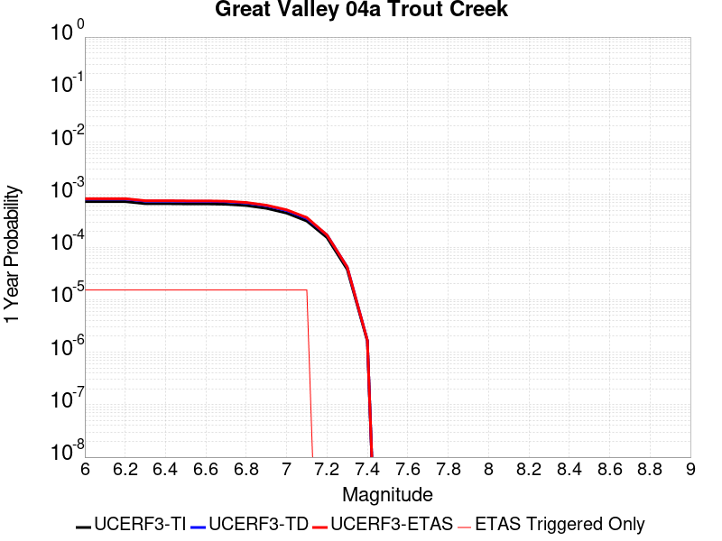 | 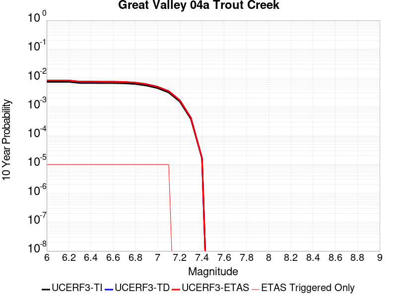 |

| Magnitude | 1 wk TI Prob | 1 wk TD Prob | 1 wk ETAS Prob | 1 wk ETAS/TD Gain | 1 wk ETAS Triggered Only | 1 mo TI Prob | 1 mo TD Prob | 1 mo ETAS Prob | 1 mo ETAS/TD Gain | 1 mo ETAS Triggered Only | 1 yr TI Prob | 1 yr TD Prob | 1 yr ETAS Prob | 1 yr ETAS/TD Gain | 1 yr ETAS Triggered Only | 10 yr TI Prob | 10 yr TD Prob | 10 yr ETAS Prob | 10 yr ETAS/TD Gain | 10 yr ETAS Triggered Only |
|-----|-----|-----|-----|-----|-----|-----|-----|-----|-----|-----|-----|-----|-----|-----|-----|-----|-----|-----|-----|-----|
| 6.0 | 1.4088538E-5 | 1.5719554E-5 | 1.5719554E-5 | 1.0 | 0.0 | 6.037805E-5 | 6.7367844E-5 | 6.7367844E-5 | 1.0 | 0.0 | 7.3485484E-4 | 8.199074E-4 | 8.351156E-4 | 1.0185487 | 1.52207E-5 | 0.007324295 | 0.008170108 | 0.008185204 | 1.0018477 | 1.52207E-5 |
| 6.1 | 1.4088538E-5 | 1.5719554E-5 | 1.5719554E-5 | 1.0 | 0.0 | 6.037805E-5 | 6.7367844E-5 | 6.7367844E-5 | 1.0 | 0.0 | 7.3485484E-4 | 8.199074E-4 | 8.351156E-4 | 1.0185487 | 1.52207E-5 | 0.007324295 | 0.008170108 | 0.008185204 | 1.0018477 | 1.52207E-5 |
| 6.2 | 1.4088538E-5 | 1.5719554E-5 | 1.5719554E-5 | 1.0 | 0.0 | 6.037805E-5 | 6.7367844E-5 | 6.7367844E-5 | 1.0 | 0.0 | 7.3485484E-4 | 8.199074E-4 | 8.351156E-4 | 1.0185487 | 1.52207E-5 | 0.007324295 | 0.008170108 | 0.008185204 | 1.0018477 | 1.52207E-5 |
| 6.3 | 1.2882862E-5 | 1.4378603E-5 | 1.4378603E-5 | 1.0 | 0.0 | 5.5211098E-5 | 6.1621184E-5 | 6.1621184E-5 | 1.0 | 0.0 | 6.7198783E-4 | 7.4999005E-4 | 7.6519937E-4 | 1.0202793 | 1.52207E-5 | 0.0066995937 | 0.0074756527 | 0.0074907597 | 1.0020208 | 1.52207E-5 |
| 6.4 | 1.2882862E-5 | 1.4378603E-5 | 1.4378603E-5 | 1.0 | 0.0 | 5.5211098E-5 | 6.1621184E-5 | 6.1621184E-5 | 1.0 | 0.0 | 6.7198783E-4 | 7.4999005E-4 | 7.6519937E-4 | 1.0202793 | 1.52207E-5 | 0.0066995937 | 0.0074756527 | 0.0074907597 | 1.0020208 | 1.52207E-5 |
| 6.5 | 1.2762329E-5 | 1.424516E-5 | 1.424516E-5 | 1.0 | 0.0 | 5.469455E-5 | 6.1049315E-5 | 6.1049315E-5 | 1.0 | 0.0 | 6.657027E-4 | 7.430323E-4 | 7.582417E-4 | 1.0204693 | 1.52207E-5 | 0.00663712 | 0.0074065393 | 0.007421647 | 1.0020398 | 1.52207E-5 |
| 6.6 | 1.2762329E-5 | 1.424516E-5 | 1.424516E-5 | 1.0 | 0.0 | 5.469455E-5 | 6.1049315E-5 | 6.1049315E-5 | 1.0 | 0.0 | 6.657027E-4 | 7.430323E-4 | 7.582417E-4 | 1.0204693 | 1.52207E-5 | 0.00663712 | 0.0074065393 | 0.007421647 | 1.0020398 | 1.52207E-5 |
| 6.7 | 1.2557959E-5 | 1.4019395E-5 | 1.4019395E-5 | 1.0 | 0.0 | 5.3818712E-5 | 6.0081795E-5 | 6.0081795E-5 | 1.0 | 0.0 | 6.5504585E-4 | 7.312607E-4 | 7.4647024E-4 | 1.0207992 | 1.52207E-5 | 0.006531183 | 0.007289598 | 0.007304708 | 1.0020728 | 1.52207E-5 |
| 6.8 | 1.1871544E-5 | 1.3258823E-5 | 1.3258823E-5 | 1.0 | 0.0 | 5.0877054E-5 | 5.6822348E-5 | 5.6822348E-5 | 1.0 | 0.0 | 6.1925204E-4 | 6.916025E-4 | 7.0681266E-4 | 1.0219927 | 1.52207E-5 | 0.0061752927 | 0.0068955184 | 0.006910634 | 1.0021921 | 1.52207E-5 |
| 6.9 | 1.0500373E-5 | 1.1731261E-5 | 1.1731261E-5 | 1.0 | 0.0 | 4.5000823E-5 | 5.0275914E-5 | 5.0275914E-5 | 1.0 | 0.0 | 5.4774724E-4 | 6.119459E-4 | 6.271573E-4 | 1.0248574 | 1.52207E-5 | 0.005463991 | 0.0061034737 | 0.0061186017 | 1.0024786 | 1.52207E-5 |
| 7.0 | 8.524332E-6 | 9.5334835E-6 | 9.5334835E-6 | 1.0 | 0.0 | 3.653234E-5 | 4.0857187E-5 | 4.0857187E-5 | 1.0 | 0.0 | 4.4469046E-4 | 4.9733004E-4 | 5.125432E-4 | 1.0305896 | 1.52207E-5 | 0.0044380166 | 0.004962902 | 0.004978047 | 1.0030516 | 1.52207E-5 |
| 7.1 | 6.006849E-6 | 6.711559E-6 | 6.711559E-6 | 1.0 | 0.0 | 2.5743384E-5 | 2.876354E-5 | 2.876354E-5 | 1.0 | 0.0 | 3.1338062E-4 | 3.501454E-4 | 3.6536076E-4 | 1.0434544 | 1.52207E-5 | 0.0031293905 | 0.0034964874 | 0.003511655 | 1.0043379 | 1.52207E-5 |
| 7.2 | 2.9122193E-6 | 3.2465305E-6 | 3.2465305E-6 | 1.0 | 0.0 | 1.248088E-5 | 1.3913637E-5 | 1.3913637E-5 | 1.0 | 0.0 | 1.5194413E-4 | 1.6938712E-4 | 1.6938712E-4 | 1.0 | 0.0 | 0.0015184027 | 0.0016927521 | 0.0016927521 | 1.0 | 0.0 |
| 7.3 | 7.2194007E-7 | 7.988761E-7 | 7.988761E-7 | 1.0 | 0.0 | 3.0940253E-6 | 3.4237528E-6 | 3.4237528E-6 | 1.0 | 0.0 | 3.7669106E-5 | 4.1683852E-5 | 4.1683852E-5 | 1.0 | 0.0 | 3.766272E-4 | 4.168053E-4 | 4.168053E-4 | 1.0 | 0.0 |
| 7.4 | 3.112171E-8 | 3.2068368E-8 | 3.2068368E-8 | 1.0 | 0.0 | 1.3337875E-7 | 1.3743585E-7 | 1.3743585E-7 | 1.0 | 0.0 | 1.6238852E-6 | 1.6732803E-6 | 1.6732803E-6 | 1.0 | 0.0 | 1.6238733E-5 | 1.6732685E-5 | 1.6732685E-5 | 1.0 | 0.0 |

## San Jose
*[(top)](#table-of-contents)*

| 1 Week | 1 Month | 1 Year | 10 Year |
|-----|-----|-----|-----|
|  |  | 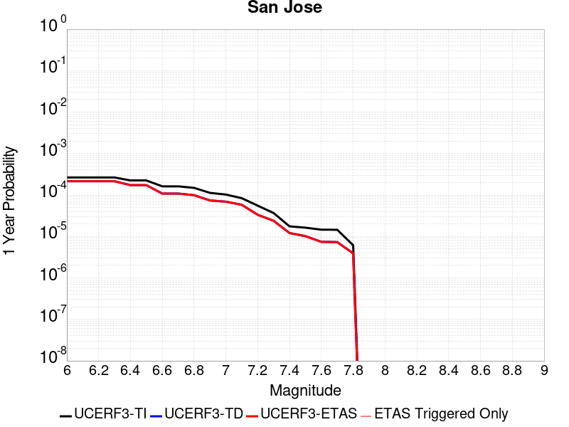 | 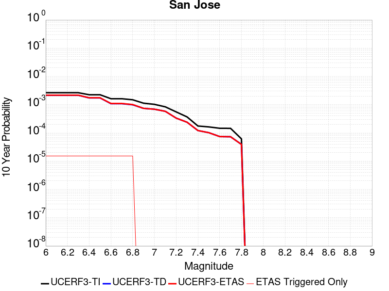 |

| Magnitude | 1 wk TI Prob | 1 wk TD Prob | 1 wk ETAS Prob | 1 wk ETAS/TD Gain | 1 wk ETAS Triggered Only | 1 mo TI Prob | 1 mo TD Prob | 1 mo ETAS Prob | 1 mo ETAS/TD Gain | 1 mo ETAS Triggered Only | 1 yr TI Prob | 1 yr TD Prob | 1 yr ETAS Prob | 1 yr ETAS/TD Gain | 1 yr ETAS Triggered Only | 10 yr TI Prob | 10 yr TD Prob | 10 yr ETAS Prob | 10 yr ETAS/TD Gain | 10 yr ETAS Triggered Only |
|-----|-----|-----|-----|-----|-----|-----|-----|-----|-----|-----|-----|-----|-----|-----|-----|-----|-----|-----|-----|-----|
| 6.0 | 5.0851277E-6 | 4.1256726E-6 | 4.1256726E-6 | 1.0 | 0.0 | 2.1793223E-5 | 1.768135E-5 | 1.768135E-5 | 1.0 | 0.0 | 2.653002E-4 | 2.152518E-4 | 2.152518E-4 | 1.0 | 0.0 | 0.0026498367 | 0.0021507242 | 0.0021659122 | 1.0070618 | 1.52207E-5 |
| 6.1 | 5.0851277E-6 | 4.1256726E-6 | 4.1256726E-6 | 1.0 | 0.0 | 2.1793223E-5 | 1.768135E-5 | 1.768135E-5 | 1.0 | 0.0 | 2.653002E-4 | 2.152518E-4 | 2.152518E-4 | 1.0 | 0.0 | 0.0026498367 | 0.0021507242 | 0.0021659122 | 1.0070618 | 1.52207E-5 |
| 6.2 | 5.0851277E-6 | 4.1256726E-6 | 4.1256726E-6 | 1.0 | 0.0 | 2.1793223E-5 | 1.768135E-5 | 1.768135E-5 | 1.0 | 0.0 | 2.653002E-4 | 2.152518E-4 | 2.152518E-4 | 1.0 | 0.0 | 0.0026498367 | 0.0021507242 | 0.0021659122 | 1.0070618 | 1.52207E-5 |
| 6.3 | 5.0851277E-6 | 4.1256726E-6 | 4.1256726E-6 | 1.0 | 0.0 | 2.1793223E-5 | 1.768135E-5 | 1.768135E-5 | 1.0 | 0.0 | 2.653002E-4 | 2.152518E-4 | 2.152518E-4 | 1.0 | 0.0 | 0.0026498367 | 0.0021507242 | 0.0021659122 | 1.0070618 | 1.52207E-5 |
| 6.4 | 4.3115124E-6 | 3.3237832E-6 | 3.3237832E-6 | 1.0 | 0.0 | 1.8477778E-5 | 1.424472E-5 | 1.424472E-5 | 1.0 | 0.0 | 2.2494372E-4 | 1.7341787E-4 | 1.7341787E-4 | 1.0 | 0.0 | 0.0022471617 | 0.0017330751 | 0.0017482694 | 1.0087672 | 1.52207E-5 |
| 6.5 | 4.3115124E-6 | 3.3237832E-6 | 3.3237832E-6 | 1.0 | 0.0 | 1.8477778E-5 | 1.424472E-5 | 1.424472E-5 | 1.0 | 0.0 | 2.2494372E-4 | 1.7341787E-4 | 1.7341787E-4 | 1.0 | 0.0 | 0.0022471617 | 0.0017330751 | 0.0017482694 | 1.0087672 | 1.52207E-5 |
| 6.6 | 3.110396E-6 | 2.0799866E-6 | 2.0799866E-6 | 1.0 | 0.0 | 1.33302E-5 | 8.9141995E-6 | 8.9141995E-6 | 1.0 | 0.0 | 1.622831E-4 | 1.0852526E-4 | 1.0852526E-4 | 1.0 | 0.0 | 0.0016216465 | 0.0010847825 | 0.0010999867 | 1.0140159 | 1.52207E-5 |
| 6.7 | 3.110396E-6 | 2.0799866E-6 | 2.0799866E-6 | 1.0 | 0.0 | 1.33302E-5 | 8.9141995E-6 | 8.9141995E-6 | 1.0 | 0.0 | 1.622831E-4 | 1.0852526E-4 | 1.0852526E-4 | 1.0 | 0.0 | 0.0016216465 | 0.0010847825 | 0.0010999867 | 1.0140159 | 1.52207E-5 |
| 6.8 | 2.856651E-6 | 1.902435E-6 | 1.902435E-6 | 1.0 | 0.0 | 1.2242733E-5 | 8.153269E-6 | 8.153269E-6 | 1.0 | 0.0 | 1.4904508E-4 | 9.926178E-5 | 9.926178E-5 | 1.0 | 0.0 | 0.0014894515 | 9.922314E-4 | 0.001007437 | 1.0153246 | 1.52207E-5 |
| 6.9 | 2.1618725E-6 | 1.4186642E-6 | 1.4186642E-6 | 1.0 | 0.0 | 9.265135E-6 | 6.0799757E-6 | 6.0799757E-6 | 1.0 | 0.0 | 1.12797185E-4 | 7.402128E-5 | 7.402128E-5 | 1.0 | 0.0 | 0.0011273995 | 7.4000744E-4 | 7.4000744E-4 | 1.0 | 0.0 |
| 7.0 | 1.9684312E-6 | 1.3256331E-6 | 1.3256331E-6 | 1.0 | 0.0 | 8.436106E-6 | 5.681273E-6 | 5.681273E-6 | 1.0 | 0.0 | 1.02704755E-4 | 6.9167385E-5 | 6.9167385E-5 | 1.0 | 0.0 | 0.001026573 | 6.914992E-4 | 6.914992E-4 | 1.0 | 0.0 |
| 7.1 | 1.6070337E-6 | 1.1155087E-6 | 1.1155087E-6 | 1.0 | 0.0 | 6.887269E-6 | 4.780743E-6 | 4.780743E-6 | 1.0 | 0.0 | 8.384928E-5 | 5.8204052E-5 | 5.8204052E-5 | 1.0 | 0.0 | 8.3817646E-4 | 5.819267E-4 | 5.819267E-4 | 1.0 | 0.0 |
| 7.2 | 1.0631658E-6 | 6.4037624E-7 | 6.4037624E-7 | 1.0 | 0.0 | 4.556417E-6 | 2.7444669E-6 | 2.7444669E-6 | 1.0 | 0.0 | 5.5472963E-5 | 3.3413387E-5 | 3.3413387E-5 | 1.0 | 0.0 | 5.545912E-4 | 3.3411747E-4 | 3.3411747E-4 | 1.0 | 0.0 |
| 7.3 | 7.060711E-7 | 4.5824706E-7 | 4.5824706E-7 | 1.0 | 0.0 | 3.0260155E-6 | 1.9639147E-6 | 1.9639147E-6 | 1.0 | 0.0 | 3.6841117E-5 | 2.3910407E-5 | 2.3910407E-5 | 1.0 | 0.0 | 3.6835007E-4 | 2.3911172E-4 | 2.3911172E-4 | 1.0 | 0.0 |
| 7.4 | 3.3677085E-7 | 2.3233133E-7 | 2.3233133E-7 | 1.0 | 0.0 | 1.4433028E-6 | 9.957054E-7 | 9.957054E-7 | 1.0 | 0.0 | 1.757207E-5 | 1.21226485E-5 | 1.21226485E-5 | 1.0 | 0.0 | 1.7570681E-4 | 1.2125263E-4 | 1.2125263E-4 | 1.0 | 0.0 |
| 7.5 | 3.129161E-7 | 1.9530925E-7 | 1.9530925E-7 | 1.0 | 0.0 | 1.3410682E-6 | 8.370394E-7 | 8.370394E-7 | 1.0 | 0.0 | 1.6327383E-5 | 1.0190909E-5 | 1.0190909E-5 | 1.0 | 0.0 | 1.6326184E-4 | 1.0193714E-4 | 1.0193714E-4 | 1.0 | 0.0 |
| 7.6 | 2.8008668E-7 | 1.4242323E-7 | 1.4242323E-7 | 1.0 | 0.0 | 1.2003709E-6 | 6.1038514E-7 | 6.1038514E-7 | 1.0 | 0.0 | 1.46144175E-5 | 7.4314153E-6 | 7.4314153E-6 | 1.0 | 0.0 | 1.4613457E-4 | 7.434427E-5 | 7.434427E-5 | 1.0 | 0.0 |
| 7.7 | 2.7852005E-7 | 1.4016913E-7 | 1.4016913E-7 | 1.0 | 0.0 | 1.1936568E-6 | 6.007248E-7 | 6.007248E-7 | 1.0 | 0.0 | 1.4532674E-5 | 7.3138012E-6 | 7.3138012E-6 | 1.0 | 0.0 | 1.4531724E-4 | 7.316821E-5 | 7.316821E-5 | 1.0 | 0.0 |
| 7.8 | 1.1810797E-7 | 7.5190094E-8 | 7.5190094E-8 | 1.0 | 0.0 | 5.0617695E-7 | 3.222432E-7 | 3.222432E-7 | 1.0 | 0.0 | 6.1626865E-6 | 3.9233046E-6 | 3.9233046E-6 | 1.0 | 0.0 | 6.162516E-5 | 3.9250725E-5 | 3.9250725E-5 | 1.0 | 0.0 |

## Trinidad (alt1)
*[(top)](#table-of-contents)*

| 1 Week | 1 Month | 1 Year | 10 Year |
|-----|-----|-----|-----|
| 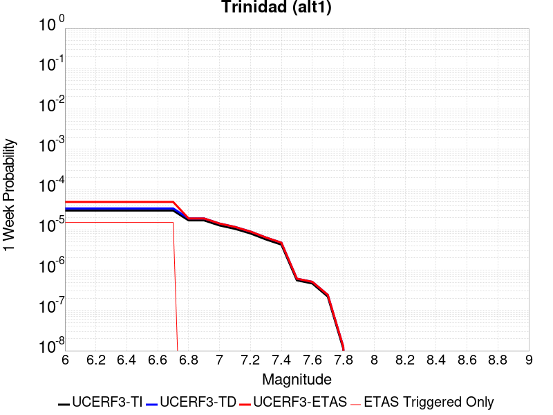 | 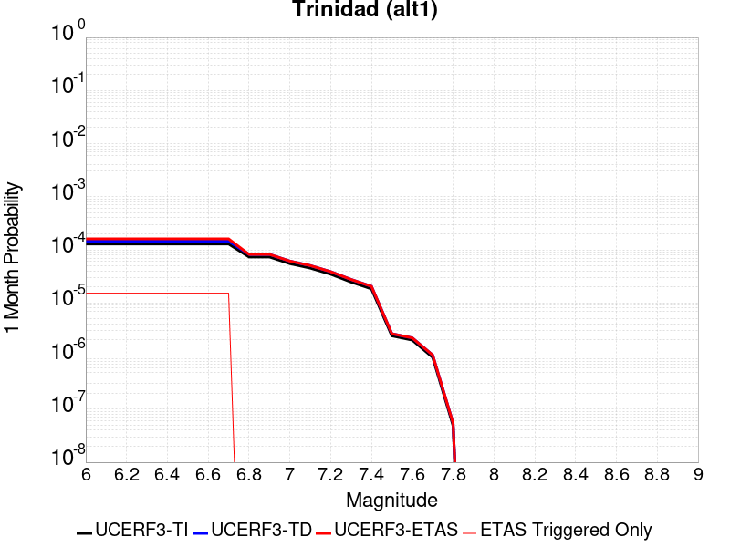 | 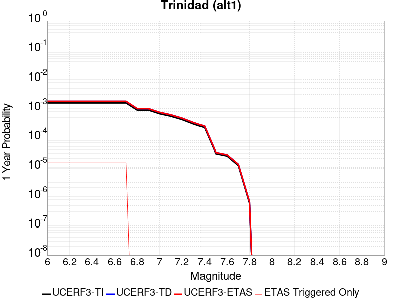 | 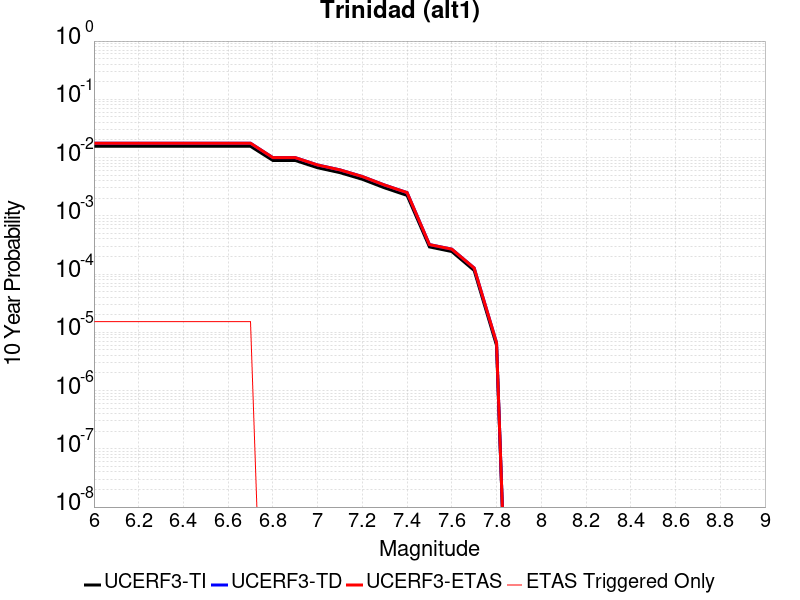 |

| Magnitude | 1 wk TI Prob | 1 wk TD Prob | 1 wk ETAS Prob | 1 wk ETAS/TD Gain | 1 wk ETAS Triggered Only | 1 mo TI Prob | 1 mo TD Prob | 1 mo ETAS Prob | 1 mo ETAS/TD Gain | 1 mo ETAS Triggered Only | 1 yr TI Prob | 1 yr TD Prob | 1 yr ETAS Prob | 1 yr ETAS/TD Gain | 1 yr ETAS Triggered Only | 10 yr TI Prob | 10 yr TD Prob | 10 yr ETAS Prob | 10 yr ETAS/TD Gain | 10 yr ETAS Triggered Only |
|-----|-----|-----|-----|-----|-----|-----|-----|-----|-----|-----|-----|-----|-----|-----|-----|-----|-----|-----|-----|-----|
| 6.0 | 3.0167168E-5 | 3.4033183E-5 | 4.9253365E-5 | 1.4472159 | 1.52207E-5 | 1.2928146E-4 | 1.4584929E-4 | 1.6106777E-4 | 1.1043439 | 1.52207E-5 | 0.0015728653 | 0.0017744373 | 0.001789631 | 1.0085626 | 1.52207E-5 | 0.0156177925 | 0.017619645 | 0.017634599 | 1.0008487 | 1.52207E-5 |
| 6.1 | 3.0167168E-5 | 3.4033183E-5 | 4.9253365E-5 | 1.4472159 | 1.52207E-5 | 1.2928146E-4 | 1.4584929E-4 | 1.6106777E-4 | 1.1043439 | 1.52207E-5 | 0.0015728653 | 0.0017744373 | 0.001789631 | 1.0085626 | 1.52207E-5 | 0.0156177925 | 0.017619645 | 0.017634599 | 1.0008487 | 1.52207E-5 |
| 6.2 | 3.0167168E-5 | 3.4033183E-5 | 4.9253365E-5 | 1.4472159 | 1.52207E-5 | 1.2928146E-4 | 1.4584929E-4 | 1.6106777E-4 | 1.1043439 | 1.52207E-5 | 0.0015728653 | 0.0017744373 | 0.001789631 | 1.0085626 | 1.52207E-5 | 0.0156177925 | 0.017619645 | 0.017634599 | 1.0008487 | 1.52207E-5 |
| 6.3 | 3.0167168E-5 | 3.4033183E-5 | 4.9253365E-5 | 1.4472159 | 1.52207E-5 | 1.2928146E-4 | 1.4584929E-4 | 1.6106777E-4 | 1.1043439 | 1.52207E-5 | 0.0015728653 | 0.0017744373 | 0.001789631 | 1.0085626 | 1.52207E-5 | 0.0156177925 | 0.017619645 | 0.017634599 | 1.0008487 | 1.52207E-5 |
| 6.4 | 3.0167168E-5 | 3.4033183E-5 | 4.9253365E-5 | 1.4472159 | 1.52207E-5 | 1.2928146E-4 | 1.4584929E-4 | 1.6106777E-4 | 1.1043439 | 1.52207E-5 | 0.0015728653 | 0.0017744373 | 0.001789631 | 1.0085626 | 1.52207E-5 | 0.0156177925 | 0.017619645 | 0.017634599 | 1.0008487 | 1.52207E-5 |
| 6.5 | 3.0167168E-5 | 3.4033183E-5 | 4.9253365E-5 | 1.4472159 | 1.52207E-5 | 1.2928146E-4 | 1.4584929E-4 | 1.6106777E-4 | 1.1043439 | 1.52207E-5 | 0.0015728653 | 0.0017744373 | 0.001789631 | 1.0085626 | 1.52207E-5 | 0.0156177925 | 0.017619645 | 0.017634599 | 1.0008487 | 1.52207E-5 |
| 6.6 | 3.0167168E-5 | 3.4033183E-5 | 4.9253365E-5 | 1.4472159 | 1.52207E-5 | 1.2928146E-4 | 1.4584929E-4 | 1.6106777E-4 | 1.1043439 | 1.52207E-5 | 0.0015728653 | 0.0017744373 | 0.001789631 | 1.0085626 | 1.52207E-5 | 0.0156177925 | 0.017619645 | 0.017634599 | 1.0008487 | 1.52207E-5 |
| 6.7 | 3.0167168E-5 | 3.4033183E-5 | 4.9253365E-5 | 1.4472159 | 1.52207E-5 | 1.2928146E-4 | 1.4584929E-4 | 1.6106777E-4 | 1.1043439 | 1.52207E-5 | 0.0015728653 | 0.0017744373 | 0.001789631 | 1.0085626 | 1.52207E-5 | 0.0156177925 | 0.017619645 | 0.017634599 | 1.0008487 | 1.52207E-5 |
| 6.8 | 1.717077E-5 | 1.9195684E-5 | 1.9195684E-5 | 1.0 | 0.0 | 7.358694E-5 | 8.226487E-5 | 8.226487E-5 | 1.0 | 0.0 | 8.9555274E-4 | 0.0010011591 | 0.0010011591 | 1.0 | 0.0 | 0.008919522 | 0.009970939 | 0.009970939 | 1.0 | 0.0 |
| 6.9 | 1.717077E-5 | 1.9195684E-5 | 1.9195684E-5 | 1.0 | 0.0 | 7.358694E-5 | 8.226487E-5 | 8.226487E-5 | 1.0 | 0.0 | 8.9555274E-4 | 0.0010011591 | 0.0010011591 | 1.0 | 0.0 | 0.008919522 | 0.009970939 | 0.009970939 | 1.0 | 0.0 |
| 7.0 | 1.2858572E-5 | 1.433737E-5 | 1.433737E-5 | 1.0 | 0.0 | 5.5107E-5 | 6.14446E-5 | 6.14446E-5 | 1.0 | 0.0 | 6.707212E-4 | 7.478634E-4 | 7.478634E-4 | 1.0 | 0.0 | 0.006687004 | 0.0074566454 | 0.0074566454 | 1.0 | 0.0 |
| 7.1 | 1.0588431E-5 | 1.1801269E-5 | 1.1801269E-5 | 1.0 | 0.0 | 4.53782E-5 | 5.057605E-5 | 5.057605E-5 | 1.0 | 0.0 | 5.5233954E-4 | 6.156183E-4 | 6.156183E-4 | 1.0 | 0.0 | 0.005509687 | 0.006141979 | 0.006141979 | 1.0 | 0.0 |
| 7.2 | 8.138061E-6 | 9.067213E-6 | 9.067213E-6 | 1.0 | 0.0 | 3.487694E-5 | 3.8859045E-5 | 3.8859045E-5 | 1.0 | 0.0 | 4.2454398E-4 | 4.7303102E-4 | 4.7303102E-4 | 1.0 | 0.0 | 0.0042373384 | 0.0047226823 | 0.0047226823 | 1.0 | 0.0 |
| 7.3 | 5.787542E-6 | 6.46032E-6 | 6.46032E-6 | 1.0 | 0.0 | 2.4803514E-5 | 2.7686914E-5 | 2.7686914E-5 | 1.0 | 0.0 | 3.0194095E-4 | 3.3705754E-4 | 3.3705754E-4 | 1.0 | 0.0 | 0.00301531 | 0.0033675742 | 0.0033675742 | 1.0 | 0.0 |
| 7.4 | 4.303563E-6 | 4.800851E-6 | 4.800851E-6 | 1.0 | 0.0 | 1.844371E-5 | 2.0575026E-5 | 2.0575026E-5 | 1.0 | 0.0 | 2.2452902E-4 | 2.504919E-4 | 2.504919E-4 | 1.0 | 0.0 | 0.0022430231 | 0.0025040337 | 0.0025040337 | 1.0 | 0.0 |
| 7.5 | 5.6063425E-7 | 6.142982E-7 | 6.142982E-7 | 1.0 | 0.0 | 2.402716E-6 | 2.632704E-6 | 2.632704E-6 | 1.0 | 0.0 | 2.9252675E-5 | 3.2052718E-5 | 3.2052718E-5 | 1.0 | 0.0 | 2.9248823E-4 | 3.2048248E-4 | 3.2048248E-4 | 1.0 | 0.0 |
| 7.6 | 4.6699128E-7 | 5.1257996E-7 | 5.1257996E-7 | 1.0 | 0.0 | 2.0013897E-6 | 2.1967694E-6 | 2.1967694E-6 | 1.0 | 0.0 | 2.4366647E-5 | 2.6745354E-5 | 2.6745354E-5 | 1.0 | 0.0 | 2.4363975E-4 | 2.6742276E-4 | 2.6742276E-4 | 1.0 | 0.0 |
| 7.7 | 2.2080937E-7 | 2.4346897E-7 | 2.4346897E-7 | 1.0 | 0.0 | 9.4632554E-7 | 1.043438E-6 | 1.043438E-6 | 1.0 | 0.0 | 1.15214525E-5 | 1.270379E-5 | 1.270379E-5 | 1.0 | 0.0 | 1.1520855E-4 | 1.2703124E-4 | 1.2703124E-4 | 1.0 | 0.0 |
| 7.8 | 1.1438307E-8 | 1.2682963E-8 | 1.2682963E-8 | 1.0 | 0.0 | 4.9021317E-8 | 5.4355557E-8 | 5.4355557E-8 | 1.0 | 0.0 | 5.9683435E-7 | 6.6177887E-7 | 6.6177887E-7 | 1.0 | 0.0 | 5.9683275E-6 | 6.617789E-6 | 6.617789E-6 | 1.0 | 0.0 |

## Elsinore (Julian)
*[(top)](#table-of-contents)*

| 1 Week | 1 Month | 1 Year | 10 Year |
|-----|-----|-----|-----|
| 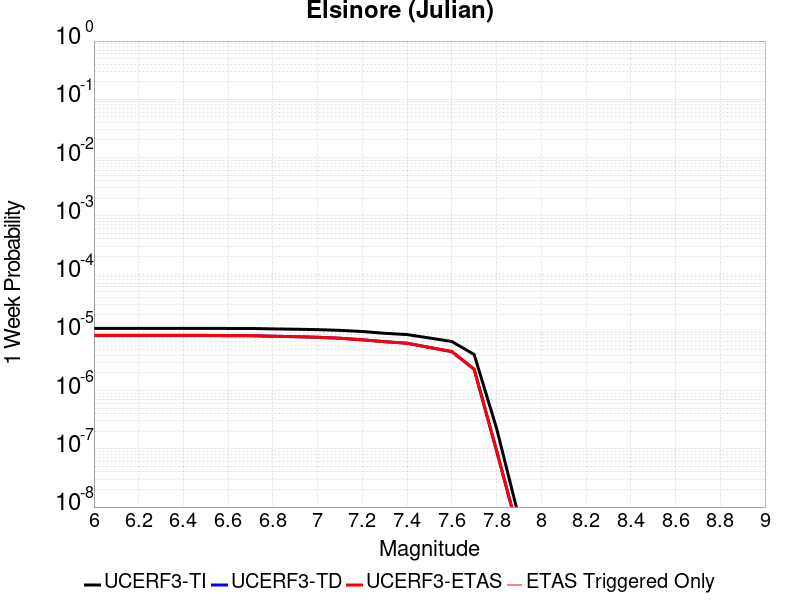 | 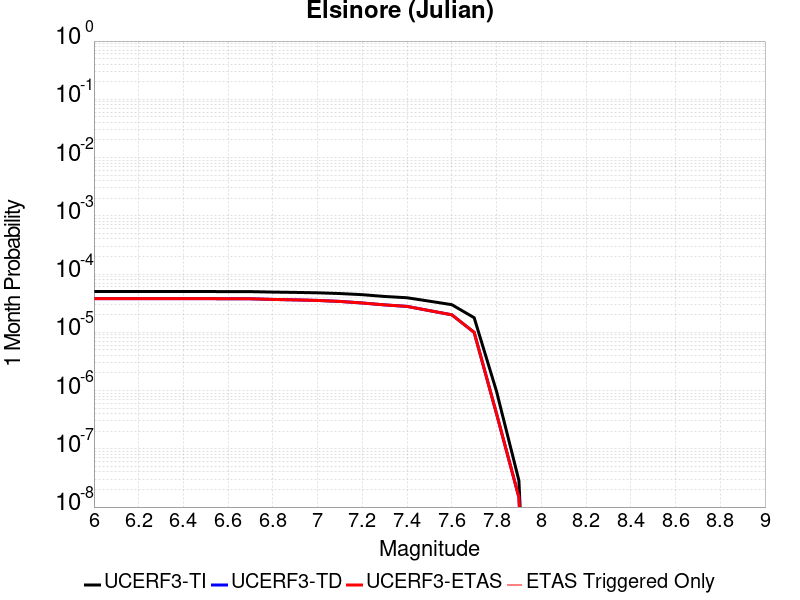 | 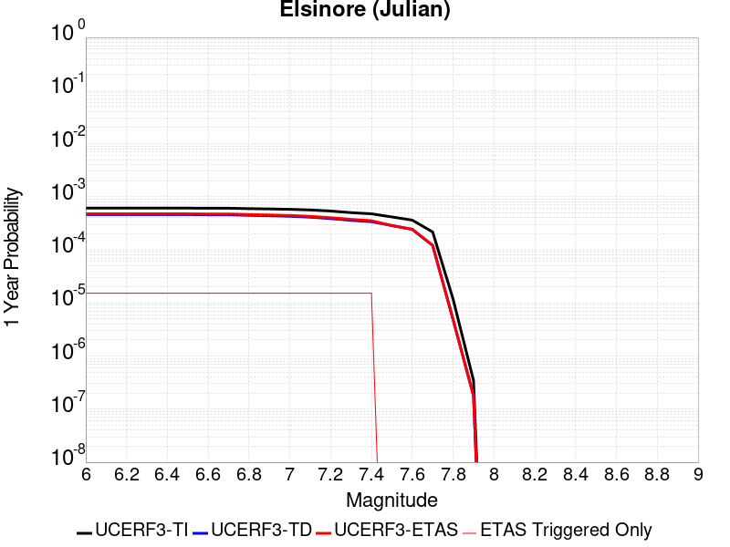 | 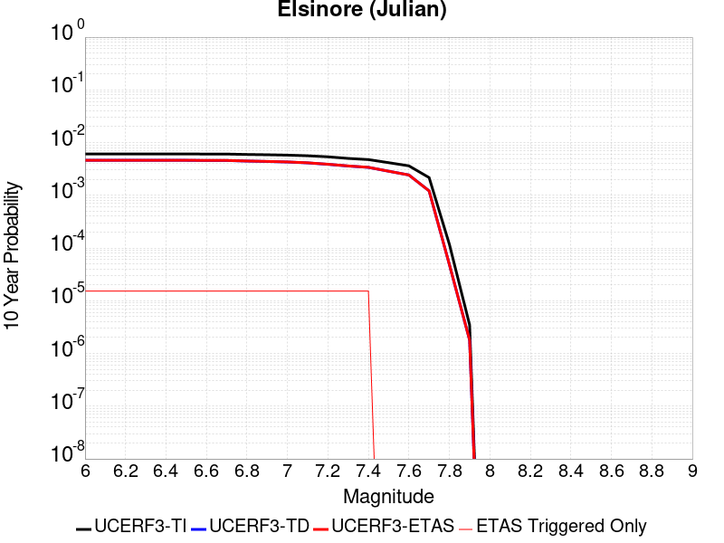 |

| Magnitude | 1 wk TI Prob | 1 wk TD Prob | 1 wk ETAS Prob | 1 wk ETAS/TD Gain | 1 wk ETAS Triggered Only | 1 mo TI Prob | 1 mo TD Prob | 1 mo ETAS Prob | 1 mo ETAS/TD Gain | 1 mo ETAS Triggered Only | 1 yr TI Prob | 1 yr TD Prob | 1 yr ETAS Prob | 1 yr ETAS/TD Gain | 1 yr ETAS Triggered Only | 10 yr TI Prob | 10 yr TD Prob | 10 yr ETAS Prob | 10 yr ETAS/TD Gain | 10 yr ETAS Triggered Only |
|-----|-----|-----|-----|-----|-----|-----|-----|-----|-----|-----|-----|-----|-----|-----|-----|-----|-----|-----|-----|-----|
| 6.0 | 1.1710231E-5 | 8.845509E-6 | 8.845509E-6 | 1.0 | 0.0 | 5.0185736E-5 | 3.7908783E-5 | 3.7908783E-5 | 1.0 | 0.0 | 6.1084004E-4 | 4.614434E-4 | 4.7665706E-4 | 1.0329697 | 1.52207E-5 | 0.006091637 | 0.0046050567 | 0.0046202075 | 1.0032899 | 1.52207E-5 |
| 6.1 | 1.1710231E-5 | 8.845509E-6 | 8.845509E-6 | 1.0 | 0.0 | 5.0185736E-5 | 3.7908783E-5 | 3.7908783E-5 | 1.0 | 0.0 | 6.1084004E-4 | 4.614434E-4 | 4.7665706E-4 | 1.0329697 | 1.52207E-5 | 0.006091637 | 0.0046050567 | 0.0046202075 | 1.0032899 | 1.52207E-5 |
| 6.2 | 1.1710231E-5 | 8.845509E-6 | 8.845509E-6 | 1.0 | 0.0 | 5.0185736E-5 | 3.7908783E-5 | 3.7908783E-5 | 1.0 | 0.0 | 6.1084004E-4 | 4.614434E-4 | 4.7665706E-4 | 1.0329697 | 1.52207E-5 | 0.006091637 | 0.0046050567 | 0.0046202075 | 1.0032899 | 1.52207E-5 |
| 6.3 | 1.1710231E-5 | 8.845509E-6 | 8.845509E-6 | 1.0 | 0.0 | 5.0185736E-5 | 3.7908783E-5 | 3.7908783E-5 | 1.0 | 0.0 | 6.1084004E-4 | 4.614434E-4 | 4.7665706E-4 | 1.0329697 | 1.52207E-5 | 0.006091637 | 0.0046050567 | 0.0046202075 | 1.0032899 | 1.52207E-5 |
| 6.4 | 1.1710231E-5 | 8.845509E-6 | 8.845509E-6 | 1.0 | 0.0 | 5.0185736E-5 | 3.7908783E-5 | 3.7908783E-5 | 1.0 | 0.0 | 6.1084004E-4 | 4.614434E-4 | 4.7665706E-4 | 1.0329697 | 1.52207E-5 | 0.006091637 | 0.0046050567 | 0.0046202075 | 1.0032899 | 1.52207E-5 |
| 6.5 | 1.1710231E-5 | 8.845509E-6 | 8.845509E-6 | 1.0 | 0.0 | 5.0185736E-5 | 3.7908783E-5 | 3.7908783E-5 | 1.0 | 0.0 | 6.1084004E-4 | 4.614434E-4 | 4.7665706E-4 | 1.0329697 | 1.52207E-5 | 0.006091637 | 0.0046050567 | 0.0046202075 | 1.0032899 | 1.52207E-5 |
| 6.6 | 1.1650619E-5 | 8.777881E-6 | 8.777881E-6 | 1.0 | 0.0 | 4.993027E-5 | 3.7618956E-5 | 3.7618956E-5 | 1.0 | 0.0 | 6.0773146E-4 | 4.5791623E-4 | 4.7312997E-4 | 1.0332239 | 1.52207E-5 | 0.0060607214 | 0.004569931 | 0.0045850817 | 1.0033154 | 1.52207E-5 |
| 6.7 | 1.1650619E-5 | 8.777881E-6 | 8.777881E-6 | 1.0 | 0.0 | 4.993027E-5 | 3.7618956E-5 | 3.7618956E-5 | 1.0 | 0.0 | 6.0773146E-4 | 4.5791623E-4 | 4.7312997E-4 | 1.0332239 | 1.52207E-5 | 0.0060607214 | 0.004569931 | 0.0045850817 | 1.0033154 | 1.52207E-5 |
| 6.8 | 1.1442698E-5 | 8.561041E-6 | 8.561041E-6 | 1.0 | 0.0 | 4.9039216E-5 | 3.6689667E-5 | 3.6689667E-5 | 1.0 | 0.0 | 5.968889E-4 | 4.4660683E-4 | 4.6182075E-4 | 1.0340655 | 1.52207E-5 | 0.0059528816 | 0.004457295 | 0.0044724476 | 1.0033996 | 1.52207E-5 |
| 6.9 | 1.1300589E-5 | 8.408907E-6 | 8.408907E-6 | 1.0 | 0.0 | 4.8430196E-5 | 3.6037683E-5 | 3.6037683E-5 | 1.0 | 0.0 | 5.894781E-4 | 4.3867214E-4 | 4.5388617E-4 | 1.034682 | 1.52207E-5 | 0.005879169 | 0.0043782624 | 0.0043934165 | 1.0034612 | 1.52207E-5 |
| 7.0 | 1.1117729E-5 | 8.226087E-6 | 8.226087E-6 | 1.0 | 0.0 | 4.764654E-5 | 3.525419E-5 | 3.525419E-5 | 1.0 | 0.0 | 5.799422E-4 | 4.291369E-4 | 4.4435108E-4 | 1.035453 | 1.52207E-5 | 0.0057843104 | 0.004283281 | 0.0042984365 | 1.0035383 | 1.52207E-5 |
| 7.1 | 1.08053955E-5 | 7.9117535E-6 | 7.9117535E-6 | 1.0 | 0.0 | 4.6308014E-5 | 3.3907087E-5 | 3.3907087E-5 | 1.0 | 0.0 | 5.6365423E-4 | 4.127422E-4 | 4.279566E-4 | 1.0368618 | 1.52207E-5 | 0.005622267 | 0.0041199517 | 0.00413511 | 1.0036792 | 1.52207E-5 |
| 7.2 | 1.032804E-5 | 7.433021E-6 | 7.433021E-6 | 1.0 | 0.0 | 4.4262277E-5 | 3.1855423E-5 | 3.1855423E-5 | 1.0 | 0.0 | 5.387599E-4 | 3.8777234E-4 | 4.0298715E-4 | 1.0392364 | 1.52207E-5 | 0.0053745564 | 0.0038711445 | 0.0038863062 | 1.0039166 | 1.52207E-5 |
| 7.3 | 9.622426E-6 | 6.8978457E-6 | 6.8978457E-6 | 1.0 | 0.0 | 4.1238312E-5 | 2.9561868E-5 | 2.9561868E-5 | 1.0 | 0.0 | 5.019608E-4 | 3.5985775E-4 | 3.7507297E-4 | 1.0422813 | 1.52207E-5 | 0.005008285 | 0.0035929221 | 0.003608088 | 1.0042211 | 1.52207E-5 |
| 7.4 | 9.144434E-6 | 6.4963933E-6 | 6.4963933E-6 | 1.0 | 0.0 | 3.9189843E-5 | 2.7841395E-5 | 2.7841395E-5 | 1.0 | 0.0 | 4.7703186E-4 | 3.3891766E-4 | 3.541332E-4 | 1.0448945 | 1.52207E-5 | 0.0047600917 | 0.0033841513 | 0.0033993204 | 1.0044824 | 1.52207E-5 |
| 7.5 | 7.988981E-6 | 5.4983307E-6 | 5.4983307E-6 | 1.0 | 0.0 | 3.4238044E-5 | 2.356407E-5 | 2.356407E-5 | 1.0 | 0.0 | 4.1676845E-4 | 2.8685606E-4 | 2.8685606E-4 | 1.0 | 0.0 | 0.0041598766 | 0.002864985 | 0.002864985 | 1.0 | 0.0 |
| 7.6 | 6.9554876E-6 | 4.6625346E-6 | 4.6625346E-6 | 1.0 | 0.0 | 2.9808893E-5 | 1.9982144E-5 | 1.9982144E-5 | 1.0 | 0.0 | 3.6286283E-4 | 2.4325661E-4 | 2.4325661E-4 | 1.0 | 0.0 | 0.0036227088 | 0.0024300197 | 0.0024300197 | 1.0 | 0.0 |
| 7.7 | 4.1557314E-6 | 2.3246462E-6 | 2.3246462E-6 | 1.0 | 0.0 | 1.7810156E-5 | 9.962735E-6 | 9.962735E-6 | 1.0 | 0.0 | 2.1681708E-4 | 1.2129029E-4 | 1.2129029E-4 | 1.0 | 0.0 | 0.0021660565 | 0.001212314 | 0.001212314 | 1.0 | 0.0 |
| 7.8 | 2.2597293E-7 | 9.332915E-8 | 9.332915E-8 | 1.0 | 0.0 | 9.684551E-7 | 3.99982E-7 | 3.99982E-7 | 1.0 | 0.0 | 1.1790877E-5 | 4.8697734E-6 | 4.8697734E-6 | 1.0 | 0.0 | 1.17902506E-4 | 4.8696995E-5 | 4.8696995E-5 | 1.0 | 0.0 |
| 7.9 | 6.676829E-9 | 3.439853E-9 | 3.439853E-9 | 1.0 | 0.0 | 2.861498E-8 | 1.4742227E-8 | 1.4742227E-8 | 1.0 | 0.0 | 3.4838732E-7 | 1.7948659E-7 | 1.7948659E-7 | 1.0 | 0.0 | 3.4838679E-6 | 1.7948646E-6 | 1.7948646E-6 | 1.0 | 0.0 |

## San Andreas (North Coast) 2011 CFM
*[(top)](#table-of-contents)*

| 1 Week | 1 Month | 1 Year | 10 Year |
|-----|-----|-----|-----|
| 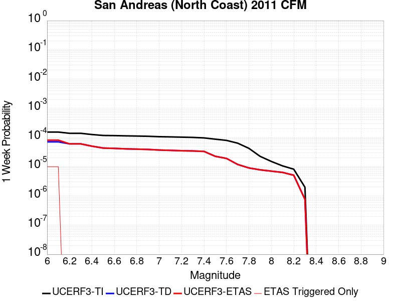 |  | 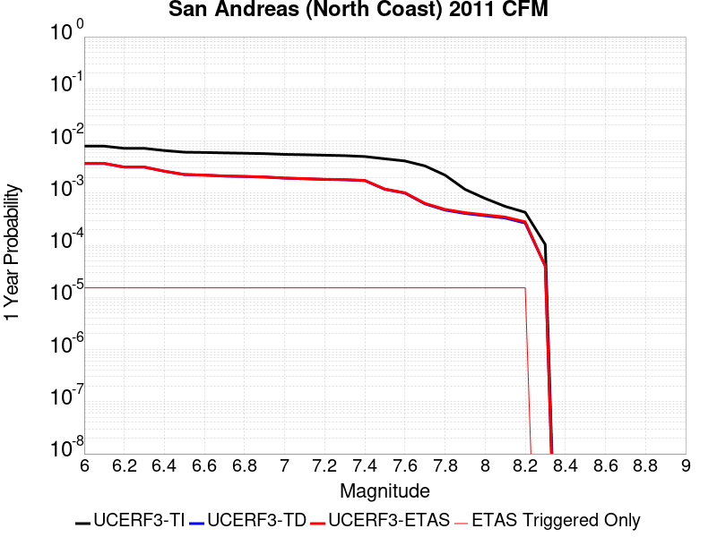 | 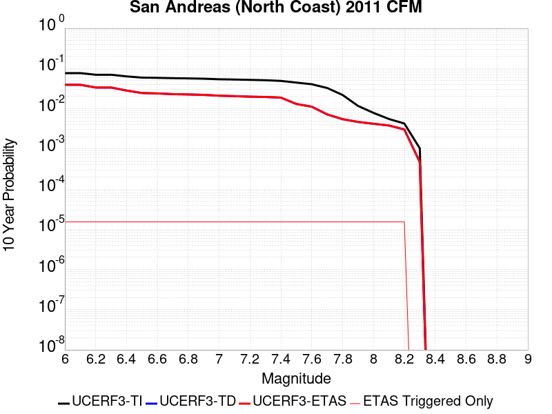 |

| Magnitude | 1 wk TI Prob | 1 wk TD Prob | 1 wk ETAS Prob | 1 wk ETAS/TD Gain | 1 wk ETAS Triggered Only | 1 mo TI Prob | 1 mo TD Prob | 1 mo ETAS Prob | 1 mo ETAS/TD Gain | 1 mo ETAS Triggered Only | 1 yr TI Prob | 1 yr TD Prob | 1 yr ETAS Prob | 1 yr ETAS/TD Gain | 1 yr ETAS Triggered Only | 10 yr TI Prob | 10 yr TD Prob | 10 yr ETAS Prob | 10 yr ETAS/TD Gain | 10 yr ETAS Triggered Only |
|-----|-----|-----|-----|-----|-----|-----|-----|-----|-----|-----|-----|-----|-----|-----|-----|-----|-----|-----|-----|-----|
| 6.0 | 1.5333705E-4 | 7.1106435E-5 | 7.1106435E-5 | 1.0 | 0.0 | 6.5699324E-4 | 3.0470645E-4 | 3.0470645E-4 | 1.0 | 0.0 | 0.007969595 | 0.0037035241 | 0.0037186886 | 1.0040946 | 1.52207E-5 | 0.0768977 | 0.03935284 | 0.039367463 | 1.0003716 | 1.52207E-5 |
| 6.1 | 1.5333705E-4 | 7.1106435E-5 | 7.1106435E-5 | 1.0 | 0.0 | 6.5699324E-4 | 3.0470645E-4 | 3.0470645E-4 | 1.0 | 0.0 | 0.007969595 | 0.0037035241 | 0.0037186886 | 1.0040946 | 1.52207E-5 | 0.0768977 | 0.03935284 | 0.039367463 | 1.0003716 | 1.52207E-5 |
| 6.2 | 1.3912938E-4 | 6.050204E-5 | 6.050204E-5 | 1.0 | 0.0 | 5.961325E-4 | 2.5926883E-4 | 2.5926883E-4 | 1.0 | 0.0 | 0.007233787 | 0.003152056 | 0.0031672288 | 1.0048136 | 1.52207E-5 | 0.07002798 | 0.03369227 | 0.033706978 | 1.0004365 | 1.52207E-5 |
| 6.3 | 1.3912938E-4 | 6.050204E-5 | 6.050204E-5 | 1.0 | 0.0 | 5.961325E-4 | 2.5926883E-4 | 2.5926883E-4 | 1.0 | 0.0 | 0.007233787 | 0.003152056 | 0.0031672288 | 1.0048136 | 1.52207E-5 | 0.07002798 | 0.03369227 | 0.033706978 | 1.0004365 | 1.52207E-5 |
| 6.4 | 1.2623647E-4 | 5.0442024E-5 | 5.0442024E-5 | 1.0 | 0.0 | 5.4090127E-4 | 2.161623E-4 | 2.161623E-4 | 1.0 | 0.0 | 0.0065656058 | 0.0026286195 | 0.0026438003 | 1.0057752 | 1.52207E-5 | 0.06374981 | 0.028303223 | 0.028318012 | 1.0005225 | 1.52207E-5 |
| 6.5 | 1.1736096E-4 | 4.3523814E-5 | 4.3523814E-5 | 1.0 | 0.0 | 5.028786E-4 | 1.8651738E-4 | 1.8651738E-4 | 1.0 | 0.0 | 0.006105373 | 0.0022685004 | 0.0022836865 | 1.0066943 | 1.52207E-5 | 0.05940335 | 0.024579322 | 0.024594167 | 1.000604 | 1.52207E-5 |
| 6.6 | 1.1586959E-4 | 4.2423668E-5 | 4.2423668E-5 | 1.0 | 0.0 | 4.964894E-4 | 1.8180315E-4 | 1.8180315E-4 | 1.0 | 0.0 | 0.006028018 | 0.0022112224 | 0.0022264095 | 1.0068681 | 1.52207E-5 | 0.058671024 | 0.023984991 | 0.023999847 | 1.0006194 | 1.52207E-5 |
| 6.7 | 1.13693764E-4 | 4.073593E-5 | 4.073593E-5 | 1.0 | 0.0 | 4.87168E-4 | 1.7457096E-4 | 1.7457096E-4 | 1.0 | 0.0 | 0.005915152 | 0.0021233456 | 0.0021385339 | 1.007153 | 1.52207E-5 | 0.057601593 | 0.023076393 | 0.023091262 | 1.0006443 | 1.52207E-5 |
| 6.8 | 1.1204889E-4 | 3.9953447E-5 | 3.9953447E-5 | 1.0 | 0.0 | 4.8012115E-4 | 1.7121792E-4 | 1.7121792E-4 | 1.0 | 0.0 | 0.005829819 | 0.002082601 | 0.0020977901 | 1.0072933 | 1.52207E-5 | 0.05679232 | 0.022636656 | 0.02265153 | 1.0006572 | 1.52207E-5 |
| 6.9 | 1.1005794E-4 | 3.900957E-5 | 3.900957E-5 | 1.0 | 0.0 | 4.7159163E-4 | 1.6717325E-4 | 1.6717325E-4 | 1.0 | 0.0 | 0.0057265228 | 0.0020334502 | 0.0020486398 | 1.0074699 | 1.52207E-5 | 0.055811852 | 0.022102542 | 0.022117427 | 1.0006734 | 1.52207E-5 |
| 7.0 | 1.0647948E-4 | 3.7166337E-5 | 3.7166337E-5 | 1.0 | 0.0 | 4.562608E-4 | 1.5927466E-4 | 1.5927466E-4 | 1.0 | 0.0 | 0.0055408357 | 0.0019374598 | 0.0019526511 | 1.0078408 | 1.52207E-5 | 0.054047033 | 0.021062272 | 0.021077171 | 1.0007074 | 1.52207E-5 |
| 7.1 | 1.04795035E-4 | 3.6215948E-5 | 3.6215948E-5 | 1.0 | 0.0 | 4.4904428E-4 | 1.5520205E-4 | 1.5520205E-4 | 1.0 | 0.0 | 0.0054534175 | 0.0018879628 | 0.0019031548 | 1.0080467 | 1.52207E-5 | 0.053215165 | 0.020530313 | 0.02054522 | 1.0007261 | 1.52207E-5 |
| 7.2 | 1.02724036E-4 | 3.5124547E-5 | 3.5124547E-5 | 1.0 | 0.0 | 4.401716E-4 | 1.5052517E-4 | 1.5052517E-4 | 1.0 | 0.0 | 0.0053459285 | 0.0018311188 | 0.0018463117 | 1.008297 | 1.52207E-5 | 0.052191395 | 0.019919246 | 0.019934164 | 1.0007489 | 1.52207E-5 |
| 7.3 | 1.00650694E-4 | 3.4592013E-5 | 3.4592013E-5 | 1.0 | 0.0 | 4.312888E-4 | 1.4824314E-4 | 1.4824314E-4 | 1.0 | 0.0 | 0.005238306 | 0.0018033815 | 0.0018185747 | 1.0084249 | 1.52207E-5 | 0.051165357 | 0.019596443 | 0.019611364 | 1.0007615 | 1.52207E-5 |
| 7.4 | 9.672919E-5 | 3.338123E-5 | 3.338123E-5 | 1.0 | 0.0 | 4.144878E-4 | 1.4305465E-4 | 1.4305465E-4 | 1.0 | 0.0 | 0.005034718 | 0.0017403142 | 0.0017555084 | 1.0087308 | 1.52207E-5 | 0.049221683 | 0.018869769 | 0.018884702 | 1.0007914 | 1.52207E-5 |
| 7.5 | 8.7600405E-5 | 2.2700917E-5 | 2.2700917E-5 | 1.0 | 0.0 | 3.753763E-4 | 9.728602E-5 | 9.728602E-5 | 1.0 | 0.0 | 0.0045606326 | 0.0011838155 | 0.0011990182 | 1.012842 | 1.52207E-5 | 0.04468165 | 0.013130207 | 0.013145228 | 1.0011439 | 1.52207E-5 |
| 7.6 | 7.9562284E-5 | 1.9226305E-5 | 1.9226305E-5 | 1.0 | 0.0 | 3.4093665E-4 | 8.239586E-5 | 8.239586E-5 | 1.0 | 0.0 | 0.0041430052 | 0.0010027094 | 0.0010179149 | 1.0151644 | 1.52207E-5 | 0.040666126 | 0.011221658 | 0.011236708 | 1.0013411 | 1.52207E-5 |
| 7.7 | 6.3866544E-5 | 1.1941707E-5 | 1.1941707E-5 | 1.0 | 0.0 | 2.7368503E-4 | 5.117774E-5 | 5.117774E-5 | 1.0 | 0.0 | 0.0033270244 | 6.2291115E-4 | 6.381223E-4 | 1.0244195 | 1.52207E-5 | 0.032776527 | 0.007210334 | 0.0072254445 | 1.0020957 | 1.52207E-5 |
| 7.8 | 4.2543215E-5 | 9.076524E-6 | 9.076524E-6 | 1.0 | 0.0 | 1.8231533E-4 | 3.8898812E-5 | 3.8898812E-5 | 1.0 | 0.0 | 0.0022174292 | 4.7349022E-4 | 4.887037E-4 | 1.0321305 | 1.52207E-5 | 0.021954332 | 0.005490525 | 0.0055056624 | 1.002757 | 1.52207E-5 |
| 7.9 | 2.2636612E-5 | 7.81435E-6 | 7.81435E-6 | 1.0 | 0.0 | 9.7010445E-5 | 3.3489643E-5 | 3.3489643E-5 | 1.0 | 0.0 | 0.0011804621 | 4.076602E-4 | 4.228747E-4 | 1.0373216 | 1.52207E-5 | 0.011742111 | 0.0046832846 | 0.004698434 | 1.0032347 | 1.52207E-5 |
| 8.0 | 1.5167874E-5 | 7.0494675E-6 | 7.0494675E-6 | 1.0 | 0.0 | 6.500356E-5 | 3.0211655E-5 | 3.0211655E-5 | 1.0 | 0.0 | 7.9113094E-4 | 3.677649E-4 | 3.8298E-4 | 1.0413718 | 1.52207E-5 | 0.007883203 | 0.004215588 | 0.004230744 | 1.0035954 | 1.52207E-5 |
| 8.1 | 1.0681047E-5 | 6.386992E-6 | 6.386992E-6 | 1.0 | 0.0 | 4.5775112E-5 | 2.7372536E-5 | 2.7372536E-5 | 1.0 | 0.0 | 5.5716943E-4 | 3.3320975E-4 | 3.4842538E-4 | 1.0456638 | 1.52207E-5 | 0.0055577457 | 0.003817393 | 0.0038325556 | 1.0039719 | 1.52207E-5 |
| 8.2 | 8.226114E-6 | 5.1150587E-6 | 5.1150587E-6 | 1.0 | 0.0 | 3.52543E-5 | 2.1921496E-5 | 2.1921496E-5 | 1.0 | 0.0 | 4.2913653E-4 | 2.668616E-4 | 2.8207822E-4 | 1.0570207 | 1.52207E-5 | 0.004283088 | 0.0030450926 | 0.003060267 | 1.0049832 | 1.52207E-5 |
| 8.3 | 1.983087E-6 | 7.6599065E-7 | 7.6599065E-7 | 1.0 | 0.0 | 8.498917E-6 | 3.282813E-6 | 3.282813E-6 | 1.0 | 0.0 | 1.034694E-4 | 3.9967534E-5 | 3.9967534E-5 | 1.0 | 0.0 | 0.0010342124 | 4.719687E-4 | 4.719687E-4 | 1.0 | 0.0 |

## Northridge
*[(top)](#table-of-contents)*

| 1 Week | 1 Month | 1 Year | 10 Year |
|-----|-----|-----|-----|
| 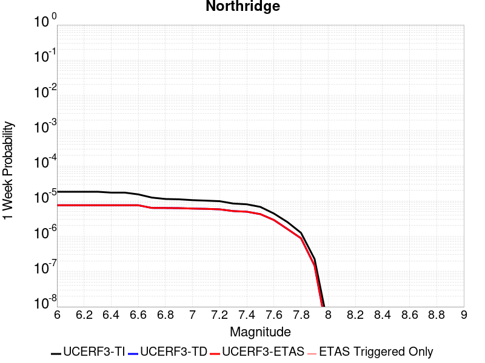 |  |  | 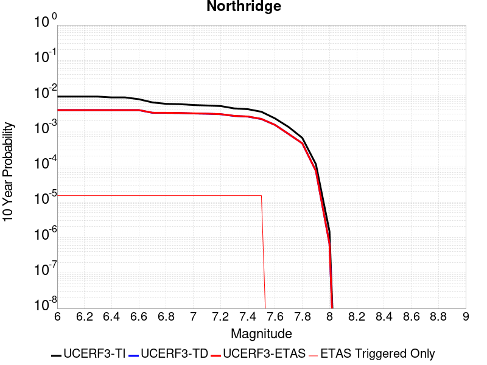 |

| Magnitude | 1 wk TI Prob | 1 wk TD Prob | 1 wk ETAS Prob | 1 wk ETAS/TD Gain | 1 wk ETAS Triggered Only | 1 mo TI Prob | 1 mo TD Prob | 1 mo ETAS Prob | 1 mo ETAS/TD Gain | 1 mo ETAS Triggered Only | 1 yr TI Prob | 1 yr TD Prob | 1 yr ETAS Prob | 1 yr ETAS/TD Gain | 1 yr ETAS Triggered Only | 10 yr TI Prob | 10 yr TD Prob | 10 yr ETAS Prob | 10 yr ETAS/TD Gain | 10 yr ETAS Triggered Only |
|-----|-----|-----|-----|-----|-----|-----|-----|-----|-----|-----|-----|-----|-----|-----|-----|-----|-----|-----|-----|-----|
| 6.0 | 1.8340852E-5 | 7.5880193E-6 | 7.5880193E-6 | 1.0 | 0.0 | 7.860128E-5 | 3.251969E-5 | 3.251969E-5 | 1.0 | 0.0 | 9.565505E-4 | 3.958575E-4 | 3.958575E-4 | 1.0 | 0.0 | 0.009524435 | 0.003951746 | 0.0039669066 | 1.0038364 | 1.52207E-5 |
| 6.1 | 1.8340852E-5 | 7.5880193E-6 | 7.5880193E-6 | 1.0 | 0.0 | 7.860128E-5 | 3.251969E-5 | 3.251969E-5 | 1.0 | 0.0 | 9.565505E-4 | 3.958575E-4 | 3.958575E-4 | 1.0 | 0.0 | 0.009524435 | 0.003951746 | 0.0039669066 | 1.0038364 | 1.52207E-5 |
| 6.2 | 1.8340852E-5 | 7.5880193E-6 | 7.5880193E-6 | 1.0 | 0.0 | 7.860128E-5 | 3.251969E-5 | 3.251969E-5 | 1.0 | 0.0 | 9.565505E-4 | 3.958575E-4 | 3.958575E-4 | 1.0 | 0.0 | 0.009524435 | 0.003951746 | 0.0039669066 | 1.0038364 | 1.52207E-5 |
| 6.3 | 1.8340852E-5 | 7.5880193E-6 | 7.5880193E-6 | 1.0 | 0.0 | 7.860128E-5 | 3.251969E-5 | 3.251969E-5 | 1.0 | 0.0 | 9.565505E-4 | 3.958575E-4 | 3.958575E-4 | 1.0 | 0.0 | 0.009524435 | 0.003951746 | 0.0039669066 | 1.0038364 | 1.52207E-5 |
| 6.4 | 1.7361892E-5 | 7.5880193E-6 | 7.5880193E-6 | 1.0 | 0.0 | 7.440598E-5 | 3.251969E-5 | 3.251969E-5 | 1.0 | 0.0 | 9.055163E-4 | 3.958575E-4 | 3.958575E-4 | 1.0 | 0.0 | 0.009018354 | 0.003951746 | 0.0039669066 | 1.0038364 | 1.52207E-5 |
| 6.5 | 1.7361892E-5 | 7.5880193E-6 | 7.5880193E-6 | 1.0 | 0.0 | 7.440598E-5 | 3.251969E-5 | 3.251969E-5 | 1.0 | 0.0 | 9.055163E-4 | 3.958575E-4 | 3.958575E-4 | 1.0 | 0.0 | 0.009018354 | 0.003951746 | 0.0039669066 | 1.0038364 | 1.52207E-5 |
| 6.6 | 1.5458201E-5 | 7.5880193E-6 | 7.5880193E-6 | 1.0 | 0.0 | 6.624775E-5 | 3.251969E-5 | 3.251969E-5 | 1.0 | 0.0 | 8.0626784E-4 | 3.958575E-4 | 3.958575E-4 | 1.0 | 0.0 | 0.008033488 | 0.003951746 | 0.0039669066 | 1.0038364 | 1.52207E-5 |
| 6.7 | 1.2538368E-5 | 6.381603E-6 | 6.381603E-6 | 1.0 | 0.0 | 5.3734755E-5 | 2.7349442E-5 | 2.7349442E-5 | 1.0 | 0.0 | 6.5402425E-4 | 3.3292902E-4 | 3.3292902E-4 | 1.0 | 0.0 | 0.0065210275 | 0.0033243506 | 0.0033395207 | 1.0045633 | 1.52207E-5 |
| 6.8 | 1.1438097E-5 | 6.3502566E-6 | 6.3502566E-6 | 1.0 | 0.0 | 4.9019498E-5 | 2.7215105E-5 | 2.7215105E-5 | 1.0 | 0.0 | 5.9664896E-4 | 3.3129397E-4 | 3.3129397E-4 | 1.0 | 0.0 | 0.005950495 | 0.0033080487 | 0.003323219 | 1.0045859 | 1.52207E-5 |
| 6.9 | 1.1204891E-5 | 6.2867084E-6 | 6.2867084E-6 | 1.0 | 0.0 | 4.8020076E-5 | 2.694276E-5 | 2.694276E-5 | 1.0 | 0.0 | 5.8448757E-4 | 3.2797916E-4 | 3.2797916E-4 | 1.0 | 0.0 | 0.0058295266 | 0.0032749989 | 0.0032901696 | 1.0046324 | 1.52207E-5 |
| 7.0 | 1.061046E-5 | 6.115359E-6 | 6.115359E-6 | 1.0 | 0.0 | 4.5472607E-5 | 2.6208421E-5 | 2.6208421E-5 | 1.0 | 0.0 | 5.534883E-4 | 3.1904122E-4 | 3.1904122E-4 | 1.0 | 0.0 | 0.0055211177 | 0.0031858785 | 0.0032010507 | 1.0047623 | 1.52207E-5 |
| 7.1 | 1.0266979E-5 | 6.004274E-6 | 6.004274E-6 | 1.0 | 0.0 | 4.40006E-5 | 2.5732352E-5 | 2.5732352E-5 | 1.0 | 0.0 | 5.355756E-4 | 3.1324677E-4 | 3.1324677E-4 | 1.0 | 0.0 | 0.0053428668 | 0.003128098 | 0.0031432712 | 1.0048506 | 1.52207E-5 |
| 7.2 | 9.91273E-6 | 5.819984E-6 | 5.819984E-6 | 1.0 | 0.0 | 4.248244E-5 | 2.4942554E-5 | 2.4942554E-5 | 1.0 | 0.0 | 5.171009E-4 | 3.036337E-4 | 3.036337E-4 | 1.0 | 0.0 | 0.0051589934 | 0.0030322333 | 0.0030474078 | 1.0050044 | 1.52207E-5 |
| 7.3 | 8.4959265E-6 | 5.193062E-6 | 5.193062E-6 | 1.0 | 0.0 | 3.6410605E-5 | 2.225579E-5 | 2.225579E-5 | 1.0 | 0.0 | 4.4320893E-4 | 2.709308E-4 | 2.709308E-4 | 1.0 | 0.0 | 0.00442326 | 0.0027060313 | 0.002721211 | 1.0056095 | 1.52207E-5 |
| 7.4 | 8.0847185E-6 | 4.9819355E-6 | 4.9819355E-6 | 1.0 | 0.0 | 3.4648332E-5 | 2.135098E-5 | 2.135098E-5 | 1.0 | 0.0 | 4.2176177E-4 | 2.599174E-4 | 2.599174E-4 | 1.0 | 0.0 | 0.0042096223 | 0.00259616 | 0.0026113412 | 1.0058476 | 1.52207E-5 |
| 7.5 | 6.8220684E-6 | 4.2533075E-6 | 4.2533075E-6 | 1.0 | 0.0 | 2.9237108E-5 | 1.8228335E-5 | 1.8228335E-5 | 1.0 | 0.0 | 3.5590364E-4 | 2.2190758E-4 | 2.2190758E-4 | 1.0 | 0.0 | 0.0035533418 | 0.002216881 | 0.0022320678 | 1.0068506 | 1.52207E-5 |
| 7.6 | 4.4224143E-6 | 2.8999582E-6 | 2.8999582E-6 | 1.0 | 0.0 | 1.8953066E-5 | 1.2428334E-5 | 1.2428334E-5 | 1.0 | 0.0 | 2.3072914E-4 | 1.5130457E-4 | 1.5130457E-4 | 1.0 | 0.0 | 0.0023048974 | 0.0015120271 | 0.0015120271 | 1.0 | 0.0 |
| 7.7 | 2.5297056E-6 | 1.6045905E-6 | 1.6045905E-6 | 1.0 | 0.0 | 1.0841551E-5 | 6.8767986E-6 | 6.8767986E-6 | 1.0 | 0.0 | 1.319879E-4 | 8.3721854E-5 | 8.3721854E-5 | 1.0 | 0.0 | 0.0013190953 | 8.369078E-4 | 8.369078E-4 | 1.0 | 0.0 |
| 7.8 | 1.2508156E-6 | 8.780076E-7 | 8.780076E-7 | 1.0 | 0.0 | 5.3606273E-6 | 3.7628845E-6 | 3.7628845E-6 | 1.0 | 0.0 | 6.526368E-5 | 4.581217E-5 | 4.581217E-5 | 1.0 | 0.0 | 6.524452E-4 | 4.5802852E-4 | 4.5802852E-4 | 1.0 | 0.0 |
| 7.9 | 2.262199E-7 | 1.4664671E-7 | 1.4664671E-7 | 1.0 | 0.0 | 9.695135E-7 | 6.284858E-7 | 6.284858E-7 | 1.0 | 0.0 | 1.1803763E-5 | 7.651788E-6 | 7.651788E-6 | 1.0 | 0.0 | 1.1803136E-4 | 7.651533E-5 | 7.651533E-5 | 1.0 | 0.0 |
| 8.0 | 2.865362E-9 | 1.2753101E-9 | 1.2753101E-9 | 1.0 | 0.0 | 1.2280123E-8 | 5.4656146E-9 | 5.4656146E-9 | 1.0 | 0.0 | 1.4951048E-7 | 6.654386E-8 | 6.654386E-8 | 1.0 | 0.0 | 1.4951038E-6 | 6.654386E-7 | 6.654386E-7 | 1.0 | 0.0 |

## Eaton Roughs 2011 CFM
*[(top)](#table-of-contents)*

| 1 Week | 1 Month | 1 Year | 10 Year |
|-----|-----|-----|-----|
|  | 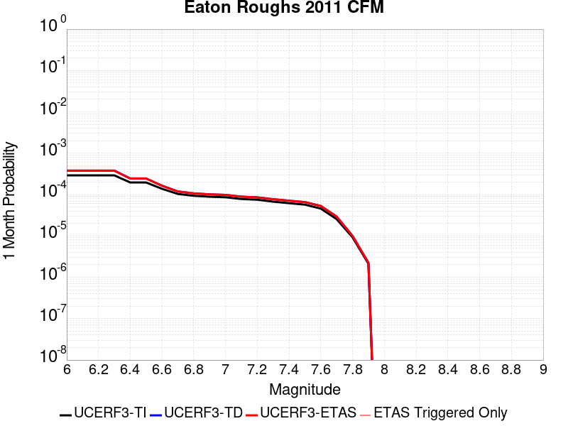 | 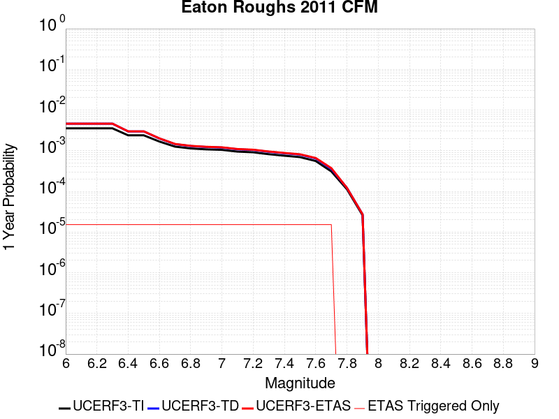 | 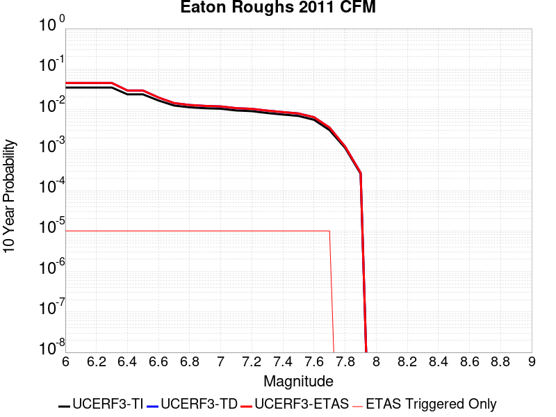 |

| Magnitude | 1 wk TI Prob | 1 wk TD Prob | 1 wk ETAS Prob | 1 wk ETAS/TD Gain | 1 wk ETAS Triggered Only | 1 mo TI Prob | 1 mo TD Prob | 1 mo ETAS Prob | 1 mo ETAS/TD Gain | 1 mo ETAS Triggered Only | 1 yr TI Prob | 1 yr TD Prob | 1 yr ETAS Prob | 1 yr ETAS/TD Gain | 1 yr ETAS Triggered Only | 10 yr TI Prob | 10 yr TD Prob | 10 yr ETAS Prob | 10 yr ETAS/TD Gain | 10 yr ETAS Triggered Only |
|-----|-----|-----|-----|-----|-----|-----|-----|-----|-----|-----|-----|-----|-----|-----|-----|-----|-----|-----|-----|-----|
| 6.0 | 6.8044945E-5 | 8.843646E-5 | 8.843646E-5 | 1.0 | 0.0 | 2.9158857E-4 | 3.7896493E-4 | 3.7896493E-4 | 1.0 | 0.0 | 0.0035443127 | 0.0046050907 | 0.0046202415 | 1.0032899 | 1.52207E-5 | 0.03488314 | 0.04516335 | 0.04517788 | 1.0003217 | 1.52207E-5 |
| 6.1 | 6.8044945E-5 | 8.843646E-5 | 8.843646E-5 | 1.0 | 0.0 | 2.9158857E-4 | 3.7896493E-4 | 3.7896493E-4 | 1.0 | 0.0 | 0.0035443127 | 0.0046050907 | 0.0046202415 | 1.0032899 | 1.52207E-5 | 0.03488314 | 0.04516335 | 0.04517788 | 1.0003217 | 1.52207E-5 |
| 6.2 | 6.8044945E-5 | 8.843646E-5 | 8.843646E-5 | 1.0 | 0.0 | 2.9158857E-4 | 3.7896493E-4 | 3.7896493E-4 | 1.0 | 0.0 | 0.0035443127 | 0.0046050907 | 0.0046202415 | 1.0032899 | 1.52207E-5 | 0.03488314 | 0.04516335 | 0.04517788 | 1.0003217 | 1.52207E-5 |
| 6.3 | 6.8044945E-5 | 8.843646E-5 | 8.843646E-5 | 1.0 | 0.0 | 2.9158857E-4 | 3.7896493E-4 | 3.7896493E-4 | 1.0 | 0.0 | 0.0035443127 | 0.0046050907 | 0.0046202415 | 1.0032899 | 1.52207E-5 | 0.03488314 | 0.04516335 | 0.04517788 | 1.0003217 | 1.52207E-5 |
| 6.4 | 4.5830013E-5 | 5.715427E-5 | 5.715427E-5 | 1.0 | 0.0 | 1.9639956E-4 | 2.4492692E-4 | 2.4492692E-4 | 1.0 | 0.0 | 0.0023885423 | 0.0029784471 | 0.0029936223 | 1.005095 | 1.52207E-5 | 0.023630321 | 0.029421588 | 0.029436361 | 1.0005021 | 1.52207E-5 |
| 6.5 | 4.5830013E-5 | 5.715427E-5 | 5.715427E-5 | 1.0 | 0.0 | 1.9639956E-4 | 2.4492692E-4 | 2.4492692E-4 | 1.0 | 0.0 | 0.0023885423 | 0.0029784471 | 0.0029936223 | 1.005095 | 1.52207E-5 | 0.023630321 | 0.029421588 | 0.029436361 | 1.0005021 | 1.52207E-5 |
| 6.6 | 3.222194E-5 | 3.8261504E-5 | 3.8261504E-5 | 1.0 | 0.0 | 1.3808672E-4 | 1.639682E-4 | 1.639682E-4 | 1.0 | 0.0 | 0.0016799092 | 0.001994599 | 0.0020097892 | 1.0076157 | 1.52207E-5 | 0.016672665 | 0.019776601 | 0.019791521 | 1.0007544 | 1.52207E-5 |
| 6.7 | 2.4155654E-5 | 2.7786238E-5 | 2.7786238E-5 | 1.0 | 0.0 | 1.0352012E-4 | 1.1907848E-4 | 1.1907848E-4 | 1.0 | 0.0 | 0.0012596287 | 0.0014488247 | 0.0014640233 | 1.0104903 | 1.52207E-5 | 0.012525126 | 0.014394943 | 0.014409944 | 1.0010421 | 1.52207E-5 |
| 6.8 | 2.1814667E-5 | 2.4940868E-5 | 2.4940868E-5 | 1.0 | 0.0 | 9.348808E-5 | 1.06885076E-4 | 1.06885076E-4 | 1.0 | 0.0 | 0.001137623 | 0.0013005526 | 0.0013157536 | 1.011688 | 1.52207E-5 | 0.011318169 | 0.012930038 | 0.0129450625 | 1.0011619 | 1.52207E-5 |
| 6.9 | 2.0700467E-5 | 2.3628932E-5 | 2.3628932E-5 | 1.0 | 0.0 | 8.871327E-5 | 1.01262944E-4 | 1.01262944E-4 | 1.0 | 0.0 | 0.0010795488 | 0.0012321823 | 0.0012473842 | 1.0123374 | 1.52207E-5 | 0.010743194 | 0.012254035 | 0.012269069 | 1.0012269 | 1.52207E-5 |
| 7.0 | 2.0104066E-5 | 2.29365E-5 | 2.29365E-5 | 1.0 | 0.0 | 8.615744E-5 | 9.82956E-5 | 9.82956E-5 | 1.0 | 0.0 | 0.0010484619 | 0.0011960949 | 0.0012112975 | 1.0127101 | 1.52207E-5 | 0.010435291 | 0.011897073 | 0.011912112 | 1.0012641 | 1.52207E-5 |
| 7.1 | 1.8225232E-5 | 2.0773046E-5 | 2.0773046E-5 | 1.0 | 0.0 | 7.81058E-5 | 8.902431E-5 | 8.902431E-5 | 1.0 | 0.0 | 9.5052324E-4 | 0.0010833336 | 0.0010985378 | 1.0140346 | 1.52207E-5 | 0.009464677 | 0.010780825 | 0.010795882 | 1.0013967 | 1.52207E-5 |
| 7.2 | 1.7526572E-5 | 1.9993488E-5 | 1.9993488E-5 | 1.0 | 0.0 | 7.511172E-5 | 8.5683576E-5 | 8.5683576E-5 | 1.0 | 0.0 | 9.141015E-4 | 0.0010426997 | 0.0010579046 | 1.0145822 | 1.52207E-5 | 0.009103506 | 0.010378351 | 0.010393414 | 1.0014514 | 1.52207E-5 |
| 7.3 | 1.5727232E-5 | 1.8021507E-5 | 1.8021507E-5 | 1.0 | 0.0 | 6.740067E-5 | 7.723275E-5 | 7.723275E-5 | 1.0 | 0.0 | 8.2029426E-4 | 9.399043E-4 | 9.551107E-4 | 1.0161786 | 1.52207E-5 | 0.008172729 | 0.009359511 | 0.00937459 | 1.001611 | 1.52207E-5 |
| 7.4 | 1.4457361E-5 | 1.6598358E-5 | 1.6598358E-5 | 1.0 | 0.0 | 6.195865E-5 | 7.113389E-5 | 7.113389E-5 | 1.0 | 0.0 | 7.540854E-4 | 8.657119E-4 | 8.809194E-4 | 1.0175664 | 1.52207E-5 | 0.007515317 | 0.008623555 | 0.0086386455 | 1.0017498 | 1.52207E-5 |
| 7.5 | 1.33280955E-5 | 1.5345435E-5 | 1.5345435E-5 | 1.0 | 0.0 | 5.711916E-5 | 6.57645E-5 | 6.57645E-5 | 1.0 | 0.0 | 6.9520384E-4 | 8.0038945E-4 | 8.15598E-4 | 1.0190014 | 1.52207E-5 | 0.00693033 | 0.007975209 | 0.007990308 | 1.0018933 | 1.52207E-5 |
| 7.6 | 1.0699478E-5 | 1.2387815E-5 | 1.2387815E-5 | 1.0 | 0.0 | 4.5854096E-5 | 5.308956E-5 | 5.308956E-5 | 1.0 | 0.0 | 5.581306E-4 | 6.4617425E-4 | 6.613851E-4 | 1.0235399 | 1.52207E-5 | 0.005567309 | 0.0064430353 | 0.0064581577 | 1.0023471 | 1.52207E-5 |
| 7.7 | 5.9390236E-6 | 6.852951E-6 | 6.852951E-6 | 1.0 | 0.0 | 2.545271E-5 | 2.9369461E-5 | 2.9369461E-5 | 1.0 | 0.0 | 3.0984267E-4 | 3.5751477E-4 | 3.7273002E-4 | 1.0425584 | 1.52207E-5 | 0.0030941102 | 0.0035694204 | 0.0035845868 | 1.004249 | 1.52207E-5 |
| 7.8 | 2.1622036E-6 | 2.3296996E-6 | 2.3296996E-6 | 1.0 | 0.0 | 9.266554E-6 | 9.984388E-6 | 9.984388E-6 | 1.0 | 0.0 | 1.1281446E-4 | 1.21553225E-4 | 1.21553225E-4 | 1.0 | 0.0 | 0.001127572 | 0.001214873 | 0.001214873 | 1.0 | 0.0 |
| 7.9 | 4.9586197E-7 | 5.2189216E-7 | 5.2189216E-7 | 1.0 | 0.0 | 2.125121E-6 | 2.2366787E-6 | 2.2366787E-6 | 1.0 | 0.0 | 2.5873042E-5 | 2.7231245E-5 | 2.7231245E-5 | 1.0 | 0.0 | 2.5870028E-4 | 2.7228118E-4 | 2.7228118E-4 | 1.0 | 0.0 |

## Calaveras (No) 2011 CFM
*[(top)](#table-of-contents)*

| 1 Week | 1 Month | 1 Year | 10 Year |
|-----|-----|-----|-----|
| 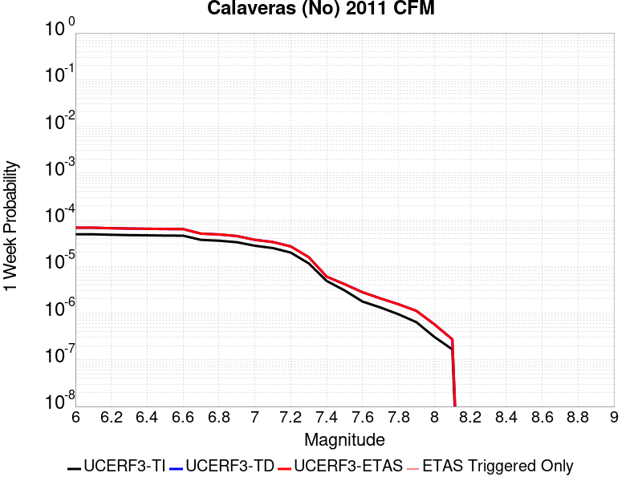 | 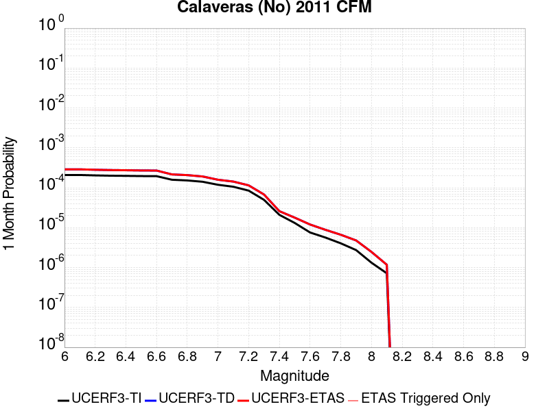 |  | 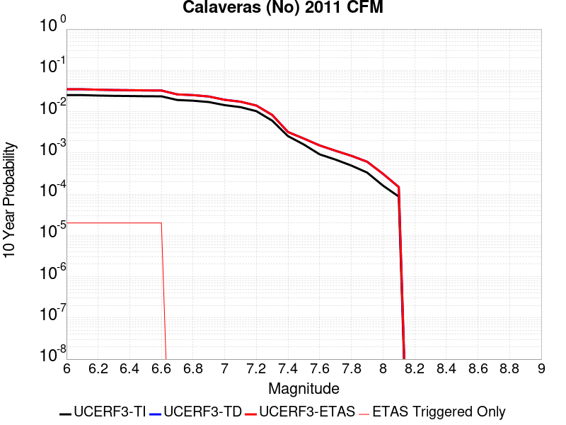 |

| Magnitude | 1 wk TI Prob | 1 wk TD Prob | 1 wk ETAS Prob | 1 wk ETAS/TD Gain | 1 wk ETAS Triggered Only | 1 mo TI Prob | 1 mo TD Prob | 1 mo ETAS Prob | 1 mo ETAS/TD Gain | 1 mo ETAS Triggered Only | 1 yr TI Prob | 1 yr TD Prob | 1 yr ETAS Prob | 1 yr ETAS/TD Gain | 1 yr ETAS Triggered Only | 10 yr TI Prob | 10 yr TD Prob | 10 yr ETAS Prob | 10 yr ETAS/TD Gain | 10 yr ETAS Triggered Only |
|-----|-----|-----|-----|-----|-----|-----|-----|-----|-----|-----|-----|-----|-----|-----|-----|-----|-----|-----|-----|-----|
| 6.0 | 4.8694856E-5 | 6.747121E-5 | 6.747121E-5 | 1.0 | 0.0 | 2.0867554E-4 | 2.8913133E-4 | 2.8913133E-4 | 1.0 | 0.0 | 0.0025376645 | 0.003514627 | 0.003514627 | 1.0 | 0.0 | 0.02508881 | 0.034771245 | 0.034785934 | 1.0004225 | 1.52207E-5 |
| 6.1 | 4.8694856E-5 | 6.747121E-5 | 6.747121E-5 | 1.0 | 0.0 | 2.0867554E-4 | 2.8913133E-4 | 2.8913133E-4 | 1.0 | 0.0 | 0.0025376645 | 0.003514627 | 0.003514627 | 1.0 | 0.0 | 0.02508881 | 0.034771245 | 0.034785934 | 1.0004225 | 1.52207E-5 |
| 6.2 | 4.7541962E-5 | 6.580218E-5 | 6.580218E-5 | 1.0 | 0.0 | 2.0373536E-4 | 2.8197994E-4 | 2.8197994E-4 | 1.0 | 0.0 | 0.0024776561 | 0.003427859 | 0.003427859 | 1.0 | 0.0 | 0.024502134 | 0.033932675 | 0.03394738 | 1.0004333 | 1.52207E-5 |
| 6.3 | 4.6717287E-5 | 6.4635555E-5 | 6.4635555E-5 | 1.0 | 0.0 | 2.0020158E-4 | 2.7698115E-4 | 2.7698115E-4 | 1.0 | 0.0 | 0.0024347296 | 0.0033672103 | 0.0033672103 | 1.0 | 0.0 | 0.024082264 | 0.033345193 | 0.033359904 | 1.0004412 | 1.52207E-5 |
| 6.4 | 4.6276386E-5 | 6.399742E-5 | 6.399742E-5 | 1.0 | 0.0 | 1.983123E-4 | 2.7424688E-4 | 2.7424688E-4 | 1.0 | 0.0 | 0.0024117786 | 0.0033340224 | 0.0033340224 | 1.0 | 0.0 | 0.02385771 | 0.033024073 | 0.03303879 | 1.0004457 | 1.52207E-5 |
| 6.5 | 4.5720994E-5 | 6.319881E-5 | 6.319881E-5 | 1.0 | 0.0 | 1.9593239E-4 | 2.70825E-4 | 2.70825E-4 | 1.0 | 0.0 | 0.002382867 | 0.0032924965 | 0.0032924965 | 1.0 | 0.0 | 0.023574775 | 0.032622032 | 0.032636758 | 1.0004513 | 1.52207E-5 |
| 6.6 | 4.549134E-5 | 6.28519E-5 | 6.28519E-5 | 1.0 | 0.0 | 1.949483E-4 | 2.6933852E-4 | 2.6933852E-4 | 1.0 | 0.0 | 0.0023709119 | 0.0032744533 | 0.0032744533 | 1.0 | 0.0 | 0.023457756 | 0.032447387 | 0.032462116 | 1.0004538 | 1.52207E-5 |
| 6.7 | 3.701047E-5 | 5.0359427E-5 | 5.0359427E-5 | 1.0 | 0.0 | 1.5860666E-4 | 2.1580851E-4 | 2.1580851E-4 | 1.0 | 0.0 | 0.0019293258 | 0.002624346 | 0.002624346 | 1.0 | 0.0 | 0.019126613 | 0.026125323 | 0.026125323 | 1.0 | 0.0 |
| 6.8 | 3.5523568E-5 | 4.8341022E-5 | 4.8341022E-5 | 1.0 | 0.0 | 1.5223498E-4 | 2.071596E-4 | 2.071596E-4 | 1.0 | 0.0 | 0.0018518851 | 0.0025192937 | 0.0025192937 | 1.0 | 0.0 | 0.018365284 | 0.025097553 | 0.025097553 | 1.0 | 0.0 |
| 6.9 | 3.2946147E-5 | 4.466269E-5 | 4.466269E-5 | 1.0 | 0.0 | 1.4119013E-4 | 1.9139773E-4 | 1.9139773E-4 | 1.0 | 0.0 | 0.0017176344 | 0.0023278191 | 0.0023278191 | 1.0 | 0.0 | 0.017044188 | 0.023219598 | 0.023219598 | 1.0 | 0.0 |
| 7.0 | 2.7682381E-5 | 3.702223E-5 | 3.702223E-5 | 1.0 | 0.0 | 1.1863338E-4 | 1.5865723E-4 | 1.5865723E-4 | 1.0 | 0.0 | 0.0014434044 | 0.0019299705 | 0.0019299705 | 1.0 | 0.0 | 0.01434065 | 0.01931092 | 0.01931092 | 1.0 | 0.0 |
| 7.1 | 2.471967E-5 | 3.328669E-5 | 3.328669E-5 | 1.0 | 0.0 | 1.05937135E-4 | 1.4264962E-4 | 1.4264962E-4 | 1.0 | 0.0 | 0.0012890215 | 0.0017354045 | 0.0017354045 | 1.0 | 0.0 | 0.0128157 | 0.017385952 | 0.017385952 | 1.0 | 0.0 |
| 7.2 | 1.9748062E-5 | 2.6774684E-5 | 2.6774684E-5 | 1.0 | 0.0 | 8.463181E-5 | 1.1474373E-4 | 1.1474373E-4 | 1.0 | 0.0 | 0.0010299052 | 0.0013961331 | 0.0013961331 | 1.0 | 0.0 | 0.01025145 | 0.014030739 | 0.014030739 | 1.0 | 0.0 |
| 7.3 | 1.1603734E-5 | 1.5783844E-5 | 1.5783844E-5 | 1.0 | 0.0 | 4.9729337E-5 | 6.764337E-5 | 6.764337E-5 | 1.0 | 0.0 | 6.052865E-4 | 8.232611E-4 | 8.232611E-4 | 1.0 | 0.0 | 0.0060364045 | 0.008308666 | 0.008308666 | 1.0 | 0.0 |
| 7.4 | 4.885381E-6 | 6.0349853E-6 | 6.0349853E-6 | 1.0 | 0.0 | 2.0937177E-5 | 2.5863968E-5 | 2.5863968E-5 | 1.0 | 0.0 | 2.5488032E-4 | 3.148485E-4 | 3.148485E-4 | 1.0 | 0.0 | 0.0025458818 | 0.0032010598 | 0.0032010598 | 1.0 | 0.0 |
| 7.5 | 3.0571264E-6 | 4.155299E-6 | 4.155299E-6 | 1.0 | 0.0 | 1.3101904E-5 | 1.7808303E-5 | 1.7808303E-5 | 1.0 | 0.0 | 1.5950401E-4 | 2.1679462E-4 | 2.1679462E-4 | 1.0 | 0.0 | 0.0015938957 | 0.002221121 | 0.002221121 | 1.0 | 0.0 |
| 7.6 | 1.764948E-6 | 2.7955498E-6 | 2.7955498E-6 | 1.0 | 0.0 | 7.564041E-6 | 1.1980874E-5 | 1.1980874E-5 | 1.0 | 0.0 | 9.208831E-5 | 1.4585744E-4 | 1.4585744E-4 | 1.0 | 0.0 | 9.205016E-4 | 0.0015123509 | 0.0015123509 | 1.0 | 0.0 |
| 7.7 | 1.3173734E-6 | 2.058471E-6 | 2.058471E-6 | 1.0 | 0.0 | 5.645874E-6 | 8.8219895E-6 | 8.8219895E-6 | 1.0 | 0.0 | 6.873634E-5 | 1.0740245E-4 | 1.0740245E-4 | 1.0 | 0.0 | 6.8715087E-4 | 0.0011261401 | 0.0011261401 | 1.0 | 0.0 |
| 7.8 | 9.4429885E-7 | 1.5489635E-6 | 1.5489635E-6 | 1.0 | 0.0 | 4.0469886E-6 | 6.638398E-6 | 6.638398E-6 | 1.0 | 0.0 | 4.9270973E-5 | 8.081952E-5 | 8.081952E-5 | 1.0 | 0.0 | 4.926005E-4 | 8.5014524E-4 | 8.5014524E-4 | 1.0 | 0.0 |
| 7.9 | 6.388233E-7 | 1.1148749E-6 | 1.1148749E-6 | 1.0 | 0.0 | 2.7378112E-6 | 4.7780263E-6 | 4.7780263E-6 | 1.0 | 0.0 | 3.3332344E-5 | 5.817093E-5 | 5.817093E-5 | 1.0 | 0.0 | 3.3327343E-4 | 6.0963054E-4 | 6.0963054E-4 | 1.0 | 0.0 |
| 8.0 | 3.087986E-7 | 5.7543696E-7 | 5.7543696E-7 | 1.0 | 0.0 | 1.323422E-6 | 2.466156E-6 | 2.466156E-6 | 1.0 | 0.0 | 1.6112543E-5 | 3.002504E-5 | 3.002504E-5 | 1.0 | 0.0 | 1.6111376E-4 | 3.110302E-4 | 3.110302E-4 | 1.0 | 0.0 |
| 8.1 | 1.6725647E-7 | 2.7410047E-7 | 2.7410047E-7 | 1.0 | 0.0 | 7.168133E-7 | 1.1747159E-6 | 1.1747159E-6 | 1.0 | 0.0 | 8.7271665E-6 | 1.4302073E-5 | 1.4302073E-5 | 1.0 | 0.0 | 8.726824E-5 | 1.48486E-4 | 1.48486E-4 | 1.0 | 0.0 |

## West Tahoe
*[(top)](#table-of-contents)*

| 1 Week | 1 Month | 1 Year | 10 Year |
|-----|-----|-----|-----|
| 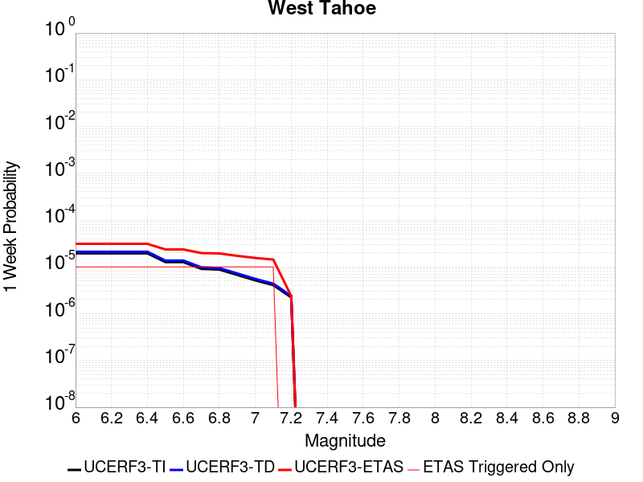 | 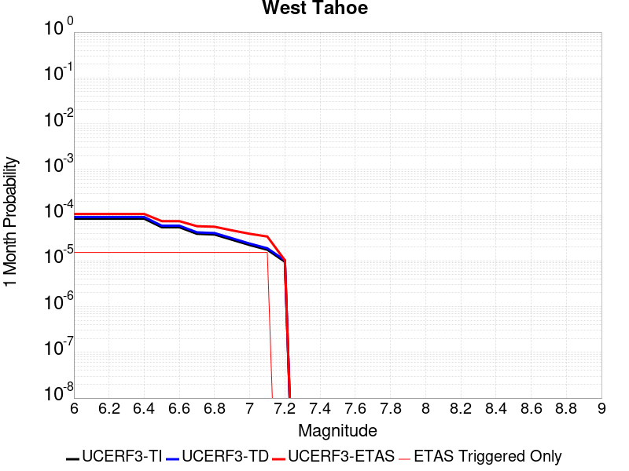 | 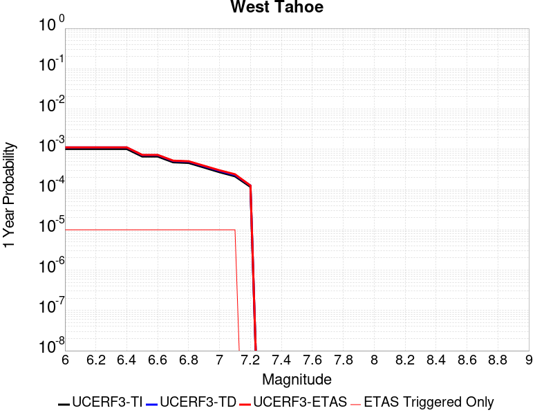 | 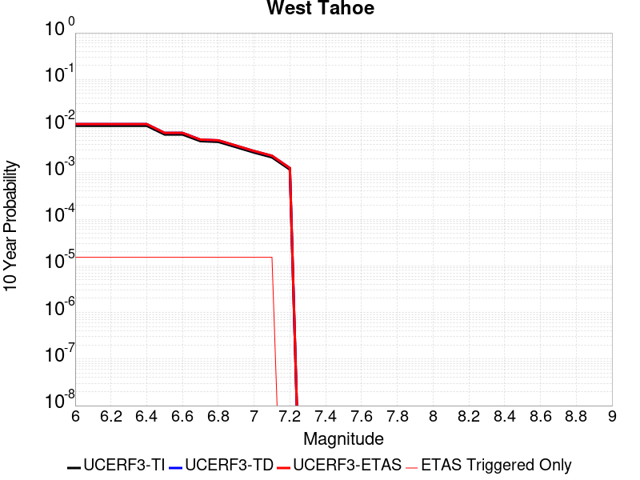 |

| Magnitude | 1 wk TI Prob | 1 wk TD Prob | 1 wk ETAS Prob | 1 wk ETAS/TD Gain | 1 wk ETAS Triggered Only | 1 mo TI Prob | 1 mo TD Prob | 1 mo ETAS Prob | 1 mo ETAS/TD Gain | 1 mo ETAS Triggered Only | 1 yr TI Prob | 1 yr TD Prob | 1 yr ETAS Prob | 1 yr ETAS/TD Gain | 1 yr ETAS Triggered Only | 10 yr TI Prob | 10 yr TD Prob | 10 yr ETAS Prob | 10 yr ETAS/TD Gain | 10 yr ETAS Triggered Only |
|-----|-----|-----|-----|-----|-----|-----|-----|-----|-----|-----|-----|-----|-----|-----|-----|-----|-----|-----|-----|-----|
| 6.0 | 1.952444E-5 | 2.118317E-5 | 3.6403548E-5 | 1.7185128 | 1.52207E-5 | 8.367348E-5 | 9.078217E-5 | 1.06001484E-4 | 1.1676465 | 1.52207E-5 | 0.0010182485 | 0.0011047672 | 0.001119971 | 1.0137621 | 1.52207E-5 | 0.010135954 | 0.010998235 | 0.011013289 | 1.0013686 | 1.52207E-5 |
| 6.1 | 1.952444E-5 | 2.118317E-5 | 3.6403548E-5 | 1.7185128 | 1.52207E-5 | 8.367348E-5 | 9.078217E-5 | 1.06001484E-4 | 1.1676465 | 1.52207E-5 | 0.0010182485 | 0.0011047672 | 0.001119971 | 1.0137621 | 1.52207E-5 | 0.010135954 | 0.010998235 | 0.011013289 | 1.0013686 | 1.52207E-5 |
| 6.2 | 1.952444E-5 | 2.118317E-5 | 3.6403548E-5 | 1.7185128 | 1.52207E-5 | 8.367348E-5 | 9.078217E-5 | 1.06001484E-4 | 1.1676465 | 1.52207E-5 | 0.0010182485 | 0.0011047672 | 0.001119971 | 1.0137621 | 1.52207E-5 | 0.010135954 | 0.010998235 | 0.011013289 | 1.0013686 | 1.52207E-5 |
| 6.3 | 1.952444E-5 | 2.118317E-5 | 3.6403548E-5 | 1.7185128 | 1.52207E-5 | 8.367348E-5 | 9.078217E-5 | 1.06001484E-4 | 1.1676465 | 1.52207E-5 | 0.0010182485 | 0.0011047672 | 0.001119971 | 1.0137621 | 1.52207E-5 | 0.010135954 | 0.010998235 | 0.011013289 | 1.0013686 | 1.52207E-5 |
| 6.4 | 1.952444E-5 | 2.118317E-5 | 3.6403548E-5 | 1.7185128 | 1.52207E-5 | 8.367348E-5 | 9.078217E-5 | 1.06001484E-4 | 1.1676465 | 1.52207E-5 | 0.0010182485 | 0.0011047672 | 0.001119971 | 1.0137621 | 1.52207E-5 | 0.010135954 | 0.010998235 | 0.011013289 | 1.0013686 | 1.52207E-5 |
| 6.5 | 1.2685271E-5 | 1.3690627E-5 | 2.891112E-5 | 2.1117454 | 1.52207E-5 | 5.4364315E-5 | 5.8672893E-5 | 7.38927E-5 | 1.259401 | 1.52207E-5 | 6.616845E-4 | 7.141248E-4 | 7.2933466E-4 | 1.0212985 | 1.52207E-5 | 0.0065971776 | 0.00711995 | 0.007135062 | 1.0021225 | 1.52207E-5 |
| 6.6 | 1.2685271E-5 | 1.3690627E-5 | 2.891112E-5 | 2.1117454 | 1.52207E-5 | 5.4364315E-5 | 5.8672893E-5 | 7.38927E-5 | 1.259401 | 1.52207E-5 | 6.616845E-4 | 7.141248E-4 | 7.2933466E-4 | 1.0212985 | 1.52207E-5 | 0.0065971776 | 0.00711995 | 0.007135062 | 1.0021225 | 1.52207E-5 |
| 6.7 | 9.117886E-6 | 9.809846E-6 | 2.5030397E-5 | 2.5515585 | 1.52207E-5 | 3.9076072E-5 | 4.2041564E-5 | 5.7261623E-5 | 1.3620242 | 1.52207E-5 | 4.756473E-4 | 5.11743E-4 | 5.269559E-4 | 1.0297277 | 1.52207E-5 | 0.0047463053 | 0.0051063634 | 0.0051215068 | 1.0029656 | 1.52207E-5 |
| 6.8 | 8.786828E-6 | 9.457863E-6 | 2.4678418E-5 | 2.6093018 | 1.52207E-5 | 3.7657293E-5 | 4.053311E-5 | 5.5753193E-5 | 1.3754976 | 1.52207E-5 | 4.5838108E-4 | 4.933859E-4 | 5.085991E-4 | 1.0308343 | 1.52207E-5 | 0.0045743673 | 0.0049236063 | 0.004938752 | 1.0030762 | 1.52207E-5 |
| 6.9 | 6.7562123E-6 | 7.2638086E-6 | 2.2484399E-5 | 3.0954006 | 1.52207E-5 | 2.8954875E-5 | 3.1130265E-5 | 4.635049E-5 | 1.4889206 | 1.52207E-5 | 3.5246857E-4 | 3.789498E-4 | 3.9416473E-4 | 1.0401503 | 1.52207E-5 | 0.0035191004 | 0.0037835082 | 0.0037986713 | 1.0040077 | 1.52207E-5 |
| 7.0 | 5.1792854E-6 | 5.567338E-6 | 2.0787953E-5 | 3.7339125 | 1.52207E-5 | 2.2196748E-5 | 2.3859824E-5 | 3.908016E-5 | 1.6379066 | 1.52207E-5 | 2.702119E-4 | 2.9045844E-4 | 3.056747E-4 | 1.0523871 | 1.52207E-5 | 0.0026988357 | 0.0029011632 | 0.0029163398 | 1.0052311 | 1.52207E-5 |
| 7.1 | 4.090765E-6 | 4.3974223E-6 | 1.9618055E-5 | 4.461262 | 1.52207E-5 | 1.7531731E-5 | 1.884598E-5 | 3.4066394E-5 | 1.8076212 | 1.52207E-5 | 2.134279E-4 | 2.2942905E-4 | 2.4464625E-4 | 1.0663264 | 1.52207E-5 | 0.0021322304 | 0.0022922563 | 0.002307442 | 1.0066248 | 1.52207E-5 |
| 7.2 | 2.2356758E-6 | 2.4023684E-6 | 2.4023684E-6 | 1.0 | 0.0 | 9.581432E-6 | 1.0295834E-5 | 1.0295834E-5 | 1.0 | 0.0 | 1.1664769E-4 | 1.2534647E-4 | 1.2534647E-4 | 1.0 | 0.0 | 0.0011658648 | 0.0012529434 | 0.0012529434 | 1.0 | 0.0 |

## South Cuyama
*[(top)](#table-of-contents)*

| 1 Week | 1 Month | 1 Year | 10 Year |
|-----|-----|-----|-----|
| 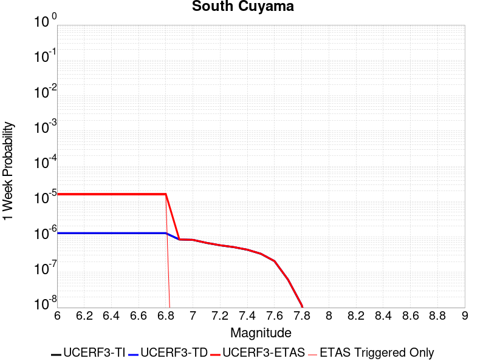 | 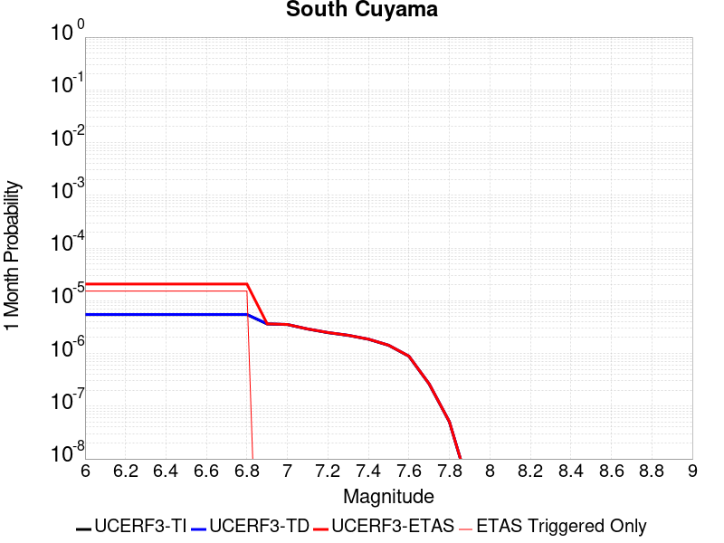 | 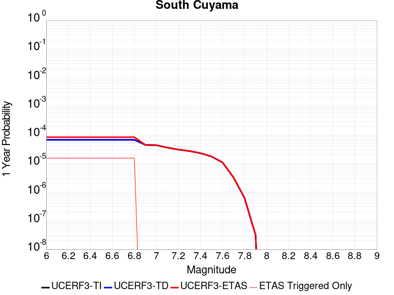 | 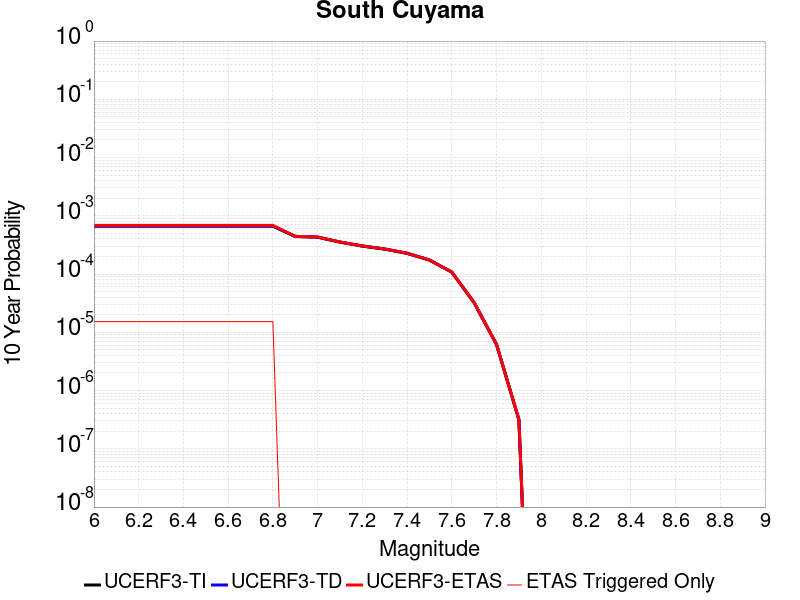 |

| Magnitude | 1 wk TI Prob | 1 wk TD Prob | 1 wk ETAS Prob | 1 wk ETAS/TD Gain | 1 wk ETAS Triggered Only | 1 mo TI Prob | 1 mo TD Prob | 1 mo ETAS Prob | 1 mo ETAS/TD Gain | 1 mo ETAS Triggered Only | 1 yr TI Prob | 1 yr TD Prob | 1 yr ETAS Prob | 1 yr ETAS/TD Gain | 1 yr ETAS Triggered Only | 10 yr TI Prob | 10 yr TD Prob | 10 yr ETAS Prob | 10 yr ETAS/TD Gain | 10 yr ETAS Triggered Only |
|-----|-----|-----|-----|-----|-----|-----|-----|-----|-----|-----|-----|-----|-----|-----|-----|-----|-----|-----|-----|-----|
| 6.0 | 1.2747308E-6 | 1.2818697E-6 | 1.650255E-5 | 12.873813 | 1.52207E-5 | 5.4631205E-6 | 5.4937163E-6 | 2.0714333E-5 | 3.7705503 | 1.52207E-5 | 6.6511464E-5 | 6.6884015E-5 | 8.2103696E-5 | 1.2275534 | 1.52207E-5 | 6.649156E-4 | 6.686458E-4 | 6.838563E-4 | 1.0227482 | 1.52207E-5 |
| 6.1 | 1.2747308E-6 | 1.2818697E-6 | 1.650255E-5 | 12.873813 | 1.52207E-5 | 5.4631205E-6 | 5.4937163E-6 | 2.0714333E-5 | 3.7705503 | 1.52207E-5 | 6.6511464E-5 | 6.6884015E-5 | 8.2103696E-5 | 1.2275534 | 1.52207E-5 | 6.649156E-4 | 6.686458E-4 | 6.838563E-4 | 1.0227482 | 1.52207E-5 |
| 6.2 | 1.2747308E-6 | 1.2818697E-6 | 1.650255E-5 | 12.873813 | 1.52207E-5 | 5.4631205E-6 | 5.4937163E-6 | 2.0714333E-5 | 3.7705503 | 1.52207E-5 | 6.6511464E-5 | 6.6884015E-5 | 8.2103696E-5 | 1.2275534 | 1.52207E-5 | 6.649156E-4 | 6.686458E-4 | 6.838563E-4 | 1.0227482 | 1.52207E-5 |
| 6.3 | 1.2747308E-6 | 1.2818697E-6 | 1.650255E-5 | 12.873813 | 1.52207E-5 | 5.4631205E-6 | 5.4937163E-6 | 2.0714333E-5 | 3.7705503 | 1.52207E-5 | 6.6511464E-5 | 6.6884015E-5 | 8.2103696E-5 | 1.2275534 | 1.52207E-5 | 6.649156E-4 | 6.686458E-4 | 6.838563E-4 | 1.0227482 | 1.52207E-5 |
| 6.4 | 1.2747308E-6 | 1.2818697E-6 | 1.650255E-5 | 12.873813 | 1.52207E-5 | 5.4631205E-6 | 5.4937163E-6 | 2.0714333E-5 | 3.7705503 | 1.52207E-5 | 6.6511464E-5 | 6.6884015E-5 | 8.2103696E-5 | 1.2275534 | 1.52207E-5 | 6.649156E-4 | 6.686458E-4 | 6.838563E-4 | 1.0227482 | 1.52207E-5 |
| 6.5 | 1.2747308E-6 | 1.2818697E-6 | 1.650255E-5 | 12.873813 | 1.52207E-5 | 5.4631205E-6 | 5.4937163E-6 | 2.0714333E-5 | 3.7705503 | 1.52207E-5 | 6.6511464E-5 | 6.6884015E-5 | 8.2103696E-5 | 1.2275534 | 1.52207E-5 | 6.649156E-4 | 6.686458E-4 | 6.838563E-4 | 1.0227482 | 1.52207E-5 |
| 6.6 | 1.2747308E-6 | 1.2818697E-6 | 1.650255E-5 | 12.873813 | 1.52207E-5 | 5.4631205E-6 | 5.4937163E-6 | 2.0714333E-5 | 3.7705503 | 1.52207E-5 | 6.6511464E-5 | 6.6884015E-5 | 8.2103696E-5 | 1.2275534 | 1.52207E-5 | 6.649156E-4 | 6.686458E-4 | 6.838563E-4 | 1.0227482 | 1.52207E-5 |
| 6.7 | 1.2747308E-6 | 1.2818697E-6 | 1.650255E-5 | 12.873813 | 1.52207E-5 | 5.4631205E-6 | 5.4937163E-6 | 2.0714333E-5 | 3.7705503 | 1.52207E-5 | 6.6511464E-5 | 6.6884015E-5 | 8.2103696E-5 | 1.2275534 | 1.52207E-5 | 6.649156E-4 | 6.686458E-4 | 6.838563E-4 | 1.0227482 | 1.52207E-5 |
| 6.8 | 1.2747308E-6 | 1.2818697E-6 | 1.650255E-5 | 12.873813 | 1.52207E-5 | 5.4631205E-6 | 5.4937163E-6 | 2.0714333E-5 | 3.7705503 | 1.52207E-5 | 6.6511464E-5 | 6.6884015E-5 | 8.2103696E-5 | 1.2275534 | 1.52207E-5 | 6.649156E-4 | 6.686458E-4 | 6.838563E-4 | 1.0227482 | 1.52207E-5 |
| 6.9 | 8.4566324E-7 | 8.507883E-7 | 8.507883E-7 | 1.0 | 0.0 | 3.624266E-6 | 3.6462304E-6 | 3.6462304E-6 | 1.0 | 0.0 | 4.4124543E-5 | 4.439196E-5 | 4.439196E-5 | 1.0 | 0.0 | 4.4115784E-4 | 4.4383196E-4 | 4.4383196E-4 | 1.0 | 0.0 |
| 7.0 | 8.2277904E-7 | 8.27782E-7 | 8.27782E-7 | 1.0 | 0.0 | 3.526191E-6 | 3.5476323E-6 | 3.5476323E-6 | 1.0 | 0.0 | 4.293053E-5 | 4.3191576E-5 | 4.3191576E-5 | 1.0 | 0.0 | 4.292224E-4 | 4.3183283E-4 | 4.3183283E-4 | 1.0 | 0.0 |
| 7.1 | 6.7661887E-7 | 6.80913E-7 | 6.80913E-7 | 1.0 | 0.0 | 2.899792E-6 | 2.9181954E-6 | 2.9181954E-6 | 1.0 | 0.0 | 3.5304394E-5 | 3.5528454E-5 | 3.5528454E-5 | 1.0 | 0.0 | 3.5298787E-4 | 3.552281E-4 | 3.552281E-4 | 1.0 | 0.0 |
| 7.2 | 5.783336E-7 | 5.8211907E-7 | 5.8211907E-7 | 1.0 | 0.0 | 2.4785702E-6 | 2.4947938E-6 | 2.4947938E-6 | 1.0 | 0.0 | 3.0176174E-5 | 3.0373692E-5 | 3.0373692E-5 | 1.0 | 0.0 | 3.0172078E-4 | 3.0369565E-4 | 3.0369565E-4 | 1.0 | 0.0 |
| 7.3 | 5.136759E-7 | 5.170938E-7 | 5.170938E-7 | 1.0 | 0.0 | 2.2014663E-6 | 2.2161144E-6 | 2.2161144E-6 | 1.0 | 0.0 | 2.6802521E-5 | 2.698086E-5 | 2.698086E-5 | 1.0 | 0.0 | 2.679929E-4 | 2.6977606E-4 | 2.6977606E-4 | 1.0 | 0.0 |
| 7.4 | 4.3370295E-7 | 4.3665364E-7 | 4.3665364E-7 | 1.0 | 0.0 | 1.8587256E-6 | 1.8713713E-6 | 1.8713713E-6 | 1.0 | 0.0 | 2.2629749E-5 | 2.278371E-5 | 2.278371E-5 | 1.0 | 0.0 | 2.2627445E-4 | 2.278139E-4 | 2.278139E-4 | 1.0 | 0.0 |
| 7.5 | 3.3242574E-7 | 3.3476465E-7 | 3.3476465E-7 | 1.0 | 0.0 | 1.4246809E-6 | 1.4347048E-6 | 1.4347048E-6 | 1.0 | 0.0 | 1.7345352E-5 | 1.7467393E-5 | 1.7467393E-5 | 1.0 | 0.0 | 1.7343998E-4 | 1.7466032E-4 | 1.7466032E-4 | 1.0 | 0.0 |
| 7.6 | 2.0627535E-7 | 2.07789E-7 | 2.07789E-7 | 1.0 | 0.0 | 8.840369E-7 | 8.90524E-7 | 8.90524E-7 | 1.0 | 0.0 | 1.0763096E-5 | 1.0842076E-5 | 1.0842076E-5 | 1.0 | 0.0 | 1.0762575E-4 | 1.0841556E-4 | 1.0841556E-4 | 1.0 | 0.0 |
| 7.7 | 6.15236E-8 | 6.1983044E-8 | 6.1983044E-8 | 1.0 | 0.0 | 2.6367252E-7 | 2.656416E-7 | 2.656416E-7 | 1.0 | 0.0 | 3.2102084E-6 | 3.2341818E-6 | 3.2341818E-6 | 1.0 | 0.0 | 3.210162E-5 | 3.234136E-5 | 3.234136E-5 | 1.0 | 0.0 |
| 7.8 | 1.1765573E-8 | 1.1873414E-8 | 1.1873414E-8 | 1.0 | 0.0 | 5.0423886E-8 | 5.0886058E-8 | 5.0886058E-8 | 1.0 | 0.0 | 6.1391063E-7 | 6.195376E-7 | 6.195376E-7 | 1.0 | 0.0 | 6.1390897E-6 | 6.19536E-6 | 6.19536E-6 | 1.0 | 0.0 |
| 7.9 | 6.0381755E-10 | 6.10058E-10 | 6.10058E-10 | 1.0 | 0.0 | 2.5877895E-9 | 2.614534E-9 | 2.614534E-9 | 1.0 | 0.0 | 3.1506335E-8 | 3.1831952E-8 | 3.1831952E-8 | 1.0 | 0.0 | 3.1506332E-7 | 3.183195E-7 | 3.183195E-7 | 1.0 | 0.0 |

## Los Alamos extension
*[(top)](#table-of-contents)*

| 1 Week | 1 Month | 1 Year | 10 Year |
|-----|-----|-----|-----|
| 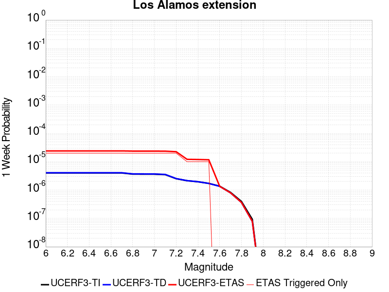 | 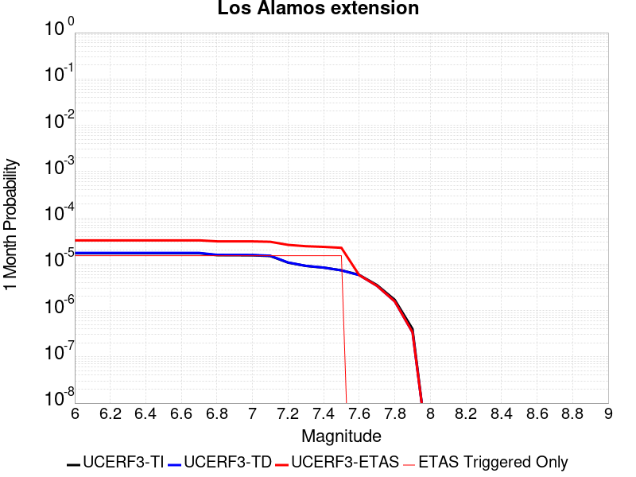 | 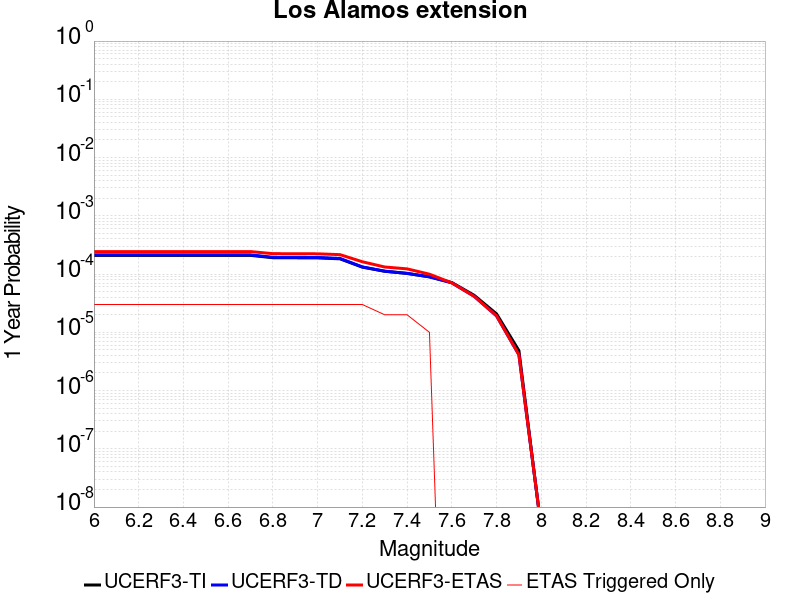 | 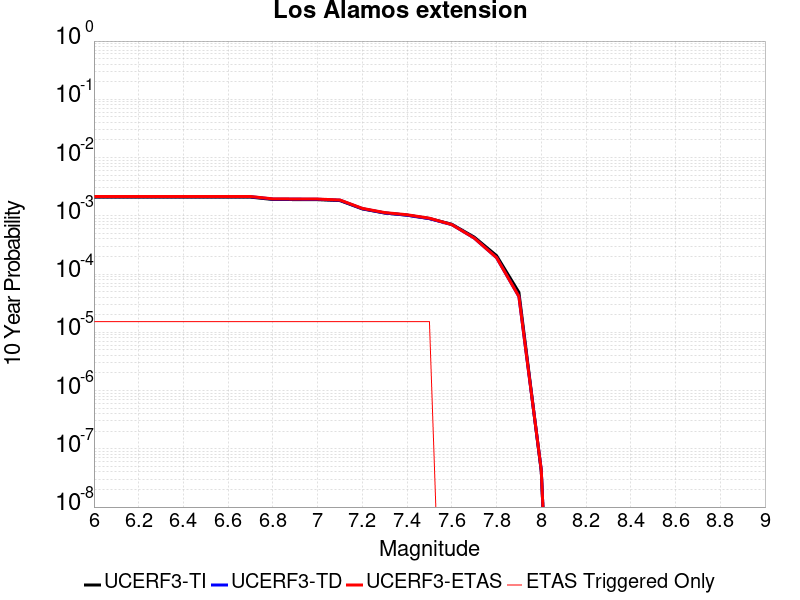 |

| Magnitude | 1 wk TI Prob | 1 wk TD Prob | 1 wk ETAS Prob | 1 wk ETAS/TD Gain | 1 wk ETAS Triggered Only | 1 mo TI Prob | 1 mo TD Prob | 1 mo ETAS Prob | 1 mo ETAS/TD Gain | 1 mo ETAS Triggered Only | 1 yr TI Prob | 1 yr TD Prob | 1 yr ETAS Prob | 1 yr ETAS/TD Gain | 1 yr ETAS Triggered Only | 10 yr TI Prob | 10 yr TD Prob | 10 yr ETAS Prob | 10 yr ETAS/TD Gain | 10 yr ETAS Triggered Only |
|-----|-----|-----|-----|-----|-----|-----|-----|-----|-----|-----|-----|-----|-----|-----|-----|-----|-----|-----|-----|-----|
| 6.0 | 4.0146506E-6 | 4.0861596E-6 | 1.9306797E-5 | 4.724925 | 1.52207E-5 | 1.7205533E-5 | 1.7512002E-5 | 3.2732434E-5 | 1.869143 | 1.52207E-5 | 2.0945723E-4 | 2.1318886E-4 | 2.2840632E-4 | 1.0713801 | 1.52207E-5 | 0.0020925992 | 0.0021299527 | 0.002145141 | 1.0071309 | 1.52207E-5 |
| 6.1 | 4.0146506E-6 | 4.0861596E-6 | 1.9306797E-5 | 4.724925 | 1.52207E-5 | 1.7205533E-5 | 1.7512002E-5 | 3.2732434E-5 | 1.869143 | 1.52207E-5 | 2.0945723E-4 | 2.1318886E-4 | 2.2840632E-4 | 1.0713801 | 1.52207E-5 | 0.0020925992 | 0.0021299527 | 0.002145141 | 1.0071309 | 1.52207E-5 |
| 6.2 | 4.0146506E-6 | 4.0861596E-6 | 1.9306797E-5 | 4.724925 | 1.52207E-5 | 1.7205533E-5 | 1.7512002E-5 | 3.2732434E-5 | 1.869143 | 1.52207E-5 | 2.0945723E-4 | 2.1318886E-4 | 2.2840632E-4 | 1.0713801 | 1.52207E-5 | 0.0020925992 | 0.0021299527 | 0.002145141 | 1.0071309 | 1.52207E-5 |
| 6.3 | 4.0146506E-6 | 4.0861596E-6 | 1.9306797E-5 | 4.724925 | 1.52207E-5 | 1.7205533E-5 | 1.7512002E-5 | 3.2732434E-5 | 1.869143 | 1.52207E-5 | 2.0945723E-4 | 2.1318886E-4 | 2.2840632E-4 | 1.0713801 | 1.52207E-5 | 0.0020925992 | 0.0021299527 | 0.002145141 | 1.0071309 | 1.52207E-5 |
| 6.4 | 4.0146506E-6 | 4.0861596E-6 | 1.9306797E-5 | 4.724925 | 1.52207E-5 | 1.7205533E-5 | 1.7512002E-5 | 3.2732434E-5 | 1.869143 | 1.52207E-5 | 2.0945723E-4 | 2.1318886E-4 | 2.2840632E-4 | 1.0713801 | 1.52207E-5 | 0.0020925992 | 0.0021299527 | 0.002145141 | 1.0071309 | 1.52207E-5 |
| 6.5 | 4.0146506E-6 | 4.0861596E-6 | 1.9306797E-5 | 4.724925 | 1.52207E-5 | 1.7205533E-5 | 1.7512002E-5 | 3.2732434E-5 | 1.869143 | 1.52207E-5 | 2.0945723E-4 | 2.1318886E-4 | 2.2840632E-4 | 1.0713801 | 1.52207E-5 | 0.0020925992 | 0.0021299527 | 0.002145141 | 1.0071309 | 1.52207E-5 |
| 6.6 | 4.0146506E-6 | 4.0861596E-6 | 1.9306797E-5 | 4.724925 | 1.52207E-5 | 1.7205533E-5 | 1.7512002E-5 | 3.2732434E-5 | 1.869143 | 1.52207E-5 | 2.0945723E-4 | 2.1318886E-4 | 2.2840632E-4 | 1.0713801 | 1.52207E-5 | 0.0020925992 | 0.0021299527 | 0.002145141 | 1.0071309 | 1.52207E-5 |
| 6.7 | 4.0146506E-6 | 4.0861596E-6 | 1.9306797E-5 | 4.724925 | 1.52207E-5 | 1.7205533E-5 | 1.7512002E-5 | 3.2732434E-5 | 1.869143 | 1.52207E-5 | 2.0945723E-4 | 2.1318886E-4 | 2.2840632E-4 | 1.0713801 | 1.52207E-5 | 0.0020925992 | 0.0021299527 | 0.002145141 | 1.0071309 | 1.52207E-5 |
| 6.8 | 3.6584688E-6 | 3.7188588E-6 | 1.8939503E-5 | 5.0928264 | 1.52207E-5 | 1.5679057E-5 | 1.5937874E-5 | 3.115833E-5 | 1.9549867 | 1.52207E-5 | 1.9087581E-4 | 1.9402728E-4 | 2.0924503E-4 | 1.078431 | 1.52207E-5 | 0.0019071194 | 0.0019386712 | 0.0019538624 | 1.0078359 | 1.52207E-5 |
| 6.9 | 3.644631E-6 | 3.7045688E-6 | 1.8925213E-5 | 5.108614 | 1.52207E-5 | 1.5619753E-5 | 1.5876632E-5 | 3.109709E-5 | 1.9586705 | 1.52207E-5 | 1.901539E-4 | 1.9328178E-4 | 2.0849955E-4 | 1.0787336 | 1.52207E-5 | 0.0018999127 | 0.0019312293 | 0.0019464205 | 1.0078661 | 1.52207E-5 |
| 7.0 | 3.6318522E-6 | 3.6913295E-6 | 1.8911973E-5 | 5.12335 | 1.52207E-5 | 1.5564989E-5 | 1.5819893E-5 | 3.1040352E-5 | 1.9621089 | 1.52207E-5 | 1.8948725E-4 | 1.925911E-4 | 2.0780887E-4 | 1.079016 | 1.52207E-5 | 0.0018932576 | 0.0019243343 | 0.0019395258 | 1.0078944 | 1.52207E-5 |
| 7.1 | 3.5001724E-6 | 3.5554E-6 | 1.8776045E-5 | 5.280994 | 1.52207E-5 | 1.5000653E-5 | 1.5237345E-5 | 3.0457813E-5 | 1.9988924 | 1.52207E-5 | 1.8261763E-4 | 1.854998E-4 | 2.0071768E-4 | 1.0820372 | 1.52207E-5 | 0.0018246764 | 0.0018535402 | 0.0018687327 | 1.0081965 | 1.52207E-5 |
| 7.2 | 2.5204702E-6 | 2.5436943E-6 | 1.7764356E-5 | 6.9836836 | 1.52207E-5 | 1.080197E-5 | 1.0901502E-5 | 2.6122036E-5 | 2.396187 | 1.52207E-5 | 1.3150605E-4 | 1.3271775E-4 | 1.4793643E-4 | 1.1146696 | 1.52207E-5 | 0.0013142825 | 0.0013263905 | 0.001341591 | 1.0114601 | 1.52207E-5 |
| 7.3 | 2.1399692E-6 | 2.1501316E-6 | 1.73708E-5 | 8.078947 | 1.52207E-5 | 9.1712645E-6 | 9.2148175E-6 | 2.4435378E-5 | 2.6517484 | 1.52207E-5 | 1.1165442E-4 | 1.1218466E-4 | 1.2740365E-4 | 1.1356602 | 1.52207E-5 | 0.0011159834 | 0.0011212835 | 0.0011364871 | 1.0135591 | 1.52207E-5 |
| 7.4 | 1.9660122E-6 | 1.9702363E-6 | 1.7190907E-5 | 8.725302 | 1.52207E-5 | 8.42574E-6 | 8.4438425E-6 | 2.3664414E-5 | 2.8025646 | 1.52207E-5 | 1.0257855E-4 | 1.0279897E-4 | 1.18018106E-4 | 1.1480476 | 1.52207E-5 | 0.0010253121 | 0.0010275173 | 0.0010427224 | 1.0147978 | 1.52207E-5 |
| 7.5 | 1.7204633E-6 | 1.7150983E-6 | 1.6935772E-5 | 9.87452 | 1.52207E-5 | 7.373393E-6 | 7.3504007E-6 | 2.2570988E-5 | 3.0707154 | 1.52207E-5 | 8.976737E-5 | 8.948748E-5 | 1.0470682E-4 | 1.1700722 | 1.52207E-5 | 8.9731114E-4 | 8.9451746E-4 | 9.0972456E-4 | 1.0170003 | 1.52207E-5 |
| 7.6 | 1.3717638E-6 | 1.3535827E-6 | 1.3535827E-6 | 1.0 | 0.0 | 5.878974E-6 | 5.8010555E-6 | 5.8010555E-6 | 1.0 | 0.0 | 7.157416E-5 | 7.062559E-5 | 7.062559E-5 | 1.0 | 0.0 | 7.1551115E-4 | 7.060341E-4 | 7.060341E-4 | 1.0 | 0.0 |
| 7.7 | 8.272564E-7 | 7.957636E-7 | 7.957636E-7 | 1.0 | 0.0 | 3.5453797E-6 | 3.410411E-6 | 3.410411E-6 | 1.0 | 0.0 | 4.3164142E-5 | 4.1520965E-5 | 4.1520965E-5 | 1.0 | 0.0 | 4.315576E-4 | 4.1513226E-4 | 4.1513226E-4 | 1.0 | 0.0 |
| 7.8 | 3.9708277E-7 | 3.6719027E-7 | 3.6719027E-7 | 1.0 | 0.0 | 1.7017821E-6 | 1.5736716E-6 | 1.5736716E-6 | 1.0 | 0.0 | 2.0719E-5 | 1.9159284E-5 | 1.9159284E-5 | 1.0 | 0.0 | 2.071707E-4 | 1.9157639E-4 | 1.9157639E-4 | 1.0 | 0.0 |
| 7.9 | 9.292528E-8 | 7.889087E-8 | 7.889087E-8 | 1.0 | 0.0 | 3.9825116E-7 | 3.381037E-7 | 3.381037E-7 | 1.0 | 0.0 | 4.848697E-6 | 4.116405E-6 | 4.116405E-6 | 1.0 | 0.0 | 4.8485912E-5 | 4.1163294E-5 | 4.1163294E-5 | 1.0 | 0.0 |
| 8.0 | 7.880441E-11 | 8.2353124E-11 | 8.2353124E-11 | 1.0 | 0.0 | 3.3773329E-10 | 3.52942E-10 | 3.52942E-10 | 1.0 | 0.0 | 4.1119033E-9 | 4.2970694E-9 | 4.2970694E-9 | 1.0 | 0.0 | 4.1119034E-8 | 4.2970694E-8 | 4.2970694E-8 | 1.0 | 0.0 |

## Hayward (So) extension 2011 CFM
*[(top)](#table-of-contents)*

| 1 Week | 1 Month | 1 Year | 10 Year |
|-----|-----|-----|-----|
| 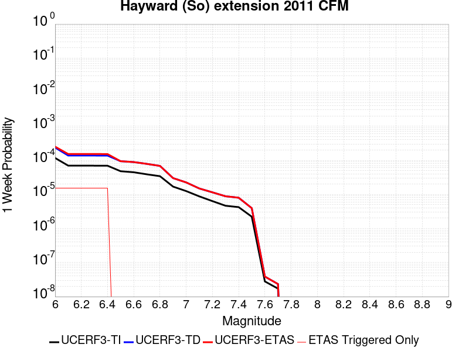 | 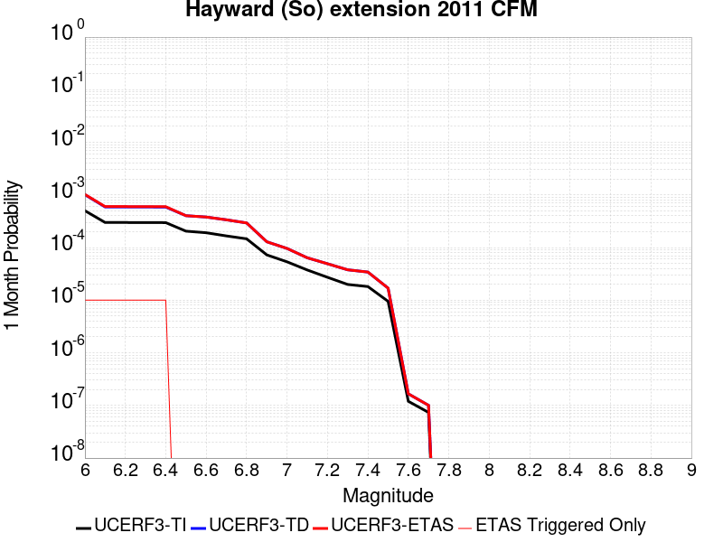 | 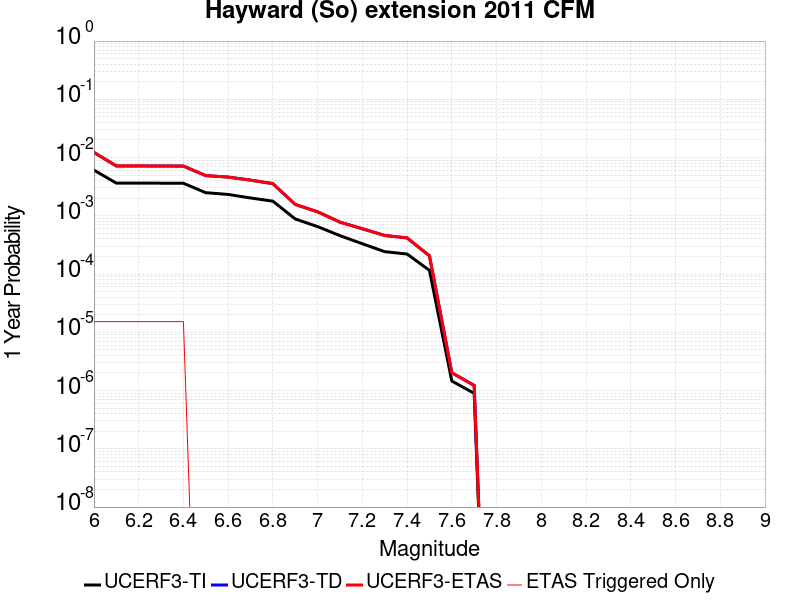 | 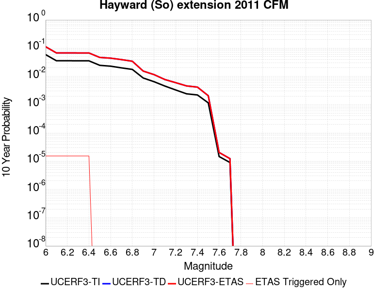 |

| Magnitude | 1 wk TI Prob | 1 wk TD Prob | 1 wk ETAS Prob | 1 wk ETAS/TD Gain | 1 wk ETAS Triggered Only | 1 mo TI Prob | 1 mo TD Prob | 1 mo ETAS Prob | 1 mo ETAS/TD Gain | 1 mo ETAS Triggered Only | 1 yr TI Prob | 1 yr TD Prob | 1 yr ETAS Prob | 1 yr ETAS/TD Gain | 1 yr ETAS Triggered Only | 10 yr TI Prob | 10 yr TD Prob | 10 yr ETAS Prob | 10 yr ETAS/TD Gain | 10 yr ETAS Triggered Only |
|-----|-----|-----|-----|-----|-----|-----|-----|-----|-----|-----|-----|-----|-----|-----|-----|-----|-----|-----|-----|-----|
| 6.0 | 1.1721256E-4 | 2.3697627E-4 | 2.5219336E-4 | 1.0642135 | 1.52207E-5 | 5.022428E-4 | 0.0010129517 | 0.001028157 | 1.0150108 | 1.52207E-5 | 0.0060976758 | 0.012248711 | 0.012263745 | 1.0012274 | 1.52207E-5 | 0.0593305 | 0.112843215 | 0.112856716 | 1.0001197 | 1.52207E-5 |
| 6.1 | 6.99169E-5 | 1.3822885E-4 | 1.5344744E-4 | 1.110097 | 1.52207E-5 | 2.9960944E-4 | 5.9128006E-4 | 6.0649175E-4 | 1.0257267 | 1.52207E-5 | 0.0036416445 | 0.0071720886 | 0.0071872 | 1.002107 | 1.52207E-5 | 0.035825435 | 0.067803554 | 0.06781774 | 1.0002092 | 1.52207E-5 |
| 6.2 | 6.99169E-5 | 1.3822885E-4 | 1.5344744E-4 | 1.110097 | 1.52207E-5 | 2.9960944E-4 | 5.9128006E-4 | 6.0649175E-4 | 1.0257267 | 1.52207E-5 | 0.0036416445 | 0.0071720886 | 0.0071872 | 1.002107 | 1.52207E-5 | 0.035825435 | 0.067803554 | 0.06781774 | 1.0002092 | 1.52207E-5 |
| 6.3 | 6.970908E-5 | 1.379104E-4 | 1.53129E-4 | 1.1103513 | 1.52207E-5 | 2.9871898E-4 | 5.899159E-4 | 6.051276E-4 | 1.0257863 | 1.52207E-5 | 0.0036308395 | 0.007155625 | 0.007170737 | 1.0021119 | 1.52207E-5 | 0.035720866 | 0.067652516 | 0.06766671 | 1.0002098 | 1.52207E-5 |
| 6.4 | 6.9517155E-5 | 1.375792E-4 | 1.5279782E-4 | 1.110617 | 1.52207E-5 | 2.9789665E-4 | 5.884971E-4 | 6.0370885E-4 | 1.0258485 | 1.52207E-5 | 0.0036208609 | 0.0071385372 | 0.0071536493 | 1.0021169 | 1.52207E-5 | 0.03562429 | 0.06749655 | 0.06751075 | 1.0002103 | 1.52207E-5 |
| 6.5 | 4.786248E-5 | 9.41498E-5 | 9.41498E-5 | 1.0 | 0.0 | 2.0510878E-4 | 4.034394E-4 | 4.034394E-4 | 1.0 | 0.0 | 0.0024943394 | 0.004901227 | 0.004901227 | 1.0 | 0.0 | 0.02466527 | 0.046901822 | 0.046901822 | 1.0 | 0.0 |
| 6.6 | 4.4662214E-5 | 8.881654E-5 | 8.881654E-5 | 1.0 | 0.0 | 1.9139545E-4 | 3.805894E-4 | 3.805894E-4 | 1.0 | 0.0 | 0.0023277493 | 0.0046242937 | 0.0046242937 | 1.0 | 0.0 | 0.02303517 | 0.044293344 | 0.044293344 | 1.0 | 0.0 |
| 6.7 | 3.884542E-5 | 7.8648096E-5 | 7.8648096E-5 | 1.0 | 0.0 | 1.6646975E-4 | 3.370222E-4 | 3.370222E-4 | 1.0 | 0.0 | 0.002024885 | 0.0040959697 | 0.0040959697 | 1.0 | 0.0 | 0.020065336 | 0.039333146 | 0.039333146 | 1.0 | 0.0 |
| 6.8 | 3.4221863E-5 | 6.855653E-5 | 6.855653E-5 | 1.0 | 0.0 | 1.4665688E-4 | 2.93783E-4 | 2.93783E-4 | 1.0 | 0.0 | 0.0017840851 | 0.0035713627 | 0.0035713627 | 1.0 | 0.0 | 0.017698295 | 0.034421004 | 0.034421004 | 1.0 | 0.0 |
| 6.9 | 1.6927712E-5 | 3.0061563E-5 | 3.0061563E-5 | 1.0 | 0.0 | 7.2545314E-5 | 1.2882923E-4 | 1.2882923E-4 | 1.0 | 0.0 | 8.828813E-4 | 0.0015674243 | 0.0015674243 | 1.0 | 0.0 | 0.008793819 | 0.01546327 | 0.01546327 | 1.0 | 0.0 |
| 7.0 | 1.2509653E-5 | 2.2462571E-5 | 2.2462571E-5 | 1.0 | 0.0 | 5.3611697E-5 | 9.6264856E-5 | 9.6264856E-5 | 1.0 | 0.0 | 6.525269E-4 | 0.0011714385 | 0.0011714385 | 1.0 | 0.0 | 0.0065061417 | 0.01158231 | 0.01158231 | 1.0 | 0.0 |
| 7.1 | 8.751583E-6 | 1.4925648E-5 | 1.4925648E-5 | 1.0 | 0.0 | 3.750624E-5 | 6.3965526E-5 | 6.3965526E-5 | 1.0 | 0.0 | 4.5654282E-4 | 7.785079E-4 | 7.785079E-4 | 1.0 | 0.0 | 0.0045560603 | 0.007763496 | 0.007763496 | 1.0 | 0.0 |
| 7.2 | 6.354379E-6 | 1.1498636E-5 | 1.1498636E-5 | 1.0 | 0.0 | 2.7232769E-5 | 4.9278966E-5 | 4.9278966E-5 | 1.0 | 0.0 | 3.3150852E-4 | 5.99811E-4 | 5.99811E-4 | 1.0 | 0.0 | 0.0033101442 | 0.0060003046 | 0.0060003046 | 1.0 | 0.0 |
| 7.3 | 4.645554E-6 | 8.818172E-6 | 8.818172E-6 | 1.0 | 0.0 | 1.9909365E-5 | 3.779164E-5 | 3.779164E-5 | 1.0 | 0.0 | 2.4236954E-4 | 4.6002E-4 | 4.6002E-4 | 1.0 | 0.0 | 0.0024210536 | 0.004610708 | 0.004610708 | 1.0 | 0.0 |
| 7.4 | 4.23437E-6 | 7.992532E-6 | 7.992532E-6 | 1.0 | 0.0 | 1.8147173E-5 | 3.425328E-5 | 3.425328E-5 | 1.0 | 0.0 | 2.2091944E-4 | 4.1695772E-4 | 4.1695772E-4 | 1.0 | 0.0 | 0.0022069993 | 0.004181972 | 0.004181972 | 1.0 | 0.0 |
| 7.5 | 2.2187417E-6 | 3.9522306E-6 | 3.9522306E-6 | 1.0 | 0.0 | 9.508858E-6 | 1.6938036E-5 | 1.6938036E-5 | 1.0 | 0.0 | 1.157642E-4 | 2.0620368E-4 | 2.0620368E-4 | 1.0 | 0.0 | 0.0011570391 | 0.0020734754 | 0.0020734754 | 1.0 | 0.0 |
| 7.6 | 2.7952495E-8 | 3.878529E-8 | 3.878529E-8 | 1.0 | 0.0 | 1.1979641E-7 | 1.6622266E-7 | 1.6622266E-7 | 1.0 | 0.0 | 1.4585203E-6 | 2.0237592E-6 | 2.0237592E-6 | 1.0 | 0.0 | 1.4585107E-5 | 2.0328182E-5 | 2.0328182E-5 | 1.0 | 0.0 |
| 7.7 | 1.7192724E-8 | 2.3436517E-8 | 2.3436517E-8 | 1.0 | 0.0 | 7.36831E-8 | 1.0044221E-7 | 1.0044221E-7 | 1.0 | 0.0 | 8.9709135E-7 | 1.2228833E-6 | 1.2228833E-6 | 1.0 | 0.0 | 8.970877E-6 | 1.2296933E-5 | 1.2296933E-5 | 1.0 | 0.0 |

## Verdugo
*[(top)](#table-of-contents)*

| 1 Week | 1 Month | 1 Year | 10 Year |
|-----|-----|-----|-----|
|  |  |  | 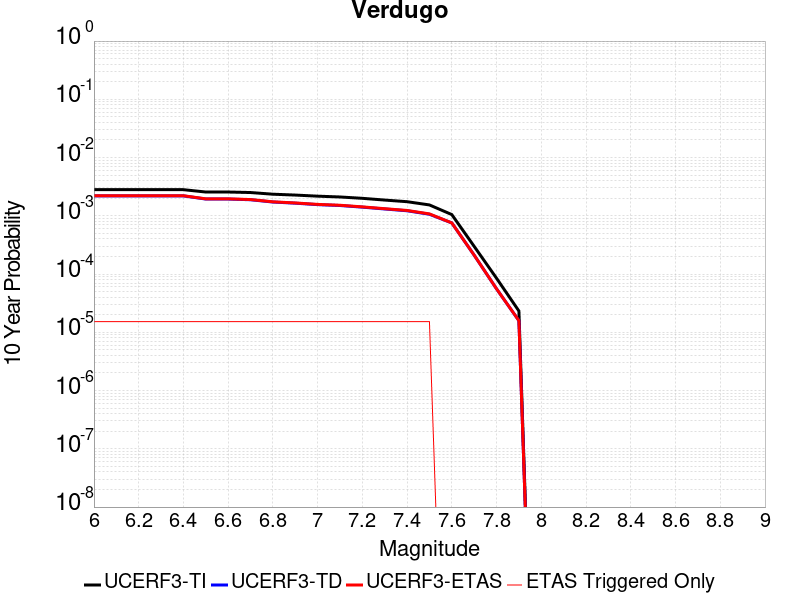 |

| Magnitude | 1 wk TI Prob | 1 wk TD Prob | 1 wk ETAS Prob | 1 wk ETAS/TD Gain | 1 wk ETAS Triggered Only | 1 mo TI Prob | 1 mo TD Prob | 1 mo ETAS Prob | 1 mo ETAS/TD Gain | 1 mo ETAS Triggered Only | 1 yr TI Prob | 1 yr TD Prob | 1 yr ETAS Prob | 1 yr ETAS/TD Gain | 1 yr ETAS Triggered Only | 10 yr TI Prob | 10 yr TD Prob | 10 yr ETAS Prob | 10 yr ETAS/TD Gain | 10 yr ETAS Triggered Only |
|-----|-----|-----|-----|-----|-----|-----|-----|-----|-----|-----|-----|-----|-----|-----|-----|-----|-----|-----|-----|-----|
| 6.0 | 5.392987E-6 | 4.216517E-6 | 4.216517E-6 | 1.0 | 0.0 | 2.3112598E-5 | 1.8070665E-5 | 1.8070665E-5 | 1.0 | 0.0 | 2.8135953E-4 | 2.1998861E-4 | 2.1998861E-4 | 1.0 | 0.0 | 0.0028100356 | 0.0021977562 | 0.0022129435 | 1.0069103 | 1.52207E-5 |
| 6.1 | 5.392987E-6 | 4.216517E-6 | 4.216517E-6 | 1.0 | 0.0 | 2.3112598E-5 | 1.8070665E-5 | 1.8070665E-5 | 1.0 | 0.0 | 2.8135953E-4 | 2.1998861E-4 | 2.1998861E-4 | 1.0 | 0.0 | 0.0028100356 | 0.0021977562 | 0.0022129435 | 1.0069103 | 1.52207E-5 |
| 6.2 | 5.392987E-6 | 4.216517E-6 | 4.216517E-6 | 1.0 | 0.0 | 2.3112598E-5 | 1.8070665E-5 | 1.8070665E-5 | 1.0 | 0.0 | 2.8135953E-4 | 2.1998861E-4 | 2.1998861E-4 | 1.0 | 0.0 | 0.0028100356 | 0.0021977562 | 0.0022129435 | 1.0069103 | 1.52207E-5 |
| 6.3 | 5.392987E-6 | 4.216517E-6 | 4.216517E-6 | 1.0 | 0.0 | 2.3112598E-5 | 1.8070665E-5 | 1.8070665E-5 | 1.0 | 0.0 | 2.8135953E-4 | 2.1998861E-4 | 2.1998861E-4 | 1.0 | 0.0 | 0.0028100356 | 0.0021977562 | 0.0022129435 | 1.0069103 | 1.52207E-5 |
| 6.4 | 5.392987E-6 | 4.216517E-6 | 4.216517E-6 | 1.0 | 0.0 | 2.3112598E-5 | 1.8070665E-5 | 1.8070665E-5 | 1.0 | 0.0 | 2.8135953E-4 | 2.1998861E-4 | 2.1998861E-4 | 1.0 | 0.0 | 0.0028100356 | 0.0021977562 | 0.0022129435 | 1.0069103 | 1.52207E-5 |
| 6.5 | 4.9154837E-6 | 3.722465E-6 | 3.722465E-6 | 1.0 | 0.0 | 2.1066187E-5 | 1.5953325E-5 | 1.5953325E-5 | 1.0 | 0.0 | 2.5645064E-4 | 1.9421462E-4 | 1.9421462E-4 | 1.0 | 0.0 | 0.002561549 | 0.0019404698 | 0.001955661 | 1.0078286 | 1.52207E-5 |
| 6.6 | 4.9154837E-6 | 3.722465E-6 | 3.722465E-6 | 1.0 | 0.0 | 2.1066187E-5 | 1.5953325E-5 | 1.5953325E-5 | 1.0 | 0.0 | 2.5645064E-4 | 1.9421462E-4 | 1.9421462E-4 | 1.0 | 0.0 | 0.002561549 | 0.0019404698 | 0.001955661 | 1.0078286 | 1.52207E-5 |
| 6.7 | 4.817006E-6 | 3.6206518E-6 | 3.6206518E-6 | 1.0 | 0.0 | 2.0644147E-5 | 1.5516987E-5 | 1.5516987E-5 | 1.0 | 0.0 | 2.513135E-4 | 1.8890314E-4 | 1.8890314E-4 | 1.0 | 0.0 | 0.0025102948 | 0.0018874453 | 0.0019026373 | 1.008049 | 1.52207E-5 |
| 6.8 | 4.507407E-6 | 3.3071042E-6 | 3.3071042E-6 | 1.0 | 0.0 | 1.9317316E-5 | 1.4173227E-5 | 1.4173227E-5 | 1.0 | 0.0 | 2.3516294E-4 | 1.7254551E-4 | 1.7254551E-4 | 1.0 | 0.0 | 0.0023491425 | 0.0017241298 | 0.0017393242 | 1.0088128 | 1.52207E-5 |
| 6.9 | 4.3573054E-6 | 3.161011E-6 | 3.161011E-6 | 1.0 | 0.0 | 1.8674033E-5 | 1.354712E-5 | 1.354712E-5 | 1.0 | 0.0 | 2.2733262E-4 | 1.6492383E-4 | 1.6492383E-4 | 1.0 | 0.0 | 0.0022710022 | 0.0016480266 | 0.0016632223 | 1.0092205 | 1.52207E-5 |
| 7.0 | 4.171527E-6 | 2.9836704E-6 | 2.9836704E-6 | 1.0 | 0.0 | 1.787785E-5 | 1.2787096E-5 | 1.2787096E-5 | 1.0 | 0.0 | 2.1764109E-4 | 1.5567189E-4 | 1.5567189E-4 | 1.0 | 0.0 | 0.0021742806 | 0.0015556397 | 0.0015708368 | 1.009769 | 1.52207E-5 |
| 7.1 | 4.0405484E-6 | 2.882261E-6 | 2.882261E-6 | 1.0 | 0.0 | 1.731652E-5 | 1.235249E-5 | 1.235249E-5 | 1.0 | 0.0 | 2.1080824E-4 | 1.503813E-4 | 1.503813E-4 | 1.0 | 0.0 | 0.0021060838 | 0.0015028063 | 0.0015180042 | 1.010113 | 1.52207E-5 |
| 7.2 | 3.8306007E-6 | 2.7018452E-6 | 2.7018452E-6 | 1.0 | 0.0 | 1.6416758E-5 | 1.15792855E-5 | 1.15792855E-5 | 1.0 | 0.0 | 1.9985568E-4 | 1.4096878E-4 | 1.4096878E-4 | 1.0 | 0.0 | 0.0019967605 | 0.0014088044 | 0.0014240036 | 1.0107888 | 1.52207E-5 |
| 7.3 | 3.5750938E-6 | 2.5121758E-6 | 2.5121758E-6 | 1.0 | 0.0 | 1.532174E-5 | 1.0766424E-5 | 1.0766424E-5 | 1.0 | 0.0 | 1.8652623E-4 | 1.3107344E-4 | 1.3107344E-4 | 1.0 | 0.0 | 0.0018636974 | 0.0013099718 | 0.0013251725 | 1.0116038 | 1.52207E-5 |
| 7.4 | 3.3510041E-6 | 2.3408586E-6 | 2.3408586E-6 | 1.0 | 0.0 | 1.4361368E-5 | 1.0032213E-5 | 1.0032213E-5 | 1.0 | 0.0 | 1.7483562E-4 | 1.2213545E-4 | 1.2213545E-4 | 1.0 | 0.0 | 0.0017469813 | 0.0012206937 | 0.0012358958 | 1.0124537 | 1.52207E-5 |
| 7.5 | 2.948287E-6 | 2.0391124E-6 | 2.0391124E-6 | 1.0 | 0.0 | 1.2635454E-5 | 8.739024E-6 | 8.739024E-6 | 1.0 | 0.0 | 1.538258E-4 | 1.0639253E-4 | 1.0639253E-4 | 1.0 | 0.0 | 0.0015371935 | 0.0010634261 | 0.0010786307 | 1.0142977 | 1.52207E-5 |
| 7.6 | 2.0134323E-6 | 1.4471265E-6 | 1.4471265E-6 | 1.0 | 0.0 | 8.628967E-6 | 6.2019562E-6 | 6.2019562E-6 | 1.0 | 0.0 | 1.05052604E-4 | 7.550629E-5 | 7.550629E-5 | 1.0 | 0.0 | 0.0010500296 | 7.548152E-4 | 7.548152E-4 | 1.0 | 0.0 |
| 7.7 | 5.726436E-7 | 4.045248E-7 | 4.045248E-7 | 1.0 | 0.0 | 2.4541846E-6 | 1.7336766E-6 | 1.7336766E-6 | 1.0 | 0.0 | 2.9879287E-5 | 2.1107335E-5 | 2.1107335E-5 | 1.0 | 0.0 | 2.987527E-4 | 2.1105584E-4 | 2.1105584E-4 | 1.0 | 0.0 |
| 7.8 | 1.6248204E-7 | 1.0687696E-7 | 1.0687696E-7 | 1.0 | 0.0 | 6.963514E-7 | 4.5804404E-7 | 4.5804404E-7 | 1.0 | 0.0 | 8.478045E-6 | 5.5766723E-6 | 5.5766723E-6 | 1.0 | 0.0 | 8.477722E-5 | 5.5765355E-5 | 5.5765355E-5 | 1.0 | 0.0 |
| 7.9 | 4.4475744E-8 | 3.0375546E-8 | 3.0375546E-8 | 1.0 | 0.0 | 1.9061031E-7 | 1.301809E-7 | 1.301809E-7 | 1.0 | 0.0 | 2.320678E-6 | 1.5849514E-6 | 1.5849514E-6 | 1.0 | 0.0 | 2.3206538E-5 | 1.5849415E-5 | 1.5849415E-5 | 1.0 | 0.0 |

## Malibu Coast (Extension) alt 1
*[(top)](#table-of-contents)*

| 1 Week | 1 Month | 1 Year | 10 Year |
|-----|-----|-----|-----|
| 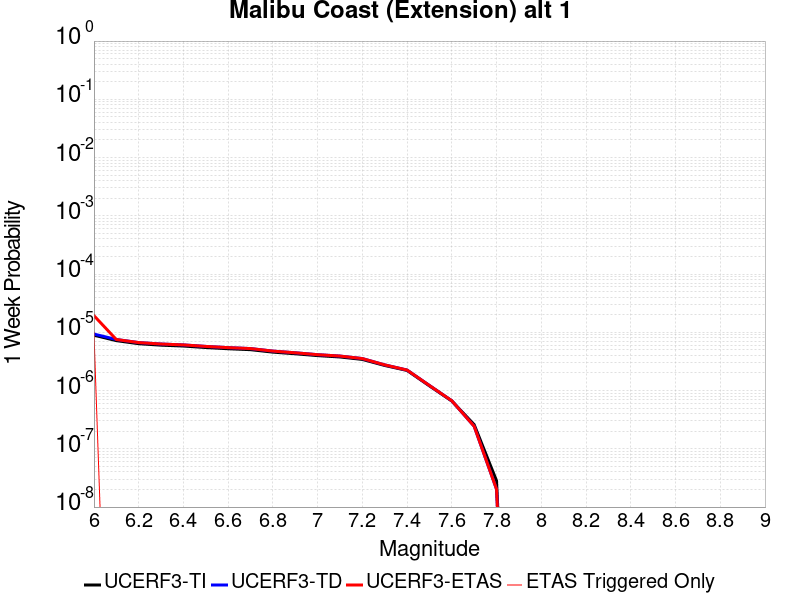 | 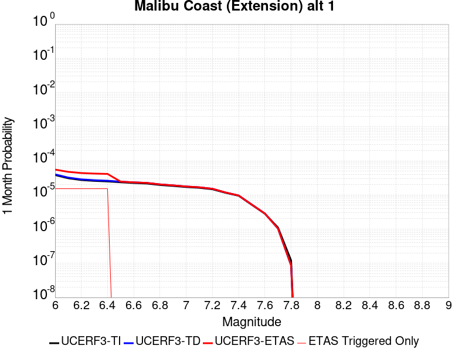 | 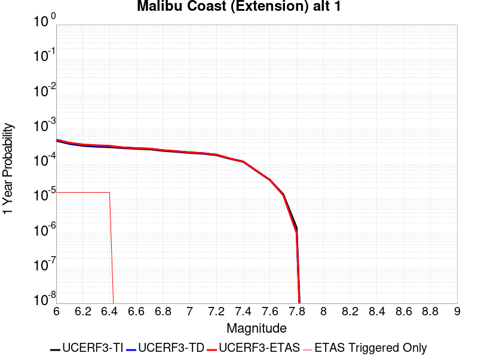 | 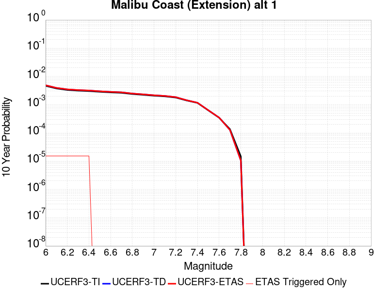 |

| Magnitude | 1 wk TI Prob | 1 wk TD Prob | 1 wk ETAS Prob | 1 wk ETAS/TD Gain | 1 wk ETAS Triggered Only | 1 mo TI Prob | 1 mo TD Prob | 1 mo ETAS Prob | 1 mo ETAS/TD Gain | 1 mo ETAS Triggered Only | 1 yr TI Prob | 1 yr TD Prob | 1 yr ETAS Prob | 1 yr ETAS/TD Gain | 1 yr ETAS Triggered Only | 10 yr TI Prob | 10 yr TD Prob | 10 yr ETAS Prob | 10 yr ETAS/TD Gain | 10 yr ETAS Triggered Only |
|-----|-----|-----|-----|-----|-----|-----|-----|-----|-----|-----|-----|-----|-----|-----|-----|-----|-----|-----|-----|-----|
| 6.0 | 8.930738E-6 | 9.329276E-6 | 9.329276E-6 | 1.0 | 0.0 | 3.827403E-5 | 3.998201E-5 | 5.5202097E-5 | 1.3806735 | 1.52207E-5 | 4.6588664E-4 | 4.8667393E-4 | 5.0188723E-4 | 1.0312598 | 1.52207E-5 | 0.0046491115 | 0.004856264 | 0.004871411 | 1.003119 | 1.52207E-5 |
| 6.1 | 7.199952E-6 | 7.5302964E-6 | 7.5302964E-6 | 1.0 | 0.0 | 3.0856572E-5 | 3.2272303E-5 | 4.749251E-5 | 1.4716183 | 1.52207E-5 | 3.75614E-4 | 3.9284505E-4 | 4.0805977E-4 | 1.0387295 | 1.52207E-5 | 0.0037497976 | 0.003921572 | 0.003936733 | 1.0038661 | 1.52207E-5 |
| 6.2 | 6.3721413E-6 | 6.6667917E-6 | 6.6667917E-6 | 1.0 | 0.0 | 2.7308892E-5 | 2.8571652E-5 | 4.379192E-5 | 1.5327051 | 1.52207E-5 | 3.3243504E-4 | 3.4780471E-4 | 3.630201E-4 | 1.043747 | 1.52207E-5 | 0.0033193815 | 0.0034726437 | 0.0034878117 | 1.0043678 | 1.52207E-5 |
| 6.3 | 6.016345E-6 | 6.295158E-6 | 6.295158E-6 | 1.0 | 0.0 | 2.578408E-5 | 2.6978973E-5 | 4.2199263E-5 | 1.5641538 | 1.52207E-5 | 3.1387596E-4 | 3.2841982E-4 | 3.436355E-4 | 1.0463301 | 1.52207E-5 | 0.00313433 | 0.0032793807 | 0.0032945515 | 1.0046262 | 1.52207E-5 |
| 6.4 | 5.8104883E-6 | 6.0795446E-6 | 6.0795446E-6 | 1.0 | 0.0 | 2.4901856E-5 | 2.6054933E-5 | 4.1275238E-5 | 1.5841621 | 1.52207E-5 | 3.031379E-4 | 3.1717293E-4 | 3.3238882E-4 | 1.0479734 | 1.52207E-5 | 0.0030272473 | 0.0031672374 | 0.0031824098 | 1.0047904 | 1.52207E-5 |
| 6.5 | 5.476925E-6 | 5.7275133E-6 | 5.7275133E-6 | 1.0 | 0.0 | 2.3472323E-5 | 2.4546256E-5 | 2.4546256E-5 | 1.0 | 0.0 | 2.8573806E-4 | 2.9880996E-4 | 2.9880996E-4 | 1.0 | 0.0 | 0.0028537093 | 0.002984114 | 0.002984114 | 1.0 | 0.0 |
| 6.6 | 5.222387E-6 | 5.45858E-6 | 5.45858E-6 | 1.0 | 0.0 | 2.2381464E-5 | 2.3393704E-5 | 2.3393704E-5 | 1.0 | 0.0 | 2.7246025E-4 | 2.8478142E-4 | 2.8478142E-4 | 1.0 | 0.0 | 0.0027212645 | 0.0028441956 | 0.0028441956 | 1.0 | 0.0 |
| 6.7 | 5.0337076E-6 | 5.259103E-6 | 5.259103E-6 | 1.0 | 0.0 | 2.1572854E-5 | 2.253882E-5 | 2.253882E-5 | 1.0 | 0.0 | 2.6261783E-4 | 2.7437587E-4 | 2.7437587E-4 | 1.0 | 0.0 | 0.002623077 | 0.002740401 | 0.002740401 | 1.0 | 0.0 |
| 6.8 | 4.5675624E-6 | 4.7587164E-6 | 4.7587164E-6 | 1.0 | 0.0 | 1.9575122E-5 | 2.039434E-5 | 2.039434E-5 | 1.0 | 0.0 | 2.3830103E-4 | 2.48273E-4 | 2.48273E-4 | 1.0 | 0.0 | 0.0023804565 | 0.002479976 | 0.002479976 | 1.0 | 0.0 |
| 6.9 | 4.2802412E-6 | 4.4520207E-6 | 4.4520207E-6 | 1.0 | 0.0 | 1.8343762E-5 | 1.907995E-5 | 1.907995E-5 | 1.0 | 0.0 | 2.2331243E-4 | 2.3227377E-4 | 2.3227377E-4 | 1.0 | 0.0 | 0.0022308815 | 0.0023203269 | 0.0023203269 | 1.0 | 0.0 |
| 7.0 | 3.9794063E-6 | 4.130099E-6 | 4.130099E-6 | 1.0 | 0.0 | 1.7054486E-5 | 1.7700306E-5 | 1.7700306E-5 | 1.0 | 0.0 | 2.0761859E-4 | 2.1548003E-4 | 2.1548003E-4 | 1.0 | 0.0 | 0.0020742472 | 0.0021527244 | 0.0021527244 | 1.0 | 0.0 |
| 7.1 | 3.7730424E-6 | 3.911217E-6 | 3.911217E-6 | 1.0 | 0.0 | 1.6170083E-5 | 1.6762251E-5 | 1.6762251E-5 | 1.0 | 0.0 | 1.9685295E-4 | 2.0406142E-4 | 2.0406142E-4 | 1.0 | 0.0 | 0.0019667868 | 0.0020387534 | 0.0020387534 | 1.0 | 0.0 |
| 7.2 | 3.424985E-6 | 3.541337E-6 | 3.541337E-6 | 1.0 | 0.0 | 1.4678424E-5 | 1.5177071E-5 | 1.5177071E-5 | 1.0 | 0.0 | 1.7869516E-4 | 1.8476529E-4 | 1.8476529E-4 | 1.0 | 0.0 | 0.0017855153 | 0.0018461287 | 0.0018461287 | 1.0 | 0.0 |
| 7.3 | 2.6966375E-6 | 2.7596534E-6 | 2.7596534E-6 | 1.0 | 0.0 | 1.15569665E-5 | 1.1827032E-5 | 1.1827032E-5 | 1.0 | 0.0 | 1.4069698E-4 | 1.4398464E-4 | 1.4398464E-4 | 1.0 | 0.0 | 0.0014060794 | 0.0014389176 | 0.0014389176 | 1.0 | 0.0 |
| 7.4 | 2.215957E-6 | 2.249378E-6 | 2.249378E-6 | 1.0 | 0.0 | 9.496924E-6 | 9.640156E-6 | 9.640156E-6 | 1.0 | 0.0 | 1.1561892E-4 | 1.17362615E-4 | 1.17362615E-4 | 1.0 | 0.0 | 0.0011555878 | 0.0011730101 | 0.0011730101 | 1.0 | 0.0 |
| 7.5 | 1.2040218E-6 | 1.2219067E-6 | 1.2219067E-6 | 1.0 | 0.0 | 5.160083E-6 | 5.2367322E-6 | 5.2367322E-6 | 1.0 | 0.0 | 6.2822204E-5 | 6.375537E-5 | 6.375537E-5 | 1.0 | 0.0 | 6.280445E-4 | 6.3737266E-4 | 6.3737266E-4 | 1.0 | 0.0 |
| 7.6 | 6.6157446E-7 | 6.678975E-7 | 6.678975E-7 | 1.0 | 0.0 | 2.835316E-6 | 2.8624147E-6 | 2.8624147E-6 | 1.0 | 0.0 | 3.4519428E-5 | 3.484936E-5 | 3.484936E-5 | 1.0 | 0.0 | 3.4514067E-4 | 3.4844046E-4 | 3.4844046E-4 | 1.0 | 0.0 |
| 7.7 | 2.6012302E-7 | 2.4357593E-7 | 2.4357593E-7 | 1.0 | 0.0 | 1.1148124E-6 | 1.0438964E-6 | 1.0438964E-6 | 1.0 | 0.0 | 1.3572758E-5 | 1.2709375E-5 | 1.2709375E-5 | 1.0 | 0.0 | 1.3571928E-4 | 1.2708755E-4 | 1.2708755E-4 | 1.0 | 0.0 |
| 7.8 | 2.8323132E-8 | 2.0266649E-8 | 2.0266649E-8 | 1.0 | 0.0 | 1.2138484E-7 | 8.685707E-8 | 8.685707E-8 | 1.0 | 0.0 | 1.4778595E-6 | 1.0574844E-6 | 1.0574844E-6 | 1.0 | 0.0 | 1.4778497E-5 | 1.0574801E-5 | 1.0574801E-5 | 1.0 | 0.0 |

## Green Valley 2011 CFM
*[(top)](#table-of-contents)*

| 1 Week | 1 Month | 1 Year | 10 Year |
|-----|-----|-----|-----|
|  |  |  | 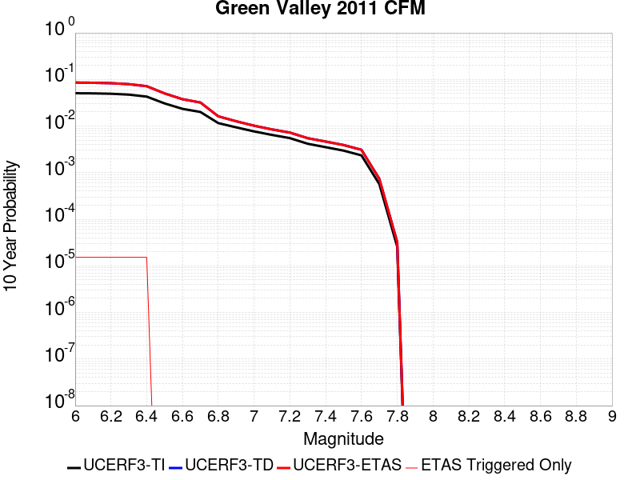 |

| Magnitude | 1 wk TI Prob | 1 wk TD Prob | 1 wk ETAS Prob | 1 wk ETAS/TD Gain | 1 wk ETAS Triggered Only | 1 mo TI Prob | 1 mo TD Prob | 1 mo ETAS Prob | 1 mo ETAS/TD Gain | 1 mo ETAS Triggered Only | 1 yr TI Prob | 1 yr TD Prob | 1 yr ETAS Prob | 1 yr ETAS/TD Gain | 1 yr ETAS Triggered Only | 10 yr TI Prob | 10 yr TD Prob | 10 yr ETAS Prob | 10 yr ETAS/TD Gain | 10 yr ETAS Triggered Only |
|-----|-----|-----|-----|-----|-----|-----|-----|-----|-----|-----|-----|-----|-----|-----|-----|-----|-----|-----|-----|-----|
| 6.0 | 9.9629346E-5 | 1.7305532E-4 | 1.7305532E-4 | 1.0 | 0.0 | 4.2691303E-4 | 7.4143766E-4 | 7.4143766E-4 | 1.0 | 0.0 | 0.0051852856 | 0.008986705 | 0.008986705 | 1.0 | 0.0 | 0.050659515 | 0.085522056 | 0.08553598 | 1.0001627 | 1.52207E-5 |
| 6.1 | 9.88615E-5 | 1.7152846E-4 | 1.7152846E-4 | 1.0 | 0.0 | 4.2362334E-4 | 7.348976E-4 | 7.348976E-4 | 1.0 | 0.0 | 0.0051454236 | 0.0089077335 | 0.0089077335 | 1.0 | 0.0 | 0.050279044 | 0.084809676 | 0.08482361 | 1.0001643 | 1.52207E-5 |
| 6.2 | 9.696895E-5 | 1.6791887E-4 | 1.6791887E-4 | 1.0 | 0.0 | 4.15515E-4 | 7.194366E-4 | 7.194366E-4 | 1.0 | 0.0 | 0.0050471667 | 0.008721114 | 0.008721114 | 1.0 | 0.0 | 0.04934063 | 0.0831186 | 0.08313256 | 1.0001678 | 1.52207E-5 |
| 6.3 | 9.275224E-5 | 1.5971228E-4 | 1.5971228E-4 | 1.0 | 0.0 | 3.9744904E-4 | 6.842841E-4 | 6.842841E-4 | 1.0 | 0.0 | 0.0048282105 | 0.008296439 | 0.008296439 | 1.0 | 0.0 | 0.047246475 | 0.07925707 | 0.079271086 | 1.0001768 | 1.52207E-5 |
| 6.4 | 8.391499E-5 | 1.4367796E-4 | 1.4367796E-4 | 1.0 | 0.0 | 3.595861E-4 | 6.156248E-4 | 6.156248E-4 | 1.0 | 0.0 | 0.004369175 | 0.0074670846 | 0.0074670846 | 1.0 | 0.0 | 0.04284265 | 0.071630865 | 0.07164499 | 1.0001973 | 1.52207E-5 |
| 6.5 | 5.9519385E-5 | 9.9340905E-5 | 9.9340905E-5 | 1.0 | 0.0 | 2.5505814E-4 | 4.2568138E-4 | 4.2568138E-4 | 1.0 | 0.0 | 0.0031009112 | 0.005168295 | 0.005168295 | 1.0 | 0.0 | 0.030579966 | 0.050145864 | 0.050145864 | 1.0 | 0.0 |
| 6.6 | 4.5361558E-5 | 7.402609E-5 | 7.402609E-5 | 1.0 | 0.0 | 1.9439218E-4 | 3.1721895E-4 | 3.1721895E-4 | 1.0 | 0.0 | 0.0023641558 | 0.0038539418 | 0.0038539418 | 1.0 | 0.0 | 0.023391623 | 0.037665963 | 0.037665963 | 1.0 | 0.0 |
| 6.7 | 3.8808106E-5 | 6.2651976E-5 | 6.2651976E-5 | 1.0 | 0.0 | 1.6630985E-4 | 2.6848342E-4 | 2.6848342E-4 | 1.0 | 0.0 | 0.0020229418 | 0.0032626586 | 0.0032626586 | 1.0 | 0.0 | 0.020046256 | 0.032005914 | 0.032005914 | 1.0 | 0.0 |
| 6.8 | 2.2284667E-5 | 3.1285235E-5 | 3.1285235E-5 | 1.0 | 0.0 | 9.550222E-5 | 1.3407279E-4 | 1.3407279E-4 | 1.0 | 0.0 | 0.0011621192 | 0.0016311078 | 0.0016311078 | 1.0 | 0.0 | 0.011560607 | 0.016165998 | 0.016165998 | 1.0 | 0.0 |
| 6.9 | 1.8050168E-5 | 2.4448054E-5 | 2.4448054E-5 | 1.0 | 0.0 | 7.735557E-5 | 1.047732E-4 | 1.047732E-4 | 1.0 | 0.0 | 9.4139716E-4 | 0.0012748708 | 0.0012748708 | 1.0 | 0.0 | 0.009374191 | 0.012667833 | 0.012667833 | 1.0 | 0.0 |
| 7.0 | 1.4763166E-5 | 1.9582854E-5 | 1.9582854E-5 | 1.0 | 0.0 | 6.326917E-5 | 8.3923835E-5 | 8.3923835E-5 | 1.0 | 0.0 | 7.7002996E-4 | 0.0010212966 | 0.0010212966 | 1.0 | 0.0 | 0.007673672 | 0.010165343 | 0.010165343 | 1.0 | 0.0 |
| 7.1 | 1.2399713E-5 | 1.6303715E-5 | 1.6303715E-5 | 1.0 | 0.0 | 5.3140546E-5 | 6.98712E-5 | 6.98712E-5 | 1.0 | 0.0 | 6.467941E-4 | 8.503518E-4 | 8.503518E-4 | 1.0 | 0.0 | 0.006449148 | 0.008471259 | 0.008471259 | 1.0 | 0.0 |
| 7.2 | 1.0584195E-5 | 1.3921742E-5 | 1.3921742E-5 | 1.0 | 0.0 | 4.5360044E-5 | 5.9663253E-5 | 5.9663253E-5 | 1.0 | 0.0 | 5.521186E-4 | 7.261596E-4 | 7.261596E-4 | 1.0 | 0.0 | 0.0055074887 | 0.007238285 | 0.007238285 | 1.0 | 0.0 |
| 7.3 | 7.998173E-6 | 1.054402E-5 | 1.054402E-5 | 1.0 | 0.0 | 3.4277433E-5 | 4.518788E-5 | 4.518788E-5 | 1.0 | 0.0 | 4.1724785E-4 | 5.500247E-4 | 5.500247E-4 | 1.0 | 0.0 | 0.004164653 | 0.0054868995 | 0.0054868995 | 1.0 | 0.0 |
| 7.4 | 6.7571127E-6 | 8.932697E-6 | 8.932697E-6 | 1.0 | 0.0 | 2.8958733E-5 | 3.828243E-5 | 3.828243E-5 | 1.0 | 0.0 | 3.5251552E-4 | 4.6598984E-4 | 4.6598984E-4 | 1.0 | 0.0 | 0.0035195686 | 0.0046503306 | 0.0046503306 | 1.0 | 0.0 |
| 7.5 | 5.69878E-6 | 7.516314E-6 | 7.516314E-6 | 1.0 | 0.0 | 2.4423114E-5 | 3.221238E-5 | 3.221238E-5 | 1.0 | 0.0 | 2.9731085E-4 | 3.9211605E-4 | 3.9211605E-4 | 1.0 | 0.0 | 0.002969134 | 0.0039143935 | 0.0039143935 | 1.0 | 0.0 |
| 7.6 | 4.503664E-6 | 5.9356807E-6 | 5.9356807E-6 | 1.0 | 0.0 | 1.9301275E-5 | 2.5438389E-5 | 2.5438389E-5 | 1.0 | 0.0 | 2.3496768E-4 | 3.096692E-4 | 3.096692E-4 | 1.0 | 0.0 | 0.002347194 | 0.003092502 | 0.003092502 | 1.0 | 0.0 |
| 7.7 | 1.0873546E-6 | 1.4106979E-6 | 1.4106979E-6 | 1.0 | 0.0 | 4.6600826E-6 | 6.045834E-6 | 6.045834E-6 | 1.0 | 0.0 | 5.6735033E-5 | 7.360557E-5 | 7.360557E-5 | 1.0 | 0.0 | 5.672055E-4 | 7.35814E-4 | 7.35814E-4 | 1.0 | 0.0 |
| 7.8 | 4.9373917E-8 | 6.1777136E-8 | 6.1777136E-8 | 1.0 | 0.0 | 2.1160248E-7 | 2.6475914E-7 | 2.6475914E-7 | 1.0 | 0.0 | 2.5762572E-6 | 3.223439E-6 | 3.223439E-6 | 1.0 | 0.0 | 2.5762274E-5 | 3.2232296E-5 | 3.2232296E-5 | 1.0 | 0.0 |

## Cerro Prieto
*[(top)](#table-of-contents)*

| 1 Week | 1 Month | 1 Year | 10 Year |
|-----|-----|-----|-----|
|  | 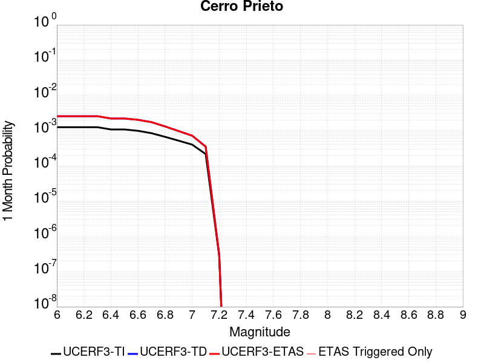 | 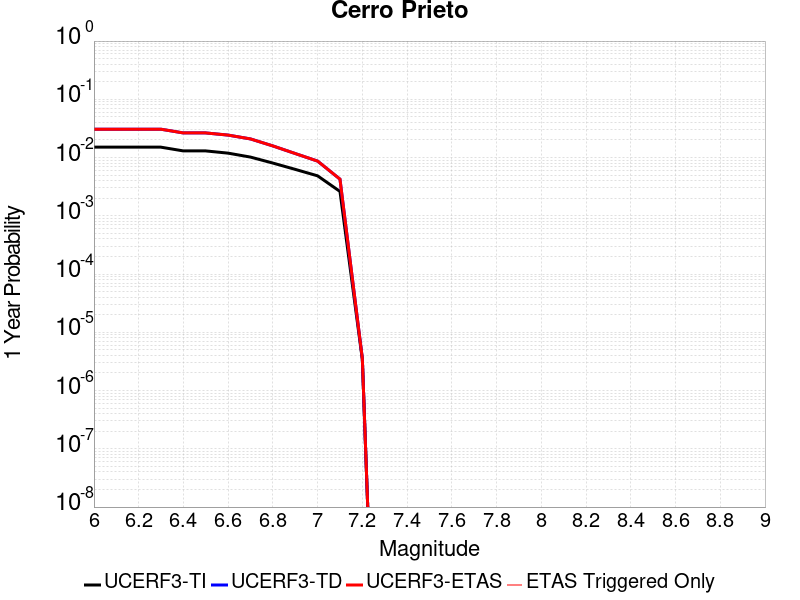 | 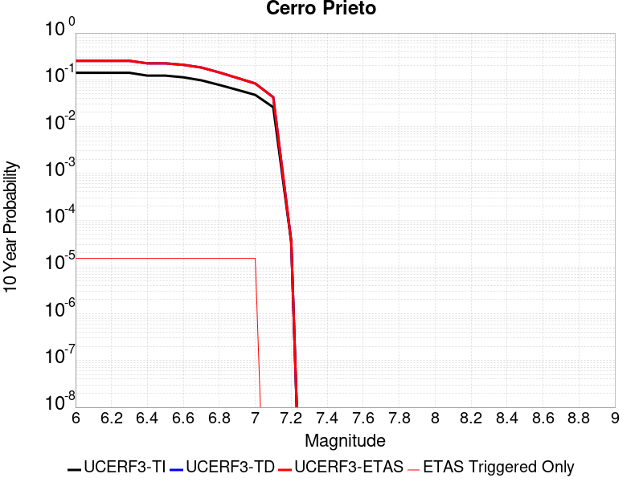 |

| Magnitude | 1 wk TI Prob | 1 wk TD Prob | 1 wk ETAS Prob | 1 wk ETAS/TD Gain | 1 wk ETAS Triggered Only | 1 mo TI Prob | 1 mo TD Prob | 1 mo ETAS Prob | 1 mo ETAS/TD Gain | 1 mo ETAS Triggered Only | 1 yr TI Prob | 1 yr TD Prob | 1 yr ETAS Prob | 1 yr ETAS/TD Gain | 1 yr ETAS Triggered Only | 10 yr TI Prob | 10 yr TD Prob | 10 yr ETAS Prob | 10 yr ETAS/TD Gain | 10 yr ETAS Triggered Only |
|-----|-----|-----|-----|-----|-----|-----|-----|-----|-----|-----|-----|-----|-----|-----|-----|-----|-----|-----|-----|-----|
| 6.0 | 2.9101528E-4 | 5.964804E-4 | 5.964804E-4 | 1.0 | 0.0 | 0.0012466122 | 0.002554082 | 0.002554082 | 1.0 | 0.0 | 0.015072231 | 0.03064807 | 0.03064807 | 1.0 | 0.0 | 0.14089979 | 0.25397858 | 0.25398993 | 1.0000447 | 1.52207E-5 |
| 6.1 | 2.9101528E-4 | 5.964804E-4 | 5.964804E-4 | 1.0 | 0.0 | 0.0012466122 | 0.002554082 | 0.002554082 | 1.0 | 0.0 | 0.015072231 | 0.03064807 | 0.03064807 | 1.0 | 0.0 | 0.14089979 | 0.25397858 | 0.25398993 | 1.0000447 | 1.52207E-5 |
| 6.2 | 2.9101528E-4 | 5.964804E-4 | 5.964804E-4 | 1.0 | 0.0 | 0.0012466122 | 0.002554082 | 0.002554082 | 1.0 | 0.0 | 0.015072231 | 0.03064807 | 0.03064807 | 1.0 | 0.0 | 0.14089979 | 0.25397858 | 0.25398993 | 1.0000447 | 1.52207E-5 |
| 6.3 | 2.9101528E-4 | 5.964804E-4 | 5.964804E-4 | 1.0 | 0.0 | 0.0012466122 | 0.002554082 | 0.002554082 | 1.0 | 0.0 | 0.015072231 | 0.03064807 | 0.03064807 | 1.0 | 0.0 | 0.14089979 | 0.25397858 | 0.25398993 | 1.0000447 | 1.52207E-5 |
| 6.4 | 2.508648E-4 | 5.1397446E-4 | 5.1397446E-4 | 1.0 | 0.0 | 0.0010746918 | 0.0022010866 | 0.0022010866 | 1.0 | 0.0 | 0.013006088 | 0.026471792 | 0.026471792 | 1.0 | 0.0 | 0.12270685 | 0.22440416 | 0.22441596 | 1.0000526 | 1.52207E-5 |
| 6.5 | 2.508648E-4 | 5.1397446E-4 | 5.1397446E-4 | 1.0 | 0.0 | 0.0010746918 | 0.0022010866 | 0.0022010866 | 1.0 | 0.0 | 0.013006088 | 0.026471792 | 0.026471792 | 1.0 | 0.0 | 0.12270685 | 0.22440416 | 0.22441596 | 1.0000526 | 1.52207E-5 |
| 6.6 | 2.294914E-4 | 4.7116808E-4 | 4.7116808E-4 | 1.0 | 0.0 | 9.831638E-4 | 0.0020179166 | 0.0020179166 | 1.0 | 0.0 | 0.011904482 | 0.02429866 | 0.02429866 | 1.0 | 0.0 | 0.11286586 | 0.20858558 | 0.20859762 | 1.0000577 | 1.52207E-5 |
| 6.7 | 1.9621674E-4 | 4.0419117E-4 | 4.0419117E-4 | 1.0 | 0.0 | 8.4065786E-4 | 0.0017312564 | 0.0017312564 | 1.0 | 0.0 | 0.010187071 | 0.020884845 | 0.020884845 | 1.0 | 0.0 | 0.09732539 | 0.18290249 | 0.18291493 | 1.000068 | 1.52207E-5 |
| 6.8 | 1.5476145E-4 | 3.056516E-4 | 3.056516E-4 | 1.0 | 0.0 | 6.6309475E-4 | 0.00130938 | 0.00130938 | 1.0 | 0.0 | 0.008043335 | 0.015836509 | 0.015836509 | 1.0 | 0.0 | 0.07758363 | 0.14336355 | 0.14337659 | 1.000091 | 1.52207E-5 |
| 6.9 | 1.20509176E-4 | 2.2582515E-4 | 2.2582515E-4 | 1.0 | 0.0 | 5.1636563E-4 | 9.6752634E-4 | 9.6752634E-4 | 1.0 | 0.0 | 0.006268645 | 0.011726342 | 0.011726342 | 1.0 | 0.0 | 0.060947374 | 0.109451205 | 0.10946476 | 1.0001239 | 1.52207E-5 |
| 7.0 | 9.3269155E-5 | 1.6716642E-4 | 1.6716642E-4 | 1.0 | 0.0 | 3.9966372E-4 | 7.162739E-4 | 7.162739E-4 | 1.0 | 0.0 | 0.0048550544 | 0.008693418 | 0.008693418 | 1.0 | 0.0 | 0.04750344 | 0.08315912 | 0.083173074 | 1.0001678 | 1.52207E-5 |
| 7.1 | 5.029709E-5 | 8.1718936E-5 | 8.1718936E-5 | 1.0 | 0.0 | 2.1554115E-4 | 3.5019626E-4 | 3.5019626E-4 | 1.0 | 0.0 | 0.0026210553 | 0.0042587193 | 0.0042587193 | 1.0 | 0.0 | 0.025903556 | 0.042365108 | 0.042365108 | 1.0 | 0.0 |
| 7.2 | 6.5445185E-8 | 6.814903E-8 | 6.814903E-8 | 1.0 | 0.0 | 2.8047933E-7 | 2.9206726E-7 | 2.9206726E-7 | 1.0 | 0.0 | 3.4148304E-6 | 3.555919E-6 | 3.555919E-6 | 1.0 | 0.0 | 3.414778E-5 | 3.5559187E-5 | 3.5559187E-5 | 1.0 | 0.0 |

## Great Valley 03 Mysterious Ridge
*[(top)](#table-of-contents)*

| 1 Week | 1 Month | 1 Year | 10 Year |
|-----|-----|-----|-----|
| 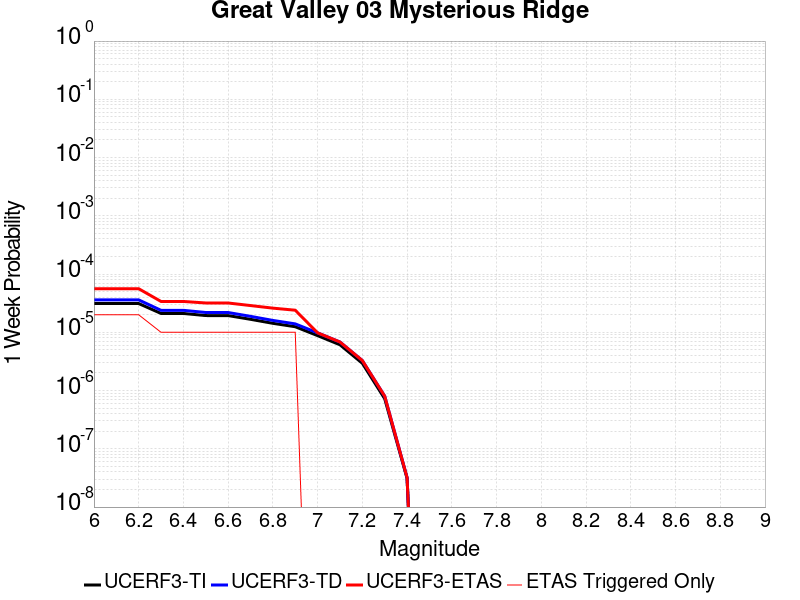 | 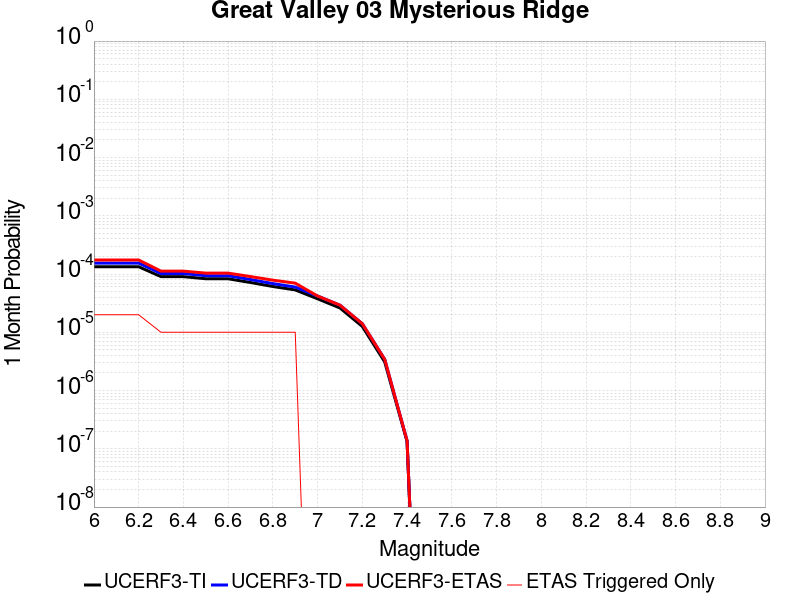 | 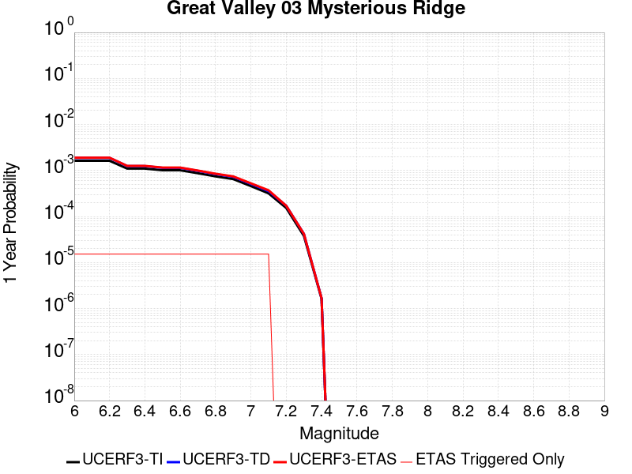 | 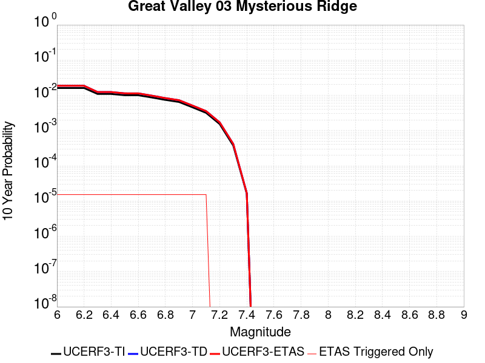 |

| Magnitude | 1 wk TI Prob | 1 wk TD Prob | 1 wk ETAS Prob | 1 wk ETAS/TD Gain | 1 wk ETAS Triggered Only | 1 mo TI Prob | 1 mo TD Prob | 1 mo ETAS Prob | 1 mo ETAS/TD Gain | 1 mo ETAS Triggered Only | 1 yr TI Prob | 1 yr TD Prob | 1 yr ETAS Prob | 1 yr ETAS/TD Gain | 1 yr ETAS Triggered Only | 10 yr TI Prob | 10 yr TD Prob | 10 yr ETAS Prob | 10 yr ETAS/TD Gain | 10 yr ETAS Triggered Only |
|-----|-----|-----|-----|-----|-----|-----|-----|-----|-----|-----|-----|-----|-----|-----|-----|-----|-----|-----|-----|-----|
| 6.0 | 3.1182444E-5 | 3.603423E-5 | 3.603423E-5 | 1.0 | 0.0 | 1.336322E-4 | 1.544242E-4 | 1.544242E-4 | 1.0 | 0.0 | 0.0016257578 | 0.0018786696 | 0.0018938618 | 1.0080867 | 1.52207E-5 | 0.016139153 | 0.018646652 | 0.018661588 | 1.0008011 | 1.52207E-5 |
| 6.1 | 3.1182444E-5 | 3.603423E-5 | 3.603423E-5 | 1.0 | 0.0 | 1.336322E-4 | 1.544242E-4 | 1.544242E-4 | 1.0 | 0.0 | 0.0016257578 | 0.0018786696 | 0.0018938618 | 1.0080867 | 1.52207E-5 | 0.016139153 | 0.018646652 | 0.018661588 | 1.0008011 | 1.52207E-5 |
| 6.2 | 3.1182444E-5 | 3.603423E-5 | 3.603423E-5 | 1.0 | 0.0 | 1.336322E-4 | 1.544242E-4 | 1.544242E-4 | 1.0 | 0.0 | 0.0016257578 | 0.0018786696 | 0.0018938618 | 1.0080867 | 1.52207E-5 | 0.016139153 | 0.018646652 | 0.018661588 | 1.0008011 | 1.52207E-5 |
| 6.3 | 2.106934E-5 | 2.3850307E-5 | 2.3850307E-5 | 1.0 | 0.0 | 9.0294045E-5 | 1.0221177E-4 | 1.0221177E-4 | 1.0 | 0.0 | 0.0010987755 | 0.0012437489 | 0.0012589507 | 1.0122225 | 1.52207E-5 | 0.010933585 | 0.012371127 | 0.012386159 | 1.0012151 | 1.52207E-5 |
| 6.4 | 2.106934E-5 | 2.3850307E-5 | 2.3850307E-5 | 1.0 | 0.0 | 9.0294045E-5 | 1.0221177E-4 | 1.0221177E-4 | 1.0 | 0.0 | 0.0010987755 | 0.0012437489 | 0.0012589507 | 1.0122225 | 1.52207E-5 | 0.010933585 | 0.012371127 | 0.012386159 | 1.0012151 | 1.52207E-5 |
| 6.5 | 1.9389783E-5 | 2.1884984E-5 | 2.1884984E-5 | 1.0 | 0.0 | 8.309642E-5 | 9.3789575E-5 | 9.3789575E-5 | 1.0 | 0.0 | 0.0010112294 | 0.0011413174 | 0.0011565208 | 1.0133208 | 1.52207E-5 | 0.010066401 | 0.011357434 | 0.0113724815 | 1.0013249 | 1.52207E-5 |
| 6.6 | 1.9370193E-5 | 2.1864906E-5 | 2.1864906E-5 | 1.0 | 0.0 | 8.301247E-5 | 9.370353E-5 | 9.370353E-5 | 1.0 | 0.0 | 0.0010102082 | 0.001140271 | 0.0011554742 | 1.0133331 | 1.52207E-5 | 0.010056281 | 0.011347076 | 0.011362123 | 1.0013262 | 1.52207E-5 |
| 6.7 | 1.6723505E-5 | 1.8799281E-5 | 1.8799281E-5 | 1.0 | 0.0 | 7.16702E-5 | 8.056597E-5 | 8.056597E-5 | 1.0 | 0.0 | 8.722353E-4 | 9.804688E-4 | 9.956745E-4 | 1.0155087 | 1.52207E-5 | 0.008688197 | 0.009763439 | 0.009778512 | 1.0015438 | 1.52207E-5 |
| 6.8 | 1.426937E-5 | 1.599721E-5 | 1.599721E-5 | 1.0 | 0.0 | 6.115301E-5 | 6.855775E-5 | 6.855775E-5 | 1.0 | 0.0 | 7.4428355E-4 | 8.343854E-4 | 8.4959343E-4 | 1.0182266 | 1.52207E-5 | 0.007417957 | 0.008314005 | 0.008329099 | 1.0018156 | 1.52207E-5 |
| 6.9 | 1.2469891E-5 | 1.3956928E-5 | 1.3956928E-5 | 1.0 | 0.0 | 5.3441294E-5 | 5.9814105E-5 | 5.9814105E-5 | 1.0 | 0.0 | 6.504535E-4 | 7.280055E-4 | 7.432151E-4 | 1.0208921 | 1.52207E-5 | 0.006485529 | 0.00725743 | 0.00727254 | 1.002082 | 1.52207E-5 |
| 7.0 | 8.7746275E-6 | 9.791734E-6 | 9.791734E-6 | 1.0 | 0.0 | 3.7605005E-5 | 4.196394E-5 | 4.196394E-5 | 1.0 | 0.0 | 4.5774475E-4 | 5.1079853E-4 | 5.2601146E-4 | 1.0297827 | 1.52207E-5 | 0.00456803 | 0.005096977 | 0.0051121204 | 1.002971 | 1.52207E-5 |
| 7.1 | 6.1067153E-6 | 6.813725E-6 | 6.813725E-6 | 1.0 | 0.0 | 2.6171374E-5 | 2.9201385E-5 | 2.9201385E-5 | 1.0 | 0.0 | 3.1858988E-4 | 3.5547445E-4 | 3.7068973E-4 | 1.0428028 | 1.52207E-5 | 0.0031813353 | 0.003549609 | 0.0035647757 | 1.0042728 | 1.52207E-5 |
| 7.2 | 2.939283E-6 | 3.2741057E-6 | 3.2741057E-6 | 1.0 | 0.0 | 1.2596866E-5 | 1.4031816E-5 | 1.4031816E-5 | 1.0 | 0.0 | 1.5335606E-4 | 1.7082572E-4 | 1.7082572E-4 | 1.0 | 0.0 | 0.0015325027 | 0.001707116 | 0.001707116 | 1.0 | 0.0 |
| 7.3 | 7.2387763E-7 | 8.008505E-7 | 8.008505E-7 | 1.0 | 0.0 | 3.102329E-6 | 3.4322145E-6 | 3.4322145E-6 | 1.0 | 0.0 | 3.77702E-5 | 4.178687E-5 | 4.178687E-5 | 1.0 | 0.0 | 3.7763783E-4 | 4.1783508E-4 | 4.1783508E-4 | 1.0 | 0.0 |
| 7.4 | 3.112171E-8 | 3.2068368E-8 | 3.2068368E-8 | 1.0 | 0.0 | 1.3337875E-7 | 1.3743585E-7 | 1.3743585E-7 | 1.0 | 0.0 | 1.6238852E-6 | 1.6732803E-6 | 1.6732803E-6 | 1.0 | 0.0 | 1.6238733E-5 | 1.6732685E-5 | 1.6732685E-5 | 1.0 | 0.0 |

