# Parent Section Magnitude-Probability Distributions

Only fault sections with at least one triggered aftershock are plotted. Sections are sorted by total supraseismogenic trigger rate (decreasing)

## Table Of Contents

* [Garlock (Central)](#garlock-central)
* [Tank Canyon](#tank-canyon)
* [Little Lake](#little-lake)
* [Airport Lake](#airport-lake)
* [Owl Lake](#owl-lake)
* [Panamint Valley](#panamint-valley)
* [Garlock (East)](#garlock-east)
* [Hunter Mountain-Saline Valley](#hunter-mountain-saline-valley)
* [Ash Hill](#ash-hill)
* [Blackwater](#blackwater)
* [Garlock (West)](#garlock-west)
* [McLean Lake](#mclean-lake)
* [Goldstone Lake](#goldstone-lake)
* [Gravel Hills-Harper Lk](#gravel-hills-harper-lk)
* [So Sierra Nevada](#so-sierra-nevada)
* [Coyote Canyon](#coyote-canyon)
* [San Andreas (Mojave S)](#san-andreas-mojave-s)
* [Death Valley (So)](#death-valley-so)
* [Nelson Lake](#nelson-lake)
* [San Andreas (Mojave N)](#san-andreas-mojave-n)
* [Towne Pass](#towne-pass)
* [Lenwood-Lockhart-Old Woman Springs](#lenwood-lockhart-old-woman-springs)
* [Paradise](#paradise)
* [Bicycle Lake](#bicycle-lake)
* [San Andreas (San Bernardino N)](#san-andreas-san-bernardino-n)
* [Garlic Springs](#garlic-springs)
* [San Andreas (San Bernardino S)](#san-andreas-san-bernardino-s)
* [Death Valley (Black Mtns Frontal)](#death-valley-black-mtns-frontal)
* [Coyote Lake](#coyote-lake)
* [Helendale-So Lockhart](#helendale-so-lockhart)
* [San Andreas (Big Bend)](#san-andreas-big-bend)
* [San Andreas (Parkfield)](#san-andreas-parkfield)
* [San Andreas (San Gorgonio Pass-Garnet HIll)](#san-andreas-san-gorgonio-pass-garnet-hill)
* [Death Valley (No)](#death-valley-no)
* [Sierra Nevada  (No Extension)](#sierra-nevada--no-extension)
* [Elsinore (Glen Ivy) rev](#elsinore-glen-ivy-rev)
* [San Andreas (Coachella) rev](#san-andreas-coachella-rev)
* [San Andreas (Carrizo) rev](#san-andreas-carrizo-rev)
* [San Andreas (Cholame) rev](#san-andreas-cholame-rev)
* [Red Pass](#red-pass)
* [Cady](#cady)
* [Scodie Lineament](#scodie-lineament)
* [Calico-Hidalgo](#calico-hidalgo)
* [Manix-Afton Hills](#manix-afton-hills)
* [Baker](#baker)
* [Ludlow](#ludlow)
* [White Wolf (Extension)](#white-wolf-extension)
* [Death Valley (Fish Lake Valley)](#death-valley-fish-lake-valley)
* [Santa Ynez (West)](#santa-ynez-west)
* [San Andreas (Creeping Section) 2011 CFM](#san-andreas-creeping-section-2011-cfm)
* [Cleghorn Lake](#cleghorn-lake)
* [San Jacinto (San Bernardino)](#san-jacinto-san-bernardino)
* [Lake Isabella (Seismicity)](#lake-isabella-seismicity)
* [San Andreas (North Branch Mill Creek)](#san-andreas-north-branch-mill-creek)
* [Brawley (Seismic Zone) alt 1](#brawley-seismic-zone-alt-1)
* [Cleghorn Pass](#cleghorn-pass)
* [Santa Ynez (East)](#santa-ynez-east)
* [Pleito](#pleito)
* [Imperial](#imperial)
* [San Jacinto (San Jacinto Valley) rev](#san-jacinto-san-jacinto-valley-rev)
* [Pinto Mtn](#pinto-mtn)
* [Mission Ridge-Arroyo Parida-Santa Ana](#mission-ridge-arroyo-parida-santa-ana)
* [Independence rev 2011](#independence-rev-2011)
* [Owens Valley](#owens-valley)
* [Red Mountain](#red-mountain)
* [San Jacinto (Stepovers Combined)](#san-jacinto-stepovers-combined)
* [Deep Springs](#deep-springs)
* [Sheephole](#sheephole)
* [Santa Rosa Island](#santa-rosa-island)
* [Pisgah-Bullion Mtn-Mesquite Lk](#pisgah-bullion-mtn-mesquite-lk)
* [Mission Creek](#mission-creek)
* [Whittier alt 1](#whittier-alt-1)
* [San Clemente](#san-clemente)
* [Rose Canyon](#rose-canyon)
* [San Jacinto (Anza) rev](#san-jacinto-anza-rev)
* [Lost Hills](#lost-hills)
* [White Mountains](#white-mountains)
* [Santa Cruz Island](#santa-cruz-island)
* [Ventura-Pitas Point](#ventura-pitas-point)
* [Camp Rock 2011](#camp-rock-2011)
* [San Pedro Basin](#san-pedro-basin)
* [Palos Verdes](#palos-verdes)
* [San Diego Trough north alt1](#san-diego-trough-north-alt1)
* [Blue Cut](#blue-cut)
* [San Andreas (Santa Cruz Mts) 2011 CFM](#san-andreas-santa-cruz-mts-2011-cfm)
* [Tin Mountain](#tin-mountain)
* [Coronado Bank alt1](#coronado-bank-alt1)
* [Big Pine (Central)](#big-pine-central)
* [San Cayetano](#san-cayetano)
* [Elysian Park (Upper)](#elysian-park-upper)
* [San Jacinto (Superstition Mtn)](#san-jacinto-superstition-mtn)
* [San Jacinto (Coyote Creek)](#san-jacinto-coyote-creek)
* [Chino alt 1](#chino-alt-1)
* [Kern Canyon (North Kern) 2011](#kern-canyon-north-kern-2011)
* [San Jacinto (Lytle Creek connector)](#san-jacinto-lytle-creek-connector)
* [Elmore Ranch](#elmore-ranch)
* [Hosgri (Extension)](#hosgri-extension)
* [San Juan](#san-juan)
* [Oceanic - West Huasna](#oceanic---west-huasna)
* [Big Pine (East)](#big-pine-east)
* [Pine Mtn](#pine-mtn)
* [San Jacinto (Borrego)](#san-jacinto-borrego)
* [Bullion Mountains](#bullion-mountains)
* [San Andreas (Peninsula) 2011 CFM](#san-andreas-peninsula-2011-cfm)
* [Channel Islands Thrust](#channel-islands-thrust)
* [Cleghorn](#cleghorn)
* [Hosgri](#hosgri)
* [San Luis Range 2011 CFM](#san-luis-range-2011-cfm)
* [Great Valley 03a Dunnigan Hills](#great-valley-03a-dunnigan-hills)
* [Los Osos 2011](#los-osos-2011)
* [Rinconada 2011 CFM](#rinconada-2011-cfm)
* [Great Valley 07 (Orestimba)](#great-valley-07-orestimba)
* [Hunting Creek - Berryessa 2011 CFM](#hunting-creek---berryessa-2011-cfm)
* [Ortigalita (North)](#ortigalita-north)
* [Santa Ynez River](#santa-ynez-river)
* [Elsinore (Temecula) rev](#elsinore-temecula-rev)
* [Oak Ridge (Onshore)](#oak-ridge-onshore)
* [Raymond](#raymond)
* [Hayward (So) 2011 CFM](#hayward-so-2011-cfm)
* [Kern Canyon (Lake Isabella) 2011](#kern-canyon-lake-isabella-2011)
* [San Gabriel](#san-gabriel)
* [Santa Cruz Catalina Ridge alt1](#santa-cruz-catalina-ridge-alt1)
* [North Frontal  (West)](#north-frontal--west)
* [Puente Hills](#puente-hills)
* [Great Valley 09 (Laguna Seca)](#great-valley-09-laguna-seca)
* [Dry Mountain](#dry-mountain)
* [San Gabriel (Extension)](#san-gabriel-extension)
* [Los Alamos 2011 CFM](#los-alamos-2011-cfm)
* [Emerson-Copper Mtn 2011](#emerson-copper-mtn-2011)
* [Los Alamos extension](#los-alamos-extension)
* [Elsinore (Stepovers Combined)](#elsinore-stepovers-combined)
* [Owens Valley Keough Hot Springs](#owens-valley-keough-hot-springs)
* [South Klamath Lake West](#south-klamath-lake-west)
* [Cucamonga](#cucamonga)
* [Big Pine (West)](#big-pine-west)
* [Calaveras (So) - Paicines extension 2011 CFM](#calaveras-so---paicines-extension-2011-cfm)
* [Kern Canyon (South Kern) 2011](#kern-canyon-south-kern-2011)
* [Casmalia 2011 CFM](#casmalia-2011-cfm)
* [San Gregorio (South) 2011 CFM](#san-gregorio-south-2011-cfm)
* [Hartley Springs 2011 CFM](#hartley-springs-2011-cfm)
* [Hollywood](#hollywood)
* [Newport-Inglewood alt 1](#newport-inglewood-alt-1)
* [San Andreas (North Coast) 2011 CFM](#san-andreas-north-coast-2011-cfm)
* [Santa Susana East (connector)](#santa-susana-east-connector)
* [Sierra Madre](#sierra-madre)
* [Great Valley 03 Mysterious Ridge](#great-valley-03-mysterious-ridge)
* [San Diego Trough south](#san-diego-trough-south)
* [Calaveras (Central) 2011 CFM](#calaveras-central-2011-cfm)
* [San Gorgonio Pass](#san-gorgonio-pass)
* [Jess Valley](#jess-valley)
* [Pitas Point (Lower West)](#pitas-point-lower-west)
* [San Gregorio (North) 2011 CFM](#san-gregorio-north-2011-cfm)
* [Northridge](#northridge)
* [Hector Mine](#hector-mine)
* [Calaveras (No) 2011 CFM](#calaveras-no-2011-cfm)
* [Malibu Coast (Extension) alt 1](#malibu-coast-extension-alt-1)
* [Sargent 2011 CFM](#sargent-2011-cfm)
* [Great Valley 04b Gordon Valley](#great-valley-04b-gordon-valley)
* [Hunting Creek - Bartlett Springs connector 2011](#hunting-creek---bartlett-springs-connector-2011)
* [Ortigalita (South)](#ortigalita-south)
* [La Panza 2011](#la-panza-2011)
* [Redondo Canyon alt 1](#redondo-canyon-alt-1)
* [Breckenridge 2011](#breckenridge-2011)
* [Bartlett Springs 2011 CFM](#bartlett-springs-2011-cfm)
* [Superstition Hills](#superstition-hills)
* [Monte Vista - Shannon 2011 CFM](#monte-vista---shannon-2011-cfm)
* [South Cuyama](#south-cuyama)
* [Johnson Valley (No) 2011 rev](#johnson-valley-no-2011-rev)
* [Pitas Point (Lower)-Montalvo](#pitas-point-lower-montalvo)
* [Earthquake Valley (No  Extension)](#earthquake-valley-no--extension)
* [San Jacinto (Clark) rev](#san-jacinto-clark-rev)
* [Robinson Creek](#robinson-creek)
* [San Luis Range - Oceano 2011 CFM](#san-luis-range---oceano-2011-cfm)
* [Simi-Santa Rosa](#simi-santa-rosa)
* [Laguna Salada](#laguna-salada)
* [Davis Creek](#davis-creek)
* [Morales (West)](#morales-west)
* [Hayward (No) 2011 CFM](#hayward-no-2011-cfm)
* [Santa Susana alt 1](#santa-susana-alt-1)
* [Fish Slough 2011 CFM](#fish-slough-2011-cfm)
* [Richfield](#richfield)
* [Eureka Peak](#eureka-peak)
* [Trinidad (alt1)](#trinidad-alt1)
* [Monterey Bay-Tularcitos](#monterey-bay-tularcitos)
* [Ozena](#ozena)
* [Mono Lake 2011 CFM](#mono-lake-2011-cfm)
* [Lions Head 2011 CFM](#lions-head-2011-cfm)
* [Channel Islands Western Deep Ramp](#channel-islands-western-deep-ramp)
* [South Klamath Lake East](#south-klamath-lake-east)
* [Holser alt 1](#holser-alt-1)
* [Concord 2011 CFM](#concord-2011-cfm)
* [Verdugo](#verdugo)
* [West Tahoe](#west-tahoe)
* [White Wolf](#white-wolf)
* [San Jose](#san-jose)
* [Likely 2011 CFM](#likely-2011-cfm)
* [Round Valley](#round-valley)
* [Carson Range (Genoa)](#carson-range-genoa)
* [Great Valley 04a Trout Creek](#great-valley-04a-trout-creek)
* [Homestead Valley 2011](#homestead-valley-2011)
* [Burnt Mtn](#burnt-mtn)
* [Point Reyes 2011 CFM](#point-reyes-2011-cfm)
* [Reliz 2011 CFM](#reliz-2011-cfm)
* [Elsinore (Julian)](#elsinore-julian)
* [Malibu Coast alt 1](#malibu-coast-alt-1)
* [North Salt Lake](#north-salt-lake)
* [Cerro Prieto](#cerro-prieto)
* [Earthquake Valley (So Extension)](#earthquake-valley-so-extension)
* [Surprise Valley 2011 CFM](#surprise-valley-2011-cfm)
* [Point Reyes 2011 connector](#point-reyes-2011-connector)
* [Elsinore (Coyote Mountains)](#elsinore-coyote-mountains)
* [San Andreas (Offshore) 2011 CFM](#san-andreas-offshore-2011-cfm)
* [Hayward (So) extension 2011 CFM](#hayward-so-extension-2011-cfm)
* [Green Valley 2011 CFM](#green-valley-2011-cfm)
* [Earthquake Valley](#earthquake-valley)
* [Eaton Roughs 2011 CFM](#eaton-roughs-2011-cfm)
* [Sierra Madre (San Fernando)](#sierra-madre-san-fernando)

## Garlock (Central)
*[(top)](#table-of-contents)*

| 1 Week | 1 Month | 1 Year | 10 Year |
|-----|-----|-----|-----|
|  |  | 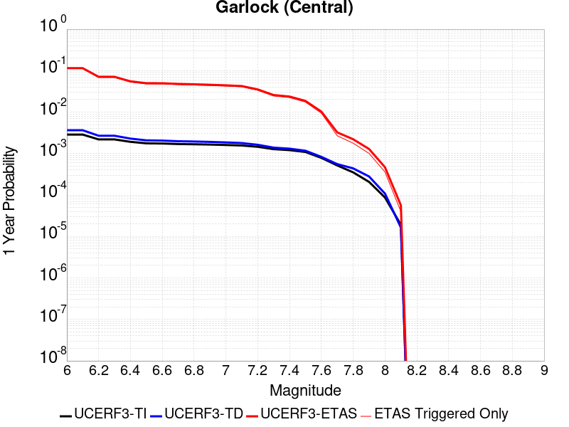 |  |

| Magnitude | 1 wk TI Prob | 1 wk TD Prob | 1 wk ETAS Prob | 1 wk ETAS/TD Gain | 1 wk ETAS Triggered Only | 1 mo TI Prob | 1 mo TD Prob | 1 mo ETAS Prob | 1 mo ETAS/TD Gain | 1 mo ETAS Triggered Only | 1 yr TI Prob | 1 yr TD Prob | 1 yr ETAS Prob | 1 yr ETAS/TD Gain | 1 yr ETAS Triggered Only | 10 yr TI Prob | 10 yr TD Prob | 10 yr ETAS Prob | 10 yr ETAS/TD Gain | 10 yr ETAS Triggered Only |
|-----|-----|-----|-----|-----|-----|-----|-----|-----|-----|-----|-----|-----|-----|-----|-----|-----|-----|-----|-----|-----|
| 6.0 | 5.5131142E-5 | 7.024681E-5 | 0.06786548 | 966.1006 | 0.0678 | 2.3625491E-4 | 3.010234E-4 | 0.08437571 | 280.2962 | 0.0841 | 0.0028726095 | 0.0036588663 | 0.1148605 | 31.392374 | 0.11161 | 0.028357591 | 0.036079824 | 0.1687538 | 4.677234 | 0.13764 |
| 6.1 | 5.5131142E-5 | 7.024681E-5 | 0.06786548 | 966.1006 | 0.0678 | 2.3625491E-4 | 3.010234E-4 | 0.08437571 | 280.2962 | 0.0841 | 0.0028726095 | 0.0036588663 | 0.1148605 | 31.392374 | 0.11161 | 0.028357591 | 0.036079824 | 0.1687538 | 4.677234 | 0.13764 |
| 6.2 | 4.216245E-5 | 5.1661493E-5 | 0.041249532 | 798.458 | 0.0412 | 1.806837E-4 | 2.2138779E-4 | 0.051719986 | 233.61716 | 0.05151 | 0.0021976046 | 0.0026920962 | 0.07117723 | 26.439333 | 0.06867 | 0.021759989 | 0.026689773 | 0.11001486 | 4.1219854 | 0.08561 |
| 6.3 | 4.216245E-5 | 5.1661493E-5 | 0.041249532 | 798.458 | 0.0412 | 1.806837E-4 | 2.2138779E-4 | 0.051719986 | 233.61716 | 0.05151 | 0.0021976046 | 0.0026920962 | 0.07117723 | 26.439333 | 0.06867 | 0.021759989 | 0.026689773 | 0.11001486 | 4.1219854 | 0.08561 |
| 6.4 | 3.6858168E-5 | 4.411054E-5 | 0.031902704 | 723.24445 | 0.03186 | 1.5795401E-4 | 1.8903162E-4 | 0.040061492 | 211.93011 | 0.03988 | 0.0019213937 | 0.002299056 | 0.055316884 | 24.060696 | 0.05314 | 0.019048655 | 0.02284894 | 0.08789789 | 3.846913 | 0.06657 |
| 6.5 | 3.39199E-5 | 4.0018083E-5 | 0.028678872 | 716.6478 | 0.02864 | 1.453629E-4 | 1.7149492E-4 | 0.035925362 | 209.48354 | 0.03576 | 0.0017683565 | 0.002085973 | 0.049866095 | 23.905437 | 0.04788 | 0.017543508 | 0.020759864 | 0.07959261 | 3.833966 | 0.06008 |
| 6.6 | 3.3571985E-5 | 3.9472274E-5 | 0.028648343 | 725.784 | 0.02861 | 1.4387199E-4 | 1.6915603E-4 | 0.035893112 | 212.18936 | 0.03573 | 0.0017502342 | 0.0020575512 | 0.04979912 | 24.2031 | 0.04784 | 0.017365133 | 0.020481179 | 0.07925231 | 3.869519 | 0.06 |
| 6.7 | 3.2580007E-5 | 3.8088703E-5 | 0.027507043 | 722.1838 | 0.02747 | 1.3962112E-4 | 1.632272E-4 | 0.03452762 | 211.53102 | 0.03437 | 0.0016985617 | 0.0019855013 | 0.04795405 | 24.152113 | 0.04606 | 0.016856372 | 0.019773813 | 0.07639168 | 3.8632748 | 0.05776 |
| 6.8 | 3.2185937E-5 | 3.7515918E-5 | 0.02683651 | 715.3366 | 0.0268 | 1.3793244E-4 | 1.6077272E-4 | 0.03374537 | 209.89488 | 0.03359 | 0.0016780337 | 0.001955672 | 0.04689761 | 23.980303 | 0.04503 | 0.016654192 | 0.019480614 | 0.07493879 | 3.8468392 | 0.05656 |
| 6.9 | 3.165394E-5 | 3.6720503E-5 | 0.026105763 | 710.9315 | 0.02607 | 1.3565269E-4 | 1.5736422E-4 | 0.03282222 | 208.57489 | 0.03267 | 0.0016503202 | 0.001914247 | 0.045690287 | 23.868542 | 0.04386 | 0.01638118 | 0.019073246 | 0.07312231 | 3.8337631 | 0.0551 |
| 7.0 | 3.0903822E-5 | 3.5625766E-5 | 0.025294727 | 710.01215 | 0.02526 | 1.3243823E-4 | 1.5267303E-4 | 0.03179784 | 208.27411 | 0.03165 | 0.0016112428 | 0.0018572307 | 0.04429826 | 23.851782 | 0.04252 | 0.015996104 | 0.018512413 | 0.07100237 | 3.8353925 | 0.05348 |
| 7.1 | 3.0069863E-5 | 3.4392073E-5 | 0.024293557 | 706.3709 | 0.02426 | 1.2886449E-4 | 1.4738638E-4 | 0.03051291 | 207.02666 | 0.03037 | 0.0015677959 | 0.0017929734 | 0.042559747 | 23.736967 | 0.04084 | 0.01556781 | 0.017880075 | 0.06826283 | 3.8178155 | 0.0513 |
| 7.2 | 2.7957109E-5 | 3.128145E-5 | 0.01992066 | 636.8201 | 0.01989 | 1.1981068E-4 | 1.340566E-4 | 0.025000723 | 186.49379 | 0.02487 | 0.0014577188 | 0.0016309366 | 0.03526599 | 21.623152 | 0.03369 | 0.014481937 | 0.016283695 | 0.058170334 | 3.5723057 | 0.04258 |
| 7.3 | 2.4519275E-5 | 2.6714795E-5 | 0.014226335 | 532.5265 | 0.0142 | 1.0507837E-4 | 1.1448703E-4 | 0.018132424 | 158.37971 | 0.01802 | 0.0012785783 | 0.001393003 | 0.025848888 | 18.556232 | 0.02449 | 0.012712469 | 0.013928054 | 0.044516005 | 3.1961398 | 0.03102 |
| 7.4 | 2.3225532E-5 | 2.51994E-5 | 0.013164869 | 522.42786 | 0.01314 | 9.95342E-5 | 1.0799304E-4 | 0.016676204 | 154.41925 | 0.01657 | 0.0012111551 | 0.0013140367 | 0.023774484 | 18.09271 | 0.02249 | 0.012045753 | 0.013145725 | 0.041182257 | 3.1327488 | 0.02841 |
| 7.5 | 2.097765E-5 | 2.2483688E-5 | 0.010272253 | 456.87582 | 0.01025 | 8.9901114E-5 | 9.635517E-5 | 0.012965115 | 134.55547 | 0.01287 | 0.0010939965 | 0.0011725046 | 0.018641997 | 15.899295 | 0.01749 | 0.010886264 | 0.011740365 | 0.033768672 | 2.8762882 | 0.02229 |
| 7.6 | 1.511254E-5 | 1.5991332E-5 | 0.0055259033 | 345.55615 | 0.00551 | 6.476642E-5 | 6.853253E-5 | 0.007138048 | 104.155624 | 0.00707 | 7.882459E-4 | 8.3407195E-4 | 0.010296173 | 12.344467 | 0.00947 | 0.007854558 | 0.008383559 | 0.020173877 | 2.406362 | 0.01189 |
| 7.7 | 9.934069E-6 | 1.0678794E-5 | 0.0016306615 | 152.70091 | 0.00162 | 4.2573887E-5 | 4.5765457E-5 | 0.0020356744 | 44.480587 | 0.00199 | 5.182138E-4 | 5.570524E-4 | 0.003245554 | 5.826299 | 0.00269 | 0.00517007 | 0.005627684 | 0.008879282 | 1.5777861 | 0.00327 |
| 7.8 | 6.7562896E-6 | 8.428449E-6 | 0.0010884193 | 129.13637 | 0.00108 | 2.8955206E-5 | 3.6121426E-5 | 0.0013460742 | 37.265255 | 0.00131 | 3.5247262E-4 | 4.3968976E-4 | 0.002218907 | 5.046529 | 0.00178 | 0.0035191406 | 0.004446654 | 0.0065970495 | 1.4835985 | 0.00216 |
| 7.9 | 3.975453E-6 | 5.37103E-6 | 6.153678E-4 | 114.57164 | 6.1E-4 | 1.7037546E-5 | 2.3018498E-5 | 7.7300123E-4 | 33.58174 | 7.5E-4 | 2.0741238E-4 | 2.8021427E-4 | 0.0012899312 | 4.6033745 | 0.00101 | 0.002072189 | 0.0028336283 | 0.004070115 | 1.4363616 | 0.00124 |
| 8.0 | 1.6729537E-6 | 2.0775144E-6 | 1.9207712E-4 | 92.45525 | 1.9E-4 | 7.169782E-6 | 8.903603E-6 | 2.689013E-4 | 30.201403 | 2.6E-4 | 8.7288594E-5 | 1.0839601E-4 | 4.6835697E-4 | 4.3207955 | 3.6E-4 | 8.7254314E-4 | 0.0010969337 | 0.001506484 | 1.3733591 | 4.1E-4 |
| 8.1 | 3.6733252E-7 | 3.1489964E-7 | 1.0314897E-5 | 32.756138 | 1.0E-5 | 1.5742813E-6 | 1.3495693E-6 | 3.134953E-5 | 23.229284 | 3.0E-5 | 1.9166706E-5 | 1.6430899E-5 | 5.6430243E-5 | 3.4343977 | 4.0E-5 | 1.9165053E-4 | 1.6638759E-4 | 2.0638094E-4 | 1.2403625 | 4.0E-5 |

## Tank Canyon
*[(top)](#table-of-contents)*

| 1 Week | 1 Month | 1 Year | 10 Year |
|-----|-----|-----|-----|
|  |  |  |  |

| Magnitude | 1 wk TI Prob | 1 wk TD Prob | 1 wk ETAS Prob | 1 wk ETAS/TD Gain | 1 wk ETAS Triggered Only | 1 mo TI Prob | 1 mo TD Prob | 1 mo ETAS Prob | 1 mo ETAS/TD Gain | 1 mo ETAS Triggered Only | 1 yr TI Prob | 1 yr TD Prob | 1 yr ETAS Prob | 1 yr ETAS/TD Gain | 1 yr ETAS Triggered Only | 10 yr TI Prob | 10 yr TD Prob | 10 yr ETAS Prob | 10 yr ETAS/TD Gain | 10 yr ETAS Triggered Only |
|-----|-----|-----|-----|-----|-----|-----|-----|-----|-----|-----|-----|-----|-----|-----|-----|-----|-----|-----|-----|-----|
| 6.0 | 4.8284557E-5 | 5.7964822E-5 | 0.037315805 | 643.76636 | 0.03726 | 2.0691741E-4 | 2.4840087E-4 | 0.050096016 | 201.67409 | 0.04986 | 0.0025163088 | 0.0030207601 | 0.0787513 | 26.070028 | 0.07596 | 0.02488006 | 0.029863637 | 0.13005932 | 4.355107 | 0.10328 |
| 6.1 | 1.7796336E-5 | 2.0873314E-5 | 0.013030602 | 624.2708 | 0.01301 | 7.626778E-5 | 8.945422E-5 | 0.017517895 | 195.83084 | 0.01743 | 9.281647E-4 | 0.0010885983 | 0.028988194 | 26.62892 | 0.02793 | 0.009242975 | 0.010836744 | 0.049503136 | 4.568082 | 0.03909 |
| 6.2 | 1.7796336E-5 | 2.0873314E-5 | 0.013030602 | 624.2708 | 0.01301 | 7.626778E-5 | 8.945422E-5 | 0.017517895 | 195.83084 | 0.01743 | 9.281647E-4 | 0.0010885983 | 0.028988194 | 26.62892 | 0.02793 | 0.009242975 | 0.010836744 | 0.049503136 | 4.568082 | 0.03909 |
| 6.3 | 1.3515912E-5 | 1.5759564E-5 | 0.009485611 | 601.89545 | 0.00947 | 5.792405E-5 | 6.753938E-5 | 0.012756682 | 188.8777 | 0.01269 | 7.049971E-4 | 8.2200574E-4 | 0.020975426 | 25.51737 | 0.02017 | 0.007027647 | 0.0081922645 | 0.03636952 | 4.4394956 | 0.02841 |
| 6.4 | 1.0870146E-5 | 1.2618021E-5 | 0.007082529 | 561.3027 | 0.00707 | 4.658551E-5 | 5.4076212E-5 | 0.009463567 | 175.00426 | 0.00941 | 5.67031E-4 | 6.581969E-4 | 0.015768245 | 23.956728 | 0.01512 | 0.005655863 | 0.0065644905 | 0.02775447 | 4.22797 | 0.02133 |
| 6.5 | 7.964826E-6 | 9.196094E-6 | 0.004369156 | 475.11 | 0.00436 | 3.4134522E-5 | 3.9411298E-5 | 0.0059491782 | 150.9511 | 0.00591 | 4.1550855E-4 | 4.7973756E-4 | 0.010075132 | 21.00134 | 0.0096 | 0.0041473247 | 0.004788321 | 0.018074397 | 3.7746837 | 0.01335 |
| 6.6 | 6.6317E-6 | 7.6122988E-6 | 0.0033775866 | 443.70126 | 0.00337 | 2.8421264E-5 | 3.2623782E-5 | 0.0046124742 | 141.3838 | 0.00458 | 3.4597394E-4 | 3.9713128E-4 | 0.0076542483 | 19.27385 | 0.00726 | 0.0034543579 | 0.003965368 | 0.013846031 | 3.4917393 | 0.00992 |
| 6.7 | 4.793663E-6 | 5.4307857E-6 | 0.0019154204 | 352.69675 | 0.00191 | 2.0544108E-5 | 2.3274613E-5 | 0.0025732152 | 110.55888 | 0.00255 | 2.500958E-4 | 2.8333595E-4 | 0.004342186 | 15.32522 | 0.00406 | 0.0024981452 | 0.0028304397 | 0.008384674 | 2.9623222 | 0.00557 |
| 6.8 | 4.382823E-6 | 4.9692567E-6 | 0.0017349607 | 349.13885 | 0.00173 | 1.8783392E-5 | 2.1296666E-5 | 0.0023412472 | 109.93492 | 0.00232 | 2.286638E-4 | 2.5926033E-4 | 0.003928309 | 15.151986 | 0.00367 | 0.0022842865 | 0.002590253 | 0.0075673275 | 2.9214628 | 0.00499 |
| 6.9 | 2.729601E-6 | 3.0735416E-6 | 8.630709E-4 | 280.80664 | 8.6E-4 | 1.1698237E-5 | 1.3172262E-5 | 0.0012131565 | 92.09933 | 0.0012 | 1.4241673E-4 | 1.6036171E-4 | 0.0019200795 | 11.973429 | 0.00176 | 0.001423255 | 0.0016026258 | 0.003928892 | 2.451534 | 0.00233 |
| 7.0 | 1.8987357E-6 | 2.126939E-6 | 3.2212626E-4 | 151.45064 | 3.2E-4 | 8.137413E-6 | 9.115425E-6 | 5.491105E-4 | 60.239704 | 5.4E-4 | 9.90685E-5 | 1.1097535E-4 | 9.3088433E-4 | 8.388208 | 8.2E-4 | 9.902435E-4 | 0.0011092679 | 0.00218807 | 1.972535 | 0.00108 |
| 7.1 | 1.4928986E-6 | 1.6641272E-6 | 2.1166378E-4 | 127.19207 | 2.1E-4 | 6.398121E-6 | 7.1319573E-6 | 3.971292E-4 | 55.683056 | 3.9E-4 | 7.789434E-5 | 8.682871E-5 | 6.6677836E-4 | 7.679238 | 5.8E-4 | 7.786704E-4 | 8.6800574E-4 | 0.0016173547 | 1.8632996 | 7.5E-4 |
| 7.2 | 1.069082E-6 | 1.1828573E-6 | 1.0118274E-4 | 85.540955 | 1.0E-4 | 4.581772E-6 | 5.0693816E-6 | 2.3506822E-4 | 46.370197 | 2.3E-4 | 5.5781646E-5 | 6.171851E-5 | 3.8169874E-4 | 6.1845107 | 3.2E-4 | 5.576765E-4 | 6.170659E-4 | 0.001016819 | 1.6478289 | 4.0E-4 |
| 7.3 | 8.776551E-7 | 9.770005E-7 | 8.097692E-5 | 82.883194 | 8.0E-5 | 3.7613736E-6 | 4.1871413E-6 | 1.9418634E-4 | 46.376835 | 1.9E-4 | 4.579376E-5 | 5.097777E-5 | 3.109645E-4 | 6.1000023 | 2.6E-4 | 4.5784327E-4 | 5.097118E-4 | 8.195538E-4 | 1.6078769 | 3.1E-4 |
| 7.4 | 7.55721E-7 | 8.510244E-7 | 6.0850973E-5 | 71.503204 | 6.0E-5 | 3.2388E-6 | 3.6472454E-6 | 1.536467E-4 | 42.126778 | 1.5E-4 | 3.9431678E-5 | 4.4404827E-5 | 2.543955E-4 | 5.729006 | 2.1E-4 | 3.942468E-4 | 4.440104E-4 | 6.839038E-4 | 1.5402879 | 2.4E-4 |
| 7.5 | 5.587665E-7 | 6.305619E-7 | 3.0630545E-5 | 48.576584 | 3.0E-5 | 2.3947114E-6 | 2.702408E-6 | 1.1270211E-4 | 41.704327 | 1.1E-4 | 2.915522E-5 | 3.290182E-5 | 1.7289721E-4 | 5.254944 | 1.4E-4 | 2.9151395E-4 | 3.290182E-4 | 4.9896224E-4 | 1.5165187 | 1.7E-4 |

## Little Lake
*[(top)](#table-of-contents)*

| 1 Week | 1 Month | 1 Year | 10 Year |
|-----|-----|-----|-----|
|  | 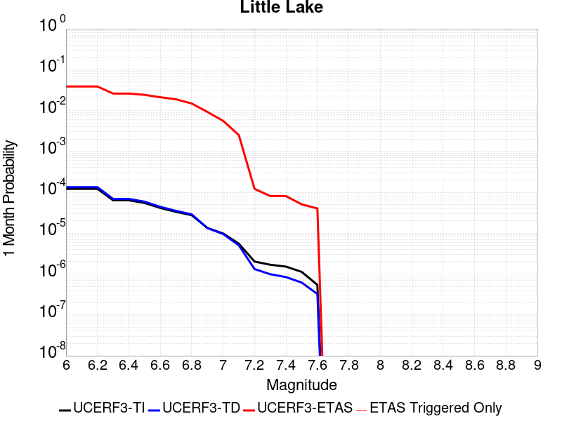 | 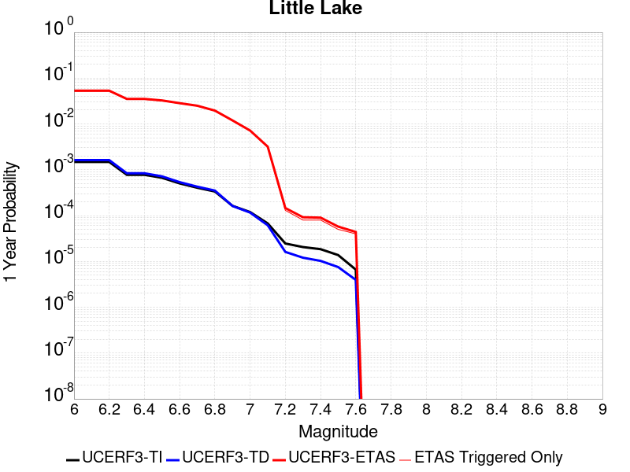 |  |

| Magnitude | 1 wk TI Prob | 1 wk TD Prob | 1 wk ETAS Prob | 1 wk ETAS/TD Gain | 1 wk ETAS Triggered Only | 1 mo TI Prob | 1 mo TD Prob | 1 mo ETAS Prob | 1 mo ETAS/TD Gain | 1 mo ETAS Triggered Only | 1 yr TI Prob | 1 yr TD Prob | 1 yr ETAS Prob | 1 yr ETAS/TD Gain | 1 yr ETAS Triggered Only | 10 yr TI Prob | 10 yr TD Prob | 10 yr ETAS Prob | 10 yr ETAS/TD Gain | 10 yr ETAS Triggered Only |
|-----|-----|-----|-----|-----|-----|-----|-----|-----|-----|-----|-----|-----|-----|-----|-----|-----|-----|-----|-----|-----|
| 6.0 | 2.8424427E-5 | 3.120572E-5 | 0.03098024 | 992.77435 | 0.03095 | 1.2181328E-4 | 1.337327E-4 | 0.03879856 | 290.12024 | 0.03867 | 0.0014820677 | 0.0016271127 | 0.05323301 | 32.716236 | 0.05169 | 0.014722223 | 0.016165402 | 0.079485 | 4.9169827 | 0.06436 |
| 6.1 | 2.8424427E-5 | 3.120572E-5 | 0.03098024 | 992.77435 | 0.03095 | 1.2181328E-4 | 1.337327E-4 | 0.03879856 | 290.12024 | 0.03867 | 0.0014820677 | 0.0016271127 | 0.05323301 | 32.716236 | 0.05169 | 0.014722223 | 0.016165402 | 0.079485 | 4.9169827 | 0.06436 |
| 6.2 | 2.8424427E-5 | 3.120572E-5 | 0.03098024 | 992.77435 | 0.03095 | 1.2181328E-4 | 1.337327E-4 | 0.03879856 | 290.12024 | 0.03867 | 0.0014820677 | 0.0016271127 | 0.05323301 | 32.716236 | 0.05169 | 0.014722223 | 0.016165402 | 0.079485 | 4.9169827 | 0.06436 |
| 6.3 | 1.48860645E-5 | 1.6081389E-5 | 0.020905746 | 1299.9962 | 0.02089 | 6.379586E-5 | 6.8918576E-5 | 0.026037129 | 377.7955 | 0.02597 | 7.7643775E-4 | 8.3878887E-4 | 0.035159975 | 41.917553 | 0.03435 | 0.007737305 | 0.008359048 | 0.050702117 | 6.0655375 | 0.0427 |
| 6.4 | 1.48860645E-5 | 1.6081389E-5 | 0.020905746 | 1299.9962 | 0.02089 | 6.379586E-5 | 6.8918576E-5 | 0.026037129 | 377.7955 | 0.02597 | 7.7643775E-4 | 8.3878887E-4 | 0.035159975 | 41.917553 | 0.03435 | 0.007737305 | 0.008359048 | 0.050702117 | 6.0655375 | 0.0427 |
| 6.5 | 1.2797581E-5 | 1.3765565E-5 | 0.019443499 | 1412.4736 | 0.01943 | 5.4845623E-5 | 5.899409E-5 | 0.024217568 | 410.5084 | 0.02416 | 6.675408E-4 | 7.18042E-4 | 0.032585144 | 45.38055 | 0.03189 | 0.006655392 | 0.00715977 | 0.04643653 | 6.4857574 | 0.03956 |
| 6.6 | 9.661896E-6 | 1.0289038E-5 | 0.017070113 | 1659.0583 | 0.01706 | 4.1407468E-5 | 4.409522E-5 | 0.021173164 | 480.1691 | 0.02113 | 5.040193E-4 | 5.367433E-4 | 0.028421769 | 52.95225 | 0.0279 | 0.005028777 | 0.0053560743 | 0.039740916 | 7.419784 | 0.03457 |
| 6.7 | 7.767871E-6 | 8.199687E-6 | 0.015338074 | 1870.5684 | 0.01533 | 3.329045E-5 | 3.5141118E-5 | 0.01887448 | 537.1052 | 0.01884 | 4.0523586E-4 | 4.2777284E-4 | 0.024987262 | 58.412457 | 0.02457 | 0.004044977 | 0.004270846 | 0.03447131 | 8.071307 | 0.03033 |
| 6.8 | 6.4235196E-6 | 6.7357446E-6 | 0.012226653 | 1815.1896 | 0.01222 | 2.752908E-5 | 2.8867229E-5 | 0.014878439 | 515.4093 | 0.01485 | 3.35115E-4 | 3.5141467E-4 | 0.019554663 | 55.645554 | 0.01921 | 0.003346101 | 0.00350985 | 0.027345894 | 7.791186 | 0.02392 |
| 6.9 | 3.1283696E-6 | 3.1121804E-6 | 0.0075730886 | 2433.3706 | 0.00757 | 1.3407229E-5 | 1.3337856E-5 | 0.009253215 | 693.75574 | 0.00924 | 1.6322079E-4 | 1.6237781E-4 | 0.011940465 | 73.53508 | 0.01178 | 0.0016310095 | 0.00162274 | 0.016059276 | 9.896395 | 0.01446 |
| 7.0 | 2.290603E-6 | 2.2286815E-6 | 0.0045722183 | 2051.5352 | 0.00457 | 9.816834E-6 | 9.551463E-6 | 0.005609498 | 587.292 | 0.0056 | 1.19513395E-4 | 1.162839E-4 | 0.007175463 | 61.706417 | 0.00706 | 0.0011944914 | 0.0011623327 | 0.009842232 | 8.467655 | 0.00869 |
| 7.1 | 1.293693E-6 | 1.1776827E-6 | 0.0020311752 | 1724.7219 | 0.00203 | 5.5443866E-6 | 5.0472063E-6 | 0.0025050347 | 496.32104 | 0.0025 | 6.750081E-5 | 6.14487E-5 | 0.0031912564 | 51.93367 | 0.00313 | 6.7480316E-4 | 6.143856E-4 | 0.0045019956 | 7.327639 | 0.00389 |
| 7.2 | 4.715842E-7 | 3.0917857E-7 | 1.00309146E-4 | 324.4376 | 1.0E-4 | 2.0210737E-6 | 1.3250503E-6 | 1.2132489E-4 | 91.56248 | 1.2E-4 | 2.4606294E-5 | 1.6132375E-5 | 1.4613027E-4 | 9.0582 | 1.3E-4 | 2.460357E-4 | 1.6131258E-4 | 3.612803E-4 | 2.239629 | 2.0E-4 |
| 7.3 | 3.9430947E-7 | 2.3097488E-7 | 8.023096E-5 | 347.35794 | 8.0E-5 | 1.6898966E-6 | 9.89892E-7 | 8.098981E-5 | 81.81682 | 8.0E-5 | 2.0574296E-5 | 1.2051869E-5 | 9.2050905E-5 | 7.6378946 | 8.0E-5 | 2.0572392E-4 | 1.20512224E-4 | 2.6049535E-4 | 2.161568 | 1.4E-4 |
| 7.4 | 3.547123E-7 | 1.9679135E-7 | 8.0196776E-5 | 407.52185 | 8.0E-5 | 1.5201948E-6 | 8.4339126E-7 | 8.0843325E-5 | 95.855064 | 8.0E-5 | 1.8508214E-5 | 1.0268241E-5 | 9.026742E-5 | 8.790934 | 8.0E-5 | 1.8506673E-4 | 1.02677724E-4 | 2.226654E-4 | 2.1685853 | 1.2E-4 |
| 7.5 | 2.6354266E-7 | 1.4423138E-7 | 5.0144223E-5 | 347.66513 | 5.0E-5 | 1.129468E-6 | 6.181344E-7 | 5.0618102E-5 | 81.88851 | 5.0E-5 | 1.3751187E-5 | 7.5257603E-6 | 5.7525383E-5 | 7.643797 | 5.0E-5 | 1.3750336E-4 | 7.5255106E-5 | 1.5524909E-4 | 2.0629709 | 8.0E-5 |
| 7.6 | 1.269913E-7 | 7.572556E-8 | 4.0075724E-5 | 529.2232 | 4.0E-5 | 5.4424834E-7 | 3.245381E-7 | 4.0324525E-5 | 124.25206 | 4.0E-5 | 6.6262032E-6 | 3.9512443E-6 | 4.3951088E-5 | 11.123353 | 4.0E-5 | 6.626006E-5 | 3.9511775E-5 | 8.95098E-5 | 2.2653954 | 5.0E-5 |

## Airport Lake
*[(top)](#table-of-contents)*

| 1 Week | 1 Month | 1 Year | 10 Year |
|-----|-----|-----|-----|
|  |  |  |  |

| Magnitude | 1 wk TI Prob | 1 wk TD Prob | 1 wk ETAS Prob | 1 wk ETAS/TD Gain | 1 wk ETAS Triggered Only | 1 mo TI Prob | 1 mo TD Prob | 1 mo ETAS Prob | 1 mo ETAS/TD Gain | 1 mo ETAS Triggered Only | 1 yr TI Prob | 1 yr TD Prob | 1 yr ETAS Prob | 1 yr ETAS/TD Gain | 1 yr ETAS Triggered Only | 10 yr TI Prob | 10 yr TD Prob | 10 yr ETAS Prob | 10 yr ETAS/TD Gain | 10 yr ETAS Triggered Only |
|-----|-----|-----|-----|-----|-----|-----|-----|-----|-----|-----|-----|-----|-----|-----|-----|-----|-----|-----|-----|-----|
| 6.0 | 1.2387061E-5 | 1.3103157E-5 | 0.028592728 | 2182.1252 | 0.02858 | 5.3086325E-5 | 5.615534E-5 | 0.035144184 | 625.83875 | 0.03509 | 6.461343E-4 | 6.8350515E-4 | 0.04617239 | 67.55237 | 0.04552 | 0.0064425888 | 0.0068168393 | 0.061143957 | 8.969546 | 0.0547 |
| 6.1 | 1.2387061E-5 | 1.3103157E-5 | 0.028592728 | 2182.1252 | 0.02858 | 5.3086325E-5 | 5.615534E-5 | 0.035144184 | 625.83875 | 0.03509 | 6.461343E-4 | 6.8350515E-4 | 0.04617239 | 67.55237 | 0.04552 | 0.0064425888 | 0.0068168393 | 0.061143957 | 8.969546 | 0.0547 |
| 6.2 | 1.2387061E-5 | 1.3103157E-5 | 0.028592728 | 2182.1252 | 0.02858 | 5.3086325E-5 | 5.615534E-5 | 0.035144184 | 625.83875 | 0.03509 | 6.461343E-4 | 6.8350515E-4 | 0.04617239 | 67.55237 | 0.04552 | 0.0064425888 | 0.0068168393 | 0.061143957 | 8.969546 | 0.0547 |
| 6.3 | 1.2387061E-5 | 1.3103157E-5 | 0.028592728 | 2182.1252 | 0.02858 | 5.3086325E-5 | 5.615534E-5 | 0.035144184 | 625.83875 | 0.03509 | 6.461343E-4 | 6.8350515E-4 | 0.04617239 | 67.55237 | 0.04552 | 0.0064425888 | 0.0068168393 | 0.061143957 | 8.969546 | 0.0547 |
| 6.4 | 1.2387061E-5 | 1.3103157E-5 | 0.028592728 | 2182.1252 | 0.02858 | 5.3086325E-5 | 5.615534E-5 | 0.035144184 | 625.83875 | 0.03509 | 6.461343E-4 | 6.8350515E-4 | 0.04617239 | 67.55237 | 0.04552 | 0.0064425888 | 0.0068168393 | 0.061143957 | 8.969546 | 0.0547 |
| 6.5 | 6.9922594E-6 | 7.384925E-6 | 0.021077229 | 2854.0884 | 0.02107 | 2.996648E-5 | 3.1649324E-5 | 0.026060825 | 823.4243 | 0.02603 | 3.6478083E-4 | 3.8526783E-4 | 0.03421223 | 88.801155 | 0.03384 | 0.003641826 | 0.0038465366 | 0.044419866 | 11.548017 | 0.04073 |
| 6.6 | 6.9922594E-6 | 7.384925E-6 | 0.021077229 | 2854.0884 | 0.02107 | 2.996648E-5 | 3.1649324E-5 | 0.026060825 | 823.4243 | 0.02603 | 3.6478083E-4 | 3.8526783E-4 | 0.03421223 | 88.801155 | 0.03384 | 0.003641826 | 0.0038465366 | 0.044419866 | 11.548017 | 0.04073 |
| 6.7 | 5.477277E-6 | 5.7860684E-6 | 0.01808568 | 3125.729 | 0.01808 | 2.3473833E-5 | 2.4797222E-5 | 0.022374243 | 902.28827 | 0.02235 | 2.8575645E-4 | 3.0186825E-4 | 0.029253127 | 96.90694 | 0.02896 | 0.0028538927 | 0.003014966 | 0.037759893 | 12.524153 | 0.03485 |
| 6.8 | 3.9950432E-6 | 4.2190873E-6 | 0.013714162 | 3250.5044 | 0.01371 | 1.7121502E-5 | 1.8081691E-5 | 0.016857777 | 932.31195 | 0.01684 | 2.0843433E-4 | 2.2012512E-4 | 0.021845363 | 99.24067 | 0.02163 | 0.0020823893 | 0.0021993418 | 0.028401587 | 12.913676 | 0.02626 |
| 6.9 | 2.95695E-6 | 3.1230243E-6 | 0.009783093 | 3132.57 | 0.00978 | 1.2672582E-5 | 1.3384334E-5 | 0.012073223 | 902.0414 | 0.01206 | 1.5427776E-4 | 1.6294434E-4 | 0.015490446 | 95.06587 | 0.01533 | 0.001541707 | 0.0016284712 | 0.020278051 | 12.452202 | 0.01868 |
| 7.0 | 1.456072E-6 | 1.540812E-6 | 0.004361534 | 2830.6724 | 0.00436 | 6.2402937E-6 | 6.603469E-6 | 0.005356568 | 811.17487 | 0.00535 | 7.597293E-5 | 8.039528E-5 | 0.0068198536 | 84.82903 | 0.00674 | 7.594696E-4 | 8.0376083E-4 | 0.009057121 | 11.268429 | 0.00826 |
| 7.1 | 6.995192E-7 | 7.4089746E-7 | 0.0019107395 | 2578.9526 | 0.00191 | 2.997936E-6 | 3.1752747E-6 | 0.0023431678 | 737.9418 | 0.00234 | 3.649926E-5 | 3.865897E-5 | 0.0029685458 | 76.78802 | 0.00293 | 3.6493264E-4 | 3.865897E-4 | 0.0039851977 | 10.3085985 | 0.0036 |

## Owl Lake
*[(top)](#table-of-contents)*

| 1 Week | 1 Month | 1 Year | 10 Year |
|-----|-----|-----|-----|
|  | 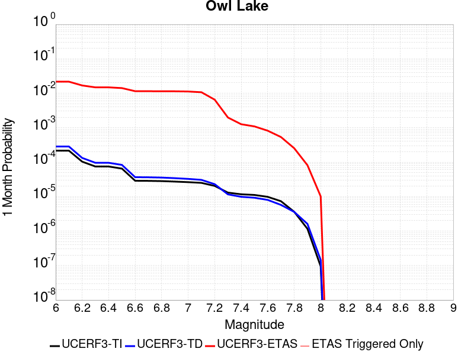 |  |  |

| Magnitude | 1 wk TI Prob | 1 wk TD Prob | 1 wk ETAS Prob | 1 wk ETAS/TD Gain | 1 wk ETAS Triggered Only | 1 mo TI Prob | 1 mo TD Prob | 1 mo ETAS Prob | 1 mo ETAS/TD Gain | 1 mo ETAS Triggered Only | 1 yr TI Prob | 1 yr TD Prob | 1 yr ETAS Prob | 1 yr ETAS/TD Gain | 1 yr ETAS Triggered Only | 10 yr TI Prob | 10 yr TD Prob | 10 yr ETAS Prob | 10 yr ETAS/TD Gain | 10 yr ETAS Triggered Only |
|-----|-----|-----|-----|-----|-----|-----|-----|-----|-----|-----|-----|-----|-----|-----|-----|-----|-----|-----|-----|-----|
| 6.0 | 5.0320643E-5 | 6.635816E-5 | 0.016135292 | 243.15462 | 0.01607 | 2.1564208E-4 | 2.843674E-4 | 0.021638293 | 76.09274 | 0.02136 | 0.0026222812 | 0.0034577388 | 0.034390412 | 9.945925 | 0.03104 | 0.02591553 | 0.034140717 | 0.07415627 | 2.172077 | 0.04143 |
| 6.1 | 5.0320643E-5 | 6.635816E-5 | 0.016135292 | 243.15462 | 0.01607 | 2.1564208E-4 | 2.843674E-4 | 0.021638293 | 76.09274 | 0.02136 | 0.0026222812 | 0.0034577388 | 0.034390412 | 9.945925 | 0.03104 | 0.02591553 | 0.034140717 | 0.07415627 | 2.172077 | 0.04143 |
| 6.2 | 2.4125871E-5 | 3.0981035E-5 | 0.012880583 | 415.75702 | 0.01285 | 1.0339249E-4 | 1.3277028E-4 | 0.016800556 | 126.538536 | 0.01667 | 0.0012580766 | 0.001615439 | 0.025337055 | 15.684317 | 0.02376 | 0.012509781 | 0.016070465 | 0.046788745 | 2.9114745 | 0.03122 |
| 6.3 | 1.7433485E-5 | 2.2355514E-5 | 0.0114621 | 512.7191 | 0.01144 | 7.471279E-5 | 9.580672E-5 | 0.014804398 | 154.52359 | 0.01471 | 9.0924866E-4 | 0.0011659743 | 0.021931734 | 18.809792 | 0.02079 | 0.009055373 | 0.011628896 | 0.0383248 | 3.2956524 | 0.02701 |
| 6.4 | 1.7433485E-5 | 2.2355514E-5 | 0.0114621 | 512.7191 | 0.01144 | 7.471279E-5 | 9.580672E-5 | 0.014804398 | 154.52359 | 0.01471 | 9.0924866E-4 | 0.0011659743 | 0.021931734 | 18.809792 | 0.02079 | 0.009055373 | 0.011628896 | 0.0383248 | 3.2956524 | 0.02701 |
| 6.5 | 1.5182742E-5 | 1.9429144E-5 | 0.010999216 | 566.1194 | 0.01098 | 6.506727E-5 | 8.326596E-5 | 0.0140921 | 169.24202 | 0.01401 | 7.919061E-4 | 0.0010134429 | 0.020723447 | 20.44856 | 0.01973 | 0.0078909 | 0.010118429 | 0.03537031 | 3.4956324 | 0.02551 |
| 6.6 | 6.7271576E-6 | 8.547361E-6 | 0.009158469 | 1071.4967 | 0.00915 | 2.8830356E-5 | 3.6631063E-5 | 0.011456213 | 312.74582 | 0.01142 | 3.5095305E-4 | 4.458976E-4 | 0.015689097 | 35.18543 | 0.01525 | 0.0035039932 | 0.004467813 | 0.023422746 | 5.242553 | 0.01904 |
| 6.7 | 6.682835E-6 | 8.479807E-6 | 0.009148402 | 1078.8456 | 0.00914 | 2.8640408E-5 | 3.6341557E-5 | 0.011435927 | 314.67908 | 0.0114 | 3.4864116E-4 | 4.4237426E-4 | 0.015645646 | 35.36744 | 0.01521 | 0.003480947 | 0.0044327388 | 0.023328606 | 5.262797 | 0.01898 |
| 6.8 | 6.5774975E-6 | 8.32628E-6 | 0.009138251 | 1097.5189 | 0.00913 | 2.8188972E-5 | 3.5683603E-5 | 0.011405278 | 319.62238 | 0.01137 | 3.4314668E-4 | 4.343669E-4 | 0.015577787 | 35.863197 | 0.01515 | 0.0034261728 | 0.004352885 | 0.023180572 | 5.3253355 | 0.01891 |
| 6.9 | 6.363419E-6 | 7.999454E-6 | 0.0091179265 | 1139.8185 | 0.00911 | 2.727151E-5 | 3.428296E-5 | 0.011373894 | 331.76526 | 0.01134 | 3.3198006E-4 | 4.1732067E-4 | 0.0154810315 | 37.09625 | 0.01507 | 0.0033148455 | 0.0041828766 | 0.02289428 | 5.473334 | 0.01879 |
| 7.0 | 6.1342453E-6 | 7.6316555E-6 | 0.009027563 | 1182.9102 | 0.00902 | 2.6289357E-5 | 3.2706717E-5 | 0.0112123415 | 342.81464 | 0.01118 | 3.2002592E-4 | 3.9813702E-4 | 0.01525222 | 38.308975 | 0.01486 | 0.0031956544 | 0.003991571 | 0.022437647 | 5.621258 | 0.01852 |
| 7.1 | 5.842926E-6 | 7.142211E-6 | 0.008637081 | 1209.3007 | 0.00863 | 2.504087E-5 | 3.0609146E-5 | 0.010680283 | 348.92456 | 0.01065 | 3.0482994E-4 | 3.7260808E-4 | 0.014517335 | 38.96141 | 0.01415 | 0.0030441214 | 0.0037370329 | 0.021281224 | 5.6946845 | 0.01761 |
| 7.2 | 4.77173E-6 | 5.358483E-6 | 0.0053453296 | 997.5453 | 0.00534 | 2.045011E-5 | 2.2964748E-5 | 0.006502816 | 283.16513 | 0.00648 | 2.4895166E-4 | 2.79564E-4 | 0.009027118 | 32.289986 | 0.00875 | 0.0024867293 | 0.002808645 | 0.0138375815 | 4.926782 | 0.01106 |
| 7.3 | 3.0494948E-6 | 2.710463E-6 | 0.0015527062 | 572.8565 | 0.00155 | 1.3069198E-5 | 1.1616219E-5 | 0.0019715934 | 169.72765 | 0.00196 | 1.5910587E-4 | 1.4141845E-4 | 0.0027810452 | 19.665363 | 0.00264 | 0.0015899199 | 0.0014232415 | 0.004718545 | 3.315351 | 0.0033 |
| 7.4 | 2.7263884E-6 | 2.3056762E-6 | 0.0010223034 | 443.38547 | 0.00102 | 1.1684469E-5 | 9.881433E-6 | 0.0012598691 | 127.49863 | 0.00125 | 1.4224913E-4 | 1.20299905E-4 | 0.0017801002 | 14.797187 | 0.00166 | 0.0014215811 | 0.0012112238 | 0.0033386438 | 2.756422 | 0.00213 |
| 7.5 | 2.6090431E-6 | 2.1656133E-6 | 9.021637E-4 | 416.5858 | 9.0E-4 | 1.1181565E-5 | 9.281167E-6 | 0.0010892712 | 117.363594 | 0.00108 | 1.3612706E-4 | 1.1299244E-4 | 0.0015528298 | 13.742775 | 0.00144 | 0.001360437 | 0.0011379806 | 0.002995864 | 2.6326141 | 0.00186 |
| 7.6 | 2.3008756E-6 | 1.8727933E-6 | 6.918715E-4 | 369.43292 | 6.9E-4 | 9.860858E-6 | 8.0262325E-6 | 8.1801973E-4 | 101.91827 | 8.1E-4 | 1.20049335E-4 | 9.7715085E-5 | 0.0011376134 | 11.642148 | 0.00104 | 0.001199845 | 9.849932E-4 | 0.002293703 | 2.3286486 | 0.00131 |
| 7.7 | 1.7184348E-6 | 1.3419171E-6 | 4.613413E-4 | 343.7927 | 4.6E-4 | 7.3646997E-6 | 5.7510606E-6 | 5.35748E-4 | 93.15638 | 5.3E-4 | 8.966153E-5 | 7.0016955E-5 | 7.3997007E-4 | 10.56844 | 6.7E-4 | 8.962536E-4 | 7.078345E-4 | 0.0014872823 | 2.1011724 | 7.8E-4 |
| 7.8 | 8.4612907E-7 | 8.4058576E-7 | 2.1084042E-4 | 250.82558 | 2.1E-4 | 3.6262625E-6 | 3.6025056E-6 | 2.536016E-4 | 70.3959 | 2.5E-4 | 4.4148852E-5 | 4.3859643E-5 | 3.7384516E-4 | 8.523671 | 3.3E-4 | 4.414008E-4 | 4.4398365E-4 | 8.43806E-4 | 1.9005342 | 4.0E-4 |
| 7.9 | 2.716738E-7 | 3.768106E-7 | 7.037679E-5 | 186.76967 | 7.0E-5 | 1.1643157E-6 | 1.6149015E-6 | 8.161477E-5 | 50.538544 | 8.0E-5 | 1.4175452E-5 | 1.966126E-5 | 9.965969E-5 | 5.0688353 | 8.0E-5 | 1.4174548E-4 | 1.9836679E-4 | 2.9834695E-4 | 1.5040166 | 1.0E-4 |
| 8.0 | 2.1995428E-8 | 3.384878E-8 | 3.384878E-8 | 1.0 | 0.0 | 9.426611E-8 | 1.4506621E-7 | 1.0145065E-5 | 69.93404 | 1.0E-5 | 1.1476893E-6 | 1.7661803E-6 | 1.1766163E-5 | 6.6619263 | 1.0E-5 | 1.14768345E-5 | 1.7963059E-5 | 2.7962878E-5 | 1.5566881 | 1.0E-5 |

## Panamint Valley
*[(top)](#table-of-contents)*

| 1 Week | 1 Month | 1 Year | 10 Year |
|-----|-----|-----|-----|
|  | 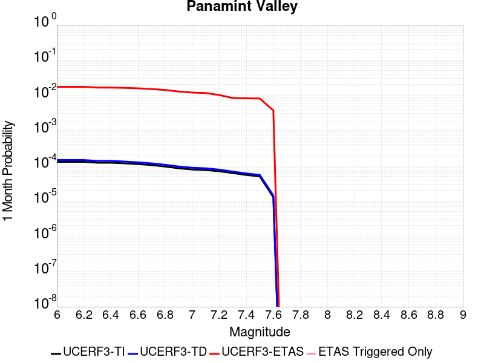 |  | 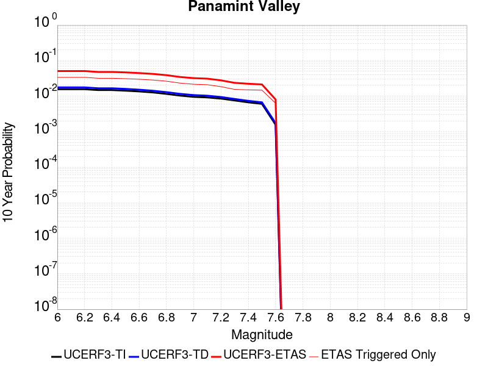 |

| Magnitude | 1 wk TI Prob | 1 wk TD Prob | 1 wk ETAS Prob | 1 wk ETAS/TD Gain | 1 wk ETAS Triggered Only | 1 mo TI Prob | 1 mo TD Prob | 1 mo ETAS Prob | 1 mo ETAS/TD Gain | 1 mo ETAS Triggered Only | 1 yr TI Prob | 1 yr TD Prob | 1 yr ETAS Prob | 1 yr ETAS/TD Gain | 1 yr ETAS Triggered Only | 10 yr TI Prob | 10 yr TD Prob | 10 yr ETAS Prob | 10 yr ETAS/TD Gain | 10 yr ETAS Triggered Only |
|-----|-----|-----|-----|-----|-----|-----|-----|-----|-----|-----|-----|-----|-----|-----|-----|-----|-----|-----|-----|-----|
| 6.0 | 3.0211835E-5 | 3.3984514E-5 | 0.013183538 | 387.92783 | 0.01315 | 1.2947287E-4 | 1.4563995E-4 | 0.017433122 | 119.70014 | 0.01729 | 0.0015751923 | 0.0017717537 | 0.026827283 | 15.141655 | 0.0251 | 0.015640736 | 0.017583137 | 0.050710235 | 2.8840265 | 0.03372 |
| 6.1 | 3.0211835E-5 | 3.3984514E-5 | 0.013183538 | 387.92783 | 0.01315 | 1.2947287E-4 | 1.4563995E-4 | 0.017433122 | 119.70014 | 0.01729 | 0.0015751923 | 0.0017717537 | 0.026827283 | 15.141655 | 0.0251 | 0.015640736 | 0.017583137 | 0.050710235 | 2.8840265 | 0.03372 |
| 6.2 | 3.0211835E-5 | 3.3984514E-5 | 0.013183538 | 387.92783 | 0.01315 | 1.2947287E-4 | 1.4563995E-4 | 0.017433122 | 119.70014 | 0.01729 | 0.0015751923 | 0.0017717537 | 0.026827283 | 15.141655 | 0.0251 | 0.015640736 | 0.017583137 | 0.050710235 | 2.8840265 | 0.03372 |
| 6.3 | 2.8573924E-5 | 3.210268E-5 | 0.012621699 | 393.1665 | 0.01259 | 1.2245393E-4 | 1.3757581E-4 | 0.016615309 | 120.77202 | 0.01648 | 0.001489857 | 0.0016737265 | 0.025383975 | 15.166143 | 0.02375 | 0.01479908 | 0.016617801 | 0.047859855 | 2.8800354 | 0.03177 |
| 6.4 | 2.8573924E-5 | 3.210268E-5 | 0.012621699 | 393.1665 | 0.01259 | 1.2245393E-4 | 1.3757581E-4 | 0.016615309 | 120.77202 | 0.01648 | 0.001489857 | 0.0016737265 | 0.025383975 | 15.166143 | 0.02375 | 0.01479908 | 0.016617801 | 0.047859855 | 2.8800354 | 0.03177 |
| 6.5 | 2.7468774E-5 | 3.0828433E-5 | 0.012440446 | 403.53806 | 0.01241 | 1.1771801E-4 | 1.3211532E-4 | 0.01629998 | 123.3769 | 0.01617 | 0.0014322745 | 0.0016073446 | 0.024819974 | 15.441601 | 0.02325 | 0.014230782 | 0.015963677 | 0.04642944 | 2.908443 | 0.03096 |
| 6.6 | 2.6135967E-5 | 2.925248E-5 | 0.0120789 | 412.91882 | 0.01205 | 1.1200648E-4 | 1.253619E-4 | 0.015803397 | 126.062195 | 0.01568 | 0.0013628257 | 0.0015252391 | 0.024000905 | 15.735832 | 0.02251 | 0.013544982 | 0.015154043 | 0.044551697 | 2.9399214 | 0.02985 |
| 6.7 | 2.4498746E-5 | 2.7341335E-5 | 0.011587026 | 423.7915 | 0.01156 | 1.04990395E-4 | 1.1717203E-4 | 0.01506542 | 128.57523 | 0.01495 | 0.0012775084 | 0.0014256609 | 0.022855066 | 16.031208 | 0.02146 | 0.012701893 | 0.014171274 | 0.042158954 | 2.9749584 | 0.02839 |
| 6.8 | 2.2244329E-5 | 2.4935423E-5 | 0.011004661 | 441.32642 | 0.01098 | 9.532935E-5 | 1.0686185E-4 | 0.01416536 | 132.55768 | 0.01406 | 0.0011600169 | 0.0013002884 | 0.021264296 | 16.353523 | 0.01999 | 0.011539802 | 0.0129325185 | 0.038912136 | 3.0088596 | 0.02632 |
| 6.9 | 1.9902658E-5 | 2.2290267E-5 | 0.0099720685 | 447.37323 | 0.00995 | 8.529431E-5 | 9.552632E-5 | 0.01282431 | 134.24898 | 0.01273 | 0.0010379635 | 0.0011624309 | 0.018891798 | 16.251974 | 0.01775 | 0.010331288 | 0.011568608 | 0.03452987 | 2.9847903 | 0.02323 |
| 7.0 | 1.8353881E-5 | 2.0566185E-5 | 0.009290376 | 451.7306 | 0.00927 | 7.865712E-5 | 8.813792E-5 | 0.01197709 | 135.89032 | 0.01189 | 9.5722964E-4 | 0.0010725686 | 0.017604817 | 16.413698 | 0.01655 | 0.009531168 | 0.010678849 | 0.032018505 | 2.9983106 | 0.02157 |
| 7.1 | 1.7667631E-5 | 1.9772613E-5 | 0.009019595 | 456.16608 | 0.009 | 7.571623E-5 | 8.473711E-5 | 0.01161376 | 137.05635 | 0.01153 | 9.2145515E-4 | 0.0010312037 | 0.017074643 | 16.557974 | 0.01606 | 0.009176437 | 0.010269073 | 0.030964347 | 3.0153012 | 0.02091 |
| 7.2 | 1.6381597E-5 | 1.8158249E-5 | 0.007938014 | 437.15747 | 0.00792 | 7.020495E-5 | 7.781885E-5 | 0.010207031 | 131.16399 | 0.01013 | 8.544101E-4 | 9.4704994E-4 | 0.015073659 | 15.916435 | 0.01414 | 0.008511325 | 0.009434792 | 0.027740438 | 2.9402277 | 0.01848 |
| 7.3 | 1.4520491E-5 | 1.5966476E-5 | 0.0064058644 | 401.20715 | 0.00639 | 6.222919E-5 | 6.842605E-5 | 0.0083778575 | 122.43667 | 0.00831 | 7.57377E-4 | 8.327849E-4 | 0.012533033 | 15.049543 | 0.01171 | 0.0075480095 | 0.00829975 | 0.02362152 | 2.8460517 | 0.01545 |
| 7.4 | 1.2852287E-5 | 1.4145411E-5 | 0.0063040564 | 445.6609 | 0.00629 | 5.5080065E-5 | 6.062187E-5 | 0.008220127 | 135.59673 | 0.00816 | 6.7039346E-4 | 7.378371E-4 | 0.012139418 | 16.452707 | 0.01141 | 0.0066837464 | 0.0073567946 | 0.022246443 | 3.0239315 | 0.015 |
| 7.5 | 1.1637851E-5 | 1.2836797E-5 | 0.006232757 | 485.5383 | 0.00622 | 4.987555E-5 | 5.5013777E-5 | 0.008114571 | 147.5007 | 0.00806 | 6.070656E-4 | 6.6960254E-4 | 0.011862103 | 17.71514 | 0.0112 | 0.006054099 | 0.0066787465 | 0.021290502 | 3.1877992 | 0.01471 |
| 7.6 | 3.0068115E-6 | 3.3330316E-6 | 0.0028133236 | 844.0735 | 0.00281 | 1.2886271E-5 | 1.4284384E-5 | 0.0037142315 | 260.02042 | 0.0037 | 1.5687906E-4 | 1.7390578E-4 | 0.0051730364 | 29.746202 | 0.005 | 0.0015676835 | 0.0017391363 | 0.008048145 | 4.627668 | 0.00632 |

## Garlock (East)
*[(top)](#table-of-contents)*

| 1 Week | 1 Month | 1 Year | 10 Year |
|-----|-----|-----|-----|
| 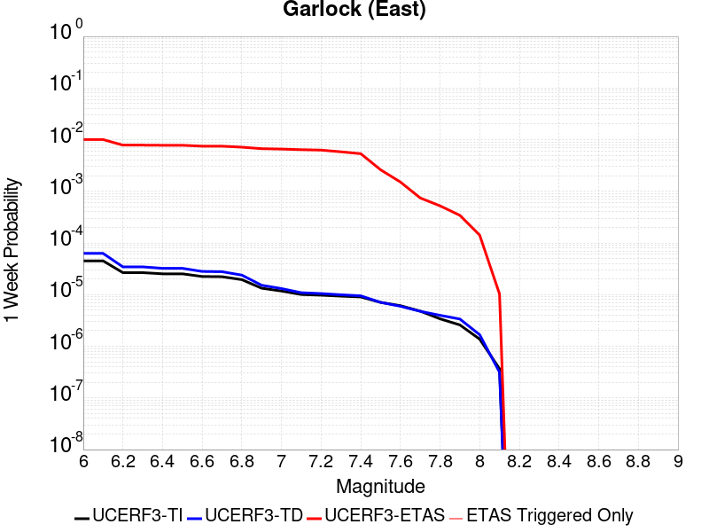 | 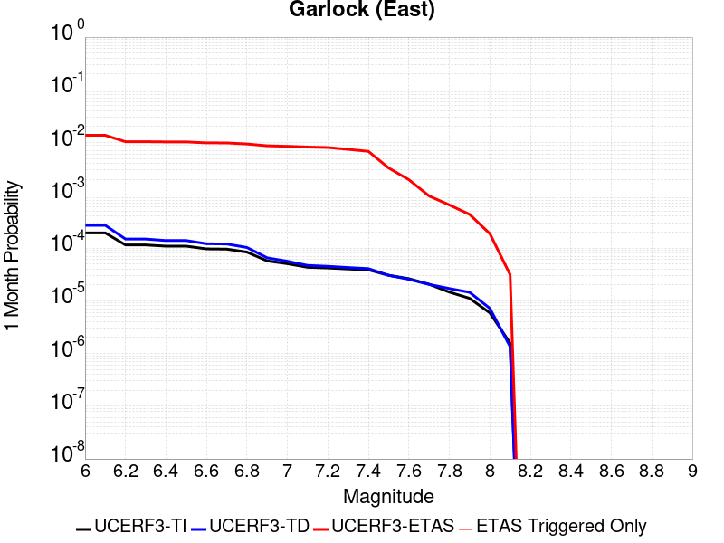 |  | 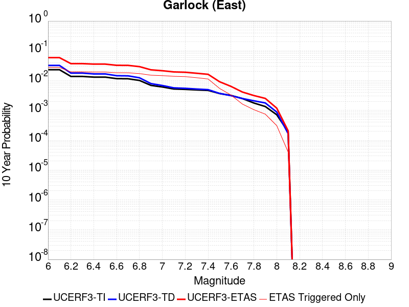 |

| Magnitude | 1 wk TI Prob | 1 wk TD Prob | 1 wk ETAS Prob | 1 wk ETAS/TD Gain | 1 wk ETAS Triggered Only | 1 mo TI Prob | 1 mo TD Prob | 1 mo ETAS Prob | 1 mo ETAS/TD Gain | 1 mo ETAS Triggered Only | 1 yr TI Prob | 1 yr TD Prob | 1 yr ETAS Prob | 1 yr ETAS/TD Gain | 1 yr ETAS Triggered Only | 10 yr TI Prob | 10 yr TD Prob | 10 yr ETAS Prob | 10 yr ETAS/TD Gain | 10 yr ETAS Triggered Only |
|-----|-----|-----|-----|-----|-----|-----|-----|-----|-----|-----|-----|-----|-----|-----|-----|-----|-----|-----|-----|-----|
| 6.0 | 4.5092507E-5 | 6.290325E-5 | 0.0100622745 | 159.9643 | 0.01 | 1.9323928E-4 | 2.6956003E-4 | 0.013725932 | 50.91976 | 0.01346 | 0.0023501497 | 0.0032774 | 0.023371328 | 7.1310573 | 0.02016 | 0.023254504 | 0.032351844 | 0.059087962 | 1.8264171 | 0.02763 |
| 6.1 | 4.5092507E-5 | 6.290325E-5 | 0.0100622745 | 159.9643 | 0.01 | 1.9323928E-4 | 2.6956003E-4 | 0.013725932 | 50.91976 | 0.01346 | 0.0023501497 | 0.0032774 | 0.023371328 | 7.1310573 | 0.02016 | 0.023254504 | 0.032351844 | 0.059087962 | 1.8264171 | 0.02763 |
| 6.2 | 2.6674514E-5 | 3.4509674E-5 | 0.00785424 | 227.59529 | 0.00782 | 1.1431433E-4 | 1.4789042E-4 | 0.010376377 | 70.16261 | 0.01023 | 0.0013908884 | 0.0017991117 | 0.016612412 | 9.233675 | 0.01484 | 0.01382215 | 0.017890299 | 0.037129827 | 2.0754168 | 0.01959 |
| 6.3 | 2.6674514E-5 | 3.4509674E-5 | 0.00785424 | 227.59529 | 0.00782 | 1.1431433E-4 | 1.4789042E-4 | 0.010376377 | 70.16261 | 0.01023 | 0.0013908884 | 0.0017991117 | 0.016612412 | 9.233675 | 0.01484 | 0.01382215 | 0.017890299 | 0.037129827 | 2.0754168 | 0.01959 |
| 6.4 | 2.5312667E-5 | 3.233893E-5 | 0.007802088 | 241.25992 | 0.00777 | 1.0847834E-4 | 1.3858822E-4 | 0.0102871815 | 74.2284 | 0.01015 | 0.0013199237 | 0.0016860351 | 0.01636125 | 9.7039795 | 0.0147 | 0.013121112 | 0.016778335 | 0.035803676 | 2.1339228 | 0.01935 |
| 6.5 | 2.5312667E-5 | 3.233893E-5 | 0.007802088 | 241.25992 | 0.00777 | 1.0847834E-4 | 1.3858822E-4 | 0.0102871815 | 74.2284 | 0.01015 | 0.0013199237 | 0.0016860351 | 0.01636125 | 9.7039795 | 0.0147 | 0.013121112 | 0.016778335 | 0.035803676 | 2.1339228 | 0.01935 |
| 6.6 | 2.246556E-5 | 2.8133776E-5 | 0.0074979234 | 266.50967 | 0.00747 | 9.627742E-5 | 1.20567885E-4 | 0.009859393 | 81.77462 | 0.00974 | 0.0011715472 | 0.0014669491 | 0.015376515 | 10.481968 | 0.01393 | 0.011653901 | 0.01461866 | 0.032651138 | 2.2335246 | 0.0183 |
| 6.7 | 2.2241198E-5 | 2.7803519E-5 | 0.007487596 | 269.3039 | 0.00746 | 9.531594E-5 | 1.1915263E-4 | 0.009847993 | 82.65024 | 0.00973 | 0.0011598538 | 0.0014497414 | 0.015339576 | 10.580905 | 0.01391 | 0.011538187 | 0.014448853 | 0.032454874 | 2.24619 | 0.01827 |
| 6.8 | 1.9528685E-5 | 2.389819E-5 | 0.0071637277 | 299.76025 | 0.00714 | 8.369167E-5 | 1.0241691E-4 | 0.009401465 | 91.79602 | 0.0093 | 0.0010184698 | 0.0012462323 | 0.0144497575 | 11.594754 | 0.01322 | 0.010138147 | 0.012436427 | 0.029442271 | 2.367422 | 0.01722 |
| 6.9 | 1.3318621E-5 | 1.5198884E-5 | 0.0067050974 | 441.1572 | 0.00669 | 5.7078556E-5 | 6.513648E-5 | 0.008694574 | 133.4824 | 0.00863 | 6.9470983E-4 | 7.927538E-4 | 0.012763256 | 16.0999 | 0.01198 | 0.0069254204 | 0.007939888 | 0.023019202 | 2.8991847 | 0.0152 |
| 7.0 | 1.1760853E-5 | 1.31077895E-5 | 0.0065830215 | 502.2221 | 0.00657 | 5.0402683E-5 | 5.6175057E-5 | 0.008495701 | 151.23618 | 0.00844 | 6.134799E-4 | 6.8372174E-4 | 0.012315763 | 18.012829 | 0.01164 | 0.0061178906 | 0.00685652 | 0.021465661 | 3.1306932 | 0.01471 |
| 7.1 | 1.0064758E-5 | 1.0902931E-5 | 0.006410833 | 587.99176 | 0.0064 | 4.3133965E-5 | 4.672603E-5 | 0.008226343 | 176.05486 | 0.00818 | 5.2502943E-4 | 5.687444E-4 | 0.011732391 | 20.628584 | 0.01117 | 0.005237907 | 0.0057129986 | 0.019583302 | 3.42785 | 0.01395 |
| 7.2 | 9.768808E-6 | 1.0498807E-5 | 0.006290433 | 599.1569 | 0.00628 | 4.186565E-5 | 4.499413E-5 | 0.008064633 | 179.23746 | 0.00802 | 5.095951E-4 | 5.4766936E-4 | 0.011481678 | 20.964617 | 0.01094 | 0.0050842804 | 0.0055032647 | 0.019058255 | 3.4630818 | 0.01363 |
| 7.3 | 9.344516E-6 | 9.944468E-6 | 0.0058298865 | 586.2442 | 0.00582 | 4.004731E-5 | 4.261847E-5 | 0.007442303 | 174.62624 | 0.0074 | 4.8746695E-4 | 5.1875977E-4 | 0.010613521 | 20.459412 | 0.0101 | 0.0048639905 | 0.0052149445 | 0.017649759 | 3.3844573 | 0.0125 |
| 7.4 | 9.023491E-6 | 9.490661E-6 | 0.00535944 | 564.7067 | 0.00535 | 3.867153E-5 | 4.0673647E-5 | 0.006820398 | 167.68593 | 0.00678 | 4.7072413E-4 | 4.950925E-4 | 0.009730518 | 19.65394 | 0.00924 | 0.004697283 | 0.0049783974 | 0.016261943 | 3.2665014 | 0.01134 |
| 7.5 | 7.081253E-6 | 7.087672E-6 | 0.0026170693 | 369.24243 | 0.00261 | 3.0347876E-5 | 3.0375388E-5 | 0.0033002761 | 108.64967 | 0.00327 | 3.6942272E-4 | 3.6975832E-4 | 0.0048381053 | 13.084507 | 0.00447 | 0.003688092 | 0.0037243143 | 0.009183905 | 2.465932 | 0.00548 |
| 7.6 | 6.116396E-6 | 5.959245E-6 | 0.0015159502 | 254.3863 | 0.00151 | 2.6212863E-5 | 2.5539372E-5 | 0.0019754895 | 77.35075 | 0.00195 | 3.1909486E-4 | 3.1089774E-4 | 0.002950077 | 9.488898 | 0.00264 | 0.0031863707 | 0.0031357552 | 0.00640547 | 2.04272 | 0.00328 |
| 7.7 | 4.797145E-6 | 4.757281E-6 | 7.4475375E-4 | 156.5503 | 7.4E-4 | 2.055903E-5 | 2.0388188E-5 | 9.703688E-4 | 47.594654 | 9.5E-4 | 2.5027743E-4 | 2.4819805E-4 | 0.0015878654 | 6.3975744 | 0.00134 | 0.0024999576 | 0.0025093474 | 0.004135257 | 1.6479414 | 0.00163 |
| 7.8 | 3.4028885E-6 | 3.978462E-6 | 5.239764E-4 | 131.70326 | 5.2E-4 | 1.4583726E-5 | 1.7050439E-5 | 6.570395E-4 | 38.53505 | 6.4E-4 | 1.775424E-4 | 2.0756939E-4 | 0.0011073826 | 5.334999 | 9.0E-4 | 0.0017740062 | 0.0021012232 | 0.0031589959 | 1.5034081 | 0.00106 |
| 7.9 | 2.5928412E-6 | 3.3724489E-6 | 3.433713E-4 | 101.816605 | 3.4E-4 | 1.1112129E-5 | 1.4453272E-5 | 4.344472E-4 | 30.058743 | 4.2E-4 | 1.3528178E-4 | 1.7595445E-4 | 7.9584535E-4 | 4.5230193 | 6.2E-4 | 0.0013519945 | 0.0017812408 | 0.002529905 | 1.4203048 | 7.5E-4 |
| 8.0 | 1.3743648E-6 | 1.6734747E-6 | 1.4167324E-4 | 84.658134 | 1.4E-4 | 5.8901214E-6 | 7.1720146E-6 | 1.8717072E-4 | 26.09737 | 1.8E-4 | 7.1709874E-5 | 8.731581E-5 | 3.5729224E-4 | 4.0919533 | 2.7E-4 | 7.1686733E-4 | 8.837234E-4 | 0.0011934494 | 1.3504785 | 3.1E-4 |
| 8.1 | 3.6733252E-7 | 3.1489964E-7 | 1.0314897E-5 | 32.756138 | 1.0E-5 | 1.5742813E-6 | 1.3495693E-6 | 3.134953E-5 | 23.229284 | 3.0E-5 | 1.9166706E-5 | 1.6430899E-5 | 5.6430243E-5 | 3.4343977 | 4.0E-5 | 1.9165053E-4 | 1.6638759E-4 | 2.0638094E-4 | 1.2403625 | 4.0E-5 |

## Hunter Mountain-Saline Valley
*[(top)](#table-of-contents)*

| 1 Week | 1 Month | 1 Year | 10 Year |
|-----|-----|-----|-----|
| 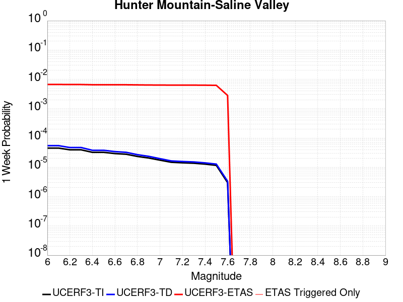 |  | 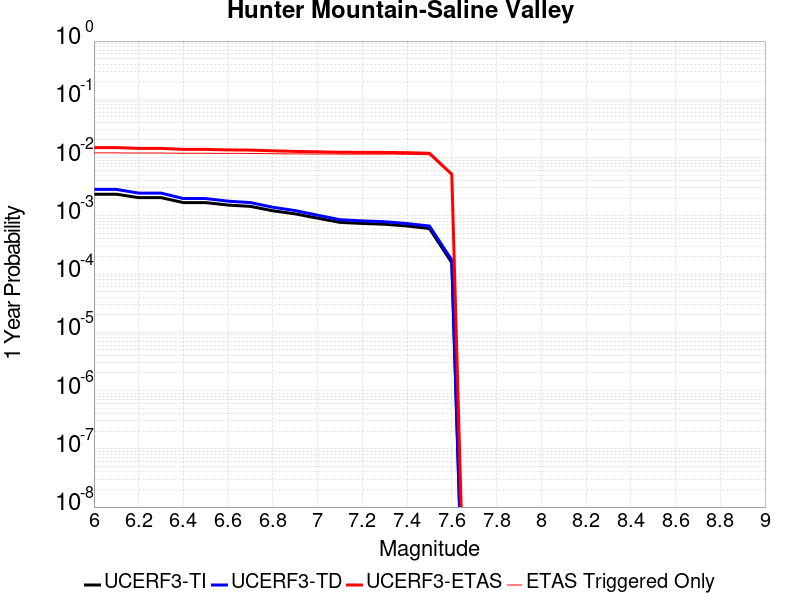 |  |

| Magnitude | 1 wk TI Prob | 1 wk TD Prob | 1 wk ETAS Prob | 1 wk ETAS/TD Gain | 1 wk ETAS Triggered Only | 1 mo TI Prob | 1 mo TD Prob | 1 mo ETAS Prob | 1 mo ETAS/TD Gain | 1 mo ETAS Triggered Only | 1 yr TI Prob | 1 yr TD Prob | 1 yr ETAS Prob | 1 yr ETAS/TD Gain | 1 yr ETAS Triggered Only | 10 yr TI Prob | 10 yr TD Prob | 10 yr ETAS Prob | 10 yr ETAS/TD Gain | 10 yr ETAS Triggered Only |
|-----|-----|-----|-----|-----|-----|-----|-----|-----|-----|-----|-----|-----|-----|-----|-----|-----|-----|-----|-----|-----|
| 6.0 | 4.5103672E-5 | 5.4570177E-5 | 0.0066842083 | 122.488304 | 0.00663 | 1.9328714E-4 | 2.3385242E-4 | 0.008821843 | 37.723976 | 0.00859 | 0.002350731 | 0.0028435152 | 0.014829337 | 5.2151423 | 0.01202 | 0.023260195 | 0.028091887 | 0.04348691 | 1.5480238 | 0.01584 |
| 6.1 | 4.5103672E-5 | 5.4570177E-5 | 0.0066842083 | 122.488304 | 0.00663 | 1.9328714E-4 | 2.3385242E-4 | 0.008821843 | 37.723976 | 0.00859 | 0.002350731 | 0.0028435152 | 0.014829337 | 5.2151423 | 0.01202 | 0.023260195 | 0.028091887 | 0.04348691 | 1.5480238 | 0.01584 |
| 6.2 | 3.9363465E-5 | 4.706337E-5 | 0.006636753 | 141.01738 | 0.00659 | 1.6868966E-4 | 2.0168544E-4 | 0.008749961 | 43.384197 | 0.00855 | 0.002051862 | 0.0024528175 | 0.014383482 | 5.864065 | 0.01196 | 0.020330196 | 0.024273481 | 0.039641175 | 1.6331062 | 0.01575 |
| 6.3 | 3.9363465E-5 | 4.706337E-5 | 0.006636753 | 141.01738 | 0.00659 | 1.6868966E-4 | 2.0168544E-4 | 0.008749961 | 43.384197 | 0.00855 | 0.002051862 | 0.0024528175 | 0.014383482 | 5.864065 | 0.01196 | 0.020330196 | 0.024273481 | 0.039641175 | 1.6331062 | 0.01575 |
| 6.4 | 3.2311684E-5 | 3.795099E-5 | 0.0065277047 | 172.00354 | 0.00649 | 1.384713E-4 | 1.6263737E-4 | 0.008591266 | 52.824677 | 0.00843 | 0.0016845843 | 0.0019783843 | 0.0138049405 | 6.9778857 | 0.01185 | 0.016718714 | 0.019616475 | 0.03491046 | 1.77965 | 0.0156 |
| 6.5 | 3.2311684E-5 | 3.795099E-5 | 0.0065277047 | 172.00354 | 0.00649 | 1.384713E-4 | 1.6263737E-4 | 0.008591266 | 52.824677 | 0.00843 | 0.0016845843 | 0.0019783843 | 0.0138049405 | 6.9778857 | 0.01185 | 0.016718714 | 0.019616475 | 0.03491046 | 1.77965 | 0.0156 |
| 6.6 | 2.9305844E-5 | 3.418183E-5 | 0.00651396 | 190.56792 | 0.00648 | 1.2559042E-4 | 1.4648569E-4 | 0.008535257 | 58.266827 | 0.00839 | 0.0015279909 | 0.001782067 | 0.0135410745 | 7.598521 | 0.01178 | 0.015175272 | 0.01768569 | 0.03293121 | 1.8620256 | 0.01552 |
| 6.7 | 2.7826512E-5 | 3.2344276E-5 | 0.006512135 | 201.33809 | 0.00648 | 1.19251024E-4 | 1.386113E-4 | 0.008527448 | 61.520588 | 0.00839 | 0.0014509142 | 0.0016863465 | 0.013436498 | 7.967816 | 0.01177 | 0.014414776 | 0.016743187 | 0.031983666 | 1.9102497 | 0.0155 |
| 6.8 | 2.3389874E-5 | 2.6866714E-5 | 0.006446694 | 239.95097 | 0.00642 | 1.0023846E-4 | 1.15138246E-4 | 0.0084241815 | 73.165794 | 0.00831 | 0.00121972 | 0.001400954 | 0.013044619 | 9.31124 | 0.01166 | 0.01213047 | 0.013927434 | 0.029073508 | 2.0874994 | 0.01536 |
| 6.9 | 2.069209E-5 | 2.3570032E-5 | 0.00638342 | 270.82782 | 0.00636 | 8.867737E-5 | 1.01010715E-4 | 0.008340178 | 82.56727 | 0.00824 | 0.0010791123 | 0.0012291478 | 0.012764951 | 10.385204 | 0.01155 | 0.010738871 | 0.012228523 | 0.027282162 | 2.2310266 | 0.01524 |
| 7.0 | 1.7462342E-5 | 1.9633546E-5 | 0.006369509 | 324.41968 | 0.00635 | 7.483646E-5 | 8.414118E-5 | 0.008313449 | 98.803566 | 0.00823 | 9.1075303E-4 | 0.0010239601 | 0.012542154 | 12.248674 | 0.01153 | 0.009070295 | 0.0101960525 | 0.02526087 | 2.4775145 | 0.01522 |
| 7.1 | 1.4807709E-5 | 1.6441749E-5 | 0.006326338 | 384.7728 | 0.00631 | 6.3460066E-5 | 7.046283E-5 | 0.008259886 | 117.223305 | 0.00819 | 7.723524E-4 | 8.575638E-4 | 0.012327719 | 14.375279 | 0.01148 | 0.007696735 | 0.008545532 | 0.023575982 | 2.7588665 | 0.01516 |
| 7.2 | 1.4180048E-5 | 1.5698337E-5 | 0.0063255993 | 402.9471 | 0.00631 | 6.077022E-5 | 6.727694E-5 | 0.008256726 | 122.72743 | 0.00819 | 7.396263E-4 | 8.188051E-4 | 0.012289405 | 15.008949 | 0.01148 | 0.0073716943 | 0.008160833 | 0.02316736 | 2.8388474 | 0.01513 |
| 7.3 | 1.3730402E-5 | 1.5172075E-5 | 0.0063250763 | 416.88934 | 0.00631 | 5.8843252E-5 | 6.502165E-5 | 0.008244489 | 126.796074 | 0.00818 | 7.161811E-4 | 7.9136714E-4 | 0.012242298 | 15.469809 | 0.01146 | 0.007138774 | 0.007888422 | 0.022859387 | 2.89784 | 0.01509 |
| 7.4 | 1.2810095E-5 | 1.4109277E-5 | 0.0062940205 | 446.09094 | 0.00628 | 5.489925E-5 | 6.0467017E-5 | 0.0082099745 | 135.77608 | 0.00815 | 6.681934E-4 | 7.359531E-4 | 0.012127563 | 16.478718 | 0.0114 | 0.006661878 | 0.007338053 | 0.022218056 | 3.0277863 | 0.01499 |
| 7.5 | 1.1595659E-5 | 1.2800664E-5 | 0.006222721 | 486.12488 | 0.00621 | 4.9694736E-5 | 5.4858923E-5 | 0.0081044175 | 147.73198 | 0.00805 | 6.0486543E-4 | 6.6771836E-4 | 0.011850246 | 17.747372 | 0.01119 | 0.006032217 | 0.0066599925 | 0.02126209 | 3.1925097 | 0.0147 |
| 7.6 | 2.997694E-6 | 3.3251579E-6 | 0.0028133157 | 846.0698 | 0.00281 | 1.28471975E-5 | 1.425064E-5 | 0.003714198 | 260.63376 | 0.0037 | 1.564034E-4 | 1.73495E-4 | 0.0051726275 | 29.814274 | 0.005 | 0.0015629337 | 0.001735031 | 0.008044066 | 4.636266 | 0.00632 |

## Ash Hill
*[(top)](#table-of-contents)*

| 1 Week | 1 Month | 1 Year | 10 Year |
|-----|-----|-----|-----|
|  |  |  | 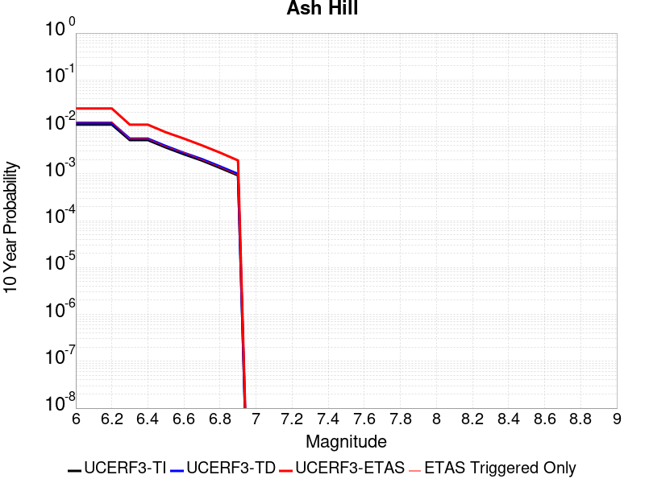 |

| Magnitude | 1 wk TI Prob | 1 wk TD Prob | 1 wk ETAS Prob | 1 wk ETAS/TD Gain | 1 wk ETAS Triggered Only | 1 mo TI Prob | 1 mo TD Prob | 1 mo ETAS Prob | 1 mo ETAS/TD Gain | 1 mo ETAS Triggered Only | 1 yr TI Prob | 1 yr TD Prob | 1 yr ETAS Prob | 1 yr ETAS/TD Gain | 1 yr ETAS Triggered Only | 10 yr TI Prob | 10 yr TD Prob | 10 yr ETAS Prob | 10 yr ETAS/TD Gain | 10 yr ETAS Triggered Only |
|-----|-----|-----|-----|-----|-----|-----|-----|-----|-----|-----|-----|-----|-----|-----|-----|-----|-----|-----|-----|-----|
| 6.0 | 2.1545662E-5 | 2.3194447E-5 | 0.004013102 | 173.01994 | 0.00399 | 9.2335285E-5 | 9.940143E-5 | 0.005608854 | 56.426285 | 0.00551 | 0.0011236023 | 0.0012096206 | 0.010038927 | 8.299236 | 0.00884 | 0.011179381 | 0.012038348 | 0.02464474 | 2.0471861 | 0.01276 |
| 6.1 | 2.1545662E-5 | 2.3194447E-5 | 0.004013102 | 173.01994 | 0.00399 | 9.2335285E-5 | 9.940143E-5 | 0.005608854 | 56.426285 | 0.00551 | 0.0011236023 | 0.0012096206 | 0.010038927 | 8.299236 | 0.00884 | 0.011179381 | 0.012038348 | 0.02464474 | 2.0471861 | 0.01276 |
| 6.2 | 2.1545662E-5 | 2.3194447E-5 | 0.004013102 | 173.01994 | 0.00399 | 9.2335285E-5 | 9.940143E-5 | 0.005608854 | 56.426285 | 0.00551 | 0.0011236023 | 0.0012096206 | 0.010038927 | 8.299236 | 0.00884 | 0.011179381 | 0.012038348 | 0.02464474 | 2.0471861 | 0.01276 |
| 6.3 | 1.0025529E-5 | 1.0746934E-5 | 0.0017807279 | 165.69637 | 0.00177 | 4.2965847E-5 | 4.605755E-5 | 0.0024859451 | 53.97476 | 0.00244 | 5.229836E-4 | 5.6061964E-4 | 0.004458433 | 7.952688 | 0.0039 | 0.005217545 | 0.0055933665 | 0.011112323 | 1.9866968 | 0.00555 |
| 6.4 | 1.0025529E-5 | 1.0746934E-5 | 0.0017807279 | 165.69637 | 0.00177 | 4.2965847E-5 | 4.605755E-5 | 0.0024859451 | 53.97476 | 0.00244 | 5.229836E-4 | 5.6061964E-4 | 0.004458433 | 7.952688 | 0.0039 | 0.005217545 | 0.0055933665 | 0.011112323 | 1.9866968 | 0.00555 |
| 6.5 | 6.9617327E-6 | 7.456634E-6 | 0.0012374475 | 165.95255 | 0.00123 | 2.9835655E-5 | 3.195666E-5 | 0.0017319024 | 54.195347 | 0.0017 | 3.6318856E-4 | 3.8901155E-4 | 0.0030379808 | 7.809487 | 0.00265 | 0.0036259557 | 0.0038841602 | 0.007649478 | 1.9694033 | 0.00378 |
| 6.6 | 4.9919777E-6 | 5.3466883E-6 | 9.4534166E-4 | 176.80882 | 9.4E-4 | 2.1394015E-5 | 2.2914215E-5 | 0.0013028849 | 56.85924 | 0.00128 | 2.60441E-4 | 2.7895154E-4 | 0.0022783936 | 8.167704 | 0.002 | 0.0026013597 | 0.0027866727 | 0.0056187585 | 2.0162966 | 0.00284 |
| 6.7 | 3.6630722E-6 | 3.924624E-6 | 7.039219E-4 | 179.36035 | 7.0E-4 | 1.5698786E-5 | 1.681974E-5 | 9.568039E-4 | 56.885777 | 9.4E-4 | 1.9111596E-4 | 2.0476682E-4 | 0.0016044802 | 7.835645 | 0.0014 | 0.0019095168 | 0.0020463446 | 0.004022293 | 1.9655991 | 0.00198 |
| 6.8 | 2.5599613E-6 | 2.744925E-6 | 5.427434E-4 | 197.72614 | 5.4E-4 | 1.0971216E-5 | 1.1763939E-5 | 7.217556E-4 | 61.35322 | 7.1E-4 | 1.3356637E-4 | 1.4322149E-4 | 0.0011830726 | 8.26044 | 0.00104 | 0.0013348613 | 0.0014317769 | 0.0028197868 | 1.9694316 | 0.00139 |
| 6.9 | 1.7684905E-6 | 1.8968707E-6 | 4.018961E-4 | 211.87321 | 4.0E-4 | 7.579223E-6 | 8.129446E-6 | 5.081254E-4 | 62.504307 | 5.0E-4 | 9.2273134E-5 | 9.8976E-5 | 7.889077E-4 | 7.970697 | 6.9E-4 | 9.223483E-4 | 9.8976E-4 | 0.0019188395 | 1.9386917 | 9.3E-4 |

## Blackwater
*[(top)](#table-of-contents)*

| 1 Week | 1 Month | 1 Year | 10 Year |
|-----|-----|-----|-----|
|  |  |  |  |

| Magnitude | 1 wk TI Prob | 1 wk TD Prob | 1 wk ETAS Prob | 1 wk ETAS/TD Gain | 1 wk ETAS Triggered Only | 1 mo TI Prob | 1 mo TD Prob | 1 mo ETAS Prob | 1 mo ETAS/TD Gain | 1 mo ETAS Triggered Only | 1 yr TI Prob | 1 yr TD Prob | 1 yr ETAS Prob | 1 yr ETAS/TD Gain | 1 yr ETAS Triggered Only | 10 yr TI Prob | 10 yr TD Prob | 10 yr ETAS Prob | 10 yr ETAS/TD Gain | 10 yr ETAS Triggered Only |
|-----|-----|-----|-----|-----|-----|-----|-----|-----|-----|-----|-----|-----|-----|-----|-----|-----|-----|-----|-----|-----|
| 6.0 | 3.0708583E-5 | 3.3095846E-5 | 0.004042963 | 122.159225 | 0.00401 | 1.3160157E-4 | 1.4183241E-4 | 0.0055610635 | 39.208694 | 0.00542 | 0.0016010714 | 0.0017255784 | 0.010200928 | 5.911599 | 0.00849 | 0.015895851 | 0.017135633 | 0.029234694 | 1.706076 | 0.01231 |
| 6.1 | 3.0708583E-5 | 3.3095846E-5 | 0.004042963 | 122.159225 | 0.00401 | 1.3160157E-4 | 1.4183241E-4 | 0.0055610635 | 39.208694 | 0.00542 | 0.0016010714 | 0.0017255784 | 0.010200928 | 5.911599 | 0.00849 | 0.015895851 | 0.017135633 | 0.029234694 | 1.706076 | 0.01231 |
| 6.2 | 1.1707779E-5 | 1.2545122E-5 | 0.0016125251 | 128.53801 | 0.0016 | 5.017523E-5 | 5.3763757E-5 | 0.0021436515 | 39.87168 | 0.00209 | 6.107122E-4 | 6.5438676E-4 | 0.003882273 | 5.932689 | 0.00323 | 0.006090366 | 0.0065255696 | 0.011274377 | 1.7277231 | 0.00478 |
| 6.3 | 1.1707779E-5 | 1.2545122E-5 | 0.0016125251 | 128.53801 | 0.0016 | 5.017523E-5 | 5.3763757E-5 | 0.0021436515 | 39.87168 | 0.00209 | 6.107122E-4 | 6.5438676E-4 | 0.003882273 | 5.932689 | 0.00323 | 0.006090366 | 0.0065255696 | 0.011274377 | 1.7277231 | 0.00478 |
| 6.4 | 7.929244E-6 | 8.480098E-6 | 0.0010884709 | 128.35594 | 0.00108 | 3.3982033E-5 | 3.6342793E-5 | 0.0014862901 | 40.89642 | 0.00145 | 4.136527E-4 | 4.423877E-4 | 0.0025914365 | 5.85784 | 0.00215 | 0.0041288356 | 0.0044154758 | 0.0075216996 | 1.7034856 | 0.00312 |
| 6.5 | 5.8832115E-6 | 6.285991E-6 | 7.662812E-4 | 121.90301 | 7.6E-4 | 2.521352E-5 | 2.6939697E-5 | 0.0010369124 | 38.49013 | 0.00101 | 3.0693135E-4 | 3.27944E-4 | 0.0018174554 | 5.541969 | 0.00149 | 0.0030650778 | 0.0032748538 | 0.005387911 | 1.6452372 | 0.00212 |
| 6.6 | 5.8832115E-6 | 6.285991E-6 | 7.662812E-4 | 121.90301 | 7.6E-4 | 2.521352E-5 | 2.6939697E-5 | 0.0010369124 | 38.49013 | 0.00101 | 3.0693135E-4 | 3.27944E-4 | 0.0018174554 | 5.541969 | 0.00149 | 0.0030650778 | 0.0032748538 | 0.005387911 | 1.6452372 | 0.00212 |
| 6.7 | 3.0715053E-6 | 3.2814662E-6 | 4.1328013E-4 | 125.94374 | 4.1E-4 | 1.3163528E-5 | 1.4063357E-5 | 5.3405605E-4 | 37.975002 | 5.2E-4 | 1.6025416E-4 | 1.7120909E-4 | 9.31079E-4 | 5.4382567 | 7.6E-4 | 0.0016013865 | 0.0017108864 | 0.0027990215 | 1.6360067 | 0.00109 |
| 6.8 | 2.2722281E-6 | 2.4287538E-6 | 3.12428E-4 | 128.63718 | 3.1E-4 | 9.738084E-6 | 1.0408908E-5 | 3.8040505E-4 | 36.54611 | 3.7E-4 | 1.1855473E-4 | 1.26722E-4 | 6.1665993E-4 | 4.866242 | 4.9E-4 | 0.001184915 | 0.0012665876 | 0.0020056502 | 1.5835071 | 7.4E-4 |
| 6.9 | 9.952399E-7 | 1.0653489E-6 | 7.1065275E-5 | 66.70611 | 7.0E-5 | 4.265307E-6 | 4.5657757E-6 | 1.1456527E-4 | 25.092182 | 1.1E-4 | 5.1928873E-5 | 5.5587418E-5 | 2.355774E-4 | 4.2379627 | 1.8E-4 | 5.191674E-4 | 5.557858E-4 | 8.6561346E-4 | 1.5574589 | 3.1E-4 |
| 7.0 | 4.7385504E-7 | 5.0755597E-7 | 3.0507541E-5 | 60.106754 | 3.0E-5 | 2.0308057E-6 | 2.1752398E-6 | 3.2175176E-5 | 14.7915535 | 3.0E-5 | 2.4724779E-5 | 2.6483543E-5 | 9.648169E-5 | 3.6430807 | 7.0E-5 | 2.4722028E-4 | 2.6483546E-4 | 4.0479837E-4 | 1.5284902 | 1.4E-4 |

## Garlock (West)
*[(top)](#table-of-contents)*

| 1 Week | 1 Month | 1 Year | 10 Year |
|-----|-----|-----|-----|
| 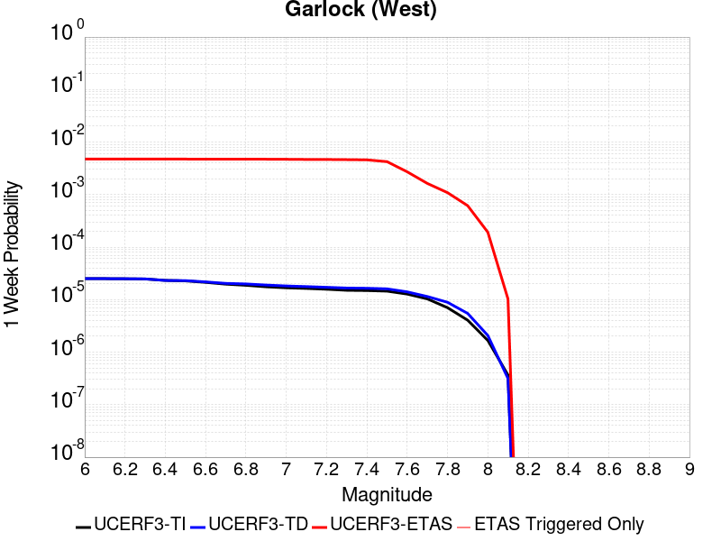 | 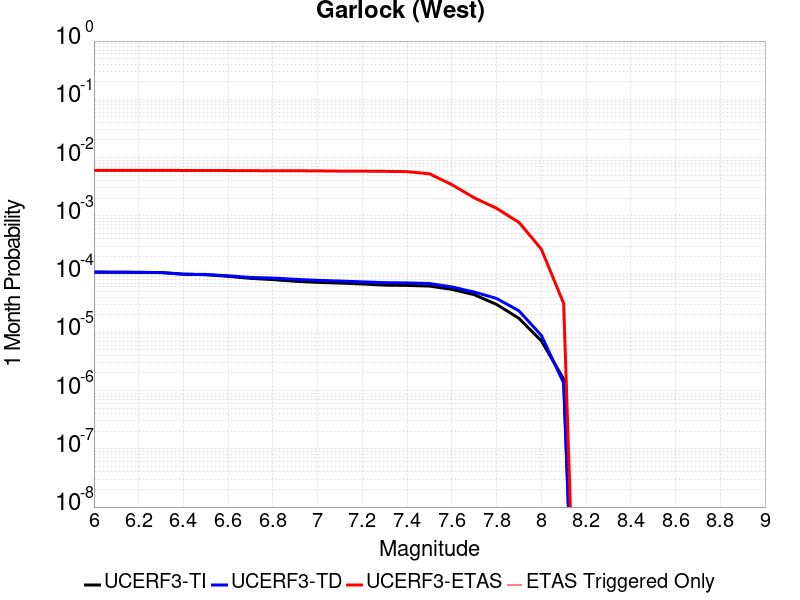 |  | 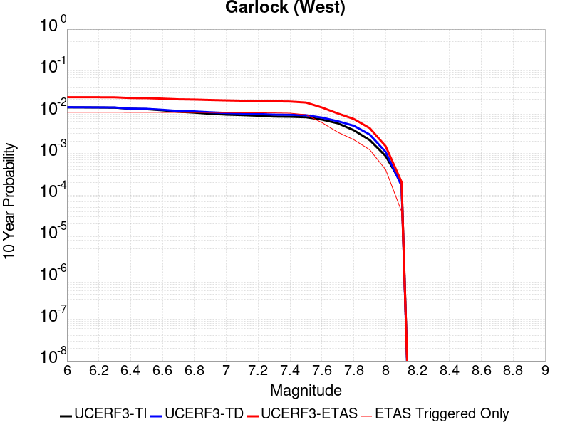 |

| Magnitude | 1 wk TI Prob | 1 wk TD Prob | 1 wk ETAS Prob | 1 wk ETAS/TD Gain | 1 wk ETAS Triggered Only | 1 mo TI Prob | 1 mo TD Prob | 1 mo ETAS Prob | 1 mo ETAS/TD Gain | 1 mo ETAS Triggered Only | 1 yr TI Prob | 1 yr TD Prob | 1 yr ETAS Prob | 1 yr ETAS/TD Gain | 1 yr ETAS Triggered Only | 10 yr TI Prob | 10 yr TD Prob | 10 yr ETAS Prob | 10 yr ETAS/TD Gain | 10 yr ETAS Triggered Only |
|-----|-----|-----|-----|-----|-----|-----|-----|-----|-----|-----|-----|-----|-----|-----|-----|-----|-----|-----|-----|-----|
| 6.0 | 2.5181727E-5 | 2.51973E-5 | 0.0047550783 | 188.71379 | 0.00473 | 1.0791722E-4 | 1.0798398E-4 | 0.0060273446 | 55.817028 | 0.00592 | 0.0013131002 | 0.0013139155 | 0.009263457 | 7.050268 | 0.00796 | 0.013053683 | 0.013141977 | 0.022941476 | 1.7456641 | 0.00993 |
| 6.1 | 2.5077732E-5 | 2.5098372E-5 | 0.0047549796 | 189.4537 | 0.00473 | 1.0747157E-4 | 1.0756004E-4 | 0.006026923 | 56.033108 | 0.00592 | 0.001307681 | 0.0013087603 | 0.009258343 | 7.074132 | 0.00796 | 0.013000126 | 0.013091032 | 0.022891039 | 1.7486045 | 0.00993 |
| 6.2 | 2.494612E-5 | 2.498005E-5 | 0.004754862 | 190.34637 | 0.00473 | 1.0690756E-4 | 1.0705298E-4 | 0.0060264193 | 56.2938 | 0.00592 | 0.0013008224 | 0.0013025942 | 0.009252226 | 7.1029224 | 0.00796 | 0.012932341 | 0.013030097 | 0.022830708 | 1.7521518 | 0.00993 |
| 6.3 | 2.4733758E-5 | 2.479942E-5 | 0.004754682 | 191.72554 | 0.00473 | 1.0599751E-4 | 1.06278916E-4 | 0.0060256496 | 56.696568 | 0.00592 | 0.0012897556 | 0.0012931811 | 0.009242888 | 7.1474037 | 0.00796 | 0.012822957 | 0.012937066 | 0.022738602 | 1.757632 | 0.00993 |
| 6.4 | 2.3237335E-5 | 2.317873E-5 | 0.0047430694 | 204.63025 | 0.00472 | 9.958477E-5 | 9.933365E-5 | 0.0060087466 | 60.490543 | 0.00591 | 0.0012117702 | 0.001208719 | 0.0091391215 | 7.560998 | 0.00794 | 0.012051838 | 0.012101916 | 0.021862349 | 1.8065196 | 0.00988 |
| 6.5 | 2.2732203E-5 | 2.2993298E-5 | 0.0047428845 | 206.27249 | 0.00472 | 9.742009E-5 | 9.8539E-5 | 0.006007957 | 60.970345 | 0.00591 | 0.0011854442 | 0.0011990548 | 0.0091295345 | 7.6139426 | 0.00794 | 0.011791403 | 0.012006322 | 0.0217677 | 1.8130198 | 0.00988 |
| 6.6 | 2.1319436E-5 | 2.17735E-5 | 0.004731671 | 217.3133 | 0.00471 | 9.136581E-5 | 9.331167E-5 | 0.005982762 | 64.115906 | 0.00589 | 0.001111811 | 0.0011354799 | 0.009036498 | 7.9583077 | 0.00791 | 0.011062649 | 0.011377227 | 0.02111516 | 1.8559146 | 0.00985 |
| 6.7 | 1.970802E-5 | 2.0393396E-5 | 0.0047202976 | 231.46207 | 0.0047 | 8.446021E-5 | 8.739735E-5 | 0.0059568845 | 68.15864 | 0.00587 | 0.001027818 | 0.001063545 | 0.008945154 | 8.410696 | 0.00789 | 0.010230771 | 0.010664964 | 0.020370342 | 1.9100243 | 0.00981 |
| 6.8 | 1.8744462E-5 | 1.9901045E-5 | 0.0047198073 | 237.1638 | 0.0047 | 8.033094E-5 | 8.5287415E-5 | 0.0059447875 | 69.70299 | 0.00586 | 9.775903E-4 | 0.0010378812 | 0.008899713 | 8.574885 | 0.00787 | 0.009733009 | 0.01041075 | 0.02009883 | 1.9305841 | 0.00979 |
| 6.9 | 1.7559682E-5 | 1.8953415E-5 | 0.0047188643 | 248.97173 | 0.0047 | 7.5253614E-5 | 8.12264E-5 | 0.0059407502 | 73.138176 | 0.00586 | 9.158276E-4 | 9.884841E-4 | 0.008840715 | 8.943708 | 0.00786 | 0.0091206245 | 0.009921231 | 0.019604202 | 1.9759847 | 0.00978 |
| 7.0 | 1.6794445E-5 | 1.8216237E-5 | 0.004698131 | 257.90897 | 0.00468 | 7.197421E-5 | 7.8067256E-5 | 0.005907612 | 75.67336 | 0.00583 | 8.759337E-4 | 9.5005584E-4 | 0.008762626 | 9.223275 | 0.00782 | 0.008724891 | 0.009540141 | 0.01918722 | 2.0112092 | 0.00974 |
| 7.1 | 1.6337795E-5 | 1.7717046E-5 | 0.0046676346 | 263.45447 | 0.00465 | 7.0017246E-5 | 7.5927994E-5 | 0.005855489 | 77.11898 | 0.00578 | 8.521265E-4 | 9.240326E-4 | 0.008686853 | 9.401025 | 0.00777 | 0.008488664 | 0.009281996 | 0.018852333 | 2.0310645 | 0.00966 |
| 7.2 | 1.5780008E-5 | 1.7165687E-5 | 0.004657086 | 271.30206 | 0.00464 | 6.762685E-5 | 7.356516E-5 | 0.0058431407 | 79.4281 | 0.00577 | 8.2304585E-4 | 8.9528906E-4 | 0.0086483415 | 9.659831 | 0.00776 | 0.008200042 | 0.008996838 | 0.01855011 | 2.0618474 | 0.00964 |
| 7.3 | 1.5058865E-5 | 1.6618762E-5 | 0.0046265423 | 278.3927 | 0.00461 | 6.45364E-5 | 7.122133E-5 | 0.0058108126 | 81.5881 | 0.00574 | 7.854473E-4 | 8.667759E-4 | 0.008570093 | 9.887322 | 0.00771 | 0.00782677 | 0.008713539 | 0.018219976 | 2.0909963 | 0.00959 |
| 7.4 | 1.4887923E-5 | 1.6454731E-5 | 0.0045863795 | 278.72708 | 0.00457 | 6.380382E-5 | 7.051838E-5 | 0.005730119 | 81.2571 | 0.00566 | 7.7653467E-4 | 8.582243E-4 | 0.008481676 | 9.88282 | 0.00763 | 0.0077382675 | 0.008628399 | 0.01799686 | 2.0857706 | 0.00945 |
| 7.5 | 1.4509299E-5 | 1.6046748E-5 | 0.004235979 | 263.97742 | 0.00422 | 6.218123E-5 | 6.876997E-5 | 0.005268412 | 76.6092 | 0.0052 | 7.567935E-4 | 8.36954E-4 | 0.007841087 | 9.3686 | 0.00701 | 0.0075422134 | 0.008416704 | 0.01701373 | 2.0214245 | 0.00867 |
| 7.6 | 1.2756717E-5 | 1.4050848E-5 | 0.002714013 | 193.15651 | 0.0027 | 5.4670498E-5 | 6.0216535E-5 | 0.0034300135 | 56.961323 | 0.00337 | 6.6541E-4 | 7.328904E-4 | 0.0052195997 | 7.1219378 | 0.00449 | 0.006634211 | 0.0073816874 | 0.01294035 | 1.7530341 | 0.0056 |
| 7.7 | 1.0328985E-5 | 1.1460557E-5 | 0.001631442 | 142.35277 | 0.00162 | 4.4266326E-5 | 4.911575E-5 | 0.002039018 | 41.514545 | 0.00199 | 5.388092E-4 | 5.978206E-4 | 0.0032862124 | 5.496988 | 0.00269 | 0.0053750467 | 0.006038511 | 0.0092887655 | 1.5382543 | 0.00327 |
| 7.8 | 7.0306583E-6 | 8.899601E-6 | 0.00108889 | 122.35268 | 0.00108 | 3.0131043E-5 | 3.814059E-5 | 0.0013480906 | 35.3453 | 0.00131 | 3.667837E-4 | 4.642629E-4 | 0.0022434364 | 4.8322544 | 0.00178 | 0.003661789 | 0.0046952725 | 0.0068451306 | 1.4578772 | 0.00216 |
| 7.9 | 4.060633E-6 | 5.4653938E-6 | 6.154621E-4 | 112.61074 | 6.1E-4 | 1.7402595E-5 | 2.3422906E-5 | 7.7340537E-4 | 33.019188 | 7.5E-4 | 2.11856E-4 | 2.851367E-4 | 0.0012948487 | 4.541151 | 0.00101 | 0.0021165414 | 0.002884201 | 0.0041206246 | 1.4286884 | 0.00124 |
| 8.0 | 1.6729537E-6 | 2.0775144E-6 | 1.9207712E-4 | 92.45525 | 1.9E-4 | 7.169782E-6 | 8.903603E-6 | 2.689013E-4 | 30.201403 | 2.6E-4 | 8.7288594E-5 | 1.0839601E-4 | 4.6835697E-4 | 4.3207955 | 3.6E-4 | 8.7254314E-4 | 0.0010969337 | 0.001506484 | 1.3733591 | 4.1E-4 |
| 8.1 | 3.6733252E-7 | 3.1489964E-7 | 1.0314897E-5 | 32.756138 | 1.0E-5 | 1.5742813E-6 | 1.3495693E-6 | 3.134953E-5 | 23.229284 | 3.0E-5 | 1.9166706E-5 | 1.6430899E-5 | 5.6430243E-5 | 3.4343977 | 4.0E-5 | 1.9165053E-4 | 1.6638759E-4 | 2.0638094E-4 | 1.2403625 | 4.0E-5 |

## McLean Lake
*[(top)](#table-of-contents)*

| 1 Week | 1 Month | 1 Year | 10 Year |
|-----|-----|-----|-----|
| 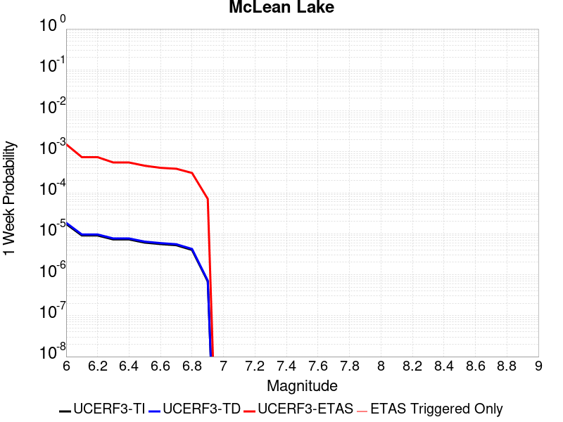 | 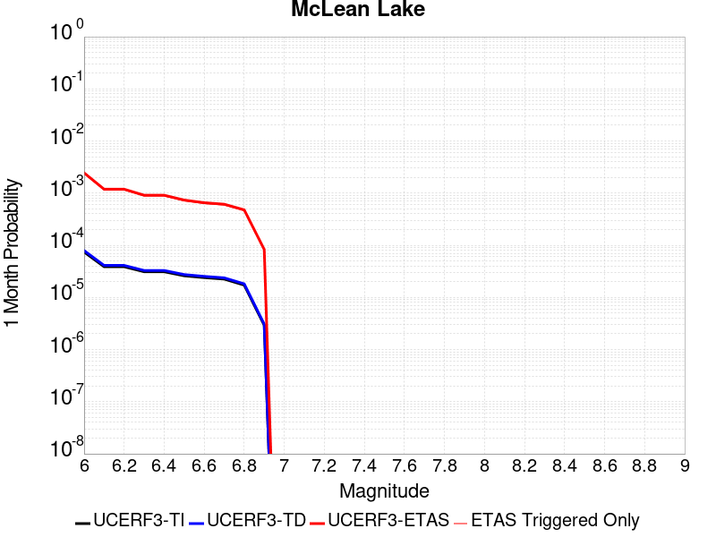 |  |  |

| Magnitude | 1 wk TI Prob | 1 wk TD Prob | 1 wk ETAS Prob | 1 wk ETAS/TD Gain | 1 wk ETAS Triggered Only | 1 mo TI Prob | 1 mo TD Prob | 1 mo ETAS Prob | 1 mo ETAS/TD Gain | 1 mo ETAS Triggered Only | 1 yr TI Prob | 1 yr TD Prob | 1 yr ETAS Prob | 1 yr ETAS/TD Gain | 1 yr ETAS Triggered Only | 10 yr TI Prob | 10 yr TD Prob | 10 yr ETAS Prob | 10 yr ETAS/TD Gain | 10 yr ETAS Triggered Only |
|-----|-----|-----|-----|-----|-----|-----|-----|-----|-----|-----|-----|-----|-----|-----|-----|-----|-----|-----|-----|-----|
| 6.0 | 1.7360222E-5 | 1.8501627E-5 | 0.0015284737 | 82.61293 | 0.00151 | 7.439883E-5 | 7.9290556E-5 | 0.0024491027 | 30.887697 | 0.00237 | 9.0542925E-4 | 9.6498354E-4 | 0.005890226 | 6.1039653 | 0.00493 | 0.009017491 | 0.0096127745 | 0.017872604 | 1.8592556 | 0.00834 |
| 6.1 | 9.062689E-6 | 9.592193E-6 | 7.395852E-4 | 77.10282 | 7.3E-4 | 3.8839516E-5 | 4.1108804E-5 | 0.0011910616 | 28.973394 | 0.00115 | 4.727685E-4 | 5.003936E-4 | 0.0030491175 | 6.093438 | 0.00255 | 0.0047176396 | 0.004993552 | 0.00933178 | 1.8687661 | 0.00436 |
| 6.2 | 9.062689E-6 | 9.592193E-6 | 7.395852E-4 | 77.10282 | 7.3E-4 | 3.8839516E-5 | 4.1108804E-5 | 0.0011910616 | 28.973394 | 0.00115 | 4.727685E-4 | 5.003936E-4 | 0.0030491175 | 6.093438 | 0.00255 | 0.0047176396 | 0.004993552 | 0.00933178 | 1.8687661 | 0.00436 |
| 6.3 | 7.2575485E-6 | 7.66771E-6 | 5.4766354E-4 | 71.42467 | 5.4E-4 | 3.110341E-5 | 3.2861237E-5 | 9.128323E-4 | 27.77839 | 8.8E-4 | 3.786182E-4 | 4.0001926E-4 | 0.0024192112 | 6.047737 | 0.00202 | 0.0037797375 | 0.0039936965 | 0.007409998 | 1.8554235 | 0.00343 |
| 6.4 | 7.2575485E-6 | 7.66771E-6 | 5.4766354E-4 | 71.42467 | 5.4E-4 | 3.110341E-5 | 3.2861237E-5 | 9.128323E-4 | 27.77839 | 8.8E-4 | 3.786182E-4 | 4.0001926E-4 | 0.0024192112 | 6.047737 | 0.00202 | 0.0037797375 | 0.0039936965 | 0.007409998 | 1.8554235 | 0.00343 |
| 6.5 | 6.06582E-6 | 6.4038773E-6 | 4.56401E-4 | 71.26948 | 4.5E-4 | 2.5996113E-5 | 2.7444936E-5 | 7.3742546E-4 | 26.869272 | 7.1E-4 | 3.164567E-4 | 3.3409733E-4 | 0.0020335293 | 6.0866375 | 0.0017 | 0.0031600643 | 0.0033365893 | 0.00617708 | 1.8513157 | 0.00285 |
| 6.6 | 5.598744E-6 | 5.910262E-6 | 4.059079E-4 | 68.67849 | 4.0E-4 | 2.3994397E-5 | 2.5329486E-5 | 6.5531355E-4 | 25.871569 | 6.3E-4 | 2.9209262E-4 | 3.0834923E-4 | 0.0019078559 | 6.1873217 | 0.0016 | 0.0029170897 | 0.003079843 | 0.0057117124 | 1.8545465 | 0.00264 |
| 6.7 | 5.246996E-6 | 5.539162E-6 | 3.8553705E-4 | 69.60205 | 3.8E-4 | 2.2486933E-5 | 2.3739085E-5 | 6.137251E-4 | 25.852936 | 5.9E-4 | 2.73744E-4 | 2.8899137E-4 | 0.0017685636 | 6.11978 | 0.00148 | 0.0027340704 | 0.0028867796 | 0.005329707 | 1.8462466 | 0.00245 |
| 6.8 | 4.02324E-6 | 4.2469046E-6 | 3.0424562E-4 | 71.63939 | 3.0E-4 | 1.7242342E-5 | 1.8200926E-5 | 4.7819255E-4 | 26.27298 | 4.6E-4 | 2.099053E-4 | 2.2157968E-4 | 0.0013313338 | 6.008374 | 0.00111 | 0.0020970714 | 0.002214172 | 0.0040600756 | 1.8336768 | 0.00185 |
| 6.9 | 6.835972E-7 | 7.1399285E-7 | 7.071394E-5 | 99.04013 | 7.0E-5 | 2.9296991E-6 | 3.0599674E-6 | 8.305972E-5 | 27.14399 | 8.0E-5 | 3.56685E-5 | 3.7254784E-5 | 2.4724696E-4 | 6.6366496 | 2.1E-4 | 3.5662777E-4 | 3.7251666E-4 | 7.323825E-4 | 1.9660398 | 3.6E-4 |

## Goldstone Lake
*[(top)](#table-of-contents)*

| 1 Week | 1 Month | 1 Year | 10 Year |
|-----|-----|-----|-----|
|  | 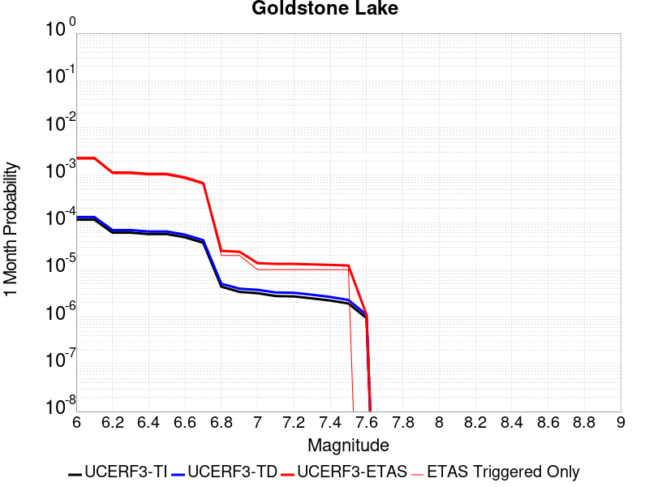 | 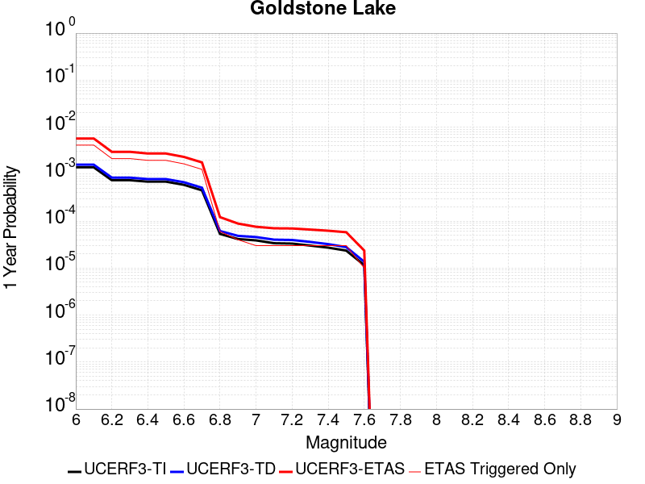 | 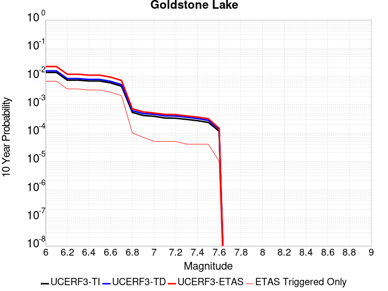 |

| Magnitude | 1 wk TI Prob | 1 wk TD Prob | 1 wk ETAS Prob | 1 wk ETAS/TD Gain | 1 wk ETAS Triggered Only | 1 mo TI Prob | 1 mo TD Prob | 1 mo ETAS Prob | 1 mo ETAS/TD Gain | 1 mo ETAS Triggered Only | 1 yr TI Prob | 1 yr TD Prob | 1 yr ETAS Prob | 1 yr ETAS/TD Gain | 1 yr ETAS Triggered Only | 10 yr TI Prob | 10 yr TD Prob | 10 yr ETAS Prob | 10 yr ETAS/TD Gain | 10 yr ETAS Triggered Only |
|-----|-----|-----|-----|-----|-----|-----|-----|-----|-----|-----|-----|-----|-----|-----|-----|-----|-----|-----|-----|-----|
| 6.0 | 2.671352E-5 | 3.037609E-5 | 0.0013003375 | 42.80793 | 0.00127 | 1.1448149E-4 | 1.3017785E-4 | 0.002309894 | 17.74414 | 0.00218 | 0.001392921 | 0.0015839594 | 0.005717402 | 3.6095634 | 0.00414 | 0.013842222 | 0.015746197 | 0.022399751 | 1.4225501 | 0.00676 |
| 6.1 | 2.671352E-5 | 3.037609E-5 | 0.0013003375 | 42.80793 | 0.00127 | 1.1448149E-4 | 1.3017785E-4 | 0.002309894 | 17.74414 | 0.00218 | 0.001392921 | 0.0015839594 | 0.005717402 | 3.6095634 | 0.00414 | 0.013842222 | 0.015746197 | 0.022399751 | 1.4225501 | 0.00676 |
| 6.2 | 1.4197047E-5 | 1.6096245E-5 | 6.460861E-4 | 40.138935 | 6.3E-4 | 6.0843064E-5 | 6.8982634E-5 | 0.0011389088 | 16.51008 | 0.00107 | 7.4051257E-4 | 8.3963864E-4 | 0.0029778418 | 3.5465755 | 0.00214 | 0.007380498 | 0.0083743585 | 0.011944211 | 1.4262837 | 0.0036 |
| 6.3 | 1.4197047E-5 | 1.6096245E-5 | 6.460861E-4 | 40.138935 | 6.3E-4 | 6.0843064E-5 | 6.8982634E-5 | 0.0011389088 | 16.51008 | 0.00107 | 7.4051257E-4 | 8.3963864E-4 | 0.0029778418 | 3.5465755 | 0.00214 | 0.007380498 | 0.0083743585 | 0.011944211 | 1.4262837 | 0.0036 |
| 6.4 | 1.3238931E-5 | 1.500846E-5 | 6.049996E-4 | 40.310574 | 5.9E-4 | 5.6737044E-5 | 6.4320935E-5 | 0.0010642566 | 16.546038 | 0.001 | 6.9055456E-4 | 7.82924E-4 | 0.0027413894 | 3.5014758 | 0.00196 | 0.006884126 | 0.0078112837 | 0.0110855065 | 1.4191657 | 0.0033 |
| 6.5 | 1.3238931E-5 | 1.500846E-5 | 6.049996E-4 | 40.310574 | 5.9E-4 | 5.6737044E-5 | 6.4320935E-5 | 0.0010642566 | 16.546038 | 0.001 | 6.9055456E-4 | 7.82924E-4 | 0.0027413894 | 3.5014758 | 0.00196 | 0.006884126 | 0.0078112837 | 0.0110855065 | 1.4191657 | 0.0033 |
| 6.6 | 1.1328278E-5 | 1.2855166E-5 | 5.028489E-4 | 39.11648 | 4.9E-4 | 4.8548856E-5 | 5.5092944E-5 | 8.950467E-4 | 16.246122 | 8.4E-4 | 5.90922E-4 | 6.7064585E-4 | 0.0023195392 | 3.458665 | 0.00165 | 0.0058935313 | 0.0066956086 | 0.009427195 | 1.407967 | 0.00275 |
| 6.7 | 8.651175E-6 | 9.824565E-6 | 3.7982094E-4 | 38.66033 | 3.7E-4 | 3.707594E-5 | 4.2105108E-5 | 6.820782E-4 | 16.199417 | 6.4E-4 | 4.5130608E-4 | 5.1259965E-4 | 0.0017719538 | 3.4567988 | 0.00126 | 0.0045039062 | 0.005123051 | 0.007212293 | 1.407812 | 0.0021 |
| 6.8 | 1.0215377E-6 | 1.1754702E-6 | 2.1175447E-5 | 18.014448 | 2.0E-5 | 4.378012E-6 | 5.0377203E-6 | 2.503762E-5 | 4.9700294 | 2.0E-5 | 5.3300988E-5 | 6.1332634E-5 | 1.2132896E-4 | 1.978212 | 6.0E-5 | 5.3288206E-4 | 6.1316835E-4 | 7.13107E-4 | 1.1629874 | 1.0E-4 |
| 6.9 | 7.9360774E-7 | 9.2833966E-7 | 2.092832E-5 | 22.54382 | 2.0E-5 | 3.4011714E-6 | 3.9785928E-6 | 2.3978513E-5 | 6.026883 | 2.0E-5 | 4.1408475E-5 | 4.843836E-5 | 8.843643E-5 | 1.8257518 | 4.0E-5 | 4.140076E-4 | 4.8428503E-4 | 5.5425114E-4 | 1.144473 | 7.0E-5 |
| 7.0 | 7.4382757E-7 | 8.7473285E-7 | 1.08747245E-5 | 12.432052 | 1.0E-5 | 3.1878285E-6 | 3.74885E-6 | 1.3748812E-5 | 3.6674747 | 1.0E-5 | 3.8811122E-5 | 4.564136E-5 | 7.563999E-5 | 1.6572685 | 3.0E-5 | 3.8804344E-4 | 4.5632652E-4 | 5.063037E-4 | 1.1095207 | 5.0E-5 |
| 7.1 | 6.4709513E-7 | 7.7113E-7 | 1.0771122E-5 | 13.967973 | 1.0E-5 | 2.773262E-6 | 3.3048389E-6 | 1.3304806E-5 | 4.025856 | 1.0E-5 | 3.376394E-5 | 4.0235733E-5 | 7.023453E-5 | 1.7455759 | 3.0E-5 | 3.375881E-4 | 4.0229043E-4 | 4.522703E-4 | 1.1242384 | 5.0E-5 |
| 7.2 | 6.356704E-7 | 7.5883594E-7 | 1.07588285E-5 | 14.178069 | 1.0E-5 | 2.7242988E-6 | 3.2521505E-6 | 1.3252118E-5 | 4.0748787 | 1.0E-5 | 3.3167835E-5 | 3.959427E-5 | 6.959309E-5 | 1.7576554 | 3.0E-5 | 3.3162883E-4 | 3.958781E-4 | 4.458583E-4 | 1.1262515 | 5.0E-5 |
| 7.3 | 5.7695723E-7 | 6.8965653E-7 | 1.068965E-5 | 15.499962 | 1.0E-5 | 2.4726714E-6 | 2.9556677E-6 | 1.2955638E-5 | 4.3833203 | 1.0E-5 | 3.0104358E-5 | 3.5984718E-5 | 6.598364E-5 | 1.8336571 | 3.0E-5 | 3.0100282E-4 | 3.5979465E-4 | 3.9978026E-4 | 1.1111345 | 4.0E-5 |
| 7.4 | 5.209647E-7 | 6.193514E-7 | 1.0619346E-5 | 17.145914 | 1.0E-5 | 2.232704E-6 | 2.6543607E-6 | 1.2654335E-5 | 4.7673755 | 1.0E-5 | 2.718283E-5 | 3.2316417E-5 | 6.231545E-5 | 1.9282907 | 3.0E-5 | 2.7179506E-4 | 3.2312275E-4 | 3.631098E-4 | 1.123752 | 4.0E-5 |
| 7.5 | 4.512955E-7 | 5.348885E-7 | 1.0534884E-5 | 19.695475 | 1.0E-5 | 1.934122E-6 | 2.2923775E-6 | 1.2292355E-5 | 5.362273 | 1.0E-5 | 2.3547682E-5 | 2.7909393E-5 | 5.7908557E-5 | 2.074877 | 3.0E-5 | 2.3545188E-4 | 2.7906417E-4 | 3.19053E-4 | 1.1432962 | 4.0E-5 |
| 7.6 | 2.21172E-7 | 2.603961E-7 | 2.603961E-7 | 1.0 | 0.0 | 9.478797E-7 | 1.1159829E-6 | 1.1159829E-6 | 1.0 | 0.0 | 1.1540374E-5 | 1.3587036E-5 | 2.35869E-5 | 1.7359858 | 1.0E-5 | 1.1539775E-4 | 1.3586486E-4 | 1.4586351E-4 | 1.0735925 | 1.0E-5 |

## Gravel Hills-Harper Lk
*[(top)](#table-of-contents)*

| 1 Week | 1 Month | 1 Year | 10 Year |
|-----|-----|-----|-----|
| 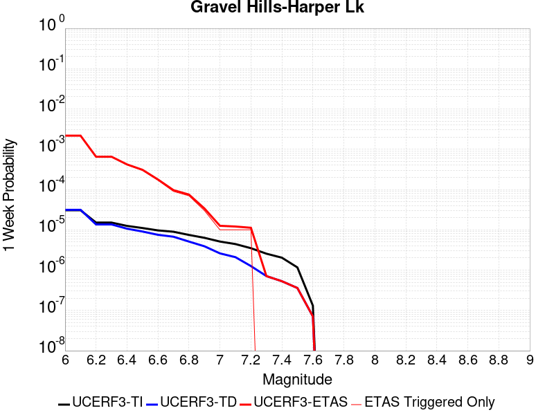 |  | 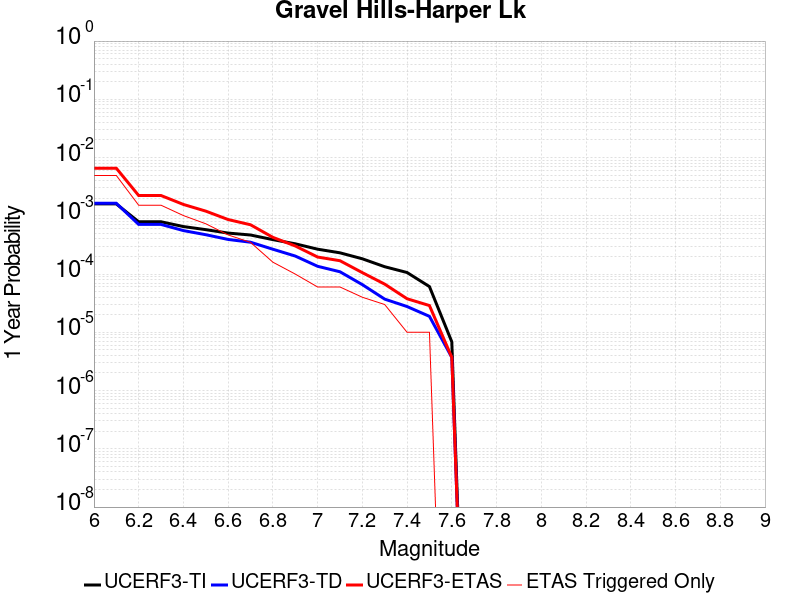 | 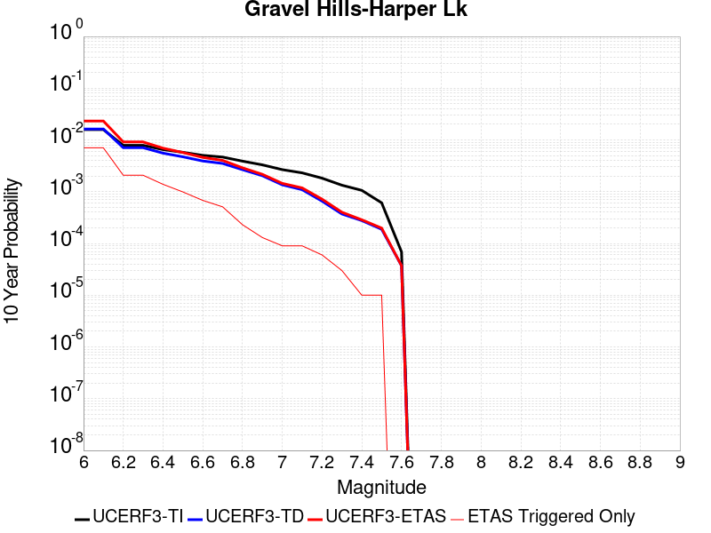 |

| Magnitude | 1 wk TI Prob | 1 wk TD Prob | 1 wk ETAS Prob | 1 wk ETAS/TD Gain | 1 wk ETAS Triggered Only | 1 mo TI Prob | 1 mo TD Prob | 1 mo ETAS Prob | 1 mo ETAS/TD Gain | 1 mo ETAS Triggered Only | 1 yr TI Prob | 1 yr TD Prob | 1 yr ETAS Prob | 1 yr ETAS/TD Gain | 1 yr ETAS Triggered Only | 10 yr TI Prob | 10 yr TD Prob | 10 yr ETAS Prob | 10 yr ETAS/TD Gain | 10 yr ETAS Triggered Only |
|-----|-----|-----|-----|-----|-----|-----|-----|-----|-----|-----|-----|-----|-----|-----|-----|-----|-----|-----|-----|-----|
| 6.0 | 3.0679566E-5 | 3.1464646E-5 | 0.002181397 | 69.32851 | 0.00215 | 1.3147724E-4 | 1.3484273E-4 | 0.0032244262 | 23.912493 | 0.00309 | 0.0015995599 | 0.0016406906 | 0.0065626022 | 3.9999022 | 0.00493 | 0.015880952 | 0.01630734 | 0.023242371 | 1.4252707 | 0.00705 |
| 6.1 | 3.0679566E-5 | 3.1464646E-5 | 0.002181397 | 69.32851 | 0.00215 | 1.3147724E-4 | 1.3484273E-4 | 0.0032244262 | 23.912493 | 0.00309 | 0.0015995599 | 0.0016406906 | 0.0065626022 | 3.9999022 | 0.00493 | 0.015880952 | 0.01630734 | 0.023242371 | 1.4252707 | 0.00705 |
| 6.2 | 1.514536E-5 | 1.3635206E-5 | 6.5362646E-4 | 47.936676 | 6.4E-4 | 6.490707E-5 | 5.843536E-5 | 9.6838217E-4 | 16.571854 | 9.1E-4 | 7.8995706E-4 | 7.1123015E-4 | 0.002230149 | 3.1356223 | 0.00152 | 0.007871548 | 0.0070907404 | 0.0091559915 | 1.2912604 | 0.00208 |
| 6.3 | 1.514536E-5 | 1.3635206E-5 | 6.5362646E-4 | 47.936676 | 6.4E-4 | 6.490707E-5 | 5.843536E-5 | 9.6838217E-4 | 16.571854 | 9.1E-4 | 7.8995706E-4 | 7.1123015E-4 | 0.002230149 | 3.1356223 | 0.00152 | 0.007871548 | 0.0070907404 | 0.0091559915 | 1.2912604 | 0.00208 |
| 6.4 | 1.2532521E-5 | 1.06896905E-5 | 4.206853E-4 | 39.3543 | 4.1E-4 | 5.37097E-5 | 4.581219E-5 | 6.257856E-4 | 13.659806 | 5.8E-4 | 6.537194E-4 | 5.576265E-4 | 0.0015670633 | 2.8102384 | 0.00101 | 0.0065179965 | 0.005562863 | 0.0069451304 | 1.2484814 | 0.00139 |
| 6.5 | 1.1094058E-5 | 9.083664E-6 | 3.0908093E-4 | 34.026024 | 3.0E-4 | 4.7545094E-5 | 3.892943E-5 | 4.789123E-4 | 12.302064 | 4.4E-4 | 5.787078E-4 | 4.7386673E-4 | 0.0012035208 | 2.5397875 | 7.3E-4 | 0.0057720304 | 0.0047289706 | 0.005714289 | 1.2083579 | 9.9E-4 |
| 6.6 | 9.688328E-6 | 7.5316952E-6 | 1.7753041E-4 | 23.57111 | 1.7E-4 | 4.1520743E-5 | 3.227831E-5 | 2.9226992E-4 | 9.054685 | 2.6E-4 | 5.053978E-4 | 3.9292008E-4 | 8.6273544E-4 | 2.195702 | 4.7E-4 | 0.0050424994 | 0.0039225104 | 0.004599843 | 1.1726784 | 6.8E-4 |
| 6.7 | 8.974824E-6 | 6.749413E-6 | 9.674881E-5 | 14.334403 | 9.0E-5 | 3.8462964E-5 | 2.8925748E-5 | 1.8892111E-4 | 6.5312443 | 1.6E-4 | 4.6818596E-4 | 3.5211627E-4 | 7.01993E-4 | 1.9936398 | 3.5E-4 | 0.004672008 | 0.0035158044 | 0.0040240115 | 1.1445493 | 5.1E-4 |
| 6.8 | 7.4780046E-6 | 5.1161933E-6 | 7.511584E-5 | 14.681977 | 7.0E-5 | 3.20482E-5 | 2.1926366E-5 | 1.1192439E-4 | 5.1045575 | 9.0E-5 | 3.9011694E-4 | 2.669222E-4 | 4.2687947E-4 | 1.5992656 | 1.6E-4 | 0.0038943281 | 0.0026661542 | 0.002895541 | 1.0860366 | 2.3E-4 |
| 6.9 | 6.3409307E-6 | 3.9074966E-6 | 3.390738E-5 | 8.67752 | 3.0E-5 | 2.7175134E-5 | 1.6746313E-5 | 5.6745645E-5 | 3.3885455 | 4.0E-5 | 3.3080703E-4 | 2.0386827E-4 | 3.038479E-4 | 1.4904128 | 1.0E-4 | 0.0033031502 | 0.0020369107 | 0.0021666458 | 1.0636921 | 1.3E-4 |
| 7.0 | 5.1239335E-6 | 2.6058565E-6 | 1.260583E-5 | 4.8375 | 1.0E-5 | 2.195953E-5 | 1.116791E-5 | 3.1167685E-5 | 2.7908254 | 2.0E-5 | 2.6732447E-4 | 1.3596108E-4 | 1.9595292E-4 | 1.4412428 | 6.0E-5 | 0.0026700313 | 0.0013588042 | 0.0014486819 | 1.0661447 | 9.0E-5 |
| 7.1 | 4.438899E-6 | 2.0984728E-6 | 1.2098451E-5 | 5.7653604 | 1.0E-5 | 1.9023713E-5 | 8.993425E-6 | 2.8993245E-5 | 3.223827 | 2.0E-5 | 2.315891E-4 | 1.0948967E-4 | 1.694831E-4 | 1.5479369 | 6.0E-5 | 0.002313479 | 0.0010943791 | 0.0011842806 | 1.0821484 | 9.0E-5 |
| 7.2 | 3.50367E-6 | 1.2615716E-6 | 1.1261559E-5 | 8.926611 | 1.0E-5 | 1.5015643E-5 | 5.4067245E-6 | 2.5406616E-5 | 4.699077 | 2.0E-5 | 1.8280011E-4 | 6.582497E-5 | 1.05822335E-4 | 1.6076322 | 4.0E-5 | 0.0018264982 | 6.580629E-4 | 7.1802345E-4 | 1.0911167 | 6.0E-5 |
| 7.3 | 2.561638E-6 | 7.1191585E-7 | 7.1191585E-7 | 1.0 | 0.0 | 1.0978401E-5 | 3.0510646E-6 | 1.3051034E-5 | 4.2775345 | 1.0E-5 | 1.3365384E-4 | 3.71461E-5 | 6.714498E-5 | 1.8075918 | 3.0E-5 | 0.0013357349 | 3.7140088E-4 | 4.0138973E-4 | 1.0807452 | 3.0E-5 |
| 7.4 | 2.0368864E-6 | 5.304837E-7 | 5.304837E-7 | 1.0 | 0.0 | 8.729483E-6 | 2.2734996E-6 | 1.2273477E-5 | 5.398495 | 1.0E-5 | 1.06276275E-4 | 2.7679513E-5 | 3.7679238E-5 | 1.361268 | 1.0E-5 | 0.0010622547 | 2.767612E-4 | 2.867584E-4 | 1.0361222 | 1.0E-5 |
| 7.5 | 1.1681728E-6 | 3.6030585E-7 | 3.6030585E-7 | 1.0 | 0.0 | 5.0064455E-6 | 1.544167E-6 | 1.1544152E-5 | 7.475973 | 1.0E-5 | 6.0951766E-5 | 1.8800076E-5 | 2.8799888E-5 | 1.5319028 | 1.0E-5 | 6.093505E-4 | 1.8798532E-4 | 1.9798345E-4 | 1.0531856 | 1.0E-5 |
| 7.6 | 1.3154387E-7 | 7.1197384E-8 | 7.1197384E-8 | 1.0 | 0.0 | 5.6375933E-7 | 3.051316E-7 | 3.051316E-7 | 1.0 | 0.0 | 6.863748E-6 | 3.7149728E-6 | 3.7149728E-6 | 1.0 | 0.0 | 6.863536E-5 | 3.7149264E-5 | 3.7149264E-5 | 1.0 | 0.0 |

## So Sierra Nevada
*[(top)](#table-of-contents)*

| 1 Week | 1 Month | 1 Year | 10 Year |
|-----|-----|-----|-----|
| 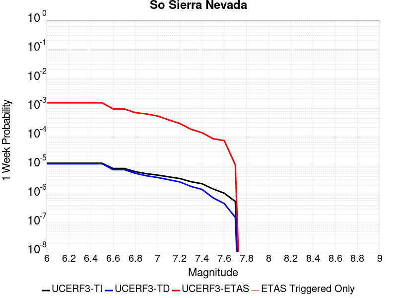 | 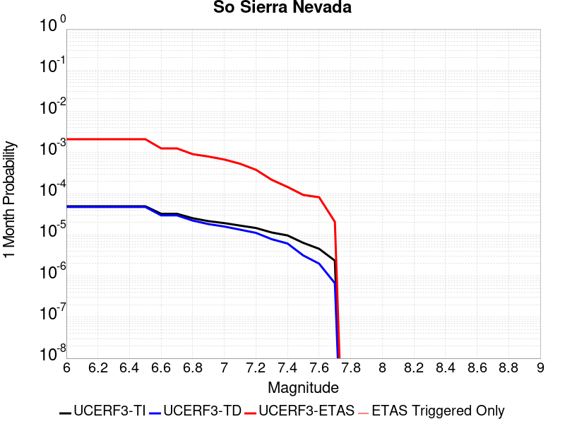 |  |  |

| Magnitude | 1 wk TI Prob | 1 wk TD Prob | 1 wk ETAS Prob | 1 wk ETAS/TD Gain | 1 wk ETAS Triggered Only | 1 mo TI Prob | 1 mo TD Prob | 1 mo ETAS Prob | 1 mo ETAS/TD Gain | 1 mo ETAS Triggered Only | 1 yr TI Prob | 1 yr TD Prob | 1 yr ETAS Prob | 1 yr ETAS/TD Gain | 1 yr ETAS Triggered Only | 10 yr TI Prob | 10 yr TD Prob | 10 yr ETAS Prob | 10 yr ETAS/TD Gain | 10 yr ETAS Triggered Only |
|-----|-----|-----|-----|-----|-----|-----|-----|-----|-----|-----|-----|-----|-----|-----|-----|-----|-----|-----|-----|-----|
| 6.0 | 1.15488665E-5 | 1.1079643E-5 | 0.0014110642 | 127.35647 | 0.0014 | 4.9494203E-5 | 4.748339E-5 | 0.0021073855 | 44.38153 | 0.00206 | 6.024253E-4 | 5.7796965E-4 | 0.0038960509 | 6.740926 | 0.00332 | 0.006007948 | 0.005765934 | 0.010578027 | 1.834573 | 0.00484 |
| 6.1 | 1.15488665E-5 | 1.1079643E-5 | 0.0014110642 | 127.35647 | 0.0014 | 4.9494203E-5 | 4.748339E-5 | 0.0021073855 | 44.38153 | 0.00206 | 6.024253E-4 | 5.7796965E-4 | 0.0038960509 | 6.740926 | 0.00332 | 0.006007948 | 0.005765934 | 0.010578027 | 1.834573 | 0.00484 |
| 6.2 | 1.15488665E-5 | 1.1079643E-5 | 0.0014110642 | 127.35647 | 0.0014 | 4.9494203E-5 | 4.748339E-5 | 0.0021073855 | 44.38153 | 0.00206 | 6.024253E-4 | 5.7796965E-4 | 0.0038960509 | 6.740926 | 0.00332 | 0.006007948 | 0.005765934 | 0.010578027 | 1.834573 | 0.00484 |
| 6.3 | 1.15488665E-5 | 1.1079643E-5 | 0.0014110642 | 127.35647 | 0.0014 | 4.9494203E-5 | 4.748339E-5 | 0.0021073855 | 44.38153 | 0.00206 | 6.024253E-4 | 5.7796965E-4 | 0.0038960509 | 6.740926 | 0.00332 | 0.006007948 | 0.005765934 | 0.010578027 | 1.834573 | 0.00484 |
| 6.4 | 1.15488665E-5 | 1.1079643E-5 | 0.0014110642 | 127.35647 | 0.0014 | 4.9494203E-5 | 4.748339E-5 | 0.0021073855 | 44.38153 | 0.00206 | 6.024253E-4 | 5.7796965E-4 | 0.0038960509 | 6.740926 | 0.00332 | 0.006007948 | 0.005765934 | 0.010578027 | 1.834573 | 0.00484 |
| 6.5 | 1.15488665E-5 | 1.1079643E-5 | 0.0014110642 | 127.35647 | 0.0014 | 4.9494203E-5 | 4.748339E-5 | 0.0021073855 | 44.38153 | 0.00206 | 6.024253E-4 | 5.7796965E-4 | 0.0038960509 | 6.740926 | 0.00332 | 0.006007948 | 0.005765934 | 0.010578027 | 1.834573 | 0.00484 |
| 6.6 | 7.587044E-6 | 6.935635E-6 | 8.6692965E-4 | 124.99644 | 8.6E-4 | 3.2515498E-5 | 2.9723828E-5 | 0.0012596872 | 42.37971 | 0.00123 | 3.9580427E-4 | 3.6183043E-4 | 0.0022211575 | 6.1386695 | 0.00186 | 0.003951 | 0.0036127048 | 0.006183384 | 1.7115663 | 0.00258 |
| 6.7 | 7.587044E-6 | 6.935635E-6 | 8.6692965E-4 | 124.99644 | 8.6E-4 | 3.2515498E-5 | 2.9723828E-5 | 0.0012596872 | 42.37971 | 0.00123 | 3.9580427E-4 | 3.6183043E-4 | 0.0022211575 | 6.1386695 | 0.00186 | 0.003951 | 0.0036127048 | 0.006183384 | 1.7115663 | 0.00258 |
| 6.8 | 5.9026956E-6 | 5.1793927E-6 | 6.451761E-4 | 124.56597 | 6.4E-4 | 2.5297022E-5 | 2.2197215E-5 | 9.1217743E-4 | 41.09423 | 8.9E-4 | 3.0794772E-4 | 2.7021873E-4 | 0.001589862 | 5.883611 | 0.00132 | 0.0030752132 | 0.002699018 | 0.0045340518 | 1.6798894 | 0.00184 |
| 6.9 | 5.0118915E-6 | 4.2524252E-6 | 5.8424997E-4 | 137.39217 | 5.8E-4 | 2.1479358E-5 | 1.8224557E-5 | 7.982103E-4 | 43.798615 | 7.8E-4 | 2.614798E-4 | 2.2186211E-4 | 0.0013516115 | 6.0921235 | 0.00113 | 0.0026117235 | 0.0022164788 | 0.0037530654 | 1.6932558 | 0.00154 |
| 7.0 | 4.4924795E-6 | 3.7139177E-6 | 4.937121E-4 | 132.93565 | 4.9E-4 | 1.925334E-5 | 1.5916696E-5 | 6.759062E-4 | 42.465233 | 6.6E-4 | 2.3438422E-4 | 1.9376918E-4 | 0.0011635813 | 6.0049863 | 9.7E-4 | 0.0023413717 | 0.0019360651 | 0.0032335483 | 1.670165 | 0.0013 |
| 7.1 | 3.9118436E-6 | 3.1119775E-6 | 3.6311086E-4 | 116.68171 | 3.6E-4 | 1.6764936E-5 | 1.3336982E-5 | 5.3333E-4 | 39.98881 | 5.2E-4 | 2.0409399E-4 | 1.6236622E-4 | 9.522379E-4 | 5.864754 | 7.9E-4 | 0.0020390663 | 0.001622532 | 0.0026808123 | 1.6522399 | 0.00106 |
| 7.2 | 3.4200818E-6 | 2.6054543E-6 | 2.7260475E-4 | 104.628494 | 2.7E-4 | 1.4657411E-5 | 1.11661875E-5 | 3.8116207E-4 | 34.13538 | 3.7E-4 | 1.7843937E-4 | 1.3594035E-4 | 6.958642E-4 | 5.1188936 | 5.6E-4 | 0.0017829615 | 0.0013586218 | 0.002117589 | 1.5586305 | 7.6E-4 |
| 7.3 | 2.6593618E-6 | 1.8284203E-6 | 1.7182811E-4 | 93.976265 | 1.7E-4 | 1.13972155E-5 | 7.836065E-6 | 2.1783441E-4 | 27.798956 | 2.1E-4 | 1.3875226E-4 | 9.540021E-5 | 3.6537446E-4 | 3.8299124 | 2.7E-4 | 0.0013866565 | 9.5362146E-4 | 0.001333259 | 1.398101 | 3.8E-4 |
| 7.4 | 2.2577992E-6 | 1.436438E-6 | 1.3143625E-4 | 91.50151 | 1.3E-4 | 9.676246E-6 | 6.15615E-6 | 1.4615529E-4 | 23.741346 | 1.4E-4 | 1.1780193E-4 | 7.49488E-5 | 2.7493382E-4 | 3.6682882 | 2.0E-4 | 0.001177395 | 7.492603E-4 | 0.0010090654 | 1.346749 | 2.6E-4 |
| 7.5 | 1.489319E-6 | 7.353936E-7 | 8.0735335E-5 | 109.7852 | 8.0E-5 | 6.3827797E-6 | 3.1516831E-6 | 9.31514E-5 | 29.55608 | 9.0E-5 | 7.770758E-5 | 3.8371072E-5 | 1.5836647E-4 | 4.127236 | 1.2E-4 | 7.7680405E-4 | 3.836449E-4 | 5.5357965E-4 | 1.4429481 | 1.7E-4 |
| 7.6 | 1.0680322E-6 | 4.6596554E-7 | 7.046593E-5 | 151.22563 | 7.0E-5 | 4.577273E-6 | 1.9969937E-6 | 8.199683E-5 | 41.06014 | 8.0E-5 | 5.5726876E-5 | 2.4313129E-5 | 1.3431045E-4 | 5.5241947 | 1.1E-4 | 5.5712904E-4 | 2.4310495E-4 | 3.8307093E-4 | 1.575743 | 1.4E-4 |
| 7.7 | 5.509146E-7 | 1.5580486E-7 | 1.01558035E-5 | 65.18284 | 1.0E-5 | 2.3610605E-6 | 6.677349E-7 | 2.0667721E-5 | 30.951984 | 2.0E-5 | 2.8745531E-5 | 8.129644E-6 | 3.81294E-5 | 4.6901684 | 3.0E-5 | 2.8741814E-4 | 8.1293576E-5 | 1.2129033E-4 | 1.4920038 | 4.0E-5 |

## Coyote Canyon
*[(top)](#table-of-contents)*

| 1 Week | 1 Month | 1 Year | 10 Year |
|-----|-----|-----|-----|
|  |  |  | 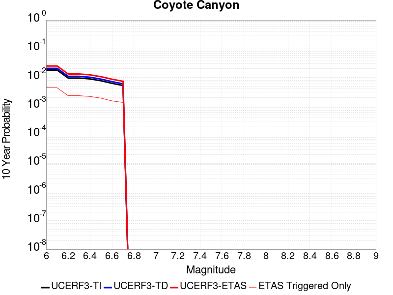 |

| Magnitude | 1 wk TI Prob | 1 wk TD Prob | 1 wk ETAS Prob | 1 wk ETAS/TD Gain | 1 wk ETAS Triggered Only | 1 mo TI Prob | 1 mo TD Prob | 1 mo ETAS Prob | 1 mo ETAS/TD Gain | 1 mo ETAS Triggered Only | 1 yr TI Prob | 1 yr TD Prob | 1 yr ETAS Prob | 1 yr ETAS/TD Gain | 1 yr ETAS Triggered Only | 10 yr TI Prob | 10 yr TD Prob | 10 yr ETAS Prob | 10 yr ETAS/TD Gain | 10 yr ETAS Triggered Only |
|-----|-----|-----|-----|-----|-----|-----|-----|-----|-----|-----|-----|-----|-----|-----|-----|-----|-----|-----|-----|-----|
| 6.0 | 3.5090034E-5 | 4.0364324E-5 | 8.7033084E-4 | 21.561882 | 8.3E-4 | 1.503772E-4 | 1.7297994E-4 | 0.0015027499 | 8.687423 | 0.00133 | 0.0018293047 | 0.0021042528 | 0.0047386973 | 2.2519622 | 0.00264 | 0.018143194 | 0.020869201 | 0.025138212 | 1.2045603 | 0.00436 |
| 6.1 | 3.5090034E-5 | 4.0364324E-5 | 8.7033084E-4 | 21.561882 | 8.3E-4 | 1.503772E-4 | 1.7297994E-4 | 0.0015027499 | 8.687423 | 0.00133 | 0.0018293047 | 0.0021042528 | 0.0047386973 | 2.2519622 | 0.00264 | 0.018143194 | 0.020869201 | 0.025138212 | 1.2045603 | 0.00436 |
| 6.2 | 1.841879E-5 | 2.1059794E-5 | 3.1105368E-4 | 14.770025 | 2.9E-4 | 7.8935285E-5 | 9.0253714E-5 | 6.5020315E-4 | 7.204171 | 5.6E-4 | 9.606133E-4 | 0.001098387 | 0.0024169371 | 2.2004423 | 0.00132 | 0.0095647145 | 0.010939667 | 0.013224396 | 1.2088481 | 0.00231 |
| 6.3 | 1.841879E-5 | 2.1059794E-5 | 3.1105368E-4 | 14.770025 | 2.9E-4 | 7.8935285E-5 | 9.0253714E-5 | 6.5020315E-4 | 7.204171 | 5.6E-4 | 9.606133E-4 | 0.001098387 | 0.0024169371 | 2.2004423 | 0.00132 | 0.0095647145 | 0.010939667 | 0.013224396 | 1.2088481 | 0.00231 |
| 6.4 | 1.712201E-5 | 1.9565212E-5 | 2.9955973E-4 | 15.310835 | 2.8E-4 | 7.337798E-5 | 8.3848776E-5 | 6.238035E-4 | 7.4396253 | 5.4E-4 | 8.930107E-4 | 0.0010204813 | 0.0022692056 | 2.2236621 | 0.00125 | 0.008894307 | 0.010167871 | 0.012315806 | 1.2112473 | 0.00217 |
| 6.5 | 1.4744935E-5 | 1.6836972E-5 | 2.5683292E-4 | 15.254105 | 2.4E-4 | 6.3191044E-5 | 7.215698E-5 | 5.5212236E-4 | 7.651683 | 4.8E-4 | 7.6907943E-4 | 8.7825063E-4 | 0.0019772847 | 2.2513897 | 0.0011 | 0.007664232 | 0.008756994 | 0.010630444 | 1.2139375 | 0.00189 |
| 6.6 | 1.2017839E-5 | 1.37240895E-5 | 2.1372135E-4 | 15.572716 | 2.0E-4 | 5.150401E-5 | 5.88167E-5 | 4.3879435E-4 | 7.46037 | 3.8E-4 | 6.268809E-4 | 7.159466E-4 | 0.0016153023 | 2.256177 | 9.0E-4 | 0.0062511545 | 0.0071450938 | 0.008654233 | 1.2112134 | 0.00152 |
| 6.7 | 1.00956095E-5 | 1.1533517E-5 | 1.8153156E-4 | 15.73948 | 1.7E-4 | 4.326618E-5 | 4.942891E-5 | 3.894121E-4 | 7.8782253 | 3.4E-4 | 5.266384E-4 | 6.017178E-4 | 0.0014012364 | 2.328727 | 8.0E-4 | 0.005253921 | 0.0060094125 | 0.0073413597 | 1.2216436 | 0.00134 |

## San Andreas (Mojave S)
*[(top)](#table-of-contents)*

| 1 Week | 1 Month | 1 Year | 10 Year |
|-----|-----|-----|-----|
| 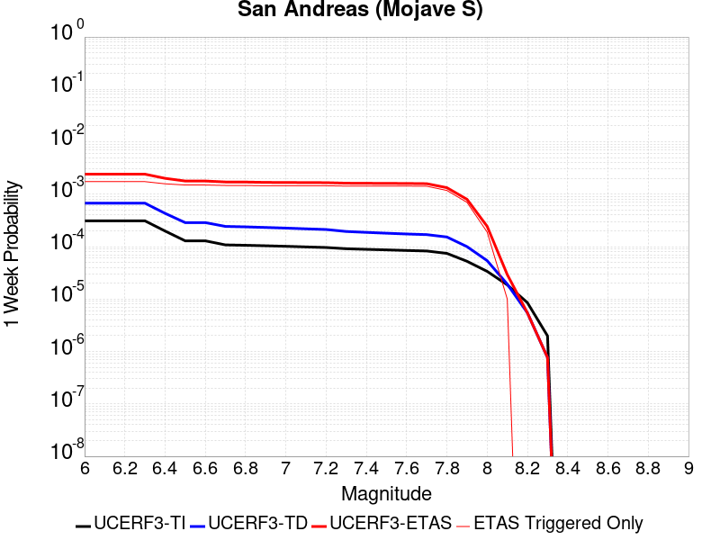 | 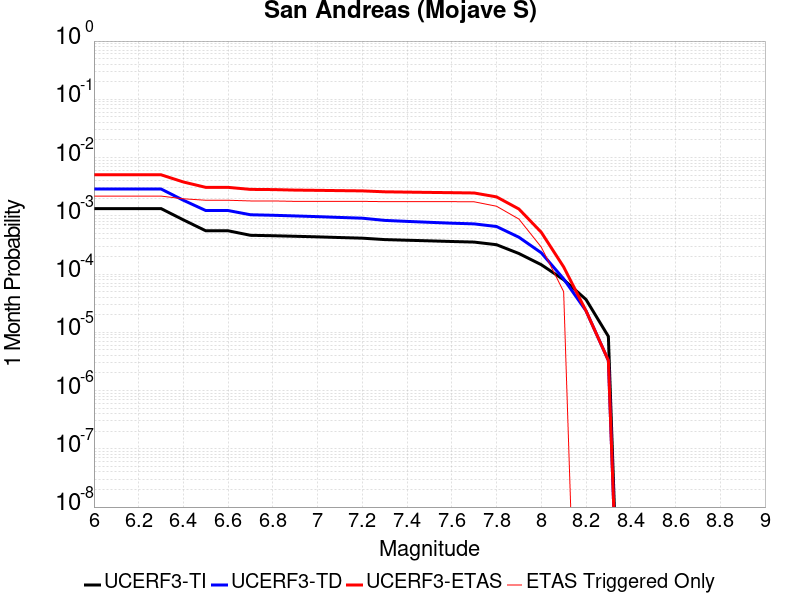 | 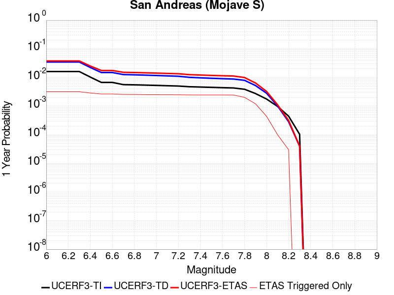 | 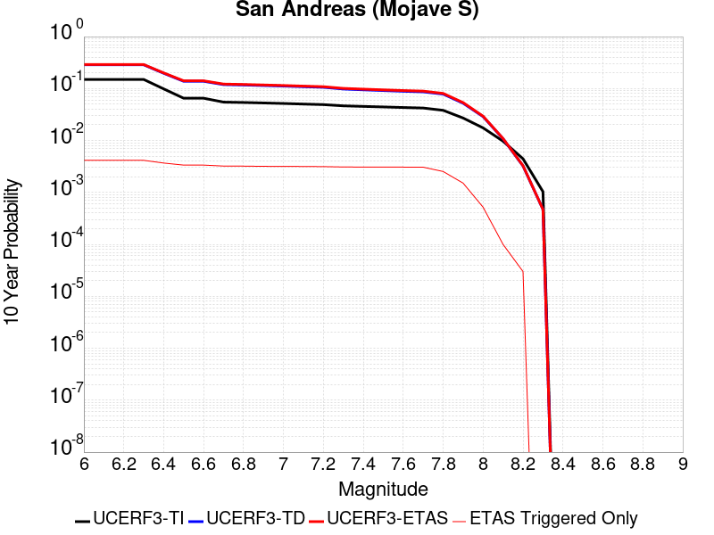 |

| Magnitude | 1 wk TI Prob | 1 wk TD Prob | 1 wk ETAS Prob | 1 wk ETAS/TD Gain | 1 wk ETAS Triggered Only | 1 mo TI Prob | 1 mo TD Prob | 1 mo ETAS Prob | 1 mo ETAS/TD Gain | 1 mo ETAS Triggered Only | 1 yr TI Prob | 1 yr TD Prob | 1 yr ETAS Prob | 1 yr ETAS/TD Gain | 1 yr ETAS Triggered Only | 10 yr TI Prob | 10 yr TD Prob | 10 yr ETAS Prob | 10 yr ETAS/TD Gain | 10 yr ETAS Triggered Only |
|-----|-----|-----|-----|-----|-----|-----|-----|-----|-----|-----|-----|-----|-----|-----|-----|-----|-----|-----|-----|-----|
| 6.0 | 3.1064058E-4 | 6.7460834E-4 | 0.0024134344 | 3.5775344 | 0.00174 | 0.0013306376 | 0.0028881032 | 0.005061807 | 1.7526406 | 0.00218 | 0.016080605 | 0.03462235 | 0.03769225 | 1.0886682 | 0.00318 | 0.1496549 | 0.28660452 | 0.28956512 | 1.0103298 | 0.00415 |
| 6.1 | 3.1064058E-4 | 6.7460834E-4 | 0.0024134344 | 3.5775344 | 0.00174 | 0.0013306376 | 0.0028881032 | 0.005061807 | 1.7526406 | 0.00218 | 0.016080605 | 0.03462235 | 0.03769225 | 1.0886682 | 0.00318 | 0.1496549 | 0.28660452 | 0.28956512 | 1.0103298 | 0.00415 |
| 6.2 | 3.1064058E-4 | 6.7460834E-4 | 0.0024134344 | 3.5775344 | 0.00174 | 0.0013306376 | 0.0028881032 | 0.005061807 | 1.7526406 | 0.00218 | 0.016080605 | 0.03462235 | 0.03769225 | 1.0886682 | 0.00318 | 0.1496549 | 0.28660452 | 0.28956512 | 1.0103298 | 0.00415 |
| 6.3 | 3.1064058E-4 | 6.7460834E-4 | 0.0024134344 | 3.5775344 | 0.00174 | 0.0013306376 | 0.0028881032 | 0.005061807 | 1.7526406 | 0.00218 | 0.016080605 | 0.03462235 | 0.03769225 | 1.0886682 | 0.00318 | 0.1496549 | 0.28660452 | 0.28956512 | 1.0103298 | 0.00415 |
| 6.4 | 1.9872203E-4 | 4.3179357E-4 | 0.0020111112 | 4.657576 | 0.00158 | 8.5138786E-4 | 0.0018492596 | 0.003805635 | 2.0579236 | 0.00196 | 0.010316478 | 0.02228844 | 0.025094472 | 1.1258963 | 0.00287 | 0.098504856 | 0.19699748 | 0.19995253 | 1.0150005 | 0.00368 |
| 6.5 | 1.291105E-4 | 2.875267E-4 | 0.0017870954 | 6.215407 | 0.0015 | 5.5321335E-4 | 0.0012316781 | 0.0030793995 | 2.500166 | 0.00185 | 0.006714592 | 0.0148934 | 0.017503932 | 1.1752812 | 0.00265 | 0.065152965 | 0.13803436 | 0.14093056 | 1.0209818 | 0.00336 |
| 6.6 | 1.291105E-4 | 2.875267E-4 | 0.0017870954 | 6.215407 | 0.0015 | 5.5321335E-4 | 0.0012316781 | 0.0030793995 | 2.500166 | 0.00185 | 0.006714592 | 0.0148934 | 0.017503932 | 1.1752812 | 0.00265 | 0.065152965 | 0.13803436 | 0.14093056 | 1.0209818 | 0.00336 |
| 6.7 | 1.08001186E-4 | 2.4333889E-4 | 0.0017129811 | 7.0394883 | 0.00147 | 4.6278012E-4 | 0.0010424647 | 0.0028405883 | 2.724877 | 0.0018 | 0.0056198016 | 0.012618446 | 0.015146143 | 1.2003176 | 0.00256 | 0.054797906 | 0.119176775 | 0.122013025 | 1.0237987 | 0.00322 |
| 6.8 | 1.0624356E-4 | 2.3851555E-4 | 0.0017081649 | 7.16165 | 0.00147 | 4.5525006E-4 | 0.0010218095 | 0.0028199703 | 2.7597806 | 0.0018 | 0.0055285925 | 0.012369843 | 0.014888301 | 1.2035965 | 0.00255 | 0.053930566 | 0.11712591 | 0.11995994 | 1.0241964 | 0.00321 |
| 6.9 | 1.0393785E-4 | 2.3221898E-4 | 0.0016818823 | 7.242656 | 0.00145 | 4.4537184E-4 | 9.948451E-4 | 0.0027630841 | 2.7774014 | 0.00177 | 0.0054089287 | 0.012045221 | 0.014534867 | 1.2066916 | 0.00252 | 0.05279156 | 0.11442335 | 0.11723949 | 1.0246115 | 0.00318 |
| 7.0 | 1.0155622E-4 | 2.2591476E-4 | 0.0016755871 | 7.4169 | 0.00145 | 4.3516833E-4 | 9.6784724E-4 | 0.0027361342 | 2.827031 | 0.00177 | 0.005285311 | 0.0117200995 | 0.014200683 | 1.211652 | 0.00251 | 0.05161361 | 0.111683756 | 0.11449972 | 1.0252137 | 0.00317 |
| 7.1 | 9.885595E-5 | 2.1879886E-4 | 0.0016684816 | 7.6256413 | 0.00145 | 4.2359953E-4 | 9.3737274E-4 | 0.0027057135 | 2.8864863 | 0.00177 | 0.0051451353 | 0.011352993 | 0.01382461 | 1.2177062 | 0.0025 | 0.05027629 | 0.1085682 | 0.11138513 | 1.0259461 | 0.00316 |
| 7.2 | 9.6411415E-5 | 2.124288E-4 | 0.0016621208 | 7.824366 | 0.00145 | 4.1312634E-4 | 9.1009185E-4 | 0.002678481 | 2.9430888 | 0.00177 | 0.005018219 | 0.011024255 | 0.013486805 | 1.2233756 | 0.00249 | 0.049064007 | 0.105758004 | 0.10856592 | 1.0265504 | 0.00314 |
| 7.3 | 9.1180635E-5 | 1.9471257E-4 | 0.0016244341 | 8.342729 | 0.00143 | 3.907156E-4 | 8.342157E-4 | 0.0025827559 | 3.0960288 | 0.00175 | 0.004746591 | 0.01010939 | 0.01254452 | 1.2408781 | 0.00246 | 0.046464786 | 0.09795115 | 0.10073848 | 1.0284563 | 0.00309 |
| 7.4 | 8.887388E-5 | 1.8719878E-4 | 0.001616931 | 8.637508 | 0.00143 | 3.8083247E-4 | 8.020339E-4 | 0.0025506304 | 3.1802027 | 0.00175 | 0.0046267817 | 0.00972114 | 0.012147323 | 1.249578 | 0.00245 | 0.045316286 | 0.09458615 | 0.09737482 | 1.029483 | 0.00308 |
| 7.5 | 8.6750515E-5 | 1.8051457E-4 | 0.0016102564 | 8.920368 | 0.00143 | 3.7173493E-4 | 7.7340455E-4 | 0.002522051 | 3.2609727 | 0.00175 | 0.004516484 | 0.009375632 | 0.011802661 | 1.2588657 | 0.00245 | 0.04425787 | 0.091549896 | 0.094347924 | 1.0305629 | 0.00308 |
| 7.6 | 8.453092E-5 | 1.7439072E-4 | 0.0016041413 | 9.198547 | 0.00143 | 3.6222505E-4 | 7.471748E-4 | 0.0024958672 | 3.3404062 | 0.00175 | 0.0044011753 | 0.009058985 | 0.01148679 | 1.2679998 | 0.00245 | 0.04315024 | 0.08870898 | 0.091506645 | 1.0315375 | 0.00307 |
| 7.7 | 8.259102E-5 | 1.6961215E-4 | 0.0015893714 | 9.370622 | 0.00142 | 3.539135E-4 | 7.2670676E-4 | 0.0024654423 | 3.3926232 | 0.00174 | 0.004300386 | 0.008811831 | 0.011230329 | 1.2744604 | 0.00244 | 0.042181134 | 0.08645982 | 0.08925526 | 1.0323322 | 0.00306 |
| 7.8 | 7.444844E-5 | 1.5283503E-4 | 0.0013326547 | 8.7195635 | 0.00118 | 3.1902574E-4 | 6.548429E-4 | 0.0021138869 | 3.2280824 | 0.00146 | 0.0038772223 | 0.007943616 | 0.00994757 | 1.2522722 | 0.00202 | 0.03810269 | 0.078290746 | 0.08062267 | 1.0297854 | 0.00253 |
| 7.9 | 5.2586525E-5 | 1.00064186E-4 | 7.9999416E-4 | 7.9948096 | 7.0E-4 | 2.2535135E-4 | 4.2877605E-4 | 0.0013083987 | 3.0514734 | 8.8E-4 | 0.0027402006 | 0.005207864 | 0.0064016143 | 1.2292207 | 0.0012 | 0.027066574 | 0.052200034 | 0.053631213 | 1.0274172 | 0.00151 |
| 8.0 | 3.379877E-5 | 5.4074168E-5 | 2.440639E-4 | 4.5135026 | 1.9E-4 | 1.4484383E-4 | 2.3172585E-4 | 5.216586E-4 | 2.2511888 | 2.9E-4 | 0.0017620471 | 0.002817614 | 0.0032563743 | 1.1557205 | 4.4E-4 | 0.017481409 | 0.028834904 | 0.029339908 | 1.0175138 | 5.2E-4 |
| 8.1 | 1.8668277E-5 | 1.9309397E-5 | 2.9309203E-5 | 1.5178726 | 1.0E-5 | 8.000444E-5 | 8.275194E-5 | 1.327478E-4 | 1.6041654 | 5.0E-5 | 9.736188E-4 | 0.0010070398 | 0.001106939 | 1.099201 | 1.0E-4 | 0.009693642 | 0.010798888 | 0.010897809 | 1.0091602 | 1.0E-4 |
| 8.2 | 8.541571E-6 | 5.460819E-6 | 5.460819E-6 | 1.0 | 0.0 | 3.660622E-5 | 2.3403301E-5 | 2.3403301E-5 | 1.0 | 0.0 | 4.455896E-4 | 2.84898E-4 | 3.1488948E-4 | 1.1052709 | 3.0E-5 | 0.0044469717 | 0.0032408056 | 0.0032707083 | 1.0092269 | 3.0E-5 |
| 8.3 | 1.983087E-6 | 7.6599065E-7 | 7.6599065E-7 | 1.0 | 0.0 | 8.498917E-6 | 3.282813E-6 | 3.282813E-6 | 1.0 | 0.0 | 1.034694E-4 | 3.9967534E-5 | 3.9967534E-5 | 1.0 | 0.0 | 0.0010342124 | 4.719687E-4 | 4.719687E-4 | 1.0 | 0.0 |

## Death Valley (So)
*[(top)](#table-of-contents)*

| 1 Week | 1 Month | 1 Year | 10 Year |
|-----|-----|-----|-----|
|  | 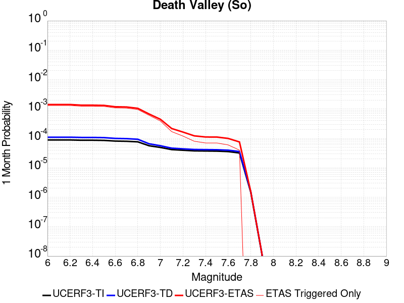 |  | 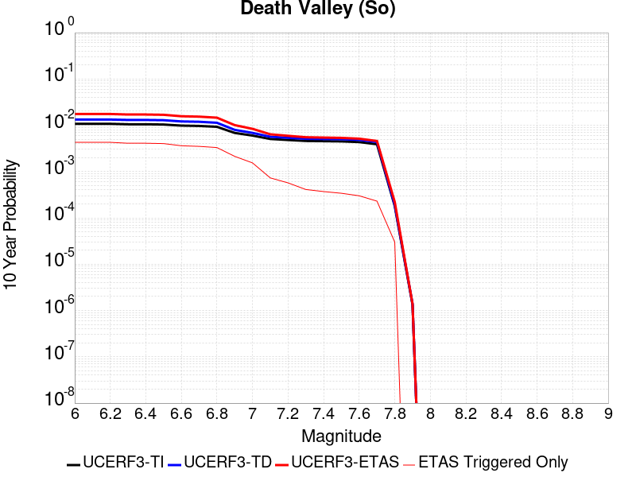 |

| Magnitude | 1 wk TI Prob | 1 wk TD Prob | 1 wk ETAS Prob | 1 wk ETAS/TD Gain | 1 wk ETAS Triggered Only | 1 mo TI Prob | 1 mo TD Prob | 1 mo ETAS Prob | 1 mo ETAS/TD Gain | 1 mo ETAS Triggered Only | 1 yr TI Prob | 1 yr TD Prob | 1 yr ETAS Prob | 1 yr ETAS/TD Gain | 1 yr ETAS Triggered Only | 10 yr TI Prob | 10 yr TD Prob | 10 yr ETAS Prob | 10 yr ETAS/TD Gain | 10 yr ETAS Triggered Only |
|-----|-----|-----|-----|-----|-----|-----|-----|-----|-----|-----|-----|-----|-----|-----|-----|-----|-----|-----|-----|-----|
| 6.0 | 2.0684236E-5 | 2.5617775E-5 | 8.3559705E-4 | 32.61786 | 8.1E-4 | 8.864371E-5 | 1.0978594E-4 | 0.0014196421 | 12.931001 | 0.00131 | 0.0010787029 | 0.0013358411 | 0.0038924215 | 2.9138355 | 0.00256 | 0.010734817 | 0.013281397 | 0.017504552 | 1.3179753 | 0.00428 |
| 6.1 | 2.0684236E-5 | 2.5617775E-5 | 8.3559705E-4 | 32.61786 | 8.1E-4 | 8.864371E-5 | 1.0978594E-4 | 0.0014196421 | 12.931001 | 0.00131 | 0.0010787029 | 0.0013358411 | 0.0038924215 | 2.9138355 | 0.00256 | 0.010734817 | 0.013281397 | 0.017504552 | 1.3179753 | 0.00428 |
| 6.2 | 2.0684236E-5 | 2.5617775E-5 | 8.3559705E-4 | 32.61786 | 8.1E-4 | 8.864371E-5 | 1.0978594E-4 | 0.0014196421 | 12.931001 | 0.00131 | 0.0010787029 | 0.0013358411 | 0.0038924215 | 2.9138355 | 0.00256 | 0.010734817 | 0.013281397 | 0.017504552 | 1.3179753 | 0.00428 |
| 6.3 | 2.0240292E-5 | 2.511786E-5 | 8.050983E-4 | 32.052822 | 7.8E-4 | 8.6741224E-5 | 1.07643624E-4 | 0.0013475101 | 12.518253 | 0.00124 | 0.0010555626 | 0.00130979 | 0.0037166334 | 2.8375797 | 0.00241 | 0.010505628 | 0.013023956 | 0.017060688 | 1.3099467 | 0.00409 |
| 6.4 | 2.0240292E-5 | 2.511786E-5 | 8.050983E-4 | 32.052822 | 7.8E-4 | 8.6741224E-5 | 1.07643624E-4 | 0.0013475101 | 12.518253 | 0.00124 | 0.0010555626 | 0.00130979 | 0.0037166334 | 2.8375797 | 0.00241 | 0.010505628 | 0.013023956 | 0.017060688 | 1.3099467 | 0.00409 |
| 6.5 | 1.9962767E-5 | 2.4807114E-5 | 7.94788E-4 | 32.038715 | 7.7E-4 | 8.55519E-5 | 1.0631196E-4 | 0.0013261823 | 12.474441 | 0.00122 | 0.0010410968 | 0.0012935963 | 0.0036605306 | 2.8297317 | 0.00237 | 0.010362327 | 0.012863902 | 0.01683219 | 1.3084824 | 0.00402 |
| 6.6 | 1.8937297E-5 | 2.3310964E-5 | 7.332944E-4 | 31.45706 | 7.1E-4 | 8.115732E-5 | 9.990039E-5 | 0.0011897915 | 11.909779 | 0.00109 | 9.876423E-4 | 0.0012156231 | 0.0033130704 | 2.725409 | 0.0021 | 0.009832645 | 0.012092789 | 0.015659133 | 1.2949151 | 0.00361 |
| 6.7 | 1.8621096E-5 | 2.2911607E-5 | 7.3289534E-4 | 31.987951 | 7.1E-4 | 7.980225E-5 | 9.818898E-5 | 0.0011680839 | 11.896283 | 0.00107 | 9.711593E-4 | 0.0011948098 | 0.0032223843 | 2.6969852 | 0.00203 | 0.009669261 | 0.011886904 | 0.0153453 | 1.2909417 | 0.0035 |
| 6.8 | 1.7830353E-5 | 2.1805688E-5 | 6.4179214E-4 | 29.43233 | 6.2E-4 | 7.641356E-5 | 9.344968E-5 | 0.0010533599 | 11.271949 | 9.6E-4 | 9.29938E-4 | 0.00113717 | 0.003044998 | 2.6776981 | 0.00191 | 0.009260561 | 0.011316354 | 0.01457901 | 1.2883134 | 0.0033 |
| 6.9 | 1.3135183E-5 | 1.5303925E-5 | 4.0529796E-4 | 26.483269 | 3.9E-4 | 5.6292425E-5 | 6.558664E-5 | 6.7554665E-4 | 10.300065 | 6.1E-4 | 6.8514474E-4 | 7.982312E-4 | 0.0020372414 | 2.5521946 | 0.00124 | 0.006830362 | 0.007954649 | 0.010067705 | 1.265638 | 0.00213 |
| 7.0 | 1.1507512E-5 | 1.3154199E-5 | 2.631509E-4 | 20.005087 | 2.5E-4 | 4.9316975E-5 | 5.6373956E-5 | 4.4635197E-4 | 7.9176984 | 3.9E-4 | 6.002687E-4 | 6.8614254E-4 | 0.0015355593 | 2.2379596 | 8.5E-4 | 0.0059864987 | 0.0068409415 | 0.008370407 | 1.2235752 | 0.00154 |
| 7.1 | 9.715903E-6 | 1.0865278E-5 | 1.4086386E-4 | 12.964589 | 1.3E-4 | 4.1638916E-5 | 4.656467E-5 | 2.1655676E-4 | 4.6506667 | 1.7E-4 | 5.068359E-4 | 5.667817E-4 | 9.465663E-4 | 1.6700722 | 3.8E-4 | 0.0050568148 | 0.0056538144 | 0.006379687 | 1.1283864 | 7.3E-4 |
| 7.2 | 9.233269E-6 | 1.02863105E-5 | 1.10285284E-4 | 10.721559 | 1.0E-4 | 3.9570554E-5 | 4.4083466E-5 | 1.6407817E-4 | 3.721989 | 1.2E-4 | 4.81665E-4 | 5.3658825E-4 | 8.2643266E-4 | 1.5401616 | 2.9E-4 | 0.0048062233 | 0.0053533576 | 0.0059203063 | 1.1059052 | 5.7E-4 |
| 7.3 | 8.8041315E-6 | 9.808164E-6 | 6.9807575E-5 | 7.117293 | 6.0E-5 | 3.7731446E-5 | 4.2034335E-5 | 1.2203097E-4 | 2.903126 | 8.0E-5 | 4.592835E-4 | 5.1165203E-4 | 7.215446E-4 | 1.4102252 | 2.1E-4 | 0.0045833546 | 0.005105167 | 0.005513074 | 1.0799007 | 4.1E-4 |
| 7.4 | 8.708749E-6 | 9.707175E-6 | 5.970669E-5 | 6.1507792 | 5.0E-5 | 3.7322676E-5 | 4.160154E-5 | 1.1159862E-4 | 2.68256 | 7.0E-5 | 4.5430884E-4 | 5.0638523E-4 | 6.96289E-4 | 1.3750185 | 1.9E-4 | 0.004533812 | 0.0050527398 | 0.00542087 | 1.0728576 | 3.7E-4 |
| 7.5 | 8.612678E-6 | 9.604817E-6 | 5.9604336E-5 | 6.2056713 | 5.0E-5 | 3.6910955E-5 | 4.1162875E-5 | 1.1115999E-4 | 2.7004914 | 7.0E-5 | 4.492982E-4 | 5.01047E-4 | 6.809568E-4 | 1.3590678 | 1.8E-4 | 0.004483909 | 0.0049995985 | 0.0053378986 | 1.0676655 | 3.4E-4 |
| 7.6 | 8.319024E-6 | 9.283916E-6 | 4.9283546E-5 | 5.3084865 | 4.0E-5 | 3.5652476E-5 | 3.978763E-5 | 9.978524E-5 | 2.5079465 | 6.0E-5 | 4.3398244E-4 | 4.8431093E-4 | 6.442334E-4 | 1.3302063 | 1.6E-4 | 0.0043313587 | 0.0048329784 | 0.0051315282 | 1.0617735 | 3.0E-4 |
| 7.7 | 7.4718328E-6 | 8.34517E-6 | 3.834492E-5 | 4.594864 | 3.0E-5 | 3.2021748E-5 | 3.5764548E-5 | 7.576311E-5 | 2.118386 | 4.0E-5 | 3.8979502E-4 | 4.353504E-4 | 5.552982E-4 | 1.2755201 | 1.2E-4 | 0.00389112 | 0.0043453807 | 0.0045743813 | 1.0526998 | 2.3E-4 |
| 7.8 | 3.4586725E-7 | 3.6482615E-7 | 3.6482615E-7 | 1.0 | 0.0 | 1.4822873E-6 | 1.5635396E-6 | 1.5635396E-6 | 1.0 | 0.0 | 1.80467E-5 | 1.9035933E-5 | 3.9035553E-5 | 2.0506246 | 2.0E-5 | 1.8045233E-4 | 1.9034347E-4 | 2.2033777E-4 | 1.1575798 | 3.0E-5 |
| 7.9 | 2.5591178E-9 | 2.6696718E-9 | 2.6696718E-9 | 1.0 | 0.0 | 1.0967647E-8 | 1.14414505E-8 | 1.14414505E-8 | 1.0 | 0.0 | 1.335311E-7 | 1.3929966E-7 | 1.3929966E-7 | 1.0 | 0.0 | 1.3353102E-6 | 1.3929966E-6 | 1.3929966E-6 | 1.0 | 0.0 |

## Nelson Lake
*[(top)](#table-of-contents)*

| 1 Week | 1 Month | 1 Year | 10 Year |
|-----|-----|-----|-----|
|  |  |  |  |

| Magnitude | 1 wk TI Prob | 1 wk TD Prob | 1 wk ETAS Prob | 1 wk ETAS/TD Gain | 1 wk ETAS Triggered Only | 1 mo TI Prob | 1 mo TD Prob | 1 mo ETAS Prob | 1 mo ETAS/TD Gain | 1 mo ETAS Triggered Only | 1 yr TI Prob | 1 yr TD Prob | 1 yr ETAS Prob | 1 yr ETAS/TD Gain | 1 yr ETAS Triggered Only | 10 yr TI Prob | 10 yr TD Prob | 10 yr ETAS Prob | 10 yr ETAS/TD Gain | 10 yr ETAS Triggered Only |
|-----|-----|-----|-----|-----|-----|-----|-----|-----|-----|-----|-----|-----|-----|-----|-----|-----|-----|-----|-----|-----|
| 6.0 | 9.913453E-6 | 1.0192255E-5 | 5.601866E-4 | 54.96199 | 5.5E-4 | 4.2485535E-5 | 4.3680422E-5 | 9.836394E-4 | 22.519 | 9.4E-4 | 5.1713863E-4 | 5.316897E-4 | 0.0026305732 | 4.947572 | 0.0021 | 0.0051593683 | 0.005305204 | 0.009055204 | 1.706853 | 0.00377 |
| 6.1 | 9.913453E-6 | 1.0192255E-5 | 5.601866E-4 | 54.96199 | 5.5E-4 | 4.2485535E-5 | 4.3680422E-5 | 9.836394E-4 | 22.519 | 9.4E-4 | 5.1713863E-4 | 5.316897E-4 | 0.0026305732 | 4.947572 | 0.0021 | 0.0051593683 | 0.005305204 | 0.009055204 | 1.706853 | 0.00377 |
| 6.2 | 4.5596407E-6 | 4.696313E-6 | 2.2469528E-4 | 47.84504 | 2.2E-4 | 1.954117E-5 | 2.0126909E-5 | 4.1011907E-4 | 20.376656 | 3.9E-4 | 2.3788778E-4 | 2.4501883E-4 | 0.0012147812 | 4.9579096 | 9.7E-4 | 0.0023763329 | 0.0024476128 | 0.004203305 | 1.7173079 | 0.00176 |
| 6.3 | 4.5596407E-6 | 4.696313E-6 | 2.2469528E-4 | 47.84504 | 2.2E-4 | 1.954117E-5 | 2.0126909E-5 | 4.1011907E-4 | 20.376656 | 3.9E-4 | 2.3788778E-4 | 2.4501883E-4 | 0.0012147812 | 4.9579096 | 9.7E-4 | 0.0023763329 | 0.0024476128 | 0.004203305 | 1.7173079 | 0.00176 |
| 6.4 | 3.4025713E-6 | 3.5098972E-6 | 1.6350934E-4 | 46.58522 | 1.6E-4 | 1.4582367E-5 | 1.5042335E-5 | 3.1503782E-4 | 20.943413 | 3.0E-4 | 1.7752586E-4 | 1.8312587E-4 | 9.02994E-4 | 4.9310017 | 7.2E-4 | 0.001773841 | 0.0018298327 | 0.0031174722 | 1.7036926 | 0.00129 |
| 6.5 | 2.8352947E-6 | 2.927856E-6 | 1.4292744E-4 | 48.816418 | 1.4E-4 | 1.2151207E-5 | 1.2547898E-5 | 2.6254475E-4 | 20.923405 | 2.5E-4 | 1.479309E-4 | 1.5276071E-4 | 7.9266296E-4 | 5.188919 | 6.4E-4 | 0.0014783246 | 0.0015266308 | 0.0026149668 | 1.7129005 | 0.00109 |
| 6.6 | 2.251518E-6 | 2.3290677E-6 | 1.2232878E-4 | 52.522644 | 1.2E-4 | 9.649328E-6 | 9.981683E-6 | 2.1997959E-4 | 22.038324 | 2.1E-4 | 1.1747423E-4 | 1.2152085E-4 | 6.614552E-4 | 5.443142 | 5.4E-4 | 0.0011741214 | 0.0012146058 | 0.0020935368 | 1.723635 | 8.8E-4 |
| 6.7 | 1.8911853E-6 | 1.9591396E-6 | 9.1958966E-5 | 46.938442 | 9.0E-5 | 8.105055E-6 | 8.39629E-6 | 1.5839504E-4 | 18.864885 | 1.5E-4 | 9.867457E-5 | 1.0222061E-4 | 5.421756E-4 | 5.3039756 | 4.4E-4 | 9.863076E-4 | 0.0010217935 | 0.0017410577 | 1.7039235 | 7.2E-4 |
| 6.8 | 1.4874814E-6 | 1.5438305E-6 | 9.154369E-5 | 59.296467 | 9.0E-5 | 6.374905E-6 | 6.6164025E-6 | 1.3661555E-4 | 20.64801 | 1.3E-4 | 7.76117E-5 | 8.055224E-5 | 4.6052164E-4 | 5.7170553 | 3.8E-4 | 7.75846E-4 | 8.0528157E-4 | 0.0014147903 | 1.756889 | 6.1E-4 |
| 6.9 | 6.835972E-7 | 7.1399285E-7 | 7.071394E-5 | 99.04013 | 7.0E-5 | 2.9296991E-6 | 3.0599674E-6 | 8.305972E-5 | 27.14399 | 8.0E-5 | 3.56685E-5 | 3.7254784E-5 | 2.4724696E-4 | 6.6366496 | 2.1E-4 | 3.5662777E-4 | 3.7251666E-4 | 7.323825E-4 | 1.9660398 | 3.6E-4 |

## San Andreas (Mojave N)
*[(top)](#table-of-contents)*

| 1 Week | 1 Month | 1 Year | 10 Year |
|-----|-----|-----|-----|
|  | 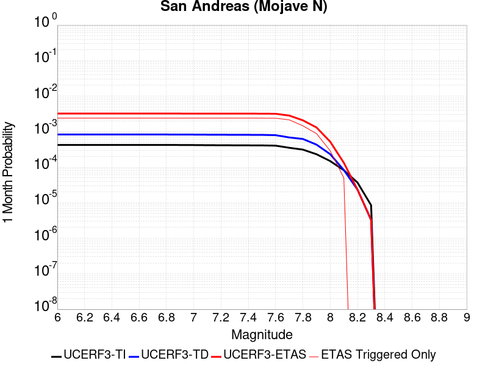 | 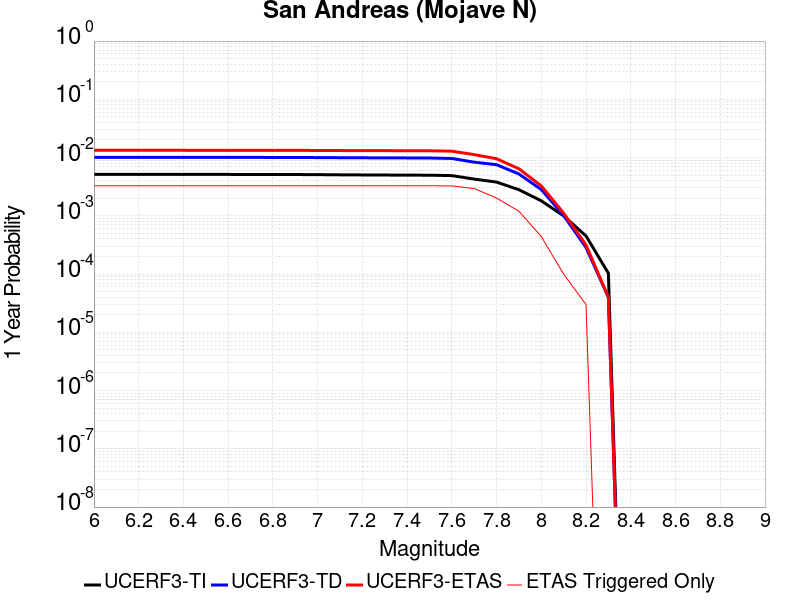 |  |

| Magnitude | 1 wk TI Prob | 1 wk TD Prob | 1 wk ETAS Prob | 1 wk ETAS/TD Gain | 1 wk ETAS Triggered Only | 1 mo TI Prob | 1 mo TD Prob | 1 mo ETAS Prob | 1 mo ETAS/TD Gain | 1 mo ETAS Triggered Only | 1 yr TI Prob | 1 yr TD Prob | 1 yr ETAS Prob | 1 yr ETAS/TD Gain | 1 yr ETAS Triggered Only | 10 yr TI Prob | 10 yr TD Prob | 10 yr ETAS Prob | 10 yr ETAS/TD Gain | 10 yr ETAS Triggered Only |
|-----|-----|-----|-----|-----|-----|-----|-----|-----|-----|-----|-----|-----|-----|-----|-----|-----|-----|-----|-----|-----|
| 6.0 | 9.877682E-5 | 1.9400702E-4 | 0.0021236327 | 10.946164 | 0.00193 | 4.2326056E-4 | 8.311939E-4 | 0.003229199 | 3.8850129 | 0.0024 | 0.0051410277 | 0.010072956 | 0.013319917 | 1.3223444 | 0.00328 | 0.05023708 | 0.09831428 | 0.10195708 | 1.0370528 | 0.00404 |
| 6.1 | 9.877682E-5 | 1.9400702E-4 | 0.0021236327 | 10.946164 | 0.00193 | 4.2326056E-4 | 8.311939E-4 | 0.003229199 | 3.8850129 | 0.0024 | 0.0051410277 | 0.010072956 | 0.013319917 | 1.3223444 | 0.00328 | 0.05023708 | 0.09831428 | 0.10195708 | 1.0370528 | 0.00404 |
| 6.2 | 9.877682E-5 | 1.9400702E-4 | 0.0021236327 | 10.946164 | 0.00193 | 4.2326056E-4 | 8.311939E-4 | 0.003229199 | 3.8850129 | 0.0024 | 0.0051410277 | 0.010072956 | 0.013319917 | 1.3223444 | 0.00328 | 0.05023708 | 0.09831428 | 0.10195708 | 1.0370528 | 0.00404 |
| 6.3 | 9.877682E-5 | 1.9400702E-4 | 0.0021236327 | 10.946164 | 0.00193 | 4.2326056E-4 | 8.311939E-4 | 0.003229199 | 3.8850129 | 0.0024 | 0.0051410277 | 0.010072956 | 0.013319917 | 1.3223444 | 0.00328 | 0.05023708 | 0.09831428 | 0.10195708 | 1.0370528 | 0.00404 |
| 6.4 | 9.877682E-5 | 1.9400702E-4 | 0.0021236327 | 10.946164 | 0.00193 | 4.2326056E-4 | 8.311939E-4 | 0.003229199 | 3.8850129 | 0.0024 | 0.0051410277 | 0.010072956 | 0.013319917 | 1.3223444 | 0.00328 | 0.05023708 | 0.09831428 | 0.10195708 | 1.0370528 | 0.00404 |
| 6.5 | 9.861474E-5 | 1.9374468E-4 | 0.0021233708 | 10.959634 | 0.00193 | 4.2256617E-4 | 8.300703E-4 | 0.0032280781 | 3.8889213 | 0.0024 | 0.0051326132 | 0.010059402 | 0.013306408 | 1.3227831 | 0.00328 | 0.050156746 | 0.098192066 | 0.10183537 | 1.0371039 | 0.00404 |
| 6.6 | 9.861474E-5 | 1.9374468E-4 | 0.0021233708 | 10.959634 | 0.00193 | 4.2256617E-4 | 8.300703E-4 | 0.0032280781 | 3.8889213 | 0.0024 | 0.0051326132 | 0.010059402 | 0.013306408 | 1.3227831 | 0.00328 | 0.050156746 | 0.098192066 | 0.10183537 | 1.0371039 | 0.00404 |
| 6.7 | 9.8552715E-5 | 1.9364421E-4 | 0.0021232704 | 10.964802 | 0.00193 | 4.223004E-4 | 8.2964E-4 | 0.0032276488 | 3.890421 | 0.0024 | 0.0051293927 | 0.010054212 | 0.013301235 | 1.3229514 | 0.00328 | 0.050125998 | 0.098145254 | 0.10178875 | 1.0371234 | 0.00404 |
| 6.8 | 9.8464974E-5 | 1.9349584E-4 | 0.0021231223 | 10.972445 | 0.00193 | 4.219245E-4 | 8.290045E-4 | 0.003227015 | 3.8926384 | 0.0024 | 0.0051248376 | 0.010046546 | 0.013293594 | 1.3232003 | 0.00328 | 0.05008251 | 0.09807528 | 0.10171906 | 1.0371529 | 0.00404 |
| 6.9 | 9.825824E-5 | 1.9317595E-4 | 0.0021228031 | 10.988962 | 0.00193 | 4.2103877E-4 | 8.276344E-4 | 0.003225648 | 3.8974311 | 0.0024 | 0.0051141046 | 0.010030019 | 0.013277121 | 1.3237383 | 0.00328 | 0.049980022 | 0.09792438 | 0.101568766 | 1.0372163 | 0.00404 |
| 7.0 | 9.781462E-5 | 1.924896E-4 | 0.0021221181 | 11.024586 | 0.00193 | 4.1913814E-4 | 8.246948E-4 | 0.0032227156 | 3.9077675 | 0.0024 | 0.005091073 | 0.009994558 | 0.013241776 | 1.3248986 | 0.00328 | 0.04976007 | 0.09760077 | 0.10124647 | 1.0373532 | 0.00404 |
| 7.1 | 9.7121134E-5 | 1.9150671E-4 | 0.0021211372 | 11.076045 | 0.00193 | 4.1616702E-4 | 8.204851E-4 | 0.003218516 | 3.9226987 | 0.0024 | 0.005055068 | 0.009943774 | 0.013191159 | 1.3265747 | 0.00328 | 0.04941613 | 0.09713728 | 0.100784846 | 1.0375506 | 0.00404 |
| 7.2 | 9.663819E-5 | 1.9081456E-4 | 0.0021204464 | 11.112601 | 0.00193 | 4.1409794E-4 | 8.175206E-4 | 0.0032155586 | 3.9333057 | 0.0024 | 0.0050299936 | 0.00990801 | 0.0131555125 | 1.3277652 | 0.00328 | 0.049176537 | 0.09681055 | 0.100459434 | 1.037691 | 0.00404 |
| 7.3 | 9.6277574E-5 | 1.9033969E-4 | 0.0021199724 | 11.137836 | 0.00193 | 4.125529E-4 | 8.154867E-4 | 0.0032135295 | 3.9406276 | 0.0024 | 0.0050112694 | 0.009883473 | 0.013131055 | 1.3285872 | 0.00328 | 0.04899759 | 0.09658401 | 0.10023381 | 1.0377889 | 0.00404 |
| 7.4 | 9.593308E-5 | 1.897375E-4 | 0.0021193712 | 11.170018 | 0.00193 | 4.1107697E-4 | 8.129075E-4 | 0.0032109565 | 3.9499655 | 0.0024 | 0.0049933824 | 0.009852355 | 0.013100039 | 1.3296353 | 0.00328 | 0.04882661 | 0.09630218 | 0.09995312 | 1.0379113 | 0.00404 |
| 7.5 | 9.561707E-5 | 1.8919831E-4 | 0.0021188331 | 11.199006 | 0.00193 | 4.0972308E-4 | 8.1059814E-4 | 0.0032086526 | 3.9583766 | 0.0024 | 0.0049769743 | 0.009824493 | 0.013072268 | 1.3305795 | 0.00328 | 0.048669744 | 0.09604836 | 0.099700324 | 1.0380222 | 0.00404 |
| 7.6 | 9.418194E-5 | 1.8572104E-4 | 0.0021153626 | 11.389999 | 0.00193 | 4.0357444E-4 | 7.957047E-4 | 0.003183803 | 4.001237 | 0.00239 | 0.004902454 | 0.009644784 | 0.012873342 | 1.3347465 | 0.00326 | 0.047957025 | 0.094430685 | 0.098062016 | 1.038455 | 0.00401 |
| 7.7 | 8.202141E-5 | 1.6021315E-4 | 0.0018899359 | 11.796385 | 0.00173 | 3.51473E-4 | 6.8644714E-4 | 0.0028349713 | 4.129919 | 0.00215 | 0.00427079 | 0.008325525 | 0.011241048 | 1.3501909 | 0.00294 | 0.04189639 | 0.08223219 | 0.08557287 | 1.0406249 | 0.00364 |
| 7.8 | 7.2859846E-5 | 1.4516473E-4 | 0.0013249934 | 9.127517 | 0.00118 | 3.1221908E-4 | 6.219862E-4 | 0.002081078 | 3.3458588 | 0.00146 | 0.003794643 | 0.0075464295 | 0.009551186 | 1.2656562 | 0.00202 | 0.037304975 | 0.07472468 | 0.07705638 | 1.0312037 | 0.00252 |
| 7.9 | 5.3874453E-5 | 1.0045676E-4 | 8.003864E-4 | 7.967472 | 7.0E-4 | 2.3087008E-4 | 4.3045796E-4 | 0.0013100791 | 3.0434544 | 8.8E-4 | 0.0028072202 | 0.0052282433 | 0.0064219693 | 1.2283226 | 0.0012 | 0.02772022 | 0.05242443 | 0.05385527 | 1.0272933 | 0.00151 |
| 8.0 | 3.468538E-5 | 5.4260272E-5 | 2.4424997E-4 | 4.501451 | 1.9E-4 | 1.4864317E-4 | 2.325233E-4 | 5.2245584E-4 | 2.2468967 | 2.9E-4 | 0.0018082283 | 0.002827298 | 0.0032660537 | 1.1551856 | 4.4E-4 | 0.017935853 | 0.028947512 | 0.029452458 | 1.0174435 | 5.2E-4 |
| 8.1 | 1.9152367E-5 | 1.940263E-5 | 2.9402436E-5 | 1.5153841 | 1.0E-5 | 8.207899E-5 | 8.3151484E-5 | 1.3314733E-4 | 1.6012622 | 5.0E-5 | 9.988535E-4 | 0.0010118998 | 0.0011117986 | 1.098724 | 1.0E-4 | 0.009943757 | 0.01085625 | 0.010955164 | 1.0091113 | 1.0E-4 |
| 8.2 | 8.643924E-6 | 5.4748625E-6 | 5.4748625E-6 | 1.0 | 0.0 | 3.704486E-5 | 2.3463486E-5 | 2.3463486E-5 | 1.0 | 0.0 | 4.5092785E-4 | 2.8563058E-4 | 3.15622E-4 | 1.1050007 | 3.0E-5 | 0.0045001395 | 0.0032487072 | 0.0032786098 | 1.0092044 | 3.0E-5 |
| 8.3 | 1.983087E-6 | 7.6599065E-7 | 7.6599065E-7 | 1.0 | 0.0 | 8.498917E-6 | 3.282813E-6 | 3.282813E-6 | 1.0 | 0.0 | 1.034694E-4 | 3.9967534E-5 | 3.9967534E-5 | 1.0 | 0.0 | 0.0010342124 | 4.719687E-4 | 4.719687E-4 | 1.0 | 0.0 |

## Towne Pass
*[(top)](#table-of-contents)*

| 1 Week | 1 Month | 1 Year | 10 Year |
|-----|-----|-----|-----|
| 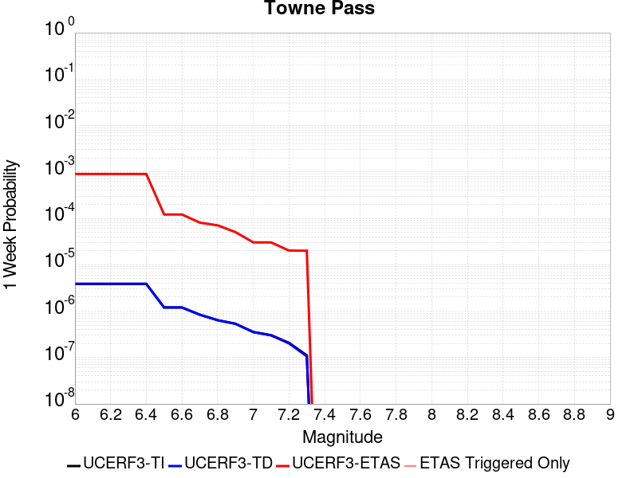 |  |  | 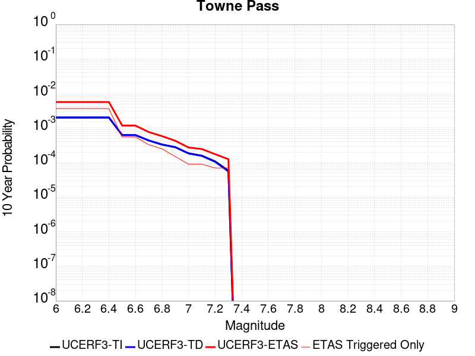 |

| Magnitude | 1 wk TI Prob | 1 wk TD Prob | 1 wk ETAS Prob | 1 wk ETAS/TD Gain | 1 wk ETAS Triggered Only | 1 mo TI Prob | 1 mo TD Prob | 1 mo ETAS Prob | 1 mo ETAS/TD Gain | 1 mo ETAS Triggered Only | 1 yr TI Prob | 1 yr TD Prob | 1 yr ETAS Prob | 1 yr ETAS/TD Gain | 1 yr ETAS Triggered Only | 10 yr TI Prob | 10 yr TD Prob | 10 yr ETAS Prob | 10 yr ETAS/TD Gain | 10 yr ETAS Triggered Only |
|-----|-----|-----|-----|-----|-----|-----|-----|-----|-----|-----|-----|-----|-----|-----|-----|-----|-----|-----|-----|-----|
| 6.0 | 3.849728E-6 | 3.8945414E-6 | 9.0389105E-4 | 232.09178 | 9.0E-4 | 1.649873E-5 | 1.669081E-5 | 0.0014066676 | 84.27798 | 0.00139 | 2.0085352E-4 | 2.0319603E-4 | 0.002702688 | 13.30089 | 0.0025 | 0.0020067208 | 0.0020305314 | 0.00566314 | 2.788994 | 0.00364 |
| 6.1 | 3.849728E-6 | 3.8945414E-6 | 9.0389105E-4 | 232.09178 | 9.0E-4 | 1.649873E-5 | 1.669081E-5 | 0.0014066676 | 84.27798 | 0.00139 | 2.0085352E-4 | 2.0319603E-4 | 0.002702688 | 13.30089 | 0.0025 | 0.0020067208 | 0.0020305314 | 0.00566314 | 2.788994 | 0.00364 |
| 6.2 | 3.849728E-6 | 3.8945414E-6 | 9.0389105E-4 | 232.09178 | 9.0E-4 | 1.649873E-5 | 1.669081E-5 | 0.0014066676 | 84.27798 | 0.00139 | 2.0085352E-4 | 2.0319603E-4 | 0.002702688 | 13.30089 | 0.0025 | 0.0020067208 | 0.0020305314 | 0.00566314 | 2.788994 | 0.00364 |
| 6.3 | 3.849728E-6 | 3.8945414E-6 | 9.0389105E-4 | 232.09178 | 9.0E-4 | 1.649873E-5 | 1.669081E-5 | 0.0014066676 | 84.27798 | 0.00139 | 2.0085352E-4 | 2.0319603E-4 | 0.002702688 | 13.30089 | 0.0025 | 0.0020067208 | 0.0020305314 | 0.00566314 | 2.788994 | 0.00364 |
| 6.4 | 3.849728E-6 | 3.8945414E-6 | 9.0389105E-4 | 232.09178 | 9.0E-4 | 1.649873E-5 | 1.669081E-5 | 0.0014066676 | 84.27798 | 0.00139 | 2.0085352E-4 | 2.0319603E-4 | 0.002702688 | 13.30089 | 0.0025 | 0.0020067208 | 0.0020305314 | 0.00566314 | 2.788994 | 0.00364 |
| 6.5 | 1.1953545E-6 | 1.203052E-6 | 1.2120291E-4 | 100.74619 | 1.2E-4 | 5.1229376E-6 | 5.1559277E-6 | 2.051549E-4 | 39.790104 | 2.0E-4 | 6.236998E-5 | 6.277173E-5 | 4.327485E-4 | 6.894003 | 3.7E-4 | 6.235248E-4 | 6.275517E-4 | 0.0011772065 | 1.8758718 | 5.5E-4 |
| 6.6 | 1.1953545E-6 | 1.203052E-6 | 1.2120291E-4 | 100.74619 | 1.2E-4 | 5.1229376E-6 | 5.1559277E-6 | 2.051549E-4 | 39.790104 | 2.0E-4 | 6.236998E-5 | 6.277173E-5 | 4.327485E-4 | 6.894003 | 3.7E-4 | 6.235248E-4 | 6.275517E-4 | 0.0011772065 | 1.8758718 | 5.5E-4 |
| 6.7 | 8.375951E-7 | 8.4106705E-7 | 8.0841E-5 | 96.11719 | 8.0E-5 | 3.5896885E-6 | 3.6045683E-6 | 1.4360406E-4 | 39.839462 | 1.4E-4 | 4.370358E-5 | 4.3884793E-5 | 2.9387383E-4 | 6.696484 | 2.5E-4 | 4.3694986E-4 | 4.38767E-4 | 7.686222E-4 | 1.7517776 | 3.3E-4 |
| 6.8 | 6.38041E-7 | 6.392156E-7 | 7.063917E-5 | 110.50914 | 7.0E-5 | 2.7344586E-6 | 2.7394929E-6 | 1.2273916E-4 | 44.803608 | 1.2E-4 | 3.3291526E-5 | 3.3352855E-5 | 2.2334652E-4 | 6.6964736 | 1.9E-4 | 3.3286537E-4 | 3.334823E-4 | 5.833989E-4 | 1.7494149 | 2.5E-4 |
| 6.9 | 5.3460053E-7 | 5.345333E-7 | 5.0534505E-5 | 94.53949 | 5.0E-5 | 2.2911431E-6 | 2.2908553E-6 | 8.229067E-5 | 35.921375 | 8.0E-5 | 2.789431E-5 | 2.789084E-5 | 1.3788776E-4 | 4.943837 | 1.1E-4 | 2.789081E-4 | 2.7887672E-4 | 4.2883487E-4 | 1.5377221 | 1.5E-4 |
| 7.0 | 3.557783E-7 | 3.5324226E-7 | 3.0353232E-5 | 85.92752 | 3.0E-5 | 1.5247632E-6 | 1.5138945E-6 | 6.1513805E-5 | 40.63282 | 6.0E-5 | 1.8563835E-5 | 1.843152E-5 | 8.843023E-5 | 4.797772 | 7.0E-5 | 1.8562283E-4 | 1.8430075E-4 | 2.7428416E-4 | 1.4882423 | 9.0E-5 |
| 7.1 | 3.037942E-7 | 3.0002218E-7 | 3.0300012E-5 | 100.99258 | 3.0E-5 | 1.3019744E-6 | 1.2858087E-6 | 6.128573E-5 | 47.663177 | 6.0E-5 | 1.5851423E-5 | 1.5654618E-5 | 8.565352E-5 | 5.471454 | 7.0E-5 | 1.5850292E-4 | 1.5653588E-4 | 2.465218E-4 | 1.5748581 | 9.0E-5 |
| 7.2 | 2.0808248E-7 | 2.0217689E-7 | 2.0202173E-5 | 99.923256 | 2.0E-5 | 8.917818E-7 | 8.6647213E-7 | 5.0866427E-5 | 58.70521 | 5.0E-5 | 1.0857389E-5 | 1.0549252E-5 | 7.0548616E-5 | 6.687547 | 6.0E-5 | 1.0856859E-4 | 1.0548797E-4 | 1.7548059E-4 | 1.6635127 | 7.0E-5 |
| 7.3 | 1.1162073E-7 | 1.0636894E-7 | 2.0106367E-5 | 189.0248 | 2.0E-5 | 4.7837443E-7 | 4.558668E-7 | 5.0455845E-5 | 110.681114 | 5.0E-5 | 5.8241935E-6 | 5.550166E-6 | 6.554983E-5 | 11.810428 | 6.0E-5 | 5.8240406E-5 | 5.5500474E-5 | 1.2549659E-4 | 2.2611804 | 7.0E-5 |

## Lenwood-Lockhart-Old Woman Springs
*[(top)](#table-of-contents)*

| 1 Week | 1 Month | 1 Year | 10 Year |
|-----|-----|-----|-----|
| 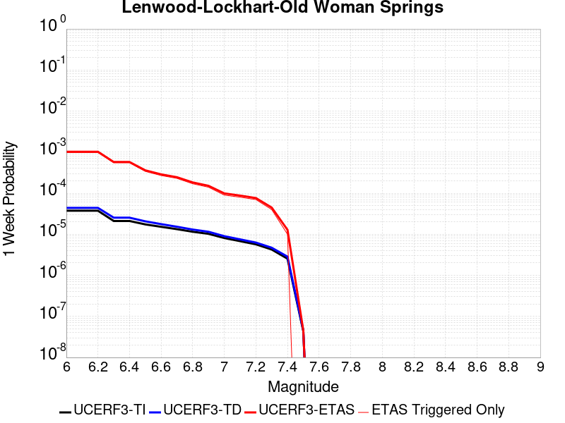 | 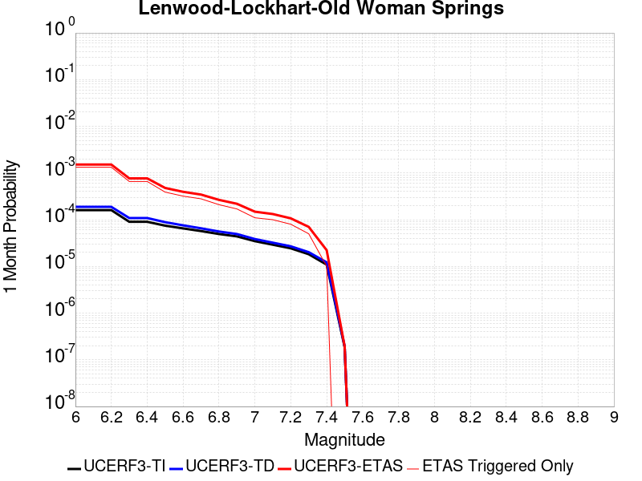 |  |  |

| Magnitude | 1 wk TI Prob | 1 wk TD Prob | 1 wk ETAS Prob | 1 wk ETAS/TD Gain | 1 wk ETAS Triggered Only | 1 mo TI Prob | 1 mo TD Prob | 1 mo ETAS Prob | 1 mo ETAS/TD Gain | 1 mo ETAS Triggered Only | 1 yr TI Prob | 1 yr TD Prob | 1 yr ETAS Prob | 1 yr ETAS/TD Gain | 1 yr ETAS Triggered Only | 10 yr TI Prob | 10 yr TD Prob | 10 yr ETAS Prob | 10 yr ETAS/TD Gain | 10 yr ETAS Triggered Only |
|-----|-----|-----|-----|-----|-----|-----|-----|-----|-----|-----|-----|-----|-----|-----|-----|-----|-----|-----|-----|-----|
| 6.0 | 3.744542E-5 | 4.396252E-5 | 0.0010239194 | 23.290735 | 9.8E-4 | 1.604705E-4 | 1.8839816E-4 | 0.0015181476 | 8.058187 | 0.00133 | 0.0019519776 | 0.0022915069 | 0.0044764886 | 1.953513 | 0.00219 | 0.019349206 | 0.022696787 | 0.0259903 | 1.1451092 | 0.00337 |
| 6.1 | 3.744542E-5 | 4.396252E-5 | 0.0010239194 | 23.290735 | 9.8E-4 | 1.604705E-4 | 1.8839816E-4 | 0.0015181476 | 8.058187 | 0.00133 | 0.0019519776 | 0.0022915069 | 0.0044764886 | 1.953513 | 0.00219 | 0.019349206 | 0.022696787 | 0.0259903 | 1.1451092 | 0.00337 |
| 6.2 | 3.744542E-5 | 4.396252E-5 | 0.0010239194 | 23.290735 | 9.8E-4 | 1.604705E-4 | 1.8839816E-4 | 0.0015181476 | 8.058187 | 0.00133 | 0.0019519776 | 0.0022915069 | 0.0044764886 | 1.953513 | 0.00219 | 0.019349206 | 0.022696787 | 0.0259903 | 1.1451092 | 0.00337 |
| 6.3 | 2.1079984E-5 | 2.5353434E-5 | 5.753395E-4 | 22.692764 | 5.5E-4 | 9.0339665E-5 | 1.0865316E-4 | 7.6858146E-4 | 7.0737147 | 6.6E-4 | 0.0010993304 | 0.0013220694 | 0.0023307342 | 1.7629439 | 0.00101 | 0.010939079 | 0.0131442575 | 0.014644278 | 1.1141199 | 0.00152 |
| 6.4 | 2.1079984E-5 | 2.5353434E-5 | 5.753395E-4 | 22.692764 | 5.5E-4 | 9.0339665E-5 | 1.0865316E-4 | 7.6858146E-4 | 7.0737147 | 6.6E-4 | 0.0010993304 | 0.0013220694 | 0.0023307342 | 1.7629439 | 0.00101 | 0.010939079 | 0.0131442575 | 0.014644278 | 1.1141199 | 0.00152 |
| 6.5 | 1.7397282E-5 | 2.066241E-5 | 3.606554E-4 | 17.454662 | 3.4E-4 | 7.455765E-5 | 8.8550245E-5 | 4.7851572E-4 | 5.403889 | 3.9E-4 | 9.073613E-4 | 0.0010775778 | 0.0016969097 | 1.5747445 | 6.2E-4 | 0.009036654 | 0.010724821 | 0.011723989 | 1.0931641 | 0.00101 |
| 6.6 | 1.52050325E-5 | 1.7679693E-5 | 2.8767492E-4 | 16.271488 | 2.7E-4 | 6.51628E-5 | 7.576796E-5 | 3.9574373E-4 | 5.223101 | 3.2E-4 | 7.9306826E-4 | 9.220924E-4 | 0.0014316221 | 1.5525799 | 5.1E-4 | 0.007902439 | 0.009183526 | 0.010055445 | 1.0949438 | 8.8E-4 |
| 6.7 | 1.332523E-5 | 1.5264002E-5 | 2.4526048E-4 | 16.067902 | 2.3E-4 | 5.7106878E-5 | 6.5415545E-5 | 3.4539722E-4 | 5.280048 | 2.8E-4 | 6.950544E-4 | 7.961491E-4 | 0.0012457909 | 1.5647708 | 4.5E-4 | 0.006928845 | 0.007933599 | 0.008667728 | 1.0925342 | 7.4E-4 |
| 6.8 | 1.1525329E-5 | 1.3030979E-5 | 1.8302877E-4 | 14.045665 | 1.7E-4 | 4.9393333E-5 | 5.584588E-5 | 2.6583415E-4 | 4.760139 | 2.1E-4 | 6.011979E-4 | 6.797157E-4 | 0.001039471 | 1.5292732 | 3.6E-4 | 0.00599574 | 0.006776819 | 0.007372753 | 1.0879371 | 6.0E-4 |
| 6.9 | 1.0253909E-5 | 1.15144385E-5 | 1.5151282E-4 | 13.158507 | 1.4E-4 | 4.3944583E-5 | 4.9346683E-5 | 2.193383E-4 | 4.444844 | 1.7E-4 | 5.3489394E-4 | 6.0063385E-4 | 8.904597E-4 | 1.4825332 | 2.9E-4 | 0.0053360825 | 0.0059904843 | 0.0064676087 | 1.0796471 | 4.8E-4 |
| 7.0 | 8.104563E-6 | 8.991279E-6 | 9.899047E-5 | 11.009609 | 9.0E-5 | 3.4733377E-5 | 3.8533497E-5 | 1.4852926E-4 | 3.8545492 | 1.1E-4 | 4.2279682E-4 | 4.6904673E-4 | 6.5895764E-4 | 1.4048868 | 1.9E-4 | 0.0042199334 | 0.0046808156 | 0.0049794116 | 1.0637914 | 3.0E-4 |
| 7.1 | 6.7986157E-6 | 7.515816E-6 | 8.751522E-5 | 11.64414 | 8.0E-5 | 2.91366E-5 | 3.2210253E-5 | 1.3220703E-4 | 4.1045012 | 1.0E-4 | 3.5468035E-4 | 3.920914E-4 | 5.420326E-4 | 1.3824139 | 1.5E-4 | 0.003541148 | 0.003914213 | 0.0041433126 | 1.0585302 | 2.3E-4 |
| 7.2 | 5.6893327E-6 | 6.2800136E-6 | 7.6279575E-5 | 12.146402 | 7.0E-5 | 2.4382627E-5 | 2.6914078E-5 | 1.06911924E-4 | 3.972342 | 8.0E-5 | 2.9681803E-4 | 3.2763163E-4 | 4.2759886E-4 | 1.3051208 | 1.0E-4 | 0.002964219 | 0.0032716845 | 0.0034311612 | 1.0487444 | 1.6E-4 |
| 7.3 | 4.253348E-6 | 4.7069107E-6 | 4.470672E-5 | 9.498103 | 4.0E-5 | 1.8228506E-5 | 2.0172329E-5 | 7.017132E-5 | 3.478593 | 5.0E-5 | 2.2190946E-4 | 2.4557224E-4 | 2.9555996E-4 | 1.2035561 | 5.0E-5 | 0.00221688 | 0.0024531898 | 0.0025329934 | 1.0325305 | 8.0E-5 |
| 7.4 | 2.5448119E-6 | 2.852045E-6 | 1.2852017E-5 | 4.506246 | 1.0E-5 | 1.0906291E-5 | 1.2223002E-5 | 2.222288E-5 | 1.8181196 | 1.0E-5 | 1.3277601E-4 | 1.4880655E-4 | 1.5880505E-4 | 1.0671914 | 1.0E-5 | 0.001326967 | 0.0014872311 | 0.0015171865 | 1.0201417 | 3.0E-5 |
| 7.5 | 4.3706837E-8 | 4.562909E-8 | 4.562909E-8 | 1.0 | 0.0 | 1.8731501E-7 | 1.9555324E-7 | 1.9555324E-7 | 1.0 | 0.0 | 2.2805577E-6 | 2.3808586E-6 | 2.3808586E-6 | 1.0 | 0.0 | 2.2805343E-5 | 2.3808387E-5 | 2.3808387E-5 | 1.0 | 0.0 |

## Paradise
*[(top)](#table-of-contents)*

| 1 Week | 1 Month | 1 Year | 10 Year |
|-----|-----|-----|-----|
| 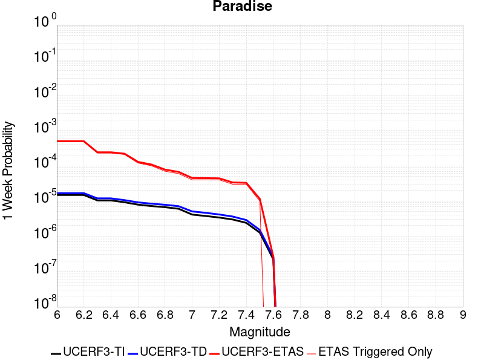 | 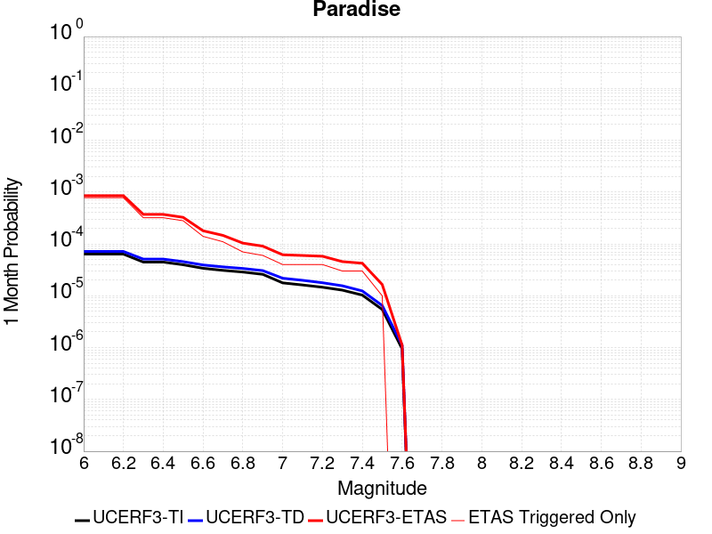 |  | 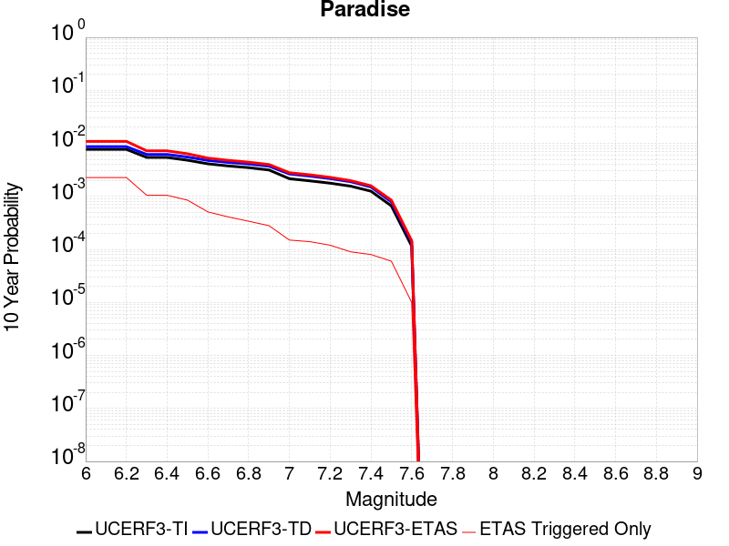 |

| Magnitude | 1 wk TI Prob | 1 wk TD Prob | 1 wk ETAS Prob | 1 wk ETAS/TD Gain | 1 wk ETAS Triggered Only | 1 mo TI Prob | 1 mo TD Prob | 1 mo ETAS Prob | 1 mo ETAS/TD Gain | 1 mo ETAS Triggered Only | 1 yr TI Prob | 1 yr TD Prob | 1 yr ETAS Prob | 1 yr ETAS/TD Gain | 1 yr ETAS Triggered Only | 10 yr TI Prob | 10 yr TD Prob | 10 yr ETAS Prob | 10 yr ETAS/TD Gain | 10 yr ETAS Triggered Only |
|-----|-----|-----|-----|-----|-----|-----|-----|-----|-----|-----|-----|-----|-----|-----|-----|-----|-----|-----|-----|-----|
| 6.0 | 1.4851273E-5 | 1.6694692E-5 | 4.9668667E-4 | 29.751175 | 4.8E-4 | 6.364676E-5 | 7.154685E-5 | 8.5149106E-4 | 11.901168 | 7.8E-4 | 7.7462377E-4 | 8.707584E-4 | 0.0022795305 | 2.6178682 | 0.00141 | 0.0077192914 | 0.008675844 | 0.01092615 | 1.259376 | 0.00227 |
| 6.1 | 1.4851273E-5 | 1.6694692E-5 | 4.9668667E-4 | 29.751175 | 4.8E-4 | 6.364676E-5 | 7.154685E-5 | 8.5149106E-4 | 11.901168 | 7.8E-4 | 7.7462377E-4 | 8.707584E-4 | 0.0022795305 | 2.6178682 | 0.00141 | 0.0077192914 | 0.008675844 | 0.01092615 | 1.259376 | 0.00227 |
| 6.2 | 1.4851273E-5 | 1.6694692E-5 | 4.9668667E-4 | 29.751175 | 4.8E-4 | 6.364676E-5 | 7.154685E-5 | 8.5149106E-4 | 11.901168 | 7.8E-4 | 7.7462377E-4 | 8.707584E-4 | 0.0022795305 | 2.6178682 | 0.00141 | 0.0077192914 | 0.008675844 | 0.01092615 | 1.259376 | 0.00227 |
| 6.3 | 1.0426831E-5 | 1.188862E-5 | 2.418859E-4 | 20.346 | 2.3E-4 | 4.4685654E-5 | 5.0950268E-5 | 3.7093397E-4 | 7.2803144 | 3.2E-4 | 5.43912E-4 | 6.201489E-4 | 0.0012897335 | 2.0797157 | 6.7E-4 | 0.0054258266 | 0.0061847917 | 0.0072282976 | 1.1687213 | 0.00105 |
| 6.4 | 1.0426831E-5 | 1.188862E-5 | 2.418859E-4 | 20.346 | 2.3E-4 | 4.4685654E-5 | 5.0950268E-5 | 3.7093397E-4 | 7.2803144 | 3.2E-4 | 5.43912E-4 | 6.201489E-4 | 0.0012897335 | 2.0797157 | 6.7E-4 | 0.0054258266 | 0.0061847917 | 0.0072282976 | 1.1687213 | 0.00105 |
| 6.5 | 9.25027E-6 | 1.06199595E-5 | 2.2061773E-4 | 20.773876 | 2.1E-4 | 3.964341E-5 | 4.551335E-5 | 3.2550062E-4 | 7.1517615 | 2.8E-4 | 4.8255164E-4 | 5.53989E-4 | 0.0011336677 | 2.0463722 | 5.8E-4 | 0.0048150513 | 0.0055265795 | 0.006371882 | 1.1529522 | 8.5E-4 |
| 6.6 | 7.904275E-6 | 9.159525E-6 | 1.2915842E-4 | 14.100996 | 1.2E-4 | 3.3875025E-5 | 3.9254537E-5 | 1.7924904E-4 | 4.5663266 | 1.4E-4 | 4.1235037E-4 | 4.7782314E-4 | 8.0766546E-4 | 1.6903021 | 3.3E-4 | 0.0041158604 | 0.0047683544 | 0.0052759224 | 1.1064452 | 5.1E-4 |
| 6.7 | 7.2061953E-6 | 8.407248E-6 | 1.08406406E-4 | 12.894398 | 1.0E-4 | 3.088333E-5 | 3.6030586E-5 | 1.4602662E-4 | 4.0528517 | 1.1E-4 | 3.7593965E-4 | 4.3858777E-4 | 6.884781E-4 | 1.5697613 | 2.5E-4 | 0.003753043 | 0.004377591 | 0.004785796 | 1.0932488 | 4.1E-4 |
| 6.8 | 6.6948724E-6 | 7.842166E-6 | 7.7841614E-5 | 9.926036 | 7.0E-5 | 2.8691995E-5 | 3.360887E-5 | 1.03606515E-4 | 3.0827136 | 7.0E-5 | 3.4926904E-4 | 4.0911473E-4 | 5.99037E-4 | 1.4642274 | 1.9E-4 | 0.003487206 | 0.0040839734 | 0.0044225845 | 1.0829122 | 3.4E-4 |
| 6.9 | 6.0421025E-6 | 7.130621E-6 | 6.713019E-5 | 9.414354 | 6.0E-5 | 2.5894467E-5 | 3.0559466E-5 | 9.055763E-5 | 2.9633253 | 6.0E-5 | 3.1521954E-4 | 3.7200135E-4 | 5.2194553E-4 | 1.4030744 | 1.5E-4 | 0.0031477278 | 0.0037141247 | 0.0039930847 | 1.0751079 | 2.8E-4 |
| 7.0 | 4.134091E-6 | 5.0803087E-6 | 4.5080105E-5 | 8.873497 | 4.0E-5 | 1.7717413E-5 | 2.177258E-5 | 6.177171E-5 | 2.8371332 | 4.0E-5 | 2.1568815E-4 | 2.6505045E-4 | 3.4502926E-4 | 1.3017493 | 8.0E-5 | 0.0021547892 | 0.0026474963 | 0.0027970993 | 1.0565073 | 1.5E-4 |
| 7.1 | 3.7674888E-6 | 4.6318696E-6 | 4.4631684E-5 | 9.635782 | 4.0E-5 | 1.6146281E-5 | 1.9850726E-5 | 5.9849932E-5 | 3.0149996 | 4.0E-5 | 1.9656324E-4 | 2.4165731E-4 | 3.2163798E-4 | 1.3309673 | 8.0E-5 | 0.0019638946 | 0.002414096 | 0.002553758 | 1.0578527 | 1.4E-4 |
| 7.2 | 3.4065345E-6 | 4.156723E-6 | 4.4156557E-5 | 10.622925 | 4.0E-5 | 1.4599351E-5 | 1.7814415E-5 | 5.78137E-5 | 3.2453327 | 4.0E-5 | 1.777326E-4 | 2.1687041E-4 | 2.9685308E-4 | 1.3688039 | 8.0E-5 | 0.0017759053 | 0.002166736 | 0.0022864759 | 1.0552628 | 1.2E-4 |
| 7.3 | 2.9934936E-6 | 3.6293168E-6 | 3.3629207E-5 | 9.265988 | 3.0E-5 | 1.2829195E-5 | 1.555413E-5 | 4.5553665E-5 | 2.928718 | 3.0E-5 | 1.5618425E-4 | 1.8935655E-4 | 2.493452E-4 | 1.3168025 | 6.0E-5 | 0.0015607453 | 0.0018920974 | 0.001981927 | 1.0474763 | 9.0E-5 |
| 7.4 | 2.4049796E-6 | 2.8889842E-6 | 3.2888896E-5 | 11.384243 | 3.0E-5 | 1.0307015E-5 | 1.238131E-5 | 4.238094E-5 | 3.422977 | 3.0E-5 | 1.2548068E-4 | 1.5073347E-4 | 2.0072592E-4 | 1.3316613 | 5.0E-5 | 0.0012540985 | 0.0015064536 | 0.0015863332 | 1.0530249 | 8.0E-5 |
| 7.5 | 1.2710091E-6 | 1.5134682E-6 | 1.15134535E-5 | 7.607331 | 1.0E-5 | 5.44717E-6 | 6.4862834E-6 | 1.6486218E-5 | 2.541705 | 1.0E-5 | 6.631728E-5 | 7.8968886E-5 | 1.0896652E-4 | 1.3798665 | 3.0E-5 | 6.6297496E-4 | 7.8953087E-4 | 8.4948353E-4 | 1.0759345 | 6.0E-5 |
| 7.6 | 2.21172E-7 | 2.603961E-7 | 2.603961E-7 | 1.0 | 0.0 | 9.478797E-7 | 1.1159829E-6 | 1.1159829E-6 | 1.0 | 0.0 | 1.1540374E-5 | 1.3587036E-5 | 2.35869E-5 | 1.7359858 | 1.0E-5 | 1.1539775E-4 | 1.3586486E-4 | 1.4586351E-4 | 1.0735925 | 1.0E-5 |

## Bicycle Lake
*[(top)](#table-of-contents)*

| 1 Week | 1 Month | 1 Year | 10 Year |
|-----|-----|-----|-----|
|  | 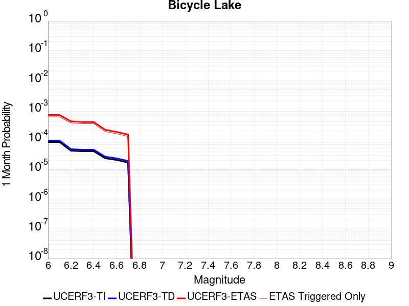 | 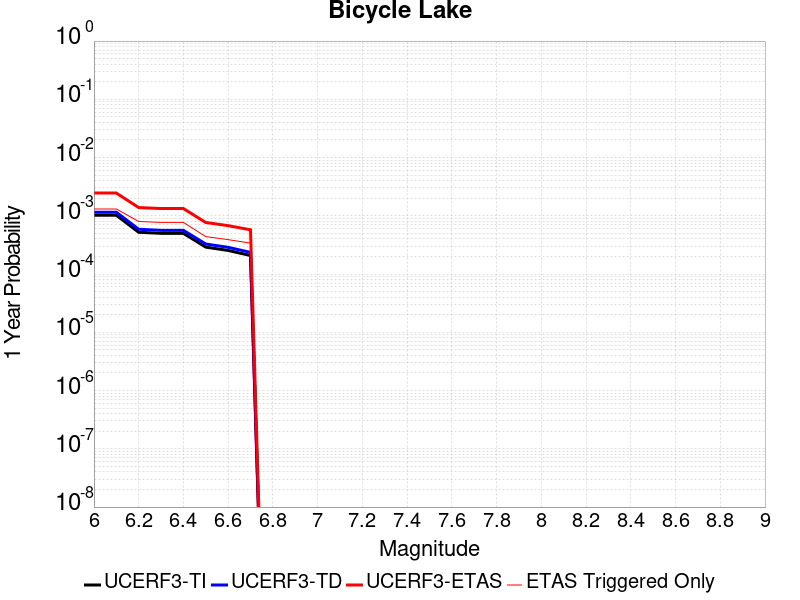 |  |

| Magnitude | 1 wk TI Prob | 1 wk TD Prob | 1 wk ETAS Prob | 1 wk ETAS/TD Gain | 1 wk ETAS Triggered Only | 1 mo TI Prob | 1 mo TD Prob | 1 mo ETAS Prob | 1 mo ETAS/TD Gain | 1 mo ETAS Triggered Only | 1 yr TI Prob | 1 yr TD Prob | 1 yr ETAS Prob | 1 yr ETAS/TD Gain | 1 yr ETAS Triggered Only | 10 yr TI Prob | 10 yr TD Prob | 10 yr ETAS Prob | 10 yr ETAS/TD Gain | 10 yr ETAS Triggered Only |
|-----|-----|-----|-----|-----|-----|-----|-----|-----|-----|-----|-----|-----|-----|-----|-----|-----|-----|-----|-----|-----|
| 6.0 | 1.9621975E-5 | 2.2097078E-5 | 3.7208936E-4 | 16.838848 | 3.5E-4 | 8.4091465E-5 | 9.4699084E-5 | 6.846432E-4 | 7.2296705 | 5.9E-4 | 0.0010233327 | 0.0011524865 | 0.0024609768 | 2.1353626 | 0.00131 | 0.01018633 | 0.011478408 | 0.013593844 | 1.184297 | 0.00214 |
| 6.1 | 1.9621975E-5 | 2.2097078E-5 | 3.7208936E-4 | 16.838848 | 3.5E-4 | 8.4091465E-5 | 9.4699084E-5 | 6.846432E-4 | 7.2296705 | 5.9E-4 | 0.0010233327 | 0.0011524865 | 0.0024609768 | 2.1353626 | 0.00131 | 0.01018633 | 0.011478408 | 0.013593844 | 1.184297 | 0.00214 |
| 6.2 | 9.9971285E-6 | 1.1255639E-5 | 2.5125293E-4 | 22.322405 | 2.4E-4 | 4.2844134E-5 | 4.8237856E-5 | 4.1822E-4 | 8.669954 | 3.7E-4 | 5.2150246E-4 | 5.871896E-4 | 0.0013867199 | 2.3616219 | 8.0E-4 | 0.0052028033 | 0.005861487 | 0.0071240426 | 1.2153986 | 0.00127 |
| 6.3 | 9.589428E-6 | 1.0798346E-5 | 2.4079587E-4 | 22.299328 | 2.3E-4 | 4.10969E-5 | 4.62781E-5 | 3.962619E-4 | 8.562623 | 3.5E-4 | 5.002399E-4 | 5.6334207E-4 | 0.0013329083 | 2.3660727 | 7.7E-4 | 0.0049911533 | 0.0056242296 | 0.0068274243 | 1.2139306 | 0.00121 |
| 6.4 | 9.589428E-6 | 1.0798346E-5 | 2.4079587E-4 | 22.299328 | 2.3E-4 | 4.10969E-5 | 4.62781E-5 | 3.962619E-4 | 8.562623 | 3.5E-4 | 5.002399E-4 | 5.6334207E-4 | 0.0013329083 | 2.3660727 | 7.7E-4 | 0.0049911533 | 0.0056242296 | 0.0068274243 | 1.2139306 | 0.00121 |
| 6.5 | 5.557707E-6 | 6.2856016E-6 | 1.1628491E-4 | 18.500204 | 1.1E-4 | 2.3818526E-5 | 2.6938165E-5 | 2.1693304E-4 | 8.053 | 1.9E-4 | 2.8995197E-4 | 3.2794967E-4 | 7.678054E-4 | 2.3412292 | 4.4E-4 | 0.0028957394 | 0.0032772934 | 0.003945098 | 1.203767 | 6.7E-4 |
| 6.6 | 4.8742945E-6 | 5.5132896E-6 | 9.551279E-5 | 17.324102 | 9.0E-5 | 2.0889667E-5 | 2.3628318E-5 | 1.8362454E-4 | 7.7713757 | 1.6E-4 | 2.54302E-4 | 2.87663E-4 | 6.775508E-4 | 2.3553631 | 3.9E-4 | 0.002540112 | 0.0028754752 | 0.0034637786 | 1.2045934 | 5.9E-4 |
| 6.7 | 3.991108E-6 | 4.5159104E-6 | 7.451559E-5 | 16.50068 | 7.0E-5 | 1.7104636E-5 | 1.9353902E-5 | 1.4935138E-4 | 7.716862 | 1.3E-4 | 2.0822904E-4 | 2.3563375E-4 | 5.755536E-4 | 2.4425774 | 3.4E-4 | 0.0020803404 | 0.0023563374 | 0.0028651357 | 1.2159276 | 5.1E-4 |

## San Andreas (San Bernardino N)
*[(top)](#table-of-contents)*

| 1 Week | 1 Month | 1 Year | 10 Year |
|-----|-----|-----|-----|
| 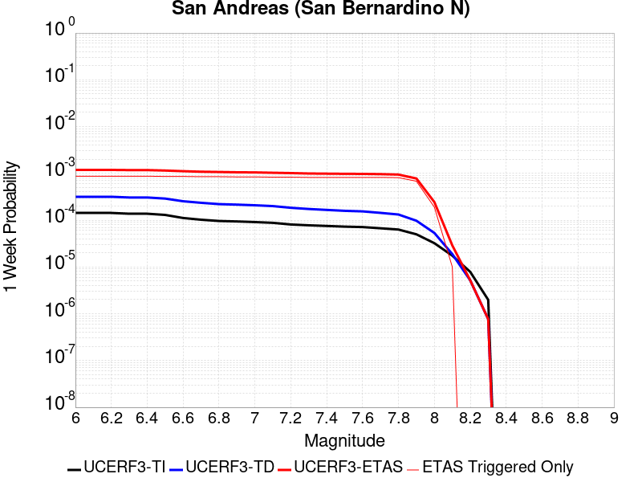 | 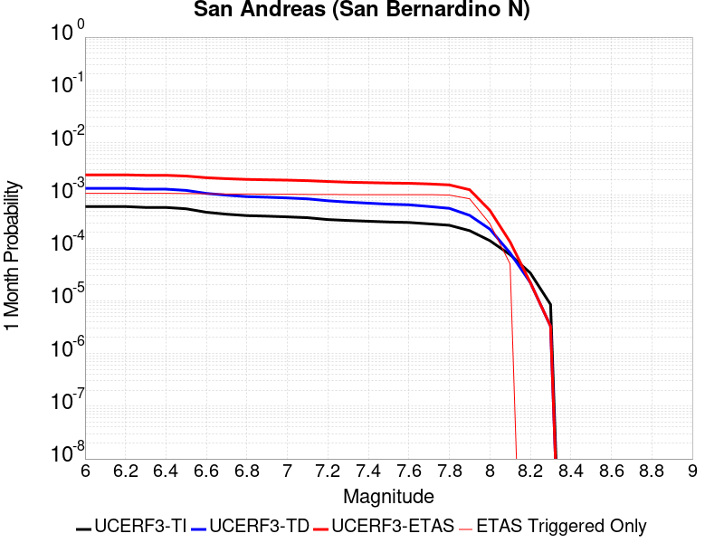 | 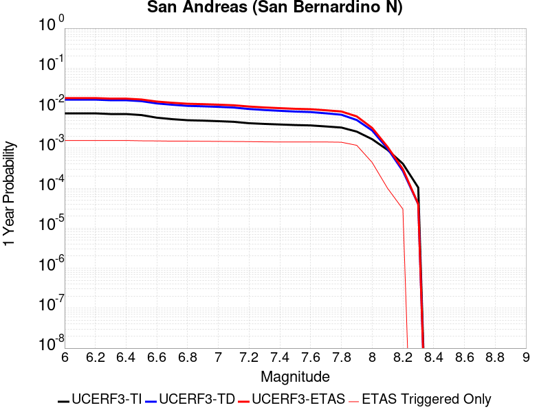 | 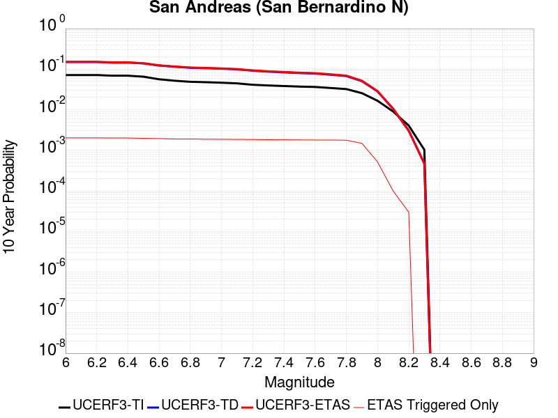 |

| Magnitude | 1 wk TI Prob | 1 wk TD Prob | 1 wk ETAS Prob | 1 wk ETAS/TD Gain | 1 wk ETAS Triggered Only | 1 mo TI Prob | 1 mo TD Prob | 1 mo ETAS Prob | 1 mo ETAS/TD Gain | 1 mo ETAS Triggered Only | 1 yr TI Prob | 1 yr TD Prob | 1 yr ETAS Prob | 1 yr ETAS/TD Gain | 1 yr ETAS Triggered Only | 10 yr TI Prob | 10 yr TD Prob | 10 yr ETAS Prob | 10 yr ETAS/TD Gain | 10 yr ETAS Triggered Only |
|-----|-----|-----|-----|-----|-----|-----|-----|-----|-----|-----|-----|-----|-----|-----|-----|-----|-----|-----|-----|-----|
| 6.0 | 1.4273766E-4 | 3.1606483E-4 | 0.0011857898 | 3.7517297 | 8.7E-4 | 6.115894E-4 | 0.0013538664 | 0.0024423907 | 1.8040116 | 0.00109 | 0.0074207084 | 0.016360244 | 0.01789472 | 1.0937932 | 0.00156 | 0.07177748 | 0.15026689 | 0.15199184 | 1.0114793 | 0.00203 |
| 6.1 | 1.4273766E-4 | 3.1606483E-4 | 0.0011857898 | 3.7517297 | 8.7E-4 | 6.115894E-4 | 0.0013538664 | 0.0024423907 | 1.8040116 | 0.00109 | 0.0074207084 | 0.016360244 | 0.01789472 | 1.0937932 | 0.00156 | 0.07177748 | 0.15026689 | 0.15199184 | 1.0114793 | 0.00203 |
| 6.2 | 1.4273766E-4 | 3.1606483E-4 | 0.0011857898 | 3.7517297 | 8.7E-4 | 6.115894E-4 | 0.0013538664 | 0.0024423907 | 1.8040116 | 0.00109 | 0.0074207084 | 0.016360244 | 0.01789472 | 1.0937932 | 0.00156 | 0.07177748 | 0.15026689 | 0.15199184 | 1.0114793 | 0.00203 |
| 6.3 | 1.3730655E-4 | 3.0511338E-4 | 0.001174848 | 3.850529 | 8.7E-4 | 5.883239E-4 | 0.0013069791 | 0.0023955544 | 1.8328942 | 0.00109 | 0.0071393442 | 0.015797773 | 0.017333128 | 1.0971881 | 0.00156 | 0.06914291 | 0.14556676 | 0.14729272 | 1.0118568 | 0.00202 |
| 6.4 | 1.3730655E-4 | 3.0511338E-4 | 0.001174848 | 3.850529 | 8.7E-4 | 5.883239E-4 | 0.0013069791 | 0.0023955544 | 1.8328942 | 0.00109 | 0.0071393442 | 0.015797773 | 0.017333128 | 1.0971881 | 0.00156 | 0.06914291 | 0.14556676 | 0.14729272 | 1.0118568 | 0.00202 |
| 6.5 | 1.2942807E-4 | 2.8925808E-4 | 0.0011490093 | 3.9722636 | 8.6E-4 | 5.545738E-4 | 0.0012390936 | 0.0023177555 | 1.8705248 | 0.00108 | 0.0067310524 | 0.01498286 | 0.016489936 | 1.1005867 | 0.00153 | 0.06530788 | 0.13870941 | 0.14041477 | 1.0122944 | 0.00198 |
| 6.6 | 1.1125901E-4 | 2.536472E-4 | 0.0011134291 | 4.389676 | 8.6E-4 | 4.767372E-4 | 0.0010866089 | 0.0021554462 | 1.983645 | 0.00107 | 0.005788839 | 0.013149847 | 0.01464986 | 1.1140707 | 0.00152 | 0.056403454 | 0.122999296 | 0.12470944 | 1.0139037 | 0.00195 |
| 6.7 | 1.02209575E-4 | 2.3499702E-4 | 0.0010847973 | 4.616217 | 8.5E-4 | 4.3796748E-4 | 0.0010067427 | 0.0020656756 | 2.0518405 | 0.00106 | 0.0053192247 | 0.012188629 | 0.013670347 | 1.1215655 | 0.0015 | 0.051936906 | 0.114790924 | 0.11647282 | 1.0146518 | 0.0019 |
| 6.8 | 9.610582E-5 | 2.2025521E-4 | 0.001070068 | 4.8583097 | 8.5E-4 | 4.1181705E-4 | 9.436101E-4 | 0.00200261 | 2.1222854 | 0.00106 | 0.0050023515 | 0.011428202 | 0.012911059 | 1.1297543 | 0.0015 | 0.048912346 | 0.1081929 | 0.10988733 | 1.0156612 | 0.0019 |
| 6.9 | 9.3877505E-5 | 2.1481077E-4 | 0.0010546304 | 4.9095783 | 8.4E-4 | 4.0227012E-4 | 9.2029345E-4 | 0.0019693272 | 2.1398904 | 0.00105 | 0.0048866454 | 0.011147255 | 0.0126206465 | 1.1321752 | 0.00149 | 0.04780577 | 0.10578323 | 0.10746436 | 1.0158921 | 0.00188 |
| 7.0 | 9.1019785E-5 | 2.0808022E-4 | 0.0010479054 | 5.0360646 | 8.4E-4 | 3.900265E-4 | 8.914682E-4 | 0.0019405321 | 2.1767821 | 0.00105 | 0.0047382377 | 0.010799837 | 0.012263853 | 1.1355591 | 0.00148 | 0.046384744 | 0.102753714 | 0.10443157 | 1.0163288 | 0.00187 |
| 7.1 | 8.771155E-5 | 1.9982594E-4 | 0.0010296601 | 5.152785 | 8.3E-4 | 3.758525E-4 | 8.5611636E-4 | 0.001895226 | 2.2137482 | 0.00104 | 0.0045664064 | 0.0103736 | 0.01182835 | 1.1402359 | 0.00147 | 0.044737056 | 0.09906527 | 0.10074101 | 1.0169156 | 0.00186 |
| 7.2 | 8.0830236E-5 | 1.8388197E-4 | 0.0010137294 | 5.5129347 | 8.3E-4 | 3.4636928E-4 | 7.8782777E-4 | 0.0018270084 | 2.3190455 | 0.00104 | 0.0042088944 | 0.009549725 | 0.010995782 | 1.151424 | 0.00146 | 0.041300658 | 0.09179615 | 0.093476325 | 1.0183034 | 0.00185 |
| 7.3 | 7.7668235E-5 | 1.7331762E-4 | 9.931755E-4 | 5.730378 | 8.2E-4 | 3.328214E-4 | 7.425784E-4 | 0.0017718136 | 2.3860288 | 0.00103 | 0.0040445733 | 0.009003494 | 0.010430529 | 1.1584979 | 0.00144 | 0.03971748 | 0.08706327 | 0.08873394 | 1.0191892 | 0.00183 |
| 7.4 | 7.520177E-5 | 1.6551897E-4 | 9.853833E-4 | 5.9532948 | 8.2E-4 | 3.2225347E-4 | 7.0917426E-4 | 0.0017384439 | 2.4513633 | 0.00103 | 0.0039163795 | 0.008600081 | 0.010017783 | 1.1648475 | 0.00143 | 0.038480744 | 0.08351955 | 0.08518755 | 1.0199713 | 0.00182 |
| 7.5 | 7.274697E-5 | 1.5839566E-4 | 9.782658E-4 | 6.17609 | 8.2E-4 | 3.1173544E-4 | 6.78662E-4 | 0.001707963 | 2.5166621 | 0.00103 | 0.003788775 | 0.008231463 | 0.009649692 | 1.1722937 | 0.00143 | 0.03724827 | 0.08023631 | 0.08190108 | 1.0207484 | 0.00181 |
| 7.6 | 7.1185845E-5 | 1.540943E-4 | 9.7396795E-4 | 6.3205967 | 8.2E-4 | 3.0504653E-4 | 6.6023704E-4 | 0.001689557 | 2.5590158 | 0.00103 | 0.0037076178 | 0.008008812 | 0.009427358 | 1.1771233 | 0.00143 | 0.036463667 | 0.07822598 | 0.07988517 | 1.0212103 | 0.0018 |
| 7.7 | 6.709961E-5 | 1.4318313E-4 | 9.630657E-4 | 6.7261114 | 8.2E-4 | 2.8753807E-4 | 6.1349774E-4 | 0.0016428658 | 2.677868 | 0.00103 | 0.003495157 | 0.0074437927 | 0.008863148 | 1.1906763 | 0.00143 | 0.034406938 | 0.07305469 | 0.0747232 | 1.0228391 | 0.0018 |
| 7.8 | 6.300812E-5 | 1.3202413E-4 | 9.419172E-4 | 7.1344323 | 8.1E-4 | 2.7000686E-4 | 5.65695E-4 | 0.0015751236 | 2.7844043 | 0.00101 | 0.0032823787 | 0.006865616 | 0.008265935 | 1.2039613 | 0.00141 | 0.032343175 | 0.06771354 | 0.069373004 | 1.0245072 | 0.00178 |
| 7.9 | 4.983037E-5 | 9.723488E-5 | 7.771688E-4 | 7.9926953 | 6.8E-4 | 2.1354125E-4 | 4.1665437E-4 | 0.0012762961 | 3.063201 | 8.6E-4 | 0.0025967648 | 0.0050609782 | 0.0062350063 | 1.2319765 | 0.00118 | 0.025666296 | 0.05064886 | 0.052063394 | 1.0279282 | 0.00149 |
| 8.0 | 3.2211527E-5 | 5.3304586E-5 | 2.4329446E-4 | 4.5642314 | 1.9E-4 | 1.380421E-4 | 2.2842824E-4 | 5.18362E-4 | 2.2692554 | 2.9E-4 | 0.0016793669 | 0.0027775685 | 0.0032163465 | 1.157972 | 4.4E-4 | 0.016667323 | 0.028361378 | 0.02886663 | 1.0178148 | 5.2E-4 |
| 8.1 | 1.743376E-5 | 1.8824427E-5 | 2.8824237E-5 | 1.5312147 | 1.0E-5 | 7.471398E-5 | 8.067362E-5 | 1.3066959E-4 | 1.6197313 | 5.0E-5 | 9.0926304E-4 | 9.817594E-4 | 0.0010816612 | 1.101758 | 1.0E-4 | 0.009055517 | 0.010484105 | 0.010583057 | 1.0094383 | 1.0E-4 |
| 8.2 | 7.831616E-6 | 5.1551065E-6 | 5.1551065E-6 | 1.0 | 0.0 | 3.3563636E-5 | 2.2093127E-5 | 2.2093127E-5 | 1.0 | 0.0 | 4.0856065E-4 | 2.6895068E-4 | 2.989426E-4 | 1.1115146 | 3.0E-5 | 0.004078103 | 0.0030418145 | 0.0030717233 | 1.0098325 | 3.0E-5 |
| 8.3 | 1.983087E-6 | 7.6599065E-7 | 7.6599065E-7 | 1.0 | 0.0 | 8.498917E-6 | 3.282813E-6 | 3.282813E-6 | 1.0 | 0.0 | 1.034694E-4 | 3.9967534E-5 | 3.9967534E-5 | 1.0 | 0.0 | 0.0010342124 | 4.719687E-4 | 4.719687E-4 | 1.0 | 0.0 |

## Garlic Springs
*[(top)](#table-of-contents)*

| 1 Week | 1 Month | 1 Year | 10 Year |
|-----|-----|-----|-----|
|  |  | 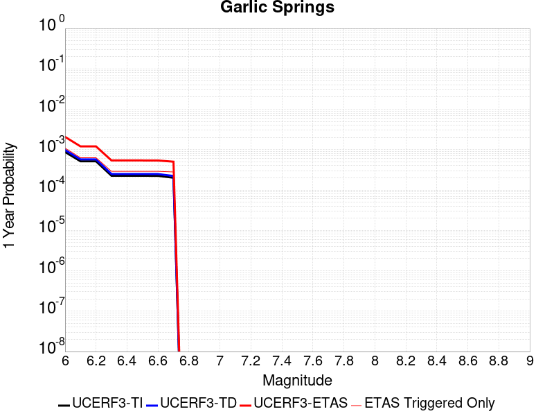 |  |

| Magnitude | 1 wk TI Prob | 1 wk TD Prob | 1 wk ETAS Prob | 1 wk ETAS/TD Gain | 1 wk ETAS Triggered Only | 1 mo TI Prob | 1 mo TD Prob | 1 mo ETAS Prob | 1 mo ETAS/TD Gain | 1 mo ETAS Triggered Only | 1 yr TI Prob | 1 yr TD Prob | 1 yr ETAS Prob | 1 yr ETAS/TD Gain | 1 yr ETAS Triggered Only | 10 yr TI Prob | 10 yr TD Prob | 10 yr ETAS Prob | 10 yr ETAS/TD Gain | 10 yr ETAS Triggered Only |
|-----|-----|-----|-----|-----|-----|-----|-----|-----|-----|-----|-----|-----|-----|-----|-----|-----|-----|-----|-----|-----|
| 6.0 | 1.6760017E-5 | 1.8776833E-5 | 3.0877138E-4 | 16.444275 | 2.9E-4 | 7.182667E-5 | 8.0470316E-5 | 5.704309E-4 | 7.0887117 | 4.9E-4 | 8.7413884E-4 | 9.794032E-4 | 0.0020683357 | 2.1118326 | 0.00109 | 0.008707083 | 0.009762413 | 0.0114953285 | 1.177509 | 0.00175 |
| 6.1 | 9.852767E-6 | 1.09735865E-5 | 1.7097183E-4 | 15.580305 | 1.6E-4 | 4.222546E-5 | 4.702921E-5 | 3.5701462E-4 | 7.591338 | 3.1E-4 | 5.139737E-4 | 5.7250116E-4 | 0.0012021405 | 2.0998044 | 6.3E-4 | 0.005127866 | 0.005717221 | 0.00673139 | 1.1773883 | 0.00102 |
| 6.2 | 9.852767E-6 | 1.09735865E-5 | 1.7097183E-4 | 15.580305 | 1.6E-4 | 4.222546E-5 | 4.702921E-5 | 3.5701462E-4 | 7.591338 | 3.1E-4 | 5.139737E-4 | 5.7250116E-4 | 0.0012021405 | 2.0998044 | 6.3E-4 | 0.005127866 | 0.005717221 | 0.00673139 | 1.1773883 | 0.00102 |
| 6.3 | 4.3167724E-6 | 4.7780286E-6 | 1.14777504E-4 | 24.021936 | 1.1E-4 | 1.8500323E-5 | 2.0477235E-5 | 2.1047334E-4 | 10.278407 | 1.9E-4 | 2.2521814E-4 | 2.4930484E-4 | 5.3923257E-4 | 2.1629446 | 2.9E-4 | 0.0022499003 | 0.00249251 | 0.0029513633 | 1.1840929 | 4.6E-4 |
| 6.4 | 4.3167724E-6 | 4.7780286E-6 | 1.14777504E-4 | 24.021936 | 1.1E-4 | 1.8500323E-5 | 2.0477235E-5 | 2.1047334E-4 | 10.278407 | 1.9E-4 | 2.2521814E-4 | 2.4930484E-4 | 5.3923257E-4 | 2.1629446 | 2.9E-4 | 0.0022499003 | 0.00249251 | 0.0029513633 | 1.1840929 | 4.6E-4 |
| 6.5 | 4.3167724E-6 | 4.7780286E-6 | 1.14777504E-4 | 24.021936 | 1.1E-4 | 1.8500323E-5 | 2.0477235E-5 | 2.1047334E-4 | 10.278407 | 1.9E-4 | 2.2521814E-4 | 2.4930484E-4 | 5.3923257E-4 | 2.1629446 | 2.9E-4 | 0.0022499003 | 0.00249251 | 0.0029513633 | 1.1840929 | 4.6E-4 |
| 6.6 | 4.301311E-6 | 4.760897E-6 | 1.14760376E-4 | 24.10478 | 1.1E-4 | 1.8434059E-5 | 2.0403815E-5 | 2.1039994E-4 | 10.311794 | 1.9E-4 | 2.2441156E-4 | 2.4841115E-4 | 5.3833914E-4 | 2.1671293 | 2.9E-4 | 0.0022418506 | 0.002483593 | 0.0029424506 | 1.1847556 | 4.6E-4 |
| 6.7 | 3.8599724E-6 | 4.27106E-6 | 1.04270635E-4 | 24.413292 | 1.0E-4 | 1.6542634E-5 | 1.8304541E-5 | 1.9830125E-4 | 10.833445 | 1.8E-4 | 2.0138794E-4 | 2.228578E-4 | 5.027954E-4 | 2.2561266 | 2.8E-4 | 0.0020120554 | 0.002228578 | 0.0026675975 | 1.1969953 | 4.4E-4 |

## San Andreas (San Bernardino S)
*[(top)](#table-of-contents)*

| 1 Week | 1 Month | 1 Year | 10 Year |
|-----|-----|-----|-----|
| 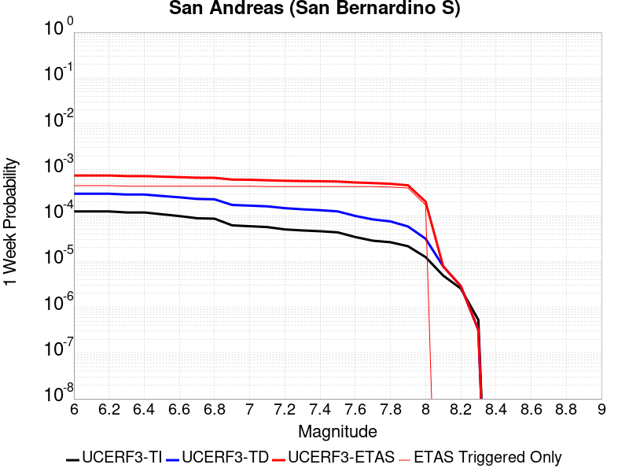 | 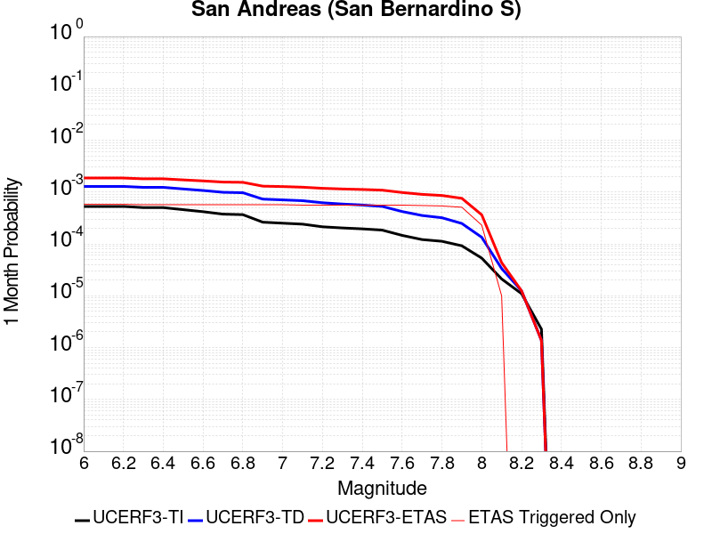 | 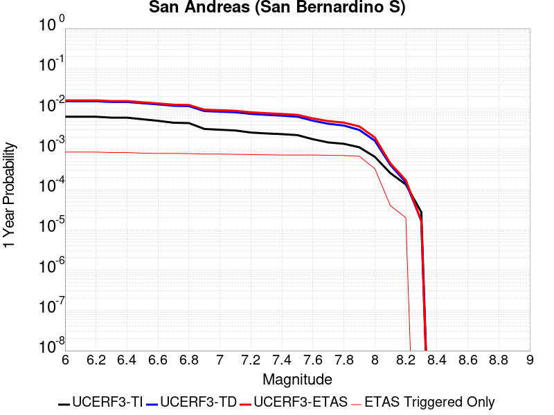 | 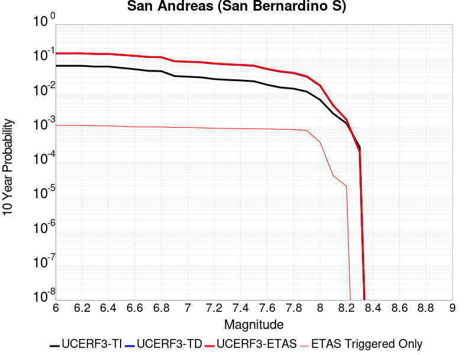 |

| Magnitude | 1 wk TI Prob | 1 wk TD Prob | 1 wk ETAS Prob | 1 wk ETAS/TD Gain | 1 wk ETAS Triggered Only | 1 mo TI Prob | 1 mo TD Prob | 1 mo ETAS Prob | 1 mo ETAS/TD Gain | 1 mo ETAS Triggered Only | 1 yr TI Prob | 1 yr TD Prob | 1 yr ETAS Prob | 1 yr ETAS/TD Gain | 1 yr ETAS Triggered Only | 10 yr TI Prob | 10 yr TD Prob | 10 yr ETAS Prob | 10 yr ETAS/TD Gain | 10 yr ETAS Triggered Only |
|-----|-----|-----|-----|-----|-----|-----|-----|-----|-----|-----|-----|-----|-----|-----|-----|-----|-----|-----|-----|-----|
| 6.0 | 1.2336002E-4 | 3.0004102E-4 | 7.49906E-4 | 2.4993448 | 4.5E-4 | 5.2857865E-4 | 0.0012852824 | 0.001864537 | 1.4506826 | 5.8E-4 | 0.006416472 | 0.015540994 | 0.016377784 | 1.0538441 | 8.5E-4 | 0.06234337 | 0.14283717 | 0.14383148 | 1.0069611 | 0.00116 |
| 6.1 | 1.2336002E-4 | 3.0004102E-4 | 7.49906E-4 | 2.4993448 | 4.5E-4 | 5.2857865E-4 | 0.0012852824 | 0.001864537 | 1.4506826 | 5.8E-4 | 0.006416472 | 0.015540994 | 0.016377784 | 1.0538441 | 8.5E-4 | 0.06234337 | 0.14283717 | 0.14383148 | 1.0069611 | 0.00116 |
| 6.2 | 1.2336002E-4 | 3.0004102E-4 | 7.49906E-4 | 2.4993448 | 4.5E-4 | 5.2857865E-4 | 0.0012852824 | 0.001864537 | 1.4506826 | 5.8E-4 | 0.006416472 | 0.015540994 | 0.016377784 | 1.0538441 | 8.5E-4 | 0.06234337 | 0.14283717 | 0.14383148 | 1.0069611 | 0.00116 |
| 6.3 | 1.1712257E-4 | 2.8792414E-4 | 7.2779745E-4 | 2.5277402 | 4.4E-4 | 5.018573E-4 | 0.0012334028 | 0.0018026996 | 1.4615662 | 5.7E-4 | 0.006093008 | 0.014918125 | 0.015735744 | 1.0548071 | 8.3E-4 | 0.059286322 | 0.13754563 | 0.1385202 | 1.0070854 | 0.00113 |
| 6.4 | 1.1712257E-4 | 2.8792414E-4 | 7.2779745E-4 | 2.5277402 | 4.4E-4 | 5.018573E-4 | 0.0012334028 | 0.0018026996 | 1.4615662 | 5.7E-4 | 0.006093008 | 0.014918125 | 0.015735744 | 1.0548071 | 8.3E-4 | 0.059286322 | 0.13754563 | 0.1385202 | 1.0070854 | 0.00113 |
| 6.5 | 1.0689076E-4 | 2.680528E-4 | 7.0793484E-4 | 2.6410277 | 4.4E-4 | 4.5802278E-4 | 0.0011483167 | 0.0017176621 | 1.4958087 | 5.7E-4 | 0.0055621783 | 0.01389575 | 0.014684633 | 1.0567715 | 8.0E-4 | 0.05425003 | 0.12879294 | 0.12974256 | 1.0073732 | 0.00109 |
| 6.6 | 9.7648895E-5 | 2.50501E-4 | 6.9039076E-4 | 2.7560399 | 4.4E-4 | 4.1842813E-4 | 0.0010731576 | 0.0016425459 | 1.5305728 | 5.7E-4 | 0.005082469 | 0.012991785 | 0.013771522 | 1.0600177 | 7.9E-4 | 0.049677886 | 0.12095292 | 0.1218847 | 1.0077038 | 0.00106 |
| 6.7 | 8.757013E-5 | 2.3120902E-4 | 6.7110726E-4 | 2.9025998 | 4.4E-4 | 3.7524657E-4 | 9.905418E-4 | 0.0015599772 | 1.5748726 | 5.7E-4 | 0.00455906 | 0.011997245 | 0.012777767 | 1.0650585 | 7.9E-4 | 0.04466656 | 0.11226123 | 0.11320223 | 1.0083823 | 0.00106 |
| 6.8 | 8.562978E-5 | 2.2680782E-4 | 6.6670805E-4 | 2.9395282 | 4.4E-4 | 3.6693315E-4 | 9.7169366E-4 | 0.0015411398 | 1.5860347 | 5.7E-4 | 0.004458263 | 0.011770263 | 0.012541083 | 1.0654887 | 7.8E-4 | 0.043698758 | 0.11027153 | 0.11120575 | 1.008472 | 0.00105 |
| 6.9 | 6.124075E-5 | 1.7065753E-4 | 6.105824E-4 | 3.5778232 | 4.4E-4 | 2.6243398E-4 | 7.311852E-4 | 0.0013007685 | 1.7789862 | 5.7E-4 | 0.0031904527 | 0.008866051 | 0.009619312 | 1.0849602 | 7.6E-4 | 0.031450346 | 0.08418263 | 0.0851076 | 1.0109878 | 0.00101 |
| 7.0 | 5.8598747E-5 | 1.649477E-4 | 6.0487515E-4 | 3.667072 | 4.4E-4 | 2.5111332E-4 | 7.06728E-4 | 0.0012763252 | 1.8059638 | 5.7E-4 | 0.0030530186 | 0.008570663 | 0.009324149 | 1.0879146 | 7.6E-4 | 0.03011414 | 0.081500374 | 0.08242805 | 1.0113826 | 0.00101 |
| 7.1 | 5.613814E-5 | 1.5913323E-4 | 5.890648E-4 | 3.7017083 | 4.3E-4 | 2.4056983E-4 | 6.818221E-4 | 0.0012414402 | 1.8207687 | 5.6E-4 | 0.0029250039 | 0.008269769 | 0.009013566 | 1.0899417 | 7.5E-4 | 0.028868021 | 0.07879931 | 0.079711296 | 1.0115736 | 9.9E-4 |
| 7.2 | 4.991222E-5 | 1.4519796E-4 | 5.751355E-4 | 3.9610443 | 4.3E-4 | 2.1389198E-4 | 6.2212895E-4 | 0.0011817806 | 1.899575 | 5.6E-4 | 0.002601025 | 0.007548217 | 0.008282632 | 1.0972964 | 7.4E-4 | 0.025707912 | 0.07225321 | 0.07314385 | 1.0123266 | 9.6E-4 |
| 7.3 | 4.7410045E-5 | 1.3714004E-4 | 5.670811E-4 | 4.1350513 | 4.3E-4 | 2.0317009E-4 | 5.8761094E-4 | 0.0011472818 | 1.9524515 | 5.6E-4 | 0.0024707897 | 0.0071307817 | 0.0078555755 | 1.1016431 | 7.3E-4 | 0.024434982 | 0.06853558 | 0.06942047 | 1.0129114 | 9.5E-4 |
| 7.4 | 4.5556746E-5 | 1.3121912E-4 | 5.611627E-4 | 4.2765317 | 4.3E-4 | 1.952286E-4 | 5.622468E-4 | 0.001121932 | 1.9954439 | 5.6E-4 | 0.002374317 | 0.0068239477 | 0.0075390344 | 1.1047908 | 7.2E-4 | 0.023491086 | 0.065788016 | 0.06666617 | 1.0133483 | 9.4E-4 |
| 7.5 | 4.3084514E-5 | 1.2357246E-4 | 5.5351935E-4 | 4.4793096 | 4.3E-4 | 1.8463485E-4 | 5.2948913E-4 | 0.0010891926 | 2.0570633 | 5.6E-4 | 0.0022456115 | 0.0064275465 | 0.0071429187 | 1.1112978 | 7.2E-4 | 0.022230545 | 0.062188786 | 0.06306095 | 1.0140245 | 9.3E-4 |
| 7.6 | 3.408608E-5 | 9.83552E-5 | 5.283129E-4 | 5.371479 | 4.3E-4 | 1.4607502E-4 | 4.214543E-4 | 9.812183E-4 | 2.3281724 | 5.6E-4 | 0.0017770125 | 0.0051191594 | 0.0058354735 | 1.1399281 | 7.2E-4 | 0.017628696 | 0.050020292 | 0.050894275 | 1.0174725 | 9.2E-4 |
| 7.7 | 2.8315713E-5 | 8.248679E-5 | 5.1245134E-4 | 6.212526 | 4.3E-4 | 1.2134742E-4 | 3.5346695E-4 | 9.0327254E-4 | 2.5554652 | 5.5E-4 | 0.0014764034 | 0.0042949775 | 0.005001928 | 1.1645994 | 7.1E-4 | 0.01466633 | 0.0422714 | 0.04313336 | 1.020391 | 9.0E-4 |
| 7.8 | 2.6222975E-5 | 7.463088E-5 | 4.945995E-4 | 6.6272774 | 4.2E-4 | 1.1237934E-4 | 3.1980744E-4 | 8.596347E-4 | 2.6879761 | 5.4E-4 | 0.0013673597 | 0.0038867102 | 0.0045839893 | 1.1794009 | 7.0E-4 | 0.013589768 | 0.03843674 | 0.039292533 | 1.022265 | 8.9E-4 |
| 7.9 | 2.1469694E-5 | 5.787864E-5 | 4.578555E-4 | 7.9106126 | 4.0E-4 | 9.200973E-5 | 2.4802773E-4 | 7.5790123E-4 | 3.0557115 | 5.1E-4 | 0.0011196428 | 0.0030155594 | 0.0036835389 | 1.221511 | 6.7E-4 | 0.011140184 | 0.030152109 | 0.030957082 | 1.026697 | 8.3E-4 |
| 8.0 | 1.2420249E-5 | 3.131896E-5 | 2.0131364E-4 | 6.427852 | 1.7E-4 | 5.322855E-5 | 1.342172E-4 | 3.6418633E-4 | 2.7134101 | 2.3E-4 | 6.478649E-4 | 0.0016328706 | 0.0019623318 | 1.201768 | 3.3E-4 | 0.0064597935 | 0.016522504 | 0.016896226 | 1.0226189 | 3.8E-4 |
| 8.1 | 4.9197724E-6 | 7.822348E-6 | 7.822348E-6 | 1.0 | 0.0 | 2.1084568E-5 | 3.352392E-5 | 4.3523585E-5 | 1.2982844 | 1.0E-5 | 2.566744E-4 | 4.0807744E-4 | 4.4806112E-4 | 1.0979806 | 4.0E-5 | 0.002563781 | 0.0043843705 | 0.004424195 | 1.0090833 | 4.0E-5 |
| 8.2 | 2.5634774E-6 | 2.9067196E-6 | 2.9067196E-6 | 1.0 | 0.0 | 1.0986286E-5 | 1.2457311E-5 | 1.2457311E-5 | 1.0 | 0.0 | 1.3374983E-4 | 1.5165724E-4 | 1.7165422E-4 | 1.1318563 | 2.0E-5 | 0.0013366934 | 0.0017049741 | 0.0017249399 | 1.0117104 | 2.0E-5 |
| 8.3 | 5.2850464E-7 | 3.2088764E-7 | 3.2088764E-7 | 1.0 | 0.0 | 2.2650179E-6 | 1.375232E-6 | 1.375232E-6 | 1.0 | 0.0 | 2.7576245E-5 | 1.6743334E-5 | 1.6743334E-5 | 1.0 | 0.0 | 2.7572823E-4 | 1.9870348E-4 | 1.9870348E-4 | 1.0 | 0.0 |

## Death Valley (Black Mtns Frontal)
*[(top)](#table-of-contents)*

| 1 Week | 1 Month | 1 Year | 10 Year |
|-----|-----|-----|-----|
|  |  |  |  |

| Magnitude | 1 wk TI Prob | 1 wk TD Prob | 1 wk ETAS Prob | 1 wk ETAS/TD Gain | 1 wk ETAS Triggered Only | 1 mo TI Prob | 1 mo TD Prob | 1 mo ETAS Prob | 1 mo ETAS/TD Gain | 1 mo ETAS Triggered Only | 1 yr TI Prob | 1 yr TD Prob | 1 yr ETAS Prob | 1 yr ETAS/TD Gain | 1 yr ETAS Triggered Only | 10 yr TI Prob | 10 yr TD Prob | 10 yr ETAS Prob | 10 yr ETAS/TD Gain | 10 yr ETAS Triggered Only |
|-----|-----|-----|-----|-----|-----|-----|-----|-----|-----|-----|-----|-----|-----|-----|-----|-----|-----|-----|-----|-----|
| 6.0 | 1.6707214E-5 | 1.867027E-5 | 3.286645E-4 | 17.603628 | 3.1E-4 | 7.160038E-5 | 8.001302E-5 | 4.79981E-4 | 5.998786 | 4.0E-4 | 8.71386E-4 | 9.737309E-4 | 0.0017030201 | 1.7489638 | 7.3E-4 | 0.00867977 | 0.009695496 | 0.010804638 | 1.1143975 | 0.00112 |
| 6.1 | 1.6707214E-5 | 1.867027E-5 | 3.286645E-4 | 17.603628 | 3.1E-4 | 7.160038E-5 | 8.001302E-5 | 4.79981E-4 | 5.998786 | 4.0E-4 | 8.71386E-4 | 9.737309E-4 | 0.0017030201 | 1.7489638 | 7.3E-4 | 0.00867977 | 0.009695496 | 0.010804638 | 1.1143975 | 0.00112 |
| 6.2 | 1.6707214E-5 | 1.867027E-5 | 3.286645E-4 | 17.603628 | 3.1E-4 | 7.160038E-5 | 8.001302E-5 | 4.79981E-4 | 5.998786 | 4.0E-4 | 8.71386E-4 | 9.737309E-4 | 0.0017030201 | 1.7489638 | 7.3E-4 | 0.00867977 | 0.009695496 | 0.010804638 | 1.1143975 | 0.00112 |
| 6.3 | 1.6707214E-5 | 1.867027E-5 | 3.286645E-4 | 17.603628 | 3.1E-4 | 7.160038E-5 | 8.001302E-5 | 4.79981E-4 | 5.998786 | 4.0E-4 | 8.71386E-4 | 9.737309E-4 | 0.0017030201 | 1.7489638 | 7.3E-4 | 0.00867977 | 0.009695496 | 0.010804638 | 1.1143975 | 0.00112 |
| 6.4 | 1.5515609E-5 | 1.7338214E-5 | 2.5733406E-4 | 14.842017 | 2.4E-4 | 6.649377E-5 | 7.4304546E-5 | 3.7428224E-4 | 5.037138 | 3.0E-4 | 8.0926094E-4 | 9.042885E-4 | 0.001463782 | 1.6187114 | 5.6E-4 | 0.008063202 | 0.009006773 | 0.0099085765 | 1.1001251 | 9.1E-4 |
| 6.5 | 1.5515609E-5 | 1.7338214E-5 | 2.5733406E-4 | 14.842017 | 2.4E-4 | 6.649377E-5 | 7.4304546E-5 | 3.7428224E-4 | 5.037138 | 3.0E-4 | 8.0926094E-4 | 9.042885E-4 | 0.001463782 | 1.6187114 | 5.6E-4 | 0.008063202 | 0.009006773 | 0.0099085765 | 1.1001251 | 9.1E-4 |
| 6.6 | 1.5041828E-5 | 1.6809145E-5 | 2.3680544E-4 | 14.0878935 | 2.2E-4 | 6.4463384E-5 | 7.203723E-5 | 3.420178E-4 | 4.747792 | 2.7E-4 | 7.8455906E-4 | 8.767063E-4 | 0.0013862592 | 1.5812128 | 5.1E-4 | 0.00781795 | 0.008733132 | 0.009536059 | 1.0919403 | 8.1E-4 |
| 6.7 | 1.4634985E-5 | 1.6356016E-5 | 2.1635274E-4 | 13.227716 | 2.0E-4 | 6.271985E-5 | 7.009536E-5 | 3.2007784E-4 | 4.56632 | 2.5E-4 | 7.6334673E-4 | 8.5308263E-4 | 0.0013426646 | 1.5738975 | 4.9E-4 | 0.007607299 | 0.008498715 | 0.009282001 | 1.0921652 | 7.9E-4 |
| 6.8 | 1.4209158E-5 | 1.5882048E-5 | 1.9587918E-4 | 12.333371 | 1.8E-4 | 6.089497E-5 | 6.8064175E-5 | 2.9804852E-4 | 4.378934 | 2.3E-4 | 7.4114406E-4 | 8.2837185E-4 | 0.0012979825 | 1.566908 | 4.7E-4 | 0.007386771 | 0.008253456 | 0.008997266 | 1.090121 | 7.5E-4 |
| 6.9 | 1.3780098E-5 | 1.5404594E-5 | 1.8540198E-4 | 12.0355 | 1.7E-4 | 5.9056227E-5 | 6.6018045E-5 | 2.8600352E-4 | 4.3322024 | 2.2E-4 | 7.1877235E-4 | 8.0347876E-4 | 0.0012531172 | 1.5596145 | 4.5E-4 | 0.0071645193 | 0.008006332 | 0.008720568 | 1.0892088 | 7.2E-4 |
| 7.0 | 1.3585064E-5 | 1.5188155E-5 | 1.5518603E-4 | 10.217569 | 1.4E-4 | 5.8220405E-5 | 6.50905E-5 | 2.5507814E-4 | 3.9188228 | 1.9E-4 | 7.086029E-4 | 7.9219416E-4 | 0.0011918773 | 1.5045267 | 4.0E-4 | 0.007063476 | 0.007894293 | 0.008559004 | 1.0842015 | 6.7E-4 |
| 7.1 | 1.3398601E-5 | 1.49813395E-5 | 1.4497939E-4 | 9.677332 | 1.3E-4 | 5.742131E-5 | 6.420419E-5 | 2.4419263E-4 | 3.8033752 | 1.8E-4 | 6.9888023E-4 | 7.8141113E-4 | 0.0011711064 | 1.498707 | 3.9E-4 | 0.0069668638 | 0.007787224 | 0.008422241 | 1.081546 | 6.4E-4 |
| 7.2 | 1.3126312E-5 | 1.4679561E-5 | 1.4467766E-4 | 9.8557205 | 1.3E-4 | 5.6254412E-5 | 6.291092E-5 | 2.3290022E-4 | 3.7020638 | 1.7E-4 | 6.846822E-4 | 7.6567667E-4 | 0.001125401 | 1.4698124 | 3.6E-4 | 0.006825765 | 0.00763097 | 0.008206544 | 1.0754261 | 5.8E-4 |
| 7.3 | 1.2922429E-5 | 1.4453788E-5 | 1.1445234E-4 | 7.9185014 | 1.0E-4 | 5.5380664E-5 | 6.194336E-5 | 2.0193469E-4 | 3.259989 | 1.4E-4 | 6.74051E-4 | 7.53905E-4 | 0.0010636712 | 1.4108825 | 3.1E-4 | 0.006720101 | 0.007514055 | 0.008030147 | 1.0686836 | 5.2E-4 |
| 7.4 | 1.2768878E-5 | 1.4283772E-5 | 1.0428249E-4 | 7.300767 | 9.0E-5 | 5.4722615E-5 | 6.1214756E-5 | 1.912068E-4 | 3.1235409 | 1.3E-4 | 6.660441E-4 | 7.4504025E-4 | 0.0010248317 | 1.3755386 | 2.8E-4 | 0.0066405144 | 0.0074260035 | 0.007892514 | 1.0628211 | 4.7E-4 |
| 7.5 | 1.2521929E-5 | 1.40120155E-5 | 1.0401075E-4 | 7.422969 | 9.0E-5 | 5.366431E-5 | 6.005014E-5 | 1.9004234E-4 | 3.1647274 | 1.3E-4 | 6.531671E-4 | 7.3087064E-4 | 0.0010006733 | 1.3691524 | 2.7E-4 | 0.006512506 | 0.0072852457 | 0.00772204 | 1.0599561 | 4.4E-4 |
| 7.6 | 1.1301089E-5 | 1.2648149E-5 | 9.264714E-5 | 7.3249564 | 8.0E-5 | 4.8432343E-5 | 5.4205255E-5 | 1.7419875E-4 | 3.2136874 | 1.2E-4 | 5.895042E-4 | 6.5975444E-4 | 8.896027E-4 | 1.3483845 | 2.3E-4 | 0.0058794282 | 0.00657851 | 0.0069560106 | 1.0573839 | 3.8E-4 |
| 7.7 | 9.189108E-6 | 1.0283358E-5 | 6.0282844E-5 | 5.862175 | 5.0E-5 | 3.93813E-5 | 4.407082E-5 | 1.240673E-4 | 2.81518 | 8.0E-5 | 4.7936183E-4 | 5.3643517E-4 | 7.0634397E-4 | 1.3167369 | 1.7E-4 | 0.004783291 | 0.005351914 | 0.005640362 | 1.0538962 | 2.9E-4 |
| 7.8 | 3.4586725E-7 | 3.6482615E-7 | 3.6482615E-7 | 1.0 | 0.0 | 1.4822873E-6 | 1.5635396E-6 | 1.5635396E-6 | 1.0 | 0.0 | 1.80467E-5 | 1.9035933E-5 | 3.9035553E-5 | 2.0506246 | 2.0E-5 | 1.8045233E-4 | 1.9034347E-4 | 2.2033777E-4 | 1.1575798 | 3.0E-5 |
| 7.9 | 2.5591178E-9 | 2.6696718E-9 | 2.6696718E-9 | 1.0 | 0.0 | 1.0967647E-8 | 1.14414505E-8 | 1.14414505E-8 | 1.0 | 0.0 | 1.335311E-7 | 1.3929966E-7 | 1.3929966E-7 | 1.0 | 0.0 | 1.3353102E-6 | 1.3929966E-6 | 1.3929966E-6 | 1.0 | 0.0 |

## Coyote Lake
*[(top)](#table-of-contents)*

| 1 Week | 1 Month | 1 Year | 10 Year |
|-----|-----|-----|-----|
|  |  |  |  |

| Magnitude | 1 wk TI Prob | 1 wk TD Prob | 1 wk ETAS Prob | 1 wk ETAS/TD Gain | 1 wk ETAS Triggered Only | 1 mo TI Prob | 1 mo TD Prob | 1 mo ETAS Prob | 1 mo ETAS/TD Gain | 1 mo ETAS Triggered Only | 1 yr TI Prob | 1 yr TD Prob | 1 yr ETAS Prob | 1 yr ETAS/TD Gain | 1 yr ETAS Triggered Only | 10 yr TI Prob | 10 yr TD Prob | 10 yr ETAS Prob | 10 yr ETAS/TD Gain | 10 yr ETAS Triggered Only |
|-----|-----|-----|-----|-----|-----|-----|-----|-----|-----|-----|-----|-----|-----|-----|-----|-----|-----|-----|-----|-----|
| 6.0 | 1.980352E-5 | 2.1706745E-5 | 2.6170153E-4 | 12.0562315 | 2.4E-4 | 8.486947E-5 | 9.302599E-5 | 4.829897E-4 | 5.1919866 | 3.9E-4 | 0.0010327959 | 0.0011320751 | 0.0018113053 | 1.5999869 | 6.8E-4 | 0.010280091 | 0.011270258 | 0.012367748 | 1.0973793 | 0.00111 |
| 6.1 | 1.980352E-5 | 2.1706745E-5 | 2.6170153E-4 | 12.0562315 | 2.4E-4 | 8.486947E-5 | 9.302599E-5 | 4.829897E-4 | 5.1919866 | 3.9E-4 | 0.0010327959 | 0.0011320751 | 0.0018113053 | 1.5999869 | 6.8E-4 | 0.010280091 | 0.011270258 | 0.012367748 | 1.0973793 | 0.00111 |
| 6.2 | 1.980352E-5 | 2.1706745E-5 | 2.6170153E-4 | 12.0562315 | 2.4E-4 | 8.486947E-5 | 9.302599E-5 | 4.829897E-4 | 5.1919866 | 3.9E-4 | 0.0010327959 | 0.0011320751 | 0.0018113053 | 1.5999869 | 6.8E-4 | 0.010280091 | 0.011270258 | 0.012367748 | 1.0973793 | 0.00111 |
| 6.3 | 1.5344787E-5 | 1.682067E-5 | 1.9681764E-4 | 11.70094 | 1.8E-4 | 6.576172E-5 | 7.2086936E-5 | 3.6206603E-4 | 5.02263 | 2.9E-4 | 8.003548E-4 | 8.773662E-4 | 0.0014268837 | 1.6263262 | 5.5E-4 | 0.007974784 | 0.00874507 | 0.009637198 | 1.1020151 | 9.0E-4 |
| 6.4 | 1.5344787E-5 | 1.682067E-5 | 1.9681764E-4 | 11.70094 | 1.8E-4 | 6.576172E-5 | 7.2086936E-5 | 3.6206603E-4 | 5.02263 | 2.9E-4 | 8.003548E-4 | 8.773662E-4 | 0.0014268837 | 1.6263262 | 5.5E-4 | 0.007974784 | 0.00874507 | 0.009637198 | 1.1020151 | 9.0E-4 |
| 6.5 | 1.4189697E-5 | 1.5557987E-5 | 1.9555519E-4 | 12.56944 | 1.8E-4 | 6.081157E-5 | 6.6675726E-5 | 3.4665706E-4 | 5.1991496 | 2.8E-4 | 7.401293E-4 | 8.115349E-4 | 0.0013111291 | 1.6156164 | 5.0E-4 | 0.0073766913 | 0.008091656 | 0.008924859 | 1.1029706 | 8.4E-4 |
| 6.6 | 1.3469301E-5 | 1.4771577E-5 | 1.8476907E-4 | 12.508418 | 1.7E-4 | 5.7724297E-5 | 6.330556E-5 | 3.3328848E-4 | 5.264758 | 2.7E-4 | 7.025667E-4 | 7.7053264E-4 | 0.0012501628 | 1.6224657 | 4.8E-4 | 0.0070034964 | 0.0076845144 | 0.008478367 | 1.1033055 | 8.0E-4 |
| 6.7 | 1.3027966E-5 | 1.4281745E-5 | 1.7427946E-4 | 12.202952 | 1.6E-4 | 5.5832945E-5 | 6.120638E-5 | 3.2119045E-4 | 5.247663 | 2.6E-4 | 6.7955407E-4 | 7.4499263E-4 | 0.0012146425 | 1.6304088 | 4.7E-4 | 0.006774798 | 0.0074308286 | 0.008205033 | 1.1041881 | 7.8E-4 |
| 6.8 | 5.695434E-6 | 6.2244176E-6 | 5.6224108E-5 | 9.03283 | 5.0E-5 | 2.4408775E-5 | 2.6675973E-5 | 8.667437E-5 | 3.249155 | 6.0E-5 | 2.971363E-4 | 3.2476155E-4 | 4.7471284E-4 | 1.4617274 | 1.5E-4 | 0.0029673933 | 0.0032458105 | 0.0035049666 | 1.0798433 | 2.6E-4 |
| 6.9 | 4.385688E-6 | 4.7930553E-6 | 3.4792913E-5 | 7.2590256 | 3.0E-5 | 1.879567E-5 | 2.0541665E-5 | 6.0540846E-5 | 2.9472218 | 4.0E-5 | 2.2881327E-4 | 2.5009477E-4 | 3.4007226E-4 | 1.3597735 | 9.0E-5 | 0.002285778 | 0.0025009478 | 0.0026904726 | 1.0757812 | 1.9E-4 |

## Helendale-So Lockhart
*[(top)](#table-of-contents)*

| 1 Week | 1 Month | 1 Year | 10 Year |
|-----|-----|-----|-----|
|  |  |  |  |

| Magnitude | 1 wk TI Prob | 1 wk TD Prob | 1 wk ETAS Prob | 1 wk ETAS/TD Gain | 1 wk ETAS Triggered Only | 1 mo TI Prob | 1 mo TD Prob | 1 mo ETAS Prob | 1 mo ETAS/TD Gain | 1 mo ETAS Triggered Only | 1 yr TI Prob | 1 yr TD Prob | 1 yr ETAS Prob | 1 yr ETAS/TD Gain | 1 yr ETAS Triggered Only | 10 yr TI Prob | 10 yr TD Prob | 10 yr ETAS Prob | 10 yr ETAS/TD Gain | 10 yr ETAS Triggered Only |
|-----|-----|-----|-----|-----|-----|-----|-----|-----|-----|-----|-----|-----|-----|-----|-----|-----|-----|-----|-----|-----|
| 6.0 | 1.7296055E-5 | 1.8103729E-5 | 2.680992E-4 | 14.809059 | 2.5E-4 | 7.412385E-5 | 7.7585224E-5 | 4.4755652E-4 | 5.7685795 | 3.7E-4 | 9.0208417E-4 | 9.4421144E-4 | 0.0015935977 | 1.6877551 | 6.5E-4 | 0.008984311 | 0.009404116 | 0.010355088 | 1.101123 | 9.6E-4 |
| 6.1 | 1.7296055E-5 | 1.8103729E-5 | 2.680992E-4 | 14.809059 | 2.5E-4 | 7.412385E-5 | 7.7585224E-5 | 4.4755652E-4 | 5.7685795 | 3.7E-4 | 9.0208417E-4 | 9.4421144E-4 | 0.0015935977 | 1.6877551 | 6.5E-4 | 0.008984311 | 0.009404116 | 0.010355088 | 1.101123 | 9.6E-4 |
| 6.2 | 1.7296055E-5 | 1.8103729E-5 | 2.680992E-4 | 14.809059 | 2.5E-4 | 7.412385E-5 | 7.7585224E-5 | 4.4755652E-4 | 5.7685795 | 3.7E-4 | 9.0208417E-4 | 9.4421144E-4 | 0.0015935977 | 1.6877551 | 6.5E-4 | 0.008984311 | 0.009404116 | 0.010355088 | 1.101123 | 9.6E-4 |
| 6.3 | 1.0669118E-5 | 1.1135425E-5 | 1.7113364E-4 | 15.368399 | 1.6E-4 | 4.5723988E-5 | 4.772239E-5 | 2.677119E-4 | 5.6097755 | 2.2E-4 | 5.5654737E-4 | 5.80868E-4 | 9.7064144E-4 | 1.671019 | 3.9E-4 | 0.0055515557 | 0.0057937936 | 0.006380375 | 1.1012431 | 5.9E-4 |
| 6.4 | 1.0669118E-5 | 1.1135425E-5 | 1.7113364E-4 | 15.368399 | 1.6E-4 | 4.5723988E-5 | 4.772239E-5 | 2.677119E-4 | 5.6097755 | 2.2E-4 | 5.5654737E-4 | 5.80868E-4 | 9.7064144E-4 | 1.671019 | 3.9E-4 | 0.0055515557 | 0.0057937936 | 0.006380375 | 1.1012431 | 5.9E-4 |
| 6.5 | 8.790038E-6 | 9.170197E-6 | 1.4916892E-4 | 16.266708 | 1.4E-4 | 3.767105E-5 | 3.930026E-5 | 2.392924E-4 | 6.0888247 | 2.0E-4 | 4.585485E-4 | 4.7837716E-4 | 8.482002E-4 | 1.7730783 | 3.7E-4 | 0.0045760344 | 0.004773638 | 0.005330965 | 1.116751 | 5.6E-4 |
| 6.6 | 7.396949E-6 | 7.715537E-6 | 1.2771461E-4 | 16.552914 | 1.2E-4 | 3.1700827E-5 | 3.3066175E-5 | 1.9306089E-4 | 5.8386216 | 1.6E-4 | 3.858892E-4 | 4.025073E-4 | 6.923906E-4 | 1.7201939 | 2.9E-4 | 0.003852198 | 0.00401789 | 0.0044860016 | 1.1165068 | 4.7E-4 |
| 6.7 | 6.4600285E-6 | 6.738031E-6 | 1.0673736E-4 | 15.841031 | 1.0E-4 | 2.7685543E-5 | 2.887696E-5 | 1.5887321E-4 | 5.501729 | 1.3E-4 | 3.3701936E-4 | 3.5152107E-4 | 5.914367E-4 | 1.6825072 | 2.4E-4 | 0.0033650869 | 0.003509732 | 0.0039083282 | 1.1135688 | 4.0E-4 |
| 6.8 | 5.600104E-6 | 5.836009E-6 | 8.583554E-5 | 14.707917 | 8.0E-5 | 2.4000226E-5 | 2.5011232E-5 | 1.3500848E-4 | 5.397914 | 1.1E-4 | 2.9216358E-4 | 3.044698E-4 | 5.1440584E-4 | 1.6895136 | 2.1E-4 | 0.0029177975 | 0.003040588 | 0.0033895238 | 1.1147593 | 3.5E-4 |
| 6.9 | 4.839122E-6 | 5.0395092E-6 | 7.5039155E-5 | 14.890171 | 7.0E-5 | 2.0738931E-5 | 2.159772E-5 | 1.1159578E-4 | 5.1670165 | 9.0E-5 | 2.5246723E-4 | 2.6292098E-4 | 4.2287892E-4 | 1.6083878 | 1.6E-4 | 0.002521806 | 0.002626147 | 0.0028854639 | 1.0987444 | 2.6E-4 |
| 7.0 | 3.6937633E-6 | 3.845208E-6 | 3.3845092E-5 | 8.801888 | 3.0E-5 | 1.5830317E-5 | 1.647936E-5 | 5.64787E-5 | 3.4272387 | 4.0E-5 | 1.9271708E-4 | 2.0061806E-4 | 2.906E-4 | 1.4485236 | 9.0E-5 | 0.0019255003 | 0.002004401 | 0.0021541002 | 1.0746853 | 1.5E-4 |
| 7.1 | 2.7858857E-6 | 2.8978538E-6 | 3.2897766E-5 | 11.352459 | 3.0E-5 | 1.1939455E-5 | 1.2419316E-5 | 5.2418818E-5 | 4.2207494 | 4.0E-5 | 1.4535317E-4 | 1.511949E-4 | 2.311828E-4 | 1.5290384 | 8.0E-5 | 0.0014525814 | 0.0015109418 | 0.0016307605 | 1.0793006 | 1.2E-4 |
| 7.2 | 2.1672065E-6 | 2.2540128E-6 | 2.2253967E-5 | 9.873044 | 2.0E-5 | 9.2879945E-6 | 9.66002E-6 | 3.965973E-5 | 4.1055536 | 3.0E-5 | 1.1307546E-4 | 1.1760458E-4 | 1.675987E-4 | 1.4251035 | 5.0E-5 | 0.0011301794 | 0.0011754417 | 0.0012553476 | 1.0679796 | 8.0E-5 |
| 7.3 | 1.4823496E-6 | 1.5422102E-6 | 1.1542194E-5 | 7.4841905 | 1.0E-5 | 6.3529114E-6 | 6.6094562E-6 | 2.6609325E-5 | 4.0259476 | 2.0E-5 | 7.734395E-5 | 8.046731E-5 | 1.004657E-4 | 1.2485281 | 2.0E-5 | 7.731704E-4 | 8.0439687E-4 | 8.443647E-4 | 1.0496867 | 4.0E-5 |
| 7.4 | 4.2321457E-7 | 4.4108765E-7 | 4.4108765E-7 | 1.0 | 0.0 | 1.8137755E-6 | 1.8903745E-6 | 1.8903745E-6 | 1.0 | 0.0 | 2.2082493E-5 | 2.3015113E-5 | 2.3015113E-5 | 1.0 | 0.0 | 2.2080299E-4 | 2.3013182E-4 | 2.3013182E-4 | 1.0 | 0.0 |
| 7.5 | 5.6942316E-8 | 5.9415648E-8 | 5.9415648E-8 | 1.0 | 0.0 | 2.440385E-7 | 2.5463845E-7 | 2.5463845E-7 | 1.0 | 0.0 | 2.9711643E-6 | 3.1002196E-6 | 3.1002196E-6 | 1.0 | 0.0 | 2.9711247E-5 | 3.1001844E-5 | 3.1001844E-5 | 1.0 | 0.0 |

## San Andreas (Big Bend)
*[(top)](#table-of-contents)*

| 1 Week | 1 Month | 1 Year | 10 Year |
|-----|-----|-----|-----|
| 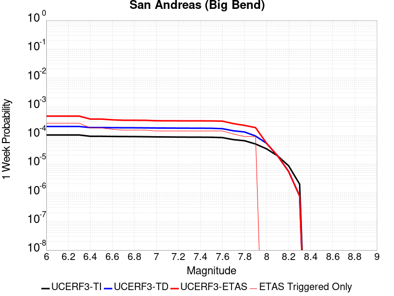 |  | 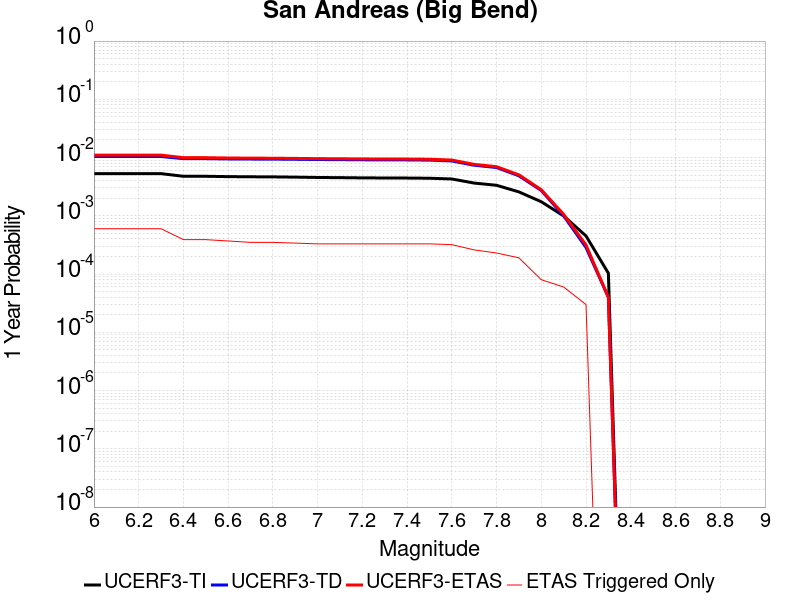 |  |

| Magnitude | 1 wk TI Prob | 1 wk TD Prob | 1 wk ETAS Prob | 1 wk ETAS/TD Gain | 1 wk ETAS Triggered Only | 1 mo TI Prob | 1 mo TD Prob | 1 mo ETAS Prob | 1 mo ETAS/TD Gain | 1 mo ETAS Triggered Only | 1 yr TI Prob | 1 yr TD Prob | 1 yr ETAS Prob | 1 yr ETAS/TD Gain | 1 yr ETAS Triggered Only | 10 yr TI Prob | 10 yr TD Prob | 10 yr ETAS Prob | 10 yr ETAS/TD Gain | 10 yr ETAS Triggered Only |
|-----|-----|-----|-----|-----|-----|-----|-----|-----|-----|-----|-----|-----|-----|-----|-----|-----|-----|-----|-----|-----|
| 6.0 | 1.0179969E-4 | 2.0072258E-4 | 4.6067042E-4 | 2.2950602 | 2.6E-4 | 4.362114E-4 | 8.599571E-4 | 0.0011996647 | 1.3950286 | 3.4E-4 | 0.0052979486 | 0.010419999 | 0.011013747 | 1.0569816 | 6.0E-4 | 0.051734097 | 0.10144902 | 0.10218583 | 1.0072628 | 8.2E-4 |
| 6.1 | 1.0179969E-4 | 2.0072258E-4 | 4.6067042E-4 | 2.2950602 | 2.6E-4 | 4.362114E-4 | 8.599571E-4 | 0.0011996647 | 1.3950286 | 3.4E-4 | 0.0052979486 | 0.010419999 | 0.011013747 | 1.0569816 | 6.0E-4 | 0.051734097 | 0.10144902 | 0.10218583 | 1.0072628 | 8.2E-4 |
| 6.2 | 1.0179969E-4 | 2.0072258E-4 | 4.6067042E-4 | 2.2950602 | 2.6E-4 | 4.362114E-4 | 8.599571E-4 | 0.0011996647 | 1.3950286 | 3.4E-4 | 0.0052979486 | 0.010419999 | 0.011013747 | 1.0569816 | 6.0E-4 | 0.051734097 | 0.10144902 | 0.10218583 | 1.0072628 | 8.2E-4 |
| 6.3 | 1.0179969E-4 | 2.0072258E-4 | 4.6067042E-4 | 2.2950602 | 2.6E-4 | 4.362114E-4 | 8.599571E-4 | 0.0011996647 | 1.3950286 | 3.4E-4 | 0.0052979486 | 0.010419999 | 0.011013747 | 1.0569816 | 6.0E-4 | 0.051734097 | 0.10144902 | 0.10218583 | 1.0072628 | 8.2E-4 |
| 6.4 | 9.1639464E-5 | 1.8429532E-4 | 3.6426215E-4 | 1.9765133 | 1.8E-4 | 3.9268145E-4 | 7.895982E-4 | 0.0010294088 | 1.303712 | 2.4E-4 | 0.0047704205 | 0.009571102 | 0.009957369 | 1.0403577 | 3.9E-4 | 0.046693064 | 0.09377527 | 0.094273694 | 1.0053151 | 5.5E-4 |
| 6.5 | 9.1639464E-5 | 1.8429532E-4 | 3.6426215E-4 | 1.9765133 | 1.8E-4 | 3.9268145E-4 | 7.895982E-4 | 0.0010294088 | 1.303712 | 2.4E-4 | 0.0047704205 | 0.009571102 | 0.009957369 | 1.0403577 | 3.9E-4 | 0.046693064 | 0.09377527 | 0.094273694 | 1.0053151 | 5.5E-4 |
| 6.6 | 9.042622E-5 | 1.823659E-4 | 3.4233672E-4 | 1.877197 | 1.6E-4 | 3.8748336E-4 | 7.8133424E-4 | 0.0010011623 | 1.2813497 | 2.2E-4 | 0.0047074095 | 0.009471365 | 0.009837861 | 1.0386951 | 3.7E-4 | 0.046089325 | 0.092869274 | 0.09335005 | 1.0051769 | 5.3E-4 |
| 6.7 | 8.9836685E-5 | 1.8150927E-4 | 3.3148204E-4 | 1.8262541 | 1.5E-4 | 3.8495753E-4 | 7.776651E-4 | 9.775097E-4 | 1.2569801 | 2.0E-4 | 0.00467679 | 0.00942708 | 0.009773781 | 1.0367771 | 3.5E-4 | 0.045795817 | 0.09246355 | 0.09292639 | 1.0050057 | 5.1E-4 |
| 6.8 | 8.9471854E-5 | 1.8097709E-4 | 3.3094993E-4 | 1.8286842 | 1.5E-4 | 3.8339442E-4 | 7.7538576E-4 | 9.7523065E-4 | 1.2577361 | 2.0E-4 | 0.004657841 | 0.009399569 | 0.009746279 | 1.0368857 | 3.5E-4 | 0.04561414 | 0.092210755 | 0.09267373 | 1.0050209 | 5.1E-4 |
| 6.9 | 8.858234E-5 | 1.7979681E-4 | 3.2976986E-4 | 1.834125 | 1.5E-4 | 3.7958333E-4 | 7.703304E-4 | 9.7017636E-4 | 1.2594289 | 2.0E-4 | 0.004611638 | 0.009338548 | 0.009675373 | 1.0360682 | 3.4E-4 | 0.04517103 | 0.09165087 | 0.092105046 | 1.0049555 | 5.0E-4 |
| 7.0 | 8.7433385E-5 | 1.7818481E-4 | 3.1815987E-4 | 1.7855611 | 1.4E-4 | 3.746607E-4 | 7.634259E-4 | 9.5328083E-4 | 1.2486881 | 1.9E-4 | 0.004551957 | 0.009255203 | 0.009582149 | 1.0353256 | 3.3E-4 | 0.044598386 | 0.09088532 | 0.09133078 | 1.0049014 | 4.9E-4 |
| 7.1 | 8.684964E-5 | 1.7730435E-4 | 3.1727954E-4 | 1.7894627 | 1.4E-4 | 3.7215967E-4 | 7.596547E-4 | 9.495104E-4 | 1.2499236 | 1.9E-4 | 0.0045216335 | 0.009209678 | 0.009536639 | 1.0355018 | 3.3E-4 | 0.04430731 | 0.09046686 | 0.09091253 | 1.0049263 | 4.9E-4 |
| 7.2 | 8.606521E-5 | 1.762105E-4 | 3.1618582E-4 | 1.7943643 | 1.4E-4 | 3.6879873E-4 | 7.549695E-4 | 9.4482605E-4 | 1.2514758 | 1.9E-4 | 0.0044808835 | 0.0091531165 | 0.0094800955 | 1.0357233 | 3.3E-4 | 0.043916024 | 0.089947365 | 0.0903933 | 1.0049577 | 4.9E-4 |
| 7.3 | 8.568266E-5 | 1.7563057E-4 | 3.1560598E-4 | 1.7969878 | 1.4E-4 | 3.6715972E-4 | 7.524855E-4 | 9.423425E-4 | 1.2523066 | 1.9E-4 | 0.0044610105 | 0.009123127 | 0.009450116 | 1.0358418 | 3.3E-4 | 0.043725148 | 0.08966853 | 0.090114586 | 1.0049746 | 4.9E-4 |
| 7.4 | 8.5432206E-5 | 1.7525644E-4 | 3.152319E-4 | 1.7986894 | 1.4E-4 | 3.6608664E-4 | 7.50883E-4 | 9.4074034E-4 | 1.2528454 | 1.9E-4 | 0.004447999 | 0.009103781 | 0.009430776 | 1.0359187 | 3.3E-4 | 0.043600157 | 0.08948871 | 0.089934856 | 1.0049856 | 4.9E-4 |
| 7.5 | 8.4791965E-5 | 1.7394972E-4 | 3.1392538E-4 | 1.8046902 | 1.4E-4 | 3.633435E-4 | 7.4528606E-4 | 9.3514443E-4 | 1.2547457 | 1.9E-4 | 0.0044147377 | 0.009036204 | 0.009363222 | 1.0361898 | 3.3E-4 | 0.043280575 | 0.088866346 | 0.0893128 | 1.005024 | 4.9E-4 |
| 7.6 | 8.241105E-5 | 1.6840403E-4 | 3.0838046E-4 | 1.831194 | 1.4E-4 | 3.531424E-4 | 7.215321E-4 | 9.11395E-4 | 1.2631385 | 1.9E-4 | 0.0042910352 | 0.008749358 | 0.009066558 | 1.0362542 | 3.2E-4 | 0.042091176 | 0.086243294 | 0.08667276 | 1.0049797 | 4.7E-4 |
| 7.7 | 7.00432E-5 | 1.42045E-4 | 2.520294E-4 | 1.7742925 | 1.1E-4 | 3.001506E-4 | 6.0862233E-4 | 7.6852494E-4 | 1.2627288 | 1.6E-4 | 0.0036482112 | 0.0073848404 | 0.00764292 | 1.0349473 | 2.6E-4 | 0.035888977 | 0.07351733 | 0.07386939 | 1.0047889 | 3.8E-4 |
| 7.8 | 6.415362E-5 | 1.2968935E-4 | 2.1967766E-4 | 1.693876 | 9.0E-5 | 2.749151E-4 | 5.556931E-4 | 6.956153E-4 | 1.2517977 | 1.4E-4 | 0.0033419547 | 0.0067446055 | 0.0069730543 | 1.0338713 | 2.3E-4 | 0.03292141 | 0.06725231 | 0.06757877 | 1.0048543 | 3.5E-4 |
| 7.9 | 4.939911E-5 | 9.3411545E-5 | 1.8340313E-4 | 1.9633883 | 9.0E-5 | 2.116933E-4 | 4.0027377E-4 | 5.3022173E-4 | 1.3246477 | 1.3E-4 | 0.0025743195 | 0.004862453 | 0.005051529 | 1.0388849 | 1.9E-4 | 0.025447013 | 0.048914436 | 0.04917123 | 1.0052499 | 2.7E-4 |
| 8.0 | 3.344983E-5 | 5.222685E-5 | 5.222685E-5 | 1.0 | 0.0 | 1.4334853E-4 | 2.2381016E-4 | 2.5380345E-4 | 1.1340122 | 3.0E-5 | 0.0017438711 | 0.0027214854 | 0.002801268 | 1.0293157 | 8.0E-5 | 0.017302496 | 0.027922187 | 0.028029116 | 1.0038295 | 1.1E-4 |
| 8.1 | 1.9104898E-5 | 1.9173063E-5 | 1.9173063E-5 | 1.0 | 0.0 | 8.1875565E-5 | 8.216769E-5 | 1.0216604E-4 | 1.2433847 | 2.0E-5 | 9.963791E-4 | 9.999331E-4 | 0.0010598731 | 1.059944 | 6.0E-5 | 0.009919235 | 0.010749801 | 0.010809156 | 1.0055215 | 6.0E-5 |
| 8.2 | 8.643924E-6 | 5.4748625E-6 | 5.4748625E-6 | 1.0 | 0.0 | 3.704486E-5 | 2.3463486E-5 | 2.3463486E-5 | 1.0 | 0.0 | 4.5092785E-4 | 2.8563058E-4 | 3.15622E-4 | 1.1050007 | 3.0E-5 | 0.0045001395 | 0.0032487072 | 0.0032786098 | 1.0092044 | 3.0E-5 |
| 8.3 | 1.983087E-6 | 7.6599065E-7 | 7.6599065E-7 | 1.0 | 0.0 | 8.498917E-6 | 3.282813E-6 | 3.282813E-6 | 1.0 | 0.0 | 1.034694E-4 | 3.9967534E-5 | 3.9967534E-5 | 1.0 | 0.0 | 0.0010342124 | 4.719687E-4 | 4.719687E-4 | 1.0 | 0.0 |

## San Andreas (Parkfield)
*[(top)](#table-of-contents)*

| 1 Week | 1 Month | 1 Year | 10 Year |
|-----|-----|-----|-----|
| 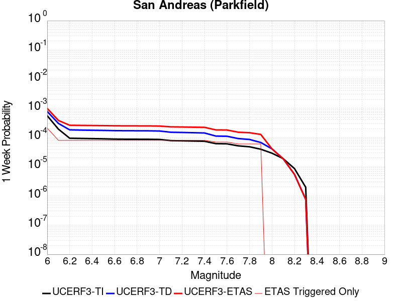 |  |  |  |

| Magnitude | 1 wk TI Prob | 1 wk TD Prob | 1 wk ETAS Prob | 1 wk ETAS/TD Gain | 1 wk ETAS Triggered Only | 1 mo TI Prob | 1 mo TD Prob | 1 mo ETAS Prob | 1 mo ETAS/TD Gain | 1 mo ETAS Triggered Only | 1 yr TI Prob | 1 yr TD Prob | 1 yr ETAS Prob | 1 yr ETAS/TD Gain | 1 yr ETAS Triggered Only | 10 yr TI Prob | 10 yr TD Prob | 10 yr ETAS Prob | 10 yr ETAS/TD Gain | 10 yr ETAS Triggered Only |
|-----|-----|-----|-----|-----|-----|-----|-----|-----|-----|-----|-----|-----|-----|-----|-----|-----|-----|-----|-----|-----|
| 6.0 | 5.556969E-4 | 7.7782426E-4 | 9.876608E-4 | 1.2697738 | 2.1E-4 | 0.0023793848 | 0.0033298214 | 0.0036188557 | 1.0868018 | 2.9E-4 | 0.028586963 | 0.040191233 | 0.040719125 | 1.0131346 | 5.5E-4 | 0.25176284 | 0.33716413 | 0.33763477 | 1.0013958 | 7.1E-4 |
| 6.1 | 1.925858E-4 | 3.0276453E-4 | 3.827403E-4 | 1.2641517 | 8.0E-5 | 8.2510663E-4 | 0.0012970108 | 0.0014068681 | 1.0847003 | 1.1E-4 | 0.0099994885 | 0.015778083 | 0.015994612 | 1.0137234 | 2.2E-4 | 0.095613256 | 0.1497237 | 0.15000428 | 1.0018741 | 3.3E-4 |
| 6.2 | 9.4306815E-5 | 1.8242796E-4 | 2.6241338E-4 | 1.4384493 | 8.0E-5 | 4.0410945E-4 | 7.816011E-4 | 8.915151E-4 | 1.1406268 | 1.1E-4 | 0.0049089384 | 0.009474681 | 0.009692596 | 1.0229998 | 2.2E-4 | 0.048019063 | 0.09185409 | 0.09215377 | 1.0032626 | 3.3E-4 |
| 6.3 | 9.283051E-5 | 1.7939322E-4 | 2.5937887E-4 | 1.4458678 | 8.0E-5 | 3.9778434E-4 | 7.686027E-4 | 8.7851816E-4 | 1.1430068 | 1.1E-4 | 0.0048322747 | 0.009317789 | 0.009535739 | 1.0233908 | 2.2E-4 | 0.047285385 | 0.09050704 | 0.09080717 | 1.0033162 | 3.3E-4 |
| 6.4 | 9.138826E-5 | 1.770153E-4 | 2.5700114E-4 | 1.4518583 | 8.0E-5 | 3.916052E-4 | 7.5841765E-4 | 8.683342E-4 | 1.1449288 | 1.1E-4 | 0.0047573745 | 0.00919484 | 0.009412817 | 1.0237064 | 2.2E-4 | 0.046568092 | 0.08940927 | 0.089709766 | 1.0033609 | 3.3E-4 |
| 6.5 | 9.000255E-5 | 1.7459576E-4 | 2.545818E-4 | 1.4581213 | 8.0E-5 | 3.8566816E-4 | 7.480541E-4 | 8.5797184E-4 | 1.1469382 | 1.1E-4 | 0.0046854047 | 0.009069731 | 0.009287736 | 1.0240365 | 2.2E-4 | 0.045878403 | 0.088295065 | 0.08859593 | 1.0034075 | 3.3E-4 |
| 6.6 | 8.8109264E-5 | 1.7140752E-4 | 2.513938E-4 | 1.4666439 | 8.0E-5 | 3.7755648E-4 | 7.3439797E-4 | 8.443172E-4 | 1.1496725 | 1.1E-4 | 0.0045870654 | 0.008904854 | 0.009122895 | 1.0244856 | 2.2E-4 | 0.04493529 | 0.0868267 | 0.08712804 | 1.0034707 | 3.3E-4 |
| 6.7 | 8.738073E-5 | 1.7007832E-4 | 2.500647E-4 | 1.4702915 | 8.0E-5 | 3.7443507E-4 | 7.287046E-4 | 8.386245E-4 | 1.1508428 | 1.1E-4 | 0.0045492216 | 0.008836143 | 0.009054199 | 1.0246778 | 2.2E-4 | 0.04457213 | 0.08622707 | 0.08652861 | 1.0034971 | 3.3E-4 |
| 6.8 | 8.710195E-5 | 1.6953335E-4 | 2.4951977E-4 | 1.4718035 | 8.0E-5 | 3.7324068E-4 | 7.263703E-4 | 8.362904E-4 | 1.151328 | 1.1E-4 | 0.0045347405 | 0.008807961 | 0.009026023 | 1.0247574 | 2.2E-4 | 0.04443313 | 0.08597467 | 0.0862763 | 1.0035083 | 3.3E-4 |
| 6.9 | 8.6801556E-5 | 1.689429E-4 | 2.489294E-4 | 1.4734528 | 8.0E-5 | 3.7195362E-4 | 7.2384125E-4 | 8.3376165E-4 | 1.151857 | 1.1E-4 | 0.0045191357 | 0.008777418 | 0.008995487 | 1.0248443 | 2.2E-4 | 0.044283327 | 0.085700735 | 0.086002454 | 1.0035206 | 3.3E-4 |
| 7.0 | 8.5571606E-5 | 1.6647128E-4 | 2.4645796E-4 | 1.4804834 | 8.0E-5 | 3.6668387E-4 | 7.132544E-4 | 8.2317594E-4 | 1.1541127 | 1.1E-4 | 0.004455241 | 0.008649553 | 0.00886765 | 1.0252148 | 2.2E-4 | 0.043669727 | 0.08454914 | 0.084851235 | 1.0035731 | 3.3E-4 |
| 7.1 | 7.82589E-5 | 1.5128135E-4 | 2.3126925E-4 | 1.528736 | 8.0E-5 | 3.3535215E-4 | 6.481883E-4 | 7.58117E-4 | 1.1695938 | 1.1E-4 | 0.0040752706 | 0.007863307 | 0.008081577 | 1.027758 | 2.2E-4 | 0.040013418 | 0.07746111 | 0.07775632 | 1.0038111 | 3.2E-4 |
| 7.2 | 7.690929E-5 | 1.4865391E-4 | 2.2864202E-4 | 1.5380827 | 8.0E-5 | 3.2956956E-4 | 6.369334E-4 | 7.468633E-4 | 1.1725925 | 1.1E-4 | 0.004005129 | 0.007727258 | 0.007945558 | 1.0282507 | 2.2E-4 | 0.0393371 | 0.07623427 | 0.076529875 | 1.0038776 | 3.2E-4 |
| 7.3 | 7.5543794E-5 | 1.4561978E-4 | 2.2560814E-4 | 1.5492959 | 8.0E-5 | 3.2371894E-4 | 6.2393624E-4 | 7.338676E-4 | 1.17619 | 1.1E-4 | 0.003934157 | 0.007570127 | 0.0077884616 | 1.0288416 | 2.2E-4 | 0.038652334 | 0.074797355 | 0.075084165 | 1.0038345 | 3.1E-4 |
| 7.4 | 7.4214564E-5 | 1.4262961E-4 | 2.226182E-4 | 1.5608133 | 8.0E-5 | 3.1802364E-4 | 6.111273E-4 | 7.210601E-4 | 1.1798853 | 1.1E-4 | 0.003865065 | 0.00741525 | 0.0076336185 | 1.0294486 | 2.2E-4 | 0.03798529 | 0.07337123 | 0.07365849 | 1.0039151 | 3.1E-4 |
| 7.5 | 6.149578E-5 | 1.11907226E-4 | 1.8189939E-4 | 1.6254481 | 7.0E-5 | 2.6352672E-4 | 4.7951436E-4 | 5.794664E-4 | 1.2084444 | 1.0E-4 | 0.0032037178 | 0.0058224914 | 0.0060312687 | 1.0358571 | 2.1E-4 | 0.03157923 | 0.058557566 | 0.05884 | 1.0048232 | 3.0E-4 |
| 7.6 | 6.0643448E-5 | 1.10193796E-4 | 1.8018608E-4 | 1.6351745 | 7.0E-5 | 2.598746E-4 | 4.7217376E-4 | 5.7212653E-4 | 1.2116865 | 1.0E-4 | 0.0031593828 | 0.0057335934 | 0.0059423894 | 1.0364163 | 2.1E-4 | 0.031148417 | 0.057718582 | 0.058001265 | 1.0048976 | 3.0E-4 |
| 7.7 | 5.1652263E-5 | 9.174698E-5 | 1.5174148E-4 | 1.6539124 | 6.0E-5 | 2.2134806E-4 | 3.931421E-4 | 4.8310673E-4 | 1.2288349 | 9.0E-5 | 0.002691582 | 0.0047760103 | 0.0049551507 | 1.0375084 | 1.8E-4 | 0.026592141 | 0.04853623 | 0.048774093 | 1.0049008 | 2.5E-4 |
| 7.8 | 4.8090482E-5 | 8.559635E-5 | 1.4559121E-4 | 1.7009045 | 6.0E-5 | 2.060858E-4 | 3.6678996E-4 | 4.5675694E-4 | 1.245282 | 9.0E-5 | 0.0025062072 | 0.0044565317 | 0.0046257745 | 1.0379763 | 1.7E-4 | 0.024781305 | 0.04530245 | 0.04553158 | 1.0050577 | 2.4E-4 |
| 7.9 | 3.970278E-5 | 6.750426E-5 | 1.2750021E-4 | 1.8887728 | 6.0E-5 | 1.7014367E-4 | 2.892719E-4 | 3.6924877E-4 | 1.2764764 | 8.0E-5 | 0.002069531 | 0.0035162016 | 0.0036457444 | 1.0368418 | 1.3E-4 | 0.020503636 | 0.035881363 | 0.0360549 | 1.0048366 | 1.8E-4 |
| 8.0 | 2.8982335E-5 | 4.069796E-5 | 4.069796E-5 | 1.0 | 0.0 | 1.2420409E-4 | 1.7440817E-4 | 1.9440468E-4 | 1.1146535 | 2.0E-5 | 0.0015111357 | 0.0021213528 | 0.0021812255 | 1.0282239 | 6.0E-5 | 0.015009012 | 0.022010697 | 0.022088936 | 1.0035546 | 8.0E-5 |
| 8.1 | 1.8836186E-5 | 1.8681134E-5 | 1.8681134E-5 | 1.0 | 0.0 | 8.0724014E-5 | 8.005955E-5 | 1.0005795E-4 | 1.249794 | 2.0E-5 | 9.823717E-4 | 9.742898E-4 | 0.0010342313 | 1.0615233 | 6.0E-5 | 0.009780403 | 0.010488115 | 0.010547486 | 1.0056608 | 6.0E-5 |
| 8.2 | 8.643924E-6 | 5.4748625E-6 | 5.4748625E-6 | 1.0 | 0.0 | 3.704486E-5 | 2.3463486E-5 | 2.3463486E-5 | 1.0 | 0.0 | 4.5092785E-4 | 2.8563058E-4 | 3.15622E-4 | 1.1050007 | 3.0E-5 | 0.0045001395 | 0.0032487072 | 0.0032786098 | 1.0092044 | 3.0E-5 |
| 8.3 | 1.983087E-6 | 7.6599065E-7 | 7.6599065E-7 | 1.0 | 0.0 | 8.498917E-6 | 3.282813E-6 | 3.282813E-6 | 1.0 | 0.0 | 1.034694E-4 | 3.9967534E-5 | 3.9967534E-5 | 1.0 | 0.0 | 0.0010342124 | 4.719687E-4 | 4.719687E-4 | 1.0 | 0.0 |

## San Andreas (San Gorgonio Pass-Garnet HIll)
*[(top)](#table-of-contents)*

| 1 Week | 1 Month | 1 Year | 10 Year |
|-----|-----|-----|-----|
|  | 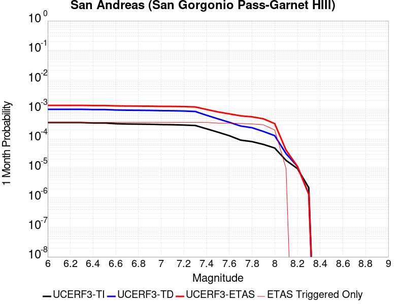 | 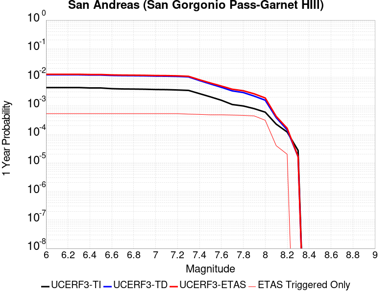 |  |

| Magnitude | 1 wk TI Prob | 1 wk TD Prob | 1 wk ETAS Prob | 1 wk ETAS/TD Gain | 1 wk ETAS Triggered Only | 1 mo TI Prob | 1 mo TD Prob | 1 mo ETAS Prob | 1 mo ETAS/TD Gain | 1 mo ETAS Triggered Only | 1 yr TI Prob | 1 yr TD Prob | 1 yr ETAS Prob | 1 yr ETAS/TD Gain | 1 yr ETAS Triggered Only | 10 yr TI Prob | 10 yr TD Prob | 10 yr ETAS Prob | 10 yr ETAS/TD Gain | 10 yr ETAS Triggered Only |
|-----|-----|-----|-----|-----|-----|-----|-----|-----|-----|-----|-----|-----|-----|-----|-----|-----|-----|-----|-----|-----|
| 6.0 | 8.31567E-5 | 2.3382473E-4 | 4.9376395E-4 | 2.1116838 | 2.6E-4 | 3.5633717E-4 | 0.0010017233 | 0.0013613628 | 1.3590206 | 3.6E-4 | 0.004329778 | 0.012127888 | 0.012651461 | 1.0431709 | 5.3E-4 | 0.042463828 | 0.11257892 | 0.113182366 | 1.0053602 | 6.8E-4 |
| 6.1 | 8.31567E-5 | 2.3382473E-4 | 4.9376395E-4 | 2.1116838 | 2.6E-4 | 3.5633717E-4 | 0.0010017233 | 0.0013613628 | 1.3590206 | 3.6E-4 | 0.004329778 | 0.012127888 | 0.012651461 | 1.0431709 | 5.3E-4 | 0.042463828 | 0.11257892 | 0.113182366 | 1.0053602 | 6.8E-4 |
| 6.2 | 8.31567E-5 | 2.3382473E-4 | 4.9376395E-4 | 2.1116838 | 2.6E-4 | 3.5633717E-4 | 0.0010017233 | 0.0013613628 | 1.3590206 | 3.6E-4 | 0.004329778 | 0.012127888 | 0.012651461 | 1.0431709 | 5.3E-4 | 0.042463828 | 0.11257892 | 0.113182366 | 1.0053602 | 6.8E-4 |
| 6.3 | 8.31567E-5 | 2.3382473E-4 | 4.9376395E-4 | 2.1116838 | 2.6E-4 | 3.5633717E-4 | 0.0010017233 | 0.0013613628 | 1.3590206 | 3.6E-4 | 0.004329778 | 0.012127888 | 0.012651461 | 1.0431709 | 5.3E-4 | 0.042463828 | 0.11257892 | 0.113182366 | 1.0053602 | 6.8E-4 |
| 6.4 | 8.059055E-5 | 2.2940808E-4 | 4.8934843E-4 | 2.1330914 | 2.6E-4 | 3.4534236E-4 | 9.828096E-4 | 0.0013424557 | 1.3659368 | 3.6E-4 | 0.0041964394 | 0.011900152 | 0.012423845 | 1.0440073 | 5.3E-4 | 0.041180745 | 0.11056015 | 0.111164965 | 1.0054705 | 6.8E-4 |
| 6.5 | 8.059055E-5 | 2.2940808E-4 | 4.8934843E-4 | 2.1330914 | 2.6E-4 | 3.4534236E-4 | 9.828096E-4 | 0.0013424557 | 1.3659368 | 3.6E-4 | 0.0041964394 | 0.011900152 | 0.012423845 | 1.0440073 | 5.3E-4 | 0.041180745 | 0.11056015 | 0.111164965 | 1.0054705 | 6.8E-4 |
| 6.6 | 7.619237E-5 | 2.218517E-4 | 4.8179404E-4 | 2.171694 | 2.6E-4 | 3.2649786E-4 | 9.5044886E-4 | 0.0013101067 | 1.3784084 | 3.6E-4 | 0.0039678677 | 0.01151087 | 0.012034769 | 1.0455134 | 5.3E-4 | 0.03897764 | 0.10709683 | 0.10769507 | 1.005586 | 6.7E-4 |
| 6.7 | 7.440636E-5 | 2.1860997E-4 | 4.7855312E-4 | 2.1890728 | 2.6E-4 | 3.188454E-4 | 9.3656575E-4 | 0.0012962286 | 1.3840231 | 3.6E-4 | 0.0038750346 | 0.011343609 | 0.011867596 | 1.0461923 | 5.3E-4 | 0.038081564 | 0.105605274 | 0.10620452 | 1.0056744 | 6.7E-4 |
| 6.8 | 7.3735864E-5 | 2.1708169E-4 | 4.7702526E-4 | 2.1974459 | 2.6E-4 | 3.1597257E-4 | 9.3002064E-4 | 0.0012896858 | 1.3867282 | 3.6E-4 | 0.0038401815 | 0.011264749 | 0.011788779 | 1.0465194 | 5.3E-4 | 0.03774495 | 0.10490683 | 0.10550654 | 1.0057166 | 6.7E-4 |
| 6.9 | 7.27575E-5 | 2.1477141E-4 | 4.7471558E-4 | 2.2103293 | 2.6E-4 | 3.117806E-4 | 9.201265E-4 | 0.0012797952 | 1.3908906 | 3.6E-4 | 0.003789323 | 0.011145527 | 0.011669619 | 1.0470227 | 5.3E-4 | 0.037253562 | 0.103854746 | 0.10445516 | 1.0057813 | 6.7E-4 |
| 7.0 | 7.102591E-5 | 2.1061185E-4 | 4.7055708E-4 | 2.2342384 | 2.6E-4 | 3.0436125E-4 | 9.023122E-4 | 0.0012619874 | 1.398615 | 3.6E-4 | 0.003699303 | 0.010930831 | 0.011455038 | 1.0479567 | 5.3E-4 | 0.03638325 | 0.10195695 | 0.102558635 | 1.0059015 | 6.7E-4 |
| 7.1 | 7.028513E-5 | 2.0896831E-4 | 4.68914E-4 | 2.2439477 | 2.6E-4 | 3.0118722E-4 | 8.9527335E-4 | 0.001254951 | 1.4017519 | 3.6E-4 | 0.0036607897 | 0.010845989 | 0.011370241 | 1.048336 | 5.3E-4 | 0.036010686 | 0.101199985 | 0.10179319 | 1.0058618 | 6.6E-4 |
| 7.2 | 6.8498244E-5 | 2.0504706E-4 | 4.6499376E-4 | 2.2677417 | 2.6E-4 | 2.9353087E-4 | 8.784794E-4 | 0.0012381631 | 1.4094391 | 3.6E-4 | 0.003567883 | 0.010643536 | 0.011167895 | 1.0492655 | 5.3E-4 | 0.035111405 | 0.09939202 | 0.09997741 | 1.0058898 | 6.5E-4 |
| 7.3 | 6.622592E-5 | 1.9732013E-4 | 4.5726882E-4 | 2.3173957 | 2.6E-4 | 2.8379448E-4 | 8.453858E-4 | 0.0012050815 | 1.4254811 | 3.6E-4 | 0.0034497243 | 0.0102444785 | 0.010749254 | 1.0492729 | 5.1E-4 | 0.033966612 | 0.095888525 | 0.096458115 | 1.0059401 | 6.3E-4 |
| 7.4 | 5.1050705E-5 | 1.4689034E-4 | 4.0685214E-4 | 2.769768 | 2.6E-4 | 2.1877038E-4 | 6.29379E-4 | 9.891525E-4 | 1.5716324 | 3.6E-4 | 0.002660276 | 0.0076359594 | 0.008132142 | 1.0649797 | 5.0E-4 | 0.02628654 | 0.07286301 | 0.07343784 | 1.0078892 | 6.2E-4 |
| 7.5 | 3.9302922E-5 | 1.1129847E-4 | 3.6127065E-4 | 3.2459624 | 2.5E-4 | 1.6843023E-4 | 4.7690657E-4 | 8.167444E-4 | 1.712588 | 3.4E-4 | 0.0020487092 | 0.005790949 | 0.0062681693 | 1.082408 | 4.8E-4 | 0.020299247 | 0.05600951 | 0.056566466 | 1.009944 | 5.9E-4 |
| 7.6 | 2.9851626E-5 | 8.4949745E-5 | 3.349285E-4 | 3.9426665 | 2.5E-4 | 1.2792926E-4 | 3.6401965E-4 | 7.038959E-4 | 1.9336755 | 3.4E-4 | 0.0015564259 | 0.0044229585 | 0.0049008355 | 1.1080446 | 4.8E-4 | 0.0154556995 | 0.04319374 | 0.043748684 | 1.0128479 | 5.8E-4 |
| 7.7 | 2.1135214E-5 | 6.3529005E-5 | 3.1351313E-4 | 4.9349604 | 2.5E-4 | 9.0576345E-5 | 2.7223877E-4 | 6.0214894E-4 | 2.2118413 | 3.3E-4 | 0.0011022091 | 0.0033094748 | 0.0037779193 | 1.1415465 | 4.7E-4 | 0.010967582 | 0.032582592 | 0.033124346 | 1.0166271 | 5.6E-4 |
| 7.8 | 1.883379E-5 | 5.564028E-5 | 2.9562693E-4 | 5.313182 | 2.4E-4 | 8.0713755E-5 | 2.3843657E-4 | 5.5836025E-4 | 2.341756 | 3.2E-4 | 9.822468E-4 | 0.0028991038 | 0.0033577704 | 1.1582097 | 4.6E-4 | 0.0097791655 | 0.028695205 | 0.029229423 | 1.0186169 | 5.5E-4 |
| 7.9 | 1.5156185E-5 | 4.1658426E-5 | 2.7164884E-4 | 6.520862 | 2.3E-4 | 6.495346E-5 | 1.785239E-4 | 4.7847035E-4 | 2.6801472 | 3.0E-4 | 7.9052144E-4 | 0.0021713632 | 0.0026104078 | 1.2021977 | 4.4E-4 | 0.007877152 | 0.021759422 | 0.022268109 | 1.0233777 | 5.2E-4 |
| 8.0 | 1.1405907E-5 | 2.9974231E-5 | 1.7996973E-4 | 6.0041485 | 1.5E-4 | 4.8881542E-5 | 1.2845467E-4 | 3.2842899E-4 | 2.5567694 | 2.0E-4 | 5.9497025E-4 | 0.0015628147 | 0.0018723302 | 1.19805 | 3.1E-4 | 0.005933798 | 0.015772851 | 0.016127173 | 1.022464 | 3.6E-4 |
| 8.1 | 4.3511436E-6 | 7.369219E-6 | 7.369219E-6 | 1.0 | 0.0 | 1.8647626E-5 | 3.1581985E-5 | 4.158167E-5 | 1.3166262 | 1.0E-5 | 2.2701119E-4 | 3.8444297E-4 | 4.244276E-4 | 1.1040066 | 4.0E-5 | 0.0022677942 | 0.0041163345 | 0.00415617 | 1.0096774 | 4.0E-5 |
| 8.2 | 2.3042528E-6 | 2.7329415E-6 | 2.7329415E-6 | 1.0 | 0.0 | 9.875332E-6 | 1.1712554E-5 | 1.1712554E-5 | 1.0 | 0.0 | 1.2022553E-4 | 1.4259106E-4 | 1.625882E-4 | 1.1402413 | 2.0E-5 | 0.0012016051 | 0.0015979785 | 0.0016179467 | 1.0124958 | 2.0E-5 |
| 8.3 | 5.202968E-7 | 3.1598344E-7 | 3.1598344E-7 | 1.0 | 0.0 | 2.2298414E-6 | 1.3542141E-6 | 1.3542141E-6 | 1.0 | 0.0 | 2.714798E-5 | 1.6487444E-5 | 1.6487444E-5 | 1.0 | 0.0 | 2.7144665E-4 | 1.9563142E-4 | 1.9563142E-4 | 1.0 | 0.0 |

## Death Valley (No)
*[(top)](#table-of-contents)*

| 1 Week | 1 Month | 1 Year | 10 Year |
|-----|-----|-----|-----|
|  |  |  | 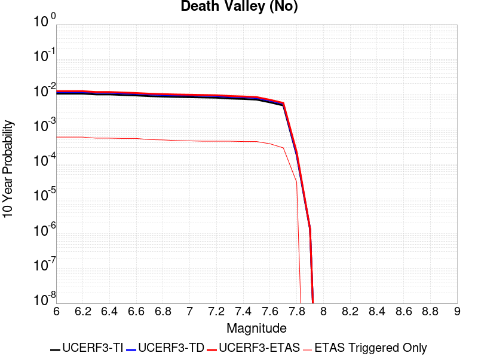 |

| Magnitude | 1 wk TI Prob | 1 wk TD Prob | 1 wk ETAS Prob | 1 wk ETAS/TD Gain | 1 wk ETAS Triggered Only | 1 mo TI Prob | 1 mo TD Prob | 1 mo ETAS Prob | 1 mo ETAS/TD Gain | 1 mo ETAS Triggered Only | 1 yr TI Prob | 1 yr TD Prob | 1 yr ETAS Prob | 1 yr ETAS/TD Gain | 1 yr ETAS Triggered Only | 10 yr TI Prob | 10 yr TD Prob | 10 yr ETAS Prob | 10 yr ETAS/TD Gain | 10 yr ETAS Triggered Only |
|-----|-----|-----|-----|-----|-----|-----|-----|-----|-----|-----|-----|-----|-----|-----|-----|-----|-----|-----|-----|-----|
| 6.0 | 2.0074807E-5 | 2.2500084E-5 | 1.7249672E-4 | 7.666492 | 1.5E-4 | 8.603206E-5 | 9.642541E-5 | 2.9640613E-4 | 3.0739422 | 2.0E-4 | 0.001046937 | 0.0011733545 | 0.0015429204 | 1.3149652 | 3.7E-4 | 0.010420183 | 0.011672506 | 0.012255619 | 1.0499561 | 5.9E-4 |
| 6.1 | 2.0074807E-5 | 2.2500084E-5 | 1.7249672E-4 | 7.666492 | 1.5E-4 | 8.603206E-5 | 9.642541E-5 | 2.9640613E-4 | 3.0739422 | 2.0E-4 | 0.001046937 | 0.0011733545 | 0.0015429204 | 1.3149652 | 3.7E-4 | 0.010420183 | 0.011672506 | 0.012255619 | 1.0499561 | 5.9E-4 |
| 6.2 | 2.0074807E-5 | 2.2500084E-5 | 1.7249672E-4 | 7.666492 | 1.5E-4 | 8.603206E-5 | 9.642541E-5 | 2.9640613E-4 | 3.0739422 | 2.0E-4 | 0.001046937 | 0.0011733545 | 0.0015429204 | 1.3149652 | 3.7E-4 | 0.010420183 | 0.011672506 | 0.012255619 | 1.0499561 | 5.9E-4 |
| 6.3 | 1.9050609E-5 | 2.1336948E-5 | 1.6133396E-4 | 7.5612483 | 1.4E-4 | 8.164292E-5 | 9.1440896E-5 | 2.814235E-4 | 3.077655 | 1.9E-4 | 9.935491E-4 | 0.001112731 | 0.0014523527 | 1.3052145 | 3.4E-4 | 0.009891188 | 0.011072419 | 0.011616329 | 1.0491229 | 5.5E-4 |
| 6.4 | 1.9050609E-5 | 2.1336948E-5 | 1.6133396E-4 | 7.5612483 | 1.4E-4 | 8.164292E-5 | 9.1440896E-5 | 2.814235E-4 | 3.077655 | 1.9E-4 | 9.935491E-4 | 0.001112731 | 0.0014523527 | 1.3052145 | 3.4E-4 | 0.009891188 | 0.011072419 | 0.011616329 | 1.0491229 | 5.5E-4 |
| 6.5 | 1.8367004E-5 | 2.0561009E-5 | 1.5055834E-4 | 7.322517 | 1.3E-4 | 7.8713354E-5 | 8.811567E-5 | 2.680998E-4 | 3.0425894 | 1.8E-4 | 9.5791375E-4 | 0.0010722869 | 0.0014019329 | 1.3074235 | 3.3E-4 | 0.009537951 | 0.0106719155 | 0.011206153 | 1.0500602 | 5.4E-4 |
| 6.6 | 1.779439E-5 | 1.9910927E-5 | 1.4990834E-4 | 7.528948 | 1.3E-4 | 7.625944E-5 | 8.53298E-5 | 2.6531445E-4 | 3.1092825 | 1.8E-4 | 9.280632E-4 | 0.0010384015 | 0.0013680588 | 1.3174661 | 3.3E-4 | 0.009241969 | 0.010336253 | 0.010870671 | 1.0517033 | 5.4E-4 |
| 6.7 | 1.7025437E-5 | 1.9043426E-5 | 1.2904133E-4 | 6.7761617 | 1.1E-4 | 7.296412E-5 | 8.161216E-5 | 2.415991E-4 | 2.9603322 | 1.6E-4 | 8.87976E-4 | 9.931813E-4 | 0.0013028734 | 1.3118184 | 3.1E-4 | 0.008844362 | 0.009888145 | 0.010383201 | 1.0500656 | 5.0E-4 |
| 6.8 | 1.6545107E-5 | 1.8512545E-5 | 1.2851051E-4 | 6.9418063 | 1.1E-4 | 7.090568E-5 | 7.93371E-5 | 2.393244E-4 | 3.016551 | 1.6E-4 | 8.629347E-4 | 9.655073E-4 | 0.001275208 | 1.3207648 | 3.1E-4 | 0.008595915 | 0.009613829 | 0.010099118 | 1.0504782 | 4.9E-4 |
| 6.9 | 1.615478E-5 | 1.8087594E-5 | 1.1808579E-4 | 6.528551 | 1.0E-4 | 6.9232934E-5 | 7.751599E-5 | 2.2750437E-4 | 2.9349346 | 1.5E-4 | 8.4258494E-4 | 9.433546E-4 | 0.0012430716 | 1.317714 | 3.0E-4 | 0.008393973 | 0.009394196 | 0.00985978 | 1.0495609 | 4.7E-4 |
| 7.0 | 1.5894311E-5 | 1.780555E-5 | 1.1780377E-4 | 6.6161265 | 1.0E-4 | 6.81167E-5 | 7.6307304E-5 | 2.1629661E-4 | 2.8345468 | 1.4E-4 | 8.2900526E-4 | 9.286515E-4 | 0.0012183822 | 1.3119907 | 2.9E-4 | 0.008259195 | 0.009248397 | 0.009704143 | 1.0492784 | 4.6E-4 |
| 7.1 | 1.5602263E-5 | 1.7483504E-5 | 1.0748193E-4 | 6.1476197 | 9.0E-5 | 6.6865134E-5 | 7.492718E-5 | 2.0491744E-4 | 2.7348878 | 1.3E-4 | 8.137789E-4 | 9.118627E-4 | 0.0011916074 | 1.3067838 | 2.8E-4 | 0.008108052 | 0.009081894 | 0.009527807 | 1.0490991 | 4.5E-4 |
| 7.2 | 1.5323829E-5 | 1.717063E-5 | 1.07169086E-4 | 6.2414184 | 9.0E-5 | 6.56719E-5 | 7.358637E-5 | 2.0357681E-4 | 2.7665014 | 1.3E-4 | 7.99262E-4 | 8.9555193E-4 | 0.0011753011 | 1.3123764 | 2.8E-4 | 0.007963934 | 0.008920107 | 0.009366092 | 1.0499978 | 4.5E-4 |
| 7.3 | 1.4556212E-5 | 1.6302456E-5 | 1.0630099E-4 | 6.5205507 | 9.0E-5 | 6.238227E-5 | 6.9865826E-5 | 1.9985675E-4 | 2.8605795 | 1.3E-4 | 7.592395E-4 | 8.5029035E-4 | 0.0011300523 | 1.3290193 | 2.8E-4 | 0.0075665074 | 0.008471014 | 0.008917202 | 1.0526724 | 4.5E-4 |
| 7.4 | 1.411725E-5 | 1.580796E-5 | 1.0580654E-4 | 6.6932445 | 9.0E-5 | 6.0501097E-5 | 6.7746674E-5 | 1.9773787E-4 | 2.9187834 | 1.3E-4 | 7.363519E-4 | 8.245094E-4 | 0.0010942868 | 1.3271974 | 2.7E-4 | 0.0073391674 | 0.008215138 | 0.008651524 | 1.0531197 | 4.4E-4 |
| 7.5 | 1.3503312E-5 | 1.5126289E-5 | 1.0512493E-4 | 6.949816 | 9.0E-5 | 5.7870053E-5 | 6.482538E-5 | 1.9481695E-4 | 3.0052576 | 1.3E-4 | 7.043401E-4 | 7.8896893E-4 | 0.0010587559 | 1.3419487 | 2.7E-4 | 0.007021119 | 0.007862304 | 0.008298845 | 1.0555233 | 4.4E-4 |
| 7.6 | 1.1279839E-5 | 1.2626327E-5 | 9.262532E-5 | 7.335888 | 8.0E-5 | 4.834127E-5 | 5.4111737E-5 | 1.7410524E-4 | 3.2175136 | 1.2E-4 | 5.88396E-4 | 6.5861654E-4 | 8.884651E-4 | 1.3489869 | 2.3E-4 | 0.005868405 | 0.006567199 | 0.006944703 | 1.0574833 | 3.8E-4 |
| 7.7 | 9.189108E-6 | 1.0283358E-5 | 6.0282844E-5 | 5.862175 | 5.0E-5 | 3.93813E-5 | 4.407082E-5 | 1.240673E-4 | 2.81518 | 8.0E-5 | 4.7936183E-4 | 5.3643517E-4 | 7.0634397E-4 | 1.3167369 | 1.7E-4 | 0.004783291 | 0.005351914 | 0.005640362 | 1.0538962 | 2.9E-4 |
| 7.8 | 3.4586725E-7 | 3.6482615E-7 | 3.6482615E-7 | 1.0 | 0.0 | 1.4822873E-6 | 1.5635396E-6 | 1.5635396E-6 | 1.0 | 0.0 | 1.80467E-5 | 1.9035933E-5 | 3.9035553E-5 | 2.0506246 | 2.0E-5 | 1.8045233E-4 | 1.9034347E-4 | 2.2033777E-4 | 1.1575798 | 3.0E-5 |
| 7.9 | 2.5591178E-9 | 2.6696718E-9 | 2.6696718E-9 | 1.0 | 0.0 | 1.0967647E-8 | 1.14414505E-8 | 1.14414505E-8 | 1.0 | 0.0 | 1.335311E-7 | 1.3929966E-7 | 1.3929966E-7 | 1.0 | 0.0 | 1.3353102E-6 | 1.3929966E-6 | 1.3929966E-6 | 1.0 | 0.0 |

## Sierra Nevada  (No Extension)
*[(top)](#table-of-contents)*

| 1 Week | 1 Month | 1 Year | 10 Year |
|-----|-----|-----|-----|
| 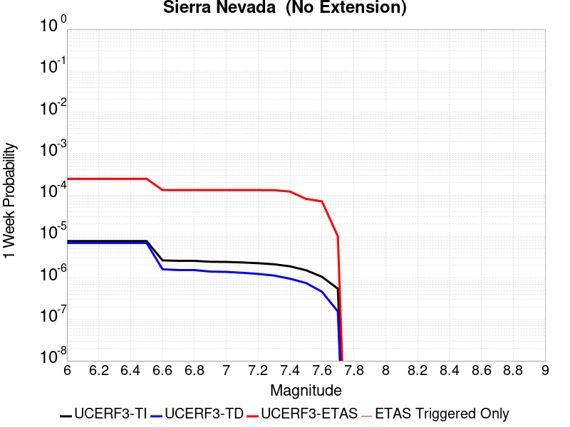 | 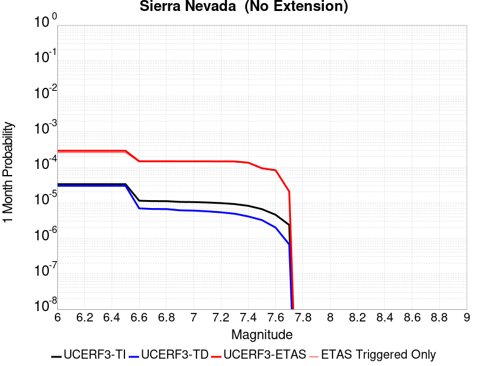 | 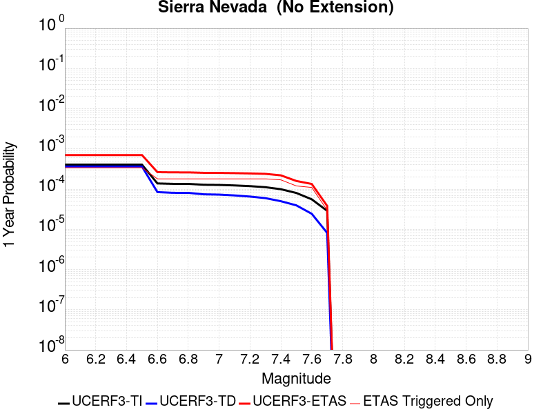 |  |

| Magnitude | 1 wk TI Prob | 1 wk TD Prob | 1 wk ETAS Prob | 1 wk ETAS/TD Gain | 1 wk ETAS Triggered Only | 1 mo TI Prob | 1 mo TD Prob | 1 mo ETAS Prob | 1 mo ETAS/TD Gain | 1 mo ETAS Triggered Only | 1 yr TI Prob | 1 yr TD Prob | 1 yr ETAS Prob | 1 yr ETAS/TD Gain | 1 yr ETAS Triggered Only | 10 yr TI Prob | 10 yr TD Prob | 10 yr ETAS Prob | 10 yr ETAS/TD Gain | 10 yr ETAS Triggered Only |
|-----|-----|-----|-----|-----|-----|-----|-----|-----|-----|-----|-----|-----|-----|-----|-----|-----|-----|-----|-----|-----|
| 6.0 | 7.7690465E-6 | 6.976322E-6 | 2.4697464E-4 | 35.401844 | 2.4E-4 | 3.329549E-5 | 2.9898381E-5 | 2.898906E-4 | 9.695863 | 2.6E-4 | 4.0529718E-4 | 3.6398784E-4 | 7.038641E-4 | 1.9337572 | 3.4E-4 | 0.004045588 | 0.0036374326 | 0.004105723 | 1.128742 | 4.7E-4 |
| 6.1 | 7.7690465E-6 | 6.976322E-6 | 2.4697464E-4 | 35.401844 | 2.4E-4 | 3.329549E-5 | 2.9898381E-5 | 2.898906E-4 | 9.695863 | 2.6E-4 | 4.0529718E-4 | 3.6398784E-4 | 7.038641E-4 | 1.9337572 | 3.4E-4 | 0.004045588 | 0.0036374326 | 0.004105723 | 1.128742 | 4.7E-4 |
| 6.2 | 7.7690465E-6 | 6.976322E-6 | 2.4697464E-4 | 35.401844 | 2.4E-4 | 3.329549E-5 | 2.9898381E-5 | 2.898906E-4 | 9.695863 | 2.6E-4 | 4.0529718E-4 | 3.6398784E-4 | 7.038641E-4 | 1.9337572 | 3.4E-4 | 0.004045588 | 0.0036374326 | 0.004105723 | 1.128742 | 4.7E-4 |
| 6.3 | 7.7690465E-6 | 6.976322E-6 | 2.4697464E-4 | 35.401844 | 2.4E-4 | 3.329549E-5 | 2.9898381E-5 | 2.898906E-4 | 9.695863 | 2.6E-4 | 4.0529718E-4 | 3.6398784E-4 | 7.038641E-4 | 1.9337572 | 3.4E-4 | 0.004045588 | 0.0036374326 | 0.004105723 | 1.128742 | 4.7E-4 |
| 6.4 | 7.7690465E-6 | 6.976322E-6 | 2.4697464E-4 | 35.401844 | 2.4E-4 | 3.329549E-5 | 2.9898381E-5 | 2.898906E-4 | 9.695863 | 2.6E-4 | 4.0529718E-4 | 3.6398784E-4 | 7.038641E-4 | 1.9337572 | 3.4E-4 | 0.004045588 | 0.0036374326 | 0.004105723 | 1.128742 | 4.7E-4 |
| 6.5 | 7.7690465E-6 | 6.976322E-6 | 2.4697464E-4 | 35.401844 | 2.4E-4 | 3.329549E-5 | 2.9898381E-5 | 2.898906E-4 | 9.695863 | 2.6E-4 | 4.0529718E-4 | 3.6398784E-4 | 7.038641E-4 | 1.9337572 | 3.4E-4 | 0.004045588 | 0.0036374326 | 0.004105723 | 1.128742 | 4.7E-4 |
| 6.6 | 2.653E-6 | 1.614854E-6 | 1.3161464E-4 | 81.5025 | 1.3E-4 | 1.136995E-5 | 6.9207845E-6 | 1.4691982E-4 | 21.22878 | 1.4E-4 | 1.3842035E-4 | 8.425733E-5 | 2.6424218E-4 | 3.1361327 | 1.8E-4 | 0.0013833415 | 8.422573E-4 | 0.0011120299 | 1.3202971 | 2.7E-4 |
| 6.7 | 2.5902466E-6 | 1.5501876E-6 | 1.3154998E-4 | 84.860695 | 1.3E-4 | 1.11010095E-5 | 6.643644E-6 | 1.4664272E-4 | 22.072632 | 1.4E-4 | 1.351464E-4 | 8.0883394E-5 | 2.6086884E-4 | 3.225246 | 1.8E-4 | 0.0013506424 | 8.0854254E-4 | 0.0010783243 | 1.3336642 | 2.7E-4 |
| 6.8 | 2.5853892E-6 | 1.5469877E-6 | 1.3154678E-4 | 85.03415 | 1.3E-4 | 1.1080193E-5 | 6.629931E-6 | 1.46629E-4 | 22.116219 | 1.4E-4 | 1.34893E-4 | 8.071645E-5 | 2.6070193E-4 | 3.2298489 | 1.8E-4 | 0.0013481114 | 8.068743E-4 | 0.0010766564 | 1.3343546 | 2.7E-4 |
| 6.9 | 2.458257E-6 | 1.4220619E-6 | 1.3142188E-4 | 92.41642 | 1.3E-4 | 1.0535345E-5 | 6.094537E-6 | 1.4609369E-4 | 23.971252 | 1.4E-4 | 1.2826028E-4 | 7.4198484E-5 | 2.541851E-4 | 3.4257455 | 1.8E-4 | 0.0012818627 | 7.4173906E-4 | 0.0010115388 | 1.3637394 | 2.7E-4 |
| 7.0 | 2.4341468E-6 | 1.3990258E-6 | 1.3139885E-4 | 93.92167 | 1.3E-4 | 1.0432016E-5 | 5.9958115E-6 | 1.4599497E-4 | 24.349495 | 1.4E-4 | 1.270024E-4 | 7.2996576E-5 | 2.5298345E-4 | 3.4656892 | 1.8E-4 | 0.0012692984 | 7.297279E-4 | 9.995309E-4 | 1.369731 | 2.7E-4 |
| 7.1 | 2.3652476E-6 | 1.3339754E-6 | 1.313338E-4 | 98.45294 | 1.3E-4 | 1.0136736E-5 | 5.717025E-6 | 1.4571623E-4 | 25.488121 | 1.4E-4 | 1.2340778E-4 | 6.9602575E-5 | 2.4959006E-4 | 3.5859313 | 1.8E-4 | 0.0012333926 | 6.9580943E-4 | 9.556285E-4 | 1.3734056 | 2.6E-4 |
| 7.2 | 2.272158E-6 | 1.2502821E-6 | 1.3125013E-4 | 104.9764 | 1.3E-4 | 9.737784E-6 | 5.3583412E-6 | 1.453576E-4 | 27.12735 | 1.4E-4 | 1.1855107E-4 | 6.5235865E-5 | 2.4522413E-4 | 3.7590384 | 1.8E-4 | 0.0011848784 | 6.5216864E-4 | 9.119991E-4 | 1.3984098 | 2.6E-4 |
| 7.3 | 2.1382127E-6 | 1.1419703E-6 | 1.3114182E-4 | 114.83821 | 1.3E-4 | 9.163737E-6 | 4.8941492E-6 | 1.4489346E-4 | 29.605444 | 1.4E-4 | 1.1156279E-4 | 5.958465E-5 | 2.3957393E-4 | 4.0207324 | 1.8E-4 | 0.001115068 | 5.956879E-4 | 8.5553306E-4 | 1.4362102 | 2.6E-4 |
| 7.4 | 1.9048055E-6 | 9.575242E-7 | 1.2095741E-4 | 126.323074 | 1.2E-4 | 8.163426E-6 | 4.1036687E-6 | 1.3410313E-4 | 32.67884 | 1.3E-4 | 9.9385186E-5 | 4.996103E-5 | 2.1995253E-4 | 4.402482 | 1.7E-4 | 9.934074E-4 | 4.994987E-4 | 7.293838E-4 | 1.4602317 | 2.3E-4 |
| 7.5 | 1.5373403E-6 | 7.560042E-7 | 8.075594E-5 | 106.819435 | 8.0E-5 | 6.5885843E-6 | 3.2400142E-6 | 9.323972E-5 | 28.777567 | 9.0E-5 | 8.021306E-5 | 3.9446462E-5 | 1.5944173E-4 | 4.041978 | 1.2E-4 | 8.0184115E-4 | 3.943951E-4 | 5.6432805E-4 | 1.4308698 | 1.7E-4 |
| 7.6 | 1.0680322E-6 | 4.6596554E-7 | 7.046593E-5 | 151.22563 | 7.0E-5 | 4.577273E-6 | 1.9969937E-6 | 8.199683E-5 | 41.06014 | 8.0E-5 | 5.5726876E-5 | 2.4313129E-5 | 1.3431045E-4 | 5.5241947 | 1.1E-4 | 5.5712904E-4 | 2.4310495E-4 | 3.8307093E-4 | 1.575743 | 1.4E-4 |
| 7.7 | 5.509146E-7 | 1.5580486E-7 | 1.01558035E-5 | 65.18284 | 1.0E-5 | 2.3610605E-6 | 6.677349E-7 | 2.0667721E-5 | 30.951984 | 2.0E-5 | 2.8745531E-5 | 8.129644E-6 | 3.81294E-5 | 4.6901684 | 3.0E-5 | 2.8741814E-4 | 8.1293576E-5 | 1.2129033E-4 | 1.4920038 | 4.0E-5 |

## Elsinore (Glen Ivy) rev
*[(top)](#table-of-contents)*

| 1 Week | 1 Month | 1 Year | 10 Year |
|-----|-----|-----|-----|
|  | 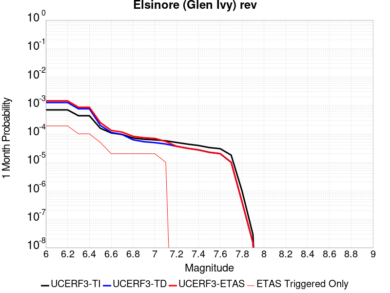 | 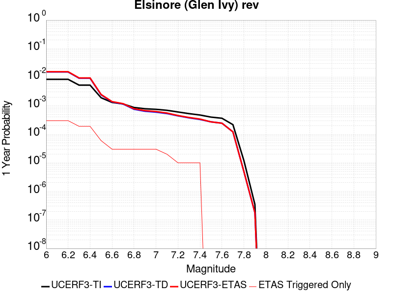 | 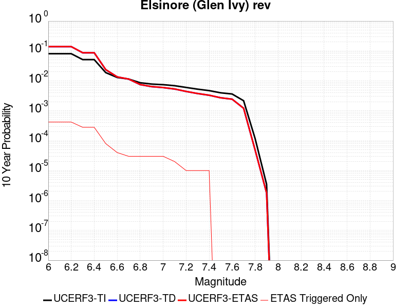 |

| Magnitude | 1 wk TI Prob | 1 wk TD Prob | 1 wk ETAS Prob | 1 wk ETAS/TD Gain | 1 wk ETAS Triggered Only | 1 mo TI Prob | 1 mo TD Prob | 1 mo ETAS Prob | 1 mo ETAS/TD Gain | 1 mo ETAS Triggered Only | 1 yr TI Prob | 1 yr TD Prob | 1 yr ETAS Prob | 1 yr ETAS/TD Gain | 1 yr ETAS Triggered Only | 10 yr TI Prob | 10 yr TD Prob | 10 yr ETAS Prob | 10 yr ETAS/TD Gain | 10 yr ETAS Triggered Only |
|-----|-----|-----|-----|-----|-----|-----|-----|-----|-----|-----|-----|-----|-----|-----|-----|-----|-----|-----|-----|-----|
| 6.0 | 1.6204086E-4 | 2.9360707E-4 | 4.2356888E-4 | 1.4426386 | 1.3E-4 | 6.94276E-4 | 0.0012578638 | 0.0014476249 | 1.1508597 | 1.9E-4 | 0.008420097 | 0.015234485 | 0.015529915 | 1.0193921 | 3.0E-4 | 0.081081145 | 0.13969168 | 0.140053 | 1.0025866 | 4.2E-4 |
| 6.1 | 1.6204086E-4 | 2.9360707E-4 | 4.2356888E-4 | 1.4426386 | 1.3E-4 | 6.94276E-4 | 0.0012578638 | 0.0014476249 | 1.1508597 | 1.9E-4 | 0.008420097 | 0.015234485 | 0.015529915 | 1.0193921 | 3.0E-4 | 0.081081145 | 0.13969168 | 0.140053 | 1.0025866 | 4.2E-4 |
| 6.2 | 1.6204086E-4 | 2.9360707E-4 | 4.2356888E-4 | 1.4426386 | 1.3E-4 | 6.94276E-4 | 0.0012578638 | 0.0014476249 | 1.1508597 | 1.9E-4 | 0.008420097 | 0.015234485 | 0.015529915 | 1.0193921 | 3.0E-4 | 0.081081145 | 0.13969168 | 0.140053 | 1.0025866 | 4.2E-4 |
| 6.3 | 1.0111737E-4 | 1.7703383E-4 | 2.4702144E-4 | 1.3953347 | 7.0E-5 | 4.332882E-4 | 7.5861247E-4 | 8.585366E-4 | 1.1317196 | 1.0E-4 | 0.005262531 | 0.009217682 | 0.0094059305 | 1.0204226 | 1.9E-4 | 0.0513964 | 0.0870191 | 0.08727473 | 1.0029377 | 2.8E-4 |
| 6.4 | 1.0111737E-4 | 1.7703383E-4 | 2.4702144E-4 | 1.3953347 | 7.0E-5 | 4.332882E-4 | 7.5861247E-4 | 8.585366E-4 | 1.1317196 | 1.0E-4 | 0.005262531 | 0.009217682 | 0.0094059305 | 1.0204226 | 1.9E-4 | 0.0513964 | 0.0870191 | 0.08727473 | 1.0029377 | 2.8E-4 |
| 6.5 | 3.6624708E-5 | 4.6391084E-5 | 7.638969E-5 | 1.646646 | 3.0E-5 | 1.569536E-4 | 1.9880582E-4 | 2.487959E-4 | 1.2514517 | 5.0E-5 | 0.001909235 | 0.0024181372 | 0.002477992 | 1.0247525 | 6.0E-5 | 0.01892915 | 0.023739954 | 0.023818055 | 1.0032898 | 8.0E-5 |
| 6.6 | 2.5051324E-5 | 2.614772E-5 | 3.614746E-5 | 1.3824326 | 1.0E-5 | 1.073584E-4 | 1.12057096E-4 | 1.3205485E-4 | 1.1784605 | 2.0E-5 | 0.0013063047 | 0.0013634858 | 0.001393445 | 1.0219724 | 3.0E-5 | 0.012986525 | 0.013564618 | 0.013604076 | 1.0029088 | 4.0E-5 |
| 6.7 | 2.2189772E-5 | 2.2072849E-5 | 3.207263E-5 | 1.4530352 | 1.0E-5 | 9.509556E-5 | 9.4594696E-5 | 1.145928E-4 | 1.2114084 | 2.0E-5 | 0.0011571734 | 0.0011511183 | 0.0011810838 | 1.0260316 | 3.0E-5 | 0.011511663 | 0.011465415 | 0.011495071 | 1.0025866 | 3.0E-5 |
| 6.8 | 1.6654378E-5 | 1.4437705E-5 | 2.443756E-5 | 1.6926209 | 1.0E-5 | 7.137396E-5 | 6.187444E-5 | 8.18732E-5 | 1.3232152 | 2.0E-5 | 8.686314E-4 | 7.530661E-4 | 7.830435E-4 | 1.0398071 | 3.0E-5 | 0.008652439 | 0.00751048 | 0.007540255 | 1.0039644 | 3.0E-5 |
| 6.9 | 1.5042909E-5 | 1.2332022E-5 | 2.2331898E-5 | 1.810887 | 1.0E-5 | 6.446802E-5 | 5.285047E-5 | 7.284941E-5 | 1.3784062 | 2.0E-5 | 7.8461546E-4 | 6.4326765E-4 | 6.732484E-4 | 1.0466069 | 3.0E-5 | 0.007818509 | 0.00641828 | 0.0064480873 | 1.0046442 | 3.0E-5 |
| 7.0 | 1.4361385E-5 | 1.1451324E-5 | 2.145121E-5 | 1.8732514 | 1.0E-5 | 6.154734E-5 | 4.9076196E-5 | 6.907521E-5 | 1.4075096 | 2.0E-5 | 7.490812E-4 | 5.973418E-4 | 6.2732387E-4 | 1.0501925 | 3.0E-5 | 0.007465612 | 0.0059613534 | 0.0059911744 | 1.0050024 | 3.0E-5 |
| 7.1 | 1.3265571E-5 | 1.0244926E-5 | 2.0244823E-5 | 1.9760829 | 1.0E-5 | 5.6851208E-5 | 4.39061E-5 | 5.390566E-5 | 1.2277488 | 1.0E-5 | 6.919436E-4 | 5.344282E-4 | 5.544175E-4 | 1.0374032 | 2.0E-5 | 0.006897931 | 0.0053347866 | 0.00535468 | 1.003729 | 2.0E-5 |
| 7.2 | 1.1596403E-5 | 8.505067E-6 | 8.505067E-6 | 1.0 | 0.0 | 4.9697923E-5 | 3.6449786E-5 | 3.6449786E-5 | 1.0 | 0.0 | 6.049042E-4 | 4.436875E-4 | 4.5368305E-4 | 1.0225284 | 1.0E-5 | 0.006032603 | 0.0044294316 | 0.0044393875 | 1.0022476 | 1.0E-5 |
| 7.3 | 1.0150827E-5 | 7.2387597E-6 | 7.2387597E-6 | 1.0 | 0.0 | 4.3502816E-5 | 3.1022897E-5 | 3.1022897E-5 | 1.0 | 0.0 | 5.2951806E-4 | 3.7763975E-4 | 3.8763596E-4 | 1.0264703 | 1.0E-5 | 0.005282581 | 0.0037703665 | 0.003780329 | 1.0026423 | 1.0E-5 |
| 7.4 | 9.080705E-6 | 6.352519E-6 | 6.352519E-6 | 1.0 | 0.0 | 3.8916725E-5 | 2.7224805E-5 | 2.7224805E-5 | 1.0 | 0.0 | 4.7370812E-4 | 3.3141294E-4 | 3.4140964E-4 | 1.0301639 | 1.0E-5 | 0.004726996 | 0.0033093381 | 0.003319305 | 1.0030117 | 1.0E-5 |
| 7.5 | 7.671649E-6 | 5.2256332E-6 | 5.2256332E-6 | 1.0 | 0.0 | 3.287808E-5 | 2.2395385E-5 | 2.2395385E-5 | 1.0 | 0.0 | 4.0021708E-4 | 2.7263095E-4 | 2.7263095E-4 | 1.0 | 0.0 | 0.0039949706 | 0.00272309 | 0.00272309 | 1.0 | 0.0 |
| 7.6 | 6.990086E-6 | 4.687545E-6 | 4.687545E-6 | 1.0 | 0.0 | 2.9957167E-5 | 2.008933E-5 | 2.008933E-5 | 1.0 | 0.0 | 3.6466747E-4 | 2.445613E-4 | 2.445613E-4 | 1.0 | 0.0 | 0.0036406964 | 0.002443038 | 0.002443038 | 1.0 | 0.0 |
| 7.7 | 4.163505E-6 | 2.3295343E-6 | 2.3295343E-6 | 1.0 | 0.0 | 1.7843471E-5 | 9.983683E-6 | 9.983683E-6 | 1.0 | 0.0 | 2.172226E-4 | 1.21545316E-4 | 1.21545316E-4 | 1.0 | 0.0 | 0.0021701038 | 0.0012148614 | 0.0012148614 | 1.0 | 0.0 |
| 7.8 | 2.2692414E-7 | 9.3854695E-8 | 9.3854695E-8 | 1.0 | 0.0 | 9.725317E-7 | 4.0223435E-7 | 4.0223435E-7 | 1.0 | 0.0 | 1.1840509E-5 | 4.8971956E-6 | 4.8971956E-6 | 1.0 | 0.0 | 1.1839878E-4 | 4.8971204E-5 | 4.8971204E-5 | 1.0 | 0.0 |
| 7.9 | 6.676829E-9 | 3.439853E-9 | 3.439853E-9 | 1.0 | 0.0 | 2.861498E-8 | 1.4742227E-8 | 1.4742227E-8 | 1.0 | 0.0 | 3.4838732E-7 | 1.7948659E-7 | 1.7948659E-7 | 1.0 | 0.0 | 3.4838679E-6 | 1.7948646E-6 | 1.7948646E-6 | 1.0 | 0.0 |

## San Andreas (Coachella) rev
*[(top)](#table-of-contents)*

| 1 Week | 1 Month | 1 Year | 10 Year |
|-----|-----|-----|-----|
| 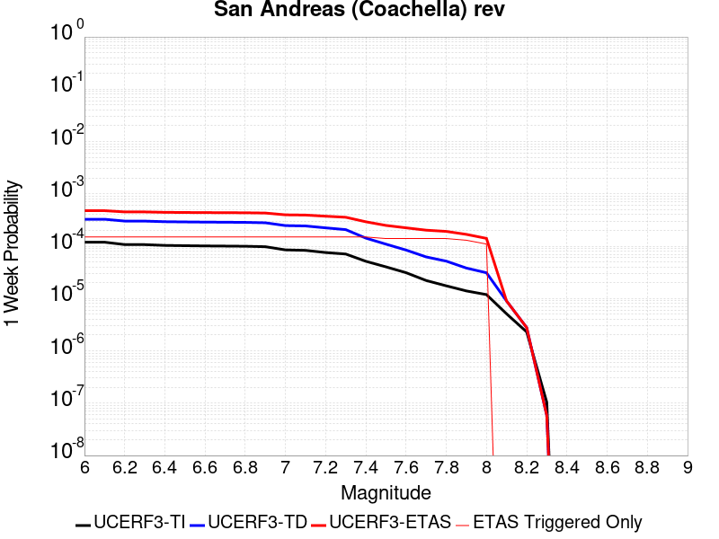 |  | 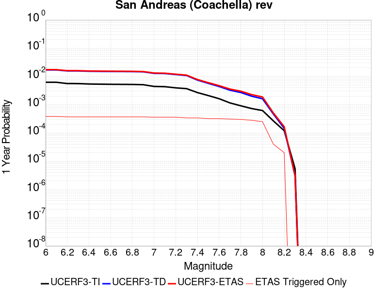 |  |

| Magnitude | 1 wk TI Prob | 1 wk TD Prob | 1 wk ETAS Prob | 1 wk ETAS/TD Gain | 1 wk ETAS Triggered Only | 1 mo TI Prob | 1 mo TD Prob | 1 mo ETAS Prob | 1 mo ETAS/TD Gain | 1 mo ETAS Triggered Only | 1 yr TI Prob | 1 yr TD Prob | 1 yr ETAS Prob | 1 yr ETAS/TD Gain | 1 yr ETAS Triggered Only | 10 yr TI Prob | 10 yr TD Prob | 10 yr ETAS Prob | 10 yr ETAS/TD Gain | 10 yr ETAS Triggered Only |
|-----|-----|-----|-----|-----|-----|-----|-----|-----|-----|-----|-----|-----|-----|-----|-----|-----|-----|-----|-----|-----|
| 6.0 | 1.1925945E-4 | 3.2729402E-4 | 4.772449E-4 | 1.4581535 | 1.5E-4 | 5.110118E-4 | 0.0014019393 | 0.0016416028 | 1.1709515 | 2.4E-4 | 0.0062038354 | 0.016936364 | 0.017309928 | 1.0220569 | 3.8E-4 | 0.060334753 | 0.15265316 | 0.15305988 | 1.0026643 | 4.8E-4 |
| 6.1 | 1.1925945E-4 | 3.2729402E-4 | 4.772449E-4 | 1.4581535 | 1.5E-4 | 5.110118E-4 | 0.0014019393 | 0.0016416028 | 1.1709515 | 2.4E-4 | 0.0062038354 | 0.016936364 | 0.017309928 | 1.0220569 | 3.8E-4 | 0.060334753 | 0.15265316 | 0.15305988 | 1.0026643 | 4.8E-4 |
| 6.2 | 1.07432395E-4 | 3.0230157E-4 | 4.522562E-4 | 1.4960433 | 1.5E-4 | 4.603433E-4 | 0.0012949388 | 0.0015246411 | 1.1773846 | 2.3E-4 | 0.005590286 | 0.015653009 | 0.016017217 | 1.0232676 | 3.7E-4 | 0.05451731 | 0.14182423 | 0.14222758 | 1.002844 | 4.7E-4 |
| 6.3 | 1.0718766E-4 | 3.0175463E-4 | 4.5170935E-4 | 1.4969426 | 1.5E-4 | 4.592948E-4 | 0.0012925972 | 0.0015222998 | 1.1777064 | 2.3E-4 | 0.005577586 | 0.015624908 | 0.015989127 | 1.0233102 | 3.7E-4 | 0.054396555 | 0.14159249 | 0.14199595 | 1.0028493 | 4.7E-4 |
| 6.4 | 1.0355944E-4 | 2.9383553E-4 | 4.4379145E-4 | 1.5103396 | 1.5E-4 | 4.4375064E-4 | 0.0012586913 | 0.0014884018 | 1.1824995 | 2.3E-4 | 0.0053892885 | 0.015217941 | 0.015582311 | 1.0239434 | 3.7E-4 | 0.052604496 | 0.13815255 | 0.13855763 | 1.0029321 | 4.7E-4 |
| 6.5 | 1.0227914E-4 | 2.9102986E-4 | 4.4098622E-4 | 1.515261 | 1.5E-4 | 4.382655E-4 | 0.0012466786 | 0.0014763919 | 1.1842602 | 2.3E-4 | 0.0053228354 | 0.01507372 | 0.015438143 | 1.024176 | 3.7E-4 | 0.051971316 | 0.13693172 | 0.13733736 | 1.0029624 | 4.7E-4 |
| 6.6 | 1.0116757E-4 | 2.8868738E-4 | 4.3864409E-4 | 1.5194432 | 1.5E-4 | 4.3350324E-4 | 0.0012366489 | 0.0014663645 | 1.1857564 | 2.3E-4 | 0.0052651367 | 0.01495329 | 0.015317758 | 1.0243738 | 3.7E-4 | 0.051421247 | 0.1359099 | 0.13631602 | 1.0029882 | 4.7E-4 |
| 6.7 | 1.0050676E-4 | 2.8727303E-4 | 4.3722993E-4 | 1.5220014 | 1.5E-4 | 4.3067214E-4 | 0.0012305931 | 0.0014603101 | 1.1866717 | 2.3E-4 | 0.005230834 | 0.014880571 | 0.015245064 | 1.0244946 | 3.7E-4 | 0.051094085 | 0.13529462 | 0.13570103 | 1.003004 | 4.7E-4 |
| 6.8 | 9.976819E-5 | 2.853096E-4 | 4.352668E-4 | 1.5255947 | 1.5E-4 | 4.2750788E-4 | 0.0012221863 | 0.0014519052 | 1.1879574 | 2.3E-4 | 0.0051924936 | 0.0147796115 | 0.015144143 | 1.0246645 | 3.7E-4 | 0.050728295 | 0.13444631 | 0.13485312 | 1.0030258 | 4.7E-4 |
| 6.9 | 9.77719E-5 | 2.8027873E-4 | 4.302367E-4 | 1.5350316 | 1.5E-4 | 4.1895514E-4 | 0.0012006456 | 0.0014303693 | 1.1913337 | 2.3E-4 | 0.0050888555 | 0.014520878 | 0.014885505 | 1.0251106 | 3.7E-4 | 0.049738888 | 0.1322748 | 0.13268264 | 1.0030832 | 4.7E-4 |
| 7.0 | 8.500761E-5 | 2.4762485E-4 | 3.9758772E-4 | 1.605605 | 1.5E-4 | 3.6426744E-4 | 0.001060821 | 0.001290577 | 1.2165833 | 2.3E-4 | 0.0044259406 | 0.012839786 | 0.013195164 | 1.0276779 | 3.6E-4 | 0.04338823 | 0.11813272 | 0.11853838 | 1.003434 | 4.6E-4 |
| 7.1 | 8.319876E-5 | 2.4365232E-4 | 3.9361577E-4 | 1.6154813 | 1.5E-4 | 3.5651738E-4 | 0.0010438096 | 0.0012735695 | 1.2201167 | 2.3E-4 | 0.004331963 | 0.012635092 | 0.012990544 | 1.0281321 | 3.6E-4 | 0.042484846 | 0.116353 | 0.11675948 | 1.0034934 | 4.6E-4 |
| 7.2 | 7.563917E-5 | 2.2413683E-4 | 3.7410323E-4 | 1.6690841 | 1.5E-4 | 3.2412758E-4 | 9.602359E-4 | 0.001190015 | 1.2392945 | 2.3E-4 | 0.0039391145 | 0.011628893 | 0.011984707 | 1.0305973 | 3.6E-4 | 0.03870018 | 0.10775925 | 0.10816968 | 1.0038087 | 4.6E-4 |
| 7.3 | 7.082985E-5 | 2.0729867E-4 | 3.5726756E-4 | 1.7234436 | 1.5E-4 | 3.0352117E-4 | 8.881233E-4 | 0.001117919 | 1.258743 | 2.3E-4 | 0.0036891096 | 0.010759917 | 0.011096259 | 1.0312587 | 3.4E-4 | 0.03628465 | 0.100282 | 0.100659885 | 1.0037682 | 4.2E-4 |
| 7.4 | 5.146215E-5 | 1.4273795E-4 | 2.9271652E-4 | 2.050727 | 1.5E-4 | 2.2053342E-4 | 6.115915E-4 | 8.414508E-4 | 1.375838 | 2.3E-4 | 0.0026816884 | 0.0074208933 | 0.00775837 | 1.0454766 | 3.4E-4 | 0.02649557 | 0.070849575 | 0.07123982 | 1.0055081 | 4.2E-4 |
| 7.5 | 4.0285166E-5 | 1.09416E-4 | 2.4940068E-4 | 2.2793803 | 1.4E-4 | 1.7263928E-4 | 4.6884175E-4 | 6.787433E-4 | 1.4477023 | 2.1E-4 | 0.002099857 | 0.0056932783 | 0.0060114563 | 1.0558866 | 3.2E-4 | 0.020801254 | 0.055011146 | 0.055389144 | 1.0068712 | 4.0E-4 |
| 7.6 | 3.1168736E-5 | 8.4389096E-5 | 2.2437728E-4 | 2.658842 | 1.4E-4 | 1.3357346E-4 | 3.6161754E-4 | 5.715416E-4 | 1.5805141 | 2.1E-4 | 0.0016250437 | 0.0043938323 | 0.004712426 | 1.0725094 | 3.2E-4 | 0.016132116 | 0.04281005 | 0.043183353 | 1.00872 | 3.9E-4 |
| 7.7 | 2.2100989E-5 | 6.238755E-5 | 2.0237881E-4 | 3.2438974 | 1.4E-4 | 9.4715084E-5 | 2.6734784E-4 | 4.672944E-4 | 1.747889 | 2.0E-4 | 0.001152546 | 0.0032501083 | 0.003559101 | 1.0950714 | 3.1E-4 | 0.011465867 | 0.0319002 | 0.032258395 | 1.0112287 | 3.7E-4 |
| 7.8 | 1.7484861E-5 | 5.179572E-5 | 1.9178847E-4 | 3.7027862 | 1.4E-4 | 7.493296E-5 | 2.2196278E-4 | 4.2191838E-4 | 1.900852 | 2.0E-4 | 9.1192697E-4 | 0.0026990508 | 0.002998241 | 1.1108502 | 3.0E-4 | 0.009081938 | 0.026640115 | 0.026990525 | 1.0131534 | 3.6E-4 |
| 7.9 | 1.3967285E-5 | 3.822255E-5 | 1.6821758E-4 | 4.4010034 | 1.3E-4 | 5.985842E-5 | 1.6380067E-4 | 3.437712E-4 | 2.0987167 | 1.8E-4 | 7.2853256E-4 | 0.00199245 | 0.0022718923 | 1.1402504 | 2.8E-4 | 0.0072614877 | 0.019909438 | 0.020232867 | 1.016245 | 3.3E-4 |
| 8.0 | 1.1887396E-5 | 3.106521E-5 | 1.410618E-4 | 4.5408287 | 1.1E-4 | 5.094499E-5 | 1.3312983E-4 | 2.8310987E-4 | 2.1265697 | 1.5E-4 | 6.200787E-4 | 0.0016196516 | 0.0018692466 | 1.1541042 | 2.5E-4 | 0.006183513 | 0.016279267 | 0.016574385 | 1.0181284 | 3.0E-4 |
| 8.1 | 5.100864E-6 | 8.973418E-6 | 8.973418E-6 | 1.0 | 0.0 | 2.1860664E-5 | 3.8456936E-5 | 4.8456553E-5 | 1.2600211 | 1.0E-5 | 2.6612106E-4 | 4.6811273E-4 | 5.0809403E-4 | 1.0854095 | 4.0E-5 | 0.002658026 | 0.004917731 | 0.004957534 | 1.0080938 | 4.0E-5 |
| 8.2 | 2.3004484E-6 | 2.7864487E-6 | 2.7864487E-6 | 1.0 | 0.0 | 9.859027E-6 | 1.1941868E-5 | 1.1941868E-5 | 1.0 | 0.0 | 1.2002704E-4 | 1.4538258E-4 | 1.6537968E-4 | 1.1375481 | 2.0E-5 | 0.0011996223 | 0.0015973912 | 0.0016173592 | 1.0125004 | 2.0E-5 |
| 8.3 | 1.0424446E-7 | 5.8161504E-8 | 5.8161504E-8 | 1.0 | 0.0 | 4.4676187E-7 | 2.4926356E-7 | 2.4926356E-7 | 1.0 | 0.0 | 5.439312E-6 | 3.03478E-6 | 3.03478E-6 | 1.0 | 0.0 | 5.4391792E-5 | 3.190716E-5 | 3.190716E-5 | 1.0 | 0.0 |

## San Andreas (Carrizo) rev
*[(top)](#table-of-contents)*

| 1 Week | 1 Month | 1 Year | 10 Year |
|-----|-----|-----|-----|
|  |  | 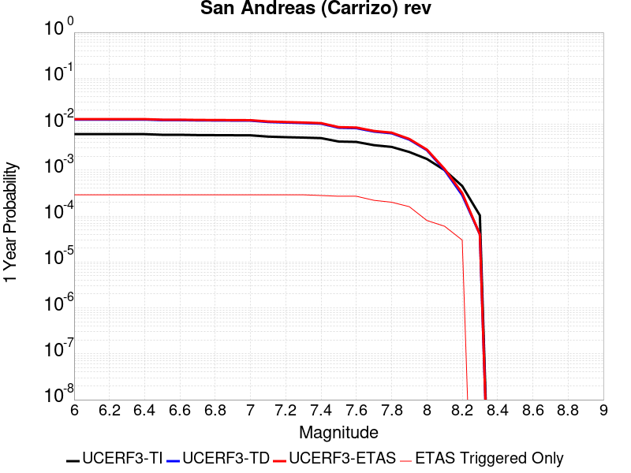 | 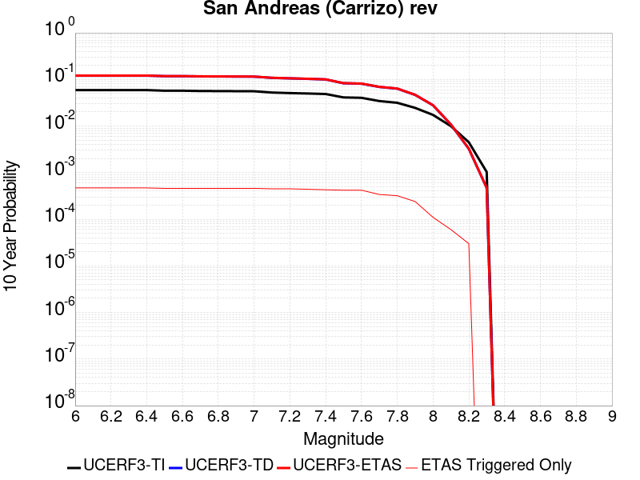 |

| Magnitude | 1 wk TI Prob | 1 wk TD Prob | 1 wk ETAS Prob | 1 wk ETAS/TD Gain | 1 wk ETAS Triggered Only | 1 mo TI Prob | 1 mo TD Prob | 1 mo ETAS Prob | 1 mo ETAS/TD Gain | 1 mo ETAS Triggered Only | 1 yr TI Prob | 1 yr TD Prob | 1 yr ETAS Prob | 1 yr ETAS/TD Gain | 1 yr ETAS Triggered Only | 10 yr TI Prob | 10 yr TD Prob | 10 yr ETAS Prob | 10 yr ETAS/TD Gain | 10 yr ETAS Triggered Only |
|-----|-----|-----|-----|-----|-----|-----|-----|-----|-----|-----|-----|-----|-----|-----|-----|-----|-----|-----|-----|-----|
| 6.0 | 1.1674632E-4 | 2.432302E-4 | 3.6320102E-4 | 1.4932398 | 1.2E-4 | 5.002454E-4 | 0.0010420004 | 0.0012018336 | 1.1533908 | 1.6E-4 | 0.006073493 | 0.012613042 | 0.012899385 | 1.0227021 | 2.9E-4 | 0.0591016 | 0.12061418 | 0.12102749 | 1.0034267 | 4.7E-4 |
| 6.1 | 1.1674632E-4 | 2.432302E-4 | 3.6320102E-4 | 1.4932398 | 1.2E-4 | 5.002454E-4 | 0.0010420004 | 0.0012018336 | 1.1533908 | 1.6E-4 | 0.006073493 | 0.012613042 | 0.012899385 | 1.0227021 | 2.9E-4 | 0.0591016 | 0.12061418 | 0.12102749 | 1.0034267 | 4.7E-4 |
| 6.2 | 1.1674632E-4 | 2.432302E-4 | 3.6320102E-4 | 1.4932398 | 1.2E-4 | 5.002454E-4 | 0.0010420004 | 0.0012018336 | 1.1533908 | 1.6E-4 | 0.006073493 | 0.012613042 | 0.012899385 | 1.0227021 | 2.9E-4 | 0.0591016 | 0.12061418 | 0.12102749 | 1.0034267 | 4.7E-4 |
| 6.3 | 1.1674632E-4 | 2.432302E-4 | 3.6320102E-4 | 1.4932398 | 1.2E-4 | 5.002454E-4 | 0.0010420004 | 0.0012018336 | 1.1533908 | 1.6E-4 | 0.006073493 | 0.012613042 | 0.012899385 | 1.0227021 | 2.9E-4 | 0.0591016 | 0.12061418 | 0.12102749 | 1.0034267 | 4.7E-4 |
| 6.4 | 1.1674632E-4 | 2.432302E-4 | 3.6320102E-4 | 1.4932398 | 1.2E-4 | 5.002454E-4 | 0.0010420004 | 0.0012018336 | 1.1533908 | 1.6E-4 | 0.006073493 | 0.012613042 | 0.012899385 | 1.0227021 | 2.9E-4 | 0.0591016 | 0.12061418 | 0.12102749 | 1.0034267 | 4.7E-4 |
| 6.5 | 1.13136164E-4 | 2.3643032E-4 | 3.5640196E-4 | 1.5074291 | 1.2E-4 | 4.847792E-4 | 0.0010128808 | 0.0011727188 | 1.1578053 | 1.6E-4 | 0.0058862255 | 0.012262545 | 0.012548988 | 1.0233593 | 2.9E-4 | 0.057327334 | 0.117585555 | 0.11799146 | 1.0034521 | 4.6E-4 |
| 6.6 | 1.13136164E-4 | 2.3643032E-4 | 3.5640196E-4 | 1.5074291 | 1.2E-4 | 4.847792E-4 | 0.0010128808 | 0.0011727188 | 1.1578053 | 1.6E-4 | 0.0058862255 | 0.012262545 | 0.012548988 | 1.0233593 | 2.9E-4 | 0.057327334 | 0.117585555 | 0.11799146 | 1.0034521 | 4.6E-4 |
| 6.7 | 1.1149675E-4 | 2.3334254E-4 | 3.5331454E-4 | 1.5141454 | 1.2E-4 | 4.777557E-4 | 9.996577E-4 | 0.0011594978 | 1.1598948 | 1.6E-4 | 0.0058011734 | 0.012103349 | 0.012389839 | 1.0236703 | 2.9E-4 | 0.05652051 | 0.1162071 | 0.11661364 | 1.0034984 | 4.6E-4 |
| 6.8 | 1.1103589E-4 | 2.3236412E-4 | 3.5233624E-4 | 1.5163108 | 1.2E-4 | 4.7578133E-4 | 9.954676E-4 | 0.0011553084 | 1.1605685 | 1.6E-4 | 0.005777263 | 0.012052901 | 0.012339406 | 1.0237706 | 2.9E-4 | 0.056293584 | 0.1157674 | 0.11617415 | 1.0035135 | 4.6E-4 |
| 6.9 | 1.1053259E-4 | 2.3128795E-4 | 3.5126018E-4 | 1.5187137 | 1.2E-4 | 4.7362508E-4 | 9.90859E-4 | 0.0011507005 | 1.161316 | 1.6E-4 | 0.0057511497 | 0.01199741 | 0.0122839315 | 1.0238819 | 2.9E-4 | 0.05604569 | 0.11528359 | 0.11569057 | 1.0035301 | 4.6E-4 |
| 7.0 | 1.1005377E-4 | 2.3029637E-4 | 3.5026873E-4 | 1.5209477 | 1.2E-4 | 4.7157376E-4 | 9.866126E-4 | 0.0011464548 | 1.162011 | 1.6E-4 | 0.0057263062 | 0.011946279 | 0.012232814 | 1.0239854 | 2.9E-4 | 0.055809796 | 0.11483591 | 0.115243085 | 1.0035458 | 4.6E-4 |
| 7.1 | 1.0308142E-4 | 2.1539345E-4 | 3.353676E-4 | 1.557 | 1.2E-4 | 4.417027E-4 | 9.227892E-4 | 0.0010826415 | 1.1732274 | 1.6E-4 | 0.0053644776 | 0.011177397 | 0.011464156 | 1.0256553 | 2.9E-4 | 0.052368138 | 0.108092256 | 0.10849362 | 1.0037131 | 4.5E-4 |
| 7.2 | 1.0027479E-4 | 2.094724E-4 | 3.2944727E-4 | 1.5727478 | 1.2E-4 | 4.296783E-4 | 8.9743105E-4 | 0.0010572874 | 1.1781267 | 1.6E-4 | 0.0052187922 | 0.010871782 | 0.011158629 | 1.0263846 | 2.9E-4 | 0.050979212 | 0.10539625 | 0.10579882 | 1.0038196 | 4.5E-4 |
| 7.3 | 9.816942E-5 | 2.0422463E-4 | 3.2420014E-4 | 1.5874683 | 1.2E-4 | 4.2065824E-4 | 8.7495585E-4 | 0.0010348159 | 1.1827064 | 1.6E-4 | 0.005109493 | 0.010600842 | 0.010887767 | 1.0270663 | 2.9E-4 | 0.049935985 | 0.102979995 | 0.10337469 | 1.0038327 | 4.4E-4 |
| 7.4 | 9.5634205E-5 | 1.9791997E-4 | 3.0789818E-4 | 1.5556703 | 1.1E-4 | 4.0979648E-4 | 8.479536E-4 | 9.978265E-4 | 1.1767465 | 1.5E-4 | 0.0049778637 | 0.010275229 | 0.010552351 | 1.02697 | 2.8E-4 | 0.048678253 | 0.10006632 | 0.10045329 | 1.0038671 | 4.3E-4 |
| 7.5 | 8.052417E-5 | 1.611261E-4 | 2.6111E-4 | 1.6205319 | 1.0E-4 | 3.4505792E-4 | 6.903579E-4 | 8.302612E-4 | 1.2026534 | 1.4E-4 | 0.0041929903 | 0.008372796 | 0.008640535 | 1.0319773 | 2.7E-4 | 0.04114753 | 0.08281049 | 0.08319571 | 1.0046518 | 4.2E-4 |
| 7.6 | 7.897024E-5 | 1.5765853E-4 | 2.5764277E-4 | 1.6341822 | 1.0E-4 | 3.384E-4 | 6.755046E-4 | 8.1541005E-4 | 1.2071124 | 1.4E-4 | 0.0041122385 | 0.008193332 | 0.00846112 | 1.0326836 | 2.7E-4 | 0.040369697 | 0.08115171 | 0.08153762 | 1.0047555 | 4.2E-4 |
| 7.7 | 6.707427E-5 | 1.3276102E-4 | 2.1275041E-4 | 1.6025065 | 8.0E-5 | 2.8742946E-4 | 5.688518E-4 | 6.8878353E-4 | 1.2108313 | 1.2E-4 | 0.003493839 | 0.00690381 | 0.0071222913 | 1.0316465 | 2.2E-4 | 0.034394164 | 0.069048055 | 0.06936458 | 1.0045841 | 3.4E-4 |
| 7.8 | 6.147705E-5 | 1.2197486E-4 | 1.9196632E-4 | 1.5738187 | 7.0E-5 | 2.6344648E-4 | 5.226447E-4 | 6.3258724E-4 | 1.210358 | 1.1E-4 | 0.0032027436 | 0.006344659 | 0.00654339 | 1.0313226 | 2.0E-4 | 0.031569764 | 0.06351457 | 0.06381424 | 1.0047182 | 3.2E-4 |
| 7.9 | 4.7636717E-5 | 8.87977E-5 | 1.5879149E-4 | 1.7882386 | 7.0E-5 | 2.0414138E-4 | 3.8050607E-4 | 4.8046804E-4 | 1.262708 | 1.0E-4 | 0.0024825884 | 0.0046228287 | 0.004782089 | 1.0344509 | 1.6E-4 | 0.024550365 | 0.046628095 | 0.046856903 | 1.0049071 | 2.4E-4 |
| 8.0 | 3.3554235E-5 | 5.2136907E-5 | 5.2136907E-5 | 1.0 | 0.0 | 1.4379594E-4 | 2.2342477E-4 | 2.5341805E-4 | 1.1342434 | 3.0E-5 | 0.0017493097 | 0.002716805 | 0.0027965878 | 1.0293664 | 8.0E-5 | 0.017356034 | 0.027880952 | 0.027987886 | 1.0038353 | 1.1E-4 |
| 8.1 | 1.9175432E-5 | 1.9184976E-5 | 1.9184976E-5 | 1.0 | 0.0 | 8.217783E-5 | 8.2218736E-5 | 1.0221709E-4 | 1.2432336 | 2.0E-5 | 0.0010000558 | 0.0010005541 | 0.001060494 | 1.0599067 | 6.0E-5 | 0.009955673 | 0.0107580265 | 0.010817382 | 1.0055172 | 6.0E-5 |
| 8.2 | 8.643924E-6 | 5.4748625E-6 | 5.4748625E-6 | 1.0 | 0.0 | 3.704486E-5 | 2.3463486E-5 | 2.3463486E-5 | 1.0 | 0.0 | 4.5092785E-4 | 2.8563058E-4 | 3.15622E-4 | 1.1050007 | 3.0E-5 | 0.0045001395 | 0.0032487072 | 0.0032786098 | 1.0092044 | 3.0E-5 |
| 8.3 | 1.983087E-6 | 7.6599065E-7 | 7.6599065E-7 | 1.0 | 0.0 | 8.498917E-6 | 3.282813E-6 | 3.282813E-6 | 1.0 | 0.0 | 1.034694E-4 | 3.9967534E-5 | 3.9967534E-5 | 1.0 | 0.0 | 0.0010342124 | 4.719687E-4 | 4.719687E-4 | 1.0 | 0.0 |

## San Andreas (Cholame) rev
*[(top)](#table-of-contents)*

| 1 Week | 1 Month | 1 Year | 10 Year |
|-----|-----|-----|-----|
| 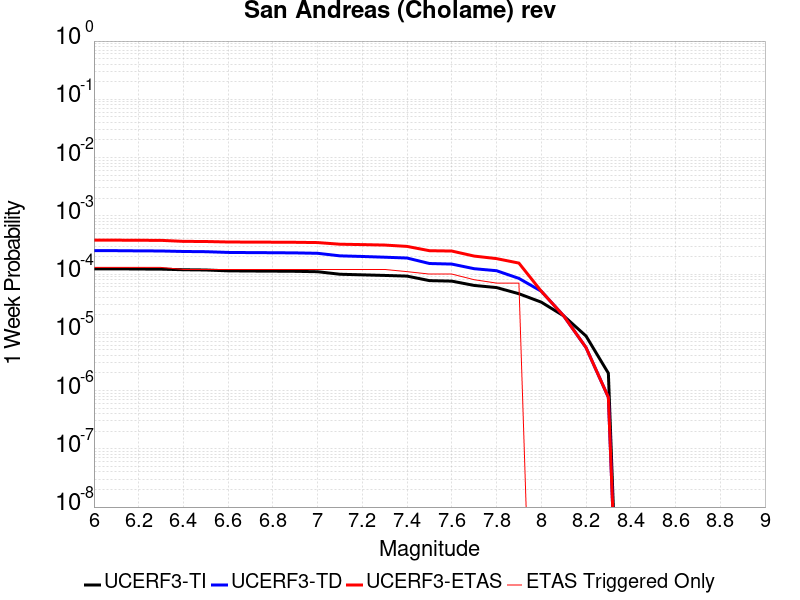 |  |  |  |

| Magnitude | 1 wk TI Prob | 1 wk TD Prob | 1 wk ETAS Prob | 1 wk ETAS/TD Gain | 1 wk ETAS Triggered Only | 1 mo TI Prob | 1 mo TD Prob | 1 mo ETAS Prob | 1 mo ETAS/TD Gain | 1 mo ETAS Triggered Only | 1 yr TI Prob | 1 yr TD Prob | 1 yr ETAS Prob | 1 yr ETAS/TD Gain | 1 yr ETAS Triggered Only | 10 yr TI Prob | 10 yr TD Prob | 10 yr ETAS Prob | 10 yr ETAS/TD Gain | 10 yr ETAS Triggered Only |
|-----|-----|-----|-----|-----|-----|-----|-----|-----|-----|-----|-----|-----|-----|-----|-----|-----|-----|-----|-----|-----|
| 6.0 | 1.2302514E-4 | 2.5204287E-4 | 3.820101E-4 | 1.5156553 | 1.3E-4 | 5.27144E-4 | 0.0010797381 | 0.0012495547 | 1.1572756 | 1.7E-4 | 0.0063991086 | 0.0130670825 | 0.013363162 | 1.0226585 | 3.0E-4 | 0.06217949 | 0.12439073 | 0.12480226 | 1.0033084 | 4.7E-4 |
| 6.1 | 1.2302514E-4 | 2.5204287E-4 | 3.820101E-4 | 1.5156553 | 1.3E-4 | 5.27144E-4 | 0.0010797381 | 0.0012495547 | 1.1572756 | 1.7E-4 | 0.0063991086 | 0.0130670825 | 0.013363162 | 1.0226585 | 3.0E-4 | 0.06217949 | 0.12439073 | 0.12480226 | 1.0033084 | 4.7E-4 |
| 6.2 | 1.2203569E-4 | 2.5021084E-4 | 3.801783E-4 | 1.5194318 | 1.3E-4 | 5.2290526E-4 | 0.0010718931 | 0.0012417109 | 1.158428 | 1.7E-4 | 0.006347804 | 0.01297271 | 0.013268818 | 1.0228255 | 3.0E-4 | 0.061695136 | 0.12357691 | 0.12398882 | 1.0033333 | 4.7E-4 |
| 6.3 | 1.2142645E-4 | 2.4907055E-4 | 3.790382E-4 | 1.5218104 | 1.3E-4 | 5.202953E-4 | 0.0010670102 | 0.0012368289 | 1.1591537 | 1.7E-4 | 0.006316212 | 0.012913967 | 0.013210093 | 1.0229306 | 3.0E-4 | 0.06139677 | 0.12307103 | 0.12348319 | 1.003349 | 4.7E-4 |
| 6.4 | 1.1865206E-4 | 2.44126E-4 | 3.6409672E-4 | 1.4914294 | 1.2E-4 | 5.0840975E-4 | 0.0010458364 | 0.001205669 | 1.1528276 | 1.6E-4 | 0.006172335 | 0.012659196 | 0.012945525 | 1.0226183 | 2.9E-4 | 0.060036868 | 0.1208638 | 0.121268205 | 1.003346 | 4.6E-4 |
| 6.5 | 1.17443946E-4 | 2.4205919E-4 | 3.6203014E-4 | 1.4956266 | 1.2E-4 | 5.032341E-4 | 0.0010369857 | 0.0011968197 | 1.1541333 | 1.6E-4 | 0.006109677 | 0.012552682 | 0.012839043 | 1.0228126 | 2.9E-4 | 0.059444077 | 0.11993805 | 0.12034288 | 1.0033753 | 4.6E-4 |
| 6.6 | 1.13579066E-4 | 2.3514954E-4 | 3.5512133E-4 | 1.5101936 | 1.2E-4 | 4.866766E-4 | 0.001007396 | 0.0011672348 | 1.1586653 | 1.6E-4 | 0.0059092017 | 0.012196515 | 0.0124829775 | 1.0234873 | 2.9E-4 | 0.057545185 | 0.11685214 | 0.11725839 | 1.0034766 | 4.6E-4 |
| 6.7 | 1.1271412E-4 | 2.3359268E-4 | 3.5356465E-4 | 1.5135947 | 1.2E-4 | 4.829711E-4 | 0.0010007289 | 0.0011605688 | 1.1597234 | 1.6E-4 | 0.005864331 | 0.012116249 | 0.012402735 | 1.0236448 | 2.9E-4 | 0.057119697 | 0.116155714 | 0.11656228 | 1.0035002 | 4.6E-4 |
| 6.8 | 1.1217975E-4 | 2.3247694E-4 | 3.5244905E-4 | 1.5160602 | 1.2E-4 | 4.8068175E-4 | 9.959509E-4 | 0.0011557915 | 1.1604905 | 1.6E-4 | 0.005836608 | 0.012058721 | 0.012345225 | 1.023759 | 2.9E-4 | 0.056856725 | 0.11565396 | 0.11606076 | 1.0035174 | 4.6E-4 |
| 6.9 | 1.1146753E-4 | 2.3096445E-4 | 3.5093672E-4 | 1.5194405 | 1.2E-4 | 4.7763053E-4 | 9.894737E-4 | 0.0011493154 | 1.1615422 | 1.6E-4 | 0.0057996577 | 0.011980731 | 0.012267257 | 1.0239155 | 2.9E-4 | 0.056506127 | 0.11497439 | 0.1153815 | 1.0035409 | 4.6E-4 |
| 7.0 | 1.0965793E-4 | 2.2719789E-4 | 3.4717063E-4 | 1.5280539 | 1.2E-4 | 4.698779E-4 | 9.733434E-4 | 0.0011331877 | 1.1642219 | 1.6E-4 | 0.005705768 | 0.011786487 | 0.012073069 | 1.0243144 | 2.9E-4 | 0.055614736 | 0.11327597 | 0.11368386 | 1.0036008 | 4.6E-4 |
| 7.1 | 9.927982E-5 | 2.0538924E-4 | 3.2536458E-4 | 1.5841365 | 1.2E-4 | 4.2541555E-4 | 8.7994366E-4 | 0.0010398028 | 1.1816698 | 1.6E-4 | 0.0051671406 | 0.010660981 | 0.01094789 | 1.026912 | 2.9E-4 | 0.05048634 | 0.1033706 | 0.103774086 | 1.0039033 | 4.5E-4 |
| 7.2 | 9.696786E-5 | 2.0043184E-4 | 3.204078E-4 | 1.5985873 | 1.2E-4 | 4.1551032E-4 | 8.5871184E-4 | 0.0010185745 | 1.1861656 | 1.6E-4 | 0.00504711 | 0.010404981 | 0.010691963 | 1.0275812 | 2.9E-4 | 0.04934009 | 0.1011086 | 0.1015131 | 1.0040007 | 4.5E-4 |
| 7.3 | 9.4727984E-5 | 1.9472468E-4 | 3.1470132E-4 | 1.6161346 | 1.2E-4 | 4.0591392E-4 | 8.3426846E-4 | 9.941349E-4 | 1.1916248 | 1.6E-4 | 0.0049308087 | 0.010110183 | 0.010397251 | 1.028394 | 2.9E-4 | 0.048228268 | 0.09847952 | 0.098876186 | 1.004028 | 4.4E-4 |
| 7.4 | 9.220358E-5 | 1.8843076E-4 | 2.9841004E-4 | 1.5836588 | 1.1E-4 | 3.9509835E-4 | 8.073114E-4 | 9.571903E-4 | 1.1856519 | 1.5E-4 | 0.004799717 | 0.009784967 | 0.010062227 | 1.0283353 | 2.8E-4 | 0.046973653 | 0.095557496 | 0.09594641 | 1.0040699 | 4.3E-4 |
| 7.5 | 7.71631E-5 | 1.5177966E-4 | 2.517645E-4 | 1.6587498 | 1.0E-4 | 3.306571E-4 | 6.503223E-4 | 7.902312E-4 | 1.2151378 | 1.4E-4 | 0.0040183207 | 0.007889002 | 0.008156871 | 1.0339549 | 2.7E-4 | 0.03946433 | 0.07828531 | 0.078672424 | 1.004945 | 4.2E-4 |
| 7.6 | 7.5634416E-5 | 1.483744E-4 | 2.4835955E-4 | 1.6738707 | 1.0E-4 | 3.241072E-4 | 6.3573546E-4 | 7.756465E-4 | 1.2200774 | 1.4E-4 | 0.0039388672 | 0.0077126776 | 0.007980595 | 1.0347373 | 2.7E-4 | 0.038697794 | 0.07664872 | 0.07703653 | 1.0050596 | 4.2E-4 |
| 7.7 | 6.3783E-5 | 1.235872E-4 | 2.0357732E-4 | 1.6472362 | 8.0E-5 | 2.7332708E-4 | 5.29552E-4 | 6.494884E-4 | 1.2264867 | 1.2E-4 | 0.0033226798 | 0.0064282627 | 0.0066468483 | 1.0340039 | 2.2E-4 | 0.032734364 | 0.06454029 | 0.06485835 | 1.004928 | 3.4E-4 |
| 7.8 | 5.863422E-5 | 1.1416107E-4 | 1.8415308E-4 | 1.6130987 | 7.0E-5 | 2.512653E-4 | 4.8917E-4 | 5.991162E-4 | 1.2247607 | 1.1E-4 | 0.003054864 | 0.0059394026 | 0.006138215 | 1.0334734 | 2.0E-4 | 0.030132094 | 0.059659187 | 0.059960093 | 1.0050437 | 3.2E-4 |
| 7.9 | 4.595283E-5 | 8.426331E-5 | 1.5425742E-4 | 1.8306593 | 7.0E-5 | 1.9692584E-4 | 3.610785E-4 | 4.610424E-4 | 1.2768481 | 1.0E-4 | 0.0023949358 | 0.0043872762 | 0.0045465743 | 1.0363091 | 1.6E-4 | 0.023692891 | 0.044362005 | 0.04459136 | 1.00517 | 2.4E-4 |
| 8.0 | 3.2950178E-5 | 5.0772942E-5 | 5.0772942E-5 | 1.0 | 0.0 | 1.412074E-4 | 2.1758018E-4 | 2.4757365E-4 | 1.1378502 | 3.0E-5 | 0.0017178444 | 0.0026458222 | 0.0027256107 | 1.0301564 | 8.0E-5 | 0.017046256 | 0.027180137 | 0.027287148 | 1.0039371 | 1.1E-4 |
| 8.1 | 1.9177472E-5 | 1.9185145E-5 | 1.9185145E-5 | 1.0 | 0.0 | 8.218658E-5 | 8.221946E-5 | 1.0221782E-4 | 1.2432314 | 2.0E-5 | 0.0010001622 | 0.0010005629 | 0.0010605028 | 1.0599062 | 6.0E-5 | 0.009956728 | 0.010758142 | 0.010817497 | 1.0055171 | 6.0E-5 |
| 8.2 | 8.643924E-6 | 5.4748625E-6 | 5.4748625E-6 | 1.0 | 0.0 | 3.704486E-5 | 2.3463486E-5 | 2.3463486E-5 | 1.0 | 0.0 | 4.5092785E-4 | 2.8563058E-4 | 3.15622E-4 | 1.1050007 | 3.0E-5 | 0.0045001395 | 0.0032487072 | 0.0032786098 | 1.0092044 | 3.0E-5 |
| 8.3 | 1.983087E-6 | 7.6599065E-7 | 7.6599065E-7 | 1.0 | 0.0 | 8.498917E-6 | 3.282813E-6 | 3.282813E-6 | 1.0 | 0.0 | 1.034694E-4 | 3.9967534E-5 | 3.9967534E-5 | 1.0 | 0.0 | 0.0010342124 | 4.719687E-4 | 4.719687E-4 | 1.0 | 0.0 |

## Red Pass
*[(top)](#table-of-contents)*

| 1 Week | 1 Month | 1 Year | 10 Year |
|-----|-----|-----|-----|
|  |  |  |  |

| Magnitude | 1 wk TI Prob | 1 wk TD Prob | 1 wk ETAS Prob | 1 wk ETAS/TD Gain | 1 wk ETAS Triggered Only | 1 mo TI Prob | 1 mo TD Prob | 1 mo ETAS Prob | 1 mo ETAS/TD Gain | 1 mo ETAS Triggered Only | 1 yr TI Prob | 1 yr TD Prob | 1 yr ETAS Prob | 1 yr ETAS/TD Gain | 1 yr ETAS Triggered Only | 10 yr TI Prob | 10 yr TD Prob | 10 yr ETAS Prob | 10 yr ETAS/TD Gain | 10 yr ETAS Triggered Only |
|-----|-----|-----|-----|-----|-----|-----|-----|-----|-----|-----|-----|-----|-----|-----|-----|-----|-----|-----|-----|-----|
| 6.0 | 8.258278E-6 | 8.551265E-6 | 1.4855007E-4 | 17.371706 | 1.4E-4 | 3.539214E-5 | 3.6647863E-5 | 2.0664163E-4 | 5.638572 | 1.7E-4 | 4.308141E-4 | 4.4611428E-4 | 7.159938E-4 | 1.6049562 | 2.7E-4 | 0.0042997985 | 0.004453945 | 0.0048720744 | 1.0938784 | 4.2E-4 |
| 6.1 | 3.649988E-6 | 3.7753161E-6 | 8.377501E-5 | 22.190199 | 8.0E-5 | 1.5642712E-5 | 1.6179853E-5 | 1.061784E-4 | 6.5623837 | 9.0E-5 | 1.9043336E-4 | 1.9697666E-4 | 3.1695302E-4 | 1.6090893 | 1.2E-4 | 0.0019027026 | 0.001968488 | 0.0021680943 | 1.1014009 | 2.0E-4 |
| 6.2 | 3.649988E-6 | 3.7753161E-6 | 8.377501E-5 | 22.190199 | 8.0E-5 | 1.5642712E-5 | 1.6179853E-5 | 1.061784E-4 | 6.5623837 | 9.0E-5 | 1.9043336E-4 | 1.9697666E-4 | 3.1695302E-4 | 1.6090893 | 1.2E-4 | 0.0019027026 | 0.001968488 | 0.0021680943 | 1.1014009 | 2.0E-4 |
| 6.3 | 1.3924937E-6 | 1.4411166E-6 | 2.1441088E-5 | 14.878107 | 2.0E-5 | 5.9678164E-6 | 6.1762075E-6 | 3.617602E-5 | 5.85732 | 3.0E-5 | 7.265574E-5 | 7.519415E-5 | 1.2519039E-4 | 1.6648954 | 5.0E-5 | 7.263199E-4 | 7.518258E-4 | 8.217732E-4 | 1.0930367 | 7.0E-5 |
| 6.4 | 1.3924937E-6 | 1.4411166E-6 | 2.1441088E-5 | 14.878107 | 2.0E-5 | 5.9678164E-6 | 6.1762075E-6 | 3.617602E-5 | 5.85732 | 3.0E-5 | 7.265574E-5 | 7.519415E-5 | 1.2519039E-4 | 1.6648954 | 5.0E-5 | 7.263199E-4 | 7.518258E-4 | 8.217732E-4 | 1.0930367 | 7.0E-5 |
| 6.5 | 9.876812E-7 | 1.0221912E-6 | 1.0221912E-6 | 1.0 | 0.0 | 4.2329125E-6 | 4.3808195E-6 | 1.4380776E-5 | 3.2826679 | 1.0E-5 | 5.153449E-5 | 5.3336476E-5 | 7.333541E-5 | 1.3749579 | 2.0E-5 | 5.1522546E-4 | 5.333648E-4 | 5.733434E-4 | 1.0749556 | 4.0E-5 |

## Cady
*[(top)](#table-of-contents)*

| 1 Week | 1 Month | 1 Year | 10 Year |
|-----|-----|-----|-----|
|  |  | 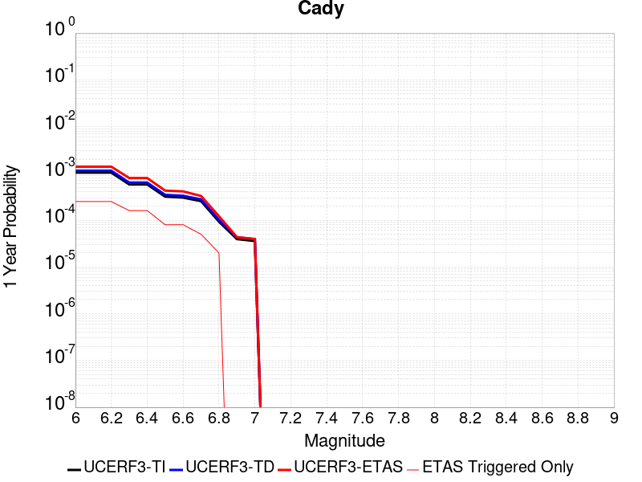 |  |

| Magnitude | 1 wk TI Prob | 1 wk TD Prob | 1 wk ETAS Prob | 1 wk ETAS/TD Gain | 1 wk ETAS Triggered Only | 1 mo TI Prob | 1 mo TD Prob | 1 mo ETAS Prob | 1 mo ETAS/TD Gain | 1 mo ETAS Triggered Only | 1 yr TI Prob | 1 yr TD Prob | 1 yr ETAS Prob | 1 yr ETAS/TD Gain | 1 yr ETAS Triggered Only | 10 yr TI Prob | 10 yr TD Prob | 10 yr ETAS Prob | 10 yr ETAS/TD Gain | 10 yr ETAS Triggered Only |
|-----|-----|-----|-----|-----|-----|-----|-----|-----|-----|-----|-----|-----|-----|-----|-----|-----|-----|-----|-----|-----|
| 6.0 | 1.9892565E-5 | 2.1858728E-5 | 1.0185698E-4 | 4.6597853 | 8.0E-5 | 8.525106E-5 | 9.3677416E-5 | 1.9366805E-4 | 2.067393 | 1.0E-4 | 0.0010374374 | 0.0011400167 | 0.0013897317 | 1.219045 | 2.5E-4 | 0.010326075 | 0.011350701 | 0.011726387 | 1.0330981 | 3.8E-4 |
| 6.1 | 1.9892565E-5 | 2.1858728E-5 | 1.0185698E-4 | 4.6597853 | 8.0E-5 | 8.525106E-5 | 9.3677416E-5 | 1.9366805E-4 | 2.067393 | 1.0E-4 | 0.0010374374 | 0.0011400167 | 0.0013897317 | 1.219045 | 2.5E-4 | 0.010326075 | 0.011350701 | 0.011726387 | 1.0330981 | 3.8E-4 |
| 6.2 | 1.9892565E-5 | 2.1858728E-5 | 1.0185698E-4 | 4.6597853 | 8.0E-5 | 8.525106E-5 | 9.3677416E-5 | 1.9366805E-4 | 2.067393 | 1.0E-4 | 0.0010374374 | 0.0011400167 | 0.0013897317 | 1.219045 | 2.5E-4 | 0.010326075 | 0.011350701 | 0.011726387 | 1.0330981 | 3.8E-4 |
| 6.3 | 1.1117327E-5 | 1.2176583E-5 | 5.2176096E-5 | 4.2849536 | 4.0E-5 | 4.764482E-5 | 5.2184492E-5 | 1.1218136E-4 | 2.1497068 | 6.0E-5 | 5.7992124E-4 | 6.351925E-4 | 7.9509086E-4 | 1.2517321 | 1.6E-4 | 0.0057841022 | 0.0063368753 | 0.0065753544 | 1.0376335 | 2.4E-4 |
| 6.4 | 1.1117327E-5 | 1.2176583E-5 | 5.2176096E-5 | 4.2849536 | 4.0E-5 | 4.764482E-5 | 5.2184492E-5 | 1.1218136E-4 | 2.1497068 | 6.0E-5 | 5.7992124E-4 | 6.351925E-4 | 7.9509086E-4 | 1.2517321 | 1.6E-4 | 0.0057841022 | 0.0063368753 | 0.0065753544 | 1.0376335 | 2.4E-4 |
| 6.5 | 6.103093E-6 | 6.672021E-6 | 1.6671955E-5 | 2.4987862 | 1.0E-5 | 2.615585E-5 | 2.8594131E-5 | 4.859356E-5 | 1.6994243 | 2.0E-5 | 3.1840094E-4 | 3.480905E-4 | 4.2806266E-4 | 1.2297453 | 8.0E-5 | 0.0031794512 | 0.0034766865 | 0.0035962695 | 1.0343956 | 1.2E-4 |
| 6.6 | 5.817237E-6 | 6.3656585E-6 | 1.6365595E-5 | 2.5709193 | 1.0E-5 | 2.4930776E-5 | 2.728118E-5 | 4.728063E-5 | 1.7330861 | 2.0E-5 | 3.034899E-4 | 3.3211018E-4 | 4.120836E-4 | 1.240804 | 8.0E-5 | 0.0030307577 | 0.0033173605 | 0.0034369624 | 1.0360533 | 1.2E-4 |
| 6.7 | 4.8846314E-6 | 5.3405684E-6 | 1.5340514E-5 | 2.8724499 | 1.0E-5 | 2.0933967E-5 | 2.2888014E-5 | 4.2887557E-5 | 1.8737998 | 2.0E-5 | 2.5484123E-4 | 2.7863772E-4 | 3.286238E-4 | 1.1793945 | 5.0E-5 | 0.0025454918 | 0.0027840391 | 0.0028638165 | 1.0286552 | 8.0E-5 |
| 6.8 | 1.7788773E-6 | 1.9399079E-6 | 1.1939888E-5 | 6.154874 | 1.0E-5 | 7.6237375E-6 | 8.313874E-6 | 1.831379E-5 | 2.2027988 | 1.0E-5 | 9.281505E-5 | 1.01218284E-4 | 1.2121626E-4 | 1.1975727 | 2.0E-5 | 9.2776294E-4 | 0.0010118765 | 0.0010418461 | 1.0296179 | 3.0E-5 |
| 6.9 | 7.5455404E-7 | 8.297092E-7 | 8.297092E-7 | 1.0 | 0.0 | 3.233799E-6 | 3.5558937E-6 | 3.5558937E-6 | 1.0 | 0.0 | 3.937079E-5 | 4.3292483E-5 | 4.3292483E-5 | 1.0 | 0.0 | 3.9363815E-4 | 4.3287344E-4 | 4.3287344E-4 | 1.0 | 0.0 |
| 7.0 | 6.8578805E-7 | 7.541816E-7 | 7.541816E-7 | 1.0 | 0.0 | 2.9390883E-6 | 3.2322048E-6 | 3.2322048E-6 | 1.0 | 0.0 | 3.578281E-5 | 3.9351715E-5 | 3.9351715E-5 | 1.0 | 0.0 | 3.577705E-4 | 3.9347992E-4 | 3.9347992E-4 | 1.0 | 0.0 |

## Scodie Lineament
*[(top)](#table-of-contents)*

| 1 Week | 1 Month | 1 Year | 10 Year |
|-----|-----|-----|-----|
|  | 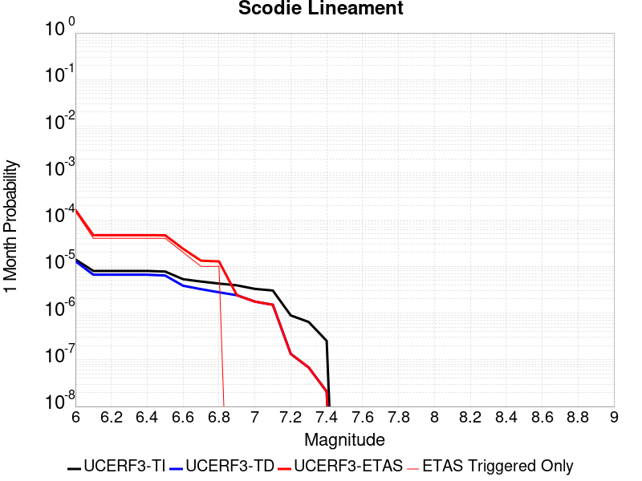 |  | 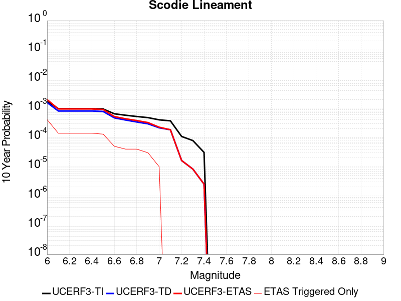 |

| Magnitude | 1 wk TI Prob | 1 wk TD Prob | 1 wk ETAS Prob | 1 wk ETAS/TD Gain | 1 wk ETAS Triggered Only | 1 mo TI Prob | 1 mo TD Prob | 1 mo ETAS Prob | 1 mo ETAS/TD Gain | 1 mo ETAS Triggered Only | 1 yr TI Prob | 1 yr TD Prob | 1 yr ETAS Prob | 1 yr ETAS/TD Gain | 1 yr ETAS Triggered Only | 10 yr TI Prob | 10 yr TD Prob | 10 yr ETAS Prob | 10 yr ETAS/TD Gain | 10 yr ETAS Triggered Only |
|-----|-----|-----|-----|-----|-----|-----|-----|-----|-----|-----|-----|-----|-----|-----|-----|-----|-----|-----|-----|-----|
| 6.0 | 3.2919327E-6 | 3.0133422E-6 | 1.3301295E-4 | 44.141335 | 1.3E-4 | 1.4108206E-5 | 1.2914278E-5 | 1.6291234E-4 | 12.614902 | 1.5E-4 | 1.7175387E-4 | 1.5722317E-4 | 4.57176E-4 | 2.9078157 | 3.0E-4 | 0.0017162118 | 0.0015714309 | 0.0019807867 | 1.2604988 | 4.1E-4 |
| 6.1 | 1.8663811E-6 | 1.5490499E-6 | 3.1549003E-5 | 20.36668 | 3.0E-5 | 7.998751E-6 | 6.6387715E-6 | 4.6638506E-5 | 7.0251713 | 4.0E-5 | 9.738045E-5 | 8.082454E-5 | 1.7081726E-4 | 2.1134331 | 9.0E-5 | 9.7337784E-4 | 8.080003E-4 | 9.4788714E-4 | 1.1731273 | 1.4E-4 |
| 6.2 | 1.8663811E-6 | 1.5490499E-6 | 3.1549003E-5 | 20.36668 | 3.0E-5 | 7.998751E-6 | 6.6387715E-6 | 4.6638506E-5 | 7.0251713 | 4.0E-5 | 9.738045E-5 | 8.082454E-5 | 1.7081726E-4 | 2.1134331 | 9.0E-5 | 9.7337784E-4 | 8.080003E-4 | 9.4788714E-4 | 1.1731273 | 1.4E-4 |
| 6.3 | 1.8663811E-6 | 1.5490499E-6 | 3.1549003E-5 | 20.36668 | 3.0E-5 | 7.998751E-6 | 6.6387715E-6 | 4.6638506E-5 | 7.0251713 | 4.0E-5 | 9.738045E-5 | 8.082454E-5 | 1.7081726E-4 | 2.1134331 | 9.0E-5 | 9.7337784E-4 | 8.080003E-4 | 9.4788714E-4 | 1.1731273 | 1.4E-4 |
| 6.4 | 1.8663811E-6 | 1.5490499E-6 | 3.1549003E-5 | 20.36668 | 3.0E-5 | 7.998751E-6 | 6.6387715E-6 | 4.6638506E-5 | 7.0251713 | 4.0E-5 | 9.738045E-5 | 8.082454E-5 | 1.7081726E-4 | 2.1134331 | 9.0E-5 | 9.7337784E-4 | 8.080003E-4 | 9.4788714E-4 | 1.1731273 | 1.4E-4 |
| 6.5 | 1.8106311E-6 | 1.4909839E-6 | 3.1490938E-5 | 21.12091 | 3.0E-5 | 7.759824E-6 | 6.3899183E-6 | 4.638966E-5 | 7.259821 | 4.0E-5 | 9.447177E-5 | 7.7794975E-5 | 1.6778798E-4 | 2.1567972 | 9.0E-5 | 9.4431615E-4 | 7.7772606E-4 | 9.0762496E-4 | 1.167024 | 1.3E-4 |
| 6.6 | 1.2414679E-6 | 8.997558E-7 | 1.08997465E-5 | 12.114118 | 1.0E-5 | 5.320566E-6 | 3.856091E-6 | 2.3856013E-5 | 6.1865797 | 2.0E-5 | 6.477596E-5 | 4.6946985E-5 | 7.694557E-5 | 1.6389887 | 3.0E-5 | 6.475708E-4 | 4.693793E-4 | 5.193558E-4 | 1.1064737 | 5.0E-5 |
| 6.7 | 1.1062215E-6 | 7.594311E-7 | 1.0759423E-5 | 14.167742 | 1.0E-5 | 4.7409408E-6 | 3.2547011E-6 | 1.3254668E-5 | 4.0724688 | 1.0E-5 | 5.7719422E-5 | 3.9625334E-5 | 5.9624545E-5 | 1.5047076 | 2.0E-5 | 5.770443E-4 | 3.961897E-4 | 4.3617384E-4 | 1.1009218 | 4.0E-5 |
| 6.8 | 1.0006736E-6 | 6.500397E-7 | 1.0650033E-5 | 16.383667 | 1.0E-5 | 4.288594E-6 | 2.7858816E-6 | 1.2785854E-5 | 4.589518 | 1.0E-5 | 5.221238E-5 | 3.3917644E-5 | 5.3916967E-5 | 1.5896436 | 2.0E-5 | 5.220012E-4 | 3.3913075E-4 | 3.7911718E-4 | 1.1179086 | 4.0E-5 |
| 6.9 | 9.167364E-7 | 5.631625E-7 | 5.631625E-7 | 1.0 | 0.0 | 3.9288643E-6 | 2.4135516E-6 | 2.4135516E-6 | 1.0 | 0.0 | 4.7832873E-5 | 2.9384651E-5 | 3.938436E-5 | 1.3403037 | 1.0E-5 | 4.782258E-4 | 2.9381333E-4 | 3.2380453E-4 | 1.1020757 | 3.0E-5 |
| 7.0 | 7.6987664E-7 | 4.113383E-7 | 4.113383E-7 | 1.0 | 0.0 | 3.2994672E-6 | 1.7628774E-6 | 1.7628774E-6 | 1.0 | 0.0 | 4.0170275E-5 | 2.1462862E-5 | 2.1462862E-5 | 1.0 | 0.0 | 4.0163012E-4 | 2.1461173E-4 | 2.246096E-4 | 1.0465858 | 1.0E-5 |
| 7.1 | 7.1038727E-7 | 3.5211494E-7 | 3.5211494E-7 | 1.0 | 0.0 | 3.0445133E-6 | 1.5090633E-6 | 1.5090633E-6 | 1.0 | 0.0 | 3.706632E-5 | 1.8372726E-5 | 1.8372726E-5 | 1.0 | 0.0 | 3.7060137E-4 | 1.8371557E-4 | 1.8371557E-4 | 1.0 | 0.0 |
| 7.2 | 2.0799602E-7 | 3.1186854E-8 | 3.1186854E-8 | 1.0 | 0.0 | 8.914113E-7 | 1.3365793E-7 | 1.3365793E-7 | 1.0 | 0.0 | 1.0852878E-5 | 1.6272843E-6 | 1.6272843E-6 | 1.0 | 0.0 | 1.08523476E-4 | 1.627273E-5 | 1.627273E-5 | 1.0 | 0.0 |
| 7.3 | 1.5048182E-7 | 1.5945696E-8 | 1.5945696E-8 | 1.0 | 0.0 | 6.449219E-7 | 6.83387E-8 | 6.83387E-8 | 1.0 | 0.0 | 7.851896E-6 | 8.320234E-7 | 8.320234E-7 | 1.0 | 0.0 | 7.851618E-5 | 8.320206E-6 | 8.320206E-6 | 1.0 | 0.0 |
| 7.4 | 5.9334678E-8 | 4.8683537E-9 | 4.8683537E-9 | 1.0 | 0.0 | 2.5429145E-7 | 2.0864372E-8 | 2.0864372E-8 | 1.0 | 0.0 | 3.095994E-6 | 2.5402372E-7 | 2.5402372E-7 | 1.0 | 0.0 | 3.095951E-5 | 2.5402353E-6 | 2.5402353E-6 | 1.0 | 0.0 |

## Calico-Hidalgo
*[(top)](#table-of-contents)*

| 1 Week | 1 Month | 1 Year | 10 Year |
|-----|-----|-----|-----|
| 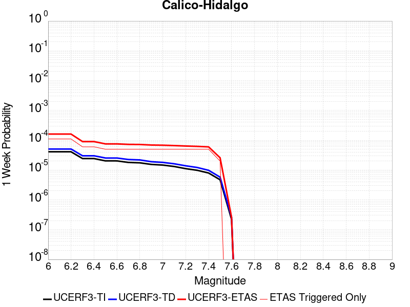 | 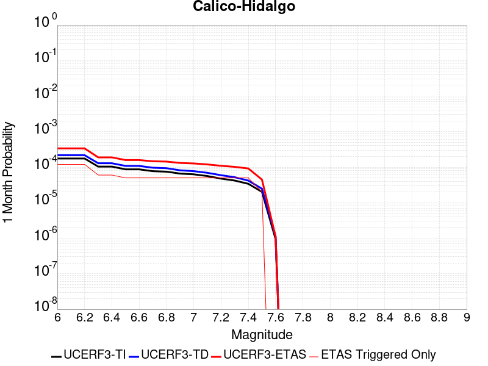 | 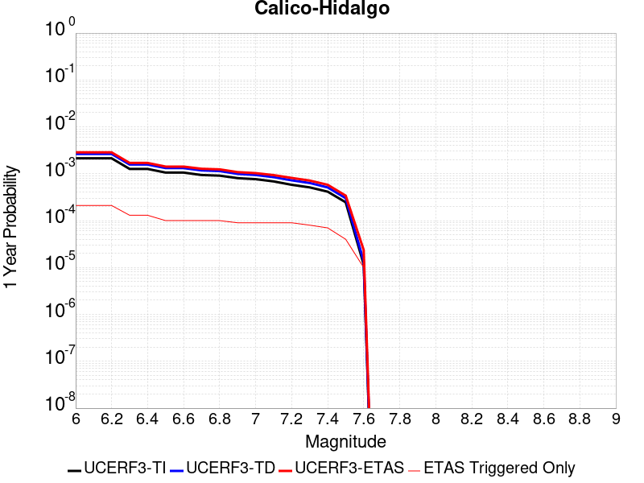 |  |

| Magnitude | 1 wk TI Prob | 1 wk TD Prob | 1 wk ETAS Prob | 1 wk ETAS/TD Gain | 1 wk ETAS Triggered Only | 1 mo TI Prob | 1 mo TD Prob | 1 mo ETAS Prob | 1 mo ETAS/TD Gain | 1 mo ETAS Triggered Only | 1 yr TI Prob | 1 yr TD Prob | 1 yr ETAS Prob | 1 yr ETAS/TD Gain | 1 yr ETAS Triggered Only | 10 yr TI Prob | 10 yr TD Prob | 10 yr ETAS Prob | 10 yr ETAS/TD Gain | 10 yr ETAS Triggered Only |
|-----|-----|-----|-----|-----|-----|-----|-----|-----|-----|-----|-----|-----|-----|-----|-----|-----|-----|-----|-----|-----|
| 6.0 | 4.0906612E-5 | 5.0703686E-5 | 1.6069811E-4 | 3.1693575 | 1.1E-4 | 1.7530227E-4 | 2.172857E-4 | 3.3725964E-4 | 1.5521482 | 1.2E-4 | 0.0021322158 | 0.002642648 | 0.0028520932 | 1.0792557 | 2.1E-4 | 0.02111873 | 0.026152607 | 0.026503192 | 1.0134053 | 3.6E-4 |
| 6.1 | 4.0906612E-5 | 5.0703686E-5 | 1.6069811E-4 | 3.1693575 | 1.1E-4 | 1.7530227E-4 | 2.172857E-4 | 3.3725964E-4 | 1.5521482 | 1.2E-4 | 0.0021322158 | 0.002642648 | 0.0028520932 | 1.0792557 | 2.1E-4 | 0.02111873 | 0.026152607 | 0.026503192 | 1.0134053 | 3.6E-4 |
| 6.2 | 4.0906612E-5 | 5.0703686E-5 | 1.6069811E-4 | 3.1693575 | 1.1E-4 | 1.7530227E-4 | 2.172857E-4 | 3.3725964E-4 | 1.5521482 | 1.2E-4 | 0.0021322158 | 0.002642648 | 0.0028520932 | 1.0792557 | 2.1E-4 | 0.02111873 | 0.026152607 | 0.026503192 | 1.0134053 | 3.6E-4 |
| 6.3 | 2.4242801E-5 | 3.0090669E-5 | 9.008886E-5 | 2.9939137 | 6.0E-5 | 1.0389358E-4 | 1.2895382E-4 | 1.8894608E-4 | 1.4652228 | 6.0E-5 | 0.0012641704 | 0.0015689151 | 0.0016987112 | 1.0827298 | 1.3E-4 | 0.01257003 | 0.01558206 | 0.015788788 | 1.013267 | 2.1E-4 |
| 6.4 | 2.4242801E-5 | 3.0090669E-5 | 9.008886E-5 | 2.9939137 | 6.0E-5 | 1.0389358E-4 | 1.2895382E-4 | 1.8894608E-4 | 1.4652228 | 6.0E-5 | 0.0012641704 | 0.0015689151 | 0.0016987112 | 1.0827298 | 1.3E-4 | 0.01257003 | 0.01558206 | 0.015788788 | 1.013267 | 2.1E-4 |
| 6.5 | 2.0286952E-5 | 2.5315738E-5 | 7.531447E-5 | 2.975006 | 5.0E-5 | 8.694118E-5 | 1.0849161E-4 | 1.5848617E-4 | 1.4608152 | 5.0E-5 | 0.0010579949 | 0.001320102 | 0.0014199701 | 1.0756518 | 1.0E-4 | 0.010529719 | 0.013124538 | 0.013302175 | 1.0135348 | 1.8E-4 |
| 6.6 | 2.0269223E-5 | 2.5296687E-5 | 7.529542E-5 | 2.9764934 | 5.0E-5 | 8.6865206E-5 | 1.08409964E-4 | 1.5840455E-4 | 1.4611622 | 5.0E-5 | 0.0010570707 | 0.0013191093 | 0.0014189774 | 1.0757087 | 1.0E-4 | 0.010520565 | 0.013114728 | 0.013292367 | 1.013545 | 1.8E-4 |
| 6.7 | 1.799852E-5 | 2.25406E-5 | 7.253947E-5 | 3.2181695 | 5.0E-5 | 7.713423E-5 | 9.659908E-5 | 1.4659425E-4 | 1.5175533 | 5.0E-5 | 9.3870464E-4 | 0.0011754738 | 0.0012753563 | 1.084972 | 1.0E-4 | 0.009347493 | 0.011694173 | 0.011862186 | 1.0143671 | 1.7E-4 |
| 6.8 | 1.7458793E-5 | 2.184212E-5 | 7.184103E-5 | 3.2891052 | 5.0E-5 | 7.4821255E-5 | 9.3605806E-5 | 1.4360112E-4 | 1.534105 | 5.0E-5 | 9.10568E-4 | 0.0011390693 | 0.0012389554 | 1.087691 | 1.0E-4 | 0.009068459 | 0.011333893 | 0.011501967 | 1.0148293 | 1.7E-4 |
| 6.9 | 1.542884E-5 | 1.9025927E-5 | 6.902497E-5 | 3.6279428 | 5.0E-5 | 6.612192E-5 | 8.153721E-5 | 1.3153313E-4 | 1.6131669 | 5.0E-5 | 8.04737E-4 | 9.922766E-4 | 0.0010821873 | 1.0906105 | 9.0E-5 | 0.008018291 | 0.009879857 | 0.010038277 | 1.0160346 | 1.6E-4 |
| 7.0 | 1.468253E-5 | 1.8030598E-5 | 6.8029694E-5 | 3.7730138 | 5.0E-5 | 6.292361E-5 | 7.7271776E-5 | 1.2726792E-4 | 1.6470168 | 5.0E-5 | 7.658257E-4 | 9.4039086E-4 | 0.0010303062 | 1.0956149 | 9.0E-5 | 0.0076319184 | 0.009365481 | 0.009523983 | 1.016924 | 1.6E-4 |
| 7.1 | 1.3139281E-5 | 1.6200942E-5 | 6.620013E-5 | 4.08619 | 5.0E-5 | 5.6309986E-5 | 6.943083E-5 | 1.19427365E-4 | 1.7200911 | 5.0E-5 | 6.853584E-4 | 8.4500515E-4 | 9.349291E-4 | 1.1064183 | 9.0E-5 | 0.0068324856 | 0.0084192185 | 0.008567955 | 1.0176663 | 1.5E-4 |
| 7.2 | 1.1127404E-5 | 1.3866597E-5 | 6.3865904E-5 | 4.605737 | 5.0E-5 | 4.7688E-5 | 5.942698E-5 | 1.09424014E-4 | 1.8413186 | 5.0E-5 | 5.8044674E-4 | 7.232942E-4 | 8.132291E-4 | 1.1243407 | 9.0E-5 | 0.0057893298 | 0.0072105085 | 0.007339571 | 1.0178993 | 1.3E-4 |
| 7.3 | 9.808154E-6 | 1.2176215E-5 | 6.2175604E-5 | 5.1063166 | 5.0E-5 | 4.2034266E-5 | 5.2182797E-5 | 1.0218019E-4 | 1.9581202 | 5.0E-5 | 5.11647E-4 | 6.3515105E-4 | 7.151002E-4 | 1.1258743 | 8.0E-5 | 0.0051047057 | 0.006334433 | 0.006443736 | 1.0172554 | 1.1E-4 |
| 7.4 | 7.942452E-6 | 9.792144E-6 | 5.9791655E-5 | 6.1060843 | 5.0E-5 | 3.4038632E-5 | 4.1965708E-5 | 9.196361E-5 | 2.191399 | 5.0E-5 | 4.1434157E-4 | 5.1082217E-4 | 5.8078644E-4 | 1.136964 | 7.0E-5 | 0.0041356985 | 0.005097421 | 0.0051969113 | 1.0195178 | 1.0E-4 |
| 7.5 | 4.7121216E-6 | 5.772836E-6 | 2.577272E-5 | 4.4644814 | 2.0E-5 | 2.019465E-5 | 2.4740535E-5 | 4.474004E-5 | 1.8083699 | 2.0E-5 | 2.4584212E-4 | 3.0118204E-4 | 3.4117E-4 | 1.1327701 | 4.0E-5 | 0.0024557032 | 0.0030084911 | 0.0030782805 | 1.0231975 | 7.0E-5 |
| 7.6 | 2.21172E-7 | 2.603961E-7 | 2.603961E-7 | 1.0 | 0.0 | 9.478797E-7 | 1.1159829E-6 | 1.1159829E-6 | 1.0 | 0.0 | 1.1540374E-5 | 1.3587036E-5 | 2.35869E-5 | 1.7359858 | 1.0E-5 | 1.1539775E-4 | 1.3586486E-4 | 1.4586351E-4 | 1.0735925 | 1.0E-5 |

## Manix-Afton Hills
*[(top)](#table-of-contents)*

| 1 Week | 1 Month | 1 Year | 10 Year |
|-----|-----|-----|-----|
|  |  |  |  |

| Magnitude | 1 wk TI Prob | 1 wk TD Prob | 1 wk ETAS Prob | 1 wk ETAS/TD Gain | 1 wk ETAS Triggered Only | 1 mo TI Prob | 1 mo TD Prob | 1 mo ETAS Prob | 1 mo ETAS/TD Gain | 1 mo ETAS Triggered Only | 1 yr TI Prob | 1 yr TD Prob | 1 yr ETAS Prob | 1 yr ETAS/TD Gain | 1 yr ETAS Triggered Only | 10 yr TI Prob | 10 yr TD Prob | 10 yr ETAS Prob | 10 yr ETAS/TD Gain | 10 yr ETAS Triggered Only |
|-----|-----|-----|-----|-----|-----|-----|-----|-----|-----|-----|-----|-----|-----|-----|-----|-----|-----|-----|-----|-----|
| 6.0 | 1.3783202E-5 | 1.47110895E-5 | 1.2470948E-4 | 8.477242 | 1.1E-4 | 5.906953E-5 | 6.30461E-5 | 2.1303665E-4 | 3.3790612 | 1.5E-4 | 7.189342E-4 | 7.6733343E-4 | 0.0010371263 | 1.3515979 | 2.7E-4 | 0.0071661277 | 0.007648596 | 0.008015766 | 1.0480049 | 3.7E-4 |
| 6.1 | 1.3783202E-5 | 1.47110895E-5 | 1.2470948E-4 | 8.477242 | 1.1E-4 | 5.906953E-5 | 6.30461E-5 | 2.1303665E-4 | 3.3790612 | 1.5E-4 | 7.189342E-4 | 7.6733343E-4 | 0.0010371263 | 1.3515979 | 2.7E-4 | 0.0071661277 | 0.007648596 | 0.008015766 | 1.0480049 | 3.7E-4 |
| 6.2 | 1.3783202E-5 | 1.47110895E-5 | 1.2470948E-4 | 8.477242 | 1.1E-4 | 5.906953E-5 | 6.30461E-5 | 2.1303665E-4 | 3.3790612 | 1.5E-4 | 7.189342E-4 | 7.6733343E-4 | 0.0010371263 | 1.3515979 | 2.7E-4 | 0.0071661277 | 0.007648596 | 0.008015766 | 1.0480049 | 3.7E-4 |
| 6.3 | 1.10494875E-5 | 1.1793136E-5 | 1.0179207E-4 | 8.631468 | 9.0E-5 | 4.7354086E-5 | 5.054109E-5 | 1.6053554E-4 | 3.176337 | 1.1E-4 | 5.763835E-4 | 6.151744E-4 | 8.250452E-4 | 1.3411566 | 2.1E-4 | 0.005748908 | 0.0061357557 | 0.006433915 | 1.0485938 | 3.0E-4 |
| 6.4 | 1.10494875E-5 | 1.1793136E-5 | 1.0179207E-4 | 8.631468 | 9.0E-5 | 4.7354086E-5 | 5.054109E-5 | 1.6053554E-4 | 3.176337 | 1.1E-4 | 5.763835E-4 | 6.151744E-4 | 8.250452E-4 | 1.3411566 | 2.1E-4 | 0.005748908 | 0.0061357557 | 0.006433915 | 1.0485938 | 3.0E-4 |
| 6.5 | 9.788949E-6 | 1.045432E-5 | 7.0453694E-5 | 6.7391944 | 6.0E-5 | 4.1951964E-5 | 4.480351E-5 | 1.2479993E-4 | 2.7854943 | 8.0E-5 | 5.1064545E-4 | 5.453555E-4 | 7.152628E-4 | 1.3115532 | 1.7E-4 | 0.0050947363 | 0.0054410985 | 0.0056897383 | 1.0456966 | 2.5E-4 |
| 6.6 | 8.810006E-6 | 9.4136285E-6 | 6.9413065E-5 | 7.373678 | 6.0E-5 | 3.775662E-5 | 4.0343548E-5 | 1.2034032E-4 | 2.982889 | 8.0E-5 | 4.5958988E-4 | 4.9108086E-4 | 6.3101214E-4 | 1.2849455 | 1.4E-4 | 0.0045864056 | 0.004900839 | 0.005099859 | 1.0406094 | 2.0E-4 |
| 6.7 | 8.80128E-6 | 9.404108E-6 | 6.940354E-5 | 7.3801303 | 6.0E-5 | 3.7719226E-5 | 4.0302748E-5 | 1.20299526E-4 | 2.9848964 | 8.0E-5 | 4.591348E-4 | 4.9058435E-4 | 6.305157E-4 | 1.285234 | 1.4E-4 | 0.004581874 | 0.0048958957 | 0.0050949166 | 1.0406505 | 2.0E-4 |
| 6.8 | 6.8994877E-6 | 7.380076E-6 | 4.737978E-5 | 6.4199586 | 4.0E-5 | 2.9568899E-5 | 3.162856E-5 | 7.162729E-5 | 2.2646399 | 4.0E-5 | 3.5994186E-4 | 3.8501783E-4 | 4.749832E-4 | 1.2336653 | 9.0E-5 | 0.003593594 | 0.0038443129 | 0.0039638514 | 1.0310949 | 1.2E-4 |
| 6.9 | 4.9328037E-6 | 5.2709615E-6 | 3.5270805E-5 | 6.691531 | 3.0E-5 | 2.1140417E-5 | 2.2589675E-5 | 5.2588995E-5 | 2.3280103 | 3.0E-5 | 2.5735417E-4 | 2.7500073E-4 | 3.3498422E-4 | 1.2181213 | 6.0E-5 | 0.0025705635 | 0.0027472095 | 0.0028170173 | 1.0254104 | 7.0E-5 |
| 7.0 | 3.347973E-6 | 3.59003E-6 | 1.35899945E-5 | 3.7854822 | 1.0E-5 | 1.4348378E-5 | 1.5385775E-5 | 2.5385621E-5 | 1.649941 | 1.0E-5 | 1.746775E-4 | 1.8730981E-4 | 2.173042E-4 | 1.1601324 | 3.0E-5 | 0.0017454025 | 0.0018719219 | 0.0019018658 | 1.0159963 | 3.0E-5 |
| 7.1 | 1.2073567E-6 | 1.293482E-6 | 1.12934695E-5 | 8.73106 | 1.0E-5 | 5.1743755E-6 | 5.543492E-6 | 1.5543437E-5 | 2.8039072 | 1.0E-5 | 6.29962E-5 | 6.749156E-5 | 7.7490884E-5 | 1.1481566 | 1.0E-5 | 6.297835E-4 | 6.7487074E-4 | 6.84864E-4 | 1.0148077 | 1.0E-5 |

## Baker
*[(top)](#table-of-contents)*

| 1 Week | 1 Month | 1 Year | 10 Year |
|-----|-----|-----|-----|
|  |  | 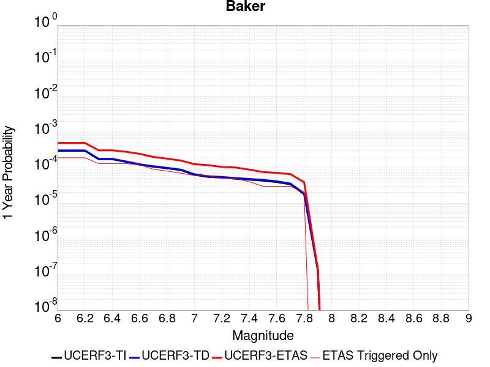 |  |

| Magnitude | 1 wk TI Prob | 1 wk TD Prob | 1 wk ETAS Prob | 1 wk ETAS/TD Gain | 1 wk ETAS Triggered Only | 1 mo TI Prob | 1 mo TD Prob | 1 mo ETAS Prob | 1 mo ETAS/TD Gain | 1 mo ETAS Triggered Only | 1 yr TI Prob | 1 yr TD Prob | 1 yr ETAS Prob | 1 yr ETAS/TD Gain | 1 yr ETAS Triggered Only | 10 yr TI Prob | 10 yr TD Prob | 10 yr ETAS Prob | 10 yr ETAS/TD Gain | 10 yr ETAS Triggered Only |
|-----|-----|-----|-----|-----|-----|-----|-----|-----|-----|-----|-----|-----|-----|-----|-----|-----|-----|-----|-----|-----|
| 6.0 | 5.695525E-6 | 5.8348373E-6 | 5.5834545E-5 | 9.569169 | 5.0E-5 | 2.4409164E-5 | 2.5006228E-5 | 1.0500423E-4 | 4.199123 | 8.0E-5 | 2.9714106E-4 | 3.044123E-4 | 4.9435446E-4 | 1.6239635 | 1.9E-4 | 0.0029674405 | 0.0030403486 | 0.0033992543 | 1.1180475 | 3.6E-4 |
| 6.1 | 5.695525E-6 | 5.8348373E-6 | 5.5834545E-5 | 9.569169 | 5.0E-5 | 2.4409164E-5 | 2.5006228E-5 | 1.0500423E-4 | 4.199123 | 8.0E-5 | 2.9714106E-4 | 3.044123E-4 | 4.9435446E-4 | 1.6239635 | 1.9E-4 | 0.0029674405 | 0.0030403486 | 0.0033992543 | 1.1180475 | 3.6E-4 |
| 6.2 | 5.695525E-6 | 5.8348373E-6 | 5.5834545E-5 | 9.569169 | 5.0E-5 | 2.4409164E-5 | 2.5006228E-5 | 1.0500423E-4 | 4.199123 | 8.0E-5 | 2.9714106E-4 | 3.044123E-4 | 4.9435446E-4 | 1.6239635 | 1.9E-4 | 0.0029674405 | 0.0030403486 | 0.0033992543 | 1.1180475 | 3.6E-4 |
| 6.3 | 3.2995713E-6 | 3.383667E-6 | 5.3383497E-5 | 15.776817 | 5.0E-5 | 1.4140943E-5 | 1.4501353E-5 | 7.450048E-5 | 5.137485 | 6.0E-5 | 1.7215237E-4 | 1.7654014E-4 | 3.0651718E-4 | 1.7362465 | 1.3E-4 | 0.0017201907 | 0.001764046 | 0.0020335696 | 1.1527872 | 2.7E-4 |
| 6.4 | 3.2995713E-6 | 3.383667E-6 | 5.3383497E-5 | 15.776817 | 5.0E-5 | 1.4140943E-5 | 1.4501353E-5 | 7.450048E-5 | 5.137485 | 6.0E-5 | 1.7215237E-4 | 1.7654014E-4 | 3.0651718E-4 | 1.7362465 | 1.3E-4 | 0.0017201907 | 0.001764046 | 0.0020335696 | 1.1527872 | 2.7E-4 |
| 6.5 | 2.782202E-6 | 2.8558404E-6 | 5.28557E-5 | 18.50793 | 5.0E-5 | 1.1923668E-5 | 1.223926E-5 | 7.223852E-5 | 5.902197 | 6.0E-5 | 1.4516099E-4 | 1.4900314E-4 | 2.7898376E-4 | 1.8723348 | 1.3E-4 | 0.001450662 | 0.0014890651 | 0.001758663 | 1.1810519 | 2.7E-4 |
| 6.6 | 2.3163404E-6 | 2.38092E-6 | 4.2380823E-5 | 17.800188 | 4.0E-5 | 9.927136E-6 | 1.0203904E-5 | 6.0203394E-5 | 5.9000354 | 5.0E-5 | 1.20856166E-4 | 1.2422565E-4 | 2.4421074E-4 | 1.9658641 | 1.2E-4 | 0.0012079047 | 0.0012415823 | 0.0014912719 | 1.201106 | 2.5E-4 |
| 6.7 | 2.037056E-6 | 2.0965003E-6 | 4.2096417E-5 | 20.079374 | 4.0E-5 | 8.7302105E-6 | 8.984972E-6 | 5.8984522E-5 | 6.564798 | 5.0E-5 | 1.0628513E-4 | 1.093867E-4 | 1.9937685E-4 | 1.822679 | 9.0E-5 | 0.0010623431 | 0.0010933448 | 0.0013031152 | 1.1918612 | 2.1E-4 |
| 6.8 | 1.8356744E-6 | 1.8915287E-6 | 3.189147E-5 | 16.860157 | 3.0E-5 | 7.867153E-6 | 8.106527E-6 | 4.81062E-5 | 5.9342556 | 4.0E-5 | 9.577837E-5 | 9.869264E-5 | 1.7868474E-4 | 1.8105174 | 8.0E-5 | 9.57371E-4 | 9.86502E-4 | 0.0011663245 | 1.1822829 | 1.8E-4 |
| 6.9 | 1.6310546E-6 | 1.6832072E-6 | 2.1683174E-5 | 12.882058 | 2.0E-5 | 6.9902153E-6 | 7.213726E-6 | 3.721351E-5 | 5.1587086 | 3.0E-5 | 8.510255E-5 | 8.782368E-5 | 1.5781754E-4 | 1.7969815 | 7.0E-5 | 8.5069967E-4 | 8.7790104E-4 | 0.0010477519 | 1.1934737 | 1.7E-4 |
| 7.0 | 1.2058036E-6 | 1.2508665E-6 | 2.1250842E-5 | 16.988895 | 2.0E-5 | 5.1677193E-6 | 5.3608455E-6 | 2.5360738E-5 | 4.730735 | 2.0E-5 | 6.291517E-5 | 6.5266366E-5 | 1.2526245E-4 | 1.9192497 | 6.0E-5 | 6.289736E-4 | 6.524743E-4 | 8.123699E-4 | 1.2450604 | 1.6E-4 |
| 7.1 | 1.052382E-6 | 1.0951609E-6 | 2.1095138E-5 | 19.262138 | 2.0E-5 | 4.5102006E-6 | 4.693538E-6 | 2.4693445E-5 | 5.2611575 | 2.0E-5 | 5.491031E-5 | 5.7142337E-5 | 1.1713891E-4 | 2.0499496 | 6.0E-5 | 5.4896745E-4 | 5.7127734E-4 | 7.2119164E-4 | 1.2624195 | 1.5E-4 |
| 7.2 | 1.0067454E-6 | 1.0487711E-6 | 1.1048761E-5 | 10.53496 | 1.0E-5 | 4.3146156E-6 | 4.4947255E-6 | 1.4494681E-5 | 3.22482 | 1.0E-5 | 5.252918E-5 | 5.4721917E-5 | 1.0471918E-4 | 1.9136606 | 5.0E-5 | 5.251676E-4 | 5.470853E-4 | 6.8700867E-4 | 1.2557616 | 1.4E-4 |
| 7.3 | 9.3596316E-7 | 9.767723E-7 | 1.09767625E-5 | 11.23779 | 1.0E-5 | 4.0112645E-6 | 4.1861604E-6 | 1.4186118E-5 | 3.3888137 | 1.0E-5 | 4.8836053E-5 | 5.096532E-5 | 1.00962774E-4 | 1.9810092 | 5.0E-5 | 4.8825322E-4 | 5.095371E-4 | 6.394709E-4 | 1.2550036 | 1.3E-4 |
| 7.4 | 8.8117395E-7 | 9.2076635E-7 | 9.2076635E-7 | 1.0 | 0.0 | 3.7764542E-6 | 3.9461356E-6 | 3.9461356E-6 | 1.0 | 0.0 | 4.5977362E-5 | 4.8043148E-5 | 8.8041226E-5 | 1.8325449 | 4.0E-5 | 4.596785E-4 | 4.8032837E-4 | 5.802803E-4 | 1.2080909 | 1.0E-4 |
| 7.5 | 8.292386E-7 | 8.6745956E-7 | 8.6745956E-7 | 1.0 | 0.0 | 3.5538749E-6 | 3.7176785E-6 | 3.7176785E-6 | 1.0 | 0.0 | 4.326757E-5 | 4.5261804E-5 | 7.526045E-5 | 1.6627805 | 3.0E-5 | 4.3259145E-4 | 4.5252658E-4 | 5.224949E-4 | 1.1546171 | 7.0E-5 |
| 7.6 | 7.553842E-7 | 7.9144706E-7 | 7.9144706E-7 | 1.0 | 0.0 | 3.2373566E-6 | 3.3919116E-6 | 3.3919116E-6 | 1.0 | 0.0 | 3.9414106E-5 | 4.129575E-5 | 7.129451E-5 | 1.7264371 | 3.0E-5 | 3.9407116E-4 | 4.1288146E-4 | 4.8285254E-4 | 1.1694702 | 7.0E-5 |
| 7.7 | 6.5285366E-7 | 6.852797E-7 | 6.852797E-7 | 1.0 | 0.0 | 2.797941E-6 | 2.9369096E-6 | 2.9369096E-6 | 1.0 | 0.0 | 3.40644E-5 | 3.5756293E-5 | 6.575522E-5 | 1.838983 | 3.0E-5 | 3.405918E-4 | 3.5750607E-4 | 4.1748464E-4 | 1.1677693 | 6.0E-5 |
| 7.8 | 3.4586725E-7 | 3.6482615E-7 | 3.6482615E-7 | 1.0 | 0.0 | 1.4822873E-6 | 1.5635396E-6 | 1.5635396E-6 | 1.0 | 0.0 | 1.80467E-5 | 1.9035933E-5 | 3.9035553E-5 | 2.0506246 | 2.0E-5 | 1.8045233E-4 | 1.9034347E-4 | 2.2033777E-4 | 1.1575798 | 3.0E-5 |
| 7.9 | 2.5591178E-9 | 2.6696718E-9 | 2.6696718E-9 | 1.0 | 0.0 | 1.0967647E-8 | 1.14414505E-8 | 1.14414505E-8 | 1.0 | 0.0 | 1.335311E-7 | 1.3929966E-7 | 1.3929966E-7 | 1.0 | 0.0 | 1.3353102E-6 | 1.3929966E-6 | 1.3929966E-6 | 1.0 | 0.0 |

## Ludlow
*[(top)](#table-of-contents)*

| 1 Week | 1 Month | 1 Year | 10 Year |
|-----|-----|-----|-----|
|  |  |  |  |

| Magnitude | 1 wk TI Prob | 1 wk TD Prob | 1 wk ETAS Prob | 1 wk ETAS/TD Gain | 1 wk ETAS Triggered Only | 1 mo TI Prob | 1 mo TD Prob | 1 mo ETAS Prob | 1 mo ETAS/TD Gain | 1 mo ETAS Triggered Only | 1 yr TI Prob | 1 yr TD Prob | 1 yr ETAS Prob | 1 yr ETAS/TD Gain | 1 yr ETAS Triggered Only | 10 yr TI Prob | 10 yr TD Prob | 10 yr ETAS Prob | 10 yr ETAS/TD Gain | 10 yr ETAS Triggered Only |
|-----|-----|-----|-----|-----|-----|-----|-----|-----|-----|-----|-----|-----|-----|-----|-----|-----|-----|-----|-----|-----|
| 6.0 | 2.2407607E-5 | 2.3657254E-5 | 1.1365512E-4 | 4.80424 | 9.0E-5 | 9.602906E-5 | 1.0138454E-4 | 2.4137035E-4 | 2.3807411 | 1.4E-4 | 0.0011685267 | 0.001233702 | 0.0014634181 | 1.1862007 | 2.3E-4 | 0.011624013 | 0.012273042 | 0.012589115 | 1.0257534 | 3.2E-4 |
| 6.1 | 2.2407607E-5 | 2.3657254E-5 | 1.1365512E-4 | 4.80424 | 9.0E-5 | 9.602906E-5 | 1.0138454E-4 | 2.4137035E-4 | 2.3807411 | 1.4E-4 | 0.0011685267 | 0.001233702 | 0.0014634181 | 1.1862007 | 2.3E-4 | 0.011624013 | 0.012273042 | 0.012589115 | 1.0257534 | 3.2E-4 |
| 6.2 | 1.0781252E-5 | 1.1365663E-5 | 7.136498E-5 | 6.2789984 | 6.0E-5 | 4.620455E-5 | 4.8709102E-5 | 1.3870472E-4 | 2.847614 | 9.0E-5 | 5.623952E-4 | 5.9287593E-4 | 7.4278703E-4 | 1.252854 | 1.5E-4 | 0.00560974 | 0.0059133614 | 0.006082356 | 1.0285784 | 1.7E-4 |
| 6.3 | 1.0781252E-5 | 1.1365663E-5 | 7.136498E-5 | 6.2789984 | 6.0E-5 | 4.620455E-5 | 4.8709102E-5 | 1.3870472E-4 | 2.847614 | 9.0E-5 | 5.623952E-4 | 5.9287593E-4 | 7.4278703E-4 | 1.252854 | 1.5E-4 | 0.00560974 | 0.0059133614 | 0.006082356 | 1.0285784 | 1.7E-4 |
| 6.4 | 7.814439E-6 | 8.237729E-6 | 5.8237318E-5 | 7.0695844 | 5.0E-5 | 3.3490025E-5 | 3.530408E-5 | 1.0530161E-4 | 2.9827034 | 7.0E-5 | 4.0766477E-4 | 4.2974384E-4 | 5.5968796E-4 | 1.3023758 | 1.3E-4 | 0.0040691774 | 0.0042892746 | 0.0044386312 | 1.0348209 | 1.5E-4 |
| 6.5 | 6.4986366E-6 | 6.85092E-6 | 4.6850644E-5 | 6.838592 | 4.0E-5 | 2.7851002E-5 | 2.9360759E-5 | 7.935929E-5 | 2.7029033 | 5.0E-5 | 3.390332E-4 | 3.5740953E-4 | 4.573738E-4 | 1.2796911 | 1.0E-4 | 0.003385164 | 0.0035684432 | 0.003688015 | 1.0335081 | 1.2E-4 |
| 6.6 | 5.582177E-6 | 5.8860055E-6 | 4.588577E-5 | 7.79574 | 4.0E-5 | 2.3923398E-5 | 2.5225498E-5 | 7.5224234E-5 | 2.9820714 | 5.0E-5 | 2.9122844E-4 | 3.0707786E-4 | 4.0704716E-4 | 1.3255503 | 1.0E-4 | 0.0029084706 | 0.003066609 | 0.0031862408 | 1.0390111 | 1.2E-4 |
| 6.7 | 4.6858763E-6 | 4.940427E-6 | 3.494028E-5 | 7.0723195 | 3.0E-5 | 2.0082172E-5 | 2.1173091E-5 | 6.117224E-5 | 2.8891504 | 4.0E-5 | 2.4447302E-4 | 2.5775246E-4 | 3.277344E-4 | 1.2715085 | 7.0E-5 | 0.0024420423 | 0.0025745912 | 0.0026643595 | 1.034867 | 9.0E-5 |
| 6.8 | 3.5584908E-6 | 3.7520183E-6 | 3.3751905E-5 | 8.9956665 | 3.0E-5 | 1.5250586E-5 | 1.6079981E-5 | 5.6079338E-5 | 3.487525 | 4.0E-5 | 1.8566006E-4 | 1.957566E-4 | 2.6574288E-4 | 1.3575169 | 7.0E-5 | 0.0018550502 | 0.0019558826 | 0.0020457066 | 1.045925 | 9.0E-5 |
| 6.9 | 2.532834E-6 | 2.6710034E-6 | 2.267095E-5 | 8.4878025 | 2.0E-5 | 1.0854958E-5 | 1.1447109E-5 | 3.144688E-5 | 2.7471461 | 2.0E-5 | 1.3215111E-4 | 1.3935992E-4 | 1.8935296E-4 | 1.3587332 | 5.0E-5 | 0.0013207254 | 0.0013927529 | 0.0014526693 | 1.0430201 | 6.0E-5 |
| 7.0 | 1.7083285E-6 | 1.8019439E-6 | 1.1801926E-5 | 6.5495524 | 1.0E-5 | 7.3213873E-6 | 7.722595E-6 | 1.7722517E-5 | 2.2948916 | 1.0E-5 | 8.913424E-5 | 9.40187E-5 | 1.2401587E-4 | 1.3190554 | 3.0E-5 | 8.9098496E-4 | 9.3980576E-4 | 9.797681E-4 | 1.042522 | 4.0E-5 |
| 7.1 | 1.0905424E-6 | 1.1497619E-6 | 1.114975E-5 | 9.697442 | 1.0E-5 | 4.6737446E-6 | 4.9275427E-6 | 1.4927493E-5 | 3.0293992 | 1.0E-5 | 5.6901354E-5 | 5.999128E-5 | 7.999008E-5 | 1.3333617 | 2.0E-5 | 5.6886784E-4 | 5.997606E-4 | 6.2974263E-4 | 1.0499899 | 3.0E-5 |
| 7.2 | 6.06668E-7 | 6.387277E-7 | 1.06387215E-5 | 16.656113 | 1.0E-5 | 2.600003E-6 | 2.7374022E-6 | 1.2737375E-5 | 4.6530886 | 1.0E-5 | 3.1654577E-5 | 3.3327433E-5 | 5.3326767E-5 | 1.6000862 | 2.0E-5 | 3.1650066E-4 | 3.3323118E-4 | 3.5322452E-4 | 1.0599984 | 2.0E-5 |

## White Wolf (Extension)
*[(top)](#table-of-contents)*

| 1 Week | 1 Month | 1 Year | 10 Year |
|-----|-----|-----|-----|
|  |  |  | 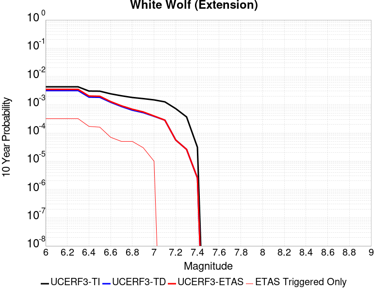 |

| Magnitude | 1 wk TI Prob | 1 wk TD Prob | 1 wk ETAS Prob | 1 wk ETAS/TD Gain | 1 wk ETAS Triggered Only | 1 mo TI Prob | 1 mo TD Prob | 1 mo ETAS Prob | 1 mo ETAS/TD Gain | 1 mo ETAS Triggered Only | 1 yr TI Prob | 1 yr TD Prob | 1 yr ETAS Prob | 1 yr ETAS/TD Gain | 1 yr ETAS Triggered Only | 10 yr TI Prob | 10 yr TD Prob | 10 yr ETAS Prob | 10 yr ETAS/TD Gain | 10 yr ETAS Triggered Only |
|-----|-----|-----|-----|-----|-----|-----|-----|-----|-----|-----|-----|-----|-----|-----|-----|-----|-----|-----|-----|-----|
| 6.0 | 8.222555E-6 | 6.0666657E-6 | 9.606612E-5 | 15.835077 | 9.0E-5 | 3.5239045E-5 | 2.5999774E-5 | 1.4599666E-4 | 5.615305 | 1.2E-4 | 4.289509E-4 | 3.1650788E-4 | 5.4643507E-4 | 1.7264501 | 2.3E-4 | 0.0042812387 | 0.003161223 | 0.0034802114 | 1.1009066 | 3.2E-4 |
| 6.1 | 8.222555E-6 | 6.0666657E-6 | 9.606612E-5 | 15.835077 | 9.0E-5 | 3.5239045E-5 | 2.5999774E-5 | 1.4599666E-4 | 5.615305 | 1.2E-4 | 4.289509E-4 | 3.1650788E-4 | 5.4643507E-4 | 1.7264501 | 2.3E-4 | 0.0042812387 | 0.003161223 | 0.0034802114 | 1.1009066 | 3.2E-4 |
| 6.2 | 8.222555E-6 | 6.0666657E-6 | 9.606612E-5 | 15.835077 | 9.0E-5 | 3.5239045E-5 | 2.5999774E-5 | 1.4599666E-4 | 5.615305 | 1.2E-4 | 4.289509E-4 | 3.1650788E-4 | 5.4643507E-4 | 1.7264501 | 2.3E-4 | 0.0042812387 | 0.003161223 | 0.0034802114 | 1.1009066 | 3.2E-4 |
| 6.3 | 8.222555E-6 | 6.0666657E-6 | 9.606612E-5 | 15.835077 | 9.0E-5 | 3.5239045E-5 | 2.5999774E-5 | 1.4599666E-4 | 5.615305 | 1.2E-4 | 4.289509E-4 | 3.1650788E-4 | 5.4643507E-4 | 1.7264501 | 2.3E-4 | 0.0042812387 | 0.003161223 | 0.0034802114 | 1.1009066 | 3.2E-4 |
| 6.4 | 5.821773E-6 | 3.5571766E-6 | 6.355696E-5 | 17.86725 | 6.0E-5 | 2.4950215E-5 | 1.5244959E-5 | 8.524389E-5 | 5.591612 | 7.0E-5 | 3.0372653E-4 | 1.8559267E-4 | 3.055704E-4 | 1.6464573 | 1.2E-4 | 0.0030331176 | 0.001854485 | 0.0020241698 | 1.0914997 | 1.7E-4 |
| 6.5 | 5.766023E-6 | 3.4991106E-6 | 6.34989E-5 | 18.147154 | 6.0E-5 | 2.4711293E-5 | 1.4996108E-5 | 8.499506E-5 | 5.6678076 | 7.0E-5 | 3.0081844E-4 | 1.8256342E-4 | 3.025415E-4 | 1.6571858 | 1.2E-4 | 0.0030041158 | 0.0018242426 | 0.0019839506 | 1.0875477 | 1.6E-4 |
| 6.6 | 4.643576E-6 | 2.332624E-6 | 3.2332555E-5 | 13.861022 | 3.0E-5 | 1.9900888E-5 | 9.996925E-6 | 4.9996524E-5 | 5.0011907 | 4.0E-5 | 2.4226638E-4 | 1.2170619E-4 | 1.717001E-4 | 1.4107754 | 5.0E-5 | 0.0024200242 | 0.0012164378 | 0.0012863526 | 1.0574751 | 7.0E-5 |
| 6.7 | 3.9529173E-6 | 1.6483477E-6 | 2.1648315E-5 | 13.133342 | 2.0E-5 | 1.6940963E-5 | 7.0643296E-6 | 2.7064189E-5 | 3.831105 | 2.0E-5 | 2.0623671E-4 | 8.6005006E-5 | 1.16002426E-4 | 1.348787 | 3.0E-5 | 0.002060454 | 8.597357E-4 | 9.096927E-4 | 1.0581074 | 5.0E-5 |
| 6.8 | 3.4377522E-6 | 1.2245237E-6 | 2.12245E-5 | 17.33286 | 2.0E-5 | 1.473314E-5 | 5.2479486E-6 | 2.5247844E-5 | 4.8109927 | 2.0E-5 | 1.7936122E-4 | 6.3891996E-5 | 9.389008E-5 | 1.4695123 | 3.0E-5 | 0.0017921652 | 6.387454E-4 | 6.887134E-4 | 1.0782285 | 5.0E-5 |
| 6.9 | 3.1367306E-6 | 1.0033783E-6 | 1.0033783E-6 | 1.0 | 0.0 | 1.3443062E-5 | 4.3001864E-6 | 4.3001864E-6 | 1.0 | 0.0 | 1.63657E-4 | 5.235359E-5 | 6.2353065E-5 | 1.1909989 | 1.0E-5 | 0.0016353652 | 5.2342017E-4 | 5.534045E-4 | 1.0572853 | 3.0E-5 |
| 7.0 | 2.8298145E-6 | 7.4286646E-7 | 7.4286646E-7 | 1.0 | 0.0 | 1.2127721E-5 | 3.1837099E-6 | 3.1837099E-6 | 1.0 | 0.0 | 1.47645E-4 | 3.8761027E-5 | 3.8761027E-5 | 1.0 | 0.0 | 0.0014754693 | 3.8754768E-4 | 3.975438E-4 | 1.0257933 | 1.0E-5 |
| 7.1 | 2.4091064E-6 | 5.4227525E-7 | 5.4227525E-7 | 1.0 | 0.0 | 1.03247E-5 | 2.3240348E-6 | 2.3240348E-6 | 1.0 | 0.0 | 1.2569598E-4 | 2.8294799E-5 | 2.8294799E-5 | 1.0 | 0.0 | 0.001256249 | 2.8291598E-4 | 2.8291598E-4 | 1.0 | 0.0 |
| 7.2 | 1.3875518E-6 | 1.0743063E-7 | 1.0743063E-7 | 1.0 | 0.0 | 5.9466374E-6 | 4.6041689E-7 | 4.6041689E-7 | 1.0 | 0.0 | 7.23979E-5 | 5.6055624E-6 | 5.6055624E-6 | 1.0 | 0.0 | 7.2374323E-4 | 5.6054323E-5 | 5.6054323E-5 | 1.0 | 0.0 |
| 7.3 | 7.056077E-7 | 5.002034E-8 | 5.002034E-8 | 1.0 | 0.0 | 3.0240296E-6 | 2.1437286E-7 | 2.1437286E-7 | 1.0 | 0.0 | 3.681694E-5 | 2.609987E-6 | 2.609987E-6 | 1.0 | 0.0 | 3.681084E-4 | 2.609961E-5 | 2.609961E-5 | 1.0 | 0.0 |
| 7.4 | 5.9334678E-8 | 4.8683537E-9 | 4.8683537E-9 | 1.0 | 0.0 | 2.5429145E-7 | 2.0864372E-8 | 2.0864372E-8 | 1.0 | 0.0 | 3.095994E-6 | 2.5402372E-7 | 2.5402372E-7 | 1.0 | 0.0 | 3.095951E-5 | 2.5402353E-6 | 2.5402353E-6 | 1.0 | 0.0 |

## Death Valley (Fish Lake Valley)
*[(top)](#table-of-contents)*

| 1 Week | 1 Month | 1 Year | 10 Year |
|-----|-----|-----|-----|
| 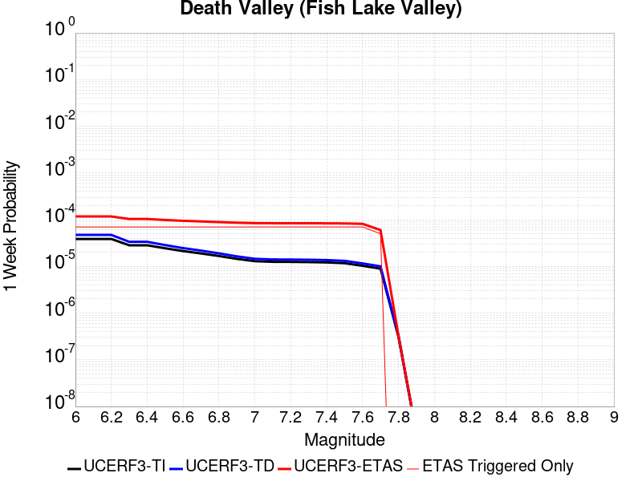 | 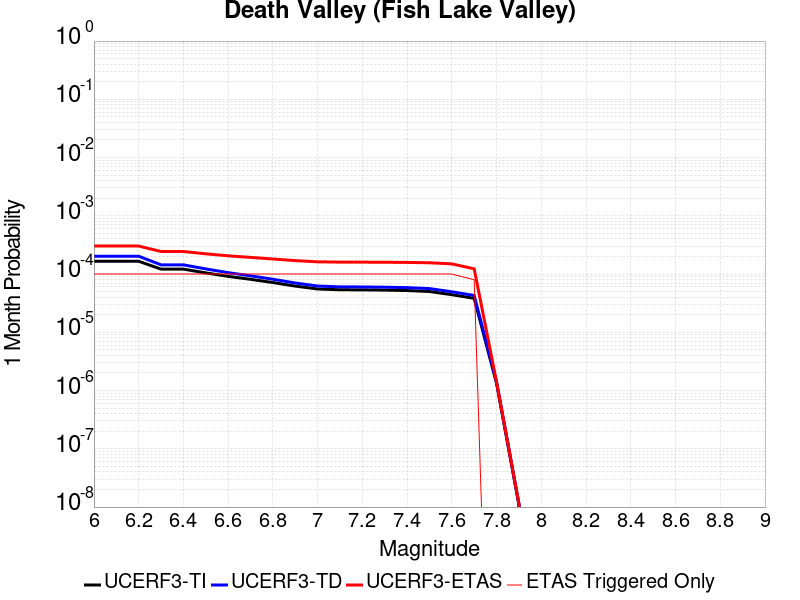 |  |  |

| Magnitude | 1 wk TI Prob | 1 wk TD Prob | 1 wk ETAS Prob | 1 wk ETAS/TD Gain | 1 wk ETAS Triggered Only | 1 mo TI Prob | 1 mo TD Prob | 1 mo ETAS Prob | 1 mo ETAS/TD Gain | 1 mo ETAS Triggered Only | 1 yr TI Prob | 1 yr TD Prob | 1 yr ETAS Prob | 1 yr ETAS/TD Gain | 1 yr ETAS Triggered Only | 10 yr TI Prob | 10 yr TD Prob | 10 yr ETAS Prob | 10 yr ETAS/TD Gain | 10 yr ETAS Triggered Only |
|-----|-----|-----|-----|-----|-----|-----|-----|-----|-----|-----|-----|-----|-----|-----|-----|-----|-----|-----|-----|-----|
| 6.0 | 3.872328E-5 | 4.7267473E-5 | 1.17264164E-4 | 2.4808638 | 7.0E-5 | 1.6594635E-4 | 2.0256084E-4 | 3.025406E-4 | 1.4935788 | 1.0E-4 | 0.0020185246 | 0.002463534 | 0.0026430907 | 1.0728858 | 1.8E-4 | 0.02000288 | 0.024388181 | 0.024671108 | 1.011601 | 2.9E-4 |
| 6.1 | 3.872328E-5 | 4.7267473E-5 | 1.17264164E-4 | 2.4808638 | 7.0E-5 | 1.6594635E-4 | 2.0256084E-4 | 3.025406E-4 | 1.4935788 | 1.0E-4 | 0.0020185246 | 0.002463534 | 0.0026430907 | 1.0728858 | 1.8E-4 | 0.02000288 | 0.024388181 | 0.024671108 | 1.011601 | 2.9E-4 |
| 6.2 | 3.872328E-5 | 4.7267473E-5 | 1.17264164E-4 | 2.4808638 | 7.0E-5 | 1.6594635E-4 | 2.0256084E-4 | 3.025406E-4 | 1.4935788 | 1.0E-4 | 0.0020185246 | 0.002463534 | 0.0026430907 | 1.0728858 | 1.8E-4 | 0.02000288 | 0.024388181 | 0.024671108 | 1.011601 | 2.9E-4 |
| 6.3 | 2.8356371E-5 | 3.3609853E-5 | 1.036075E-4 | 3.0826528 | 7.0E-5 | 1.2152165E-4 | 1.4403471E-4 | 2.4402031E-4 | 1.694177 | 1.0E-4 | 0.0014785219 | 0.0017522911 | 0.0019319757 | 1.1025426 | 1.8E-4 | 0.014687235 | 0.017391782 | 0.017676739 | 1.0163845 | 2.9E-4 |
| 6.4 | 2.8356371E-5 | 3.3609853E-5 | 1.036075E-4 | 3.0826528 | 7.0E-5 | 1.2152165E-4 | 1.4403471E-4 | 2.4402031E-4 | 1.694177 | 1.0E-4 | 0.0014785219 | 0.0017522911 | 0.0019319757 | 1.1025426 | 1.8E-4 | 0.014687235 | 0.017391782 | 0.017676739 | 1.0163845 | 2.9E-4 |
| 6.5 | 2.4448687E-5 | 2.8607552E-5 | 9.860555E-5 | 3.4468362 | 7.0E-5 | 1.0477588E-4 | 1.2259831E-4 | 2.2258607E-4 | 1.8155719 | 1.0E-4 | 0.0012748998 | 0.0014916632 | 0.0016713946 | 1.1204907 | 1.8E-4 | 0.012676105 | 0.014821377 | 0.015097227 | 1.0186117 | 2.8E-4 |
| 6.6 | 2.1298161E-5 | 2.4660083E-5 | 9.465836E-5 | 3.8385253 | 7.0E-5 | 9.127464E-5 | 1.0568198E-4 | 2.0567141E-4 | 1.946135 | 1.0E-4 | 0.0011107022 | 0.0012859525 | 0.001465721 | 1.1397941 | 1.8E-4 | 0.011051672 | 0.012788526 | 0.013064944 | 1.0216147 | 2.8E-4 |
| 6.7 | 1.8959729E-5 | 2.1781025E-5 | 9.1779504E-5 | 4.2137365 | 7.0E-5 | 8.125345E-5 | 9.334405E-5 | 1.9333472E-4 | 2.0712054 | 1.0E-4 | 9.888117E-4 | 0.001135897 | 0.0013156924 | 1.158285 | 1.8E-4 | 0.009844234 | 0.01130357 | 0.011580405 | 1.024491 | 2.8E-4 |
| 6.8 | 1.6691629E-5 | 1.9018353E-5 | 8.901702E-5 | 4.6805854 | 7.0E-5 | 7.153359E-5 | 8.150477E-5 | 1.8149662E-4 | 2.2268221 | 1.0E-4 | 8.7057345E-4 | 9.918857E-4 | 0.0011717072 | 1.1812925 | 1.8E-4 | 0.008671708 | 0.009876343 | 0.010153579 | 1.0280706 | 2.8E-4 |
| 6.9 | 1.450505E-5 | 1.638954E-5 | 8.638839E-5 | 5.270947 | 7.0E-5 | 6.216302E-5 | 7.0239046E-5 | 1.7023202E-4 | 2.4236095 | 1.0E-4 | 7.5657194E-4 | 8.5483363E-4 | 0.0010346797 | 1.2103873 | 1.8E-4 | 0.007540013 | 0.008516385 | 0.008794001 | 1.0325978 | 2.8E-4 |
| 7.0 | 1.2940855E-5 | 1.4537972E-5 | 8.453696E-5 | 5.814907 | 7.0E-5 | 5.545963E-5 | 6.230414E-5 | 1.622979E-4 | 2.60493 | 1.0E-4 | 6.750118E-4 | 7.5829466E-4 | 9.381582E-4 | 1.2371948 | 1.8E-4 | 0.006729651 | 0.0075576897 | 0.0078355735 | 1.0367683 | 2.8E-4 |
| 7.1 | 1.2544658E-5 | 1.4078208E-5 | 8.407722E-5 | 5.9721537 | 7.0E-5 | 5.3761712E-5 | 6.0333812E-5 | 1.6032778E-4 | 2.6573455 | 1.0E-4 | 6.5435225E-4 | 7.343222E-4 | 9.1419E-4 | 1.244944 | 1.8E-4 | 0.006524288 | 0.007319551 | 0.0075975014 | 1.0379738 | 2.8E-4 |
| 7.2 | 1.2489416E-5 | 1.4015674E-5 | 8.40147E-5 | 5.9943385 | 7.0E-5 | 5.3524967E-5 | 6.0065824E-5 | 1.6005982E-4 | 2.6647403 | 1.0E-4 | 6.514716E-4 | 7.310616E-4 | 9.1093004E-4 | 1.2460372 | 1.8E-4 | 0.006495651 | 0.0072871596 | 0.0075651193 | 1.0381438 | 2.8E-4 |
| 7.3 | 1.2368307E-5 | 1.3879812E-5 | 8.387884E-5 | 6.043226 | 7.0E-5 | 5.3005948E-5 | 5.9483587E-5 | 1.5947764E-4 | 2.681036 | 1.0E-4 | 6.451563E-4 | 7.2397763E-4 | 9.038473E-4 | 1.2484465 | 1.8E-4 | 0.0064328653 | 0.007216782 | 0.007494761 | 1.0385184 | 2.8E-4 |
| 7.4 | 1.2161707E-5 | 1.36478675E-5 | 8.364691E-5 | 6.1289363 | 7.0E-5 | 5.212056E-5 | 5.8489582E-5 | 1.5848373E-4 | 2.7096062 | 1.0E-4 | 6.3438306E-4 | 7.118836E-4 | 8.9175545E-4 | 1.2526703 | 1.8E-4 | 0.006325751 | 0.0070966207 | 0.0073746336 | 1.0391754 | 2.8E-4 |
| 7.5 | 1.1707948E-5 | 1.3145515E-5 | 8.3144594E-5 | 6.32494 | 7.0E-5 | 5.0175953E-5 | 5.6336736E-5 | 1.5633111E-4 | 2.7749407 | 1.0E-4 | 6.10721E-4 | 6.856895E-4 | 8.655661E-4 | 1.2623295 | 1.8E-4 | 0.0060904534 | 0.006836321 | 0.007114407 | 1.0406777 | 2.8E-4 |
| 7.6 | 1.0319538E-5 | 1.1579622E-5 | 8.1578815E-5 | 7.045032 | 7.0E-5 | 4.4225842E-5 | 4.9626036E-5 | 1.4962108E-4 | 3.0149713 | 1.0E-4 | 5.383166E-4 | 6.040347E-4 | 7.8392593E-4 | 1.2978162 | 1.8E-4 | 0.0053701443 | 0.0060244603 | 0.0063027735 | 1.0461972 | 2.8E-4 |
| 7.7 | 8.937764E-6 | 1.0022779E-5 | 6.0022277E-5 | 5.9885864 | 5.0E-5 | 3.830414E-5 | 4.295409E-5 | 1.2295066E-4 | 2.8623736 | 8.0E-5 | 4.6625308E-4 | 5.228456E-4 | 6.8276195E-4 | 1.3058577 | 1.6E-4 | 0.0046527605 | 0.005216664 | 0.005475308 | 1.0495803 | 2.6E-4 |
| 7.8 | 3.108007E-7 | 3.284654E-7 | 3.284654E-7 | 1.0 | 0.0 | 1.3320023E-6 | 1.407708E-6 | 1.407708E-6 | 1.0 | 0.0 | 1.6217007E-5 | 1.7138715E-5 | 3.7138372E-5 | 2.1669285 | 2.0E-5 | 1.6215823E-4 | 1.7137431E-4 | 2.0136917E-4 | 1.1750255 | 3.0E-5 |
| 7.9 | 2.5591178E-9 | 2.6696718E-9 | 2.6696718E-9 | 1.0 | 0.0 | 1.0967647E-8 | 1.14414505E-8 | 1.14414505E-8 | 1.0 | 0.0 | 1.335311E-7 | 1.3929966E-7 | 1.3929966E-7 | 1.0 | 0.0 | 1.3353102E-6 | 1.3929966E-6 | 1.3929966E-6 | 1.0 | 0.0 |

## Santa Ynez (West)
*[(top)](#table-of-contents)*

| 1 Week | 1 Month | 1 Year | 10 Year |
|-----|-----|-----|-----|
| 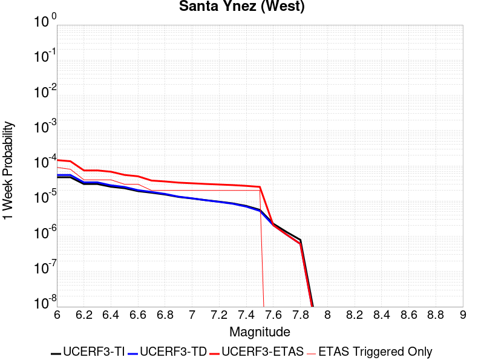 |  |  |  |

| Magnitude | 1 wk TI Prob | 1 wk TD Prob | 1 wk ETAS Prob | 1 wk ETAS/TD Gain | 1 wk ETAS Triggered Only | 1 mo TI Prob | 1 mo TD Prob | 1 mo ETAS Prob | 1 mo ETAS/TD Gain | 1 mo ETAS Triggered Only | 1 yr TI Prob | 1 yr TD Prob | 1 yr ETAS Prob | 1 yr ETAS/TD Gain | 1 yr ETAS Triggered Only | 10 yr TI Prob | 10 yr TD Prob | 10 yr ETAS Prob | 10 yr ETAS/TD Gain | 10 yr ETAS Triggered Only |
|-----|-----|-----|-----|-----|-----|-----|-----|-----|-----|-----|-----|-----|-----|-----|-----|-----|-----|-----|-----|-----|
| 6.0 | 4.7352758E-5 | 5.4972126E-5 | 1.4496718E-4 | 2.6371033 | 9.0E-5 | 2.0292461E-4 | 2.3557522E-4 | 3.3555165E-4 | 1.4243928 | 1.0E-4 | 0.0024678076 | 0.0028645284 | 0.002994156 | 1.0452527 | 1.3E-4 | 0.024405818 | 0.028304417 | 0.02848904 | 1.0065228 | 1.9E-4 |
| 6.1 | 4.7352758E-5 | 5.4972126E-5 | 1.3496773E-4 | 2.455203 | 8.0E-5 | 2.0292461E-4 | 2.3557522E-4 | 3.2555402E-4 | 1.3819536 | 9.0E-5 | 0.0024678076 | 0.0028645284 | 0.0029841845 | 1.0417718 | 1.2E-4 | 0.024405818 | 0.028304417 | 0.028469605 | 1.0058361 | 1.7E-4 |
| 6.2 | 3.0415853E-5 | 3.392511E-5 | 7.392375E-5 | 2.1790276 | 4.0E-5 | 1.3034715E-4 | 1.4538545E-4 | 1.9537818E-4 | 1.3438634 | 5.0E-5 | 0.0015858212 | 0.0017686661 | 0.0018385423 | 1.0395079 | 7.0E-5 | 0.015745522 | 0.017549807 | 0.017648052 | 1.0055981 | 1.0E-4 |
| 6.3 | 3.0415853E-5 | 3.392511E-5 | 7.392375E-5 | 2.1790276 | 4.0E-5 | 1.3034715E-4 | 1.4538545E-4 | 1.9537818E-4 | 1.3438634 | 5.0E-5 | 0.0015858212 | 0.0017686661 | 0.0018385423 | 1.0395079 | 7.0E-5 | 0.015745522 | 0.017549807 | 0.017648052 | 1.0055981 | 1.0E-4 |
| 6.4 | 2.5452082E-5 | 2.7912422E-5 | 6.791131E-5 | 2.4330137 | 4.0E-5 | 1.09075794E-4 | 1.196193E-4 | 1.6961331E-4 | 1.4179428 | 5.0E-5 | 0.0013271887 | 0.0014554089 | 0.001525307 | 1.0480264 | 7.0E-5 | 0.013192902 | 0.014460951 | 0.0145595055 | 1.0068152 | 1.0E-4 |
| 6.5 | 2.3143784E-5 | 2.5128256E-5 | 5.5127504E-5 | 2.193845 | 3.0E-5 | 9.9183875E-5 | 1.0768817E-4 | 1.4768387E-4 | 1.3714029 | 4.0E-5 | 0.0012068948 | 0.0013103267 | 0.0013702482 | 1.0457301 | 6.0E-5 | 0.012003611 | 0.01302768 | 0.013116508 | 1.0068184 | 9.0E-5 |
| 6.6 | 1.9118515E-5 | 2.035434E-5 | 5.035373E-5 | 2.4738572 | 3.0E-5 | 8.193392E-5 | 8.7230015E-5 | 1.2722652E-4 | 1.4585178 | 4.0E-5 | 9.97089E-4 | 0.001061516 | 0.0011214523 | 1.0564629 | 6.0E-5 | 0.00992627 | 0.010565365 | 0.010654414 | 1.0084285 | 9.0E-5 |
| 6.7 | 1.722807E-5 | 1.8146347E-5 | 3.8145983E-5 | 2.1021302 | 2.0E-5 | 7.3832496E-5 | 7.776777E-5 | 1.0776544E-4 | 1.385734 | 3.0E-5 | 8.985399E-4 | 9.464169E-4 | 9.963696E-4 | 1.0527809 | 5.0E-5 | 0.008949154 | 0.0094245095 | 0.009503756 | 1.0084085 | 8.0E-5 |
| 6.8 | 1.5317364E-5 | 1.5926486E-5 | 3.5926165E-5 | 2.25575 | 2.0E-5 | 6.56442E-5 | 6.82546E-5 | 9.825255E-5 | 1.4395008 | 3.0E-5 | 7.98925E-4 | 8.306873E-4 | 8.806457E-4 | 1.0601411 | 5.0E-5 | 0.007960589 | 0.00827631 | 0.008355647 | 1.0095861 | 8.0E-5 |
| 6.9 | 1.3071226E-5 | 1.3329624E-5 | 3.3329357E-5 | 2.5003974 | 2.0E-5 | 5.6018336E-5 | 5.7125722E-5 | 8.7124004E-5 | 1.5251275 | 3.0E-5 | 6.8180985E-4 | 6.9528597E-4 | 7.452512E-4 | 1.0718628 | 5.0E-5 | 0.0067972173 | 0.006931367 | 0.0070008817 | 1.010029 | 7.0E-5 |
| 7.0 | 1.1836986E-5 | 1.19327815E-5 | 3.1932545E-5 | 2.6760352 | 2.0E-5 | 5.0728955E-5 | 5.11395E-5 | 8.1137965E-5 | 1.5866007 | 3.0E-5 | 6.1745E-4 | 6.2244723E-4 | 6.6242233E-4 | 1.0642225 | 4.0E-5 | 0.006157372 | 0.006207231 | 0.0062668584 | 1.0096061 | 6.0E-5 |
| 7.1 | 1.0597169E-5 | 1.0542201E-5 | 3.054199E-5 | 2.8971171 | 2.0E-5 | 4.541565E-5 | 4.5180084E-5 | 7.517873E-5 | 1.6639794 | 3.0E-5 | 5.5279525E-4 | 5.4992986E-4 | 5.8990787E-4 | 1.0726966 | 4.0E-5 | 0.0055142213 | 0.005485821 | 0.0055355467 | 1.0090644 | 5.0E-5 |
| 7.2 | 9.59113E-6 | 9.459144E-6 | 2.9458955E-5 | 3.1143363 | 2.0E-5 | 4.11042E-5 | 4.0538565E-5 | 7.0537346E-5 | 1.7400061 | 3.0E-5 | 5.0032866E-4 | 4.934463E-4 | 5.334266E-4 | 1.0810225 | 4.0E-5 | 0.004992037 | 0.0049236254 | 0.004973379 | 1.0101051 | 5.0E-5 |
| 7.3 | 8.586084E-6 | 8.379583E-6 | 2.8379416E-5 | 3.3867335 | 2.0E-5 | 3.679698E-5 | 3.5912013E-5 | 6.5910936E-5 | 1.8353451 | 3.0E-5 | 4.4791115E-4 | 4.3714207E-4 | 4.7712456E-4 | 1.0914634 | 4.0E-5 | 0.004470094 | 0.004362933 | 0.004412715 | 1.0114102 | 5.0E-5 |
| 7.4 | 7.2622997E-6 | 6.9515427E-6 | 2.6951404E-5 | 3.8770392 | 2.0E-5 | 3.112377E-5 | 2.979199E-5 | 5.97911E-5 | 2.006952 | 3.0E-5 | 3.78866E-4 | 3.626581E-4 | 4.0264358E-4 | 1.1102567 | 4.0E-5 | 0.0037822074 | 0.0036207628 | 0.0036705818 | 1.0137593 | 5.0E-5 |
| 7.5 | 5.627296E-6 | 5.251588E-6 | 2.5251482E-5 | 4.808352 | 2.0E-5 | 2.411676E-5 | 2.2506614E-5 | 5.250594E-5 | 2.3329115 | 3.0E-5 | 2.9358198E-4 | 2.739843E-4 | 3.0397606E-4 | 1.1094654 | 3.0E-5 | 0.0029319443 | 0.002736537 | 0.0027764277 | 1.014577 | 4.0E-5 |
| 7.6 | 2.265244E-6 | 2.0608625E-6 | 2.0608625E-6 | 1.0 | 0.0 | 9.708152E-6 | 8.832238E-6 | 8.832238E-6 | 1.0 | 0.0 | 1.18190335E-4 | 1.0752728E-4 | 1.0752728E-4 | 1.0 | 0.0 | 0.001181275 | 0.0010747612 | 0.0010747612 | 1.0 | 0.0 |
| 7.7 | 1.3099874E-6 | 1.1016252E-6 | 1.1016252E-6 | 1.0 | 0.0 | 5.61422E-6 | 4.7212425E-6 | 4.7212425E-6 | 1.0 | 0.0 | 6.8350986E-5 | 5.7479636E-5 | 5.7479636E-5 | 1.0 | 0.0 | 6.832996E-4 | 5.7465007E-4 | 5.7465007E-4 | 1.0 | 0.0 |
| 7.8 | 7.903951E-7 | 6.0711415E-7 | 6.0711415E-7 | 1.0 | 0.0 | 3.3874032E-6 | 2.6019152E-6 | 2.6019152E-6 | 1.0 | 0.0 | 4.1240855E-5 | 3.167787E-5 | 3.167787E-5 | 1.0 | 0.0 | 4.12332E-4 | 3.167349E-4 | 3.167349E-4 | 1.0 | 0.0 |
| 7.9 | 7.0753297E-9 | 5.0899476E-9 | 5.0899476E-9 | 1.0 | 0.0 | 3.032284E-8 | 2.181406E-8 | 2.181406E-8 | 1.0 | 0.0 | 3.6918053E-7 | 2.6558615E-7 | 2.6558615E-7 | 1.0 | 0.0 | 3.691799E-6 | 2.6558594E-6 | 2.6558594E-6 | 1.0 | 0.0 |

## San Andreas (Creeping Section) 2011 CFM
*[(top)](#table-of-contents)*

| 1 Week | 1 Month | 1 Year | 10 Year |
|-----|-----|-----|-----|
|  | 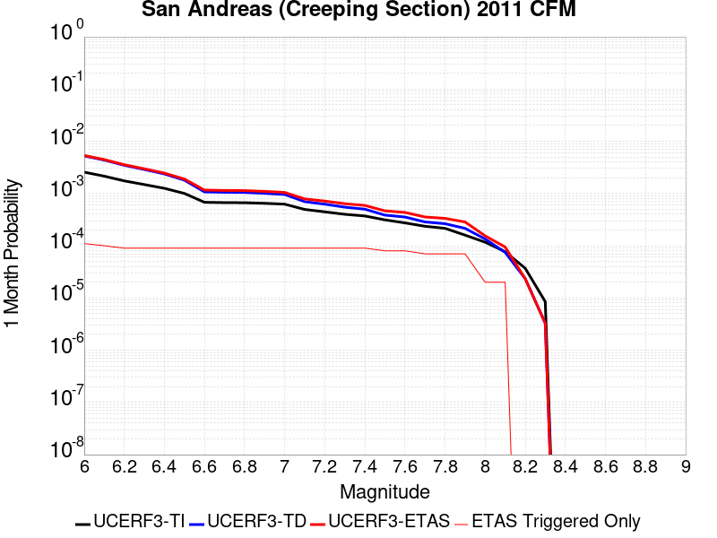 | 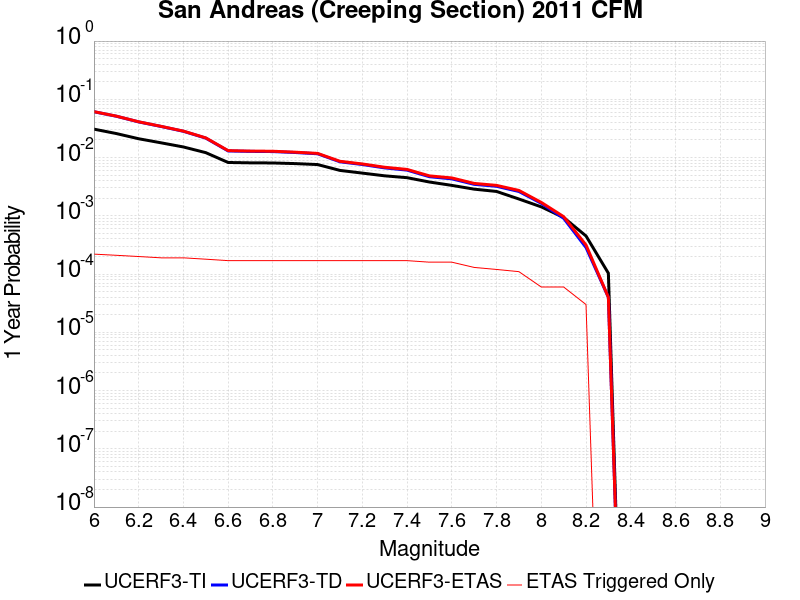 |  |

| Magnitude | 1 wk TI Prob | 1 wk TD Prob | 1 wk ETAS Prob | 1 wk ETAS/TD Gain | 1 wk ETAS Triggered Only | 1 mo TI Prob | 1 mo TD Prob | 1 mo ETAS Prob | 1 mo ETAS/TD Gain | 1 mo ETAS Triggered Only | 1 yr TI Prob | 1 yr TD Prob | 1 yr ETAS Prob | 1 yr ETAS/TD Gain | 1 yr ETAS Triggered Only | 10 yr TI Prob | 10 yr TD Prob | 10 yr ETAS Prob | 10 yr ETAS/TD Gain | 10 yr ETAS Triggered Only |
|-----|-----|-----|-----|-----|-----|-----|-----|-----|-----|-----|-----|-----|-----|-----|-----|-----|-----|-----|-----|-----|
| 6.0 | 5.986481E-4 | 0.001228691 | 0.0013185804 | 1.0731587 | 9.0E-5 | 0.0025631124 | 0.005246795 | 0.0053562177 | 1.0208552 | 1.1E-4 | 0.030762846 | 0.061203245 | 0.061409783 | 1.0033746 | 2.2E-4 | 0.26835477 | 0.425928 | 0.42609447 | 1.0003909 | 2.9E-4 |
| 6.1 | 5.015945E-4 | 0.0010230356 | 0.0011029538 | 1.0781187 | 8.0E-5 | 0.00214792 | 0.004369436 | 0.004468999 | 1.0227863 | 1.0E-4 | 0.025839351 | 0.051246606 | 0.051445846 | 1.0038879 | 2.1E-4 | 0.23032776 | 0.37284943 | 0.37302506 | 1.000471 | 2.8E-4 |
| 6.2 | 4.073338E-4 | 8.1157376E-4 | 8.815169E-4 | 1.0861821 | 7.0E-5 | 0.0017445484 | 0.0034683137 | 0.0035580015 | 1.0258592 | 9.0E-5 | 0.021034058 | 0.04093177 | 0.041123584 | 1.0046862 | 2.0E-4 | 0.19150782 | 0.31302592 | 0.31320453 | 1.0005707 | 2.6E-4 |
| 6.3 | 3.464099E-4 | 6.7455834E-4 | 7.4451114E-4 | 1.1037016 | 7.0E-5 | 0.0014837692 | 0.0028832308 | 0.0029729714 | 1.031125 | 9.0E-5 | 0.017915873 | 0.034187846 | 0.03437135 | 1.0053675 | 1.9E-4 | 0.16538359 | 0.27130842 | 0.27149057 | 1.0006715 | 2.5E-4 |
| 6.4 | 2.935057E-4 | 5.5516965E-4 | 6.251308E-4 | 1.1260176 | 7.0E-5 | 0.0012572751 | 0.0023727308 | 0.0024625172 | 1.037841 | 9.0E-5 | 0.015200248 | 0.02826279 | 0.02844742 | 1.0065327 | 1.9E-4 | 0.14201577 | 0.23297668 | 0.23316842 | 1.000823 | 2.5E-4 |
| 6.5 | 2.3409708E-4 | 4.2132285E-4 | 4.912934E-4 | 1.1660733 | 7.0E-5 | 0.0010028875 | 0.0018017791 | 0.0018916171 | 1.0498606 | 9.0E-5 | 0.012141965 | 0.021586355 | 0.021762468 | 1.0081586 | 1.8E-4 | 0.11499573 | 0.1868149 | 0.18701008 | 1.0010448 | 2.4E-4 |
| 6.6 | 1.5842178E-4 | 2.5068692E-4 | 3.2066938E-4 | 1.2791628 | 7.0E-5 | 6.7877385E-4 | 0.0010739256 | 0.001163829 | 1.0837147 | 9.0E-5 | 0.0082328 | 0.012995283 | 0.013163074 | 1.0129117 | 1.7E-4 | 0.07934396 | 0.12313759 | 0.12333927 | 1.0016378 | 2.3E-4 |
| 6.7 | 1.5616413E-4 | 2.4605254E-4 | 3.1603532E-4 | 1.284422 | 7.0E-5 | 6.691031E-4 | 0.0010540807 | 0.0011439858 | 1.0852925 | 9.0E-5 | 0.0081159435 | 0.012757154 | 0.012924985 | 1.0131558 | 1.7E-4 | 0.0782586 | 0.12116472 | 0.12136685 | 1.0016682 | 2.3E-4 |
| 6.8 | 1.5538467E-4 | 2.442914E-4 | 3.142743E-4 | 1.286473 | 7.0E-5 | 6.6576427E-4 | 0.001046539 | 0.0011364449 | 1.0859077 | 9.0E-5 | 0.008075596 | 0.012666538 | 0.012834385 | 1.0132512 | 1.7E-4 | 0.07788358 | 0.12039561 | 0.120597914 | 1.0016804 | 2.3E-4 |
| 6.9 | 1.5153569E-4 | 2.3538464E-4 | 3.0536816E-4 | 1.2973156 | 7.0E-5 | 6.49277E-4 | 0.0010084033 | 0.0010983126 | 1.08916 | 9.0E-5 | 0.007876333 | 0.012208726 | 0.012376651 | 1.0137545 | 1.7E-4 | 0.07602952 | 0.11646574 | 0.116668954 | 1.0017449 | 2.3E-4 |
| 7.0 | 1.4588932E-4 | 2.2395732E-4 | 2.9394164E-4 | 1.3124895 | 7.0E-5 | 6.250901E-4 | 9.59466E-4 | 0.0010493797 | 1.0937122 | 9.0E-5 | 0.0075839474 | 0.011619428 | 0.011787453 | 1.0144607 | 1.7E-4 | 0.073302895 | 0.11131206 | 0.11151646 | 1.0018363 | 2.3E-4 |
| 7.1 | 1.1565079E-4 | 1.6281323E-4 | 2.3280183E-4 | 1.4298705 | 7.0E-5 | 4.955521E-4 | 6.9758523E-4 | 7.875224E-4 | 1.1289265 | 9.0E-5 | 0.006016669 | 0.008460228 | 0.008628789 | 1.019924 | 1.7E-4 | 0.058563538 | 0.08366478 | 0.08386638 | 1.0024096 | 2.2E-4 |
| 7.2 | 1.0393792E-4 | 1.4615392E-4 | 2.1614369E-4 | 1.4788772 | 7.0E-5 | 4.4537216E-4 | 6.262243E-4 | 7.1616797E-4 | 1.1436285 | 9.0E-5 | 0.005408933 | 0.0075977976 | 0.007766506 | 1.0222049 | 1.7E-4 | 0.052791595 | 0.07561503 | 0.075818405 | 1.0026895 | 2.2E-4 |
| 7.3 | 9.332884E-5 | 1.2780601E-4 | 1.9779705E-4 | 1.5476351 | 7.0E-5 | 3.999194E-4 | 5.4762565E-4 | 6.375764E-4 | 1.1642559 | 9.0E-5 | 0.0048581534 | 0.0066470946 | 0.0068159644 | 1.025405 | 1.7E-4 | 0.047533102 | 0.06647954 | 0.06668492 | 1.0030893 | 2.2E-4 |
| 7.4 | 8.670252E-5 | 1.1702972E-4 | 1.8702152E-4 | 1.5980687 | 7.0E-5 | 3.715293E-4 | 5.014601E-4 | 5.91415E-4 | 1.1793859 | 9.0E-5 | 0.004513991 | 0.0060883067 | 0.006257272 | 1.0277524 | 1.7E-4 | 0.044233937 | 0.061148684 | 0.06135523 | 1.0033778 | 2.2E-4 |
| 7.5 | 7.3036405E-5 | 9.005699E-5 | 1.5005158E-4 | 1.6661848 | 6.0E-5 | 3.129756E-4 | 3.859015E-4 | 4.6587063E-4 | 1.2072268 | 8.0E-5 | 0.0038038217 | 0.0046882504 | 0.0048475005 | 1.0339679 | 1.6E-4 | 0.03739367 | 0.047875606 | 0.048075553 | 1.0041764 | 2.1E-4 |
| 7.6 | 6.3935775E-5 | 8.280209E-5 | 1.4279713E-4 | 1.7245594 | 6.0E-5 | 2.7398168E-4 | 3.5481792E-4 | 4.3478954E-4 | 1.2253878 | 8.0E-5 | 0.0033306254 | 0.00431137 | 0.0044706804 | 1.0369512 | 1.6E-4 | 0.032811474 | 0.043990135 | 0.0441909 | 1.0045638 | 2.1E-4 |
| 7.7 | 5.5050095E-5 | 6.661729E-5 | 1.1661396E-4 | 1.7505058 | 5.0E-5 | 2.3590765E-4 | 2.8547147E-4 | 3.5545148E-4 | 1.2451384 | 7.0E-5 | 0.0028683927 | 0.0034700802 | 0.003599629 | 1.0373331 | 1.3E-4 | 0.0283165 | 0.03579509 | 0.035959 | 1.0045793 | 1.7E-4 |
| 7.8 | 5.027131E-5 | 6.1627725E-5 | 1.1162464E-4 | 1.8112732 | 5.0E-5 | 2.1543067E-4 | 2.640921E-4 | 3.3407361E-4 | 1.264989 | 7.0E-5 | 0.0026197135 | 0.003210584 | 0.0033301986 | 1.0372564 | 1.2E-4 | 0.025890453 | 0.03312572 | 0.03328042 | 1.0046701 | 1.6E-4 |
| 7.9 | 3.7271806E-5 | 5.0224386E-5 | 1.0022188E-4 | 1.9954823 | 5.0E-5 | 1.5972654E-4 | 2.1522962E-4 | 2.8521454E-4 | 1.3251641 | 7.0E-5 | 0.0019429359 | 0.0026172737 | 0.0027269858 | 1.0419185 | 1.1E-4 | 0.019260362 | 0.027066687 | 0.027212627 | 1.0053918 | 1.5E-4 |
| 8.0 | 2.7310243E-5 | 3.1428404E-5 | 3.1428404E-5 | 1.0 | 0.0 | 1.17038646E-4 | 1.3468621E-4 | 1.5468353E-4 | 1.1484733 | 2.0E-5 | 0.0014240141 | 0.0016385721 | 0.0016984737 | 1.0365572 | 6.0E-5 | 0.014149235 | 0.01721387 | 0.017282665 | 1.0039965 | 7.0E-5 |
| 8.1 | 1.7940547E-5 | 1.7400796E-5 | 1.7400796E-5 | 1.0 | 0.0 | 7.688579E-5 | 7.457271E-5 | 9.457122E-5 | 1.2681746 | 2.0E-5 | 9.3568244E-4 | 9.075451E-4 | 9.6749066E-4 | 1.0660524 | 6.0E-5 | 0.009317525 | 0.009799073 | 0.009858485 | 1.006063 | 6.0E-5 |
| 8.2 | 8.643924E-6 | 5.4748625E-6 | 5.4748625E-6 | 1.0 | 0.0 | 3.704486E-5 | 2.3463486E-5 | 2.3463486E-5 | 1.0 | 0.0 | 4.5092785E-4 | 2.8563058E-4 | 3.15622E-4 | 1.1050007 | 3.0E-5 | 0.0045001395 | 0.0032487072 | 0.0032786098 | 1.0092044 | 3.0E-5 |
| 8.3 | 1.983087E-6 | 7.6599065E-7 | 7.6599065E-7 | 1.0 | 0.0 | 8.498917E-6 | 3.282813E-6 | 3.282813E-6 | 1.0 | 0.0 | 1.034694E-4 | 3.9967534E-5 | 3.9967534E-5 | 1.0 | 0.0 | 0.0010342124 | 4.719687E-4 | 4.719687E-4 | 1.0 | 0.0 |

## Cleghorn Lake
*[(top)](#table-of-contents)*

| 1 Week | 1 Month | 1 Year | 10 Year |
|-----|-----|-----|-----|
|  |  |  |  |

| Magnitude | 1 wk TI Prob | 1 wk TD Prob | 1 wk ETAS Prob | 1 wk ETAS/TD Gain | 1 wk ETAS Triggered Only | 1 mo TI Prob | 1 mo TD Prob | 1 mo ETAS Prob | 1 mo ETAS/TD Gain | 1 mo ETAS Triggered Only | 1 yr TI Prob | 1 yr TD Prob | 1 yr ETAS Prob | 1 yr ETAS/TD Gain | 1 yr ETAS Triggered Only | 10 yr TI Prob | 10 yr TD Prob | 10 yr ETAS Prob | 10 yr ETAS/TD Gain | 10 yr ETAS Triggered Only |
|-----|-----|-----|-----|-----|-----|-----|-----|-----|-----|-----|-----|-----|-----|-----|-----|-----|-----|-----|-----|-----|
| 6.0 | 1.5467183E-5 | 1.6794203E-5 | 9.679286E-5 | 5.7634683 | 8.0E-5 | 6.6286244E-5 | 7.197348E-5 | 1.9196485E-4 | 2.6671607 | 1.2E-4 | 8.067362E-4 | 8.759797E-4 | 0.0010857958 | 1.2395216 | 2.1E-4 | 0.008038137 | 0.008730696 | 0.008988425 | 1.02952 | 2.6E-4 |
| 6.1 | 1.5467183E-5 | 1.6794203E-5 | 9.679286E-5 | 5.7634683 | 8.0E-5 | 6.6286244E-5 | 7.197348E-5 | 1.9196485E-4 | 2.6671607 | 1.2E-4 | 8.067362E-4 | 8.759797E-4 | 0.0010857958 | 1.2395216 | 2.1E-4 | 0.008038137 | 0.008730696 | 0.008988425 | 1.02952 | 2.6E-4 |
| 6.2 | 1.2624631E-5 | 1.3681544E-5 | 8.3680585E-5 | 6.1163116 | 7.0E-5 | 5.410444E-5 | 5.863415E-5 | 1.5862829E-4 | 2.705391 | 1.0E-4 | 6.585225E-4 | 7.1368564E-4 | 8.835643E-4 | 1.2380301 | 1.7E-4 | 0.0065657445 | 0.0071187317 | 0.007317308 | 1.0278949 | 2.0E-4 |
| 6.3 | 1.2624631E-5 | 1.3681544E-5 | 8.3680585E-5 | 6.1163116 | 7.0E-5 | 5.410444E-5 | 5.863415E-5 | 1.5862829E-4 | 2.705391 | 1.0E-4 | 6.585225E-4 | 7.1368564E-4 | 8.835643E-4 | 1.2380301 | 1.7E-4 | 0.0065657445 | 0.0071187317 | 0.007317308 | 1.0278949 | 2.0E-4 |
| 6.4 | 9.417684E-6 | 1.0170118E-5 | 7.016951E-5 | 6.8995767 | 6.0E-5 | 4.036088E-5 | 4.3585722E-5 | 1.1358267E-4 | 2.6059606 | 7.0E-5 | 4.912829E-4 | 5.3056807E-4 | 6.604991E-4 | 1.2448905 | 1.3E-4 | 0.004901982 | 0.005297049 | 0.0054462543 | 1.0281676 | 1.5E-4 |
| 6.5 | 9.368219E-6 | 1.0117545E-5 | 7.0116934E-5 | 6.930233 | 6.0E-5 | 4.014889E-5 | 4.3360415E-5 | 1.1335738E-4 | 2.6143057 | 7.0E-5 | 4.8870314E-4 | 5.2782625E-4 | 6.577576E-4 | 1.2461631 | 1.3E-4 | 0.004876298 | 0.0052697617 | 0.005418971 | 1.0283142 | 1.5E-4 |
| 6.6 | 7.803798E-6 | 8.441831E-6 | 6.8441324E-5 | 8.107403 | 6.0E-5 | 3.3444423E-5 | 3.6179E-5 | 9.617683E-5 | 2.6583607 | 6.0E-5 | 4.0710976E-4 | 4.4043022E-4 | 5.503818E-4 | 1.2496458 | 1.1E-4 | 0.0040636472 | 0.0043994905 | 0.0045289183 | 1.0294188 | 1.3E-4 |
| 6.7 | 2.3108669E-6 | 2.4438336E-6 | 3.244376E-5 | 13.275764 | 3.0E-5 | 9.903678E-6 | 1.0473532E-5 | 4.0473216E-5 | 3.8643334 | 3.0E-5 | 1.205706E-4 | 1.2750797E-4 | 1.8750032E-4 | 1.4704988 | 6.0E-5 | 0.001205052 | 0.0012743667 | 0.0013442776 | 1.0548593 | 7.0E-5 |
| 6.8 | 2.0882828E-6 | 2.2062823E-6 | 2.2206237E-5 | 10.065003 | 2.0E-5 | 8.949753E-6 | 9.455462E-6 | 2.9455272E-5 | 3.1151595 | 2.0E-5 | 1.08957785E-4 | 1.1511434E-4 | 1.6510858E-4 | 1.4343008 | 5.0E-5 | 0.0010890438 | 0.0011505639 | 0.0012104949 | 1.0520884 | 6.0E-5 |
| 6.9 | 1.876935E-6 | 1.981051E-6 | 2.1981012E-5 | 11.095632 | 2.0E-5 | 8.043982E-6 | 8.490192E-6 | 2.8490022E-5 | 3.3556395 | 2.0E-5 | 9.7931086E-5 | 1.03363345E-4 | 1.5335818E-4 | 1.4836805 | 5.0E-5 | 9.788794E-4 | 0.0010331686 | 0.0010931067 | 1.0580138 | 6.0E-5 |
| 7.0 | 1.5357559E-6 | 1.6202807E-6 | 1.1620265E-5 | 7.17176 | 1.0E-5 | 6.5817944E-6 | 6.9440425E-6 | 1.6943974E-5 | 2.4400733 | 1.0E-5 | 8.01304E-5 | 8.454057E-5 | 1.1453803E-4 | 1.3548292 | 3.0E-5 | 8.010151E-4 | 8.450965E-4 | 8.850627E-4 | 1.0472919 | 4.0E-5 |
| 7.1 | 1.0905424E-6 | 1.1497619E-6 | 1.114975E-5 | 9.697442 | 1.0E-5 | 4.6737446E-6 | 4.9275427E-6 | 1.4927493E-5 | 3.0293992 | 1.0E-5 | 5.6901354E-5 | 5.999128E-5 | 7.999008E-5 | 1.3333617 | 2.0E-5 | 5.6886784E-4 | 5.997606E-4 | 6.2974263E-4 | 1.0499899 | 3.0E-5 |
| 7.2 | 6.06668E-7 | 6.387277E-7 | 1.06387215E-5 | 16.656113 | 1.0E-5 | 2.600003E-6 | 2.7374022E-6 | 1.2737375E-5 | 4.6530886 | 1.0E-5 | 3.1654577E-5 | 3.3327433E-5 | 5.3326767E-5 | 1.6000862 | 2.0E-5 | 3.1650066E-4 | 3.3323118E-4 | 3.5322452E-4 | 1.0599984 | 2.0E-5 |

## San Jacinto (San Bernardino)
*[(top)](#table-of-contents)*

| 1 Week | 1 Month | 1 Year | 10 Year |
|-----|-----|-----|-----|
|  | 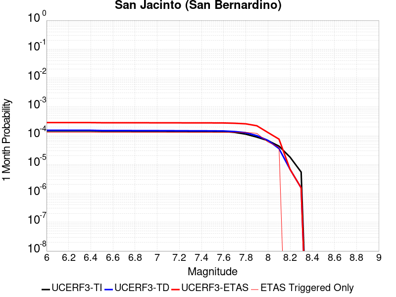 |  |  |

| Magnitude | 1 wk TI Prob | 1 wk TD Prob | 1 wk ETAS Prob | 1 wk ETAS/TD Gain | 1 wk ETAS Triggered Only | 1 mo TI Prob | 1 mo TD Prob | 1 mo ETAS Prob | 1 mo ETAS/TD Gain | 1 mo ETAS Triggered Only | 1 yr TI Prob | 1 yr TD Prob | 1 yr ETAS Prob | 1 yr ETAS/TD Gain | 1 yr ETAS Triggered Only | 10 yr TI Prob | 10 yr TD Prob | 10 yr ETAS Prob | 10 yr ETAS/TD Gain | 10 yr ETAS Triggered Only |
|-----|-----|-----|-----|-----|-----|-----|-----|-----|-----|-----|-----|-----|-----|-----|-----|-----|-----|-----|-----|-----|
| 6.0 | 3.409352E-5 | 3.5986508E-5 | 1.1598363E-4 | 3.2229753 | 8.0E-5 | 1.461069E-4 | 1.542188E-4 | 2.8419873E-4 | 1.8428283 | 1.3E-4 | 0.0017774 | 0.0018759987 | 0.0021055671 | 1.1223713 | 2.3E-4 | 0.01763251 | 0.019349935 | 0.019614711 | 1.0136836 | 2.7E-4 |
| 6.1 | 3.409352E-5 | 3.5986508E-5 | 1.1598363E-4 | 3.2229753 | 8.0E-5 | 1.461069E-4 | 1.542188E-4 | 2.8419873E-4 | 1.8428283 | 1.3E-4 | 0.0017774 | 0.0018759987 | 0.0021055671 | 1.1223713 | 2.3E-4 | 0.01763251 | 0.019349935 | 0.019614711 | 1.0136836 | 2.7E-4 |
| 6.2 | 3.409352E-5 | 3.5986508E-5 | 1.1598363E-4 | 3.2229753 | 8.0E-5 | 1.461069E-4 | 1.542188E-4 | 2.8419873E-4 | 1.8428283 | 1.3E-4 | 0.0017774 | 0.0018759987 | 0.0021055671 | 1.1223713 | 2.3E-4 | 0.01763251 | 0.019349935 | 0.019614711 | 1.0136836 | 2.7E-4 |
| 6.3 | 3.409352E-5 | 3.5986508E-5 | 1.1598363E-4 | 3.2229753 | 8.0E-5 | 1.461069E-4 | 1.542188E-4 | 2.8419873E-4 | 1.8428283 | 1.3E-4 | 0.0017774 | 0.0018759987 | 0.0021055671 | 1.1223713 | 2.3E-4 | 0.01763251 | 0.019349935 | 0.019614711 | 1.0136836 | 2.7E-4 |
| 6.4 | 3.400795E-5 | 3.5879173E-5 | 1.15876304E-4 | 3.229626 | 8.0E-5 | 1.4574021E-4 | 1.5375883E-4 | 2.8373883E-4 | 1.8453499 | 1.3E-4 | 0.0017729428 | 0.0018704084 | 0.0020999783 | 1.1227378 | 2.3E-4 | 0.017588645 | 0.019295016 | 0.019559808 | 1.0137233 | 2.7E-4 |
| 6.5 | 3.341482E-5 | 3.5139812E-5 | 1.15137E-4 | 3.27654 | 8.0E-5 | 1.4319851E-4 | 1.5059051E-4 | 2.8057094E-4 | 1.8631382 | 1.3E-4 | 0.0017420477 | 0.0018318989 | 0.0020614776 | 1.1253228 | 2.3E-4 | 0.017284546 | 0.018916558 | 0.01918145 | 1.0140032 | 2.7E-4 |
| 6.6 | 3.3364955E-5 | 3.5077028E-5 | 1.15074225E-4 | 3.2806149 | 8.0E-5 | 1.4298483E-4 | 1.5032147E-4 | 2.8030193E-4 | 1.8646833 | 1.3E-4 | 0.0017394501 | 0.001828629 | 0.0020582085 | 1.1255473 | 2.3E-4 | 0.017258976 | 0.018884424 | 0.019149324 | 1.0140275 | 2.7E-4 |
| 6.7 | 3.335922E-5 | 3.5066805E-5 | 1.15064E-4 | 3.2812798 | 8.0E-5 | 1.4296026E-4 | 1.5027766E-4 | 2.8025813E-4 | 1.8649354 | 1.3E-4 | 0.0017391514 | 0.0018280965 | 0.002057676 | 1.1255839 | 2.3E-4 | 0.017256035 | 0.018879214 | 0.019144118 | 1.0140314 | 2.7E-4 |
| 6.8 | 3.327683E-5 | 3.496087E-5 | 1.1495807E-4 | 3.2881925 | 8.0E-5 | 1.4260718E-4 | 1.498237E-4 | 2.7980423E-4 | 1.8675565 | 1.3E-4 | 0.0017348597 | 0.0018225788 | 0.0020521595 | 1.1259648 | 2.3E-4 | 0.017213784 | 0.018824987 | 0.019089904 | 1.0140727 | 2.7E-4 |
| 6.9 | 3.3235785E-5 | 3.4901823E-5 | 1.14899034E-4 | 3.2920637 | 8.0E-5 | 1.4243131E-4 | 1.4957068E-4 | 2.7955123E-4 | 1.8690243 | 1.3E-4 | 0.0017327217 | 0.0018195034 | 0.002049085 | 1.1261781 | 2.3E-4 | 0.017192734 | 0.018794855 | 0.019059781 | 1.0140957 | 2.7E-4 |
| 7.0 | 3.3197095E-5 | 3.4841752E-5 | 1.14838964E-4 | 3.2960157 | 8.0E-5 | 1.422655E-4 | 1.4931326E-4 | 2.7929386E-4 | 1.8705227 | 1.3E-4 | 0.0017307063 | 0.0018163746 | 0.002045957 | 1.1263958 | 2.3E-4 | 0.017172894 | 0.018764233 | 0.019029167 | 1.014119 | 2.7E-4 |
| 7.1 | 3.3129716E-5 | 3.4721965E-5 | 1.1471919E-4 | 3.303937 | 8.0E-5 | 1.4197677E-4 | 1.4879994E-4 | 2.787806E-4 | 1.8735262 | 1.3E-4 | 0.0017271966 | 0.0018101353 | 0.002039719 | 1.1268324 | 2.3E-4 | 0.017138338 | 0.018703312 | 0.018968262 | 1.014166 | 2.7E-4 |
| 7.2 | 3.3034008E-5 | 3.458941E-5 | 1.1458665E-4 | 3.3127666 | 8.0E-5 | 1.4156665E-4 | 1.4823192E-4 | 2.7821265E-4 | 1.8768741 | 1.3E-4 | 0.0017222111 | 0.0018032312 | 0.0020328164 | 1.1273189 | 2.3E-4 | 0.017089253 | 0.018635705 | 0.018900674 | 1.0142183 | 2.7E-4 |
| 7.3 | 3.2956614E-5 | 3.445717E-5 | 1.14454415E-4 | 3.3216429 | 8.0E-5 | 1.4123498E-4 | 1.4766524E-4 | 2.7764603E-4 | 1.8802397 | 1.3E-4 | 0.0017181796 | 0.0017963431 | 0.00202593 | 1.1278079 | 2.3E-4 | 0.017049557 | 0.018568452 | 0.01883344 | 1.0142708 | 2.7E-4 |
| 7.4 | 3.2915937E-5 | 3.4378863E-5 | 1.1437611E-4 | 3.326931 | 8.0E-5 | 1.4106068E-4 | 1.4732967E-4 | 2.7731052E-4 | 1.8822448 | 1.3E-4 | 0.0017160608 | 0.0017922645 | 0.0020218522 | 1.1280993 | 2.3E-4 | 0.017028693 | 0.018528719 | 0.018793715 | 1.014302 | 2.7E-4 |
| 7.5 | 3.281791E-5 | 3.4243778E-5 | 1.1424104E-4 | 3.3361108 | 8.0E-5 | 1.406406E-4 | 1.4675081E-4 | 2.7673173E-4 | 1.8857255 | 1.3E-4 | 0.0017109542 | 0.0017852283 | 0.0020148177 | 1.128605 | 2.3E-4 | 0.016978411 | 0.018459605 | 0.018724622 | 1.0143565 | 2.7E-4 |
| 7.6 | 3.2521442E-5 | 3.396873E-5 | 1.1396601E-4 | 3.3550272 | 8.0E-5 | 1.3937015E-4 | 1.4557215E-4 | 2.7555323E-4 | 1.892898 | 1.3E-4 | 0.0016955109 | 0.0017709016 | 0.0020004944 | 1.1296474 | 2.3E-4 | 0.016826328 | 0.018317232 | 0.018582286 | 1.0144702 | 2.7E-4 |
| 7.7 | 3.0287873E-5 | 3.245276E-5 | 1.12450165E-4 | 3.4650414 | 8.0E-5 | 1.297987E-4 | 1.3907586E-4 | 2.6905778E-4 | 1.9346117 | 1.3E-4 | 0.0015791537 | 0.0016919347 | 0.0019215455 | 1.135709 | 2.3E-4 | 0.01567979 | 0.01752809 | 0.017793357 | 1.0151339 | 2.7E-4 |
| 7.8 | 2.6316151E-5 | 2.9663592E-5 | 1.0966122E-4 | 3.6968288 | 8.0E-5 | 1.1277862E-4 | 1.2712348E-4 | 2.5710696E-4 | 2.0224977 | 1.3E-4 | 0.0013722149 | 0.0015466306 | 0.0017762749 | 1.1484804 | 2.3E-4 | 0.013637724 | 0.016069634 | 0.016335296 | 1.0165318 | 2.7E-4 |
| 7.9 | 2.0761147E-5 | 2.34181E-5 | 9.3416464E-5 | 3.9890707 | 7.0E-5 | 8.897331E-5 | 1.0035944E-4 | 2.2034739E-4 | 2.1955822 | 1.2E-4 | 0.0010827117 | 0.0012211921 | 0.0014209478 | 1.1635745 | 2.0E-4 | 0.010774517 | 0.012793174 | 0.013030103 | 1.01852 | 2.4E-4 |
| 8.0 | 1.5738568E-5 | 1.6033575E-5 | 3.6033256E-5 | 2.2473624 | 2.0E-5 | 6.744926E-5 | 6.871352E-5 | 1.2870939E-4 | 1.8731307 | 6.0E-5 | 8.2088535E-4 | 8.3626667E-4 | 9.3618303E-4 | 1.1194791 | 1.0E-4 | 0.008178596 | 0.008865921 | 0.008984856 | 1.013415 | 1.2E-4 |
| 8.1 | 1.0105832E-5 | 8.3304985E-6 | 1.8330415E-5 | 2.2003984 | 1.0E-5 | 4.3309992E-5 | 3.570165E-5 | 7.570022E-5 | 2.1203563 | 4.0E-5 | 5.2717153E-4 | 4.345814E-4 | 4.9455534E-4 | 1.138004 | 6.0E-5 | 0.005259227 | 0.004677232 | 0.004736951 | 1.0127681 | 6.0E-5 |
| 8.2 | 4.189207E-6 | 1.5784357E-6 | 1.5784357E-6 | 1.0 | 0.0 | 1.7953622E-5 | 6.7647065E-6 | 6.7647065E-6 | 1.0 | 0.0 | 2.1856341E-4 | 8.235722E-5 | 9.235639E-5 | 1.1214123 | 1.0E-5 | 0.0021834858 | 9.565867E-4 | 9.6657715E-4 | 1.0104438 | 1.0E-5 |
| 8.3 | 1.2758221E-6 | 3.6149942E-7 | 3.6149942E-7 | 1.0 | 0.0 | 5.4677976E-6 | 1.5492824E-6 | 1.5492824E-6 | 1.0 | 0.0 | 6.65684E-5 | 1.8862354E-5 | 1.8862354E-5 | 1.0 | 0.0 | 6.6548464E-4 | 2.2751294E-4 | 2.2751294E-4 | 1.0 | 0.0 |

## Lake Isabella (Seismicity)
*[(top)](#table-of-contents)*

| 1 Week | 1 Month | 1 Year | 10 Year |
|-----|-----|-----|-----|
|  |  |  |  |

| Magnitude | 1 wk TI Prob | 1 wk TD Prob | 1 wk ETAS Prob | 1 wk ETAS/TD Gain | 1 wk ETAS Triggered Only | 1 mo TI Prob | 1 mo TD Prob | 1 mo ETAS Prob | 1 mo ETAS/TD Gain | 1 mo ETAS Triggered Only | 1 yr TI Prob | 1 yr TD Prob | 1 yr ETAS Prob | 1 yr ETAS/TD Gain | 1 yr ETAS Triggered Only | 10 yr TI Prob | 10 yr TD Prob | 10 yr ETAS Prob | 10 yr ETAS/TD Gain | 10 yr ETAS Triggered Only |
|-----|-----|-----|-----|-----|-----|-----|-----|-----|-----|-----|-----|-----|-----|-----|-----|-----|-----|-----|-----|-----|
| 6.0 | 9.431637E-6 | 9.741651E-6 | 5.9741164E-5 | 6.13255 | 5.0E-5 | 4.0420677E-5 | 4.1749343E-5 | 1.3174559E-4 | 3.1556327 | 9.0E-5 | 4.920106E-4 | 5.0819275E-4 | 6.5811654E-4 | 1.2950135 | 1.5E-4 | 0.004909227 | 0.005071599 | 0.005320331 | 1.0490441 | 2.5E-4 |
| 6.1 | 9.431637E-6 | 9.741651E-6 | 5.9741164E-5 | 6.13255 | 5.0E-5 | 4.0420677E-5 | 4.1749343E-5 | 1.3174559E-4 | 3.1556327 | 9.0E-5 | 4.920106E-4 | 5.0819275E-4 | 6.5811654E-4 | 1.2950135 | 1.5E-4 | 0.004909227 | 0.005071599 | 0.005320331 | 1.0490441 | 2.5E-4 |
| 6.2 | 9.431637E-6 | 9.741651E-6 | 5.9741164E-5 | 6.13255 | 5.0E-5 | 4.0420677E-5 | 4.1749343E-5 | 1.3174559E-4 | 3.1556327 | 9.0E-5 | 4.920106E-4 | 5.0819275E-4 | 6.5811654E-4 | 1.2950135 | 1.5E-4 | 0.004909227 | 0.005071599 | 0.005320331 | 1.0490441 | 2.5E-4 |
| 6.3 | 9.431637E-6 | 9.741651E-6 | 5.9741164E-5 | 6.13255 | 5.0E-5 | 4.0420677E-5 | 4.1749343E-5 | 1.3174559E-4 | 3.1556327 | 9.0E-5 | 4.920106E-4 | 5.0819275E-4 | 6.5811654E-4 | 1.2950135 | 1.5E-4 | 0.004909227 | 0.005071599 | 0.005320331 | 1.0490441 | 2.5E-4 |
| 6.4 | 5.144063E-6 | 5.3000763E-6 | 2.529997E-5 | 4.773511 | 2.0E-5 | 2.2045799E-5 | 2.2714434E-5 | 5.2713753E-5 | 2.3207161 | 3.0E-5 | 2.6837454E-4 | 2.765166E-4 | 3.365E-4 | 1.2169251 | 6.0E-5 | 0.0026805066 | 0.0027620657 | 0.0028418447 | 1.0288838 | 8.0E-5 |
| 6.5 | 5.144063E-6 | 5.3000763E-6 | 2.529997E-5 | 4.773511 | 2.0E-5 | 2.2045799E-5 | 2.2714434E-5 | 5.2713753E-5 | 2.3207161 | 3.0E-5 | 2.6837454E-4 | 2.765166E-4 | 3.365E-4 | 1.2169251 | 6.0E-5 | 0.0026805066 | 0.0027620657 | 0.0028418447 | 1.0288838 | 8.0E-5 |
| 6.6 | 3.4009804E-6 | 3.498786E-6 | 2.3498716E-5 | 6.716248 | 2.0E-5 | 1.4575549E-5 | 1.4994721E-5 | 4.499427E-5 | 3.0006742 | 3.0E-5 | 1.7744285E-4 | 1.8254704E-4 | 2.4253609E-4 | 1.3286225 | 6.0E-5 | 0.0017730123 | 0.0018241286 | 0.0019039826 | 1.0437765 | 8.0E-5 |
| 6.7 | 3.3880428E-6 | 3.4856528E-6 | 2.3485583E-5 | 6.7377863 | 2.0E-5 | 1.4520103E-5 | 1.4938435E-5 | 4.4937988E-5 | 3.0082123 | 3.0E-5 | 1.767679E-4 | 1.8186188E-4 | 2.4185097E-4 | 1.3298607 | 6.0E-5 | 0.0017662736 | 0.0018172882 | 0.0018971429 | 1.0439416 | 8.0E-5 |
| 6.8 | 2.6582E-6 | 2.7337003E-6 | 2.2733646E-5 | 8.3160715 | 2.0E-5 | 1.1392236E-5 | 1.1715813E-5 | 4.1715462E-5 | 3.5606117 | 3.0E-5 | 1.3869164E-4 | 1.4263204E-4 | 1.8262633E-4 | 1.280402 | 4.0E-5 | 0.0013860512 | 0.0014255369 | 0.0014754656 | 1.0350245 | 5.0E-5 |
| 6.9 | 2.406011E-6 | 2.4743288E-6 | 2.247428E-5 | 9.08298 | 2.0E-5 | 1.0311434E-5 | 1.0604231E-5 | 4.0603914E-5 | 3.8290296 | 3.0E-5 | 1.2553448E-4 | 1.2910018E-4 | 1.6909502E-4 | 1.3097969 | 4.0E-5 | 0.0012546359 | 0.0012903814 | 0.001340317 | 1.0386982 | 5.0E-5 |
| 7.0 | 1.6953097E-6 | 1.7429371E-6 | 1.174292E-5 | 6.7374315 | 1.0E-5 | 7.265593E-6 | 7.469715E-6 | 2.7469567E-5 | 3.6774583 | 2.0E-5 | 8.8455E-5 | 9.094104E-5 | 1.20938304E-4 | 1.3298541 | 3.0E-5 | 8.84198E-4 | 9.09141E-4 | 9.491046E-4 | 1.0439576 | 4.0E-5 |
| 7.1 | 3.5013824E-7 | 3.5714822E-7 | 3.5714822E-7 | 1.0 | 0.0 | 1.5005916E-6 | 1.5306344E-6 | 1.5306344E-6 | 1.0 | 0.0 | 1.826955E-5 | 1.8635317E-5 | 1.8635317E-5 | 1.0 | 0.0 | 1.8268047E-4 | 1.863378E-4 | 1.863378E-4 | 1.0 | 0.0 |
| 7.2 | 2.2321095E-7 | 2.2750574E-7 | 2.2750574E-7 | 1.0 | 0.0 | 9.56618E-7 | 9.750242E-7 | 9.750242E-7 | 1.0 | 0.0 | 1.1646762E-5 | 1.1870856E-5 | 1.1870856E-5 | 1.0 | 0.0 | 1.1646151E-4 | 1.1870232E-4 | 1.1870232E-4 | 1.0 | 0.0 |
| 7.3 | 1.5760406E-7 | 1.6060922E-7 | 1.6060922E-7 | 1.0 | 0.0 | 6.7544585E-7 | 6.8832503E-7 | 6.8832503E-7 | 1.0 | 0.0 | 8.223522E-6 | 8.380326E-6 | 8.380326E-6 | 1.0 | 0.0 | 8.2232174E-5 | 8.3800165E-5 | 8.3800165E-5 | 1.0 | 0.0 |
| 7.4 | 1.1216497E-7 | 1.1431706E-7 | 1.1431706E-7 | 1.0 | 0.0 | 4.8070694E-7 | 4.899302E-7 | 4.899302E-7 | 1.0 | 0.0 | 5.852591E-6 | 5.964884E-6 | 5.964884E-6 | 1.0 | 0.0 | 5.8524372E-5 | 5.9647282E-5 | 5.9647282E-5 | 1.0 | 0.0 |
| 7.5 | 4.885185E-8 | 4.9787737E-8 | 4.9787737E-8 | 1.0 | 0.0 | 2.0936506E-7 | 2.13376E-7 | 2.13376E-7 | 1.0 | 0.0 | 2.5490165E-6 | 2.59785E-6 | 2.59785E-6 | 1.0 | 0.0 | 2.5489873E-5 | 2.5978214E-5 | 2.5978214E-5 | 1.0 | 0.0 |
| 7.6 | 1.504641E-9 | 1.5317903E-9 | 1.5317903E-9 | 1.0 | 0.0 | 6.4484613E-9 | 6.5648154E-9 | 6.5648154E-9 | 1.0 | 0.0 | 7.851001E-8 | 7.992663E-8 | 7.992663E-8 | 1.0 | 0.0 | 7.8509987E-7 | 7.992663E-7 | 7.992663E-7 | 1.0 | 0.0 |

## San Andreas (North Branch Mill Creek)
*[(top)](#table-of-contents)*

| 1 Week | 1 Month | 1 Year | 10 Year |
|-----|-----|-----|-----|
| 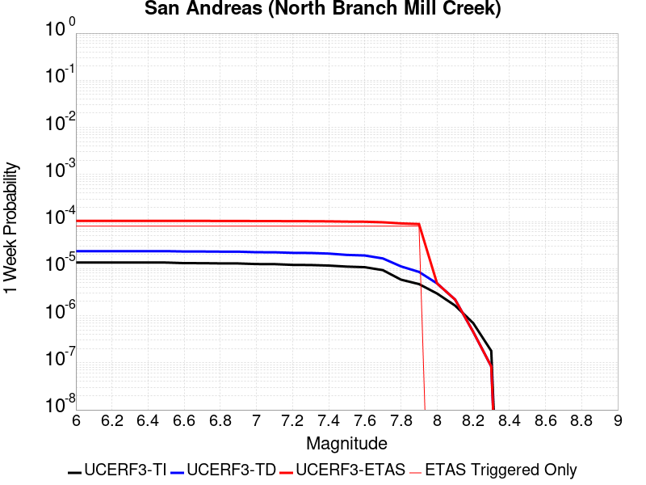 | 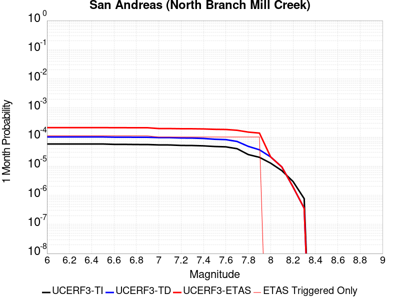 | 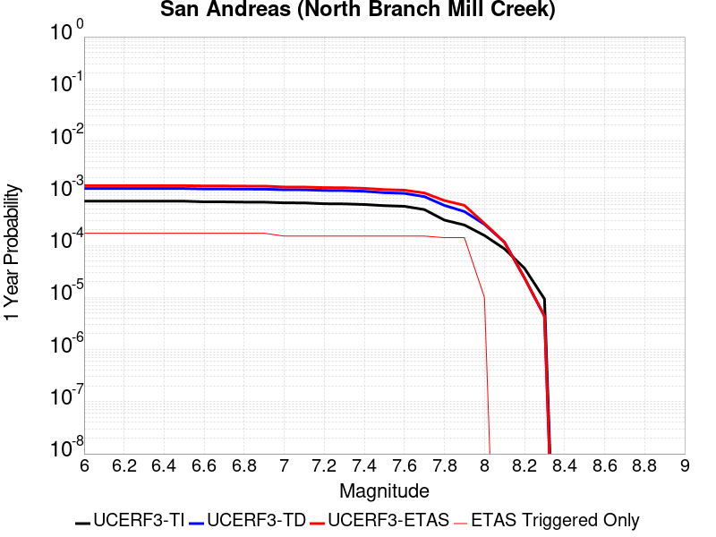 |  |

| Magnitude | 1 wk TI Prob | 1 wk TD Prob | 1 wk ETAS Prob | 1 wk ETAS/TD Gain | 1 wk ETAS Triggered Only | 1 mo TI Prob | 1 mo TD Prob | 1 mo ETAS Prob | 1 mo ETAS/TD Gain | 1 mo ETAS Triggered Only | 1 yr TI Prob | 1 yr TD Prob | 1 yr ETAS Prob | 1 yr ETAS/TD Gain | 1 yr ETAS Triggered Only | 10 yr TI Prob | 10 yr TD Prob | 10 yr ETAS Prob | 10 yr ETAS/TD Gain | 10 yr ETAS Triggered Only |
|-----|-----|-----|-----|-----|-----|-----|-----|-----|-----|-----|-----|-----|-----|-----|-----|-----|-----|-----|-----|-----|
| 6.0 | 1.3461156E-5 | 2.3499893E-5 | 1.03498016E-4 | 4.404191 | 8.0E-5 | 5.7689394E-5 | 1.00709956E-4 | 2.1069888E-4 | 2.0921354 | 1.1E-4 | 7.02142E-4 | 0.0012254574 | 0.001395249 | 1.1385537 | 1.7E-4 | 0.0069992766 | 0.01222957 | 0.012456757 | 1.0185769 | 2.3E-4 |
| 6.1 | 1.3461156E-5 | 2.3499893E-5 | 1.03498016E-4 | 4.404191 | 8.0E-5 | 5.7689394E-5 | 1.00709956E-4 | 2.1069888E-4 | 2.0921354 | 1.1E-4 | 7.02142E-4 | 0.0012254574 | 0.001395249 | 1.1385537 | 1.7E-4 | 0.0069992766 | 0.01222957 | 0.012456757 | 1.0185769 | 2.3E-4 |
| 6.2 | 1.3461156E-5 | 2.3499893E-5 | 1.03498016E-4 | 4.404191 | 8.0E-5 | 5.7689394E-5 | 1.00709956E-4 | 2.1069888E-4 | 2.0921354 | 1.1E-4 | 7.02142E-4 | 0.0012254574 | 0.001395249 | 1.1385537 | 1.7E-4 | 0.0069992766 | 0.01222957 | 0.012456757 | 1.0185769 | 2.3E-4 |
| 6.3 | 1.3461156E-5 | 2.3499893E-5 | 1.03498016E-4 | 4.404191 | 8.0E-5 | 5.7689394E-5 | 1.00709956E-4 | 2.1069888E-4 | 2.0921354 | 1.1E-4 | 7.02142E-4 | 0.0012254574 | 0.001395249 | 1.1385537 | 1.7E-4 | 0.0069992766 | 0.01222957 | 0.012456757 | 1.0185769 | 2.3E-4 |
| 6.4 | 1.3461156E-5 | 2.3499893E-5 | 1.03498016E-4 | 4.404191 | 8.0E-5 | 5.7689394E-5 | 1.00709956E-4 | 2.1069888E-4 | 2.0921354 | 1.1E-4 | 7.02142E-4 | 0.0012254574 | 0.001395249 | 1.1385537 | 1.7E-4 | 0.0069992766 | 0.01222957 | 0.012456757 | 1.0185769 | 2.3E-4 |
| 6.5 | 1.3450706E-5 | 2.3488852E-5 | 1.0348697E-4 | 4.405791 | 8.0E-5 | 5.764461E-5 | 1.0066265E-4 | 2.1065157E-4 | 2.092649 | 1.1E-4 | 7.0159714E-4 | 0.001224882 | 0.0013946737 | 1.1386188 | 1.7E-4 | 0.006993862 | 0.01222388 | 0.0124510685 | 1.0185857 | 2.3E-4 |
| 6.6 | 1.3074523E-5 | 2.3103135E-5 | 1.0310129E-4 | 4.4626536 | 8.0E-5 | 5.6032466E-5 | 9.9009696E-5 | 2.0899881E-4 | 2.1108923 | 1.1E-4 | 6.8198174E-4 | 0.0012047797 | 0.001374575 | 1.1409346 | 1.7E-4 | 0.006798926 | 0.012025044 | 0.012252279 | 1.0188967 | 2.3E-4 |
| 6.7 | 1.3050216E-5 | 2.3078432E-5 | 1.03076585E-4 | 4.46636 | 8.0E-5 | 5.59283E-5 | 9.890384E-5 | 2.0889296E-4 | 2.1120815 | 1.1E-4 | 6.8071426E-4 | 0.0012034923 | 0.0013732876 | 1.1410856 | 1.7E-4 | 0.0067863287 | 0.012012309 | 0.0122395465 | 1.0189171 | 2.3E-4 |
| 6.8 | 1.29049395E-5 | 2.292684E-5 | 1.02925005E-4 | 4.4892797 | 8.0E-5 | 5.530571E-5 | 9.825421E-5 | 2.0824341E-4 | 2.1194348 | 1.1E-4 | 6.73139E-4 | 0.0011955918 | 0.0013653885 | 1.142019 | 1.7E-4 | 0.0067110364 | 0.011934154 | 0.0121614095 | 1.0190424 | 2.3E-4 |
| 6.9 | 1.2867369E-5 | 2.2886245E-5 | 1.0288441E-4 | 4.4954696 | 8.0E-5 | 5.51447E-5 | 9.8080236E-5 | 2.0806945E-4 | 2.1214206 | 1.1E-4 | 6.711799E-4 | 0.0011934759 | 0.001363273 | 1.142271 | 1.7E-4 | 0.006691564 | 0.011913223 | 0.012140484 | 1.0190762 | 2.3E-4 |
| 7.0 | 1.2495996E-5 | 2.2286325E-5 | 1.0228454E-4 | 4.5895653 | 8.0E-5 | 5.3553173E-5 | 9.550934E-5 | 1.9549979E-4 | 2.046918 | 1.0E-4 | 6.518148E-4 | 0.0011622087 | 0.0013120344 | 1.1289146 | 1.5E-4 | 0.0064990623 | 0.0116038285 | 0.011811391 | 1.0178875 | 2.1E-4 |
| 7.1 | 1.2452067E-5 | 2.2231397E-5 | 1.0222962E-4 | 4.598434 | 8.0E-5 | 5.3364907E-5 | 9.527396E-5 | 1.9526442E-4 | 2.0495048 | 1.0E-4 | 6.4952404E-4 | 0.0011593461 | 0.0013091721 | 1.1292332 | 1.5E-4 | 0.0064762887 | 0.0115755 | 0.011783069 | 1.0179318 | 2.1E-4 |
| 7.2 | 1.2002777E-5 | 2.1609963E-5 | 1.0160823E-4 | 4.701916 | 8.0E-5 | 5.143946E-5 | 9.2610855E-5 | 1.926016E-4 | 2.079687 | 1.0E-4 | 6.2609545E-4 | 0.0011269567 | 0.0012767876 | 1.1329519 | 1.5E-4 | 0.006243344 | 0.011254923 | 0.011462559 | 1.0184485 | 2.1E-4 |
| 7.3 | 1.1923425E-5 | 2.1479793E-5 | 1.0147807E-4 | 4.724351 | 8.0E-5 | 5.109939E-5 | 9.205302E-5 | 1.9204382E-4 | 2.0862305 | 1.0E-4 | 6.219575E-4 | 0.001120172 | 0.001270004 | 1.1337581 | 1.5E-4 | 0.0062021962 | 0.011187789 | 0.0113954395 | 1.0185604 | 2.1E-4 |
| 7.4 | 1.16105175E-5 | 2.0853771E-5 | 1.0085211E-4 | 4.8361564 | 8.0E-5 | 4.975841E-5 | 8.937026E-5 | 1.8936132E-4 | 2.1188405 | 1.0E-4 | 6.0564023E-4 | 0.0010875424 | 0.0012373793 | 1.1377757 | 1.5E-4 | 0.006039923 | 0.010865397 | 0.011073115 | 1.0191174 | 2.1E-4 |
| 7.5 | 1.1037265E-5 | 1.9553907E-5 | 9.9552344E-5 | 5.091174 | 8.0E-5 | 4.7301706E-5 | 8.379978E-5 | 1.837914E-4 | 2.1932206 | 1.0E-4 | 5.757461E-4 | 0.0010197869 | 0.0011696339 | 1.1469395 | 1.5E-4 | 0.005742567 | 0.010194898 | 0.010402757 | 1.0203885 | 2.1E-4 |
| 7.6 | 1.0720915E-5 | 1.899582E-5 | 9.89943E-5 | 5.2113733 | 8.0E-5 | 4.5945973E-5 | 8.140812E-5 | 1.8139998E-4 | 2.2282786 | 1.0E-4 | 5.592486E-4 | 9.906954E-4 | 0.0011405468 | 1.1512588 | 1.5E-4 | 0.005578433 | 0.009906623 | 0.010114542 | 1.020988 | 2.1E-4 |
| 7.7 | 9.276279E-6 | 1.6441649E-5 | 9.644033E-5 | 5.865612 | 8.0E-5 | 3.9754876E-5 | 7.0462316E-5 | 1.7045527E-4 | 2.4190984 | 1.0E-4 | 4.839081E-4 | 8.575427E-4 | 0.0010074141 | 1.1747684 | 1.5E-4 | 0.0048285574 | 0.008586041 | 0.008794238 | 1.0242484 | 2.1E-4 |
| 7.8 | 5.8346777E-6 | 1.1155013E-5 | 9.115412E-5 | 8.171583 | 8.0E-5 | 2.5005522E-5 | 4.7806327E-5 | 1.4780155E-4 | 3.0916734 | 1.0E-4 | 3.043997E-4 | 5.818867E-4 | 7.218052E-4 | 1.2404567 | 1.4E-4 | 0.0030398308 | 0.0058469265 | 0.006045757 | 1.034006 | 2.0E-4 |
| 7.9 | 4.690204E-6 | 8.509093E-6 | 8.8508416E-5 | 10.401627 | 8.0E-5 | 2.0100719E-5 | 3.6467034E-5 | 1.364634E-4 | 3.7421026 | 1.0E-4 | 2.4469878E-4 | 4.4389578E-4 | 5.8383367E-4 | 1.3152493 | 1.4E-4 | 0.002444295 | 0.0044707474 | 0.0046598976 | 1.0423084 | 1.9E-4 |
| 8.0 | 2.9570454E-6 | 4.846947E-6 | 4.846947E-6 | 1.0 | 0.0 | 1.267299E-5 | 2.0772464E-5 | 2.0772464E-5 | 1.0 | 0.0 | 1.5428272E-4 | 2.5287544E-4 | 2.628729E-4 | 1.0395352 | 1.0E-5 | 0.0015417566 | 0.002549644 | 0.0025596186 | 1.0039121 | 1.0E-5 |
| 8.1 | 1.6376824E-6 | 2.1968929E-6 | 2.1968929E-6 | 1.0 | 0.0 | 7.01862E-6 | 9.41522E-6 | 9.41522E-6 | 1.0 | 0.0 | 8.544835E-5 | 1.14624294E-4 | 1.14624294E-4 | 1.0 | 0.0 | 8.54155E-4 | 0.0011606582 | 0.0011606582 | 1.0 | 0.0 |
| 8.2 | 6.9631557E-7 | 4.5360213E-7 | 4.5360213E-7 | 1.0 | 0.0 | 2.984206E-6 | 1.9440076E-6 | 1.9440076E-6 | 1.0 | 0.0 | 3.63321E-5 | 2.3668037E-5 | 2.3668037E-5 | 1.0 | 0.0 | 3.6326164E-4 | 2.451564E-4 | 2.451564E-4 | 1.0 | 0.0 |
| 8.3 | 1.7876137E-7 | 8.360375E-8 | 8.360375E-8 | 1.0 | 0.0 | 7.661199E-7 | 3.5830175E-7 | 3.5830175E-7 | 1.0 | 0.0 | 9.32747E-6 | 4.3623154E-6 | 4.3623154E-6 | 1.0 | 0.0 | 9.3270784E-5 | 4.5817014E-5 | 4.5817014E-5 | 1.0 | 0.0 |

## Brawley (Seismic Zone) alt 1
*[(top)](#table-of-contents)*

| 1 Week | 1 Month | 1 Year | 10 Year |
|-----|-----|-----|-----|
|  |  |  |  |

| Magnitude | 1 wk TI Prob | 1 wk TD Prob | 1 wk ETAS Prob | 1 wk ETAS/TD Gain | 1 wk ETAS Triggered Only | 1 mo TI Prob | 1 mo TD Prob | 1 mo ETAS Prob | 1 mo ETAS/TD Gain | 1 mo ETAS Triggered Only | 1 yr TI Prob | 1 yr TD Prob | 1 yr ETAS Prob | 1 yr ETAS/TD Gain | 1 yr ETAS Triggered Only | 10 yr TI Prob | 10 yr TD Prob | 10 yr ETAS Prob | 10 yr ETAS/TD Gain | 10 yr ETAS Triggered Only |
|-----|-----|-----|-----|-----|-----|-----|-----|-----|-----|-----|-----|-----|-----|-----|-----|-----|-----|-----|-----|-----|
| 6.0 | 2.2521618E-4 | 4.7632487E-4 | 5.163058E-4 | 1.0839363 | 4.0E-5 | 9.6485513E-4 | 0.0020398323 | 0.0021396284 | 1.0489236 | 1.0E-4 | 0.011683988 | 0.024546238 | 0.024712063 | 1.0067557 | 1.7E-4 | 0.11088423 | 0.21350002 | 0.21367306 | 1.0008105 | 2.2E-4 |
| 6.1 | 2.2521618E-4 | 4.7632487E-4 | 5.163058E-4 | 1.0839363 | 4.0E-5 | 9.6485513E-4 | 0.0020398323 | 0.0021396284 | 1.0489236 | 1.0E-4 | 0.011683988 | 0.024546238 | 0.024712063 | 1.0067557 | 1.7E-4 | 0.11088423 | 0.21350002 | 0.21367306 | 1.0008105 | 2.2E-4 |
| 6.2 | 2.198148E-4 | 4.6717093E-4 | 5.0715223E-4 | 1.0855818 | 4.0E-5 | 9.417233E-4 | 0.0020006616 | 0.0021004614 | 1.0498835 | 1.0E-4 | 0.011405343 | 0.024080504 | 0.02424641 | 1.0068897 | 1.7E-4 | 0.10837428 | 0.20993657 | 0.21011038 | 1.0008279 | 2.2E-4 |
| 6.3 | 2.1704129E-4 | 4.615278E-4 | 5.015093E-4 | 1.0866287 | 4.0E-5 | 9.298453E-4 | 0.0019765133 | 0.0020763157 | 1.0504942 | 1.0E-4 | 0.011262234 | 0.02379366 | 0.023959616 | 1.0069748 | 1.7E-4 | 0.107082725 | 0.20782755 | 0.20800182 | 1.0008385 | 2.2E-4 |
| 6.4 | 1.876142E-4 | 4.00449E-4 | 4.4043298E-4 | 1.0998479 | 4.0E-5 | 8.038131E-4 | 0.0017150956 | 0.0018149241 | 1.0582058 | 1.0E-4 | 0.00974259 | 0.020680401 | 0.020846885 | 1.0080503 | 1.7E-4 | 0.093263686 | 0.18457815 | 0.18475755 | 1.0009719 | 2.2E-4 |
| 6.5 | 1.7390939E-4 | 3.7477075E-4 | 4.1475578E-4 | 1.106692 | 4.0E-5 | 7.45113E-4 | 0.0016051838 | 0.0017050233 | 1.0621982 | 1.0E-4 | 0.009034078 | 0.019368723 | 0.01953543 | 1.008607 | 1.7E-4 | 0.086755216 | 0.17440031 | 0.17457369 | 1.0009941 | 2.1E-4 |
| 6.6 | 1.591791E-4 | 3.4891962E-4 | 3.8890567E-4 | 1.1145996 | 4.0E-5 | 6.8201777E-4 | 0.0014945229 | 0.0015943735 | 1.066811 | 1.0E-4 | 0.008271996 | 0.018045569 | 0.018212501 | 1.0092506 | 1.7E-4 | 0.07970774 | 0.16380852 | 0.16398413 | 1.0010719 | 2.1E-4 |
| 6.7 | 1.4268003E-4 | 3.20582E-4 | 3.605692E-4 | 1.1247331 | 4.0E-5 | 6.1134255E-4 | 0.0013732077 | 0.0014730704 | 1.0727222 | 1.0E-4 | 0.007417723 | 0.016592601 | 0.016759781 | 1.0100756 | 1.7E-4 | 0.07174956 | 0.15193306 | 0.15211116 | 1.0011722 | 2.1E-4 |
| 6.8 | 1.239713E-4 | 2.9053655E-4 | 3.3052493E-4 | 1.1376363 | 4.0E-5 | 5.3119735E-4 | 0.0012445687 | 0.0013444442 | 1.0802491 | 1.0E-4 | 0.0064481674 | 0.015048777 | 0.015216219 | 1.0111266 | 1.7E-4 | 0.06264243 | 0.13837762 | 0.13855857 | 1.0013076 | 2.1E-4 |
| 6.9 | 1.0180238E-4 | 2.625439E-4 | 3.0253342E-4 | 1.1523155 | 4.0E-5 | 4.3622297E-4 | 0.0011247073 | 0.0012245948 | 1.088812 | 1.0E-4 | 0.005298089 | 0.013608336 | 0.013776023 | 1.0123223 | 1.7E-4 | 0.05173543 | 0.124961674 | 0.12514544 | 1.0014706 | 2.1E-4 |
| 7.0 | 7.6619996E-5 | 2.23993E-4 | 2.6398405E-4 | 1.178537 | 4.0E-5 | 3.283301E-4 | 9.5962E-4 | 0.001059524 | 1.1041079 | 1.0E-4 | 0.0039900932 | 0.011621496 | 0.011779636 | 1.0136076 | 1.6E-4 | 0.039192066 | 0.107266866 | 0.10744541 | 1.0016645 | 2.0E-4 |
| 7.1 | 7.5127435E-5 | 2.2082464E-4 | 2.608158E-4 | 1.1810992 | 4.0E-5 | 3.2193496E-4 | 9.4605127E-4 | 0.0010459566 | 1.1056025 | 1.0E-4 | 0.0039125155 | 0.011458045 | 0.011616211 | 1.013804 | 1.6E-4 | 0.038443442 | 0.10583085 | 0.106009685 | 1.0016898 | 2.0E-4 |
| 7.2 | 6.788582E-5 | 2.0210193E-4 | 2.4209385E-4 | 1.1978799 | 4.0E-5 | 2.9090676E-4 | 8.6586666E-4 | 9.657801E-4 | 1.1153913 | 1.0E-4 | 0.0035360386 | 0.0104916105 | 0.010649932 | 1.0150902 | 1.6E-4 | 0.034803 | 0.09750131 | 0.09768181 | 1.0018512 | 2.0E-4 |
| 7.3 | 6.399602E-5 | 1.8841137E-4 | 2.2840383E-4 | 1.2122614 | 4.0E-5 | 2.7423984E-4 | 8.072303E-4 | 9.071496E-4 | 1.1237804 | 1.0E-4 | 0.0033337586 | 0.009784332 | 0.0099328635 | 1.0151806 | 1.5E-4 | 0.03284188 | 0.09139617 | 0.091550626 | 1.00169 | 1.7E-4 |
| 7.4 | 4.506759E-5 | 1.2529209E-4 | 1.6528707E-4 | 1.319214 | 4.0E-5 | 1.9313251E-4 | 5.368565E-4 | 6.3680275E-4 | 1.1861695 | 1.0E-4 | 0.0023488526 | 0.0065168133 | 0.006655901 | 1.0213429 | 1.4E-4 | 0.023241805 | 0.062363707 | 0.062513724 | 1.0024056 | 1.6E-4 |
| 7.5 | 3.43289E-5 | 9.33541E-5 | 1.233513E-4 | 1.3213271 | 3.0E-5 | 1.4711556E-4 | 4.00028E-4 | 4.7999597E-4 | 1.199906 | 8.0E-5 | 0.0017896603 | 0.0048595266 | 0.0049789436 | 1.0245738 | 1.2E-4 | 0.01775316 | 0.04705519 | 0.047188602 | 1.0028353 | 1.4E-4 |
| 7.6 | 2.5980507E-5 | 7.053101E-5 | 1.00528894E-4 | 1.4253148 | 3.0E-5 | 1.1134028E-4 | 3.0224086E-4 | 3.8221668E-4 | 1.2646096 | 8.0E-5 | 0.001354725 | 0.003673598 | 0.003793157 | 1.0325456 | 1.2E-4 | 0.013464959 | 0.035840835 | 0.035975818 | 1.0037662 | 1.4E-4 |
| 7.7 | 1.7292105E-5 | 4.9407296E-5 | 7.9405814E-5 | 1.6071677 | 3.0E-5 | 7.4106916E-5 | 2.117284E-4 | 2.8171358E-4 | 1.3305422 | 7.0E-5 | 9.018782E-4 | 0.0025747516 | 0.0026844684 | 1.0426126 | 1.1E-4 | 0.008982267 | 0.025290398 | 0.025407363 | 1.0046248 | 1.2E-4 |
| 7.8 | 1.2927471E-5 | 3.9693266E-5 | 6.9692076E-5 | 1.7557657 | 3.0E-5 | 5.5402274E-5 | 1.7010293E-4 | 2.4009102E-4 | 1.4114455 | 7.0E-5 | 6.743139E-4 | 0.0020690386 | 0.0021688316 | 1.0482316 | 1.0E-4 | 0.0067227143 | 0.020431727 | 0.020539481 | 1.0052738 | 1.1E-4 |
| 7.9 | 1.0200774E-5 | 2.874569E-5 | 4.8745114E-5 | 1.6957365 | 2.0E-5 | 4.371687E-5 | 1.2319001E-4 | 1.7318384E-4 | 1.405827 | 5.0E-5 | 5.321229E-4 | 0.0014988075 | 0.0015786876 | 1.0532957 | 8.0E-5 | 0.005308505 | 0.014991644 | 0.015070445 | 1.0052563 | 8.0E-5 |
| 8.0 | 8.650396E-6 | 2.3277367E-5 | 2.3277367E-5 | 1.0 | 0.0 | 3.70726E-5 | 9.975634E-5 | 1.19754346E-4 | 1.2004685 | 2.0E-5 | 4.5126543E-4 | 0.0012138576 | 0.0012637969 | 1.041141 | 5.0E-5 | 0.0045035016 | 0.012211097 | 0.012260486 | 1.0040447 | 5.0E-5 |
| 8.1 | 3.9368224E-6 | 7.3279825E-6 | 7.3279825E-6 | 1.0 | 0.0 | 1.6871985E-5 | 3.140526E-5 | 4.1404946E-5 | 1.318408 | 1.0E-5 | 2.0539707E-4 | 3.8229208E-4 | 4.2227682E-4 | 1.1045921 | 4.0E-5 | 0.0020520731 | 0.004001185 | 0.0040410245 | 1.0099571 | 4.0E-5 |
| 8.2 | 1.7101195E-6 | 2.217876E-6 | 2.217876E-6 | 1.0 | 0.0 | 7.329063E-6 | 9.505149E-6 | 9.505149E-6 | 1.0 | 0.0 | 8.922769E-5 | 1.1571907E-4 | 1.3571676E-4 | 1.1728123 | 2.0E-5 | 8.9191867E-4 | 0.0012666774 | 0.001286652 | 1.0157694 | 2.0E-5 |
| 8.3 | 3.0346666E-8 | 1.721586E-8 | 1.721586E-8 | 1.0 | 0.0 | 1.3005713E-7 | 7.378226E-8 | 7.378226E-8 | 1.0 | 0.0 | 1.5834444E-6 | 8.9829894E-7 | 8.9829894E-7 | 1.0 | 0.0 | 1.5834332E-5 | 9.367729E-6 | 9.367729E-6 | 1.0 | 0.0 |

## Cleghorn Pass
*[(top)](#table-of-contents)*

| 1 Week | 1 Month | 1 Year | 10 Year |
|-----|-----|-----|-----|
|  | 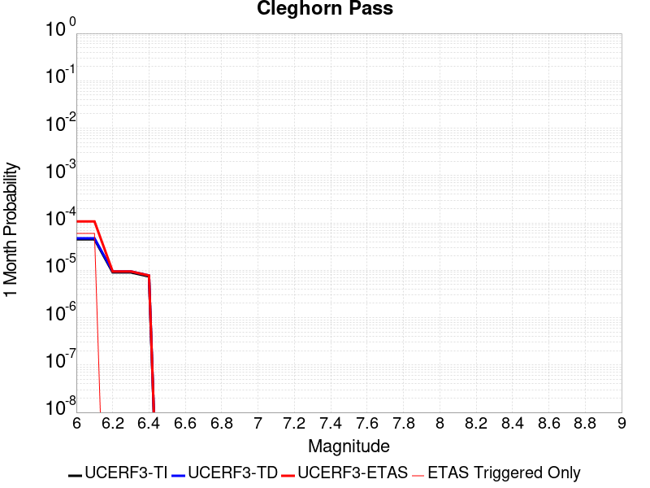 |  | 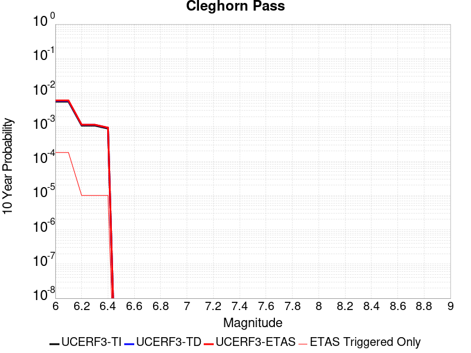 |

| Magnitude | 1 wk TI Prob | 1 wk TD Prob | 1 wk ETAS Prob | 1 wk ETAS/TD Gain | 1 wk ETAS Triggered Only | 1 mo TI Prob | 1 mo TD Prob | 1 mo ETAS Prob | 1 mo ETAS/TD Gain | 1 mo ETAS Triggered Only | 1 yr TI Prob | 1 yr TD Prob | 1 yr ETAS Prob | 1 yr ETAS/TD Gain | 1 yr ETAS Triggered Only | 10 yr TI Prob | 10 yr TD Prob | 10 yr ETAS Prob | 10 yr ETAS/TD Gain | 10 yr ETAS Triggered Only |
|-----|-----|-----|-----|-----|-----|-----|-----|-----|-----|-----|-----|-----|-----|-----|-----|-----|-----|-----|-----|-----|
| 6.0 | 1.0522846E-5 | 1.1040642E-5 | 5.10402E-5 | 4.6229377 | 4.0E-5 | 4.509713E-5 | 4.7316473E-5 | 1.0731364E-4 | 2.2679973 | 6.0E-5 | 5.4891926E-4 | 5.759784E-4 | 6.8591506E-4 | 1.1908693 | 1.1E-4 | 0.0054756533 | 0.005750022 | 0.0059289867 | 1.0311242 | 1.8E-4 |
| 6.1 | 1.0522846E-5 | 1.1040642E-5 | 5.10402E-5 | 4.6229377 | 4.0E-5 | 4.509713E-5 | 4.7316473E-5 | 1.0731364E-4 | 2.2679973 | 6.0E-5 | 5.4891926E-4 | 5.759784E-4 | 6.8591506E-4 | 1.1908693 | 1.1E-4 | 0.0054756533 | 0.005750022 | 0.0059289867 | 1.0311242 | 1.8E-4 |
| 6.2 | 2.1045846E-6 | 2.2082024E-6 | 2.2082024E-6 | 1.0 | 0.0 | 9.019617E-6 | 9.463714E-6 | 9.463714E-6 | 1.0 | 0.0 | 1.098083E-4 | 1.1521882E-4 | 1.1521882E-4 | 1.0 | 0.0 | 0.0010975406 | 0.0011520023 | 0.0011619907 | 1.0086706 | 1.0E-5 |
| 6.3 | 2.1045846E-6 | 2.2082024E-6 | 2.2082024E-6 | 1.0 | 0.0 | 9.019617E-6 | 9.463714E-6 | 9.463714E-6 | 1.0 | 0.0 | 1.098083E-4 | 1.1521882E-4 | 1.1521882E-4 | 1.0 | 0.0 | 0.0010975406 | 0.0011520023 | 0.0011619907 | 1.0086706 | 1.0E-5 |
| 6.4 | 1.7259927E-6 | 1.810877E-6 | 1.810877E-6 | 1.0 | 0.0 | 7.3970905E-6 | 7.760902E-6 | 7.760902E-6 | 1.0 | 0.0 | 9.005586E-5 | 9.4488976E-5 | 9.4488976E-5 | 1.0 | 0.0 | 9.001937E-4 | 9.448898E-4 | 9.548803E-4 | 1.0105733 | 1.0E-5 |

## Santa Ynez (East)
*[(top)](#table-of-contents)*

| 1 Week | 1 Month | 1 Year | 10 Year |
|-----|-----|-----|-----|
|  |  | 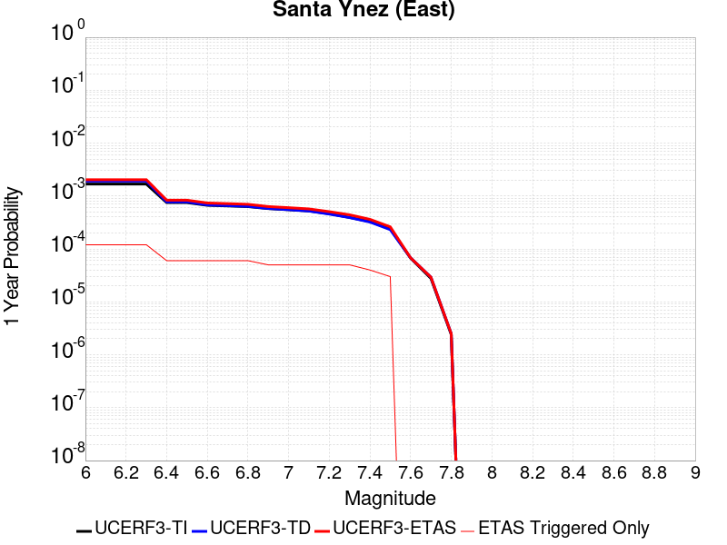 |  |

| Magnitude | 1 wk TI Prob | 1 wk TD Prob | 1 wk ETAS Prob | 1 wk ETAS/TD Gain | 1 wk ETAS Triggered Only | 1 mo TI Prob | 1 mo TD Prob | 1 mo ETAS Prob | 1 mo ETAS/TD Gain | 1 mo ETAS Triggered Only | 1 yr TI Prob | 1 yr TD Prob | 1 yr ETAS Prob | 1 yr ETAS/TD Gain | 1 yr ETAS Triggered Only | 10 yr TI Prob | 10 yr TD Prob | 10 yr ETAS Prob | 10 yr ETAS/TD Gain | 10 yr ETAS Triggered Only |
|-----|-----|-----|-----|-----|-----|-----|-----|-----|-----|-----|-----|-----|-----|-----|-----|-----|-----|-----|-----|-----|
| 6.0 | 3.2269712E-5 | 3.67505E-5 | 8.674867E-5 | 2.3604755 | 5.0E-5 | 1.3829143E-4 | 1.5749598E-4 | 2.2748495E-4 | 1.4443858 | 7.0E-5 | 0.0016823979 | 0.0019164166 | 0.0020361866 | 1.0624969 | 1.2E-4 | 0.016697178 | 0.019056441 | 0.01923301 | 1.0092657 | 1.8E-4 |
| 6.1 | 3.2269712E-5 | 3.67505E-5 | 8.674867E-5 | 2.3604755 | 5.0E-5 | 1.3829143E-4 | 1.5749598E-4 | 2.2748495E-4 | 1.4443858 | 7.0E-5 | 0.0016823979 | 0.0019164166 | 0.0020361866 | 1.0624969 | 1.2E-4 | 0.016697178 | 0.019056441 | 0.01923301 | 1.0092657 | 1.8E-4 |
| 6.2 | 3.2269712E-5 | 3.67505E-5 | 8.674867E-5 | 2.3604755 | 5.0E-5 | 1.3829143E-4 | 1.5749598E-4 | 2.2748495E-4 | 1.4443858 | 7.0E-5 | 0.0016823979 | 0.0019164166 | 0.0020361866 | 1.0624969 | 1.2E-4 | 0.016697178 | 0.019056441 | 0.01923301 | 1.0092657 | 1.8E-4 |
| 6.3 | 3.2269712E-5 | 3.67505E-5 | 8.674867E-5 | 2.3604755 | 5.0E-5 | 1.3829143E-4 | 1.5749598E-4 | 2.2748495E-4 | 1.4443858 | 7.0E-5 | 0.0016823979 | 0.0019164166 | 0.0020361866 | 1.0624969 | 1.2E-4 | 0.016697178 | 0.019056441 | 0.01923301 | 1.0092657 | 1.8E-4 |
| 6.4 | 1.4404779E-5 | 1.4849382E-5 | 4.4848937E-5 | 3.020256 | 3.0E-5 | 6.1733306E-5 | 6.363868E-5 | 1.13635506E-4 | 1.7856356 | 5.0E-5 | 7.513438E-4 | 7.745306E-4 | 8.344841E-4 | 1.0774063 | 6.0E-5 | 0.0074880854 | 0.007718862 | 0.0077883215 | 1.0089988 | 7.0E-5 |
| 6.5 | 1.4404779E-5 | 1.4849382E-5 | 4.4848937E-5 | 3.020256 | 3.0E-5 | 6.1733306E-5 | 6.363868E-5 | 1.13635506E-4 | 1.7856356 | 5.0E-5 | 7.513438E-4 | 7.745306E-4 | 8.344841E-4 | 1.0774063 | 6.0E-5 | 0.0074880854 | 0.007718862 | 0.0077883215 | 1.0089988 | 7.0E-5 |
| 6.6 | 1.280208E-5 | 1.3011947E-5 | 4.3011558E-5 | 3.3055434 | 3.0E-5 | 5.4864904E-5 | 5.5764307E-5 | 1.05761515E-4 | 1.8965809 | 5.0E-5 | 6.6777546E-4 | 6.787207E-4 | 7.3867996E-4 | 1.0883416 | 6.0E-5 | 0.006657724 | 0.0067666885 | 0.006836215 | 1.0102748 | 7.0E-5 |
| 6.7 | 1.2457027E-5 | 1.2628468E-5 | 4.262809E-5 | 3.375555 | 3.0E-5 | 5.3386164E-5 | 5.412089E-5 | 1.0411818E-4 | 1.9238076 | 5.0E-5 | 6.497827E-4 | 6.587243E-4 | 7.1868475E-4 | 1.0910251 | 6.0E-5 | 0.00647886 | 0.006567915 | 0.006637455 | 1.0105879 | 7.0E-5 |
| 6.8 | 1.2095134E-5 | 1.2230915E-5 | 4.223055E-5 | 3.4527712 | 3.0E-5 | 5.1835254E-5 | 5.241716E-5 | 1.0241454E-4 | 1.9538361 | 5.0E-5 | 6.309115E-4 | 6.379937E-4 | 6.979554E-4 | 1.0939848 | 6.0E-5 | 0.0062912325 | 0.006361809 | 0.0064313635 | 1.0109332 | 7.0E-5 |
| 6.9 | 1.1104036E-5 | 1.1157347E-5 | 3.1157124E-5 | 2.7925208 | 2.0E-5 | 4.758786E-5 | 4.781633E-5 | 8.781442E-5 | 1.8364942 | 4.0E-5 | 5.7922816E-4 | 5.820096E-4 | 6.319805E-4 | 1.0858592 | 5.0E-5 | 0.005777207 | 0.0058049993 | 0.005864651 | 1.010276 | 6.0E-5 |
| 7.0 | 1.0577444E-5 | 1.058168E-5 | 3.058147E-5 | 2.890039 | 2.0E-5 | 4.5331115E-5 | 4.5349276E-5 | 8.534746E-5 | 1.8820027 | 4.0E-5 | 5.5176654E-4 | 5.519888E-4 | 6.0196116E-4 | 1.0905316 | 5.0E-5 | 0.0055039856 | 0.0055063153 | 0.005565985 | 1.0108366 | 6.0E-5 |
| 7.1 | 1.0021775E-5 | 9.980988E-6 | 2.9980787E-5 | 3.0037897 | 2.0E-5 | 4.294976E-5 | 4.2774966E-5 | 8.277326E-5 | 1.9350864 | 4.0E-5 | 5.2278786E-4 | 5.2066194E-4 | 5.706359E-4 | 1.0959816 | 5.0E-5 | 0.0052155964 | 0.0051945536 | 0.005254242 | 1.0114906 | 6.0E-5 |
| 7.2 | 8.874109E-6 | 8.748793E-6 | 2.8748618E-5 | 3.2860096 | 2.0E-5 | 3.8031343E-5 | 3.7494297E-5 | 7.74928E-5 | 2.066789 | 4.0E-5 | 4.629332E-4 | 4.5639853E-4 | 5.0637574E-4 | 1.1095034 | 5.0E-5 | 0.0046197 | 0.0045547304 | 0.004614457 | 1.0131131 | 6.0E-5 |
| 7.3 | 7.5504267E-6 | 7.5051175E-6 | 2.7504968E-5 | 3.6648283 | 2.0E-5 | 3.235857E-5 | 3.21644E-5 | 7.2163115E-5 | 2.243571 | 4.0E-5 | 3.9389438E-4 | 3.915322E-4 | 4.4151265E-4 | 1.1276534 | 5.0E-5 | 0.0039319694 | 0.003908531 | 0.0039682966 | 1.0152911 | 6.0E-5 |
| 7.4 | 6.309394E-6 | 6.1831556E-6 | 2.6183032E-5 | 4.2345743 | 2.0E-5 | 2.703998E-5 | 2.6498974E-5 | 5.649818E-5 | 2.1320894 | 3.0E-5 | 3.2916202E-4 | 3.225782E-4 | 3.625653E-4 | 1.123961 | 4.0E-5 | 0.003286749 | 0.003221197 | 0.003271036 | 1.0154722 | 5.0E-5 |
| 7.5 | 4.6103073E-6 | 4.4408903E-6 | 2.4440802E-5 | 5.5035815 | 2.0E-5 | 1.975831E-5 | 1.9032252E-5 | 4.903168E-5 | 2.5762417 | 3.0E-5 | 2.4053088E-4 | 2.3169373E-4 | 2.6168677E-4 | 1.1294513 | 3.0E-5 | 0.002402707 | 0.002314591 | 0.0023544985 | 1.0172417 | 4.0E-5 |
| 7.6 | 1.2858658E-6 | 1.3008173E-6 | 1.3008173E-6 | 1.0 | 0.0 | 5.5108417E-6 | 5.5749197E-6 | 5.5749197E-6 | 1.0 | 0.0 | 6.7092435E-5 | 6.78726E-5 | 6.78726E-5 | 1.0 | 0.0 | 6.707218E-4 | 6.785256E-4 | 6.785256E-4 | 1.0 | 0.0 |
| 7.7 | 5.3302307E-7 | 5.612138E-7 | 5.612138E-7 | 1.0 | 0.0 | 2.2843826E-6 | 2.4052001E-6 | 2.4052001E-6 | 1.0 | 0.0 | 2.7812002E-5 | 2.9282954E-5 | 2.9282954E-5 | 1.0 | 0.0 | 2.7808524E-4 | 2.9279452E-4 | 2.9279452E-4 | 1.0 | 0.0 |
| 7.8 | 4.613933E-8 | 4.80301E-8 | 4.80301E-8 | 1.0 | 0.0 | 1.9773998E-7 | 2.0584326E-7 | 2.0584326E-7 | 1.0 | 0.0 | 2.4074816E-6 | 2.5061388E-6 | 2.5061388E-6 | 1.0 | 0.0 | 2.4074554E-5 | 2.5061116E-5 | 2.5061116E-5 | 1.0 | 0.0 |

## Pleito
*[(top)](#table-of-contents)*

| 1 Week | 1 Month | 1 Year | 10 Year |
|-----|-----|-----|-----|
|  | 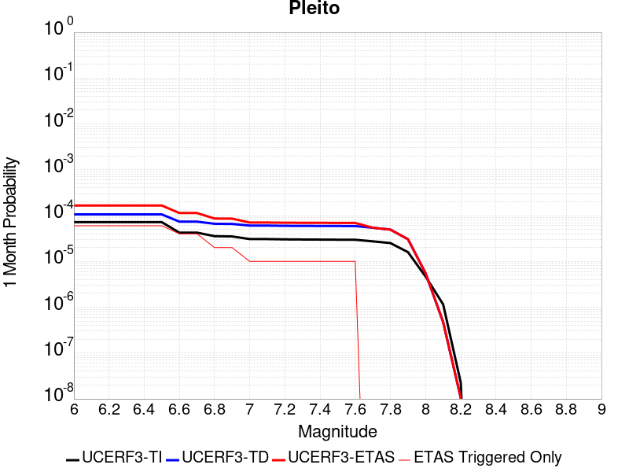 | 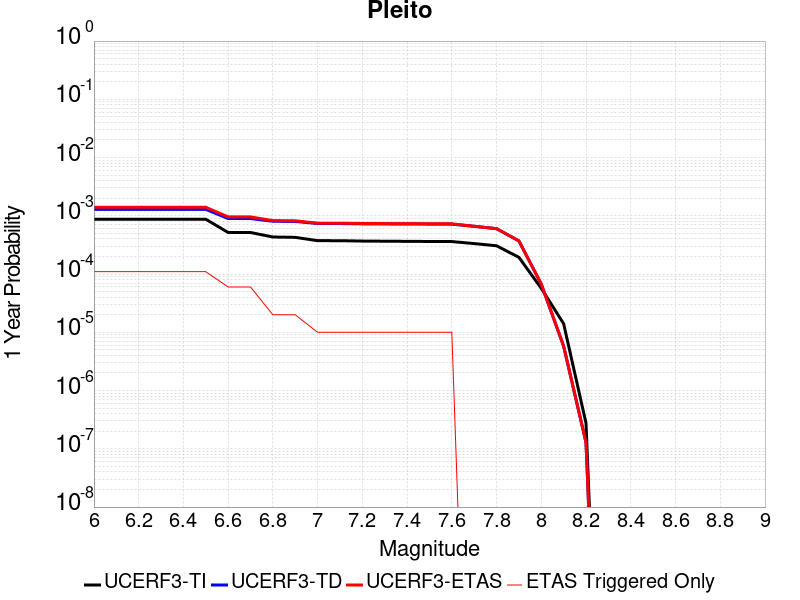 |  |

| Magnitude | 1 wk TI Prob | 1 wk TD Prob | 1 wk ETAS Prob | 1 wk ETAS/TD Gain | 1 wk ETAS Triggered Only | 1 mo TI Prob | 1 mo TD Prob | 1 mo ETAS Prob | 1 mo ETAS/TD Gain | 1 mo ETAS Triggered Only | 1 yr TI Prob | 1 yr TD Prob | 1 yr ETAS Prob | 1 yr ETAS/TD Gain | 1 yr ETAS Triggered Only | 10 yr TI Prob | 10 yr TD Prob | 10 yr ETAS Prob | 10 yr ETAS/TD Gain | 10 yr ETAS Triggered Only |
|-----|-----|-----|-----|-----|-----|-----|-----|-----|-----|-----|-----|-----|-----|-----|-----|-----|-----|-----|-----|-----|
| 6.0 | 1.6763008E-5 | 2.4763838E-5 | 6.476285E-5 | 2.6152184 | 4.0E-5 | 7.183948E-5 | 1.0612683E-4 | 1.6612046E-4 | 1.5653013 | 6.0E-5 | 8.742947E-4 | 0.0012914003 | 0.0014012583 | 1.0850688 | 1.1E-4 | 0.00870863 | 0.0129538905 | 0.013151299 | 1.0152394 | 2.0E-4 |
| 6.1 | 1.6763008E-5 | 2.4763838E-5 | 6.476285E-5 | 2.6152184 | 4.0E-5 | 7.183948E-5 | 1.0612683E-4 | 1.6612046E-4 | 1.5653013 | 6.0E-5 | 8.742947E-4 | 0.0012914003 | 0.0014012583 | 1.0850688 | 1.1E-4 | 0.00870863 | 0.0129538905 | 0.013151299 | 1.0152394 | 2.0E-4 |
| 6.2 | 1.6763008E-5 | 2.4763838E-5 | 6.476285E-5 | 2.6152184 | 4.0E-5 | 7.183948E-5 | 1.0612683E-4 | 1.6612046E-4 | 1.5653013 | 6.0E-5 | 8.742947E-4 | 0.0012914003 | 0.0014012583 | 1.0850688 | 1.1E-4 | 0.00870863 | 0.0129538905 | 0.013151299 | 1.0152394 | 2.0E-4 |
| 6.3 | 1.6763008E-5 | 2.4763838E-5 | 6.476285E-5 | 2.6152184 | 4.0E-5 | 7.183948E-5 | 1.0612683E-4 | 1.6612046E-4 | 1.5653013 | 6.0E-5 | 8.742947E-4 | 0.0012914003 | 0.0014012583 | 1.0850688 | 1.1E-4 | 0.00870863 | 0.0129538905 | 0.013151299 | 1.0152394 | 2.0E-4 |
| 6.4 | 1.6763008E-5 | 2.4763838E-5 | 6.476285E-5 | 2.6152184 | 4.0E-5 | 7.183948E-5 | 1.0612683E-4 | 1.6612046E-4 | 1.5653013 | 6.0E-5 | 8.742947E-4 | 0.0012914003 | 0.0014012583 | 1.0850688 | 1.1E-4 | 0.00870863 | 0.0129538905 | 0.013151299 | 1.0152394 | 2.0E-4 |
| 6.5 | 1.6763008E-5 | 2.4763838E-5 | 6.476285E-5 | 2.6152184 | 4.0E-5 | 7.183948E-5 | 1.0612683E-4 | 1.6612046E-4 | 1.5653013 | 6.0E-5 | 8.742947E-4 | 0.0012914003 | 0.0014012583 | 1.0850688 | 1.1E-4 | 0.00870863 | 0.0129538905 | 0.013151299 | 1.0152394 | 2.0E-4 |
| 6.6 | 9.910213E-6 | 1.7214623E-5 | 5.7213936E-5 | 3.323566 | 4.0E-5 | 4.247165E-5 | 7.377489E-5 | 1.13771945E-4 | 1.5421499 | 4.0E-5 | 5.169696E-4 | 8.978429E-4 | 9.57789E-4 | 1.0667669 | 6.0E-5 | 0.0051576863 | 0.009050702 | 0.009149797 | 1.0109489 | 1.0E-4 |
| 6.7 | 9.910213E-6 | 1.7214623E-5 | 5.7213936E-5 | 3.323566 | 4.0E-5 | 4.247165E-5 | 7.377489E-5 | 1.13771945E-4 | 1.5421499 | 4.0E-5 | 5.169696E-4 | 8.978429E-4 | 9.57789E-4 | 1.0667669 | 6.0E-5 | 0.0051576863 | 0.009050702 | 0.009149797 | 1.0109489 | 1.0E-4 |
| 6.8 | 8.300162E-6 | 1.5474232E-5 | 3.5473924E-5 | 2.2924511 | 2.0E-5 | 3.557164E-5 | 6.631646E-5 | 8.6315136E-5 | 1.3015642 | 2.0E-5 | 4.3299864E-4 | 8.071053E-4 | 8.270891E-4 | 1.0247599 | 2.0E-5 | 0.004321559 | 0.008150139 | 0.008199732 | 1.0060849 | 5.0E-5 |
| 6.9 | 8.183114E-6 | 1.5345448E-5 | 3.534514E-5 | 2.3032982 | 2.0E-5 | 3.5070017E-5 | 6.576455E-5 | 8.576324E-5 | 1.3040951 | 2.0E-5 | 4.2689382E-4 | 8.003907E-4 | 8.203747E-4 | 1.0249678 | 2.0E-5 | 0.0042607468 | 0.008083483 | 0.00813308 | 1.0061355 | 5.0E-5 |
| 7.0 | 7.1748823E-6 | 1.413244E-5 | 2.4132298E-5 | 1.7075819 | 1.0E-5 | 3.0749135E-5 | 6.0566195E-5 | 7.056559E-5 | 1.1650985 | 1.0E-5 | 3.743064E-4 | 7.371445E-4 | 7.471371E-4 | 1.0135559 | 1.0E-5 | 0.0037367654 | 0.007454939 | 0.007494641 | 1.0053256 | 4.0E-5 |
| 7.1 | 7.1671807E-6 | 1.412281E-5 | 2.412267E-5 | 1.7080643 | 1.0E-5 | 3.0716128E-5 | 6.052493E-5 | 7.052432E-5 | 1.1652112 | 1.0E-5 | 3.7390468E-4 | 7.366424E-4 | 7.46635E-4 | 1.0135651 | 1.0E-5 | 0.0037327618 | 0.0074499524 | 0.0074896542 | 1.0053291 | 4.0E-5 |
| 7.2 | 7.0649667E-6 | 1.39701015E-5 | 2.3969962E-5 | 1.7158045 | 1.0E-5 | 3.0278077E-5 | 5.9870494E-5 | 6.986989E-5 | 1.1670172 | 1.0E-5 | 3.6857324E-4 | 7.2868E-4 | 7.386727E-4 | 1.0137135 | 1.0E-5 | 0.0036796255 | 0.0073707094 | 0.0074104145 | 1.0053868 | 4.0E-5 |
| 7.3 | 7.02082E-6 | 1.3913556E-5 | 2.3913417E-5 | 1.7187135 | 1.0E-5 | 3.008888E-5 | 5.9628168E-5 | 6.9627575E-5 | 1.167696 | 1.0E-5 | 3.6627054E-4 | 7.2573166E-4 | 7.357244E-4 | 1.0137691 | 1.0E-5 | 0.0036566744 | 0.007341209 | 0.0073809153 | 1.0054086 | 4.0E-5 |
| 7.4 | 6.987146E-6 | 1.3873118E-5 | 2.3872979E-5 | 1.7208085 | 1.0E-5 | 2.9944567E-5 | 5.945487E-5 | 6.9454276E-5 | 1.1681848 | 1.0E-5 | 3.6451413E-4 | 7.2362315E-4 | 7.336159E-4 | 1.0138093 | 1.0E-5 | 0.0036391679 | 0.007320144 | 0.0073598516 | 1.0054244 | 4.0E-5 |
| 7.5 | 6.9494554E-6 | 1.3830024E-5 | 2.3829885E-5 | 1.7230545 | 1.0E-5 | 2.9783041E-5 | 5.9270187E-5 | 6.92696E-5 | 1.1687089 | 1.0E-5 | 3.625482E-4 | 7.2137616E-4 | 7.313689E-4 | 1.0138524 | 1.0E-5 | 0.0036195726 | 0.0072977724 | 0.007337481 | 1.0054411 | 4.0E-5 |
| 7.6 | 6.92694E-6 | 1.3789138E-5 | 2.3789E-5 | 1.7251985 | 1.0E-5 | 2.9686547E-5 | 5.909497E-5 | 6.909438E-5 | 1.1692091 | 1.0E-5 | 3.6137376E-4 | 7.1924424E-4 | 7.292371E-4 | 1.0138935 | 1.0E-5 | 0.0036078666 | 0.0072765257 | 0.0073162345 | 1.0054572 | 4.0E-5 |
| 7.7 | 6.395867E-6 | 1.2668219E-5 | 1.2668219E-5 | 1.0 | 0.0 | 2.741057E-5 | 5.429124E-5 | 5.429124E-5 | 1.0 | 0.0 | 3.336726E-4 | 6.6079566E-4 | 6.6079566E-4 | 1.0 | 0.0 | 0.0033317201 | 0.0066951844 | 0.0067249835 | 1.0044508 | 3.0E-5 |
| 7.8 | 5.8664327E-6 | 1.153586E-5 | 1.153586E-5 | 1.0 | 0.0 | 2.5141611E-5 | 4.9438466E-5 | 4.9438466E-5 | 1.0 | 0.0 | 3.060561E-4 | 6.017473E-4 | 6.017473E-4 | 1.0 | 0.0 | 0.0030563495 | 0.0061006667 | 0.0061304835 | 1.0048875 | 3.0E-5 |
| 7.9 | 3.7167474E-6 | 7.1140853E-6 | 7.1140853E-6 | 1.0 | 0.0 | 1.592882E-5 | 3.0488582E-5 | 3.0488582E-5 | 1.0 | 0.0 | 1.9391612E-4 | 3.7113542E-4 | 3.7113542E-4 | 1.0 | 0.0 | 0.0019374699 | 0.0037674906 | 0.0037874153 | 1.0052886 | 2.0E-5 |
| 8.0 | 1.0903841E-6 | 1.2879392E-6 | 1.2879392E-6 | 1.0 | 0.0 | 4.6730665E-6 | 5.5197274E-6 | 5.5197274E-6 | 1.0 | 0.0 | 5.68931E-5 | 6.720063E-5 | 6.720063E-5 | 1.0 | 0.0 | 5.6878536E-4 | 6.941948E-4 | 6.941948E-4 | 1.0 | 0.0 |
| 8.1 | 2.6894583E-7 | 1.1060341E-7 | 1.1060341E-7 | 1.0 | 0.0 | 1.1526245E-6 | 4.740145E-7 | 4.740145E-7 | 1.0 | 0.0 | 1.4033113E-5 | 5.7711113E-6 | 5.7711113E-6 | 1.0 | 0.0 | 1.4032227E-4 | 6.456908E-5 | 6.456908E-5 | 1.0 | 0.0 |
| 8.2 | 5.2967013E-9 | 2.4578228E-9 | 2.4578228E-9 | 1.0 | 0.0 | 2.2700148E-8 | 1.0533527E-8 | 1.0533527E-8 | 1.0 | 0.0 | 2.7637427E-7 | 1.2824569E-7 | 1.2824569E-7 | 1.0 | 0.0 | 2.7637393E-6 | 1.4592787E-6 | 1.4592787E-6 | 1.0 | 0.0 |

## Imperial
*[(top)](#table-of-contents)*

| 1 Week | 1 Month | 1 Year | 10 Year |
|-----|-----|-----|-----|
|  |  | 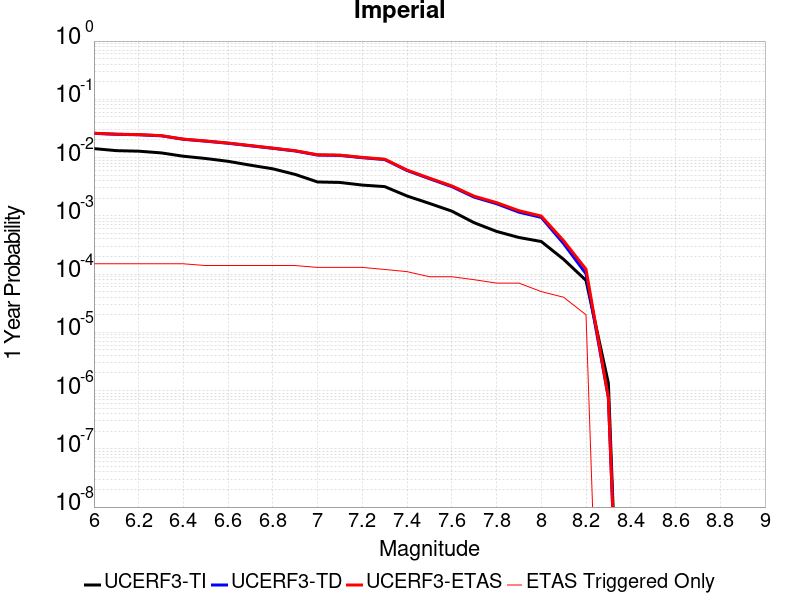 |  |

| Magnitude | 1 wk TI Prob | 1 wk TD Prob | 1 wk ETAS Prob | 1 wk ETAS/TD Gain | 1 wk ETAS Triggered Only | 1 mo TI Prob | 1 mo TD Prob | 1 mo ETAS Prob | 1 mo ETAS/TD Gain | 1 mo ETAS Triggered Only | 1 yr TI Prob | 1 yr TD Prob | 1 yr ETAS Prob | 1 yr ETAS/TD Gain | 1 yr ETAS Triggered Only | 10 yr TI Prob | 10 yr TD Prob | 10 yr ETAS Prob | 10 yr ETAS/TD Gain | 10 yr ETAS Triggered Only |
|-----|-----|-----|-----|-----|-----|-----|-----|-----|-----|-----|-----|-----|-----|-----|-----|-----|-----|-----|-----|-----|
| 6.0 | 2.7496446E-4 | 5.0552754E-4 | 5.3551234E-4 | 1.0593139 | 3.0E-5 | 0.0011778869 | 0.002164787 | 0.0022446138 | 1.0368751 | 8.0E-5 | 0.0142467655 | 0.026038699 | 0.026184792 | 1.0056107 | 1.5E-4 | 0.13367249 | 0.2280438 | 0.22819819 | 1.000677 | 2.0E-4 |
| 6.1 | 2.5356023E-4 | 4.8656776E-4 | 5.165532E-4 | 1.0616263 | 3.0E-5 | 0.001086234 | 0.0020836622 | 0.0021634956 | 1.038314 | 8.0E-5 | 0.013144928 | 0.025071215 | 0.025217453 | 1.0058329 | 1.5E-4 | 0.123940155 | 0.21947981 | 0.21963592 | 1.0007112 | 2.0E-4 |
| 6.2 | 2.4820742E-4 | 4.7752203E-4 | 5.075077E-4 | 1.0627943 | 3.0E-5 | 0.0010633124 | 0.0020449557 | 0.0021247922 | 1.0390407 | 8.0E-5 | 0.01286919 | 0.024611235 | 0.024757544 | 1.0059447 | 1.5E-4 | 0.12148927 | 0.21598552 | 0.21614233 | 1.000726 | 2.0E-4 |
| 6.3 | 2.3205351E-4 | 4.5890483E-4 | 4.8889103E-4 | 1.065343 | 3.0E-5 | 9.94136E-4 | 0.0019652895 | 0.0020451322 | 1.0406265 | 8.0E-5 | 0.012036599 | 0.02366133 | 0.02380778 | 1.0061895 | 1.5E-4 | 0.11405133 | 0.20793462 | 0.20809303 | 1.0007619 | 2.0E-4 |
| 6.4 | 2.0304754E-4 | 3.987652E-4 | 4.2875324E-4 | 1.0752022 | 3.0E-5 | 8.6991355E-4 | 0.0017078889 | 0.0017877524 | 1.0467614 | 8.0E-5 | 0.010539869 | 0.020595672 | 0.020742582 | 1.0071331 | 1.5E-4 | 0.100537635 | 0.1850669 | 0.18522988 | 1.0008807 | 2.0E-4 |
| 6.5 | 1.854992E-4 | 3.6988858E-4 | 3.898812E-4 | 1.0540503 | 2.0E-5 | 7.9475436E-4 | 0.0015842861 | 0.0016541752 | 1.044114 | 7.0E-5 | 0.009633281 | 0.01911948 | 0.019256804 | 1.0071824 | 1.4E-4 | 0.0922623 | 0.173298 | 0.1734468 | 1.0008587 | 1.8E-4 |
| 6.6 | 1.6586106E-4 | 3.403506E-4 | 3.603438E-4 | 1.0587429 | 2.0E-5 | 7.106394E-4 | 0.0014578402 | 0.0015277382 | 1.0479462 | 7.0E-5 | 0.008617763 | 0.01760642 | 0.017743954 | 1.0078117 | 1.4E-4 | 0.08291132 | 0.16077545 | 0.1609265 | 1.0009396 | 1.8E-4 |
| 6.7 | 1.4224656E-4 | 3.076692E-4 | 3.2766303E-4 | 1.0649849 | 2.0E-5 | 6.094856E-4 | 0.001317924 | 0.0013878318 | 1.0530438 | 7.0E-5 | 0.0073952693 | 0.015929576 | 0.016067347 | 1.0086486 | 1.4E-4 | 0.07153955 | 0.14648417 | 0.1466378 | 1.0010488 | 1.8E-4 |
| 6.8 | 1.2317259E-4 | 2.779122E-4 | 2.9790663E-4 | 1.0719452 | 2.0E-5 | 5.2777573E-4 | 0.0011905148 | 0.0012604314 | 1.0587281 | 7.0E-5 | 0.0064067547 | 0.0143995695 | 0.014537553 | 1.0095825 | 1.4E-4 | 0.06225166 | 0.13293684 | 0.1330929 | 1.001174 | 1.8E-4 |
| 6.9 | 9.859898E-5 | 2.5014306E-4 | 2.7013806E-4 | 1.0799342 | 2.0E-5 | 4.2249862E-4 | 0.0010716055 | 0.0011415305 | 1.0652525 | 7.0E-5 | 0.0051317946 | 0.012969712 | 0.013107896 | 1.0106543 | 1.4E-4 | 0.05014893 | 0.11940631 | 0.119564824 | 1.0013275 | 1.8E-4 |
| 7.0 | 7.3191884E-5 | 2.1266776E-4 | 2.3266351E-4 | 1.0940233 | 2.0E-5 | 3.136418E-4 | 9.1111806E-4 | 9.810543E-4 | 1.0767586 | 7.0E-5 | 0.003811904 | 0.011037128 | 0.0111656925 | 1.0116484 | 1.3E-4 | 0.037471764 | 0.10206493 | 0.10221758 | 1.0014956 | 1.7E-4 |
| 7.1 | 7.1760296E-5 | 2.0968143E-4 | 2.2967723E-4 | 1.0953628 | 2.0E-5 | 3.0750787E-4 | 8.983284E-4 | 9.6826546E-4 | 1.0778525 | 7.0E-5 | 0.003737482 | 0.010882978 | 0.011011563 | 1.0118153 | 1.3E-4 | 0.03675245 | 0.10070146 | 0.10085434 | 1.0015181 | 1.7E-4 |
| 7.2 | 6.46614E-5 | 1.9136685E-4 | 2.1136303E-4 | 1.1044914 | 2.0E-5 | 2.7709085E-4 | 8.1988896E-4 | 8.898315E-4 | 1.0853074 | 7.0E-5 | 0.0033683628 | 0.0099370815 | 0.010065789 | 1.0129523 | 1.3E-4 | 0.033177625 | 0.09250898 | 0.09266325 | 1.0016676 | 1.7E-4 |
| 7.3 | 6.088115E-5 | 1.78084E-4 | 1.9808042E-4 | 1.1122866 | 2.0E-5 | 2.6089314E-4 | 7.6299673E-4 | 8.329433E-4 | 1.0916735 | 7.0E-5 | 0.0031717476 | 0.009250494 | 0.009369384 | 1.0128523 | 1.2E-4 | 0.031268585 | 0.08655989 | 0.08668777 | 1.0014774 | 1.4E-4 |
| 7.4 | 4.199346E-5 | 1.1510366E-4 | 1.3510136E-4 | 1.1737365 | 2.0E-5 | 1.7995955E-4 | 4.9320905E-4 | 5.631745E-4 | 1.1418576 | 7.0E-5 | 0.0021888057 | 0.0059884563 | 0.0060977973 | 1.0182587 | 1.1E-4 | 0.02167372 | 0.057439793 | 0.05756233 | 1.0021333 | 1.3E-4 |
| 7.5 | 3.130448E-5 | 8.33328E-5 | 9.333197E-5 | 1.1199908 | 1.0E-5 | 1.3415517E-4 | 3.57092E-4 | 4.0707414E-4 | 1.13997 | 5.0E-5 | 0.0016321153 | 0.004338988 | 0.0044285976 | 1.0206522 | 9.0E-5 | 0.016201803 | 0.04213201 | 0.042237375 | 1.0025009 | 1.1E-4 |
| 7.6 | 2.3074248E-5 | 6.0844646E-5 | 7.084404E-5 | 1.164343 | 1.0E-5 | 9.888588E-5 | 2.6073685E-4 | 3.1072382E-4 | 1.1917143 | 5.0E-5 | 0.0012032706 | 0.0031698733 | 0.003259588 | 1.0283023 | 9.0E-5 | 0.011967761 | 0.031026395 | 0.031132981 | 1.0034354 | 1.1E-4 |
| 7.7 | 1.45864815E-5 | 4.0124698E-5 | 5.0124298E-5 | 1.2492131 | 1.0E-5 | 6.2511994E-5 | 1.7195169E-4 | 2.1194482E-4 | 1.2325835 | 4.0E-5 | 7.608177E-4 | 0.0020915072 | 0.00217134 | 1.03817 | 8.0E-5 | 0.007582182 | 0.020627763 | 0.020715907 | 1.004273 | 9.0E-5 |
| 7.8 | 1.0352979E-5 | 3.0960902E-5 | 4.0960593E-5 | 1.322978 | 1.0E-5 | 4.4369157E-5 | 1.3268284E-4 | 1.7267754E-4 | 1.3014308 | 4.0E-5 | 5.400606E-4 | 0.0016142189 | 0.001684106 | 1.0432947 | 7.0E-5 | 0.0053875 | 0.016016833 | 0.01609555 | 1.0049148 | 8.0E-5 |
| 7.9 | 8.137906E-6 | 2.2149103E-5 | 3.214888E-5 | 1.4514756 | 1.0E-5 | 3.4876273E-5 | 9.492128E-5 | 1.3491747E-4 | 1.4213618 | 4.0E-5 | 4.2453592E-4 | 0.0011550548 | 0.0012249739 | 1.0605332 | 7.0E-5 | 0.004237258 | 0.011617903 | 0.01168709 | 1.0059552 | 7.0E-5 |
| 8.0 | 6.93792E-6 | 1.8008766E-5 | 1.8008766E-5 | 1.0 | 0.0 | 2.9733603E-5 | 7.717814E-5 | 9.71766E-5 | 1.2591207 | 2.0E-5 | 3.6194647E-4 | 9.3923963E-4 | 9.891926E-4 | 1.0531845 | 5.0E-5 | 0.0036135751 | 0.00950155 | 0.009551075 | 1.0052123 | 5.0E-5 |
| 8.1 | 3.4286315E-6 | 6.379872E-6 | 6.379872E-6 | 1.0 | 0.0 | 1.4694053E-5 | 2.7342023E-5 | 3.734175E-5 | 1.3657274 | 1.0E-5 | 1.7888541E-4 | 3.328384E-4 | 3.7282507E-4 | 1.1201384 | 4.0E-5 | 0.0017874148 | 0.003486031 | 0.0035258913 | 1.0114343 | 4.0E-5 |
| 8.2 | 1.4906886E-6 | 1.9366646E-6 | 1.9366646E-6 | 1.0 | 0.0 | 6.3886496E-6 | 8.299965E-6 | 8.299965E-6 | 1.0 | 0.0 | 7.7779034E-5 | 1.0104742E-4 | 1.210454E-4 | 1.1979069 | 2.0E-5 | 7.775182E-4 | 0.0011075331 | 0.0011275109 | 1.0180382 | 2.0E-5 |
| 8.3 | 2.5758007E-8 | 1.4500102E-8 | 1.4500102E-8 | 1.0 | 0.0 | 1.10391454E-7 | 6.214329E-8 | 6.214329E-8 | 1.0 | 0.0 | 1.3440151E-6 | 7.565946E-7 | 7.565946E-7 | 1.0 | 0.0 | 1.344007E-5 | 7.887763E-6 | 7.887763E-6 | 1.0 | 0.0 |

## San Jacinto (San Jacinto Valley) rev
*[(top)](#table-of-contents)*

| 1 Week | 1 Month | 1 Year | 10 Year |
|-----|-----|-----|-----|
| 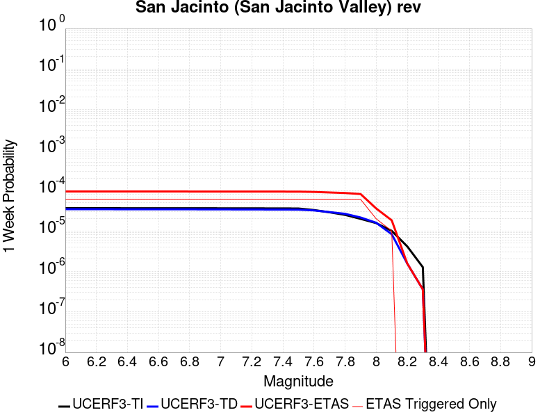 |  |  | 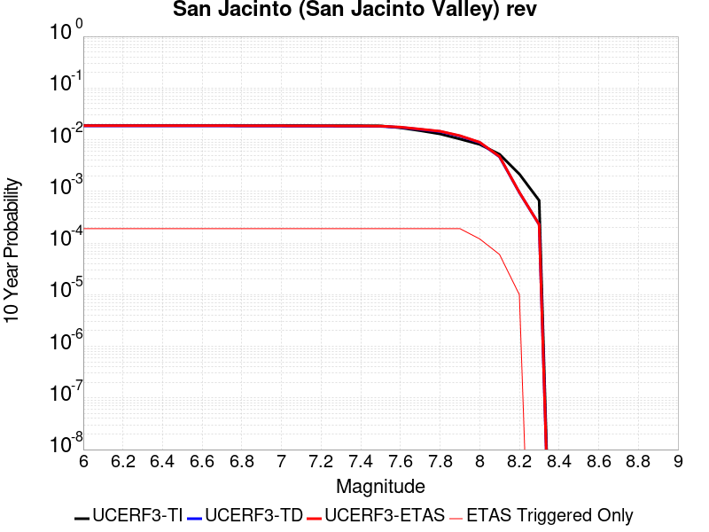 |

| Magnitude | 1 wk TI Prob | 1 wk TD Prob | 1 wk ETAS Prob | 1 wk ETAS/TD Gain | 1 wk ETAS Triggered Only | 1 mo TI Prob | 1 mo TD Prob | 1 mo ETAS Prob | 1 mo ETAS/TD Gain | 1 mo ETAS Triggered Only | 1 yr TI Prob | 1 yr TD Prob | 1 yr ETAS Prob | 1 yr ETAS/TD Gain | 1 yr ETAS Triggered Only | 10 yr TI Prob | 10 yr TD Prob | 10 yr ETAS Prob | 10 yr ETAS/TD Gain | 10 yr ETAS Triggered Only |
|-----|-----|-----|-----|-----|-----|-----|-----|-----|-----|-----|-----|-----|-----|-----|-----|-----|-----|-----|-----|-----|
| 6.0 | 3.652694E-5 | 3.4402394E-5 | 9.4400326E-5 | 2.7440047 | 6.0E-5 | 1.5653463E-4 | 1.474305E-4 | 2.4741577E-4 | 1.6781857 | 1.0E-4 | 0.0019041431 | 0.00179349 | 0.001953203 | 1.0890515 | 1.6E-4 | 0.018879099 | 0.018526595 | 0.018713076 | 1.0100656 | 1.9E-4 |
| 6.1 | 3.652694E-5 | 3.4402394E-5 | 9.4400326E-5 | 2.7440047 | 6.0E-5 | 1.5653463E-4 | 1.474305E-4 | 2.4741577E-4 | 1.6781857 | 1.0E-4 | 0.0019041431 | 0.00179349 | 0.001953203 | 1.0890515 | 1.6E-4 | 0.018879099 | 0.018526595 | 0.018713076 | 1.0100656 | 1.9E-4 |
| 6.2 | 3.652694E-5 | 3.4402394E-5 | 9.4400326E-5 | 2.7440047 | 6.0E-5 | 1.5653463E-4 | 1.474305E-4 | 2.4741577E-4 | 1.6781857 | 1.0E-4 | 0.0019041431 | 0.00179349 | 0.001953203 | 1.0890515 | 1.6E-4 | 0.018879099 | 0.018526595 | 0.018713076 | 1.0100656 | 1.9E-4 |
| 6.3 | 3.652694E-5 | 3.4402394E-5 | 9.4400326E-5 | 2.7440047 | 6.0E-5 | 1.5653463E-4 | 1.474305E-4 | 2.4741577E-4 | 1.6781857 | 1.0E-4 | 0.0019041431 | 0.00179349 | 0.001953203 | 1.0890515 | 1.6E-4 | 0.018879099 | 0.018526595 | 0.018713076 | 1.0100656 | 1.9E-4 |
| 6.4 | 3.646941E-5 | 3.432397E-5 | 9.432191E-5 | 2.7479897 | 6.0E-5 | 1.5628811E-4 | 1.4709444E-4 | 2.4707973E-4 | 1.6797353 | 1.0E-4 | 0.0019011468 | 0.0017894056 | 0.0019491194 | 1.0892552 | 1.6E-4 | 0.018849645 | 0.018486476 | 0.018672964 | 1.0100877 | 1.9E-4 |
| 6.5 | 3.646941E-5 | 3.432397E-5 | 9.432191E-5 | 2.7479897 | 6.0E-5 | 1.5628811E-4 | 1.4709444E-4 | 2.4707973E-4 | 1.6797353 | 1.0E-4 | 0.0019011468 | 0.0017894056 | 0.0019491194 | 1.0892552 | 1.6E-4 | 0.018849645 | 0.018486476 | 0.018672964 | 1.0100877 | 1.9E-4 |
| 6.6 | 3.6442503E-5 | 3.4287354E-5 | 9.42853E-5 | 2.7498562 | 6.0E-5 | 1.561728E-4 | 1.4693754E-4 | 2.4692283E-4 | 1.6804613 | 1.0E-4 | 0.0018997455 | 0.0017874985 | 0.0019472125 | 1.0893506 | 1.6E-4 | 0.018835869 | 0.018467745 | 0.018654237 | 1.0100982 | 1.9E-4 |
| 6.7 | 3.6432113E-5 | 3.4272925E-5 | 9.427087E-5 | 2.750593 | 6.0E-5 | 1.5612828E-4 | 1.4687571E-4 | 2.4686102E-4 | 1.6807477 | 1.0E-4 | 0.0018992044 | 0.0017867472 | 0.0019464614 | 1.0893883 | 1.6E-4 | 0.018830549 | 0.018460369 | 0.01864686 | 1.0101023 | 1.9E-4 |
| 6.8 | 3.6409598E-5 | 3.424198E-5 | 9.423993E-5 | 2.752175 | 6.0E-5 | 1.560318E-4 | 1.4674311E-4 | 2.4672842E-4 | 1.681363 | 1.0E-4 | 0.0018980318 | 0.0017851355 | 0.0019448498 | 1.0894691 | 1.6E-4 | 0.018819023 | 0.018444523 | 0.018631019 | 1.0101112 | 1.9E-4 |
| 6.9 | 3.638078E-5 | 3.4202407E-5 | 9.420035E-5 | 2.7542026 | 6.0E-5 | 1.5590832E-4 | 1.4657351E-4 | 2.4655886E-4 | 1.6821514 | 1.0E-4 | 0.0018965311 | 0.001783074 | 0.0019427887 | 1.0895727 | 1.6E-4 | 0.018804269 | 0.018424258 | 0.018610757 | 1.0101225 | 1.9E-4 |
| 7.0 | 3.6294874E-5 | 3.408442E-5 | 9.4082374E-5 | 2.7602751 | 6.0E-5 | 1.5554018E-4 | 1.4606792E-4 | 2.4605333E-4 | 1.684513 | 1.0E-4 | 0.0018920569 | 0.001776929 | 0.0019366447 | 1.089883 | 1.6E-4 | 0.018760284 | 0.018363839 | 0.01855035 | 1.0101564 | 1.9E-4 |
| 7.1 | 3.6260717E-5 | 3.4040702E-5 | 9.403866E-5 | 2.7625358 | 6.0E-5 | 1.5539382E-4 | 1.4588058E-4 | 2.45866E-4 | 1.6853921 | 1.0E-4 | 0.001890278 | 0.0017746518 | 0.0019343679 | 1.0899985 | 1.6E-4 | 0.018742796 | 0.018341439 | 0.018527955 | 1.010169 | 1.9E-4 |
| 7.2 | 3.6210204E-5 | 3.397492E-5 | 9.3972885E-5 | 2.7659485 | 6.0E-5 | 1.5517735E-4 | 1.455987E-4 | 2.4558415E-4 | 1.6867193 | 1.0E-4 | 0.001887647 | 0.0017712255 | 0.0019309421 | 1.0901729 | 1.6E-4 | 0.01871693 | 0.01830772 | 0.018494241 | 1.0101881 | 1.9E-4 |
| 7.3 | 3.6119454E-5 | 3.386321E-5 | 9.386118E-5 | 2.7717745 | 6.0E-5 | 1.5478847E-4 | 1.4511998E-4 | 2.4510548E-4 | 1.688985 | 1.0E-4 | 0.0018829206 | 0.0017654065 | 0.0019251241 | 1.0904707 | 1.6E-4 | 0.018670462 | 0.018250274 | 0.018436804 | 1.0102208 | 1.9E-4 |
| 7.4 | 3.607848E-5 | 3.381071E-5 | 9.380868E-5 | 2.7745256 | 6.0E-5 | 1.5461289E-4 | 1.44895E-4 | 2.448805E-4 | 1.6900549 | 1.0E-4 | 0.0018807866 | 0.0017626719 | 0.0019223898 | 1.0906113 | 1.6E-4 | 0.018649481 | 0.018223269 | 0.018409805 | 1.0102363 | 1.9E-4 |
| 7.5 | 3.5856774E-5 | 3.3620483E-5 | 9.3618466E-5 | 2.7845664 | 6.0E-5 | 1.5366284E-4 | 1.4407984E-4 | 2.4406542E-4 | 1.6939597 | 1.0E-4 | 0.0018692396 | 0.0017527633 | 0.0019124828 | 1.0911244 | 1.6E-4 | 0.018535944 | 0.018124366 | 0.018310923 | 1.0102931 | 1.9E-4 |
| 7.6 | 3.286655E-5 | 3.2143445E-5 | 9.214152E-5 | 2.8665724 | 6.0E-5 | 1.4084904E-4 | 1.3775036E-4 | 2.3773659E-4 | 1.7258509 | 1.0E-4 | 0.001713488 | 0.0016758227 | 0.0018355545 | 1.0953155 | 1.6E-4 | 0.017003361 | 0.017344031 | 0.017530736 | 1.0107647 | 1.9E-4 |
| 7.7 | 2.8882527E-5 | 2.9236293E-5 | 8.923454E-5 | 3.0521836 | 6.0E-5 | 1.237764E-4 | 1.2529238E-4 | 2.2527986E-4 | 1.7980331 | 1.0E-4 | 0.0015059357 | 0.0015243685 | 0.0016841246 | 1.1048015 | 1.6E-4 | 0.014957713 | 0.015830461 | 0.016017452 | 1.0118122 | 1.9E-4 |
| 7.8 | 2.4950225E-5 | 2.6527203E-5 | 8.6525615E-5 | 3.261769 | 6.0E-5 | 1.0692515E-4 | 1.1368306E-4 | 2.136717E-4 | 1.8795385 | 1.0E-4 | 0.0013010362 | 0.0013832134 | 0.0015429921 | 1.1155127 | 1.6E-4 | 0.012934455 | 0.014411755 | 0.014599017 | 1.0129937 | 1.9E-4 |
| 7.9 | 1.9881603E-5 | 2.1507445E-5 | 8.150616E-5 | 3.7896717 | 6.0E-5 | 8.520408E-5 | 9.217151E-5 | 1.9216229E-4 | 2.0848339 | 1.0E-4 | 0.001036866 | 0.0011216112 | 0.0012814318 | 1.1424919 | 1.6E-4 | 0.010320415 | 0.011777027 | 0.011964789 | 1.015943 | 1.9E-4 |
| 8.0 | 1.563292E-5 | 1.5937347E-5 | 3.5937028E-5 | 2.254894 | 2.0E-5 | 6.6996516E-5 | 6.8301124E-5 | 1.2829703E-4 | 1.8784028 | 6.0E-5 | 8.153773E-4 | 8.3124964E-4 | 9.311665E-4 | 1.1202008 | 1.0E-4 | 0.00812392 | 0.008810506 | 0.008929449 | 1.0135001 | 1.2E-4 |
| 8.1 | 1.0045313E-5 | 8.301802E-6 | 1.830172E-5 | 2.2045476 | 1.0E-5 | 4.305063E-5 | 3.5578672E-5 | 7.557725E-5 | 2.124229 | 4.0E-5 | 5.2401534E-4 | 4.3308473E-4 | 4.9305876E-4 | 1.138481 | 6.0E-5 | 0.0052278144 | 0.0046591135 | 0.004718834 | 1.012818 | 6.0E-5 |
| 8.2 | 4.1554413E-6 | 1.5655598E-6 | 1.5655598E-6 | 1.0 | 0.0 | 1.7808914E-5 | 6.709525E-6 | 6.709525E-6 | 1.0 | 0.0 | 2.1680194E-4 | 8.168544E-5 | 9.168462E-5 | 1.1224109 | 1.0E-5 | 0.0021659054 | 9.482903E-4 | 9.582808E-4 | 1.0105352 | 1.0E-5 |
| 8.3 | 1.2758221E-6 | 3.6149942E-7 | 3.6149942E-7 | 1.0 | 0.0 | 5.4677976E-6 | 1.5492824E-6 | 1.5492824E-6 | 1.0 | 0.0 | 6.65684E-5 | 1.8862354E-5 | 1.8862354E-5 | 1.0 | 0.0 | 6.6548464E-4 | 2.2751294E-4 | 2.2751294E-4 | 1.0 | 0.0 |

## Pinto Mtn
*[(top)](#table-of-contents)*

| 1 Week | 1 Month | 1 Year | 10 Year |
|-----|-----|-----|-----|
|  |  | 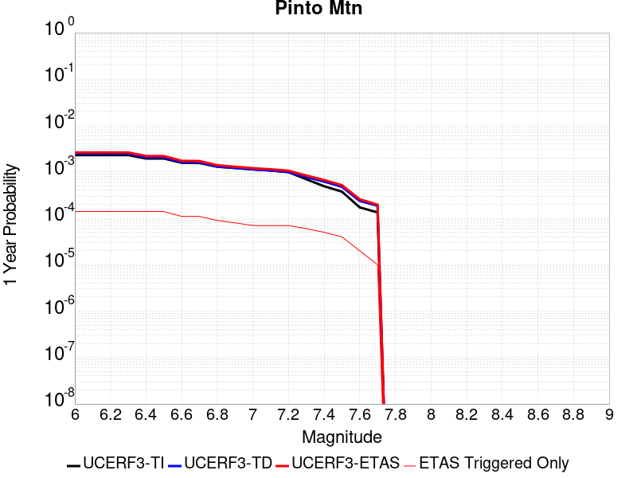 | 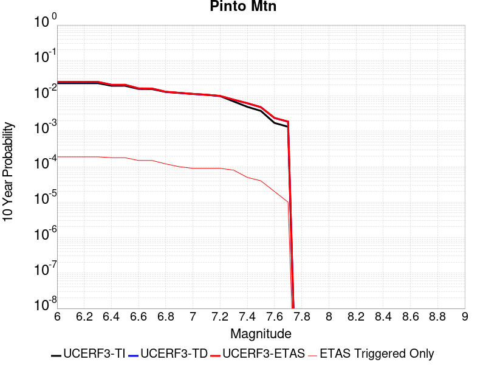 |

| Magnitude | 1 wk TI Prob | 1 wk TD Prob | 1 wk ETAS Prob | 1 wk ETAS/TD Gain | 1 wk ETAS Triggered Only | 1 mo TI Prob | 1 mo TD Prob | 1 mo ETAS Prob | 1 mo ETAS/TD Gain | 1 mo ETAS Triggered Only | 1 yr TI Prob | 1 yr TD Prob | 1 yr ETAS Prob | 1 yr ETAS/TD Gain | 1 yr ETAS Triggered Only | 10 yr TI Prob | 10 yr TD Prob | 10 yr ETAS Prob | 10 yr ETAS/TD Gain | 10 yr ETAS Triggered Only |
|-----|-----|-----|-----|-----|-----|-----|-----|-----|-----|-----|-----|-----|-----|-----|-----|-----|-----|-----|-----|-----|
| 6.0 | 4.4194956E-5 | 4.785362E-5 | 1.0785075E-4 | 2.2537637 | 6.0E-5 | 1.893932E-4 | 2.0507174E-4 | 2.8505534E-4 | 1.3900274 | 8.0E-5 | 0.0023034236 | 0.0024940541 | 0.002633705 | 1.0559936 | 1.4E-4 | 0.022796938 | 0.024678145 | 0.024863455 | 1.0075091 | 1.9E-4 |
| 6.1 | 4.4194956E-5 | 4.785362E-5 | 1.0785075E-4 | 2.2537637 | 6.0E-5 | 1.893932E-4 | 2.0507174E-4 | 2.8505534E-4 | 1.3900274 | 8.0E-5 | 0.0023034236 | 0.0024940541 | 0.002633705 | 1.0559936 | 1.4E-4 | 0.022796938 | 0.024678145 | 0.024863455 | 1.0075091 | 1.9E-4 |
| 6.2 | 4.4194956E-5 | 4.785362E-5 | 1.0785075E-4 | 2.2537637 | 6.0E-5 | 1.893932E-4 | 2.0507174E-4 | 2.8505534E-4 | 1.3900274 | 8.0E-5 | 0.0023034236 | 0.0024940541 | 0.002633705 | 1.0559936 | 1.4E-4 | 0.022796938 | 0.024678145 | 0.024863455 | 1.0075091 | 1.9E-4 |
| 6.3 | 4.4194956E-5 | 4.785362E-5 | 1.0785075E-4 | 2.2537637 | 6.0E-5 | 1.893932E-4 | 2.0507174E-4 | 2.8505534E-4 | 1.3900274 | 8.0E-5 | 0.0023034236 | 0.0024940541 | 0.002633705 | 1.0559936 | 1.4E-4 | 0.022796938 | 0.024678145 | 0.024863455 | 1.0075091 | 1.9E-4 |
| 6.4 | 3.729929E-5 | 3.9603186E-5 | 9.960081E-5 | 2.5149696 | 6.0E-5 | 1.5984432E-4 | 1.6971743E-4 | 2.4970385E-4 | 1.4712918 | 8.0E-5 | 0.0019443673 | 0.002064445 | 0.002204156 | 1.0676749 | 1.4E-4 | 0.019274427 | 0.02046269 | 0.020639006 | 1.0086164 | 1.8E-4 |
| 6.5 | 3.729929E-5 | 3.9603186E-5 | 9.960081E-5 | 2.5149696 | 6.0E-5 | 1.5984432E-4 | 1.6971743E-4 | 2.4970385E-4 | 1.4712918 | 8.0E-5 | 0.0019443673 | 0.002064445 | 0.002204156 | 1.0676749 | 1.4E-4 | 0.019274427 | 0.02046269 | 0.020639006 | 1.0086164 | 1.8E-4 |
| 6.6 | 3.0204548E-5 | 3.1205298E-5 | 7.120405E-5 | 2.2817936 | 4.0E-5 | 1.2944164E-4 | 1.3373033E-4 | 1.9372231E-4 | 1.4486041 | 6.0E-5 | 0.0015748127 | 0.0016269855 | 0.0017368065 | 1.0674998 | 1.1E-4 | 0.015636992 | 0.01615461 | 0.016302185 | 1.0091352 | 1.5E-4 |
| 6.7 | 2.9857754E-5 | 3.081468E-5 | 7.081345E-5 | 2.2980425 | 4.0E-5 | 1.2795553E-4 | 1.3205643E-4 | 1.9204851E-4 | 1.4542912 | 6.0E-5 | 0.0015567453 | 0.001606636 | 0.0017164592 | 1.068356 | 1.1E-4 | 0.015458848 | 0.01595405 | 0.016101656 | 1.009252 | 1.5E-4 |
| 6.8 | 2.4819734E-5 | 2.5009364E-5 | 5.500861E-5 | 2.1995208 | 3.0E-5 | 1.0636595E-4 | 1.07178705E-4 | 1.5717334E-4 | 1.4664606 | 5.0E-5 | 0.0012942362 | 0.0013041412 | 0.0013940239 | 1.068921 | 9.0E-5 | 0.012867244 | 0.0129672475 | 0.013085691 | 1.009134 | 1.2E-4 |
| 6.9 | 2.331124E-5 | 2.3337643E-5 | 4.3337175E-5 | 1.8569646 | 2.0E-5 | 9.990149E-5 | 1.00014746E-4 | 1.4001074E-4 | 1.399901 | 4.0E-5 | 0.001215622 | 0.0012170197 | 0.0012969223 | 1.0656544 | 8.0E-5 | 0.012089936 | 0.012105742 | 0.012204531 | 1.0081606 | 1.0E-4 |
| 7.0 | 2.1818534E-5 | 2.1760772E-5 | 4.1760337E-5 | 1.919065 | 2.0E-5 | 9.3504656E-5 | 9.325723E-5 | 1.332535E-4 | 1.4288812 | 4.0E-5 | 0.0011378246 | 0.0011348352 | 0.0012047557 | 1.061613 | 7.0E-5 | 0.011320163 | 0.011292503 | 0.011381487 | 1.0078799 | 9.0E-5 |
| 7.1 | 2.066081E-5 | 2.0540418E-5 | 4.0540006E-5 | 1.97367 | 2.0E-5 | 8.854332E-5 | 8.8027504E-5 | 1.2802398E-4 | 1.4543635 | 4.0E-5 | 0.0010774818 | 0.0010712275 | 0.0011411525 | 1.0652755 | 7.0E-5 | 0.010722724 | 0.010662688 | 0.010751729 | 1.0083506 | 9.0E-5 |
| 7.2 | 1.8990233E-5 | 1.9053701E-5 | 3.905332E-5 | 2.0496447 | 2.0E-5 | 8.138417E-5 | 8.1656275E-5 | 1.2165301E-4 | 1.4898182 | 4.0E-5 | 9.904018E-4 | 9.937311E-4 | 0.0010636615 | 1.0703716 | 7.0E-5 | 0.009859995 | 0.009894874 | 0.009983983 | 1.0090057 | 9.0E-5 |
| 7.3 | 1.3335872E-5 | 1.4906372E-5 | 3.4906072E-5 | 2.3416882 | 2.0E-5 | 5.7152483E-5 | 6.388296E-5 | 9.388104E-5 | 1.4695789 | 3.0E-5 | 6.956093E-4 | 7.775102E-4 | 8.374636E-4 | 1.0771095 | 6.0E-5 | 0.006934359 | 0.0077491994 | 0.007828579 | 1.0102437 | 8.0E-5 |
| 7.4 | 9.414066E-6 | 1.186061E-5 | 3.1860374E-5 | 2.686234 | 2.0E-5 | 4.0345374E-5 | 5.0830247E-5 | 8.082872E-5 | 1.5901698 | 3.0E-5 | 4.910942E-4 | 6.1869196E-4 | 6.68661E-4 | 1.0807656 | 5.0E-5 | 0.0049001034 | 0.006170644 | 0.0062203356 | 1.0080528 | 5.0E-5 |
| 7.5 | 7.2101157E-6 | 9.157893E-6 | 1.9157802E-5 | 2.0919442 | 1.0E-5 | 3.090013E-5 | 3.924757E-5 | 5.9246784E-5 | 1.5095657 | 2.0E-5 | 3.7614413E-4 | 4.7774217E-4 | 5.177231E-4 | 1.0836872 | 4.0E-5 | 0.0037550807 | 0.004767927 | 0.0048077363 | 1.0083494 | 4.0E-5 |
| 7.6 | 3.296375E-6 | 4.5453176E-6 | 4.5453176E-6 | 1.0 | 0.0 | 1.4127245E-5 | 1.9479796E-5 | 1.9479796E-5 | 1.0 | 0.0 | 1.7198564E-4 | 2.3714209E-4 | 2.5713735E-4 | 1.0843176 | 2.0E-5 | 0.0017185259 | 0.0023690276 | 0.0023889802 | 1.0084223 | 2.0E-5 |
| 7.7 | 2.5741092E-6 | 3.584251E-6 | 3.584251E-6 | 1.0 | 0.0 | 1.103185E-5 | 1.5360993E-5 | 1.5360993E-5 | 1.0 | 0.0 | 1.3430449E-4 | 1.8700535E-4 | 1.970035E-4 | 1.0534644 | 1.0E-5 | 0.0013422335 | 0.0018686098 | 0.0018785911 | 1.0053415 | 1.0E-5 |

## Mission Ridge-Arroyo Parida-Santa Ana
*[(top)](#table-of-contents)*

| 1 Week | 1 Month | 1 Year | 10 Year |
|-----|-----|-----|-----|
|  | 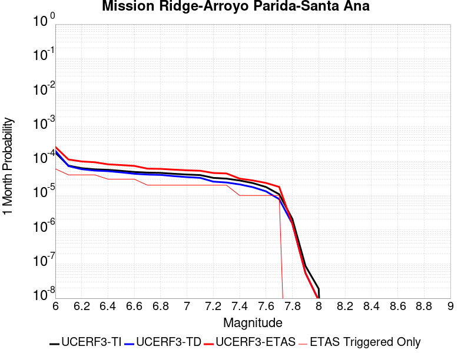 |  | 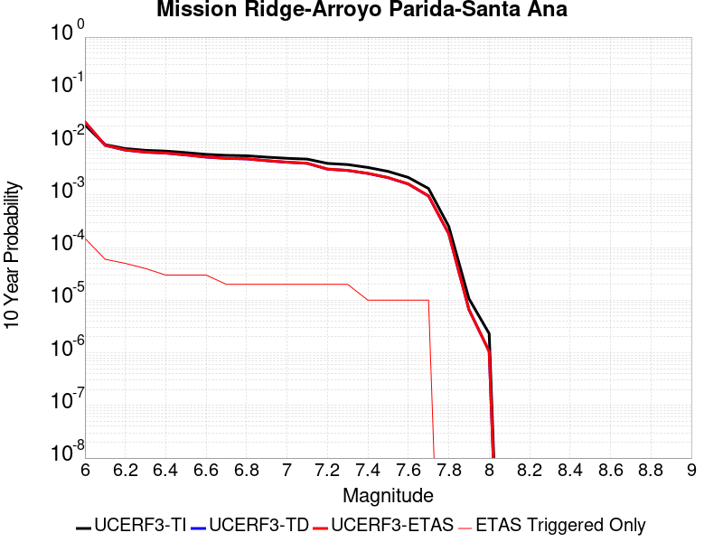 |

| Magnitude | 1 wk TI Prob | 1 wk TD Prob | 1 wk ETAS Prob | 1 wk ETAS/TD Gain | 1 wk ETAS Triggered Only | 1 mo TI Prob | 1 mo TD Prob | 1 mo ETAS Prob | 1 mo ETAS/TD Gain | 1 mo ETAS Triggered Only | 1 yr TI Prob | 1 yr TD Prob | 1 yr ETAS Prob | 1 yr ETAS/TD Gain | 1 yr ETAS Triggered Only | 10 yr TI Prob | 10 yr TD Prob | 10 yr ETAS Prob | 10 yr ETAS/TD Gain | 10 yr ETAS Triggered Only |
|-----|-----|-----|-----|-----|-----|-----|-----|-----|-----|-----|-----|-----|-----|-----|-----|-----|-----|-----|-----|-----|
| 6.0 | 4.169034E-5 | 4.7138263E-5 | 8.713638E-5 | 1.8485276 | 4.0E-5 | 1.7866064E-4 | 2.0201034E-4 | 2.619982E-4 | 1.2969545 | 6.0E-5 | 0.0021730233 | 0.00245745 | 0.0025871305 | 1.0527704 | 1.3E-4 | 0.021518968 | 0.024384614 | 0.024530957 | 1.0060015 | 1.5E-4 |
| 6.1 | 1.73813E-5 | 1.6854226E-5 | 4.6853722E-5 | 2.779939 | 3.0E-5 | 7.4489166E-5 | 7.223046E-5 | 1.1222757E-4 | 1.553743 | 4.0E-5 | 9.065282E-4 | 8.790618E-4 | 9.2901784E-4 | 1.0568289 | 5.0E-5 | 0.009028391 | 0.008756988 | 0.008816463 | 1.0067917 | 6.0E-5 |
| 6.2 | 1.4622182E-5 | 1.367329E-5 | 4.367288E-5 | 3.1940286 | 3.0E-5 | 6.2664985E-5 | 5.8598518E-5 | 9.8596174E-5 | 1.6825712 | 4.0E-5 | 7.6267915E-4 | 7.132073E-4 | 7.6317164E-4 | 1.0700558 | 5.0E-5 | 0.007600669 | 0.007109627 | 0.0071592717 | 1.0069827 | 5.0E-5 |
| 6.3 | 1.3552434E-5 | 1.2482201E-5 | 4.2481824E-5 | 3.4033923 | 3.0E-5 | 5.8080568E-5 | 5.3494066E-5 | 9.349193E-5 | 1.7477065 | 4.0E-5 | 7.069015E-4 | 6.510988E-4 | 6.910727E-4 | 1.0613946 | 4.0E-5 | 0.00704657 | 0.006492275 | 0.0065320153 | 1.0061212 | 4.0E-5 |
| 6.4 | 1.30977305E-5 | 1.1979156E-5 | 3.1978918E-5 | 2.6695466 | 2.0E-5 | 5.613192E-5 | 5.1338247E-5 | 8.133671E-5 | 1.5843296 | 3.0E-5 | 6.831918E-4 | 6.248669E-4 | 6.548482E-4 | 1.0479802 | 3.0E-5 | 0.006810953 | 0.0062314444 | 0.0062612575 | 1.0047843 | 3.0E-5 |
| 6.5 | 1.225205E-5 | 1.1048803E-5 | 3.104858E-5 | 2.8101308 | 2.0E-5 | 5.2507727E-5 | 4.7351168E-5 | 7.7349745E-5 | 1.6335341 | 3.0E-5 | 6.3909404E-4 | 5.7635066E-4 | 6.063334E-4 | 1.0520216 | 3.0E-5 | 0.006372592 | 0.005748869 | 0.0057786964 | 1.0051885 | 3.0E-5 |
| 6.6 | 1.1352241E-5 | 1.0063535E-5 | 3.0063333E-5 | 2.9873533 | 2.0E-5 | 4.8651553E-5 | 4.3128734E-5 | 7.312744E-5 | 1.6955619 | 3.0E-5 | 5.921717E-4 | 5.2496797E-4 | 5.549522E-4 | 1.0571164 | 3.0E-5 | 0.0059059616 | 0.0052375244 | 0.005267367 | 1.0056978 | 3.0E-5 |
| 6.7 | 1.0864116E-5 | 9.517027E-6 | 1.9516932E-5 | 2.0507383 | 1.0E-5 | 4.6559664E-5 | 4.0786632E-5 | 6.0785816E-5 | 1.4903368 | 2.0E-5 | 5.667165E-4 | 4.964661E-4 | 5.164562E-4 | 1.0402647 | 2.0E-5 | 0.005652734 | 0.004953804 | 0.004973705 | 1.0040174 | 2.0E-5 |
| 6.8 | 1.0666365E-5 | 9.299779E-6 | 1.9299685E-5 | 2.0752845 | 1.0E-5 | 4.571219E-5 | 3.9855597E-5 | 5.98548E-5 | 1.5017916 | 2.0E-5 | 5.564038E-4 | 4.8513585E-4 | 5.0512614E-4 | 1.0412055 | 2.0E-5 | 0.005550127 | 0.0048410003 | 0.004860903 | 1.0041114 | 2.0E-5 |
| 6.9 | 1.0038665E-5 | 8.592046E-6 | 1.859196E-5 | 2.1638572 | 1.0E-5 | 4.302214E-5 | 3.682254E-5 | 5.6821806E-5 | 1.5431255 | 2.0E-5 | 5.236687E-4 | 4.4822405E-4 | 4.6821506E-4 | 1.0446005 | 2.0E-5 | 0.005224364 | 0.004473411 | 0.0044933213 | 1.0044509 | 2.0E-5 |
| 7.0 | 9.5379955E-6 | 8.025073E-6 | 1.8024994E-5 | 2.2460845 | 1.0E-5 | 4.0876483E-5 | 3.4392728E-5 | 5.439204E-5 | 1.5814983 | 2.0E-5 | 4.975576E-4 | 4.1865272E-4 | 4.3864435E-4 | 1.0477523 | 2.0E-5 | 0.00496445 | 0.0041788397 | 0.004198756 | 1.004766 | 2.0E-5 |
| 7.1 | 9.207389E-6 | 7.652375E-6 | 1.7652299E-5 | 2.306774 | 1.0E-5 | 3.945964E-5 | 3.279549E-5 | 5.2794836E-5 | 1.6098199 | 2.0E-5 | 4.803152E-4 | 3.9921363E-4 | 4.1920564E-4 | 1.0500785 | 2.0E-5 | 0.004792784 | 0.003985161 | 0.0040050815 | 1.0049986 | 2.0E-5 |
| 7.2 | 7.638091E-6 | 5.9311183E-6 | 1.5931058E-5 | 2.6860127 | 1.0E-5 | 3.2734264E-5 | 2.541883E-5 | 4.5418325E-5 | 1.7867982 | 2.0E-5 | 3.984668E-4 | 3.0943064E-4 | 3.2942445E-4 | 1.0646149 | 2.0E-5 | 0.0039775306 | 0.0030900547 | 0.003109993 | 1.0064523 | 2.0E-5 |
| 7.3 | 7.2500147E-6 | 5.5961527E-6 | 1.5596097E-5 | 2.786932 | 1.0E-5 | 3.1071122E-5 | 2.3983293E-5 | 4.3982815E-5 | 1.8338939 | 2.0E-5 | 3.7822526E-4 | 2.9195778E-4 | 3.1195194E-4 | 1.0684831 | 2.0E-5 | 0.0037758215 | 0.0029157975 | 0.0029357392 | 1.0068392 | 2.0E-5 |
| 7.4 | 6.3899715E-6 | 4.9184964E-6 | 1.4918447E-5 | 3.0331318 | 1.0E-5 | 2.7385306E-5 | 2.10791E-5 | 3.107889E-5 | 1.4743936 | 1.0E-5 | 3.3336508E-4 | 2.5660804E-4 | 2.6660546E-4 | 1.03896 | 1.0E-5 | 0.0033286542 | 0.0025631618 | 0.002573136 | 1.0038915 | 1.0E-5 |
| 7.5 | 5.379025E-6 | 4.0838527E-6 | 1.4083812E-5 | 3.4486582 | 1.0E-5 | 2.305276E-5 | 1.7502109E-5 | 2.7501934E-5 | 1.5713497 | 1.0E-5 | 2.806312E-4 | 2.1306744E-4 | 2.2306532E-4 | 1.0469235 | 1.0E-5 | 0.0028027708 | 0.002128643 | 0.0021386216 | 1.0046878 | 1.0E-5 |
| 7.6 | 4.1270696E-6 | 3.0883439E-6 | 1.3088313E-5 | 4.2379713 | 1.0E-5 | 1.768732E-5 | 1.3235693E-5 | 2.3235561E-5 | 1.7555227 | 1.0E-5 | 2.1532185E-4 | 1.6113273E-4 | 1.7113112E-4 | 1.0620506 | 1.0E-5 | 0.0021511333 | 0.001610167 | 0.0016201509 | 1.0062006 | 1.0E-5 |
| 7.7 | 2.5406805E-6 | 1.8282013E-6 | 1.1828183E-5 | 6.469847 | 1.0E-5 | 1.0888585E-5 | 7.835125E-6 | 1.7835047E-5 | 2.2762938 | 1.0E-5 | 1.3256045E-4 | 9.538854E-5 | 1.0538758E-4 | 1.1048244 | 1.0E-5 | 0.0013248142 | 9.534821E-4 | 9.634726E-4 | 1.0104779 | 1.0E-5 |
| 7.8 | 4.8608285E-7 | 3.5098864E-7 | 3.5098864E-7 | 1.0 | 0.0 | 2.0832106E-6 | 1.5042363E-6 | 1.5042363E-6 | 1.0 | 0.0 | 2.5362791E-5 | 1.8313924E-5 | 1.8313924E-5 | 1.0 | 0.0 | 2.5359896E-4 | 1.8312426E-4 | 1.8312426E-4 | 1.0 | 0.0 |
| 7.9 | 2.0472514E-8 | 1.2688783E-8 | 1.2688783E-8 | 1.0 | 0.0 | 8.7739345E-8 | 5.43805E-8 | 5.43805E-8 | 1.0 | 0.0 | 1.068226E-6 | 6.6208236E-7 | 6.6208236E-7 | 1.0 | 0.0 | 1.0682209E-5 | 6.620805E-6 | 6.620805E-6 | 1.0 | 0.0 |
| 8.0 | 4.443582E-9 | 2.0321211E-9 | 2.0321211E-9 | 1.0 | 0.0 | 1.9043922E-8 | 8.70909E-9 | 8.70909E-9 | 1.0 | 0.0 | 2.3185973E-7 | 1.0603316E-7 | 1.0603316E-7 | 1.0 | 0.0 | 2.3185949E-6 | 1.0603312E-6 | 1.0603312E-6 | 1.0 | 0.0 |

## Independence rev 2011
*[(top)](#table-of-contents)*

| 1 Week | 1 Month | 1 Year | 10 Year |
|-----|-----|-----|-----|
|  | 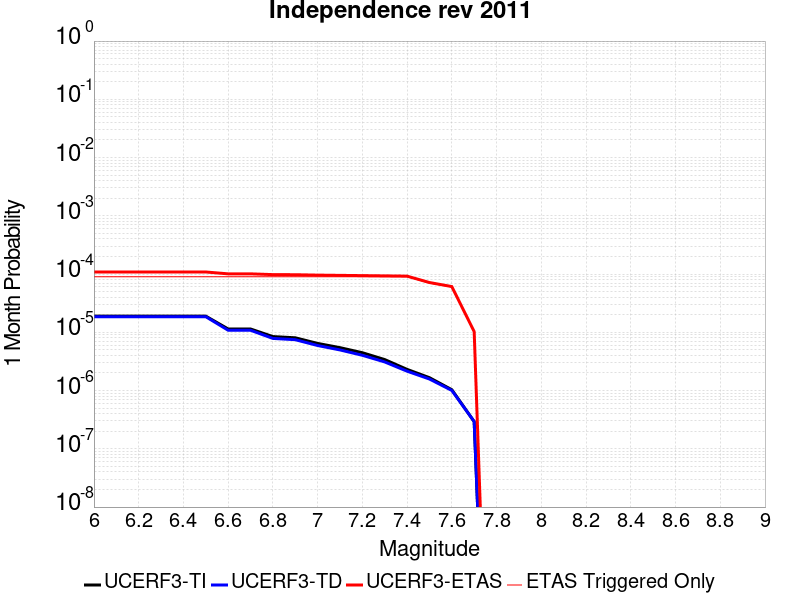 |  |  |

| Magnitude | 1 wk TI Prob | 1 wk TD Prob | 1 wk ETAS Prob | 1 wk ETAS/TD Gain | 1 wk ETAS Triggered Only | 1 mo TI Prob | 1 mo TD Prob | 1 mo ETAS Prob | 1 mo ETAS/TD Gain | 1 mo ETAS Triggered Only | 1 yr TI Prob | 1 yr TD Prob | 1 yr ETAS Prob | 1 yr ETAS/TD Gain | 1 yr ETAS Triggered Only | 10 yr TI Prob | 10 yr TD Prob | 10 yr ETAS Prob | 10 yr ETAS/TD Gain | 10 yr ETAS Triggered Only |
|-----|-----|-----|-----|-----|-----|-----|-----|-----|-----|-----|-----|-----|-----|-----|-----|-----|-----|-----|-----|-----|
| 6.0 | 4.422171E-6 | 4.326227E-6 | 8.432588E-5 | 19.491783 | 8.0E-5 | 1.8952025E-5 | 1.8540857E-5 | 1.0853919E-4 | 5.8540545 | 9.0E-5 | 2.3071647E-4 | 2.2571455E-4 | 3.2569197E-4 | 1.4429375 | 1.0E-4 | 0.0023047708 | 0.0022551466 | 0.0024147858 | 1.0707889 | 1.6E-4 |
| 6.1 | 4.422171E-6 | 4.326227E-6 | 8.432588E-5 | 19.491783 | 8.0E-5 | 1.8952025E-5 | 1.8540857E-5 | 1.0853919E-4 | 5.8540545 | 9.0E-5 | 2.3071647E-4 | 2.2571455E-4 | 3.2569197E-4 | 1.4429375 | 1.0E-4 | 0.0023047708 | 0.0022551466 | 0.0024147858 | 1.0707889 | 1.6E-4 |
| 6.2 | 4.422171E-6 | 4.326227E-6 | 8.432588E-5 | 19.491783 | 8.0E-5 | 1.8952025E-5 | 1.8540857E-5 | 1.0853919E-4 | 5.8540545 | 9.0E-5 | 2.3071647E-4 | 2.2571455E-4 | 3.2569197E-4 | 1.4429375 | 1.0E-4 | 0.0023047708 | 0.0022551466 | 0.0024147858 | 1.0707889 | 1.6E-4 |
| 6.3 | 4.422171E-6 | 4.326227E-6 | 8.432588E-5 | 19.491783 | 8.0E-5 | 1.8952025E-5 | 1.8540857E-5 | 1.0853919E-4 | 5.8540545 | 9.0E-5 | 2.3071647E-4 | 2.2571455E-4 | 3.2569197E-4 | 1.4429375 | 1.0E-4 | 0.0023047708 | 0.0022551466 | 0.0024147858 | 1.0707889 | 1.6E-4 |
| 6.4 | 4.422171E-6 | 4.326227E-6 | 8.432588E-5 | 19.491783 | 8.0E-5 | 1.8952025E-5 | 1.8540857E-5 | 1.0853919E-4 | 5.8540545 | 9.0E-5 | 2.3071647E-4 | 2.2571455E-4 | 3.2569197E-4 | 1.4429375 | 1.0E-4 | 0.0023047708 | 0.0022551466 | 0.0024147858 | 1.0707889 | 1.6E-4 |
| 6.5 | 4.422171E-6 | 4.326227E-6 | 8.432588E-5 | 19.491783 | 8.0E-5 | 1.8952025E-5 | 1.8540857E-5 | 1.0853919E-4 | 5.8540545 | 9.0E-5 | 2.3071647E-4 | 2.2571455E-4 | 3.2569197E-4 | 1.4429375 | 1.0E-4 | 0.0023047708 | 0.0022551466 | 0.0024147858 | 1.0707889 | 1.6E-4 |
| 6.6 | 2.663744E-6 | 2.5319862E-6 | 8.2531784E-5 | 32.59567 | 8.0E-5 | 1.1415996E-5 | 1.0851327E-5 | 1.0085035E-4 | 9.293826 | 9.0E-5 | 1.3898089E-4 | 1.3210738E-4 | 2.3209417E-4 | 1.7568599 | 1.0E-4 | 0.0013889399 | 0.0013203367 | 0.0014801255 | 1.1210212 | 1.6E-4 |
| 6.7 | 2.663744E-6 | 2.5319862E-6 | 8.2531784E-5 | 32.59567 | 8.0E-5 | 1.1415996E-5 | 1.0851327E-5 | 1.0085035E-4 | 9.293826 | 9.0E-5 | 1.3898089E-4 | 1.3210738E-4 | 2.3209417E-4 | 1.7568599 | 1.0E-4 | 0.0013889399 | 0.0013203367 | 0.0014801255 | 1.1210212 | 1.6E-4 |
| 6.8 | 1.9716529E-6 | 1.8322585E-6 | 8.183211E-5 | 44.661884 | 8.0E-5 | 8.449913E-6 | 7.852514E-6 | 9.785181E-5 | 12.461208 | 9.0E-5 | 1.0287284E-4 | 9.5600284E-5 | 1.9559072E-4 | 2.045922 | 1.0E-4 | 0.0010282523 | 9.556045E-4 | 0.0011154516 | 1.1672733 | 1.6E-4 |
| 6.9 | 1.8788617E-6 | 1.7429993E-6 | 8.174286E-5 | 46.897816 | 8.0E-5 | 8.0522395E-6 | 7.4699765E-6 | 9.74693E-5 | 13.0481415 | 9.0E-5 | 9.80316E-5 | 9.0943286E-5 | 1.909342E-4 | 2.0994864 | 1.0E-4 | 9.798837E-4 | 9.0907275E-4 | 0.0010689272 | 1.1758435 | 1.6E-4 |
| 7.0 | 1.5045488E-6 | 1.3849503E-6 | 8.138484E-5 | 58.76372 | 8.0E-5 | 6.44805E-6 | 5.9354884E-6 | 9.5934956E-5 | 16.162941 | 9.0E-5 | 7.8502184E-5 | 7.226223E-5 | 1.7225501E-4 | 2.3837488 | 1.0E-4 | 7.8474457E-4 | 7.2239246E-4 | 8.622913E-4 | 1.1936605 | 1.4E-4 |
| 7.1 | 1.272341E-6 | 1.1625096E-6 | 8.116242E-5 | 69.81655 | 8.0E-5 | 5.4528787E-6 | 4.982175E-6 | 9.4981726E-5 | 19.06431 | 9.0E-5 | 6.6386776E-5 | 6.0656326E-5 | 1.6065026E-4 | 2.6485326 | 1.0E-4 | 6.636695E-4 | 6.064009E-4 | 7.363221E-4 | 1.2142496 | 1.3E-4 |
| 7.2 | 1.0416892E-6 | 9.4098806E-7 | 8.094091E-5 | 86.01694 | 8.0E-5 | 4.464375E-6 | 4.0328E-6 | 9.403244E-5 | 23.316912 | 9.0E-5 | 5.4352407E-5 | 4.909825E-5 | 1.4909334E-4 | 3.0366325 | 1.0E-4 | 5.4339116E-4 | 4.9087586E-4 | 6.2081206E-4 | 1.2647027 | 1.3E-4 |
| 7.3 | 7.9450155E-7 | 7.235002E-7 | 8.072344E-5 | 111.573494 | 8.0E-5 | 3.4050022E-6 | 3.1007114E-6 | 9.310043E-5 | 30.025507 | 9.0E-5 | 4.1455114E-5 | 3.775052E-5 | 1.3774674E-4 | 3.6488702 | 1.0E-4 | 4.144738E-4 | 3.7744216E-4 | 5.073931E-4 | 1.3442936 | 1.3E-4 |
| 7.4 | 5.3893444E-7 | 5.019512E-7 | 8.050191E-5 | 160.37796 | 8.0E-5 | 2.309717E-6 | 2.1512178E-6 | 9.215102E-5 | 42.836678 | 9.0E-5 | 2.8120441E-5 | 2.6190766E-5 | 1.2618814E-4 | 4.8180394 | 1.0E-4 | 2.8116882E-4 | 2.6187726E-4 | 3.918432E-4 | 1.4962858 | 1.3E-4 |
| 7.5 | 3.8852085E-7 | 3.682554E-7 | 6.0368235E-5 | 163.93034 | 6.0E-5 | 1.6650882E-6 | 1.5782365E-6 | 7.157813E-5 | 45.353233 | 7.0E-5 | 2.027226E-5 | 1.9214862E-5 | 9.921332E-5 | 5.163364 | 8.0E-5 | 2.0270412E-4 | 1.9213221E-4 | 3.021111E-4 | 1.5724124 | 1.1E-4 |
| 7.6 | 2.414929E-7 | 2.345755E-7 | 5.0234565E-5 | 214.15094 | 5.0E-5 | 1.0349692E-6 | 1.0053232E-6 | 6.1005263E-5 | 60.68224 | 6.0E-5 | 1.2600677E-5 | 1.2239742E-5 | 8.223888E-5 | 6.7190046 | 7.0E-5 | 1.2599962E-4 | 1.223908E-4 | 2.0238101E-4 | 1.6535639 | 8.0E-5 |
| 7.7 | 6.8298014E-8 | 6.85897E-8 | 6.85897E-8 | 1.0 | 0.0 | 2.9270575E-7 | 2.9395582E-7 | 1.0293953E-5 | 35.018707 | 1.0E-5 | 3.5636867E-6 | 3.5789067E-6 | 1.35788705E-5 | 3.7941394 | 1.0E-5 | 3.5636294E-5 | 3.5788536E-5 | 4.578818E-5 | 1.279409 | 1.0E-5 |

## Owens Valley
*[(top)](#table-of-contents)*

| 1 Week | 1 Month | 1 Year | 10 Year |
|-----|-----|-----|-----|
| 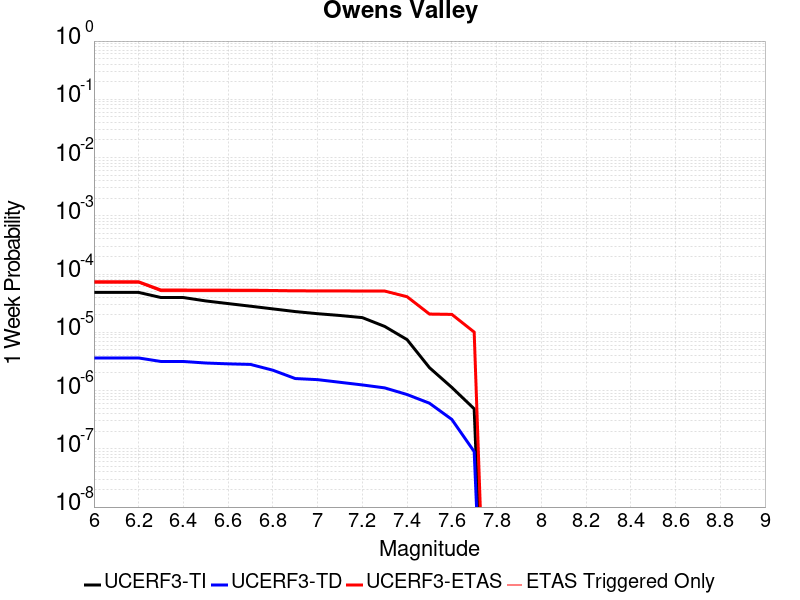 |  |  |  |

| Magnitude | 1 wk TI Prob | 1 wk TD Prob | 1 wk ETAS Prob | 1 wk ETAS/TD Gain | 1 wk ETAS Triggered Only | 1 mo TI Prob | 1 mo TD Prob | 1 mo ETAS Prob | 1 mo ETAS/TD Gain | 1 mo ETAS Triggered Only | 1 yr TI Prob | 1 yr TD Prob | 1 yr ETAS Prob | 1 yr ETAS/TD Gain | 1 yr ETAS Triggered Only | 10 yr TI Prob | 10 yr TD Prob | 10 yr ETAS Prob | 10 yr ETAS/TD Gain | 10 yr ETAS Triggered Only |
|-----|-----|-----|-----|-----|-----|-----|-----|-----|-----|-----|-----|-----|-----|-----|-----|-----|-----|-----|-----|-----|
| 6.0 | 4.83821E-5 | 3.626567E-6 | 7.362631E-5 | 20.301931 | 7.0E-5 | 2.0733538E-4 | 1.5542342E-5 | 8.554126E-5 | 5.5037556 | 7.0E-5 | 0.002521386 | 1.8921259E-4 | 2.9919177E-4 | 1.5812467 | 1.1E-4 | 0.024929691 | 0.001925011 | 0.0020946837 | 1.0881412 | 1.7E-4 |
| 6.1 | 4.83821E-5 | 3.626567E-6 | 7.362631E-5 | 20.301931 | 7.0E-5 | 2.0733538E-4 | 1.5542342E-5 | 8.554126E-5 | 5.5037556 | 7.0E-5 | 0.002521386 | 1.8921259E-4 | 2.9919177E-4 | 1.5812467 | 1.1E-4 | 0.024929691 | 0.001925011 | 0.0020946837 | 1.0881412 | 1.7E-4 |
| 6.2 | 4.83821E-5 | 3.626567E-6 | 7.362631E-5 | 20.301931 | 7.0E-5 | 2.0733538E-4 | 1.5542342E-5 | 8.554126E-5 | 5.5037556 | 7.0E-5 | 0.002521386 | 1.8921259E-4 | 2.9919177E-4 | 1.5812467 | 1.1E-4 | 0.024929691 | 0.001925011 | 0.0020946837 | 1.0881412 | 1.7E-4 |
| 6.3 | 3.953008E-5 | 3.1553948E-6 | 5.3155236E-5 | 16.845827 | 5.0E-5 | 1.6940363E-4 | 1.3523055E-5 | 6.352238E-5 | 4.6973395 | 5.0E-5 | 0.002060538 | 1.6463149E-4 | 2.446183E-4 | 1.4858538 | 8.0E-5 | 0.020415364 | 0.0016592 | 0.0017989676 | 1.084238 | 1.4E-4 |
| 6.4 | 3.953008E-5 | 3.1553948E-6 | 5.3155236E-5 | 16.845827 | 5.0E-5 | 1.6940363E-4 | 1.3523055E-5 | 6.352238E-5 | 4.6973395 | 5.0E-5 | 0.002060538 | 1.6463149E-4 | 2.446183E-4 | 1.4858538 | 8.0E-5 | 0.020415364 | 0.0016592 | 0.0017989676 | 1.084238 | 1.4E-4 |
| 6.5 | 3.457342E-5 | 2.9715961E-6 | 5.297145E-5 | 17.825924 | 5.0E-5 | 1.4816338E-4 | 1.2735354E-5 | 6.273472E-5 | 4.9260287 | 5.0E-5 | 0.0018023965 | 1.550426E-4 | 2.350302E-4 | 1.5159072 | 8.0E-5 | 0.017878477 | 0.001555719 | 0.0016855167 | 1.0834327 | 1.3E-4 |
| 6.6 | 3.1127765E-5 | 2.8744932E-6 | 5.287435E-5 | 18.39432 | 5.0E-5 | 1.3339789E-4 | 1.2319203E-5 | 6.2318584E-5 | 5.0586543 | 5.0E-5 | 0.0016229092 | 1.4997667E-4 | 2.2996466E-4 | 1.5333363 | 8.0E-5 | 0.016111081 | 0.0015012559 | 0.0016210757 | 1.0798131 | 1.2E-4 |
| 6.7 | 2.806885E-5 | 2.8104134E-6 | 5.2810272E-5 | 18.790928 | 5.0E-5 | 1.2028952E-4 | 1.20445775E-5 | 6.2043975E-5 | 5.151196 | 5.0E-5 | 0.001463541 | 1.4663354E-4 | 2.266218E-4 | 1.5454978 | 8.0E-5 | 0.014539397 | 0.0014657511 | 0.0015855752 | 1.0817493 | 1.2E-4 |
| 6.8 | 2.524524E-5 | 2.2353688E-6 | 5.2235257E-5 | 23.367624 | 5.0E-5 | 1.0818939E-4 | 9.580118E-6 | 5.957964E-5 | 6.2190924 | 5.0E-5 | 0.0013164099 | 1.16632E-4 | 1.9662267E-4 | 1.6858381 | 8.0E-5 | 0.01308639 | 0.0011659812 | 0.0012858412 | 1.1027976 | 1.2E-4 |
| 6.9 | 2.2704568E-5 | 1.6081682E-6 | 5.1608087E-5 | 32.091225 | 5.0E-5 | 9.730166E-5 | 6.8921313E-6 | 5.6891786E-5 | 8.2546 | 5.0E-5 | 0.0011840039 | 8.390849E-5 | 1.6390177E-4 | 1.9533396 | 8.0E-5 | 0.011777153 | 8.3897985E-4 | 9.4888755E-4 | 1.1310016 | 1.1E-4 |
| 7.0 | 2.0871712E-5 | 1.5395453E-6 | 5.1539468E-5 | 33.47707 | 5.0E-5 | 8.944713E-5 | 6.598035E-6 | 5.6597706E-5 | 8.577964 | 5.0E-5 | 0.0010884746 | 8.032813E-5 | 1.603217E-4 | 1.9958352 | 8.0E-5 | 0.010831586 | 8.0316263E-4 | 9.1307424E-4 | 1.1368486 | 1.1E-4 |
| 7.1 | 1.944928E-5 | 1.3864178E-6 | 5.138635E-5 | 37.064117 | 5.0E-5 | 8.335139E-5 | 5.941777E-6 | 5.594148E-5 | 9.414941 | 5.0E-5 | 0.0010143308 | 7.233874E-5 | 1.5233296E-4 | 2.105828 | 8.0E-5 | 0.010097133 | 7.2330976E-4 | 8.332302E-4 | 1.1519687 | 1.1E-4 |
| 7.2 | 1.7876306E-5 | 1.2489141E-6 | 5.124885E-5 | 41.03473 | 5.0E-5 | 7.6610486E-5 | 5.352478E-6 | 5.535221E-5 | 10.341417 | 5.0E-5 | 9.3233347E-4 | 6.516448E-5 | 1.4515927E-4 | 2.2275827 | 8.0E-5 | 0.009284316 | 6.5159105E-4 | 7.6151936E-4 | 1.1687075 | 1.1E-4 |
| 7.3 | 1.2618672E-5 | 1.1115209E-6 | 5.1111467E-5 | 45.98336 | 5.0E-5 | 5.40789E-5 | 4.763652E-6 | 5.4763415E-5 | 11.4960985 | 5.0E-5 | 6.582117E-4 | 5.799593E-5 | 1.3799129E-4 | 2.379327 | 8.0E-5 | 0.0065626553 | 5.7994033E-4 | 6.8987656E-4 | 1.1895647 | 1.1E-4 |
| 7.4 | 7.4874442E-6 | 8.5486437E-7 | 4.085483E-5 | 47.791008 | 4.0E-5 | 3.208865E-5 | 3.6636993E-6 | 4.3663553E-5 | 11.917887 | 4.0E-5 | 3.906093E-4 | 4.4604632E-5 | 1.1460151E-4 | 2.5692737 | 7.0E-5 | 0.003899234 | 4.4604883E-4 | 5.460042E-4 | 1.2240907 | 1.0E-4 |
| 7.5 | 2.4734156E-6 | 6.068616E-7 | 2.0606849E-5 | 33.956425 | 2.0E-5 | 1.060031E-5 | 2.6008327E-6 | 2.2600781E-5 | 8.689825 | 2.0E-5 | 1.2905113E-4 | 3.166468E-5 | 8.16631E-5 | 2.5789964 | 5.0E-5 | 0.0012897621 | 3.1660203E-4 | 3.8657986E-4 | 1.2210277 | 7.0E-5 |
| 7.6 | 1.1328841E-6 | 3.196531E-7 | 2.0319647E-5 | 63.567806 | 2.0E-5 | 4.8552088E-6 | 1.3699412E-6 | 2.1369913E-5 | 15.599147 | 2.0E-5 | 5.9110564E-5 | 1.6678909E-5 | 6.6678076E-5 | 3.9977481 | 5.0E-5 | 5.9094845E-4 | 1.6677675E-4 | 2.3676507E-4 | 1.4196528 | 7.0E-5 |
| 7.7 | 4.8613185E-7 | 8.964689E-8 | 1.0089646E-5 | 112.54876 | 1.0E-5 | 2.0834207E-6 | 3.8420092E-7 | 1.0384197E-5 | 27.02804 | 1.0E-5 | 2.536535E-5 | 4.6776368E-6 | 2.4677543E-5 | 5.2756433 | 2.0E-5 | 2.5362454E-4 | 4.677545E-5 | 7.677405E-5 | 1.641332 | 3.0E-5 |

## Red Mountain
*[(top)](#table-of-contents)*

| 1 Week | 1 Month | 1 Year | 10 Year |
|-----|-----|-----|-----|
| 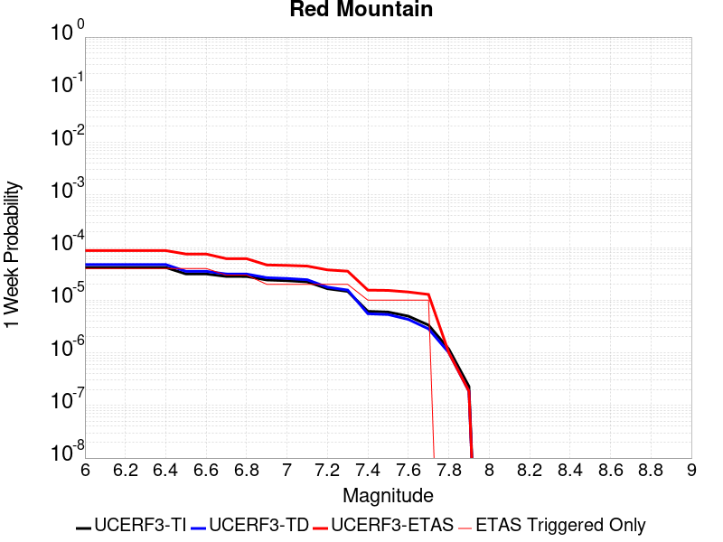 |  | 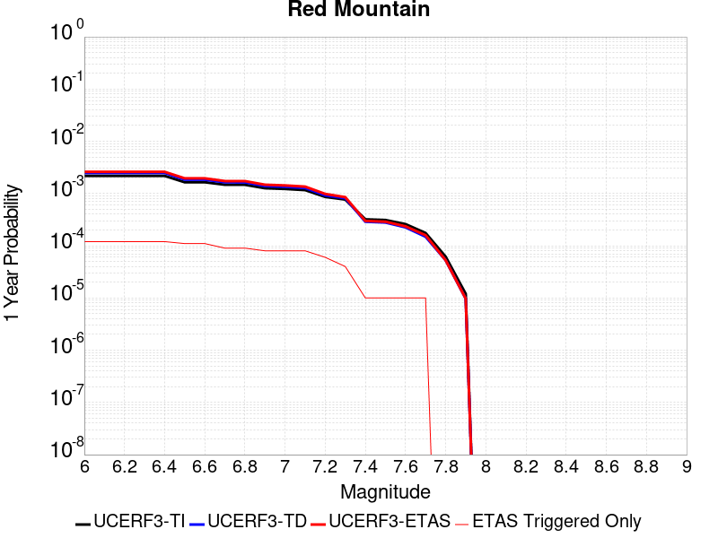 |  |

| Magnitude | 1 wk TI Prob | 1 wk TD Prob | 1 wk ETAS Prob | 1 wk ETAS/TD Gain | 1 wk ETAS Triggered Only | 1 mo TI Prob | 1 mo TD Prob | 1 mo ETAS Prob | 1 mo ETAS/TD Gain | 1 mo ETAS Triggered Only | 1 yr TI Prob | 1 yr TD Prob | 1 yr ETAS Prob | 1 yr ETAS/TD Gain | 1 yr ETAS Triggered Only | 10 yr TI Prob | 10 yr TD Prob | 10 yr ETAS Prob | 10 yr ETAS/TD Gain | 10 yr ETAS Triggered Only |
|-----|-----|-----|-----|-----|-----|-----|-----|-----|-----|-----|-----|-----|-----|-----|-----|-----|-----|-----|-----|-----|
| 6.0 | 4.1810763E-5 | 4.7589947E-5 | 8.758804E-5 | 1.8404737 | 4.0E-5 | 1.7917668E-4 | 2.039419E-4 | 2.7392764E-4 | 1.343165 | 7.0E-5 | 0.0021792934 | 0.0024803306 | 0.002600033 | 1.0482607 | 1.2E-4 | 0.021580452 | 0.024544092 | 0.02469041 | 1.0059614 | 1.5E-4 |
| 6.1 | 4.1810763E-5 | 4.7589947E-5 | 8.758804E-5 | 1.8404737 | 4.0E-5 | 1.7917668E-4 | 2.039419E-4 | 2.7392764E-4 | 1.343165 | 7.0E-5 | 0.0021792934 | 0.0024803306 | 0.002600033 | 1.0482607 | 1.2E-4 | 0.021580452 | 0.024544092 | 0.02469041 | 1.0059614 | 1.5E-4 |
| 6.2 | 4.1810763E-5 | 4.7589947E-5 | 8.758804E-5 | 1.8404737 | 4.0E-5 | 1.7917668E-4 | 2.039419E-4 | 2.7392764E-4 | 1.343165 | 7.0E-5 | 0.0021792934 | 0.0024803306 | 0.002600033 | 1.0482607 | 1.2E-4 | 0.021580452 | 0.024544092 | 0.02469041 | 1.0059614 | 1.5E-4 |
| 6.3 | 4.1810763E-5 | 4.7589947E-5 | 8.758804E-5 | 1.8404737 | 4.0E-5 | 1.7917668E-4 | 2.039419E-4 | 2.7392764E-4 | 1.343165 | 7.0E-5 | 0.0021792934 | 0.0024803306 | 0.002600033 | 1.0482607 | 1.2E-4 | 0.021580452 | 0.024544092 | 0.02469041 | 1.0059614 | 1.5E-4 |
| 6.4 | 4.1810763E-5 | 4.7589947E-5 | 8.758804E-5 | 1.8404737 | 4.0E-5 | 1.7917668E-4 | 2.039419E-4 | 2.7392764E-4 | 1.343165 | 7.0E-5 | 0.0021792934 | 0.0024803306 | 0.002600033 | 1.0482607 | 1.2E-4 | 0.021580452 | 0.024544092 | 0.02469041 | 1.0059614 | 1.5E-4 |
| 6.5 | 3.154503E-5 | 3.5359728E-5 | 7.5358315E-5 | 2.1311905 | 4.0E-5 | 1.3518598E-4 | 1.5153342E-4 | 2.215228E-4 | 1.4618744 | 7.0E-5 | 0.0016446467 | 0.0018434501 | 0.0019532472 | 1.0595608 | 1.1E-4 | 0.01632528 | 0.018291233 | 0.01840904 | 1.0064405 | 1.2E-4 |
| 6.6 | 3.1535834E-5 | 3.534911E-5 | 7.534769E-5 | 2.1315303 | 4.0E-5 | 1.3514658E-4 | 1.5148791E-4 | 2.214773E-4 | 1.4620131 | 7.0E-5 | 0.0016441676 | 0.001842897 | 0.0019526944 | 1.0595787 | 1.1E-4 | 0.01632056 | 0.018285794 | 0.0184036 | 1.0064424 | 1.2E-4 |
| 6.7 | 2.8267326E-5 | 3.146934E-5 | 6.1468396E-5 | 1.9532789 | 3.0E-5 | 1.2114006E-4 | 1.348621E-4 | 1.9485402E-4 | 1.4448389 | 6.0E-5 | 0.0014738824 | 0.0016407946 | 0.0017306468 | 1.0547615 | 9.0E-5 | 0.014641452 | 0.016295563 | 0.016393933 | 1.0060366 | 1.0E-4 |
| 6.8 | 2.8212884E-5 | 3.1407224E-5 | 6.140628E-5 | 1.9551642 | 3.0E-5 | 1.20906756E-4 | 1.3459593E-4 | 1.9458785E-4 | 1.4457188 | 6.0E-5 | 0.0014710457 | 0.0016375587 | 0.0017274113 | 1.0548699 | 9.0E-5 | 0.014613459 | 0.01626368 | 0.016362052 | 1.0060487 | 1.0E-4 |
| 6.9 | 2.4227871E-5 | 2.6706979E-5 | 4.6706446E-5 | 1.748848 | 2.0E-5 | 1.03829596E-4 | 1.14453884E-4 | 1.6444817E-4 | 1.4368072 | 5.0E-5 | 0.0012633923 | 0.0013926612 | 0.0014725497 | 1.057364 | 8.0E-5 | 0.012562336 | 0.013847026 | 0.013935779 | 1.0064096 | 9.0E-5 |
| 7.0 | 2.348524E-5 | 2.5835763E-5 | 4.5835248E-5 | 1.7741008 | 2.0E-5 | 1.0064714E-4 | 1.1072042E-4 | 1.6071489E-4 | 1.4515378 | 5.0E-5 | 0.0012246901 | 0.0013472632 | 0.0014271555 | 1.0592996 | 8.0E-5 | 0.012179627 | 0.01339859 | 0.013487384 | 1.0066271 | 9.0E-5 |
| 7.1 | 2.2311642E-5 | 2.4462828E-5 | 4.446234E-5 | 1.817547 | 2.0E-5 | 9.561782E-5 | 1.048369E-4 | 1.5483166E-4 | 1.4768813 | 5.0E-5 | 0.0011635252 | 0.0012757168 | 0.0013556147 | 1.0626298 | 8.0E-5 | 0.01157452 | 0.012691451 | 0.01278031 | 1.0070014 | 9.0E-5 |
| 7.2 | 1.6533986E-5 | 1.7670347E-5 | 3.7669994E-5 | 2.1318197 | 2.0E-5 | 7.085802E-5 | 7.572822E-5 | 1.2572443E-4 | 1.6602058 | 5.0E-5 | 8.623549E-4 | 9.216645E-4 | 9.816092E-4 | 1.0650396 | 6.0E-5 | 0.008590161 | 0.009184699 | 0.009254056 | 1.0075513 | 7.0E-5 |
| 7.3 | 1.4703092E-5 | 1.555952E-5 | 3.555921E-5 | 2.2853665 | 2.0E-5 | 6.301173E-5 | 6.66823E-5 | 1.0667964E-4 | 1.5998193 | 4.0E-5 | 7.668978E-4 | 8.1161625E-4 | 8.515838E-4 | 1.0492444 | 4.0E-5 | 0.0076425658 | 0.008092596 | 0.008142191 | 1.0061284 | 5.0E-5 |
| 7.4 | 6.1331984E-6 | 5.528872E-6 | 1.5528816E-5 | 2.8086772 | 1.0E-5 | 2.6284872E-5 | 2.3694953E-5 | 3.3694716E-5 | 1.4220208 | 1.0E-5 | 3.199713E-4 | 2.8844838E-4 | 2.984455E-4 | 1.0346582 | 1.0E-5 | 0.0031951098 | 0.0028807942 | 0.0029007366 | 1.0069225 | 2.0E-5 |
| 7.5 | 5.954766E-6 | 5.3385015E-6 | 1.5338448E-5 | 2.873175 | 1.0E-5 | 2.5520176E-5 | 2.2879094E-5 | 3.2878866E-5 | 1.4370703 | 1.0E-5 | 3.1066386E-4 | 2.785179E-4 | 2.8851512E-4 | 1.0358944 | 1.0E-5 | 0.003102299 | 0.0027817423 | 0.0028016868 | 1.0071697 | 2.0E-5 |
| 7.6 | 4.9726646E-6 | 4.315295E-6 | 1.4315252E-5 | 3.3173287 | 1.0E-5 | 2.1311245E-5 | 1.8493993E-5 | 2.8493807E-5 | 1.5407062 | 1.0E-5 | 2.5943352E-4 | 2.2514143E-4 | 2.3513917E-4 | 1.0444065 | 1.0E-5 | 0.0025913084 | 0.002249168 | 0.002269123 | 1.0088722 | 2.0E-5 |
| 7.7 | 3.3613894E-6 | 2.8526642E-6 | 1.2852636E-5 | 4.5054846 | 1.0E-5 | 1.4405875E-5 | 1.2225649E-5 | 2.2225526E-5 | 1.8179425 | 1.0E-5 | 1.7537741E-4 | 1.4883737E-4 | 1.5883589E-4 | 1.0671774 | 1.0E-5 | 0.0017523908 | 0.0014874031 | 0.0015073734 | 1.0134263 | 2.0E-5 |
| 7.8 | 1.1828961E-6 | 1.0122756E-6 | 1.0122756E-6 | 1.0 | 0.0 | 5.069545E-6 | 4.338317E-6 | 4.338317E-6 | 1.0 | 0.0 | 6.171996E-5 | 5.281776E-5 | 5.281776E-5 | 1.0 | 0.0 | 6.170282E-4 | 5.2805495E-4 | 5.380497E-4 | 1.0189275 | 1.0E-5 |
| 7.9 | 2.2967266E-7 | 1.8618952E-7 | 1.8618952E-7 | 1.0 | 0.0 | 9.843111E-7 | 7.9795484E-7 | 7.9795484E-7 | 1.0 | 0.0 | 1.19839215E-5 | 9.7150605E-6 | 9.7150605E-6 | 1.0 | 0.0 | 1.1983275E-4 | 9.714664E-5 | 9.714664E-5 | 1.0 | 0.0 |

## San Jacinto (Stepovers Combined)
*[(top)](#table-of-contents)*

| 1 Week | 1 Month | 1 Year | 10 Year |
|-----|-----|-----|-----|
|  |  |  |  |

| Magnitude | 1 wk TI Prob | 1 wk TD Prob | 1 wk ETAS Prob | 1 wk ETAS/TD Gain | 1 wk ETAS Triggered Only | 1 mo TI Prob | 1 mo TD Prob | 1 mo ETAS Prob | 1 mo ETAS/TD Gain | 1 mo ETAS Triggered Only | 1 yr TI Prob | 1 yr TD Prob | 1 yr ETAS Prob | 1 yr ETAS/TD Gain | 1 yr ETAS Triggered Only | 10 yr TI Prob | 10 yr TD Prob | 10 yr ETAS Prob | 10 yr ETAS/TD Gain | 10 yr ETAS Triggered Only |
|-----|-----|-----|-----|-----|-----|-----|-----|-----|-----|-----|-----|-----|-----|-----|-----|-----|-----|-----|-----|-----|
| 6.0 | 4.0667746E-5 | 3.5272755E-5 | 8.527099E-5 | 2.4174747 | 5.0E-5 | 1.742787E-4 | 1.5116022E-4 | 2.4114661E-4 | 1.5953047 | 9.0E-5 | 0.0021197782 | 0.0018388226 | 0.0019785652 | 1.0759957 | 1.4E-4 | 0.020996714 | 0.018986892 | 0.019143853 | 1.0082669 | 1.6E-4 |
| 6.1 | 4.0667746E-5 | 3.5272755E-5 | 8.527099E-5 | 2.4174747 | 5.0E-5 | 1.742787E-4 | 1.5116022E-4 | 2.4114661E-4 | 1.5953047 | 9.0E-5 | 0.0021197782 | 0.0018388226 | 0.0019785652 | 1.0759957 | 1.4E-4 | 0.020996714 | 0.018986892 | 0.019143853 | 1.0082669 | 1.6E-4 |
| 6.2 | 4.0667746E-5 | 3.5272755E-5 | 8.527099E-5 | 2.4174747 | 5.0E-5 | 1.742787E-4 | 1.5116022E-4 | 2.4114661E-4 | 1.5953047 | 9.0E-5 | 0.0021197782 | 0.0018388226 | 0.0019785652 | 1.0759957 | 1.4E-4 | 0.020996714 | 0.018986892 | 0.019143853 | 1.0082669 | 1.6E-4 |
| 6.3 | 4.0667746E-5 | 3.5272755E-5 | 8.527099E-5 | 2.4174747 | 5.0E-5 | 1.742787E-4 | 1.5116022E-4 | 2.4114661E-4 | 1.5953047 | 9.0E-5 | 0.0021197782 | 0.0018388226 | 0.0019785652 | 1.0759957 | 1.4E-4 | 0.020996714 | 0.018986892 | 0.019143853 | 1.0082669 | 1.6E-4 |
| 6.4 | 4.0577226E-5 | 3.5144654E-5 | 8.51429E-5 | 2.4226415 | 5.0E-5 | 1.738908E-4 | 1.5061127E-4 | 2.4059771E-4 | 1.5974748 | 9.0E-5 | 0.0021150648 | 0.0018321523 | 0.0019718958 | 1.0762728 | 1.4E-4 | 0.020950472 | 0.018921461 | 0.019078434 | 1.008296 | 1.6E-4 |
| 6.5 | 4.0577226E-5 | 3.5144654E-5 | 8.51429E-5 | 2.4226415 | 5.0E-5 | 1.738908E-4 | 1.5061127E-4 | 2.4059771E-4 | 1.5974748 | 9.0E-5 | 0.0021150648 | 0.0018321523 | 0.0019718958 | 1.0762728 | 1.4E-4 | 0.020950472 | 0.018921461 | 0.019078434 | 1.008296 | 1.6E-4 |
| 6.6 | 4.053861E-5 | 3.509E-5 | 8.508825E-5 | 2.4248574 | 5.0E-5 | 1.7372532E-4 | 1.5037706E-4 | 2.4036353E-4 | 1.5984055 | 9.0E-5 | 0.0021130538 | 0.0018293057 | 0.0019690495 | 1.0763918 | 1.4E-4 | 0.020930743 | 0.018893538 | 0.019050516 | 1.0083085 | 1.6E-4 |
| 6.7 | 4.0516545E-5 | 3.5059067E-5 | 8.505731E-5 | 2.4261146 | 5.0E-5 | 1.7363077E-4 | 1.5024451E-4 | 2.4023099E-4 | 1.5989336 | 9.0E-5 | 0.002111905 | 0.001827695 | 0.0019674392 | 1.0764592 | 1.4E-4 | 0.020919468 | 0.018877735 | 0.019034715 | 1.0083156 | 1.6E-4 |
| 6.8 | 4.049434E-5 | 3.5030633E-5 | 8.502888E-5 | 2.4272723 | 5.0E-5 | 1.7353562E-4 | 1.5012265E-4 | 2.4010915E-4 | 1.5994198 | 9.0E-5 | 0.0021107488 | 0.0018262138 | 0.0019659582 | 1.0765214 | 1.4E-4 | 0.020908125 | 0.018863149 | 0.01902013 | 1.0083221 | 1.6E-4 |
| 6.9 | 4.046386E-5 | 3.499319E-5 | 8.499144E-5 | 2.4287994 | 5.0E-5 | 1.73405E-4 | 1.4996222E-4 | 2.3994873E-4 | 1.6000612 | 9.0E-5 | 0.0021091616 | 0.0018242638 | 0.0019640084 | 1.0766033 | 1.4E-4 | 0.020892553 | 0.01884392 | 0.019000906 | 1.0083308 | 1.6E-4 |
| 7.0 | 4.036382E-5 | 3.487376E-5 | 8.4872016E-5 | 2.433693 | 5.0E-5 | 1.7297632E-4 | 1.4945042E-4 | 2.3943697E-4 | 1.6021165 | 9.0E-5 | 0.0021039525 | 0.0018180435 | 0.001957789 | 1.0768659 | 1.4E-4 | 0.02084144 | 0.018782536 | 0.01893953 | 1.0083586 | 1.6E-4 |
| 7.1 | 4.0343282E-5 | 3.4852223E-5 | 8.485048E-5 | 2.434579 | 5.0E-5 | 1.7288832E-4 | 1.4935812E-4 | 2.3934469E-4 | 1.6024885 | 9.0E-5 | 0.002102883 | 0.0018169218 | 0.0019566675 | 1.0769134 | 1.4E-4 | 0.020830948 | 0.018771412 | 0.018928409 | 1.0083636 | 1.6E-4 |
| 7.2 | 4.0257353E-5 | 3.4756722E-5 | 8.475498E-5 | 2.4385207 | 5.0E-5 | 1.725201E-4 | 1.489489E-4 | 2.3893549E-4 | 1.6041441 | 9.0E-5 | 0.0020984085 | 0.0018119477 | 0.001951694 | 1.077125 | 1.4E-4 | 0.020787042 | 0.018722152 | 0.018879157 | 1.008386 | 1.6E-4 |
| 7.3 | 3.9940667E-5 | 3.4584376E-5 | 8.458265E-5 | 2.4456894 | 5.0E-5 | 1.7116306E-4 | 1.4821035E-4 | 2.3819701E-4 | 1.607155 | 9.0E-5 | 0.0020819185 | 0.0018029709 | 0.0019427185 | 1.0775096 | 1.4E-4 | 0.020625217 | 0.018630784 | 0.018787803 | 1.008428 | 1.6E-4 |
| 7.4 | 3.9721202E-5 | 3.4469766E-5 | 8.446804E-5 | 2.4504964 | 5.0E-5 | 1.7022261E-4 | 1.4771923E-4 | 2.3770593E-4 | 1.609174 | 9.0E-5 | 0.0020704903 | 0.0017970012 | 0.0019367497 | 1.0777676 | 1.4E-4 | 0.020513052 | 0.018569905 | 0.018726936 | 1.0084561 | 1.6E-4 |
| 7.5 | 3.7036873E-5 | 3.3537188E-5 | 8.353551E-5 | 2.4908323 | 5.0E-5 | 1.5871979E-4 | 1.437229E-4 | 2.3370996E-4 | 1.6261151 | 9.0E-5 | 0.0019307006 | 0.0017484248 | 0.00188818 | 1.0799321 | 1.4E-4 | 0.019140124 | 0.018071463 | 0.018228572 | 1.0086937 | 1.6E-4 |
| 7.6 | 3.2940967E-5 | 3.1317984E-5 | 8.131642E-5 | 2.5964768 | 5.0E-5 | 1.4116794E-4 | 1.3421304E-4 | 2.2420097E-4 | 1.6704856 | 9.0E-5 | 0.0017173645 | 0.0016328214 | 0.0017725928 | 1.0856012 | 1.4E-4 | 0.01704153 | 0.016904354 | 0.017061649 | 1.009305 | 1.6E-4 |
| 7.7 | 2.8236149E-5 | 2.7883889E-5 | 7.78825E-5 | 2.7931 | 5.0E-5 | 1.2100645E-4 | 1.19496915E-4 | 2.0948616E-4 | 1.7530675 | 9.0E-5 | 0.0014722579 | 0.001453905 | 0.0015937015 | 1.0961524 | 1.4E-4 | 0.014625421 | 0.015115095 | 0.015272677 | 1.0104254 | 1.6E-4 |
| 7.8 | 2.4329287E-5 | 2.5207537E-5 | 7.520628E-5 | 2.9834838 | 5.0E-5 | 1.042642E-4 | 1.0802783E-4 | 1.9801811E-4 | 1.8330287 | 9.0E-5 | 0.0012686774 | 0.0013144462 | 0.0014542622 | 1.1063688 | 1.4E-4 | 0.012614589 | 0.013712396 | 0.013870202 | 1.0115082 | 1.6E-4 |
| 7.9 | 1.9370926E-5 | 2.0421452E-5 | 7.042043E-5 | 3.4483557 | 5.0E-5 | 8.301561E-5 | 8.7517576E-5 | 1.775097E-4 | 2.0282748 | 9.0E-5 | 0.0010102465 | 0.0010650064 | 0.0012048573 | 1.1313146 | 1.4E-4 | 0.0100566605 | 0.011199483 | 0.01135769 | 1.0141264 | 1.6E-4 |
| 8.0 | 1.5583017E-5 | 1.588647E-5 | 3.588615E-5 | 2.258913 | 2.0E-5 | 6.6782646E-5 | 6.808309E-5 | 1.28079E-4 | 1.881216 | 6.0E-5 | 8.127754E-4 | 8.285971E-4 | 9.2851423E-4 | 1.1205859 | 1.0E-4 | 0.008098091 | 0.008781809 | 0.008900756 | 1.0135446 | 1.2E-4 |
| 8.1 | 1.0024873E-5 | 8.292404E-6 | 1.8292321E-5 | 2.2059128 | 1.0E-5 | 4.2963035E-5 | 3.5538393E-5 | 7.553697E-5 | 2.1255033 | 4.0E-5 | 5.229494E-4 | 4.3259456E-4 | 4.925686E-4 | 1.138638 | 6.0E-5 | 0.0052172043 | 0.0046534105 | 0.0047131316 | 1.0128337 | 6.0E-5 |
| 8.2 | 4.142796E-6 | 1.5610041E-6 | 1.5610041E-6 | 1.0 | 0.0 | 1.775472E-5 | 6.69E-6 | 6.69E-6 | 1.0 | 0.0 | 2.1614227E-4 | 8.144774E-5 | 9.144692E-5 | 1.1227682 | 1.0E-5 | 0.0021593217 | 9.454649E-4 | 9.554554E-4 | 1.0105668 | 1.0E-5 |
| 8.3 | 1.2750878E-6 | 3.612133E-7 | 3.612133E-7 | 1.0 | 0.0 | 5.4646503E-6 | 1.548056E-6 | 1.548056E-6 | 1.0 | 0.0 | 6.653009E-5 | 1.8847424E-5 | 1.8847424E-5 | 1.0 | 0.0 | 6.6510175E-4 | 2.2734253E-4 | 2.2734253E-4 | 1.0 | 0.0 |

## Deep Springs
*[(top)](#table-of-contents)*

| 1 Week | 1 Month | 1 Year | 10 Year |
|-----|-----|-----|-----|
|  |  | 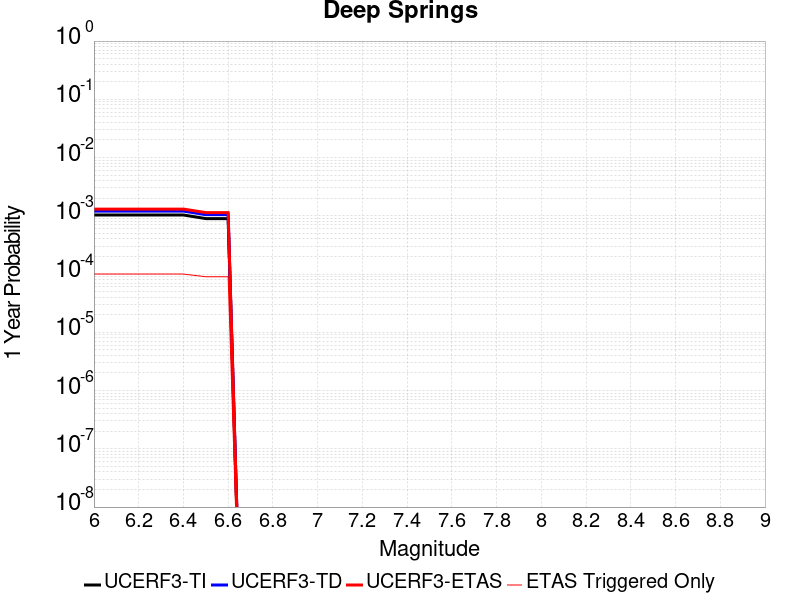 |  |

| Magnitude | 1 wk TI Prob | 1 wk TD Prob | 1 wk ETAS Prob | 1 wk ETAS/TD Gain | 1 wk ETAS Triggered Only | 1 mo TI Prob | 1 mo TD Prob | 1 mo ETAS Prob | 1 mo ETAS/TD Gain | 1 mo ETAS Triggered Only | 1 yr TI Prob | 1 yr TD Prob | 1 yr ETAS Prob | 1 yr ETAS/TD Gain | 1 yr ETAS Triggered Only | 10 yr TI Prob | 10 yr TD Prob | 10 yr ETAS Prob | 10 yr ETAS/TD Gain | 10 yr ETAS Triggered Only |
|-----|-----|-----|-----|-----|-----|-----|-----|-----|-----|-----|-----|-----|-----|-----|-----|-----|-----|-----|-----|-----|
| 6.0 | 1.9810619E-5 | 2.311252E-5 | 6.31116E-5 | 2.7306237 | 4.0E-5 | 8.489989E-5 | 9.905276E-5 | 1.490478E-4 | 1.5047315 | 5.0E-5 | 0.001033166 | 0.0012058079 | 0.0013056874 | 1.082832 | 1.0E-4 | 0.010283757 | 0.012042425 | 0.012180739 | 1.0114856 | 1.4E-4 |
| 6.1 | 1.9810619E-5 | 2.311252E-5 | 6.31116E-5 | 2.7306237 | 4.0E-5 | 8.489989E-5 | 9.905276E-5 | 1.490478E-4 | 1.5047315 | 5.0E-5 | 0.001033166 | 0.0012058079 | 0.0013056874 | 1.082832 | 1.0E-4 | 0.010283757 | 0.012042425 | 0.012180739 | 1.0114856 | 1.4E-4 |
| 6.2 | 1.9810619E-5 | 2.311252E-5 | 6.31116E-5 | 2.7306237 | 4.0E-5 | 8.489989E-5 | 9.905276E-5 | 1.490478E-4 | 1.5047315 | 5.0E-5 | 0.001033166 | 0.0012058079 | 0.0013056874 | 1.082832 | 1.0E-4 | 0.010283757 | 0.012042425 | 0.012180739 | 1.0114856 | 1.4E-4 |
| 6.3 | 1.9810619E-5 | 2.311252E-5 | 6.31116E-5 | 2.7306237 | 4.0E-5 | 8.489989E-5 | 9.905276E-5 | 1.490478E-4 | 1.5047315 | 5.0E-5 | 0.001033166 | 0.0012058079 | 0.0013056874 | 1.082832 | 1.0E-4 | 0.010283757 | 0.012042425 | 0.012180739 | 1.0114856 | 1.4E-4 |
| 6.4 | 1.9810619E-5 | 2.311252E-5 | 6.31116E-5 | 2.7306237 | 4.0E-5 | 8.489989E-5 | 9.905276E-5 | 1.490478E-4 | 1.5047315 | 5.0E-5 | 0.001033166 | 0.0012058079 | 0.0013056874 | 1.082832 | 1.0E-4 | 0.010283757 | 0.012042425 | 0.012180739 | 1.0114856 | 1.4E-4 |
| 6.5 | 1.7190405E-5 | 2.0050555E-5 | 6.0049755E-5 | 2.9949172 | 4.0E-5 | 7.367108E-5 | 8.593095E-5 | 1.3592666E-4 | 1.5818125 | 5.0E-5 | 8.9657627E-4 | 0.0010462094 | 0.0011361152 | 1.0859349 | 9.0E-5 | 0.008929676 | 0.010462056 | 0.0105808005 | 1.01135 | 1.2E-4 |
| 6.6 | 1.7190405E-5 | 2.0050555E-5 | 6.0049755E-5 | 2.9949172 | 4.0E-5 | 7.367108E-5 | 8.593095E-5 | 1.3592666E-4 | 1.5818125 | 5.0E-5 | 8.9657627E-4 | 0.0010462094 | 0.0011361152 | 1.0859349 | 9.0E-5 | 0.008929676 | 0.010462056 | 0.0105808005 | 1.01135 | 1.2E-4 |

## Sheephole
*[(top)](#table-of-contents)*

| 1 Week | 1 Month | 1 Year | 10 Year |
|-----|-----|-----|-----|
|  |  | 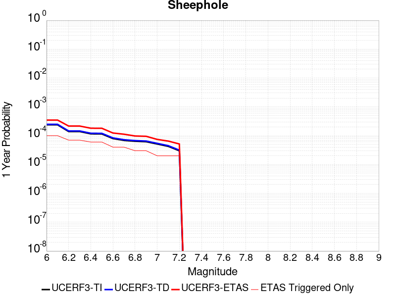 |  |

| Magnitude | 1 wk TI Prob | 1 wk TD Prob | 1 wk ETAS Prob | 1 wk ETAS/TD Gain | 1 wk ETAS Triggered Only | 1 mo TI Prob | 1 mo TD Prob | 1 mo ETAS Prob | 1 mo ETAS/TD Gain | 1 mo ETAS Triggered Only | 1 yr TI Prob | 1 yr TD Prob | 1 yr ETAS Prob | 1 yr ETAS/TD Gain | 1 yr ETAS Triggered Only | 10 yr TI Prob | 10 yr TD Prob | 10 yr ETAS Prob | 10 yr ETAS/TD Gain | 10 yr ETAS Triggered Only |
|-----|-----|-----|-----|-----|-----|-----|-----|-----|-----|-----|-----|-----|-----|-----|-----|-----|-----|-----|-----|-----|
| 6.0 | 4.5579695E-6 | 4.7412627E-6 | 6.4740976E-5 | 13.654797 | 6.0E-5 | 1.9534009E-5 | 2.031957E-5 | 9.031815E-5 | 4.444885 | 7.0E-5 | 2.3780059E-4 | 2.473682E-4 | 3.4734348E-4 | 1.4041556 | 1.0E-4 | 0.0023754628 | 0.002471473 | 0.0026111272 | 1.0565064 | 1.4E-4 |
| 6.1 | 4.5579695E-6 | 4.7412627E-6 | 6.4740976E-5 | 13.654797 | 6.0E-5 | 1.9534009E-5 | 2.031957E-5 | 9.031815E-5 | 4.444885 | 7.0E-5 | 2.3780059E-4 | 2.473682E-4 | 3.4734348E-4 | 1.4041556 | 1.0E-4 | 0.0023754628 | 0.002471473 | 0.0026111272 | 1.0565064 | 1.4E-4 |
| 6.2 | 2.6677674E-6 | 2.7873941E-6 | 3.278731E-5 | 11.762711 | 3.0E-5 | 1.1433239E-5 | 1.1945926E-5 | 5.1945448E-5 | 4.3483815 | 4.0E-5 | 1.3919079E-4 | 1.4543302E-4 | 2.1542284E-4 | 1.4812512 | 7.0E-5 | 0.0013910364 | 0.0014534844 | 0.0015533391 | 1.0687002 | 1.0E-4 |
| 6.3 | 2.6677674E-6 | 2.7873941E-6 | 3.278731E-5 | 11.762711 | 3.0E-5 | 1.1433239E-5 | 1.1945926E-5 | 5.1945448E-5 | 4.3483815 | 4.0E-5 | 1.3919079E-4 | 1.4543302E-4 | 2.1542284E-4 | 1.4812512 | 7.0E-5 | 0.0013910364 | 0.0014534844 | 0.0015533391 | 1.0687002 | 1.0E-4 |
| 6.4 | 2.2159759E-6 | 2.3228788E-6 | 2.2322833E-5 | 9.609986 | 2.0E-5 | 9.497005E-6 | 9.955161E-6 | 3.9954863E-5 | 4.013482 | 3.0E-5 | 1.156199E-4 | 1.2119815E-4 | 1.8119087E-4 | 1.494997 | 6.0E-5 | 0.0011555976 | 0.0012113999 | 0.0012813151 | 1.0577143 | 7.0E-5 |
| 6.5 | 2.1986082E-6 | 2.304759E-6 | 2.2304714E-5 | 9.677677 | 2.0E-5 | 9.4225725E-6 | 9.877506E-6 | 3.987721E-5 | 4.0371737 | 3.0E-5 | 1.1471378E-4 | 1.2025281E-4 | 1.802456E-4 | 1.4988889 | 6.0E-5 | 0.0011465458 | 0.0012019566 | 0.0012718725 | 1.0581684 | 7.0E-5 |
| 6.6 | 1.5232331E-6 | 1.6018919E-6 | 2.160186E-5 | 13.485217 | 2.0E-5 | 6.5281256E-6 | 6.865234E-6 | 2.6865097E-5 | 3.9132092 | 2.0E-5 | 7.947703E-5 | 8.35812E-5 | 1.2357786E-4 | 1.4785365 | 4.0E-5 | 7.9448614E-4 | 8.3551643E-4 | 8.854746E-4 | 1.0597932 | 5.0E-5 |
| 6.7 | 1.3137362E-6 | 1.382819E-6 | 2.1382792E-5 | 15.463188 | 2.0E-5 | 5.6302856E-6 | 5.926355E-6 | 2.5926236E-5 | 4.374736 | 2.0E-5 | 6.854657E-5 | 7.215112E-5 | 1.12148235E-4 | 1.5543519 | 4.0E-5 | 6.8525434E-4 | 7.212908E-4 | 7.7125477E-4 | 1.0692701 | 5.0E-5 |
| 6.8 | 1.2275751E-6 | 1.2922847E-6 | 1.1292272E-5 | 8.738223 | 1.0E-5 | 5.2610258E-6 | 5.5383516E-6 | 1.5538297E-5 | 2.8055813 | 1.0E-5 | 6.4051106E-5 | 6.7427485E-5 | 9.742546E-5 | 1.4448924 | 3.0E-5 | 6.4032647E-4 | 6.740836E-4 | 7.140566E-4 | 1.0592998 | 4.0E-5 |
| 6.9 | 1.1837088E-6 | 1.246102E-6 | 1.1246089E-5 | 9.025015 | 1.0E-5 | 5.0730278E-6 | 5.340427E-6 | 1.5340374E-5 | 2.8724995 | 1.0E-5 | 6.176237E-5 | 6.501789E-5 | 9.5015945E-5 | 1.4613814 | 3.0E-5 | 6.17452E-4 | 6.5000186E-4 | 6.8997586E-4 | 1.0614983 | 4.0E-5 |
| 7.0 | 9.849371E-7 | 1.0366288E-6 | 1.1036618E-5 | 10.646645 | 1.0E-5 | 4.2211523E-6 | 4.442688E-6 | 1.4442643E-5 | 3.2508795 | 1.0E-5 | 5.1391315E-5 | 5.4088487E-5 | 7.40874E-5 | 1.3697444 | 2.0E-5 | 5.137943E-4 | 5.407633E-4 | 5.7074707E-4 | 1.0554471 | 3.0E-5 |
| 7.1 | 8.1643645E-7 | 8.591669E-7 | 1.08591585E-5 | 12.639173 | 1.0E-5 | 3.4990085E-6 | 3.682139E-6 | 1.3682103E-5 | 3.7158027 | 1.0E-5 | 4.2599597E-5 | 4.482921E-5 | 6.482832E-5 | 1.4461176 | 2.0E-5 | 4.259143E-4 | 4.4821028E-4 | 4.7819686E-4 | 1.0669029 | 3.0E-5 |
| 7.2 | 5.7295756E-7 | 6.029502E-7 | 1.0602944E-5 | 17.585108 | 1.0E-5 | 2.45553E-6 | 2.58407E-6 | 1.2584044E-5 | 4.869854 | 1.0E-5 | 2.9895667E-5 | 3.1460666E-5 | 5.1460036E-5 | 1.6356944 | 2.0E-5 | 2.9891645E-4 | 3.145688E-4 | 3.3456253E-4 | 1.063559 | 2.0E-5 |

## Santa Rosa Island
*[(top)](#table-of-contents)*

| 1 Week | 1 Month | 1 Year | 10 Year |
|-----|-----|-----|-----|
| 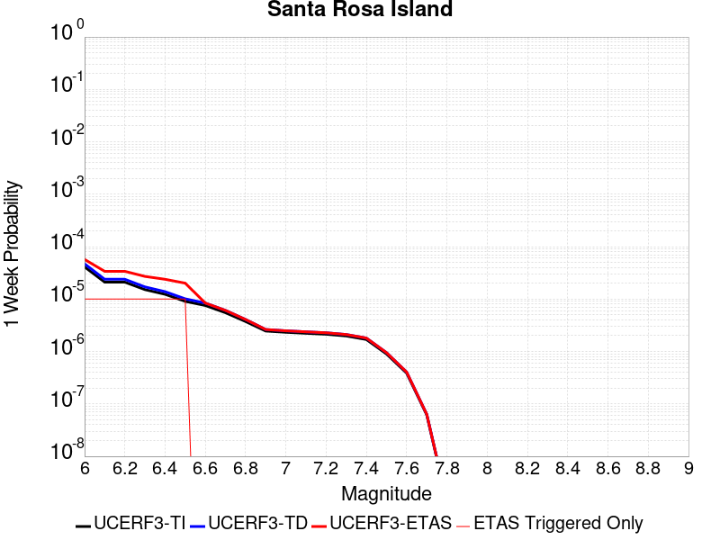 | 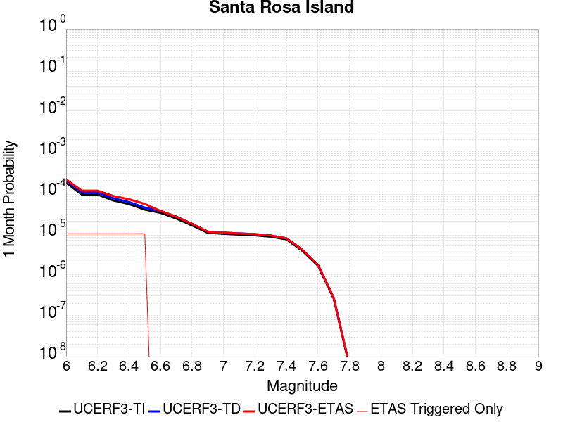 | 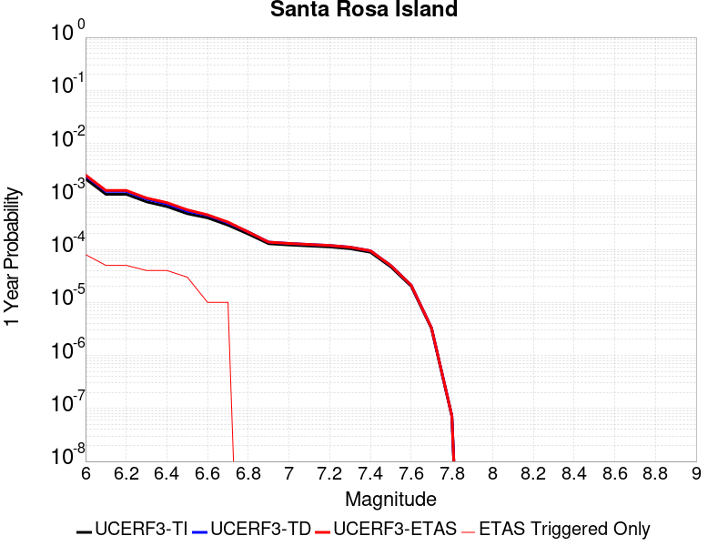 |  |

| Magnitude | 1 wk TI Prob | 1 wk TD Prob | 1 wk ETAS Prob | 1 wk ETAS/TD Gain | 1 wk ETAS Triggered Only | 1 mo TI Prob | 1 mo TD Prob | 1 mo ETAS Prob | 1 mo ETAS/TD Gain | 1 mo ETAS Triggered Only | 1 yr TI Prob | 1 yr TD Prob | 1 yr ETAS Prob | 1 yr ETAS/TD Gain | 1 yr ETAS Triggered Only | 10 yr TI Prob | 10 yr TD Prob | 10 yr ETAS Prob | 10 yr ETAS/TD Gain | 10 yr ETAS Triggered Only |
|-----|-----|-----|-----|-----|-----|-----|-----|-----|-----|-----|-----|-----|-----|-----|-----|-----|-----|-----|-----|-----|
| 6.0 | 4.1143165E-5 | 4.7091133E-5 | 5.7090663E-5 | 1.2123442 | 1.0E-5 | 1.7631594E-4 | 2.0180465E-4 | 2.1180263E-4 | 1.0495429 | 1.0E-5 | 0.002144533 | 0.0024544 | 0.0025342037 | 1.0325146 | 8.0E-5 | 0.021239553 | 0.024293551 | 0.02443015 | 1.0056229 | 1.4E-4 |
| 6.1 | 2.1061249E-5 | 2.3864959E-5 | 3.3864722E-5 | 1.4190143 | 1.0E-5 | 9.0259375E-5 | 1.0227455E-4 | 1.1227353E-4 | 1.097766 | 1.0E-5 | 0.0010983539 | 0.0012445104 | 0.0012944482 | 1.0401264 | 5.0E-5 | 0.01092941 | 0.012378449 | 0.012457458 | 1.0063828 | 8.0E-5 |
| 6.2 | 2.1061249E-5 | 2.3864959E-5 | 3.3864722E-5 | 1.4190143 | 1.0E-5 | 9.0259375E-5 | 1.0227455E-4 | 1.1227353E-4 | 1.097766 | 1.0E-5 | 0.0010983539 | 0.0012445104 | 0.0012944482 | 1.0401264 | 5.0E-5 | 0.01092941 | 0.012378449 | 0.012457458 | 1.0063828 | 8.0E-5 |
| 6.3 | 1.5158236E-5 | 1.7074419E-5 | 2.7074248E-5 | 1.5856614 | 1.0E-5 | 6.496225E-5 | 7.3174095E-5 | 8.317336E-5 | 1.1366503 | 1.0E-5 | 7.906284E-4 | 8.905424E-4 | 9.305068E-4 | 1.0448765 | 4.0E-5 | 0.007878214 | 0.008870989 | 0.008930457 | 1.0067036 | 6.0E-5 |
| 6.4 | 1.2341918E-5 | 1.3852917E-5 | 2.3852777E-5 | 1.7218597 | 1.0E-5 | 5.2892858E-5 | 5.9368336E-5 | 6.936774E-5 | 1.16843 | 1.0E-5 | 6.437803E-4 | 7.225779E-4 | 7.62549E-4 | 1.0553174 | 4.0E-5 | 0.006419184 | 0.007203121 | 0.007262689 | 1.0082697 | 6.0E-5 |
| 6.5 | 9.061158E-6 | 1.0117031E-5 | 2.011693E-5 | 1.9884223 | 1.0E-5 | 3.883296E-5 | 4.3358013E-5 | 5.335758E-5 | 1.2306279 | 1.0E-5 | 4.726887E-4 | 5.277613E-4 | 5.5774546E-4 | 1.0568138 | 3.0E-5 | 0.004716845 | 0.0052656173 | 0.005315354 | 1.0094455 | 5.0E-5 |
| 6.6 | 7.5461685E-6 | 8.400733E-6 | 8.400733E-6 | 1.0 | 0.0 | 3.2340322E-5 | 3.600267E-5 | 3.600267E-5 | 1.0 | 0.0 | 3.936723E-4 | 4.3824865E-4 | 4.4824427E-4 | 1.0228081 | 1.0E-5 | 0.003929756 | 0.0043742736 | 0.0044041425 | 1.0068283 | 3.0E-5 |
| 6.7 | 5.5023775E-6 | 6.087381E-6 | 6.087381E-6 | 1.0 | 0.0 | 2.3581404E-5 | 2.6088532E-5 | 2.6088532E-5 | 1.0 | 0.0 | 2.8706578E-4 | 3.1758484E-4 | 3.2758166E-4 | 1.0314777 | 1.0E-5 | 0.0028669522 | 0.0031716314 | 0.0032015364 | 1.0094289 | 3.0E-5 |
| 6.8 | 3.7351679E-6 | 4.0831405E-6 | 4.0831405E-6 | 1.0 | 0.0 | 1.6007763E-5 | 1.749907E-5 | 1.749907E-5 | 1.0 | 0.0 | 1.948771E-4 | 2.1303284E-4 | 2.1303284E-4 | 1.0 | 0.0 | 0.0019470629 | 0.0021285315 | 0.00213851 | 1.004688 | 1.0E-5 |
| 6.9 | 2.456366E-6 | 2.6292705E-6 | 2.6292705E-6 | 1.0 | 0.0 | 1.0527241E-5 | 1.1268254E-5 | 1.1268254E-5 | 1.0 | 0.0 | 1.2816161E-4 | 1.3718237E-4 | 1.3718237E-4 | 1.0 | 0.0 | 0.0012808773 | 0.0013709799 | 0.0013809662 | 1.007284 | 1.0E-5 |
| 7.0 | 2.3245157E-6 | 2.4827782E-6 | 2.4827782E-6 | 1.0 | 0.0 | 9.962172E-6 | 1.0640435E-5 | 1.0640435E-5 | 1.0 | 0.0 | 1.2128269E-4 | 1.2953962E-4 | 1.2953962E-4 | 1.0 | 0.0 | 0.0012121652 | 0.0012946434 | 0.0013046304 | 1.0077142 | 1.0E-5 |
| 7.1 | 2.2248344E-6 | 2.37325E-6 | 2.37325E-6 | 1.0 | 0.0 | 9.53497E-6 | 1.0171032E-5 | 1.0171032E-5 | 1.0 | 0.0 | 1.1608207E-4 | 1.2382529E-4 | 1.2382529E-4 | 1.0 | 0.0 | 0.0011602144 | 0.001237565 | 0.0012475526 | 1.0080703 | 1.0E-5 |
| 7.2 | 2.1350402E-6 | 2.276154E-6 | 2.276154E-6 | 1.0 | 0.0 | 9.150141E-6 | 9.754909E-6 | 9.754909E-6 | 1.0 | 0.0 | 1.1139726E-4 | 1.1875956E-4 | 1.1875956E-4 | 1.0 | 0.0 | 0.0011134144 | 0.0011869629 | 0.001196951 | 1.0084149 | 1.0E-5 |
| 7.3 | 1.9793572E-6 | 2.108719E-6 | 2.108719E-6 | 1.0 | 0.0 | 8.482932E-6 | 9.037336E-6 | 9.037336E-6 | 1.0 | 0.0 | 1.032748E-4 | 1.10024026E-4 | 1.10024026E-4 | 1.0 | 0.0 | 0.0010322682 | 0.0010996973 | 0.0010996973 | 1.0 | 0.0 |
| 7.4 | 1.6951194E-6 | 1.8045733E-6 | 1.8045733E-6 | 1.0 | 0.0 | 7.264777E-6 | 7.733863E-6 | 7.733863E-6 | 1.0 | 0.0 | 8.844508E-5 | 9.415573E-5 | 9.415573E-5 | 1.0 | 0.0 | 8.840988E-4 | 9.4116E-4 | 9.4116E-4 | 1.0 | 0.0 |
| 7.5 | 8.987207E-7 | 9.5122147E-7 | 9.5122147E-7 | 1.0 | 0.0 | 3.8516546E-6 | 4.076657E-6 | 4.076657E-6 | 1.0 | 0.0 | 4.6892885E-5 | 4.963218E-5 | 4.963218E-5 | 1.0 | 0.0 | 4.688299E-4 | 4.9621216E-4 | 4.9621216E-4 | 1.0 | 0.0 |
| 7.6 | 3.8783037E-7 | 4.052932E-7 | 4.052932E-7 | 1.0 | 0.0 | 1.6621291E-6 | 1.7369698E-6 | 1.7369698E-6 | 1.0 | 0.0 | 2.0236233E-5 | 2.1147409E-5 | 2.1147409E-5 | 1.0 | 0.0 | 2.023439E-4 | 2.1145462E-4 | 2.1145462E-4 | 1.0 | 0.0 |
| 7.7 | 6.181804E-8 | 6.339035E-8 | 6.339035E-8 | 1.0 | 0.0 | 2.6493444E-7 | 2.7167292E-7 | 2.7167292E-7 | 1.0 | 0.0 | 3.225572E-6 | 3.3076128E-6 | 3.3076128E-6 | 1.0 | 0.0 | 3.225525E-5 | 3.307564E-5 | 3.307564E-5 | 1.0 | 0.0 |
| 7.8 | 1.3704449E-9 | 1.3964153E-9 | 1.3964153E-9 | 1.0 | 0.0 | 5.873335E-9 | 5.984637E-9 | 5.984637E-9 | 1.0 | 0.0 | 7.1507856E-8 | 7.286295E-8 | 7.286295E-8 | 1.0 | 0.0 | 7.1507833E-7 | 7.286294E-7 | 7.286294E-7 | 1.0 | 0.0 |

## Pisgah-Bullion Mtn-Mesquite Lk
*[(top)](#table-of-contents)*

| 1 Week | 1 Month | 1 Year | 10 Year |
|-----|-----|-----|-----|
| 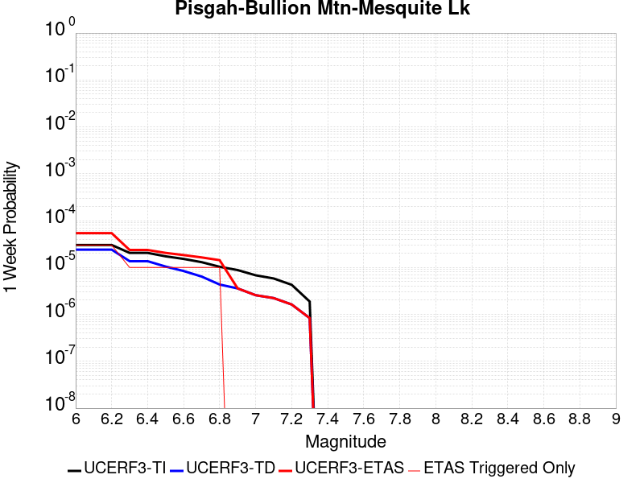 |  | 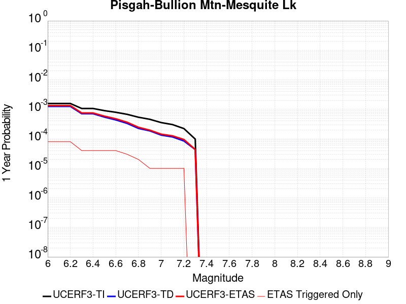 |  |

| Magnitude | 1 wk TI Prob | 1 wk TD Prob | 1 wk ETAS Prob | 1 wk ETAS/TD Gain | 1 wk ETAS Triggered Only | 1 mo TI Prob | 1 mo TD Prob | 1 mo ETAS Prob | 1 mo ETAS/TD Gain | 1 mo ETAS Triggered Only | 1 yr TI Prob | 1 yr TD Prob | 1 yr ETAS Prob | 1 yr ETAS/TD Gain | 1 yr ETAS Triggered Only | 10 yr TI Prob | 10 yr TD Prob | 10 yr ETAS Prob | 10 yr ETAS/TD Gain | 10 yr ETAS Triggered Only |
|-----|-----|-----|-----|-----|-----|-----|-----|-----|-----|-----|-----|-----|-----|-----|-----|-----|-----|-----|-----|-----|
| 6.0 | 3.0240792E-5 | 2.4091114E-5 | 5.4090393E-5 | 2.2452424 | 3.0E-5 | 1.2959696E-4 | 1.03244114E-4 | 1.6323791E-4 | 1.5810869 | 6.0E-5 | 0.0015767008 | 0.0012563728 | 0.0013362722 | 1.0635954 | 8.0E-5 | 0.015655609 | 0.012502721 | 0.012631096 | 1.0102677 | 1.3E-4 |
| 6.1 | 3.0240792E-5 | 2.4091114E-5 | 5.4090393E-5 | 2.2452424 | 3.0E-5 | 1.2959696E-4 | 1.03244114E-4 | 1.6323791E-4 | 1.5810869 | 6.0E-5 | 0.0015767008 | 0.0012563728 | 0.0013362722 | 1.0635954 | 8.0E-5 | 0.015655609 | 0.012502721 | 0.012631096 | 1.0102677 | 1.3E-4 |
| 6.2 | 3.0240792E-5 | 2.4091114E-5 | 5.4090393E-5 | 2.2452424 | 3.0E-5 | 1.2959696E-4 | 1.03244114E-4 | 1.6323791E-4 | 1.5810869 | 6.0E-5 | 0.0015767008 | 0.0012563728 | 0.0013362722 | 1.0635954 | 8.0E-5 | 0.015655609 | 0.012502721 | 0.012631096 | 1.0102677 | 1.3E-4 |
| 6.3 | 2.0498217E-5 | 1.36380695E-5 | 2.3637933E-5 | 1.7332317 | 1.0E-5 | 8.784654E-5 | 5.844765E-5 | 7.844648E-5 | 1.3421665 | 2.0E-5 | 0.0010690069 | 7.1138405E-4 | 7.513556E-4 | 1.0561885 | 4.0E-5 | 0.01063879 | 0.0070926943 | 0.007162198 | 1.0097994 | 7.0E-5 |
| 6.4 | 2.0498217E-5 | 1.36380695E-5 | 2.3637933E-5 | 1.7332317 | 1.0E-5 | 8.784654E-5 | 5.844765E-5 | 7.844648E-5 | 1.3421665 | 2.0E-5 | 0.0010690069 | 7.1138405E-4 | 7.513556E-4 | 1.0561885 | 4.0E-5 | 0.01063879 | 0.0070926943 | 0.007162198 | 1.0097994 | 7.0E-5 |
| 6.5 | 1.7316182E-5 | 1.0477042E-5 | 2.0476939E-5 | 1.9544578 | 1.0E-5 | 7.42101E-5 | 4.4900895E-5 | 6.49E-5 | 1.4454054 | 2.0E-5 | 9.0313336E-4 | 5.465413E-4 | 5.865194E-4 | 1.0731475 | 4.0E-5 | 0.008994718 | 0.0054529672 | 0.00551264 | 1.0109432 | 6.0E-5 |
| 6.6 | 1.5251077E-5 | 8.414273E-6 | 1.8414188E-5 | 2.1884468 | 1.0E-5 | 6.536012E-5 | 3.6060712E-5 | 5.605999E-5 | 1.5546002 | 2.0E-5 | 7.9546886E-4 | 4.3895794E-4 | 4.789404E-4 | 1.091085 | 4.0E-5 | 0.007926274 | 0.0043816264 | 0.0044413633 | 1.0136335 | 6.0E-5 |
| 6.7 | 1.2997425E-5 | 6.4114965E-6 | 1.6411432E-5 | 2.5596883 | 1.0E-5 | 5.570206E-5 | 2.7477578E-5 | 4.7477028E-5 | 1.7278461 | 2.0E-5 | 6.7796157E-4 | 3.3449283E-4 | 3.6448278E-4 | 1.089658 | 3.0E-5 | 0.0067589693 | 0.0033403537 | 0.0033901867 | 1.0149184 | 5.0E-5 |
| 6.8 | 1.035386E-5 | 4.3332193E-6 | 1.4333176E-5 | 3.307743 | 1.0E-5 | 4.437293E-5 | 1.8570812E-5 | 3.857044E-5 | 2.0769389 | 2.0E-5 | 5.401065E-4 | 2.2607706E-4 | 2.4607254E-4 | 1.0884454 | 2.0E-5 | 0.0053879567 | 0.0022585576 | 0.002298467 | 1.0176704 | 4.0E-5 |
| 6.9 | 8.816252E-6 | 3.580638E-6 | 3.580638E-6 | 1.0 | 0.0 | 3.778339E-5 | 1.5345504E-5 | 2.534535E-5 | 1.6516467 | 1.0E-5 | 4.5991567E-4 | 1.8681608E-4 | 1.968142E-4 | 1.0535185 | 1.0E-5 | 0.00458965 | 0.0018666488 | 0.0018965928 | 1.0160416 | 3.0E-5 |
| 7.0 | 6.8232207E-6 | 2.5675843E-6 | 2.5675843E-6 | 1.0 | 0.0 | 2.9242048E-5 | 1.1003888E-5 | 2.1003778E-5 | 1.9087597 | 1.0E-5 | 3.5596377E-4 | 1.3396442E-4 | 1.4396307E-4 | 1.0746367 | 1.0E-5 | 0.0035539411 | 0.0013388677 | 0.0013688275 | 1.022377 | 3.0E-5 |
| 7.1 | 5.837013E-6 | 2.22738E-6 | 2.22738E-6 | 1.0 | 0.0 | 2.501553E-5 | 9.545881E-6 | 1.9545785E-5 | 2.0475621 | 1.0E-5 | 3.045215E-4 | 1.16215204E-4 | 1.2621404E-4 | 1.0860373 | 1.0E-5 | 0.0030410455 | 0.0011615733 | 0.0011915384 | 1.025797 | 3.0E-5 |
| 7.2 | 4.278052E-6 | 1.6275711E-6 | 1.6275711E-6 | 1.0 | 0.0 | 1.833438E-5 | 6.9752873E-6 | 1.6975218E-5 | 2.4336226 | 1.0E-5 | 2.231982E-4 | 8.492105E-5 | 9.49202E-5 | 1.1177465 | 1.0E-5 | 0.0022297418 | 8.489092E-4 | 8.7888376E-4 | 1.0353094 | 3.0E-5 |
| 7.3 | 1.8803692E-6 | 8.344926E-7 | 8.344926E-7 | 1.0 | 0.0 | 8.0587E-6 | 3.5763926E-6 | 3.5763926E-6 | 1.0 | 0.0 | 9.811026E-5 | 4.354186E-5 | 4.354186E-5 | 1.0 | 0.0 | 9.806695E-4 | 4.3534773E-4 | 4.5533903E-4 | 1.0459203 | 2.0E-5 |

## Mission Creek
*[(top)](#table-of-contents)*

| 1 Week | 1 Month | 1 Year | 10 Year |
|-----|-----|-----|-----|
|  |  |  |  |

| Magnitude | 1 wk TI Prob | 1 wk TD Prob | 1 wk ETAS Prob | 1 wk ETAS/TD Gain | 1 wk ETAS Triggered Only | 1 mo TI Prob | 1 mo TD Prob | 1 mo ETAS Prob | 1 mo ETAS/TD Gain | 1 mo ETAS Triggered Only | 1 yr TI Prob | 1 yr TD Prob | 1 yr ETAS Prob | 1 yr ETAS/TD Gain | 1 yr ETAS Triggered Only | 10 yr TI Prob | 10 yr TD Prob | 10 yr ETAS Prob | 10 yr ETAS/TD Gain | 10 yr ETAS Triggered Only |
|-----|-----|-----|-----|-----|-----|-----|-----|-----|-----|-----|-----|-----|-----|-----|-----|-----|-----|-----|-----|-----|
| 6.0 | 1.1549387E-5 | 1.632237E-5 | 6.6321554E-5 | 4.0632305 | 5.0E-5 | 4.9496433E-5 | 6.9951224E-5 | 1.2994703E-4 | 1.8576806 | 6.0E-5 | 6.0245243E-4 | 8.513384E-4 | 9.3127025E-4 | 1.0938897 | 8.0E-5 | 0.006008218 | 0.008509998 | 0.0086289765 | 1.0139811 | 1.2E-4 |
| 6.1 | 1.1549387E-5 | 1.632237E-5 | 6.6321554E-5 | 4.0632305 | 5.0E-5 | 4.9496433E-5 | 6.9951224E-5 | 1.2994703E-4 | 1.8576806 | 6.0E-5 | 6.0245243E-4 | 8.513384E-4 | 9.3127025E-4 | 1.0938897 | 8.0E-5 | 0.006008218 | 0.008509998 | 0.0086289765 | 1.0139811 | 1.2E-4 |
| 6.2 | 1.1549387E-5 | 1.632237E-5 | 6.6321554E-5 | 4.0632305 | 5.0E-5 | 4.9496433E-5 | 6.9951224E-5 | 1.2994703E-4 | 1.8576806 | 6.0E-5 | 6.0245243E-4 | 8.513384E-4 | 9.3127025E-4 | 1.0938897 | 8.0E-5 | 0.006008218 | 0.008509998 | 0.0086289765 | 1.0139811 | 1.2E-4 |
| 6.3 | 1.1549387E-5 | 1.632237E-5 | 6.6321554E-5 | 4.0632305 | 5.0E-5 | 4.9496433E-5 | 6.9951224E-5 | 1.2994703E-4 | 1.8576806 | 6.0E-5 | 6.0245243E-4 | 8.513384E-4 | 9.3127025E-4 | 1.0938897 | 8.0E-5 | 0.006008218 | 0.008509998 | 0.0086289765 | 1.0139811 | 1.2E-4 |
| 6.4 | 1.1549387E-5 | 1.632237E-5 | 6.6321554E-5 | 4.0632305 | 5.0E-5 | 4.9496433E-5 | 6.9951224E-5 | 1.2994703E-4 | 1.8576806 | 6.0E-5 | 6.0245243E-4 | 8.513384E-4 | 9.3127025E-4 | 1.0938897 | 8.0E-5 | 0.006008218 | 0.008509998 | 0.0086289765 | 1.0139811 | 1.2E-4 |
| 6.5 | 1.1549387E-5 | 1.632237E-5 | 6.6321554E-5 | 4.0632305 | 5.0E-5 | 4.9496433E-5 | 6.9951224E-5 | 1.2994703E-4 | 1.8576806 | 6.0E-5 | 6.0245243E-4 | 8.513384E-4 | 9.3127025E-4 | 1.0938897 | 8.0E-5 | 0.006008218 | 0.008509998 | 0.0086289765 | 1.0139811 | 1.2E-4 |
| 6.6 | 9.202681E-6 | 1.3845646E-5 | 6.384496E-5 | 4.611193 | 5.0E-5 | 3.9439463E-5 | 5.9337188E-5 | 1.1933363E-4 | 2.0111103 | 6.0E-5 | 4.800697E-4 | 7.221998E-4 | 8.02142E-4 | 1.1106926 | 8.0E-5 | 0.004790339 | 0.0072271815 | 0.0073463144 | 1.016484 | 1.2E-4 |
| 6.7 | 9.019164E-6 | 1.3651316E-5 | 6.365063E-5 | 4.6626005 | 5.0E-5 | 3.8652986E-5 | 5.8504378E-5 | 1.18500866E-4 | 2.0255044 | 6.0E-5 | 4.7049852E-4 | 7.12067E-4 | 7.9201005E-4 | 1.1122689 | 8.0E-5 | 0.004695036 | 0.007126506 | 0.0072456505 | 1.0167185 | 1.2E-4 |
| 6.8 | 8.673558E-6 | 1.3273427E-5 | 6.327276E-5 | 4.766875 | 5.0E-5 | 3.717186E-5 | 5.6884925E-5 | 1.16881514E-4 | 2.054701 | 6.0E-5 | 4.524734E-4 | 6.923627E-4 | 7.7230734E-4 | 1.1154664 | 8.0E-5 | 0.0045155324 | 0.006930694 | 0.0070498623 | 1.0171943 | 1.2E-4 |
| 6.9 | 7.002255E-6 | 1.1477657E-5 | 6.147708E-5 | 5.35624 | 5.0E-5 | 3.000932E-5 | 4.9189068E-5 | 1.0918612E-4 | 2.2197232 | 6.0E-5 | 3.653022E-4 | 5.9871917E-4 | 6.6867727E-4 | 1.1168462 | 7.0E-5 | 0.0036470229 | 0.005999517 | 0.006098917 | 1.0165681 | 1.0E-4 |
| 7.0 | 5.84644E-6 | 9.67498E-6 | 5.9674498E-5 | 6.167919 | 5.0E-5 | 2.5055931E-5 | 4.1463565E-5 | 1.01461075E-4 | 2.4469936 | 6.0E-5 | 3.0501327E-4 | 5.047066E-4 | 5.746712E-4 | 1.1386244 | 7.0E-5 | 0.0030459496 | 0.0050638523 | 0.005163346 | 1.0196478 | 1.0E-4 |
| 7.1 | 5.54703E-6 | 9.329456E-6 | 5.9328988E-5 | 6.359319 | 5.0E-5 | 2.377277E-5 | 3.9982795E-5 | 9.9980396E-5 | 2.5005856 | 6.0E-5 | 2.8939504E-4 | 4.8668624E-4 | 5.566522E-4 | 1.1437598 | 7.0E-5 | 0.0028901845 | 0.004884446 | 0.004983958 | 1.0203731 | 1.0E-4 |
| 7.2 | 4.384709E-6 | 7.68157E-6 | 5.7681187E-5 | 7.5090356 | 5.0E-5 | 1.8791474E-5 | 3.2920623E-5 | 9.291865E-5 | 2.8225057 | 6.0E-5 | 2.2876218E-4 | 4.0073853E-4 | 4.7071048E-4 | 1.1746075 | 7.0E-5 | 0.0022852682 | 0.004028366 | 0.004127963 | 1.024724 | 1.0E-4 |
| 7.3 | 3.7888456E-6 | 6.915452E-6 | 5.6915105E-5 | 8.230136 | 5.0E-5 | 1.623781E-5 | 2.9637333E-5 | 8.9635556E-5 | 3.0244136 | 6.0E-5 | 1.9767738E-4 | 3.6077813E-4 | 4.3075287E-4 | 1.1939551 | 7.0E-5 | 0.0019750162 | 0.0036301152 | 0.003729752 | 1.0274473 | 1.0E-4 |
| 7.4 | 2.1982462E-6 | 5.0237763E-6 | 5.5023524E-5 | 10.952622 | 5.0E-5 | 9.421021E-6 | 2.1530293E-5 | 8.1529004E-5 | 3.786711 | 6.0E-5 | 1.1469489E-4 | 2.621E-4 | 3.2208426E-4 | 1.2288603 | 6.0E-5 | 0.0011463572 | 0.0026458844 | 0.0027356464 | 1.033925 | 9.0E-5 |
| 7.5 | 2.051923E-6 | 4.615016E-6 | 5.4614786E-5 | 11.834148 | 5.0E-5 | 8.793926E-6 | 1.9778492E-5 | 7.97773E-5 | 4.0335383 | 6.0E-5 | 1.0706078E-4 | 2.4077666E-4 | 3.007622E-4 | 1.2491336 | 6.0E-5 | 0.0010700922 | 0.0024335422 | 0.002523323 | 1.0368931 | 9.0E-5 |
| 7.6 | 1.8733427E-6 | 4.1233748E-6 | 5.4123168E-5 | 13.125939 | 5.0E-5 | 8.028587E-6 | 1.7671488E-5 | 7.7670426E-5 | 4.39524 | 6.0E-5 | 9.774366E-5 | 2.151292E-4 | 2.751163E-4 | 1.2788422 | 6.0E-5 | 9.770069E-4 | 0.0021780801 | 0.002267884 | 1.0412308 | 9.0E-5 |
| 7.7 | 1.8411953E-6 | 4.0430496E-6 | 5.404285E-5 | 13.366853 | 5.0E-5 | 7.890813E-6 | 1.732724E-5 | 7.73262E-5 | 4.4626956 | 6.0E-5 | 9.606641E-5 | 2.1093882E-4 | 2.7092616E-4 | 1.2843827 | 6.0E-5 | 9.6024893E-4 | 0.0021363653 | 0.002226173 | 1.0420376 | 9.0E-5 |
| 7.8 | 1.7194251E-6 | 3.7104276E-6 | 5.3710242E-5 | 14.475486 | 5.0E-5 | 7.368944E-6 | 1.5901736E-5 | 7.590078E-5 | 4.773113 | 6.0E-5 | 8.97132E-5 | 1.9358651E-4 | 2.535749E-4 | 1.309879 | 6.0E-5 | 8.967699E-4 | 0.0019623525 | 0.0020521758 | 1.0457733 | 9.0E-5 |
| 7.9 | 1.4035052E-6 | 2.9500632E-6 | 5.2949916E-5 | 17.94874 | 5.0E-5 | 6.0150082E-6 | 1.2643067E-5 | 7.264231E-5 | 5.745624 | 6.0E-5 | 7.3230265E-5 | 1.5391852E-4 | 2.1390928E-4 | 1.3897567 | 6.0E-5 | 7.3206134E-4 | 0.0015631086 | 0.001652968 | 1.0574876 | 9.0E-5 |
| 8.0 | 3.9318823E-7 | 5.528522E-7 | 2.0552841E-5 | 37.176014 | 2.0E-5 | 1.6850913E-6 | 2.3693647E-6 | 3.2369295E-5 | 13.6615925 | 3.0E-5 | 2.0515794E-5 | 2.8846638E-5 | 5.8845773E-5 | 2.0399525 | 3.0E-5 | 2.0513899E-4 | 2.9899E-4 | 3.2898103E-4 | 1.1003078 | 3.0E-5 |
| 8.1 | 1.596793E-7 | 1.1380002E-7 | 1.1380002E-7 | 1.0 | 0.0 | 6.8433974E-7 | 4.877143E-7 | 4.877143E-7 | 1.0 | 0.0 | 8.331805E-6 | 5.937906E-6 | 5.937906E-6 | 1.0 | 0.0 | 8.331492E-5 | 6.549966E-5 | 6.549966E-5 | 1.0 | 0.0 |
| 8.2 | 4.9003038E-8 | 2.5444924E-8 | 2.5444924E-8 | 1.0 | 0.0 | 2.10013E-7 | 1.0904967E-7 | 1.0904967E-7 | 1.0 | 0.0 | 2.5569052E-6 | 1.327679E-6 | 1.327679E-6 | 1.0 | 0.0 | 2.556876E-5 | 1.495635E-5 | 1.495635E-5 | 1.0 | 0.0 |

## Whittier alt 1
*[(top)](#table-of-contents)*

| 1 Week | 1 Month | 1 Year | 10 Year |
|-----|-----|-----|-----|
| 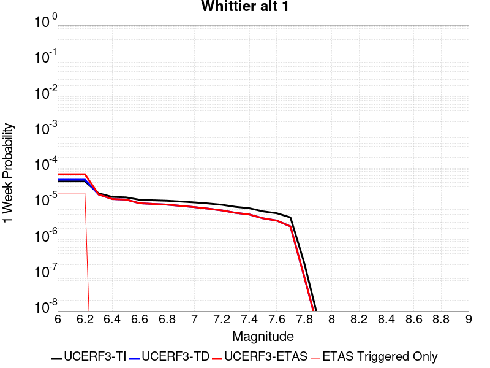 |  |  |  |

| Magnitude | 1 wk TI Prob | 1 wk TD Prob | 1 wk ETAS Prob | 1 wk ETAS/TD Gain | 1 wk ETAS Triggered Only | 1 mo TI Prob | 1 mo TD Prob | 1 mo ETAS Prob | 1 mo ETAS/TD Gain | 1 mo ETAS Triggered Only | 1 yr TI Prob | 1 yr TD Prob | 1 yr ETAS Prob | 1 yr ETAS/TD Gain | 1 yr ETAS Triggered Only | 10 yr TI Prob | 10 yr TD Prob | 10 yr ETAS Prob | 10 yr ETAS/TD Gain | 10 yr ETAS Triggered Only |
|-----|-----|-----|-----|-----|-----|-----|-----|-----|-----|-----|-----|-----|-----|-----|-----|-----|-----|-----|-----|-----|
| 6.0 | 4.2554693E-5 | 4.725218E-5 | 6.725123E-5 | 1.4232409 | 2.0E-5 | 1.8236451E-4 | 2.0249544E-4 | 2.6248329E-4 | 1.296243 | 6.0E-5 | 0.002218027 | 0.0024629154 | 0.0025526937 | 1.036452 | 9.0E-5 | 0.02196019 | 0.024390234 | 0.024497552 | 1.0044 | 1.1E-4 |
| 6.1 | 4.2554693E-5 | 4.725218E-5 | 6.725123E-5 | 1.4232409 | 2.0E-5 | 1.8236451E-4 | 2.0249544E-4 | 2.6248329E-4 | 1.296243 | 6.0E-5 | 0.002218027 | 0.0024629154 | 0.0025526937 | 1.036452 | 9.0E-5 | 0.02196019 | 0.024390234 | 0.024497552 | 1.0044 | 1.1E-4 |
| 6.2 | 4.2554693E-5 | 4.725218E-5 | 6.725123E-5 | 1.4232409 | 2.0E-5 | 1.8236451E-4 | 2.0249544E-4 | 2.6248329E-4 | 1.296243 | 6.0E-5 | 0.002218027 | 0.0024629154 | 0.0025526937 | 1.036452 | 9.0E-5 | 0.02196019 | 0.024390234 | 0.024497552 | 1.0044 | 1.1E-4 |
| 6.3 | 1.9617712E-5 | 1.8268593E-5 | 1.8268593E-5 | 1.0 | 0.0 | 8.40732E-5 | 7.829172E-5 | 9.8290155E-5 | 1.2554349 | 2.0E-5 | 0.0010231105 | 9.52804E-4 | 9.927659E-4 | 1.0419414 | 4.0E-5 | 0.01018413 | 0.009490474 | 0.009549906 | 1.0062622 | 6.0E-5 |
| 6.4 | 1.5611336E-5 | 1.3604271E-5 | 1.3604271E-5 | 1.0 | 0.0 | 6.690401E-5 | 5.8302747E-5 | 7.830158E-5 | 1.343017 | 2.0E-5 | 8.142519E-4 | 7.0961076E-4 | 7.4958237E-4 | 1.0563289 | 4.0E-5 | 0.008112748 | 0.0070754145 | 0.007125061 | 1.0070168 | 5.0E-5 |
| 6.5 | 1.5150166E-5 | 1.3100925E-5 | 1.3100925E-5 | 1.0 | 0.0 | 6.492767E-5 | 5.6145647E-5 | 7.6144526E-5 | 1.3561964 | 2.0E-5 | 7.9020765E-4 | 6.8336475E-4 | 7.233374E-4 | 1.0584939 | 4.0E-5 | 0.007874036 | 0.0068145846 | 0.006864244 | 1.0072873 | 5.0E-5 |
| 6.6 | 1.295588E-5 | 1.0380725E-5 | 1.0380725E-5 | 1.0 | 0.0 | 5.552402E-5 | 4.4488075E-5 | 5.448763E-5 | 1.2247694 | 1.0E-5 | 6.7579525E-4 | 5.4150965E-4 | 5.614988E-4 | 1.0369138 | 2.0E-5 | 0.006737438 | 0.0054033357 | 0.0054331734 | 1.0055221 | 3.0E-5 |
| 6.7 | 1.2542085E-5 | 9.899369E-6 | 9.899369E-6 | 1.0 | 0.0 | 5.3750682E-5 | 4.242519E-5 | 5.2424763E-5 | 1.235699 | 1.0E-5 | 6.542181E-4 | 5.164061E-4 | 5.3639576E-4 | 1.0387092 | 2.0E-5 | 0.006522954 | 0.0051534795 | 0.0051733763 | 1.0038608 | 2.0E-5 |
| 6.8 | 1.2195878E-5 | 9.495415E-6 | 9.495415E-6 | 1.0 | 0.0 | 5.2267E-5 | 4.069401E-5 | 5.06936E-5 | 1.2457265 | 1.0E-5 | 6.36165E-4 | 4.9533875E-4 | 5.153289E-4 | 1.0403564 | 2.0E-5 | 0.0063434686 | 0.004943688 | 0.0049635894 | 1.0040256 | 2.0E-5 |
| 6.9 | 1.1580298E-5 | 8.772933E-6 | 8.772933E-6 | 1.0 | 0.0 | 4.9628903E-5 | 3.7597754E-5 | 4.759738E-5 | 1.2659633 | 1.0E-5 | 6.040644E-4 | 4.5765814E-4 | 4.77649E-4 | 1.0436808 | 2.0E-5 | 0.00602425 | 0.0045684157 | 0.0045883246 | 1.0043579 | 2.0E-5 |
| 7.0 | 1.0964795E-5 | 8.083994E-6 | 8.083994E-6 | 1.0 | 0.0 | 4.6991136E-5 | 3.4645236E-5 | 4.464489E-5 | 1.28863 | 1.0E-5 | 5.7196687E-4 | 4.2172565E-4 | 4.4171722E-4 | 1.0474042 | 2.0E-5 | 0.0057049696 | 0.004210462 | 0.0042303777 | 1.0047301 | 2.0E-5 |
| 7.1 | 1.0230601E-5 | 7.3266697E-6 | 7.3266697E-6 | 1.0 | 0.0 | 4.3844695E-5 | 3.1399642E-5 | 3.1399642E-5 | 1.0 | 0.0 | 5.336784E-4 | 3.8222488E-4 | 3.9222106E-4 | 1.0261526 | 1.0E-5 | 0.005323986 | 0.0038168381 | 0.0038268 | 1.00261 | 1.0E-5 |
| 7.2 | 9.40865E-6 | 6.543289E-6 | 6.543289E-6 | 1.0 | 0.0 | 4.032216E-5 | 2.8042374E-5 | 2.8042374E-5 | 1.0 | 0.0 | 4.908117E-4 | 3.4136363E-4 | 3.513602E-4 | 1.0292842 | 1.0E-5 | 0.0048972913 | 0.003409485 | 0.0034194512 | 1.002923 | 1.0E-5 |
| 7.3 | 8.237384E-6 | 5.5977525E-6 | 5.5977525E-6 | 1.0 | 0.0 | 3.5302593E-5 | 2.3990153E-5 | 2.3990153E-5 | 1.0 | 0.0 | 4.2972428E-4 | 2.92042E-4 | 3.020391E-4 | 1.0342317 | 1.0E-5 | 0.0042889426 | 0.002916903 | 0.002926874 | 1.0034183 | 1.0E-5 |
| 7.4 | 7.5316966E-6 | 5.027819E-6 | 5.027819E-6 | 1.0 | 0.0 | 3.2278298E-5 | 2.1547625E-5 | 2.1547625E-5 | 1.0 | 0.0 | 3.9291743E-4 | 2.6231175E-4 | 2.7230915E-4 | 1.0381125 | 1.0E-5 | 0.0039222343 | 0.0026201333 | 0.002630107 | 1.0038066 | 1.0E-5 |
| 7.5 | 6.149649E-6 | 3.933841E-6 | 3.933841E-6 | 1.0 | 0.0 | 2.6355372E-5 | 1.6859214E-5 | 1.6859214E-5 | 1.0 | 0.0 | 3.208294E-4 | 2.052425E-4 | 2.052425E-4 | 1.0 | 0.0 | 0.003203666 | 0.0020506186 | 0.0020506186 | 1.0 | 0.0 |
| 7.6 | 5.457711E-6 | 3.3953788E-6 | 3.3953788E-6 | 1.0 | 0.0 | 2.338998E-5 | 1.4551547E-5 | 1.4551547E-5 | 1.0 | 0.0 | 2.8473578E-4 | 1.771515E-4 | 1.771515E-4 | 1.0 | 0.0 | 0.0028437122 | 0.0017701836 | 0.0017701836 | 1.0 | 0.0 |
| 7.7 | 4.1676276E-6 | 2.3331952E-6 | 2.3331952E-6 | 1.0 | 0.0 | 1.7861139E-5 | 9.999374E-6 | 9.999374E-6 | 1.0 | 0.0 | 2.1743766E-4 | 1.2173632E-4 | 1.2173632E-4 | 1.0 | 0.0 | 0.0021722503 | 0.0012167693 | 0.0012167693 | 1.0 | 0.0 |
| 7.8 | 2.2692414E-7 | 9.3854695E-8 | 9.3854695E-8 | 1.0 | 0.0 | 9.725317E-7 | 4.0223435E-7 | 4.0223435E-7 | 1.0 | 0.0 | 1.1840509E-5 | 4.8971956E-6 | 4.8971956E-6 | 1.0 | 0.0 | 1.1839878E-4 | 4.8971204E-5 | 4.8971204E-5 | 1.0 | 0.0 |
| 7.9 | 6.676829E-9 | 3.439853E-9 | 3.439853E-9 | 1.0 | 0.0 | 2.861498E-8 | 1.4742227E-8 | 1.4742227E-8 | 1.0 | 0.0 | 3.4838732E-7 | 1.7948659E-7 | 1.7948659E-7 | 1.0 | 0.0 | 3.4838679E-6 | 1.7948646E-6 | 1.7948646E-6 | 1.0 | 0.0 |

## San Clemente
*[(top)](#table-of-contents)*

| 1 Week | 1 Month | 1 Year | 10 Year |
|-----|-----|-----|-----|
| 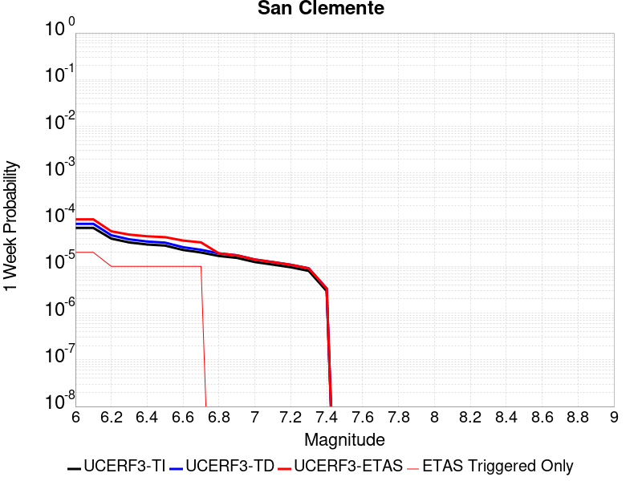 | 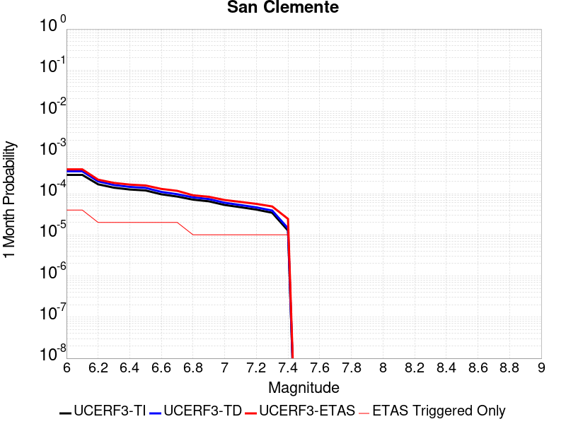 |  | 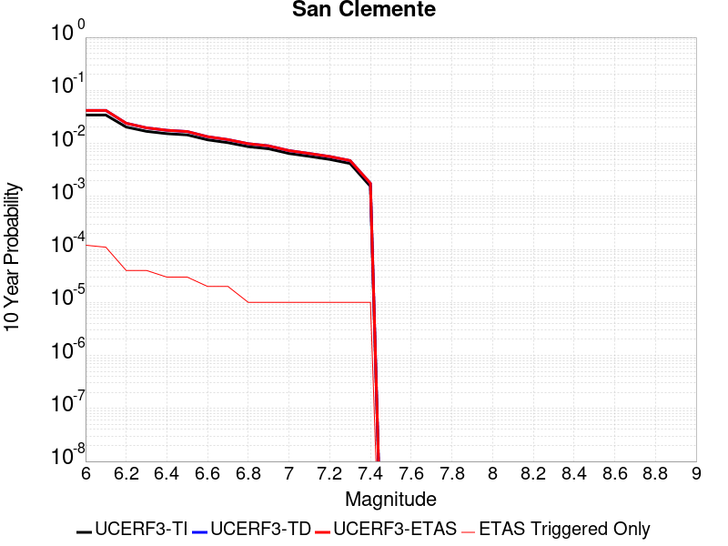 |

| Magnitude | 1 wk TI Prob | 1 wk TD Prob | 1 wk ETAS Prob | 1 wk ETAS/TD Gain | 1 wk ETAS Triggered Only | 1 mo TI Prob | 1 mo TD Prob | 1 mo ETAS Prob | 1 mo ETAS/TD Gain | 1 mo ETAS Triggered Only | 1 yr TI Prob | 1 yr TD Prob | 1 yr ETAS Prob | 1 yr ETAS/TD Gain | 1 yr ETAS Triggered Only | 10 yr TI Prob | 10 yr TD Prob | 10 yr ETAS Prob | 10 yr ETAS/TD Gain | 10 yr ETAS Triggered Only |
|-----|-----|-----|-----|-----|-----|-----|-----|-----|-----|-----|-----|-----|-----|-----|-----|-----|-----|-----|-----|-----|
| 6.0 | 6.681379E-5 | 8.163422E-5 | 1.0163259E-4 | 1.2449753 | 2.0E-5 | 2.8631336E-4 | 3.498173E-4 | 3.8980332E-4 | 1.1143054 | 4.0E-5 | 0.003480294 | 0.0042512873 | 0.0043409048 | 1.02108 | 9.0E-5 | 0.03426291 | 0.041755714 | 0.041870702 | 1.0027539 | 1.2E-4 |
| 6.1 | 6.681379E-5 | 8.163422E-5 | 1.0163259E-4 | 1.2449753 | 2.0E-5 | 2.8631336E-4 | 3.498173E-4 | 3.8980332E-4 | 1.1143054 | 4.0E-5 | 0.003480294 | 0.0042512873 | 0.0043309475 | 1.0187378 | 8.0E-5 | 0.03426291 | 0.041755714 | 0.04186112 | 1.0025244 | 1.1E-4 |
| 6.2 | 3.9400576E-5 | 4.6451984E-5 | 5.645152E-5 | 1.2152661 | 1.0E-5 | 1.6884868E-4 | 1.9906509E-4 | 2.1906111E-4 | 1.1004497 | 2.0E-5 | 0.0020537945 | 0.002420985 | 0.002460888 | 1.0164822 | 4.0E-5 | 0.020349167 | 0.02395286 | 0.023991901 | 1.00163 | 4.0E-5 |
| 6.3 | 3.2590255E-5 | 3.7929087E-5 | 4.792871E-5 | 1.2636399 | 1.0E-5 | 1.3966505E-4 | 1.6254328E-4 | 1.8254002E-4 | 1.1230241 | 2.0E-5 | 0.0016990956 | 0.0019771985 | 0.0020171194 | 1.0201906 | 4.0E-5 | 0.01686163 | 0.019599866 | 0.019639082 | 1.0020008 | 4.0E-5 |
| 6.4 | 2.9454652E-5 | 3.4097775E-5 | 4.4097436E-5 | 1.2932643 | 1.0E-5 | 1.2622811E-4 | 1.4612528E-4 | 1.6612237E-4 | 1.1368488 | 2.0E-5 | 0.0015357438 | 0.0017776482 | 0.0018075949 | 1.0168462 | 3.0E-5 | 0.015251739 | 0.017637458 | 0.017666928 | 1.001671 | 3.0E-5 |
| 6.5 | 2.790836E-5 | 3.2247463E-5 | 4.224714E-5 | 1.310092 | 1.0E-5 | 1.1960178E-4 | 1.3819622E-4 | 1.5819346E-4 | 1.1447017 | 2.0E-5 | 0.001455179 | 0.0016812651 | 0.0017112147 | 1.0178137 | 3.0E-5 | 0.014456868 | 0.016688475 | 0.016717974 | 1.0017676 | 3.0E-5 |
| 6.6 | 2.2492153E-5 | 2.5762707E-5 | 3.576245E-5 | 1.388148 | 1.0E-5 | 9.639138E-5 | 1.1040701E-4 | 1.304048E-4 | 1.1811279 | 2.0E-5 | 0.0011729331 | 0.0013433908 | 0.0013633639 | 1.0148677 | 2.0E-5 | 0.011667615 | 0.013354415 | 0.013374148 | 1.0014776 | 2.0E-5 |
| 6.7 | 1.9862755E-5 | 2.2666423E-5 | 3.2666198E-5 | 1.4411712 | 1.0E-5 | 8.512331E-5 | 9.713826E-5 | 1.1713632E-4 | 1.205872 | 2.0E-5 | 0.0010358836 | 0.0011820279 | 0.0012020043 | 1.0169001 | 2.0E-5 | 0.010310682 | 0.011758701 | 0.0117784655 | 1.0016809 | 2.0E-5 |
| 6.8 | 1.6697575E-5 | 1.897771E-5 | 1.897771E-5 | 1.0 | 0.0 | 7.155907E-5 | 8.133056E-5 | 9.132974E-5 | 1.1229451 | 1.0E-5 | 8.7088346E-4 | 9.897591E-4 | 9.997492E-4 | 1.0100935 | 1.0E-5 | 0.008674784 | 0.0098545365 | 0.009864438 | 1.0010048 | 1.0E-5 |
| 6.9 | 1.5218415E-5 | 1.72694E-5 | 1.72694E-5 | 1.0 | 0.0 | 6.522015E-5 | 7.4009666E-5 | 8.400893E-5 | 1.1351075 | 1.0E-5 | 7.93766E-4 | 9.00704E-4 | 9.10695E-4 | 1.0110924 | 1.0E-5 | 0.007909367 | 0.008971481 | 0.008981391 | 1.0011046 | 1.0E-5 |
| 7.0 | 1.2392958E-5 | 1.4033016E-5 | 1.4033016E-5 | 1.0 | 0.0 | 5.3111595E-5 | 6.014015E-5 | 7.013955E-5 | 1.1662682 | 1.0E-5 | 6.4644177E-4 | 7.319679E-4 | 7.419606E-4 | 1.0136518 | 1.0E-5 | 0.0064456454 | 0.0072963564 | 0.007306284 | 1.0013605 | 1.0E-5 |
| 7.1 | 1.0934128E-5 | 1.2375138E-5 | 1.2375138E-5 | 1.0 | 0.0 | 4.6859706E-5 | 5.303527E-5 | 6.3034735E-5 | 1.1885438 | 1.0E-5 | 5.7036756E-4 | 6.455204E-4 | 6.5551396E-4 | 1.0154814 | 1.0E-5 | 0.0056890585 | 0.0064371997 | 0.0064471355 | 1.0015435 | 1.0E-5 |
| 7.2 | 9.5798805E-6 | 1.0844935E-5 | 1.0844935E-5 | 1.0 | 0.0 | 4.1055984E-5 | 4.6477508E-5 | 5.647704E-5 | 1.2151479 | 1.0E-5 | 4.9974193E-4 | 5.657239E-4 | 5.7571824E-4 | 1.0176665 | 1.0E-5 | 0.0049861963 | 0.0056435615 | 0.005653505 | 1.0017619 | 1.0E-5 |
| 7.3 | 8.0167365E-6 | 9.083918E-6 | 9.083918E-6 | 1.0 | 0.0 | 3.4356988E-5 | 3.8930535E-5 | 4.8930146E-5 | 1.2568578 | 1.0E-5 | 4.1821605E-4 | 4.7388324E-4 | 4.8387848E-4 | 1.0210923 | 1.0E-5 | 0.0041742986 | 0.0047294297 | 0.004739383 | 1.0021044 | 1.0E-5 |
| 7.4 | 2.9581017E-6 | 3.3623792E-6 | 3.3623792E-6 | 1.0 | 0.0 | 1.2677518E-5 | 1.4410146E-5 | 2.4410001E-5 | 1.6939455 | 1.0E-5 | 1.5433785E-4 | 1.7543444E-4 | 1.8543268E-4 | 1.0569913 | 1.0E-5 | 0.001542307 | 0.0017534546 | 0.0017634371 | 1.0056931 | 1.0E-5 |

## Rose Canyon
*[(top)](#table-of-contents)*

| 1 Week | 1 Month | 1 Year | 10 Year |
|-----|-----|-----|-----|
|  | 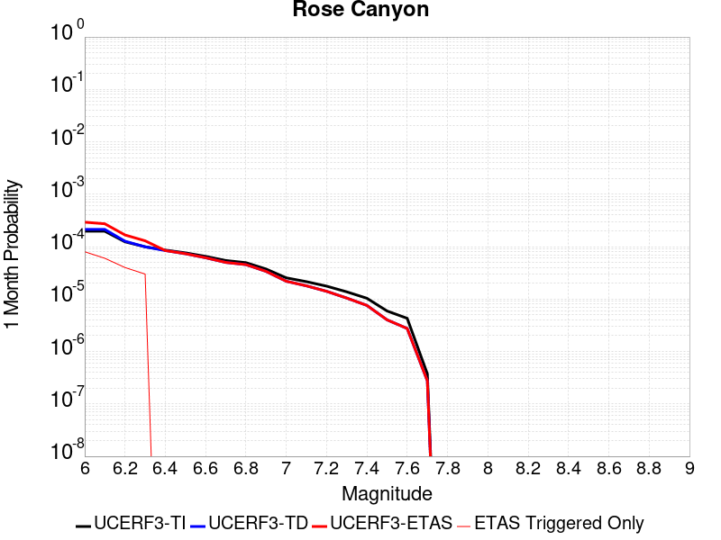 | 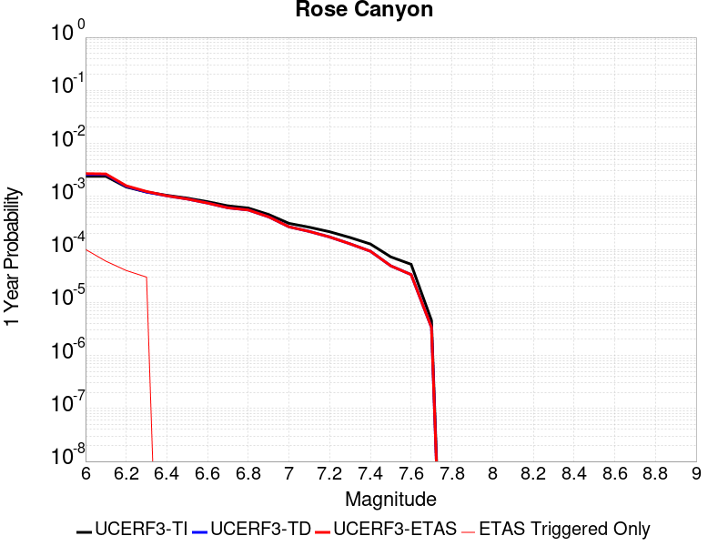 |  |

| Magnitude | 1 wk TI Prob | 1 wk TD Prob | 1 wk ETAS Prob | 1 wk ETAS/TD Gain | 1 wk ETAS Triggered Only | 1 mo TI Prob | 1 mo TD Prob | 1 mo ETAS Prob | 1 mo ETAS/TD Gain | 1 mo ETAS Triggered Only | 1 yr TI Prob | 1 yr TD Prob | 1 yr ETAS Prob | 1 yr ETAS/TD Gain | 1 yr ETAS Triggered Only | 10 yr TI Prob | 10 yr TD Prob | 10 yr ETAS Prob | 10 yr ETAS/TD Gain | 10 yr ETAS Triggered Only |
|-----|-----|-----|-----|-----|-----|-----|-----|-----|-----|-----|-----|-----|-----|-----|-----|-----|-----|-----|-----|-----|
| 6.0 | 4.5923203E-5 | 4.9714225E-5 | 9.971174E-5 | 2.0056984 | 5.0E-5 | 1.9679888E-4 | 2.1304491E-4 | 2.9302787E-4 | 1.3754277 | 8.0E-5 | 0.0023933933 | 0.0025909345 | 0.0026906754 | 1.0384961 | 1.0E-4 | 0.023677798 | 0.02563999 | 0.025756914 | 1.0045602 | 1.2E-4 |
| 6.1 | 4.5923203E-5 | 4.9714225E-5 | 7.9712736E-5 | 1.603419 | 3.0E-5 | 1.9679888E-4 | 2.1304491E-4 | 2.7303214E-4 | 1.2815708 | 6.0E-5 | 0.0023933933 | 0.0025909345 | 0.002650779 | 1.0230976 | 6.0E-5 | 0.023677798 | 0.02563999 | 0.025698453 | 1.0022801 | 6.0E-5 |
| 6.2 | 2.8844734E-5 | 2.9668723E-5 | 3.9668426E-5 | 1.3370453 | 1.0E-5 | 1.2361443E-4 | 1.2714567E-4 | 1.6714058E-4 | 1.3145598 | 4.0E-5 | 0.0015039665 | 0.0015468939 | 0.001586832 | 1.0258182 | 4.0E-5 | 0.0149382865 | 0.015374276 | 0.0154136615 | 1.0025618 | 4.0E-5 |
| 6.3 | 2.3171577E-5 | 2.3161238E-5 | 2.3161238E-5 | 1.0 | 0.0 | 9.9302975E-5 | 9.9258745E-5 | 1.2925577E-4 | 1.3022103 | 3.0E-5 | 0.0012083431 | 0.0012078186 | 0.0012377824 | 1.0248082 | 3.0E-5 | 0.012017938 | 0.012022437 | 0.012052076 | 1.0024654 | 3.0E-5 |
| 6.4 | 2.0066604E-5 | 1.9667024E-5 | 1.9667024E-5 | 1.0 | 0.0 | 8.599689E-5 | 8.4284584E-5 | 8.4284584E-5 | 1.0 | 0.0 | 0.0010465092 | 0.0010256917 | 0.0010256917 | 1.0 | 0.0 | 0.010415946 | 0.010217559 | 0.010217559 | 1.0 | 0.0 |
| 6.5 | 1.776989E-5 | 1.7113807E-5 | 1.7113807E-5 | 1.0 | 0.0 | 7.615444E-5 | 7.334287E-5 | 7.334287E-5 | 1.0 | 0.0 | 9.267859E-4 | 8.925905E-4 | 8.925905E-4 | 1.0 | 0.0 | 0.009229303 | 0.008896211 | 0.008896211 | 1.0 | 0.0 |
| 6.6 | 1.5227364E-5 | 1.433926E-5 | 1.433926E-5 | 1.0 | 0.0 | 6.52585E-5 | 6.1452556E-5 | 6.1452556E-5 | 1.0 | 0.0 | 7.942326E-4 | 7.479332E-4 | 7.479332E-4 | 1.0 | 0.0 | 0.007914 | 0.007458359 | 0.007458359 | 1.0 | 0.0 |
| 6.7 | 1.2703898E-5 | 1.1673274E-5 | 1.1673274E-5 | 1.0 | 0.0 | 5.4444143E-5 | 5.0027378E-5 | 5.0027378E-5 | 1.0 | 0.0 | 6.626558E-4 | 6.089174E-4 | 6.089174E-4 | 1.0 | 0.0 | 0.006606833 | 0.0060750856 | 0.0060750856 | 1.0 | 0.0 |
| 6.8 | 1.1554917E-5 | 1.0609337E-5 | 1.0609337E-5 | 1.0 | 0.0 | 4.9520135E-5 | 4.546782E-5 | 4.546782E-5 | 1.0 | 0.0 | 6.0274085E-4 | 5.5343413E-4 | 5.5343413E-4 | 1.0 | 0.0 | 0.0060110865 | 0.0055225673 | 0.0055225673 | 1.0 | 0.0 |
| 6.9 | 8.732078E-6 | 7.881357E-6 | 7.881357E-6 | 1.0 | 0.0 | 3.7422655E-5 | 3.3776825E-5 | 3.3776825E-5 | 1.0 | 0.0 | 4.5552556E-4 | 4.111582E-4 | 4.111582E-4 | 1.0 | 0.0 | 0.0045459294 | 0.0041048084 | 0.0041048084 | 1.0 | 0.0 |
| 7.0 | 5.9337494E-6 | 5.1074853E-6 | 5.1074853E-6 | 1.0 | 0.0 | 2.5430107E-5 | 2.188904E-5 | 2.188904E-5 | 1.0 | 0.0 | 3.0956755E-4 | 2.664666E-4 | 2.664666E-4 | 1.0 | 0.0 | 0.0030913667 | 0.0026614866 | 0.0026614866 | 1.0 | 0.0 |
| 7.1 | 5.013409E-6 | 4.1773833E-6 | 4.1773833E-6 | 1.0 | 0.0 | 2.1485863E-5 | 1.7902948E-5 | 1.7902948E-5 | 1.0 | 0.0 | 2.6155898E-4 | 2.179467E-4 | 2.179467E-4 | 1.0 | 0.0 | 0.0026125133 | 0.0021773411 | 0.0021773411 | 1.0 | 0.0 |
| 7.2 | 4.120763E-6 | 3.2821383E-6 | 3.2821383E-6 | 1.0 | 0.0 | 1.7660293E-5 | 1.4066231E-5 | 1.4066231E-5 | 1.0 | 0.0 | 2.1499286E-4 | 1.7124301E-4 | 1.7124301E-4 | 1.0 | 0.0 | 0.0021478499 | 0.00171112 | 0.00171112 | 1.0 | 0.0 |
| 7.3 | 3.2081239E-6 | 2.4405372E-6 | 2.4405372E-6 | 1.0 | 0.0 | 1.374903E-5 | 1.0459404E-5 | 1.0459404E-5 | 1.0 | 0.0 | 1.6738157E-4 | 1.2733586E-4 | 1.2733586E-4 | 1.0 | 0.0 | 0.0016725556 | 0.001272636 | 0.001272636 | 1.0 | 0.0 |
| 7.4 | 2.4194755E-6 | 1.7680634E-6 | 1.7680634E-6 | 1.0 | 0.0 | 1.0369139E-5 | 7.577393E-6 | 7.577393E-6 | 1.0 | 0.0 | 1.2623696E-4 | 9.2250906E-5 | 9.2250906E-5 | 1.0 | 0.0 | 0.0012616527 | 9.2213147E-4 | 9.2213147E-4 | 1.0 | 0.0 |
| 7.5 | 1.3842889E-6 | 9.3786275E-7 | 9.3786275E-7 | 1.0 | 0.0 | 5.9326535E-6 | 4.019406E-6 | 4.019406E-6 | 1.0 | 0.0 | 7.222766E-5 | 4.8935202E-5 | 4.8935202E-5 | 1.0 | 0.0 | 7.220419E-4 | 4.892478E-4 | 4.892478E-4 | 1.0 | 0.0 |
| 7.6 | 1.0021575E-6 | 6.411463E-7 | 6.411463E-7 | 1.0 | 0.0 | 4.2949537E-6 | 2.7477672E-6 | 2.7477672E-6 | 1.0 | 0.0 | 5.2289808E-5 | 3.3453573E-5 | 3.3453573E-5 | 1.0 | 0.0 | 5.2277505E-4 | 3.344875E-4 | 3.344875E-4 | 1.0 | 0.0 |
| 7.7 | 8.7620116E-8 | 6.4492404E-8 | 6.4492404E-8 | 1.0 | 0.0 | 3.7551473E-7 | 2.76396E-7 | 2.76396E-7 | 1.0 | 0.0 | 4.5718825E-6 | 3.3651165E-6 | 3.3651165E-6 | 1.0 | 0.0 | 4.5717883E-5 | 3.3650686E-5 | 3.3650686E-5 | 1.0 | 0.0 |

## San Jacinto (Anza) rev
*[(top)](#table-of-contents)*

| 1 Week | 1 Month | 1 Year | 10 Year |
|-----|-----|-----|-----|
|  |  |  |  |

| Magnitude | 1 wk TI Prob | 1 wk TD Prob | 1 wk ETAS Prob | 1 wk ETAS/TD Gain | 1 wk ETAS Triggered Only | 1 mo TI Prob | 1 mo TD Prob | 1 mo ETAS Prob | 1 mo ETAS/TD Gain | 1 mo ETAS Triggered Only | 1 yr TI Prob | 1 yr TD Prob | 1 yr ETAS Prob | 1 yr ETAS/TD Gain | 1 yr ETAS Triggered Only | 10 yr TI Prob | 10 yr TD Prob | 10 yr ETAS Prob | 10 yr ETAS/TD Gain | 10 yr ETAS Triggered Only |
|-----|-----|-----|-----|-----|-----|-----|-----|-----|-----|-----|-----|-----|-----|-----|-----|-----|-----|-----|-----|-----|
| 6.0 | 6.3015636E-5 | 4.3302647E-5 | 6.3301784E-5 | 1.4618455 | 2.0E-5 | 2.7003905E-4 | 1.8556965E-4 | 2.455585E-4 | 1.3232688 | 6.0E-5 | 0.0032827691 | 0.0022569813 | 0.0023567555 | 1.044207 | 1.0E-4 | 0.032346968 | 0.023296192 | 0.023413397 | 1.0050311 | 1.2E-4 |
| 6.1 | 6.3015636E-5 | 4.3302647E-5 | 6.3301784E-5 | 1.4618455 | 2.0E-5 | 2.7003905E-4 | 1.8556965E-4 | 2.455585E-4 | 1.3232688 | 6.0E-5 | 0.0032827691 | 0.0022569813 | 0.0023567555 | 1.044207 | 1.0E-4 | 0.032346968 | 0.023296192 | 0.023413397 | 1.0050311 | 1.2E-4 |
| 6.2 | 6.3015636E-5 | 4.3302647E-5 | 6.3301784E-5 | 1.4618455 | 2.0E-5 | 2.7003905E-4 | 1.8556965E-4 | 2.455585E-4 | 1.3232688 | 6.0E-5 | 0.0032827691 | 0.0022569813 | 0.0023567555 | 1.044207 | 1.0E-4 | 0.032346968 | 0.023296192 | 0.023413397 | 1.0050311 | 1.2E-4 |
| 6.3 | 6.3015636E-5 | 4.3302647E-5 | 6.3301784E-5 | 1.4618455 | 2.0E-5 | 2.7003905E-4 | 1.8556965E-4 | 2.455585E-4 | 1.3232688 | 6.0E-5 | 0.0032827691 | 0.0022569813 | 0.0023567555 | 1.044207 | 1.0E-4 | 0.032346968 | 0.023296192 | 0.023413397 | 1.0050311 | 1.2E-4 |
| 6.4 | 6.3015636E-5 | 4.3302647E-5 | 6.3301784E-5 | 1.4618455 | 2.0E-5 | 2.7003905E-4 | 1.8556965E-4 | 2.455585E-4 | 1.3232688 | 6.0E-5 | 0.0032827691 | 0.0022569813 | 0.0023567555 | 1.044207 | 1.0E-4 | 0.032346968 | 0.023296192 | 0.023413397 | 1.0050311 | 1.2E-4 |
| 6.5 | 5.811017E-5 | 4.0082516E-5 | 6.008171E-5 | 1.4989507 | 2.0E-5 | 2.4901982E-4 | 1.7177092E-4 | 2.3176061E-4 | 1.3492424 | 6.0E-5 | 0.0030276014 | 0.002089311 | 0.002189102 | 1.0477626 | 1.0E-4 | 0.02986684 | 0.021593736 | 0.021711146 | 1.0054371 | 1.2E-4 |
| 6.6 | 5.811017E-5 | 4.0082516E-5 | 6.008171E-5 | 1.4989507 | 2.0E-5 | 2.4901982E-4 | 1.7177092E-4 | 2.3176061E-4 | 1.3492424 | 6.0E-5 | 0.0030276014 | 0.002089311 | 0.002189102 | 1.0477626 | 1.0E-4 | 0.02986684 | 0.021593736 | 0.021711146 | 1.0054371 | 1.2E-4 |
| 6.7 | 5.712442E-5 | 3.9505223E-5 | 5.9504433E-5 | 1.5062422 | 2.0E-5 | 2.4479596E-4 | 1.6929714E-4 | 2.2928699E-4 | 1.3543464 | 6.0E-5 | 0.0029763177 | 0.0020592497 | 0.0021590437 | 1.0484613 | 1.0E-4 | 0.029367693 | 0.021285562 | 0.021403007 | 1.0055176 | 1.2E-4 |
| 6.8 | 5.6967532E-5 | 3.9361643E-5 | 5.9360857E-5 | 1.5080888 | 2.0E-5 | 2.4412372E-4 | 1.6868189E-4 | 2.2867176E-4 | 1.3556391 | 6.0E-5 | 0.0029681553 | 0.002051773 | 0.0021515677 | 1.0486383 | 1.0E-4 | 0.029288229 | 0.021210281 | 0.021327736 | 1.0055376 | 1.2E-4 |
| 6.9 | 5.6211324E-5 | 3.9066435E-5 | 5.9065656E-5 | 1.5119284 | 2.0E-5 | 2.4088343E-4 | 1.6741687E-4 | 2.2740682E-4 | 1.3583268 | 6.0E-5 | 0.0029288116 | 0.0020364004 | 0.0021361967 | 1.0490062 | 1.0E-4 | 0.028905109 | 0.021049714 | 0.021167187 | 1.0055808 | 1.2E-4 |
| 7.0 | 5.4383527E-5 | 3.792697E-5 | 5.7926212E-5 | 1.5273093 | 2.0E-5 | 2.3305144E-4 | 1.6253405E-4 | 2.2252431E-4 | 1.3690934 | 6.0E-5 | 0.0028337094 | 0.001977061 | 0.0020768633 | 1.0504801 | 1.0E-4 | 0.027978465 | 0.020440677 | 0.020558223 | 1.0057507 | 1.2E-4 |
| 7.1 | 5.1393665E-5 | 3.6389913E-5 | 5.6389184E-5 | 1.5495828 | 2.0E-5 | 2.2023996E-4 | 1.5594746E-4 | 2.1593811E-4 | 1.3846849 | 6.0E-5 | 0.0026781242 | 0.0018970112 | 0.0019968215 | 1.0526145 | 1.0E-4 | 0.026460782 | 0.019614287 | 0.019731933 | 1.005998 | 1.2E-4 |
| 7.2 | 4.785222E-5 | 3.4741795E-5 | 5.47411E-5 | 1.5756555 | 2.0E-5 | 2.0506482E-4 | 1.4888494E-4 | 2.0887601E-4 | 1.4029357 | 6.0E-5 | 0.0024938055 | 0.0018111705 | 0.0019109894 | 1.055113 | 1.0E-4 | 0.024660049 | 0.018728992 | 0.018846745 | 1.0062872 | 1.2E-4 |
| 7.3 | 4.2143256E-5 | 3.383628E-5 | 5.3835603E-5 | 1.5910616 | 2.0E-5 | 1.8060145E-4 | 1.4500458E-4 | 2.0499589E-4 | 1.41372 | 6.0E-5 | 0.002196605 | 0.0017640047 | 0.0018638283 | 1.0565892 | 1.0E-4 | 0.02175019 | 0.01823724 | 0.018355053 | 1.00646 | 1.2E-4 |
| 7.4 | 4.0264713E-5 | 3.347446E-5 | 5.3473792E-5 | 1.5974504 | 2.0E-5 | 1.7255165E-4 | 1.4345412E-4 | 2.0344551E-4 | 1.4181921 | 6.0E-5 | 0.002098792 | 0.0017451581 | 0.0018449835 | 1.0572014 | 1.0E-4 | 0.020790804 | 0.018041821 | 0.018159656 | 1.0065312 | 1.2E-4 |
| 7.5 | 3.694492E-5 | 3.218847E-5 | 5.2187825E-5 | 1.6213206 | 2.0E-5 | 1.5832575E-4 | 1.379433E-4 | 1.9793502E-4 | 1.4349014 | 6.0E-5 | 0.0019259118 | 0.001678169 | 0.0017780012 | 1.0594888 | 1.0E-4 | 0.01909306 | 0.01735827 | 0.017476188 | 1.0067931 | 1.2E-4 |
| 7.6 | 3.200565E-5 | 2.9504106E-5 | 4.9503516E-5 | 1.6778517 | 2.0E-5 | 1.3715986E-4 | 1.2644005E-4 | 1.8643247E-4 | 1.4744731 | 6.0E-5 | 0.001668642 | 0.0015383229 | 0.001638169 | 1.0649059 | 1.0E-4 | 0.01656168 | 0.0159463 | 0.016064387 | 1.0074053 | 1.2E-4 |
| 7.7 | 2.731642E-5 | 2.6092788E-5 | 4.6092267E-5 | 1.7664753 | 2.0E-5 | 1.1706512E-4 | 1.1182144E-4 | 1.7181474E-4 | 1.5365098 | 6.0E-5 | 0.001424336 | 0.0013605768 | 0.0014604408 | 1.0733982 | 1.0E-4 | 0.014152412 | 0.014167004 | 0.014285305 | 1.0083504 | 1.2E-4 |
| 7.8 | 2.3466424E-5 | 2.3504817E-5 | 4.3504348E-5 | 1.8508694 | 2.0E-5 | 1.0056651E-4 | 1.0073105E-4 | 1.60725E-4 | 1.5955856 | 6.0E-5 | 0.0012237094 | 0.0012257113 | 0.0013255888 | 1.0814853 | 1.0E-4 | 0.012169928 | 0.012808893 | 0.012927356 | 1.0092485 | 1.2E-4 |
| 7.9 | 1.8611925E-5 | 1.8908117E-5 | 3.890774E-5 | 2.0577269 | 2.0E-5 | 7.9762955E-5 | 8.1032274E-5 | 1.4102741E-4 | 1.7403858 | 6.0E-5 | 9.7068126E-4 | 9.861222E-4 | 0.0010860235 | 1.1013073 | 1.0E-4 | 0.0096645225 | 0.010393824 | 0.010512577 | 1.0114254 | 1.2E-4 |
| 8.0 | 1.5460775E-5 | 1.5740965E-5 | 3.574065E-5 | 2.2705503 | 2.0E-5 | 6.6258784E-5 | 6.7459536E-5 | 1.2745548E-4 | 1.8893621 | 6.0E-5 | 8.0640207E-4 | 8.21011E-4 | 9.2092896E-4 | 1.121701 | 1.0E-4 | 0.008034821 | 0.0087028835 | 0.0088218395 | 1.0136685 | 1.2E-4 |
| 8.1 | 9.983884E-6 | 8.269952E-6 | 1.826987E-5 | 2.2091868 | 1.0E-5 | 4.2787375E-5 | 3.544217E-5 | 7.544075E-5 | 2.128559 | 4.0E-5 | 5.2081177E-4 | 4.314235E-4 | 4.9139763E-4 | 1.1390145 | 6.0E-5 | 0.0051959283 | 0.004640022 | 0.004699744 | 1.012871 | 6.0E-5 |
| 8.2 | 4.1226E-6 | 1.5529788E-6 | 1.5529788E-6 | 1.0 | 0.0 | 1.7668166E-5 | 6.6556063E-6 | 6.6556063E-6 | 1.0 | 0.0 | 2.1508869E-4 | 8.102902E-5 | 9.102821E-5 | 1.1234026 | 1.0E-5 | 0.0021488064 | 9.4050163E-4 | 9.504923E-4 | 1.0106226 | 1.0E-5 |
| 8.3 | 1.2750878E-6 | 3.612133E-7 | 3.612133E-7 | 1.0 | 0.0 | 5.4646503E-6 | 1.548056E-6 | 1.548056E-6 | 1.0 | 0.0 | 6.653009E-5 | 1.8847424E-5 | 1.8847424E-5 | 1.0 | 0.0 | 6.6510175E-4 | 2.2734253E-4 | 2.2734253E-4 | 1.0 | 0.0 |

## Lost Hills
*[(top)](#table-of-contents)*

| 1 Week | 1 Month | 1 Year | 10 Year |
|-----|-----|-----|-----|
| 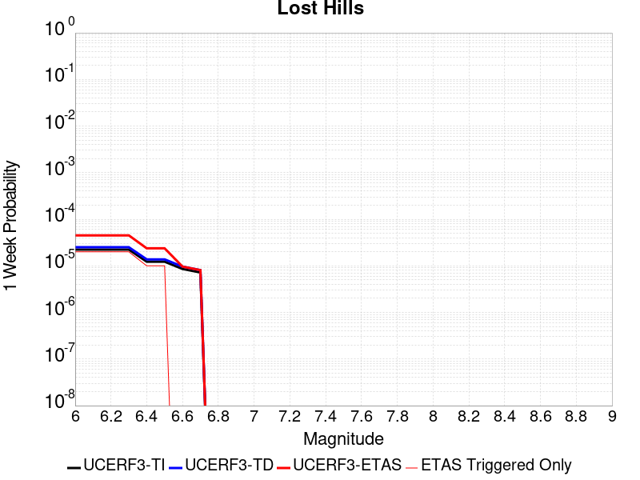 |  |  |  |

| Magnitude | 1 wk TI Prob | 1 wk TD Prob | 1 wk ETAS Prob | 1 wk ETAS/TD Gain | 1 wk ETAS Triggered Only | 1 mo TI Prob | 1 mo TD Prob | 1 mo ETAS Prob | 1 mo ETAS/TD Gain | 1 mo ETAS Triggered Only | 1 yr TI Prob | 1 yr TD Prob | 1 yr ETAS Prob | 1 yr ETAS/TD Gain | 1 yr ETAS Triggered Only | 10 yr TI Prob | 10 yr TD Prob | 10 yr ETAS Prob | 10 yr ETAS/TD Gain | 10 yr ETAS Triggered Only |
|-----|-----|-----|-----|-----|-----|-----|-----|-----|-----|-----|-----|-----|-----|-----|-----|-----|-----|-----|-----|-----|
| 6.0 | 2.233523E-5 | 2.5106583E-5 | 4.510608E-5 | 1.7965839 | 2.0E-5 | 9.571891E-5 | 1.0759615E-4 | 1.3759293E-4 | 1.2787904 | 3.0E-5 | 0.0011647546 | 0.001309364 | 0.0013592986 | 1.0381365 | 5.0E-5 | 0.011586686 | 0.013033091 | 0.013131787 | 1.0075728 | 1.0E-4 |
| 6.1 | 2.233523E-5 | 2.5106583E-5 | 4.510608E-5 | 1.7965839 | 2.0E-5 | 9.571891E-5 | 1.0759615E-4 | 1.3759293E-4 | 1.2787904 | 3.0E-5 | 0.0011647546 | 0.001309364 | 0.0013592986 | 1.0381365 | 5.0E-5 | 0.011586686 | 0.013033091 | 0.013131787 | 1.0075728 | 1.0E-4 |
| 6.2 | 2.233523E-5 | 2.5106583E-5 | 4.510608E-5 | 1.7965839 | 2.0E-5 | 9.571891E-5 | 1.0759615E-4 | 1.3759293E-4 | 1.2787904 | 3.0E-5 | 0.0011647546 | 0.001309364 | 0.0013592986 | 1.0381365 | 5.0E-5 | 0.011586686 | 0.013033091 | 0.013131787 | 1.0075728 | 1.0E-4 |
| 6.3 | 2.233523E-5 | 2.5106583E-5 | 4.510608E-5 | 1.7965839 | 2.0E-5 | 9.571891E-5 | 1.0759615E-4 | 1.3759293E-4 | 1.2787904 | 3.0E-5 | 0.0011647546 | 0.001309364 | 0.0013592986 | 1.0381365 | 5.0E-5 | 0.011586686 | 0.013033091 | 0.013131787 | 1.0075728 | 1.0E-4 |
| 6.4 | 1.2288092E-5 | 1.3781108E-5 | 2.3780969E-5 | 1.7256211 | 1.0E-5 | 5.2662188E-5 | 5.906108E-5 | 7.90599E-5 | 1.3386124 | 2.0E-5 | 6.409735E-4 | 7.189252E-4 | 7.5889647E-4 | 1.0555986 | 4.0E-5 | 0.006391279 | 0.0071752006 | 0.0072446982 | 1.0096859 | 7.0E-5 |
| 6.5 | 1.2288092E-5 | 1.3781108E-5 | 2.3780969E-5 | 1.7256211 | 1.0E-5 | 5.2662188E-5 | 5.906108E-5 | 7.90599E-5 | 1.3386124 | 2.0E-5 | 6.409735E-4 | 7.189252E-4 | 7.5889647E-4 | 1.0555986 | 4.0E-5 | 0.006391279 | 0.0071752006 | 0.0072446982 | 1.0096859 | 7.0E-5 |
| 6.6 | 8.58281E-6 | 9.63377E-6 | 9.63377E-6 | 1.0 | 0.0 | 3.6782953E-5 | 4.12874E-5 | 5.128699E-5 | 1.2421947 | 1.0E-5 | 4.4774043E-4 | 5.026414E-4 | 5.326263E-4 | 1.0596547 | 3.0E-5 | 0.0044683935 | 0.005023205 | 0.005082904 | 1.0118846 | 6.0E-5 |
| 6.7 | 7.205685E-6 | 8.088302E-6 | 8.088302E-6 | 1.0 | 0.0 | 3.088114E-5 | 3.466415E-5 | 4.4663804E-5 | 1.2884725 | 1.0E-5 | 3.7591302E-4 | 4.2203604E-4 | 4.5202338E-4 | 1.071054 | 3.0E-5 | 0.0037527776 | 0.0042203604 | 0.004280107 | 1.0141568 | 6.0E-5 |

## White Mountains
*[(top)](#table-of-contents)*

| 1 Week | 1 Month | 1 Year | 10 Year |
|-----|-----|-----|-----|
| 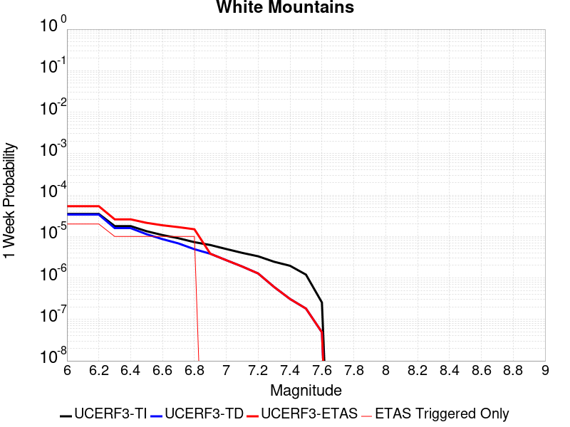 |  |  |  |

| Magnitude | 1 wk TI Prob | 1 wk TD Prob | 1 wk ETAS Prob | 1 wk ETAS/TD Gain | 1 wk ETAS Triggered Only | 1 mo TI Prob | 1 mo TD Prob | 1 mo ETAS Prob | 1 mo ETAS/TD Gain | 1 mo ETAS Triggered Only | 1 yr TI Prob | 1 yr TD Prob | 1 yr ETAS Prob | 1 yr ETAS/TD Gain | 1 yr ETAS Triggered Only | 10 yr TI Prob | 10 yr TD Prob | 10 yr ETAS Prob | 10 yr ETAS/TD Gain | 10 yr ETAS Triggered Only |
|-----|-----|-----|-----|-----|-----|-----|-----|-----|-----|-----|-----|-----|-----|-----|-----|-----|-----|-----|-----|-----|
| 6.0 | 3.503579E-5 | 3.378405E-5 | 5.3783377E-5 | 1.5919753 | 2.0E-5 | 1.5014476E-4 | 1.4478143E-4 | 1.6477854E-4 | 1.1381192 | 2.0E-5 | 0.0018264796 | 0.0017614096 | 0.0018412686 | 1.0453382 | 8.0E-5 | 0.018115403 | 0.017486818 | 0.017594894 | 1.0061804 | 1.1E-4 |
| 6.1 | 3.503579E-5 | 3.378405E-5 | 5.3783377E-5 | 1.5919753 | 2.0E-5 | 1.5014476E-4 | 1.4478143E-4 | 1.6477854E-4 | 1.1381192 | 2.0E-5 | 0.0018264796 | 0.0017614096 | 0.0018412686 | 1.0453382 | 8.0E-5 | 0.018115403 | 0.017486818 | 0.017594894 | 1.0061804 | 1.1E-4 |
| 6.2 | 3.503579E-5 | 3.378405E-5 | 5.3783377E-5 | 1.5919753 | 2.0E-5 | 1.5014476E-4 | 1.4478143E-4 | 1.6477854E-4 | 1.1381192 | 2.0E-5 | 0.0018264796 | 0.0017614096 | 0.0018412686 | 1.0453382 | 8.0E-5 | 0.018115403 | 0.017486818 | 0.017594894 | 1.0061804 | 1.1E-4 |
| 6.3 | 1.7818425E-5 | 1.5916074E-5 | 2.5915915E-5 | 1.6282856 | 1.0E-5 | 7.636245E-5 | 6.821004E-5 | 7.820936E-5 | 1.146596 | 1.0E-5 | 9.293162E-4 | 8.301551E-4 | 8.801136E-4 | 1.0601797 | 5.0E-5 | 0.009254395 | 0.008271999 | 0.008321585 | 1.0059944 | 5.0E-5 |
| 6.4 | 1.7818425E-5 | 1.5916074E-5 | 2.5915915E-5 | 1.6282856 | 1.0E-5 | 7.636245E-5 | 6.821004E-5 | 7.820936E-5 | 1.146596 | 1.0E-5 | 9.293162E-4 | 8.301551E-4 | 8.801136E-4 | 1.0601797 | 5.0E-5 | 0.009254395 | 0.008271999 | 0.008321585 | 1.0059944 | 5.0E-5 |
| 6.5 | 1.3397557E-5 | 1.13362685E-5 | 2.1336155E-5 | 1.8821145 | 1.0E-5 | 5.741684E-5 | 4.858314E-5 | 5.8582656E-5 | 1.2058227 | 1.0E-5 | 6.988258E-4 | 5.913462E-4 | 6.3132256E-4 | 1.0676023 | 4.0E-5 | 0.006966323 | 0.005898432 | 0.005938196 | 1.0067414 | 4.0E-5 |
| 6.6 | 1.0818695E-5 | 8.625366E-6 | 1.862528E-5 | 2.1593611 | 1.0E-5 | 4.6365014E-5 | 3.6965357E-5 | 4.6964986E-5 | 1.2705135 | 1.0E-5 | 5.6434784E-4 | 4.4996463E-4 | 4.6995562E-4 | 1.044428 | 2.0E-5 | 0.005629168 | 0.004490972 | 0.0045108823 | 1.0044334 | 2.0E-5 |
| 6.7 | 9.067908E-6 | 6.802442E-6 | 1.6802374E-5 | 2.4700503 | 1.0E-5 | 3.8861883E-5 | 2.9153016E-5 | 3.9152725E-5 | 1.3430077 | 1.0E-5 | 4.7304068E-4 | 3.5488335E-4 | 3.7487625E-4 | 1.0563365 | 2.0E-5 | 0.00472035 | 0.0035434833 | 0.0035634125 | 1.0056242 | 2.0E-5 |
| 6.8 | 7.295947E-6 | 4.936391E-6 | 1.4936341E-5 | 3.0257614 | 1.0E-5 | 3.126797E-5 | 2.1155796E-5 | 3.1155585E-5 | 1.4726737 | 1.0E-5 | 3.8062103E-4 | 2.575425E-4 | 2.7753736E-4 | 1.0776371 | 2.0E-5 | 0.0037996976 | 0.0025725532 | 0.002592502 | 1.0077543 | 2.0E-5 |
| 6.9 | 6.2243444E-6 | 3.832213E-6 | 3.832213E-6 | 1.0 | 0.0 | 2.6675489E-5 | 1.642367E-5 | 1.642367E-5 | 1.0 | 0.0 | 3.2472567E-4 | 1.9994036E-4 | 2.0993837E-4 | 1.050005 | 1.0E-5 | 0.0032425157 | 0.0019976576 | 0.0020076376 | 1.0049958 | 1.0E-5 |
| 7.0 | 4.9878413E-6 | 2.6795342E-6 | 2.6795342E-6 | 1.0 | 0.0 | 2.1376287E-5 | 1.14836685E-5 | 1.14836685E-5 | 1.0 | 0.0 | 2.602252E-4 | 1.3980496E-4 | 1.4980356E-4 | 1.0715182 | 1.0E-5 | 0.002599207 | 0.0013971963 | 0.0014071823 | 1.0071472 | 1.0E-5 |
| 7.1 | 4.0252844E-6 | 1.8857575E-6 | 1.8857575E-6 | 1.0 | 0.0 | 1.7251105E-5 | 8.081794E-6 | 8.081794E-6 | 1.0 | 0.0 | 2.1001195E-4 | 9.8391516E-5 | 9.8391516E-5 | 1.0 | 0.0 | 0.0020981359 | 9.834924E-4 | 9.834924E-4 | 1.0 | 0.0 |
| 7.2 | 3.3284066E-6 | 1.281964E-6 | 1.281964E-6 | 1.0 | 0.0 | 1.4264522E-5 | 5.494121E-6 | 5.494121E-6 | 1.0 | 0.0 | 1.736567E-4 | 6.688897E-5 | 6.688897E-5 | 1.0 | 0.0 | 0.0017352107 | 6.6869846E-4 | 6.6869846E-4 | 1.0 | 0.0 |
| 7.3 | 2.458226E-6 | 6.05722E-7 | 6.05722E-7 | 1.0 | 0.0 | 1.0535211E-5 | 2.5959491E-6 | 2.5959491E-6 | 1.0 | 0.0 | 1.2825865E-4 | 3.1605257E-5 | 3.1605257E-5 | 1.0 | 0.0 | 0.0012818464 | 3.160114E-4 | 3.160114E-4 | 1.0 | 0.0 |
| 7.4 | 1.965953E-6 | 3.1089303E-7 | 3.1089303E-7 | 1.0 | 0.0 | 8.425486E-6 | 1.332398E-6 | 1.332398E-6 | 1.0 | 0.0 | 1.0257547E-4 | 1.6221828E-5 | 1.6221828E-5 | 1.0 | 0.0 | 0.0010252813 | 1.6220656E-4 | 1.6220656E-4 | 1.0 | 0.0 |
| 7.5 | 1.2014192E-6 | 1.8244253E-7 | 1.8244253E-7 | 1.0 | 0.0 | 5.148929E-6 | 7.8189635E-7 | 7.8189635E-7 | 1.0 | 0.0 | 6.2686406E-5 | 9.519547E-6 | 9.519547E-6 | 1.0 | 0.0 | 6.266873E-4 | 9.519148E-5 | 9.519148E-5 | 1.0 | 0.0 |
| 7.6 | 2.5612175E-7 | 4.8946475E-8 | 4.8946475E-8 | 1.0 | 0.0 | 1.0976642E-6 | 2.0977059E-7 | 2.0977059E-7 | 1.0 | 0.0 | 1.3363979E-5 | 2.5539543E-6 | 2.5539543E-6 | 1.0 | 0.0 | 1.3363175E-4 | 2.5539286E-5 | 2.5539286E-5 | 1.0 | 0.0 |

## Santa Cruz Island
*[(top)](#table-of-contents)*

| 1 Week | 1 Month | 1 Year | 10 Year |
|-----|-----|-----|-----|
|  | 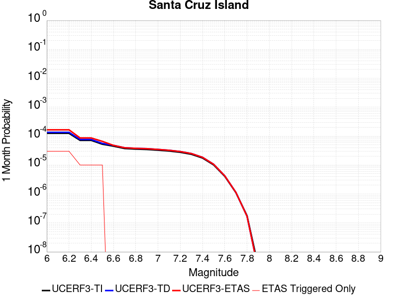 | 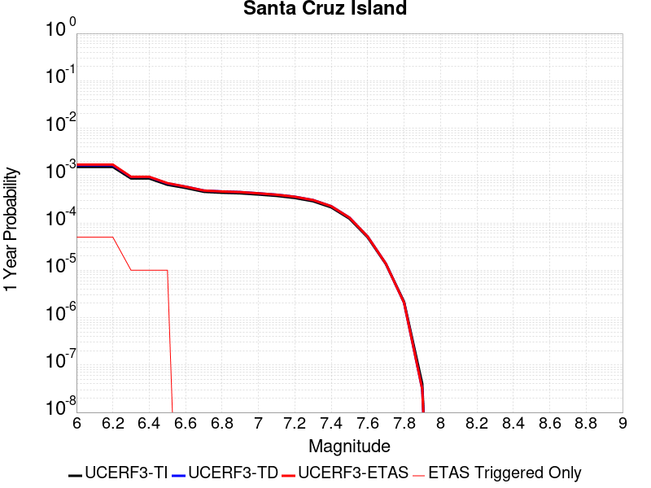 |  |

| Magnitude | 1 wk TI Prob | 1 wk TD Prob | 1 wk ETAS Prob | 1 wk ETAS/TD Gain | 1 wk ETAS Triggered Only | 1 mo TI Prob | 1 mo TD Prob | 1 mo ETAS Prob | 1 mo ETAS/TD Gain | 1 mo ETAS Triggered Only | 1 yr TI Prob | 1 yr TD Prob | 1 yr ETAS Prob | 1 yr ETAS/TD Gain | 1 yr ETAS Triggered Only | 10 yr TI Prob | 10 yr TD Prob | 10 yr ETAS Prob | 10 yr ETAS/TD Gain | 10 yr ETAS Triggered Only |
|-----|-----|-----|-----|-----|-----|-----|-----|-----|-----|-----|-----|-----|-----|-----|-----|-----|-----|-----|-----|-----|
| 6.0 | 2.9164563E-5 | 3.1599742E-5 | 6.1598796E-5 | 1.9493448 | 3.0E-5 | 1.2498499E-4 | 1.3542121E-4 | 1.6541715E-4 | 1.221501 | 3.0E-5 | 0.0015206301 | 0.0016476426 | 0.0016975602 | 1.0302964 | 5.0E-5 | 0.015102667 | 0.016368 | 0.016476199 | 1.0066104 | 1.1E-4 |
| 6.1 | 2.9164563E-5 | 3.1599742E-5 | 6.1598796E-5 | 1.9493448 | 3.0E-5 | 1.2498499E-4 | 1.3542121E-4 | 1.6541715E-4 | 1.221501 | 3.0E-5 | 0.0015206301 | 0.0016476426 | 0.0016975602 | 1.0302964 | 5.0E-5 | 0.015102667 | 0.016368 | 0.016476199 | 1.0066104 | 1.1E-4 |
| 6.2 | 2.9164563E-5 | 3.1599742E-5 | 6.1598796E-5 | 1.9493448 | 3.0E-5 | 1.2498499E-4 | 1.3542121E-4 | 1.6541715E-4 | 1.221501 | 3.0E-5 | 0.0015206301 | 0.0016476426 | 0.0016975602 | 1.0302964 | 5.0E-5 | 0.015102667 | 0.016368 | 0.016476199 | 1.0066104 | 1.1E-4 |
| 6.3 | 1.6635553E-5 | 1.780436E-5 | 2.780418E-5 | 1.5616503 | 1.0E-5 | 7.1293274E-5 | 7.630226E-5 | 8.63015E-5 | 1.1310477 | 1.0E-5 | 8.6765E-4 | 9.2860236E-4 | 9.385931E-4 | 1.0107589 | 1.0E-5 | 0.008642701 | 0.009249094 | 0.009268909 | 1.0021424 | 2.0E-5 |
| 6.4 | 1.6635553E-5 | 1.780436E-5 | 2.780418E-5 | 1.5616503 | 1.0E-5 | 7.1293274E-5 | 7.630226E-5 | 8.63015E-5 | 1.1310477 | 1.0E-5 | 8.6765E-4 | 9.2860236E-4 | 9.385931E-4 | 1.0107589 | 1.0E-5 | 0.008642701 | 0.009249094 | 0.009268909 | 1.0021424 | 2.0E-5 |
| 6.5 | 1.2238748E-5 | 1.3042995E-5 | 2.3042865E-5 | 1.766685 | 1.0E-5 | 5.2450723E-5 | 5.5897377E-5 | 6.589681E-5 | 1.1788893 | 1.0E-5 | 6.3840044E-4 | 6.8034173E-4 | 6.9033494E-4 | 1.0146885 | 1.0E-5 | 0.0063656955 | 0.0067829876 | 0.0068028523 | 1.0029285 | 2.0E-5 |
| 6.6 | 1.0489767E-5 | 1.1156636E-5 | 1.1156636E-5 | 1.0 | 0.0 | 4.495537E-5 | 4.781329E-5 | 4.781329E-5 | 1.0 | 0.0 | 5.4719415E-4 | 5.819735E-4 | 5.819735E-4 | 1.0 | 0.0 | 0.005458487 | 0.0058047357 | 0.0058146776 | 1.0017127 | 1.0E-5 |
| 6.7 | 8.699222E-6 | 9.236782E-6 | 9.236782E-6 | 1.0 | 0.0 | 3.7281847E-5 | 3.958561E-5 | 3.958561E-5 | 1.0 | 0.0 | 4.5381195E-4 | 4.8184878E-4 | 4.8184878E-4 | 1.0 | 0.0 | 0.0045288634 | 0.004808108 | 0.00481806 | 1.0020698 | 1.0E-5 |
| 6.8 | 8.307732E-6 | 8.8169045E-6 | 8.8169045E-6 | 1.0 | 0.0 | 3.560408E-5 | 3.7786187E-5 | 3.7786187E-5 | 1.0 | 0.0 | 4.3339343E-4 | 4.5995016E-4 | 4.5995016E-4 | 1.0 | 0.0 | 0.004325492 | 0.0045900354 | 0.0045999894 | 1.0021687 | 1.0E-5 |
| 6.9 | 8.073121E-6 | 8.564939E-6 | 8.564939E-6 | 1.0 | 0.0 | 3.459863E-5 | 3.6706366E-5 | 3.6706366E-5 | 1.0 | 0.0 | 4.2115687E-4 | 4.468088E-4 | 4.468088E-4 | 1.0 | 0.0 | 0.004203596 | 0.004459156 | 0.0044691116 | 1.0022326 | 1.0E-5 |
| 7.0 | 7.617019E-6 | 8.074664E-6 | 8.074664E-6 | 1.0 | 0.0 | 3.264396E-5 | 3.4605247E-5 | 3.4605247E-5 | 1.0 | 0.0 | 3.9736772E-4 | 4.212378E-4 | 4.212378E-4 | 1.0 | 0.0 | 0.003966579 | 0.0042044413 | 0.004214399 | 1.0023685 | 1.0E-5 |
| 7.1 | 7.1224836E-6 | 7.545788E-6 | 7.545788E-6 | 1.0 | 0.0 | 3.052457E-5 | 3.2338692E-5 | 3.2338692E-5 | 1.0 | 0.0 | 3.715733E-4 | 3.936528E-4 | 3.936528E-4 | 1.0 | 0.0 | 0.003709526 | 0.003929598 | 0.0039395588 | 1.0025347 | 1.0E-5 |
| 7.2 | 6.441115E-6 | 6.8273835E-6 | 6.8273835E-6 | 1.0 | 0.0 | 2.7604487E-5 | 2.9259887E-5 | 2.9259887E-5 | 1.0 | 0.0 | 3.360328E-4 | 3.5618112E-4 | 3.5618112E-4 | 1.0 | 0.0 | 0.0033552512 | 0.003556131 | 0.0035660954 | 1.002802 | 1.0E-5 |
| 7.3 | 5.494274E-6 | 5.8199944E-6 | 5.8199944E-6 | 1.0 | 0.0 | 2.3546674E-5 | 2.4942596E-5 | 2.4942596E-5 | 1.0 | 0.0 | 2.8664304E-4 | 3.0363398E-4 | 3.0363398E-4 | 1.0 | 0.0 | 0.002862736 | 0.0030322142 | 0.0030322142 | 1.0 | 0.0 |
| 7.4 | 4.0802624E-6 | 4.312256E-6 | 4.312256E-6 | 1.0 | 0.0 | 1.7486722E-5 | 1.8480967E-5 | 1.8480967E-5 | 1.0 | 0.0 | 2.1288003E-4 | 2.2498262E-4 | 2.2498262E-4 | 1.0 | 0.0 | 0.0021267622 | 0.0022475575 | 0.0022475575 | 1.0 | 0.0 |
| 7.5 | 2.3584746E-6 | 2.4753094E-6 | 2.4753094E-6 | 1.0 | 0.0 | 1.0107709E-5 | 1.0608426E-5 | 1.0608426E-5 | 1.0 | 0.0 | 1.2305441E-4 | 1.2915E-4 | 1.2915E-4 | 1.0 | 0.0 | 0.0012298629 | 0.0012907543 | 0.0012907543 | 1.0 | 0.0 |
| 7.6 | 9.4981914E-7 | 9.86093E-7 | 9.86093E-7 | 1.0 | 0.0 | 4.0706473E-6 | 4.2261063E-6 | 4.2261063E-6 | 1.0 | 0.0 | 4.9559E-5 | 5.145164E-5 | 5.145164E-5 | 1.0 | 0.0 | 4.954795E-4 | 5.1439856E-4 | 5.1439856E-4 | 1.0 | 0.0 |
| 7.7 | 2.6013532E-7 | 2.6416603E-7 | 2.6416603E-7 | 1.0 | 0.0 | 1.1148652E-6 | 1.1321397E-6 | 1.1321397E-6 | 1.0 | 0.0 | 1.3573399E-5 | 1.3783714E-5 | 1.3783714E-5 | 1.0 | 0.0 | 1.357257E-4 | 1.3782867E-4 | 1.3782867E-4 | 1.0 | 0.0 |
| 7.8 | 4.1522263E-8 | 3.965679E-8 | 3.965679E-8 | 1.0 | 0.0 | 1.7795254E-7 | 1.6995766E-7 | 1.6995766E-7 | 1.0 | 0.0 | 2.16657E-6 | 2.0692328E-6 | 2.0692328E-6 | 1.0 | 0.0 | 2.1665488E-5 | 2.0692156E-5 | 2.0692156E-5 | 1.0 | 0.0 |
| 7.9 | 7.7242046E-10 | 5.9468175E-10 | 5.9468175E-10 | 1.0 | 0.0 | 3.3103735E-9 | 2.5486364E-9 | 2.5486364E-9 | 1.0 | 0.0 | 4.0303796E-8 | 3.1029646E-8 | 3.1029646E-8 | 1.0 | 0.0 | 4.030379E-7 | 3.1029643E-7 | 3.1029643E-7 | 1.0 | 0.0 |

## Ventura-Pitas Point
*[(top)](#table-of-contents)*

| 1 Week | 1 Month | 1 Year | 10 Year |
|-----|-----|-----|-----|
|  |  | 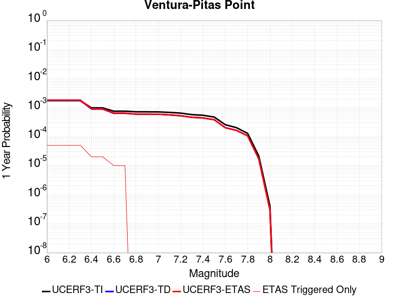 | 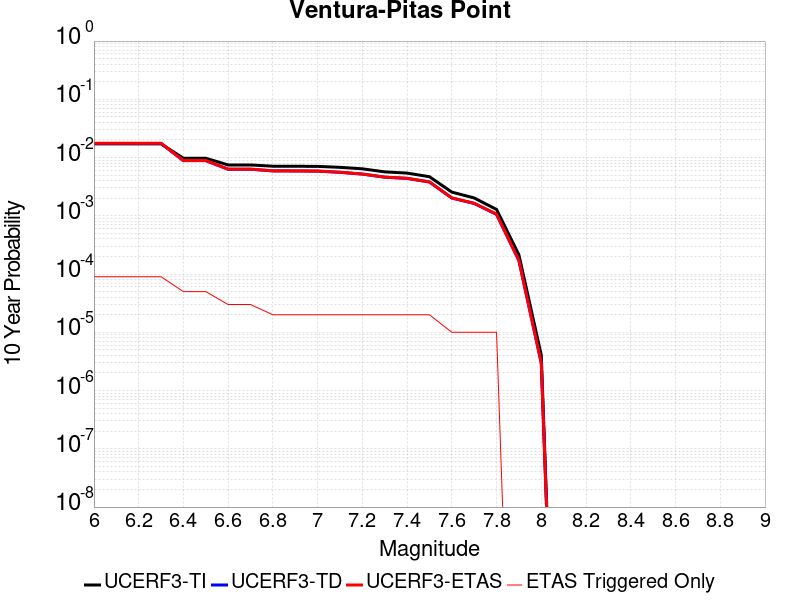 |

| Magnitude | 1 wk TI Prob | 1 wk TD Prob | 1 wk ETAS Prob | 1 wk ETAS/TD Gain | 1 wk ETAS Triggered Only | 1 mo TI Prob | 1 mo TD Prob | 1 mo ETAS Prob | 1 mo ETAS/TD Gain | 1 mo ETAS Triggered Only | 1 yr TI Prob | 1 yr TD Prob | 1 yr ETAS Prob | 1 yr ETAS/TD Gain | 1 yr ETAS Triggered Only | 10 yr TI Prob | 10 yr TD Prob | 10 yr ETAS Prob | 10 yr ETAS/TD Gain | 10 yr ETAS Triggered Only |
|-----|-----|-----|-----|-----|-----|-----|-----|-----|-----|-----|-----|-----|-----|-----|-----|-----|-----|-----|-----|-----|
| 6.0 | 3.3179622E-5 | 3.3735185E-5 | 5.3734508E-5 | 1.5928328 | 2.0E-5 | 1.4219063E-4 | 1.445728E-4 | 1.7456846E-4 | 1.2074779 | 3.0E-5 | 0.0017297962 | 0.0017590096 | 0.0018089217 | 1.028375 | 5.0E-5 | 0.017163932 | 0.0174764 | 0.017564828 | 1.0050598 | 9.0E-5 |
| 6.1 | 3.3179622E-5 | 3.3735185E-5 | 5.3734508E-5 | 1.5928328 | 2.0E-5 | 1.4219063E-4 | 1.445728E-4 | 1.7456846E-4 | 1.2074779 | 3.0E-5 | 0.0017297962 | 0.0017590096 | 0.0018089217 | 1.028375 | 5.0E-5 | 0.017163932 | 0.0174764 | 0.017564828 | 1.0050598 | 9.0E-5 |
| 6.2 | 3.3179622E-5 | 3.3735185E-5 | 5.3734508E-5 | 1.5928328 | 2.0E-5 | 1.4219063E-4 | 1.445728E-4 | 1.7456846E-4 | 1.2074779 | 3.0E-5 | 0.0017297962 | 0.0017590096 | 0.0018089217 | 1.028375 | 5.0E-5 | 0.017163932 | 0.0174764 | 0.017564828 | 1.0050598 | 9.0E-5 |
| 6.3 | 3.3179622E-5 | 3.3735185E-5 | 5.3734508E-5 | 1.5928328 | 2.0E-5 | 1.4219063E-4 | 1.445728E-4 | 1.7456846E-4 | 1.2074779 | 3.0E-5 | 0.0017297962 | 0.0017590096 | 0.0018089217 | 1.028375 | 5.0E-5 | 0.017163932 | 0.0174764 | 0.017564828 | 1.0050598 | 9.0E-5 |
| 6.4 | 1.8754668E-5 | 1.701961E-5 | 2.701944E-5 | 1.5875475 | 1.0E-5 | 8.037467E-5 | 7.293928E-5 | 8.293855E-5 | 1.1370903 | 1.0E-5 | 9.781223E-4 | 8.8769704E-4 | 9.0767926E-4 | 1.0225102 | 2.0E-5 | 0.009738282 | 0.008843848 | 0.008893406 | 1.0056037 | 5.0E-5 |
| 6.5 | 1.8754668E-5 | 1.701961E-5 | 2.701944E-5 | 1.5875475 | 1.0E-5 | 8.037467E-5 | 7.293928E-5 | 8.293855E-5 | 1.1370903 | 1.0E-5 | 9.781223E-4 | 8.8769704E-4 | 9.0767926E-4 | 1.0225102 | 2.0E-5 | 0.009738282 | 0.008843848 | 0.008893406 | 1.0056037 | 5.0E-5 |
| 6.6 | 1.4361558E-5 | 1.2122275E-5 | 1.2122275E-5 | 1.0 | 0.0 | 6.154808E-5 | 5.1951585E-5 | 5.1951585E-5 | 1.0 | 0.0 | 7.490902E-4 | 6.3232926E-4 | 6.4232294E-4 | 1.0158045 | 1.0E-5 | 0.0074657016 | 0.0063055577 | 0.0063353684 | 1.0047277 | 3.0E-5 |
| 6.7 | 1.4361558E-5 | 1.2122275E-5 | 1.2122275E-5 | 1.0 | 0.0 | 6.154808E-5 | 5.1951585E-5 | 5.1951585E-5 | 1.0 | 0.0 | 7.490902E-4 | 6.3232926E-4 | 6.4232294E-4 | 1.0158045 | 1.0E-5 | 0.0074657016 | 0.0063055577 | 0.0063353684 | 1.0047277 | 3.0E-5 |
| 6.8 | 1.3663846E-5 | 1.13444175E-5 | 1.13444175E-5 | 1.0 | 0.0 | 5.8558027E-5 | 4.861804E-5 | 4.861804E-5 | 1.0 | 0.0 | 7.127108E-4 | 5.917658E-4 | 5.917658E-4 | 1.0 | 0.0 | 0.007104293 | 0.005902116 | 0.005921998 | 1.0033686 | 2.0E-5 |
| 6.9 | 1.3644157E-5 | 1.1322519E-5 | 1.1322519E-5 | 1.0 | 0.0 | 5.8473648E-5 | 4.8524187E-5 | 4.8524187E-5 | 1.0 | 0.0 | 7.116841E-4 | 5.9062376E-4 | 5.9062376E-4 | 1.0 | 0.0 | 0.007094092 | 0.0058907564 | 0.0059106387 | 1.0033752 | 2.0E-5 |
| 7.0 | 1.3568845E-5 | 1.1242086E-5 | 1.1242086E-5 | 1.0 | 0.0 | 5.8150898E-5 | 4.817949E-5 | 4.817949E-5 | 1.0 | 0.0 | 7.077572E-4 | 5.864293E-4 | 5.864293E-4 | 1.0 | 0.0 | 0.007055073 | 0.0058490336 | 0.0058689164 | 1.0033994 | 2.0E-5 |
| 7.1 | 1.306572E-5 | 1.072054E-5 | 1.072054E-5 | 1.0 | 0.0 | 5.599474E-5 | 4.5944373E-5 | 4.5944373E-5 | 1.0 | 0.0 | 6.815227E-4 | 5.5923103E-4 | 5.5923103E-4 | 1.0 | 0.0 | 0.0067943637 | 0.0055784425 | 0.005598331 | 1.0035652 | 2.0E-5 |
| 7.2 | 1.232604E-5 | 9.995143E-6 | 9.995143E-6 | 1.0 | 0.0 | 5.2824813E-5 | 4.2835632E-5 | 4.2835632E-5 | 1.0 | 0.0 | 6.429523E-4 | 5.214008E-4 | 5.214008E-4 | 1.0 | 0.0 | 0.0064109527 | 0.005201967 | 0.005221863 | 1.0038247 | 2.0E-5 |
| 7.3 | 1.0917261E-5 | 8.84384E-6 | 8.84384E-6 | 1.0 | 0.0 | 4.678742E-5 | 3.790163E-5 | 3.790163E-5 | 1.0 | 0.0 | 5.69488E-4 | 4.6135622E-4 | 4.6135622E-4 | 1.0 | 0.0 | 0.0056803077 | 0.00460415 | 0.004624058 | 1.004324 | 2.0E-5 |
| 7.4 | 1.039959E-5 | 8.423562E-6 | 8.423562E-6 | 1.0 | 0.0 | 4.456891E-5 | 3.610049E-5 | 3.610049E-5 | 1.0 | 0.0 | 5.424914E-4 | 4.3943635E-4 | 4.3943635E-4 | 1.0 | 0.0 | 0.0054116896 | 0.004385836 | 0.004405748 | 1.0045401 | 2.0E-5 |
| 7.5 | 9.015877E-6 | 7.2975445E-6 | 7.2975445E-6 | 1.0 | 0.0 | 3.86389E-5 | 3.1274823E-5 | 3.1274823E-5 | 1.0 | 0.0 | 4.7032707E-4 | 3.8070587E-4 | 3.8070587E-4 | 1.0 | 0.0 | 0.004693329 | 0.0038006818 | 0.0038206058 | 1.0052422 | 2.0E-5 |
| 7.6 | 4.900162E-6 | 3.8741155E-6 | 3.8741155E-6 | 1.0 | 0.0 | 2.1000526E-5 | 1.6603248E-5 | 1.6603248E-5 | 1.0 | 0.0 | 2.556514E-4 | 2.0212591E-4 | 2.0212591E-4 | 1.0 | 0.0 | 0.0025535747 | 0.0020194345 | 0.0020294143 | 1.0049419 | 1.0E-5 |
| 7.7 | 3.8850626E-6 | 3.1267302E-6 | 3.1267302E-6 | 1.0 | 0.0 | 1.6650163E-5 | 1.3400205E-5 | 1.3400205E-5 | 1.0 | 0.0 | 2.0269687E-4 | 1.6313537E-4 | 1.6313537E-4 | 1.0 | 0.0 | 0.002025121 | 0.0016301654 | 0.001640149 | 1.0061244 | 1.0E-5 |
| 7.8 | 2.4654719E-6 | 2.029875E-6 | 2.029875E-6 | 1.0 | 0.0 | 1.0566265E-5 | 8.699436E-6 | 8.699436E-6 | 1.0 | 0.0 | 1.2863669E-4 | 1.0591053E-4 | 1.0591053E-4 | 1.0 | 0.0 | 0.0012856225 | 0.0010586053 | 0.0010685946 | 1.0094364 | 1.0E-5 |
| 7.9 | 4.095894E-7 | 3.2764765E-7 | 3.2764765E-7 | 1.0 | 0.0 | 1.7553821E-6 | 1.4042034E-6 | 1.4042034E-6 | 1.0 | 0.0 | 2.1371567E-5 | 1.7096047E-5 | 1.7096047E-5 | 1.0 | 0.0 | 2.1369511E-4 | 1.7094762E-4 | 1.7094762E-4 | 1.0 | 0.0 |
| 8.0 | 7.791402E-9 | 5.683497E-9 | 5.683497E-9 | 1.0 | 0.0 | 3.3391725E-8 | 2.4357844E-8 | 2.4357844E-8 | 1.0 | 0.0 | 4.0654416E-7 | 2.9655675E-7 | 2.9655675E-7 | 1.0 | 0.0 | 4.065434E-6 | 2.9655655E-6 | 2.9655655E-6 | 1.0 | 0.0 |

## Camp Rock 2011
*[(top)](#table-of-contents)*

| 1 Week | 1 Month | 1 Year | 10 Year |
|-----|-----|-----|-----|
|  | 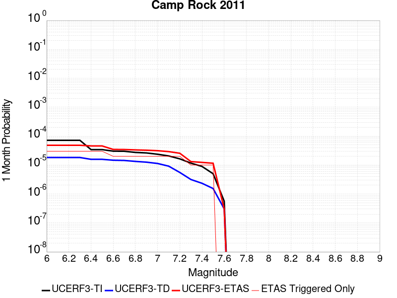 | 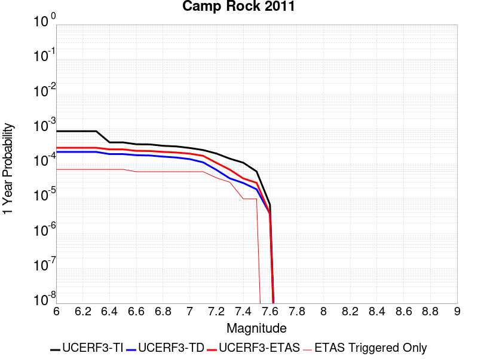 | 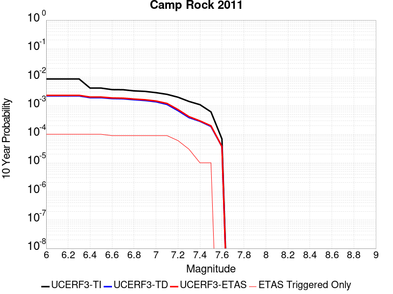 |

| Magnitude | 1 wk TI Prob | 1 wk TD Prob | 1 wk ETAS Prob | 1 wk ETAS/TD Gain | 1 wk ETAS Triggered Only | 1 mo TI Prob | 1 mo TD Prob | 1 mo ETAS Prob | 1 mo ETAS/TD Gain | 1 mo ETAS Triggered Only | 1 yr TI Prob | 1 yr TD Prob | 1 yr ETAS Prob | 1 yr ETAS/TD Gain | 1 yr ETAS Triggered Only | 10 yr TI Prob | 10 yr TD Prob | 10 yr ETAS Prob | 10 yr ETAS/TD Gain | 10 yr ETAS Triggered Only |
|-----|-----|-----|-----|-----|-----|-----|-----|-----|-----|-----|-----|-----|-----|-----|-----|-----|-----|-----|-----|-----|
| 6.0 | 1.6710783E-5 | 4.25026E-6 | 2.4250176E-5 | 5.705574 | 2.0E-5 | 7.161568E-5 | 1.8215276E-5 | 4.821473E-5 | 2.6469393 | 3.0E-5 | 8.7157206E-4 | 2.2174895E-4 | 2.9173342E-4 | 1.3156023 | 7.0E-5 | 0.008681616 | 0.0022153298 | 0.0023151082 | 1.04504 | 1.0E-4 |
| 6.1 | 1.6710783E-5 | 4.25026E-6 | 2.4250176E-5 | 5.705574 | 2.0E-5 | 7.161568E-5 | 1.8215276E-5 | 4.821473E-5 | 2.6469393 | 3.0E-5 | 8.7157206E-4 | 2.2174895E-4 | 2.9173342E-4 | 1.3156023 | 7.0E-5 | 0.008681616 | 0.0022153298 | 0.0023151082 | 1.04504 | 1.0E-4 |
| 6.2 | 1.6710783E-5 | 4.25026E-6 | 2.4250176E-5 | 5.705574 | 2.0E-5 | 7.161568E-5 | 1.8215276E-5 | 4.821473E-5 | 2.6469393 | 3.0E-5 | 8.7157206E-4 | 2.2174895E-4 | 2.9173342E-4 | 1.3156023 | 7.0E-5 | 0.008681616 | 0.0022153298 | 0.0023151082 | 1.04504 | 1.0E-4 |
| 6.3 | 1.6710783E-5 | 4.25026E-6 | 2.4250176E-5 | 5.705574 | 2.0E-5 | 7.161568E-5 | 1.8215276E-5 | 4.821473E-5 | 2.6469393 | 3.0E-5 | 8.7157206E-4 | 2.2174895E-4 | 2.9173342E-4 | 1.3156023 | 7.0E-5 | 0.008681616 | 0.0022153298 | 0.0023151082 | 1.04504 | 1.0E-4 |
| 6.4 | 7.982846E-6 | 3.6820884E-6 | 2.3682014E-5 | 6.43168 | 2.0E-5 | 3.421175E-5 | 1.5780286E-5 | 4.5779812E-5 | 2.9010763 | 3.0E-5 | 4.1644843E-4 | 1.9210839E-4 | 2.6209495E-4 | 1.3643076 | 7.0E-5 | 0.0041566887 | 0.001919458 | 0.0020192661 | 1.051998 | 1.0E-4 |
| 6.5 | 7.982846E-6 | 3.6820884E-6 | 2.3682014E-5 | 6.43168 | 2.0E-5 | 3.421175E-5 | 1.5780286E-5 | 4.5779812E-5 | 2.9010763 | 3.0E-5 | 4.1644843E-4 | 1.9210839E-4 | 2.6209495E-4 | 1.3643076 | 7.0E-5 | 0.0041566887 | 0.001919458 | 0.0020192661 | 1.051998 | 1.0E-4 |
| 6.6 | 7.048869E-6 | 3.4243571E-6 | 1.3424323E-5 | 3.9202461 | 1.0E-5 | 3.0209088E-5 | 1.4675736E-5 | 3.4675442E-5 | 2.3627737 | 2.0E-5 | 3.677336E-4 | 1.7866275E-4 | 2.3865204E-4 | 1.3357682 | 6.0E-5 | 0.0036712566 | 0.0017852228 | 0.0018750621 | 1.0503238 | 9.0E-5 |
| 6.7 | 6.987307E-6 | 3.3623348E-6 | 1.3362301E-5 | 3.974114 | 1.0E-5 | 2.9945259E-5 | 1.4409929E-5 | 3.440964E-5 | 2.387912 | 2.0E-5 | 3.6452254E-4 | 1.7542706E-4 | 2.3541653E-4 | 1.3419625 | 6.0E-5 | 0.0036392517 | 0.001752917 | 0.0018427592 | 1.051253 | 9.0E-5 |
| 6.8 | 6.3737602E-6 | 3.1179077E-6 | 1.3117877E-5 | 4.207269 | 1.0E-5 | 2.731583E-5 | 1.3362394E-5 | 3.336213E-5 | 2.4967177 | 2.0E-5 | 3.3251947E-4 | 1.626753E-4 | 2.2266553E-4 | 1.3687729 | 6.0E-5 | 0.0033202237 | 0.0016255907 | 0.0017154445 | 1.0552745 | 9.0E-5 |
| 6.9 | 6.112211E-6 | 2.9331156E-6 | 1.29330865E-5 | 4.409334 | 1.0E-5 | 2.6194928E-5 | 1.2570436E-5 | 3.2570184E-5 | 2.5910146 | 2.0E-5 | 3.1887658E-4 | 1.5303459E-4 | 2.1302541E-4 | 1.3920082 | 6.0E-5 | 0.003184194 | 0.0015293199 | 0.0016191822 | 1.0587597 | 9.0E-5 |
| 7.0 | 5.5140117E-6 | 2.641923E-6 | 1.2641896E-5 | 4.785112 | 1.0E-5 | 2.3631264E-5 | 1.132248E-5 | 3.132225E-5 | 2.7663777 | 2.0E-5 | 2.8767265E-4 | 1.3784273E-4 | 1.9783445E-4 | 1.4352187 | 6.0E-5 | 0.0028730053 | 0.0013775975 | 0.0014674735 | 1.0652411 | 9.0E-5 |
| 7.1 | 4.8151105E-6 | 2.1342705E-6 | 1.2134249E-5 | 5.685432 | 1.0E-5 | 2.0636026E-5 | 9.146843E-6 | 2.9146659E-5 | 3.186527 | 2.0E-5 | 2.5121463E-4 | 1.1135734E-4 | 1.7135065E-4 | 1.538746 | 6.0E-5 | 0.0025093083 | 0.0011130372 | 0.0012029371 | 1.0807698 | 9.0E-5 |
| 7.2 | 3.818335E-6 | 1.2937425E-6 | 1.129373E-5 | 8.729504 | 1.0E-5 | 1.6364189E-5 | 5.5445994E-6 | 2.5544488E-5 | 4.607094 | 2.0E-5 | 1.9921579E-4 | 6.750349E-5 | 1.0750079E-4 | 1.592522 | 4.0E-5 | 0.0019903728 | 6.748381E-4 | 7.3479756E-4 | 1.0888503 | 6.0E-5 |
| 7.3 | 2.7166698E-6 | 7.3835776E-7 | 7.3835776E-7 | 1.0 | 0.0 | 1.1642818E-5 | 3.1643867E-6 | 1.3164355E-5 | 4.16016 | 1.0E-5 | 1.4174209E-4 | 3.8525748E-5 | 6.852459E-5 | 1.7786701 | 3.0E-5 | 0.0014165172 | 3.851927E-4 | 4.1518113E-4 | 1.0778531 | 3.0E-5 |
| 7.4 | 2.0893426E-6 | 5.4618386E-7 | 5.4618386E-7 | 1.0 | 0.0 | 8.954295E-6 | 2.3407858E-6 | 1.2340763E-5 | 5.2720594 | 1.0E-5 | 1.0901308E-4 | 2.84987E-5 | 3.8498416E-5 | 1.3508832 | 1.0E-5 | 0.0010895962 | 2.84951E-4 | 2.9494814E-4 | 1.0350838 | 1.0E-5 |
| 7.5 | 1.1681728E-6 | 3.6030585E-7 | 3.6030585E-7 | 1.0 | 0.0 | 5.0064455E-6 | 1.544167E-6 | 1.1544152E-5 | 7.475973 | 1.0E-5 | 6.0951766E-5 | 1.8800076E-5 | 2.8799888E-5 | 1.5319028 | 1.0E-5 | 6.093505E-4 | 1.8798532E-4 | 1.9798345E-4 | 1.0531856 | 1.0E-5 |
| 7.6 | 1.3154387E-7 | 7.1197384E-8 | 7.1197384E-8 | 1.0 | 0.0 | 5.6375933E-7 | 3.051316E-7 | 3.051316E-7 | 1.0 | 0.0 | 6.863748E-6 | 3.7149728E-6 | 3.7149728E-6 | 1.0 | 0.0 | 6.863536E-5 | 3.7149264E-5 | 3.7149264E-5 | 1.0 | 0.0 |

## San Pedro Basin
*[(top)](#table-of-contents)*

| 1 Week | 1 Month | 1 Year | 10 Year |
|-----|-----|-----|-----|
| 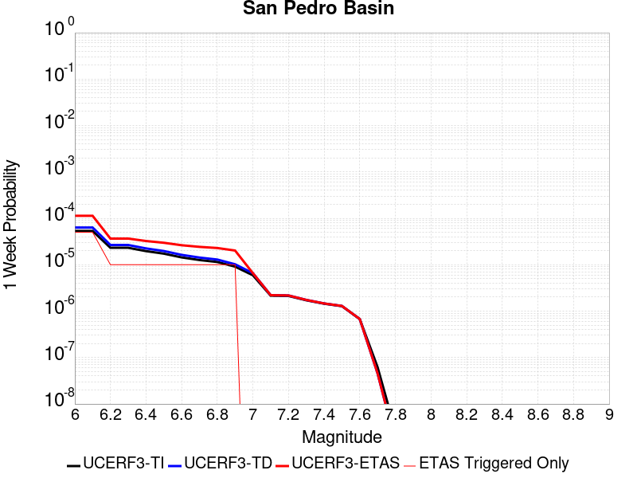 |  |  | 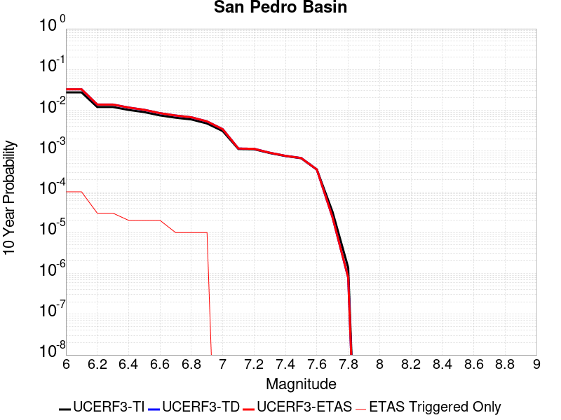 |

| Magnitude | 1 wk TI Prob | 1 wk TD Prob | 1 wk ETAS Prob | 1 wk ETAS/TD Gain | 1 wk ETAS Triggered Only | 1 mo TI Prob | 1 mo TD Prob | 1 mo ETAS Prob | 1 mo ETAS/TD Gain | 1 mo ETAS Triggered Only | 1 yr TI Prob | 1 yr TD Prob | 1 yr ETAS Prob | 1 yr ETAS/TD Gain | 1 yr ETAS Triggered Only | 10 yr TI Prob | 10 yr TD Prob | 10 yr ETAS Prob | 10 yr ETAS/TD Gain | 10 yr ETAS Triggered Only |
|-----|-----|-----|-----|-----|-----|-----|-----|-----|-----|-----|-----|-----|-----|-----|-----|-----|-----|-----|-----|-----|
| 6.0 | 5.3449043E-5 | 6.336954E-5 | 1.1336637E-4 | 1.7889726 | 5.0E-5 | 2.2904722E-4 | 2.715589E-4 | 3.2154535E-4 | 1.1840721 | 5.0E-5 | 0.0027850836 | 0.0033018254 | 0.0033616272 | 1.0181118 | 6.0E-5 | 0.027504366 | 0.03258945 | 0.032686193 | 1.0029684 | 1.0E-4 |
| 6.1 | 5.3449043E-5 | 6.336954E-5 | 1.1336637E-4 | 1.7889726 | 5.0E-5 | 2.2904722E-4 | 2.715589E-4 | 3.2154535E-4 | 1.1840721 | 5.0E-5 | 0.0027850836 | 0.0033018254 | 0.0033616272 | 1.0181118 | 6.0E-5 | 0.027504366 | 0.03258945 | 0.032686193 | 1.0029684 | 1.0E-4 |
| 6.2 | 2.3189454E-5 | 2.6642796E-5 | 3.664253E-5 | 1.375326 | 1.0E-5 | 9.9379584E-5 | 1.14178685E-4 | 1.2417755E-4 | 1.087572 | 1.0E-5 | 0.0012092749 | 0.0013892864 | 0.0014092586 | 1.0143759 | 2.0E-5 | 0.012027155 | 0.013810883 | 0.0138404695 | 1.0021422 | 3.0E-5 |
| 6.3 | 2.3189454E-5 | 2.6642796E-5 | 3.664253E-5 | 1.375326 | 1.0E-5 | 9.9379584E-5 | 1.14178685E-4 | 1.2417755E-4 | 1.087572 | 1.0E-5 | 0.0012092749 | 0.0013892864 | 0.0014092586 | 1.0143759 | 2.0E-5 | 0.012027155 | 0.013810883 | 0.0138404695 | 1.0021422 | 3.0E-5 |
| 6.4 | 1.966056E-5 | 2.2463413E-5 | 3.2463187E-5 | 1.4451584 | 1.0E-5 | 8.425682E-5 | 9.626844E-5 | 1.0626748E-4 | 1.1038662 | 1.0E-5 | 0.001025344 | 0.0011714783 | 0.0011814666 | 1.0085262 | 1.0E-5 | 0.010206259 | 0.011657117 | 0.011676883 | 1.0016956 | 2.0E-5 |
| 6.5 | 1.7342953E-5 | 1.9745148E-5 | 2.9744951E-5 | 1.5064435 | 1.0E-5 | 7.4324824E-5 | 8.4619525E-5 | 9.4618685E-5 | 1.1181661 | 1.0E-5 | 9.04529E-4 | 0.0010297928 | 0.0010397824 | 1.0097007 | 1.0E-5 | 0.009008561 | 0.010253931 | 0.010273726 | 1.0019305 | 2.0E-5 |
| 6.6 | 1.439804E-5 | 1.6322716E-5 | 2.6322552E-5 | 1.6126331 | 1.0E-5 | 6.170443E-5 | 6.99528E-5 | 7.99521E-5 | 1.1429435 | 1.0E-5 | 7.509924E-4 | 8.513747E-4 | 8.6136616E-4 | 1.0117357 | 1.0E-5 | 0.0074845953 | 0.008484332 | 0.008504163 | 1.0023373 | 2.0E-5 |
| 6.7 | 1.2634884E-5 | 1.4285297E-5 | 2.4285155E-5 | 1.7000104 | 1.0E-5 | 5.414838E-5 | 6.1221435E-5 | 7.122083E-5 | 1.1633315 | 1.0E-5 | 6.590571E-4 | 7.4514654E-4 | 7.551391E-4 | 1.0134102 | 1.0E-5 | 0.006571059 | 0.007429501 | 0.007439427 | 1.001336 | 1.0E-5 |
| 6.8 | 1.146091E-5 | 1.2933192E-5 | 2.2933062E-5 | 1.7731943 | 1.0E-5 | 4.911726E-5 | 5.5426954E-5 | 6.54264E-5 | 1.1804076 | 1.0E-5 | 5.9783855E-4 | 6.7464396E-4 | 6.846372E-4 | 1.0148126 | 1.0E-5 | 0.0059623276 | 0.006728899 | 0.0067388318 | 1.0014762 | 1.0E-5 |
| 6.9 | 9.109035E-6 | 1.0235011E-5 | 2.023491E-5 | 1.9770285 | 1.0E-5 | 3.9038136E-5 | 4.3863754E-5 | 5.3863318E-5 | 1.2279687 | 1.0E-5 | 4.7518566E-4 | 5.3393835E-4 | 5.43933E-4 | 1.0187187 | 1.0E-5 | 0.0047417083 | 0.005329309 | 0.0053392556 | 1.0018665 | 1.0E-5 |
| 7.0 | 5.9351028E-6 | 6.583964E-6 | 6.583964E-6 | 1.0 | 0.0 | 2.5435906E-5 | 2.8216817E-5 | 2.8216817E-5 | 1.0 | 0.0 | 3.0963816E-4 | 3.435092E-4 | 3.435092E-4 | 1.0 | 0.0 | 0.0030920706 | 0.0034320992 | 0.0034320992 | 1.0 | 0.0 |
| 7.1 | 2.1557585E-6 | 2.209648E-6 | 2.209648E-6 | 1.0 | 0.0 | 9.238933E-6 | 9.469887E-6 | 9.469887E-6 | 1.0 | 0.0 | 1.1247819E-4 | 1.1528993E-4 | 1.1528993E-4 | 1.0 | 0.0 | 0.0011242128 | 0.0011523166 | 0.0011523166 | 1.0 | 0.0 |
| 7.2 | 2.1251979E-6 | 2.1779945E-6 | 2.1779945E-6 | 1.0 | 0.0 | 9.107958E-6 | 9.334229E-6 | 9.334229E-6 | 1.0 | 0.0 | 1.1088375E-4 | 1.1363847E-4 | 1.1363847E-4 | 1.0 | 0.0 | 0.0011082845 | 0.0011358189 | 0.0011358189 | 1.0 | 0.0 |
| 7.3 | 1.7145798E-6 | 1.7442874E-6 | 1.7442874E-6 | 1.0 | 0.0 | 7.3481783E-6 | 7.4754967E-6 | 7.4754967E-6 | 1.0 | 0.0 | 8.94604E-5 | 9.1010465E-5 | 9.1010465E-5 | 1.0 | 0.0 | 8.9424395E-4 | 9.0974104E-4 | 9.0974104E-4 | 1.0 | 0.0 |
| 7.4 | 1.4467993E-6 | 1.4641868E-6 | 1.4641868E-6 | 1.0 | 0.0 | 6.200554E-6 | 6.2750714E-6 | 6.2750714E-6 | 1.0 | 0.0 | 7.548913E-5 | 7.639639E-5 | 7.639639E-5 | 1.0 | 0.0 | 7.546349E-4 | 7.6370855E-4 | 7.6370855E-4 | 1.0 | 0.0 |
| 7.5 | 1.2803735E-6 | 1.2931497E-6 | 1.2931497E-6 | 1.0 | 0.0 | 5.487303E-6 | 5.5420587E-6 | 5.5420587E-6 | 1.0 | 0.0 | 6.680587E-5 | 6.7472545E-5 | 6.7472545E-5 | 1.0 | 0.0 | 6.678579E-4 | 6.7452766E-4 | 6.7452766E-4 | 1.0 | 0.0 |
| 7.6 | 6.755009E-7 | 6.769465E-7 | 6.769465E-7 | 1.0 | 0.0 | 2.8950008E-6 | 2.9011965E-6 | 2.9011965E-6 | 1.0 | 0.0 | 3.5246063E-5 | 3.5321555E-5 | 3.5321555E-5 | 1.0 | 0.0 | 3.5240475E-4 | 3.5316512E-4 | 3.5316512E-4 | 1.0 | 0.0 |
| 7.7 | 6.211885E-8 | 4.569953E-8 | 4.569953E-8 | 1.0 | 0.0 | 2.6622362E-7 | 1.9585512E-7 | 1.9585512E-7 | 1.0 | 0.0 | 3.2412677E-6 | 2.3845337E-6 | 2.3845337E-6 | 1.0 | 0.0 | 3.2412205E-5 | 2.3845101E-5 | 2.3845101E-5 | 1.0 | 0.0 |
| 7.8 | 2.6580573E-9 | 1.5138163E-9 | 1.5138163E-9 | 1.0 | 0.0 | 1.1391674E-8 | 6.487784E-9 | 6.487784E-9 | 1.0 | 0.0 | 1.3869362E-7 | 7.898877E-8 | 7.898877E-8 | 1.0 | 0.0 | 1.3869354E-6 | 7.898877E-7 | 7.898877E-7 | 1.0 | 0.0 |

## Palos Verdes
*[(top)](#table-of-contents)*

| 1 Week | 1 Month | 1 Year | 10 Year |
|-----|-----|-----|-----|
|  | 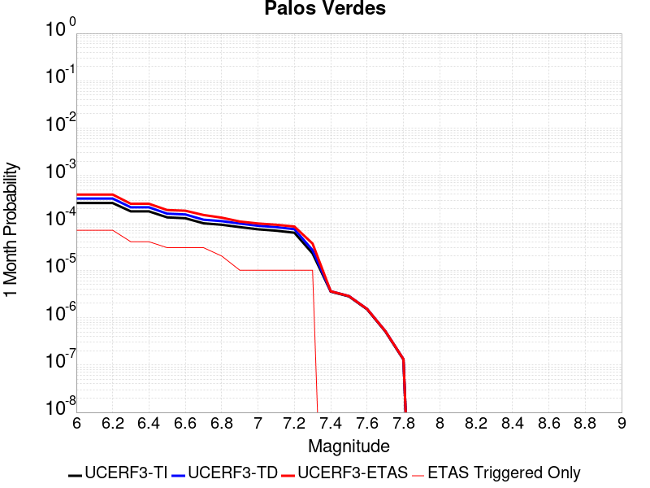 |  |  |

| Magnitude | 1 wk TI Prob | 1 wk TD Prob | 1 wk ETAS Prob | 1 wk ETAS/TD Gain | 1 wk ETAS Triggered Only | 1 mo TI Prob | 1 mo TD Prob | 1 mo ETAS Prob | 1 mo ETAS/TD Gain | 1 mo ETAS Triggered Only | 1 yr TI Prob | 1 yr TD Prob | 1 yr ETAS Prob | 1 yr ETAS/TD Gain | 1 yr ETAS Triggered Only | 10 yr TI Prob | 10 yr TD Prob | 10 yr ETAS Prob | 10 yr ETAS/TD Gain | 10 yr ETAS Triggered Only |
|-----|-----|-----|-----|-----|-----|-----|-----|-----|-----|-----|-----|-----|-----|-----|-----|-----|-----|-----|-----|-----|
| 6.0 | 6.126063E-5 | 7.622612E-5 | 1.4622079E-4 | 1.9182504 | 7.0E-5 | 2.6251914E-4 | 3.2664582E-4 | 3.9662296E-4 | 1.2142293 | 7.0E-5 | 0.0031914865 | 0.003970174 | 0.0040498567 | 1.0200702 | 8.0E-5 | 0.031460393 | 0.039048895 | 0.039144993 | 1.0024608 | 1.0E-4 |
| 6.1 | 6.126063E-5 | 7.622612E-5 | 1.4622079E-4 | 1.9182504 | 7.0E-5 | 2.6251914E-4 | 3.2664582E-4 | 3.9662296E-4 | 1.2142293 | 7.0E-5 | 0.0031914865 | 0.003970174 | 0.0040498567 | 1.0200702 | 8.0E-5 | 0.031460393 | 0.039048895 | 0.039144993 | 1.0024608 | 1.0E-4 |
| 6.2 | 6.126063E-5 | 7.622612E-5 | 1.4622079E-4 | 1.9182504 | 7.0E-5 | 2.6251914E-4 | 3.2664582E-4 | 3.9662296E-4 | 1.2142293 | 7.0E-5 | 0.0031914865 | 0.003970174 | 0.0040498567 | 1.0200702 | 8.0E-5 | 0.031460393 | 0.039048895 | 0.039144993 | 1.0024608 | 1.0E-4 |
| 6.3 | 4.0838047E-5 | 4.9749437E-5 | 8.9747446E-5 | 1.8039893 | 4.0E-5 | 1.7500846E-4 | 2.1319572E-4 | 2.5318717E-4 | 1.1875811 | 4.0E-5 | 0.0021286458 | 0.0025927818 | 0.0026426523 | 1.0192343 | 5.0E-5 | 0.021083709 | 0.025646681 | 0.025705142 | 1.0022795 | 6.0E-5 |
| 6.4 | 4.0838047E-5 | 4.9749437E-5 | 8.9747446E-5 | 1.8039893 | 4.0E-5 | 1.7500846E-4 | 2.1319572E-4 | 2.5318717E-4 | 1.1875811 | 4.0E-5 | 0.0021286458 | 0.0025927818 | 0.0026426523 | 1.0192343 | 5.0E-5 | 0.021083709 | 0.025646681 | 0.025705142 | 1.0022795 | 6.0E-5 |
| 6.5 | 3.0512005E-5 | 3.656162E-5 | 6.6560526E-5 | 1.8205025 | 3.0E-5 | 1.3075917E-4 | 1.5668393E-4 | 1.8667923E-4 | 1.1914383 | 3.0E-5 | 0.0015908304 | 0.0019060767 | 0.0019460004 | 1.0209455 | 4.0E-5 | 0.015794903 | 0.018909154 | 0.01895821 | 1.0025942 | 5.0E-5 |
| 6.6 | 2.9255087E-5 | 3.515442E-5 | 6.515336E-5 | 1.8533478 | 3.0E-5 | 1.2537291E-4 | 1.5065377E-4 | 1.8064924E-4 | 1.199102 | 3.0E-5 | 0.0015253464 | 0.0018327828 | 0.0018727095 | 1.0217848 | 4.0E-5 | 0.015149189 | 0.018188225 | 0.018237315 | 1.002699 | 5.0E-5 |
| 6.7 | 2.287198E-5 | 2.7248278E-5 | 5.724746E-5 | 2.100957 | 3.0E-5 | 9.801909E-5 | 1.16773626E-4 | 1.4677012E-4 | 1.2568773 | 3.0E-5 | 0.001192729 | 0.0014208833 | 0.0014608265 | 1.0281115 | 4.0E-5 | 0.011863477 | 0.014127217 | 0.014176511 | 1.0034893 | 5.0E-5 |
| 6.8 | 2.1325764E-5 | 2.5431877E-5 | 4.543137E-5 | 1.7863946 | 2.0E-5 | 9.139293E-5 | 1.0898971E-4 | 1.2898754E-4 | 1.1834836 | 2.0E-5 | 0.001112141 | 0.0013262323 | 0.0013561925 | 1.0225905 | 3.0E-5 | 0.011065915 | 0.013192211 | 0.0132316835 | 1.002992 | 4.0E-5 |
| 6.9 | 1.9009392E-5 | 2.2613547E-5 | 3.2613323E-5 | 1.4422028 | 1.0E-5 | 8.1466285E-5 | 9.6912096E-5 | 1.0691113E-4 | 1.1031762 | 1.0E-5 | 9.914007E-4 | 0.0011793535 | 0.0011993299 | 1.0169384 | 2.0E-5 | 0.009869894 | 0.011739632 | 0.011769281 | 1.0025254 | 3.0E-5 |
| 7.0 | 1.7098473E-5 | 2.0319356E-5 | 3.0319152E-5 | 1.4921316 | 1.0E-5 | 7.3277115E-5 | 8.708052E-5 | 9.7079654E-5 | 1.1148262 | 1.0E-5 | 8.917837E-4 | 0.001059775 | 0.0010797537 | 1.0188519 | 2.0E-5 | 0.008882134 | 0.010555646 | 0.0105853295 | 1.002812 | 3.0E-5 |
| 7.1 | 1.5982785E-5 | 1.899476E-5 | 2.8994571E-5 | 1.526451 | 1.0E-5 | 6.849585E-5 | 8.1404054E-5 | 9.1403235E-5 | 1.122834 | 1.0E-5 | 8.336179E-4 | 9.907284E-4 | 0.0010107086 | 1.0201671 | 2.0E-5 | 0.008304977 | 0.009871479 | 0.009901184 | 1.0030091 | 3.0E-5 |
| 7.2 | 1.4468002E-5 | 1.7197237E-5 | 2.7197064E-5 | 1.5814788 | 1.0E-5 | 6.200425E-5 | 7.370083E-5 | 8.370009E-5 | 1.1356736 | 1.0E-5 | 7.546402E-4 | 8.970222E-4 | 9.1700425E-4 | 1.022276 | 2.0E-5 | 0.007520827 | 0.008942284 | 0.008962105 | 1.0022166 | 2.0E-5 |
| 7.3 | 5.288233E-6 | 6.2036747E-6 | 1.6203612E-5 | 2.6119378 | 1.0E-5 | 2.2663658E-5 | 2.6587102E-5 | 3.6586836E-5 | 1.3761122 | 1.0E-5 | 2.7589512E-4 | 3.236848E-4 | 3.3368156E-4 | 1.0308843 | 1.0E-5 | 0.0027555283 | 0.0032355562 | 0.003245524 | 1.0030806 | 1.0E-5 |
| 7.4 | 8.279556E-7 | 8.408347E-7 | 8.408347E-7 | 1.0 | 0.0 | 3.5483763E-6 | 3.6035726E-6 | 3.6035726E-6 | 1.0 | 0.0 | 4.3200624E-5 | 4.3872686E-5 | 4.3872686E-5 | 1.0 | 0.0 | 4.3192226E-4 | 4.3864746E-4 | 4.3864746E-4 | 1.0 | 0.0 |
| 7.5 | 6.559831E-7 | 6.667229E-7 | 6.667229E-7 | 1.0 | 0.0 | 2.8113532E-6 | 2.857381E-6 | 2.857381E-6 | 1.0 | 0.0 | 3.4227687E-5 | 3.4788125E-5 | 3.4788125E-5 | 1.0 | 0.0 | 3.4222414E-4 | 3.4783344E-4 | 3.4783344E-4 | 1.0 | 0.0 |
| 7.6 | 3.5018968E-7 | 3.5620027E-7 | 3.5620027E-7 | 1.0 | 0.0 | 1.500812E-6 | 1.526572E-6 | 1.526572E-6 | 1.0 | 0.0 | 1.8272232E-5 | 1.8585903E-5 | 1.8585903E-5 | 1.0 | 0.0 | 1.8270731E-4 | 1.8584808E-4 | 1.8584808E-4 | 1.0 | 0.0 |
| 7.7 | 1.1986104E-7 | 1.2198376E-7 | 1.2198376E-7 | 1.0 | 0.0 | 5.1369005E-7 | 5.2278745E-7 | 5.2278745E-7 | 1.0 | 0.0 | 6.2541585E-6 | 6.364919E-6 | 6.364919E-6 | 1.0 | 0.0 | 6.2539824E-5 | 6.364741E-5 | 6.364741E-5 | 1.0 | 0.0 |
| 7.8 | 3.0445005E-8 | 3.1027582E-8 | 3.1027582E-8 | 1.0 | 0.0 | 1.3047858E-7 | 1.3297536E-7 | 1.3297536E-7 | 1.0 | 0.0 | 1.5885756E-6 | 1.6189739E-6 | 1.6189739E-6 | 1.0 | 0.0 | 1.5885644E-5 | 1.6189642E-5 | 1.6189642E-5 | 1.0 | 0.0 |

## San Diego Trough north alt1
*[(top)](#table-of-contents)*

| 1 Week | 1 Month | 1 Year | 10 Year |
|-----|-----|-----|-----|
|  |  |  |  |

| Magnitude | 1 wk TI Prob | 1 wk TD Prob | 1 wk ETAS Prob | 1 wk ETAS/TD Gain | 1 wk ETAS Triggered Only | 1 mo TI Prob | 1 mo TD Prob | 1 mo ETAS Prob | 1 mo ETAS/TD Gain | 1 mo ETAS Triggered Only | 1 yr TI Prob | 1 yr TD Prob | 1 yr ETAS Prob | 1 yr ETAS/TD Gain | 1 yr ETAS Triggered Only | 10 yr TI Prob | 10 yr TD Prob | 10 yr ETAS Prob | 10 yr ETAS/TD Gain | 10 yr ETAS Triggered Only |
|-----|-----|-----|-----|-----|-----|-----|-----|-----|-----|-----|-----|-----|-----|-----|-----|-----|-----|-----|-----|-----|
| 6.0 | 7.329252E-5 | 8.821093E-5 | 1.0820917E-4 | 1.2267092 | 2.0E-5 | 3.14073E-4 | 3.7799572E-4 | 3.9798816E-4 | 1.0528907 | 2.0E-5 | 0.0038171355 | 0.004593027 | 0.004642797 | 1.0108361 | 5.0E-5 | 0.03752231 | 0.045044992 | 0.04513094 | 1.001908 | 9.0E-5 |
| 6.1 | 3.7940346E-5 | 4.4885E-5 | 4.4885E-5 | 1.0 | 0.0 | 1.6259136E-4 | 1.9235066E-4 | 1.9235066E-4 | 1.0 | 0.0 | 0.0019777524 | 0.0023394432 | 0.0023494198 | 1.0042645 | 1.0E-5 | 0.019602431 | 0.023156688 | 0.02319576 | 1.0016874 | 4.0E-5 |
| 6.2 | 2.8645263E-5 | 3.329678E-5 | 3.329678E-5 | 1.0 | 0.0 | 1.2275964E-4 | 1.4269284E-4 | 1.4269284E-4 | 1.0 | 0.0 | 0.0014935739 | 0.0017359189 | 0.0017459015 | 1.0057507 | 1.0E-5 | 0.0148357535 | 0.017226247 | 0.017265558 | 1.002282 | 4.0E-5 |
| 6.3 | 2.8645263E-5 | 3.329678E-5 | 3.329678E-5 | 1.0 | 0.0 | 1.2275964E-4 | 1.4269284E-4 | 1.4269284E-4 | 1.0 | 0.0 | 0.0014935739 | 0.0017359189 | 0.0017459015 | 1.0057507 | 1.0E-5 | 0.0148357535 | 0.017226247 | 0.017265558 | 1.002282 | 4.0E-5 |
| 6.4 | 2.2204576E-5 | 2.5448318E-5 | 2.5448318E-5 | 1.0 | 0.0 | 9.5159E-5 | 1.0905972E-4 | 1.0905972E-4 | 1.0 | 0.0 | 0.001157945 | 0.0013270034 | 0.00133699 | 1.0075258 | 1.0E-5 | 0.011519298 | 0.013191955 | 0.013211691 | 1.0014961 | 2.0E-5 |
| 6.5 | 2.1004838E-5 | 2.4024694E-5 | 2.4024694E-5 | 1.0 | 0.0 | 9.0017624E-5 | 1.0295896E-4 | 1.0295896E-4 | 1.0 | 0.0 | 0.0010954136 | 0.0012528138 | 0.0012628014 | 1.007972 | 1.0E-5 | 0.010900296 | 0.012458589 | 0.0124783395 | 1.0015854 | 2.0E-5 |
| 6.6 | 1.820557E-5 | 2.0704787E-5 | 2.0704787E-5 | 1.0 | 0.0 | 7.802154E-5 | 8.873181E-5 | 8.873181E-5 | 1.0 | 0.0 | 9.4949827E-4 | 0.0010797799 | 0.0010897691 | 1.0092511 | 1.0E-5 | 0.009454516 | 0.010746004 | 0.010765789 | 1.0018412 | 2.0E-5 |
| 6.7 | 1.5884485E-5 | 1.7983646E-5 | 1.7983646E-5 | 1.0 | 0.0 | 6.807459E-5 | 7.707051E-5 | 7.707051E-5 | 1.0 | 0.0 | 8.284929E-4 | 9.3793223E-4 | 9.479229E-4 | 1.0106517 | 1.0E-5 | 0.008254109 | 0.009340104 | 0.009359917 | 1.0021213 | 2.0E-5 |
| 6.8 | 1.4331171E-5 | 1.6201066E-5 | 1.6201066E-5 | 1.0 | 0.0 | 6.141786E-5 | 6.94313E-5 | 6.94313E-5 | 1.0 | 0.0 | 7.4750587E-4 | 8.450002E-4 | 8.549917E-4 | 1.0118244 | 1.0E-5 | 0.0074499645 | 0.008418139 | 0.008437971 | 1.0023558 | 2.0E-5 |
| 6.9 | 1.2574203E-5 | 1.4205835E-5 | 1.4205835E-5 | 1.0 | 0.0 | 5.3888325E-5 | 6.0880735E-5 | 6.0880735E-5 | 1.0 | 0.0 | 6.558929E-4 | 7.409723E-4 | 7.409723E-4 | 1.0 | 0.0 | 0.0065396037 | 0.007385203 | 0.0073951297 | 1.0013441 | 1.0E-5 |
| 7.0 | 1.0883844E-5 | 1.2289262E-5 | 1.2289262E-5 | 1.0 | 0.0 | 4.664421E-5 | 5.2667205E-5 | 5.2667205E-5 | 1.0 | 0.0 | 5.677453E-4 | 6.4103556E-4 | 6.4103556E-4 | 1.0 | 0.0 | 0.00566297 | 0.006391993 | 0.0064019286 | 1.0015545 | 1.0E-5 |
| 7.1 | 9.393088E-6 | 1.060702E-5 | 1.060702E-5 | 1.0 | 0.0 | 4.025547E-5 | 4.545787E-5 | 4.545787E-5 | 1.0 | 0.0 | 4.900001E-4 | 5.533098E-4 | 5.533098E-4 | 1.0 | 0.0 | 0.0048892107 | 0.005519418 | 0.0055293627 | 1.0018017 | 1.0E-5 |
| 7.2 | 8.190791E-6 | 9.258625E-6 | 9.258625E-6 | 1.0 | 0.0 | 3.510292E-5 | 3.9679224E-5 | 3.9679224E-5 | 1.0 | 0.0 | 4.2729423E-4 | 4.8298817E-4 | 4.8298817E-4 | 1.0 | 0.0 | 0.0042647356 | 0.004819465 | 0.0048294165 | 1.002065 | 1.0E-5 |
| 7.3 | 6.268162E-6 | 7.089716E-6 | 7.089716E-6 | 1.0 | 0.0 | 2.6863276E-5 | 3.0384144E-5 | 3.0384144E-5 | 1.0 | 0.0 | 3.2701128E-4 | 3.6986457E-4 | 3.6986457E-4 | 1.0 | 0.0 | 0.003265305 | 0.003692536 | 0.003692536 | 1.0 | 0.0 |
| 7.4 | 4.985186E-6 | 5.6426816E-6 | 5.6426816E-6 | 1.0 | 0.0 | 2.1364907E-5 | 2.4182698E-5 | 2.4182698E-5 | 1.0 | 0.0 | 2.600867E-4 | 2.9438498E-4 | 2.9438498E-4 | 1.0 | 0.0 | 0.002597825 | 0.0029399914 | 0.0029399914 | 1.0 | 0.0 |
| 7.5 | 1.7489613E-6 | 1.969678E-6 | 1.969678E-6 | 1.0 | 0.0 | 7.495527E-6 | 8.4414505E-6 | 8.4414505E-6 | 1.0 | 0.0 | 9.125422E-5 | 1.02770035E-4 | 1.02770035E-4 | 1.0 | 0.0 | 9.1216754E-4 | 0.0010272472 | 0.0010272472 | 1.0 | 0.0 |
| 7.6 | 1.6988751E-7 | 1.7533823E-7 | 1.7533823E-7 | 1.0 | 0.0 | 7.2808916E-7 | 7.5144936E-7 | 7.5144936E-7 | 1.0 | 0.0 | 8.864449E-6 | 9.14886E-6 | 9.14886E-6 | 1.0 | 0.0 | 8.8640954E-5 | 9.1485024E-5 | 9.1485024E-5 | 1.0 | 0.0 |

## Blue Cut
*[(top)](#table-of-contents)*

| 1 Week | 1 Month | 1 Year | 10 Year |
|-----|-----|-----|-----|
| 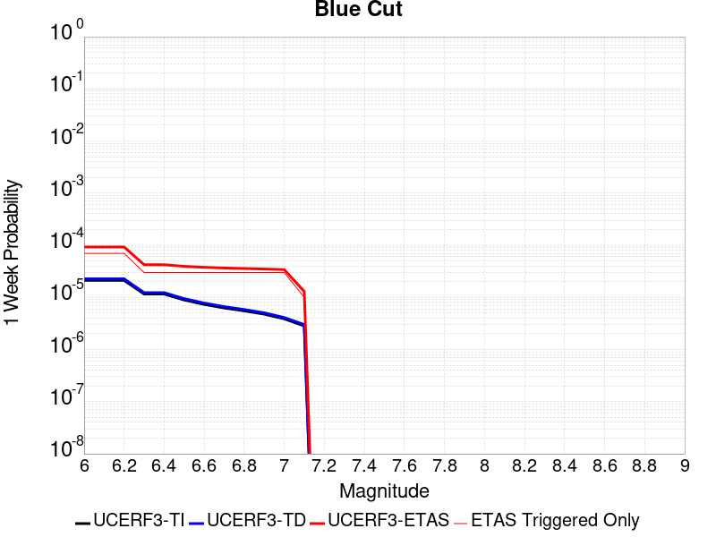 | 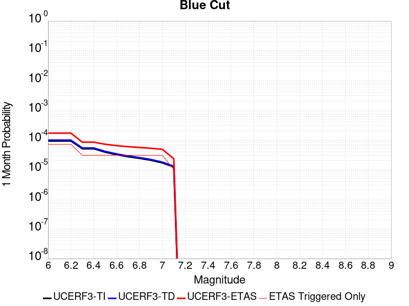 |  |  |

| Magnitude | 1 wk TI Prob | 1 wk TD Prob | 1 wk ETAS Prob | 1 wk ETAS/TD Gain | 1 wk ETAS Triggered Only | 1 mo TI Prob | 1 mo TD Prob | 1 mo ETAS Prob | 1 mo ETAS/TD Gain | 1 mo ETAS Triggered Only | 1 yr TI Prob | 1 yr TD Prob | 1 yr ETAS Prob | 1 yr ETAS/TD Gain | 1 yr ETAS Triggered Only | 10 yr TI Prob | 10 yr TD Prob | 10 yr ETAS Prob | 10 yr ETAS/TD Gain | 10 yr ETAS Triggered Only |
|-----|-----|-----|-----|-----|-----|-----|-----|-----|-----|-----|-----|-----|-----|-----|-----|-----|-----|-----|-----|-----|
| 6.0 | 2.1227985E-5 | 2.2719574E-5 | 9.2717986E-5 | 4.0809736 | 7.0E-5 | 9.097391E-5 | 9.73663E-5 | 1.6735948E-4 | 1.7188646 | 7.0E-5 | 0.0011070445 | 0.0011848481 | 0.0012747415 | 1.0758691 | 9.0E-5 | 0.011015458 | 0.011791152 | 0.01188009 | 1.0075428 | 9.0E-5 |
| 6.1 | 2.1227985E-5 | 2.2719574E-5 | 9.2717986E-5 | 4.0809736 | 7.0E-5 | 9.097391E-5 | 9.73663E-5 | 1.6735948E-4 | 1.7188646 | 7.0E-5 | 0.0011070445 | 0.0011848481 | 0.0012747415 | 1.0758691 | 9.0E-5 | 0.011015458 | 0.011791152 | 0.01188009 | 1.0075428 | 9.0E-5 |
| 6.2 | 2.1227985E-5 | 2.2719574E-5 | 9.2717986E-5 | 4.0809736 | 7.0E-5 | 9.097391E-5 | 9.73663E-5 | 1.6735948E-4 | 1.7188646 | 7.0E-5 | 0.0011070445 | 0.0011848481 | 0.0012747415 | 1.0758691 | 9.0E-5 | 0.011015458 | 0.011791152 | 0.01188009 | 1.0075428 | 9.0E-5 |
| 6.3 | 1.1613981E-5 | 1.2353542E-5 | 4.235317E-5 | 3.4284234 | 3.0E-5 | 4.9773254E-5 | 5.2942745E-5 | 8.294116E-5 | 1.5666199 | 3.0E-5 | 6.0582085E-4 | 6.443998E-4 | 6.84374E-4 | 1.0620333 | 4.0E-5 | 0.0060417196 | 0.0064265593 | 0.006466302 | 1.0061842 | 4.0E-5 |
| 6.4 | 1.1613981E-5 | 1.2353542E-5 | 4.235317E-5 | 3.4284234 | 3.0E-5 | 4.9773254E-5 | 5.2942745E-5 | 8.294116E-5 | 1.5666199 | 3.0E-5 | 6.0582085E-4 | 6.443998E-4 | 6.84374E-4 | 1.0620333 | 4.0E-5 | 0.0060417196 | 0.0064265593 | 0.006466302 | 1.0061842 | 4.0E-5 |
| 6.5 | 8.931326E-6 | 9.4816E-6 | 3.9481314E-5 | 4.163993 | 3.0E-5 | 3.8276554E-5 | 4.0634844E-5 | 7.063363E-5 | 1.7382526 | 3.0E-5 | 4.6591737E-4 | 4.946261E-4 | 5.3460634E-4 | 1.0808291 | 4.0E-5 | 0.0046494175 | 0.004936161 | 0.004975964 | 1.0080634 | 4.0E-5 |
| 6.6 | 7.345353E-6 | 7.79028E-6 | 3.7790047E-5 | 4.850923 | 3.0E-5 | 3.1479703E-5 | 3.338653E-5 | 6.338553E-5 | 1.898536 | 3.0E-5 | 3.83198E-4 | 4.064132E-4 | 4.36401E-4 | 1.0737865 | 3.0E-5 | 0.0038253788 | 0.0040574907 | 0.004087369 | 1.0073637 | 3.0E-5 |
| 6.7 | 6.2775666E-6 | 6.655149E-6 | 3.665495E-5 | 5.5077577 | 3.0E-5 | 2.690358E-5 | 2.8521798E-5 | 5.8520942E-5 | 2.0517972 | 3.0E-5 | 3.2750185E-4 | 3.472051E-4 | 3.7719466E-4 | 1.0863743 | 3.0E-5 | 0.0032701963 | 0.003467367 | 0.0034972632 | 1.008622 | 3.0E-5 |
| 6.8 | 5.5234095E-6 | 5.8551113E-6 | 3.5854937E-5 | 6.123698 | 3.0E-5 | 2.367154E-5 | 2.5093133E-5 | 5.509238E-5 | 2.195516 | 3.0E-5 | 2.8816288E-4 | 3.0547334E-4 | 3.354642E-4 | 1.0981783 | 3.0E-5 | 0.002877895 | 0.0030512505 | 0.003081159 | 1.009802 | 3.0E-5 |
| 6.9 | 4.7780054E-6 | 5.0654203E-6 | 3.506527E-5 | 6.922479 | 3.0E-5 | 2.0477004E-5 | 2.1708804E-5 | 5.1708153E-5 | 2.3818977 | 3.0E-5 | 2.4927902E-4 | 2.642797E-4 | 2.9427174E-4 | 1.113486 | 3.0E-5 | 0.0024899957 | 0.002640346 | 0.002670267 | 1.0113322 | 3.0E-5 |
| 7.0 | 3.883171E-6 | 4.118487E-6 | 3.4118362E-5 | 8.284198 | 3.0E-5 | 1.6642054E-5 | 1.7650578E-5 | 4.765005E-5 | 2.699631 | 3.0E-5 | 2.0259817E-4 | 2.1488148E-4 | 2.4487503E-4 | 1.1395818 | 3.0E-5 | 0.0020241356 | 0.0021474129 | 0.0021773484 | 1.0139403 | 3.0E-5 |
| 7.1 | 2.8358215E-6 | 3.0097158E-6 | 1.3009686E-5 | 4.3225627 | 1.0E-5 | 1.2153464E-5 | 1.2898756E-5 | 2.2898626E-5 | 1.7752585 | 1.0E-5 | 1.4795837E-4 | 1.5703762E-4 | 1.6703604E-4 | 1.063669 | 1.0E-5 | 0.001478599 | 0.0015699116 | 0.001579896 | 1.0063598 | 1.0E-5 |

## San Andreas (Santa Cruz Mts) 2011 CFM
*[(top)](#table-of-contents)*

| 1 Week | 1 Month | 1 Year | 10 Year |
|-----|-----|-----|-----|
| 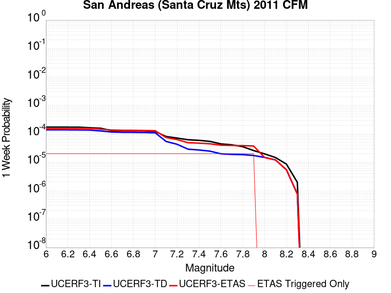 |  | 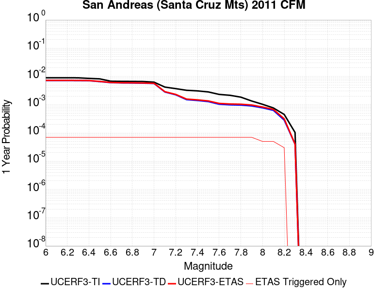 |  |

| Magnitude | 1 wk TI Prob | 1 wk TD Prob | 1 wk ETAS Prob | 1 wk ETAS/TD Gain | 1 wk ETAS Triggered Only | 1 mo TI Prob | 1 mo TD Prob | 1 mo ETAS Prob | 1 mo ETAS/TD Gain | 1 mo ETAS Triggered Only | 1 yr TI Prob | 1 yr TD Prob | 1 yr ETAS Prob | 1 yr ETAS/TD Gain | 1 yr ETAS Triggered Only | 10 yr TI Prob | 10 yr TD Prob | 10 yr ETAS Prob | 10 yr ETAS/TD Gain | 10 yr ETAS Triggered Only |
|-----|-----|-----|-----|-----|-----|-----|-----|-----|-----|-----|-----|-----|-----|-----|-----|-----|-----|-----|-----|-----|
| 6.0 | 1.7221631E-4 | 1.3793171E-4 | 1.5792895E-4 | 1.1449792 | 2.0E-5 | 7.378611E-4 | 5.9100403E-4 | 6.209863E-4 | 1.0507311 | 3.0E-5 | 0.008946515 | 0.007172124 | 0.0072416216 | 1.00969 | 7.0E-5 | 0.08594794 | 0.0705551 | 0.07064804 | 1.0013174 | 1.0E-4 |
| 6.1 | 1.7221631E-4 | 1.3793171E-4 | 1.5792895E-4 | 1.1449792 | 2.0E-5 | 7.378611E-4 | 5.9100403E-4 | 6.209863E-4 | 1.0507311 | 3.0E-5 | 0.008946515 | 0.007172124 | 0.0072416216 | 1.00969 | 7.0E-5 | 0.08594794 | 0.0705551 | 0.07064804 | 1.0013174 | 1.0E-4 |
| 6.2 | 1.7221631E-4 | 1.3793171E-4 | 1.5792895E-4 | 1.1449792 | 2.0E-5 | 7.378611E-4 | 5.9100403E-4 | 6.209863E-4 | 1.0507311 | 3.0E-5 | 0.008946515 | 0.007172124 | 0.0072416216 | 1.00969 | 7.0E-5 | 0.08594794 | 0.0705551 | 0.07064804 | 1.0013174 | 1.0E-4 |
| 6.3 | 1.716926E-4 | 1.3712609E-4 | 1.5712334E-4 | 1.1458312 | 2.0E-5 | 7.3561794E-4 | 5.875529E-4 | 6.1753526E-4 | 1.0510292 | 3.0E-5 | 0.008919428 | 0.0071303817 | 0.0071998825 | 1.0097471 | 7.0E-5 | 0.08569809 | 0.070167266 | 0.07026025 | 1.0013251 | 1.0E-4 |
| 6.4 | 1.6392978E-4 | 1.3588481E-4 | 1.558821E-4 | 1.1471635 | 2.0E-5 | 7.02367E-4 | 5.822355E-4 | 6.1221805E-4 | 1.0514956 | 3.0E-5 | 0.008517839 | 0.007066063 | 0.007135568 | 1.0098366 | 7.0E-5 | 0.08198654 | 0.06940135 | 0.06949441 | 1.0013409 | 1.0E-4 |
| 6.5 | 1.5742714E-4 | 1.2648388E-4 | 1.4648134E-4 | 1.1581029 | 2.0E-5 | 6.745133E-4 | 5.4196286E-4 | 5.719466E-4 | 1.0553243 | 3.0E-5 | 0.00818132 | 0.0065787593 | 0.006648299 | 1.0105703 | 7.0E-5 | 0.078865945 | 0.06486309 | 0.06495661 | 1.0014417 | 1.0E-4 |
| 6.6 | 1.3038084E-4 | 1.1588213E-4 | 1.3587982E-4 | 1.1725692 | 2.0E-5 | 5.5865536E-4 | 4.9654447E-4 | 5.2652956E-4 | 1.0603875 | 3.0E-5 | 0.006780438 | 0.0060289134 | 0.006098491 | 1.0115408 | 7.0E-5 | 0.0657725 | 0.05932738 | 0.05941204 | 1.001427 | 9.0E-5 |
| 6.7 | 1.2867592E-4 | 1.1314701E-4 | 1.3314474E-4 | 1.1767412 | 2.0E-5 | 5.5135164E-4 | 4.8482692E-4 | 5.1481236E-4 | 1.0618478 | 3.0E-5 | 0.0066920654 | 0.00588703 | 0.005956618 | 1.0118206 | 7.0E-5 | 0.06494093 | 0.058038417 | 0.058123194 | 1.0014607 | 9.0E-5 |
| 6.8 | 1.2801298E-4 | 1.1252261E-4 | 1.3252036E-4 | 1.1777221 | 2.0E-5 | 5.485117E-4 | 4.8215193E-4 | 5.121374E-4 | 1.062191 | 3.0E-5 | 0.0066577005 | 0.0058546383 | 0.0059242286 | 1.0118864 | 7.0E-5 | 0.06461738 | 0.057752274 | 0.057837073 | 1.0014684 | 9.0E-5 |
| 6.9 | 1.269149E-4 | 1.1094465E-4 | 1.3094244E-4 | 1.18025 | 2.0E-5 | 5.4380763E-4 | 4.7539172E-4 | 5.053775E-4 | 1.0630759 | 3.0E-5 | 0.006600777 | 0.005772772 | 0.0058423677 | 1.0120559 | 7.0E-5 | 0.06408122 | 0.0570241 | 0.057108965 | 1.0014883 | 9.0E-5 |
| 7.0 | 1.2030331E-4 | 1.0824504E-4 | 1.2824287E-4 | 1.184746 | 2.0E-5 | 5.154837E-4 | 4.638261E-4 | 4.938122E-4 | 1.0646495 | 3.0E-5 | 0.006257969 | 0.0056326967 | 0.0057023023 | 1.0123575 | 7.0E-5 | 0.06084648 | 0.055696685 | 0.055781674 | 1.0015259 | 9.0E-5 |
| 7.1 | 8.049617E-5 | 5.3926604E-5 | 7.392553E-5 | 1.3708545 | 2.0E-5 | 3.4493793E-4 | 2.3109373E-4 | 2.610868E-4 | 1.1297874 | 3.0E-5 | 0.0041915346 | 0.0028099709 | 0.0028797742 | 1.0248413 | 7.0E-5 | 0.041133516 | 0.029618956 | 0.029696587 | 1.0026209 | 8.0E-5 |
| 7.2 | 7.093979E-5 | 4.2937932E-5 | 6.293707E-5 | 1.4657686 | 2.0E-5 | 3.0399222E-4 | 1.8400686E-4 | 2.1400134E-4 | 1.1630074 | 3.0E-5 | 0.0036948253 | 0.0022380045 | 0.0023078478 | 1.0312079 | 7.0E-5 | 0.03633994 | 0.023941692 | 0.024019776 | 1.0032614 | 8.0E-5 |
| 7.3 | 6.193693E-5 | 2.8894141E-5 | 4.8893562E-5 | 1.6921618 | 2.0E-5 | 2.6541698E-4 | 1.2382616E-4 | 1.5382245E-4 | 1.2422451 | 3.0E-5 | 0.0032266637 | 0.0015065427 | 0.0015764373 | 1.046394 | 7.0E-5 | 0.031802133 | 0.016499156 | 0.016577836 | 1.0047687 | 8.0E-5 |
| 7.4 | 5.906492E-5 | 2.702346E-5 | 4.702292E-5 | 1.7400776 | 2.0E-5 | 2.5311083E-4 | 1.1580969E-4 | 1.4580622E-4 | 1.2590157 | 3.0E-5 | 0.0030772698 | 0.0014090725 | 0.0014789739 | 1.0496081 | 7.0E-5 | 0.030350044 | 0.015471023 | 0.0155497845 | 1.005091 | 8.0E-5 |
| 7.5 | 5.424296E-5 | 2.4678277E-5 | 4.467778E-5 | 1.8104094 | 2.0E-5 | 2.324491E-4 | 1.05759755E-4 | 1.3575658E-4 | 1.2836318 | 3.0E-5 | 0.002826395 | 0.0012868657 | 0.0013567756 | 1.0543257 | 7.0E-5 | 0.027907165 | 0.014163188 | 0.014242055 | 1.0055685 | 8.0E-5 |
| 7.6 | 4.43084E-5 | 1.990431E-5 | 3.9903913E-5 | 2.0047874 | 2.0E-5 | 1.8987931E-4 | 8.53014E-5 | 1.1529884E-4 | 1.3516641 | 3.0E-5 | 0.0023093296 | 0.0010380499 | 0.0011079774 | 1.0673641 | 7.0E-5 | 0.022854783 | 0.011412679 | 0.011491766 | 1.0069298 | 8.0E-5 |
| 7.7 | 4.118098E-5 | 1.8936442E-5 | 3.8936065E-5 | 2.0561447 | 2.0E-5 | 1.7647797E-4 | 8.115366E-5 | 1.11151225E-4 | 1.3696392 | 3.0E-5 | 0.002146502 | 9.875982E-4 | 0.001057529 | 1.070809 | 7.0E-5 | 0.021258866 | 0.010870468 | 0.010949599 | 1.0072794 | 8.0E-5 |
| 7.8 | 3.5408906E-5 | 1.856446E-5 | 3.856409E-5 | 2.0773072 | 2.0E-5 | 1.5174363E-4 | 7.955955E-5 | 1.09557164E-4 | 1.377046 | 3.0E-5 | 0.0018459131 | 9.682073E-4 | 0.0010381396 | 1.0722286 | 7.0E-5 | 0.018306552 | 0.010652021 | 0.010731168 | 1.0074303 | 8.0E-5 |
| 7.9 | 2.5860836E-5 | 1.7315993E-5 | 3.7315647E-5 | 2.1549816 | 2.0E-5 | 1.10827445E-4 | 7.420929E-5 | 1.04207065E-4 | 1.404232 | 3.0E-5 | 0.001348489 | 9.031238E-4 | 9.730606E-4 | 1.0774387 | 7.0E-5 | 0.013403354 | 0.009907599 | 0.009986807 | 1.0079947 | 8.0E-5 |
| 8.0 | 1.9777332E-5 | 1.4839596E-5 | 1.4839596E-5 | 1.0 | 0.0 | 8.4757245E-5 | 6.3596715E-5 | 7.3596086E-5 | 1.1572309 | 1.0E-5 | 0.0010314309 | 7.740152E-4 | 8.239765E-4 | 1.0645483 | 5.0E-5 | 0.010266567 | 0.008508967 | 0.008568457 | 1.0069914 | 6.0E-5 |
| 8.1 | 1.468494E-5 | 1.2107374E-5 | 1.2107374E-5 | 1.0 | 0.0 | 6.293394E-5 | 5.1887713E-5 | 6.188719E-5 | 1.1927139 | 1.0E-5 | 7.6595135E-4 | 6.3155E-4 | 6.815184E-4 | 1.0791203 | 5.0E-5 | 0.0076331664 | 0.006969149 | 0.007018801 | 1.0071244 | 5.0E-5 |
| 8.2 | 8.63836E-6 | 5.469061E-6 | 5.469061E-6 | 1.0 | 0.0 | 3.7021015E-5 | 2.3438623E-5 | 2.3438623E-5 | 1.0 | 0.0 | 4.5063766E-4 | 2.8532793E-4 | 3.1531937E-4 | 1.1051122 | 3.0E-5 | 0.004497249 | 0.00324569 | 0.0032755926 | 1.009213 | 3.0E-5 |
| 8.3 | 1.983087E-6 | 7.6599065E-7 | 7.6599065E-7 | 1.0 | 0.0 | 8.498917E-6 | 3.282813E-6 | 3.282813E-6 | 1.0 | 0.0 | 1.034694E-4 | 3.9967534E-5 | 3.9967534E-5 | 1.0 | 0.0 | 0.0010342124 | 4.719687E-4 | 4.719687E-4 | 1.0 | 0.0 |

## Tin Mountain
*[(top)](#table-of-contents)*

| 1 Week | 1 Month | 1 Year | 10 Year |
|-----|-----|-----|-----|
|  |  |  |  |

| Magnitude | 1 wk TI Prob | 1 wk TD Prob | 1 wk ETAS Prob | 1 wk ETAS/TD Gain | 1 wk ETAS Triggered Only | 1 mo TI Prob | 1 mo TD Prob | 1 mo ETAS Prob | 1 mo ETAS/TD Gain | 1 mo ETAS Triggered Only | 1 yr TI Prob | 1 yr TD Prob | 1 yr ETAS Prob | 1 yr ETAS/TD Gain | 1 yr ETAS Triggered Only | 10 yr TI Prob | 10 yr TD Prob | 10 yr ETAS Prob | 10 yr ETAS/TD Gain | 10 yr ETAS Triggered Only |
|-----|-----|-----|-----|-----|-----|-----|-----|-----|-----|-----|-----|-----|-----|-----|-----|-----|-----|-----|-----|-----|
| 6.0 | 4.083776E-6 | 4.1815365E-6 | 4.1815365E-6 | 1.0 | 0.0 | 1.750178E-5 | 1.792077E-5 | 2.792059E-5 | 1.5580018 | 1.0E-5 | 2.1306332E-4 | 2.1816725E-4 | 2.481607E-4 | 1.1374792 | 3.0E-5 | 0.0021285915 | 0.0021798965 | 0.0022697002 | 1.0411963 | 9.0E-5 |
| 6.1 | 4.083776E-6 | 4.1815365E-6 | 4.1815365E-6 | 1.0 | 0.0 | 1.750178E-5 | 1.792077E-5 | 2.792059E-5 | 1.5580018 | 1.0E-5 | 2.1306332E-4 | 2.1816725E-4 | 2.481607E-4 | 1.1374792 | 3.0E-5 | 0.0021285915 | 0.0021798965 | 0.0022697002 | 1.0411963 | 9.0E-5 |
| 6.2 | 4.083776E-6 | 4.1815365E-6 | 4.1815365E-6 | 1.0 | 0.0 | 1.750178E-5 | 1.792077E-5 | 2.792059E-5 | 1.5580018 | 1.0E-5 | 2.1306332E-4 | 2.1816725E-4 | 2.481607E-4 | 1.1374792 | 3.0E-5 | 0.0021285915 | 0.0021798965 | 0.0022697002 | 1.0411963 | 9.0E-5 |
| 6.3 | 4.083776E-6 | 4.1815365E-6 | 4.1815365E-6 | 1.0 | 0.0 | 1.750178E-5 | 1.792077E-5 | 2.792059E-5 | 1.5580018 | 1.0E-5 | 2.1306332E-4 | 2.1816725E-4 | 2.481607E-4 | 1.1374792 | 3.0E-5 | 0.0021285915 | 0.0021798965 | 0.0022697002 | 1.0411963 | 9.0E-5 |
| 6.4 | 4.083776E-6 | 4.1815365E-6 | 4.1815365E-6 | 1.0 | 0.0 | 1.750178E-5 | 1.792077E-5 | 2.792059E-5 | 1.5580018 | 1.0E-5 | 2.1306332E-4 | 2.1816725E-4 | 2.481607E-4 | 1.1374792 | 3.0E-5 | 0.0021285915 | 0.0021798965 | 0.0022697002 | 1.0411963 | 9.0E-5 |
| 6.5 | 2.3143427E-6 | 2.3731573E-6 | 2.3731573E-6 | 1.0 | 0.0 | 9.9185745E-6 | 1.0170638E-5 | 2.0170537E-5 | 1.9832125 | 1.0E-5 | 1.2075195E-4 | 1.2382126E-4 | 1.4381878E-4 | 1.1615032 | 2.0E-5 | 0.0012068636 | 0.0012375986 | 0.0012875367 | 1.0403508 | 5.0E-5 |
| 6.6 | 2.3143427E-6 | 2.3731573E-6 | 2.3731573E-6 | 1.0 | 0.0 | 9.9185745E-6 | 1.0170638E-5 | 2.0170537E-5 | 1.9832125 | 1.0E-5 | 1.2075195E-4 | 1.2382126E-4 | 1.4381878E-4 | 1.1615032 | 2.0E-5 | 0.0012068636 | 0.0012375986 | 0.0012875367 | 1.0403508 | 5.0E-5 |
| 6.7 | 1.7029532E-6 | 1.7497915E-6 | 1.7497915E-6 | 1.0 | 0.0 | 7.2983503E-6 | 7.499088E-6 | 1.7499013E-5 | 2.3334856 | 1.0E-5 | 8.885379E-5 | 9.1298105E-5 | 1.0129719E-4 | 1.1095213 | 1.0E-5 | 8.881827E-4 | 9.1265864E-4 | 9.426312E-4 | 1.032841 | 3.0E-5 |
| 6.8 | 1.2914646E-6 | 1.3299378E-6 | 1.3299378E-6 | 1.0 | 0.0 | 5.534837E-6 | 5.6997237E-6 | 1.5699667E-5 | 2.754461 | 1.0E-5 | 6.738455E-5 | 6.939237E-5 | 7.939168E-5 | 1.144098 | 1.0E-5 | 6.736412E-4 | 6.9375033E-4 | 7.037434E-4 | 1.0144044 | 1.0E-5 |
| 6.9 | 5.8708974E-7 | 6.1169936E-7 | 6.1169936E-7 | 1.0 | 0.0 | 2.5160964E-6 | 2.6215664E-6 | 2.6215664E-6 | 1.0 | 0.0 | 3.0633044E-5 | 3.1917145E-5 | 3.1917145E-5 | 1.0 | 0.0 | 3.0628822E-4 | 3.191297E-4 | 3.191297E-4 | 1.0 | 0.0 |
| 7.0 | 4.6248786E-7 | 4.832015E-7 | 4.832015E-7 | 1.0 | 0.0 | 1.9820893E-6 | 2.0708624E-6 | 2.0708624E-6 | 1.0 | 0.0 | 2.413167E-5 | 2.5212494E-5 | 2.5212494E-5 | 1.0 | 0.0 | 2.412905E-4 | 2.5210003E-4 | 2.5210003E-4 | 1.0 | 0.0 |
| 7.1 | 3.804606E-7 | 3.987147E-7 | 3.987147E-7 | 1.0 | 0.0 | 1.6305444E-6 | 1.7087764E-6 | 1.7087764E-6 | 1.0 | 0.0 | 1.9851697E-5 | 2.0804187E-5 | 2.0804187E-5 | 1.0 | 0.0 | 1.9849923E-4 | 2.0802575E-4 | 2.0802575E-4 | 1.0 | 0.0 |
| 7.2 | 3.5864858E-7 | 3.7616863E-7 | 3.7616863E-7 | 1.0 | 0.0 | 1.5370645E-6 | 1.6121504E-6 | 1.6121504E-6 | 1.0 | 0.0 | 1.87136E-5 | 1.9627789E-5 | 1.9627789E-5 | 1.0 | 0.0 | 1.8712023E-4 | 1.9626386E-4 | 1.9626386E-4 | 1.0 | 0.0 |
| 7.3 | 3.342063E-7 | 3.506347E-7 | 3.506347E-7 | 1.0 | 0.0 | 1.4323119E-6 | 1.5027196E-6 | 1.5027196E-6 | 1.0 | 0.0 | 1.7438259E-5 | 1.829549E-5 | 1.829549E-5 | 1.0 | 0.0 | 1.743689E-4 | 1.8294314E-4 | 1.8294314E-4 | 1.0 | 0.0 |
| 7.4 | 2.971242E-7 | 3.1165817E-7 | 3.1165817E-7 | 1.0 | 0.0 | 1.2733886E-6 | 1.3356774E-6 | 1.3356774E-6 | 1.0 | 0.0 | 1.5503398E-5 | 1.6261785E-5 | 1.6261785E-5 | 1.0 | 0.0 | 1.5502315E-4 | 1.6260923E-4 | 1.6260923E-4 | 1.0 | 0.0 |
| 7.5 | 1.4326713E-7 | 1.5012525E-7 | 1.5012525E-7 | 1.0 | 0.0 | 6.140018E-7 | 6.433939E-7 | 6.433939E-7 | 1.0 | 0.0 | 7.4754466E-6 | 7.8333205E-6 | 7.8333205E-6 | 1.0 | 0.0 | 7.475195E-5 | 7.833321E-5 | 7.833321E-5 | 1.0 | 0.0 |

## Coronado Bank alt1
*[(top)](#table-of-contents)*

| 1 Week | 1 Month | 1 Year | 10 Year |
|-----|-----|-----|-----|
|  |  | 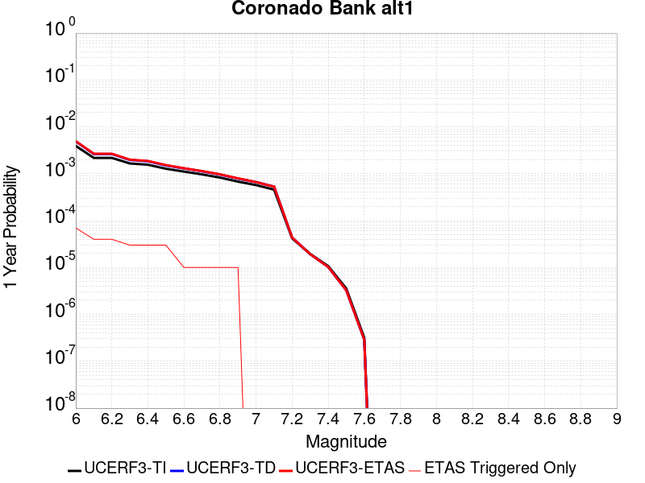 | 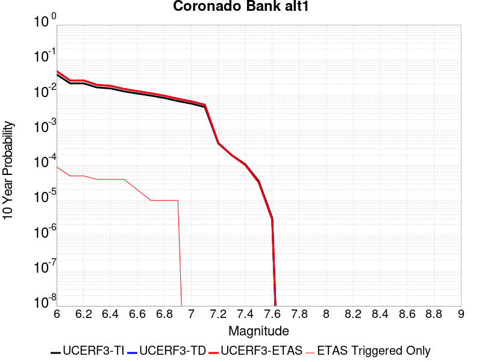 |

| Magnitude | 1 wk TI Prob | 1 wk TD Prob | 1 wk ETAS Prob | 1 wk ETAS/TD Gain | 1 wk ETAS Triggered Only | 1 mo TI Prob | 1 mo TD Prob | 1 mo ETAS Prob | 1 mo ETAS/TD Gain | 1 mo ETAS Triggered Only | 1 yr TI Prob | 1 yr TD Prob | 1 yr ETAS Prob | 1 yr ETAS/TD Gain | 1 yr ETAS Triggered Only | 10 yr TI Prob | 10 yr TD Prob | 10 yr ETAS Prob | 10 yr ETAS/TD Gain | 10 yr ETAS Triggered Only |
|-----|-----|-----|-----|-----|-----|-----|-----|-----|-----|-----|-----|-----|-----|-----|-----|-----|-----|-----|-----|-----|
| 6.0 | 7.533492E-5 | 9.394913E-5 | 1.1394725E-4 | 1.2128612 | 2.0E-5 | 3.22824E-4 | 4.0258127E-4 | 4.3256918E-4 | 1.0744891 | 3.0E-5 | 0.0039233007 | 0.0048909658 | 0.004960623 | 1.014242 | 7.0E-5 | 0.03854755 | 0.04790356 | 0.04798925 | 1.0017887 | 9.0E-5 |
| 6.1 | 4.1807285E-5 | 5.049283E-5 | 5.049283E-5 | 1.0 | 0.0 | 1.7916178E-4 | 2.1638049E-4 | 2.2637832E-4 | 1.0462049 | 1.0E-5 | 0.0021791123 | 0.0026313474 | 0.0026712422 | 1.0151614 | 4.0E-5 | 0.021578677 | 0.026011046 | 0.026059747 | 1.0018723 | 5.0E-5 |
| 6.2 | 4.1807285E-5 | 5.049283E-5 | 5.049283E-5 | 1.0 | 0.0 | 1.7916178E-4 | 2.1638049E-4 | 2.2637832E-4 | 1.0462049 | 1.0E-5 | 0.0021791123 | 0.0026313474 | 0.0026712422 | 1.0151614 | 4.0E-5 | 0.021578677 | 0.026011046 | 0.026059747 | 1.0018723 | 5.0E-5 |
| 6.3 | 3.1793104E-5 | 3.7711117E-5 | 3.7711117E-5 | 1.0 | 0.0 | 1.3624904E-4 | 1.6160926E-4 | 1.6160926E-4 | 1.0 | 0.0 | 0.0016575698 | 0.001965848 | 0.0019957891 | 1.0152305 | 3.0E-5 | 0.016452603 | 0.019488465 | 0.019527685 | 1.0020125 | 4.0E-5 |
| 6.4 | 2.9878007E-5 | 3.5335794E-5 | 3.5335794E-5 | 1.0 | 0.0 | 1.2804232E-4 | 1.5143053E-4 | 1.5143053E-4 | 1.0 | 0.0 | 0.0015578003 | 0.0018421387 | 0.0018720834 | 1.0162554 | 3.0E-5 | 0.015469253 | 0.01827244 | 0.018311711 | 1.0021491 | 4.0E-5 |
| 6.5 | 2.4512565E-5 | 2.8764043E-5 | 2.8764043E-5 | 1.0 | 0.0 | 1.0504962E-4 | 1.2326881E-4 | 1.2326881E-4 | 1.0 | 0.0 | 0.0012782287 | 0.0014997921 | 0.0015297472 | 1.0199728 | 3.0E-5 | 0.012709012 | 0.014899683 | 0.014939087 | 1.0026447 | 4.0E-5 |
| 6.6 | 2.1317413E-5 | 2.490667E-5 | 2.490667E-5 | 1.0 | 0.0 | 9.135714E-5 | 1.0673863E-4 | 1.0673863E-4 | 1.0 | 0.0 | 0.0011117056 | 0.0012987906 | 0.0013087775 | 1.0076895 | 1.0E-5 | 0.011061605 | 0.012914404 | 0.012934146 | 1.0015286 | 2.0E-5 |
| 6.7 | 1.8585655E-5 | 2.163488E-5 | 2.163488E-5 | 1.0 | 0.0 | 7.9650374E-5 | 9.271773E-5 | 9.271773E-5 | 1.0 | 0.0 | 9.6931186E-4 | 0.0011282742 | 0.001138263 | 1.0088531 | 1.0E-5 | 0.0096509475 | 0.011227623 | 0.01123751 | 1.0008807 | 1.0E-5 |
| 6.8 | 1.5862879E-5 | 1.8419474E-5 | 1.8419474E-5 | 1.0 | 0.0 | 6.798199E-5 | 7.893833E-5 | 7.893833E-5 | 1.0 | 0.0 | 8.273665E-4 | 9.6066965E-4 | 9.7066E-4 | 1.0103995 | 1.0E-5 | 0.008242928 | 0.00956715 | 0.0095770545 | 1.0010352 | 1.0E-5 |
| 6.9 | 1.3021509E-5 | 1.5095265E-5 | 1.5095265E-5 | 1.0 | 0.0 | 5.5805274E-5 | 6.469249E-5 | 6.469249E-5 | 1.0 | 0.0 | 6.792174E-4 | 7.8736455E-4 | 7.9735665E-4 | 1.0126905 | 1.0E-5 | 0.006771452 | 0.007847573 | 0.007857494 | 1.0012643 | 1.0E-5 |
| 7.0 | 1.0974371E-5 | 1.2720104E-5 | 1.2720104E-5 | 1.0 | 0.0 | 4.7032172E-5 | 5.451369E-5 | 5.451369E-5 | 1.0 | 0.0 | 5.7246623E-4 | 6.6351966E-4 | 6.6351966E-4 | 1.0 | 0.0 | 0.0057099373 | 0.006617135 | 0.006617135 | 1.0 | 0.0 |
| 7.1 | 8.766221E-6 | 1.01638325E-5 | 1.01638325E-5 | 1.0 | 0.0 | 3.7568978E-5 | 4.355865E-5 | 4.355865E-5 | 1.0 | 0.0 | 4.573063E-4 | 5.3021475E-4 | 5.3021475E-4 | 1.0 | 0.0 | 0.0045636636 | 0.0052911965 | 0.0052911965 | 1.0 | 0.0 |
| 7.2 | 8.026024E-7 | 8.331765E-7 | 8.331765E-7 | 1.0 | 0.0 | 3.43972E-6 | 3.5707515E-6 | 3.5707515E-6 | 1.0 | 0.0 | 4.1877785E-5 | 4.3473043E-5 | 4.3473043E-5 | 1.0 | 0.0 | 4.1869894E-4 | 4.3464647E-4 | 4.3464647E-4 | 1.0 | 0.0 |
| 7.3 | 3.7293114E-7 | 3.7000953E-7 | 3.7000953E-7 | 1.0 | 0.0 | 1.5982754E-6 | 1.5857541E-6 | 1.5857541E-6 | 1.0 | 0.0 | 1.9458828E-5 | 1.9306386E-5 | 1.9306386E-5 | 1.0 | 0.0 | 1.9457124E-4 | 1.9304715E-4 | 1.9304715E-4 | 1.0 | 0.0 |
| 7.4 | 2.0557036E-7 | 1.9674363E-7 | 1.9674363E-7 | 1.0 | 0.0 | 8.810155E-7 | 8.431867E-7 | 8.431867E-7 | 1.0 | 0.0 | 1.0726311E-5 | 1.026575E-5 | 1.026575E-5 | 1.0 | 0.0 | 1.0725793E-4 | 1.0265279E-4 | 1.0265279E-4 | 1.0 | 0.0 |
| 7.5 | 6.845446E-8 | 6.279369E-8 | 6.279369E-8 | 1.0 | 0.0 | 2.9337625E-7 | 2.691158E-7 | 2.691158E-7 | 1.0 | 0.0 | 3.5718497E-6 | 3.2764797E-6 | 3.2764797E-6 | 1.0 | 0.0 | 3.5717923E-5 | 3.2764325E-5 | 3.2764325E-5 | 1.0 | 0.0 |
| 7.6 | 6.0975145E-9 | 5.53185E-9 | 5.53185E-9 | 1.0 | 0.0 | 2.6132206E-8 | 2.370793E-8 | 2.370793E-8 | 1.0 | 0.0 | 3.1815955E-7 | 2.88644E-7 | 2.88644E-7 | 1.0 | 0.0 | 3.181591E-6 | 2.8864374E-6 | 2.8864374E-6 | 1.0 | 0.0 |

## Big Pine (Central)
*[(top)](#table-of-contents)*

| 1 Week | 1 Month | 1 Year | 10 Year |
|-----|-----|-----|-----|
|  | 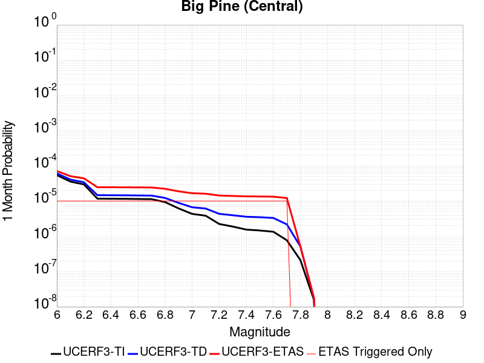 | 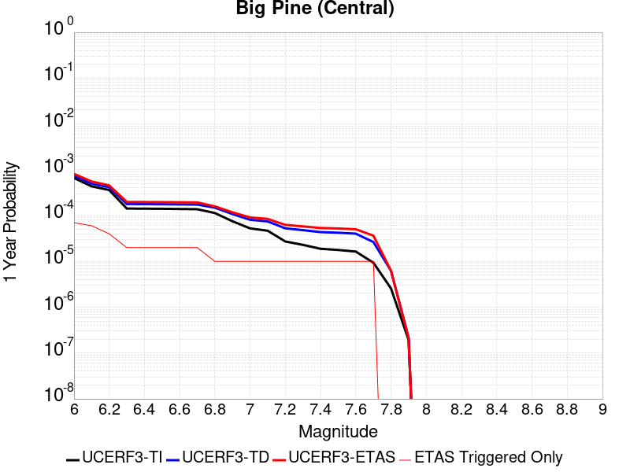 |  |

| Magnitude | 1 wk TI Prob | 1 wk TD Prob | 1 wk ETAS Prob | 1 wk ETAS/TD Gain | 1 wk ETAS Triggered Only | 1 mo TI Prob | 1 mo TD Prob | 1 mo ETAS Prob | 1 mo ETAS/TD Gain | 1 mo ETAS Triggered Only | 1 yr TI Prob | 1 yr TD Prob | 1 yr ETAS Prob | 1 yr ETAS/TD Gain | 1 yr ETAS Triggered Only | 10 yr TI Prob | 10 yr TD Prob | 10 yr ETAS Prob | 10 yr ETAS/TD Gain | 10 yr ETAS Triggered Only |
|-----|-----|-----|-----|-----|-----|-----|-----|-----|-----|-----|-----|-----|-----|-----|-----|-----|-----|-----|-----|-----|
| 6.0 | 1.2706755E-5 | 1.4250529E-5 | 2.4250387E-5 | 1.7017183 | 1.0E-5 | 5.4456385E-5 | 6.107247E-5 | 7.107186E-5 | 1.1637299 | 1.0E-5 | 6.628048E-4 | 7.433402E-4 | 8.1328815E-4 | 1.0940995 | 7.0E-5 | 0.006608314 | 0.0074135666 | 0.0074929735 | 1.0107111 | 8.0E-5 |
| 6.1 | 8.342579E-6 | 9.510762E-6 | 1.9510666E-5 | 2.0514305 | 1.0E-5 | 3.5753423E-5 | 4.0759893E-5 | 5.0759485E-5 | 1.2453293 | 1.0E-5 | 4.3521097E-4 | 4.961604E-4 | 5.5613066E-4 | 1.1208687 | 6.0E-5 | 0.0043435963 | 0.0049540824 | 0.0050237356 | 1.0140598 | 7.0E-5 |
| 6.2 | 6.923899E-6 | 7.967147E-6 | 1.7967068E-5 | 2.2551444 | 1.0E-5 | 2.9673516E-5 | 3.4144578E-5 | 4.414424E-5 | 1.2928623 | 1.0E-5 | 3.6121515E-4 | 4.156502E-4 | 4.5563356E-4 | 1.0961947 | 4.0E-5 | 0.003606286 | 0.0041520367 | 0.004201829 | 1.0119923 | 5.0E-5 |
| 6.3 | 2.728396E-6 | 3.4242908E-6 | 1.3424256E-5 | 3.9203029 | 1.0E-5 | 1.1693074E-5 | 1.4675454E-5 | 2.4675308E-5 | 1.6814 | 1.0E-5 | 1.4235388E-4 | 1.7865987E-4 | 1.986563E-4 | 1.1119245 | 2.0E-5 | 0.0014226272 | 0.0017866704 | 0.0018066347 | 1.011174 | 2.0E-5 |
| 6.4 | 2.7136944E-6 | 3.408584E-6 | 1.340855E-5 | 3.9337595 | 1.0E-5 | 1.1630066E-5 | 1.4608141E-5 | 2.4607994E-5 | 1.6845398 | 1.0E-5 | 1.4158686E-4 | 1.7784047E-4 | 1.9783691E-4 | 1.1124403 | 2.0E-5 | 0.0014149669 | 0.0017784894 | 0.0017984539 | 1.0112255 | 2.0E-5 |
| 6.5 | 2.6971882E-6 | 3.3909291E-6 | 1.3390895E-5 | 3.9490342 | 1.0E-5 | 1.1559327E-5 | 1.45324775E-5 | 2.4532332E-5 | 1.6881039 | 1.0E-5 | 1.4072572E-4 | 1.7691942E-4 | 1.9691588E-4 | 1.1130258 | 2.0E-5 | 0.0014063664 | 0.0017692937 | 0.0017892583 | 1.011284 | 2.0E-5 |
| 6.6 | 2.669092E-6 | 3.3609497E-6 | 1.33609165E-5 | 3.9753394 | 1.0E-5 | 1.1438916E-5 | 1.4403995E-5 | 2.4403851E-5 | 1.6942418 | 1.0E-5 | 1.3925991E-4 | 1.753554E-4 | 1.953519E-4 | 1.114034 | 2.0E-5 | 0.0013917267 | 0.0017536782 | 0.0017736432 | 1.0113846 | 2.0E-5 |
| 6.7 | 2.6408059E-6 | 3.3309752E-6 | 1.3330942E-5 | 4.002114 | 1.0E-5 | 1.1317691E-5 | 1.4275535E-5 | 2.4275392E-5 | 1.7004892 | 1.0E-5 | 1.3778417E-4 | 1.7379165E-4 | 1.9378818E-4 | 1.1150603 | 2.0E-5 | 0.0013769877 | 0.0017380653 | 0.0017580305 | 1.011487 | 2.0E-5 |
| 6.8 | 2.1786943E-6 | 2.8544325E-6 | 1.2854404E-5 | 4.503313 | 1.0E-5 | 9.337228E-6 | 1.2233229E-5 | 2.2233107E-5 | 1.8174356 | 1.0E-5 | 1.1367482E-4 | 1.4893012E-4 | 1.5892863E-4 | 1.0671356 | 1.0E-5 | 0.0011361669 | 0.0014897975 | 0.0014997825 | 1.0067023 | 1.0E-5 |
| 6.9 | 1.4411696E-6 | 2.068499E-6 | 1.2068478E-5 | 5.834413 | 1.0E-5 | 6.1764263E-6 | 8.864968E-6 | 1.886488E-5 | 2.1280258 | 1.0E-5 | 7.51954E-5 | 1.079259E-4 | 1.1792482E-4 | 1.0926461 | 1.0E-5 | 7.5169955E-4 | 0.0010801847 | 0.0010901738 | 1.0092477 | 1.0E-5 |
| 7.0 | 1.0073411E-6 | 1.554261E-6 | 1.1554245E-5 | 7.433916 | 1.0E-5 | 4.317169E-6 | 6.6611024E-6 | 1.6661035E-5 | 2.501243 | 1.0E-5 | 5.2560266E-5 | 8.1096056E-5 | 9.1095244E-5 | 1.1233006 | 1.0E-5 | 5.2547833E-4 | 8.1210316E-4 | 8.22095E-4 | 1.0123037 | 1.0E-5 |
| 7.1 | 8.947104E-7 | 1.4302494E-6 | 1.1430235E-5 | 7.991778 | 1.0E-5 | 3.834468E-6 | 6.129627E-6 | 1.6129565E-5 | 2.6314108 | 1.0E-5 | 4.6683643E-5 | 7.46258E-5 | 8.4625055E-5 | 1.133992 | 1.0E-5 | 4.6673836E-4 | 7.474457E-4 | 7.5743825E-4 | 1.0133688 | 1.0E-5 |
| 7.2 | 5.215166E-7 | 1.0111678E-6 | 1.1011158E-5 | 10.889545 | 1.0E-5 | 2.2350691E-6 | 4.3335694E-6 | 1.4333526E-5 | 3.3075566 | 1.0E-5 | 2.7211627E-5 | 5.2759973E-5 | 6.275945E-5 | 1.1895276 | 1.0E-5 | 2.7208295E-4 | 5.2890263E-4 | 5.3889735E-4 | 1.018897 | 1.0E-5 |
| 7.3 | 4.4024807E-7 | 9.219589E-7 | 1.092195E-5 | 11.84646 | 1.0E-5 | 1.8867761E-6 | 3.9512465E-6 | 1.3951207E-5 | 3.5308368 | 1.0E-5 | 2.2971257E-5 | 4.810541E-5 | 5.8104924E-5 | 1.2078668 | 1.0E-5 | 2.2968883E-4 | 4.8237795E-4 | 4.9237313E-4 | 1.0207206 | 1.0E-5 |
| 7.4 | 3.6130905E-7 | 8.358523E-7 | 1.0835844E-5 | 12.963826 | 1.0E-5 | 1.5484665E-6 | 3.5822195E-6 | 1.3582184E-5 | 3.7915554 | 1.0E-5 | 1.8852415E-5 | 4.3612687E-5 | 5.361225E-5 | 1.2292811 | 1.0E-5 | 1.8850817E-4 | 4.374597E-4 | 4.4745533E-4 | 1.0228492 | 1.0E-5 |
| 7.5 | 3.408184E-7 | 8.108147E-7 | 1.0810807E-5 | 13.333263 | 1.0E-5 | 1.4606494E-6 | 3.4749157E-6 | 1.3474881E-5 | 3.8777575 | 1.0E-5 | 1.7783263E-5 | 4.2306317E-5 | 5.2305895E-5 | 1.2363613 | 1.0E-5 | 1.778184E-4 | 4.2437963E-4 | 4.3437537E-4 | 1.0235538 | 1.0E-5 |
| 7.6 | 3.1428627E-7 | 7.7316E-7 | 1.0773152E-5 | 13.933923 | 1.0E-5 | 1.3469405E-6 | 3.3135389E-6 | 1.3313505E-5 | 4.0179114 | 1.0E-5 | 1.6398877E-5 | 4.0341627E-5 | 5.0341227E-5 | 1.247873 | 1.0E-5 | 1.6397667E-4 | 4.0471106E-4 | 4.14707E-4 | 1.024699 | 1.0E-5 |
| 7.7 | 1.7972785E-7 | 5.077752E-7 | 1.050777E-5 | 20.693743 | 1.0E-5 | 7.70262E-7 | 2.1761778E-6 | 1.2176156E-5 | 5.595203 | 1.0E-5 | 9.377899E-6 | 2.6494654E-5 | 3.6494388E-5 | 1.3774246 | 1.0E-5 | 9.377503E-5 | 2.662899E-4 | 2.7628723E-4 | 1.037543 | 1.0E-5 |
| 7.8 | 4.9230927E-8 | 1.198079E-7 | 1.198079E-7 | 1.0 | 0.0 | 2.1098968E-7 | 5.134623E-7 | 5.134623E-7 | 1.0 | 0.0 | 2.5687964E-6 | 6.2513873E-6 | 6.2513873E-6 | 1.0 | 0.0 | 2.5687666E-5 | 6.295415E-5 | 6.295415E-5 | 1.0 | 0.0 |
| 7.9 | 3.6805972E-9 | 4.105293E-9 | 4.105293E-9 | 1.0 | 0.0 | 1.5773987E-8 | 1.7594115E-8 | 1.7594115E-8 | 1.0 | 0.0 | 1.9204828E-7 | 2.1420831E-7 | 2.1420831E-7 | 1.0 | 0.0 | 1.920481E-6 | 2.1900614E-6 | 2.1900614E-6 | 1.0 | 0.0 |

## San Cayetano
*[(top)](#table-of-contents)*

| 1 Week | 1 Month | 1 Year | 10 Year |
|-----|-----|-----|-----|
| 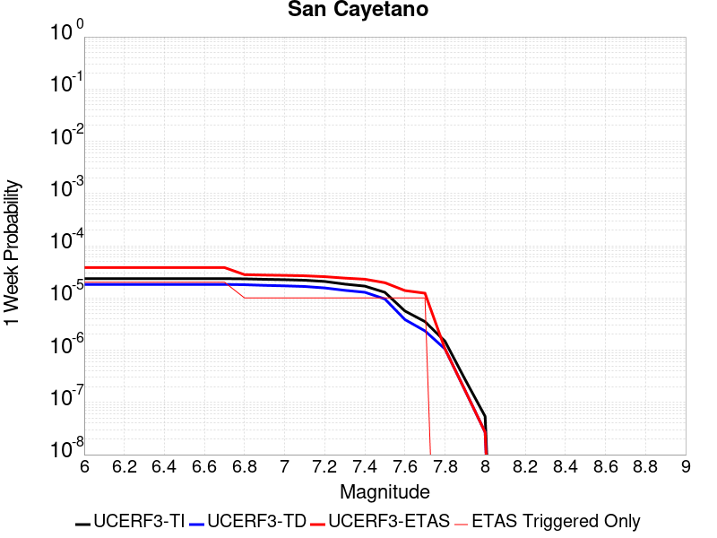 |  | 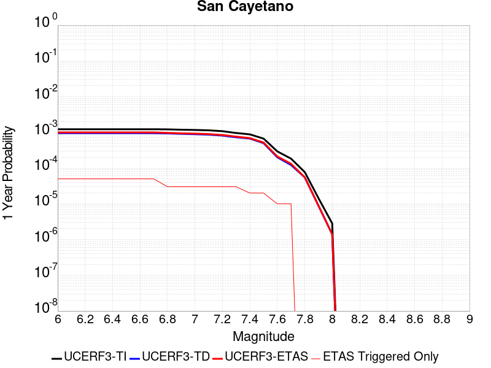 |  |

| Magnitude | 1 wk TI Prob | 1 wk TD Prob | 1 wk ETAS Prob | 1 wk ETAS/TD Gain | 1 wk ETAS Triggered Only | 1 mo TI Prob | 1 mo TD Prob | 1 mo ETAS Prob | 1 mo ETAS/TD Gain | 1 mo ETAS Triggered Only | 1 yr TI Prob | 1 yr TD Prob | 1 yr ETAS Prob | 1 yr ETAS/TD Gain | 1 yr ETAS Triggered Only | 10 yr TI Prob | 10 yr TD Prob | 10 yr ETAS Prob | 10 yr ETAS/TD Gain | 10 yr ETAS Triggered Only |
|-----|-----|-----|-----|-----|-----|-----|-----|-----|-----|-----|-----|-----|-----|-----|-----|-----|-----|-----|-----|-----|
| 6.0 | 2.3476267E-5 | 1.816928E-5 | 3.8168917E-5 | 2.1007392 | 2.0E-5 | 1.0060869E-4 | 7.786603E-5 | 1.2786213E-4 | 1.6420785 | 5.0E-5 | 0.0012242225 | 9.476103E-4 | 9.975629E-4 | 1.0527143 | 5.0E-5 | 0.012175002 | 0.009436584 | 0.009505924 | 1.007348 | 7.0E-5 |
| 6.1 | 2.3476267E-5 | 1.816928E-5 | 3.8168917E-5 | 2.1007392 | 2.0E-5 | 1.0060869E-4 | 7.786603E-5 | 1.2786213E-4 | 1.6420785 | 5.0E-5 | 0.0012242225 | 9.476103E-4 | 9.975629E-4 | 1.0527143 | 5.0E-5 | 0.012175002 | 0.009436584 | 0.009505924 | 1.007348 | 7.0E-5 |
| 6.2 | 2.3476267E-5 | 1.816928E-5 | 3.8168917E-5 | 2.1007392 | 2.0E-5 | 1.0060869E-4 | 7.786603E-5 | 1.2786213E-4 | 1.6420785 | 5.0E-5 | 0.0012242225 | 9.476103E-4 | 9.975629E-4 | 1.0527143 | 5.0E-5 | 0.012175002 | 0.009436584 | 0.009505924 | 1.007348 | 7.0E-5 |
| 6.3 | 2.3476267E-5 | 1.816928E-5 | 3.8168917E-5 | 2.1007392 | 2.0E-5 | 1.0060869E-4 | 7.786603E-5 | 1.2786213E-4 | 1.6420785 | 5.0E-5 | 0.0012242225 | 9.476103E-4 | 9.975629E-4 | 1.0527143 | 5.0E-5 | 0.012175002 | 0.009436584 | 0.009505924 | 1.007348 | 7.0E-5 |
| 6.4 | 2.3476267E-5 | 1.816928E-5 | 3.8168917E-5 | 2.1007392 | 2.0E-5 | 1.0060869E-4 | 7.786603E-5 | 1.2786213E-4 | 1.6420785 | 5.0E-5 | 0.0012242225 | 9.476103E-4 | 9.975629E-4 | 1.0527143 | 5.0E-5 | 0.012175002 | 0.009436584 | 0.009505924 | 1.007348 | 7.0E-5 |
| 6.5 | 2.3476267E-5 | 1.816928E-5 | 3.8168917E-5 | 2.1007392 | 2.0E-5 | 1.0060869E-4 | 7.786603E-5 | 1.2786213E-4 | 1.6420785 | 5.0E-5 | 0.0012242225 | 9.476103E-4 | 9.975629E-4 | 1.0527143 | 5.0E-5 | 0.012175002 | 0.009436584 | 0.009505924 | 1.007348 | 7.0E-5 |
| 6.6 | 2.3476267E-5 | 1.816928E-5 | 3.8168917E-5 | 2.1007392 | 2.0E-5 | 1.0060869E-4 | 7.786603E-5 | 1.2786213E-4 | 1.6420785 | 5.0E-5 | 0.0012242225 | 9.476103E-4 | 9.975629E-4 | 1.0527143 | 5.0E-5 | 0.012175002 | 0.009436584 | 0.009505924 | 1.007348 | 7.0E-5 |
| 6.7 | 2.3476267E-5 | 1.816928E-5 | 3.8168917E-5 | 2.1007392 | 2.0E-5 | 1.0060869E-4 | 7.786603E-5 | 1.2786213E-4 | 1.6420785 | 5.0E-5 | 0.0012242225 | 9.476103E-4 | 9.975629E-4 | 1.0527143 | 5.0E-5 | 0.012175002 | 0.009436584 | 0.009505924 | 1.007348 | 7.0E-5 |
| 6.8 | 2.3241924E-5 | 1.7936987E-5 | 2.7936809E-5 | 1.5574973 | 1.0E-5 | 9.960445E-5 | 7.687056E-5 | 1.06868254E-4 | 1.3902365 | 3.0E-5 | 0.0012120095 | 9.3550084E-4 | 9.654728E-4 | 1.0320383 | 3.0E-5 | 0.012054204 | 0.009316482 | 0.009366016 | 1.0053169 | 5.0E-5 |
| 6.9 | 2.2761007E-5 | 1.7432423E-5 | 2.7432248E-5 | 1.5736337 | 1.0E-5 | 9.7543525E-5 | 7.470827E-5 | 1.0470602E-4 | 1.4015319 | 3.0E-5 | 0.0011869454 | 9.09197E-4 | 9.391697E-4 | 1.0329661 | 3.0E-5 | 0.011806256 | 0.009055603 | 0.009105151 | 1.0054715 | 5.0E-5 |
| 7.0 | 2.240283E-5 | 1.7066168E-5 | 2.7065998E-5 | 1.5859447 | 1.0E-5 | 9.600859E-5 | 7.313869E-5 | 1.03136495E-4 | 1.4101496 | 3.0E-5 | 0.0011682777 | 8.9010317E-4 | 9.200765E-4 | 1.033674 | 3.0E-5 | 0.011621549 | 0.008866196 | 0.008915752 | 1.0055894 | 5.0E-5 |
| 7.1 | 2.1871154E-5 | 1.6586018E-5 | 2.6585853E-5 | 1.6029074 | 1.0E-5 | 9.373015E-5 | 7.108101E-5 | 1.01078884E-4 | 1.4220237 | 3.0E-5 | 0.0011405671 | 8.6507114E-4 | 8.950452E-4 | 1.0346493 | 3.0E-5 | 0.011347309 | 0.008617838 | 0.008667408 | 1.005752 | 5.0E-5 |
| 7.2 | 2.0714133E-5 | 1.5564561E-5 | 2.5564404E-5 | 1.6424752 | 1.0E-5 | 8.8771834E-5 | 6.670357E-5 | 9.670157E-5 | 1.449721 | 3.0E-5 | 0.0010802611 | 8.1181666E-4 | 8.417923E-4 | 1.0369241 | 3.0E-5 | 0.010750249 | 0.008089285 | 0.008138881 | 1.006131 | 5.0E-5 |
| 7.3 | 1.8408395E-5 | 1.3996864E-5 | 2.3996725E-5 | 1.7144357 | 1.0E-5 | 7.8890735E-5 | 5.99852E-5 | 8.99834E-5 | 1.5000933 | 3.0E-5 | 9.600714E-4 | 7.300781E-4 | 7.600562E-4 | 1.0410615 | 3.0E-5 | 0.009559342 | 0.0072775153 | 0.0073271515 | 1.0068204 | 5.0E-5 |
| 7.4 | 1.6856795E-5 | 1.28500815E-5 | 2.2849952E-5 | 1.7781953 | 1.0E-5 | 7.2241404E-5 | 5.5070628E-5 | 7.5069525E-5 | 1.36315 | 2.0E-5 | 8.7918417E-4 | 6.7028153E-4 | 6.902681E-4 | 1.0298182 | 2.0E-5 | 0.00875714 | 0.0066832784 | 0.006723011 | 1.0059451 | 4.0E-5 |
| 7.5 | 1.2822778E-5 | 9.577542E-6 | 1.9577446E-5 | 2.0440993 | 1.0E-5 | 5.495361E-5 | 4.1045972E-5 | 6.104515E-5 | 1.4872385 | 2.0E-5 | 6.688548E-4 | 4.996217E-4 | 5.196117E-4 | 1.0400103 | 2.0E-5 | 0.006668452 | 0.0049851555 | 0.005024956 | 1.0079838 | 4.0E-5 |
| 7.6 | 5.6272684E-6 | 3.854903E-6 | 1.3854865E-5 | 3.594089 | 1.0E-5 | 2.4116642E-5 | 1.652091E-5 | 2.6520744E-5 | 1.6052836 | 1.0E-5 | 2.9358055E-4 | 2.0112359E-4 | 2.1112159E-4 | 1.0497106 | 1.0E-5 | 0.0029319301 | 0.0020094267 | 0.0020194065 | 1.0049665 | 1.0E-5 |
| 7.7 | 3.5261346E-6 | 2.3407013E-6 | 1.2340678E-5 | 5.272214 | 1.0E-5 | 1.5111918E-5 | 1.0031539E-5 | 2.0031439E-5 | 1.9968461 | 1.0E-5 | 1.8397206E-4 | 1.2212721E-4 | 1.3212599E-4 | 1.0818719 | 1.0E-5 | 0.0018381984 | 0.0012206084 | 0.0012305961 | 1.0081826 | 1.0E-5 |
| 7.8 | 1.4826929E-6 | 1.056428E-6 | 1.056428E-6 | 1.0 | 0.0 | 6.354383E-6 | 4.5275406E-6 | 4.5275406E-6 | 1.0 | 0.0 | 7.736187E-5 | 5.5121433E-5 | 5.5121433E-5 | 1.0 | 0.0 | 7.733494E-4 | 5.5107963E-4 | 5.5107963E-4 | 1.0 | 0.0 |
| 7.9 | 2.7568166E-7 | 1.6978244E-7 | 1.6978244E-7 | 1.0 | 0.0 | 1.1814923E-6 | 7.2763885E-7 | 7.2763885E-7 | 1.0 | 0.0 | 1.4384574E-5 | 8.858967E-6 | 8.858967E-6 | 1.0 | 0.0 | 1.4383643E-4 | 8.8586174E-5 | 8.8586174E-5 | 1.0 | 0.0 |
| 8.0 | 5.407832E-8 | 2.6887697E-8 | 2.6887697E-8 | 1.0 | 0.0 | 2.3176422E-7 | 1.15232986E-7 | 1.15232986E-7 | 1.0 | 0.0 | 2.8217257E-6 | 1.4029607E-6 | 1.4029607E-6 | 1.0 | 0.0 | 2.8216898E-5 | 1.4029522E-5 | 1.4029522E-5 | 1.0 | 0.0 |

## Elysian Park (Upper)
*[(top)](#table-of-contents)*

| 1 Week | 1 Month | 1 Year | 10 Year |
|-----|-----|-----|-----|
| 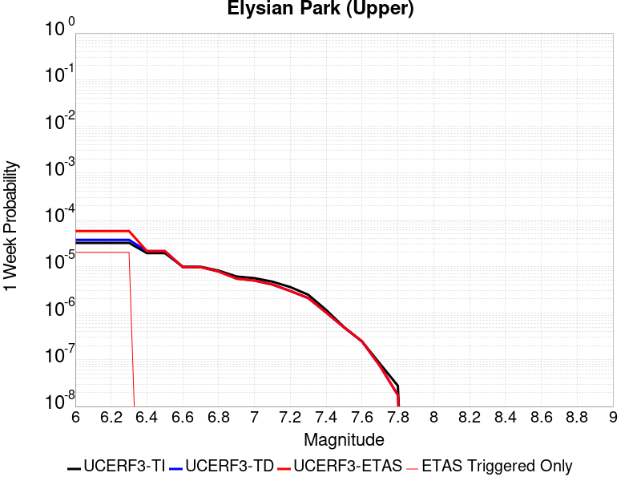 |  |  |  |

| Magnitude | 1 wk TI Prob | 1 wk TD Prob | 1 wk ETAS Prob | 1 wk ETAS/TD Gain | 1 wk ETAS Triggered Only | 1 mo TI Prob | 1 mo TD Prob | 1 mo ETAS Prob | 1 mo ETAS/TD Gain | 1 mo ETAS Triggered Only | 1 yr TI Prob | 1 yr TD Prob | 1 yr ETAS Prob | 1 yr ETAS/TD Gain | 1 yr ETAS Triggered Only | 10 yr TI Prob | 10 yr TD Prob | 10 yr ETAS Prob | 10 yr ETAS/TD Gain | 10 yr ETAS Triggered Only |
|-----|-----|-----|-----|-----|-----|-----|-----|-----|-----|-----|-----|-----|-----|-----|-----|-----|-----|-----|-----|-----|
| 6.0 | 3.1876025E-5 | 3.7035516E-5 | 5.7034773E-5 | 1.5400022 | 2.0E-5 | 1.3660437E-4 | 1.587167E-4 | 1.8871194E-4 | 1.1889861 | 3.0E-5 | 0.0016618895 | 0.0019311075 | 0.001981011 | 1.0258418 | 5.0E-5 | 0.016495159 | 0.019189782 | 0.019268248 | 1.0040889 | 8.0E-5 |
| 6.1 | 3.1876025E-5 | 3.7035516E-5 | 5.7034773E-5 | 1.5400022 | 2.0E-5 | 1.3660437E-4 | 1.587167E-4 | 1.8871194E-4 | 1.1889861 | 3.0E-5 | 0.0016618895 | 0.0019311075 | 0.001981011 | 1.0258418 | 5.0E-5 | 0.016495159 | 0.019189782 | 0.019268248 | 1.0040889 | 8.0E-5 |
| 6.2 | 3.1876025E-5 | 3.7035516E-5 | 5.7034773E-5 | 1.5400022 | 2.0E-5 | 1.3660437E-4 | 1.587167E-4 | 1.8871194E-4 | 1.1889861 | 3.0E-5 | 0.0016618895 | 0.0019311075 | 0.001981011 | 1.0258418 | 5.0E-5 | 0.016495159 | 0.019189782 | 0.019268248 | 1.0040889 | 8.0E-5 |
| 6.3 | 3.1876025E-5 | 3.7035516E-5 | 5.7034773E-5 | 1.5400022 | 2.0E-5 | 1.3660437E-4 | 1.587167E-4 | 1.8871194E-4 | 1.1889861 | 3.0E-5 | 0.0016618895 | 0.0019311075 | 0.001981011 | 1.0258418 | 5.0E-5 | 0.016495159 | 0.019189782 | 0.019268248 | 1.0040889 | 8.0E-5 |
| 6.4 | 1.9273462E-5 | 2.1202266E-5 | 2.1202266E-5 | 1.0 | 0.0 | 8.259794E-5 | 9.086466E-5 | 9.086466E-5 | 1.0 | 0.0 | 0.001005166 | 0.0011058892 | 0.0011258671 | 1.018065 | 2.0E-5 | 0.010006315 | 0.011020724 | 0.011040503 | 1.0017948 | 2.0E-5 |
| 6.5 | 1.9273462E-5 | 2.1202266E-5 | 2.1202266E-5 | 1.0 | 0.0 | 8.259794E-5 | 9.086466E-5 | 9.086466E-5 | 1.0 | 0.0 | 0.001005166 | 0.0011058892 | 0.0011258671 | 1.018065 | 2.0E-5 | 0.010006315 | 0.011020724 | 0.011040503 | 1.0017948 | 2.0E-5 |
| 6.6 | 9.813258E-6 | 9.665599E-6 | 9.665599E-6 | 1.0 | 0.0 | 4.205614E-5 | 4.1423376E-5 | 4.1423376E-5 | 1.0 | 0.0 | 5.119132E-4 | 5.0422014E-4 | 5.2421005E-4 | 1.0396452 | 2.0E-5 | 0.005107356 | 0.0050314846 | 0.005051384 | 1.003955 | 2.0E-5 |
| 6.7 | 9.801478E-6 | 9.653168E-6 | 9.653168E-6 | 1.0 | 0.0 | 4.2005657E-5 | 4.1370105E-5 | 4.1370105E-5 | 1.0 | 0.0 | 5.112989E-4 | 5.035719E-4 | 5.235618E-4 | 1.0396963 | 2.0E-5 | 0.0051012407 | 0.0050250315 | 0.0050449306 | 1.0039601 | 2.0E-5 |
| 6.8 | 8.102489E-6 | 7.773004E-6 | 7.773004E-6 | 1.0 | 0.0 | 3.4724493E-5 | 3.3312477E-5 | 3.3312477E-5 | 1.0 | 0.0 | 4.2268867E-4 | 4.055089E-4 | 4.255008E-4 | 1.0493008 | 2.0E-5 | 0.004218856 | 0.0040481836 | 0.0040681027 | 1.0049205 | 2.0E-5 |
| 6.9 | 6.08275E-6 | 5.4814514E-6 | 5.4814514E-6 | 1.0 | 0.0 | 2.6068668E-5 | 2.3491726E-5 | 2.3491726E-5 | 1.0 | 0.0 | 3.173398E-4 | 2.85975E-4 | 2.9597213E-4 | 1.0349581 | 1.0E-5 | 0.0031688702 | 0.0028561477 | 0.0028661191 | 1.0034912 | 1.0E-5 |
| 7.0 | 5.5995934E-6 | 4.98278E-6 | 4.98278E-6 | 1.0 | 0.0 | 2.3998036E-5 | 2.13546E-5 | 2.13546E-5 | 1.0 | 0.0 | 2.9213692E-4 | 2.599619E-4 | 2.699593E-4 | 1.0384572 | 1.0E-5 | 0.0029175316 | 0.0025966454 | 0.0026066194 | 1.0038412 | 1.0E-5 |
| 7.1 | 4.709881E-6 | 4.0874015E-6 | 4.0874015E-6 | 1.0 | 0.0 | 2.0185047E-5 | 1.7517319E-5 | 1.7517319E-5 | 1.0 | 0.0 | 2.4572524E-4 | 2.132529E-4 | 2.2325077E-4 | 1.0468826 | 1.0E-5 | 0.002454537 | 0.002130524 | 0.0021405027 | 1.0046837 | 1.0E-5 |
| 7.2 | 3.6063436E-6 | 2.9779544E-6 | 2.9779544E-6 | 1.0 | 0.0 | 1.5455667E-5 | 1.27626E-5 | 1.27626E-5 | 1.0 | 0.0 | 1.881565E-4 | 1.5537368E-4 | 1.6537213E-4 | 1.064351 | 1.0E-5 | 0.0018799726 | 0.0015526618 | 0.0015626462 | 1.0064305 | 1.0E-5 |
| 7.3 | 2.471135E-6 | 2.0954615E-6 | 2.0954615E-6 | 1.0 | 0.0 | 1.0590536E-5 | 8.980519E-6 | 8.980519E-6 | 1.0 | 0.0 | 1.2893214E-4 | 1.093324E-4 | 1.19331315E-4 | 1.0914541 | 1.0E-5 | 0.0012885736 | 0.0010927934 | 0.0011027824 | 1.0091408 | 1.0E-5 |
| 7.4 | 1.163943E-6 | 1.0275091E-6 | 1.0275091E-6 | 1.0 | 0.0 | 4.988318E-6 | 4.4036033E-6 | 4.4036033E-6 | 1.0 | 0.0 | 6.0731076E-5 | 5.3612584E-5 | 6.3612046E-5 | 1.1865134 | 1.0E-5 | 6.071448E-4 | 5.359995E-4 | 5.459941E-4 | 1.0186467 | 1.0E-5 |
| 7.5 | 4.99459E-7 | 4.917604E-7 | 4.917604E-7 | 1.0 | 0.0 | 2.140537E-6 | 2.1075427E-6 | 2.1075427E-6 | 1.0 | 0.0 | 2.6060725E-5 | 2.5659048E-5 | 2.5659048E-5 | 1.0 | 0.0 | 2.605767E-4 | 2.5656243E-4 | 2.5656243E-4 | 1.0 | 0.0 |
| 7.6 | 2.4667852E-7 | 2.4778336E-7 | 2.4778336E-7 | 1.0 | 0.0 | 1.0571932E-6 | 1.0619283E-6 | 1.0619283E-6 | 1.0 | 0.0 | 1.2871251E-5 | 1.2928905E-5 | 1.2928905E-5 | 1.0 | 0.0 | 1.2870505E-4 | 1.2928189E-4 | 1.2928189E-4 | 1.0 | 0.0 |
| 7.7 | 8.2312795E-8 | 7.3864456E-8 | 7.3864456E-8 | 1.0 | 0.0 | 3.527691E-7 | 3.165619E-7 | 3.165619E-7 | 1.0 | 0.0 | 4.294955E-6 | 3.8541357E-6 | 3.8541357E-6 | 1.0 | 0.0 | 4.2948723E-5 | 3.8540802E-5 | 3.8540802E-5 | 1.0 | 0.0 |
| 7.8 | 2.7819295E-8 | 1.7566023E-8 | 1.7566023E-8 | 1.0 | 0.0 | 1.1922555E-7 | 7.5282955E-8 | 7.5282955E-8 | 1.0 | 0.0 | 1.45157E-6 | 9.165697E-7 | 9.165697E-7 | 1.0 | 0.0 | 1.45156055E-5 | 9.165675E-6 | 9.165675E-6 | 1.0 | 0.0 |

## San Jacinto (Superstition Mtn)
*[(top)](#table-of-contents)*

| 1 Week | 1 Month | 1 Year | 10 Year |
|-----|-----|-----|-----|
|  | 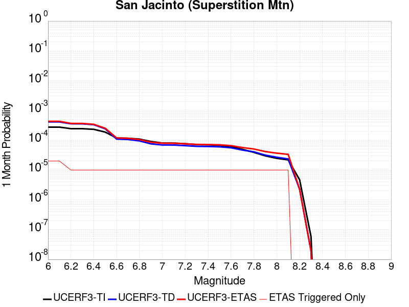 | 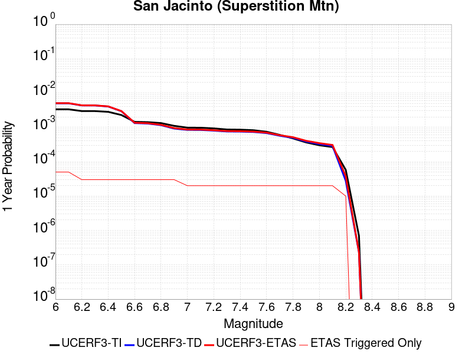 | 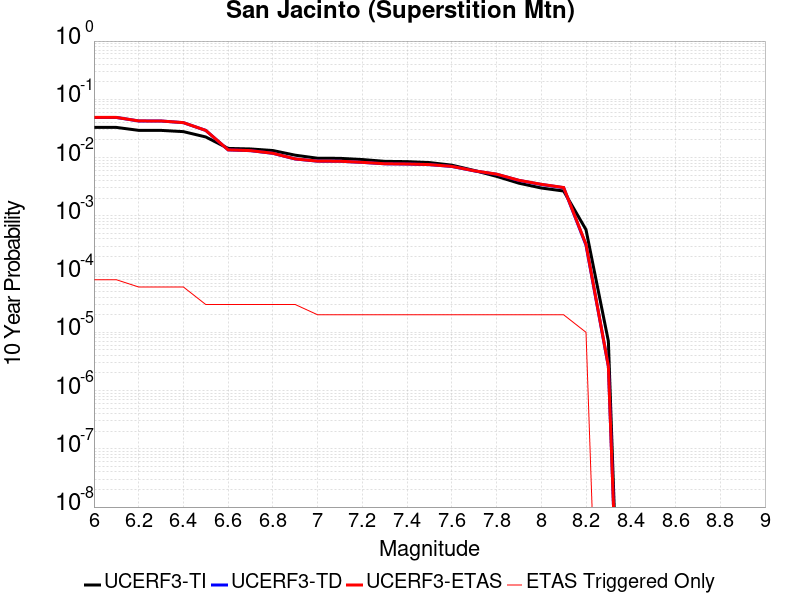 |

| Magnitude | 1 wk TI Prob | 1 wk TD Prob | 1 wk ETAS Prob | 1 wk ETAS/TD Gain | 1 wk ETAS Triggered Only | 1 mo TI Prob | 1 mo TD Prob | 1 mo ETAS Prob | 1 mo ETAS/TD Gain | 1 mo ETAS Triggered Only | 1 yr TI Prob | 1 yr TD Prob | 1 yr ETAS Prob | 1 yr ETAS/TD Gain | 1 yr ETAS Triggered Only | 10 yr TI Prob | 10 yr TD Prob | 10 yr ETAS Prob | 10 yr ETAS/TD Gain | 10 yr ETAS Triggered Only |
|-----|-----|-----|-----|-----|-----|-----|-----|-----|-----|-----|-----|-----|-----|-----|-----|-----|-----|-----|-----|-----|
| 6.0 | 6.4193904E-5 | 9.599367E-5 | 1.0599271E-4 | 1.1041635 | 1.0E-5 | 2.7508775E-4 | 4.1134638E-4 | 4.3133815E-4 | 1.0486008 | 2.0E-5 | 0.0033440501 | 0.0049980893 | 0.0050478396 | 1.0099539 | 5.0E-5 | 0.03294174 | 0.048823986 | 0.04890008 | 1.0015585 | 8.0E-5 |
| 6.1 | 6.4193904E-5 | 9.599367E-5 | 1.0599271E-4 | 1.1041635 | 1.0E-5 | 2.7508775E-4 | 4.1134638E-4 | 4.3133815E-4 | 1.0486008 | 2.0E-5 | 0.0033440501 | 0.0049980893 | 0.0050478396 | 1.0099539 | 5.0E-5 | 0.03294174 | 0.048823986 | 0.04890008 | 1.0015585 | 8.0E-5 |
| 6.2 | 5.7023593E-5 | 8.3144434E-5 | 8.3144434E-5 | 1.0 | 0.0 | 2.4436394E-4 | 3.5629404E-4 | 3.6629045E-4 | 1.0280567 | 1.0E-5 | 0.002971072 | 0.0043308944 | 0.0043607643 | 1.006897 | 3.0E-5 | 0.029316625 | 0.04250403 | 0.04256148 | 1.0013516 | 6.0E-5 |
| 6.3 | 5.6940098E-5 | 8.298979E-5 | 8.298979E-5 | 1.0 | 0.0 | 2.4400617E-4 | 3.5563146E-4 | 3.6562793E-4 | 1.028109 | 1.0E-5 | 0.002966728 | 0.00432286 | 0.0043527302 | 1.0069098 | 3.0E-5 | 0.029274331 | 0.042427283 | 0.042484738 | 1.0013542 | 6.0E-5 |
| 6.4 | 5.4171585E-5 | 7.7483564E-5 | 7.7483564E-5 | 1.0 | 0.0 | 2.3214328E-4 | 3.3203943E-4 | 3.4203613E-4 | 1.0301069 | 1.0E-5 | 0.0028226813 | 0.0040367353 | 0.004066614 | 1.0074017 | 3.0E-5 | 0.02787096 | 0.03971653 | 0.03977415 | 1.0014507 | 6.0E-5 |
| 6.5 | 4.375144E-5 | 5.642133E-5 | 5.642133E-5 | 1.0 | 0.0 | 1.874927E-4 | 2.4178992E-4 | 2.517875E-4 | 1.0413482 | 1.0E-5 | 0.0022803338 | 0.002940994 | 0.0029709057 | 1.0101706 | 3.0E-5 | 0.022570757 | 0.029236801 | 0.029265925 | 1.0009961 | 3.0E-5 |
| 6.6 | 2.772192E-5 | 2.5488358E-5 | 2.5488358E-5 | 1.0 | 0.0 | 1.1880282E-4 | 1.09231354E-4 | 1.1923026E-4 | 1.0915388 | 1.0E-5 | 0.0014454646 | 0.0013290998 | 0.0013590599 | 1.0225416 | 3.0E-5 | 0.014360986 | 0.01354049 | 0.013570084 | 1.0021856 | 3.0E-5 |
| 6.7 | 2.7124124E-5 | 2.4699386E-5 | 2.4699386E-5 | 1.0 | 0.0 | 1.1624106E-4 | 1.05850326E-4 | 1.1584927E-4 | 1.094463 | 1.0E-5 | 0.0014143161 | 0.001287985 | 0.0013179464 | 1.0232621 | 3.0E-5 | 0.014053487 | 0.013133943 | 0.01316355 | 1.0022541 | 3.0E-5 |
| 6.8 | 2.5475807E-5 | 2.216446E-5 | 2.216446E-5 | 1.0 | 0.0 | 1.0917746E-4 | 9.4987154E-5 | 1.04986204E-4 | 1.1052674 | 1.0E-5 | 0.001328425 | 0.001155867 | 0.0011858323 | 1.0259246 | 3.0E-5 | 0.0132051185 | 0.011822182 | 0.011851827 | 1.0025076 | 3.0E-5 |
| 6.9 | 2.1162023E-5 | 1.7626244E-5 | 1.7626244E-5 | 1.0 | 0.0 | 9.069123E-5 | 7.5538876E-5 | 8.553812E-5 | 1.1323721 | 1.0E-5 | 0.0011036064 | 9.193016E-4 | 9.49274E-4 | 1.0326035 | 3.0E-5 | 0.010981417 | 0.00944688 | 0.0094765965 | 1.0031457 | 3.0E-5 |
| 7.0 | 1.8754288E-5 | 1.6161559E-5 | 1.6161559E-5 | 1.0 | 0.0 | 8.037304E-5 | 6.9261994E-5 | 7.926131E-5 | 1.1443694 | 1.0E-5 | 9.781026E-4 | 8.4294105E-4 | 8.629242E-4 | 1.0237064 | 2.0E-5 | 0.009738087 | 0.008670042 | 0.008689868 | 1.0022868 | 2.0E-5 |
| 7.1 | 1.8678527E-5 | 1.6086702E-5 | 1.6086702E-5 | 1.0 | 0.0 | 8.0048376E-5 | 6.89412E-5 | 7.894051E-5 | 1.1450411 | 1.0E-5 | 9.7415317E-4 | 8.3903834E-4 | 8.5902156E-4 | 1.0238168 | 2.0E-5 | 0.009698939 | 0.008630998 | 0.008650825 | 1.0022973 | 2.0E-5 |
| 7.2 | 1.7804578E-5 | 1.5381282E-5 | 1.5381282E-5 | 1.0 | 0.0 | 7.6303106E-5 | 6.5918124E-5 | 7.5917465E-5 | 1.1516933 | 1.0E-5 | 9.285943E-4 | 8.022599E-4 | 8.2224386E-4 | 1.0249096 | 2.0E-5 | 0.009247236 | 0.008262311 | 0.008282146 | 1.0024006 | 2.0E-5 |
| 7.3 | 1.6583685E-5 | 1.4530388E-5 | 1.4530388E-5 | 1.0 | 0.0 | 7.1070994E-5 | 6.227162E-5 | 7.2270996E-5 | 1.1605768 | 1.0E-5 | 8.649459E-4 | 7.5789524E-4 | 7.778801E-4 | 1.0263689 | 2.0E-5 | 0.00861587 | 0.007817623 | 0.007837467 | 1.0025383 | 2.0E-5 |
| 7.4 | 1.6387552E-5 | 1.4395274E-5 | 1.4395274E-5 | 1.0 | 0.0 | 7.023047E-5 | 6.169258E-5 | 7.169197E-5 | 1.162084 | 1.0E-5 | 8.5472054E-4 | 7.5085036E-4 | 7.708353E-4 | 1.0266165 | 2.0E-5 | 0.008514405 | 0.0077470057 | 0.0077668508 | 1.0025617 | 2.0E-5 |
| 7.5 | 1.5790754E-5 | 1.4035962E-5 | 1.4035962E-5 | 1.0 | 0.0 | 6.767291E-5 | 6.0152746E-5 | 7.015214E-5 | 1.1662334 | 1.0E-5 | 8.236062E-4 | 7.321156E-4 | 7.5210095E-4 | 1.0272981 | 2.0E-5 | 0.008205604 | 0.007557569 | 0.007577418 | 1.0026263 | 2.0E-5 |
| 7.6 | 1.4248672E-5 | 1.3054932E-5 | 1.3054932E-5 | 1.0 | 0.0 | 6.106431E-5 | 5.594852E-5 | 6.594796E-5 | 1.1787257 | 1.0E-5 | 7.432043E-4 | 6.8096205E-4 | 7.0094847E-4 | 1.0293502 | 2.0E-5 | 0.007407237 | 0.0070401574 | 0.0070600165 | 1.0028208 | 2.0E-5 |
| 7.7 | 1.15449975E-5 | 1.090368E-5 | 1.090368E-5 | 1.0 | 0.0 | 4.947762E-5 | 4.6729223E-5 | 5.6728757E-5 | 1.2139889 | 1.0E-5 | 6.022235E-4 | 5.687805E-4 | 5.8876915E-4 | 1.0351429 | 2.0E-5 | 0.006005941 | 0.0059101824 | 0.0059300642 | 1.003364 | 2.0E-5 |
| 7.8 | 9.1391985E-6 | 9.514299E-6 | 9.514299E-6 | 1.0 | 0.0 | 3.9167408E-5 | 4.0774932E-5 | 5.0774524E-5 | 1.2452388 | 1.0E-5 | 4.767588E-4 | 4.963223E-4 | 5.163124E-4 | 1.0402764 | 2.0E-5 | 0.0047573727 | 0.0051766867 | 0.005196583 | 1.0038434 | 2.0E-5 |
| 7.9 | 6.973017E-6 | 7.3821784E-6 | 7.3821784E-6 | 1.0 | 0.0 | 2.9884017E-5 | 3.1637526E-5 | 4.163721E-5 | 1.3160703 | 1.0E-5 | 3.6377716E-4 | 3.8511935E-4 | 4.0511164E-4 | 1.051912 | 2.0E-5 | 0.0036318225 | 0.0040517948 | 0.0040717134 | 1.0049161 | 2.0E-5 |
| 8.0 | 5.7638235E-6 | 6.259972E-6 | 6.259972E-6 | 1.0 | 0.0 | 2.4701867E-5 | 2.6828178E-5 | 3.682791E-5 | 1.3727324 | 1.0E-5 | 3.0070372E-4 | 3.2658462E-4 | 3.4657808E-4 | 1.0612199 | 2.0E-5 | 0.0030029714 | 0.0034534496 | 0.0034733803 | 1.0057713 | 2.0E-5 |
| 8.1 | 5.1124434E-6 | 5.4956718E-6 | 5.4956718E-6 | 1.0 | 0.0 | 2.1910288E-5 | 2.355267E-5 | 3.3552435E-5 | 1.4245703 | 1.0E-5 | 2.6672508E-4 | 2.867165E-4 | 3.0671078E-4 | 1.0697353 | 2.0E-5 | 0.0026640517 | 0.003040336 | 0.0030602752 | 1.0065582 | 2.0E-5 |
| 8.2 | 1.1075938E-6 | 5.336568E-7 | 5.336568E-7 | 1.0 | 0.0 | 4.7468216E-6 | 2.2870988E-6 | 2.2870988E-6 | 1.0 | 0.0 | 5.779102E-5 | 2.7845093E-5 | 3.7844817E-5 | 1.3591197 | 1.0E-5 | 5.777599E-4 | 3.1346595E-4 | 3.2346282E-4 | 1.0318913 | 1.0E-5 |
| 8.3 | 1.3584393E-8 | 4.473836E-9 | 4.473836E-9 | 1.0 | 0.0 | 5.8218827E-8 | 1.9173582E-8 | 1.9173582E-8 | 1.0 | 0.0 | 7.0881396E-7 | 2.3343837E-7 | 2.3343837E-7 | 1.0 | 0.0 | 7.0881174E-6 | 2.6163038E-6 | 2.6163038E-6 | 1.0 | 0.0 |

## San Jacinto (Coyote Creek)
*[(top)](#table-of-contents)*

| 1 Week | 1 Month | 1 Year | 10 Year |
|-----|-----|-----|-----|
|  | 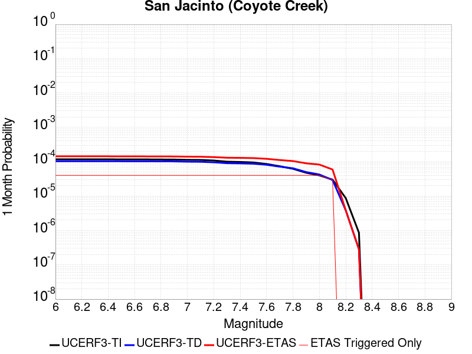 |  | 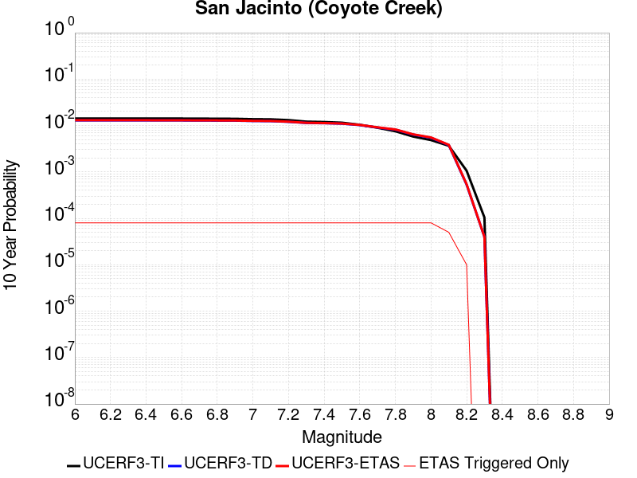 |

| Magnitude | 1 wk TI Prob | 1 wk TD Prob | 1 wk ETAS Prob | 1 wk ETAS/TD Gain | 1 wk ETAS Triggered Only | 1 mo TI Prob | 1 mo TD Prob | 1 mo ETAS Prob | 1 mo ETAS/TD Gain | 1 mo ETAS Triggered Only | 1 yr TI Prob | 1 yr TD Prob | 1 yr ETAS Prob | 1 yr ETAS/TD Gain | 1 yr ETAS Triggered Only | 10 yr TI Prob | 10 yr TD Prob | 10 yr ETAS Prob | 10 yr ETAS/TD Gain | 10 yr ETAS Triggered Only |
|-----|-----|-----|-----|-----|-----|-----|-----|-----|-----|-----|-----|-----|-----|-----|-----|-----|-----|-----|-----|-----|
| 6.0 | 2.7374346E-5 | 2.4145214E-5 | 3.4144974E-5 | 1.4141507 | 1.0E-5 | 1.1731335E-4 | 1.034754E-4 | 1.4347126E-4 | 1.3865253 | 4.0E-5 | 0.0014273542 | 0.0012590875 | 0.0013389868 | 1.0634581 | 8.0E-5 | 0.01418221 | 0.012928318 | 0.013007284 | 1.0061079 | 8.0E-5 |
| 6.1 | 2.7374346E-5 | 2.4145214E-5 | 3.4144974E-5 | 1.4141507 | 1.0E-5 | 1.1731335E-4 | 1.034754E-4 | 1.4347126E-4 | 1.3865253 | 4.0E-5 | 0.0014273542 | 0.0012590875 | 0.0013389868 | 1.0634581 | 8.0E-5 | 0.01418221 | 0.012928318 | 0.013007284 | 1.0061079 | 8.0E-5 |
| 6.2 | 2.7374346E-5 | 2.4145214E-5 | 3.4144974E-5 | 1.4141507 | 1.0E-5 | 1.1731335E-4 | 1.034754E-4 | 1.4347126E-4 | 1.3865253 | 4.0E-5 | 0.0014273542 | 0.0012590875 | 0.0013389868 | 1.0634581 | 8.0E-5 | 0.01418221 | 0.012928318 | 0.013007284 | 1.0061079 | 8.0E-5 |
| 6.3 | 2.7374346E-5 | 2.4145214E-5 | 3.4144974E-5 | 1.4141507 | 1.0E-5 | 1.1731335E-4 | 1.034754E-4 | 1.4347126E-4 | 1.3865253 | 4.0E-5 | 0.0014273542 | 0.0012590875 | 0.0013389868 | 1.0634581 | 8.0E-5 | 0.01418221 | 0.012928318 | 0.013007284 | 1.0061079 | 8.0E-5 |
| 6.4 | 2.7374346E-5 | 2.4145214E-5 | 3.4144974E-5 | 1.4141507 | 1.0E-5 | 1.1731335E-4 | 1.034754E-4 | 1.4347126E-4 | 1.3865253 | 4.0E-5 | 0.0014273542 | 0.0012590875 | 0.0013389868 | 1.0634581 | 8.0E-5 | 0.01418221 | 0.012928318 | 0.013007284 | 1.0061079 | 8.0E-5 |
| 6.5 | 2.7282445E-5 | 2.4031293E-5 | 3.403105E-5 | 1.4161141 | 1.0E-5 | 1.16919524E-4 | 1.029872E-4 | 1.4298309E-4 | 1.3883578 | 4.0E-5 | 0.0014225657 | 0.0012531505 | 0.0013330503 | 1.0637591 | 8.0E-5 | 0.014134934 | 0.012869646 | 0.012948616 | 1.0061362 | 8.0E-5 |
| 6.6 | 2.7282445E-5 | 2.4031293E-5 | 3.403105E-5 | 1.4161141 | 1.0E-5 | 1.16919524E-4 | 1.029872E-4 | 1.4298309E-4 | 1.3883578 | 4.0E-5 | 0.0014225657 | 0.0012531505 | 0.0013330503 | 1.0637591 | 8.0E-5 | 0.014134934 | 0.012869646 | 0.012948616 | 1.0061362 | 8.0E-5 |
| 6.7 | 2.7216198E-5 | 2.3956412E-5 | 3.3956174E-5 | 1.4174148 | 1.0E-5 | 1.1663563E-4 | 1.02666316E-4 | 1.426622E-4 | 1.3895717 | 4.0E-5 | 0.0014191137 | 0.0012492483 | 0.0013291484 | 1.0639585 | 8.0E-5 | 0.014100855 | 0.0128310565 | 0.01291003 | 1.0061549 | 8.0E-5 |
| 6.8 | 2.7078617E-5 | 2.387363E-5 | 3.387339E-5 | 1.4188622 | 1.0E-5 | 1.1604605E-4 | 1.0231156E-4 | 1.4230747E-4 | 1.3909227 | 4.0E-5 | 0.001411945 | 0.0012449342 | 0.0013248345 | 1.0641804 | 8.0E-5 | 0.014030075 | 0.012788199 | 0.012867176 | 1.0061758 | 8.0E-5 |
| 6.9 | 2.6982952E-5 | 2.3793142E-5 | 3.3792905E-5 | 1.4202791 | 1.0E-5 | 1.15636096E-4 | 1.0196664E-4 | 1.4196256E-4 | 1.3922452 | 4.0E-5 | 0.0014069602 | 0.0012407395 | 0.0013206402 | 1.0643977 | 8.0E-5 | 0.013980856 | 0.012746515 | 0.012825495 | 1.0061963 | 8.0E-5 |
| 7.0 | 2.6449972E-5 | 2.3370165E-5 | 3.336993E-5 | 1.427886 | 1.0E-5 | 1.1335209E-4 | 1.00154015E-4 | 1.4015E-4 | 1.3993449 | 4.0E-5 | 0.001379188 | 0.0012186957 | 0.0012985981 | 1.0655639 | 8.0E-5 | 0.0137065975 | 0.0125278765 | 0.012606875 | 1.0063058 | 8.0E-5 |
| 7.1 | 2.6257849E-5 | 2.3196202E-5 | 3.319597E-5 | 1.4310951 | 1.0E-5 | 1.1252879E-4 | 9.940852E-5 | 1.3940454E-4 | 1.40234 | 4.0E-5 | 0.0013691769 | 0.0012096294 | 0.0012895325 | 1.066056 | 8.0E-5 | 0.013607717 | 0.012437741 | 0.012516746 | 1.0063521 | 8.0E-5 |
| 7.2 | 2.5270041E-5 | 2.2390966E-5 | 3.239074E-5 | 1.4465986 | 1.0E-5 | 1.0829568E-4 | 9.595777E-5 | 1.3595393E-4 | 1.41681 | 4.0E-5 | 0.0013177024 | 0.0011676621 | 0.0012475686 | 1.0684329 | 8.0E-5 | 0.013099162 | 0.012018777 | 0.012097816 | 1.0065763 | 8.0E-5 |
| 7.3 | 2.339701E-5 | 2.1122814E-5 | 3.1122603E-5 | 1.4734118 | 1.0E-5 | 1.0026905E-4 | 9.0523215E-5 | 1.3051959E-4 | 1.4418356 | 4.0E-5 | 0.001220092 | 0.0011015651 | 0.0011814769 | 1.072544 | 8.0E-5 | 0.012134149 | 0.011357696 | 0.011436787 | 1.0069637 | 8.0E-5 |
| 7.4 | 2.296333E-5 | 2.0853171E-5 | 3.0852963E-5 | 1.4795334 | 1.0E-5 | 9.841056E-5 | 8.936768E-5 | 1.2936411E-4 | 1.4475491 | 4.0E-5 | 0.0011974899 | 0.0010875105 | 0.0011674234 | 1.0734825 | 8.0E-5 | 0.011910575 | 0.01121681 | 0.011295912 | 1.0070522 | 8.0E-5 |
| 7.5 | 2.2188895E-5 | 2.0376096E-5 | 3.0375892E-5 | 1.4907612 | 1.0E-5 | 9.50918E-5 | 8.732321E-5 | 1.2731971E-4 | 1.4580283 | 4.0E-5 | 0.0011571277 | 0.0010626436 | 0.0011425585 | 1.0752039 | 8.0E-5 | 0.011511209 | 0.010966429 | 0.011045551 | 1.007215 | 8.0E-5 |
| 7.6 | 2.0013189E-5 | 1.8962366E-5 | 2.8962177E-5 | 1.5273503 | 1.0E-5 | 8.5767984E-5 | 8.1264756E-5 | 1.2126151E-4 | 1.4921783 | 4.0E-5 | 0.001043725 | 9.889511E-4 | 0.001068872 | 1.0808138 | 8.0E-5 | 0.010388365 | 0.010224434 | 0.010303616 | 1.0077444 | 8.0E-5 |
| 7.7 | 1.7230794E-5 | 1.674371E-5 | 2.6743543E-5 | 1.5972292 | 1.0E-5 | 7.384417E-5 | 7.175679E-5 | 1.11753914E-4 | 1.5573986 | 4.0E-5 | 8.986819E-4 | 8.7328954E-4 | 9.5321966E-4 | 1.0915277 | 8.0E-5 | 0.008950562 | 0.009062956 | 0.009142231 | 1.0087471 | 8.0E-5 |
| 7.8 | 1.4478809E-5 | 1.4990978E-5 | 2.4990828E-5 | 1.6670579 | 1.0E-5 | 6.205057E-5 | 6.424547E-5 | 1.042429E-4 | 1.622572 | 4.0E-5 | 7.552038E-4 | 7.819085E-4 | 8.6184597E-4 | 1.1022338 | 8.0E-5 | 0.0075264242 | 0.008141387 | 0.008220736 | 1.0097463 | 8.0E-5 |
| 7.9 | 1.1114467E-5 | 1.1645102E-5 | 2.1644986E-5 | 1.8587202 | 1.0E-5 | 4.7632562E-5 | 4.990663E-5 | 8.9904635E-5 | 1.8014567 | 4.0E-5 | 5.797721E-4 | 6.074444E-4 | 6.873958E-4 | 1.1316193 | 8.0E-5 | 0.0057826187 | 0.0063803247 | 0.0064598145 | 1.0124586 | 8.0E-5 |
| 8.0 | 9.327402E-6 | 9.899186E-6 | 1.9899087E-5 | 2.010174 | 1.0E-5 | 3.9973966E-5 | 4.2424395E-5 | 8.24227E-5 | 1.9428138 | 4.0E-5 | 4.8657437E-4 | 5.1639514E-4 | 5.9635384E-4 | 1.1548401 | 8.0E-5 | 0.0048551033 | 0.0054499684 | 0.0055295327 | 1.014599 | 8.0E-5 |
| 8.1 | 7.0235833E-6 | 6.827495E-6 | 1.6827427E-5 | 2.464656 | 1.0E-5 | 3.0100724E-5 | 2.9260367E-5 | 5.9259488E-5 | 2.0252476 | 3.0E-5 | 3.664147E-4 | 3.5618723E-4 | 4.0616942E-4 | 1.1403255 | 5.0E-5 | 0.003658111 | 0.0037876023 | 0.003837413 | 1.0131509 | 5.0E-5 |
| 8.2 | 2.0358202E-6 | 8.994527E-7 | 8.994527E-7 | 1.0 | 0.0 | 8.724915E-6 | 3.854792E-6 | 3.854792E-6 | 1.0 | 0.0 | 1.06220665E-4 | 4.69311E-5 | 5.6930632E-5 | 1.2130684 | 1.0E-5 | 0.001061699 | 5.3254166E-4 | 5.425363E-4 | 1.0187678 | 1.0E-5 |
| 8.3 | 2.0051264E-7 | 6.617272E-8 | 6.617272E-8 | 1.0 | 0.0 | 8.5933965E-7 | 2.8359733E-7 | 2.8359733E-7 | 1.0 | 0.0 | 1.046241E-5 | 3.4527925E-6 | 3.4527925E-6 | 1.0 | 0.0 | 1.0461917E-4 | 4.01389E-5 | 4.01389E-5 | 1.0 | 0.0 |

## Chino alt 1
*[(top)](#table-of-contents)*

| 1 Week | 1 Month | 1 Year | 10 Year |
|-----|-----|-----|-----|
| 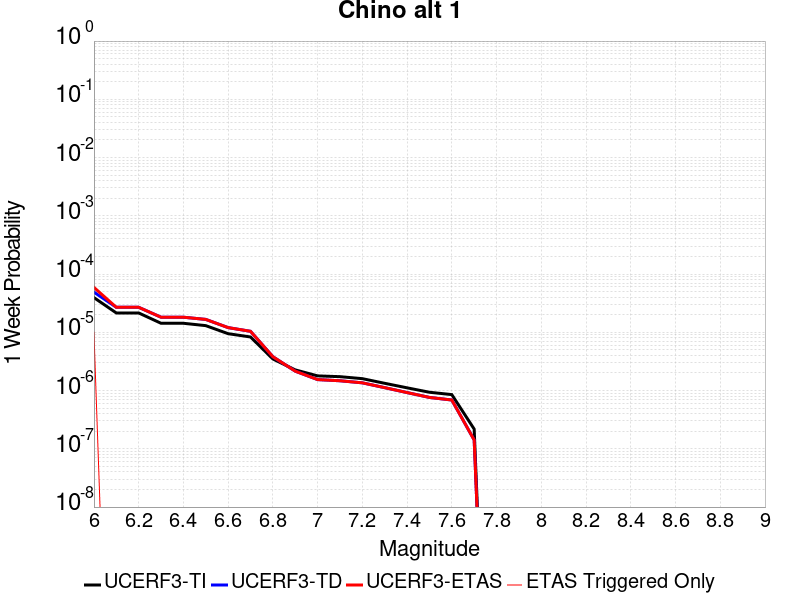 |  | 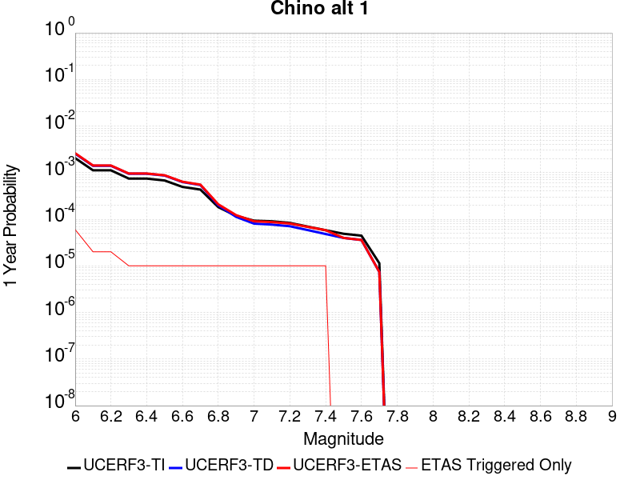 |  |

| Magnitude | 1 wk TI Prob | 1 wk TD Prob | 1 wk ETAS Prob | 1 wk ETAS/TD Gain | 1 wk ETAS Triggered Only | 1 mo TI Prob | 1 mo TD Prob | 1 mo ETAS Prob | 1 mo ETAS/TD Gain | 1 mo ETAS Triggered Only | 1 yr TI Prob | 1 yr TD Prob | 1 yr ETAS Prob | 1 yr ETAS/TD Gain | 1 yr ETAS Triggered Only | 10 yr TI Prob | 10 yr TD Prob | 10 yr ETAS Prob | 10 yr ETAS/TD Gain | 10 yr ETAS Triggered Only |
|-----|-----|-----|-----|-----|-----|-----|-----|-----|-----|-----|-----|-----|-----|-----|-----|-----|-----|-----|-----|-----|
| 6.0 | 3.939946E-5 | 4.8948554E-5 | 5.8948066E-5 | 1.2042861 | 1.0E-5 | 1.6884391E-4 | 2.097656E-4 | 2.397593E-4 | 1.1429868 | 3.0E-5 | 0.0020537362 | 0.0025513945 | 0.0026112415 | 1.0234566 | 6.0E-5 | 0.020348595 | 0.025277847 | 0.025346078 | 1.0026993 | 7.0E-5 |
| 6.1 | 2.1505624E-5 | 2.6879026E-5 | 2.6879026E-5 | 1.0 | 0.0 | 9.2163704E-5 | 1.1519137E-4 | 1.2519021E-4 | 1.086802 | 1.0E-5 | 0.0011215154 | 0.001401664 | 0.001421636 | 1.0142487 | 2.0E-5 | 0.011158722 | 0.013945141 | 0.013964863 | 1.0014142 | 2.0E-5 |
| 6.2 | 2.1505624E-5 | 2.6879026E-5 | 2.6879026E-5 | 1.0 | 0.0 | 9.2163704E-5 | 1.1519137E-4 | 1.2519021E-4 | 1.086802 | 1.0E-5 | 0.0011215154 | 0.001401664 | 0.001421636 | 1.0142487 | 2.0E-5 | 0.011158722 | 0.013945141 | 0.013964863 | 1.0014142 | 2.0E-5 |
| 6.3 | 1.4290785E-5 | 1.8165128E-5 | 1.8165128E-5 | 1.0 | 0.0 | 6.1244784E-5 | 7.784848E-5 | 7.784848E-5 | 1.0 | 0.0 | 7.454001E-4 | 9.4743853E-4 | 9.57429E-4 | 1.0105448 | 1.0E-5 | 0.007429048 | 0.0094444575 | 0.009454363 | 1.0010488 | 1.0E-5 |
| 6.4 | 1.4290785E-5 | 1.8165128E-5 | 1.8165128E-5 | 1.0 | 0.0 | 6.1244784E-5 | 7.784848E-5 | 7.784848E-5 | 1.0 | 0.0 | 7.454001E-4 | 9.4743853E-4 | 9.57429E-4 | 1.0105448 | 1.0E-5 | 0.007429048 | 0.0094444575 | 0.009454363 | 1.0010488 | 1.0E-5 |
| 6.5 | 1.3017944E-5 | 1.6652088E-5 | 1.6652088E-5 | 1.0 | 0.0 | 5.5789995E-5 | 7.136439E-5 | 7.136439E-5 | 1.0 | 0.0 | 6.790315E-4 | 8.685589E-4 | 8.7855017E-4 | 1.0115033 | 1.0E-5 | 0.0067696036 | 0.008661949 | 0.008671863 | 1.0011445 | 1.0E-5 |
| 6.6 | 9.470016E-6 | 1.2039424E-5 | 1.2039424E-5 | 1.0 | 0.0 | 4.058515E-5 | 5.1596704E-5 | 5.1596704E-5 | 1.0 | 0.0 | 4.940122E-4 | 6.280428E-4 | 6.3803646E-4 | 1.0159125 | 1.0E-5 | 0.004929154 | 0.0062718987 | 0.006281836 | 1.0015844 | 1.0E-5 |
| 6.7 | 8.314155E-6 | 1.0407736E-5 | 1.0407736E-5 | 1.0 | 0.0 | 3.5631605E-5 | 4.4604003E-5 | 4.4604003E-5 | 1.0 | 0.0 | 4.3372845E-4 | 5.429507E-4 | 5.5294525E-4 | 1.0184078 | 1.0E-5 | 0.004328829 | 0.005425775 | 0.005435721 | 1.0018331 | 1.0E-5 |
| 6.8 | 3.4856364E-6 | 3.8133708E-6 | 3.8133708E-6 | 1.0 | 0.0 | 1.4938357E-5 | 1.6342927E-5 | 1.6342927E-5 | 1.0 | 0.0 | 1.8185932E-4 | 1.9895904E-4 | 2.0895705E-4 | 1.0502516 | 1.0E-5 | 0.0018171056 | 0.0019894864 | 0.0019994667 | 1.0050164 | 1.0E-5 |
| 6.9 | 2.2645952E-6 | 2.1529022E-6 | 2.1529022E-6 | 1.0 | 0.0 | 9.705372E-6 | 9.226692E-6 | 9.226692E-6 | 1.0 | 0.0 | 1.18156495E-4 | 1.123294E-4 | 1.2232827E-4 | 1.0890139 | 1.0E-5 | 0.0011809369 | 0.0011233423 | 0.0011333311 | 1.008892 | 1.0E-5 |
| 7.0 | 1.7864003E-6 | 1.5430785E-6 | 1.5430785E-6 | 1.0 | 0.0 | 7.655979E-6 | 6.613177E-6 | 6.613177E-6 | 1.0 | 0.0 | 9.3207556E-5 | 8.051251E-5 | 9.0511705E-5 | 1.1241943 | 1.0E-5 | 9.316847E-4 | 8.0528046E-4 | 8.1527245E-4 | 1.012408 | 1.0E-5 |
| 7.1 | 1.7315456E-6 | 1.4733511E-6 | 1.4733511E-6 | 1.0 | 0.0 | 7.420889E-6 | 6.3143466E-6 | 6.3143466E-6 | 1.0 | 0.0 | 9.034557E-5 | 7.6874516E-5 | 8.687375E-5 | 1.1300721 | 1.0E-5 | 9.0308854E-4 | 7.6891703E-4 | 7.789093E-4 | 1.0129954 | 1.0E-5 |
| 7.2 | 1.6008337E-6 | 1.3574215E-6 | 1.3574215E-6 | 1.0 | 0.0 | 6.860698E-6 | 5.817508E-6 | 5.817508E-6 | 1.0 | 0.0 | 8.352579E-5 | 7.082591E-5 | 8.082521E-5 | 1.1411812 | 1.0E-5 | 8.34944E-4 | 7.0845755E-4 | 7.1845046E-4 | 1.0141052 | 1.0E-5 |
| 7.3 | 1.3320939E-6 | 1.121782E-6 | 1.121782E-6 | 1.0 | 0.0 | 5.7089615E-6 | 4.807629E-6 | 4.807629E-6 | 1.0 | 0.0 | 6.9504385E-5 | 5.8531357E-5 | 6.853077E-5 | 1.1708386 | 1.0E-5 | 6.9482654E-4 | 5.8530393E-4 | 5.952981E-4 | 1.0170752 | 1.0E-5 |
| 7.4 | 1.114294E-6 | 9.237111E-7 | 9.237111E-7 | 1.0 | 0.0 | 4.775537E-6 | 3.958756E-6 | 3.958756E-6 | 1.0 | 0.0 | 5.8140613E-5 | 4.8196827E-5 | 5.8196343E-5 | 1.2074726 | 1.0E-5 | 5.81254E-4 | 4.8188053E-4 | 4.9187575E-4 | 1.020742 | 1.0E-5 |
| 7.5 | 9.354081E-7 | 7.6234323E-7 | 7.6234323E-7 | 1.0 | 0.0 | 4.0088858E-6 | 3.2671815E-6 | 3.2671815E-6 | 1.0 | 0.0 | 4.8807087E-5 | 3.9777242E-5 | 3.9777242E-5 | 1.0 | 0.0 | 4.879637E-4 | 3.977046E-4 | 3.977046E-4 | 1.0 | 0.0 |
| 7.6 | 8.521771E-7 | 6.88071E-7 | 6.88071E-7 | 1.0 | 0.0 | 3.6521824E-6 | 2.9488726E-6 | 2.9488726E-6 | 1.0 | 0.0 | 4.4464414E-5 | 3.5901965E-5 | 3.5901965E-5 | 1.0 | 0.0 | 4.4455516E-4 | 3.589648E-4 | 3.589648E-4 | 1.0 | 0.0 |
| 7.7 | 2.1803626E-7 | 1.418649E-7 | 1.418649E-7 | 1.0 | 0.0 | 9.344408E-7 | 6.079923E-7 | 6.079923E-7 | 1.0 | 0.0 | 1.1376757E-5 | 7.4022914E-6 | 7.4022914E-6 | 1.0 | 0.0 | 1.13761744E-4 | 7.402141E-5 | 7.402141E-5 | 1.0 | 0.0 |

## Kern Canyon (North Kern) 2011
*[(top)](#table-of-contents)*

| 1 Week | 1 Month | 1 Year | 10 Year |
|-----|-----|-----|-----|
|  |  | 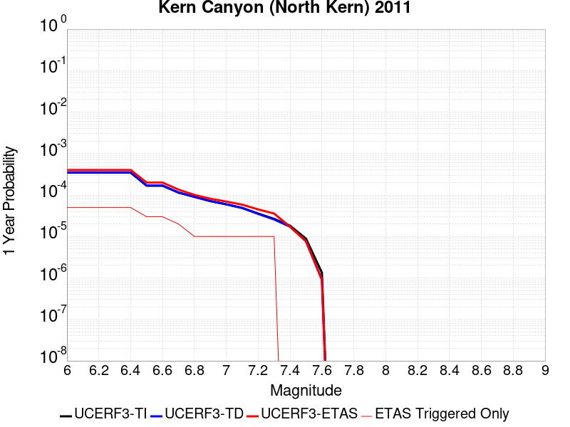 | 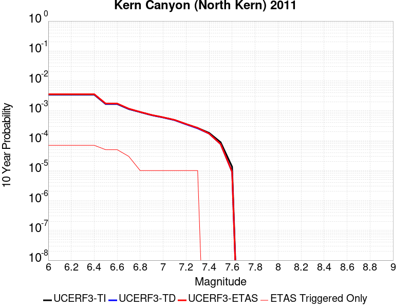 |

| Magnitude | 1 wk TI Prob | 1 wk TD Prob | 1 wk ETAS Prob | 1 wk ETAS/TD Gain | 1 wk ETAS Triggered Only | 1 mo TI Prob | 1 mo TD Prob | 1 mo ETAS Prob | 1 mo ETAS/TD Gain | 1 mo ETAS Triggered Only | 1 yr TI Prob | 1 yr TD Prob | 1 yr ETAS Prob | 1 yr ETAS/TD Gain | 1 yr ETAS Triggered Only | 10 yr TI Prob | 10 yr TD Prob | 10 yr ETAS Prob | 10 yr ETAS/TD Gain | 10 yr ETAS Triggered Only |
|-----|-----|-----|-----|-----|-----|-----|-----|-----|-----|-----|-----|-----|-----|-----|-----|-----|-----|-----|-----|-----|
| 6.0 | 6.6264497E-6 | 6.75733E-6 | 4.675706E-5 | 6.919458 | 4.0E-5 | 2.8398761E-5 | 2.895971E-5 | 6.895855E-5 | 2.3811893 | 4.0E-5 | 3.4570007E-4 | 3.5253543E-4 | 4.025178E-4 | 1.1417797 | 5.0E-5 | 0.0034516277 | 0.0035205502 | 0.0035903037 | 1.0198133 | 7.0E-5 |
| 6.1 | 6.6264497E-6 | 6.75733E-6 | 4.675706E-5 | 6.919458 | 4.0E-5 | 2.8398761E-5 | 2.895971E-5 | 6.895855E-5 | 2.3811893 | 4.0E-5 | 3.4570007E-4 | 3.5253543E-4 | 4.025178E-4 | 1.1417797 | 5.0E-5 | 0.0034516277 | 0.0035205502 | 0.0035903037 | 1.0198133 | 7.0E-5 |
| 6.2 | 6.6264497E-6 | 6.75733E-6 | 4.675706E-5 | 6.919458 | 4.0E-5 | 2.8398761E-5 | 2.895971E-5 | 6.895855E-5 | 2.3811893 | 4.0E-5 | 3.4570007E-4 | 3.5253543E-4 | 4.025178E-4 | 1.1417797 | 5.0E-5 | 0.0034516277 | 0.0035205502 | 0.0035903037 | 1.0198133 | 7.0E-5 |
| 6.3 | 6.6264497E-6 | 6.75733E-6 | 4.675706E-5 | 6.919458 | 4.0E-5 | 2.8398761E-5 | 2.895971E-5 | 6.895855E-5 | 2.3811893 | 4.0E-5 | 3.4570007E-4 | 3.5253543E-4 | 4.025178E-4 | 1.1417797 | 5.0E-5 | 0.0034516277 | 0.0035205502 | 0.0035903037 | 1.0198133 | 7.0E-5 |
| 6.4 | 6.6264497E-6 | 6.75733E-6 | 4.675706E-5 | 6.919458 | 4.0E-5 | 2.8398761E-5 | 2.895971E-5 | 6.895855E-5 | 2.3811893 | 4.0E-5 | 3.4570007E-4 | 3.5253543E-4 | 4.025178E-4 | 1.1417797 | 5.0E-5 | 0.0034516277 | 0.0035205502 | 0.0035903037 | 1.0198133 | 7.0E-5 |
| 6.5 | 3.2162225E-6 | 3.2570915E-6 | 3.3256994E-5 | 10.210642 | 3.0E-5 | 1.3783738E-5 | 1.3958893E-5 | 4.3958473E-5 | 3.1491375 | 3.0E-5 | 1.6780409E-4 | 1.6993708E-4 | 1.9993198E-4 | 1.1765059 | 3.0E-5 | 0.0016767744 | 0.001698151 | 0.001748066 | 1.0293938 | 5.0E-5 |
| 6.6 | 3.2162225E-6 | 3.2570915E-6 | 3.3256994E-5 | 10.210642 | 3.0E-5 | 1.3783738E-5 | 1.3958893E-5 | 4.3958473E-5 | 3.1491375 | 3.0E-5 | 1.6780409E-4 | 1.6993708E-4 | 1.9993198E-4 | 1.1765059 | 3.0E-5 | 0.0016767744 | 0.001698151 | 0.001748066 | 1.0293938 | 5.0E-5 |
| 6.7 | 2.1908265E-6 | 2.2071222E-6 | 2.2207078E-5 | 10.061554 | 2.0E-5 | 9.389223E-6 | 9.459061E-6 | 2.9458872E-5 | 3.1143546 | 2.0E-5 | 1.1430779E-4 | 1.1515819E-4 | 1.3515589E-4 | 1.1736542 | 2.0E-5 | 0.0011424901 | 0.0011510046 | 0.00118097 | 1.0260342 | 3.0E-5 |
| 6.8 | 1.7303895E-6 | 1.7365529E-6 | 1.1736535E-5 | 6.758525 | 1.0E-5 | 7.415934E-6 | 7.4423488E-6 | 1.7442275E-5 | 2.3436518 | 1.0E-5 | 9.028525E-5 | 9.0606925E-5 | 1.0060602E-4 | 1.1103568 | 1.0E-5 | 9.024858E-4 | 9.057096E-4 | 9.157005E-4 | 1.011031 | 1.0E-5 |
| 6.9 | 1.3700314E-6 | 1.3688622E-6 | 1.1368848E-5 | 8.305327 | 1.0E-5 | 5.87155E-6 | 5.8665396E-6 | 1.586648E-5 | 2.7045724 | 1.0E-5 | 7.148377E-5 | 7.142282E-5 | 8.1422106E-5 | 1.1400013 | 1.0E-5 | 7.146078E-4 | 7.140032E-4 | 7.239961E-4 | 1.0139955 | 1.0E-5 |
| 7.0 | 1.1467797E-6 | 1.1413804E-6 | 1.1141369E-5 | 9.761311 | 1.0E-5 | 4.9147607E-6 | 4.8916213E-6 | 1.4891572E-5 | 3.044302 | 1.0E-5 | 5.983557E-5 | 5.9553895E-5 | 6.95533E-5 | 1.1679051 | 1.0E-5 | 5.981946E-4 | 5.953825E-4 | 6.0537655E-4 | 1.016786 | 1.0E-5 |
| 7.1 | 9.3952065E-7 | 9.3026904E-7 | 1.093026E-5 | 11.749569 | 1.0E-5 | 4.026511E-6 | 3.9868614E-6 | 1.3986822E-5 | 3.5082288 | 1.0E-5 | 4.9021666E-5 | 4.8538972E-5 | 5.8538488E-5 | 1.20601 | 1.0E-5 | 4.901085E-4 | 4.8528548E-4 | 4.952806E-4 | 1.0205964 | 1.0E-5 |
| 7.2 | 6.858055E-7 | 6.7193E-7 | 1.06719235E-5 | 15.882492 | 1.0E-5 | 2.939163E-6 | 2.879697E-6 | 1.2879668E-5 | 4.4725776 | 1.0E-5 | 3.5783723E-5 | 3.5059755E-5 | 4.5059405E-5 | 1.2852173 | 1.0E-5 | 3.5777962E-4 | 3.5054312E-4 | 3.6053962E-4 | 1.0285171 | 1.0E-5 |
| 7.3 | 5.1101983E-7 | 4.9393E-7 | 1.0493925E-5 | 21.245775 | 1.0E-5 | 2.1900833E-6 | 2.116841E-6 | 1.211682E-5 | 5.7240105 | 1.0E-5 | 2.6663936E-5 | 2.5772239E-5 | 3.577198E-5 | 1.3880044 | 1.0E-5 | 2.6660739E-4 | 2.57693E-4 | 2.676904E-4 | 1.0387958 | 1.0E-5 |
| 7.4 | 3.4999414E-7 | 3.2995905E-7 | 3.2995905E-7 | 1.0 | 0.0 | 1.499974E-6 | 1.4141094E-6 | 1.4141094E-6 | 1.0 | 0.0 | 1.8262032E-5 | 1.721665E-5 | 1.721665E-5 | 1.0 | 0.0 | 1.826053E-4 | 1.7215339E-4 | 1.7215339E-4 | 1.0 | 0.0 |
| 7.5 | 1.7021522E-7 | 1.4750044E-7 | 1.4750044E-7 | 1.0 | 0.0 | 7.2949354E-7 | 6.321446E-7 | 6.321446E-7 | 1.0 | 0.0 | 8.881548E-6 | 7.696334E-6 | 7.696334E-6 | 1.0 | 0.0 | 8.8811925E-5 | 7.696076E-5 | 7.696076E-5 | 1.0 | 0.0 |
| 7.6 | 2.572245E-8 | 1.7352555E-8 | 1.7352555E-8 | 1.0 | 0.0 | 1.10239064E-7 | 7.436809E-8 | 7.436809E-8 | 1.0 | 0.0 | 1.3421597E-6 | 9.054312E-7 | 9.054312E-7 | 1.0 | 0.0 | 1.3421517E-5 | 9.05428E-6 | 9.05428E-6 | 1.0 | 0.0 |

## San Jacinto (Lytle Creek connector)
*[(top)](#table-of-contents)*

| 1 Week | 1 Month | 1 Year | 10 Year |
|-----|-----|-----|-----|
| 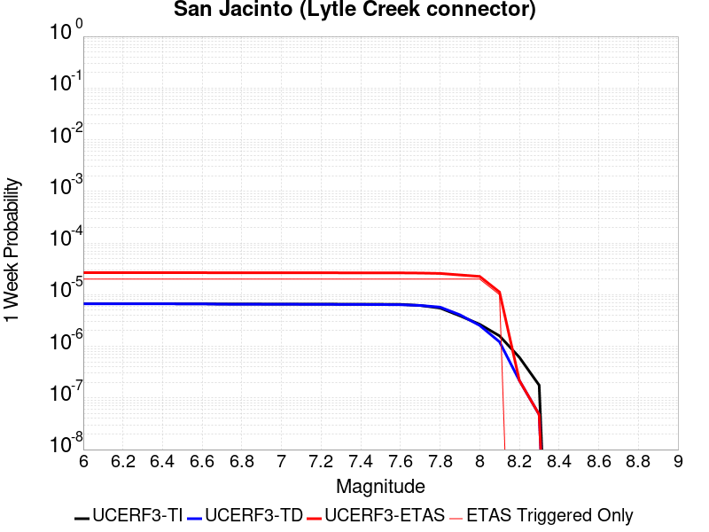 |  |  | 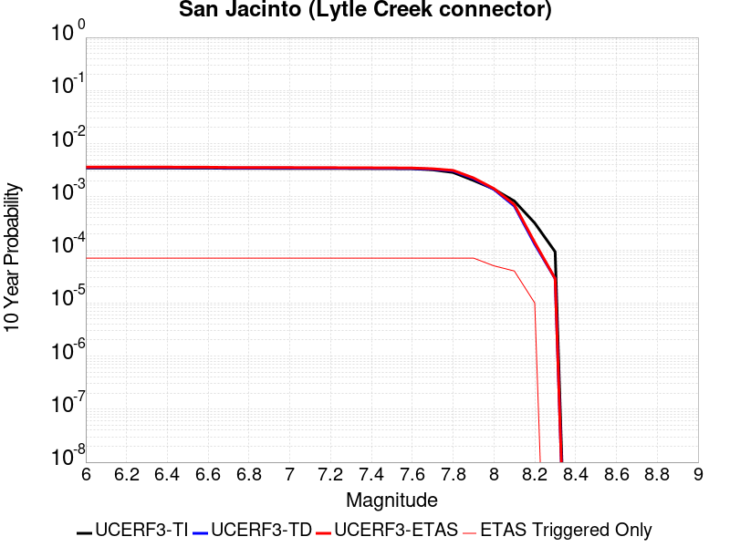 |

| Magnitude | 1 wk TI Prob | 1 wk TD Prob | 1 wk ETAS Prob | 1 wk ETAS/TD Gain | 1 wk ETAS Triggered Only | 1 mo TI Prob | 1 mo TD Prob | 1 mo ETAS Prob | 1 mo ETAS/TD Gain | 1 mo ETAS Triggered Only | 1 yr TI Prob | 1 yr TD Prob | 1 yr ETAS Prob | 1 yr ETAS/TD Gain | 1 yr ETAS Triggered Only | 10 yr TI Prob | 10 yr TD Prob | 10 yr ETAS Prob | 10 yr ETAS/TD Gain | 10 yr ETAS Triggered Only |
|-----|-----|-----|-----|-----|-----|-----|-----|-----|-----|-----|-----|-----|-----|-----|-----|-----|-----|-----|-----|-----|
| 6.0 | 6.693995E-6 | 6.660216E-6 | 2.6660084E-5 | 4.0028853 | 2.0E-5 | 2.8688235E-5 | 2.854347E-5 | 5.8542617E-5 | 2.0509984 | 3.0E-5 | 3.492233E-4 | 3.4746144E-4 | 4.074406E-4 | 1.172621 | 6.0E-5 | 0.00348675 | 0.0035493854 | 0.0036191368 | 1.0196518 | 7.0E-5 |
| 6.1 | 6.693995E-6 | 6.660216E-6 | 2.6660084E-5 | 4.0028853 | 2.0E-5 | 2.8688235E-5 | 2.854347E-5 | 5.8542617E-5 | 2.0509984 | 3.0E-5 | 3.492233E-4 | 3.4746144E-4 | 4.074406E-4 | 1.172621 | 6.0E-5 | 0.00348675 | 0.0035493854 | 0.0036191368 | 1.0196518 | 7.0E-5 |
| 6.2 | 6.693995E-6 | 6.660216E-6 | 2.6660084E-5 | 4.0028853 | 2.0E-5 | 2.8688235E-5 | 2.854347E-5 | 5.8542617E-5 | 2.0509984 | 3.0E-5 | 3.492233E-4 | 3.4746144E-4 | 4.074406E-4 | 1.172621 | 6.0E-5 | 0.00348675 | 0.0035493854 | 0.0036191368 | 1.0196518 | 7.0E-5 |
| 6.3 | 6.693995E-6 | 6.660216E-6 | 2.6660084E-5 | 4.0028853 | 2.0E-5 | 2.8688235E-5 | 2.854347E-5 | 5.8542617E-5 | 2.0509984 | 3.0E-5 | 3.492233E-4 | 3.4746144E-4 | 4.074406E-4 | 1.172621 | 6.0E-5 | 0.00348675 | 0.0035493854 | 0.0036191368 | 1.0196518 | 7.0E-5 |
| 6.4 | 6.693995E-6 | 6.660216E-6 | 2.6660084E-5 | 4.0028853 | 2.0E-5 | 2.8688235E-5 | 2.854347E-5 | 5.8542617E-5 | 2.0509984 | 3.0E-5 | 3.492233E-4 | 3.4746144E-4 | 4.074406E-4 | 1.172621 | 6.0E-5 | 0.00348675 | 0.0035493854 | 0.0036191368 | 1.0196518 | 7.0E-5 |
| 6.5 | 6.6561875E-6 | 6.6204343E-6 | 2.6620302E-5 | 4.02093 | 2.0E-5 | 2.8526205E-5 | 2.837298E-5 | 5.837213E-5 | 2.057314 | 3.0E-5 | 3.472512E-4 | 3.4538636E-4 | 4.0536566E-4 | 1.1736585 | 6.0E-5 | 0.0034670907 | 0.003528701 | 0.0035984537 | 1.0197673 | 7.0E-5 |
| 6.6 | 6.6561875E-6 | 6.6204343E-6 | 2.6620302E-5 | 4.02093 | 2.0E-5 | 2.8526205E-5 | 2.837298E-5 | 5.837213E-5 | 2.057314 | 3.0E-5 | 3.472512E-4 | 3.4538636E-4 | 4.0536566E-4 | 1.1736585 | 6.0E-5 | 0.0034670907 | 0.003528701 | 0.0035984537 | 1.0197673 | 7.0E-5 |
| 6.7 | 6.5802237E-6 | 6.539611E-6 | 2.6539481E-5 | 4.0582657 | 2.0E-5 | 2.8200653E-5 | 2.8026603E-5 | 5.8025762E-5 | 2.0703816 | 3.0E-5 | 3.4328885E-4 | 3.4117055E-4 | 4.011501E-4 | 1.1758051 | 6.0E-5 | 0.0034275902 | 0.0034866752 | 0.0035564313 | 1.0200064 | 7.0E-5 |
| 6.8 | 6.575632E-6 | 6.5341005E-6 | 2.653397E-5 | 4.060845 | 2.0E-5 | 2.8180975E-5 | 2.8002989E-5 | 5.8002148E-5 | 2.0712843 | 3.0E-5 | 3.4304935E-4 | 3.4088313E-4 | 4.0086266E-4 | 1.1759534 | 6.0E-5 | 0.0034252026 | 0.00348381 | 0.003553566 | 1.020023 | 7.0E-5 |
| 6.9 | 6.570433E-6 | 6.525495E-6 | 2.6525364E-5 | 4.064882 | 2.0E-5 | 2.8158694E-5 | 2.7966107E-5 | 5.7965266E-5 | 2.0726972 | 3.0E-5 | 3.4277816E-4 | 3.4043423E-4 | 4.004138E-4 | 1.1761855 | 6.0E-5 | 0.0034224992 | 0.0034793352 | 0.0035490918 | 1.0200487 | 7.0E-5 |
| 7.0 | 6.5643826E-6 | 6.515616E-6 | 2.6515485E-5 | 4.0695286 | 2.0E-5 | 2.8132765E-5 | 2.792377E-5 | 5.792293E-5 | 2.0743234 | 3.0E-5 | 3.424626E-4 | 3.3991894E-4 | 3.9989853E-4 | 1.1764526 | 6.0E-5 | 0.0034193532 | 0.0034741985 | 0.0035439553 | 1.0200785 | 7.0E-5 |
| 7.1 | 6.557402E-6 | 6.5043278E-6 | 2.6504198E-5 | 4.074856 | 2.0E-5 | 2.8102848E-5 | 2.7875392E-5 | 5.7874557E-5 | 2.076188 | 3.0E-5 | 3.4209844E-4 | 3.3933012E-4 | 3.9930976E-4 | 1.176759 | 6.0E-5 | 0.0034157229 | 0.0034683298 | 0.003538087 | 1.0201126 | 7.0E-5 |
| 7.2 | 6.546394E-6 | 6.4862943E-6 | 2.6486165E-5 | 4.0834045 | 2.0E-5 | 2.8055672E-5 | 2.7798109E-5 | 5.7797275E-5 | 2.07918 | 3.0E-5 | 3.4152428E-4 | 3.3838948E-4 | 3.983692E-4 | 1.1772505 | 6.0E-5 | 0.0034099987 | 0.0034589572 | 0.0035287149 | 1.0201674 | 7.0E-5 |
| 7.3 | 6.5364216E-6 | 6.4670803E-6 | 2.646695E-5 | 4.0925655 | 2.0E-5 | 2.8012933E-5 | 2.7715765E-5 | 5.7714933E-5 | 2.0823865 | 3.0E-5 | 3.4100408E-4 | 3.3738726E-4 | 3.9736702E-4 | 1.1777772 | 6.0E-5 | 0.003404813 | 0.0034489788 | 0.0035187374 | 1.0202259 | 7.0E-5 |
| 7.4 | 6.5269523E-6 | 6.4481674E-6 | 2.6448039E-5 | 4.1016364 | 2.0E-5 | 2.7972354E-5 | 2.7634711E-5 | 5.7633883E-5 | 2.0855613 | 3.0E-5 | 3.4051016E-4 | 3.3640073E-4 | 3.9638055E-4 | 1.1782987 | 6.0E-5 | 0.0033998888 | 0.003439161 | 0.00350892 | 1.0202838 | 7.0E-5 |
| 7.5 | 6.5111835E-6 | 6.424442E-6 | 2.6424314E-5 | 4.113091 | 2.0E-5 | 2.7904773E-5 | 2.7533031E-5 | 5.7532205E-5 | 2.0895703 | 3.0E-5 | 3.3968766E-4 | 3.3516317E-4 | 3.9514306E-4 | 1.1789572 | 6.0E-5 | 0.0033916887 | 0.003426834 | 0.0034965943 | 1.020357 | 7.0E-5 |
| 7.6 | 6.4768806E-6 | 6.383551E-6 | 2.6383423E-5 | 4.1330323 | 2.0E-5 | 2.7757764E-5 | 2.735779E-5 | 5.735697E-5 | 2.0965497 | 3.0E-5 | 3.3789838E-4 | 3.3303024E-4 | 3.9301027E-4 | 1.1801038 | 6.0E-5 | 0.0033738504 | 0.0034055663 | 0.0034753277 | 1.0204846 | 7.0E-5 |
| 7.7 | 6.1655364E-6 | 6.1760365E-6 | 2.6175912E-5 | 4.2383027 | 2.0E-5 | 2.642346E-5 | 2.646846E-5 | 5.6467667E-5 | 2.1333945 | 3.0E-5 | 3.2165812E-4 | 3.2220592E-4 | 3.8218658E-4 | 1.1861563 | 6.0E-5 | 0.0032119295 | 0.0032971818 | 0.003366951 | 1.0211602 | 7.0E-5 |
| 7.8 | 5.5043524E-6 | 5.737097E-6 | 2.5736983E-5 | 4.4860635 | 2.0E-5 | 2.3589868E-5 | 2.4587327E-5 | 5.4586588E-5 | 2.220111 | 3.0E-5 | 2.871688E-4 | 2.9930964E-4 | 3.5929168E-4 | 1.2004013 | 6.0E-5 | 0.0028679797 | 0.0030672832 | 0.0031370686 | 1.0227515 | 7.0E-5 |
| 7.9 | 3.889249E-6 | 4.076761E-6 | 2.407668E-5 | 5.9058356 | 2.0E-5 | 1.6668104E-5 | 1.7471715E-5 | 4.7471192E-5 | 2.7170308 | 3.0E-5 | 2.0291525E-4 | 2.1269741E-4 | 2.7268464E-4 | 1.2820308 | 6.0E-5 | 0.0020273007 | 0.0021943315 | 0.002264178 | 1.0318304 | 7.0E-5 |
| 8.0 | 2.668535E-6 | 2.5315155E-6 | 2.2531465E-5 | 8.900386 | 2.0E-5 | 1.1436528E-5 | 1.0849307E-5 | 4.084898E-5 | 3.7651236 | 3.0E-5 | 1.3923083E-4 | 1.3208234E-4 | 1.8207573E-4 | 1.3785018 | 5.0E-5 | 0.0013914363 | 0.0013757964 | 0.0014257275 | 1.0362926 | 5.0E-5 |
| 8.1 | 1.5911459E-6 | 1.218661E-6 | 1.1218649E-5 | 9.205717 | 1.0E-5 | 6.8191785E-6 | 5.2228224E-6 | 2.5222718E-5 | 4.829327 | 2.0E-5 | 8.3020335E-5 | 6.3586034E-5 | 1.0358349E-4 | 1.629029 | 4.0E-5 | 8.298933E-4 | 6.6932244E-4 | 7.092957E-4 | 1.059722 | 4.0E-5 |
| 8.2 | 6.1294963E-7 | 2.1812275E-7 | 2.1812275E-7 | 1.0 | 0.0 | 2.6269242E-6 | 9.3481145E-7 | 9.3481145E-7 | 1.0 | 0.0 | 3.1982334E-5 | 1.138127E-5 | 2.1381156E-5 | 1.8786266 | 1.0E-5 | 3.1977732E-4 | 1.2784546E-4 | 1.3784418E-4 | 1.0782094 | 1.0E-5 |
| 8.3 | 1.762871E-7 | 4.7546838E-8 | 4.7546838E-8 | 1.0 | 0.0 | 7.5551594E-7 | 2.0377215E-7 | 2.0377215E-7 | 1.0 | 0.0 | 9.1983675E-6 | 2.480923E-6 | 2.480923E-6 | 1.0 | 0.0 | 9.197987E-5 | 2.868753E-5 | 2.868753E-5 | 1.0 | 0.0 |

## Elmore Ranch
*[(top)](#table-of-contents)*

| 1 Week | 1 Month | 1 Year | 10 Year |
|-----|-----|-----|-----|
|  |  | 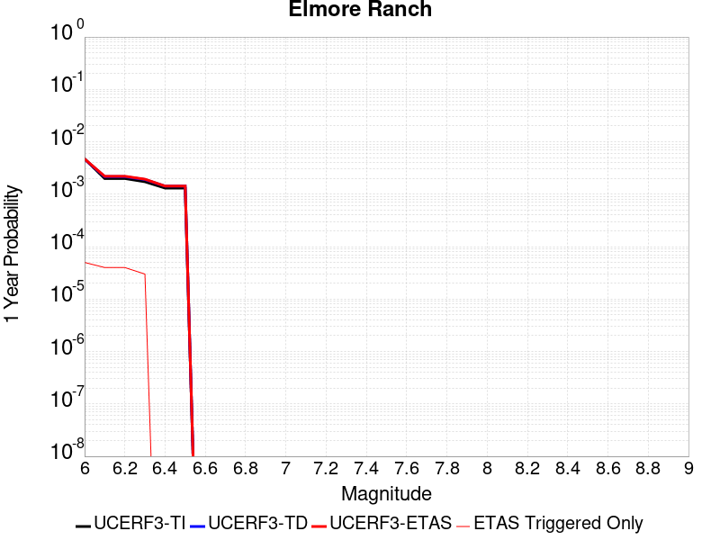 |  |

| Magnitude | 1 wk TI Prob | 1 wk TD Prob | 1 wk ETAS Prob | 1 wk ETAS/TD Gain | 1 wk ETAS Triggered Only | 1 mo TI Prob | 1 mo TD Prob | 1 mo ETAS Prob | 1 mo ETAS/TD Gain | 1 mo ETAS Triggered Only | 1 yr TI Prob | 1 yr TD Prob | 1 yr ETAS Prob | 1 yr ETAS/TD Gain | 1 yr ETAS Triggered Only | 10 yr TI Prob | 10 yr TD Prob | 10 yr ETAS Prob | 10 yr ETAS/TD Gain | 10 yr ETAS Triggered Only |
|-----|-----|-----|-----|-----|-----|-----|-----|-----|-----|-----|-----|-----|-----|-----|-----|-----|-----|-----|-----|-----|
| 6.0 | 9.102099E-5 | 8.952015E-5 | 1.0951836E-4 | 1.2233934 | 2.0E-5 | 3.9003167E-4 | 3.8361453E-4 | 4.2359918E-4 | 1.1042314 | 4.0E-5 | 0.0047383 | 0.004662009 | 0.0047117756 | 1.010675 | 5.0E-5 | 0.046385348 | 0.045870975 | 0.04592822 | 1.001248 | 6.0E-5 |
| 6.1 | 3.8306698E-5 | 4.1498504E-5 | 6.1497674E-5 | 1.4819251 | 2.0E-5 | 1.6416123E-4 | 1.7784268E-4 | 2.1783556E-4 | 1.2248778 | 4.0E-5 | 0.0019968306 | 0.0021631396 | 0.002203053 | 1.0184517 | 4.0E-5 | 0.019789828 | 0.021628205 | 0.021667339 | 1.0018095 | 4.0E-5 |
| 6.2 | 3.8306698E-5 | 4.1498504E-5 | 6.1497674E-5 | 1.4819251 | 2.0E-5 | 1.6416123E-4 | 1.7784268E-4 | 2.1783556E-4 | 1.2248778 | 4.0E-5 | 0.0019968306 | 0.0021631396 | 0.002203053 | 1.0184517 | 4.0E-5 | 0.019789828 | 0.021628205 | 0.021667339 | 1.0018095 | 4.0E-5 |
| 6.3 | 3.3197924E-5 | 3.6554302E-5 | 5.6553574E-5 | 1.5471112 | 2.0E-5 | 1.4226905E-4 | 1.5665586E-4 | 1.8665116E-4 | 1.1914725 | 3.0E-5 | 0.0017307495 | 0.001905917 | 0.0019358598 | 1.0157105 | 3.0E-5 | 0.017173318 | 0.01908996 | 0.019119387 | 1.0015415 | 3.0E-5 |
| 6.4 | 2.5148964E-5 | 2.7420487E-5 | 2.7420487E-5 | 1.0 | 0.0 | 1.0777682E-4 | 1.17514726E-4 | 1.17514726E-4 | 1.0 | 0.0 | 0.0013113929 | 0.0014304507 | 0.0014304507 | 1.0 | 0.0 | 0.01303681 | 0.014387194 | 0.014387194 | 1.0 | 0.0 |
| 6.5 | 2.5148964E-5 | 2.7420487E-5 | 2.7420487E-5 | 1.0 | 0.0 | 1.0777682E-4 | 1.17514726E-4 | 1.17514726E-4 | 1.0 | 0.0 | 0.0013113929 | 0.0014304507 | 0.0014304507 | 1.0 | 0.0 | 0.01303681 | 0.014387194 | 0.014387194 | 1.0 | 0.0 |

## Hosgri (Extension)
*[(top)](#table-of-contents)*

| 1 Week | 1 Month | 1 Year | 10 Year |
|-----|-----|-----|-----|
| 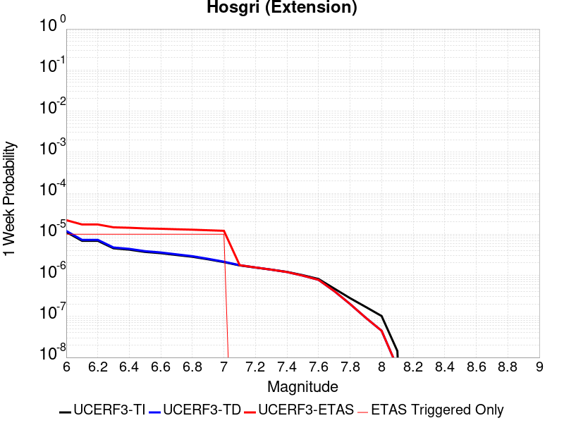 |  | 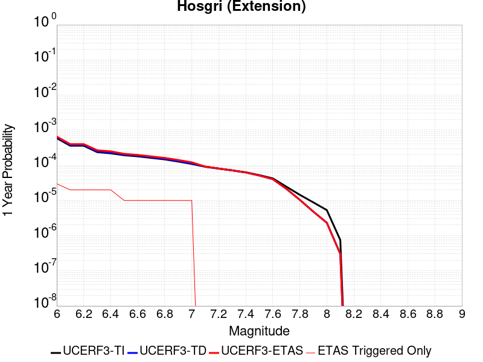 |  |

| Magnitude | 1 wk TI Prob | 1 wk TD Prob | 1 wk ETAS Prob | 1 wk ETAS/TD Gain | 1 wk ETAS Triggered Only | 1 mo TI Prob | 1 mo TD Prob | 1 mo ETAS Prob | 1 mo ETAS/TD Gain | 1 mo ETAS Triggered Only | 1 yr TI Prob | 1 yr TD Prob | 1 yr ETAS Prob | 1 yr ETAS/TD Gain | 1 yr ETAS Triggered Only | 10 yr TI Prob | 10 yr TD Prob | 10 yr ETAS Prob | 10 yr ETAS/TD Gain | 10 yr ETAS Triggered Only |
|-----|-----|-----|-----|-----|-----|-----|-----|-----|-----|-----|-----|-----|-----|-----|-----|-----|-----|-----|-----|-----|
| 6.0 | 1.1369135E-5 | 1.2083072E-5 | 2.2082952E-5 | 1.8275942 | 1.0E-5 | 4.8723956E-5 | 5.1783692E-5 | 6.1783176E-5 | 1.1931009 | 1.0E-5 | 5.9305265E-4 | 6.3030684E-4 | 6.602879E-4 | 1.0475658 | 3.0E-5 | 0.005914725 | 0.0062874397 | 0.0063470625 | 1.0094829 | 6.0E-5 |
| 6.1 | 6.934979E-6 | 7.324555E-6 | 1.7324483E-5 | 2.3652606 | 1.0E-5 | 2.9721E-5 | 3.1390595E-5 | 4.139028E-5 | 1.3185568 | 1.0E-5 | 3.617931E-4 | 3.8211764E-4 | 4.0211E-4 | 1.0523199 | 2.0E-5 | 0.0036120464 | 0.0038150186 | 0.003854866 | 1.0104449 | 4.0E-5 |
| 6.2 | 6.934979E-6 | 7.324555E-6 | 1.7324483E-5 | 2.3652606 | 1.0E-5 | 2.9721E-5 | 3.1390595E-5 | 4.139028E-5 | 1.3185568 | 1.0E-5 | 3.617931E-4 | 3.8211764E-4 | 4.0211E-4 | 1.0523199 | 2.0E-5 | 0.0036120464 | 0.0038150186 | 0.003854866 | 1.0104449 | 4.0E-5 |
| 6.3 | 4.5484676E-6 | 4.76933E-6 | 1.4769283E-5 | 3.0967205 | 1.0E-5 | 1.9493287E-5 | 2.043983E-5 | 3.0439625E-5 | 1.4892309 | 1.0E-5 | 2.3730492E-4 | 2.4882692E-4 | 2.6882192E-4 | 1.0803572 | 2.0E-5 | 0.0023705168 | 0.0024855258 | 0.0025254262 | 1.0160532 | 4.0E-5 |
| 6.4 | 4.218095E-6 | 4.4168614E-6 | 1.4416817E-5 | 3.264041 | 1.0E-5 | 1.8077424E-5 | 1.8929271E-5 | 2.8929082E-5 | 1.5282724 | 1.0E-5 | 2.2007042E-4 | 2.3043984E-4 | 2.5043523E-4 | 1.0867705 | 2.0E-5 | 0.002198526 | 0.0023020422 | 0.0023419503 | 1.0173359 | 4.0E-5 |
| 6.5 | 3.717374E-6 | 3.8838775E-6 | 1.3883839E-5 | 3.5747364 | 1.0E-5 | 1.5931506E-5 | 1.6645085E-5 | 2.6644919E-5 | 1.600768 | 1.0E-5 | 1.9394881E-4 | 2.0263524E-4 | 2.1263321E-4 | 1.0493398 | 1.0E-5 | 0.0019377962 | 0.0020245234 | 0.002054463 | 1.0147883 | 3.0E-5 |
| 6.6 | 3.4605036E-6 | 3.608306E-6 | 1.360827E-5 | 3.7713735 | 1.0E-5 | 1.4830645E-5 | 1.5464078E-5 | 2.5463924E-5 | 1.64665 | 1.0E-5 | 1.8054814E-4 | 1.8825903E-4 | 1.9825714E-4 | 1.0531083 | 1.0E-5 | 0.0018040152 | 0.0018810101 | 0.0019009726 | 1.0106126 | 2.0E-5 |
| 6.7 | 3.123439E-6 | 3.2465687E-6 | 1.3246537E-5 | 4.080165 | 1.0E-5 | 1.33860985E-5 | 1.3913792E-5 | 2.3913653E-5 | 1.7187014 | 1.0E-5 | 1.6296357E-4 | 1.6938736E-4 | 1.7938566E-4 | 1.0590262 | 1.0E-5 | 0.001628441 | 0.0016925934 | 0.0017025765 | 1.0058981 | 1.0E-5 |
| 6.8 | 2.8290783E-6 | 2.9305404E-6 | 1.2930511E-5 | 4.41233 | 1.0E-5 | 1.2124565E-5 | 1.2559399E-5 | 2.2559274E-5 | 1.7962065 | 1.0E-5 | 1.4760658E-4 | 1.5290003E-4 | 1.628985E-4 | 1.0653923 | 1.0E-5 | 0.0014750857 | 0.001527957 | 0.0015379417 | 1.0065347 | 1.0E-5 |
| 6.9 | 2.454112E-6 | 2.5283196E-6 | 1.2528294E-5 | 4.9551864 | 1.0E-5 | 1.0517581E-5 | 1.0835611E-5 | 2.0835501E-5 | 1.9228729 | 1.0E-5 | 1.2804402E-4 | 1.3191563E-4 | 1.4191431E-4 | 1.075796 | 1.0E-5 | 0.0012797028 | 0.0013183793 | 0.0013283662 | 1.007575 | 1.0E-5 |
| 7.0 | 2.1008145E-6 | 2.1498704E-6 | 1.2149849E-5 | 5.6514335 | 1.0E-5 | 9.003459E-6 | 9.213698E-6 | 1.9213605E-5 | 2.0853305 | 1.0E-5 | 1.096116E-4 | 1.1217103E-4 | 1.221699E-4 | 1.0891396 | 1.0E-5 | 0.0010955755 | 0.0011211479 | 0.0011311367 | 1.0089095 | 1.0E-5 |
| 7.1 | 1.744384E-6 | 1.7686352E-6 | 1.7686352E-6 | 1.0 | 0.0 | 7.47591E-6 | 7.5798434E-6 | 7.5798434E-6 | 1.0 | 0.0 | 9.1015405E-5 | 9.22807E-5 | 9.22807E-5 | 1.0 | 0.0 | 9.097813E-4 | 9.2242553E-4 | 9.2242553E-4 | 1.0 | 0.0 |
| 7.2 | 1.5456587E-6 | 1.5562882E-6 | 1.5562882E-6 | 1.0 | 0.0 | 6.6242346E-6 | 6.66979E-6 | 6.66979E-6 | 1.0 | 0.0 | 8.064707E-5 | 8.120168E-5 | 8.120168E-5 | 1.0 | 0.0 | 8.0617814E-4 | 8.117213E-4 | 8.117213E-4 | 1.0 | 0.0 |
| 7.3 | 1.3775123E-6 | 1.3766082E-6 | 1.3766082E-6 | 1.0 | 0.0 | 5.9036106E-6 | 5.899736E-6 | 5.899736E-6 | 1.0 | 0.0 | 7.187409E-5 | 7.182693E-5 | 7.182693E-5 | 1.0 | 0.0 | 7.185085E-4 | 7.180382E-4 | 7.180382E-4 | 1.0 | 0.0 |
| 7.4 | 1.214491E-6 | 1.2023461E-6 | 1.2023461E-6 | 1.0 | 0.0 | 5.2049513E-6 | 5.1529014E-6 | 5.1529014E-6 | 1.0 | 0.0 | 6.336844E-5 | 6.2734776E-5 | 6.2734776E-5 | 1.0 | 0.0 | 6.335037E-4 | 6.271715E-4 | 6.271715E-4 | 1.0 | 0.0 |
| 7.5 | 1.0101123E-6 | 9.842246E-7 | 9.842246E-7 | 1.0 | 0.0 | 4.3290456E-6 | 4.2180986E-6 | 4.2180986E-6 | 1.0 | 0.0 | 5.2704854E-5 | 5.1354145E-5 | 5.1354145E-5 | 1.0 | 0.0 | 5.2692357E-4 | 5.1342335E-4 | 5.1342335E-4 | 1.0 | 0.0 |
| 7.6 | 8.1558215E-7 | 7.765966E-7 | 7.765966E-7 | 1.0 | 0.0 | 3.4953473E-6 | 3.328267E-6 | 3.328267E-6 | 1.0 | 0.0 | 4.255502E-5 | 4.0520903E-5 | 4.0520903E-5 | 1.0 | 0.0 | 4.2546875E-4 | 4.0513556E-4 | 4.0513556E-4 | 1.0 | 0.0 |
| 7.7 | 4.757816E-7 | 4.1308888E-7 | 4.1308888E-7 | 1.0 | 0.0 | 2.0390623E-6 | 1.7703798E-6 | 1.7703798E-6 | 1.0 | 0.0 | 2.4825302E-5 | 2.155416E-5 | 2.155416E-5 | 1.0 | 0.0 | 2.482253E-4 | 2.1552083E-4 | 2.1552083E-4 | 1.0 | 0.0 |
| 7.8 | 2.782787E-7 | 2.0047722E-7 | 2.0047722E-7 | 1.0 | 0.0 | 1.1926223E-6 | 8.5918776E-7 | 8.5918776E-7 | 1.0 | 0.0 | 1.452008E-5 | 1.04605615E-5 | 1.04605615E-5 | 1.0 | 0.0 | 1.4519131E-4 | 1.04600724E-4 | 1.04600724E-4 | 1.0 | 0.0 |
| 7.9 | 1.6948086E-7 | 9.244227E-8 | 9.244227E-8 | 1.0 | 0.0 | 7.2634634E-7 | 3.961811E-7 | 3.961811E-7 | 1.0 | 0.0 | 8.843231E-6 | 4.8234942E-6 | 4.8234942E-6 | 1.0 | 0.0 | 8.842879E-5 | 4.8233902E-5 | 4.8233902E-5 | 1.0 | 0.0 |
| 8.0 | 1.0225492E-7 | 4.4738776E-8 | 4.4738776E-8 | 1.0 | 0.0 | 4.382353E-7 | 1.917376E-7 | 1.917376E-7 | 1.0 | 0.0 | 5.335502E-6 | 2.3344028E-6 | 2.3344028E-6 | 1.0 | 0.0 | 5.335374E-5 | 2.3343786E-5 | 2.3343786E-5 | 1.0 | 0.0 |
| 8.1 | 1.43711345E-8 | 5.787707E-9 | 5.787707E-9 | 1.0 | 0.0 | 6.1590576E-8 | 2.480446E-8 | 2.480446E-8 | 1.0 | 0.0 | 7.4986497E-7 | 3.0199428E-7 | 3.0199428E-7 | 1.0 | 0.0 | 7.4986247E-6 | 3.0199392E-6 | 3.0199392E-6 | 1.0 | 0.0 |

## San Juan
*[(top)](#table-of-contents)*

| 1 Week | 1 Month | 1 Year | 10 Year |
|-----|-----|-----|-----|
| 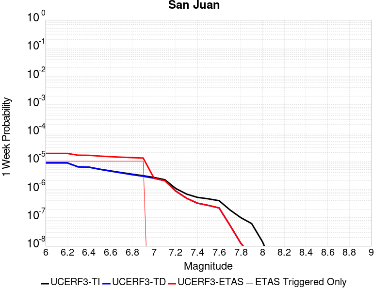 | 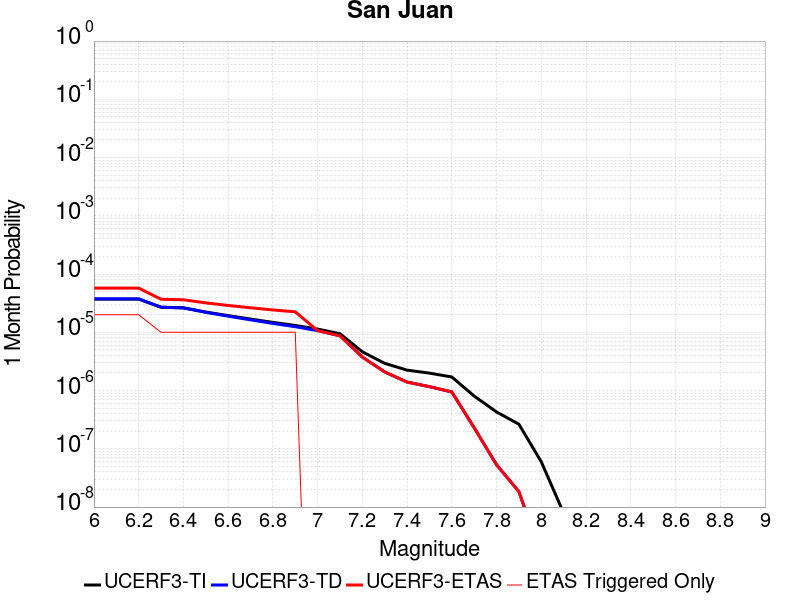 | 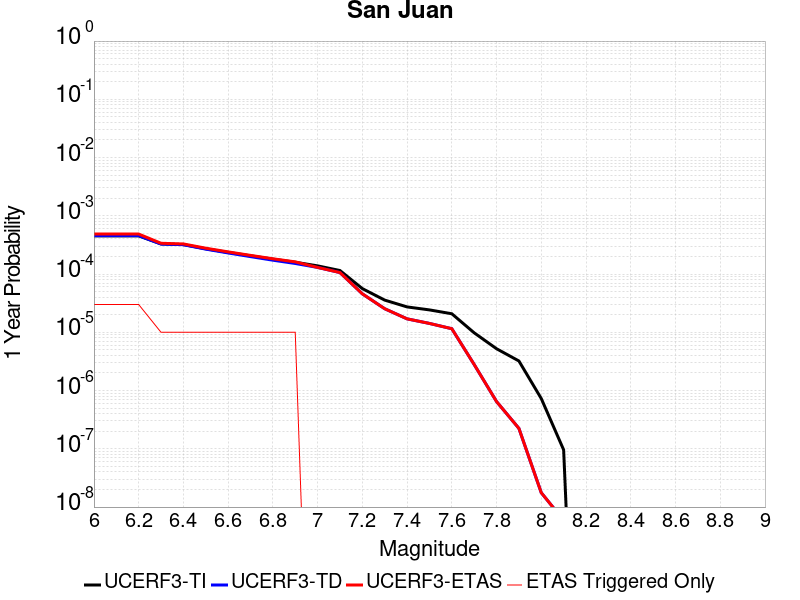 | 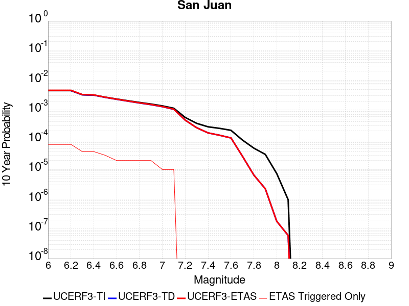 |

| Magnitude | 1 wk TI Prob | 1 wk TD Prob | 1 wk ETAS Prob | 1 wk ETAS/TD Gain | 1 wk ETAS Triggered Only | 1 mo TI Prob | 1 mo TD Prob | 1 mo ETAS Prob | 1 mo ETAS/TD Gain | 1 mo ETAS Triggered Only | 1 yr TI Prob | 1 yr TD Prob | 1 yr ETAS Prob | 1 yr ETAS/TD Gain | 1 yr ETAS Triggered Only | 10 yr TI Prob | 10 yr TD Prob | 10 yr ETAS Prob | 10 yr ETAS/TD Gain | 10 yr ETAS Triggered Only |
|-----|-----|-----|-----|-----|-----|-----|-----|-----|-----|-----|-----|-----|-----|-----|-----|-----|-----|-----|-----|-----|
| 6.0 | 8.682808E-6 | 8.7491635E-6 | 1.8749077E-5 | 2.1429565 | 1.0E-5 | 3.72115E-5 | 3.74959E-5 | 5.7495152E-5 | 1.5333716 | 2.0E-5 | 4.5295584E-4 | 4.564218E-4 | 4.8640813E-4 | 1.0656986 | 3.0E-5 | 0.004520337 | 0.004555385 | 0.004625066 | 1.0152965 | 7.0E-5 |
| 6.1 | 8.682808E-6 | 8.7491635E-6 | 1.8749077E-5 | 2.1429565 | 1.0E-5 | 3.72115E-5 | 3.74959E-5 | 5.7495152E-5 | 1.5333716 | 2.0E-5 | 4.5295584E-4 | 4.564218E-4 | 4.8640813E-4 | 1.0656986 | 3.0E-5 | 0.004520337 | 0.004555385 | 0.004625066 | 1.0152965 | 7.0E-5 |
| 6.2 | 8.682808E-6 | 8.7491635E-6 | 1.8749077E-5 | 2.1429565 | 1.0E-5 | 3.72115E-5 | 3.74959E-5 | 5.7495152E-5 | 1.5333716 | 2.0E-5 | 4.5295584E-4 | 4.564218E-4 | 4.8640813E-4 | 1.0656986 | 3.0E-5 | 0.004520337 | 0.004555385 | 0.004625066 | 1.0152965 | 7.0E-5 |
| 6.3 | 6.3054235E-6 | 6.2825848E-6 | 1.6282522E-5 | 2.5916915 | 1.0E-5 | 2.7022963E-5 | 2.6925094E-5 | 3.6924826E-5 | 1.3713907 | 1.0E-5 | 3.2895492E-4 | 3.2776513E-4 | 3.3776183E-4 | 1.0304997 | 1.0E-5 | 0.003284684 | 0.003273017 | 0.003312886 | 1.0121812 | 4.0E-5 |
| 6.4 | 6.1490473E-6 | 6.1144656E-6 | 1.6114405E-5 | 2.6354558 | 1.0E-5 | 2.6352795E-5 | 2.6204598E-5 | 3.6204336E-5 | 1.3816024 | 1.0E-5 | 3.2079802E-4 | 3.1899565E-4 | 3.2899246E-4 | 1.0313383 | 1.0E-5 | 0.0032033534 | 0.0031855737 | 0.0032254464 | 1.0125166 | 4.0E-5 |
| 6.5 | 5.204848E-6 | 5.137233E-6 | 1.5137182E-5 | 2.946563 | 1.0E-5 | 2.23063E-5 | 2.2016533E-5 | 3.2016313E-5 | 1.4541941 | 1.0E-5 | 2.7154534E-4 | 2.6801927E-4 | 2.780166E-4 | 1.0373007 | 1.0E-5 | 0.0027121378 | 0.0026771144 | 0.0027070341 | 1.0111761 | 3.0E-5 |
| 6.6 | 4.5179986E-6 | 4.4150297E-6 | 1.4414985E-5 | 3.2649803 | 1.0E-5 | 1.9362706E-5 | 1.8921424E-5 | 2.8921235E-5 | 1.5284915 | 1.0E-5 | 2.3571544E-4 | 2.3034477E-4 | 2.4034247E-4 | 1.0434031 | 1.0E-5 | 0.0023546559 | 0.0023011973 | 0.002321151 | 1.0086712 | 2.0E-5 |
| 6.7 | 3.9442616E-6 | 3.819828E-6 | 1.381979E-5 | 3.617909 | 1.0E-5 | 1.6903869E-5 | 1.6370592E-5 | 2.637043E-5 | 1.6108414 | 1.0E-5 | 2.0578515E-4 | 1.992944E-4 | 2.0929241E-4 | 1.050167 | 1.0E-5 | 0.002055947 | 0.0019912818 | 0.0020112419 | 1.0100238 | 2.0E-5 |
| 6.8 | 3.4536245E-6 | 3.3163353E-6 | 1.3316302E-5 | 4.0153666 | 1.0E-5 | 1.4801163E-5 | 1.4212792E-5 | 2.421265E-5 | 1.7035816 | 1.0E-5 | 1.8018926E-4 | 1.7302761E-4 | 1.8302588E-4 | 1.0577842 | 1.0E-5 | 0.0018004322 | 0.0017290477 | 0.0017490132 | 1.0115471 | 2.0E-5 |
| 6.9 | 3.059865E-6 | 2.9120315E-6 | 1.2912003E-5 | 4.4340186 | 1.0E-5 | 1.3113641E-5 | 1.2480078E-5 | 2.2479953E-5 | 1.801267 | 1.0E-5 | 1.596469E-4 | 1.5193493E-4 | 1.619334E-4 | 1.0658077 | 1.0E-5 | 0.0015953224 | 0.0015184252 | 0.0015383948 | 1.0131515 | 2.0E-5 |
| 7.0 | 2.6504351E-6 | 2.4920002E-6 | 2.4920002E-6 | 1.0 | 0.0 | 1.1358958E-5 | 1.0679961E-5 | 1.0679961E-5 | 1.0 | 0.0 | 1.3828653E-4 | 1.300213E-4 | 1.300213E-4 | 1.0 | 0.0 | 0.0013820052 | 0.0012995641 | 0.0013095512 | 1.007685 | 1.0E-5 |
| 7.1 | 2.2039317E-6 | 2.0338296E-6 | 2.0338296E-6 | 1.0 | 0.0 | 9.445387E-6 | 8.716386E-6 | 8.716386E-6 | 1.0 | 0.0 | 1.1499152E-4 | 1.0611736E-4 | 1.0611736E-4 | 1.0 | 0.0 | 0.0011493203 | 0.0010607769 | 0.0010707662 | 1.009417 | 1.0E-5 |
| 7.2 | 1.0786707E-6 | 8.7701903E-7 | 8.7701903E-7 | 1.0 | 0.0 | 4.622866E-6 | 3.7586476E-6 | 3.7586476E-6 | 1.0 | 0.0 | 5.628194E-5 | 4.5760586E-5 | 4.5760586E-5 | 1.0 | 0.0 | 5.6267687E-4 | 4.5757066E-4 | 4.5757066E-4 | 1.0 | 0.0 |
| 7.3 | 6.846433E-7 | 4.868805E-7 | 4.868805E-7 | 1.0 | 0.0 | 2.9341822E-6 | 2.086629E-6 | 2.086629E-6 | 1.0 | 0.0 | 3.5723086E-5 | 2.5404412E-5 | 2.5404412E-5 | 1.0 | 0.0 | 3.571734E-4 | 2.540486E-4 | 2.540486E-4 | 1.0 | 0.0 |
| 7.4 | 5.23043E-7 | 3.2628162E-7 | 3.2628162E-7 | 1.0 | 0.0 | 2.2416111E-6 | 1.398349E-6 | 1.398349E-6 | 1.0 | 0.0 | 2.7291273E-5 | 1.7024766E-5 | 1.7024766E-5 | 1.0 | 0.0 | 2.7287923E-4 | 1.7026656E-4 | 1.7026656E-4 | 1.0 | 0.0 |
| 7.5 | 4.648444E-7 | 2.7234944E-7 | 2.7234944E-7 | 1.0 | 0.0 | 1.9921886E-6 | 1.1672114E-6 | 1.1672114E-6 | 1.0 | 0.0 | 2.4254627E-5 | 1.42107065E-5 | 1.42107065E-5 | 1.0 | 0.0 | 2.425198E-4 | 1.421276E-4 | 1.421276E-4 | 1.0 | 0.0 |
| 7.6 | 3.9906567E-7 | 2.2083314E-7 | 2.2083314E-7 | 1.0 | 0.0 | 1.7102802E-6 | 9.464274E-7 | 9.464274E-7 | 1.0 | 0.0 | 2.0822463E-5 | 1.1522693E-5 | 1.1522693E-5 | 1.0 | 0.0 | 2.0820512E-4 | 1.15245566E-4 | 1.15245566E-4 | 1.0 | 0.0 |
| 7.7 | 1.8784601E-7 | 5.3666906E-8 | 5.3666906E-8 | 1.0 | 0.0 | 8.0505407E-7 | 2.30001E-7 | 2.30001E-7 | 1.0 | 0.0 | 9.80149E-6 | 2.8002585E-6 | 2.8002585E-6 | 1.0 | 0.0 | 9.801057E-5 | 2.8011282E-5 | 2.8011282E-5 | 1.0 | 0.0 |
| 7.8 | 1.00154914E-7 | 1.2415832E-8 | 1.2415832E-8 | 1.0 | 0.0 | 4.2923529E-7 | 5.3210716E-8 | 5.3210716E-8 | 1.0 | 0.0 | 5.225927E-6 | 6.4784024E-7 | 6.4784024E-7 | 1.0 | 0.0 | 5.225804E-5 | 6.484273E-6 | 6.484273E-6 | 1.0 | 0.0 |
| 7.9 | 6.171429E-8 | 4.2966155E-9 | 4.2966155E-9 | 1.0 | 0.0 | 2.6448978E-7 | 1.8414067E-8 | 1.8414067E-8 | 1.0 | 0.0 | 3.2201583E-6 | 2.2419121E-7 | 2.2419121E-7 | 1.0 | 0.0 | 3.2201115E-5 | 2.2472002E-6 | 2.2472002E-6 | 1.0 | 0.0 |
| 8.0 | 1.3974572E-8 | 3.3788217E-10 | 3.3788217E-10 | 1.0 | 0.0 | 5.989102E-8 | 1.448067E-9 | 1.448067E-9 | 1.0 | 0.0 | 7.2917294E-7 | 1.763022E-8 | 1.763022E-8 | 1.0 | 0.0 | 7.2917055E-6 | 1.8060365E-7 | 1.8060365E-7 | 1.0 | 0.0 |
| 8.1 | 1.8403477E-9 | 1.1302803E-10 | 1.1302803E-10 | 1.0 | 0.0 | 7.887204E-9 | 4.844063E-10 | 4.844063E-10 | 1.0 | 0.0 | 9.602671E-8 | 5.8976446E-9 | 5.8976446E-9 | 1.0 | 0.0 | 9.602667E-7 | 6.021993E-8 | 6.021993E-8 | 1.0 | 0.0 |

## Oceanic - West Huasna
*[(top)](#table-of-contents)*

| 1 Week | 1 Month | 1 Year | 10 Year |
|-----|-----|-----|-----|
|  |  |  |  |

| Magnitude | 1 wk TI Prob | 1 wk TD Prob | 1 wk ETAS Prob | 1 wk ETAS/TD Gain | 1 wk ETAS Triggered Only | 1 mo TI Prob | 1 mo TD Prob | 1 mo ETAS Prob | 1 mo ETAS/TD Gain | 1 mo ETAS Triggered Only | 1 yr TI Prob | 1 yr TD Prob | 1 yr ETAS Prob | 1 yr ETAS/TD Gain | 1 yr ETAS Triggered Only | 10 yr TI Prob | 10 yr TD Prob | 10 yr ETAS Prob | 10 yr ETAS/TD Gain | 10 yr ETAS Triggered Only |
|-----|-----|-----|-----|-----|-----|-----|-----|-----|-----|-----|-----|-----|-----|-----|-----|-----|-----|-----|-----|-----|
| 6.0 | 3.195567E-5 | 2.7926868E-5 | 4.792631E-5 | 1.7161362 | 2.0E-5 | 1.3694567E-4 | 1.1968133E-4 | 1.4967774E-4 | 1.2506356 | 3.0E-5 | 0.0016660384 | 0.0014561893 | 0.001516102 | 1.0411434 | 6.0E-5 | 0.016536033 | 0.014471028 | 0.014540015 | 1.0047673 | 7.0E-5 |
| 6.1 | 2.1156782E-5 | 1.7573486E-5 | 2.7573311E-5 | 1.5690291 | 1.0E-5 | 9.066878E-5 | 7.531282E-5 | 9.531131E-5 | 1.265539 | 2.0E-5 | 0.0011033333 | 9.165572E-4 | 9.365389E-4 | 1.0218008 | 2.0E-5 | 0.010978713 | 0.009128777 | 0.009148595 | 1.0021709 | 2.0E-5 |
| 6.2 | 1.6195117E-5 | 1.3327152E-5 | 2.332702E-5 | 1.7503378 | 1.0E-5 | 6.9405796E-5 | 5.7115132E-5 | 7.711399E-5 | 1.3501499 | 2.0E-5 | 8.44688E-4 | 6.9515745E-4 | 7.151436E-4 | 1.0287504 | 2.0E-5 | 0.008414844 | 0.006930123 | 0.0069499845 | 1.0028659 | 2.0E-5 |
| 6.3 | 1.3559345E-5 | 1.1179142E-5 | 2.117903E-5 | 1.894513 | 1.0E-5 | 5.811018E-5 | 4.7909736E-5 | 5.790926E-5 | 1.2087158 | 1.0E-5 | 7.072618E-4 | 5.831459E-4 | 5.931401E-4 | 1.0171384 | 1.0E-5 | 0.0070501505 | 0.0058162753 | 0.005826217 | 1.0017093 | 1.0E-5 |
| 6.4 | 1.2120619E-5 | 1.0000977E-5 | 2.0000878E-5 | 1.9998922 | 1.0E-5 | 5.1944477E-5 | 4.2860633E-5 | 5.2860203E-5 | 1.2333044 | 1.0E-5 | 6.322405E-4 | 5.2170374E-4 | 5.316985E-4 | 1.019158 | 1.0E-5 | 0.006304447 | 0.0052048573 | 0.0052148052 | 1.0019113 | 1.0E-5 |
| 6.5 | 1.13511915E-5 | 9.3674735E-6 | 1.936738E-5 | 2.0675137 | 1.0E-5 | 4.8647056E-5 | 4.01457E-5 | 5.01453E-5 | 1.2490827 | 1.0E-5 | 5.9211696E-4 | 4.886647E-4 | 4.9865985E-4 | 1.0204539 | 1.0E-5 | 0.0059054173 | 0.0048759608 | 0.004885912 | 1.0020409 | 1.0E-5 |
| 6.6 | 9.850605E-6 | 8.135418E-6 | 1.8135337E-5 | 2.2291832 | 1.0E-5 | 4.2216197E-5 | 3.4865614E-5 | 4.4865264E-5 | 1.2868055 | 1.0E-5 | 5.1386096E-4 | 4.2440637E-4 | 4.3440214E-4 | 1.0235523 | 1.0E-5 | 0.0051267436 | 0.004235991 | 0.0042459485 | 1.0023507 | 1.0E-5 |
| 6.7 | 8.8558645E-6 | 7.318433E-6 | 7.318433E-6 | 1.0 | 0.0 | 3.7953152E-5 | 3.1364336E-5 | 3.1364336E-5 | 1.0 | 0.0 | 4.6198163E-4 | 3.8179406E-4 | 3.8179406E-4 | 1.0 | 0.0 | 0.004610224 | 0.0038114067 | 0.0038114067 | 1.0 | 0.0 |
| 6.8 | 7.67136E-6 | 6.391756E-6 | 6.391756E-6 | 1.0 | 0.0 | 3.2876844E-5 | 2.7392953E-5 | 2.7392953E-5 | 1.0 | 0.0 | 4.0020206E-4 | 3.3345833E-4 | 3.3345833E-4 | 1.0 | 0.0 | 0.003994821 | 0.0033296007 | 0.0033296007 | 1.0 | 0.0 |
| 6.9 | 6.534529E-6 | 5.4583297E-6 | 5.4583297E-6 | 1.0 | 0.0 | 2.8004823E-5 | 2.3392633E-5 | 2.3392633E-5 | 1.0 | 0.0 | 3.4090536E-4 | 2.847682E-4 | 2.847682E-4 | 1.0 | 0.0 | 0.0034038287 | 0.0028440498 | 0.0028440498 | 1.0 | 0.0 |
| 7.0 | 5.460525E-6 | 4.5699517E-6 | 4.5699517E-6 | 1.0 | 0.0 | 2.3402039E-5 | 1.958536E-5 | 1.958536E-5 | 1.0 | 0.0 | 2.8488258E-4 | 2.3842578E-4 | 2.3842578E-4 | 1.0 | 0.0 | 0.0028451765 | 0.0023817138 | 0.0023817138 | 1.0 | 0.0 |
| 7.1 | 4.4825083E-6 | 3.7524428E-6 | 3.7524428E-6 | 1.0 | 0.0 | 1.9210609E-5 | 1.60818E-5 | 1.60818E-5 | 1.0 | 0.0 | 2.3386406E-4 | 1.9577841E-4 | 1.9577841E-4 | 1.0 | 0.0 | 0.002336181 | 0.0019560715 | 0.0019560715 | 1.0 | 0.0 |
| 7.2 | 2.821708E-6 | 2.4249334E-6 | 2.4249334E-6 | 1.0 | 0.0 | 1.2092979E-5 | 1.039253E-5 | 1.039253E-5 | 1.0 | 0.0 | 1.4722206E-4 | 1.2652173E-4 | 1.2652173E-4 | 1.0 | 0.0 | 0.0014712457 | 0.0012644994 | 0.0012644994 | 1.0 | 0.0 |
| 7.3 | 2.0644757E-6 | 1.7687412E-6 | 1.7687412E-6 | 1.0 | 0.0 | 8.847723E-6 | 7.5802973E-6 | 7.5802973E-6 | 1.0 | 0.0 | 1.0771569E-4 | 9.228622E-5 | 9.228622E-5 | 1.0 | 0.0 | 0.001076635 | 9.2248066E-4 | 9.2248066E-4 | 1.0 | 0.0 |
| 7.4 | 1.6980367E-6 | 1.4379892E-6 | 1.4379892E-6 | 1.0 | 0.0 | 7.27728E-6 | 6.162796E-6 | 6.162796E-6 | 1.0 | 0.0 | 8.8597284E-5 | 7.5029464E-5 | 7.5029464E-5 | 1.0 | 0.0 | 8.8561967E-4 | 7.500429E-4 | 7.500429E-4 | 1.0 | 0.0 |
| 7.5 | 1.3637683E-6 | 1.1302635E-6 | 1.1302635E-6 | 1.0 | 0.0 | 5.844708E-6 | 4.8439774E-6 | 4.8439774E-6 | 1.0 | 0.0 | 7.1156996E-5 | 5.897383E-5 | 5.897383E-5 | 1.0 | 0.0 | 7.1134215E-4 | 5.895833E-4 | 5.895833E-4 | 1.0 | 0.0 |
| 7.6 | 9.802994E-7 | 7.677247E-7 | 7.677247E-7 | 1.0 | 0.0 | 4.2012766E-6 | 3.2902446E-6 | 3.2902446E-6 | 1.0 | 0.0 | 5.1149345E-5 | 4.0057992E-5 | 4.0057992E-5 | 1.0 | 0.0 | 5.113757E-4 | 4.0050913E-4 | 4.0050913E-4 | 1.0 | 0.0 |
| 7.7 | 5.986191E-7 | 4.0050548E-7 | 4.0050548E-7 | 1.0 | 0.0 | 2.5655079E-6 | 1.7164509E-6 | 1.7164509E-6 | 1.0 | 0.0 | 3.1234613E-5 | 2.089759E-5 | 2.089759E-5 | 1.0 | 0.0 | 3.123022E-4 | 2.089576E-4 | 2.089576E-4 | 1.0 | 0.0 |
| 7.8 | 2.9189815E-7 | 1.5285792E-7 | 1.5285792E-7 | 1.0 | 0.0 | 1.2509914E-6 | 6.5510517E-7 | 6.5510517E-7 | 1.0 | 0.0 | 1.5230714E-5 | 7.9758765E-6 | 7.9758765E-6 | 1.0 | 0.0 | 1.522967E-4 | 7.9757214E-5 | 7.9757214E-5 | 1.0 | 0.0 |
| 7.9 | 1.2057845E-7 | 4.621248E-8 | 4.621248E-8 | 1.0 | 0.0 | 5.1676466E-7 | 1.9805347E-7 | 1.9805347E-7 | 1.0 | 0.0 | 6.2915915E-6 | 2.4112983E-6 | 2.4112983E-6 | 1.0 | 0.0 | 6.2914136E-5 | 2.4114026E-5 | 2.4114026E-5 | 1.0 | 0.0 |
| 8.0 | 3.3806387E-9 | 9.011393E-10 | 9.011393E-10 | 1.0 | 0.0 | 1.4488451E-8 | 3.8620254E-9 | 3.8620254E-9 | 1.0 | 0.0 | 1.7639688E-7 | 4.702016E-8 | 4.702016E-8 | 1.0 | 0.0 | 1.7639674E-6 | 4.7129527E-7 | 4.7129527E-7 | 1.0 | 0.0 |

## Big Pine (East)
*[(top)](#table-of-contents)*

| 1 Week | 1 Month | 1 Year | 10 Year |
|-----|-----|-----|-----|
| 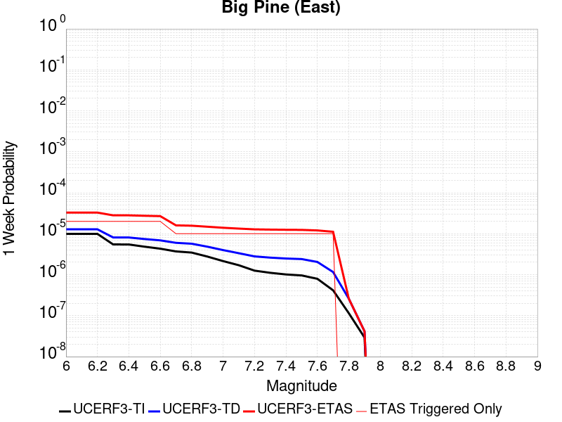 |  | 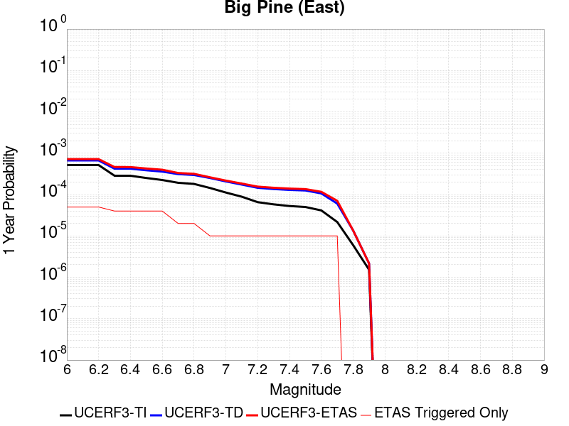 |  |

| Magnitude | 1 wk TI Prob | 1 wk TD Prob | 1 wk ETAS Prob | 1 wk ETAS/TD Gain | 1 wk ETAS Triggered Only | 1 mo TI Prob | 1 mo TD Prob | 1 mo ETAS Prob | 1 mo ETAS/TD Gain | 1 mo ETAS Triggered Only | 1 yr TI Prob | 1 yr TD Prob | 1 yr ETAS Prob | 1 yr ETAS/TD Gain | 1 yr ETAS Triggered Only | 10 yr TI Prob | 10 yr TD Prob | 10 yr ETAS Prob | 10 yr ETAS/TD Gain | 10 yr ETAS Triggered Only |
|-----|-----|-----|-----|-----|-----|-----|-----|-----|-----|-----|-----|-----|-----|-----|-----|-----|-----|-----|-----|-----|
| 6.0 | 9.916913E-6 | 1.2816984E-5 | 3.281673E-5 | 2.5604095 | 2.0E-5 | 4.250036E-5 | 5.49289E-5 | 8.4927255E-5 | 1.5461305 | 3.0E-5 | 5.173191E-4 | 6.685763E-4 | 7.1854284E-4 | 1.0747358 | 5.0E-5 | 0.0051611643 | 0.006670441 | 0.006739974 | 1.010424 | 7.0E-5 |
| 6.1 | 9.916913E-6 | 1.2816984E-5 | 3.281673E-5 | 2.5604095 | 2.0E-5 | 4.250036E-5 | 5.49289E-5 | 8.4927255E-5 | 1.5461305 | 3.0E-5 | 5.173191E-4 | 6.685763E-4 | 7.1854284E-4 | 1.0747358 | 5.0E-5 | 0.0051611643 | 0.006670441 | 0.006739974 | 1.010424 | 7.0E-5 |
| 6.2 | 9.916913E-6 | 1.2816984E-5 | 3.281673E-5 | 2.5604095 | 2.0E-5 | 4.250036E-5 | 5.49289E-5 | 8.4927255E-5 | 1.5461305 | 3.0E-5 | 5.173191E-4 | 6.685763E-4 | 7.1854284E-4 | 1.0747358 | 5.0E-5 | 0.0051611643 | 0.006670441 | 0.006739974 | 1.010424 | 7.0E-5 |
| 6.3 | 5.479711E-6 | 8.112951E-6 | 2.8112789E-5 | 3.4651742 | 2.0E-5 | 2.3484265E-5 | 3.4769346E-5 | 6.4768305E-5 | 1.8627989 | 3.0E-5 | 2.858834E-4 | 4.2323777E-4 | 4.6322084E-4 | 1.0944695 | 4.0E-5 | 0.0028551589 | 0.004227244 | 0.0042670746 | 1.0094224 | 4.0E-5 |
| 6.4 | 5.465009E-6 | 8.097245E-6 | 2.8097083E-5 | 3.469956 | 2.0E-5 | 2.3421257E-5 | 3.4702036E-5 | 6.4700995E-5 | 1.8644726 | 3.0E-5 | 2.851165E-4 | 4.2241855E-4 | 4.6240166E-4 | 1.0946528 | 4.0E-5 | 0.0028475097 | 0.0042190826 | 0.004258914 | 1.0094408 | 4.0E-5 |
| 6.5 | 4.826767E-6 | 7.422301E-6 | 2.7422153E-5 | 3.6945622 | 2.0E-5 | 2.068598E-5 | 3.180949E-5 | 6.180853E-5 | 1.9430847 | 3.0E-5 | 2.518227E-4 | 3.872145E-4 | 4.27199E-4 | 1.103262 | 4.0E-5 | 0.0025153751 | 0.003868283 | 0.003908128 | 1.0103005 | 4.0E-5 |
| 6.6 | 4.3146847E-6 | 6.8822374E-6 | 2.68821E-5 | 3.9060118 | 2.0E-5 | 1.8491375E-5 | 2.9494982E-5 | 5.9494098E-5 | 2.0170922 | 3.0E-5 | 2.2510924E-4 | 3.590447E-4 | 3.9903034E-4 | 1.1113667 | 4.0E-5 | 0.0022488134 | 0.0035874986 | 0.003627355 | 1.0111098 | 4.0E-5 |
| 6.7 | 3.6968106E-6 | 5.9954727E-6 | 1.5995412E-5 | 2.667915 | 1.0E-5 | 1.5843378E-5 | 2.5694639E-5 | 3.5694382E-5 | 1.3891762 | 1.0E-5 | 1.9287605E-4 | 3.1278885E-4 | 3.327826E-4 | 1.0639209 | 2.0E-5 | 0.0019270873 | 0.0031262483 | 0.0031461858 | 1.0063775 | 2.0E-5 |
| 6.8 | 3.4671132E-6 | 5.702177E-6 | 1.570212E-5 | 2.7537062 | 1.0E-5 | 1.4858972E-5 | 2.4437682E-5 | 3.443744E-5 | 1.4091941 | 1.0E-5 | 1.8089297E-4 | 2.974896E-4 | 3.1748365E-4 | 1.0672092 | 2.0E-5 | 0.0018074579 | 0.002973667 | 0.0029936077 | 1.0067058 | 2.0E-5 |
| 6.9 | 2.7686972E-6 | 4.825223E-6 | 1.4825175E-5 | 3.072433 | 1.0E-5 | 1.1865792E-5 | 2.0679368E-5 | 3.0679163E-5 | 1.4835638 | 1.0E-5 | 1.4445644E-4 | 2.5174298E-4 | 2.6174047E-4 | 1.039713 | 1.0E-5 | 0.0014436257 | 0.0025172636 | 0.0025272386 | 1.0039625 | 1.0E-5 |
| 7.0 | 2.1472624E-6 | 3.9850406E-6 | 1.3985001E-5 | 3.5093746 | 1.0E-5 | 9.20252E-6 | 1.7078637E-5 | 2.7078466E-5 | 1.5855168 | 1.0E-5 | 1.12034926E-4 | 2.079131E-4 | 2.1791102E-4 | 1.048087 | 1.0E-5 | 0.0011197845 | 0.0020798394 | 0.0020898185 | 1.004798 | 1.0E-5 |
| 7.1 | 1.7018335E-6 | 3.344876E-6 | 1.3344843E-5 | 3.9896374 | 1.0E-5 | 7.293552E-6 | 1.4335106E-5 | 2.4334962E-5 | 1.6975782 | 1.0E-5 | 8.879537E-5 | 1.7451629E-4 | 1.8451455E-4 | 1.0572913 | 1.0E-5 | 8.87599E-4 | 0.0017464145 | 0.001756397 | 1.005716 | 1.0E-5 |
| 7.2 | 1.25603E-6 | 2.794484E-6 | 1.2794456E-5 | 4.578468 | 1.0E-5 | 5.3829745E-6 | 1.1976307E-5 | 2.1976188E-5 | 1.8349719 | 1.0E-5 | 6.553574E-5 | 1.4580201E-4 | 1.5580055E-4 | 1.0685762 | 1.0E-5 | 6.551642E-4 | 0.001459661 | 0.0014696465 | 1.006841 | 1.0E-5 |
| 7.3 | 1.112297E-6 | 2.610332E-6 | 1.2610306E-5 | 4.83092 | 1.0E-5 | 4.7669787E-6 | 1.118709E-5 | 2.118698E-5 | 1.8938775 | 1.0E-5 | 5.803642E-5 | 1.3619453E-4 | 1.4619317E-4 | 1.0734144 | 1.0E-5 | 5.802127E-4 | 0.0013635408 | 0.0013735272 | 1.0073239 | 1.0E-5 |
| 7.4 | 1.0137181E-6 | 2.4834917E-6 | 1.2483467E-5 | 5.026579 | 1.0E-5 | 4.3444993E-6 | 1.0643494E-5 | 2.0643387E-5 | 1.9395311 | 1.0E-5 | 5.2892992E-5 | 1.2957705E-4 | 1.3957576E-4 | 1.0771642 | 1.0E-5 | 5.288041E-4 | 0.0012972289 | 0.0013072159 | 1.0076988 | 1.0E-5 |
| 7.5 | 9.598608E-7 | 2.4071483E-6 | 1.2407124E-5 | 5.1542835 | 1.0E-5 | 4.1136827E-6 | 1.031631E-5 | 2.0316207E-5 | 1.9693289 | 1.0E-5 | 5.0082934E-5 | 1.2559404E-4 | 1.355928E-4 | 1.0796117 | 1.0E-5 | 5.007165E-4 | 0.0012572526 | 0.00126724 | 1.0079439 | 1.0E-5 |
| 7.6 | 7.929459E-7 | 2.0448588E-6 | 1.20448385E-5 | 5.890303 | 1.0E-5 | 3.3983351E-6 | 8.763653E-6 | 1.8763565E-5 | 2.1410668 | 1.0E-5 | 4.1373947E-5 | 1.06692416E-4 | 1.1669135E-4 | 1.0937173 | 1.0E-5 | 4.1366243E-4 | 0.0010685222 | 0.0010785116 | 1.0093488 | 1.0E-5 |
| 7.7 | 4.155788E-7 | 1.1605589E-6 | 1.1160548E-5 | 9.616528 | 1.0E-5 | 1.7810507E-6 | 4.9738146E-6 | 1.4973765E-5 | 3.0105193 | 1.0E-5 | 2.1684076E-5 | 6.0554554E-5 | 7.055395E-5 | 1.1651304 | 1.0E-5 | 2.1681961E-4 | 6.0857297E-4 | 6.185669E-4 | 1.0164219 | 1.0E-5 |
| 7.8 | 1.14666925E-7 | 2.592015E-7 | 2.592015E-7 | 1.0 | 0.0 | 4.914296E-7 | 1.1108631E-6 | 1.1108631E-6 | 1.0 | 0.0 | 5.9831386E-6 | 1.3524678E-5 | 1.3524678E-5 | 1.0 | 0.0 | 5.9829777E-5 | 1.3634123E-4 | 1.3634123E-4 | 1.0 | 0.0 |
| 7.9 | 2.9231824E-8 | 4.1463963E-8 | 4.1463963E-8 | 1.0 | 0.0 | 1.2527924E-7 | 1.7770269E-7 | 1.7770269E-7 | 1.0 | 0.0 | 1.5252737E-6 | 2.1635283E-6 | 2.1635283E-6 | 1.0 | 0.0 | 1.5252632E-5 | 2.1967755E-5 | 2.1967755E-5 | 1.0 | 0.0 |

## Pine Mtn
*[(top)](#table-of-contents)*

| 1 Week | 1 Month | 1 Year | 10 Year |
|-----|-----|-----|-----|
|  | 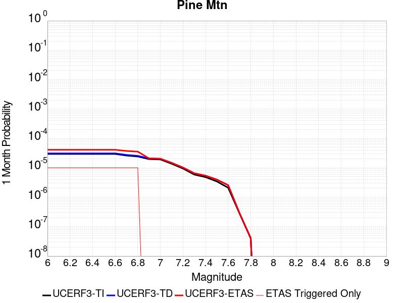 | 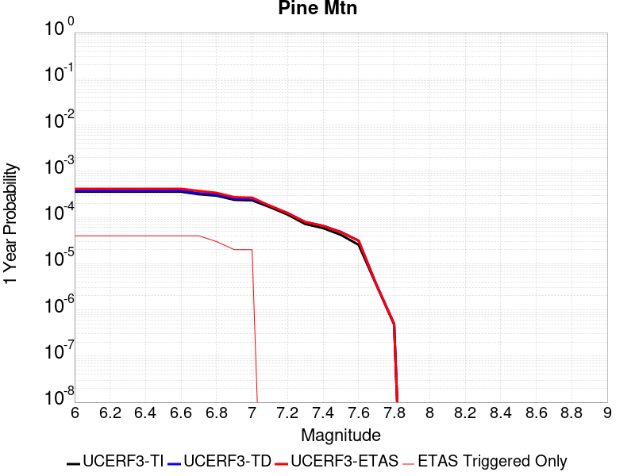 |  |

| Magnitude | 1 wk TI Prob | 1 wk TD Prob | 1 wk ETAS Prob | 1 wk ETAS/TD Gain | 1 wk ETAS Triggered Only | 1 mo TI Prob | 1 mo TD Prob | 1 mo ETAS Prob | 1 mo ETAS/TD Gain | 1 mo ETAS Triggered Only | 1 yr TI Prob | 1 yr TD Prob | 1 yr ETAS Prob | 1 yr ETAS/TD Gain | 1 yr ETAS Triggered Only | 10 yr TI Prob | 10 yr TD Prob | 10 yr ETAS Prob | 10 yr ETAS/TD Gain | 10 yr ETAS Triggered Only |
|-----|-----|-----|-----|-----|-----|-----|-----|-----|-----|-----|-----|-----|-----|-----|-----|-----|-----|-----|-----|-----|
| 6.0 | 6.894797E-6 | 7.225461E-6 | 1.722539E-5 | 2.3839846 | 1.0E-5 | 2.9548795E-5 | 3.096591E-5 | 4.0965602E-5 | 1.3229258 | 1.0E-5 | 3.596972E-4 | 3.7694772E-4 | 4.1693266E-4 | 1.1060755 | 4.0E-5 | 0.0035911554 | 0.003763381 | 0.003823155 | 1.0158831 | 6.0E-5 |
| 6.1 | 6.894797E-6 | 7.225461E-6 | 1.722539E-5 | 2.3839846 | 1.0E-5 | 2.9548795E-5 | 3.096591E-5 | 4.0965602E-5 | 1.3229258 | 1.0E-5 | 3.596972E-4 | 3.7694772E-4 | 4.1693266E-4 | 1.1060755 | 4.0E-5 | 0.0035911554 | 0.003763381 | 0.003823155 | 1.0158831 | 6.0E-5 |
| 6.2 | 6.894797E-6 | 7.225461E-6 | 1.722539E-5 | 2.3839846 | 1.0E-5 | 2.9548795E-5 | 3.096591E-5 | 4.0965602E-5 | 1.3229258 | 1.0E-5 | 3.596972E-4 | 3.7694772E-4 | 4.1693266E-4 | 1.1060755 | 4.0E-5 | 0.0035911554 | 0.003763381 | 0.003823155 | 1.0158831 | 6.0E-5 |
| 6.3 | 6.894797E-6 | 7.225461E-6 | 1.722539E-5 | 2.3839846 | 1.0E-5 | 2.9548795E-5 | 3.096591E-5 | 4.0965602E-5 | 1.3229258 | 1.0E-5 | 3.596972E-4 | 3.7694772E-4 | 4.1693266E-4 | 1.1060755 | 4.0E-5 | 0.0035911554 | 0.003763381 | 0.003823155 | 1.0158831 | 6.0E-5 |
| 6.4 | 6.894797E-6 | 7.225461E-6 | 1.722539E-5 | 2.3839846 | 1.0E-5 | 2.9548795E-5 | 3.096591E-5 | 4.0965602E-5 | 1.3229258 | 1.0E-5 | 3.596972E-4 | 3.7694772E-4 | 4.1693266E-4 | 1.1060755 | 4.0E-5 | 0.0035911554 | 0.003763381 | 0.003823155 | 1.0158831 | 6.0E-5 |
| 6.5 | 6.894797E-6 | 7.225461E-6 | 1.722539E-5 | 2.3839846 | 1.0E-5 | 2.9548795E-5 | 3.096591E-5 | 4.0965602E-5 | 1.3229258 | 1.0E-5 | 3.596972E-4 | 3.7694772E-4 | 4.1693266E-4 | 1.1060755 | 4.0E-5 | 0.0035911554 | 0.003763381 | 0.003823155 | 1.0158831 | 6.0E-5 |
| 6.6 | 6.894797E-6 | 7.225461E-6 | 1.722539E-5 | 2.3839846 | 1.0E-5 | 2.9548795E-5 | 3.096591E-5 | 4.0965602E-5 | 1.3229258 | 1.0E-5 | 3.596972E-4 | 3.7694772E-4 | 4.1693266E-4 | 1.1060755 | 4.0E-5 | 0.0035911554 | 0.003763381 | 0.003823155 | 1.0158831 | 6.0E-5 |
| 6.7 | 6.0867933E-6 | 6.3971133E-6 | 1.6397049E-5 | 2.563195 | 1.0E-5 | 2.6085996E-5 | 2.7415923E-5 | 3.7415648E-5 | 1.3647416 | 1.0E-5 | 3.1755073E-4 | 3.3373994E-4 | 3.737266E-4 | 1.1198138 | 4.0E-5 | 0.0031709734 | 0.0033326065 | 0.0033824397 | 1.0149533 | 5.0E-5 |
| 6.8 | 5.6530425E-6 | 5.9505956E-6 | 1.5950536E-5 | 2.680494 | 1.0E-5 | 2.42271E-5 | 2.5502315E-5 | 3.550206E-5 | 1.3921113 | 1.0E-5 | 2.94925E-4 | 3.104485E-4 | 3.4043918E-4 | 1.0966043 | 3.0E-5 | 0.002945339 | 0.0031003528 | 0.0031402288 | 1.0128617 | 4.0E-5 |
| 6.9 | 4.6015225E-6 | 4.863834E-6 | 4.863834E-6 | 1.0 | 0.0 | 1.9720663E-5 | 2.0844845E-5 | 2.0844845E-5 | 1.0 | 0.0 | 2.4007261E-4 | 2.5375787E-4 | 2.737528E-4 | 1.0787953 | 2.0E-5 | 0.0023981342 | 0.0025348254 | 0.0025647494 | 1.0118052 | 3.0E-5 |
| 7.0 | 4.4875965E-6 | 4.747473E-6 | 4.747473E-6 | 1.0 | 0.0 | 1.9232413E-5 | 2.0346162E-5 | 2.0346162E-5 | 1.0 | 0.0 | 2.3412947E-4 | 2.4768783E-4 | 2.6768286E-4 | 1.0807269 | 2.0E-5 | 0.0023388295 | 0.0024742614 | 0.0025041872 | 1.0120949 | 3.0E-5 |
| 7.1 | 3.203907E-6 | 3.4294096E-6 | 3.4294096E-6 | 1.0 | 0.0 | 1.3730958E-5 | 1.4697391E-5 | 1.4697391E-5 | 1.0 | 0.0 | 1.6716159E-4 | 1.789267E-4 | 1.789267E-4 | 1.0 | 0.0 | 0.0016703589 | 0.0017878925 | 0.0017978747 | 1.0055832 | 1.0E-5 |
| 7.2 | 2.2060601E-6 | 2.3784817E-6 | 2.3784817E-6 | 1.0 | 0.0 | 9.4545085E-6 | 1.0193455E-5 | 1.0193455E-5 | 1.0 | 0.0 | 1.15102564E-4 | 1.240987E-4 | 1.240987E-4 | 1.0 | 0.0 | 0.0011504296 | 0.0012403389 | 0.0012503265 | 1.0080523 | 1.0E-5 |
| 7.3 | 1.3765207E-6 | 1.5216481E-6 | 1.5216481E-6 | 1.0 | 0.0 | 5.899361E-6 | 6.521333E-6 | 6.521333E-6 | 1.0 | 0.0 | 7.182235E-5 | 7.939443E-5 | 7.939443E-5 | 1.0 | 0.0 | 7.1799144E-4 | 7.936697E-4 | 7.936697E-4 | 1.0 | 0.0 |
| 7.4 | 1.1245983E-6 | 1.2587075E-6 | 1.2587075E-6 | 1.0 | 0.0 | 4.819698E-6 | 5.39445E-6 | 5.39445E-6 | 1.0 | 0.0 | 5.8678244E-5 | 6.567554E-5 | 6.567554E-5 | 1.0 | 0.0 | 5.866275E-4 | 6.5656955E-4 | 6.5656955E-4 | 1.0 | 0.0 |
| 7.5 | 8.031682E-7 | 9.276951E-7 | 9.276951E-7 | 1.0 | 0.0 | 3.4421448E-6 | 3.9758306E-6 | 3.9758306E-6 | 1.0 | 0.0 | 4.1907308E-5 | 4.840473E-5 | 4.840473E-5 | 1.0 | 0.0 | 4.1899405E-4 | 4.8394862E-4 | 4.8394862E-4 | 1.0 | 0.0 |
| 7.6 | 4.8953444E-7 | 6.003009E-7 | 6.003009E-7 | 1.0 | 0.0 | 2.098003E-6 | 2.5727159E-6 | 2.5727159E-6 | 1.0 | 0.0 | 2.5542888E-5 | 3.1322415E-5 | 3.1322415E-5 | 1.0 | 0.0 | 2.5539953E-4 | 3.1318486E-4 | 3.1318486E-4 | 1.0 | 0.0 |
| 7.7 | 6.634529E-8 | 6.788826E-8 | 6.788826E-8 | 1.0 | 0.0 | 2.843369E-7 | 2.9094966E-7 | 2.9094966E-7 | 1.0 | 0.0 | 3.4617963E-6 | 3.5423066E-6 | 3.5423066E-6 | 1.0 | 0.0 | 3.4617424E-5 | 3.542255E-5 | 3.542255E-5 | 1.0 | 0.0 |
| 7.8 | 9.235578E-9 | 9.488566E-9 | 9.488566E-9 | 1.0 | 0.0 | 3.9581046E-8 | 4.0665284E-8 | 4.0665284E-8 | 1.0 | 0.0 | 4.818991E-7 | 4.950997E-7 | 4.950997E-7 | 1.0 | 0.0 | 4.8189804E-6 | 4.950988E-6 | 4.950988E-6 | 1.0 | 0.0 |

## San Jacinto (Borrego)
*[(top)](#table-of-contents)*

| 1 Week | 1 Month | 1 Year | 10 Year |
|-----|-----|-----|-----|
|  |  | 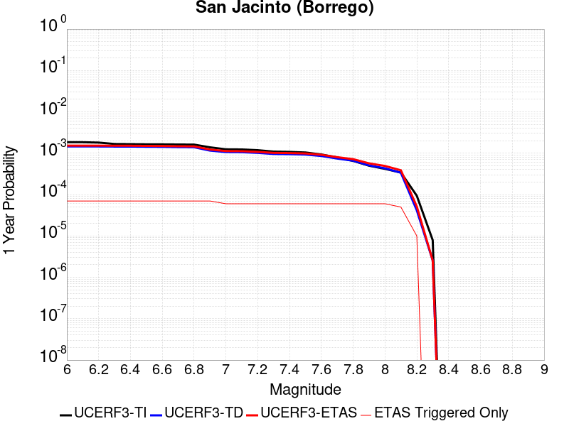 | 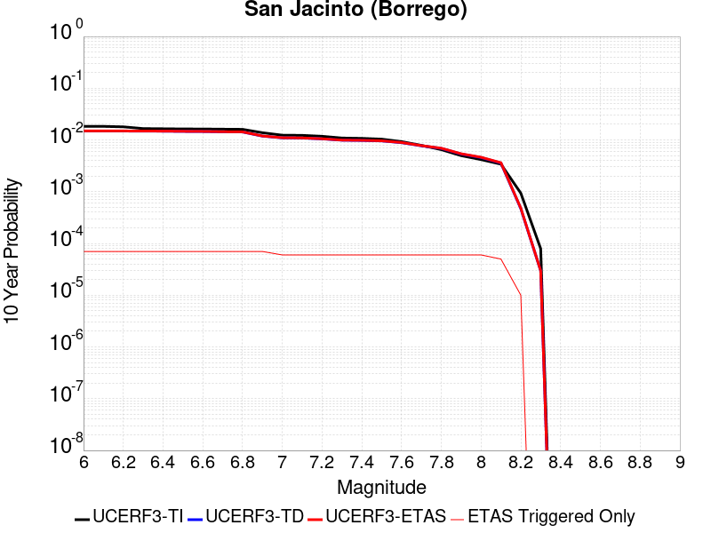 |

| Magnitude | 1 wk TI Prob | 1 wk TD Prob | 1 wk ETAS Prob | 1 wk ETAS/TD Gain | 1 wk ETAS Triggered Only | 1 mo TI Prob | 1 mo TD Prob | 1 mo ETAS Prob | 1 mo ETAS/TD Gain | 1 mo ETAS Triggered Only | 1 yr TI Prob | 1 yr TD Prob | 1 yr ETAS Prob | 1 yr ETAS/TD Gain | 1 yr ETAS Triggered Only | 10 yr TI Prob | 10 yr TD Prob | 10 yr ETAS Prob | 10 yr ETAS/TD Gain | 10 yr ETAS Triggered Only |
|-----|-----|-----|-----|-----|-----|-----|-----|-----|-----|-----|-----|-----|-----|-----|-----|-----|-----|-----|-----|-----|
| 6.0 | 3.543992E-5 | 2.7926513E-5 | 3.7926235E-5 | 1.3580726 | 1.0E-5 | 1.5187653E-4 | 1.1967963E-4 | 1.4967604E-4 | 1.2506392 | 3.0E-5 | 0.0018475284 | 0.0014561379 | 0.001526036 | 1.0480024 | 7.0E-5 | 0.018322436 | 0.014869647 | 0.014938607 | 1.0046376 | 7.0E-5 |
| 6.1 | 3.542281E-5 | 2.7926513E-5 | 3.7926235E-5 | 1.3580726 | 1.0E-5 | 1.5180321E-4 | 1.1967963E-4 | 1.4967604E-4 | 1.2506392 | 3.0E-5 | 0.0018466372 | 0.0014561379 | 0.001526036 | 1.0480024 | 7.0E-5 | 0.018313672 | 0.014869647 | 0.014938607 | 1.0046376 | 7.0E-5 |
| 6.2 | 3.4688688E-5 | 2.7926511E-5 | 3.792623E-5 | 1.3580726 | 1.0E-5 | 1.4865733E-4 | 1.1967963E-4 | 1.4967604E-4 | 1.2506392 | 3.0E-5 | 0.0018084005 | 0.0014561379 | 0.0015260358 | 1.0480024 | 7.0E-5 | 0.017937548 | 0.014869647 | 0.014938606 | 1.0046376 | 7.0E-5 |
| 6.3 | 3.2087122E-5 | 2.7771865E-5 | 3.7771588E-5 | 1.3600667 | 1.0E-5 | 1.3750899E-4 | 1.1901691E-4 | 1.4901334E-4 | 1.252035 | 3.0E-5 | 0.0016728862 | 0.00144808 | 0.0015179786 | 1.0482699 | 7.0E-5 | 0.016603488 | 0.014790683 | 0.0148596475 | 1.0046628 | 7.0E-5 |
| 6.4 | 3.1828724E-5 | 2.7738852E-5 | 3.7738573E-5 | 1.3604952 | 1.0E-5 | 1.364017E-4 | 1.1887544E-4 | 1.4887187E-4 | 1.252335 | 3.0E-5 | 0.0016594254 | 0.0014463598 | 0.0015162586 | 1.0483273 | 7.0E-5 | 0.016470885 | 0.014773762 | 0.014842727 | 1.0046681 | 7.0E-5 |
| 6.5 | 3.1563577E-5 | 2.747857E-5 | 3.7478294E-5 | 1.36391 | 1.0E-5 | 1.3526545E-4 | 1.1776006E-4 | 1.4775652E-4 | 1.2547253 | 3.0E-5 | 0.0016456128 | 0.0014327979 | 0.0015026976 | 1.0487854 | 7.0E-5 | 0.0163348 | 0.014640348 | 0.014709323 | 1.0047113 | 7.0E-5 |
| 6.6 | 3.1467625E-5 | 2.7322796E-5 | 3.7322523E-5 | 1.3659848 | 1.0E-5 | 1.3485427E-4 | 1.1709251E-4 | 1.47089E-4 | 1.2561777 | 3.0E-5 | 0.0016406142 | 0.0014246812 | 0.0014945815 | 1.0490638 | 7.0E-5 | 0.016285548 | 0.014560594 | 0.014629575 | 1.0047375 | 7.0E-5 |
| 6.7 | 3.1223695E-5 | 2.6940816E-5 | 3.6940546E-5 | 1.371174 | 1.0E-5 | 1.3380898E-4 | 1.15455594E-4 | 1.4545213E-4 | 1.2598102 | 3.0E-5 | 0.0016279068 | 0.0014047775 | 0.0014746792 | 1.04976 | 7.0E-5 | 0.01616033 | 0.014364966 | 0.01443396 | 1.004803 | 7.0E-5 |
| 6.8 | 3.1015585E-5 | 2.6761822E-5 | 3.6761554E-5 | 1.3736566 | 1.0E-5 | 1.3291716E-4 | 1.1468855E-4 | 1.4468511E-4 | 1.261548 | 3.0E-5 | 0.001617065 | 0.0013954508 | 0.0014653531 | 1.050093 | 7.0E-5 | 0.016053487 | 0.014272246 | 0.014341247 | 1.0048347 | 7.0E-5 |
| 6.9 | 2.6641965E-5 | 2.2184247E-5 | 3.2184023E-5 | 1.4507604 | 1.0E-5 | 1.1417485E-4 | 9.50719E-5 | 1.2506905E-4 | 1.3155206 | 3.0E-5 | 0.0013891924 | 0.0011568897 | 0.0012268086 | 1.0604371 | 7.0E-5 | 0.0138054015 | 0.011882438 | 0.011951607 | 1.005821 | 7.0E-5 |
| 7.0 | 2.3854353E-5 | 2.0479023E-5 | 3.047882E-5 | 1.4882945 | 1.0E-5 | 1.02228936E-4 | 8.77643E-5 | 1.1776167E-4 | 1.3417946 | 3.0E-5 | 0.0012439266 | 0.0010680092 | 0.0011279451 | 1.0561193 | 6.0E-5 | 0.012369866 | 0.0109828 | 0.011042141 | 1.005403 | 6.0E-5 |
| 7.1 | 2.3672901E-5 | 2.031551E-5 | 3.0315308E-5 | 1.4922247 | 1.0E-5 | 1.0145135E-4 | 8.7063585E-5 | 1.1706097E-4 | 1.3445457 | 3.0E-5 | 0.0012344702 | 0.0010594862 | 0.0011194226 | 1.0565712 | 6.0E-5 | 0.0122763505 | 0.010897976 | 0.010957322 | 1.0054456 | 6.0E-5 |
| 7.2 | 2.2717244E-5 | 1.9542893E-5 | 2.9542696E-5 | 1.511685 | 1.0E-5 | 9.735599E-5 | 8.375258E-5 | 1.13750066E-4 | 1.3581679 | 3.0E-5 | 0.0011846646 | 0.001019213 | 0.0010791519 | 1.0588089 | 6.0E-5 | 0.01178369 | 0.010495341 | 0.010554711 | 1.0056568 | 6.0E-5 |
| 7.3 | 2.1016205E-5 | 1.8384526E-5 | 2.8384342E-5 | 1.5439258 | 1.0E-5 | 9.006634E-5 | 7.878846E-5 | 1.0878609E-4 | 1.3807365 | 3.0E-5 | 0.001096006 | 9.5882936E-4 | 0.0010187718 | 1.0625163 | 6.0E-5 | 0.010906163 | 0.009890967 | 0.009950373 | 1.0060061 | 6.0E-5 |
| 7.4 | 2.0683625E-5 | 1.8187047E-5 | 2.8186865E-5 | 1.5498319 | 1.0E-5 | 8.86411E-5 | 7.794217E-5 | 1.0793983E-4 | 1.3848708 | 3.0E-5 | 0.001078671 | 9.485349E-4 | 0.0010084779 | 1.0631955 | 6.0E-5 | 0.010734501 | 0.009787692 | 0.009847105 | 1.0060701 | 6.0E-5 |
| 7.5 | 1.9993966E-5 | 1.7782075E-5 | 2.7781896E-5 | 1.5623541 | 1.0E-5 | 8.568561E-5 | 7.620667E-5 | 1.0620439E-4 | 1.3936363 | 3.0E-5 | 0.001042723 | 9.2742336E-4 | 9.873677E-4 | 1.0646354 | 6.0E-5 | 0.010378438 | 0.009574614 | 0.00963404 | 1.0062065 | 6.0E-5 |
| 7.6 | 1.788966E-5 | 1.6435291E-5 | 2.6435126E-5 | 1.6084368 | 1.0E-5 | 7.666772E-5 | 7.043507E-5 | 1.0043295E-4 | 1.4258943 | 3.0E-5 | 9.3302975E-4 | 8.572113E-4 | 9.171599E-4 | 1.0699344 | 6.0E-5 | 0.00929122 | 0.008866487 | 0.008925955 | 1.0067071 | 6.0E-5 |
| 7.7 | 1.5125781E-5 | 1.4237377E-5 | 2.4237235E-5 | 1.7023666 | 1.0E-5 | 6.4823165E-5 | 6.1015908E-5 | 9.101408E-5 | 1.4916451 | 3.0E-5 | 7.889362E-4 | 7.426163E-4 | 8.0257177E-4 | 1.0807354 | 6.0E-5 | 0.007861412 | 0.0077142045 | 0.0077737416 | 1.0077178 | 6.0E-5 |
| 7.8 | 1.250089E-5 | 1.26304985E-5 | 2.2630373E-5 | 1.7917244 | 1.0E-5 | 5.3574146E-5 | 5.412959E-5 | 8.412796E-5 | 1.5541955 | 3.0E-5 | 6.5207E-4 | 6.588291E-4 | 7.187896E-4 | 1.0910107 | 6.0E-5 | 0.006501599 | 0.0068677636 | 0.0069273515 | 1.0086764 | 6.0E-5 |
| 7.9 | 9.561E-6 | 9.754616E-6 | 1.975452E-5 | 2.0251455 | 1.0E-5 | 4.0975072E-5 | 4.1804833E-5 | 7.180358E-5 | 1.7175903 | 3.0E-5 | 4.987573E-4 | 5.088555E-4 | 5.68825E-4 | 1.1178516 | 6.0E-5 | 0.0049763937 | 0.0053523467 | 0.0054120254 | 1.01115 | 6.0E-5 |
| 8.0 | 8.01699E-6 | 8.293488E-6 | 1.8293405E-5 | 2.2057555 | 1.0E-5 | 3.4358076E-5 | 3.554304E-5 | 6.554197E-5 | 1.8440171 | 3.0E-5 | 4.1822926E-4 | 4.3265108E-4 | 4.926251E-4 | 1.1386199 | 6.0E-5 | 0.0041744304 | 0.004573375 | 0.0046331007 | 1.0130594 | 6.0E-5 |
| 8.1 | 6.541947E-6 | 6.4622354E-6 | 1.646217E-5 | 2.5474422 | 1.0E-5 | 2.8036617E-5 | 2.7695003E-5 | 5.769417E-5 | 2.0831978 | 3.0E-5 | 3.4129233E-4 | 3.37135E-4 | 3.8711814E-4 | 1.1482586 | 5.0E-5 | 0.0034076865 | 0.0035806994 | 0.0036305203 | 1.0139138 | 5.0E-5 |
| 8.2 | 1.7968189E-6 | 7.9713476E-7 | 7.9713476E-7 | 1.0 | 0.0 | 7.70063E-6 | 3.4162877E-6 | 3.4162877E-6 | 1.0 | 0.0 | 9.3751136E-5 | 4.159253E-5 | 5.1592113E-5 | 1.2404178 | 1.0E-5 | 9.371159E-4 | 4.712058E-4 | 4.8120107E-4 | 1.0212121 | 1.0E-5 |
| 8.3 | 1.5167889E-7 | 4.897714E-8 | 4.897714E-8 | 1.0 | 0.0 | 6.500522E-7 | 2.09902E-7 | 2.09902E-7 | 1.0 | 0.0 | 7.9143565E-6 | 2.5555544E-6 | 2.5555544E-6 | 1.0 | 0.0 | 7.914075E-5 | 2.969505E-5 | 2.969505E-5 | 1.0 | 0.0 |

## Bullion Mountains
*[(top)](#table-of-contents)*

| 1 Week | 1 Month | 1 Year | 10 Year |
|-----|-----|-----|-----|
| 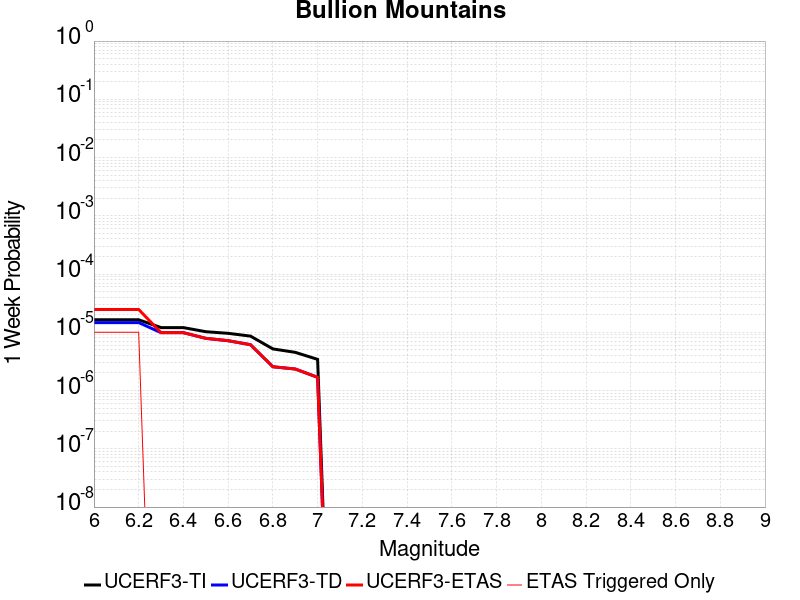 |  | 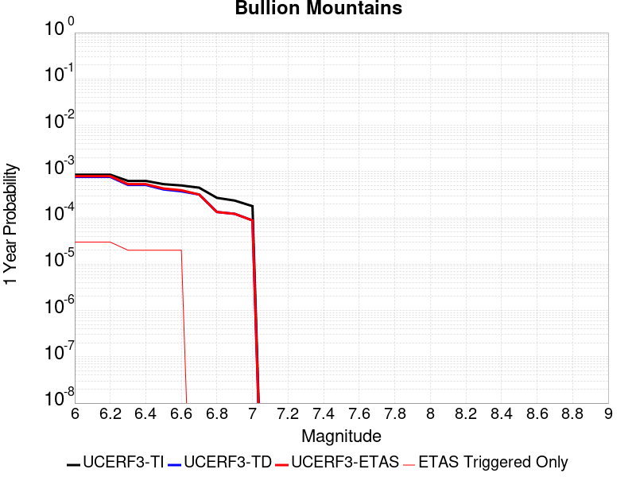 |  |

| Magnitude | 1 wk TI Prob | 1 wk TD Prob | 1 wk ETAS Prob | 1 wk ETAS/TD Gain | 1 wk ETAS Triggered Only | 1 mo TI Prob | 1 mo TD Prob | 1 mo ETAS Prob | 1 mo ETAS/TD Gain | 1 mo ETAS Triggered Only | 1 yr TI Prob | 1 yr TD Prob | 1 yr ETAS Prob | 1 yr ETAS/TD Gain | 1 yr ETAS Triggered Only | 10 yr TI Prob | 10 yr TD Prob | 10 yr ETAS Prob | 10 yr ETAS/TD Gain | 10 yr ETAS Triggered Only |
|-----|-----|-----|-----|-----|-----|-----|-----|-----|-----|-----|-----|-----|-----|-----|-----|-----|-----|-----|-----|-----|
| 6.0 | 1.6420427E-5 | 1.4692089E-5 | 2.4691943E-5 | 1.6806284 | 1.0E-5 | 7.037136E-5 | 6.296479E-5 | 7.296416E-5 | 1.158809 | 1.0E-5 | 8.5643446E-4 | 7.663651E-4 | 7.963421E-4 | 1.0391158 | 3.0E-5 | 0.008531413 | 0.007641016 | 0.007700558 | 1.0077924 | 6.0E-5 |
| 6.1 | 1.6420427E-5 | 1.4692089E-5 | 2.4691943E-5 | 1.6806284 | 1.0E-5 | 7.037136E-5 | 6.296479E-5 | 7.296416E-5 | 1.158809 | 1.0E-5 | 8.5643446E-4 | 7.663651E-4 | 7.963421E-4 | 1.0391158 | 3.0E-5 | 0.008531413 | 0.007641016 | 0.007700558 | 1.0077924 | 6.0E-5 |
| 6.2 | 1.6420427E-5 | 1.4692089E-5 | 2.4691943E-5 | 1.6806284 | 1.0E-5 | 7.037136E-5 | 6.296479E-5 | 7.296416E-5 | 1.158809 | 1.0E-5 | 8.5643446E-4 | 7.663651E-4 | 7.963421E-4 | 1.0391158 | 3.0E-5 | 0.008531413 | 0.007641016 | 0.007700558 | 1.0077924 | 6.0E-5 |
| 6.3 | 1.2046778E-5 | 9.862335E-6 | 9.862335E-6 | 1.0 | 0.0 | 5.1628023E-5 | 4.2266598E-5 | 4.2266598E-5 | 1.0 | 0.0 | 6.283899E-4 | 5.144975E-4 | 5.344872E-4 | 1.0388529 | 2.0E-5 | 0.0062661595 | 0.005135345 | 0.005165191 | 1.0058118 | 3.0E-5 |
| 6.4 | 1.2046778E-5 | 9.862335E-6 | 9.862335E-6 | 1.0 | 0.0 | 5.1628023E-5 | 4.2266598E-5 | 4.2266598E-5 | 1.0 | 0.0 | 6.283899E-4 | 5.144975E-4 | 5.344872E-4 | 1.0388529 | 2.0E-5 | 0.0062661595 | 0.005135345 | 0.005165191 | 1.0058118 | 3.0E-5 |
| 6.5 | 1.0244343E-5 | 7.879458E-6 | 7.879458E-6 | 1.0 | 0.0 | 4.390359E-5 | 3.3768785E-5 | 3.3768785E-5 | 1.0 | 0.0 | 5.343951E-4 | 4.110781E-4 | 4.3106987E-4 | 1.0486325 | 2.0E-5 | 0.005331118 | 0.004105208 | 0.004135085 | 1.0072778 | 3.0E-5 |
| 6.6 | 9.605408E-6 | 7.1774966E-6 | 7.1774966E-6 | 1.0 | 0.0 | 4.1165385E-5 | 3.076045E-5 | 3.076045E-5 | 1.0 | 0.0 | 5.010733E-4 | 3.744645E-4 | 3.94457E-4 | 1.0533895 | 2.0E-5 | 0.00499945 | 0.003740332 | 0.0037702199 | 1.0079907 | 3.0E-5 |
| 6.7 | 8.60418E-6 | 6.1240044E-6 | 6.1240044E-6 | 1.0 | 0.0 | 3.687454E-5 | 2.624558E-5 | 2.624558E-5 | 1.0 | 0.0 | 4.48855E-4 | 3.1951256E-4 | 3.1951256E-4 | 1.0 | 0.0 | 0.004479495 | 0.0031924439 | 0.0032024118 | 1.0031224 | 1.0E-5 |
| 6.8 | 5.187994E-6 | 2.5631666E-6 | 2.5631666E-6 | 1.0 | 0.0 | 2.223407E-5 | 1.0984976E-5 | 1.0984976E-5 | 1.0 | 0.0 | 2.7066618E-4 | 1.3373788E-4 | 1.3373788E-4 | 1.0 | 0.0 | 0.0027033675 | 0.0013369655 | 0.0013469522 | 1.0074697 | 1.0E-5 |
| 6.9 | 4.5302368E-6 | 2.3443165E-6 | 2.3443165E-6 | 1.0 | 0.0 | 1.9415156E-5 | 1.0047055E-5 | 1.0047055E-5 | 1.0 | 0.0 | 2.3635388E-4 | 1.2232E-4 | 1.2232E-4 | 1.0 | 0.0 | 0.0023610266 | 0.0012229157 | 0.0012329036 | 1.0081671 | 1.0E-5 |
| 7.0 | 3.431668E-6 | 1.6882402E-6 | 1.6882402E-6 | 1.0 | 0.0 | 1.4707065E-5 | 7.235315E-6 | 7.235315E-6 | 1.0 | 0.0 | 1.7904381E-4 | 8.808996E-5 | 8.808996E-5 | 1.0 | 0.0 | 0.0017889962 | 8.808996E-4 | 8.808996E-4 | 1.0 | 0.0 |

## San Andreas (Peninsula) 2011 CFM
*[(top)](#table-of-contents)*

| 1 Week | 1 Month | 1 Year | 10 Year |
|-----|-----|-----|-----|
|  |  |  |  |

| Magnitude | 1 wk TI Prob | 1 wk TD Prob | 1 wk ETAS Prob | 1 wk ETAS/TD Gain | 1 wk ETAS Triggered Only | 1 mo TI Prob | 1 mo TD Prob | 1 mo ETAS Prob | 1 mo ETAS/TD Gain | 1 mo ETAS Triggered Only | 1 yr TI Prob | 1 yr TD Prob | 1 yr ETAS Prob | 1 yr ETAS/TD Gain | 1 yr ETAS Triggered Only | 10 yr TI Prob | 10 yr TD Prob | 10 yr ETAS Prob | 10 yr ETAS/TD Gain | 10 yr ETAS Triggered Only |
|-----|-----|-----|-----|-----|-----|-----|-----|-----|-----|-----|-----|-----|-----|-----|-----|-----|-----|-----|-----|-----|
| 6.0 | 8.6200685E-5 | 2.52136E-5 | 2.52136E-5 | 1.0 | 0.0 | 3.6937918E-4 | 1.0805382E-4 | 1.1805274E-4 | 1.0925364 | 1.0E-5 | 0.0044879215 | 0.001314763 | 0.0013646972 | 1.0379797 | 5.0E-5 | 0.043983612 | 0.014774441 | 0.014833555 | 1.004001 | 6.0E-5 |
| 6.1 | 8.6200685E-5 | 2.52136E-5 | 2.52136E-5 | 1.0 | 0.0 | 3.6937918E-4 | 1.0805382E-4 | 1.1805274E-4 | 1.0925364 | 1.0E-5 | 0.0044879215 | 0.001314763 | 0.0013646972 | 1.0379797 | 5.0E-5 | 0.043983612 | 0.014774441 | 0.014833555 | 1.004001 | 6.0E-5 |
| 6.2 | 8.6200685E-5 | 2.52136E-5 | 2.52136E-5 | 1.0 | 0.0 | 3.6937918E-4 | 1.0805382E-4 | 1.1805274E-4 | 1.0925364 | 1.0E-5 | 0.0044879215 | 0.001314763 | 0.0013646972 | 1.0379797 | 5.0E-5 | 0.043983612 | 0.014774441 | 0.014833555 | 1.004001 | 6.0E-5 |
| 6.3 | 8.551163E-5 | 2.490552E-5 | 2.490552E-5 | 1.0 | 0.0 | 3.6642692E-4 | 1.06733576E-4 | 1.1673251E-4 | 1.0936812 | 1.0E-5 | 0.004452125 | 0.0012987083 | 0.0013486433 | 1.0384498 | 5.0E-5 | 0.043639794 | 0.014601416 | 0.01466054 | 1.0040492 | 6.0E-5 |
| 6.4 | 8.551163E-5 | 2.490552E-5 | 2.490552E-5 | 1.0 | 0.0 | 3.6642692E-4 | 1.06733576E-4 | 1.1673251E-4 | 1.0936812 | 1.0E-5 | 0.004452125 | 0.0012987083 | 0.0013486433 | 1.0384498 | 5.0E-5 | 0.043639794 | 0.014601416 | 0.01466054 | 1.0040492 | 6.0E-5 |
| 6.5 | 8.511146E-5 | 2.4726973E-5 | 2.4726973E-5 | 1.0 | 0.0 | 3.647124E-4 | 1.05968444E-4 | 1.1596738E-4 | 1.0943577 | 1.0E-5 | 0.004431336 | 0.0012894038 | 0.0013393393 | 1.0387276 | 5.0E-5 | 0.04344007 | 0.0145011945 | 0.014560324 | 1.0040776 | 6.0E-5 |
| 6.6 | 8.4985084E-5 | 2.4657606E-5 | 2.4657606E-5 | 1.0 | 0.0 | 3.6417096E-4 | 1.05671184E-4 | 1.15670126E-4 | 1.0946232 | 1.0E-5 | 0.0044247704 | 0.001285789 | 0.0013357246 | 1.0388366 | 5.0E-5 | 0.043376986 | 0.014463263 | 0.014522394 | 1.0040884 | 6.0E-5 |
| 6.7 | 8.462618E-5 | 2.4486113E-5 | 2.4486113E-5 | 1.0 | 0.0 | 3.6263323E-4 | 1.0493627E-4 | 1.1493522E-4 | 1.0952859 | 1.0E-5 | 0.004406125 | 0.0012768519 | 0.0013267881 | 1.0391088 | 5.0E-5 | 0.043197807 | 0.01436807 | 0.014427208 | 1.0041159 | 6.0E-5 |
| 6.8 | 8.42337E-5 | 2.438192E-5 | 2.438192E-5 | 1.0 | 0.0 | 3.6095164E-4 | 1.04489765E-4 | 1.1448872E-4 | 1.0956931 | 1.0E-5 | 0.004385734 | 0.0012714221 | 0.0013213585 | 1.039276 | 5.0E-5 | 0.043001823 | 0.014308756 | 0.014367898 | 1.0041332 | 6.0E-5 |
| 6.9 | 8.365989E-5 | 2.4186513E-5 | 2.4186513E-5 | 1.0 | 0.0 | 3.5849313E-4 | 1.03652375E-4 | 1.1365134E-4 | 1.0964663 | 1.0E-5 | 0.004355922 | 0.0012612387 | 0.0013111756 | 1.0395936 | 5.0E-5 | 0.04271523 | 0.014201242 | 0.014260389 | 1.0041649 | 6.0E-5 |
| 7.0 | 8.30936E-5 | 2.3948E-5 | 2.3948E-5 | 1.0 | 0.0 | 3.560668E-4 | 1.02630256E-4 | 1.12629226E-4 | 1.0974271 | 1.0E-5 | 0.004326499 | 0.0012488087 | 0.0012987463 | 1.0399882 | 5.0E-5 | 0.042432297 | 0.014072227 | 0.014131383 | 1.0042037 | 6.0E-5 |
| 7.1 | 8.041264E-5 | 2.3634402E-5 | 2.3634402E-5 | 1.0 | 0.0 | 3.4458007E-4 | 1.0128637E-4 | 1.1128536E-4 | 1.09872 | 1.0E-5 | 0.0041871946 | 0.0012324656 | 0.001282404 | 1.0405191 | 5.0E-5 | 0.041091725 | 0.013895032 | 0.013954198 | 1.004258 | 6.0E-5 |
| 7.2 | 7.8427016E-5 | 2.3058019E-5 | 2.3058019E-5 | 1.0 | 0.0 | 3.3607247E-4 | 9.8816345E-5 | 1.0881535E-4 | 1.1011878 | 1.0E-5 | 0.004084008 | 0.0012024266 | 0.0012523665 | 1.0415326 | 5.0E-5 | 0.040097635 | 0.013579085 | 0.01363827 | 1.0043585 | 6.0E-5 |
| 7.3 | 7.721087E-5 | 2.2842805E-5 | 2.2842805E-5 | 1.0 | 0.0 | 3.3086175E-4 | 9.7894066E-5 | 1.0789309E-4 | 1.1021413 | 1.0E-5 | 0.004020803 | 0.0011912102 | 0.0012411507 | 1.0419241 | 5.0E-5 | 0.03948827 | 0.013462781 | 0.013521973 | 1.0043967 | 6.0E-5 |
| 7.4 | 7.3536525E-5 | 2.0960428E-5 | 2.0960428E-5 | 1.0 | 0.0 | 3.1511846E-4 | 8.982732E-5 | 9.982642E-5 | 1.1113147 | 1.0E-5 | 0.0038298194 | 0.0010931002 | 0.0011430456 | 1.0456915 | 5.0E-5 | 0.037644852 | 0.012419564 | 0.012478818 | 1.0047711 | 6.0E-5 |
| 7.5 | 6.806207E-5 | 1.876674E-5 | 1.876674E-5 | 1.0 | 0.0 | 2.9166197E-4 | 8.042641E-5 | 9.042561E-5 | 1.1243273 | 1.0E-5 | 0.0035452035 | 9.787527E-4 | 0.0010287038 | 1.0510354 | 5.0E-5 | 0.034891766 | 0.01117254 | 0.0112318685 | 1.0053103 | 6.0E-5 |
| 7.6 | 5.6731416E-5 | 1.4177827E-5 | 1.4177827E-5 | 1.0 | 0.0 | 2.43112E-4 | 6.07607E-5 | 7.076009E-5 | 1.1645701 | 1.0E-5 | 0.0029558712 | 7.395106E-4 | 7.8947365E-4 | 1.0675623 | 5.0E-5 | 0.02916862 | 0.008485565 | 0.008545056 | 1.0070108 | 6.0E-5 |
| 7.7 | 4.946994E-5 | 1.3246218E-5 | 1.3246218E-5 | 1.0 | 0.0 | 2.1199681E-4 | 5.6768273E-5 | 6.67677E-5 | 1.1761447 | 1.0E-5 | 0.002578006 | 6.9093466E-4 | 7.409001E-4 | 1.0723157 | 5.0E-5 | 0.02548303 | 0.0079078935 | 0.007967419 | 1.0075274 | 6.0E-5 |
| 7.8 | 3.9718198E-5 | 1.2982541E-5 | 1.2982541E-5 | 1.0 | 0.0 | 1.7020974E-4 | 5.5638273E-5 | 6.5637716E-5 | 1.1797224 | 1.0E-5 | 0.0020703338 | 6.771856E-4 | 7.2715175E-4 | 1.073785 | 5.0E-5 | 0.020511515 | 0.0077184658 | 0.007778003 | 1.0077136 | 6.0E-5 |
| 7.9 | 2.4115114E-5 | 1.218559E-5 | 1.218559E-5 | 1.0 | 0.0 | 1.0334639E-4 | 5.2222913E-5 | 6.222239E-5 | 1.1914768 | 1.0E-5 | 0.001257516 | 6.3562865E-4 | 6.8559684E-4 | 1.0786123 | 5.0E-5 | 0.012504238 | 0.007159044 | 0.007218614 | 1.008321 | 6.0E-5 |
| 8.0 | 1.7756569E-5 | 1.1410005E-5 | 1.1410005E-5 | 1.0 | 0.0 | 7.6097356E-5 | 4.8899106E-5 | 5.8898615E-5 | 1.2044927 | 1.0E-5 | 9.260915E-4 | 5.951841E-4 | 6.4515433E-4 | 1.0839577 | 5.0E-5 | 0.009222416 | 0.006659493 | 0.0067190933 | 1.0089496 | 6.0E-5 |
| 8.1 | 1.3159258E-5 | 9.746194E-6 | 9.746194E-6 | 1.0 | 0.0 | 5.6395602E-5 | 4.1768737E-5 | 5.176832E-5 | 1.2394035 | 1.0E-5 | 6.864001E-4 | 5.0841586E-4 | 5.583904E-4 | 1.0982947 | 5.0E-5 | 0.0068428386 | 0.005689538 | 0.0057392535 | 1.008738 | 5.0E-5 |
| 8.2 | 8.635426E-6 | 5.466912E-6 | 5.466912E-6 | 1.0 | 0.0 | 3.700844E-5 | 2.3429413E-5 | 2.3429413E-5 | 1.0 | 0.0 | 4.5048463E-4 | 2.8521585E-4 | 3.152073E-4 | 1.1051534 | 3.0E-5 | 0.004495725 | 0.0032445018 | 0.0032744044 | 1.0092164 | 3.0E-5 |
| 8.3 | 1.983087E-6 | 7.6599065E-7 | 7.6599065E-7 | 1.0 | 0.0 | 8.498917E-6 | 3.282813E-6 | 3.282813E-6 | 1.0 | 0.0 | 1.034694E-4 | 3.9967534E-5 | 3.9967534E-5 | 1.0 | 0.0 | 0.0010342124 | 4.719687E-4 | 4.719687E-4 | 1.0 | 0.0 |

## Channel Islands Thrust
*[(top)](#table-of-contents)*

| 1 Week | 1 Month | 1 Year | 10 Year |
|-----|-----|-----|-----|
|  |  |  |  |

| Magnitude | 1 wk TI Prob | 1 wk TD Prob | 1 wk ETAS Prob | 1 wk ETAS/TD Gain | 1 wk ETAS Triggered Only | 1 mo TI Prob | 1 mo TD Prob | 1 mo ETAS Prob | 1 mo ETAS/TD Gain | 1 mo ETAS Triggered Only | 1 yr TI Prob | 1 yr TD Prob | 1 yr ETAS Prob | 1 yr ETAS/TD Gain | 1 yr ETAS Triggered Only | 10 yr TI Prob | 10 yr TD Prob | 10 yr ETAS Prob | 10 yr ETAS/TD Gain | 10 yr ETAS Triggered Only |
|-----|-----|-----|-----|-----|-----|-----|-----|-----|-----|-----|-----|-----|-----|-----|-----|-----|-----|-----|-----|-----|
| 6.0 | 2.2156251E-5 | 2.4092022E-5 | 2.4092022E-5 | 1.0 | 0.0 | 9.495191E-5 | 1.03248036E-4 | 1.03248036E-4 | 1.0 | 0.0 | 0.0011554264 | 0.0012564264 | 0.0012863888 | 1.0238472 | 3.0E-5 | 0.011494373 | 0.0125038205 | 0.01256307 | 1.0047386 | 6.0E-5 |
| 6.1 | 2.2156251E-5 | 2.4092022E-5 | 2.4092022E-5 | 1.0 | 0.0 | 9.495191E-5 | 1.03248036E-4 | 1.03248036E-4 | 1.0 | 0.0 | 0.0011554264 | 0.0012564264 | 0.0012863888 | 1.0238472 | 3.0E-5 | 0.011494373 | 0.0125038205 | 0.01256307 | 1.0047386 | 6.0E-5 |
| 6.2 | 2.2156251E-5 | 2.4092022E-5 | 2.4092022E-5 | 1.0 | 0.0 | 9.495191E-5 | 1.03248036E-4 | 1.03248036E-4 | 1.0 | 0.0 | 0.0011554264 | 0.0012564264 | 0.0012863888 | 1.0238472 | 3.0E-5 | 0.011494373 | 0.0125038205 | 0.01256307 | 1.0047386 | 6.0E-5 |
| 6.3 | 2.2156251E-5 | 2.4092022E-5 | 2.4092022E-5 | 1.0 | 0.0 | 9.495191E-5 | 1.03248036E-4 | 1.03248036E-4 | 1.0 | 0.0 | 0.0011554264 | 0.0012564264 | 0.0012863888 | 1.0238472 | 3.0E-5 | 0.011494373 | 0.0125038205 | 0.01256307 | 1.0047386 | 6.0E-5 |
| 6.4 | 2.2156251E-5 | 2.4092022E-5 | 2.4092022E-5 | 1.0 | 0.0 | 9.495191E-5 | 1.03248036E-4 | 1.03248036E-4 | 1.0 | 0.0 | 0.0011554264 | 0.0012564264 | 0.0012863888 | 1.0238472 | 3.0E-5 | 0.011494373 | 0.0125038205 | 0.01256307 | 1.0047386 | 6.0E-5 |
| 6.5 | 2.2156251E-5 | 2.4092022E-5 | 2.4092022E-5 | 1.0 | 0.0 | 9.495191E-5 | 1.03248036E-4 | 1.03248036E-4 | 1.0 | 0.0 | 0.0011554264 | 0.0012564264 | 0.0012863888 | 1.0238472 | 3.0E-5 | 0.011494373 | 0.0125038205 | 0.01256307 | 1.0047386 | 6.0E-5 |
| 6.6 | 2.2156251E-5 | 2.4092022E-5 | 2.4092022E-5 | 1.0 | 0.0 | 9.495191E-5 | 1.03248036E-4 | 1.03248036E-4 | 1.0 | 0.0 | 0.0011554264 | 0.0012564264 | 0.0012863888 | 1.0238472 | 3.0E-5 | 0.011494373 | 0.0125038205 | 0.01256307 | 1.0047386 | 6.0E-5 |
| 6.7 | 1.0601296E-5 | 1.1379544E-5 | 1.1379544E-5 | 1.0 | 0.0 | 4.5433335E-5 | 4.876859E-5 | 4.876859E-5 | 1.0 | 0.0 | 5.5301044E-4 | 5.936007E-4 | 6.0359476E-4 | 1.0168363 | 1.0E-5 | 0.005516363 | 0.005920653 | 0.005940535 | 1.003358 | 2.0E-5 |
| 6.8 | 1.0246747E-5 | 1.0996669E-5 | 1.0996669E-5 | 1.0 | 0.0 | 4.391389E-5 | 4.7127756E-5 | 4.7127756E-5 | 1.0 | 0.0 | 5.345204E-4 | 5.7363417E-4 | 5.836284E-4 | 1.0174227 | 1.0E-5 | 0.0053323656 | 0.005722025 | 0.0057419105 | 1.0034753 | 2.0E-5 |
| 6.9 | 9.049551E-6 | 9.699645E-6 | 9.699645E-6 | 1.0 | 0.0 | 3.878322E-5 | 4.1569267E-5 | 4.1569267E-5 | 1.0 | 0.0 | 4.7208337E-4 | 5.059924E-4 | 5.1598734E-4 | 1.0197531 | 1.0E-5 | 0.0047108172 | 0.0050488203 | 0.0050687194 | 1.0039413 | 2.0E-5 |
| 7.0 | 8.6542195E-6 | 9.274603E-6 | 9.274603E-6 | 1.0 | 0.0 | 3.7088983E-5 | 3.9747716E-5 | 3.9747716E-5 | 1.0 | 0.0 | 4.5146482E-4 | 4.8382508E-4 | 4.9382023E-4 | 1.0206586 | 1.0E-5 | 0.004505487 | 0.004828129 | 0.0048480327 | 1.0041224 | 2.0E-5 |
| 7.1 | 8.391028E-6 | 8.992924E-6 | 8.992924E-6 | 1.0 | 0.0 | 3.5961057E-5 | 3.854056E-5 | 3.854056E-5 | 1.0 | 0.0 | 4.3773788E-4 | 4.6913436E-4 | 4.7912967E-4 | 1.0213058 | 1.0E-5 | 0.004368766 | 0.0046818503 | 0.0047017564 | 1.0042518 | 2.0E-5 |
| 7.2 | 5.965188E-6 | 6.3716952E-6 | 6.3716952E-6 | 1.0 | 0.0 | 2.556484E-5 | 2.7306982E-5 | 2.7306982E-5 | 1.0 | 0.0 | 3.1120746E-4 | 3.3241234E-4 | 3.3241234E-4 | 1.0 | 0.0 | 0.00310772 | 0.0033192092 | 0.0033192092 | 1.0 | 0.0 |
| 7.3 | 4.877518E-6 | 5.2060063E-6 | 5.2060063E-6 | 1.0 | 0.0 | 2.0903482E-5 | 2.2311267E-5 | 2.2311267E-5 | 1.0 | 0.0 | 2.5447016E-4 | 2.716063E-4 | 2.716063E-4 | 1.0 | 0.0 | 0.0025417898 | 0.0027127895 | 0.0027127895 | 1.0 | 0.0 |
| 7.4 | 3.8829853E-6 | 4.141863E-6 | 4.141863E-6 | 1.0 | 0.0 | 1.664126E-5 | 1.7750723E-5 | 1.7750723E-5 | 1.0 | 0.0 | 2.0258849E-4 | 2.1609402E-4 | 2.1609402E-4 | 1.0 | 0.0 | 0.002024039 | 0.0021588807 | 0.0021588807 | 1.0 | 0.0 |
| 7.5 | 1.3489616E-6 | 1.4277903E-6 | 1.4277903E-6 | 1.0 | 0.0 | 5.7812517E-6 | 6.119087E-6 | 6.119087E-6 | 1.0 | 0.0 | 7.038446E-5 | 7.449738E-5 | 7.449738E-5 | 1.0 | 0.0 | 7.036218E-4 | 7.44728E-4 | 7.44728E-4 | 1.0 | 0.0 |
| 7.6 | 6.058192E-7 | 6.353778E-7 | 6.353778E-7 | 1.0 | 0.0 | 2.5963652E-6 | 2.7230449E-6 | 2.7230449E-6 | 1.0 | 0.0 | 3.161029E-5 | 3.3152584E-5 | 3.3152584E-5 | 1.0 | 0.0 | 3.1605794E-4 | 3.31478E-4 | 3.31478E-4 | 1.0 | 0.0 |
| 7.7 | 2.2170494E-7 | 2.2607902E-7 | 2.2607902E-7 | 1.0 | 0.0 | 9.5016367E-7 | 9.689098E-7 | 9.689098E-7 | 1.0 | 0.0 | 1.1568181E-5 | 1.1796425E-5 | 1.1796425E-5 | 1.0 | 0.0 | 1.1567579E-4 | 1.1795909E-4 | 1.1795909E-4 | 1.0 | 0.0 |
| 7.8 | 2.1613102E-8 | 1.5466682E-8 | 1.5466682E-8 | 1.0 | 0.0 | 9.262757E-8 | 6.628578E-8 | 6.628578E-8 | 1.0 | 0.0 | 1.1277401E-6 | 8.070291E-7 | 8.070291E-7 | 1.0 | 0.0 | 1.1277344E-5 | 8.070269E-6 | 8.070269E-6 | 1.0 | 0.0 |

## Cleghorn
*[(top)](#table-of-contents)*

| 1 Week | 1 Month | 1 Year | 10 Year |
|-----|-----|-----|-----|
|  | 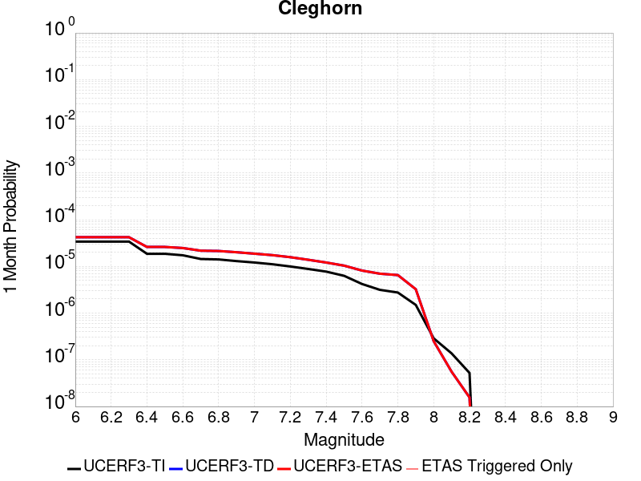 | 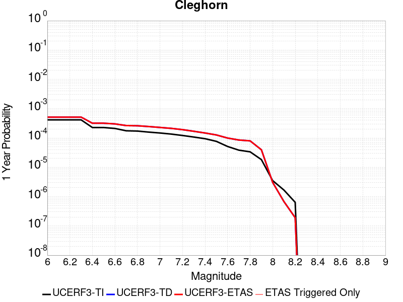 | 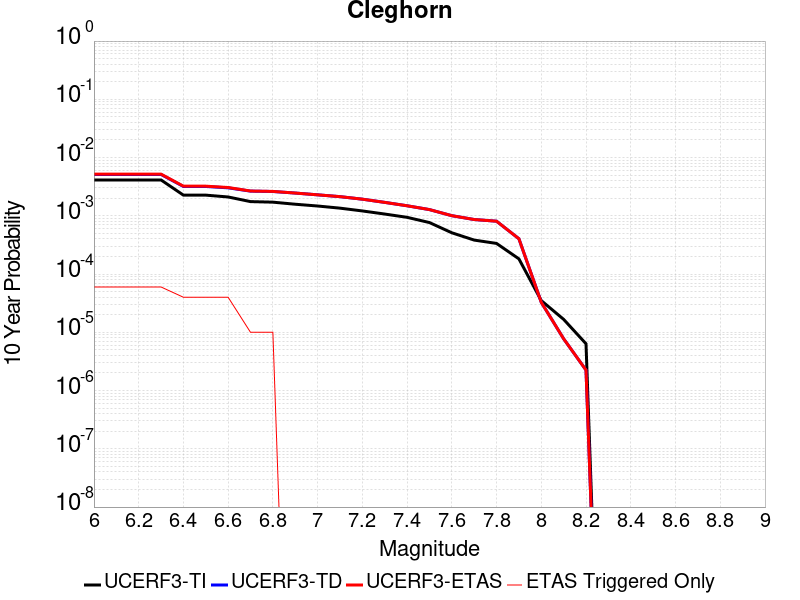 |

| Magnitude | 1 wk TI Prob | 1 wk TD Prob | 1 wk ETAS Prob | 1 wk ETAS/TD Gain | 1 wk ETAS Triggered Only | 1 mo TI Prob | 1 mo TD Prob | 1 mo ETAS Prob | 1 mo ETAS/TD Gain | 1 mo ETAS Triggered Only | 1 yr TI Prob | 1 yr TD Prob | 1 yr ETAS Prob | 1 yr ETAS/TD Gain | 1 yr ETAS Triggered Only | 10 yr TI Prob | 10 yr TD Prob | 10 yr ETAS Prob | 10 yr ETAS/TD Gain | 10 yr ETAS Triggered Only |
|-----|-----|-----|-----|-----|-----|-----|-----|-----|-----|-----|-----|-----|-----|-----|-----|-----|-----|-----|-----|-----|
| 6.0 | 7.9267165E-6 | 9.831582E-6 | 9.831582E-6 | 1.0 | 0.0 | 3.39712E-5 | 4.2134732E-5 | 4.2134732E-5 | 1.0 | 0.0 | 4.1352084E-4 | 5.128803E-4 | 5.128803E-4 | 1.0 | 0.0 | 0.004127522 | 0.0051320773 | 0.005191769 | 1.0116311 | 6.0E-5 |
| 6.1 | 7.9267165E-6 | 9.831582E-6 | 9.831582E-6 | 1.0 | 0.0 | 3.39712E-5 | 4.2134732E-5 | 4.2134732E-5 | 1.0 | 0.0 | 4.1352084E-4 | 5.128803E-4 | 5.128803E-4 | 1.0 | 0.0 | 0.004127522 | 0.0051320773 | 0.005191769 | 1.0116311 | 6.0E-5 |
| 6.2 | 7.9267165E-6 | 9.831582E-6 | 9.831582E-6 | 1.0 | 0.0 | 3.39712E-5 | 4.2134732E-5 | 4.2134732E-5 | 1.0 | 0.0 | 4.1352084E-4 | 5.128803E-4 | 5.128803E-4 | 1.0 | 0.0 | 0.004127522 | 0.0051320773 | 0.005191769 | 1.0116311 | 6.0E-5 |
| 6.3 | 7.9267165E-6 | 9.831582E-6 | 9.831582E-6 | 1.0 | 0.0 | 3.39712E-5 | 4.2134732E-5 | 4.2134732E-5 | 1.0 | 0.0 | 4.1352084E-4 | 5.128803E-4 | 5.128803E-4 | 1.0 | 0.0 | 0.004127522 | 0.0051320773 | 0.005191769 | 1.0116311 | 6.0E-5 |
| 6.4 | 4.3445207E-6 | 6.0914435E-6 | 6.0914435E-6 | 1.0 | 0.0 | 1.8619241E-5 | 2.610593E-5 | 2.610593E-5 | 1.0 | 0.0 | 2.2666567E-4 | 3.1779436E-4 | 3.1779436E-4 | 1.0 | 0.0 | 0.0022643462 | 0.0031875873 | 0.0032274597 | 1.0125086 | 4.0E-5 |
| 6.5 | 4.3445207E-6 | 6.0914435E-6 | 6.0914435E-6 | 1.0 | 0.0 | 1.8619241E-5 | 2.610593E-5 | 2.610593E-5 | 1.0 | 0.0 | 2.2666567E-4 | 3.1779436E-4 | 3.1779436E-4 | 1.0 | 0.0 | 0.0022643462 | 0.0031875873 | 0.0032274597 | 1.0125086 | 4.0E-5 |
| 6.6 | 4.040109E-6 | 5.773851E-6 | 5.773851E-6 | 1.0 | 0.0 | 1.7314638E-5 | 2.4744846E-5 | 2.4744846E-5 | 1.0 | 0.0 | 2.1078532E-4 | 3.012278E-4 | 3.012278E-4 | 1.0 | 0.0 | 0.002105855 | 0.003022377 | 0.0030622561 | 1.0131946 | 4.0E-5 |
| 6.7 | 3.3632055E-6 | 5.067348E-6 | 5.067348E-6 | 1.0 | 0.0 | 1.4413658E-5 | 2.1717027E-5 | 2.1717027E-5 | 1.0 | 0.0 | 1.7547216E-4 | 2.6437303E-4 | 2.6437303E-4 | 1.0 | 0.0 | 0.0017533366 | 0.0026547113 | 0.0026646846 | 1.0037569 | 1.0E-5 |
| 6.8 | 3.2902772E-6 | 4.9892556E-6 | 4.9892556E-6 | 1.0 | 0.0 | 1.4101111E-5 | 2.1382351E-5 | 2.1382351E-5 | 1.0 | 0.0 | 1.716675E-4 | 2.6029933E-4 | 2.6029933E-4 | 1.0 | 0.0 | 0.0017153495 | 0.0026140702 | 0.002624044 | 1.0038154 | 1.0E-5 |
| 6.9 | 3.031547E-6 | 4.6910186E-6 | 4.6910186E-6 | 1.0 | 0.0 | 1.299228E-5 | 2.0104211E-5 | 2.0104211E-5 | 1.0 | 0.0 | 1.5816953E-4 | 2.4474156E-4 | 2.4474156E-4 | 1.0 | 0.0 | 0.00158057 | 0.0024588439 | 0.0024588439 | 1.0 | 0.0 |
| 7.0 | 2.8259715E-6 | 4.3705895E-6 | 4.3705895E-6 | 1.0 | 0.0 | 1.211125E-5 | 1.8730963E-5 | 1.8730963E-5 | 1.0 | 0.0 | 1.4744449E-4 | 2.2802586E-4 | 2.2802586E-4 | 1.0 | 0.0 | 0.001473467 | 0.0022920412 | 0.0022920412 | 1.0 | 0.0 |
| 7.1 | 2.5962665E-6 | 4.0658106E-6 | 4.0658106E-6 | 1.0 | 0.0 | 1.1126809E-5 | 1.7424789E-5 | 1.7424789E-5 | 1.0 | 0.0 | 1.3546048E-4 | 2.1212637E-4 | 2.1212637E-4 | 1.0 | 0.0 | 0.0013537793 | 0.002133366 | 0.002133366 | 1.0 | 0.0 |
| 7.2 | 2.3247253E-6 | 3.6763672E-6 | 3.6763672E-6 | 1.0 | 0.0 | 9.96307E-6 | 1.5755764E-5 | 1.5755764E-5 | 1.0 | 0.0 | 1.21293626E-4 | 1.9180974E-4 | 1.9180974E-4 | 1.0 | 0.0 | 0.0012122744 | 0.0019305905 | 0.0019305905 | 1.0 | 0.0 |
| 7.3 | 2.056928E-6 | 3.2350938E-6 | 3.2350938E-6 | 1.0 | 0.0 | 8.815376E-6 | 1.3864615E-5 | 1.3864615E-5 | 1.0 | 0.0 | 1.0732192E-4 | 1.6878877E-4 | 1.6878877E-4 | 1.0 | 0.0 | 0.001072701 | 0.0017008206 | 0.0017008206 | 1.0 | 0.0 |
| 7.4 | 1.8055999E-6 | 2.8255042E-6 | 2.8255042E-6 | 1.0 | 0.0 | 7.738263E-6 | 1.2109249E-5 | 1.2109249E-5 | 1.0 | 0.0 | 9.4209274E-5 | 1.4742027E-4 | 1.4742027E-4 | 1.0 | 0.0 | 9.4169343E-4 | 0.0014875771 | 0.0014875771 | 1.0 | 0.0 |
| 7.5 | 1.4683443E-6 | 2.4247483E-6 | 2.4247483E-6 | 1.0 | 0.0 | 6.292889E-6 | 1.0391738E-5 | 1.0391738E-5 | 1.0 | 0.0 | 7.661323E-5 | 1.2651215E-4 | 1.2651215E-4 | 1.0 | 0.0 | 7.658682E-4 | 0.0012787961 | 0.0012787961 | 1.0 | 0.0 |
| 7.6 | 9.804088E-7 | 1.900266E-6 | 1.900266E-6 | 1.0 | 0.0 | 4.201745E-6 | 8.143972E-6 | 8.143972E-6 | 1.0 | 0.0 | 5.1155046E-5 | 9.91484E-5 | 9.91484E-5 | 1.0 | 0.0 | 5.114327E-4 | 0.001005471 | 0.001005471 | 1.0 | 0.0 |
| 7.7 | 7.3434086E-7 | 1.6284146E-6 | 1.6284146E-6 | 1.0 | 0.0 | 3.1471714E-6 | 6.978901E-6 | 6.978901E-6 | 1.0 | 0.0 | 3.831614E-5 | 8.4964835E-5 | 8.4964835E-5 | 1.0 | 0.0 | 3.8309532E-4 | 8.6378685E-4 | 8.6378685E-4 | 1.0 | 0.0 |
| 7.8 | 6.434184E-7 | 1.5220047E-6 | 1.5220047E-6 | 1.0 | 0.0 | 2.7575045E-6 | 6.5228614E-6 | 6.5228614E-6 | 1.0 | 0.0 | 3.35721E-5 | 7.941297E-5 | 7.941297E-5 | 1.0 | 0.0 | 3.3567028E-4 | 8.079678E-4 | 8.079678E-4 | 1.0 | 0.0 |
| 7.9 | 3.4943926E-7 | 7.574459E-7 | 7.574459E-7 | 1.0 | 0.0 | 1.497596E-6 | 3.2461926E-6 | 3.2461926E-6 | 1.0 | 0.0 | 1.8233079E-5 | 3.952169E-5 | 3.952169E-5 | 1.0 | 0.0 | 1.8231584E-4 | 4.040099E-4 | 4.040099E-4 | 1.0 | 0.0 |
| 8.0 | 6.717524E-8 | 5.838828E-8 | 5.838828E-8 | 1.0 | 0.0 | 2.8789387E-7 | 2.5023547E-7 | 2.5023547E-7 | 1.0 | 0.0 | 3.505102E-6 | 3.0466126E-6 | 3.0466126E-6 | 1.0 | 0.0 | 3.5050467E-5 | 3.273506E-5 | 3.273506E-5 | 1.0 | 0.0 |
| 8.1 | 3.1984914E-8 | 1.2956093E-8 | 1.2956093E-8 | 1.0 | 0.0 | 1.370782E-7 | 5.552611E-8 | 5.552611E-8 | 1.0 | 0.0 | 1.6689258E-6 | 6.760302E-7 | 6.760302E-7 | 1.0 | 0.0 | 1.6689133E-5 | 7.74454E-6 | 7.74454E-6 | 1.0 | 0.0 |
| 8.2 | 1.21887656E-8 | 3.6495305E-9 | 3.6495305E-9 | 1.0 | 0.0 | 5.2237567E-8 | 1.5640845E-8 | 1.5640845E-8 | 1.0 | 0.0 | 6.359922E-7 | 1.9042727E-7 | 1.9042727E-7 | 1.0 | 0.0 | 6.3599036E-6 | 2.2470974E-6 | 2.2470974E-6 | 1.0 | 0.0 |

## Hosgri
*[(top)](#table-of-contents)*

| 1 Week | 1 Month | 1 Year | 10 Year |
|-----|-----|-----|-----|
| 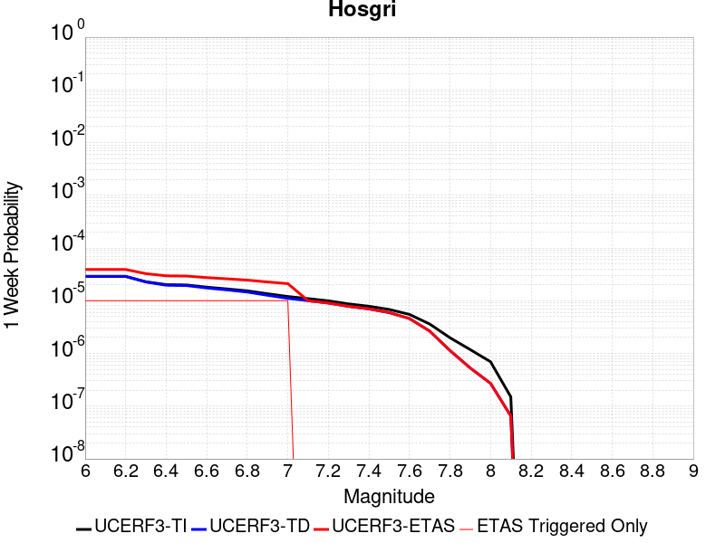 | 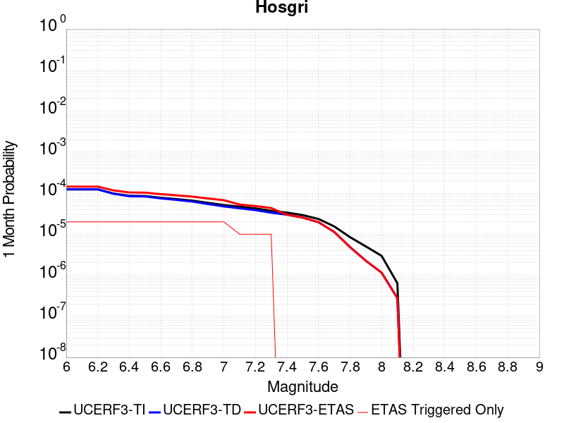 |  | 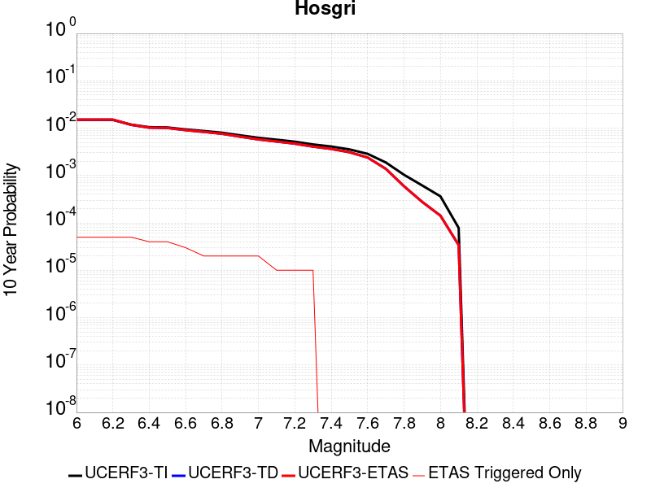 |

| Magnitude | 1 wk TI Prob | 1 wk TD Prob | 1 wk ETAS Prob | 1 wk ETAS/TD Gain | 1 wk ETAS Triggered Only | 1 mo TI Prob | 1 mo TD Prob | 1 mo ETAS Prob | 1 mo ETAS/TD Gain | 1 mo ETAS Triggered Only | 1 yr TI Prob | 1 yr TD Prob | 1 yr ETAS Prob | 1 yr ETAS/TD Gain | 1 yr ETAS Triggered Only | 10 yr TI Prob | 10 yr TD Prob | 10 yr ETAS Prob | 10 yr ETAS/TD Gain | 10 yr ETAS Triggered Only |
|-----|-----|-----|-----|-----|-----|-----|-----|-----|-----|-----|-----|-----|-----|-----|-----|-----|-----|-----|-----|-----|
| 6.0 | 2.883978E-5 | 2.9128416E-5 | 3.9128125E-5 | 1.3432974 | 1.0E-5 | 1.235932E-4 | 1.2483024E-4 | 1.4482775E-4 | 1.1601976 | 2.0E-5 | 0.0015037085 | 0.001518776 | 0.0015387456 | 1.0131485 | 2.0E-5 | 0.01493574 | 0.01508774 | 0.015136985 | 1.003264 | 5.0E-5 |
| 6.1 | 2.883978E-5 | 2.9128416E-5 | 3.9128125E-5 | 1.3432974 | 1.0E-5 | 1.235932E-4 | 1.2483024E-4 | 1.4482775E-4 | 1.1601976 | 2.0E-5 | 0.0015037085 | 0.001518776 | 0.0015387456 | 1.0131485 | 2.0E-5 | 0.01493574 | 0.01508774 | 0.015136985 | 1.003264 | 5.0E-5 |
| 6.2 | 2.883978E-5 | 2.9128416E-5 | 3.9128125E-5 | 1.3432974 | 1.0E-5 | 1.235932E-4 | 1.2483024E-4 | 1.4482775E-4 | 1.1601976 | 2.0E-5 | 0.0015037085 | 0.001518776 | 0.0015387456 | 1.0131485 | 2.0E-5 | 0.01493574 | 0.01508774 | 0.015136985 | 1.003264 | 5.0E-5 |
| 6.3 | 2.2914428E-5 | 2.2641969E-5 | 3.2641743E-5 | 1.4416476 | 1.0E-5 | 9.8200995E-5 | 9.703343E-5 | 1.17031486E-4 | 1.2060945 | 2.0E-5 | 0.0011949413 | 0.0011807467 | 0.0012007231 | 1.0169184 | 2.0E-5 | 0.011885363 | 0.011746133 | 0.011795546 | 1.0042068 | 5.0E-5 |
| 6.4 | 2.0195741E-5 | 1.969656E-5 | 2.9696363E-5 | 1.5076928 | 1.0E-5 | 8.65503E-5 | 8.4411105E-5 | 1.0440942E-4 | 1.2369156 | 2.0E-5 | 0.0010532405 | 0.0010272227 | 0.0010472022 | 1.01945 | 2.0E-5 | 0.010482626 | 0.010225792 | 0.010265384 | 1.0038717 | 4.0E-5 |
| 6.5 | 1.9924333E-5 | 1.940898E-5 | 2.9408788E-5 | 1.5152154 | 1.0E-5 | 8.53872E-5 | 8.3178704E-5 | 1.03177044E-4 | 1.2404262 | 2.0E-5 | 0.0010390934 | 0.0010122322 | 0.0010322119 | 1.0197383 | 2.0E-5 | 0.010342481 | 0.010077253 | 0.01011685 | 1.0039294 | 4.0E-5 |
| 6.6 | 1.809694E-5 | 1.74583E-5 | 2.7458125E-5 | 1.5727835 | 1.0E-5 | 7.7556004E-5 | 7.4819145E-5 | 9.481765E-5 | 1.2672913 | 2.0E-5 | 9.438353E-4 | 9.105437E-4 | 9.3052554E-4 | 1.0219449 | 2.0E-5 | 0.009398366 | 0.009069073 | 0.009098801 | 1.0032779 | 3.0E-5 |
| 6.7 | 1.675989E-5 | 1.6042764E-5 | 2.6042604E-5 | 1.6233239 | 1.0E-5 | 7.182612E-5 | 6.87529E-5 | 8.875153E-5 | 1.2908769 | 2.0E-5 | 8.7413215E-4 | 8.3674624E-4 | 8.567295E-4 | 1.0238822 | 2.0E-5 | 0.008707017 | 0.0083368635 | 0.008356696 | 1.002379 | 2.0E-5 |
| 6.8 | 1.5401129E-5 | 1.4614083E-5 | 2.4613937E-5 | 1.6842614 | 1.0E-5 | 6.6003166E-5 | 6.2630286E-5 | 8.262903E-5 | 1.3193144 | 2.0E-5 | 8.032922E-4 | 7.622578E-4 | 7.8224257E-4 | 1.0262178 | 2.0E-5 | 0.008003947 | 0.007597296 | 0.0076171444 | 1.0026125 | 2.0E-5 |
| 6.9 | 1.356559E-5 | 1.2689968E-5 | 2.2689841E-5 | 1.788014 | 1.0E-5 | 5.8136946E-5 | 5.4384444E-5 | 7.438336E-5 | 1.3677322 | 2.0E-5 | 7.0758746E-4 | 6.619299E-4 | 6.8191666E-4 | 1.0301946 | 2.0E-5 | 0.007053386 | 0.006600388 | 0.0066202558 | 1.0030102 | 2.0E-5 |
| 7.0 | 1.2030819E-5 | 1.1095962E-5 | 2.109585E-5 | 1.9012188 | 1.0E-5 | 5.155963E-5 | 4.7553254E-5 | 6.7552304E-5 | 1.4205611 | 2.0E-5 | 6.275577E-4 | 5.7880714E-4 | 5.987956E-4 | 1.0345339 | 2.0E-5 | 0.006257884 | 0.005773757 | 0.0057936413 | 1.003444 | 2.0E-5 |
| 7.1 | 1.0972698E-5 | 1.0022179E-5 | 1.0022179E-5 | 1.0 | 0.0 | 4.7025E-5 | 4.2951488E-5 | 5.2951058E-5 | 1.2328109 | 1.0E-5 | 5.72379E-4 | 5.22809E-4 | 5.3280377E-4 | 1.0191175 | 1.0E-5 | 0.0057090693 | 0.005216542 | 0.00522649 | 1.001907 | 1.0E-5 |
| 7.2 | 9.961926E-6 | 9.034746E-6 | 9.034746E-6 | 1.0 | 0.0 | 4.2693267E-5 | 3.8719765E-5 | 4.8719376E-5 | 1.2582561 | 1.0E-5 | 5.1966653E-4 | 4.713112E-4 | 4.813065E-4 | 1.0212075 | 1.0E-5 | 0.00518453 | 0.0047038626 | 0.0047138156 | 1.002116 | 1.0E-5 |
| 7.3 | 8.700929E-6 | 7.8281E-6 | 7.8281E-6 | 1.0 | 0.0 | 3.7289166E-5 | 3.354857E-5 | 4.3548236E-5 | 1.2980653 | 1.0E-5 | 4.53901E-4 | 4.0837732E-4 | 4.1837324E-4 | 1.0244771 | 1.0E-5 | 0.00452975 | 0.004077008 | 0.0040869676 | 1.0024428 | 1.0E-5 |
| 7.4 | 7.866285E-6 | 6.998739E-6 | 6.998739E-6 | 1.0 | 0.0 | 3.3712215E-5 | 2.9994251E-5 | 2.9994251E-5 | 1.0 | 0.0 | 4.103689E-4 | 3.6511885E-4 | 3.6511885E-4 | 1.0 | 0.0 | 0.004096119 | 0.0036459267 | 0.0036459267 | 1.0 | 0.0 |
| 7.5 | 6.8381305E-6 | 5.9596955E-6 | 5.9596955E-6 | 1.0 | 0.0 | 2.9305946E-5 | 2.5541302E-5 | 2.5541302E-5 | 1.0 | 0.0 | 3.5674145E-4 | 3.10921E-4 | 3.10921E-4 | 1.0 | 0.0 | 0.0035616932 | 0.0031055948 | 0.0031055948 | 1.0 | 0.0 |
| 7.6 | 5.503376E-6 | 4.5952443E-6 | 4.5952443E-6 | 1.0 | 0.0 | 2.3585684E-5 | 1.9693754E-5 | 1.9693754E-5 | 1.0 | 0.0 | 2.8711787E-4 | 2.397451E-4 | 2.397451E-4 | 1.0 | 0.0 | 0.002867472 | 0.0023955975 | 0.0023955975 | 1.0 | 0.0 |
| 7.7 | 3.6144982E-6 | 2.6522112E-6 | 2.6522112E-6 | 1.0 | 0.0 | 1.5490614E-5 | 1.1366569E-5 | 1.1366569E-5 | 1.0 | 0.0 | 1.8858191E-4 | 1.383792E-4 | 1.383792E-4 | 1.0 | 0.0 | 0.0018842196 | 0.0013836613 | 0.0013836613 | 1.0 | 0.0 |
| 7.8 | 1.9853494E-6 | 1.1361129E-6 | 1.1361129E-6 | 1.0 | 0.0 | 8.508612E-6 | 4.8690463E-6 | 4.8690463E-6 | 1.0 | 0.0 | 1.0358743E-4 | 5.9279027E-5 | 5.9279027E-5 | 1.0 | 0.0 | 0.0010353916 | 5.9336185E-4 | 5.9336185E-4 | 1.0 | 0.0 |
| 7.9 | 1.1818757E-6 | 5.2951856E-7 | 5.2951856E-7 | 1.0 | 0.0 | 5.0651715E-6 | 2.2693632E-6 | 2.2693632E-6 | 1.0 | 0.0 | 6.1666724E-5 | 2.7629147E-5 | 2.7629147E-5 | 1.0 | 0.0 | 6.1649614E-4 | 2.7694515E-4 | 2.7694515E-4 | 1.0 | 0.0 |
| 8.0 | 6.962958E-7 | 2.7139782E-7 | 2.7139782E-7 | 1.0 | 0.0 | 2.9841215E-6 | 1.163133E-6 | 1.163133E-6 | 1.0 | 0.0 | 3.6331072E-5 | 1.4161053E-5 | 1.4161053E-5 | 1.0 | 0.0 | 3.6325134E-4 | 1.4217179E-4 | 1.4217179E-4 | 1.0 | 0.0 |
| 8.1 | 1.5033264E-7 | 6.527624E-8 | 6.527624E-8 | 1.0 | 0.0 | 6.442826E-7 | 2.7975528E-7 | 2.7975528E-7 | 1.0 | 0.0 | 7.844113E-6 | 3.4060151E-6 | 3.4060151E-6 | 1.0 | 0.0 | 7.843835E-5 | 3.407693E-5 | 3.407693E-5 | 1.0 | 0.0 |

## San Luis Range 2011 CFM
*[(top)](#table-of-contents)*

| 1 Week | 1 Month | 1 Year | 10 Year |
|-----|-----|-----|-----|
|  |  |  | 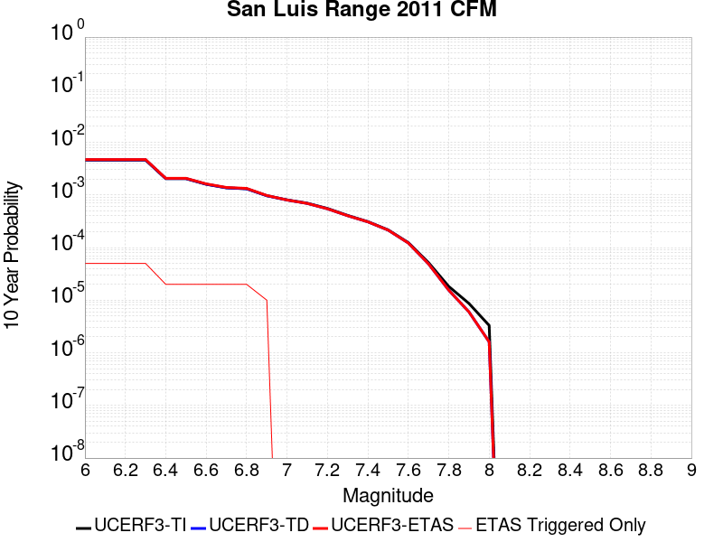 |

| Magnitude | 1 wk TI Prob | 1 wk TD Prob | 1 wk ETAS Prob | 1 wk ETAS/TD Gain | 1 wk ETAS Triggered Only | 1 mo TI Prob | 1 mo TD Prob | 1 mo ETAS Prob | 1 mo ETAS/TD Gain | 1 mo ETAS Triggered Only | 1 yr TI Prob | 1 yr TD Prob | 1 yr ETAS Prob | 1 yr ETAS/TD Gain | 1 yr ETAS Triggered Only | 10 yr TI Prob | 10 yr TD Prob | 10 yr ETAS Prob | 10 yr ETAS/TD Gain | 10 yr ETAS Triggered Only |
|-----|-----|-----|-----|-----|-----|-----|-----|-----|-----|-----|-----|-----|-----|-----|-----|-----|-----|-----|-----|-----|
| 6.0 | 8.8368415E-6 | 8.965454E-6 | 8.965454E-6 | 1.0 | 0.0 | 3.787163E-5 | 3.842285E-5 | 3.842285E-5 | 1.0 | 0.0 | 4.609895E-4 | 4.677057E-4 | 4.7770102E-4 | 1.021371 | 1.0E-5 | 0.0046003438 | 0.0046679964 | 0.004717763 | 1.0106612 | 5.0E-5 |
| 6.1 | 8.8368415E-6 | 8.965454E-6 | 8.965454E-6 | 1.0 | 0.0 | 3.787163E-5 | 3.842285E-5 | 3.842285E-5 | 1.0 | 0.0 | 4.609895E-4 | 4.677057E-4 | 4.7770102E-4 | 1.021371 | 1.0E-5 | 0.0046003438 | 0.0046679964 | 0.004717763 | 1.0106612 | 5.0E-5 |
| 6.2 | 8.8368415E-6 | 8.965454E-6 | 8.965454E-6 | 1.0 | 0.0 | 3.787163E-5 | 3.842285E-5 | 3.842285E-5 | 1.0 | 0.0 | 4.609895E-4 | 4.677057E-4 | 4.7770102E-4 | 1.021371 | 1.0E-5 | 0.0046003438 | 0.0046679964 | 0.004717763 | 1.0106612 | 5.0E-5 |
| 6.3 | 8.8368415E-6 | 8.965454E-6 | 8.965454E-6 | 1.0 | 0.0 | 3.787163E-5 | 3.842285E-5 | 3.842285E-5 | 1.0 | 0.0 | 4.609895E-4 | 4.677057E-4 | 4.7770102E-4 | 1.021371 | 1.0E-5 | 0.0046003438 | 0.0046679964 | 0.004717763 | 1.0106612 | 5.0E-5 |
| 6.4 | 3.9094193E-6 | 3.9412025E-6 | 3.9412025E-6 | 1.0 | 0.0 | 1.6754546E-5 | 1.689076E-5 | 1.689076E-5 | 1.0 | 0.0 | 2.039675E-4 | 2.056259E-4 | 2.1562383E-4 | 1.048622 | 1.0E-5 | 0.0020378039 | 0.0020543851 | 0.002074344 | 1.0097153 | 2.0E-5 |
| 6.5 | 3.9094193E-6 | 3.9412025E-6 | 3.9412025E-6 | 1.0 | 0.0 | 1.6754546E-5 | 1.689076E-5 | 1.689076E-5 | 1.0 | 0.0 | 2.039675E-4 | 2.056259E-4 | 2.1562383E-4 | 1.048622 | 1.0E-5 | 0.0020378039 | 0.0020543851 | 0.002074344 | 1.0097153 | 2.0E-5 |
| 6.6 | 3.0587726E-6 | 3.0753883E-6 | 3.0753883E-6 | 1.0 | 0.0 | 1.3108959E-5 | 1.318017E-5 | 1.318017E-5 | 1.0 | 0.0 | 1.595899E-4 | 1.6045687E-4 | 1.7045526E-4 | 1.062312 | 1.0E-5 | 0.0015947534 | 0.0016034221 | 0.00162339 | 1.0124533 | 2.0E-5 |
| 6.7 | 2.6160574E-6 | 2.6251273E-6 | 2.6251273E-6 | 1.0 | 0.0 | 1.1211626E-5 | 1.1250498E-5 | 1.1250498E-5 | 1.0 | 0.0 | 1.3649299E-4 | 1.3696625E-4 | 1.4696489E-4 | 1.0730007 | 1.0E-5 | 0.0013640919 | 0.0013688246 | 0.0013887972 | 1.0145911 | 2.0E-5 |
| 6.8 | 2.5110312E-6 | 2.51814E-6 | 2.51814E-6 | 1.0 | 0.0 | 1.0761518E-5 | 1.0791985E-5 | 1.0791985E-5 | 1.0 | 0.0 | 1.310136E-4 | 1.3138456E-4 | 1.4138324E-4 | 1.0761025 | 1.0E-5 | 0.0013093639 | 0.0013130746 | 0.0013330483 | 1.0152115 | 2.0E-5 |
| 6.9 | 1.8564405E-6 | 1.852487E-6 | 1.852487E-6 | 1.0 | 0.0 | 7.95615E-6 | 7.939206E-6 | 7.939206E-6 | 1.0 | 0.0 | 9.686181E-5 | 9.665557E-5 | 9.665557E-5 | 1.0 | 0.0 | 9.68196E-4 | 9.661373E-4 | 9.7612763E-4 | 1.0103405 | 1.0E-5 |
| 7.0 | 1.546127E-6 | 1.5369537E-6 | 1.5369537E-6 | 1.0 | 0.0 | 6.626242E-6 | 6.586928E-6 | 6.586928E-6 | 1.0 | 0.0 | 8.06715E-5 | 8.0192905E-5 | 8.0192905E-5 | 1.0 | 0.0 | 8.0642226E-4 | 8.016404E-4 | 8.016404E-4 | 1.0 | 0.0 |
| 7.1 | 1.3368208E-6 | 1.3235326E-6 | 1.3235326E-6 | 1.0 | 0.0 | 5.7292195E-6 | 5.67227E-6 | 5.67227E-6 | 1.0 | 0.0 | 6.975101E-5 | 6.905771E-5 | 6.905771E-5 | 1.0 | 0.0 | 6.972912E-4 | 6.9036294E-4 | 6.9036294E-4 | 1.0 | 0.0 |
| 7.2 | 1.0623363E-6 | 1.0454368E-6 | 1.0454368E-6 | 1.0 | 0.0 | 4.5528623E-6 | 4.4804356E-6 | 4.4804356E-6 | 1.0 | 0.0 | 5.5429686E-5 | 5.4547938E-5 | 5.4547938E-5 | 1.0 | 0.0 | 5.5415864E-4 | 5.4534577E-4 | 5.4534577E-4 | 1.0 | 0.0 |
| 7.3 | 7.831679E-7 | 7.7273904E-7 | 7.7273904E-7 | 1.0 | 0.0 | 3.3564295E-6 | 3.3117344E-6 | 3.3117344E-6 | 1.0 | 0.0 | 4.086376E-5 | 4.0319625E-5 | 4.0319625E-5 | 1.0 | 0.0 | 4.0856248E-4 | 4.031232E-4 | 4.031232E-4 | 1.0 | 0.0 |
| 7.4 | 5.9558846E-7 | 5.910636E-7 | 5.910636E-7 | 1.0 | 0.0 | 2.5525194E-6 | 2.5331274E-6 | 2.5331274E-6 | 1.0 | 0.0 | 3.107648E-5 | 3.084039E-5 | 3.084039E-5 | 1.0 | 0.0 | 3.1072134E-4 | 3.083612E-4 | 3.083612E-4 | 1.0 | 0.0 |
| 7.5 | 4.1616502E-7 | 4.119631E-7 | 4.119631E-7 | 1.0 | 0.0 | 1.7835631E-6 | 1.7655549E-6 | 1.7655549E-6 | 1.0 | 0.0 | 2.1714664E-5 | 2.149542E-5 | 2.149542E-5 | 1.0 | 0.0 | 2.1712543E-4 | 2.1493346E-4 | 2.1493346E-4 | 1.0 | 0.0 |
| 7.6 | 2.3816014E-7 | 2.3376548E-7 | 2.3376548E-7 | 1.0 | 0.0 | 1.0206859E-6 | 1.0018516E-6 | 1.0018516E-6 | 1.0 | 0.0 | 1.242678E-5 | 1.2197475E-5 | 1.2197475E-5 | 1.0 | 0.0 | 1.2426086E-4 | 1.2196808E-4 | 1.2196808E-4 | 1.0 | 0.0 |
| 7.7 | 9.918777E-8 | 9.3867584E-8 | 9.3867584E-8 | 1.0 | 0.0 | 4.2509038E-7 | 4.0228957E-7 | 4.0228957E-7 | 1.0 | 0.0 | 5.1754632E-6 | 4.8978645E-6 | 4.8978645E-6 | 1.0 | 0.0 | 5.1753424E-5 | 4.897757E-5 | 4.897757E-5 | 1.0 | 0.0 |
| 7.8 | 3.4982556E-8 | 2.968655E-8 | 2.968655E-8 | 1.0 | 0.0 | 1.4992524E-7 | 1.2722806E-7 | 1.2722806E-7 | 1.0 | 0.0 | 1.8253382E-6 | 1.5490006E-6 | 1.5490006E-6 | 1.0 | 0.0 | 1.8253233E-5 | 1.5489897E-5 | 1.5489897E-5 | 1.0 | 0.0 |
| 7.9 | 1.6624908E-8 | 1.1477036E-8 | 1.1477036E-8 | 1.0 | 0.0 | 7.12496E-8 | 4.91873E-8 | 4.91873E-8 | 1.0 | 0.0 | 8.6746354E-7 | 5.988552E-7 | 5.988552E-7 | 1.0 | 0.0 | 8.674601E-6 | 5.988536E-6 | 5.988536E-6 | 1.0 | 0.0 |
| 8.0 | 6.3352315E-9 | 3.0888412E-9 | 3.0888412E-9 | 1.0 | 0.0 | 2.715099E-8 | 1.3237893E-8 | 1.3237893E-8 | 1.0 | 0.0 | 3.3056327E-7 | 1.6117131E-7 | 1.6117131E-7 | 1.0 | 0.0 | 3.3056278E-6 | 1.611712E-6 | 1.611712E-6 | 1.0 | 0.0 |

## Great Valley 03a Dunnigan Hills
*[(top)](#table-of-contents)*

| 1 Week | 1 Month | 1 Year | 10 Year |
|-----|-----|-----|-----|
| 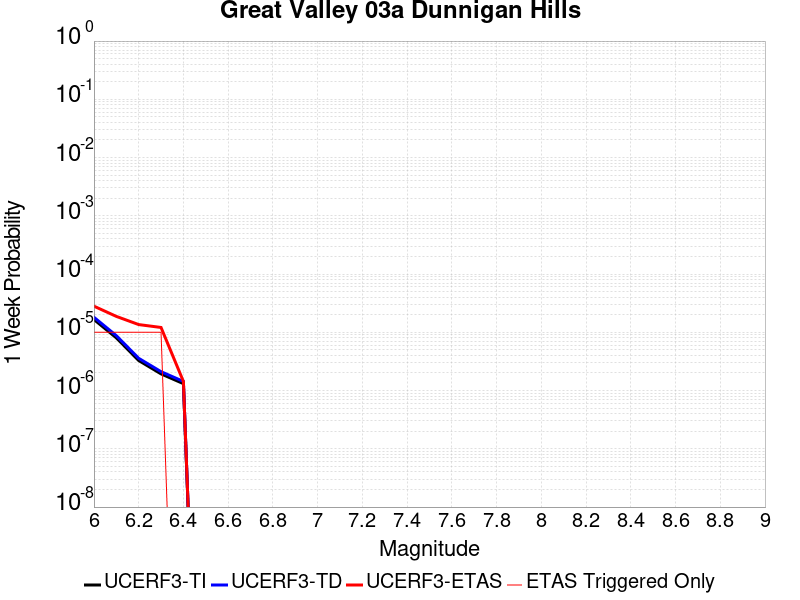 |  |  |  |

| Magnitude | 1 wk TI Prob | 1 wk TD Prob | 1 wk ETAS Prob | 1 wk ETAS/TD Gain | 1 wk ETAS Triggered Only | 1 mo TI Prob | 1 mo TD Prob | 1 mo ETAS Prob | 1 mo ETAS/TD Gain | 1 mo ETAS Triggered Only | 1 yr TI Prob | 1 yr TD Prob | 1 yr ETAS Prob | 1 yr ETAS/TD Gain | 1 yr ETAS Triggered Only | 10 yr TI Prob | 10 yr TD Prob | 10 yr ETAS Prob | 10 yr ETAS/TD Gain | 10 yr ETAS Triggered Only |
|-----|-----|-----|-----|-----|-----|-----|-----|-----|-----|-----|-----|-----|-----|-----|-----|-----|-----|-----|-----|-----|
| 6.0 | 1.6591328E-5 | 1.8107954E-5 | 2.8107774E-5 | 1.5522335 | 1.0E-5 | 7.110376E-5 | 7.7603596E-5 | 8.760282E-5 | 1.12885 | 1.0E-5 | 8.6534437E-4 | 9.444834E-4 | 9.7445503E-4 | 1.0317334 | 3.0E-5 | 0.008619824 | 0.009411525 | 0.009461055 | 1.0052626 | 5.0E-5 |
| 6.1 | 8.041125E-6 | 8.769726E-6 | 1.8769639E-5 | 2.1402764 | 1.0E-5 | 3.4461507E-5 | 3.7584115E-5 | 4.758374E-5 | 1.2660599 | 1.0E-5 | 4.194881E-4 | 4.5751085E-4 | 4.6750627E-4 | 1.0218474 | 1.0E-5 | 0.004186971 | 0.004567687 | 0.0045776414 | 1.0021793 | 1.0E-5 |
| 6.2 | 3.2807004E-6 | 3.5795688E-6 | 1.3579533E-5 | 3.7936225 | 1.0E-5 | 1.4060069E-5 | 1.5340942E-5 | 2.5340789E-5 | 1.6518404 | 1.0E-5 | 1.7116789E-4 | 1.8676413E-4 | 1.9676225E-4 | 1.0535334 | 1.0E-5 | 0.0017103611 | 0.0018664796 | 0.001876461 | 1.0053477 | 1.0E-5 |
| 6.3 | 1.9339366E-6 | 2.1103806E-6 | 1.2110359E-5 | 5.7384715 | 1.0E-5 | 8.288273E-6 | 9.044474E-6 | 1.9044382E-5 | 2.1056376 | 1.0E-5 | 1.00905054E-4 | 1.1011375E-4 | 1.2011265E-4 | 1.0908052 | 1.0E-5 | 0.0010085925 | 0.0011008718 | 0.0011108608 | 1.0090737 | 1.0E-5 |
| 6.4 | 1.3142635E-6 | 1.4339867E-6 | 1.4339867E-6 | 1.0 | 0.0 | 5.6325457E-6 | 6.145657E-6 | 6.145657E-6 | 1.0 | 0.0 | 6.857408E-5 | 7.482337E-5 | 7.482337E-5 | 1.0 | 0.0 | 6.8552926E-4 | 7.4823375E-4 | 7.4823375E-4 | 1.0 | 0.0 |

## Los Osos 2011
*[(top)](#table-of-contents)*

| 1 Week | 1 Month | 1 Year | 10 Year |
|-----|-----|-----|-----|
|  | 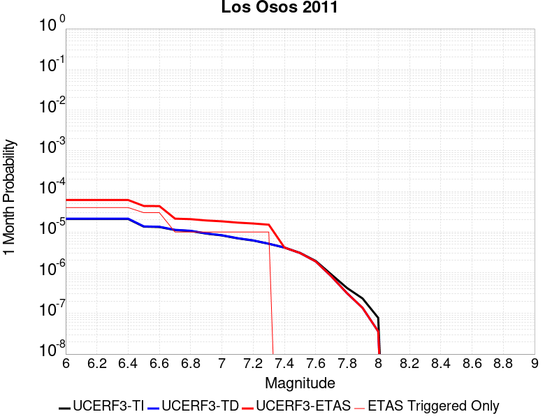 | 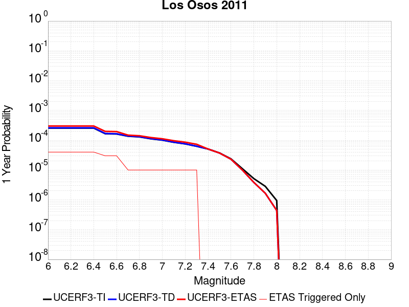 | 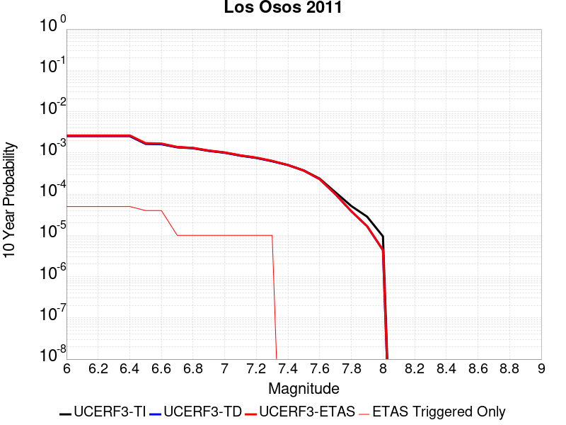 |

| Magnitude | 1 wk TI Prob | 1 wk TD Prob | 1 wk ETAS Prob | 1 wk ETAS/TD Gain | 1 wk ETAS Triggered Only | 1 mo TI Prob | 1 mo TD Prob | 1 mo ETAS Prob | 1 mo ETAS/TD Gain | 1 mo ETAS Triggered Only | 1 yr TI Prob | 1 yr TD Prob | 1 yr ETAS Prob | 1 yr ETAS/TD Gain | 1 yr ETAS Triggered Only | 10 yr TI Prob | 10 yr TD Prob | 10 yr ETAS Prob | 10 yr ETAS/TD Gain | 10 yr ETAS Triggered Only |
|-----|-----|-----|-----|-----|-----|-----|-----|-----|-----|-----|-----|-----|-----|-----|-----|-----|-----|-----|-----|-----|
| 6.0 | 4.8871775E-6 | 4.9814835E-6 | 3.4981334E-5 | 7.0222726 | 3.0E-5 | 2.0944879E-5 | 2.1349055E-5 | 6.1348204E-5 | 2.8735793 | 4.0E-5 | 2.5497406E-4 | 2.5989654E-4 | 2.9988613E-4 | 1.1538674 | 4.0E-5 | 0.002546817 | 0.0025962002 | 0.0026460704 | 1.0192089 | 5.0E-5 |
| 6.1 | 4.8871775E-6 | 4.9814835E-6 | 3.4981334E-5 | 7.0222726 | 3.0E-5 | 2.0944879E-5 | 2.1349055E-5 | 6.1348204E-5 | 2.8735793 | 4.0E-5 | 2.5497406E-4 | 2.5989654E-4 | 2.9988613E-4 | 1.1538674 | 4.0E-5 | 0.002546817 | 0.0025962002 | 0.0026460704 | 1.0192089 | 5.0E-5 |
| 6.2 | 4.8871775E-6 | 4.9814835E-6 | 3.4981334E-5 | 7.0222726 | 3.0E-5 | 2.0944879E-5 | 2.1349055E-5 | 6.1348204E-5 | 2.8735793 | 4.0E-5 | 2.5497406E-4 | 2.5989654E-4 | 2.9988613E-4 | 1.1538674 | 4.0E-5 | 0.002546817 | 0.0025962002 | 0.0026460704 | 1.0192089 | 5.0E-5 |
| 6.3 | 4.8871775E-6 | 4.9814835E-6 | 3.4981334E-5 | 7.0222726 | 3.0E-5 | 2.0944879E-5 | 2.1349055E-5 | 6.1348204E-5 | 2.8735793 | 4.0E-5 | 2.5497406E-4 | 2.5989654E-4 | 2.9988613E-4 | 1.1538674 | 4.0E-5 | 0.002546817 | 0.0025962002 | 0.0026460704 | 1.0192089 | 5.0E-5 |
| 6.4 | 4.8871775E-6 | 4.9814835E-6 | 3.4981334E-5 | 7.0222726 | 3.0E-5 | 2.0944879E-5 | 2.1349055E-5 | 6.1348204E-5 | 2.8735793 | 4.0E-5 | 2.5497406E-4 | 2.5989654E-4 | 2.9988613E-4 | 1.1538674 | 4.0E-5 | 0.002546817 | 0.0025962002 | 0.0026460704 | 1.0192089 | 5.0E-5 |
| 6.5 | 3.1724062E-6 | 3.223395E-6 | 2.322333E-5 | 7.2046185 | 2.0E-5 | 1.3595956E-5 | 1.3814477E-5 | 4.3814063E-5 | 3.1716049 | 3.0E-5 | 1.6551818E-4 | 1.681784E-4 | 1.9817337E-4 | 1.178352 | 3.0E-5 | 0.0016539496 | 0.0016805249 | 0.0017204577 | 1.0237621 | 4.0E-5 |
| 6.6 | 3.1022591E-6 | 3.1511045E-6 | 2.3151042E-5 | 7.346961 | 2.0E-5 | 1.3295328E-5 | 1.3504664E-5 | 4.350426E-5 | 3.2214248 | 3.0E-5 | 1.618586E-4 | 1.64407E-4 | 1.9440208E-4 | 1.182444 | 3.0E-5 | 0.0016174077 | 0.0016428665 | 0.0016828008 | 1.0243077 | 4.0E-5 |
| 6.7 | 2.611518E-6 | 2.6491832E-6 | 2.6491832E-6 | 1.0 | 0.0 | 1.1192172E-5 | 1.1353593E-5 | 2.135348E-5 | 1.8807684 | 1.0E-5 | 1.3625617E-4 | 1.3822126E-4 | 1.4821989E-4 | 1.0723377 | 1.0E-5 | 0.0013617266 | 0.0013813575 | 0.0013913437 | 1.0072292 | 1.0E-5 |
| 6.8 | 2.4780884E-6 | 2.5121592E-6 | 2.5121592E-6 | 1.0 | 0.0 | 1.0620336E-5 | 1.0766353E-5 | 2.0766245E-5 | 1.9288096 | 1.0E-5 | 1.2929492E-4 | 1.3107249E-4 | 1.4107118E-4 | 1.0762837 | 1.0E-5 | 0.0012921972 | 0.001309956 | 0.0013199429 | 1.0076238 | 1.0E-5 |
| 6.9 | 2.1376322E-6 | 2.1635055E-6 | 2.1635055E-6 | 1.0 | 0.0 | 9.161248E-6 | 9.272134E-6 | 1.9272042E-5 | 2.0784905 | 1.0E-5 | 1.1153249E-4 | 1.128824E-4 | 1.2288128E-4 | 1.0885777 | 1.0E-5 | 0.0011147653 | 0.0011282525 | 0.0011382413 | 1.0088533 | 1.0E-5 |
| 7.0 | 1.9282882E-6 | 1.9494585E-6 | 1.9494585E-6 | 1.0 | 0.0 | 8.264066E-6 | 8.354796E-6 | 1.8354713E-5 | 2.1969073 | 1.0E-5 | 1.0061036E-4 | 1.017149E-4 | 1.1171388E-4 | 1.098304 | 1.0E-5 | 0.0010056482 | 0.0010166848 | 0.0010266746 | 1.009826 | 1.0E-5 |
| 7.1 | 1.6353226E-6 | 1.6501118E-6 | 1.6501118E-6 | 1.0 | 0.0 | 7.0085066E-6 | 7.0718884E-6 | 1.7071818E-5 | 2.4140394 | 1.0E-5 | 8.532523E-5 | 8.609685E-5 | 9.609599E-5 | 1.1161382 | 1.0E-5 | 8.529247E-4 | 8.6063566E-4 | 8.7062706E-4 | 1.0116093 | 1.0E-5 |
| 7.2 | 1.4446276E-6 | 1.4553341E-6 | 1.4553341E-6 | 1.0 | 0.0 | 6.191247E-6 | 6.237131E-6 | 1.6237069E-5 | 2.6032913 | 1.0E-5 | 7.537582E-5 | 7.593443E-5 | 8.593367E-5 | 1.1316825 | 1.0E-5 | 7.535026E-4 | 7.590854E-4 | 7.6907786E-4 | 1.0131638 | 1.0E-5 |
| 7.3 | 1.2014582E-6 | 1.2069073E-6 | 1.2069073E-6 | 1.0 | 0.0 | 5.149096E-6 | 5.1724496E-6 | 1.5172398E-5 | 2.93331 | 1.0E-5 | 6.268844E-5 | 6.297276E-5 | 7.297213E-5 | 1.1587888 | 1.0E-5 | 6.267076E-4 | 6.295495E-4 | 6.395432E-4 | 1.0158744 | 1.0E-5 |
| 7.4 | 9.707733E-7 | 9.709773E-7 | 9.709773E-7 | 1.0 | 0.0 | 4.16045E-6 | 4.161325E-6 | 4.161325E-6 | 1.0 | 0.0 | 5.0652303E-5 | 5.066295E-5 | 5.066295E-5 | 1.0 | 0.0 | 5.064076E-4 | 5.065143E-4 | 5.065143E-4 | 1.0 | 0.0 |
| 7.5 | 7.174908E-7 | 7.1149134E-7 | 7.1149134E-7 | 1.0 | 0.0 | 3.074957E-6 | 3.0492452E-6 | 3.0492452E-6 | 1.0 | 0.0 | 3.743696E-5 | 3.712393E-5 | 3.712393E-5 | 1.0 | 0.0 | 3.7430652E-4 | 3.7117745E-4 | 3.7117745E-4 | 1.0 | 0.0 |
| 7.6 | 4.5535776E-7 | 4.420792E-7 | 4.420792E-7 | 1.0 | 0.0 | 1.9515319E-6 | 1.8946238E-6 | 1.8946238E-6 | 1.0 | 0.0 | 2.3759641E-5 | 2.3066801E-5 | 2.3066801E-5 | 1.0 | 0.0 | 2.37571E-4 | 2.3064416E-4 | 2.3064416E-4 | 1.0 | 0.0 |
| 7.7 | 2.1173553E-7 | 1.9060796E-7 | 1.9060796E-7 | 1.0 | 0.0 | 9.0743765E-7 | 8.1689103E-7 | 8.1689103E-7 | 1.0 | 0.0 | 1.1047998E-5 | 9.945603E-6 | 9.945603E-6 | 1.0 | 0.0 | 1.1047449E-4 | 9.945161E-5 | 9.945161E-5 | 1.0 | 0.0 |
| 7.8 | 9.873608E-8 | 7.3675665E-8 | 7.3675665E-8 | 1.0 | 0.0 | 4.2315455E-7 | 3.157528E-7 | 3.157528E-7 | 1.0 | 0.0 | 5.1518946E-6 | 3.8442836E-6 | 3.8442836E-6 | 1.0 | 0.0 | 5.1517753E-5 | 3.8442176E-5 | 3.8442176E-5 | 1.0 | 0.0 |
| 7.9 | 5.4399106E-8 | 3.1880155E-8 | 3.1880155E-8 | 1.0 | 0.0 | 2.33139E-7 | 1.3662923E-7 | 1.3662923E-7 | 1.0 | 0.0 | 2.8384638E-6 | 1.6634596E-6 | 1.6634596E-6 | 1.0 | 0.0 | 2.8384275E-5 | 1.6634473E-5 | 1.6634473E-5 | 1.0 | 0.0 |
| 8.0 | 1.817203E-8 | 8.420727E-9 | 8.420727E-9 | 1.0 | 0.0 | 7.7880124E-8 | 3.608883E-8 | 3.608883E-8 | 1.0 | 0.0 | 9.481901E-7 | 4.393814E-7 | 4.393814E-7 | 1.0 | 0.0 | 9.481861E-6 | 4.3938057E-6 | 4.3938057E-6 | 1.0 | 0.0 |

## Rinconada 2011 CFM
*[(top)](#table-of-contents)*

| 1 Week | 1 Month | 1 Year | 10 Year |
|-----|-----|-----|-----|
|  | 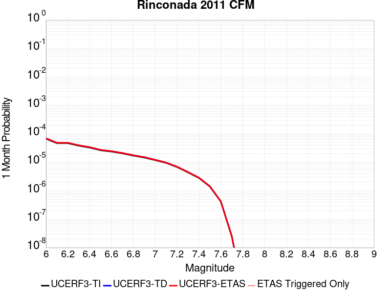 |  | 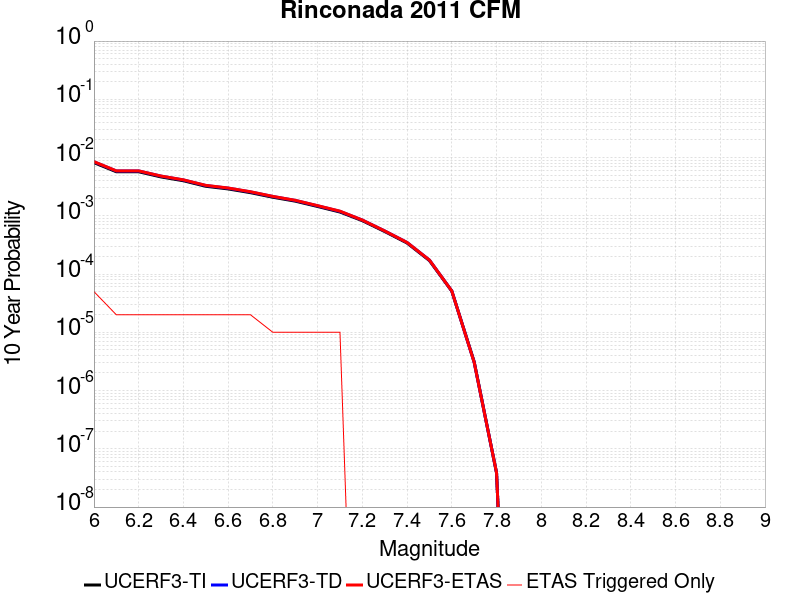 |

| Magnitude | 1 wk TI Prob | 1 wk TD Prob | 1 wk ETAS Prob | 1 wk ETAS/TD Gain | 1 wk ETAS Triggered Only | 1 mo TI Prob | 1 mo TD Prob | 1 mo ETAS Prob | 1 mo ETAS/TD Gain | 1 mo ETAS Triggered Only | 1 yr TI Prob | 1 yr TD Prob | 1 yr ETAS Prob | 1 yr ETAS/TD Gain | 1 yr ETAS Triggered Only | 10 yr TI Prob | 10 yr TD Prob | 10 yr ETAS Prob | 10 yr ETAS/TD Gain | 10 yr ETAS Triggered Only |
|-----|-----|-----|-----|-----|-----|-----|-----|-----|-----|-----|-----|-----|-----|-----|-----|-----|-----|-----|-----|-----|
| 6.0 | 1.5752368E-5 | 1.6274716E-5 | 1.6274716E-5 | 1.0 | 0.0 | 6.75084E-5 | 6.974694E-5 | 6.974694E-5 | 1.0 | 0.0 | 8.2160486E-4 | 8.488412E-4 | 8.5883273E-4 | 1.0117707 | 1.0E-5 | 0.008185739 | 0.00845637 | 0.008505947 | 1.0058627 | 5.0E-5 |
| 6.1 | 1.0966133E-5 | 1.1323029E-5 | 1.1323029E-5 | 1.0 | 0.0 | 4.6996865E-5 | 4.852637E-5 | 4.852637E-5 | 1.0 | 0.0 | 5.720366E-4 | 5.906491E-4 | 5.906491E-4 | 1.0 | 0.0 | 0.0057056635 | 0.0058908886 | 0.005910771 | 1.003375 | 2.0E-5 |
| 6.2 | 1.0966133E-5 | 1.1323029E-5 | 1.1323029E-5 | 1.0 | 0.0 | 4.6996865E-5 | 4.852637E-5 | 4.852637E-5 | 1.0 | 0.0 | 5.720366E-4 | 5.906491E-4 | 5.906491E-4 | 1.0 | 0.0 | 0.0057056635 | 0.0058908886 | 0.005910771 | 1.003375 | 2.0E-5 |
| 6.3 | 8.926149E-6 | 9.212771E-6 | 9.212771E-6 | 1.0 | 0.0 | 3.8254362E-5 | 3.948271E-5 | 3.948271E-5 | 1.0 | 0.0 | 4.6564735E-4 | 4.805963E-4 | 4.805963E-4 | 1.0 | 0.0 | 0.0046467283 | 0.0047956146 | 0.0048155184 | 1.0041505 | 2.0E-5 |
| 6.4 | 7.676955E-6 | 7.920191E-6 | 7.920191E-6 | 1.0 | 0.0 | 3.290082E-5 | 3.3943234E-5 | 3.3943234E-5 | 1.0 | 0.0 | 4.0049385E-4 | 4.1318068E-4 | 4.1318068E-4 | 1.0 | 0.0 | 0.0039977287 | 0.004124151 | 0.004144069 | 1.0048295 | 2.0E-5 |
| 6.5 | 6.1671026E-6 | 6.3589546E-6 | 6.3589546E-6 | 1.0 | 0.0 | 2.6430173E-5 | 2.725238E-5 | 2.725238E-5 | 1.0 | 0.0 | 3.2173982E-4 | 3.317473E-4 | 3.317473E-4 | 1.0 | 0.0 | 0.003212744 | 0.0033125326 | 0.0033324661 | 1.0060177 | 2.0E-5 |
| 6.6 | 5.553456E-6 | 5.7248126E-6 | 5.7248126E-6 | 1.0 | 0.0 | 2.3800309E-5 | 2.453468E-5 | 2.453468E-5 | 1.0 | 0.0 | 2.897302E-4 | 2.9866883E-4 | 2.9866883E-4 | 1.0 | 0.0 | 0.0028935277 | 0.002982683 | 0.0030026236 | 1.0066854 | 2.0E-5 |
| 6.7 | 4.787857E-6 | 4.9333094E-6 | 4.9333094E-6 | 1.0 | 0.0 | 2.0519226E-5 | 2.1142583E-5 | 2.1142583E-5 | 1.0 | 0.0 | 2.4979294E-4 | 2.573806E-4 | 2.573806E-4 | 1.0 | 0.0 | 0.0024951235 | 0.0025708308 | 0.0025907794 | 1.0077596 | 2.0E-5 |
| 6.8 | 3.9955166E-6 | 4.1134763E-6 | 4.1134763E-6 | 1.0 | 0.0 | 1.7123532E-5 | 1.7629065E-5 | 1.7629065E-5 | 1.0 | 0.0 | 2.0845905E-4 | 2.1461274E-4 | 2.1461274E-4 | 1.0 | 0.0 | 0.002082636 | 0.0021440585 | 0.0021540371 | 1.004654 | 1.0E-5 |
| 6.9 | 3.4250072E-6 | 3.5224464E-6 | 3.5224464E-6 | 1.0 | 0.0 | 1.46785205E-5 | 1.5096111E-5 | 1.5096111E-5 | 1.0 | 0.0 | 1.7869633E-4 | 1.8377967E-4 | 1.8377967E-4 | 1.0 | 0.0 | 0.001785527 | 0.0018362794 | 0.001846261 | 1.0054358 | 1.0E-5 |
| 7.0 | 2.7712713E-6 | 2.8467E-6 | 2.8467E-6 | 1.0 | 0.0 | 1.1876823E-5 | 1.2200086E-5 | 1.2200086E-5 | 1.0 | 0.0 | 1.4459073E-4 | 1.4852593E-4 | 1.4852593E-4 | 1.0 | 0.0 | 0.0014449668 | 0.0014842682 | 0.0014942534 | 1.0067273 | 1.0E-5 |
| 7.1 | 2.227358E-6 | 2.2856984E-6 | 2.2856984E-6 | 1.0 | 0.0 | 9.545785E-6 | 9.795814E-6 | 9.795814E-6 | 1.0 | 0.0 | 1.16213734E-4 | 1.19257515E-4 | 1.19257515E-4 | 1.0 | 0.0 | 0.0011615298 | 0.0011919362 | 0.0012019243 | 1.0083797 | 1.0E-5 |
| 7.2 | 1.581796E-6 | 1.6209011E-6 | 1.6209011E-6 | 1.0 | 0.0 | 6.779108E-6 | 6.9467005E-6 | 6.9467005E-6 | 1.0 | 0.0 | 8.253252E-5 | 8.457281E-5 | 8.457281E-5 | 1.0 | 0.0 | 8.250187E-4 | 8.454067E-4 | 8.454067E-4 | 1.0 | 0.0 |
| 7.3 | 1.0306567E-6 | 1.0546477E-6 | 1.0546477E-6 | 1.0 | 0.0 | 4.4170924E-6 | 4.519911E-6 | 4.519911E-6 | 1.0 | 0.0 | 5.3776774E-5 | 5.5028526E-5 | 5.5028526E-5 | 1.0 | 0.0 | 5.376376E-4 | 5.5014924E-4 | 5.5014924E-4 | 1.0 | 0.0 |
| 7.4 | 6.535541E-7 | 6.682742E-7 | 6.682742E-7 | 1.0 | 0.0 | 2.800943E-6 | 2.864029E-6 | 2.864029E-6 | 1.0 | 0.0 | 3.4100947E-5 | 3.4868997E-5 | 3.4868997E-5 | 1.0 | 0.0 | 3.4095717E-4 | 3.4863537E-4 | 3.4863537E-4 | 1.0 | 0.0 |
| 7.5 | 3.2656962E-7 | 3.3316687E-7 | 3.3316687E-7 | 1.0 | 0.0 | 1.3995833E-6 | 1.4278572E-6 | 1.4278572E-6 | 1.0 | 0.0 | 1.7039794E-5 | 1.7384024E-5 | 1.7384024E-5 | 1.0 | 0.0 | 1.7038487E-4 | 1.7382667E-4 | 1.7382667E-4 | 1.0 | 0.0 |
| 7.6 | 9.754343E-8 | 9.82099E-8 | 9.82099E-8 | 1.0 | 0.0 | 4.180432E-7 | 4.208995E-7 | 4.208995E-7 | 1.0 | 0.0 | 5.089664E-6 | 5.1244397E-6 | 5.1244397E-6 | 1.0 | 0.0 | 5.0895473E-5 | 5.1243223E-5 | 5.1243223E-5 | 1.0 | 0.0 |
| 7.7 | 6.0001453E-9 | 5.8490435E-9 | 5.8490435E-9 | 1.0 | 0.0 | 2.5714908E-8 | 2.506733E-8 | 2.506733E-8 | 1.0 | 0.0 | 3.1307894E-7 | 3.051947E-7 | 3.051947E-7 | 1.0 | 0.0 | 3.1307852E-6 | 3.051943E-6 | 3.051943E-6 | 1.0 | 0.0 |
| 7.8 | 7.400003E-11 | 7.4654505E-11 | 7.4654505E-11 | 1.0 | 0.0 | 3.171432E-10 | 3.1994773E-10 | 3.1994773E-10 | 1.0 | 0.0 | 3.861218E-9 | 3.895363E-9 | 3.895363E-9 | 1.0 | 0.0 | 3.861218E-8 | 3.895363E-8 | 3.895363E-8 | 1.0 | 0.0 |

## Great Valley 07 (Orestimba)
*[(top)](#table-of-contents)*

| 1 Week | 1 Month | 1 Year | 10 Year |
|-----|-----|-----|-----|
|  | 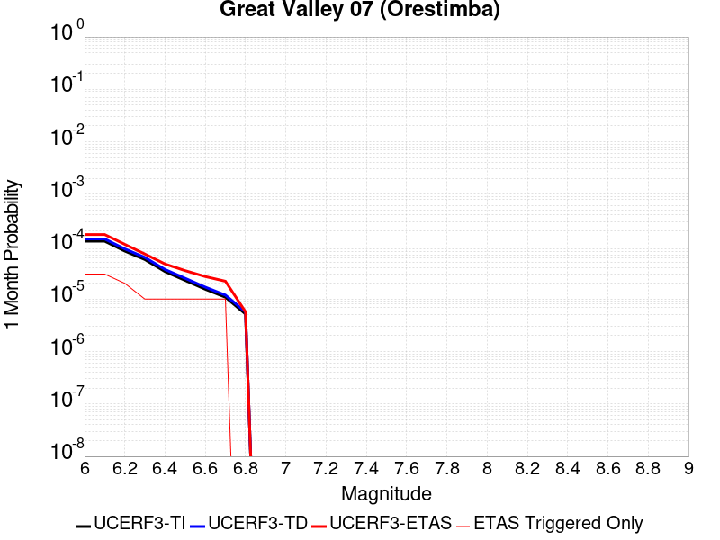 |  |  |

| Magnitude | 1 wk TI Prob | 1 wk TD Prob | 1 wk ETAS Prob | 1 wk ETAS/TD Gain | 1 wk ETAS Triggered Only | 1 mo TI Prob | 1 mo TD Prob | 1 mo ETAS Prob | 1 mo ETAS/TD Gain | 1 mo ETAS Triggered Only | 1 yr TI Prob | 1 yr TD Prob | 1 yr ETAS Prob | 1 yr ETAS/TD Gain | 1 yr ETAS Triggered Only | 10 yr TI Prob | 10 yr TD Prob | 10 yr ETAS Prob | 10 yr ETAS/TD Gain | 10 yr ETAS Triggered Only |
|-----|-----|-----|-----|-----|-----|-----|-----|-----|-----|-----|-----|-----|-----|-----|-----|-----|-----|-----|-----|-----|
| 6.0 | 2.9687902E-5 | 3.27575E-5 | 5.2756845E-5 | 1.6105273 | 2.0E-5 | 1.2722766E-4 | 1.4038214E-4 | 1.7037793E-4 | 1.2136724 | 3.0E-5 | 0.0015478961 | 0.0017078844 | 0.0017478161 | 1.0233808 | 4.0E-5 | 0.015371585 | 0.016955135 | 0.017004289 | 1.0028989 | 5.0E-5 |
| 6.1 | 2.9687902E-5 | 3.27575E-5 | 5.2756845E-5 | 1.6105273 | 2.0E-5 | 1.2722766E-4 | 1.4038214E-4 | 1.7037793E-4 | 1.2136724 | 3.0E-5 | 0.0015478961 | 0.0017078844 | 0.0017478161 | 1.0233808 | 4.0E-5 | 0.015371585 | 0.016955135 | 0.017004289 | 1.0028989 | 5.0E-5 |
| 6.2 | 1.9231524E-5 | 2.1159167E-5 | 3.1158954E-5 | 1.4725984 | 1.0E-5 | 8.2418206E-5 | 9.067912E-5 | 1.10677305E-4 | 1.2205379 | 2.0E-5 | 0.0010029797 | 0.0011034822 | 0.0011334491 | 1.0271567 | 3.0E-5 | 0.00998465 | 0.01098244 | 0.011022001 | 1.0036021 | 4.0E-5 |
| 6.3 | 1.324766E-5 | 1.4548534E-5 | 2.4548388E-5 | 1.6873446 | 1.0E-5 | 5.6774446E-5 | 6.234942E-5 | 7.23488E-5 | 1.1603764 | 1.0E-5 | 6.910097E-4 | 7.5884897E-4 | 7.7883375E-4 | 1.0263357 | 2.0E-5 | 0.006888649 | 0.0075635235 | 0.0075932965 | 1.0039364 | 3.0E-5 |
| 6.4 | 7.818645E-6 | 8.57284E-6 | 1.8572755E-5 | 2.1664646 | 1.0E-5 | 3.3508048E-5 | 3.6740246E-5 | 4.673988E-5 | 1.2721711 | 1.0E-5 | 4.078841E-4 | 4.4722404E-4 | 4.6721508E-4 | 1.0447003 | 2.0E-5 | 0.004071363 | 0.0044635804 | 0.0044934466 | 1.0066911 | 3.0E-5 |
| 6.5 | 5.3076565E-6 | 5.8178007E-6 | 1.5817743E-5 | 2.7188525 | 1.0E-5 | 2.27469E-5 | 2.4933206E-5 | 3.4932957E-5 | 1.4010615 | 1.0E-5 | 2.7690834E-4 | 3.035216E-4 | 3.1351857E-4 | 1.0329366 | 1.0E-5 | 0.0027656353 | 0.00303128 | 0.0030412497 | 1.003289 | 1.0E-5 |
| 6.6 | 3.6003578E-6 | 3.9484953E-6 | 1.39484555E-5 | 3.5326002 | 1.0E-5 | 1.5430012E-5 | 1.6922022E-5 | 2.6921853E-5 | 1.590936 | 1.0E-5 | 1.8784421E-4 | 2.0600771E-4 | 2.1600565E-4 | 1.0485319 | 1.0E-5 | 0.0018768552 | 0.0020583214 | 0.0020683007 | 1.0048484 | 1.0E-5 |
| 6.7 | 2.5361826E-6 | 2.7834678E-6 | 1.278344E-5 | 4.592631 | 1.0E-5 | 1.0869308E-5 | 1.1929101E-5 | 2.1928981E-5 | 1.8382761 | 1.0E-5 | 1.3232579E-4 | 1.4522845E-4 | 1.55227E-4 | 1.0688471 | 1.0E-5 | 0.0013224703 | 0.0014514653 | 0.0014614508 | 1.0068796 | 1.0E-5 |
| 6.8 | 1.2115831E-6 | 1.3313797E-6 | 1.3313797E-6 | 1.0 | 0.0 | 5.1924885E-6 | 5.7059065E-6 | 5.7059065E-6 | 1.0 | 0.0 | 6.3216714E-5 | 6.9468166E-5 | 6.9468166E-5 | 1.0 | 0.0 | 6.3198735E-4 | 6.945596E-4 | 6.945596E-4 | 1.0 | 0.0 |

## Hunting Creek - Berryessa 2011 CFM
*[(top)](#table-of-contents)*

| 1 Week | 1 Month | 1 Year | 10 Year |
|-----|-----|-----|-----|
|  |  | 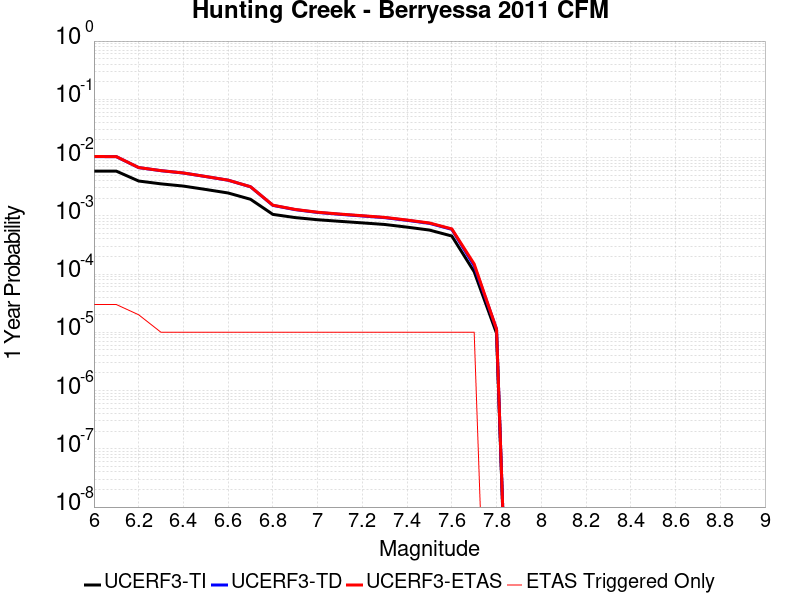 | 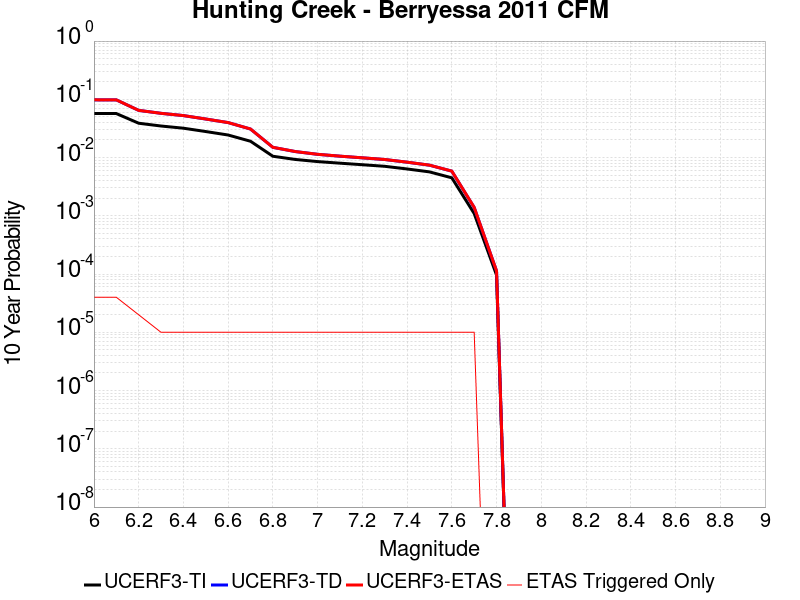 |

| Magnitude | 1 wk TI Prob | 1 wk TD Prob | 1 wk ETAS Prob | 1 wk ETAS/TD Gain | 1 wk ETAS Triggered Only | 1 mo TI Prob | 1 mo TD Prob | 1 mo ETAS Prob | 1 mo ETAS/TD Gain | 1 mo ETAS Triggered Only | 1 yr TI Prob | 1 yr TD Prob | 1 yr ETAS Prob | 1 yr ETAS/TD Gain | 1 yr ETAS Triggered Only | 10 yr TI Prob | 10 yr TD Prob | 10 yr ETAS Prob | 10 yr ETAS/TD Gain | 10 yr ETAS Triggered Only |
|-----|-----|-----|-----|-----|-----|-----|-----|-----|-----|-----|-----|-----|-----|-----|-----|-----|-----|-----|-----|-----|
| 6.0 | 1.1270982E-4 | 2.0012174E-4 | 2.1011975E-4 | 1.0499595 | 1.0E-5 | 4.8295266E-4 | 8.5739547E-4 | 8.7737833E-4 | 1.0233065 | 2.0E-5 | 0.0058641075 | 0.010386313 | 0.010416001 | 1.0028584 | 3.0E-5 | 0.057117578 | 0.09803703 | 0.0980731 | 1.000368 | 4.0E-5 |
| 6.1 | 1.1239393E-4 | 1.9960315E-4 | 2.0960114E-4 | 1.0500894 | 1.0E-5 | 4.8159933E-4 | 8.551744E-4 | 8.751573E-4 | 1.023367 | 2.0E-5 | 0.0058477195 | 0.010359551 | 0.01038924 | 1.0028659 | 3.0E-5 | 0.056962132 | 0.09779551 | 0.09783159 | 1.0003691 | 4.0E-5 |
| 6.2 | 7.596265E-5 | 1.2940196E-4 | 1.3940067E-4 | 1.0772686 | 1.0E-5 | 3.2551357E-4 | 5.5444165E-4 | 5.7443057E-4 | 1.0360523 | 2.0E-5 | 0.0039559277 | 0.0067210156 | 0.0067408816 | 1.0029558 | 2.0E-5 | 0.038862433 | 0.0645915 | 0.064610206 | 1.0002897 | 2.0E-5 |
| 6.3 | 6.78794E-5 | 1.145119E-4 | 1.145119E-4 | 1.0 | 0.0 | 2.9087928E-4 | 4.906513E-4 | 5.0064636E-4 | 1.0203711 | 1.0E-5 | 0.003535705 | 0.005952679 | 0.0059626196 | 1.0016699 | 1.0E-5 | 0.034799766 | 0.057465393 | 0.057474818 | 1.000164 | 1.0E-5 |
| 6.4 | 6.2165134E-5 | 1.0436625E-4 | 1.0436625E-4 | 1.0 | 0.0 | 2.6639478E-4 | 4.4721062E-4 | 4.5720616E-4 | 1.0223508 | 1.0E-5 | 0.0032385332 | 0.005427573 | 0.0054375185 | 1.0018325 | 1.0E-5 | 0.03191742 | 0.052550517 | 0.05255999 | 1.0001802 | 1.0E-5 |
| 6.5 | 5.4368087E-5 | 9.071415E-5 | 9.071415E-5 | 1.0 | 0.0 | 2.3298527E-4 | 3.8872007E-4 | 3.987162E-4 | 1.0257155 | 1.0E-5 | 0.0028329059 | 0.0047198683 | 0.0047298213 | 1.0021087 | 1.0E-5 | 0.027970633 | 0.045880128 | 0.04588967 | 1.0002079 | 1.0E-5 |
| 6.6 | 4.729947E-5 | 7.847572E-5 | 7.847572E-5 | 1.0 | 0.0 | 2.0269625E-4 | 3.362842E-4 | 3.362842E-4 | 1.0 | 0.0 | 0.002465034 | 0.0040849647 | 0.0040949243 | 1.002438 | 1.0E-5 | 0.02437869 | 0.03985155 | 0.03986115 | 1.0002409 | 1.0E-5 |
| 6.7 | 3.6875328E-5 | 6.0451803E-5 | 6.0451803E-5 | 1.0 | 0.0 | 1.5802756E-4 | 2.59056E-4 | 2.59056E-4 | 1.0 | 0.0 | 0.0019222875 | 0.0031482063 | 0.003158175 | 1.0031664 | 1.0E-5 | 0.019057442 | 0.03089237 | 0.030902062 | 1.0003138 | 1.0E-5 |
| 6.8 | 2.0292036E-5 | 2.8976308E-5 | 2.8976308E-5 | 1.0 | 0.0 | 8.6962966E-5 | 1.2417832E-4 | 1.2417832E-4 | 1.0 | 0.0 | 0.0010582599 | 0.0015108072 | 0.0015207921 | 1.006609 | 1.0E-5 | 0.010532344 | 0.014978523 | 0.014988373 | 1.0006577 | 1.0E-5 |
| 6.9 | 1.7871042E-5 | 2.4472254E-5 | 2.4472254E-5 | 1.0 | 0.0 | 7.658793E-5 | 1.048769E-4 | 1.048769E-4 | 1.0 | 0.0 | 9.320591E-4 | 0.0012761299 | 0.0012861171 | 1.0078262 | 1.0E-5 | 0.009281595 | 0.012679775 | 0.012689648 | 1.0007787 | 1.0E-5 |
| 7.0 | 1.6415532E-5 | 2.1906277E-5 | 2.1906277E-5 | 1.0 | 0.0 | 7.035038E-5 | 9.3880684E-5 | 9.3880684E-5 | 1.0 | 0.0 | 8.561793E-4 | 0.0011424015 | 0.00115239 | 1.0087435 | 1.0E-5 | 0.008528882 | 0.01136452 | 0.011374406 | 1.00087 | 1.0E-5 |
| 7.1 | 1.5409885E-5 | 2.0346342E-5 | 2.0346342E-5 | 1.0 | 0.0 | 6.6040695E-5 | 8.7195716E-5 | 8.7195716E-5 | 1.0 | 0.0 | 8.0374884E-4 | 0.0010610938 | 0.0010710831 | 1.0094142 | 1.0E-5 | 0.00800848 | 0.010560595 | 0.01057049 | 1.0009369 | 1.0E-5 |
| 7.2 | 1.4497423E-5 | 1.9054964E-5 | 1.9054964E-5 | 1.0 | 0.0 | 6.213033E-5 | 8.166159E-5 | 8.166159E-5 | 1.0 | 0.0 | 7.5617427E-4 | 9.937795E-4 | 0.0010037696 | 1.0100526 | 1.0E-5 | 0.0075360634 | 0.009893929 | 0.00990383 | 1.0010008 | 1.0E-5 |
| 7.3 | 1.3615175E-5 | 1.7826127E-5 | 1.7826127E-5 | 1.0 | 0.0 | 5.8349444E-5 | 7.639547E-5 | 7.639547E-5 | 1.0 | 0.0 | 7.101729E-4 | 9.297209E-4 | 9.397116E-4 | 1.0107459 | 1.0E-5 | 0.0070790765 | 0.009258823 | 0.00926873 | 1.00107 | 1.0E-5 |
| 7.4 | 1.2252825E-5 | 1.602625E-5 | 1.602625E-5 | 1.0 | 0.0 | 5.251105E-5 | 6.868213E-5 | 6.868213E-5 | 1.0 | 0.0 | 6.391345E-4 | 8.35887E-4 | 8.458786E-4 | 1.0119534 | 1.0E-5 | 0.0063729943 | 0.008327872 | 0.008337788 | 1.0011908 | 1.0E-5 |
| 7.5 | 1.0913301E-5 | 1.4241117E-5 | 1.4241117E-5 | 1.0 | 0.0 | 4.6770452E-5 | 6.1031948E-5 | 6.1031948E-5 | 1.0 | 0.0 | 5.6928146E-4 | 7.4281334E-4 | 7.528059E-4 | 1.0134523 | 1.0E-5 | 0.0056782532 | 0.0074036797 | 0.007413605 | 1.0013406 | 1.0E-5 |
| 7.6 | 8.623192E-6 | 1.12346415E-5 | 1.12346415E-5 | 1.0 | 0.0 | 3.6956015E-5 | 4.814759E-5 | 4.814759E-5 | 1.0 | 0.0 | 4.4984656E-4 | 5.8604183E-4 | 5.9603597E-4 | 1.0170536 | 1.0E-5 | 0.00448937 | 0.0058452785 | 0.00585522 | 1.0017008 | 1.0E-5 |
| 7.7 | 2.0993634E-6 | 2.662584E-6 | 2.662584E-6 | 1.0 | 0.0 | 8.997241E-6 | 1.1411025E-5 | 1.1411025E-5 | 1.0 | 0.0 | 1.09535904E-4 | 1.3892044E-4 | 1.4891905E-4 | 1.0719737 | 1.0E-5 | 0.0010948193 | 0.0013883426 | 0.0013983287 | 1.0071929 | 1.0E-5 |
| 7.8 | 1.8428308E-7 | 2.167437E-7 | 2.167437E-7 | 1.0 | 0.0 | 7.897844E-7 | 9.289013E-7 | 9.289013E-7 | 1.0 | 0.0 | 9.615583E-6 | 1.1309318E-5 | 1.1309318E-5 | 1.0 | 0.0 | 9.615166E-5 | 1.13086026E-4 | 1.13086026E-4 | 1.0 | 0.0 |

## Ortigalita (North)
*[(top)](#table-of-contents)*

| 1 Week | 1 Month | 1 Year | 10 Year |
|-----|-----|-----|-----|
|  |  | 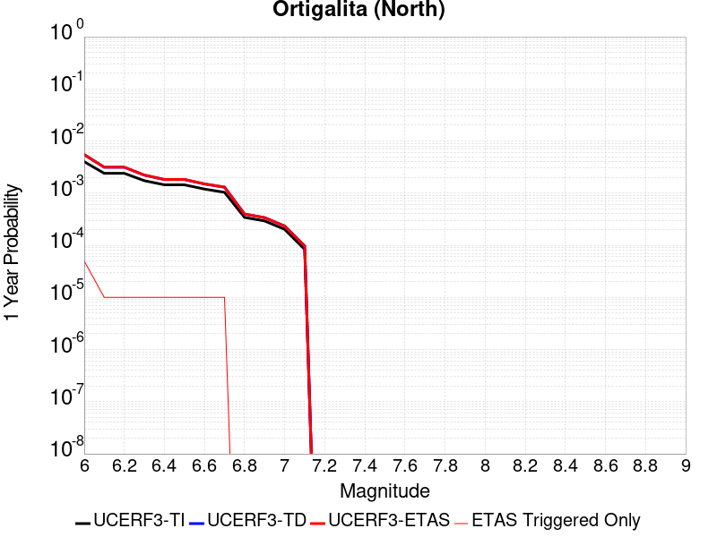 |  |

| Magnitude | 1 wk TI Prob | 1 wk TD Prob | 1 wk ETAS Prob | 1 wk ETAS/TD Gain | 1 wk ETAS Triggered Only | 1 mo TI Prob | 1 mo TD Prob | 1 mo ETAS Prob | 1 mo ETAS/TD Gain | 1 mo ETAS Triggered Only | 1 yr TI Prob | 1 yr TD Prob | 1 yr ETAS Prob | 1 yr ETAS/TD Gain | 1 yr ETAS Triggered Only | 10 yr TI Prob | 10 yr TD Prob | 10 yr ETAS Prob | 10 yr ETAS/TD Gain | 10 yr ETAS Triggered Only |
|-----|-----|-----|-----|-----|-----|-----|-----|-----|-----|-----|-----|-----|-----|-----|-----|-----|-----|-----|-----|-----|
| 6.0 | 7.711876E-5 | 1.05064966E-4 | 1.15063915E-4 | 1.0951692 | 1.0E-5 | 3.3046713E-4 | 4.502116E-4 | 4.6020708E-4 | 1.0222018 | 1.0E-5 | 0.004016016 | 0.0054681194 | 0.005517846 | 1.0090939 | 5.0E-5 | 0.039442103 | 0.053454787 | 0.053502116 | 1.0008854 | 5.0E-5 |
| 6.1 | 4.607858E-5 | 6.0239203E-5 | 6.0239203E-5 | 1.0 | 0.0 | 1.9746469E-4 | 2.5814527E-4 | 2.5814527E-4 | 1.0 | 0.0 | 0.0024014818 | 0.0031387596 | 0.0031487283 | 1.003176 | 1.0E-5 | 0.023756953 | 0.030975068 | 0.03098476 | 1.0003128 | 1.0E-5 |
| 6.2 | 4.607858E-5 | 6.0239203E-5 | 6.0239203E-5 | 1.0 | 0.0 | 1.9746469E-4 | 2.5814527E-4 | 2.5814527E-4 | 1.0 | 0.0 | 0.0024014818 | 0.0031387596 | 0.0031487283 | 1.003176 | 1.0E-5 | 0.023756953 | 0.030975068 | 0.03098476 | 1.0003128 | 1.0E-5 |
| 6.3 | 3.327423E-5 | 4.2475127E-5 | 4.2475127E-5 | 1.0 | 0.0 | 1.4259605E-4 | 1.8202531E-4 | 1.8202531E-4 | 1.0 | 0.0 | 0.0017347244 | 0.002214197 | 0.002224175 | 1.0045063 | 1.0E-5 | 0.017212452 | 0.021945644 | 0.021955425 | 1.0004457 | 1.0E-5 |
| 6.4 | 2.7732503E-5 | 3.4998593E-5 | 3.4998593E-5 | 1.0 | 0.0 | 1.1884817E-4 | 1.4998685E-4 | 1.4998685E-4 | 1.0 | 0.0 | 0.001446016 | 0.0018248095 | 0.0018347913 | 1.00547 | 1.0E-5 | 0.014366428 | 0.018121224 | 0.018131042 | 1.0005418 | 1.0E-5 |
| 6.5 | 2.7689714E-5 | 3.4948407E-5 | 3.4948407E-5 | 1.0 | 0.0 | 1.186648E-4 | 1.497718E-4 | 1.497718E-4 | 1.0 | 0.0 | 0.0014437864 | 0.0018221956 | 0.0018321774 | 1.0054779 | 1.0E-5 | 0.014344421 | 0.01809551 | 0.01810533 | 1.0005426 | 1.0E-5 |
| 6.6 | 2.2976905E-5 | 2.8718265E-5 | 2.8718265E-5 | 1.0 | 0.0 | 9.846873E-5 | 1.230739E-4 | 1.230739E-4 | 1.0 | 0.0 | 0.0011981975 | 0.0014976363 | 0.0015076214 | 1.0066671 | 1.0E-5 | 0.011917574 | 0.014898697 | 0.014908548 | 1.0006613 | 1.0E-5 |
| 6.7 | 1.9871539E-5 | 2.4904411E-5 | 2.4904411E-5 | 1.0 | 0.0 | 8.516096E-5 | 1.0673023E-4 | 1.0673023E-4 | 1.0 | 0.0 | 0.0010363415 | 0.0012989145 | 0.0013089016 | 1.0076888 | 1.0E-5 | 0.010315218 | 0.012936919 | 0.01294679 | 1.0007629 | 1.0E-5 |
| 6.8 | 6.5640475E-6 | 7.6054926E-6 | 7.6054926E-6 | 1.0 | 0.0 | 2.813133E-5 | 3.2594577E-5 | 3.2594577E-5 | 1.0 | 0.0 | 3.424451E-4 | 3.9676955E-4 | 3.9676955E-4 | 1.0 | 0.0 | 0.0034191788 | 0.003960899 | 0.003960899 | 1.0 | 0.0 |
| 6.9 | 5.6219683E-6 | 6.5018376E-6 | 6.5018376E-6 | 1.0 | 0.0 | 2.4093928E-5 | 2.7864735E-5 | 2.7864735E-5 | 1.0 | 0.0 | 2.933041E-4 | 3.3920293E-4 | 3.3920293E-4 | 1.0 | 0.0 | 0.0029291727 | 0.003387109 | 0.003387109 | 1.0 | 0.0 |
| 7.0 | 3.875591E-6 | 4.4847548E-6 | 4.4847548E-6 | 1.0 | 0.0 | 1.6609569E-5 | 1.9220248E-5 | 1.9220248E-5 | 1.0 | 0.0 | 2.0220275E-4 | 2.339835E-4 | 2.339835E-4 | 1.0 | 0.0 | 0.0020201886 | 0.0023375798 | 0.0023375798 | 1.0 | 0.0 |
| 7.1 | 1.6017933E-6 | 1.8570418E-6 | 1.8570418E-6 | 1.0 | 0.0 | 6.8648105E-6 | 7.958732E-6 | 7.958732E-6 | 1.0 | 0.0 | 8.357586E-5 | 9.689432E-5 | 9.689432E-5 | 1.0 | 0.0 | 8.3544437E-4 | 9.686254E-4 | 9.686254E-4 | 1.0 | 0.0 |

## Santa Ynez River
*[(top)](#table-of-contents)*

| 1 Week | 1 Month | 1 Year | 10 Year |
|-----|-----|-----|-----|
| 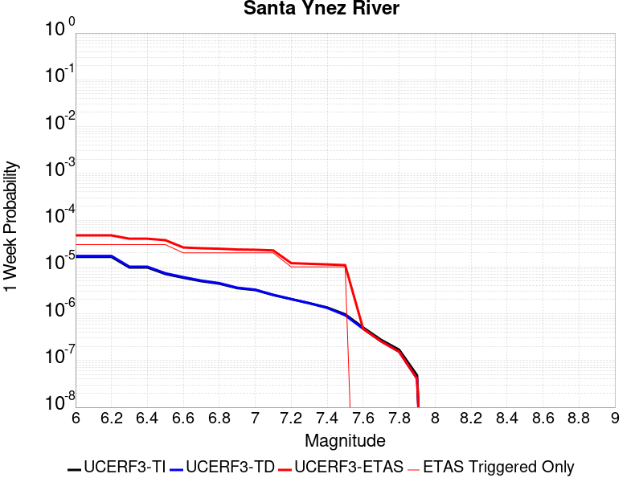 | 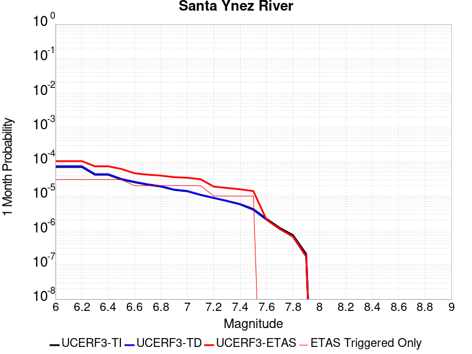 |  | 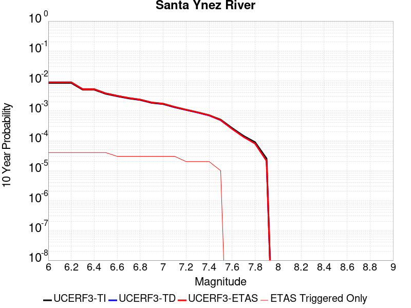 |

| Magnitude | 1 wk TI Prob | 1 wk TD Prob | 1 wk ETAS Prob | 1 wk ETAS/TD Gain | 1 wk ETAS Triggered Only | 1 mo TI Prob | 1 mo TD Prob | 1 mo ETAS Prob | 1 mo ETAS/TD Gain | 1 mo ETAS Triggered Only | 1 yr TI Prob | 1 yr TD Prob | 1 yr ETAS Prob | 1 yr ETAS/TD Gain | 1 yr ETAS Triggered Only | 10 yr TI Prob | 10 yr TD Prob | 10 yr ETAS Prob | 10 yr ETAS/TD Gain | 10 yr ETAS Triggered Only |
|-----|-----|-----|-----|-----|-----|-----|-----|-----|-----|-----|-----|-----|-----|-----|-----|-----|-----|-----|-----|-----|
| 6.0 | 1.6396456E-5 | 1.7209435E-5 | 4.720892E-5 | 2.7431998 | 3.0E-5 | 7.026863E-5 | 7.375284E-5 | 1.0375063E-4 | 1.406734 | 3.0E-5 | 8.551848E-4 | 8.976064E-4 | 9.375705E-4 | 1.044523 | 4.0E-5 | 0.0085190125 | 0.008943358 | 0.008983 | 1.0044326 | 4.0E-5 |
| 6.1 | 1.6396456E-5 | 1.7209435E-5 | 4.720892E-5 | 2.7431998 | 3.0E-5 | 7.026863E-5 | 7.375284E-5 | 1.0375063E-4 | 1.406734 | 3.0E-5 | 8.551848E-4 | 8.976064E-4 | 9.375705E-4 | 1.044523 | 4.0E-5 | 0.0085190125 | 0.008943358 | 0.008983 | 1.0044326 | 4.0E-5 |
| 6.2 | 1.6396456E-5 | 1.7209435E-5 | 4.720892E-5 | 2.7431998 | 3.0E-5 | 7.026863E-5 | 7.375284E-5 | 1.0375063E-4 | 1.406734 | 3.0E-5 | 8.551848E-4 | 8.976064E-4 | 9.375705E-4 | 1.044523 | 4.0E-5 | 0.0085190125 | 0.008943358 | 0.008983 | 1.0044326 | 4.0E-5 |
| 6.3 | 9.736976E-6 | 1.012233E-5 | 4.0122028E-5 | 3.9637144 | 3.0E-5 | 4.172923E-5 | 4.338072E-5 | 7.337942E-5 | 1.6915214 | 3.0E-5 | 5.0793495E-4 | 5.280373E-4 | 5.680162E-4 | 1.0757122 | 4.0E-5 | 0.005067755 | 0.005268332 | 0.0053081214 | 1.0075525 | 4.0E-5 |
| 6.4 | 9.736976E-6 | 1.012233E-5 | 4.0122028E-5 | 3.9637144 | 3.0E-5 | 4.172923E-5 | 4.338072E-5 | 7.337942E-5 | 1.6915214 | 3.0E-5 | 5.0793495E-4 | 5.280373E-4 | 5.680162E-4 | 1.0757122 | 4.0E-5 | 0.005067755 | 0.005268332 | 0.0053081214 | 1.0075525 | 4.0E-5 |
| 6.5 | 7.081964E-6 | 7.3298966E-6 | 3.7329675E-5 | 5.0927973 | 3.0E-5 | 3.035092E-5 | 3.1413474E-5 | 6.141253E-5 | 1.9549743 | 3.0E-5 | 3.694598E-4 | 3.8239348E-4 | 4.223782E-4 | 1.1045643 | 4.0E-5 | 0.0036884616 | 0.0038175168 | 0.0038573642 | 1.010438 | 4.0E-5 |
| 6.6 | 5.873247E-6 | 6.059743E-6 | 2.6059623E-5 | 4.30045 | 2.0E-5 | 2.5170815E-5 | 2.5970074E-5 | 4.5969555E-5 | 1.7700971 | 2.0E-5 | 3.064116E-4 | 3.1614062E-4 | 3.4613113E-4 | 1.0948645 | 3.0E-5 | 0.0030598943 | 0.0031569963 | 0.0031869016 | 1.0094727 | 3.0E-5 |
| 6.7 | 4.973277E-6 | 5.115901E-6 | 2.5115798E-5 | 4.90936 | 2.0E-5 | 2.1313872E-5 | 2.1925109E-5 | 4.192467E-5 | 1.9121761 | 2.0E-5 | 2.5946548E-4 | 2.66906E-4 | 2.9689798E-4 | 1.1123692 | 3.0E-5 | 0.0025916274 | 0.0026659032 | 0.002695823 | 1.0112232 | 3.0E-5 |
| 6.8 | 4.396492E-6 | 4.5109778E-6 | 2.4510888E-5 | 5.4336085 | 2.0E-5 | 1.884197E-5 | 1.9332621E-5 | 3.9332233E-5 | 2.0345008 | 2.0E-5 | 2.2937685E-4 | 2.3534958E-4 | 2.653425E-4 | 1.12744 | 3.0E-5 | 0.0022914023 | 0.0023510386 | 0.0023809683 | 1.0127304 | 3.0E-5 |
| 6.9 | 3.5255632E-6 | 3.6013332E-6 | 2.3601262E-5 | 6.5534787 | 2.0E-5 | 1.5109469E-5 | 1.5434196E-5 | 3.5433888E-5 | 2.295804 | 2.0E-5 | 1.8394225E-4 | 1.8789528E-4 | 2.1788964E-4 | 1.1596334 | 3.0E-5 | 0.0018379007 | 0.0018773803 | 0.001907324 | 1.0159497 | 3.0E-5 |
| 7.0 | 3.211603E-6 | 3.273654E-6 | 2.327359E-5 | 7.109361 | 2.0E-5 | 1.376394E-5 | 1.4029872E-5 | 3.4029592E-5 | 2.4255097 | 2.0E-5 | 1.6756308E-4 | 1.7080043E-4 | 2.0079532E-4 | 1.1756135 | 3.0E-5 | 0.0016743679 | 0.0017067058 | 0.0017366546 | 1.0175477 | 3.0E-5 |
| 7.1 | 2.5094619E-6 | 2.5409204E-6 | 2.254087E-5 | 8.871143 | 2.0E-5 | 1.0754793E-5 | 1.0889614E-5 | 3.0889398E-5 | 2.8365924 | 2.0E-5 | 1.3093173E-4 | 1.3257304E-4 | 1.6256906E-4 | 1.2262603 | 3.0E-5 | 0.0013085462 | 0.0013249456 | 0.0013549058 | 1.0226125 | 3.0E-5 |
| 7.2 | 2.0515774E-6 | 2.0619375E-6 | 1.2061917E-5 | 5.8497972 | 1.0E-5 | 8.792445E-6 | 8.836846E-6 | 1.8836758E-5 | 2.1316154 | 1.0E-5 | 1.0704277E-4 | 1.0758333E-4 | 1.2758118E-4 | 1.1858824 | 2.0E-5 | 0.0010699122 | 0.0010753168 | 0.0010952953 | 1.0185791 | 2.0E-5 |
| 7.3 | 1.6845745E-6 | 1.6773907E-6 | 1.1677374E-5 | 6.9616303 | 1.0E-5 | 7.219585E-6 | 7.1887976E-6 | 1.7188726E-5 | 2.3910432 | 1.0E-5 | 8.78949E-5 | 8.752012E-5 | 1.07518375E-4 | 1.2284988 | 2.0E-5 | 8.7860145E-4 | 8.7485946E-4 | 8.948419E-4 | 1.0228409 | 2.0E-5 |
| 7.4 | 1.3600285E-6 | 1.3333357E-6 | 1.1333323E-5 | 8.499976 | 1.0E-5 | 5.82868E-6 | 5.714284E-6 | 1.5714226E-5 | 2.7499907 | 1.0E-5 | 7.096187E-5 | 6.956921E-5 | 8.956782E-5 | 1.2874635 | 2.0E-5 | 7.0939213E-4 | 6.954765E-4 | 7.154626E-4 | 1.0287373 | 2.0E-5 |
| 7.5 | 9.735342E-7 | 9.290103E-7 | 1.0929001E-5 | 11.764133 | 1.0E-5 | 4.172283E-6 | 3.9814668E-6 | 1.39814265E-5 | 3.5116272 | 1.0E-5 | 5.079636E-5 | 4.8473295E-5 | 5.847281E-5 | 1.2062892 | 1.0E-5 | 5.0784746E-4 | 4.8462892E-4 | 4.946241E-4 | 1.0206244 | 1.0E-5 |
| 7.6 | 5.067187E-7 | 4.77857E-7 | 4.77857E-7 | 1.0 | 0.0 | 2.1716498E-6 | 2.047957E-6 | 2.047957E-6 | 1.0 | 0.0 | 2.6439517E-5 | 2.4933597E-5 | 2.4933597E-5 | 1.0 | 0.0 | 2.643637E-4 | 2.4930874E-4 | 2.4930874E-4 | 1.0 | 0.0 |
| 7.7 | 2.769089E-7 | 2.5759124E-7 | 2.5759124E-7 | 1.0 | 0.0 | 1.1867519E-6 | 1.1039621E-6 | 1.1039621E-6 | 1.0 | 0.0 | 1.4448608E-5 | 1.34406555E-5 | 1.34406555E-5 | 1.0 | 0.0 | 1.444767E-4 | 1.3439846E-4 | 1.3439846E-4 | 1.0 | 0.0 |
| 7.8 | 1.7044663E-7 | 1.5449015E-7 | 1.5449015E-7 | 1.0 | 0.0 | 7.3048534E-7 | 6.621005E-7 | 6.621005E-7 | 1.0 | 0.0 | 8.893623E-6 | 8.061043E-6 | 8.061043E-6 | 1.0 | 0.0 | 8.893267E-5 | 8.060753E-5 | 8.060753E-5 | 1.0 | 0.0 |
| 7.9 | 4.8344287E-8 | 4.0910923E-8 | 4.0910923E-8 | 1.0 | 0.0 | 2.0718979E-7 | 1.7533252E-7 | 1.7533252E-7 | 1.0 | 0.0 | 2.5225327E-6 | 2.1346711E-6 | 2.1346711E-6 | 1.0 | 0.0 | 2.5225041E-5 | 2.1346512E-5 | 2.1346512E-5 | 1.0 | 0.0 |

## Elsinore (Temecula) rev
*[(top)](#table-of-contents)*

| 1 Week | 1 Month | 1 Year | 10 Year |
|-----|-----|-----|-----|
| 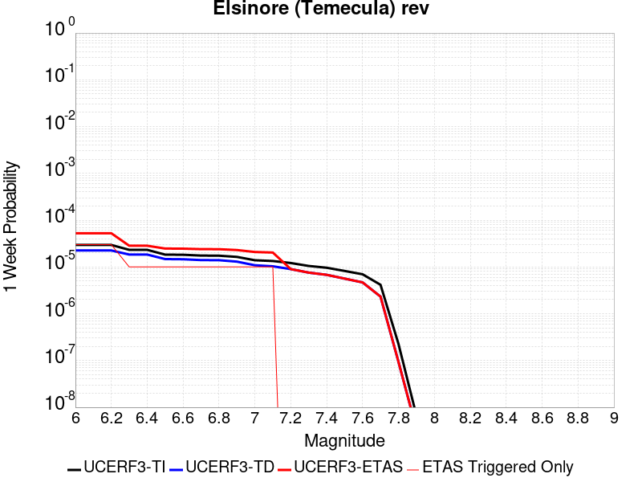 | 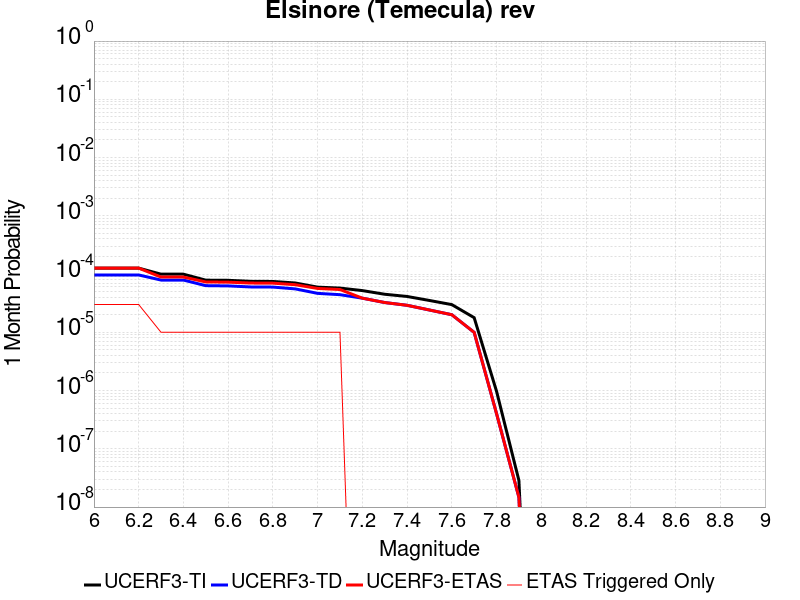 |  |  |

| Magnitude | 1 wk TI Prob | 1 wk TD Prob | 1 wk ETAS Prob | 1 wk ETAS/TD Gain | 1 wk ETAS Triggered Only | 1 mo TI Prob | 1 mo TD Prob | 1 mo ETAS Prob | 1 mo ETAS/TD Gain | 1 mo ETAS Triggered Only | 1 yr TI Prob | 1 yr TD Prob | 1 yr ETAS Prob | 1 yr ETAS/TD Gain | 1 yr ETAS Triggered Only | 10 yr TI Prob | 10 yr TD Prob | 10 yr ETAS Prob | 10 yr ETAS/TD Gain | 10 yr ETAS Triggered Only |
|-----|-----|-----|-----|-----|-----|-----|-----|-----|-----|-----|-----|-----|-----|-----|-----|-----|-----|-----|-----|-----|
| 6.0 | 2.9514995E-5 | 2.2517117E-5 | 5.251644E-5 | 2.3322897 | 3.0E-5 | 1.264867E-4 | 9.649849E-5 | 1.264956E-4 | 1.3108557 | 3.0E-5 | 0.0015388876 | 0.0011742581 | 0.0012142111 | 1.0340241 | 4.0E-5 | 0.015282745 | 0.011696897 | 0.01173643 | 1.0033797 | 4.0E-5 |
| 6.1 | 2.9514995E-5 | 2.2517117E-5 | 5.251644E-5 | 2.3322897 | 3.0E-5 | 1.264867E-4 | 9.649849E-5 | 1.264956E-4 | 1.3108557 | 3.0E-5 | 0.0015388876 | 0.0011742581 | 0.0012142111 | 1.0340241 | 4.0E-5 | 0.015282745 | 0.011696897 | 0.01173643 | 1.0033797 | 4.0E-5 |
| 6.2 | 2.9514995E-5 | 2.2517117E-5 | 5.251644E-5 | 2.3322897 | 3.0E-5 | 1.264867E-4 | 9.649849E-5 | 1.264956E-4 | 1.3108557 | 3.0E-5 | 0.0015388876 | 0.0011742581 | 0.0012142111 | 1.0340241 | 4.0E-5 | 0.015282745 | 0.011696897 | 0.01173643 | 1.0033797 | 4.0E-5 |
| 6.3 | 2.3223649E-5 | 1.8406454E-5 | 2.840627E-5 | 1.5432777 | 1.0E-5 | 9.952613E-5 | 7.888251E-5 | 8.888173E-5 | 1.1267608 | 1.0E-5 | 0.001211057 | 9.599888E-4 | 9.799696E-4 | 1.0208136 | 2.0E-5 | 0.012044783 | 0.009569948 | 0.009589756 | 1.0020698 | 2.0E-5 |
| 6.4 | 2.3223649E-5 | 1.8406454E-5 | 2.840627E-5 | 1.5432777 | 1.0E-5 | 9.952613E-5 | 7.888251E-5 | 8.888173E-5 | 1.1267608 | 1.0E-5 | 0.001211057 | 9.599888E-4 | 9.799696E-4 | 1.0208136 | 2.0E-5 | 0.012044783 | 0.009569948 | 0.009589756 | 1.0020698 | 2.0E-5 |
| 6.5 | 1.8338875E-5 | 1.4750118E-5 | 2.474997E-5 | 1.6779507 | 1.0E-5 | 7.8592806E-5 | 6.321331E-5 | 7.321267E-5 | 1.1581845 | 1.0E-5 | 9.5644733E-4 | 7.69359E-4 | 7.893436E-4 | 1.0259757 | 2.0E-5 | 0.009523412 | 0.0076739118 | 0.0076937582 | 1.0025862 | 2.0E-5 |
| 6.6 | 1.8223333E-5 | 1.4612673E-5 | 2.4612527E-5 | 1.6843275 | 1.0E-5 | 7.809766E-5 | 6.262429E-5 | 7.262366E-5 | 1.1596725 | 1.0E-5 | 9.504242E-4 | 7.6219277E-4 | 7.821775E-4 | 1.0262201 | 2.0E-5 | 0.009463696 | 0.0076027405 | 0.0076225884 | 1.0026107 | 2.0E-5 |
| 6.7 | 1.7512752E-5 | 1.402721E-5 | 2.402707E-5 | 1.7128901 | 1.0E-5 | 7.505249E-5 | 6.011528E-5 | 7.011468E-5 | 1.166337 | 1.0E-5 | 9.13381E-4 | 7.3166634E-4 | 7.516517E-4 | 1.0273149 | 2.0E-5 | 0.00909636 | 0.00729892 | 0.007318774 | 1.0027201 | 2.0E-5 |
| 6.8 | 1.7417142E-5 | 1.3951195E-5 | 2.3951055E-5 | 1.7167745 | 1.0E-5 | 7.4642754E-5 | 5.9789512E-5 | 6.978891E-5 | 1.1672434 | 1.0E-5 | 9.083966E-4 | 7.277028E-4 | 7.4768823E-4 | 1.0274638 | 2.0E-5 | 0.009046922 | 0.0072594886 | 0.0072793434 | 1.002735 | 2.0E-5 |
| 6.9 | 1.6402591E-5 | 1.2988613E-5 | 2.2988483E-5 | 1.7698951 | 1.0E-5 | 7.0294926E-5 | 5.5664343E-5 | 6.5663786E-5 | 1.1796383 | 1.0E-5 | 8.5550465E-4 | 6.775103E-4 | 6.9749675E-4 | 1.0294999 | 2.0E-5 | 0.008522186 | 0.006760169 | 0.0067800335 | 1.0029385 | 2.0E-5 |
| 7.0 | 1.3912486E-5 | 1.0878233E-5 | 2.0878124E-5 | 1.9192569 | 1.0E-5 | 5.9623577E-5 | 4.6620182E-5 | 5.6619716E-5 | 1.2144893 | 1.0E-5 | 7.2567526E-4 | 5.674556E-4 | 5.874443E-4 | 1.035225 | 2.0E-5 | 0.0072331014 | 0.005663986 | 0.0056838724 | 1.0035111 | 2.0E-5 |
| 7.1 | 1.3405147E-5 | 1.03274215E-5 | 2.0327318E-5 | 1.9682859 | 1.0E-5 | 5.7449364E-5 | 4.425964E-5 | 5.4259195E-5 | 1.2259295 | 1.0E-5 | 6.9922156E-4 | 5.3873047E-4 | 5.587197E-4 | 1.0371044 | 2.0E-5 | 0.0069702556 | 0.005377577 | 0.0053974693 | 1.0036992 | 2.0E-5 |
| 7.2 | 1.21402E-5 | 8.996737E-6 | 8.996737E-6 | 1.0 | 0.0 | 5.202839E-5 | 3.8556886E-5 | 3.8556886E-5 | 1.0 | 0.0 | 6.332616E-4 | 4.6933076E-4 | 4.7932606E-4 | 1.021297 | 1.0E-5 | 0.0063146 | 0.004684821 | 0.004694774 | 1.0021245 | 1.0E-5 |
| 7.3 | 1.05047775E-5 | 7.571771E-6 | 7.571771E-6 | 1.0 | 0.0 | 4.5019697E-5 | 3.245005E-5 | 3.245005E-5 | 1.0 | 0.0 | 5.4797693E-4 | 3.950092E-4 | 4.0500527E-4 | 1.0253059 | 1.0E-5 | 0.005466277 | 0.00394346 | 0.003953421 | 1.0025258 | 1.0E-5 |
| 7.4 | 9.624483E-6 | 6.7868696E-6 | 6.7868696E-6 | 1.0 | 0.0 | 4.124713E-5 | 2.9086266E-5 | 2.9086266E-5 | 1.0 | 0.0 | 5.0206814E-4 | 3.5406914E-4 | 3.640656E-4 | 1.028233 | 1.0E-5 | 0.005009353 | 0.003535204 | 0.0035451688 | 1.0028187 | 1.0E-5 |
| 7.5 | 8.215151E-6 | 5.635538E-6 | 5.635538E-6 | 1.0 | 0.0 | 3.5207315E-5 | 2.4152088E-5 | 2.4152088E-5 | 1.0 | 0.0 | 4.2856473E-4 | 2.9401327E-4 | 2.9401327E-4 | 1.0 | 0.0 | 0.004277392 | 0.002936371 | 0.002936371 | 1.0 | 0.0 |
| 7.6 | 6.975058E-6 | 4.676045E-6 | 4.676045E-6 | 1.0 | 0.0 | 2.9892764E-5 | 2.0040046E-5 | 2.0040046E-5 | 1.0 | 0.0 | 3.6388362E-4 | 2.439614E-4 | 2.439614E-4 | 1.0 | 0.0 | 0.0036328835 | 0.002437052 | 0.002437052 | 1.0 | 0.0 |
| 7.7 | 4.159604E-6 | 2.3269924E-6 | 2.3269924E-6 | 1.0 | 0.0 | 1.7826753E-5 | 9.97279E-6 | 9.97279E-6 | 1.0 | 0.0 | 2.1701909E-4 | 1.21412704E-4 | 1.21412704E-4 | 1.0 | 0.0 | 0.0021680726 | 0.0012135367 | 0.0012135367 | 1.0 | 0.0 |
| 7.8 | 2.2692414E-7 | 9.3854695E-8 | 9.3854695E-8 | 1.0 | 0.0 | 9.725317E-7 | 4.0223435E-7 | 4.0223435E-7 | 1.0 | 0.0 | 1.1840509E-5 | 4.8971956E-6 | 4.8971956E-6 | 1.0 | 0.0 | 1.1839878E-4 | 4.8971204E-5 | 4.8971204E-5 | 1.0 | 0.0 |
| 7.9 | 6.676829E-9 | 3.439853E-9 | 3.439853E-9 | 1.0 | 0.0 | 2.861498E-8 | 1.4742227E-8 | 1.4742227E-8 | 1.0 | 0.0 | 3.4838732E-7 | 1.7948659E-7 | 1.7948659E-7 | 1.0 | 0.0 | 3.4838679E-6 | 1.7948646E-6 | 1.7948646E-6 | 1.0 | 0.0 |

## Oak Ridge (Onshore)
*[(top)](#table-of-contents)*

| 1 Week | 1 Month | 1 Year | 10 Year |
|-----|-----|-----|-----|
| 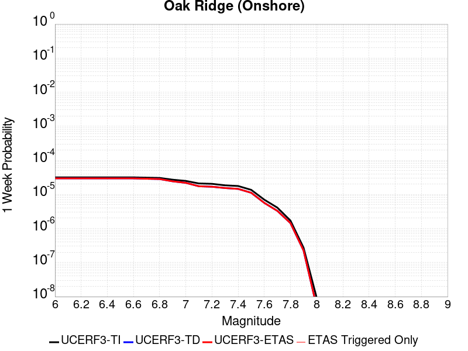 |  |  |  |

| Magnitude | 1 wk TI Prob | 1 wk TD Prob | 1 wk ETAS Prob | 1 wk ETAS/TD Gain | 1 wk ETAS Triggered Only | 1 mo TI Prob | 1 mo TD Prob | 1 mo ETAS Prob | 1 mo ETAS/TD Gain | 1 mo ETAS Triggered Only | 1 yr TI Prob | 1 yr TD Prob | 1 yr ETAS Prob | 1 yr ETAS/TD Gain | 1 yr ETAS Triggered Only | 10 yr TI Prob | 10 yr TD Prob | 10 yr ETAS Prob | 10 yr ETAS/TD Gain | 10 yr ETAS Triggered Only |
|-----|-----|-----|-----|-----|-----|-----|-----|-----|-----|-----|-----|-----|-----|-----|-----|-----|-----|-----|-----|-----|
| 6.0 | 3.155064E-5 | 2.9525974E-5 | 2.9525974E-5 | 1.0 | 0.0 | 1.3521002E-4 | 1.2653397E-4 | 1.2653397E-4 | 1.0 | 0.0 | 0.001644939 | 0.0015395004 | 0.0015395004 | 1.0 | 0.0 | 0.01632816 | 0.015292859 | 0.015332247 | 1.0025756 | 4.0E-5 |
| 6.1 | 3.155064E-5 | 2.9525974E-5 | 2.9525974E-5 | 1.0 | 0.0 | 1.3521002E-4 | 1.2653397E-4 | 1.2653397E-4 | 1.0 | 0.0 | 0.001644939 | 0.0015395004 | 0.0015395004 | 1.0 | 0.0 | 0.01632816 | 0.015292859 | 0.015332247 | 1.0025756 | 4.0E-5 |
| 6.2 | 3.155064E-5 | 2.9525974E-5 | 2.9525974E-5 | 1.0 | 0.0 | 1.3521002E-4 | 1.2653397E-4 | 1.2653397E-4 | 1.0 | 0.0 | 0.001644939 | 0.0015395004 | 0.0015395004 | 1.0 | 0.0 | 0.01632816 | 0.015292859 | 0.015332247 | 1.0025756 | 4.0E-5 |
| 6.3 | 3.155064E-5 | 2.9525974E-5 | 2.9525974E-5 | 1.0 | 0.0 | 1.3521002E-4 | 1.2653397E-4 | 1.2653397E-4 | 1.0 | 0.0 | 0.001644939 | 0.0015395004 | 0.0015395004 | 1.0 | 0.0 | 0.01632816 | 0.015292859 | 0.015332247 | 1.0025756 | 4.0E-5 |
| 6.4 | 3.155064E-5 | 2.9525974E-5 | 2.9525974E-5 | 1.0 | 0.0 | 1.3521002E-4 | 1.2653397E-4 | 1.2653397E-4 | 1.0 | 0.0 | 0.001644939 | 0.0015395004 | 0.0015395004 | 1.0 | 0.0 | 0.01632816 | 0.015292859 | 0.015332247 | 1.0025756 | 4.0E-5 |
| 6.5 | 3.155064E-5 | 2.9525974E-5 | 2.9525974E-5 | 1.0 | 0.0 | 1.3521002E-4 | 1.2653397E-4 | 1.2653397E-4 | 1.0 | 0.0 | 0.001644939 | 0.0015395004 | 0.0015395004 | 1.0 | 0.0 | 0.01632816 | 0.015292859 | 0.015332247 | 1.0025756 | 4.0E-5 |
| 6.6 | 3.155064E-5 | 2.9525974E-5 | 2.9525974E-5 | 1.0 | 0.0 | 1.3521002E-4 | 1.2653397E-4 | 1.2653397E-4 | 1.0 | 0.0 | 0.001644939 | 0.0015395004 | 0.0015395004 | 1.0 | 0.0 | 0.01632816 | 0.015292859 | 0.015332247 | 1.0025756 | 4.0E-5 |
| 6.7 | 3.098897E-5 | 2.8864175E-5 | 2.8864175E-5 | 1.0 | 0.0 | 1.328031E-4 | 1.2369796E-4 | 1.2369796E-4 | 1.0 | 0.0 | 0.0016156785 | 0.0015050198 | 0.0015050198 | 1.0 | 0.0 | 0.016039822 | 0.014952714 | 0.014992116 | 1.0026351 | 4.0E-5 |
| 6.8 | 3.0449872E-5 | 2.8239372E-5 | 2.8239372E-5 | 1.0 | 0.0 | 1.3049292E-4 | 1.2102048E-4 | 1.2102048E-4 | 1.0 | 0.0 | 0.0015875935 | 0.0014724657 | 0.0014724657 | 1.0 | 0.0 | 0.015762992 | 0.014631462 | 0.014670877 | 1.0026939 | 4.0E-5 |
| 6.9 | 2.697928E-5 | 2.4219773E-5 | 2.4219773E-5 | 1.0 | 0.0 | 1.15620365E-4 | 1.0379502E-4 | 1.0379502E-4 | 1.0 | 0.0 | 0.0014067689 | 0.0012629933 | 0.0012629933 | 1.0 | 0.0 | 0.0139789665 | 0.01256087 | 0.012590493 | 1.0023583 | 3.0E-5 |
| 7.0 | 2.4893961E-5 | 2.1862043E-5 | 2.1862043E-5 | 1.0 | 0.0 | 1.0668404E-4 | 9.3691204E-5 | 9.3691204E-5 | 1.0 | 0.0 | 0.0012981043 | 0.0011401111 | 0.0011401111 | 1.0 | 0.0 | 0.012905477 | 0.011344905 | 0.011374565 | 1.0026144 | 3.0E-5 |
| 7.1 | 2.0945363E-5 | 1.7354487E-5 | 1.7354487E-5 | 1.0 | 0.0 | 8.976275E-5 | 7.437428E-5 | 7.437428E-5 | 1.0 | 0.0 | 0.0010923136 | 9.051354E-4 | 9.051354E-4 | 1.0 | 0.0 | 0.0108696 | 0.009015423 | 0.009045153 | 1.0032977 | 3.0E-5 |
| 7.2 | 2.0439404E-5 | 1.6809423E-5 | 1.6809423E-5 | 1.0 | 0.0 | 8.7594504E-5 | 7.203843E-5 | 7.203843E-5 | 1.0 | 0.0 | 0.0010659413 | 8.767196E-4 | 8.767196E-4 | 1.0 | 0.0 | 0.010608427 | 0.008733526 | 0.008763264 | 1.0034051 | 3.0E-5 |
| 7.3 | 1.8463334E-5 | 1.5381811E-5 | 1.5381811E-5 | 1.0 | 0.0 | 7.912617E-5 | 6.59204E-5 | 6.59204E-5 | 1.0 | 0.0 | 9.6293533E-4 | 8.0228975E-4 | 8.0228975E-4 | 1.0 | 0.0 | 0.009587734 | 0.007994797 | 0.0080245575 | 1.0037224 | 3.0E-5 |
| 7.4 | 1.763139E-5 | 1.451684E-5 | 1.451684E-5 | 1.0 | 0.0 | 7.556091E-5 | 6.221356E-5 | 6.221356E-5 | 1.0 | 0.0 | 9.1956573E-4 | 7.571909E-4 | 7.571909E-4 | 1.0 | 0.0 | 0.009157699 | 0.007546914 | 0.0075766873 | 1.0039451 | 3.0E-5 |
| 7.5 | 1.3594944E-5 | 1.1163356E-5 | 1.1163356E-5 | 1.0 | 0.0 | 5.8262744E-5 | 4.784209E-5 | 4.784209E-5 | 1.0 | 0.0 | 7.0911803E-4 | 5.8232434E-4 | 5.8232434E-4 | 1.0 | 0.0 | 0.007068595 | 0.0058082556 | 0.0058380812 | 1.005135 | 3.0E-5 |
| 7.6 | 6.9889534E-6 | 5.6367144E-6 | 5.6367144E-6 | 1.0 | 0.0 | 2.9952313E-5 | 2.4157125E-5 | 2.4157125E-5 | 1.0 | 0.0 | 3.646084E-4 | 2.9407372E-4 | 2.9407372E-4 | 1.0 | 0.0 | 0.0036401073 | 0.0029368899 | 0.0029468604 | 1.003395 | 1.0E-5 |
| 7.7 | 4.0824193E-6 | 3.2832586E-6 | 3.2832586E-6 | 1.0 | 0.0 | 1.7495966E-5 | 1.4071033E-5 | 1.4071033E-5 | 1.0 | 0.0 | 2.1299256E-4 | 1.713015E-4 | 1.713015E-4 | 1.0 | 0.0 | 0.0021278851 | 0.0017117079 | 0.0017216908 | 1.0058321 | 1.0E-5 |
| 7.8 | 1.7023609E-6 | 1.4370495E-6 | 1.4370495E-6 | 1.0 | 0.0 | 7.295812E-6 | 6.1587693E-6 | 6.1587693E-6 | 1.0 | 0.0 | 8.882289E-5 | 7.498047E-5 | 7.498047E-5 | 1.0 | 0.0 | 8.8787393E-4 | 7.495545E-4 | 7.59547E-4 | 1.0133313 | 1.0E-5 |
| 7.9 | 2.721225E-7 | 2.2616497E-7 | 2.2616497E-7 | 1.0 | 0.0 | 1.1662388E-6 | 9.692781E-7 | 9.692781E-7 | 1.0 | 0.0 | 1.4198865E-5 | 1.1800899E-5 | 1.1800899E-5 | 1.0 | 0.0 | 1.4197957E-4 | 1.1800301E-4 | 1.1800301E-4 | 1.0 | 0.0 |
| 8.0 | 9.364255E-9 | 5.1206666E-9 | 5.1206666E-9 | 1.0 | 0.0 | 4.0132523E-8 | 2.1945715E-8 | 2.1945715E-8 | 1.0 | 0.0 | 4.8861335E-7 | 2.6718905E-7 | 2.6718905E-7 | 1.0 | 0.0 | 4.8861225E-6 | 2.6718876E-6 | 2.6718876E-6 | 1.0 | 0.0 |

## Raymond
*[(top)](#table-of-contents)*

| 1 Week | 1 Month | 1 Year | 10 Year |
|-----|-----|-----|-----|
| 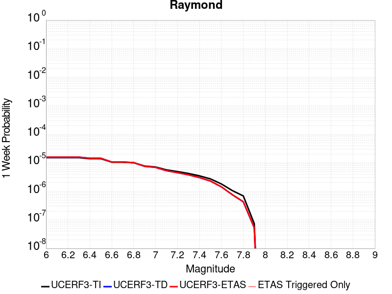 |  |  |  |

| Magnitude | 1 wk TI Prob | 1 wk TD Prob | 1 wk ETAS Prob | 1 wk ETAS/TD Gain | 1 wk ETAS Triggered Only | 1 mo TI Prob | 1 mo TD Prob | 1 mo ETAS Prob | 1 mo ETAS/TD Gain | 1 mo ETAS Triggered Only | 1 yr TI Prob | 1 yr TD Prob | 1 yr ETAS Prob | 1 yr ETAS/TD Gain | 1 yr ETAS Triggered Only | 10 yr TI Prob | 10 yr TD Prob | 10 yr ETAS Prob | 10 yr ETAS/TD Gain | 10 yr ETAS Triggered Only |
|-----|-----|-----|-----|-----|-----|-----|-----|-----|-----|-----|-----|-----|-----|-----|-----|-----|-----|-----|-----|-----|
| 6.0 | 1.5157413E-5 | 1.5810128E-5 | 1.5810128E-5 | 1.0 | 0.0 | 6.4958724E-5 | 6.7756075E-5 | 6.7756075E-5 | 1.0 | 0.0 | 7.905855E-4 | 8.2464307E-4 | 8.446266E-4 | 1.0242329 | 2.0E-5 | 0.007877788 | 0.008218348 | 0.00825802 | 1.0048271 | 4.0E-5 |
| 6.1 | 1.5157413E-5 | 1.5810128E-5 | 1.5810128E-5 | 1.0 | 0.0 | 6.4958724E-5 | 6.7756075E-5 | 6.7756075E-5 | 1.0 | 0.0 | 7.905855E-4 | 8.2464307E-4 | 8.446266E-4 | 1.0242329 | 2.0E-5 | 0.007877788 | 0.008218348 | 0.00825802 | 1.0048271 | 4.0E-5 |
| 6.2 | 1.5157413E-5 | 1.5810128E-5 | 1.5810128E-5 | 1.0 | 0.0 | 6.4958724E-5 | 6.7756075E-5 | 6.7756075E-5 | 1.0 | 0.0 | 7.905855E-4 | 8.2464307E-4 | 8.446266E-4 | 1.0242329 | 2.0E-5 | 0.007877788 | 0.008218348 | 0.00825802 | 1.0048271 | 4.0E-5 |
| 6.3 | 1.5157413E-5 | 1.5810128E-5 | 1.5810128E-5 | 1.0 | 0.0 | 6.4958724E-5 | 6.7756075E-5 | 6.7756075E-5 | 1.0 | 0.0 | 7.905855E-4 | 8.2464307E-4 | 8.446266E-4 | 1.0242329 | 2.0E-5 | 0.007877788 | 0.008218348 | 0.00825802 | 1.0048271 | 4.0E-5 |
| 6.4 | 1.3941944E-5 | 1.445469E-5 | 1.445469E-5 | 1.0 | 0.0 | 5.9749822E-5 | 6.1947336E-5 | 6.1947336E-5 | 1.0 | 0.0 | 7.2721124E-4 | 7.5397117E-4 | 7.639636E-4 | 1.0132531 | 1.0E-5 | 0.007248361 | 0.0075164647 | 0.007546239 | 1.0039612 | 3.0E-5 |
| 6.5 | 1.3941944E-5 | 1.445469E-5 | 1.445469E-5 | 1.0 | 0.0 | 5.9749822E-5 | 6.1947336E-5 | 6.1947336E-5 | 1.0 | 0.0 | 7.2721124E-4 | 7.5397117E-4 | 7.639636E-4 | 1.0132531 | 1.0E-5 | 0.007248361 | 0.0075164647 | 0.007546239 | 1.0039612 | 3.0E-5 |
| 6.6 | 1.0542609E-5 | 1.0671113E-5 | 1.0671113E-5 | 1.0 | 0.0 | 4.5181827E-5 | 4.573257E-5 | 4.573257E-5 | 1.0 | 0.0 | 5.499499E-4 | 5.5665727E-4 | 5.666517E-4 | 1.0179543 | 1.0E-5 | 0.005485909 | 0.00555319 | 0.005573079 | 1.0035815 | 2.0E-5 |
| 6.7 | 1.0542609E-5 | 1.0671113E-5 | 1.0671113E-5 | 1.0 | 0.0 | 4.5181827E-5 | 4.573257E-5 | 4.573257E-5 | 1.0 | 0.0 | 5.499499E-4 | 5.5665727E-4 | 5.666517E-4 | 1.0179543 | 1.0E-5 | 0.005485909 | 0.00555319 | 0.005573079 | 1.0035815 | 2.0E-5 |
| 6.8 | 1.0079132E-5 | 1.0176646E-5 | 1.0176646E-5 | 1.0 | 0.0 | 4.3195567E-5 | 4.3613498E-5 | 4.3613498E-5 | 1.0 | 0.0 | 5.257791E-4 | 5.3087034E-4 | 5.40865E-4 | 1.018827 | 1.0E-5 | 0.0052453685 | 0.005296571 | 0.005316465 | 1.003756 | 2.0E-5 |
| 6.9 | 7.721598E-6 | 7.5489047E-6 | 7.5489047E-6 | 1.0 | 0.0 | 3.3092143E-5 | 3.2352054E-5 | 3.2352054E-5 | 1.0 | 0.0 | 4.0282236E-4 | 3.9381627E-4 | 4.0381236E-4 | 1.0253825 | 1.0E-5 | 0.0040209293 | 0.0039313175 | 0.003951239 | 1.0050673 | 2.0E-5 |
| 7.0 | 7.137566E-6 | 6.9113057E-6 | 6.9113057E-6 | 1.0 | 0.0 | 3.058921E-5 | 2.961955E-5 | 2.961955E-5 | 1.0 | 0.0 | 3.7236E-4 | 3.6055944E-4 | 3.7055582E-4 | 1.0277246 | 1.0E-5 | 0.0037173668 | 0.0035998628 | 0.0036197908 | 1.0055357 | 2.0E-5 |
| 7.1 | 5.654976E-6 | 5.29954E-6 | 5.29954E-6 | 1.0 | 0.0 | 2.4235387E-5 | 2.2712118E-5 | 2.2712118E-5 | 1.0 | 0.0 | 2.9502588E-4 | 2.7648517E-4 | 2.8648242E-4 | 1.0361583 | 1.0E-5 | 0.0029463451 | 0.002761443 | 0.0027813877 | 1.0072225 | 2.0E-5 |
| 7.2 | 4.9358455E-6 | 4.5266574E-6 | 4.5266574E-6 | 1.0 | 0.0 | 2.1153453E-5 | 1.9399817E-5 | 1.9399817E-5 | 1.0 | 0.0 | 2.5751285E-4 | 2.3616731E-4 | 2.4616494E-4 | 1.0423329 | 1.0E-5 | 0.0025721465 | 0.0023591854 | 0.0023791383 | 1.0084575 | 2.0E-5 |
| 7.3 | 4.2368597E-6 | 3.8056164E-6 | 3.8056164E-6 | 1.0 | 0.0 | 1.8157843E-5 | 1.6309683E-5 | 1.6309683E-5 | 1.0 | 0.0 | 2.2104931E-4 | 1.9855241E-4 | 2.0855042E-4 | 1.0503545 | 1.0E-5 | 0.0022082955 | 0.0019837688 | 0.002003729 | 1.0100619 | 2.0E-5 |
| 7.4 | 3.4999923E-6 | 3.043744E-6 | 3.043744E-6 | 1.0 | 0.0 | 1.49998805E-5 | 1.3044552E-5 | 1.3044552E-5 | 1.0 | 0.0 | 1.8260824E-4 | 1.5880594E-4 | 1.6880434E-4 | 1.0629599 | 1.0E-5 | 0.0018245826 | 0.0015869403 | 0.0016069085 | 1.0125829 | 2.0E-5 |
| 7.5 | 2.738017E-6 | 2.3020468E-6 | 2.3020468E-6 | 1.0 | 0.0 | 1.1734306E-5 | 9.865878E-6 | 9.865878E-6 | 1.0 | 0.0 | 1.428558E-4 | 1.2011051E-4 | 1.2011051E-4 | 1.0 | 0.0 | 0.0014276401 | 0.0012004703 | 0.0012104583 | 1.0083201 | 1.0E-5 |
| 7.6 | 1.8186392E-6 | 1.442312E-6 | 1.442312E-6 | 1.0 | 0.0 | 7.794145E-6 | 6.181323E-6 | 6.181323E-6 | 1.0 | 0.0 | 9.488958E-5 | 7.5255055E-5 | 7.5255055E-5 | 1.0 | 0.0 | 9.4849075E-4 | 7.523072E-4 | 7.523072E-4 | 1.0 | 0.0 |
| 7.7 | 1.0660348E-6 | 7.6438056E-7 | 7.6438056E-7 | 1.0 | 0.0 | 4.5687125E-6 | 3.2759126E-6 | 3.2759126E-6 | 1.0 | 0.0 | 5.5622655E-5 | 3.9883522E-5 | 3.9883522E-5 | 1.0 | 0.0 | 5.5608735E-4 | 3.9877277E-4 | 3.9877277E-4 | 1.0 | 0.0 |
| 7.8 | 6.913602E-7 | 4.3204133E-7 | 4.3204133E-7 | 1.0 | 0.0 | 2.962969E-6 | 1.8516045E-6 | 1.8516045E-6 | 1.0 | 0.0 | 3.607355E-5 | 2.2543056E-5 | 2.2543056E-5 | 1.0 | 0.0 | 3.6067693E-4 | 2.2541556E-4 | 2.2541556E-4 | 1.0 | 0.0 |
| 7.9 | 7.425201E-8 | 5.3222113E-8 | 5.3222113E-8 | 1.0 | 0.0 | 3.1822285E-7 | 2.2809476E-7 | 2.2809476E-7 | 1.0 | 0.0 | 3.874356E-6 | 2.7770516E-6 | 2.7770516E-6 | 1.0 | 0.0 | 3.8742884E-5 | 2.7770298E-5 | 2.7770298E-5 | 1.0 | 0.0 |

## Hayward (So) 2011 CFM
*[(top)](#table-of-contents)*

| 1 Week | 1 Month | 1 Year | 10 Year |
|-----|-----|-----|-----|
| 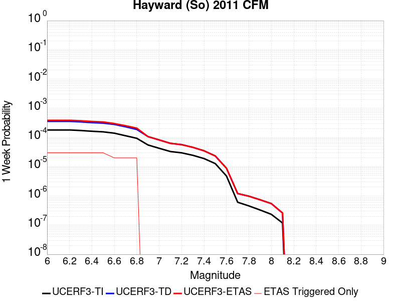 | 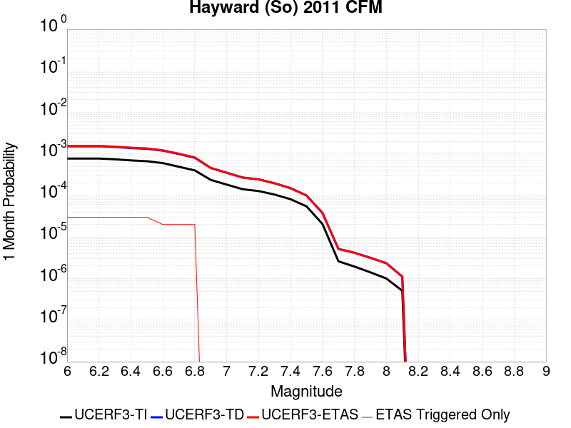 |  |  |

| Magnitude | 1 wk TI Prob | 1 wk TD Prob | 1 wk ETAS Prob | 1 wk ETAS/TD Gain | 1 wk ETAS Triggered Only | 1 mo TI Prob | 1 mo TD Prob | 1 mo ETAS Prob | 1 mo ETAS/TD Gain | 1 mo ETAS Triggered Only | 1 yr TI Prob | 1 yr TD Prob | 1 yr ETAS Prob | 1 yr ETAS/TD Gain | 1 yr ETAS Triggered Only | 10 yr TI Prob | 10 yr TD Prob | 10 yr ETAS Prob | 10 yr ETAS/TD Gain | 10 yr ETAS Triggered Only |
|-----|-----|-----|-----|-----|-----|-----|-----|-----|-----|-----|-----|-----|-----|-----|-----|-----|-----|-----|-----|-----|
| 6.0 | 1.8091932E-4 | 3.570541E-4 | 3.8704337E-4 | 1.0839909 | 3.0E-5 | 7.751381E-4 | 0.0015293444 | 0.0015592985 | 1.0195862 | 3.0E-5 | 0.00939654 | 0.018463207 | 0.018492654 | 1.0015949 | 3.0E-5 | 0.090090066 | 0.16673161 | 0.16676494 | 1.0001999 | 4.0E-5 |
| 6.1 | 1.8091932E-4 | 3.570541E-4 | 3.8704337E-4 | 1.0839909 | 3.0E-5 | 7.751381E-4 | 0.0015293444 | 0.0015592985 | 1.0195862 | 3.0E-5 | 0.00939654 | 0.018463207 | 0.018492654 | 1.0015949 | 3.0E-5 | 0.090090066 | 0.16673161 | 0.16676494 | 1.0001999 | 4.0E-5 |
| 6.2 | 1.8091932E-4 | 3.570541E-4 | 3.8704337E-4 | 1.0839909 | 3.0E-5 | 7.751381E-4 | 0.0015293444 | 0.0015592985 | 1.0195862 | 3.0E-5 | 0.00939654 | 0.018463207 | 0.018492654 | 1.0015949 | 3.0E-5 | 0.090090066 | 0.16673161 | 0.16676494 | 1.0001999 | 4.0E-5 |
| 6.3 | 1.7322872E-4 | 3.426234E-4 | 3.726131E-4 | 1.0875297 | 3.0E-5 | 7.4219756E-4 | 0.0014675693 | 0.0014975253 | 1.020412 | 3.0E-5 | 0.0089988755 | 0.017723544 | 0.017753012 | 1.0016626 | 3.0E-5 | 0.08643075 | 0.16066726 | 0.16070083 | 1.000209 | 4.0E-5 |
| 6.4 | 1.6334097E-4 | 3.234411E-4 | 3.534314E-4 | 1.0927225 | 3.0E-5 | 6.998449E-4 | 0.0013854484 | 0.0014154068 | 1.0216236 | 3.0E-5 | 0.008487372 | 0.016739385 | 0.016768884 | 1.0017622 | 3.0E-5 | 0.081704415 | 0.15255594 | 0.15258984 | 1.0002222 | 4.0E-5 |
| 6.5 | 1.5600289E-4 | 3.1018828E-4 | 3.4017896E-4 | 1.0966854 | 3.0E-5 | 6.684125E-4 | 0.0013287093 | 0.0013586695 | 1.0225483 | 3.0E-5 | 0.008107598 | 0.016058935 | 0.016088452 | 1.0018381 | 3.0E-5 | 0.078181036 | 0.14683272 | 0.1468583 | 1.0001743 | 3.0E-5 |
| 6.6 | 1.4046066E-4 | 2.8032906E-4 | 3.0032345E-4 | 1.0713247 | 2.0E-5 | 6.018354E-4 | 0.0012008639 | 0.0012208399 | 1.0166347 | 2.0E-5 | 0.0073027555 | 0.014524006 | 0.014543716 | 1.0013571 | 2.0E-5 | 0.07067384 | 0.13391982 | 0.13393715 | 1.0001293 | 2.0E-5 |
| 6.7 | 1.14696966E-4 | 2.3271477E-4 | 2.527101E-4 | 1.0859221 | 2.0E-5 | 4.914658E-4 | 9.969729E-4 | 0.0010169529 | 1.0200408 | 2.0E-5 | 0.0059671924 | 0.012071652 | 0.012091411 | 1.0016367 | 2.0E-5 | 0.058094822 | 0.11274672 | 0.11276447 | 1.0001574 | 2.0E-5 |
| 6.8 | 9.3874296E-5 | 1.8861453E-4 | 2.0861076E-4 | 1.1060164 | 2.0E-5 | 4.0225635E-4 | 8.0810126E-4 | 8.280851E-4 | 1.0247294 | 2.0E-5 | 0.0048864787 | 0.009794984 | 0.009814788 | 1.0020219 | 2.0E-5 | 0.047804173 | 0.09259856 | 0.09261671 | 1.000196 | 2.0E-5 |
| 6.9 | 5.551852E-5 | 1.072948E-4 | 1.072948E-4 | 1.0 | 0.0 | 2.3791482E-4 | 4.5975443E-4 | 4.5975443E-4 | 1.0 | 0.0 | 0.0028927654 | 0.0055832625 | 0.0055832625 | 1.0 | 0.0 | 0.028553981 | 0.054245494 | 0.054245494 | 1.0 | 0.0 |
| 7.0 | 4.2662363E-5 | 8.2464416E-5 | 8.2464416E-5 | 1.0 | 0.0 | 1.8282588E-4 | 3.5337146E-4 | 3.5337146E-4 | 1.0 | 0.0 | 0.0022236328 | 0.0042938837 | 0.0042938837 | 1.0 | 0.0 | 0.022015138 | 0.042064495 | 0.042064495 | 1.0 | 0.0 |
| 7.1 | 3.305886E-5 | 6.3019055E-5 | 6.3019055E-5 | 1.0 | 0.0 | 1.4167312E-4 | 2.700538E-4 | 2.700538E-4 | 1.0 | 0.0 | 0.0017235056 | 0.0032829668 | 0.0032829668 | 1.0 | 0.0 | 0.017101998 | 0.032452874 | 0.032452874 | 1.0 | 0.0 |
| 7.2 | 2.9856887E-5 | 5.7013647E-5 | 5.7013647E-5 | 1.0 | 0.0 | 1.2795182E-4 | 2.4432142E-4 | 2.4432142E-4 | 1.0 | 0.0 | 0.0015567001 | 0.0029705726 | 0.0029705726 | 1.0 | 0.0 | 0.015458403 | 0.029453589 | 0.029453589 | 1.0 | 0.0 |
| 7.3 | 2.4559737E-5 | 4.599088E-5 | 4.599088E-5 | 1.0 | 0.0 | 1.0525176E-4 | 1.9708896E-4 | 1.9708896E-4 | 1.0 | 0.0 | 0.0012806869 | 0.0023969305 | 0.0023969305 | 1.0 | 0.0 | 0.012733313 | 0.023857482 | 0.023857482 | 1.0 | 0.0 |
| 7.4 | 1.9002231E-5 | 3.5049303E-5 | 3.5049303E-5 | 1.0 | 0.0 | 8.143559E-5 | 1.502027E-4 | 1.502027E-4 | 1.0 | 0.0 | 9.910273E-4 | 0.0018271938 | 0.0018271938 | 1.0 | 0.0 | 0.009866194 | 0.018258283 | 0.018258283 | 1.0 | 0.0 |
| 7.5 | 1.2783333E-5 | 2.3330069E-5 | 2.3330069E-5 | 1.0 | 0.0 | 5.4784563E-5 | 9.998221E-5 | 9.998221E-5 | 1.0 | 0.0 | 6.667979E-4 | 0.0012166094 | 0.0012166094 | 1.0 | 0.0 | 0.006648007 | 0.012209582 | 0.012209582 | 1.0 | 0.0 |
| 7.6 | 4.8149627E-6 | 8.887544E-6 | 8.887544E-6 | 1.0 | 0.0 | 2.063539E-5 | 3.8088925E-5 | 3.8088925E-5 | 1.0 | 0.0 | 2.5120692E-4 | 4.636352E-4 | 4.636352E-4 | 1.0 | 0.0 | 0.0025092314 | 0.0046812436 | 0.0046812436 | 1.0 | 0.0 |
| 7.7 | 6.0838227E-7 | 1.2056693E-6 | 1.2056693E-6 | 1.0 | 0.0 | 2.6073499E-6 | 5.1671436E-6 | 5.1671436E-6 | 1.0 | 0.0 | 3.174402E-5 | 6.290816E-5 | 6.290816E-5 | 1.0 | 0.0 | 3.1739488E-4 | 6.5293367E-4 | 6.5293367E-4 | 1.0 | 0.0 |
| 7.8 | 4.5542808E-7 | 9.792182E-7 | 9.792182E-7 | 1.0 | 0.0 | 1.9518332E-6 | 4.1966427E-6 | 4.1966427E-6 | 1.0 | 0.0 | 2.376331E-5 | 5.1092928E-5 | 5.1092928E-5 | 1.0 | 0.0 | 2.3760769E-4 | 5.321372E-4 | 5.321372E-4 | 1.0 | 0.0 |
| 7.9 | 3.3016747E-7 | 7.386335E-7 | 7.386335E-7 | 1.0 | 0.0 | 1.4150027E-6 | 3.1655684E-6 | 3.1655684E-6 | 1.0 | 0.0 | 1.7227521E-5 | 3.8540114E-5 | 3.8540114E-5 | 1.0 | 0.0 | 1.7226185E-4 | 3.9930744E-4 | 3.9930744E-4 | 1.0 | 0.0 |
| 8.0 | 2.347038E-7 | 5.4714894E-7 | 5.4714894E-7 | 1.0 | 0.0 | 1.0058731E-6 | 2.344922E-6 | 2.344922E-6 | 1.0 | 0.0 | 1.2246436E-5 | 2.8549053E-5 | 2.8549053E-5 | 1.0 | 0.0 | 1.2245761E-4 | 2.9355253E-4 | 2.9355253E-4 | 1.0 | 0.0 |
| 8.1 | 1.18822804E-7 | 2.6058973E-7 | 2.6058973E-7 | 1.0 | 0.0 | 5.092405E-7 | 1.1168127E-6 | 1.1168127E-6 | 1.0 | 0.0 | 6.1999854E-6 | 1.359711E-5 | 1.359711E-5 | 1.0 | 0.0 | 6.199812E-5 | 1.3917852E-4 | 1.3917852E-4 | 1.0 | 0.0 |

## Kern Canyon (Lake Isabella) 2011
*[(top)](#table-of-contents)*

| 1 Week | 1 Month | 1 Year | 10 Year |
|-----|-----|-----|-----|
|  |  | 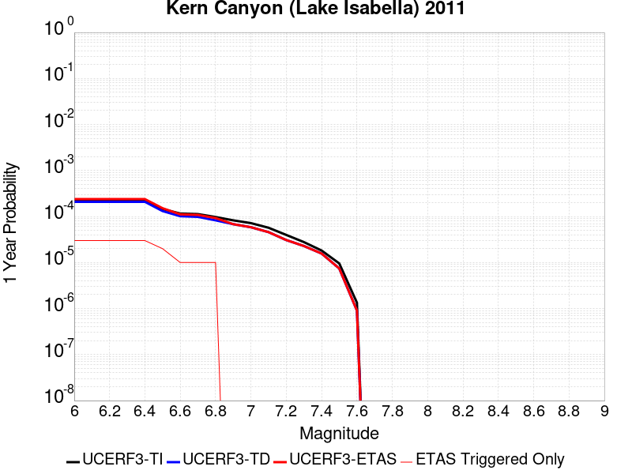 |  |

| Magnitude | 1 wk TI Prob | 1 wk TD Prob | 1 wk ETAS Prob | 1 wk ETAS/TD Gain | 1 wk ETAS Triggered Only | 1 mo TI Prob | 1 mo TD Prob | 1 mo ETAS Prob | 1 mo ETAS/TD Gain | 1 mo ETAS Triggered Only | 1 yr TI Prob | 1 yr TD Prob | 1 yr ETAS Prob | 1 yr ETAS/TD Gain | 1 yr ETAS Triggered Only | 10 yr TI Prob | 10 yr TD Prob | 10 yr ETAS Prob | 10 yr ETAS/TD Gain | 10 yr ETAS Triggered Only |
|-----|-----|-----|-----|-----|-----|-----|-----|-----|-----|-----|-----|-----|-----|-----|-----|-----|-----|-----|-----|-----|
| 6.0 | 4.2387383E-6 | 4.001639E-6 | 1.4001599E-5 | 3.4989662 | 1.0E-5 | 1.8165894E-5 | 1.7149778E-5 | 2.7149606E-5 | 1.5830879 | 1.0E-5 | 2.2114732E-4 | 2.087804E-4 | 2.3877414E-4 | 1.1436616 | 3.0E-5 | 0.0022092736 | 0.0020860266 | 0.002125943 | 1.0191352 | 4.0E-5 |
| 6.1 | 4.2387383E-6 | 4.001639E-6 | 1.4001599E-5 | 3.4989662 | 1.0E-5 | 1.8165894E-5 | 1.7149778E-5 | 2.7149606E-5 | 1.5830879 | 1.0E-5 | 2.2114732E-4 | 2.087804E-4 | 2.3877414E-4 | 1.1436616 | 3.0E-5 | 0.0022092736 | 0.0020860266 | 0.002125943 | 1.0191352 | 4.0E-5 |
| 6.2 | 4.2387383E-6 | 4.001639E-6 | 1.4001599E-5 | 3.4989662 | 1.0E-5 | 1.8165894E-5 | 1.7149778E-5 | 2.7149606E-5 | 1.5830879 | 1.0E-5 | 2.2114732E-4 | 2.087804E-4 | 2.3877414E-4 | 1.1436616 | 3.0E-5 | 0.0022092736 | 0.0020860266 | 0.002125943 | 1.0191352 | 4.0E-5 |
| 6.3 | 4.2387383E-6 | 4.001639E-6 | 1.4001599E-5 | 3.4989662 | 1.0E-5 | 1.8165894E-5 | 1.7149778E-5 | 2.7149606E-5 | 1.5830879 | 1.0E-5 | 2.2114732E-4 | 2.087804E-4 | 2.3877414E-4 | 1.1436616 | 3.0E-5 | 0.0022092736 | 0.0020860266 | 0.002125943 | 1.0191352 | 4.0E-5 |
| 6.4 | 4.2387383E-6 | 4.001639E-6 | 1.4001599E-5 | 3.4989662 | 1.0E-5 | 1.8165894E-5 | 1.7149778E-5 | 2.7149606E-5 | 1.5830879 | 1.0E-5 | 2.2114732E-4 | 2.087804E-4 | 2.3877414E-4 | 1.1436616 | 3.0E-5 | 0.0022092736 | 0.0020860266 | 0.002125943 | 1.0191352 | 4.0E-5 |
| 6.5 | 2.7857532E-6 | 2.517867E-6 | 1.2517842E-5 | 4.971606 | 1.0E-5 | 1.1938888E-5 | 1.0790815E-5 | 2.0790707E-5 | 1.926704 | 1.0E-5 | 1.4534626E-4 | 1.3137059E-4 | 1.5136796E-4 | 1.1522211 | 2.0E-5 | 0.0014525123 | 0.001312962 | 0.0013429226 | 1.022819 | 3.0E-5 |
| 6.6 | 2.2233348E-6 | 1.9441236E-6 | 1.1944104E-5 | 6.143696 | 1.0E-5 | 9.528543E-6 | 8.331932E-6 | 1.8331848E-5 | 2.2001917 | 1.0E-5 | 1.1600384E-4 | 1.01436635E-4 | 1.1143562E-4 | 1.0985737 | 1.0E-5 | 0.001159433 | 0.001013912 | 0.0010239019 | 1.0098528 | 1.0E-5 |
| 6.7 | 2.1635126E-6 | 1.8835036E-6 | 1.1883485E-5 | 6.3092446 | 1.0E-5 | 9.272164E-6 | 8.072134E-6 | 1.8072053E-5 | 2.2388198 | 1.0E-5 | 1.1288274E-4 | 9.827388E-5 | 1.0827289E-4 | 1.1017464 | 1.0E-5 | 0.0011282542 | 9.823124E-4 | 9.923026E-4 | 1.0101701 | 1.0E-5 |
| 6.8 | 1.8685711E-6 | 1.5831425E-6 | 1.1583126E-5 | 7.3165407 | 1.0E-5 | 8.008137E-6 | 6.784879E-6 | 1.6784812E-5 | 2.4738555 | 1.0E-5 | 9.74947E-5 | 8.260282E-5 | 9.260199E-5 | 1.1210512 | 1.0E-5 | 9.745194E-4 | 8.2572614E-4 | 8.3571783E-4 | 1.0121006 | 1.0E-5 |
| 6.9 | 1.5815071E-6 | 1.3064928E-6 | 1.3064928E-6 | 1.0 | 0.0 | 6.77787E-6 | 5.599243E-6 | 5.599243E-6 | 1.0 | 0.0 | 8.251744E-5 | 6.816868E-5 | 6.816868E-5 | 1.0 | 0.0 | 8.248681E-4 | 6.8148033E-4 | 6.8148033E-4 | 1.0 | 0.0 |
| 7.0 | 1.3772564E-6 | 1.1210718E-6 | 1.1210718E-6 | 1.0 | 0.0 | 5.9025137E-6 | 4.8045845E-6 | 4.8045845E-6 | 1.0 | 0.0 | 7.186073E-5 | 5.8494268E-5 | 5.8494268E-5 | 1.0 | 0.0 | 7.18375E-4 | 5.847908E-4 | 5.847908E-4 | 1.0 | 0.0 |
| 7.1 | 1.0916998E-6 | 8.763777E-7 | 8.763777E-7 | 1.0 | 0.0 | 4.678705E-6 | 3.7558991E-6 | 3.7558991E-6 | 1.0 | 0.0 | 5.6961744E-5 | 4.5727127E-5 | 4.5727127E-5 | 1.0 | 0.0 | 5.6947145E-4 | 4.571785E-4 | 4.571785E-4 | 1.0 | 0.0 |
| 7.2 | 7.6277024E-7 | 5.901454E-7 | 5.901454E-7 | 1.0 | 0.0 | 3.2690114E-6 | 2.5291922E-6 | 2.5291922E-6 | 1.0 | 0.0 | 3.9799485E-5 | 3.0792486E-5 | 3.0792486E-5 | 1.0 | 0.0 | 3.9792358E-4 | 3.0788282E-4 | 3.0788282E-4 | 1.0 | 0.0 |
| 7.3 | 5.3265916E-7 | 4.3824414E-7 | 4.3824414E-7 | 1.0 | 0.0 | 2.282823E-6 | 1.878188E-6 | 1.878188E-6 | 1.0 | 0.0 | 2.7793016E-5 | 2.2866701E-5 | 2.2866701E-5 | 1.0 | 0.0 | 2.778954E-4 | 2.2864387E-4 | 2.2864387E-4 | 1.0 | 0.0 |
| 7.4 | 3.4946007E-7 | 3.006571E-7 | 3.006571E-7 | 1.0 | 0.0 | 1.497685E-6 | 1.2885298E-6 | 1.2885298E-6 | 1.0 | 0.0 | 1.8234163E-5 | 1.568774E-5 | 1.568774E-5 | 1.0 | 0.0 | 1.8232666E-4 | 1.5686655E-4 | 1.5686655E-4 | 1.0 | 0.0 |
| 7.5 | 1.8317026E-7 | 1.4244812E-7 | 1.4244812E-7 | 1.0 | 0.0 | 7.850152E-7 | 6.104918E-7 | 6.104918E-7 | 1.0 | 0.0 | 9.557518E-6 | 7.432713E-6 | 7.432713E-6 | 1.0 | 0.0 | 9.5571064E-5 | 7.432472E-5 | 7.432472E-5 | 1.0 | 0.0 |
| 7.6 | 2.572245E-8 | 1.7352555E-8 | 1.7352555E-8 | 1.0 | 0.0 | 1.10239064E-7 | 7.436809E-8 | 7.436809E-8 | 1.0 | 0.0 | 1.3421597E-6 | 9.054312E-7 | 9.054312E-7 | 1.0 | 0.0 | 1.3421517E-5 | 9.05428E-6 | 9.05428E-6 | 1.0 | 0.0 |

## San Gabriel
*[(top)](#table-of-contents)*

| 1 Week | 1 Month | 1 Year | 10 Year |
|-----|-----|-----|-----|
|  |  | 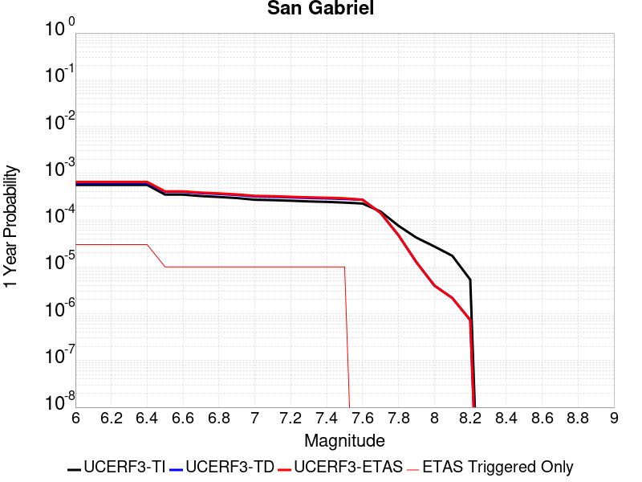 |  |

| Magnitude | 1 wk TI Prob | 1 wk TD Prob | 1 wk ETAS Prob | 1 wk ETAS/TD Gain | 1 wk ETAS Triggered Only | 1 mo TI Prob | 1 mo TD Prob | 1 mo ETAS Prob | 1 mo ETAS/TD Gain | 1 mo ETAS Triggered Only | 1 yr TI Prob | 1 yr TD Prob | 1 yr ETAS Prob | 1 yr ETAS/TD Gain | 1 yr ETAS Triggered Only | 10 yr TI Prob | 10 yr TD Prob | 10 yr ETAS Prob | 10 yr ETAS/TD Gain | 10 yr ETAS Triggered Only |
|-----|-----|-----|-----|-----|-----|-----|-----|-----|-----|-----|-----|-----|-----|-----|-----|-----|-----|-----|-----|-----|
| 6.0 | 1.083775E-5 | 1.19851875E-5 | 2.1985068E-5 | 1.8343532 | 1.0E-5 | 4.6446676E-5 | 5.1364143E-5 | 6.136363E-5 | 1.1946783 | 1.0E-5 | 5.653415E-4 | 6.251903E-4 | 6.551716E-4 | 1.0479554 | 3.0E-5 | 0.0056390543 | 0.006246409 | 0.006286159 | 1.0063636 | 4.0E-5 |
| 6.1 | 1.083775E-5 | 1.19851875E-5 | 2.1985068E-5 | 1.8343532 | 1.0E-5 | 4.6446676E-5 | 5.1364143E-5 | 6.136363E-5 | 1.1946783 | 1.0E-5 | 5.653415E-4 | 6.251903E-4 | 6.551716E-4 | 1.0479554 | 3.0E-5 | 0.0056390543 | 0.006246409 | 0.006286159 | 1.0063636 | 4.0E-5 |
| 6.2 | 1.083775E-5 | 1.19851875E-5 | 2.1985068E-5 | 1.8343532 | 1.0E-5 | 4.6446676E-5 | 5.1364143E-5 | 6.136363E-5 | 1.1946783 | 1.0E-5 | 5.653415E-4 | 6.251903E-4 | 6.551716E-4 | 1.0479554 | 3.0E-5 | 0.0056390543 | 0.006246409 | 0.006286159 | 1.0063636 | 4.0E-5 |
| 6.3 | 1.083775E-5 | 1.19851875E-5 | 2.1985068E-5 | 1.8343532 | 1.0E-5 | 4.6446676E-5 | 5.1364143E-5 | 6.136363E-5 | 1.1946783 | 1.0E-5 | 5.653415E-4 | 6.251903E-4 | 6.551716E-4 | 1.0479554 | 3.0E-5 | 0.0056390543 | 0.006246409 | 0.006286159 | 1.0063636 | 4.0E-5 |
| 6.4 | 1.083775E-5 | 1.19851875E-5 | 2.1985068E-5 | 1.8343532 | 1.0E-5 | 4.6446676E-5 | 5.1364143E-5 | 6.136363E-5 | 1.1946783 | 1.0E-5 | 5.653415E-4 | 6.251903E-4 | 6.551716E-4 | 1.0479554 | 3.0E-5 | 0.0056390543 | 0.006246409 | 0.006286159 | 1.0063636 | 4.0E-5 |
| 6.5 | 6.7317824E-6 | 7.716944E-6 | 7.716944E-6 | 1.0 | 0.0 | 2.8850178E-5 | 3.3072207E-5 | 3.3072207E-5 | 1.0 | 0.0 | 3.511943E-4 | 4.0258077E-4 | 4.1257674E-4 | 1.0248297 | 1.0E-5 | 0.003506398 | 0.0040296097 | 0.0040395693 | 1.0024717 | 1.0E-5 |
| 6.6 | 6.7317824E-6 | 7.716944E-6 | 7.716944E-6 | 1.0 | 0.0 | 2.8850178E-5 | 3.3072207E-5 | 3.3072207E-5 | 1.0 | 0.0 | 3.511943E-4 | 4.0258077E-4 | 4.1257674E-4 | 1.0248297 | 1.0E-5 | 0.003506398 | 0.0040296097 | 0.0040395693 | 1.0024717 | 1.0E-5 |
| 6.7 | 6.274881E-6 | 7.2458647E-6 | 7.2458647E-6 | 1.0 | 0.0 | 2.6892068E-5 | 3.1053343E-5 | 3.1053343E-5 | 1.0 | 0.0 | 3.2736175E-4 | 3.780098E-4 | 3.8800604E-4 | 1.0264443 | 1.0E-5 | 0.0032687993 | 0.0037847564 | 0.0037947185 | 1.0026321 | 1.0E-5 |
| 6.8 | 5.996209E-6 | 6.958585E-6 | 6.958585E-6 | 1.0 | 0.0 | 2.5697784E-5 | 2.9822171E-5 | 2.9822171E-5 | 1.0 | 0.0 | 3.128256E-4 | 3.6302538E-4 | 3.7302176E-4 | 1.0275363 | 1.0E-5 | 0.003123856 | 0.0036354093 | 0.003645373 | 1.0027407 | 1.0E-5 |
| 6.9 | 5.686331E-6 | 6.6236316E-6 | 6.6236316E-6 | 1.0 | 0.0 | 2.4369761E-5 | 2.8386688E-5 | 2.8386688E-5 | 1.0 | 0.0 | 2.9666146E-4 | 3.4555403E-4 | 3.5555058E-4 | 1.028929 | 1.0E-5 | 0.0029626573 | 0.0034612515 | 0.003471217 | 1.0028791 | 1.0E-5 |
| 7.0 | 5.2329838E-6 | 6.147514E-6 | 6.147514E-6 | 1.0 | 0.0 | 2.242688E-5 | 2.6346226E-5 | 2.6346226E-5 | 1.0 | 0.0 | 2.7301308E-4 | 3.2071886E-4 | 3.3071564E-4 | 1.03117 | 1.0E-5 | 0.002726779 | 0.0032136322 | 0.0032235999 | 1.0031017 | 1.0E-5 |
| 7.1 | 5.135671E-6 | 6.03764E-6 | 6.03764E-6 | 1.0 | 0.0 | 2.2009834E-5 | 2.5875348E-5 | 2.5875348E-5 | 1.0 | 0.0 | 2.6793676E-4 | 3.1498758E-4 | 3.2498443E-4 | 1.0317373 | 1.0E-5 | 0.0026761394 | 0.0031564834 | 0.0031664518 | 1.0031581 | 1.0E-5 |
| 7.2 | 4.989062E-6 | 5.87102E-6 | 5.87102E-6 | 1.0 | 0.0 | 2.1381518E-5 | 2.5161276E-5 | 2.5161276E-5 | 1.0 | 0.0 | 2.6028889E-4 | 3.0629625E-4 | 3.1629318E-4 | 1.0326381 | 1.0E-5 | 0.0025998424 | 0.003069813 | 0.0030797822 | 1.0032475 | 1.0E-5 |
| 7.3 | 4.8219395E-6 | 5.702574E-6 | 5.702574E-6 | 1.0 | 0.0 | 2.0665291E-5 | 2.443938E-5 | 2.443938E-5 | 1.0 | 0.0 | 2.5157086E-4 | 2.9750957E-4 | 3.075066E-4 | 1.0336024 | 1.0E-5 | 0.0025128627 | 0.0029821852 | 0.0029921555 | 1.0033432 | 1.0E-5 |
| 7.4 | 4.7118383E-6 | 5.5911332E-6 | 5.5911332E-6 | 1.0 | 0.0 | 2.0193436E-5 | 2.3961782E-5 | 2.3961782E-5 | 1.0 | 0.0 | 2.4582737E-4 | 2.916964E-4 | 3.0169348E-4 | 1.0342722 | 1.0E-5 | 0.002455556 | 0.0029242067 | 0.0029341774 | 1.0034097 | 1.0E-5 |
| 7.5 | 4.5506545E-6 | 5.4365014E-6 | 5.4365014E-6 | 1.0 | 0.0 | 1.9502659E-5 | 2.3299088E-5 | 2.3299088E-5 | 1.0 | 0.0 | 2.37419E-4 | 2.8363022E-4 | 2.9362738E-4 | 1.0352472 | 1.0E-5 | 0.002371655 | 0.002843753 | 0.0028537244 | 1.0035064 | 1.0E-5 |
| 7.6 | 4.343636E-6 | 5.2293817E-6 | 5.2293817E-6 | 1.0 | 0.0 | 1.861545E-5 | 2.2411448E-5 | 2.2411448E-5 | 1.0 | 0.0 | 2.2661954E-4 | 2.7282597E-4 | 2.7282597E-4 | 1.0 | 0.0 | 0.0022638857 | 0.0027359722 | 0.0027359722 | 1.0 | 0.0 |
| 7.7 | 2.936235E-6 | 2.7440458E-6 | 2.7440458E-6 | 1.0 | 0.0 | 1.2583803E-5 | 1.1760143E-5 | 1.1760143E-5 | 1.0 | 0.0 | 1.5319703E-4 | 1.4317037E-4 | 1.4317037E-4 | 1.0 | 0.0 | 0.0015309147 | 0.0014380751 | 0.0014380751 | 1.0 | 0.0 |
| 7.8 | 1.4541639E-6 | 9.1237047E-7 | 9.1237047E-7 | 1.0 | 0.0 | 6.232116E-6 | 3.9101533E-6 | 3.9101533E-6 | 1.0 | 0.0 | 7.587337E-5 | 4.7605077E-5 | 4.7605077E-5 | 1.0 | 0.0 | 7.584747E-4 | 4.8085177E-4 | 4.8085177E-4 | 1.0 | 0.0 |
| 7.9 | 8.098958E-7 | 2.41753E-7 | 2.41753E-7 | 1.0 | 0.0 | 3.4709774E-6 | 1.0360839E-6 | 1.0360839E-6 | 1.0 | 0.0 | 4.225833E-5 | 1.2614248E-5 | 1.2614248E-5 | 1.0 | 0.0 | 4.2250296E-4 | 1.2921814E-4 | 1.2921814E-4 | 1.0 | 0.0 |
| 8.0 | 5.2473234E-7 | 7.6792055E-8 | 7.6792055E-8 | 1.0 | 0.0 | 2.248851E-6 | 3.2910876E-7 | 3.2910876E-7 | 1.0 | 0.0 | 2.7379416E-5 | 4.0068917E-6 | 4.0068917E-6 | 1.0 | 0.0 | 2.7376044E-4 | 4.21918E-5 | 4.21918E-5 | 1.0 | 0.0 |
| 8.1 | 3.3162388E-7 | 4.1496126E-8 | 4.1496126E-8 | 1.0 | 0.0 | 1.4212444E-6 | 1.7784053E-7 | 1.7784053E-7 | 1.0 | 0.0 | 1.7303513E-5 | 2.1652063E-6 | 2.1652063E-6 | 1.0 | 0.0 | 1.7302166E-4 | 2.2965523E-5 | 2.2965523E-5 | 1.0 | 0.0 |
| 8.2 | 1.0235345E-7 | 1.4043474E-8 | 1.4043474E-8 | 1.0 | 0.0 | 4.3865757E-7 | 6.0186316E-8 | 6.0186316E-8 | 1.0 | 0.0 | 5.340643E-6 | 7.327681E-7 | 7.327681E-7 | 1.0 | 0.0 | 5.3405143E-5 | 7.9273705E-6 | 7.9273705E-6 | 1.0 | 0.0 |

## Santa Cruz Catalina Ridge alt1
*[(top)](#table-of-contents)*

| 1 Week | 1 Month | 1 Year | 10 Year |
|-----|-----|-----|-----|
| 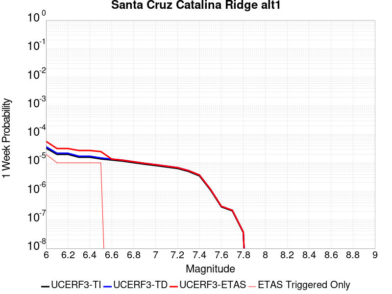 | 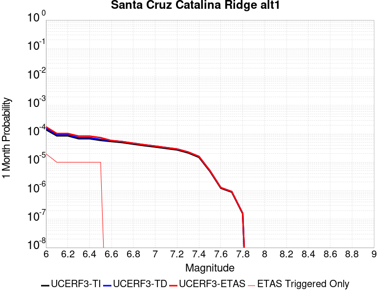 |  |  |

| Magnitude | 1 wk TI Prob | 1 wk TD Prob | 1 wk ETAS Prob | 1 wk ETAS/TD Gain | 1 wk ETAS Triggered Only | 1 mo TI Prob | 1 mo TD Prob | 1 mo ETAS Prob | 1 mo ETAS/TD Gain | 1 mo ETAS Triggered Only | 1 yr TI Prob | 1 yr TD Prob | 1 yr ETAS Prob | 1 yr ETAS/TD Gain | 1 yr ETAS Triggered Only | 10 yr TI Prob | 10 yr TD Prob | 10 yr ETAS Prob | 10 yr ETAS/TD Gain | 10 yr ETAS Triggered Only |
|-----|-----|-----|-----|-----|-----|-----|-----|-----|-----|-----|-----|-----|-----|-----|-----|-----|-----|-----|-----|-----|
| 6.0 | 3.2833184E-5 | 3.65584E-5 | 5.6557667E-5 | 1.5470499 | 2.0E-5 | 1.4070606E-4 | 1.5667039E-4 | 1.7666725E-4 | 1.1276366 | 2.0E-5 | 0.00171175 | 0.0019059596 | 0.0019259214 | 1.0104734 | 2.0E-5 | 0.016986247 | 0.018913029 | 0.018942462 | 1.0015562 | 3.0E-5 |
| 6.1 | 1.9835548E-5 | 2.1659505E-5 | 3.165929E-5 | 1.461681 | 1.0E-5 | 8.500672E-5 | 9.282326E-5 | 1.02822334E-4 | 1.1077216 | 1.0E-5 | 0.0010344655 | 0.0011295575 | 0.0011395462 | 1.0088431 | 1.0E-5 | 0.010296632 | 0.011240295 | 0.011269959 | 1.0026389 | 3.0E-5 |
| 6.2 | 1.9835548E-5 | 2.1659505E-5 | 3.165929E-5 | 1.461681 | 1.0E-5 | 8.500672E-5 | 9.282326E-5 | 1.02822334E-4 | 1.1077216 | 1.0E-5 | 0.0010344655 | 0.0011295575 | 0.0011395462 | 1.0088431 | 1.0E-5 | 0.010296632 | 0.011240295 | 0.011269959 | 1.0026389 | 3.0E-5 |
| 6.3 | 1.5728183E-5 | 1.703395E-5 | 2.7033779E-5 | 1.587053 | 1.0E-5 | 6.7404755E-5 | 7.300063E-5 | 8.29999E-5 | 1.1369752 | 1.0E-5 | 8.2034385E-4 | 8.884264E-4 | 8.984175E-4 | 1.0112458 | 1.0E-5 | 0.008173222 | 0.008849427 | 0.00886925 | 1.0022401 | 2.0E-5 |
| 6.4 | 1.5728183E-5 | 1.703395E-5 | 2.7033779E-5 | 1.587053 | 1.0E-5 | 6.7404755E-5 | 7.300063E-5 | 8.29999E-5 | 1.1369752 | 1.0E-5 | 8.2034385E-4 | 8.884264E-4 | 8.984175E-4 | 1.0112458 | 1.0E-5 | 0.008173222 | 0.008849427 | 0.00886925 | 1.0022401 | 2.0E-5 |
| 6.5 | 1.3707734E-5 | 1.4794522E-5 | 2.4794374E-5 | 1.6759158 | 1.0E-5 | 5.8746107E-5 | 6.3403575E-5 | 7.340294E-5 | 1.1577098 | 1.0E-5 | 7.1499916E-4 | 7.716686E-4 | 7.816609E-4 | 1.012949 | 1.0E-5 | 0.0071270303 | 0.0076902895 | 0.007710136 | 1.0025806 | 2.0E-5 |
| 6.6 | 1.2539813E-5 | 1.3510219E-5 | 1.3510219E-5 | 1.0 | 0.0 | 5.3740947E-5 | 5.789967E-5 | 5.789967E-5 | 1.0 | 0.0 | 6.540996E-4 | 7.0470315E-4 | 7.0470315E-4 | 1.0 | 0.0 | 0.0065217763 | 0.0070249885 | 0.0070349183 | 1.0014135 | 1.0E-5 |
| 6.7 | 1.1504083E-5 | 1.2377375E-5 | 1.2377375E-5 | 1.0 | 0.0 | 4.930228E-5 | 5.3044827E-5 | 5.3044827E-5 | 1.0 | 0.0 | 6.0008996E-4 | 6.456314E-4 | 6.456314E-4 | 1.0 | 0.0 | 0.005984721 | 0.006437786 | 0.0064477217 | 1.0015433 | 1.0E-5 |
| 6.8 | 1.012739E-5 | 1.0877071E-5 | 1.0877071E-5 | 1.0 | 0.0 | 4.340238E-5 | 4.6615194E-5 | 4.6615194E-5 | 1.0 | 0.0 | 5.282958E-4 | 5.673937E-4 | 5.673937E-4 | 1.0 | 0.0 | 0.0052704164 | 0.0056596193 | 0.005669563 | 1.0017569 | 1.0E-5 |
| 6.9 | 8.9607865E-6 | 9.609117E-6 | 9.609117E-6 | 1.0 | 0.0 | 3.8402806E-5 | 4.1181287E-5 | 4.1181287E-5 | 1.0 | 0.0 | 4.6745385E-4 | 5.012679E-4 | 5.012679E-4 | 1.0 | 0.0 | 0.0046647177 | 0.005001492 | 0.0050114417 | 1.0019894 | 1.0E-5 |
| 7.0 | 8.046829E-6 | 8.619746E-6 | 8.619746E-6 | 1.0 | 0.0 | 3.4485955E-5 | 3.694125E-5 | 3.694125E-5 | 1.0 | 0.0 | 4.1978562E-4 | 4.496677E-4 | 4.496677E-4 | 1.0 | 0.0 | 0.004189935 | 0.0044876686 | 0.004497624 | 1.0022184 | 1.0E-5 |
| 7.1 | 7.136131E-6 | 7.637656E-6 | 7.637656E-6 | 1.0 | 0.0 | 3.0583058E-5 | 3.2732405E-5 | 3.2732405E-5 | 1.0 | 0.0 | 3.7228514E-4 | 3.9844486E-4 | 3.9844486E-4 | 1.0 | 0.0 | 0.0037166206 | 0.003977381 | 0.0039873417 | 1.0025042 | 1.0E-5 |
| 7.2 | 6.362014E-6 | 6.8049585E-6 | 6.8049585E-6 | 1.0 | 0.0 | 2.726549E-5 | 2.9163786E-5 | 2.9163786E-5 | 1.0 | 0.0 | 3.3190678E-4 | 3.550119E-4 | 3.550119E-4 | 1.0 | 0.0 | 0.0033141149 | 0.003544516 | 0.0035544806 | 1.0028113 | 1.0E-5 |
| 7.3 | 5.004101E-6 | 5.351715E-6 | 5.351715E-6 | 1.0 | 0.0 | 2.1445969E-5 | 2.2935723E-5 | 2.2935723E-5 | 1.0 | 0.0 | 2.6107338E-4 | 2.792072E-4 | 2.792072E-4 | 1.0 | 0.0 | 0.002607669 | 0.0027886187 | 0.0027886187 | 1.0 | 0.0 |
| 7.4 | 3.4901443E-6 | 3.7320526E-6 | 3.7320526E-6 | 1.0 | 0.0 | 1.4957676E-5 | 1.5994416E-5 | 1.5994416E-5 | 1.0 | 0.0 | 1.8209449E-4 | 1.9471499E-4 | 1.9471499E-4 | 1.0 | 0.0 | 0.0018194534 | 0.0019454823 | 0.0019454823 | 1.0 | 0.0 |
| 7.5 | 1.1215045E-6 | 1.189387E-6 | 1.189387E-6 | 1.0 | 0.0 | 4.806439E-6 | 5.097363E-6 | 5.097363E-6 | 1.0 | 0.0 | 5.851682E-5 | 6.205866E-5 | 6.205866E-5 | 1.0 | 0.0 | 5.850142E-4 | 6.2041637E-4 | 6.2041637E-4 | 1.0 | 0.0 |
| 7.6 | 2.8599047E-7 | 2.9951994E-7 | 2.9951994E-7 | 1.0 | 0.0 | 1.2256729E-6 | 1.2836562E-6 | 1.2836562E-6 | 1.0 | 0.0 | 1.4922465E-5 | 1.5628404E-5 | 1.5628404E-5 | 1.0 | 0.0 | 1.4921463E-4 | 1.5627318E-4 | 1.5627318E-4 | 1.0 | 0.0 |
| 7.7 | 2.0781519E-7 | 2.1744323E-7 | 2.1744323E-7 | 1.0 | 0.0 | 8.906362E-7 | 9.3189925E-7 | 9.3189925E-7 | 1.0 | 0.0 | 1.08434415E-5 | 1.13458145E-5 | 1.13458145E-5 | 1.0 | 0.0 | 1.0842913E-4 | 1.1345245E-4 | 1.1345245E-4 | 1.0 | 0.0 |
| 7.8 | 3.614776E-8 | 3.764102E-8 | 3.764102E-8 | 1.0 | 0.0 | 1.5491896E-7 | 1.6131864E-7 | 1.6131864E-7 | 1.0 | 0.0 | 1.8861368E-6 | 1.9640527E-6 | 1.9640527E-6 | 1.0 | 0.0 | 1.8861208E-5 | 1.9640367E-5 | 1.9640367E-5 | 1.0 | 0.0 |

## North Frontal  (West)
*[(top)](#table-of-contents)*

| 1 Week | 1 Month | 1 Year | 10 Year |
|-----|-----|-----|-----|
|  |  | 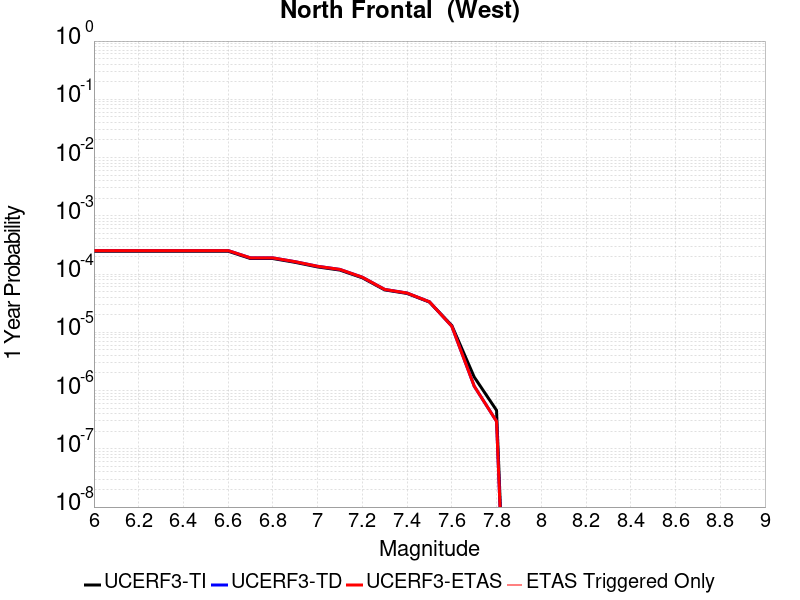 |  |

| Magnitude | 1 wk TI Prob | 1 wk TD Prob | 1 wk ETAS Prob | 1 wk ETAS/TD Gain | 1 wk ETAS Triggered Only | 1 mo TI Prob | 1 mo TD Prob | 1 mo ETAS Prob | 1 mo ETAS/TD Gain | 1 mo ETAS Triggered Only | 1 yr TI Prob | 1 yr TD Prob | 1 yr ETAS Prob | 1 yr ETAS/TD Gain | 1 yr ETAS Triggered Only | 10 yr TI Prob | 10 yr TD Prob | 10 yr ETAS Prob | 10 yr ETAS/TD Gain | 10 yr ETAS Triggered Only |
|-----|-----|-----|-----|-----|-----|-----|-----|-----|-----|-----|-----|-----|-----|-----|-----|-----|-----|-----|-----|-----|
| 6.0 | 4.7316266E-6 | 4.8526726E-6 | 4.8526726E-6 | 1.0 | 0.0 | 2.0278241E-5 | 2.0797012E-5 | 2.0797012E-5 | 1.0 | 0.0 | 2.4685962E-4 | 2.5317568E-4 | 2.5317568E-4 | 1.0 | 0.0 | 0.0024658558 | 0.0025290183 | 0.0025689173 | 1.0157764 | 4.0E-5 |
| 6.1 | 4.7316266E-6 | 4.8526726E-6 | 4.8526726E-6 | 1.0 | 0.0 | 2.0278241E-5 | 2.0797012E-5 | 2.0797012E-5 | 1.0 | 0.0 | 2.4685962E-4 | 2.5317568E-4 | 2.5317568E-4 | 1.0 | 0.0 | 0.0024658558 | 0.0025290183 | 0.0025689173 | 1.0157764 | 4.0E-5 |
| 6.2 | 4.7316266E-6 | 4.8526726E-6 | 4.8526726E-6 | 1.0 | 0.0 | 2.0278241E-5 | 2.0797012E-5 | 2.0797012E-5 | 1.0 | 0.0 | 2.4685962E-4 | 2.5317568E-4 | 2.5317568E-4 | 1.0 | 0.0 | 0.0024658558 | 0.0025290183 | 0.0025689173 | 1.0157764 | 4.0E-5 |
| 6.3 | 4.7316266E-6 | 4.8526726E-6 | 4.8526726E-6 | 1.0 | 0.0 | 2.0278241E-5 | 2.0797012E-5 | 2.0797012E-5 | 1.0 | 0.0 | 2.4685962E-4 | 2.5317568E-4 | 2.5317568E-4 | 1.0 | 0.0 | 0.0024658558 | 0.0025290183 | 0.0025689173 | 1.0157764 | 4.0E-5 |
| 6.4 | 4.7316266E-6 | 4.8526726E-6 | 4.8526726E-6 | 1.0 | 0.0 | 2.0278241E-5 | 2.0797012E-5 | 2.0797012E-5 | 1.0 | 0.0 | 2.4685962E-4 | 2.5317568E-4 | 2.5317568E-4 | 1.0 | 0.0 | 0.0024658558 | 0.0025290183 | 0.0025689173 | 1.0157764 | 4.0E-5 |
| 6.5 | 4.7316266E-6 | 4.8526726E-6 | 4.8526726E-6 | 1.0 | 0.0 | 2.0278241E-5 | 2.0797012E-5 | 2.0797012E-5 | 1.0 | 0.0 | 2.4685962E-4 | 2.5317568E-4 | 2.5317568E-4 | 1.0 | 0.0 | 0.0024658558 | 0.0025290183 | 0.0025689173 | 1.0157764 | 4.0E-5 |
| 6.6 | 4.7316266E-6 | 4.8526726E-6 | 4.8526726E-6 | 1.0 | 0.0 | 2.0278241E-5 | 2.0797012E-5 | 2.0797012E-5 | 1.0 | 0.0 | 2.4685962E-4 | 2.5317568E-4 | 2.5317568E-4 | 1.0 | 0.0 | 0.0024658558 | 0.0025290183 | 0.0025689173 | 1.0157764 | 4.0E-5 |
| 6.7 | 3.5382777E-6 | 3.6308859E-6 | 3.6308859E-6 | 1.0 | 0.0 | 1.516396E-5 | 1.5560852E-5 | 1.5560852E-5 | 1.0 | 0.0 | 1.8460557E-4 | 1.8943768E-4 | 1.8943768E-4 | 1.0 | 0.0 | 0.0018445229 | 0.0018928389 | 0.001922782 | 1.0158192 | 3.0E-5 |
| 6.8 | 3.5382777E-6 | 3.6308859E-6 | 3.6308859E-6 | 1.0 | 0.0 | 1.516396E-5 | 1.5560852E-5 | 1.5560852E-5 | 1.0 | 0.0 | 1.8460557E-4 | 1.8943768E-4 | 1.8943768E-4 | 1.0 | 0.0 | 0.0018445229 | 0.0018928389 | 0.001922782 | 1.0158192 | 3.0E-5 |
| 6.9 | 3.0428037E-6 | 3.1227605E-6 | 3.1227605E-6 | 1.0 | 0.0 | 1.30405215E-5 | 1.33831945E-5 | 1.33831945E-5 | 1.0 | 0.0 | 1.5875678E-4 | 1.6292889E-4 | 1.6292889E-4 | 1.0 | 0.0 | 0.0015864341 | 0.0016281615 | 0.0016281615 | 1.0 | 0.0 |
| 7.0 | 2.538778E-6 | 2.6060904E-6 | 2.6060904E-6 | 1.0 | 0.0 | 1.0880432E-5 | 1.1168913E-5 | 1.1168913E-5 | 1.0 | 0.0 | 1.324612E-4 | 1.3597352E-4 | 1.3597352E-4 | 1.0 | 0.0 | 0.0013238228 | 0.0013589499 | 0.0013589499 | 1.0 | 0.0 |
| 7.1 | 2.2418935E-6 | 2.3012074E-6 | 2.3012074E-6 | 1.0 | 0.0 | 9.60808E-6 | 9.862282E-6 | 9.862282E-6 | 1.0 | 0.0 | 1.1697209E-4 | 1.2006712E-4 | 1.2006712E-4 | 1.0 | 0.0 | 0.0011691054 | 0.0012000664 | 0.0012000664 | 1.0 | 0.0 |
| 7.2 | 1.6526745E-6 | 1.6924851E-6 | 1.6924851E-6 | 1.0 | 0.0 | 7.082872E-6 | 7.253489E-6 | 7.253489E-6 | 1.0 | 0.0 | 8.623055E-5 | 8.8307905E-5 | 8.8307905E-5 | 1.0 | 0.0 | 8.61971E-4 | 8.827532E-4 | 8.827532E-4 | 1.0 | 0.0 |
| 7.3 | 1.0246019E-6 | 1.0442261E-6 | 1.0442261E-6 | 1.0 | 0.0 | 4.391144E-6 | 4.4752474E-6 | 4.4752474E-6 | 1.0 | 0.0 | 5.3460866E-5 | 5.448489E-5 | 5.448489E-5 | 1.0 | 0.0 | 5.344801E-4 | 5.4472685E-4 | 5.4472685E-4 | 1.0 | 0.0 |
| 7.4 | 8.9045164E-7 | 9.0565584E-7 | 9.0565584E-7 | 1.0 | 0.0 | 3.8162157E-6 | 3.8813773E-6 | 3.8813773E-6 | 1.0 | 0.0 | 4.646144E-5 | 4.7254853E-5 | 4.7254853E-5 | 1.0 | 0.0 | 4.6451724E-4 | 4.7245892E-4 | 4.7245892E-4 | 1.0 | 0.0 |
| 7.5 | 6.3357E-7 | 6.4027006E-7 | 6.4027006E-7 | 1.0 | 0.0 | 2.7152971E-6 | 2.744012E-6 | 2.744012E-6 | 1.0 | 0.0 | 3.305824E-5 | 3.34079E-5 | 3.34079E-5 | 1.0 | 0.0 | 3.3053322E-4 | 3.3403534E-4 | 3.3403534E-4 | 1.0 | 0.0 |
| 7.6 | 2.5087024E-7 | 2.4361097E-7 | 2.4361097E-7 | 1.0 | 0.0 | 1.0751578E-6 | 1.0440467E-6 | 1.0440467E-6 | 1.0 | 0.0 | 1.3089967E-5 | 1.2711216E-5 | 1.2711216E-5 | 1.0 | 0.0 | 1.3089196E-4 | 1.2710695E-4 | 1.2710695E-4 | 1.0 | 0.0 |
| 7.7 | 3.282987E-8 | 2.2874195E-8 | 2.2874195E-8 | 1.0 | 0.0 | 1.4069944E-7 | 9.803227E-8 | 9.803227E-8 | 1.0 | 0.0 | 1.7130144E-6 | 1.1935423E-6 | 1.1935423E-6 | 1.0 | 0.0 | 1.7130013E-5 | 1.1935367E-5 | 1.1935367E-5 | 1.0 | 0.0 |
| 7.8 | 8.77499E-9 | 5.6815956E-9 | 5.6815956E-9 | 1.0 | 0.0 | 3.7607098E-8 | 2.4349696E-8 | 2.4349696E-8 | 1.0 | 0.0 | 4.578663E-7 | 2.9645753E-7 | 2.9645753E-7 | 1.0 | 0.0 | 4.5786537E-6 | 2.9645726E-6 | 2.9645726E-6 | 1.0 | 0.0 |

## Puente Hills
*[(top)](#table-of-contents)*

| 1 Week | 1 Month | 1 Year | 10 Year |
|-----|-----|-----|-----|
|  | 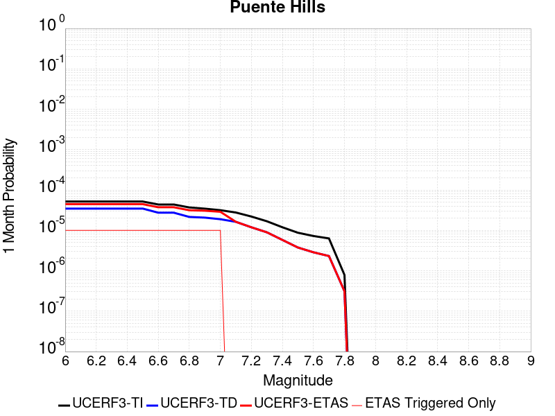 | 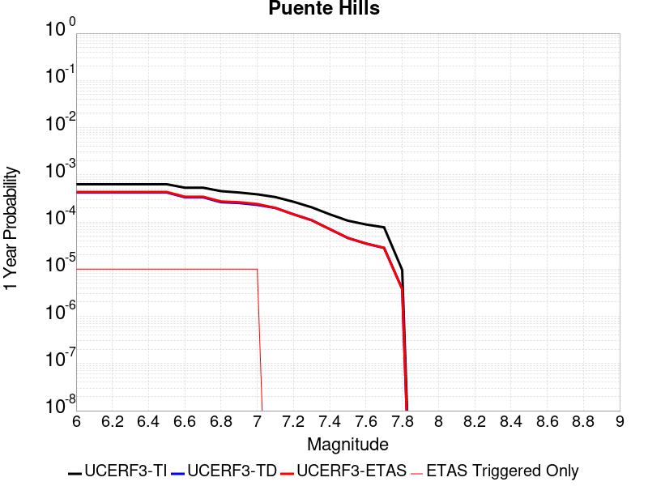 | 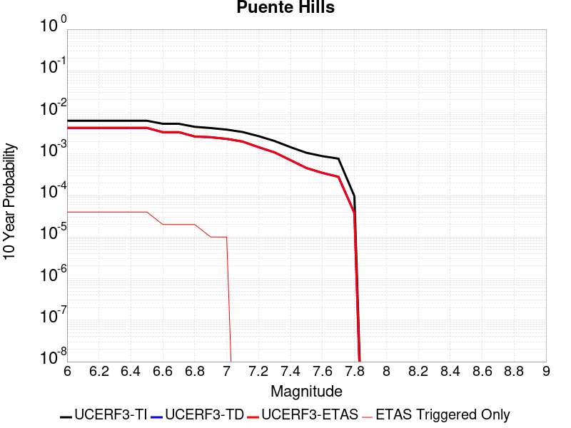 |

| Magnitude | 1 wk TI Prob | 1 wk TD Prob | 1 wk ETAS Prob | 1 wk ETAS/TD Gain | 1 wk ETAS Triggered Only | 1 mo TI Prob | 1 mo TD Prob | 1 mo ETAS Prob | 1 mo ETAS/TD Gain | 1 mo ETAS Triggered Only | 1 yr TI Prob | 1 yr TD Prob | 1 yr ETAS Prob | 1 yr ETAS/TD Gain | 1 yr ETAS Triggered Only | 10 yr TI Prob | 10 yr TD Prob | 10 yr ETAS Prob | 10 yr ETAS/TD Gain | 10 yr ETAS Triggered Only |
|-----|-----|-----|-----|-----|-----|-----|-----|-----|-----|-----|-----|-----|-----|-----|-----|-----|-----|-----|-----|-----|
| 6.0 | 1.2101656E-5 | 8.098625E-6 | 8.098625E-6 | 1.0 | 0.0 | 5.1863204E-5 | 3.4707962E-5 | 4.4707616E-5 | 1.2881083 | 1.0E-5 | 6.312516E-4 | 4.2249315E-4 | 4.3248892E-4 | 1.023659 | 1.0E-5 | 0.0062946146 | 0.0042174594 | 0.0042572906 | 1.0094444 | 4.0E-5 |
| 6.1 | 1.2101656E-5 | 8.098625E-6 | 8.098625E-6 | 1.0 | 0.0 | 5.1863204E-5 | 3.4707962E-5 | 4.4707616E-5 | 1.2881083 | 1.0E-5 | 6.312516E-4 | 4.2249315E-4 | 4.3248892E-4 | 1.023659 | 1.0E-5 | 0.0062946146 | 0.0042174594 | 0.0042572906 | 1.0094444 | 4.0E-5 |
| 6.2 | 1.2101656E-5 | 8.098625E-6 | 8.098625E-6 | 1.0 | 0.0 | 5.1863204E-5 | 3.4707962E-5 | 4.4707616E-5 | 1.2881083 | 1.0E-5 | 6.312516E-4 | 4.2249315E-4 | 4.3248892E-4 | 1.023659 | 1.0E-5 | 0.0062946146 | 0.0042174594 | 0.0042572906 | 1.0094444 | 4.0E-5 |
| 6.3 | 1.2101656E-5 | 8.098625E-6 | 8.098625E-6 | 1.0 | 0.0 | 5.1863204E-5 | 3.4707962E-5 | 4.4707616E-5 | 1.2881083 | 1.0E-5 | 6.312516E-4 | 4.2249315E-4 | 4.3248892E-4 | 1.023659 | 1.0E-5 | 0.0062946146 | 0.0042174594 | 0.0042572906 | 1.0094444 | 4.0E-5 |
| 6.4 | 1.2101656E-5 | 8.098625E-6 | 8.098625E-6 | 1.0 | 0.0 | 5.1863204E-5 | 3.4707962E-5 | 4.4707616E-5 | 1.2881083 | 1.0E-5 | 6.312516E-4 | 4.2249315E-4 | 4.3248892E-4 | 1.023659 | 1.0E-5 | 0.0062946146 | 0.0042174594 | 0.0042572906 | 1.0094444 | 4.0E-5 |
| 6.5 | 1.2101656E-5 | 8.098625E-6 | 8.098625E-6 | 1.0 | 0.0 | 5.1863204E-5 | 3.4707962E-5 | 4.4707616E-5 | 1.2881083 | 1.0E-5 | 6.312516E-4 | 4.2249315E-4 | 4.3248892E-4 | 1.023659 | 1.0E-5 | 0.0062946146 | 0.0042174594 | 0.0042572906 | 1.0094444 | 4.0E-5 |
| 6.6 | 1.0222488E-5 | 6.3991847E-6 | 6.3991847E-6 | 1.0 | 0.0 | 4.3809923E-5 | 2.7424803E-5 | 3.742453E-5 | 1.3646234 | 1.0E-5 | 5.332553E-4 | 3.3384826E-4 | 3.4384493E-4 | 1.0299437 | 1.0E-5 | 0.0053197746 | 0.0033337125 | 0.0033536458 | 1.0059793 | 2.0E-5 |
| 6.7 | 1.0222488E-5 | 6.3991847E-6 | 6.3991847E-6 | 1.0 | 0.0 | 4.3809923E-5 | 2.7424803E-5 | 3.742453E-5 | 1.3646234 | 1.0E-5 | 5.332553E-4 | 3.3384826E-4 | 3.4384493E-4 | 1.0299437 | 1.0E-5 | 0.0053197746 | 0.0033337125 | 0.0033536458 | 1.0059793 | 2.0E-5 |
| 6.8 | 8.6367845E-6 | 5.0282533E-6 | 5.0282533E-6 | 1.0 | 0.0 | 3.7014266E-5 | 2.1549482E-5 | 3.1549265E-5 | 1.4640383 | 1.0E-5 | 4.505555E-4 | 2.623339E-4 | 2.723313E-4 | 1.0381093 | 1.0E-5 | 0.004496431 | 0.0026202986 | 0.0026402462 | 1.0076127 | 2.0E-5 |
| 6.9 | 8.066481E-6 | 4.836117E-6 | 4.836117E-6 | 1.0 | 0.0 | 3.4570177E-5 | 2.0726053E-5 | 3.0725845E-5 | 1.4824746 | 1.0E-5 | 4.2081063E-4 | 2.52311E-4 | 2.623085E-4 | 1.0396236 | 1.0E-5 | 0.0042001465 | 0.0025202993 | 0.002530274 | 1.0039577 | 1.0E-5 |
| 7.0 | 7.393828E-6 | 4.417296E-6 | 4.417296E-6 | 1.0 | 0.0 | 3.168745E-5 | 1.8931134E-5 | 2.8930945E-5 | 1.5282203 | 1.0E-5 | 3.857264E-4 | 2.3046264E-4 | 2.4046033E-4 | 1.043381 | 1.0E-5 | 0.0038505755 | 0.0023022818 | 0.0023122588 | 1.0043335 | 1.0E-5 |
| 7.1 | 6.4660953E-6 | 3.8044495E-6 | 3.8044495E-6 | 1.0 | 0.0 | 2.7711543E-5 | 1.6304684E-5 | 1.6304684E-5 | 1.0 | 0.0 | 3.373358E-4 | 1.984918E-4 | 1.984918E-4 | 1.0 | 0.0 | 0.0033682417 | 0.001983181 | 0.001983181 | 1.0 | 0.0 |
| 7.2 | 5.143232E-6 | 2.7865456E-6 | 2.7865456E-6 | 1.0 | 0.0 | 2.2042237E-5 | 1.1942284E-5 | 1.1942284E-5 | 1.0 | 0.0 | 2.6833118E-4 | 1.453877E-4 | 1.453877E-4 | 1.0 | 0.0 | 0.002680074 | 0.0014529356 | 0.0014529356 | 1.0 | 0.0 |
| 7.3 | 3.928255E-6 | 2.0913774E-6 | 2.0913774E-6 | 1.0 | 0.0 | 1.683527E-5 | 8.963015E-6 | 8.963015E-6 | 1.0 | 0.0 | 2.0495013E-4 | 1.0911931E-4 | 1.0911931E-4 | 1.0 | 0.0 | 0.002047612 | 0.001090664 | 0.001090664 | 1.0 | 0.0 |
| 7.4 | 2.7894434E-6 | 1.3546753E-6 | 1.3546753E-6 | 1.0 | 0.0 | 1.1954703E-5 | 5.8057385E-6 | 5.8057385E-6 | 1.0 | 0.0 | 1.4553878E-4 | 7.068262E-5 | 7.068262E-5 | 1.0 | 0.0 | 0.001454435 | 7.066058E-4 | 7.066058E-4 | 1.0 | 0.0 |
| 7.5 | 2.041735E-6 | 8.787305E-7 | 8.787305E-7 | 1.0 | 0.0 | 8.750263E-6 | 3.7659825E-6 | 3.7659825E-6 | 1.0 | 0.0 | 1.06529245E-4 | 4.5849905E-5 | 4.5849905E-5 | 1.0 | 0.0 | 0.0010647819 | 4.5840783E-4 | 4.5840783E-4 | 1.0 | 0.0 |
| 7.6 | 1.6959062E-6 | 6.6986263E-7 | 6.6986263E-7 | 1.0 | 0.0 | 7.268149E-6 | 2.8708366E-6 | 2.8708366E-6 | 1.0 | 0.0 | 8.848612E-5 | 3.4951907E-5 | 3.4951907E-5 | 1.0 | 0.0 | 8.84509E-4 | 3.4946698E-4 | 3.4946698E-4 | 1.0 | 0.0 |
| 7.7 | 1.4767965E-6 | 5.407607E-7 | 5.407607E-7 | 1.0 | 0.0 | 6.3291122E-6 | 2.317544E-6 | 2.317544E-6 | 1.0 | 0.0 | 7.705422E-5 | 2.8215758E-5 | 2.8215758E-5 | 1.0 | 0.0 | 7.702751E-4 | 2.8212433E-4 | 2.8212433E-4 | 1.0 | 0.0 |
| 7.8 | 1.8432911E-7 | 7.28201E-8 | 7.28201E-8 | 1.0 | 0.0 | 7.8998164E-7 | 3.1208612E-7 | 3.1208612E-7 | 1.0 | 0.0 | 9.617985E-6 | 3.7996451E-6 | 3.7996451E-6 | 1.0 | 0.0 | 9.617568E-5 | 3.7996128E-5 | 3.7996128E-5 | 1.0 | 0.0 |

## Great Valley 09 (Laguna Seca)
*[(top)](#table-of-contents)*

| 1 Week | 1 Month | 1 Year | 10 Year |
|-----|-----|-----|-----|
| 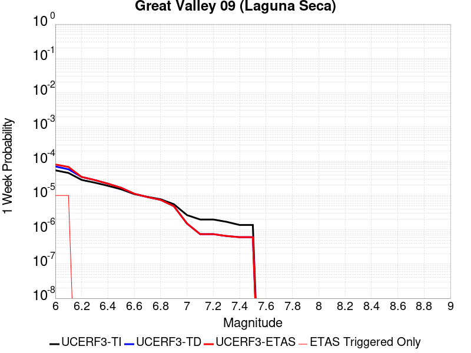 | 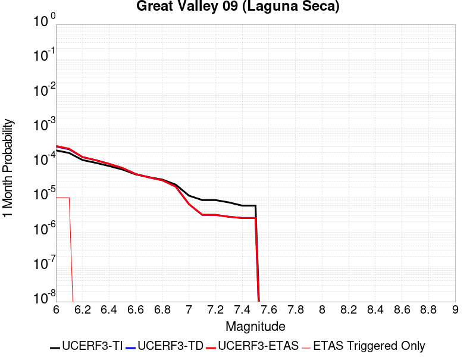 |  |  |

| Magnitude | 1 wk TI Prob | 1 wk TD Prob | 1 wk ETAS Prob | 1 wk ETAS/TD Gain | 1 wk ETAS Triggered Only | 1 mo TI Prob | 1 mo TD Prob | 1 mo ETAS Prob | 1 mo ETAS/TD Gain | 1 mo ETAS Triggered Only | 1 yr TI Prob | 1 yr TD Prob | 1 yr ETAS Prob | 1 yr ETAS/TD Gain | 1 yr ETAS Triggered Only | 10 yr TI Prob | 10 yr TD Prob | 10 yr ETAS Prob | 10 yr ETAS/TD Gain | 10 yr ETAS Triggered Only |
|-----|-----|-----|-----|-----|-----|-----|-----|-----|-----|-----|-----|-----|-----|-----|-----|-----|-----|-----|-----|-----|
| 6.0 | 5.4353277E-5 | 7.05022E-5 | 8.050149E-5 | 1.1418295 | 1.0E-5 | 2.3292181E-4 | 3.0211566E-4 | 3.1211265E-4 | 1.0330899 | 1.0E-5 | 0.0028321352 | 0.0036721937 | 0.0036921203 | 1.0054263 | 2.0E-5 | 0.02796312 | 0.03611547 | 0.036154028 | 1.0010675 | 4.0E-5 |
| 6.1 | 4.5578287E-5 | 5.822118E-5 | 6.82206E-5 | 1.1717488 | 1.0E-5 | 1.953209E-4 | 2.4949326E-4 | 2.5949077E-4 | 1.0400712 | 1.0E-5 | 0.0023754383 | 0.003033432 | 0.0030434018 | 1.0032866 | 1.0E-5 | 0.023502063 | 0.029919548 | 0.02993895 | 1.0006485 | 2.0E-5 |
| 6.2 | 2.8536782E-5 | 3.4737273E-5 | 3.4737273E-5 | 1.0 | 0.0 | 1.2229476E-4 | 1.4886224E-4 | 1.4886224E-4 | 1.0 | 0.0 | 0.0014879217 | 0.001810813 | 0.001810813 | 1.0 | 0.0 | 0.014779986 | 0.017958116 | 0.017967938 | 1.0005468 | 1.0E-5 |
| 6.3 | 2.3698774E-5 | 2.8213295E-5 | 2.8213295E-5 | 1.0 | 0.0 | 1.01562226E-4 | 1.20905075E-4 | 1.20905075E-4 | 1.0 | 0.0 | 0.0012358186 | 0.0014710218 | 0.0014710218 | 1.0 | 0.0 | 0.012289686 | 0.014611342 | 0.014621195 | 1.0006744 | 1.0E-5 |
| 6.4 | 1.9191197E-5 | 2.2123184E-5 | 2.2123184E-5 | 1.0 | 0.0 | 8.2245395E-5 | 9.4806666E-5 | 9.4806666E-5 | 1.0 | 0.0 | 0.0010008777 | 0.0011536429 | 0.0011536429 | 1.0 | 0.0 | 0.009963818 | 0.011476948 | 0.011486833 | 1.0008613 | 1.0E-5 |
| 6.5 | 1.5203241E-5 | 1.6802203E-5 | 1.6802203E-5 | 1.0 | 0.0 | 6.5155116E-5 | 7.200386E-5 | 7.200386E-5 | 1.0 | 0.0 | 7.9297484E-4 | 8.7626575E-4 | 8.7626575E-4 | 1.0 | 0.0 | 0.007901512 | 0.0087295165 | 0.0087394295 | 1.0011356 | 1.0E-5 |
| 6.6 | 1.0984925E-5 | 1.1242595E-5 | 1.1242595E-5 | 1.0 | 0.0 | 4.70774E-5 | 4.8181686E-5 | 4.8181686E-5 | 1.0 | 0.0 | 5.730166E-4 | 5.8645656E-4 | 5.8645656E-4 | 1.0 | 0.0 | 0.005715413 | 0.0058494853 | 0.0058494853 | 1.0 | 0.0 |
| 6.7 | 9.134616E-6 | 9.019894E-6 | 9.019894E-6 | 1.0 | 0.0 | 3.9147766E-5 | 3.865613E-5 | 3.865613E-5 | 1.0 | 0.0 | 4.7651984E-4 | 4.7053912E-4 | 4.7053912E-4 | 1.0 | 0.0 | 0.004754993 | 0.0046956735 | 0.0046956735 | 1.0 | 0.0 |
| 6.8 | 7.785589E-6 | 7.4519444E-6 | 7.4519444E-6 | 1.0 | 0.0 | 3.3366385E-5 | 3.1936524E-5 | 3.1936524E-5 | 1.0 | 0.0 | 4.0616E-4 | 3.8875983E-4 | 3.8875983E-4 | 1.0 | 0.0 | 0.0040541845 | 0.0038810016 | 0.0038810016 | 1.0 | 0.0 |
| 6.9 | 5.579095E-6 | 4.898492E-6 | 4.898492E-6 | 1.0 | 0.0 | 2.3910188E-5 | 2.0993377E-5 | 2.0993377E-5 | 1.0 | 0.0 | 2.9106764E-4 | 2.5556577E-4 | 2.5556577E-4 | 1.0 | 0.0 | 0.002906867 | 0.002552856 | 0.002552856 | 1.0 | 0.0 |
| 7.0 | 2.6816688E-6 | 1.5216126E-6 | 1.5216126E-6 | 1.0 | 0.0 | 1.1492816E-5 | 6.521181E-6 | 6.521181E-6 | 1.0 | 0.0 | 1.3991605E-4 | 7.939258E-5 | 7.939258E-5 | 1.0 | 0.0 | 0.0013982799 | 7.9365086E-4 | 7.9365086E-4 | 1.0 | 0.0 |
| 7.1 | 1.9951021E-6 | 7.453827E-7 | 7.453827E-7 | 1.0 | 0.0 | 8.55041E-6 | 3.1944935E-6 | 3.1944935E-6 | 1.0 | 0.0 | 1.0409627E-4 | 3.8892307E-5 | 3.8892307E-5 | 1.0 | 0.0 | 0.0010404752 | 3.8885913E-4 | 3.8885913E-4 | 1.0 | 0.0 |
| 7.2 | 1.9951021E-6 | 7.453827E-7 | 7.453827E-7 | 1.0 | 0.0 | 8.55041E-6 | 3.1944935E-6 | 3.1944935E-6 | 1.0 | 0.0 | 1.0409627E-4 | 3.8892307E-5 | 3.8892307E-5 | 1.0 | 0.0 | 0.0010404752 | 3.8885913E-4 | 3.8885913E-4 | 1.0 | 0.0 |
| 7.3 | 1.7087556E-6 | 6.578881E-7 | 6.578881E-7 | 1.0 | 0.0 | 7.3232177E-6 | 2.8195177E-6 | 2.8195177E-6 | 1.0 | 0.0 | 8.915652E-5 | 3.4327128E-5 | 3.4327128E-5 | 1.0 | 0.0 | 8.9120766E-4 | 3.432223E-4 | 3.432223E-4 | 1.0 | 0.0 |
| 7.4 | 1.3804846E-6 | 6.073852E-7 | 6.073852E-7 | 1.0 | 0.0 | 5.916349E-6 | 2.6030768E-6 | 2.6030768E-6 | 1.0 | 0.0 | 7.2029165E-5 | 3.169204E-5 | 3.169204E-5 | 1.0 | 0.0 | 7.200583E-4 | 3.1687922E-4 | 3.1687922E-4 | 1.0 | 0.0 |
| 7.5 | 1.3804846E-6 | 6.073852E-7 | 6.073852E-7 | 1.0 | 0.0 | 5.916349E-6 | 2.6030768E-6 | 2.6030768E-6 | 1.0 | 0.0 | 7.2029165E-5 | 3.169204E-5 | 3.169204E-5 | 1.0 | 0.0 | 7.200583E-4 | 3.1687922E-4 | 3.1687922E-4 | 1.0 | 0.0 |

## Dry Mountain
*[(top)](#table-of-contents)*

| 1 Week | 1 Month | 1 Year | 10 Year |
|-----|-----|-----|-----|
|  |  |  | 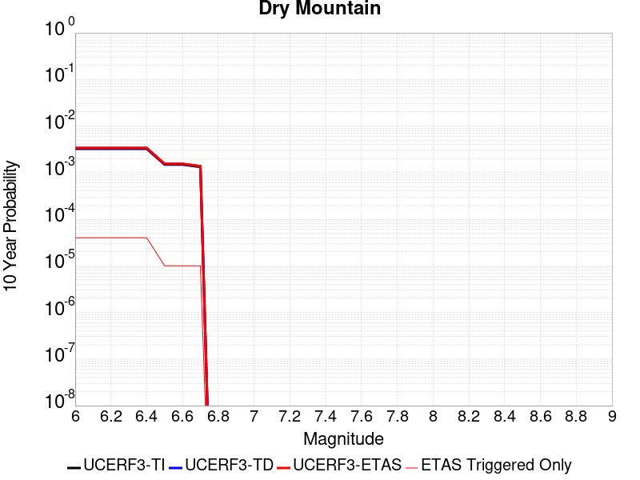 |

| Magnitude | 1 wk TI Prob | 1 wk TD Prob | 1 wk ETAS Prob | 1 wk ETAS/TD Gain | 1 wk ETAS Triggered Only | 1 mo TI Prob | 1 mo TD Prob | 1 mo ETAS Prob | 1 mo ETAS/TD Gain | 1 mo ETAS Triggered Only | 1 yr TI Prob | 1 yr TD Prob | 1 yr ETAS Prob | 1 yr ETAS/TD Gain | 1 yr ETAS Triggered Only | 10 yr TI Prob | 10 yr TD Prob | 10 yr ETAS Prob | 10 yr ETAS/TD Gain | 10 yr ETAS Triggered Only |
|-----|-----|-----|-----|-----|-----|-----|-----|-----|-----|-----|-----|-----|-----|-----|-----|-----|-----|-----|-----|-----|
| 6.0 | 6.222801E-6 | 6.439381E-6 | 2.6439253E-5 | 4.1058683 | 2.0E-5 | 2.6668875E-5 | 2.7597147E-5 | 4.7596594E-5 | 1.7246926 | 2.0E-5 | 3.2464517E-4 | 3.3595937E-4 | 3.659493E-4 | 1.0892665 | 3.0E-5 | 0.0032417132 | 0.0033560768 | 0.0033959425 | 1.0118787 | 4.0E-5 |
| 6.1 | 6.222801E-6 | 6.439381E-6 | 2.6439253E-5 | 4.1058683 | 2.0E-5 | 2.6668875E-5 | 2.7597147E-5 | 4.7596594E-5 | 1.7246926 | 2.0E-5 | 3.2464517E-4 | 3.3595937E-4 | 3.659493E-4 | 1.0892665 | 3.0E-5 | 0.0032417132 | 0.0033560768 | 0.0033959425 | 1.0118787 | 4.0E-5 |
| 6.2 | 6.222801E-6 | 6.439381E-6 | 2.6439253E-5 | 4.1058683 | 2.0E-5 | 2.6668875E-5 | 2.7597147E-5 | 4.7596594E-5 | 1.7246926 | 2.0E-5 | 3.2464517E-4 | 3.3595937E-4 | 3.659493E-4 | 1.0892665 | 3.0E-5 | 0.0032417132 | 0.0033560768 | 0.0033959425 | 1.0118787 | 4.0E-5 |
| 6.3 | 6.222801E-6 | 6.439381E-6 | 2.6439253E-5 | 4.1058683 | 2.0E-5 | 2.6668875E-5 | 2.7597147E-5 | 4.7596594E-5 | 1.7246926 | 2.0E-5 | 3.2464517E-4 | 3.3595937E-4 | 3.659493E-4 | 1.0892665 | 3.0E-5 | 0.0032417132 | 0.0033560768 | 0.0033959425 | 1.0118787 | 4.0E-5 |
| 6.4 | 6.222801E-6 | 6.439381E-6 | 2.6439253E-5 | 4.1058683 | 2.0E-5 | 2.6668875E-5 | 2.7597147E-5 | 4.7596594E-5 | 1.7246926 | 2.0E-5 | 3.2464517E-4 | 3.3595937E-4 | 3.659493E-4 | 1.0892665 | 3.0E-5 | 0.0032417132 | 0.0033560768 | 0.0033959425 | 1.0118787 | 4.0E-5 |
| 6.5 | 2.8528623E-6 | 2.9521684E-6 | 2.9521684E-6 | 1.0 | 0.0 | 1.22264955E-5 | 1.2652138E-5 | 1.2652138E-5 | 1.0 | 0.0 | 1.4884741E-4 | 1.540376E-4 | 1.540376E-4 | 1.0 | 0.0 | 0.0014874774 | 0.0015401616 | 0.0015501463 | 1.0064828 | 1.0E-5 |
| 6.6 | 2.8528623E-6 | 2.9521684E-6 | 2.9521684E-6 | 1.0 | 0.0 | 1.22264955E-5 | 1.2652138E-5 | 1.2652138E-5 | 1.0 | 0.0 | 1.4884741E-4 | 1.540376E-4 | 1.540376E-4 | 1.0 | 0.0 | 0.0014874774 | 0.0015401616 | 0.0015501463 | 1.0064828 | 1.0E-5 |
| 6.7 | 2.541E-6 | 2.6293578E-6 | 2.6293578E-6 | 1.0 | 0.0 | 1.0889954E-5 | 1.1268677E-5 | 1.1268677E-5 | 1.0 | 0.0 | 1.3257713E-4 | 1.3719614E-4 | 1.3719614E-4 | 1.0 | 0.0 | 0.0013249806 | 0.0013719613 | 0.0013819477 | 1.0072788 | 1.0E-5 |

## San Gabriel (Extension)
*[(top)](#table-of-contents)*

| 1 Week | 1 Month | 1 Year | 10 Year |
|-----|-----|-----|-----|
|  |  |  | 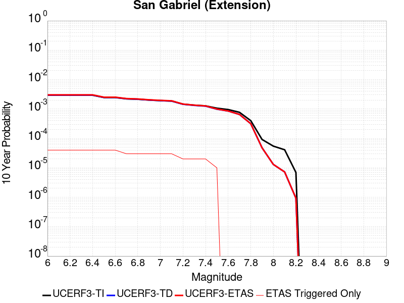 |

| Magnitude | 1 wk TI Prob | 1 wk TD Prob | 1 wk ETAS Prob | 1 wk ETAS/TD Gain | 1 wk ETAS Triggered Only | 1 mo TI Prob | 1 mo TD Prob | 1 mo ETAS Prob | 1 mo ETAS/TD Gain | 1 mo ETAS Triggered Only | 1 yr TI Prob | 1 yr TD Prob | 1 yr ETAS Prob | 1 yr ETAS/TD Gain | 1 yr ETAS Triggered Only | 10 yr TI Prob | 10 yr TD Prob | 10 yr ETAS Prob | 10 yr ETAS/TD Gain | 10 yr ETAS Triggered Only |
|-----|-----|-----|-----|-----|-----|-----|-----|-----|-----|-----|-----|-----|-----|-----|-----|-----|-----|-----|-----|-----|
| 6.0 | 5.6486106E-6 | 5.7168304E-6 | 5.7168304E-6 | 1.0 | 0.0 | 2.4208108E-5 | 2.450048E-5 | 2.450048E-5 | 1.0 | 0.0 | 2.9469383E-4 | 2.9825376E-4 | 3.182478E-4 | 1.067037 | 2.0E-5 | 0.0029430336 | 0.0029786653 | 0.003018546 | 1.0133889 | 4.0E-5 |
| 6.1 | 5.6486106E-6 | 5.7168304E-6 | 5.7168304E-6 | 1.0 | 0.0 | 2.4208108E-5 | 2.450048E-5 | 2.450048E-5 | 1.0 | 0.0 | 2.9469383E-4 | 2.9825376E-4 | 3.182478E-4 | 1.067037 | 2.0E-5 | 0.0029430336 | 0.0029786653 | 0.003018546 | 1.0133889 | 4.0E-5 |
| 6.2 | 5.6486106E-6 | 5.7168304E-6 | 5.7168304E-6 | 1.0 | 0.0 | 2.4208108E-5 | 2.450048E-5 | 2.450048E-5 | 1.0 | 0.0 | 2.9469383E-4 | 2.9825376E-4 | 3.182478E-4 | 1.067037 | 2.0E-5 | 0.0029430336 | 0.0029786653 | 0.003018546 | 1.0133889 | 4.0E-5 |
| 6.3 | 5.6486106E-6 | 5.7168304E-6 | 5.7168304E-6 | 1.0 | 0.0 | 2.4208108E-5 | 2.450048E-5 | 2.450048E-5 | 1.0 | 0.0 | 2.9469383E-4 | 2.9825376E-4 | 3.182478E-4 | 1.067037 | 2.0E-5 | 0.0029430336 | 0.0029786653 | 0.003018546 | 1.0133889 | 4.0E-5 |
| 6.4 | 5.6486106E-6 | 5.7168304E-6 | 5.7168304E-6 | 1.0 | 0.0 | 2.4208108E-5 | 2.450048E-5 | 2.450048E-5 | 1.0 | 0.0 | 2.9469383E-4 | 2.9825376E-4 | 3.182478E-4 | 1.067037 | 2.0E-5 | 0.0029430336 | 0.0029786653 | 0.003018546 | 1.0133889 | 4.0E-5 |
| 6.5 | 4.7134554E-6 | 4.7542544E-6 | 4.7542544E-6 | 1.0 | 0.0 | 2.0200367E-5 | 2.0375222E-5 | 2.0375222E-5 | 1.0 | 0.0 | 2.459117E-4 | 2.4804095E-4 | 2.6803598E-4 | 1.0806118 | 2.0E-5 | 0.0024563975 | 0.002477729 | 0.0025176299 | 1.0161039 | 4.0E-5 |
| 6.6 | 4.7134554E-6 | 4.7542544E-6 | 4.7542544E-6 | 1.0 | 0.0 | 2.0200367E-5 | 2.0375222E-5 | 2.0375222E-5 | 1.0 | 0.0 | 2.459117E-4 | 2.4804095E-4 | 2.6803598E-4 | 1.0806118 | 2.0E-5 | 0.0024563975 | 0.002477729 | 0.0025176299 | 1.0161039 | 4.0E-5 |
| 6.7 | 4.2468837E-6 | 4.2740717E-6 | 4.2740717E-6 | 1.0 | 0.0 | 1.8200803E-5 | 1.8317325E-5 | 1.8317325E-5 | 1.0 | 0.0 | 2.2157225E-4 | 2.2299135E-4 | 2.3298911E-4 | 1.0448347 | 1.0E-5 | 0.0022135144 | 0.0022277518 | 0.002257685 | 1.0134364 | 3.0E-5 |
| 6.8 | 4.1180615E-6 | 4.1414614E-6 | 4.1414614E-6 | 1.0 | 0.0 | 1.7648716E-5 | 1.7749004E-5 | 1.7749004E-5 | 1.0 | 0.0 | 2.1485193E-4 | 2.160734E-4 | 2.2607125E-4 | 1.0462706 | 1.0E-5 | 0.0021464431 | 0.0021587082 | 0.0021886434 | 1.0138673 | 3.0E-5 |
| 6.9 | 3.863861E-6 | 3.8797766E-6 | 3.8797766E-6 | 1.0 | 0.0 | 1.65593E-5 | 1.6627511E-5 | 1.6627511E-5 | 1.0 | 0.0 | 2.0159081E-4 | 2.0242184E-4 | 2.124198E-4 | 1.0493917 | 1.0E-5 | 0.0020140803 | 0.002022446 | 0.0020523854 | 1.0148035 | 3.0E-5 |
| 7.0 | 3.6947372E-6 | 3.705676E-6 | 3.705676E-6 | 1.0 | 0.0 | 1.5834492E-5 | 1.5881375E-5 | 1.5881375E-5 | 1.0 | 0.0 | 1.9276788E-4 | 1.9333926E-4 | 2.0333733E-4 | 1.0517125 | 1.0E-5 | 0.0019260074 | 0.0019317807 | 0.0019617227 | 1.0154997 | 3.0E-5 |
| 7.1 | 3.5686835E-6 | 3.5728963E-6 | 3.5728963E-6 | 1.0 | 0.0 | 1.5294268E-5 | 1.5312327E-5 | 1.5312327E-5 | 1.0 | 0.0 | 1.861918E-4 | 1.8641229E-4 | 1.9641043E-4 | 1.0536345 | 1.0E-5 | 0.0018603588 | 0.0018626289 | 0.001892573 | 1.0160763 | 3.0E-5 |
| 7.2 | 2.8023446E-6 | 2.7767885E-6 | 2.7767885E-6 | 1.0 | 0.0 | 1.2009994E-5 | 1.1900468E-5 | 1.1900468E-5 | 1.0 | 0.0 | 1.4621185E-4 | 1.4487868E-4 | 1.5487723E-4 | 1.0690132 | 1.0E-5 | 0.001461157 | 0.0014478569 | 0.0014678279 | 1.0137935 | 2.0E-5 |
| 7.3 | 2.5843012E-6 | 2.5459642E-6 | 2.5459642E-6 | 1.0 | 0.0 | 1.1075529E-5 | 1.0911231E-5 | 1.0911231E-5 | 1.0 | 0.0 | 1.3483623E-4 | 1.3283623E-4 | 1.428349E-4 | 1.0752707 | 1.0E-5 | 0.0013475444 | 0.0013275818 | 0.0013475553 | 1.0150449 | 2.0E-5 |
| 7.4 | 2.4464468E-6 | 2.396665E-6 | 2.396665E-6 | 1.0 | 0.0 | 1.04847295E-5 | 1.0271382E-5 | 1.0271382E-5 | 1.0 | 0.0 | 1.276441E-4 | 1.25047E-4 | 1.3504575E-4 | 1.07996 | 1.0E-5 | 0.0012757082 | 0.0012497796 | 0.0012697546 | 1.0159829 | 2.0E-5 |
| 7.5 | 2.0420266E-6 | 1.8910426E-6 | 1.8910426E-6 | 1.0 | 0.0 | 8.751514E-6 | 8.104444E-6 | 8.104444E-6 | 1.0 | 0.0 | 1.0654447E-4 | 9.8667166E-5 | 1.0866618E-4 | 1.1013409 | 1.0E-5 | 0.001064934 | 9.862408E-4 | 9.962309E-4 | 1.0101296 | 1.0E-5 |
| 7.6 | 1.8326596E-6 | 1.6398341E-6 | 1.6398341E-6 | 1.0 | 0.0 | 7.854232E-6 | 7.0278415E-6 | 7.0278415E-6 | 1.0 | 0.0 | 9.562107E-5 | 8.5560634E-5 | 8.5560634E-5 | 1.0 | 0.0 | 9.5579936E-4 | 8.5528276E-4 | 8.5528276E-4 | 1.0 | 0.0 |
| 7.7 | 1.4786998E-6 | 1.2523838E-6 | 1.2523838E-6 | 1.0 | 0.0 | 6.3372695E-6 | 5.367348E-6 | 5.367348E-6 | 1.0 | 0.0 | 7.715353E-5 | 6.534551E-5 | 6.534551E-5 | 1.0 | 0.0 | 7.7126746E-4 | 6.532707E-4 | 6.532707E-4 | 1.0 | 0.0 |
| 7.8 | 7.6975533E-7 | 6.0693884E-7 | 6.0693884E-7 | 1.0 | 0.0 | 3.2989474E-6 | 2.601164E-6 | 2.601164E-6 | 1.0 | 0.0 | 4.0163945E-5 | 3.166871E-5 | 3.166871E-5 | 1.0 | 0.0 | 4.0156685E-4 | 3.1664805E-4 | 3.1664805E-4 | 1.0 | 0.0 |
| 7.9 | 1.7645915E-7 | 9.213256E-8 | 9.213256E-8 | 1.0 | 0.0 | 7.562533E-7 | 3.9485377E-7 | 3.9485377E-7 | 1.0 | 0.0 | 9.207345E-6 | 4.807334E-6 | 4.807334E-6 | 1.0 | 0.0 | 9.206964E-5 | 4.807699E-5 | 4.807699E-5 | 1.0 | 0.0 |
| 8.0 | 1.0463461E-7 | 2.4949307E-8 | 2.4949307E-8 | 1.0 | 0.0 | 4.4843398E-7 | 1.0692559E-7 | 1.0692559E-7 | 1.0 | 0.0 | 5.45967E-6 | 1.3018183E-6 | 1.3018183E-6 | 1.0 | 0.0 | 5.459536E-5 | 1.3022789E-5 | 1.3022789E-5 | 1.0 | 0.0 |
| 8.1 | 7.875717E-8 | 1.3866874E-8 | 1.3866874E-8 | 1.0 | 0.0 | 3.3753068E-7 | 5.942946E-8 | 5.942946E-8 | 1.0 | 0.0 | 4.109428E-6 | 7.235534E-7 | 7.235534E-7 | 1.0 | 0.0 | 4.109352E-5 | 7.2401926E-6 | 7.2401926E-6 | 1.0 | 0.0 |
| 8.2 | 1.33163E-8 | 1.7733891E-9 | 1.7733891E-9 | 1.0 | 0.0 | 5.7069855E-8 | 7.600239E-9 | 7.600239E-9 | 1.0 | 0.0 | 6.9482525E-7 | 9.25329E-8 | 9.25329E-8 | 1.0 | 0.0 | 6.9482307E-6 | 9.272953E-7 | 9.272953E-7 | 1.0 | 0.0 |

## Los Alamos 2011 CFM
*[(top)](#table-of-contents)*

| 1 Week | 1 Month | 1 Year | 10 Year |
|-----|-----|-----|-----|
|  |  | 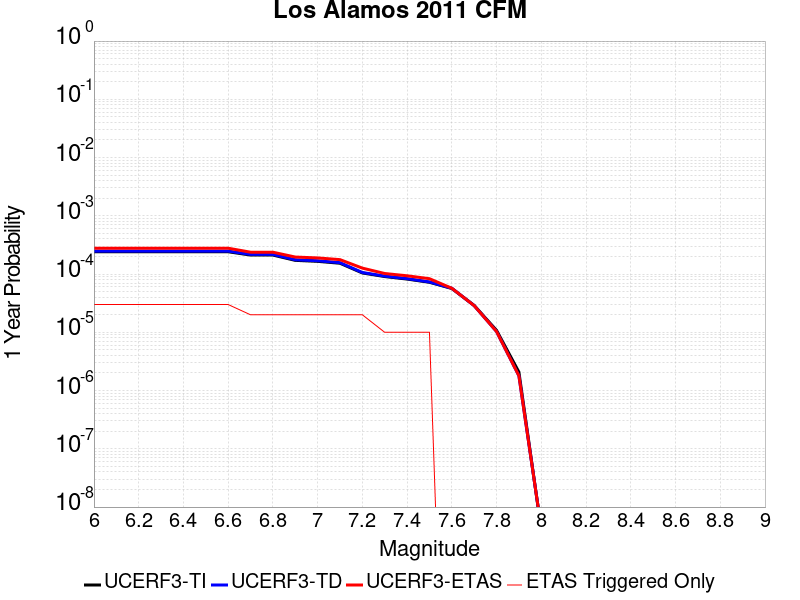 |  |

| Magnitude | 1 wk TI Prob | 1 wk TD Prob | 1 wk ETAS Prob | 1 wk ETAS/TD Gain | 1 wk ETAS Triggered Only | 1 mo TI Prob | 1 mo TD Prob | 1 mo ETAS Prob | 1 mo ETAS/TD Gain | 1 mo ETAS Triggered Only | 1 yr TI Prob | 1 yr TD Prob | 1 yr ETAS Prob | 1 yr ETAS/TD Gain | 1 yr ETAS Triggered Only | 10 yr TI Prob | 10 yr TD Prob | 10 yr ETAS Prob | 10 yr ETAS/TD Gain | 10 yr ETAS Triggered Only |
|-----|-----|-----|-----|-----|-----|-----|-----|-----|-----|-----|-----|-----|-----|-----|-----|-----|-----|-----|-----|-----|
| 6.0 | 4.6284417E-6 | 4.751731E-6 | 2.4751636E-5 | 5.2089725 | 2.0E-5 | 1.9836029E-5 | 2.0364414E-5 | 4.0364004E-5 | 1.9820853 | 2.0E-5 | 2.4147688E-4 | 2.4791027E-4 | 2.7790284E-4 | 1.1209816 | 3.0E-5 | 0.0024121467 | 0.0024765113 | 0.0025164124 | 1.0161117 | 4.0E-5 |
| 6.1 | 4.6284417E-6 | 4.751731E-6 | 2.4751636E-5 | 5.2089725 | 2.0E-5 | 1.9836029E-5 | 2.0364414E-5 | 4.0364004E-5 | 1.9820853 | 2.0E-5 | 2.4147688E-4 | 2.4791027E-4 | 2.7790284E-4 | 1.1209816 | 3.0E-5 | 0.0024121467 | 0.0024765113 | 0.0025164124 | 1.0161117 | 4.0E-5 |
| 6.2 | 4.6284417E-6 | 4.751731E-6 | 2.4751636E-5 | 5.2089725 | 2.0E-5 | 1.9836029E-5 | 2.0364414E-5 | 4.0364004E-5 | 1.9820853 | 2.0E-5 | 2.4147688E-4 | 2.4791027E-4 | 2.7790284E-4 | 1.1209816 | 3.0E-5 | 0.0024121467 | 0.0024765113 | 0.0025164124 | 1.0161117 | 4.0E-5 |
| 6.3 | 4.6284417E-6 | 4.751731E-6 | 2.4751636E-5 | 5.2089725 | 2.0E-5 | 1.9836029E-5 | 2.0364414E-5 | 4.0364004E-5 | 1.9820853 | 2.0E-5 | 2.4147688E-4 | 2.4791027E-4 | 2.7790284E-4 | 1.1209816 | 3.0E-5 | 0.0024121467 | 0.0024765113 | 0.0025164124 | 1.0161117 | 4.0E-5 |
| 6.4 | 4.6284417E-6 | 4.751731E-6 | 2.4751636E-5 | 5.2089725 | 2.0E-5 | 1.9836029E-5 | 2.0364414E-5 | 4.0364004E-5 | 1.9820853 | 2.0E-5 | 2.4147688E-4 | 2.4791027E-4 | 2.7790284E-4 | 1.1209816 | 3.0E-5 | 0.0024121467 | 0.0024765113 | 0.0025164124 | 1.0161117 | 4.0E-5 |
| 6.5 | 4.6284417E-6 | 4.751731E-6 | 2.4751636E-5 | 5.2089725 | 2.0E-5 | 1.9836029E-5 | 2.0364414E-5 | 4.0364004E-5 | 1.9820853 | 2.0E-5 | 2.4147688E-4 | 2.4791027E-4 | 2.7790284E-4 | 1.1209816 | 3.0E-5 | 0.0024121467 | 0.0024765113 | 0.0025164124 | 1.0161117 | 4.0E-5 |
| 6.6 | 4.6284417E-6 | 4.751731E-6 | 2.4751636E-5 | 5.2089725 | 2.0E-5 | 1.9836029E-5 | 2.0364414E-5 | 4.0364004E-5 | 1.9820853 | 2.0E-5 | 2.4147688E-4 | 2.4791027E-4 | 2.7790284E-4 | 1.1209816 | 3.0E-5 | 0.0024121467 | 0.0024765113 | 0.0025164124 | 1.0161117 | 4.0E-5 |
| 6.7 | 4.062321E-6 | 4.166349E-6 | 2.4166266E-5 | 5.8003464 | 2.0E-5 | 1.7409831E-5 | 1.7855667E-5 | 3.785531E-5 | 2.1200726 | 2.0E-5 | 2.1194408E-4 | 2.1737257E-4 | 2.3736822E-4 | 1.091988 | 2.0E-5 | 0.0021174205 | 0.0021717492 | 0.002201684 | 1.0137837 | 3.0E-5 |
| 6.8 | 4.062321E-6 | 4.166349E-6 | 2.4166266E-5 | 5.8003464 | 2.0E-5 | 1.7409831E-5 | 1.7855667E-5 | 3.785531E-5 | 2.1200726 | 2.0E-5 | 2.1194408E-4 | 2.1737257E-4 | 2.3736822E-4 | 1.091988 | 2.0E-5 | 0.0021174205 | 0.0021717492 | 0.002201684 | 1.0137837 | 3.0E-5 |
| 6.9 | 3.2936077E-6 | 3.372958E-6 | 2.337289E-5 | 6.929494 | 2.0E-5 | 1.4115385E-5 | 1.4455459E-5 | 3.445517E-5 | 2.3835404 | 2.0E-5 | 1.7184127E-4 | 1.7598194E-4 | 1.9597841E-4 | 1.113628 | 2.0E-5 | 0.0017170844 | 0.0017585184 | 0.0017884657 | 1.0170298 | 3.0E-5 |
| 7.0 | 3.1687898E-6 | 3.2448156E-6 | 2.3244751E-5 | 7.1636586 | 2.0E-5 | 1.3580457E-5 | 1.3906283E-5 | 3.3906006E-5 | 2.4381788 | 2.0E-5 | 1.6532952E-4 | 1.6929678E-4 | 1.892934E-4 | 1.1181158 | 2.0E-5 | 0.0016520657 | 0.0016917696 | 0.0017217188 | 1.0177029 | 3.0E-5 |
| 7.1 | 2.9379228E-6 | 3.0073259E-6 | 2.3007266E-5 | 7.650407 | 2.0E-5 | 1.25910365E-5 | 1.288848E-5 | 3.2888223E-5 | 2.5517533 | 2.0E-5 | 1.5328509E-4 | 1.5690686E-4 | 1.7690372E-4 | 1.1274441 | 2.0E-5 | 0.001531794 | 0.0015680499 | 0.0015980029 | 1.0191021 | 3.0E-5 |
| 7.2 | 2.0020686E-6 | 2.0416298E-6 | 2.204159E-5 | 10.796075 | 2.0E-5 | 8.580266E-6 | 8.749813E-6 | 2.8749639E-5 | 3.2857432 | 2.0E-5 | 1.0445973E-4 | 1.0652381E-4 | 1.2652167E-4 | 1.1877315 | 2.0E-5 | 0.0010441064 | 0.001064732 | 0.0010847106 | 1.018764 | 2.0E-5 |
| 7.3 | 1.7364243E-6 | 1.7678802E-6 | 1.1767863E-5 | 6.6564817 | 1.0E-5 | 7.441797E-6 | 7.576608E-6 | 1.7576533E-5 | 2.3198419 | 1.0E-5 | 9.0600115E-5 | 9.2241324E-5 | 1.022404E-4 | 1.1084013 | 1.0E-5 | 9.0563187E-4 | 9.2203356E-4 | 9.320243E-4 | 1.0108356 | 1.0E-5 |
| 7.4 | 1.5718434E-6 | 1.5983177E-6 | 1.1598302E-5 | 7.2565684 | 1.0E-5 | 6.7364545E-6 | 6.849915E-6 | 1.6849846E-5 | 2.4598622 | 1.0E-5 | 8.201325E-5 | 8.339455E-5 | 9.339372E-5 | 1.1199019 | 1.0E-5 | 8.198299E-4 | 8.3363557E-4 | 8.4362726E-4 | 1.0119857 | 1.0E-5 |
| 7.5 | 1.3841119E-6 | 1.4042793E-6 | 1.1404265E-5 | 8.12108 | 1.0E-5 | 5.9318945E-6 | 6.0183256E-6 | 1.6018266E-5 | 2.6615818 | 1.0E-5 | 7.221842E-5 | 7.327068E-5 | 8.326995E-5 | 1.1364702 | 1.0E-5 | 7.2194956E-4 | 7.324681E-4 | 7.424608E-4 | 1.0136424 | 1.0E-5 |
| 7.6 | 1.0843726E-6 | 1.093442E-6 | 1.093442E-6 | 1.0 | 0.0 | 4.647303E-6 | 4.6861724E-6 | 4.6861724E-6 | 1.0 | 0.0 | 5.6579443E-5 | 5.705268E-5 | 5.705268E-5 | 1.0 | 0.0 | 5.656504E-4 | 5.703829E-4 | 5.703829E-4 | 1.0 | 0.0 |
| 7.7 | 5.544814E-7 | 5.5018705E-7 | 5.5018705E-7 | 1.0 | 0.0 | 2.3763469E-6 | 2.3579425E-6 | 2.3579425E-6 | 1.0 | 0.0 | 2.8931638E-5 | 2.8707573E-5 | 2.8707573E-5 | 1.0 | 0.0 | 2.8927872E-4 | 2.870388E-4 | 2.870388E-4 | 1.0 | 0.0 |
| 7.8 | 2.0707465E-7 | 1.977846E-7 | 1.977846E-7 | 1.0 | 0.0 | 8.874625E-7 | 8.4764804E-7 | 8.4764804E-7 | 1.0 | 0.0 | 1.08048025E-5 | 1.0320066E-5 | 1.0320066E-5 | 1.0 | 0.0 | 1.0804277E-4 | 1.0319592E-4 | 1.0319592E-4 | 1.0 | 0.0 |
| 7.9 | 3.9821284E-8 | 3.433109E-8 | 3.433109E-8 | 1.0 | 0.0 | 1.7066264E-7 | 1.4713324E-7 | 1.4713324E-7 | 1.0 | 0.0 | 2.0778157E-6 | 1.7913457E-6 | 1.7913457E-6 | 1.0 | 0.0 | 2.0777963E-5 | 1.7913319E-5 | 1.7913319E-5 | 1.0 | 0.0 |
| 8.0 | 7.880441E-11 | 8.2353124E-11 | 8.2353124E-11 | 1.0 | 0.0 | 3.3773329E-10 | 3.52942E-10 | 3.52942E-10 | 1.0 | 0.0 | 4.1119033E-9 | 4.2970694E-9 | 4.2970694E-9 | 1.0 | 0.0 | 4.1119034E-8 | 4.2970694E-8 | 4.2970694E-8 | 1.0 | 0.0 |

## Emerson-Copper Mtn 2011
*[(top)](#table-of-contents)*

| 1 Week | 1 Month | 1 Year | 10 Year |
|-----|-----|-----|-----|
|  |  |  |  |

| Magnitude | 1 wk TI Prob | 1 wk TD Prob | 1 wk ETAS Prob | 1 wk ETAS/TD Gain | 1 wk ETAS Triggered Only | 1 mo TI Prob | 1 mo TD Prob | 1 mo ETAS Prob | 1 mo ETAS/TD Gain | 1 mo ETAS Triggered Only | 1 yr TI Prob | 1 yr TD Prob | 1 yr ETAS Prob | 1 yr ETAS/TD Gain | 1 yr ETAS Triggered Only | 10 yr TI Prob | 10 yr TD Prob | 10 yr ETAS Prob | 10 yr ETAS/TD Gain | 10 yr ETAS Triggered Only |
|-----|-----|-----|-----|-----|-----|-----|-----|-----|-----|-----|-----|-----|-----|-----|-----|-----|-----|-----|-----|-----|
| 6.0 | 2.1364202E-5 | 9.968114E-6 | 9.968114E-6 | 1.0 | 0.0 | 9.1557646E-5 | 4.2719836E-5 | 5.271941E-5 | 1.2340733 | 1.0E-5 | 0.0011141442 | 5.199986E-4 | 5.49983E-4 | 1.0576625 | 3.0E-5 | 0.011085749 | 0.005188688 | 0.0052185324 | 1.0057518 | 3.0E-5 |
| 6.1 | 2.1364202E-5 | 9.968114E-6 | 9.968114E-6 | 1.0 | 0.0 | 9.1557646E-5 | 4.2719836E-5 | 5.271941E-5 | 1.2340733 | 1.0E-5 | 0.0011141442 | 5.199986E-4 | 5.49983E-4 | 1.0576625 | 3.0E-5 | 0.011085749 | 0.005188688 | 0.0052185324 | 1.0057518 | 3.0E-5 |
| 6.2 | 2.1364202E-5 | 9.968114E-6 | 9.968114E-6 | 1.0 | 0.0 | 9.1557646E-5 | 4.2719836E-5 | 5.271941E-5 | 1.2340733 | 1.0E-5 | 0.0011141442 | 5.199986E-4 | 5.49983E-4 | 1.0576625 | 3.0E-5 | 0.011085749 | 0.005188688 | 0.0052185324 | 1.0057518 | 3.0E-5 |
| 6.3 | 1.7751237E-5 | 8.089227E-6 | 8.089227E-6 | 1.0 | 0.0 | 7.607452E-5 | 3.466769E-5 | 4.4667344E-5 | 1.2884431 | 1.0E-5 | 9.258136E-4 | 4.2200365E-4 | 4.4199522E-4 | 1.0473729 | 2.0E-5 | 0.00921966 | 0.0042126453 | 0.004232561 | 1.0047276 | 2.0E-5 |
| 6.4 | 1.7751237E-5 | 8.089227E-6 | 8.089227E-6 | 1.0 | 0.0 | 7.607452E-5 | 3.466769E-5 | 4.4667344E-5 | 1.2884431 | 1.0E-5 | 9.258136E-4 | 4.2200365E-4 | 4.4199522E-4 | 1.0473729 | 2.0E-5 | 0.00921966 | 0.0042126453 | 0.004232561 | 1.0047276 | 2.0E-5 |
| 6.5 | 1.5886664E-5 | 6.603819E-6 | 6.603819E-6 | 1.0 | 0.0 | 6.808392E-5 | 2.8301802E-5 | 3.8301518E-5 | 1.3533244 | 1.0E-5 | 8.286065E-4 | 3.4452465E-4 | 3.6451776E-4 | 1.058031 | 2.0E-5 | 0.008255237 | 0.0034403696 | 0.0034603006 | 1.0057933 | 2.0E-5 |
| 6.6 | 1.5886664E-5 | 6.603819E-6 | 6.603819E-6 | 1.0 | 0.0 | 6.808392E-5 | 2.8301802E-5 | 3.8301518E-5 | 1.3533244 | 1.0E-5 | 8.286065E-4 | 3.4452465E-4 | 3.6451776E-4 | 1.058031 | 2.0E-5 | 0.008255237 | 0.0034403696 | 0.0034603006 | 1.0057933 | 2.0E-5 |
| 6.7 | 1.428471E-5 | 5.470403E-6 | 5.470403E-6 | 1.0 | 0.0 | 6.121875E-5 | 2.3444394E-5 | 3.344416E-5 | 1.4265312 | 1.0E-5 | 7.450834E-4 | 2.8540206E-4 | 3.0539636E-4 | 1.0700566 | 2.0E-5 | 0.007425902 | 0.0028507432 | 0.0028706861 | 1.0069957 | 2.0E-5 |
| 6.8 | 1.3490684E-5 | 5.073699E-6 | 5.073699E-6 | 1.0 | 0.0 | 5.7815934E-5 | 2.1744265E-5 | 3.1744046E-5 | 1.4598814 | 1.0E-5 | 7.0368167E-4 | 2.6470813E-4 | 2.7470547E-4 | 1.0377674 | 1.0E-5 | 0.007014576 | 0.002644309 | 0.0026542826 | 1.0037717 | 1.0E-5 |
| 6.9 | 1.2235421E-5 | 4.289677E-6 | 4.289677E-6 | 1.0 | 0.0 | 5.2436466E-5 | 1.838422E-5 | 2.8384036E-5 | 1.5439347 | 1.0E-5 | 6.38227E-4 | 2.238085E-4 | 2.3380626E-4 | 1.044671 | 1.0E-5 | 0.0063639707 | 0.0022361854 | 0.002246163 | 1.0044619 | 1.0E-5 |
| 7.0 | 1.1009851E-5 | 3.7189886E-6 | 3.7189886E-6 | 1.0 | 0.0 | 4.7184225E-5 | 1.5938444E-5 | 2.5938285E-5 | 1.6274039 | 1.0E-5 | 5.743165E-4 | 1.9403672E-4 | 2.0403478E-4 | 1.0515267 | 1.0E-5 | 0.005728345 | 0.0019390108 | 0.0019489914 | 1.0051472 | 1.0E-5 |
| 7.1 | 9.726373E-6 | 3.2117953E-6 | 3.2117953E-6 | 1.0 | 0.0 | 4.168379E-5 | 1.3764783E-5 | 2.3764645E-5 | 1.7264817 | 1.0E-5 | 5.07382E-4 | 1.6757673E-4 | 1.7757504E-4 | 1.0596641 | 1.0E-5 | 0.0050622504 | 0.0016748349 | 0.0016848181 | 1.0059607 | 1.0E-5 |
| 7.2 | 3.9335127E-6 | 1.1524792E-6 | 1.1524792E-6 | 1.0 | 0.0 | 1.6857803E-5 | 4.9391874E-6 | 1.4939138E-5 | 3.0246146 | 1.0E-5 | 2.0522442E-4 | 6.0133007E-5 | 7.01324E-5 | 1.166288 | 1.0E-5 | 0.00205035 | 6.011733E-4 | 6.111673E-4 | 1.0166241 | 1.0E-5 |
| 7.3 | 2.661632E-6 | 6.911505E-7 | 6.911505E-7 | 1.0 | 0.0 | 1.14069435E-5 | 2.9620703E-6 | 1.296204E-5 | 4.376007 | 1.0E-5 | 1.3887069E-4 | 3.6062618E-5 | 4.6062258E-5 | 1.2772855 | 1.0E-5 | 0.0013878393 | 3.605687E-4 | 3.705651E-4 | 1.0277239 | 1.0E-5 |
| 7.4 | 2.0893426E-6 | 5.4618386E-7 | 5.4618386E-7 | 1.0 | 0.0 | 8.954295E-6 | 2.3407858E-6 | 1.2340763E-5 | 5.2720594 | 1.0E-5 | 1.0901308E-4 | 2.84987E-5 | 3.8498416E-5 | 1.3508832 | 1.0E-5 | 0.0010895962 | 2.84951E-4 | 2.9494814E-4 | 1.0350838 | 1.0E-5 |
| 7.5 | 1.1681728E-6 | 3.6030585E-7 | 3.6030585E-7 | 1.0 | 0.0 | 5.0064455E-6 | 1.544167E-6 | 1.1544152E-5 | 7.475973 | 1.0E-5 | 6.0951766E-5 | 1.8800076E-5 | 2.8799888E-5 | 1.5319028 | 1.0E-5 | 6.093505E-4 | 1.8798532E-4 | 1.9798345E-4 | 1.0531856 | 1.0E-5 |
| 7.6 | 1.3154387E-7 | 7.1197384E-8 | 7.1197384E-8 | 1.0 | 0.0 | 5.6375933E-7 | 3.051316E-7 | 3.051316E-7 | 1.0 | 0.0 | 6.863748E-6 | 3.7149728E-6 | 3.7149728E-6 | 1.0 | 0.0 | 6.863536E-5 | 3.7149264E-5 | 3.7149264E-5 | 1.0 | 0.0 |

## Los Alamos extension
*[(top)](#table-of-contents)*

| 1 Week | 1 Month | 1 Year | 10 Year |
|-----|-----|-----|-----|
| 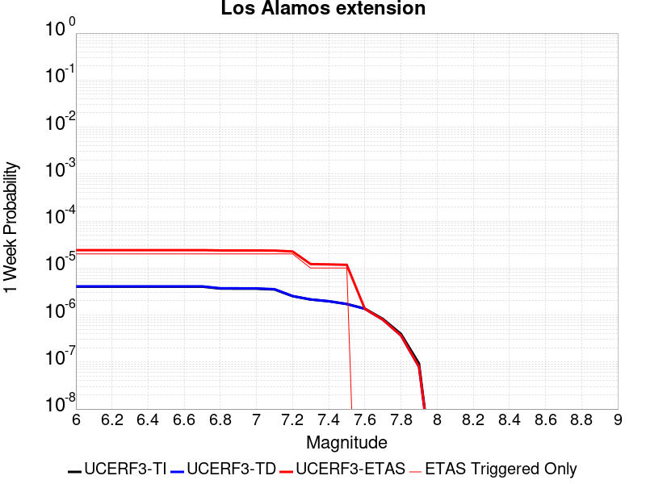 |  | 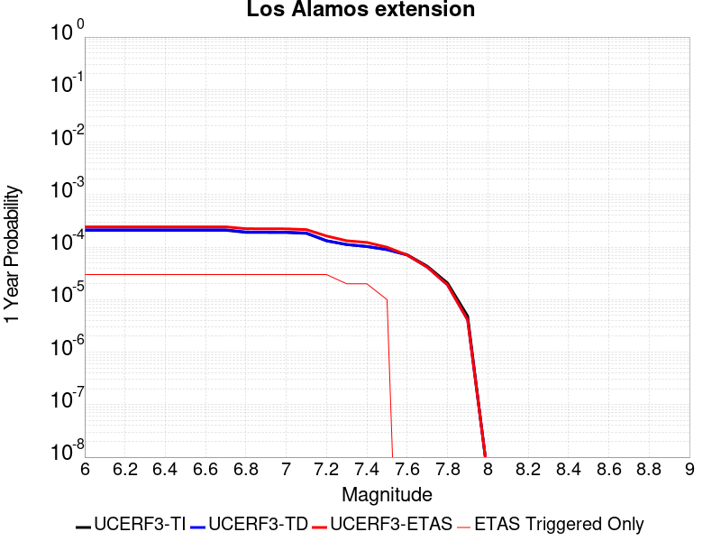 |  |

| Magnitude | 1 wk TI Prob | 1 wk TD Prob | 1 wk ETAS Prob | 1 wk ETAS/TD Gain | 1 wk ETAS Triggered Only | 1 mo TI Prob | 1 mo TD Prob | 1 mo ETAS Prob | 1 mo ETAS/TD Gain | 1 mo ETAS Triggered Only | 1 yr TI Prob | 1 yr TD Prob | 1 yr ETAS Prob | 1 yr ETAS/TD Gain | 1 yr ETAS Triggered Only | 10 yr TI Prob | 10 yr TD Prob | 10 yr ETAS Prob | 10 yr ETAS/TD Gain | 10 yr ETAS Triggered Only |
|-----|-----|-----|-----|-----|-----|-----|-----|-----|-----|-----|-----|-----|-----|-----|-----|-----|-----|-----|-----|-----|
| 6.0 | 4.0146506E-6 | 4.0861596E-6 | 2.4086077E-5 | 5.8945513 | 2.0E-5 | 1.7205533E-5 | 1.7512002E-5 | 3.751165E-5 | 2.1420538 | 2.0E-5 | 2.0945723E-4 | 2.1318886E-4 | 2.4318247E-4 | 1.1406903 | 3.0E-5 | 0.0020925992 | 0.0021299527 | 0.0021598889 | 1.0140548 | 3.0E-5 |
| 6.1 | 4.0146506E-6 | 4.0861596E-6 | 2.4086077E-5 | 5.8945513 | 2.0E-5 | 1.7205533E-5 | 1.7512002E-5 | 3.751165E-5 | 2.1420538 | 2.0E-5 | 2.0945723E-4 | 2.1318886E-4 | 2.4318247E-4 | 1.1406903 | 3.0E-5 | 0.0020925992 | 0.0021299527 | 0.0021598889 | 1.0140548 | 3.0E-5 |
| 6.2 | 4.0146506E-6 | 4.0861596E-6 | 2.4086077E-5 | 5.8945513 | 2.0E-5 | 1.7205533E-5 | 1.7512002E-5 | 3.751165E-5 | 2.1420538 | 2.0E-5 | 2.0945723E-4 | 2.1318886E-4 | 2.4318247E-4 | 1.1406903 | 3.0E-5 | 0.0020925992 | 0.0021299527 | 0.0021598889 | 1.0140548 | 3.0E-5 |
| 6.3 | 4.0146506E-6 | 4.0861596E-6 | 2.4086077E-5 | 5.8945513 | 2.0E-5 | 1.7205533E-5 | 1.7512002E-5 | 3.751165E-5 | 2.1420538 | 2.0E-5 | 2.0945723E-4 | 2.1318886E-4 | 2.4318247E-4 | 1.1406903 | 3.0E-5 | 0.0020925992 | 0.0021299527 | 0.0021598889 | 1.0140548 | 3.0E-5 |
| 6.4 | 4.0146506E-6 | 4.0861596E-6 | 2.4086077E-5 | 5.8945513 | 2.0E-5 | 1.7205533E-5 | 1.7512002E-5 | 3.751165E-5 | 2.1420538 | 2.0E-5 | 2.0945723E-4 | 2.1318886E-4 | 2.4318247E-4 | 1.1406903 | 3.0E-5 | 0.0020925992 | 0.0021299527 | 0.0021598889 | 1.0140548 | 3.0E-5 |
| 6.5 | 4.0146506E-6 | 4.0861596E-6 | 2.4086077E-5 | 5.8945513 | 2.0E-5 | 1.7205533E-5 | 1.7512002E-5 | 3.751165E-5 | 2.1420538 | 2.0E-5 | 2.0945723E-4 | 2.1318886E-4 | 2.4318247E-4 | 1.1406903 | 3.0E-5 | 0.0020925992 | 0.0021299527 | 0.0021598889 | 1.0140548 | 3.0E-5 |
| 6.6 | 4.0146506E-6 | 4.0861596E-6 | 2.4086077E-5 | 5.8945513 | 2.0E-5 | 1.7205533E-5 | 1.7512002E-5 | 3.751165E-5 | 2.1420538 | 2.0E-5 | 2.0945723E-4 | 2.1318886E-4 | 2.4318247E-4 | 1.1406903 | 3.0E-5 | 0.0020925992 | 0.0021299527 | 0.0021598889 | 1.0140548 | 3.0E-5 |
| 6.7 | 4.0146506E-6 | 4.0861596E-6 | 2.4086077E-5 | 5.8945513 | 2.0E-5 | 1.7205533E-5 | 1.7512002E-5 | 3.751165E-5 | 2.1420538 | 2.0E-5 | 2.0945723E-4 | 2.1318886E-4 | 2.4318247E-4 | 1.1406903 | 3.0E-5 | 0.0020925992 | 0.0021299527 | 0.0021598889 | 1.0140548 | 3.0E-5 |
| 6.8 | 3.6584688E-6 | 3.7188588E-6 | 2.3718785E-5 | 6.3779736 | 2.0E-5 | 1.5679057E-5 | 1.5937874E-5 | 3.5937555E-5 | 2.2548525 | 2.0E-5 | 1.9087581E-4 | 1.9402728E-4 | 2.2402145E-4 | 1.1545874 | 3.0E-5 | 0.0019071194 | 0.0019386712 | 0.0019686131 | 1.0154445 | 3.0E-5 |
| 6.9 | 3.644631E-6 | 3.7045688E-6 | 2.3704495E-5 | 6.398719 | 2.0E-5 | 1.5619753E-5 | 1.5876632E-5 | 3.5876314E-5 | 2.259693 | 2.0E-5 | 1.901539E-4 | 1.9328178E-4 | 2.2327599E-4 | 1.1551838 | 3.0E-5 | 0.0018999127 | 0.0019312293 | 0.0019611714 | 1.0155041 | 3.0E-5 |
| 7.0 | 3.6318522E-6 | 3.6913295E-6 | 2.3691257E-5 | 6.418082 | 2.0E-5 | 1.5564989E-5 | 1.5819893E-5 | 3.5819576E-5 | 2.2642112 | 2.0E-5 | 1.8948725E-4 | 1.925911E-4 | 2.2258532E-4 | 1.1557404 | 3.0E-5 | 0.0018932576 | 0.0019243343 | 0.0019542766 | 1.0155598 | 3.0E-5 |
| 7.1 | 3.5001724E-6 | 3.5554E-6 | 2.3555329E-5 | 6.625226 | 2.0E-5 | 1.5000653E-5 | 1.5237345E-5 | 3.523704E-5 | 2.3125446 | 2.0E-5 | 1.8261763E-4 | 1.854998E-4 | 2.1549423E-4 | 1.1616952 | 3.0E-5 | 0.0018246764 | 0.0018535402 | 0.0018834847 | 1.0161552 | 3.0E-5 |
| 7.2 | 2.5204702E-6 | 2.5436943E-6 | 2.2543643E-5 | 8.86256 | 2.0E-5 | 1.080197E-5 | 1.0901502E-5 | 3.0901283E-5 | 2.8345897 | 2.0E-5 | 1.3150605E-4 | 1.3271775E-4 | 1.6271377E-4 | 1.2260137 | 3.0E-5 | 0.0013142825 | 0.0013263905 | 0.0013563507 | 1.0225878 | 3.0E-5 |
| 7.3 | 2.1399692E-6 | 2.1501316E-6 | 1.215011E-5 | 5.650868 | 1.0E-5 | 9.1712645E-6 | 9.2148175E-6 | 1.9214725E-5 | 2.0851986 | 1.0E-5 | 1.1165442E-4 | 1.1218466E-4 | 1.3218241E-4 | 1.1782575 | 2.0E-5 | 0.0011159834 | 0.0011212835 | 0.0011412611 | 1.0178167 | 2.0E-5 |
| 7.4 | 1.9660122E-6 | 1.9702363E-6 | 1.1970216E-5 | 6.0755234 | 1.0E-5 | 8.42574E-6 | 8.4438425E-6 | 1.8443758E-5 | 2.184285 | 1.0E-5 | 1.0257855E-4 | 1.0279897E-4 | 1.2279692E-4 | 1.1945345 | 2.0E-5 | 0.0010253121 | 0.0010275173 | 0.0010474967 | 1.0194443 | 2.0E-5 |
| 7.5 | 1.7204633E-6 | 1.7150983E-6 | 1.1715081E-5 | 6.8305597 | 1.0E-5 | 7.373393E-6 | 7.3504007E-6 | 1.7350327E-5 | 2.36046 | 1.0E-5 | 8.976737E-5 | 8.948748E-5 | 9.948659E-5 | 1.1117375 | 1.0E-5 | 8.9731114E-4 | 8.9451746E-4 | 9.045085E-4 | 1.0111692 | 1.0E-5 |
| 7.6 | 1.3717638E-6 | 1.3535827E-6 | 1.3535827E-6 | 1.0 | 0.0 | 5.878974E-6 | 5.8010555E-6 | 5.8010555E-6 | 1.0 | 0.0 | 7.157416E-5 | 7.062559E-5 | 7.062559E-5 | 1.0 | 0.0 | 7.1551115E-4 | 7.060341E-4 | 7.060341E-4 | 1.0 | 0.0 |
| 7.7 | 8.272564E-7 | 7.957636E-7 | 7.957636E-7 | 1.0 | 0.0 | 3.5453797E-6 | 3.410411E-6 | 3.410411E-6 | 1.0 | 0.0 | 4.3164142E-5 | 4.1520965E-5 | 4.1520965E-5 | 1.0 | 0.0 | 4.315576E-4 | 4.1513226E-4 | 4.1513226E-4 | 1.0 | 0.0 |
| 7.8 | 3.9708277E-7 | 3.6719027E-7 | 3.6719027E-7 | 1.0 | 0.0 | 1.7017821E-6 | 1.5736716E-6 | 1.5736716E-6 | 1.0 | 0.0 | 2.0719E-5 | 1.9159284E-5 | 1.9159284E-5 | 1.0 | 0.0 | 2.071707E-4 | 1.9157639E-4 | 1.9157639E-4 | 1.0 | 0.0 |
| 7.9 | 9.292528E-8 | 7.889087E-8 | 7.889087E-8 | 1.0 | 0.0 | 3.9825116E-7 | 3.381037E-7 | 3.381037E-7 | 1.0 | 0.0 | 4.848697E-6 | 4.116405E-6 | 4.116405E-6 | 1.0 | 0.0 | 4.8485912E-5 | 4.1163294E-5 | 4.1163294E-5 | 1.0 | 0.0 |
| 8.0 | 7.880441E-11 | 8.2353124E-11 | 8.2353124E-11 | 1.0 | 0.0 | 3.3773329E-10 | 3.52942E-10 | 3.52942E-10 | 1.0 | 0.0 | 4.1119033E-9 | 4.2970694E-9 | 4.2970694E-9 | 1.0 | 0.0 | 4.1119034E-8 | 4.2970694E-8 | 4.2970694E-8 | 1.0 | 0.0 |

## Elsinore (Stepovers Combined)
*[(top)](#table-of-contents)*

| 1 Week | 1 Month | 1 Year | 10 Year |
|-----|-----|-----|-----|
|  | 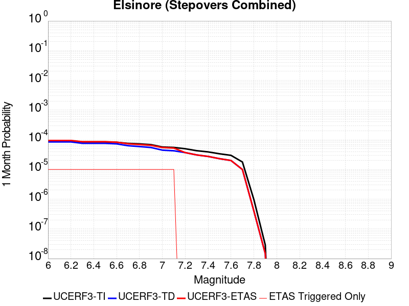 |  | 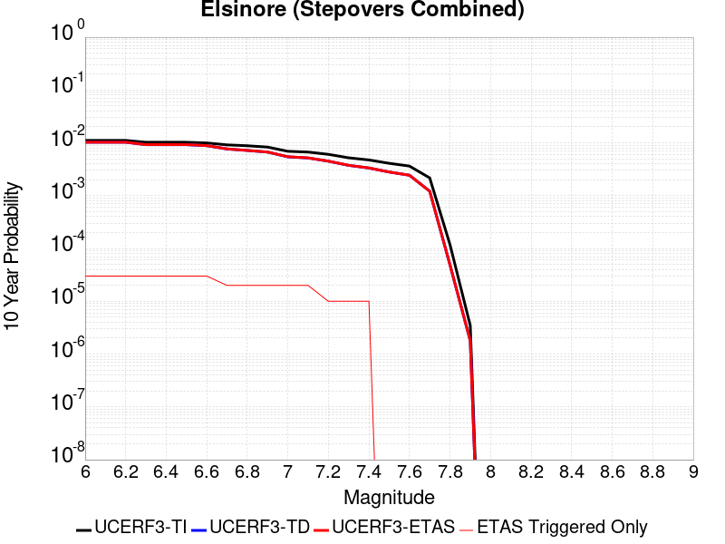 |

| Magnitude | 1 wk TI Prob | 1 wk TD Prob | 1 wk ETAS Prob | 1 wk ETAS/TD Gain | 1 wk ETAS Triggered Only | 1 mo TI Prob | 1 mo TD Prob | 1 mo ETAS Prob | 1 mo ETAS/TD Gain | 1 mo ETAS Triggered Only | 1 yr TI Prob | 1 yr TD Prob | 1 yr ETAS Prob | 1 yr ETAS/TD Gain | 1 yr ETAS Triggered Only | 10 yr TI Prob | 10 yr TD Prob | 10 yr ETAS Prob | 10 yr ETAS/TD Gain | 10 yr ETAS Triggered Only |
|-----|-----|-----|-----|-----|-----|-----|-----|-----|-----|-----|-----|-----|-----|-----|-----|-----|-----|-----|-----|-----|
| 6.0 | 2.144392E-5 | 1.9760193E-5 | 2.9759995E-5 | 1.506058 | 1.0E-5 | 9.189928E-5 | 8.468392E-5 | 9.468307E-5 | 1.1180762 | 1.0E-5 | 0.0011182994 | 0.0010305607 | 0.0010505401 | 1.0193869 | 2.0E-5 | 0.011126885 | 0.010264917 | 0.01029461 | 1.0028926 | 3.0E-5 |
| 6.1 | 2.144392E-5 | 1.9760193E-5 | 2.9759995E-5 | 1.506058 | 1.0E-5 | 9.189928E-5 | 8.468392E-5 | 9.468307E-5 | 1.1180762 | 1.0E-5 | 0.0011182994 | 0.0010305607 | 0.0010505401 | 1.0193869 | 2.0E-5 | 0.011126885 | 0.010264917 | 0.01029461 | 1.0028926 | 3.0E-5 |
| 6.2 | 2.144392E-5 | 1.9760193E-5 | 2.9759995E-5 | 1.506058 | 1.0E-5 | 9.189928E-5 | 8.468392E-5 | 9.468307E-5 | 1.1180762 | 1.0E-5 | 0.0011182994 | 0.0010305607 | 0.0010505401 | 1.0193869 | 2.0E-5 | 0.011126885 | 0.010264917 | 0.01029461 | 1.0028926 | 3.0E-5 |
| 6.3 | 1.9751555E-5 | 1.7741453E-5 | 2.7741275E-5 | 1.5636417 | 1.0E-5 | 8.4646774E-5 | 7.603267E-5 | 8.603191E-5 | 1.1315124 | 1.0E-5 | 0.0010300872 | 9.253213E-4 | 9.453028E-4 | 1.0215942 | 2.0E-5 | 0.010253254 | 0.009221276 | 0.009250999 | 1.0032233 | 3.0E-5 |
| 6.4 | 1.9751555E-5 | 1.7741453E-5 | 2.7741275E-5 | 1.5636417 | 1.0E-5 | 8.4646774E-5 | 7.603267E-5 | 8.603191E-5 | 1.1315124 | 1.0E-5 | 0.0010300872 | 9.253213E-4 | 9.453028E-4 | 1.0215942 | 2.0E-5 | 0.010253254 | 0.009221276 | 0.009250999 | 1.0032233 | 3.0E-5 |
| 6.5 | 1.9751555E-5 | 1.7741453E-5 | 2.7741275E-5 | 1.5636417 | 1.0E-5 | 8.4646774E-5 | 7.603267E-5 | 8.603191E-5 | 1.1315124 | 1.0E-5 | 0.0010300872 | 9.253213E-4 | 9.453028E-4 | 1.0215942 | 2.0E-5 | 0.010253254 | 0.009221276 | 0.009250999 | 1.0032233 | 3.0E-5 |
| 6.6 | 1.9188685E-5 | 1.7003393E-5 | 2.7003223E-5 | 1.588108 | 1.0E-5 | 8.2234634E-5 | 7.286974E-5 | 8.286901E-5 | 1.1372212 | 1.0E-5 | 0.0010007467 | 8.868442E-4 | 9.068264E-4 | 1.0225319 | 2.0E-5 | 0.00996252 | 0.0088398475 | 0.008869582 | 1.0033637 | 3.0E-5 |
| 6.7 | 1.7608272E-5 | 1.4732616E-5 | 2.473247E-5 | 1.678756 | 1.0E-5 | 7.546184E-5 | 6.3138315E-5 | 7.313768E-5 | 1.1583724 | 1.0E-5 | 9.183606E-4 | 7.684476E-4 | 7.884322E-4 | 1.0260065 | 2.0E-5 | 0.009145746 | 0.00766491 | 0.0076847565 | 1.0025893 | 2.0E-5 |
| 6.8 | 1.697165E-5 | 1.3783365E-5 | 2.3783226E-5 | 1.7255023 | 1.0E-5 | 7.273361E-5 | 5.9070277E-5 | 6.906968E-5 | 1.1692799 | 1.0E-5 | 8.8517193E-4 | 7.18952E-4 | 7.389376E-4 | 1.0277983 | 2.0E-5 | 0.008816543 | 0.007172675 | 0.0071925316 | 1.0027684 | 2.0E-5 |
| 6.9 | 1.600365E-5 | 1.2846671E-5 | 2.2846543E-5 | 1.7784017 | 1.0E-5 | 6.858527E-5 | 5.5056043E-5 | 6.5055494E-5 | 1.1816231 | 1.0E-5 | 8.347058E-4 | 6.7010894E-4 | 6.9009553E-4 | 1.0298259 | 2.0E-5 | 0.008315775 | 0.0066867657 | 0.006706632 | 1.0029709 | 2.0E-5 |
| 7.0 | 1.3314581E-5 | 1.0447548E-5 | 2.0447444E-5 | 1.9571524 | 1.0E-5 | 5.7061243E-5 | 4.4774453E-5 | 5.4774006E-5 | 1.2233317 | 1.0E-5 | 6.944992E-4 | 5.449953E-4 | 5.6498445E-4 | 1.0366776 | 2.0E-5 | 0.006923327 | 0.0054405155 | 0.0054604067 | 1.0036561 | 2.0E-5 |
| 7.1 | 1.2865345E-5 | 9.937536E-6 | 1.9937437E-5 | 2.0062757 | 1.0E-5 | 5.5136024E-5 | 4.258876E-5 | 5.2588333E-5 | 1.2347938 | 1.0E-5 | 6.710743E-4 | 5.183973E-4 | 5.383869E-4 | 1.0385604 | 2.0E-5 | 0.0066905143 | 0.0051752133 | 0.00519511 | 1.0038446 | 2.0E-5 |
| 7.2 | 1.1650051E-5 | 8.633809E-6 | 8.633809E-6 | 1.0 | 0.0 | 4.9927836E-5 | 3.7001522E-5 | 3.7001522E-5 | 1.0 | 0.0 | 6.0770183E-4 | 4.504022E-4 | 4.6039768E-4 | 1.0221924 | 1.0E-5 | 0.0060604266 | 0.0044963174 | 0.0045062723 | 1.0022141 | 1.0E-5 |
| 7.3 | 1.0008533E-5 | 7.2010425E-6 | 7.2010425E-6 | 1.0 | 0.0 | 4.2893007E-5 | 3.0861254E-5 | 3.0861254E-5 | 1.0 | 0.0 | 5.220972E-4 | 3.7567242E-4 | 3.8566868E-4 | 1.026609 | 1.0E-5 | 0.005208723 | 0.003750761 | 0.0037607234 | 1.0026561 | 1.0E-5 |
| 7.4 | 9.116759E-6 | 6.410068E-6 | 6.410068E-6 | 1.0 | 0.0 | 3.907124E-5 | 2.747144E-5 | 2.747144E-5 | 1.0 | 0.0 | 4.7558855E-4 | 3.3441483E-4 | 3.4441147E-4 | 1.0298929 | 1.0E-5 | 0.00474572 | 0.0033392678 | 0.0033492346 | 1.0029846 | 1.0E-5 |
| 7.5 | 7.870524E-6 | 5.3825365E-6 | 5.3825365E-6 | 1.0 | 0.0 | 3.3730383E-5 | 2.3067816E-5 | 2.3067816E-5 | 1.0 | 0.0 | 4.1059E-4 | 2.8081573E-4 | 2.8081573E-4 | 1.0 | 0.0 | 0.0040983222 | 0.0028047354 | 0.0028047354 | 1.0 | 0.0 |
| 7.6 | 6.9774537E-6 | 4.6776067E-6 | 4.6776067E-6 | 1.0 | 0.0 | 2.990303E-5 | 2.0046738E-5 | 2.0046738E-5 | 1.0 | 0.0 | 3.640086E-4 | 2.4404288E-4 | 2.4404288E-4 | 1.0 | 0.0 | 0.003634129 | 0.0024378651 | 0.0024378651 | 1.0 | 0.0 |
| 7.7 | 4.1616954E-6 | 2.32834E-6 | 2.32834E-6 | 1.0 | 0.0 | 1.7835715E-5 | 9.978567E-6 | 9.978567E-6 | 1.0 | 0.0 | 2.171282E-4 | 1.2148302E-4 | 1.2148302E-4 | 1.0 | 0.0 | 0.0021691616 | 0.0012142392 | 0.0012142392 | 1.0 | 0.0 |
| 7.8 | 2.2692414E-7 | 9.3854695E-8 | 9.3854695E-8 | 1.0 | 0.0 | 9.725317E-7 | 4.0223435E-7 | 4.0223435E-7 | 1.0 | 0.0 | 1.1840509E-5 | 4.8971956E-6 | 4.8971956E-6 | 1.0 | 0.0 | 1.1839878E-4 | 4.8971204E-5 | 4.8971204E-5 | 1.0 | 0.0 |
| 7.9 | 6.676829E-9 | 3.439853E-9 | 3.439853E-9 | 1.0 | 0.0 | 2.861498E-8 | 1.4742227E-8 | 1.4742227E-8 | 1.0 | 0.0 | 3.4838732E-7 | 1.7948659E-7 | 1.7948659E-7 | 1.0 | 0.0 | 3.4838679E-6 | 1.7948646E-6 | 1.7948646E-6 | 1.0 | 0.0 |

## Owens Valley Keough Hot Springs
*[(top)](#table-of-contents)*

| 1 Week | 1 Month | 1 Year | 10 Year |
|-----|-----|-----|-----|
|  |  | 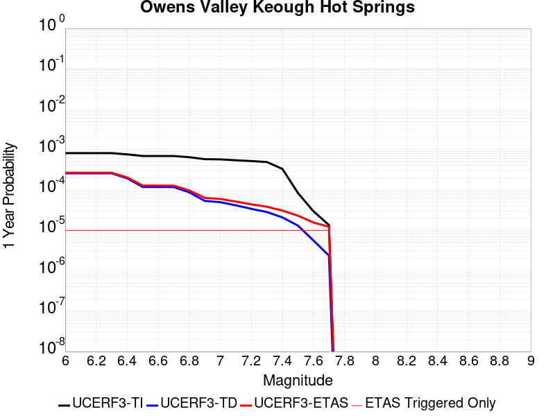 |  |

| Magnitude | 1 wk TI Prob | 1 wk TD Prob | 1 wk ETAS Prob | 1 wk ETAS/TD Gain | 1 wk ETAS Triggered Only | 1 mo TI Prob | 1 mo TD Prob | 1 mo ETAS Prob | 1 mo ETAS/TD Gain | 1 mo ETAS Triggered Only | 1 yr TI Prob | 1 yr TD Prob | 1 yr ETAS Prob | 1 yr ETAS/TD Gain | 1 yr ETAS Triggered Only | 10 yr TI Prob | 10 yr TD Prob | 10 yr ETAS Prob | 10 yr ETAS/TD Gain | 10 yr ETAS Triggered Only |
|-----|-----|-----|-----|-----|-----|-----|-----|-----|-----|-----|-----|-----|-----|-----|-----|-----|-----|-----|-----|-----|
| 6.0 | 1.5708529E-5 | 4.950656E-6 | 1.4950607E-5 | 3.0199244 | 1.0E-5 | 6.7320536E-5 | 2.1216953E-5 | 3.121674E-5 | 1.4713112 | 1.0E-5 | 8.193192E-4 | 2.582909E-4 | 2.6828834E-4 | 1.0387061 | 1.0E-5 | 0.008163051 | 0.0025805652 | 0.0026104876 | 1.0115954 | 3.0E-5 |
| 6.1 | 1.5708529E-5 | 4.950656E-6 | 1.4950607E-5 | 3.0199244 | 1.0E-5 | 6.7320536E-5 | 2.1216953E-5 | 3.121674E-5 | 1.4713112 | 1.0E-5 | 8.193192E-4 | 2.582909E-4 | 2.6828834E-4 | 1.0387061 | 1.0E-5 | 0.008163051 | 0.0025805652 | 0.0026104876 | 1.0115954 | 3.0E-5 |
| 6.2 | 1.5708529E-5 | 4.950656E-6 | 1.4950607E-5 | 3.0199244 | 1.0E-5 | 6.7320536E-5 | 2.1216953E-5 | 3.121674E-5 | 1.4713112 | 1.0E-5 | 8.193192E-4 | 2.582909E-4 | 2.6828834E-4 | 1.0387061 | 1.0E-5 | 0.008163051 | 0.0025805652 | 0.0026104876 | 1.0115954 | 3.0E-5 |
| 6.3 | 1.5708529E-5 | 4.950656E-6 | 1.4950607E-5 | 3.0199244 | 1.0E-5 | 6.7320536E-5 | 2.1216953E-5 | 3.121674E-5 | 1.4713112 | 1.0E-5 | 8.193192E-4 | 2.582909E-4 | 2.6828834E-4 | 1.0387061 | 1.0E-5 | 0.008163051 | 0.0025805652 | 0.0026104876 | 1.0115954 | 3.0E-5 |
| 6.4 | 1.4622509E-5 | 3.7265204E-6 | 1.3726483E-5 | 3.6834583 | 1.0E-5 | 6.266639E-5 | 1.5970723E-5 | 2.5970563E-5 | 1.6261357 | 1.0E-5 | 7.626962E-4 | 1.944295E-4 | 2.0442756E-4 | 1.0514225 | 1.0E-5 | 0.007600839 | 0.0019430731 | 0.0019730148 | 1.0154095 | 3.0E-5 |
| 6.5 | 1.3335527E-5 | 2.2777172E-6 | 1.2277695E-5 | 5.390351 | 1.0E-5 | 5.7151006E-5 | 9.761612E-6 | 1.9761514E-5 | 2.024411 | 1.0E-5 | 6.955913E-4 | 1.18841825E-4 | 1.2884063E-4 | 1.0841354 | 1.0E-5 | 0.0069341804 | 0.0011880046 | 0.001217969 | 1.0252224 | 3.0E-5 |
| 6.6 | 1.3332855E-5 | 2.2748663E-6 | 1.2274843E-5 | 5.3958526 | 1.0E-5 | 5.7139558E-5 | 9.749395E-6 | 1.9749297E-5 | 2.0256948 | 1.0E-5 | 6.9545204E-4 | 1.186931E-4 | 1.2869191E-4 | 1.0842409 | 1.0E-5 | 0.0069327964 | 0.0011865189 | 0.0012164833 | 1.025254 | 3.0E-5 |
| 6.7 | 1.3318214E-5 | 2.2640966E-6 | 1.2264074E-5 | 5.416763 | 1.0E-5 | 5.707681E-5 | 9.703239E-6 | 1.9703142E-5 | 2.0305736 | 1.0E-5 | 6.946886E-4 | 1.1813121E-4 | 1.2813004E-4 | 1.0846416 | 1.0E-5 | 0.0069252094 | 0.001180906 | 0.0012108706 | 1.0253742 | 3.0E-5 |
| 6.8 | 1.2441338E-5 | 1.6777863E-6 | 1.1677769E-5 | 6.9602246 | 1.0E-5 | 5.331893E-5 | 7.1904947E-6 | 1.7190423E-5 | 2.390715 | 1.0E-5 | 6.489646E-4 | 8.7541055E-5 | 9.754018E-5 | 1.1142222 | 1.0E-5 | 0.0064707273 | 8.752499E-4 | 9.0522366E-4 | 1.034246 | 3.0E-5 |
| 6.9 | 1.1130476E-5 | 1.0303868E-6 | 1.1030376E-5 | 10.705084 | 1.0E-5 | 4.7701167E-5 | 4.415936E-6 | 1.4415892E-5 | 3.2645156 | 1.0E-5 | 5.806069E-4 | 5.3762706E-5 | 6.376217E-5 | 1.1859926 | 1.0E-5 | 0.0057909233 | 5.37651E-4 | 5.576402E-4 | 1.0371789 | 2.0E-5 |
| 7.0 | 1.0986073E-5 | 9.579413E-7 | 1.0957931E-5 | 11.439043 | 1.0E-5 | 4.7082318E-5 | 4.1054564E-6 | 1.4105415E-5 | 3.435773 | 1.0E-5 | 5.730765E-4 | 4.99828E-5 | 5.9982296E-5 | 1.2000588 | 1.0E-5 | 0.0057160086 | 4.9986853E-4 | 5.198585E-4 | 1.0399905 | 2.0E-5 |
| 7.1 | 1.0451338E-5 | 8.0002656E-7 | 1.0800019E-5 | 13.499576 | 1.0E-5 | 4.4790682E-5 | 3.4286807E-6 | 1.34286465E-5 | 3.9165637 | 1.0E-5 | 5.451901E-4 | 4.1743395E-5 | 5.1742976E-5 | 1.2395489 | 1.0E-5 | 0.005438545 | 4.1750458E-4 | 4.3749623E-4 | 1.0478836 | 2.0E-5 |
| 7.2 | 9.989061E-6 | 6.544956E-7 | 1.0654489E-5 | 16.278933 | 1.0E-5 | 4.280956E-5 | 2.804978E-6 | 1.280495E-5 | 4.56508 | 1.0E-5 | 5.2108173E-4 | 3.4150078E-5 | 4.4149736E-5 | 1.2928151 | 1.0E-5 | 0.0051986156 | 3.415851E-4 | 3.6157828E-4 | 1.0585306 | 2.0E-5 |
| 7.3 | 9.465365E-6 | 5.4600474E-7 | 1.0545999E-5 | 19.31485 | 1.0E-5 | 4.056522E-5 | 2.3400182E-6 | 1.2339995E-5 | 5.273461 | 1.0E-5 | 4.937696E-4 | 2.8489352E-5 | 3.8489066E-5 | 1.3509983 | 1.0E-5 | 0.0049267393 | 2.8498896E-4 | 3.0498326E-4 | 1.0701581 | 2.0E-5 |
| 7.4 | 6.3824805E-6 | 4.016335E-7 | 1.040163E-5 | 25.898312 | 1.0E-5 | 2.73532E-5 | 1.7212853E-6 | 1.17212685E-5 | 6.8096023 | 1.0E-5 | 3.3297433E-4 | 2.095645E-5 | 3.095624E-5 | 1.4771701 | 1.0E-5 | 0.0033247585 | 2.0963654E-4 | 2.2963234E-4 | 1.0953832 | 2.0E-5 |
| 7.5 | 1.6192645E-6 | 2.516124E-7 | 1.025161E-5 | 40.74366 | 1.0E-5 | 6.9396865E-6 | 1.0783383E-6 | 1.1078328E-5 | 10.273518 | 1.0E-5 | 8.448741E-5 | 1.31286915E-5 | 2.3128561E-5 | 1.7616805 | 1.0E-5 | 8.4455294E-4 | 1.3127929E-4 | 1.5127666E-4 | 1.152327 | 2.0E-5 |
| 7.6 | 5.7062545E-7 | 1.07924045E-7 | 1.0107923E-5 | 93.65775 | 1.0E-5 | 2.4455355E-6 | 4.6253152E-7 | 1.0462527E-5 | 22.620138 | 1.0E-5 | 2.9773988E-5 | 5.6313074E-6 | 1.563125E-5 | 2.7757764 | 1.0E-5 | 2.977E-4 | 5.6311732E-5 | 7.631061E-5 | 1.3551458 | 2.0E-5 |
| 7.7 | 2.5988817E-7 | 4.5457977E-8 | 1.0045457E-5 | 220.98338 | 1.0E-5 | 1.113806E-6 | 1.9481989E-7 | 1.0194818E-5 | 52.32945 | 1.0E-5 | 1.3560503E-5 | 2.3719301E-6 | 1.2371906E-5 | 5.2159657 | 1.0E-5 | 1.3559677E-4 | 2.371909E-5 | 4.3718617E-5 | 1.8431827 | 2.0E-5 |

## South Klamath Lake West
*[(top)](#table-of-contents)*

| 1 Week | 1 Month | 1 Year | 10 Year |
|-----|-----|-----|-----|
|  |  |  |  |

| Magnitude | 1 wk TI Prob | 1 wk TD Prob | 1 wk ETAS Prob | 1 wk ETAS/TD Gain | 1 wk ETAS Triggered Only | 1 mo TI Prob | 1 mo TD Prob | 1 mo ETAS Prob | 1 mo ETAS/TD Gain | 1 mo ETAS Triggered Only | 1 yr TI Prob | 1 yr TD Prob | 1 yr ETAS Prob | 1 yr ETAS/TD Gain | 1 yr ETAS Triggered Only | 10 yr TI Prob | 10 yr TD Prob | 10 yr ETAS Prob | 10 yr ETAS/TD Gain | 10 yr ETAS Triggered Only |
|-----|-----|-----|-----|-----|-----|-----|-----|-----|-----|-----|-----|-----|-----|-----|-----|-----|-----|-----|-----|-----|
| 6.0 | 2.174025E-5 | 2.3042025E-5 | 3.3041793E-5 | 1.4339796 | 1.0E-5 | 9.3169176E-5 | 9.874817E-5 | 1.0874718E-4 | 1.1012577 | 1.0E-5 | 0.0011337444 | 0.0012016617 | 0.0012216377 | 1.0166236 | 2.0E-5 | 0.011279777 | 0.0119582405 | 0.011978001 | 1.0016525 | 2.0E-5 |
| 6.1 | 2.174025E-5 | 2.3042025E-5 | 3.3041793E-5 | 1.4339796 | 1.0E-5 | 9.3169176E-5 | 9.874817E-5 | 1.0874718E-4 | 1.1012577 | 1.0E-5 | 0.0011337444 | 0.0012016617 | 0.0012216377 | 1.0166236 | 2.0E-5 | 0.011279777 | 0.0119582405 | 0.011978001 | 1.0016525 | 2.0E-5 |
| 6.2 | 9.834929E-6 | 1.0393841E-5 | 1.0393841E-5 | 1.0 | 0.0 | 4.2149015E-5 | 4.4544326E-5 | 4.4544326E-5 | 1.0 | 0.0 | 5.1304343E-4 | 5.422012E-4 | 5.422012E-4 | 1.0 | 0.0 | 0.0051186057 | 0.0054096854 | 0.0054096854 | 1.0 | 0.0 |
| 6.3 | 9.834929E-6 | 1.0393841E-5 | 1.0393841E-5 | 1.0 | 0.0 | 4.2149015E-5 | 4.4544326E-5 | 4.4544326E-5 | 1.0 | 0.0 | 5.1304343E-4 | 5.422012E-4 | 5.422012E-4 | 1.0 | 0.0 | 0.0051186057 | 0.0054096854 | 0.0054096854 | 1.0 | 0.0 |
| 6.4 | 6.066321E-6 | 6.40043E-6 | 6.40043E-6 | 1.0 | 0.0 | 2.5998259E-5 | 2.743014E-5 | 2.743014E-5 | 1.0 | 0.0 | 3.1648282E-4 | 3.3391351E-4 | 3.3391351E-4 | 1.0 | 0.0 | 0.0031603249 | 0.0033343881 | 0.0033343881 | 1.0 | 0.0 |
| 6.5 | 6.066321E-6 | 6.40043E-6 | 6.40043E-6 | 1.0 | 0.0 | 2.5998259E-5 | 2.743014E-5 | 2.743014E-5 | 1.0 | 0.0 | 3.1648282E-4 | 3.3391351E-4 | 3.3391351E-4 | 1.0 | 0.0 | 0.0031603249 | 0.0033343881 | 0.0033343881 | 1.0 | 0.0 |
| 6.6 | 4.2321803E-6 | 4.461291E-6 | 4.461291E-6 | 1.0 | 0.0 | 1.8137789E-5 | 1.9119685E-5 | 1.9119685E-5 | 1.0 | 0.0 | 2.208052E-4 | 2.3275832E-4 | 2.3275832E-4 | 1.0 | 0.0 | 0.0022058594 | 0.0023252473 | 0.0023252473 | 1.0 | 0.0 |
| 6.7 | 3.186646E-6 | 3.360305E-6 | 3.360305E-6 | 1.0 | 0.0 | 1.3656982E-5 | 1.4401232E-5 | 1.4401232E-5 | 1.0 | 0.0 | 1.6626107E-4 | 1.7532158E-4 | 1.7532158E-4 | 1.0 | 0.0 | 0.0016613674 | 0.0017518997 | 0.0017518997 | 1.0 | 0.0 |
| 6.8 | 2.380121E-6 | 2.510907E-6 | 2.510907E-6 | 1.0 | 0.0 | 1.0200479E-5 | 1.07609885E-5 | 1.07609885E-5 | 1.0 | 0.0 | 1.2418375E-4 | 1.3100762E-4 | 1.3100762E-4 | 1.0 | 0.0 | 0.0012411437 | 0.0013093497 | 0.0013093497 | 1.0 | 0.0 |
| 6.9 | 8.928287E-7 | 9.4302504E-7 | 9.4302504E-7 | 1.0 | 0.0 | 3.826403E-6 | 4.0415307E-6 | 4.0415307E-6 | 1.0 | 0.0 | 4.658546E-5 | 4.9204747E-5 | 4.9204747E-5 | 1.0 | 0.0 | 4.6575698E-4 | 4.9196015E-4 | 4.9196015E-4 | 1.0 | 0.0 |

## Cucamonga
*[(top)](#table-of-contents)*

| 1 Week | 1 Month | 1 Year | 10 Year |
|-----|-----|-----|-----|
| 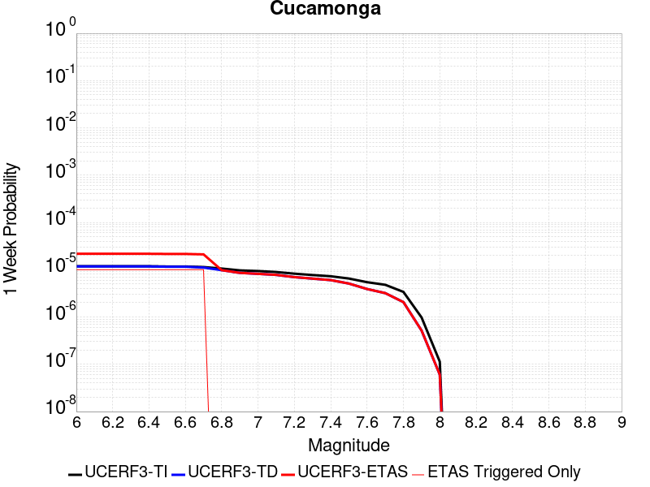 | 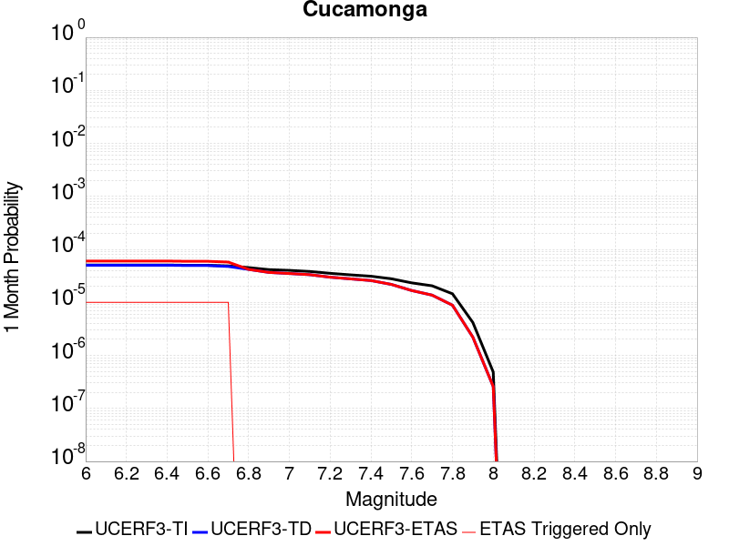 | 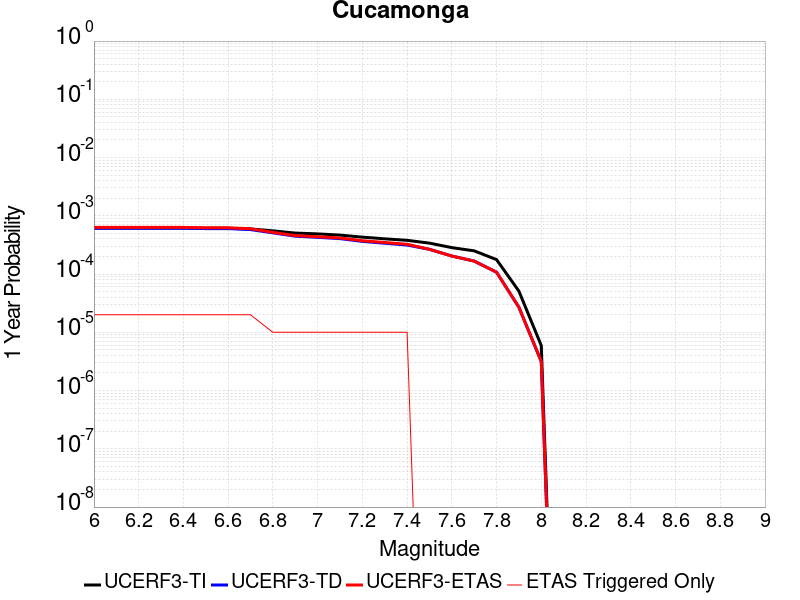 | 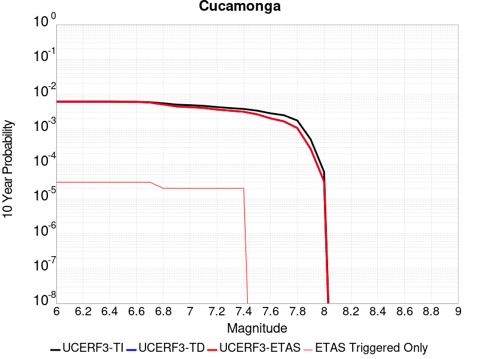 |

| Magnitude | 1 wk TI Prob | 1 wk TD Prob | 1 wk ETAS Prob | 1 wk ETAS/TD Gain | 1 wk ETAS Triggered Only | 1 mo TI Prob | 1 mo TD Prob | 1 mo ETAS Prob | 1 mo ETAS/TD Gain | 1 mo ETAS Triggered Only | 1 yr TI Prob | 1 yr TD Prob | 1 yr ETAS Prob | 1 yr ETAS/TD Gain | 1 yr ETAS Triggered Only | 10 yr TI Prob | 10 yr TD Prob | 10 yr ETAS Prob | 10 yr ETAS/TD Gain | 10 yr ETAS Triggered Only |
|-----|-----|-----|-----|-----|-----|-----|-----|-----|-----|-----|-----|-----|-----|-----|-----|-----|-----|-----|-----|-----|
| 6.0 | 1.1848348E-5 | 1.1737008E-5 | 2.173689E-5 | 1.8519958 | 1.0E-5 | 5.0777642E-5 | 5.030051E-5 | 6.0300008E-5 | 1.1987952 | 1.0E-5 | 6.180424E-4 | 6.1223935E-4 | 6.322271E-4 | 1.032647 | 2.0E-5 | 0.0061632637 | 0.0061067017 | 0.0061365184 | 1.0048827 | 3.0E-5 |
| 6.1 | 1.1848348E-5 | 1.1737008E-5 | 2.173689E-5 | 1.8519958 | 1.0E-5 | 5.0777642E-5 | 5.030051E-5 | 6.0300008E-5 | 1.1987952 | 1.0E-5 | 6.180424E-4 | 6.1223935E-4 | 6.322271E-4 | 1.032647 | 2.0E-5 | 0.0061632637 | 0.0061067017 | 0.0061365184 | 1.0048827 | 3.0E-5 |
| 6.2 | 1.1848348E-5 | 1.1737008E-5 | 2.173689E-5 | 1.8519958 | 1.0E-5 | 5.0777642E-5 | 5.030051E-5 | 6.0300008E-5 | 1.1987952 | 1.0E-5 | 6.180424E-4 | 6.1223935E-4 | 6.322271E-4 | 1.032647 | 2.0E-5 | 0.0061632637 | 0.0061067017 | 0.0061365184 | 1.0048827 | 3.0E-5 |
| 6.3 | 1.1848348E-5 | 1.1737008E-5 | 2.173689E-5 | 1.8519958 | 1.0E-5 | 5.0777642E-5 | 5.030051E-5 | 6.0300008E-5 | 1.1987952 | 1.0E-5 | 6.180424E-4 | 6.1223935E-4 | 6.322271E-4 | 1.032647 | 2.0E-5 | 0.0061632637 | 0.0061067017 | 0.0061365184 | 1.0048827 | 3.0E-5 |
| 6.4 | 1.1848348E-5 | 1.1737008E-5 | 2.173689E-5 | 1.8519958 | 1.0E-5 | 5.0777642E-5 | 5.030051E-5 | 6.0300008E-5 | 1.1987952 | 1.0E-5 | 6.180424E-4 | 6.1223935E-4 | 6.322271E-4 | 1.032647 | 2.0E-5 | 0.0061632637 | 0.0061067017 | 0.0061365184 | 1.0048827 | 3.0E-5 |
| 6.5 | 1.16988695E-5 | 1.15760395E-5 | 2.1575923E-5 | 1.8638433 | 1.0E-5 | 5.013705E-5 | 4.9610666E-5 | 5.961017E-5 | 1.2015595 | 1.0E-5 | 6.102476E-4 | 6.0384517E-4 | 6.238331E-4 | 1.0331011 | 2.0E-5 | 0.006085745 | 0.006023216 | 0.0060530356 | 1.0049508 | 3.0E-5 |
| 6.6 | 1.16988695E-5 | 1.15760395E-5 | 2.1575923E-5 | 1.8638433 | 1.0E-5 | 5.013705E-5 | 4.9610666E-5 | 5.961017E-5 | 1.2015595 | 1.0E-5 | 6.102476E-4 | 6.0384517E-4 | 6.238331E-4 | 1.0331011 | 2.0E-5 | 0.006085745 | 0.006023216 | 0.0060530356 | 1.0049508 | 3.0E-5 |
| 6.7 | 1.1397107E-5 | 1.11149475E-5 | 2.1114836E-5 | 1.8996793 | 1.0E-5 | 4.884383E-5 | 4.7634636E-5 | 5.763416E-5 | 1.2099212 | 1.0E-5 | 5.9451134E-4 | 5.797998E-4 | 5.9978827E-4 | 1.0344746 | 2.0E-5 | 0.005929234 | 0.0057840226 | 0.005813849 | 1.0051568 | 3.0E-5 |
| 6.8 | 1.058387E-5 | 9.784992E-6 | 9.784992E-6 | 1.0 | 0.0 | 4.5358654E-5 | 4.193501E-5 | 4.193501E-5 | 1.0 | 0.0 | 5.521017E-4 | 5.1044027E-4 | 5.2043516E-4 | 1.019581 | 1.0E-5 | 0.00550732 | 0.0050936877 | 0.005113586 | 1.0039064 | 2.0E-5 |
| 6.9 | 9.690046E-6 | 8.57948E-6 | 8.57948E-6 | 1.0 | 0.0 | 4.1528107E-5 | 3.6768684E-5 | 3.6768684E-5 | 1.0 | 0.0 | 5.054874E-4 | 4.475672E-4 | 4.575627E-4 | 1.022333 | 1.0E-5 | 0.005043391 | 0.004467594 | 0.0044875047 | 1.0044566 | 2.0E-5 |
| 7.0 | 9.381461E-6 | 8.187101E-6 | 8.187101E-6 | 1.0 | 0.0 | 4.020564E-5 | 3.5087105E-5 | 3.5087105E-5 | 1.0 | 0.0 | 4.893937E-4 | 4.2710215E-4 | 4.370979E-4 | 1.0234036 | 1.0E-5 | 0.0048831734 | 0.0042637475 | 0.0042836624 | 1.0046707 | 2.0E-5 |
| 7.1 | 8.946492E-6 | 7.781886E-6 | 7.781886E-6 | 1.0 | 0.0 | 3.8341543E-5 | 3.3350516E-5 | 3.3350516E-5 | 1.0 | 0.0 | 4.667083E-4 | 4.0596718E-4 | 4.1596312E-4 | 1.0246226 | 1.0E-5 | 0.0046572937 | 0.004053192 | 0.0040731113 | 1.0049144 | 2.0E-5 |
| 7.2 | 8.251016E-6 | 6.9752796E-6 | 6.9752796E-6 | 1.0 | 0.0 | 3.5361016E-5 | 2.9893714E-5 | 2.9893714E-5 | 1.0 | 0.0 | 4.3043532E-4 | 3.6389544E-4 | 3.738918E-4 | 1.0274705 | 1.0E-5 | 0.0042960253 | 0.0036339292 | 0.0036538565 | 1.0054836 | 2.0E-5 |
| 7.3 | 7.717881E-6 | 6.4863502E-6 | 6.4863502E-6 | 1.0 | 0.0 | 3.3076216E-5 | 2.7798349E-5 | 2.7798349E-5 | 1.0 | 0.0 | 4.026285E-4 | 3.3839257E-4 | 3.4838918E-4 | 1.0295415 | 1.0E-5 | 0.004018998 | 0.00337971 | 0.0033996424 | 1.0058976 | 2.0E-5 |
| 7.4 | 7.275623E-6 | 6.031997E-6 | 6.031997E-6 | 1.0 | 0.0 | 3.118087E-5 | 2.585116E-5 | 2.585116E-5 | 1.0 | 0.0 | 3.7956095E-4 | 3.1469265E-4 | 3.246895E-4 | 1.031767 | 1.0E-5 | 0.0037891332 | 0.0031434062 | 0.0031633435 | 1.0063425 | 2.0E-5 |
| 7.5 | 6.5109502E-6 | 5.1006014E-6 | 5.1006014E-6 | 1.0 | 0.0 | 2.7903774E-5 | 2.1859538E-5 | 2.1859538E-5 | 1.0 | 0.0 | 3.3967546E-4 | 2.661075E-4 | 2.661075E-4 | 1.0 | 0.0 | 0.0033915674 | 0.002658813 | 0.002658813 | 1.0 | 0.0 |
| 7.6 | 5.4495326E-6 | 3.90857E-6 | 3.90857E-6 | 1.0 | 0.0 | 2.335493E-5 | 1.6750908E-5 | 1.6750908E-5 | 1.0 | 0.0 | 2.8430918E-4 | 2.0392328E-4 | 2.0392328E-4 | 1.0 | 0.0 | 0.0028394572 | 0.002038282 | 0.002038282 | 1.0 | 0.0 |
| 7.7 | 4.7997164E-6 | 3.2002547E-6 | 3.2002547E-6 | 1.0 | 0.0 | 2.057005E-5 | 1.3715306E-5 | 1.3715306E-5 | 1.0 | 0.0 | 2.504116E-4 | 1.6697108E-4 | 1.6697108E-4 | 1.0 | 0.0 | 0.002501296 | 0.0016693877 | 0.0016693877 | 1.0 | 0.0 |
| 7.8 | 3.3941733E-6 | 2.0641899E-6 | 2.0641899E-6 | 1.0 | 0.0 | 1.4546376E-5 | 8.846498E-6 | 8.846498E-6 | 1.0 | 0.0 | 1.7708774E-4 | 1.07700806E-4 | 1.07700806E-4 | 1.0 | 0.0 | 0.0017694668 | 0.001076723 | 0.001076723 | 1.0 | 0.0 |
| 7.9 | 9.750552E-7 | 5.155946E-7 | 5.155946E-7 | 1.0 | 0.0 | 4.178801E-6 | 2.2096892E-6 | 2.2096892E-6 | 1.0 | 0.0 | 5.0875715E-5 | 2.690264E-5 | 2.690264E-5 | 1.0 | 0.0 | 5.086407E-4 | 2.6899425E-4 | 2.6899425E-4 | 1.0 | 0.0 |
| 8.0 | 1.133857E-7 | 6.053707E-8 | 6.053707E-8 | 1.0 | 0.0 | 4.8593864E-7 | 2.5944456E-7 | 2.5944456E-7 | 1.0 | 0.0 | 5.9162867E-6 | 3.158733E-6 | 3.158733E-6 | 1.0 | 0.0 | 5.916129E-5 | 3.1586897E-5 | 3.1586897E-5 | 1.0 | 0.0 |

## Big Pine (West)
*[(top)](#table-of-contents)*

| 1 Week | 1 Month | 1 Year | 10 Year |
|-----|-----|-----|-----|
|  |  | 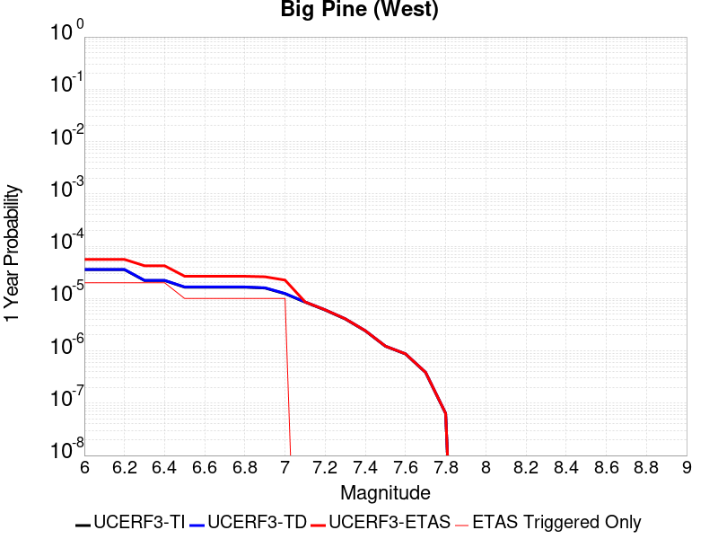 |  |

| Magnitude | 1 wk TI Prob | 1 wk TD Prob | 1 wk ETAS Prob | 1 wk ETAS/TD Gain | 1 wk ETAS Triggered Only | 1 mo TI Prob | 1 mo TD Prob | 1 mo ETAS Prob | 1 mo ETAS/TD Gain | 1 mo ETAS Triggered Only | 1 yr TI Prob | 1 yr TD Prob | 1 yr ETAS Prob | 1 yr ETAS/TD Gain | 1 yr ETAS Triggered Only | 10 yr TI Prob | 10 yr TD Prob | 10 yr ETAS Prob | 10 yr ETAS/TD Gain | 10 yr ETAS Triggered Only |
|-----|-----|-----|-----|-----|-----|-----|-----|-----|-----|-----|-----|-----|-----|-----|-----|-----|-----|-----|-----|-----|
| 6.0 | 6.8306974E-7 | 6.8818304E-7 | 6.8818304E-7 | 1.0 | 0.0 | 2.9274386E-6 | 2.949353E-6 | 2.949353E-6 | 1.0 | 0.0 | 3.564098E-5 | 3.5907877E-5 | 5.590716E-5 | 1.5569608 | 2.0E-5 | 3.5635266E-4 | 3.5903015E-4 | 3.8901938E-4 | 1.0835284 | 3.0E-5 |
| 6.1 | 6.8306974E-7 | 6.8818304E-7 | 6.8818304E-7 | 1.0 | 0.0 | 2.9274386E-6 | 2.949353E-6 | 2.949353E-6 | 1.0 | 0.0 | 3.564098E-5 | 3.5907877E-5 | 5.590716E-5 | 1.5569608 | 2.0E-5 | 3.5635266E-4 | 3.5903015E-4 | 3.8901938E-4 | 1.0835284 | 3.0E-5 |
| 6.2 | 6.8306974E-7 | 6.8818304E-7 | 6.8818304E-7 | 1.0 | 0.0 | 2.9274386E-6 | 2.949353E-6 | 2.949353E-6 | 1.0 | 0.0 | 3.564098E-5 | 3.5907877E-5 | 5.590716E-5 | 1.5569608 | 2.0E-5 | 3.5635266E-4 | 3.5903015E-4 | 3.8901938E-4 | 1.0835284 | 3.0E-5 |
| 6.3 | 4.227652E-7 | 4.2665604E-7 | 4.2665604E-7 | 1.0 | 0.0 | 1.8118495E-6 | 1.8285248E-6 | 1.8285248E-6 | 1.0 | 0.0 | 2.2059045E-5 | 2.226208E-5 | 4.2261636E-5 | 1.8983687 | 2.0E-5 | 2.2056856E-4 | 2.2260031E-4 | 2.4259587E-4 | 1.0898272 | 2.0E-5 |
| 6.4 | 4.227652E-7 | 4.2665604E-7 | 4.2665604E-7 | 1.0 | 0.0 | 1.8118495E-6 | 1.8285248E-6 | 1.8285248E-6 | 1.0 | 0.0 | 2.2059045E-5 | 2.226208E-5 | 4.2261636E-5 | 1.8983687 | 2.0E-5 | 2.2056856E-4 | 2.2260031E-4 | 2.4259587E-4 | 1.0898272 | 2.0E-5 |
| 6.5 | 3.1538403E-7 | 3.1884528E-7 | 3.1884528E-7 | 1.0 | 0.0 | 1.3516451E-6 | 1.3664791E-6 | 1.3664791E-6 | 1.0 | 0.0 | 1.6456155E-5 | 1.6636759E-5 | 2.6636593E-5 | 1.6010686 | 1.0E-5 | 1.6454936E-4 | 1.6635554E-4 | 1.7635387E-4 | 1.0601022 | 1.0E-5 |
| 6.6 | 3.1538403E-7 | 3.1884528E-7 | 3.1884528E-7 | 1.0 | 0.0 | 1.3516451E-6 | 1.3664791E-6 | 1.3664791E-6 | 1.0 | 0.0 | 1.6456155E-5 | 1.6636759E-5 | 2.6636593E-5 | 1.6010686 | 1.0E-5 | 1.6454936E-4 | 1.6635554E-4 | 1.7635387E-4 | 1.0601022 | 1.0E-5 |
| 6.7 | 3.1538403E-7 | 3.1884528E-7 | 3.1884528E-7 | 1.0 | 0.0 | 1.3516451E-6 | 1.3664791E-6 | 1.3664791E-6 | 1.0 | 0.0 | 1.6456155E-5 | 1.6636759E-5 | 2.6636593E-5 | 1.6010686 | 1.0E-5 | 1.6454936E-4 | 1.6635554E-4 | 1.7635387E-4 | 1.0601022 | 1.0E-5 |
| 6.8 | 3.1538403E-7 | 3.1884528E-7 | 3.1884528E-7 | 1.0 | 0.0 | 1.3516451E-6 | 1.3664791E-6 | 1.3664791E-6 | 1.0 | 0.0 | 1.6456155E-5 | 1.6636759E-5 | 2.6636593E-5 | 1.6010686 | 1.0E-5 | 1.6454936E-4 | 1.6635554E-4 | 1.7635387E-4 | 1.0601022 | 1.0E-5 |
| 6.9 | 3.0402092E-7 | 3.0739798E-7 | 3.0739798E-7 | 1.0 | 0.0 | 1.3029462E-6 | 1.3174192E-6 | 1.3174192E-6 | 1.0 | 0.0 | 1.5863254E-5 | 1.6039465E-5 | 2.6039304E-5 | 1.6234522 | 1.0E-5 | 1.5862122E-4 | 1.6038347E-4 | 1.7038187E-4 | 1.0623406 | 1.0E-5 |
| 7.0 | 2.3673063E-7 | 2.3944315E-7 | 2.3944315E-7 | 1.0 | 0.0 | 1.0145594E-6 | 1.0261845E-6 | 1.0261845E-6 | 1.0 | 0.0 | 1.235219E-5 | 1.2493728E-5 | 2.2493603E-5 | 1.8003917 | 1.0E-5 | 1.2351504E-4 | 1.2493054E-4 | 1.3492927E-4 | 1.0800345 | 1.0E-5 |
| 7.1 | 1.632138E-7 | 1.6514511E-7 | 1.6514511E-7 | 1.0 | 0.0 | 6.9948754E-7 | 7.0776457E-7 | 7.0776457E-7 | 1.0 | 0.0 | 8.516227E-6 | 8.617002E-6 | 8.617002E-6 | 1.0 | 0.0 | 8.5159016E-5 | 8.616685E-5 | 8.616685E-5 | 1.0 | 0.0 |
| 7.2 | 1.1523723E-7 | 1.1657165E-7 | 1.1657165E-7 | 1.0 | 0.0 | 4.9387376E-7 | 4.9959266E-7 | 4.9959266E-7 | 1.0 | 0.0 | 6.0128964E-6 | 6.082525E-6 | 6.082525E-6 | 1.0 | 0.0 | 6.0127335E-5 | 6.0823695E-5 | 6.0823695E-5 | 1.0 | 0.0 |
| 7.3 | 7.777805E-8 | 7.862446E-8 | 7.862446E-8 | 1.0 | 0.0 | 3.3333444E-7 | 3.3696193E-7 | 3.3696193E-7 | 1.0 | 0.0 | 4.0583395E-6 | 4.102504E-6 | 4.102504E-6 | 1.0 | 0.0 | 4.0582654E-5 | 4.102434E-5 | 4.102434E-5 | 1.0 | 0.0 |
| 7.4 | 4.609946E-8 | 4.6522135E-8 | 4.6522135E-8 | 1.0 | 0.0 | 1.975691E-7 | 1.9938055E-7 | 1.9938055E-7 | 1.0 | 0.0 | 2.4054011E-6 | 2.4274557E-6 | 2.4274557E-6 | 1.0 | 0.0 | 2.405375E-5 | 2.427431E-5 | 2.427431E-5 | 1.0 | 0.0 |
| 7.5 | 2.3439137E-8 | 2.3608283E-8 | 2.3608283E-8 | 1.0 | 0.0 | 1.00453434E-7 | 1.0117836E-7 | 1.0117836E-7 | 1.0 | 0.0 | 1.2230199E-6 | 1.2318458E-6 | 1.2318458E-6 | 1.0 | 0.0 | 1.2230132E-5 | 1.2318393E-5 | 1.2318393E-5 | 1.0 | 0.0 |
| 7.6 | 1.6699769E-8 | 1.6817072E-8 | 1.6817072E-8 | 1.0 | 0.0 | 7.157044E-8 | 7.207316E-8 | 7.207316E-8 | 1.0 | 0.0 | 8.713697E-7 | 8.7749044E-7 | 8.7749044E-7 | 1.0 | 0.0 | 8.713663E-6 | 8.774871E-6 | 8.774871E-6 | 1.0 | 0.0 |
| 7.7 | 7.4061512E-9 | 7.4541635E-9 | 7.4541635E-9 | 1.0 | 0.0 | 3.1740647E-8 | 3.1946417E-8 | 3.1946417E-8 | 1.0 | 0.0 | 3.864423E-7 | 3.8894754E-7 | 3.8894754E-7 | 1.0 | 0.0 | 3.8644166E-6 | 3.8894696E-6 | 3.8894696E-6 | 1.0 | 0.0 |
| 7.8 | 1.2189427E-9 | 1.2270763E-9 | 1.2270763E-9 | 1.0 | 0.0 | 5.2240403E-9 | 5.258898E-9 | 5.258898E-9 | 1.0 | 0.0 | 6.3602684E-8 | 6.4027084E-8 | 6.4027084E-8 | 1.0 | 0.0 | 6.360267E-7 | 6.4027074E-7 | 6.4027074E-7 | 1.0 | 0.0 |

## Calaveras (So) - Paicines extension 2011 CFM
*[(top)](#table-of-contents)*

| 1 Week | 1 Month | 1 Year | 10 Year |
|-----|-----|-----|-----|
| 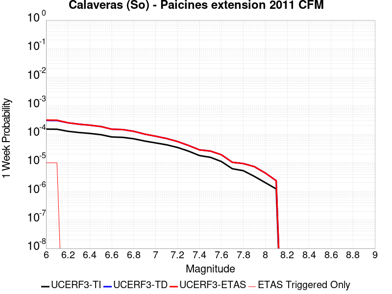 |  |  | 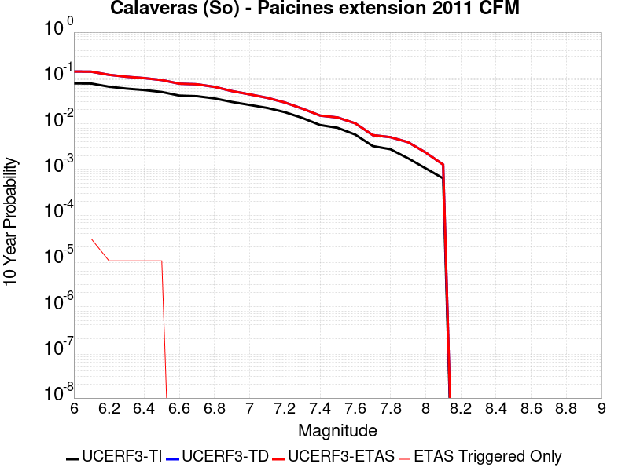 |

| Magnitude | 1 wk TI Prob | 1 wk TD Prob | 1 wk ETAS Prob | 1 wk ETAS/TD Gain | 1 wk ETAS Triggered Only | 1 mo TI Prob | 1 mo TD Prob | 1 mo ETAS Prob | 1 mo ETAS/TD Gain | 1 mo ETAS Triggered Only | 1 yr TI Prob | 1 yr TD Prob | 1 yr ETAS Prob | 1 yr ETAS/TD Gain | 1 yr ETAS Triggered Only | 10 yr TI Prob | 10 yr TD Prob | 10 yr ETAS Prob | 10 yr ETAS/TD Gain | 10 yr ETAS Triggered Only |
|-----|-----|-----|-----|-----|-----|-----|-----|-----|-----|-----|-----|-----|-----|-----|-----|-----|-----|-----|-----|-----|
| 6.0 | 1.5183659E-4 | 3.0533716E-4 | 3.153341E-4 | 1.0327407 | 1.0E-5 | 6.5056595E-4 | 0.0013069661 | 0.001316953 | 1.0076413 | 1.0E-5 | 0.007891912 | 0.01569571 | 0.01572524 | 1.0018814 | 3.0E-5 | 0.076174594 | 0.13848671 | 0.13851257 | 1.0001867 | 3.0E-5 |
| 6.1 | 1.5024997E-4 | 3.0227835E-4 | 3.1227534E-4 | 1.0330721 | 1.0E-5 | 6.437695E-4 | 0.00129387 | 0.0013038571 | 1.0077188 | 1.0E-5 | 0.0078097614 | 0.015539104 | 0.015568638 | 1.0019006 | 3.0E-5 | 0.075409345 | 0.13715632 | 0.1371822 | 1.0001887 | 3.0E-5 |
| 6.2 | 1.2743923E-4 | 2.5306802E-4 | 2.5306802E-4 | 1.0 | 0.0 | 5.460538E-4 | 0.0010841049 | 0.0010841049 | 1.0 | 0.0 | 0.0066279583 | 0.013046704 | 0.013056573 | 1.0007565 | 1.0E-5 | 0.064337276 | 0.11725405 | 0.11726287 | 1.0000753 | 1.0E-5 |
| 6.3 | 1.1525114E-4 | 2.2595265E-4 | 2.2595265E-4 | 1.0 | 0.0 | 4.9383997E-4 | 9.6799526E-4 | 9.6799526E-4 | 1.0 | 0.0 | 0.0059959386 | 0.011667927 | 0.01167781 | 1.0008471 | 1.0E-5 | 0.058367174 | 0.10637007 | 0.10637901 | 1.000084 | 1.0E-5 |
| 6.4 | 1.07200925E-4 | 2.0836305E-4 | 2.0836305E-4 | 1.0 | 0.0 | 4.5935164E-4 | 8.926636E-4 | 8.926636E-4 | 1.0 | 0.0 | 0.0055782744 | 0.010772766 | 0.010782657 | 1.0009183 | 1.0E-5 | 0.0544031 | 0.09919256 | 0.09920157 | 1.0000908 | 1.0E-5 |
| 6.5 | 9.69631E-5 | 1.8729115E-4 | 1.8729115E-4 | 1.0 | 0.0 | 4.1548995E-4 | 8.024135E-4 | 8.024135E-4 | 1.0 | 0.0 | 0.0050468626 | 0.009694662 | 0.009704566 | 1.0010215 | 1.0E-5 | 0.04933773 | 0.090084255 | 0.09009336 | 1.000101 | 1.0E-5 |
| 6.6 | 8.0552316E-5 | 1.5070537E-4 | 1.5070537E-4 | 1.0 | 0.0 | 3.4517853E-4 | 6.456994E-4 | 6.456994E-4 | 1.0 | 0.0 | 0.0041944524 | 0.007826256 | 0.007826256 | 1.0 | 0.0 | 0.04116161 | 0.074854024 | 0.074854024 | 1.0 | 0.0 |
| 6.7 | 7.815757E-5 | 1.4610609E-4 | 1.4610609E-4 | 1.0 | 0.0 | 3.34918E-4 | 6.260017E-4 | 6.260017E-4 | 1.0 | 0.0 | 0.004070005 | 0.0075890915 | 0.0075890915 | 1.0 | 0.0 | 0.039962657 | 0.072703585 | 0.072703585 | 1.0 | 0.0 |
| 6.8 | 6.965264E-5 | 1.2721405E-4 | 1.2721405E-4 | 1.0 | 0.0 | 2.9847719E-4 | 5.450839E-4 | 5.450839E-4 | 1.0 | 0.0 | 0.0036279052 | 0.00661342 | 0.00661342 | 1.0 | 0.0 | 0.03569247 | 0.06379891 | 0.06379891 | 1.0 | 0.0 |
| 6.9 | 5.8000453E-5 | 1.01435086E-4 | 1.01435086E-4 | 1.0 | 0.0 | 2.4854968E-4 | 4.3464993E-4 | 4.3464993E-4 | 1.0 | 0.0 | 0.0030218933 | 0.0052791284 | 0.0052791284 | 1.0 | 0.0 | 0.029811295 | 0.051501602 | 0.051501602 | 1.0 | 0.0 |
| 7.0 | 4.9865852E-5 | 8.567692E-5 | 8.567692E-5 | 1.0 | 0.0 | 2.1369329E-4 | 3.671356E-4 | 3.671356E-4 | 1.0 | 0.0 | 0.0025986114 | 0.0044608037 | 0.0044608037 | 1.0 | 0.0 | 0.025684336 | 0.043781694 | 0.043781694 | 1.0 | 0.0 |
| 7.1 | 4.283875E-5 | 7.112159E-5 | 7.112159E-5 | 1.0 | 0.0 | 1.8358172E-4 | 3.047715E-4 | 3.047715E-4 | 1.0 | 0.0 | 0.0022328163 | 0.003704336 | 0.003704336 | 1.0 | 0.0 | 0.022105146 | 0.03673583 | 0.03673583 | 1.0 | 0.0 |
| 7.2 | 3.450115E-5 | 5.5776054E-5 | 5.5776054E-5 | 1.0 | 0.0 | 1.478537E-4 | 2.390185E-4 | 2.390185E-4 | 1.0 | 0.0 | 0.0017986323 | 0.0029061958 | 0.0029061958 | 1.0 | 0.0 | 0.017841442 | 0.029079199 | 0.029079199 | 1.0 | 0.0 |
| 7.3 | 2.5709045E-5 | 4.0588155E-5 | 4.0588155E-5 | 1.0 | 0.0 | 1.1017697E-4 | 1.7393773E-4 | 1.7393773E-4 | 1.0 | 0.0 | 0.0013405791 | 0.002115652 | 0.002115652 | 1.0 | 0.0 | 0.013325208 | 0.021297242 | 0.021297242 | 1.0 | 0.0 |
| 7.4 | 1.8003093E-5 | 2.8509934E-5 | 2.8509934E-5 | 1.0 | 0.0 | 7.715383E-5 | 1.2217973E-4 | 1.2217973E-4 | 1.0 | 0.0 | 9.3894306E-4 | 0.0014865254 | 0.0014865254 | 1.0 | 0.0 | 0.009349857 | 0.015052196 | 0.015052196 | 1.0 | 0.0 |
| 7.5 | 1.5595824E-5 | 2.5822499E-5 | 2.5822499E-5 | 1.0 | 0.0 | 6.683753E-5 | 1.1066317E-4 | 1.1066317E-4 | 1.0 | 0.0 | 8.134431E-4 | 0.0013464936 | 0.0013464936 | 1.0 | 0.0 | 0.008104719 | 0.01365213 | 0.01365213 | 1.0 | 0.0 |
| 7.6 | 1.1110309E-5 | 1.9222098E-5 | 1.9222098E-5 | 1.0 | 0.0 | 4.761474E-5 | 8.2377825E-5 | 8.2377825E-5 | 1.0 | 0.0 | 5.795553E-4 | 0.0010024898 | 0.0010024898 | 1.0 | 0.0 | 0.0057804612 | 0.010203943 | 0.010203943 | 1.0 | 0.0 |
| 7.7 | 6.2140443E-6 | 1.0437076E-5 | 1.0437076E-5 | 1.0 | 0.0 | 2.6631347E-5 | 4.4729557E-5 | 4.4729557E-5 | 1.0 | 0.0 | 3.241884E-4 | 5.444464E-4 | 5.444464E-4 | 1.0 | 0.0 | 0.0032371588 | 0.005619835 | 0.005619835 | 1.0 | 0.0 |
| 7.8 | 5.305533E-6 | 9.433038E-6 | 9.433038E-6 | 1.0 | 0.0 | 2.27378E-5 | 4.042668E-5 | 4.042668E-5 | 1.0 | 0.0 | 2.7679754E-4 | 4.920837E-4 | 4.920837E-4 | 1.0 | 0.0 | 0.0027645302 | 0.005074324 | 0.005074324 | 1.0 | 0.0 |
| 7.9 | 3.363505E-6 | 7.3848937E-6 | 7.3848937E-6 | 1.0 | 0.0 | 1.4414942E-5 | 3.164916E-5 | 3.164916E-5 | 1.0 | 0.0 | 1.7548777E-4 | 3.8526047E-4 | 3.8526047E-4 | 1.0 | 0.0 | 0.0017534926 | 0.003948527 | 0.003948527 | 1.0 | 0.0 |
| 8.0 | 2.0271132E-6 | 4.413104E-6 | 4.413104E-6 | 1.0 | 0.0 | 8.687599E-6 | 1.8913164E-5 | 1.8913164E-5 | 1.0 | 0.0 | 1.05766376E-4 | 2.302435E-4 | 2.302435E-4 | 1.0 | 0.0 | 0.0010571606 | 0.002351099 | 0.002351099 | 1.0 | 0.0 |
| 8.1 | 1.2206116E-6 | 2.3751331E-6 | 2.3751331E-6 | 1.0 | 0.0 | 5.2311816E-6 | 1.0179103E-5 | 1.0179103E-5 | 1.0 | 0.0 | 6.3687774E-5 | 1.2392356E-4 | 1.2392356E-4 | 1.0 | 0.0 | 6.366953E-4 | 0.0012705477 | 0.0012705477 | 1.0 | 0.0 |

## Kern Canyon (South Kern) 2011
*[(top)](#table-of-contents)*

| 1 Week | 1 Month | 1 Year | 10 Year |
|-----|-----|-----|-----|
| 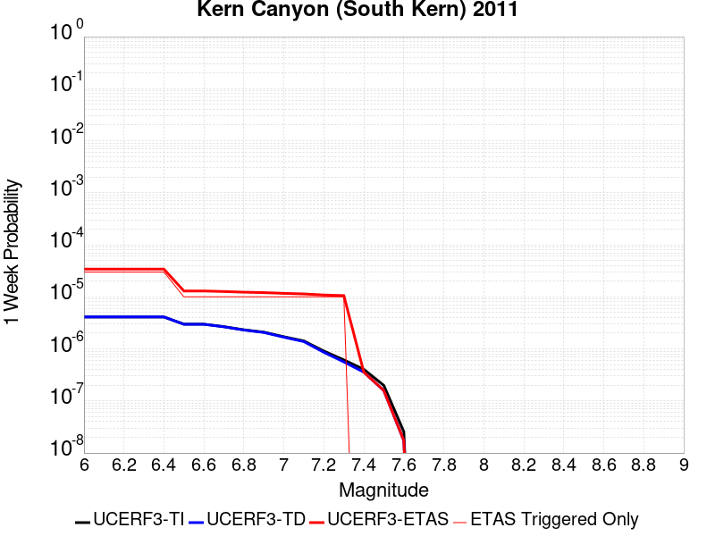 |  | 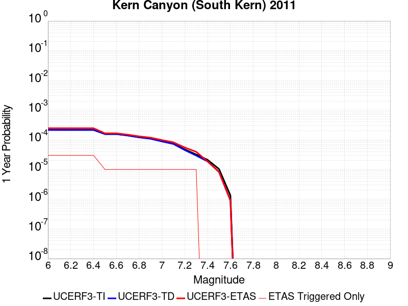 |  |

| Magnitude | 1 wk TI Prob | 1 wk TD Prob | 1 wk ETAS Prob | 1 wk ETAS/TD Gain | 1 wk ETAS Triggered Only | 1 mo TI Prob | 1 mo TD Prob | 1 mo ETAS Prob | 1 mo ETAS/TD Gain | 1 mo ETAS Triggered Only | 1 yr TI Prob | 1 yr TD Prob | 1 yr ETAS Prob | 1 yr ETAS/TD Gain | 1 yr ETAS Triggered Only | 10 yr TI Prob | 10 yr TD Prob | 10 yr ETAS Prob | 10 yr ETAS/TD Gain | 10 yr ETAS Triggered Only |
|-----|-----|-----|-----|-----|-----|-----|-----|-----|-----|-----|-----|-----|-----|-----|-----|-----|-----|-----|-----|-----|
| 6.0 | 4.105075E-6 | 4.1137264E-6 | 3.4113604E-5 | 8.292628 | 3.0E-5 | 1.7593058E-5 | 1.763014E-5 | 4.762961E-5 | 2.7016013 | 3.0E-5 | 2.1417443E-4 | 2.1462646E-4 | 2.4462002E-4 | 1.1397477 | 3.0E-5 | 0.0021396813 | 0.0021442557 | 0.0021741914 | 1.0139608 | 3.0E-5 |
| 6.1 | 4.105075E-6 | 4.1137264E-6 | 3.4113604E-5 | 8.292628 | 3.0E-5 | 1.7593058E-5 | 1.763014E-5 | 4.762961E-5 | 2.7016013 | 3.0E-5 | 2.1417443E-4 | 2.1462646E-4 | 2.4462002E-4 | 1.1397477 | 3.0E-5 | 0.0021396813 | 0.0021442557 | 0.0021741914 | 1.0139608 | 3.0E-5 |
| 6.2 | 4.105075E-6 | 4.1137264E-6 | 3.4113604E-5 | 8.292628 | 3.0E-5 | 1.7593058E-5 | 1.763014E-5 | 4.762961E-5 | 2.7016013 | 3.0E-5 | 2.1417443E-4 | 2.1462646E-4 | 2.4462002E-4 | 1.1397477 | 3.0E-5 | 0.0021396813 | 0.0021442557 | 0.0021741914 | 1.0139608 | 3.0E-5 |
| 6.3 | 4.105075E-6 | 4.1137264E-6 | 3.4113604E-5 | 8.292628 | 3.0E-5 | 1.7593058E-5 | 1.763014E-5 | 4.762961E-5 | 2.7016013 | 3.0E-5 | 2.1417443E-4 | 2.1462646E-4 | 2.4462002E-4 | 1.1397477 | 3.0E-5 | 0.0021396813 | 0.0021442557 | 0.0021741914 | 1.0139608 | 3.0E-5 |
| 6.4 | 4.105075E-6 | 4.1137264E-6 | 3.4113604E-5 | 8.292628 | 3.0E-5 | 1.7593058E-5 | 1.763014E-5 | 4.762961E-5 | 2.7016013 | 3.0E-5 | 2.1417443E-4 | 2.1462646E-4 | 2.4462002E-4 | 1.1397477 | 3.0E-5 | 0.0021396813 | 0.0021442557 | 0.0021741914 | 1.0139608 | 3.0E-5 |
| 6.5 | 2.9849807E-6 | 2.9731548E-6 | 1.2973125E-5 | 4.363421 | 1.0E-5 | 1.2792712E-5 | 1.274203E-5 | 2.2741902E-5 | 1.7847943 | 1.0E-5 | 1.5574014E-4 | 1.5512333E-4 | 1.6512178E-4 | 1.0644548 | 1.0E-5 | 0.0015563103 | 0.0015501656 | 0.0015601501 | 1.0064409 | 1.0E-5 |
| 6.6 | 2.9849807E-6 | 2.9731548E-6 | 1.2973125E-5 | 4.363421 | 1.0E-5 | 1.2792712E-5 | 1.274203E-5 | 2.2741902E-5 | 1.7847943 | 1.0E-5 | 1.5574014E-4 | 1.5512333E-4 | 1.6512178E-4 | 1.0644548 | 1.0E-5 | 0.0015563103 | 0.0015501656 | 0.0015601501 | 1.0064409 | 1.0E-5 |
| 6.7 | 2.6756725E-6 | 2.6582206E-6 | 1.26581945E-5 | 4.7619047 | 1.0E-5 | 1.1467117E-5 | 1.1392325E-5 | 2.1392212E-5 | 1.8777739 | 1.0E-5 | 1.396032E-4 | 1.3869285E-4 | 1.4869146E-4 | 1.0720918 | 1.0E-5 | 0.0013951553 | 0.0013860738 | 0.0013960599 | 1.0072047 | 1.0E-5 |
| 6.8 | 2.3283721E-6 | 2.3047787E-6 | 1.2304756E-5 | 5.338801 | 1.0E-5 | 9.9787E-6 | 9.877586E-6 | 1.9877487E-5 | 2.012383 | 1.0E-5 | 1.214839E-4 | 1.20253055E-4 | 1.3025185E-4 | 1.083148 | 1.0E-5 | 0.001214175 | 0.0012018873 | 0.0012118752 | 1.0083102 | 1.0E-5 |
| 6.9 | 2.0972677E-6 | 2.0696411E-6 | 1.206962E-5 | 5.8317456 | 1.0E-5 | 8.988259E-6 | 8.869861E-6 | 1.8869772E-5 | 2.1274035 | 1.0E-5 | 1.0942656E-4 | 1.0798526E-4 | 1.1798418E-4 | 1.0925952 | 1.0E-5 | 0.0010937268 | 0.0010793337 | 0.001089323 | 1.0092549 | 1.0E-5 |
| 7.0 | 1.7132242E-6 | 1.6787036E-6 | 1.1678687E-5 | 6.956968 | 1.0E-5 | 7.3423685E-6 | 7.194424E-6 | 1.7194352E-5 | 2.3899553 | 1.0E-5 | 8.938967E-5 | 8.758863E-5 | 9.7587756E-5 | 1.1141601 | 1.0E-5 | 8.935372E-4 | 8.7554497E-4 | 8.855362E-4 | 1.0114114 | 1.0E-5 |
| 7.1 | 1.4215541E-6 | 1.3815752E-6 | 1.1381561E-5 | 8.238105 | 1.0E-5 | 6.0923603E-6 | 5.9210233E-6 | 1.5920965E-5 | 2.6888874 | 1.0E-5 | 7.417196E-5 | 7.20861E-5 | 8.208538E-5 | 1.138713 | 1.0E-5 | 7.414721E-4 | 7.206299E-4 | 7.306227E-4 | 1.0138668 | 1.0E-5 |
| 7.2 | 9.097853E-7 | 8.6037755E-7 | 1.0860369E-5 | 12.622794 | 1.0E-5 | 3.899074E-6 | 3.6873273E-6 | 1.368729E-5 | 3.7119815 | 1.0E-5 | 4.7470192E-5 | 4.4892295E-5 | 5.4891847E-5 | 1.2227454 | 1.0E-5 | 4.7460053E-4 | 4.4883334E-4 | 4.5882884E-4 | 1.02227 | 1.0E-5 |
| 7.3 | 6.144169E-7 | 5.628206E-7 | 1.0562815E-5 | 18.767641 | 1.0E-5 | 2.6332125E-6 | 2.4120861E-6 | 1.24120625E-5 | 5.1457787 | 1.0E-5 | 3.205889E-5 | 2.9366758E-5 | 3.9366467E-5 | 1.3405111 | 1.0E-5 | 3.2054266E-4 | 2.936293E-4 | 3.0362635E-4 | 1.0340465 | 1.0E-5 |
| 7.4 | 4.049844E-7 | 3.5728314E-7 | 3.5728314E-7 | 1.0 | 0.0 | 1.7356463E-6 | 1.5312125E-6 | 1.5312125E-6 | 1.0 | 0.0 | 2.1131287E-5 | 1.8642357E-5 | 1.8642357E-5 | 1.0 | 0.0 | 2.1129279E-4 | 1.8640817E-4 | 1.8640817E-4 | 1.0 | 0.0 |
| 7.5 | 1.9871162E-7 | 1.583044E-7 | 1.583044E-7 | 1.0 | 0.0 | 8.5162094E-7 | 6.7844724E-7 | 6.7844724E-7 | 1.0 | 0.0 | 1.0368436E-5 | 8.260065E-6 | 8.260065E-6 | 1.0 | 0.0 | 1.0367952E-4 | 8.259767E-5 | 8.259767E-5 | 1.0 | 0.0 |
| 7.6 | 2.572245E-8 | 1.7352555E-8 | 1.7352555E-8 | 1.0 | 0.0 | 1.10239064E-7 | 7.436809E-8 | 7.436809E-8 | 1.0 | 0.0 | 1.3421597E-6 | 9.054312E-7 | 9.054312E-7 | 1.0 | 0.0 | 1.3421517E-5 | 9.05428E-6 | 9.05428E-6 | 1.0 | 0.0 |

## Casmalia 2011 CFM
*[(top)](#table-of-contents)*

| 1 Week | 1 Month | 1 Year | 10 Year |
|-----|-----|-----|-----|
|  |  | 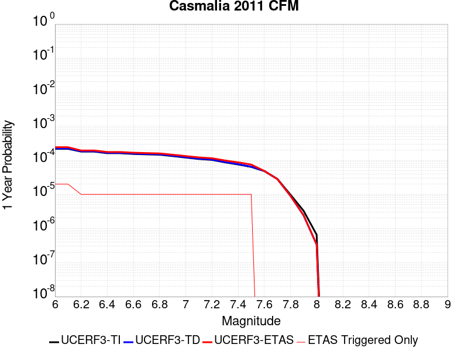 |  |

| Magnitude | 1 wk TI Prob | 1 wk TD Prob | 1 wk ETAS Prob | 1 wk ETAS/TD Gain | 1 wk ETAS Triggered Only | 1 mo TI Prob | 1 mo TD Prob | 1 mo ETAS Prob | 1 mo ETAS/TD Gain | 1 mo ETAS Triggered Only | 1 yr TI Prob | 1 yr TD Prob | 1 yr ETAS Prob | 1 yr ETAS/TD Gain | 1 yr ETAS Triggered Only | 10 yr TI Prob | 10 yr TD Prob | 10 yr ETAS Prob | 10 yr ETAS/TD Gain | 10 yr ETAS Triggered Only |
|-----|-----|-----|-----|-----|-----|-----|-----|-----|-----|-----|-----|-----|-----|-----|-----|-----|-----|-----|-----|-----|
| 6.0 | 4.1704893E-6 | 4.262483E-6 | 1.426244E-5 | 3.3460405 | 1.0E-5 | 1.7873403E-5 | 1.8267656E-5 | 3.826729E-5 | 2.0948112 | 2.0E-5 | 2.1758694E-4 | 2.2238622E-4 | 2.4238178E-4 | 1.0899136 | 2.0E-5 | 0.0021737402 | 0.0022216577 | 0.002251591 | 1.0134734 | 3.0E-5 |
| 6.1 | 4.1704893E-6 | 4.262483E-6 | 1.426244E-5 | 3.3460405 | 1.0E-5 | 1.7873403E-5 | 1.8267656E-5 | 3.826729E-5 | 2.0948112 | 2.0E-5 | 2.1758694E-4 | 2.2238622E-4 | 2.4238178E-4 | 1.0899136 | 2.0E-5 | 0.0021737402 | 0.0022216577 | 0.002251591 | 1.0134734 | 3.0E-5 |
| 6.2 | 3.457312E-6 | 3.5370217E-6 | 1.3536986E-5 | 3.8272274 | 1.0E-5 | 1.4816967E-5 | 1.5158577E-5 | 2.5158426E-5 | 1.6596825 | 1.0E-5 | 1.8038164E-4 | 1.8454014E-4 | 1.9453828E-4 | 1.0541787 | 1.0E-5 | 0.001802353 | 0.0018438784 | 0.0018638414 | 1.0108267 | 2.0E-5 |
| 6.3 | 3.457312E-6 | 3.5370217E-6 | 1.3536986E-5 | 3.8272274 | 1.0E-5 | 1.4816967E-5 | 1.5158577E-5 | 2.5158426E-5 | 1.6596825 | 1.0E-5 | 1.8038164E-4 | 1.8454014E-4 | 1.9453828E-4 | 1.0541787 | 1.0E-5 | 0.001802353 | 0.0018438784 | 0.0018638414 | 1.0108267 | 2.0E-5 |
| 6.4 | 3.0957337E-6 | 3.1692257E-6 | 1.3169194E-5 | 4.155335 | 1.0E-5 | 1.3267363E-5 | 1.3582326E-5 | 2.358219E-5 | 1.736241 | 1.0E-5 | 1.6151817E-4 | 1.6535232E-4 | 1.7535067E-4 | 1.0604669 | 1.0E-5 | 0.0016140083 | 0.0016522991 | 0.001672266 | 1.0120844 | 2.0E-5 |
| 6.5 | 3.0957337E-6 | 3.1692257E-6 | 1.3169194E-5 | 4.155335 | 1.0E-5 | 1.3267363E-5 | 1.3582326E-5 | 2.358219E-5 | 1.736241 | 1.0E-5 | 1.6151817E-4 | 1.6535232E-4 | 1.7535067E-4 | 1.0604669 | 1.0E-5 | 0.0016140083 | 0.0016522991 | 0.001672266 | 1.0120844 | 2.0E-5 |
| 6.6 | 2.9459152E-6 | 3.0165752E-6 | 1.3016545E-5 | 4.3150077 | 1.0E-5 | 1.262529E-5 | 1.2928115E-5 | 2.2927987E-5 | 1.7734979 | 1.0E-5 | 1.5370206E-4 | 1.5738848E-4 | 1.6738691E-4 | 1.0635271 | 1.0E-5 | 0.0015359579 | 0.0015727758 | 0.0015927444 | 1.0126964 | 2.0E-5 |
| 6.7 | 2.8634809E-6 | 2.9324726E-6 | 1.29324435E-5 | 4.4100814 | 1.0E-5 | 1.2272003E-5 | 1.256768E-5 | 2.2567554E-5 | 1.7956818 | 1.0E-5 | 1.4940138E-4 | 1.530008E-4 | 1.6299928E-4 | 1.0653491 | 1.0E-5 | 0.0014930099 | 0.0015289601 | 0.0015489295 | 1.0130608 | 2.0E-5 |
| 6.8 | 2.7999822E-6 | 2.8675968E-6 | 1.2867568E-5 | 4.487231 | 1.0E-5 | 1.1999869E-5 | 1.2289643E-5 | 2.228952E-5 | 1.8136833 | 1.0E-5 | 1.460886E-4 | 1.4961617E-4 | 1.5961468E-4 | 1.0668277 | 1.0E-5 | 0.001459926 | 0.0014951597 | 0.0015151298 | 1.0133564 | 2.0E-5 |
| 6.9 | 2.551052E-6 | 2.6119649E-6 | 1.26119385E-5 | 4.8285255 | 1.0E-5 | 1.0933034E-5 | 1.1194087E-5 | 2.1193975E-5 | 1.8933188 | 1.0E-5 | 1.3310155E-4 | 1.3627953E-4 | 1.4627817E-4 | 1.0733685 | 1.0E-5 | 0.0013302186 | 0.0013619636 | 0.0013819364 | 1.0146646 | 2.0E-5 |
| 7.0 | 2.3081875E-6 | 2.3624088E-6 | 1.2362385E-5 | 5.2329574 | 1.0E-5 | 9.892195E-6 | 1.01245705E-5 | 2.012447E-5 | 1.9876863 | 1.0E-5 | 1.20430814E-4 | 1.232597E-4 | 1.3325847E-4 | 1.0811195 | 1.0E-5 | 0.0012036557 | 0.0012319161 | 0.0012518915 | 1.0162148 | 2.0E-5 |
| 7.1 | 2.093245E-6 | 2.1417243E-6 | 1.2141702E-5 | 5.669125 | 1.0E-5 | 8.971019E-6 | 9.178786E-6 | 1.9178695E-5 | 2.0894587 | 1.0E-5 | 1.09216686E-4 | 1.1174601E-4 | 1.21744895E-4 | 1.0894786 | 1.0E-5 | 0.0010916302 | 0.0011169002 | 0.0011368779 | 1.0178868 | 2.0E-5 |
| 7.2 | 1.9714576E-6 | 2.0165091E-6 | 1.2016489E-5 | 5.959055 | 1.0E-5 | 8.449076E-6 | 8.642153E-6 | 1.8642068E-5 | 2.157109 | 1.0E-5 | 1.0286264E-4 | 1.05213156E-4 | 1.15212104E-4 | 1.0950352 | 1.0E-5 | 0.0010281504 | 0.0010516352 | 0.0010616247 | 1.009499 | 1.0E-5 |
| 7.3 | 1.6689512E-6 | 1.7047131E-6 | 1.1704696E-5 | 6.86608 | 1.0E-5 | 7.1526288E-6 | 7.3058927E-6 | 1.730582E-5 | 2.3687482 | 1.0E-5 | 8.7079774E-5 | 8.894562E-5 | 9.894473E-5 | 1.1124183 | 1.0E-5 | 8.7045657E-4 | 8.89101E-4 | 8.990921E-4 | 1.0112373 | 1.0E-5 |
| 7.4 | 1.4490954E-6 | 1.4778908E-6 | 1.1477876E-5 | 7.76639 | 1.0E-5 | 6.210394E-6 | 6.333802E-6 | 1.6333739E-5 | 2.5788205 | 1.0E-5 | 7.560892E-5 | 7.711132E-5 | 8.711055E-5 | 1.1296726 | 1.0E-5 | 7.55832E-4 | 7.7084627E-4 | 7.8083854E-4 | 1.0129627 | 1.0E-5 |
| 7.5 | 1.226873E-6 | 1.2481701E-6 | 1.12481575E-5 | 9.011719 | 1.0E-5 | 5.2580162E-6 | 5.3492895E-6 | 1.5349236E-5 | 2.8693972 | 1.0E-5 | 6.401447E-5 | 6.5125656E-5 | 7.5125005E-5 | 1.1535393 | 1.0E-5 | 6.399603E-4 | 6.5106625E-4 | 6.6105975E-4 | 1.0153494 | 1.0E-5 |
| 7.6 | 9.2561345E-7 | 9.361923E-7 | 9.361923E-7 | 1.0 | 0.0 | 3.966909E-6 | 4.012247E-6 | 4.012247E-6 | 1.0 | 0.0 | 4.8296046E-5 | 4.884801E-5 | 4.884801E-5 | 1.0 | 0.0 | 4.828555E-4 | 4.8837316E-4 | 4.8837316E-4 | 1.0 | 0.0 |
| 7.7 | 5.4367933E-7 | 5.392888E-7 | 5.392888E-7 | 1.0 | 0.0 | 2.3300522E-6 | 2.3112357E-6 | 2.3112357E-6 | 1.0 | 0.0 | 2.8368017E-5 | 2.8138933E-5 | 2.8138933E-5 | 1.0 | 0.0 | 2.8364395E-4 | 2.8135383E-4 | 2.8135383E-4 | 1.0 | 0.0 |
| 7.8 | 1.8825742E-7 | 1.7342276E-7 | 1.7342276E-7 | 1.0 | 0.0 | 8.068173E-7 | 7.4324015E-7 | 7.4324015E-7 | 1.0 | 0.0 | 9.822956E-6 | 9.048912E-6 | 9.048912E-6 | 1.0 | 0.0 | 9.822522E-5 | 9.048546E-5 | 9.048546E-5 | 1.0 | 0.0 |
| 7.9 | 6.342771E-8 | 4.6790706E-8 | 4.6790706E-8 | 1.0 | 0.0 | 2.7183304E-7 | 2.0053157E-7 | 2.0053157E-7 | 1.0 | 0.0 | 3.3095623E-6 | 2.4414692E-6 | 2.4414692E-6 | 1.0 | 0.0 | 3.309513E-5 | 2.4414428E-5 | 2.4414428E-5 | 1.0 | 0.0 |
| 8.0 | 1.2574819E-8 | 6.4733463E-9 | 6.4733463E-9 | 1.0 | 0.0 | 5.3892084E-8 | 2.7742912E-8 | 2.7742912E-8 | 1.0 | 0.0 | 6.561359E-7 | 3.377699E-7 | 3.377699E-7 | 1.0 | 0.0 | 6.56134E-6 | 3.377694E-6 | 3.377694E-6 | 1.0 | 0.0 |

## San Gregorio (South) 2011 CFM
*[(top)](#table-of-contents)*

| 1 Week | 1 Month | 1 Year | 10 Year |
|-----|-----|-----|-----|
| 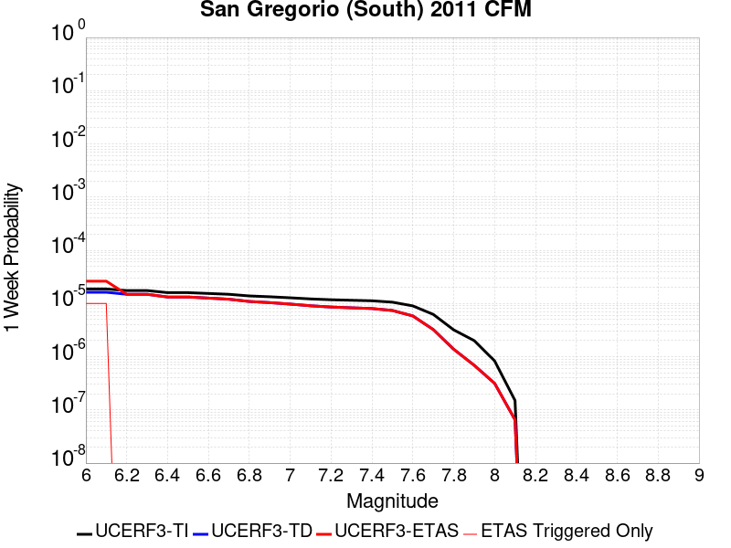 |  | 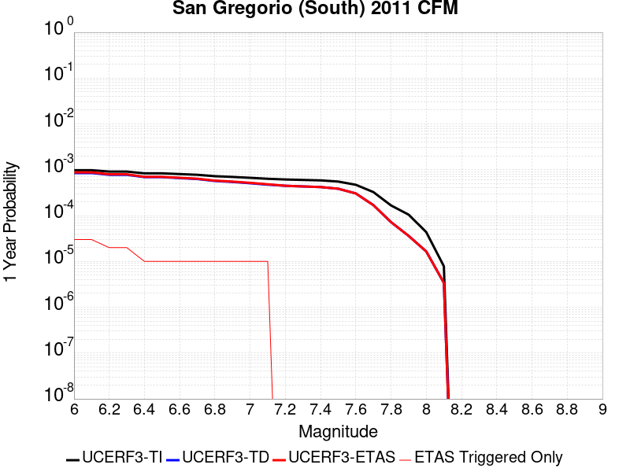 | 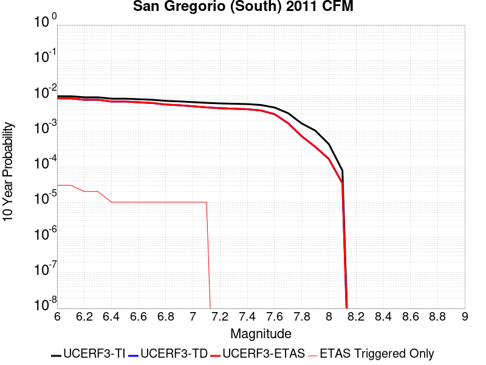 |

| Magnitude | 1 wk TI Prob | 1 wk TD Prob | 1 wk ETAS Prob | 1 wk ETAS/TD Gain | 1 wk ETAS Triggered Only | 1 mo TI Prob | 1 mo TD Prob | 1 mo ETAS Prob | 1 mo ETAS/TD Gain | 1 mo ETAS Triggered Only | 1 yr TI Prob | 1 yr TD Prob | 1 yr ETAS Prob | 1 yr ETAS/TD Gain | 1 yr ETAS Triggered Only | 10 yr TI Prob | 10 yr TD Prob | 10 yr ETAS Prob | 10 yr ETAS/TD Gain | 10 yr ETAS Triggered Only |
|-----|-----|-----|-----|-----|-----|-----|-----|-----|-----|-----|-----|-----|-----|-----|-----|-----|-----|-----|-----|-----|
| 6.0 | 1.8770423E-5 | 1.6279751E-5 | 2.627959E-5 | 1.61425 | 1.0E-5 | 8.044219E-5 | 6.976852E-5 | 7.976782E-5 | 1.1433212 | 1.0E-5 | 9.789435E-4 | 8.491044E-4 | 8.79079E-4 | 1.0353013 | 3.0E-5 | 0.009746423 | 0.008471312 | 0.0085010575 | 1.0035113 | 3.0E-5 |
| 6.1 | 1.8770423E-5 | 1.6279751E-5 | 2.627959E-5 | 1.61425 | 1.0E-5 | 8.044219E-5 | 6.976852E-5 | 7.976782E-5 | 1.1433212 | 1.0E-5 | 9.789435E-4 | 8.491044E-4 | 8.79079E-4 | 1.0353013 | 3.0E-5 | 0.009746423 | 0.008471312 | 0.0085010575 | 1.0035113 | 3.0E-5 |
| 6.2 | 1.7508692E-5 | 1.4899257E-5 | 1.4899257E-5 | 1.0 | 0.0 | 7.5035096E-5 | 6.3852414E-5 | 6.3852414E-5 | 1.0 | 0.0 | 9.1316935E-4 | 7.7712885E-4 | 7.971133E-4 | 1.0257157 | 2.0E-5 | 0.00909426 | 0.00775674 | 0.0077765845 | 1.0025584 | 2.0E-5 |
| 6.3 | 1.7508692E-5 | 1.4899257E-5 | 1.4899257E-5 | 1.0 | 0.0 | 7.5035096E-5 | 6.3852414E-5 | 6.3852414E-5 | 1.0 | 0.0 | 9.1316935E-4 | 7.7712885E-4 | 7.971133E-4 | 1.0257157 | 2.0E-5 | 0.00909426 | 0.00775674 | 0.0077765845 | 1.0025584 | 2.0E-5 |
| 6.4 | 1.6004591E-5 | 1.3249094E-5 | 1.3249094E-5 | 1.0 | 0.0 | 6.85893E-5 | 5.6780602E-5 | 5.6780602E-5 | 1.0 | 0.0 | 8.347548E-4 | 6.910856E-4 | 7.010787E-4 | 1.01446 | 1.0E-5 | 0.008316261 | 0.006901791 | 0.006911722 | 1.0014389 | 1.0E-5 |
| 6.5 | 1.6004591E-5 | 1.3249094E-5 | 1.3249094E-5 | 1.0 | 0.0 | 6.85893E-5 | 5.6780602E-5 | 5.6780602E-5 | 1.0 | 0.0 | 8.347548E-4 | 6.910856E-4 | 7.010787E-4 | 1.01446 | 1.0E-5 | 0.008316261 | 0.006901791 | 0.006911722 | 1.0014389 | 1.0E-5 |
| 6.6 | 1.5442201E-5 | 1.2633725E-5 | 1.2633725E-5 | 1.0 | 0.0 | 6.617918E-5 | 5.4143416E-5 | 5.4143416E-5 | 1.0 | 0.0 | 8.0543366E-4 | 6.5899757E-4 | 6.68991E-4 | 1.0151646 | 1.0E-5 | 0.008025207 | 0.006582842 | 0.0065927766 | 1.0015091 | 1.0E-5 |
| 6.7 | 1.489921E-5 | 1.2042234E-5 | 1.2042234E-5 | 1.0 | 0.0 | 6.3852196E-5 | 5.1608557E-5 | 5.1608557E-5 | 1.0 | 0.0 | 7.7712315E-4 | 6.2815374E-4 | 6.3814747E-4 | 1.0159097 | 1.0E-5 | 0.0077441116 | 0.006276176 | 0.006286113 | 1.0015833 | 1.0E-5 |
| 6.8 | 1.3876024E-5 | 1.0921184E-5 | 1.0921184E-5 | 1.0 | 0.0 | 5.9467322E-5 | 4.6804238E-5 | 4.6804238E-5 | 1.0 | 0.0 | 7.237741E-4 | 5.69693E-4 | 5.796873E-4 | 1.0175433 | 1.0E-5 | 0.0072142133 | 0.0056946846 | 0.005704628 | 1.001746 | 1.0E-5 |
| 6.9 | 1.33922495E-5 | 1.0392687E-5 | 1.0392687E-5 | 1.0 | 0.0 | 5.7394092E-5 | 4.4539327E-5 | 4.4539327E-5 | 1.0 | 0.0 | 6.9854903E-4 | 5.4213166E-4 | 5.5212626E-4 | 1.0184357 | 1.0E-5 | 0.0069635725 | 0.005420442 | 0.005430388 | 1.0018349 | 1.0E-5 |
| 7.0 | 1.2807324E-5 | 9.752649E-6 | 9.752649E-6 | 1.0 | 0.0 | 5.4887376E-5 | 4.1796397E-5 | 4.1796397E-5 | 1.0 | 0.0 | 6.680489E-4 | 5.087525E-4 | 5.1874743E-4 | 1.0196459 | 1.0E-5 | 0.006660442 | 0.0050882204 | 0.0050981697 | 1.0019553 | 1.0E-5 |
| 7.1 | 1.2191438E-5 | 9.061537E-6 | 9.061537E-6 | 1.0 | 0.0 | 5.224797E-5 | 3.8834576E-5 | 3.8834576E-5 | 1.0 | 0.0 | 6.3593336E-4 | 4.727085E-4 | 4.8270376E-4 | 1.0211446 | 1.0E-5 | 0.0063411663 | 0.0047293645 | 0.004739317 | 1.0021044 | 1.0E-5 |
| 7.2 | 1.1769438E-5 | 8.581731E-6 | 8.581731E-6 | 1.0 | 0.0 | 5.0439474E-5 | 3.677833E-5 | 3.677833E-5 | 1.0 | 0.0 | 6.1392755E-4 | 4.4768423E-4 | 4.4768423E-4 | 1.0 | 0.0 | 0.0061223423 | 0.004480157 | 0.004480157 | 1.0 | 0.0 |
| 7.3 | 1.150374E-5 | 8.29716E-6 | 8.29716E-6 | 1.0 | 0.0 | 4.9300812E-5 | 3.5558773E-5 | 3.5558773E-5 | 1.0 | 0.0 | 6.0007203E-4 | 4.3284212E-4 | 4.3284212E-4 | 1.0 | 0.0 | 0.0059845424 | 0.0043323063 | 0.0043323063 | 1.0 | 0.0 |
| 7.4 | 1.12514E-5 | 8.042902E-6 | 8.042902E-6 | 1.0 | 0.0 | 4.8219394E-5 | 3.4469125E-5 | 3.4469125E-5 | 1.0 | 0.0 | 5.8691297E-4 | 4.1958084E-4 | 4.1958084E-4 | 1.0 | 0.0 | 0.005853653 | 0.0042001884 | 0.0042001884 | 1.0 | 0.0 |
| 7.5 | 1.059696E-5 | 7.3931915E-6 | 7.3931915E-6 | 1.0 | 0.0 | 4.5414752E-5 | 3.168472E-5 | 3.168472E-5 | 1.0 | 0.0 | 5.5278436E-4 | 3.8569325E-4 | 3.8569325E-4 | 1.0 | 0.0 | 0.0055141128 | 0.0038624762 | 0.0038624762 | 1.0 | 0.0 |
| 7.6 | 9.018592E-6 | 5.8369624E-6 | 5.8369624E-6 | 1.0 | 0.0 | 3.8650534E-5 | 2.5015313E-5 | 2.5015313E-5 | 1.0 | 0.0 | 4.7046866E-4 | 3.045189E-4 | 3.045189E-4 | 1.0 | 0.0 | 0.004694739 | 0.0030528754 | 0.0030528754 | 1.0 | 0.0 |
| 7.7 | 6.243489E-6 | 3.2395455E-6 | 3.2395455E-6 | 1.0 | 0.0 | 2.6757538E-5 | 1.3883692E-5 | 1.3883692E-5 | 1.0 | 0.0 | 3.257243E-4 | 1.6902086E-4 | 1.6902086E-4 | 1.0 | 0.0 | 0.003252473 | 0.001699108 | 0.001699108 | 1.0 | 0.0 |
| 7.8 | 3.1941963E-6 | 1.3809986E-6 | 1.3809986E-6 | 1.0 | 0.0 | 1.368934E-5 | 5.9185513E-6 | 5.9185513E-6 | 1.0 | 0.0 | 1.6665498E-4 | 7.2055984E-5 | 7.2055984E-5 | 1.0 | 0.0 | 0.0016653005 | 7.263174E-4 | 7.263174E-4 | 1.0 | 0.0 |
| 7.9 | 2.0098398E-6 | 6.9161155E-7 | 6.9161155E-7 | 1.0 | 0.0 | 8.6135715E-6 | 2.964046E-6 | 2.964046E-6 | 1.0 | 0.0 | 1.0486518E-4 | 3.608666E-5 | 3.608666E-5 | 1.0 | 0.0 | 0.0010481571 | 3.657225E-4 | 3.657225E-4 | 1.0 | 0.0 |
| 8.0 | 8.353119E-7 | 3.1623412E-7 | 3.1623412E-7 | 1.0 | 0.0 | 3.579903E-6 | 1.3552883E-6 | 1.3552883E-6 | 1.0 | 0.0 | 4.358445E-5 | 1.6500511E-5 | 1.6500511E-5 | 1.0 | 0.0 | 4.3575902E-4 | 1.6619264E-4 | 1.6619264E-4 | 1.0 | 0.0 |
| 8.1 | 1.5033264E-7 | 6.527624E-8 | 6.527624E-8 | 1.0 | 0.0 | 6.442826E-7 | 2.7975528E-7 | 2.7975528E-7 | 1.0 | 0.0 | 7.844113E-6 | 3.4060151E-6 | 3.4060151E-6 | 1.0 | 0.0 | 7.843835E-5 | 3.407693E-5 | 3.407693E-5 | 1.0 | 0.0 |

## Hartley Springs 2011 CFM
*[(top)](#table-of-contents)*

| 1 Week | 1 Month | 1 Year | 10 Year |
|-----|-----|-----|-----|
| 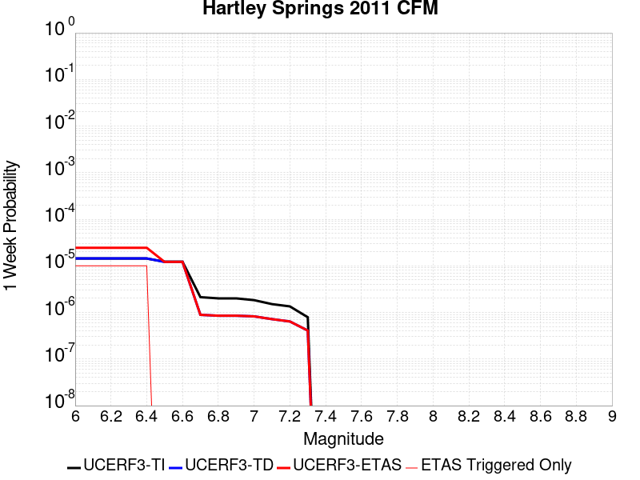 | 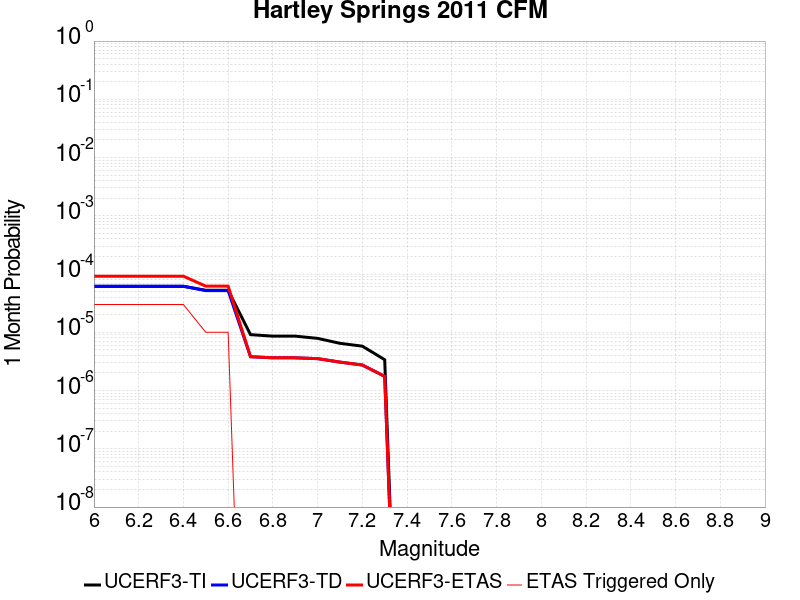 | 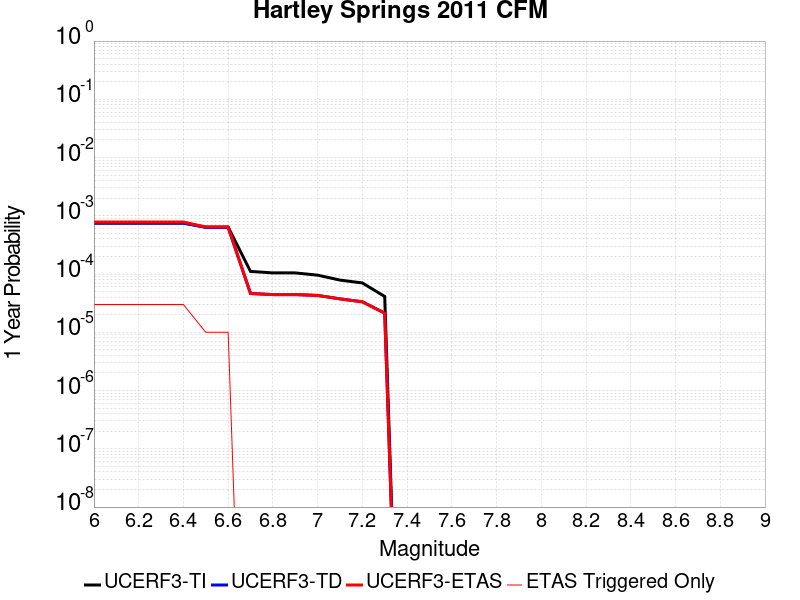 |  |

| Magnitude | 1 wk TI Prob | 1 wk TD Prob | 1 wk ETAS Prob | 1 wk ETAS/TD Gain | 1 wk ETAS Triggered Only | 1 mo TI Prob | 1 mo TD Prob | 1 mo ETAS Prob | 1 mo ETAS/TD Gain | 1 mo ETAS Triggered Only | 1 yr TI Prob | 1 yr TD Prob | 1 yr ETAS Prob | 1 yr ETAS/TD Gain | 1 yr ETAS Triggered Only | 10 yr TI Prob | 10 yr TD Prob | 10 yr ETAS Prob | 10 yr ETAS/TD Gain | 10 yr ETAS Triggered Only |
|-----|-----|-----|-----|-----|-----|-----|-----|-----|-----|-----|-----|-----|-----|-----|-----|-----|-----|-----|-----|-----|
| 6.0 | 1.4352418E-5 | 1.4434182E-5 | 2.4434037E-5 | 1.6927899 | 1.0E-5 | 6.1508916E-5 | 6.1860235E-5 | 9.185838E-5 | 1.4849342 | 3.0E-5 | 7.486137E-4 | 7.5305253E-4 | 7.8302994E-4 | 1.0398079 | 3.0E-5 | 0.007460968 | 0.0075211283 | 0.0075509027 | 1.0039588 | 3.0E-5 |
| 6.1 | 1.4352418E-5 | 1.4434182E-5 | 2.4434037E-5 | 1.6927899 | 1.0E-5 | 6.1508916E-5 | 6.1860235E-5 | 9.185838E-5 | 1.4849342 | 3.0E-5 | 7.486137E-4 | 7.5305253E-4 | 7.8302994E-4 | 1.0398079 | 3.0E-5 | 0.007460968 | 0.0075211283 | 0.0075509027 | 1.0039588 | 3.0E-5 |
| 6.2 | 1.4352418E-5 | 1.4434182E-5 | 2.4434037E-5 | 1.6927899 | 1.0E-5 | 6.1508916E-5 | 6.1860235E-5 | 9.185838E-5 | 1.4849342 | 3.0E-5 | 7.486137E-4 | 7.5305253E-4 | 7.8302994E-4 | 1.0398079 | 3.0E-5 | 0.007460968 | 0.0075211283 | 0.0075509027 | 1.0039588 | 3.0E-5 |
| 6.3 | 1.4352418E-5 | 1.4434182E-5 | 2.4434037E-5 | 1.6927899 | 1.0E-5 | 6.1508916E-5 | 6.1860235E-5 | 9.185838E-5 | 1.4849342 | 3.0E-5 | 7.486137E-4 | 7.5305253E-4 | 7.8302994E-4 | 1.0398079 | 3.0E-5 | 0.007460968 | 0.0075211283 | 0.0075509027 | 1.0039588 | 3.0E-5 |
| 6.4 | 1.4352418E-5 | 1.4434182E-5 | 2.4434037E-5 | 1.6927899 | 1.0E-5 | 6.1508916E-5 | 6.1860235E-5 | 9.185838E-5 | 1.4849342 | 3.0E-5 | 7.486137E-4 | 7.5305253E-4 | 7.8302994E-4 | 1.0398079 | 3.0E-5 | 0.007460968 | 0.0075211283 | 0.0075509027 | 1.0039588 | 3.0E-5 |
| 6.5 | 1.2279858E-5 | 1.2133106E-5 | 1.2133106E-5 | 1.0 | 0.0 | 5.26269E-5 | 5.1998883E-5 | 6.199836E-5 | 1.1923019 | 1.0E-5 | 6.4054417E-4 | 6.3306064E-4 | 6.430543E-4 | 1.0157863 | 1.0E-5 | 0.0063870098 | 0.006328085 | 0.0063380217 | 1.0015702 | 1.0E-5 |
| 6.6 | 1.2279858E-5 | 1.2133106E-5 | 1.2133106E-5 | 1.0 | 0.0 | 5.26269E-5 | 5.1998883E-5 | 6.199836E-5 | 1.1923019 | 1.0E-5 | 6.4054417E-4 | 6.3306064E-4 | 6.430543E-4 | 1.0157863 | 1.0E-5 | 0.0063870098 | 0.006328085 | 0.0063380217 | 1.0015702 | 1.0E-5 |
| 6.7 | 2.1282601E-6 | 8.8948315E-7 | 8.8948315E-7 | 1.0 | 0.0 | 9.121083E-6 | 3.8120663E-6 | 3.8120663E-6 | 1.0 | 0.0 | 1.11043526E-4 | 4.641118E-5 | 4.641118E-5 | 1.0 | 0.0 | 0.0011098806 | 4.6404017E-4 | 4.6404017E-4 | 1.0 | 0.0 |
| 6.8 | 2.00516E-6 | 8.517597E-7 | 8.517597E-7 | 1.0 | 0.0 | 8.593515E-6 | 3.650395E-6 | 3.650395E-6 | 1.0 | 0.0 | 1.04621024E-4 | 4.444291E-5 | 4.444291E-5 | 1.0 | 0.0 | 0.0010457177 | 4.4436535E-4 | 4.4436535E-4 | 1.0 | 0.0 |
| 6.9 | 2.00516E-6 | 8.517597E-7 | 8.517597E-7 | 1.0 | 0.0 | 8.593515E-6 | 3.650395E-6 | 3.650395E-6 | 1.0 | 0.0 | 1.04621024E-4 | 4.444291E-5 | 4.444291E-5 | 1.0 | 0.0 | 0.0010457177 | 4.4436535E-4 | 4.4436535E-4 | 1.0 | 0.0 |
| 7.0 | 1.8366732E-6 | 8.237307E-7 | 8.237307E-7 | 1.0 | 0.0 | 7.871433E-6 | 3.5302712E-6 | 3.5302712E-6 | 1.0 | 0.0 | 9.583048E-5 | 4.298046E-5 | 4.298046E-5 | 1.0 | 0.0 | 9.5789164E-4 | 4.2974652E-4 | 4.2974652E-4 | 1.0 | 0.0 |
| 7.1 | 1.5097997E-6 | 7.1902616E-7 | 7.1902616E-7 | 1.0 | 0.0 | 6.470554E-6 | 3.0815384E-6 | 3.0815384E-6 | 1.0 | 0.0 | 7.877615E-5 | 3.7517326E-5 | 3.7517326E-5 | 1.0 | 0.0 | 7.874823E-4 | 3.7513362E-4 | 3.7513362E-4 | 1.0 | 0.0 |
| 7.2 | 1.3490993E-6 | 6.405254E-7 | 6.405254E-7 | 1.0 | 0.0 | 5.7818415E-6 | 2.7451074E-6 | 2.7451074E-6 | 1.0 | 0.0 | 7.0391645E-5 | 3.3421402E-5 | 3.3421402E-5 | 1.0 | 0.0 | 7.0369354E-4 | 3.341867E-4 | 3.341867E-4 | 1.0 | 0.0 |
| 7.3 | 7.900015E-7 | 4.0889498E-7 | 4.0889498E-7 | 1.0 | 0.0 | 3.3857161E-6 | 1.752407E-6 | 1.752407E-6 | 1.0 | 0.0 | 4.1220315E-5 | 2.1335554E-5 | 2.1335554E-5 | 1.0 | 0.0 | 4.121267E-4 | 2.1335555E-4 | 2.1335555E-4 | 1.0 | 0.0 |

## Hollywood
*[(top)](#table-of-contents)*

| 1 Week | 1 Month | 1 Year | 10 Year |
|-----|-----|-----|-----|
| 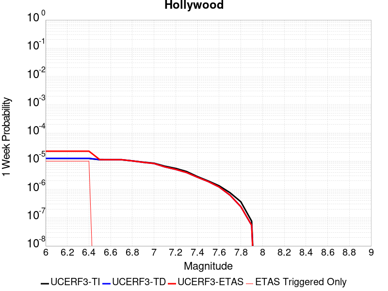 |  | 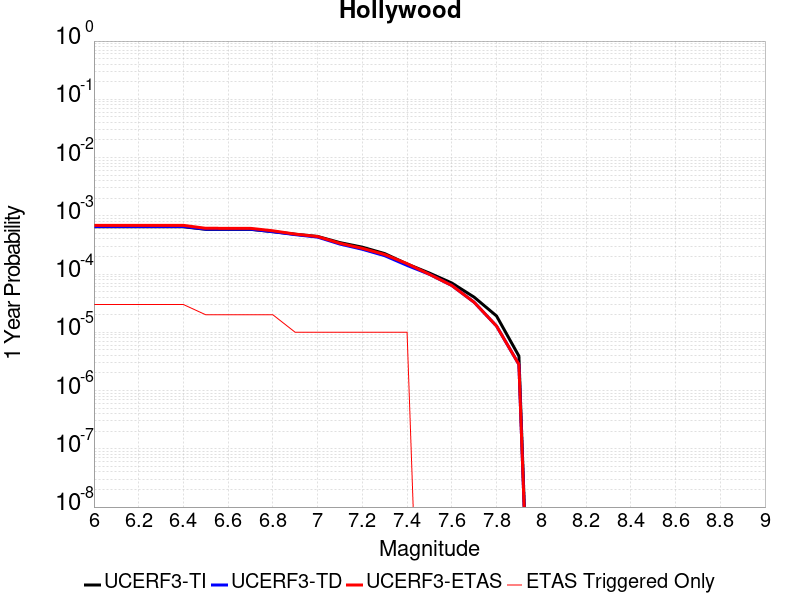 | 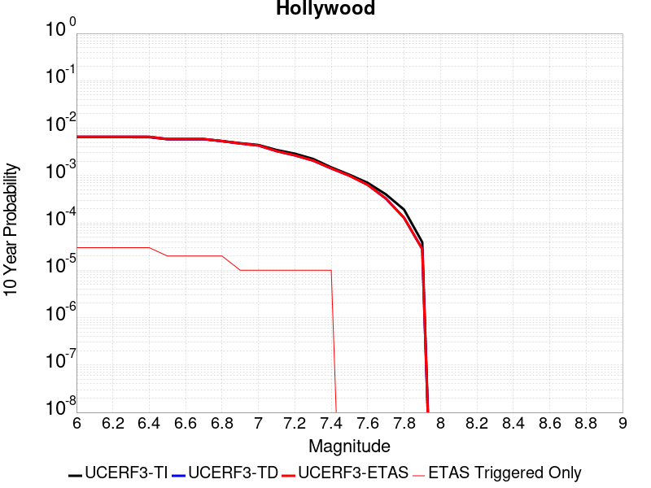 |

| Magnitude | 1 wk TI Prob | 1 wk TD Prob | 1 wk ETAS Prob | 1 wk ETAS/TD Gain | 1 wk ETAS Triggered Only | 1 mo TI Prob | 1 mo TD Prob | 1 mo ETAS Prob | 1 mo ETAS/TD Gain | 1 mo ETAS Triggered Only | 1 yr TI Prob | 1 yr TD Prob | 1 yr ETAS Prob | 1 yr ETAS/TD Gain | 1 yr ETAS Triggered Only | 10 yr TI Prob | 10 yr TD Prob | 10 yr ETAS Prob | 10 yr ETAS/TD Gain | 10 yr ETAS Triggered Only |
|-----|-----|-----|-----|-----|-----|-----|-----|-----|-----|-----|-----|-----|-----|-----|-----|-----|-----|-----|-----|-----|
| 6.0 | 1.24487615E-5 | 1.2593226E-5 | 2.25931E-5 | 1.7940677 | 1.0E-5 | 5.3350745E-5 | 5.3969878E-5 | 6.396934E-5 | 1.1852785 | 1.0E-5 | 6.4935174E-4 | 6.568898E-4 | 6.8687013E-4 | 1.0456398 | 3.0E-5 | 0.0064745755 | 0.006549969 | 0.0065797726 | 1.0045502 | 3.0E-5 |
| 6.1 | 1.24487615E-5 | 1.2593226E-5 | 2.25931E-5 | 1.7940677 | 1.0E-5 | 5.3350745E-5 | 5.3969878E-5 | 6.396934E-5 | 1.1852785 | 1.0E-5 | 6.4935174E-4 | 6.568898E-4 | 6.8687013E-4 | 1.0456398 | 3.0E-5 | 0.0064745755 | 0.006549969 | 0.0065797726 | 1.0045502 | 3.0E-5 |
| 6.2 | 1.24487615E-5 | 1.2593226E-5 | 2.25931E-5 | 1.7940677 | 1.0E-5 | 5.3350745E-5 | 5.3969878E-5 | 6.396934E-5 | 1.1852785 | 1.0E-5 | 6.4935174E-4 | 6.568898E-4 | 6.8687013E-4 | 1.0456398 | 3.0E-5 | 0.0064745755 | 0.006549969 | 0.0065797726 | 1.0045502 | 3.0E-5 |
| 6.3 | 1.24487615E-5 | 1.2593226E-5 | 2.25931E-5 | 1.7940677 | 1.0E-5 | 5.3350745E-5 | 5.3969878E-5 | 6.396934E-5 | 1.1852785 | 1.0E-5 | 6.4935174E-4 | 6.568898E-4 | 6.8687013E-4 | 1.0456398 | 3.0E-5 | 0.0064745755 | 0.006549969 | 0.0065797726 | 1.0045502 | 3.0E-5 |
| 6.4 | 1.2431024E-5 | 1.2573839E-5 | 2.2573713E-5 | 1.795292 | 1.0E-5 | 5.327473E-5 | 5.3886797E-5 | 6.3886255E-5 | 1.1855642 | 1.0E-5 | 6.4842677E-4 | 6.558789E-4 | 6.8585924E-4 | 1.0457102 | 3.0E-5 | 0.0064653796 | 0.0065399194 | 0.006569723 | 1.0045573 | 3.0E-5 |
| 6.5 | 1.1242222E-5 | 1.13178E-5 | 1.13178E-5 | 1.0 | 0.0 | 4.8180063E-5 | 4.850397E-5 | 4.850397E-5 | 1.0 | 0.0 | 5.864344E-4 | 5.9037853E-4 | 6.103667E-4 | 1.0338565 | 2.0E-5 | 0.0058488925 | 0.005888388 | 0.0059082704 | 1.0033765 | 2.0E-5 |
| 6.6 | 1.1234066E-5 | 1.13089145E-5 | 1.13089145E-5 | 1.0 | 0.0 | 4.8145106E-5 | 4.846589E-5 | 4.846589E-5 | 1.0 | 0.0 | 5.86009E-4 | 5.8991514E-4 | 6.099033E-4 | 1.0338832 | 2.0E-5 | 0.005844661 | 0.0058837784 | 0.005903661 | 1.0033792 | 2.0E-5 |
| 6.7 | 1.12294E-5 | 1.1303658E-5 | 1.1303658E-5 | 1.0 | 0.0 | 4.812511E-5 | 4.8443362E-5 | 4.8443362E-5 | 1.0 | 0.0 | 5.857657E-4 | 5.89641E-4 | 6.096292E-4 | 1.033899 | 2.0E-5 | 0.0058422405 | 0.005881052 | 0.0059009343 | 1.0033808 | 2.0E-5 |
| 6.8 | 1.0252819E-5 | 1.0218445E-5 | 1.0218445E-5 | 1.0 | 0.0 | 4.3939912E-5 | 4.379261E-5 | 4.379261E-5 | 1.0 | 0.0 | 5.3483713E-4 | 5.330467E-4 | 5.5303605E-4 | 1.0375001 | 2.0E-5 | 0.005335517 | 0.005317908 | 0.0053378013 | 1.0037409 | 2.0E-5 |
| 6.9 | 9.252289E-6 | 9.110306E-6 | 9.110306E-6 | 1.0 | 0.0 | 3.9652066E-5 | 3.9043593E-5 | 3.9043593E-5 | 1.0 | 0.0 | 4.8265693E-4 | 4.752537E-4 | 4.8524895E-4 | 1.0210314 | 1.0E-5 | 0.0048161 | 0.004742547 | 0.0047524995 | 1.0020986 | 1.0E-5 |
| 7.0 | 8.474604E-6 | 8.258257E-6 | 8.258257E-6 | 1.0 | 0.0 | 3.6319227E-5 | 3.539206E-5 | 3.539206E-5 | 1.0 | 0.0 | 4.4209688E-4 | 4.3081454E-4 | 4.4081022E-4 | 1.0232018 | 1.0E-5 | 0.004412184 | 0.004299944 | 0.004309901 | 1.0023156 | 1.0E-5 |
| 7.1 | 6.643643E-6 | 6.2683675E-6 | 6.2683675E-6 | 1.0 | 0.0 | 2.8472443E-5 | 2.6864158E-5 | 2.6864158E-5 | 1.0 | 0.0 | 3.4659685E-4 | 3.2702246E-4 | 3.3701918E-4 | 1.030569 | 1.0E-5 | 0.0034605677 | 0.0032654584 | 0.0032754256 | 1.0030524 | 1.0E-5 |
| 7.2 | 5.549002E-6 | 5.108709E-6 | 5.108709E-6 | 1.0 | 0.0 | 2.378122E-5 | 2.1894284E-5 | 2.1894284E-5 | 1.0 | 0.0 | 2.8949787E-4 | 2.6653046E-4 | 2.7652777E-4 | 1.0375092 | 1.0E-5 | 0.0028912104 | 0.0026621243 | 0.0026720979 | 1.0037464 | 1.0E-5 |
| 7.3 | 4.3059727E-6 | 3.9598885E-6 | 3.9598885E-6 | 1.0 | 0.0 | 1.8454039E-5 | 1.6970842E-5 | 1.6970842E-5 | 1.0 | 0.0 | 2.2465475E-4 | 2.066005E-4 | 2.1659843E-4 | 1.0483925 | 1.0E-5 | 0.0022442779 | 0.0020640944 | 0.0020740738 | 1.0048348 | 1.0E-5 |
| 7.4 | 2.8550733E-6 | 2.7012966E-6 | 2.7012966E-6 | 1.0 | 0.0 | 1.2235971E-5 | 1.1576934E-5 | 1.1576934E-5 | 1.0 | 0.0 | 1.4896276E-4 | 1.409401E-4 | 1.509387E-4 | 1.0709422 | 1.0E-5 | 0.0014886294 | 0.0014085122 | 0.0014184982 | 1.0070897 | 1.0E-5 |
| 7.5 | 1.9927045E-6 | 1.8976367E-6 | 1.8976367E-6 | 1.0 | 0.0 | 8.540134E-6 | 8.132703E-6 | 8.132703E-6 | 1.0 | 0.0 | 1.0397117E-4 | 9.90112E-5 | 9.90112E-5 | 1.0 | 0.0 | 0.0010392254 | 9.896745E-4 | 9.896745E-4 | 1.0 | 0.0 |
| 7.6 | 1.345084E-6 | 1.2216007E-6 | 1.2216007E-6 | 1.0 | 0.0 | 5.764633E-6 | 5.235421E-6 | 5.235421E-6 | 1.0 | 0.0 | 7.018215E-5 | 6.3739404E-5 | 6.3739404E-5 | 1.0 | 0.0 | 7.0159987E-4 | 6.3721323E-4 | 6.3721323E-4 | 1.0 | 0.0 |
| 7.7 | 7.6835164E-7 | 6.277697E-7 | 6.277697E-7 | 1.0 | 0.0 | 3.2929315E-6 | 2.6904388E-6 | 2.6904388E-6 | 1.0 | 0.0 | 4.00907E-5 | 3.2755615E-5 | 3.2755615E-5 | 1.0 | 0.0 | 4.0083472E-4 | 3.2750933E-4 | 3.2750933E-4 | 1.0 | 0.0 |
| 7.8 | 3.6562128E-7 | 2.453479E-7 | 2.453479E-7 | 1.0 | 0.0 | 1.5669474E-6 | 1.0514907E-6 | 1.0514907E-6 | 1.0 | 0.0 | 1.9077417E-5 | 1.2801827E-5 | 1.2801827E-5 | 1.0 | 0.0 | 1.907578E-4 | 1.2801126E-4 | 1.2801126E-4 | 1.0 | 0.0 |
| 7.9 | 7.5024424E-8 | 5.3816795E-8 | 5.3816795E-8 | 1.0 | 0.0 | 3.215332E-7 | 2.306434E-7 | 2.306434E-7 | 1.0 | 0.0 | 3.91466E-6 | 2.808081E-6 | 2.808081E-6 | 1.0 | 0.0 | 3.9145907E-5 | 2.8080585E-5 | 2.8080585E-5 | 1.0 | 0.0 |

## Newport-Inglewood alt 1
*[(top)](#table-of-contents)*

| 1 Week | 1 Month | 1 Year | 10 Year |
|-----|-----|-----|-----|
| 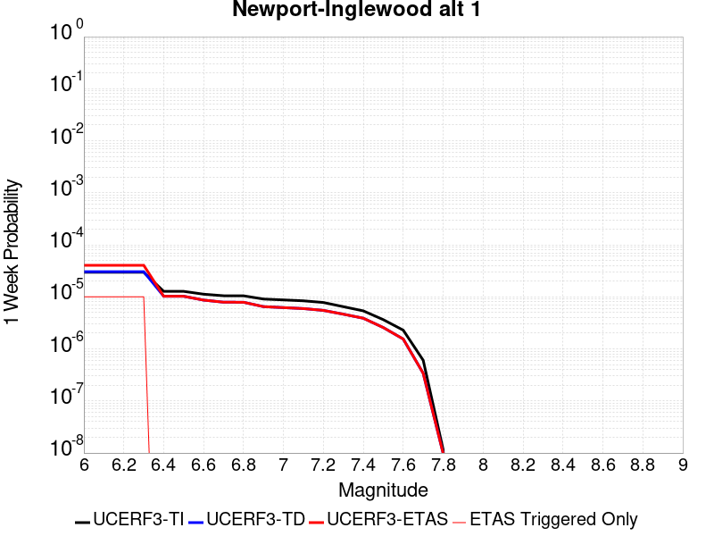 | 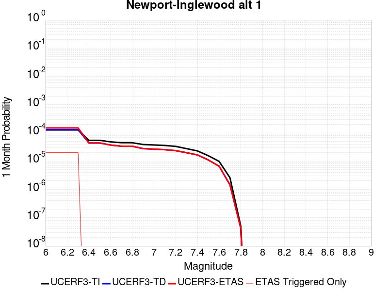 | 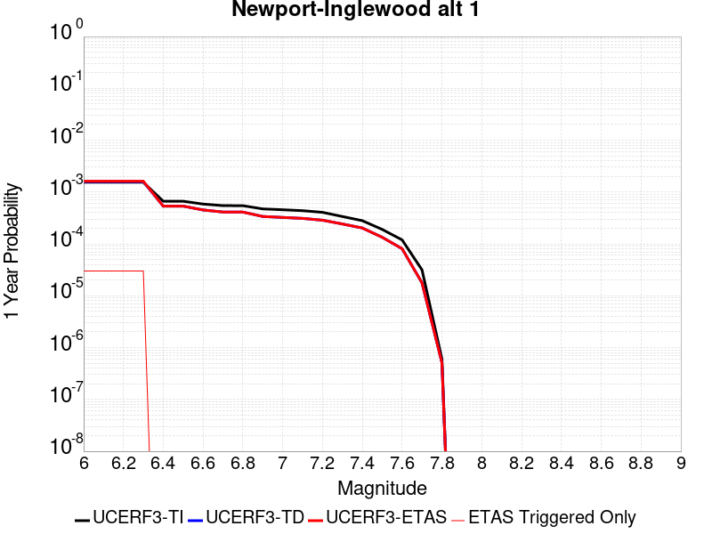 |  |

| Magnitude | 1 wk TI Prob | 1 wk TD Prob | 1 wk ETAS Prob | 1 wk ETAS/TD Gain | 1 wk ETAS Triggered Only | 1 mo TI Prob | 1 mo TD Prob | 1 mo ETAS Prob | 1 mo ETAS/TD Gain | 1 mo ETAS Triggered Only | 1 yr TI Prob | 1 yr TD Prob | 1 yr ETAS Prob | 1 yr ETAS/TD Gain | 1 yr ETAS Triggered Only | 10 yr TI Prob | 10 yr TD Prob | 10 yr ETAS Prob | 10 yr ETAS/TD Gain | 10 yr ETAS Triggered Only |
|-----|-----|-----|-----|-----|-----|-----|-----|-----|-----|-----|-----|-----|-----|-----|-----|-----|-----|-----|-----|-----|
| 6.0 | 2.9668912E-5 | 3.0404817E-5 | 4.0404513E-5 | 1.3288852 | 1.0E-5 | 1.2714628E-4 | 1.303026E-4 | 1.503E-4 | 1.1534688 | 2.0E-5 | 0.0015469068 | 0.0015857625 | 0.001615715 | 1.0188884 | 3.0E-5 | 0.015361829 | 0.015792042 | 0.015821569 | 1.0018697 | 3.0E-5 |
| 6.1 | 2.9668912E-5 | 3.0404817E-5 | 4.0404513E-5 | 1.3288852 | 1.0E-5 | 1.2714628E-4 | 1.303026E-4 | 1.503E-4 | 1.1534688 | 2.0E-5 | 0.0015469068 | 0.0015857625 | 0.001615715 | 1.0188884 | 3.0E-5 | 0.015361829 | 0.015792042 | 0.015821569 | 1.0018697 | 3.0E-5 |
| 6.2 | 2.9668912E-5 | 3.0404817E-5 | 4.0404513E-5 | 1.3288852 | 1.0E-5 | 1.2714628E-4 | 1.303026E-4 | 1.503E-4 | 1.1534688 | 2.0E-5 | 0.0015469068 | 0.0015857625 | 0.001615715 | 1.0188884 | 3.0E-5 | 0.015361829 | 0.015792042 | 0.015821569 | 1.0018697 | 3.0E-5 |
| 6.3 | 2.9668912E-5 | 3.0404817E-5 | 4.0404513E-5 | 1.3288852 | 1.0E-5 | 1.2714628E-4 | 1.303026E-4 | 1.503E-4 | 1.1534688 | 2.0E-5 | 0.0015469068 | 0.0015857625 | 0.001615715 | 1.0188884 | 3.0E-5 | 0.015361829 | 0.015792042 | 0.015821569 | 1.0018697 | 3.0E-5 |
| 6.4 | 1.275942E-5 | 1.0272503E-5 | 1.0272503E-5 | 1.0 | 0.0 | 5.4682085E-5 | 4.402429E-5 | 4.402429E-5 | 1.0 | 0.0 | 6.65551E-4 | 5.358681E-4 | 5.358681E-4 | 1.0 | 0.0 | 0.0066356123 | 0.005346184 | 0.005346184 | 1.0 | 0.0 |
| 6.5 | 1.275942E-5 | 1.0272503E-5 | 1.0272503E-5 | 1.0 | 0.0 | 5.4682085E-5 | 4.402429E-5 | 4.402429E-5 | 1.0 | 0.0 | 6.65551E-4 | 5.358681E-4 | 5.358681E-4 | 1.0 | 0.0 | 0.0066356123 | 0.005346184 | 0.005346184 | 1.0 | 0.0 |
| 6.6 | 1.1255358E-5 | 8.661884E-6 | 8.661884E-6 | 1.0 | 0.0 | 4.8236358E-5 | 3.712184E-5 | 3.712184E-5 | 1.0 | 0.0 | 5.871194E-4 | 4.518664E-4 | 4.518664E-4 | 1.0 | 0.0 | 0.005855706 | 0.004509653 | 0.004509653 | 1.0 | 0.0 |
| 6.7 | 1.0504745E-5 | 7.8997955E-6 | 7.8997955E-6 | 1.0 | 0.0 | 4.5019555E-5 | 3.3855835E-5 | 3.3855835E-5 | 1.0 | 0.0 | 5.4797524E-4 | 4.1211807E-4 | 4.1211807E-4 | 1.0 | 0.0 | 0.0054662596 | 0.004113668 | 0.004113668 | 1.0 | 0.0 |
| 6.8 | 1.0476007E-5 | 7.881176E-6 | 7.881176E-6 | 1.0 | 0.0 | 4.4896402E-5 | 3.3776043E-5 | 3.3776043E-5 | 1.0 | 0.0 | 5.464766E-4 | 4.1114696E-4 | 4.1114696E-4 | 1.0 | 0.0 | 0.005451347 | 0.0041039926 | 0.0041039926 | 1.0 | 0.0 |
| 6.9 | 9.076797E-6 | 6.4896312E-6 | 6.4896312E-6 | 1.0 | 0.0 | 3.889998E-5 | 2.781241E-5 | 2.781241E-5 | 1.0 | 0.0 | 4.7350433E-4 | 3.385638E-4 | 3.385638E-4 | 1.0 | 0.0 | 0.004724967 | 0.0033805177 | 0.0033805177 | 1.0 | 0.0 |
| 7.0 | 8.73795E-6 | 6.2120125E-6 | 6.2120125E-6 | 1.0 | 0.0 | 3.7447822E-5 | 2.6622642E-5 | 2.6622642E-5 | 1.0 | 0.0 | 4.5583185E-4 | 3.2408274E-4 | 3.2408274E-4 | 1.0 | 0.0 | 0.0045489795 | 0.0032361327 | 0.0032361327 | 1.0 | 0.0 |
| 7.1 | 8.391299E-6 | 5.95579E-6 | 5.95579E-6 | 1.0 | 0.0 | 3.5962214E-5 | 2.5524565E-5 | 2.5524565E-5 | 1.0 | 0.0 | 4.37752E-4 | 3.1071753E-4 | 3.1071753E-4 | 1.0 | 0.0 | 0.004368907 | 0.0031028606 | 0.0031028606 | 1.0 | 0.0 |
| 7.2 | 7.796882E-6 | 5.4965344E-6 | 5.4965344E-6 | 1.0 | 0.0 | 3.341478E-5 | 2.3556364E-5 | 2.3556364E-5 | 1.0 | 0.0 | 4.06749E-4 | 2.867612E-4 | 2.867612E-4 | 1.0 | 0.0 | 0.0040600533 | 0.0028639357 | 0.0028639357 | 1.0 | 0.0 |
| 7.3 | 6.4738833E-6 | 4.6478162E-6 | 4.6478162E-6 | 1.0 | 0.0 | 2.774492E-5 | 1.9919062E-5 | 1.9919062E-5 | 1.0 | 0.0 | 3.3774204E-4 | 2.4248775E-4 | 2.4248775E-4 | 1.0 | 0.0 | 0.0033722918 | 0.0024222482 | 0.0024222482 | 1.0 | 0.0 |
| 7.4 | 5.382145E-6 | 3.8857597E-6 | 3.8857597E-6 | 1.0 | 0.0 | 2.3066134E-5 | 1.665315E-5 | 1.665315E-5 | 1.0 | 0.0 | 2.8079396E-4 | 2.0273338E-4 | 2.0273338E-4 | 1.0 | 0.0 | 0.0028043943 | 0.0020254988 | 0.0020254988 | 1.0 | 0.0 |
| 7.5 | 3.648244E-6 | 2.5737843E-6 | 2.5737843E-6 | 1.0 | 0.0 | 1.5635238E-5 | 1.1030458E-5 | 1.1030458E-5 | 1.0 | 0.0 | 1.9034238E-4 | 1.3428765E-4 | 1.3428765E-4 | 1.0 | 0.0 | 0.0019017943 | 0.0013420755 | 0.0013420755 | 1.0 | 0.0 |
| 7.6 | 2.2906888E-6 | 1.5479842E-6 | 1.5479842E-6 | 1.0 | 0.0 | 9.817201E-6 | 6.634202E-6 | 6.634202E-6 | 1.0 | 0.0 | 1.1951787E-4 | 8.076848E-5 | 8.076848E-5 | 1.0 | 0.0 | 0.0011945361 | 8.07398E-4 | 8.07398E-4 | 1.0 | 0.0 |
| 7.7 | 6.0479874E-7 | 3.397512E-7 | 3.397512E-7 | 1.0 | 0.0 | 2.5919921E-6 | 1.4560758E-6 | 1.4560758E-6 | 1.0 | 0.0 | 3.1557047E-5 | 1.7727592E-5 | 1.7727592E-5 | 1.0 | 0.0 | 3.1552566E-4 | 1.7726317E-4 | 1.7726317E-4 | 1.0 | 0.0 |
| 7.8 | 1.16056995E-8 | 9.782373E-9 | 9.782373E-9 | 1.0 | 0.0 | 4.9738713E-8 | 4.1924455E-8 | 4.1924455E-8 | 1.0 | 0.0 | 6.0556863E-7 | 5.1043025E-7 | 5.1043025E-7 | 1.0 | 0.0 | 6.05567E-6 | 5.1043025E-6 | 5.1043025E-6 | 1.0 | 0.0 |

## San Andreas (North Coast) 2011 CFM
*[(top)](#table-of-contents)*

| 1 Week | 1 Month | 1 Year | 10 Year |
|-----|-----|-----|-----|
| 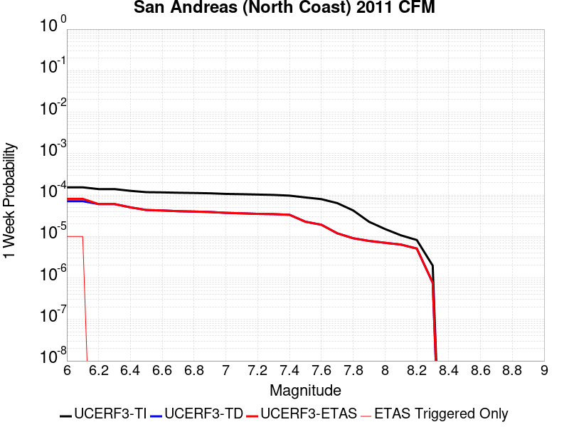 | 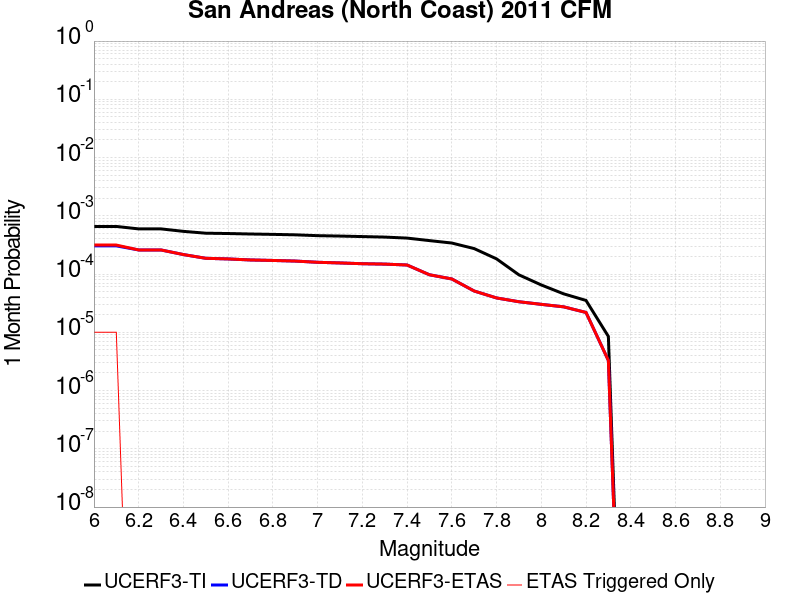 |  |  |

| Magnitude | 1 wk TI Prob | 1 wk TD Prob | 1 wk ETAS Prob | 1 wk ETAS/TD Gain | 1 wk ETAS Triggered Only | 1 mo TI Prob | 1 mo TD Prob | 1 mo ETAS Prob | 1 mo ETAS/TD Gain | 1 mo ETAS Triggered Only | 1 yr TI Prob | 1 yr TD Prob | 1 yr ETAS Prob | 1 yr ETAS/TD Gain | 1 yr ETAS Triggered Only | 10 yr TI Prob | 10 yr TD Prob | 10 yr ETAS Prob | 10 yr ETAS/TD Gain | 10 yr ETAS Triggered Only |
|-----|-----|-----|-----|-----|-----|-----|-----|-----|-----|-----|-----|-----|-----|-----|-----|-----|-----|-----|-----|-----|
| 6.0 | 1.5333705E-4 | 7.1106435E-5 | 8.1105725E-5 | 1.1406243 | 1.0E-5 | 6.5699324E-4 | 3.0470645E-4 | 3.147034E-4 | 1.0328084 | 1.0E-5 | 0.007969595 | 0.0037035241 | 0.003733413 | 1.0080703 | 3.0E-5 | 0.0768977 | 0.03935284 | 0.03938166 | 1.0007323 | 3.0E-5 |
| 6.1 | 1.5333705E-4 | 7.1106435E-5 | 8.1105725E-5 | 1.1406243 | 1.0E-5 | 6.5699324E-4 | 3.0470645E-4 | 3.147034E-4 | 1.0328084 | 1.0E-5 | 0.007969595 | 0.0037035241 | 0.003733413 | 1.0080703 | 3.0E-5 | 0.0768977 | 0.03935284 | 0.03938166 | 1.0007323 | 3.0E-5 |
| 6.2 | 1.3912938E-4 | 6.050204E-5 | 6.050204E-5 | 1.0 | 0.0 | 5.961325E-4 | 2.5926883E-4 | 2.5926883E-4 | 1.0 | 0.0 | 0.007233787 | 0.003152056 | 0.003171993 | 1.006325 | 2.0E-5 | 0.07002798 | 0.03369227 | 0.033711597 | 1.0005736 | 2.0E-5 |
| 6.3 | 1.3912938E-4 | 6.050204E-5 | 6.050204E-5 | 1.0 | 0.0 | 5.961325E-4 | 2.5926883E-4 | 2.5926883E-4 | 1.0 | 0.0 | 0.007233787 | 0.003152056 | 0.003171993 | 1.006325 | 2.0E-5 | 0.07002798 | 0.03369227 | 0.033711597 | 1.0005736 | 2.0E-5 |
| 6.4 | 1.2623647E-4 | 5.0442024E-5 | 5.0442024E-5 | 1.0 | 0.0 | 5.4090127E-4 | 2.161623E-4 | 2.161623E-4 | 1.0 | 0.0 | 0.0065656058 | 0.0026286195 | 0.002648567 | 1.0075885 | 2.0E-5 | 0.06374981 | 0.028303223 | 0.028322656 | 1.0006866 | 2.0E-5 |
| 6.5 | 1.1736096E-4 | 4.3523814E-5 | 4.3523814E-5 | 1.0 | 0.0 | 5.028786E-4 | 1.8651738E-4 | 1.8651738E-4 | 1.0 | 0.0 | 0.006105373 | 0.0022685004 | 0.002288455 | 1.0087965 | 2.0E-5 | 0.05940335 | 0.024579322 | 0.02459883 | 1.0007937 | 2.0E-5 |
| 6.6 | 1.1586959E-4 | 4.2423668E-5 | 4.2423668E-5 | 1.0 | 0.0 | 4.964894E-4 | 1.8180315E-4 | 1.8180315E-4 | 1.0 | 0.0 | 0.006028018 | 0.0022112224 | 0.002231178 | 1.0090247 | 2.0E-5 | 0.058671024 | 0.023984991 | 0.024004512 | 1.0008138 | 2.0E-5 |
| 6.7 | 1.13693764E-4 | 4.073593E-5 | 4.073593E-5 | 1.0 | 0.0 | 4.87168E-4 | 1.7457096E-4 | 1.7457096E-4 | 1.0 | 0.0 | 0.005915152 | 0.0021233456 | 0.0021433032 | 1.009399 | 2.0E-5 | 0.057601593 | 0.023076393 | 0.023095932 | 1.0008467 | 2.0E-5 |
| 6.8 | 1.1204889E-4 | 3.9953447E-5 | 3.9953447E-5 | 1.0 | 0.0 | 4.8012115E-4 | 1.7121792E-4 | 1.7121792E-4 | 1.0 | 0.0 | 0.005829819 | 0.002082601 | 0.0021025594 | 1.0095834 | 2.0E-5 | 0.05679232 | 0.022636656 | 0.022656202 | 1.0008636 | 2.0E-5 |
| 6.9 | 1.1005794E-4 | 3.900957E-5 | 3.900957E-5 | 1.0 | 0.0 | 4.7159163E-4 | 1.6717325E-4 | 1.6717325E-4 | 1.0 | 0.0 | 0.0057265228 | 0.0020334502 | 0.0020534096 | 1.0098155 | 2.0E-5 | 0.055811852 | 0.022102542 | 0.0221221 | 1.0008849 | 2.0E-5 |
| 7.0 | 1.0647948E-4 | 3.7166337E-5 | 3.7166337E-5 | 1.0 | 0.0 | 4.562608E-4 | 1.5927466E-4 | 1.5927466E-4 | 1.0 | 0.0 | 0.0055408357 | 0.0019374598 | 0.0019574212 | 1.0103028 | 2.0E-5 | 0.054047033 | 0.021062272 | 0.02108185 | 1.0009296 | 2.0E-5 |
| 7.1 | 1.04795035E-4 | 3.6215948E-5 | 3.6215948E-5 | 1.0 | 0.0 | 4.4904428E-4 | 1.5520205E-4 | 1.5520205E-4 | 1.0 | 0.0 | 0.0054534175 | 0.0018879628 | 0.0019079251 | 1.0105734 | 2.0E-5 | 0.053215165 | 0.020530313 | 0.020549903 | 1.0009542 | 2.0E-5 |
| 7.2 | 1.02724036E-4 | 3.5124547E-5 | 3.5124547E-5 | 1.0 | 0.0 | 4.401716E-4 | 1.5052517E-4 | 1.5052517E-4 | 1.0 | 0.0 | 0.0053459285 | 0.0018311188 | 0.0018510822 | 1.0109023 | 2.0E-5 | 0.052191395 | 0.019919246 | 0.019938849 | 1.0009841 | 2.0E-5 |
| 7.3 | 1.00650694E-4 | 3.4592013E-5 | 3.4592013E-5 | 1.0 | 0.0 | 4.312888E-4 | 1.4824314E-4 | 1.4824314E-4 | 1.0 | 0.0 | 0.005238306 | 0.0018033815 | 0.0018233454 | 1.0110703 | 2.0E-5 | 0.051165357 | 0.019596443 | 0.01961605 | 1.0010006 | 2.0E-5 |
| 7.4 | 9.672919E-5 | 3.338123E-5 | 3.338123E-5 | 1.0 | 0.0 | 4.144878E-4 | 1.4305465E-4 | 1.4305465E-4 | 1.0 | 0.0 | 0.005034718 | 0.0017403142 | 0.0017602794 | 1.0114722 | 2.0E-5 | 0.049221683 | 0.018869769 | 0.01888939 | 1.0010399 | 2.0E-5 |
| 7.5 | 8.7600405E-5 | 2.2700917E-5 | 2.2700917E-5 | 1.0 | 0.0 | 3.753763E-4 | 9.728602E-5 | 9.728602E-5 | 1.0 | 0.0 | 0.0045606326 | 0.0011838155 | 0.0012037918 | 1.0168746 | 2.0E-5 | 0.04468165 | 0.013130207 | 0.013149944 | 1.0015032 | 2.0E-5 |
| 7.6 | 7.9562284E-5 | 1.9226305E-5 | 1.9226305E-5 | 1.0 | 0.0 | 3.4093665E-4 | 8.239586E-5 | 8.239586E-5 | 1.0 | 0.0 | 0.0041430052 | 0.0010027094 | 0.0010226894 | 1.019926 | 2.0E-5 | 0.040666126 | 0.011221658 | 0.011241434 | 1.0017623 | 2.0E-5 |
| 7.7 | 6.3866544E-5 | 1.1941707E-5 | 1.1941707E-5 | 1.0 | 0.0 | 2.7368503E-4 | 5.117774E-5 | 5.117774E-5 | 1.0 | 0.0 | 0.0033270244 | 6.2291115E-4 | 6.4289867E-4 | 1.0320873 | 2.0E-5 | 0.032776527 | 0.007210334 | 0.0072301896 | 1.0027539 | 2.0E-5 |
| 7.8 | 4.2543215E-5 | 9.076524E-6 | 9.076524E-6 | 1.0 | 0.0 | 1.8231533E-4 | 3.8898812E-5 | 3.8898812E-5 | 1.0 | 0.0 | 0.0022174292 | 4.7349022E-4 | 4.934807E-4 | 1.0422195 | 2.0E-5 | 0.021954332 | 0.005490525 | 0.0055104154 | 1.0036227 | 2.0E-5 |
| 7.9 | 2.2636612E-5 | 7.81435E-6 | 7.81435E-6 | 1.0 | 0.0 | 9.7010445E-5 | 3.3489643E-5 | 3.3489643E-5 | 1.0 | 0.0 | 0.0011804621 | 4.076602E-4 | 4.2765203E-4 | 1.0490404 | 2.0E-5 | 0.011742111 | 0.0046832846 | 0.0047031906 | 1.0042505 | 2.0E-5 |
| 8.0 | 1.5167874E-5 | 7.0494675E-6 | 7.0494675E-6 | 1.0 | 0.0 | 6.500356E-5 | 3.0211655E-5 | 3.0211655E-5 | 1.0 | 0.0 | 7.9113094E-4 | 3.677649E-4 | 3.8775755E-4 | 1.0543625 | 2.0E-5 | 0.007883203 | 0.004215588 | 0.0042355033 | 1.0047243 | 2.0E-5 |
| 8.1 | 1.0681047E-5 | 6.386992E-6 | 6.386992E-6 | 1.0 | 0.0 | 4.5775112E-5 | 2.7372536E-5 | 2.7372536E-5 | 1.0 | 0.0 | 5.5716943E-4 | 3.3320975E-4 | 3.532031E-4 | 1.0600022 | 2.0E-5 | 0.0055577457 | 0.003817393 | 0.0038373165 | 1.0052192 | 2.0E-5 |
| 8.2 | 8.226114E-6 | 5.1150587E-6 | 5.1150587E-6 | 1.0 | 0.0 | 3.52543E-5 | 2.1921496E-5 | 2.1921496E-5 | 1.0 | 0.0 | 4.2913653E-4 | 2.668616E-4 | 2.8685626E-4 | 1.0749252 | 2.0E-5 | 0.004283088 | 0.0030450926 | 0.0030650317 | 1.0065479 | 2.0E-5 |
| 8.3 | 1.983087E-6 | 7.6599065E-7 | 7.6599065E-7 | 1.0 | 0.0 | 8.498917E-6 | 3.282813E-6 | 3.282813E-6 | 1.0 | 0.0 | 1.034694E-4 | 3.9967534E-5 | 3.9967534E-5 | 1.0 | 0.0 | 0.0010342124 | 4.719687E-4 | 4.719687E-4 | 1.0 | 0.0 |

## Santa Susana East (connector)
*[(top)](#table-of-contents)*

| 1 Week | 1 Month | 1 Year | 10 Year |
|-----|-----|-----|-----|
|  |  |  | 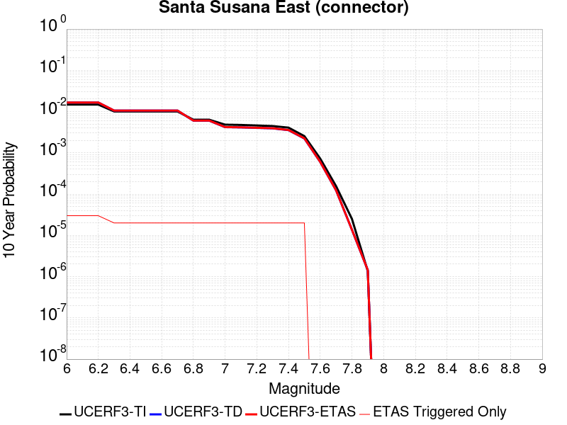 |

| Magnitude | 1 wk TI Prob | 1 wk TD Prob | 1 wk ETAS Prob | 1 wk ETAS/TD Gain | 1 wk ETAS Triggered Only | 1 mo TI Prob | 1 mo TD Prob | 1 mo ETAS Prob | 1 mo ETAS/TD Gain | 1 mo ETAS Triggered Only | 1 yr TI Prob | 1 yr TD Prob | 1 yr ETAS Prob | 1 yr ETAS/TD Gain | 1 yr ETAS Triggered Only | 10 yr TI Prob | 10 yr TD Prob | 10 yr ETAS Prob | 10 yr ETAS/TD Gain | 10 yr ETAS Triggered Only |
|-----|-----|-----|-----|-----|-----|-----|-----|-----|-----|-----|-----|-----|-----|-----|-----|-----|-----|-----|-----|-----|
| 6.0 | 2.858397E-5 | 3.202091E-5 | 3.202091E-5 | 1.0 | 0.0 | 1.2249697E-4 | 1.3722685E-4 | 1.3722685E-4 | 1.0 | 0.0 | 0.0014903803 | 0.0016697381 | 0.0016797214 | 1.005979 | 1.0E-5 | 0.014804244 | 0.016599052 | 0.016628554 | 1.0017773 | 3.0E-5 |
| 6.1 | 2.858397E-5 | 3.202091E-5 | 3.202091E-5 | 1.0 | 0.0 | 1.2249697E-4 | 1.3722685E-4 | 1.3722685E-4 | 1.0 | 0.0 | 0.0014903803 | 0.0016697381 | 0.0016797214 | 1.005979 | 1.0E-5 | 0.014804244 | 0.016599052 | 0.016628554 | 1.0017773 | 3.0E-5 |
| 6.2 | 2.858397E-5 | 3.202091E-5 | 3.202091E-5 | 1.0 | 0.0 | 1.2249697E-4 | 1.3722685E-4 | 1.3722685E-4 | 1.0 | 0.0 | 0.0014903803 | 0.0016697381 | 0.0016797214 | 1.005979 | 1.0E-5 | 0.014804244 | 0.016599052 | 0.016628554 | 1.0017773 | 3.0E-5 |
| 6.3 | 1.943582E-5 | 2.036718E-5 | 2.036718E-5 | 1.0 | 0.0 | 8.329371E-5 | 8.7285625E-5 | 8.7285625E-5 | 1.0 | 0.0 | 0.001013629 | 0.0010622967 | 0.0010622967 | 1.0 | 0.0 | 0.010090181 | 0.010583619 | 0.0106034065 | 1.0018697 | 2.0E-5 |
| 6.4 | 1.943582E-5 | 2.036718E-5 | 2.036718E-5 | 1.0 | 0.0 | 8.329371E-5 | 8.7285625E-5 | 8.7285625E-5 | 1.0 | 0.0 | 0.001013629 | 0.0010622967 | 0.0010622967 | 1.0 | 0.0 | 0.010090181 | 0.010583619 | 0.0106034065 | 1.0018697 | 2.0E-5 |
| 6.5 | 1.943582E-5 | 2.036718E-5 | 2.036718E-5 | 1.0 | 0.0 | 8.329371E-5 | 8.7285625E-5 | 8.7285625E-5 | 1.0 | 0.0 | 0.001013629 | 0.0010622967 | 0.0010622967 | 1.0 | 0.0 | 0.010090181 | 0.010583619 | 0.0106034065 | 1.0018697 | 2.0E-5 |
| 6.6 | 1.943582E-5 | 2.036718E-5 | 2.036718E-5 | 1.0 | 0.0 | 8.329371E-5 | 8.7285625E-5 | 8.7285625E-5 | 1.0 | 0.0 | 0.001013629 | 0.0010622967 | 0.0010622967 | 1.0 | 0.0 | 0.010090181 | 0.010583619 | 0.0106034065 | 1.0018697 | 2.0E-5 |
| 6.7 | 1.9404439E-5 | 2.03546E-5 | 2.03546E-5 | 1.0 | 0.0 | 8.3159226E-5 | 8.723172E-5 | 8.723172E-5 | 1.0 | 0.0 | 0.0010119933 | 0.0010616409 | 0.0010616409 | 1.0 | 0.0 | 0.010073971 | 0.010577125 | 0.010596912 | 1.0018709 | 2.0E-5 |
| 6.8 | 1.2217526E-5 | 1.1592998E-5 | 1.1592998E-5 | 1.0 | 0.0 | 5.2359774E-5 | 4.9683425E-5 | 4.9683425E-5 | 1.0 | 0.0 | 6.372938E-4 | 6.0474465E-4 | 6.0474465E-4 | 1.0 | 0.0 | 0.0063546924 | 0.006033037 | 0.006052916 | 1.0032951 | 2.0E-5 |
| 6.9 | 1.2217526E-5 | 1.1592998E-5 | 1.1592998E-5 | 1.0 | 0.0 | 5.2359774E-5 | 4.9683425E-5 | 4.9683425E-5 | 1.0 | 0.0 | 6.372938E-4 | 6.0474465E-4 | 6.0474465E-4 | 1.0 | 0.0 | 0.0063546924 | 0.006033037 | 0.006052916 | 1.0032951 | 2.0E-5 |
| 7.0 | 9.276017E-6 | 8.059113E-6 | 8.059113E-6 | 1.0 | 0.0 | 3.9753755E-5 | 3.4538618E-5 | 3.4538618E-5 | 1.0 | 0.0 | 4.8389446E-4 | 4.2042998E-4 | 4.2042998E-4 | 1.0 | 0.0 | 0.0048284214 | 0.0041970722 | 0.004216988 | 1.0047452 | 2.0E-5 |
| 7.1 | 9.130355E-6 | 7.942286E-6 | 7.942286E-6 | 1.0 | 0.0 | 3.9129503E-5 | 3.4037945E-5 | 3.4037945E-5 | 1.0 | 0.0 | 4.7629757E-4 | 4.1433662E-4 | 4.1433662E-4 | 1.0 | 0.0 | 0.00475278 | 0.004136367 | 0.004156284 | 1.0048151 | 2.0E-5 |
| 7.2 | 8.851015E-6 | 7.741445E-6 | 7.741445E-6 | 1.0 | 0.0 | 3.7932372E-5 | 3.317722E-5 | 3.317722E-5 | 1.0 | 0.0 | 4.6172875E-4 | 4.038612E-4 | 4.038612E-4 | 1.0 | 0.0 | 0.0046077054 | 0.0040319953 | 0.004051915 | 1.0049403 | 2.0E-5 |
| 7.3 | 8.573006E-6 | 7.550166E-6 | 7.550166E-6 | 1.0 | 0.0 | 3.6740938E-5 | 3.2357475E-5 | 3.2357475E-5 | 1.0 | 0.0 | 4.472291E-4 | 3.9388443E-4 | 3.9388443E-4 | 1.0 | 0.0 | 0.004463301 | 0.0039325804 | 0.003952502 | 1.0050657 | 2.0E-5 |
| 7.4 | 7.852282E-6 | 6.817687E-6 | 6.817687E-6 | 1.0 | 0.0 | 3.36522E-5 | 2.9218349E-5 | 2.9218349E-5 | 1.0 | 0.0 | 4.096385E-4 | 3.5567835E-4 | 3.5567835E-4 | 1.0 | 0.0 | 0.0040888423 | 0.0035517553 | 0.0035716842 | 1.0056111 | 2.0E-5 |
| 7.5 | 4.8869324E-6 | 4.279055E-6 | 4.279055E-6 | 1.0 | 0.0 | 2.0943828E-5 | 1.8338687E-5 | 1.8338687E-5 | 1.0 | 0.0 | 2.5496128E-4 | 2.232523E-4 | 2.232523E-4 | 1.0 | 0.0 | 0.0025466895 | 0.0022304445 | 0.0022504 | 1.0089468 | 2.0E-5 |
| 7.6 | 1.3894544E-6 | 1.1568179E-6 | 1.1568179E-6 | 1.0 | 0.0 | 5.954791E-6 | 4.957783E-6 | 4.957783E-6 | 1.0 | 0.0 | 7.249717E-5 | 6.0359558E-5 | 6.0359558E-5 | 1.0 | 0.0 | 7.247352E-4 | 6.0345343E-4 | 6.0345343E-4 | 1.0 | 0.0 |
| 7.7 | 2.9924632E-7 | 2.371928E-7 | 2.371928E-7 | 1.0 | 0.0 | 1.2824837E-6 | 1.0165402E-6 | 1.0165402E-6 | 1.0 | 0.0 | 1.5614127E-5 | 1.2376314E-5 | 1.2376314E-5 | 1.0 | 0.0 | 1.5613029E-4 | 1.2375697E-4 | 1.2375697E-4 | 1.0 | 0.0 |
| 7.8 | 4.8188564E-8 | 2.6323061E-8 | 2.6323061E-8 | 1.0 | 0.0 | 2.065224E-7 | 1.1281311E-7 | 1.1281311E-7 | 1.0 | 0.0 | 2.5144072E-6 | 1.3734989E-6 | 1.3734989E-6 | 1.0 | 0.0 | 2.5143789E-5 | 1.3734912E-5 | 1.3734912E-5 | 1.0 | 0.0 |
| 7.9 | 2.6127251E-9 | 2.7681102E-9 | 2.7681102E-9 | 1.0 | 0.0 | 1.1197393E-8 | 1.186333E-8 | 1.186333E-8 | 1.0 | 0.0 | 1.3632825E-7 | 1.4443603E-7 | 1.4443603E-7 | 1.0 | 0.0 | 1.3632817E-6 | 1.4443604E-6 | 1.4443604E-6 | 1.0 | 0.0 |

## Sierra Madre
*[(top)](#table-of-contents)*

| 1 Week | 1 Month | 1 Year | 10 Year |
|-----|-----|-----|-----|
|  | 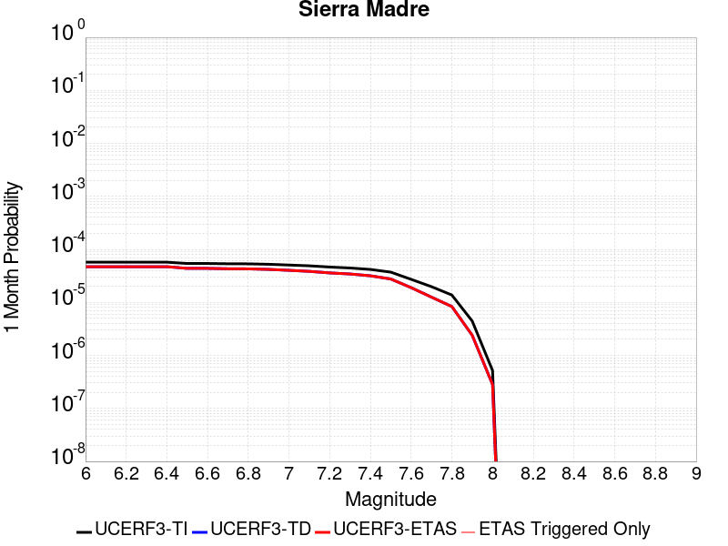 | 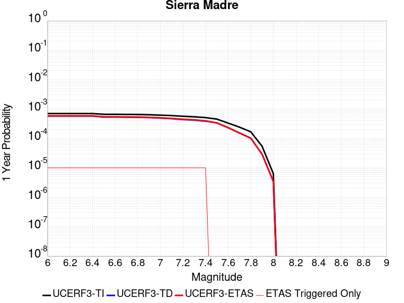 |  |

| Magnitude | 1 wk TI Prob | 1 wk TD Prob | 1 wk ETAS Prob | 1 wk ETAS/TD Gain | 1 wk ETAS Triggered Only | 1 mo TI Prob | 1 mo TD Prob | 1 mo ETAS Prob | 1 mo ETAS/TD Gain | 1 mo ETAS Triggered Only | 1 yr TI Prob | 1 yr TD Prob | 1 yr ETAS Prob | 1 yr ETAS/TD Gain | 1 yr ETAS Triggered Only | 10 yr TI Prob | 10 yr TD Prob | 10 yr ETAS Prob | 10 yr ETAS/TD Gain | 10 yr ETAS Triggered Only |
|-----|-----|-----|-----|-----|-----|-----|-----|-----|-----|-----|-----|-----|-----|-----|-----|-----|-----|-----|-----|-----|
| 6.0 | 1.3379373E-5 | 1.10007395E-5 | 1.10007395E-5 | 1.0 | 0.0 | 5.7338908E-5 | 4.7145186E-5 | 4.7145186E-5 | 1.0 | 0.0 | 6.978776E-4 | 5.738429E-4 | 5.8383716E-4 | 1.0174164 | 1.0E-5 | 0.0069569005 | 0.0057239756 | 0.005743861 | 1.0034741 | 2.0E-5 |
| 6.1 | 1.3379373E-5 | 1.10007395E-5 | 1.10007395E-5 | 1.0 | 0.0 | 5.7338908E-5 | 4.7145186E-5 | 4.7145186E-5 | 1.0 | 0.0 | 6.978776E-4 | 5.738429E-4 | 5.8383716E-4 | 1.0174164 | 1.0E-5 | 0.0069569005 | 0.0057239756 | 0.005743861 | 1.0034741 | 2.0E-5 |
| 6.2 | 1.3379373E-5 | 1.10007395E-5 | 1.10007395E-5 | 1.0 | 0.0 | 5.7338908E-5 | 4.7145186E-5 | 4.7145186E-5 | 1.0 | 0.0 | 6.978776E-4 | 5.738429E-4 | 5.8383716E-4 | 1.0174164 | 1.0E-5 | 0.0069569005 | 0.0057239756 | 0.005743861 | 1.0034741 | 2.0E-5 |
| 6.3 | 1.3379373E-5 | 1.10007395E-5 | 1.10007395E-5 | 1.0 | 0.0 | 5.7338908E-5 | 4.7145186E-5 | 4.7145186E-5 | 1.0 | 0.0 | 6.978776E-4 | 5.738429E-4 | 5.8383716E-4 | 1.0174164 | 1.0E-5 | 0.0069569005 | 0.0057239756 | 0.005743861 | 1.0034741 | 2.0E-5 |
| 6.4 | 1.3379373E-5 | 1.10007395E-5 | 1.10007395E-5 | 1.0 | 0.0 | 5.7338908E-5 | 4.7145186E-5 | 4.7145186E-5 | 1.0 | 0.0 | 6.978776E-4 | 5.738429E-4 | 5.8383716E-4 | 1.0174164 | 1.0E-5 | 0.0069569005 | 0.0057239756 | 0.005743861 | 1.0034741 | 2.0E-5 |
| 6.5 | 1.26563245E-5 | 1.0230196E-5 | 1.0230196E-5 | 1.0 | 0.0 | 5.4240263E-5 | 4.3842967E-5 | 4.3842967E-5 | 1.0 | 0.0 | 6.601751E-4 | 5.336584E-4 | 5.436531E-4 | 1.0187286 | 1.0E-5 | 0.006582173 | 0.0053240913 | 0.005343985 | 1.0037365 | 2.0E-5 |
| 6.6 | 1.26563245E-5 | 1.0230196E-5 | 1.0230196E-5 | 1.0 | 0.0 | 5.4240263E-5 | 4.3842967E-5 | 4.3842967E-5 | 1.0 | 0.0 | 6.601751E-4 | 5.336584E-4 | 5.436531E-4 | 1.0187286 | 1.0E-5 | 0.006582173 | 0.0053240913 | 0.005343985 | 1.0037365 | 2.0E-5 |
| 6.7 | 1.2502474E-5 | 1.006634E-5 | 1.006634E-5 | 1.0 | 0.0 | 5.3580934E-5 | 4.314075E-5 | 4.314075E-5 | 1.0 | 0.0 | 6.521526E-4 | 5.251131E-4 | 5.3510786E-4 | 1.0190336 | 1.0E-5 | 0.0065024206 | 0.0052390425 | 0.0052589374 | 1.0037975 | 2.0E-5 |
| 6.8 | 1.2454966E-5 | 1.0018625E-5 | 1.0018625E-5 | 1.0 | 0.0 | 5.3377335E-5 | 4.2936266E-5 | 4.2936266E-5 | 1.0 | 0.0 | 6.4967526E-4 | 5.226247E-4 | 5.326195E-4 | 1.0191242 | 1.0E-5 | 0.006477792 | 0.0052142753 | 0.005234171 | 1.0038157 | 2.0E-5 |
| 6.9 | 1.2225574E-5 | 9.792602E-6 | 9.792602E-6 | 1.0 | 0.0 | 5.2394265E-5 | 4.1967625E-5 | 4.1967625E-5 | 1.0 | 0.0 | 6.3771347E-4 | 5.108371E-4 | 5.20832E-4 | 1.0195657 | 1.0E-5 | 0.006358865 | 0.0050969445 | 0.0051168427 | 1.0039039 | 2.0E-5 |
| 7.0 | 1.182946E-5 | 9.399144E-6 | 9.399144E-6 | 1.0 | 0.0 | 5.06967E-5 | 4.0281426E-5 | 4.0281426E-5 | 1.0 | 0.0 | 6.1705755E-4 | 4.9031706E-4 | 5.0031213E-4 | 1.0203849 | 1.0E-5 | 0.006153469 | 0.004892664 | 0.0049125664 | 1.0040678 | 2.0E-5 |
| 7.1 | 1.14369095E-5 | 8.986159E-6 | 8.986159E-6 | 1.0 | 0.0 | 4.9014405E-5 | 3.8511545E-5 | 3.8511545E-5 | 1.0 | 0.0 | 5.9658696E-4 | 4.687782E-4 | 4.787735E-4 | 1.021322 | 1.0E-5 | 0.005949879 | 0.004678199 | 0.0046981056 | 1.0042552 | 2.0E-5 |
| 7.2 | 1.0836419E-5 | 8.3995565E-6 | 8.3995565E-6 | 1.0 | 0.0 | 4.644097E-5 | 3.5997607E-5 | 3.5997607E-5 | 1.0 | 0.0 | 5.652721E-4 | 4.3818366E-4 | 4.481793E-4 | 1.0228115 | 1.0E-5 | 0.0056383642 | 0.004373494 | 0.0043934067 | 1.004553 | 2.0E-5 |
| 7.3 | 1.0403439E-5 | 8.02082E-6 | 8.02082E-6 | 1.0 | 0.0 | 4.4585406E-5 | 3.4374494E-5 | 3.4374494E-5 | 1.0 | 0.0 | 5.426921E-4 | 4.1843E-4 | 4.2842582E-4 | 1.0238888 | 1.0E-5 | 0.005413687 | 0.004176717 | 0.0041966336 | 1.0047685 | 2.0E-5 |
| 7.4 | 9.768864E-6 | 7.414448E-6 | 7.414448E-6 | 1.0 | 0.0 | 4.186589E-5 | 3.1775824E-5 | 3.1775824E-5 | 1.0 | 0.0 | 5.09598E-4 | 3.868029E-4 | 3.96799E-4 | 1.0258429 | 1.0E-5 | 0.0050843097 | 0.0038615882 | 0.003881511 | 1.0051593 | 2.0E-5 |
| 7.5 | 8.687089E-6 | 6.4501564E-6 | 6.4501564E-6 | 1.0 | 0.0 | 3.722985E-5 | 2.764324E-5 | 2.764324E-5 | 1.0 | 0.0 | 4.5317915E-4 | 3.3650533E-4 | 3.3650533E-4 | 1.0 | 0.0 | 0.004522561 | 0.0033602451 | 0.0033702117 | 1.0029659 | 1.0E-5 |
| 7.6 | 6.3506063E-6 | 4.4303215E-6 | 4.4303215E-6 | 1.0 | 0.0 | 2.72166E-5 | 1.8986955E-5 | 1.8986955E-5 | 1.0 | 0.0 | 3.3131172E-4 | 2.3114192E-4 | 2.3114192E-4 | 1.0 | 0.0 | 0.003308182 | 0.0023092402 | 0.0023092402 | 1.0 | 0.0 |
| 7.7 | 4.62223E-6 | 2.932967E-6 | 2.932967E-6 | 1.0 | 0.0 | 1.9809406E-5 | 1.2569798E-5 | 1.2569798E-5 | 1.0 | 0.0 | 2.4115283E-4 | 1.5302657E-4 | 1.5302657E-4 | 1.0 | 0.0 | 0.0024089129 | 0.001529413 | 0.001529413 | 1.0 | 0.0 |
| 7.8 | 3.2145008E-6 | 1.9494332E-6 | 1.9494332E-6 | 1.0 | 0.0 | 1.3776359E-5 | 8.3546865E-6 | 8.3546865E-6 | 1.0 | 0.0 | 1.6771426E-4 | 1.0171358E-4 | 1.0171358E-4 | 1.0 | 0.0 | 0.0016758774 | 0.0010168145 | 0.0010168145 | 1.0 | 0.0 |
| 7.9 | 1.0391769E-6 | 5.6026335E-7 | 5.6026335E-7 | 1.0 | 0.0 | 4.4536077E-6 | 2.4011265E-6 | 2.4011265E-6 | 1.0 | 0.0 | 5.4221324E-5 | 2.9233326E-5 | 2.9233326E-5 | 1.0 | 0.0 | 5.4208096E-4 | 2.9229524E-4 | 2.9229524E-4 | 1.0 | 0.0 |
| 8.0 | 1.210983E-7 | 6.613821E-8 | 6.613821E-8 | 1.0 | 0.0 | 5.1899264E-7 | 2.8344945E-7 | 2.8344945E-7 | 1.0 | 0.0 | 6.3187167E-6 | 3.4509917E-6 | 3.4509917E-6 | 1.0 | 0.0 | 6.318537E-5 | 3.45094E-5 | 3.45094E-5 | 1.0 | 0.0 |

## Great Valley 03 Mysterious Ridge
*[(top)](#table-of-contents)*

| 1 Week | 1 Month | 1 Year | 10 Year |
|-----|-----|-----|-----|
|  |  | 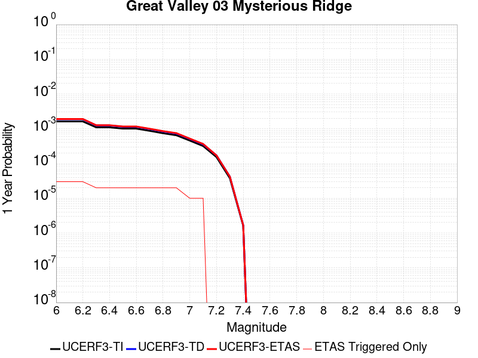 |  |

| Magnitude | 1 wk TI Prob | 1 wk TD Prob | 1 wk ETAS Prob | 1 wk ETAS/TD Gain | 1 wk ETAS Triggered Only | 1 mo TI Prob | 1 mo TD Prob | 1 mo ETAS Prob | 1 mo ETAS/TD Gain | 1 mo ETAS Triggered Only | 1 yr TI Prob | 1 yr TD Prob | 1 yr ETAS Prob | 1 yr ETAS/TD Gain | 1 yr ETAS Triggered Only | 10 yr TI Prob | 10 yr TD Prob | 10 yr ETAS Prob | 10 yr ETAS/TD Gain | 10 yr ETAS Triggered Only |
|-----|-----|-----|-----|-----|-----|-----|-----|-----|-----|-----|-----|-----|-----|-----|-----|-----|-----|-----|-----|-----|
| 6.0 | 3.1182444E-5 | 3.603423E-5 | 5.603351E-5 | 1.5550078 | 2.0E-5 | 1.336322E-4 | 1.544242E-4 | 1.7442112E-4 | 1.1294934 | 2.0E-5 | 0.0016257578 | 0.0018786696 | 0.0019086133 | 1.0159388 | 3.0E-5 | 0.016139153 | 0.018646652 | 0.018676091 | 1.0015789 | 3.0E-5 |
| 6.1 | 3.1182444E-5 | 3.603423E-5 | 5.603351E-5 | 1.5550078 | 2.0E-5 | 1.336322E-4 | 1.544242E-4 | 1.7442112E-4 | 1.1294934 | 2.0E-5 | 0.0016257578 | 0.0018786696 | 0.0019086133 | 1.0159388 | 3.0E-5 | 0.016139153 | 0.018646652 | 0.018676091 | 1.0015789 | 3.0E-5 |
| 6.2 | 3.1182444E-5 | 3.603423E-5 | 5.603351E-5 | 1.5550078 | 2.0E-5 | 1.336322E-4 | 1.544242E-4 | 1.7442112E-4 | 1.1294934 | 2.0E-5 | 0.0016257578 | 0.0018786696 | 0.0019086133 | 1.0159388 | 3.0E-5 | 0.016139153 | 0.018646652 | 0.018676091 | 1.0015789 | 3.0E-5 |
| 6.3 | 2.106934E-5 | 2.3850307E-5 | 3.385007E-5 | 1.4192718 | 1.0E-5 | 9.0294045E-5 | 1.0221177E-4 | 1.1221076E-4 | 1.0978261 | 1.0E-5 | 0.0010987755 | 0.0012437489 | 0.001263724 | 1.0160605 | 2.0E-5 | 0.010933585 | 0.012371127 | 0.012390879 | 1.0015967 | 2.0E-5 |
| 6.4 | 2.106934E-5 | 2.3850307E-5 | 3.385007E-5 | 1.4192718 | 1.0E-5 | 9.0294045E-5 | 1.0221177E-4 | 1.1221076E-4 | 1.0978261 | 1.0E-5 | 0.0010987755 | 0.0012437489 | 0.001263724 | 1.0160605 | 2.0E-5 | 0.010933585 | 0.012371127 | 0.012390879 | 1.0015967 | 2.0E-5 |
| 6.5 | 1.9389783E-5 | 2.1884984E-5 | 3.1884763E-5 | 1.4569243 | 1.0E-5 | 8.309642E-5 | 9.3789575E-5 | 1.0378863E-4 | 1.1066116 | 1.0E-5 | 0.0010112294 | 0.0011413174 | 0.0011612946 | 1.0175036 | 2.0E-5 | 0.010066401 | 0.011357434 | 0.011377207 | 1.0017409 | 2.0E-5 |
| 6.6 | 1.9370193E-5 | 2.1864906E-5 | 3.1864685E-5 | 1.4573439 | 1.0E-5 | 8.301247E-5 | 9.370353E-5 | 1.0370259E-4 | 1.1067096 | 1.0E-5 | 0.0010102082 | 0.001140271 | 0.0011602481 | 1.0175197 | 2.0E-5 | 0.010056281 | 0.011347076 | 0.011366849 | 1.0017426 | 2.0E-5 |
| 6.7 | 1.6723505E-5 | 1.8799281E-5 | 2.8799093E-5 | 1.5319252 | 1.0E-5 | 7.16702E-5 | 8.056597E-5 | 9.056517E-5 | 1.1241119 | 1.0E-5 | 8.722353E-4 | 9.804688E-4 | 0.0010004492 | 1.0203784 | 2.0E-5 | 0.008688197 | 0.009763439 | 0.009783244 | 1.0020285 | 2.0E-5 |
| 6.8 | 1.426937E-5 | 1.599721E-5 | 2.599705E-5 | 1.6250991 | 1.0E-5 | 6.115301E-5 | 6.855775E-5 | 7.855707E-5 | 1.1458524 | 1.0E-5 | 7.4428355E-4 | 8.343854E-4 | 8.543687E-4 | 1.0239497 | 2.0E-5 | 0.007417957 | 0.008314005 | 0.008333839 | 1.0023856 | 2.0E-5 |
| 6.9 | 1.2469891E-5 | 1.3956928E-5 | 2.3956789E-5 | 1.71648 | 1.0E-5 | 5.3441294E-5 | 5.9814105E-5 | 6.9813505E-5 | 1.1671747 | 1.0E-5 | 6.504535E-4 | 7.280055E-4 | 7.479909E-4 | 1.0274523 | 2.0E-5 | 0.006485529 | 0.00725743 | 0.0072772847 | 1.0027359 | 2.0E-5 |
| 7.0 | 8.7746275E-6 | 9.791734E-6 | 9.791734E-6 | 1.0 | 0.0 | 3.7605005E-5 | 4.196394E-5 | 4.196394E-5 | 1.0 | 0.0 | 4.5774475E-4 | 5.1079853E-4 | 5.2079343E-4 | 1.0195671 | 1.0E-5 | 0.00456803 | 0.005096977 | 0.0051069264 | 1.0019519 | 1.0E-5 |
| 7.1 | 6.1067153E-6 | 6.813725E-6 | 6.813725E-6 | 1.0 | 0.0 | 2.6171374E-5 | 2.9201385E-5 | 2.9201385E-5 | 1.0 | 0.0 | 3.1858988E-4 | 3.5547445E-4 | 3.6547089E-4 | 1.0281215 | 1.0E-5 | 0.0031813353 | 0.003549609 | 0.0035595736 | 1.0028073 | 1.0E-5 |
| 7.2 | 2.939283E-6 | 3.2741057E-6 | 3.2741057E-6 | 1.0 | 0.0 | 1.2596866E-5 | 1.4031816E-5 | 1.4031816E-5 | 1.0 | 0.0 | 1.5335606E-4 | 1.7082572E-4 | 1.7082572E-4 | 1.0 | 0.0 | 0.0015325027 | 0.001707116 | 0.001707116 | 1.0 | 0.0 |
| 7.3 | 7.2387763E-7 | 8.008505E-7 | 8.008505E-7 | 1.0 | 0.0 | 3.102329E-6 | 3.4322145E-6 | 3.4322145E-6 | 1.0 | 0.0 | 3.77702E-5 | 4.178687E-5 | 4.178687E-5 | 1.0 | 0.0 | 3.7763783E-4 | 4.1783508E-4 | 4.1783508E-4 | 1.0 | 0.0 |
| 7.4 | 3.112171E-8 | 3.2068368E-8 | 3.2068368E-8 | 1.0 | 0.0 | 1.3337875E-7 | 1.3743585E-7 | 1.3743585E-7 | 1.0 | 0.0 | 1.6238852E-6 | 1.6732803E-6 | 1.6732803E-6 | 1.0 | 0.0 | 1.6238733E-5 | 1.6732685E-5 | 1.6732685E-5 | 1.0 | 0.0 |

## San Diego Trough south
*[(top)](#table-of-contents)*

| 1 Week | 1 Month | 1 Year | 10 Year |
|-----|-----|-----|-----|
|  |  |  | 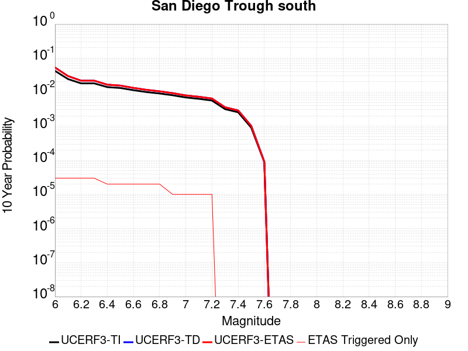 |

| Magnitude | 1 wk TI Prob | 1 wk TD Prob | 1 wk ETAS Prob | 1 wk ETAS/TD Gain | 1 wk ETAS Triggered Only | 1 mo TI Prob | 1 mo TD Prob | 1 mo ETAS Prob | 1 mo ETAS/TD Gain | 1 mo ETAS Triggered Only | 1 yr TI Prob | 1 yr TD Prob | 1 yr ETAS Prob | 1 yr ETAS/TD Gain | 1 yr ETAS Triggered Only | 10 yr TI Prob | 10 yr TD Prob | 10 yr ETAS Prob | 10 yr ETAS/TD Gain | 10 yr ETAS Triggered Only |
|-----|-----|-----|-----|-----|-----|-----|-----|-----|-----|-----|-----|-----|-----|-----|-----|-----|-----|-----|-----|-----|
| 6.0 | 8.279495E-5 | 1.04241306E-4 | 1.04241306E-4 | 1.0 | 0.0 | 3.5478722E-4 | 4.4667677E-4 | 4.4667677E-4 | 1.0 | 0.0 | 0.004310982 | 0.0054256152 | 0.005445507 | 1.0036662 | 2.0E-5 | 0.042283054 | 0.05299221 | 0.05302062 | 1.0005361 | 3.0E-5 |
| 6.1 | 4.6961468E-5 | 5.772944E-5 | 5.772944E-5 | 1.0 | 0.0 | 2.0124791E-4 | 2.473894E-4 | 2.473894E-4 | 1.0 | 0.0 | 0.00244744 | 0.0030079768 | 0.0030279167 | 1.006629 | 2.0E-5 | 0.024206603 | 0.029679462 | 0.029708572 | 1.0009809 | 3.0E-5 |
| 6.2 | 3.5079658E-5 | 4.214154E-5 | 4.214154E-5 | 1.0 | 0.0 | 1.5033272E-4 | 1.8059435E-4 | 1.8059435E-4 | 1.0 | 0.0 | 0.0018287642 | 0.0021965632 | 0.002216519 | 1.0090852 | 2.0E-5 | 0.018137876 | 0.021751117 | 0.021780465 | 1.0013492 | 3.0E-5 |
| 6.3 | 3.5079658E-5 | 4.214154E-5 | 4.214154E-5 | 1.0 | 0.0 | 1.5033272E-4 | 1.8059435E-4 | 1.8059435E-4 | 1.0 | 0.0 | 0.0018287642 | 0.0021965632 | 0.002216519 | 1.0090852 | 2.0E-5 | 0.018137876 | 0.021751117 | 0.021780465 | 1.0013492 | 3.0E-5 |
| 6.4 | 2.7196904E-5 | 3.2087162E-5 | 3.2087162E-5 | 1.0 | 0.0 | 1.16552954E-4 | 1.3750927E-4 | 1.3750927E-4 | 1.0 | 0.0 | 0.0014181085 | 0.0016729041 | 0.0016828874 | 1.0059676 | 1.0E-5 | 0.014090929 | 0.016604643 | 0.016624311 | 1.0011845 | 2.0E-5 |
| 6.5 | 2.5584688E-5 | 3.010164E-5 | 3.010164E-5 | 1.0 | 0.0 | 1.0964406E-4 | 1.2900073E-4 | 1.2900073E-4 | 1.0 | 0.0 | 0.0013340989 | 0.0015694655 | 0.0015794499 | 1.0063616 | 1.0E-5 | 0.013261181 | 0.015585314 | 0.015605003 | 1.0012633 | 2.0E-5 |
| 6.6 | 2.2034688E-5 | 2.5742738E-5 | 2.5742738E-5 | 1.0 | 0.0 | 9.443096E-5 | 1.1032141E-4 | 1.1032141E-4 | 1.0 | 0.0 | 0.0011490905 | 0.0013423424 | 0.0013523289 | 1.0074396 | 1.0E-5 | 0.011431668 | 0.013343317 | 0.013363051 | 1.0014789 | 2.0E-5 |
| 6.7 | 1.9394853E-5 | 2.254176E-5 | 2.254176E-5 | 1.0 | 0.0 | 8.311815E-5 | 9.6603995E-5 | 9.6603995E-5 | 1.0 | 0.0 | 0.0010114936 | 0.0011755243 | 0.0011855125 | 1.0084969 | 1.0E-5 | 0.01006902 | 0.011693766 | 0.011713532 | 1.0016903 | 2.0E-5 |
| 6.8 | 1.7615313E-5 | 2.0403182E-5 | 2.0403182E-5 | 1.0 | 0.0 | 7.549201E-5 | 8.74393E-5 | 8.74393E-5 | 1.0 | 0.0 | 9.1872766E-4 | 0.0010640579 | 0.0010740473 | 1.009388 | 1.0E-5 | 0.009149387 | 0.010590198 | 0.010609986 | 1.0018685 | 2.0E-5 |
| 6.9 | 1.5621423E-5 | 1.8026114E-5 | 1.8026114E-5 | 1.0 | 0.0 | 6.6947236E-5 | 7.725251E-5 | 7.725251E-5 | 1.0 | 0.0 | 8.147778E-4 | 9.40147E-4 | 9.40147E-4 | 1.0 | 0.0 | 0.008117969 | 0.009362142 | 0.009372048 | 1.0010581 | 1.0E-5 |
| 7.0 | 1.3444376E-5 | 1.544809E-5 | 1.544809E-5 | 1.0 | 0.0 | 5.7617483E-5 | 6.620443E-5 | 6.620443E-5 | 1.0 | 0.0 | 7.0126704E-4 | 8.057436E-4 | 8.057436E-4 | 1.0 | 0.0 | 0.006990582 | 0.008028555 | 0.008038475 | 1.0012356 | 1.0E-5 |
| 7.1 | 1.2268361E-5 | 1.407303E-5 | 1.407303E-5 | 1.0 | 0.0 | 5.2577634E-5 | 6.0311606E-5 | 6.0311606E-5 | 1.0 | 0.0 | 6.399447E-4 | 7.3404907E-4 | 7.3404907E-4 | 1.0 | 0.0 | 0.0063810493 | 0.0073165493 | 0.007326476 | 1.0013567 | 1.0E-5 |
| 7.2 | 1.0922655E-5 | 1.2513563E-5 | 1.2513563E-5 | 1.0 | 0.0 | 4.681054E-5 | 5.3628468E-5 | 5.3628468E-5 | 1.0 | 0.0 | 5.697693E-4 | 6.5273355E-4 | 6.5273355E-4 | 1.0 | 0.0 | 0.0056831064 | 0.0065084435 | 0.006518379 | 1.0015265 | 1.0E-5 |
| 7.3 | 6.1106753E-6 | 6.928925E-6 | 6.928925E-6 | 1.0 | 0.0 | 2.6188345E-5 | 2.9695057E-5 | 2.9695057E-5 | 1.0 | 0.0 | 3.1879646E-4 | 3.6147775E-4 | 3.6147775E-4 | 1.0 | 0.0 | 0.0031833951 | 0.003608943 | 0.003608943 | 1.0 | 0.0 |
| 7.4 | 4.933187E-6 | 5.5895525E-6 | 5.5895525E-6 | 1.0 | 0.0 | 2.114206E-5 | 2.3955008E-5 | 2.3955008E-5 | 1.0 | 0.0 | 2.5737417E-4 | 2.9161357E-4 | 2.9161357E-4 | 1.0 | 0.0 | 0.002570763 | 0.0029123505 | 0.0029123505 | 1.0 | 0.0 |
| 7.5 | 1.7489613E-6 | 1.969678E-6 | 1.969678E-6 | 1.0 | 0.0 | 7.495527E-6 | 8.4414505E-6 | 8.4414505E-6 | 1.0 | 0.0 | 9.125422E-5 | 1.02770035E-4 | 1.02770035E-4 | 1.0 | 0.0 | 9.1216754E-4 | 0.0010272472 | 0.0010272472 | 1.0 | 0.0 |
| 7.6 | 1.6988751E-7 | 1.7533823E-7 | 1.7533823E-7 | 1.0 | 0.0 | 7.2808916E-7 | 7.5144936E-7 | 7.5144936E-7 | 1.0 | 0.0 | 8.864449E-6 | 9.14886E-6 | 9.14886E-6 | 1.0 | 0.0 | 8.8640954E-5 | 9.1485024E-5 | 9.1485024E-5 | 1.0 | 0.0 |

## Calaveras (Central) 2011 CFM
*[(top)](#table-of-contents)*

| 1 Week | 1 Month | 1 Year | 10 Year |
|-----|-----|-----|-----|
|  | 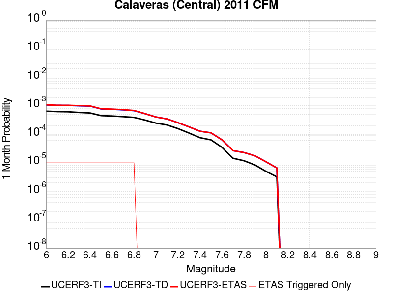 |  | 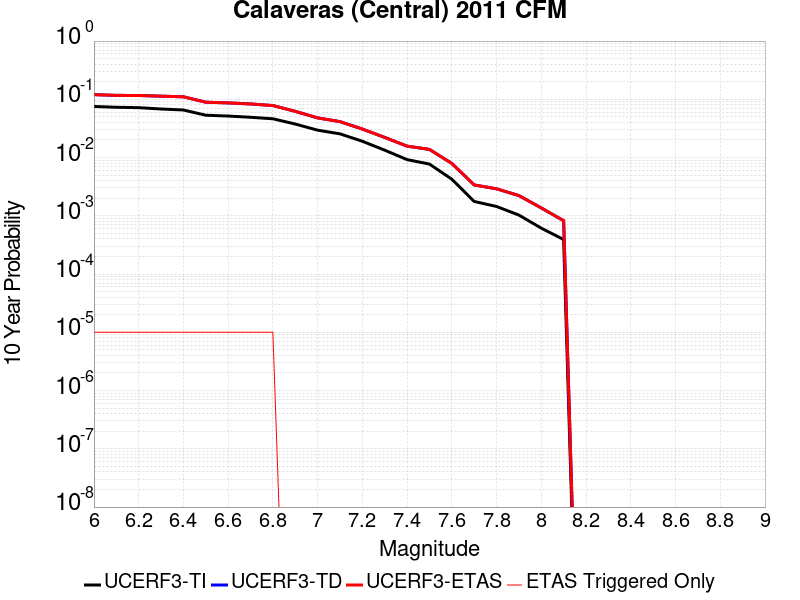 |

| Magnitude | 1 wk TI Prob | 1 wk TD Prob | 1 wk ETAS Prob | 1 wk ETAS/TD Gain | 1 wk ETAS Triggered Only | 1 mo TI Prob | 1 mo TD Prob | 1 mo ETAS Prob | 1 mo ETAS/TD Gain | 1 mo ETAS Triggered Only | 1 yr TI Prob | 1 yr TD Prob | 1 yr ETAS Prob | 1 yr ETAS/TD Gain | 1 yr ETAS Triggered Only | 10 yr TI Prob | 10 yr TD Prob | 10 yr ETAS Prob | 10 yr ETAS/TD Gain | 10 yr ETAS Triggered Only |
|-----|-----|-----|-----|-----|-----|-----|-----|-----|-----|-----|-----|-----|-----|-----|-----|-----|-----|-----|-----|-----|
| 6.0 | 1.5010907E-4 | 2.481574E-4 | 2.581549E-4 | 1.040287 | 1.0E-5 | 6.4316596E-4 | 0.0010621005 | 0.0010720899 | 1.0094053 | 1.0E-5 | 0.0078024664 | 0.012850073 | 0.012859945 | 1.0007682 | 1.0E-5 | 0.07534136 | 0.120401435 | 0.12041023 | 1.0000731 | 1.0E-5 |
| 6.1 | 1.4521465E-4 | 2.397987E-4 | 2.4979629E-4 | 1.0416917 | 1.0E-5 | 6.222001E-4 | 0.0010263061 | 0.0010362958 | 1.0097337 | 1.0E-5 | 0.0075490056 | 0.012419341 | 0.012429217 | 1.0007952 | 1.0E-5 | 0.07297657 | 0.11667323 | 0.11668206 | 1.0000757 | 1.0E-5 |
| 6.2 | 1.429998E-4 | 2.3911126E-4 | 2.4910888E-4 | 1.0418116 | 1.0E-5 | 6.127123E-4 | 0.0010233623 | 0.001033352 | 1.0097617 | 1.0E-5 | 0.007434286 | 0.01238394 | 0.012393816 | 1.0007975 | 1.0E-5 | 0.07190444 | 0.1163272 | 0.11633603 | 1.0000759 | 1.0E-5 |
| 6.3 | 1.3536277E-4 | 2.3242626E-4 | 2.4242394E-4 | 1.0430144 | 1.0E-5 | 5.799972E-4 | 9.947343E-4 | 0.0010047244 | 1.0100429 | 1.0E-5 | 0.0070386264 | 0.012040132 | 0.012050011 | 1.0008205 | 1.0E-5 | 0.0681982 | 0.11323977 | 0.113248646 | 1.0000783 | 1.0E-5 |
| 6.4 | 1.2993296E-4 | 2.2666177E-4 | 2.366595E-4 | 1.0441086 | 1.0E-5 | 5.5673666E-4 | 9.700479E-4 | 9.800382E-4 | 1.0102987 | 1.0E-5 | 0.006757223 | 0.011742937 | 0.01175282 | 1.0008416 | 1.0E-5 | 0.06555412 | 0.11051771 | 0.11052661 | 1.0000805 | 1.0E-5 |
| 6.5 | 1.0498927E-4 | 1.7981697E-4 | 1.8981517E-4 | 1.0556021 | 1.0E-5 | 4.498764E-4 | 7.704157E-4 | 7.80408E-4 | 1.01297 | 1.0E-5 | 0.005463498 | 0.00933924 | 0.009349148 | 1.0010607 | 1.0E-5 | 0.053311124 | 0.089199215 | 0.08920832 | 1.0001022 | 1.0E-5 |
| 6.6 | 1.0157505E-4 | 1.7469203E-4 | 1.8469029E-4 | 1.0572336 | 1.0E-5 | 4.35249E-4 | 7.484645E-4 | 7.58457E-4 | 1.0133507 | 1.0E-5 | 0.0052862884 | 0.009074297 | 0.009084206 | 1.001092 | 1.0E-5 | 0.05162293 | 0.08677671 | 0.086785845 | 1.0001053 | 1.0E-5 |
| 6.7 | 9.660386E-5 | 1.6728524E-4 | 1.7728357E-4 | 1.0597681 | 1.0E-5 | 4.1395082E-4 | 7.1673887E-4 | 7.2673167E-4 | 1.0139421 | 1.0E-5 | 0.0050282106 | 0.008691208 | 0.008701121 | 1.0011406 | 1.0E-5 | 0.049159497 | 0.083266065 | 0.08327523 | 1.0001101 | 1.0E-5 |
| 6.8 | 9.089927E-5 | 1.5643016E-4 | 1.664286E-4 | 1.0639163 | 1.0E-5 | 3.8951015E-4 | 6.702439E-4 | 6.802372E-4 | 1.01491 | 1.0E-5 | 0.0047319788 | 0.008129478 | 0.008139397 | 1.0012201 | 1.0E-5 | 0.046324775 | 0.078159414 | 0.07816863 | 1.0001179 | 1.0E-5 |
| 6.9 | 7.353187E-5 | 1.2295354E-4 | 1.2295354E-4 | 1.0 | 0.0 | 3.150985E-4 | 5.2683795E-4 | 5.2683795E-4 | 1.0 | 0.0 | 0.0038295772 | 0.006395508 | 0.006395508 | 1.0 | 0.0 | 0.037642512 | 0.062187865 | 0.062187865 | 1.0 | 0.0 |
| 7.0 | 5.746064E-5 | 9.3887444E-5 | 9.3887444E-5 | 1.0 | 0.0 | 2.4623662E-4 | 4.0231308E-4 | 4.0231308E-4 | 1.0 | 0.0 | 0.0029938098 | 0.004887232 | 0.004887232 | 1.0 | 0.0 | 0.02953797 | 0.04798685 | 0.04798685 | 1.0 | 0.0 |
| 7.1 | 4.9557195E-5 | 8.052461E-5 | 8.052461E-5 | 1.0 | 0.0 | 2.123707E-4 | 3.4506017E-4 | 3.4506017E-4 | 1.0 | 0.0 | 0.0025825473 | 0.0041930773 | 0.0041930773 | 1.0 | 0.0 | 0.0255274 | 0.041373078 | 0.041373078 | 1.0 | 0.0 |
| 7.2 | 3.687595E-5 | 5.9524526E-5 | 5.9524526E-5 | 1.0 | 0.0 | 1.5803022E-4 | 2.5508032E-4 | 2.5508032E-4 | 1.0 | 0.0 | 0.0019223199 | 0.0031012094 | 0.0031012094 | 1.0 | 0.0 | 0.01905776 | 0.030883716 | 0.030883716 | 1.0 | 0.0 |
| 7.3 | 2.5846984E-5 | 4.247213E-5 | 4.247213E-5 | 1.0 | 0.0 | 1.1076809E-4 | 1.8201082E-4 | 1.8201082E-4 | 1.0 | 0.0 | 0.0013477671 | 0.002213747 | 0.002213747 | 1.0 | 0.0 | 0.013396223 | 0.02217554 | 0.02217554 | 1.0 | 0.0 |
| 7.4 | 1.7747854E-5 | 2.9936204E-5 | 2.9936204E-5 | 1.0 | 0.0 | 7.6060016E-5 | 1.2829172E-4 | 1.2829172E-4 | 1.0 | 0.0 | 9.2563726E-4 | 0.0015608355 | 0.0015608355 | 1.0 | 0.0 | 0.009217911 | 0.015709236 | 0.015709236 | 1.0 | 0.0 |
| 7.5 | 1.4883479E-5 | 2.6243379E-5 | 2.6243379E-5 | 1.0 | 0.0 | 6.378478E-5 | 1.1246678E-4 | 1.1246678E-4 | 1.0 | 0.0 | 7.76303E-4 | 0.0013684258 | 0.0013684258 | 1.0 | 0.0 | 0.0077359667 | 0.013802425 | 0.013802425 | 1.0 | 0.0 |
| 7.6 | 8.166975E-6 | 1.4963478E-5 | 1.4963478E-5 | 1.0 | 0.0 | 3.5000852E-5 | 6.412763E-5 | 6.412763E-5 | 1.0 | 0.0 | 4.2605202E-4 | 7.804755E-4 | 7.804755E-4 | 1.0 | 0.0 | 0.004252361 | 0.00793984 | 0.00793984 | 1.0 | 0.0 |
| 7.7 | 3.3858064E-6 | 6.253914E-6 | 6.253914E-6 | 1.0 | 0.0 | 1.4510518E-5 | 2.6802214E-5 | 2.6802214E-5 | 1.0 | 0.0 | 1.7665124E-4 | 3.2626814E-4 | 3.2626814E-4 | 1.0 | 0.0 | 0.0017651088 | 0.0033882293 | 0.0033882293 | 1.0 | 0.0 |
| 7.8 | 2.7721615E-6 | 5.3663807E-6 | 5.3663807E-6 | 1.0 | 0.0 | 1.1880637E-5 | 2.2998573E-5 | 2.2998573E-5 | 1.0 | 0.0 | 1.4463716E-4 | 2.799717E-4 | 2.799717E-4 | 1.0 | 0.0 | 0.0014454306 | 0.0029074624 | 0.0029074624 | 1.0 | 0.0 |
| 7.9 | 1.9736292E-6 | 4.1284193E-6 | 4.1284193E-6 | 1.0 | 0.0 | 8.4583835E-6 | 1.7693106E-5 | 1.7693106E-5 | 1.0 | 0.0 | 1.0297595E-4 | 2.1539231E-4 | 2.1539231E-4 | 1.0 | 0.0 | 0.0010292825 | 0.0022236116 | 0.0022236116 | 1.0 | 0.0 |
| 8.0 | 1.1767289E-6 | 2.5544743E-6 | 2.5544743E-6 | 1.0 | 0.0 | 5.0431145E-6 | 1.0947701E-5 | 1.0947701E-5 | 1.0 | 0.0 | 6.139818E-5 | 1.3328013E-4 | 1.3328013E-4 | 1.0 | 0.0 | 6.1381224E-4 | 0.0013660848 | 0.0013660848 | 1.0 | 0.0 |
| 8.1 | 7.5112825E-7 | 1.5409794E-6 | 1.5409794E-6 | 1.0 | 0.0 | 3.2191172E-6 | 6.6041807E-6 | 6.6041807E-6 | 1.0 | 0.0 | 3.9192048E-5 | 8.0402955E-5 | 8.0402955E-5 | 1.0 | 0.0 | 3.9185135E-4 | 8.235564E-4 | 8.235564E-4 | 1.0 | 0.0 |

## San Gorgonio Pass
*[(top)](#table-of-contents)*

| 1 Week | 1 Month | 1 Year | 10 Year |
|-----|-----|-----|-----|
|  |  |  | 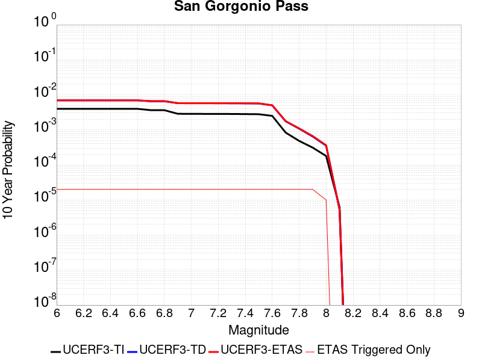 |

| Magnitude | 1 wk TI Prob | 1 wk TD Prob | 1 wk ETAS Prob | 1 wk ETAS/TD Gain | 1 wk ETAS Triggered Only | 1 mo TI Prob | 1 mo TD Prob | 1 mo ETAS Prob | 1 mo ETAS/TD Gain | 1 mo ETAS Triggered Only | 1 yr TI Prob | 1 yr TD Prob | 1 yr ETAS Prob | 1 yr ETAS/TD Gain | 1 yr ETAS Triggered Only | 10 yr TI Prob | 10 yr TD Prob | 10 yr ETAS Prob | 10 yr ETAS/TD Gain | 10 yr ETAS Triggered Only |
|-----|-----|-----|-----|-----|-----|-----|-----|-----|-----|-----|-----|-----|-----|-----|-----|-----|-----|-----|-----|-----|
| 6.0 | 7.644328E-6 | 1.3314231E-5 | 1.3314231E-5 | 1.0 | 0.0 | 3.2760996E-5 | 5.705979E-5 | 5.705979E-5 | 1.0 | 0.0 | 3.987921E-4 | 6.944901E-4 | 7.044832E-4 | 1.014389 | 1.0E-5 | 0.003980772 | 0.0069299806 | 0.006949842 | 1.002866 | 2.0E-5 |
| 6.1 | 7.644328E-6 | 1.3314231E-5 | 1.3314231E-5 | 1.0 | 0.0 | 3.2760996E-5 | 5.705979E-5 | 5.705979E-5 | 1.0 | 0.0 | 3.987921E-4 | 6.944901E-4 | 7.044832E-4 | 1.014389 | 1.0E-5 | 0.003980772 | 0.0069299806 | 0.006949842 | 1.002866 | 2.0E-5 |
| 6.2 | 7.644328E-6 | 1.3314231E-5 | 1.3314231E-5 | 1.0 | 0.0 | 3.2760996E-5 | 5.705979E-5 | 5.705979E-5 | 1.0 | 0.0 | 3.987921E-4 | 6.944901E-4 | 7.044832E-4 | 1.014389 | 1.0E-5 | 0.003980772 | 0.0069299806 | 0.006949842 | 1.002866 | 2.0E-5 |
| 6.3 | 7.644328E-6 | 1.3314231E-5 | 1.3314231E-5 | 1.0 | 0.0 | 3.2760996E-5 | 5.705979E-5 | 5.705979E-5 | 1.0 | 0.0 | 3.987921E-4 | 6.944901E-4 | 7.044832E-4 | 1.014389 | 1.0E-5 | 0.003980772 | 0.0069299806 | 0.006949842 | 1.002866 | 2.0E-5 |
| 6.4 | 7.644328E-6 | 1.3314231E-5 | 1.3314231E-5 | 1.0 | 0.0 | 3.2760996E-5 | 5.705979E-5 | 5.705979E-5 | 1.0 | 0.0 | 3.987921E-4 | 6.944901E-4 | 7.044832E-4 | 1.014389 | 1.0E-5 | 0.003980772 | 0.0069299806 | 0.006949842 | 1.002866 | 2.0E-5 |
| 6.5 | 7.644328E-6 | 1.3314231E-5 | 1.3314231E-5 | 1.0 | 0.0 | 3.2760996E-5 | 5.705979E-5 | 5.705979E-5 | 1.0 | 0.0 | 3.987921E-4 | 6.944901E-4 | 7.044832E-4 | 1.014389 | 1.0E-5 | 0.003980772 | 0.0069299806 | 0.006949842 | 1.002866 | 2.0E-5 |
| 6.6 | 7.644328E-6 | 1.3314231E-5 | 1.3314231E-5 | 1.0 | 0.0 | 3.2760996E-5 | 5.705979E-5 | 5.705979E-5 | 1.0 | 0.0 | 3.987921E-4 | 6.944901E-4 | 7.044832E-4 | 1.014389 | 1.0E-5 | 0.003980772 | 0.0069299806 | 0.006949842 | 1.002866 | 2.0E-5 |
| 6.7 | 6.987586E-6 | 1.2618505E-5 | 1.2618505E-5 | 1.0 | 0.0 | 2.9946454E-5 | 5.4078235E-5 | 5.4078235E-5 | 1.0 | 0.0 | 3.645371E-4 | 6.582117E-4 | 6.6820515E-4 | 1.0151827 | 1.0E-5 | 0.0036393967 | 0.0065693567 | 0.0065892255 | 1.0030245 | 2.0E-5 |
| 6.8 | 6.987586E-6 | 1.2618505E-5 | 1.2618505E-5 | 1.0 | 0.0 | 2.9946454E-5 | 5.4078235E-5 | 5.4078235E-5 | 1.0 | 0.0 | 3.645371E-4 | 6.582117E-4 | 6.6820515E-4 | 1.0151827 | 1.0E-5 | 0.0036393967 | 0.0065693567 | 0.0065892255 | 1.0030245 | 2.0E-5 |
| 6.9 | 5.504702E-6 | 1.1049368E-5 | 1.1049368E-5 | 1.0 | 0.0 | 2.3591367E-5 | 4.7353606E-5 | 4.7353606E-5 | 1.0 | 0.0 | 2.8718702E-4 | 5.7638274E-4 | 5.8637693E-4 | 1.0173396 | 1.0E-5 | 0.0028681618 | 0.005755309 | 0.005775194 | 1.003455 | 2.0E-5 |
| 7.0 | 5.4825764E-6 | 1.102571E-5 | 1.102571E-5 | 1.0 | 0.0 | 2.3496545E-5 | 4.7252215E-5 | 4.7252215E-5 | 1.0 | 0.0 | 2.8603288E-4 | 5.751489E-4 | 5.8514316E-4 | 1.0173768 | 1.0E-5 | 0.00285665 | 0.005743035 | 0.0057629202 | 1.0034624 | 2.0E-5 |
| 7.1 | 5.4692787E-6 | 1.101142E-5 | 1.101142E-5 | 1.0 | 0.0 | 2.3439556E-5 | 4.7190973E-5 | 4.7190973E-5 | 1.0 | 0.0 | 2.8533922E-4 | 5.744037E-4 | 5.8439793E-4 | 1.0173993 | 1.0E-5 | 0.0028497311 | 0.0057356213 | 0.0057555065 | 1.003467 | 2.0E-5 |
| 7.2 | 5.453661E-6 | 1.0994446E-5 | 1.0994446E-5 | 1.0 | 0.0 | 2.3372622E-5 | 4.7118232E-5 | 4.7118232E-5 | 1.0 | 0.0 | 2.8452452E-4 | 5.7351857E-4 | 5.835128E-4 | 1.0174263 | 1.0E-5 | 0.002841605 | 0.0057268157 | 0.005746701 | 1.0034723 | 2.0E-5 |
| 7.3 | 5.4422303E-6 | 1.0981369E-5 | 1.0981369E-5 | 1.0 | 0.0 | 2.3323635E-5 | 4.706219E-5 | 4.706219E-5 | 1.0 | 0.0 | 2.8392827E-4 | 5.728366E-4 | 5.8283086E-4 | 1.017447 | 1.0E-5 | 0.0028356577 | 0.005720031 | 0.0057399166 | 1.0034765 | 2.0E-5 |
| 7.4 | 5.398595E-6 | 1.0928734E-5 | 1.0928734E-5 | 1.0 | 0.0 | 2.313663E-5 | 4.683662E-5 | 4.683662E-5 | 1.0 | 0.0 | 2.8165206E-4 | 5.700917E-4 | 5.80086E-4 | 1.017531 | 1.0E-5 | 0.0028129534 | 0.005692723 | 0.0057126097 | 1.0034933 | 2.0E-5 |
| 7.5 | 5.3578788E-6 | 1.0855281E-5 | 1.0855281E-5 | 1.0 | 0.0 | 2.2962136E-5 | 4.6521833E-5 | 4.6521833E-5 | 1.0 | 0.0 | 2.7952815E-4 | 5.662612E-4 | 5.762555E-4 | 1.0176497 | 1.0E-5 | 0.002791768 | 0.0056546377 | 0.0056745247 | 1.0035169 | 2.0E-5 |
| 7.6 | 4.8091474E-6 | 9.60368E-6 | 9.60368E-6 | 1.0 | 0.0 | 2.0610469E-5 | 4.1158008E-5 | 4.1158008E-5 | 1.0 | 0.0 | 2.5090357E-4 | 5.0098833E-4 | 5.1098334E-4 | 1.0199505 | 1.0E-5 | 0.0025062046 | 0.0050053033 | 0.0050252033 | 1.0039757 | 2.0E-5 |
| 7.7 | 1.5991155E-6 | 3.352866E-6 | 3.352866E-6 | 1.0 | 0.0 | 6.853334E-6 | 1.4369349E-5 | 1.4369349E-5 | 1.0 | 0.0 | 8.343615E-5 | 1.7493303E-4 | 1.8493128E-4 | 1.0571548 | 1.0E-5 | 8.340483E-4 | 0.0017534072 | 0.0017733722 | 1.0113864 | 2.0E-5 |
| 7.8 | 9.258398E-7 | 2.0579948E-6 | 2.0579948E-6 | 1.0 | 0.0 | 3.967879E-6 | 8.819949E-6 | 8.819949E-6 | 1.0 | 0.0 | 4.8307855E-5 | 1.073776E-4 | 1.1737653E-4 | 1.0931193 | 1.0E-5 | 4.8297356E-4 | 0.001078687 | 0.0010986654 | 1.0185211 | 2.0E-5 |
| 7.9 | 5.975575E-7 | 1.2291794E-6 | 1.2291794E-6 | 1.0 | 0.0 | 2.5609581E-6 | 5.2679006E-6 | 5.2679006E-6 | 1.0 | 0.0 | 3.117922E-5 | 6.4134816E-5 | 7.413417E-5 | 1.1559116 | 1.0E-5 | 3.1174847E-4 | 6.463092E-4 | 6.662963E-4 | 1.0309249 | 2.0E-5 |
| 8.0 | 3.4413725E-7 | 6.7148494E-7 | 6.7148494E-7 | 1.0 | 0.0 | 1.4748731E-6 | 2.8777895E-6 | 2.8777895E-6 | 1.0 | 0.0 | 1.7956432E-5 | 3.503653E-5 | 4.503618E-5 | 1.2854064 | 1.0E-5 | 1.7954981E-4 | 3.5373896E-4 | 3.6373542E-4 | 1.0282594 | 1.0E-5 |
| 8.1 | 1.1787731E-8 | 9.634385E-9 | 9.634385E-9 | 1.0 | 0.0 | 5.0518846E-8 | 4.129022E-8 | 4.129022E-8 | 1.0 | 0.0 | 6.1506677E-7 | 5.027083E-7 | 5.027083E-7 | 1.0 | 0.0 | 6.1506507E-6 | 5.2424944E-6 | 5.2424944E-6 | 1.0 | 0.0 |

## Jess Valley
*[(top)](#table-of-contents)*

| 1 Week | 1 Month | 1 Year | 10 Year |
|-----|-----|-----|-----|
|  |  |  |  |

| Magnitude | 1 wk TI Prob | 1 wk TD Prob | 1 wk ETAS Prob | 1 wk ETAS/TD Gain | 1 wk ETAS Triggered Only | 1 mo TI Prob | 1 mo TD Prob | 1 mo ETAS Prob | 1 mo ETAS/TD Gain | 1 mo ETAS Triggered Only | 1 yr TI Prob | 1 yr TD Prob | 1 yr ETAS Prob | 1 yr ETAS/TD Gain | 1 yr ETAS Triggered Only | 10 yr TI Prob | 10 yr TD Prob | 10 yr ETAS Prob | 10 yr ETAS/TD Gain | 10 yr ETAS Triggered Only |
|-----|-----|-----|-----|-----|-----|-----|-----|-----|-----|-----|-----|-----|-----|-----|-----|-----|-----|-----|-----|-----|
| 6.0 | 3.3861274E-6 | 3.4340592E-6 | 3.4340592E-6 | 1.0 | 0.0 | 1.4511894E-5 | 1.471733E-5 | 1.471733E-5 | 1.0 | 0.0 | 1.7666799E-4 | 1.7917156E-4 | 1.8916978E-4 | 1.0558025 | 1.0E-5 | 0.001765276 | 0.0017905476 | 0.0018005297 | 1.005575 | 1.0E-5 |
| 6.1 | 3.3861274E-6 | 3.4340592E-6 | 3.4340592E-6 | 1.0 | 0.0 | 1.4511894E-5 | 1.471733E-5 | 1.471733E-5 | 1.0 | 0.0 | 1.7666799E-4 | 1.7917156E-4 | 1.8916978E-4 | 1.0558025 | 1.0E-5 | 0.001765276 | 0.0017905476 | 0.0018005297 | 1.005575 | 1.0E-5 |
| 6.2 | 3.3861274E-6 | 3.4340592E-6 | 3.4340592E-6 | 1.0 | 0.0 | 1.4511894E-5 | 1.471733E-5 | 1.471733E-5 | 1.0 | 0.0 | 1.7666799E-4 | 1.7917156E-4 | 1.8916978E-4 | 1.0558025 | 1.0E-5 | 0.001765276 | 0.0017905476 | 0.0018005297 | 1.005575 | 1.0E-5 |
| 6.3 | 3.3861274E-6 | 3.4340592E-6 | 3.4340592E-6 | 1.0 | 0.0 | 1.4511894E-5 | 1.471733E-5 | 1.471733E-5 | 1.0 | 0.0 | 1.7666799E-4 | 1.7917156E-4 | 1.8916978E-4 | 1.0558025 | 1.0E-5 | 0.001765276 | 0.0017905476 | 0.0018005297 | 1.005575 | 1.0E-5 |
| 6.4 | 1.5291708E-6 | 1.5502784E-6 | 1.5502784E-6 | 1.0 | 0.0 | 6.553573E-6 | 6.644038E-6 | 6.644038E-6 | 1.0 | 0.0 | 7.978683E-5 | 8.088895E-5 | 9.088815E-5 | 1.1236162 | 1.0E-5 | 7.975819E-4 | 8.086733E-4 | 8.1866526E-4 | 1.0123559 | 1.0E-5 |
| 6.5 | 1.5291708E-6 | 1.5502784E-6 | 1.5502784E-6 | 1.0 | 0.0 | 6.553573E-6 | 6.644038E-6 | 6.644038E-6 | 1.0 | 0.0 | 7.978683E-5 | 8.088895E-5 | 9.088815E-5 | 1.1236162 | 1.0E-5 | 7.975819E-4 | 8.086733E-4 | 8.1866526E-4 | 1.0123559 | 1.0E-5 |
| 6.6 | 5.396423E-7 | 5.4719953E-7 | 5.4719953E-7 | 1.0 | 0.0 | 2.312751E-6 | 2.3451398E-6 | 2.3451398E-6 | 1.0 | 0.0 | 2.8157378E-5 | 2.855189E-5 | 2.855189E-5 | 1.0 | 0.0 | 2.8153812E-4 | 2.8550063E-4 | 2.8550063E-4 | 1.0 | 0.0 |
| 6.7 | 5.396423E-7 | 5.4719953E-7 | 5.4719953E-7 | 1.0 | 0.0 | 2.312751E-6 | 2.3451398E-6 | 2.3451398E-6 | 1.0 | 0.0 | 2.8157378E-5 | 2.855189E-5 | 2.855189E-5 | 1.0 | 0.0 | 2.8153812E-4 | 2.8550063E-4 | 2.8550063E-4 | 1.0 | 0.0 |
| 6.8 | 3.6058395E-7 | 3.6563068E-7 | 3.6563068E-7 | 1.0 | 0.0 | 1.5453588E-6 | 1.5669885E-6 | 1.5669885E-6 | 1.0 | 0.0 | 1.8814582E-5 | 1.9078087E-5 | 1.9078087E-5 | 1.0 | 0.0 | 1.8812988E-4 | 1.9078086E-4 | 1.9078086E-4 | 1.0 | 0.0 |

## Pitas Point (Lower West)
*[(top)](#table-of-contents)*

| 1 Week | 1 Month | 1 Year | 10 Year |
|-----|-----|-----|-----|
| 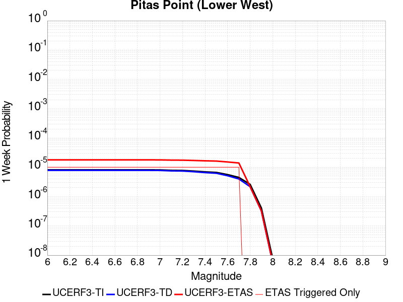 | 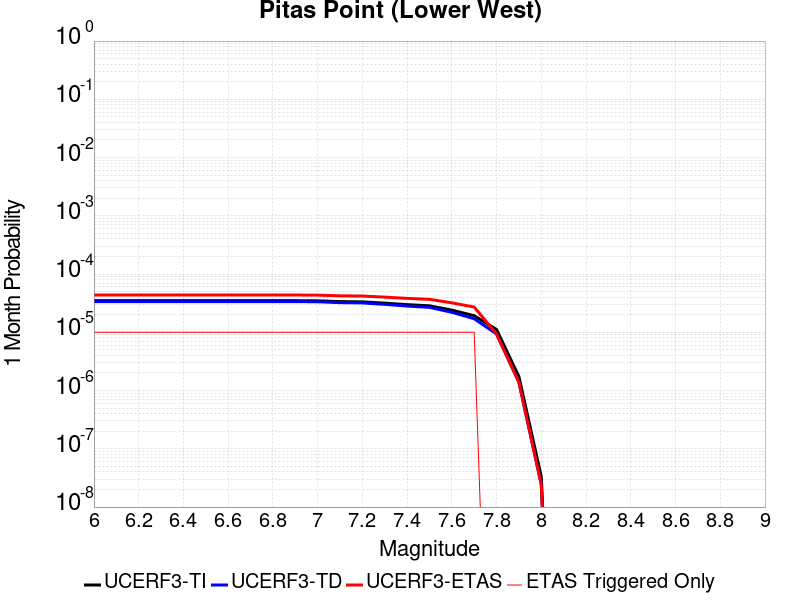 | 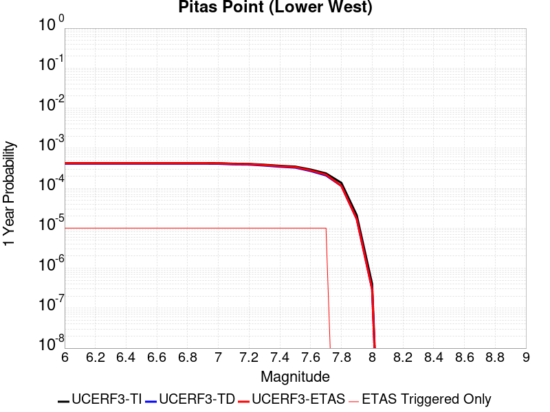 | 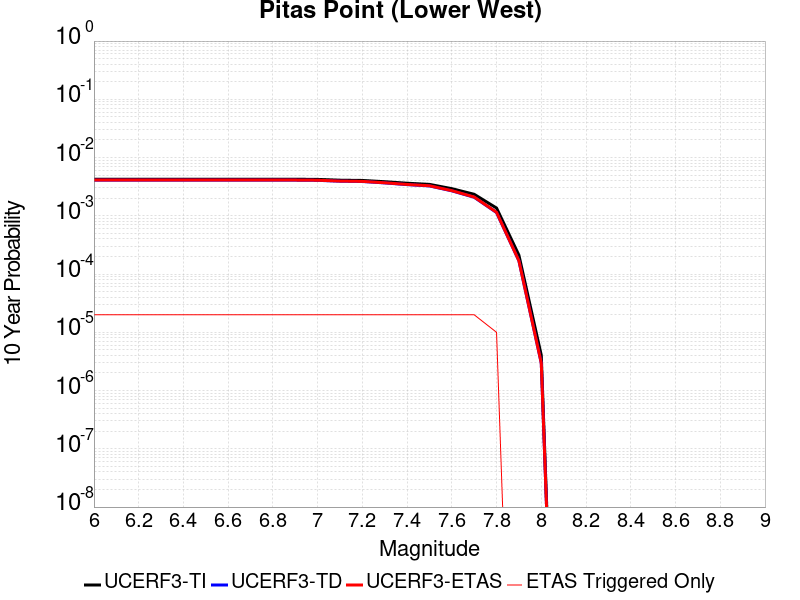 |

| Magnitude | 1 wk TI Prob | 1 wk TD Prob | 1 wk ETAS Prob | 1 wk ETAS/TD Gain | 1 wk ETAS Triggered Only | 1 mo TI Prob | 1 mo TD Prob | 1 mo ETAS Prob | 1 mo ETAS/TD Gain | 1 mo ETAS Triggered Only | 1 yr TI Prob | 1 yr TD Prob | 1 yr ETAS Prob | 1 yr ETAS/TD Gain | 1 yr ETAS Triggered Only | 10 yr TI Prob | 10 yr TD Prob | 10 yr ETAS Prob | 10 yr ETAS/TD Gain | 10 yr ETAS Triggered Only |
|-----|-----|-----|-----|-----|-----|-----|-----|-----|-----|-----|-----|-----|-----|-----|-----|-----|-----|-----|-----|-----|
| 6.0 | 8.151497E-6 | 7.855762E-6 | 1.7855684E-5 | 2.2729409 | 1.0E-5 | 3.493452E-5 | 3.3667122E-5 | 4.3666787E-5 | 1.2970157 | 1.0E-5 | 4.252448E-4 | 4.0982084E-4 | 4.1981676E-4 | 1.0243909 | 1.0E-5 | 0.0042443196 | 0.0040907315 | 0.0041106497 | 1.0048691 | 2.0E-5 |
| 6.1 | 8.151497E-6 | 7.855762E-6 | 1.7855684E-5 | 2.2729409 | 1.0E-5 | 3.493452E-5 | 3.3667122E-5 | 4.3666787E-5 | 1.2970157 | 1.0E-5 | 4.252448E-4 | 4.0982084E-4 | 4.1981676E-4 | 1.0243909 | 1.0E-5 | 0.0042443196 | 0.0040907315 | 0.0041106497 | 1.0048691 | 2.0E-5 |
| 6.2 | 8.151497E-6 | 7.855762E-6 | 1.7855684E-5 | 2.2729409 | 1.0E-5 | 3.493452E-5 | 3.3667122E-5 | 4.3666787E-5 | 1.2970157 | 1.0E-5 | 4.252448E-4 | 4.0982084E-4 | 4.1981676E-4 | 1.0243909 | 1.0E-5 | 0.0042443196 | 0.0040907315 | 0.0041106497 | 1.0048691 | 2.0E-5 |
| 6.3 | 8.151497E-6 | 7.855762E-6 | 1.7855684E-5 | 2.2729409 | 1.0E-5 | 3.493452E-5 | 3.3667122E-5 | 4.3666787E-5 | 1.2970157 | 1.0E-5 | 4.252448E-4 | 4.0982084E-4 | 4.1981676E-4 | 1.0243909 | 1.0E-5 | 0.0042443196 | 0.0040907315 | 0.0041106497 | 1.0048691 | 2.0E-5 |
| 6.4 | 8.151497E-6 | 7.855762E-6 | 1.7855684E-5 | 2.2729409 | 1.0E-5 | 3.493452E-5 | 3.3667122E-5 | 4.3666787E-5 | 1.2970157 | 1.0E-5 | 4.252448E-4 | 4.0982084E-4 | 4.1981676E-4 | 1.0243909 | 1.0E-5 | 0.0042443196 | 0.0040907315 | 0.0041106497 | 1.0048691 | 2.0E-5 |
| 6.5 | 8.151497E-6 | 7.855762E-6 | 1.7855684E-5 | 2.2729409 | 1.0E-5 | 3.493452E-5 | 3.3667122E-5 | 4.3666787E-5 | 1.2970157 | 1.0E-5 | 4.252448E-4 | 4.0982084E-4 | 4.1981676E-4 | 1.0243909 | 1.0E-5 | 0.0042443196 | 0.0040907315 | 0.0041106497 | 1.0048691 | 2.0E-5 |
| 6.6 | 8.151497E-6 | 7.855762E-6 | 1.7855684E-5 | 2.2729409 | 1.0E-5 | 3.493452E-5 | 3.3667122E-5 | 4.3666787E-5 | 1.2970157 | 1.0E-5 | 4.252448E-4 | 4.0982084E-4 | 4.1981676E-4 | 1.0243909 | 1.0E-5 | 0.0042443196 | 0.0040907315 | 0.0041106497 | 1.0048691 | 2.0E-5 |
| 6.7 | 8.151497E-6 | 7.855762E-6 | 1.7855684E-5 | 2.2729409 | 1.0E-5 | 3.493452E-5 | 3.3667122E-5 | 4.3666787E-5 | 1.2970157 | 1.0E-5 | 4.252448E-4 | 4.0982084E-4 | 4.1981676E-4 | 1.0243909 | 1.0E-5 | 0.0042443196 | 0.0040907315 | 0.0041106497 | 1.0048691 | 2.0E-5 |
| 6.8 | 8.151497E-6 | 7.855762E-6 | 1.7855684E-5 | 2.2729409 | 1.0E-5 | 3.493452E-5 | 3.3667122E-5 | 4.3666787E-5 | 1.2970157 | 1.0E-5 | 4.252448E-4 | 4.0982084E-4 | 4.1981676E-4 | 1.0243909 | 1.0E-5 | 0.0042443196 | 0.0040907315 | 0.0041106497 | 1.0048691 | 2.0E-5 |
| 6.9 | 8.151497E-6 | 7.855762E-6 | 1.7855684E-5 | 2.2729409 | 1.0E-5 | 3.493452E-5 | 3.3667122E-5 | 4.3666787E-5 | 1.2970157 | 1.0E-5 | 4.252448E-4 | 4.0982084E-4 | 4.1981676E-4 | 1.0243909 | 1.0E-5 | 0.0042443196 | 0.0040907315 | 0.0041106497 | 1.0048691 | 2.0E-5 |
| 7.0 | 8.103535E-6 | 7.805192E-6 | 1.7805114E-5 | 2.2811885 | 1.0E-5 | 3.4728975E-5 | 3.3450397E-5 | 4.3450065E-5 | 1.2989401 | 1.0E-5 | 4.2274324E-4 | 4.0718322E-4 | 4.1717917E-4 | 1.024549 | 1.0E-5 | 0.0042193993 | 0.004064452 | 0.0040843706 | 1.0049007 | 2.0E-5 |
| 7.1 | 7.853298E-6 | 7.540883E-6 | 1.7540808E-5 | 2.3260946 | 1.0E-5 | 3.3656554E-5 | 3.2317676E-5 | 4.231735E-5 | 1.3094182 | 1.0E-5 | 4.096915E-4 | 3.9339735E-4 | 4.033934E-4 | 1.0254096 | 1.0E-5 | 0.00408937 | 0.0039270855 | 0.003947007 | 1.0050728 | 2.0E-5 |
| 7.2 | 7.771102E-6 | 7.453165E-6 | 1.745309E-5 | 2.341702 | 1.0E-5 | 3.33043E-5 | 3.194175E-5 | 4.194143E-5 | 1.3130599 | 1.0E-5 | 4.0540437E-4 | 3.8882208E-4 | 3.988182E-4 | 1.0257087 | 1.0E-5 | 0.0040466557 | 0.0038814936 | 0.003901416 | 1.0051327 | 2.0E-5 |
| 7.3 | 7.3945344E-6 | 7.0492697E-6 | 1.7049199E-5 | 2.4185767 | 1.0E-5 | 3.1690477E-5 | 3.021081E-5 | 4.0210507E-5 | 1.3309973 | 1.0E-5 | 3.8576324E-4 | 3.6775516E-4 | 3.7775148E-4 | 1.027182 | 1.0E-5 | 0.0038509427 | 0.0036715334 | 0.00369146 | 1.0054274 | 2.0E-5 |
| 7.4 | 6.964645E-6 | 6.5901186E-6 | 1.6590053E-5 | 2.5174134 | 1.0E-5 | 2.9848137E-5 | 2.8243063E-5 | 3.824278E-5 | 1.3540592 | 1.0E-5 | 3.6334046E-4 | 3.4380553E-4 | 3.5380208E-4 | 1.0290762 | 1.0E-5 | 0.0036274698 | 0.0034327896 | 0.0034527208 | 1.0058062 | 2.0E-5 |
| 7.5 | 6.6525035E-6 | 6.259157E-6 | 1.6259095E-5 | 2.597649 | 1.0E-5 | 2.851042E-5 | 2.6824686E-5 | 3.682442E-5 | 1.3727809 | 1.0E-5 | 3.4705905E-4 | 3.265421E-4 | 3.3653883E-4 | 1.0306139 | 1.0E-5 | 0.0034651754 | 0.0032606742 | 0.003280609 | 1.0061136 | 2.0E-5 |
| 7.6 | 5.613338E-6 | 5.151386E-6 | 1.5151335E-5 | 2.941215 | 1.0E-5 | 2.405694E-5 | 2.2077185E-5 | 3.2076965E-5 | 1.4529463 | 1.0E-5 | 2.928539E-4 | 2.6875688E-4 | 2.787542E-4 | 1.0371983 | 1.0E-5 | 0.0029246826 | 0.0026843501 | 0.0027042963 | 1.0074306 | 2.0E-5 |
| 7.7 | 4.494704E-6 | 3.996911E-6 | 1.3996871E-5 | 3.5019221 | 1.0E-5 | 1.9262876E-5 | 1.7129507E-5 | 2.7129336E-5 | 1.5837779 | 1.0E-5 | 2.3450027E-4 | 2.0853203E-4 | 2.1852994E-4 | 1.0479443 | 1.0E-5 | 0.0023425296 | 0.0020833875 | 0.002103346 | 1.0095798 | 2.0E-5 |
| 7.8 | 2.6075882E-6 | 2.1836374E-6 | 2.1836374E-6 | 1.0 | 0.0 | 1.117533E-5 | 9.358413E-6 | 9.358413E-6 | 1.0 | 0.0 | 1.3605114E-4 | 1.1393277E-4 | 1.1393277E-4 | 1.0 | 0.0 | 0.0013596788 | 0.0011387484 | 0.0011487369 | 1.0087715 | 1.0E-5 |
| 7.9 | 4.045984E-7 | 3.242375E-7 | 3.242375E-7 | 1.0 | 0.0 | 1.733992E-6 | 1.3895885E-6 | 1.3895885E-6 | 1.0 | 0.0 | 2.1111147E-5 | 1.6918111E-5 | 1.6918111E-5 | 1.0 | 0.0 | 2.1109142E-4 | 1.6916855E-4 | 1.6916855E-4 | 1.0 | 0.0 |
| 8.0 | 7.791402E-9 | 5.683497E-9 | 5.683497E-9 | 1.0 | 0.0 | 3.3391725E-8 | 2.4357844E-8 | 2.4357844E-8 | 1.0 | 0.0 | 4.0654416E-7 | 2.9655675E-7 | 2.9655675E-7 | 1.0 | 0.0 | 4.065434E-6 | 2.9655655E-6 | 2.9655655E-6 | 1.0 | 0.0 |

## San Gregorio (North) 2011 CFM
*[(top)](#table-of-contents)*

| 1 Week | 1 Month | 1 Year | 10 Year |
|-----|-----|-----|-----|
|  |  |  |  |

| Magnitude | 1 wk TI Prob | 1 wk TD Prob | 1 wk ETAS Prob | 1 wk ETAS/TD Gain | 1 wk ETAS Triggered Only | 1 mo TI Prob | 1 mo TD Prob | 1 mo ETAS Prob | 1 mo ETAS/TD Gain | 1 mo ETAS Triggered Only | 1 yr TI Prob | 1 yr TD Prob | 1 yr ETAS Prob | 1 yr ETAS/TD Gain | 1 yr ETAS Triggered Only | 10 yr TI Prob | 10 yr TD Prob | 10 yr ETAS Prob | 10 yr ETAS/TD Gain | 10 yr ETAS Triggered Only |
|-----|-----|-----|-----|-----|-----|-----|-----|-----|-----|-----|-----|-----|-----|-----|-----|-----|-----|-----|-----|-----|
| 6.0 | 5.0283932E-5 | 4.3057815E-5 | 4.3057815E-5 | 1.0 | 0.0 | 2.1548476E-4 | 1.8452053E-4 | 1.8452053E-4 | 1.0 | 0.0 | 0.0026203706 | 0.002244237 | 0.002264192 | 1.0088917 | 2.0E-5 | 0.02589687 | 0.022293162 | 0.022312716 | 1.0008771 | 2.0E-5 |
| 6.1 | 5.0283932E-5 | 4.3057815E-5 | 4.3057815E-5 | 1.0 | 0.0 | 2.1548476E-4 | 1.8452053E-4 | 1.8452053E-4 | 1.0 | 0.0 | 0.0026203706 | 0.002244237 | 0.002264192 | 1.0088917 | 2.0E-5 | 0.02589687 | 0.022293162 | 0.022312716 | 1.0008771 | 2.0E-5 |
| 6.2 | 4.2998647E-5 | 3.4441564E-5 | 3.4441564E-5 | 1.0 | 0.0 | 1.842669E-4 | 1.475984E-4 | 1.475984E-4 | 1.0 | 0.0 | 0.0022411412 | 0.00179554 | 0.001815504 | 1.0111188 | 2.0E-5 | 0.022186736 | 0.017886506 | 0.017906148 | 1.0010982 | 2.0E-5 |
| 6.3 | 4.2998647E-5 | 3.4441564E-5 | 3.4441564E-5 | 1.0 | 0.0 | 1.842669E-4 | 1.475984E-4 | 1.475984E-4 | 1.0 | 0.0 | 0.0022411412 | 0.00179554 | 0.001815504 | 1.0111188 | 2.0E-5 | 0.022186736 | 0.017886506 | 0.017906148 | 1.0010982 | 2.0E-5 |
| 6.4 | 4.1101295E-5 | 3.2326872E-5 | 3.2326872E-5 | 1.0 | 0.0 | 1.7613651E-4 | 1.3853642E-4 | 1.3853642E-4 | 1.0 | 0.0 | 0.0021423528 | 0.0016853869 | 0.0017053531 | 1.0118467 | 2.0E-5 | 0.02121817 | 0.016801886 | 0.01682155 | 1.0011704 | 2.0E-5 |
| 6.5 | 4.1032585E-5 | 3.2244905E-5 | 3.2244905E-5 | 1.0 | 0.0 | 1.7584208E-4 | 1.3818518E-4 | 1.3818518E-4 | 1.0 | 0.0 | 0.0021387753 | 0.0016811171 | 0.0017010835 | 1.0118768 | 2.0E-5 | 0.021183075 | 0.016759839 | 0.016779503 | 1.0011734 | 2.0E-5 |
| 6.6 | 4.011629E-5 | 3.1266558E-5 | 3.1266558E-5 | 1.0 | 0.0 | 1.7191563E-4 | 1.339927E-4 | 1.339927E-4 | 1.0 | 0.0 | 0.0020910634 | 0.0016301516 | 0.001650119 | 1.0122488 | 2.0E-5 | 0.020714961 | 0.01625741 | 0.016277086 | 1.0012102 | 2.0E-5 |
| 6.7 | 3.8583938E-5 | 2.9453593E-5 | 2.9453593E-5 | 1.0 | 0.0 | 1.6534925E-4 | 1.2622366E-4 | 1.2622366E-4 | 1.0 | 0.0 | 0.0020112682 | 0.0015357039 | 0.0015556732 | 1.0130033 | 2.0E-5 | 0.019931622 | 0.015325955 | 0.015345648 | 1.001285 | 2.0E-5 |
| 6.8 | 3.44341E-5 | 2.4450854E-5 | 2.4450854E-5 | 1.0 | 0.0 | 1.4756636E-4 | 1.0478523E-4 | 1.0478523E-4 | 1.0 | 0.0 | 0.0017951399 | 0.0012750238 | 0.0012850111 | 1.007833 | 1.0E-5 | 0.017807078 | 0.012751131 | 0.012761004 | 1.0007743 | 1.0E-5 |
| 6.9 | 3.221199E-5 | 2.1778029E-5 | 2.1778029E-5 | 1.0 | 0.0 | 1.3804408E-4 | 9.333112E-5 | 9.333112E-5 | 1.0 | 0.0 | 0.0016793909 | 0.0011357224 | 0.0011457109 | 1.008795 | 1.0E-5 | 0.01666756 | 0.011372583 | 0.011382469 | 1.0008693 | 1.0E-5 |
| 7.0 | 2.9186718E-5 | 1.8146875E-5 | 1.8146875E-5 | 1.0 | 0.0 | 1.2507994E-4 | 7.7770026E-5 | 7.7770026E-5 | 1.0 | 0.0 | 0.0015217843 | 9.464431E-4 | 9.5643365E-4 | 1.0105559 | 1.0E-5 | 0.015114053 | 0.009496798 | 0.009506703 | 1.001043 | 1.0E-5 |
| 7.1 | 2.6840138E-5 | 1.5284508E-5 | 1.5284508E-5 | 1.0 | 0.0 | 1.1502409E-4 | 6.55034E-5 | 6.55034E-5 | 1.0 | 0.0 | 0.0013995186 | 7.9721404E-4 | 8.072061E-4 | 1.0125337 | 1.0E-5 | 0.013907375 | 0.008015723 | 0.0080256425 | 1.0012375 | 1.0E-5 |
| 7.2 | 2.453002E-5 | 1.2606672E-5 | 1.2606672E-5 | 1.0 | 0.0 | 1.05124425E-4 | 5.4027478E-5 | 5.4027478E-5 | 1.0 | 0.0 | 0.0012791384 | 6.575866E-4 | 6.575866E-4 | 1.0 | 0.0 | 0.012718005 | 0.00662763 | 0.00662763 | 1.0 | 0.0 |
| 7.3 | 2.3330727E-5 | 1.1488677E-5 | 1.1488677E-5 | 1.0 | 0.0 | 9.9985E-5 | 4.923626E-5 | 4.923626E-5 | 1.0 | 0.0 | 0.0012166376 | 5.9928704E-4 | 5.9928704E-4 | 1.0 | 0.0 | 0.012099981 | 0.006046564 | 0.006046564 | 1.0 | 0.0 |
| 7.4 | 2.2136466E-5 | 1.0368981E-5 | 1.0368981E-5 | 1.0 | 0.0 | 9.486712E-5 | 4.4437733E-5 | 4.4437733E-5 | 1.0 | 0.0 | 0.0011543952 | 5.4089533E-4 | 5.4089533E-4 | 1.0 | 0.0 | 0.011484168 | 0.005464249 | 0.005464249 | 1.0 | 0.0 |
| 7.5 | 2.0994974E-5 | 9.427217E-6 | 9.427217E-6 | 1.0 | 0.0 | 8.997535E-5 | 4.0401734E-5 | 4.0401734E-5 | 1.0 | 0.0 | 0.0010948994 | 4.9178035E-4 | 4.9178035E-4 | 1.0 | 0.0 | 0.010895205 | 0.004973358 | 0.004973358 | 1.0 | 0.0 |
| 7.6 | 1.7091823E-5 | 6.893766E-6 | 6.893766E-6 | 1.0 | 0.0 | 7.3248615E-5 | 2.9544377E-5 | 2.9544377E-5 | 1.0 | 0.0 | 8.9143694E-4 | 3.596435E-4 | 3.596435E-4 | 1.0 | 0.0 | 0.008878695 | 0.0036482841 | 0.0036482841 | 1.0 | 0.0 |
| 7.7 | 1.2772179E-5 | 4.0208706E-6 | 4.0208706E-6 | 1.0 | 0.0 | 5.473676E-5 | 1.7232189E-5 | 1.7232189E-5 | 1.0 | 0.0 | 6.6621625E-4 | 2.0978172E-4 | 2.0978172E-4 | 1.0 | 0.0 | 0.006642225 | 0.002136922 | 0.002136922 | 1.0 | 0.0 |
| 7.8 | 7.041923E-6 | 1.940626E-6 | 1.940626E-6 | 1.0 | 0.0 | 3.017932E-5 | 8.316942E-6 | 8.316942E-6 | 1.0 | 0.0 | 3.6737128E-4 | 1.0125406E-4 | 1.0125406E-4 | 1.0 | 0.0 | 0.0036676454 | 0.0010379003 | 0.0010379003 | 1.0 | 0.0 |
| 7.9 | 2.946768E-6 | 1.0033551E-6 | 1.0033551E-6 | 1.0 | 0.0 | 1.2628945E-5 | 4.300086E-6 | 4.300086E-6 | 1.0 | 0.0 | 1.5374656E-4 | 5.235229E-5 | 5.235229E-5 | 1.0 | 0.0 | 0.0015364023 | 5.3400313E-4 | 5.3400313E-4 | 1.0 | 0.0 |
| 8.0 | 1.1433375E-6 | 5.18146E-7 | 5.18146E-7 | 1.0 | 0.0 | 4.9000087E-6 | 2.2206239E-6 | 2.2206239E-6 | 1.0 | 0.0 | 5.965597E-5 | 2.703576E-5 | 2.703576E-5 | 1.0 | 0.0 | 5.963996E-4 | 2.7398416E-4 | 2.7398416E-4 | 1.0 | 0.0 |
| 8.1 | 2.6675295E-7 | 1.62899E-7 | 1.62899E-7 | 1.0 | 0.0 | 1.1432264E-6 | 6.9813836E-7 | 6.9813836E-7 | 1.0 | 0.0 | 1.3918692E-5 | 8.499802E-6 | 8.499802E-6 | 1.0 | 0.0 | 1.391782E-4 | 8.63795E-5 | 8.63795E-5 | 1.0 | 0.0 |
| 8.2 | 1.2704569E-8 | 9.431393E-9 | 9.431393E-9 | 1.0 | 0.0 | 5.444815E-8 | 4.042026E-8 | 4.042026E-8 | 1.0 | 0.0 | 6.629061E-7 | 4.9211656E-7 | 4.9211656E-7 | 1.0 | 0.0 | 6.629041E-6 | 5.1121438E-6 | 5.1121438E-6 | 1.0 | 0.0 |

## Northridge
*[(top)](#table-of-contents)*

| 1 Week | 1 Month | 1 Year | 10 Year |
|-----|-----|-----|-----|
| 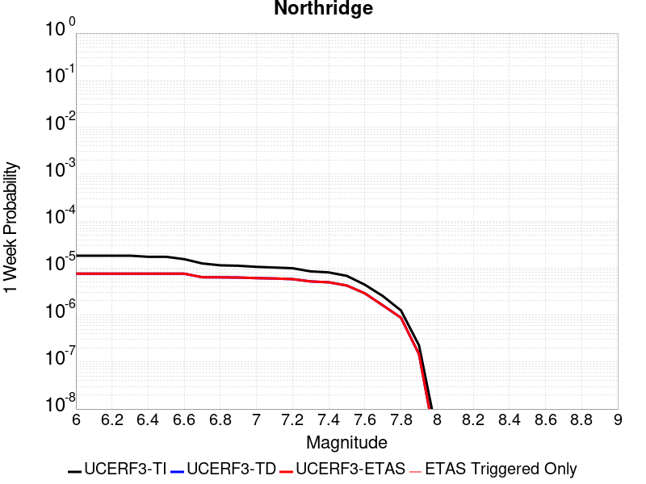 |  | 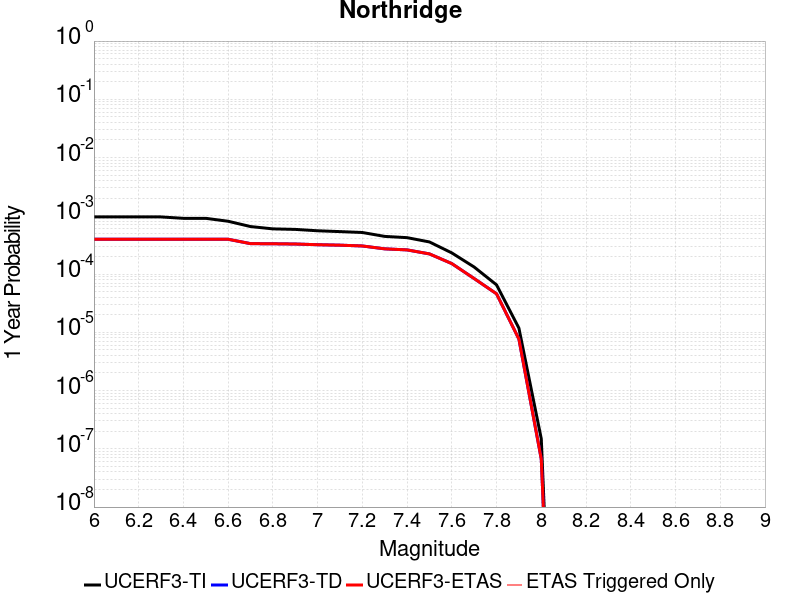 |  |

| Magnitude | 1 wk TI Prob | 1 wk TD Prob | 1 wk ETAS Prob | 1 wk ETAS/TD Gain | 1 wk ETAS Triggered Only | 1 mo TI Prob | 1 mo TD Prob | 1 mo ETAS Prob | 1 mo ETAS/TD Gain | 1 mo ETAS Triggered Only | 1 yr TI Prob | 1 yr TD Prob | 1 yr ETAS Prob | 1 yr ETAS/TD Gain | 1 yr ETAS Triggered Only | 10 yr TI Prob | 10 yr TD Prob | 10 yr ETAS Prob | 10 yr ETAS/TD Gain | 10 yr ETAS Triggered Only |
|-----|-----|-----|-----|-----|-----|-----|-----|-----|-----|-----|-----|-----|-----|-----|-----|-----|-----|-----|-----|-----|
| 6.0 | 1.8340852E-5 | 7.5880193E-6 | 7.5880193E-6 | 1.0 | 0.0 | 7.860128E-5 | 3.251969E-5 | 3.251969E-5 | 1.0 | 0.0 | 9.565505E-4 | 3.958575E-4 | 3.958575E-4 | 1.0 | 0.0 | 0.009524435 | 0.003951746 | 0.003971667 | 1.005041 | 2.0E-5 |
| 6.1 | 1.8340852E-5 | 7.5880193E-6 | 7.5880193E-6 | 1.0 | 0.0 | 7.860128E-5 | 3.251969E-5 | 3.251969E-5 | 1.0 | 0.0 | 9.565505E-4 | 3.958575E-4 | 3.958575E-4 | 1.0 | 0.0 | 0.009524435 | 0.003951746 | 0.003971667 | 1.005041 | 2.0E-5 |
| 6.2 | 1.8340852E-5 | 7.5880193E-6 | 7.5880193E-6 | 1.0 | 0.0 | 7.860128E-5 | 3.251969E-5 | 3.251969E-5 | 1.0 | 0.0 | 9.565505E-4 | 3.958575E-4 | 3.958575E-4 | 1.0 | 0.0 | 0.009524435 | 0.003951746 | 0.003971667 | 1.005041 | 2.0E-5 |
| 6.3 | 1.8340852E-5 | 7.5880193E-6 | 7.5880193E-6 | 1.0 | 0.0 | 7.860128E-5 | 3.251969E-5 | 3.251969E-5 | 1.0 | 0.0 | 9.565505E-4 | 3.958575E-4 | 3.958575E-4 | 1.0 | 0.0 | 0.009524435 | 0.003951746 | 0.003971667 | 1.005041 | 2.0E-5 |
| 6.4 | 1.7361892E-5 | 7.5880193E-6 | 7.5880193E-6 | 1.0 | 0.0 | 7.440598E-5 | 3.251969E-5 | 3.251969E-5 | 1.0 | 0.0 | 9.055163E-4 | 3.958575E-4 | 3.958575E-4 | 1.0 | 0.0 | 0.009018354 | 0.003951746 | 0.003971667 | 1.005041 | 2.0E-5 |
| 6.5 | 1.7361892E-5 | 7.5880193E-6 | 7.5880193E-6 | 1.0 | 0.0 | 7.440598E-5 | 3.251969E-5 | 3.251969E-5 | 1.0 | 0.0 | 9.055163E-4 | 3.958575E-4 | 3.958575E-4 | 1.0 | 0.0 | 0.009018354 | 0.003951746 | 0.003971667 | 1.005041 | 2.0E-5 |
| 6.6 | 1.5458201E-5 | 7.5880193E-6 | 7.5880193E-6 | 1.0 | 0.0 | 6.624775E-5 | 3.251969E-5 | 3.251969E-5 | 1.0 | 0.0 | 8.0626784E-4 | 3.958575E-4 | 3.958575E-4 | 1.0 | 0.0 | 0.008033488 | 0.003951746 | 0.003971667 | 1.005041 | 2.0E-5 |
| 6.7 | 1.2538368E-5 | 6.381603E-6 | 6.381603E-6 | 1.0 | 0.0 | 5.3734755E-5 | 2.7349442E-5 | 2.7349442E-5 | 1.0 | 0.0 | 6.5402425E-4 | 3.3292902E-4 | 3.3292902E-4 | 1.0 | 0.0 | 0.0065210275 | 0.0033243506 | 0.0033442841 | 1.0059962 | 2.0E-5 |
| 6.8 | 1.1438097E-5 | 6.3502566E-6 | 6.3502566E-6 | 1.0 | 0.0 | 4.9019498E-5 | 2.7215105E-5 | 2.7215105E-5 | 1.0 | 0.0 | 5.9664896E-4 | 3.3129397E-4 | 3.3129397E-4 | 1.0 | 0.0 | 0.005950495 | 0.0033080487 | 0.0033279825 | 1.0060259 | 2.0E-5 |
| 6.9 | 1.1204891E-5 | 6.2867084E-6 | 6.2867084E-6 | 1.0 | 0.0 | 4.8020076E-5 | 2.694276E-5 | 2.694276E-5 | 1.0 | 0.0 | 5.8448757E-4 | 3.2797916E-4 | 3.2797916E-4 | 1.0 | 0.0 | 0.0058295266 | 0.0032749989 | 0.0032949334 | 1.0060868 | 2.0E-5 |
| 7.0 | 1.061046E-5 | 6.115359E-6 | 6.115359E-6 | 1.0 | 0.0 | 4.5472607E-5 | 2.6208421E-5 | 2.6208421E-5 | 1.0 | 0.0 | 5.534883E-4 | 3.1904122E-4 | 3.1904122E-4 | 1.0 | 0.0 | 0.0055211177 | 0.0031858785 | 0.0032058149 | 1.0062577 | 2.0E-5 |
| 7.1 | 1.0266979E-5 | 6.004274E-6 | 6.004274E-6 | 1.0 | 0.0 | 4.40006E-5 | 2.5732352E-5 | 2.5732352E-5 | 1.0 | 0.0 | 5.355756E-4 | 3.1324677E-4 | 3.1324677E-4 | 1.0 | 0.0 | 0.0053428668 | 0.003128098 | 0.0031480356 | 1.0063736 | 2.0E-5 |
| 7.2 | 9.91273E-6 | 5.819984E-6 | 5.819984E-6 | 1.0 | 0.0 | 4.248244E-5 | 2.4942554E-5 | 2.4942554E-5 | 1.0 | 0.0 | 5.171009E-4 | 3.036337E-4 | 3.036337E-4 | 1.0 | 0.0 | 0.0051589934 | 0.0030322333 | 0.0030521727 | 1.0065758 | 2.0E-5 |
| 7.3 | 8.4959265E-6 | 5.193062E-6 | 5.193062E-6 | 1.0 | 0.0 | 3.6410605E-5 | 2.225579E-5 | 2.225579E-5 | 1.0 | 0.0 | 4.4320893E-4 | 2.709308E-4 | 2.709308E-4 | 1.0 | 0.0 | 0.00442326 | 0.0027060313 | 0.0027259772 | 1.007371 | 2.0E-5 |
| 7.4 | 8.0847185E-6 | 4.9819355E-6 | 4.9819355E-6 | 1.0 | 0.0 | 3.4648332E-5 | 2.135098E-5 | 2.135098E-5 | 1.0 | 0.0 | 4.2176177E-4 | 2.599174E-4 | 2.599174E-4 | 1.0 | 0.0 | 0.0042096223 | 0.00259616 | 0.002616108 | 1.0076836 | 2.0E-5 |
| 7.5 | 6.8220684E-6 | 4.2533075E-6 | 4.2533075E-6 | 1.0 | 0.0 | 2.9237108E-5 | 1.8228335E-5 | 1.8228335E-5 | 1.0 | 0.0 | 3.5590364E-4 | 2.2190758E-4 | 2.2190758E-4 | 1.0 | 0.0 | 0.0035533418 | 0.002216881 | 0.0022368366 | 1.0090017 | 2.0E-5 |
| 7.6 | 4.4224143E-6 | 2.8999582E-6 | 2.8999582E-6 | 1.0 | 0.0 | 1.8953066E-5 | 1.2428334E-5 | 1.2428334E-5 | 1.0 | 0.0 | 2.3072914E-4 | 1.5130457E-4 | 1.5130457E-4 | 1.0 | 0.0 | 0.0023048974 | 0.0015120271 | 0.001522012 | 1.0066036 | 1.0E-5 |
| 7.7 | 2.5297056E-6 | 1.6045905E-6 | 1.6045905E-6 | 1.0 | 0.0 | 1.0841551E-5 | 6.8767986E-6 | 6.8767986E-6 | 1.0 | 0.0 | 1.319879E-4 | 8.3721854E-5 | 8.3721854E-5 | 1.0 | 0.0 | 0.0013190953 | 8.369078E-4 | 8.4689946E-4 | 1.0119387 | 1.0E-5 |
| 7.8 | 1.2508156E-6 | 8.780076E-7 | 8.780076E-7 | 1.0 | 0.0 | 5.3606273E-6 | 3.7628845E-6 | 3.7628845E-6 | 1.0 | 0.0 | 6.526368E-5 | 4.581217E-5 | 4.581217E-5 | 1.0 | 0.0 | 6.524452E-4 | 4.5802852E-4 | 4.6802394E-4 | 1.0218227 | 1.0E-5 |
| 7.9 | 2.262199E-7 | 1.4664671E-7 | 1.4664671E-7 | 1.0 | 0.0 | 9.695135E-7 | 6.284858E-7 | 6.284858E-7 | 1.0 | 0.0 | 1.1803763E-5 | 7.651788E-6 | 7.651788E-6 | 1.0 | 0.0 | 1.1803136E-4 | 7.651533E-5 | 7.651533E-5 | 1.0 | 0.0 |
| 8.0 | 2.865362E-9 | 1.2753101E-9 | 1.2753101E-9 | 1.0 | 0.0 | 1.2280123E-8 | 5.4656146E-9 | 5.4656146E-9 | 1.0 | 0.0 | 1.4951048E-7 | 6.654386E-8 | 6.654386E-8 | 1.0 | 0.0 | 1.4951038E-6 | 6.654386E-7 | 6.654386E-7 | 1.0 | 0.0 |

## Hector Mine
*[(top)](#table-of-contents)*

| 1 Week | 1 Month | 1 Year | 10 Year |
|-----|-----|-----|-----|
| 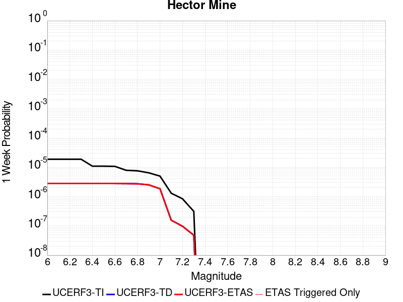 | 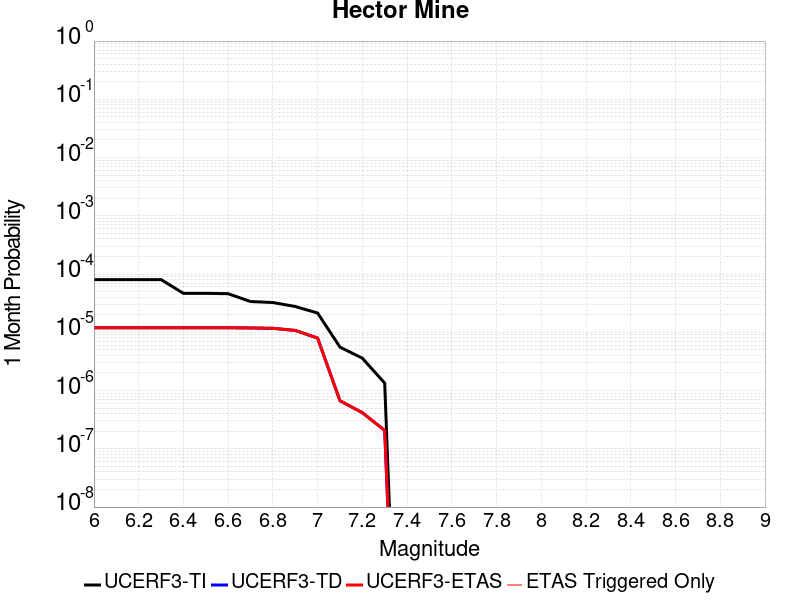 | 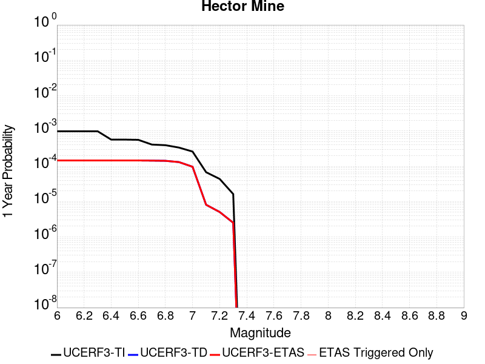 | 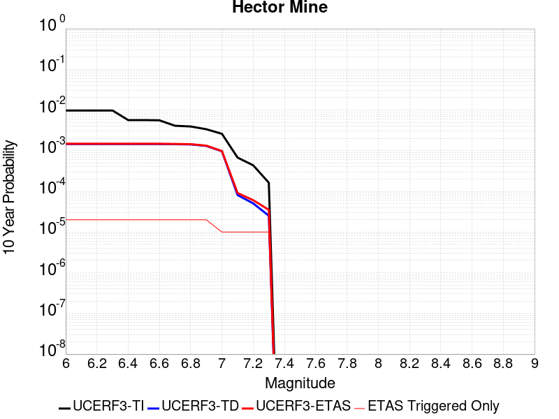 |

| Magnitude | 1 wk TI Prob | 1 wk TD Prob | 1 wk ETAS Prob | 1 wk ETAS/TD Gain | 1 wk ETAS Triggered Only | 1 mo TI Prob | 1 mo TD Prob | 1 mo ETAS Prob | 1 mo ETAS/TD Gain | 1 mo ETAS Triggered Only | 1 yr TI Prob | 1 yr TD Prob | 1 yr ETAS Prob | 1 yr ETAS/TD Gain | 1 yr ETAS Triggered Only | 10 yr TI Prob | 10 yr TD Prob | 10 yr ETAS Prob | 10 yr ETAS/TD Gain | 10 yr ETAS Triggered Only |
|-----|-----|-----|-----|-----|-----|-----|-----|-----|-----|-----|-----|-----|-----|-----|-----|-----|-----|-----|-----|-----|
| 6.0 | 1.8760093E-5 | 2.7963818E-6 | 2.7963818E-6 | 1.0 | 0.0 | 8.039792E-5 | 1.1984461E-5 | 1.1984461E-5 | 1.0 | 0.0 | 9.78405E-4 | 1.4590504E-4 | 1.4590504E-4 | 1.0 | 0.0 | 0.009741086 | 0.0014584847 | 0.0014784555 | 1.0136929 | 2.0E-5 |
| 6.1 | 1.8760093E-5 | 2.7963818E-6 | 2.7963818E-6 | 1.0 | 0.0 | 8.039792E-5 | 1.1984461E-5 | 1.1984461E-5 | 1.0 | 0.0 | 9.78405E-4 | 1.4590504E-4 | 1.4590504E-4 | 1.0 | 0.0 | 0.009741086 | 0.0014584847 | 0.0014784555 | 1.0136929 | 2.0E-5 |
| 6.2 | 1.8760093E-5 | 2.7963818E-6 | 2.7963818E-6 | 1.0 | 0.0 | 8.039792E-5 | 1.1984461E-5 | 1.1984461E-5 | 1.0 | 0.0 | 9.78405E-4 | 1.4590504E-4 | 1.4590504E-4 | 1.0 | 0.0 | 0.009741086 | 0.0014584847 | 0.0014784555 | 1.0136929 | 2.0E-5 |
| 6.3 | 1.8760093E-5 | 2.7963818E-6 | 2.7963818E-6 | 1.0 | 0.0 | 8.039792E-5 | 1.1984461E-5 | 1.1984461E-5 | 1.0 | 0.0 | 9.78405E-4 | 1.4590504E-4 | 1.4590504E-4 | 1.0 | 0.0 | 0.009741086 | 0.0014584847 | 0.0014784555 | 1.0136929 | 2.0E-5 |
| 6.4 | 1.0888055E-5 | 2.7963818E-6 | 2.7963818E-6 | 1.0 | 0.0 | 4.666226E-5 | 1.1984461E-5 | 1.1984461E-5 | 1.0 | 0.0 | 5.679649E-4 | 1.4590504E-4 | 1.4590504E-4 | 1.0 | 0.0 | 0.0056651547 | 0.0014584847 | 0.0014784555 | 1.0136929 | 2.0E-5 |
| 6.5 | 1.0888055E-5 | 2.7963818E-6 | 2.7963818E-6 | 1.0 | 0.0 | 4.666226E-5 | 1.1984461E-5 | 1.1984461E-5 | 1.0 | 0.0 | 5.679649E-4 | 1.4590504E-4 | 1.4590504E-4 | 1.0 | 0.0 | 0.0056651547 | 0.0014584847 | 0.0014784555 | 1.0136929 | 2.0E-5 |
| 6.6 | 1.0730738E-5 | 2.7963818E-6 | 2.7963818E-6 | 1.0 | 0.0 | 4.5988065E-5 | 1.1984461E-5 | 1.1984461E-5 | 1.0 | 0.0 | 5.5976084E-4 | 1.4590504E-4 | 1.4590504E-4 | 1.0 | 0.0 | 0.0055835294 | 0.0014584847 | 0.0014784555 | 1.0136929 | 2.0E-5 |
| 6.7 | 7.881326E-6 | 2.7710626E-6 | 2.7710626E-6 | 1.0 | 0.0 | 3.3776672E-5 | 1.1875951E-5 | 1.1875951E-5 | 1.0 | 0.0 | 4.111534E-4 | 1.445841E-4 | 1.445841E-4 | 1.0 | 0.0 | 0.0041039353 | 0.0014452925 | 0.0014652635 | 1.013818 | 2.0E-5 |
| 6.8 | 7.5683483E-6 | 2.7328138E-6 | 2.7328138E-6 | 1.0 | 0.0 | 3.2435375E-5 | 1.1712029E-5 | 1.1712029E-5 | 1.0 | 0.0 | 3.9482914E-4 | 1.4258861E-4 | 1.4258861E-4 | 1.0 | 0.0 | 0.0039412836 | 0.0014253634 | 0.0014453348 | 1.0140115 | 2.0E-5 |
| 6.9 | 6.473048E-6 | 2.5138945E-6 | 2.5138945E-6 | 1.0 | 0.0 | 2.7741338E-5 | 1.07738115E-5 | 1.07738115E-5 | 1.0 | 0.0 | 3.3769844E-4 | 1.3116724E-4 | 1.3116724E-4 | 1.0 | 0.0 | 0.0033718573 | 0.0013112876 | 0.0013312615 | 1.0152322 | 2.0E-5 |
| 7.0 | 4.9959954E-6 | 1.8565124E-6 | 1.8565124E-6 | 1.0 | 0.0 | 2.1411232E-5 | 7.956478E-6 | 7.956478E-6 | 1.0 | 0.0 | 2.6065056E-4 | 9.686937E-5 | 9.686937E-5 | 1.0 | 0.0 | 0.0026034506 | 9.6862105E-4 | 9.786114E-4 | 1.010314 | 1.0E-5 |
| 7.1 | 1.2997541E-6 | 1.5602147E-7 | 1.5602147E-7 | 1.0 | 0.0 | 5.5703626E-6 | 6.686633E-7 | 6.686633E-7 | 1.0 | 0.0 | 6.7817055E-5 | 8.140949E-6 | 8.140949E-6 | 1.0 | 0.0 | 6.779636E-4 | 8.1406906E-5 | 9.1406095E-5 | 1.1228297 | 1.0E-5 |
| 7.2 | 8.392699E-7 | 9.727592E-8 | 9.727592E-8 | 1.0 | 0.0 | 3.596866E-6 | 4.1689677E-7 | 4.1689677E-7 | 1.0 | 0.0 | 4.3790962E-5 | 5.0757085E-6 | 5.0757085E-6 | 1.0 | 0.0 | 4.3782333E-4 | 5.0756116E-5 | 6.0755607E-5 | 1.1970106 | 1.0E-5 |
| 7.3 | 3.13015E-7 | 4.829262E-8 | 4.829262E-8 | 1.0 | 0.0 | 1.3414921E-6 | 2.0696835E-7 | 2.0696835E-7 | 1.0 | 0.0 | 1.6332544E-5 | 2.5198376E-6 | 2.5198376E-6 | 1.0 | 0.0 | 1.6331344E-4 | 2.5198176E-5 | 3.5197925E-5 | 1.3968441 | 1.0E-5 |

## Calaveras (No) 2011 CFM
*[(top)](#table-of-contents)*

| 1 Week | 1 Month | 1 Year | 10 Year |
|-----|-----|-----|-----|
|  | 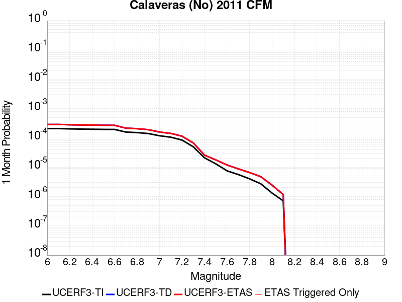 |  | 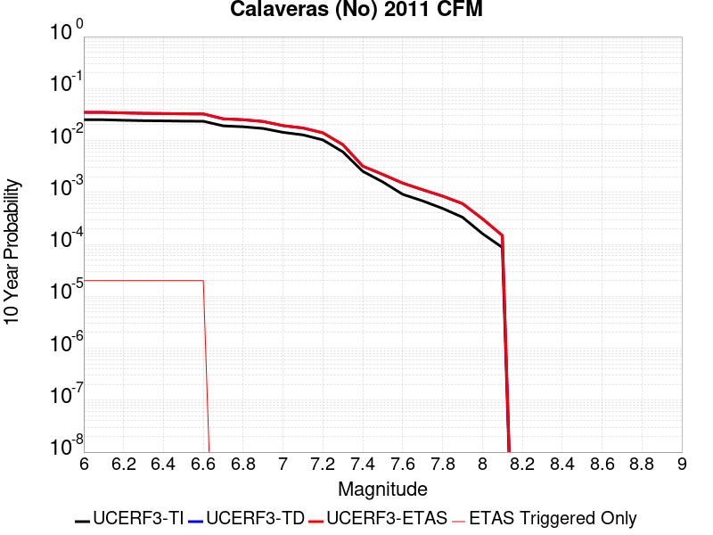 |

| Magnitude | 1 wk TI Prob | 1 wk TD Prob | 1 wk ETAS Prob | 1 wk ETAS/TD Gain | 1 wk ETAS Triggered Only | 1 mo TI Prob | 1 mo TD Prob | 1 mo ETAS Prob | 1 mo ETAS/TD Gain | 1 mo ETAS Triggered Only | 1 yr TI Prob | 1 yr TD Prob | 1 yr ETAS Prob | 1 yr ETAS/TD Gain | 1 yr ETAS Triggered Only | 10 yr TI Prob | 10 yr TD Prob | 10 yr ETAS Prob | 10 yr ETAS/TD Gain | 10 yr ETAS Triggered Only |
|-----|-----|-----|-----|-----|-----|-----|-----|-----|-----|-----|-----|-----|-----|-----|-----|-----|-----|-----|-----|-----|
| 6.0 | 4.8694856E-5 | 6.747121E-5 | 6.747121E-5 | 1.0 | 0.0 | 2.0867554E-4 | 2.8913133E-4 | 2.8913133E-4 | 1.0 | 0.0 | 0.0025376645 | 0.003514627 | 0.003524592 | 1.0028353 | 1.0E-5 | 0.02508881 | 0.034771245 | 0.03479055 | 1.0005552 | 2.0E-5 |
| 6.1 | 4.8694856E-5 | 6.747121E-5 | 6.747121E-5 | 1.0 | 0.0 | 2.0867554E-4 | 2.8913133E-4 | 2.8913133E-4 | 1.0 | 0.0 | 0.0025376645 | 0.003514627 | 0.003524592 | 1.0028353 | 1.0E-5 | 0.02508881 | 0.034771245 | 0.03479055 | 1.0005552 | 2.0E-5 |
| 6.2 | 4.7541962E-5 | 6.580218E-5 | 6.580218E-5 | 1.0 | 0.0 | 2.0373536E-4 | 2.8197994E-4 | 2.8197994E-4 | 1.0 | 0.0 | 0.0024776561 | 0.003427859 | 0.0034378245 | 1.0029073 | 1.0E-5 | 0.024502134 | 0.033932675 | 0.033951998 | 1.0005693 | 2.0E-5 |
| 6.3 | 4.6717287E-5 | 6.4635555E-5 | 6.4635555E-5 | 1.0 | 0.0 | 2.0020158E-4 | 2.7698115E-4 | 2.7698115E-4 | 1.0 | 0.0 | 0.0024347296 | 0.0033672103 | 0.0033771766 | 1.0029598 | 1.0E-5 | 0.024082264 | 0.033345193 | 0.033364523 | 1.0005798 | 2.0E-5 |
| 6.4 | 4.6276386E-5 | 6.399742E-5 | 6.399742E-5 | 1.0 | 0.0 | 1.983123E-4 | 2.7424688E-4 | 2.7424688E-4 | 1.0 | 0.0 | 0.0024117786 | 0.0033340224 | 0.0033439891 | 1.0029894 | 1.0E-5 | 0.02385771 | 0.033024073 | 0.03304341 | 1.0005857 | 2.0E-5 |
| 6.5 | 4.5720994E-5 | 6.319881E-5 | 6.319881E-5 | 1.0 | 0.0 | 1.9593239E-4 | 2.70825E-4 | 2.70825E-4 | 1.0 | 0.0 | 0.002382867 | 0.0032924965 | 0.0033024636 | 1.0030272 | 1.0E-5 | 0.023574775 | 0.032622032 | 0.03264138 | 1.0005931 | 2.0E-5 |
| 6.6 | 4.549134E-5 | 6.28519E-5 | 6.28519E-5 | 1.0 | 0.0 | 1.949483E-4 | 2.6933852E-4 | 2.6933852E-4 | 1.0 | 0.0 | 0.0023709119 | 0.0032744533 | 0.0032844206 | 1.0030439 | 1.0E-5 | 0.023457756 | 0.032447387 | 0.03246674 | 1.0005964 | 2.0E-5 |
| 6.7 | 3.701047E-5 | 5.0359427E-5 | 5.0359427E-5 | 1.0 | 0.0 | 1.5860666E-4 | 2.1580851E-4 | 2.1580851E-4 | 1.0 | 0.0 | 0.0019293258 | 0.002624346 | 0.002624346 | 1.0 | 0.0 | 0.019126613 | 0.026125323 | 0.026125323 | 1.0 | 0.0 |
| 6.8 | 3.5523568E-5 | 4.8341022E-5 | 4.8341022E-5 | 1.0 | 0.0 | 1.5223498E-4 | 2.071596E-4 | 2.071596E-4 | 1.0 | 0.0 | 0.0018518851 | 0.0025192937 | 0.0025192937 | 1.0 | 0.0 | 0.018365284 | 0.025097553 | 0.025097553 | 1.0 | 0.0 |
| 6.9 | 3.2946147E-5 | 4.466269E-5 | 4.466269E-5 | 1.0 | 0.0 | 1.4119013E-4 | 1.9139773E-4 | 1.9139773E-4 | 1.0 | 0.0 | 0.0017176344 | 0.0023278191 | 0.0023278191 | 1.0 | 0.0 | 0.017044188 | 0.023219598 | 0.023219598 | 1.0 | 0.0 |
| 7.0 | 2.7682381E-5 | 3.702223E-5 | 3.702223E-5 | 1.0 | 0.0 | 1.1863338E-4 | 1.5865723E-4 | 1.5865723E-4 | 1.0 | 0.0 | 0.0014434044 | 0.0019299705 | 0.0019299705 | 1.0 | 0.0 | 0.01434065 | 0.01931092 | 0.01931092 | 1.0 | 0.0 |
| 7.1 | 2.471967E-5 | 3.328669E-5 | 3.328669E-5 | 1.0 | 0.0 | 1.05937135E-4 | 1.4264962E-4 | 1.4264962E-4 | 1.0 | 0.0 | 0.0012890215 | 0.0017354045 | 0.0017354045 | 1.0 | 0.0 | 0.0128157 | 0.017385952 | 0.017385952 | 1.0 | 0.0 |
| 7.2 | 1.9748062E-5 | 2.6774684E-5 | 2.6774684E-5 | 1.0 | 0.0 | 8.463181E-5 | 1.1474373E-4 | 1.1474373E-4 | 1.0 | 0.0 | 0.0010299052 | 0.0013961331 | 0.0013961331 | 1.0 | 0.0 | 0.01025145 | 0.014030739 | 0.014030739 | 1.0 | 0.0 |
| 7.3 | 1.1603734E-5 | 1.5783844E-5 | 1.5783844E-5 | 1.0 | 0.0 | 4.9729337E-5 | 6.764337E-5 | 6.764337E-5 | 1.0 | 0.0 | 6.052865E-4 | 8.232611E-4 | 8.232611E-4 | 1.0 | 0.0 | 0.0060364045 | 0.008308666 | 0.008308666 | 1.0 | 0.0 |
| 7.4 | 4.885381E-6 | 6.0349853E-6 | 6.0349853E-6 | 1.0 | 0.0 | 2.0937177E-5 | 2.5863968E-5 | 2.5863968E-5 | 1.0 | 0.0 | 2.5488032E-4 | 3.148485E-4 | 3.148485E-4 | 1.0 | 0.0 | 0.0025458818 | 0.0032010598 | 0.0032010598 | 1.0 | 0.0 |
| 7.5 | 3.0571264E-6 | 4.155299E-6 | 4.155299E-6 | 1.0 | 0.0 | 1.3101904E-5 | 1.7808303E-5 | 1.7808303E-5 | 1.0 | 0.0 | 1.5950401E-4 | 2.1679462E-4 | 2.1679462E-4 | 1.0 | 0.0 | 0.0015938957 | 0.002221121 | 0.002221121 | 1.0 | 0.0 |
| 7.6 | 1.764948E-6 | 2.7955498E-6 | 2.7955498E-6 | 1.0 | 0.0 | 7.564041E-6 | 1.1980874E-5 | 1.1980874E-5 | 1.0 | 0.0 | 9.208831E-5 | 1.4585744E-4 | 1.4585744E-4 | 1.0 | 0.0 | 9.205016E-4 | 0.0015123509 | 0.0015123509 | 1.0 | 0.0 |
| 7.7 | 1.3173734E-6 | 2.058471E-6 | 2.058471E-6 | 1.0 | 0.0 | 5.645874E-6 | 8.8219895E-6 | 8.8219895E-6 | 1.0 | 0.0 | 6.873634E-5 | 1.0740245E-4 | 1.0740245E-4 | 1.0 | 0.0 | 6.8715087E-4 | 0.0011261401 | 0.0011261401 | 1.0 | 0.0 |
| 7.8 | 9.4429885E-7 | 1.5489635E-6 | 1.5489635E-6 | 1.0 | 0.0 | 4.0469886E-6 | 6.638398E-6 | 6.638398E-6 | 1.0 | 0.0 | 4.9270973E-5 | 8.081952E-5 | 8.081952E-5 | 1.0 | 0.0 | 4.926005E-4 | 8.5014524E-4 | 8.5014524E-4 | 1.0 | 0.0 |
| 7.9 | 6.388233E-7 | 1.1148749E-6 | 1.1148749E-6 | 1.0 | 0.0 | 2.7378112E-6 | 4.7780263E-6 | 4.7780263E-6 | 1.0 | 0.0 | 3.3332344E-5 | 5.817093E-5 | 5.817093E-5 | 1.0 | 0.0 | 3.3327343E-4 | 6.0963054E-4 | 6.0963054E-4 | 1.0 | 0.0 |
| 8.0 | 3.087986E-7 | 5.7543696E-7 | 5.7543696E-7 | 1.0 | 0.0 | 1.323422E-6 | 2.466156E-6 | 2.466156E-6 | 1.0 | 0.0 | 1.6112543E-5 | 3.002504E-5 | 3.002504E-5 | 1.0 | 0.0 | 1.6111376E-4 | 3.110302E-4 | 3.110302E-4 | 1.0 | 0.0 |
| 8.1 | 1.6725647E-7 | 2.7410047E-7 | 2.7410047E-7 | 1.0 | 0.0 | 7.168133E-7 | 1.1747159E-6 | 1.1747159E-6 | 1.0 | 0.0 | 8.7271665E-6 | 1.4302073E-5 | 1.4302073E-5 | 1.0 | 0.0 | 8.726824E-5 | 1.48486E-4 | 1.48486E-4 | 1.0 | 0.0 |

## Malibu Coast (Extension) alt 1
*[(top)](#table-of-contents)*

| 1 Week | 1 Month | 1 Year | 10 Year |
|-----|-----|-----|-----|
| 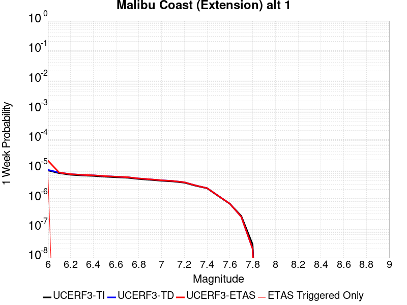 |  |  |  |

| Magnitude | 1 wk TI Prob | 1 wk TD Prob | 1 wk ETAS Prob | 1 wk ETAS/TD Gain | 1 wk ETAS Triggered Only | 1 mo TI Prob | 1 mo TD Prob | 1 mo ETAS Prob | 1 mo ETAS/TD Gain | 1 mo ETAS Triggered Only | 1 yr TI Prob | 1 yr TD Prob | 1 yr ETAS Prob | 1 yr ETAS/TD Gain | 1 yr ETAS Triggered Only | 10 yr TI Prob | 10 yr TD Prob | 10 yr ETAS Prob | 10 yr ETAS/TD Gain | 10 yr ETAS Triggered Only |
|-----|-----|-----|-----|-----|-----|-----|-----|-----|-----|-----|-----|-----|-----|-----|-----|-----|-----|-----|-----|-----|
| 6.0 | 8.930738E-6 | 9.329276E-6 | 1.9329182E-5 | 2.0718846 | 1.0E-5 | 3.827403E-5 | 3.998201E-5 | 5.998121E-5 | 1.500205 | 2.0E-5 | 4.6588664E-4 | 4.8667393E-4 | 5.066642E-4 | 1.0410752 | 2.0E-5 | 0.0046491115 | 0.004856264 | 0.004876167 | 1.0040984 | 2.0E-5 |
| 6.1 | 7.199952E-6 | 7.5302964E-6 | 7.5302964E-6 | 1.0 | 0.0 | 3.0856572E-5 | 3.2272303E-5 | 4.2271982E-5 | 1.3098532 | 1.0E-5 | 3.75614E-4 | 3.9284505E-4 | 4.0284113E-4 | 1.0254453 | 1.0E-5 | 0.0037497976 | 0.003921572 | 0.003931533 | 1.00254 | 1.0E-5 |
| 6.2 | 6.3721413E-6 | 6.6667917E-6 | 6.6667917E-6 | 1.0 | 0.0 | 2.7308892E-5 | 2.8571652E-5 | 3.857137E-5 | 1.3499873 | 1.0E-5 | 3.3243504E-4 | 3.4780471E-4 | 3.5780124E-4 | 1.0287417 | 1.0E-5 | 0.0033193815 | 0.0034726437 | 0.003482609 | 1.0028696 | 1.0E-5 |
| 6.3 | 6.016345E-6 | 6.295158E-6 | 6.295158E-6 | 1.0 | 0.0 | 2.578408E-5 | 2.6978973E-5 | 3.69787E-5 | 1.3706491 | 1.0E-5 | 3.1387596E-4 | 3.2841982E-4 | 3.3841652E-4 | 1.0304388 | 1.0E-5 | 0.00313433 | 0.0032793807 | 0.003289348 | 1.0030394 | 1.0E-5 |
| 6.4 | 5.8104883E-6 | 6.0795446E-6 | 6.0795446E-6 | 1.0 | 0.0 | 2.4901856E-5 | 2.6054933E-5 | 3.6054673E-5 | 1.3837944 | 1.0E-5 | 3.031379E-4 | 3.1717293E-4 | 3.2716978E-4 | 1.0315186 | 1.0E-5 | 0.0030272473 | 0.0031672374 | 0.0031772056 | 1.0031474 | 1.0E-5 |
| 6.5 | 5.476925E-6 | 5.7275133E-6 | 5.7275133E-6 | 1.0 | 0.0 | 2.3472323E-5 | 2.4546256E-5 | 2.4546256E-5 | 1.0 | 0.0 | 2.8573806E-4 | 2.9880996E-4 | 2.9880996E-4 | 1.0 | 0.0 | 0.0028537093 | 0.002984114 | 0.002984114 | 1.0 | 0.0 |
| 6.6 | 5.222387E-6 | 5.45858E-6 | 5.45858E-6 | 1.0 | 0.0 | 2.2381464E-5 | 2.3393704E-5 | 2.3393704E-5 | 1.0 | 0.0 | 2.7246025E-4 | 2.8478142E-4 | 2.8478142E-4 | 1.0 | 0.0 | 0.0027212645 | 0.0028441956 | 0.0028441956 | 1.0 | 0.0 |
| 6.7 | 5.0337076E-6 | 5.259103E-6 | 5.259103E-6 | 1.0 | 0.0 | 2.1572854E-5 | 2.253882E-5 | 2.253882E-5 | 1.0 | 0.0 | 2.6261783E-4 | 2.7437587E-4 | 2.7437587E-4 | 1.0 | 0.0 | 0.002623077 | 0.002740401 | 0.002740401 | 1.0 | 0.0 |
| 6.8 | 4.5675624E-6 | 4.7587164E-6 | 4.7587164E-6 | 1.0 | 0.0 | 1.9575122E-5 | 2.039434E-5 | 2.039434E-5 | 1.0 | 0.0 | 2.3830103E-4 | 2.48273E-4 | 2.48273E-4 | 1.0 | 0.0 | 0.0023804565 | 0.002479976 | 0.002479976 | 1.0 | 0.0 |
| 6.9 | 4.2802412E-6 | 4.4520207E-6 | 4.4520207E-6 | 1.0 | 0.0 | 1.8343762E-5 | 1.907995E-5 | 1.907995E-5 | 1.0 | 0.0 | 2.2331243E-4 | 2.3227377E-4 | 2.3227377E-4 | 1.0 | 0.0 | 0.0022308815 | 0.0023203269 | 0.0023203269 | 1.0 | 0.0 |
| 7.0 | 3.9794063E-6 | 4.130099E-6 | 4.130099E-6 | 1.0 | 0.0 | 1.7054486E-5 | 1.7700306E-5 | 1.7700306E-5 | 1.0 | 0.0 | 2.0761859E-4 | 2.1548003E-4 | 2.1548003E-4 | 1.0 | 0.0 | 0.0020742472 | 0.0021527244 | 0.0021527244 | 1.0 | 0.0 |
| 7.1 | 3.7730424E-6 | 3.911217E-6 | 3.911217E-6 | 1.0 | 0.0 | 1.6170083E-5 | 1.6762251E-5 | 1.6762251E-5 | 1.0 | 0.0 | 1.9685295E-4 | 2.0406142E-4 | 2.0406142E-4 | 1.0 | 0.0 | 0.0019667868 | 0.0020387534 | 0.0020387534 | 1.0 | 0.0 |
| 7.2 | 3.424985E-6 | 3.541337E-6 | 3.541337E-6 | 1.0 | 0.0 | 1.4678424E-5 | 1.5177071E-5 | 1.5177071E-5 | 1.0 | 0.0 | 1.7869516E-4 | 1.8476529E-4 | 1.8476529E-4 | 1.0 | 0.0 | 0.0017855153 | 0.0018461287 | 0.0018461287 | 1.0 | 0.0 |
| 7.3 | 2.6966375E-6 | 2.7596534E-6 | 2.7596534E-6 | 1.0 | 0.0 | 1.15569665E-5 | 1.1827032E-5 | 1.1827032E-5 | 1.0 | 0.0 | 1.4069698E-4 | 1.4398464E-4 | 1.4398464E-4 | 1.0 | 0.0 | 0.0014060794 | 0.0014389176 | 0.0014389176 | 1.0 | 0.0 |
| 7.4 | 2.215957E-6 | 2.249378E-6 | 2.249378E-6 | 1.0 | 0.0 | 9.496924E-6 | 9.640156E-6 | 9.640156E-6 | 1.0 | 0.0 | 1.1561892E-4 | 1.17362615E-4 | 1.17362615E-4 | 1.0 | 0.0 | 0.0011555878 | 0.0011730101 | 0.0011730101 | 1.0 | 0.0 |
| 7.5 | 1.2040218E-6 | 1.2219067E-6 | 1.2219067E-6 | 1.0 | 0.0 | 5.160083E-6 | 5.2367322E-6 | 5.2367322E-6 | 1.0 | 0.0 | 6.2822204E-5 | 6.375537E-5 | 6.375537E-5 | 1.0 | 0.0 | 6.280445E-4 | 6.3737266E-4 | 6.3737266E-4 | 1.0 | 0.0 |
| 7.6 | 6.6157446E-7 | 6.678975E-7 | 6.678975E-7 | 1.0 | 0.0 | 2.835316E-6 | 2.8624147E-6 | 2.8624147E-6 | 1.0 | 0.0 | 3.4519428E-5 | 3.484936E-5 | 3.484936E-5 | 1.0 | 0.0 | 3.4514067E-4 | 3.4844046E-4 | 3.4844046E-4 | 1.0 | 0.0 |
| 7.7 | 2.6012302E-7 | 2.4357593E-7 | 2.4357593E-7 | 1.0 | 0.0 | 1.1148124E-6 | 1.0438964E-6 | 1.0438964E-6 | 1.0 | 0.0 | 1.3572758E-5 | 1.2709375E-5 | 1.2709375E-5 | 1.0 | 0.0 | 1.3571928E-4 | 1.2708755E-4 | 1.2708755E-4 | 1.0 | 0.0 |
| 7.8 | 2.8323132E-8 | 2.0266649E-8 | 2.0266649E-8 | 1.0 | 0.0 | 1.2138484E-7 | 8.685707E-8 | 8.685707E-8 | 1.0 | 0.0 | 1.4778595E-6 | 1.0574844E-6 | 1.0574844E-6 | 1.0 | 0.0 | 1.4778497E-5 | 1.0574801E-5 | 1.0574801E-5 | 1.0 | 0.0 |

## Sargent 2011 CFM
*[(top)](#table-of-contents)*

| 1 Week | 1 Month | 1 Year | 10 Year |
|-----|-----|-----|-----|
|  |  |  | 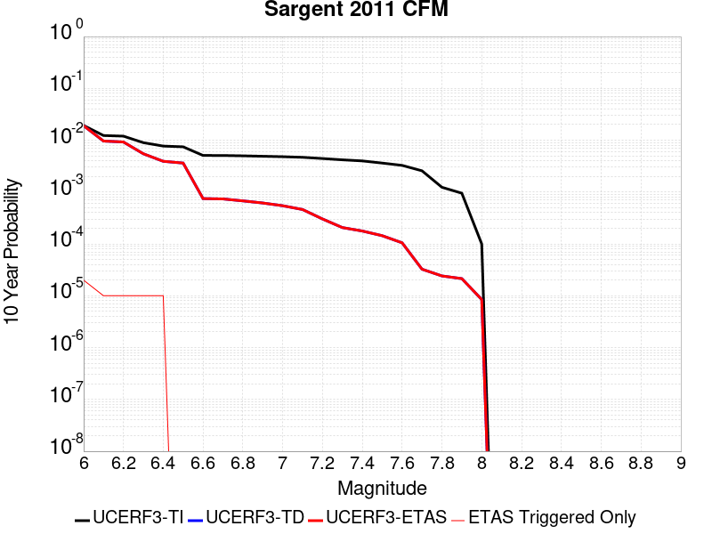 |

| Magnitude | 1 wk TI Prob | 1 wk TD Prob | 1 wk ETAS Prob | 1 wk ETAS/TD Gain | 1 wk ETAS Triggered Only | 1 mo TI Prob | 1 mo TD Prob | 1 mo ETAS Prob | 1 mo ETAS/TD Gain | 1 mo ETAS Triggered Only | 1 yr TI Prob | 1 yr TD Prob | 1 yr ETAS Prob | 1 yr ETAS/TD Gain | 1 yr ETAS Triggered Only | 10 yr TI Prob | 10 yr TD Prob | 10 yr ETAS Prob | 10 yr ETAS/TD Gain | 10 yr ETAS Triggered Only |
|-----|-----|-----|-----|-----|-----|-----|-----|-----|-----|-----|-----|-----|-----|-----|-----|-----|-----|-----|-----|-----|
| 6.0 | 3.7327867E-5 | 3.664913E-5 | 3.664913E-5 | 1.0 | 0.0 | 1.5996677E-4 | 1.5706103E-4 | 1.5706103E-4 | 1.0 | 0.0 | 0.0019458556 | 0.0019110236 | 0.0019309855 | 1.0104456 | 2.0E-5 | 0.01928905 | 0.019018095 | 0.019037714 | 1.0010316 | 2.0E-5 |
| 6.1 | 2.3771476E-5 | 1.8479273E-5 | 1.8479273E-5 | 1.0 | 0.0 | 1.01873775E-4 | 7.919498E-5 | 7.919498E-5 | 1.0 | 0.0 | 0.0012396075 | 9.638493E-4 | 9.7383966E-4 | 1.010365 | 1.0E-5 | 0.012327154 | 0.009636091 | 0.009645995 | 1.0010278 | 1.0E-5 |
| 6.2 | 2.3112721E-5 | 1.7710632E-5 | 1.7710632E-5 | 1.0 | 0.0 | 9.9050754E-5 | 7.590099E-5 | 7.590099E-5 | 1.0 | 0.0 | 0.0012052758 | 9.237792E-4 | 9.3377E-4 | 1.0108151 | 1.0E-5 | 0.011987597 | 0.009238743 | 0.009248652 | 1.0010724 | 1.0E-5 |
| 6.3 | 1.728509E-5 | 1.0458927E-5 | 1.0458927E-5 | 1.0 | 0.0 | 7.407686E-5 | 4.482347E-5 | 4.482347E-5 | 1.0 | 0.0 | 9.015125E-4 | 5.456343E-4 | 5.5562885E-4 | 1.0183173 | 1.0E-5 | 0.008978641 | 0.0054791216 | 0.0054890667 | 1.0018151 | 1.0E-5 |
| 6.4 | 1.48395575E-5 | 7.4559816E-6 | 7.4559816E-6 | 1.0 | 0.0 | 6.3596555E-5 | 3.195403E-5 | 3.195403E-5 | 1.0 | 0.0 | 7.7401294E-4 | 3.8900663E-4 | 3.9900275E-4 | 1.0256965 | 1.0E-5 | 0.0077132257 | 0.003918666 | 0.003928627 | 1.0025419 | 1.0E-5 |
| 6.5 | 1.4358964E-5 | 6.894759E-6 | 6.894759E-6 | 1.0 | 0.0 | 6.1536964E-5 | 2.9548846E-5 | 2.9548846E-5 | 1.0 | 0.0 | 7.48955E-4 | 3.5973339E-4 | 3.5973339E-4 | 1.0 | 0.0 | 0.0074643586 | 0.0036269152 | 0.0036269152 | 1.0 | 0.0 |
| 6.6 | 9.772591E-6 | 1.3736154E-6 | 1.3736154E-6 | 1.0 | 0.0 | 4.188186E-5 | 5.88691E-6 | 5.88691E-6 | 1.0 | 0.0 | 5.097923E-4 | 7.16708E-5 | 7.16708E-5 | 1.0 | 0.0 | 0.005086244 | 7.483097E-4 | 7.483097E-4 | 1.0 | 0.0 |
| 6.7 | 9.752745E-6 | 1.3523068E-6 | 1.3523068E-6 | 1.0 | 0.0 | 4.179681E-5 | 5.795587E-6 | 5.795587E-6 | 1.0 | 0.0 | 5.0875737E-4 | 7.055902E-5 | 7.055902E-5 | 1.0 | 0.0 | 0.005075942 | 7.371994E-4 | 7.371994E-4 | 1.0 | 0.0 |
| 6.8 | 9.608213E-6 | 1.2361709E-6 | 1.2361709E-6 | 1.0 | 0.0 | 4.1177405E-5 | 5.2978644E-6 | 5.2978644E-6 | 1.0 | 0.0 | 5.012196E-4 | 6.449961E-5 | 6.449961E-5 | 1.0 | 0.0 | 0.005000906 | 6.7634037E-4 | 6.7634037E-4 | 1.0 | 0.0 |
| 6.9 | 9.427164E-6 | 1.12094E-6 | 1.12094E-6 | 1.0 | 0.0 | 4.04015E-5 | 4.80402E-6 | 4.80402E-6 | 1.0 | 0.0 | 4.9177726E-4 | 5.8487396E-5 | 5.8487396E-5 | 1.0 | 0.0 | 0.004906904 | 6.1557174E-4 | 6.1557174E-4 | 1.0 | 0.0 |
| 7.0 | 9.247601E-6 | 9.873988E-7 | 9.873988E-7 | 1.0 | 0.0 | 3.9631974E-5 | 4.2317024E-6 | 4.2317024E-6 | 1.0 | 0.0 | 4.8241246E-4 | 5.1519775E-5 | 5.1519775E-5 | 1.0 | 0.0 | 0.0048136655 | 5.4542476E-4 | 5.4542476E-4 | 1.0 | 0.0 |
| 7.1 | 8.995454E-6 | 8.2711284E-7 | 8.2711284E-7 | 1.0 | 0.0 | 3.8551374E-5 | 3.5447645E-6 | 3.5447645E-6 | 1.0 | 0.0 | 4.6926187E-4 | 4.3156666E-5 | 4.3156666E-5 | 1.0 | 0.0 | 0.004682722 | 4.609069E-4 | 4.609069E-4 | 1.0 | 0.0 |
| 7.2 | 8.520861E-6 | 5.2766507E-7 | 5.2766507E-7 | 1.0 | 0.0 | 3.6517464E-5 | 2.2614197E-6 | 2.2614197E-6 | 1.0 | 0.0 | 4.445094E-4 | 2.7532446E-5 | 2.7532446E-5 | 1.0 | 0.0 | 0.004436213 | 3.0297207E-4 | 3.0297207E-4 | 1.0 | 0.0 |
| 7.3 | 8.043592E-6 | 3.456507E-7 | 3.456507E-7 | 1.0 | 0.0 | 3.4472083E-5 | 1.4813593E-6 | 1.4813593E-6 | 1.0 | 0.0 | 4.196168E-4 | 1.8035402E-5 | 1.8035402E-5 | 1.0 | 0.0 | 0.004188253 | 2.0669671E-4 | 2.0669671E-4 | 1.0 | 0.0 |
| 7.4 | 7.662316E-6 | 2.928958E-7 | 2.928958E-7 | 1.0 | 0.0 | 3.2838085E-5 | 1.2552671E-6 | 1.2552671E-6 | 1.0 | 0.0 | 3.9973034E-4 | 1.528277E-5 | 1.528277E-5 | 1.0 | 0.0 | 0.0039901207 | 1.7736501E-4 | 1.7736501E-4 | 1.0 | 0.0 |
| 7.5 | 6.961638E-6 | 2.3574503E-7 | 2.3574503E-7 | 1.0 | 0.0 | 2.9835252E-5 | 1.0103355E-6 | 1.0103355E-6 | 1.0 | 0.0 | 3.6318362E-4 | 1.2300766E-5 | 1.2300766E-5 | 1.0 | 0.0 | 0.0036259065 | 1.4409334E-4 | 1.4409334E-4 | 1.0 | 0.0 |
| 7.6 | 6.282332E-6 | 1.6892966E-7 | 1.6892966E-7 | 1.0 | 0.0 | 2.6924003E-5 | 7.2398404E-7 | 7.2398404E-7 | 1.0 | 0.0 | 3.2775043E-4 | 8.814471E-6 | 8.814471E-6 | 1.0 | 0.0 | 0.0032726745 | 1.05050465E-4 | 1.05050465E-4 | 1.0 | 0.0 |
| 7.7 | 4.934408E-6 | 5.001089E-8 | 5.001089E-8 | 1.0 | 0.0 | 2.114729E-5 | 2.1433237E-7 | 2.1433237E-7 | 1.0 | 0.0 | 2.5743784E-4 | 2.6094935E-6 | 2.6094935E-6 | 1.0 | 0.0 | 0.0025713982 | 3.2545366E-5 | 3.2545366E-5 | 1.0 | 0.0 |
| 7.8 | 2.373212E-6 | 3.5172643E-8 | 3.5172643E-8 | 1.0 | 0.0 | 1.0170869E-5 | 1.507399E-7 | 1.507399E-7 | 1.0 | 0.0 | 1.238233E-4 | 1.8352566E-6 | 1.8352566E-6 | 1.0 | 0.0 | 0.0012375432 | 2.4125171E-5 | 2.4125171E-5 | 1.0 | 0.0 |
| 7.9 | 1.8227792E-6 | 3.0619603E-8 | 3.0619603E-8 | 1.0 | 0.0 | 7.811887E-6 | 1.3122687E-7 | 1.3122687E-7 | 1.0 | 0.0 | 9.510558E-5 | 1.5976858E-6 | 1.5976858E-6 | 1.0 | 0.0 | 9.5064886E-4 | 2.1410624E-5 | 2.1410624E-5 | 1.0 | 0.0 |
| 8.0 | 1.9095137E-7 | 1.326461E-8 | 1.326461E-8 | 1.0 | 0.0 | 8.1836276E-7 | 5.684833E-8 | 5.684833E-8 | 1.0 | 0.0 | 9.963521E-6 | 6.921282E-7 | 6.921282E-7 | 1.0 | 0.0 | 9.963074E-5 | 8.463319E-6 | 8.463319E-6 | 1.0 | 0.0 |

## Great Valley 04b Gordon Valley
*[(top)](#table-of-contents)*

| 1 Week | 1 Month | 1 Year | 10 Year |
|-----|-----|-----|-----|
|  |  |  | 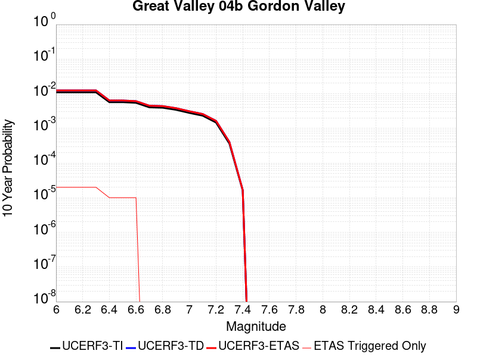 |

| Magnitude | 1 wk TI Prob | 1 wk TD Prob | 1 wk ETAS Prob | 1 wk ETAS/TD Gain | 1 wk ETAS Triggered Only | 1 mo TI Prob | 1 mo TD Prob | 1 mo ETAS Prob | 1 mo ETAS/TD Gain | 1 mo ETAS Triggered Only | 1 yr TI Prob | 1 yr TD Prob | 1 yr ETAS Prob | 1 yr ETAS/TD Gain | 1 yr ETAS Triggered Only | 10 yr TI Prob | 10 yr TD Prob | 10 yr ETAS Prob | 10 yr ETAS/TD Gain | 10 yr ETAS Triggered Only |
|-----|-----|-----|-----|-----|-----|-----|-----|-----|-----|-----|-----|-----|-----|-----|-----|-----|-----|-----|-----|-----|
| 6.0 | 2.1181217E-5 | 2.3981953E-5 | 2.3981953E-5 | 1.0 | 0.0 | 9.077348E-5 | 1.0277669E-4 | 1.1277566E-4 | 1.0972884 | 1.0E-5 | 0.0011046068 | 0.0012507546 | 0.0012607421 | 1.0079851 | 1.0E-5 | 0.010991322 | 0.012453599 | 0.012473349 | 1.001586 | 2.0E-5 |
| 6.1 | 2.1181217E-5 | 2.3981953E-5 | 2.3981953E-5 | 1.0 | 0.0 | 9.077348E-5 | 1.0277669E-4 | 1.1277566E-4 | 1.0972884 | 1.0E-5 | 0.0011046068 | 0.0012507546 | 0.0012607421 | 1.0079851 | 1.0E-5 | 0.010991322 | 0.012453599 | 0.012473349 | 1.001586 | 2.0E-5 |
| 6.2 | 2.1181217E-5 | 2.3981953E-5 | 2.3981953E-5 | 1.0 | 0.0 | 9.077348E-5 | 1.0277669E-4 | 1.1277566E-4 | 1.0972884 | 1.0E-5 | 0.0011046068 | 0.0012507546 | 0.0012607421 | 1.0079851 | 1.0E-5 | 0.010991322 | 0.012453599 | 0.012473349 | 1.001586 | 2.0E-5 |
| 6.3 | 2.1181217E-5 | 2.3981953E-5 | 2.3981953E-5 | 1.0 | 0.0 | 9.077348E-5 | 1.0277669E-4 | 1.1277566E-4 | 1.0972884 | 1.0E-5 | 0.0011046068 | 0.0012507546 | 0.0012607421 | 1.0079851 | 1.0E-5 | 0.010991322 | 0.012453599 | 0.012473349 | 1.001586 | 2.0E-5 |
| 6.4 | 1.0988268E-5 | 1.2254499E-5 | 1.2254499E-5 | 1.0 | 0.0 | 4.7091726E-5 | 5.2518313E-5 | 5.2518313E-5 | 1.0 | 0.0 | 5.731909E-4 | 6.392388E-4 | 6.392388E-4 | 1.0 | 0.0 | 0.005717147 | 0.0063755875 | 0.006385524 | 1.0015585 | 1.0E-5 |
| 6.5 | 1.0988268E-5 | 1.2254499E-5 | 1.2254499E-5 | 1.0 | 0.0 | 4.7091726E-5 | 5.2518313E-5 | 5.2518313E-5 | 1.0 | 0.0 | 5.731909E-4 | 6.392388E-4 | 6.392388E-4 | 1.0 | 0.0 | 0.005717147 | 0.0063755875 | 0.006385524 | 1.0015585 | 1.0E-5 |
| 6.6 | 1.0517822E-5 | 1.1724062E-5 | 1.1724062E-5 | 1.0 | 0.0 | 4.5075605E-5 | 5.02451E-5 | 5.02451E-5 | 1.0 | 0.0 | 5.4865726E-4 | 6.11578E-4 | 6.11578E-4 | 1.0 | 0.0 | 0.0054730466 | 0.0061005033 | 0.0061104423 | 1.0016292 | 1.0E-5 |
| 6.7 | 7.789219E-6 | 8.6776445E-6 | 8.6776445E-6 | 1.0 | 0.0 | 3.3381937E-5 | 3.7189402E-5 | 3.7189402E-5 | 1.0 | 0.0 | 4.063493E-4 | 4.526921E-4 | 4.526921E-4 | 1.0 | 0.0 | 0.004056071 | 0.0045182165 | 0.0045182165 | 1.0 | 0.0 |
| 6.8 | 7.5850853E-6 | 8.452389E-6 | 8.452389E-6 | 1.0 | 0.0 | 3.2507105E-5 | 3.622405E-5 | 3.622405E-5 | 1.0 | 0.0 | 3.957021E-4 | 4.409437E-4 | 4.409437E-4 | 1.0 | 0.0 | 0.0039499826 | 0.0044012 | 0.0044012 | 1.0 | 0.0 |
| 6.9 | 6.604105E-6 | 7.3585493E-6 | 7.3585493E-6 | 1.0 | 0.0 | 2.8303E-5 | 3.153628E-5 | 3.153628E-5 | 1.0 | 0.0 | 3.4453452E-4 | 3.8389044E-4 | 3.8389044E-4 | 1.0 | 0.0 | 0.0034400085 | 0.0038326595 | 0.0038326595 | 1.0 | 0.0 |
| 7.0 | 5.3701115E-6 | 5.9884183E-6 | 5.9884183E-6 | 1.0 | 0.0 | 2.301456E-5 | 2.5664414E-5 | 2.5664414E-5 | 1.0 | 0.0 | 2.8016625E-4 | 3.1242234E-4 | 3.1242234E-4 | 1.0 | 0.0 | 0.0027981328 | 0.00312012 | 0.00312012 | 1.0 | 0.0 |
| 7.1 | 4.4685607E-6 | 4.986478E-6 | 4.986478E-6 | 1.0 | 0.0 | 1.9150835E-5 | 2.1370459E-5 | 2.1370459E-5 | 1.0 | 0.0 | 2.3313647E-4 | 2.6015675E-4 | 2.6015675E-4 | 1.0 | 0.0 | 0.0023289204 | 0.0025987667 | 0.0025987667 | 1.0 | 0.0 |
| 7.2 | 2.833378E-6 | 3.164419E-6 | 3.164419E-6 | 1.0 | 0.0 | 1.2142991E-5 | 1.3561736E-5 | 1.3561736E-5 | 1.0 | 0.0 | 1.4783088E-4 | 1.6510337E-4 | 1.6510337E-4 | 1.0 | 0.0 | 0.0014773258 | 0.0016499789 | 0.0016499789 | 1.0 | 0.0 |
| 7.3 | 7.0087293E-7 | 7.7728157E-7 | 7.7728157E-7 | 1.0 | 0.0 | 3.0037377E-6 | 3.3312049E-6 | 3.3312049E-6 | 1.0 | 0.0 | 3.656989E-5 | 4.0557123E-5 | 4.0557123E-5 | 1.0 | 0.0 | 3.6563876E-4 | 4.055422E-4 | 4.055422E-4 | 1.0 | 0.0 |
| 7.4 | 3.112171E-8 | 3.2068368E-8 | 3.2068368E-8 | 1.0 | 0.0 | 1.3337875E-7 | 1.3743585E-7 | 1.3743585E-7 | 1.0 | 0.0 | 1.6238852E-6 | 1.6732803E-6 | 1.6732803E-6 | 1.0 | 0.0 | 1.6238733E-5 | 1.6732685E-5 | 1.6732685E-5 | 1.0 | 0.0 |

## Hunting Creek - Bartlett Springs connector 2011
*[(top)](#table-of-contents)*

| 1 Week | 1 Month | 1 Year | 10 Year |
|-----|-----|-----|-----|
|  |  | 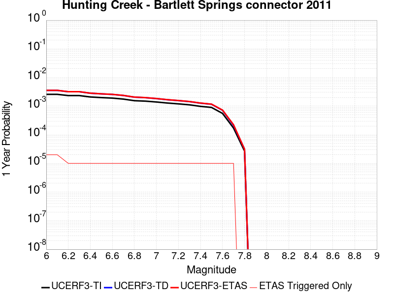 | 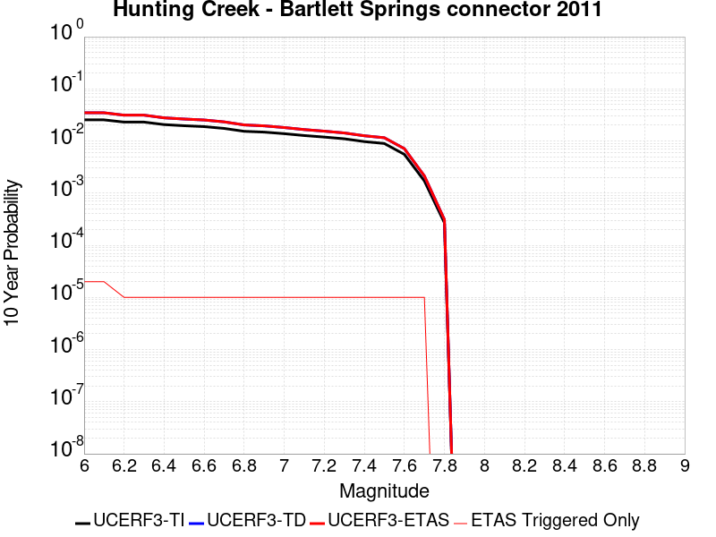 |

| Magnitude | 1 wk TI Prob | 1 wk TD Prob | 1 wk ETAS Prob | 1 wk ETAS/TD Gain | 1 wk ETAS Triggered Only | 1 mo TI Prob | 1 mo TD Prob | 1 mo ETAS Prob | 1 mo ETAS/TD Gain | 1 mo ETAS Triggered Only | 1 yr TI Prob | 1 yr TD Prob | 1 yr ETAS Prob | 1 yr ETAS/TD Gain | 1 yr ETAS Triggered Only | 10 yr TI Prob | 10 yr TD Prob | 10 yr ETAS Prob | 10 yr ETAS/TD Gain | 10 yr ETAS Triggered Only |
|-----|-----|-----|-----|-----|-----|-----|-----|-----|-----|-----|-----|-----|-----|-----|-----|-----|-----|-----|-----|-----|
| 6.0 | 4.940016E-5 | 6.786822E-5 | 7.786754E-5 | 1.1473343 | 1.0E-5 | 2.1169778E-4 | 2.9083234E-4 | 3.0082942E-4 | 1.0343741 | 1.0E-5 | 0.002574374 | 0.003535177 | 0.0035551065 | 1.0056374 | 2.0E-5 | 0.025447546 | 0.034773834 | 0.03479314 | 1.0005552 | 2.0E-5 |
| 6.1 | 4.940016E-5 | 6.786822E-5 | 7.786754E-5 | 1.1473343 | 1.0E-5 | 2.1169778E-4 | 2.9083234E-4 | 3.0082942E-4 | 1.0343741 | 1.0E-5 | 0.002574374 | 0.003535177 | 0.0035551065 | 1.0056374 | 2.0E-5 | 0.025447546 | 0.034773834 | 0.03479314 | 1.0005552 | 2.0E-5 |
| 6.2 | 4.472471E-5 | 6.1002804E-5 | 6.1002804E-5 | 1.0 | 0.0 | 1.9166325E-4 | 2.6141506E-4 | 2.6141506E-4 | 1.0 | 0.0 | 0.0023310026 | 0.003178107 | 0.0031880753 | 1.0031365 | 1.0E-5 | 0.02306703 | 0.031316914 | 0.0313266 | 1.0003093 | 1.0E-5 |
| 6.3 | 4.472471E-5 | 6.1002804E-5 | 6.1002804E-5 | 1.0 | 0.0 | 1.9166325E-4 | 2.6141506E-4 | 2.6141506E-4 | 1.0 | 0.0 | 0.0023310026 | 0.003178107 | 0.0031880753 | 1.0031365 | 1.0E-5 | 0.02306703 | 0.031316914 | 0.0313266 | 1.0003093 | 1.0E-5 |
| 6.4 | 4.0001003E-5 | 5.4103755E-5 | 5.4103755E-5 | 1.0 | 0.0 | 1.714216E-4 | 2.31853E-4 | 2.31853E-4 | 1.0 | 0.0 | 0.0020850603 | 0.0028191248 | 0.0028290965 | 1.0035372 | 1.0E-5 | 0.02065605 | 0.027828315 | 0.027838038 | 1.0003494 | 1.0E-5 |
| 6.5 | 3.8033053E-5 | 5.1266547E-5 | 5.1266547E-5 | 1.0 | 0.0 | 1.6298861E-4 | 2.1969559E-4 | 2.1969559E-4 | 1.0 | 0.0 | 0.0019825802 | 0.0026714746 | 0.002681448 | 1.0037333 | 1.0E-5 | 0.019649856 | 0.026390454 | 0.02640019 | 1.000369 | 1.0E-5 |
| 6.6 | 3.653754E-5 | 4.913017E-5 | 4.913017E-5 | 1.0 | 0.0 | 1.5658008E-4 | 2.1054115E-4 | 2.1054115E-4 | 1.0 | 0.0 | 0.0019046954 | 0.0025602852 | 0.0025702596 | 1.0038958 | 1.0E-5 | 0.018884527 | 0.025306415 | 0.02531616 | 1.0003852 | 1.0E-5 |
| 6.7 | 3.372024E-5 | 4.514011E-5 | 4.514011E-5 | 1.0 | 0.0 | 1.4450731E-4 | 1.9344354E-4 | 1.9344354E-4 | 1.0 | 0.0 | 0.0017579567 | 0.002352639 | 0.0023626157 | 1.0042405 | 1.0E-5 | 0.017441148 | 0.023278099 | 0.023287866 | 1.0004196 | 1.0E-5 |
| 6.8 | 2.9650024E-5 | 3.9411374E-5 | 3.9411374E-5 | 1.0 | 0.0 | 1.2706534E-4 | 1.6889503E-4 | 1.6889503E-4 | 1.0 | 0.0 | 0.0015459227 | 0.0020543463 | 0.0020643256 | 1.0048578 | 1.0E-5 | 0.015352124 | 0.020351216 | 0.020361012 | 1.0004814 | 1.0E-5 |
| 6.9 | 2.860775E-5 | 3.7812544E-5 | 3.7812544E-5 | 1.0 | 0.0 | 1.2259888E-4 | 1.6204377E-4 | 1.6204377E-4 | 1.0 | 0.0 | 0.0014916194 | 0.001971107 | 0.0019810873 | 1.0050633 | 1.0E-5 | 0.014816469 | 0.01953584 | 0.019545645 | 1.0005019 | 1.0E-5 |
| 7.0 | 2.6696067E-5 | 3.506726E-5 | 3.506726E-5 | 1.0 | 0.0 | 1.144067E-4 | 1.5027967E-4 | 1.5027967E-4 | 1.0 | 0.0 | 0.0013920115 | 0.0018281302 | 0.001838112 | 1.00546 | 1.0E-5 | 0.013833242 | 0.018131364 | 0.018141182 | 1.0005416 | 1.0E-5 |
| 7.1 | 2.456087E-5 | 3.2013093E-5 | 3.2013093E-5 | 1.0 | 0.0 | 1.0525662E-4 | 1.371918E-4 | 1.371918E-4 | 1.0 | 0.0 | 0.001280746 | 0.0016690396 | 0.0016790229 | 1.0059814 | 1.0E-5 | 0.012733897 | 0.016566366 | 0.0165762 | 1.0005937 | 1.0E-5 |
| 7.2 | 2.295761E-5 | 2.9822932E-5 | 2.9822932E-5 | 1.0 | 0.0 | 9.8386045E-5 | 1.2780636E-4 | 1.2780636E-4 | 1.0 | 0.0 | 0.0011971919 | 0.001554941 | 0.0015649254 | 1.0064211 | 1.0E-5 | 0.011907627 | 0.015442089 | 0.015451935 | 1.0006375 | 1.0E-5 |
| 7.3 | 2.1256936E-5 | 2.7541912E-5 | 2.7541912E-5 | 1.0 | 0.0 | 9.109797E-5 | 1.1803147E-4 | 1.1803147E-4 | 1.0 | 0.0 | 0.0011085535 | 0.0014360948 | 0.0014460804 | 1.0069534 | 1.0E-5 | 0.011030397 | 0.014269472 | 0.014279329 | 1.0006908 | 1.0E-5 |
| 7.4 | 1.8784336E-5 | 2.4306766E-5 | 2.4306766E-5 | 1.0 | 0.0 | 8.050181E-5 | 1.0416774E-4 | 1.0416774E-4 | 1.0 | 0.0 | 9.796688E-4 | 0.001267512 | 0.0012774993 | 1.0078795 | 1.0E-5 | 0.009753612 | 0.012603902 | 0.012613776 | 1.0007834 | 1.0E-5 |
| 7.5 | 1.7248298E-5 | 2.2268887E-5 | 2.2268887E-5 | 1.0 | 0.0 | 7.391918E-5 | 9.543464E-5 | 9.543464E-5 | 1.0 | 0.0 | 8.9959445E-4 | 0.0011613049 | 0.0011712933 | 1.008601 | 1.0E-5 | 0.008959615 | 0.01155334 | 0.011563224 | 1.0008556 | 1.0E-5 |
| 7.6 | 1.0653709E-5 | 1.3722118E-5 | 1.3722118E-5 | 1.0 | 0.0 | 4.5657955E-5 | 5.8807767E-5 | 5.8807767E-5 | 1.0 | 0.0 | 5.557438E-4 | 7.157521E-4 | 7.257449E-4 | 1.0139613 | 1.0E-5 | 0.0055435603 | 0.0071348166 | 0.007144745 | 1.0013915 | 1.0E-5 |
| 7.7 | 3.286316E-6 | 4.0903437E-6 | 4.0903437E-6 | 1.0 | 0.0 | 1.4084137E-5 | 1.7529928E-5 | 1.7529928E-5 | 1.0 | 0.0 | 1.7146087E-4 | 2.1340612E-4 | 2.2340399E-4 | 1.046849 | 1.0E-5 | 0.0017132863 | 0.0021320276 | 0.0021420063 | 1.0046804 | 1.0E-5 |
| 7.8 | 5.1855085E-7 | 5.9720696E-7 | 5.9720696E-7 | 1.0 | 0.0 | 2.222359E-6 | 2.5594559E-6 | 2.5594559E-6 | 1.0 | 0.0 | 2.7056883E-5 | 3.116094E-5 | 3.116094E-5 | 1.0 | 0.0 | 2.705359E-4 | 3.1156495E-4 | 3.1156495E-4 | 1.0 | 0.0 |

## Ortigalita (South)
*[(top)](#table-of-contents)*

| 1 Week | 1 Month | 1 Year | 10 Year |
|-----|-----|-----|-----|
|  | 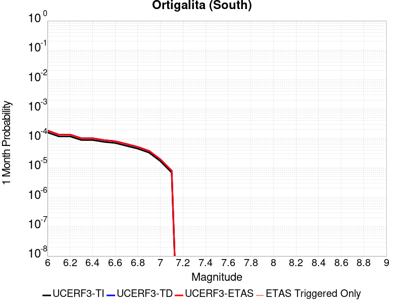 |  | 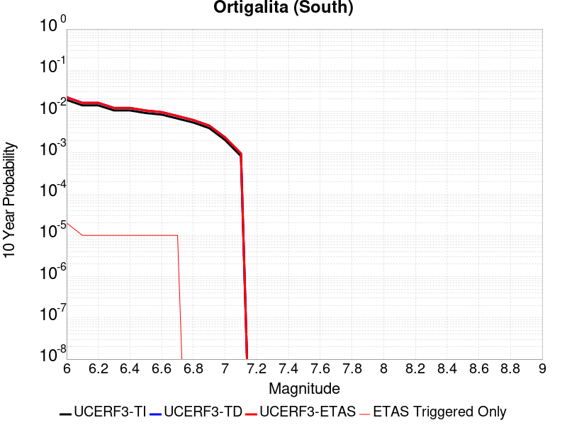 |

| Magnitude | 1 wk TI Prob | 1 wk TD Prob | 1 wk ETAS Prob | 1 wk ETAS/TD Gain | 1 wk ETAS Triggered Only | 1 mo TI Prob | 1 mo TD Prob | 1 mo ETAS Prob | 1 mo ETAS/TD Gain | 1 mo ETAS Triggered Only | 1 yr TI Prob | 1 yr TD Prob | 1 yr ETAS Prob | 1 yr ETAS/TD Gain | 1 yr ETAS Triggered Only | 10 yr TI Prob | 10 yr TD Prob | 10 yr ETAS Prob | 10 yr ETAS/TD Gain | 10 yr ETAS Triggered Only |
|-----|-----|-----|-----|-----|-----|-----|-----|-----|-----|-----|-----|-----|-----|-----|-----|-----|-----|-----|-----|-----|
| 6.0 | 3.72394E-5 | 4.325562E-5 | 4.325562E-5 | 1.0 | 0.0 | 1.5958765E-4 | 1.8536893E-4 | 1.8536893E-4 | 1.0 | 0.0 | 0.0019412481 | 0.0022546875 | 0.002264665 | 1.0044252 | 1.0E-5 | 0.019243775 | 0.022334497 | 0.02235405 | 1.0008755 | 2.0E-5 |
| 6.1 | 2.7299884E-5 | 3.149204E-5 | 3.149204E-5 | 1.0 | 0.0 | 1.16994255E-4 | 1.3495922E-4 | 1.3495922E-4 | 1.0 | 0.0 | 0.0014234743 | 0.0016419457 | 0.0016519292 | 1.0060804 | 1.0E-5 | 0.014143906 | 0.01630407 | 0.016313907 | 1.0006033 | 1.0E-5 |
| 6.2 | 2.7299884E-5 | 3.149204E-5 | 3.149204E-5 | 1.0 | 0.0 | 1.16994255E-4 | 1.3495922E-4 | 1.3495922E-4 | 1.0 | 0.0 | 0.0014234743 | 0.0016419457 | 0.0016519292 | 1.0060804 | 1.0E-5 | 0.014143906 | 0.01630407 | 0.016313907 | 1.0006033 | 1.0E-5 |
| 6.3 | 2.0546433E-5 | 2.363145E-5 | 2.363145E-5 | 1.0 | 0.0 | 8.805317E-5 | 1.0127382E-4 | 1.0127382E-4 | 1.0 | 0.0 | 0.00107152 | 0.0012323303 | 0.001242318 | 1.0081047 | 1.0E-5 | 0.010663681 | 0.01225703 | 0.012266908 | 1.0008059 | 1.0E-5 |
| 6.4 | 2.0546433E-5 | 2.363145E-5 | 2.363145E-5 | 1.0 | 0.0 | 8.805317E-5 | 1.0127382E-4 | 1.0127382E-4 | 1.0 | 0.0 | 0.00107152 | 0.0012323303 | 0.001242318 | 1.0081047 | 1.0E-5 | 0.010663681 | 0.01225703 | 0.012266908 | 1.0008059 | 1.0E-5 |
| 6.5 | 1.7779594E-5 | 2.0446974E-5 | 2.0446974E-5 | 1.0 | 0.0 | 7.619603E-5 | 8.762702E-5 | 8.762702E-5 | 1.0 | 0.0 | 9.272918E-4 | 0.0010663504 | 0.0010763397 | 1.0093678 | 1.0E-5 | 0.009234319 | 0.010613803 | 0.010623697 | 1.0009322 | 1.0E-5 |
| 6.6 | 1.6272212E-5 | 1.8714967E-5 | 1.8714967E-5 | 1.0 | 0.0 | 6.973618E-5 | 8.0204605E-5 | 8.0204605E-5 | 1.0 | 0.0 | 8.487073E-4 | 9.760658E-4 | 9.86056E-4 | 1.0102352 | 1.0E-5 | 0.008454733 | 0.009719091 | 0.009728993 | 1.0010189 | 1.0E-5 |
| 6.7 | 1.3051484E-5 | 1.5038758E-5 | 1.5038758E-5 | 1.0 | 0.0 | 5.593373E-5 | 6.445028E-5 | 6.445028E-5 | 1.0 | 0.0 | 6.807804E-4 | 7.844092E-4 | 7.9440133E-4 | 1.0127385 | 1.0E-5 | 0.006786986 | 0.007817388 | 0.00782731 | 1.0012692 | 1.0E-5 |
| 6.8 | 1.04277415E-5 | 1.1987235E-5 | 1.1987235E-5 | 1.0 | 0.0 | 4.4689557E-5 | 5.1372896E-5 | 5.1372896E-5 | 1.0 | 0.0 | 5.439595E-4 | 6.2529295E-4 | 6.2529295E-4 | 1.0 | 0.0 | 0.0054262993 | 0.00623609 | 0.00623609 | 1.0 | 0.0 |
| 6.9 | 7.639968E-6 | 8.791503E-6 | 8.791503E-6 | 1.0 | 0.0 | 3.274231E-5 | 3.767736E-5 | 3.767736E-5 | 1.0 | 0.0 | 3.9856473E-4 | 4.586312E-4 | 4.586312E-4 | 1.0 | 0.0 | 0.003978506 | 0.004577433 | 0.004577433 | 1.0 | 0.0 |
| 7.0 | 3.919831E-6 | 4.5334014E-6 | 4.5334014E-6 | 1.0 | 0.0 | 1.679917E-5 | 1.942873E-5 | 1.942873E-5 | 1.0 | 0.0 | 2.045107E-4 | 2.3652123E-4 | 2.3652123E-4 | 1.0 | 0.0 | 0.0020432258 | 0.0023629034 | 0.0023629034 | 1.0 | 0.0 |
| 7.1 | 1.6017933E-6 | 1.8570418E-6 | 1.8570418E-6 | 1.0 | 0.0 | 6.8648105E-6 | 7.958732E-6 | 7.958732E-6 | 1.0 | 0.0 | 8.357586E-5 | 9.689432E-5 | 9.689432E-5 | 1.0 | 0.0 | 8.3544437E-4 | 9.686254E-4 | 9.686254E-4 | 1.0 | 0.0 |

## La Panza 2011
*[(top)](#table-of-contents)*

| 1 Week | 1 Month | 1 Year | 10 Year |
|-----|-----|-----|-----|
|  | 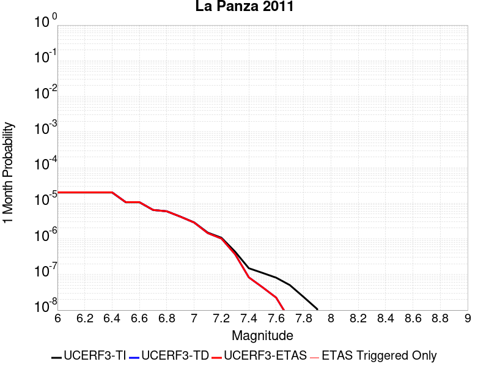 | 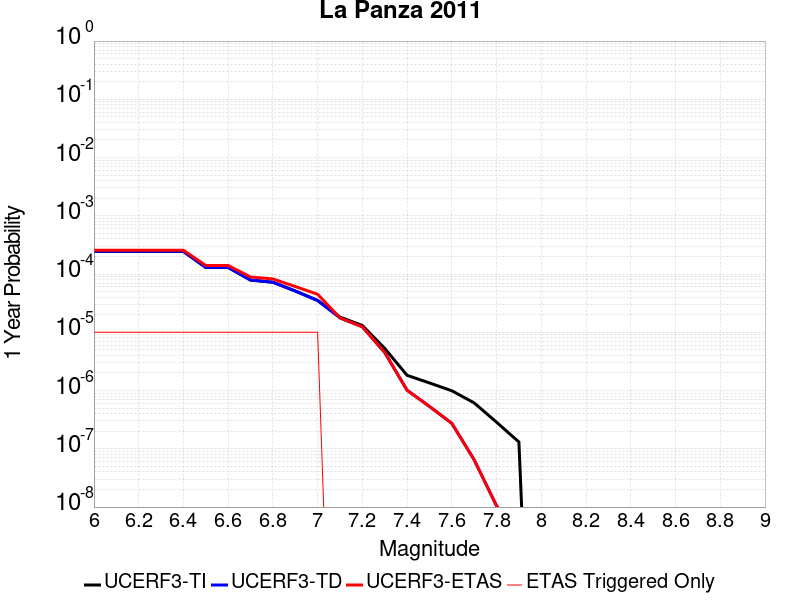 |  |

| Magnitude | 1 wk TI Prob | 1 wk TD Prob | 1 wk ETAS Prob | 1 wk ETAS/TD Gain | 1 wk ETAS Triggered Only | 1 mo TI Prob | 1 mo TD Prob | 1 mo ETAS Prob | 1 mo ETAS/TD Gain | 1 mo ETAS Triggered Only | 1 yr TI Prob | 1 yr TD Prob | 1 yr ETAS Prob | 1 yr ETAS/TD Gain | 1 yr ETAS Triggered Only | 10 yr TI Prob | 10 yr TD Prob | 10 yr ETAS Prob | 10 yr ETAS/TD Gain | 10 yr ETAS Triggered Only |
|-----|-----|-----|-----|-----|-----|-----|-----|-----|-----|-----|-----|-----|-----|-----|-----|-----|-----|-----|-----|-----|
| 6.0 | 4.6754544E-6 | 4.717587E-6 | 4.717587E-6 | 1.0 | 0.0 | 2.0037509E-5 | 2.0218084E-5 | 2.0218084E-5 | 1.0 | 0.0 | 2.4392935E-4 | 2.4612935E-4 | 2.561269E-4 | 1.040619 | 1.0E-5 | 0.0024366176 | 0.002458762 | 0.0024787127 | 1.0081142 | 2.0E-5 |
| 6.1 | 4.6754544E-6 | 4.717587E-6 | 4.717587E-6 | 1.0 | 0.0 | 2.0037509E-5 | 2.0218084E-5 | 2.0218084E-5 | 1.0 | 0.0 | 2.4392935E-4 | 2.4612935E-4 | 2.561269E-4 | 1.040619 | 1.0E-5 | 0.0024366176 | 0.002458762 | 0.0024787127 | 1.0081142 | 2.0E-5 |
| 6.2 | 4.6754544E-6 | 4.717587E-6 | 4.717587E-6 | 1.0 | 0.0 | 2.0037509E-5 | 2.0218084E-5 | 2.0218084E-5 | 1.0 | 0.0 | 2.4392935E-4 | 2.4612935E-4 | 2.561269E-4 | 1.040619 | 1.0E-5 | 0.0024366176 | 0.002458762 | 0.0024787127 | 1.0081142 | 2.0E-5 |
| 6.3 | 4.6754544E-6 | 4.717587E-6 | 4.717587E-6 | 1.0 | 0.0 | 2.0037509E-5 | 2.0218084E-5 | 2.0218084E-5 | 1.0 | 0.0 | 2.4392935E-4 | 2.4612935E-4 | 2.561269E-4 | 1.040619 | 1.0E-5 | 0.0024366176 | 0.002458762 | 0.0024787127 | 1.0081142 | 2.0E-5 |
| 6.4 | 4.6754544E-6 | 4.717587E-6 | 4.717587E-6 | 1.0 | 0.0 | 2.0037509E-5 | 2.0218084E-5 | 2.0218084E-5 | 1.0 | 0.0 | 2.4392935E-4 | 2.4612935E-4 | 2.561269E-4 | 1.040619 | 1.0E-5 | 0.0024366176 | 0.002458762 | 0.0024787127 | 1.0081142 | 2.0E-5 |
| 6.5 | 2.485343E-6 | 2.5005988E-6 | 2.5005988E-6 | 1.0 | 0.0 | 1.0651426E-5 | 1.0716811E-5 | 1.0716811E-5 | 1.0 | 0.0 | 1.296734E-4 | 1.3046975E-4 | 1.4046844E-4 | 1.0766361 | 1.0E-5 | 0.0012959775 | 0.0013039699 | 0.0013239438 | 1.0153178 | 2.0E-5 |
| 6.6 | 2.485343E-6 | 2.5005988E-6 | 2.5005988E-6 | 1.0 | 0.0 | 1.0651426E-5 | 1.0716811E-5 | 1.0716811E-5 | 1.0 | 0.0 | 1.296734E-4 | 1.3046975E-4 | 1.4046844E-4 | 1.0766361 | 1.0E-5 | 0.0012959775 | 0.0013039699 | 0.0013239438 | 1.0153178 | 2.0E-5 |
| 6.7 | 1.5108508E-6 | 1.5146375E-6 | 1.5146375E-6 | 1.0 | 0.0 | 6.4750584E-6 | 6.491288E-6 | 6.491288E-6 | 1.0 | 0.0 | 7.8830984E-5 | 7.902867E-5 | 8.902788E-5 | 1.1265264 | 1.0E-5 | 7.880303E-4 | 7.900165E-4 | 8.000086E-4 | 1.012648 | 1.0E-5 |
| 6.8 | 1.3865837E-6 | 1.3885102E-6 | 1.3885102E-6 | 1.0 | 0.0 | 5.942488E-6 | 5.9507447E-6 | 5.9507447E-6 | 1.0 | 0.0 | 7.234739E-5 | 7.244801E-5 | 8.244728E-5 | 1.13802 | 1.0E-5 | 7.232384E-4 | 7.242537E-4 | 7.3424645E-4 | 1.0137973 | 1.0E-5 |
| 6.9 | 9.826583E-7 | 9.796287E-7 | 9.796287E-7 | 1.0 | 0.0 | 4.2113857E-6 | 4.198402E-6 | 4.198402E-6 | 1.0 | 0.0 | 5.1272415E-5 | 5.11144E-5 | 6.111389E-5 | 1.1956296 | 1.0E-5 | 5.126059E-4 | 5.110318E-4 | 5.2102667E-4 | 1.0195583 | 1.0E-5 |
| 7.0 | 6.7797646E-7 | 6.7102144E-7 | 6.7102144E-7 | 1.0 | 0.0 | 2.9056102E-6 | 2.8758034E-6 | 2.8758034E-6 | 1.0 | 0.0 | 3.537523E-5 | 3.5012374E-5 | 4.5012024E-5 | 1.2856033 | 1.0E-5 | 3.5369597E-4 | 3.5007167E-4 | 3.6006817E-4 | 1.0285556 | 1.0E-5 |
| 7.1 | 3.4979826E-7 | 3.387388E-7 | 3.387388E-7 | 1.0 | 0.0 | 1.4991346E-6 | 1.4517369E-6 | 1.4517369E-6 | 1.0 | 0.0 | 1.825181E-5 | 1.7674765E-5 | 1.7674765E-5 | 1.0 | 0.0 | 1.825031E-4 | 1.7673477E-4 | 1.7673477E-4 | 1.0 | 0.0 |
| 7.2 | 2.5088332E-7 | 2.3831899E-7 | 2.3831899E-7 | 1.0 | 0.0 | 1.0752137E-6 | 1.0213668E-6 | 1.0213668E-6 | 1.0 | 0.0 | 1.3090649E-5 | 1.2435077E-5 | 1.2435077E-5 | 1.0 | 0.0 | 1.3089878E-4 | 1.2434467E-4 | 1.2434467E-4 | 1.0 | 0.0 |
| 7.3 | 1.0159086E-7 | 8.64462E-8 | 8.64462E-8 | 1.0 | 0.0 | 4.3538932E-7 | 3.7048366E-7 | 3.7048366E-7 | 1.0 | 0.0 | 5.300852E-6 | 4.5106294E-6 | 4.5106294E-6 | 1.0 | 0.0 | 5.3007258E-5 | 4.5105422E-5 | 4.5105422E-5 | 1.0 | 0.0 |
| 7.4 | 3.5006252E-8 | 1.9404325E-8 | 1.9404325E-8 | 1.0 | 0.0 | 1.5002678E-7 | 8.3161396E-8 | 8.3161396E-8 | 1.0 | 0.0 | 1.8265745E-6 | 1.0124895E-6 | 1.0124895E-6 | 1.0 | 0.0 | 1.8265595E-5 | 1.01248515E-5 | 1.01248515E-5 | 1.0 | 0.0 |
| 7.5 | 2.592274E-8 | 1.0239094E-8 | 1.0239094E-8 | 1.0 | 0.0 | 1.1109746E-7 | 4.388183E-8 | 4.388183E-8 | 1.0 | 0.0 | 1.3526106E-6 | 5.342612E-7 | 5.342612E-7 | 1.0 | 0.0 | 1.3526024E-5 | 5.3425997E-6 | 5.3425997E-6 | 1.0 | 0.0 |
| 7.6 | 1.9016717E-8 | 5.244801E-9 | 5.244801E-9 | 1.0 | 0.0 | 8.150022E-8 | 2.247772E-8 | 2.247772E-8 | 1.0 | 0.0 | 9.922647E-7 | 2.736662E-7 | 2.736662E-7 | 1.0 | 0.0 | 9.922603E-6 | 2.7366589E-6 | 2.7366589E-6 | 1.0 | 0.0 |
| 7.7 | 1.17738495E-8 | 1.2398075E-9 | 1.2398075E-9 | 1.0 | 0.0 | 5.0459356E-8 | 5.3134603E-9 | 5.3134603E-9 | 1.0 | 0.0 | 6.1434247E-7 | 6.469138E-8 | 6.469138E-8 | 1.0 | 0.0 | 6.143408E-6 | 6.469136E-7 | 6.469136E-7 | 1.0 | 0.0 |
| 7.8 | 5.489079E-9 | 2.0111768E-10 | 2.0111768E-10 | 1.0 | 0.0 | 2.3524624E-8 | 8.6193275E-10 | 8.6193275E-10 | 1.0 | 0.0 | 2.8641225E-7 | 1.04940305E-8 | 1.04940305E-8 | 1.0 | 0.0 | 2.8641189E-6 | 1.04940305E-7 | 1.04940305E-7 | 1.0 | 0.0 |
| 7.9 | 2.5081048E-9 | 6.683887E-11 | 6.683887E-11 | 1.0 | 0.0 | 1.0749021E-8 | 2.8645197E-10 | 2.8645197E-10 | 1.0 | 0.0 | 1.3086932E-7 | 3.487552E-9 | 3.487552E-9 | 1.0 | 0.0 | 1.3086925E-6 | 3.487552E-8 | 3.487552E-8 | 1.0 | 0.0 |

## Redondo Canyon alt 1
*[(top)](#table-of-contents)*

| 1 Week | 1 Month | 1 Year | 10 Year |
|-----|-----|-----|-----|
|  | 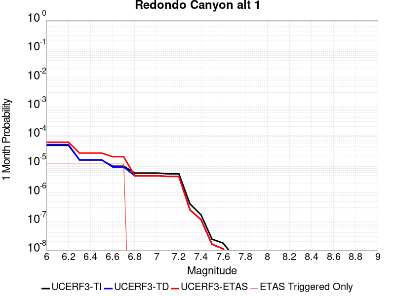 |  | 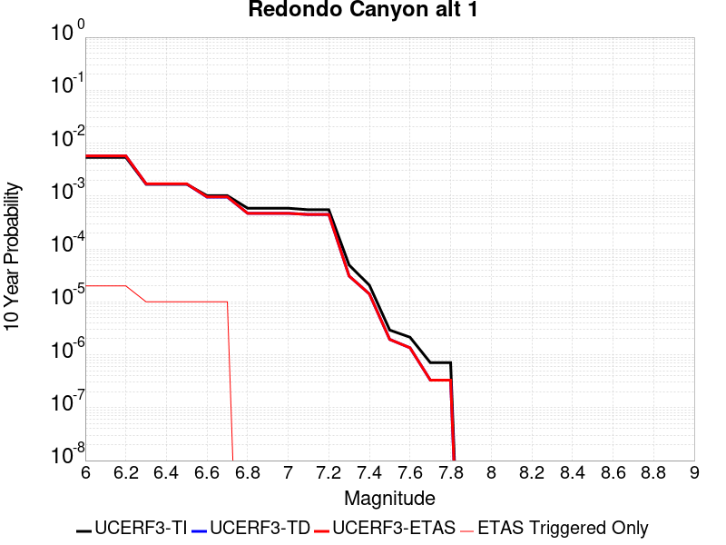 |

| Magnitude | 1 wk TI Prob | 1 wk TD Prob | 1 wk ETAS Prob | 1 wk ETAS/TD Gain | 1 wk ETAS Triggered Only | 1 mo TI Prob | 1 mo TD Prob | 1 mo ETAS Prob | 1 mo ETAS/TD Gain | 1 mo ETAS Triggered Only | 1 yr TI Prob | 1 yr TD Prob | 1 yr ETAS Prob | 1 yr ETAS/TD Gain | 1 yr ETAS Triggered Only | 10 yr TI Prob | 10 yr TD Prob | 10 yr ETAS Prob | 10 yr ETAS/TD Gain | 10 yr ETAS Triggered Only |
|-----|-----|-----|-----|-----|-----|-----|-----|-----|-----|-----|-----|-----|-----|-----|-----|-----|-----|-----|-----|-----|
| 6.0 | 1.0346246E-5 | 1.09813445E-5 | 2.0981235E-5 | 1.9106253 | 1.0E-5 | 4.43403E-5 | 4.7062502E-5 | 5.7062032E-5 | 1.2124734 | 1.0E-5 | 5.3970946E-4 | 5.729142E-4 | 5.9290277E-4 | 1.0348892 | 2.0E-5 | 0.0053840056 | 0.005722111 | 0.0057419967 | 1.0034752 | 2.0E-5 |
| 6.1 | 1.0346246E-5 | 1.09813445E-5 | 2.0981235E-5 | 1.9106253 | 1.0E-5 | 4.43403E-5 | 4.7062502E-5 | 5.7062032E-5 | 1.2124734 | 1.0E-5 | 5.3970946E-4 | 5.729142E-4 | 5.9290277E-4 | 1.0348892 | 2.0E-5 | 0.0053840056 | 0.005722111 | 0.0057419967 | 1.0034752 | 2.0E-5 |
| 6.2 | 1.0346246E-5 | 1.09813445E-5 | 2.0981235E-5 | 1.9106253 | 1.0E-5 | 4.43403E-5 | 4.7062502E-5 | 5.7062032E-5 | 1.2124734 | 1.0E-5 | 5.3970946E-4 | 5.729142E-4 | 5.9290277E-4 | 1.0348892 | 2.0E-5 | 0.0053840056 | 0.005722111 | 0.0057419967 | 1.0034752 | 2.0E-5 |
| 6.3 | 3.2052794E-6 | 3.2361174E-6 | 1.3236085E-5 | 4.0901127 | 1.0E-5 | 1.373684E-5 | 1.3869023E-5 | 2.3868884E-5 | 1.7210213 | 1.0E-5 | 1.6723319E-4 | 1.6884625E-4 | 1.7884455E-4 | 1.0592154 | 1.0E-5 | 0.001671074 | 0.0016875692 | 0.0016975524 | 1.0059156 | 1.0E-5 |
| 6.4 | 3.2052794E-6 | 3.2361174E-6 | 1.3236085E-5 | 4.0901127 | 1.0E-5 | 1.373684E-5 | 1.3869023E-5 | 2.3868884E-5 | 1.7210213 | 1.0E-5 | 1.6723319E-4 | 1.6884625E-4 | 1.7884455E-4 | 1.0592154 | 1.0E-5 | 0.001671074 | 0.0016875692 | 0.0016975524 | 1.0059156 | 1.0E-5 |
| 6.5 | 3.2052794E-6 | 3.2361174E-6 | 1.3236085E-5 | 4.0901127 | 1.0E-5 | 1.373684E-5 | 1.3869023E-5 | 2.3868884E-5 | 1.7210213 | 1.0E-5 | 1.6723319E-4 | 1.6884625E-4 | 1.7884455E-4 | 1.0592154 | 1.0E-5 | 0.001671074 | 0.0016875692 | 0.0016975524 | 1.0059156 | 1.0E-5 |
| 6.6 | 1.948328E-6 | 1.8288681E-6 | 1.182885E-5 | 6.467853 | 1.0E-5 | 8.349951E-6 | 7.837991E-6 | 1.7837912E-5 | 2.2758272 | 1.0E-5 | 1.016559E-4 | 9.542486E-5 | 1.05423904E-4 | 1.1047845 | 1.0E-5 | 0.0010160941 | 9.539858E-4 | 9.6397626E-4 | 1.0104723 | 1.0E-5 |
| 6.7 | 1.948328E-6 | 1.8288681E-6 | 1.182885E-5 | 6.467853 | 1.0E-5 | 8.349951E-6 | 7.837991E-6 | 1.7837912E-5 | 2.2758272 | 1.0E-5 | 1.016559E-4 | 9.542486E-5 | 1.05423904E-4 | 1.1047845 | 1.0E-5 | 0.0010160941 | 9.539858E-4 | 9.6397626E-4 | 1.0104723 | 1.0E-5 |
| 6.8 | 1.1278219E-6 | 9.033076E-7 | 9.033076E-7 | 1.0 | 0.0 | 4.8335132E-6 | 3.871315E-6 | 3.871315E-6 | 1.0 | 0.0 | 5.8846435E-5 | 4.7132668E-5 | 4.7132668E-5 | 1.0 | 0.0 | 5.8830855E-4 | 4.7126875E-4 | 4.7126875E-4 | 1.0 | 0.0 |
| 6.9 | 1.1278219E-6 | 9.033076E-7 | 9.033076E-7 | 1.0 | 0.0 | 4.8335132E-6 | 3.871315E-6 | 3.871315E-6 | 1.0 | 0.0 | 5.8846435E-5 | 4.7132668E-5 | 4.7132668E-5 | 1.0 | 0.0 | 5.8830855E-4 | 4.7126875E-4 | 4.7126875E-4 | 1.0 | 0.0 |
| 7.0 | 1.1278219E-6 | 9.033076E-7 | 9.033076E-7 | 1.0 | 0.0 | 4.8335132E-6 | 3.871315E-6 | 3.871315E-6 | 1.0 | 0.0 | 5.8846435E-5 | 4.7132668E-5 | 4.7132668E-5 | 1.0 | 0.0 | 5.8830855E-4 | 4.7126875E-4 | 4.7126875E-4 | 1.0 | 0.0 |
| 7.1 | 1.0545139E-6 | 8.5692716E-7 | 8.5692716E-7 | 1.0 | 0.0 | 4.5193374E-6 | 3.6725423E-6 | 3.6725423E-6 | 1.0 | 0.0 | 5.5021545E-5 | 4.471271E-5 | 4.471271E-5 | 1.0 | 0.0 | 5.500792E-4 | 4.470789E-4 | 4.470789E-4 | 1.0 | 0.0 |
| 7.2 | 1.0545139E-6 | 8.5692716E-7 | 8.5692716E-7 | 1.0 | 0.0 | 4.5193374E-6 | 3.6725423E-6 | 3.6725423E-6 | 1.0 | 0.0 | 5.5021545E-5 | 4.471271E-5 | 4.471271E-5 | 1.0 | 0.0 | 5.500792E-4 | 4.470789E-4 | 4.470789E-4 | 1.0 | 0.0 |
| 7.3 | 9.505161E-8 | 5.8957607E-8 | 5.8957607E-8 | 1.0 | 0.0 | 4.0736398E-7 | 2.5267545E-7 | 2.5267545E-7 | 1.0 | 0.0 | 4.959645E-6 | 3.0763204E-6 | 3.0763204E-6 | 1.0 | 0.0 | 4.9595343E-5 | 3.0762894E-5 | 3.0762894E-5 | 1.0 | 0.0 |
| 7.4 | 3.9520785E-8 | 2.6987191E-8 | 2.6987191E-8 | 1.0 | 0.0 | 1.6937479E-7 | 1.1565938E-7 | 1.1565938E-7 | 1.0 | 0.0 | 2.062136E-6 | 1.4081523E-6 | 1.4081523E-6 | 1.0 | 0.0 | 2.062117E-5 | 1.4081461E-5 | 1.4081461E-5 | 1.0 | 0.0 |
| 7.5 | 5.6133214E-9 | 3.7368215E-9 | 3.7368215E-9 | 1.0 | 0.0 | 2.4057092E-8 | 1.601495E-8 | 1.601495E-8 | 1.0 | 0.0 | 2.9289507E-7 | 1.9498201E-7 | 1.9498201E-7 | 1.0 | 0.0 | 2.9289467E-6 | 1.9498186E-6 | 1.9498186E-6 | 1.0 | 0.0 |
| 7.6 | 4.1064334E-9 | 2.5957634E-9 | 2.5957634E-9 | 1.0 | 0.0 | 1.7599E-8 | 1.11247E-8 | 1.11247E-8 | 1.0 | 0.0 | 2.142678E-7 | 1.3544322E-7 | 1.3544322E-7 | 1.0 | 0.0 | 2.1426758E-6 | 1.3544316E-6 | 1.3544316E-6 | 1.0 | 0.0 |
| 7.7 | 1.361975E-9 | 6.360824E-10 | 6.360824E-10 | 1.0 | 0.0 | 5.8370353E-9 | 2.7260674E-9 | 2.7260674E-9 | 1.0 | 0.0 | 7.1065905E-8 | 3.318987E-8 | 3.318987E-8 | 1.0 | 0.0 | 7.106588E-7 | 3.318987E-7 | 3.318987E-7 | 1.0 | 0.0 |
| 7.8 | 1.361975E-9 | 6.360824E-10 | 6.360824E-10 | 1.0 | 0.0 | 5.8370353E-9 | 2.7260674E-9 | 2.7260674E-9 | 1.0 | 0.0 | 7.1065905E-8 | 3.318987E-8 | 3.318987E-8 | 1.0 | 0.0 | 7.106588E-7 | 3.318987E-7 | 3.318987E-7 | 1.0 | 0.0 |

## Breckenridge 2011
*[(top)](#table-of-contents)*

| 1 Week | 1 Month | 1 Year | 10 Year |
|-----|-----|-----|-----|
| 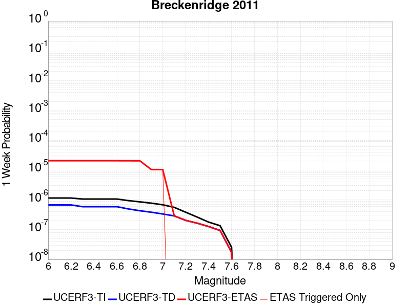 | 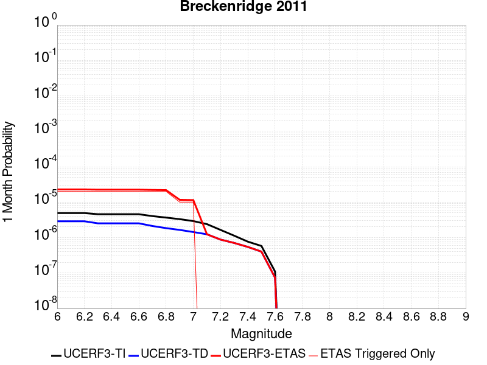 | 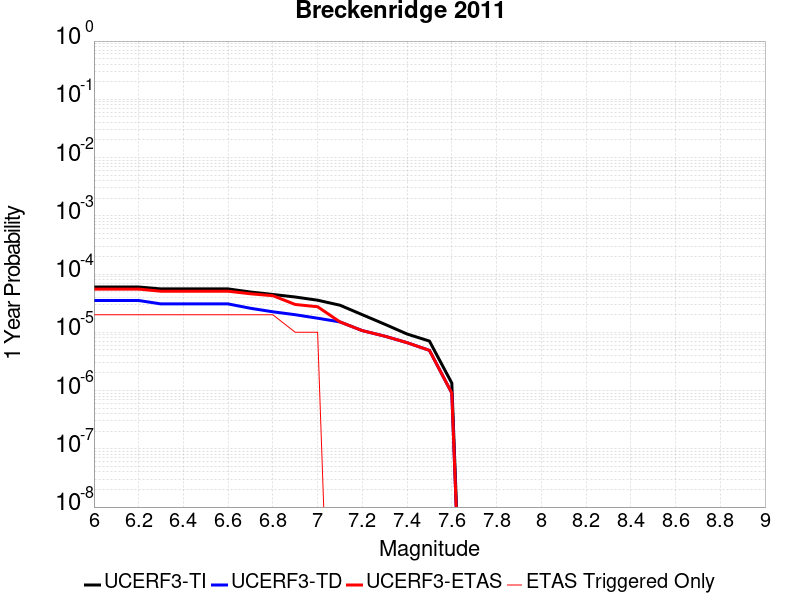 |  |

| Magnitude | 1 wk TI Prob | 1 wk TD Prob | 1 wk ETAS Prob | 1 wk ETAS/TD Gain | 1 wk ETAS Triggered Only | 1 mo TI Prob | 1 mo TD Prob | 1 mo ETAS Prob | 1 mo ETAS/TD Gain | 1 mo ETAS Triggered Only | 1 yr TI Prob | 1 yr TD Prob | 1 yr ETAS Prob | 1 yr ETAS/TD Gain | 1 yr ETAS Triggered Only | 10 yr TI Prob | 10 yr TD Prob | 10 yr ETAS Prob | 10 yr ETAS/TD Gain | 10 yr ETAS Triggered Only |
|-----|-----|-----|-----|-----|-----|-----|-----|-----|-----|-----|-----|-----|-----|-----|-----|-----|-----|-----|-----|-----|
| 6.0 | 1.1490393E-6 | 6.7380773E-7 | 2.0673795E-5 | 30.682037 | 2.0E-5 | 4.924445E-6 | 2.8877444E-6 | 2.2887687E-5 | 7.925801 | 2.0E-5 | 5.995347E-5 | 3.515774E-5 | 5.5157037E-5 | 1.5688448 | 2.0E-5 | 5.9937296E-4 | 3.5152383E-4 | 3.715168E-4 | 1.0568751 | 2.0E-5 |
| 6.1 | 1.1490393E-6 | 6.7380773E-7 | 2.0673795E-5 | 30.682037 | 2.0E-5 | 4.924445E-6 | 2.8877444E-6 | 2.2887687E-5 | 7.925801 | 2.0E-5 | 5.995347E-5 | 3.515774E-5 | 5.5157037E-5 | 1.5688448 | 2.0E-5 | 5.9937296E-4 | 3.5152383E-4 | 3.715168E-4 | 1.0568751 | 2.0E-5 |
| 6.2 | 1.1490393E-6 | 6.7380773E-7 | 2.0673795E-5 | 30.682037 | 2.0E-5 | 4.924445E-6 | 2.8877444E-6 | 2.2887687E-5 | 7.925801 | 2.0E-5 | 5.995347E-5 | 3.515774E-5 | 5.5157037E-5 | 1.5688448 | 2.0E-5 | 5.9937296E-4 | 3.5152383E-4 | 3.715168E-4 | 1.0568751 | 2.0E-5 |
| 6.3 | 1.064617E-6 | 5.886475E-7 | 2.0588635E-5 | 34.97617 | 2.0E-5 | 4.5626366E-6 | 2.5227728E-6 | 2.2522721E-5 | 8.927765 | 2.0E-5 | 5.5548684E-5 | 3.0714335E-5 | 5.0713723E-5 | 1.6511418 | 2.0E-5 | 5.55348E-4 | 3.0710208E-4 | 3.2709594E-4 | 1.065105 | 2.0E-5 |
| 6.4 | 1.064617E-6 | 5.886475E-7 | 2.0588635E-5 | 34.97617 | 2.0E-5 | 4.5626366E-6 | 2.5227728E-6 | 2.2522721E-5 | 8.927765 | 2.0E-5 | 5.5548684E-5 | 3.0714335E-5 | 5.0713723E-5 | 1.6511418 | 2.0E-5 | 5.55348E-4 | 3.0710208E-4 | 3.2709594E-4 | 1.065105 | 2.0E-5 |
| 6.5 | 1.064617E-6 | 5.886475E-7 | 2.0588635E-5 | 34.97617 | 2.0E-5 | 4.5626366E-6 | 2.5227728E-6 | 2.2522721E-5 | 8.927765 | 2.0E-5 | 5.5548684E-5 | 3.0714335E-5 | 5.0713723E-5 | 1.6511418 | 2.0E-5 | 5.55348E-4 | 3.0710208E-4 | 3.2709594E-4 | 1.065105 | 2.0E-5 |
| 6.6 | 1.064617E-6 | 5.886475E-7 | 2.0588635E-5 | 34.97617 | 2.0E-5 | 4.5626366E-6 | 2.5227728E-6 | 2.2522721E-5 | 8.927765 | 2.0E-5 | 5.5548684E-5 | 3.0714335E-5 | 5.0713723E-5 | 1.6511418 | 2.0E-5 | 5.55348E-4 | 3.0710208E-4 | 3.2709594E-4 | 1.065105 | 2.0E-5 |
| 6.7 | 9.4219524E-7 | 4.954078E-7 | 2.0495398E-5 | 41.37076 | 2.0E-5 | 4.037973E-6 | 2.1231745E-6 | 2.2123131E-5 | 10.419837 | 2.0E-5 | 4.916122E-5 | 2.5849351E-5 | 4.5848832E-5 | 1.7736938 | 2.0E-5 | 4.9150345E-4 | 2.5846408E-4 | 2.784589E-4 | 1.0773602 | 2.0E-5 |
| 6.8 | 8.556422E-7 | 4.311975E-7 | 2.043119E-5 | 47.38244 | 2.0E-5 | 3.667033E-6 | 1.847988E-6 | 2.184795E-5 | 11.822561 | 2.0E-5 | 4.464521E-5 | 2.2499025E-5 | 4.2498574E-5 | 1.8889074 | 2.0E-5 | 4.4636242E-4 | 2.2496787E-4 | 2.4496336E-4 | 1.0888816 | 2.0E-5 |
| 6.9 | 7.7357794E-7 | 3.8420345E-7 | 1.0384199E-5 | 27.027866 | 1.0E-5 | 3.3153299E-6 | 1.6465851E-6 | 1.1646569E-5 | 7.073165 | 1.0E-5 | 4.0363393E-5 | 2.0046993E-5 | 3.0046793E-5 | 1.4988179 | 1.0E-5 | 4.035606E-4 | 2.0045215E-4 | 2.1045015E-4 | 1.0498772 | 1.0E-5 |
| 7.0 | 6.8172454E-7 | 3.3471417E-7 | 1.0334711E-5 | 30.876226 | 1.0E-5 | 2.9216735E-6 | 1.4344886E-6 | 1.1434474E-5 | 7.9711156 | 1.0E-5 | 3.5570793E-5 | 1.7464761E-5 | 2.7464586E-5 | 1.5725715 | 1.0E-5 | 3.55651E-4 | 1.746341E-4 | 1.8463236E-4 | 1.0572525 | 1.0E-5 |
| 7.1 | 5.5936397E-7 | 2.890966E-7 | 2.890966E-7 | 1.0 | 0.0 | 2.397272E-6 | 1.2389849E-6 | 1.2389849E-6 | 1.0 | 0.0 | 2.9186394E-5 | 1.5084538E-5 | 1.5084538E-5 | 1.0 | 0.0 | 2.9182562E-4 | 1.5083532E-4 | 1.5083532E-4 | 1.0 | 0.0 |
| 7.2 | 3.8420822E-7 | 2.0468339E-7 | 2.0468339E-7 | 1.0 | 0.0 | 1.6466057E-6 | 8.7721423E-7 | 8.7721423E-7 | 1.0 | 0.0 | 2.004724E-5 | 1.0680032E-5 | 1.0680032E-5 | 1.0 | 0.0 | 2.004543E-4 | 1.0679527E-4 | 1.0679527E-4 | 1.0 | 0.0 |
| 7.3 | 2.6405158E-7 | 1.647323E-7 | 1.647323E-7 | 1.0 | 0.0 | 1.1316491E-6 | 7.059954E-7 | 7.059954E-7 | 1.0 | 0.0 | 1.37777415E-5 | 8.595461E-6 | 8.595461E-6 | 1.0 | 0.0 | 1.3776887E-4 | 8.5951346E-5 | 8.5951346E-5 | 1.0 | 0.0 |
| 7.4 | 1.792114E-7 | 1.2725314E-7 | 1.2725314E-7 | 1.0 | 0.0 | 7.6804866E-7 | 5.4537054E-7 | 5.4537054E-7 | 1.0 | 0.0 | 9.3509525E-6 | 6.6398666E-6 | 6.6398666E-6 | 1.0 | 0.0 | 9.350559E-5 | 6.639673E-5 | 6.639673E-5 | 1.0 | 0.0 |
| 7.5 | 1.3548703E-7 | 9.3854034E-8 | 9.3854034E-8 | 1.0 | 0.0 | 5.8065854E-7 | 4.022315E-7 | 4.022315E-7 | 1.0 | 0.0 | 7.0694946E-6 | 4.897158E-6 | 4.897158E-6 | 1.0 | 0.0 | 7.0692695E-5 | 4.8970534E-5 | 4.8970534E-5 | 1.0 | 0.0 |
| 7.6 | 2.572245E-8 | 1.7352555E-8 | 1.7352555E-8 | 1.0 | 0.0 | 1.10239064E-7 | 7.436809E-8 | 7.436809E-8 | 1.0 | 0.0 | 1.3421597E-6 | 9.054312E-7 | 9.054312E-7 | 1.0 | 0.0 | 1.3421517E-5 | 9.05428E-6 | 9.05428E-6 | 1.0 | 0.0 |

## Bartlett Springs 2011 CFM
*[(top)](#table-of-contents)*

| 1 Week | 1 Month | 1 Year | 10 Year |
|-----|-----|-----|-----|
|  |  | 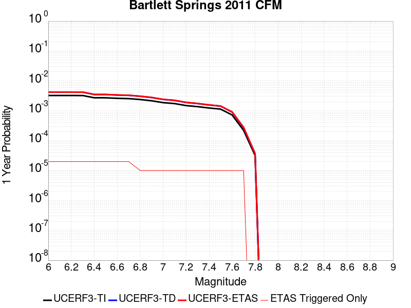 | 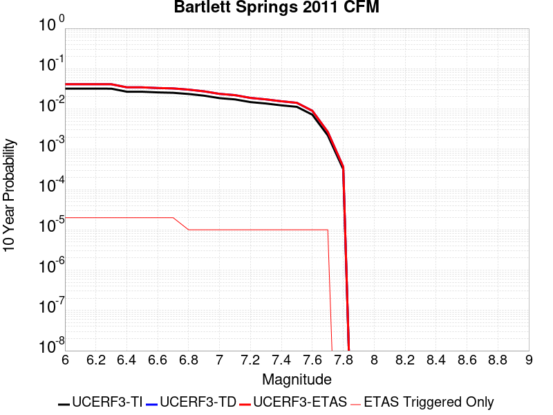 |

| Magnitude | 1 wk TI Prob | 1 wk TD Prob | 1 wk ETAS Prob | 1 wk ETAS/TD Gain | 1 wk ETAS Triggered Only | 1 mo TI Prob | 1 mo TD Prob | 1 mo ETAS Prob | 1 mo ETAS/TD Gain | 1 mo ETAS Triggered Only | 1 yr TI Prob | 1 yr TD Prob | 1 yr ETAS Prob | 1 yr ETAS/TD Gain | 1 yr ETAS Triggered Only | 10 yr TI Prob | 10 yr TD Prob | 10 yr ETAS Prob | 10 yr ETAS/TD Gain | 10 yr ETAS Triggered Only |
|-----|-----|-----|-----|-----|-----|-----|-----|-----|-----|-----|-----|-----|-----|-----|-----|-----|-----|-----|-----|-----|
| 6.0 | 6.2326144E-5 | 8.060613E-5 | 8.060613E-5 | 1.0 | 0.0 | 2.6708472E-4 | 3.454099E-4 | 3.454099E-4 | 1.0 | 0.0 | 0.003246908 | 0.0041973945 | 0.004217311 | 1.0047449 | 2.0E-5 | 0.031998757 | 0.04119771 | 0.041216888 | 1.0004655 | 2.0E-5 |
| 6.1 | 6.227657E-5 | 8.054363E-5 | 8.054363E-5 | 1.0 | 0.0 | 2.668723E-4 | 3.4514212E-4 | 3.4514212E-4 | 1.0 | 0.0 | 0.0032443295 | 0.004194147 | 0.0042140633 | 1.0047486 | 2.0E-5 | 0.031973712 | 0.041166443 | 0.04118562 | 1.0004659 | 2.0E-5 |
| 6.2 | 6.22452E-5 | 8.050423E-5 | 8.050423E-5 | 1.0 | 0.0 | 2.6673786E-4 | 3.4497332E-4 | 3.4497332E-4 | 1.0 | 0.0 | 0.0032426978 | 0.0041921 | 0.0042120162 | 1.0047508 | 2.0E-5 | 0.03195787 | 0.041146737 | 0.041165914 | 1.0004661 | 2.0E-5 |
| 6.3 | 6.219006E-5 | 8.043407E-5 | 8.043407E-5 | 1.0 | 0.0 | 2.6650162E-4 | 3.4467268E-4 | 3.4467268E-4 | 1.0 | 0.0 | 0.00323983 | 0.0041884542 | 0.00420837 | 1.004755 | 2.0E-5 | 0.031930014 | 0.041111637 | 0.041130815 | 1.0004665 | 2.0E-5 |
| 6.4 | 5.2175856E-5 | 6.725342E-5 | 6.725342E-5 | 1.0 | 0.0 | 2.2359163E-4 | 2.8819745E-4 | 2.8819745E-4 | 1.0 | 0.0 | 0.0027188298 | 0.0035032115 | 0.0035231414 | 1.005689 | 2.0E-5 | 0.026858058 | 0.034489222 | 0.03450853 | 1.0005599 | 2.0E-5 |
| 6.5 | 5.205166E-5 | 6.7096094E-5 | 6.7096094E-5 | 1.0 | 0.0 | 2.2305945E-4 | 2.8752335E-4 | 2.8752335E-4 | 1.0 | 0.0 | 0.0027123666 | 0.0034950306 | 0.0035149606 | 1.0057024 | 2.0E-5 | 0.026794989 | 0.034409966 | 0.03442928 | 1.0005612 | 2.0E-5 |
| 6.6 | 5.0085426E-5 | 6.449277E-5 | 6.449277E-5 | 1.0 | 0.0 | 2.1463417E-4 | 2.763686E-4 | 2.763686E-4 | 1.0 | 0.0 | 0.0026100394 | 0.0033596456 | 0.0033795782 | 1.005933 | 2.0E-5 | 0.025795965 | 0.033097573 | 0.03311691 | 1.0005842 | 2.0E-5 |
| 6.7 | 4.8930866E-5 | 6.3017396E-5 | 6.3017396E-5 | 1.0 | 0.0 | 2.0968684E-4 | 2.7004688E-4 | 2.7004688E-4 | 1.0 | 0.0 | 0.0025499484 | 0.0032829174 | 0.003302852 | 1.0060722 | 2.0E-5 | 0.025208864 | 0.03235294 | 0.032372292 | 1.0005982 | 2.0E-5 |
| 6.8 | 4.5679535E-5 | 5.8741858E-5 | 5.8741858E-5 | 1.0 | 0.0 | 1.9575475E-4 | 2.5172674E-4 | 2.5172674E-4 | 1.0 | 0.0 | 0.002380709 | 0.0030605064 | 0.003070476 | 1.0032574 | 1.0E-5 | 0.023553653 | 0.03019042 | 0.030200118 | 1.0003213 | 1.0E-5 |
| 6.9 | 4.1439176E-5 | 5.3220094E-5 | 5.3220094E-5 | 1.0 | 0.0 | 1.7758438E-4 | 2.2806633E-4 | 2.2806633E-4 | 1.0 | 0.0 | 0.002159946 | 0.0027731995 | 0.0027831716 | 1.003596 | 1.0E-5 | 0.021390721 | 0.027390772 | 0.0274005 | 1.0003551 | 1.0E-5 |
| 7.0 | 3.5920104E-5 | 4.600871E-5 | 4.600871E-5 | 1.0 | 0.0 | 1.5393422E-4 | 1.9716538E-4 | 1.9716538E-4 | 1.0 | 0.0 | 0.001872538 | 0.0023978627 | 0.0024078388 | 1.0041604 | 1.0E-5 | 0.018568378 | 0.023723004 | 0.023732768 | 1.0004115 | 1.0E-5 |
| 7.1 | 3.338812E-5 | 4.2689582E-5 | 4.2689582E-5 | 1.0 | 0.0 | 1.430841E-4 | 1.829426E-4 | 1.829426E-4 | 1.0 | 0.0 | 0.0017406568 | 0.0022250658 | 0.0022350436 | 1.0044843 | 1.0E-5 | 0.017270854 | 0.02203054 | 0.02204032 | 1.0004439 | 1.0E-5 |
| 7.2 | 2.8619615E-5 | 3.6401652E-5 | 3.6401652E-5 | 1.0 | 0.0 | 1.2264973E-4 | 1.5599781E-4 | 1.5599781E-4 | 1.0 | 0.0 | 0.0014922376 | 0.0018976285 | 0.0019076095 | 1.0052598 | 1.0E-5 | 0.014822568 | 0.01881613 | 0.018825943 | 1.0005214 | 1.0E-5 |
| 7.3 | 2.6376783E-5 | 3.342276E-5 | 3.342276E-5 | 1.0 | 0.0 | 1.13038455E-4 | 1.4323258E-4 | 1.4323258E-4 | 1.0 | 0.0 | 0.0013753743 | 0.001742471 | 0.0017524536 | 1.005729 | 1.0E-5 | 0.01366893 | 0.01728972 | 0.017299548 | 1.0005684 | 1.0E-5 |
| 7.4 | 2.3738676E-5 | 2.9978975E-5 | 2.9978975E-5 | 1.0 | 0.0 | 1.0173322E-4 | 1.2847505E-4 | 1.2847505E-4 | 1.0 | 0.0 | 0.0012378981 | 0.0015630693 | 0.0015730537 | 1.0063877 | 1.0E-5 | 0.012310251 | 0.015522073 | 0.015531918 | 1.0006342 | 1.0E-5 |
| 7.5 | 2.1789481E-5 | 2.7439388E-5 | 2.7439388E-5 | 1.0 | 0.0 | 9.338015E-5 | 1.1759212E-4 | 1.1759212E-4 | 1.0 | 0.0 | 0.0011363103 | 0.0014307518 | 0.0014407374 | 1.0069793 | 1.0E-5 | 0.011305175 | 0.014216576 | 0.014226433 | 1.0006934 | 1.0E-5 |
| 7.6 | 1.3895281E-5 | 1.7368426E-5 | 1.7368426E-5 | 1.0 | 0.0 | 5.9549846E-5 | 7.4434E-5 | 7.4434E-5 | 1.0 | 0.0 | 7.2477816E-4 | 9.0586004E-4 | 9.15851E-4 | 1.0110292 | 1.0E-5 | 0.0072241887 | 0.009022084 | 0.009031994 | 1.0010984 | 1.0E-5 |
| 7.7 | 4.245981E-6 | 5.1624675E-6 | 5.1624675E-6 | 1.0 | 0.0 | 1.8196934E-5 | 2.2124674E-5 | 2.2124674E-5 | 1.0 | 0.0 | 2.2152514E-4 | 2.693348E-4 | 2.793321E-4 | 1.0371186 | 1.0E-5 | 0.0022130446 | 0.0026901034 | 0.0027000764 | 1.0037073 | 1.0E-5 |
| 7.8 | 6.145192E-7 | 7.047006E-7 | 7.047006E-7 | 1.0 | 0.0 | 2.633651E-6 | 3.020142E-6 | 3.020142E-6 | 1.0 | 0.0 | 3.206423E-5 | 3.676962E-5 | 3.676962E-5 | 1.0 | 0.0 | 3.2059604E-4 | 3.6763478E-4 | 3.6763478E-4 | 1.0 | 0.0 |

## Superstition Hills
*[(top)](#table-of-contents)*

| 1 Week | 1 Month | 1 Year | 10 Year |
|-----|-----|-----|-----|
|  |  | 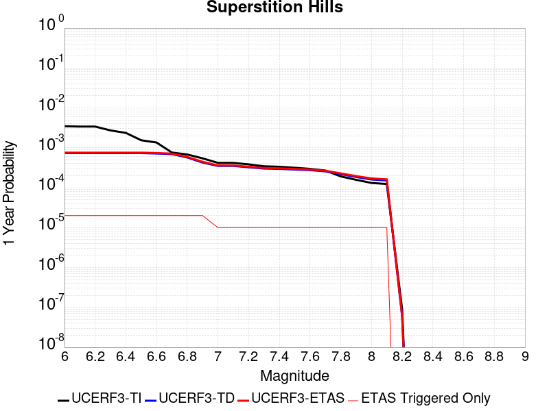 | 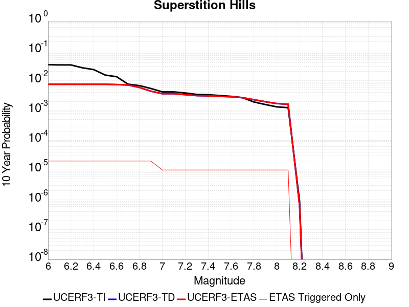 |

| Magnitude | 1 wk TI Prob | 1 wk TD Prob | 1 wk ETAS Prob | 1 wk ETAS/TD Gain | 1 wk ETAS Triggered Only | 1 mo TI Prob | 1 mo TD Prob | 1 mo ETAS Prob | 1 mo ETAS/TD Gain | 1 mo ETAS Triggered Only | 1 yr TI Prob | 1 yr TD Prob | 1 yr ETAS Prob | 1 yr ETAS/TD Gain | 1 yr ETAS Triggered Only | 10 yr TI Prob | 10 yr TD Prob | 10 yr ETAS Prob | 10 yr ETAS/TD Gain | 10 yr ETAS Triggered Only |
|-----|-----|-----|-----|-----|-----|-----|-----|-----|-----|-----|-----|-----|-----|-----|-----|-----|-----|-----|-----|-----|
| 6.0 | 6.6865185E-5 | 1.41376995E-5 | 1.41376995E-5 | 1.0 | 0.0 | 2.8653358E-4 | 6.0588824E-5 | 7.058822E-5 | 1.1650369 | 1.0E-5 | 0.0034829667 | 7.374355E-4 | 7.574207E-4 | 1.027101 | 2.0E-5 | 0.03428881 | 0.0075204074 | 0.007540257 | 1.0026394 | 2.0E-5 |
| 6.1 | 6.544851E-5 | 1.41376995E-5 | 1.41376995E-5 | 1.0 | 0.0 | 2.8046346E-4 | 6.0588824E-5 | 7.058822E-5 | 1.1650369 | 1.0E-5 | 0.0034092965 | 7.374355E-4 | 7.574207E-4 | 1.027101 | 2.0E-5 | 0.033574644 | 0.007520407 | 0.0075402563 | 1.0026394 | 2.0E-5 |
| 6.2 | 6.544851E-5 | 1.41376995E-5 | 1.41376995E-5 | 1.0 | 0.0 | 2.8046346E-4 | 6.0588824E-5 | 7.058822E-5 | 1.1650369 | 1.0E-5 | 0.0034092965 | 7.374355E-4 | 7.574207E-4 | 1.027101 | 2.0E-5 | 0.033574644 | 0.007520407 | 0.0075402563 | 1.0026394 | 2.0E-5 |
| 6.3 | 5.2402065E-5 | 1.4137698E-5 | 1.4137698E-5 | 1.0 | 0.0 | 2.2456095E-4 | 6.058882E-5 | 7.058821E-5 | 1.1650369 | 1.0E-5 | 0.0027306017 | 7.374354E-4 | 7.5742067E-4 | 1.027101 | 2.0E-5 | 0.02697292 | 0.007520402 | 0.007540251 | 1.0026394 | 2.0E-5 |
| 6.4 | 4.542238E-5 | 1.4137698E-5 | 1.4137698E-5 | 1.0 | 0.0 | 1.9465282E-4 | 6.0588816E-5 | 7.058821E-5 | 1.1650369 | 1.0E-5 | 0.0023673223 | 7.3743536E-4 | 7.574206E-4 | 1.027101 | 2.0E-5 | 0.023422617 | 0.0075203986 | 0.0075402483 | 1.0026394 | 2.0E-5 |
| 6.5 | 2.9672969E-5 | 1.4137696E-5 | 1.4137696E-5 | 1.0 | 0.0 | 1.2716366E-4 | 6.058881E-5 | 7.0588205E-5 | 1.1650369 | 1.0E-5 | 0.0015471181 | 7.374353E-4 | 7.5742055E-4 | 1.027101 | 2.0E-5 | 0.015363912 | 0.007520392 | 0.007540242 | 1.0026394 | 2.0E-5 |
| 6.6 | 2.6056105E-5 | 1.3803458E-5 | 1.3803458E-5 | 1.0 | 0.0 | 1.1166424E-4 | 5.9156428E-5 | 6.915584E-5 | 1.1690333 | 1.0E-5 | 0.0013586642 | 7.200076E-4 | 7.399932E-4 | 1.0277575 | 2.0E-5 | 0.013503874 | 0.0073448285 | 0.007364682 | 1.002703 | 2.0E-5 |
| 6.7 | 1.4611248E-5 | 1.3383359E-5 | 1.3383359E-5 | 1.0 | 0.0 | 6.261813E-5 | 5.7356083E-5 | 6.735551E-5 | 1.1743394 | 1.0E-5 | 7.6210906E-4 | 6.981025E-4 | 7.1808853E-4 | 1.0286291 | 2.0E-5 | 0.0075950073 | 0.00712602 | 0.007145877 | 1.0027866 | 2.0E-5 |
| 6.8 | 1.30607E-5 | 1.09787925E-5 | 1.09787925E-5 | 1.0 | 0.0 | 5.597323E-5 | 4.705117E-5 | 5.70507E-5 | 1.2125245 | 1.0E-5 | 6.8126095E-4 | 5.7270617E-4 | 5.926947E-4 | 1.034902 | 2.0E-5 | 0.006791762 | 0.00587438 | 0.0058942623 | 1.0033846 | 2.0E-5 |
| 6.9 | 1.0443096E-5 | 8.195349E-6 | 8.195349E-6 | 1.0 | 0.0 | 4.4755358E-5 | 3.5122466E-5 | 4.5122117E-5 | 1.284708 | 1.0E-5 | 5.447602E-4 | 4.2753448E-4 | 4.4752593E-4 | 1.0467598 | 2.0E-5 | 0.005434267 | 0.0044094524 | 0.004429364 | 1.0045158 | 2.0E-5 |
| 7.0 | 8.045912E-6 | 6.739692E-6 | 6.739692E-6 | 1.0 | 0.0 | 3.4482026E-5 | 2.888408E-5 | 3.888379E-5 | 1.3462014 | 1.0E-5 | 4.197378E-4 | 3.5160795E-4 | 3.6160444E-4 | 1.0284308 | 1.0E-5 | 0.0041894587 | 0.0036334093 | 0.003643373 | 1.0027423 | 1.0E-5 |
| 7.1 | 8.045912E-6 | 6.739692E-6 | 6.739692E-6 | 1.0 | 0.0 | 3.4482026E-5 | 2.888408E-5 | 3.888379E-5 | 1.3462014 | 1.0E-5 | 4.197378E-4 | 3.5160795E-4 | 3.6160444E-4 | 1.0284308 | 1.0E-5 | 0.0041894587 | 0.0036334093 | 0.003643373 | 1.0027423 | 1.0E-5 |
| 7.2 | 7.375506E-6 | 6.2466297E-6 | 6.2466297E-6 | 1.0 | 0.0 | 3.1608928E-5 | 2.6771E-5 | 3.6770733E-5 | 1.3735285 | 1.0E-5 | 3.8477074E-4 | 3.2588904E-4 | 3.358858E-4 | 1.0306753 | 1.0E-5 | 0.003841052 | 0.003373887 | 0.0033838532 | 1.0029539 | 1.0E-5 |
| 7.3 | 6.6063913E-6 | 5.7990574E-6 | 5.7990574E-6 | 1.0 | 0.0 | 2.8312797E-5 | 2.485287E-5 | 3.4852623E-5 | 1.402358 | 1.0E-5 | 3.446538E-4 | 3.025424E-4 | 3.1253937E-4 | 1.0330433 | 1.0E-5 | 0.0034411973 | 0.003138153 | 0.0031481218 | 1.0031766 | 1.0E-5 |
| 7.4 | 6.4313126E-6 | 5.680481E-6 | 5.680481E-6 | 1.0 | 0.0 | 2.7562477E-5 | 2.4344696E-5 | 3.434445E-5 | 1.4107571 | 1.0E-5 | 3.355215E-4 | 2.9635706E-4 | 3.063541E-4 | 1.0337331 | 1.0E-5 | 0.0033501536 | 0.0030759154 | 0.0030858845 | 1.0032411 | 1.0E-5 |
| 7.5 | 6.0742927E-6 | 5.4763104E-6 | 5.4763104E-6 | 1.0 | 0.0 | 2.6032423E-5 | 2.3469694E-5 | 3.346946E-5 | 1.4260714 | 1.0E-5 | 3.1689866E-4 | 2.8570674E-4 | 2.9570388E-4 | 1.0349909 | 1.0E-5 | 0.0031644711 | 0.002967756 | 0.0029777263 | 1.0033596 | 1.0E-5 |
| 7.6 | 5.6987187E-6 | 5.294521E-6 | 5.294521E-6 | 1.0 | 0.0 | 2.4422852E-5 | 2.269061E-5 | 3.2690383E-5 | 1.4407009 | 1.0E-5 | 2.9730765E-4 | 2.7622381E-4 | 2.8622107E-4 | 1.0361925 | 1.0E-5 | 0.002969102 | 0.0028710118 | 0.002880983 | 1.003473 | 1.0E-5 |
| 7.7 | 5.1658035E-6 | 4.925535E-6 | 4.925535E-6 | 1.0 | 0.0 | 2.2138971E-5 | 2.1109268E-5 | 3.110906E-5 | 1.4737155 | 1.0E-5 | 2.6950863E-4 | 2.5697565E-4 | 2.6697307E-4 | 1.0389042 | 1.0E-5 | 0.00269182 | 0.0026760625 | 0.0026860356 | 1.0037268 | 1.0E-5 |
| 7.8 | 3.6864697E-6 | 4.1964995E-6 | 4.1964995E-6 | 1.0 | 0.0 | 1.579906E-5 | 1.7984876E-5 | 2.7984695E-5 | 1.5560127 | 1.0E-5 | 1.9233658E-4 | 2.1894433E-4 | 2.2894214E-4 | 1.0456637 | 1.0E-5 | 0.0019217018 | 0.0022892624 | 0.0022992396 | 1.0043582 | 1.0E-5 |
| 7.9 | 3.0265903E-6 | 3.5637288E-6 | 3.5637288E-6 | 1.0 | 0.0 | 1.2971037E-5 | 1.5273037E-5 | 2.5272884E-5 | 1.6547387 | 1.0E-5 | 1.5791094E-4 | 1.859338E-4 | 1.9593193E-4 | 1.0537726 | 1.0E-5 | 0.0015779877 | 0.0019534735 | 0.001963454 | 1.0051091 | 1.0E-5 |
| 8.0 | 2.5271493E-6 | 3.0867361E-6 | 3.0867361E-6 | 1.0 | 0.0 | 1.0830595E-5 | 1.3228804E-5 | 2.3228673E-5 | 1.7559162 | 1.0E-5 | 1.3185451E-4 | 1.610492E-4 | 1.7104759E-4 | 1.0620828 | 1.0E-5 | 0.0013177631 | 0.0016973554 | 0.0017073384 | 1.0058815 | 1.0E-5 |
| 8.1 | 2.3749135E-6 | 2.917377E-6 | 2.917377E-6 | 1.0 | 0.0 | 1.0178161E-5 | 1.25029865E-5 | 2.2502862E-5 | 1.7997988 | 1.0E-5 | 1.2391206E-4 | 1.5221364E-4 | 1.6221212E-4 | 1.0656872 | 1.0E-5 | 0.0012384299 | 0.001604949 | 0.001614933 | 1.0062207 | 1.0E-5 |
| 8.2 | 1.7186406E-9 | 1.1440594E-9 | 1.1440594E-9 | 1.0 | 0.0 | 7.3656024E-9 | 4.9031117E-9 | 4.9031117E-9 | 1.0 | 0.0 | 8.9676206E-8 | 5.969538E-8 | 5.969538E-8 | 1.0 | 0.0 | 8.9676166E-7 | 6.389059E-7 | 6.389059E-7 | 1.0 | 0.0 |

## Monte Vista - Shannon 2011 CFM
*[(top)](#table-of-contents)*

| 1 Week | 1 Month | 1 Year | 10 Year |
|-----|-----|-----|-----|
| 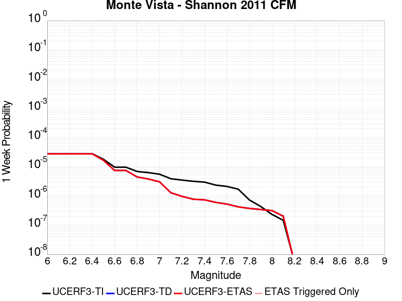 | 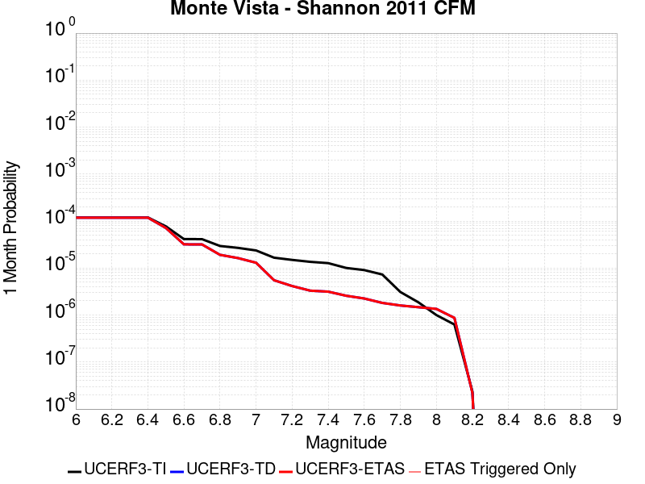 |  |  |

| Magnitude | 1 wk TI Prob | 1 wk TD Prob | 1 wk ETAS Prob | 1 wk ETAS/TD Gain | 1 wk ETAS Triggered Only | 1 mo TI Prob | 1 mo TD Prob | 1 mo ETAS Prob | 1 mo ETAS/TD Gain | 1 mo ETAS Triggered Only | 1 yr TI Prob | 1 yr TD Prob | 1 yr ETAS Prob | 1 yr ETAS/TD Gain | 1 yr ETAS Triggered Only | 10 yr TI Prob | 10 yr TD Prob | 10 yr ETAS Prob | 10 yr ETAS/TD Gain | 10 yr ETAS Triggered Only |
|-----|-----|-----|-----|-----|-----|-----|-----|-----|-----|-----|-----|-----|-----|-----|-----|-----|-----|-----|-----|-----|
| 6.0 | 2.7907707E-5 | 2.7584209E-5 | 2.7584209E-5 | 1.0 | 0.0 | 1.19598975E-4 | 1.1821338E-4 | 1.1821338E-4 | 1.0 | 0.0 | 0.0014551448 | 0.0014384214 | 0.001448407 | 1.006942 | 1.0E-5 | 0.014456532 | 0.014320195 | 0.014339909 | 1.0013766 | 2.0E-5 |
| 6.1 | 2.7907707E-5 | 2.7584209E-5 | 2.7584209E-5 | 1.0 | 0.0 | 1.19598975E-4 | 1.1821338E-4 | 1.1821338E-4 | 1.0 | 0.0 | 0.0014551448 | 0.0014384214 | 0.001448407 | 1.006942 | 1.0E-5 | 0.014456532 | 0.014320195 | 0.014339909 | 1.0013766 | 2.0E-5 |
| 6.2 | 2.7907707E-5 | 2.7584209E-5 | 2.7584209E-5 | 1.0 | 0.0 | 1.19598975E-4 | 1.1821338E-4 | 1.1821338E-4 | 1.0 | 0.0 | 0.0014551448 | 0.0014384214 | 0.001448407 | 1.006942 | 1.0E-5 | 0.014456532 | 0.014320195 | 0.014339909 | 1.0013766 | 2.0E-5 |
| 6.3 | 2.7907707E-5 | 2.7584209E-5 | 2.7584209E-5 | 1.0 | 0.0 | 1.19598975E-4 | 1.1821338E-4 | 1.1821338E-4 | 1.0 | 0.0 | 0.0014551448 | 0.0014384214 | 0.001448407 | 1.006942 | 1.0E-5 | 0.014456532 | 0.014320195 | 0.014339909 | 1.0013766 | 2.0E-5 |
| 6.4 | 2.7907707E-5 | 2.7584209E-5 | 2.7584209E-5 | 1.0 | 0.0 | 1.19598975E-4 | 1.1821338E-4 | 1.1821338E-4 | 1.0 | 0.0 | 0.0014551448 | 0.0014384214 | 0.001448407 | 1.006942 | 1.0E-5 | 0.014456532 | 0.014320195 | 0.014339909 | 1.0013766 | 2.0E-5 |
| 6.5 | 1.7990213E-5 | 1.6639884E-5 | 1.6639884E-5 | 1.0 | 0.0 | 7.709863E-5 | 7.131221E-5 | 7.131221E-5 | 1.0 | 0.0 | 9.382716E-4 | 8.679467E-4 | 8.679467E-4 | 1.0 | 0.0 | 0.0093431985 | 0.008668941 | 0.008678854 | 1.0011436 | 1.0E-5 |
| 6.6 | 9.650407E-6 | 7.4571435E-6 | 7.4571435E-6 | 1.0 | 0.0 | 4.135823E-5 | 3.195884E-5 | 3.195884E-5 | 1.0 | 0.0 | 5.0342013E-4 | 3.8903722E-4 | 3.8903722E-4 | 1.0 | 0.0 | 0.005022812 | 0.0039012418 | 0.0039012418 | 1.0 | 0.0 |
| 6.7 | 9.62828E-6 | 7.4350583E-6 | 7.4350583E-6 | 1.0 | 0.0 | 4.1263404E-5 | 3.186419E-5 | 3.186419E-5 | 1.0 | 0.0 | 5.022661E-4 | 3.878853E-4 | 3.878853E-4 | 1.0 | 0.0 | 0.0050113243 | 0.003889763 | 0.003889763 | 1.0 | 0.0 |
| 6.8 | 6.887523E-6 | 4.4615676E-6 | 4.4615676E-6 | 1.0 | 0.0 | 2.9517621E-5 | 1.9120876E-5 | 1.9120876E-5 | 1.0 | 0.0 | 3.5931775E-4 | 2.3277402E-4 | 2.3277402E-4 | 1.0 | 0.0 | 0.0035873733 | 0.0023424553 | 0.0023424553 | 1.0 | 0.0 |
| 6.9 | 6.2722347E-6 | 3.8034377E-6 | 3.8034377E-6 | 1.0 | 0.0 | 2.6880729E-5 | 1.6300357E-5 | 1.6300357E-5 | 1.0 | 0.0 | 3.2722374E-4 | 1.984408E-4 | 1.984408E-4 | 1.0 | 0.0 | 0.003267423 | 0.0019997752 | 0.0019997752 | 1.0 | 0.0 |
| 7.0 | 5.5320347E-6 | 3.0305885E-6 | 3.0305885E-6 | 1.0 | 0.0 | 2.3708504E-5 | 1.2988182E-5 | 1.2988182E-5 | 1.0 | 0.0 | 2.8861282E-4 | 1.5812147E-4 | 1.5812147E-4 | 1.0 | 0.0 | 0.0028823826 | 0.001597215 | 0.001597215 | 1.0 | 0.0 |
| 7.1 | 3.8794055E-6 | 1.2837862E-6 | 1.2837862E-6 | 1.0 | 0.0 | 1.6625918E-5 | 5.5019295E-6 | 5.5019295E-6 | 1.0 | 0.0 | 2.0240174E-4 | 6.698394E-5 | 6.698394E-5 | 1.0 | 0.0 | 0.002022175 | 6.865884E-4 | 6.865884E-4 | 1.0 | 0.0 |
| 7.2 | 3.4813652E-6 | 9.671046E-7 | 9.671046E-7 | 1.0 | 0.0 | 1.49200505E-5 | 4.1447274E-6 | 4.1447274E-6 | 1.0 | 0.0 | 1.8163648E-4 | 5.0460894E-5 | 5.0460894E-5 | 1.0 | 0.0 | 0.0018148809 | 5.214329E-4 | 5.214329E-4 | 1.0 | 0.0 |
| 7.3 | 3.1682148E-6 | 7.719097E-7 | 7.719097E-7 | 1.0 | 0.0 | 1.3577992E-5 | 3.30818E-6 | 3.30818E-6 | 1.0 | 0.0 | 1.6529951E-4 | 4.027635E-5 | 4.027635E-5 | 1.0 | 0.0 | 0.0016517661 | 4.1960424E-4 | 4.1960424E-4 | 1.0 | 0.0 |
| 7.4 | 2.9707667E-6 | 7.3457204E-7 | 7.3457204E-7 | 1.0 | 0.0 | 1.2731795E-5 | 3.148162E-6 | 3.148162E-6 | 1.0 | 0.0 | 1.5499859E-4 | 3.8328202E-5 | 3.8328202E-5 | 1.0 | 0.0 | 0.0015489052 | 3.9992164E-4 | 3.9992164E-4 | 1.0 | 0.0 |
| 7.5 | 2.3462758E-6 | 6.007889E-7 | 6.007889E-7 | 1.0 | 0.0 | 1.0055429E-5 | 2.574807E-6 | 2.574807E-6 | 1.0 | 0.0 | 1.2241797E-4 | 3.1347827E-5 | 3.1347827E-5 | 1.0 | 0.0 | 0.0012235056 | 3.2839534E-4 | 3.2839534E-4 | 1.0 | 0.0 |
| 7.6 | 2.112783E-6 | 5.251582E-7 | 5.251582E-7 | 1.0 | 0.0 | 9.054753E-6 | 2.250676E-6 | 2.250676E-6 | 1.0 | 0.0 | 1.1023604E-4 | 2.7401638E-5 | 2.7401638E-5 | 1.0 | 0.0 | 0.0011018137 | 2.885138E-4 | 2.885138E-4 | 1.0 | 0.0 |
| 7.7 | 1.7022471E-6 | 4.231601E-7 | 4.231601E-7 | 1.0 | 0.0 | 7.2953244E-6 | 1.8135419E-6 | 1.8135419E-6 | 1.0 | 0.0 | 8.881695E-5 | 2.207965E-5 | 2.207965E-5 | 1.0 | 0.0 | 8.878146E-4 | 2.3398738E-4 | 2.3398738E-4 | 1.0 | 0.0 |
| 7.8 | 7.230914E-7 | 3.7285864E-7 | 3.7285864E-7 | 1.0 | 0.0 | 3.0989595E-6 | 1.5979647E-6 | 1.5979647E-6 | 1.0 | 0.0 | 3.772918E-5 | 1.9455047E-5 | 1.9455047E-5 | 1.0 | 0.0 | 3.7722773E-4 | 2.0726922E-4 | 2.0726922E-4 | 1.0 | 0.0 |
| 7.9 | 4.3588446E-7 | 3.4305793E-7 | 3.4305793E-7 | 1.0 | 0.0 | 1.868075E-6 | 1.4702474E-6 | 1.4702474E-6 | 1.0 | 0.0 | 2.2743576E-5 | 1.7900116E-5 | 1.7900116E-5 | 1.0 | 0.0 | 2.2741247E-4 | 1.8995286E-4 | 1.8995286E-4 | 1.0 | 0.0 |
| 8.0 | 2.3317523E-7 | 3.1513588E-7 | 3.1513588E-7 | 1.0 | 0.0 | 9.99322E-7 | 1.3505817E-6 | 1.3505817E-6 | 1.0 | 0.0 | 1.2166677E-5 | 1.644321E-5 | 1.644321E-5 | 1.0 | 0.0 | 1.21660116E-4 | 1.7399415E-4 | 1.7399415E-4 | 1.0 | 0.0 |
| 8.1 | 1.4662456E-7 | 2.030774E-7 | 2.030774E-7 | 1.0 | 0.0 | 6.283908E-7 | 8.703314E-7 | 8.703314E-7 | 1.0 | 0.0 | 7.650631E-6 | 1.05962345E-5 | 1.05962345E-5 | 1.0 | 0.0 | 7.650368E-5 | 1.113227E-4 | 1.113227E-4 | 1.0 | 0.0 |
| 8.2 | 5.4931775E-9 | 5.07573E-9 | 5.07573E-9 | 1.0 | 0.0 | 2.3542189E-8 | 2.1753127E-8 | 2.1753127E-8 | 1.0 | 0.0 | 2.8662612E-7 | 2.6484432E-7 | 2.6484432E-7 | 1.0 | 0.0 | 2.8662573E-6 | 2.7539324E-6 | 2.7539324E-6 | 1.0 | 0.0 |

## South Cuyama
*[(top)](#table-of-contents)*

| 1 Week | 1 Month | 1 Year | 10 Year |
|-----|-----|-----|-----|
|  |  |  | 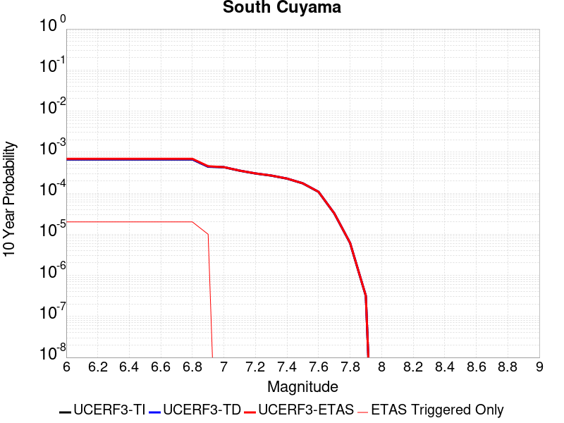 |

| Magnitude | 1 wk TI Prob | 1 wk TD Prob | 1 wk ETAS Prob | 1 wk ETAS/TD Gain | 1 wk ETAS Triggered Only | 1 mo TI Prob | 1 mo TD Prob | 1 mo ETAS Prob | 1 mo ETAS/TD Gain | 1 mo ETAS Triggered Only | 1 yr TI Prob | 1 yr TD Prob | 1 yr ETAS Prob | 1 yr ETAS/TD Gain | 1 yr ETAS Triggered Only | 10 yr TI Prob | 10 yr TD Prob | 10 yr ETAS Prob | 10 yr ETAS/TD Gain | 10 yr ETAS Triggered Only |
|-----|-----|-----|-----|-----|-----|-----|-----|-----|-----|-----|-----|-----|-----|-----|-----|-----|-----|-----|-----|-----|
| 6.0 | 1.2747308E-6 | 1.2818697E-6 | 1.1281857E-5 | 8.801095 | 1.0E-5 | 5.4631205E-6 | 5.4937163E-6 | 1.549366E-5 | 2.8202515 | 1.0E-5 | 6.6511464E-5 | 6.6884015E-5 | 7.688334E-5 | 1.1495025 | 1.0E-5 | 6.649156E-4 | 6.686458E-4 | 6.886324E-4 | 1.0298913 | 2.0E-5 |
| 6.1 | 1.2747308E-6 | 1.2818697E-6 | 1.1281857E-5 | 8.801095 | 1.0E-5 | 5.4631205E-6 | 5.4937163E-6 | 1.549366E-5 | 2.8202515 | 1.0E-5 | 6.6511464E-5 | 6.6884015E-5 | 7.688334E-5 | 1.1495025 | 1.0E-5 | 6.649156E-4 | 6.686458E-4 | 6.886324E-4 | 1.0298913 | 2.0E-5 |
| 6.2 | 1.2747308E-6 | 1.2818697E-6 | 1.1281857E-5 | 8.801095 | 1.0E-5 | 5.4631205E-6 | 5.4937163E-6 | 1.549366E-5 | 2.8202515 | 1.0E-5 | 6.6511464E-5 | 6.6884015E-5 | 7.688334E-5 | 1.1495025 | 1.0E-5 | 6.649156E-4 | 6.686458E-4 | 6.886324E-4 | 1.0298913 | 2.0E-5 |
| 6.3 | 1.2747308E-6 | 1.2818697E-6 | 1.1281857E-5 | 8.801095 | 1.0E-5 | 5.4631205E-6 | 5.4937163E-6 | 1.549366E-5 | 2.8202515 | 1.0E-5 | 6.6511464E-5 | 6.6884015E-5 | 7.688334E-5 | 1.1495025 | 1.0E-5 | 6.649156E-4 | 6.686458E-4 | 6.886324E-4 | 1.0298913 | 2.0E-5 |
| 6.4 | 1.2747308E-6 | 1.2818697E-6 | 1.1281857E-5 | 8.801095 | 1.0E-5 | 5.4631205E-6 | 5.4937163E-6 | 1.549366E-5 | 2.8202515 | 1.0E-5 | 6.6511464E-5 | 6.6884015E-5 | 7.688334E-5 | 1.1495025 | 1.0E-5 | 6.649156E-4 | 6.686458E-4 | 6.886324E-4 | 1.0298913 | 2.0E-5 |
| 6.5 | 1.2747308E-6 | 1.2818697E-6 | 1.1281857E-5 | 8.801095 | 1.0E-5 | 5.4631205E-6 | 5.4937163E-6 | 1.549366E-5 | 2.8202515 | 1.0E-5 | 6.6511464E-5 | 6.6884015E-5 | 7.688334E-5 | 1.1495025 | 1.0E-5 | 6.649156E-4 | 6.686458E-4 | 6.886324E-4 | 1.0298913 | 2.0E-5 |
| 6.6 | 1.2747308E-6 | 1.2818697E-6 | 1.1281857E-5 | 8.801095 | 1.0E-5 | 5.4631205E-6 | 5.4937163E-6 | 1.549366E-5 | 2.8202515 | 1.0E-5 | 6.6511464E-5 | 6.6884015E-5 | 7.688334E-5 | 1.1495025 | 1.0E-5 | 6.649156E-4 | 6.686458E-4 | 6.886324E-4 | 1.0298913 | 2.0E-5 |
| 6.7 | 1.2747308E-6 | 1.2818697E-6 | 1.1281857E-5 | 8.801095 | 1.0E-5 | 5.4631205E-6 | 5.4937163E-6 | 1.549366E-5 | 2.8202515 | 1.0E-5 | 6.6511464E-5 | 6.6884015E-5 | 7.688334E-5 | 1.1495025 | 1.0E-5 | 6.649156E-4 | 6.686458E-4 | 6.886324E-4 | 1.0298913 | 2.0E-5 |
| 6.8 | 1.2747308E-6 | 1.2818697E-6 | 1.1281857E-5 | 8.801095 | 1.0E-5 | 5.4631205E-6 | 5.4937163E-6 | 1.549366E-5 | 2.8202515 | 1.0E-5 | 6.6511464E-5 | 6.6884015E-5 | 7.688334E-5 | 1.1495025 | 1.0E-5 | 6.649156E-4 | 6.686458E-4 | 6.886324E-4 | 1.0298913 | 2.0E-5 |
| 6.9 | 8.4566324E-7 | 8.507883E-7 | 8.507883E-7 | 1.0 | 0.0 | 3.624266E-6 | 3.6462304E-6 | 3.6462304E-6 | 1.0 | 0.0 | 4.4124543E-5 | 4.439196E-5 | 4.439196E-5 | 1.0 | 0.0 | 4.4115784E-4 | 4.4383196E-4 | 4.5382752E-4 | 1.022521 | 1.0E-5 |
| 7.0 | 8.2277904E-7 | 8.27782E-7 | 8.27782E-7 | 1.0 | 0.0 | 3.526191E-6 | 3.5476323E-6 | 3.5476323E-6 | 1.0 | 0.0 | 4.293053E-5 | 4.3191576E-5 | 4.3191576E-5 | 1.0 | 0.0 | 4.292224E-4 | 4.3183283E-4 | 4.3183283E-4 | 1.0 | 0.0 |
| 7.1 | 6.7661887E-7 | 6.80913E-7 | 6.80913E-7 | 1.0 | 0.0 | 2.899792E-6 | 2.9181954E-6 | 2.9181954E-6 | 1.0 | 0.0 | 3.5304394E-5 | 3.5528454E-5 | 3.5528454E-5 | 1.0 | 0.0 | 3.5298787E-4 | 3.552281E-4 | 3.552281E-4 | 1.0 | 0.0 |
| 7.2 | 5.783336E-7 | 5.8211907E-7 | 5.8211907E-7 | 1.0 | 0.0 | 2.4785702E-6 | 2.4947938E-6 | 2.4947938E-6 | 1.0 | 0.0 | 3.0176174E-5 | 3.0373692E-5 | 3.0373692E-5 | 1.0 | 0.0 | 3.0172078E-4 | 3.0369565E-4 | 3.0369565E-4 | 1.0 | 0.0 |
| 7.3 | 5.136759E-7 | 5.170938E-7 | 5.170938E-7 | 1.0 | 0.0 | 2.2014663E-6 | 2.2161144E-6 | 2.2161144E-6 | 1.0 | 0.0 | 2.6802521E-5 | 2.698086E-5 | 2.698086E-5 | 1.0 | 0.0 | 2.679929E-4 | 2.6977606E-4 | 2.6977606E-4 | 1.0 | 0.0 |
| 7.4 | 4.3370295E-7 | 4.3665364E-7 | 4.3665364E-7 | 1.0 | 0.0 | 1.8587256E-6 | 1.8713713E-6 | 1.8713713E-6 | 1.0 | 0.0 | 2.2629749E-5 | 2.278371E-5 | 2.278371E-5 | 1.0 | 0.0 | 2.2627445E-4 | 2.278139E-4 | 2.278139E-4 | 1.0 | 0.0 |
| 7.5 | 3.3242574E-7 | 3.3476465E-7 | 3.3476465E-7 | 1.0 | 0.0 | 1.4246809E-6 | 1.4347048E-6 | 1.4347048E-6 | 1.0 | 0.0 | 1.7345352E-5 | 1.7467393E-5 | 1.7467393E-5 | 1.0 | 0.0 | 1.7343998E-4 | 1.7466032E-4 | 1.7466032E-4 | 1.0 | 0.0 |
| 7.6 | 2.0627535E-7 | 2.07789E-7 | 2.07789E-7 | 1.0 | 0.0 | 8.840369E-7 | 8.90524E-7 | 8.90524E-7 | 1.0 | 0.0 | 1.0763096E-5 | 1.0842076E-5 | 1.0842076E-5 | 1.0 | 0.0 | 1.0762575E-4 | 1.0841556E-4 | 1.0841556E-4 | 1.0 | 0.0 |
| 7.7 | 6.15236E-8 | 6.1983044E-8 | 6.1983044E-8 | 1.0 | 0.0 | 2.6367252E-7 | 2.656416E-7 | 2.656416E-7 | 1.0 | 0.0 | 3.2102084E-6 | 3.2341818E-6 | 3.2341818E-6 | 1.0 | 0.0 | 3.210162E-5 | 3.234136E-5 | 3.234136E-5 | 1.0 | 0.0 |
| 7.8 | 1.1765573E-8 | 1.1873414E-8 | 1.1873414E-8 | 1.0 | 0.0 | 5.0423886E-8 | 5.0886058E-8 | 5.0886058E-8 | 1.0 | 0.0 | 6.1391063E-7 | 6.195376E-7 | 6.195376E-7 | 1.0 | 0.0 | 6.1390897E-6 | 6.19536E-6 | 6.19536E-6 | 1.0 | 0.0 |
| 7.9 | 6.0381755E-10 | 6.10058E-10 | 6.10058E-10 | 1.0 | 0.0 | 2.5877895E-9 | 2.614534E-9 | 2.614534E-9 | 1.0 | 0.0 | 3.1506335E-8 | 3.1831952E-8 | 3.1831952E-8 | 1.0 | 0.0 | 3.1506332E-7 | 3.183195E-7 | 3.183195E-7 | 1.0 | 0.0 |

## Johnson Valley (No) 2011 rev
*[(top)](#table-of-contents)*

| 1 Week | 1 Month | 1 Year | 10 Year |
|-----|-----|-----|-----|
|  |  | 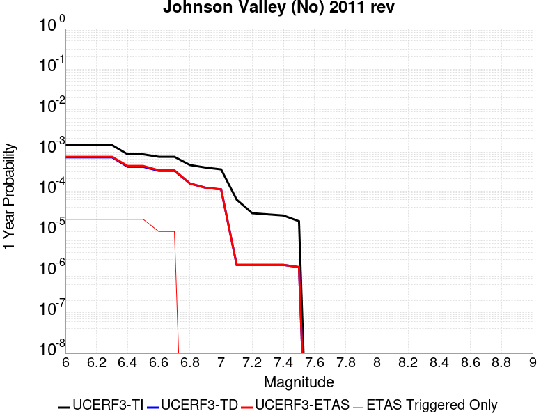 |  |

| Magnitude | 1 wk TI Prob | 1 wk TD Prob | 1 wk ETAS Prob | 1 wk ETAS/TD Gain | 1 wk ETAS Triggered Only | 1 mo TI Prob | 1 mo TD Prob | 1 mo ETAS Prob | 1 mo ETAS/TD Gain | 1 mo ETAS Triggered Only | 1 yr TI Prob | 1 yr TD Prob | 1 yr ETAS Prob | 1 yr ETAS/TD Gain | 1 yr ETAS Triggered Only | 10 yr TI Prob | 10 yr TD Prob | 10 yr ETAS Prob | 10 yr ETAS/TD Gain | 10 yr ETAS Triggered Only |
|-----|-----|-----|-----|-----|-----|-----|-----|-----|-----|-----|-----|-----|-----|-----|-----|-----|-----|-----|-----|-----|
| 6.0 | 2.577707E-5 | 1.2900938E-5 | 2.290081E-5 | 1.7751274 | 1.0E-5 | 1.1046848E-4 | 5.5288787E-5 | 6.528823E-5 | 1.1808585 | 1.0E-5 | 0.0013441239 | 6.7297276E-4 | 6.929593E-4 | 1.0296988 | 2.0E-5 | 0.013360229 | 0.006713257 | 0.0067331227 | 1.0029591 | 2.0E-5 |
| 6.1 | 2.577707E-5 | 1.2900938E-5 | 2.290081E-5 | 1.7751274 | 1.0E-5 | 1.1046848E-4 | 5.5288787E-5 | 6.528823E-5 | 1.1808585 | 1.0E-5 | 0.0013441239 | 6.7297276E-4 | 6.929593E-4 | 1.0296988 | 2.0E-5 | 0.013360229 | 0.006713257 | 0.0067331227 | 1.0029591 | 2.0E-5 |
| 6.2 | 2.577707E-5 | 1.2900938E-5 | 2.290081E-5 | 1.7751274 | 1.0E-5 | 1.1046848E-4 | 5.5288787E-5 | 6.528823E-5 | 1.1808585 | 1.0E-5 | 0.0013441239 | 6.7297276E-4 | 6.929593E-4 | 1.0296988 | 2.0E-5 | 0.013360229 | 0.006713257 | 0.0067331227 | 1.0029591 | 2.0E-5 |
| 6.3 | 2.577707E-5 | 1.2900938E-5 | 2.290081E-5 | 1.7751274 | 1.0E-5 | 1.1046848E-4 | 5.5288787E-5 | 6.528823E-5 | 1.1808585 | 1.0E-5 | 0.0013441239 | 6.7297276E-4 | 6.929593E-4 | 1.0296988 | 2.0E-5 | 0.013360229 | 0.006713257 | 0.0067331227 | 1.0029591 | 2.0E-5 |
| 6.4 | 1.5296591E-5 | 7.536742E-6 | 1.7536666E-5 | 2.3268232 | 1.0E-5 | 6.555518E-5 | 3.2300028E-5 | 4.2299707E-5 | 1.3095872 | 1.0E-5 | 7.97842E-4 | 3.9320064E-4 | 4.1319279E-4 | 1.0508447 | 2.0E-5 | 0.007949836 | 0.0039268904 | 0.0039468124 | 1.0050731 | 2.0E-5 |
| 6.5 | 1.5296591E-5 | 7.536742E-6 | 1.7536666E-5 | 2.3268232 | 1.0E-5 | 6.555518E-5 | 3.2300028E-5 | 4.2299707E-5 | 1.3095872 | 1.0E-5 | 7.97842E-4 | 3.9320064E-4 | 4.1319279E-4 | 1.0508447 | 2.0E-5 | 0.007949836 | 0.0039268904 | 0.0039468124 | 1.0050731 | 2.0E-5 |
| 6.6 | 1.3289383E-5 | 5.9917306E-6 | 1.599167E-5 | 2.668957 | 1.0E-5 | 5.6953253E-5 | 2.5678688E-5 | 3.5678433E-5 | 1.389418 | 1.0E-5 | 6.9318525E-4 | 3.1261015E-4 | 3.2260703E-4 | 1.0319787 | 1.0E-5 | 0.0069102696 | 0.0031233684 | 0.003133337 | 1.0031917 | 1.0E-5 |
| 6.7 | 1.3289383E-5 | 5.9917306E-6 | 1.599167E-5 | 2.668957 | 1.0E-5 | 5.6953253E-5 | 2.5678688E-5 | 3.5678433E-5 | 1.389418 | 1.0E-5 | 6.9318525E-4 | 3.1261015E-4 | 3.2260703E-4 | 1.0319787 | 1.0E-5 | 0.0069102696 | 0.0031233684 | 0.003133337 | 1.0031917 | 1.0E-5 |
| 6.8 | 8.330789E-6 | 2.9211888E-6 | 2.9211888E-6 | 1.0 | 0.0 | 3.570289E-5 | 1.2519352E-5 | 1.2519352E-5 | 1.0 | 0.0 | 4.34596E-4 | 1.5241816E-4 | 1.5241816E-4 | 1.0 | 0.0 | 0.0043374705 | 0.0015236961 | 0.0015236961 | 1.0 | 0.0 |
| 6.9 | 7.2359003E-6 | 2.3013247E-6 | 2.3013247E-6 | 1.0 | 0.0 | 3.1010633E-5 | 9.8628125E-6 | 9.8628125E-6 | 1.0 | 0.0 | 3.7748902E-4 | 1.2007845E-4 | 1.2007845E-4 | 1.0 | 0.0 | 0.0037684843 | 0.0012006586 | 0.0012006586 | 1.0 | 0.0 |
| 7.0 | 6.5149957E-6 | 2.088482E-6 | 2.088482E-6 | 1.0 | 0.0 | 2.792111E-5 | 8.950637E-6 | 8.950637E-6 | 1.0 | 0.0 | 3.398865E-4 | 1.0897385E-4 | 1.0897385E-4 | 1.0 | 0.0 | 0.003393671 | 0.0010897239 | 0.0010897239 | 1.0 | 0.0 |
| 7.1 | 1.1662233E-6 | 2.8802024E-8 | 2.8802024E-8 | 1.0 | 0.0 | 4.9980904E-6 | 1.2343725E-7 | 1.2343725E-7 | 1.0 | 0.0 | 6.0850052E-5 | 1.5028476E-6 | 1.5028476E-6 | 1.0 | 0.0 | 6.083339E-4 | 1.50283895E-5 | 1.50283895E-5 | 1.0 | 0.0 |
| 7.2 | 5.413881E-7 | 2.8802024E-8 | 2.8802024E-8 | 1.0 | 0.0 | 2.3202326E-6 | 1.2343725E-7 | 1.2343725E-7 | 1.0 | 0.0 | 2.8248465E-5 | 1.5028476E-6 | 1.5028476E-6 | 1.0 | 0.0 | 2.8244875E-4 | 1.50283895E-5 | 1.50283895E-5 | 1.0 | 0.0 |
| 7.3 | 5.076821E-7 | 2.8802024E-8 | 2.8802024E-8 | 1.0 | 0.0 | 2.1757785E-6 | 1.2343723E-7 | 1.2343723E-7 | 1.0 | 0.0 | 2.648978E-5 | 1.5028475E-6 | 1.5028475E-6 | 1.0 | 0.0 | 2.6486625E-4 | 1.50283895E-5 | 1.50283895E-5 | 1.0 | 0.0 |
| 7.4 | 4.7568687E-7 | 2.8783948E-8 | 2.8783948E-8 | 1.0 | 0.0 | 2.0386565E-6 | 1.2335977E-7 | 1.2335977E-7 | 1.0 | 0.0 | 2.482036E-5 | 1.5019043E-6 | 1.5019043E-6 | 1.0 | 0.0 | 2.4817587E-4 | 1.5018958E-5 | 1.5018958E-5 | 1.0 | 0.0 |
| 7.5 | 3.435626E-7 | 2.5357679E-8 | 2.5357679E-8 | 1.0 | 0.0 | 1.4724103E-6 | 1.0867576E-7 | 1.0867576E-7 | 1.0 | 0.0 | 1.7926448E-5 | 1.3231268E-6 | 1.3231268E-6 | 1.0 | 0.0 | 1.7925001E-4 | 1.3231205E-5 | 1.3231205E-5 | 1.0 | 0.0 |

## Pitas Point (Lower)-Montalvo
*[(top)](#table-of-contents)*

| 1 Week | 1 Month | 1 Year | 10 Year |
|-----|-----|-----|-----|
|  |  |  | 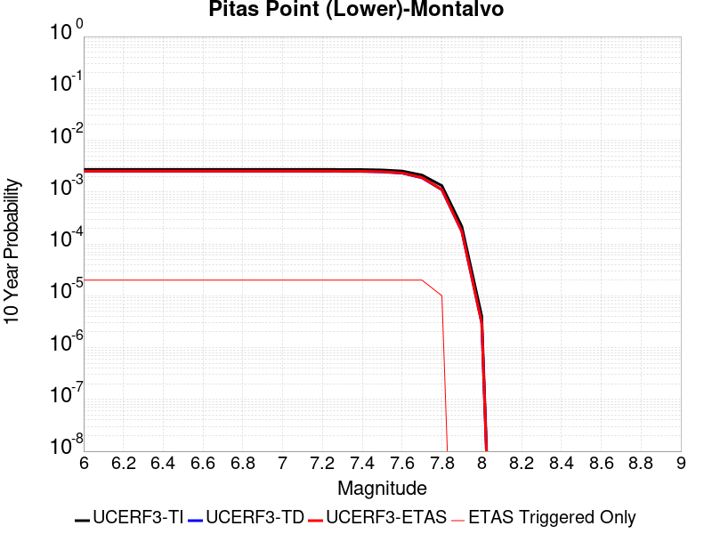 |

| Magnitude | 1 wk TI Prob | 1 wk TD Prob | 1 wk ETAS Prob | 1 wk ETAS/TD Gain | 1 wk ETAS Triggered Only | 1 mo TI Prob | 1 mo TD Prob | 1 mo ETAS Prob | 1 mo ETAS/TD Gain | 1 mo ETAS Triggered Only | 1 yr TI Prob | 1 yr TD Prob | 1 yr ETAS Prob | 1 yr ETAS/TD Gain | 1 yr ETAS Triggered Only | 10 yr TI Prob | 10 yr TD Prob | 10 yr ETAS Prob | 10 yr ETAS/TD Gain | 10 yr ETAS Triggered Only |
|-----|-----|-----|-----|-----|-----|-----|-----|-----|-----|-----|-----|-----|-----|-----|-----|-----|-----|-----|-----|-----|
| 6.0 | 5.2543637E-6 | 4.8378706E-6 | 1.4837822E-5 | 3.0670152 | 1.0E-5 | 2.2518509E-5 | 2.0733567E-5 | 3.073336E-5 | 1.4822997 | 1.0E-5 | 2.7412834E-4 | 2.5240227E-4 | 2.6239973E-4 | 1.0396093 | 1.0E-5 | 0.0027379042 | 0.0025211885 | 0.0025411379 | 1.0079128 | 2.0E-5 |
| 6.1 | 5.2543637E-6 | 4.8378706E-6 | 1.4837822E-5 | 3.0670152 | 1.0E-5 | 2.2518509E-5 | 2.0733567E-5 | 3.073336E-5 | 1.4822997 | 1.0E-5 | 2.7412834E-4 | 2.5240227E-4 | 2.6239973E-4 | 1.0396093 | 1.0E-5 | 0.0027379042 | 0.0025211885 | 0.0025411379 | 1.0079128 | 2.0E-5 |
| 6.2 | 5.2543637E-6 | 4.8378706E-6 | 1.4837822E-5 | 3.0670152 | 1.0E-5 | 2.2518509E-5 | 2.0733567E-5 | 3.073336E-5 | 1.4822997 | 1.0E-5 | 2.7412834E-4 | 2.5240227E-4 | 2.6239973E-4 | 1.0396093 | 1.0E-5 | 0.0027379042 | 0.0025211885 | 0.0025411379 | 1.0079128 | 2.0E-5 |
| 6.3 | 5.2543637E-6 | 4.8378706E-6 | 1.4837822E-5 | 3.0670152 | 1.0E-5 | 2.2518509E-5 | 2.0733567E-5 | 3.073336E-5 | 1.4822997 | 1.0E-5 | 2.7412834E-4 | 2.5240227E-4 | 2.6239973E-4 | 1.0396093 | 1.0E-5 | 0.0027379042 | 0.0025211885 | 0.0025411379 | 1.0079128 | 2.0E-5 |
| 6.4 | 5.2543637E-6 | 4.8378706E-6 | 1.4837822E-5 | 3.0670152 | 1.0E-5 | 2.2518509E-5 | 2.0733567E-5 | 3.073336E-5 | 1.4822997 | 1.0E-5 | 2.7412834E-4 | 2.5240227E-4 | 2.6239973E-4 | 1.0396093 | 1.0E-5 | 0.0027379042 | 0.0025211885 | 0.0025411379 | 1.0079128 | 2.0E-5 |
| 6.5 | 5.2543637E-6 | 4.8378706E-6 | 1.4837822E-5 | 3.0670152 | 1.0E-5 | 2.2518509E-5 | 2.0733567E-5 | 3.073336E-5 | 1.4822997 | 1.0E-5 | 2.7412834E-4 | 2.5240227E-4 | 2.6239973E-4 | 1.0396093 | 1.0E-5 | 0.0027379042 | 0.0025211885 | 0.0025411379 | 1.0079128 | 2.0E-5 |
| 6.6 | 5.2543637E-6 | 4.8378706E-6 | 1.4837822E-5 | 3.0670152 | 1.0E-5 | 2.2518509E-5 | 2.0733567E-5 | 3.073336E-5 | 1.4822997 | 1.0E-5 | 2.7412834E-4 | 2.5240227E-4 | 2.6239973E-4 | 1.0396093 | 1.0E-5 | 0.0027379042 | 0.0025211885 | 0.0025411379 | 1.0079128 | 2.0E-5 |
| 6.7 | 5.2543637E-6 | 4.8378706E-6 | 1.4837822E-5 | 3.0670152 | 1.0E-5 | 2.2518509E-5 | 2.0733567E-5 | 3.073336E-5 | 1.4822997 | 1.0E-5 | 2.7412834E-4 | 2.5240227E-4 | 2.6239973E-4 | 1.0396093 | 1.0E-5 | 0.0027379042 | 0.0025211885 | 0.0025411379 | 1.0079128 | 2.0E-5 |
| 6.8 | 5.2543637E-6 | 4.8378706E-6 | 1.4837822E-5 | 3.0670152 | 1.0E-5 | 2.2518509E-5 | 2.0733567E-5 | 3.073336E-5 | 1.4822997 | 1.0E-5 | 2.7412834E-4 | 2.5240227E-4 | 2.6239973E-4 | 1.0396093 | 1.0E-5 | 0.0027379042 | 0.0025211885 | 0.0025411379 | 1.0079128 | 2.0E-5 |
| 6.9 | 5.2543637E-6 | 4.8378706E-6 | 1.4837822E-5 | 3.0670152 | 1.0E-5 | 2.2518509E-5 | 2.0733567E-5 | 3.073336E-5 | 1.4822997 | 1.0E-5 | 2.7412834E-4 | 2.5240227E-4 | 2.6239973E-4 | 1.0396093 | 1.0E-5 | 0.0027379042 | 0.0025211885 | 0.0025411379 | 1.0079128 | 2.0E-5 |
| 7.0 | 5.2543637E-6 | 4.8378706E-6 | 1.4837822E-5 | 3.0670152 | 1.0E-5 | 2.2518509E-5 | 2.0733567E-5 | 3.073336E-5 | 1.4822997 | 1.0E-5 | 2.7412834E-4 | 2.5240227E-4 | 2.6239973E-4 | 1.0396093 | 1.0E-5 | 0.0027379042 | 0.0025211885 | 0.0025411379 | 1.0079128 | 2.0E-5 |
| 7.1 | 5.2543637E-6 | 4.8378706E-6 | 1.4837822E-5 | 3.0670152 | 1.0E-5 | 2.2518509E-5 | 2.0733567E-5 | 3.073336E-5 | 1.4822997 | 1.0E-5 | 2.7412834E-4 | 2.5240227E-4 | 2.6239973E-4 | 1.0396093 | 1.0E-5 | 0.0027379042 | 0.0025211885 | 0.0025411379 | 1.0079128 | 2.0E-5 |
| 7.2 | 5.2458695E-6 | 4.8290244E-6 | 1.48289755E-5 | 3.0708017 | 1.0E-5 | 2.2482105E-5 | 2.0695656E-5 | 3.069545E-5 | 1.4831831 | 1.0E-5 | 2.7368523E-4 | 2.519408E-4 | 2.6193826E-4 | 1.0396819 | 1.0E-5 | 0.0027334841 | 0.0025165842 | 0.0025365339 | 1.0079273 | 2.0E-5 |
| 7.3 | 5.22665E-6 | 4.8089414E-6 | 1.4808894E-5 | 3.0794497 | 1.0E-5 | 2.2399736E-5 | 2.0609588E-5 | 3.0609383E-5 | 1.485201 | 1.0E-5 | 2.7268266E-4 | 2.5089315E-4 | 2.6089067E-4 | 1.0398476 | 1.0E-5 | 0.002723483 | 0.0025061315 | 0.0025260814 | 1.0079604 | 2.0E-5 |
| 7.4 | 5.210642E-6 | 4.792154E-6 | 1.4792106E-5 | 3.0867343 | 1.0E-5 | 2.233113E-5 | 2.0537642E-5 | 3.0537438E-5 | 1.4869008 | 1.0E-5 | 2.718476E-4 | 2.5001742E-4 | 2.6001493E-4 | 1.0399872 | 1.0E-5 | 0.002715153 | 0.0024973939 | 0.002517344 | 1.0079883 | 2.0E-5 |
| 7.5 | 5.1226016E-6 | 4.7000403E-6 | 1.4699994E-5 | 3.1276312 | 1.0E-5 | 2.1953823E-5 | 2.0142877E-5 | 3.0142675E-5 | 1.4964434 | 1.0E-5 | 2.67255E-4 | 2.4521223E-4 | 2.5520977E-4 | 1.040771 | 1.0E-5 | 0.0026693381 | 0.0024494485 | 0.0024693992 | 1.0081451 | 2.0E-5 |
| 7.6 | 4.8796987E-6 | 4.4449403E-6 | 1.4444896E-5 | 3.249739 | 1.0E-5 | 2.0912828E-5 | 1.9049607E-5 | 2.9049417E-5 | 1.5249352 | 1.0E-5 | 2.5458392E-4 | 2.3190459E-4 | 2.4190226E-4 | 1.0431112 | 1.0E-5 | 0.0025429246 | 0.0023166565 | 0.00233661 | 1.0086131 | 2.0E-5 |
| 7.7 | 4.0834398E-6 | 3.6091124E-6 | 1.3609077E-5 | 3.7707543 | 1.0E-5 | 1.7500339E-5 | 1.5467534E-5 | 2.546738E-5 | 1.6465055 | 1.0E-5 | 2.1304579E-4 | 1.8830119E-4 | 1.982993E-4 | 1.0530964 | 1.0E-5 | 0.0021284167 | 0.00188144 | 0.0019014025 | 1.0106101 | 2.0E-5 |
| 7.8 | 2.5445438E-6 | 2.121228E-6 | 2.121228E-6 | 1.0 | 0.0 | 1.0905142E-5 | 9.090945E-6 | 9.090945E-6 | 1.0 | 0.0 | 1.3276201E-4 | 1.1067669E-4 | 1.1067669E-4 | 1.0 | 0.0 | 0.0013268272 | 0.0011062203 | 0.0011162093 | 1.0090297 | 1.0E-5 |
| 7.9 | 4.1677114E-7 | 3.3293693E-7 | 3.3293693E-7 | 1.0 | 0.0 | 1.7861609E-6 | 1.4268718E-6 | 1.4268718E-6 | 1.0 | 0.0 | 2.1746291E-5 | 1.737203E-5 | 1.737203E-5 | 1.0 | 0.0 | 2.1744163E-4 | 1.7370703E-4 | 1.7370703E-4 | 1.0 | 0.0 |
| 8.0 | 7.791402E-9 | 5.683497E-9 | 5.683497E-9 | 1.0 | 0.0 | 3.3391725E-8 | 2.4357844E-8 | 2.4357844E-8 | 1.0 | 0.0 | 4.0654416E-7 | 2.9655675E-7 | 2.9655675E-7 | 1.0 | 0.0 | 4.065434E-6 | 2.9655655E-6 | 2.9655655E-6 | 1.0 | 0.0 |

## Earthquake Valley (No  Extension)
*[(top)](#table-of-contents)*

| 1 Week | 1 Month | 1 Year | 10 Year |
|-----|-----|-----|-----|
|  |  |  |  |

| Magnitude | 1 wk TI Prob | 1 wk TD Prob | 1 wk ETAS Prob | 1 wk ETAS/TD Gain | 1 wk ETAS Triggered Only | 1 mo TI Prob | 1 mo TD Prob | 1 mo ETAS Prob | 1 mo ETAS/TD Gain | 1 mo ETAS Triggered Only | 1 yr TI Prob | 1 yr TD Prob | 1 yr ETAS Prob | 1 yr ETAS/TD Gain | 1 yr ETAS Triggered Only | 10 yr TI Prob | 10 yr TD Prob | 10 yr ETAS Prob | 10 yr ETAS/TD Gain | 10 yr ETAS Triggered Only |
|-----|-----|-----|-----|-----|-----|-----|-----|-----|-----|-----|-----|-----|-----|-----|-----|-----|-----|-----|-----|-----|
| 6.0 | 2.1859703E-5 | 2.5198362E-5 | 2.5198362E-5 | 1.0 | 0.0 | 9.3681076E-5 | 1.07989326E-4 | 1.07989326E-4 | 1.0 | 0.0 | 0.0011399703 | 0.001314122 | 0.0013340957 | 1.0151993 | 2.0E-5 | 0.011341401 | 0.013077871 | 0.013097609 | 1.0015093 | 2.0E-5 |
| 6.1 | 2.1859703E-5 | 2.5198362E-5 | 2.5198362E-5 | 1.0 | 0.0 | 9.3681076E-5 | 1.07989326E-4 | 1.07989326E-4 | 1.0 | 0.0 | 0.0011399703 | 0.001314122 | 0.0013340957 | 1.0151993 | 2.0E-5 | 0.011341401 | 0.013077871 | 0.013097609 | 1.0015093 | 2.0E-5 |
| 6.2 | 2.1859703E-5 | 2.5198362E-5 | 2.5198362E-5 | 1.0 | 0.0 | 9.3681076E-5 | 1.07989326E-4 | 1.07989326E-4 | 1.0 | 0.0 | 0.0011399703 | 0.001314122 | 0.0013340957 | 1.0151993 | 2.0E-5 | 0.011341401 | 0.013077871 | 0.013097609 | 1.0015093 | 2.0E-5 |
| 6.3 | 2.1859703E-5 | 2.5198362E-5 | 2.5198362E-5 | 1.0 | 0.0 | 9.3681076E-5 | 1.07989326E-4 | 1.07989326E-4 | 1.0 | 0.0 | 0.0011399703 | 0.001314122 | 0.0013340957 | 1.0151993 | 2.0E-5 | 0.011341401 | 0.013077871 | 0.013097609 | 1.0015093 | 2.0E-5 |
| 6.4 | 2.1859703E-5 | 2.5198362E-5 | 2.5198362E-5 | 1.0 | 0.0 | 9.3681076E-5 | 1.07989326E-4 | 1.07989326E-4 | 1.0 | 0.0 | 0.0011399703 | 0.001314122 | 0.0013340957 | 1.0151993 | 2.0E-5 | 0.011341401 | 0.013077871 | 0.013097609 | 1.0015093 | 2.0E-5 |
| 6.5 | 2.1859703E-5 | 2.5198362E-5 | 2.5198362E-5 | 1.0 | 0.0 | 9.3681076E-5 | 1.07989326E-4 | 1.07989326E-4 | 1.0 | 0.0 | 0.0011399703 | 0.001314122 | 0.0013340957 | 1.0151993 | 2.0E-5 | 0.011341401 | 0.013077871 | 0.013097609 | 1.0015093 | 2.0E-5 |
| 6.6 | 1.597E-5 | 1.8356275E-5 | 1.8356275E-5 | 1.0 | 0.0 | 6.8441055E-5 | 7.866787E-5 | 7.866787E-5 | 1.0 | 0.0 | 8.329513E-4 | 9.574478E-4 | 9.674382E-4 | 1.0104344 | 1.0E-5 | 0.008298361 | 0.009541836 | 0.00955174 | 1.0010381 | 1.0E-5 |
| 6.7 | 1.597E-5 | 1.8356275E-5 | 1.8356275E-5 | 1.0 | 0.0 | 6.8441055E-5 | 7.866787E-5 | 7.866787E-5 | 1.0 | 0.0 | 8.329513E-4 | 9.574478E-4 | 9.674382E-4 | 1.0104344 | 1.0E-5 | 0.008298361 | 0.009541836 | 0.00955174 | 1.0010381 | 1.0E-5 |
| 6.8 | 1.5315149E-5 | 1.7602091E-5 | 1.7602091E-5 | 1.0 | 0.0 | 6.5634704E-5 | 7.543584E-5 | 7.543584E-5 | 1.0 | 0.0 | 7.988095E-4 | 9.181311E-4 | 9.281219E-4 | 1.0108817 | 1.0E-5 | 0.007959441 | 0.009151919 | 0.009161827 | 1.0010827 | 1.0E-5 |
| 6.9 | 1.3634728E-5 | 1.5675821E-5 | 1.5675821E-5 | 1.0 | 0.0 | 5.8433237E-5 | 6.718082E-5 | 6.718082E-5 | 1.0 | 0.0 | 7.1119244E-4 | 8.177017E-4 | 8.276935E-4 | 1.0122194 | 1.0E-5 | 0.007089207 | 0.008155 | 0.008164919 | 1.0012163 | 1.0E-5 |
| 7.0 | 1.3496271E-5 | 1.5517853E-5 | 1.5517853E-5 | 1.0 | 0.0 | 5.783988E-5 | 6.650385E-5 | 6.650385E-5 | 1.0 | 0.0 | 7.03973E-4 | 8.094657E-4 | 8.1945764E-4 | 1.0123439 | 1.0E-5 | 0.007017471 | 0.0080732405 | 0.00808316 | 1.0012287 | 1.0E-5 |
| 7.1 | 8.242798E-6 | 9.4726E-6 | 9.4726E-6 | 1.0 | 0.0 | 3.53258E-5 | 4.0596606E-5 | 4.0596606E-5 | 1.0 | 0.0 | 4.300067E-4 | 4.9421866E-4 | 4.9421866E-4 | 1.0 | 0.0 | 0.004291756 | 0.0049377717 | 0.0049377717 | 1.0 | 0.0 |
| 7.2 | 2.6506527E-7 | 2.2560312E-7 | 2.2560312E-7 | 1.0 | 0.0 | 1.1359936E-6 | 9.668702E-7 | 9.668702E-7 | 1.0 | 0.0 | 1.3830633E-5 | 1.17715845E-5 | 1.17715845E-5 | 1.0 | 0.0 | 1.3829772E-4 | 1.1771003E-4 | 1.1771003E-4 | 1.0 | 0.0 |
| 7.3 | 2.5810488E-7 | 2.1955442E-7 | 2.1955442E-7 | 1.0 | 0.0 | 1.1061633E-6 | 9.409472E-7 | 9.409472E-7 | 1.0 | 0.0 | 1.3467455E-5 | 1.1455976E-5 | 1.1455976E-5 | 1.0 | 0.0 | 1.3466639E-4 | 1.1455427E-4 | 1.1455427E-4 | 1.0 | 0.0 |
| 7.4 | 2.2676066E-7 | 1.9110601E-7 | 1.9110601E-7 | 1.0 | 0.0 | 9.71831E-7 | 8.190255E-7 | 8.190255E-7 | 1.0 | 0.0 | 1.1831979E-5 | 9.9715935E-6 | 9.9715935E-6 | 1.0 | 0.0 | 1.1831349E-4 | 9.9711855E-5 | 9.9711855E-5 | 1.0 | 0.0 |
| 7.5 | 1.5553917E-7 | 1.3112096E-7 | 1.3112096E-7 | 1.0 | 0.0 | 6.6659624E-7 | 5.619469E-7 | 5.619469E-7 | 1.0 | 0.0 | 8.115779E-6 | 6.8416834E-6 | 6.8416834E-6 | 1.0 | 0.0 | 8.115482E-5 | 6.841495E-5 | 6.841495E-5 | 1.0 | 0.0 |
| 7.6 | 1.3448629E-7 | 1.1288419E-7 | 1.1288419E-7 | 1.0 | 0.0 | 5.7636964E-7 | 4.837893E-7 | 4.837893E-7 | 1.0 | 0.0 | 7.017278E-6 | 5.890121E-6 | 5.890121E-6 | 1.0 | 0.0 | 7.0170565E-5 | 5.889986E-5 | 5.889986E-5 | 1.0 | 0.0 |
| 7.7 | 2.9719402E-8 | 1.458206E-8 | 1.458206E-8 | 1.0 | 0.0 | 1.2736886E-7 | 6.249454E-8 | 6.249454E-8 | 1.0 | 0.0 | 1.5507147E-6 | 7.608708E-7 | 7.608708E-7 | 1.0 | 0.0 | 1.550704E-5 | 7.6086876E-6 | 7.6086876E-6 | 1.0 | 0.0 |
| 7.8 | 7.4390196E-9 | 3.2502152E-9 | 3.2502152E-9 | 1.0 | 0.0 | 3.1881513E-8 | 1.3929493E-8 | 1.3929493E-8 | 1.0 | 0.0 | 3.8815733E-7 | 1.6959156E-7 | 1.6959156E-7 | 1.0 | 0.0 | 3.8815665E-6 | 1.6959145E-6 | 1.6959145E-6 | 1.0 | 0.0 |
| 7.9 | 1.5373532E-9 | 8.440161E-10 | 8.440161E-10 | 1.0 | 0.0 | 6.5886567E-9 | 3.6172119E-9 | 3.6172119E-9 | 1.0 | 0.0 | 8.021689E-8 | 4.4039556E-8 | 4.4039556E-8 | 1.0 | 0.0 | 8.0216864E-7 | 4.4039552E-7 | 4.4039552E-7 | 1.0 | 0.0 |

## San Jacinto (Clark) rev
*[(top)](#table-of-contents)*

| 1 Week | 1 Month | 1 Year | 10 Year |
|-----|-----|-----|-----|
| 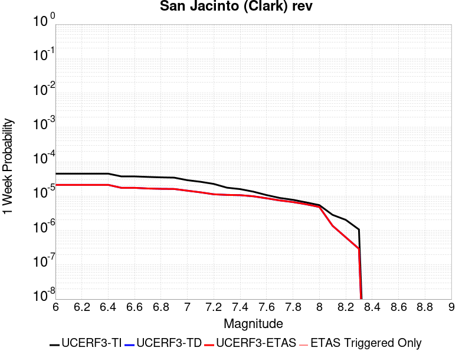 |  |  |  |

| Magnitude | 1 wk TI Prob | 1 wk TD Prob | 1 wk ETAS Prob | 1 wk ETAS/TD Gain | 1 wk ETAS Triggered Only | 1 mo TI Prob | 1 mo TD Prob | 1 mo ETAS Prob | 1 mo ETAS/TD Gain | 1 mo ETAS Triggered Only | 1 yr TI Prob | 1 yr TD Prob | 1 yr ETAS Prob | 1 yr ETAS/TD Gain | 1 yr ETAS Triggered Only | 10 yr TI Prob | 10 yr TD Prob | 10 yr ETAS Prob | 10 yr ETAS/TD Gain | 10 yr ETAS Triggered Only |
|-----|-----|-----|-----|-----|-----|-----|-----|-----|-----|-----|-----|-----|-----|-----|-----|-----|-----|-----|-----|-----|
| 6.0 | 4.482615E-5 | 2.1154196E-5 | 2.1154196E-5 | 1.0 | 0.0 | 1.9209793E-4 | 9.065773E-5 | 1.0065683E-4 | 1.1102949 | 1.0E-5 | 0.0023362834 | 0.0011032083 | 0.0011131973 | 1.0090544 | 1.0E-5 | 0.02311874 | 0.011503847 | 0.0115236165 | 1.0017185 | 2.0E-5 |
| 6.1 | 4.482615E-5 | 2.1154196E-5 | 2.1154196E-5 | 1.0 | 0.0 | 1.9209793E-4 | 9.065773E-5 | 1.0065683E-4 | 1.1102949 | 1.0E-5 | 0.0023362834 | 0.0011032083 | 0.0011131973 | 1.0090544 | 1.0E-5 | 0.02311874 | 0.011503847 | 0.0115236165 | 1.0017185 | 2.0E-5 |
| 6.2 | 4.482615E-5 | 2.1154196E-5 | 2.1154196E-5 | 1.0 | 0.0 | 1.9209793E-4 | 9.065773E-5 | 1.0065683E-4 | 1.1102949 | 1.0E-5 | 0.0023362834 | 0.0011032083 | 0.0011131973 | 1.0090544 | 1.0E-5 | 0.02311874 | 0.011503847 | 0.0115236165 | 1.0017185 | 2.0E-5 |
| 6.3 | 4.482615E-5 | 2.1154196E-5 | 2.1154196E-5 | 1.0 | 0.0 | 1.9209793E-4 | 9.065773E-5 | 1.0065683E-4 | 1.1102949 | 1.0E-5 | 0.0023362834 | 0.0011032083 | 0.0011131973 | 1.0090544 | 1.0E-5 | 0.02311874 | 0.011503847 | 0.0115236165 | 1.0017185 | 2.0E-5 |
| 6.4 | 4.482615E-5 | 2.1154196E-5 | 2.1154196E-5 | 1.0 | 0.0 | 1.9209793E-4 | 9.065773E-5 | 1.0065683E-4 | 1.1102949 | 1.0E-5 | 0.0023362834 | 0.0011032083 | 0.0011131973 | 1.0090544 | 1.0E-5 | 0.02311874 | 0.011503847 | 0.0115236165 | 1.0017185 | 2.0E-5 |
| 6.5 | 3.7294863E-5 | 1.7356087E-5 | 1.7356087E-5 | 1.0 | 0.0 | 1.5982533E-4 | 7.438113E-5 | 8.4380394E-5 | 1.1344327 | 1.0E-5 | 0.0019441366 | 9.052186E-4 | 9.1520953E-4 | 1.0110371 | 1.0E-5 | 0.01927216 | 0.0094941035 | 0.009513914 | 1.0020865 | 2.0E-5 |
| 6.6 | 3.7294863E-5 | 1.7356087E-5 | 1.7356087E-5 | 1.0 | 0.0 | 1.5982533E-4 | 7.438113E-5 | 8.4380394E-5 | 1.1344327 | 1.0E-5 | 0.0019441366 | 9.052186E-4 | 9.1520953E-4 | 1.0110371 | 1.0E-5 | 0.01927216 | 0.0094941035 | 0.009513914 | 1.0020865 | 2.0E-5 |
| 6.7 | 3.6039248E-5 | 1.6604314E-5 | 1.6604314E-5 | 1.0 | 0.0 | 1.5444479E-4 | 7.1159426E-5 | 8.115871E-5 | 1.1405195 | 1.0E-5 | 0.0018787434 | 8.6602574E-4 | 8.760171E-4 | 1.011537 | 1.0E-5 | 0.01862939 | 0.009096047 | 0.0091158645 | 1.0021788 | 2.0E-5 |
| 6.8 | 3.5031844E-5 | 1.6232942E-5 | 1.6232942E-5 | 1.0 | 0.0 | 1.5012783E-4 | 6.956792E-5 | 7.9567224E-5 | 1.1437345 | 1.0E-5 | 0.0018262739 | 8.4666436E-4 | 8.566559E-4 | 1.011801 | 1.0E-5 | 0.01811338 | 0.008895969 | 0.008915791 | 1.0022283 | 2.0E-5 |
| 6.9 | 3.435112E-5 | 1.6063195E-5 | 1.6063195E-5 | 1.0 | 0.0 | 1.4721078E-4 | 6.884047E-5 | 7.883978E-5 | 1.1452534 | 1.0E-5 | 0.0017908178 | 8.3781447E-4 | 8.478061E-4 | 1.0119258 | 1.0E-5 | 0.017764548 | 0.008804181 | 0.008824004 | 1.0022516 | 2.0E-5 |
| 7.0 | 2.8959772E-5 | 1.4336745E-5 | 1.4336745E-5 | 1.0 | 0.0 | 1.241074E-4 | 6.144176E-5 | 7.144115E-5 | 1.1627457 | 1.0E-5 | 0.0015099603 | 7.477995E-4 | 7.5779203E-4 | 1.0133625 | 1.0E-5 | 0.014997416 | 0.007868037 | 0.007887879 | 1.0025219 | 2.0E-5 |
| 7.1 | 2.6002877E-5 | 1.2829002E-5 | 1.2829002E-5 | 1.0 | 0.0 | 1.11436144E-4 | 5.498029E-5 | 6.497974E-5 | 1.1818733 | 1.0E-5 | 0.0013558907 | 6.691816E-4 | 6.7917485E-4 | 1.0149336 | 1.0E-5 | 0.013476475 | 0.0070465137 | 0.007066373 | 1.0028182 | 2.0E-5 |
| 7.2 | 2.2544838E-5 | 1.1262543E-5 | 1.1262543E-5 | 1.0 | 0.0 | 9.661716E-5 | 4.8267157E-5 | 5.8266676E-5 | 1.2071702 | 1.0E-5 | 0.001175679 | 5.874956E-4 | 5.9748976E-4 | 1.0170114 | 1.0E-5 | 0.011694785 | 0.0061927503 | 0.006212626 | 1.0032096 | 2.0E-5 |
| 7.3 | 1.75334E-5 | 1.0811715E-5 | 1.0811715E-5 | 1.0 | 0.0 | 7.514098E-5 | 4.6335106E-5 | 5.633464E-5 | 1.2158091 | 1.0E-5 | 9.144575E-4 | 5.6398526E-4 | 5.7397963E-4 | 1.0177209 | 1.0E-5 | 0.009107036 | 0.0059337732 | 0.0059536546 | 1.0033505 | 2.0E-5 |
| 7.4 | 1.5924552E-5 | 1.0611516E-5 | 1.0611516E-5 | 1.0 | 0.0 | 6.82463E-5 | 4.547714E-5 | 5.547669E-5 | 1.2198807 | 1.0E-5 | 8.305819E-4 | 5.535449E-4 | 5.635394E-4 | 1.0180554 | 1.0E-5 | 0.008274844 | 0.0058210334 | 0.005840917 | 1.0034158 | 2.0E-5 |
| 7.5 | 1.3428931E-5 | 9.8519E-6 | 9.8519E-6 | 1.0 | 0.0 | 5.7551293E-5 | 4.2221753E-5 | 5.222133E-5 | 1.2368348 | 1.0E-5 | 7.004617E-4 | 5.1392964E-4 | 5.2392454E-4 | 1.0194479 | 1.0E-5 | 0.006982579 | 0.0054066023 | 0.0054264944 | 1.0036792 | 2.0E-5 |
| 7.6 | 1.0688787E-5 | 8.614839E-6 | 8.614839E-6 | 1.0 | 0.0 | 4.5808283E-5 | 3.692022E-5 | 4.6919853E-5 | 1.2708442 | 1.0E-5 | 5.5757316E-4 | 4.4941145E-4 | 4.5940696E-4 | 1.0222414 | 1.0E-5 | 0.005561762 | 0.0047416524 | 0.0047615576 | 1.004198 | 2.0E-5 |
| 7.7 | 8.81236E-6 | 7.4680274E-6 | 7.4680274E-6 | 1.0 | 0.0 | 3.776671E-5 | 3.2005442E-5 | 4.2005122E-5 | 1.3124368 | 1.0E-5 | 4.597127E-4 | 3.8959677E-4 | 3.995929E-4 | 1.0256575 | 1.0E-5 | 0.0045876284 | 0.0041346536 | 0.004154571 | 1.0048171 | 2.0E-5 |
| 7.8 | 7.780431E-6 | 6.696579E-6 | 6.696579E-6 | 1.0 | 0.0 | 3.3344273E-5 | 2.8699309E-5 | 3.869902E-5 | 1.3484304 | 1.0E-5 | 4.0589093E-4 | 3.4935825E-4 | 3.5935477E-4 | 1.0286139 | 1.0E-5 | 0.0040515037 | 0.0037227906 | 0.0037427163 | 1.0053523 | 2.0E-5 |
| 7.9 | 6.5437994E-6 | 5.780382E-6 | 5.780382E-6 | 1.0 | 0.0 | 2.8044553E-5 | 2.477283E-5 | 3.4772584E-5 | 1.403658 | 1.0E-5 | 3.4138895E-4 | 3.0156763E-4 | 3.1156463E-4 | 1.0331501 | 1.0E-5 | 0.0034086495 | 0.0032344845 | 0.00325442 | 1.0061634 | 2.0E-5 |
| 8.0 | 5.4488164E-6 | 4.8133406E-6 | 4.8133406E-6 | 1.0 | 0.0 | 2.3351862E-5 | 2.062844E-5 | 3.0628235E-5 | 1.4847577 | 1.0E-5 | 2.8427184E-4 | 2.5112246E-4 | 2.6111995E-4 | 1.0398113 | 1.0E-5 | 0.0028390845 | 0.002710839 | 0.0027307847 | 1.0073578 | 2.0E-5 |
| 8.1 | 2.8397242E-6 | 1.3670389E-6 | 1.3670389E-6 | 1.0 | 0.0 | 1.217019E-5 | 5.858725E-6 | 1.5858666E-5 | 2.706846 | 1.0E-5 | 1.4816198E-4 | 7.132765E-5 | 8.132694E-5 | 1.1401881 | 1.0E-5 | 0.0014806325 | 8.115382E-4 | 8.2153006E-4 | 1.0123123 | 1.0E-5 |
| 8.2 | 2.030244E-6 | 6.318974E-7 | 6.318974E-7 | 1.0 | 0.0 | 8.701017E-6 | 2.708129E-6 | 2.708129E-6 | 1.0 | 0.0 | 1.05929736E-4 | 3.2970976E-5 | 3.2970976E-5 | 1.0 | 0.0 | 0.0010587925 | 3.9486602E-4 | 3.9486602E-4 | 1.0 | 0.0 |
| 8.3 | 1.0659804E-6 | 2.9250086E-7 | 2.9250086E-7 | 1.0 | 0.0 | 4.568479E-6 | 1.2535745E-6 | 1.2535745E-6 | 1.0 | 0.0 | 5.5619817E-5 | 1.5262167E-5 | 1.5262167E-5 | 1.0 | 0.0 | 5.5605895E-4 | 1.8566217E-4 | 1.8566217E-4 | 1.0 | 0.0 |

## Robinson Creek
*[(top)](#table-of-contents)*

| 1 Week | 1 Month | 1 Year | 10 Year |
|-----|-----|-----|-----|
|  |  |  |  |

| Magnitude | 1 wk TI Prob | 1 wk TD Prob | 1 wk ETAS Prob | 1 wk ETAS/TD Gain | 1 wk ETAS Triggered Only | 1 mo TI Prob | 1 mo TD Prob | 1 mo ETAS Prob | 1 mo ETAS/TD Gain | 1 mo ETAS Triggered Only | 1 yr TI Prob | 1 yr TD Prob | 1 yr ETAS Prob | 1 yr ETAS/TD Gain | 1 yr ETAS Triggered Only | 10 yr TI Prob | 10 yr TD Prob | 10 yr ETAS Prob | 10 yr ETAS/TD Gain | 10 yr ETAS Triggered Only |
|-----|-----|-----|-----|-----|-----|-----|-----|-----|-----|-----|-----|-----|-----|-----|-----|-----|-----|-----|-----|-----|
| 6.0 | 1.3705327E-5 | 1.5285013E-5 | 1.5285013E-5 | 1.0 | 0.0 | 5.8735794E-5 | 6.55072E-5 | 6.55072E-5 | 1.0 | 0.0 | 7.1487366E-4 | 7.9755014E-4 | 7.9755014E-4 | 1.0 | 0.0 | 0.0071257832 | 0.007975501 | 0.007995342 | 1.0024877 | 2.0E-5 |
| 6.1 | 1.3705327E-5 | 1.5285013E-5 | 1.5285013E-5 | 1.0 | 0.0 | 5.8735794E-5 | 6.55072E-5 | 6.55072E-5 | 1.0 | 0.0 | 7.1487366E-4 | 7.9755014E-4 | 7.9755014E-4 | 1.0 | 0.0 | 0.0071257832 | 0.007975501 | 0.007995342 | 1.0024877 | 2.0E-5 |
| 6.2 | 1.3705327E-5 | 1.5285013E-5 | 1.5285013E-5 | 1.0 | 0.0 | 5.8735794E-5 | 6.55072E-5 | 6.55072E-5 | 1.0 | 0.0 | 7.1487366E-4 | 7.9755014E-4 | 7.9755014E-4 | 1.0 | 0.0 | 0.0071257832 | 0.007975501 | 0.007995342 | 1.0024877 | 2.0E-5 |
| 6.3 | 1.3705327E-5 | 1.5285013E-5 | 1.5285013E-5 | 1.0 | 0.0 | 5.8735794E-5 | 6.55072E-5 | 6.55072E-5 | 1.0 | 0.0 | 7.1487366E-4 | 7.9755014E-4 | 7.9755014E-4 | 1.0 | 0.0 | 0.0071257832 | 0.007975501 | 0.007995342 | 1.0024877 | 2.0E-5 |
| 6.4 | 1.3705327E-5 | 1.5285013E-5 | 1.5285013E-5 | 1.0 | 0.0 | 5.8735794E-5 | 6.55072E-5 | 6.55072E-5 | 1.0 | 0.0 | 7.1487366E-4 | 7.9755014E-4 | 7.9755014E-4 | 1.0 | 0.0 | 0.0071257832 | 0.007975501 | 0.007995342 | 1.0024877 | 2.0E-5 |

## San Luis Range - Oceano 2011 CFM
*[(top)](#table-of-contents)*

| 1 Week | 1 Month | 1 Year | 10 Year |
|-----|-----|-----|-----|
|  |  |  |  |

| Magnitude | 1 wk TI Prob | 1 wk TD Prob | 1 wk ETAS Prob | 1 wk ETAS/TD Gain | 1 wk ETAS Triggered Only | 1 mo TI Prob | 1 mo TD Prob | 1 mo ETAS Prob | 1 mo ETAS/TD Gain | 1 mo ETAS Triggered Only | 1 yr TI Prob | 1 yr TD Prob | 1 yr ETAS Prob | 1 yr ETAS/TD Gain | 1 yr ETAS Triggered Only | 10 yr TI Prob | 10 yr TD Prob | 10 yr ETAS Prob | 10 yr ETAS/TD Gain | 10 yr ETAS Triggered Only |
|-----|-----|-----|-----|-----|-----|-----|-----|-----|-----|-----|-----|-----|-----|-----|-----|-----|-----|-----|-----|-----|
| 6.0 | 1.6025788E-6 | 1.620119E-6 | 2.1620086E-5 | 13.344752 | 2.0E-5 | 6.8681766E-6 | 6.943351E-6 | 2.6943211E-5 | 3.8804336 | 2.0E-5 | 8.361684E-5 | 8.453243E-5 | 1.0453074E-4 | 1.2365756 | 2.0E-5 | 8.3585386E-4 | 8.4504357E-4 | 8.6502667E-4 | 1.0236474 | 2.0E-5 |
| 6.1 | 1.6025788E-6 | 1.620119E-6 | 2.1620086E-5 | 13.344752 | 2.0E-5 | 6.8681766E-6 | 6.943351E-6 | 2.6943211E-5 | 3.8804336 | 2.0E-5 | 8.361684E-5 | 8.453243E-5 | 1.0453074E-4 | 1.2365756 | 2.0E-5 | 8.3585386E-4 | 8.4504357E-4 | 8.6502667E-4 | 1.0236474 | 2.0E-5 |
| 6.2 | 1.6025788E-6 | 1.620119E-6 | 2.1620086E-5 | 13.344752 | 2.0E-5 | 6.8681766E-6 | 6.943351E-6 | 2.6943211E-5 | 3.8804336 | 2.0E-5 | 8.361684E-5 | 8.453243E-5 | 1.0453074E-4 | 1.2365756 | 2.0E-5 | 8.3585386E-4 | 8.4504357E-4 | 8.6502667E-4 | 1.0236474 | 2.0E-5 |
| 6.3 | 1.6025788E-6 | 1.620119E-6 | 2.1620086E-5 | 13.344752 | 2.0E-5 | 6.8681766E-6 | 6.943351E-6 | 2.6943211E-5 | 3.8804336 | 2.0E-5 | 8.361684E-5 | 8.453243E-5 | 1.0453074E-4 | 1.2365756 | 2.0E-5 | 8.3585386E-4 | 8.4504357E-4 | 8.6502667E-4 | 1.0236474 | 2.0E-5 |
| 6.4 | 1.1621186E-6 | 1.1749894E-6 | 1.1174978E-5 | 9.510705 | 1.0E-5 | 4.980499E-6 | 5.0356607E-6 | 1.503561E-5 | 2.9858267 | 1.0E-5 | 6.0635884E-5 | 6.130771E-5 | 7.1307106E-5 | 1.1631016 | 1.0E-5 | 6.0619344E-4 | 6.1293464E-4 | 6.229285E-4 | 1.016305 | 1.0E-5 |
| 6.5 | 1.1621186E-6 | 1.1749894E-6 | 1.1174978E-5 | 9.510705 | 1.0E-5 | 4.980499E-6 | 5.0356607E-6 | 1.503561E-5 | 2.9858267 | 1.0E-5 | 6.0635884E-5 | 6.130771E-5 | 7.1307106E-5 | 1.1631016 | 1.0E-5 | 6.0619344E-4 | 6.1293464E-4 | 6.229285E-4 | 1.016305 | 1.0E-5 |
| 6.6 | 7.164729E-7 | 7.2485784E-7 | 7.2485784E-7 | 1.0 | 0.0 | 3.0705946E-6 | 3.10653E-6 | 3.10653E-6 | 1.0 | 0.0 | 3.738385E-5 | 3.7821363E-5 | 3.7821363E-5 | 1.0 | 0.0 | 3.737756E-4 | 3.7815105E-4 | 3.7815105E-4 | 1.0 | 0.0 |
| 6.7 | 7.164729E-7 | 7.2485784E-7 | 7.2485784E-7 | 1.0 | 0.0 | 3.0705946E-6 | 3.10653E-6 | 3.10653E-6 | 1.0 | 0.0 | 3.738385E-5 | 3.7821363E-5 | 3.7821363E-5 | 1.0 | 0.0 | 3.737756E-4 | 3.7815105E-4 | 3.7815105E-4 | 1.0 | 0.0 |
| 6.8 | 6.700177E-7 | 6.7774397E-7 | 6.7774397E-7 | 1.0 | 0.0 | 2.8715012E-6 | 2.904614E-6 | 2.904614E-6 | 1.0 | 0.0 | 3.495997E-5 | 3.536312E-5 | 3.536312E-5 | 1.0 | 0.0 | 3.495447E-4 | 3.5357653E-4 | 3.5357653E-4 | 1.0 | 0.0 |
| 6.9 | 5.657865E-7 | 5.7217864E-7 | 5.7217864E-7 | 1.0 | 0.0 | 2.424797E-6 | 2.452192E-6 | 2.452192E-6 | 1.0 | 0.0 | 2.9521503E-5 | 2.9855039E-5 | 2.9855039E-5 | 1.0 | 0.0 | 2.9517582E-4 | 2.9851135E-4 | 2.9851135E-4 | 1.0 | 0.0 |
| 7.0 | 4.608413E-7 | 4.660169E-7 | 4.660169E-7 | 1.0 | 0.0 | 1.9750328E-6 | 1.9972138E-6 | 1.9972138E-6 | 1.0 | 0.0 | 2.4045758E-5 | 2.431581E-5 | 2.431581E-5 | 1.0 | 0.0 | 2.4043156E-4 | 2.4313178E-4 | 2.4313178E-4 | 1.0 | 0.0 |
| 7.1 | 3.9177846E-7 | 3.9621602E-7 | 3.9621602E-7 | 1.0 | 0.0 | 1.6790494E-6 | 1.6980675E-6 | 1.6980675E-6 | 1.0 | 0.0 | 2.0442236E-5 | 2.0673779E-5 | 2.0673779E-5 | 1.0 | 0.0 | 2.0440355E-4 | 2.067187E-4 | 2.067187E-4 | 1.0 | 0.0 |
| 7.2 | 3.3974752E-7 | 3.436653E-7 | 3.436653E-7 | 1.0 | 0.0 | 1.45606E-6 | 1.4728505E-6 | 1.4728505E-6 | 1.0 | 0.0 | 1.7727387E-5 | 1.7931809E-5 | 1.7931809E-5 | 1.0 | 0.0 | 1.7725973E-4 | 1.7930372E-4 | 1.7930372E-4 | 1.0 | 0.0 |
| 7.3 | 2.8900928E-7 | 2.923402E-7 | 2.923402E-7 | 1.0 | 0.0 | 1.2386106E-6 | 1.2528859E-6 | 1.2528859E-6 | 1.0 | 0.0 | 1.5079979E-5 | 1.525378E-5 | 1.525378E-5 | 1.0 | 0.0 | 1.5078956E-4 | 1.5252741E-4 | 1.5252741E-4 | 1.0 | 0.0 |
| 7.4 | 2.1881527E-7 | 2.2139594E-7 | 2.2139594E-7 | 1.0 | 0.0 | 9.3777936E-7 | 9.488394E-7 | 9.488394E-7 | 1.0 | 0.0 | 1.14174045E-5 | 1.1552059E-5 | 1.1552059E-5 | 1.0 | 0.0 | 1.1416818E-4 | 1.1551464E-4 | 1.1551464E-4 | 1.0 | 0.0 |
| 7.5 | 1.356398E-7 | 1.3718639E-7 | 1.3718639E-7 | 1.0 | 0.0 | 5.813133E-7 | 5.8794154E-7 | 5.8794154E-7 | 1.0 | 0.0 | 7.0774663E-6 | 7.158165E-6 | 7.158165E-6 | 1.0 | 0.0 | 7.077241E-5 | 7.157937E-5 | 7.157937E-5 | 1.0 | 0.0 |
| 7.6 | 5.9269272E-8 | 6.001364E-8 | 6.001364E-8 | 1.0 | 0.0 | 2.5401116E-7 | 2.572013E-7 | 2.572013E-7 | 1.0 | 0.0 | 3.0925814E-6 | 3.1314214E-6 | 3.1314214E-6 | 1.0 | 0.0 | 3.0925385E-5 | 3.1313786E-5 | 3.1313786E-5 | 1.0 | 0.0 |
| 7.7 | 5.946232E-9 | 6.036928E-9 | 6.036928E-9 | 1.0 | 0.0 | 2.5483851E-8 | 2.5872547E-8 | 2.5872547E-8 | 1.0 | 0.0 | 3.1026585E-7 | 3.1499823E-7 | 3.1499823E-7 | 1.0 | 0.0 | 3.102654E-6 | 3.1499787E-6 | 3.1499787E-6 | 1.0 | 0.0 |

## Simi-Santa Rosa
*[(top)](#table-of-contents)*

| 1 Week | 1 Month | 1 Year | 10 Year |
|-----|-----|-----|-----|
|  |  |  |  |

| Magnitude | 1 wk TI Prob | 1 wk TD Prob | 1 wk ETAS Prob | 1 wk ETAS/TD Gain | 1 wk ETAS Triggered Only | 1 mo TI Prob | 1 mo TD Prob | 1 mo ETAS Prob | 1 mo ETAS/TD Gain | 1 mo ETAS Triggered Only | 1 yr TI Prob | 1 yr TD Prob | 1 yr ETAS Prob | 1 yr ETAS/TD Gain | 1 yr ETAS Triggered Only | 10 yr TI Prob | 10 yr TD Prob | 10 yr ETAS Prob | 10 yr ETAS/TD Gain | 10 yr ETAS Triggered Only |
|-----|-----|-----|-----|-----|-----|-----|-----|-----|-----|-----|-----|-----|-----|-----|-----|-----|-----|-----|-----|-----|
| 6.0 | 2.198912E-5 | 2.2275442E-5 | 2.2275442E-5 | 1.0 | 0.0 | 9.4235686E-5 | 9.5462936E-5 | 1.0546198E-4 | 1.1047426 | 1.0E-5 | 0.0011467156 | 0.0011616853 | 0.0011716738 | 1.0085982 | 1.0E-5 | 0.011408163 | 0.011560575 | 0.011580344 | 1.00171 | 2.0E-5 |
| 6.1 | 2.198912E-5 | 2.2275442E-5 | 2.2275442E-5 | 1.0 | 0.0 | 9.4235686E-5 | 9.5462936E-5 | 1.0546198E-4 | 1.1047426 | 1.0E-5 | 0.0011467156 | 0.0011616853 | 0.0011716738 | 1.0085982 | 1.0E-5 | 0.011408163 | 0.011560575 | 0.011580344 | 1.00171 | 2.0E-5 |
| 6.2 | 1.69983E-5 | 1.6668559E-5 | 1.6668559E-5 | 1.0 | 0.0 | 7.284782E-5 | 7.143489E-5 | 8.143418E-5 | 1.1399776 | 1.0E-5 | 8.865613E-4 | 8.6940196E-4 | 8.7939325E-4 | 1.0114921 | 1.0E-5 | 0.008830327 | 0.008662928 | 0.008682754 | 1.0022887 | 2.0E-5 |
| 6.3 | 1.69983E-5 | 1.6668559E-5 | 1.6668559E-5 | 1.0 | 0.0 | 7.284782E-5 | 7.143489E-5 | 8.143418E-5 | 1.1399776 | 1.0E-5 | 8.865613E-4 | 8.6940196E-4 | 8.7939325E-4 | 1.0114921 | 1.0E-5 | 0.008830327 | 0.008662928 | 0.008682754 | 1.0022887 | 2.0E-5 |
| 6.4 | 1.4666188E-5 | 1.4052543E-5 | 1.4052543E-5 | 1.0 | 0.0 | 6.285358E-5 | 6.0223934E-5 | 7.022333E-5 | 1.166037 | 1.0E-5 | 7.6497364E-4 | 7.3300465E-4 | 7.429973E-4 | 1.0136325 | 1.0E-5 | 0.0076234564 | 0.007308344 | 0.007328198 | 1.0027165 | 2.0E-5 |
| 6.5 | 1.4666188E-5 | 1.4052543E-5 | 1.4052543E-5 | 1.0 | 0.0 | 6.285358E-5 | 6.0223934E-5 | 7.022333E-5 | 1.166037 | 1.0E-5 | 7.6497364E-4 | 7.3300465E-4 | 7.429973E-4 | 1.0136325 | 1.0E-5 | 0.0076234564 | 0.007308344 | 0.007328198 | 1.0027165 | 2.0E-5 |
| 6.6 | 1.4377586E-5 | 1.3729583E-5 | 1.3729583E-5 | 1.0 | 0.0 | 6.1616774E-5 | 5.883988E-5 | 6.883929E-5 | 1.1699427 | 1.0E-5 | 7.4992597E-4 | 7.1616494E-4 | 7.261578E-4 | 1.0139532 | 1.0E-5 | 0.007474003 | 0.0071410383 | 0.0071608955 | 1.0027807 | 2.0E-5 |
| 6.7 | 1.3881404E-5 | 1.320755E-5 | 1.320755E-5 | 1.0 | 0.0 | 5.9490372E-5 | 5.66027E-5 | 6.660214E-5 | 1.1766601 | 1.0E-5 | 7.240546E-4 | 6.8894465E-4 | 6.989378E-4 | 1.0145049 | 1.0E-5 | 0.007217 | 0.006870538 | 0.006890401 | 1.002891 | 2.0E-5 |
| 6.8 | 1.0176516E-5 | 9.154151E-6 | 9.154151E-6 | 1.0 | 0.0 | 4.3612912E-5 | 3.9231574E-5 | 3.9231574E-5 | 1.0 | 0.0 | 5.308578E-4 | 4.7755634E-4 | 4.7755634E-4 | 1.0 | 0.0 | 0.0052959146 | 0.004766934 | 0.0047768867 | 1.0020878 | 1.0E-5 |
| 6.9 | 9.699797E-6 | 8.774719E-6 | 8.774719E-6 | 1.0 | 0.0 | 4.15699E-5 | 3.7605492E-5 | 3.7605492E-5 | 1.0 | 0.0 | 5.05996E-4 | 4.577671E-4 | 4.577671E-4 | 1.0 | 0.0 | 0.005048454 | 0.0045698597 | 0.004579814 | 1.0021782 | 1.0E-5 |
| 7.0 | 7.4049476E-6 | 6.559333E-6 | 6.559333E-6 | 1.0 | 0.0 | 3.1735104E-5 | 2.8111197E-5 | 2.8111197E-5 | 1.0 | 0.0 | 3.8630638E-4 | 3.422127E-4 | 3.422127E-4 | 1.0 | 0.0 | 0.0038563553 | 0.0034180996 | 0.0034280655 | 1.0029156 | 1.0E-5 |
| 7.1 | 3.873439E-6 | 2.7595095E-6 | 2.7595095E-6 | 1.0 | 0.0 | 1.6600346E-5 | 1.1826417E-5 | 1.1826417E-5 | 1.0 | 0.0 | 2.0209046E-4 | 1.4397735E-4 | 1.4397735E-4 | 1.0 | 0.0 | 0.0020190678 | 0.0014388643 | 0.0014488499 | 1.0069399 | 1.0E-5 |
| 7.2 | 3.417706E-6 | 2.3676484E-6 | 2.3676484E-6 | 1.0 | 0.0 | 1.4647229E-5 | 1.0147027E-5 | 1.0147027E-5 | 1.0 | 0.0 | 1.7831543E-4 | 1.2353327E-4 | 1.2353327E-4 | 1.0 | 0.0 | 0.0017817242 | 0.0012346683 | 0.0012446559 | 1.0080893 | 1.0E-5 |
| 7.3 | 1.90225E-6 | 1.4073753E-6 | 1.4073753E-6 | 1.0 | 0.0 | 8.152474E-6 | 6.0315947E-6 | 6.0315947E-6 | 1.0 | 0.0 | 9.9251854E-5 | 7.343221E-5 | 7.343221E-5 | 1.0 | 0.0 | 9.920754E-4 | 7.340817E-4 | 7.440744E-4 | 1.0136125 | 1.0E-5 |
| 7.4 | 1.5170556E-6 | 1.1024773E-6 | 1.1024773E-6 | 1.0 | 0.0 | 6.5016507E-6 | 4.724894E-6 | 4.724894E-6 | 1.0 | 0.0 | 7.915472E-5 | 5.7524077E-5 | 5.7524077E-5 | 1.0 | 0.0 | 7.9126534E-4 | 5.7509297E-4 | 5.850872E-4 | 1.0173784 | 1.0E-5 |
| 7.5 | 1.178732E-6 | 8.535102E-7 | 8.535102E-7 | 1.0 | 0.0 | 5.0516987E-6 | 3.6578958E-6 | 3.6578958E-6 | 1.0 | 0.0 | 6.1502695E-5 | 4.453398E-5 | 4.453398E-5 | 1.0 | 0.0 | 6.148568E-4 | 4.452515E-4 | 4.5524706E-4 | 1.0224493 | 1.0E-5 |
| 7.6 | 6.8722386E-7 | 4.793198E-7 | 4.793198E-7 | 1.0 | 0.0 | 2.9452417E-6 | 2.054226E-6 | 2.054226E-6 | 1.0 | 0.0 | 3.5857727E-5 | 2.5009915E-5 | 2.5009915E-5 | 1.0 | 0.0 | 3.5851944E-4 | 2.5007114E-4 | 2.5007114E-4 | 1.0 | 0.0 |
| 7.7 | 5.5126515E-7 | 3.6731157E-7 | 3.6731157E-7 | 1.0 | 0.0 | 2.3625628E-6 | 1.5741915E-6 | 1.5741915E-6 | 1.0 | 0.0 | 2.8763823E-5 | 1.9165615E-5 | 1.9165615E-5 | 1.0 | 0.0 | 2.87601E-4 | 1.9163972E-4 | 1.9163972E-4 | 1.0 | 0.0 |
| 7.8 | 3.3860243E-7 | 2.0075942E-7 | 2.0075942E-7 | 1.0 | 0.0 | 1.4511525E-6 | 8.6039717E-7 | 8.6039717E-7 | 1.0 | 0.0 | 1.7667637E-5 | 1.0475286E-5 | 1.0475286E-5 | 1.0 | 0.0 | 1.7666233E-4 | 1.04747975E-4 | 1.04747975E-4 | 1.0 | 0.0 |
| 7.9 | 2.7955386E-7 | 1.4649108E-7 | 1.4649108E-7 | 1.0 | 0.0 | 1.1980875E-6 | 6.278188E-7 | 6.278188E-7 | 1.0 | 0.0 | 1.4586617E-5 | 7.643667E-6 | 7.643667E-6 | 1.0 | 0.0 | 1.458566E-4 | 7.643409E-5 | 7.643409E-5 | 1.0 | 0.0 |
| 8.0 | 5.6259015E-8 | 3.3355324E-8 | 3.3355324E-8 | 1.0 | 0.0 | 2.4111003E-7 | 1.4295138E-7 | 1.4295138E-7 | 1.0 | 0.0 | 2.9355108E-6 | 1.7404317E-6 | 1.7404317E-6 | 1.0 | 0.0 | 2.935472E-5 | 1.7404194E-5 | 1.7404194E-5 | 1.0 | 0.0 |

## Laguna Salada
*[(top)](#table-of-contents)*

| 1 Week | 1 Month | 1 Year | 10 Year |
|-----|-----|-----|-----|
|  |  | 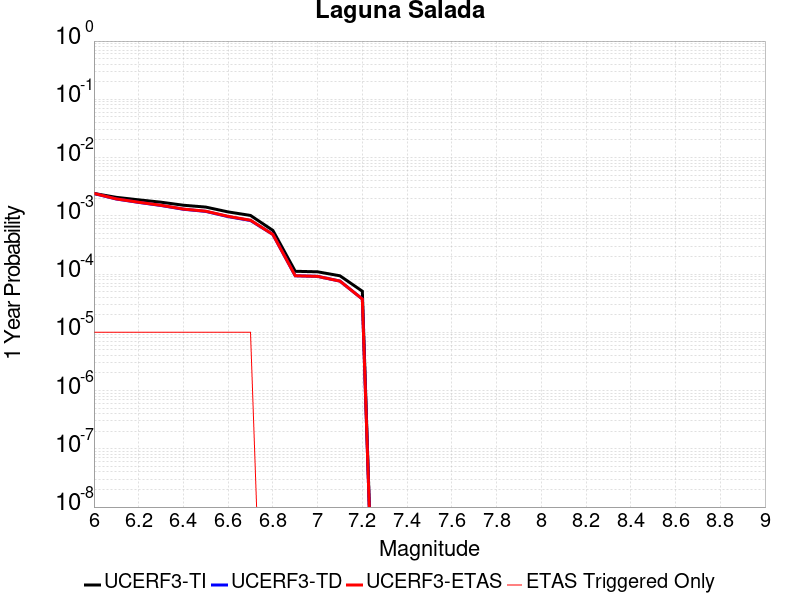 |  |

| Magnitude | 1 wk TI Prob | 1 wk TD Prob | 1 wk ETAS Prob | 1 wk ETAS/TD Gain | 1 wk ETAS Triggered Only | 1 mo TI Prob | 1 mo TD Prob | 1 mo ETAS Prob | 1 mo ETAS/TD Gain | 1 mo ETAS Triggered Only | 1 yr TI Prob | 1 yr TD Prob | 1 yr ETAS Prob | 1 yr ETAS/TD Gain | 1 yr ETAS Triggered Only | 10 yr TI Prob | 10 yr TD Prob | 10 yr ETAS Prob | 10 yr ETAS/TD Gain | 10 yr ETAS Triggered Only |
|-----|-----|-----|-----|-----|-----|-----|-----|-----|-----|-----|-----|-----|-----|-----|-----|-----|-----|-----|-----|-----|
| 6.0 | 4.6465593E-5 | 4.634639E-5 | 4.634639E-5 | 1.0 | 0.0 | 1.9912305E-4 | 1.9861311E-4 | 1.9861311E-4 | 1.0 | 0.0 | 0.0024216278 | 0.002415429 | 0.002425405 | 1.00413 | 1.0E-5 | 0.02395408 | 0.023975259 | 0.02399478 | 1.0008142 | 2.0E-5 |
| 6.1 | 3.982297E-5 | 3.7246125E-5 | 3.7246125E-5 | 1.0 | 0.0 | 1.706587E-4 | 1.5961716E-4 | 1.5961716E-4 | 1.0 | 0.0 | 0.0020757897 | 0.0019417295 | 0.0019517101 | 1.0051401 | 1.0E-5 | 0.020565065 | 0.019331863 | 0.01934167 | 1.0005072 | 1.0E-5 |
| 6.2 | 3.6067784E-5 | 3.2602693E-5 | 3.2602693E-5 | 1.0 | 0.0 | 1.5456705E-4 | 1.3971896E-4 | 1.3971896E-4 | 1.0 | 0.0 | 0.0018802295 | 0.0016998611 | 0.0017098442 | 1.0058728 | 1.0E-5 | 0.018644003 | 0.016949628 | 0.016959459 | 1.00058 | 1.0E-5 |
| 6.3 | 3.2859112E-5 | 2.8849448E-5 | 2.8849448E-5 | 1.0 | 0.0 | 1.4081717E-4 | 1.2363521E-4 | 1.2363521E-4 | 1.0 | 0.0 | 0.0017131006 | 0.0015043203 | 0.0015143052 | 1.0066376 | 1.0E-5 | 0.016999546 | 0.015018767 | 0.015028617 | 1.0006559 | 1.0E-5 |
| 6.4 | 2.9132116E-5 | 2.4852965E-5 | 2.4852965E-5 | 1.0 | 0.0 | 1.2484594E-4 | 1.0650887E-4 | 1.0650887E-4 | 1.0 | 0.0 | 0.0015189396 | 0.001296065 | 0.0013060521 | 1.0077057 | 1.0E-5 | 0.015085992 | 0.012956262 | 0.012966133 | 1.0007619 | 1.0E-5 |
| 6.5 | 2.7075037E-5 | 2.2825836E-5 | 2.2825836E-5 | 1.0 | 0.0 | 1.1603071E-4 | 9.7821845E-5 | 9.7821845E-5 | 1.0 | 0.0 | 0.0014117584 | 0.0011904186 | 0.0012004067 | 1.0083904 | 1.0E-5 | 0.014028233 | 0.011907749 | 0.01191763 | 1.0008298 | 1.0E-5 |
| 6.6 | 2.2367465E-5 | 1.8573526E-5 | 1.8573526E-5 | 1.0 | 0.0 | 9.5857045E-5 | 7.959886E-5 | 7.959886E-5 | 1.0 | 0.0 | 0.0011664346 | 9.6876756E-4 | 9.787579E-4 | 1.0103124 | 1.0E-5 | 0.011603311 | 0.009702191 | 0.0097120935 | 1.0010207 | 1.0E-5 |
| 6.7 | 1.9458053E-5 | 1.5914242E-5 | 1.5914242E-5 | 1.0 | 0.0 | 8.338899E-5 | 6.8202564E-5 | 6.8202564E-5 | 1.0 | 0.0 | 0.001014788 | 8.3013024E-4 | 8.4012194E-4 | 1.0120363 | 1.0E-5 | 0.010101665 | 0.0083209425 | 0.008330859 | 1.0011917 | 1.0E-5 |
| 6.8 | 1.0767866E-5 | 9.18435E-6 | 9.18435E-6 | 1.0 | 0.0 | 4.614718E-5 | 3.9361294E-5 | 3.9361294E-5 | 1.0 | 0.0 | 5.6169706E-4 | 4.7918706E-4 | 4.7918706E-4 | 1.0 | 0.0 | 0.0056027942 | 0.0048096925 | 0.0048096925 | 1.0 | 0.0 |
| 6.9 | 2.1384765E-6 | 1.7913675E-6 | 1.7913675E-6 | 1.0 | 0.0 | 9.164866E-6 | 7.677269E-6 | 7.677269E-6 | 1.0 | 0.0 | 1.1157654E-4 | 9.346713E-5 | 9.346713E-5 | 1.0 | 0.0 | 0.0011152053 | 9.343165E-4 | 9.343165E-4 | 1.0 | 0.0 |
| 7.0 | 2.0952946E-6 | 1.7493046E-6 | 1.7493046E-6 | 1.0 | 0.0 | 8.979802E-6 | 7.4970003E-6 | 7.4970003E-6 | 1.0 | 0.0 | 1.0932361E-4 | 9.1272545E-5 | 9.1272545E-5 | 1.0 | 0.0 | 0.0010926984 | 9.123888E-4 | 9.123888E-4 | 1.0 | 0.0 |
| 7.1 | 1.7887576E-6 | 1.4500254E-6 | 1.4500254E-6 | 1.0 | 0.0 | 7.666081E-6 | 6.2143813E-6 | 6.2143813E-6 | 1.0 | 0.0 | 9.333054E-5 | 7.565777E-5 | 7.565777E-5 | 1.0 | 0.0 | 9.329135E-4 | 7.563506E-4 | 7.563506E-4 | 1.0 | 0.0 |
| 7.2 | 9.723109E-7 | 7.135619E-7 | 7.135619E-7 | 1.0 | 0.0 | 4.16704E-6 | 3.0581198E-6 | 3.0581198E-6 | 1.0 | 0.0 | 5.073253E-5 | 3.7232137E-5 | 3.7232137E-5 | 1.0 | 0.0 | 5.072095E-4 | 3.7227524E-4 | 3.7227524E-4 | 1.0 | 0.0 |

## Davis Creek
*[(top)](#table-of-contents)*

| 1 Week | 1 Month | 1 Year | 10 Year |
|-----|-----|-----|-----|
|  |  |  | 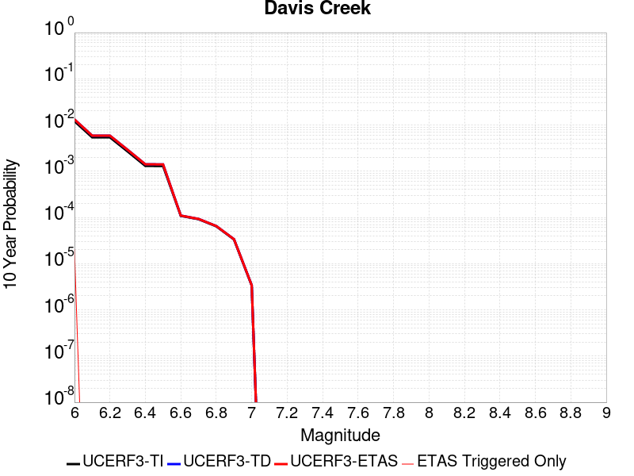 |

| Magnitude | 1 wk TI Prob | 1 wk TD Prob | 1 wk ETAS Prob | 1 wk ETAS/TD Gain | 1 wk ETAS Triggered Only | 1 mo TI Prob | 1 mo TD Prob | 1 mo ETAS Prob | 1 mo ETAS/TD Gain | 1 mo ETAS Triggered Only | 1 yr TI Prob | 1 yr TD Prob | 1 yr ETAS Prob | 1 yr ETAS/TD Gain | 1 yr ETAS Triggered Only | 10 yr TI Prob | 10 yr TD Prob | 10 yr ETAS Prob | 10 yr ETAS/TD Gain | 10 yr ETAS Triggered Only |
|-----|-----|-----|-----|-----|-----|-----|-----|-----|-----|-----|-----|-----|-----|-----|-----|-----|-----|-----|-----|-----|
| 6.0 | 2.331472E-5 | 2.5417214E-5 | 3.541696E-5 | 1.3934242 | 1.0E-5 | 9.99164E-5 | 1.0892704E-4 | 1.1892595E-4 | 1.0917946 | 1.0E-5 | 0.0012158032 | 0.0013254983 | 0.0013354851 | 1.0075344 | 1.0E-5 | 0.01209173 | 0.013187704 | 0.01320744 | 1.0014966 | 2.0E-5 |
| 6.1 | 1.0407654E-5 | 1.1316986E-5 | 1.1316986E-5 | 1.0 | 0.0 | 4.4603472E-5 | 4.8500624E-5 | 4.8500624E-5 | 1.0 | 0.0 | 5.4291193E-4 | 5.9036224E-4 | 5.9036224E-4 | 1.0 | 0.0 | 0.0054158745 | 0.005890611 | 0.005890611 | 1.0 | 0.0 |
| 6.2 | 1.0407654E-5 | 1.1316986E-5 | 1.1316986E-5 | 1.0 | 0.0 | 4.4603472E-5 | 4.8500624E-5 | 4.8500624E-5 | 1.0 | 0.0 | 5.4291193E-4 | 5.9036224E-4 | 5.9036224E-4 | 1.0 | 0.0 | 0.0054158745 | 0.005890611 | 0.005890611 | 1.0 | 0.0 |
| 6.3 | 5.1323277E-6 | 5.568556E-6 | 5.568556E-6 | 1.0 | 0.0 | 2.1995505E-5 | 2.386507E-5 | 2.386507E-5 | 1.0 | 0.0 | 2.6776237E-4 | 2.905271E-4 | 2.905271E-4 | 1.0 | 0.0 | 0.0026743996 | 0.0029023192 | 0.0029023192 | 1.0 | 0.0 |
| 6.4 | 2.4985154E-6 | 2.704538E-6 | 2.704538E-6 | 1.0 | 0.0 | 1.07078795E-5 | 1.1590847E-5 | 1.1590847E-5 | 1.0 | 0.0 | 1.3036063E-4 | 1.4111304E-4 | 1.4111304E-4 | 1.0 | 0.0 | 0.0013028418 | 0.001410589 | 0.001410589 | 1.0 | 0.0 |
| 6.5 | 2.4846438E-6 | 2.6904722E-6 | 2.6904722E-6 | 1.0 | 0.0 | 1.064843E-5 | 1.1530565E-5 | 1.1530565E-5 | 1.0 | 0.0 | 1.2963692E-4 | 1.403792E-4 | 1.403792E-4 | 1.0 | 0.0 | 0.0012956132 | 0.0014032599 | 0.0014032599 | 1.0 | 0.0 |
| 6.6 | 2.072566E-7 | 2.1018087E-7 | 2.1018087E-7 | 1.0 | 0.0 | 8.882423E-7 | 9.0077486E-7 | 9.0077486E-7 | 1.0 | 0.0 | 1.0814296E-5 | 1.0966881E-5 | 1.0966881E-5 | 1.0 | 0.0 | 1.081377E-4 | 1.09663575E-4 | 1.09663575E-4 | 1.0 | 0.0 |
| 6.7 | 1.7544528E-7 | 1.7790826E-7 | 1.7790826E-7 | 1.0 | 0.0 | 7.5190815E-7 | 7.6246374E-7 | 7.6246374E-7 | 1.0 | 0.0 | 9.154443E-6 | 9.282958E-6 | 9.282958E-6 | 1.0 | 0.0 | 9.1540656E-5 | 9.282586E-5 | 9.282586E-5 | 1.0 | 0.0 |
| 6.8 | 1.2320395E-7 | 1.2481138E-7 | 1.2481138E-7 | 1.0 | 0.0 | 5.280168E-7 | 5.349058E-7 | 5.349058E-7 | 1.0 | 0.0 | 6.428586E-6 | 6.5124595E-6 | 6.5124595E-6 | 1.0 | 0.0 | 6.4284E-5 | 6.5122804E-5 | 6.5122804E-5 | 1.0 | 0.0 |
| 6.9 | 6.399997E-8 | 6.486058E-8 | 6.486058E-8 | 1.0 | 0.0 | 2.7428555E-7 | 2.7797387E-7 | 2.7797387E-7 | 1.0 | 0.0 | 3.3394215E-6 | 3.3843273E-6 | 3.3843273E-6 | 1.0 | 0.0 | 3.3393713E-5 | 3.384282E-5 | 3.384282E-5 | 1.0 | 0.0 |
| 7.0 | 6.4455685E-9 | 6.535264E-9 | 6.535264E-9 | 1.0 | 0.0 | 2.7623864E-8 | 2.8008275E-8 | 2.8008275E-8 | 1.0 | 0.0 | 3.3632048E-7 | 3.4100074E-7 | 3.4100074E-7 | 1.0 | 0.0 | 3.3631998E-6 | 3.4100074E-6 | 3.4100074E-6 | 1.0 | 0.0 |

## Morales (West)
*[(top)](#table-of-contents)*

| 1 Week | 1 Month | 1 Year | 10 Year |
|-----|-----|-----|-----|
| 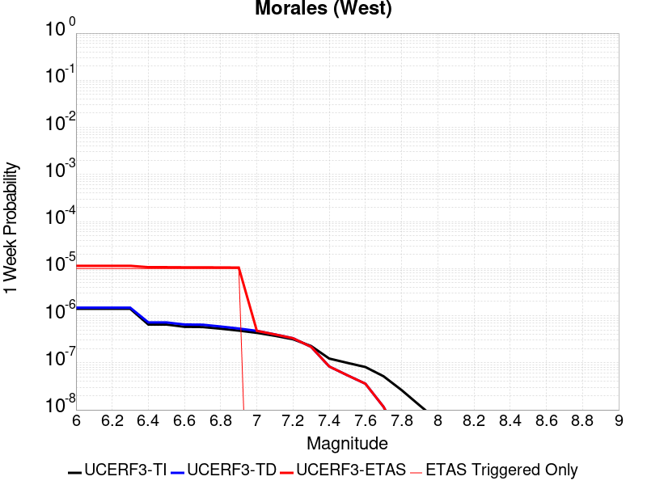 | 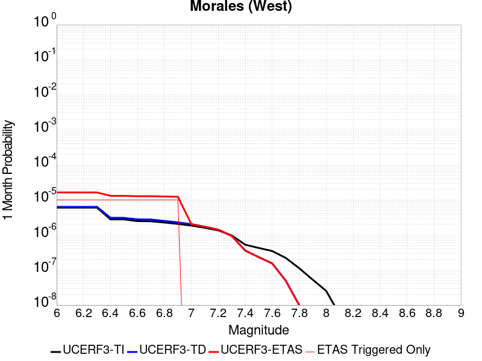 |  | 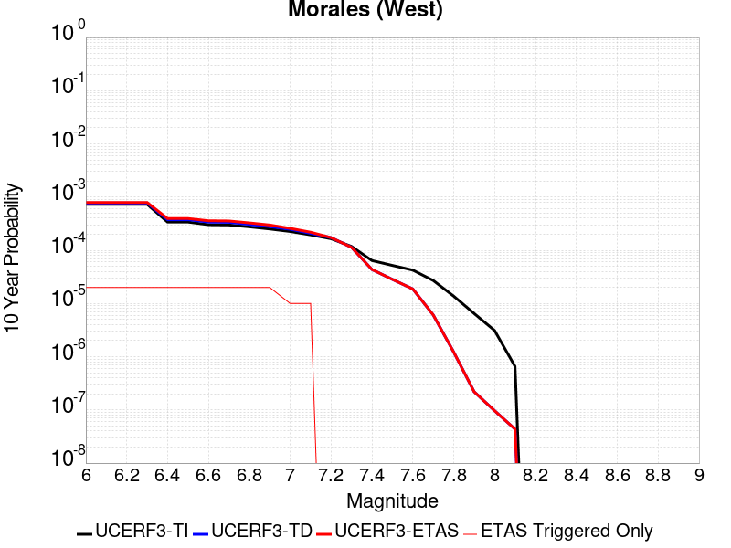 |

| Magnitude | 1 wk TI Prob | 1 wk TD Prob | 1 wk ETAS Prob | 1 wk ETAS/TD Gain | 1 wk ETAS Triggered Only | 1 mo TI Prob | 1 mo TD Prob | 1 mo ETAS Prob | 1 mo ETAS/TD Gain | 1 mo ETAS Triggered Only | 1 yr TI Prob | 1 yr TD Prob | 1 yr ETAS Prob | 1 yr ETAS/TD Gain | 1 yr ETAS Triggered Only | 10 yr TI Prob | 10 yr TD Prob | 10 yr ETAS Prob | 10 yr ETAS/TD Gain | 10 yr ETAS Triggered Only |
|-----|-----|-----|-----|-----|-----|-----|-----|-----|-----|-----|-----|-----|-----|-----|-----|-----|-----|-----|-----|-----|
| 6.0 | 1.4027072E-6 | 1.4791576E-6 | 1.1479143E-5 | 7.7605944 | 1.0E-5 | 6.0115885E-6 | 6.339236E-6 | 1.6339172E-5 | 2.5774672 | 1.0E-5 | 7.318863E-5 | 7.7178156E-5 | 8.717739E-5 | 1.1295604 | 1.0E-5 | 7.316453E-4 | 7.715821E-4 | 7.915667E-4 | 1.0259007 | 2.0E-5 |
| 6.1 | 1.4027072E-6 | 1.4791576E-6 | 1.1479143E-5 | 7.7605944 | 1.0E-5 | 6.0115885E-6 | 6.339236E-6 | 1.6339172E-5 | 2.5774672 | 1.0E-5 | 7.318863E-5 | 7.7178156E-5 | 8.717739E-5 | 1.1295604 | 1.0E-5 | 7.316453E-4 | 7.715821E-4 | 7.915667E-4 | 1.0259007 | 2.0E-5 |
| 6.2 | 1.4027072E-6 | 1.4791576E-6 | 1.1479143E-5 | 7.7605944 | 1.0E-5 | 6.0115885E-6 | 6.339236E-6 | 1.6339172E-5 | 2.5774672 | 1.0E-5 | 7.318863E-5 | 7.7178156E-5 | 8.717739E-5 | 1.1295604 | 1.0E-5 | 7.316453E-4 | 7.715821E-4 | 7.915667E-4 | 1.0259007 | 2.0E-5 |
| 6.3 | 1.4027072E-6 | 1.4791576E-6 | 1.1479143E-5 | 7.7605944 | 1.0E-5 | 6.0115885E-6 | 6.339236E-6 | 1.6339172E-5 | 2.5774672 | 1.0E-5 | 7.318863E-5 | 7.7178156E-5 | 8.717739E-5 | 1.1295604 | 1.0E-5 | 7.316453E-4 | 7.715821E-4 | 7.915667E-4 | 1.0259007 | 2.0E-5 |
| 6.4 | 6.504502E-7 | 7.2038824E-7 | 1.0720381E-5 | 14.881393 | 1.0E-5 | 2.7876408E-6 | 3.0873746E-6 | 1.3087344E-5 | 4.238988 | 1.0E-5 | 3.3939E-5 | 3.758815E-5 | 4.7587775E-5 | 1.2660313 | 1.0E-5 | 3.3933815E-4 | 3.758191E-4 | 3.958116E-4 | 1.0531971 | 2.0E-5 |
| 6.5 | 6.504502E-7 | 7.2038824E-7 | 1.0720381E-5 | 14.881393 | 1.0E-5 | 2.7876408E-6 | 3.0873746E-6 | 1.3087344E-5 | 4.238988 | 1.0E-5 | 3.3939E-5 | 3.758815E-5 | 4.7587775E-5 | 1.2660313 | 1.0E-5 | 3.3933815E-4 | 3.758191E-4 | 3.958116E-4 | 1.0531971 | 2.0E-5 |
| 6.6 | 5.8056526E-7 | 6.500143E-7 | 1.0650007E-5 | 16.384268 | 1.0E-5 | 2.4881344E-6 | 2.7857725E-6 | 1.2785745E-5 | 4.5896587 | 1.0E-5 | 3.0292615E-5 | 3.3916258E-5 | 4.391592E-5 | 1.2948339 | 1.0E-5 | 3.0288487E-4 | 3.3911143E-4 | 3.5910466E-4 | 1.0589577 | 2.0E-5 |
| 6.7 | 5.741448E-7 | 6.435454E-7 | 1.0643539E-5 | 16.53891 | 1.0E-5 | 2.4606184E-6 | 2.7580488E-6 | 1.27580215E-5 | 4.625742 | 1.0E-5 | 2.9957617E-5 | 3.3578734E-5 | 4.3578395E-5 | 1.2977976 | 1.0E-5 | 2.9953578E-4 | 3.357372E-4 | 3.5573047E-4 | 1.0595504 | 2.0E-5 |
| 6.8 | 5.299428E-7 | 5.8909023E-7 | 1.0589084E-5 | 17.975319 | 1.0E-5 | 2.2711813E-6 | 2.52467E-6 | 1.2524644E-5 | 4.9609036 | 1.0E-5 | 2.7651282E-5 | 3.073743E-5 | 4.073712E-5 | 1.3253263 | 1.0E-5 | 2.7647841E-4 | 3.0733226E-4 | 3.273261E-4 | 1.0650562 | 2.0E-5 |
| 6.9 | 4.82394E-7 | 5.3416807E-7 | 1.0534162E-5 | 19.72069 | 1.0E-5 | 2.0674013E-6 | 2.2892896E-6 | 1.2289267E-5 | 5.3681574 | 1.0E-5 | 2.517032E-5 | 2.7871749E-5 | 3.787147E-5 | 1.3587762 | 1.0E-5 | 2.516747E-4 | 2.7868294E-4 | 2.9867736E-4 | 1.0717461 | 2.0E-5 |
| 7.0 | 4.3264512E-7 | 4.759864E-7 | 4.759864E-7 | 1.0 | 0.0 | 1.8541921E-6 | 2.0399402E-6 | 2.0399402E-6 | 1.0 | 0.0 | 2.2574555E-5 | 2.4835992E-5 | 2.4835992E-5 | 1.0 | 0.0 | 2.2572262E-4 | 2.4833248E-4 | 2.5833E-4 | 1.0402586 | 1.0E-5 |
| 7.1 | 3.7388565E-7 | 4.000384E-7 | 4.000384E-7 | 1.0 | 0.0 | 1.6023661E-6 | 1.7144492E-6 | 1.7144492E-6 | 1.0 | 0.0 | 1.9508632E-5 | 2.0873222E-5 | 2.0873222E-5 | 1.0 | 0.0 | 1.950692E-4 | 2.0871284E-4 | 2.1871076E-4 | 1.0479027 | 1.0E-5 |
| 7.2 | 3.1592543E-7 | 3.3199075E-7 | 3.3199075E-7 | 1.0 | 0.0 | 1.3539654E-6 | 1.4228168E-6 | 1.4228168E-6 | 1.0 | 0.0 | 1.6484404E-5 | 1.7322658E-5 | 1.7322658E-5 | 1.0 | 0.0 | 1.6483181E-4 | 1.7321325E-4 | 1.7321325E-4 | 1.0 | 0.0 |
| 7.3 | 2.2677783E-7 | 2.1793869E-7 | 2.1793869E-7 | 1.0 | 0.0 | 9.719047E-7 | 9.3402264E-7 | 9.3402264E-7 | 1.0 | 0.0 | 1.1832874E-5 | 1.1371666E-5 | 1.1371666E-5 | 1.0 | 0.0 | 1.18322445E-4 | 1.1371089E-4 | 1.1371089E-4 | 1.0 | 0.0 |
| 7.4 | 1.2295531E-7 | 8.350771E-8 | 8.350771E-8 | 1.0 | 0.0 | 5.269512E-7 | 3.5789014E-7 | 3.5789014E-7 | 1.0 | 0.0 | 6.4156125E-6 | 4.3573036E-6 | 4.3573036E-6 | 1.0 | 0.0 | 6.415427E-5 | 4.357219E-5 | 4.357219E-5 | 1.0 | 0.0 |
| 7.5 | 9.9632544E-8 | 5.443089E-8 | 5.443089E-8 | 1.0 | 0.0 | 4.2699656E-7 | 2.3327522E-7 | 2.3327522E-7 | 1.0 | 0.0 | 5.198671E-6 | 2.840122E-6 | 2.840122E-6 | 1.0 | 0.0 | 5.198549E-5 | 2.8400864E-5 | 2.8400864E-5 | 1.0 | 0.0 |
| 7.6 | 8.125894E-8 | 3.594956E-8 | 3.594956E-8 | 1.0 | 0.0 | 3.4825257E-7 | 1.5406955E-7 | 1.5406955E-7 | 1.0 | 0.0 | 4.2399665E-6 | 1.8757952E-6 | 1.8757952E-6 | 1.0 | 0.0 | 4.2398857E-5 | 1.8757797E-5 | 1.8757797E-5 | 1.0 | 0.0 |
| 7.7 | 5.1810765E-8 | 1.1642662E-8 | 1.1642662E-8 | 1.0 | 0.0 | 2.2204613E-7 | 4.9897128E-8 | 4.9897128E-8 | 1.0 | 0.0 | 2.7034082E-6 | 6.074974E-7 | 6.074974E-7 | 1.0 | 0.0 | 2.7033753E-5 | 6.0749603E-6 | 6.0749603E-6 | 1.0 | 0.0 |
| 7.8 | 2.6315043E-8 | 2.3383624E-9 | 2.3383624E-9 | 1.0 | 0.0 | 1.1277875E-7 | 1.0021558E-8 | 1.0021558E-8 | 1.0 | 0.0 | 1.3730804E-6 | 1.2201247E-7 | 1.2201247E-7 | 1.0 | 0.0 | 1.3730719E-5 | 1.2201268E-6 | 1.2201268E-6 | 1.0 | 0.0 |
| 7.9 | 1.24281545E-8 | 4.207228E-10 | 4.207228E-10 | 1.0 | 0.0 | 5.3263516E-8 | 1.8031033E-9 | 1.8031033E-9 | 1.0 | 0.0 | 6.4848314E-7 | 2.1952776E-8 | 2.1952776E-8 | 1.0 | 0.0 | 6.4848123E-6 | 2.195305E-7 | 2.195305E-7 | 1.0 | 0.0 |
| 8.0 | 5.954214E-9 | 1.8509339E-10 | 1.8509339E-10 | 1.0 | 0.0 | 2.551806E-8 | 7.9326146E-10 | 7.9326146E-10 | 1.0 | 0.0 | 3.1068234E-7 | 9.657958E-9 | 9.657958E-9 | 1.0 | 0.0 | 3.1068191E-6 | 9.658236E-8 | 9.658236E-8 | 1.0 | 0.0 |
| 8.1 | 1.2586262E-9 | 8.346668E-11 | 8.346668E-11 | 1.0 | 0.0 | 5.3941123E-9 | 3.5771386E-10 | 3.5771386E-10 | 1.0 | 0.0 | 6.567332E-8 | 4.355168E-9 | 4.355168E-9 | 1.0 | 0.0 | 6.56733E-7 | 4.3554458E-8 | 4.3554458E-8 | 1.0 | 0.0 |

## Hayward (No) 2011 CFM
*[(top)](#table-of-contents)*

| 1 Week | 1 Month | 1 Year | 10 Year |
|-----|-----|-----|-----|
|  |  | 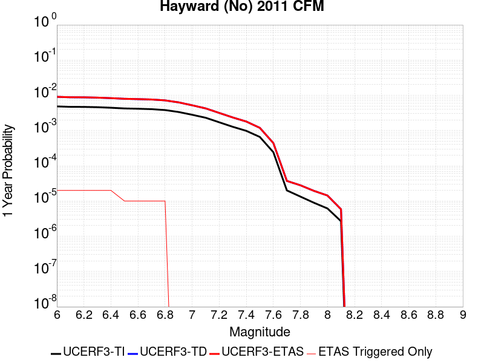 |  |

| Magnitude | 1 wk TI Prob | 1 wk TD Prob | 1 wk ETAS Prob | 1 wk ETAS/TD Gain | 1 wk ETAS Triggered Only | 1 mo TI Prob | 1 mo TD Prob | 1 mo ETAS Prob | 1 mo ETAS/TD Gain | 1 mo ETAS Triggered Only | 1 yr TI Prob | 1 yr TD Prob | 1 yr ETAS Prob | 1 yr ETAS/TD Gain | 1 yr ETAS Triggered Only | 10 yr TI Prob | 10 yr TD Prob | 10 yr ETAS Prob | 10 yr ETAS/TD Gain | 10 yr ETAS Triggered Only |
|-----|-----|-----|-----|-----|-----|-----|-----|-----|-----|-----|-----|-----|-----|-----|-----|-----|-----|-----|-----|-----|
| 6.0 | 9.3068506E-5 | 1.739599E-4 | 1.8395815E-4 | 1.0574745 | 1.0E-5 | 3.9880406E-4 | 7.453244E-4 | 7.653095E-4 | 1.026814 | 2.0E-5 | 0.0048446343 | 0.009036438 | 0.009056257 | 1.0021932 | 2.0E-5 | 0.047403704 | 0.08637534 | 0.08639361 | 1.0002116 | 2.0E-5 |
| 6.1 | 9.055486E-5 | 1.6947114E-4 | 1.7946944E-4 | 1.0589972 | 1.0E-5 | 3.880345E-4 | 7.261021E-4 | 7.460876E-4 | 1.0275244 | 2.0E-5 | 0.0047140904 | 0.008804537 | 0.0088243615 | 1.0022515 | 2.0E-5 | 0.046153355 | 0.08426854 | 0.08428685 | 1.0002173 | 2.0E-5 |
| 6.2 | 9.006742E-5 | 1.6867711E-4 | 1.7867543E-4 | 1.0592749 | 1.0E-5 | 3.859461E-4 | 7.22701E-4 | 7.4268656E-4 | 1.0276539 | 2.0E-5 | 0.0046887742 | 0.008763513 | 0.008783338 | 1.0022622 | 2.0E-5 | 0.0459107 | 0.083892785 | 0.083911106 | 1.0002184 | 2.0E-5 |
| 6.3 | 8.8336754E-5 | 1.6547246E-4 | 1.7547082E-4 | 1.060423 | 1.0E-5 | 3.7853114E-4 | 7.089758E-4 | 7.289616E-4 | 1.0281897 | 2.0E-5 | 0.004598882 | 0.008597788 | 0.008617616 | 1.0023062 | 2.0E-5 | 0.04504866 | 0.08238599 | 0.082404345 | 1.0002228 | 2.0E-5 |
| 6.4 | 8.526157E-5 | 1.5974249E-4 | 1.6974089E-4 | 1.0625907 | 1.0E-5 | 3.6535555E-4 | 6.8443175E-4 | 7.044181E-4 | 1.0292013 | 2.0E-5 | 0.0044391346 | 0.008301278 | 0.008321112 | 1.0023893 | 2.0E-5 | 0.043514993 | 0.079682834 | 0.079701245 | 1.000231 | 2.0E-5 |
| 6.5 | 8.152396E-5 | 1.530663E-4 | 1.6306477E-4 | 1.0653212 | 1.0E-5 | 3.493416E-4 | 6.558342E-4 | 6.6582765E-4 | 1.0152378 | 1.0E-5 | 0.0042449418 | 0.007955698 | 0.007965619 | 1.0012469 | 1.0E-5 | 0.04164765 | 0.07651369 | 0.076522924 | 1.0001206 | 1.0E-5 |
| 6.6 | 7.987405E-5 | 1.5010842E-4 | 1.6010691E-4 | 1.0666085 | 1.0E-5 | 3.4227243E-4 | 6.4316386E-4 | 6.531574E-4 | 1.0155381 | 1.0E-5 | 0.0041592065 | 0.0078025614 | 0.0078124837 | 1.0012716 | 1.0E-5 | 0.04082218 | 0.07510622 | 0.075115465 | 1.0001231 | 1.0E-5 |
| 6.7 | 7.777665E-5 | 1.4650106E-4 | 1.5649959E-4 | 1.0682489 | 1.0E-5 | 3.332859E-4 | 6.277113E-4 | 6.3770503E-4 | 1.0159209 | 1.0E-5 | 0.004050208 | 0.00761576 | 0.0076256837 | 1.0013031 | 1.0E-5 | 0.039771806 | 0.073382616 | 0.073391885 | 1.0001262 | 1.0E-5 |
| 6.8 | 7.3284005E-5 | 1.3800753E-4 | 1.4800615E-4 | 1.0724498 | 1.0E-5 | 3.140365E-4 | 5.913274E-4 | 6.013215E-4 | 1.0169011 | 1.0E-5 | 0.0038166929 | 0.0071757827 | 0.007185711 | 1.0013835 | 1.0E-5 | 0.037518036 | 0.06929621 | 0.06930552 | 1.0001343 | 1.0E-5 |
| 6.9 | 6.458263E-5 | 1.2131439E-4 | 1.2131439E-4 | 1.0 | 0.0 | 2.7675333E-4 | 5.198157E-4 | 5.198157E-4 | 1.0 | 0.0 | 0.0033642664 | 0.0063104923 | 0.0063104923 | 1.0 | 0.0 | 0.033137884 | 0.061225023 | 0.061225023 | 1.0 | 0.0 |
| 7.0 | 5.3853604E-5 | 1.00250414E-4 | 1.00250414E-4 | 1.0 | 0.0 | 2.3078074E-4 | 4.295742E-4 | 4.295742E-4 | 1.0 | 0.0 | 0.0028061352 | 0.0052175885 | 0.0052175885 | 1.0 | 0.0 | 0.027709642 | 0.0509578 | 0.0509578 | 1.0 | 0.0 |
| 7.1 | 4.4308683E-5 | 8.170626E-5 | 8.170626E-5 | 1.0 | 0.0 | 1.8988053E-4 | 3.501229E-4 | 3.501229E-4 | 1.0 | 0.0 | 0.0023093442 | 0.0042544557 | 0.0042544557 | 1.0 | 0.0 | 0.022854926 | 0.04182473 | 0.04182473 | 1.0 | 0.0 |
| 7.2 | 3.295973E-5 | 6.0771144E-5 | 6.0771144E-5 | 1.0 | 0.0 | 1.4124835E-4 | 2.604219E-4 | 2.604219E-4 | 1.0 | 0.0 | 0.0017183421 | 0.0031660495 | 0.0031660495 | 1.0 | 0.0 | 0.017051157 | 0.031369876 | 0.031369876 | 1.0 | 0.0 |
| 7.3 | 2.452256E-5 | 4.5180346E-5 | 4.5180346E-5 | 1.0 | 0.0 | 1.05092455E-4 | 1.9361576E-4 | 1.9361576E-4 | 1.0 | 0.0 | 0.0012787496 | 0.0023547374 | 0.0023547374 | 1.0 | 0.0 | 0.0127141625 | 0.02344111 | 0.02344111 | 1.0 | 0.0 |
| 7.4 | 1.8829967E-5 | 3.4602548E-5 | 3.4602548E-5 | 1.0 | 0.0 | 8.069736E-5 | 1.4828827E-4 | 1.4828827E-4 | 1.0 | 0.0 | 9.820475E-4 | 0.0018039243 | 0.0018039243 | 1.0 | 0.0 | 0.009777189 | 0.0180195 | 0.0180195 | 1.0 | 0.0 |
| 7.5 | 1.26374125E-5 | 2.2921116E-5 | 2.2921116E-5 | 1.0 | 0.0 | 5.4159216E-5 | 9.822969E-5 | 9.822969E-5 | 1.0 | 0.0 | 6.5918895E-4 | 0.0011952962 | 0.0011952962 | 1.0 | 0.0 | 0.00657237 | 0.011988836 | 0.011988836 | 1.0 | 0.0 |
| 7.6 | 4.666429E-6 | 8.4791645E-6 | 8.4791645E-6 | 1.0 | 0.0 | 1.9998828E-5 | 3.6338777E-5 | 3.6338777E-5 | 1.0 | 0.0 | 2.4345852E-4 | 4.4233602E-4 | 4.4233602E-4 | 1.0 | 0.0 | 0.0024319198 | 0.0044591012 | 0.0044591012 | 1.0 | 0.0 |
| 7.7 | 3.8399318E-7 | 7.133867E-7 | 7.133867E-7 | 1.0 | 0.0 | 1.6456839E-6 | 3.057368E-6 | 3.057368E-6 | 1.0 | 0.0 | 2.003602E-5 | 3.722282E-5 | 3.722282E-5 | 1.0 | 0.0 | 2.0034213E-4 | 3.8614936E-4 | 3.8614936E-4 | 1.0 | 0.0 |
| 7.8 | 2.5637698E-7 | 5.3662194E-7 | 5.3662194E-7 | 1.0 | 0.0 | 1.098758E-6 | 2.299806E-6 | 2.299806E-6 | 1.0 | 0.0 | 1.3377297E-5 | 2.7999782E-5 | 2.7999782E-5 | 1.0 | 0.0 | 1.3376492E-4 | 2.9244382E-4 | 2.9244382E-4 | 1.0 | 0.0 |
| 7.9 | 1.7141245E-7 | 3.7290573E-7 | 3.7290573E-7 | 1.0 | 0.0 | 7.3462456E-7 | 1.5981665E-6 | 1.5981665E-6 | 1.0 | 0.0 | 8.944017E-6 | 1.9457504E-5 | 1.9457504E-5 | 1.0 | 0.0 | 8.943657E-5 | 2.0245428E-4 | 2.0245428E-4 | 1.0 | 0.0 |
| 8.0 | 1.1808895E-7 | 2.7509762E-7 | 2.7509762E-7 | 1.0 | 0.0 | 5.060954E-7 | 1.1789892E-6 | 1.1789892E-6 | 1.0 | 0.0 | 6.161694E-6 | 1.43541E-5 | 1.43541E-5 | 1.0 | 0.0 | 6.161523E-5 | 1.4816441E-4 | 1.4816441E-4 | 1.0 | 0.0 |
| 8.1 | 5.138535E-8 | 1.1229867E-7 | 1.1229867E-7 | 1.0 | 0.0 | 2.2022292E-7 | 4.812799E-7 | 4.812799E-7 | 1.0 | 0.0 | 2.6812106E-6 | 5.8595674E-6 | 5.8595674E-6 | 1.0 | 0.0 | 2.6811784E-5 | 6.0158476E-5 | 6.0158476E-5 | 1.0 | 0.0 |

## Santa Susana alt 1
*[(top)](#table-of-contents)*

| 1 Week | 1 Month | 1 Year | 10 Year |
|-----|-----|-----|-----|
|  | 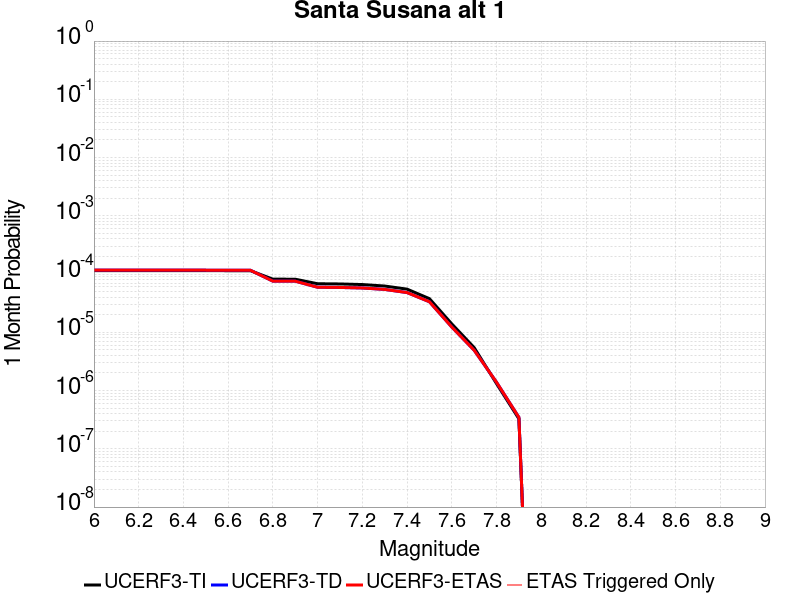 | 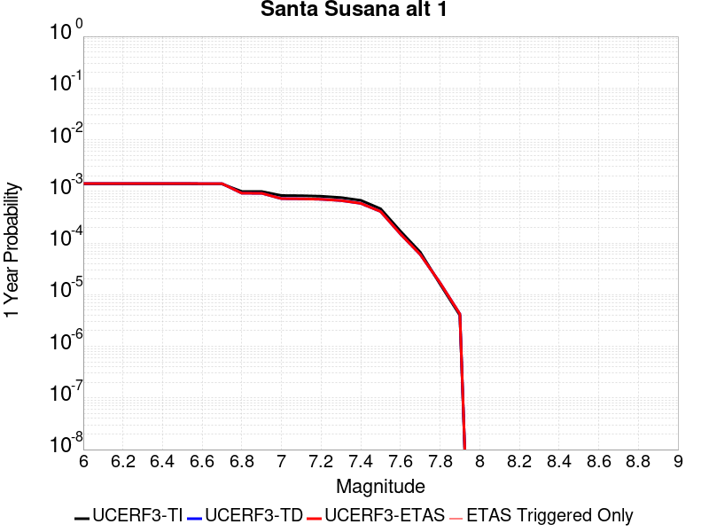 | 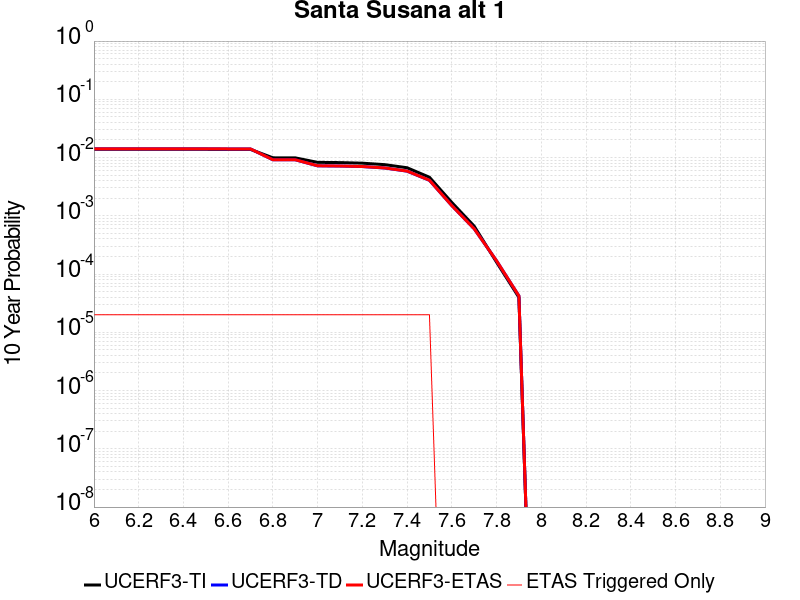 |

| Magnitude | 1 wk TI Prob | 1 wk TD Prob | 1 wk ETAS Prob | 1 wk ETAS/TD Gain | 1 wk ETAS Triggered Only | 1 mo TI Prob | 1 mo TD Prob | 1 mo ETAS Prob | 1 mo ETAS/TD Gain | 1 mo ETAS Triggered Only | 1 yr TI Prob | 1 yr TD Prob | 1 yr ETAS Prob | 1 yr ETAS/TD Gain | 1 yr ETAS Triggered Only | 10 yr TI Prob | 10 yr TD Prob | 10 yr ETAS Prob | 10 yr ETAS/TD Gain | 10 yr ETAS Triggered Only |
|-----|-----|-----|-----|-----|-----|-----|-----|-----|-----|-----|-----|-----|-----|-----|-----|-----|-----|-----|-----|-----|
| 6.0 | 2.674877E-5 | 2.7198023E-5 | 2.7198023E-5 | 1.0 | 0.0 | 1.1463255E-4 | 1.1655839E-4 | 1.1655839E-4 | 1.0 | 0.0 | 0.0013947578 | 0.0014182882 | 0.0014182882 | 1.0 | 0.0 | 0.013860362 | 0.014104128 | 0.014123846 | 1.001398 | 2.0E-5 |
| 6.1 | 2.674877E-5 | 2.7198023E-5 | 2.7198023E-5 | 1.0 | 0.0 | 1.1463255E-4 | 1.1655839E-4 | 1.1655839E-4 | 1.0 | 0.0 | 0.0013947578 | 0.0014182882 | 0.0014182882 | 1.0 | 0.0 | 0.013860362 | 0.014104128 | 0.014123846 | 1.001398 | 2.0E-5 |
| 6.2 | 2.674877E-5 | 2.7198023E-5 | 2.7198023E-5 | 1.0 | 0.0 | 1.1463255E-4 | 1.1655839E-4 | 1.1655839E-4 | 1.0 | 0.0 | 0.0013947578 | 0.0014182882 | 0.0014182882 | 1.0 | 0.0 | 0.013860362 | 0.014104128 | 0.014123846 | 1.001398 | 2.0E-5 |
| 6.3 | 2.674877E-5 | 2.7198023E-5 | 2.7198023E-5 | 1.0 | 0.0 | 1.1463255E-4 | 1.1655839E-4 | 1.1655839E-4 | 1.0 | 0.0 | 0.0013947578 | 0.0014182882 | 0.0014182882 | 1.0 | 0.0 | 0.013860362 | 0.014104128 | 0.014123846 | 1.001398 | 2.0E-5 |
| 6.4 | 2.674877E-5 | 2.7198023E-5 | 2.7198023E-5 | 1.0 | 0.0 | 1.1463255E-4 | 1.1655839E-4 | 1.1655839E-4 | 1.0 | 0.0 | 0.0013947578 | 0.0014182882 | 0.0014182882 | 1.0 | 0.0 | 0.013860362 | 0.014104128 | 0.014123846 | 1.001398 | 2.0E-5 |
| 6.5 | 2.674877E-5 | 2.7198023E-5 | 2.7198023E-5 | 1.0 | 0.0 | 1.1463255E-4 | 1.1655839E-4 | 1.1655839E-4 | 1.0 | 0.0 | 0.0013947578 | 0.0014182882 | 0.0014182882 | 1.0 | 0.0 | 0.013860362 | 0.014104128 | 0.014123846 | 1.001398 | 2.0E-5 |
| 6.6 | 2.6647976E-5 | 2.7074359E-5 | 2.7074359E-5 | 1.0 | 0.0 | 1.14200615E-4 | 1.1602845E-4 | 1.1602845E-4 | 1.0 | 0.0 | 0.0013895056 | 0.0014118447 | 0.0014118447 | 1.0 | 0.0 | 0.013808494 | 0.014040513 | 0.014060232 | 1.0014044 | 2.0E-5 |
| 6.7 | 2.6647976E-5 | 2.7074359E-5 | 2.7074359E-5 | 1.0 | 0.0 | 1.14200615E-4 | 1.1602845E-4 | 1.1602845E-4 | 1.0 | 0.0 | 0.0013895056 | 0.0014118447 | 0.0014118447 | 1.0 | 0.0 | 0.013808494 | 0.014040513 | 0.014060232 | 1.0014044 | 2.0E-5 |
| 6.8 | 1.9073179E-5 | 1.7637283E-5 | 1.7637283E-5 | 1.0 | 0.0 | 8.1739636E-5 | 7.558627E-5 | 7.558627E-5 | 1.0 | 0.0 | 9.947256E-4 | 9.198925E-4 | 9.198925E-4 | 1.0 | 0.0 | 0.009902848 | 0.009163101 | 0.009182918 | 1.0021627 | 2.0E-5 |
| 6.9 | 1.9041876E-5 | 1.7619415E-5 | 1.7619415E-5 | 1.0 | 0.0 | 8.160549E-5 | 7.55097E-5 | 7.55097E-5 | 1.0 | 0.0 | 9.930939E-4 | 9.1896096E-4 | 9.1896096E-4 | 1.0 | 0.0 | 0.0098866755 | 0.0091538625 | 0.009173679 | 1.0021648 | 2.0E-5 |
| 7.0 | 1.5917482E-5 | 1.3863864E-5 | 1.3863864E-5 | 1.0 | 0.0 | 6.8215995E-5 | 5.9415237E-5 | 5.9415237E-5 | 1.0 | 0.0 | 8.302132E-4 | 7.231451E-4 | 7.231451E-4 | 1.0 | 0.0 | 0.008271185 | 0.0072088144 | 0.00722867 | 1.0027543 | 2.0E-5 |
| 7.1 | 1.577788E-5 | 1.3743872E-5 | 1.3743872E-5 | 1.0 | 0.0 | 6.761774E-5 | 5.8901005E-5 | 5.8901005E-5 | 1.0 | 0.0 | 8.2293496E-4 | 7.1688846E-4 | 7.1688846E-4 | 1.0 | 0.0 | 0.008198941 | 0.007146652 | 0.007166509 | 1.0027785 | 2.0E-5 |
| 7.2 | 1.5416446E-5 | 1.3469944E-5 | 1.3469944E-5 | 1.0 | 0.0 | 6.606882E-5 | 5.772708E-5 | 5.772708E-5 | 1.0 | 0.0 | 8.0409093E-4 | 7.026052E-4 | 7.026052E-4 | 1.0 | 0.0 | 0.008011877 | 0.0070047234 | 0.0070245834 | 1.0028353 | 2.0E-5 |
| 7.3 | 1.4534083E-5 | 1.2717879E-5 | 1.2717879E-5 | 1.0 | 0.0 | 6.228744E-5 | 5.4504082E-5 | 5.4504082E-5 | 1.0 | 0.0 | 7.580857E-4 | 6.633896E-4 | 6.633896E-4 | 1.0 | 0.0 | 0.007555048 | 0.0066149444 | 0.006634812 | 1.0030035 | 2.0E-5 |
| 7.4 | 1.2858995E-5 | 1.1229652E-5 | 1.1229652E-5 | 1.0 | 0.0 | 5.5108816E-5 | 4.8126214E-5 | 4.8126214E-5 | 1.0 | 0.0 | 6.7074323E-4 | 5.857831E-4 | 5.857831E-4 | 1.0 | 0.0 | 0.0066872234 | 0.005843165 | 0.005863048 | 1.0034028 | 2.0E-5 |
| 7.5 | 8.827668E-6 | 7.805457E-6 | 7.805457E-6 | 1.0 | 0.0 | 3.7832317E-5 | 3.3451546E-5 | 3.3451546E-5 | 1.0 | 0.0 | 4.605111E-4 | 4.071989E-4 | 4.071989E-4 | 1.0 | 0.0 | 0.0045955796 | 0.0040647765 | 0.004084695 | 1.0049003 | 2.0E-5 |
| 7.6 | 3.2533426E-6 | 2.871988E-6 | 2.871988E-6 | 1.0 | 0.0 | 1.3942822E-5 | 1.2308465E-5 | 1.2308465E-5 | 1.0 | 0.0 | 1.6974064E-4 | 1.4984563E-4 | 1.4984563E-4 | 1.0 | 0.0 | 0.0016961104 | 0.0014974826 | 0.0014974826 | 1.0 | 0.0 |
| 7.7 | 1.2751709E-6 | 1.1491089E-6 | 1.1491089E-6 | 1.0 | 0.0 | 5.4650063E-6 | 4.9247437E-6 | 4.9247437E-6 | 1.0 | 0.0 | 6.653442E-5 | 5.9957198E-5 | 5.9957198E-5 | 1.0 | 0.0 | 6.6514505E-4 | 5.994191E-4 | 5.994191E-4 | 1.0 | 0.0 |
| 7.8 | 3.067544E-7 | 3.2400436E-7 | 3.2400436E-7 | 1.0 | 0.0 | 1.3146611E-6 | 1.3885895E-6 | 1.3885895E-6 | 1.0 | 0.0 | 1.600588E-5 | 1.6905957E-5 | 1.6905957E-5 | 1.0 | 0.0 | 1.6004729E-4 | 1.6904772E-4 | 1.6904772E-4 | 1.0 | 0.0 |
| 7.9 | 7.622999E-8 | 8.087964E-8 | 8.087964E-8 | 1.0 | 0.0 | 3.2669993E-7 | 3.4662696E-7 | 3.4662696E-7 | 1.0 | 0.0 | 3.977564E-6 | 4.2201773E-6 | 4.2201773E-6 | 1.0 | 0.0 | 3.977493E-5 | 4.220118E-5 | 4.220118E-5 | 1.0 | 0.0 |

## Fish Slough 2011 CFM
*[(top)](#table-of-contents)*

| 1 Week | 1 Month | 1 Year | 10 Year |
|-----|-----|-----|-----|
| 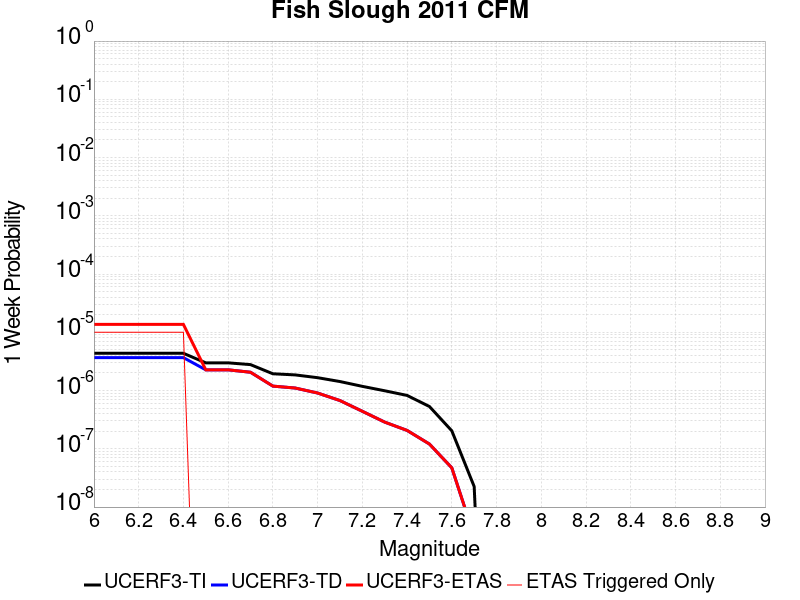 |  |  |  |

| Magnitude | 1 wk TI Prob | 1 wk TD Prob | 1 wk ETAS Prob | 1 wk ETAS/TD Gain | 1 wk ETAS Triggered Only | 1 mo TI Prob | 1 mo TD Prob | 1 mo ETAS Prob | 1 mo ETAS/TD Gain | 1 mo ETAS Triggered Only | 1 yr TI Prob | 1 yr TD Prob | 1 yr ETAS Prob | 1 yr ETAS/TD Gain | 1 yr ETAS Triggered Only | 10 yr TI Prob | 10 yr TD Prob | 10 yr ETAS Prob | 10 yr ETAS/TD Gain | 10 yr ETAS Triggered Only |
|-----|-----|-----|-----|-----|-----|-----|-----|-----|-----|-----|-----|-----|-----|-----|-----|-----|-----|-----|-----|-----|
| 6.0 | 4.3629925E-6 | 3.6772697E-6 | 1.3677233E-5 | 3.719399 | 1.0E-5 | 1.8698405E-5 | 1.5759644E-5 | 2.5759487E-5 | 1.6345221 | 1.0E-5 | 2.276293E-4 | 1.918589E-4 | 2.0185698E-4 | 1.0521116 | 1.0E-5 | 0.0022739628 | 0.0019171416 | 0.0019271224 | 1.0052061 | 1.0E-5 |
| 6.1 | 4.3629925E-6 | 3.6772697E-6 | 1.3677233E-5 | 3.719399 | 1.0E-5 | 1.8698405E-5 | 1.5759644E-5 | 2.5759487E-5 | 1.6345221 | 1.0E-5 | 2.276293E-4 | 1.918589E-4 | 2.0185698E-4 | 1.0521116 | 1.0E-5 | 0.0022739628 | 0.0019171416 | 0.0019271224 | 1.0052061 | 1.0E-5 |
| 6.2 | 4.3629925E-6 | 3.6772697E-6 | 1.3677233E-5 | 3.719399 | 1.0E-5 | 1.8698405E-5 | 1.5759644E-5 | 2.5759487E-5 | 1.6345221 | 1.0E-5 | 2.276293E-4 | 1.918589E-4 | 2.0185698E-4 | 1.0521116 | 1.0E-5 | 0.0022739628 | 0.0019171416 | 0.0019271224 | 1.0052061 | 1.0E-5 |
| 6.3 | 4.3629925E-6 | 3.6772697E-6 | 1.3677233E-5 | 3.719399 | 1.0E-5 | 1.8698405E-5 | 1.5759644E-5 | 2.5759487E-5 | 1.6345221 | 1.0E-5 | 2.276293E-4 | 1.918589E-4 | 2.0185698E-4 | 1.0521116 | 1.0E-5 | 0.0022739628 | 0.0019171416 | 0.0019271224 | 1.0052061 | 1.0E-5 |
| 6.4 | 4.3629925E-6 | 3.6772697E-6 | 1.3677233E-5 | 3.719399 | 1.0E-5 | 1.8698405E-5 | 1.5759644E-5 | 2.5759487E-5 | 1.6345221 | 1.0E-5 | 2.276293E-4 | 1.918589E-4 | 2.0185698E-4 | 1.0521116 | 1.0E-5 | 0.0022739628 | 0.0019171416 | 0.0019271224 | 1.0052061 | 1.0E-5 |
| 6.5 | 2.991715E-6 | 2.2703898E-6 | 2.2703898E-6 | 1.0 | 0.0 | 1.2821573E-5 | 9.730211E-6 | 9.730211E-6 | 1.0 | 0.0 | 1.5609147E-4 | 1.1845979E-4 | 1.1845979E-4 | 1.0 | 0.0 | 0.0015598187 | 0.0011840566 | 0.0011840566 | 1.0 | 0.0 |
| 6.6 | 2.991715E-6 | 2.2703898E-6 | 2.2703898E-6 | 1.0 | 0.0 | 1.2821573E-5 | 9.730211E-6 | 9.730211E-6 | 1.0 | 0.0 | 1.5609147E-4 | 1.1845979E-4 | 1.1845979E-4 | 1.0 | 0.0 | 0.0015598187 | 0.0011840566 | 0.0011840566 | 1.0 | 0.0 |
| 6.7 | 2.7890346E-6 | 2.0621853E-6 | 2.0621853E-6 | 1.0 | 0.0 | 1.1952951E-5 | 8.837912E-6 | 8.837912E-6 | 1.0 | 0.0 | 1.4551746E-4 | 1.0759717E-4 | 1.0759717E-4 | 1.0 | 0.0 | 0.0014542221 | 0.0010755389 | 0.0010755389 | 1.0 | 0.0 |
| 6.8 | 1.9416723E-6 | 1.192555E-6 | 1.192555E-6 | 1.0 | 0.0 | 8.321425E-6 | 5.1109405E-6 | 5.1109405E-6 | 1.0 | 0.0 | 1.01308644E-4 | 6.222397E-5 | 6.222397E-5 | 1.0 | 0.0 | 0.0010126247 | 6.220695E-4 | 6.220695E-4 | 1.0 | 0.0 |
| 6.9 | 1.8567416E-6 | 1.1046966E-6 | 1.1046966E-6 | 1.0 | 0.0 | 7.957439E-6 | 4.7344056E-6 | 4.7344056E-6 | 1.0 | 0.0 | 9.687752E-5 | 5.7639903E-5 | 5.7639903E-5 | 1.0 | 0.0 | 9.6835295E-4 | 5.762534E-4 | 5.762534E-4 | 1.0 | 0.0 |
| 7.0 | 1.6634067E-6 | 9.073966E-7 | 9.073966E-7 | 1.0 | 0.0 | 7.1288664E-6 | 3.888837E-6 | 3.888837E-6 | 1.0 | 0.0 | 8.679049E-5 | 4.734559E-5 | 4.734559E-5 | 1.0 | 0.0 | 8.6756604E-4 | 4.733579E-4 | 4.733579E-4 | 1.0 | 0.0 |
| 7.1 | 1.4281054E-6 | 6.7366227E-7 | 6.7366227E-7 | 1.0 | 0.0 | 6.1204373E-6 | 2.8871211E-6 | 2.8871211E-6 | 1.0 | 0.0 | 7.451377E-5 | 3.515015E-5 | 3.515015E-5 | 1.0 | 0.0 | 7.44888E-4 | 3.5144767E-4 | 3.5144767E-4 | 1.0 | 0.0 |
| 7.2 | 1.1810387E-6 | 4.408355E-7 | 4.408355E-7 | 1.0 | 0.0 | 5.0615845E-6 | 1.8892936E-6 | 1.8892936E-6 | 1.0 | 0.0 | 6.1623046E-5 | 2.3001916E-5 | 2.3001916E-5 | 1.0 | 0.0 | 6.160596E-4 | 2.2999625E-4 | 2.2999625E-4 | 1.0 | 0.0 |
| 7.3 | 9.918052E-7 | 2.8733467E-7 | 2.8733467E-7 | 1.0 | 0.0 | 4.2505867E-6 | 1.2314338E-6 | 1.2314338E-6 | 1.0 | 0.0 | 5.1749663E-5 | 1.4992604E-5 | 1.4992604E-5 | 1.0 | 0.0 | 5.173762E-4 | 1.4991604E-4 | 1.4991604E-4 | 1.0 | 0.0 |
| 7.4 | 8.25252E-7 | 2.0694807E-7 | 2.0694807E-7 | 1.0 | 0.0 | 3.5367896E-6 | 8.8692E-7 | 8.8692E-7 | 1.0 | 0.0 | 4.3059565E-5 | 1.0798199E-5 | 1.0798199E-5 | 1.0 | 0.0 | 4.305122E-4 | 1.07976804E-4 | 1.07976804E-4 | 1.0 | 0.0 |
| 7.5 | 5.3248567E-7 | 1.2072739E-7 | 1.2072739E-7 | 1.0 | 0.0 | 2.2820795E-6 | 5.17403E-7 | 5.17403E-7 | 1.0 | 0.0 | 2.7783964E-5 | 6.299364E-6 | 6.299364E-6 | 1.0 | 0.0 | 2.778049E-4 | 6.2991894E-5 | 6.2991894E-5 | 1.0 | 0.0 |
| 7.6 | 2.037542E-7 | 4.7129152E-8 | 4.7129152E-8 | 1.0 | 0.0 | 8.73232E-7 | 2.0198206E-7 | 2.0198206E-7 | 1.0 | 0.0 | 1.0631547E-5 | 2.459129E-6 | 2.459129E-6 | 1.0 | 0.0 | 1.0631039E-4 | 2.459104E-5 | 2.459104E-5 | 1.0 | 0.0 |
| 7.7 | 2.2501226E-8 | 3.1514258E-9 | 3.1514258E-9 | 1.0 | 0.0 | 9.6433816E-8 | 1.350611E-8 | 1.350611E-8 | 1.0 | 0.0 | 1.1740811E-6 | 1.6443688E-7 | 1.6443688E-7 | 1.0 | 0.0 | 1.1740749E-5 | 1.6443678E-6 | 1.6443678E-6 | 1.0 | 0.0 |

## Richfield
*[(top)](#table-of-contents)*

| 1 Week | 1 Month | 1 Year | 10 Year |
|-----|-----|-----|-----|
|  |  | 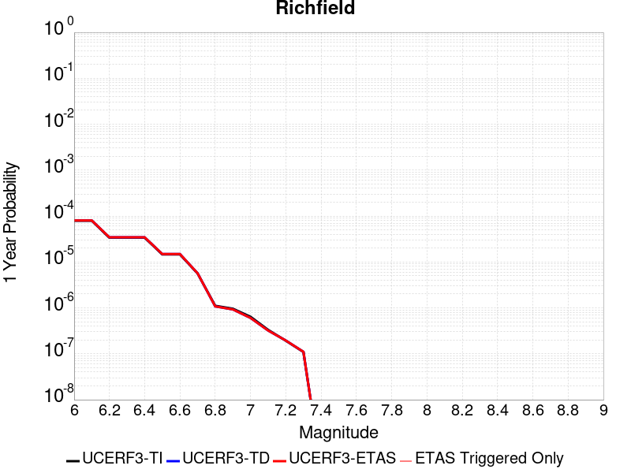 | 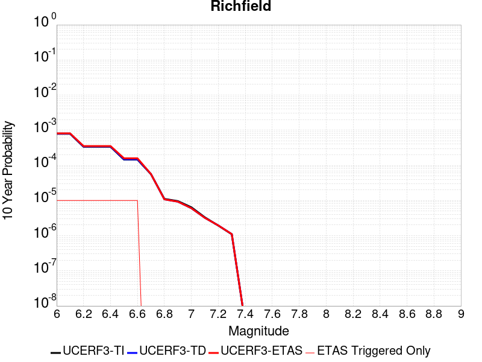 |

| Magnitude | 1 wk TI Prob | 1 wk TD Prob | 1 wk ETAS Prob | 1 wk ETAS/TD Gain | 1 wk ETAS Triggered Only | 1 mo TI Prob | 1 mo TD Prob | 1 mo ETAS Prob | 1 mo ETAS/TD Gain | 1 mo ETAS Triggered Only | 1 yr TI Prob | 1 yr TD Prob | 1 yr ETAS Prob | 1 yr ETAS/TD Gain | 1 yr ETAS Triggered Only | 10 yr TI Prob | 10 yr TD Prob | 10 yr ETAS Prob | 10 yr ETAS/TD Gain | 10 yr ETAS Triggered Only |
|-----|-----|-----|-----|-----|-----|-----|-----|-----|-----|-----|-----|-----|-----|-----|-----|-----|-----|-----|-----|-----|
| 6.0 | 1.5166896E-6 | 1.5392679E-6 | 1.5392679E-6 | 1.0 | 0.0 | 6.5000822E-6 | 6.596852E-6 | 6.596852E-6 | 1.0 | 0.0 | 7.913562E-5 | 8.0314814E-5 | 8.0314814E-5 | 1.0 | 0.0 | 7.910745E-4 | 8.0296566E-4 | 8.1295765E-4 | 1.0124438 | 1.0E-5 |
| 6.1 | 1.5166896E-6 | 1.5392679E-6 | 1.5392679E-6 | 1.0 | 0.0 | 6.5000822E-6 | 6.596852E-6 | 6.596852E-6 | 1.0 | 0.0 | 7.913562E-5 | 8.0314814E-5 | 8.0314814E-5 | 1.0 | 0.0 | 7.910745E-4 | 8.0296566E-4 | 8.1295765E-4 | 1.0124438 | 1.0E-5 |
| 6.2 | 6.473272E-7 | 6.598479E-7 | 6.598479E-7 | 1.0 | 0.0 | 2.7742565E-6 | 2.8279173E-6 | 2.8279173E-6 | 1.0 | 0.0 | 3.377605E-5 | 3.4429482E-5 | 3.4429482E-5 | 1.0 | 0.0 | 3.3770915E-4 | 3.442545E-4 | 3.5425107E-4 | 1.0290383 | 1.0E-5 |
| 6.3 | 6.473272E-7 | 6.598479E-7 | 6.598479E-7 | 1.0 | 0.0 | 2.7742565E-6 | 2.8279173E-6 | 2.8279173E-6 | 1.0 | 0.0 | 3.377605E-5 | 3.4429482E-5 | 3.4429482E-5 | 1.0 | 0.0 | 3.3770915E-4 | 3.442545E-4 | 3.5425107E-4 | 1.0290383 | 1.0E-5 |
| 6.4 | 6.473272E-7 | 6.598479E-7 | 6.598479E-7 | 1.0 | 0.0 | 2.7742565E-6 | 2.8279173E-6 | 2.8279173E-6 | 1.0 | 0.0 | 3.377605E-5 | 3.4429482E-5 | 3.4429482E-5 | 1.0 | 0.0 | 3.3770915E-4 | 3.442545E-4 | 3.5425107E-4 | 1.0290383 | 1.0E-5 |
| 6.5 | 2.7954403E-7 | 2.8531605E-7 | 2.8531605E-7 | 1.0 | 0.0 | 1.1980452E-6 | 1.2227827E-6 | 1.2227827E-6 | 1.0 | 0.0 | 1.4586103E-5 | 1.4887321E-5 | 1.4887321E-5 | 1.0 | 0.0 | 1.4585146E-4 | 1.4886749E-4 | 1.58866E-4 | 1.0671638 | 1.0E-5 |
| 6.6 | 2.7954403E-7 | 2.8531605E-7 | 2.8531605E-7 | 1.0 | 0.0 | 1.1980452E-6 | 1.2227827E-6 | 1.2227827E-6 | 1.0 | 0.0 | 1.4586103E-5 | 1.4887321E-5 | 1.4887321E-5 | 1.0 | 0.0 | 1.4585146E-4 | 1.4886749E-4 | 1.58866E-4 | 1.0671638 | 1.0E-5 |
| 6.7 | 1.0777299E-7 | 1.08788136E-7 | 1.08788136E-7 | 1.0 | 0.0 | 4.6188418E-7 | 4.6623484E-7 | 4.6623484E-7 | 1.0 | 0.0 | 5.6234253E-6 | 5.6763984E-6 | 5.6763984E-6 | 1.0 | 0.0 | 5.623283E-5 | 5.6762965E-5 | 5.6762965E-5 | 1.0 | 0.0 |
| 6.8 | 2.1301874E-8 | 2.0666182E-8 | 2.0666182E-8 | 1.0 | 0.0 | 9.129375E-8 | 8.8569344E-8 | 8.8569344E-8 | 1.0 | 0.0 | 1.1115008E-6 | 1.0783313E-6 | 1.0783313E-6 | 1.0 | 0.0 | 1.1114952E-5 | 1.0783265E-5 | 1.0783265E-5 | 1.0 | 0.0 |
| 6.9 | 1.8413502E-8 | 1.7751145E-8 | 1.7751145E-8 | 1.0 | 0.0 | 7.891501E-8 | 7.607633E-8 | 7.607633E-8 | 1.0 | 0.0 | 9.607899E-7 | 9.26229E-7 | 9.26229E-7 | 1.0 | 0.0 | 9.607857E-6 | 9.262254E-6 | 9.262254E-6 | 1.0 | 0.0 |
| 7.0 | 1.2290541E-8 | 1.1574364E-8 | 1.1574364E-8 | 1.0 | 0.0 | 5.2673748E-8 | 4.9604413E-8 | 4.9604413E-8 | 1.0 | 0.0 | 6.413027E-7 | 6.039336E-7 | 6.039336E-7 | 1.0 | 0.0 | 6.4130086E-6 | 6.039321E-6 | 6.039321E-6 | 1.0 | 0.0 |
| 7.1 | 6.373573E-9 | 6.155796E-9 | 6.155796E-9 | 1.0 | 0.0 | 2.7315311E-8 | 2.6381983E-8 | 2.6381983E-8 | 1.0 | 0.0 | 3.3256384E-7 | 3.212006E-7 | 3.212006E-7 | 1.0 | 0.0 | 3.3256335E-6 | 3.2120017E-6 | 3.2120017E-6 | 1.0 | 0.0 |
| 7.2 | 3.6989944E-9 | 3.7360146E-9 | 3.7360146E-9 | 1.0 | 0.0 | 1.5852834E-8 | 1.6011493E-8 | 1.6011493E-8 | 1.0 | 0.0 | 1.9300822E-7 | 1.9493989E-7 | 1.9493989E-7 | 1.0 | 0.0 | 1.9300805E-6 | 1.9493975E-6 | 1.9493975E-6 | 1.0 | 0.0 |
| 7.3 | 2.097397E-9 | 2.1200501E-9 | 2.1200501E-9 | 1.0 | 0.0 | 8.9888434E-9 | 9.085929E-9 | 9.085929E-9 | 1.0 | 0.0 | 1.0943917E-7 | 1.1062118E-7 | 1.1062118E-7 | 1.0 | 0.0 | 1.0943911E-6 | 1.1062115E-6 | 1.1062115E-6 | 1.0 | 0.0 |
| 7.4 | 5.8314464E-12 | 5.8918426E-12 | 5.8918426E-12 | 1.0 | 0.0 | 2.4991786E-11 | 2.5250912E-11 | 2.5250912E-11 | 1.0 | 0.0 | 3.0427527E-10 | 3.0742975E-10 | 3.0742975E-10 | 1.0 | 0.0 | 3.0427532E-9 | 3.0742973E-9 | 3.0742973E-9 | 1.0 | 0.0 |

## Eureka Peak
*[(top)](#table-of-contents)*

| 1 Week | 1 Month | 1 Year | 10 Year |
|-----|-----|-----|-----|
|  | 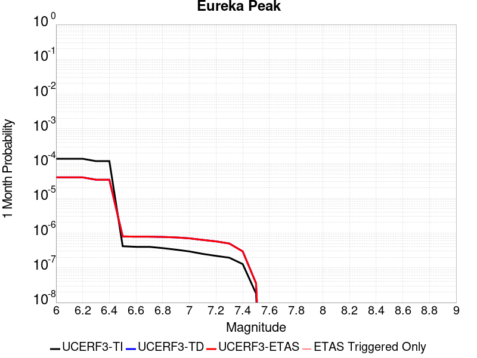 |  |  |

| Magnitude | 1 wk TI Prob | 1 wk TD Prob | 1 wk ETAS Prob | 1 wk ETAS/TD Gain | 1 wk ETAS Triggered Only | 1 mo TI Prob | 1 mo TD Prob | 1 mo ETAS Prob | 1 mo ETAS/TD Gain | 1 mo ETAS Triggered Only | 1 yr TI Prob | 1 yr TD Prob | 1 yr ETAS Prob | 1 yr ETAS/TD Gain | 1 yr ETAS Triggered Only | 10 yr TI Prob | 10 yr TD Prob | 10 yr ETAS Prob | 10 yr ETAS/TD Gain | 10 yr ETAS Triggered Only |
|-----|-----|-----|-----|-----|-----|-----|-----|-----|-----|-----|-----|-----|-----|-----|-----|-----|-----|-----|-----|-----|
| 6.0 | 3.1949054E-5 | 9.310571E-6 | 9.310571E-6 | 1.0 | 0.0 | 1.3691733E-4 | 3.990228E-5 | 3.990228E-5 | 1.0 | 0.0 | 0.0016656938 | 4.8578004E-4 | 4.957752E-4 | 1.0205754 | 1.0E-5 | 0.016532637 | 0.0049248957 | 0.0049348464 | 1.0020205 | 1.0E-5 |
| 6.1 | 3.1949054E-5 | 9.310571E-6 | 9.310571E-6 | 1.0 | 0.0 | 1.3691733E-4 | 3.990228E-5 | 3.990228E-5 | 1.0 | 0.0 | 0.0016656938 | 4.8578004E-4 | 4.957752E-4 | 1.0205754 | 1.0E-5 | 0.016532637 | 0.0049248957 | 0.0049348464 | 1.0020205 | 1.0E-5 |
| 6.2 | 3.1949054E-5 | 9.310571E-6 | 9.310571E-6 | 1.0 | 0.0 | 1.3691733E-4 | 3.990228E-5 | 3.990228E-5 | 1.0 | 0.0 | 0.0016656938 | 4.8578004E-4 | 4.957752E-4 | 1.0205754 | 1.0E-5 | 0.016532637 | 0.0049248957 | 0.0049348464 | 1.0020205 | 1.0E-5 |
| 6.3 | 2.7339745E-5 | 7.980718E-6 | 7.980718E-6 | 1.0 | 0.0 | 1.1716507E-4 | 3.4203054E-5 | 3.4203054E-5 | 1.0 | 0.0 | 0.0014255513 | 4.164185E-4 | 4.2641434E-4 | 1.0240043 | 1.0E-5 | 0.0141644105 | 0.004228374 | 0.0042383317 | 1.002355 | 1.0E-5 |
| 6.4 | 2.7339745E-5 | 7.980718E-6 | 7.980718E-6 | 1.0 | 0.0 | 1.1716507E-4 | 3.4203054E-5 | 3.4203054E-5 | 1.0 | 0.0 | 0.0014255513 | 4.164185E-4 | 4.2641434E-4 | 1.0240043 | 1.0E-5 | 0.0141644105 | 0.004228374 | 0.0042383317 | 1.002355 | 1.0E-5 |
| 6.5 | 9.738388E-8 | 1.8619214E-7 | 1.8619214E-7 | 1.0 | 0.0 | 4.1735944E-7 | 7.979661E-7 | 7.979661E-7 | 1.0 | 0.0 | 5.081339E-6 | 9.715194E-6 | 9.715194E-6 | 1.0 | 0.0 | 5.0812232E-5 | 9.714778E-5 | 9.714778E-5 | 1.0 | 0.0 |
| 6.6 | 9.3495956E-8 | 1.8328048E-7 | 1.8328048E-7 | 1.0 | 0.0 | 4.0069688E-7 | 7.8548754E-7 | 7.8548754E-7 | 1.0 | 0.0 | 4.8784736E-6 | 9.5632695E-6 | 9.5632695E-6 | 1.0 | 0.0 | 4.8783666E-5 | 9.562866E-5 | 9.562866E-5 | 1.0 | 0.0 |
| 6.7 | 9.3495956E-8 | 1.8328048E-7 | 1.8328048E-7 | 1.0 | 0.0 | 4.0069688E-7 | 7.8548754E-7 | 7.8548754E-7 | 1.0 | 0.0 | 4.8784736E-6 | 9.5632695E-6 | 9.5632695E-6 | 1.0 | 0.0 | 4.8783666E-5 | 9.562866E-5 | 9.562866E-5 | 1.0 | 0.0 |
| 6.8 | 8.591428E-8 | 1.8021015E-7 | 1.8021015E-7 | 1.0 | 0.0 | 3.68204E-7 | 7.72329E-7 | 7.72329E-7 | 1.0 | 0.0 | 4.4828744E-6 | 9.403066E-6 | 9.403066E-6 | 1.0 | 0.0 | 4.482784E-5 | 9.402676E-5 | 9.402676E-5 | 1.0 | 0.0 |
| 6.9 | 7.749723E-8 | 1.7439022E-7 | 1.7439022E-7 | 1.0 | 0.0 | 3.3213098E-7 | 7.473864E-7 | 7.473864E-7 | 1.0 | 0.0 | 4.043687E-6 | 9.099393E-6 | 9.099393E-6 | 1.0 | 0.0 | 4.0436134E-5 | 9.099028E-5 | 9.099028E-5 | 1.0 | 0.0 |
| 7.0 | 6.897872E-8 | 1.6415258E-7 | 1.6415258E-7 | 1.0 | 0.0 | 2.9562307E-7 | 7.035109E-7 | 7.035109E-7 | 1.0 | 0.0 | 3.5992048E-6 | 8.565212E-6 | 8.565212E-6 | 1.0 | 0.0 | 3.5991467E-5 | 8.564889E-5 | 8.564889E-5 | 1.0 | 0.0 |
| 7.1 | 5.859318E-8 | 1.4787166E-7 | 1.4787166E-7 | 1.0 | 0.0 | 2.5111362E-7 | 6.337355E-7 | 6.337355E-7 | 1.0 | 0.0 | 3.057304E-6 | 7.715704E-6 | 7.715704E-6 | 1.0 | 0.0 | 3.0572617E-5 | 7.715442E-5 | 7.715442E-5 | 1.0 | 0.0 |
| 7.2 | 5.1375338E-8 | 1.342105E-7 | 1.342105E-7 | 1.0 | 0.0 | 2.2018E-7 | 5.751877E-7 | 5.751877E-7 | 1.0 | 0.0 | 2.680688E-6 | 7.002888E-6 | 7.002888E-6 | 1.0 | 0.0 | 2.6806558E-5 | 7.0026734E-5 | 7.0026734E-5 | 1.0 | 0.0 |
| 7.3 | 4.5441396E-8 | 1.16363104E-7 | 1.16363104E-7 | 1.0 | 0.0 | 1.9474882E-7 | 4.986989E-7 | 4.986989E-7 | 1.0 | 0.0 | 2.3710643E-6 | 6.071643E-6 | 6.071643E-6 | 1.0 | 0.0 | 2.371039E-5 | 6.0714825E-5 | 6.0714825E-5 | 1.0 | 0.0 |
| 7.4 | 2.981918E-8 | 6.9113334E-8 | 6.9113334E-8 | 1.0 | 0.0 | 1.2779647E-7 | 2.9619997E-7 | 2.9619997E-7 | 1.0 | 0.0 | 1.5559209E-6 | 3.6062293E-6 | 3.6062293E-6 | 1.0 | 0.0 | 1.55591E-5 | 3.606175E-5 | 3.606175E-5 | 1.0 | 0.0 |
| 7.5 | 4.24214E-9 | 8.342421E-9 | 8.342421E-9 | 1.0 | 0.0 | 1.81806E-8 | 3.5753235E-8 | 3.5753235E-8 | 1.0 | 0.0 | 2.213488E-7 | 4.352956E-7 | 4.352956E-7 | 1.0 | 0.0 | 2.2134857E-6 | 4.352954E-6 | 4.352954E-6 | 1.0 | 0.0 |

## Trinidad (alt1)
*[(top)](#table-of-contents)*

| 1 Week | 1 Month | 1 Year | 10 Year |
|-----|-----|-----|-----|
|  |  | 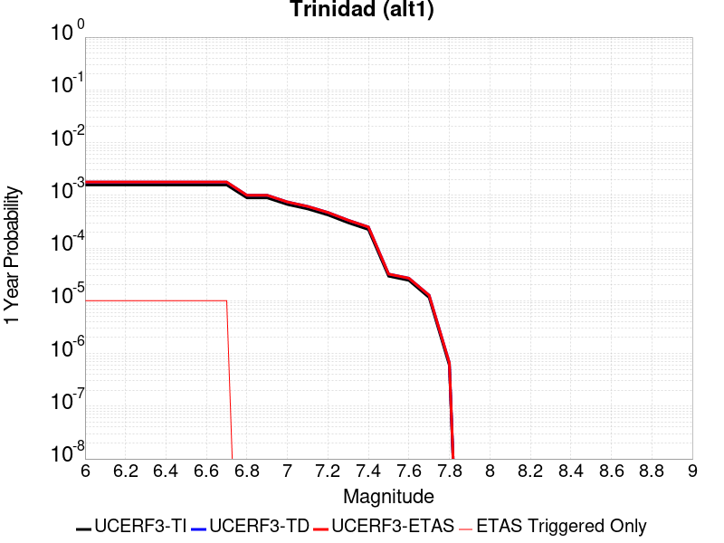 |  |

| Magnitude | 1 wk TI Prob | 1 wk TD Prob | 1 wk ETAS Prob | 1 wk ETAS/TD Gain | 1 wk ETAS Triggered Only | 1 mo TI Prob | 1 mo TD Prob | 1 mo ETAS Prob | 1 mo ETAS/TD Gain | 1 mo ETAS Triggered Only | 1 yr TI Prob | 1 yr TD Prob | 1 yr ETAS Prob | 1 yr ETAS/TD Gain | 1 yr ETAS Triggered Only | 10 yr TI Prob | 10 yr TD Prob | 10 yr ETAS Prob | 10 yr ETAS/TD Gain | 10 yr ETAS Triggered Only |
|-----|-----|-----|-----|-----|-----|-----|-----|-----|-----|-----|-----|-----|-----|-----|-----|-----|-----|-----|-----|-----|
| 6.0 | 3.0167168E-5 | 3.4033183E-5 | 4.4032844E-5 | 1.2938209 | 1.0E-5 | 1.2928146E-4 | 1.4584929E-4 | 1.5584784E-4 | 1.0685539 | 1.0E-5 | 0.0015728653 | 0.0017744373 | 0.0017844195 | 1.0056256 | 1.0E-5 | 0.0156177925 | 0.017619645 | 0.017629469 | 1.0005575 | 1.0E-5 |
| 6.1 | 3.0167168E-5 | 3.4033183E-5 | 4.4032844E-5 | 1.2938209 | 1.0E-5 | 1.2928146E-4 | 1.4584929E-4 | 1.5584784E-4 | 1.0685539 | 1.0E-5 | 0.0015728653 | 0.0017744373 | 0.0017844195 | 1.0056256 | 1.0E-5 | 0.0156177925 | 0.017619645 | 0.017629469 | 1.0005575 | 1.0E-5 |
| 6.2 | 3.0167168E-5 | 3.4033183E-5 | 4.4032844E-5 | 1.2938209 | 1.0E-5 | 1.2928146E-4 | 1.4584929E-4 | 1.5584784E-4 | 1.0685539 | 1.0E-5 | 0.0015728653 | 0.0017744373 | 0.0017844195 | 1.0056256 | 1.0E-5 | 0.0156177925 | 0.017619645 | 0.017629469 | 1.0005575 | 1.0E-5 |
| 6.3 | 3.0167168E-5 | 3.4033183E-5 | 4.4032844E-5 | 1.2938209 | 1.0E-5 | 1.2928146E-4 | 1.4584929E-4 | 1.5584784E-4 | 1.0685539 | 1.0E-5 | 0.0015728653 | 0.0017744373 | 0.0017844195 | 1.0056256 | 1.0E-5 | 0.0156177925 | 0.017619645 | 0.017629469 | 1.0005575 | 1.0E-5 |
| 6.4 | 3.0167168E-5 | 3.4033183E-5 | 4.4032844E-5 | 1.2938209 | 1.0E-5 | 1.2928146E-4 | 1.4584929E-4 | 1.5584784E-4 | 1.0685539 | 1.0E-5 | 0.0015728653 | 0.0017744373 | 0.0017844195 | 1.0056256 | 1.0E-5 | 0.0156177925 | 0.017619645 | 0.017629469 | 1.0005575 | 1.0E-5 |
| 6.5 | 3.0167168E-5 | 3.4033183E-5 | 4.4032844E-5 | 1.2938209 | 1.0E-5 | 1.2928146E-4 | 1.4584929E-4 | 1.5584784E-4 | 1.0685539 | 1.0E-5 | 0.0015728653 | 0.0017744373 | 0.0017844195 | 1.0056256 | 1.0E-5 | 0.0156177925 | 0.017619645 | 0.017629469 | 1.0005575 | 1.0E-5 |
| 6.6 | 3.0167168E-5 | 3.4033183E-5 | 4.4032844E-5 | 1.2938209 | 1.0E-5 | 1.2928146E-4 | 1.4584929E-4 | 1.5584784E-4 | 1.0685539 | 1.0E-5 | 0.0015728653 | 0.0017744373 | 0.0017844195 | 1.0056256 | 1.0E-5 | 0.0156177925 | 0.017619645 | 0.017629469 | 1.0005575 | 1.0E-5 |
| 6.7 | 3.0167168E-5 | 3.4033183E-5 | 4.4032844E-5 | 1.2938209 | 1.0E-5 | 1.2928146E-4 | 1.4584929E-4 | 1.5584784E-4 | 1.0685539 | 1.0E-5 | 0.0015728653 | 0.0017744373 | 0.0017844195 | 1.0056256 | 1.0E-5 | 0.0156177925 | 0.017619645 | 0.017629469 | 1.0005575 | 1.0E-5 |
| 6.8 | 1.717077E-5 | 1.9195684E-5 | 1.9195684E-5 | 1.0 | 0.0 | 7.358694E-5 | 8.226487E-5 | 8.226487E-5 | 1.0 | 0.0 | 8.9555274E-4 | 0.0010011591 | 0.0010011591 | 1.0 | 0.0 | 0.008919522 | 0.009970939 | 0.009970939 | 1.0 | 0.0 |
| 6.9 | 1.717077E-5 | 1.9195684E-5 | 1.9195684E-5 | 1.0 | 0.0 | 7.358694E-5 | 8.226487E-5 | 8.226487E-5 | 1.0 | 0.0 | 8.9555274E-4 | 0.0010011591 | 0.0010011591 | 1.0 | 0.0 | 0.008919522 | 0.009970939 | 0.009970939 | 1.0 | 0.0 |
| 7.0 | 1.2858572E-5 | 1.433737E-5 | 1.433737E-5 | 1.0 | 0.0 | 5.5107E-5 | 6.14446E-5 | 6.14446E-5 | 1.0 | 0.0 | 6.707212E-4 | 7.478634E-4 | 7.478634E-4 | 1.0 | 0.0 | 0.006687004 | 0.0074566454 | 0.0074566454 | 1.0 | 0.0 |
| 7.1 | 1.0588431E-5 | 1.1801269E-5 | 1.1801269E-5 | 1.0 | 0.0 | 4.53782E-5 | 5.057605E-5 | 5.057605E-5 | 1.0 | 0.0 | 5.5233954E-4 | 6.156183E-4 | 6.156183E-4 | 1.0 | 0.0 | 0.005509687 | 0.006141979 | 0.006141979 | 1.0 | 0.0 |
| 7.2 | 8.138061E-6 | 9.067213E-6 | 9.067213E-6 | 1.0 | 0.0 | 3.487694E-5 | 3.8859045E-5 | 3.8859045E-5 | 1.0 | 0.0 | 4.2454398E-4 | 4.7303102E-4 | 4.7303102E-4 | 1.0 | 0.0 | 0.0042373384 | 0.0047226823 | 0.0047226823 | 1.0 | 0.0 |
| 7.3 | 5.787542E-6 | 6.46032E-6 | 6.46032E-6 | 1.0 | 0.0 | 2.4803514E-5 | 2.7686914E-5 | 2.7686914E-5 | 1.0 | 0.0 | 3.0194095E-4 | 3.3705754E-4 | 3.3705754E-4 | 1.0 | 0.0 | 0.00301531 | 0.0033675742 | 0.0033675742 | 1.0 | 0.0 |
| 7.4 | 4.303563E-6 | 4.800851E-6 | 4.800851E-6 | 1.0 | 0.0 | 1.844371E-5 | 2.0575026E-5 | 2.0575026E-5 | 1.0 | 0.0 | 2.2452902E-4 | 2.504919E-4 | 2.504919E-4 | 1.0 | 0.0 | 0.0022430231 | 0.0025040337 | 0.0025040337 | 1.0 | 0.0 |
| 7.5 | 5.6063425E-7 | 6.142982E-7 | 6.142982E-7 | 1.0 | 0.0 | 2.402716E-6 | 2.632704E-6 | 2.632704E-6 | 1.0 | 0.0 | 2.9252675E-5 | 3.2052718E-5 | 3.2052718E-5 | 1.0 | 0.0 | 2.9248823E-4 | 3.2048248E-4 | 3.2048248E-4 | 1.0 | 0.0 |
| 7.6 | 4.6699128E-7 | 5.1257996E-7 | 5.1257996E-7 | 1.0 | 0.0 | 2.0013897E-6 | 2.1967694E-6 | 2.1967694E-6 | 1.0 | 0.0 | 2.4366647E-5 | 2.6745354E-5 | 2.6745354E-5 | 1.0 | 0.0 | 2.4363975E-4 | 2.6742276E-4 | 2.6742276E-4 | 1.0 | 0.0 |
| 7.7 | 2.2080937E-7 | 2.4346897E-7 | 2.4346897E-7 | 1.0 | 0.0 | 9.4632554E-7 | 1.043438E-6 | 1.043438E-6 | 1.0 | 0.0 | 1.15214525E-5 | 1.270379E-5 | 1.270379E-5 | 1.0 | 0.0 | 1.1520855E-4 | 1.2703124E-4 | 1.2703124E-4 | 1.0 | 0.0 |
| 7.8 | 1.1438307E-8 | 1.2682963E-8 | 1.2682963E-8 | 1.0 | 0.0 | 4.9021317E-8 | 5.4355557E-8 | 5.4355557E-8 | 1.0 | 0.0 | 5.9683435E-7 | 6.6177887E-7 | 6.6177887E-7 | 1.0 | 0.0 | 5.9683275E-6 | 6.617789E-6 | 6.617789E-6 | 1.0 | 0.0 |

## Monterey Bay-Tularcitos
*[(top)](#table-of-contents)*

| 1 Week | 1 Month | 1 Year | 10 Year |
|-----|-----|-----|-----|
|  |  |  | 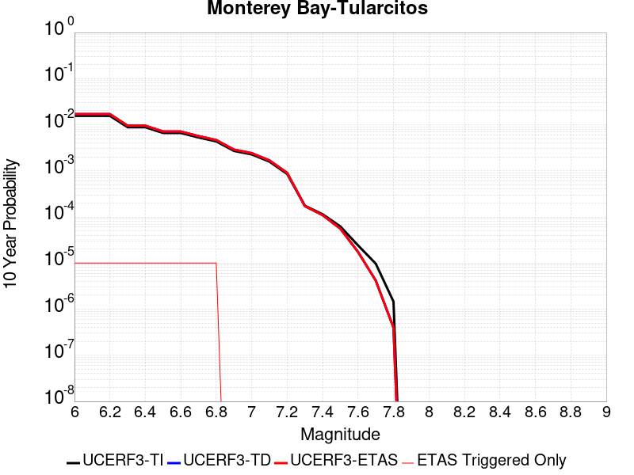 |

| Magnitude | 1 wk TI Prob | 1 wk TD Prob | 1 wk ETAS Prob | 1 wk ETAS/TD Gain | 1 wk ETAS Triggered Only | 1 mo TI Prob | 1 mo TD Prob | 1 mo ETAS Prob | 1 mo ETAS/TD Gain | 1 mo ETAS Triggered Only | 1 yr TI Prob | 1 yr TD Prob | 1 yr ETAS Prob | 1 yr ETAS/TD Gain | 1 yr ETAS Triggered Only | 10 yr TI Prob | 10 yr TD Prob | 10 yr ETAS Prob | 10 yr ETAS/TD Gain | 10 yr ETAS Triggered Only |
|-----|-----|-----|-----|-----|-----|-----|-----|-----|-----|-----|-----|-----|-----|-----|-----|-----|-----|-----|-----|-----|
| 6.0 | 3.0131365E-5 | 3.279877E-5 | 3.279877E-5 | 1.0 | 0.0 | 1.2912804E-4 | 1.4055918E-4 | 1.4055918E-4 | 1.0 | 0.0 | 0.001571 | 0.0017100703 | 0.0017100703 | 1.0 | 0.0 | 0.015599402 | 0.016979916 | 0.016989747 | 1.0005789 | 1.0E-5 |
| 6.1 | 3.0131365E-5 | 3.279877E-5 | 3.279877E-5 | 1.0 | 0.0 | 1.2912804E-4 | 1.4055918E-4 | 1.4055918E-4 | 1.0 | 0.0 | 0.001571 | 0.0017100703 | 0.0017100703 | 1.0 | 0.0 | 0.015599402 | 0.016979916 | 0.016989747 | 1.0005789 | 1.0E-5 |
| 6.2 | 3.0131365E-5 | 3.279877E-5 | 3.279877E-5 | 1.0 | 0.0 | 1.2912804E-4 | 1.4055918E-4 | 1.4055918E-4 | 1.0 | 0.0 | 0.001571 | 0.0017100703 | 0.0017100703 | 1.0 | 0.0 | 0.015599402 | 0.016979916 | 0.016989747 | 1.0005789 | 1.0E-5 |
| 6.3 | 1.6998249E-5 | 1.8330798E-5 | 1.8330798E-5 | 1.0 | 0.0 | 7.28476E-5 | 7.85583E-5 | 7.85583E-5 | 1.0 | 0.0 | 8.865586E-4 | 9.5604634E-4 | 9.5604634E-4 | 1.0 | 0.0 | 0.0088303005 | 0.009521258 | 0.009531163 | 1.0010403 | 1.0E-5 |
| 6.4 | 1.6998249E-5 | 1.8330798E-5 | 1.8330798E-5 | 1.0 | 0.0 | 7.28476E-5 | 7.85583E-5 | 7.85583E-5 | 1.0 | 0.0 | 8.865586E-4 | 9.5604634E-4 | 9.5604634E-4 | 1.0 | 0.0 | 0.0088303005 | 0.009521258 | 0.009531163 | 1.0010403 | 1.0E-5 |
| 6.5 | 1.27470785E-5 | 1.3693312E-5 | 1.3693312E-5 | 1.0 | 0.0 | 5.4629192E-5 | 5.8684363E-5 | 5.8684363E-5 | 1.0 | 0.0 | 6.649074E-4 | 7.1425823E-4 | 7.1425823E-4 | 1.0 | 0.0 | 0.0066292146 | 0.007120678 | 0.007130607 | 1.0013944 | 1.0E-5 |
| 6.6 | 1.2739422E-5 | 1.36854E-5 | 1.36854E-5 | 1.0 | 0.0 | 5.4596385E-5 | 5.8650454E-5 | 5.8650454E-5 | 1.0 | 0.0 | 6.645082E-4 | 7.1384566E-4 | 7.1384566E-4 | 1.0 | 0.0 | 0.0066252467 | 0.007116579 | 0.007126508 | 1.0013952 | 1.0E-5 |
| 6.7 | 1.0160109E-5 | 1.0885755E-5 | 1.0885755E-5 | 1.0 | 0.0 | 4.35426E-5 | 4.665244E-5 | 4.665244E-5 | 1.0 | 0.0 | 5.300022E-4 | 5.6785246E-4 | 5.6785246E-4 | 1.0 | 0.0 | 0.005287399 | 0.0056647263 | 0.0056746695 | 1.0017554 | 1.0E-5 |
| 6.8 | 8.349859E-6 | 8.932587E-6 | 8.932587E-6 | 1.0 | 0.0 | 3.578462E-5 | 3.8281985E-5 | 3.8281985E-5 | 1.0 | 0.0 | 4.3559066E-4 | 4.6598914E-4 | 4.6598914E-4 | 1.0 | 0.0 | 0.004347378 | 0.004650685 | 0.0046606385 | 1.0021402 | 1.0E-5 |
| 6.9 | 5.193639E-6 | 5.53643E-6 | 5.53643E-6 | 1.0 | 0.0 | 2.2258262E-5 | 2.372736E-5 | 2.372736E-5 | 1.0 | 0.0 | 2.7096065E-4 | 2.8884556E-4 | 2.8884556E-4 | 1.0 | 0.0 | 0.0027063051 | 0.0028850222 | 0.0028850222 | 1.0 | 0.0 |
| 7.0 | 4.359381E-6 | 4.643366E-6 | 4.643366E-6 | 1.0 | 0.0 | 1.8682927E-5 | 1.9900004E-5 | 1.9900004E-5 | 1.0 | 0.0 | 2.274409E-4 | 2.422586E-4 | 2.422586E-4 | 1.0 | 0.0 | 0.0022720827 | 0.002420238 | 0.002420238 | 1.0 | 0.0 |
| 7.1 | 3.0398533E-6 | 3.2310427E-6 | 3.2310427E-6 | 1.0 | 0.0 | 1.3027877E-5 | 1.3847267E-5 | 1.3847267E-5 | 1.0 | 0.0 | 1.5860285E-4 | 1.6858005E-4 | 1.6858005E-4 | 1.0 | 0.0 | 0.001584897 | 0.0016847793 | 0.0016847793 | 1.0 | 0.0 |
| 7.2 | 1.642335E-6 | 1.7333153E-6 | 1.7333153E-6 | 1.0 | 0.0 | 7.0385595E-6 | 7.428485E-6 | 7.428485E-6 | 1.0 | 0.0 | 8.569109E-5 | 9.044012E-5 | 9.044012E-5 | 1.0 | 0.0 | 8.5658056E-4 | 9.042358E-4 | 9.042358E-4 | 1.0 | 0.0 |
| 7.3 | 3.356842E-7 | 3.2952389E-7 | 3.2952389E-7 | 1.0 | 0.0 | 1.4386458E-6 | 1.4122444E-6 | 1.4122444E-6 | 1.0 | 0.0 | 1.7515373E-5 | 1.7193941E-5 | 1.7193941E-5 | 1.0 | 0.0 | 1.7513991E-4 | 1.719262E-4 | 1.719262E-4 | 1.0 | 0.0 |
| 7.4 | 2.1973483E-7 | 2.1006413E-7 | 2.1006413E-7 | 1.0 | 0.0 | 9.417204E-7 | 9.0027453E-7 | 9.0027453E-7 | 1.0 | 0.0 | 1.1465385E-5 | 1.0960787E-5 | 1.0960787E-5 | 1.0 | 0.0 | 1.1464794E-4 | 1.096025E-4 | 1.096025E-4 | 1.0 | 0.0 |
| 7.5 | 1.1944135E-7 | 1.0696043E-7 | 1.0696043E-7 | 1.0 | 0.0 | 5.118914E-7 | 4.5840173E-7 | 4.5840173E-7 | 1.0 | 0.0 | 6.23226E-6 | 5.581027E-6 | 5.581027E-6 | 1.0 | 0.0 | 6.2320854E-5 | 5.5808883E-5 | 5.5808883E-5 | 1.0 | 0.0 |
| 7.6 | 4.636058E-8 | 3.336489E-8 | 3.336489E-8 | 1.0 | 0.0 | 1.9868818E-7 | 1.4299238E-7 | 1.4299238E-7 | 1.0 | 0.0 | 2.419026E-6 | 1.7409308E-6 | 1.7409308E-6 | 1.0 | 0.0 | 2.4189996E-5 | 1.7409173E-5 | 1.7409173E-5 | 1.0 | 0.0 |
| 7.7 | 1.8588572E-8 | 8.003744E-9 | 8.003744E-9 | 1.0 | 0.0 | 7.9665305E-8 | 3.430176E-8 | 3.430176E-8 | 1.0 | 0.0 | 9.699246E-7 | 4.1762385E-7 | 4.1762385E-7 | 1.0 | 0.0 | 9.699204E-6 | 4.176231E-6 | 4.176231E-6 | 1.0 | 0.0 |
| 7.8 | 2.7960154E-9 | 7.6099427E-10 | 7.6099427E-10 | 1.0 | 0.0 | 1.1982923E-8 | 3.2614043E-9 | 3.2614043E-9 | 1.0 | 0.0 | 1.4589209E-7 | 3.9707597E-8 | 3.9707597E-8 | 1.0 | 0.0 | 1.4589199E-6 | 3.9707595E-7 | 3.9707595E-7 | 1.0 | 0.0 |

## Ozena
*[(top)](#table-of-contents)*

| 1 Week | 1 Month | 1 Year | 10 Year |
|-----|-----|-----|-----|
|  |  |  |  |

| Magnitude | 1 wk TI Prob | 1 wk TD Prob | 1 wk ETAS Prob | 1 wk ETAS/TD Gain | 1 wk ETAS Triggered Only | 1 mo TI Prob | 1 mo TD Prob | 1 mo ETAS Prob | 1 mo ETAS/TD Gain | 1 mo ETAS Triggered Only | 1 yr TI Prob | 1 yr TD Prob | 1 yr ETAS Prob | 1 yr ETAS/TD Gain | 1 yr ETAS Triggered Only | 10 yr TI Prob | 10 yr TD Prob | 10 yr ETAS Prob | 10 yr ETAS/TD Gain | 10 yr ETAS Triggered Only |
|-----|-----|-----|-----|-----|-----|-----|-----|-----|-----|-----|-----|-----|-----|-----|-----|-----|-----|-----|-----|-----|
| 6.0 | 1.4377547E-6 | 1.4513782E-6 | 1.4513782E-6 | 1.0 | 0.0 | 6.161791E-6 | 6.2201793E-6 | 6.2201793E-6 | 1.0 | 0.0 | 7.5017226E-5 | 7.572832E-5 | 7.572832E-5 | 1.0 | 0.0 | 7.4991904E-4 | 7.570518E-4 | 7.670442E-4 | 1.0131991 | 1.0E-5 |
| 6.1 | 1.4377547E-6 | 1.4513782E-6 | 1.4513782E-6 | 1.0 | 0.0 | 6.161791E-6 | 6.2201793E-6 | 6.2201793E-6 | 1.0 | 0.0 | 7.5017226E-5 | 7.572832E-5 | 7.572832E-5 | 1.0 | 0.0 | 7.4991904E-4 | 7.570518E-4 | 7.670442E-4 | 1.0131991 | 1.0E-5 |
| 6.2 | 1.4377547E-6 | 1.4513782E-6 | 1.4513782E-6 | 1.0 | 0.0 | 6.161791E-6 | 6.2201793E-6 | 6.2201793E-6 | 1.0 | 0.0 | 7.5017226E-5 | 7.572832E-5 | 7.572832E-5 | 1.0 | 0.0 | 7.4991904E-4 | 7.570518E-4 | 7.670442E-4 | 1.0131991 | 1.0E-5 |
| 6.3 | 1.4377547E-6 | 1.4513782E-6 | 1.4513782E-6 | 1.0 | 0.0 | 6.161791E-6 | 6.2201793E-6 | 6.2201793E-6 | 1.0 | 0.0 | 7.5017226E-5 | 7.572832E-5 | 7.572832E-5 | 1.0 | 0.0 | 7.4991904E-4 | 7.570518E-4 | 7.670442E-4 | 1.0131991 | 1.0E-5 |
| 6.4 | 1.4377547E-6 | 1.4513782E-6 | 1.4513782E-6 | 1.0 | 0.0 | 6.161791E-6 | 6.2201793E-6 | 6.2201793E-6 | 1.0 | 0.0 | 7.5017226E-5 | 7.572832E-5 | 7.572832E-5 | 1.0 | 0.0 | 7.4991904E-4 | 7.570518E-4 | 7.670442E-4 | 1.0131991 | 1.0E-5 |
| 6.5 | 1.4377547E-6 | 1.4513782E-6 | 1.4513782E-6 | 1.0 | 0.0 | 6.161791E-6 | 6.2201793E-6 | 6.2201793E-6 | 1.0 | 0.0 | 7.5017226E-5 | 7.572832E-5 | 7.572832E-5 | 1.0 | 0.0 | 7.4991904E-4 | 7.570518E-4 | 7.670442E-4 | 1.0131991 | 1.0E-5 |
| 6.6 | 1.4377547E-6 | 1.4513782E-6 | 1.4513782E-6 | 1.0 | 0.0 | 6.161791E-6 | 6.2201793E-6 | 6.2201793E-6 | 1.0 | 0.0 | 7.5017226E-5 | 7.572832E-5 | 7.572832E-5 | 1.0 | 0.0 | 7.4991904E-4 | 7.570518E-4 | 7.670442E-4 | 1.0131991 | 1.0E-5 |
| 6.7 | 1.4377547E-6 | 1.4513782E-6 | 1.4513782E-6 | 1.0 | 0.0 | 6.161791E-6 | 6.2201793E-6 | 6.2201793E-6 | 1.0 | 0.0 | 7.5017226E-5 | 7.572832E-5 | 7.572832E-5 | 1.0 | 0.0 | 7.4991904E-4 | 7.570518E-4 | 7.670442E-4 | 1.0131991 | 1.0E-5 |
| 6.8 | 9.223257E-7 | 9.317624E-7 | 9.317624E-7 | 1.0 | 0.0 | 3.9528186E-6 | 3.9932615E-6 | 3.9932615E-6 | 1.0 | 0.0 | 4.81245E-5 | 4.8616912E-5 | 4.8616912E-5 | 1.0 | 0.0 | 4.811408E-4 | 4.860668E-4 | 4.860668E-4 | 1.0 | 0.0 |
| 6.9 | 9.141515E-7 | 9.235371E-7 | 9.235371E-7 | 1.0 | 0.0 | 3.917786E-6 | 3.9580104E-6 | 3.9580104E-6 | 1.0 | 0.0 | 4.7698002E-5 | 4.818775E-5 | 4.818775E-5 | 1.0 | 0.0 | 4.7687767E-4 | 4.8177704E-4 | 4.8177704E-4 | 1.0 | 0.0 |
| 7.0 | 8.767648E-7 | 8.8585773E-7 | 8.8585773E-7 | 1.0 | 0.0 | 3.757558E-6 | 3.7965276E-6 | 3.7965276E-6 | 1.0 | 0.0 | 4.5747307E-5 | 4.6221783E-5 | 4.6221783E-5 | 1.0 | 0.0 | 4.5737892E-4 | 4.6212564E-4 | 4.6212564E-4 | 1.0 | 0.0 |
| 7.1 | 8.199402E-7 | 8.2853984E-7 | 8.2853984E-7 | 1.0 | 0.0 | 3.5140247E-6 | 3.5508804E-6 | 3.5508804E-6 | 1.0 | 0.0 | 4.2782412E-5 | 4.323115E-5 | 4.323115E-5 | 1.0 | 0.0 | 4.2774176E-4 | 4.322311E-4 | 4.322311E-4 | 1.0 | 0.0 |
| 7.2 | 7.38705E-7 | 7.464262E-7 | 7.464262E-7 | 1.0 | 0.0 | 3.1658747E-6 | 3.198966E-6 | 3.198966E-6 | 1.0 | 0.0 | 3.8543843E-5 | 3.894675E-5 | 3.894675E-5 | 1.0 | 0.0 | 3.853716E-4 | 3.8940276E-4 | 3.8940276E-4 | 1.0 | 0.0 |
| 7.3 | 6.490017E-7 | 6.557802E-7 | 6.557802E-7 | 1.0 | 0.0 | 2.7814328E-6 | 2.8104837E-6 | 2.8104837E-6 | 1.0 | 0.0 | 3.386342E-5 | 3.4217133E-5 | 3.4217133E-5 | 1.0 | 0.0 | 3.3858258E-4 | 3.4212202E-4 | 3.4212202E-4 | 1.0 | 0.0 |
| 7.4 | 5.346736E-7 | 5.4022604E-7 | 5.4022604E-7 | 1.0 | 0.0 | 2.291456E-6 | 2.3152527E-6 | 2.3152527E-6 | 1.0 | 0.0 | 2.789812E-5 | 2.8187867E-5 | 2.8187867E-5 | 1.0 | 0.0 | 2.789462E-4 | 2.8184598E-4 | 2.8184598E-4 | 1.0 | 0.0 |
| 7.5 | 2.939325E-7 | 2.9666057E-7 | 2.9666057E-7 | 1.0 | 0.0 | 1.25971E-6 | 1.271402E-6 | 1.271402E-6 | 1.0 | 0.0 | 1.5336862E-5 | 1.5479225E-5 | 1.5479225E-5 | 1.0 | 0.0 | 1.5335804E-4 | 1.5478309E-4 | 1.5478309E-4 | 1.0 | 0.0 |
| 7.6 | 1.4151905E-7 | 1.4253266E-7 | 1.4253266E-7 | 1.0 | 0.0 | 6.065101E-7 | 6.108541E-7 | 6.108541E-7 | 1.0 | 0.0 | 7.3842357E-6 | 7.4371237E-6 | 7.4371237E-6 | 1.0 | 0.0 | 7.38399E-5 | 7.436883E-5 | 7.436883E-5 | 1.0 | 0.0 |
| 7.7 | 4.4957577E-8 | 4.5252243E-8 | 4.5252243E-8 | 1.0 | 0.0 | 1.9267533E-7 | 1.9393818E-7 | 1.9393818E-7 | 1.0 | 0.0 | 2.3458194E-6 | 2.3611947E-6 | 2.3611947E-6 | 1.0 | 0.0 | 2.3457947E-5 | 2.3611707E-5 | 2.3611707E-5 | 1.0 | 0.0 |
| 7.8 | 5.9993255E-9 | 6.0412972E-9 | 6.0412972E-9 | 1.0 | 0.0 | 2.5711394E-8 | 2.5891273E-8 | 2.5891273E-8 | 1.0 | 0.0 | 3.1303617E-7 | 3.1522623E-7 | 3.1522623E-7 | 1.0 | 0.0 | 3.1303573E-6 | 3.1522588E-6 | 3.1522588E-6 | 1.0 | 0.0 |

## Mono Lake 2011 CFM
*[(top)](#table-of-contents)*

| 1 Week | 1 Month | 1 Year | 10 Year |
|-----|-----|-----|-----|
|  | 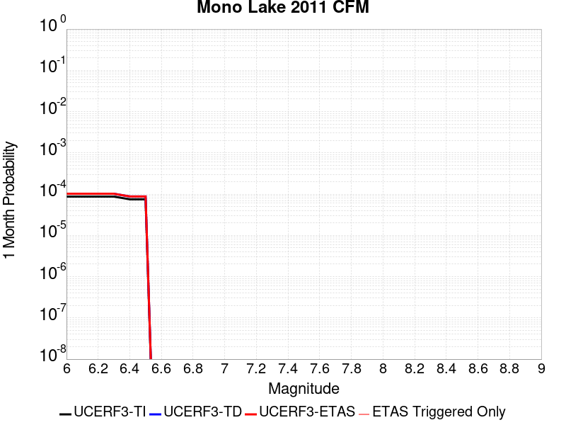 |  |  |

| Magnitude | 1 wk TI Prob | 1 wk TD Prob | 1 wk ETAS Prob | 1 wk ETAS/TD Gain | 1 wk ETAS Triggered Only | 1 mo TI Prob | 1 mo TD Prob | 1 mo ETAS Prob | 1 mo ETAS/TD Gain | 1 mo ETAS Triggered Only | 1 yr TI Prob | 1 yr TD Prob | 1 yr ETAS Prob | 1 yr ETAS/TD Gain | 1 yr ETAS Triggered Only | 10 yr TI Prob | 10 yr TD Prob | 10 yr ETAS Prob | 10 yr ETAS/TD Gain | 10 yr ETAS Triggered Only |
|-----|-----|-----|-----|-----|-----|-----|-----|-----|-----|-----|-----|-----|-----|-----|-----|-----|-----|-----|-----|-----|
| 6.0 | 2.0341662E-5 | 2.3828166E-5 | 2.3828166E-5 | 1.0 | 0.0 | 8.717564E-5 | 1.0211971E-4 | 1.0211971E-4 | 1.0 | 0.0 | 0.0010608466 | 0.0012431298 | 0.0012431298 | 1.0 | 0.0 | 0.010557966 | 0.012413835 | 0.012423711 | 1.0007956 | 1.0E-5 |
| 6.1 | 2.0341662E-5 | 2.3828166E-5 | 2.3828166E-5 | 1.0 | 0.0 | 8.717564E-5 | 1.0211971E-4 | 1.0211971E-4 | 1.0 | 0.0 | 0.0010608466 | 0.0012431298 | 0.0012431298 | 1.0 | 0.0 | 0.010557966 | 0.012413835 | 0.012423711 | 1.0007956 | 1.0E-5 |
| 6.2 | 2.0341662E-5 | 2.3828166E-5 | 2.3828166E-5 | 1.0 | 0.0 | 8.717564E-5 | 1.0211971E-4 | 1.0211971E-4 | 1.0 | 0.0 | 0.0010608466 | 0.0012431298 | 0.0012431298 | 1.0 | 0.0 | 0.010557966 | 0.012413835 | 0.012423711 | 1.0007956 | 1.0E-5 |
| 6.3 | 2.0341662E-5 | 2.3828166E-5 | 2.3828166E-5 | 1.0 | 0.0 | 8.717564E-5 | 1.0211971E-4 | 1.0211971E-4 | 1.0 | 0.0 | 0.0010608466 | 0.0012431298 | 0.0012431298 | 1.0 | 0.0 | 0.010557966 | 0.012413835 | 0.012423711 | 1.0007956 | 1.0E-5 |
| 6.4 | 1.749821E-5 | 2.0490985E-5 | 2.0490985E-5 | 1.0 | 0.0 | 7.499018E-5 | 8.781851E-5 | 8.781851E-5 | 1.0 | 0.0 | 9.1262296E-4 | 0.0010691903 | 0.0010691903 | 1.0 | 0.0 | 0.009088841 | 0.010691865 | 0.010701758 | 1.0009253 | 1.0E-5 |
| 6.5 | 1.749821E-5 | 2.0490985E-5 | 2.0490985E-5 | 1.0 | 0.0 | 7.499018E-5 | 8.781851E-5 | 8.781851E-5 | 1.0 | 0.0 | 9.1262296E-4 | 0.0010691903 | 0.0010691903 | 1.0 | 0.0 | 0.009088841 | 0.010691865 | 0.010701758 | 1.0009253 | 1.0E-5 |

## Lions Head 2011 CFM
*[(top)](#table-of-contents)*

| 1 Week | 1 Month | 1 Year | 10 Year |
|-----|-----|-----|-----|
| 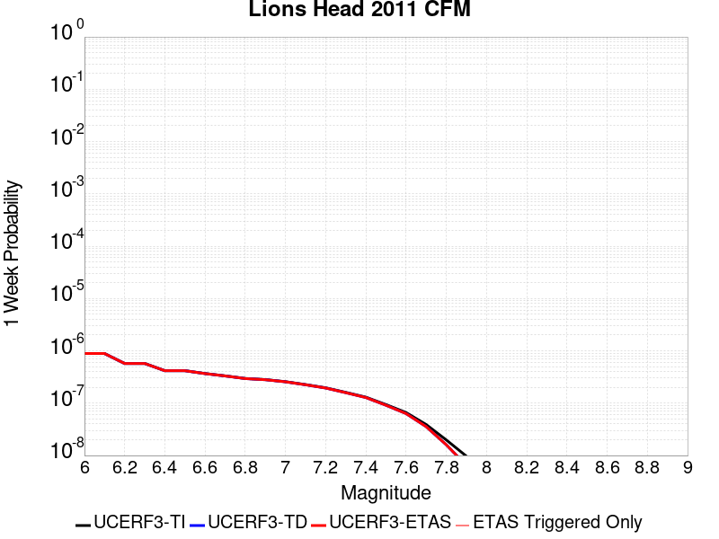 | 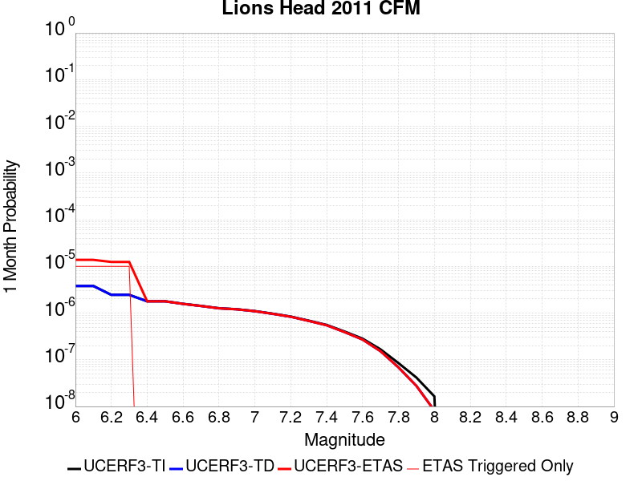 |  |  |

| Magnitude | 1 wk TI Prob | 1 wk TD Prob | 1 wk ETAS Prob | 1 wk ETAS/TD Gain | 1 wk ETAS Triggered Only | 1 mo TI Prob | 1 mo TD Prob | 1 mo ETAS Prob | 1 mo ETAS/TD Gain | 1 mo ETAS Triggered Only | 1 yr TI Prob | 1 yr TD Prob | 1 yr ETAS Prob | 1 yr ETAS/TD Gain | 1 yr ETAS Triggered Only | 10 yr TI Prob | 10 yr TD Prob | 10 yr ETAS Prob | 10 yr ETAS/TD Gain | 10 yr ETAS Triggered Only |
|-----|-----|-----|-----|-----|-----|-----|-----|-----|-----|-----|-----|-----|-----|-----|-----|-----|-----|-----|-----|-----|
| 6.0 | 8.889363E-7 | 8.891425E-7 | 8.891425E-7 | 1.0 | 0.0 | 3.8097214E-6 | 3.8106054E-6 | 1.3810567E-5 | 3.624245 | 1.0E-5 | 4.638237E-5 | 4.6393197E-5 | 5.639273E-5 | 1.2155389 | 1.0E-5 | 4.637269E-4 | 4.638414E-4 | 4.7383676E-4 | 1.0215491 | 1.0E-5 |
| 6.1 | 8.889363E-7 | 8.891425E-7 | 8.891425E-7 | 1.0 | 0.0 | 3.8097214E-6 | 3.8106054E-6 | 1.3810567E-5 | 3.624245 | 1.0E-5 | 4.638237E-5 | 4.6393197E-5 | 5.639273E-5 | 1.2155389 | 1.0E-5 | 4.637269E-4 | 4.638414E-4 | 4.7383676E-4 | 1.0215491 | 1.0E-5 |
| 6.2 | 5.7435483E-7 | 5.736071E-7 | 5.736071E-7 | 1.0 | 0.0 | 2.4615185E-6 | 2.458314E-6 | 1.2458289E-5 | 5.0678186 | 1.0E-5 | 2.9968574E-5 | 2.9929575E-5 | 3.9929277E-5 | 1.3341076 | 1.0E-5 | 2.9964533E-4 | 2.992569E-4 | 3.092539E-4 | 1.0334061 | 1.0E-5 |
| 6.3 | 5.7435483E-7 | 5.736071E-7 | 5.736071E-7 | 1.0 | 0.0 | 2.4615185E-6 | 2.458314E-6 | 1.2458289E-5 | 5.0678186 | 1.0E-5 | 2.9968574E-5 | 2.9929575E-5 | 3.9929277E-5 | 1.3341076 | 1.0E-5 | 2.9964533E-4 | 2.992569E-4 | 3.092539E-4 | 1.0334061 | 1.0E-5 |
| 6.4 | 4.1835764E-7 | 4.171541E-7 | 4.171541E-7 | 1.0 | 0.0 | 1.7929601E-6 | 1.787802E-6 | 1.787802E-6 | 1.0 | 0.0 | 2.1829072E-5 | 2.1766275E-5 | 2.1766275E-5 | 1.0 | 0.0 | 2.1826927E-4 | 2.1764166E-4 | 2.1764166E-4 | 1.0 | 0.0 |
| 6.5 | 4.1835764E-7 | 4.171541E-7 | 4.171541E-7 | 1.0 | 0.0 | 1.7929601E-6 | 1.787802E-6 | 1.787802E-6 | 1.0 | 0.0 | 2.1829072E-5 | 2.1766275E-5 | 2.1766275E-5 | 1.0 | 0.0 | 2.1826927E-4 | 2.1764166E-4 | 2.1764166E-4 | 1.0 | 0.0 |
| 6.6 | 3.6896213E-7 | 3.6761884E-7 | 3.6761884E-7 | 1.0 | 0.0 | 1.5812653E-6 | 1.5755083E-6 | 1.5755083E-6 | 1.0 | 0.0 | 1.9251736E-5 | 1.9181647E-5 | 1.9181647E-5 | 1.0 | 0.0 | 1.9250068E-4 | 1.9180003E-4 | 1.9180003E-4 | 1.0 | 0.0 |
| 6.7 | 3.3283942E-7 | 3.3139824E-7 | 3.3139824E-7 | 1.0 | 0.0 | 1.4264539E-6 | 1.4202773E-6 | 1.4202773E-6 | 1.0 | 0.0 | 1.7366938E-5 | 1.7291739E-5 | 1.7291739E-5 | 1.0 | 0.0 | 1.736558E-4 | 1.7290401E-4 | 1.7290401E-4 | 1.0 | 0.0 |
| 6.8 | 2.9684807E-7 | 2.953145E-7 | 2.953145E-7 | 1.0 | 0.0 | 1.2722054E-6 | 1.2656328E-6 | 1.2656328E-6 | 1.0 | 0.0 | 1.5488991E-5 | 1.5408972E-5 | 1.5408972E-5 | 1.0 | 0.0 | 1.5487912E-4 | 1.5407907E-4 | 1.5407907E-4 | 1.0 | 0.0 |
| 6.9 | 2.8254823E-7 | 2.8096647E-7 | 2.8096647E-7 | 1.0 | 0.0 | 1.2109203E-6 | 1.2041414E-6 | 1.2041414E-6 | 1.0 | 0.0 | 1.4742856E-5 | 1.4660324E-5 | 1.4660324E-5 | 1.0 | 0.0 | 1.4741877E-4 | 1.465936E-4 | 1.465936E-4 | 1.0 | 0.0 |
| 7.0 | 2.5794475E-7 | 2.5627148E-7 | 2.5627148E-7 | 1.0 | 0.0 | 1.105477E-6 | 1.0983058E-6 | 1.0983058E-6 | 1.0 | 0.0 | 1.34591E-5 | 1.3371792E-5 | 1.3371792E-5 | 1.0 | 0.0 | 1.3458285E-4 | 1.337099E-4 | 1.337099E-4 | 1.0 | 0.0 |
| 7.1 | 2.2678832E-7 | 2.2496131E-7 | 2.2496131E-7 | 1.0 | 0.0 | 9.719496E-7 | 9.641195E-7 | 9.641195E-7 | 1.0 | 0.0 | 1.1833421E-5 | 1.1738091E-5 | 1.1738091E-5 | 1.0 | 0.0 | 1.1832791E-4 | 1.1737474E-4 | 1.1737474E-4 | 1.0 | 0.0 |
| 7.2 | 1.968546E-7 | 1.9487938E-7 | 1.9487938E-7 | 1.0 | 0.0 | 8.436623E-7 | 8.35197E-7 | 8.35197E-7 | 1.0 | 0.0 | 1.027154E-5 | 1.0168476E-5 | 1.0168476E-5 | 1.0 | 0.0 | 1.0271065E-4 | 1.0168012E-4 | 1.0168012E-4 | 1.0 | 0.0 |
| 7.3 | 1.6101195E-7 | 1.5880458E-7 | 1.5880458E-7 | 1.0 | 0.0 | 6.90051E-7 | 6.8059086E-7 | 6.8059086E-7 | 1.0 | 0.0 | 8.401339E-6 | 8.2861625E-6 | 8.2861625E-6 | 1.0 | 0.0 | 8.4010215E-5 | 8.285854E-5 | 8.285854E-5 | 1.0 | 0.0 |
| 7.4 | 1.304744E-7 | 1.2803389E-7 | 1.2803389E-7 | 1.0 | 0.0 | 5.591759E-7 | 5.487165E-7 | 5.487165E-7 | 1.0 | 0.0 | 6.807945E-6 | 6.680603E-6 | 6.680603E-6 | 1.0 | 0.0 | 6.807737E-5 | 6.680403E-5 | 6.680403E-5 | 1.0 | 0.0 |
| 7.5 | 9.410614E-8 | 9.132599E-8 | 9.132599E-8 | 1.0 | 0.0 | 4.0331196E-7 | 3.91397E-7 | 3.91397E-7 | 1.0 | 0.0 | 4.910312E-6 | 4.7652484E-6 | 4.7652484E-6 | 1.0 | 0.0 | 4.9102036E-5 | 4.765146E-5 | 4.765146E-5 | 1.0 | 0.0 |
| 7.6 | 6.6360826E-8 | 6.327055E-8 | 6.327055E-8 | 1.0 | 0.0 | 2.844035E-7 | 2.7115945E-7 | 2.7115945E-7 | 1.0 | 0.0 | 3.462607E-6 | 3.3013614E-6 | 3.3013614E-6 | 1.0 | 0.0 | 3.4625533E-5 | 3.3013126E-5 | 3.3013126E-5 | 1.0 | 0.0 |
| 7.7 | 3.9100893E-8 | 3.5617894E-8 | 3.5617894E-8 | 1.0 | 0.0 | 1.6757524E-7 | 1.5264811E-7 | 1.5264811E-7 | 1.0 | 0.0 | 2.0402267E-6 | 1.8584891E-6 | 1.8584891E-6 | 1.0 | 0.0 | 2.040208E-5 | 1.8584737E-5 | 1.8584737E-5 | 1.0 | 0.0 |
| 7.8 | 1.9858547E-8 | 1.6059074E-8 | 1.6059074E-8 | 1.0 | 0.0 | 8.5108056E-8 | 6.882461E-8 | 6.882461E-8 | 1.0 | 0.0 | 1.0361902E-6 | 8.3793924E-7 | 8.3793924E-7 | 1.0 | 0.0 | 1.0361853E-5 | 8.379361E-6 | 8.379361E-6 | 1.0 | 0.0 |
| 7.9 | 9.717722E-9 | 6.4448784E-9 | 6.4448784E-9 | 1.0 | 0.0 | 4.1647375E-8 | 2.762091E-8 | 2.762091E-8 | 1.0 | 0.0 | 5.070567E-7 | 3.3628453E-7 | 3.3628453E-7 | 1.0 | 0.0 | 5.0705553E-6 | 3.3628403E-6 | 3.3628403E-6 | 1.0 | 0.0 |
| 8.0 | 3.8397716E-9 | 1.908926E-9 | 1.908926E-9 | 1.0 | 0.0 | 1.6456164E-8 | 8.18111E-9 | 8.18111E-9 | 1.0 | 0.0 | 2.0035378E-7 | 9.9605E-8 | 9.9605E-8 | 1.0 | 0.0 | 2.0035359E-6 | 9.960496E-7 | 9.960496E-7 | 1.0 | 0.0 |

## Channel Islands Western Deep Ramp
*[(top)](#table-of-contents)*

| 1 Week | 1 Month | 1 Year | 10 Year |
|-----|-----|-----|-----|
|  |  |  |  |

| Magnitude | 1 wk TI Prob | 1 wk TD Prob | 1 wk ETAS Prob | 1 wk ETAS/TD Gain | 1 wk ETAS Triggered Only | 1 mo TI Prob | 1 mo TD Prob | 1 mo ETAS Prob | 1 mo ETAS/TD Gain | 1 mo ETAS Triggered Only | 1 yr TI Prob | 1 yr TD Prob | 1 yr ETAS Prob | 1 yr ETAS/TD Gain | 1 yr ETAS Triggered Only | 10 yr TI Prob | 10 yr TD Prob | 10 yr ETAS Prob | 10 yr ETAS/TD Gain | 10 yr ETAS Triggered Only |
|-----|-----|-----|-----|-----|-----|-----|-----|-----|-----|-----|-----|-----|-----|-----|-----|-----|-----|-----|-----|-----|
| 6.0 | 6.0213506E-6 | 6.2548684E-6 | 1.6254806E-5 | 2.5987446 | 1.0E-5 | 2.5805533E-5 | 2.6806329E-5 | 3.680606E-5 | 1.3730363 | 1.0E-5 | 3.1413708E-4 | 3.2632265E-4 | 3.3631938E-4 | 1.0306345 | 1.0E-5 | 0.0031369338 | 0.0032588763 | 0.0032688437 | 1.0030586 | 1.0E-5 |
| 6.1 | 6.0213506E-6 | 6.2548684E-6 | 1.6254806E-5 | 2.5987446 | 1.0E-5 | 2.5805533E-5 | 2.6806329E-5 | 3.680606E-5 | 1.3730363 | 1.0E-5 | 3.1413708E-4 | 3.2632265E-4 | 3.3631938E-4 | 1.0306345 | 1.0E-5 | 0.0031369338 | 0.0032588763 | 0.0032688437 | 1.0030586 | 1.0E-5 |
| 6.2 | 6.0213506E-6 | 6.2548684E-6 | 1.6254806E-5 | 2.5987446 | 1.0E-5 | 2.5805533E-5 | 2.6806329E-5 | 3.680606E-5 | 1.3730363 | 1.0E-5 | 3.1413708E-4 | 3.2632265E-4 | 3.3631938E-4 | 1.0306345 | 1.0E-5 | 0.0031369338 | 0.0032588763 | 0.0032688437 | 1.0030586 | 1.0E-5 |
| 6.3 | 6.0213506E-6 | 6.2548684E-6 | 1.6254806E-5 | 2.5987446 | 1.0E-5 | 2.5805533E-5 | 2.6806329E-5 | 3.680606E-5 | 1.3730363 | 1.0E-5 | 3.1413708E-4 | 3.2632265E-4 | 3.3631938E-4 | 1.0306345 | 1.0E-5 | 0.0031369338 | 0.0032588763 | 0.0032688437 | 1.0030586 | 1.0E-5 |
| 6.4 | 6.0213506E-6 | 6.2548684E-6 | 1.6254806E-5 | 2.5987446 | 1.0E-5 | 2.5805533E-5 | 2.6806329E-5 | 3.680606E-5 | 1.3730363 | 1.0E-5 | 3.1413708E-4 | 3.2632265E-4 | 3.3631938E-4 | 1.0306345 | 1.0E-5 | 0.0031369338 | 0.0032588763 | 0.0032688437 | 1.0030586 | 1.0E-5 |
| 6.5 | 6.0213506E-6 | 6.2548684E-6 | 1.6254806E-5 | 2.5987446 | 1.0E-5 | 2.5805533E-5 | 2.6806329E-5 | 3.680606E-5 | 1.3730363 | 1.0E-5 | 3.1413708E-4 | 3.2632265E-4 | 3.3631938E-4 | 1.0306345 | 1.0E-5 | 0.0031369338 | 0.0032588763 | 0.0032688437 | 1.0030586 | 1.0E-5 |
| 6.6 | 6.0213506E-6 | 6.2548684E-6 | 1.6254806E-5 | 2.5987446 | 1.0E-5 | 2.5805533E-5 | 2.6806329E-5 | 3.680606E-5 | 1.3730363 | 1.0E-5 | 3.1413708E-4 | 3.2632265E-4 | 3.3631938E-4 | 1.0306345 | 1.0E-5 | 0.0031369338 | 0.0032588763 | 0.0032688437 | 1.0030586 | 1.0E-5 |
| 6.7 | 5.313309E-6 | 5.5252403E-6 | 5.5252403E-6 | 1.0 | 0.0 | 2.2771126E-5 | 2.367941E-5 | 2.367941E-5 | 1.0 | 0.0 | 2.772032E-4 | 2.8826276E-4 | 2.8826276E-4 | 1.0 | 0.0 | 0.0027685766 | 0.0028792918 | 0.0028792918 | 1.0 | 0.0 |
| 6.8 | 5.313309E-6 | 5.5252403E-6 | 5.5252403E-6 | 1.0 | 0.0 | 2.2771126E-5 | 2.367941E-5 | 2.367941E-5 | 1.0 | 0.0 | 2.772032E-4 | 2.8826276E-4 | 2.8826276E-4 | 1.0 | 0.0 | 0.0027685766 | 0.0028792918 | 0.0028792918 | 1.0 | 0.0 |
| 6.9 | 4.744377E-6 | 4.9394303E-6 | 4.9394303E-6 | 1.0 | 0.0 | 2.0332885E-5 | 2.1168837E-5 | 2.1168837E-5 | 1.0 | 0.0 | 2.4752476E-4 | 2.5770385E-4 | 2.5770385E-4 | 1.0 | 0.0 | 0.0024724922 | 0.0025744175 | 0.0025744175 | 1.0 | 0.0 |
| 7.0 | 4.722209E-6 | 4.9164732E-6 | 4.9164732E-6 | 1.0 | 0.0 | 2.0237881E-5 | 2.107045E-5 | 2.107045E-5 | 1.0 | 0.0 | 2.4636835E-4 | 2.5650626E-4 | 2.5650626E-4 | 1.0 | 0.0 | 0.002460954 | 0.0025624693 | 0.0025624693 | 1.0 | 0.0 |
| 7.1 | 4.611174E-6 | 4.801409E-6 | 4.801409E-6 | 1.0 | 0.0 | 1.9762025E-5 | 2.0577325E-5 | 2.0577325E-5 | 1.0 | 0.0 | 2.4057609E-4 | 2.5050386E-4 | 2.5050386E-4 | 1.0 | 0.0 | 0.002403158 | 0.002502582 | 0.002502582 | 1.0 | 0.0 |
| 7.2 | 4.043994E-6 | 4.2120264E-6 | 4.2120264E-6 | 1.0 | 0.0 | 1.7331287E-5 | 1.8051438E-5 | 1.8051438E-5 | 1.0 | 0.0 | 2.10988E-4 | 2.1975765E-4 | 2.1975765E-4 | 1.0 | 0.0 | 0.002107878 | 0.0021957543 | 0.0021957543 | 1.0 | 0.0 |
| 7.3 | 2.1233036E-6 | 2.2297875E-6 | 2.2297875E-6 | 1.0 | 0.0 | 9.099841E-6 | 9.556197E-6 | 9.556197E-6 | 1.0 | 0.0 | 1.1078493E-4 | 1.1634055E-4 | 1.1634055E-4 | 1.0 | 0.0 | 0.0011072971 | 0.001162802 | 0.001162802 | 1.0 | 0.0 |
| 7.4 | 1.9051884E-6 | 2.0014973E-6 | 2.0014973E-6 | 1.0 | 0.0 | 8.165067E-6 | 8.577817E-6 | 8.577817E-6 | 1.0 | 0.0 | 9.940516E-5 | 1.0442998E-4 | 1.0442998E-4 | 1.0 | 0.0 | 9.93607E-4 | 0.0010438144 | 0.0010438144 | 1.0 | 0.0 |
| 7.5 | 1.2408497E-6 | 1.3038839E-6 | 1.3038839E-6 | 1.0 | 0.0 | 5.317916E-6 | 5.588062E-6 | 5.588062E-6 | 1.0 | 0.0 | 6.4743705E-5 | 6.8032554E-5 | 6.8032554E-5 | 1.0 | 0.0 | 6.4724847E-4 | 6.8011944E-4 | 6.8011944E-4 | 1.0 | 0.0 |
| 7.6 | 6.5440025E-7 | 6.886718E-7 | 6.886718E-7 | 1.0 | 0.0 | 2.8045695E-6 | 2.9514472E-6 | 2.9514472E-6 | 1.0 | 0.0 | 3.4145098E-5 | 3.593329E-5 | 3.593329E-5 | 1.0 | 0.0 | 3.4139853E-4 | 3.5927625E-4 | 3.5927625E-4 | 1.0 | 0.0 |
| 7.7 | 3.985963E-7 | 4.1930787E-7 | 4.1930787E-7 | 1.0 | 0.0 | 1.7082689E-6 | 1.7970326E-6 | 1.7970326E-6 | 1.0 | 0.0 | 2.0797976E-5 | 2.1878664E-5 | 2.1878664E-5 | 1.0 | 0.0 | 2.0796029E-4 | 2.1876628E-4 | 2.1876628E-4 | 1.0 | 0.0 |
| 7.8 | 3.706329E-8 | 3.8591796E-8 | 3.8591796E-8 | 1.0 | 0.0 | 1.5884267E-7 | 1.653934E-7 | 1.653934E-7 | 1.0 | 0.0 | 1.9339077E-6 | 2.0136629E-6 | 2.0136629E-6 | 1.0 | 0.0 | 1.933891E-5 | 2.0136458E-5 | 2.0136458E-5 | 1.0 | 0.0 |

## South Klamath Lake East
*[(top)](#table-of-contents)*

| 1 Week | 1 Month | 1 Year | 10 Year |
|-----|-----|-----|-----|
|  |  |  |  |

| Magnitude | 1 wk TI Prob | 1 wk TD Prob | 1 wk ETAS Prob | 1 wk ETAS/TD Gain | 1 wk ETAS Triggered Only | 1 mo TI Prob | 1 mo TD Prob | 1 mo ETAS Prob | 1 mo ETAS/TD Gain | 1 mo ETAS Triggered Only | 1 yr TI Prob | 1 yr TD Prob | 1 yr ETAS Prob | 1 yr ETAS/TD Gain | 1 yr ETAS Triggered Only | 10 yr TI Prob | 10 yr TD Prob | 10 yr ETAS Prob | 10 yr ETAS/TD Gain | 10 yr ETAS Triggered Only |
|-----|-----|-----|-----|-----|-----|-----|-----|-----|-----|-----|-----|-----|-----|-----|-----|-----|-----|-----|-----|-----|
| 6.0 | 2.3539369E-5 | 2.5047308E-5 | 3.504706E-5 | 1.3992345 | 1.0E-5 | 1.0087911E-4 | 1.0734166E-4 | 1.1734058E-4 | 1.0931505 | 1.0E-5 | 0.0012275111 | 0.0013061843 | 0.0013161713 | 1.0076458 | 1.0E-5 | 0.012207527 | 0.012993417 | 0.013003287 | 1.0007596 | 1.0E-5 |
| 6.1 | 2.3539369E-5 | 2.5047308E-5 | 3.504706E-5 | 1.3992345 | 1.0E-5 | 1.0087911E-4 | 1.0734166E-4 | 1.1734058E-4 | 1.0931505 | 1.0E-5 | 0.0012275111 | 0.0013061843 | 0.0013161713 | 1.0076458 | 1.0E-5 | 0.012207527 | 0.012993417 | 0.013003287 | 1.0007596 | 1.0E-5 |
| 6.2 | 2.3539369E-5 | 2.5047308E-5 | 3.504706E-5 | 1.3992345 | 1.0E-5 | 1.0087911E-4 | 1.0734166E-4 | 1.1734058E-4 | 1.0931505 | 1.0E-5 | 0.0012275111 | 0.0013061843 | 0.0013161713 | 1.0076458 | 1.0E-5 | 0.012207527 | 0.012993417 | 0.013003287 | 1.0007596 | 1.0E-5 |
| 6.3 | 9.807823E-6 | 1.0396044E-5 | 1.0396044E-5 | 1.0 | 0.0 | 4.2032847E-5 | 4.455376E-5 | 4.455376E-5 | 1.0 | 0.0 | 5.1162974E-4 | 5.4231536E-4 | 5.4231536E-4 | 1.0 | 0.0 | 0.005104534 | 0.005410756 | 0.005410756 | 1.0 | 0.0 |
| 6.4 | 9.807823E-6 | 1.0396044E-5 | 1.0396044E-5 | 1.0 | 0.0 | 4.2032847E-5 | 4.455376E-5 | 4.455376E-5 | 1.0 | 0.0 | 5.1162974E-4 | 5.4231536E-4 | 5.4231536E-4 | 1.0 | 0.0 | 0.005104534 | 0.005410756 | 0.005410756 | 1.0 | 0.0 |
| 6.5 | 6.191981E-6 | 6.5508398E-6 | 6.5508398E-6 | 1.0 | 0.0 | 2.653679E-5 | 2.8074743E-5 | 2.8074743E-5 | 1.0 | 0.0 | 3.2303753E-4 | 3.4175918E-4 | 3.4175918E-4 | 1.0 | 0.0 | 0.0032256835 | 0.003412614 | 0.003412614 | 1.0 | 0.0 |
| 6.6 | 4.3693776E-6 | 4.6165574E-6 | 4.6165574E-6 | 1.0 | 0.0 | 1.8725768E-5 | 1.9785102E-5 | 1.9785102E-5 | 1.0 | 0.0 | 2.2796239E-4 | 2.4085813E-4 | 2.4085813E-4 | 1.0 | 0.0 | 0.0022772867 | 0.0024060833 | 0.0024060833 | 1.0 | 0.0 |
| 6.7 | 3.360834E-6 | 3.5512403E-6 | 3.5512403E-6 | 1.0 | 0.0 | 1.4403494E-5 | 1.5219517E-5 | 1.5219517E-5 | 1.0 | 0.0 | 1.7534842E-4 | 1.8528267E-4 | 1.8528267E-4 | 1.0 | 0.0 | 0.0017521014 | 0.0018513618 | 0.0018513618 | 1.0 | 0.0 |
| 6.8 | 2.57873E-6 | 2.7251708E-6 | 2.7251708E-6 | 1.0 | 0.0 | 1.1051653E-5 | 1.1679254E-5 | 1.1679254E-5 | 1.0 | 0.0 | 1.3454557E-4 | 1.4218627E-4 | 1.4218627E-4 | 1.0 | 0.0 | 0.0013446413 | 0.0014210136 | 0.0014210136 | 1.0 | 0.0 |
| 6.9 | 9.987825E-7 | 1.0566213E-6 | 1.0566213E-6 | 1.0 | 0.0 | 4.2804895E-6 | 4.528371E-6 | 4.528371E-6 | 1.0 | 0.0 | 5.211371E-5 | 5.5131848E-5 | 5.5131848E-5 | 1.0 | 0.0 | 5.210149E-4 | 5.5121386E-4 | 5.5121386E-4 | 1.0 | 0.0 |

## Holser alt 1
*[(top)](#table-of-contents)*

| 1 Week | 1 Month | 1 Year | 10 Year |
|-----|-----|-----|-----|
| 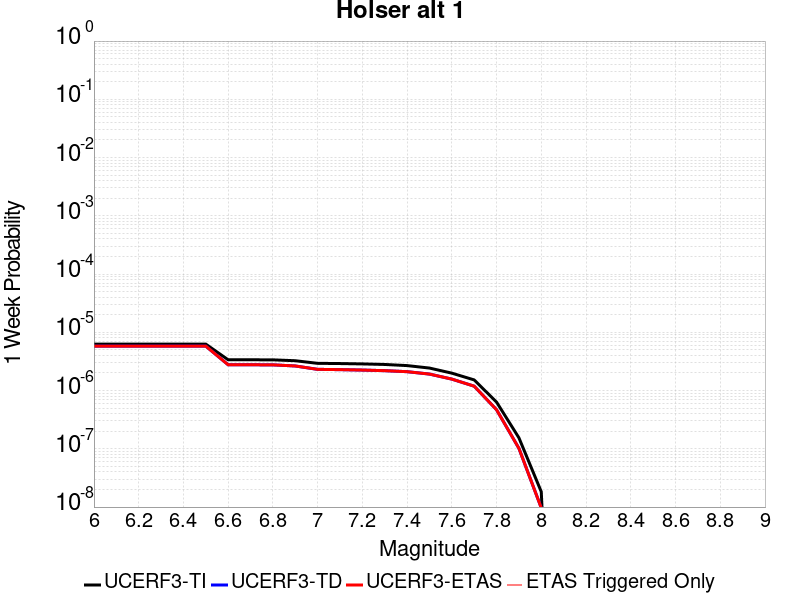 | 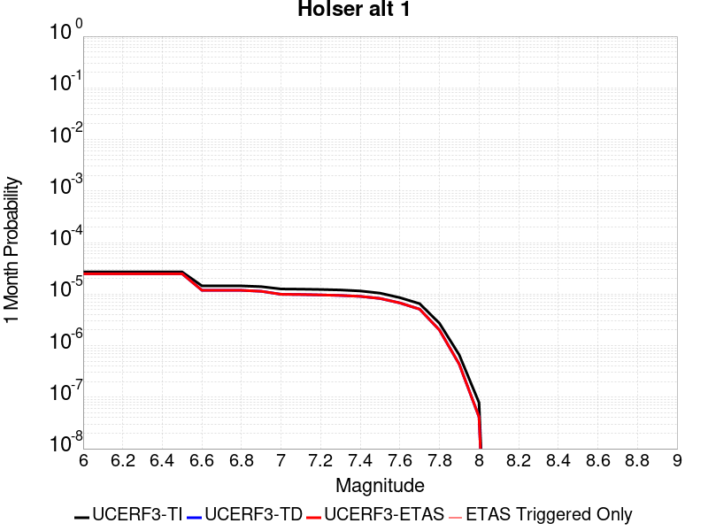 | 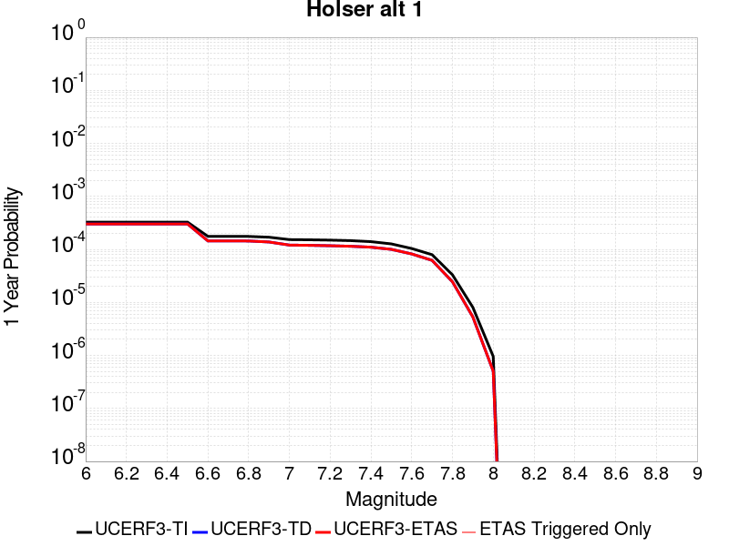 |  |

| Magnitude | 1 wk TI Prob | 1 wk TD Prob | 1 wk ETAS Prob | 1 wk ETAS/TD Gain | 1 wk ETAS Triggered Only | 1 mo TI Prob | 1 mo TD Prob | 1 mo ETAS Prob | 1 mo ETAS/TD Gain | 1 mo ETAS Triggered Only | 1 yr TI Prob | 1 yr TD Prob | 1 yr ETAS Prob | 1 yr ETAS/TD Gain | 1 yr ETAS Triggered Only | 10 yr TI Prob | 10 yr TD Prob | 10 yr ETAS Prob | 10 yr ETAS/TD Gain | 10 yr ETAS Triggered Only |
|-----|-----|-----|-----|-----|-----|-----|-----|-----|-----|-----|-----|-----|-----|-----|-----|-----|-----|-----|-----|-----|
| 6.0 | 6.2746653E-6 | 5.789965E-6 | 5.789965E-6 | 1.0 | 0.0 | 2.6891146E-5 | 2.4813964E-5 | 2.4813964E-5 | 1.0 | 0.0 | 3.273505E-4 | 3.020797E-4 | 3.020797E-4 | 1.0 | 0.0 | 0.0032686873 | 0.0030178234 | 0.0030277933 | 1.0033036 | 1.0E-5 |
| 6.1 | 6.2746653E-6 | 5.789965E-6 | 5.789965E-6 | 1.0 | 0.0 | 2.6891146E-5 | 2.4813964E-5 | 2.4813964E-5 | 1.0 | 0.0 | 3.273505E-4 | 3.020797E-4 | 3.020797E-4 | 1.0 | 0.0 | 0.0032686873 | 0.0030178234 | 0.0030277933 | 1.0033036 | 1.0E-5 |
| 6.2 | 6.2746653E-6 | 5.789965E-6 | 5.789965E-6 | 1.0 | 0.0 | 2.6891146E-5 | 2.4813964E-5 | 2.4813964E-5 | 1.0 | 0.0 | 3.273505E-4 | 3.020797E-4 | 3.020797E-4 | 1.0 | 0.0 | 0.0032686873 | 0.0030178234 | 0.0030277933 | 1.0033036 | 1.0E-5 |
| 6.3 | 6.2746653E-6 | 5.789965E-6 | 5.789965E-6 | 1.0 | 0.0 | 2.6891146E-5 | 2.4813964E-5 | 2.4813964E-5 | 1.0 | 0.0 | 3.273505E-4 | 3.020797E-4 | 3.020797E-4 | 1.0 | 0.0 | 0.0032686873 | 0.0030178234 | 0.0030277933 | 1.0033036 | 1.0E-5 |
| 6.4 | 6.2746653E-6 | 5.789965E-6 | 5.789965E-6 | 1.0 | 0.0 | 2.6891146E-5 | 2.4813964E-5 | 2.4813964E-5 | 1.0 | 0.0 | 3.273505E-4 | 3.020797E-4 | 3.020797E-4 | 1.0 | 0.0 | 0.0032686873 | 0.0030178234 | 0.0030277933 | 1.0033036 | 1.0E-5 |
| 6.5 | 6.2746653E-6 | 5.789965E-6 | 5.789965E-6 | 1.0 | 0.0 | 2.6891146E-5 | 2.4813964E-5 | 2.4813964E-5 | 1.0 | 0.0 | 3.273505E-4 | 3.020797E-4 | 3.020797E-4 | 1.0 | 0.0 | 0.0032686873 | 0.0030178234 | 0.0030277933 | 1.0033036 | 1.0E-5 |
| 6.6 | 3.375825E-6 | 2.7711897E-6 | 2.7711897E-6 | 1.0 | 0.0 | 1.4467741E-5 | 1.1876474E-5 | 1.1876474E-5 | 1.0 | 0.0 | 1.761305E-4 | 1.4458665E-4 | 1.4458665E-4 | 1.0 | 0.0 | 0.0017599097 | 0.0014449427 | 0.0014449427 | 1.0 | 0.0 |
| 6.7 | 3.375825E-6 | 2.7711897E-6 | 2.7711897E-6 | 1.0 | 0.0 | 1.4467741E-5 | 1.1876474E-5 | 1.1876474E-5 | 1.0 | 0.0 | 1.761305E-4 | 1.4458665E-4 | 1.4458665E-4 | 1.0 | 0.0 | 0.0017599097 | 0.0014449427 | 0.0014449427 | 1.0 | 0.0 |
| 6.8 | 3.366533E-6 | 2.7615893E-6 | 2.7615893E-6 | 1.0 | 0.0 | 1.4427919E-5 | 1.183533E-5 | 1.183533E-5 | 1.0 | 0.0 | 1.7564575E-4 | 1.4408577E-4 | 1.4408577E-4 | 1.0 | 0.0 | 0.0017550698 | 0.0014399405 | 0.0014399405 | 1.0 | 0.0 |
| 6.9 | 3.253174E-6 | 2.6438113E-6 | 2.6438113E-6 | 1.0 | 0.0 | 1.39421E-5 | 1.1330571E-5 | 1.1330571E-5 | 1.0 | 0.0 | 1.6973184E-4 | 1.3794114E-4 | 1.3794114E-4 | 1.0 | 0.0 | 0.0016960226 | 0.001378571 | 0.001378571 | 1.0 | 0.0 |
| 7.0 | 2.9336593E-6 | 2.311799E-6 | 2.311799E-6 | 1.0 | 0.0 | 1.2572766E-5 | 9.907673E-6 | 9.907673E-6 | 1.0 | 0.0 | 1.5306266E-4 | 1.2061927E-4 | 1.2061927E-4 | 1.0 | 0.0 | 0.0015295728 | 0.0012055405 | 0.0012055405 | 1.0 | 0.0 |
| 7.1 | 2.9087812E-6 | 2.2876513E-6 | 2.2876513E-6 | 1.0 | 0.0 | 1.2466146E-5 | 9.804184E-6 | 9.804184E-6 | 1.0 | 0.0 | 1.5176475E-4 | 1.19359414E-4 | 1.19359414E-4 | 1.0 | 0.0 | 0.0015166114 | 0.0011929555 | 0.0011929555 | 1.0 | 0.0 |
| 7.2 | 2.8674524E-6 | 2.2475429E-6 | 2.2475429E-6 | 1.0 | 0.0 | 1.2289024E-5 | 9.63229E-6 | 9.63229E-6 | 1.0 | 0.0 | 1.4960859E-4 | 1.1726685E-4 | 1.1726685E-4 | 1.0 | 0.0 | 0.0014950791 | 0.001172052 | 0.001172052 | 1.0 | 0.0 |
| 7.3 | 2.8057775E-6 | 2.1954324E-6 | 2.1954324E-6 | 1.0 | 0.0 | 1.2024705E-5 | 9.408962E-6 | 9.408962E-6 | 1.0 | 0.0 | 1.4639096E-4 | 1.14548115E-4 | 1.14548115E-4 | 1.0 | 0.0 | 0.0014629456 | 0.001144893 | 0.001144893 | 1.0 | 0.0 |
| 7.4 | 2.683666E-6 | 2.1092305E-6 | 2.1092305E-6 | 1.0 | 0.0 | 1.1501375E-5 | 9.039529E-6 | 9.039529E-6 | 1.0 | 0.0 | 1.4002025E-4 | 1.1005072E-4 | 1.1005072E-4 | 1.0 | 0.0 | 0.0013993206 | 0.0010999644 | 0.0010999644 | 1.0 | 0.0 |
| 7.5 | 2.434495E-6 | 1.9195363E-6 | 1.9195363E-6 | 1.0 | 0.0 | 1.0433508E-5 | 8.226558E-6 | 8.226558E-6 | 1.0 | 0.0 | 1.2702055E-4 | 1.0015376E-4 | 1.0015376E-4 | 1.0 | 0.0 | 0.0012694797 | 0.0010010883 | 0.0010010883 | 1.0 | 0.0 |
| 7.6 | 1.9914562E-6 | 1.5731459E-6 | 1.5731459E-6 | 1.0 | 0.0 | 8.534785E-6 | 6.742037E-6 | 6.742037E-6 | 1.0 | 0.0 | 1.03906044E-4 | 8.208122E-5 | 8.208122E-5 | 1.0 | 0.0 | 0.0010385747 | 8.205106E-4 | 8.205106E-4 | 1.0 | 0.0 |
| 7.7 | 1.5229501E-6 | 1.1896061E-6 | 1.1896061E-6 | 1.0 | 0.0 | 6.526913E-6 | 5.098302E-6 | 5.098302E-6 | 1.0 | 0.0 | 7.946226E-5 | 6.2070074E-5 | 6.2070074E-5 | 1.0 | 0.0 | 7.943385E-4 | 6.2052865E-4 | 6.2052865E-4 | 1.0 | 0.0 |
| 7.8 | 6.3489426E-7 | 4.687806E-7 | 4.687806E-7 | 1.0 | 0.0 | 2.7209726E-6 | 2.009058E-6 | 2.009058E-6 | 1.0 | 0.0 | 3.312734E-5 | 2.4460009E-5 | 2.4460009E-5 | 1.0 | 0.0 | 3.31224E-4 | 2.4457334E-4 | 2.4457334E-4 | 1.0 | 0.0 |
| 7.9 | 1.5459432E-7 | 1.0193758E-7 | 1.0193758E-7 | 1.0 | 0.0 | 6.6254694E-7 | 4.3687527E-7 | 4.3687527E-7 | 1.0 | 0.0 | 8.066479E-6 | 5.3189433E-6 | 5.3189433E-6 | 1.0 | 0.0 | 8.066186E-5 | 5.3188178E-5 | 5.3188178E-5 | 1.0 | 0.0 |
| 8.0 | 1.8307812E-8 | 9.690293E-9 | 9.690293E-9 | 1.0 | 0.0 | 7.846205E-8 | 4.152983E-8 | 4.152983E-8 | 1.0 | 0.0 | 9.55275E-7 | 5.0562556E-7 | 5.0562556E-7 | 1.0 | 0.0 | 9.552709E-6 | 5.0562444E-6 | 5.0562444E-6 | 1.0 | 0.0 |

## Concord 2011 CFM
*[(top)](#table-of-contents)*

| 1 Week | 1 Month | 1 Year | 10 Year |
|-----|-----|-----|-----|
|  | 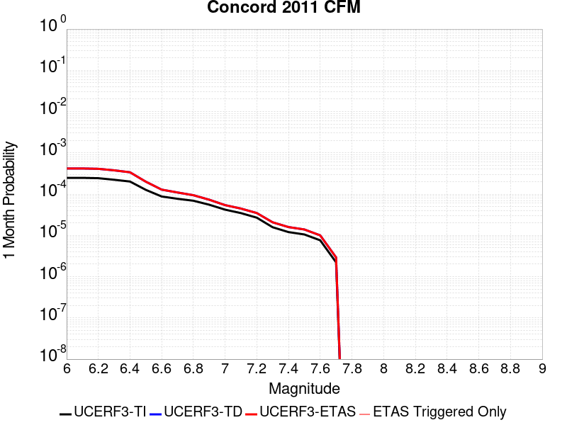 |  | 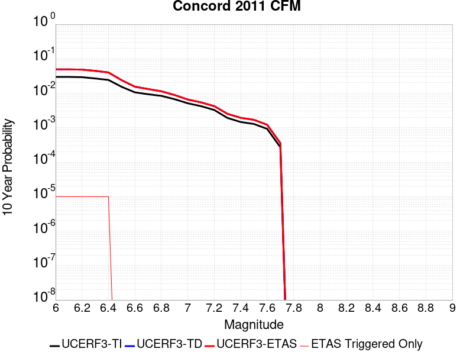 |

| Magnitude | 1 wk TI Prob | 1 wk TD Prob | 1 wk ETAS Prob | 1 wk ETAS/TD Gain | 1 wk ETAS Triggered Only | 1 mo TI Prob | 1 mo TD Prob | 1 mo ETAS Prob | 1 mo ETAS/TD Gain | 1 mo ETAS Triggered Only | 1 yr TI Prob | 1 yr TD Prob | 1 yr ETAS Prob | 1 yr ETAS/TD Gain | 1 yr ETAS Triggered Only | 10 yr TI Prob | 10 yr TD Prob | 10 yr ETAS Prob | 10 yr ETAS/TD Gain | 10 yr ETAS Triggered Only |
|-----|-----|-----|-----|-----|-----|-----|-----|-----|-----|-----|-----|-----|-----|-----|-----|-----|-----|-----|-----|-----|
| 6.0 | 5.7865112E-5 | 9.759152E-5 | 9.759152E-5 | 1.0 | 0.0 | 2.4796976E-4 | 4.1818706E-4 | 4.1818706E-4 | 1.0 | 0.0 | 0.0030148525 | 0.005079467 | 0.005079467 | 1.0 | 0.0 | 0.029742775 | 0.049248982 | 0.04925849 | 1.000193 | 1.0E-5 |
| 6.1 | 5.7865112E-5 | 9.759152E-5 | 9.759152E-5 | 1.0 | 0.0 | 2.4796976E-4 | 4.1818706E-4 | 4.1818706E-4 | 1.0 | 0.0 | 0.0030148525 | 0.005079467 | 0.005079467 | 1.0 | 0.0 | 0.029742775 | 0.049248982 | 0.04925849 | 1.000193 | 1.0E-5 |
| 6.2 | 5.6789337E-5 | 9.5795076E-5 | 9.5795076E-5 | 1.0 | 0.0 | 2.4336016E-4 | 4.104905E-4 | 4.104905E-4 | 1.0 | 0.0 | 0.0029588845 | 0.0049861916 | 0.0049861916 | 1.0 | 0.0 | 0.029197963 | 0.04836556 | 0.048375074 | 1.0001968 | 1.0E-5 |
| 6.3 | 5.203322E-5 | 8.803056E-5 | 8.803056E-5 | 1.0 | 0.0 | 2.2298045E-4 | 3.7722368E-4 | 3.7722368E-4 | 1.0 | 0.0 | 0.0027114071 | 0.0045838105 | 0.0045838105 | 1.0 | 0.0 | 0.026785625 | 0.04453672 | 0.044546273 | 1.0002146 | 1.0E-5 |
| 6.4 | 4.7120942E-5 | 7.897404E-5 | 7.897404E-5 | 1.0 | 0.0 | 2.0193127E-4 | 3.3842045E-4 | 3.3842045E-4 | 1.0 | 0.0 | 0.0024557412 | 0.00411323 | 0.00411323 | 1.0 | 0.0 | 0.024287801 | 0.040065527 | 0.040075127 | 1.0002396 | 1.0E-5 |
| 6.5 | 2.9598437E-5 | 4.667486E-5 | 4.667486E-5 | 1.0 | 0.0 | 1.2684427E-4 | 2.0002096E-4 | 2.0002096E-4 | 1.0 | 0.0 | 0.001543235 | 0.0024327459 | 0.0024327459 | 1.0 | 0.0 | 0.015325619 | 0.023909973 | 0.023909973 | 1.0 | 0.0 |
| 6.6 | 2.0443718E-5 | 2.998433E-5 | 2.998433E-5 | 1.0 | 0.0 | 8.7613E-5 | 1.2849816E-4 | 1.2849816E-4 | 1.0 | 0.0 | 0.0010661662 | 0.0015633785 | 0.0015633785 | 1.0 | 0.0 | 0.010610655 | 0.015466996 | 0.015466996 | 1.0 | 0.0 |
| 6.7 | 1.798539E-5 | 2.5557381E-5 | 2.5557381E-5 | 1.0 | 0.0 | 7.7077966E-5 | 1.0952716E-4 | 1.0952716E-4 | 1.0 | 0.0 | 9.380202E-4 | 0.001332699 | 0.001332699 | 1.0 | 0.0 | 0.009340706 | 0.013217433 | 0.013217433 | 1.0 | 0.0 |
| 6.8 | 1.613555E-5 | 2.1959211E-5 | 2.1959211E-5 | 1.0 | 0.0 | 6.915052E-5 | 9.4107585E-5 | 9.4107585E-5 | 1.0 | 0.0 | 8.4158237E-4 | 0.0011451716 | 0.0011451716 | 1.0 | 0.0 | 0.008384023 | 0.0113782035 | 0.0113782035 | 1.0 | 0.0 |
| 6.9 | 1.2916435E-5 | 1.7081054E-5 | 1.7081054E-5 | 1.0 | 0.0 | 5.5354973E-5 | 7.32025E-5 | 7.32025E-5 | 1.0 | 0.0 | 6.7373837E-4 | 8.908818E-4 | 8.908818E-4 | 1.0 | 0.0 | 0.006716994 | 0.008867139 | 0.008867139 | 1.0 | 0.0 |
| 7.0 | 9.81129E-6 | 1.2630829E-5 | 1.2630829E-5 | 1.0 | 0.0 | 4.2047708E-5 | 5.413101E-5 | 5.413101E-5 | 1.0 | 0.0 | 5.118106E-4 | 6.588474E-4 | 6.588474E-4 | 1.0 | 0.0 | 0.005106334 | 0.006569153 | 0.006569153 | 1.0 | 0.0 |
| 7.1 | 8.0889195E-6 | 1.0418261E-5 | 1.0418261E-5 | 1.0 | 0.0 | 3.4666336E-5 | 4.4648932E-5 | 4.4648932E-5 | 1.0 | 0.0 | 4.219809E-4 | 5.434662E-4 | 5.434662E-4 | 1.0 | 0.0 | 0.004211805 | 0.0054215975 | 0.0054215975 | 1.0 | 0.0 |
| 7.2 | 6.267438E-6 | 8.115699E-6 | 8.115699E-6 | 1.0 | 0.0 | 2.6860173E-5 | 3.4781104E-5 | 3.4781104E-5 | 1.0 | 0.0 | 3.2697353E-4 | 4.233784E-4 | 4.233784E-4 | 1.0 | 0.0 | 0.0032649285 | 0.004225969 | 0.004225969 | 1.0 | 0.0 |
| 7.3 | 3.6761196E-6 | 4.8401653E-6 | 4.8401653E-6 | 1.0 | 0.0 | 1.5754704E-5 | 2.0743402E-5 | 2.0743402E-5 | 1.0 | 0.0 | 1.9179663E-4 | 2.5252186E-4 | 2.5252186E-4 | 1.0 | 0.0 | 0.0019163118 | 0.002522487 | 0.002522487 | 1.0 | 0.0 |
| 7.4 | 2.8044356E-6 | 3.7096036E-6 | 3.7096036E-6 | 1.0 | 0.0 | 1.2018954E-5 | 1.5898204E-5 | 1.5898204E-5 | 1.0 | 0.0 | 1.4632095E-4 | 1.9354356E-4 | 1.9354356E-4 | 1.0 | 0.0 | 0.0014622464 | 0.0019338481 | 0.0019338481 | 1.0 | 0.0 |
| 7.5 | 2.4578699E-6 | 3.2447442E-6 | 3.2447442E-6 | 1.0 | 0.0 | 1.0533685E-5 | 1.3905973E-5 | 1.3905973E-5 | 1.0 | 0.0 | 1.2824008E-4 | 1.6929218E-4 | 1.6929218E-4 | 1.0 | 0.0 | 0.0012816609 | 0.001691713 | 0.001691713 | 1.0 | 0.0 |
| 7.6 | 1.7713267E-6 | 2.3351192E-6 | 2.3351192E-6 | 1.0 | 0.0 | 7.591378E-6 | 1.0007616E-5 | 1.0007616E-5 | 1.0 | 0.0 | 9.2421105E-5 | 1.21836E-4 | 1.21836E-4 | 1.0 | 0.0 | 9.2382677E-4 | 0.0012177454 | 0.0012177454 | 1.0 | 0.0 |
| 7.7 | 5.1912366E-7 | 6.8290143E-7 | 6.8290143E-7 | 1.0 | 0.0 | 2.2248137E-6 | 2.9267171E-6 | 2.9267171E-6 | 1.0 | 0.0 | 2.708677E-5 | 3.5632213E-5 | 3.5632213E-5 | 1.0 | 0.0 | 2.708347E-4 | 3.5627294E-4 | 3.5627294E-4 | 1.0 | 0.0 |

## Verdugo
*[(top)](#table-of-contents)*

| 1 Week | 1 Month | 1 Year | 10 Year |
|-----|-----|-----|-----|
| 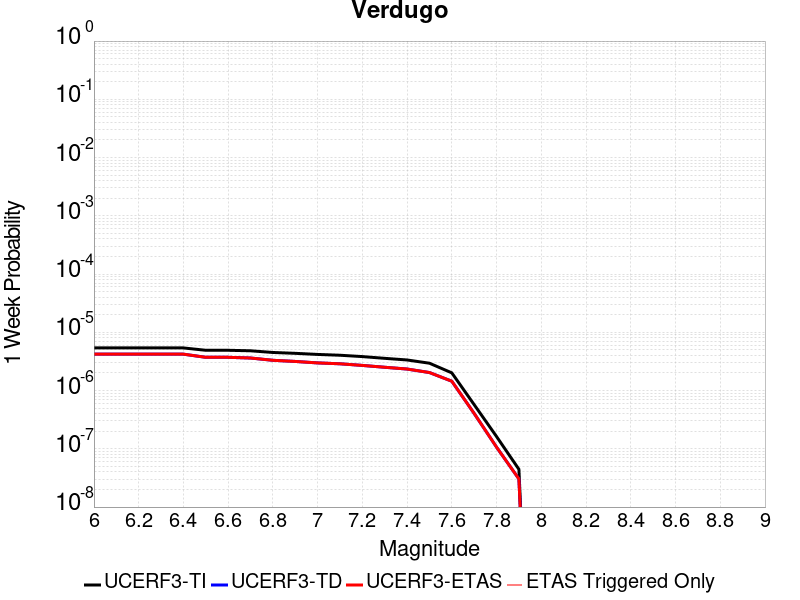 | 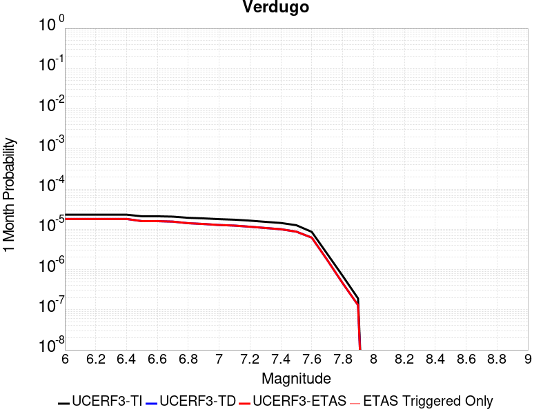 |  |  |

| Magnitude | 1 wk TI Prob | 1 wk TD Prob | 1 wk ETAS Prob | 1 wk ETAS/TD Gain | 1 wk ETAS Triggered Only | 1 mo TI Prob | 1 mo TD Prob | 1 mo ETAS Prob | 1 mo ETAS/TD Gain | 1 mo ETAS Triggered Only | 1 yr TI Prob | 1 yr TD Prob | 1 yr ETAS Prob | 1 yr ETAS/TD Gain | 1 yr ETAS Triggered Only | 10 yr TI Prob | 10 yr TD Prob | 10 yr ETAS Prob | 10 yr ETAS/TD Gain | 10 yr ETAS Triggered Only |
|-----|-----|-----|-----|-----|-----|-----|-----|-----|-----|-----|-----|-----|-----|-----|-----|-----|-----|-----|-----|-----|
| 6.0 | 5.392987E-6 | 4.216517E-6 | 4.216517E-6 | 1.0 | 0.0 | 2.3112598E-5 | 1.8070665E-5 | 1.8070665E-5 | 1.0 | 0.0 | 2.8135953E-4 | 2.1998861E-4 | 2.1998861E-4 | 1.0 | 0.0 | 0.0028100356 | 0.0021977562 | 0.0022077342 | 1.0045401 | 1.0E-5 |
| 6.1 | 5.392987E-6 | 4.216517E-6 | 4.216517E-6 | 1.0 | 0.0 | 2.3112598E-5 | 1.8070665E-5 | 1.8070665E-5 | 1.0 | 0.0 | 2.8135953E-4 | 2.1998861E-4 | 2.1998861E-4 | 1.0 | 0.0 | 0.0028100356 | 0.0021977562 | 0.0022077342 | 1.0045401 | 1.0E-5 |
| 6.2 | 5.392987E-6 | 4.216517E-6 | 4.216517E-6 | 1.0 | 0.0 | 2.3112598E-5 | 1.8070665E-5 | 1.8070665E-5 | 1.0 | 0.0 | 2.8135953E-4 | 2.1998861E-4 | 2.1998861E-4 | 1.0 | 0.0 | 0.0028100356 | 0.0021977562 | 0.0022077342 | 1.0045401 | 1.0E-5 |
| 6.3 | 5.392987E-6 | 4.216517E-6 | 4.216517E-6 | 1.0 | 0.0 | 2.3112598E-5 | 1.8070665E-5 | 1.8070665E-5 | 1.0 | 0.0 | 2.8135953E-4 | 2.1998861E-4 | 2.1998861E-4 | 1.0 | 0.0 | 0.0028100356 | 0.0021977562 | 0.0022077342 | 1.0045401 | 1.0E-5 |
| 6.4 | 5.392987E-6 | 4.216517E-6 | 4.216517E-6 | 1.0 | 0.0 | 2.3112598E-5 | 1.8070665E-5 | 1.8070665E-5 | 1.0 | 0.0 | 2.8135953E-4 | 2.1998861E-4 | 2.1998861E-4 | 1.0 | 0.0 | 0.0028100356 | 0.0021977562 | 0.0022077342 | 1.0045401 | 1.0E-5 |
| 6.5 | 4.9154837E-6 | 3.722465E-6 | 3.722465E-6 | 1.0 | 0.0 | 2.1066187E-5 | 1.5953325E-5 | 1.5953325E-5 | 1.0 | 0.0 | 2.5645064E-4 | 1.9421462E-4 | 1.9421462E-4 | 1.0 | 0.0 | 0.002561549 | 0.0019404698 | 0.0019504504 | 1.0051434 | 1.0E-5 |
| 6.6 | 4.9154837E-6 | 3.722465E-6 | 3.722465E-6 | 1.0 | 0.0 | 2.1066187E-5 | 1.5953325E-5 | 1.5953325E-5 | 1.0 | 0.0 | 2.5645064E-4 | 1.9421462E-4 | 1.9421462E-4 | 1.0 | 0.0 | 0.002561549 | 0.0019404698 | 0.0019504504 | 1.0051434 | 1.0E-5 |
| 6.7 | 4.817006E-6 | 3.6206518E-6 | 3.6206518E-6 | 1.0 | 0.0 | 2.0644147E-5 | 1.5516987E-5 | 1.5516987E-5 | 1.0 | 0.0 | 2.513135E-4 | 1.8890314E-4 | 1.8890314E-4 | 1.0 | 0.0 | 0.0025102948 | 0.0018874453 | 0.0018974264 | 1.0052881 | 1.0E-5 |
| 6.8 | 4.507407E-6 | 3.3071042E-6 | 3.3071042E-6 | 1.0 | 0.0 | 1.9317316E-5 | 1.4173227E-5 | 1.4173227E-5 | 1.0 | 0.0 | 2.3516294E-4 | 1.7254551E-4 | 1.7254551E-4 | 1.0 | 0.0 | 0.0023491425 | 0.0017241298 | 0.0017341125 | 1.00579 | 1.0E-5 |
| 6.9 | 4.3573054E-6 | 3.161011E-6 | 3.161011E-6 | 1.0 | 0.0 | 1.8674033E-5 | 1.354712E-5 | 1.354712E-5 | 1.0 | 0.0 | 2.2733262E-4 | 1.6492383E-4 | 1.6492383E-4 | 1.0 | 0.0 | 0.0022710022 | 0.0016480266 | 0.0016580102 | 1.0060579 | 1.0E-5 |
| 7.0 | 4.171527E-6 | 2.9836704E-6 | 2.9836704E-6 | 1.0 | 0.0 | 1.787785E-5 | 1.2787096E-5 | 1.2787096E-5 | 1.0 | 0.0 | 2.1764109E-4 | 1.5567189E-4 | 1.5567189E-4 | 1.0 | 0.0 | 0.0021742806 | 0.0015556397 | 0.0015656241 | 1.0064182 | 1.0E-5 |
| 7.1 | 4.0405484E-6 | 2.882261E-6 | 2.882261E-6 | 1.0 | 0.0 | 1.731652E-5 | 1.235249E-5 | 1.235249E-5 | 1.0 | 0.0 | 2.1080824E-4 | 1.503813E-4 | 1.503813E-4 | 1.0 | 0.0 | 0.0021060838 | 0.0015028063 | 0.0015127913 | 1.0066442 | 1.0E-5 |
| 7.2 | 3.8306007E-6 | 2.7018452E-6 | 2.7018452E-6 | 1.0 | 0.0 | 1.6416758E-5 | 1.15792855E-5 | 1.15792855E-5 | 1.0 | 0.0 | 1.9985568E-4 | 1.4096878E-4 | 1.4096878E-4 | 1.0 | 0.0 | 0.0019967605 | 0.0014088044 | 0.0014187903 | 1.0070882 | 1.0E-5 |
| 7.3 | 3.5750938E-6 | 2.5121758E-6 | 2.5121758E-6 | 1.0 | 0.0 | 1.532174E-5 | 1.0766424E-5 | 1.0766424E-5 | 1.0 | 0.0 | 1.8652623E-4 | 1.3107344E-4 | 1.3107344E-4 | 1.0 | 0.0 | 0.0018636974 | 0.0013099718 | 0.0013199587 | 1.0076238 | 1.0E-5 |
| 7.4 | 3.3510041E-6 | 2.3408586E-6 | 2.3408586E-6 | 1.0 | 0.0 | 1.4361368E-5 | 1.0032213E-5 | 1.0032213E-5 | 1.0 | 0.0 | 1.7483562E-4 | 1.2213545E-4 | 1.2213545E-4 | 1.0 | 0.0 | 0.0017469813 | 0.0012206937 | 0.0012306814 | 1.008182 | 1.0E-5 |
| 7.5 | 2.948287E-6 | 2.0391124E-6 | 2.0391124E-6 | 1.0 | 0.0 | 1.2635454E-5 | 8.739024E-6 | 8.739024E-6 | 1.0 | 0.0 | 1.538258E-4 | 1.0639253E-4 | 1.0639253E-4 | 1.0 | 0.0 | 0.0015371935 | 0.0010634261 | 0.0010734155 | 1.0093936 | 1.0E-5 |
| 7.6 | 2.0134323E-6 | 1.4471265E-6 | 1.4471265E-6 | 1.0 | 0.0 | 8.628967E-6 | 6.2019562E-6 | 6.2019562E-6 | 1.0 | 0.0 | 1.05052604E-4 | 7.550629E-5 | 7.550629E-5 | 1.0 | 0.0 | 0.0010500296 | 7.548152E-4 | 7.548152E-4 | 1.0 | 0.0 |
| 7.7 | 5.726436E-7 | 4.045248E-7 | 4.045248E-7 | 1.0 | 0.0 | 2.4541846E-6 | 1.7336766E-6 | 1.7336766E-6 | 1.0 | 0.0 | 2.9879287E-5 | 2.1107335E-5 | 2.1107335E-5 | 1.0 | 0.0 | 2.987527E-4 | 2.1105584E-4 | 2.1105584E-4 | 1.0 | 0.0 |
| 7.8 | 1.6248204E-7 | 1.0687696E-7 | 1.0687696E-7 | 1.0 | 0.0 | 6.963514E-7 | 4.5804404E-7 | 4.5804404E-7 | 1.0 | 0.0 | 8.478045E-6 | 5.5766723E-6 | 5.5766723E-6 | 1.0 | 0.0 | 8.477722E-5 | 5.5765355E-5 | 5.5765355E-5 | 1.0 | 0.0 |
| 7.9 | 4.4475744E-8 | 3.0375546E-8 | 3.0375546E-8 | 1.0 | 0.0 | 1.9061031E-7 | 1.301809E-7 | 1.301809E-7 | 1.0 | 0.0 | 2.320678E-6 | 1.5849514E-6 | 1.5849514E-6 | 1.0 | 0.0 | 2.3206538E-5 | 1.5849415E-5 | 1.5849415E-5 | 1.0 | 0.0 |

## West Tahoe
*[(top)](#table-of-contents)*

| 1 Week | 1 Month | 1 Year | 10 Year |
|-----|-----|-----|-----|
|  |  |  |  |

| Magnitude | 1 wk TI Prob | 1 wk TD Prob | 1 wk ETAS Prob | 1 wk ETAS/TD Gain | 1 wk ETAS Triggered Only | 1 mo TI Prob | 1 mo TD Prob | 1 mo ETAS Prob | 1 mo ETAS/TD Gain | 1 mo ETAS Triggered Only | 1 yr TI Prob | 1 yr TD Prob | 1 yr ETAS Prob | 1 yr ETAS/TD Gain | 1 yr ETAS Triggered Only | 10 yr TI Prob | 10 yr TD Prob | 10 yr ETAS Prob | 10 yr ETAS/TD Gain | 10 yr ETAS Triggered Only |
|-----|-----|-----|-----|-----|-----|-----|-----|-----|-----|-----|-----|-----|-----|-----|-----|-----|-----|-----|-----|-----|
| 6.0 | 1.952444E-5 | 2.118317E-5 | 3.1182957E-5 | 1.4720628 | 1.0E-5 | 8.367348E-5 | 9.078217E-5 | 1.0078125E-4 | 1.1101438 | 1.0E-5 | 0.0010182485 | 0.0011047672 | 0.0011147561 | 1.0090417 | 1.0E-5 | 0.010135954 | 0.010998235 | 0.011008126 | 1.0008992 | 1.0E-5 |
| 6.1 | 1.952444E-5 | 2.118317E-5 | 3.1182957E-5 | 1.4720628 | 1.0E-5 | 8.367348E-5 | 9.078217E-5 | 1.0078125E-4 | 1.1101438 | 1.0E-5 | 0.0010182485 | 0.0011047672 | 0.0011147561 | 1.0090417 | 1.0E-5 | 0.010135954 | 0.010998235 | 0.011008126 | 1.0008992 | 1.0E-5 |
| 6.2 | 1.952444E-5 | 2.118317E-5 | 3.1182957E-5 | 1.4720628 | 1.0E-5 | 8.367348E-5 | 9.078217E-5 | 1.0078125E-4 | 1.1101438 | 1.0E-5 | 0.0010182485 | 0.0011047672 | 0.0011147561 | 1.0090417 | 1.0E-5 | 0.010135954 | 0.010998235 | 0.011008126 | 1.0008992 | 1.0E-5 |
| 6.3 | 1.952444E-5 | 2.118317E-5 | 3.1182957E-5 | 1.4720628 | 1.0E-5 | 8.367348E-5 | 9.078217E-5 | 1.0078125E-4 | 1.1101438 | 1.0E-5 | 0.0010182485 | 0.0011047672 | 0.0011147561 | 1.0090417 | 1.0E-5 | 0.010135954 | 0.010998235 | 0.011008126 | 1.0008992 | 1.0E-5 |
| 6.4 | 1.952444E-5 | 2.118317E-5 | 3.1182957E-5 | 1.4720628 | 1.0E-5 | 8.367348E-5 | 9.078217E-5 | 1.0078125E-4 | 1.1101438 | 1.0E-5 | 0.0010182485 | 0.0011047672 | 0.0011147561 | 1.0090417 | 1.0E-5 | 0.010135954 | 0.010998235 | 0.011008126 | 1.0008992 | 1.0E-5 |
| 6.5 | 1.2685271E-5 | 1.3690627E-5 | 2.369049E-5 | 1.7304167 | 1.0E-5 | 5.4364315E-5 | 5.8672893E-5 | 6.867231E-5 | 1.1704265 | 1.0E-5 | 6.616845E-4 | 7.141248E-4 | 7.241177E-4 | 1.0139931 | 1.0E-5 | 0.0065971776 | 0.00711995 | 0.0071298787 | 1.0013945 | 1.0E-5 |
| 6.6 | 1.2685271E-5 | 1.3690627E-5 | 2.369049E-5 | 1.7304167 | 1.0E-5 | 5.4364315E-5 | 5.8672893E-5 | 6.867231E-5 | 1.1704265 | 1.0E-5 | 6.616845E-4 | 7.141248E-4 | 7.241177E-4 | 1.0139931 | 1.0E-5 | 0.0065971776 | 0.00711995 | 0.0071298787 | 1.0013945 | 1.0E-5 |
| 6.7 | 9.117886E-6 | 9.809846E-6 | 1.9809748E-5 | 2.019374 | 1.0E-5 | 3.9076072E-5 | 4.2041564E-5 | 5.204114E-5 | 1.2378498 | 1.0E-5 | 4.756473E-4 | 5.11743E-4 | 5.2173785E-4 | 1.019531 | 1.0E-5 | 0.0047463053 | 0.0051063634 | 0.0051163123 | 1.0019484 | 1.0E-5 |
| 6.8 | 8.786828E-6 | 9.457863E-6 | 1.9457768E-5 | 2.0573113 | 1.0E-5 | 3.7657293E-5 | 4.053311E-5 | 5.0532704E-5 | 1.2467018 | 1.0E-5 | 4.5838108E-4 | 4.933859E-4 | 5.0338096E-4 | 1.0202581 | 1.0E-5 | 0.0045743673 | 0.0049236063 | 0.004933557 | 1.0020211 | 1.0E-5 |
| 6.9 | 6.7562123E-6 | 7.2638086E-6 | 1.7263736E-5 | 2.3766782 | 1.0E-5 | 2.8954875E-5 | 3.1130265E-5 | 4.112995E-5 | 1.3212209 | 1.0E-5 | 3.5246857E-4 | 3.789498E-4 | 3.88946E-4 | 1.0263788 | 1.0E-5 | 0.0035191004 | 0.0037835082 | 0.0037934703 | 1.0026331 | 1.0E-5 |
| 7.0 | 5.1792854E-6 | 5.567338E-6 | 1.5567282E-5 | 2.7961805 | 1.0E-5 | 2.2196748E-5 | 2.3859824E-5 | 3.3859586E-5 | 1.4191046 | 1.0E-5 | 2.702119E-4 | 2.9045844E-4 | 3.0045555E-4 | 1.0344183 | 1.0E-5 | 0.0026988357 | 0.0029011632 | 0.0029111342 | 1.0034369 | 1.0E-5 |
| 7.1 | 4.090765E-6 | 4.3974223E-6 | 1.4397378E-5 | 3.2740493 | 1.0E-5 | 1.7531731E-5 | 1.884598E-5 | 2.884579E-5 | 1.5306071 | 1.0E-5 | 2.134279E-4 | 2.2942905E-4 | 2.3942675E-4 | 1.0435765 | 1.0E-5 | 0.0021322304 | 0.0022922563 | 0.0023022334 | 1.0043526 | 1.0E-5 |
| 7.2 | 2.2356758E-6 | 2.4023684E-6 | 2.4023684E-6 | 1.0 | 0.0 | 9.581432E-6 | 1.0295834E-5 | 1.0295834E-5 | 1.0 | 0.0 | 1.1664769E-4 | 1.2534647E-4 | 1.2534647E-4 | 1.0 | 0.0 | 0.0011658648 | 0.0012529434 | 0.0012529434 | 1.0 | 0.0 |

## White Wolf
*[(top)](#table-of-contents)*

| 1 Week | 1 Month | 1 Year | 10 Year |
|-----|-----|-----|-----|
|  | 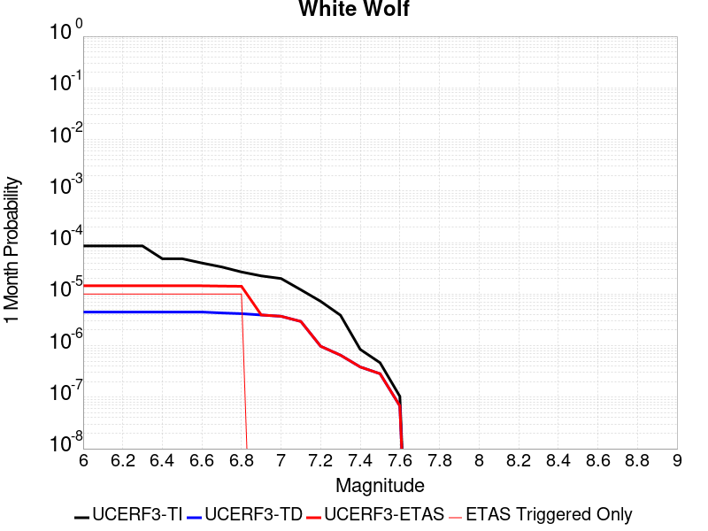 | 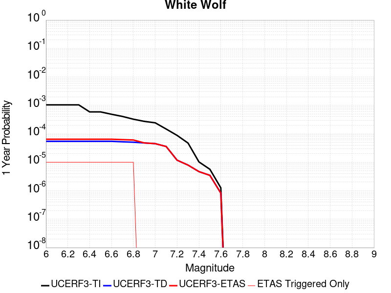 |  |

| Magnitude | 1 wk TI Prob | 1 wk TD Prob | 1 wk ETAS Prob | 1 wk ETAS/TD Gain | 1 wk ETAS Triggered Only | 1 mo TI Prob | 1 mo TD Prob | 1 mo ETAS Prob | 1 mo ETAS/TD Gain | 1 mo ETAS Triggered Only | 1 yr TI Prob | 1 yr TD Prob | 1 yr ETAS Prob | 1 yr ETAS/TD Gain | 1 yr ETAS Triggered Only | 10 yr TI Prob | 10 yr TD Prob | 10 yr ETAS Prob | 10 yr ETAS/TD Gain | 10 yr ETAS Triggered Only |
|-----|-----|-----|-----|-----|-----|-----|-----|-----|-----|-----|-----|-----|-----|-----|-----|-----|-----|-----|-----|-----|
| 6.0 | 2.0037822E-5 | 1.0469162E-6 | 1.10469055E-5 | 10.551853 | 1.0E-5 | 8.587355E-5 | 4.486776E-6 | 1.4486731E-5 | 3.2287617 | 1.0E-5 | 0.001045009 | 5.4625183E-5 | 6.462463E-5 | 1.1830558 | 1.0E-5 | 0.010401085 | 5.461226E-4 | 5.5611716E-4 | 1.0183009 | 1.0E-5 |
| 6.1 | 2.0037822E-5 | 1.0469162E-6 | 1.10469055E-5 | 10.551853 | 1.0E-5 | 8.587355E-5 | 4.486776E-6 | 1.4486731E-5 | 3.2287617 | 1.0E-5 | 0.001045009 | 5.4625183E-5 | 6.462463E-5 | 1.1830558 | 1.0E-5 | 0.010401085 | 5.461226E-4 | 5.5611716E-4 | 1.0183009 | 1.0E-5 |
| 6.2 | 2.0037822E-5 | 1.0469162E-6 | 1.10469055E-5 | 10.551853 | 1.0E-5 | 8.587355E-5 | 4.486776E-6 | 1.4486731E-5 | 3.2287617 | 1.0E-5 | 0.001045009 | 5.4625183E-5 | 6.462463E-5 | 1.1830558 | 1.0E-5 | 0.010401085 | 5.461226E-4 | 5.5611716E-4 | 1.0183009 | 1.0E-5 |
| 6.3 | 2.0037822E-5 | 1.0469162E-6 | 1.10469055E-5 | 10.551853 | 1.0E-5 | 8.587355E-5 | 4.486776E-6 | 1.4486731E-5 | 3.2287617 | 1.0E-5 | 0.001045009 | 5.4625183E-5 | 6.462463E-5 | 1.1830558 | 1.0E-5 | 0.010401085 | 5.461226E-4 | 5.5611716E-4 | 1.0183009 | 1.0E-5 |
| 6.4 | 1.132487E-5 | 1.0469162E-6 | 1.10469055E-5 | 10.551853 | 1.0E-5 | 4.8534253E-5 | 4.486776E-6 | 1.4486731E-5 | 3.2287617 | 1.0E-5 | 5.907443E-4 | 5.4625183E-5 | 6.462463E-5 | 1.1830558 | 1.0E-5 | 0.005891764 | 5.461226E-4 | 5.5611716E-4 | 1.0183009 | 1.0E-5 |
| 6.5 | 1.132487E-5 | 1.0469162E-6 | 1.10469055E-5 | 10.551853 | 1.0E-5 | 4.8534253E-5 | 4.486776E-6 | 1.4486731E-5 | 3.2287617 | 1.0E-5 | 5.907443E-4 | 5.4625183E-5 | 6.462463E-5 | 1.1830558 | 1.0E-5 | 0.005891764 | 5.461226E-4 | 5.5611716E-4 | 1.0183009 | 1.0E-5 |
| 6.6 | 9.347473E-6 | 1.0469162E-6 | 1.10469055E-5 | 10.551853 | 1.0E-5 | 4.0059982E-5 | 4.486776E-6 | 1.4486731E-5 | 3.2287617 | 1.0E-5 | 4.8762115E-4 | 5.4625183E-5 | 6.462463E-5 | 1.1830558 | 1.0E-5 | 0.0048655253 | 5.461226E-4 | 5.5611716E-4 | 1.0183009 | 1.0E-5 |
| 6.7 | 7.842647E-6 | 1.0048342E-6 | 1.1004824E-5 | 10.95188 | 1.0E-5 | 3.361091E-5 | 4.3064256E-6 | 1.4306383E-5 | 3.3221016 | 1.0E-5 | 4.0913603E-4 | 5.2429517E-5 | 6.2429E-5 | 1.1907222 | 1.0E-5 | 0.004083836 | 5.2417646E-4 | 5.341712E-4 | 1.0190675 | 1.0E-5 |
| 6.8 | 6.26597E-6 | 9.734822E-7 | 1.0973473E-5 | 11.272391 | 1.0E-5 | 2.685388E-5 | 4.17206E-6 | 1.4172018E-5 | 3.3968873 | 1.0E-5 | 3.2689696E-4 | 5.0793697E-5 | 6.079319E-5 | 1.1968648 | 1.0E-5 | 0.003264165 | 5.078258E-4 | 5.178207E-4 | 1.0196818 | 1.0E-5 |
| 6.9 | 5.258436E-6 | 9.183254E-7 | 9.183254E-7 | 1.0 | 0.0 | 2.2535958E-5 | 3.9356746E-6 | 3.9356746E-6 | 1.0 | 0.0 | 2.7434074E-4 | 4.7915833E-5 | 4.7915833E-5 | 1.0 | 0.0 | 0.0027400232 | 4.790598E-4 | 4.790598E-4 | 1.0 | 0.0 |
| 7.0 | 4.675028E-6 | 8.6611794E-7 | 8.6611794E-7 | 1.0 | 0.0 | 2.003568E-5 | 3.7119291E-6 | 3.7119291E-6 | 1.0 | 0.0 | 2.4390711E-4 | 4.5191846E-5 | 4.5191846E-5 | 1.0 | 0.0 | 0.0024363957 | 4.518313E-4 | 4.518313E-4 | 1.0 | 0.0 |
| 7.1 | 2.8270078E-6 | 6.8741696E-7 | 6.8741696E-7 | 1.0 | 0.0 | 1.2115692E-5 | 2.9460696E-6 | 2.9460696E-6 | 1.0 | 0.0 | 1.4749856E-4 | 3.5867848E-5 | 3.5867848E-5 | 1.0 | 0.0 | 0.001474007 | 3.586247E-4 | 3.586247E-4 | 1.0 | 0.0 |
| 7.2 | 1.6881406E-6 | 2.2706382E-7 | 2.2706382E-7 | 1.0 | 0.0 | 7.2348685E-6 | 9.731303E-7 | 9.731303E-7 | 1.0 | 0.0 | 8.808096E-5 | 1.1847799E-5 | 1.1847799E-5 | 1.0 | 0.0 | 8.8046055E-4 | 1.1847183E-4 | 1.1847183E-4 | 1.0 | 0.0 |
| 7.3 | 9.086107E-7 | 1.5266386E-7 | 1.5266386E-7 | 1.0 | 0.0 | 3.8940398E-6 | 6.5427355E-7 | 6.5427355E-7 | 1.0 | 0.0 | 4.7408903E-5 | 7.965752E-6 | 7.965752E-6 | 1.0 | 0.0 | 4.739879E-4 | 7.965475E-5 | 7.965475E-5 | 1.0 | 0.0 |
| 7.4 | 1.9717383E-7 | 9.003913E-8 | 9.003913E-8 | 1.0 | 0.0 | 8.450304E-7 | 3.8588192E-7 | 3.8588192E-7 | 1.0 | 0.0 | 1.0288197E-5 | 4.6981027E-6 | 4.6981027E-6 | 1.0 | 0.0 | 1.028772E-4 | 4.6980065E-5 | 4.6980065E-5 | 1.0 | 0.0 |
| 7.5 | 1.086975E-7 | 6.6597195E-8 | 6.6597195E-8 | 1.0 | 0.0 | 4.6584634E-7 | 2.8541652E-7 | 2.8541652E-7 | 1.0 | 0.0 | 5.6716644E-6 | 3.474941E-6 | 3.474941E-6 | 1.0 | 0.0 | 5.6715195E-5 | 3.474889E-5 | 3.474889E-5 | 1.0 | 0.0 |
| 7.6 | 2.4217808E-8 | 1.5820765E-8 | 1.5820765E-8 | 1.0 | 0.0 | 1.03790605E-7 | 6.780328E-8 | 6.780328E-8 | 1.0 | 0.0 | 1.2636499E-6 | 8.255046E-7 | 8.255046E-7 | 1.0 | 0.0 | 1.2636427E-5 | 8.2550205E-6 | 8.2550205E-6 | 1.0 | 0.0 |

## San Jose
*[(top)](#table-of-contents)*

| 1 Week | 1 Month | 1 Year | 10 Year |
|-----|-----|-----|-----|
|  | 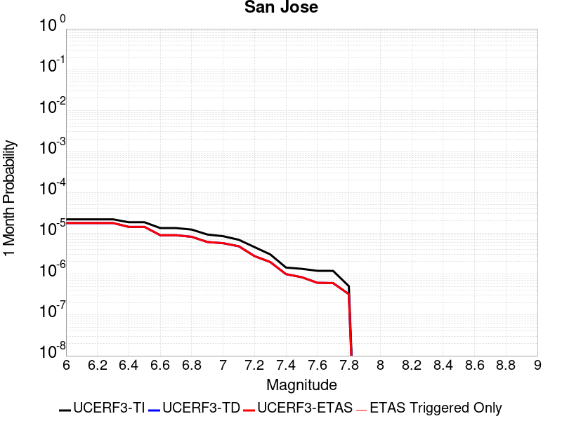 |  | 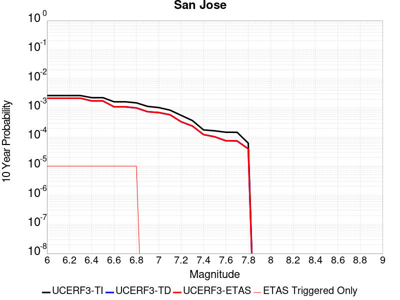 |

| Magnitude | 1 wk TI Prob | 1 wk TD Prob | 1 wk ETAS Prob | 1 wk ETAS/TD Gain | 1 wk ETAS Triggered Only | 1 mo TI Prob | 1 mo TD Prob | 1 mo ETAS Prob | 1 mo ETAS/TD Gain | 1 mo ETAS Triggered Only | 1 yr TI Prob | 1 yr TD Prob | 1 yr ETAS Prob | 1 yr ETAS/TD Gain | 1 yr ETAS Triggered Only | 10 yr TI Prob | 10 yr TD Prob | 10 yr ETAS Prob | 10 yr ETAS/TD Gain | 10 yr ETAS Triggered Only |
|-----|-----|-----|-----|-----|-----|-----|-----|-----|-----|-----|-----|-----|-----|-----|-----|-----|-----|-----|-----|-----|
| 6.0 | 5.0851277E-6 | 4.1256726E-6 | 4.1256726E-6 | 1.0 | 0.0 | 2.1793223E-5 | 1.768135E-5 | 1.768135E-5 | 1.0 | 0.0 | 2.653002E-4 | 2.152518E-4 | 2.152518E-4 | 1.0 | 0.0 | 0.0026498367 | 0.0021507242 | 0.0021607026 | 1.0046396 | 1.0E-5 |
| 6.1 | 5.0851277E-6 | 4.1256726E-6 | 4.1256726E-6 | 1.0 | 0.0 | 2.1793223E-5 | 1.768135E-5 | 1.768135E-5 | 1.0 | 0.0 | 2.653002E-4 | 2.152518E-4 | 2.152518E-4 | 1.0 | 0.0 | 0.0026498367 | 0.0021507242 | 0.0021607026 | 1.0046396 | 1.0E-5 |
| 6.2 | 5.0851277E-6 | 4.1256726E-6 | 4.1256726E-6 | 1.0 | 0.0 | 2.1793223E-5 | 1.768135E-5 | 1.768135E-5 | 1.0 | 0.0 | 2.653002E-4 | 2.152518E-4 | 2.152518E-4 | 1.0 | 0.0 | 0.0026498367 | 0.0021507242 | 0.0021607026 | 1.0046396 | 1.0E-5 |
| 6.3 | 5.0851277E-6 | 4.1256726E-6 | 4.1256726E-6 | 1.0 | 0.0 | 2.1793223E-5 | 1.768135E-5 | 1.768135E-5 | 1.0 | 0.0 | 2.653002E-4 | 2.152518E-4 | 2.152518E-4 | 1.0 | 0.0 | 0.0026498367 | 0.0021507242 | 0.0021607026 | 1.0046396 | 1.0E-5 |
| 6.4 | 4.3115124E-6 | 3.3237832E-6 | 3.3237832E-6 | 1.0 | 0.0 | 1.8477778E-5 | 1.424472E-5 | 1.424472E-5 | 1.0 | 0.0 | 2.2494372E-4 | 1.7341787E-4 | 1.7341787E-4 | 1.0 | 0.0 | 0.0022471617 | 0.0017330751 | 0.0017430579 | 1.0057601 | 1.0E-5 |
| 6.5 | 4.3115124E-6 | 3.3237832E-6 | 3.3237832E-6 | 1.0 | 0.0 | 1.8477778E-5 | 1.424472E-5 | 1.424472E-5 | 1.0 | 0.0 | 2.2494372E-4 | 1.7341787E-4 | 1.7341787E-4 | 1.0 | 0.0 | 0.0022471617 | 0.0017330751 | 0.0017430579 | 1.0057601 | 1.0E-5 |
| 6.6 | 3.110396E-6 | 2.0799866E-6 | 2.0799866E-6 | 1.0 | 0.0 | 1.33302E-5 | 8.9141995E-6 | 8.9141995E-6 | 1.0 | 0.0 | 1.622831E-4 | 1.0852526E-4 | 1.0852526E-4 | 1.0 | 0.0 | 0.0016216465 | 0.0010847825 | 0.0010947717 | 1.0092084 | 1.0E-5 |
| 6.7 | 3.110396E-6 | 2.0799866E-6 | 2.0799866E-6 | 1.0 | 0.0 | 1.33302E-5 | 8.9141995E-6 | 8.9141995E-6 | 1.0 | 0.0 | 1.622831E-4 | 1.0852526E-4 | 1.0852526E-4 | 1.0 | 0.0 | 0.0016216465 | 0.0010847825 | 0.0010947717 | 1.0092084 | 1.0E-5 |
| 6.8 | 2.856651E-6 | 1.902435E-6 | 1.902435E-6 | 1.0 | 0.0 | 1.2242733E-5 | 8.153269E-6 | 8.153269E-6 | 1.0 | 0.0 | 1.4904508E-4 | 9.926178E-5 | 9.926178E-5 | 1.0 | 0.0 | 0.0014894515 | 9.922314E-4 | 0.0010022215 | 1.0100683 | 1.0E-5 |
| 6.9 | 2.1618725E-6 | 1.4186642E-6 | 1.4186642E-6 | 1.0 | 0.0 | 9.265135E-6 | 6.0799757E-6 | 6.0799757E-6 | 1.0 | 0.0 | 1.12797185E-4 | 7.402128E-5 | 7.402128E-5 | 1.0 | 0.0 | 0.0011273995 | 7.4000744E-4 | 7.4000744E-4 | 1.0 | 0.0 |
| 7.0 | 1.9684312E-6 | 1.3256331E-6 | 1.3256331E-6 | 1.0 | 0.0 | 8.436106E-6 | 5.681273E-6 | 5.681273E-6 | 1.0 | 0.0 | 1.02704755E-4 | 6.9167385E-5 | 6.9167385E-5 | 1.0 | 0.0 | 0.001026573 | 6.914992E-4 | 6.914992E-4 | 1.0 | 0.0 |
| 7.1 | 1.6070337E-6 | 1.1155087E-6 | 1.1155087E-6 | 1.0 | 0.0 | 6.887269E-6 | 4.780743E-6 | 4.780743E-6 | 1.0 | 0.0 | 8.384928E-5 | 5.8204052E-5 | 5.8204052E-5 | 1.0 | 0.0 | 8.3817646E-4 | 5.819267E-4 | 5.819267E-4 | 1.0 | 0.0 |
| 7.2 | 1.0631658E-6 | 6.4037624E-7 | 6.4037624E-7 | 1.0 | 0.0 | 4.556417E-6 | 2.7444669E-6 | 2.7444669E-6 | 1.0 | 0.0 | 5.5472963E-5 | 3.3413387E-5 | 3.3413387E-5 | 1.0 | 0.0 | 5.545912E-4 | 3.3411747E-4 | 3.3411747E-4 | 1.0 | 0.0 |
| 7.3 | 7.060711E-7 | 4.5824706E-7 | 4.5824706E-7 | 1.0 | 0.0 | 3.0260155E-6 | 1.9639147E-6 | 1.9639147E-6 | 1.0 | 0.0 | 3.6841117E-5 | 2.3910407E-5 | 2.3910407E-5 | 1.0 | 0.0 | 3.6835007E-4 | 2.3911172E-4 | 2.3911172E-4 | 1.0 | 0.0 |
| 7.4 | 3.3677085E-7 | 2.3233133E-7 | 2.3233133E-7 | 1.0 | 0.0 | 1.4433028E-6 | 9.957054E-7 | 9.957054E-7 | 1.0 | 0.0 | 1.757207E-5 | 1.21226485E-5 | 1.21226485E-5 | 1.0 | 0.0 | 1.7570681E-4 | 1.2125263E-4 | 1.2125263E-4 | 1.0 | 0.0 |
| 7.5 | 3.129161E-7 | 1.9530925E-7 | 1.9530925E-7 | 1.0 | 0.0 | 1.3410682E-6 | 8.370394E-7 | 8.370394E-7 | 1.0 | 0.0 | 1.6327383E-5 | 1.0190909E-5 | 1.0190909E-5 | 1.0 | 0.0 | 1.6326184E-4 | 1.0193714E-4 | 1.0193714E-4 | 1.0 | 0.0 |
| 7.6 | 2.8008668E-7 | 1.4242323E-7 | 1.4242323E-7 | 1.0 | 0.0 | 1.2003709E-6 | 6.1038514E-7 | 6.1038514E-7 | 1.0 | 0.0 | 1.46144175E-5 | 7.4314153E-6 | 7.4314153E-6 | 1.0 | 0.0 | 1.4613457E-4 | 7.434427E-5 | 7.434427E-5 | 1.0 | 0.0 |
| 7.7 | 2.7852005E-7 | 1.4016913E-7 | 1.4016913E-7 | 1.0 | 0.0 | 1.1936568E-6 | 6.007248E-7 | 6.007248E-7 | 1.0 | 0.0 | 1.4532674E-5 | 7.3138012E-6 | 7.3138012E-6 | 1.0 | 0.0 | 1.4531724E-4 | 7.316821E-5 | 7.316821E-5 | 1.0 | 0.0 |
| 7.8 | 1.1810797E-7 | 7.5190094E-8 | 7.5190094E-8 | 1.0 | 0.0 | 5.0617695E-7 | 3.222432E-7 | 3.222432E-7 | 1.0 | 0.0 | 6.1626865E-6 | 3.9233046E-6 | 3.9233046E-6 | 1.0 | 0.0 | 6.162516E-5 | 3.9250725E-5 | 3.9250725E-5 | 1.0 | 0.0 |

## Likely 2011 CFM
*[(top)](#table-of-contents)*

| 1 Week | 1 Month | 1 Year | 10 Year |
|-----|-----|-----|-----|
|  |  |  |  |

| Magnitude | 1 wk TI Prob | 1 wk TD Prob | 1 wk ETAS Prob | 1 wk ETAS/TD Gain | 1 wk ETAS Triggered Only | 1 mo TI Prob | 1 mo TD Prob | 1 mo ETAS Prob | 1 mo ETAS/TD Gain | 1 mo ETAS Triggered Only | 1 yr TI Prob | 1 yr TD Prob | 1 yr ETAS Prob | 1 yr ETAS/TD Gain | 1 yr ETAS Triggered Only | 10 yr TI Prob | 10 yr TD Prob | 10 yr ETAS Prob | 10 yr ETAS/TD Gain | 10 yr ETAS Triggered Only |
|-----|-----|-----|-----|-----|-----|-----|-----|-----|-----|-----|-----|-----|-----|-----|-----|-----|-----|-----|-----|-----|
| 6.0 | 2.5315949E-5 | 2.7104748E-5 | 2.7104748E-5 | 1.0 | 0.0 | 1.0849241E-4 | 1.16158284E-4 | 1.16158284E-4 | 1.0 | 0.0 | 0.0013200947 | 0.0014133542 | 0.0014133542 | 1.0 | 0.0 | 0.013122803 | 0.01404831 | 0.01405817 | 1.0007018 | 1.0E-5 |
| 6.1 | 2.5315949E-5 | 2.7104748E-5 | 2.7104748E-5 | 1.0 | 0.0 | 1.0849241E-4 | 1.16158284E-4 | 1.16158284E-4 | 1.0 | 0.0 | 0.0013200947 | 0.0014133542 | 0.0014133542 | 1.0 | 0.0 | 0.013122803 | 0.01404831 | 0.01405817 | 1.0007018 | 1.0E-5 |
| 6.2 | 1.6375941E-5 | 1.7465842E-5 | 1.7465842E-5 | 1.0 | 0.0 | 7.0180715E-5 | 7.485153E-5 | 7.485153E-5 | 1.0 | 0.0 | 8.5411523E-4 | 9.109487E-4 | 9.109487E-4 | 1.0 | 0.0 | 0.008508399 | 0.009073433 | 0.009083342 | 1.0010921 | 1.0E-5 |
| 6.3 | 1.1945543E-5 | 1.2712587E-5 | 1.2712587E-5 | 1.0 | 0.0 | 5.119418E-5 | 5.4481407E-5 | 5.4481407E-5 | 1.0 | 0.0 | 6.2311086E-4 | 6.631146E-4 | 6.631146E-4 | 1.0 | 0.0 | 0.0062136655 | 0.0066119144 | 0.0066119144 | 1.0 | 0.0 |
| 6.4 | 9.192729E-6 | 9.768488E-6 | 9.768488E-6 | 1.0 | 0.0 | 3.939681E-5 | 4.1864292E-5 | 4.1864292E-5 | 1.0 | 0.0 | 4.7955062E-4 | 5.0958124E-4 | 5.0958124E-4 | 1.0 | 0.0 | 0.004785171 | 0.0050844094 | 0.0050844094 | 1.0 | 0.0 |
| 6.5 | 7.67906E-6 | 8.152622E-6 | 8.152622E-6 | 1.0 | 0.0 | 3.2909844E-5 | 3.4939352E-5 | 3.4939352E-5 | 1.0 | 0.0 | 4.006037E-4 | 4.2530545E-4 | 4.2530545E-4 | 1.0 | 0.0 | 0.0039988225 | 0.004245108 | 0.004245108 | 1.0 | 0.0 |
| 6.6 | 6.4884057E-6 | 6.8847507E-6 | 6.8847507E-6 | 1.0 | 0.0 | 2.7807157E-5 | 2.9505749E-5 | 2.9505749E-5 | 1.0 | 0.0 | 3.3849955E-4 | 3.591747E-4 | 3.591747E-4 | 1.0 | 0.0 | 0.003379844 | 0.0035860867 | 0.0035860867 | 1.0 | 0.0 |
| 6.7 | 4.6060636E-6 | 4.884041E-6 | 4.884041E-6 | 1.0 | 0.0 | 1.9740122E-5 | 2.0931442E-5 | 2.0931442E-5 | 1.0 | 0.0 | 2.403095E-4 | 2.5481134E-4 | 2.5481134E-4 | 1.0 | 0.0 | 0.002400498 | 0.0025452746 | 0.0025452746 | 1.0 | 0.0 |
| 6.8 | 3.2795615E-6 | 3.4773732E-6 | 3.4773732E-6 | 1.0 | 0.0 | 1.4055187E-5 | 1.4902946E-5 | 1.4902946E-5 | 1.0 | 0.0 | 1.7110848E-4 | 1.8142881E-4 | 1.8142881E-4 | 1.0 | 0.0 | 0.0017097679 | 0.0018128622 | 0.0018128622 | 1.0 | 0.0 |
| 6.9 | 2.3289967E-6 | 2.4705569E-6 | 2.4705569E-6 | 1.0 | 0.0 | 9.981376E-6 | 1.058806E-5 | 1.058806E-5 | 1.0 | 0.0 | 1.2151648E-4 | 1.2890245E-4 | 1.2890245E-4 | 1.0 | 0.0 | 0.0012145005 | 0.0012883197 | 0.0012883197 | 1.0 | 0.0 |
| 7.0 | 1.211292E-6 | 1.2863958E-6 | 1.2863958E-6 | 1.0 | 0.0 | 5.1912407E-6 | 5.5131145E-6 | 5.5131145E-6 | 1.0 | 0.0 | 6.320152E-5 | 6.712041E-5 | 6.712041E-5 | 1.0 | 0.0 | 6.3183554E-4 | 6.710312E-4 | 6.710312E-4 | 1.0 | 0.0 |

## Round Valley
*[(top)](#table-of-contents)*

| 1 Week | 1 Month | 1 Year | 10 Year |
|-----|-----|-----|-----|
|  |  | 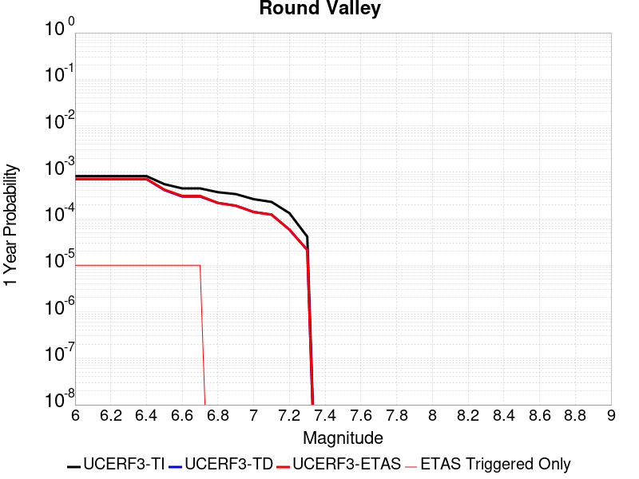 | 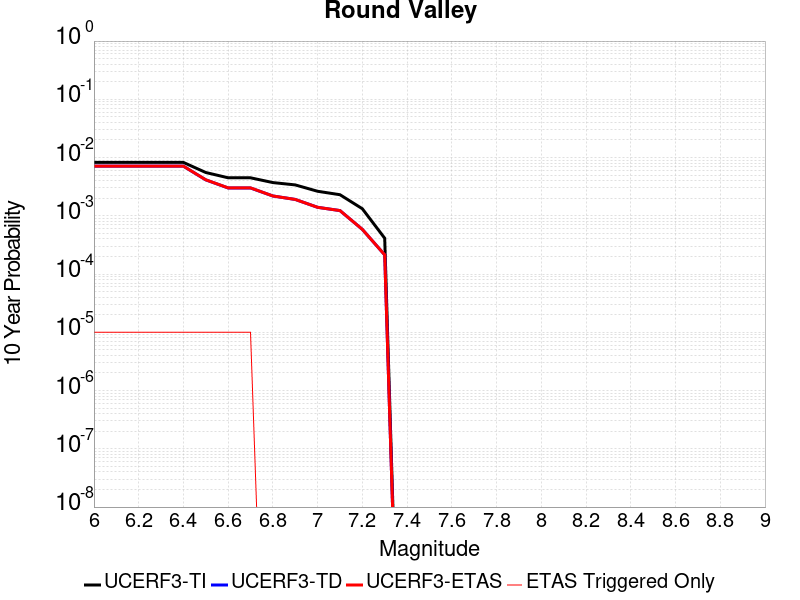 |

| Magnitude | 1 wk TI Prob | 1 wk TD Prob | 1 wk ETAS Prob | 1 wk ETAS/TD Gain | 1 wk ETAS Triggered Only | 1 mo TI Prob | 1 mo TD Prob | 1 mo ETAS Prob | 1 mo ETAS/TD Gain | 1 mo ETAS Triggered Only | 1 yr TI Prob | 1 yr TD Prob | 1 yr ETAS Prob | 1 yr ETAS/TD Gain | 1 yr ETAS Triggered Only | 10 yr TI Prob | 10 yr TD Prob | 10 yr ETAS Prob | 10 yr ETAS/TD Gain | 10 yr ETAS Triggered Only |
|-----|-----|-----|-----|-----|-----|-----|-----|-----|-----|-----|-----|-----|-----|-----|-----|-----|-----|-----|-----|-----|
| 6.0 | 1.588152E-5 | 1.3670716E-5 | 1.3670716E-5 | 1.0 | 0.0 | 6.806188E-5 | 5.8587688E-5 | 5.8587688E-5 | 1.0 | 0.0 | 8.283384E-4 | 7.13111E-4 | 7.231039E-4 | 1.014013 | 1.0E-5 | 0.008252576 | 0.0071121147 | 0.007122044 | 1.0013961 | 1.0E-5 |
| 6.1 | 1.588152E-5 | 1.3670716E-5 | 1.3670716E-5 | 1.0 | 0.0 | 6.806188E-5 | 5.8587688E-5 | 5.8587688E-5 | 1.0 | 0.0 | 8.283384E-4 | 7.13111E-4 | 7.231039E-4 | 1.014013 | 1.0E-5 | 0.008252576 | 0.0071121147 | 0.007122044 | 1.0013961 | 1.0E-5 |
| 6.2 | 1.588152E-5 | 1.3670716E-5 | 1.3670716E-5 | 1.0 | 0.0 | 6.806188E-5 | 5.8587688E-5 | 5.8587688E-5 | 1.0 | 0.0 | 8.283384E-4 | 7.13111E-4 | 7.231039E-4 | 1.014013 | 1.0E-5 | 0.008252576 | 0.0071121147 | 0.007122044 | 1.0013961 | 1.0E-5 |
| 6.3 | 1.588152E-5 | 1.3670716E-5 | 1.3670716E-5 | 1.0 | 0.0 | 6.806188E-5 | 5.8587688E-5 | 5.8587688E-5 | 1.0 | 0.0 | 8.283384E-4 | 7.13111E-4 | 7.231039E-4 | 1.014013 | 1.0E-5 | 0.008252576 | 0.0071121147 | 0.007122044 | 1.0013961 | 1.0E-5 |
| 6.4 | 1.588152E-5 | 1.3670716E-5 | 1.3670716E-5 | 1.0 | 0.0 | 6.806188E-5 | 5.8587688E-5 | 5.8587688E-5 | 1.0 | 0.0 | 8.283384E-4 | 7.13111E-4 | 7.231039E-4 | 1.014013 | 1.0E-5 | 0.008252576 | 0.0071121147 | 0.007122044 | 1.0013961 | 1.0E-5 |
| 6.5 | 1.0646776E-5 | 7.953037E-6 | 7.953037E-6 | 1.0 | 0.0 | 4.5628243E-5 | 3.408405E-5 | 3.408405E-5 | 1.0 | 0.0 | 5.553823E-4 | 4.1490266E-4 | 4.2489852E-4 | 1.0240921 | 1.0E-5 | 0.005539963 | 0.0041421093 | 0.004152068 | 1.0024042 | 1.0E-5 |
| 6.6 | 8.632956E-6 | 5.768742E-6 | 5.768742E-6 | 1.0 | 0.0 | 3.6997862E-5 | 2.4722967E-5 | 2.4722967E-5 | 1.0 | 0.0 | 4.5035584E-4 | 3.009644E-4 | 3.109614E-4 | 1.0332165 | 1.0E-5 | 0.0044944426 | 0.003005946 | 0.0030159159 | 1.0033168 | 1.0E-5 |
| 6.7 | 8.632956E-6 | 5.768742E-6 | 5.768742E-6 | 1.0 | 0.0 | 3.6997862E-5 | 2.4722967E-5 | 2.4722967E-5 | 1.0 | 0.0 | 4.5035584E-4 | 3.009644E-4 | 3.109614E-4 | 1.0332165 | 1.0E-5 | 0.0044944426 | 0.003005946 | 0.0030159159 | 1.0033168 | 1.0E-5 |
| 6.8 | 7.143895E-6 | 4.2018346E-6 | 4.2018346E-6 | 1.0 | 0.0 | 3.0616335E-5 | 1.8007748E-5 | 1.8007748E-5 | 1.0 | 0.0 | 3.726901E-4 | 2.1922393E-4 | 2.1922393E-4 | 1.0 | 0.0 | 0.0037206567 | 0.0021902416 | 0.0021902416 | 1.0 | 0.0 |
| 6.9 | 6.5120694E-6 | 3.6644687E-6 | 3.6644687E-6 | 1.0 | 0.0 | 2.790857E-5 | 1.570478E-5 | 1.570478E-5 | 1.0 | 0.0 | 3.3973387E-4 | 1.9119044E-4 | 1.9119044E-4 | 1.0 | 0.0 | 0.0033921495 | 0.0019104085 | 0.0019104085 | 1.0 | 0.0 |
| 7.0 | 5.0614435E-6 | 2.6836676E-6 | 2.6836676E-6 | 1.0 | 0.0 | 2.169172E-5 | 1.1501388E-5 | 1.1501388E-5 | 1.0 | 0.0 | 2.6406467E-4 | 1.4002144E-4 | 1.4002144E-4 | 1.0 | 0.0 | 0.0026375111 | 0.0013994334 | 0.0013994334 | 1.0 | 0.0 |
| 7.1 | 4.41728E-6 | 2.3575074E-6 | 2.3575074E-6 | 1.0 | 0.0 | 1.8931061E-5 | 1.0103569E-5 | 1.0103569E-5 | 1.0 | 0.0 | 2.304613E-4 | 1.23005E-4 | 1.23005E-4 | 1.0 | 0.0 | 0.0023022245 | 0.0012294657 | 0.0012294657 | 1.0 | 0.0 |
| 7.2 | 2.535495E-6 | 1.1208391E-6 | 1.1208391E-6 | 1.0 | 0.0 | 1.0866362E-5 | 4.8035904E-6 | 4.8035904E-6 | 1.0 | 0.0 | 1.3228992E-4 | 5.8482667E-5 | 5.8482667E-5 | 1.0 | 0.0 | 0.0013221119 | 5.84724E-4 | 5.84724E-4 | 1.0 | 0.0 |
| 7.3 | 7.900015E-7 | 4.0889498E-7 | 4.0889498E-7 | 1.0 | 0.0 | 3.3857161E-6 | 1.752407E-6 | 1.752407E-6 | 1.0 | 0.0 | 4.1220315E-5 | 2.1335554E-5 | 2.1335554E-5 | 1.0 | 0.0 | 4.121267E-4 | 2.1335555E-4 | 2.1335555E-4 | 1.0 | 0.0 |

## Carson Range (Genoa)
*[(top)](#table-of-contents)*

| 1 Week | 1 Month | 1 Year | 10 Year |
|-----|-----|-----|-----|
|  |  |  | 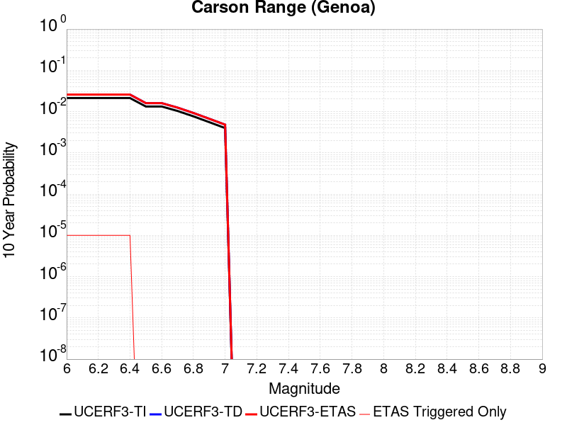 |

| Magnitude | 1 wk TI Prob | 1 wk TD Prob | 1 wk ETAS Prob | 1 wk ETAS/TD Gain | 1 wk ETAS Triggered Only | 1 mo TI Prob | 1 mo TD Prob | 1 mo ETAS Prob | 1 mo ETAS/TD Gain | 1 mo ETAS Triggered Only | 1 yr TI Prob | 1 yr TD Prob | 1 yr ETAS Prob | 1 yr ETAS/TD Gain | 1 yr ETAS Triggered Only | 10 yr TI Prob | 10 yr TD Prob | 10 yr ETAS Prob | 10 yr ETAS/TD Gain | 10 yr ETAS Triggered Only |
|-----|-----|-----|-----|-----|-----|-----|-----|-----|-----|-----|-----|-----|-----|-----|-----|-----|-----|-----|-----|-----|
| 6.0 | 4.1268457E-5 | 5.0146893E-5 | 6.014639E-5 | 1.1994041 | 1.0E-5 | 1.7685282E-4 | 2.148998E-4 | 2.2489765E-4 | 1.0465233 | 1.0E-5 | 0.0021510567 | 0.0026136558 | 0.0026236295 | 1.003816 | 1.0E-5 | 0.02130354 | 0.025868816 | 0.025878558 | 1.0003766 | 1.0E-5 |
| 6.1 | 4.1268457E-5 | 5.0146893E-5 | 6.014639E-5 | 1.1994041 | 1.0E-5 | 1.7685282E-4 | 2.148998E-4 | 2.2489765E-4 | 1.0465233 | 1.0E-5 | 0.0021510567 | 0.0026136558 | 0.0026236295 | 1.003816 | 1.0E-5 | 0.02130354 | 0.025868816 | 0.025878558 | 1.0003766 | 1.0E-5 |
| 6.2 | 4.1268457E-5 | 5.0146893E-5 | 6.014639E-5 | 1.1994041 | 1.0E-5 | 1.7685282E-4 | 2.148998E-4 | 2.2489765E-4 | 1.0465233 | 1.0E-5 | 0.0021510567 | 0.0026136558 | 0.0026236295 | 1.003816 | 1.0E-5 | 0.02130354 | 0.025868816 | 0.025878558 | 1.0003766 | 1.0E-5 |
| 6.3 | 4.1268457E-5 | 5.0146893E-5 | 6.014639E-5 | 1.1994041 | 1.0E-5 | 1.7685282E-4 | 2.148998E-4 | 2.2489765E-4 | 1.0465233 | 1.0E-5 | 0.0021510567 | 0.0026136558 | 0.0026236295 | 1.003816 | 1.0E-5 | 0.02130354 | 0.025868816 | 0.025878558 | 1.0003766 | 1.0E-5 |
| 6.4 | 4.1268457E-5 | 5.0146893E-5 | 6.014639E-5 | 1.1994041 | 1.0E-5 | 1.7685282E-4 | 2.148998E-4 | 2.2489765E-4 | 1.0465233 | 1.0E-5 | 0.0021510567 | 0.0026136558 | 0.0026236295 | 1.003816 | 1.0E-5 | 0.02130354 | 0.025868816 | 0.025878558 | 1.0003766 | 1.0E-5 |
| 6.5 | 2.5677185E-5 | 3.0978295E-5 | 3.0978295E-5 | 1.0 | 0.0 | 1.1004044E-4 | 1.3275839E-4 | 1.3275839E-4 | 1.0 | 0.0 | 0.0013389189 | 0.0016153135 | 0.0016153135 | 1.0 | 0.0 | 0.0133088045 | 0.016053649 | 0.016053649 | 1.0 | 0.0 |
| 6.6 | 2.5677185E-5 | 3.0978295E-5 | 3.0978295E-5 | 1.0 | 0.0 | 1.1004044E-4 | 1.3275839E-4 | 1.3275839E-4 | 1.0 | 0.0 | 0.0013389189 | 0.0016153135 | 0.0016153135 | 1.0 | 0.0 | 0.0133088045 | 0.016053649 | 0.016053649 | 1.0 | 0.0 |
| 6.7 | 1.9969408E-5 | 2.406347E-5 | 2.406347E-5 | 1.0 | 0.0 | 8.558037E-5 | 1.0312595E-4 | 1.0312595E-4 | 1.0 | 0.0 | 0.0010414429 | 0.0012549888 | 0.0012549888 | 1.0 | 0.0 | 0.010365757 | 0.012494174 | 0.012494174 | 1.0 | 0.0 |
| 6.8 | 1.4783156E-5 | 1.7817569E-5 | 1.7817569E-5 | 1.0 | 0.0 | 6.335485E-5 | 7.635951E-5 | 7.635951E-5 | 1.0 | 0.0 | 7.710722E-4 | 9.294106E-4 | 9.294106E-4 | 1.0 | 0.0 | 0.0076840227 | 0.009268024 | 0.009268024 | 1.0 | 0.0 |
| 6.9 | 1.06660555E-5 | 1.2877026E-5 | 1.2877026E-5 | 1.0 | 0.0 | 4.5710865E-5 | 5.5186738E-5 | 5.5186738E-5 | 1.0 | 0.0 | 5.5638765E-4 | 6.718066E-4 | 6.718066E-4 | 1.0 | 0.0 | 0.005549967 | 0.006709056 | 0.006709056 | 1.0 | 0.0 |
| 7.0 | 7.664838E-6 | 9.258307E-6 | 9.258307E-6 | 1.0 | 0.0 | 3.2848893E-5 | 3.9678456E-5 | 3.9678456E-5 | 1.0 | 0.0 | 3.998619E-4 | 4.830852E-4 | 4.830852E-4 | 1.0 | 0.0 | 0.0039914316 | 0.00483085 | 0.00483085 | 1.0 | 0.0 |

## Great Valley 04a Trout Creek
*[(top)](#table-of-contents)*

| 1 Week | 1 Month | 1 Year | 10 Year |
|-----|-----|-----|-----|
|  |  |  |  |

| Magnitude | 1 wk TI Prob | 1 wk TD Prob | 1 wk ETAS Prob | 1 wk ETAS/TD Gain | 1 wk ETAS Triggered Only | 1 mo TI Prob | 1 mo TD Prob | 1 mo ETAS Prob | 1 mo ETAS/TD Gain | 1 mo ETAS Triggered Only | 1 yr TI Prob | 1 yr TD Prob | 1 yr ETAS Prob | 1 yr ETAS/TD Gain | 1 yr ETAS Triggered Only | 10 yr TI Prob | 10 yr TD Prob | 10 yr ETAS Prob | 10 yr ETAS/TD Gain | 10 yr ETAS Triggered Only |
|-----|-----|-----|-----|-----|-----|-----|-----|-----|-----|-----|-----|-----|-----|-----|-----|-----|-----|-----|-----|-----|
| 6.0 | 1.4088538E-5 | 1.5719554E-5 | 1.5719554E-5 | 1.0 | 0.0 | 6.037805E-5 | 6.7367844E-5 | 6.7367844E-5 | 1.0 | 0.0 | 7.3485484E-4 | 8.199074E-4 | 8.2989916E-4 | 1.0121865 | 1.0E-5 | 0.007324295 | 0.008170108 | 0.008180026 | 1.001214 | 1.0E-5 |
| 6.1 | 1.4088538E-5 | 1.5719554E-5 | 1.5719554E-5 | 1.0 | 0.0 | 6.037805E-5 | 6.7367844E-5 | 6.7367844E-5 | 1.0 | 0.0 | 7.3485484E-4 | 8.199074E-4 | 8.2989916E-4 | 1.0121865 | 1.0E-5 | 0.007324295 | 0.008170108 | 0.008180026 | 1.001214 | 1.0E-5 |
| 6.2 | 1.4088538E-5 | 1.5719554E-5 | 1.5719554E-5 | 1.0 | 0.0 | 6.037805E-5 | 6.7367844E-5 | 6.7367844E-5 | 1.0 | 0.0 | 7.3485484E-4 | 8.199074E-4 | 8.2989916E-4 | 1.0121865 | 1.0E-5 | 0.007324295 | 0.008170108 | 0.008180026 | 1.001214 | 1.0E-5 |
| 6.3 | 1.2882862E-5 | 1.4378603E-5 | 1.4378603E-5 | 1.0 | 0.0 | 5.5211098E-5 | 6.1621184E-5 | 6.1621184E-5 | 1.0 | 0.0 | 6.7198783E-4 | 7.4999005E-4 | 7.5998256E-4 | 1.0133235 | 1.0E-5 | 0.0066995937 | 0.0074756527 | 0.0074855783 | 1.0013276 | 1.0E-5 |
| 6.4 | 1.2882862E-5 | 1.4378603E-5 | 1.4378603E-5 | 1.0 | 0.0 | 5.5211098E-5 | 6.1621184E-5 | 6.1621184E-5 | 1.0 | 0.0 | 6.7198783E-4 | 7.4999005E-4 | 7.5998256E-4 | 1.0133235 | 1.0E-5 | 0.0066995937 | 0.0074756527 | 0.0074855783 | 1.0013276 | 1.0E-5 |
| 6.5 | 1.2762329E-5 | 1.424516E-5 | 1.424516E-5 | 1.0 | 0.0 | 5.469455E-5 | 6.1049315E-5 | 6.1049315E-5 | 1.0 | 0.0 | 6.657027E-4 | 7.430323E-4 | 7.530249E-4 | 1.0134484 | 1.0E-5 | 0.00663712 | 0.0074065393 | 0.007416465 | 1.0013402 | 1.0E-5 |
| 6.6 | 1.2762329E-5 | 1.424516E-5 | 1.424516E-5 | 1.0 | 0.0 | 5.469455E-5 | 6.1049315E-5 | 6.1049315E-5 | 1.0 | 0.0 | 6.657027E-4 | 7.430323E-4 | 7.530249E-4 | 1.0134484 | 1.0E-5 | 0.00663712 | 0.0074065393 | 0.007416465 | 1.0013402 | 1.0E-5 |
| 6.7 | 1.2557959E-5 | 1.4019395E-5 | 1.4019395E-5 | 1.0 | 0.0 | 5.3818712E-5 | 6.0081795E-5 | 6.0081795E-5 | 1.0 | 0.0 | 6.5504585E-4 | 7.312607E-4 | 7.412534E-4 | 1.013665 | 1.0E-5 | 0.006531183 | 0.007289598 | 0.007299525 | 1.0013618 | 1.0E-5 |
| 6.8 | 1.1871544E-5 | 1.3258823E-5 | 1.3258823E-5 | 1.0 | 0.0 | 5.0877054E-5 | 5.6822348E-5 | 5.6822348E-5 | 1.0 | 0.0 | 6.1925204E-4 | 6.916025E-4 | 7.0159556E-4 | 1.0144491 | 1.0E-5 | 0.0061752927 | 0.0068955184 | 0.0069054496 | 1.0014402 | 1.0E-5 |
| 6.9 | 1.0500373E-5 | 1.1731261E-5 | 1.1731261E-5 | 1.0 | 0.0 | 4.5000823E-5 | 5.0275914E-5 | 5.0275914E-5 | 1.0 | 0.0 | 5.4774724E-4 | 6.119459E-4 | 6.219398E-4 | 1.0163313 | 1.0E-5 | 0.005463991 | 0.0061034737 | 0.006113413 | 1.0016284 | 1.0E-5 |
| 7.0 | 8.524332E-6 | 9.5334835E-6 | 9.5334835E-6 | 1.0 | 0.0 | 3.653234E-5 | 4.0857187E-5 | 4.0857187E-5 | 1.0 | 0.0 | 4.4469046E-4 | 4.9733004E-4 | 5.073251E-4 | 1.0200974 | 1.0E-5 | 0.0044380166 | 0.004962902 | 0.0049728523 | 1.002005 | 1.0E-5 |
| 7.1 | 6.006849E-6 | 6.711559E-6 | 6.711559E-6 | 1.0 | 0.0 | 2.5743384E-5 | 2.876354E-5 | 2.876354E-5 | 1.0 | 0.0 | 3.1338062E-4 | 3.501454E-4 | 3.601419E-4 | 1.0285496 | 1.0E-5 | 0.0031293905 | 0.0034964874 | 0.0035064525 | 1.00285 | 1.0E-5 |
| 7.2 | 2.9122193E-6 | 3.2465305E-6 | 3.2465305E-6 | 1.0 | 0.0 | 1.248088E-5 | 1.3913637E-5 | 1.3913637E-5 | 1.0 | 0.0 | 1.5194413E-4 | 1.6938712E-4 | 1.6938712E-4 | 1.0 | 0.0 | 0.0015184027 | 0.0016927521 | 0.0016927521 | 1.0 | 0.0 |
| 7.3 | 7.2194007E-7 | 7.988761E-7 | 7.988761E-7 | 1.0 | 0.0 | 3.0940253E-6 | 3.4237528E-6 | 3.4237528E-6 | 1.0 | 0.0 | 3.7669106E-5 | 4.1683852E-5 | 4.1683852E-5 | 1.0 | 0.0 | 3.766272E-4 | 4.168053E-4 | 4.168053E-4 | 1.0 | 0.0 |
| 7.4 | 3.112171E-8 | 3.2068368E-8 | 3.2068368E-8 | 1.0 | 0.0 | 1.3337875E-7 | 1.3743585E-7 | 1.3743585E-7 | 1.0 | 0.0 | 1.6238852E-6 | 1.6732803E-6 | 1.6732803E-6 | 1.0 | 0.0 | 1.6238733E-5 | 1.6732685E-5 | 1.6732685E-5 | 1.0 | 0.0 |

## Homestead Valley 2011
*[(top)](#table-of-contents)*

| 1 Week | 1 Month | 1 Year | 10 Year |
|-----|-----|-----|-----|
| 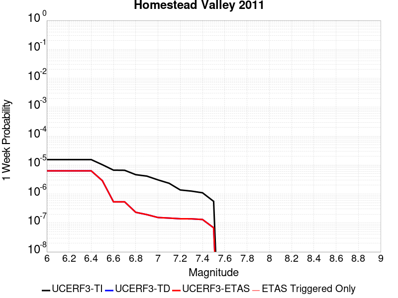 |  |  | 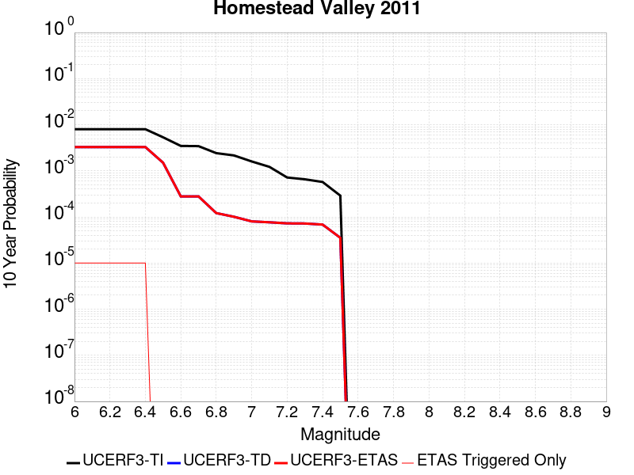 |

| Magnitude | 1 wk TI Prob | 1 wk TD Prob | 1 wk ETAS Prob | 1 wk ETAS/TD Gain | 1 wk ETAS Triggered Only | 1 mo TI Prob | 1 mo TD Prob | 1 mo ETAS Prob | 1 mo ETAS/TD Gain | 1 mo ETAS Triggered Only | 1 yr TI Prob | 1 yr TD Prob | 1 yr ETAS Prob | 1 yr ETAS/TD Gain | 1 yr ETAS Triggered Only | 10 yr TI Prob | 10 yr TD Prob | 10 yr ETAS Prob | 10 yr ETAS/TD Gain | 10 yr ETAS Triggered Only |
|-----|-----|-----|-----|-----|-----|-----|-----|-----|-----|-----|-----|-----|-----|-----|-----|-----|-----|-----|-----|-----|
| 6.0 | 1.539795E-5 | 6.286606E-6 | 6.286606E-6 | 1.0 | 0.0 | 6.5989545E-5 | 2.6942436E-5 | 2.6942436E-5 | 1.0 | 0.0 | 8.0312655E-4 | 3.279954E-4 | 3.279954E-4 | 1.0 | 0.0 | 0.008002302 | 0.0032771337 | 0.003287101 | 1.0030415 | 1.0E-5 |
| 6.1 | 1.539795E-5 | 6.286606E-6 | 6.286606E-6 | 1.0 | 0.0 | 6.5989545E-5 | 2.6942436E-5 | 2.6942436E-5 | 1.0 | 0.0 | 8.0312655E-4 | 3.279954E-4 | 3.279954E-4 | 1.0 | 0.0 | 0.008002302 | 0.0032771337 | 0.003287101 | 1.0030415 | 1.0E-5 |
| 6.2 | 1.539795E-5 | 6.286606E-6 | 6.286606E-6 | 1.0 | 0.0 | 6.5989545E-5 | 2.6942436E-5 | 2.6942436E-5 | 1.0 | 0.0 | 8.0312655E-4 | 3.279954E-4 | 3.279954E-4 | 1.0 | 0.0 | 0.008002302 | 0.0032771337 | 0.003287101 | 1.0030415 | 1.0E-5 |
| 6.3 | 1.539795E-5 | 6.286606E-6 | 6.286606E-6 | 1.0 | 0.0 | 6.5989545E-5 | 2.6942436E-5 | 2.6942436E-5 | 1.0 | 0.0 | 8.0312655E-4 | 3.279954E-4 | 3.279954E-4 | 1.0 | 0.0 | 0.008002302 | 0.0032771337 | 0.003287101 | 1.0030415 | 1.0E-5 |
| 6.4 | 1.539795E-5 | 6.286606E-6 | 6.286606E-6 | 1.0 | 0.0 | 6.5989545E-5 | 2.6942436E-5 | 2.6942436E-5 | 1.0 | 0.0 | 8.0312655E-4 | 3.279954E-4 | 3.279954E-4 | 1.0 | 0.0 | 0.008002302 | 0.0032771337 | 0.003287101 | 1.0030415 | 1.0E-5 |
| 6.5 | 1.0265258E-5 | 2.8788488E-6 | 2.8788488E-6 | 1.0 | 0.0 | 4.3993223E-5 | 1.2337905E-5 | 1.2337905E-5 | 1.0 | 0.0 | 5.3548586E-4 | 1.5021059E-4 | 1.5021059E-4 | 1.0 | 0.0 | 0.005341973 | 0.0015017724 | 0.0015017724 | 1.0 | 0.0 |
| 6.6 | 6.664671E-6 | 5.348204E-7 | 5.348204E-7 | 1.0 | 0.0 | 2.8562565E-5 | 2.2920863E-6 | 2.2920863E-6 | 1.0 | 0.0 | 3.476937E-4 | 2.7905911E-5 | 2.7905911E-5 | 1.0 | 0.0 | 0.003471502 | 2.790357E-4 | 2.790357E-4 | 1.0 | 0.0 |
| 6.7 | 6.5954046E-6 | 5.348204E-7 | 5.348204E-7 | 1.0 | 0.0 | 2.8265715E-5 | 2.2920863E-6 | 2.2920863E-6 | 1.0 | 0.0 | 3.4408073E-4 | 2.7905911E-5 | 2.7905911E-5 | 1.0 | 0.0 | 0.0034354846 | 2.790357E-4 | 2.790357E-4 | 1.0 | 0.0 |
| 6.8 | 4.648189E-6 | 2.3265572E-7 | 2.3265572E-7 | 1.0 | 0.0 | 1.9920659E-5 | 9.970956E-7 | 9.970956E-7 | 1.0 | 0.0 | 2.4250703E-4 | 1.2139576E-5 | 1.2139576E-5 | 1.0 | 0.0 | 0.0024224254 | 1.2138961E-4 | 1.2138961E-4 | 1.0 | 0.0 |
| 6.9 | 4.1428534E-6 | 1.9344557E-7 | 1.9344557E-7 | 1.0 | 0.0 | 1.7754966E-5 | 8.290522E-7 | 8.290522E-7 | 1.0 | 0.0 | 2.1614527E-4 | 1.0093667E-5 | 1.0093667E-5 | 1.0 | 0.0 | 0.0021593515 | 1.0093238E-4 | 1.0093238E-4 | 1.0 | 0.0 |
| 7.0 | 3.0673707E-6 | 1.5367603E-7 | 1.5367603E-7 | 1.0 | 0.0 | 1.3145808E-5 | 6.586114E-7 | 6.586114E-7 | 1.0 | 0.0 | 1.6003846E-4 | 8.0185655E-6 | 8.0185655E-6 | 1.0 | 0.0 | 0.0015992324 | 8.0182865E-5 | 8.0182865E-5 | 1.0 | 0.0 |
| 7.1 | 2.340854E-6 | 1.468766E-7 | 1.468766E-7 | 1.0 | 0.0 | 1.0032193E-5 | 6.29471E-7 | 6.29471E-7 | 1.0 | 0.0 | 1.221351E-4 | 7.663783E-6 | 7.663783E-6 | 1.0 | 0.0 | 0.00122068 | 7.663529E-5 | 7.663529E-5 | 1.0 | 0.0 |
| 7.2 | 1.3754182E-6 | 1.3922634E-7 | 1.3922634E-7 | 1.0 | 0.0 | 5.8946357E-6 | 5.966842E-7 | 5.966842E-7 | 1.0 | 0.0 | 7.176483E-5 | 7.2646067E-6 | 7.2646067E-6 | 1.0 | 0.0 | 7.174166E-4 | 7.264379E-5 | 7.264379E-5 | 1.0 | 0.0 |
| 7.3 | 1.2573237E-6 | 1.3827146E-7 | 1.3827146E-7 | 1.0 | 0.0 | 5.388519E-6 | 5.9259185E-7 | 5.9259185E-7 | 1.0 | 0.0 | 6.560324E-5 | 7.2147827E-6 | 7.2147827E-6 | 1.0 | 0.0 | 6.558388E-4 | 7.214558E-5 | 7.214558E-5 | 1.0 | 0.0 |
| 7.4 | 1.0994207E-6 | 1.3106106E-7 | 1.3106106E-7 | 1.0 | 0.0 | 4.7117946E-6 | 5.616901E-7 | 5.616901E-7 | 1.0 | 0.0 | 5.736459E-5 | 6.8385566E-6 | 6.8385566E-6 | 1.0 | 0.0 | 5.734978E-4 | 6.838355E-5 | 6.838355E-5 | 1.0 | 0.0 |
| 7.5 | 5.5569126E-7 | 6.772991E-8 | 6.772991E-8 | 1.0 | 0.0 | 2.3815317E-6 | 2.90271E-7 | 2.90271E-7 | 1.0 | 0.0 | 2.8994764E-5 | 3.5340445E-6 | 3.5340445E-6 | 1.0 | 0.0 | 2.899098E-4 | 3.5339945E-5 | 3.5339945E-5 | 1.0 | 0.0 |

## Burnt Mtn
*[(top)](#table-of-contents)*

| 1 Week | 1 Month | 1 Year | 10 Year |
|-----|-----|-----|-----|
|  |  |  | 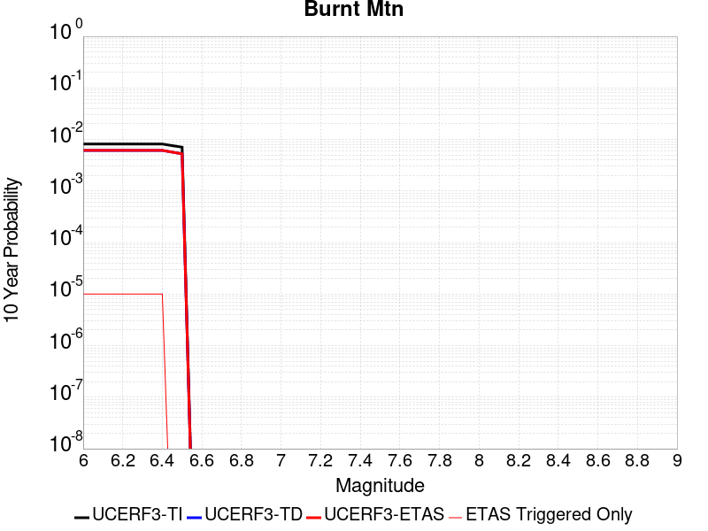 |

| Magnitude | 1 wk TI Prob | 1 wk TD Prob | 1 wk ETAS Prob | 1 wk ETAS/TD Gain | 1 wk ETAS Triggered Only | 1 mo TI Prob | 1 mo TD Prob | 1 mo ETAS Prob | 1 mo ETAS/TD Gain | 1 mo ETAS Triggered Only | 1 yr TI Prob | 1 yr TD Prob | 1 yr ETAS Prob | 1 yr ETAS/TD Gain | 1 yr ETAS Triggered Only | 10 yr TI Prob | 10 yr TD Prob | 10 yr ETAS Prob | 10 yr ETAS/TD Gain | 10 yr ETAS Triggered Only |
|-----|-----|-----|-----|-----|-----|-----|-----|-----|-----|-----|-----|-----|-----|-----|-----|-----|-----|-----|-----|-----|
| 6.0 | 1.5673151E-5 | 1.1749407E-5 | 1.1749407E-5 | 1.0 | 0.0 | 6.716892E-5 | 5.0354356E-5 | 5.0354356E-5 | 1.0 | 0.0 | 8.1747473E-4 | 6.1302073E-4 | 6.1302073E-4 | 1.0 | 0.0 | 0.008144741 | 0.006125938 | 0.0061358768 | 1.0016224 | 1.0E-5 |
| 6.1 | 1.5673151E-5 | 1.1749407E-5 | 1.1749407E-5 | 1.0 | 0.0 | 6.716892E-5 | 5.0354356E-5 | 5.0354356E-5 | 1.0 | 0.0 | 8.1747473E-4 | 6.1302073E-4 | 6.1302073E-4 | 1.0 | 0.0 | 0.008144741 | 0.006125938 | 0.0061358768 | 1.0016224 | 1.0E-5 |
| 6.2 | 1.5673151E-5 | 1.1749407E-5 | 1.1749407E-5 | 1.0 | 0.0 | 6.716892E-5 | 5.0354356E-5 | 5.0354356E-5 | 1.0 | 0.0 | 8.1747473E-4 | 6.1302073E-4 | 6.1302073E-4 | 1.0 | 0.0 | 0.008144741 | 0.006125938 | 0.0061358768 | 1.0016224 | 1.0E-5 |
| 6.3 | 1.5673151E-5 | 1.1749407E-5 | 1.1749407E-5 | 1.0 | 0.0 | 6.716892E-5 | 5.0354356E-5 | 5.0354356E-5 | 1.0 | 0.0 | 8.1747473E-4 | 6.1302073E-4 | 6.1302073E-4 | 1.0 | 0.0 | 0.008144741 | 0.006125938 | 0.0061358768 | 1.0016224 | 1.0E-5 |
| 6.4 | 1.5673151E-5 | 1.1749407E-5 | 1.1749407E-5 | 1.0 | 0.0 | 6.716892E-5 | 5.0354356E-5 | 5.0354356E-5 | 1.0 | 0.0 | 8.1747473E-4 | 6.1302073E-4 | 6.1302073E-4 | 1.0 | 0.0 | 0.008144741 | 0.006125938 | 0.0061358768 | 1.0016224 | 1.0E-5 |
| 6.5 | 1.36191375E-5 | 1.0078299E-5 | 1.0078299E-5 | 1.0 | 0.0 | 5.8366426E-5 | 4.3192707E-5 | 4.3192707E-5 | 1.0 | 0.0 | 7.103795E-4 | 5.2587123E-4 | 5.2587123E-4 | 1.0 | 0.0 | 0.0070811296 | 0.0052587125 | 0.0052587125 | 1.0 | 0.0 |

## Point Reyes 2011 CFM
*[(top)](#table-of-contents)*

| 1 Week | 1 Month | 1 Year | 10 Year |
|-----|-----|-----|-----|
|  |  |  |  |

| Magnitude | 1 wk TI Prob | 1 wk TD Prob | 1 wk ETAS Prob | 1 wk ETAS/TD Gain | 1 wk ETAS Triggered Only | 1 mo TI Prob | 1 mo TD Prob | 1 mo ETAS Prob | 1 mo ETAS/TD Gain | 1 mo ETAS Triggered Only | 1 yr TI Prob | 1 yr TD Prob | 1 yr ETAS Prob | 1 yr ETAS/TD Gain | 1 yr ETAS Triggered Only | 10 yr TI Prob | 10 yr TD Prob | 10 yr ETAS Prob | 10 yr ETAS/TD Gain | 10 yr ETAS Triggered Only |
|-----|-----|-----|-----|-----|-----|-----|-----|-----|-----|-----|-----|-----|-----|-----|-----|-----|-----|-----|-----|-----|
| 6.0 | 8.8644965E-6 | 8.967163E-6 | 1.8967074E-5 | 2.1151698 | 1.0E-5 | 3.7990147E-5 | 3.843017E-5 | 4.8429785E-5 | 1.2602022 | 1.0E-5 | 4.624319E-4 | 4.6779314E-4 | 4.7778848E-4 | 1.021367 | 1.0E-5 | 0.0046147075 | 0.004668713 | 0.004678666 | 1.0021319 | 1.0E-5 |
| 6.1 | 4.526405E-6 | 4.5392185E-6 | 4.5392185E-6 | 1.0 | 0.0 | 1.9398734E-5 | 1.9453653E-5 | 1.9453653E-5 | 1.0 | 0.0 | 2.36154E-4 | 2.3682354E-4 | 2.3682354E-4 | 1.0 | 0.0 | 0.002359032 | 0.0023658178 | 0.0023658178 | 1.0 | 0.0 |
| 6.2 | 4.526405E-6 | 4.5392185E-6 | 4.5392185E-6 | 1.0 | 0.0 | 1.9398734E-5 | 1.9453653E-5 | 1.9453653E-5 | 1.0 | 0.0 | 2.36154E-4 | 2.3682354E-4 | 2.3682354E-4 | 1.0 | 0.0 | 0.002359032 | 0.0023658178 | 0.0023658178 | 1.0 | 0.0 |
| 6.3 | 2.6842322E-6 | 2.660676E-6 | 2.660676E-6 | 1.0 | 0.0 | 1.1503801E-5 | 1.1402849E-5 | 1.1402849E-5 | 1.0 | 0.0 | 1.4004979E-4 | 1.3882104E-4 | 1.3882104E-4 | 1.0 | 0.0 | 0.0013996155 | 0.0013873649 | 0.0013873649 | 1.0 | 0.0 |
| 6.4 | 2.6842322E-6 | 2.660676E-6 | 2.660676E-6 | 1.0 | 0.0 | 1.1503801E-5 | 1.1402849E-5 | 1.1402849E-5 | 1.0 | 0.0 | 1.4004979E-4 | 1.3882104E-4 | 1.3882104E-4 | 1.0 | 0.0 | 0.0013996155 | 0.0013873649 | 0.0013873649 | 1.0 | 0.0 |
| 6.5 | 1.9281833E-6 | 1.8906262E-6 | 1.8906262E-6 | 1.0 | 0.0 | 8.263617E-6 | 8.102659E-6 | 8.102659E-6 | 1.0 | 0.0 | 1.0060489E-4 | 9.86455E-5 | 9.86455E-5 | 1.0 | 0.0 | 0.0010055936 | 9.860279E-4 | 9.860279E-4 | 1.0 | 0.0 |
| 6.6 | 1.4726726E-6 | 1.4269577E-6 | 1.4269577E-6 | 1.0 | 0.0 | 6.3114385E-6 | 6.1155188E-6 | 6.1155188E-6 | 1.0 | 0.0 | 7.683905E-5 | 7.445395E-5 | 7.445395E-5 | 1.0 | 0.0 | 7.6812494E-4 | 7.4429717E-4 | 7.4429717E-4 | 1.0 | 0.0 |
| 6.7 | 8.572307E-7 | 8.007212E-7 | 8.007212E-7 | 1.0 | 0.0 | 3.6738406E-6 | 3.431658E-6 | 3.431658E-6 | 1.0 | 0.0 | 4.472809E-5 | 4.1779647E-5 | 4.1779647E-5 | 1.0 | 0.0 | 4.471909E-4 | 4.1772184E-4 | 4.1772184E-4 | 1.0 | 0.0 |
| 6.8 | 6.6745434E-7 | 6.0773E-7 | 6.0773E-7 | 1.0 | 0.0 | 2.8605155E-6 | 2.6045543E-6 | 2.6045543E-6 | 1.0 | 0.0 | 3.482622E-5 | 3.171E-5 | 3.171E-5 | 1.0 | 0.0 | 3.4820763E-4 | 3.1705803E-4 | 3.1705803E-4 | 1.0 | 0.0 |
| 6.9 | 4.291521E-7 | 3.6535937E-7 | 3.6535937E-7 | 1.0 | 0.0 | 1.839222E-6 | 1.565825E-6 | 1.565825E-6 | 1.0 | 0.0 | 2.2392298E-5 | 1.9063755E-5 | 1.9063755E-5 | 1.0 | 0.0 | 2.2390042E-4 | 1.9062385E-4 | 1.9062385E-4 | 1.0 | 0.0 |
| 7.0 | 2.6812808E-7 | 2.0187414E-7 | 2.0187414E-7 | 1.0 | 0.0 | 1.1491198E-6 | 8.651746E-7 | 8.651746E-7 | 1.0 | 0.0 | 1.3990444E-5 | 1.0533451E-5 | 1.0533451E-5 | 1.0 | 0.0 | 1.3989564E-4 | 1.0533186E-4 | 1.0533186E-4 | 1.0 | 0.0 |
| 7.1 | 1.9451231E-7 | 1.2725499E-7 | 1.2725499E-7 | 1.0 | 0.0 | 8.336239E-7 | 5.453784E-7 | 5.453784E-7 | 1.0 | 0.0 | 1.0149324E-5 | 6.6399616E-6 | 6.6399616E-6 | 1.0 | 0.0 | 1.014886E-4 | 6.639991E-5 | 6.639991E-5 | 1.0 | 0.0 |
| 7.2 | 1.6715143E-7 | 1.00428394E-7 | 1.00428394E-7 | 1.0 | 0.0 | 7.1636305E-7 | 4.3040734E-7 | 4.3040734E-7 | 1.0 | 0.0 | 8.721685E-6 | 5.2401965E-6 | 5.2401965E-6 | 1.0 | 0.0 | 8.721343E-5 | 5.2402997E-5 | 5.2402997E-5 | 1.0 | 0.0 |
| 7.3 | 1.5503173E-7 | 9.0131024E-8 | 9.0131024E-8 | 1.0 | 0.0 | 6.644215E-7 | 3.8627576E-7 | 3.8627576E-7 | 1.0 | 0.0 | 8.089301E-6 | 4.702897E-6 | 4.702897E-6 | 1.0 | 0.0 | 8.089007E-5 | 4.7030244E-5 | 4.7030244E-5 | 1.0 | 0.0 |
| 7.4 | 1.4251614E-7 | 8.097624E-8 | 8.097624E-8 | 1.0 | 0.0 | 6.1078333E-7 | 3.47041E-7 | 3.47041E-7 | 1.0 | 0.0 | 7.4362615E-6 | 4.225216E-6 | 4.225216E-6 | 1.0 | 0.0 | 7.436013E-5 | 4.2253625E-5 | 4.2253625E-5 | 1.0 | 0.0 |
| 7.5 | 1.2710186E-7 | 7.0296394E-8 | 7.0296394E-8 | 1.0 | 0.0 | 5.447221E-7 | 3.0127023E-7 | 3.0127023E-7 | 1.0 | 0.0 | 6.6319717E-6 | 3.667959E-6 | 3.667959E-6 | 1.0 | 0.0 | 6.6317734E-5 | 3.6681253E-5 | 3.6681253E-5 | 1.0 | 0.0 |
| 7.6 | 1.0144708E-7 | 5.4952274E-8 | 5.4952274E-8 | 1.0 | 0.0 | 4.347731E-7 | 2.3550973E-7 | 2.3550973E-7 | 1.0 | 0.0 | 5.2933497E-6 | 2.8673273E-6 | 2.8673273E-6 | 1.0 | 0.0 | 5.293224E-5 | 2.8675171E-5 | 2.8675171E-5 | 1.0 | 0.0 |
| 7.7 | 7.090527E-8 | 3.98231E-8 | 3.98231E-8 | 1.0 | 0.0 | 3.038797E-7 | 1.7067042E-7 | 1.7067042E-7 | 1.0 | 0.0 | 3.699729E-6 | 2.0779103E-6 | 2.0779103E-6 | 1.0 | 0.0 | 3.6996673E-5 | 2.0781177E-5 | 2.0781177E-5 | 1.0 | 0.0 |
| 7.8 | 3.8712045E-8 | 2.7440025E-8 | 2.7440025E-8 | 1.0 | 0.0 | 1.6590876E-7 | 1.176001E-7 | 1.176001E-7 | 1.0 | 0.0 | 2.0199373E-6 | 1.4317802E-6 | 1.4317802E-6 | 1.0 | 0.0 | 2.0199188E-5 | 1.4319979E-5 | 1.4319979E-5 | 1.0 | 0.0 |
| 7.9 | 1.7068782E-8 | 1.1833354E-8 | 1.1833354E-8 | 1.0 | 0.0 | 7.315192E-8 | 5.0714362E-8 | 5.0714362E-8 | 1.0 | 0.0 | 8.906242E-7 | 6.174472E-7 | 6.174472E-7 | 1.0 | 0.0 | 8.906207E-6 | 6.1767228E-6 | 6.1767228E-6 | 1.0 | 0.0 |
| 8.0 | 1.0172592E-8 | 7.0280843E-9 | 7.0280843E-9 | 1.0 | 0.0 | 4.359682E-8 | 3.0120354E-8 | 3.0120354E-8 | 1.0 | 0.0 | 5.3079117E-7 | 3.6671526E-7 | 3.6671526E-7 | 1.0 | 0.0 | 5.307899E-6 | 3.6694146E-6 | 3.6694146E-6 | 1.0 | 0.0 |
| 8.1 | 3.7861243E-9 | 3.5452439E-9 | 3.5452439E-9 | 1.0 | 0.0 | 1.6226247E-8 | 1.5193901E-8 | 1.5193901E-8 | 1.0 | 0.0 | 1.9755454E-7 | 1.8498575E-7 | 1.8498575E-7 | 1.0 | 0.0 | 1.9755437E-6 | 1.8518531E-6 | 1.8518531E-6 | 1.0 | 0.0 |

## Reliz 2011 CFM
*[(top)](#table-of-contents)*

| 1 Week | 1 Month | 1 Year | 10 Year |
|-----|-----|-----|-----|
|  | 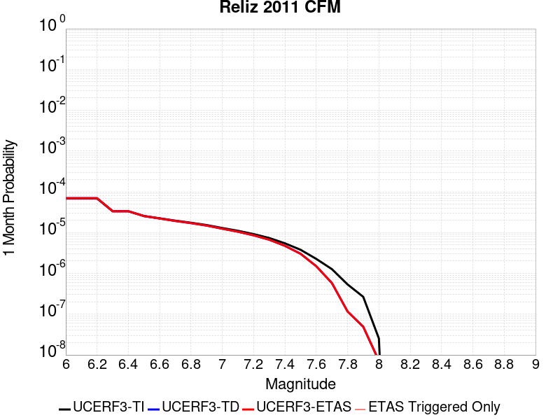 |  |  |

| Magnitude | 1 wk TI Prob | 1 wk TD Prob | 1 wk ETAS Prob | 1 wk ETAS/TD Gain | 1 wk ETAS Triggered Only | 1 mo TI Prob | 1 mo TD Prob | 1 mo ETAS Prob | 1 mo ETAS/TD Gain | 1 mo ETAS Triggered Only | 1 yr TI Prob | 1 yr TD Prob | 1 yr ETAS Prob | 1 yr ETAS/TD Gain | 1 yr ETAS Triggered Only | 10 yr TI Prob | 10 yr TD Prob | 10 yr ETAS Prob | 10 yr ETAS/TD Gain | 10 yr ETAS Triggered Only |
|-----|-----|-----|-----|-----|-----|-----|-----|-----|-----|-----|-----|-----|-----|-----|-----|-----|-----|-----|-----|-----|
| 6.0 | 1.6002472E-5 | 1.6282804E-5 | 1.6282804E-5 | 1.0 | 0.0 | 6.8580215E-5 | 6.9781694E-5 | 6.9781694E-5 | 1.0 | 0.0 | 8.3464425E-4 | 8.4928074E-4 | 8.5927226E-4 | 1.0117646 | 1.0E-5 | 0.008315164 | 0.008462547 | 0.008472463 | 1.0011717 | 1.0E-5 |
| 6.1 | 1.6002472E-5 | 1.6282804E-5 | 1.6282804E-5 | 1.0 | 0.0 | 6.8580215E-5 | 6.9781694E-5 | 6.9781694E-5 | 1.0 | 0.0 | 8.3464425E-4 | 8.4928074E-4 | 8.5927226E-4 | 1.0117646 | 1.0E-5 | 0.008315164 | 0.008462547 | 0.008472463 | 1.0011717 | 1.0E-5 |
| 6.2 | 1.6002472E-5 | 1.6282804E-5 | 1.6282804E-5 | 1.0 | 0.0 | 6.8580215E-5 | 6.9781694E-5 | 6.9781694E-5 | 1.0 | 0.0 | 8.3464425E-4 | 8.4928074E-4 | 8.5927226E-4 | 1.0117646 | 1.0E-5 | 0.008315164 | 0.008462547 | 0.008472463 | 1.0011717 | 1.0E-5 |
| 6.3 | 7.792404E-6 | 7.803802E-6 | 7.803802E-6 | 1.0 | 0.0 | 3.339559E-5 | 3.344444E-5 | 3.344444E-5 | 1.0 | 0.0 | 4.0651546E-4 | 4.0711078E-4 | 4.0711078E-4 | 1.0 | 0.0 | 0.0040577264 | 0.004063926 | 0.004063926 | 1.0 | 0.0 |
| 6.4 | 7.792404E-6 | 7.803802E-6 | 7.803802E-6 | 1.0 | 0.0 | 3.339559E-5 | 3.344444E-5 | 3.344444E-5 | 1.0 | 0.0 | 4.0651546E-4 | 4.0711078E-4 | 4.0711078E-4 | 1.0 | 0.0 | 0.0040577264 | 0.004063926 | 0.004063926 | 1.0 | 0.0 |
| 6.5 | 5.9659374E-6 | 5.928738E-6 | 5.928738E-6 | 1.0 | 0.0 | 2.5568053E-5 | 2.5408632E-5 | 2.5408632E-5 | 1.0 | 0.0 | 3.1124658E-4 | 3.093064E-4 | 3.093064E-4 | 1.0 | 0.0 | 0.00310811 | 0.0030889767 | 0.0030889767 | 1.0 | 0.0 |
| 6.6 | 5.2350692E-6 | 5.178986E-6 | 5.178986E-6 | 1.0 | 0.0 | 2.2435817E-5 | 2.2195467E-5 | 2.2195467E-5 | 1.0 | 0.0 | 2.7312184E-4 | 2.7019644E-4 | 2.7019644E-4 | 1.0 | 0.0 | 0.002727864 | 0.0026988892 | 0.0026988892 | 1.0 | 0.0 |
| 6.7 | 4.580206E-6 | 4.5061206E-6 | 4.5061206E-6 | 1.0 | 0.0 | 1.9629308E-5 | 1.9311801E-5 | 1.9311801E-5 | 1.0 | 0.0 | 2.389606E-4 | 2.350959E-4 | 2.350959E-4 | 1.0 | 0.0 | 0.002387038 | 0.0023486738 | 0.0023486738 | 1.0 | 0.0 |
| 6.8 | 4.0765017E-6 | 3.9882384E-6 | 3.9882384E-6 | 1.0 | 0.0 | 1.7470604E-5 | 1.7092338E-5 | 1.7092338E-5 | 1.0 | 0.0 | 2.1268385E-4 | 2.0807938E-4 | 2.0807938E-4 | 1.0 | 0.0 | 0.002124804 | 0.0020790435 | 0.0020790435 | 1.0 | 0.0 |
| 6.9 | 3.5752896E-6 | 3.4725176E-6 | 3.4725176E-6 | 1.0 | 0.0 | 1.532258E-5 | 1.4882134E-5 | 1.4882134E-5 | 1.0 | 0.0 | 1.8653645E-4 | 1.8117494E-4 | 1.8117494E-4 | 1.0 | 0.0 | 0.0018637994 | 0.0018104686 | 0.0018104686 | 1.0 | 0.0 |
| 7.0 | 3.0259848E-6 | 2.9079417E-6 | 2.9079417E-6 | 1.0 | 0.0 | 1.2968442E-5 | 1.2462548E-5 | 1.2462548E-5 | 1.0 | 0.0 | 1.5787935E-4 | 1.5172097E-4 | 1.5172097E-4 | 1.0 | 0.0 | 0.0015776722 | 0.001516369 | 0.001516369 | 1.0 | 0.0 |
| 7.1 | 2.5861116E-6 | 2.455167E-6 | 2.455167E-6 | 1.0 | 0.0 | 1.1083288E-5 | 1.05221025E-5 | 1.05221025E-5 | 1.0 | 0.0 | 1.3493067E-4 | 1.2809907E-4 | 1.2809907E-4 | 1.0 | 0.0 | 0.0013484878 | 0.001280447 | 0.001280447 | 1.0 | 0.0 |
| 7.2 | 2.1482588E-6 | 2.003237E-6 | 2.003237E-6 | 1.0 | 0.0 | 9.20679E-6 | 8.585273E-6 | 8.585273E-6 | 1.0 | 0.0 | 1.12086906E-4 | 1.0452068E-4 | 1.0452068E-4 | 1.0 | 0.0 | 0.0011203039 | 0.0010449095 | 0.0010449095 | 1.0 | 0.0 |
| 7.3 | 1.7194744E-6 | 1.5611241E-6 | 1.5611241E-6 | 1.0 | 0.0 | 7.3691554E-6 | 6.690515E-6 | 6.690515E-6 | 1.0 | 0.0 | 8.971577E-5 | 8.1453974E-5 | 8.1453974E-5 | 1.0 | 0.0 | 8.967956E-4 | 8.1443513E-4 | 8.1443513E-4 | 1.0 | 0.0 |
| 7.4 | 1.2755178E-6 | 1.10563E-6 | 1.10563E-6 | 1.0 | 0.0 | 5.4664933E-6 | 4.7384056E-6 | 4.7384056E-6 | 1.0 | 0.0 | 6.655252E-5 | 5.768856E-5 | 5.768856E-5 | 1.0 | 0.0 | 6.6532596E-4 | 5.7692965E-4 | 5.7692965E-4 | 1.0 | 0.0 |
| 7.5 | 8.8463224E-7 | 7.0580273E-7 | 7.0580273E-7 | 1.0 | 0.0 | 3.7912755E-6 | 3.0248652E-6 | 3.0248652E-6 | 1.0 | 0.0 | 4.6157802E-5 | 3.6827114E-5 | 3.6827114E-5 | 1.0 | 0.0 | 4.6148215E-4 | 3.684038E-4 | 3.684038E-4 | 1.0 | 0.0 |
| 7.6 | 5.291355E-7 | 3.500777E-7 | 3.500777E-7 | 1.0 | 0.0 | 2.2677216E-6 | 1.5003321E-6 | 1.5003321E-6 | 1.0 | 0.0 | 2.760916E-5 | 1.8266392E-5 | 1.8266392E-5 | 1.0 | 0.0 | 2.760573E-4 | 1.8284164E-4 | 1.8284164E-4 | 1.0 | 0.0 |
| 7.7 | 2.9663357E-7 | 1.351113E-7 | 1.351113E-7 | 1.0 | 0.0 | 1.2712861E-6 | 5.7904833E-7 | 5.7904833E-7 | 1.0 | 0.0 | 1.5477797E-5 | 7.049891E-6 | 7.049891E-6 | 1.0 | 0.0 | 1.547672E-4 | 7.068132E-5 | 7.068132E-5 | 1.0 | 0.0 |
| 7.8 | 1.2509386E-7 | 2.7157126E-8 | 2.7157126E-8 | 1.0 | 0.0 | 5.3611643E-7 | 1.1638769E-7 | 1.1638769E-7 | 1.0 | 0.0 | 6.527198E-6 | 1.4170191E-6 | 1.4170191E-6 | 1.0 | 0.0 | 6.527006E-5 | 1.4326506E-5 | 1.4326506E-5 | 1.0 | 0.0 |
| 7.9 | 6.213493E-8 | 1.1482114E-8 | 1.1482114E-8 | 1.0 | 0.0 | 2.6629255E-7 | 4.920906E-8 | 4.920906E-8 | 1.0 | 0.0 | 3.242107E-6 | 5.9912014E-7 | 5.9912014E-7 | 1.0 | 0.0 | 3.2420594E-5 | 6.1224223E-6 | 6.1224223E-6 | 1.0 | 0.0 |
| 8.0 | 5.92383E-9 | 1.677887E-9 | 1.677887E-9 | 1.0 | 0.0 | 2.5387841E-8 | 7.190944E-9 | 7.190944E-9 | 1.0 | 0.0 | 3.0909692E-7 | 8.754974E-8 | 8.754974E-8 | 1.0 | 0.0 | 3.090965E-6 | 9.003061E-7 | 9.003061E-7 | 1.0 | 0.0 |

## Elsinore (Julian)
*[(top)](#table-of-contents)*

| 1 Week | 1 Month | 1 Year | 10 Year |
|-----|-----|-----|-----|
|  | 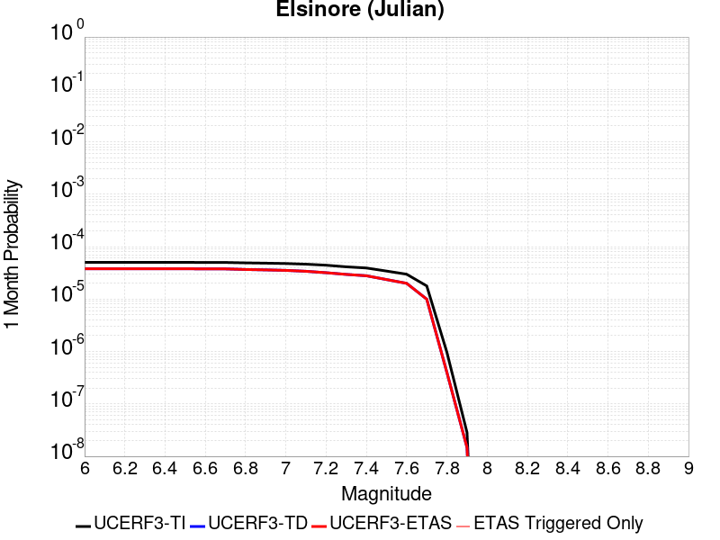 | 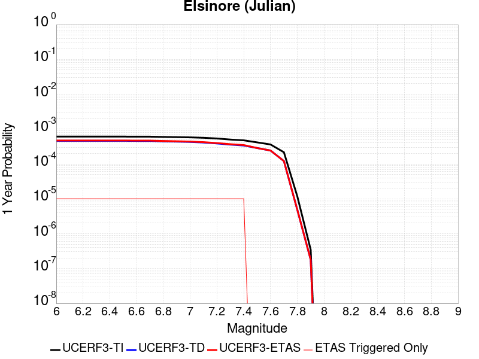 |  |

| Magnitude | 1 wk TI Prob | 1 wk TD Prob | 1 wk ETAS Prob | 1 wk ETAS/TD Gain | 1 wk ETAS Triggered Only | 1 mo TI Prob | 1 mo TD Prob | 1 mo ETAS Prob | 1 mo ETAS/TD Gain | 1 mo ETAS Triggered Only | 1 yr TI Prob | 1 yr TD Prob | 1 yr ETAS Prob | 1 yr ETAS/TD Gain | 1 yr ETAS Triggered Only | 10 yr TI Prob | 10 yr TD Prob | 10 yr ETAS Prob | 10 yr ETAS/TD Gain | 10 yr ETAS Triggered Only |
|-----|-----|-----|-----|-----|-----|-----|-----|-----|-----|-----|-----|-----|-----|-----|-----|-----|-----|-----|-----|-----|
| 6.0 | 1.1710231E-5 | 8.845509E-6 | 8.845509E-6 | 1.0 | 0.0 | 5.0185736E-5 | 3.7908783E-5 | 3.7908783E-5 | 1.0 | 0.0 | 6.1084004E-4 | 4.614434E-4 | 4.7143875E-4 | 1.0216612 | 1.0E-5 | 0.006091637 | 0.0046050567 | 0.0046150107 | 1.0021615 | 1.0E-5 |
| 6.1 | 1.1710231E-5 | 8.845509E-6 | 8.845509E-6 | 1.0 | 0.0 | 5.0185736E-5 | 3.7908783E-5 | 3.7908783E-5 | 1.0 | 0.0 | 6.1084004E-4 | 4.614434E-4 | 4.7143875E-4 | 1.0216612 | 1.0E-5 | 0.006091637 | 0.0046050567 | 0.0046150107 | 1.0021615 | 1.0E-5 |
| 6.2 | 1.1710231E-5 | 8.845509E-6 | 8.845509E-6 | 1.0 | 0.0 | 5.0185736E-5 | 3.7908783E-5 | 3.7908783E-5 | 1.0 | 0.0 | 6.1084004E-4 | 4.614434E-4 | 4.7143875E-4 | 1.0216612 | 1.0E-5 | 0.006091637 | 0.0046050567 | 0.0046150107 | 1.0021615 | 1.0E-5 |
| 6.3 | 1.1710231E-5 | 8.845509E-6 | 8.845509E-6 | 1.0 | 0.0 | 5.0185736E-5 | 3.7908783E-5 | 3.7908783E-5 | 1.0 | 0.0 | 6.1084004E-4 | 4.614434E-4 | 4.7143875E-4 | 1.0216612 | 1.0E-5 | 0.006091637 | 0.0046050567 | 0.0046150107 | 1.0021615 | 1.0E-5 |
| 6.4 | 1.1710231E-5 | 8.845509E-6 | 8.845509E-6 | 1.0 | 0.0 | 5.0185736E-5 | 3.7908783E-5 | 3.7908783E-5 | 1.0 | 0.0 | 6.1084004E-4 | 4.614434E-4 | 4.7143875E-4 | 1.0216612 | 1.0E-5 | 0.006091637 | 0.0046050567 | 0.0046150107 | 1.0021615 | 1.0E-5 |
| 6.5 | 1.1710231E-5 | 8.845509E-6 | 8.845509E-6 | 1.0 | 0.0 | 5.0185736E-5 | 3.7908783E-5 | 3.7908783E-5 | 1.0 | 0.0 | 6.1084004E-4 | 4.614434E-4 | 4.7143875E-4 | 1.0216612 | 1.0E-5 | 0.006091637 | 0.0046050567 | 0.0046150107 | 1.0021615 | 1.0E-5 |
| 6.6 | 1.1650619E-5 | 8.777881E-6 | 8.777881E-6 | 1.0 | 0.0 | 4.993027E-5 | 3.7618956E-5 | 3.7618956E-5 | 1.0 | 0.0 | 6.0773146E-4 | 4.5791623E-4 | 4.6791165E-4 | 1.021828 | 1.0E-5 | 0.0060607214 | 0.004569931 | 0.004579885 | 1.0021782 | 1.0E-5 |
| 6.7 | 1.1650619E-5 | 8.777881E-6 | 8.777881E-6 | 1.0 | 0.0 | 4.993027E-5 | 3.7618956E-5 | 3.7618956E-5 | 1.0 | 0.0 | 6.0773146E-4 | 4.5791623E-4 | 4.6791165E-4 | 1.021828 | 1.0E-5 | 0.0060607214 | 0.004569931 | 0.004579885 | 1.0021782 | 1.0E-5 |
| 6.8 | 1.1442698E-5 | 8.561041E-6 | 8.561041E-6 | 1.0 | 0.0 | 4.9039216E-5 | 3.6689667E-5 | 3.6689667E-5 | 1.0 | 0.0 | 5.968889E-4 | 4.4660683E-4 | 4.5660237E-4 | 1.0223811 | 1.0E-5 | 0.0059528816 | 0.004457295 | 0.0044672503 | 1.0022335 | 1.0E-5 |
| 6.9 | 1.1300589E-5 | 8.408907E-6 | 8.408907E-6 | 1.0 | 0.0 | 4.8430196E-5 | 3.6037683E-5 | 3.6037683E-5 | 1.0 | 0.0 | 5.894781E-4 | 4.3867214E-4 | 4.4866776E-4 | 1.022786 | 1.0E-5 | 0.005879169 | 0.0043782624 | 0.0043882183 | 1.002274 | 1.0E-5 |
| 7.0 | 1.1117729E-5 | 8.226087E-6 | 8.226087E-6 | 1.0 | 0.0 | 4.764654E-5 | 3.525419E-5 | 3.525419E-5 | 1.0 | 0.0 | 5.799422E-4 | 4.291369E-4 | 4.3913262E-4 | 1.0232925 | 1.0E-5 | 0.0057843104 | 0.004283281 | 0.004293238 | 1.0023247 | 1.0E-5 |
| 7.1 | 1.08053955E-5 | 7.9117535E-6 | 7.9117535E-6 | 1.0 | 0.0 | 4.6308014E-5 | 3.3907087E-5 | 3.3907087E-5 | 1.0 | 0.0 | 5.6365423E-4 | 4.127422E-4 | 4.2273809E-4 | 1.0242182 | 1.0E-5 | 0.005622267 | 0.0041199517 | 0.004129911 | 1.0024172 | 1.0E-5 |
| 7.2 | 1.032804E-5 | 7.433021E-6 | 7.433021E-6 | 1.0 | 0.0 | 4.4262277E-5 | 3.1855423E-5 | 3.1855423E-5 | 1.0 | 0.0 | 5.387599E-4 | 3.8777234E-4 | 3.9776845E-4 | 1.0257783 | 1.0E-5 | 0.0053745564 | 0.0038711445 | 0.0038811057 | 1.0025733 | 1.0E-5 |
| 7.3 | 9.622426E-6 | 6.8978457E-6 | 6.8978457E-6 | 1.0 | 0.0 | 4.1238312E-5 | 2.9561868E-5 | 2.9561868E-5 | 1.0 | 0.0 | 5.019608E-4 | 3.5985775E-4 | 3.6985413E-4 | 1.0277787 | 1.0E-5 | 0.005008285 | 0.0035929221 | 0.003602886 | 1.0027733 | 1.0E-5 |
| 7.4 | 9.144434E-6 | 6.4963933E-6 | 6.4963933E-6 | 1.0 | 0.0 | 3.9189843E-5 | 2.7841395E-5 | 2.7841395E-5 | 1.0 | 0.0 | 4.7703186E-4 | 3.3891766E-4 | 3.4891427E-4 | 1.0294957 | 1.0E-5 | 0.0047600917 | 0.0033841513 | 0.0033941176 | 1.002945 | 1.0E-5 |
| 7.5 | 7.988981E-6 | 5.4983307E-6 | 5.4983307E-6 | 1.0 | 0.0 | 3.4238044E-5 | 2.356407E-5 | 2.356407E-5 | 1.0 | 0.0 | 4.1676845E-4 | 2.8685606E-4 | 2.8685606E-4 | 1.0 | 0.0 | 0.0041598766 | 0.002864985 | 0.002864985 | 1.0 | 0.0 |
| 7.6 | 6.9554876E-6 | 4.6625346E-6 | 4.6625346E-6 | 1.0 | 0.0 | 2.9808893E-5 | 1.9982144E-5 | 1.9982144E-5 | 1.0 | 0.0 | 3.6286283E-4 | 2.4325661E-4 | 2.4325661E-4 | 1.0 | 0.0 | 0.0036227088 | 0.0024300197 | 0.0024300197 | 1.0 | 0.0 |
| 7.7 | 4.1557314E-6 | 2.3246462E-6 | 2.3246462E-6 | 1.0 | 0.0 | 1.7810156E-5 | 9.962735E-6 | 9.962735E-6 | 1.0 | 0.0 | 2.1681708E-4 | 1.2129029E-4 | 1.2129029E-4 | 1.0 | 0.0 | 0.0021660565 | 0.001212314 | 0.001212314 | 1.0 | 0.0 |
| 7.8 | 2.2597293E-7 | 9.332915E-8 | 9.332915E-8 | 1.0 | 0.0 | 9.684551E-7 | 3.99982E-7 | 3.99982E-7 | 1.0 | 0.0 | 1.1790877E-5 | 4.8697734E-6 | 4.8697734E-6 | 1.0 | 0.0 | 1.17902506E-4 | 4.8696995E-5 | 4.8696995E-5 | 1.0 | 0.0 |
| 7.9 | 6.676829E-9 | 3.439853E-9 | 3.439853E-9 | 1.0 | 0.0 | 2.861498E-8 | 1.4742227E-8 | 1.4742227E-8 | 1.0 | 0.0 | 3.4838732E-7 | 1.7948659E-7 | 1.7948659E-7 | 1.0 | 0.0 | 3.4838679E-6 | 1.7948646E-6 | 1.7948646E-6 | 1.0 | 0.0 |

## Malibu Coast alt 1
*[(top)](#table-of-contents)*

| 1 Week | 1 Month | 1 Year | 10 Year |
|-----|-----|-----|-----|
|  |  |  |  |

| Magnitude | 1 wk TI Prob | 1 wk TD Prob | 1 wk ETAS Prob | 1 wk ETAS/TD Gain | 1 wk ETAS Triggered Only | 1 mo TI Prob | 1 mo TD Prob | 1 mo ETAS Prob | 1 mo ETAS/TD Gain | 1 mo ETAS Triggered Only | 1 yr TI Prob | 1 yr TD Prob | 1 yr ETAS Prob | 1 yr ETAS/TD Gain | 1 yr ETAS Triggered Only | 10 yr TI Prob | 10 yr TD Prob | 10 yr ETAS Prob | 10 yr ETAS/TD Gain | 10 yr ETAS Triggered Only |
|-----|-----|-----|-----|-----|-----|-----|-----|-----|-----|-----|-----|-----|-----|-----|-----|-----|-----|-----|-----|-----|
| 6.0 | 1.6572556E-5 | 1.7598066E-5 | 1.7598066E-5 | 1.0 | 0.0 | 7.102331E-5 | 7.541821E-5 | 8.541746E-5 | 1.132584 | 1.0E-5 | 8.6436566E-4 | 9.178488E-4 | 9.278396E-4 | 1.010885 | 1.0E-5 | 0.0086101135 | 0.009142512 | 0.009152421 | 1.0010837 | 1.0E-5 |
| 6.1 | 1.6572556E-5 | 1.7598066E-5 | 1.7598066E-5 | 1.0 | 0.0 | 7.102331E-5 | 7.541821E-5 | 8.541746E-5 | 1.132584 | 1.0E-5 | 8.6436566E-4 | 9.178488E-4 | 9.278396E-4 | 1.010885 | 1.0E-5 | 0.0086101135 | 0.009142512 | 0.009152421 | 1.0010837 | 1.0E-5 |
| 6.2 | 1.1085717E-5 | 1.1557147E-5 | 1.1557147E-5 | 1.0 | 0.0 | 4.750935E-5 | 4.952971E-5 | 5.9529215E-5 | 1.201889 | 1.0E-5 | 5.782728E-4 | 6.028609E-4 | 6.128549E-4 | 1.0165776 | 1.0E-5 | 0.0057677035 | 0.0060126255 | 0.0060225655 | 1.0016532 | 1.0E-5 |
| 6.3 | 1.0208568E-5 | 1.0592237E-5 | 1.0592237E-5 | 1.0 | 0.0 | 4.375027E-5 | 4.539453E-5 | 5.5394077E-5 | 1.2202809 | 1.0E-5 | 5.325294E-4 | 5.5254117E-4 | 5.6253566E-4 | 1.0180882 | 1.0E-5 | 0.0053125503 | 0.0055119814 | 0.0055219266 | 1.0018042 | 1.0E-5 |
| 6.4 | 9.0682315E-6 | 9.342637E-6 | 9.342637E-6 | 1.0 | 0.0 | 3.8863272E-5 | 4.003927E-5 | 5.003887E-5 | 1.2497448 | 1.0E-5 | 4.730576E-4 | 4.8737114E-4 | 4.9736624E-4 | 1.0205083 | 1.0E-5 | 0.0047205184 | 0.004863236 | 0.0048731877 | 1.0020462 | 1.0E-5 |
| 6.5 | 7.605796E-6 | 7.748587E-6 | 7.748587E-6 | 1.0 | 0.0 | 3.259586E-5 | 3.3207816E-5 | 3.3207816E-5 | 1.0 | 0.0 | 3.9678233E-4 | 4.0423148E-4 | 4.0423148E-4 | 1.0 | 0.0 | 0.0039607463 | 0.0040351 | 0.0040351 | 1.0 | 0.0 |
| 6.6 | 5.889873E-6 | 5.8795385E-6 | 5.8795385E-6 | 1.0 | 0.0 | 2.5242069E-5 | 2.519778E-5 | 2.519778E-5 | 1.0 | 0.0 | 3.0727885E-4 | 3.0673988E-4 | 3.0673988E-4 | 1.0 | 0.0 | 0.003068543 | 0.0030631777 | 0.0030631777 | 1.0 | 0.0 |
| 6.7 | 5.66586E-6 | 5.641641E-6 | 5.641641E-6 | 1.0 | 0.0 | 2.428203E-5 | 2.417824E-5 | 2.417824E-5 | 1.0 | 0.0 | 2.955936E-4 | 2.9433038E-4 | 2.9433038E-4 | 1.0 | 0.0 | 0.0029520073 | 0.0029394177 | 0.0029394177 | 1.0 | 0.0 |
| 6.8 | 5.521556E-6 | 5.489427E-6 | 5.489427E-6 | 1.0 | 0.0 | 2.3663597E-5 | 2.3525903E-5 | 2.3525903E-5 | 1.0 | 0.0 | 2.880662E-4 | 2.8639034E-4 | 2.8639034E-4 | 1.0 | 0.0 | 0.0028769306 | 0.002860224 | 0.002860224 | 1.0 | 0.0 |
| 6.9 | 5.29752E-6 | 5.2499317E-6 | 5.2499317E-6 | 1.0 | 0.0 | 2.270346E-5 | 2.2499513E-5 | 2.2499513E-5 | 1.0 | 0.0 | 2.7637955E-4 | 2.7389723E-4 | 2.7389723E-4 | 1.0 | 0.0 | 0.0027603607 | 0.0027356069 | 0.0027356069 | 1.0 | 0.0 |
| 7.0 | 5.106743E-6 | 5.0476788E-6 | 5.0476788E-6 | 1.0 | 0.0 | 2.1885859E-5 | 2.163273E-5 | 2.163273E-5 | 1.0 | 0.0 | 2.6642776E-4 | 2.6334674E-4 | 2.6334674E-4 | 1.0 | 0.0 | 0.0026610855 | 0.0026303562 | 0.0026303562 | 1.0 | 0.0 |
| 7.1 | 4.8469647E-6 | 4.770373E-6 | 4.770373E-6 | 1.0 | 0.0 | 2.0772539E-5 | 2.0444295E-5 | 2.0444295E-5 | 1.0 | 0.0 | 2.528763E-4 | 2.4888094E-4 | 2.4888094E-4 | 1.0 | 0.0 | 0.0025258875 | 0.00248603 | 0.00248603 | 1.0 | 0.0 |
| 7.2 | 4.545514E-6 | 4.4481935E-6 | 4.4481935E-6 | 1.0 | 0.0 | 1.9480629E-5 | 1.9063547E-5 | 1.9063547E-5 | 1.0 | 0.0 | 2.3715083E-4 | 2.3207403E-4 | 2.3207403E-4 | 1.0 | 0.0 | 0.0023689792 | 0.0023183243 | 0.0023183243 | 1.0 | 0.0 |
| 7.3 | 3.794097E-6 | 3.6519348E-6 | 3.6519348E-6 | 1.0 | 0.0 | 1.6260314E-5 | 1.5651056E-5 | 1.5651056E-5 | 1.0 | 0.0 | 1.9795135E-4 | 1.9053498E-4 | 1.9053498E-4 | 1.0 | 0.0 | 0.001977751 | 0.0019037209 | 0.0019037209 | 1.0 | 0.0 |
| 7.4 | 2.808217E-6 | 2.719077E-6 | 2.719077E-6 | 1.0 | 0.0 | 1.203516E-5 | 1.1653135E-5 | 1.1653135E-5 | 1.0 | 0.0 | 1.4651821E-4 | 1.418677E-4 | 1.418677E-4 | 1.0 | 0.0 | 0.0014642165 | 0.001417774 | 0.001417774 | 1.0 | 0.0 |
| 7.5 | 1.83809E-6 | 1.8190691E-6 | 1.8190691E-6 | 1.0 | 0.0 | 7.877505E-6 | 7.795988E-6 | 7.795988E-6 | 1.0 | 0.0 | 9.59044E-5 | 9.491203E-5 | 9.491203E-5 | 1.0 | 0.0 | 9.5863023E-4 | 9.48717E-4 | 9.48717E-4 | 1.0 | 0.0 |
| 7.6 | 1.1292672E-6 | 1.1001447E-6 | 1.1001447E-6 | 1.0 | 0.0 | 4.839708E-6 | 4.714897E-6 | 4.714897E-6 | 1.0 | 0.0 | 5.8921847E-5 | 5.7402376E-5 | 5.7402376E-5 | 1.0 | 0.0 | 5.890623E-4 | 5.738771E-4 | 5.738771E-4 | 1.0 | 0.0 |
| 7.7 | 5.065272E-7 | 4.609151E-7 | 4.609151E-7 | 1.0 | 0.0 | 2.170829E-6 | 1.975349E-6 | 1.975349E-6 | 1.0 | 0.0 | 2.6429525E-5 | 2.404962E-5 | 2.404962E-5 | 1.0 | 0.0 | 2.642638E-4 | 2.4047129E-4 | 2.4047129E-4 | 1.0 | 0.0 |
| 7.8 | 8.952991E-8 | 6.707874E-8 | 6.707874E-8 | 1.0 | 0.0 | 3.8369956E-7 | 2.8748025E-7 | 2.8748025E-7 | 1.0 | 0.0 | 4.671532E-6 | 3.5000667E-6 | 3.5000667E-6 | 1.0 | 0.0 | 4.671434E-5 | 3.5000136E-5 | 3.5000136E-5 | 1.0 | 0.0 |
| 7.9 | 8.007447E-10 | 6.1608785E-10 | 6.1608785E-10 | 1.0 | 0.0 | 3.4317629E-9 | 2.6403764E-9 | 2.6403764E-9 | 1.0 | 0.0 | 4.1781714E-8 | 3.2146584E-8 | 3.2146584E-8 | 1.0 | 0.0 | 4.1781706E-7 | 3.214658E-7 | 3.214658E-7 | 1.0 | 0.0 |

## North Salt Lake
*[(top)](#table-of-contents)*

| 1 Week | 1 Month | 1 Year | 10 Year |
|-----|-----|-----|-----|
|  |  |  | 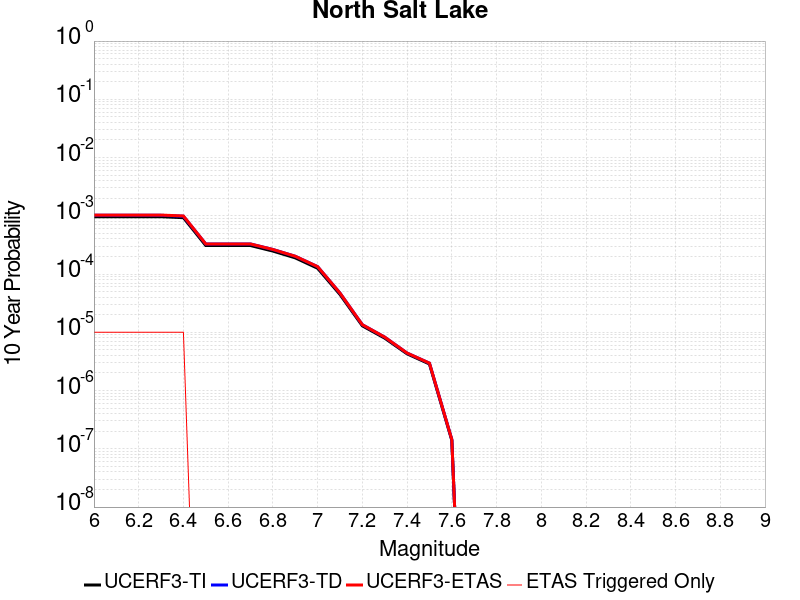 |

| Magnitude | 1 wk TI Prob | 1 wk TD Prob | 1 wk ETAS Prob | 1 wk ETAS/TD Gain | 1 wk ETAS Triggered Only | 1 mo TI Prob | 1 mo TD Prob | 1 mo ETAS Prob | 1 mo ETAS/TD Gain | 1 mo ETAS Triggered Only | 1 yr TI Prob | 1 yr TD Prob | 1 yr ETAS Prob | 1 yr ETAS/TD Gain | 1 yr ETAS Triggered Only | 10 yr TI Prob | 10 yr TD Prob | 10 yr ETAS Prob | 10 yr ETAS/TD Gain | 10 yr ETAS Triggered Only |
|-----|-----|-----|-----|-----|-----|-----|-----|-----|-----|-----|-----|-----|-----|-----|-----|-----|-----|-----|-----|-----|
| 6.0 | 1.849599E-6 | 1.955571E-6 | 1.1955552E-5 | 6.1135864 | 1.0E-5 | 7.926829E-6 | 8.381003E-6 | 1.8380919E-5 | 2.1931646 | 1.0E-5 | 9.650487E-5 | 1.0203594E-4 | 1.12034926E-4 | 1.0979947 | 1.0E-5 | 9.646297E-4 | 0.0010200888 | 0.0010300786 | 1.009793 | 1.0E-5 |
| 6.1 | 1.849599E-6 | 1.955571E-6 | 1.1955552E-5 | 6.1135864 | 1.0E-5 | 7.926829E-6 | 8.381003E-6 | 1.8380919E-5 | 2.1931646 | 1.0E-5 | 9.650487E-5 | 1.0203594E-4 | 1.12034926E-4 | 1.0979947 | 1.0E-5 | 9.646297E-4 | 0.0010200888 | 0.0010300786 | 1.009793 | 1.0E-5 |
| 6.2 | 1.849599E-6 | 1.955571E-6 | 1.1955552E-5 | 6.1135864 | 1.0E-5 | 7.926829E-6 | 8.381003E-6 | 1.8380919E-5 | 2.1931646 | 1.0E-5 | 9.650487E-5 | 1.0203594E-4 | 1.12034926E-4 | 1.0979947 | 1.0E-5 | 9.646297E-4 | 0.0010200888 | 0.0010300786 | 1.009793 | 1.0E-5 |
| 6.3 | 1.849599E-6 | 1.955571E-6 | 1.1955552E-5 | 6.1135864 | 1.0E-5 | 7.926829E-6 | 8.381003E-6 | 1.8380919E-5 | 2.1931646 | 1.0E-5 | 9.650487E-5 | 1.0203594E-4 | 1.12034926E-4 | 1.0979947 | 1.0E-5 | 9.646297E-4 | 0.0010200888 | 0.0010300786 | 1.009793 | 1.0E-5 |
| 6.4 | 1.7803909E-6 | 1.8860707E-6 | 1.1886052E-5 | 6.302018 | 1.0E-5 | 7.630225E-6 | 8.083147E-6 | 1.8083065E-5 | 2.237132 | 1.0E-5 | 9.289402E-5 | 9.840987E-5 | 1.0840889E-4 | 1.1016058 | 1.0E-5 | 9.28552E-4 | 9.838602E-4 | 9.938503E-4 | 1.010154 | 1.0E-5 |
| 6.5 | 5.9157696E-7 | 6.3001835E-7 | 6.3001835E-7 | 1.0 | 0.0 | 2.5353274E-6 | 2.7000763E-6 | 2.7000763E-6 | 1.0 | 0.0 | 3.0867173E-5 | 3.2872973E-5 | 3.2872973E-5 | 1.0 | 0.0 | 3.0862886E-4 | 3.28685E-4 | 3.28685E-4 | 1.0 | 0.0 |
| 6.6 | 5.9157696E-7 | 6.3001835E-7 | 6.3001835E-7 | 1.0 | 0.0 | 2.5353274E-6 | 2.7000763E-6 | 2.7000763E-6 | 1.0 | 0.0 | 3.0867173E-5 | 3.2872973E-5 | 3.2872973E-5 | 1.0 | 0.0 | 3.0862886E-4 | 3.28685E-4 | 3.28685E-4 | 1.0 | 0.0 |
| 6.7 | 5.9157696E-7 | 6.3001835E-7 | 6.3001835E-7 | 1.0 | 0.0 | 2.5353274E-6 | 2.7000763E-6 | 2.7000763E-6 | 1.0 | 0.0 | 3.0867173E-5 | 3.2872973E-5 | 3.2872973E-5 | 1.0 | 0.0 | 3.0862886E-4 | 3.28685E-4 | 3.28685E-4 | 1.0 | 0.0 |
| 6.8 | 4.7536267E-7 | 5.066019E-7 | 5.066019E-7 | 1.0 | 0.0 | 2.037267E-6 | 2.1711494E-6 | 2.1711494E-6 | 1.0 | 0.0 | 2.4803443E-5 | 2.6433447E-5 | 2.6433447E-5 | 1.0 | 0.0 | 2.4800675E-4 | 2.6430548E-4 | 2.6430548E-4 | 1.0 | 0.0 |
| 6.9 | 3.6345344E-7 | 3.8750048E-7 | 3.8750048E-7 | 1.0 | 0.0 | 1.5576567E-6 | 1.6607154E-6 | 1.6607154E-6 | 1.0 | 0.0 | 1.8964305E-5 | 2.021904E-5 | 2.021904E-5 | 1.0 | 0.0 | 1.8962687E-4 | 2.021737E-4 | 2.021737E-4 | 1.0 | 0.0 |
| 7.0 | 2.4087325E-7 | 2.5709335E-7 | 2.5709335E-7 | 1.0 | 0.0 | 1.0323135E-6 | 1.1018283E-6 | 1.1018283E-6 | 1.0 | 0.0 | 1.25683455E-5 | 1.3414689E-5 | 1.3414689E-5 | 1.0 | 0.0 | 1.2567634E-4 | 1.3414006E-4 | 1.3414006E-4 | 1.0 | 0.0 |
| 7.1 | 8.551555E-8 | 9.044477E-8 | 9.044477E-8 | 1.0 | 0.0 | 3.6649516E-7 | 3.876204E-7 | 3.876204E-7 | 1.0 | 0.0 | 4.4620692E-6 | 4.7192693E-6 | 4.7192693E-6 | 1.0 | 0.0 | 4.46198E-5 | 4.719181E-5 | 4.719181E-5 | 1.0 | 0.0 |
| 7.2 | 2.475279E-8 | 2.5893172E-8 | 2.5893172E-8 | 1.0 | 0.0 | 1.0608338E-7 | 1.1097074E-7 | 1.1097074E-7 | 1.0 | 0.0 | 1.2915643E-6 | 1.3510679E-6 | 1.3510679E-6 | 1.0 | 0.0 | 1.2915569E-5 | 1.3510604E-5 | 1.3510604E-5 | 1.0 | 0.0 |
| 7.3 | 1.5212393E-8 | 1.5847489E-8 | 1.5847489E-8 | 1.0 | 0.0 | 6.519597E-8 | 6.791781E-8 | 6.791781E-8 | 1.0 | 0.0 | 7.9376065E-7 | 8.2689905E-7 | 8.2689905E-7 | 1.0 | 0.0 | 7.937579E-6 | 8.268963E-6 | 8.268963E-6 | 1.0 | 0.0 |
| 7.4 | 8.182E-9 | 8.447294E-9 | 8.447294E-9 | 1.0 | 0.0 | 3.5065714E-8 | 3.620269E-8 | 3.620269E-8 | 1.0 | 0.0 | 4.26925E-7 | 4.4076765E-7 | 4.4076765E-7 | 1.0 | 0.0 | 4.269242E-6 | 4.4076683E-6 | 4.4076683E-6 | 1.0 | 0.0 |
| 7.5 | 5.479913E-9 | 5.6680434E-9 | 5.6680434E-9 | 1.0 | 0.0 | 2.3485342E-8 | 2.4291614E-8 | 2.4291614E-8 | 1.0 | 0.0 | 2.85934E-7 | 2.9575037E-7 | 2.9575037E-7 | 1.0 | 0.0 | 2.8593363E-6 | 2.9575E-6 | 2.9575E-6 | 1.0 | 0.0 |
| 7.6 | 2.6813562E-10 | 2.773195E-10 | 2.773195E-10 | 1.0 | 0.0 | 1.1491527E-9 | 1.1885122E-9 | 1.1885122E-9 | 1.0 | 0.0 | 1.3990933E-8 | 1.4470135E-8 | 1.4470135E-8 | 1.0 | 0.0 | 1.3990932E-7 | 1.4470135E-7 | 1.4470135E-7 | 1.0 | 0.0 |

## Cerro Prieto
*[(top)](#table-of-contents)*

| 1 Week | 1 Month | 1 Year | 10 Year |
|-----|-----|-----|-----|
|  |  |  |  |

| Magnitude | 1 wk TI Prob | 1 wk TD Prob | 1 wk ETAS Prob | 1 wk ETAS/TD Gain | 1 wk ETAS Triggered Only | 1 mo TI Prob | 1 mo TD Prob | 1 mo ETAS Prob | 1 mo ETAS/TD Gain | 1 mo ETAS Triggered Only | 1 yr TI Prob | 1 yr TD Prob | 1 yr ETAS Prob | 1 yr ETAS/TD Gain | 1 yr ETAS Triggered Only | 10 yr TI Prob | 10 yr TD Prob | 10 yr ETAS Prob | 10 yr ETAS/TD Gain | 10 yr ETAS Triggered Only |
|-----|-----|-----|-----|-----|-----|-----|-----|-----|-----|-----|-----|-----|-----|-----|-----|-----|-----|-----|-----|-----|
| 6.0 | 2.9101528E-4 | 5.964804E-4 | 5.964804E-4 | 1.0 | 0.0 | 0.0012466122 | 0.002554082 | 0.002554082 | 1.0 | 0.0 | 0.015072231 | 0.03064807 | 0.03064807 | 1.0 | 0.0 | 0.14089979 | 0.25397858 | 0.25398603 | 1.0000293 | 1.0E-5 |
| 6.1 | 2.9101528E-4 | 5.964804E-4 | 5.964804E-4 | 1.0 | 0.0 | 0.0012466122 | 0.002554082 | 0.002554082 | 1.0 | 0.0 | 0.015072231 | 0.03064807 | 0.03064807 | 1.0 | 0.0 | 0.14089979 | 0.25397858 | 0.25398603 | 1.0000293 | 1.0E-5 |
| 6.2 | 2.9101528E-4 | 5.964804E-4 | 5.964804E-4 | 1.0 | 0.0 | 0.0012466122 | 0.002554082 | 0.002554082 | 1.0 | 0.0 | 0.015072231 | 0.03064807 | 0.03064807 | 1.0 | 0.0 | 0.14089979 | 0.25397858 | 0.25398603 | 1.0000293 | 1.0E-5 |
| 6.3 | 2.9101528E-4 | 5.964804E-4 | 5.964804E-4 | 1.0 | 0.0 | 0.0012466122 | 0.002554082 | 0.002554082 | 1.0 | 0.0 | 0.015072231 | 0.03064807 | 0.03064807 | 1.0 | 0.0 | 0.14089979 | 0.25397858 | 0.25398603 | 1.0000293 | 1.0E-5 |
| 6.4 | 2.508648E-4 | 5.1397446E-4 | 5.1397446E-4 | 1.0 | 0.0 | 0.0010746918 | 0.0022010866 | 0.0022010866 | 1.0 | 0.0 | 0.013006088 | 0.026471792 | 0.026471792 | 1.0 | 0.0 | 0.12270685 | 0.22440416 | 0.2244119 | 1.0000346 | 1.0E-5 |
| 6.5 | 2.508648E-4 | 5.1397446E-4 | 5.1397446E-4 | 1.0 | 0.0 | 0.0010746918 | 0.0022010866 | 0.0022010866 | 1.0 | 0.0 | 0.013006088 | 0.026471792 | 0.026471792 | 1.0 | 0.0 | 0.12270685 | 0.22440416 | 0.2244119 | 1.0000346 | 1.0E-5 |
| 6.6 | 2.294914E-4 | 4.7116808E-4 | 4.7116808E-4 | 1.0 | 0.0 | 9.831638E-4 | 0.0020179166 | 0.0020179166 | 1.0 | 0.0 | 0.011904482 | 0.02429866 | 0.02429866 | 1.0 | 0.0 | 0.11286586 | 0.20858558 | 0.20859349 | 1.0000379 | 1.0E-5 |
| 6.7 | 1.9621674E-4 | 4.0419117E-4 | 4.0419117E-4 | 1.0 | 0.0 | 8.4065786E-4 | 0.0017312564 | 0.0017312564 | 1.0 | 0.0 | 0.010187071 | 0.020884845 | 0.020884845 | 1.0 | 0.0 | 0.09732539 | 0.18290249 | 0.18291067 | 1.0000447 | 1.0E-5 |
| 6.8 | 1.5476145E-4 | 3.056516E-4 | 3.056516E-4 | 1.0 | 0.0 | 6.6309475E-4 | 0.00130938 | 0.00130938 | 1.0 | 0.0 | 0.008043335 | 0.015836509 | 0.015836509 | 1.0 | 0.0 | 0.07758363 | 0.14336355 | 0.14337212 | 1.0000597 | 1.0E-5 |
| 6.9 | 1.20509176E-4 | 2.2582515E-4 | 2.2582515E-4 | 1.0 | 0.0 | 5.1636563E-4 | 9.6752634E-4 | 9.6752634E-4 | 1.0 | 0.0 | 0.006268645 | 0.011726342 | 0.011726342 | 1.0 | 0.0 | 0.060947374 | 0.109451205 | 0.10946011 | 1.0000814 | 1.0E-5 |
| 7.0 | 9.3269155E-5 | 1.6716642E-4 | 1.6716642E-4 | 1.0 | 0.0 | 3.9966372E-4 | 7.162739E-4 | 7.162739E-4 | 1.0 | 0.0 | 0.0048550544 | 0.008693418 | 0.008693418 | 1.0 | 0.0 | 0.04750344 | 0.08315912 | 0.08316828 | 1.0001103 | 1.0E-5 |
| 7.1 | 5.029709E-5 | 8.1718936E-5 | 8.1718936E-5 | 1.0 | 0.0 | 2.1554115E-4 | 3.5019626E-4 | 3.5019626E-4 | 1.0 | 0.0 | 0.0026210553 | 0.0042587193 | 0.0042587193 | 1.0 | 0.0 | 0.025903556 | 0.042365108 | 0.042365108 | 1.0 | 0.0 |
| 7.2 | 6.5445185E-8 | 6.814903E-8 | 6.814903E-8 | 1.0 | 0.0 | 2.8047933E-7 | 2.9206726E-7 | 2.9206726E-7 | 1.0 | 0.0 | 3.4148304E-6 | 3.555919E-6 | 3.555919E-6 | 1.0 | 0.0 | 3.414778E-5 | 3.5559187E-5 | 3.5559187E-5 | 1.0 | 0.0 |

## Earthquake Valley (So Extension)
*[(top)](#table-of-contents)*

| 1 Week | 1 Month | 1 Year | 10 Year |
|-----|-----|-----|-----|
|  | 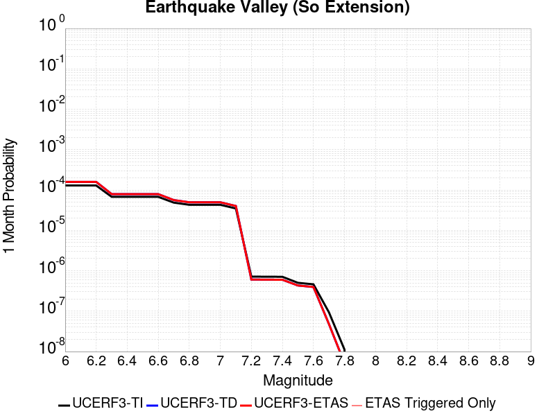 | 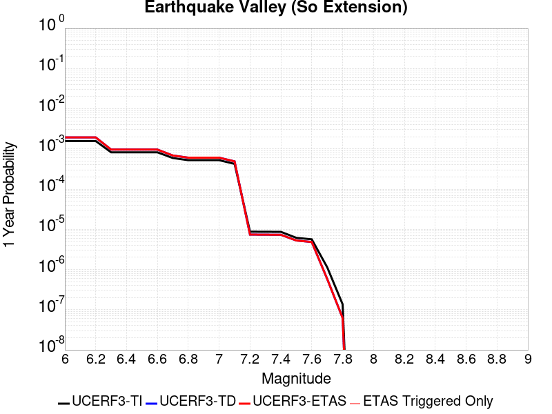 |  |

| Magnitude | 1 wk TI Prob | 1 wk TD Prob | 1 wk ETAS Prob | 1 wk ETAS/TD Gain | 1 wk ETAS Triggered Only | 1 mo TI Prob | 1 mo TD Prob | 1 mo ETAS Prob | 1 mo ETAS/TD Gain | 1 mo ETAS Triggered Only | 1 yr TI Prob | 1 yr TD Prob | 1 yr ETAS Prob | 1 yr ETAS/TD Gain | 1 yr ETAS Triggered Only | 10 yr TI Prob | 10 yr TD Prob | 10 yr ETAS Prob | 10 yr ETAS/TD Gain | 10 yr ETAS Triggered Only |
|-----|-----|-----|-----|-----|-----|-----|-----|-----|-----|-----|-----|-----|-----|-----|-----|-----|-----|-----|-----|-----|
| 6.0 | 3.0194888E-5 | 3.7072114E-5 | 3.7072114E-5 | 1.0 | 0.0 | 1.2940024E-4 | 1.5887388E-4 | 1.5887388E-4 | 1.0 | 0.0 | 0.0015743093 | 0.0019331174 | 0.0019331174 | 1.0 | 0.0 | 0.01563203 | 0.019213019 | 0.019222826 | 1.0005105 | 1.0E-5 |
| 6.1 | 3.0194888E-5 | 3.7072114E-5 | 3.7072114E-5 | 1.0 | 0.0 | 1.2940024E-4 | 1.5887388E-4 | 1.5887388E-4 | 1.0 | 0.0 | 0.0015743093 | 0.0019331174 | 0.0019331174 | 1.0 | 0.0 | 0.01563203 | 0.019213019 | 0.019222826 | 1.0005105 | 1.0E-5 |
| 6.2 | 3.0194888E-5 | 3.7072114E-5 | 3.7072114E-5 | 1.0 | 0.0 | 1.2940024E-4 | 1.5887388E-4 | 1.5887388E-4 | 1.0 | 0.0 | 0.0015743093 | 0.0019331174 | 0.0019331174 | 1.0 | 0.0 | 0.01563203 | 0.019213019 | 0.019222826 | 1.0005105 | 1.0E-5 |
| 6.3 | 1.5795305E-5 | 1.844658E-5 | 1.844658E-5 | 1.0 | 0.0 | 6.769241E-5 | 7.9055004E-5 | 7.9055004E-5 | 1.0 | 0.0 | 8.238434E-4 | 9.6218096E-4 | 9.6218096E-4 | 1.0 | 0.0 | 0.008207959 | 0.009591061 | 0.009591061 | 1.0 | 0.0 |
| 6.4 | 1.5795305E-5 | 1.844658E-5 | 1.844658E-5 | 1.0 | 0.0 | 6.769241E-5 | 7.9055004E-5 | 7.9055004E-5 | 1.0 | 0.0 | 8.238434E-4 | 9.6218096E-4 | 9.6218096E-4 | 1.0 | 0.0 | 0.008207959 | 0.009591061 | 0.009591061 | 1.0 | 0.0 |
| 6.5 | 1.5795305E-5 | 1.844658E-5 | 1.844658E-5 | 1.0 | 0.0 | 6.769241E-5 | 7.9055004E-5 | 7.9055004E-5 | 1.0 | 0.0 | 8.238434E-4 | 9.6218096E-4 | 9.6218096E-4 | 1.0 | 0.0 | 0.008207959 | 0.009591061 | 0.009591061 | 1.0 | 0.0 |
| 6.6 | 1.5795305E-5 | 1.844658E-5 | 1.844658E-5 | 1.0 | 0.0 | 6.769241E-5 | 7.9055004E-5 | 7.9055004E-5 | 1.0 | 0.0 | 8.238434E-4 | 9.6218096E-4 | 9.6218096E-4 | 1.0 | 0.0 | 0.008207959 | 0.009591061 | 0.009591061 | 1.0 | 0.0 |
| 6.7 | 1.1363076E-5 | 1.3138294E-5 | 1.3138294E-5 | 1.0 | 0.0 | 4.8697988E-5 | 5.6306188E-5 | 5.6306188E-5 | 1.0 | 0.0 | 5.927367E-4 | 6.8538834E-4 | 6.8538834E-4 | 1.0 | 0.0 | 0.0059115817 | 0.0068402183 | 0.0068402183 | 1.0 | 0.0 |
| 6.8 | 1.0049611E-5 | 1.1594334E-5 | 1.1594334E-5 | 1.0 | 0.0 | 4.306905E-5 | 4.9689468E-5 | 4.9689468E-5 | 1.0 | 0.0 | 5.242395E-4 | 6.048745E-4 | 6.048745E-4 | 1.0 | 0.0 | 0.0052300454 | 0.006039458 | 0.006039458 | 1.0 | 0.0 |
| 6.9 | 1.0049611E-5 | 1.1594334E-5 | 1.1594334E-5 | 1.0 | 0.0 | 4.306905E-5 | 4.9689468E-5 | 4.9689468E-5 | 1.0 | 0.0 | 5.242395E-4 | 6.048745E-4 | 6.048745E-4 | 1.0 | 0.0 | 0.0052300454 | 0.006039458 | 0.006039458 | 1.0 | 0.0 |
| 7.0 | 1.0049611E-5 | 1.1594334E-5 | 1.1594334E-5 | 1.0 | 0.0 | 4.306905E-5 | 4.9689468E-5 | 4.9689468E-5 | 1.0 | 0.0 | 5.242395E-4 | 6.048745E-4 | 6.048745E-4 | 1.0 | 0.0 | 0.0052300454 | 0.006039458 | 0.006039458 | 1.0 | 0.0 |
| 7.1 | 8.140254E-6 | 9.383458E-6 | 9.383458E-6 | 1.0 | 0.0 | 3.4886336E-5 | 4.0214578E-5 | 4.0214578E-5 | 1.0 | 0.0 | 4.2465836E-4 | 4.8956956E-4 | 4.8956956E-4 | 1.0 | 0.0 | 0.0042384774 | 0.0048914864 | 0.0048914864 | 1.0 | 0.0 |
| 7.2 | 1.673835E-7 | 1.4154125E-7 | 1.4154125E-7 | 1.0 | 0.0 | 7.173577E-7 | 6.066052E-7 | 6.066052E-7 | 1.0 | 0.0 | 8.733795E-6 | 7.385397E-6 | 7.385397E-6 | 1.0 | 0.0 | 8.733451E-5 | 7.385187E-5 | 7.385187E-5 | 1.0 | 0.0 |
| 7.3 | 1.6632116E-7 | 1.4052354E-7 | 1.4052354E-7 | 1.0 | 0.0 | 7.1280476E-7 | 6.0224363E-7 | 6.0224363E-7 | 1.0 | 0.0 | 8.678364E-6 | 7.332295E-6 | 7.332295E-6 | 1.0 | 0.0 | 8.6780245E-5 | 7.332089E-5 | 7.332089E-5 | 1.0 | 0.0 |
| 7.4 | 1.6569169E-7 | 1.3996983E-7 | 1.3996983E-7 | 1.0 | 0.0 | 7.1010703E-7 | 5.9987053E-7 | 5.9987053E-7 | 1.0 | 0.0 | 8.645519E-6 | 7.303403E-6 | 7.303403E-6 | 1.0 | 0.0 | 8.645182E-5 | 7.303199E-5 | 7.303199E-5 | 1.0 | 0.0 |
| 7.5 | 1.1764555E-7 | 1.0095917E-7 | 1.0095917E-7 | 1.0 | 0.0 | 5.041951E-7 | 4.326821E-7 | 4.326821E-7 | 1.0 | 0.0 | 6.138558E-6 | 5.267894E-6 | 5.267894E-6 | 1.0 | 0.0 | 6.1383886E-5 | 5.2677904E-5 | 5.2677904E-5 | 1.0 | 0.0 |
| 7.6 | 1.07927605E-7 | 9.260736E-8 | 9.260736E-8 | 1.0 | 0.0 | 4.6254678E-7 | 3.9688865E-7 | 3.9688865E-7 | 1.0 | 0.0 | 5.6314925E-6 | 4.832111E-6 | 4.832111E-6 | 1.0 | 0.0 | 5.63135E-5 | 4.8320264E-5 | 4.8320264E-5 | 1.0 | 0.0 |
| 7.7 | 2.1826905E-8 | 1.1180516E-8 | 1.1180516E-8 | 1.0 | 0.0 | 9.3543875E-8 | 4.7916494E-8 | 4.7916494E-8 | 1.0 | 0.0 | 1.1388961E-6 | 5.833832E-7 | 5.833832E-7 | 1.0 | 0.0 | 1.1388902E-5 | 5.8338223E-6 | 5.8338223E-6 | 1.0 | 0.0 |
| 7.8 | 2.6169649E-9 | 1.1969472E-9 | 1.1969472E-9 | 1.0 | 0.0 | 1.1215564E-8 | 5.1297735E-9 | 5.1297735E-9 | 1.0 | 0.0 | 1.3654947E-7 | 6.2454994E-8 | 6.2454994E-8 | 1.0 | 0.0 | 1.365494E-6 | 6.245499E-7 | 6.245499E-7 | 1.0 | 0.0 |

## Surprise Valley 2011 CFM
*[(top)](#table-of-contents)*

| 1 Week | 1 Month | 1 Year | 10 Year |
|-----|-----|-----|-----|
|  |  |  |  |

| Magnitude | 1 wk TI Prob | 1 wk TD Prob | 1 wk ETAS Prob | 1 wk ETAS/TD Gain | 1 wk ETAS Triggered Only | 1 mo TI Prob | 1 mo TD Prob | 1 mo ETAS Prob | 1 mo ETAS/TD Gain | 1 mo ETAS Triggered Only | 1 yr TI Prob | 1 yr TD Prob | 1 yr ETAS Prob | 1 yr ETAS/TD Gain | 1 yr ETAS Triggered Only | 10 yr TI Prob | 10 yr TD Prob | 10 yr ETAS Prob | 10 yr ETAS/TD Gain | 10 yr ETAS Triggered Only |
|-----|-----|-----|-----|-----|-----|-----|-----|-----|-----|-----|-----|-----|-----|-----|-----|-----|-----|-----|-----|-----|
| 6.0 | 4.0396248E-5 | 4.485131E-5 | 4.485131E-5 | 1.0 | 0.0 | 1.7311527E-4 | 1.9220692E-4 | 1.9220692E-4 | 1.0 | 0.0 | 0.002105641 | 0.0023378176 | 0.0023378176 | 1.0 | 0.0 | 0.020858008 | 0.023153966 | 0.023163734 | 1.0004219 | 1.0E-5 |
| 6.1 | 4.0396248E-5 | 4.485131E-5 | 4.485131E-5 | 1.0 | 0.0 | 1.7311527E-4 | 1.9220692E-4 | 1.9220692E-4 | 1.0 | 0.0 | 0.002105641 | 0.0023378176 | 0.0023378176 | 1.0 | 0.0 | 0.020858008 | 0.023153966 | 0.023163734 | 1.0004219 | 1.0E-5 |
| 6.2 | 2.2295266E-5 | 2.440125E-5 | 2.440125E-5 | 1.0 | 0.0 | 9.554764E-5 | 1.0457276E-4 | 1.0457276E-4 | 1.0 | 0.0 | 0.0011626717 | 0.0012724606 | 0.0012724606 | 1.0 | 0.0 | 0.011566074 | 0.012654981 | 0.0126648545 | 1.0007802 | 1.0E-5 |
| 6.3 | 1.572643E-5 | 1.7096807E-5 | 1.7096807E-5 | 1.0 | 0.0 | 6.7397246E-5 | 7.327003E-5 | 7.327003E-5 | 1.0 | 0.0 | 8.202525E-4 | 8.91708E-4 | 8.91708E-4 | 1.0 | 0.0 | 0.008172315 | 0.008882407 | 0.008892318 | 1.0011158 | 1.0E-5 |
| 6.4 | 1.5714395E-5 | 1.7084629E-5 | 1.7084629E-5 | 1.0 | 0.0 | 6.734567E-5 | 7.3217845E-5 | 7.3217845E-5 | 1.0 | 0.0 | 8.1962504E-4 | 8.9107314E-4 | 8.9107314E-4 | 1.0 | 0.0 | 0.008166086 | 0.008876109 | 0.00888602 | 1.0011166 | 1.0E-5 |
| 6.5 | 1.2733495E-5 | 1.38016E-5 | 1.38016E-5 | 1.0 | 0.0 | 5.457098E-5 | 5.9148413E-5 | 5.9148413E-5 | 1.0 | 0.0 | 6.641992E-4 | 7.1990065E-4 | 7.1990065E-4 | 1.0 | 0.0 | 0.0066221743 | 0.0071763797 | 0.007186308 | 1.0013834 | 1.0E-5 |
| 6.6 | 1.0983784E-5 | 1.1886554E-5 | 1.1886554E-5 | 1.0 | 0.0 | 4.7072506E-5 | 5.094141E-5 | 5.094141E-5 | 1.0 | 0.0 | 5.7295704E-4 | 6.200405E-4 | 6.200405E-4 | 1.0 | 0.0 | 0.0057148207 | 0.0061836545 | 0.0061935927 | 1.0016072 | 1.0E-5 |
| 6.7 | 9.104806E-6 | 9.839491E-6 | 9.839491E-6 | 1.0 | 0.0 | 3.902001E-5 | 4.2168587E-5 | 4.2168587E-5 | 1.0 | 0.0 | 4.7496508E-4 | 5.132855E-4 | 5.132855E-4 | 1.0 | 0.0 | 0.004739512 | 0.005121397 | 0.0051313457 | 1.0019426 | 1.0E-5 |
| 6.8 | 6.2162403E-6 | 6.7041337E-6 | 6.7041337E-6 | 1.0 | 0.0 | 2.6640759E-5 | 2.8731698E-5 | 2.8731698E-5 | 1.0 | 0.0 | 3.2430296E-4 | 3.497545E-4 | 3.497545E-4 | 1.0 | 0.0 | 0.003238301 | 0.0034922638 | 0.0034922638 | 1.0 | 0.0 |
| 6.9 | 4.1792696E-6 | 4.50323E-6 | 4.50323E-6 | 1.0 | 0.0 | 1.7911032E-5 | 1.9299423E-5 | 1.9299423E-5 | 1.0 | 0.0 | 2.1804498E-4 | 2.3494668E-4 | 2.3494668E-4 | 1.0 | 0.0 | 0.0021783116 | 0.0023471361 | 0.0023471361 | 1.0 | 0.0 |
| 7.0 | 2.7478413E-6 | 2.9622424E-6 | 2.9622424E-6 | 1.0 | 0.0 | 1.177641E-5 | 1.269527E-5 | 1.269527E-5 | 1.0 | 0.0 | 1.4336836E-4 | 1.545552E-4 | 1.545552E-4 | 1.0 | 0.0 | 0.001432759 | 0.0015445995 | 0.0015445995 | 1.0 | 0.0 |
| 7.1 | 8.128648E-7 | 8.724922E-7 | 8.724922E-7 | 1.0 | 0.0 | 3.4837017E-6 | 3.7392501E-6 | 3.7392501E-6 | 1.0 | 0.0 | 4.2413245E-5 | 4.552502E-5 | 4.552502E-5 | 1.0 | 0.0 | 4.2405148E-4 | 4.5521575E-4 | 4.5521575E-4 | 1.0 | 0.0 |
| 7.2 | 4.8641045E-8 | 4.9402068E-8 | 4.9402068E-8 | 1.0 | 0.0 | 2.084616E-7 | 2.1172312E-7 | 2.1172312E-7 | 1.0 | 0.0 | 2.538017E-6 | 2.577726E-6 | 2.577726E-6 | 1.0 | 0.0 | 2.537988E-5 | 2.5776973E-5 | 2.5776973E-5 | 1.0 | 0.0 |
| 7.3 | 5.3911844E-9 | 5.4758145E-9 | 5.4758145E-9 | 1.0 | 0.0 | 2.3105075E-8 | 2.3467775E-8 | 2.3467775E-8 | 1.0 | 0.0 | 2.8130427E-7 | 2.8572015E-7 | 2.8572015E-7 | 1.0 | 0.0 | 2.8130391E-6 | 2.8571992E-6 | 2.8571992E-6 | 1.0 | 0.0 |

## Point Reyes 2011 connector
*[(top)](#table-of-contents)*

| 1 Week | 1 Month | 1 Year | 10 Year |
|-----|-----|-----|-----|
|  | 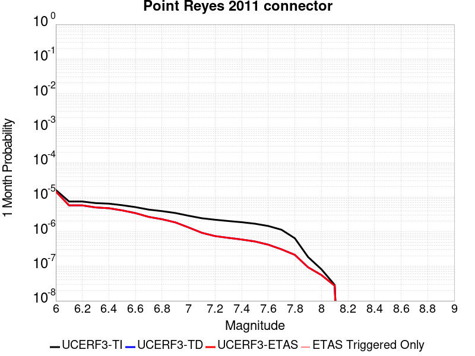 |  | 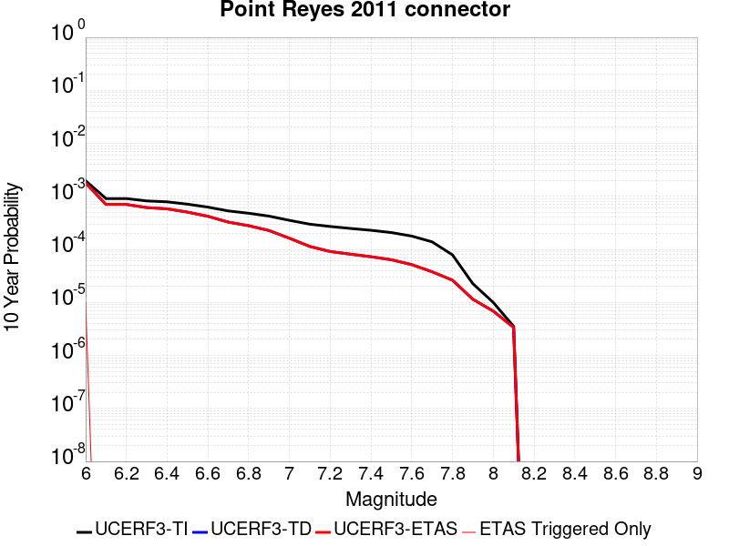 |

| Magnitude | 1 wk TI Prob | 1 wk TD Prob | 1 wk ETAS Prob | 1 wk ETAS/TD Gain | 1 wk ETAS Triggered Only | 1 mo TI Prob | 1 mo TD Prob | 1 mo ETAS Prob | 1 mo ETAS/TD Gain | 1 mo ETAS Triggered Only | 1 yr TI Prob | 1 yr TD Prob | 1 yr ETAS Prob | 1 yr ETAS/TD Gain | 1 yr ETAS Triggered Only | 10 yr TI Prob | 10 yr TD Prob | 10 yr ETAS Prob | 10 yr ETAS/TD Gain | 10 yr ETAS Triggered Only |
|-----|-----|-----|-----|-----|-----|-----|-----|-----|-----|-----|-----|-----|-----|-----|-----|-----|-----|-----|-----|-----|
| 6.0 | 3.7893044E-6 | 3.419046E-6 | 3.419046E-6 | 1.0 | 0.0 | 1.6239776E-5 | 1.4652984E-5 | 1.4652984E-5 | 1.0 | 0.0 | 1.9770133E-4 | 1.783876E-4 | 1.783876E-4 | 1.0 | 0.0 | 0.0019752553 | 0.0017829017 | 0.001792884 | 1.0055988 | 1.0E-5 |
| 6.1 | 1.7449562E-6 | 1.3500958E-6 | 1.3500958E-6 | 1.0 | 0.0 | 7.478362E-6 | 5.786112E-6 | 5.786112E-6 | 1.0 | 0.0 | 9.104525E-5 | 7.044369E-5 | 7.044369E-5 | 1.0 | 0.0 | 9.1007963E-4 | 7.044673E-4 | 7.044673E-4 | 1.0 | 0.0 |
| 6.2 | 1.7449562E-6 | 1.3500958E-6 | 1.3500958E-6 | 1.0 | 0.0 | 7.478362E-6 | 5.786112E-6 | 5.786112E-6 | 1.0 | 0.0 | 9.104525E-5 | 7.044369E-5 | 7.044369E-5 | 1.0 | 0.0 | 9.1007963E-4 | 7.044673E-4 | 7.044673E-4 | 1.0 | 0.0 |
| 6.3 | 1.5739171E-6 | 1.1773358E-6 | 1.1773358E-6 | 1.0 | 0.0 | 6.7453416E-6 | 5.0457156E-6 | 5.0457156E-6 | 1.0 | 0.0 | 8.212144E-5 | 6.14299E-5 | 6.14299E-5 | 1.0 | 0.0 | 8.2091097E-4 | 6.1438145E-4 | 6.1438145E-4 | 1.0 | 0.0 |
| 6.4 | 1.5138507E-6 | 1.1166904E-6 | 1.1166904E-6 | 1.0 | 0.0 | 6.4879155E-6 | 4.7858075E-6 | 4.7858075E-6 | 1.0 | 0.0 | 7.898751E-5 | 5.8265687E-5 | 5.8265687E-5 | 1.0 | 0.0 | 7.8959437E-4 | 5.827562E-4 | 5.827562E-4 | 1.0 | 0.0 |
| 6.5 | 1.3662817E-6 | 9.671372E-7 | 9.671372E-7 | 1.0 | 0.0 | 5.8554797E-6 | 4.1448675E-6 | 4.1448675E-6 | 1.0 | 0.0 | 7.128814E-5 | 5.046261E-5 | 5.046261E-5 | 1.0 | 0.0 | 7.126527E-4 | 5.047615E-4 | 5.047615E-4 | 1.0 | 0.0 |
| 6.6 | 1.2022703E-6 | 8.0703006E-7 | 8.0703006E-7 | 1.0 | 0.0 | 5.1525767E-6 | 3.4586958E-6 | 3.4586958E-6 | 1.0 | 0.0 | 6.273081E-5 | 4.210882E-5 | 4.210882E-5 | 1.0 | 0.0 | 6.271311E-4 | 4.2125754E-4 | 4.2125754E-4 | 1.0 | 0.0 |
| 6.7 | 1.0194848E-6 | 6.265979E-7 | 6.265979E-7 | 1.0 | 0.0 | 4.3692135E-6 | 2.6854168E-6 | 2.6854168E-6 | 1.0 | 0.0 | 5.319387E-5 | 3.2694465E-5 | 3.2694465E-5 | 1.0 | 0.0 | 5.3181144E-4 | 3.271452E-4 | 3.271452E-4 | 1.0 | 0.0 |
| 6.8 | 9.212307E-7 | 5.3645635E-7 | 5.3645635E-7 | 1.0 | 0.0 | 3.9481256E-6 | 2.2990966E-6 | 2.2990966E-6 | 1.0 | 0.0 | 4.806737E-5 | 2.7991146E-5 | 2.7991146E-5 | 1.0 | 0.0 | 4.8056975E-4 | 2.8012466E-4 | 2.8012466E-4 | 1.0 | 0.0 |
| 6.9 | 8.1306075E-7 | 4.350046E-7 | 4.350046E-7 | 1.0 | 0.0 | 3.4845416E-6 | 1.8643041E-6 | 1.8643041E-6 | 1.0 | 0.0 | 4.2423468E-5 | 2.2697668E-5 | 2.2697668E-5 | 1.0 | 0.0 | 4.241537E-4 | 2.2720183E-4 | 2.2720183E-4 | 1.0 | 0.0 |
| 7.0 | 6.773335E-7 | 3.1073702E-7 | 3.1073702E-7 | 1.0 | 0.0 | 2.9028547E-6 | 1.3317294E-6 | 1.3317294E-6 | 1.0 | 0.0 | 3.5341684E-5 | 1.6213686E-5 | 1.6213686E-5 | 1.0 | 0.0 | 3.5336064E-4 | 1.6237324E-4 | 1.6237324E-4 | 1.0 | 0.0 |
| 7.1 | 5.7279397E-7 | 2.1742792E-7 | 2.1742792E-7 | 1.0 | 0.0 | 2.454829E-6 | 9.3183365E-7 | 9.3183365E-7 | 1.0 | 0.0 | 2.9887131E-5 | 1.1345015E-5 | 1.1345015E-5 | 1.0 | 0.0 | 2.9883112E-4 | 1.13692506E-4 | 1.13692506E-4 | 1.0 | 0.0 |
| 7.2 | 5.185539E-7 | 1.7429139E-7 | 1.7429139E-7 | 1.0 | 0.0 | 2.222372E-6 | 7.469629E-7 | 7.469629E-7 | 1.0 | 0.0 | 2.7057044E-5 | 9.094235E-6 | 9.094235E-6 | 1.0 | 0.0 | 2.7053748E-4 | 9.118677E-5 | 9.118677E-5 | 1.0 | 0.0 |
| 7.3 | 4.7599846E-7 | 1.5520465E-7 | 1.5520465E-7 | 1.0 | 0.0 | 2.0399918E-6 | 6.6516264E-7 | 6.6516264E-7 | 1.0 | 0.0 | 2.4836616E-5 | 8.0983245E-6 | 8.0983245E-6 | 1.0 | 0.0 | 2.4833842E-4 | 8.122844E-5 | 8.122844E-5 | 1.0 | 0.0 |
| 7.4 | 4.3987393E-7 | 1.3893278E-7 | 1.3893278E-7 | 1.0 | 0.0 | 1.8851727E-6 | 5.9542606E-7 | 5.9542606E-7 | 1.0 | 0.0 | 2.2951735E-5 | 7.249288E-6 | 7.249288E-6 | 1.0 | 0.0 | 2.2949366E-4 | 7.273859E-5 | 7.273859E-5 | 1.0 | 0.0 |
| 7.5 | 3.980054E-7 | 1.218581E-7 | 1.218581E-7 | 1.0 | 0.0 | 1.7057363E-6 | 5.222489E-7 | 5.222489E-7 | 1.0 | 0.0 | 2.0767142E-5 | 6.358361E-6 | 6.358361E-6 | 1.0 | 0.0 | 2.0765202E-4 | 6.382455E-5 | 6.382455E-5 | 1.0 | 0.0 |
| 7.6 | 3.4188398E-7 | 9.8577246E-8 | 9.8577246E-8 | 1.0 | 0.0 | 1.4652163E-6 | 4.2247387E-7 | 4.2247387E-7 | 1.0 | 0.0 | 1.7838862E-5 | 5.143607E-6 | 5.143607E-6 | 1.0 | 0.0 | 1.783743E-4 | 5.166426E-5 | 5.166426E-5 | 1.0 | 0.0 |
| 7.7 | 2.6611437E-7 | 7.213626E-8 | 7.213626E-8 | 1.0 | 0.0 | 1.1404896E-6 | 3.0915538E-7 | 3.0915538E-7 | 1.0 | 0.0 | 1.3885373E-5 | 3.7639602E-6 | 3.7639602E-6 | 1.0 | 0.0 | 1.3884505E-4 | 3.78245E-5 | 3.78245E-5 | 1.0 | 0.0 |
| 7.8 | 1.5107078E-7 | 5.0054087E-8 | 5.0054087E-8 | 1.0 | 0.0 | 6.474461E-7 | 2.145175E-7 | 2.145175E-7 | 1.0 | 0.0 | 7.882627E-6 | 2.6117473E-6 | 2.6117473E-6 | 1.0 | 0.0 | 7.8823476E-5 | 2.6281212E-5 | 2.6281212E-5 | 1.0 | 0.0 |
| 7.9 | 4.3228205E-8 | 2.1818217E-8 | 2.1818217E-8 | 1.0 | 0.0 | 1.8526373E-7 | 9.350663E-8 | 9.350663E-8 | 1.0 | 0.0 | 2.2555835E-6 | 1.1384427E-6 | 1.1384427E-6 | 1.0 | 0.0 | 2.2555607E-5 | 1.1461557E-5 | 1.1461557E-5 | 1.0 | 0.0 |
| 8.0 | 1.9149928E-8 | 1.30497515E-8 | 1.30497515E-8 | 1.0 | 0.0 | 8.207112E-8 | 5.5927494E-8 | 5.5927494E-8 | 1.0 | 0.0 | 9.992154E-7 | 6.80917E-7 | 6.80917E-7 | 1.0 | 0.0 | 9.992109E-6 | 6.857356E-6 | 6.857356E-6 | 1.0 | 0.0 |
| 8.1 | 6.7792816E-9 | 6.4085857E-9 | 6.4085857E-9 | 1.0 | 0.0 | 2.9054062E-8 | 2.7465362E-8 | 2.7465362E-8 | 1.0 | 0.0 | 3.5373316E-7 | 3.3439076E-7 | 3.3439076E-7 | 1.0 | 0.0 | 3.537326E-6 | 3.3694284E-6 | 3.3694284E-6 | 1.0 | 0.0 |

## Elsinore (Coyote Mountains)
*[(top)](#table-of-contents)*

| 1 Week | 1 Month | 1 Year | 10 Year |
|-----|-----|-----|-----|
| 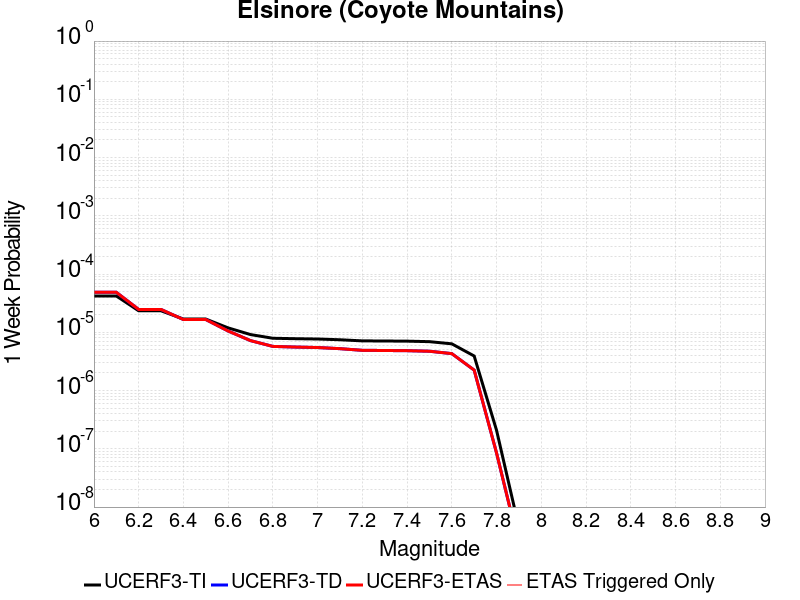 | 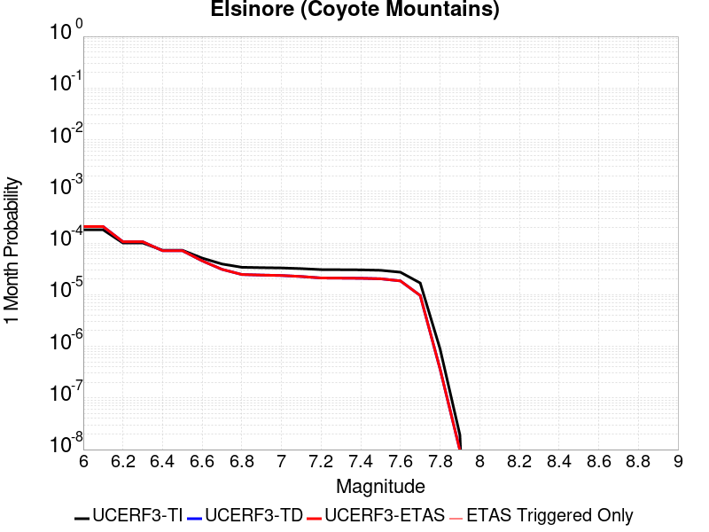 | 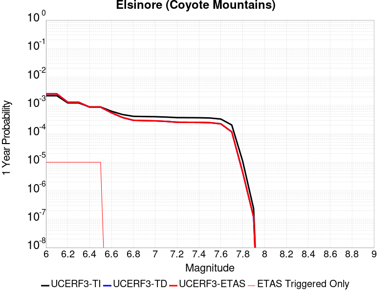 |  |

| Magnitude | 1 wk TI Prob | 1 wk TD Prob | 1 wk ETAS Prob | 1 wk ETAS/TD Gain | 1 wk ETAS Triggered Only | 1 mo TI Prob | 1 mo TD Prob | 1 mo ETAS Prob | 1 mo ETAS/TD Gain | 1 mo ETAS Triggered Only | 1 yr TI Prob | 1 yr TD Prob | 1 yr ETAS Prob | 1 yr ETAS/TD Gain | 1 yr ETAS Triggered Only | 10 yr TI Prob | 10 yr TD Prob | 10 yr ETAS Prob | 10 yr ETAS/TD Gain | 10 yr ETAS Triggered Only |
|-----|-----|-----|-----|-----|-----|-----|-----|-----|-----|-----|-----|-----|-----|-----|-----|-----|-----|-----|-----|-----|
| 6.0 | 4.20513E-5 | 4.8631882E-5 | 4.8631882E-5 | 1.0 | 0.0 | 1.8020741E-4 | 2.0840895E-4 | 2.0840895E-4 | 1.0 | 0.0 | 0.0021918174 | 0.002535 | 0.0025449747 | 1.0039347 | 1.0E-5 | 0.021703249 | 0.025111282 | 0.025121031 | 1.0003883 | 1.0E-5 |
| 6.1 | 4.20513E-5 | 4.8631882E-5 | 4.8631882E-5 | 1.0 | 0.0 | 1.8020741E-4 | 2.0840895E-4 | 2.0840895E-4 | 1.0 | 0.0 | 0.0021918174 | 0.002535 | 0.0025449747 | 1.0039347 | 1.0E-5 | 0.021703249 | 0.025111282 | 0.025121031 | 1.0003883 | 1.0E-5 |
| 6.2 | 2.3413893E-5 | 2.469566E-5 | 2.469566E-5 | 1.0 | 0.0 | 1.0034139E-4 | 1.0583479E-4 | 1.0583479E-4 | 1.0 | 0.0 | 0.0012209718 | 0.0012878707 | 0.0012978577 | 1.0077548 | 1.0E-5 | 0.012142851 | 0.01281264 | 0.012822512 | 1.0007704 | 1.0E-5 |
| 6.3 | 2.3413893E-5 | 2.469566E-5 | 2.469566E-5 | 1.0 | 0.0 | 1.0034139E-4 | 1.0583479E-4 | 1.0583479E-4 | 1.0 | 0.0 | 0.0012209718 | 0.0012878707 | 0.0012978577 | 1.0077548 | 1.0E-5 | 0.012142851 | 0.01281264 | 0.012822512 | 1.0007704 | 1.0E-5 |
| 6.4 | 1.6894814E-5 | 1.6568361E-5 | 1.6568361E-5 | 1.0 | 0.0 | 7.240433E-5 | 7.1005554E-5 | 7.1005554E-5 | 1.0 | 0.0 | 8.811662E-4 | 8.6418656E-4 | 8.741779E-4 | 1.0115616 | 1.0E-5 | 0.0087768035 | 0.00861194 | 0.008621854 | 1.0011512 | 1.0E-5 |
| 6.5 | 1.6894814E-5 | 1.6568361E-5 | 1.6568361E-5 | 1.0 | 0.0 | 7.240433E-5 | 7.1005554E-5 | 7.1005554E-5 | 1.0 | 0.0 | 8.811662E-4 | 8.6418656E-4 | 8.741779E-4 | 1.0115616 | 1.0E-5 | 0.0087768035 | 0.00861194 | 0.008621854 | 1.0011512 | 1.0E-5 |
| 6.6 | 1.1910969E-5 | 1.0530774E-5 | 1.0530774E-5 | 1.0 | 0.0 | 5.1046012E-5 | 4.5131183E-5 | 4.5131183E-5 | 1.0 | 0.0 | 6.21308E-4 | 5.4934516E-4 | 5.4934516E-4 | 1.0 | 0.0 | 0.0061957375 | 0.005481174 | 0.005481174 | 1.0 | 0.0 |
| 6.7 | 9.1486E-6 | 7.2028593E-6 | 7.2028593E-6 | 1.0 | 0.0 | 3.9207694E-5 | 3.0869054E-5 | 3.0869054E-5 | 1.0 | 0.0 | 4.7724912E-4 | 3.757697E-4 | 3.757697E-4 | 1.0 | 0.0 | 0.0047622547 | 0.0037517229 | 0.0037517229 | 1.0 | 0.0 |
| 6.8 | 7.90441E-6 | 5.7290276E-6 | 5.7290276E-6 | 1.0 | 0.0 | 3.3875604E-5 | 2.4552752E-5 | 2.4552752E-5 | 1.0 | 0.0 | 4.1235742E-4 | 2.9889002E-4 | 2.9889002E-4 | 1.0 | 0.0 | 0.0041159308 | 0.002985009 | 0.002985009 | 1.0 | 0.0 |
| 6.9 | 7.77015E-6 | 5.582982E-6 | 5.582982E-6 | 1.0 | 0.0 | 3.3300217E-5 | 2.3926852E-5 | 2.3926852E-5 | 1.0 | 0.0 | 4.0535472E-4 | 2.9127175E-4 | 2.9127175E-4 | 1.0 | 0.0 | 0.004046161 | 0.002909027 | 0.002909027 | 1.0 | 0.0 |
| 7.0 | 7.675798E-6 | 5.47984E-6 | 5.47984E-6 | 1.0 | 0.0 | 3.289586E-5 | 2.3484827E-5 | 2.3484827E-5 | 1.0 | 0.0 | 4.004335E-4 | 2.858915E-4 | 2.858915E-4 | 1.0 | 0.0 | 0.003997127 | 0.0028553635 | 0.0028553635 | 1.0 | 0.0 |
| 7.1 | 7.447814E-6 | 5.238714E-6 | 5.238714E-6 | 1.0 | 0.0 | 3.191881E-5 | 2.2451446E-5 | 2.2451446E-5 | 1.0 | 0.0 | 3.8854225E-4 | 2.7331332E-4 | 2.7331332E-4 | 1.0 | 0.0 | 0.003878636 | 0.0027298962 | 0.0027298962 | 1.0 | 0.0 |
| 7.2 | 7.128185E-6 | 4.905372E-6 | 4.905372E-6 | 1.0 | 0.0 | 3.0549007E-5 | 2.102286E-5 | 2.102286E-5 | 1.0 | 0.0 | 3.7187067E-4 | 2.5592445E-4 | 2.5592445E-4 | 1.0 | 0.0 | 0.00371249 | 0.0025564157 | 0.0025564157 | 1.0 | 0.0 |
| 7.3 | 7.0913875E-6 | 4.874047E-6 | 4.874047E-6 | 1.0 | 0.0 | 3.0391306E-5 | 2.0888614E-5 | 2.0888614E-5 | 1.0 | 0.0 | 3.6995133E-4 | 2.5429038E-4 | 2.5429038E-4 | 1.0 | 0.0 | 0.0036933604 | 0.0025401122 | 0.0025401122 | 1.0 | 0.0 |
| 7.4 | 7.051521E-6 | 4.837899E-6 | 4.837899E-6 | 1.0 | 0.0 | 3.0220453E-5 | 2.0733693E-5 | 2.0733693E-5 | 1.0 | 0.0 | 3.6787192E-4 | 2.5240466E-4 | 2.5240466E-4 | 1.0 | 0.0 | 0.0036726352 | 0.0025212981 | 0.0025212981 | 1.0 | 0.0 |
| 7.5 | 6.910666E-6 | 4.733448E-6 | 4.733448E-6 | 1.0 | 0.0 | 2.9616802E-5 | 2.0286056E-5 | 2.0286056E-5 | 1.0 | 0.0 | 3.605249E-4 | 2.4695593E-4 | 2.4695593E-4 | 1.0 | 0.0 | 0.0035994058 | 0.0024669329 | 0.0024669329 | 1.0 | 0.0 |
| 7.6 | 6.341753E-6 | 4.3065565E-6 | 4.3065565E-6 | 1.0 | 0.0 | 2.7178658E-5 | 1.8456547E-5 | 1.8456547E-5 | 1.0 | 0.0 | 3.3084993E-4 | 2.2468645E-4 | 2.2468645E-4 | 1.0 | 0.0 | 0.0033035777 | 0.002244708 | 0.002244708 | 1.0 | 0.0 |
| 7.7 | 3.9205916E-6 | 2.2439415E-6 | 2.2439415E-6 | 1.0 | 0.0 | 1.6802427E-5 | 9.616861E-6 | 9.616861E-6 | 1.0 | 0.0 | 2.0455034E-4 | 1.1707973E-4 | 1.1707973E-4 | 1.0 | 0.0 | 0.0020436216 | 0.0011702535 | 0.0011702535 | 1.0 | 0.0 |
| 7.8 | 2.0846227E-7 | 8.486417E-8 | 8.486417E-8 | 1.0 | 0.0 | 8.9340944E-7 | 3.6370355E-7 | 3.6370355E-7 | 1.0 | 0.0 | 1.0877206E-5 | 4.428085E-6 | 4.428085E-6 | 1.0 | 0.0 | 1.0876673E-4 | 4.4280296E-5 | 4.4280296E-5 | 1.0 | 0.0 |
| 7.9 | 4.4969806E-9 | 2.2691855E-9 | 2.2691855E-9 | 1.0 | 0.0 | 1.9272775E-8 | 9.72508E-9 | 9.72508E-9 | 1.0 | 0.0 | 2.3464601E-7 | 1.18402845E-7 | 1.18402845E-7 | 1.0 | 0.0 | 2.3464577E-6 | 1.184028E-6 | 1.184028E-6 | 1.0 | 0.0 |

## San Andreas (Offshore) 2011 CFM
*[(top)](#table-of-contents)*

| 1 Week | 1 Month | 1 Year | 10 Year |
|-----|-----|-----|-----|
| 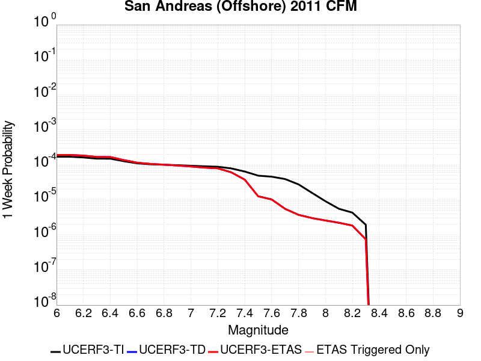 | 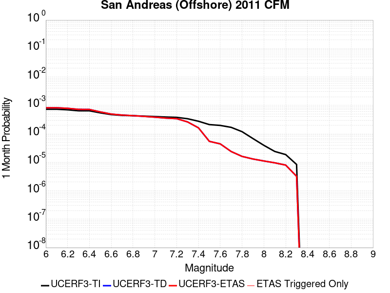 | 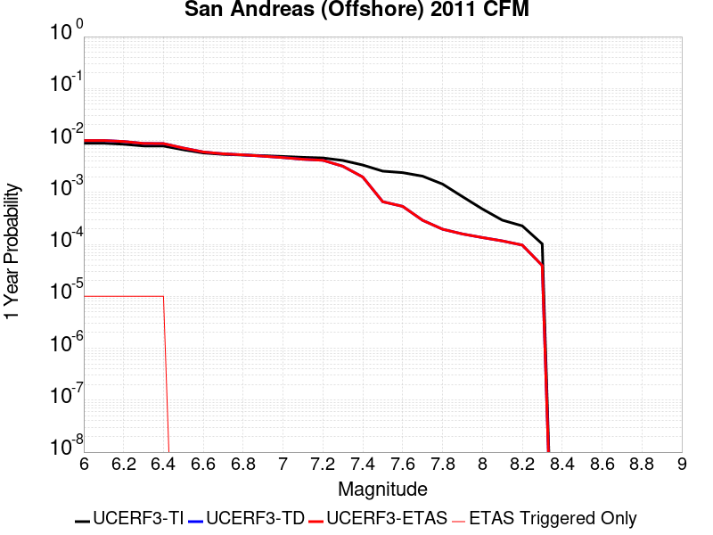 | 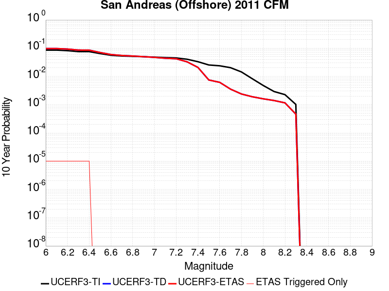 |

| Magnitude | 1 wk TI Prob | 1 wk TD Prob | 1 wk ETAS Prob | 1 wk ETAS/TD Gain | 1 wk ETAS Triggered Only | 1 mo TI Prob | 1 mo TD Prob | 1 mo ETAS Prob | 1 mo ETAS/TD Gain | 1 mo ETAS Triggered Only | 1 yr TI Prob | 1 yr TD Prob | 1 yr ETAS Prob | 1 yr ETAS/TD Gain | 1 yr ETAS Triggered Only | 10 yr TI Prob | 10 yr TD Prob | 10 yr ETAS Prob | 10 yr ETAS/TD Gain | 10 yr ETAS Triggered Only |
|-----|-----|-----|-----|-----|-----|-----|-----|-----|-----|-----|-----|-----|-----|-----|-----|-----|-----|-----|-----|-----|
| 6.0 | 1.7072787E-4 | 1.9226041E-4 | 1.9226041E-4 | 1.0 | 0.0 | 7.3148566E-4 | 8.237154E-4 | 8.237154E-4 | 1.0 | 0.0 | 0.008869528 | 0.0099831335 | 0.009993034 | 1.0009917 | 1.0E-5 | 0.085237645 | 0.09682738 | 0.09683641 | 1.0000932 | 1.0E-5 |
| 6.1 | 1.7072787E-4 | 1.9226041E-4 | 1.9226041E-4 | 1.0 | 0.0 | 7.3148566E-4 | 8.237154E-4 | 8.237154E-4 | 1.0 | 0.0 | 0.008869528 | 0.0099831335 | 0.009993034 | 1.0009917 | 1.0E-5 | 0.085237645 | 0.09682738 | 0.09683641 | 1.0000932 | 1.0E-5 |
| 6.2 | 1.6312556E-4 | 1.8407789E-4 | 1.8407789E-4 | 1.0 | 0.0 | 6.989222E-4 | 7.8866904E-4 | 7.8866904E-4 | 1.0 | 0.0 | 0.008476226 | 0.009560268 | 0.009570173 | 1.001036 | 1.0E-5 | 0.08160117 | 0.09284818 | 0.09285726 | 1.0000978 | 1.0E-5 |
| 6.3 | 1.5103363E-4 | 1.6880741E-4 | 1.6880741E-4 | 1.0 | 0.0 | 6.471264E-4 | 7.232619E-4 | 7.232619E-4 | 1.0 | 0.0 | 0.007850339 | 0.008770605 | 0.008780517 | 1.0011302 | 1.0E-5 | 0.075787395 | 0.085489064 | 0.085498214 | 1.0001069 | 1.0E-5 |
| 6.4 | 1.5047993E-4 | 1.676667E-4 | 1.676667E-4 | 1.0 | 0.0 | 6.4475456E-4 | 7.1837584E-4 | 7.1837584E-4 | 1.0 | 0.0 | 0.007821669 | 0.008711592 | 0.008721505 | 1.0011379 | 1.0E-5 | 0.0755203 | 0.08496926 | 0.08497842 | 1.0001076 | 1.0E-5 |
| 6.5 | 1.2760791E-4 | 1.3735025E-4 | 1.3735025E-4 | 1.0 | 0.0 | 5.467764E-4 | 5.885125E-4 | 5.885125E-4 | 1.0 | 0.0 | 0.0066367025 | 0.0071418737 | 0.0071418737 | 1.0 | 0.0 | 0.064419635 | 0.07025001 | 0.07025001 | 1.0 | 0.0 |
| 6.6 | 1.1063525E-4 | 1.15566356E-4 | 1.15566356E-4 | 1.0 | 0.0 | 4.740649E-4 | 4.9519143E-4 | 4.9519143E-4 | 1.0 | 0.0 | 0.0057564764 | 0.006012491 | 0.006012491 | 1.0 | 0.0 | 0.05609626 | 0.05948894 | 0.05948894 | 1.0 | 0.0 |
| 6.7 | 1.0391049E-4 | 1.0645922E-4 | 1.0645922E-4 | 1.0 | 0.0 | 4.4525467E-4 | 4.5617504E-4 | 4.5617504E-4 | 1.0 | 0.0 | 0.0054075094 | 0.005539975 | 0.005539975 | 1.0 | 0.0 | 0.052778035 | 0.05498876 | 0.05498876 | 1.0 | 0.0 |
| 6.8 | 1.0096706E-4 | 1.01582686E-4 | 1.01582686E-4 | 1.0 | 0.0 | 4.3264418E-4 | 4.3528268E-4 | 4.3528268E-4 | 1.0 | 0.0 | 0.0052547283 | 0.005286866 | 0.005286866 | 1.0 | 0.0 | 0.051321987 | 0.052687574 | 0.052687574 | 1.0 | 0.0 |
| 6.9 | 9.800265E-5 | 9.588748E-5 | 9.588748E-5 | 1.0 | 0.0 | 4.1994374E-4 | 4.1088252E-4 | 4.1088252E-4 | 1.0 | 0.0 | 0.0051008356 | 0.0049911886 | 0.0049911886 | 1.0 | 0.0 | 0.049853306 | 0.05001504 | 0.05001504 | 1.0 | 0.0 |
| 7.0 | 9.4642375E-5 | 9.002143E-5 | 9.002143E-5 | 1.0 | 0.0 | 4.0554712E-4 | 3.8574997E-4 | 3.8574997E-4 | 1.0 | 0.0 | 0.004926363 | 0.0046865544 | 0.0046865544 | 1.0 | 0.0 | 0.048185747 | 0.047196057 | 0.047196057 | 1.0 | 0.0 |
| 7.1 | 9.0996844E-5 | 8.354169E-5 | 8.354169E-5 | 1.0 | 0.0 | 3.8992817E-4 | 3.5798753E-4 | 3.5798753E-4 | 1.0 | 0.0 | 0.004737046 | 0.004349944 | 0.004349944 | 1.0 | 0.0 | 0.04637333 | 0.044047635 | 0.044047635 | 1.0 | 0.0 |
| 7.2 | 8.848287E-5 | 7.9818135E-5 | 7.9818135E-5 | 1.0 | 0.0 | 3.791572E-4 | 3.4203375E-4 | 3.4203375E-4 | 1.0 | 0.0 | 0.004606472 | 0.0041564633 | 0.0041564633 | 1.0 | 0.0 | 0.045121472 | 0.042191572 | 0.042191572 | 1.0 | 0.0 |
| 7.3 | 7.9280784E-5 | 6.1276216E-5 | 6.1276216E-5 | 1.0 | 0.0 | 3.3973053E-4 | 2.625865E-4 | 2.625865E-4 | 1.0 | 0.0 | 0.004128377 | 0.0031924061 | 0.0031924061 | 1.0 | 0.0 | 0.040525194 | 0.032904375 | 0.032904375 | 1.0 | 0.0 |
| 7.4 | 6.468038E-5 | 3.7933212E-5 | 3.7933212E-5 | 1.0 | 0.0 | 2.771722E-4 | 1.625611E-4 | 1.625611E-4 | 1.0 | 0.0 | 0.0033693502 | 0.0019774425 | 0.0019774425 | 1.0 | 0.0 | 0.0331872 | 0.02082181 | 0.02082181 | 1.0 | 0.0 |
| 7.5 | 4.930574E-5 | 1.2703362E-5 | 1.2703362E-5 | 1.0 | 0.0 | 2.1129321E-4 | 5.444185E-5 | 5.444185E-5 | 1.0 | 0.0 | 0.0025694598 | 6.6262955E-4 | 6.6262955E-4 | 1.0 | 0.0 | 0.02539953 | 0.007481418 | 0.007481418 | 1.0 | 0.0 |
| 7.6 | 4.612566E-5 | 1.0336213E-5 | 1.0336213E-5 | 1.0 | 0.0 | 1.9766642E-4 | 4.429731E-5 | 4.429731E-5 | 1.0 | 0.0 | 0.0024039324 | 5.391877E-4 | 5.391877E-4 | 1.0 | 0.0 | 0.023780935 | 0.006172099 | 0.006172099 | 1.0 | 0.0 |
| 7.7 | 3.9435414E-5 | 5.574925E-6 | 5.574925E-6 | 1.0 | 0.0 | 1.6899795E-4 | 2.3892318E-5 | 2.3892318E-5 | 1.0 | 0.0 | 0.0020556084 | 2.9085035E-4 | 2.9085035E-4 | 1.0 | 0.0 | 0.020366974 | 0.0035420412 | 0.0035420412 | 1.0 | 0.0 |
| 7.8 | 2.7787428E-5 | 3.7553348E-6 | 3.7553348E-6 | 1.0 | 0.0 | 1.1908354E-4 | 1.6094193E-5 | 1.6094193E-5 | 1.0 | 0.0 | 0.0014488777 | 1.9592921E-4 | 1.9592921E-4 | 1.0 | 0.0 | 0.014394675 | 0.0023877125 | 0.0023877125 | 1.0 | 0.0 |
| 7.9 | 1.590671E-5 | 3.04085E-6 | 3.04085E-6 | 1.0 | 0.0 | 6.816983E-5 | 1.303215E-5 | 1.303215E-5 | 1.0 | 0.0 | 8.2965166E-4 | 1.586549E-4 | 1.586549E-4 | 1.0 | 0.0 | 0.008265611 | 0.001904262 | 0.001904262 | 1.0 | 0.0 |
| 8.0 | 9.193638E-6 | 2.5920847E-6 | 2.5920847E-6 | 1.0 | 0.0 | 3.940071E-5 | 1.1108887E-5 | 1.1108887E-5 | 1.0 | 0.0 | 4.7959806E-4 | 1.3524233E-4 | 1.3524233E-4 | 1.0 | 0.0 | 0.0047856434 | 0.0016115032 | 0.0016115032 | 1.0 | 0.0 |
| 8.1 | 5.601576E-6 | 2.2343472E-6 | 2.2343472E-6 | 1.0 | 0.0 | 2.4006533E-5 | 9.575739E-6 | 9.575739E-6 | 1.0 | 0.0 | 2.9224035E-4 | 1.16578405E-4 | 1.16578405E-4 | 1.0 | 0.0 | 0.0029185633 | 0.0014020674 | 0.0014020674 | 1.0 | 0.0 |
| 8.2 | 4.3508785E-6 | 1.857566E-6 | 1.857566E-6 | 1.0 | 0.0 | 1.864649E-5 | 7.960973E-6 | 7.960973E-6 | 1.0 | 0.0 | 2.2699735E-4 | 9.692056E-5 | 9.692056E-5 | 1.0 | 0.0 | 0.0022676561 | 0.0011594221 | 0.0011594221 | 1.0 | 0.0 |
| 8.3 | 1.9573292E-6 | 7.514906E-7 | 7.514906E-7 | 1.0 | 0.0 | 8.388526E-6 | 3.22067E-6 | 3.22067E-6 | 1.0 | 0.0 | 1.0212552E-4 | 3.921097E-5 | 3.921097E-5 | 1.0 | 0.0 | 0.001020786 | 4.640846E-4 | 4.640846E-4 | 1.0 | 0.0 |

## Hayward (So) extension 2011 CFM
*[(top)](#table-of-contents)*

| 1 Week | 1 Month | 1 Year | 10 Year |
|-----|-----|-----|-----|
|  |  |  |  |

| Magnitude | 1 wk TI Prob | 1 wk TD Prob | 1 wk ETAS Prob | 1 wk ETAS/TD Gain | 1 wk ETAS Triggered Only | 1 mo TI Prob | 1 mo TD Prob | 1 mo ETAS Prob | 1 mo ETAS/TD Gain | 1 mo ETAS Triggered Only | 1 yr TI Prob | 1 yr TD Prob | 1 yr ETAS Prob | 1 yr ETAS/TD Gain | 1 yr ETAS Triggered Only | 10 yr TI Prob | 10 yr TD Prob | 10 yr ETAS Prob | 10 yr ETAS/TD Gain | 10 yr ETAS Triggered Only |
|-----|-----|-----|-----|-----|-----|-----|-----|-----|-----|-----|-----|-----|-----|-----|-----|-----|-----|-----|-----|-----|
| 6.0 | 1.1721256E-4 | 2.3697627E-4 | 2.469739E-4 | 1.0421883 | 1.0E-5 | 5.022428E-4 | 0.0010129517 | 0.0010229415 | 1.0098622 | 1.0E-5 | 0.0060976758 | 0.012248711 | 0.012258588 | 1.0008065 | 1.0E-5 | 0.0593305 | 0.112843215 | 0.11285209 | 1.0000787 | 1.0E-5 |
| 6.1 | 6.99169E-5 | 1.3822885E-4 | 1.4822747E-4 | 1.0723338 | 1.0E-5 | 2.9960944E-4 | 5.9128006E-4 | 6.0127414E-4 | 1.0169024 | 1.0E-5 | 0.0036416445 | 0.0071720886 | 0.007182017 | 1.0013843 | 1.0E-5 | 0.035825435 | 0.067803554 | 0.067812875 | 1.0001374 | 1.0E-5 |
| 6.2 | 6.99169E-5 | 1.3822885E-4 | 1.4822747E-4 | 1.0723338 | 1.0E-5 | 2.9960944E-4 | 5.9128006E-4 | 6.0127414E-4 | 1.0169024 | 1.0E-5 | 0.0036416445 | 0.0071720886 | 0.007182017 | 1.0013843 | 1.0E-5 | 0.035825435 | 0.067803554 | 0.067812875 | 1.0001374 | 1.0E-5 |
| 6.3 | 6.970908E-5 | 1.379104E-4 | 1.4790903E-4 | 1.0725008 | 1.0E-5 | 2.9871898E-4 | 5.899159E-4 | 5.9991E-4 | 1.0169415 | 1.0E-5 | 0.0036308395 | 0.007155625 | 0.0071655535 | 1.0013875 | 1.0E-5 | 0.035720866 | 0.067652516 | 0.06766184 | 1.0001378 | 1.0E-5 |
| 6.4 | 6.9517155E-5 | 1.375792E-4 | 1.4757783E-4 | 1.0726753 | 1.0E-5 | 2.9789665E-4 | 5.884971E-4 | 5.984912E-4 | 1.0169824 | 1.0E-5 | 0.0036208609 | 0.0071385372 | 0.007148466 | 1.0013908 | 1.0E-5 | 0.03562429 | 0.06749655 | 0.06750588 | 1.0001382 | 1.0E-5 |
| 6.5 | 4.786248E-5 | 9.41498E-5 | 9.41498E-5 | 1.0 | 0.0 | 2.0510878E-4 | 4.034394E-4 | 4.034394E-4 | 1.0 | 0.0 | 0.0024943394 | 0.004901227 | 0.004901227 | 1.0 | 0.0 | 0.02466527 | 0.046901822 | 0.046901822 | 1.0 | 0.0 |
| 6.6 | 4.4662214E-5 | 8.881654E-5 | 8.881654E-5 | 1.0 | 0.0 | 1.9139545E-4 | 3.805894E-4 | 3.805894E-4 | 1.0 | 0.0 | 0.0023277493 | 0.0046242937 | 0.0046242937 | 1.0 | 0.0 | 0.02303517 | 0.044293344 | 0.044293344 | 1.0 | 0.0 |
| 6.7 | 3.884542E-5 | 7.8648096E-5 | 7.8648096E-5 | 1.0 | 0.0 | 1.6646975E-4 | 3.370222E-4 | 3.370222E-4 | 1.0 | 0.0 | 0.002024885 | 0.0040959697 | 0.0040959697 | 1.0 | 0.0 | 0.020065336 | 0.039333146 | 0.039333146 | 1.0 | 0.0 |
| 6.8 | 3.4221863E-5 | 6.855653E-5 | 6.855653E-5 | 1.0 | 0.0 | 1.4665688E-4 | 2.93783E-4 | 2.93783E-4 | 1.0 | 0.0 | 0.0017840851 | 0.0035713627 | 0.0035713627 | 1.0 | 0.0 | 0.017698295 | 0.034421004 | 0.034421004 | 1.0 | 0.0 |
| 6.9 | 1.6927712E-5 | 3.0061563E-5 | 3.0061563E-5 | 1.0 | 0.0 | 7.2545314E-5 | 1.2882923E-4 | 1.2882923E-4 | 1.0 | 0.0 | 8.828813E-4 | 0.0015674243 | 0.0015674243 | 1.0 | 0.0 | 0.008793819 | 0.01546327 | 0.01546327 | 1.0 | 0.0 |
| 7.0 | 1.2509653E-5 | 2.2462571E-5 | 2.2462571E-5 | 1.0 | 0.0 | 5.3611697E-5 | 9.6264856E-5 | 9.6264856E-5 | 1.0 | 0.0 | 6.525269E-4 | 0.0011714385 | 0.0011714385 | 1.0 | 0.0 | 0.0065061417 | 0.01158231 | 0.01158231 | 1.0 | 0.0 |
| 7.1 | 8.751583E-6 | 1.4925648E-5 | 1.4925648E-5 | 1.0 | 0.0 | 3.750624E-5 | 6.3965526E-5 | 6.3965526E-5 | 1.0 | 0.0 | 4.5654282E-4 | 7.785079E-4 | 7.785079E-4 | 1.0 | 0.0 | 0.0045560603 | 0.007763496 | 0.007763496 | 1.0 | 0.0 |
| 7.2 | 6.354379E-6 | 1.1498636E-5 | 1.1498636E-5 | 1.0 | 0.0 | 2.7232769E-5 | 4.9278966E-5 | 4.9278966E-5 | 1.0 | 0.0 | 3.3150852E-4 | 5.99811E-4 | 5.99811E-4 | 1.0 | 0.0 | 0.0033101442 | 0.0060003046 | 0.0060003046 | 1.0 | 0.0 |
| 7.3 | 4.645554E-6 | 8.818172E-6 | 8.818172E-6 | 1.0 | 0.0 | 1.9909365E-5 | 3.779164E-5 | 3.779164E-5 | 1.0 | 0.0 | 2.4236954E-4 | 4.6002E-4 | 4.6002E-4 | 1.0 | 0.0 | 0.0024210536 | 0.004610708 | 0.004610708 | 1.0 | 0.0 |
| 7.4 | 4.23437E-6 | 7.992532E-6 | 7.992532E-6 | 1.0 | 0.0 | 1.8147173E-5 | 3.425328E-5 | 3.425328E-5 | 1.0 | 0.0 | 2.2091944E-4 | 4.1695772E-4 | 4.1695772E-4 | 1.0 | 0.0 | 0.0022069993 | 0.004181972 | 0.004181972 | 1.0 | 0.0 |
| 7.5 | 2.2187417E-6 | 3.9522306E-6 | 3.9522306E-6 | 1.0 | 0.0 | 9.508858E-6 | 1.6938036E-5 | 1.6938036E-5 | 1.0 | 0.0 | 1.157642E-4 | 2.0620368E-4 | 2.0620368E-4 | 1.0 | 0.0 | 0.0011570391 | 0.0020734754 | 0.0020734754 | 1.0 | 0.0 |
| 7.6 | 2.7952495E-8 | 3.878529E-8 | 3.878529E-8 | 1.0 | 0.0 | 1.1979641E-7 | 1.6622266E-7 | 1.6622266E-7 | 1.0 | 0.0 | 1.4585203E-6 | 2.0237592E-6 | 2.0237592E-6 | 1.0 | 0.0 | 1.4585107E-5 | 2.0328182E-5 | 2.0328182E-5 | 1.0 | 0.0 |
| 7.7 | 1.7192724E-8 | 2.3436517E-8 | 2.3436517E-8 | 1.0 | 0.0 | 7.36831E-8 | 1.0044221E-7 | 1.0044221E-7 | 1.0 | 0.0 | 8.9709135E-7 | 1.2228833E-6 | 1.2228833E-6 | 1.0 | 0.0 | 8.970877E-6 | 1.2296933E-5 | 1.2296933E-5 | 1.0 | 0.0 |

## Green Valley 2011 CFM
*[(top)](#table-of-contents)*

| 1 Week | 1 Month | 1 Year | 10 Year |
|-----|-----|-----|-----|
|  |  |  |  |

| Magnitude | 1 wk TI Prob | 1 wk TD Prob | 1 wk ETAS Prob | 1 wk ETAS/TD Gain | 1 wk ETAS Triggered Only | 1 mo TI Prob | 1 mo TD Prob | 1 mo ETAS Prob | 1 mo ETAS/TD Gain | 1 mo ETAS Triggered Only | 1 yr TI Prob | 1 yr TD Prob | 1 yr ETAS Prob | 1 yr ETAS/TD Gain | 1 yr ETAS Triggered Only | 10 yr TI Prob | 10 yr TD Prob | 10 yr ETAS Prob | 10 yr ETAS/TD Gain | 10 yr ETAS Triggered Only |
|-----|-----|-----|-----|-----|-----|-----|-----|-----|-----|-----|-----|-----|-----|-----|-----|-----|-----|-----|-----|-----|
| 6.0 | 9.9629346E-5 | 1.7305532E-4 | 1.7305532E-4 | 1.0 | 0.0 | 4.2691303E-4 | 7.4143766E-4 | 7.4143766E-4 | 1.0 | 0.0 | 0.0051852856 | 0.008986705 | 0.008986705 | 1.0 | 0.0 | 0.050659515 | 0.085522056 | 0.085531205 | 1.0001069 | 1.0E-5 |
| 6.1 | 9.88615E-5 | 1.7152846E-4 | 1.7152846E-4 | 1.0 | 0.0 | 4.2362334E-4 | 7.348976E-4 | 7.348976E-4 | 1.0 | 0.0 | 0.0051454236 | 0.0089077335 | 0.0089077335 | 1.0 | 0.0 | 0.050279044 | 0.084809676 | 0.084818825 | 1.0001079 | 1.0E-5 |
| 6.2 | 9.696895E-5 | 1.6791887E-4 | 1.6791887E-4 | 1.0 | 0.0 | 4.15515E-4 | 7.194366E-4 | 7.194366E-4 | 1.0 | 0.0 | 0.0050471667 | 0.008721114 | 0.008721114 | 1.0 | 0.0 | 0.04934063 | 0.0831186 | 0.083127774 | 1.0001103 | 1.0E-5 |
| 6.3 | 9.275224E-5 | 1.5971228E-4 | 1.5971228E-4 | 1.0 | 0.0 | 3.9744904E-4 | 6.842841E-4 | 6.842841E-4 | 1.0 | 0.0 | 0.0048282105 | 0.008296439 | 0.008296439 | 1.0 | 0.0 | 0.047246475 | 0.07925707 | 0.07926627 | 1.0001162 | 1.0E-5 |
| 6.4 | 8.391499E-5 | 1.4367796E-4 | 1.4367796E-4 | 1.0 | 0.0 | 3.595861E-4 | 6.156248E-4 | 6.156248E-4 | 1.0 | 0.0 | 0.004369175 | 0.0074670846 | 0.0074670846 | 1.0 | 0.0 | 0.04284265 | 0.071630865 | 0.07164015 | 1.0001296 | 1.0E-5 |
| 6.5 | 5.9519385E-5 | 9.9340905E-5 | 9.9340905E-5 | 1.0 | 0.0 | 2.5505814E-4 | 4.2568138E-4 | 4.2568138E-4 | 1.0 | 0.0 | 0.0031009112 | 0.005168295 | 0.005168295 | 1.0 | 0.0 | 0.030579966 | 0.050145864 | 0.050145864 | 1.0 | 0.0 |
| 6.6 | 4.5361558E-5 | 7.402609E-5 | 7.402609E-5 | 1.0 | 0.0 | 1.9439218E-4 | 3.1721895E-4 | 3.1721895E-4 | 1.0 | 0.0 | 0.0023641558 | 0.0038539418 | 0.0038539418 | 1.0 | 0.0 | 0.023391623 | 0.037665963 | 0.037665963 | 1.0 | 0.0 |
| 6.7 | 3.8808106E-5 | 6.2651976E-5 | 6.2651976E-5 | 1.0 | 0.0 | 1.6630985E-4 | 2.6848342E-4 | 2.6848342E-4 | 1.0 | 0.0 | 0.0020229418 | 0.0032626586 | 0.0032626586 | 1.0 | 0.0 | 0.020046256 | 0.032005914 | 0.032005914 | 1.0 | 0.0 |
| 6.8 | 2.2284667E-5 | 3.1285235E-5 | 3.1285235E-5 | 1.0 | 0.0 | 9.550222E-5 | 1.3407279E-4 | 1.3407279E-4 | 1.0 | 0.0 | 0.0011621192 | 0.0016311078 | 0.0016311078 | 1.0 | 0.0 | 0.011560607 | 0.016165998 | 0.016165998 | 1.0 | 0.0 |
| 6.9 | 1.8050168E-5 | 2.4448054E-5 | 2.4448054E-5 | 1.0 | 0.0 | 7.735557E-5 | 1.047732E-4 | 1.047732E-4 | 1.0 | 0.0 | 9.4139716E-4 | 0.0012748708 | 0.0012748708 | 1.0 | 0.0 | 0.009374191 | 0.012667833 | 0.012667833 | 1.0 | 0.0 |
| 7.0 | 1.4763166E-5 | 1.9582854E-5 | 1.9582854E-5 | 1.0 | 0.0 | 6.326917E-5 | 8.3923835E-5 | 8.3923835E-5 | 1.0 | 0.0 | 7.7002996E-4 | 0.0010212966 | 0.0010212966 | 1.0 | 0.0 | 0.007673672 | 0.010165343 | 0.010165343 | 1.0 | 0.0 |
| 7.1 | 1.2399713E-5 | 1.6303715E-5 | 1.6303715E-5 | 1.0 | 0.0 | 5.3140546E-5 | 6.98712E-5 | 6.98712E-5 | 1.0 | 0.0 | 6.467941E-4 | 8.503518E-4 | 8.503518E-4 | 1.0 | 0.0 | 0.006449148 | 0.008471259 | 0.008471259 | 1.0 | 0.0 |
| 7.2 | 1.0584195E-5 | 1.3921742E-5 | 1.3921742E-5 | 1.0 | 0.0 | 4.5360044E-5 | 5.9663253E-5 | 5.9663253E-5 | 1.0 | 0.0 | 5.521186E-4 | 7.261596E-4 | 7.261596E-4 | 1.0 | 0.0 | 0.0055074887 | 0.007238285 | 0.007238285 | 1.0 | 0.0 |
| 7.3 | 7.998173E-6 | 1.054402E-5 | 1.054402E-5 | 1.0 | 0.0 | 3.4277433E-5 | 4.518788E-5 | 4.518788E-5 | 1.0 | 0.0 | 4.1724785E-4 | 5.500247E-4 | 5.500247E-4 | 1.0 | 0.0 | 0.004164653 | 0.0054868995 | 0.0054868995 | 1.0 | 0.0 |
| 7.4 | 6.7571127E-6 | 8.932697E-6 | 8.932697E-6 | 1.0 | 0.0 | 2.8958733E-5 | 3.828243E-5 | 3.828243E-5 | 1.0 | 0.0 | 3.5251552E-4 | 4.6598984E-4 | 4.6598984E-4 | 1.0 | 0.0 | 0.0035195686 | 0.0046503306 | 0.0046503306 | 1.0 | 0.0 |
| 7.5 | 5.69878E-6 | 7.516314E-6 | 7.516314E-6 | 1.0 | 0.0 | 2.4423114E-5 | 3.221238E-5 | 3.221238E-5 | 1.0 | 0.0 | 2.9731085E-4 | 3.9211605E-4 | 3.9211605E-4 | 1.0 | 0.0 | 0.002969134 | 0.0039143935 | 0.0039143935 | 1.0 | 0.0 |
| 7.6 | 4.503664E-6 | 5.9356807E-6 | 5.9356807E-6 | 1.0 | 0.0 | 1.9301275E-5 | 2.5438389E-5 | 2.5438389E-5 | 1.0 | 0.0 | 2.3496768E-4 | 3.096692E-4 | 3.096692E-4 | 1.0 | 0.0 | 0.002347194 | 0.003092502 | 0.003092502 | 1.0 | 0.0 |
| 7.7 | 1.0873546E-6 | 1.4106979E-6 | 1.4106979E-6 | 1.0 | 0.0 | 4.6600826E-6 | 6.045834E-6 | 6.045834E-6 | 1.0 | 0.0 | 5.6735033E-5 | 7.360557E-5 | 7.360557E-5 | 1.0 | 0.0 | 5.672055E-4 | 7.35814E-4 | 7.35814E-4 | 1.0 | 0.0 |
| 7.8 | 4.9373917E-8 | 6.1777136E-8 | 6.1777136E-8 | 1.0 | 0.0 | 2.1160248E-7 | 2.6475914E-7 | 2.6475914E-7 | 1.0 | 0.0 | 2.5762572E-6 | 3.223439E-6 | 3.223439E-6 | 1.0 | 0.0 | 2.5762274E-5 | 3.2232296E-5 | 3.2232296E-5 | 1.0 | 0.0 |

## Earthquake Valley
*[(top)](#table-of-contents)*

| 1 Week | 1 Month | 1 Year | 10 Year |
|-----|-----|-----|-----|
|  |  |  | 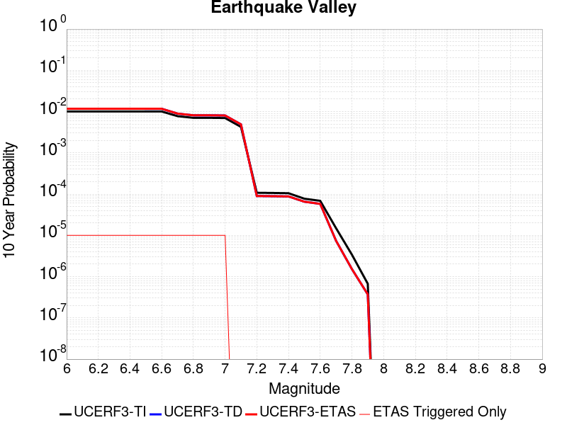 |

| Magnitude | 1 wk TI Prob | 1 wk TD Prob | 1 wk ETAS Prob | 1 wk ETAS/TD Gain | 1 wk ETAS Triggered Only | 1 mo TI Prob | 1 mo TD Prob | 1 mo ETAS Prob | 1 mo ETAS/TD Gain | 1 mo ETAS Triggered Only | 1 yr TI Prob | 1 yr TD Prob | 1 yr ETAS Prob | 1 yr ETAS/TD Gain | 1 yr ETAS Triggered Only | 10 yr TI Prob | 10 yr TD Prob | 10 yr ETAS Prob | 10 yr ETAS/TD Gain | 10 yr ETAS Triggered Only |
|-----|-----|-----|-----|-----|-----|-----|-----|-----|-----|-----|-----|-----|-----|-----|-----|-----|-----|-----|-----|-----|
| 6.0 | 1.9416384E-5 | 2.258408E-5 | 2.258408E-5 | 1.0 | 0.0 | 8.321042E-5 | 9.6785996E-5 | 9.6785996E-5 | 1.0 | 0.0 | 0.001012616 | 0.0011778527 | 0.001187841 | 1.0084801 | 1.0E-5 | 0.010080142 | 0.011727943 | 0.011737825 | 1.0008427 | 1.0E-5 |
| 6.1 | 1.9416384E-5 | 2.258408E-5 | 2.258408E-5 | 1.0 | 0.0 | 8.321042E-5 | 9.6785996E-5 | 9.6785996E-5 | 1.0 | 0.0 | 0.001012616 | 0.0011778527 | 0.001187841 | 1.0084801 | 1.0E-5 | 0.010080142 | 0.011727943 | 0.011737825 | 1.0008427 | 1.0E-5 |
| 6.2 | 1.9416384E-5 | 2.258408E-5 | 2.258408E-5 | 1.0 | 0.0 | 8.321042E-5 | 9.6785996E-5 | 9.6785996E-5 | 1.0 | 0.0 | 0.001012616 | 0.0011778527 | 0.001187841 | 1.0084801 | 1.0E-5 | 0.010080142 | 0.011727943 | 0.011737825 | 1.0008427 | 1.0E-5 |
| 6.3 | 1.9416384E-5 | 2.258408E-5 | 2.258408E-5 | 1.0 | 0.0 | 8.321042E-5 | 9.6785996E-5 | 9.6785996E-5 | 1.0 | 0.0 | 0.001012616 | 0.0011778527 | 0.001187841 | 1.0084801 | 1.0E-5 | 0.010080142 | 0.011727943 | 0.011737825 | 1.0008427 | 1.0E-5 |
| 6.4 | 1.9416384E-5 | 2.258408E-5 | 2.258408E-5 | 1.0 | 0.0 | 8.321042E-5 | 9.6785996E-5 | 9.6785996E-5 | 1.0 | 0.0 | 0.001012616 | 0.0011778527 | 0.001187841 | 1.0084801 | 1.0E-5 | 0.010080142 | 0.011727943 | 0.011737825 | 1.0008427 | 1.0E-5 |
| 6.5 | 1.9389157E-5 | 2.255267E-5 | 2.255267E-5 | 1.0 | 0.0 | 8.309374E-5 | 9.665139E-5 | 9.665139E-5 | 1.0 | 0.0 | 0.0010111968 | 0.0011762156 | 0.0011862039 | 1.0084919 | 1.0E-5 | 0.010066078 | 0.011711745 | 0.011721628 | 1.0008439 | 1.0E-5 |
| 6.6 | 1.9389157E-5 | 2.255267E-5 | 2.255267E-5 | 1.0 | 0.0 | 8.309374E-5 | 9.665139E-5 | 9.665139E-5 | 1.0 | 0.0 | 0.0010111968 | 0.0011762156 | 0.0011862039 | 1.0084919 | 1.0E-5 | 0.010066078 | 0.011711745 | 0.011721628 | 1.0008439 | 1.0E-5 |
| 6.7 | 1.4925434E-5 | 1.7208227E-5 | 1.7208227E-5 | 1.0 | 0.0 | 6.396457E-5 | 7.374794E-5 | 7.374794E-5 | 1.0 | 0.0 | 7.7849044E-4 | 8.9759636E-4 | 9.0758735E-4 | 1.0111308 | 1.0E-5 | 0.007757689 | 0.008948085 | 0.008957995 | 1.0011076 | 1.0E-5 |
| 6.8 | 1.3570335E-5 | 1.5616843E-5 | 1.5616843E-5 | 1.0 | 0.0 | 5.8157282E-5 | 6.692807E-5 | 6.692807E-5 | 1.0 | 0.0 | 7.0783484E-4 | 8.1462675E-4 | 8.246186E-4 | 1.0122656 | 1.0E-5 | 0.0070558446 | 0.008124476 | 0.008134395 | 1.0012208 | 1.0E-5 |
| 6.9 | 1.3570335E-5 | 1.5616843E-5 | 1.5616843E-5 | 1.0 | 0.0 | 5.8157282E-5 | 6.692807E-5 | 6.692807E-5 | 1.0 | 0.0 | 7.0783484E-4 | 8.1462675E-4 | 8.246186E-4 | 1.0122656 | 1.0E-5 | 0.0070558446 | 0.008124476 | 0.008134395 | 1.0012208 | 1.0E-5 |
| 7.0 | 1.3433392E-5 | 1.5460388E-5 | 1.5460388E-5 | 1.0 | 0.0 | 5.757041E-5 | 6.6257584E-5 | 6.6257584E-5 | 1.0 | 0.0 | 7.0069433E-4 | 8.064695E-4 | 8.1646146E-4 | 1.0123898 | 1.0E-5 | 0.006984891 | 0.008043497 | 0.008053416 | 1.0012332 | 1.0E-5 |
| 7.1 | 8.181609E-6 | 9.416851E-6 | 9.416851E-6 | 1.0 | 0.0 | 3.5063567E-5 | 4.0357685E-5 | 4.0357685E-5 | 1.0 | 0.0 | 4.268153E-4 | 4.9131113E-4 | 4.9131113E-4 | 1.0 | 0.0 | 0.0042599645 | 0.0049088253 | 0.0049088253 | 1.0 | 0.0 |
| 7.2 | 2.0663983E-7 | 1.726294E-7 | 1.726294E-7 | 1.0 | 0.0 | 8.855989E-7 | 7.398401E-7 | 7.398401E-7 | 1.0 | 0.0 | 1.0782113E-5 | 9.00752E-6 | 9.00752E-6 | 1.0 | 0.0 | 1.07815904E-4 | 9.00719E-5 | 9.00719E-5 | 1.0 | 0.0 |
| 7.3 | 2.0462376E-7 | 1.7078433E-7 | 1.7078433E-7 | 1.0 | 0.0 | 8.7695867E-7 | 7.319327E-7 | 7.319327E-7 | 1.0 | 0.0 | 1.0676919E-5 | 8.911247E-6 | 8.911247E-6 | 1.0 | 0.0 | 1.0676406E-4 | 8.910926E-5 | 8.910926E-5 | 1.0 | 0.0 |
| 7.4 | 2.0171088E-7 | 1.6860913E-7 | 1.6860913E-7 | 1.0 | 0.0 | 8.644749E-7 | 7.2261037E-7 | 7.2261037E-7 | 1.0 | 0.0 | 1.0524931E-5 | 8.79775E-6 | 8.79775E-6 | 1.0 | 0.0 | 1.05244326E-4 | 8.7974375E-5 | 8.7974375E-5 | 1.0 | 0.0 |
| 7.5 | 1.4847944E-7 | 1.2559275E-7 | 1.2559275E-7 | 1.0 | 0.0 | 6.363403E-7 | 5.3825454E-7 | 5.3825454E-7 | 1.0 | 0.0 | 7.747416E-6 | 6.5532317E-6 | 6.5532317E-6 | 1.0 | 0.0 | 7.747146E-5 | 6.55306E-5 | 6.55306E-5 | 1.0 | 0.0 |
| 7.6 | 1.3185847E-7 | 1.1123213E-7 | 1.1123213E-7 | 1.0 | 0.0 | 5.6510765E-7 | 4.7670906E-7 | 4.7670906E-7 | 1.0 | 0.0 | 6.8801637E-6 | 5.8039195E-6 | 5.8039195E-6 | 1.0 | 0.0 | 6.8799505E-5 | 5.803789E-5 | 5.803789E-5 | 1.0 | 0.0 |
| 7.7 | 2.8609954E-8 | 1.4170958E-8 | 1.4170958E-8 | 1.0 | 0.0 | 1.2261408E-7 | 6.0732674E-8 | 6.0732674E-8 | 1.0 | 0.0 | 1.4928254E-6 | 7.394201E-7 | 7.394201E-7 | 1.0 | 0.0 | 1.4928154E-5 | 7.394182E-6 | 7.394182E-6 | 1.0 | 0.0 |
| 7.8 | 6.527266E-9 | 2.923417E-9 | 2.923417E-9 | 1.0 | 0.0 | 2.7973995E-8 | 1.2528931E-8 | 1.2528931E-8 | 1.0 | 0.0 | 3.4058334E-7 | 1.5253973E-7 | 1.5253973E-7 | 1.0 | 0.0 | 3.4058282E-6 | 1.5253964E-6 | 1.5253964E-6 | 1.0 | 0.0 |
| 7.9 | 1.2898267E-9 | 7.127684E-10 | 7.127684E-10 | 1.0 | 0.0 | 5.527829E-9 | 3.0547218E-9 | 3.0547218E-9 | 1.0 | 0.0 | 6.7301315E-8 | 3.719124E-8 | 3.719124E-8 | 1.0 | 0.0 | 6.7301295E-7 | 3.719124E-7 | 3.719124E-7 | 1.0 | 0.0 |

## Eaton Roughs 2011 CFM
*[(top)](#table-of-contents)*

| 1 Week | 1 Month | 1 Year | 10 Year |
|-----|-----|-----|-----|
| 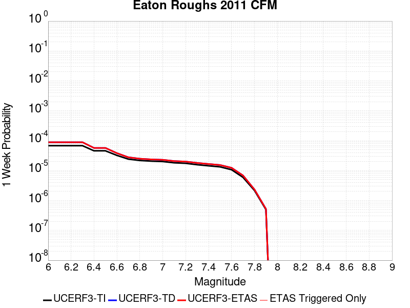 |  |  | 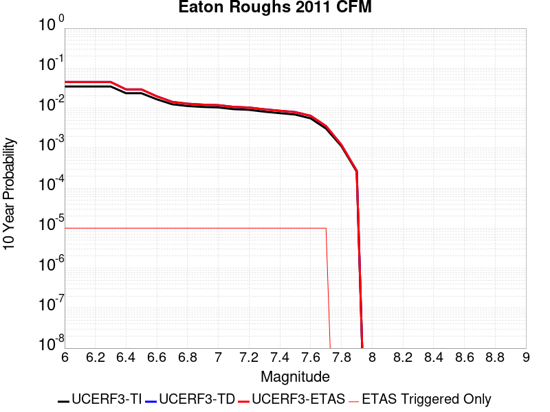 |

| Magnitude | 1 wk TI Prob | 1 wk TD Prob | 1 wk ETAS Prob | 1 wk ETAS/TD Gain | 1 wk ETAS Triggered Only | 1 mo TI Prob | 1 mo TD Prob | 1 mo ETAS Prob | 1 mo ETAS/TD Gain | 1 mo ETAS Triggered Only | 1 yr TI Prob | 1 yr TD Prob | 1 yr ETAS Prob | 1 yr ETAS/TD Gain | 1 yr ETAS Triggered Only | 10 yr TI Prob | 10 yr TD Prob | 10 yr ETAS Prob | 10 yr ETAS/TD Gain | 10 yr ETAS Triggered Only |
|-----|-----|-----|-----|-----|-----|-----|-----|-----|-----|-----|-----|-----|-----|-----|-----|-----|-----|-----|-----|-----|
| 6.0 | 6.8044945E-5 | 8.843646E-5 | 8.843646E-5 | 1.0 | 0.0 | 2.9158857E-4 | 3.7896493E-4 | 3.7896493E-4 | 1.0 | 0.0 | 0.0035443127 | 0.0046050907 | 0.0046150447 | 1.0021615 | 1.0E-5 | 0.03488314 | 0.04516335 | 0.045172896 | 1.0002115 | 1.0E-5 |
| 6.1 | 6.8044945E-5 | 8.843646E-5 | 8.843646E-5 | 1.0 | 0.0 | 2.9158857E-4 | 3.7896493E-4 | 3.7896493E-4 | 1.0 | 0.0 | 0.0035443127 | 0.0046050907 | 0.0046150447 | 1.0021615 | 1.0E-5 | 0.03488314 | 0.04516335 | 0.045172896 | 1.0002115 | 1.0E-5 |
| 6.2 | 6.8044945E-5 | 8.843646E-5 | 8.843646E-5 | 1.0 | 0.0 | 2.9158857E-4 | 3.7896493E-4 | 3.7896493E-4 | 1.0 | 0.0 | 0.0035443127 | 0.0046050907 | 0.0046150447 | 1.0021615 | 1.0E-5 | 0.03488314 | 0.04516335 | 0.045172896 | 1.0002115 | 1.0E-5 |
| 6.3 | 6.8044945E-5 | 8.843646E-5 | 8.843646E-5 | 1.0 | 0.0 | 2.9158857E-4 | 3.7896493E-4 | 3.7896493E-4 | 1.0 | 0.0 | 0.0035443127 | 0.0046050907 | 0.0046150447 | 1.0021615 | 1.0E-5 | 0.03488314 | 0.04516335 | 0.045172896 | 1.0002115 | 1.0E-5 |
| 6.4 | 4.5830013E-5 | 5.715427E-5 | 5.715427E-5 | 1.0 | 0.0 | 1.9639956E-4 | 2.4492692E-4 | 2.4492692E-4 | 1.0 | 0.0 | 0.0023885423 | 0.0029784471 | 0.0029884172 | 1.0033474 | 1.0E-5 | 0.023630321 | 0.029421588 | 0.029431295 | 1.0003299 | 1.0E-5 |
| 6.5 | 4.5830013E-5 | 5.715427E-5 | 5.715427E-5 | 1.0 | 0.0 | 1.9639956E-4 | 2.4492692E-4 | 2.4492692E-4 | 1.0 | 0.0 | 0.0023885423 | 0.0029784471 | 0.0029884172 | 1.0033474 | 1.0E-5 | 0.023630321 | 0.029421588 | 0.029431295 | 1.0003299 | 1.0E-5 |
| 6.6 | 3.222194E-5 | 3.8261504E-5 | 3.8261504E-5 | 1.0 | 0.0 | 1.3808672E-4 | 1.639682E-4 | 1.639682E-4 | 1.0 | 0.0 | 0.0016799092 | 0.001994599 | 0.002004579 | 1.0050036 | 1.0E-5 | 0.016672665 | 0.019776601 | 0.019786404 | 1.0004957 | 1.0E-5 |
| 6.7 | 2.4155654E-5 | 2.7786238E-5 | 2.7786238E-5 | 1.0 | 0.0 | 1.0352012E-4 | 1.1907848E-4 | 1.1907848E-4 | 1.0 | 0.0 | 0.0012596287 | 0.0014488247 | 0.0014588102 | 1.0068922 | 1.0E-5 | 0.012525126 | 0.014394943 | 0.014404799 | 1.0006847 | 1.0E-5 |
| 6.8 | 2.1814667E-5 | 2.4940868E-5 | 2.4940868E-5 | 1.0 | 0.0 | 9.348808E-5 | 1.06885076E-4 | 1.06885076E-4 | 1.0 | 0.0 | 0.001137623 | 0.0013005526 | 0.0013105397 | 1.007679 | 1.0E-5 | 0.011318169 | 0.012930038 | 0.0129399095 | 1.0007634 | 1.0E-5 |
| 6.9 | 2.0700467E-5 | 2.3628932E-5 | 2.3628932E-5 | 1.0 | 0.0 | 8.871327E-5 | 1.01262944E-4 | 1.01262944E-4 | 1.0 | 0.0 | 0.0010795488 | 0.0012321823 | 0.00124217 | 1.0081056 | 1.0E-5 | 0.010743194 | 0.012254035 | 0.012263913 | 1.0008061 | 1.0E-5 |
| 7.0 | 2.0104066E-5 | 2.29365E-5 | 2.29365E-5 | 1.0 | 0.0 | 8.615744E-5 | 9.82956E-5 | 9.82956E-5 | 1.0 | 0.0 | 0.0010484619 | 0.0011960949 | 0.001206083 | 1.0083505 | 1.0E-5 | 0.010435291 | 0.011897073 | 0.0119069535 | 1.0008305 | 1.0E-5 |
| 7.1 | 1.8225232E-5 | 2.0773046E-5 | 2.0773046E-5 | 1.0 | 0.0 | 7.81058E-5 | 8.902431E-5 | 8.902431E-5 | 1.0 | 0.0 | 9.5052324E-4 | 0.0010833336 | 0.0010933228 | 1.0092207 | 1.0E-5 | 0.009464677 | 0.010780825 | 0.010790718 | 1.0009176 | 1.0E-5 |
| 7.2 | 1.7526572E-5 | 1.9993488E-5 | 1.9993488E-5 | 1.0 | 0.0 | 7.511172E-5 | 8.5683576E-5 | 8.5683576E-5 | 1.0 | 0.0 | 9.141015E-4 | 0.0010426997 | 0.0010526893 | 1.0095805 | 1.0E-5 | 0.009103506 | 0.010378351 | 0.010388248 | 1.0009536 | 1.0E-5 |
| 7.3 | 1.5727232E-5 | 1.8021507E-5 | 1.8021507E-5 | 1.0 | 0.0 | 6.740067E-5 | 7.723275E-5 | 7.723275E-5 | 1.0 | 0.0 | 8.2029426E-4 | 9.399043E-4 | 9.4989495E-4 | 1.0106294 | 1.0E-5 | 0.008172729 | 0.009359511 | 0.009369417 | 1.0010585 | 1.0E-5 |
| 7.4 | 1.4457361E-5 | 1.6598358E-5 | 1.6598358E-5 | 1.0 | 0.0 | 6.195865E-5 | 7.113389E-5 | 7.113389E-5 | 1.0 | 0.0 | 7.540854E-4 | 8.657119E-4 | 8.7570323E-4 | 1.0115411 | 1.0E-5 | 0.007515317 | 0.008623555 | 0.008633469 | 1.0011497 | 1.0E-5 |
| 7.5 | 1.33280955E-5 | 1.5345435E-5 | 1.5345435E-5 | 1.0 | 0.0 | 5.711916E-5 | 6.57645E-5 | 6.57645E-5 | 1.0 | 0.0 | 6.9520384E-4 | 8.0038945E-4 | 8.103815E-4 | 1.012484 | 1.0E-5 | 0.00693033 | 0.007975209 | 0.007985129 | 1.0012438 | 1.0E-5 |
| 7.6 | 1.0699478E-5 | 1.2387815E-5 | 1.2387815E-5 | 1.0 | 0.0 | 4.5854096E-5 | 5.308956E-5 | 5.308956E-5 | 1.0 | 0.0 | 5.581306E-4 | 6.4617425E-4 | 6.5616774E-4 | 1.0154657 | 1.0E-5 | 0.005567309 | 0.0064430353 | 0.0064529707 | 1.0015421 | 1.0E-5 |
| 7.7 | 5.9390236E-6 | 6.852951E-6 | 6.852951E-6 | 1.0 | 0.0 | 2.545271E-5 | 2.9369461E-5 | 2.9369461E-5 | 1.0 | 0.0 | 3.0984267E-4 | 3.5751477E-4 | 3.6751118E-4 | 1.0279609 | 1.0E-5 | 0.0030941102 | 0.0035694204 | 0.0035793846 | 1.0027915 | 1.0E-5 |
| 7.8 | 2.1622036E-6 | 2.3296996E-6 | 2.3296996E-6 | 1.0 | 0.0 | 9.266554E-6 | 9.984388E-6 | 9.984388E-6 | 1.0 | 0.0 | 1.1281446E-4 | 1.21553225E-4 | 1.21553225E-4 | 1.0 | 0.0 | 0.001127572 | 0.001214873 | 0.001214873 | 1.0 | 0.0 |
| 7.9 | 4.9586197E-7 | 5.2189216E-7 | 5.2189216E-7 | 1.0 | 0.0 | 2.125121E-6 | 2.2366787E-6 | 2.2366787E-6 | 1.0 | 0.0 | 2.5873042E-5 | 2.7231245E-5 | 2.7231245E-5 | 1.0 | 0.0 | 2.5870028E-4 | 2.7228118E-4 | 2.7228118E-4 | 1.0 | 0.0 |

## Sierra Madre (San Fernando)
*[(top)](#table-of-contents)*

| 1 Week | 1 Month | 1 Year | 10 Year |
|-----|-----|-----|-----|
| 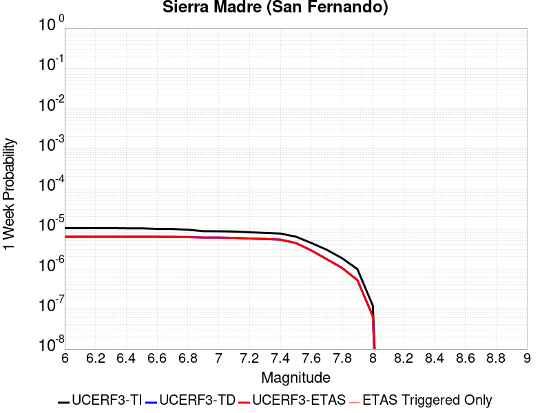 | 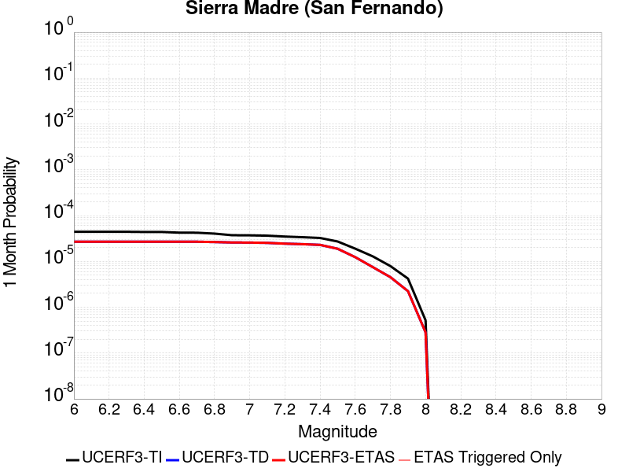 | 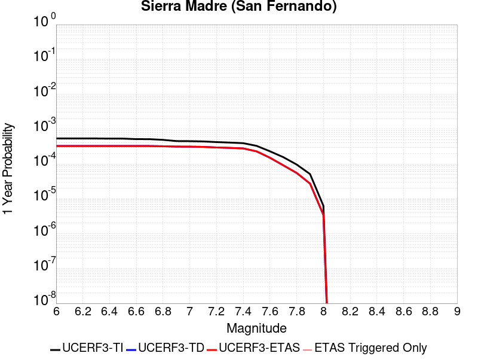 |  |

| Magnitude | 1 wk TI Prob | 1 wk TD Prob | 1 wk ETAS Prob | 1 wk ETAS/TD Gain | 1 wk ETAS Triggered Only | 1 mo TI Prob | 1 mo TD Prob | 1 mo ETAS Prob | 1 mo ETAS/TD Gain | 1 mo ETAS Triggered Only | 1 yr TI Prob | 1 yr TD Prob | 1 yr ETAS Prob | 1 yr ETAS/TD Gain | 1 yr ETAS Triggered Only | 10 yr TI Prob | 10 yr TD Prob | 10 yr ETAS Prob | 10 yr ETAS/TD Gain | 10 yr ETAS Triggered Only |
|-----|-----|-----|-----|-----|-----|-----|-----|-----|-----|-----|-----|-----|-----|-----|-----|-----|-----|-----|-----|-----|
| 6.0 | 1.0346413E-5 | 6.2872605E-6 | 6.2872605E-6 | 1.0 | 0.0 | 4.4341014E-5 | 2.694513E-5 | 2.694513E-5 | 1.0 | 0.0 | 5.3971814E-4 | 3.280087E-4 | 3.280087E-4 | 1.0 | 0.0 | 0.0053840918 | 0.0032753581 | 0.0032853254 | 1.003043 | 1.0E-5 |
| 6.1 | 1.0346413E-5 | 6.2872605E-6 | 6.2872605E-6 | 1.0 | 0.0 | 4.4341014E-5 | 2.694513E-5 | 2.694513E-5 | 1.0 | 0.0 | 5.3971814E-4 | 3.280087E-4 | 3.280087E-4 | 1.0 | 0.0 | 0.0053840918 | 0.0032753581 | 0.0032853254 | 1.003043 | 1.0E-5 |
| 6.2 | 1.0346413E-5 | 6.2872605E-6 | 6.2872605E-6 | 1.0 | 0.0 | 4.4341014E-5 | 2.694513E-5 | 2.694513E-5 | 1.0 | 0.0 | 5.3971814E-4 | 3.280087E-4 | 3.280087E-4 | 1.0 | 0.0 | 0.0053840918 | 0.0032753581 | 0.0032853254 | 1.003043 | 1.0E-5 |
| 6.3 | 1.0346413E-5 | 6.2872605E-6 | 6.2872605E-6 | 1.0 | 0.0 | 4.4341014E-5 | 2.694513E-5 | 2.694513E-5 | 1.0 | 0.0 | 5.3971814E-4 | 3.280087E-4 | 3.280087E-4 | 1.0 | 0.0 | 0.0053840918 | 0.0032753581 | 0.0032853254 | 1.003043 | 1.0E-5 |
| 6.4 | 1.0249558E-5 | 6.2872605E-6 | 6.2872605E-6 | 1.0 | 0.0 | 4.392594E-5 | 2.694513E-5 | 2.694513E-5 | 1.0 | 0.0 | 5.3466705E-4 | 3.280087E-4 | 3.280087E-4 | 1.0 | 0.0 | 0.0053338245 | 0.0032753581 | 0.0032853254 | 1.003043 | 1.0E-5 |
| 6.5 | 1.0249558E-5 | 6.2872605E-6 | 6.2872605E-6 | 1.0 | 0.0 | 4.392594E-5 | 2.694513E-5 | 2.694513E-5 | 1.0 | 0.0 | 5.3466705E-4 | 3.280087E-4 | 3.280087E-4 | 1.0 | 0.0 | 0.0053338245 | 0.0032753581 | 0.0032853254 | 1.003043 | 1.0E-5 |
| 6.6 | 9.9035515E-6 | 6.2872605E-6 | 6.2872605E-6 | 1.0 | 0.0 | 4.2443102E-5 | 2.694513E-5 | 2.694513E-5 | 1.0 | 0.0 | 5.166222E-4 | 3.280087E-4 | 3.280087E-4 | 1.0 | 0.0 | 0.0051542283 | 0.0032753581 | 0.0032853254 | 1.003043 | 1.0E-5 |
| 6.7 | 9.87217E-6 | 6.2746817E-6 | 6.2746817E-6 | 1.0 | 0.0 | 4.2308613E-5 | 2.689122E-5 | 2.689122E-5 | 1.0 | 0.0 | 5.149856E-4 | 3.2735255E-4 | 3.2735255E-4 | 1.0 | 0.0 | 0.005137938 | 0.0032688158 | 0.0032787833 | 1.0030493 | 1.0E-5 |
| 6.8 | 9.4359175E-6 | 6.1786586E-6 | 6.1786586E-6 | 1.0 | 0.0 | 4.043902E-5 | 2.6479704E-5 | 2.6479704E-5 | 1.0 | 0.0 | 4.9223384E-4 | 3.2234378E-4 | 3.2234378E-4 | 1.0 | 0.0 | 0.0049114493 | 0.0032188739 | 0.0032288418 | 1.0030967 | 1.0E-5 |
| 6.9 | 8.700447E-6 | 6.039922E-6 | 6.039922E-6 | 1.0 | 0.0 | 3.72871E-5 | 2.5885129E-5 | 2.5885129E-5 | 1.0 | 0.0 | 4.5387587E-4 | 3.1510694E-4 | 3.1510694E-4 | 1.0 | 0.0 | 0.0045295 | 0.003146711 | 0.0031566794 | 1.0031679 | 1.0E-5 |
| 7.0 | 8.648878E-6 | 6.0148373E-6 | 6.0148373E-6 | 1.0 | 0.0 | 3.7066096E-5 | 2.5777625E-5 | 2.5777625E-5 | 1.0 | 0.0 | 4.5118626E-4 | 3.1379846E-4 | 3.1379846E-4 | 1.0 | 0.0 | 0.004502713 | 0.003133663 | 0.0031436319 | 1.0031811 | 1.0E-5 |
| 7.1 | 8.505786E-6 | 5.9244676E-6 | 5.9244676E-6 | 1.0 | 0.0 | 3.645286E-5 | 2.5390334E-5 | 2.5390334E-5 | 1.0 | 0.0 | 4.437232E-4 | 3.0908454E-4 | 3.0908454E-4 | 1.0 | 0.0 | 0.0044283825 | 0.0030866556 | 0.0030966247 | 1.0032297 | 1.0E-5 |
| 7.2 | 8.139752E-6 | 5.6987624E-6 | 5.6987624E-6 | 1.0 | 0.0 | 3.4884186E-5 | 2.4423045E-5 | 2.4423045E-5 | 1.0 | 0.0 | 4.246322E-4 | 2.9731105E-4 | 2.9731105E-4 | 1.0 | 0.0 | 0.004238217 | 0.0029692391 | 0.0029792094 | 1.0033579 | 1.0E-5 |
| 7.3 | 7.8816E-6 | 5.552077E-6 | 5.552077E-6 | 1.0 | 0.0 | 3.3777847E-5 | 2.3794404E-5 | 2.3794404E-5 | 1.0 | 0.0 | 4.111677E-4 | 2.896594E-4 | 2.896594E-4 | 1.0 | 0.0 | 0.004104078 | 0.0028929242 | 0.0029028952 | 1.0034467 | 1.0E-5 |
| 7.4 | 7.5810603E-6 | 5.3563126E-6 | 5.3563126E-6 | 1.0 | 0.0 | 3.2489854E-5 | 2.2955428E-5 | 2.2955428E-5 | 1.0 | 0.0 | 3.9549218E-4 | 2.7944756E-4 | 2.7944756E-4 | 1.0 | 0.0 | 0.0039478904 | 0.0027910667 | 0.0028010388 | 1.0035728 | 1.0E-5 |
| 7.5 | 6.349153E-6 | 4.407576E-6 | 4.407576E-6 | 1.0 | 0.0 | 2.7210372E-5 | 1.888948E-5 | 1.888948E-5 | 1.0 | 0.0 | 3.312359E-4 | 2.2995596E-4 | 2.2995596E-4 | 1.0 | 0.0 | 0.0033074263 | 0.0022972622 | 0.0023072392 | 1.004343 | 1.0E-5 |
| 7.6 | 4.430576E-6 | 2.8905868E-6 | 2.8905868E-6 | 1.0 | 0.0 | 1.8988047E-5 | 1.2388171E-5 | 1.2388171E-5 | 1.0 | 0.0 | 2.3115493E-4 | 1.5081577E-4 | 1.5081577E-4 | 1.0 | 0.0 | 0.0023091463 | 0.0015071568 | 0.0015071568 | 1.0 | 0.0 |
| 7.7 | 3.005066E-6 | 1.7510115E-6 | 1.7510115E-6 | 1.0 | 0.0 | 1.2878791E-5 | 7.504313E-6 | 7.504313E-6 | 1.0 | 0.0 | 1.56788E-4 | 9.1361195E-5 | 9.1361195E-5 | 1.0 | 0.0 | 0.0015667742 | 9.132375E-4 | 9.132375E-4 | 1.0 | 0.0 |
| 7.8 | 1.8459098E-6 | 1.0582091E-6 | 1.0582091E-6 | 1.0 | 0.0 | 7.911018E-6 | 4.535174E-6 | 4.535174E-6 | 1.0 | 0.0 | 9.631238E-5 | 5.5214347E-5 | 5.5214347E-5 | 1.0 | 0.0 | 9.627065E-4 | 5.5200676E-4 | 5.5200676E-4 | 1.0 | 0.0 |
| 7.9 | 9.839262E-7 | 5.23421E-7 | 5.23421E-7 | 1.0 | 0.0 | 4.2168194E-6 | 2.2432312E-6 | 2.2432312E-6 | 1.0 | 0.0 | 5.1338568E-5 | 2.7310998E-5 | 2.7310998E-5 | 1.0 | 0.0 | 5.132671E-4 | 2.730767E-4 | 2.730767E-4 | 1.0 | 0.0 |
| 8.0 | 1.210983E-7 | 6.613821E-8 | 6.613821E-8 | 1.0 | 0.0 | 5.1899264E-7 | 2.8344945E-7 | 2.8344945E-7 | 1.0 | 0.0 | 6.3187167E-6 | 3.4509917E-6 | 3.4509917E-6 | 1.0 | 0.0 | 6.318537E-5 | 3.45094E-5 | 3.45094E-5 | 1.0 | 0.0 |

