# Parent Section Magnitude-Probability Distributions

Only fault sections with at least one triggered aftershock are plotted. Sections are sorted by total supraseismogenic trigger rate (decreasing)

## Table Of Contents

* [Garlock (Central)](#garlock-central)
* [Tank Canyon](#tank-canyon)
* [Little Lake](#little-lake)
* [Airport Lake](#airport-lake)
* [Owl Lake](#owl-lake)
* [Panamint Valley](#panamint-valley)
* [Garlock (East)](#garlock-east)
* [Hunter Mountain-Saline Valley](#hunter-mountain-saline-valley)
* [Ash Hill](#ash-hill)
* [Blackwater](#blackwater)
* [Garlock (West)](#garlock-west)
* [McLean Lake](#mclean-lake)
* [Goldstone Lake](#goldstone-lake)
* [Gravel Hills-Harper Lk](#gravel-hills-harper-lk)
* [So Sierra Nevada](#so-sierra-nevada)
* [Coyote Canyon](#coyote-canyon)
* [San Andreas (Mojave S)](#san-andreas-mojave-s)
* [Death Valley (So)](#death-valley-so)
* [Nelson Lake](#nelson-lake)
* [San Andreas (Mojave N)](#san-andreas-mojave-n)
* [Towne Pass](#towne-pass)
* [Lenwood-Lockhart-Old Woman Springs](#lenwood-lockhart-old-woman-springs)
* [Paradise](#paradise)
* [Bicycle Lake](#bicycle-lake)
* [San Andreas (San Bernardino N)](#san-andreas-san-bernardino-n)
* [Garlic Springs](#garlic-springs)
* [San Andreas (San Bernardino S)](#san-andreas-san-bernardino-s)
* [Coyote Lake](#coyote-lake)
* [Death Valley (Black Mtns Frontal)](#death-valley-black-mtns-frontal)
* [Helendale-So Lockhart](#helendale-so-lockhart)
* [San Andreas (Big Bend)](#san-andreas-big-bend)
* [San Andreas (Parkfield)](#san-andreas-parkfield)
* [San Andreas (San Gorgonio Pass-Garnet HIll)](#san-andreas-san-gorgonio-pass-garnet-hill)
* [Death Valley (No)](#death-valley-no)
* [Elsinore (Glen Ivy) rev](#elsinore-glen-ivy-rev)
* [Sierra Nevada  (No Extension)](#sierra-nevada--no-extension)
* [San Andreas (Coachella) rev](#san-andreas-coachella-rev)
* [San Andreas (Carrizo) rev](#san-andreas-carrizo-rev)
* [San Andreas (Cholame) rev](#san-andreas-cholame-rev)
* [Red Pass](#red-pass)
* [Scodie Lineament](#scodie-lineament)
* [Cady](#cady)
* [Calico-Hidalgo](#calico-hidalgo)
* [Manix-Afton Hills](#manix-afton-hills)
* [Baker](#baker)
* [Ludlow](#ludlow)
* [White Wolf (Extension)](#white-wolf-extension)
* [Santa Ynez (West)](#santa-ynez-west)
* [Death Valley (Fish Lake Valley)](#death-valley-fish-lake-valley)
* [San Andreas (Creeping Section) 2011 CFM](#san-andreas-creeping-section-2011-cfm)
* [Cleghorn Lake](#cleghorn-lake)
* [San Jacinto (San Bernardino)](#san-jacinto-san-bernardino)
* [Lake Isabella (Seismicity)](#lake-isabella-seismicity)
* [San Andreas (North Branch Mill Creek)](#san-andreas-north-branch-mill-creek)
* [Brawley (Seismic Zone) alt 1](#brawley-seismic-zone-alt-1)
* [Cleghorn Pass](#cleghorn-pass)
* [Imperial](#imperial)
* [Santa Ynez (East)](#santa-ynez-east)
* [Pleito](#pleito)
* [Pinto Mtn](#pinto-mtn)
* [San Jacinto (San Jacinto Valley) rev](#san-jacinto-san-jacinto-valley-rev)
* [Mission Ridge-Arroyo Parida-Santa Ana](#mission-ridge-arroyo-parida-santa-ana)
* [Independence rev 2011](#independence-rev-2011)
* [Red Mountain](#red-mountain)
* [Owens Valley](#owens-valley)
* [San Jacinto (Stepovers Combined)](#san-jacinto-stepovers-combined)
* [Pisgah-Bullion Mtn-Mesquite Lk](#pisgah-bullion-mtn-mesquite-lk)
* [Deep Springs](#deep-springs)
* [Santa Rosa Island](#santa-rosa-island)
* [Sheephole](#sheephole)
* [Mission Creek](#mission-creek)
* [Whittier alt 1](#whittier-alt-1)
* [San Jacinto (Anza) rev](#san-jacinto-anza-rev)
* [Rose Canyon](#rose-canyon)
* [San Clemente](#san-clemente)
* [White Mountains](#white-mountains)
* [Lost Hills](#lost-hills)
* [Santa Cruz Island](#santa-cruz-island)
* [Camp Rock 2011](#camp-rock-2011)
* [San Andreas (Santa Cruz Mts) 2011 CFM](#san-andreas-santa-cruz-mts-2011-cfm)
* [San Diego Trough north alt1](#san-diego-trough-north-alt1)
* [San Pedro Basin](#san-pedro-basin)
* [Palos Verdes](#palos-verdes)
* [Blue Cut](#blue-cut)
* [Ventura-Pitas Point](#ventura-pitas-point)
* [Tin Mountain](#tin-mountain)
* [Coronado Bank alt1](#coronado-bank-alt1)
* [San Jacinto (Coyote Creek)](#san-jacinto-coyote-creek)
* [San Cayetano](#san-cayetano)
* [San Jacinto (Superstition Mtn)](#san-jacinto-superstition-mtn)
* [Big Pine (Central)](#big-pine-central)
* [Elysian Park (Upper)](#elysian-park-upper)
* [Chino alt 1](#chino-alt-1)
* [Oceanic - West Huasna](#oceanic---west-huasna)
* [San Jacinto (Borrego)](#san-jacinto-borrego)
* [Kern Canyon (North Kern) 2011](#kern-canyon-north-kern-2011)
* [Big Pine (East)](#big-pine-east)
* [San Juan](#san-juan)
* [Hosgri (Extension)](#hosgri-extension)
* [Pine Mtn](#pine-mtn)
* [San Jacinto (Lytle Creek connector)](#san-jacinto-lytle-creek-connector)
* [Elmore Ranch](#elmore-ranch)
* [Channel Islands Thrust](#channel-islands-thrust)
* [Cleghorn](#cleghorn)
* [San Andreas (Peninsula) 2011 CFM](#san-andreas-peninsula-2011-cfm)
* [Bullion Mountains](#bullion-mountains)
* [Santa Ynez River](#santa-ynez-river)
* [Hosgri](#hosgri)
* [Great Valley 03a Dunnigan Hills](#great-valley-03a-dunnigan-hills)
* [Great Valley 07 (Orestimba)](#great-valley-07-orestimba)
* [Rinconada 2011 CFM](#rinconada-2011-cfm)
* [Ortigalita (North)](#ortigalita-north)
* [Los Osos 2011](#los-osos-2011)
* [Hunting Creek - Berryessa 2011 CFM](#hunting-creek---berryessa-2011-cfm)
* [San Luis Range 2011 CFM](#san-luis-range-2011-cfm)
* [Puente Hills](#puente-hills)
* [Dry Mountain](#dry-mountain)
* [San Gabriel](#san-gabriel)
* [Santa Cruz Catalina Ridge alt1](#santa-cruz-catalina-ridge-alt1)
* [Kern Canyon (Lake Isabella) 2011](#kern-canyon-lake-isabella-2011)
* [Los Alamos 2011 CFM](#los-alamos-2011-cfm)
* [Great Valley 09 (Laguna Seca)](#great-valley-09-laguna-seca)
* [Elsinore (Temecula) rev](#elsinore-temecula-rev)
* [Raymond](#raymond)
* [Oak Ridge (Onshore)](#oak-ridge-onshore)
* [Hayward (So) 2011 CFM](#hayward-so-2011-cfm)
* [North Frontal  (West)](#north-frontal--west)
* [San Gabriel (Extension)](#san-gabriel-extension)
* [South Klamath Lake West](#south-klamath-lake-west)
* [Emerson-Copper Mtn 2011](#emerson-copper-mtn-2011)
* [Los Alamos extension](#los-alamos-extension)
* [Great Valley 03 Mysterious Ridge](#great-valley-03-mysterious-ridge)
* [Big Pine (West)](#big-pine-west)
* [Kern Canyon (South Kern) 2011](#kern-canyon-south-kern-2011)
* [Calaveras (So) - Paicines extension 2011 CFM](#calaveras-so---paicines-extension-2011-cfm)
* [San Gregorio (South) 2011 CFM](#san-gregorio-south-2011-cfm)
* [Casmalia 2011 CFM](#casmalia-2011-cfm)
* [Santa Susana East (connector)](#santa-susana-east-connector)
* [San Diego Trough south](#san-diego-trough-south)
* [San Andreas (North Coast) 2011 CFM](#san-andreas-north-coast-2011-cfm)
* [Elsinore (Stepovers Combined)](#elsinore-stepovers-combined)
* [Hartley Springs 2011 CFM](#hartley-springs-2011-cfm)
* [Sierra Madre](#sierra-madre)
* [Newport-Inglewood alt 1](#newport-inglewood-alt-1)
* [Cucamonga](#cucamonga)
* [Hollywood](#hollywood)
* [Owens Valley Keough Hot Springs](#owens-valley-keough-hot-springs)
* [Pitas Point (Lower)-Montalvo](#pitas-point-lower-montalvo)
* [Laguna Salada](#laguna-salada)
* [Sargent 2011 CFM](#sargent-2011-cfm)
* [San Luis Range - Oceano 2011 CFM](#san-luis-range---oceano-2011-cfm)
* [Malibu Coast (Extension) alt 1](#malibu-coast-extension-alt-1)
* [San Jacinto (Clark) rev](#san-jacinto-clark-rev)
* [Simi-Santa Rosa](#simi-santa-rosa)
* [Davis Creek](#davis-creek)
* [Great Valley 04b Gordon Valley](#great-valley-04b-gordon-valley)
* [Redondo Canyon alt 1](#redondo-canyon-alt-1)
* [Johnson Valley (No) 2011 rev](#johnson-valley-no-2011-rev)
* [Superstition Hills](#superstition-hills)
* [Monte Vista - Shannon 2011 CFM](#monte-vista---shannon-2011-cfm)
* [Morales (West)](#morales-west)
* [San Gregorio (North) 2011 CFM](#san-gregorio-north-2011-cfm)
* [San Gorgonio Pass](#san-gorgonio-pass)
* [Pitas Point (Lower West)](#pitas-point-lower-west)
* [Ortigalita (South)](#ortigalita-south)
* [La Panza 2011](#la-panza-2011)
* [Calaveras (No) 2011 CFM](#calaveras-no-2011-cfm)
* [Hayward (No) 2011 CFM](#hayward-no-2011-cfm)
* [Hunting Creek - Bartlett Springs connector 2011](#hunting-creek---bartlett-springs-connector-2011)
* [Santa Susana alt 1](#santa-susana-alt-1)
* [Hector Mine](#hector-mine)
* [Jess Valley](#jess-valley)
* [Robinson Creek](#robinson-creek)
* [Earthquake Valley (No  Extension)](#earthquake-valley-no--extension)
* [Calaveras (Central) 2011 CFM](#calaveras-central-2011-cfm)
* [South Cuyama](#south-cuyama)
* [Northridge](#northridge)
* [Bartlett Springs 2011 CFM](#bartlett-springs-2011-cfm)
* [Breckenridge 2011](#breckenridge-2011)
* [Point Reyes 2011 CFM](#point-reyes-2011-cfm)
* [Concord 2011 CFM](#concord-2011-cfm)
* [San Andreas (Offshore) 2011 CFM](#san-andreas-offshore-2011-cfm)
* [Elsinore (Julian)](#elsinore-julian)
* [Verdugo](#verdugo)
* [Elsinore (Coyote Mountains)](#elsinore-coyote-mountains)
* [Sierra Madre (San Fernando)](#sierra-madre-san-fernando)
* [Fish Slough 2011 CFM](#fish-slough-2011-cfm)
* [Hayward (So) extension 2011 CFM](#hayward-so-extension-2011-cfm)
* [Monterey Bay-Tularcitos](#monterey-bay-tularcitos)
* [Likely 2011 CFM](#likely-2011-cfm)
* [Ozena](#ozena)
* [Mono Lake 2011 CFM](#mono-lake-2011-cfm)
* [San Jose](#san-jose)
* [Trinidad (alt1)](#trinidad-alt1)
* [Malibu Coast alt 1](#malibu-coast-alt-1)
* [Eaton Roughs 2011 CFM](#eaton-roughs-2011-cfm)
* [Round Valley](#round-valley)
* [Green Valley 2011 CFM](#green-valley-2011-cfm)
* [North Salt Lake](#north-salt-lake)
* [White Wolf](#white-wolf)
* [Burnt Mtn](#burnt-mtn)
* [Great Valley 04a Trout Creek](#great-valley-04a-trout-creek)
* [Earthquake Valley (So Extension)](#earthquake-valley-so-extension)
* [Earthquake Valley](#earthquake-valley)
* [West Tahoe](#west-tahoe)
* [Carson Range (Genoa)](#carson-range-genoa)
* [Homestead Valley 2011](#homestead-valley-2011)
* [Lions Head 2011 CFM](#lions-head-2011-cfm)
* [Eureka Peak](#eureka-peak)
* [South Klamath Lake East](#south-klamath-lake-east)
* [Reliz 2011 CFM](#reliz-2011-cfm)
* [Cerro Prieto](#cerro-prieto)
* [Surprise Valley 2011 CFM](#surprise-valley-2011-cfm)
* [Point Reyes 2011 connector](#point-reyes-2011-connector)
* [Channel Islands Western Deep Ramp](#channel-islands-western-deep-ramp)
* [Richfield](#richfield)
* [Holser alt 1](#holser-alt-1)

## Garlock (Central)
*[(top)](#table-of-contents)*

| 1 Week | 1 Month | 1 Year | 10 Year |
|-----|-----|-----|-----|
|  |  |  |  |

| Magnitude | 1 wk TI Prob | 1 wk TD Prob | 1 wk ETAS Prob | 1 wk ETAS/TD Gain | 1 wk ETAS Triggered Only | 1 mo TI Prob | 1 mo TD Prob | 1 mo ETAS Prob | 1 mo ETAS/TD Gain | 1 mo ETAS Triggered Only | 1 yr TI Prob | 1 yr TD Prob | 1 yr ETAS Prob | 1 yr ETAS/TD Gain | 1 yr ETAS Triggered Only | 10 yr TI Prob | 10 yr TD Prob | 10 yr ETAS Prob | 10 yr ETAS/TD Gain | 10 yr ETAS Triggered Only |
|-----|-----|-----|-----|-----|-----|-----|-----|-----|-----|-----|-----|-----|-----|-----|-----|-----|-----|-----|-----|-----|
| 6.0 | 5.5131142E-5 | 7.02476E-5 | 0.06786548 | 966.0897 | 0.0678 | 2.3625491E-4 | 3.0102677E-4 | 0.08437571 | 280.29306 | 0.0841 | 0.0028726095 | 0.003658906 | 0.114860535 | 31.392044 | 0.11161 | 0.028357591 | 0.036136657 | 0.16880281 | 4.671235 | 0.13764 |
| 6.1 | 5.5131142E-5 | 7.02476E-5 | 0.06786548 | 966.0897 | 0.0678 | 2.3625491E-4 | 3.0102677E-4 | 0.08437571 | 280.29306 | 0.0841 | 0.0028726095 | 0.003658906 | 0.114860535 | 31.392044 | 0.11161 | 0.028357591 | 0.036136657 | 0.16880281 | 4.671235 | 0.13764 |
| 6.2 | 4.216245E-5 | 5.1661802E-5 | 0.041249532 | 798.45325 | 0.0412 | 1.806837E-4 | 2.213891E-4 | 0.051719986 | 233.61577 | 0.05151 | 0.0021976046 | 0.002692112 | 0.071177244 | 26.439184 | 0.06867 | 0.021759989 | 0.026701318 | 0.11002542 | 4.120599 | 0.08561 |
| 6.3 | 4.216245E-5 | 5.1661802E-5 | 0.041249532 | 798.45325 | 0.0412 | 1.806837E-4 | 2.213891E-4 | 0.051719986 | 233.61577 | 0.05151 | 0.0021976046 | 0.002692112 | 0.071177244 | 26.439184 | 0.06867 | 0.021759989 | 0.026701318 | 0.11002542 | 4.120599 | 0.08561 |
| 6.4 | 3.6858168E-5 | 4.411026E-5 | 0.031902704 | 723.2491 | 0.03186 | 1.5795401E-4 | 1.8903041E-4 | 0.040061492 | 211.93146 | 0.03988 | 0.0019213937 | 0.0022990413 | 0.05531687 | 24.060843 | 0.05314 | 0.019048655 | 0.022866098 | 0.0879139 | 3.8447268 | 0.06657 |
| 6.5 | 3.39199E-5 | 4.0018425E-5 | 0.028678872 | 716.6417 | 0.02864 | 1.453629E-4 | 1.7149639E-4 | 0.035925362 | 209.48175 | 0.03576 | 0.0017683565 | 0.0020859907 | 0.049866114 | 23.905241 | 0.04788 | 0.017543508 | 0.020758783 | 0.079591595 | 3.8341165 | 0.06008 |
| 6.6 | 3.3571985E-5 | 3.947258E-5 | 0.028648343 | 725.7783 | 0.02861 | 1.4387199E-4 | 1.6915736E-4 | 0.035893112 | 212.18771 | 0.03573 | 0.0017502342 | 0.0020575672 | 0.049799133 | 24.20292 | 0.04784 | 0.017365133 | 0.020480042 | 0.07925124 | 3.8696816 | 0.06 |
| 6.7 | 3.2580007E-5 | 3.808902E-5 | 0.027507043 | 722.17773 | 0.02747 | 1.3962112E-4 | 1.6322857E-4 | 0.03452762 | 211.52927 | 0.03437 | 0.0016985617 | 0.0019855178 | 0.047954064 | 24.151918 | 0.04606 | 0.016856372 | 0.019770874 | 0.07638891 | 3.8637094 | 0.05776 |
| 6.8 | 3.2185937E-5 | 3.7516216E-5 | 0.02683651 | 715.331 | 0.0268 | 1.3793244E-4 | 1.60774E-4 | 0.033745375 | 209.89323 | 0.03359 | 0.0016780337 | 0.0019556875 | 0.046897624 | 23.980122 | 0.04503 | 0.016654192 | 0.019477878 | 0.07493621 | 3.8472471 | 0.05656 |
| 6.9 | 3.165394E-5 | 3.672075E-5 | 0.026105763 | 710.92676 | 0.02607 | 1.3565269E-4 | 1.5736527E-4 | 0.032822225 | 208.57349 | 0.03267 | 0.0016503202 | 0.00191426 | 0.0456903 | 23.86839 | 0.04386 | 0.01638118 | 0.019071518 | 0.073120676 | 3.834025 | 0.0551 |
| 7.0 | 3.0903822E-5 | 3.562591E-5 | 0.025294727 | 710.0093 | 0.02526 | 1.3243823E-4 | 1.5267366E-4 | 0.03179784 | 208.27327 | 0.03165 | 0.0016112428 | 0.0018572382 | 0.04429827 | 23.851688 | 0.04252 | 0.015996104 | 0.018513493 | 0.07100339 | 3.835224 | 0.05348 |
| 7.1 | 3.0069863E-5 | 3.4392175E-5 | 0.024293559 | 706.3688 | 0.02426 | 1.2886449E-4 | 1.4738683E-4 | 0.03051291 | 207.02603 | 0.03037 | 0.0015677959 | 0.0017929787 | 0.042559754 | 23.736898 | 0.04084 | 0.01556781 | 0.01788099 | 0.068263695 | 3.817669 | 0.0513 |
| 7.2 | 2.7957109E-5 | 3.128141E-5 | 0.019920658 | 636.8209 | 0.01989 | 1.1981068E-4 | 1.3405642E-4 | 0.025000723 | 186.49403 | 0.02487 | 0.0014577188 | 0.0016309345 | 0.03526599 | 21.623178 | 0.03369 | 0.014481937 | 0.016284352 | 0.058170963 | 3.5722 | 0.04258 |
| 7.3 | 2.4519275E-5 | 2.6714602E-5 | 0.014226335 | 532.53033 | 0.0142 | 1.0507837E-4 | 1.1448621E-4 | 0.018132424 | 158.38084 | 0.01802 | 0.0012785783 | 0.001392993 | 0.025848879 | 18.556358 | 0.02449 | 0.012712469 | 0.01392861 | 0.044516545 | 3.196051 | 0.03102 |
| 7.4 | 2.3225532E-5 | 2.5199166E-5 | 0.013164868 | 522.4327 | 0.01314 | 9.95342E-5 | 1.0799204E-4 | 0.016676202 | 154.42067 | 0.01657 | 0.0012111551 | 0.0013140244 | 0.023774473 | 18.092869 | 0.02249 | 0.012045753 | 0.013146196 | 0.04118271 | 3.1326714 | 0.02841 |
| 7.5 | 2.097765E-5 | 2.2483406E-5 | 0.010272253 | 456.88153 | 0.01025 | 8.9901114E-5 | 9.6353964E-5 | 0.012965114 | 134.55714 | 0.01287 | 0.0010939965 | 0.00117249 | 0.018641982 | 15.899482 | 0.01749 | 0.010886264 | 0.0117406575 | 0.03376896 | 2.8762407 | 0.02229 |
| 7.6 | 1.511254E-5 | 1.5990969E-5 | 0.005525903 | 345.564 | 0.00551 | 6.476642E-5 | 6.8530964E-5 | 0.0071380464 | 104.15797 | 0.00707 | 7.882459E-4 | 8.34053E-4 | 0.010296155 | 12.344725 | 0.00947 | 0.007854558 | 0.008383867 | 0.020174183 | 2.4063098 | 0.01189 |
| 7.7 | 9.934069E-6 | 1.0678523E-5 | 0.0016306612 | 152.70476 | 0.00162 | 4.2573887E-5 | 4.5764296E-5 | 0.0020356732 | 44.48169 | 0.00199 | 5.182138E-4 | 5.570383E-4 | 0.0032455397 | 5.8264217 | 0.00269 | 0.00517007 | 0.005627419 | 0.008879017 | 1.5778134 | 0.00327 |
| 7.8 | 6.7562896E-6 | 8.42837E-6 | 0.0010884192 | 129.13757 | 0.00108 | 2.8955206E-5 | 3.6121084E-5 | 0.0013460738 | 37.265594 | 0.00131 | 3.5247262E-4 | 4.3968562E-4 | 0.002218903 | 5.046567 | 0.00178 | 0.0035191406 | 0.004446416 | 0.006596812 | 1.4836245 | 0.00216 |
| 7.9 | 3.975453E-6 | 5.3710532E-6 | 6.153678E-4 | 114.57116 | 6.1E-4 | 1.7037546E-5 | 2.3018596E-5 | 7.7300135E-4 | 33.5816 | 7.5E-4 | 2.0741238E-4 | 2.8021546E-4 | 0.0012899324 | 4.603359 | 0.00101 | 0.002072189 | 0.0028335669 | 0.0040700533 | 1.436371 | 0.00124 |
| 8.0 | 1.6729537E-6 | 2.0775192E-6 | 1.9207712E-4 | 92.45504 | 1.9E-4 | 7.169782E-6 | 8.903624E-6 | 2.6890132E-4 | 30.201334 | 2.6E-4 | 8.7288594E-5 | 1.0839626E-4 | 4.6835723E-4 | 4.320788 | 3.6E-4 | 8.7254314E-4 | 0.001096854 | 0.0015064043 | 1.3733864 | 4.1E-4 |
| 8.1 | 3.6733252E-7 | 3.1489736E-7 | 1.0314894E-5 | 32.756367 | 1.0E-5 | 1.5742813E-6 | 1.3495595E-6 | 3.134952E-5 | 23.229445 | 3.0E-5 | 1.9166706E-5 | 1.643078E-5 | 5.6430123E-5 | 3.4344153 | 4.0E-5 | 1.9165053E-4 | 1.662928E-4 | 2.0628615E-4 | 1.2404996 | 4.0E-5 |

## Tank Canyon
*[(top)](#table-of-contents)*

| 1 Week | 1 Month | 1 Year | 10 Year |
|-----|-----|-----|-----|
| 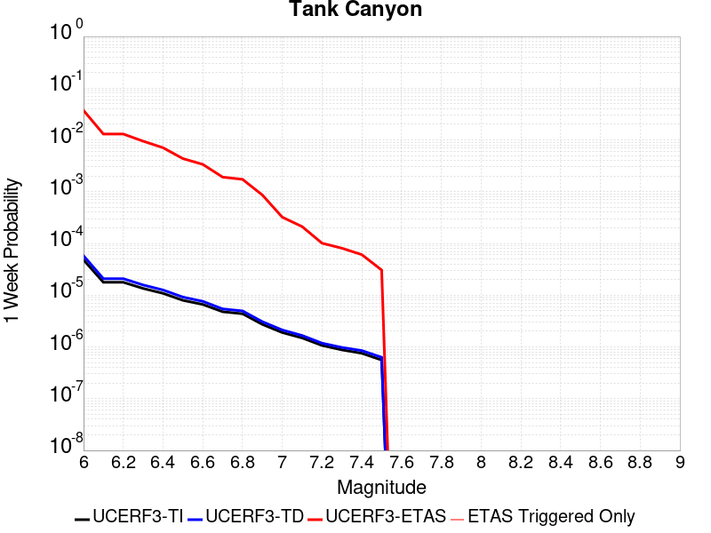 | 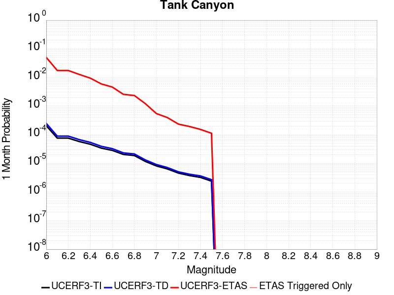 |  |  |

| Magnitude | 1 wk TI Prob | 1 wk TD Prob | 1 wk ETAS Prob | 1 wk ETAS/TD Gain | 1 wk ETAS Triggered Only | 1 mo TI Prob | 1 mo TD Prob | 1 mo ETAS Prob | 1 mo ETAS/TD Gain | 1 mo ETAS Triggered Only | 1 yr TI Prob | 1 yr TD Prob | 1 yr ETAS Prob | 1 yr ETAS/TD Gain | 1 yr ETAS Triggered Only | 10 yr TI Prob | 10 yr TD Prob | 10 yr ETAS Prob | 10 yr ETAS/TD Gain | 10 yr ETAS Triggered Only |
|-----|-----|-----|-----|-----|-----|-----|-----|-----|-----|-----|-----|-----|-----|-----|-----|-----|-----|-----|-----|-----|
| 6.0 | 4.8284557E-5 | 5.796445E-5 | 0.037315805 | 643.7705 | 0.03726 | 2.0691741E-4 | 2.4839927E-4 | 0.050096013 | 201.67538 | 0.04986 | 0.0025163088 | 0.0030207336 | 0.07875128 | 26.07025 | 0.07596 | 0.02488006 | 0.029863616 | 0.1300593 | 4.355109 | 0.10328 |
| 6.1 | 1.7796336E-5 | 2.0873378E-5 | 0.013030602 | 624.269 | 0.01301 | 7.626778E-5 | 8.945448E-5 | 0.017517895 | 195.83028 | 0.01743 | 9.281647E-4 | 0.0010886024 | 0.028988197 | 26.628822 | 0.02793 | 0.009242975 | 0.010836642 | 0.04950304 | 4.5681157 | 0.03909 |
| 6.2 | 1.7796336E-5 | 2.0873378E-5 | 0.013030602 | 624.269 | 0.01301 | 7.626778E-5 | 8.945448E-5 | 0.017517895 | 195.83028 | 0.01743 | 9.281647E-4 | 0.0010886024 | 0.028988197 | 26.628822 | 0.02793 | 0.009242975 | 0.010836642 | 0.04950304 | 4.5681157 | 0.03909 |
| 6.3 | 1.3515912E-5 | 1.5759651E-5 | 0.009485611 | 601.89215 | 0.00947 | 5.792405E-5 | 6.7539746E-5 | 0.012756683 | 188.87666 | 0.01269 | 7.049971E-4 | 8.2200987E-4 | 0.02097543 | 25.517248 | 0.02017 | 0.007027647 | 0.008192157 | 0.036369417 | 4.439541 | 0.02841 |
| 6.4 | 1.0870146E-5 | 1.2618114E-5 | 0.007082529 | 561.2985 | 0.00707 | 4.658551E-5 | 5.4076605E-5 | 0.009463567 | 175.00299 | 0.00941 | 5.67031E-4 | 6.582015E-4 | 0.015768249 | 23.956568 | 0.01512 | 0.005655863 | 0.006564382 | 0.027754365 | 4.228024 | 0.02133 |
| 6.5 | 7.964826E-6 | 9.196184E-6 | 0.004369156 | 475.10535 | 0.00436 | 3.4134522E-5 | 3.941168E-5 | 0.0059491787 | 150.94963 | 0.00591 | 4.1550855E-4 | 4.797421E-4 | 0.010075137 | 21.001152 | 0.0096 | 0.0041473247 | 0.004788209 | 0.018074287 | 3.7747488 | 0.01335 |
| 6.6 | 6.6317E-6 | 7.612378E-6 | 0.0033775868 | 443.69666 | 0.00337 | 2.8421264E-5 | 3.262412E-5 | 0.0046124747 | 141.38234 | 0.00458 | 3.4597394E-4 | 3.9713533E-4 | 0.007654252 | 19.27366 | 0.00726 | 0.0034543579 | 0.0039652516 | 0.013845916 | 3.491813 | 0.00992 |
| 6.7 | 4.793663E-6 | 5.4308593E-6 | 0.0019154205 | 352.692 | 0.00191 | 2.0544108E-5 | 2.3274928E-5 | 0.0025732156 | 110.5574 | 0.00255 | 2.500958E-4 | 2.833398E-4 | 0.0043421895 | 15.325026 | 0.00406 | 0.0024981452 | 0.0028303189 | 0.008384554 | 2.9624062 | 0.00557 |
| 6.8 | 4.382823E-6 | 4.969325E-6 | 0.0017349607 | 349.1341 | 0.00173 | 1.8783392E-5 | 2.1296957E-5 | 0.0023412476 | 109.933426 | 0.00232 | 2.286638E-4 | 2.5926388E-4 | 0.0039283126 | 15.151793 | 0.00367 | 0.0022842865 | 0.0025901233 | 0.0075671985 | 2.921559 | 0.00499 |
| 6.9 | 2.729601E-6 | 3.0735862E-6 | 8.6307095E-4 | 280.80258 | 8.6E-4 | 1.1698237E-5 | 1.3172453E-5 | 0.0012131566 | 92.09801 | 0.0012 | 1.4241673E-4 | 1.6036403E-4 | 0.0019200818 | 11.973269 | 0.00176 | 0.001423255 | 0.0016024808 | 0.003928747 | 2.4516656 | 0.00233 |
| 7.0 | 1.8987357E-6 | 2.126971E-6 | 3.221263E-4 | 151.44838 | 3.2E-4 | 8.137413E-6 | 9.115562E-6 | 5.4911064E-4 | 60.238815 | 5.4E-4 | 9.90685E-5 | 1.1097702E-4 | 9.30886E-4 | 8.388098 | 8.2E-4 | 9.902435E-4 | 0.0011092846 | 0.0021880865 | 1.9725205 | 0.00108 |
| 7.1 | 1.4928986E-6 | 1.6641525E-6 | 2.116638E-4 | 127.19015 | 2.1E-4 | 6.398121E-6 | 7.132066E-6 | 3.9712928E-4 | 55.68222 | 3.9E-4 | 7.789434E-5 | 8.6830034E-5 | 6.667797E-4 | 7.6791363 | 5.8E-4 | 7.786704E-4 | 8.6801895E-4 | 0.001617368 | 1.8632865 | 7.5E-4 |
| 7.2 | 1.069082E-6 | 1.1828765E-6 | 1.01182755E-4 | 85.53957 | 1.0E-4 | 4.581772E-6 | 5.0694644E-6 | 2.3506829E-4 | 46.369457 | 2.3E-4 | 5.5781646E-5 | 6.171951E-5 | 3.8169976E-4 | 6.1844263 | 3.2E-4 | 5.576765E-4 | 6.1707594E-4 | 0.0010168292 | 1.6478184 | 4.0E-4 |
| 7.3 | 8.776551E-7 | 9.770151E-7 | 8.097693E-5 | 82.881966 | 8.0E-5 | 3.7613736E-6 | 4.187204E-6 | 1.941864E-4 | 46.376152 | 1.9E-4 | 4.579376E-5 | 5.0978535E-5 | 3.109653E-4 | 6.0999255 | 2.6E-4 | 4.5784327E-4 | 5.097194E-4 | 8.195614E-4 | 1.6078677 | 3.1E-4 |
| 7.4 | 7.55721E-7 | 8.5103835E-7 | 6.0850987E-5 | 71.502045 | 6.0E-5 | 3.2388E-6 | 3.6473052E-6 | 1.5364676E-4 | 42.126106 | 1.5E-4 | 3.9431678E-5 | 4.4405555E-5 | 2.5439623E-4 | 5.728928 | 2.1E-4 | 3.942468E-4 | 4.4401767E-4 | 6.839111E-4 | 1.540279 | 2.4E-4 |
| 7.5 | 5.587665E-7 | 6.305732E-7 | 3.0630556E-5 | 48.575733 | 3.0E-5 | 2.3947114E-6 | 2.7024564E-6 | 1.1270216E-4 | 41.703598 | 1.1E-4 | 2.915522E-5 | 3.2902408E-5 | 1.728978E-4 | 5.2548676 | 1.4E-4 | 2.9151395E-4 | 3.2902407E-4 | 4.989681E-4 | 1.5165095 | 1.7E-4 |

## Little Lake
*[(top)](#table-of-contents)*

| 1 Week | 1 Month | 1 Year | 10 Year |
|-----|-----|-----|-----|
|  | 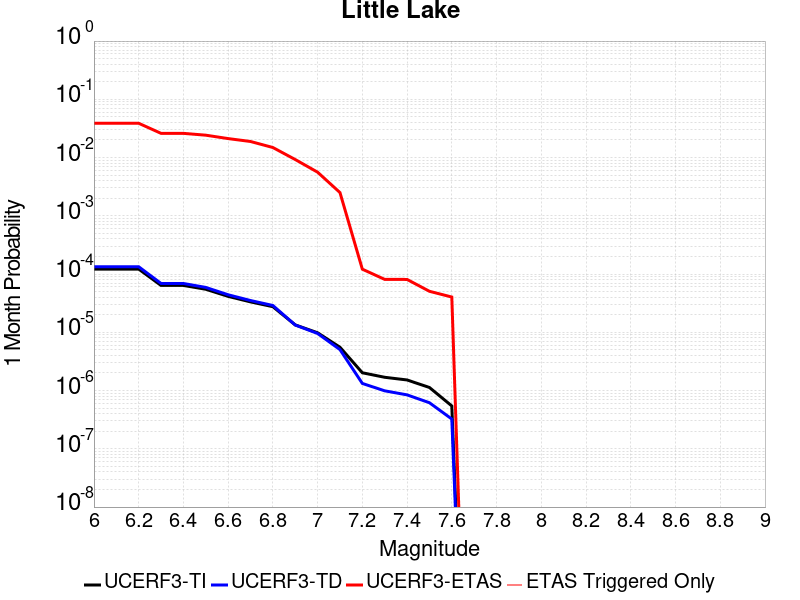 |  |  |

| Magnitude | 1 wk TI Prob | 1 wk TD Prob | 1 wk ETAS Prob | 1 wk ETAS/TD Gain | 1 wk ETAS Triggered Only | 1 mo TI Prob | 1 mo TD Prob | 1 mo ETAS Prob | 1 mo ETAS/TD Gain | 1 mo ETAS Triggered Only | 1 yr TI Prob | 1 yr TD Prob | 1 yr ETAS Prob | 1 yr ETAS/TD Gain | 1 yr ETAS Triggered Only | 10 yr TI Prob | 10 yr TD Prob | 10 yr ETAS Prob | 10 yr ETAS/TD Gain | 10 yr ETAS Triggered Only |
|-----|-----|-----|-----|-----|-----|-----|-----|-----|-----|-----|-----|-----|-----|-----|-----|-----|-----|-----|-----|-----|
| 6.0 | 2.8424427E-5 | 3.1205716E-5 | 0.03098024 | 992.77454 | 0.03095 | 1.2181328E-4 | 1.3373268E-4 | 0.03879856 | 290.12027 | 0.03867 | 0.0014820677 | 0.0016271125 | 0.05323301 | 32.716244 | 0.05169 | 0.014722223 | 0.016165398 | 0.07948499 | 4.916983 | 0.06436 |
| 6.1 | 2.8424427E-5 | 3.1205716E-5 | 0.03098024 | 992.77454 | 0.03095 | 1.2181328E-4 | 1.3373268E-4 | 0.03879856 | 290.12027 | 0.03867 | 0.0014820677 | 0.0016271125 | 0.05323301 | 32.716244 | 0.05169 | 0.014722223 | 0.016165398 | 0.07948499 | 4.916983 | 0.06436 |
| 6.2 | 2.8424427E-5 | 3.1205716E-5 | 0.03098024 | 992.77454 | 0.03095 | 1.2181328E-4 | 1.3373268E-4 | 0.03879856 | 290.12027 | 0.03867 | 0.0014820677 | 0.0016271125 | 0.05323301 | 32.716244 | 0.05169 | 0.014722223 | 0.016165398 | 0.07948499 | 4.916983 | 0.06436 |
| 6.3 | 1.48860645E-5 | 1.6081383E-5 | 0.020905746 | 1299.9967 | 0.02089 | 6.379586E-5 | 6.8918554E-5 | 0.026037129 | 377.79562 | 0.02597 | 7.7643775E-4 | 8.387886E-4 | 0.035159975 | 41.917564 | 0.03435 | 0.007737305 | 0.008359045 | 0.050702114 | 6.065539 | 0.0427 |
| 6.4 | 1.48860645E-5 | 1.6081383E-5 | 0.020905746 | 1299.9967 | 0.02089 | 6.379586E-5 | 6.8918554E-5 | 0.026037129 | 377.79562 | 0.02597 | 7.7643775E-4 | 8.387886E-4 | 0.035159975 | 41.917564 | 0.03435 | 0.007737305 | 0.008359045 | 0.050702114 | 6.065539 | 0.0427 |
| 6.5 | 1.2797581E-5 | 1.376556E-5 | 0.019443499 | 1412.4742 | 0.01943 | 5.4845623E-5 | 5.8994065E-5 | 0.024217568 | 410.50854 | 0.02416 | 6.675408E-4 | 7.1804173E-4 | 0.032585144 | 45.38057 | 0.03189 | 0.006655392 | 0.007159767 | 0.046436526 | 6.4857593 | 0.03956 |
| 6.6 | 9.661896E-6 | 1.0289033E-5 | 0.017070113 | 1659.0592 | 0.01706 | 4.1407468E-5 | 4.40952E-5 | 0.021173164 | 480.16937 | 0.02113 | 5.040193E-4 | 5.36743E-4 | 0.028421767 | 52.95228 | 0.0279 | 0.005028777 | 0.0053560715 | 0.039740913 | 7.4197874 | 0.03457 |
| 6.7 | 7.767871E-6 | 8.199681E-6 | 0.015338074 | 1870.5696 | 0.01533 | 3.329045E-5 | 3.5141096E-5 | 0.01887448 | 537.1056 | 0.01884 | 4.0523586E-4 | 4.2777258E-4 | 0.024987262 | 58.412495 | 0.02457 | 0.004044977 | 0.004270843 | 0.034471307 | 8.071312 | 0.03033 |
| 6.8 | 6.4235196E-6 | 6.735739E-6 | 0.012226653 | 1815.191 | 0.01222 | 2.752908E-5 | 2.8867207E-5 | 0.014878439 | 515.4097 | 0.01485 | 3.35115E-4 | 3.5141438E-4 | 0.019554663 | 55.6456 | 0.01921 | 0.003346101 | 0.0035098472 | 0.027345892 | 7.7911916 | 0.02392 |
| 6.9 | 3.1283696E-6 | 3.1121751E-6 | 0.0075730886 | 2433.3748 | 0.00757 | 1.3407229E-5 | 1.33378335E-5 | 0.009253215 | 693.75696 | 0.00924 | 1.6322079E-4 | 1.6237753E-4 | 0.011940464 | 73.5352 | 0.01178 | 0.0016310095 | 0.0016227372 | 0.016059272 | 9.89641 | 0.01446 |
| 7.0 | 2.290603E-6 | 2.2286763E-6 | 0.0045722183 | 2051.54 | 0.00457 | 9.816834E-6 | 9.551441E-6 | 0.005609498 | 587.2934 | 0.0056 | 1.19513395E-4 | 1.1628362E-4 | 0.007175463 | 61.706562 | 0.00706 | 0.0011944914 | 0.0011623299 | 0.009842229 | 8.467672 | 0.00869 |
| 7.1 | 1.293693E-6 | 1.1776774E-6 | 0.0020311752 | 1724.7297 | 0.00203 | 5.5443866E-6 | 5.047183E-6 | 0.0025050347 | 496.3233 | 0.0025 | 6.750081E-5 | 6.1448416E-5 | 0.0031912562 | 51.9339 | 0.00313 | 6.7480316E-4 | 6.1438273E-4 | 0.004501993 | 7.3276677 | 0.00389 |
| 7.2 | 4.715842E-7 | 3.091732E-7 | 1.00309146E-4 | 324.4432 | 1.0E-4 | 2.0210737E-6 | 1.3250274E-6 | 1.2132487E-4 | 91.56405 | 1.2E-4 | 2.4606294E-5 | 1.6132095E-5 | 1.4613E-4 | 9.05834 | 1.3E-4 | 2.460357E-4 | 1.6130977E-4 | 3.6127752E-4 | 2.2396505 | 2.0E-4 |
| 7.3 | 3.9430947E-7 | 2.3096938E-7 | 8.023095E-5 | 347.36618 | 8.0E-5 | 1.6898966E-6 | 9.898685E-7 | 8.098979E-5 | 81.81874 | 8.0E-5 | 2.0574296E-5 | 1.2051582E-5 | 9.205062E-5 | 7.6380525 | 8.0E-5 | 2.0572392E-4 | 1.2050936E-4 | 2.604925E-4 | 2.1615956 | 1.4E-4 |
| 7.4 | 3.547123E-7 | 1.9678579E-7 | 8.019677E-5 | 407.53333 | 8.0E-5 | 1.5201948E-6 | 8.433674E-7 | 8.08433E-5 | 95.85775 | 8.0E-5 | 1.8508214E-5 | 1.02679505E-5 | 9.026713E-5 | 8.791154 | 8.0E-5 | 1.8506673E-4 | 1.0267482E-4 | 2.2266251E-4 | 2.1686182 | 1.2E-4 |
| 7.5 | 2.6354266E-7 | 1.4422719E-7 | 5.014422E-5 | 347.67523 | 5.0E-5 | 1.129468E-6 | 6.1811636E-7 | 5.0618084E-5 | 81.89087 | 5.0E-5 | 1.3751187E-5 | 7.525541E-6 | 5.7525165E-5 | 7.6439905 | 5.0E-5 | 1.3750336E-4 | 7.5252916E-5 | 1.552469E-4 | 2.0630016 | 8.0E-5 |
| 7.6 | 1.269913E-7 | 7.572344E-8 | 4.007572E-5 | 529.238 | 4.0E-5 | 5.4424834E-7 | 3.24529E-7 | 4.0324518E-5 | 124.25551 | 4.0E-5 | 6.6262032E-6 | 3.9511337E-6 | 4.3950975E-5 | 11.123636 | 4.0E-5 | 6.626006E-5 | 3.9510673E-5 | 8.950869E-5 | 2.265431 | 5.0E-5 |

## Airport Lake
*[(top)](#table-of-contents)*

| 1 Week | 1 Month | 1 Year | 10 Year |
|-----|-----|-----|-----|
|  |  |  |  |

| Magnitude | 1 wk TI Prob | 1 wk TD Prob | 1 wk ETAS Prob | 1 wk ETAS/TD Gain | 1 wk ETAS Triggered Only | 1 mo TI Prob | 1 mo TD Prob | 1 mo ETAS Prob | 1 mo ETAS/TD Gain | 1 mo ETAS Triggered Only | 1 yr TI Prob | 1 yr TD Prob | 1 yr ETAS Prob | 1 yr ETAS/TD Gain | 1 yr ETAS Triggered Only | 10 yr TI Prob | 10 yr TD Prob | 10 yr ETAS Prob | 10 yr ETAS/TD Gain | 10 yr ETAS Triggered Only |
|-----|-----|-----|-----|-----|-----|-----|-----|-----|-----|-----|-----|-----|-----|-----|-----|-----|-----|-----|-----|-----|
| 6.0 | 1.2387061E-5 | 1.3103157E-5 | 0.028592728 | 2182.1252 | 0.02858 | 5.3086325E-5 | 5.615534E-5 | 0.035144184 | 625.83875 | 0.03509 | 6.461343E-4 | 6.8350515E-4 | 0.04617239 | 67.55237 | 0.04552 | 0.0064425888 | 0.0068168393 | 0.061143957 | 8.969546 | 0.0547 |
| 6.1 | 1.2387061E-5 | 1.3103157E-5 | 0.028592728 | 2182.1252 | 0.02858 | 5.3086325E-5 | 5.615534E-5 | 0.035144184 | 625.83875 | 0.03509 | 6.461343E-4 | 6.8350515E-4 | 0.04617239 | 67.55237 | 0.04552 | 0.0064425888 | 0.0068168393 | 0.061143957 | 8.969546 | 0.0547 |
| 6.2 | 1.2387061E-5 | 1.3103157E-5 | 0.028592728 | 2182.1252 | 0.02858 | 5.3086325E-5 | 5.615534E-5 | 0.035144184 | 625.83875 | 0.03509 | 6.461343E-4 | 6.8350515E-4 | 0.04617239 | 67.55237 | 0.04552 | 0.0064425888 | 0.0068168393 | 0.061143957 | 8.969546 | 0.0547 |
| 6.3 | 1.2387061E-5 | 1.3103157E-5 | 0.028592728 | 2182.1252 | 0.02858 | 5.3086325E-5 | 5.615534E-5 | 0.035144184 | 625.83875 | 0.03509 | 6.461343E-4 | 6.8350515E-4 | 0.04617239 | 67.55237 | 0.04552 | 0.0064425888 | 0.0068168393 | 0.061143957 | 8.969546 | 0.0547 |
| 6.4 | 1.2387061E-5 | 1.3103157E-5 | 0.028592728 | 2182.1252 | 0.02858 | 5.3086325E-5 | 5.615534E-5 | 0.035144184 | 625.83875 | 0.03509 | 6.461343E-4 | 6.8350515E-4 | 0.04617239 | 67.55237 | 0.04552 | 0.0064425888 | 0.0068168393 | 0.061143957 | 8.969546 | 0.0547 |
| 6.5 | 6.9922594E-6 | 7.384925E-6 | 0.021077229 | 2854.0884 | 0.02107 | 2.996648E-5 | 3.1649324E-5 | 0.026060825 | 823.4243 | 0.02603 | 3.6478083E-4 | 3.8526783E-4 | 0.03421223 | 88.801155 | 0.03384 | 0.003641826 | 0.0038465366 | 0.044419866 | 11.548017 | 0.04073 |
| 6.6 | 6.9922594E-6 | 7.384925E-6 | 0.021077229 | 2854.0884 | 0.02107 | 2.996648E-5 | 3.1649324E-5 | 0.026060825 | 823.4243 | 0.02603 | 3.6478083E-4 | 3.8526783E-4 | 0.03421223 | 88.801155 | 0.03384 | 0.003641826 | 0.0038465366 | 0.044419866 | 11.548017 | 0.04073 |
| 6.7 | 5.477277E-6 | 5.7860684E-6 | 0.01808568 | 3125.729 | 0.01808 | 2.3473833E-5 | 2.4797222E-5 | 0.022374243 | 902.28827 | 0.02235 | 2.8575645E-4 | 3.0186825E-4 | 0.029253127 | 96.90694 | 0.02896 | 0.0028538927 | 0.003014966 | 0.037759893 | 12.524153 | 0.03485 |
| 6.8 | 3.9950432E-6 | 4.2190873E-6 | 0.013714162 | 3250.5044 | 0.01371 | 1.7121502E-5 | 1.8081691E-5 | 0.016857777 | 932.31195 | 0.01684 | 2.0843433E-4 | 2.2012512E-4 | 0.021845363 | 99.24067 | 0.02163 | 0.0020823893 | 0.0021993418 | 0.028401587 | 12.913676 | 0.02626 |
| 6.9 | 2.95695E-6 | 3.1230243E-6 | 0.009783093 | 3132.57 | 0.00978 | 1.2672582E-5 | 1.3384334E-5 | 0.012073223 | 902.0414 | 0.01206 | 1.5427776E-4 | 1.6294434E-4 | 0.015490446 | 95.06587 | 0.01533 | 0.001541707 | 0.0016284712 | 0.020278051 | 12.452202 | 0.01868 |
| 7.0 | 1.456072E-6 | 1.540812E-6 | 0.004361534 | 2830.6724 | 0.00436 | 6.2402937E-6 | 6.603469E-6 | 0.005356568 | 811.17487 | 0.00535 | 7.597293E-5 | 8.039528E-5 | 0.0068198536 | 84.82903 | 0.00674 | 7.594696E-4 | 8.0376083E-4 | 0.009057121 | 11.268429 | 0.00826 |
| 7.1 | 6.995192E-7 | 7.4089746E-7 | 0.0019107395 | 2578.9526 | 0.00191 | 2.997936E-6 | 3.1752747E-6 | 0.0023431678 | 737.9418 | 0.00234 | 3.649926E-5 | 3.865897E-5 | 0.0029685458 | 76.78802 | 0.00293 | 3.6493264E-4 | 3.865897E-4 | 0.0039851977 | 10.3085985 | 0.0036 |

## Owl Lake
*[(top)](#table-of-contents)*

| 1 Week | 1 Month | 1 Year | 10 Year |
|-----|-----|-----|-----|
|  |  |  |  |

| Magnitude | 1 wk TI Prob | 1 wk TD Prob | 1 wk ETAS Prob | 1 wk ETAS/TD Gain | 1 wk ETAS Triggered Only | 1 mo TI Prob | 1 mo TD Prob | 1 mo ETAS Prob | 1 mo ETAS/TD Gain | 1 mo ETAS Triggered Only | 1 yr TI Prob | 1 yr TD Prob | 1 yr ETAS Prob | 1 yr ETAS/TD Gain | 1 yr ETAS Triggered Only | 10 yr TI Prob | 10 yr TD Prob | 10 yr ETAS Prob | 10 yr ETAS/TD Gain | 10 yr ETAS Triggered Only |
|-----|-----|-----|-----|-----|-----|-----|-----|-----|-----|-----|-----|-----|-----|-----|-----|-----|-----|-----|-----|-----|
| 6.0 | 5.0320643E-5 | 6.6358676E-5 | 0.016135292 | 243.15271 | 0.01607 | 2.1564208E-4 | 2.843643E-4 | 0.021638291 | 76.09355 | 0.02136 | 0.0026222812 | 0.003457547 | 0.034390226 | 9.946423 | 0.03104 | 0.02591553 | 0.034141295 | 0.07415682 | 2.1720564 | 0.04143 |
| 6.1 | 5.0320643E-5 | 6.6358676E-5 | 0.016135292 | 243.15271 | 0.01607 | 2.1564208E-4 | 2.843643E-4 | 0.021638291 | 76.09355 | 0.02136 | 0.0026222812 | 0.003457547 | 0.034390226 | 9.946423 | 0.03104 | 0.02591553 | 0.034141295 | 0.07415682 | 2.1720564 | 0.04143 |
| 6.2 | 2.4125871E-5 | 3.0980515E-5 | 0.012880582 | 415.76398 | 0.01285 | 1.0339249E-4 | 1.3276804E-4 | 0.016800554 | 126.54066 | 0.01667 | 0.0012580766 | 0.0016154252 | 0.025337042 | 15.684442 | 0.02376 | 0.012509781 | 0.016070755 | 0.046789028 | 2.9114392 | 0.03122 |
| 6.3 | 1.7433485E-5 | 2.2355545E-5 | 0.0114621 | 512.71844 | 0.01144 | 7.471279E-5 | 9.580685E-5 | 0.014804398 | 154.52338 | 0.01471 | 9.0924866E-4 | 0.001165962 | 0.02193172 | 18.80998 | 0.02079 | 0.009055373 | 0.0116291465 | 0.03832504 | 3.2956026 | 0.02701 |
| 6.4 | 1.7433485E-5 | 2.2355545E-5 | 0.0114621 | 512.71844 | 0.01144 | 7.471279E-5 | 9.580685E-5 | 0.014804398 | 154.52338 | 0.01471 | 9.0924866E-4 | 0.001165962 | 0.02193172 | 18.80998 | 0.02079 | 0.009055373 | 0.0116291465 | 0.03832504 | 3.2956026 | 0.02701 |
| 6.5 | 1.5182742E-5 | 1.9429277E-5 | 0.010999216 | 566.11554 | 0.01098 | 6.506727E-5 | 8.3266525E-5 | 0.0140921 | 169.24088 | 0.01401 | 7.919061E-4 | 0.0010134344 | 0.02072344 | 20.448725 | 0.01973 | 0.0078909 | 0.010118678 | 0.03537055 | 3.4955704 | 0.02551 |
| 6.6 | 6.7271576E-6 | 8.547518E-6 | 0.00915847 | 1071.477 | 0.00915 | 2.8830356E-5 | 3.6631736E-5 | 0.011456213 | 312.7401 | 0.01142 | 3.5095305E-4 | 4.4590578E-4 | 0.015689105 | 35.1848 | 0.01525 | 0.0035039932 | 0.0044680187 | 0.023422947 | 5.2423563 | 0.01904 |
| 6.7 | 6.682835E-6 | 8.479961E-6 | 0.009148402 | 1078.826 | 0.00914 | 2.8640408E-5 | 3.6342215E-5 | 0.011435928 | 314.67337 | 0.0114 | 3.4864116E-4 | 4.423823E-4 | 0.015645653 | 35.366817 | 0.01521 | 0.003480947 | 0.0044329325 | 0.023328796 | 5.26261 | 0.01898 |
| 6.8 | 6.5774975E-6 | 8.326427E-6 | 0.009138251 | 1097.4996 | 0.00913 | 2.8188972E-5 | 3.5684232E-5 | 0.011405279 | 319.61676 | 0.01137 | 3.4314668E-4 | 4.3437455E-4 | 0.015577794 | 35.862583 | 0.01515 | 0.0034261728 | 0.0043531056 | 0.023180788 | 5.325115 | 0.01891 |
| 6.9 | 6.363419E-6 | 7.999591E-6 | 0.0091179265 | 1139.7992 | 0.00911 | 2.727151E-5 | 3.428354E-5 | 0.011373895 | 331.75964 | 0.01134 | 3.3198006E-4 | 4.1732774E-4 | 0.015481039 | 37.09564 | 0.01507 | 0.0033148455 | 0.0041830647 | 0.022894464 | 5.4731317 | 0.01879 |
| 7.0 | 6.1342453E-6 | 7.631779E-6 | 0.009027563 | 1182.891 | 0.00902 | 2.6289357E-5 | 3.2707245E-5 | 0.0112123415 | 342.80908 | 0.01118 | 3.2002592E-4 | 3.9814346E-4 | 0.015252227 | 38.30837 | 0.01486 | 0.0031956544 | 0.003991739 | 0.022437813 | 5.621062 | 0.01852 |
| 7.1 | 5.842926E-6 | 7.142312E-6 | 0.008637081 | 1209.2836 | 0.00863 | 2.504087E-5 | 3.060958E-5 | 0.010680283 | 348.91965 | 0.01065 | 3.0482994E-4 | 3.7261334E-4 | 0.014517341 | 38.960873 | 0.01415 | 0.0030441214 | 0.0037371595 | 0.021281349 | 5.694525 | 0.01761 |
| 7.2 | 4.77173E-6 | 5.358478E-6 | 0.0053453296 | 997.54626 | 0.00534 | 2.045011E-5 | 2.2964727E-5 | 0.006502816 | 283.16537 | 0.00648 | 2.4895166E-4 | 2.7956374E-4 | 0.009027118 | 32.290016 | 0.00875 | 0.0024867293 | 0.0028086212 | 0.013837558 | 4.926815 | 0.01106 |
| 7.3 | 3.0494948E-6 | 2.710356E-6 | 0.0015527061 | 572.879 | 0.00155 | 1.3069198E-5 | 1.1615762E-5 | 0.001971593 | 169.73428 | 0.00196 | 1.5910587E-4 | 1.4141288E-4 | 0.0027810396 | 19.666098 | 0.00264 | 0.0015899199 | 0.0014231089 | 0.0047184126 | 3.3155668 | 0.0033 |
| 7.4 | 2.7263884E-6 | 2.3055634E-6 | 0.0010223032 | 443.40714 | 0.00102 | 1.1684469E-5 | 9.880949E-6 | 0.0012598686 | 127.50482 | 0.00125 | 1.4224913E-4 | 1.2029401E-4 | 0.0017800943 | 14.797863 | 0.00166 | 0.0014215811 | 0.0012110578 | 0.0033384783 | 2.756663 | 0.00213 |
| 7.5 | 2.6090431E-6 | 2.1655019E-6 | 9.0216356E-4 | 416.60715 | 9.0E-4 | 1.1181565E-5 | 9.2806895E-6 | 0.0010892707 | 117.36958 | 0.00108 | 1.3612706E-4 | 1.1298663E-4 | 0.0015528239 | 13.74343 | 0.00144 | 0.001360437 | 0.0011378126 | 0.0029956964 | 2.6328554 | 0.00186 |
| 7.6 | 2.3008756E-6 | 1.8726826E-6 | 6.918714E-4 | 369.4547 | 6.9E-4 | 9.860858E-6 | 8.025758E-6 | 8.1801927E-4 | 101.92423 | 8.1E-4 | 1.20049335E-4 | 9.770931E-5 | 0.0011376077 | 11.642777 | 0.00104 | 0.001199845 | 9.848307E-4 | 0.0022935404 | 2.328868 | 0.00131 |
| 7.7 | 1.7184348E-6 | 1.341808E-6 | 4.613412E-4 | 343.82056 | 4.6E-4 | 7.3646997E-6 | 5.750593E-6 | 5.3574756E-4 | 93.16387 | 5.3E-4 | 8.966153E-5 | 7.0011265E-5 | 7.3996437E-4 | 10.569219 | 6.7E-4 | 8.962536E-4 | 7.0769014E-4 | 0.0014871382 | 2.1013973 | 7.8E-4 |
| 7.8 | 8.4612907E-7 | 8.4054994E-7 | 2.1084037E-4 | 250.83621 | 2.1E-4 | 3.6262625E-6 | 3.602352E-6 | 2.5360147E-4 | 70.39885 | 2.5E-4 | 4.4148852E-5 | 4.3857777E-5 | 3.738433E-4 | 8.523992 | 3.3E-4 | 4.414008E-4 | 4.4386165E-4 | 8.436841E-4 | 1.9007818 | 4.0E-4 |
| 7.9 | 2.716738E-7 | 3.7681625E-7 | 7.037679E-5 | 186.76686 | 7.0E-5 | 1.1643157E-6 | 1.6149258E-6 | 8.1614795E-5 | 50.5378 | 8.0E-5 | 1.4175452E-5 | 1.9661555E-5 | 9.9659985E-5 | 5.068774 | 8.0E-5 | 1.4174548E-4 | 1.9829652E-4 | 2.982767E-4 | 1.5041953 | 1.0E-4 |
| 8.0 | 2.1995428E-8 | 3.3853325E-8 | 3.3853325E-8 | 1.0 | 0.0 | 9.426611E-8 | 1.4508568E-7 | 1.0145084E-5 | 69.92478 | 1.0E-5 | 1.1476893E-6 | 1.7664173E-6 | 1.1766399E-5 | 6.661166 | 1.0E-5 | 1.14768345E-5 | 1.7869768E-5 | 2.786959E-5 | 1.5595943 | 1.0E-5 |

## Panamint Valley
*[(top)](#table-of-contents)*

| 1 Week | 1 Month | 1 Year | 10 Year |
|-----|-----|-----|-----|
|  |  |  | 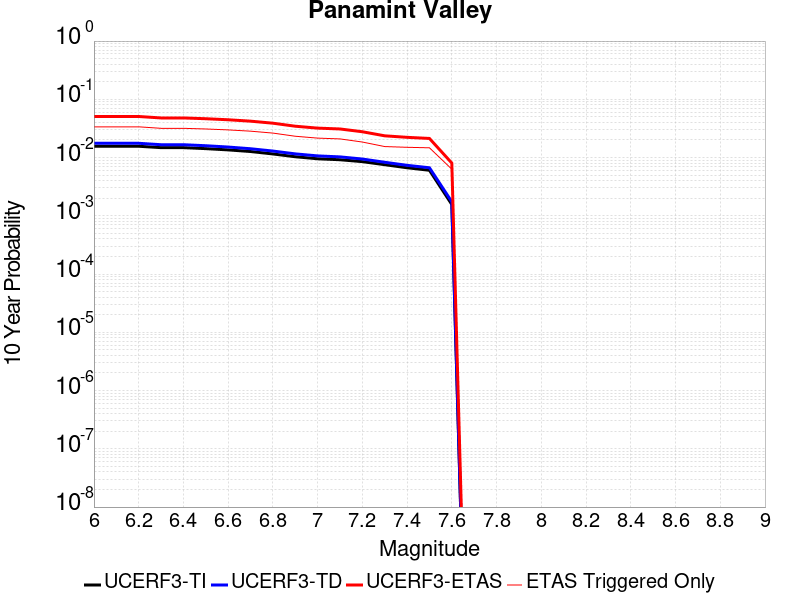 |

| Magnitude | 1 wk TI Prob | 1 wk TD Prob | 1 wk ETAS Prob | 1 wk ETAS/TD Gain | 1 wk ETAS Triggered Only | 1 mo TI Prob | 1 mo TD Prob | 1 mo ETAS Prob | 1 mo ETAS/TD Gain | 1 mo ETAS Triggered Only | 1 yr TI Prob | 1 yr TD Prob | 1 yr ETAS Prob | 1 yr ETAS/TD Gain | 1 yr ETAS Triggered Only | 10 yr TI Prob | 10 yr TD Prob | 10 yr ETAS Prob | 10 yr ETAS/TD Gain | 10 yr ETAS Triggered Only |
|-----|-----|-----|-----|-----|-----|-----|-----|-----|-----|-----|-----|-----|-----|-----|-----|-----|-----|-----|-----|-----|
| 6.0 | 3.0211835E-5 | 3.3984263E-5 | 0.013183537 | 387.93066 | 0.01315 | 1.2947287E-4 | 1.4563887E-4 | 0.01743312 | 119.70101 | 0.01729 | 0.0015751923 | 0.0017717406 | 0.02682727 | 15.141759 | 0.0251 | 0.015640736 | 0.017583003 | 0.050710104 | 2.884041 | 0.03372 |
| 6.1 | 3.0211835E-5 | 3.3984263E-5 | 0.013183537 | 387.93066 | 0.01315 | 1.2947287E-4 | 1.4563887E-4 | 0.01743312 | 119.70101 | 0.01729 | 0.0015751923 | 0.0017717406 | 0.02682727 | 15.141759 | 0.0251 | 0.015640736 | 0.017583003 | 0.050710104 | 2.884041 | 0.03372 |
| 6.2 | 3.0211835E-5 | 3.3984263E-5 | 0.013183537 | 387.93066 | 0.01315 | 1.2947287E-4 | 1.4563887E-4 | 0.01743312 | 119.70101 | 0.01729 | 0.0015751923 | 0.0017717406 | 0.02682727 | 15.141759 | 0.0251 | 0.015640736 | 0.017583003 | 0.050710104 | 2.884041 | 0.03372 |
| 6.3 | 2.8573924E-5 | 3.2102445E-5 | 0.012621698 | 393.1694 | 0.01259 | 1.2245393E-4 | 1.375748E-4 | 0.016615307 | 120.772896 | 0.01648 | 0.001489857 | 0.0016737141 | 0.025383964 | 15.166247 | 0.02375 | 0.01479908 | 0.016618038 | 0.047860082 | 2.8800082 | 0.03177 |
| 6.4 | 2.8573924E-5 | 3.2102445E-5 | 0.012621698 | 393.1694 | 0.01259 | 1.2245393E-4 | 1.375748E-4 | 0.016615307 | 120.772896 | 0.01648 | 0.001489857 | 0.0016737141 | 0.025383964 | 15.166247 | 0.02375 | 0.01479908 | 0.016618038 | 0.047860082 | 2.8800082 | 0.03177 |
| 6.5 | 2.7468774E-5 | 3.0828138E-5 | 0.012440446 | 403.5419 | 0.01241 | 1.1771801E-4 | 1.3211406E-4 | 0.016299978 | 123.37807 | 0.01617 | 0.0014322745 | 0.0016073292 | 0.024819959 | 15.441739 | 0.02325 | 0.014230782 | 0.015963882 | 0.04642964 | 2.908418 | 0.03096 |
| 6.6 | 2.6135967E-5 | 2.9252153E-5 | 0.0120789 | 412.92346 | 0.01205 | 1.1200648E-4 | 1.2536049E-4 | 0.015803395 | 126.0636 | 0.01568 | 0.0013628257 | 0.0015252219 | 0.024000889 | 15.735998 | 0.02251 | 0.013544982 | 0.015154343 | 0.044551987 | 2.9398823 | 0.02985 |
| 6.7 | 2.4498746E-5 | 2.7341044E-5 | 0.011587025 | 423.796 | 0.01156 | 1.04990395E-4 | 1.17170785E-4 | 0.0150654195 | 128.57658 | 0.01495 | 0.0012775084 | 0.0014256459 | 0.02285505 | 16.031366 | 0.02146 | 0.012701893 | 0.014171593 | 0.04215926 | 2.9749134 | 0.02839 |
| 6.8 | 2.2244329E-5 | 2.4935374E-5 | 0.011004661 | 441.3273 | 0.01098 | 9.532935E-5 | 1.0686163E-4 | 0.01416536 | 132.55795 | 0.01406 | 0.0011600169 | 0.0013002857 | 0.021264292 | 16.353554 | 0.01999 | 0.011539802 | 0.012932955 | 0.03891256 | 3.008791 | 0.02632 |
| 6.9 | 1.9902658E-5 | 2.2290182E-5 | 0.0099720685 | 447.3749 | 0.00995 | 8.529431E-5 | 9.552596E-5 | 0.01282431 | 134.24948 | 0.01273 | 0.0010379635 | 0.0011624265 | 0.018891793 | 16.252033 | 0.01775 | 0.010331288 | 0.011569021 | 0.034530275 | 2.9847186 | 0.02323 |
| 7.0 | 1.8353881E-5 | 2.056605E-5 | 0.009290376 | 451.73355 | 0.00927 | 7.865712E-5 | 8.813734E-5 | 0.01197709 | 135.8912 | 0.01189 | 9.5722964E-4 | 0.0010725616 | 0.017604811 | 16.4138 | 0.01655 | 0.009531168 | 0.01067939 | 0.032019034 | 2.9982083 | 0.02157 |
| 7.1 | 1.7667631E-5 | 1.9772435E-5 | 0.009019595 | 456.17014 | 0.009 | 7.571623E-5 | 8.4736355E-5 | 0.011613759 | 137.05757 | 0.01153 | 9.2145515E-4 | 0.0010311945 | 0.017074633 | 16.558113 | 0.01606 | 0.009176437 | 0.0102695925 | 0.030964855 | 3.015198 | 0.02091 |
| 7.2 | 1.6381597E-5 | 1.8158042E-5 | 0.007938014 | 437.16245 | 0.00792 | 7.020495E-5 | 7.781795E-5 | 0.01020703 | 131.16548 | 0.01013 | 8.544101E-4 | 9.470391E-4 | 0.015073648 | 15.916606 | 0.01414 | 0.008511325 | 0.009435269 | 0.027740905 | 2.9401288 | 0.01848 |
| 7.3 | 1.4520491E-5 | 1.596657E-5 | 0.0064058644 | 401.20477 | 0.00639 | 6.222919E-5 | 6.842646E-5 | 0.0083778575 | 122.43594 | 0.00831 | 7.57377E-4 | 8.327899E-4 | 0.012533038 | 15.049459 | 0.01171 | 0.0075480095 | 0.008300399 | 0.023622159 | 2.845906 | 0.01545 |
| 7.4 | 1.2852287E-5 | 1.41454875E-5 | 0.0063040564 | 445.65848 | 0.00629 | 5.5080065E-5 | 6.06222E-5 | 0.008220128 | 135.596 | 0.00816 | 6.7039346E-4 | 7.378411E-4 | 0.012139423 | 16.452623 | 0.01141 | 0.0066837464 | 0.007357429 | 0.022247067 | 3.0237556 | 0.015 |
| 7.5 | 1.1637851E-5 | 1.2836868E-5 | 0.006232757 | 485.53564 | 0.00622 | 4.987555E-5 | 5.5014076E-5 | 0.008114571 | 147.4999 | 0.00806 | 6.070656E-4 | 6.696062E-4 | 0.011862107 | 17.715048 | 0.0112 | 0.006054099 | 0.0066793845 | 0.021291131 | 3.1875887 | 0.01471 |
| 7.6 | 3.0068115E-6 | 3.3330623E-6 | 0.0028133236 | 844.06573 | 0.00281 | 1.2886271E-5 | 1.4284516E-5 | 0.0037142318 | 260.01804 | 0.0037 | 1.5687906E-4 | 1.7390738E-4 | 0.0051730378 | 29.745937 | 0.005 | 0.0015676835 | 0.0017397973 | 0.008048802 | 4.626287 | 0.00632 |

## Garlock (East)
*[(top)](#table-of-contents)*

| 1 Week | 1 Month | 1 Year | 10 Year |
|-----|-----|-----|-----|
| 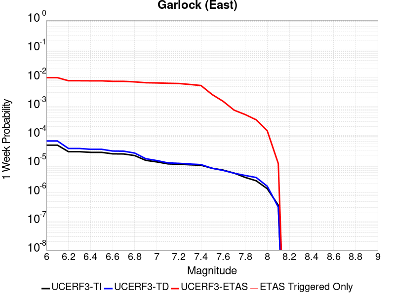 |  | 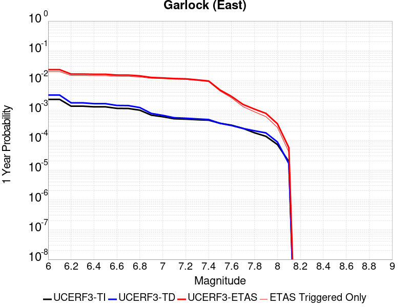 |  |

| Magnitude | 1 wk TI Prob | 1 wk TD Prob | 1 wk ETAS Prob | 1 wk ETAS/TD Gain | 1 wk ETAS Triggered Only | 1 mo TI Prob | 1 mo TD Prob | 1 mo ETAS Prob | 1 mo ETAS/TD Gain | 1 mo ETAS Triggered Only | 1 yr TI Prob | 1 yr TD Prob | 1 yr ETAS Prob | 1 yr ETAS/TD Gain | 1 yr ETAS Triggered Only | 10 yr TI Prob | 10 yr TD Prob | 10 yr ETAS Prob | 10 yr ETAS/TD Gain | 10 yr ETAS Triggered Only |
|-----|-----|-----|-----|-----|-----|-----|-----|-----|-----|-----|-----|-----|-----|-----|-----|-----|-----|-----|-----|-----|
| 6.0 | 4.5092507E-5 | 6.2904815E-5 | 0.010062275 | 159.96034 | 0.01 | 1.9323928E-4 | 2.6956675E-4 | 0.013725938 | 50.918518 | 0.01346 | 0.0023501497 | 0.003277482 | 0.023371408 | 7.1309037 | 0.02016 | 0.023254504 | 0.03235377 | 0.059089836 | 1.8263663 | 0.02763 |
| 6.1 | 4.5092507E-5 | 6.2904815E-5 | 0.010062275 | 159.96034 | 0.01 | 1.9323928E-4 | 2.6956675E-4 | 0.013725938 | 50.918518 | 0.01346 | 0.0023501497 | 0.003277482 | 0.023371408 | 7.1309037 | 0.02016 | 0.023254504 | 0.03235377 | 0.059089836 | 1.8263663 | 0.02763 |
| 6.2 | 2.6674514E-5 | 3.4511588E-5 | 0.007854242 | 227.58275 | 0.00782 | 1.1431433E-4 | 1.4789861E-4 | 0.010376385 | 70.15878 | 0.01023 | 0.0013908884 | 0.0017992114 | 0.016612511 | 9.233218 | 0.01484 | 0.01382215 | 0.017872788 | 0.03711266 | 2.0764897 | 0.01959 |
| 6.3 | 2.6674514E-5 | 3.4511588E-5 | 0.007854242 | 227.58275 | 0.00782 | 1.1431433E-4 | 1.4789861E-4 | 0.010376385 | 70.15878 | 0.01023 | 0.0013908884 | 0.0017992114 | 0.016612511 | 9.233218 | 0.01484 | 0.01382215 | 0.017872788 | 0.03711266 | 2.0764897 | 0.01959 |
| 6.4 | 2.5312667E-5 | 3.2340467E-5 | 0.007802089 | 241.24849 | 0.00777 | 1.0847834E-4 | 1.3859481E-4 | 0.010287188 | 74.224915 | 0.01015 | 0.0013199237 | 0.0016861152 | 0.01636133 | 9.703566 | 0.0147 | 0.013121112 | 0.016772287 | 0.03579774 | 2.1343389 | 0.01935 |
| 6.5 | 2.5312667E-5 | 3.2340467E-5 | 0.007802089 | 241.24849 | 0.00777 | 1.0847834E-4 | 1.3859481E-4 | 0.010287188 | 74.224915 | 0.01015 | 0.0013199237 | 0.0016861152 | 0.01636133 | 9.703566 | 0.0147 | 0.013121112 | 0.016772287 | 0.03579774 | 2.1343389 | 0.01935 |
| 6.6 | 2.246556E-5 | 2.8134691E-5 | 0.0074979244 | 266.50104 | 0.00747 | 9.627742E-5 | 1.2057181E-4 | 0.009859397 | 81.771996 | 0.00974 | 0.0011715472 | 0.0014669969 | 0.015376561 | 10.48166 | 0.01393 | 0.011653901 | 0.014613169 | 0.032645747 | 2.2339952 | 0.0183 |
| 6.7 | 2.2241198E-5 | 2.7804432E-5 | 0.007487597 | 269.2951 | 0.00746 | 9.531594E-5 | 1.1915654E-4 | 0.009847997 | 82.64756 | 0.00973 | 0.0011598538 | 0.0014497889 | 0.015339622 | 10.58059 | 0.01391 | 0.011538187 | 0.014442829 | 0.03244896 | 2.2467177 | 0.01827 |
| 6.8 | 1.9528685E-5 | 2.3898969E-5 | 0.007163728 | 299.75052 | 0.00714 | 8.369167E-5 | 1.0242024E-4 | 0.009401468 | 91.79307 | 0.0093 | 0.0010184698 | 0.0012462728 | 0.014449797 | 11.59441 | 0.01322 | 0.010138147 | 0.012436723 | 0.029442564 | 2.367389 | 0.01722 |
| 6.9 | 1.3318621E-5 | 1.5198818E-5 | 0.006705097 | 441.15912 | 0.00669 | 5.7078556E-5 | 6.51362E-5 | 0.008694574 | 133.48299 | 0.00863 | 6.9470983E-4 | 7.927504E-4 | 0.012763253 | 16.099964 | 0.01198 | 0.0069254204 | 0.007940721 | 0.023020022 | 2.898984 | 0.0152 |
| 7.0 | 1.1760853E-5 | 1.3107653E-5 | 0.0065830215 | 502.22733 | 0.00657 | 5.0402683E-5 | 5.6174475E-5 | 0.008495701 | 151.23773 | 0.00844 | 6.134799E-4 | 6.8371464E-4 | 0.012315757 | 18.013006 | 0.01164 | 0.0061178906 | 0.006857401 | 0.021466529 | 3.1304176 | 0.01471 |
| 7.1 | 1.0064758E-5 | 1.0902761E-5 | 0.006410833 | 588.0009 | 0.0064 | 4.3133965E-5 | 4.67253E-5 | 0.008226343 | 176.05757 | 0.00818 | 5.2502943E-4 | 5.6873553E-4 | 0.011732383 | 20.62889 | 0.01117 | 0.005237907 | 0.0057133473 | 0.019583646 | 3.427701 | 0.01395 |
| 7.2 | 9.768808E-6 | 1.0498628E-5 | 0.0062904325 | 599.16705 | 0.00628 | 4.186565E-5 | 4.499337E-5 | 0.008064632 | 179.24048 | 0.00802 | 5.095951E-4 | 5.4766005E-4 | 0.011481669 | 20.964956 | 0.01094 | 0.0050842804 | 0.005503584 | 0.01905857 | 3.462938 | 0.01363 |
| 7.3 | 9.344516E-6 | 9.9442705E-6 | 0.0058298865 | 586.2558 | 0.00582 | 4.004731E-5 | 4.2617627E-5 | 0.007442302 | 174.62968 | 0.0074 | 4.8746695E-4 | 5.187495E-4 | 0.01061351 | 20.459797 | 0.0101 | 0.0048639905 | 0.005215269 | 0.017650079 | 3.3843083 | 0.0125 |
| 7.4 | 9.023491E-6 | 9.490441E-6 | 0.0053594396 | 564.7198 | 0.00535 | 3.867153E-5 | 4.0672705E-5 | 0.006820397 | 167.68979 | 0.00678 | 4.7072413E-4 | 4.95081E-4 | 0.009730507 | 19.654371 | 0.00924 | 0.004697283 | 0.0049787266 | 0.016262269 | 3.2663507 | 0.01134 |
| 7.5 | 7.081253E-6 | 7.0873994E-6 | 0.0026170688 | 369.2566 | 0.00261 | 3.0347876E-5 | 3.0374218E-5 | 0.003300275 | 108.65382 | 0.00327 | 3.6942272E-4 | 3.697441E-4 | 0.0048380913 | 13.084972 | 0.00447 | 0.003688092 | 0.0037244745 | 0.009184064 | 2.4658685 | 0.00548 |
| 7.6 | 6.116396E-6 | 5.9589424E-6 | 0.00151595 | 254.39915 | 0.00151 | 2.6212863E-5 | 2.5538076E-5 | 0.0019754884 | 77.35462 | 0.00195 | 3.1909486E-4 | 3.1088197E-4 | 0.0029500613 | 9.489328 | 0.00264 | 0.0031863707 | 0.0031359126 | 0.006405627 | 2.0426676 | 0.00328 |
| 7.7 | 4.797145E-6 | 4.7571157E-6 | 7.447536E-4 | 156.55571 | 7.4E-4 | 2.055903E-5 | 2.0387479E-5 | 9.703681E-4 | 47.596275 | 9.5E-4 | 2.5027743E-4 | 2.481894E-4 | 0.0015878568 | 6.3977623 | 0.00134 | 0.0024999576 | 0.0025094065 | 0.0041353162 | 1.647926 | 0.00163 |
| 7.8 | 3.4028885E-6 | 3.978375E-6 | 5.239763E-4 | 131.70612 | 5.2E-4 | 1.4583726E-5 | 1.7050066E-5 | 6.5703917E-4 | 38.53587 | 6.4E-4 | 1.775424E-4 | 2.0756487E-4 | 0.001107378 | 5.335094 | 9.0E-4 | 0.0017740062 | 0.0021012141 | 0.0031589868 | 1.5034102 | 0.00106 |
| 7.9 | 2.5928412E-6 | 3.372436E-6 | 3.433713E-4 | 101.81699 | 3.4E-4 | 1.1112129E-5 | 1.4453217E-5 | 4.3444714E-4 | 30.058855 | 4.2E-4 | 1.3528178E-4 | 1.7595377E-4 | 7.9584465E-4 | 4.5230327 | 6.2E-4 | 0.0013519945 | 0.0017812426 | 0.0025299066 | 1.4203044 | 7.5E-4 |
| 8.0 | 1.3743648E-6 | 1.6734741E-6 | 1.4167324E-4 | 84.658165 | 1.4E-4 | 5.8901214E-6 | 7.1720124E-6 | 1.8717072E-4 | 26.09738 | 1.8E-4 | 7.1709874E-5 | 8.731578E-5 | 3.572922E-4 | 4.0919547 | 2.7E-4 | 7.1686733E-4 | 8.837377E-4 | 0.0011934638 | 1.3504728 | 3.1E-4 |
| 8.1 | 3.6733252E-7 | 3.1489736E-7 | 1.0314894E-5 | 32.756367 | 1.0E-5 | 1.5742813E-6 | 1.3495595E-6 | 3.134952E-5 | 23.229445 | 3.0E-5 | 1.9166706E-5 | 1.643078E-5 | 5.6430123E-5 | 3.4344153 | 4.0E-5 | 1.9165053E-4 | 1.662928E-4 | 2.0628615E-4 | 1.2404996 | 4.0E-5 |

## Hunter Mountain-Saline Valley
*[(top)](#table-of-contents)*

| 1 Week | 1 Month | 1 Year | 10 Year |
|-----|-----|-----|-----|
|  |  | 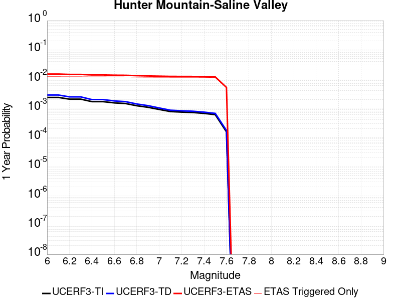 | 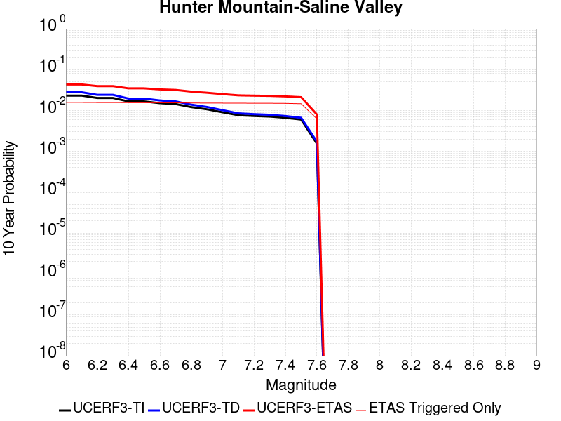 |

| Magnitude | 1 wk TI Prob | 1 wk TD Prob | 1 wk ETAS Prob | 1 wk ETAS/TD Gain | 1 wk ETAS Triggered Only | 1 mo TI Prob | 1 mo TD Prob | 1 mo ETAS Prob | 1 mo ETAS/TD Gain | 1 mo ETAS Triggered Only | 1 yr TI Prob | 1 yr TD Prob | 1 yr ETAS Prob | 1 yr ETAS/TD Gain | 1 yr ETAS Triggered Only | 10 yr TI Prob | 10 yr TD Prob | 10 yr ETAS Prob | 10 yr ETAS/TD Gain | 10 yr ETAS Triggered Only |
|-----|-----|-----|-----|-----|-----|-----|-----|-----|-----|-----|-----|-----|-----|-----|-----|-----|-----|-----|-----|-----|
| 6.0 | 4.5103672E-5 | 5.456906E-5 | 0.0066842074 | 122.49078 | 0.00663 | 1.9328714E-4 | 2.3384714E-4 | 0.008821839 | 37.724808 | 0.00859 | 0.002350731 | 0.0028435462 | 0.0148293665 | 5.2150965 | 0.01202 | 0.023260195 | 0.028092625 | 0.04348764 | 1.548009 | 0.01584 |
| 6.1 | 4.5103672E-5 | 5.456906E-5 | 0.0066842074 | 122.49078 | 0.00663 | 1.9328714E-4 | 2.3384714E-4 | 0.008821839 | 37.724808 | 0.00859 | 0.002350731 | 0.0028435462 | 0.0148293665 | 5.2150965 | 0.01202 | 0.023260195 | 0.028092625 | 0.04348764 | 1.548009 | 0.01584 |
| 6.2 | 3.9363465E-5 | 4.706271E-5 | 0.0066367527 | 141.01935 | 0.00659 | 1.6868966E-4 | 2.016826E-4 | 0.008749958 | 43.384792 | 0.00855 | 0.002051862 | 0.0024528534 | 0.014383517 | 5.863994 | 0.01196 | 0.020330196 | 0.024274187 | 0.03964187 | 1.6330874 | 0.01575 |
| 6.3 | 3.9363465E-5 | 4.706271E-5 | 0.0066367527 | 141.01935 | 0.00659 | 1.6868966E-4 | 2.016826E-4 | 0.008749958 | 43.384792 | 0.00855 | 0.002051862 | 0.0024528534 | 0.014383517 | 5.863994 | 0.01196 | 0.020330196 | 0.024274187 | 0.03964187 | 1.6330874 | 0.01575 |
| 6.4 | 3.2311684E-5 | 3.795112E-5 | 0.0065277047 | 172.00296 | 0.00649 | 1.384713E-4 | 1.6263791E-4 | 0.008591267 | 52.8245 | 0.00843 | 0.0016845843 | 0.001978387 | 0.013804943 | 6.977878 | 0.01185 | 0.016718714 | 0.019617118 | 0.034911092 | 1.7796239 | 0.0156 |
| 6.5 | 3.2311684E-5 | 3.795112E-5 | 0.0065277047 | 172.00296 | 0.00649 | 1.384713E-4 | 1.6263791E-4 | 0.008591267 | 52.8245 | 0.00843 | 0.0016845843 | 0.001978387 | 0.013804943 | 6.977878 | 0.01185 | 0.016718714 | 0.019617118 | 0.034911092 | 1.7796239 | 0.0156 |
| 6.6 | 2.9305844E-5 | 3.418196E-5 | 0.0065139607 | 190.56718 | 0.00648 | 1.2559042E-4 | 1.4648624E-4 | 0.008535258 | 58.26661 | 0.00839 | 0.0015279909 | 0.0017820727 | 0.01354108 | 7.5985003 | 0.01178 | 0.015175272 | 0.017686324 | 0.03293183 | 1.8619941 | 0.01552 |
| 6.7 | 2.7826512E-5 | 3.2344353E-5 | 0.006512135 | 201.3376 | 0.00648 | 1.19251024E-4 | 1.3861163E-4 | 0.008527448 | 61.52044 | 0.00839 | 0.0014509142 | 0.0016863506 | 0.013436502 | 7.967799 | 0.01177 | 0.014414776 | 0.016743818 | 0.03198429 | 1.9102148 | 0.0155 |
| 6.8 | 2.3389874E-5 | 2.6866792E-5 | 0.0064466945 | 239.95029 | 0.00642 | 1.0023846E-4 | 1.1513857E-4 | 0.0084241815 | 73.16559 | 0.00831 | 0.00121972 | 0.001400958 | 0.013044623 | 9.311216 | 0.01166 | 0.01213047 | 0.013928067 | 0.029074132 | 2.087449 | 0.01536 |
| 6.9 | 2.069209E-5 | 2.357011E-5 | 0.0063834204 | 270.82693 | 0.00636 | 8.867737E-5 | 1.0101105E-4 | 0.008340179 | 82.56699 | 0.00824 | 0.0010791123 | 0.0012291519 | 0.012764955 | 10.385174 | 0.01155 | 0.010738871 | 0.012229158 | 0.027282786 | 2.230962 | 0.01524 |
| 7.0 | 1.7462342E-5 | 1.9633622E-5 | 0.006369509 | 324.41843 | 0.00635 | 7.483646E-5 | 8.414151E-5 | 0.008313449 | 98.80318 | 0.00823 | 9.1075303E-4 | 0.0010239641 | 0.012542157 | 12.248631 | 0.01153 | 0.009070295 | 0.010196688 | 0.025261493 | 2.4774215 | 0.01522 |
| 7.1 | 1.4807709E-5 | 1.6441827E-5 | 0.0063263383 | 384.771 | 0.00631 | 6.3460066E-5 | 7.046316E-5 | 0.008259886 | 117.22276 | 0.00819 | 7.723524E-4 | 8.575678E-4 | 0.012327723 | 14.3752165 | 0.01148 | 0.007696735 | 0.008546168 | 0.023576608 | 2.7587345 | 0.01516 |
| 7.2 | 1.4180048E-5 | 1.5698413E-5 | 0.0063255993 | 402.94513 | 0.00631 | 6.077022E-5 | 6.727727E-5 | 0.008256726 | 122.72683 | 0.00819 | 7.396263E-4 | 8.1880915E-4 | 0.0122894095 | 15.008881 | 0.01148 | 0.0073716943 | 0.008161469 | 0.023167986 | 2.838703 | 0.01513 |
| 7.3 | 1.3730402E-5 | 1.5172151E-5 | 0.0063250763 | 416.88727 | 0.00631 | 5.8843252E-5 | 6.502197E-5 | 0.00824449 | 126.79545 | 0.00818 | 7.161811E-4 | 7.9137104E-4 | 0.012242302 | 15.469737 | 0.01146 | 0.007138774 | 0.007889058 | 0.022860013 | 2.8976858 | 0.01509 |
| 7.4 | 1.2810095E-5 | 1.4109353E-5 | 0.006294021 | 446.08853 | 0.00628 | 5.489925E-5 | 6.0467344E-5 | 0.0082099745 | 135.77534 | 0.00815 | 6.681934E-4 | 7.3595706E-4 | 0.012127567 | 16.478634 | 0.0114 | 0.006661878 | 0.0073386896 | 0.022218682 | 3.027609 | 0.01499 |
| 7.5 | 1.1595659E-5 | 1.2800734E-5 | 0.006222721 | 486.12222 | 0.00621 | 4.9694736E-5 | 5.485922E-5 | 0.0081044175 | 147.73119 | 0.00805 | 6.0486543E-4 | 6.67722E-4 | 0.01185025 | 17.74728 | 0.01119 | 0.006032217 | 0.006660632 | 0.02126272 | 3.1922977 | 0.0147 |
| 7.6 | 2.997694E-6 | 3.3251877E-6 | 0.002813316 | 846.0623 | 0.00281 | 1.28471975E-5 | 1.4250767E-5 | 0.003714198 | 260.63144 | 0.0037 | 1.564034E-4 | 1.7349655E-4 | 0.005172629 | 29.814016 | 0.005 | 0.0015629337 | 0.0017356955 | 0.008044726 | 4.6348715 | 0.00632 |

## Ash Hill
*[(top)](#table-of-contents)*

| 1 Week | 1 Month | 1 Year | 10 Year |
|-----|-----|-----|-----|
|  | 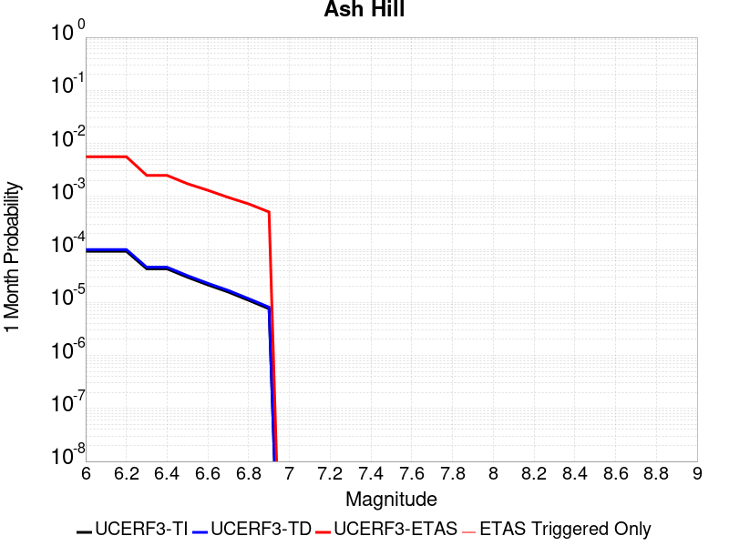 |  |  |

| Magnitude | 1 wk TI Prob | 1 wk TD Prob | 1 wk ETAS Prob | 1 wk ETAS/TD Gain | 1 wk ETAS Triggered Only | 1 mo TI Prob | 1 mo TD Prob | 1 mo ETAS Prob | 1 mo ETAS/TD Gain | 1 mo ETAS Triggered Only | 1 yr TI Prob | 1 yr TD Prob | 1 yr ETAS Prob | 1 yr ETAS/TD Gain | 1 yr ETAS Triggered Only | 10 yr TI Prob | 10 yr TD Prob | 10 yr ETAS Prob | 10 yr ETAS/TD Gain | 10 yr ETAS Triggered Only |
|-----|-----|-----|-----|-----|-----|-----|-----|-----|-----|-----|-----|-----|-----|-----|-----|-----|-----|-----|-----|-----|
| 6.0 | 2.1545662E-5 | 2.3194447E-5 | 0.004013102 | 173.01994 | 0.00399 | 9.2335285E-5 | 9.940143E-5 | 0.005608854 | 56.426285 | 0.00551 | 0.0011236023 | 0.0012096206 | 0.010038927 | 8.299236 | 0.00884 | 0.011179381 | 0.012038348 | 0.02464474 | 2.0471861 | 0.01276 |
| 6.1 | 2.1545662E-5 | 2.3194447E-5 | 0.004013102 | 173.01994 | 0.00399 | 9.2335285E-5 | 9.940143E-5 | 0.005608854 | 56.426285 | 0.00551 | 0.0011236023 | 0.0012096206 | 0.010038927 | 8.299236 | 0.00884 | 0.011179381 | 0.012038348 | 0.02464474 | 2.0471861 | 0.01276 |
| 6.2 | 2.1545662E-5 | 2.3194447E-5 | 0.004013102 | 173.01994 | 0.00399 | 9.2335285E-5 | 9.940143E-5 | 0.005608854 | 56.426285 | 0.00551 | 0.0011236023 | 0.0012096206 | 0.010038927 | 8.299236 | 0.00884 | 0.011179381 | 0.012038348 | 0.02464474 | 2.0471861 | 0.01276 |
| 6.3 | 1.0025529E-5 | 1.0746934E-5 | 0.0017807279 | 165.69637 | 0.00177 | 4.2965847E-5 | 4.605755E-5 | 0.0024859451 | 53.97476 | 0.00244 | 5.229836E-4 | 5.6061964E-4 | 0.004458433 | 7.952688 | 0.0039 | 0.005217545 | 0.0055933665 | 0.011112323 | 1.9866968 | 0.00555 |
| 6.4 | 1.0025529E-5 | 1.0746934E-5 | 0.0017807279 | 165.69637 | 0.00177 | 4.2965847E-5 | 4.605755E-5 | 0.0024859451 | 53.97476 | 0.00244 | 5.229836E-4 | 5.6061964E-4 | 0.004458433 | 7.952688 | 0.0039 | 0.005217545 | 0.0055933665 | 0.011112323 | 1.9866968 | 0.00555 |
| 6.5 | 6.9617327E-6 | 7.456634E-6 | 0.0012374475 | 165.95255 | 0.00123 | 2.9835655E-5 | 3.195666E-5 | 0.0017319024 | 54.195347 | 0.0017 | 3.6318856E-4 | 3.8901155E-4 | 0.0030379808 | 7.809487 | 0.00265 | 0.0036259557 | 0.0038841602 | 0.007649478 | 1.9694033 | 0.00378 |
| 6.6 | 4.9919777E-6 | 5.3466883E-6 | 9.4534166E-4 | 176.80882 | 9.4E-4 | 2.1394015E-5 | 2.2914215E-5 | 0.0013028849 | 56.85924 | 0.00128 | 2.60441E-4 | 2.7895154E-4 | 0.0022783936 | 8.167704 | 0.002 | 0.0026013597 | 0.0027866727 | 0.0056187585 | 2.0162966 | 0.00284 |
| 6.7 | 3.6630722E-6 | 3.924624E-6 | 7.039219E-4 | 179.36035 | 7.0E-4 | 1.5698786E-5 | 1.681974E-5 | 9.568039E-4 | 56.885777 | 9.4E-4 | 1.9111596E-4 | 2.0476682E-4 | 0.0016044802 | 7.835645 | 0.0014 | 0.0019095168 | 0.0020463446 | 0.004022293 | 1.9655991 | 0.00198 |
| 6.8 | 2.5599613E-6 | 2.744925E-6 | 5.427434E-4 | 197.72614 | 5.4E-4 | 1.0971216E-5 | 1.1763939E-5 | 7.217556E-4 | 61.35322 | 7.1E-4 | 1.3356637E-4 | 1.4322149E-4 | 0.0011830726 | 8.26044 | 0.00104 | 0.0013348613 | 0.0014317769 | 0.0028197868 | 1.9694316 | 0.00139 |
| 6.9 | 1.7684905E-6 | 1.8968707E-6 | 4.018961E-4 | 211.87321 | 4.0E-4 | 7.579223E-6 | 8.129446E-6 | 5.081254E-4 | 62.504307 | 5.0E-4 | 9.2273134E-5 | 9.8976E-5 | 7.889077E-4 | 7.970697 | 6.9E-4 | 9.223483E-4 | 9.8976E-4 | 0.0019188395 | 1.9386917 | 9.3E-4 |

## Blackwater
*[(top)](#table-of-contents)*

| 1 Week | 1 Month | 1 Year | 10 Year |
|-----|-----|-----|-----|
|  |  | 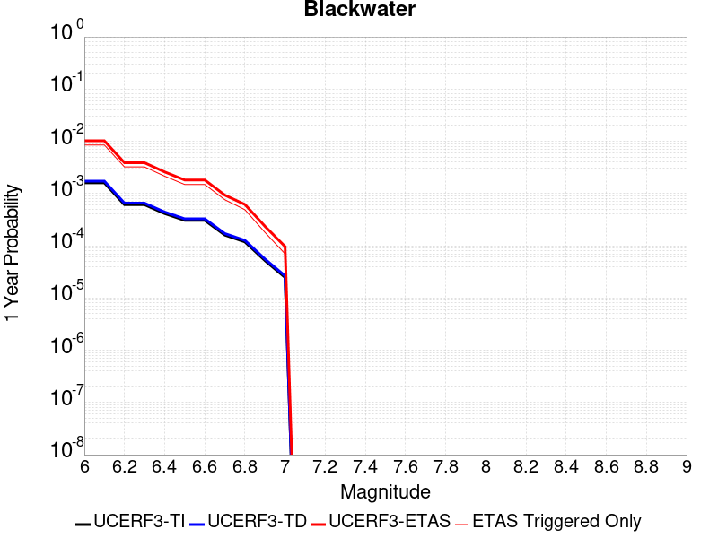 |  |

| Magnitude | 1 wk TI Prob | 1 wk TD Prob | 1 wk ETAS Prob | 1 wk ETAS/TD Gain | 1 wk ETAS Triggered Only | 1 mo TI Prob | 1 mo TD Prob | 1 mo ETAS Prob | 1 mo ETAS/TD Gain | 1 mo ETAS Triggered Only | 1 yr TI Prob | 1 yr TD Prob | 1 yr ETAS Prob | 1 yr ETAS/TD Gain | 1 yr ETAS Triggered Only | 10 yr TI Prob | 10 yr TD Prob | 10 yr ETAS Prob | 10 yr ETAS/TD Gain | 10 yr ETAS Triggered Only |
|-----|-----|-----|-----|-----|-----|-----|-----|-----|-----|-----|-----|-----|-----|-----|-----|-----|-----|-----|-----|-----|
| 6.0 | 3.0708583E-5 | 3.3095846E-5 | 0.004042963 | 122.159225 | 0.00401 | 1.3160157E-4 | 1.4183241E-4 | 0.0055610635 | 39.208694 | 0.00542 | 0.0016010714 | 0.0017255784 | 0.010200928 | 5.911599 | 0.00849 | 0.015895851 | 0.017135633 | 0.029234694 | 1.706076 | 0.01231 |
| 6.1 | 3.0708583E-5 | 3.3095846E-5 | 0.004042963 | 122.159225 | 0.00401 | 1.3160157E-4 | 1.4183241E-4 | 0.0055610635 | 39.208694 | 0.00542 | 0.0016010714 | 0.0017255784 | 0.010200928 | 5.911599 | 0.00849 | 0.015895851 | 0.017135633 | 0.029234694 | 1.706076 | 0.01231 |
| 6.2 | 1.1707779E-5 | 1.2545122E-5 | 0.0016125251 | 128.53801 | 0.0016 | 5.017523E-5 | 5.3763757E-5 | 0.0021436515 | 39.87168 | 0.00209 | 6.107122E-4 | 6.5438676E-4 | 0.003882273 | 5.932689 | 0.00323 | 0.006090366 | 0.0065255696 | 0.011274377 | 1.7277231 | 0.00478 |
| 6.3 | 1.1707779E-5 | 1.2545122E-5 | 0.0016125251 | 128.53801 | 0.0016 | 5.017523E-5 | 5.3763757E-5 | 0.0021436515 | 39.87168 | 0.00209 | 6.107122E-4 | 6.5438676E-4 | 0.003882273 | 5.932689 | 0.00323 | 0.006090366 | 0.0065255696 | 0.011274377 | 1.7277231 | 0.00478 |
| 6.4 | 7.929244E-6 | 8.480098E-6 | 0.0010884709 | 128.35594 | 0.00108 | 3.3982033E-5 | 3.6342793E-5 | 0.0014862901 | 40.89642 | 0.00145 | 4.136527E-4 | 4.423877E-4 | 0.0025914365 | 5.85784 | 0.00215 | 0.0041288356 | 0.0044154758 | 0.0075216996 | 1.7034856 | 0.00312 |
| 6.5 | 5.8832115E-6 | 6.285991E-6 | 7.662812E-4 | 121.90301 | 7.6E-4 | 2.521352E-5 | 2.6939697E-5 | 0.0010369124 | 38.49013 | 0.00101 | 3.0693135E-4 | 3.27944E-4 | 0.0018174554 | 5.541969 | 0.00149 | 0.0030650778 | 0.0032748538 | 0.005387911 | 1.6452372 | 0.00212 |
| 6.6 | 5.8832115E-6 | 6.285991E-6 | 7.662812E-4 | 121.90301 | 7.6E-4 | 2.521352E-5 | 2.6939697E-5 | 0.0010369124 | 38.49013 | 0.00101 | 3.0693135E-4 | 3.27944E-4 | 0.0018174554 | 5.541969 | 0.00149 | 0.0030650778 | 0.0032748538 | 0.005387911 | 1.6452372 | 0.00212 |
| 6.7 | 3.0715053E-6 | 3.2814662E-6 | 4.1328013E-4 | 125.94374 | 4.1E-4 | 1.3163528E-5 | 1.4063357E-5 | 5.3405605E-4 | 37.975002 | 5.2E-4 | 1.6025416E-4 | 1.7120909E-4 | 9.31079E-4 | 5.4382567 | 7.6E-4 | 0.0016013865 | 0.0017108864 | 0.0027990215 | 1.6360067 | 0.00109 |
| 6.8 | 2.2722281E-6 | 2.4287538E-6 | 3.12428E-4 | 128.63718 | 3.1E-4 | 9.738084E-6 | 1.0408908E-5 | 3.8040505E-4 | 36.54611 | 3.7E-4 | 1.1855473E-4 | 1.26722E-4 | 6.1665993E-4 | 4.866242 | 4.9E-4 | 0.001184915 | 0.0012665876 | 0.0020056502 | 1.5835071 | 7.4E-4 |
| 6.9 | 9.952399E-7 | 1.0653489E-6 | 7.1065275E-5 | 66.70611 | 7.0E-5 | 4.265307E-6 | 4.5657757E-6 | 1.1456527E-4 | 25.092182 | 1.1E-4 | 5.1928873E-5 | 5.5587418E-5 | 2.355774E-4 | 4.2379627 | 1.8E-4 | 5.191674E-4 | 5.557858E-4 | 8.6561346E-4 | 1.5574589 | 3.1E-4 |
| 7.0 | 4.7385504E-7 | 5.0755597E-7 | 3.0507541E-5 | 60.106754 | 3.0E-5 | 2.0308057E-6 | 2.1752398E-6 | 3.2175176E-5 | 14.7915535 | 3.0E-5 | 2.4724779E-5 | 2.6483543E-5 | 9.648169E-5 | 3.6430807 | 7.0E-5 | 2.4722028E-4 | 2.6483546E-4 | 4.0479837E-4 | 1.5284902 | 1.4E-4 |

## Garlock (West)
*[(top)](#table-of-contents)*

| 1 Week | 1 Month | 1 Year | 10 Year |
|-----|-----|-----|-----|
|  |  | 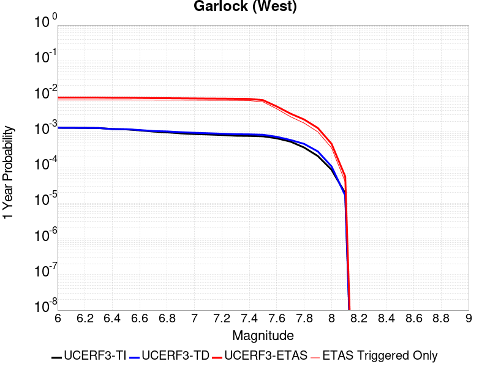 | 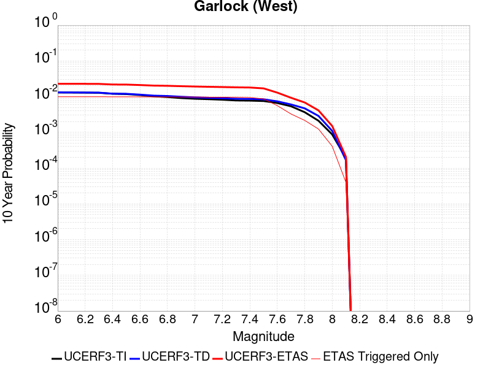 |

| Magnitude | 1 wk TI Prob | 1 wk TD Prob | 1 wk ETAS Prob | 1 wk ETAS/TD Gain | 1 wk ETAS Triggered Only | 1 mo TI Prob | 1 mo TD Prob | 1 mo ETAS Prob | 1 mo ETAS/TD Gain | 1 mo ETAS Triggered Only | 1 yr TI Prob | 1 yr TD Prob | 1 yr ETAS Prob | 1 yr ETAS/TD Gain | 1 yr ETAS Triggered Only | 10 yr TI Prob | 10 yr TD Prob | 10 yr ETAS Prob | 10 yr ETAS/TD Gain | 10 yr ETAS Triggered Only |
|-----|-----|-----|-----|-----|-----|-----|-----|-----|-----|-----|-----|-----|-----|-----|-----|-----|-----|-----|-----|-----|
| 6.0 | 2.5181727E-5 | 2.5197181E-5 | 0.004755078 | 188.71468 | 0.00473 | 1.0791722E-4 | 1.0798347E-4 | 0.006027344 | 55.817287 | 0.00592 | 0.0013131002 | 0.0013139093 | 0.00926345 | 7.050297 | 0.00796 | 0.013053683 | 0.013141794 | 0.022941297 | 1.7456746 | 0.00993 |
| 6.1 | 2.5077732E-5 | 2.5098223E-5 | 0.0047549796 | 189.45482 | 0.00473 | 1.0747157E-4 | 1.075594E-4 | 0.0060269227 | 56.033436 | 0.00592 | 0.001307681 | 0.0013087525 | 0.0092583345 | 7.074168 | 0.00796 | 0.013000126 | 0.013090835 | 0.022890843 | 1.748616 | 0.00993 |
| 6.2 | 2.494612E-5 | 2.4979914E-5 | 0.004754862 | 190.3474 | 0.00473 | 1.0690756E-4 | 1.070524E-4 | 0.006026419 | 56.294098 | 0.00592 | 0.0013008224 | 0.0013025872 | 0.0092522185 | 7.1029553 | 0.00796 | 0.012932341 | 0.013029906 | 0.02283052 | 1.7521629 | 0.00993 |
| 6.3 | 2.4733758E-5 | 2.4799276E-5 | 0.004754682 | 191.72664 | 0.00473 | 1.0599751E-4 | 1.06278305E-4 | 0.006025649 | 56.696888 | 0.00592 | 0.0012897556 | 0.0012931736 | 0.00924288 | 7.147439 | 0.00796 | 0.012822957 | 0.0129368715 | 0.022738408 | 1.7576435 | 0.00993 |
| 6.4 | 2.3237335E-5 | 2.3178607E-5 | 0.0047430694 | 204.63132 | 0.00472 | 9.958477E-5 | 9.933313E-5 | 0.006008746 | 60.49086 | 0.00591 | 0.0012117702 | 0.0012087126 | 0.009139115 | 7.5610323 | 0.00794 | 0.012051838 | 0.012101731 | 0.021862166 | 1.8065321 | 0.00988 |
| 6.5 | 2.2732203E-5 | 2.2992977E-5 | 0.0047428845 | 206.27536 | 0.00472 | 9.742009E-5 | 9.8537625E-5 | 0.0060079554 | 60.971184 | 0.00591 | 0.0011854442 | 0.0011990381 | 0.009129518 | 7.6140347 | 0.00794 | 0.011791403 | 0.012006035 | 0.021767415 | 1.8130394 | 0.00988 |
| 6.6 | 2.1319436E-5 | 2.1773201E-5 | 0.0047316705 | 217.31625 | 0.00471 | 9.136581E-5 | 9.3310395E-5 | 0.005982761 | 64.11677 | 0.00589 | 0.001111811 | 0.0011354643 | 0.009036483 | 7.958403 | 0.00791 | 0.011062649 | 0.011376952 | 0.02111489 | 1.8559356 | 0.00985 |
| 6.7 | 1.970802E-5 | 2.0393094E-5 | 0.004720297 | 231.46547 | 0.0047 | 8.446021E-5 | 8.739606E-5 | 0.005956883 | 68.15963 | 0.00587 | 0.001027818 | 0.0010635294 | 0.008945138 | 8.410805 | 0.00789 | 0.010230771 | 0.0106646875 | 0.020370068 | 1.9100481 | 0.00981 |
| 6.8 | 1.8744462E-5 | 1.9900775E-5 | 0.0047198073 | 237.167 | 0.0047 | 8.033094E-5 | 8.528626E-5 | 0.0059447866 | 69.70392 | 0.00586 | 9.775903E-4 | 0.0010378672 | 0.008899699 | 8.574988 | 0.00787 | 0.009733009 | 0.010410495 | 0.020098576 | 1.9306072 | 0.00979 |
| 6.9 | 1.7559682E-5 | 1.8953151E-5 | 0.004718864 | 248.97517 | 0.0047 | 7.5253614E-5 | 8.122527E-5 | 0.0059407493 | 73.139175 | 0.00586 | 9.158276E-4 | 9.884704E-4 | 0.008840701 | 8.943819 | 0.00786 | 0.0091206245 | 0.009921073 | 0.019604046 | 1.9760004 | 0.00978 |
| 7.0 | 1.6794445E-5 | 1.8215967E-5 | 0.004698131 | 257.91278 | 0.00468 | 7.197421E-5 | 7.806611E-5 | 0.005907611 | 75.67447 | 0.00583 | 8.759337E-4 | 9.5004175E-4 | 0.008762612 | 9.223397 | 0.00782 | 0.008724891 | 0.009539958 | 0.019187039 | 2.0112288 | 0.00974 |
| 7.1 | 1.6337795E-5 | 1.771677E-5 | 0.0046676346 | 263.45856 | 0.00465 | 7.0017246E-5 | 7.592681E-5 | 0.005855488 | 77.12016 | 0.00578 | 8.521265E-4 | 9.2401815E-4 | 0.008686839 | 9.401155 | 0.00777 | 0.008488664 | 0.009281721 | 0.018852059 | 2.0310953 | 0.00966 |
| 7.2 | 1.5780008E-5 | 1.71654E-5 | 0.0046570855 | 271.30658 | 0.00464 | 6.762685E-5 | 7.3563926E-5 | 0.0058431393 | 79.42941 | 0.00577 | 8.2304585E-4 | 8.952741E-4 | 0.008648327 | 9.659977 | 0.00776 | 0.008200042 | 0.008996559 | 0.018549832 | 2.0618808 | 0.00964 |
| 7.3 | 1.5058865E-5 | 1.6618484E-5 | 0.004626542 | 278.39737 | 0.00461 | 6.45364E-5 | 7.122013E-5 | 0.005810811 | 81.58945 | 0.00574 | 7.854473E-4 | 8.667614E-4 | 0.008570079 | 9.887472 | 0.00771 | 0.00782677 | 0.008713263 | 0.018219704 | 2.0910308 | 0.00959 |
| 7.4 | 1.4887923E-5 | 1.6454453E-5 | 0.004586379 | 278.7318 | 0.00457 | 6.380382E-5 | 7.0517184E-5 | 0.005730118 | 81.25847 | 0.00566 | 7.7653467E-4 | 8.5820974E-4 | 0.008481662 | 9.882971 | 0.00763 | 0.0077382675 | 0.008628101 | 0.017996566 | 2.0858083 | 0.00945 |
| 7.5 | 1.4509299E-5 | 1.6046468E-5 | 0.0042359787 | 263.982 | 0.00422 | 6.218123E-5 | 6.876877E-5 | 0.0052684112 | 76.61052 | 0.0052 | 7.567935E-4 | 8.369394E-4 | 0.007841072 | 9.368746 | 0.00701 | 0.0075422134 | 0.008416411 | 0.01701344 | 2.0214603 | 0.00867 |
| 7.6 | 1.2756717E-5 | 1.4050529E-5 | 0.0027140125 | 193.16089 | 0.0027 | 5.4670498E-5 | 6.0215163E-5 | 0.0034300121 | 56.962597 | 0.00337 | 6.6541E-4 | 7.328737E-4 | 0.005219583 | 7.1220775 | 0.00449 | 0.006634211 | 0.007381374 | 0.012940038 | 1.7530663 | 0.0056 |
| 7.7 | 1.0328985E-5 | 1.146033E-5 | 0.0016314418 | 142.35556 | 0.00162 | 4.4266326E-5 | 4.9114777E-5 | 0.0020390172 | 41.515347 | 0.00199 | 5.388092E-4 | 5.9780874E-4 | 0.0032862006 | 5.497077 | 0.00269 | 0.0053750467 | 0.006038286 | 0.00928854 | 1.5382744 | 0.00327 |
| 7.8 | 7.0306583E-6 | 8.899537E-6 | 0.0010888899 | 122.35355 | 0.00108 | 3.0131043E-5 | 3.8140315E-5 | 0.0013480904 | 35.34555 | 0.00131 | 3.667837E-4 | 4.6425956E-4 | 0.0022434331 | 4.832282 | 0.00178 | 0.003661789 | 0.0046950667 | 0.006844925 | 1.4578974 | 0.00216 |
| 7.9 | 4.060633E-6 | 5.465412E-6 | 6.154621E-4 | 112.61037 | 6.1E-4 | 1.7402595E-5 | 2.3422985E-5 | 7.734054E-4 | 33.01908 | 7.5E-4 | 2.11856E-4 | 2.8513762E-4 | 0.0012948497 | 4.541139 | 0.00101 | 0.0021165414 | 0.002884143 | 0.004120567 | 1.4286971 | 0.00124 |
| 8.0 | 1.6729537E-6 | 2.0775192E-6 | 1.9207712E-4 | 92.45504 | 1.9E-4 | 7.169782E-6 | 8.903624E-6 | 2.6890132E-4 | 30.201334 | 2.6E-4 | 8.7288594E-5 | 1.0839626E-4 | 4.6835723E-4 | 4.320788 | 3.6E-4 | 8.7254314E-4 | 0.001096854 | 0.0015064043 | 1.3733864 | 4.1E-4 |
| 8.1 | 3.6733252E-7 | 3.1489736E-7 | 1.0314894E-5 | 32.756367 | 1.0E-5 | 1.5742813E-6 | 1.3495595E-6 | 3.134952E-5 | 23.229445 | 3.0E-5 | 1.9166706E-5 | 1.643078E-5 | 5.6430123E-5 | 3.4344153 | 4.0E-5 | 1.9165053E-4 | 1.662928E-4 | 2.0628615E-4 | 1.2404996 | 4.0E-5 |

## McLean Lake
*[(top)](#table-of-contents)*

| 1 Week | 1 Month | 1 Year | 10 Year |
|-----|-----|-----|-----|
|  |  |  |  |

| Magnitude | 1 wk TI Prob | 1 wk TD Prob | 1 wk ETAS Prob | 1 wk ETAS/TD Gain | 1 wk ETAS Triggered Only | 1 mo TI Prob | 1 mo TD Prob | 1 mo ETAS Prob | 1 mo ETAS/TD Gain | 1 mo ETAS Triggered Only | 1 yr TI Prob | 1 yr TD Prob | 1 yr ETAS Prob | 1 yr ETAS/TD Gain | 1 yr ETAS Triggered Only | 10 yr TI Prob | 10 yr TD Prob | 10 yr ETAS Prob | 10 yr ETAS/TD Gain | 10 yr ETAS Triggered Only |
|-----|-----|-----|-----|-----|-----|-----|-----|-----|-----|-----|-----|-----|-----|-----|-----|-----|-----|-----|-----|-----|
| 6.0 | 1.7360222E-5 | 1.8501627E-5 | 0.0015284737 | 82.61293 | 0.00151 | 7.439883E-5 | 7.9290556E-5 | 0.0024491027 | 30.887697 | 0.00237 | 9.0542925E-4 | 9.6498354E-4 | 0.005890226 | 6.1039653 | 0.00493 | 0.009017491 | 0.0096127745 | 0.017872604 | 1.8592556 | 0.00834 |
| 6.1 | 9.062689E-6 | 9.592193E-6 | 7.395852E-4 | 77.10282 | 7.3E-4 | 3.8839516E-5 | 4.1108804E-5 | 0.0011910616 | 28.973394 | 0.00115 | 4.727685E-4 | 5.003936E-4 | 0.0030491175 | 6.093438 | 0.00255 | 0.0047176396 | 0.004993552 | 0.00933178 | 1.8687661 | 0.00436 |
| 6.2 | 9.062689E-6 | 9.592193E-6 | 7.395852E-4 | 77.10282 | 7.3E-4 | 3.8839516E-5 | 4.1108804E-5 | 0.0011910616 | 28.973394 | 0.00115 | 4.727685E-4 | 5.003936E-4 | 0.0030491175 | 6.093438 | 0.00255 | 0.0047176396 | 0.004993552 | 0.00933178 | 1.8687661 | 0.00436 |
| 6.3 | 7.2575485E-6 | 7.66771E-6 | 5.4766354E-4 | 71.42467 | 5.4E-4 | 3.110341E-5 | 3.2861237E-5 | 9.128323E-4 | 27.77839 | 8.8E-4 | 3.786182E-4 | 4.0001926E-4 | 0.0024192112 | 6.047737 | 0.00202 | 0.0037797375 | 0.0039936965 | 0.007409998 | 1.8554235 | 0.00343 |
| 6.4 | 7.2575485E-6 | 7.66771E-6 | 5.4766354E-4 | 71.42467 | 5.4E-4 | 3.110341E-5 | 3.2861237E-5 | 9.128323E-4 | 27.77839 | 8.8E-4 | 3.786182E-4 | 4.0001926E-4 | 0.0024192112 | 6.047737 | 0.00202 | 0.0037797375 | 0.0039936965 | 0.007409998 | 1.8554235 | 0.00343 |
| 6.5 | 6.06582E-6 | 6.4038773E-6 | 4.56401E-4 | 71.26948 | 4.5E-4 | 2.5996113E-5 | 2.7444936E-5 | 7.3742546E-4 | 26.869272 | 7.1E-4 | 3.164567E-4 | 3.3409733E-4 | 0.0020335293 | 6.0866375 | 0.0017 | 0.0031600643 | 0.0033365893 | 0.00617708 | 1.8513157 | 0.00285 |
| 6.6 | 5.598744E-6 | 5.910262E-6 | 4.059079E-4 | 68.67849 | 4.0E-4 | 2.3994397E-5 | 2.5329486E-5 | 6.5531355E-4 | 25.871569 | 6.3E-4 | 2.9209262E-4 | 3.0834923E-4 | 0.0019078559 | 6.1873217 | 0.0016 | 0.0029170897 | 0.003079843 | 0.0057117124 | 1.8545465 | 0.00264 |
| 6.7 | 5.246996E-6 | 5.539162E-6 | 3.8553705E-4 | 69.60205 | 3.8E-4 | 2.2486933E-5 | 2.3739085E-5 | 6.137251E-4 | 25.852936 | 5.9E-4 | 2.73744E-4 | 2.8899137E-4 | 0.0017685636 | 6.11978 | 0.00148 | 0.0027340704 | 0.0028867796 | 0.005329707 | 1.8462466 | 0.00245 |
| 6.8 | 4.02324E-6 | 4.2469046E-6 | 3.0424562E-4 | 71.63939 | 3.0E-4 | 1.7242342E-5 | 1.8200926E-5 | 4.7819255E-4 | 26.27298 | 4.6E-4 | 2.099053E-4 | 2.2157968E-4 | 0.0013313338 | 6.008374 | 0.00111 | 0.0020970714 | 0.002214172 | 0.0040600756 | 1.8336768 | 0.00185 |
| 6.9 | 6.835972E-7 | 7.1399285E-7 | 7.071394E-5 | 99.04013 | 7.0E-5 | 2.9296991E-6 | 3.0599674E-6 | 8.305972E-5 | 27.14399 | 8.0E-5 | 3.56685E-5 | 3.7254784E-5 | 2.4724696E-4 | 6.6366496 | 2.1E-4 | 3.5662777E-4 | 3.7251666E-4 | 7.323825E-4 | 1.9660398 | 3.6E-4 |

## Goldstone Lake
*[(top)](#table-of-contents)*

| 1 Week | 1 Month | 1 Year | 10 Year |
|-----|-----|-----|-----|
|  |  |  | 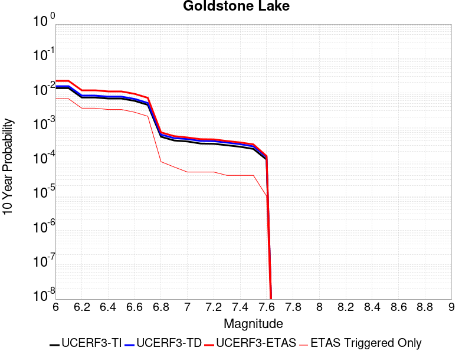 |

| Magnitude | 1 wk TI Prob | 1 wk TD Prob | 1 wk ETAS Prob | 1 wk ETAS/TD Gain | 1 wk ETAS Triggered Only | 1 mo TI Prob | 1 mo TD Prob | 1 mo ETAS Prob | 1 mo ETAS/TD Gain | 1 mo ETAS Triggered Only | 1 yr TI Prob | 1 yr TD Prob | 1 yr ETAS Prob | 1 yr ETAS/TD Gain | 1 yr ETAS Triggered Only | 10 yr TI Prob | 10 yr TD Prob | 10 yr ETAS Prob | 10 yr ETAS/TD Gain | 10 yr ETAS Triggered Only |
|-----|-----|-----|-----|-----|-----|-----|-----|-----|-----|-----|-----|-----|-----|-----|-----|-----|-----|-----|-----|-----|
| 6.0 | 2.671352E-5 | 3.0376103E-5 | 0.0013003375 | 42.80791 | 0.00127 | 1.1448149E-4 | 1.3017791E-4 | 0.0023098942 | 17.744133 | 0.00218 | 0.001392921 | 0.0015839601 | 0.0057174023 | 3.6095622 | 0.00414 | 0.013842222 | 0.015746202 | 0.022399757 | 1.4225498 | 0.00676 |
| 6.1 | 2.671352E-5 | 3.0376103E-5 | 0.0013003375 | 42.80791 | 0.00127 | 1.1448149E-4 | 1.3017791E-4 | 0.0023098942 | 17.744133 | 0.00218 | 0.001392921 | 0.0015839601 | 0.0057174023 | 3.6095622 | 0.00414 | 0.013842222 | 0.015746202 | 0.022399757 | 1.4225498 | 0.00676 |
| 6.2 | 1.4197047E-5 | 1.6096254E-5 | 6.460861E-4 | 40.138912 | 6.3E-4 | 6.0843064E-5 | 6.898268E-5 | 0.0011389089 | 16.51007 | 0.00107 | 7.4051257E-4 | 8.3963916E-4 | 0.0029778422 | 3.5465739 | 0.00214 | 0.007380498 | 0.008374364 | 0.011944217 | 1.4262834 | 0.0036 |
| 6.3 | 1.4197047E-5 | 1.6096254E-5 | 6.460861E-4 | 40.138912 | 6.3E-4 | 6.0843064E-5 | 6.898268E-5 | 0.0011389089 | 16.51007 | 0.00107 | 7.4051257E-4 | 8.3963916E-4 | 0.0029778422 | 3.5465739 | 0.00214 | 0.007380498 | 0.008374364 | 0.011944217 | 1.4262834 | 0.0036 |
| 6.4 | 1.3238931E-5 | 1.500847E-5 | 6.049996E-4 | 40.310547 | 5.9E-4 | 5.6737044E-5 | 6.432098E-5 | 0.0010642566 | 16.546028 | 0.001 | 6.9055456E-4 | 7.8292453E-4 | 0.00274139 | 3.5014741 | 0.00196 | 0.006884126 | 0.007811289 | 0.011085511 | 1.4191655 | 0.0033 |
| 6.5 | 1.3238931E-5 | 1.500847E-5 | 6.049996E-4 | 40.310547 | 5.9E-4 | 5.6737044E-5 | 6.432098E-5 | 0.0010642566 | 16.546028 | 0.001 | 6.9055456E-4 | 7.8292453E-4 | 0.00274139 | 3.5014741 | 0.00196 | 0.006884126 | 0.007811289 | 0.011085511 | 1.4191655 | 0.0033 |
| 6.6 | 1.1328278E-5 | 1.2855176E-5 | 5.028489E-4 | 39.116455 | 4.9E-4 | 4.8548856E-5 | 5.5092984E-5 | 8.950467E-4 | 16.24611 | 8.4E-4 | 5.90922E-4 | 6.706464E-4 | 0.00231954 | 3.458663 | 0.00165 | 0.0058935313 | 0.0066956137 | 0.009427201 | 1.4079666 | 0.00275 |
| 6.7 | 8.651175E-6 | 9.824575E-6 | 3.7982094E-4 | 38.660294 | 3.7E-4 | 3.707594E-5 | 4.2105148E-5 | 6.820782E-4 | 16.199402 | 6.4E-4 | 4.5130608E-4 | 5.126002E-4 | 0.0017719542 | 3.4567962 | 0.00126 | 0.0045039062 | 0.0051230565 | 0.007212298 | 1.4078115 | 0.0021 |
| 6.8 | 1.0215377E-6 | 1.1754802E-6 | 2.1175456E-5 | 18.014303 | 2.0E-5 | 4.378012E-6 | 5.037763E-6 | 2.5037662E-5 | 4.969996 | 2.0E-5 | 5.3300988E-5 | 6.133315E-5 | 1.21329474E-4 | 1.9782038 | 6.0E-5 | 5.3288206E-4 | 6.131735E-4 | 7.131122E-4 | 1.1629859 | 1.0E-4 |
| 6.9 | 7.9360774E-7 | 9.283496E-7 | 2.0928332E-5 | 22.543589 | 2.0E-5 | 3.4011714E-6 | 3.9786355E-6 | 2.3978555E-5 | 6.0268292 | 2.0E-5 | 4.1408475E-5 | 4.843888E-5 | 8.8436944E-5 | 1.825743 | 4.0E-5 | 4.140076E-4 | 4.842902E-4 | 5.542563E-4 | 1.1444714 | 7.0E-5 |
| 7.0 | 7.4382757E-7 | 8.747428E-7 | 1.08747345E-5 | 12.431922 | 1.0E-5 | 3.1878285E-6 | 3.7488926E-6 | 1.3748855E-5 | 3.6674442 | 1.0E-5 | 3.8811122E-5 | 4.564188E-5 | 7.564051E-5 | 1.657261 | 3.0E-5 | 3.8804344E-4 | 4.563317E-4 | 5.0630886E-4 | 1.1095194 | 5.0E-5 |
| 7.1 | 6.4709513E-7 | 7.711399E-7 | 1.0771132E-5 | 13.967805 | 1.0E-5 | 2.773262E-6 | 3.3048816E-6 | 1.3304849E-5 | 4.025817 | 1.0E-5 | 3.376394E-5 | 4.023625E-5 | 7.0235044E-5 | 1.7455664 | 3.0E-5 | 3.375881E-4 | 4.022956E-4 | 4.522755E-4 | 1.1242367 | 5.0E-5 |
| 7.2 | 6.356704E-7 | 7.588459E-7 | 1.07588385E-5 | 14.1778965 | 1.0E-5 | 2.7242988E-6 | 3.252193E-6 | 1.325216E-5 | 4.074838 | 1.0E-5 | 3.3167835E-5 | 3.959479E-5 | 6.95936E-5 | 1.7576455 | 3.0E-5 | 3.3162883E-4 | 3.9588328E-4 | 4.458635E-4 | 1.1262498 | 5.0E-5 |
| 7.3 | 5.7695723E-7 | 6.896648E-7 | 1.0689658E-5 | 15.499787 | 1.0E-5 | 2.4726714E-6 | 2.9557032E-6 | 1.2955674E-5 | 4.38328 | 1.0E-5 | 3.0104358E-5 | 3.598515E-5 | 6.598407E-5 | 1.8336473 | 3.0E-5 | 3.0100282E-4 | 3.5979896E-4 | 3.9978456E-4 | 1.1111332 | 4.0E-5 |
| 7.4 | 5.209647E-7 | 6.193583E-7 | 1.0619352E-5 | 17.145733 | 1.0E-5 | 2.232704E-6 | 2.6543903E-6 | 1.2654364E-5 | 4.7673335 | 1.0E-5 | 2.718283E-5 | 3.2316777E-5 | 6.231581E-5 | 1.9282804 | 3.0E-5 | 2.7179506E-4 | 3.2312635E-4 | 3.6311342E-4 | 1.1237506 | 4.0E-5 |
| 7.5 | 4.512955E-7 | 5.3489487E-7 | 1.053489E-5 | 19.695251 | 1.0E-5 | 1.934122E-6 | 2.2924048E-6 | 1.2292382E-5 | 5.3622212 | 1.0E-5 | 2.3547682E-5 | 2.7909726E-5 | 5.790889E-5 | 2.0748641 | 3.0E-5 | 2.3545188E-4 | 2.7906752E-4 | 3.1905636E-4 | 1.1432945 | 4.0E-5 |
| 7.6 | 2.21172E-7 | 2.6040198E-7 | 2.6040198E-7 | 1.0 | 0.0 | 9.478797E-7 | 1.1160082E-6 | 1.1160082E-6 | 1.0 | 0.0 | 1.1540374E-5 | 1.3587343E-5 | 2.3587207E-5 | 1.7359691 | 1.0E-5 | 1.1539775E-4 | 1.3586794E-4 | 1.4586658E-4 | 1.0735909 | 1.0E-5 |

## Gravel Hills-Harper Lk
*[(top)](#table-of-contents)*

| 1 Week | 1 Month | 1 Year | 10 Year |
|-----|-----|-----|-----|
|  |  |  |  |

| Magnitude | 1 wk TI Prob | 1 wk TD Prob | 1 wk ETAS Prob | 1 wk ETAS/TD Gain | 1 wk ETAS Triggered Only | 1 mo TI Prob | 1 mo TD Prob | 1 mo ETAS Prob | 1 mo ETAS/TD Gain | 1 mo ETAS Triggered Only | 1 yr TI Prob | 1 yr TD Prob | 1 yr ETAS Prob | 1 yr ETAS/TD Gain | 1 yr ETAS Triggered Only | 10 yr TI Prob | 10 yr TD Prob | 10 yr ETAS Prob | 10 yr ETAS/TD Gain | 10 yr ETAS Triggered Only |
|-----|-----|-----|-----|-----|-----|-----|-----|-----|-----|-----|-----|-----|-----|-----|-----|-----|-----|-----|-----|-----|
| 6.0 | 3.0679566E-5 | 3.1464628E-5 | 0.002181397 | 69.32855 | 0.00215 | 1.3147724E-4 | 1.3484266E-4 | 0.003224426 | 23.912508 | 0.00309 | 0.0015995599 | 0.00164069 | 0.0065626013 | 3.9999034 | 0.00493 | 0.015880952 | 0.016307337 | 0.023242371 | 1.4252707 | 0.00705 |
| 6.1 | 3.0679566E-5 | 3.1464628E-5 | 0.002181397 | 69.32855 | 0.00215 | 1.3147724E-4 | 1.3484266E-4 | 0.003224426 | 23.912508 | 0.00309 | 0.0015995599 | 0.00164069 | 0.0065626013 | 3.9999034 | 0.00493 | 0.015880952 | 0.016307337 | 0.023242371 | 1.4252707 | 0.00705 |
| 6.2 | 1.514536E-5 | 1.36352E-5 | 6.5362646E-4 | 47.9367 | 6.4E-4 | 6.490707E-5 | 5.843533E-5 | 9.6838217E-4 | 16.571861 | 9.1E-4 | 7.8995706E-4 | 7.112298E-4 | 0.0022301488 | 3.1356232 | 0.00152 | 0.007871548 | 0.007090737 | 0.009155989 | 1.2912605 | 0.00208 |
| 6.3 | 1.514536E-5 | 1.36352E-5 | 6.5362646E-4 | 47.9367 | 6.4E-4 | 6.490707E-5 | 5.843533E-5 | 9.6838217E-4 | 16.571861 | 9.1E-4 | 7.8995706E-4 | 7.112298E-4 | 0.0022301488 | 3.1356232 | 0.00152 | 0.007871548 | 0.007090737 | 0.009155989 | 1.2912605 | 0.00208 |
| 6.4 | 1.2532521E-5 | 1.0689684E-5 | 4.206853E-4 | 39.354324 | 4.1E-4 | 5.37097E-5 | 4.581216E-5 | 6.257856E-4 | 13.659814 | 5.8E-4 | 6.537194E-4 | 5.5762613E-4 | 0.0015670629 | 2.8102393 | 0.00101 | 0.0065179965 | 0.005562859 | 0.0069451267 | 1.2484815 | 0.00139 |
| 6.5 | 1.1094058E-5 | 9.083657E-6 | 3.0908093E-4 | 34.026047 | 3.0E-4 | 4.7545094E-5 | 3.89294E-5 | 4.7891226E-4 | 12.302073 | 4.4E-4 | 5.787078E-4 | 4.7386638E-4 | 0.0012035205 | 2.5397887 | 7.3E-4 | 0.0057720304 | 0.004728967 | 0.005714285 | 1.208358 | 9.9E-4 |
| 6.6 | 9.688328E-6 | 7.531688E-6 | 1.7753041E-4 | 23.57113 | 1.7E-4 | 4.1520743E-5 | 3.227828E-5 | 2.922699E-4 | 9.054692 | 2.6E-4 | 5.053978E-4 | 3.9291973E-4 | 8.6273503E-4 | 2.195703 | 4.7E-4 | 0.0050424994 | 0.0039225067 | 0.0045998394 | 1.1726785 | 6.8E-4 |
| 6.7 | 8.974824E-6 | 6.749406E-6 | 9.67488E-5 | 14.334416 | 9.0E-5 | 3.8462964E-5 | 2.8925719E-5 | 1.8892108E-4 | 6.53125 | 1.6E-4 | 4.6818596E-4 | 3.5211592E-4 | 7.0199266E-4 | 1.9936409 | 3.5E-4 | 0.004672008 | 0.003515801 | 0.004024008 | 1.1445494 | 5.1E-4 |
| 6.8 | 7.4780046E-6 | 5.1161865E-6 | 7.511583E-5 | 14.681996 | 7.0E-5 | 3.20482E-5 | 2.1926337E-5 | 1.1192436E-4 | 5.1045628 | 9.0E-5 | 3.9011694E-4 | 2.6692182E-4 | 4.2687912E-4 | 1.5992664 | 1.6E-4 | 0.0038943281 | 0.0026661505 | 0.0028955373 | 1.0860367 | 2.3E-4 |
| 6.9 | 6.3409307E-6 | 3.907489E-6 | 3.390737E-5 | 8.677535 | 3.0E-5 | 2.7175134E-5 | 1.674628E-5 | 5.6745608E-5 | 3.3885503 | 4.0E-5 | 3.3080703E-4 | 2.0386786E-4 | 3.0384748E-4 | 1.4904138 | 1.0E-4 | 0.0033031502 | 0.0020369065 | 0.0021666419 | 1.0636922 | 1.3E-4 |
| 7.0 | 5.1239335E-6 | 2.6058492E-6 | 1.2605823E-5 | 4.8375106 | 1.0E-5 | 2.195953E-5 | 1.1167879E-5 | 3.1167656E-5 | 2.7908304 | 2.0E-5 | 2.6732447E-4 | 1.359607E-4 | 1.9595254E-4 | 1.441244 | 6.0E-5 | 0.0026700313 | 0.0013588005 | 0.0014486781 | 1.066145 | 9.0E-5 |
| 7.1 | 4.438899E-6 | 2.0984692E-6 | 1.2098449E-5 | 5.7653685 | 1.0E-5 | 1.9023713E-5 | 8.99341E-6 | 2.899323E-5 | 3.2238305 | 2.0E-5 | 2.315891E-4 | 1.0948948E-4 | 1.6948291E-4 | 1.5479379 | 6.0E-5 | 0.002313479 | 0.0010943774 | 0.0011842789 | 1.0821486 | 9.0E-5 |
| 7.2 | 3.50367E-6 | 1.2615715E-6 | 1.1261559E-5 | 8.926612 | 1.0E-5 | 1.5015643E-5 | 5.406724E-6 | 2.5406616E-5 | 4.6990776 | 2.0E-5 | 1.8280011E-4 | 6.5824956E-5 | 1.0582233E-4 | 1.6076323 | 4.0E-5 | 0.0018264982 | 6.580628E-4 | 7.1802334E-4 | 1.0911167 | 6.0E-5 |
| 7.3 | 2.561638E-6 | 7.118686E-7 | 7.118686E-7 | 1.0 | 0.0 | 1.0978401E-5 | 3.050862E-6 | 1.30508315E-5 | 4.2777524 | 1.0E-5 | 1.3365384E-4 | 3.7143633E-5 | 6.7142515E-5 | 1.8076454 | 3.0E-5 | 0.0013357349 | 3.7137623E-4 | 4.0136508E-4 | 1.0807506 | 3.0E-5 |
| 7.4 | 2.0368864E-6 | 5.304471E-7 | 5.304471E-7 | 1.0 | 0.0 | 8.729483E-6 | 2.2733427E-6 | 1.227332E-5 | 5.398799 | 1.0E-5 | 1.06276275E-4 | 2.76776E-5 | 3.7677324E-5 | 1.361293 | 1.0E-5 | 0.0010622547 | 2.767421E-4 | 2.8673932E-4 | 1.0361247 | 1.0E-5 |
| 7.5 | 1.1681728E-6 | 3.6028484E-7 | 3.6028484E-7 | 1.0 | 0.0 | 5.0064455E-6 | 1.544077E-6 | 1.1544062E-5 | 7.476351 | 1.0E-5 | 6.0951766E-5 | 1.879898E-5 | 2.8798791E-5 | 1.5319338 | 1.0E-5 | 6.093505E-4 | 1.8797436E-4 | 1.9797249E-4 | 1.0531888 | 1.0E-5 |
| 7.6 | 1.3154387E-7 | 7.1196716E-8 | 7.1196716E-8 | 1.0 | 0.0 | 5.6375933E-7 | 3.0512876E-7 | 3.0512876E-7 | 1.0 | 0.0 | 6.863748E-6 | 3.714938E-6 | 3.714938E-6 | 1.0 | 0.0 | 6.863536E-5 | 3.7148915E-5 | 3.7148915E-5 | 1.0 | 0.0 |

## So Sierra Nevada
*[(top)](#table-of-contents)*

| 1 Week | 1 Month | 1 Year | 10 Year |
|-----|-----|-----|-----|
| 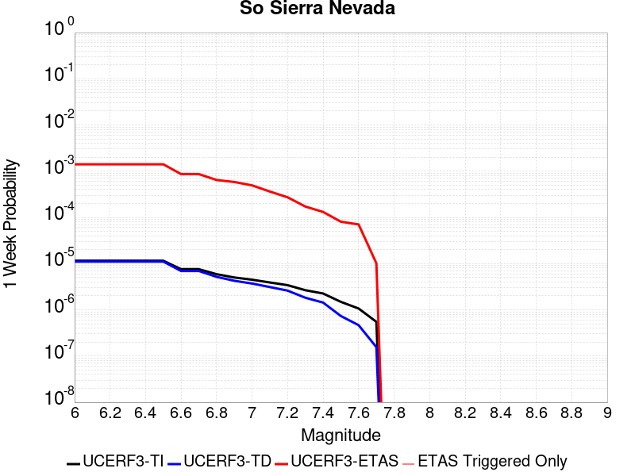 |  | 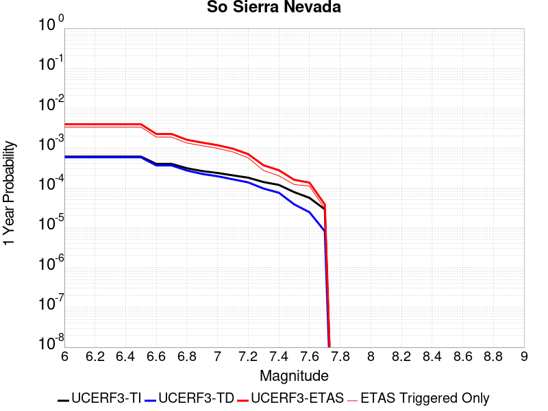 | 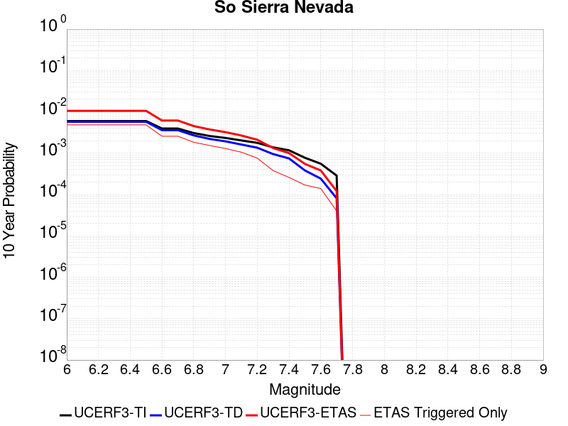 |

| Magnitude | 1 wk TI Prob | 1 wk TD Prob | 1 wk ETAS Prob | 1 wk ETAS/TD Gain | 1 wk ETAS Triggered Only | 1 mo TI Prob | 1 mo TD Prob | 1 mo ETAS Prob | 1 mo ETAS/TD Gain | 1 mo ETAS Triggered Only | 1 yr TI Prob | 1 yr TD Prob | 1 yr ETAS Prob | 1 yr ETAS/TD Gain | 1 yr ETAS Triggered Only | 10 yr TI Prob | 10 yr TD Prob | 10 yr ETAS Prob | 10 yr ETAS/TD Gain | 10 yr ETAS Triggered Only |
|-----|-----|-----|-----|-----|-----|-----|-----|-----|-----|-----|-----|-----|-----|-----|-----|-----|-----|-----|-----|-----|
| 6.0 | 1.15488665E-5 | 1.1079612E-5 | 0.0014110641 | 127.35682 | 0.0014 | 4.9494203E-5 | 4.7483256E-5 | 0.0021073855 | 44.381653 | 0.00206 | 6.024253E-4 | 5.779681E-4 | 0.0038960492 | 6.740942 | 0.00332 | 0.006007948 | 0.005765918 | 0.010578011 | 1.8345753 | 0.00484 |
| 6.1 | 1.15488665E-5 | 1.1079612E-5 | 0.0014110641 | 127.35682 | 0.0014 | 4.9494203E-5 | 4.7483256E-5 | 0.0021073855 | 44.381653 | 0.00206 | 6.024253E-4 | 5.779681E-4 | 0.0038960492 | 6.740942 | 0.00332 | 0.006007948 | 0.005765918 | 0.010578011 | 1.8345753 | 0.00484 |
| 6.2 | 1.15488665E-5 | 1.1079612E-5 | 0.0014110641 | 127.35682 | 0.0014 | 4.9494203E-5 | 4.7483256E-5 | 0.0021073855 | 44.381653 | 0.00206 | 6.024253E-4 | 5.779681E-4 | 0.0038960492 | 6.740942 | 0.00332 | 0.006007948 | 0.005765918 | 0.010578011 | 1.8345753 | 0.00484 |
| 6.3 | 1.15488665E-5 | 1.1079612E-5 | 0.0014110641 | 127.35682 | 0.0014 | 4.9494203E-5 | 4.7483256E-5 | 0.0021073855 | 44.381653 | 0.00206 | 6.024253E-4 | 5.779681E-4 | 0.0038960492 | 6.740942 | 0.00332 | 0.006007948 | 0.005765918 | 0.010578011 | 1.8345753 | 0.00484 |
| 6.4 | 1.15488665E-5 | 1.1079612E-5 | 0.0014110641 | 127.35682 | 0.0014 | 4.9494203E-5 | 4.7483256E-5 | 0.0021073855 | 44.381653 | 0.00206 | 6.024253E-4 | 5.779681E-4 | 0.0038960492 | 6.740942 | 0.00332 | 0.006007948 | 0.005765918 | 0.010578011 | 1.8345753 | 0.00484 |
| 6.5 | 1.15488665E-5 | 1.1079612E-5 | 0.0014110641 | 127.35682 | 0.0014 | 4.9494203E-5 | 4.7483256E-5 | 0.0021073855 | 44.381653 | 0.00206 | 6.024253E-4 | 5.779681E-4 | 0.0038960492 | 6.740942 | 0.00332 | 0.006007948 | 0.005765918 | 0.010578011 | 1.8345753 | 0.00484 |
| 6.6 | 7.587044E-6 | 6.9356042E-6 | 8.6692965E-4 | 124.99699 | 8.6E-4 | 3.2515498E-5 | 2.9723697E-5 | 0.0012596871 | 42.379894 | 0.00123 | 3.9580427E-4 | 3.6182883E-4 | 0.002221156 | 6.1386924 | 0.00186 | 0.003951 | 0.0036126887 | 0.006183368 | 1.7115695 | 0.00258 |
| 6.7 | 7.587044E-6 | 6.9356042E-6 | 8.6692965E-4 | 124.99699 | 8.6E-4 | 3.2515498E-5 | 2.9723697E-5 | 0.0012596871 | 42.379894 | 0.00123 | 3.9580427E-4 | 3.6182883E-4 | 0.002221156 | 6.1386924 | 0.00186 | 0.003951 | 0.0036126887 | 0.006183368 | 1.7115695 | 0.00258 |
| 6.8 | 5.9026956E-6 | 5.179362E-6 | 6.4517604E-4 | 124.5667 | 6.4E-4 | 2.5297022E-5 | 2.2197082E-5 | 9.121773E-4 | 41.094467 | 8.9E-4 | 3.0794772E-4 | 2.7021713E-4 | 0.0015898604 | 5.8836403 | 0.00132 | 0.0030752132 | 0.002699002 | 0.004534036 | 1.6798935 | 0.00184 |
| 6.9 | 5.0118915E-6 | 4.2523943E-6 | 5.842499E-4 | 137.39316 | 5.8E-4 | 2.1479358E-5 | 1.8224424E-5 | 7.982102E-4 | 43.798923 | 7.8E-4 | 2.614798E-4 | 2.2186051E-4 | 0.0013516098 | 6.0921607 | 0.00113 | 0.0026117235 | 0.0022164627 | 0.0037530493 | 1.6932608 | 0.00154 |
| 7.0 | 4.4924795E-6 | 3.7138868E-6 | 4.937121E-4 | 132.93675 | 4.9E-4 | 1.925334E-5 | 1.5916565E-5 | 6.759061E-4 | 42.465576 | 6.6E-4 | 2.3438422E-4 | 1.9376757E-4 | 0.0011635796 | 6.005028 | 9.7E-4 | 0.0023413717 | 0.0019360491 | 0.0032335322 | 1.6701705 | 0.0013 |
| 7.1 | 3.9118436E-6 | 3.1119469E-6 | 3.6311083E-4 | 116.682846 | 3.6E-4 | 1.6764936E-5 | 1.333685E-5 | 5.333299E-4 | 39.989197 | 5.2E-4 | 2.0409399E-4 | 1.6236462E-4 | 9.5223635E-4 | 5.864802 | 7.9E-4 | 0.0020390663 | 0.0016225161 | 0.0026807962 | 1.6522464 | 0.00106 |
| 7.2 | 3.4200818E-6 | 2.6054236E-6 | 2.7260472E-4 | 104.62971 | 2.7E-4 | 1.4657411E-5 | 1.11660565E-5 | 3.8116192E-4 | 34.13577 | 3.7E-4 | 1.7843937E-4 | 1.3593875E-4 | 6.9586263E-4 | 5.1189423 | 5.6E-4 | 0.0017829615 | 0.0013586058 | 0.0021175733 | 1.558637 | 7.6E-4 |
| 7.3 | 2.6593618E-6 | 1.8283897E-6 | 1.7182808E-4 | 93.97782 | 1.7E-4 | 1.13972155E-5 | 7.8359335E-6 | 2.1783428E-4 | 27.799404 | 2.1E-4 | 1.3875226E-4 | 9.539862E-5 | 3.6537286E-4 | 3.8299599 | 2.7E-4 | 0.0013866565 | 9.536055E-4 | 0.0013332432 | 1.3981076 | 3.8E-4 |
| 7.4 | 2.2577992E-6 | 1.4364078E-6 | 1.3143622E-4 | 91.50342 | 1.3E-4 | 9.676246E-6 | 6.1560204E-6 | 1.4615516E-4 | 23.741825 | 1.4E-4 | 1.1780193E-4 | 7.4947224E-5 | 2.7493224E-4 | 3.6683445 | 2.0E-4 | 0.001177395 | 7.4924453E-4 | 0.0010090497 | 1.3467562 | 2.6E-4 |
| 7.5 | 1.489319E-6 | 7.353661E-7 | 8.0735306E-5 | 109.789276 | 8.0E-5 | 6.3827797E-6 | 3.1515651E-6 | 9.3151284E-5 | 29.55715 | 9.0E-5 | 7.770758E-5 | 3.8369635E-5 | 1.5836503E-4 | 4.127353 | 1.2E-4 | 7.7680405E-4 | 3.8363054E-4 | 5.5356533E-4 | 1.4429647 | 1.7E-4 |
| 7.6 | 1.0680322E-6 | 4.65941E-7 | 7.046591E-5 | 151.23354 | 7.0E-5 | 4.577273E-6 | 1.9968884E-6 | 8.199673E-5 | 41.06225 | 8.0E-5 | 5.5726876E-5 | 2.4311848E-5 | 1.3430917E-4 | 5.5244327 | 1.1E-4 | 5.5712904E-4 | 2.4309216E-4 | 3.8305813E-4 | 1.5757732 | 1.4E-4 |
| 7.7 | 5.509146E-7 | 1.5578539E-7 | 1.01557835E-5 | 65.190865 | 1.0E-5 | 2.3610605E-6 | 6.676515E-7 | 2.0667638E-5 | 30.955729 | 2.0E-5 | 2.8745531E-5 | 8.128628E-6 | 3.8128383E-5 | 4.69063 | 3.0E-5 | 2.8741814E-4 | 8.128342E-5 | 1.2128017E-4 | 1.4920653 | 4.0E-5 |

## Coyote Canyon
*[(top)](#table-of-contents)*

| 1 Week | 1 Month | 1 Year | 10 Year |
|-----|-----|-----|-----|
|  |  | 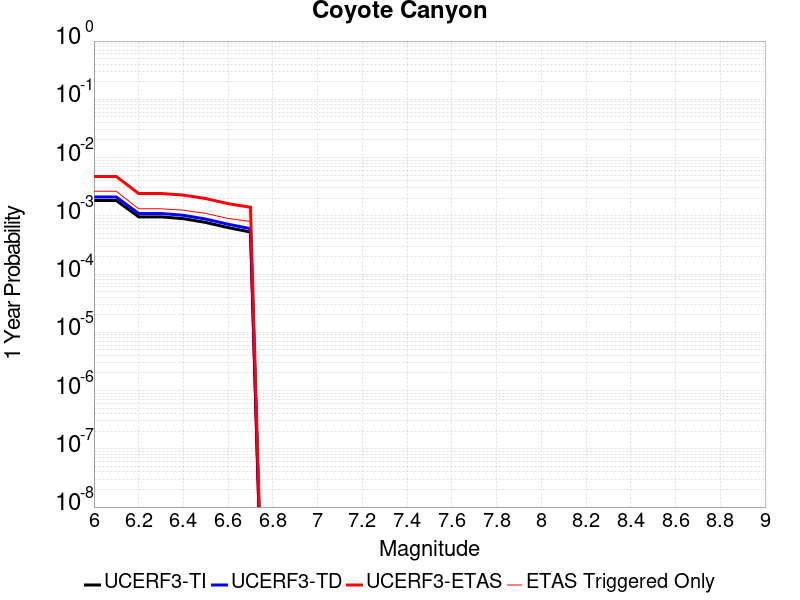 |  |

| Magnitude | 1 wk TI Prob | 1 wk TD Prob | 1 wk ETAS Prob | 1 wk ETAS/TD Gain | 1 wk ETAS Triggered Only | 1 mo TI Prob | 1 mo TD Prob | 1 mo ETAS Prob | 1 mo ETAS/TD Gain | 1 mo ETAS Triggered Only | 1 yr TI Prob | 1 yr TD Prob | 1 yr ETAS Prob | 1 yr ETAS/TD Gain | 1 yr ETAS Triggered Only | 10 yr TI Prob | 10 yr TD Prob | 10 yr ETAS Prob | 10 yr ETAS/TD Gain | 10 yr ETAS Triggered Only |
|-----|-----|-----|-----|-----|-----|-----|-----|-----|-----|-----|-----|-----|-----|-----|-----|-----|-----|-----|-----|-----|
| 6.0 | 3.5090034E-5 | 4.0364317E-5 | 8.7033084E-4 | 21.561886 | 8.3E-4 | 1.503772E-4 | 1.7297991E-4 | 0.0015027499 | 8.687424 | 0.00133 | 0.0018293047 | 0.0021042533 | 0.0047386982 | 2.2519617 | 0.00264 | 0.018143194 | 0.020869205 | 0.025138214 | 1.2045603 | 0.00436 |
| 6.1 | 3.5090034E-5 | 4.0364317E-5 | 8.7033084E-4 | 21.561886 | 8.3E-4 | 1.503772E-4 | 1.7297991E-4 | 0.0015027499 | 8.687424 | 0.00133 | 0.0018293047 | 0.0021042533 | 0.0047386982 | 2.2519617 | 0.00264 | 0.018143194 | 0.020869205 | 0.025138214 | 1.2045603 | 0.00436 |
| 6.2 | 1.841879E-5 | 2.1059794E-5 | 3.1105368E-4 | 14.770026 | 2.9E-4 | 7.8935285E-5 | 9.025371E-5 | 6.5020315E-4 | 7.204171 | 5.6E-4 | 9.606133E-4 | 0.0010983871 | 0.0024169371 | 2.2004423 | 0.00132 | 0.0095647145 | 0.010939668 | 0.013224397 | 1.2088481 | 0.00231 |
| 6.3 | 1.841879E-5 | 2.1059794E-5 | 3.1105368E-4 | 14.770026 | 2.9E-4 | 7.8935285E-5 | 9.025371E-5 | 6.5020315E-4 | 7.204171 | 5.6E-4 | 9.606133E-4 | 0.0010983871 | 0.0024169371 | 2.2004423 | 0.00132 | 0.0095647145 | 0.010939668 | 0.013224397 | 1.2088481 | 0.00231 |
| 6.4 | 1.712201E-5 | 1.9565212E-5 | 2.9955973E-4 | 15.310835 | 2.8E-4 | 7.337798E-5 | 8.3848776E-5 | 6.238035E-4 | 7.4396253 | 5.4E-4 | 8.930107E-4 | 0.0010204813 | 0.0022692056 | 2.2236621 | 0.00125 | 0.008894307 | 0.010167871 | 0.012315807 | 1.2112473 | 0.00217 |
| 6.5 | 1.4744935E-5 | 1.6836972E-5 | 2.5683292E-4 | 15.254105 | 2.4E-4 | 6.3191044E-5 | 7.215698E-5 | 5.5212236E-4 | 7.651683 | 4.8E-4 | 7.6907943E-4 | 8.782507E-4 | 0.0019772847 | 2.2513897 | 0.0011 | 0.007664232 | 0.008756994 | 0.010630444 | 1.2139375 | 0.00189 |
| 6.6 | 1.2017839E-5 | 1.3724089E-5 | 2.1372135E-4 | 15.572716 | 2.0E-4 | 5.150401E-5 | 5.88167E-5 | 4.3879435E-4 | 7.4603705 | 3.8E-4 | 6.268809E-4 | 7.159466E-4 | 0.0016153023 | 2.256177 | 9.0E-4 | 0.0062511545 | 0.0071450938 | 0.008654233 | 1.2112134 | 0.00152 |
| 6.7 | 1.00956095E-5 | 1.1533517E-5 | 1.8153156E-4 | 15.73948 | 1.7E-4 | 4.326618E-5 | 4.942891E-5 | 3.894121E-4 | 7.8782253 | 3.4E-4 | 5.266384E-4 | 6.017178E-4 | 0.0014012364 | 2.328727 | 8.0E-4 | 0.005253921 | 0.0060094125 | 0.0073413597 | 1.2216436 | 0.00134 |

## San Andreas (Mojave S)
*[(top)](#table-of-contents)*

| 1 Week | 1 Month | 1 Year | 10 Year |
|-----|-----|-----|-----|
|  | 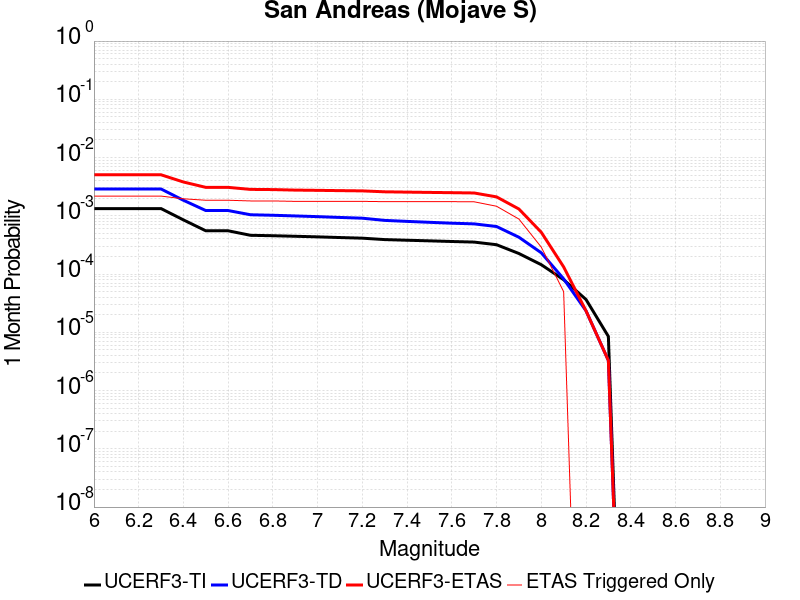 |  | 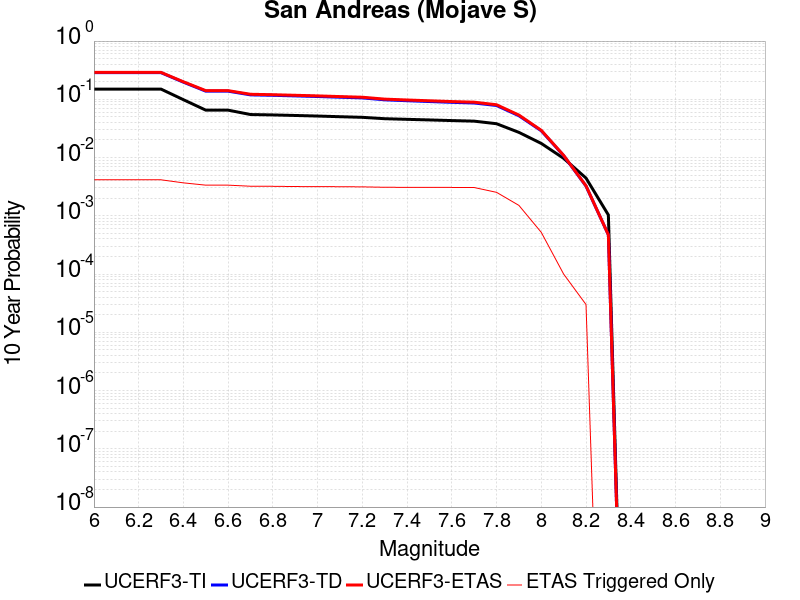 |

| Magnitude | 1 wk TI Prob | 1 wk TD Prob | 1 wk ETAS Prob | 1 wk ETAS/TD Gain | 1 wk ETAS Triggered Only | 1 mo TI Prob | 1 mo TD Prob | 1 mo ETAS Prob | 1 mo ETAS/TD Gain | 1 mo ETAS Triggered Only | 1 yr TI Prob | 1 yr TD Prob | 1 yr ETAS Prob | 1 yr ETAS/TD Gain | 1 yr ETAS Triggered Only | 10 yr TI Prob | 10 yr TD Prob | 10 yr ETAS Prob | 10 yr ETAS/TD Gain | 10 yr ETAS Triggered Only |
|-----|-----|-----|-----|-----|-----|-----|-----|-----|-----|-----|-----|-----|-----|-----|-----|-----|-----|-----|-----|-----|
| 6.0 | 3.1064058E-4 | 6.7462435E-4 | 0.0024134505 | 3.5774732 | 0.00174 | 0.0013306376 | 0.002888172 | 0.0050618756 | 1.7526227 | 0.00218 | 0.016080605 | 0.034565594 | 0.037635677 | 1.088819 | 0.00318 | 0.1496549 | 0.28654557 | 0.2895064 | 1.0103328 | 0.00415 |
| 6.1 | 3.1064058E-4 | 6.7462435E-4 | 0.0024134505 | 3.5774732 | 0.00174 | 0.0013306376 | 0.002888172 | 0.0050618756 | 1.7526227 | 0.00218 | 0.016080605 | 0.034565594 | 0.037635677 | 1.088819 | 0.00318 | 0.1496549 | 0.28654557 | 0.2895064 | 1.0103328 | 0.00415 |
| 6.2 | 3.1064058E-4 | 6.7462435E-4 | 0.0024134505 | 3.5774732 | 0.00174 | 0.0013306376 | 0.002888172 | 0.0050618756 | 1.7526227 | 0.00218 | 0.016080605 | 0.034565594 | 0.037635677 | 1.088819 | 0.00318 | 0.1496549 | 0.28654557 | 0.2895064 | 1.0103328 | 0.00415 |
| 6.3 | 3.1064058E-4 | 6.7462435E-4 | 0.0024134505 | 3.5774732 | 0.00174 | 0.0013306376 | 0.002888172 | 0.0050618756 | 1.7526227 | 0.00218 | 0.016080605 | 0.034565594 | 0.037635677 | 1.088819 | 0.00318 | 0.1496549 | 0.28654557 | 0.2895064 | 1.0103328 | 0.00415 |
| 6.4 | 1.9872203E-4 | 4.3181062E-4 | 0.0020111285 | 4.6574316 | 0.00158 | 8.5138786E-4 | 0.0018493326 | 0.003805708 | 2.0578818 | 0.00196 | 0.010316478 | 0.02228931 | 0.02509534 | 1.1258913 | 0.00287 | 0.098504856 | 0.19686839 | 0.19982392 | 1.0150127 | 0.00368 |
| 6.5 | 1.291105E-4 | 2.8754136E-4 | 0.0017871101 | 6.215141 | 0.0015 | 5.5321335E-4 | 0.0012317409 | 0.0030794623 | 2.5000892 | 0.00185 | 0.006714592 | 0.014894155 | 0.017504685 | 1.1752721 | 0.00265 | 0.065152965 | 0.13800792 | 0.14090422 | 1.0209864 | 0.00336 |
| 6.6 | 1.291105E-4 | 2.8754136E-4 | 0.0017871101 | 6.215141 | 0.0015 | 5.5321335E-4 | 0.0012317409 | 0.0030794623 | 2.5000892 | 0.00185 | 0.006714592 | 0.014894155 | 0.017504685 | 1.1752721 | 0.00265 | 0.065152965 | 0.13800792 | 0.14090422 | 1.0209864 | 0.00336 |
| 6.7 | 1.08001186E-4 | 2.4335351E-4 | 0.0017129958 | 7.039125 | 0.00147 | 4.6278012E-4 | 0.0010425274 | 0.0028406507 | 2.7247734 | 0.0018 | 0.0056198016 | 0.0126192 | 0.015146894 | 1.2003055 | 0.00256 | 0.054797906 | 0.11918431 | 0.122020535 | 1.023797 | 0.00322 |
| 6.8 | 1.0624356E-4 | 2.3853009E-4 | 0.0017081795 | 7.1612744 | 0.00147 | 4.5525006E-4 | 0.0010218718 | 0.0028200324 | 2.7596734 | 0.0018 | 0.0055285925 | 0.012370593 | 0.0148890475 | 1.2035841 | 0.00255 | 0.053930566 | 0.11713308 | 0.11996708 | 1.0241947 | 0.00321 |
| 6.9 | 1.0393785E-4 | 2.3223337E-4 | 0.0016818966 | 7.242269 | 0.00145 | 4.4537184E-4 | 9.949068E-4 | 0.0027631458 | 2.7772913 | 0.00177 | 0.0054089287 | 0.012045963 | 0.014535608 | 1.2066787 | 0.00252 | 0.05279156 | 0.114433445 | 0.11724955 | 1.0246091 | 0.00318 |
| 7.0 | 1.0155622E-4 | 2.2592908E-4 | 0.0016756015 | 7.4164934 | 0.00145 | 4.3516833E-4 | 9.6790853E-4 | 0.0027361955 | 2.8269153 | 0.00177 | 0.005285311 | 0.011720838 | 0.0142014185 | 1.2116385 | 0.00251 | 0.05161361 | 0.11169745 | 0.114513375 | 1.0252103 | 0.00317 |
| 7.1 | 9.885595E-5 | 2.188132E-4 | 0.0016684959 | 7.6252065 | 0.00145 | 4.2359953E-4 | 9.374342E-4 | 0.002705775 | 2.8863626 | 0.00177 | 0.0051451353 | 0.011353733 | 0.013825349 | 1.2176919 | 0.0025 | 0.05027629 | 0.10857607 | 0.11139297 | 1.025944 | 0.00316 |
| 7.2 | 9.6411415E-5 | 2.1244297E-4 | 0.0016621349 | 7.823911 | 0.00145 | 4.1312634E-4 | 9.101525E-4 | 0.0026785415 | 2.942959 | 0.00177 | 0.005018219 | 0.011024987 | 0.013487535 | 1.2233607 | 0.00249 | 0.049064007 | 0.1057697 | 0.10857759 | 1.0265472 | 0.00314 |
| 7.3 | 9.1180635E-5 | 1.9472656E-4 | 0.0016244481 | 8.342201 | 0.00143 | 3.907156E-4 | 8.342756E-4 | 0.0025828157 | 3.0958781 | 0.00175 | 0.004746591 | 0.010110112 | 0.012545241 | 1.2408607 | 0.00246 | 0.046464786 | 0.09796176 | 0.10074906 | 1.0284529 | 0.00309 |
| 7.4 | 8.887388E-5 | 1.872126E-4 | 0.0016169449 | 8.636945 | 0.00143 | 3.8083247E-4 | 8.020931E-4 | 0.0025506895 | 3.1800416 | 0.00175 | 0.0046267817 | 0.009721855 | 0.012148037 | 1.2495595 | 0.00245 | 0.045316286 | 0.094593845 | 0.09738249 | 1.0294802 | 0.00308 |
| 7.5 | 8.6750515E-5 | 1.80528E-4 | 0.0016102699 | 8.919779 | 0.00143 | 3.7173493E-4 | 7.734621E-4 | 0.0025221086 | 3.2608044 | 0.00175 | 0.004516484 | 0.009376327 | 0.011803354 | 1.2588464 | 0.00245 | 0.04425787 | 0.09155606 | 0.09435406 | 1.0305606 | 0.00308 |
| 7.6 | 8.453092E-5 | 1.7440386E-4 | 0.0016041545 | 9.197929 | 0.00143 | 3.6222505E-4 | 7.4723107E-4 | 0.0024959233 | 3.3402297 | 0.00175 | 0.0044011753 | 0.009059664 | 0.011487468 | 1.2679795 | 0.00245 | 0.04315024 | 0.08871447 | 0.09151212 | 1.0315354 | 0.00307 |
| 7.7 | 8.259102E-5 | 1.6962511E-4 | 0.0015893843 | 9.369983 | 0.00142 | 3.539135E-4 | 7.267622E-4 | 0.0024654977 | 3.3924406 | 0.00174 | 0.004300386 | 0.0088125 | 0.011230998 | 1.2744395 | 0.00244 | 0.042181134 | 0.086465426 | 0.08926085 | 1.0323299 | 0.00306 |
| 7.8 | 7.444844E-5 | 1.528469E-4 | 0.0013326665 | 8.718964 | 0.00118 | 3.1902574E-4 | 6.5489375E-4 | 0.0021139376 | 3.2279093 | 0.00146 | 0.0038772223 | 0.007944231 | 0.009948184 | 1.2522526 | 0.00202 | 0.03810269 | 0.078293875 | 0.08062579 | 1.0297842 | 0.00253 |
| 7.9 | 5.2586525E-5 | 1.0007023E-4 | 8.000002E-4 | 7.994387 | 7.0E-4 | 2.2535135E-4 | 4.2880196E-4 | 0.0013084246 | 3.0513494 | 8.8E-4 | 0.0027402006 | 0.005208178 | 0.006401928 | 1.2292069 | 0.0012 | 0.027066574 | 0.052201588 | 0.053632766 | 1.0274163 | 0.00151 |
| 8.0 | 3.379877E-5 | 5.4075565E-5 | 2.4406529E-4 | 4.513412 | 1.9E-4 | 1.4484383E-4 | 2.3173184E-4 | 5.216646E-4 | 2.2511566 | 2.9E-4 | 0.0017620471 | 0.0028176866 | 0.003256447 | 1.1557164 | 4.4E-4 | 0.017481409 | 0.028835917 | 0.029340921 | 1.017513 | 5.2E-4 |
| 8.1 | 1.8668277E-5 | 1.9308145E-5 | 2.9307952E-5 | 1.5179062 | 1.0E-5 | 8.000444E-5 | 8.274657E-5 | 1.3274243E-4 | 1.6042047 | 5.0E-5 | 9.736188E-4 | 0.0010069745 | 0.0011068739 | 1.0992074 | 1.0E-4 | 0.009693642 | 0.010798624 | 0.010897543 | 1.0091604 | 1.0E-4 |
| 8.2 | 8.541571E-6 | 5.4596358E-6 | 5.4596358E-6 | 1.0 | 0.0 | 3.660622E-5 | 2.339823E-5 | 2.339823E-5 | 1.0 | 0.0 | 4.455896E-4 | 2.848363E-4 | 3.1482775E-4 | 1.1052936 | 3.0E-5 | 0.0044469717 | 0.003240283 | 0.003270186 | 1.0092285 | 3.0E-5 |
| 8.3 | 1.983087E-6 | 7.6564595E-7 | 7.6564595E-7 | 1.0 | 0.0 | 8.498917E-6 | 3.281336E-6 | 3.281336E-6 | 1.0 | 0.0 | 1.034694E-4 | 3.9949547E-5 | 3.9949547E-5 | 1.0 | 0.0 | 0.0010342124 | 4.717979E-4 | 4.717979E-4 | 1.0 | 0.0 |

## Death Valley (So)
*[(top)](#table-of-contents)*

| 1 Week | 1 Month | 1 Year | 10 Year |
|-----|-----|-----|-----|
|  |  | 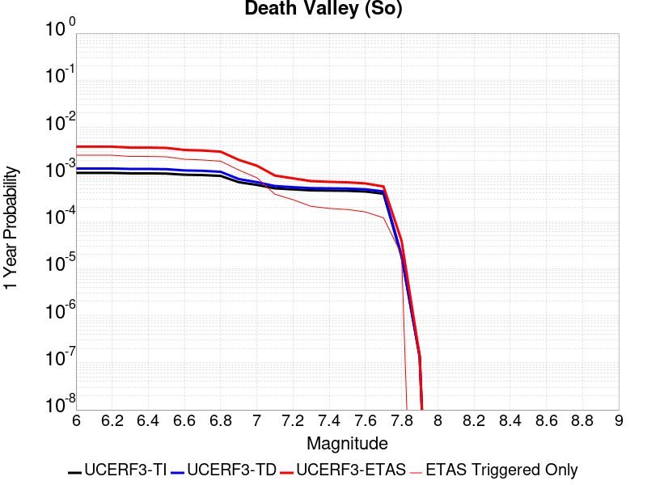 |  |

| Magnitude | 1 wk TI Prob | 1 wk TD Prob | 1 wk ETAS Prob | 1 wk ETAS/TD Gain | 1 wk ETAS Triggered Only | 1 mo TI Prob | 1 mo TD Prob | 1 mo ETAS Prob | 1 mo ETAS/TD Gain | 1 mo ETAS Triggered Only | 1 yr TI Prob | 1 yr TD Prob | 1 yr ETAS Prob | 1 yr ETAS/TD Gain | 1 yr ETAS Triggered Only | 10 yr TI Prob | 10 yr TD Prob | 10 yr ETAS Prob | 10 yr ETAS/TD Gain | 10 yr ETAS Triggered Only |
|-----|-----|-----|-----|-----|-----|-----|-----|-----|-----|-----|-----|-----|-----|-----|-----|-----|-----|-----|-----|-----|
| 6.0 | 2.0684236E-5 | 2.5618314E-5 | 8.355976E-4 | 32.617195 | 8.1E-4 | 8.864371E-5 | 1.0978825E-4 | 0.0014196445 | 12.93075 | 0.00131 | 0.0010787029 | 0.0013358692 | 0.0038924494 | 2.9137952 | 0.00256 | 0.010734817 | 0.013279985 | 0.017503146 | 1.3180095 | 0.00428 |
| 6.1 | 2.0684236E-5 | 2.5618314E-5 | 8.355976E-4 | 32.617195 | 8.1E-4 | 8.864371E-5 | 1.0978825E-4 | 0.0014196445 | 12.93075 | 0.00131 | 0.0010787029 | 0.0013358692 | 0.0038924494 | 2.9137952 | 0.00256 | 0.010734817 | 0.013279985 | 0.017503146 | 1.3180095 | 0.00428 |
| 6.2 | 2.0684236E-5 | 2.5618314E-5 | 8.355976E-4 | 32.617195 | 8.1E-4 | 8.864371E-5 | 1.0978825E-4 | 0.0014196445 | 12.93075 | 0.00131 | 0.0010787029 | 0.0013358692 | 0.0038924494 | 2.9137952 | 0.00256 | 0.010734817 | 0.013279985 | 0.017503146 | 1.3180095 | 0.00428 |
| 6.3 | 2.0240292E-5 | 2.51184E-5 | 8.050988E-4 | 32.052155 | 7.8E-4 | 8.6741224E-5 | 1.0764593E-4 | 0.0013475125 | 12.518006 | 0.00124 | 0.0010555626 | 0.001309818 | 0.0037166614 | 2.8375401 | 0.00241 | 0.010505628 | 0.013022543 | 0.017059281 | 1.3099808 | 0.00409 |
| 6.4 | 2.0240292E-5 | 2.51184E-5 | 8.050988E-4 | 32.052155 | 7.8E-4 | 8.6741224E-5 | 1.0764593E-4 | 0.0013475125 | 12.518006 | 0.00124 | 0.0010555626 | 0.001309818 | 0.0037166614 | 2.8375401 | 0.00241 | 0.010505628 | 0.013022543 | 0.017059281 | 1.3099808 | 0.00409 |
| 6.5 | 1.9962767E-5 | 2.4807652E-5 | 7.9478853E-4 | 32.03804 | 7.7E-4 | 8.55519E-5 | 1.0631427E-4 | 0.0013261846 | 12.474192 | 0.00122 | 0.0010410968 | 0.0012936244 | 0.0036605585 | 2.829692 | 0.00237 | 0.010362327 | 0.01286249 | 0.016830781 | 1.3085167 | 0.00402 |
| 6.6 | 1.8937297E-5 | 2.3311462E-5 | 7.3329493E-4 | 31.45641 | 7.1E-4 | 8.115732E-5 | 9.990252E-5 | 0.0011897936 | 11.909545 | 0.00109 | 9.876423E-4 | 0.0012156491 | 0.0033130962 | 2.725372 | 0.0021 | 0.009832645 | 0.0120915035 | 0.015657853 | 1.2949468 | 0.00361 |
| 6.7 | 1.8621096E-5 | 2.2912098E-5 | 7.328958E-4 | 31.987288 | 7.1E-4 | 7.980225E-5 | 9.8191085E-5 | 0.0011680861 | 11.8960495 | 0.00107 | 9.711593E-4 | 0.0011948354 | 0.0032224099 | 2.6969488 | 0.00203 | 0.009669261 | 0.011885625 | 0.015344026 | 1.2909733 | 0.0035 |
| 6.8 | 1.7830353E-5 | 2.1806083E-5 | 6.4179255E-4 | 29.431812 | 6.2E-4 | 7.641356E-5 | 9.3451374E-5 | 0.0010533617 | 11.271762 | 9.6E-4 | 9.29938E-4 | 0.0011371907 | 0.0030450185 | 2.6776676 | 0.00191 | 0.009260561 | 0.01131609 | 0.014578747 | 1.2883202 | 0.0033 |
| 6.9 | 1.3135183E-5 | 1.5304031E-5 | 4.0529805E-4 | 26.483093 | 3.9E-4 | 5.6292425E-5 | 6.558709E-5 | 6.7554705E-4 | 10.300001 | 6.1E-4 | 6.8514474E-4 | 7.982367E-4 | 0.002037247 | 2.5521839 | 0.00124 | 0.006830362 | 0.007955158 | 0.010068214 | 1.2656208 | 0.00213 |
| 7.0 | 1.1507512E-5 | 1.3154237E-5 | 2.6315096E-4 | 20.005032 | 2.5E-4 | 4.9316975E-5 | 5.637412E-5 | 4.4635215E-4 | 7.9176784 | 3.9E-4 | 6.002687E-4 | 6.861445E-4 | 0.0015355613 | 2.237956 | 8.5E-4 | 0.0059864987 | 0.0068414924 | 0.008370956 | 1.2235571 | 0.00154 |
| 7.1 | 9.715903E-6 | 1.0865287E-5 | 1.4086388E-4 | 12.96458 | 1.3E-4 | 4.1638916E-5 | 4.6564706E-5 | 2.1655679E-4 | 4.650664 | 1.7E-4 | 5.068359E-4 | 5.667821E-4 | 9.465667E-4 | 1.6700717 | 3.8E-4 | 0.0050568148 | 0.005653834 | 0.0063797063 | 1.1283859 | 7.3E-4 |
| 7.2 | 9.233269E-6 | 1.0286314E-5 | 1.10285284E-4 | 10.721556 | 1.0E-4 | 3.9570554E-5 | 4.408348E-5 | 1.6407818E-4 | 3.7219882 | 1.2E-4 | 4.81665E-4 | 5.365884E-4 | 8.2643284E-4 | 1.5401615 | 2.9E-4 | 0.0048062233 | 0.0053533595 | 0.005920308 | 1.1059052 | 5.7E-4 |
| 7.3 | 8.8041315E-6 | 9.808164E-6 | 6.9807575E-5 | 7.117293 | 6.0E-5 | 3.7731446E-5 | 4.2034335E-5 | 1.2203097E-4 | 2.903126 | 8.0E-5 | 4.592835E-4 | 5.1165203E-4 | 7.215446E-4 | 1.4102252 | 2.1E-4 | 0.0045833546 | 0.005105167 | 0.005513074 | 1.0799007 | 4.1E-4 |
| 7.4 | 8.708749E-6 | 9.707175E-6 | 5.970669E-5 | 6.1507792 | 5.0E-5 | 3.7322676E-5 | 4.160154E-5 | 1.1159862E-4 | 2.68256 | 7.0E-5 | 4.5430884E-4 | 5.0638523E-4 | 6.96289E-4 | 1.3750185 | 1.9E-4 | 0.004533812 | 0.0050527398 | 0.00542087 | 1.0728576 | 3.7E-4 |
| 7.5 | 8.612678E-6 | 9.604817E-6 | 5.9604336E-5 | 6.2056713 | 5.0E-5 | 3.6910955E-5 | 4.1162875E-5 | 1.1115999E-4 | 2.7004914 | 7.0E-5 | 4.492982E-4 | 5.01047E-4 | 6.809568E-4 | 1.3590678 | 1.8E-4 | 0.004483909 | 0.0049995985 | 0.0053378986 | 1.0676655 | 3.4E-4 |
| 7.6 | 8.319024E-6 | 9.283916E-6 | 4.9283546E-5 | 5.3084865 | 4.0E-5 | 3.5652476E-5 | 3.978763E-5 | 9.978524E-5 | 2.5079465 | 6.0E-5 | 4.3398244E-4 | 4.8431093E-4 | 6.442334E-4 | 1.3302063 | 1.6E-4 | 0.0043313587 | 0.0048329784 | 0.0051315282 | 1.0617735 | 3.0E-4 |
| 7.7 | 7.4718328E-6 | 8.34517E-6 | 3.834492E-5 | 4.594864 | 3.0E-5 | 3.2021748E-5 | 3.5764548E-5 | 7.576311E-5 | 2.118386 | 4.0E-5 | 3.8979502E-4 | 4.353504E-4 | 5.552982E-4 | 1.2755201 | 1.2E-4 | 0.00389112 | 0.0043453807 | 0.0045743813 | 1.0526998 | 2.3E-4 |
| 7.8 | 3.4586725E-7 | 3.6482615E-7 | 3.6482615E-7 | 1.0 | 0.0 | 1.4822873E-6 | 1.5635396E-6 | 1.5635396E-6 | 1.0 | 0.0 | 1.80467E-5 | 1.9035933E-5 | 3.9035553E-5 | 2.0506246 | 2.0E-5 | 1.8045233E-4 | 1.9034347E-4 | 2.2033777E-4 | 1.1575798 | 3.0E-5 |
| 7.9 | 2.5591178E-9 | 2.6696718E-9 | 2.6696718E-9 | 1.0 | 0.0 | 1.0967647E-8 | 1.14414505E-8 | 1.14414505E-8 | 1.0 | 0.0 | 1.335311E-7 | 1.3929966E-7 | 1.3929966E-7 | 1.0 | 0.0 | 1.3353102E-6 | 1.3929966E-6 | 1.3929966E-6 | 1.0 | 0.0 |

## Nelson Lake
*[(top)](#table-of-contents)*

| 1 Week | 1 Month | 1 Year | 10 Year |
|-----|-----|-----|-----|
|  |  | 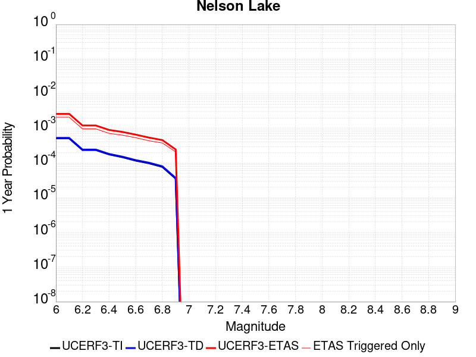 |  |

| Magnitude | 1 wk TI Prob | 1 wk TD Prob | 1 wk ETAS Prob | 1 wk ETAS/TD Gain | 1 wk ETAS Triggered Only | 1 mo TI Prob | 1 mo TD Prob | 1 mo ETAS Prob | 1 mo ETAS/TD Gain | 1 mo ETAS Triggered Only | 1 yr TI Prob | 1 yr TD Prob | 1 yr ETAS Prob | 1 yr ETAS/TD Gain | 1 yr ETAS Triggered Only | 10 yr TI Prob | 10 yr TD Prob | 10 yr ETAS Prob | 10 yr ETAS/TD Gain | 10 yr ETAS Triggered Only |
|-----|-----|-----|-----|-----|-----|-----|-----|-----|-----|-----|-----|-----|-----|-----|-----|-----|-----|-----|-----|-----|
| 6.0 | 9.913453E-6 | 1.0192255E-5 | 5.601866E-4 | 54.96199 | 5.5E-4 | 4.2485535E-5 | 4.3680422E-5 | 9.836394E-4 | 22.519 | 9.4E-4 | 5.1713863E-4 | 5.316897E-4 | 0.0026305732 | 4.947572 | 0.0021 | 0.0051593683 | 0.005305204 | 0.009055204 | 1.706853 | 0.00377 |
| 6.1 | 9.913453E-6 | 1.0192255E-5 | 5.601866E-4 | 54.96199 | 5.5E-4 | 4.2485535E-5 | 4.3680422E-5 | 9.836394E-4 | 22.519 | 9.4E-4 | 5.1713863E-4 | 5.316897E-4 | 0.0026305732 | 4.947572 | 0.0021 | 0.0051593683 | 0.005305204 | 0.009055204 | 1.706853 | 0.00377 |
| 6.2 | 4.5596407E-6 | 4.696313E-6 | 2.2469528E-4 | 47.84504 | 2.2E-4 | 1.954117E-5 | 2.0126909E-5 | 4.1011907E-4 | 20.376656 | 3.9E-4 | 2.3788778E-4 | 2.4501883E-4 | 0.0012147812 | 4.9579096 | 9.7E-4 | 0.0023763329 | 0.0024476128 | 0.004203305 | 1.7173079 | 0.00176 |
| 6.3 | 4.5596407E-6 | 4.696313E-6 | 2.2469528E-4 | 47.84504 | 2.2E-4 | 1.954117E-5 | 2.0126909E-5 | 4.1011907E-4 | 20.376656 | 3.9E-4 | 2.3788778E-4 | 2.4501883E-4 | 0.0012147812 | 4.9579096 | 9.7E-4 | 0.0023763329 | 0.0024476128 | 0.004203305 | 1.7173079 | 0.00176 |
| 6.4 | 3.4025713E-6 | 3.5098972E-6 | 1.6350934E-4 | 46.58522 | 1.6E-4 | 1.4582367E-5 | 1.5042335E-5 | 3.1503782E-4 | 20.943413 | 3.0E-4 | 1.7752586E-4 | 1.8312587E-4 | 9.02994E-4 | 4.9310017 | 7.2E-4 | 0.001773841 | 0.0018298327 | 0.0031174722 | 1.7036926 | 0.00129 |
| 6.5 | 2.8352947E-6 | 2.927856E-6 | 1.4292744E-4 | 48.816418 | 1.4E-4 | 1.2151207E-5 | 1.2547898E-5 | 2.6254475E-4 | 20.923405 | 2.5E-4 | 1.479309E-4 | 1.5276071E-4 | 7.9266296E-4 | 5.188919 | 6.4E-4 | 0.0014783246 | 0.0015266308 | 0.0026149668 | 1.7129005 | 0.00109 |
| 6.6 | 2.251518E-6 | 2.3290677E-6 | 1.2232878E-4 | 52.522644 | 1.2E-4 | 9.649328E-6 | 9.981683E-6 | 2.1997959E-4 | 22.038324 | 2.1E-4 | 1.1747423E-4 | 1.2152085E-4 | 6.614552E-4 | 5.443142 | 5.4E-4 | 0.0011741214 | 0.0012146058 | 0.0020935368 | 1.723635 | 8.8E-4 |
| 6.7 | 1.8911853E-6 | 1.9591396E-6 | 9.1958966E-5 | 46.938442 | 9.0E-5 | 8.105055E-6 | 8.39629E-6 | 1.5839504E-4 | 18.864885 | 1.5E-4 | 9.867457E-5 | 1.0222061E-4 | 5.421756E-4 | 5.3039756 | 4.4E-4 | 9.863076E-4 | 0.0010217935 | 0.0017410577 | 1.7039235 | 7.2E-4 |
| 6.8 | 1.4874814E-6 | 1.5438305E-6 | 9.154369E-5 | 59.296467 | 9.0E-5 | 6.374905E-6 | 6.6164025E-6 | 1.3661555E-4 | 20.64801 | 1.3E-4 | 7.76117E-5 | 8.055224E-5 | 4.6052164E-4 | 5.7170553 | 3.8E-4 | 7.75846E-4 | 8.0528157E-4 | 0.0014147903 | 1.756889 | 6.1E-4 |
| 6.9 | 6.835972E-7 | 7.1399285E-7 | 7.071394E-5 | 99.04013 | 7.0E-5 | 2.9296991E-6 | 3.0599674E-6 | 8.305972E-5 | 27.14399 | 8.0E-5 | 3.56685E-5 | 3.7254784E-5 | 2.4724696E-4 | 6.6366496 | 2.1E-4 | 3.5662777E-4 | 3.7251666E-4 | 7.323825E-4 | 1.9660398 | 3.6E-4 |

## San Andreas (Mojave N)
*[(top)](#table-of-contents)*

| 1 Week | 1 Month | 1 Year | 10 Year |
|-----|-----|-----|-----|
|  |  |  |  |

| Magnitude | 1 wk TI Prob | 1 wk TD Prob | 1 wk ETAS Prob | 1 wk ETAS/TD Gain | 1 wk ETAS Triggered Only | 1 mo TI Prob | 1 mo TD Prob | 1 mo ETAS Prob | 1 mo ETAS/TD Gain | 1 mo ETAS Triggered Only | 1 yr TI Prob | 1 yr TD Prob | 1 yr ETAS Prob | 1 yr ETAS/TD Gain | 1 yr ETAS Triggered Only | 10 yr TI Prob | 10 yr TD Prob | 10 yr ETAS Prob | 10 yr ETAS/TD Gain | 10 yr ETAS Triggered Only |
|-----|-----|-----|-----|-----|-----|-----|-----|-----|-----|-----|-----|-----|-----|-----|-----|-----|-----|-----|-----|-----|
| 6.0 | 9.877682E-5 | 1.9402112E-4 | 0.0021236467 | 10.945441 | 0.00193 | 4.2326056E-4 | 8.312543E-4 | 0.0032292593 | 3.8848033 | 0.0024 | 0.0051410277 | 0.010073684 | 0.0133206425 | 1.3223208 | 0.00328 | 0.05023708 | 0.09832245 | 0.10196523 | 1.0370493 | 0.00404 |
| 6.1 | 9.877682E-5 | 1.9402112E-4 | 0.0021236467 | 10.945441 | 0.00193 | 4.2326056E-4 | 8.312543E-4 | 0.0032292593 | 3.8848033 | 0.0024 | 0.0051410277 | 0.010073684 | 0.0133206425 | 1.3223208 | 0.00328 | 0.05023708 | 0.09832245 | 0.10196523 | 1.0370493 | 0.00404 |
| 6.2 | 9.877682E-5 | 1.9402112E-4 | 0.0021236467 | 10.945441 | 0.00193 | 4.2326056E-4 | 8.312543E-4 | 0.0032292593 | 3.8848033 | 0.0024 | 0.0051410277 | 0.010073684 | 0.0133206425 | 1.3223208 | 0.00328 | 0.05023708 | 0.09832245 | 0.10196523 | 1.0370493 | 0.00404 |
| 6.3 | 9.877682E-5 | 1.9402112E-4 | 0.0021236467 | 10.945441 | 0.00193 | 4.2326056E-4 | 8.312543E-4 | 0.0032292593 | 3.8848033 | 0.0024 | 0.0051410277 | 0.010073684 | 0.0133206425 | 1.3223208 | 0.00328 | 0.05023708 | 0.09832245 | 0.10196523 | 1.0370493 | 0.00404 |
| 6.4 | 9.877682E-5 | 1.9402112E-4 | 0.0021236467 | 10.945441 | 0.00193 | 4.2326056E-4 | 8.312543E-4 | 0.0032292593 | 3.8848033 | 0.0024 | 0.0051410277 | 0.010073684 | 0.0133206425 | 1.3223208 | 0.00328 | 0.05023708 | 0.09832245 | 0.10196523 | 1.0370493 | 0.00404 |
| 6.5 | 9.861474E-5 | 1.937588E-4 | 0.0021233847 | 10.958908 | 0.00193 | 4.2256617E-4 | 8.3013077E-4 | 0.0032281384 | 3.8887107 | 0.0024 | 0.0051326132 | 0.0100601325 | 0.013307135 | 1.3227595 | 0.00328 | 0.050156746 | 0.09820035 | 0.10184362 | 1.0371004 | 0.00404 |
| 6.6 | 9.861474E-5 | 1.937588E-4 | 0.0021233847 | 10.958908 | 0.00193 | 4.2256617E-4 | 8.3013077E-4 | 0.0032281384 | 3.8887107 | 0.0024 | 0.0051326132 | 0.0100601325 | 0.013307135 | 1.3227595 | 0.00328 | 0.050156746 | 0.09820035 | 0.10184362 | 1.0371004 | 0.00404 |
| 6.7 | 9.8552715E-5 | 1.9365833E-4 | 0.0021232846 | 10.964076 | 0.00193 | 4.223004E-4 | 8.2970044E-4 | 0.003227709 | 3.8902102 | 0.0024 | 0.0051293927 | 0.010054941 | 0.013301961 | 1.3229277 | 0.00328 | 0.050125998 | 0.09815356 | 0.10179702 | 1.03712 | 0.00404 |
| 6.8 | 9.8464974E-5 | 1.9350994E-4 | 0.0021231365 | 10.971718 | 0.00193 | 4.219245E-4 | 8.290649E-4 | 0.003227075 | 3.8924277 | 0.0024 | 0.0051248376 | 0.010047276 | 0.01329432 | 1.3231766 | 0.00328 | 0.05008251 | 0.09808378 | 0.10172752 | 1.0371493 | 0.00404 |
| 6.9 | 9.825824E-5 | 1.9319002E-4 | 0.002122817 | 10.9882345 | 0.00193 | 4.2103877E-4 | 8.276947E-4 | 0.0032257081 | 3.89722 | 0.0024 | 0.0051141046 | 0.010030746 | 0.013277845 | 1.3237146 | 0.00328 | 0.049980022 | 0.097932965 | 0.10157731 | 1.0372127 | 0.00404 |
| 7.0 | 9.781462E-5 | 1.9250368E-4 | 0.002122132 | 11.023852 | 0.00193 | 4.1913814E-4 | 8.247551E-4 | 0.0032227756 | 3.9075549 | 0.0024 | 0.005091073 | 0.009995285 | 0.013242501 | 1.3248748 | 0.00328 | 0.04976007 | 0.09760912 | 0.10125478 | 1.0373496 | 0.00404 |
| 7.1 | 9.7121134E-5 | 1.9152075E-4 | 0.0021211512 | 11.075307 | 0.00193 | 4.1616702E-4 | 8.205452E-4 | 0.0032185758 | 3.9224846 | 0.0024 | 0.005055068 | 0.0099444995 | 0.013191882 | 1.3265506 | 0.00328 | 0.04941613 | 0.09714571 | 0.10079324 | 1.037547 | 0.00404 |
| 7.2 | 9.663819E-5 | 1.9082859E-4 | 0.0021204604 | 11.111858 | 0.00193 | 4.1409794E-4 | 8.175807E-4 | 0.0032156184 | 3.9330902 | 0.0024 | 0.0050299936 | 0.009908735 | 0.013156234 | 1.327741 | 0.00328 | 0.049176537 | 0.09681883 | 0.10046768 | 1.0376874 | 0.00404 |
| 7.3 | 9.6277574E-5 | 1.9035369E-4 | 0.0021199863 | 11.137091 | 0.00193 | 4.125529E-4 | 8.1554666E-4 | 0.0032135893 | 3.9404116 | 0.0024 | 0.0050112694 | 0.009884195 | 0.013131776 | 1.3285629 | 0.00328 | 0.04899759 | 0.09659228 | 0.10024204 | 1.0377853 | 0.00404 |
| 7.4 | 9.593308E-5 | 1.8975153E-4 | 0.0021193854 | 11.169266 | 0.00193 | 4.1107697E-4 | 8.129676E-4 | 0.0032110165 | 3.949747 | 0.0024 | 0.0049933824 | 0.009853081 | 0.013100762 | 1.3296108 | 0.00328 | 0.04882661 | 0.09630986 | 0.09996077 | 1.037908 | 0.00404 |
| 7.5 | 9.561707E-5 | 1.8921228E-4 | 0.002118847 | 11.198254 | 0.00193 | 4.0972308E-4 | 8.106579E-4 | 0.0032087124 | 3.9581583 | 0.0024 | 0.0049769743 | 0.009825215 | 0.013072988 | 1.330555 | 0.00328 | 0.048669744 | 0.096056245 | 0.09970818 | 1.0380187 | 0.00404 |
| 7.6 | 9.418194E-5 | 1.8573487E-4 | 0.0021153763 | 11.389226 | 0.00193 | 4.0357444E-4 | 7.95764E-4 | 0.003183862 | 4.0010133 | 0.00239 | 0.004902454 | 0.009645499 | 0.012874055 | 1.3347214 | 0.00326 | 0.047957025 | 0.094437465 | 0.09806877 | 1.0384519 | 0.00401 |
| 7.7 | 8.202141E-5 | 1.6022482E-4 | 0.0018899477 | 11.795598 | 0.00173 | 3.51473E-4 | 6.8649714E-4 | 0.0028350211 | 4.129691 | 0.00215 | 0.00427079 | 0.008326128 | 0.011241649 | 1.3501652 | 0.00294 | 0.04189639 | 0.082237914 | 0.08557857 | 1.0406219 | 0.00364 |
| 7.8 | 7.2859846E-5 | 1.4517571E-4 | 0.0013250044 | 9.126902 | 0.00118 | 3.1221908E-4 | 6.2203326E-4 | 0.002081125 | 3.3456812 | 0.00146 | 0.003794643 | 0.0075469986 | 0.009551754 | 1.2656361 | 0.00202 | 0.037304975 | 0.07472766 | 0.07705935 | 1.0312024 | 0.00252 |
| 7.9 | 5.3874453E-5 | 1.00462625E-4 | 8.003923E-4 | 7.9670653 | 7.0E-4 | 2.3087008E-4 | 4.3048308E-4 | 0.0013101043 | 3.043335 | 8.8E-4 | 0.0028072202 | 0.0052285474 | 0.0064222733 | 1.2283093 | 0.0012 | 0.02772022 | 0.052425884 | 0.05385672 | 1.0272926 | 0.00151 |
| 8.0 | 3.468538E-5 | 5.4261534E-5 | 2.4425122E-4 | 4.5013695 | 1.9E-4 | 1.4864317E-4 | 2.3252872E-4 | 5.224613E-4 | 2.2468677 | 2.9E-4 | 0.0018082283 | 0.0028273636 | 0.0032661196 | 1.155182 | 4.4E-4 | 0.017935853 | 0.028948462 | 0.029453408 | 1.017443 | 5.2E-4 |
| 8.1 | 1.9152367E-5 | 1.9401303E-5 | 2.9401108E-5 | 1.5154194 | 1.0E-5 | 8.207899E-5 | 8.3145795E-5 | 1.3314163E-4 | 1.6013033 | 5.0E-5 | 9.988535E-4 | 0.0010118305 | 0.0011117294 | 1.0987308 | 1.0E-4 | 0.009943757 | 0.01085595 | 0.010954865 | 1.0091115 | 1.0E-4 |
| 8.2 | 8.643924E-6 | 5.473668E-6 | 5.473668E-6 | 1.0 | 0.0 | 3.704486E-5 | 2.3458366E-5 | 2.3458366E-5 | 1.0 | 0.0 | 4.5092785E-4 | 2.8556827E-4 | 3.155597E-4 | 1.1050237 | 3.0E-5 | 0.0045001395 | 0.0032481793 | 0.003278082 | 1.0092059 | 3.0E-5 |
| 8.3 | 1.983087E-6 | 7.6564595E-7 | 7.6564595E-7 | 1.0 | 0.0 | 8.498917E-6 | 3.281336E-6 | 3.281336E-6 | 1.0 | 0.0 | 1.034694E-4 | 3.9949547E-5 | 3.9949547E-5 | 1.0 | 0.0 | 0.0010342124 | 4.717979E-4 | 4.717979E-4 | 1.0 | 0.0 |

## Towne Pass
*[(top)](#table-of-contents)*

| 1 Week | 1 Month | 1 Year | 10 Year |
|-----|-----|-----|-----|
|  | 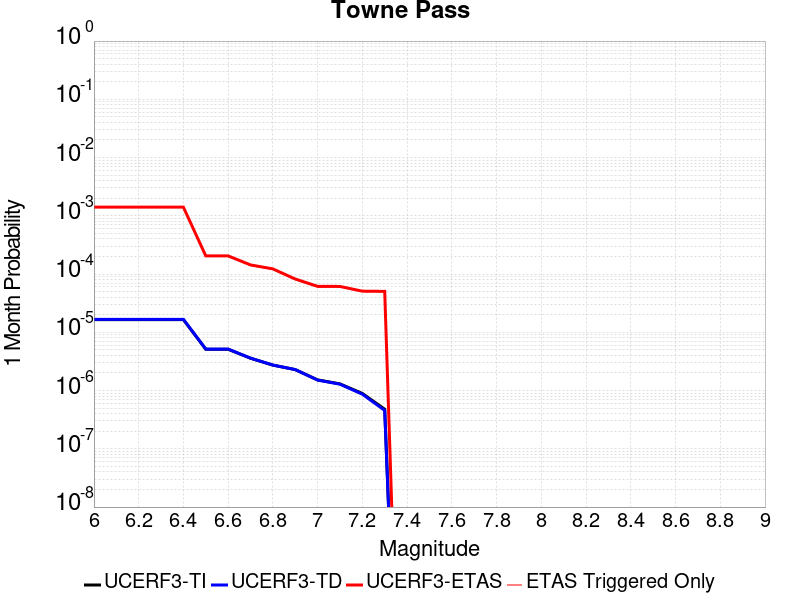 | 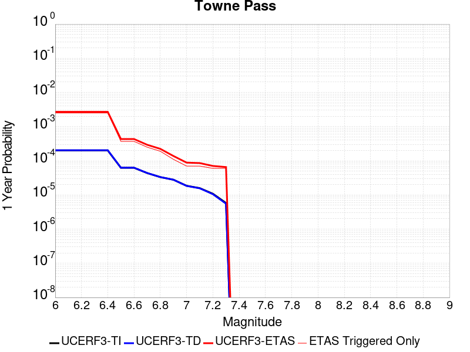 |  |

| Magnitude | 1 wk TI Prob | 1 wk TD Prob | 1 wk ETAS Prob | 1 wk ETAS/TD Gain | 1 wk ETAS Triggered Only | 1 mo TI Prob | 1 mo TD Prob | 1 mo ETAS Prob | 1 mo ETAS/TD Gain | 1 mo ETAS Triggered Only | 1 yr TI Prob | 1 yr TD Prob | 1 yr ETAS Prob | 1 yr ETAS/TD Gain | 1 yr ETAS Triggered Only | 10 yr TI Prob | 10 yr TD Prob | 10 yr ETAS Prob | 10 yr ETAS/TD Gain | 10 yr ETAS Triggered Only |
|-----|-----|-----|-----|-----|-----|-----|-----|-----|-----|-----|-----|-----|-----|-----|-----|-----|-----|-----|-----|-----|
| 6.0 | 3.849728E-6 | 3.894542E-6 | 9.0389105E-4 | 232.09175 | 9.0E-4 | 1.649873E-5 | 1.6690812E-5 | 0.0014066676 | 84.27796 | 0.00139 | 2.0085352E-4 | 2.0319606E-4 | 0.002702688 | 13.300888 | 0.0025 | 0.0020067208 | 0.0020305319 | 0.0056631407 | 2.7889938 | 0.00364 |
| 6.1 | 3.849728E-6 | 3.894542E-6 | 9.0389105E-4 | 232.09175 | 9.0E-4 | 1.649873E-5 | 1.6690812E-5 | 0.0014066676 | 84.27796 | 0.00139 | 2.0085352E-4 | 2.0319606E-4 | 0.002702688 | 13.300888 | 0.0025 | 0.0020067208 | 0.0020305319 | 0.0056631407 | 2.7889938 | 0.00364 |
| 6.2 | 3.849728E-6 | 3.894542E-6 | 9.0389105E-4 | 232.09175 | 9.0E-4 | 1.649873E-5 | 1.6690812E-5 | 0.0014066676 | 84.27796 | 0.00139 | 2.0085352E-4 | 2.0319606E-4 | 0.002702688 | 13.300888 | 0.0025 | 0.0020067208 | 0.0020305319 | 0.0056631407 | 2.7889938 | 0.00364 |
| 6.3 | 3.849728E-6 | 3.894542E-6 | 9.0389105E-4 | 232.09175 | 9.0E-4 | 1.649873E-5 | 1.6690812E-5 | 0.0014066676 | 84.27796 | 0.00139 | 2.0085352E-4 | 2.0319606E-4 | 0.002702688 | 13.300888 | 0.0025 | 0.0020067208 | 0.0020305319 | 0.0056631407 | 2.7889938 | 0.00364 |
| 6.4 | 3.849728E-6 | 3.894542E-6 | 9.0389105E-4 | 232.09175 | 9.0E-4 | 1.649873E-5 | 1.6690812E-5 | 0.0014066676 | 84.27796 | 0.00139 | 2.0085352E-4 | 2.0319606E-4 | 0.002702688 | 13.300888 | 0.0025 | 0.0020067208 | 0.0020305319 | 0.0056631407 | 2.7889938 | 0.00364 |
| 6.5 | 1.1953545E-6 | 1.2030526E-6 | 1.2120291E-4 | 100.74614 | 1.2E-4 | 5.1229376E-6 | 5.15593E-6 | 2.051549E-4 | 39.790085 | 2.0E-4 | 6.236998E-5 | 6.277176E-5 | 4.3274852E-4 | 6.894 | 3.7E-4 | 6.235248E-4 | 6.2755204E-4 | 0.0011772069 | 1.8758714 | 5.5E-4 |
| 6.6 | 1.1953545E-6 | 1.2030526E-6 | 1.2120291E-4 | 100.74614 | 1.2E-4 | 5.1229376E-6 | 5.15593E-6 | 2.051549E-4 | 39.790085 | 2.0E-4 | 6.236998E-5 | 6.277176E-5 | 4.3274852E-4 | 6.894 | 3.7E-4 | 6.235248E-4 | 6.2755204E-4 | 0.0011772069 | 1.8758714 | 5.5E-4 |
| 6.7 | 8.375951E-7 | 8.410676E-7 | 8.0841E-5 | 96.11713 | 8.0E-5 | 3.5896885E-6 | 3.6045708E-6 | 1.4360406E-4 | 39.839436 | 1.4E-4 | 4.370358E-5 | 4.3884826E-5 | 2.9387386E-4 | 6.6964803 | 2.5E-4 | 4.3694986E-4 | 4.3876728E-4 | 7.686225E-4 | 1.751777 | 3.3E-4 |
| 6.8 | 6.38041E-7 | 6.3921624E-7 | 7.063917E-5 | 110.50904 | 7.0E-5 | 2.7344586E-6 | 2.7394954E-6 | 1.2273916E-4 | 44.803566 | 1.2E-4 | 3.3291526E-5 | 3.3352884E-5 | 2.2334655E-4 | 6.696469 | 1.9E-4 | 3.3286537E-4 | 3.334826E-4 | 5.8339926E-4 | 1.7494143 | 2.5E-4 |
| 6.9 | 5.3460053E-7 | 5.345339E-7 | 5.053451E-5 | 94.53939 | 5.0E-5 | 2.2911431E-6 | 2.2908578E-6 | 8.229067E-5 | 35.921337 | 8.0E-5 | 2.789431E-5 | 2.7890868E-5 | 1.3788781E-4 | 4.943833 | 1.1E-4 | 2.789081E-4 | 2.78877E-4 | 4.2883516E-4 | 1.5377215 | 1.5E-4 |
| 7.0 | 3.557783E-7 | 3.5324283E-7 | 3.0353232E-5 | 85.92738 | 3.0E-5 | 1.5247632E-6 | 1.513897E-6 | 6.1513805E-5 | 40.632755 | 6.0E-5 | 1.8563835E-5 | 1.8431549E-5 | 8.843026E-5 | 4.7977657 | 7.0E-5 | 1.8562283E-4 | 1.8430105E-4 | 2.7428445E-4 | 1.4882414 | 9.0E-5 |
| 7.1 | 3.037942E-7 | 3.0002275E-7 | 3.0300014E-5 | 100.992386 | 3.0E-5 | 1.3019744E-6 | 1.2858112E-6 | 6.128573E-5 | 47.66309 | 6.0E-5 | 1.5851423E-5 | 1.5654647E-5 | 8.565355E-5 | 5.4714456 | 7.0E-5 | 1.5850292E-4 | 1.5653619E-4 | 2.465221E-4 | 1.5748569 | 9.0E-5 |
| 7.2 | 2.0808248E-7 | 2.0217735E-7 | 2.0202173E-5 | 99.923035 | 2.0E-5 | 8.917818E-7 | 8.6647407E-7 | 5.086643E-5 | 58.705082 | 5.0E-5 | 1.0857389E-5 | 1.0549275E-5 | 7.0548645E-5 | 6.6875343 | 6.0E-5 | 1.0856859E-4 | 1.0548821E-4 | 1.7548082E-4 | 1.6635113 | 7.0E-5 |
| 7.3 | 1.1162073E-7 | 1.0636902E-7 | 2.0106367E-5 | 189.02464 | 2.0E-5 | 4.7837443E-7 | 4.5586717E-7 | 5.0455845E-5 | 110.68102 | 5.0E-5 | 5.8241935E-6 | 5.5501705E-6 | 6.554984E-5 | 11.810418 | 6.0E-5 | 5.8240406E-5 | 5.550052E-5 | 1.2549663E-4 | 2.2611794 | 7.0E-5 |

## Lenwood-Lockhart-Old Woman Springs
*[(top)](#table-of-contents)*

| 1 Week | 1 Month | 1 Year | 10 Year |
|-----|-----|-----|-----|
|  |  |  |  |

| Magnitude | 1 wk TI Prob | 1 wk TD Prob | 1 wk ETAS Prob | 1 wk ETAS/TD Gain | 1 wk ETAS Triggered Only | 1 mo TI Prob | 1 mo TD Prob | 1 mo ETAS Prob | 1 mo ETAS/TD Gain | 1 mo ETAS Triggered Only | 1 yr TI Prob | 1 yr TD Prob | 1 yr ETAS Prob | 1 yr ETAS/TD Gain | 1 yr ETAS Triggered Only | 10 yr TI Prob | 10 yr TD Prob | 10 yr ETAS Prob | 10 yr ETAS/TD Gain | 10 yr ETAS Triggered Only |
|-----|-----|-----|-----|-----|-----|-----|-----|-----|-----|-----|-----|-----|-----|-----|-----|-----|-----|-----|-----|-----|
| 6.0 | 3.744542E-5 | 4.396349E-5 | 0.0010239204 | 23.290245 | 9.8E-4 | 1.604705E-4 | 1.8840231E-4 | 0.0015181517 | 8.058031 | 0.00133 | 0.0019519776 | 0.0022915571 | 0.004476539 | 1.953492 | 0.00219 | 0.019349206 | 0.022697281 | 0.025990792 | 1.145106 | 0.00337 |
| 6.1 | 3.744542E-5 | 4.396349E-5 | 0.0010239204 | 23.290245 | 9.8E-4 | 1.604705E-4 | 1.8840231E-4 | 0.0015181517 | 8.058031 | 0.00133 | 0.0019519776 | 0.0022915571 | 0.004476539 | 1.953492 | 0.00219 | 0.019349206 | 0.022697281 | 0.025990792 | 1.145106 | 0.00337 |
| 6.2 | 3.744542E-5 | 4.396349E-5 | 0.0010239204 | 23.290245 | 9.8E-4 | 1.604705E-4 | 1.8840231E-4 | 0.0015181517 | 8.058031 | 0.00133 | 0.0019519776 | 0.0022915571 | 0.004476539 | 1.953492 | 0.00219 | 0.019349206 | 0.022697281 | 0.025990792 | 1.145106 | 0.00337 |
| 6.3 | 2.1079984E-5 | 2.5354384E-5 | 5.753404E-4 | 22.691952 | 5.5E-4 | 9.0339665E-5 | 1.0865723E-4 | 7.6858554E-4 | 7.073487 | 6.6E-4 | 0.0010993304 | 0.0013221189 | 0.0023307835 | 1.7629153 | 0.00101 | 0.010939079 | 0.013144747 | 0.014644767 | 1.1141156 | 0.00152 |
| 6.4 | 2.1079984E-5 | 2.5354384E-5 | 5.753404E-4 | 22.691952 | 5.5E-4 | 9.0339665E-5 | 1.0865723E-4 | 7.6858554E-4 | 7.073487 | 6.6E-4 | 0.0010993304 | 0.0013221189 | 0.0023307835 | 1.7629153 | 0.00101 | 0.010939079 | 0.013144747 | 0.014644767 | 1.1141156 | 0.00152 |
| 6.5 | 1.7397282E-5 | 2.0663285E-5 | 3.6065627E-4 | 17.453966 | 3.4E-4 | 7.455765E-5 | 8.8554E-5 | 4.7851945E-4 | 5.4037027 | 3.9E-4 | 9.073613E-4 | 0.0010776235 | 0.0016969553 | 1.5747201 | 6.2E-4 | 0.009036654 | 0.010725273 | 0.01172444 | 1.0931602 | 0.00101 |
| 6.6 | 1.52050325E-5 | 1.7680086E-5 | 2.876753E-4 | 16.271149 | 2.7E-4 | 6.51628E-5 | 7.576964E-5 | 3.957454E-4 | 5.2230077 | 3.2E-4 | 7.9306826E-4 | 9.221128E-4 | 0.0014316426 | 1.5525677 | 5.1E-4 | 0.007902439 | 0.009183729 | 0.010055647 | 1.0949416 | 8.8E-4 |
| 6.7 | 1.332523E-5 | 1.5264379E-5 | 2.4526086E-4 | 16.06753 | 2.3E-4 | 5.7106878E-5 | 6.541716E-5 | 3.4539885E-4 | 5.2799425 | 2.8E-4 | 6.950544E-4 | 7.9616875E-4 | 0.0012458105 | 1.5647568 | 4.5E-4 | 0.006928845 | 0.0079337945 | 0.0086679235 | 1.0925319 | 7.4E-4 |
| 6.8 | 1.1525329E-5 | 1.3031365E-5 | 1.8302914E-4 | 14.045279 | 1.7E-4 | 4.9393333E-5 | 5.5847537E-5 | 2.658358E-4 | 4.7600274 | 2.1E-4 | 6.011979E-4 | 6.7973585E-4 | 0.0010394912 | 1.5292575 | 3.6E-4 | 0.00599574 | 0.0067770192 | 0.007372953 | 1.0879345 | 6.0E-4 |
| 6.9 | 1.0253909E-5 | 1.1514835E-5 | 1.5151322E-4 | 13.15809 | 1.4E-4 | 4.3944583E-5 | 4.934838E-5 | 2.1933999E-4 | 4.4447255 | 1.7E-4 | 5.3489394E-4 | 6.006545E-4 | 8.904803E-4 | 1.4825166 | 2.9E-4 | 0.0053360825 | 0.0059906896 | 0.006467814 | 1.0796443 | 4.8E-4 |
| 7.0 | 8.104563E-6 | 8.99143E-6 | 9.899062E-5 | 11.00944 | 9.0E-5 | 3.4733377E-5 | 3.853415E-5 | 1.4852991E-4 | 3.854501 | 1.1E-4 | 4.2279682E-4 | 4.6905465E-4 | 6.5896555E-4 | 1.40488 | 1.9E-4 | 0.0042199334 | 0.0046808943 | 0.0049794903 | 1.0637903 | 3.0E-4 |
| 7.1 | 6.7986157E-6 | 7.5159796E-6 | 8.751538E-5 | 11.6439085 | 8.0E-5 | 2.91366E-5 | 3.2210955E-5 | 1.3220773E-4 | 4.1044335 | 1.0E-4 | 3.5468035E-4 | 3.9209996E-4 | 5.4204115E-4 | 1.3824055 | 1.5E-4 | 0.003541148 | 0.003914298 | 0.0041433973 | 1.0585289 | 2.3E-4 |
| 7.2 | 5.6893327E-6 | 6.280132E-6 | 7.627969E-5 | 12.146193 | 7.0E-5 | 2.4382627E-5 | 2.6914584E-5 | 1.06912434E-4 | 3.9722862 | 8.0E-5 | 2.9681803E-4 | 3.276378E-4 | 4.2760503E-4 | 1.3051151 | 1.0E-4 | 0.002964219 | 0.003271746 | 0.0034312226 | 1.0487436 | 1.6E-4 |
| 7.3 | 4.253348E-6 | 4.707075E-6 | 4.4706885E-5 | 9.497807 | 4.0E-5 | 1.8228506E-5 | 2.017303E-5 | 7.017202E-5 | 3.4785066 | 5.0E-5 | 2.2190946E-4 | 2.455808E-4 | 2.9556852E-4 | 1.203549 | 5.0E-5 | 0.00221688 | 0.0024532753 | 0.002533079 | 1.0325295 | 8.0E-5 |
| 7.4 | 2.5448119E-6 | 2.8520594E-6 | 1.28520305E-5 | 4.5062284 | 1.0E-5 | 1.0906291E-5 | 1.2223064E-5 | 2.2222941E-5 | 1.8181155 | 1.0E-5 | 1.3277601E-4 | 1.4880729E-4 | 1.5880581E-4 | 1.067191 | 1.0E-5 | 0.001326967 | 0.0014872387 | 0.0015171941 | 1.0201416 | 3.0E-5 |
| 7.5 | 4.3706837E-8 | 4.562909E-8 | 4.562909E-8 | 1.0 | 0.0 | 1.8731501E-7 | 1.9555324E-7 | 1.9555324E-7 | 1.0 | 0.0 | 2.2805577E-6 | 2.3808586E-6 | 2.3808586E-6 | 1.0 | 0.0 | 2.2805343E-5 | 2.3808387E-5 | 2.3808387E-5 | 1.0 | 0.0 |

## Paradise
*[(top)](#table-of-contents)*

| 1 Week | 1 Month | 1 Year | 10 Year |
|-----|-----|-----|-----|
|  |  |  | 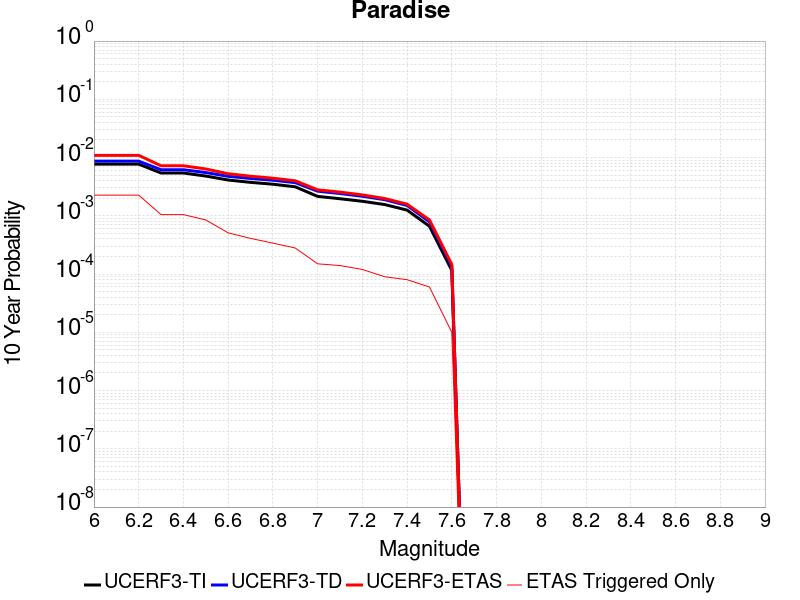 |

| Magnitude | 1 wk TI Prob | 1 wk TD Prob | 1 wk ETAS Prob | 1 wk ETAS/TD Gain | 1 wk ETAS Triggered Only | 1 mo TI Prob | 1 mo TD Prob | 1 mo ETAS Prob | 1 mo ETAS/TD Gain | 1 mo ETAS Triggered Only | 1 yr TI Prob | 1 yr TD Prob | 1 yr ETAS Prob | 1 yr ETAS/TD Gain | 1 yr ETAS Triggered Only | 10 yr TI Prob | 10 yr TD Prob | 10 yr ETAS Prob | 10 yr ETAS/TD Gain | 10 yr ETAS Triggered Only |
|-----|-----|-----|-----|-----|-----|-----|-----|-----|-----|-----|-----|-----|-----|-----|-----|-----|-----|-----|-----|-----|
| 6.0 | 1.4851273E-5 | 1.6694768E-5 | 4.966867E-4 | 29.751041 | 4.8E-4 | 6.364676E-5 | 7.154718E-5 | 8.5149135E-4 | 11.901117 | 7.8E-4 | 7.7462377E-4 | 8.707624E-4 | 0.0022795347 | 2.6178606 | 0.00141 | 0.0077192914 | 0.008675884 | 0.01092619 | 1.2593747 | 0.00227 |
| 6.1 | 1.4851273E-5 | 1.6694768E-5 | 4.966867E-4 | 29.751041 | 4.8E-4 | 6.364676E-5 | 7.154718E-5 | 8.5149135E-4 | 11.901117 | 7.8E-4 | 7.7462377E-4 | 8.707624E-4 | 0.0022795347 | 2.6178606 | 0.00141 | 0.0077192914 | 0.008675884 | 0.01092619 | 1.2593747 | 0.00227 |
| 6.2 | 1.4851273E-5 | 1.6694768E-5 | 4.966867E-4 | 29.751041 | 4.8E-4 | 6.364676E-5 | 7.154718E-5 | 8.5149135E-4 | 11.901117 | 7.8E-4 | 7.7462377E-4 | 8.707624E-4 | 0.0022795347 | 2.6178606 | 0.00141 | 0.0077192914 | 0.008675884 | 0.01092619 | 1.2593747 | 0.00227 |
| 6.3 | 1.0426831E-5 | 1.1888697E-5 | 2.4188597E-4 | 20.345875 | 2.3E-4 | 4.4685654E-5 | 5.09506E-5 | 3.709343E-4 | 7.2802734 | 3.2E-4 | 5.43912E-4 | 6.201529E-4 | 0.0012897374 | 2.0797086 | 6.7E-4 | 0.0054258266 | 0.0061848317 | 0.0072283377 | 1.1687201 | 0.00105 |
| 6.4 | 1.0426831E-5 | 1.1888697E-5 | 2.4188597E-4 | 20.345875 | 2.3E-4 | 4.4685654E-5 | 5.09506E-5 | 3.709343E-4 | 7.2802734 | 3.2E-4 | 5.43912E-4 | 6.201529E-4 | 0.0012897374 | 2.0797086 | 6.7E-4 | 0.0054258266 | 0.0061848317 | 0.0072283377 | 1.1687201 | 0.00105 |
| 6.5 | 9.25027E-6 | 1.0620037E-5 | 2.206178E-4 | 20.773731 | 2.1E-4 | 3.964341E-5 | 4.551368E-5 | 3.2550094E-4 | 7.1517167 | 2.8E-4 | 4.8255164E-4 | 5.5399304E-4 | 0.0011336717 | 2.0463645 | 5.8E-4 | 0.0048150513 | 0.0055266195 | 0.006371922 | 1.1529511 | 8.5E-4 |
| 6.6 | 7.904275E-6 | 9.159602E-6 | 1.291585E-4 | 14.100885 | 1.2E-4 | 3.3875025E-5 | 3.925487E-5 | 1.7924937E-4 | 4.5662966 | 1.4E-4 | 4.1235037E-4 | 4.7782718E-4 | 8.076695E-4 | 1.6902963 | 3.3E-4 | 0.0041158604 | 0.004768395 | 0.005275963 | 1.1064442 | 5.1E-4 |
| 6.7 | 7.2061953E-6 | 8.407326E-6 | 1.08406486E-4 | 12.894288 | 1.0E-4 | 3.088333E-5 | 3.603092E-5 | 1.4602696E-4 | 4.0528235 | 1.1E-4 | 3.7593965E-4 | 4.3859181E-4 | 6.884822E-4 | 1.569756 | 2.5E-4 | 0.003753043 | 0.004377631 | 0.004785836 | 1.093248 | 4.1E-4 |
| 6.8 | 6.6948724E-6 | 7.842242E-6 | 7.7841694E-5 | 9.925949 | 7.0E-5 | 2.8691995E-5 | 3.3609194E-5 | 1.0360684E-4 | 3.0826933 | 7.0E-5 | 3.4926904E-4 | 4.091187E-4 | 5.9904094E-4 | 1.4642229 | 1.9E-4 | 0.003487206 | 0.0040840125 | 0.004422624 | 1.0829115 | 3.4E-4 |
| 6.9 | 6.0421025E-6 | 7.1306963E-6 | 6.713027E-5 | 9.414266 | 6.0E-5 | 2.5894467E-5 | 3.0559786E-5 | 9.055795E-5 | 2.9633045 | 6.0E-5 | 3.1521954E-4 | 3.7200528E-4 | 5.219495E-4 | 1.4030701 | 1.5E-4 | 0.0031477278 | 0.0037141638 | 0.003993124 | 1.0751071 | 2.8E-4 |
| 7.0 | 4.134091E-6 | 5.0803824E-6 | 4.5080178E-5 | 8.873383 | 4.0E-5 | 1.7717413E-5 | 2.1772896E-5 | 6.177202E-5 | 2.8371067 | 4.0E-5 | 2.1568815E-4 | 2.650543E-4 | 3.450331E-4 | 1.3017449 | 8.0E-5 | 0.0021547892 | 0.0026475347 | 0.0027971375 | 1.0565065 | 1.5E-4 |
| 7.1 | 3.7674888E-6 | 4.631936E-6 | 4.463175E-5 | 9.635658 | 4.0E-5 | 1.6146281E-5 | 1.9851012E-5 | 5.985022E-5 | 3.0149705 | 4.0E-5 | 1.9656324E-4 | 2.4166079E-4 | 3.2164145E-4 | 1.3309625 | 8.0E-5 | 0.0019638946 | 0.0024141306 | 0.0025537927 | 1.0578519 | 1.4E-4 |
| 7.2 | 3.4065345E-6 | 4.156782E-6 | 4.4156615E-5 | 10.622788 | 4.0E-5 | 1.4599351E-5 | 1.7814667E-5 | 5.7813955E-5 | 3.2453008 | 4.0E-5 | 1.777326E-4 | 2.168735E-4 | 2.9685613E-4 | 1.3687986 | 8.0E-5 | 0.0017759053 | 0.0021667667 | 0.0022865066 | 1.0552621 | 1.2E-4 |
| 7.3 | 2.9934936E-6 | 3.6293673E-6 | 3.3629258E-5 | 9.265874 | 3.0E-5 | 1.2829195E-5 | 1.5554348E-5 | 4.555388E-5 | 2.9286914 | 3.0E-5 | 1.5618425E-4 | 1.8935918E-4 | 2.4934782E-4 | 1.3167981 | 6.0E-5 | 0.0015607453 | 0.0018921237 | 0.0019819534 | 1.0474756 | 9.0E-5 |
| 7.4 | 2.4049796E-6 | 2.8890186E-6 | 3.2888933E-5 | 11.384119 | 3.0E-5 | 1.0307015E-5 | 1.2381457E-5 | 4.2381085E-5 | 3.4229481 | 3.0E-5 | 1.2548068E-4 | 1.5073526E-4 | 2.0072772E-4 | 1.3316574 | 5.0E-5 | 0.0012540985 | 0.0015064715 | 0.0015863511 | 1.0530242 | 8.0E-5 |
| 7.5 | 1.2710091E-6 | 1.5134859E-6 | 1.1513471E-5 | 7.6072536 | 1.0E-5 | 5.44717E-6 | 6.4863593E-6 | 1.6486294E-5 | 2.541687 | 1.0E-5 | 6.631728E-5 | 7.896981E-5 | 1.0896744E-4 | 1.379862 | 3.0E-5 | 6.6297496E-4 | 7.895401E-4 | 8.4949273E-4 | 1.0759336 | 6.0E-5 |
| 7.6 | 2.21172E-7 | 2.6040198E-7 | 2.6040198E-7 | 1.0 | 0.0 | 9.478797E-7 | 1.1160082E-6 | 1.1160082E-6 | 1.0 | 0.0 | 1.1540374E-5 | 1.3587343E-5 | 2.3587207E-5 | 1.7359691 | 1.0E-5 | 1.1539775E-4 | 1.3586794E-4 | 1.4586658E-4 | 1.0735909 | 1.0E-5 |

## Bicycle Lake
*[(top)](#table-of-contents)*

| 1 Week | 1 Month | 1 Year | 10 Year |
|-----|-----|-----|-----|
|  |  |  |  |

| Magnitude | 1 wk TI Prob | 1 wk TD Prob | 1 wk ETAS Prob | 1 wk ETAS/TD Gain | 1 wk ETAS Triggered Only | 1 mo TI Prob | 1 mo TD Prob | 1 mo ETAS Prob | 1 mo ETAS/TD Gain | 1 mo ETAS Triggered Only | 1 yr TI Prob | 1 yr TD Prob | 1 yr ETAS Prob | 1 yr ETAS/TD Gain | 1 yr ETAS Triggered Only | 10 yr TI Prob | 10 yr TD Prob | 10 yr ETAS Prob | 10 yr ETAS/TD Gain | 10 yr ETAS Triggered Only |
|-----|-----|-----|-----|-----|-----|-----|-----|-----|-----|-----|-----|-----|-----|-----|-----|-----|-----|-----|-----|-----|
| 6.0 | 1.9621975E-5 | 2.2097078E-5 | 3.7208936E-4 | 16.838848 | 3.5E-4 | 8.4091465E-5 | 9.4699084E-5 | 6.846432E-4 | 7.2296705 | 5.9E-4 | 0.0010233327 | 0.0011524865 | 0.0024609768 | 2.1353626 | 0.00131 | 0.01018633 | 0.011478408 | 0.013593844 | 1.184297 | 0.00214 |
| 6.1 | 1.9621975E-5 | 2.2097078E-5 | 3.7208936E-4 | 16.838848 | 3.5E-4 | 8.4091465E-5 | 9.4699084E-5 | 6.846432E-4 | 7.2296705 | 5.9E-4 | 0.0010233327 | 0.0011524865 | 0.0024609768 | 2.1353626 | 0.00131 | 0.01018633 | 0.011478408 | 0.013593844 | 1.184297 | 0.00214 |
| 6.2 | 9.9971285E-6 | 1.125564E-5 | 2.5125293E-4 | 22.322405 | 2.4E-4 | 4.2844134E-5 | 4.8237856E-5 | 4.1822E-4 | 8.669954 | 3.7E-4 | 5.2150246E-4 | 5.871897E-4 | 0.0013867199 | 2.3616219 | 8.0E-4 | 0.0052028033 | 0.005861487 | 0.0071240426 | 1.2153986 | 0.00127 |
| 6.3 | 9.589428E-6 | 1.0798346E-5 | 2.4079587E-4 | 22.299328 | 2.3E-4 | 4.10969E-5 | 4.62781E-5 | 3.962619E-4 | 8.562623 | 3.5E-4 | 5.002399E-4 | 5.6334207E-4 | 0.0013329083 | 2.3660727 | 7.7E-4 | 0.0049911533 | 0.0056242296 | 0.0068274243 | 1.2139306 | 0.00121 |
| 6.4 | 9.589428E-6 | 1.0798346E-5 | 2.4079587E-4 | 22.299328 | 2.3E-4 | 4.10969E-5 | 4.62781E-5 | 3.962619E-4 | 8.562623 | 3.5E-4 | 5.002399E-4 | 5.6334207E-4 | 0.0013329083 | 2.3660727 | 7.7E-4 | 0.0049911533 | 0.0056242296 | 0.0068274243 | 1.2139306 | 0.00121 |
| 6.5 | 5.557707E-6 | 6.2856016E-6 | 1.1628491E-4 | 18.500204 | 1.1E-4 | 2.3818526E-5 | 2.6938165E-5 | 2.1693305E-4 | 8.0529995 | 1.9E-4 | 2.8995197E-4 | 3.279497E-4 | 7.678054E-4 | 2.3412292 | 4.4E-4 | 0.0028957394 | 0.0032772934 | 0.003945098 | 1.203767 | 6.7E-4 |
| 6.6 | 4.8742945E-6 | 5.5132896E-6 | 9.551279E-5 | 17.324102 | 9.0E-5 | 2.0889667E-5 | 2.3628318E-5 | 1.8362454E-4 | 7.7713757 | 1.6E-4 | 2.54302E-4 | 2.87663E-4 | 6.775508E-4 | 2.3553631 | 3.9E-4 | 0.002540112 | 0.0028754752 | 0.0034637786 | 1.2045934 | 5.9E-4 |
| 6.7 | 3.991108E-6 | 4.5159104E-6 | 7.451559E-5 | 16.50068 | 7.0E-5 | 1.7104636E-5 | 1.9353902E-5 | 1.4935138E-4 | 7.716862 | 1.3E-4 | 2.0822904E-4 | 2.3563375E-4 | 5.755536E-4 | 2.4425774 | 3.4E-4 | 0.0020803404 | 0.0023563374 | 0.0028651357 | 1.2159276 | 5.1E-4 |

## San Andreas (San Bernardino N)
*[(top)](#table-of-contents)*

| 1 Week | 1 Month | 1 Year | 10 Year |
|-----|-----|-----|-----|
|  |  | 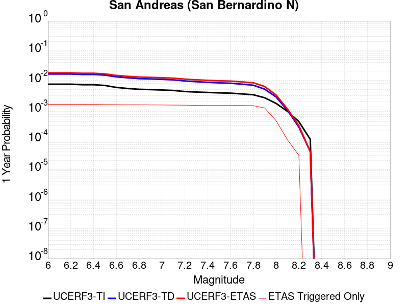 |  |

| Magnitude | 1 wk TI Prob | 1 wk TD Prob | 1 wk ETAS Prob | 1 wk ETAS/TD Gain | 1 wk ETAS Triggered Only | 1 mo TI Prob | 1 mo TD Prob | 1 mo ETAS Prob | 1 mo ETAS/TD Gain | 1 mo ETAS Triggered Only | 1 yr TI Prob | 1 yr TD Prob | 1 yr ETAS Prob | 1 yr ETAS/TD Gain | 1 yr ETAS Triggered Only | 10 yr TI Prob | 10 yr TD Prob | 10 yr ETAS Prob | 10 yr ETAS/TD Gain | 10 yr ETAS Triggered Only |
|-----|-----|-----|-----|-----|-----|-----|-----|-----|-----|-----|-----|-----|-----|-----|-----|-----|-----|-----|-----|-----|
| 6.0 | 1.4273766E-4 | 3.160784E-4 | 0.0011858034 | 3.7516115 | 8.7E-4 | 6.115894E-4 | 0.0013539245 | 0.0024424486 | 1.803977 | 0.00109 | 0.0074207084 | 0.016360939 | 0.017895415 | 1.0937891 | 0.00156 | 0.07177748 | 0.15021163 | 0.1519367 | 1.0114843 | 0.00203 |
| 6.1 | 1.4273766E-4 | 3.160784E-4 | 0.0011858034 | 3.7516115 | 8.7E-4 | 6.115894E-4 | 0.0013539245 | 0.0024424486 | 1.803977 | 0.00109 | 0.0074207084 | 0.016360939 | 0.017895415 | 1.0937891 | 0.00156 | 0.07177748 | 0.15021163 | 0.1519367 | 1.0114843 | 0.00203 |
| 6.2 | 1.4273766E-4 | 3.160784E-4 | 0.0011858034 | 3.7516115 | 8.7E-4 | 6.115894E-4 | 0.0013539245 | 0.0024424486 | 1.803977 | 0.00109 | 0.0074207084 | 0.016360939 | 0.017895415 | 1.0937891 | 0.00156 | 0.07177748 | 0.15021163 | 0.1519367 | 1.0114843 | 0.00203 |
| 6.3 | 1.3730655E-4 | 3.0512668E-4 | 0.0011748612 | 3.8504047 | 8.7E-4 | 5.883239E-4 | 0.001307036 | 0.0023956115 | 1.832858 | 0.00109 | 0.0071393442 | 0.015798455 | 0.01733381 | 1.0971838 | 0.00156 | 0.06914291 | 0.1455135 | 0.14723957 | 1.0118619 | 0.00202 |
| 6.4 | 1.3730655E-4 | 3.0512668E-4 | 0.0011748612 | 3.8504047 | 8.7E-4 | 5.883239E-4 | 0.001307036 | 0.0023956115 | 1.832858 | 0.00109 | 0.0071393442 | 0.015798455 | 0.01733381 | 1.0971838 | 0.00156 | 0.06914291 | 0.1455135 | 0.14723957 | 1.0118619 | 0.00202 |
| 6.5 | 1.2942807E-4 | 2.8927144E-4 | 0.0011490227 | 3.9721262 | 8.6E-4 | 5.545738E-4 | 0.0012391509 | 0.0023178125 | 1.8704846 | 0.00108 | 0.0067310524 | 0.014983548 | 0.016490623 | 1.100582 | 0.00153 | 0.06530788 | 0.13865088 | 0.14035635 | 1.0123005 | 0.00198 |
| 6.6 | 1.1125901E-4 | 2.5365927E-4 | 0.0011134411 | 4.389515 | 8.6E-4 | 4.767372E-4 | 0.0010866605 | 0.0021554977 | 1.9835981 | 0.00107 | 0.005788839 | 0.0131504685 | 0.01465048 | 1.1140653 | 0.00152 | 0.056403454 | 0.12300496 | 0.1247151 | 1.013903 | 0.00195 |
| 6.7 | 1.02209575E-4 | 2.3500937E-4 | 0.0010848097 | 4.616027 | 8.5E-4 | 4.3796748E-4 | 0.0010067957 | 0.0020657284 | 2.0517852 | 0.00106 | 0.0053192247 | 0.012189267 | 0.013670983 | 1.121559 | 0.0015 | 0.051936906 | 0.114792764 | 0.11647466 | 1.0146515 | 0.0019 |
| 6.8 | 9.610582E-5 | 2.2026796E-4 | 0.0010700807 | 4.858086 | 8.5E-4 | 4.1181705E-4 | 9.436647E-4 | 0.0020026644 | 2.1222203 | 0.00106 | 0.0050023515 | 0.011428859 | 0.012911716 | 1.1297467 | 0.0015 | 0.048912346 | 0.10820469 | 0.1098991 | 1.0156593 | 0.0019 |
| 6.9 | 9.3877505E-5 | 2.1482339E-4 | 0.001054643 | 4.9093485 | 8.4E-4 | 4.0227012E-4 | 9.203475E-4 | 0.0019693812 | 2.1398234 | 0.00105 | 0.0048866454 | 0.011147907 | 0.012621297 | 1.1321673 | 0.00149 | 0.04780577 | 0.105798274 | 0.10747937 | 1.0158896 | 0.00188 |
| 7.0 | 9.1019785E-5 | 2.0809306E-4 | 0.0010479182 | 5.0358157 | 8.4E-4 | 3.900265E-4 | 8.915232E-4 | 0.0019405871 | 2.1767097 | 0.00105 | 0.0047382377 | 0.0108004995 | 0.012264515 | 1.1355507 | 0.00148 | 0.046384744 | 0.10276815 | 0.10444598 | 1.0163263 | 0.00187 |
| 7.1 | 8.771155E-5 | 1.9983841E-4 | 0.0010296726 | 5.152526 | 8.3E-4 | 3.758525E-4 | 8.5616973E-4 | 0.0018952793 | 2.2136724 | 0.00104 | 0.0045664064 | 0.010374243 | 0.0118289925 | 1.1402271 | 0.00147 | 0.044737056 | 0.09907644 | 0.10075216 | 1.0169134 | 0.00186 |
| 7.2 | 8.0830236E-5 | 1.8389444E-4 | 0.0010137418 | 5.512629 | 8.3E-4 | 3.4636928E-4 | 7.8788114E-4 | 0.0018270618 | 2.3189561 | 0.00104 | 0.0042088944 | 0.009550368 | 0.010996425 | 1.1514137 | 0.00146 | 0.041300658 | 0.09180518 | 0.09348535 | 1.0183014 | 0.00185 |
| 7.3 | 7.7668235E-5 | 1.7333007E-4 | 9.931879E-4 | 5.730038 | 8.2E-4 | 3.328214E-4 | 7.426318E-4 | 0.0017718669 | 2.385929 | 0.00103 | 0.0040445733 | 0.009004138 | 0.010431172 | 1.1584865 | 0.00144 | 0.03971748 | 0.08706761 | 0.08873828 | 1.0191882 | 0.00183 |
| 7.4 | 7.520177E-5 | 1.655312E-4 | 9.853954E-4 | 5.952929 | 8.2E-4 | 3.2225347E-4 | 7.092266E-4 | 0.001738496 | 2.4512563 | 0.00103 | 0.0039163795 | 0.008600714 | 0.010018414 | 1.1648353 | 0.00143 | 0.038480744 | 0.08352157 | 0.08518956 | 1.0199708 | 0.00182 |
| 7.5 | 7.274697E-5 | 1.584075E-4 | 9.782776E-4 | 6.1757026 | 8.2E-4 | 3.1173544E-4 | 6.7871273E-4 | 0.0017080137 | 2.5165486 | 0.00103 | 0.003788775 | 0.008232076 | 0.009650304 | 1.1722808 | 0.00143 | 0.03724827 | 0.08023654 | 0.08190131 | 1.0207483 | 0.00181 |
| 7.6 | 7.1185845E-5 | 1.5410586E-4 | 9.739795E-4 | 6.3201976 | 8.2E-4 | 3.0504653E-4 | 6.602866E-4 | 0.0016896065 | 2.5588987 | 0.00103 | 0.0037076178 | 0.0080094095 | 0.009427956 | 1.17711 | 0.00143 | 0.036463667 | 0.07822661 | 0.0798858 | 1.0212101 | 0.0018 |
| 7.7 | 6.709961E-5 | 1.4319421E-4 | 9.630768E-4 | 6.7256684 | 8.2E-4 | 2.8753807E-4 | 6.135452E-4 | 0.0016429132 | 2.677738 | 0.00103 | 0.003495157 | 0.0074443663 | 0.008863721 | 1.1906615 | 0.00143 | 0.034406938 | 0.07305558 | 0.07472408 | 1.0228388 | 0.0018 |
| 7.8 | 6.300812E-5 | 1.320343E-4 | 9.4192737E-4 | 7.1339593 | 8.1E-4 | 2.7000686E-4 | 5.657386E-4 | 0.0015751672 | 2.7842667 | 0.00101 | 0.0032823787 | 0.006866143 | 0.008266462 | 1.2039455 | 0.00141 | 0.032343175 | 0.06771385 | 0.06937332 | 1.024507 | 0.00178 |
| 7.9 | 4.983037E-5 | 9.7241085E-5 | 7.7717495E-4 | 7.992249 | 6.8E-4 | 2.1354125E-4 | 4.1668097E-4 | 0.0012763226 | 3.0630693 | 8.6E-4 | 0.0025967648 | 0.0050613005 | 0.006235328 | 1.2319617 | 0.00118 | 0.025666296 | 0.050650507 | 0.05206504 | 1.0279273 | 0.00149 |
| 8.0 | 3.2211527E-5 | 5.3306234E-5 | 2.432961E-4 | 4.5641212 | 1.9E-4 | 1.380421E-4 | 2.2843528E-4 | 5.18369E-4 | 2.269216 | 2.9E-4 | 0.0016793669 | 0.0027776542 | 0.0032164322 | 1.1579671 | 4.4E-4 | 0.016667323 | 0.028362568 | 0.02886782 | 1.017814 | 5.2E-4 |
| 8.1 | 1.743376E-5 | 1.8823403E-5 | 2.8823213E-5 | 1.5312436 | 1.0E-5 | 7.471398E-5 | 8.066923E-5 | 1.306652E-4 | 1.619765 | 5.0E-5 | 9.0926304E-4 | 9.81706E-4 | 0.0010816078 | 1.1017635 | 1.0E-4 | 0.009055517 | 0.010483979 | 0.010582931 | 1.0094384 | 1.0E-4 |
| 8.2 | 7.831616E-6 | 5.1540533E-6 | 5.1540533E-6 | 1.0 | 0.0 | 3.3563636E-5 | 2.2088612E-5 | 2.2088612E-5 | 1.0 | 0.0 | 4.0856065E-4 | 2.6889573E-4 | 2.9888767E-4 | 1.1115375 | 3.0E-5 | 0.004078103 | 0.0030413668 | 0.0030712755 | 1.0098339 | 3.0E-5 |
| 8.3 | 1.983087E-6 | 7.6564595E-7 | 7.6564595E-7 | 1.0 | 0.0 | 8.498917E-6 | 3.281336E-6 | 3.281336E-6 | 1.0 | 0.0 | 1.034694E-4 | 3.9949547E-5 | 3.9949547E-5 | 1.0 | 0.0 | 0.0010342124 | 4.717979E-4 | 4.717979E-4 | 1.0 | 0.0 |

## Garlic Springs
*[(top)](#table-of-contents)*

| 1 Week | 1 Month | 1 Year | 10 Year |
|-----|-----|-----|-----|
|  |  |  |  |

| Magnitude | 1 wk TI Prob | 1 wk TD Prob | 1 wk ETAS Prob | 1 wk ETAS/TD Gain | 1 wk ETAS Triggered Only | 1 mo TI Prob | 1 mo TD Prob | 1 mo ETAS Prob | 1 mo ETAS/TD Gain | 1 mo ETAS Triggered Only | 1 yr TI Prob | 1 yr TD Prob | 1 yr ETAS Prob | 1 yr ETAS/TD Gain | 1 yr ETAS Triggered Only | 10 yr TI Prob | 10 yr TD Prob | 10 yr ETAS Prob | 10 yr ETAS/TD Gain | 10 yr ETAS Triggered Only |
|-----|-----|-----|-----|-----|-----|-----|-----|-----|-----|-----|-----|-----|-----|-----|-----|-----|-----|-----|-----|-----|
| 6.0 | 1.6760017E-5 | 1.8776833E-5 | 3.0877138E-4 | 16.444275 | 2.9E-4 | 7.182667E-5 | 8.0470316E-5 | 5.704309E-4 | 7.0887117 | 4.9E-4 | 8.7413884E-4 | 9.794032E-4 | 0.0020683357 | 2.1118326 | 0.00109 | 0.008707083 | 0.009762413 | 0.0114953285 | 1.177509 | 0.00175 |
| 6.1 | 9.852767E-6 | 1.0973587E-5 | 1.7097183E-4 | 15.580305 | 1.6E-4 | 4.222546E-5 | 4.702921E-5 | 3.5701462E-4 | 7.591338 | 3.1E-4 | 5.139737E-4 | 5.7250116E-4 | 0.0012021405 | 2.0998044 | 6.3E-4 | 0.005127866 | 0.005717221 | 0.00673139 | 1.1773883 | 0.00102 |
| 6.2 | 9.852767E-6 | 1.0973587E-5 | 1.7097183E-4 | 15.580305 | 1.6E-4 | 4.222546E-5 | 4.702921E-5 | 3.5701462E-4 | 7.591338 | 3.1E-4 | 5.139737E-4 | 5.7250116E-4 | 0.0012021405 | 2.0998044 | 6.3E-4 | 0.005127866 | 0.005717221 | 0.00673139 | 1.1773883 | 0.00102 |
| 6.3 | 4.3167724E-6 | 4.7780286E-6 | 1.14777504E-4 | 24.021936 | 1.1E-4 | 1.8500323E-5 | 2.0477235E-5 | 2.1047334E-4 | 10.278407 | 1.9E-4 | 2.2521814E-4 | 2.4930484E-4 | 5.3923257E-4 | 2.1629446 | 2.9E-4 | 0.0022499003 | 0.00249251 | 0.0029513633 | 1.1840929 | 4.6E-4 |
| 6.4 | 4.3167724E-6 | 4.7780286E-6 | 1.14777504E-4 | 24.021936 | 1.1E-4 | 1.8500323E-5 | 2.0477235E-5 | 2.1047334E-4 | 10.278407 | 1.9E-4 | 2.2521814E-4 | 2.4930484E-4 | 5.3923257E-4 | 2.1629446 | 2.9E-4 | 0.0022499003 | 0.00249251 | 0.0029513633 | 1.1840929 | 4.6E-4 |
| 6.5 | 4.3167724E-6 | 4.7780286E-6 | 1.14777504E-4 | 24.021936 | 1.1E-4 | 1.8500323E-5 | 2.0477235E-5 | 2.1047334E-4 | 10.278407 | 1.9E-4 | 2.2521814E-4 | 2.4930484E-4 | 5.3923257E-4 | 2.1629446 | 2.9E-4 | 0.0022499003 | 0.00249251 | 0.0029513633 | 1.1840929 | 4.6E-4 |
| 6.6 | 4.301311E-6 | 4.760897E-6 | 1.14760376E-4 | 24.10478 | 1.1E-4 | 1.8434059E-5 | 2.0403815E-5 | 2.1039994E-4 | 10.311794 | 1.9E-4 | 2.2441156E-4 | 2.4841115E-4 | 5.3833914E-4 | 2.1671293 | 2.9E-4 | 0.0022418506 | 0.002483593 | 0.0029424506 | 1.1847556 | 4.6E-4 |
| 6.7 | 3.8599724E-6 | 4.27106E-6 | 1.04270635E-4 | 24.413292 | 1.0E-4 | 1.6542634E-5 | 1.8304541E-5 | 1.9830125E-4 | 10.833445 | 1.8E-4 | 2.0138794E-4 | 2.228578E-4 | 5.027954E-4 | 2.2561266 | 2.8E-4 | 0.0020120554 | 0.002228578 | 0.0026675975 | 1.1969953 | 4.4E-4 |

## San Andreas (San Bernardino S)
*[(top)](#table-of-contents)*

| 1 Week | 1 Month | 1 Year | 10 Year |
|-----|-----|-----|-----|
| 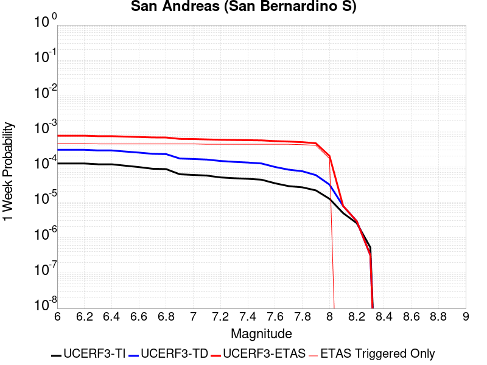 |  |  |  |

| Magnitude | 1 wk TI Prob | 1 wk TD Prob | 1 wk ETAS Prob | 1 wk ETAS/TD Gain | 1 wk ETAS Triggered Only | 1 mo TI Prob | 1 mo TD Prob | 1 mo ETAS Prob | 1 mo ETAS/TD Gain | 1 mo ETAS Triggered Only | 1 yr TI Prob | 1 yr TD Prob | 1 yr ETAS Prob | 1 yr ETAS/TD Gain | 1 yr ETAS Triggered Only | 10 yr TI Prob | 10 yr TD Prob | 10 yr ETAS Prob | 10 yr ETAS/TD Gain | 10 yr ETAS Triggered Only |
|-----|-----|-----|-----|-----|-----|-----|-----|-----|-----|-----|-----|-----|-----|-----|-----|-----|-----|-----|-----|-----|
| 6.0 | 1.2336002E-4 | 3.0005194E-4 | 7.499169E-4 | 2.4992905 | 4.5E-4 | 5.2857865E-4 | 0.0012853292 | 0.0018645837 | 1.4506663 | 5.8E-4 | 0.006416472 | 0.015541554 | 0.016378345 | 1.0538421 | 8.5E-4 | 0.06234337 | 0.14294699 | 0.14394118 | 1.0069549 | 0.00116 |
| 6.1 | 1.2336002E-4 | 3.0005194E-4 | 7.499169E-4 | 2.4992905 | 4.5E-4 | 5.2857865E-4 | 0.0012853292 | 0.0018645837 | 1.4506663 | 5.8E-4 | 0.006416472 | 0.015541554 | 0.016378345 | 1.0538421 | 8.5E-4 | 0.06234337 | 0.14294699 | 0.14394118 | 1.0069549 | 0.00116 |
| 6.2 | 1.2336002E-4 | 3.0005194E-4 | 7.499169E-4 | 2.4992905 | 4.5E-4 | 5.2857865E-4 | 0.0012853292 | 0.0018645837 | 1.4506663 | 5.8E-4 | 0.006416472 | 0.015541554 | 0.016378345 | 1.0538421 | 8.5E-4 | 0.06234337 | 0.14294699 | 0.14394118 | 1.0069549 | 0.00116 |
| 6.3 | 1.1712257E-4 | 2.8793467E-4 | 7.27808E-4 | 2.5276845 | 4.4E-4 | 5.018573E-4 | 0.0012334478 | 0.0018027447 | 1.4615493 | 5.7E-4 | 0.006093008 | 0.014918666 | 0.015736284 | 1.054805 | 8.3E-4 | 0.059286322 | 0.13765779 | 0.13863224 | 1.0070788 | 0.00113 |
| 6.4 | 1.1712257E-4 | 2.8793467E-4 | 7.27808E-4 | 2.5276845 | 4.4E-4 | 5.018573E-4 | 0.0012334478 | 0.0018027447 | 1.4615493 | 5.7E-4 | 0.006093008 | 0.014918666 | 0.015736284 | 1.054805 | 8.3E-4 | 0.059286322 | 0.13765779 | 0.13863224 | 1.0070788 | 0.00113 |
| 6.5 | 1.0689076E-4 | 2.6806415E-4 | 7.079462E-4 | 2.640958 | 4.4E-4 | 4.5802278E-4 | 0.0011483653 | 0.0017177108 | 1.4957877 | 5.7E-4 | 0.0055621783 | 0.013896335 | 0.014685218 | 1.0567691 | 8.0E-4 | 0.05425003 | 0.1288989 | 0.1298484 | 1.0073662 | 0.00109 |
| 6.6 | 9.7648895E-5 | 2.505129E-4 | 6.904027E-4 | 2.7559564 | 4.4E-4 | 4.1842813E-4 | 0.0010732086 | 0.0016425969 | 1.5305476 | 5.7E-4 | 0.005082469 | 0.012992399 | 0.013772135 | 1.0600148 | 7.9E-4 | 0.049677886 | 0.121077746 | 0.122009404 | 1.0076947 | 0.00106 |
| 6.7 | 8.757013E-5 | 2.3122175E-4 | 6.7112E-4 | 2.9024951 | 4.4E-4 | 3.7524657E-4 | 9.905964E-4 | 0.0015600317 | 1.574841 | 5.7E-4 | 0.00455906 | 0.011997902 | 0.012778424 | 1.0650549 | 7.9E-4 | 0.04466656 | 0.112373024 | 0.113313906 | 1.0083729 | 0.00106 |
| 6.8 | 8.562978E-5 | 2.2682057E-4 | 6.667208E-4 | 2.9394193 | 4.4E-4 | 3.6693315E-4 | 9.7174826E-4 | 0.0015411944 | 1.5860016 | 5.7E-4 | 0.004458263 | 0.011770921 | 0.01254174 | 1.065485 | 7.8E-4 | 0.043698758 | 0.11037863 | 0.11131273 | 1.0084627 | 0.00105 |
| 6.9 | 6.124075E-5 | 1.7066885E-4 | 6.1059376E-4 | 3.577652 | 4.4E-4 | 2.6243398E-4 | 7.312337E-4 | 0.0013008169 | 1.7789346 | 5.7E-4 | 0.0031904527 | 0.008866636 | 0.009619898 | 1.0849546 | 7.6E-4 | 0.031450346 | 0.08420262 | 0.08512757 | 1.0109849 | 0.00101 |
| 7.0 | 5.8598747E-5 | 1.6495936E-4 | 6.048868E-4 | 3.6668837 | 4.4E-4 | 2.5111332E-4 | 7.067779E-4 | 0.001276375 | 1.8059068 | 5.7E-4 | 0.0030530186 | 0.008571265 | 0.009324751 | 1.0879084 | 7.6E-4 | 0.03011414 | 0.08151562 | 0.08244328 | 1.0113803 | 0.00101 |
| 7.1 | 5.613814E-5 | 1.5914452E-4 | 5.890761E-4 | 3.7015166 | 4.3E-4 | 2.4056983E-4 | 6.818704E-4 | 0.0012414886 | 1.8207104 | 5.6E-4 | 0.0029250039 | 0.008270353 | 0.00901415 | 1.0899354 | 7.5E-4 | 0.028868021 | 0.07881268 | 0.07972466 | 1.0115714 | 9.9E-4 |
| 7.2 | 4.991222E-5 | 1.4520933E-4 | 5.7514687E-4 | 3.9608123 | 4.3E-4 | 2.1389198E-4 | 6.221777E-4 | 0.0011818293 | 1.8995044 | 5.6E-4 | 0.002601025 | 0.0075488063 | 0.00828322 | 1.0972887 | 7.4E-4 | 0.025707912 | 0.07226191 | 0.073152535 | 1.012325 | 9.6E-4 |
| 7.3 | 4.7410045E-5 | 1.371513E-4 | 5.670923E-4 | 4.1347933 | 4.3E-4 | 2.0317009E-4 | 5.8765925E-4 | 0.0011473302 | 1.9523731 | 5.6E-4 | 0.0024707897 | 0.0071313656 | 0.0078561595 | 1.1016347 | 7.3E-4 | 0.024434982 | 0.068541944 | 0.06942683 | 1.0129101 | 9.5E-4 |
| 7.4 | 4.5556746E-5 | 1.3123035E-4 | 5.611739E-4 | 4.2762513 | 4.3E-4 | 1.952286E-4 | 5.6229485E-4 | 0.0011219799 | 1.9953588 | 5.6E-4 | 0.002374317 | 0.0068245293 | 0.007539616 | 1.1047817 | 7.2E-4 | 0.023491086 | 0.06579143 | 0.06666958 | 1.0133476 | 9.4E-4 |
| 7.5 | 4.3084514E-5 | 1.2358342E-4 | 5.535303E-4 | 4.479001 | 4.3E-4 | 1.8463485E-4 | 5.2953605E-4 | 0.0010892395 | 2.0569696 | 5.6E-4 | 0.0022456115 | 0.0064281146 | 0.0071434863 | 1.111288 | 7.2E-4 | 0.022230545 | 0.062190283 | 0.063062444 | 1.0140241 | 9.3E-4 |
| 7.6 | 3.408608E-5 | 9.836477E-5 | 5.283225E-4 | 5.3710537 | 4.3E-4 | 1.4607502E-4 | 4.214953E-4 | 9.812593E-4 | 2.3280432 | 5.6E-4 | 0.0017770125 | 0.005119656 | 0.00583597 | 1.1399144 | 7.2E-4 | 0.017628696 | 0.05002244 | 0.050896417 | 1.0174718 | 9.2E-4 |
| 7.7 | 2.8315713E-5 | 8.2495724E-5 | 5.1246025E-4 | 6.2119613 | 4.3E-4 | 1.2134742E-4 | 3.5350522E-4 | 9.033108E-4 | 2.555297 | 5.5E-4 | 0.0014764034 | 0.004295442 | 0.005002392 | 1.1645815 | 7.1E-4 | 0.01466633 | 0.042272415 | 0.04313437 | 1.0203905 | 9.0E-4 |
| 7.8 | 2.6222975E-5 | 7.463898E-5 | 4.946076E-4 | 6.6266665 | 4.2E-4 | 1.1237934E-4 | 3.1984213E-4 | 8.596694E-4 | 2.6877928 | 5.4E-4 | 0.0013673597 | 0.003887131 | 0.00458441 | 1.1793814 | 7.0E-4 | 0.013589768 | 0.038437475 | 0.039293267 | 1.0222645 | 8.9E-4 |
| 7.9 | 2.1469694E-5 | 5.7884805E-5 | 4.5786166E-4 | 7.9098763 | 4.0E-4 | 9.200973E-5 | 2.4805416E-4 | 7.5792766E-4 | 3.0554926 | 5.1E-4 | 0.0011196428 | 0.00301588 | 0.0036838595 | 1.2214874 | 6.7E-4 | 0.011140184 | 0.030153265 | 0.030958237 | 1.0266961 | 8.3E-4 |
| 8.0 | 1.2420249E-5 | 3.1321662E-5 | 2.0131633E-4 | 6.4273834 | 1.7E-4 | 5.322855E-5 | 1.342288E-4 | 3.641979E-4 | 2.713262 | 2.3E-4 | 6.478649E-4 | 0.0016330116 | 0.0019624727 | 1.2017506 | 3.3E-4 | 0.0064597935 | 0.01652369 | 0.016897412 | 1.0226173 | 3.8E-4 |
| 8.1 | 4.9197724E-6 | 7.822525E-6 | 7.822525E-6 | 1.0 | 0.0 | 2.1084568E-5 | 3.3524673E-5 | 4.352434E-5 | 1.2982777 | 1.0E-5 | 2.566744E-4 | 4.080866E-4 | 4.480703E-4 | 1.0979784 | 4.0E-5 | 0.002563781 | 0.004384557 | 0.0044243815 | 1.0090829 | 4.0E-5 |
| 8.2 | 2.5634774E-6 | 2.9065757E-6 | 2.9065757E-6 | 1.0 | 0.0 | 1.0986286E-5 | 1.2456694E-5 | 1.2456694E-5 | 1.0 | 0.0 | 1.3374983E-4 | 1.5164974E-4 | 1.7164671E-4 | 1.1318629 | 2.0E-5 | 0.0013366934 | 0.001704941 | 0.001724907 | 1.0117106 | 2.0E-5 |
| 8.3 | 5.2850464E-7 | 3.2080476E-7 | 3.2080476E-7 | 1.0 | 0.0 | 2.2650179E-6 | 1.3748769E-6 | 1.3748769E-6 | 1.0 | 0.0 | 2.7576245E-5 | 1.673901E-5 | 1.673901E-5 | 1.0 | 0.0 | 2.7572823E-4 | 1.986671E-4 | 1.986671E-4 | 1.0 | 0.0 |

## Coyote Lake
*[(top)](#table-of-contents)*

| 1 Week | 1 Month | 1 Year | 10 Year |
|-----|-----|-----|-----|
| 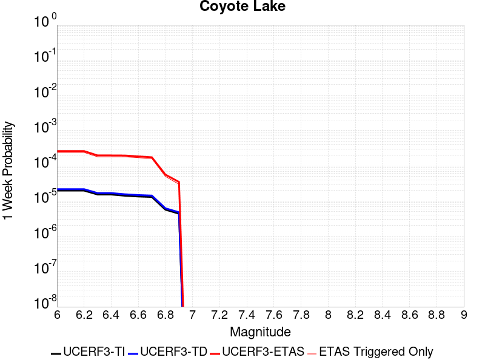 | 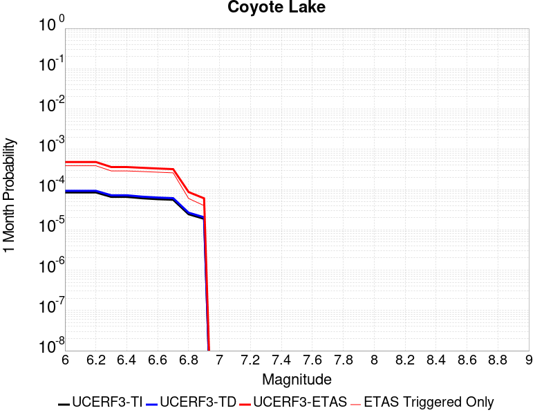 |  |  |

| Magnitude | 1 wk TI Prob | 1 wk TD Prob | 1 wk ETAS Prob | 1 wk ETAS/TD Gain | 1 wk ETAS Triggered Only | 1 mo TI Prob | 1 mo TD Prob | 1 mo ETAS Prob | 1 mo ETAS/TD Gain | 1 mo ETAS Triggered Only | 1 yr TI Prob | 1 yr TD Prob | 1 yr ETAS Prob | 1 yr ETAS/TD Gain | 1 yr ETAS Triggered Only | 10 yr TI Prob | 10 yr TD Prob | 10 yr ETAS Prob | 10 yr ETAS/TD Gain | 10 yr ETAS Triggered Only |
|-----|-----|-----|-----|-----|-----|-----|-----|-----|-----|-----|-----|-----|-----|-----|-----|-----|-----|-----|-----|-----|
| 6.0 | 1.980352E-5 | 2.1706745E-5 | 2.6170153E-4 | 12.0562315 | 2.4E-4 | 8.486947E-5 | 9.302599E-5 | 4.829897E-4 | 5.1919866 | 3.9E-4 | 0.0010327959 | 0.0011320751 | 0.0018113053 | 1.5999869 | 6.8E-4 | 0.010280091 | 0.011270258 | 0.012367748 | 1.0973793 | 0.00111 |
| 6.1 | 1.980352E-5 | 2.1706745E-5 | 2.6170153E-4 | 12.0562315 | 2.4E-4 | 8.486947E-5 | 9.302599E-5 | 4.829897E-4 | 5.1919866 | 3.9E-4 | 0.0010327959 | 0.0011320751 | 0.0018113053 | 1.5999869 | 6.8E-4 | 0.010280091 | 0.011270258 | 0.012367748 | 1.0973793 | 0.00111 |
| 6.2 | 1.980352E-5 | 2.1706745E-5 | 2.6170153E-4 | 12.0562315 | 2.4E-4 | 8.486947E-5 | 9.302599E-5 | 4.829897E-4 | 5.1919866 | 3.9E-4 | 0.0010327959 | 0.0011320751 | 0.0018113053 | 1.5999869 | 6.8E-4 | 0.010280091 | 0.011270258 | 0.012367748 | 1.0973793 | 0.00111 |
| 6.3 | 1.5344787E-5 | 1.682067E-5 | 1.9681764E-4 | 11.70094 | 1.8E-4 | 6.576172E-5 | 7.2086936E-5 | 3.6206603E-4 | 5.02263 | 2.9E-4 | 8.003548E-4 | 8.773662E-4 | 0.0014268837 | 1.6263262 | 5.5E-4 | 0.007974784 | 0.00874507 | 0.009637198 | 1.1020151 | 9.0E-4 |
| 6.4 | 1.5344787E-5 | 1.682067E-5 | 1.9681764E-4 | 11.70094 | 1.8E-4 | 6.576172E-5 | 7.2086936E-5 | 3.6206603E-4 | 5.02263 | 2.9E-4 | 8.003548E-4 | 8.773662E-4 | 0.0014268837 | 1.6263262 | 5.5E-4 | 0.007974784 | 0.00874507 | 0.009637198 | 1.1020151 | 9.0E-4 |
| 6.5 | 1.4189697E-5 | 1.5557987E-5 | 1.9555519E-4 | 12.56944 | 1.8E-4 | 6.081157E-5 | 6.6675726E-5 | 3.4665706E-4 | 5.1991496 | 2.8E-4 | 7.401293E-4 | 8.115349E-4 | 0.0013111291 | 1.6156164 | 5.0E-4 | 0.0073766913 | 0.008091656 | 0.008924859 | 1.1029706 | 8.4E-4 |
| 6.6 | 1.3469301E-5 | 1.4771577E-5 | 1.8476907E-4 | 12.508418 | 1.7E-4 | 5.7724297E-5 | 6.330556E-5 | 3.3328848E-4 | 5.264758 | 2.7E-4 | 7.025667E-4 | 7.7053264E-4 | 0.0012501628 | 1.6224657 | 4.8E-4 | 0.0070034964 | 0.0076845144 | 0.008478367 | 1.1033055 | 8.0E-4 |
| 6.7 | 1.3027966E-5 | 1.4281745E-5 | 1.7427946E-4 | 12.202952 | 1.6E-4 | 5.5832945E-5 | 6.120638E-5 | 3.2119045E-4 | 5.247663 | 2.6E-4 | 6.7955407E-4 | 7.4499263E-4 | 0.0012146425 | 1.6304088 | 4.7E-4 | 0.006774798 | 0.0074308286 | 0.008205033 | 1.1041881 | 7.8E-4 |
| 6.8 | 5.695434E-6 | 6.2244176E-6 | 5.6224108E-5 | 9.03283 | 5.0E-5 | 2.4408775E-5 | 2.6675973E-5 | 8.667437E-5 | 3.249155 | 6.0E-5 | 2.971363E-4 | 3.2476155E-4 | 4.7471284E-4 | 1.4617274 | 1.5E-4 | 0.0029673933 | 0.0032458105 | 0.0035049666 | 1.0798433 | 2.6E-4 |
| 6.9 | 4.385688E-6 | 4.7930553E-6 | 3.4792913E-5 | 7.2590256 | 3.0E-5 | 1.879567E-5 | 2.0541665E-5 | 6.0540846E-5 | 2.9472218 | 4.0E-5 | 2.2881327E-4 | 2.5009477E-4 | 3.4007226E-4 | 1.3597735 | 9.0E-5 | 0.002285778 | 0.0025009478 | 0.0026904726 | 1.0757812 | 1.9E-4 |

## Death Valley (Black Mtns Frontal)
*[(top)](#table-of-contents)*

| 1 Week | 1 Month | 1 Year | 10 Year |
|-----|-----|-----|-----|
|  |  |  |  |

| Magnitude | 1 wk TI Prob | 1 wk TD Prob | 1 wk ETAS Prob | 1 wk ETAS/TD Gain | 1 wk ETAS Triggered Only | 1 mo TI Prob | 1 mo TD Prob | 1 mo ETAS Prob | 1 mo ETAS/TD Gain | 1 mo ETAS Triggered Only | 1 yr TI Prob | 1 yr TD Prob | 1 yr ETAS Prob | 1 yr ETAS/TD Gain | 1 yr ETAS Triggered Only | 10 yr TI Prob | 10 yr TD Prob | 10 yr ETAS Prob | 10 yr ETAS/TD Gain | 10 yr ETAS Triggered Only |
|-----|-----|-----|-----|-----|-----|-----|-----|-----|-----|-----|-----|-----|-----|-----|-----|-----|-----|-----|-----|-----|
| 6.0 | 1.6707214E-5 | 1.867027E-5 | 3.286645E-4 | 17.603628 | 3.1E-4 | 7.160038E-5 | 8.001303E-5 | 4.79981E-4 | 5.998786 | 4.0E-4 | 8.71386E-4 | 9.737309E-4 | 0.0017030201 | 1.7489638 | 7.3E-4 | 0.00867977 | 0.009695496 | 0.010804638 | 1.1143975 | 0.00112 |
| 6.1 | 1.6707214E-5 | 1.867027E-5 | 3.286645E-4 | 17.603628 | 3.1E-4 | 7.160038E-5 | 8.001303E-5 | 4.79981E-4 | 5.998786 | 4.0E-4 | 8.71386E-4 | 9.737309E-4 | 0.0017030201 | 1.7489638 | 7.3E-4 | 0.00867977 | 0.009695496 | 0.010804638 | 1.1143975 | 0.00112 |
| 6.2 | 1.6707214E-5 | 1.867027E-5 | 3.286645E-4 | 17.603628 | 3.1E-4 | 7.160038E-5 | 8.001303E-5 | 4.79981E-4 | 5.998786 | 4.0E-4 | 8.71386E-4 | 9.737309E-4 | 0.0017030201 | 1.7489638 | 7.3E-4 | 0.00867977 | 0.009695496 | 0.010804638 | 1.1143975 | 0.00112 |
| 6.3 | 1.6707214E-5 | 1.867027E-5 | 3.286645E-4 | 17.603628 | 3.1E-4 | 7.160038E-5 | 8.001303E-5 | 4.79981E-4 | 5.998786 | 4.0E-4 | 8.71386E-4 | 9.737309E-4 | 0.0017030201 | 1.7489638 | 7.3E-4 | 0.00867977 | 0.009695496 | 0.010804638 | 1.1143975 | 0.00112 |
| 6.4 | 1.5515609E-5 | 1.7338214E-5 | 2.5733406E-4 | 14.842017 | 2.4E-4 | 6.649377E-5 | 7.4304546E-5 | 3.7428224E-4 | 5.037138 | 3.0E-4 | 8.0926094E-4 | 9.042885E-4 | 0.001463782 | 1.6187114 | 5.6E-4 | 0.008063202 | 0.009006773 | 0.0099085765 | 1.1001251 | 9.1E-4 |
| 6.5 | 1.5515609E-5 | 1.7338214E-5 | 2.5733406E-4 | 14.842017 | 2.4E-4 | 6.649377E-5 | 7.4304546E-5 | 3.7428224E-4 | 5.037138 | 3.0E-4 | 8.0926094E-4 | 9.042885E-4 | 0.001463782 | 1.6187114 | 5.6E-4 | 0.008063202 | 0.009006773 | 0.0099085765 | 1.1001251 | 9.1E-4 |
| 6.6 | 1.5041828E-5 | 1.6809145E-5 | 2.3680544E-4 | 14.0878935 | 2.2E-4 | 6.4463384E-5 | 7.203723E-5 | 3.420178E-4 | 4.747792 | 2.7E-4 | 7.8455906E-4 | 8.767063E-4 | 0.0013862592 | 1.5812128 | 5.1E-4 | 0.00781795 | 0.008733132 | 0.009536059 | 1.0919403 | 8.1E-4 |
| 6.7 | 1.4634985E-5 | 1.6356016E-5 | 2.1635274E-4 | 13.227716 | 2.0E-4 | 6.271985E-5 | 7.009536E-5 | 3.2007784E-4 | 4.56632 | 2.5E-4 | 7.6334673E-4 | 8.5308263E-4 | 0.0013426646 | 1.5738975 | 4.9E-4 | 0.007607299 | 0.008498715 | 0.009282001 | 1.0921652 | 7.9E-4 |
| 6.8 | 1.4209158E-5 | 1.5882048E-5 | 1.9587918E-4 | 12.333371 | 1.8E-4 | 6.089497E-5 | 6.8064175E-5 | 2.9804852E-4 | 4.378934 | 2.3E-4 | 7.4114406E-4 | 8.2837185E-4 | 0.0012979825 | 1.566908 | 4.7E-4 | 0.007386771 | 0.008253456 | 0.008997266 | 1.090121 | 7.5E-4 |
| 6.9 | 1.3780098E-5 | 1.5404594E-5 | 1.8540198E-4 | 12.0355 | 1.7E-4 | 5.9056227E-5 | 6.6018045E-5 | 2.8600352E-4 | 4.3322024 | 2.2E-4 | 7.1877235E-4 | 8.0347876E-4 | 0.0012531172 | 1.5596145 | 4.5E-4 | 0.0071645193 | 0.008006332 | 0.008720568 | 1.0892088 | 7.2E-4 |
| 7.0 | 1.3585064E-5 | 1.5188155E-5 | 1.5518603E-4 | 10.217569 | 1.4E-4 | 5.8220405E-5 | 6.50905E-5 | 2.5507814E-4 | 3.9188228 | 1.9E-4 | 7.086029E-4 | 7.9219416E-4 | 0.0011918773 | 1.5045267 | 4.0E-4 | 0.007063476 | 0.007894293 | 0.008559004 | 1.0842015 | 6.7E-4 |
| 7.1 | 1.3398601E-5 | 1.49813395E-5 | 1.4497939E-4 | 9.677332 | 1.3E-4 | 5.742131E-5 | 6.420419E-5 | 2.4419263E-4 | 3.8033752 | 1.8E-4 | 6.9888023E-4 | 7.8141113E-4 | 0.0011711064 | 1.498707 | 3.9E-4 | 0.0069668638 | 0.007787224 | 0.008422241 | 1.081546 | 6.4E-4 |
| 7.2 | 1.3126312E-5 | 1.4679561E-5 | 1.4467766E-4 | 9.8557205 | 1.3E-4 | 5.6254412E-5 | 6.291092E-5 | 2.3290022E-4 | 3.7020638 | 1.7E-4 | 6.846822E-4 | 7.6567667E-4 | 0.001125401 | 1.4698124 | 3.6E-4 | 0.006825765 | 0.00763097 | 0.008206544 | 1.0754261 | 5.8E-4 |
| 7.3 | 1.2922429E-5 | 1.4453788E-5 | 1.1445234E-4 | 7.9185014 | 1.0E-4 | 5.5380664E-5 | 6.194336E-5 | 2.0193469E-4 | 3.259989 | 1.4E-4 | 6.74051E-4 | 7.53905E-4 | 0.0010636712 | 1.4108825 | 3.1E-4 | 0.006720101 | 0.007514055 | 0.008030147 | 1.0686836 | 5.2E-4 |
| 7.4 | 1.2768878E-5 | 1.4283772E-5 | 1.0428249E-4 | 7.300767 | 9.0E-5 | 5.4722615E-5 | 6.1214756E-5 | 1.912068E-4 | 3.1235409 | 1.3E-4 | 6.660441E-4 | 7.4504025E-4 | 0.0010248317 | 1.3755386 | 2.8E-4 | 0.0066405144 | 0.0074260035 | 0.007892514 | 1.0628211 | 4.7E-4 |
| 7.5 | 1.2521929E-5 | 1.40120155E-5 | 1.0401075E-4 | 7.422969 | 9.0E-5 | 5.366431E-5 | 6.005014E-5 | 1.9004234E-4 | 3.1647274 | 1.3E-4 | 6.531671E-4 | 7.3087064E-4 | 0.0010006733 | 1.3691524 | 2.7E-4 | 0.006512506 | 0.0072852457 | 0.00772204 | 1.0599561 | 4.4E-4 |
| 7.6 | 1.1301089E-5 | 1.2648149E-5 | 9.264714E-5 | 7.3249564 | 8.0E-5 | 4.8432343E-5 | 5.4205255E-5 | 1.7419875E-4 | 3.2136874 | 1.2E-4 | 5.895042E-4 | 6.5975444E-4 | 8.896027E-4 | 1.3483845 | 2.3E-4 | 0.0058794282 | 0.00657851 | 0.0069560106 | 1.0573839 | 3.8E-4 |
| 7.7 | 9.189108E-6 | 1.0283358E-5 | 6.0282844E-5 | 5.862175 | 5.0E-5 | 3.93813E-5 | 4.407082E-5 | 1.240673E-4 | 2.81518 | 8.0E-5 | 4.7936183E-4 | 5.3643517E-4 | 7.0634397E-4 | 1.3167369 | 1.7E-4 | 0.004783291 | 0.005351914 | 0.005640362 | 1.0538962 | 2.9E-4 |
| 7.8 | 3.4586725E-7 | 3.6482615E-7 | 3.6482615E-7 | 1.0 | 0.0 | 1.4822873E-6 | 1.5635396E-6 | 1.5635396E-6 | 1.0 | 0.0 | 1.80467E-5 | 1.9035933E-5 | 3.9035553E-5 | 2.0506246 | 2.0E-5 | 1.8045233E-4 | 1.9034347E-4 | 2.2033777E-4 | 1.1575798 | 3.0E-5 |
| 7.9 | 2.5591178E-9 | 2.6696718E-9 | 2.6696718E-9 | 1.0 | 0.0 | 1.0967647E-8 | 1.14414505E-8 | 1.14414505E-8 | 1.0 | 0.0 | 1.335311E-7 | 1.3929966E-7 | 1.3929966E-7 | 1.0 | 0.0 | 1.3353102E-6 | 1.3929966E-6 | 1.3929966E-6 | 1.0 | 0.0 |

## Helendale-So Lockhart
*[(top)](#table-of-contents)*

| 1 Week | 1 Month | 1 Year | 10 Year |
|-----|-----|-----|-----|
|  |  |  | 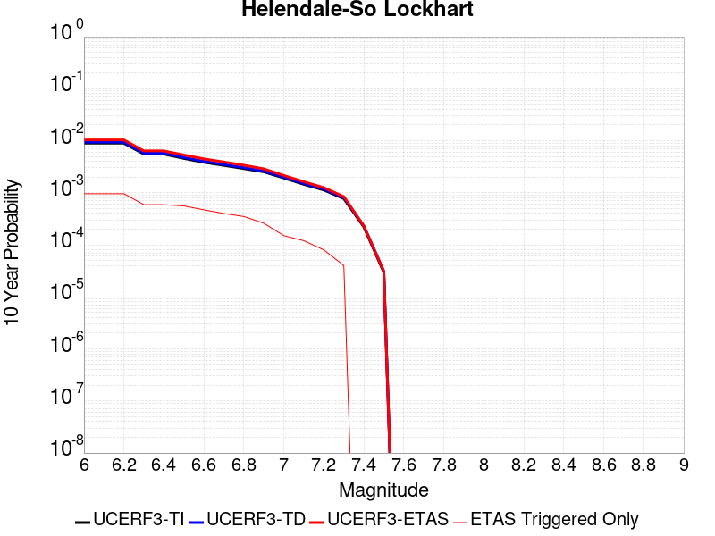 |

| Magnitude | 1 wk TI Prob | 1 wk TD Prob | 1 wk ETAS Prob | 1 wk ETAS/TD Gain | 1 wk ETAS Triggered Only | 1 mo TI Prob | 1 mo TD Prob | 1 mo ETAS Prob | 1 mo ETAS/TD Gain | 1 mo ETAS Triggered Only | 1 yr TI Prob | 1 yr TD Prob | 1 yr ETAS Prob | 1 yr ETAS/TD Gain | 1 yr ETAS Triggered Only | 10 yr TI Prob | 10 yr TD Prob | 10 yr ETAS Prob | 10 yr ETAS/TD Gain | 10 yr ETAS Triggered Only |
|-----|-----|-----|-----|-----|-----|-----|-----|-----|-----|-----|-----|-----|-----|-----|-----|-----|-----|-----|-----|-----|
| 6.0 | 1.7296055E-5 | 1.8103729E-5 | 2.680992E-4 | 14.809059 | 2.5E-4 | 7.412385E-5 | 7.7585224E-5 | 4.4755652E-4 | 5.7685795 | 3.7E-4 | 9.0208417E-4 | 9.4421144E-4 | 0.0015935977 | 1.6877551 | 6.5E-4 | 0.008984311 | 0.009404116 | 0.010355088 | 1.101123 | 9.6E-4 |
| 6.1 | 1.7296055E-5 | 1.8103729E-5 | 2.680992E-4 | 14.809059 | 2.5E-4 | 7.412385E-5 | 7.7585224E-5 | 4.4755652E-4 | 5.7685795 | 3.7E-4 | 9.0208417E-4 | 9.4421144E-4 | 0.0015935977 | 1.6877551 | 6.5E-4 | 0.008984311 | 0.009404116 | 0.010355088 | 1.101123 | 9.6E-4 |
| 6.2 | 1.7296055E-5 | 1.8103729E-5 | 2.680992E-4 | 14.809059 | 2.5E-4 | 7.412385E-5 | 7.7585224E-5 | 4.4755652E-4 | 5.7685795 | 3.7E-4 | 9.0208417E-4 | 9.4421144E-4 | 0.0015935977 | 1.6877551 | 6.5E-4 | 0.008984311 | 0.009404116 | 0.010355088 | 1.101123 | 9.6E-4 |
| 6.3 | 1.0669118E-5 | 1.1135425E-5 | 1.7113364E-4 | 15.368399 | 1.6E-4 | 4.5723988E-5 | 4.772239E-5 | 2.677119E-4 | 5.6097755 | 2.2E-4 | 5.5654737E-4 | 5.80868E-4 | 9.7064144E-4 | 1.671019 | 3.9E-4 | 0.0055515557 | 0.0057937936 | 0.006380375 | 1.1012431 | 5.9E-4 |
| 6.4 | 1.0669118E-5 | 1.1135425E-5 | 1.7113364E-4 | 15.368399 | 1.6E-4 | 4.5723988E-5 | 4.772239E-5 | 2.677119E-4 | 5.6097755 | 2.2E-4 | 5.5654737E-4 | 5.80868E-4 | 9.7064144E-4 | 1.671019 | 3.9E-4 | 0.0055515557 | 0.0057937936 | 0.006380375 | 1.1012431 | 5.9E-4 |
| 6.5 | 8.790038E-6 | 9.170197E-6 | 1.4916892E-4 | 16.266708 | 1.4E-4 | 3.767105E-5 | 3.930026E-5 | 2.392924E-4 | 6.0888247 | 2.0E-4 | 4.585485E-4 | 4.7837716E-4 | 8.482002E-4 | 1.7730783 | 3.7E-4 | 0.0045760344 | 0.004773638 | 0.005330965 | 1.116751 | 5.6E-4 |
| 6.6 | 7.396949E-6 | 7.715537E-6 | 1.2771461E-4 | 16.552914 | 1.2E-4 | 3.1700827E-5 | 3.3066175E-5 | 1.9306089E-4 | 5.8386216 | 1.6E-4 | 3.858892E-4 | 4.025073E-4 | 6.923906E-4 | 1.7201939 | 2.9E-4 | 0.003852198 | 0.00401789 | 0.0044860016 | 1.1165068 | 4.7E-4 |
| 6.7 | 6.4600285E-6 | 6.738031E-6 | 1.0673736E-4 | 15.841031 | 1.0E-4 | 2.7685543E-5 | 2.887696E-5 | 1.5887321E-4 | 5.501729 | 1.3E-4 | 3.3701936E-4 | 3.5152107E-4 | 5.914367E-4 | 1.6825072 | 2.4E-4 | 0.0033650869 | 0.003509732 | 0.0039083282 | 1.1135688 | 4.0E-4 |
| 6.8 | 5.600104E-6 | 5.836009E-6 | 8.583554E-5 | 14.707917 | 8.0E-5 | 2.4000226E-5 | 2.5011232E-5 | 1.3500848E-4 | 5.397914 | 1.1E-4 | 2.9216358E-4 | 3.044698E-4 | 5.1440584E-4 | 1.6895136 | 2.1E-4 | 0.0029177975 | 0.003040588 | 0.0033895238 | 1.1147593 | 3.5E-4 |
| 6.9 | 4.839122E-6 | 5.0395092E-6 | 7.5039155E-5 | 14.890171 | 7.0E-5 | 2.0738931E-5 | 2.159772E-5 | 1.1159578E-4 | 5.1670165 | 9.0E-5 | 2.5246723E-4 | 2.6292098E-4 | 4.2287892E-4 | 1.6083878 | 1.6E-4 | 0.002521806 | 0.002626147 | 0.0028854639 | 1.0987444 | 2.6E-4 |
| 7.0 | 3.6937633E-6 | 3.845208E-6 | 3.3845092E-5 | 8.801888 | 3.0E-5 | 1.5830317E-5 | 1.647936E-5 | 5.64787E-5 | 3.4272387 | 4.0E-5 | 1.9271708E-4 | 2.0061806E-4 | 2.906E-4 | 1.4485236 | 9.0E-5 | 0.0019255003 | 0.002004401 | 0.0021541002 | 1.0746853 | 1.5E-4 |
| 7.1 | 2.7858857E-6 | 2.8978538E-6 | 3.2897766E-5 | 11.352459 | 3.0E-5 | 1.1939455E-5 | 1.2419316E-5 | 5.2418818E-5 | 4.2207494 | 4.0E-5 | 1.4535317E-4 | 1.511949E-4 | 2.311828E-4 | 1.5290384 | 8.0E-5 | 0.0014525814 | 0.0015109418 | 0.0016307605 | 1.0793006 | 1.2E-4 |
| 7.2 | 2.1672065E-6 | 2.2540128E-6 | 2.2253967E-5 | 9.873044 | 2.0E-5 | 9.2879945E-6 | 9.66002E-6 | 3.965973E-5 | 4.1055536 | 3.0E-5 | 1.1307546E-4 | 1.1760458E-4 | 1.675987E-4 | 1.4251035 | 5.0E-5 | 0.0011301794 | 0.0011754417 | 0.0012553476 | 1.0679796 | 8.0E-5 |
| 7.3 | 1.4823496E-6 | 1.5422102E-6 | 1.1542194E-5 | 7.4841905 | 1.0E-5 | 6.3529114E-6 | 6.6094562E-6 | 2.6609325E-5 | 4.0259476 | 2.0E-5 | 7.734395E-5 | 8.046731E-5 | 1.004657E-4 | 1.2485281 | 2.0E-5 | 7.731704E-4 | 8.0439687E-4 | 8.443647E-4 | 1.0496867 | 4.0E-5 |
| 7.4 | 4.2321457E-7 | 4.4108765E-7 | 4.4108765E-7 | 1.0 | 0.0 | 1.8137755E-6 | 1.8903745E-6 | 1.8903745E-6 | 1.0 | 0.0 | 2.2082493E-5 | 2.3015113E-5 | 2.3015113E-5 | 1.0 | 0.0 | 2.2080299E-4 | 2.3013182E-4 | 2.3013182E-4 | 1.0 | 0.0 |
| 7.5 | 5.6942316E-8 | 5.9415648E-8 | 5.9415648E-8 | 1.0 | 0.0 | 2.440385E-7 | 2.5463845E-7 | 2.5463845E-7 | 1.0 | 0.0 | 2.9711643E-6 | 3.1002196E-6 | 3.1002196E-6 | 1.0 | 0.0 | 2.9711247E-5 | 3.1001844E-5 | 3.1001844E-5 | 1.0 | 0.0 |

## San Andreas (Big Bend)
*[(top)](#table-of-contents)*

| 1 Week | 1 Month | 1 Year | 10 Year |
|-----|-----|-----|-----|
| 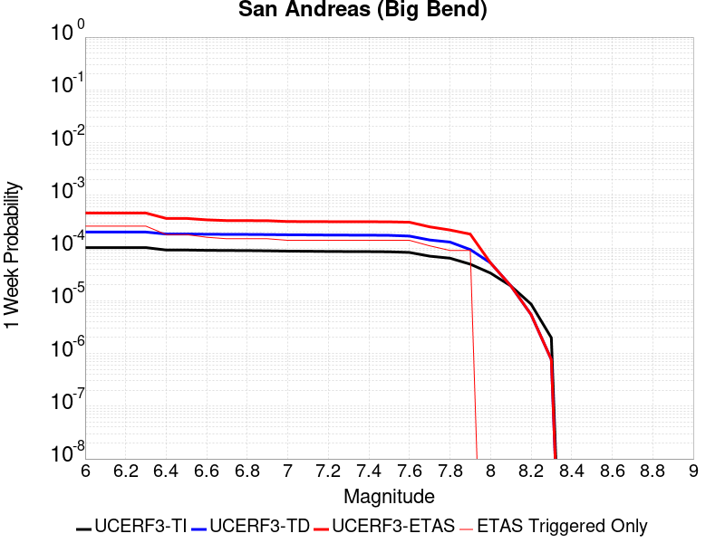 | 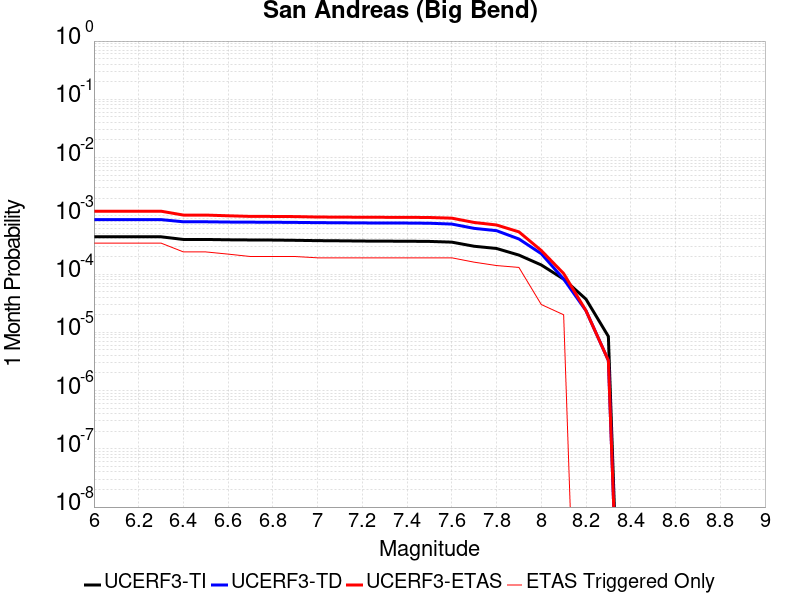 | 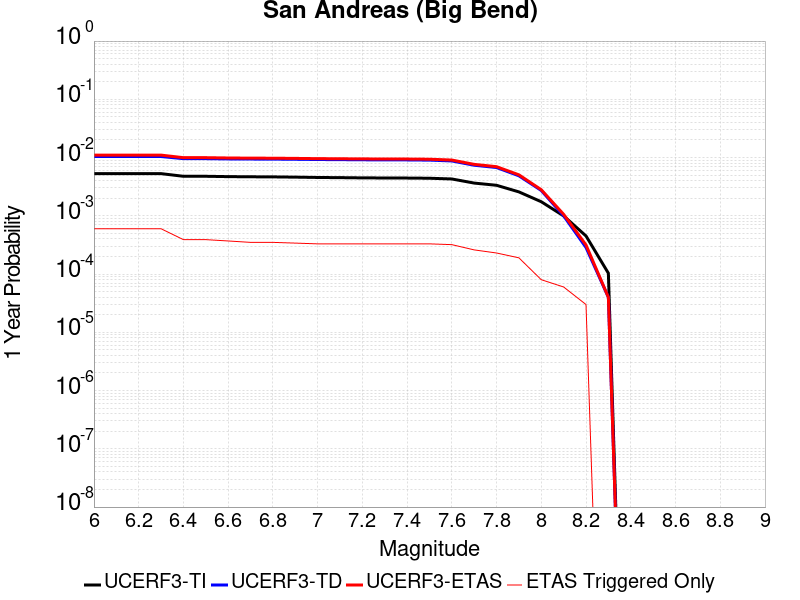 |  |

| Magnitude | 1 wk TI Prob | 1 wk TD Prob | 1 wk ETAS Prob | 1 wk ETAS/TD Gain | 1 wk ETAS Triggered Only | 1 mo TI Prob | 1 mo TD Prob | 1 mo ETAS Prob | 1 mo ETAS/TD Gain | 1 mo ETAS Triggered Only | 1 yr TI Prob | 1 yr TD Prob | 1 yr ETAS Prob | 1 yr ETAS/TD Gain | 1 yr ETAS Triggered Only | 10 yr TI Prob | 10 yr TD Prob | 10 yr ETAS Prob | 10 yr ETAS/TD Gain | 10 yr ETAS Triggered Only |
|-----|-----|-----|-----|-----|-----|-----|-----|-----|-----|-----|-----|-----|-----|-----|-----|-----|-----|-----|-----|-----|
| 6.0 | 1.0179969E-4 | 2.0073925E-4 | 4.6068706E-4 | 2.2949526 | 2.6E-4 | 4.362114E-4 | 8.6002843E-4 | 0.001199736 | 1.3949958 | 3.4E-4 | 0.0052979486 | 0.010420859 | 0.011014607 | 1.0569768 | 6.0E-4 | 0.051734097 | 0.101455905 | 0.102192715 | 1.0072623 | 8.2E-4 |
| 6.1 | 1.0179969E-4 | 2.0073925E-4 | 4.6068706E-4 | 2.2949526 | 2.6E-4 | 4.362114E-4 | 8.6002843E-4 | 0.001199736 | 1.3949958 | 3.4E-4 | 0.0052979486 | 0.010420859 | 0.011014607 | 1.0569768 | 6.0E-4 | 0.051734097 | 0.101455905 | 0.102192715 | 1.0072623 | 8.2E-4 |
| 6.2 | 1.0179969E-4 | 2.0073925E-4 | 4.6068706E-4 | 2.2949526 | 2.6E-4 | 4.362114E-4 | 8.6002843E-4 | 0.001199736 | 1.3949958 | 3.4E-4 | 0.0052979486 | 0.010420859 | 0.011014607 | 1.0569768 | 6.0E-4 | 0.051734097 | 0.101455905 | 0.102192715 | 1.0072623 | 8.2E-4 |
| 6.3 | 1.0179969E-4 | 2.0073925E-4 | 4.6068706E-4 | 2.2949526 | 2.6E-4 | 4.362114E-4 | 8.6002843E-4 | 0.001199736 | 1.3949958 | 3.4E-4 | 0.0052979486 | 0.010420859 | 0.011014607 | 1.0569768 | 6.0E-4 | 0.051734097 | 0.101455905 | 0.102192715 | 1.0072623 | 8.2E-4 |
| 6.4 | 9.1639464E-5 | 1.8430917E-4 | 3.64276E-4 | 1.9764398 | 1.8E-4 | 3.9268145E-4 | 7.896575E-4 | 0.001029468 | 1.3036892 | 2.4E-4 | 0.0047704205 | 0.009571818 | 0.009958085 | 1.0403546 | 3.9E-4 | 0.046693064 | 0.09378695 | 0.09428537 | 1.0053144 | 5.5E-4 |
| 6.5 | 9.1639464E-5 | 1.8430917E-4 | 3.64276E-4 | 1.9764398 | 1.8E-4 | 3.9268145E-4 | 7.896575E-4 | 0.001029468 | 1.3036892 | 2.4E-4 | 0.0047704205 | 0.009571818 | 0.009958085 | 1.0403546 | 3.9E-4 | 0.046693064 | 0.09378695 | 0.09428537 | 1.0053144 | 5.5E-4 |
| 6.6 | 9.042622E-5 | 1.8238011E-4 | 3.4235095E-4 | 1.8771286 | 1.6E-4 | 3.8748336E-4 | 7.813951E-4 | 0.0010012232 | 1.2813277 | 2.2E-4 | 0.0047074095 | 0.0094721 | 0.009838595 | 1.0386921 | 3.7E-4 | 0.046089325 | 0.09287721 | 0.09335799 | 1.0051764 | 5.3E-4 |
| 6.7 | 8.9836685E-5 | 1.8152347E-4 | 3.3149624E-4 | 1.8261894 | 1.5E-4 | 3.8495753E-4 | 7.7772595E-4 | 9.775704E-4 | 1.25696 | 2.0E-4 | 0.00467679 | 0.009427815 | 0.0097745145 | 1.0367742 | 3.5E-4 | 0.045795817 | 0.09247148 | 0.092934325 | 1.0050052 | 5.1E-4 |
| 6.8 | 8.9471854E-5 | 1.8099119E-4 | 3.3096405E-4 | 1.8286196 | 1.5E-4 | 3.8339442E-4 | 7.754462E-4 | 9.7529107E-4 | 1.2577161 | 2.0E-4 | 0.004657841 | 0.009400298 | 0.009747008 | 1.0368829 | 3.5E-4 | 0.04561414 | 0.0922192 | 0.092682175 | 1.0050203 | 5.1E-4 |
| 6.9 | 8.858234E-5 | 1.7981093E-4 | 3.2978394E-4 | 1.8340596 | 1.5E-4 | 3.7958333E-4 | 7.7039085E-4 | 9.702368E-4 | 1.2594085 | 2.0E-4 | 0.004611638 | 0.009339278 | 0.009676103 | 1.0360653 | 3.4E-4 | 0.04517103 | 0.09165911 | 0.09211328 | 1.004955 | 5.0E-4 |
| 7.0 | 8.7433385E-5 | 1.7819891E-4 | 3.1817396E-4 | 1.785499 | 1.4E-4 | 3.746607E-4 | 7.6348626E-4 | 9.533412E-4 | 1.2486684 | 1.9E-4 | 0.004551957 | 0.009255932 | 0.009582877 | 1.0353228 | 3.3E-4 | 0.044598386 | 0.09089323 | 0.09133869 | 1.0049009 | 4.9E-4 |
| 7.1 | 8.684964E-5 | 1.7731842E-4 | 3.172936E-4 | 1.7894001 | 1.4E-4 | 3.7215967E-4 | 7.597149E-4 | 9.495706E-4 | 1.2499038 | 1.9E-4 | 0.0045216335 | 0.009210405 | 0.009537365 | 1.0354991 | 3.3E-4 | 0.04430731 | 0.09047475 | 0.09092042 | 1.0049258 | 4.9E-4 |
| 7.2 | 8.606521E-5 | 1.7622454E-4 | 3.1619988E-4 | 1.794301 | 1.4E-4 | 3.6879873E-4 | 7.550296E-4 | 9.448861E-4 | 1.2514558 | 1.9E-4 | 0.0044808835 | 0.009153842 | 0.009480821 | 1.0357205 | 3.3E-4 | 0.043916024 | 0.08995518 | 0.0904011 | 1.0049572 | 4.9E-4 |
| 7.3 | 8.568266E-5 | 1.7564454E-4 | 3.1561995E-4 | 1.7969244 | 1.4E-4 | 3.6715972E-4 | 7.5254537E-4 | 9.424024E-4 | 1.2522864 | 1.9E-4 | 0.0044610105 | 0.00912385 | 0.009450839 | 1.035839 | 3.3E-4 | 0.043725148 | 0.08967623 | 0.09012229 | 1.0049741 | 4.9E-4 |
| 7.4 | 8.5432206E-5 | 1.752704E-4 | 3.1524585E-4 | 1.7986258 | 1.4E-4 | 3.6608664E-4 | 7.509428E-4 | 9.408001E-4 | 1.2528253 | 1.9E-4 | 0.004447999 | 0.009104501 | 0.009431497 | 1.0359159 | 3.3E-4 | 0.043600157 | 0.08949642 | 0.08994257 | 1.0049851 | 4.9E-4 |
| 7.5 | 8.4791965E-5 | 1.7396381E-4 | 3.1393947E-4 | 1.804625 | 1.4E-4 | 3.633435E-4 | 7.4534636E-4 | 9.3520473E-4 | 1.2547251 | 1.9E-4 | 0.0044147377 | 0.009036932 | 0.00936395 | 1.0361868 | 3.3E-4 | 0.043280575 | 0.08887209 | 0.08931854 | 1.0050236 | 4.9E-4 |
| 7.6 | 8.241105E-5 | 1.6841735E-4 | 3.0839376E-4 | 1.8311284 | 1.4E-4 | 3.531424E-4 | 7.2158914E-4 | 9.11452E-4 | 1.2631178 | 1.9E-4 | 0.0042910352 | 0.008750047 | 0.009067247 | 1.0362512 | 3.2E-4 | 0.042091176 | 0.08625032 | 0.08667979 | 1.0049793 | 4.7E-4 |
| 7.7 | 7.00432E-5 | 1.4205615E-4 | 2.520405E-4 | 1.7742317 | 1.1E-4 | 3.001506E-4 | 6.0867006E-4 | 7.685727E-4 | 1.2627082 | 1.6E-4 | 0.0036482112 | 0.0073854174 | 0.007643497 | 1.0349445 | 2.6E-4 | 0.035888977 | 0.07352299 | 0.073875055 | 1.0047884 | 3.8E-4 |
| 7.8 | 6.415362E-5 | 1.2969968E-4 | 2.1968801E-4 | 1.6938207 | 9.0E-5 | 2.749151E-4 | 5.557374E-4 | 6.956596E-4 | 1.2517775 | 1.4E-4 | 0.0033419547 | 0.0067451415 | 0.0069735902 | 1.0338687 | 2.3E-4 | 0.03292141 | 0.06725514 | 0.0675816 | 1.0048541 | 3.5E-4 |
| 7.9 | 4.939911E-5 | 9.341721E-5 | 1.834088E-4 | 1.9633298 | 9.0E-5 | 2.116933E-4 | 4.0029807E-4 | 5.3024606E-4 | 1.324628 | 1.3E-4 | 0.0025743195 | 0.004862747 | 0.0050518233 | 1.0388826 | 1.9E-4 | 0.025447013 | 0.048915803 | 0.049172595 | 1.0052497 | 2.7E-4 |
| 8.0 | 3.344983E-5 | 5.2228E-5 | 5.2228E-5 | 1.0 | 0.0 | 1.4334853E-4 | 2.2381509E-4 | 2.5380836E-4 | 1.1340092 | 3.0E-5 | 0.0017438711 | 0.0027215453 | 0.0028013277 | 1.0293151 | 8.0E-5 | 0.017302496 | 0.027923161 | 0.02803009 | 1.0038294 | 1.1E-4 |
| 8.1 | 1.9104898E-5 | 1.9171663E-5 | 1.9171663E-5 | 1.0 | 0.0 | 8.1875565E-5 | 8.2161685E-5 | 1.0216004E-4 | 1.2434025 | 2.0E-5 | 9.963791E-4 | 9.9986E-4 | 0.0010598 | 1.0599484 | 6.0E-5 | 0.009919235 | 0.010749552 | 0.010808907 | 1.0055217 | 6.0E-5 |
| 8.2 | 8.643924E-6 | 5.473668E-6 | 5.473668E-6 | 1.0 | 0.0 | 3.704486E-5 | 2.3458366E-5 | 2.3458366E-5 | 1.0 | 0.0 | 4.5092785E-4 | 2.8556827E-4 | 3.155597E-4 | 1.1050237 | 3.0E-5 | 0.0045001395 | 0.0032481793 | 0.003278082 | 1.0092059 | 3.0E-5 |
| 8.3 | 1.983087E-6 | 7.6564595E-7 | 7.6564595E-7 | 1.0 | 0.0 | 8.498917E-6 | 3.281336E-6 | 3.281336E-6 | 1.0 | 0.0 | 1.034694E-4 | 3.9949547E-5 | 3.9949547E-5 | 1.0 | 0.0 | 0.0010342124 | 4.717979E-4 | 4.717979E-4 | 1.0 | 0.0 |

## San Andreas (Parkfield)
*[(top)](#table-of-contents)*

| 1 Week | 1 Month | 1 Year | 10 Year |
|-----|-----|-----|-----|
|  |  |  |  |

| Magnitude | 1 wk TI Prob | 1 wk TD Prob | 1 wk ETAS Prob | 1 wk ETAS/TD Gain | 1 wk ETAS Triggered Only | 1 mo TI Prob | 1 mo TD Prob | 1 mo ETAS Prob | 1 mo ETAS/TD Gain | 1 mo ETAS Triggered Only | 1 yr TI Prob | 1 yr TD Prob | 1 yr ETAS Prob | 1 yr ETAS/TD Gain | 1 yr ETAS Triggered Only | 10 yr TI Prob | 10 yr TD Prob | 10 yr ETAS Prob | 10 yr ETAS/TD Gain | 10 yr ETAS Triggered Only |
|-----|-----|-----|-----|-----|-----|-----|-----|-----|-----|-----|-----|-----|-----|-----|-----|-----|-----|-----|-----|-----|
| 6.0 | 5.556969E-4 | 7.778562E-4 | 9.876929E-4 | 1.2697628 | 2.1E-4 | 0.0023793848 | 0.0033299583 | 0.0036189926 | 1.0867982 | 2.9E-4 | 0.028586963 | 0.040235043 | 0.040762912 | 1.0131197 | 5.5E-4 | 0.25176284 | 0.3371973 | 0.33766788 | 1.0013956 | 7.1E-4 |
| 6.1 | 1.925858E-4 | 3.0278185E-4 | 3.8275763E-4 | 1.2641367 | 8.0E-5 | 8.2510663E-4 | 0.001297085 | 0.0014069423 | 1.0846956 | 1.1E-4 | 0.0099994885 | 0.01577393 | 0.01599046 | 1.0137271 | 2.2E-4 | 0.095613256 | 0.14975825 | 0.15003882 | 1.0018735 | 3.3E-4 |
| 6.2 | 9.4306815E-5 | 1.8243887E-4 | 2.624243E-4 | 1.438423 | 8.0E-5 | 4.0410945E-4 | 7.8164786E-4 | 8.9156185E-4 | 1.1406183 | 1.1E-4 | 0.0049089384 | 0.009475246 | 0.009693162 | 1.0229985 | 2.2E-4 | 0.048019063 | 0.0918565 | 0.092156194 | 1.0032625 | 3.3E-4 |
| 6.3 | 9.283051E-5 | 1.794041E-4 | 2.5938975E-4 | 1.4458407 | 8.0E-5 | 3.9778434E-4 | 7.686494E-4 | 8.7856484E-4 | 1.1429982 | 1.1E-4 | 0.0048322747 | 0.009318355 | 0.0095363045 | 1.0233893 | 2.2E-4 | 0.047285385 | 0.090509474 | 0.090809606 | 1.003316 | 3.3E-4 |
| 6.4 | 9.138826E-5 | 1.7702584E-4 | 2.5701168E-4 | 1.4518315 | 8.0E-5 | 3.916052E-4 | 7.5846276E-4 | 8.683793E-4 | 1.1449202 | 1.1E-4 | 0.0047573745 | 0.009195387 | 0.009413364 | 1.023705 | 2.2E-4 | 0.046568092 | 0.0894136 | 0.08971409 | 1.0033607 | 3.3E-4 |
| 6.5 | 9.000255E-5 | 1.746064E-4 | 2.5459242E-4 | 1.4580934 | 8.0E-5 | 3.8566816E-4 | 7.4809964E-4 | 8.5801736E-4 | 1.1469293 | 1.1E-4 | 0.0046854047 | 0.009070284 | 0.009288289 | 1.024035 | 2.2E-4 | 0.045878403 | 0.08829608 | 0.08859694 | 1.0034075 | 3.3E-4 |
| 6.6 | 8.8109264E-5 | 1.7141816E-4 | 2.5140445E-4 | 1.4666151 | 8.0E-5 | 3.7755648E-4 | 7.3444354E-4 | 8.443628E-4 | 1.1496632 | 1.1E-4 | 0.0045870654 | 0.008905404 | 0.0091234455 | 1.0244842 | 2.2E-4 | 0.04493529 | 0.08682707 | 0.087128416 | 1.0034707 | 3.3E-4 |
| 6.7 | 8.738073E-5 | 1.7008898E-4 | 2.500754E-4 | 1.470262 | 8.0E-5 | 3.7443507E-4 | 7.287503E-4 | 8.386702E-4 | 1.1508334 | 1.1E-4 | 0.0045492216 | 0.008836695 | 0.00905475 | 1.0246762 | 2.2E-4 | 0.04457213 | 0.0862268 | 0.086528346 | 1.0034971 | 3.3E-4 |
| 6.8 | 8.710195E-5 | 1.6954402E-4 | 2.4953045E-4 | 1.4717739 | 8.0E-5 | 3.7324068E-4 | 7.26416E-4 | 8.363361E-4 | 1.1513184 | 1.1E-4 | 0.0045347405 | 0.008808513 | 0.009026575 | 1.0247558 | 2.2E-4 | 0.04443313 | 0.08597436 | 0.08627599 | 1.0035083 | 3.3E-4 |
| 6.9 | 8.6801556E-5 | 1.6895356E-4 | 2.4894005E-4 | 1.4734229 | 8.0E-5 | 3.7195362E-4 | 7.238869E-4 | 8.338073E-4 | 1.1518475 | 1.1E-4 | 0.0045191357 | 0.0087779695 | 0.008996039 | 1.0248427 | 2.2E-4 | 0.044283327 | 0.08570042 | 0.08600214 | 1.0035206 | 3.3E-4 |
| 7.0 | 8.5571606E-5 | 1.664819E-4 | 2.4646858E-4 | 1.4804528 | 8.0E-5 | 3.6668387E-4 | 7.132999E-4 | 8.2322146E-4 | 1.1541028 | 1.1E-4 | 0.004455241 | 0.008650103 | 0.0088682 | 1.0252132 | 2.2E-4 | 0.043669727 | 0.08454836 | 0.08485046 | 1.0035731 | 3.3E-4 |
| 7.1 | 7.82589E-5 | 1.5128969E-4 | 2.3127758E-4 | 1.5287069 | 8.0E-5 | 3.3535215E-4 | 6.4822397E-4 | 7.5815263E-4 | 1.1695844 | 1.1E-4 | 0.0040752706 | 0.007863738 | 0.008082008 | 1.0277566 | 2.2E-4 | 0.040013418 | 0.077460445 | 0.07775566 | 1.0038111 | 3.2E-4 |
| 7.2 | 7.690929E-5 | 1.4866212E-4 | 2.2865023E-4 | 1.538053 | 8.0E-5 | 3.2956956E-4 | 6.369685E-4 | 7.4689847E-4 | 1.172583 | 1.1E-4 | 0.004005129 | 0.0077276826 | 0.007945983 | 1.028249 | 2.2E-4 | 0.0393371 | 0.07623341 | 0.07652902 | 1.0038776 | 3.2E-4 |
| 7.3 | 7.5543794E-5 | 1.4562748E-4 | 2.2561583E-4 | 1.5492669 | 8.0E-5 | 3.2371894E-4 | 6.239692E-4 | 7.339006E-4 | 1.1761807 | 1.1E-4 | 0.003934157 | 0.0075705256 | 0.0077888602 | 1.0288401 | 2.2E-4 | 0.038652334 | 0.07479777 | 0.07508458 | 1.0038345 | 3.1E-4 |
| 7.4 | 7.4214564E-5 | 1.4263717E-4 | 2.2262576E-4 | 1.5607836 | 8.0E-5 | 3.1802364E-4 | 6.1115966E-4 | 7.2109245E-4 | 1.1798757 | 1.1E-4 | 0.003865065 | 0.0074156416 | 0.00763401 | 1.0294471 | 2.2E-4 | 0.03798529 | 0.07337152 | 0.07365878 | 1.0039151 | 3.1E-4 |
| 7.5 | 6.149578E-5 | 1.1191443E-4 | 1.819066E-4 | 1.6254079 | 7.0E-5 | 2.6352672E-4 | 4.795452E-4 | 5.7949725E-4 | 1.2084309 | 1.0E-4 | 0.0032037178 | 0.005822865 | 0.006031642 | 1.0358547 | 2.1E-4 | 0.03157923 | 0.058559462 | 0.058841895 | 1.004823 | 3.0E-4 |
| 7.6 | 6.0643448E-5 | 1.102009E-4 | 1.8019318E-4 | 1.6351335 | 7.0E-5 | 2.598746E-4 | 4.7220418E-4 | 5.72157E-4 | 1.2116728 | 1.0E-4 | 0.0031593828 | 0.005733962 | 0.0059427577 | 1.0364139 | 2.1E-4 | 0.031148417 | 0.05772042 | 0.0580031 | 1.0048975 | 3.0E-4 |
| 7.7 | 5.1652263E-5 | 9.175265E-5 | 1.5174714E-4 | 1.6538721 | 6.0E-5 | 2.2134806E-4 | 3.9316638E-4 | 4.83131E-4 | 1.2288207 | 9.0E-5 | 0.002691582 | 0.0047763046 | 0.004955445 | 1.037506 | 1.8E-4 | 0.026592141 | 0.04853641 | 0.048774272 | 1.0049008 | 2.5E-4 |
| 7.8 | 4.8090482E-5 | 8.560165E-5 | 1.4559651E-4 | 1.7008611 | 6.0E-5 | 2.060858E-4 | 3.6681266E-4 | 4.5677964E-4 | 1.2452668 | 9.0E-5 | 0.0025062072 | 0.004456807 | 0.0046260497 | 1.0379739 | 1.7E-4 | 0.024781305 | 0.045302264 | 0.045531392 | 1.0050577 | 2.4E-4 |
| 7.9 | 3.970278E-5 | 6.7507375E-5 | 1.2750333E-4 | 1.8887318 | 6.0E-5 | 1.7014367E-4 | 2.8928524E-4 | 3.692621E-4 | 1.2764636 | 8.0E-5 | 0.002069531 | 0.0035163634 | 0.0036459065 | 1.03684 | 1.3E-4 | 0.020503636 | 0.03588176 | 0.0360553 | 1.0048364 | 1.8E-4 |
| 8.0 | 2.8982335E-5 | 4.0698153E-5 | 4.0698153E-5 | 1.0 | 0.0 | 1.2420409E-4 | 1.7440901E-4 | 1.9440551E-4 | 1.114653 | 2.0E-5 | 0.0015111357 | 0.0021213628 | 0.0021812355 | 1.0282238 | 6.0E-5 | 0.015009012 | 0.02201118 | 0.02208942 | 1.0035545 | 8.0E-5 |
| 8.1 | 1.8836186E-5 | 1.867974E-5 | 1.867974E-5 | 1.0 | 0.0 | 8.0724014E-5 | 8.005358E-5 | 1.0005198E-4 | 1.2498127 | 2.0E-5 | 9.823717E-4 | 9.742171E-4 | 0.0010341586 | 1.061528 | 6.0E-5 | 0.009780403 | 0.010487711 | 0.010547081 | 1.005661 | 6.0E-5 |
| 8.2 | 8.643924E-6 | 5.473668E-6 | 5.473668E-6 | 1.0 | 0.0 | 3.704486E-5 | 2.3458366E-5 | 2.3458366E-5 | 1.0 | 0.0 | 4.5092785E-4 | 2.8556827E-4 | 3.155597E-4 | 1.1050237 | 3.0E-5 | 0.0045001395 | 0.0032481793 | 0.003278082 | 1.0092059 | 3.0E-5 |
| 8.3 | 1.983087E-6 | 7.6564595E-7 | 7.6564595E-7 | 1.0 | 0.0 | 8.498917E-6 | 3.281336E-6 | 3.281336E-6 | 1.0 | 0.0 | 1.034694E-4 | 3.9949547E-5 | 3.9949547E-5 | 1.0 | 0.0 | 0.0010342124 | 4.717979E-4 | 4.717979E-4 | 1.0 | 0.0 |

## San Andreas (San Gorgonio Pass-Garnet HIll)
*[(top)](#table-of-contents)*

| 1 Week | 1 Month | 1 Year | 10 Year |
|-----|-----|-----|-----|
|  |  | 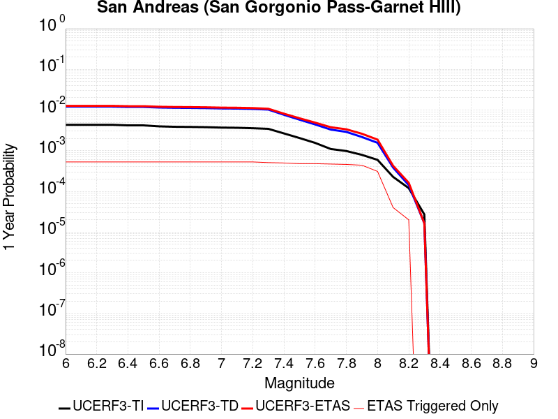 |  |

| Magnitude | 1 wk TI Prob | 1 wk TD Prob | 1 wk ETAS Prob | 1 wk ETAS/TD Gain | 1 wk ETAS Triggered Only | 1 mo TI Prob | 1 mo TD Prob | 1 mo ETAS Prob | 1 mo ETAS/TD Gain | 1 mo ETAS Triggered Only | 1 yr TI Prob | 1 yr TD Prob | 1 yr ETAS Prob | 1 yr ETAS/TD Gain | 1 yr ETAS Triggered Only | 10 yr TI Prob | 10 yr TD Prob | 10 yr ETAS Prob | 10 yr ETAS/TD Gain | 10 yr ETAS Triggered Only |
|-----|-----|-----|-----|-----|-----|-----|-----|-----|-----|-----|-----|-----|-----|-----|-----|-----|-----|-----|-----|-----|
| 6.0 | 8.31567E-5 | 2.3384395E-4 | 4.9378315E-4 | 2.1115925 | 2.6E-4 | 3.5633717E-4 | 0.0010018025 | 0.0013614419 | 1.3589922 | 3.6E-4 | 0.004329778 | 0.012128622 | 0.012652194 | 1.0431683 | 5.3E-4 | 0.042463828 | 0.11258187 | 0.11318532 | 1.00536 | 6.8E-4 |
| 6.1 | 8.31567E-5 | 2.3384395E-4 | 4.9378315E-4 | 2.1115925 | 2.6E-4 | 3.5633717E-4 | 0.0010018025 | 0.0013614419 | 1.3589922 | 3.6E-4 | 0.004329778 | 0.012128622 | 0.012652194 | 1.0431683 | 5.3E-4 | 0.042463828 | 0.11258187 | 0.11318532 | 1.00536 | 6.8E-4 |
| 6.2 | 8.31567E-5 | 2.3384395E-4 | 4.9378315E-4 | 2.1115925 | 2.6E-4 | 3.5633717E-4 | 0.0010018025 | 0.0013614419 | 1.3589922 | 3.6E-4 | 0.004329778 | 0.012128622 | 0.012652194 | 1.0431683 | 5.3E-4 | 0.042463828 | 0.11258187 | 0.11318532 | 1.00536 | 6.8E-4 |
| 6.3 | 8.31567E-5 | 2.3384395E-4 | 4.9378315E-4 | 2.1115925 | 2.6E-4 | 3.5633717E-4 | 0.0010018025 | 0.0013614419 | 1.3589922 | 3.6E-4 | 0.004329778 | 0.012128622 | 0.012652194 | 1.0431683 | 5.3E-4 | 0.042463828 | 0.11258187 | 0.11318532 | 1.00536 | 6.8E-4 |
| 6.4 | 8.059055E-5 | 2.2941893E-4 | 4.8935926E-4 | 2.133038 | 2.6E-4 | 3.4534236E-4 | 9.828559E-4 | 0.0013425022 | 1.3659195 | 3.6E-4 | 0.0041964394 | 0.011900819 | 0.012424512 | 1.0440048 | 5.3E-4 | 0.041180745 | 0.110562965 | 0.11116778 | 1.0054704 | 6.8E-4 |
| 6.5 | 8.059055E-5 | 2.2941893E-4 | 4.8935926E-4 | 2.133038 | 2.6E-4 | 3.4534236E-4 | 9.828559E-4 | 0.0013425022 | 1.3659195 | 3.6E-4 | 0.0041964394 | 0.011900819 | 0.012424512 | 1.0440048 | 5.3E-4 | 0.041180745 | 0.110562965 | 0.11116778 | 1.0054704 | 6.8E-4 |
| 6.6 | 7.619237E-5 | 2.2186468E-4 | 4.81807E-4 | 2.1716256 | 2.6E-4 | 3.2649786E-4 | 9.5050444E-4 | 0.0013101622 | 1.3783863 | 3.6E-4 | 0.0039678677 | 0.0115115335 | 0.012035432 | 1.0455108 | 5.3E-4 | 0.03897764 | 0.10709954 | 0.107697785 | 1.0055859 | 6.7E-4 |
| 6.7 | 7.440636E-5 | 2.1862281E-4 | 4.7856598E-4 | 2.189003 | 2.6E-4 | 3.188454E-4 | 9.3662075E-4 | 0.0012962836 | 1.3840005 | 3.6E-4 | 0.0038750346 | 0.011344268 | 0.011868255 | 1.0461897 | 5.3E-4 | 0.038081564 | 0.1056081 | 0.10620734 | 1.0056742 | 6.7E-4 |
| 6.8 | 7.3735864E-5 | 2.1709445E-4 | 4.77038E-4 | 2.1973753 | 2.6E-4 | 3.1597257E-4 | 9.300753E-4 | 0.0012897404 | 1.3867054 | 3.6E-4 | 0.0038401815 | 0.011265406 | 0.0117894355 | 1.0465167 | 5.3E-4 | 0.03774495 | 0.104909696 | 0.10550941 | 1.0057164 | 6.7E-4 |
| 6.9 | 7.27575E-5 | 2.1478413E-4 | 4.747283E-4 | 2.2102578 | 2.6E-4 | 3.117806E-4 | 9.20181E-4 | 0.0012798497 | 1.3908674 | 3.6E-4 | 0.003789323 | 0.011146182 | 0.011670275 | 1.04702 | 5.3E-4 | 0.037253562 | 0.10385753 | 0.104457945 | 1.0057812 | 6.7E-4 |
| 7.0 | 7.102591E-5 | 2.1062451E-4 | 4.7056974E-4 | 2.2341642 | 2.6E-4 | 3.0436125E-4 | 9.023664E-4 | 0.0012620416 | 1.398591 | 3.6E-4 | 0.003699303 | 0.010931484 | 0.0114556905 | 1.0479538 | 5.3E-4 | 0.03638325 | 0.101959534 | 0.10256122 | 1.0059012 | 6.7E-4 |
| 7.1 | 7.028513E-5 | 2.0898094E-4 | 4.689266E-4 | 2.2438726 | 2.6E-4 | 3.0118722E-4 | 8.953274E-4 | 0.0012550051 | 1.4017276 | 3.6E-4 | 0.0036607897 | 0.010846641 | 0.011370893 | 1.048333 | 5.3E-4 | 0.036010686 | 0.10120243 | 0.101795636 | 1.0058616 | 6.6E-4 |
| 7.2 | 6.8498244E-5 | 2.050596E-4 | 4.6500628E-4 | 2.267664 | 2.6E-4 | 2.9353087E-4 | 8.7853306E-4 | 0.0012382168 | 1.4094139 | 3.6E-4 | 0.003567883 | 0.0106441835 | 0.011168542 | 1.0492624 | 5.3E-4 | 0.035111405 | 0.09939449 | 0.099979885 | 1.0058897 | 6.5E-4 |
| 7.3 | 6.622592E-5 | 1.9733235E-4 | 4.5728104E-4 | 2.3173141 | 2.6E-4 | 2.8379448E-4 | 8.4543816E-4 | 0.0012051339 | 1.4254547 | 3.6E-4 | 0.0034497243 | 0.010245111 | 0.010749886 | 1.0492698 | 5.1E-4 | 0.033966612 | 0.095891245 | 0.096460834 | 1.00594 | 6.3E-4 |
| 7.4 | 5.1050705E-5 | 1.4690042E-4 | 4.0686224E-4 | 2.7696464 | 2.6E-4 | 2.1877038E-4 | 6.294222E-4 | 9.891957E-4 | 1.5715932 | 3.6E-4 | 0.002660276 | 0.007636482 | 0.008132664 | 1.0649751 | 5.0E-4 | 0.02628654 | 0.07286554 | 0.07344036 | 1.0078888 | 6.2E-4 |
| 7.5 | 3.9302922E-5 | 1.11307076E-4 | 3.6127924E-4 | 3.2457888 | 2.5E-4 | 1.6843023E-4 | 4.7694342E-4 | 8.1678125E-4 | 1.7125328 | 3.4E-4 | 0.0020487092 | 0.0057913954 | 0.0062686154 | 1.0824016 | 4.8E-4 | 0.020299247 | 0.05601151 | 0.056568462 | 1.0099436 | 5.9E-4 |
| 7.6 | 2.9851626E-5 | 8.4956984E-5 | 3.3493576E-4 | 3.9424155 | 2.5E-4 | 1.2792926E-4 | 3.6405068E-4 | 7.039269E-4 | 1.9335959 | 3.4E-4 | 0.0015564259 | 0.0044233347 | 0.0049012117 | 1.1080354 | 4.8E-4 | 0.0154556995 | 0.043196145 | 0.043751094 | 1.0128471 | 5.8E-4 |
| 7.7 | 2.1135214E-5 | 6.353527E-5 | 3.1351938E-4 | 4.934572 | 2.5E-4 | 9.0576345E-5 | 2.722656E-4 | 6.021758E-4 | 2.2117217 | 3.3E-4 | 0.0011022091 | 0.0033098008 | 0.003778245 | 1.1415325 | 4.7E-4 | 0.010967582 | 0.03258456 | 0.033126313 | 1.016626 | 5.6E-4 |
| 7.8 | 1.883379E-5 | 5.564576E-5 | 2.956324E-4 | 5.312757 | 2.4E-4 | 8.0713755E-5 | 2.3846005E-4 | 5.5838376E-4 | 2.3416238 | 3.2E-4 | 9.822468E-4 | 0.002899389 | 0.0033580554 | 1.1581941 | 4.6E-4 | 0.0097791655 | 0.028696978 | 0.029231194 | 1.0186157 | 5.5E-4 |
| 7.9 | 1.5156185E-5 | 4.1662403E-5 | 2.7165283E-4 | 6.5203347 | 2.3E-4 | 6.495346E-5 | 1.7854095E-4 | 4.7848737E-4 | 2.6799867 | 3.0E-4 | 7.9052144E-4 | 0.0021715704 | 0.0026106148 | 1.2021784 | 4.4E-4 | 0.007877152 | 0.021760946 | 0.022269629 | 1.023376 | 5.2E-4 |
| 8.0 | 1.1405907E-5 | 2.9976925E-5 | 1.7997243E-4 | 6.003699 | 1.5E-4 | 4.8881542E-5 | 1.2846621E-4 | 3.2844054E-4 | 2.5566294 | 2.0E-4 | 5.9497025E-4 | 0.0015629551 | 0.0018724706 | 1.1980323 | 3.1E-4 | 0.005933798 | 0.015774013 | 0.016128335 | 1.0224624 | 3.6E-4 |
| 8.1 | 4.3511436E-6 | 7.369465E-6 | 7.369465E-6 | 1.0 | 0.0 | 1.8647626E-5 | 3.158304E-5 | 4.1582723E-5 | 1.3166156 | 1.0E-5 | 2.2701119E-4 | 3.844558E-4 | 4.2444043E-4 | 1.1040032 | 4.0E-5 | 0.0022677942 | 0.0041165445 | 0.0041563795 | 1.0096769 | 4.0E-5 |
| 8.2 | 2.3042528E-6 | 2.7328301E-6 | 2.7328301E-6 | 1.0 | 0.0 | 9.875332E-6 | 1.1712076E-5 | 1.1712076E-5 | 1.0 | 0.0 | 1.2022553E-4 | 1.4258524E-4 | 1.625824E-4 | 1.140247 | 2.0E-5 | 0.0012016051 | 0.0015979637 | 0.0016179318 | 1.0124959 | 2.0E-5 |
| 8.3 | 5.202968E-7 | 3.1590292E-7 | 3.1590292E-7 | 1.0 | 0.0 | 2.2298414E-6 | 1.353869E-6 | 1.353869E-6 | 1.0 | 0.0 | 2.714798E-5 | 1.6483244E-5 | 1.6483244E-5 | 1.0 | 0.0 | 2.7144665E-4 | 1.955901E-4 | 1.955901E-4 | 1.0 | 0.0 |

## Death Valley (No)
*[(top)](#table-of-contents)*

| 1 Week | 1 Month | 1 Year | 10 Year |
|-----|-----|-----|-----|
|  |  |  |  |

| Magnitude | 1 wk TI Prob | 1 wk TD Prob | 1 wk ETAS Prob | 1 wk ETAS/TD Gain | 1 wk ETAS Triggered Only | 1 mo TI Prob | 1 mo TD Prob | 1 mo ETAS Prob | 1 mo ETAS/TD Gain | 1 mo ETAS Triggered Only | 1 yr TI Prob | 1 yr TD Prob | 1 yr ETAS Prob | 1 yr ETAS/TD Gain | 1 yr ETAS Triggered Only | 10 yr TI Prob | 10 yr TD Prob | 10 yr ETAS Prob | 10 yr ETAS/TD Gain | 10 yr ETAS Triggered Only |
|-----|-----|-----|-----|-----|-----|-----|-----|-----|-----|-----|-----|-----|-----|-----|-----|-----|-----|-----|-----|-----|
| 6.0 | 2.0074807E-5 | 2.2500084E-5 | 1.7249672E-4 | 7.666492 | 1.5E-4 | 8.603206E-5 | 9.642541E-5 | 2.9640613E-4 | 3.0739422 | 2.0E-4 | 0.001046937 | 0.0011733545 | 0.0015429204 | 1.3149652 | 3.7E-4 | 0.010420183 | 0.011672506 | 0.01225562 | 1.0499561 | 5.9E-4 |
| 6.1 | 2.0074807E-5 | 2.2500084E-5 | 1.7249672E-4 | 7.666492 | 1.5E-4 | 8.603206E-5 | 9.642541E-5 | 2.9640613E-4 | 3.0739422 | 2.0E-4 | 0.001046937 | 0.0011733545 | 0.0015429204 | 1.3149652 | 3.7E-4 | 0.010420183 | 0.011672506 | 0.01225562 | 1.0499561 | 5.9E-4 |
| 6.2 | 2.0074807E-5 | 2.2500084E-5 | 1.7249672E-4 | 7.666492 | 1.5E-4 | 8.603206E-5 | 9.642541E-5 | 2.9640613E-4 | 3.0739422 | 2.0E-4 | 0.001046937 | 0.0011733545 | 0.0015429204 | 1.3149652 | 3.7E-4 | 0.010420183 | 0.011672506 | 0.01225562 | 1.0499561 | 5.9E-4 |
| 6.3 | 1.9050609E-5 | 2.1336948E-5 | 1.6133396E-4 | 7.5612483 | 1.4E-4 | 8.164292E-5 | 9.1440896E-5 | 2.814235E-4 | 3.077655 | 1.9E-4 | 9.935491E-4 | 0.001112731 | 0.0014523527 | 1.3052145 | 3.4E-4 | 0.009891188 | 0.011072419 | 0.011616329 | 1.0491229 | 5.5E-4 |
| 6.4 | 1.9050609E-5 | 2.1336948E-5 | 1.6133396E-4 | 7.5612483 | 1.4E-4 | 8.164292E-5 | 9.1440896E-5 | 2.814235E-4 | 3.077655 | 1.9E-4 | 9.935491E-4 | 0.001112731 | 0.0014523527 | 1.3052145 | 3.4E-4 | 0.009891188 | 0.011072419 | 0.011616329 | 1.0491229 | 5.5E-4 |
| 6.5 | 1.8367004E-5 | 2.0561009E-5 | 1.5055834E-4 | 7.322517 | 1.3E-4 | 7.8713354E-5 | 8.811567E-5 | 2.680998E-4 | 3.0425894 | 1.8E-4 | 9.5791375E-4 | 0.0010722869 | 0.0014019329 | 1.3074235 | 3.3E-4 | 0.009537951 | 0.0106719155 | 0.011206153 | 1.0500602 | 5.4E-4 |
| 6.6 | 1.779439E-5 | 1.9910927E-5 | 1.4990834E-4 | 7.528948 | 1.3E-4 | 7.625944E-5 | 8.53298E-5 | 2.6531445E-4 | 3.1092825 | 1.8E-4 | 9.280632E-4 | 0.0010384015 | 0.0013680588 | 1.3174661 | 3.3E-4 | 0.009241969 | 0.010336253 | 0.010870671 | 1.0517033 | 5.4E-4 |
| 6.7 | 1.7025437E-5 | 1.9043426E-5 | 1.2904133E-4 | 6.7761617 | 1.1E-4 | 7.296412E-5 | 8.161216E-5 | 2.415991E-4 | 2.9603322 | 1.6E-4 | 8.87976E-4 | 9.931813E-4 | 0.0013028734 | 1.3118184 | 3.1E-4 | 0.008844362 | 0.009888145 | 0.010383201 | 1.0500656 | 5.0E-4 |
| 6.8 | 1.6545107E-5 | 1.8512545E-5 | 1.2851051E-4 | 6.9418063 | 1.1E-4 | 7.090568E-5 | 7.93371E-5 | 2.393244E-4 | 3.016551 | 1.6E-4 | 8.629347E-4 | 9.655073E-4 | 0.001275208 | 1.3207648 | 3.1E-4 | 0.008595915 | 0.009613829 | 0.010099118 | 1.0504782 | 4.9E-4 |
| 6.9 | 1.615478E-5 | 1.8087594E-5 | 1.1808579E-4 | 6.528551 | 1.0E-4 | 6.9232934E-5 | 7.751599E-5 | 2.2750437E-4 | 2.9349346 | 1.5E-4 | 8.4258494E-4 | 9.433546E-4 | 0.0012430716 | 1.317714 | 3.0E-4 | 0.008393973 | 0.009394196 | 0.00985978 | 1.0495609 | 4.7E-4 |
| 7.0 | 1.5894311E-5 | 1.780555E-5 | 1.1780377E-4 | 6.6161265 | 1.0E-4 | 6.81167E-5 | 7.6307304E-5 | 2.1629661E-4 | 2.8345468 | 1.4E-4 | 8.2900526E-4 | 9.286515E-4 | 0.0012183822 | 1.3119907 | 2.9E-4 | 0.008259195 | 0.009248397 | 0.009704143 | 1.0492784 | 4.6E-4 |
| 7.1 | 1.5602263E-5 | 1.7483504E-5 | 1.0748193E-4 | 6.1476197 | 9.0E-5 | 6.6865134E-5 | 7.492718E-5 | 2.0491744E-4 | 2.7348878 | 1.3E-4 | 8.137789E-4 | 9.118627E-4 | 0.0011916074 | 1.3067838 | 2.8E-4 | 0.008108052 | 0.009081894 | 0.009527807 | 1.0490991 | 4.5E-4 |
| 7.2 | 1.5323829E-5 | 1.717063E-5 | 1.07169086E-4 | 6.2414184 | 9.0E-5 | 6.56719E-5 | 7.358637E-5 | 2.0357681E-4 | 2.7665014 | 1.3E-4 | 7.99262E-4 | 8.9555193E-4 | 0.0011753011 | 1.3123764 | 2.8E-4 | 0.007963934 | 0.008920107 | 0.009366092 | 1.0499978 | 4.5E-4 |
| 7.3 | 1.4556212E-5 | 1.6302456E-5 | 1.0630099E-4 | 6.5205507 | 9.0E-5 | 6.238227E-5 | 6.9865826E-5 | 1.9985675E-4 | 2.8605795 | 1.3E-4 | 7.592395E-4 | 8.5029035E-4 | 0.0011300523 | 1.3290193 | 2.8E-4 | 0.0075665074 | 0.008471014 | 0.008917202 | 1.0526724 | 4.5E-4 |
| 7.4 | 1.411725E-5 | 1.580796E-5 | 1.0580654E-4 | 6.6932445 | 9.0E-5 | 6.0501097E-5 | 6.7746674E-5 | 1.9773787E-4 | 2.9187834 | 1.3E-4 | 7.363519E-4 | 8.245094E-4 | 0.0010942868 | 1.3271974 | 2.7E-4 | 0.0073391674 | 0.008215138 | 0.008651524 | 1.0531197 | 4.4E-4 |
| 7.5 | 1.3503312E-5 | 1.5126289E-5 | 1.0512493E-4 | 6.949816 | 9.0E-5 | 5.7870053E-5 | 6.482538E-5 | 1.9481695E-4 | 3.0052576 | 1.3E-4 | 7.043401E-4 | 7.8896893E-4 | 0.0010587559 | 1.3419487 | 2.7E-4 | 0.007021119 | 0.007862304 | 0.008298845 | 1.0555233 | 4.4E-4 |
| 7.6 | 1.1279839E-5 | 1.2626327E-5 | 9.262532E-5 | 7.335888 | 8.0E-5 | 4.834127E-5 | 5.4111737E-5 | 1.7410524E-4 | 3.2175136 | 1.2E-4 | 5.88396E-4 | 6.5861654E-4 | 8.884651E-4 | 1.3489869 | 2.3E-4 | 0.005868405 | 0.006567199 | 0.006944703 | 1.0574833 | 3.8E-4 |
| 7.7 | 9.189108E-6 | 1.0283358E-5 | 6.0282844E-5 | 5.862175 | 5.0E-5 | 3.93813E-5 | 4.407082E-5 | 1.240673E-4 | 2.81518 | 8.0E-5 | 4.7936183E-4 | 5.3643517E-4 | 7.0634397E-4 | 1.3167369 | 1.7E-4 | 0.004783291 | 0.005351914 | 0.005640362 | 1.0538962 | 2.9E-4 |
| 7.8 | 3.4586725E-7 | 3.6482615E-7 | 3.6482615E-7 | 1.0 | 0.0 | 1.4822873E-6 | 1.5635396E-6 | 1.5635396E-6 | 1.0 | 0.0 | 1.80467E-5 | 1.9035933E-5 | 3.9035553E-5 | 2.0506246 | 2.0E-5 | 1.8045233E-4 | 1.9034347E-4 | 2.2033777E-4 | 1.1575798 | 3.0E-5 |
| 7.9 | 2.5591178E-9 | 2.6696718E-9 | 2.6696718E-9 | 1.0 | 0.0 | 1.0967647E-8 | 1.14414505E-8 | 1.14414505E-8 | 1.0 | 0.0 | 1.335311E-7 | 1.3929966E-7 | 1.3929966E-7 | 1.0 | 0.0 | 1.3353102E-6 | 1.3929966E-6 | 1.3929966E-6 | 1.0 | 0.0 |

## Elsinore (Glen Ivy) rev
*[(top)](#table-of-contents)*

| 1 Week | 1 Month | 1 Year | 10 Year |
|-----|-----|-----|-----|
| 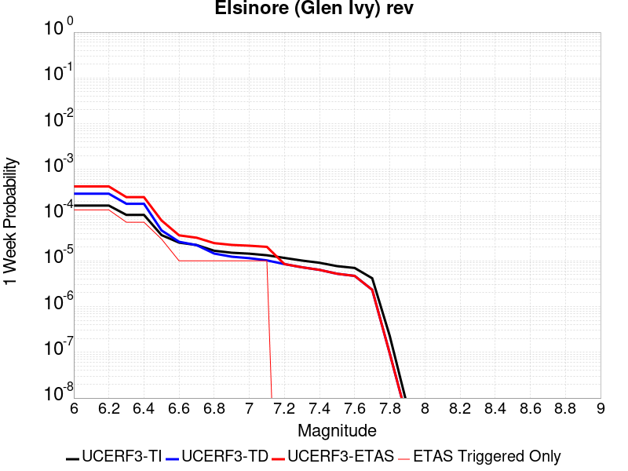 |  |  |  |

| Magnitude | 1 wk TI Prob | 1 wk TD Prob | 1 wk ETAS Prob | 1 wk ETAS/TD Gain | 1 wk ETAS Triggered Only | 1 mo TI Prob | 1 mo TD Prob | 1 mo ETAS Prob | 1 mo ETAS/TD Gain | 1 mo ETAS Triggered Only | 1 yr TI Prob | 1 yr TD Prob | 1 yr ETAS Prob | 1 yr ETAS/TD Gain | 1 yr ETAS Triggered Only | 10 yr TI Prob | 10 yr TD Prob | 10 yr ETAS Prob | 10 yr ETAS/TD Gain | 10 yr ETAS Triggered Only |
|-----|-----|-----|-----|-----|-----|-----|-----|-----|-----|-----|-----|-----|-----|-----|-----|-----|-----|-----|-----|-----|
| 6.0 | 1.6204086E-4 | 2.937271E-4 | 4.236889E-4 | 1.4424577 | 1.3E-4 | 6.94276E-4 | 0.0012583778 | 0.0014481387 | 1.1507981 | 1.9E-4 | 0.008420097 | 0.0152346175 | 0.015530048 | 1.019392 | 3.0E-4 | 0.081081145 | 0.13962454 | 0.1399859 | 1.002588 | 4.2E-4 |
| 6.1 | 1.6204086E-4 | 2.937271E-4 | 4.236889E-4 | 1.4424577 | 1.3E-4 | 6.94276E-4 | 0.0012583778 | 0.0014481387 | 1.1507981 | 1.9E-4 | 0.008420097 | 0.0152346175 | 0.015530048 | 1.019392 | 3.0E-4 | 0.081081145 | 0.13962454 | 0.1399859 | 1.002588 | 4.2E-4 |
| 6.2 | 1.6204086E-4 | 2.937271E-4 | 4.236889E-4 | 1.4424577 | 1.3E-4 | 6.94276E-4 | 0.0012583778 | 0.0014481387 | 1.1507981 | 1.9E-4 | 0.008420097 | 0.0152346175 | 0.015530048 | 1.019392 | 3.0E-4 | 0.081081145 | 0.13962454 | 0.1399859 | 1.002588 | 4.2E-4 |
| 6.3 | 1.0111737E-4 | 1.7703463E-4 | 2.4702222E-4 | 1.3953329 | 7.0E-5 | 4.332882E-4 | 7.5861585E-4 | 8.5854E-4 | 1.131719 | 1.0E-4 | 0.005262531 | 0.0092177205 | 0.00940597 | 1.0204225 | 1.9E-4 | 0.0513964 | 0.08707393 | 0.08732955 | 1.0029356 | 2.8E-4 |
| 6.4 | 1.0111737E-4 | 1.7703463E-4 | 2.4702222E-4 | 1.3953329 | 7.0E-5 | 4.332882E-4 | 7.5861585E-4 | 8.5854E-4 | 1.131719 | 1.0E-4 | 0.005262531 | 0.0092177205 | 0.00940597 | 1.0204225 | 1.9E-4 | 0.0513964 | 0.08707393 | 0.08732955 | 1.0029356 | 2.8E-4 |
| 6.5 | 3.6624708E-5 | 4.6391986E-5 | 7.639059E-5 | 1.6466334 | 3.0E-5 | 1.569536E-4 | 1.9880968E-4 | 2.4879974E-4 | 1.2514468 | 5.0E-5 | 0.001909235 | 0.0024181814 | 0.0024780363 | 1.024752 | 6.0E-5 | 0.01892915 | 0.023697061 | 0.023775166 | 1.0032959 | 8.0E-5 |
| 6.6 | 2.5051324E-5 | 2.6147465E-5 | 3.61472E-5 | 1.3824363 | 1.0E-5 | 1.073584E-4 | 1.12056E-4 | 1.3205376E-4 | 1.1784621 | 2.0E-5 | 0.0013063047 | 0.0013634725 | 0.0013934316 | 1.0219727 | 3.0E-5 | 0.012986525 | 0.013565759 | 0.0136052165 | 1.0029086 | 4.0E-5 |
| 6.7 | 2.2189772E-5 | 2.2072489E-5 | 3.207227E-5 | 1.4530426 | 1.0E-5 | 9.509556E-5 | 9.459316E-5 | 1.1459127E-4 | 1.2114118 | 2.0E-5 | 0.0011571734 | 0.0011510996 | 0.0011810651 | 1.0260321 | 3.0E-5 | 0.011511663 | 0.0114663225 | 0.011495979 | 1.0025864 | 3.0E-5 |
| 6.8 | 1.6654378E-5 | 1.44376E-5 | 2.4437455E-5 | 1.6926259 | 1.0E-5 | 7.137396E-5 | 6.187399E-5 | 8.187275E-5 | 1.3232176 | 2.0E-5 | 8.686314E-4 | 7.5306057E-4 | 7.83038E-4 | 1.0398074 | 3.0E-5 | 0.008652439 | 0.0075100763 | 0.007539851 | 1.0039647 | 3.0E-5 |
| 6.9 | 1.5042909E-5 | 1.2331886E-5 | 2.2331762E-5 | 1.810896 | 1.0E-5 | 6.446802E-5 | 5.2849886E-5 | 7.284883E-5 | 1.3784103 | 2.0E-5 | 7.8461546E-4 | 6.4326054E-4 | 6.732412E-4 | 1.0466074 | 3.0E-5 | 0.007818509 | 0.006417925 | 0.0064477324 | 1.0046444 | 3.0E-5 |
| 7.0 | 1.4361385E-5 | 1.1451172E-5 | 2.1451058E-5 | 1.8732631 | 1.0E-5 | 6.154734E-5 | 4.9075545E-5 | 6.9074566E-5 | 1.4075149 | 2.0E-5 | 7.490812E-4 | 5.973339E-4 | 6.2731595E-4 | 1.0501932 | 3.0E-5 | 0.007465612 | 0.005960982 | 0.005990803 | 1.0050027 | 3.0E-5 |
| 7.1 | 1.3265571E-5 | 1.0244736E-5 | 2.0244634E-5 | 1.9761012 | 1.0E-5 | 5.6851208E-5 | 4.3905282E-5 | 5.3904845E-5 | 1.227753 | 1.0E-5 | 6.919436E-4 | 5.344183E-4 | 5.544076E-4 | 1.0374038 | 2.0E-5 | 0.006897931 | 0.0053346003 | 0.005354494 | 1.0037291 | 2.0E-5 |
| 7.2 | 1.1596403E-5 | 8.504847E-6 | 8.504847E-6 | 1.0 | 0.0 | 4.9697923E-5 | 3.6448844E-5 | 3.6448844E-5 | 1.0 | 0.0 | 6.049042E-4 | 4.4367602E-4 | 4.536716E-4 | 1.022529 | 1.0E-5 | 0.006032603 | 0.004429357 | 0.0044393125 | 1.0022477 | 1.0E-5 |
| 7.3 | 1.0150827E-5 | 7.238537E-6 | 7.238537E-6 | 1.0 | 0.0 | 4.3502816E-5 | 3.102194E-5 | 3.102194E-5 | 1.0 | 0.0 | 5.2951806E-4 | 3.776281E-4 | 3.8762434E-4 | 1.0264711 | 1.0E-5 | 0.005282581 | 0.003770271 | 0.0037802334 | 1.0026423 | 1.0E-5 |
| 7.4 | 9.080705E-6 | 6.352307E-6 | 6.352307E-6 | 1.0 | 0.0 | 3.8916725E-5 | 2.7223898E-5 | 2.7223898E-5 | 1.0 | 0.0 | 4.7370812E-4 | 3.314019E-4 | 3.4139858E-4 | 1.0301648 | 1.0E-5 | 0.004726996 | 0.0033092257 | 0.0033191924 | 1.0030118 | 1.0E-5 |
| 7.5 | 7.671649E-6 | 5.225419E-6 | 5.225419E-6 | 1.0 | 0.0 | 3.287808E-5 | 2.2394468E-5 | 2.2394468E-5 | 1.0 | 0.0 | 4.0021708E-4 | 2.7261977E-4 | 2.7261977E-4 | 1.0 | 0.0 | 0.0039949706 | 0.0027229784 | 0.0027229784 | 1.0 | 0.0 |
| 7.6 | 6.990086E-6 | 4.687336E-6 | 4.687336E-6 | 1.0 | 0.0 | 2.9957167E-5 | 2.0088435E-5 | 2.0088435E-5 | 1.0 | 0.0 | 3.6466747E-4 | 2.445504E-4 | 2.445504E-4 | 1.0 | 0.0 | 0.0036406964 | 0.0024429292 | 0.0024429292 | 1.0 | 0.0 |
| 7.7 | 4.163505E-6 | 2.329331E-6 | 2.329331E-6 | 1.0 | 0.0 | 1.7843471E-5 | 9.982813E-6 | 9.982813E-6 | 1.0 | 0.0 | 2.172226E-4 | 1.2153471E-4 | 1.2153471E-4 | 1.0 | 0.0 | 0.0021701038 | 0.0012147555 | 0.0012147555 | 1.0 | 0.0 |
| 7.8 | 2.2692414E-7 | 9.384417E-8 | 9.384417E-8 | 1.0 | 0.0 | 9.725317E-7 | 4.0218927E-7 | 4.0218927E-7 | 1.0 | 0.0 | 1.1840509E-5 | 4.8966467E-6 | 4.8966467E-6 | 1.0 | 0.0 | 1.1839878E-4 | 4.8965718E-5 | 4.8965718E-5 | 1.0 | 0.0 |
| 7.9 | 6.676829E-9 | 3.4397174E-9 | 3.4397174E-9 | 1.0 | 0.0 | 2.861498E-8 | 1.4741646E-8 | 1.4741646E-8 | 1.0 | 0.0 | 3.4838732E-7 | 1.7947953E-7 | 1.7947953E-7 | 1.0 | 0.0 | 3.4838679E-6 | 1.794794E-6 | 1.794794E-6 | 1.0 | 0.0 |

## Sierra Nevada  (No Extension)
*[(top)](#table-of-contents)*

| 1 Week | 1 Month | 1 Year | 10 Year |
|-----|-----|-----|-----|
|  |  |  | 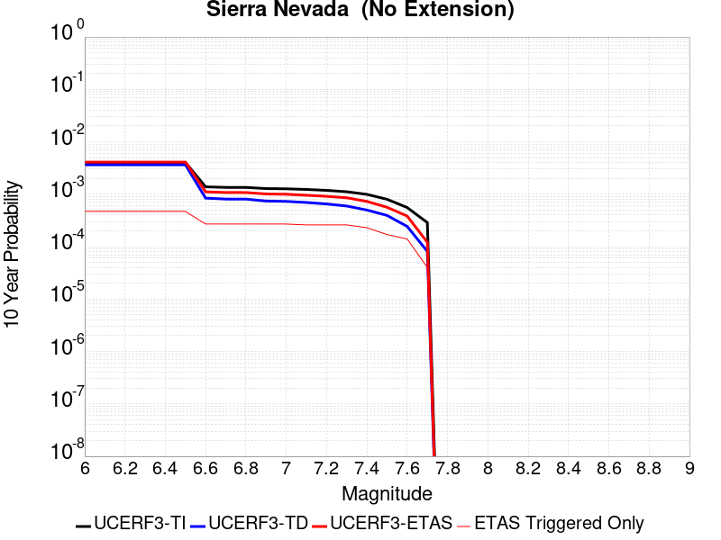 |

| Magnitude | 1 wk TI Prob | 1 wk TD Prob | 1 wk ETAS Prob | 1 wk ETAS/TD Gain | 1 wk ETAS Triggered Only | 1 mo TI Prob | 1 mo TD Prob | 1 mo ETAS Prob | 1 mo ETAS/TD Gain | 1 mo ETAS Triggered Only | 1 yr TI Prob | 1 yr TD Prob | 1 yr ETAS Prob | 1 yr ETAS/TD Gain | 1 yr ETAS Triggered Only | 10 yr TI Prob | 10 yr TD Prob | 10 yr ETAS Prob | 10 yr ETAS/TD Gain | 10 yr ETAS Triggered Only |
|-----|-----|-----|-----|-----|-----|-----|-----|-----|-----|-----|-----|-----|-----|-----|-----|-----|-----|-----|-----|-----|
| 6.0 | 7.7690465E-6 | 6.9762887E-6 | 2.469746E-4 | 35.402008 | 2.4E-4 | 3.329549E-5 | 2.989824E-5 | 2.8989048E-4 | 9.695905 | 2.6E-4 | 4.0529718E-4 | 3.6398612E-4 | 7.0386234E-4 | 1.9337616 | 3.4E-4 | 0.004045588 | 0.0036374154 | 0.004105706 | 1.1287426 | 4.7E-4 |
| 6.1 | 7.7690465E-6 | 6.9762887E-6 | 2.469746E-4 | 35.402008 | 2.4E-4 | 3.329549E-5 | 2.989824E-5 | 2.8989048E-4 | 9.695905 | 2.6E-4 | 4.0529718E-4 | 3.6398612E-4 | 7.0386234E-4 | 1.9337616 | 3.4E-4 | 0.004045588 | 0.0036374154 | 0.004105706 | 1.1287426 | 4.7E-4 |
| 6.2 | 7.7690465E-6 | 6.9762887E-6 | 2.469746E-4 | 35.402008 | 2.4E-4 | 3.329549E-5 | 2.989824E-5 | 2.8989048E-4 | 9.695905 | 2.6E-4 | 4.0529718E-4 | 3.6398612E-4 | 7.0386234E-4 | 1.9337616 | 3.4E-4 | 0.004045588 | 0.0036374154 | 0.004105706 | 1.1287426 | 4.7E-4 |
| 6.3 | 7.7690465E-6 | 6.9762887E-6 | 2.469746E-4 | 35.402008 | 2.4E-4 | 3.329549E-5 | 2.989824E-5 | 2.8989048E-4 | 9.695905 | 2.6E-4 | 4.0529718E-4 | 3.6398612E-4 | 7.0386234E-4 | 1.9337616 | 3.4E-4 | 0.004045588 | 0.0036374154 | 0.004105706 | 1.1287426 | 4.7E-4 |
| 6.4 | 7.7690465E-6 | 6.9762887E-6 | 2.469746E-4 | 35.402008 | 2.4E-4 | 3.329549E-5 | 2.989824E-5 | 2.8989048E-4 | 9.695905 | 2.6E-4 | 4.0529718E-4 | 3.6398612E-4 | 7.0386234E-4 | 1.9337616 | 3.4E-4 | 0.004045588 | 0.0036374154 | 0.004105706 | 1.1287426 | 4.7E-4 |
| 6.5 | 7.7690465E-6 | 6.9762887E-6 | 2.469746E-4 | 35.402008 | 2.4E-4 | 3.329549E-5 | 2.989824E-5 | 2.8989048E-4 | 9.695905 | 2.6E-4 | 4.0529718E-4 | 3.6398612E-4 | 7.0386234E-4 | 1.9337616 | 3.4E-4 | 0.004045588 | 0.0036374154 | 0.004105706 | 1.1287426 | 4.7E-4 |
| 6.6 | 2.653E-6 | 1.6148208E-6 | 1.3161461E-4 | 81.50416 | 1.3E-4 | 1.136995E-5 | 6.9206426E-6 | 1.4691967E-4 | 21.229195 | 1.4E-4 | 1.3842035E-4 | 8.42556E-5 | 2.6424043E-4 | 3.1361766 | 1.8E-4 | 0.0013833415 | 8.4224E-4 | 0.0011120125 | 1.3203037 | 2.7E-4 |
| 6.7 | 2.5902466E-6 | 1.5501544E-6 | 1.3154995E-4 | 84.86249 | 1.3E-4 | 1.11010095E-5 | 6.643502E-6 | 1.4664257E-4 | 22.073084 | 1.4E-4 | 1.351464E-4 | 8.088166E-5 | 2.6086712E-4 | 3.2252934 | 1.8E-4 | 0.0013506424 | 8.0852525E-4 | 0.0010783069 | 1.3336713 | 2.7E-4 |
| 6.8 | 2.5853892E-6 | 1.5469546E-6 | 1.3154675E-4 | 85.03595 | 1.3E-4 | 1.1080193E-5 | 6.629789E-6 | 1.4662887E-4 | 22.11667 | 1.4E-4 | 1.34893E-4 | 8.071472E-5 | 2.6070018E-4 | 3.2298965 | 1.8E-4 | 0.0013481114 | 8.06857E-4 | 0.0010766392 | 1.3343618 | 2.7E-4 |
| 6.9 | 2.458257E-6 | 1.422029E-6 | 1.3142184E-4 | 92.41855 | 1.3E-4 | 1.0535345E-5 | 6.0943958E-6 | 1.4609355E-4 | 23.971785 | 1.4E-4 | 1.2826028E-4 | 7.419676E-5 | 2.541834E-4 | 3.425802 | 1.8E-4 | 0.0012818627 | 7.4172183E-4 | 0.0010115216 | 1.3637478 | 2.7E-4 |
| 7.0 | 2.4341468E-6 | 1.3989927E-6 | 1.3139882E-4 | 93.92387 | 1.3E-4 | 1.0432016E-5 | 5.9956697E-6 | 1.4599483E-4 | 24.350046 | 1.4E-4 | 1.270024E-4 | 7.299485E-5 | 2.529817E-4 | 3.4657474 | 1.8E-4 | 0.0012692984 | 7.297107E-4 | 9.995137E-4 | 1.3697397 | 2.7E-4 |
| 7.1 | 2.3652476E-6 | 1.3339427E-6 | 1.3133377E-4 | 98.45533 | 1.3E-4 | 1.0136736E-5 | 5.716885E-6 | 1.4571608E-4 | 25.488722 | 1.4E-4 | 1.2340778E-4 | 6.9600865E-5 | 2.4958834E-4 | 3.5859947 | 1.8E-4 | 0.0012333926 | 6.957924E-4 | 9.5561147E-4 | 1.3734146 | 2.6E-4 |
| 7.2 | 2.272158E-6 | 1.2502497E-6 | 1.3125008E-4 | 104.9791 | 1.3E-4 | 9.737784E-6 | 5.358202E-6 | 1.4535745E-4 | 27.128027 | 1.4E-4 | 1.1855107E-4 | 6.523417E-5 | 2.4522244E-4 | 3.75911 | 1.8E-4 | 0.0011848784 | 6.5215176E-4 | 9.1198215E-4 | 1.3984202 | 2.6E-4 |
| 7.3 | 2.1382127E-6 | 1.1419382E-6 | 1.3114179E-4 | 114.8414 | 1.3E-4 | 9.163737E-6 | 4.894012E-6 | 1.4489333E-4 | 29.606247 | 1.4E-4 | 1.1156279E-4 | 5.9582977E-5 | 2.3957225E-4 | 4.0208173 | 1.8E-4 | 0.001115068 | 5.956712E-4 | 8.5551635E-4 | 1.4362224 | 2.6E-4 |
| 7.4 | 1.9048055E-6 | 9.574928E-7 | 1.20957375E-4 | 126.32719 | 1.2E-4 | 8.163426E-6 | 4.103534E-6 | 1.34103E-4 | 32.67988 | 1.3E-4 | 9.9385186E-5 | 4.995939E-5 | 2.199509E-4 | 4.4025936 | 1.7E-4 | 9.934074E-4 | 4.9948227E-4 | 7.293674E-4 | 1.4602468 | 2.3E-4 |
| 7.5 | 1.5373403E-6 | 7.559763E-7 | 8.075592E-5 | 106.82334 | 8.0E-5 | 6.5885843E-6 | 3.2398946E-6 | 9.32396E-5 | 28.778593 | 9.0E-5 | 8.021306E-5 | 3.9445007E-5 | 1.5944027E-4 | 4.0420904 | 1.2E-4 | 8.0184115E-4 | 3.9438053E-4 | 5.643135E-4 | 1.4308858 | 1.7E-4 |
| 7.6 | 1.0680322E-6 | 4.65941E-7 | 7.046591E-5 | 151.23354 | 7.0E-5 | 4.577273E-6 | 1.9968884E-6 | 8.199673E-5 | 41.06225 | 8.0E-5 | 5.5726876E-5 | 2.4311848E-5 | 1.3430917E-4 | 5.5244327 | 1.1E-4 | 5.5712904E-4 | 2.4309216E-4 | 3.8305813E-4 | 1.5757732 | 1.4E-4 |
| 7.7 | 5.509146E-7 | 1.5578539E-7 | 1.01557835E-5 | 65.190865 | 1.0E-5 | 2.3610605E-6 | 6.676515E-7 | 2.0667638E-5 | 30.955729 | 2.0E-5 | 2.8745531E-5 | 8.128628E-6 | 3.8128383E-5 | 4.69063 | 3.0E-5 | 2.8741814E-4 | 8.128342E-5 | 1.2128017E-4 | 1.4920653 | 4.0E-5 |

## San Andreas (Coachella) rev
*[(top)](#table-of-contents)*

| 1 Week | 1 Month | 1 Year | 10 Year |
|-----|-----|-----|-----|
|  |  |  | 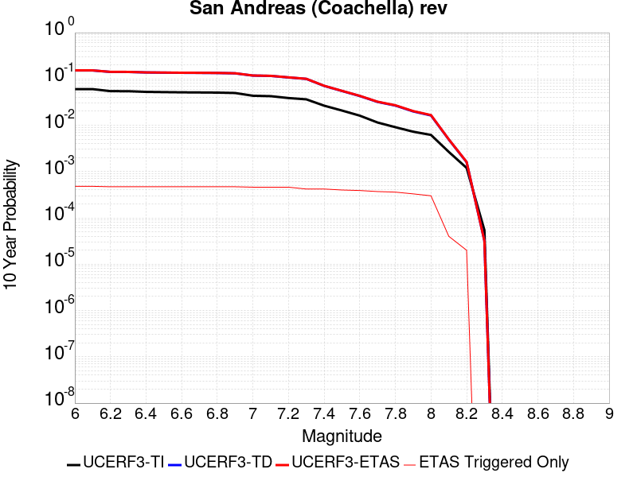 |

| Magnitude | 1 wk TI Prob | 1 wk TD Prob | 1 wk ETAS Prob | 1 wk ETAS/TD Gain | 1 wk ETAS Triggered Only | 1 mo TI Prob | 1 mo TD Prob | 1 mo ETAS Prob | 1 mo ETAS/TD Gain | 1 mo ETAS Triggered Only | 1 yr TI Prob | 1 yr TD Prob | 1 yr ETAS Prob | 1 yr ETAS/TD Gain | 1 yr ETAS Triggered Only | 10 yr TI Prob | 10 yr TD Prob | 10 yr ETAS Prob | 10 yr ETAS/TD Gain | 10 yr ETAS Triggered Only |
|-----|-----|-----|-----|-----|-----|-----|-----|-----|-----|-----|-----|-----|-----|-----|-----|-----|-----|-----|-----|-----|
| 6.0 | 1.1925945E-4 | 3.273077E-4 | 4.772586E-4 | 1.4581343 | 1.5E-4 | 5.110118E-4 | 0.001401998 | 0.0016416615 | 1.1709442 | 2.4E-4 | 0.0062038354 | 0.016937068 | 0.01731063 | 1.022056 | 3.8E-4 | 0.060334753 | 0.15267672 | 0.15308343 | 1.0026639 | 4.8E-4 |
| 6.1 | 1.1925945E-4 | 3.273077E-4 | 4.772586E-4 | 1.4581343 | 1.5E-4 | 5.110118E-4 | 0.001401998 | 0.0016416615 | 1.1709442 | 2.4E-4 | 0.0062038354 | 0.016937068 | 0.01731063 | 1.022056 | 3.8E-4 | 0.060334753 | 0.15267672 | 0.15308343 | 1.0026639 | 4.8E-4 |
| 6.2 | 1.07432395E-4 | 3.0231563E-4 | 4.5227027E-4 | 1.4960202 | 1.5E-4 | 4.603433E-4 | 0.001294999 | 0.0015247012 | 1.1773763 | 2.3E-4 | 0.005590286 | 0.015653731 | 0.01601794 | 1.0232666 | 3.7E-4 | 0.05451731 | 0.14182784 | 0.14223117 | 1.0028439 | 4.7E-4 |
| 6.3 | 1.0718766E-4 | 3.0176868E-4 | 4.517234E-4 | 1.4969195 | 1.5E-4 | 4.592948E-4 | 0.0012926573 | 0.00152236 | 1.177698 | 2.3E-4 | 0.005577586 | 0.01562563 | 0.01598985 | 1.023309 | 3.7E-4 | 0.054396555 | 0.14159605 | 0.1419995 | 1.0028493 | 4.7E-4 |
| 6.4 | 1.0355944E-4 | 2.9384956E-4 | 4.4380547E-4 | 1.5103153 | 1.5E-4 | 4.4375064E-4 | 0.0012587514 | 0.0014884619 | 1.1824907 | 2.3E-4 | 0.0053892885 | 0.015218662 | 0.015583032 | 1.0239422 | 3.7E-4 | 0.052604496 | 0.13815795 | 0.13856302 | 1.002932 | 4.7E-4 |
| 6.5 | 1.0227914E-4 | 2.9104383E-4 | 4.410002E-4 | 1.5152363 | 1.5E-4 | 4.382655E-4 | 0.0012467385 | 0.0014764518 | 1.1842513 | 2.3E-4 | 0.0053228354 | 0.015074439 | 0.015438861 | 1.0241748 | 3.7E-4 | 0.051971316 | 0.13694239 | 0.13734803 | 1.0029621 | 4.7E-4 |
| 6.6 | 1.0116757E-4 | 2.8870135E-4 | 4.3865805E-4 | 1.5194181 | 1.5E-4 | 4.3350324E-4 | 0.0012367087 | 0.0014664243 | 1.1857475 | 2.3E-4 | 0.0052651367 | 0.014954008 | 0.015318476 | 1.0243726 | 3.7E-4 | 0.051421247 | 0.13591973 | 0.13632587 | 1.002988 | 4.7E-4 |
| 6.7 | 1.0050676E-4 | 2.8728697E-4 | 4.3724387E-4 | 1.521976 | 1.5E-4 | 4.3067214E-4 | 0.0012306528 | 0.0014603698 | 1.1866627 | 2.3E-4 | 0.005230834 | 0.014881288 | 0.015245782 | 1.0244935 | 3.7E-4 | 0.051094085 | 0.13530464 | 0.13571106 | 1.0030036 | 4.7E-4 |
| 6.8 | 9.976819E-5 | 2.8532353E-4 | 4.3528073E-4 | 1.525569 | 1.5E-4 | 4.2750788E-4 | 0.001222246 | 0.0014519648 | 1.1879481 | 2.3E-4 | 0.0051924936 | 0.014780328 | 0.015144859 | 1.0246633 | 3.7E-4 | 0.050728295 | 0.13445628 | 0.13486308 | 1.0030255 | 4.7E-4 |
| 6.9 | 9.77719E-5 | 2.802926E-4 | 4.3025054E-4 | 1.5350051 | 1.5E-4 | 4.1895514E-4 | 0.0012007048 | 0.0014304287 | 1.1913241 | 2.3E-4 | 0.0050888555 | 0.0145215895 | 0.014886217 | 1.0251093 | 3.7E-4 | 0.049738888 | 0.13228476 | 0.13269259 | 1.003083 | 4.7E-4 |
| 7.0 | 8.500761E-5 | 2.4763815E-4 | 3.97601E-4 | 1.6055725 | 1.5E-4 | 3.6426744E-4 | 0.0010608779 | 0.0012906339 | 1.2165716 | 2.3E-4 | 0.0044259406 | 0.01284047 | 0.013195848 | 1.0276763 | 3.6E-4 | 0.04338823 | 0.11813616 | 0.118541814 | 1.0034338 | 4.6E-4 |
| 7.1 | 8.319876E-5 | 2.4366553E-4 | 3.93629E-4 | 1.615448 | 1.5E-4 | 3.5651738E-4 | 0.0010438662 | 0.001273626 | 1.2201048 | 2.3E-4 | 0.004331963 | 0.012635773 | 0.012991224 | 1.0281305 | 3.6E-4 | 0.042484846 | 0.11635632 | 0.116762795 | 1.0034934 | 4.6E-4 |
| 7.2 | 7.563917E-5 | 2.2414974E-4 | 3.7411612E-4 | 1.6690454 | 1.5E-4 | 3.2412758E-4 | 9.602912E-4 | 0.0011900703 | 1.2392807 | 2.3E-4 | 0.0039391145 | 0.011629559 | 0.011985373 | 1.0305957 | 3.6E-4 | 0.03870018 | 0.10776202 | 0.10817245 | 1.0038086 | 4.6E-4 |
| 7.3 | 7.082985E-5 | 2.07311E-4 | 3.572799E-4 | 1.7234006 | 1.5E-4 | 3.0352117E-4 | 8.881761E-4 | 0.0011179718 | 1.2587277 | 2.3E-4 | 0.0036891096 | 0.010760553 | 0.011096895 | 1.0312569 | 3.4E-4 | 0.03628465 | 0.10028403 | 0.10066191 | 1.0037681 | 4.2E-4 |
| 7.4 | 5.146215E-5 | 1.4274761E-4 | 2.927262E-4 | 2.0506556 | 1.5E-4 | 2.2053342E-4 | 6.1163295E-4 | 8.4149226E-4 | 1.3758125 | 2.3E-4 | 0.0026816884 | 0.0074213943 | 0.0077588707 | 1.0454735 | 3.4E-4 | 0.02649557 | 0.07085049 | 0.07124073 | 1.005508 | 4.2E-4 |
| 7.5 | 4.0285166E-5 | 1.0942422E-4 | 2.4940888E-4 | 2.2792842 | 1.4E-4 | 1.7263928E-4 | 4.6887697E-4 | 6.787785E-4 | 1.4476687 | 2.1E-4 | 0.002099857 | 0.0056937044 | 0.0060118823 | 1.0558825 | 3.2E-4 | 0.020801254 | 0.055013083 | 0.055391077 | 1.006871 | 4.0E-4 |
| 7.6 | 3.1168736E-5 | 8.439599E-5 | 2.2438417E-4 | 2.6587064 | 1.4E-4 | 1.3357346E-4 | 3.616471E-4 | 5.715712E-4 | 1.5804665 | 2.1E-4 | 0.0016250437 | 0.004394191 | 0.0047127847 | 1.0725034 | 3.2E-4 | 0.016132116 | 0.042812478 | 0.043185778 | 1.0087194 | 3.9E-4 |
| 7.7 | 2.2100989E-5 | 6.239345E-5 | 2.0238472E-4 | 3.2436852 | 1.4E-4 | 9.4715084E-5 | 2.6737314E-4 | 4.6731965E-4 | 1.7478184 | 2.0E-4 | 0.001152546 | 0.0032504152 | 0.0035594075 | 1.0950624 | 3.1E-4 | 0.011465867 | 0.031902168 | 0.032260366 | 1.011228 | 3.7E-4 |
| 7.8 | 1.7484861E-5 | 5.180078E-5 | 1.9179353E-4 | 3.7025218 | 1.4E-4 | 7.493296E-5 | 2.2198448E-4 | 4.219401E-4 | 1.9007639 | 2.0E-4 | 9.1192697E-4 | 0.0026993142 | 0.0029985043 | 1.1108394 | 3.0E-4 | 0.009081938 | 0.026641788 | 0.026992196 | 1.0131526 | 3.6E-4 |
| 7.9 | 1.3967285E-5 | 3.8226146E-5 | 1.6822117E-4 | 4.4006834 | 1.3E-4 | 5.985842E-5 | 1.6381606E-4 | 3.4378658E-4 | 2.0986133 | 1.8E-4 | 7.2853256E-4 | 0.0019926373 | 0.0022720795 | 1.1402373 | 2.8E-4 | 0.0072614877 | 0.019911002 | 0.020234432 | 1.0162437 | 3.3E-4 |
| 8.0 | 1.1887396E-5 | 3.106798E-5 | 1.4106456E-4 | 4.540513 | 1.1E-4 | 5.094499E-5 | 1.331417E-4 | 2.831217E-4 | 2.1264694 | 1.5E-4 | 6.200787E-4 | 0.0016197958 | 0.001869391 | 1.1540904 | 2.5E-4 | 0.006183513 | 0.016280567 | 0.016575683 | 1.0181268 | 3.0E-4 |
| 8.1 | 5.100864E-6 | 8.973766E-6 | 8.973766E-6 | 1.0 | 0.0 | 2.1860664E-5 | 3.845843E-5 | 4.8458045E-5 | 1.2600111 | 1.0E-5 | 2.6612106E-4 | 4.6813092E-4 | 5.081122E-4 | 1.0854062 | 4.0E-5 | 0.002658026 | 0.004918092 | 0.0049578953 | 1.0080932 | 4.0E-5 |
| 8.2 | 2.3004484E-6 | 2.7863473E-6 | 2.7863473E-6 | 1.0 | 0.0 | 9.859027E-6 | 1.19414335E-5 | 1.19414335E-5 | 1.0 | 0.0 | 1.2002704E-4 | 1.4537729E-4 | 1.6537438E-4 | 1.1375531 | 2.0E-5 | 0.0011996223 | 0.0015973782 | 0.0016173462 | 1.0125005 | 2.0E-5 |
| 8.3 | 1.0424446E-7 | 5.814421E-8 | 5.814421E-8 | 1.0 | 0.0 | 4.4676187E-7 | 2.4918944E-7 | 2.4918944E-7 | 1.0 | 0.0 | 5.439312E-6 | 3.0338776E-6 | 3.0338776E-6 | 1.0 | 0.0 | 5.4391792E-5 | 3.189592E-5 | 3.189592E-5 | 1.0 | 0.0 |

## San Andreas (Carrizo) rev
*[(top)](#table-of-contents)*

| 1 Week | 1 Month | 1 Year | 10 Year |
|-----|-----|-----|-----|
|  |  | 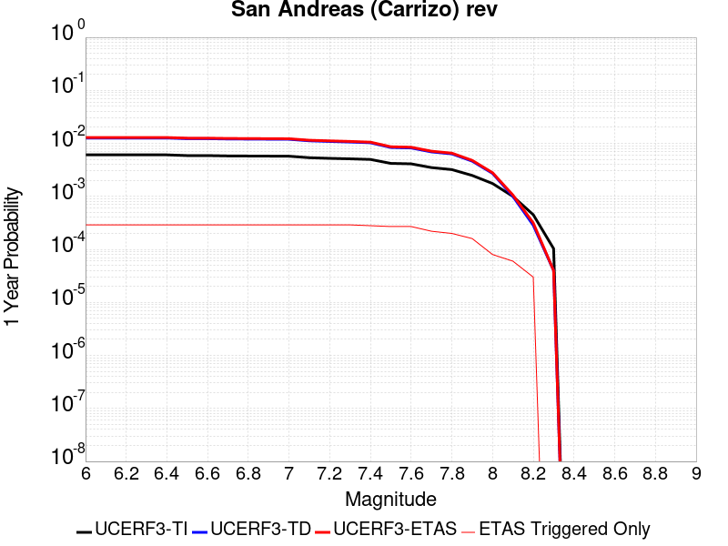 | 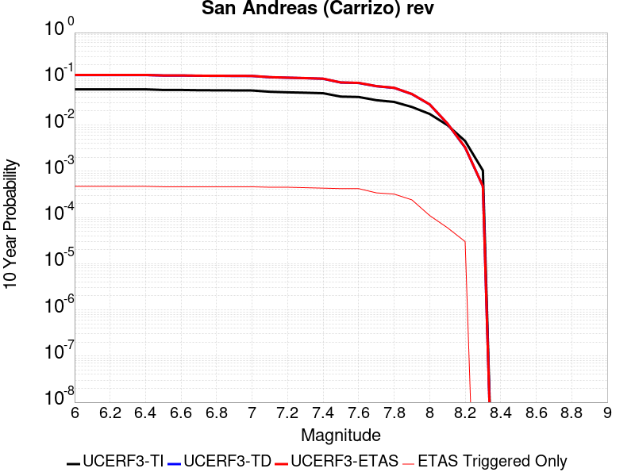 |

| Magnitude | 1 wk TI Prob | 1 wk TD Prob | 1 wk ETAS Prob | 1 wk ETAS/TD Gain | 1 wk ETAS Triggered Only | 1 mo TI Prob | 1 mo TD Prob | 1 mo ETAS Prob | 1 mo ETAS/TD Gain | 1 mo ETAS Triggered Only | 1 yr TI Prob | 1 yr TD Prob | 1 yr ETAS Prob | 1 yr ETAS/TD Gain | 1 yr ETAS Triggered Only | 10 yr TI Prob | 10 yr TD Prob | 10 yr ETAS Prob | 10 yr ETAS/TD Gain | 10 yr ETAS Triggered Only |
|-----|-----|-----|-----|-----|-----|-----|-----|-----|-----|-----|-----|-----|-----|-----|-----|-----|-----|-----|-----|-----|
| 6.0 | 1.1674632E-4 | 2.4324407E-4 | 3.6321487E-4 | 1.4932116 | 1.2E-4 | 5.002454E-4 | 0.0010420597 | 0.001201893 | 1.1533821 | 1.6E-4 | 0.006073493 | 0.012613757 | 0.012900099 | 1.0227008 | 2.9E-4 | 0.0591016 | 0.120640226 | 0.121053524 | 1.0034258 | 4.7E-4 |
| 6.1 | 1.1674632E-4 | 2.4324407E-4 | 3.6321487E-4 | 1.4932116 | 1.2E-4 | 5.002454E-4 | 0.0010420597 | 0.001201893 | 1.1533821 | 1.6E-4 | 0.006073493 | 0.012613757 | 0.012900099 | 1.0227008 | 2.9E-4 | 0.0591016 | 0.120640226 | 0.121053524 | 1.0034258 | 4.7E-4 |
| 6.2 | 1.1674632E-4 | 2.4324407E-4 | 3.6321487E-4 | 1.4932116 | 1.2E-4 | 5.002454E-4 | 0.0010420597 | 0.001201893 | 1.1533821 | 1.6E-4 | 0.006073493 | 0.012613757 | 0.012900099 | 1.0227008 | 2.9E-4 | 0.0591016 | 0.120640226 | 0.121053524 | 1.0034258 | 4.7E-4 |
| 6.3 | 1.1674632E-4 | 2.4324407E-4 | 3.6321487E-4 | 1.4932116 | 1.2E-4 | 5.002454E-4 | 0.0010420597 | 0.001201893 | 1.1533821 | 1.6E-4 | 0.006073493 | 0.012613757 | 0.012900099 | 1.0227008 | 2.9E-4 | 0.0591016 | 0.120640226 | 0.121053524 | 1.0034258 | 4.7E-4 |
| 6.4 | 1.1674632E-4 | 2.4324407E-4 | 3.6321487E-4 | 1.4932116 | 1.2E-4 | 5.002454E-4 | 0.0010420597 | 0.001201893 | 1.1533821 | 1.6E-4 | 0.006073493 | 0.012613757 | 0.012900099 | 1.0227008 | 2.9E-4 | 0.0591016 | 0.120640226 | 0.121053524 | 1.0034258 | 4.7E-4 |
| 6.5 | 1.13136164E-4 | 2.3644442E-4 | 3.5641604E-4 | 1.5073988 | 1.2E-4 | 4.847792E-4 | 0.0010129412 | 0.0011727791 | 1.1577959 | 1.6E-4 | 0.0058862255 | 0.012263271 | 0.012549714 | 1.0233579 | 2.9E-4 | 0.057327334 | 0.11761008 | 0.11801598 | 1.0034512 | 4.6E-4 |
| 6.6 | 1.13136164E-4 | 2.3644442E-4 | 3.5641604E-4 | 1.5073988 | 1.2E-4 | 4.847792E-4 | 0.0010129412 | 0.0011727791 | 1.1577959 | 1.6E-4 | 0.0058862255 | 0.012263271 | 0.012549714 | 1.0233579 | 2.9E-4 | 0.057327334 | 0.11761008 | 0.11801598 | 1.0034512 | 4.6E-4 |
| 6.7 | 1.1149675E-4 | 2.3335687E-4 | 3.5332888E-4 | 1.5141138 | 1.2E-4 | 4.777557E-4 | 9.997191E-4 | 0.0011595591 | 1.1598849 | 1.6E-4 | 0.0058011734 | 0.012104088 | 0.012390578 | 1.0236689 | 2.9E-4 | 0.05652051 | 0.1162291 | 0.116635635 | 1.0034977 | 4.6E-4 |
| 6.8 | 1.1103589E-4 | 2.3237852E-4 | 3.5235062E-4 | 1.5162789 | 1.2E-4 | 4.7578133E-4 | 9.955293E-4 | 0.00115537 | 1.1605586 | 1.6E-4 | 0.005777263 | 0.012053643 | 0.012340148 | 1.0237691 | 2.9E-4 | 0.056293584 | 0.11578894 | 0.11619568 | 1.0035127 | 4.6E-4 |
| 6.9 | 1.1053259E-4 | 2.3130233E-4 | 3.512746E-4 | 1.5186815 | 1.2E-4 | 4.7362508E-4 | 9.909206E-4 | 0.0011507621 | 1.161306 | 1.6E-4 | 0.0057511497 | 0.011998152 | 0.012284673 | 1.0238804 | 2.9E-4 | 0.05604569 | 0.11530445 | 0.115711406 | 1.0035294 | 4.6E-4 |
| 7.0 | 1.1005377E-4 | 2.3031076E-4 | 3.5028314E-4 | 1.5209152 | 1.2E-4 | 4.7157376E-4 | 9.866742E-4 | 0.0011465164 | 1.1620009 | 1.6E-4 | 0.0057263062 | 0.011947021 | 0.012233556 | 1.0239838 | 2.9E-4 | 0.055809796 | 0.11485658 | 0.115263745 | 1.003545 | 4.6E-4 |
| 7.1 | 1.0308142E-4 | 2.1540876E-4 | 3.353829E-4 | 1.5569603 | 1.2E-4 | 4.417027E-4 | 9.228548E-4 | 0.0010827072 | 1.173215 | 1.6E-4 | 0.0053644776 | 0.011178188 | 0.011464947 | 1.0256534 | 2.9E-4 | 0.052368138 | 0.10809042 | 0.108491786 | 1.0037131 | 4.5E-4 |
| 7.2 | 1.0027479E-4 | 2.094876E-4 | 3.2946246E-4 | 1.5727062 | 1.2E-4 | 4.296783E-4 | 8.9749607E-4 | 0.0010573525 | 1.1781137 | 1.6E-4 | 0.0052187922 | 0.010872566 | 0.0111594135 | 1.0263827 | 2.9E-4 | 0.050979212 | 0.10539086 | 0.10579344 | 1.0038198 | 4.5E-4 |
| 7.3 | 9.816942E-5 | 2.0423878E-4 | 3.2421426E-4 | 1.5874276 | 1.2E-4 | 4.2065824E-4 | 8.7501644E-4 | 0.0010348764 | 1.1826937 | 1.6E-4 | 0.005109493 | 0.010601572 | 0.010888497 | 1.0270644 | 2.9E-4 | 0.049935985 | 0.10297546 | 0.103370145 | 1.0038328 | 4.4E-4 |
| 7.4 | 9.5634205E-5 | 1.9793298E-4 | 3.0791122E-4 | 1.5556337 | 1.1E-4 | 4.0979648E-4 | 8.4800937E-4 | 9.978822E-4 | 1.1767348 | 1.5E-4 | 0.0049778637 | 0.010275901 | 0.010553024 | 1.0269682 | 2.8E-4 | 0.048678253 | 0.100067884 | 0.10045485 | 1.003867 | 4.3E-4 |
| 7.5 | 8.052417E-5 | 1.6113915E-4 | 2.6112303E-4 | 1.6204816 | 1.0E-4 | 3.4505792E-4 | 6.9041376E-4 | 8.303171E-4 | 1.202637 | 1.4E-4 | 0.0041929903 | 0.008373471 | 0.00864121 | 1.0319747 | 2.7E-4 | 0.04114753 | 0.082815245 | 0.08320046 | 1.0046515 | 4.2E-4 |
| 7.6 | 7.897024E-5 | 1.5767086E-4 | 2.576551E-4 | 1.6341326 | 1.0E-4 | 3.384E-4 | 6.755574E-4 | 8.1546284E-4 | 1.2070962 | 1.4E-4 | 0.0041122385 | 0.00819397 | 0.008461758 | 1.0326811 | 2.7E-4 | 0.040369697 | 0.08115866 | 0.08154458 | 1.004755 | 4.2E-4 |
| 7.7 | 6.707427E-5 | 1.3277122E-4 | 2.127606E-4 | 1.6024601 | 8.0E-5 | 2.8742946E-4 | 5.688955E-4 | 6.8882725E-4 | 1.2108151 | 1.2E-4 | 0.003493839 | 0.0069043385 | 0.0071228193 | 1.031644 | 2.2E-4 | 0.034394164 | 0.06905339 | 0.06936991 | 1.0045837 | 3.4E-4 |
| 7.8 | 6.147705E-5 | 1.2198445E-4 | 1.9197591E-4 | 1.5737736 | 7.0E-5 | 2.6344648E-4 | 5.226858E-4 | 6.326283E-4 | 1.2103415 | 1.1E-4 | 0.0032027436 | 0.006345156 | 0.0065438873 | 1.0313201 | 2.0E-4 | 0.031569764 | 0.0635172 | 0.06381687 | 1.0047181 | 3.2E-4 |
| 7.9 | 4.7636717E-5 | 8.8802946E-5 | 1.5879673E-4 | 1.7881922 | 7.0E-5 | 2.0414138E-4 | 3.8052857E-4 | 4.804905E-4 | 1.2626923 | 1.0E-4 | 0.0024825884 | 0.004623101 | 0.0047823614 | 1.0344489 | 1.6E-4 | 0.024550365 | 0.046629366 | 0.046858173 | 1.004907 | 2.4E-4 |
| 8.0 | 3.3554235E-5 | 5.2138024E-5 | 5.2138024E-5 | 1.0 | 0.0 | 1.4379594E-4 | 2.2342955E-4 | 2.5342286E-4 | 1.1342405 | 3.0E-5 | 0.0017493097 | 0.002716863 | 0.0027966457 | 1.0293658 | 8.0E-5 | 0.017356034 | 0.027881905 | 0.027988838 | 1.0038352 | 1.1E-4 |
| 8.1 | 1.9175432E-5 | 1.9183564E-5 | 1.9183564E-5 | 1.0 | 0.0 | 8.217783E-5 | 8.221269E-5 | 1.02211045E-4 | 1.2432514 | 2.0E-5 | 0.0010000558 | 0.0010004805 | 0.0010604204 | 1.0599111 | 6.0E-5 | 0.009955673 | 0.010757771 | 0.010817125 | 1.0055174 | 6.0E-5 |
| 8.2 | 8.643924E-6 | 5.473668E-6 | 5.473668E-6 | 1.0 | 0.0 | 3.704486E-5 | 2.3458366E-5 | 2.3458366E-5 | 1.0 | 0.0 | 4.5092785E-4 | 2.8556827E-4 | 3.155597E-4 | 1.1050237 | 3.0E-5 | 0.0045001395 | 0.0032481793 | 0.003278082 | 1.0092059 | 3.0E-5 |
| 8.3 | 1.983087E-6 | 7.6564595E-7 | 7.6564595E-7 | 1.0 | 0.0 | 8.498917E-6 | 3.281336E-6 | 3.281336E-6 | 1.0 | 0.0 | 1.034694E-4 | 3.9949547E-5 | 3.9949547E-5 | 1.0 | 0.0 | 0.0010342124 | 4.717979E-4 | 4.717979E-4 | 1.0 | 0.0 |

## San Andreas (Cholame) rev
*[(top)](#table-of-contents)*

| 1 Week | 1 Month | 1 Year | 10 Year |
|-----|-----|-----|-----|
|  |  |  | 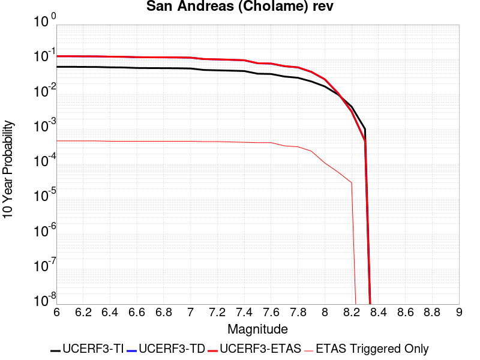 |

| Magnitude | 1 wk TI Prob | 1 wk TD Prob | 1 wk ETAS Prob | 1 wk ETAS/TD Gain | 1 wk ETAS Triggered Only | 1 mo TI Prob | 1 mo TD Prob | 1 mo ETAS Prob | 1 mo ETAS/TD Gain | 1 mo ETAS Triggered Only | 1 yr TI Prob | 1 yr TD Prob | 1 yr ETAS Prob | 1 yr ETAS/TD Gain | 1 yr ETAS Triggered Only | 10 yr TI Prob | 10 yr TD Prob | 10 yr ETAS Prob | 10 yr ETAS/TD Gain | 10 yr ETAS Triggered Only |
|-----|-----|-----|-----|-----|-----|-----|-----|-----|-----|-----|-----|-----|-----|-----|-----|-----|-----|-----|-----|-----|
| 6.0 | 1.2302514E-4 | 2.5205986E-4 | 3.820271E-4 | 1.5156205 | 1.3E-4 | 5.27144E-4 | 0.0010798109 | 0.0012496274 | 1.157265 | 1.7E-4 | 0.0063991086 | 0.013067958 | 0.0133640375 | 1.0226569 | 3.0E-4 | 0.06217949 | 0.12438412 | 0.12479566 | 1.0033087 | 4.7E-4 |
| 6.1 | 1.2302514E-4 | 2.5205986E-4 | 3.820271E-4 | 1.5156205 | 1.3E-4 | 5.27144E-4 | 0.0010798109 | 0.0012496274 | 1.157265 | 1.7E-4 | 0.0063991086 | 0.013067958 | 0.0133640375 | 1.0226569 | 3.0E-4 | 0.06217949 | 0.12438412 | 0.12479566 | 1.0033087 | 4.7E-4 |
| 6.2 | 1.2203569E-4 | 2.502277E-4 | 3.8019515E-4 | 1.5193968 | 1.3E-4 | 5.2290526E-4 | 0.0010719653 | 0.001241783 | 1.1584172 | 1.7E-4 | 0.006347804 | 0.012973578 | 0.013269686 | 1.0228239 | 3.0E-4 | 0.061695136 | 0.123571314 | 0.123983234 | 1.0033334 | 4.7E-4 |
| 6.3 | 1.2142645E-4 | 2.4908737E-4 | 3.79055E-4 | 1.5217752 | 1.3E-4 | 5.202953E-4 | 0.0010670823 | 0.0012369008 | 1.159143 | 1.7E-4 | 0.006316212 | 0.012914834 | 0.013210959 | 1.0229291 | 3.0E-4 | 0.06139677 | 0.12306532 | 0.12347748 | 1.0033491 | 4.7E-4 |
| 6.4 | 1.1865206E-4 | 2.4414246E-4 | 3.6411316E-4 | 1.4913963 | 1.2E-4 | 5.0840975E-4 | 0.0010459068 | 0.0012057394 | 1.1528172 | 1.6E-4 | 0.006172335 | 0.012660044 | 0.012946373 | 1.0226167 | 2.9E-4 | 0.060036868 | 0.12085904 | 0.121263444 | 1.0033461 | 4.6E-4 |
| 6.5 | 1.17443946E-4 | 2.4207575E-4 | 3.620467E-4 | 1.4955926 | 1.2E-4 | 5.032341E-4 | 0.0010370566 | 0.0011968906 | 1.1541228 | 1.6E-4 | 0.006109677 | 0.012553536 | 0.012839896 | 1.022811 | 2.9E-4 | 0.059444077 | 0.11993008 | 0.120334916 | 1.0033755 | 4.6E-4 |
| 6.6 | 1.13579066E-4 | 2.3516564E-4 | 3.5513742E-4 | 1.5101587 | 1.2E-4 | 4.866766E-4 | 0.001007465 | 0.0011673038 | 1.1586545 | 1.6E-4 | 0.0059092017 | 0.012197345 | 0.012483807 | 1.0234857 | 2.9E-4 | 0.057545185 | 0.1168492 | 0.11725545 | 1.0034767 | 4.6E-4 |
| 6.7 | 1.1271412E-4 | 2.336088E-4 | 3.5358078E-4 | 1.5135592 | 1.2E-4 | 4.829711E-4 | 0.001000798 | 0.0011606378 | 1.1597124 | 1.6E-4 | 0.005864331 | 0.012117079 | 0.012403565 | 1.0236431 | 2.9E-4 | 0.057119697 | 0.11615275 | 0.11655932 | 1.0035003 | 4.6E-4 |
| 6.8 | 1.1217975E-4 | 2.3249313E-4 | 3.5246523E-4 | 1.5160244 | 1.2E-4 | 4.8068175E-4 | 9.960202E-4 | 0.0011558607 | 1.1604793 | 1.6E-4 | 0.005836608 | 0.012059555 | 0.012346058 | 1.0237573 | 2.9E-4 | 0.056856725 | 0.11565061 | 0.11605741 | 1.0035175 | 4.6E-4 |
| 6.9 | 1.1146753E-4 | 2.3098059E-4 | 3.5095288E-4 | 1.5194042 | 1.2E-4 | 4.7763053E-4 | 9.895428E-4 | 0.0011493844 | 1.1615309 | 1.6E-4 | 0.0057996577 | 0.011981564 | 0.012268089 | 1.0239139 | 2.9E-4 | 0.056506127 | 0.11497027 | 0.11537738 | 1.003541 | 4.6E-4 |
| 7.0 | 1.0965793E-4 | 2.2721413E-4 | 3.4718687E-4 | 1.5280162 | 1.2E-4 | 4.698779E-4 | 9.734129E-4 | 0.0011332572 | 1.1642101 | 1.6E-4 | 0.005705768 | 0.011787324 | 0.012073906 | 1.0243127 | 2.9E-4 | 0.055614736 | 0.11327011 | 0.11367801 | 1.0036011 | 4.6E-4 |
| 7.1 | 9.927982E-5 | 2.0540332E-4 | 3.2537867E-4 | 1.5840964 | 1.2E-4 | 4.2541555E-4 | 8.8000396E-4 | 0.0010398632 | 1.1816573 | 1.6E-4 | 0.0051671406 | 0.010661708 | 0.010948617 | 1.0269102 | 2.9E-4 | 0.05048634 | 0.10336573 | 0.10376921 | 1.0039035 | 4.5E-4 |
| 7.2 | 9.696786E-5 | 2.0044584E-4 | 3.204218E-4 | 1.5985454 | 1.2E-4 | 4.1551032E-4 | 8.587718E-4 | 0.0010186344 | 1.1861526 | 1.6E-4 | 0.00504711 | 0.010405703 | 0.010692686 | 1.0275793 | 2.9E-4 | 0.04934009 | 0.10110233 | 0.10150684 | 1.0040009 | 4.5E-4 |
| 7.3 | 9.4727984E-5 | 1.9473763E-4 | 3.1471427E-4 | 1.6160938 | 1.2E-4 | 4.0591392E-4 | 8.343239E-4 | 9.941903E-4 | 1.191612 | 1.6E-4 | 0.0049308087 | 0.010110851 | 0.0103979185 | 1.0283921 | 2.9E-4 | 0.048228268 | 0.09847412 | 0.09887079 | 1.0040282 | 4.4E-4 |
| 7.4 | 9.220358E-5 | 1.8844259E-4 | 2.9842186E-4 | 1.5836222 | 1.1E-4 | 3.9509835E-4 | 8.07362E-4 | 9.5724093E-4 | 1.1856402 | 1.5E-4 | 0.004799717 | 0.009785578 | 0.010062838 | 1.0283335 | 2.8E-4 | 0.046973653 | 0.09555831 | 0.09594722 | 1.0040699 | 4.3E-4 |
| 7.5 | 7.71631E-5 | 1.5179155E-4 | 2.5177636E-4 | 1.6586982 | 1.0E-4 | 3.306571E-4 | 6.5037323E-4 | 7.9028215E-4 | 1.215121 | 1.4E-4 | 0.0040183207 | 0.007889617 | 0.008157487 | 1.0339522 | 2.7E-4 | 0.03946433 | 0.078289196 | 0.07867631 | 1.0049447 | 4.2E-4 |
| 7.6 | 7.5634416E-5 | 1.4838556E-4 | 2.4837072E-4 | 1.67382 | 1.0E-4 | 3.241072E-4 | 6.357833E-4 | 7.7569427E-4 | 1.2200608 | 1.4E-4 | 0.0039388672 | 0.007713256 | 0.007981173 | 1.0347347 | 2.7E-4 | 0.038697794 | 0.076654874 | 0.077042684 | 1.0050591 | 4.2E-4 |
| 7.7 | 6.3783E-5 | 1.2359623E-4 | 2.0358634E-4 | 1.6471889 | 8.0E-5 | 2.7332708E-4 | 5.2959064E-4 | 6.4952706E-4 | 1.2264701 | 1.2E-4 | 0.0033226798 | 0.0064287307 | 0.0066473163 | 1.0340014 | 2.2E-4 | 0.032734364 | 0.06454488 | 0.06486293 | 1.0049276 | 3.4E-4 |
| 7.8 | 5.863422E-5 | 1.14169685E-4 | 1.8416169E-4 | 1.6130525 | 7.0E-5 | 2.512653E-4 | 4.892069E-4 | 5.991531E-4 | 1.2247437 | 1.1E-4 | 0.003054864 | 0.0059398497 | 0.0061386614 | 1.0334709 | 2.0E-4 | 0.030132094 | 0.05966162 | 0.05996253 | 1.0050436 | 3.2E-4 |
| 7.9 | 4.595283E-5 | 8.426815E-5 | 1.5426225E-4 | 1.8306116 | 7.0E-5 | 1.9692584E-4 | 3.6109926E-4 | 4.6106314E-4 | 1.2768322 | 1.0E-4 | 0.0023949358 | 0.0043875277 | 0.004546826 | 1.036307 | 1.6E-4 | 0.023692891 | 0.044363137 | 0.044592492 | 1.0051699 | 2.4E-4 |
| 8.0 | 3.2950178E-5 | 5.077396E-5 | 5.077396E-5 | 1.0 | 0.0 | 1.412074E-4 | 2.1758456E-4 | 2.4757802E-4 | 1.1378474 | 3.0E-5 | 0.0017178444 | 0.0026458753 | 0.0027256638 | 1.0301558 | 8.0E-5 | 0.017046256 | 0.027181072 | 0.027288083 | 1.0039369 | 1.1E-4 |
| 8.1 | 1.9177472E-5 | 1.9183733E-5 | 1.9183733E-5 | 1.0 | 0.0 | 8.218658E-5 | 8.221342E-5 | 1.0221177E-4 | 1.2432493 | 2.0E-5 | 0.0010001622 | 0.0010004893 | 0.0010604293 | 1.0599107 | 6.0E-5 | 0.009956728 | 0.010757887 | 0.010817241 | 1.0055172 | 6.0E-5 |
| 8.2 | 8.643924E-6 | 5.473668E-6 | 5.473668E-6 | 1.0 | 0.0 | 3.704486E-5 | 2.3458366E-5 | 2.3458366E-5 | 1.0 | 0.0 | 4.5092785E-4 | 2.8556827E-4 | 3.155597E-4 | 1.1050237 | 3.0E-5 | 0.0045001395 | 0.0032481793 | 0.003278082 | 1.0092059 | 3.0E-5 |
| 8.3 | 1.983087E-6 | 7.6564595E-7 | 7.6564595E-7 | 1.0 | 0.0 | 8.498917E-6 | 3.281336E-6 | 3.281336E-6 | 1.0 | 0.0 | 1.034694E-4 | 3.9949547E-5 | 3.9949547E-5 | 1.0 | 0.0 | 0.0010342124 | 4.717979E-4 | 4.717979E-4 | 1.0 | 0.0 |

## Red Pass
*[(top)](#table-of-contents)*

| 1 Week | 1 Month | 1 Year | 10 Year |
|-----|-----|-----|-----|
|  |  |  |  |

| Magnitude | 1 wk TI Prob | 1 wk TD Prob | 1 wk ETAS Prob | 1 wk ETAS/TD Gain | 1 wk ETAS Triggered Only | 1 mo TI Prob | 1 mo TD Prob | 1 mo ETAS Prob | 1 mo ETAS/TD Gain | 1 mo ETAS Triggered Only | 1 yr TI Prob | 1 yr TD Prob | 1 yr ETAS Prob | 1 yr ETAS/TD Gain | 1 yr ETAS Triggered Only | 10 yr TI Prob | 10 yr TD Prob | 10 yr ETAS Prob | 10 yr ETAS/TD Gain | 10 yr ETAS Triggered Only |
|-----|-----|-----|-----|-----|-----|-----|-----|-----|-----|-----|-----|-----|-----|-----|-----|-----|-----|-----|-----|-----|
| 6.0 | 8.258278E-6 | 8.551265E-6 | 1.4855007E-4 | 17.371706 | 1.4E-4 | 3.539214E-5 | 3.6647863E-5 | 2.0664163E-4 | 5.638572 | 1.7E-4 | 4.308141E-4 | 4.4611428E-4 | 7.159938E-4 | 1.6049562 | 2.7E-4 | 0.0042997985 | 0.004453945 | 0.0048720744 | 1.0938784 | 4.2E-4 |
| 6.1 | 3.649988E-6 | 3.7753161E-6 | 8.377501E-5 | 22.190199 | 8.0E-5 | 1.5642712E-5 | 1.6179853E-5 | 1.061784E-4 | 6.5623837 | 9.0E-5 | 1.9043336E-4 | 1.9697666E-4 | 3.1695302E-4 | 1.6090893 | 1.2E-4 | 0.0019027026 | 0.001968488 | 0.0021680943 | 1.1014009 | 2.0E-4 |
| 6.2 | 3.649988E-6 | 3.7753161E-6 | 8.377501E-5 | 22.190199 | 8.0E-5 | 1.5642712E-5 | 1.6179853E-5 | 1.061784E-4 | 6.5623837 | 9.0E-5 | 1.9043336E-4 | 1.9697666E-4 | 3.1695302E-4 | 1.6090893 | 1.2E-4 | 0.0019027026 | 0.001968488 | 0.0021680943 | 1.1014009 | 2.0E-4 |
| 6.3 | 1.3924937E-6 | 1.4411166E-6 | 2.1441088E-5 | 14.878107 | 2.0E-5 | 5.9678164E-6 | 6.1762075E-6 | 3.617602E-5 | 5.85732 | 3.0E-5 | 7.265574E-5 | 7.519415E-5 | 1.2519039E-4 | 1.6648954 | 5.0E-5 | 7.263199E-4 | 7.518258E-4 | 8.217732E-4 | 1.0930367 | 7.0E-5 |
| 6.4 | 1.3924937E-6 | 1.4411166E-6 | 2.1441088E-5 | 14.878107 | 2.0E-5 | 5.9678164E-6 | 6.1762075E-6 | 3.617602E-5 | 5.85732 | 3.0E-5 | 7.265574E-5 | 7.519415E-5 | 1.2519039E-4 | 1.6648954 | 5.0E-5 | 7.263199E-4 | 7.518258E-4 | 8.217732E-4 | 1.0930367 | 7.0E-5 |
| 6.5 | 9.876812E-7 | 1.0221912E-6 | 1.0221912E-6 | 1.0 | 0.0 | 4.2329125E-6 | 4.3808195E-6 | 1.4380776E-5 | 3.2826679 | 1.0E-5 | 5.153449E-5 | 5.3336476E-5 | 7.333541E-5 | 1.3749579 | 2.0E-5 | 5.1522546E-4 | 5.333648E-4 | 5.733434E-4 | 1.0749556 | 4.0E-5 |

## Scodie Lineament
*[(top)](#table-of-contents)*

| 1 Week | 1 Month | 1 Year | 10 Year |
|-----|-----|-----|-----|
| 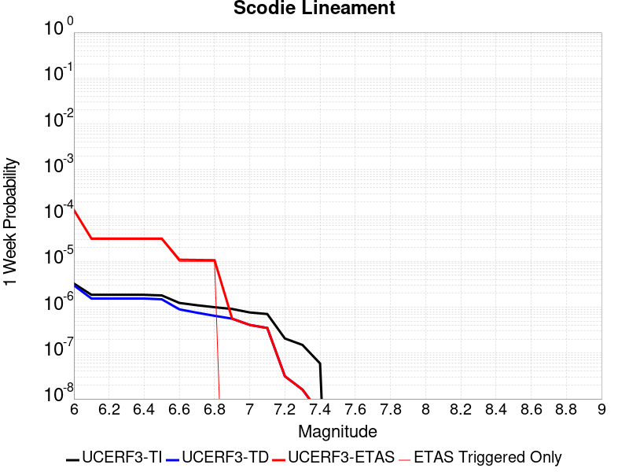 |  |  |  |

| Magnitude | 1 wk TI Prob | 1 wk TD Prob | 1 wk ETAS Prob | 1 wk ETAS/TD Gain | 1 wk ETAS Triggered Only | 1 mo TI Prob | 1 mo TD Prob | 1 mo ETAS Prob | 1 mo ETAS/TD Gain | 1 mo ETAS Triggered Only | 1 yr TI Prob | 1 yr TD Prob | 1 yr ETAS Prob | 1 yr ETAS/TD Gain | 1 yr ETAS Triggered Only | 10 yr TI Prob | 10 yr TD Prob | 10 yr ETAS Prob | 10 yr ETAS/TD Gain | 10 yr ETAS Triggered Only |
|-----|-----|-----|-----|-----|-----|-----|-----|-----|-----|-----|-----|-----|-----|-----|-----|-----|-----|-----|-----|-----|
| 6.0 | 3.2919327E-6 | 3.0133303E-6 | 1.3301295E-4 | 44.141502 | 1.3E-4 | 1.4108206E-5 | 1.2914227E-5 | 1.6291229E-4 | 12.614946 | 1.5E-4 | 1.7175387E-4 | 1.5722254E-4 | 4.571754E-4 | 2.9078233 | 3.0E-4 | 0.0017162118 | 0.0015714248 | 0.0019807804 | 1.2604997 | 4.1E-4 |
| 6.1 | 1.8663811E-6 | 1.5490382E-6 | 3.1548992E-5 | 20.366827 | 3.0E-5 | 7.998751E-6 | 6.6387206E-6 | 4.6638455E-5 | 7.025217 | 4.0E-5 | 9.738045E-5 | 8.082393E-5 | 1.7081665E-4 | 2.1134417 | 9.0E-5 | 9.7337784E-4 | 8.079941E-4 | 9.4788097E-4 | 1.1731286 | 1.4E-4 |
| 6.2 | 1.8663811E-6 | 1.5490382E-6 | 3.1548992E-5 | 20.366827 | 3.0E-5 | 7.998751E-6 | 6.6387206E-6 | 4.6638455E-5 | 7.025217 | 4.0E-5 | 9.738045E-5 | 8.082393E-5 | 1.7081665E-4 | 2.1134417 | 9.0E-5 | 9.7337784E-4 | 8.079941E-4 | 9.4788097E-4 | 1.1731286 | 1.4E-4 |
| 6.3 | 1.8663811E-6 | 1.5490382E-6 | 3.1548992E-5 | 20.366827 | 3.0E-5 | 7.998751E-6 | 6.6387206E-6 | 4.6638455E-5 | 7.025217 | 4.0E-5 | 9.738045E-5 | 8.082393E-5 | 1.7081665E-4 | 2.1134417 | 9.0E-5 | 9.7337784E-4 | 8.079941E-4 | 9.4788097E-4 | 1.1731286 | 1.4E-4 |
| 6.4 | 1.8663811E-6 | 1.5490382E-6 | 3.1548992E-5 | 20.366827 | 3.0E-5 | 7.998751E-6 | 6.6387206E-6 | 4.6638455E-5 | 7.025217 | 4.0E-5 | 9.738045E-5 | 8.082393E-5 | 1.7081665E-4 | 2.1134417 | 9.0E-5 | 9.7337784E-4 | 8.079941E-4 | 9.4788097E-4 | 1.1731286 | 1.4E-4 |
| 6.5 | 1.8106311E-6 | 1.4909722E-6 | 3.1490927E-5 | 21.12107 | 3.0E-5 | 7.759824E-6 | 6.389868E-6 | 4.6389614E-5 | 7.2598705 | 4.0E-5 | 9.447177E-5 | 7.779436E-5 | 1.6778735E-4 | 2.1568062 | 9.0E-5 | 9.4431615E-4 | 7.7771995E-4 | 9.0761884E-4 | 1.1670253 | 1.3E-4 |
| 6.6 | 1.2414679E-6 | 8.9974395E-7 | 1.0899735E-5 | 12.114263 | 1.0E-5 | 5.320566E-6 | 3.85604E-6 | 2.3855962E-5 | 6.186648 | 2.0E-5 | 6.477596E-5 | 4.6946367E-5 | 7.694496E-5 | 1.6389971 | 3.0E-5 | 6.475708E-4 | 4.6937316E-4 | 5.193497E-4 | 1.106475 | 5.0E-5 |
| 6.7 | 1.1062215E-6 | 7.594193E-7 | 1.0759411E-5 | 14.167946 | 1.0E-5 | 4.7409408E-6 | 3.2546504E-6 | 1.3254618E-5 | 4.0725164 | 1.0E-5 | 5.7719422E-5 | 3.962472E-5 | 5.962393E-5 | 1.5047154 | 2.0E-5 | 5.770443E-4 | 3.9618355E-4 | 4.361677E-4 | 1.1009233 | 4.0E-5 |
| 6.8 | 1.0006736E-6 | 6.5002786E-7 | 1.0650021E-5 | 16.383945 | 1.0E-5 | 4.288594E-6 | 2.7858312E-6 | 1.2785803E-5 | 4.589583 | 1.0E-5 | 5.221238E-5 | 3.391703E-5 | 5.391635E-5 | 1.5896543 | 2.0E-5 | 5.220012E-4 | 3.3912458E-4 | 3.7911104E-4 | 1.1179107 | 4.0E-5 |
| 6.9 | 9.167364E-7 | 5.6315065E-7 | 5.6315065E-7 | 1.0 | 0.0 | 3.9288643E-6 | 2.413501E-6 | 2.413501E-6 | 1.0 | 0.0 | 4.7832873E-5 | 2.9384037E-5 | 3.9383744E-5 | 1.3403108 | 1.0E-5 | 4.782258E-4 | 2.9380718E-4 | 3.2379836E-4 | 1.1020778 | 3.0E-5 |
| 7.0 | 7.6987664E-7 | 4.113265E-7 | 4.113265E-7 | 1.0 | 0.0 | 3.2994672E-6 | 1.7628269E-6 | 1.7628269E-6 | 1.0 | 0.0 | 4.0170275E-5 | 2.1462245E-5 | 2.1462245E-5 | 1.0 | 0.0 | 4.0163012E-4 | 2.1460558E-4 | 2.2460344E-4 | 1.0465871 | 1.0E-5 |
| 7.1 | 7.1038727E-7 | 3.5210306E-7 | 3.5210306E-7 | 1.0 | 0.0 | 3.0445133E-6 | 1.5090123E-6 | 1.5090123E-6 | 1.0 | 0.0 | 3.706632E-5 | 1.8372106E-5 | 1.8372106E-5 | 1.0 | 0.0 | 3.7060137E-4 | 1.8370937E-4 | 1.8370937E-4 | 1.0 | 0.0 |
| 7.2 | 2.0799602E-7 | 3.1178534E-8 | 3.1178534E-8 | 1.0 | 0.0 | 8.914113E-7 | 1.3362228E-7 | 1.3362228E-7 | 1.0 | 0.0 | 1.0852878E-5 | 1.6268501E-6 | 1.6268501E-6 | 1.0 | 0.0 | 1.08523476E-4 | 1.626839E-5 | 1.626839E-5 | 1.0 | 0.0 |
| 7.3 | 1.5048182E-7 | 1.5939106E-8 | 1.5939106E-8 | 1.0 | 0.0 | 6.449219E-7 | 6.8310456E-8 | 6.8310456E-8 | 1.0 | 0.0 | 7.851896E-6 | 8.316795E-7 | 8.316795E-7 | 1.0 | 0.0 | 7.851618E-5 | 8.316767E-6 | 8.316767E-6 | 1.0 | 0.0 |
| 7.4 | 5.9334678E-8 | 4.8638475E-9 | 4.8638475E-9 | 1.0 | 0.0 | 2.5429145E-7 | 2.084506E-8 | 2.084506E-8 | 1.0 | 0.0 | 3.095994E-6 | 2.5378858E-7 | 2.5378858E-7 | 1.0 | 0.0 | 3.095951E-5 | 2.5378843E-6 | 2.5378843E-6 | 1.0 | 0.0 |

## Cady
*[(top)](#table-of-contents)*

| 1 Week | 1 Month | 1 Year | 10 Year |
|-----|-----|-----|-----|
|  | 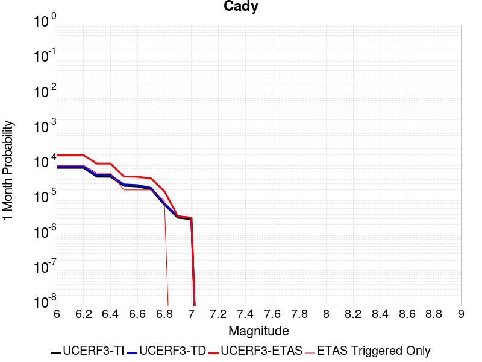 |  |  |

| Magnitude | 1 wk TI Prob | 1 wk TD Prob | 1 wk ETAS Prob | 1 wk ETAS/TD Gain | 1 wk ETAS Triggered Only | 1 mo TI Prob | 1 mo TD Prob | 1 mo ETAS Prob | 1 mo ETAS/TD Gain | 1 mo ETAS Triggered Only | 1 yr TI Prob | 1 yr TD Prob | 1 yr ETAS Prob | 1 yr ETAS/TD Gain | 1 yr ETAS Triggered Only | 10 yr TI Prob | 10 yr TD Prob | 10 yr ETAS Prob | 10 yr ETAS/TD Gain | 10 yr ETAS Triggered Only |
|-----|-----|-----|-----|-----|-----|-----|-----|-----|-----|-----|-----|-----|-----|-----|-----|-----|-----|-----|-----|-----|
| 6.0 | 1.9892565E-5 | 2.1858728E-5 | 1.0185698E-4 | 4.6597853 | 8.0E-5 | 8.525106E-5 | 9.3677416E-5 | 1.9366805E-4 | 2.067393 | 1.0E-4 | 0.0010374374 | 0.0011400167 | 0.0013897317 | 1.219045 | 2.5E-4 | 0.010326075 | 0.011350701 | 0.011726387 | 1.0330981 | 3.8E-4 |
| 6.1 | 1.9892565E-5 | 2.1858728E-5 | 1.0185698E-4 | 4.6597853 | 8.0E-5 | 8.525106E-5 | 9.3677416E-5 | 1.9366805E-4 | 2.067393 | 1.0E-4 | 0.0010374374 | 0.0011400167 | 0.0013897317 | 1.219045 | 2.5E-4 | 0.010326075 | 0.011350701 | 0.011726387 | 1.0330981 | 3.8E-4 |
| 6.2 | 1.9892565E-5 | 2.1858728E-5 | 1.0185698E-4 | 4.6597853 | 8.0E-5 | 8.525106E-5 | 9.3677416E-5 | 1.9366805E-4 | 2.067393 | 1.0E-4 | 0.0010374374 | 0.0011400167 | 0.0013897317 | 1.219045 | 2.5E-4 | 0.010326075 | 0.011350701 | 0.011726387 | 1.0330981 | 3.8E-4 |
| 6.3 | 1.1117327E-5 | 1.2176583E-5 | 5.2176096E-5 | 4.2849536 | 4.0E-5 | 4.764482E-5 | 5.2184492E-5 | 1.1218136E-4 | 2.1497068 | 6.0E-5 | 5.7992124E-4 | 6.351925E-4 | 7.9509086E-4 | 1.2517321 | 1.6E-4 | 0.0057841022 | 0.0063368753 | 0.0065753544 | 1.0376335 | 2.4E-4 |
| 6.4 | 1.1117327E-5 | 1.2176583E-5 | 5.2176096E-5 | 4.2849536 | 4.0E-5 | 4.764482E-5 | 5.2184492E-5 | 1.1218136E-4 | 2.1497068 | 6.0E-5 | 5.7992124E-4 | 6.351925E-4 | 7.9509086E-4 | 1.2517321 | 1.6E-4 | 0.0057841022 | 0.0063368753 | 0.0065753544 | 1.0376335 | 2.4E-4 |
| 6.5 | 6.103093E-6 | 6.672021E-6 | 1.6671955E-5 | 2.4987862 | 1.0E-5 | 2.615585E-5 | 2.8594131E-5 | 4.859356E-5 | 1.6994243 | 2.0E-5 | 3.1840094E-4 | 3.480905E-4 | 4.2806266E-4 | 1.2297453 | 8.0E-5 | 0.0031794512 | 0.0034766865 | 0.0035962695 | 1.0343956 | 1.2E-4 |
| 6.6 | 5.817237E-6 | 6.3656585E-6 | 1.6365595E-5 | 2.5709193 | 1.0E-5 | 2.4930776E-5 | 2.728118E-5 | 4.728063E-5 | 1.7330861 | 2.0E-5 | 3.034899E-4 | 3.3211018E-4 | 4.120836E-4 | 1.240804 | 8.0E-5 | 0.0030307577 | 0.0033173605 | 0.0034369624 | 1.0360533 | 1.2E-4 |
| 6.7 | 4.8846314E-6 | 5.3405684E-6 | 1.5340514E-5 | 2.8724499 | 1.0E-5 | 2.0933967E-5 | 2.2888014E-5 | 4.2887557E-5 | 1.8737998 | 2.0E-5 | 2.5484123E-4 | 2.7863772E-4 | 3.286238E-4 | 1.1793945 | 5.0E-5 | 0.0025454918 | 0.0027840391 | 0.0028638165 | 1.0286552 | 8.0E-5 |
| 6.8 | 1.7788773E-6 | 1.9399079E-6 | 1.1939888E-5 | 6.154874 | 1.0E-5 | 7.6237375E-6 | 8.313874E-6 | 1.831379E-5 | 2.2027988 | 1.0E-5 | 9.281505E-5 | 1.01218284E-4 | 1.2121626E-4 | 1.1975727 | 2.0E-5 | 9.2776294E-4 | 0.0010118765 | 0.0010418461 | 1.0296179 | 3.0E-5 |
| 6.9 | 7.5455404E-7 | 8.297092E-7 | 8.297092E-7 | 1.0 | 0.0 | 3.233799E-6 | 3.5558937E-6 | 3.5558937E-6 | 1.0 | 0.0 | 3.937079E-5 | 4.3292483E-5 | 4.3292483E-5 | 1.0 | 0.0 | 3.9363815E-4 | 4.3287344E-4 | 4.3287344E-4 | 1.0 | 0.0 |
| 7.0 | 6.8578805E-7 | 7.541816E-7 | 7.541816E-7 | 1.0 | 0.0 | 2.9390883E-6 | 3.2322048E-6 | 3.2322048E-6 | 1.0 | 0.0 | 3.578281E-5 | 3.9351715E-5 | 3.9351715E-5 | 1.0 | 0.0 | 3.577705E-4 | 3.9347992E-4 | 3.9347992E-4 | 1.0 | 0.0 |

## Calico-Hidalgo
*[(top)](#table-of-contents)*

| 1 Week | 1 Month | 1 Year | 10 Year |
|-----|-----|-----|-----|
|  |  |  |  |

| Magnitude | 1 wk TI Prob | 1 wk TD Prob | 1 wk ETAS Prob | 1 wk ETAS/TD Gain | 1 wk ETAS Triggered Only | 1 mo TI Prob | 1 mo TD Prob | 1 mo ETAS Prob | 1 mo ETAS/TD Gain | 1 mo ETAS Triggered Only | 1 yr TI Prob | 1 yr TD Prob | 1 yr ETAS Prob | 1 yr ETAS/TD Gain | 1 yr ETAS Triggered Only | 10 yr TI Prob | 10 yr TD Prob | 10 yr ETAS Prob | 10 yr ETAS/TD Gain | 10 yr ETAS Triggered Only |
|-----|-----|-----|-----|-----|-----|-----|-----|-----|-----|-----|-----|-----|-----|-----|-----|-----|-----|-----|-----|-----|
| 6.0 | 4.0906612E-5 | 5.0704355E-5 | 1.6069878E-4 | 3.169329 | 1.1E-4 | 1.7530227E-4 | 2.1728857E-4 | 3.372625E-4 | 1.552141 | 1.2E-4 | 0.0021322158 | 0.002642678 | 0.0028521232 | 1.0792549 | 2.1E-4 | 0.02111873 | 0.026152814 | 0.026503399 | 1.0134052 | 3.6E-4 |
| 6.1 | 4.0906612E-5 | 5.0704355E-5 | 1.6069878E-4 | 3.169329 | 1.1E-4 | 1.7530227E-4 | 2.1728857E-4 | 3.372625E-4 | 1.552141 | 1.2E-4 | 0.0021322158 | 0.002642678 | 0.0028521232 | 1.0792549 | 2.1E-4 | 0.02111873 | 0.026152814 | 0.026503399 | 1.0134052 | 3.6E-4 |
| 6.2 | 4.0906612E-5 | 5.0704355E-5 | 1.6069878E-4 | 3.169329 | 1.1E-4 | 1.7530227E-4 | 2.1728857E-4 | 3.372625E-4 | 1.552141 | 1.2E-4 | 0.0021322158 | 0.002642678 | 0.0028521232 | 1.0792549 | 2.1E-4 | 0.02111873 | 0.026152814 | 0.026503399 | 1.0134052 | 3.6E-4 |
| 6.3 | 2.4242801E-5 | 3.0090967E-5 | 9.008916E-5 | 2.9938939 | 6.0E-5 | 1.0389358E-4 | 1.289551E-4 | 1.8894736E-4 | 1.4652182 | 6.0E-5 | 0.0012641704 | 0.0015689312 | 0.0016987273 | 1.082729 | 1.3E-4 | 0.01257003 | 0.015582229 | 0.015788956 | 1.0132669 | 2.1E-4 |
| 6.4 | 2.4242801E-5 | 3.0090967E-5 | 9.008916E-5 | 2.9938939 | 6.0E-5 | 1.0389358E-4 | 1.289551E-4 | 1.8894736E-4 | 1.4652182 | 6.0E-5 | 0.0012641704 | 0.0015689312 | 0.0016987273 | 1.082729 | 1.3E-4 | 0.01257003 | 0.015582229 | 0.015788956 | 1.0132669 | 2.1E-4 |
| 6.5 | 2.0286952E-5 | 2.5316054E-5 | 7.531479E-5 | 2.9749813 | 5.0E-5 | 8.694118E-5 | 1.0849296E-4 | 1.5848754E-4 | 1.4608094 | 5.0E-5 | 0.0010579949 | 0.0013201186 | 0.0014199865 | 1.0756508 | 1.0E-4 | 0.010529719 | 0.013124701 | 0.013302338 | 1.0135345 | 1.8E-4 |
| 6.6 | 2.0269223E-5 | 2.5297004E-5 | 7.529574E-5 | 2.9764686 | 5.0E-5 | 8.6865206E-5 | 1.08411325E-4 | 1.584059E-4 | 1.4611565 | 5.0E-5 | 0.0010570707 | 0.0013191258 | 0.0014189938 | 1.0757078 | 1.0E-4 | 0.010520565 | 0.01311489 | 0.01329253 | 1.0135449 | 1.8E-4 |
| 6.7 | 1.799852E-5 | 2.2540933E-5 | 7.2539806E-5 | 3.2181368 | 5.0E-5 | 7.713423E-5 | 9.660051E-5 | 1.4659567E-4 | 1.5175456 | 5.0E-5 | 9.3870464E-4 | 0.0011754911 | 0.0012753736 | 1.0849708 | 1.0E-4 | 0.009347493 | 0.011694346 | 0.011862357 | 1.014367 | 1.7E-4 |
| 6.8 | 1.7458793E-5 | 2.184258E-5 | 7.184149E-5 | 3.2890568 | 5.0E-5 | 7.4821255E-5 | 9.360778E-5 | 1.436031E-4 | 1.5340936 | 5.0E-5 | 9.10568E-4 | 0.0011390933 | 0.0012389794 | 1.0876892 | 1.0E-4 | 0.009068459 | 0.011334131 | 0.0115022035 | 1.0148289 | 1.7E-4 |
| 6.9 | 1.542884E-5 | 1.9026285E-5 | 6.902534E-5 | 3.6278934 | 5.0E-5 | 6.612192E-5 | 8.153875E-5 | 1.3153467E-4 | 1.6131554 | 5.0E-5 | 8.04737E-4 | 9.922953E-4 | 0.001082206 | 1.0906088 | 9.0E-5 | 0.008018291 | 0.009880043 | 0.0100384625 | 1.0160342 | 1.6E-4 |
| 7.0 | 1.468253E-5 | 1.803109E-5 | 6.803019E-5 | 3.772938 | 5.0E-5 | 6.292361E-5 | 7.727389E-5 | 1.2727003E-4 | 1.6469991 | 5.0E-5 | 7.658257E-4 | 9.4041653E-4 | 0.001030332 | 1.0956123 | 9.0E-5 | 0.0076319184 | 0.009365736 | 0.009524237 | 1.0169235 | 1.6E-4 |
| 7.1 | 1.3139281E-5 | 1.620139E-5 | 6.620058E-5 | 4.086105 | 5.0E-5 | 5.6309986E-5 | 6.943275E-5 | 1.1942928E-4 | 1.7200713 | 5.0E-5 | 6.853584E-4 | 8.4502844E-4 | 9.349524E-4 | 1.1064153 | 9.0E-5 | 0.0068324856 | 0.008419449 | 0.008568186 | 1.0176659 | 1.5E-4 |
| 7.2 | 1.1127404E-5 | 1.3867038E-5 | 6.386635E-5 | 4.6056223 | 5.0E-5 | 4.7688E-5 | 5.9428872E-5 | 1.094259E-4 | 1.8412919 | 5.0E-5 | 5.8044674E-4 | 7.233172E-4 | 8.132521E-4 | 1.1243367 | 9.0E-5 | 0.0057893298 | 0.007210737 | 0.0073398 | 1.0178987 | 1.3E-4 |
| 7.3 | 9.808154E-6 | 1.2176586E-5 | 6.2175975E-5 | 5.106191 | 5.0E-5 | 4.2034266E-5 | 5.2184383E-5 | 1.0218177E-4 | 1.958091 | 5.0E-5 | 5.11647E-4 | 6.351704E-4 | 7.151196E-4 | 1.1258705 | 8.0E-5 | 0.0051047057 | 0.006334625 | 0.0064439285 | 1.0172548 | 1.1E-4 |
| 7.4 | 7.942452E-6 | 9.792348E-6 | 5.979186E-5 | 6.1059775 | 5.0E-5 | 3.4038632E-5 | 4.1966585E-5 | 9.196449E-5 | 2.191374 | 5.0E-5 | 4.1434157E-4 | 5.108328E-4 | 5.807971E-4 | 1.1369611 | 7.0E-5 | 0.0041356985 | 0.005097527 | 0.0051970175 | 1.0195173 | 1.0E-4 |
| 7.5 | 4.7121216E-6 | 5.7729717E-6 | 2.5772857E-5 | 4.4644003 | 2.0E-5 | 2.019465E-5 | 2.4741115E-5 | 4.474062E-5 | 1.808351 | 2.0E-5 | 2.4584212E-4 | 3.011891E-4 | 3.4117704E-4 | 1.132767 | 4.0E-5 | 0.0024557032 | 0.0030085614 | 0.0030783508 | 1.0231969 | 7.0E-5 |
| 7.6 | 2.21172E-7 | 2.6040198E-7 | 2.6040198E-7 | 1.0 | 0.0 | 9.478797E-7 | 1.1160082E-6 | 1.1160082E-6 | 1.0 | 0.0 | 1.1540374E-5 | 1.3587343E-5 | 2.3587207E-5 | 1.7359691 | 1.0E-5 | 1.1539775E-4 | 1.3586794E-4 | 1.4586658E-4 | 1.0735909 | 1.0E-5 |

## Manix-Afton Hills
*[(top)](#table-of-contents)*

| 1 Week | 1 Month | 1 Year | 10 Year |
|-----|-----|-----|-----|
|  |  | 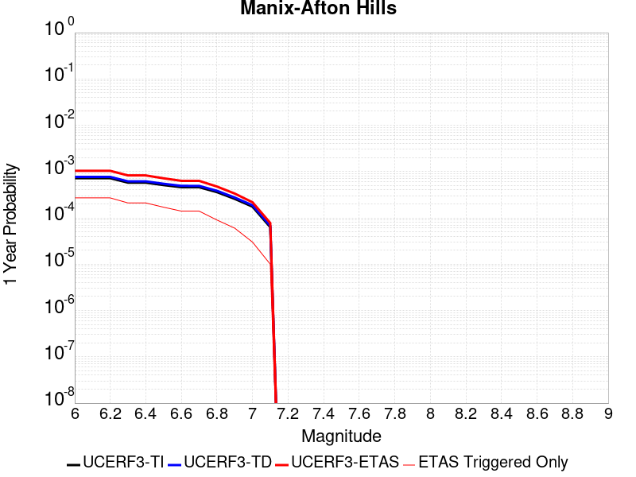 |  |

| Magnitude | 1 wk TI Prob | 1 wk TD Prob | 1 wk ETAS Prob | 1 wk ETAS/TD Gain | 1 wk ETAS Triggered Only | 1 mo TI Prob | 1 mo TD Prob | 1 mo ETAS Prob | 1 mo ETAS/TD Gain | 1 mo ETAS Triggered Only | 1 yr TI Prob | 1 yr TD Prob | 1 yr ETAS Prob | 1 yr ETAS/TD Gain | 1 yr ETAS Triggered Only | 10 yr TI Prob | 10 yr TD Prob | 10 yr ETAS Prob | 10 yr ETAS/TD Gain | 10 yr ETAS Triggered Only |
|-----|-----|-----|-----|-----|-----|-----|-----|-----|-----|-----|-----|-----|-----|-----|-----|-----|-----|-----|-----|-----|
| 6.0 | 1.3783202E-5 | 1.47110895E-5 | 1.2470948E-4 | 8.477242 | 1.1E-4 | 5.906953E-5 | 6.30461E-5 | 2.1303665E-4 | 3.3790612 | 1.5E-4 | 7.189342E-4 | 7.6733343E-4 | 0.0010371263 | 1.3515979 | 2.7E-4 | 0.0071661277 | 0.007648596 | 0.008015766 | 1.0480049 | 3.7E-4 |
| 6.1 | 1.3783202E-5 | 1.47110895E-5 | 1.2470948E-4 | 8.477242 | 1.1E-4 | 5.906953E-5 | 6.30461E-5 | 2.1303665E-4 | 3.3790612 | 1.5E-4 | 7.189342E-4 | 7.6733343E-4 | 0.0010371263 | 1.3515979 | 2.7E-4 | 0.0071661277 | 0.007648596 | 0.008015766 | 1.0480049 | 3.7E-4 |
| 6.2 | 1.3783202E-5 | 1.47110895E-5 | 1.2470948E-4 | 8.477242 | 1.1E-4 | 5.906953E-5 | 6.30461E-5 | 2.1303665E-4 | 3.3790612 | 1.5E-4 | 7.189342E-4 | 7.6733343E-4 | 0.0010371263 | 1.3515979 | 2.7E-4 | 0.0071661277 | 0.007648596 | 0.008015766 | 1.0480049 | 3.7E-4 |
| 6.3 | 1.10494875E-5 | 1.1793136E-5 | 1.0179207E-4 | 8.631468 | 9.0E-5 | 4.7354086E-5 | 5.054109E-5 | 1.6053554E-4 | 3.176337 | 1.1E-4 | 5.763835E-4 | 6.151744E-4 | 8.250452E-4 | 1.3411566 | 2.1E-4 | 0.005748908 | 0.0061357557 | 0.006433915 | 1.0485938 | 3.0E-4 |
| 6.4 | 1.10494875E-5 | 1.1793136E-5 | 1.0179207E-4 | 8.631468 | 9.0E-5 | 4.7354086E-5 | 5.054109E-5 | 1.6053554E-4 | 3.176337 | 1.1E-4 | 5.763835E-4 | 6.151744E-4 | 8.250452E-4 | 1.3411566 | 2.1E-4 | 0.005748908 | 0.0061357557 | 0.006433915 | 1.0485938 | 3.0E-4 |
| 6.5 | 9.788949E-6 | 1.045432E-5 | 7.0453694E-5 | 6.7391944 | 6.0E-5 | 4.1951964E-5 | 4.480351E-5 | 1.2479993E-4 | 2.7854943 | 8.0E-5 | 5.1064545E-4 | 5.453555E-4 | 7.152628E-4 | 1.3115532 | 1.7E-4 | 0.0050947363 | 0.0054410985 | 0.0056897383 | 1.0456966 | 2.5E-4 |
| 6.6 | 8.810006E-6 | 9.4136285E-6 | 6.9413065E-5 | 7.373678 | 6.0E-5 | 3.775662E-5 | 4.0343548E-5 | 1.2034032E-4 | 2.982889 | 8.0E-5 | 4.5958988E-4 | 4.9108086E-4 | 6.3101214E-4 | 1.2849455 | 1.4E-4 | 0.0045864056 | 0.004900839 | 0.005099859 | 1.0406094 | 2.0E-4 |
| 6.7 | 8.80128E-6 | 9.404108E-6 | 6.940354E-5 | 7.3801303 | 6.0E-5 | 3.7719226E-5 | 4.0302748E-5 | 1.20299526E-4 | 2.9848964 | 8.0E-5 | 4.591348E-4 | 4.9058435E-4 | 6.305157E-4 | 1.285234 | 1.4E-4 | 0.004581874 | 0.0048958957 | 0.0050949166 | 1.0406505 | 2.0E-4 |
| 6.8 | 6.8994877E-6 | 7.380076E-6 | 4.737978E-5 | 6.4199586 | 4.0E-5 | 2.9568899E-5 | 3.162856E-5 | 7.162729E-5 | 2.2646399 | 4.0E-5 | 3.5994186E-4 | 3.8501783E-4 | 4.749832E-4 | 1.2336653 | 9.0E-5 | 0.003593594 | 0.0038443129 | 0.0039638514 | 1.0310949 | 1.2E-4 |
| 6.9 | 4.9328037E-6 | 5.2709615E-6 | 3.5270805E-5 | 6.691531 | 3.0E-5 | 2.1140417E-5 | 2.2589675E-5 | 5.2588995E-5 | 2.3280103 | 3.0E-5 | 2.5735417E-4 | 2.7500073E-4 | 3.3498422E-4 | 1.2181213 | 6.0E-5 | 0.0025705635 | 0.0027472095 | 0.0028170173 | 1.0254104 | 7.0E-5 |
| 7.0 | 3.347973E-6 | 3.59003E-6 | 1.35899945E-5 | 3.7854822 | 1.0E-5 | 1.4348378E-5 | 1.5385775E-5 | 2.5385621E-5 | 1.649941 | 1.0E-5 | 1.746775E-4 | 1.8730981E-4 | 2.173042E-4 | 1.1601324 | 3.0E-5 | 0.0017454025 | 0.0018719219 | 0.0019018658 | 1.0159963 | 3.0E-5 |
| 7.1 | 1.2073567E-6 | 1.293482E-6 | 1.12934695E-5 | 8.73106 | 1.0E-5 | 5.1743755E-6 | 5.543492E-6 | 1.5543437E-5 | 2.8039072 | 1.0E-5 | 6.29962E-5 | 6.749156E-5 | 7.7490884E-5 | 1.1481566 | 1.0E-5 | 6.297835E-4 | 6.7487074E-4 | 6.84864E-4 | 1.0148077 | 1.0E-5 |

## Baker
*[(top)](#table-of-contents)*

| 1 Week | 1 Month | 1 Year | 10 Year |
|-----|-----|-----|-----|
|  |  |  | 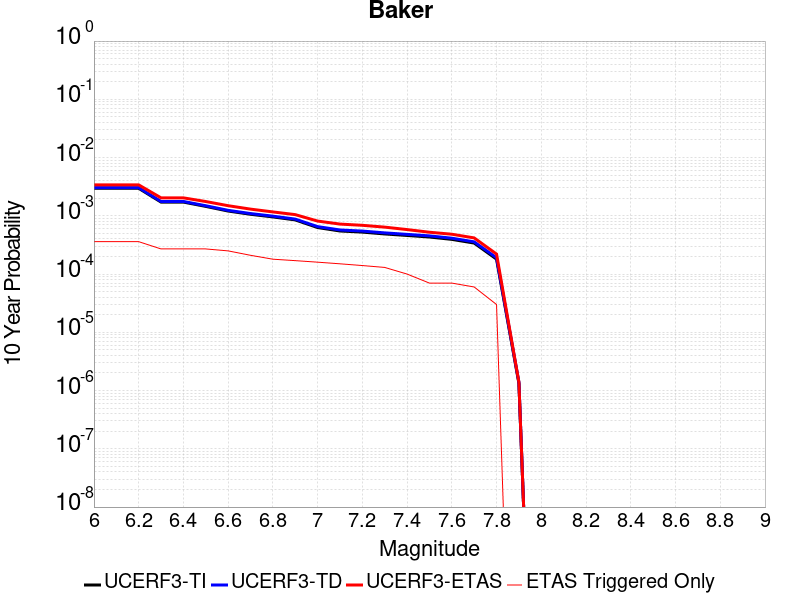 |

| Magnitude | 1 wk TI Prob | 1 wk TD Prob | 1 wk ETAS Prob | 1 wk ETAS/TD Gain | 1 wk ETAS Triggered Only | 1 mo TI Prob | 1 mo TD Prob | 1 mo ETAS Prob | 1 mo ETAS/TD Gain | 1 mo ETAS Triggered Only | 1 yr TI Prob | 1 yr TD Prob | 1 yr ETAS Prob | 1 yr ETAS/TD Gain | 1 yr ETAS Triggered Only | 10 yr TI Prob | 10 yr TD Prob | 10 yr ETAS Prob | 10 yr ETAS/TD Gain | 10 yr ETAS Triggered Only |
|-----|-----|-----|-----|-----|-----|-----|-----|-----|-----|-----|-----|-----|-----|-----|-----|-----|-----|-----|-----|-----|
| 6.0 | 5.695525E-6 | 5.8348373E-6 | 5.5834545E-5 | 9.569169 | 5.0E-5 | 2.4409164E-5 | 2.5006228E-5 | 1.0500423E-4 | 4.199123 | 8.0E-5 | 2.9714106E-4 | 3.044123E-4 | 4.9435446E-4 | 1.6239635 | 1.9E-4 | 0.0029674405 | 0.0030403486 | 0.0033992543 | 1.1180475 | 3.6E-4 |
| 6.1 | 5.695525E-6 | 5.8348373E-6 | 5.5834545E-5 | 9.569169 | 5.0E-5 | 2.4409164E-5 | 2.5006228E-5 | 1.0500423E-4 | 4.199123 | 8.0E-5 | 2.9714106E-4 | 3.044123E-4 | 4.9435446E-4 | 1.6239635 | 1.9E-4 | 0.0029674405 | 0.0030403486 | 0.0033992543 | 1.1180475 | 3.6E-4 |
| 6.2 | 5.695525E-6 | 5.8348373E-6 | 5.5834545E-5 | 9.569169 | 5.0E-5 | 2.4409164E-5 | 2.5006228E-5 | 1.0500423E-4 | 4.199123 | 8.0E-5 | 2.9714106E-4 | 3.044123E-4 | 4.9435446E-4 | 1.6239635 | 1.9E-4 | 0.0029674405 | 0.0030403486 | 0.0033992543 | 1.1180475 | 3.6E-4 |
| 6.3 | 3.2995713E-6 | 3.383667E-6 | 5.3383497E-5 | 15.776817 | 5.0E-5 | 1.4140943E-5 | 1.4501353E-5 | 7.450048E-5 | 5.137485 | 6.0E-5 | 1.7215237E-4 | 1.7654014E-4 | 3.0651718E-4 | 1.7362465 | 1.3E-4 | 0.0017201907 | 0.001764046 | 0.0020335696 | 1.1527872 | 2.7E-4 |
| 6.4 | 3.2995713E-6 | 3.383667E-6 | 5.3383497E-5 | 15.776817 | 5.0E-5 | 1.4140943E-5 | 1.4501353E-5 | 7.450048E-5 | 5.137485 | 6.0E-5 | 1.7215237E-4 | 1.7654014E-4 | 3.0651718E-4 | 1.7362465 | 1.3E-4 | 0.0017201907 | 0.001764046 | 0.0020335696 | 1.1527872 | 2.7E-4 |
| 6.5 | 2.782202E-6 | 2.8558404E-6 | 5.28557E-5 | 18.50793 | 5.0E-5 | 1.1923668E-5 | 1.223926E-5 | 7.223852E-5 | 5.902197 | 6.0E-5 | 1.4516099E-4 | 1.4900314E-4 | 2.7898376E-4 | 1.8723348 | 1.3E-4 | 0.001450662 | 0.0014890651 | 0.001758663 | 1.1810519 | 2.7E-4 |
| 6.6 | 2.3163404E-6 | 2.38092E-6 | 4.2380823E-5 | 17.800188 | 4.0E-5 | 9.927136E-6 | 1.0203904E-5 | 6.0203394E-5 | 5.9000354 | 5.0E-5 | 1.20856166E-4 | 1.2422565E-4 | 2.4421074E-4 | 1.9658641 | 1.2E-4 | 0.0012079047 | 0.0012415823 | 0.0014912719 | 1.201106 | 2.5E-4 |
| 6.7 | 2.037056E-6 | 2.0965003E-6 | 4.2096417E-5 | 20.079374 | 4.0E-5 | 8.7302105E-6 | 8.984972E-6 | 5.8984522E-5 | 6.564798 | 5.0E-5 | 1.0628513E-4 | 1.093867E-4 | 1.9937685E-4 | 1.822679 | 9.0E-5 | 0.0010623431 | 0.0010933448 | 0.0013031152 | 1.1918612 | 2.1E-4 |
| 6.8 | 1.8356744E-6 | 1.8915287E-6 | 3.189147E-5 | 16.860157 | 3.0E-5 | 7.867153E-6 | 8.106527E-6 | 4.81062E-5 | 5.9342556 | 4.0E-5 | 9.577837E-5 | 9.869264E-5 | 1.7868474E-4 | 1.8105174 | 8.0E-5 | 9.57371E-4 | 9.86502E-4 | 0.0011663245 | 1.1822829 | 1.8E-4 |
| 6.9 | 1.6310546E-6 | 1.6832072E-6 | 2.1683174E-5 | 12.882058 | 2.0E-5 | 6.9902153E-6 | 7.213726E-6 | 3.721351E-5 | 5.1587086 | 3.0E-5 | 8.510255E-5 | 8.782368E-5 | 1.5781754E-4 | 1.7969815 | 7.0E-5 | 8.5069967E-4 | 8.7790104E-4 | 0.0010477519 | 1.1934737 | 1.7E-4 |
| 7.0 | 1.2058036E-6 | 1.2508665E-6 | 2.1250842E-5 | 16.988895 | 2.0E-5 | 5.1677193E-6 | 5.3608455E-6 | 2.5360738E-5 | 4.730735 | 2.0E-5 | 6.291517E-5 | 6.5266366E-5 | 1.2526245E-4 | 1.9192497 | 6.0E-5 | 6.289736E-4 | 6.524743E-4 | 8.123699E-4 | 1.2450604 | 1.6E-4 |
| 7.1 | 1.052382E-6 | 1.0951609E-6 | 2.1095138E-5 | 19.262138 | 2.0E-5 | 4.5102006E-6 | 4.693538E-6 | 2.4693445E-5 | 5.2611575 | 2.0E-5 | 5.491031E-5 | 5.7142337E-5 | 1.1713891E-4 | 2.0499496 | 6.0E-5 | 5.4896745E-4 | 5.7127734E-4 | 7.2119164E-4 | 1.2624195 | 1.5E-4 |
| 7.2 | 1.0067454E-6 | 1.0487711E-6 | 1.1048761E-5 | 10.53496 | 1.0E-5 | 4.3146156E-6 | 4.4947255E-6 | 1.4494681E-5 | 3.22482 | 1.0E-5 | 5.252918E-5 | 5.4721917E-5 | 1.0471918E-4 | 1.9136606 | 5.0E-5 | 5.251676E-4 | 5.470853E-4 | 6.8700867E-4 | 1.2557616 | 1.4E-4 |
| 7.3 | 9.3596316E-7 | 9.767723E-7 | 1.09767625E-5 | 11.23779 | 1.0E-5 | 4.0112645E-6 | 4.1861604E-6 | 1.4186118E-5 | 3.3888137 | 1.0E-5 | 4.8836053E-5 | 5.096532E-5 | 1.00962774E-4 | 1.9810092 | 5.0E-5 | 4.8825322E-4 | 5.095371E-4 | 6.394709E-4 | 1.2550036 | 1.3E-4 |
| 7.4 | 8.8117395E-7 | 9.2076635E-7 | 9.2076635E-7 | 1.0 | 0.0 | 3.7764542E-6 | 3.9461356E-6 | 3.9461356E-6 | 1.0 | 0.0 | 4.5977362E-5 | 4.8043148E-5 | 8.8041226E-5 | 1.8325449 | 4.0E-5 | 4.596785E-4 | 4.8032837E-4 | 5.802803E-4 | 1.2080909 | 1.0E-4 |
| 7.5 | 8.292386E-7 | 8.6745956E-7 | 8.6745956E-7 | 1.0 | 0.0 | 3.5538749E-6 | 3.7176785E-6 | 3.7176785E-6 | 1.0 | 0.0 | 4.326757E-5 | 4.5261804E-5 | 7.526045E-5 | 1.6627805 | 3.0E-5 | 4.3259145E-4 | 4.5252658E-4 | 5.224949E-4 | 1.1546171 | 7.0E-5 |
| 7.6 | 7.553842E-7 | 7.9144706E-7 | 7.9144706E-7 | 1.0 | 0.0 | 3.2373566E-6 | 3.3919116E-6 | 3.3919116E-6 | 1.0 | 0.0 | 3.9414106E-5 | 4.129575E-5 | 7.129451E-5 | 1.7264371 | 3.0E-5 | 3.9407116E-4 | 4.1288146E-4 | 4.8285254E-4 | 1.1694702 | 7.0E-5 |
| 7.7 | 6.5285366E-7 | 6.852797E-7 | 6.852797E-7 | 1.0 | 0.0 | 2.797941E-6 | 2.9369096E-6 | 2.9369096E-6 | 1.0 | 0.0 | 3.40644E-5 | 3.5756293E-5 | 6.575522E-5 | 1.838983 | 3.0E-5 | 3.405918E-4 | 3.5750607E-4 | 4.1748464E-4 | 1.1677693 | 6.0E-5 |
| 7.8 | 3.4586725E-7 | 3.6482615E-7 | 3.6482615E-7 | 1.0 | 0.0 | 1.4822873E-6 | 1.5635396E-6 | 1.5635396E-6 | 1.0 | 0.0 | 1.80467E-5 | 1.9035933E-5 | 3.9035553E-5 | 2.0506246 | 2.0E-5 | 1.8045233E-4 | 1.9034347E-4 | 2.2033777E-4 | 1.1575798 | 3.0E-5 |
| 7.9 | 2.5591178E-9 | 2.6696718E-9 | 2.6696718E-9 | 1.0 | 0.0 | 1.0967647E-8 | 1.14414505E-8 | 1.14414505E-8 | 1.0 | 0.0 | 1.335311E-7 | 1.3929966E-7 | 1.3929966E-7 | 1.0 | 0.0 | 1.3353102E-6 | 1.3929966E-6 | 1.3929966E-6 | 1.0 | 0.0 |

## Ludlow
*[(top)](#table-of-contents)*

| 1 Week | 1 Month | 1 Year | 10 Year |
|-----|-----|-----|-----|
| 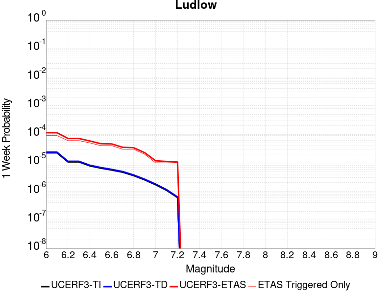 |  |  | 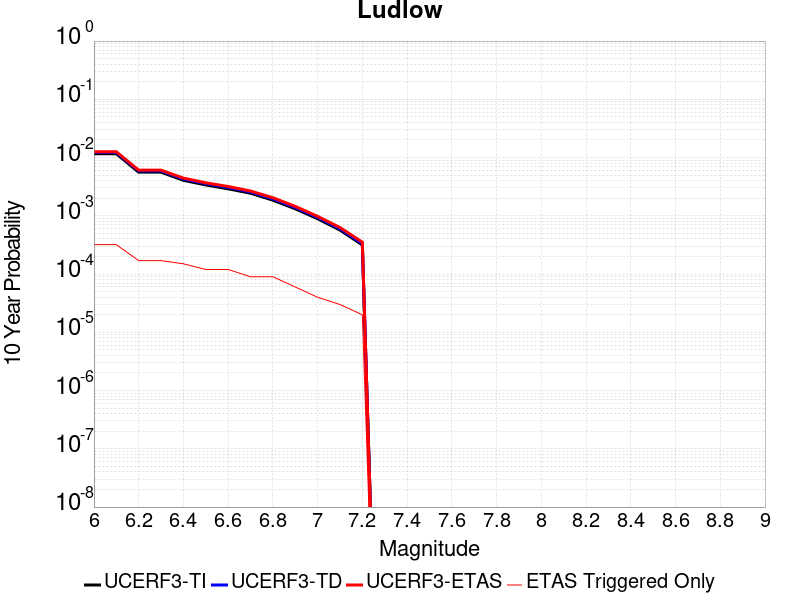 |

| Magnitude | 1 wk TI Prob | 1 wk TD Prob | 1 wk ETAS Prob | 1 wk ETAS/TD Gain | 1 wk ETAS Triggered Only | 1 mo TI Prob | 1 mo TD Prob | 1 mo ETAS Prob | 1 mo ETAS/TD Gain | 1 mo ETAS Triggered Only | 1 yr TI Prob | 1 yr TD Prob | 1 yr ETAS Prob | 1 yr ETAS/TD Gain | 1 yr ETAS Triggered Only | 10 yr TI Prob | 10 yr TD Prob | 10 yr ETAS Prob | 10 yr ETAS/TD Gain | 10 yr ETAS Triggered Only |
|-----|-----|-----|-----|-----|-----|-----|-----|-----|-----|-----|-----|-----|-----|-----|-----|-----|-----|-----|-----|-----|
| 6.0 | 2.2407607E-5 | 2.3657254E-5 | 1.1365512E-4 | 4.80424 | 9.0E-5 | 9.602906E-5 | 1.0138454E-4 | 2.4137035E-4 | 2.3807411 | 1.4E-4 | 0.0011685267 | 0.001233702 | 0.0014634181 | 1.1862007 | 2.3E-4 | 0.011624013 | 0.012273042 | 0.012589115 | 1.0257534 | 3.2E-4 |
| 6.1 | 2.2407607E-5 | 2.3657254E-5 | 1.1365512E-4 | 4.80424 | 9.0E-5 | 9.602906E-5 | 1.0138454E-4 | 2.4137035E-4 | 2.3807411 | 1.4E-4 | 0.0011685267 | 0.001233702 | 0.0014634181 | 1.1862007 | 2.3E-4 | 0.011624013 | 0.012273042 | 0.012589115 | 1.0257534 | 3.2E-4 |
| 6.2 | 1.0781252E-5 | 1.1365663E-5 | 7.136498E-5 | 6.2789984 | 6.0E-5 | 4.620455E-5 | 4.8709102E-5 | 1.3870472E-4 | 2.847614 | 9.0E-5 | 5.623952E-4 | 5.9287593E-4 | 7.4278703E-4 | 1.252854 | 1.5E-4 | 0.00560974 | 0.0059133614 | 0.006082356 | 1.0285784 | 1.7E-4 |
| 6.3 | 1.0781252E-5 | 1.1365663E-5 | 7.136498E-5 | 6.2789984 | 6.0E-5 | 4.620455E-5 | 4.8709102E-5 | 1.3870472E-4 | 2.847614 | 9.0E-5 | 5.623952E-4 | 5.9287593E-4 | 7.4278703E-4 | 1.252854 | 1.5E-4 | 0.00560974 | 0.0059133614 | 0.006082356 | 1.0285784 | 1.7E-4 |
| 6.4 | 7.814439E-6 | 8.237729E-6 | 5.8237318E-5 | 7.0695844 | 5.0E-5 | 3.3490025E-5 | 3.530408E-5 | 1.0530161E-4 | 2.9827034 | 7.0E-5 | 4.0766477E-4 | 4.2974384E-4 | 5.5968796E-4 | 1.3023758 | 1.3E-4 | 0.0040691774 | 0.0042892746 | 0.0044386312 | 1.0348209 | 1.5E-4 |
| 6.5 | 6.4986366E-6 | 6.85092E-6 | 4.6850644E-5 | 6.838592 | 4.0E-5 | 2.7851002E-5 | 2.9360759E-5 | 7.935929E-5 | 2.7029033 | 5.0E-5 | 3.390332E-4 | 3.5740953E-4 | 4.573738E-4 | 1.2796911 | 1.0E-4 | 0.003385164 | 0.0035684432 | 0.003688015 | 1.0335081 | 1.2E-4 |
| 6.6 | 5.582177E-6 | 5.8860055E-6 | 4.588577E-5 | 7.79574 | 4.0E-5 | 2.3923398E-5 | 2.5225498E-5 | 7.5224234E-5 | 2.9820714 | 5.0E-5 | 2.9122844E-4 | 3.0707786E-4 | 4.0704716E-4 | 1.3255503 | 1.0E-4 | 0.0029084706 | 0.003066609 | 0.0031862408 | 1.0390111 | 1.2E-4 |
| 6.7 | 4.6858763E-6 | 4.940427E-6 | 3.494028E-5 | 7.0723195 | 3.0E-5 | 2.0082172E-5 | 2.1173091E-5 | 6.117224E-5 | 2.8891504 | 4.0E-5 | 2.4447302E-4 | 2.5775246E-4 | 3.277344E-4 | 1.2715085 | 7.0E-5 | 0.0024420423 | 0.0025745912 | 0.0026643595 | 1.034867 | 9.0E-5 |
| 6.8 | 3.5584908E-6 | 3.7520183E-6 | 3.3751905E-5 | 8.9956665 | 3.0E-5 | 1.5250586E-5 | 1.6079981E-5 | 5.6079338E-5 | 3.487525 | 4.0E-5 | 1.8566006E-4 | 1.957566E-4 | 2.6574288E-4 | 1.3575169 | 7.0E-5 | 0.0018550502 | 0.0019558826 | 0.0020457066 | 1.045925 | 9.0E-5 |
| 6.9 | 2.532834E-6 | 2.6710034E-6 | 2.267095E-5 | 8.4878025 | 2.0E-5 | 1.0854958E-5 | 1.1447109E-5 | 3.144688E-5 | 2.7471461 | 2.0E-5 | 1.3215111E-4 | 1.3935992E-4 | 1.8935296E-4 | 1.3587332 | 5.0E-5 | 0.0013207254 | 0.0013927529 | 0.0014526693 | 1.0430201 | 6.0E-5 |
| 7.0 | 1.7083285E-6 | 1.8019439E-6 | 1.1801926E-5 | 6.5495524 | 1.0E-5 | 7.3213873E-6 | 7.722595E-6 | 1.7722517E-5 | 2.2948916 | 1.0E-5 | 8.913424E-5 | 9.40187E-5 | 1.2401587E-4 | 1.3190554 | 3.0E-5 | 8.9098496E-4 | 9.3980576E-4 | 9.797681E-4 | 1.042522 | 4.0E-5 |
| 7.1 | 1.0905424E-6 | 1.1497619E-6 | 1.114975E-5 | 9.697442 | 1.0E-5 | 4.6737446E-6 | 4.9275427E-6 | 1.4927493E-5 | 3.0293992 | 1.0E-5 | 5.6901354E-5 | 5.999128E-5 | 7.999008E-5 | 1.3333617 | 2.0E-5 | 5.6886784E-4 | 5.997606E-4 | 6.2974263E-4 | 1.0499899 | 3.0E-5 |
| 7.2 | 6.06668E-7 | 6.387277E-7 | 1.06387215E-5 | 16.656113 | 1.0E-5 | 2.600003E-6 | 2.7374022E-6 | 1.2737375E-5 | 4.6530886 | 1.0E-5 | 3.1654577E-5 | 3.3327433E-5 | 5.3326767E-5 | 1.6000862 | 2.0E-5 | 3.1650066E-4 | 3.3323118E-4 | 3.5322452E-4 | 1.0599984 | 2.0E-5 |

## White Wolf (Extension)
*[(top)](#table-of-contents)*

| 1 Week | 1 Month | 1 Year | 10 Year |
|-----|-----|-----|-----|
|  | 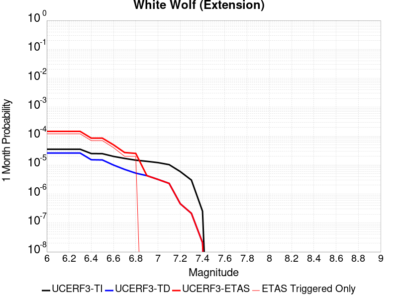 |  | 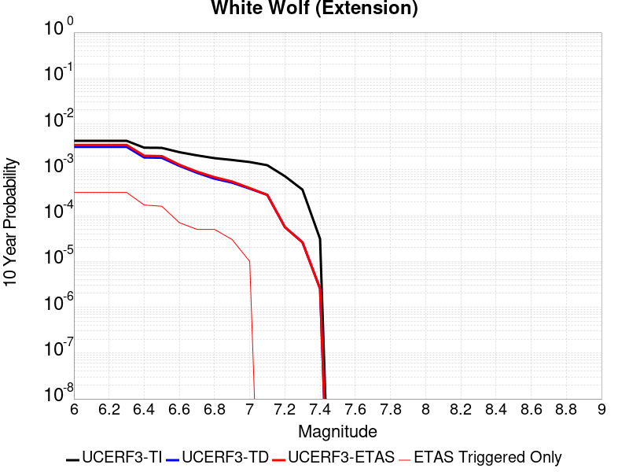 |

| Magnitude | 1 wk TI Prob | 1 wk TD Prob | 1 wk ETAS Prob | 1 wk ETAS/TD Gain | 1 wk ETAS Triggered Only | 1 mo TI Prob | 1 mo TD Prob | 1 mo ETAS Prob | 1 mo ETAS/TD Gain | 1 mo ETAS Triggered Only | 1 yr TI Prob | 1 yr TD Prob | 1 yr ETAS Prob | 1 yr ETAS/TD Gain | 1 yr ETAS Triggered Only | 10 yr TI Prob | 10 yr TD Prob | 10 yr ETAS Prob | 10 yr ETAS/TD Gain | 10 yr ETAS Triggered Only |
|-----|-----|-----|-----|-----|-----|-----|-----|-----|-----|-----|-----|-----|-----|-----|-----|-----|-----|-----|-----|-----|
| 6.0 | 8.222555E-6 | 6.066615E-6 | 9.606607E-5 | 15.835201 | 9.0E-5 | 3.5239045E-5 | 2.5999556E-5 | 1.4599644E-4 | 5.6153436 | 1.2E-4 | 4.289509E-4 | 3.1650523E-4 | 5.4643245E-4 | 1.7264563 | 2.3E-4 | 0.0042812387 | 0.0031611966 | 0.003480185 | 1.1009074 | 3.2E-4 |
| 6.1 | 8.222555E-6 | 6.066615E-6 | 9.606607E-5 | 15.835201 | 9.0E-5 | 3.5239045E-5 | 2.5999556E-5 | 1.4599644E-4 | 5.6153436 | 1.2E-4 | 4.289509E-4 | 3.1650523E-4 | 5.4643245E-4 | 1.7264563 | 2.3E-4 | 0.0042812387 | 0.0031611966 | 0.003480185 | 1.1009074 | 3.2E-4 |
| 6.2 | 8.222555E-6 | 6.066615E-6 | 9.606607E-5 | 15.835201 | 9.0E-5 | 3.5239045E-5 | 2.5999556E-5 | 1.4599644E-4 | 5.6153436 | 1.2E-4 | 4.289509E-4 | 3.1650523E-4 | 5.4643245E-4 | 1.7264563 | 2.3E-4 | 0.0042812387 | 0.0031611966 | 0.003480185 | 1.1009074 | 3.2E-4 |
| 6.3 | 8.222555E-6 | 6.066615E-6 | 9.606607E-5 | 15.835201 | 9.0E-5 | 3.5239045E-5 | 2.5999556E-5 | 1.4599644E-4 | 5.6153436 | 1.2E-4 | 4.289509E-4 | 3.1650523E-4 | 5.4643245E-4 | 1.7264563 | 2.3E-4 | 0.0042812387 | 0.0031611966 | 0.003480185 | 1.1009074 | 3.2E-4 |
| 6.4 | 5.821773E-6 | 3.5571256E-6 | 6.3556916E-5 | 17.86749 | 6.0E-5 | 2.4950215E-5 | 1.5244741E-5 | 8.524367E-5 | 5.591677 | 7.0E-5 | 3.0372653E-4 | 1.8559002E-4 | 3.0556775E-4 | 1.6464665 | 1.2E-4 | 0.0030331176 | 0.0018544586 | 0.0020241432 | 1.091501 | 1.7E-4 |
| 6.5 | 5.766023E-6 | 3.4990599E-6 | 6.349885E-5 | 18.147404 | 6.0E-5 | 2.4711293E-5 | 1.49958905E-5 | 8.499484E-5 | 5.667876 | 7.0E-5 | 3.0081844E-4 | 1.8256076E-4 | 3.0253886E-4 | 1.6571953 | 1.2E-4 | 0.0030041158 | 0.0018242161 | 0.0019839243 | 1.0875489 | 1.6E-4 |
| 6.6 | 4.643576E-6 | 2.3325733E-6 | 3.2332504E-5 | 13.861302 | 3.0E-5 | 1.9900888E-5 | 9.9967065E-6 | 4.9996306E-5 | 5.001278 | 4.0E-5 | 2.4226638E-4 | 1.2170354E-4 | 1.7169745E-4 | 1.4107844 | 5.0E-5 | 0.0024200242 | 0.0012164112 | 0.0012863261 | 1.0574763 | 7.0E-5 |
| 6.7 | 3.9529173E-6 | 1.6482975E-6 | 2.1648264E-5 | 13.133712 | 2.0E-5 | 1.6940963E-5 | 7.064114E-6 | 2.7063972E-5 | 3.8311913 | 2.0E-5 | 2.0623671E-4 | 8.600239E-5 | 1.1599981E-4 | 1.3487976 | 3.0E-5 | 0.002060454 | 8.597095E-4 | 9.0966653E-4 | 1.0581092 | 5.0E-5 |
| 6.8 | 3.4377522E-6 | 1.2244764E-6 | 2.1224452E-5 | 17.333492 | 2.0E-5 | 1.473314E-5 | 5.247746E-6 | 2.524764E-5 | 4.81114 | 2.0E-5 | 1.7936122E-4 | 6.388952E-5 | 9.3887604E-5 | 1.4695306 | 3.0E-5 | 0.0017921652 | 6.3872064E-4 | 6.886887E-4 | 1.0782315 | 5.0E-5 |
| 6.9 | 3.1367306E-6 | 1.0033316E-6 | 1.0033316E-6 | 1.0 | 0.0 | 1.3443062E-5 | 4.299986E-6 | 4.299986E-6 | 1.0 | 0.0 | 1.63657E-4 | 5.2351144E-5 | 6.235062E-5 | 1.1910077 | 1.0E-5 | 0.0016353652 | 5.233958E-4 | 5.5338006E-4 | 1.057288 | 3.0E-5 |
| 7.0 | 2.8298145E-6 | 7.4282326E-7 | 7.4282326E-7 | 1.0 | 0.0 | 1.2127721E-5 | 3.1835248E-6 | 3.1835248E-6 | 1.0 | 0.0 | 1.47645E-4 | 3.8758775E-5 | 3.8758775E-5 | 1.0 | 0.0 | 0.0014754693 | 3.8752513E-4 | 3.9752127E-4 | 1.0257947 | 1.0E-5 |
| 7.1 | 2.4091064E-6 | 5.4223835E-7 | 5.4223835E-7 | 1.0 | 0.0 | 1.03247E-5 | 2.3238767E-6 | 2.3238767E-6 | 1.0 | 0.0 | 1.2569598E-4 | 2.8292874E-5 | 2.8292874E-5 | 1.0 | 0.0 | 0.001256249 | 2.8289677E-4 | 2.8289677E-4 | 1.0 | 0.0 |
| 7.2 | 1.3875518E-6 | 1.0740268E-7 | 1.0740268E-7 | 1.0 | 0.0 | 5.9466374E-6 | 4.6029712E-7 | 4.6029712E-7 | 1.0 | 0.0 | 7.23979E-5 | 5.604104E-6 | 5.604104E-6 | 1.0 | 0.0 | 7.2374323E-4 | 5.6039742E-5 | 5.6039742E-5 | 1.0 | 0.0 |
| 7.3 | 7.056077E-7 | 5.0002956E-8 | 5.0002956E-8 | 1.0 | 0.0 | 3.0240296E-6 | 2.1429837E-7 | 2.1429837E-7 | 1.0 | 0.0 | 3.681694E-5 | 2.60908E-6 | 2.60908E-6 | 1.0 | 0.0 | 3.681084E-4 | 2.609054E-5 | 2.609054E-5 | 1.0 | 0.0 |
| 7.4 | 5.9334678E-8 | 4.8638475E-9 | 4.8638475E-9 | 1.0 | 0.0 | 2.5429145E-7 | 2.084506E-8 | 2.084506E-8 | 1.0 | 0.0 | 3.095994E-6 | 2.5378858E-7 | 2.5378858E-7 | 1.0 | 0.0 | 3.095951E-5 | 2.5378843E-6 | 2.5378843E-6 | 1.0 | 0.0 |

## Santa Ynez (West)
*[(top)](#table-of-contents)*

| 1 Week | 1 Month | 1 Year | 10 Year |
|-----|-----|-----|-----|
|  |  |  |  |

| Magnitude | 1 wk TI Prob | 1 wk TD Prob | 1 wk ETAS Prob | 1 wk ETAS/TD Gain | 1 wk ETAS Triggered Only | 1 mo TI Prob | 1 mo TD Prob | 1 mo ETAS Prob | 1 mo ETAS/TD Gain | 1 mo ETAS Triggered Only | 1 yr TI Prob | 1 yr TD Prob | 1 yr ETAS Prob | 1 yr ETAS/TD Gain | 1 yr ETAS Triggered Only | 10 yr TI Prob | 10 yr TD Prob | 10 yr ETAS Prob | 10 yr ETAS/TD Gain | 10 yr ETAS Triggered Only |
|-----|-----|-----|-----|-----|-----|-----|-----|-----|-----|-----|-----|-----|-----|-----|-----|-----|-----|-----|-----|-----|
| 6.0 | 4.7352758E-5 | 5.497084E-5 | 1.4496589E-4 | 2.6371417 | 9.0E-5 | 2.0292461E-4 | 2.3556968E-4 | 3.3554612E-4 | 1.4244028 | 1.0E-4 | 0.0024678076 | 0.002864558 | 0.0029941855 | 1.0452522 | 1.3E-4 | 0.024405818 | 0.028304456 | 0.028489077 | 1.0065228 | 1.9E-4 |
| 6.1 | 4.7352758E-5 | 5.497084E-5 | 1.3496644E-4 | 2.4552372 | 8.0E-5 | 2.0292461E-4 | 2.3556968E-4 | 3.2554846E-4 | 1.3819625 | 9.0E-5 | 0.0024678076 | 0.002864558 | 0.002984214 | 1.0417713 | 1.2E-4 | 0.024405818 | 0.028304456 | 0.028469644 | 1.0058361 | 1.7E-4 |
| 6.2 | 3.0415853E-5 | 3.3925004E-5 | 7.392364E-5 | 2.1790314 | 4.0E-5 | 1.3034715E-4 | 1.4538495E-4 | 1.953777E-4 | 1.3438646 | 5.0E-5 | 0.0015858212 | 0.0017686592 | 0.0018385354 | 1.039508 | 7.0E-5 | 0.015745522 | 0.01754978 | 0.017648024 | 1.0055981 | 1.0E-4 |
| 6.3 | 3.0415853E-5 | 3.3925004E-5 | 7.392364E-5 | 2.1790314 | 4.0E-5 | 1.3034715E-4 | 1.4538495E-4 | 1.953777E-4 | 1.3438646 | 5.0E-5 | 0.0015858212 | 0.0017686592 | 0.0018385354 | 1.039508 | 7.0E-5 | 0.015745522 | 0.01754978 | 0.017648024 | 1.0055981 | 1.0E-4 |
| 6.4 | 2.5452082E-5 | 2.7912318E-5 | 6.7911205E-5 | 2.433019 | 4.0E-5 | 1.09075794E-4 | 1.1961885E-4 | 1.6961287E-4 | 1.4179443 | 5.0E-5 | 0.0013271887 | 0.0014554056 | 0.0015253037 | 1.0480266 | 7.0E-5 | 0.013192902 | 0.01446091 | 0.014559464 | 1.0068152 | 1.0E-4 |
| 6.5 | 2.3143784E-5 | 2.5128133E-5 | 5.5127377E-5 | 2.193851 | 3.0E-5 | 9.9183875E-5 | 1.07687636E-4 | 1.4768333E-4 | 1.3714046 | 4.0E-5 | 0.0012068948 | 0.001310323 | 0.0013702443 | 1.0457302 | 6.0E-5 | 0.012003611 | 0.013027638 | 0.013116466 | 1.0068184 | 9.0E-5 |
| 6.6 | 1.9118515E-5 | 2.0354244E-5 | 5.0353636E-5 | 2.473864 | 3.0E-5 | 8.193392E-5 | 8.722961E-5 | 1.2722611E-4 | 1.4585199 | 4.0E-5 | 9.97089E-4 | 0.001061511 | 0.0011214473 | 1.0564632 | 6.0E-5 | 0.00992627 | 0.010565317 | 0.010654366 | 1.0084285 | 9.0E-5 |
| 6.7 | 1.722807E-5 | 1.8146253E-5 | 3.814589E-5 | 2.102136 | 2.0E-5 | 7.3832496E-5 | 7.776737E-5 | 1.0776504E-4 | 1.3857359 | 3.0E-5 | 8.985399E-4 | 9.4641204E-4 | 9.963647E-4 | 1.0527811 | 5.0E-5 | 0.008949154 | 0.009424461 | 0.009503707 | 1.0084085 | 8.0E-5 |
| 6.8 | 1.5317364E-5 | 1.5926391E-5 | 3.5926074E-5 | 2.2557573 | 2.0E-5 | 6.56442E-5 | 6.82542E-5 | 9.825215E-5 | 1.4395034 | 3.0E-5 | 7.98925E-4 | 8.3068234E-4 | 8.806408E-4 | 1.0601414 | 5.0E-5 | 0.007960589 | 0.008276261 | 0.008355599 | 1.0095862 | 8.0E-5 |
| 6.9 | 1.3071226E-5 | 1.332953E-5 | 3.3329263E-5 | 2.500408 | 2.0E-5 | 5.6018336E-5 | 5.712532E-5 | 8.7123604E-5 | 1.5251312 | 3.0E-5 | 6.8180985E-4 | 6.952811E-4 | 7.452463E-4 | 1.0718634 | 5.0E-5 | 0.0067972173 | 0.0069313184 | 0.0070008333 | 1.0100291 | 7.0E-5 |
| 7.0 | 1.1836986E-5 | 1.1932688E-5 | 3.193245E-5 | 2.6760483 | 2.0E-5 | 5.0728955E-5 | 5.1139097E-5 | 8.1137565E-5 | 1.5866053 | 3.0E-5 | 6.1745E-4 | 6.2244234E-4 | 6.6241744E-4 | 1.0642229 | 4.0E-5 | 0.006157372 | 0.0062071825 | 0.00626681 | 1.0096062 | 6.0E-5 |
| 7.1 | 1.0597169E-5 | 1.0542107E-5 | 3.0541898E-5 | 2.8971338 | 2.0E-5 | 4.541565E-5 | 4.5179684E-5 | 7.517833E-5 | 1.6639853 | 3.0E-5 | 5.5279525E-4 | 5.4992497E-4 | 5.899029E-4 | 1.0726972 | 4.0E-5 | 0.0055142213 | 0.005485772 | 0.005535498 | 1.0090644 | 5.0E-5 |
| 7.2 | 9.59113E-6 | 9.45905E-6 | 2.945886E-5 | 3.1143572 | 2.0E-5 | 4.11042E-5 | 4.053816E-5 | 7.0536946E-5 | 1.7400135 | 3.0E-5 | 5.0032866E-4 | 4.934414E-4 | 5.334217E-4 | 1.0810233 | 4.0E-5 | 0.004992037 | 0.0049235765 | 0.00497333 | 1.0101053 | 5.0E-5 |
| 7.3 | 8.586084E-6 | 8.379489E-6 | 2.8379322E-5 | 3.3867602 | 2.0E-5 | 3.679698E-5 | 3.591161E-5 | 6.591053E-5 | 1.8353544 | 3.0E-5 | 4.4791115E-4 | 4.3713715E-4 | 4.7711967E-4 | 1.0914645 | 4.0E-5 | 0.004470094 | 0.004362884 | 0.004412666 | 1.0114104 | 5.0E-5 |
| 7.4 | 7.2622997E-6 | 6.9514485E-6 | 2.695131E-5 | 3.877078 | 2.0E-5 | 3.112377E-5 | 2.9791589E-5 | 5.9790695E-5 | 2.0069656 | 3.0E-5 | 3.78866E-4 | 3.6265317E-4 | 4.026387E-4 | 1.1102582 | 4.0E-5 | 0.0037822074 | 0.003620714 | 0.003670533 | 1.0137594 | 5.0E-5 |
| 7.5 | 5.627296E-6 | 5.2514984E-6 | 2.5251393E-5 | 4.808417 | 2.0E-5 | 2.411676E-5 | 2.2506232E-5 | 5.2505555E-5 | 2.3329341 | 3.0E-5 | 2.9358198E-4 | 2.7397962E-4 | 3.039714E-4 | 1.1094671 | 3.0E-5 | 0.0029319443 | 0.0027364905 | 0.002776381 | 1.0145773 | 4.0E-5 |
| 7.6 | 2.265244E-6 | 2.0608632E-6 | 2.0608632E-6 | 1.0 | 0.0 | 9.708152E-6 | 8.832241E-6 | 8.832241E-6 | 1.0 | 0.0 | 1.18190335E-4 | 1.0752732E-4 | 1.0752732E-4 | 1.0 | 0.0 | 0.001181275 | 0.0010747615 | 0.0010747615 | 1.0 | 0.0 |
| 7.7 | 1.3099874E-6 | 1.1016228E-6 | 1.1016228E-6 | 1.0 | 0.0 | 5.61422E-6 | 4.7212325E-6 | 4.7212325E-6 | 1.0 | 0.0 | 6.8350986E-5 | 5.7479516E-5 | 5.7479516E-5 | 1.0 | 0.0 | 6.832996E-4 | 5.7464885E-4 | 5.7464885E-4 | 1.0 | 0.0 |
| 7.8 | 7.903951E-7 | 6.0710704E-7 | 6.0710704E-7 | 1.0 | 0.0 | 3.3874032E-6 | 2.601885E-6 | 2.601885E-6 | 1.0 | 0.0 | 4.1240855E-5 | 3.16775E-5 | 3.16775E-5 | 1.0 | 0.0 | 4.12332E-4 | 3.167312E-4 | 3.167312E-4 | 1.0 | 0.0 |
| 7.9 | 7.0753297E-9 | 5.090092E-9 | 5.090092E-9 | 1.0 | 0.0 | 3.032284E-8 | 2.181468E-8 | 2.181468E-8 | 1.0 | 0.0 | 3.6918053E-7 | 2.655937E-7 | 2.655937E-7 | 1.0 | 0.0 | 3.691799E-6 | 2.6559348E-6 | 2.6559348E-6 | 1.0 | 0.0 |

## Death Valley (Fish Lake Valley)
*[(top)](#table-of-contents)*

| 1 Week | 1 Month | 1 Year | 10 Year |
|-----|-----|-----|-----|
|  |  |  |  |

| Magnitude | 1 wk TI Prob | 1 wk TD Prob | 1 wk ETAS Prob | 1 wk ETAS/TD Gain | 1 wk ETAS Triggered Only | 1 mo TI Prob | 1 mo TD Prob | 1 mo ETAS Prob | 1 mo ETAS/TD Gain | 1 mo ETAS Triggered Only | 1 yr TI Prob | 1 yr TD Prob | 1 yr ETAS Prob | 1 yr ETAS/TD Gain | 1 yr ETAS Triggered Only | 10 yr TI Prob | 10 yr TD Prob | 10 yr ETAS Prob | 10 yr ETAS/TD Gain | 10 yr ETAS Triggered Only |
|-----|-----|-----|-----|-----|-----|-----|-----|-----|-----|-----|-----|-----|-----|-----|-----|-----|-----|-----|-----|-----|
| 6.0 | 3.872328E-5 | 4.7265705E-5 | 1.17262396E-4 | 2.4809194 | 7.0E-5 | 1.6594635E-4 | 2.0255324E-4 | 3.0253298E-4 | 1.4935974 | 1.0E-4 | 0.0020185246 | 0.0024635606 | 0.0026431172 | 1.0728849 | 1.8E-4 | 0.02000288 | 0.024388338 | 0.024671264 | 1.011601 | 2.9E-4 |
| 6.1 | 3.872328E-5 | 4.7265705E-5 | 1.17262396E-4 | 2.4809194 | 7.0E-5 | 1.6594635E-4 | 2.0255324E-4 | 3.0253298E-4 | 1.4935974 | 1.0E-4 | 0.0020185246 | 0.0024635606 | 0.0026431172 | 1.0728849 | 1.8E-4 | 0.02000288 | 0.024388338 | 0.024671264 | 1.011601 | 2.9E-4 |
| 6.2 | 3.872328E-5 | 4.7265705E-5 | 1.17262396E-4 | 2.4809194 | 7.0E-5 | 1.6594635E-4 | 2.0255324E-4 | 3.0253298E-4 | 1.4935974 | 1.0E-4 | 0.0020185246 | 0.0024635606 | 0.0026431172 | 1.0728849 | 1.8E-4 | 0.02000288 | 0.024388338 | 0.024671264 | 1.011601 | 2.9E-4 |
| 6.3 | 2.8356371E-5 | 3.360979E-5 | 1.0360744E-4 | 3.0826564 | 7.0E-5 | 1.2152165E-4 | 1.4403443E-4 | 2.4402003E-4 | 1.6941785 | 1.0E-4 | 0.0014785219 | 0.0017522788 | 0.0019319634 | 1.1025434 | 1.8E-4 | 0.014687235 | 0.017391816 | 0.017676773 | 1.0163845 | 2.9E-4 |
| 6.4 | 2.8356371E-5 | 3.360979E-5 | 1.0360744E-4 | 3.0826564 | 7.0E-5 | 1.2152165E-4 | 1.4403443E-4 | 2.4402003E-4 | 1.6941785 | 1.0E-4 | 0.0014785219 | 0.0017522788 | 0.0019319634 | 1.1025434 | 1.8E-4 | 0.014687235 | 0.017391816 | 0.017676773 | 1.0163845 | 2.9E-4 |
| 6.5 | 2.4448687E-5 | 2.8607585E-5 | 9.860558E-5 | 3.4468336 | 7.0E-5 | 1.0477588E-4 | 1.2259845E-4 | 2.2258618E-4 | 1.8155711 | 1.0E-4 | 0.0012748998 | 0.0014916616 | 0.0016713932 | 1.1204908 | 1.8E-4 | 0.012676105 | 0.014821392 | 0.015097242 | 1.0186117 | 2.8E-4 |
| 6.6 | 2.1298161E-5 | 2.4660083E-5 | 9.465836E-5 | 3.8385253 | 7.0E-5 | 9.127464E-5 | 1.0568197E-4 | 2.056714E-4 | 1.9461353 | 1.0E-4 | 0.0011107022 | 0.0012859512 | 0.0014657198 | 1.1397942 | 1.8E-4 | 0.011051672 | 0.01278853 | 0.01306495 | 1.0216147 | 2.8E-4 |
| 6.7 | 1.8959729E-5 | 2.1781027E-5 | 9.1779504E-5 | 4.2137365 | 7.0E-5 | 8.125345E-5 | 9.334406E-5 | 1.9333472E-4 | 2.0712054 | 1.0E-4 | 9.888117E-4 | 0.001135897 | 0.0013156926 | 1.158285 | 1.8E-4 | 0.009844234 | 0.01130357 | 0.011580405 | 1.024491 | 2.8E-4 |
| 6.8 | 1.6691629E-5 | 1.9018351E-5 | 8.901702E-5 | 4.6805854 | 7.0E-5 | 7.153359E-5 | 8.150477E-5 | 1.8149662E-4 | 2.2268221 | 1.0E-4 | 8.7057345E-4 | 9.918857E-4 | 0.0011717072 | 1.1812925 | 1.8E-4 | 0.008671708 | 0.009876343 | 0.010153579 | 1.0280706 | 2.8E-4 |
| 6.9 | 1.450505E-5 | 1.638954E-5 | 8.638839E-5 | 5.270947 | 7.0E-5 | 6.216302E-5 | 7.0239046E-5 | 1.7023202E-4 | 2.4236095 | 1.0E-4 | 7.5657194E-4 | 8.5483363E-4 | 0.0010346797 | 1.2103873 | 1.8E-4 | 0.007540013 | 0.008516386 | 0.008794001 | 1.0325978 | 2.8E-4 |
| 7.0 | 1.2940855E-5 | 1.4537972E-5 | 8.453696E-5 | 5.814907 | 7.0E-5 | 5.545963E-5 | 6.230414E-5 | 1.622979E-4 | 2.60493 | 1.0E-4 | 6.750118E-4 | 7.5829466E-4 | 9.381582E-4 | 1.2371948 | 1.8E-4 | 0.006729651 | 0.0075576897 | 0.0078355735 | 1.0367683 | 2.8E-4 |
| 7.1 | 1.2544658E-5 | 1.4078208E-5 | 8.407722E-5 | 5.9721537 | 7.0E-5 | 5.3761712E-5 | 6.0333812E-5 | 1.6032778E-4 | 2.6573455 | 1.0E-4 | 6.5435225E-4 | 7.343222E-4 | 9.1419E-4 | 1.244944 | 1.8E-4 | 0.006524288 | 0.007319551 | 0.0075975014 | 1.0379738 | 2.8E-4 |
| 7.2 | 1.2489416E-5 | 1.4015674E-5 | 8.40147E-5 | 5.9943385 | 7.0E-5 | 5.3524967E-5 | 6.0065824E-5 | 1.6005982E-4 | 2.6647403 | 1.0E-4 | 6.514716E-4 | 7.310616E-4 | 9.1093004E-4 | 1.2460372 | 1.8E-4 | 0.006495651 | 0.0072871596 | 0.0075651193 | 1.0381438 | 2.8E-4 |
| 7.3 | 1.2368307E-5 | 1.3879812E-5 | 8.387884E-5 | 6.043226 | 7.0E-5 | 5.3005948E-5 | 5.9483587E-5 | 1.5947764E-4 | 2.681036 | 1.0E-4 | 6.451563E-4 | 7.2397763E-4 | 9.038473E-4 | 1.2484465 | 1.8E-4 | 0.0064328653 | 0.007216782 | 0.007494761 | 1.0385184 | 2.8E-4 |
| 7.4 | 1.2161707E-5 | 1.36478675E-5 | 8.364691E-5 | 6.1289363 | 7.0E-5 | 5.212056E-5 | 5.8489582E-5 | 1.5848373E-4 | 2.7096062 | 1.0E-4 | 6.3438306E-4 | 7.118836E-4 | 8.9175545E-4 | 1.2526703 | 1.8E-4 | 0.006325751 | 0.0070966207 | 0.0073746336 | 1.0391754 | 2.8E-4 |
| 7.5 | 1.1707948E-5 | 1.3145515E-5 | 8.3144594E-5 | 6.32494 | 7.0E-5 | 5.0175953E-5 | 5.6336736E-5 | 1.5633111E-4 | 2.7749407 | 1.0E-4 | 6.10721E-4 | 6.856895E-4 | 8.655661E-4 | 1.2623295 | 1.8E-4 | 0.0060904534 | 0.006836321 | 0.007114407 | 1.0406777 | 2.8E-4 |
| 7.6 | 1.0319538E-5 | 1.1579622E-5 | 8.1578815E-5 | 7.045032 | 7.0E-5 | 4.4225842E-5 | 4.9626036E-5 | 1.4962108E-4 | 3.0149713 | 1.0E-4 | 5.383166E-4 | 6.040347E-4 | 7.8392593E-4 | 1.2978162 | 1.8E-4 | 0.0053701443 | 0.0060244603 | 0.0063027735 | 1.0461972 | 2.8E-4 |
| 7.7 | 8.937764E-6 | 1.0022779E-5 | 6.0022277E-5 | 5.9885864 | 5.0E-5 | 3.830414E-5 | 4.295409E-5 | 1.2295066E-4 | 2.8623736 | 8.0E-5 | 4.6625308E-4 | 5.228456E-4 | 6.8276195E-4 | 1.3058577 | 1.6E-4 | 0.0046527605 | 0.005216664 | 0.005475308 | 1.0495803 | 2.6E-4 |
| 7.8 | 3.108007E-7 | 3.284654E-7 | 3.284654E-7 | 1.0 | 0.0 | 1.3320023E-6 | 1.407708E-6 | 1.407708E-6 | 1.0 | 0.0 | 1.6217007E-5 | 1.7138715E-5 | 3.7138372E-5 | 2.1669285 | 2.0E-5 | 1.6215823E-4 | 1.7137431E-4 | 2.0136917E-4 | 1.1750255 | 3.0E-5 |
| 7.9 | 2.5591178E-9 | 2.6696718E-9 | 2.6696718E-9 | 1.0 | 0.0 | 1.0967647E-8 | 1.14414505E-8 | 1.14414505E-8 | 1.0 | 0.0 | 1.335311E-7 | 1.3929966E-7 | 1.3929966E-7 | 1.0 | 0.0 | 1.3353102E-6 | 1.3929966E-6 | 1.3929966E-6 | 1.0 | 0.0 |

## San Andreas (Creeping Section) 2011 CFM
*[(top)](#table-of-contents)*

| 1 Week | 1 Month | 1 Year | 10 Year |
|-----|-----|-----|-----|
|  | 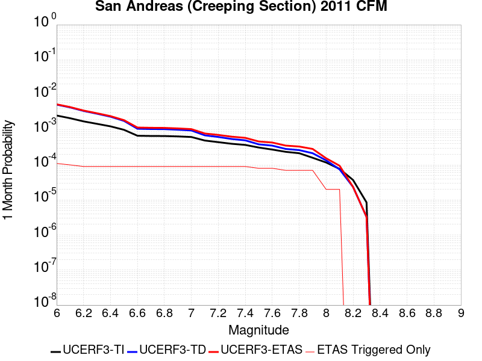 | 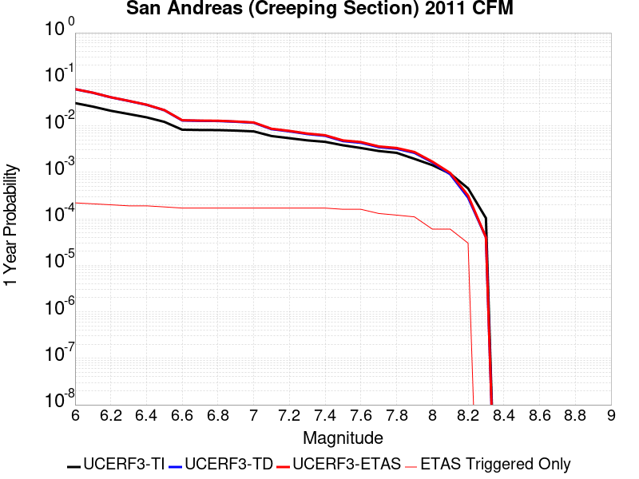 |  |

| Magnitude | 1 wk TI Prob | 1 wk TD Prob | 1 wk ETAS Prob | 1 wk ETAS/TD Gain | 1 wk ETAS Triggered Only | 1 mo TI Prob | 1 mo TD Prob | 1 mo ETAS Prob | 1 mo ETAS/TD Gain | 1 mo ETAS Triggered Only | 1 yr TI Prob | 1 yr TD Prob | 1 yr ETAS Prob | 1 yr ETAS/TD Gain | 1 yr ETAS Triggered Only | 10 yr TI Prob | 10 yr TD Prob | 10 yr ETAS Prob | 10 yr ETAS/TD Gain | 10 yr ETAS Triggered Only |
|-----|-----|-----|-----|-----|-----|-----|-----|-----|-----|-----|-----|-----|-----|-----|-----|-----|-----|-----|-----|-----|
| 6.0 | 5.986481E-4 | 0.0012275929 | 0.0013174824 | 1.0732242 | 9.0E-5 | 0.0025631124 | 0.005245547 | 0.0053549698 | 1.0208602 | 1.1E-4 | 0.030762846 | 0.06120491 | 0.061411444 | 1.0033745 | 2.2E-4 | 0.26835477 | 0.42593494 | 0.42610142 | 1.0003909 | 2.9E-4 |
| 6.1 | 5.015945E-4 | 0.0010217986 | 0.0011017168 | 1.0782133 | 8.0E-5 | 0.00214792 | 0.0043678596 | 0.0044674226 | 1.0227945 | 1.0E-4 | 0.025839351 | 0.05124837 | 0.051447608 | 1.0038877 | 2.1E-4 | 0.23032776 | 0.37285668 | 0.37303227 | 1.000471 | 2.8E-4 |
| 6.2 | 4.073338E-4 | 8.1073755E-4 | 8.8068075E-4 | 1.0862712 | 7.0E-5 | 0.0017445484 | 0.0034671477 | 0.0035568357 | 1.0258679 | 9.0E-5 | 0.021034058 | 0.04093317 | 0.04112498 | 1.004686 | 2.0E-4 | 0.19150782 | 0.31303346 | 0.31321207 | 1.0005705 | 2.6E-4 |
| 6.3 | 3.464099E-4 | 6.7391695E-4 | 7.4386975E-4 | 1.1038004 | 7.0E-5 | 0.0014837692 | 0.0028829593 | 0.0029727 | 1.0311279 | 9.0E-5 | 0.017915873 | 0.034189582 | 0.034373086 | 1.0053673 | 1.9E-4 | 0.16538359 | 0.2713166 | 0.27149874 | 1.0006714 | 2.5E-4 |
| 6.4 | 2.935057E-4 | 5.5442745E-4 | 6.2438863E-4 | 1.1261864 | 7.0E-5 | 0.0012572751 | 0.0023725363 | 0.0024623228 | 1.0378441 | 9.0E-5 | 0.015200248 | 0.02826451 | 0.028449139 | 1.0065322 | 1.9E-4 | 0.14201577 | 0.23298529 | 0.23317704 | 1.000823 | 2.5E-4 |
| 6.5 | 2.3409708E-4 | 4.2093755E-4 | 4.909081E-4 | 1.1662254 | 7.0E-5 | 0.0010028875 | 0.0018019684 | 0.0018918063 | 1.0498554 | 9.0E-5 | 0.012141965 | 0.021587461 | 0.021763576 | 1.0081582 | 1.8E-4 | 0.11499573 | 0.18682368 | 0.18701884 | 1.0010446 | 2.4E-4 |
| 6.6 | 1.5842178E-4 | 2.506933E-4 | 3.2067575E-4 | 1.2791556 | 7.0E-5 | 6.7877385E-4 | 0.0010739497 | 0.0011638531 | 1.0837128 | 9.0E-5 | 0.0082328 | 0.012995575 | 0.013163365 | 1.0129113 | 1.7E-4 | 0.07934396 | 0.12314638 | 0.12334806 | 1.0016377 | 2.3E-4 |
| 6.7 | 1.5616413E-4 | 2.4605883E-4 | 3.160416E-4 | 1.2844148 | 7.0E-5 | 6.691031E-4 | 0.0010541069 | 0.001144012 | 1.0852903 | 9.0E-5 | 0.0081159435 | 0.01275744 | 0.012925271 | 1.0131556 | 1.7E-4 | 0.0782586 | 0.12117351 | 0.12137564 | 1.0016681 | 2.3E-4 |
| 6.8 | 1.5538467E-4 | 2.4429744E-4 | 3.1428036E-4 | 1.286466 | 7.0E-5 | 6.6576427E-4 | 0.0010465645 | 0.0011364704 | 1.0859057 | 9.0E-5 | 0.008075596 | 0.012666838 | 0.012834685 | 1.0132508 | 1.7E-4 | 0.07788358 | 0.120404355 | 0.12060666 | 1.0016803 | 2.3E-4 |
| 6.9 | 1.5153569E-4 | 2.3539034E-4 | 3.0537386E-4 | 1.2973084 | 7.0E-5 | 6.49277E-4 | 0.0010084276 | 0.0010983369 | 1.0891578 | 9.0E-5 | 0.007876333 | 0.01220901 | 0.012376935 | 1.0137541 | 1.7E-4 | 0.07602952 | 0.11647445 | 0.11667766 | 1.0017446 | 2.3E-4 |
| 7.0 | 1.4588932E-4 | 2.2396253E-4 | 2.9394685E-4 | 1.3124822 | 7.0E-5 | 6.250901E-4 | 9.5948833E-4 | 0.0010494019 | 1.09371 | 9.0E-5 | 0.0075839474 | 0.011619697 | 0.011787722 | 1.0144603 | 1.7E-4 | 0.073302895 | 0.11132046 | 0.11152485 | 1.0018361 | 2.3E-4 |
| 7.1 | 1.1565079E-4 | 1.6281738E-4 | 2.3280598E-4 | 1.4298595 | 7.0E-5 | 4.955521E-4 | 6.9760304E-4 | 7.875402E-4 | 1.1289232 | 9.0E-5 | 0.006016669 | 0.0084604435 | 0.0086290045 | 1.0199236 | 1.7E-4 | 0.058563538 | 0.08367046 | 0.08387205 | 1.0024093 | 2.2E-4 |
| 7.2 | 1.0393792E-4 | 1.4615769E-4 | 2.1614745E-4 | 1.4788648 | 7.0E-5 | 4.4537216E-4 | 6.2624045E-4 | 7.161841E-4 | 1.1436248 | 9.0E-5 | 0.005408933 | 0.0075979927 | 0.007766701 | 1.0222043 | 1.7E-4 | 0.052791595 | 0.07561969 | 0.07582305 | 1.0026892 | 2.2E-4 |
| 7.3 | 9.332884E-5 | 1.2780898E-4 | 1.9780004E-4 | 1.5476223 | 7.0E-5 | 3.999194E-4 | 5.4763845E-4 | 6.3758914E-4 | 1.164252 | 9.0E-5 | 0.0048581534 | 0.006647249 | 0.006816119 | 1.0254045 | 1.7E-4 | 0.047533102 | 0.06648326 | 0.06668863 | 1.0030891 | 2.2E-4 |
| 7.4 | 8.670252E-5 | 1.17032345E-4 | 1.8702415E-4 | 1.5980552 | 7.0E-5 | 3.715293E-4 | 5.0147134E-4 | 5.914262E-4 | 1.1793818 | 9.0E-5 | 0.004513991 | 0.006088443 | 0.006257408 | 1.0277518 | 1.7E-4 | 0.044233937 | 0.061151642 | 0.06135819 | 1.0033776 | 2.2E-4 |
| 7.5 | 7.3036405E-5 | 9.005856E-5 | 1.5005315E-4 | 1.6661732 | 6.0E-5 | 3.129756E-4 | 3.8590826E-4 | 4.6587738E-4 | 1.2072232 | 8.0E-5 | 0.0038038217 | 0.0046883323 | 0.0048475824 | 1.0339673 | 1.6E-4 | 0.03739367 | 0.047877792 | 0.04807774 | 1.0041761 | 2.1E-4 |
| 7.6 | 6.3935775E-5 | 8.280385E-5 | 1.4279888E-4 | 1.724544 | 6.0E-5 | 2.7398168E-4 | 3.5482543E-4 | 4.3479705E-4 | 1.2253829 | 8.0E-5 | 0.0033306254 | 0.004311461 | 0.004470771 | 1.0369503 | 1.6E-4 | 0.032811474 | 0.04399201 | 0.04419277 | 1.0045636 | 2.1E-4 |
| 7.7 | 5.5050095E-5 | 6.6618326E-5 | 1.16614996E-4 | 1.7504942 | 5.0E-5 | 2.3590765E-4 | 2.854759E-4 | 3.554559E-4 | 1.2451346 | 7.0E-5 | 0.0028683927 | 0.003470134 | 0.0035996828 | 1.0373325 | 1.3E-4 | 0.0283165 | 0.035796214 | 0.035960127 | 1.0045791 | 1.7E-4 |
| 7.8 | 5.027131E-5 | 6.162871E-5 | 1.11625624E-4 | 1.8112602 | 5.0E-5 | 2.1543067E-4 | 2.640963E-4 | 3.340778E-4 | 1.2649848 | 7.0E-5 | 0.0026197135 | 0.003210635 | 0.0033302498 | 1.0372558 | 1.2E-4 | 0.025890453 | 0.03312666 | 0.03328136 | 1.0046699 | 1.6E-4 |
| 7.9 | 3.7271806E-5 | 5.022507E-5 | 1.00222554E-4 | 1.9954689 | 5.0E-5 | 1.5972654E-4 | 2.1523255E-4 | 2.8521748E-4 | 1.3251597 | 7.0E-5 | 0.0019429359 | 0.002617309 | 0.0027270212 | 1.0419179 | 1.1E-4 | 0.019260362 | 0.027067466 | 0.027213404 | 1.0053917 | 1.5E-4 |
| 8.0 | 2.7310243E-5 | 3.1427757E-5 | 3.1427757E-5 | 1.0 | 0.0 | 1.17038646E-4 | 1.3468343E-4 | 1.5468075E-4 | 1.1484764 | 2.0E-5 | 0.0014240141 | 0.0016385383 | 0.00169844 | 1.036558 | 6.0E-5 | 0.014149235 | 0.01721386 | 0.017282655 | 1.0039965 | 7.0E-5 |
| 8.1 | 1.7940547E-5 | 1.7399378E-5 | 1.7399378E-5 | 1.0 | 0.0 | 7.688579E-5 | 7.456663E-5 | 9.456514E-5 | 1.2681965 | 2.0E-5 | 9.3568244E-4 | 9.074711E-4 | 9.674167E-4 | 1.0660578 | 6.0E-5 | 0.009317525 | 0.009798636 | 0.009858048 | 1.0060633 | 6.0E-5 |
| 8.2 | 8.643924E-6 | 5.473668E-6 | 5.473668E-6 | 1.0 | 0.0 | 3.704486E-5 | 2.3458366E-5 | 2.3458366E-5 | 1.0 | 0.0 | 4.5092785E-4 | 2.8556827E-4 | 3.155597E-4 | 1.1050237 | 3.0E-5 | 0.0045001395 | 0.0032481793 | 0.003278082 | 1.0092059 | 3.0E-5 |
| 8.3 | 1.983087E-6 | 7.6564595E-7 | 7.6564595E-7 | 1.0 | 0.0 | 8.498917E-6 | 3.281336E-6 | 3.281336E-6 | 1.0 | 0.0 | 1.034694E-4 | 3.9949547E-5 | 3.9949547E-5 | 1.0 | 0.0 | 0.0010342124 | 4.717979E-4 | 4.717979E-4 | 1.0 | 0.0 |

## Cleghorn Lake
*[(top)](#table-of-contents)*

| 1 Week | 1 Month | 1 Year | 10 Year |
|-----|-----|-----|-----|
|  | 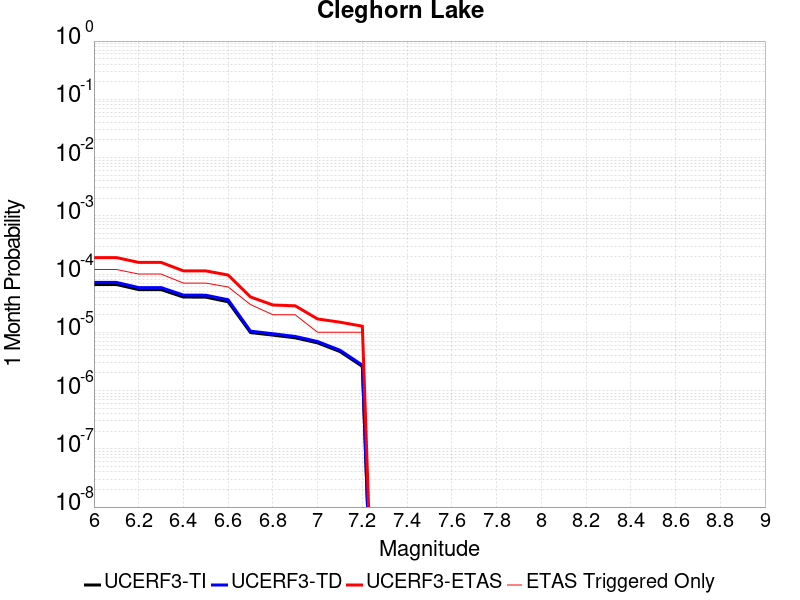 | 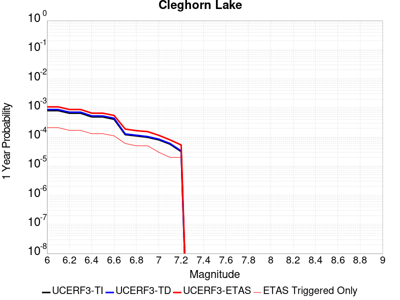 |  |

| Magnitude | 1 wk TI Prob | 1 wk TD Prob | 1 wk ETAS Prob | 1 wk ETAS/TD Gain | 1 wk ETAS Triggered Only | 1 mo TI Prob | 1 mo TD Prob | 1 mo ETAS Prob | 1 mo ETAS/TD Gain | 1 mo ETAS Triggered Only | 1 yr TI Prob | 1 yr TD Prob | 1 yr ETAS Prob | 1 yr ETAS/TD Gain | 1 yr ETAS Triggered Only | 10 yr TI Prob | 10 yr TD Prob | 10 yr ETAS Prob | 10 yr ETAS/TD Gain | 10 yr ETAS Triggered Only |
|-----|-----|-----|-----|-----|-----|-----|-----|-----|-----|-----|-----|-----|-----|-----|-----|-----|-----|-----|-----|-----|
| 6.0 | 1.5467183E-5 | 1.6794203E-5 | 9.679286E-5 | 5.7634683 | 8.0E-5 | 6.6286244E-5 | 7.197348E-5 | 1.9196485E-4 | 2.6671607 | 1.2E-4 | 8.067362E-4 | 8.759797E-4 | 0.0010857958 | 1.2395216 | 2.1E-4 | 0.008038137 | 0.008730696 | 0.008988425 | 1.02952 | 2.6E-4 |
| 6.1 | 1.5467183E-5 | 1.6794203E-5 | 9.679286E-5 | 5.7634683 | 8.0E-5 | 6.6286244E-5 | 7.197348E-5 | 1.9196485E-4 | 2.6671607 | 1.2E-4 | 8.067362E-4 | 8.759797E-4 | 0.0010857958 | 1.2395216 | 2.1E-4 | 0.008038137 | 0.008730696 | 0.008988425 | 1.02952 | 2.6E-4 |
| 6.2 | 1.2624631E-5 | 1.3681544E-5 | 8.3680585E-5 | 6.1163116 | 7.0E-5 | 5.410444E-5 | 5.863415E-5 | 1.5862829E-4 | 2.705391 | 1.0E-4 | 6.585225E-4 | 7.1368564E-4 | 8.835643E-4 | 1.2380301 | 1.7E-4 | 0.0065657445 | 0.0071187317 | 0.007317308 | 1.0278949 | 2.0E-4 |
| 6.3 | 1.2624631E-5 | 1.3681544E-5 | 8.3680585E-5 | 6.1163116 | 7.0E-5 | 5.410444E-5 | 5.863415E-5 | 1.5862829E-4 | 2.705391 | 1.0E-4 | 6.585225E-4 | 7.1368564E-4 | 8.835643E-4 | 1.2380301 | 1.7E-4 | 0.0065657445 | 0.0071187317 | 0.007317308 | 1.0278949 | 2.0E-4 |
| 6.4 | 9.417684E-6 | 1.0170118E-5 | 7.016951E-5 | 6.8995767 | 6.0E-5 | 4.036088E-5 | 4.3585722E-5 | 1.1358267E-4 | 2.6059606 | 7.0E-5 | 4.912829E-4 | 5.3056807E-4 | 6.604991E-4 | 1.2448905 | 1.3E-4 | 0.004901982 | 0.005297049 | 0.0054462543 | 1.0281676 | 1.5E-4 |
| 6.5 | 9.368219E-6 | 1.0117545E-5 | 7.0116934E-5 | 6.930233 | 6.0E-5 | 4.014889E-5 | 4.3360415E-5 | 1.1335738E-4 | 2.6143057 | 7.0E-5 | 4.8870314E-4 | 5.2782625E-4 | 6.577576E-4 | 1.2461631 | 1.3E-4 | 0.004876298 | 0.0052697617 | 0.005418971 | 1.0283142 | 1.5E-4 |
| 6.6 | 7.803798E-6 | 8.441831E-6 | 6.8441324E-5 | 8.107403 | 6.0E-5 | 3.3444423E-5 | 3.6179E-5 | 9.617683E-5 | 2.6583607 | 6.0E-5 | 4.0710976E-4 | 4.4043022E-4 | 5.503818E-4 | 1.2496458 | 1.1E-4 | 0.0040636472 | 0.0043994905 | 0.0045289183 | 1.0294188 | 1.3E-4 |
| 6.7 | 2.3108669E-6 | 2.4438336E-6 | 3.244376E-5 | 13.275764 | 3.0E-5 | 9.903678E-6 | 1.0473532E-5 | 4.0473216E-5 | 3.8643334 | 3.0E-5 | 1.205706E-4 | 1.2750797E-4 | 1.8750032E-4 | 1.4704988 | 6.0E-5 | 0.001205052 | 0.0012743667 | 0.0013442776 | 1.0548593 | 7.0E-5 |
| 6.8 | 2.0882828E-6 | 2.2062823E-6 | 2.2206237E-5 | 10.065003 | 2.0E-5 | 8.949753E-6 | 9.455462E-6 | 2.9455272E-5 | 3.1151595 | 2.0E-5 | 1.08957785E-4 | 1.1511434E-4 | 1.6510858E-4 | 1.4343008 | 5.0E-5 | 0.0010890438 | 0.0011505639 | 0.0012104949 | 1.0520884 | 6.0E-5 |
| 6.9 | 1.876935E-6 | 1.981051E-6 | 2.1981012E-5 | 11.095632 | 2.0E-5 | 8.043982E-6 | 8.490192E-6 | 2.8490022E-5 | 3.3556395 | 2.0E-5 | 9.7931086E-5 | 1.03363345E-4 | 1.5335818E-4 | 1.4836805 | 5.0E-5 | 9.788794E-4 | 0.0010331686 | 0.0010931067 | 1.0580138 | 6.0E-5 |
| 7.0 | 1.5357559E-6 | 1.6202807E-6 | 1.1620265E-5 | 7.17176 | 1.0E-5 | 6.5817944E-6 | 6.9440425E-6 | 1.6943974E-5 | 2.4400733 | 1.0E-5 | 8.01304E-5 | 8.454057E-5 | 1.1453803E-4 | 1.3548292 | 3.0E-5 | 8.010151E-4 | 8.450965E-4 | 8.850627E-4 | 1.0472919 | 4.0E-5 |
| 7.1 | 1.0905424E-6 | 1.1497619E-6 | 1.114975E-5 | 9.697442 | 1.0E-5 | 4.6737446E-6 | 4.9275427E-6 | 1.4927493E-5 | 3.0293992 | 1.0E-5 | 5.6901354E-5 | 5.999128E-5 | 7.999008E-5 | 1.3333617 | 2.0E-5 | 5.6886784E-4 | 5.997606E-4 | 6.2974263E-4 | 1.0499899 | 3.0E-5 |
| 7.2 | 6.06668E-7 | 6.387277E-7 | 1.06387215E-5 | 16.656113 | 1.0E-5 | 2.600003E-6 | 2.7374022E-6 | 1.2737375E-5 | 4.6530886 | 1.0E-5 | 3.1654577E-5 | 3.3327433E-5 | 5.3326767E-5 | 1.6000862 | 2.0E-5 | 3.1650066E-4 | 3.3323118E-4 | 3.5322452E-4 | 1.0599984 | 2.0E-5 |

## San Jacinto (San Bernardino)
*[(top)](#table-of-contents)*

| 1 Week | 1 Month | 1 Year | 10 Year |
|-----|-----|-----|-----|
|  | 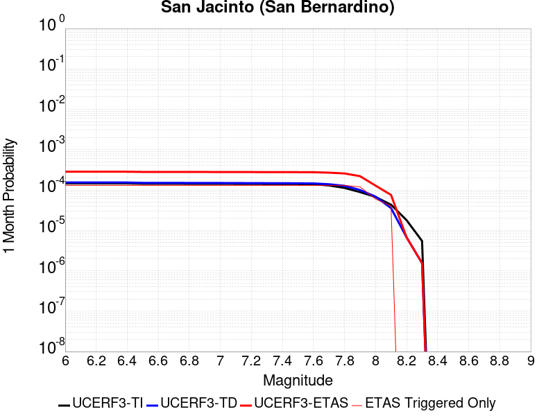 | 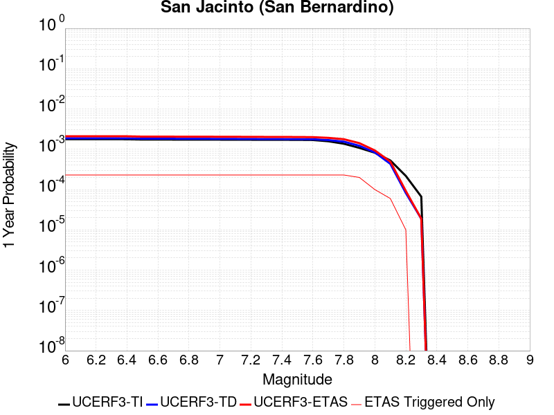 |  |

| Magnitude | 1 wk TI Prob | 1 wk TD Prob | 1 wk ETAS Prob | 1 wk ETAS/TD Gain | 1 wk ETAS Triggered Only | 1 mo TI Prob | 1 mo TD Prob | 1 mo ETAS Prob | 1 mo ETAS/TD Gain | 1 mo ETAS Triggered Only | 1 yr TI Prob | 1 yr TD Prob | 1 yr ETAS Prob | 1 yr ETAS/TD Gain | 1 yr ETAS Triggered Only | 10 yr TI Prob | 10 yr TD Prob | 10 yr ETAS Prob | 10 yr ETAS/TD Gain | 10 yr ETAS Triggered Only |
|-----|-----|-----|-----|-----|-----|-----|-----|-----|-----|-----|-----|-----|-----|-----|-----|-----|-----|-----|-----|-----|
| 6.0 | 3.409352E-5 | 3.598562E-5 | 1.1598274E-4 | 3.2230303 | 8.0E-5 | 1.461069E-4 | 1.5421498E-4 | 2.8419492E-4 | 1.8428491 | 1.3E-4 | 0.0017774 | 0.0018759521 | 0.0021055206 | 1.1223744 | 2.3E-4 | 0.01763251 | 0.019349992 | 0.01961477 | 1.0136834 | 2.7E-4 |
| 6.1 | 3.409352E-5 | 3.598562E-5 | 1.1598274E-4 | 3.2230303 | 8.0E-5 | 1.461069E-4 | 1.5421498E-4 | 2.8419492E-4 | 1.8428491 | 1.3E-4 | 0.0017774 | 0.0018759521 | 0.0021055206 | 1.1223744 | 2.3E-4 | 0.01763251 | 0.019349992 | 0.01961477 | 1.0136834 | 2.7E-4 |
| 6.2 | 3.409352E-5 | 3.598562E-5 | 1.1598274E-4 | 3.2230303 | 8.0E-5 | 1.461069E-4 | 1.5421498E-4 | 2.8419492E-4 | 1.8428491 | 1.3E-4 | 0.0017774 | 0.0018759521 | 0.0021055206 | 1.1223744 | 2.3E-4 | 0.01763251 | 0.019349992 | 0.01961477 | 1.0136834 | 2.7E-4 |
| 6.3 | 3.409352E-5 | 3.598562E-5 | 1.1598274E-4 | 3.2230303 | 8.0E-5 | 1.461069E-4 | 1.5421498E-4 | 2.8419492E-4 | 1.8428491 | 1.3E-4 | 0.0017774 | 0.0018759521 | 0.0021055206 | 1.1223744 | 2.3E-4 | 0.01763251 | 0.019349992 | 0.01961477 | 1.0136834 | 2.7E-4 |
| 6.4 | 3.400795E-5 | 3.5878285E-5 | 1.1587542E-4 | 3.229681 | 8.0E-5 | 1.4574021E-4 | 1.5375503E-4 | 2.8373505E-4 | 1.8453708 | 1.3E-4 | 0.0017729428 | 0.0018703619 | 0.0020999317 | 1.1227409 | 2.3E-4 | 0.017588645 | 0.019295074 | 0.019559864 | 1.0137233 | 2.7E-4 |
| 6.5 | 3.341482E-5 | 3.5138914E-5 | 1.1513611E-4 | 3.2765982 | 8.0E-5 | 1.4319851E-4 | 1.5058667E-4 | 2.805671E-4 | 1.8631603 | 1.3E-4 | 0.0017420477 | 0.0018318522 | 0.0020614308 | 1.1253259 | 2.3E-4 | 0.017284546 | 0.018916616 | 0.019181509 | 1.0140032 | 2.7E-4 |
| 6.6 | 3.3364955E-5 | 3.5076133E-5 | 1.1507333E-4 | 3.280673 | 8.0E-5 | 1.4298483E-4 | 1.5031763E-4 | 2.802981E-4 | 1.8647053 | 1.3E-4 | 0.0017394501 | 0.0018285823 | 0.0020581617 | 1.1255505 | 2.3E-4 | 0.017258976 | 0.01888448 | 0.019149382 | 1.0140275 | 2.7E-4 |
| 6.7 | 3.335922E-5 | 3.5065907E-5 | 1.150631E-4 | 3.2813382 | 8.0E-5 | 1.4296026E-4 | 1.5027382E-4 | 2.802543E-4 | 1.8649576 | 1.3E-4 | 0.0017391514 | 0.0018280497 | 0.0020576292 | 1.1255871 | 2.3E-4 | 0.017256035 | 0.018879272 | 0.019144174 | 1.0140314 | 2.7E-4 |
| 6.8 | 3.327683E-5 | 3.4959972E-5 | 1.14957176E-4 | 3.2882514 | 8.0E-5 | 1.4260718E-4 | 1.4981985E-4 | 2.7980038E-4 | 1.8675787 | 1.3E-4 | 0.0017348597 | 0.001822532 | 0.002052113 | 1.1259681 | 2.3E-4 | 0.017213784 | 0.018825045 | 0.019089961 | 1.0140725 | 2.7E-4 |
| 6.9 | 3.3235785E-5 | 3.4900928E-5 | 1.1489813E-4 | 3.2921228 | 8.0E-5 | 1.4243131E-4 | 1.4956683E-4 | 2.7954738E-4 | 1.8690467 | 1.3E-4 | 0.0017327217 | 0.0018194567 | 0.0020490382 | 1.1261814 | 2.3E-4 | 0.017192734 | 0.018794911 | 0.019059837 | 1.0140955 | 2.7E-4 |
| 7.0 | 3.3197095E-5 | 3.4840854E-5 | 1.1483807E-4 | 3.2960749 | 8.0E-5 | 1.422655E-4 | 1.4930942E-4 | 2.7929E-4 | 1.8705451 | 1.3E-4 | 0.0017307063 | 0.0018163278 | 0.00204591 | 1.1263992 | 2.3E-4 | 0.017172894 | 0.01876429 | 0.019029222 | 1.014119 | 2.7E-4 |
| 7.1 | 3.3129716E-5 | 3.4721066E-5 | 1.14718285E-4 | 3.3039968 | 8.0E-5 | 1.4197677E-4 | 1.4879608E-4 | 2.7877674E-4 | 1.8735489 | 1.3E-4 | 0.0017271966 | 0.0018100884 | 0.002039672 | 1.1268356 | 2.3E-4 | 0.017138338 | 0.018703366 | 0.018968316 | 1.0141659 | 2.7E-4 |
| 7.2 | 3.3034008E-5 | 3.4588513E-5 | 1.14585746E-4 | 3.3128266 | 8.0E-5 | 1.4156665E-4 | 1.4822806E-4 | 2.7820878E-4 | 1.8768969 | 1.3E-4 | 0.0017222111 | 0.0018031843 | 0.0020327696 | 1.1273221 | 2.3E-4 | 0.017089253 | 0.01863575 | 0.018900719 | 1.0142183 | 2.7E-4 |
| 7.3 | 3.2956614E-5 | 3.4456265E-5 | 1.1445351E-4 | 3.3217037 | 8.0E-5 | 1.4123498E-4 | 1.4766137E-4 | 2.7764216E-4 | 1.8802629 | 1.3E-4 | 0.0017181796 | 0.0017962961 | 0.002025883 | 1.1278112 | 2.3E-4 | 0.017049557 | 0.018568495 | 0.018833483 | 1.0142708 | 2.7E-4 |
| 7.4 | 3.2915937E-5 | 3.4377957E-5 | 1.1437521E-4 | 3.3269925 | 8.0E-5 | 1.4106068E-4 | 1.473258E-4 | 2.7730665E-4 | 1.8822681 | 1.3E-4 | 0.0017160608 | 0.0017922173 | 0.0020218052 | 1.1281027 | 2.3E-4 | 0.017028693 | 0.018528769 | 0.018793765 | 1.0143019 | 2.7E-4 |
| 7.5 | 3.281791E-5 | 3.424287E-5 | 1.1424013E-4 | 3.3361728 | 8.0E-5 | 1.406406E-4 | 1.4674691E-4 | 2.7672783E-4 | 1.885749 | 1.3E-4 | 0.0017109542 | 0.0017851809 | 0.0020147704 | 1.1286085 | 2.3E-4 | 0.016978411 | 0.018459652 | 0.018724669 | 1.0143565 | 2.7E-4 |
| 7.6 | 3.2521442E-5 | 3.396782E-5 | 1.139651E-4 | 3.3550904 | 8.0E-5 | 1.3937015E-4 | 1.4556825E-4 | 2.7554933E-4 | 1.8929219 | 1.3E-4 | 0.0016955109 | 0.0017708542 | 0.002000447 | 1.1296508 | 2.3E-4 | 0.016826328 | 0.018317295 | 0.01858235 | 1.0144702 | 2.7E-4 |
| 7.7 | 3.0287873E-5 | 3.245191E-5 | 1.12449314E-4 | 3.465106 | 8.0E-5 | 1.297987E-4 | 1.3907222E-4 | 2.6905414E-4 | 1.9346362 | 1.3E-4 | 0.0015791537 | 0.0016918903 | 0.0019215011 | 1.1357126 | 2.3E-4 | 0.01567979 | 0.017528199 | 0.017793467 | 1.0151337 | 2.7E-4 |
| 7.8 | 2.6316151E-5 | 2.9662837E-5 | 1.0966046E-4 | 3.6968975 | 8.0E-5 | 1.1277862E-4 | 1.2712025E-4 | 2.5710373E-4 | 2.0225236 | 1.3E-4 | 0.0013722149 | 0.0015465913 | 0.0017762355 | 1.1484841 | 2.3E-4 | 0.013637724 | 0.016069878 | 0.01633554 | 1.0165316 | 2.7E-4 |
| 7.9 | 2.0761147E-5 | 2.3417291E-5 | 9.341565E-5 | 3.9891741 | 7.0E-5 | 8.897331E-5 | 1.0035596E-4 | 2.2034392E-4 | 2.1956236 | 1.2E-4 | 0.0010827117 | 0.0012211498 | 0.0014209056 | 1.1635801 | 2.0E-4 | 0.010774517 | 0.012793272 | 0.013030201 | 1.0185199 | 2.4E-4 |
| 8.0 | 1.5738568E-5 | 1.6032505E-5 | 3.6032186E-5 | 2.2474456 | 2.0E-5 | 6.744926E-5 | 6.8708934E-5 | 1.287048E-4 | 1.8731889 | 6.0E-5 | 8.2088535E-4 | 8.3621085E-4 | 9.3612727E-4 | 1.119487 | 1.0E-4 | 0.008178596 | 0.008865741 | 0.008984677 | 1.0134152 | 1.2E-4 |
| 8.1 | 1.0105832E-5 | 8.329479E-6 | 1.8329396E-5 | 2.2005453 | 1.0E-5 | 4.3309992E-5 | 3.569728E-5 | 7.5695854E-5 | 2.1204937 | 4.0E-5 | 5.2717153E-4 | 4.3452822E-4 | 4.9450214E-4 | 1.1380208 | 6.0E-5 | 0.005259227 | 0.0046768794 | 0.0047365986 | 1.0127691 | 6.0E-5 |
| 8.2 | 4.189207E-6 | 1.577699E-6 | 1.577699E-6 | 1.0 | 0.0 | 1.7953622E-5 | 6.7615497E-6 | 6.7615497E-6 | 1.0 | 0.0 | 2.1856341E-4 | 8.231879E-5 | 9.231796E-5 | 1.1214689 | 1.0E-5 | 0.0021834858 | 9.562628E-4 | 9.662532E-4 | 1.0104474 | 1.0E-5 |
| 8.3 | 1.2758221E-6 | 3.612677E-7 | 3.612677E-7 | 1.0 | 0.0 | 5.4677976E-6 | 1.5482892E-6 | 1.5482892E-6 | 1.0 | 0.0 | 6.65684E-5 | 1.8850264E-5 | 1.8850264E-5 | 1.0 | 0.0 | 6.6548464E-4 | 2.2739546E-4 | 2.2739546E-4 | 1.0 | 0.0 |

## Lake Isabella (Seismicity)
*[(top)](#table-of-contents)*

| 1 Week | 1 Month | 1 Year | 10 Year |
|-----|-----|-----|-----|
|  |  |  | 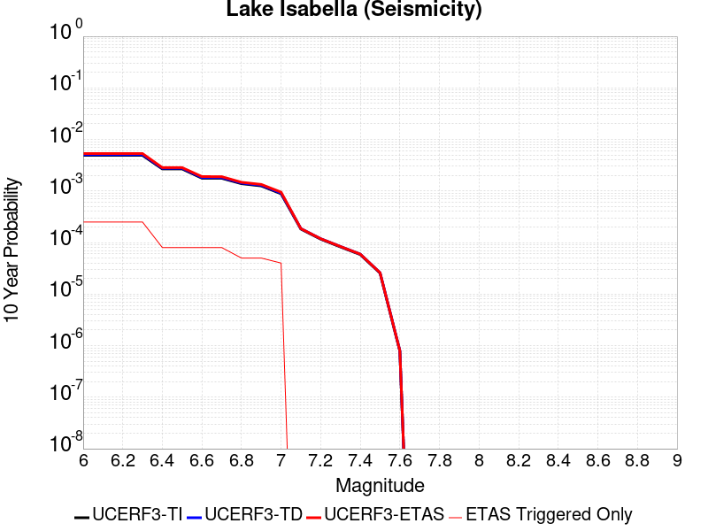 |

| Magnitude | 1 wk TI Prob | 1 wk TD Prob | 1 wk ETAS Prob | 1 wk ETAS/TD Gain | 1 wk ETAS Triggered Only | 1 mo TI Prob | 1 mo TD Prob | 1 mo ETAS Prob | 1 mo ETAS/TD Gain | 1 mo ETAS Triggered Only | 1 yr TI Prob | 1 yr TD Prob | 1 yr ETAS Prob | 1 yr ETAS/TD Gain | 1 yr ETAS Triggered Only | 10 yr TI Prob | 10 yr TD Prob | 10 yr ETAS Prob | 10 yr ETAS/TD Gain | 10 yr ETAS Triggered Only |
|-----|-----|-----|-----|-----|-----|-----|-----|-----|-----|-----|-----|-----|-----|-----|-----|-----|-----|-----|-----|-----|
| 6.0 | 9.431637E-6 | 9.741651E-6 | 5.9741164E-5 | 6.13255 | 5.0E-5 | 4.0420677E-5 | 4.1749343E-5 | 1.3174559E-4 | 3.1556327 | 9.0E-5 | 4.920106E-4 | 5.0819275E-4 | 6.5811654E-4 | 1.2950135 | 1.5E-4 | 0.004909227 | 0.005071599 | 0.005320331 | 1.0490441 | 2.5E-4 |
| 6.1 | 9.431637E-6 | 9.741651E-6 | 5.9741164E-5 | 6.13255 | 5.0E-5 | 4.0420677E-5 | 4.1749343E-5 | 1.3174559E-4 | 3.1556327 | 9.0E-5 | 4.920106E-4 | 5.0819275E-4 | 6.5811654E-4 | 1.2950135 | 1.5E-4 | 0.004909227 | 0.005071599 | 0.005320331 | 1.0490441 | 2.5E-4 |
| 6.2 | 9.431637E-6 | 9.741651E-6 | 5.9741164E-5 | 6.13255 | 5.0E-5 | 4.0420677E-5 | 4.1749343E-5 | 1.3174559E-4 | 3.1556327 | 9.0E-5 | 4.920106E-4 | 5.0819275E-4 | 6.5811654E-4 | 1.2950135 | 1.5E-4 | 0.004909227 | 0.005071599 | 0.005320331 | 1.0490441 | 2.5E-4 |
| 6.3 | 9.431637E-6 | 9.741651E-6 | 5.9741164E-5 | 6.13255 | 5.0E-5 | 4.0420677E-5 | 4.1749343E-5 | 1.3174559E-4 | 3.1556327 | 9.0E-5 | 4.920106E-4 | 5.0819275E-4 | 6.5811654E-4 | 1.2950135 | 1.5E-4 | 0.004909227 | 0.005071599 | 0.005320331 | 1.0490441 | 2.5E-4 |
| 6.4 | 5.144063E-6 | 5.3000763E-6 | 2.529997E-5 | 4.773511 | 2.0E-5 | 2.2045799E-5 | 2.2714434E-5 | 5.2713753E-5 | 2.3207161 | 3.0E-5 | 2.6837454E-4 | 2.765166E-4 | 3.365E-4 | 1.2169251 | 6.0E-5 | 0.0026805066 | 0.0027620657 | 0.0028418447 | 1.0288838 | 8.0E-5 |
| 6.5 | 5.144063E-6 | 5.3000763E-6 | 2.529997E-5 | 4.773511 | 2.0E-5 | 2.2045799E-5 | 2.2714434E-5 | 5.2713753E-5 | 2.3207161 | 3.0E-5 | 2.6837454E-4 | 2.765166E-4 | 3.365E-4 | 1.2169251 | 6.0E-5 | 0.0026805066 | 0.0027620657 | 0.0028418447 | 1.0288838 | 8.0E-5 |
| 6.6 | 3.4009804E-6 | 3.498786E-6 | 2.3498716E-5 | 6.716248 | 2.0E-5 | 1.4575549E-5 | 1.4994721E-5 | 4.499427E-5 | 3.0006742 | 3.0E-5 | 1.7744285E-4 | 1.8254704E-4 | 2.4253609E-4 | 1.3286225 | 6.0E-5 | 0.0017730123 | 0.0018241286 | 0.0019039826 | 1.0437765 | 8.0E-5 |
| 6.7 | 3.3880428E-6 | 3.4856528E-6 | 2.3485583E-5 | 6.7377863 | 2.0E-5 | 1.4520103E-5 | 1.4938435E-5 | 4.4937988E-5 | 3.0082123 | 3.0E-5 | 1.767679E-4 | 1.8186188E-4 | 2.4185097E-4 | 1.3298607 | 6.0E-5 | 0.0017662736 | 0.0018172882 | 0.0018971429 | 1.0439416 | 8.0E-5 |
| 6.8 | 2.6582E-6 | 2.7337003E-6 | 2.2733646E-5 | 8.3160715 | 2.0E-5 | 1.1392236E-5 | 1.1715813E-5 | 4.1715462E-5 | 3.5606117 | 3.0E-5 | 1.3869164E-4 | 1.4263204E-4 | 1.8262633E-4 | 1.280402 | 4.0E-5 | 0.0013860512 | 0.0014255369 | 0.0014754656 | 1.0350245 | 5.0E-5 |
| 6.9 | 2.406011E-6 | 2.4743288E-6 | 2.247428E-5 | 9.08298 | 2.0E-5 | 1.0311434E-5 | 1.0604231E-5 | 4.0603914E-5 | 3.8290296 | 3.0E-5 | 1.2553448E-4 | 1.2910018E-4 | 1.6909502E-4 | 1.3097969 | 4.0E-5 | 0.0012546359 | 0.0012903814 | 0.001340317 | 1.0386982 | 5.0E-5 |
| 7.0 | 1.6953097E-6 | 1.7429371E-6 | 1.174292E-5 | 6.7374315 | 1.0E-5 | 7.265593E-6 | 7.469715E-6 | 2.7469567E-5 | 3.6774583 | 2.0E-5 | 8.8455E-5 | 9.094104E-5 | 1.20938304E-4 | 1.3298541 | 3.0E-5 | 8.84198E-4 | 9.09141E-4 | 9.491046E-4 | 1.0439576 | 4.0E-5 |
| 7.1 | 3.5013824E-7 | 3.5714822E-7 | 3.5714822E-7 | 1.0 | 0.0 | 1.5005916E-6 | 1.5306344E-6 | 1.5306344E-6 | 1.0 | 0.0 | 1.826955E-5 | 1.8635317E-5 | 1.8635317E-5 | 1.0 | 0.0 | 1.8268047E-4 | 1.863378E-4 | 1.863378E-4 | 1.0 | 0.0 |
| 7.2 | 2.2321095E-7 | 2.2750574E-7 | 2.2750574E-7 | 1.0 | 0.0 | 9.56618E-7 | 9.750242E-7 | 9.750242E-7 | 1.0 | 0.0 | 1.1646762E-5 | 1.1870856E-5 | 1.1870856E-5 | 1.0 | 0.0 | 1.1646151E-4 | 1.1870232E-4 | 1.1870232E-4 | 1.0 | 0.0 |
| 7.3 | 1.5760406E-7 | 1.6060922E-7 | 1.6060922E-7 | 1.0 | 0.0 | 6.7544585E-7 | 6.8832503E-7 | 6.8832503E-7 | 1.0 | 0.0 | 8.223522E-6 | 8.380326E-6 | 8.380326E-6 | 1.0 | 0.0 | 8.2232174E-5 | 8.3800165E-5 | 8.3800165E-5 | 1.0 | 0.0 |
| 7.4 | 1.1216497E-7 | 1.1431706E-7 | 1.1431706E-7 | 1.0 | 0.0 | 4.8070694E-7 | 4.899302E-7 | 4.899302E-7 | 1.0 | 0.0 | 5.852591E-6 | 5.964884E-6 | 5.964884E-6 | 1.0 | 0.0 | 5.8524372E-5 | 5.9647282E-5 | 5.9647282E-5 | 1.0 | 0.0 |
| 7.5 | 4.885185E-8 | 4.9787737E-8 | 4.9787737E-8 | 1.0 | 0.0 | 2.0936506E-7 | 2.13376E-7 | 2.13376E-7 | 1.0 | 0.0 | 2.5490165E-6 | 2.59785E-6 | 2.59785E-6 | 1.0 | 0.0 | 2.5489873E-5 | 2.5978214E-5 | 2.5978214E-5 | 1.0 | 0.0 |
| 7.6 | 1.504641E-9 | 1.5317903E-9 | 1.5317903E-9 | 1.0 | 0.0 | 6.4484613E-9 | 6.5648154E-9 | 6.5648154E-9 | 1.0 | 0.0 | 7.851001E-8 | 7.992663E-8 | 7.992663E-8 | 1.0 | 0.0 | 7.8509987E-7 | 7.992663E-7 | 7.992663E-7 | 1.0 | 0.0 |

## San Andreas (North Branch Mill Creek)
*[(top)](#table-of-contents)*

| 1 Week | 1 Month | 1 Year | 10 Year |
|-----|-----|-----|-----|
| 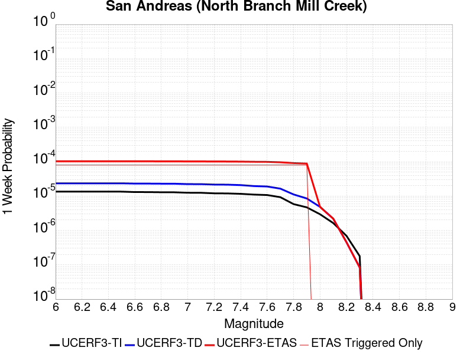 |  |  | 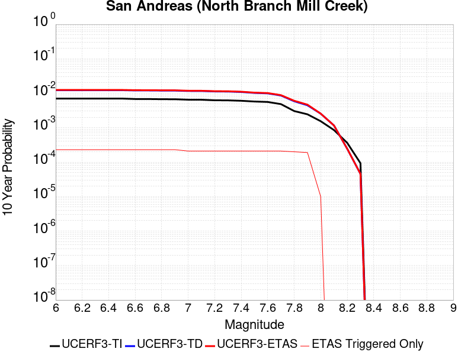 |

| Magnitude | 1 wk TI Prob | 1 wk TD Prob | 1 wk ETAS Prob | 1 wk ETAS/TD Gain | 1 wk ETAS Triggered Only | 1 mo TI Prob | 1 mo TD Prob | 1 mo ETAS Prob | 1 mo ETAS/TD Gain | 1 mo ETAS Triggered Only | 1 yr TI Prob | 1 yr TD Prob | 1 yr ETAS Prob | 1 yr ETAS/TD Gain | 1 yr ETAS Triggered Only | 10 yr TI Prob | 10 yr TD Prob | 10 yr ETAS Prob | 10 yr ETAS/TD Gain | 10 yr ETAS Triggered Only |
|-----|-----|-----|-----|-----|-----|-----|-----|-----|-----|-----|-----|-----|-----|-----|-----|-----|-----|-----|-----|-----|
| 6.0 | 1.3461156E-5 | 2.3500992E-5 | 1.03499115E-4 | 4.4040318 | 8.0E-5 | 5.7689394E-5 | 1.00714664E-4 | 2.1070358E-4 | 2.0920844 | 1.1E-4 | 7.02142E-4 | 0.0012255146 | 0.0013953063 | 1.1385472 | 1.7E-4 | 0.0069992766 | 0.012228744 | 0.012455932 | 1.0185782 | 2.3E-4 |
| 6.1 | 1.3461156E-5 | 2.3500992E-5 | 1.03499115E-4 | 4.4040318 | 8.0E-5 | 5.7689394E-5 | 1.00714664E-4 | 2.1070358E-4 | 2.0920844 | 1.1E-4 | 7.02142E-4 | 0.0012255146 | 0.0013953063 | 1.1385472 | 1.7E-4 | 0.0069992766 | 0.012228744 | 0.012455932 | 1.0185782 | 2.3E-4 |
| 6.2 | 1.3461156E-5 | 2.3500992E-5 | 1.03499115E-4 | 4.4040318 | 8.0E-5 | 5.7689394E-5 | 1.00714664E-4 | 2.1070358E-4 | 2.0920844 | 1.1E-4 | 7.02142E-4 | 0.0012255146 | 0.0013953063 | 1.1385472 | 1.7E-4 | 0.0069992766 | 0.012228744 | 0.012455932 | 1.0185782 | 2.3E-4 |
| 6.3 | 1.3461156E-5 | 2.3500992E-5 | 1.03499115E-4 | 4.4040318 | 8.0E-5 | 5.7689394E-5 | 1.00714664E-4 | 2.1070358E-4 | 2.0920844 | 1.1E-4 | 7.02142E-4 | 0.0012255146 | 0.0013953063 | 1.1385472 | 1.7E-4 | 0.0069992766 | 0.012228744 | 0.012455932 | 1.0185782 | 2.3E-4 |
| 6.4 | 1.3461156E-5 | 2.3500992E-5 | 1.03499115E-4 | 4.4040318 | 8.0E-5 | 5.7689394E-5 | 1.00714664E-4 | 2.1070358E-4 | 2.0920844 | 1.1E-4 | 7.02142E-4 | 0.0012255146 | 0.0013953063 | 1.1385472 | 1.7E-4 | 0.0069992766 | 0.012228744 | 0.012455932 | 1.0185782 | 2.3E-4 |
| 6.5 | 1.3450706E-5 | 2.348995E-5 | 1.0348807E-4 | 4.4056315 | 8.0E-5 | 5.764461E-5 | 1.00667356E-4 | 2.1065628E-4 | 2.0925977 | 1.1E-4 | 7.0159714E-4 | 0.0012249392 | 0.001394731 | 1.1386124 | 1.7E-4 | 0.006993862 | 0.012223054 | 0.012450242 | 1.0185869 | 2.3E-4 |
| 6.6 | 1.3074523E-5 | 2.3104236E-5 | 1.03102386E-4 | 4.4624887 | 8.0E-5 | 5.6032466E-5 | 9.901441E-5 | 2.0900353E-4 | 2.1108394 | 1.1E-4 | 6.8198174E-4 | 0.001204837 | 0.0013746322 | 1.1409279 | 1.7E-4 | 0.006798926 | 0.012024219 | 0.0122514535 | 1.018898 | 2.3E-4 |
| 6.7 | 1.3050216E-5 | 2.3079532E-5 | 1.03077684E-4 | 4.4661946 | 8.0E-5 | 5.59283E-5 | 9.890855E-5 | 2.0889768E-4 | 2.1120284 | 1.1E-4 | 6.8071426E-4 | 0.0012035496 | 0.001373345 | 1.1410788 | 1.7E-4 | 0.0067863287 | 0.012011484 | 0.012238721 | 1.0189184 | 2.3E-4 |
| 6.8 | 1.29049395E-5 | 2.2927941E-5 | 1.02926104E-4 | 4.4891124 | 8.0E-5 | 5.530571E-5 | 9.825892E-5 | 2.0824811E-4 | 2.1193812 | 1.1E-4 | 6.73139E-4 | 0.001195649 | 0.0013654458 | 1.1420122 | 1.7E-4 | 0.0067110364 | 0.011933329 | 0.012160583 | 1.0190438 | 2.3E-4 |
| 6.9 | 1.2867369E-5 | 2.2887343E-5 | 1.0288551E-4 | 4.4953017 | 8.0E-5 | 5.51447E-5 | 9.808494E-5 | 2.0807415E-4 | 2.121367 | 1.1E-4 | 6.711799E-4 | 0.0011935332 | 0.0013633303 | 1.1422642 | 1.7E-4 | 0.006691564 | 0.011912397 | 0.0121396575 | 1.0190777 | 2.3E-4 |
| 7.0 | 1.2495996E-5 | 2.2287419E-5 | 1.0228564E-4 | 4.589389 | 8.0E-5 | 5.3553173E-5 | 9.551403E-5 | 1.9550449E-4 | 2.0468667 | 1.0E-4 | 6.518148E-4 | 0.0011622658 | 0.0013120915 | 1.1289083 | 1.5E-4 | 0.0064990623 | 0.011603 | 0.0118105635 | 1.0178888 | 2.1E-4 |
| 7.1 | 1.2452067E-5 | 2.2232492E-5 | 1.0223071E-4 | 4.598257 | 8.0E-5 | 5.3364907E-5 | 9.527864E-5 | 1.9526911E-4 | 2.0494533 | 1.0E-4 | 6.4952404E-4 | 0.001159403 | 0.0013092291 | 1.1292269 | 1.5E-4 | 0.0064762887 | 0.011574671 | 0.01178224 | 1.017933 | 2.1E-4 |
| 7.2 | 1.2002777E-5 | 2.1611015E-5 | 1.0160929E-4 | 4.701736 | 8.0E-5 | 5.143946E-5 | 9.261536E-5 | 1.926061E-4 | 2.0796344 | 1.0E-4 | 6.2609545E-4 | 0.0011270114 | 0.0012768423 | 1.1329454 | 1.5E-4 | 0.006243344 | 0.011254058 | 0.011461695 | 1.0184499 | 2.1E-4 |
| 7.3 | 1.1923425E-5 | 2.1480853E-5 | 1.01479134E-4 | 4.724167 | 8.0E-5 | 5.109939E-5 | 9.205757E-5 | 1.9204836E-4 | 2.0861769 | 1.0E-4 | 6.219575E-4 | 0.0011202273 | 0.0012700593 | 1.1337514 | 1.5E-4 | 0.0062021962 | 0.011186945 | 0.011394596 | 1.0185618 | 2.1E-4 |
| 7.4 | 1.16105175E-5 | 2.0854808E-5 | 1.0085314E-4 | 4.835966 | 8.0E-5 | 4.975841E-5 | 8.93747E-5 | 1.8936576E-4 | 2.118785 | 1.0E-4 | 6.0564023E-4 | 0.0010875963 | 0.0012374332 | 1.1377689 | 1.5E-4 | 0.006039923 | 0.010864409 | 0.011072128 | 1.0191191 | 2.1E-4 |
| 7.5 | 1.1037265E-5 | 1.9554842E-5 | 9.9553276E-5 | 5.090978 | 8.0E-5 | 4.7301706E-5 | 8.380379E-5 | 1.837954E-4 | 2.1931634 | 1.0E-4 | 5.757461E-4 | 0.0010198357 | 0.0011696827 | 1.1469325 | 1.5E-4 | 0.005742567 | 0.010195527 | 0.010403386 | 1.0203873 | 2.1E-4 |
| 7.6 | 1.0720915E-5 | 1.8996727E-5 | 9.899521E-5 | 5.2111716 | 8.0E-5 | 4.5945973E-5 | 8.141202E-5 | 1.8140388E-4 | 2.22822 | 1.0E-4 | 5.592486E-4 | 9.907428E-4 | 0.0011405941 | 1.1512516 | 1.5E-4 | 0.005578433 | 0.009907238 | 0.010115158 | 1.0209867 | 2.1E-4 |
| 7.7 | 9.276279E-6 | 1.6442464E-5 | 9.644115E-5 | 5.8653708 | 8.0E-5 | 3.9754876E-5 | 7.046581E-5 | 1.7045876E-4 | 2.419028 | 1.0E-4 | 4.839081E-4 | 8.5758517E-4 | 0.0010074566 | 1.1747597 | 1.5E-4 | 0.0048285574 | 0.008586576 | 0.008794772 | 1.0242468 | 2.1E-4 |
| 7.8 | 5.8346777E-6 | 1.11555855E-5 | 9.1154696E-5 | 8.171216 | 8.0E-5 | 2.5005522E-5 | 4.7808775E-5 | 1.4780399E-4 | 3.091566 | 1.0E-4 | 3.043997E-4 | 5.819165E-4 | 7.2183507E-4 | 1.2404443 | 1.4E-4 | 0.0030398308 | 0.0058473335 | 0.006046164 | 1.0340036 | 2.0E-4 |
| 7.9 | 4.690204E-6 | 8.509473E-6 | 8.8508794E-5 | 10.401206 | 8.0E-5 | 2.0100719E-5 | 3.6468664E-5 | 1.3646502E-4 | 3.7419803 | 1.0E-4 | 2.4469878E-4 | 4.439156E-4 | 5.8385346E-4 | 1.3152353 | 1.4E-4 | 0.002444295 | 0.004471165 | 0.0046603153 | 1.0423045 | 1.9E-4 |
| 8.0 | 2.9570454E-6 | 4.8470656E-6 | 4.8470656E-6 | 1.0 | 0.0 | 1.267299E-5 | 2.0772974E-5 | 2.0772974E-5 | 1.0 | 0.0 | 1.5428272E-4 | 2.5288164E-4 | 2.628791E-4 | 1.0395342 | 1.0E-5 | 0.0015417566 | 0.002549932 | 0.0025599066 | 1.0039116 | 1.0E-5 |
| 8.1 | 1.6376824E-6 | 2.1968672E-6 | 2.1968672E-6 | 1.0 | 0.0 | 7.01862E-6 | 9.415111E-6 | 9.415111E-6 | 1.0 | 0.0 | 8.544835E-5 | 1.1462297E-4 | 1.1462297E-4 | 1.0 | 0.0 | 8.54155E-4 | 0.0011607445 | 0.0011607445 | 1.0 | 0.0 |
| 8.2 | 6.9631557E-7 | 4.535001E-7 | 4.535001E-7 | 1.0 | 0.0 | 2.984206E-6 | 1.9435704E-6 | 1.9435704E-6 | 1.0 | 0.0 | 3.63321E-5 | 2.3662713E-5 | 2.3662713E-5 | 1.0 | 0.0 | 3.6326164E-4 | 2.4510184E-4 | 2.4510184E-4 | 1.0 | 0.0 |
| 8.3 | 1.7876137E-7 | 8.357368E-8 | 8.357368E-8 | 1.0 | 0.0 | 7.661199E-7 | 3.5817288E-7 | 3.5817288E-7 | 1.0 | 0.0 | 9.32747E-6 | 4.3607465E-6 | 4.3607465E-6 | 1.0 | 0.0 | 9.3270784E-5 | 4.5800018E-5 | 4.5800018E-5 | 1.0 | 0.0 |

## Brawley (Seismic Zone) alt 1
*[(top)](#table-of-contents)*

| 1 Week | 1 Month | 1 Year | 10 Year |
|-----|-----|-----|-----|
|  |  | 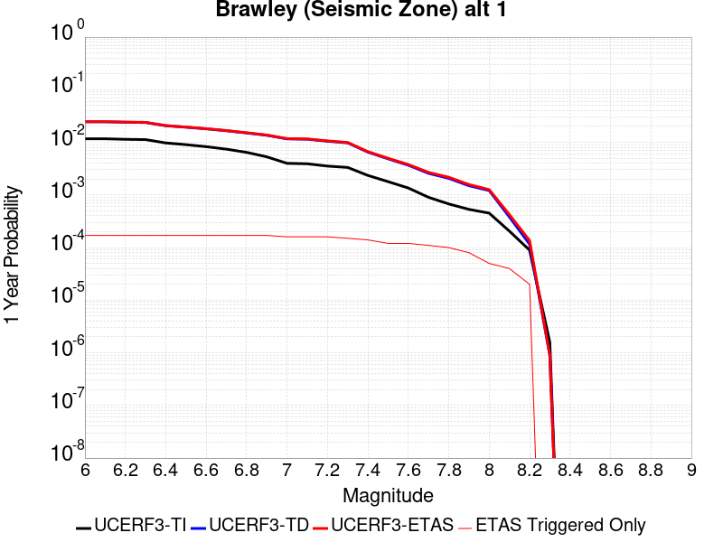 | 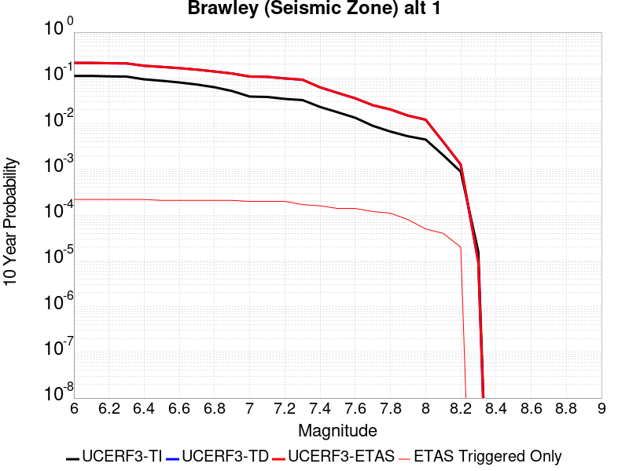 |

| Magnitude | 1 wk TI Prob | 1 wk TD Prob | 1 wk ETAS Prob | 1 wk ETAS/TD Gain | 1 wk ETAS Triggered Only | 1 mo TI Prob | 1 mo TD Prob | 1 mo ETAS Prob | 1 mo ETAS/TD Gain | 1 mo ETAS Triggered Only | 1 yr TI Prob | 1 yr TD Prob | 1 yr ETAS Prob | 1 yr ETAS/TD Gain | 1 yr ETAS Triggered Only | 10 yr TI Prob | 10 yr TD Prob | 10 yr ETAS Prob | 10 yr ETAS/TD Gain | 10 yr ETAS Triggered Only |
|-----|-----|-----|-----|-----|-----|-----|-----|-----|-----|-----|-----|-----|-----|-----|-----|-----|-----|-----|-----|-----|
| 6.0 | 2.2521618E-4 | 4.763429E-4 | 5.1632384E-4 | 1.0839331 | 4.0E-5 | 9.6485513E-4 | 0.0020399094 | 0.0021397055 | 1.0489218 | 1.0E-4 | 0.011683988 | 0.024544531 | 0.024710359 | 1.0067562 | 1.7E-4 | 0.11088423 | 0.21349923 | 0.21367227 | 1.0008105 | 2.2E-4 |
| 6.1 | 2.2521618E-4 | 4.763429E-4 | 5.1632384E-4 | 1.0839331 | 4.0E-5 | 9.6485513E-4 | 0.0020399094 | 0.0021397055 | 1.0489218 | 1.0E-4 | 0.011683988 | 0.024544531 | 0.024710359 | 1.0067562 | 1.7E-4 | 0.11088423 | 0.21349923 | 0.21367227 | 1.0008105 | 2.2E-4 |
| 6.2 | 2.198148E-4 | 4.6718874E-4 | 5.0717004E-4 | 1.0855786 | 4.0E-5 | 9.417233E-4 | 0.0020007377 | 0.0021005375 | 1.0498816 | 1.0E-4 | 0.011405343 | 0.024078513 | 0.02424442 | 1.0068902 | 1.7E-4 | 0.10837428 | 0.20993572 | 0.21010955 | 1.0008279 | 2.2E-4 |
| 6.3 | 2.1704129E-4 | 4.615455E-4 | 5.0152704E-4 | 1.0866253 | 4.0E-5 | 9.298453E-4 | 0.0019765892 | 0.0020763916 | 1.0504922 | 1.0E-4 | 0.011262234 | 0.023792034 | 0.023957988 | 1.0069753 | 1.7E-4 | 0.107082725 | 0.20782684 | 0.2080011 | 1.0008385 | 2.2E-4 |
| 6.4 | 1.876142E-4 | 4.004663E-4 | 4.4045027E-4 | 1.0998436 | 4.0E-5 | 8.038131E-4 | 0.0017151695 | 0.001814998 | 1.0582032 | 1.0E-4 | 0.00974259 | 0.020678662 | 0.020845145 | 1.008051 | 1.7E-4 | 0.093263686 | 0.18457787 | 0.18475726 | 1.0009719 | 2.2E-4 |
| 6.5 | 1.7390939E-4 | 3.7478763E-4 | 4.1477266E-4 | 1.1066871 | 4.0E-5 | 7.45113E-4 | 0.0016052561 | 0.0017050956 | 1.0621953 | 1.0E-4 | 0.009034078 | 0.019367293 | 0.019534001 | 1.0086076 | 1.7E-4 | 0.086755216 | 0.17440015 | 0.17457353 | 1.0009941 | 2.1E-4 |
| 6.6 | 1.591791E-4 | 3.4893592E-4 | 3.8892197E-4 | 1.1145942 | 4.0E-5 | 6.8201777E-4 | 0.0014945926 | 0.0015944432 | 1.0668079 | 1.0E-4 | 0.008271996 | 0.018045008 | 0.01821194 | 1.0092509 | 1.7E-4 | 0.07970774 | 0.16380787 | 0.16398346 | 1.001072 | 2.1E-4 |
| 6.7 | 1.4268003E-4 | 3.2059717E-4 | 3.6058435E-4 | 1.1247271 | 4.0E-5 | 6.1134255E-4 | 0.0013732726 | 0.0014731353 | 1.0727187 | 1.0E-4 | 0.007417723 | 0.01659171 | 0.016758889 | 1.010076 | 1.7E-4 | 0.07174956 | 0.15193594 | 0.15211402 | 1.0011722 | 2.1E-4 |
| 6.8 | 1.239713E-4 | 2.9055026E-4 | 3.3053863E-4 | 1.1376299 | 4.0E-5 | 5.3119735E-4 | 0.0012446274 | 0.0013445029 | 1.0802454 | 1.0E-4 | 0.0064481674 | 0.015049482 | 0.015216923 | 1.011126 | 1.7E-4 | 0.06264243 | 0.13838051 | 0.13856144 | 1.0013076 | 2.1E-4 |
| 6.9 | 1.0180238E-4 | 2.6255674E-4 | 3.0254625E-4 | 1.152308 | 4.0E-5 | 4.3622297E-4 | 0.0011247622 | 0.0012246497 | 1.0888077 | 1.0E-4 | 0.005298089 | 0.013608998 | 0.013776684 | 1.0123217 | 1.7E-4 | 0.05173543 | 0.12496473 | 0.12514849 | 1.0014704 | 2.1E-4 |
| 7.0 | 7.6619996E-5 | 2.2400476E-4 | 2.639958E-4 | 1.1785276 | 4.0E-5 | 3.283301E-4 | 9.596704E-4 | 0.0010595744 | 1.1041025 | 1.0E-4 | 0.0039900932 | 0.011622103 | 0.011780243 | 1.0136069 | 1.6E-4 | 0.039192066 | 0.10726982 | 0.10744837 | 1.0016644 | 2.0E-4 |
| 7.1 | 7.5127435E-5 | 2.2083633E-4 | 2.608275E-4 | 1.1810896 | 4.0E-5 | 3.2193496E-4 | 9.461013E-4 | 0.0010460067 | 1.1055969 | 1.0E-4 | 0.0039125155 | 0.011458648 | 0.011616815 | 1.0138032 | 1.6E-4 | 0.038443442 | 0.10583378 | 0.10601261 | 1.0016898 | 2.0E-4 |
| 7.2 | 6.788582E-5 | 2.0211334E-4 | 2.4210526E-4 | 1.1978687 | 4.0E-5 | 2.9090676E-4 | 8.6591556E-4 | 9.6582895E-4 | 1.1153847 | 1.0E-4 | 0.0035360386 | 0.0104922 | 0.010650521 | 1.0150894 | 1.6E-4 | 0.034803 | 0.097503684 | 0.09768418 | 1.0018512 | 2.0E-4 |
| 7.3 | 6.399602E-5 | 1.8842232E-4 | 2.2841478E-4 | 1.212249 | 4.0E-5 | 2.7423984E-4 | 8.0727716E-4 | 9.0719643E-4 | 1.1237732 | 1.0E-4 | 0.0033337586 | 0.009784897 | 0.009933429 | 1.0151798 | 1.5E-4 | 0.03284188 | 0.091397986 | 0.09155245 | 1.00169 | 1.7E-4 |
| 7.4 | 4.506759E-5 | 1.2530042E-4 | 1.6529541E-4 | 1.3191928 | 4.0E-5 | 1.9313251E-4 | 5.3689216E-4 | 6.3683843E-4 | 1.1861571 | 1.0E-4 | 0.0023488526 | 0.006517245 | 0.006656333 | 1.0213414 | 1.4E-4 | 0.023241805 | 0.062364522 | 0.06251454 | 1.0024055 | 1.6E-4 |
| 7.5 | 3.43289E-5 | 9.336103E-5 | 1.2335823E-4 | 1.3213032 | 3.0E-5 | 1.4711556E-4 | 4.0005764E-4 | 4.8002566E-4 | 1.1998912 | 8.0E-5 | 0.0017896603 | 0.004859886 | 0.004979303 | 1.0245719 | 1.2E-4 | 0.01775316 | 0.047057066 | 0.04719048 | 1.0028352 | 1.4E-4 |
| 7.6 | 2.5980507E-5 | 7.053672E-5 | 1.00534606E-4 | 1.4252803 | 3.0E-5 | 1.1134028E-4 | 3.0226534E-4 | 3.8224115E-4 | 1.2645881 | 8.0E-5 | 0.001354725 | 0.0036738948 | 0.003793454 | 1.0325428 | 1.2E-4 | 0.013464959 | 0.03584298 | 0.035977963 | 1.003766 | 1.4E-4 |
| 7.7 | 1.7292105E-5 | 4.9412036E-5 | 7.941056E-5 | 1.6071095 | 3.0E-5 | 7.4106916E-5 | 2.1174872E-4 | 2.817339E-4 | 1.3305105 | 7.0E-5 | 9.018782E-4 | 0.0025749984 | 0.0026847152 | 1.0426085 | 1.1E-4 | 0.008982267 | 0.025292097 | 0.025409061 | 1.0046246 | 1.2E-4 |
| 7.8 | 1.2927471E-5 | 3.9697254E-5 | 6.969606E-5 | 1.7556897 | 3.0E-5 | 5.5402274E-5 | 1.7012001E-4 | 2.401081E-4 | 1.4114043 | 7.0E-5 | 6.743139E-4 | 0.0020692463 | 0.0021690393 | 1.0482268 | 1.0E-4 | 0.0067227143 | 0.020433145 | 0.020540897 | 1.0052735 | 1.1E-4 |
| 7.9 | 1.0200774E-5 | 2.8748475E-5 | 4.87479E-5 | 1.695669 | 2.0E-5 | 4.371687E-5 | 1.2320194E-4 | 1.7319577E-4 | 1.4057878 | 5.0E-5 | 5.321229E-4 | 0.0014989526 | 0.0015788327 | 1.0532906 | 8.0E-5 | 0.005308505 | 0.014992895 | 0.015071695 | 1.0052558 | 8.0E-5 |
| 8.0 | 8.650396E-6 | 2.3279512E-5 | 2.3279512E-5 | 1.0 | 0.0 | 3.70726E-5 | 9.976552E-5 | 1.1976353E-4 | 1.2004501 | 2.0E-5 | 4.5126543E-4 | 0.0012139693 | 0.0012639086 | 1.0411372 | 5.0E-5 | 0.0045035016 | 0.012212164 | 0.012261554 | 1.0040443 | 5.0E-5 |
| 8.1 | 3.9368224E-6 | 7.3283345E-6 | 7.3283345E-6 | 1.0 | 0.0 | 1.6871985E-5 | 3.1406773E-5 | 4.1406456E-5 | 1.3183926 | 1.0E-5 | 2.0539707E-4 | 3.8231048E-4 | 4.2229518E-4 | 1.104587 | 4.0E-5 | 0.0020520731 | 0.0040015313 | 0.0040413714 | 1.0099561 | 4.0E-5 |
| 8.2 | 1.7101195E-6 | 2.2178374E-6 | 2.2178374E-6 | 1.0 | 0.0 | 7.329063E-6 | 9.504983E-6 | 9.504983E-6 | 1.0 | 0.0 | 8.922769E-5 | 1.15717055E-4 | 1.3571474E-4 | 1.1728153 | 2.0E-5 | 8.9191867E-4 | 0.00126669 | 0.0012866646 | 1.0157691 | 2.0E-5 |
| 8.3 | 3.0346666E-8 | 1.721086E-8 | 1.721086E-8 | 1.0 | 0.0 | 1.3005713E-7 | 7.376083E-8 | 7.376083E-8 | 1.0 | 0.0 | 1.5834444E-6 | 8.98038E-7 | 8.98038E-7 | 1.0 | 0.0 | 1.5834332E-5 | 9.36379E-6 | 9.36379E-6 | 1.0 | 0.0 |

## Cleghorn Pass
*[(top)](#table-of-contents)*

| 1 Week | 1 Month | 1 Year | 10 Year |
|-----|-----|-----|-----|
|  |  |  |  |

| Magnitude | 1 wk TI Prob | 1 wk TD Prob | 1 wk ETAS Prob | 1 wk ETAS/TD Gain | 1 wk ETAS Triggered Only | 1 mo TI Prob | 1 mo TD Prob | 1 mo ETAS Prob | 1 mo ETAS/TD Gain | 1 mo ETAS Triggered Only | 1 yr TI Prob | 1 yr TD Prob | 1 yr ETAS Prob | 1 yr ETAS/TD Gain | 1 yr ETAS Triggered Only | 10 yr TI Prob | 10 yr TD Prob | 10 yr ETAS Prob | 10 yr ETAS/TD Gain | 10 yr ETAS Triggered Only |
|-----|-----|-----|-----|-----|-----|-----|-----|-----|-----|-----|-----|-----|-----|-----|-----|-----|-----|-----|-----|-----|
| 6.0 | 1.0522846E-5 | 1.1040642E-5 | 5.10402E-5 | 4.6229377 | 4.0E-5 | 4.509713E-5 | 4.7316473E-5 | 1.0731364E-4 | 2.2679973 | 6.0E-5 | 5.4891926E-4 | 5.759784E-4 | 6.8591506E-4 | 1.1908693 | 1.1E-4 | 0.0054756533 | 0.005750022 | 0.0059289867 | 1.0311242 | 1.8E-4 |
| 6.1 | 1.0522846E-5 | 1.1040642E-5 | 5.10402E-5 | 4.6229377 | 4.0E-5 | 4.509713E-5 | 4.7316473E-5 | 1.0731364E-4 | 2.2679973 | 6.0E-5 | 5.4891926E-4 | 5.759784E-4 | 6.8591506E-4 | 1.1908693 | 1.1E-4 | 0.0054756533 | 0.005750022 | 0.0059289867 | 1.0311242 | 1.8E-4 |
| 6.2 | 2.1045846E-6 | 2.2082024E-6 | 2.2082024E-6 | 1.0 | 0.0 | 9.019617E-6 | 9.463714E-6 | 9.463714E-6 | 1.0 | 0.0 | 1.098083E-4 | 1.1521882E-4 | 1.1521882E-4 | 1.0 | 0.0 | 0.0010975406 | 0.0011520023 | 0.0011619907 | 1.0086706 | 1.0E-5 |
| 6.3 | 2.1045846E-6 | 2.2082024E-6 | 2.2082024E-6 | 1.0 | 0.0 | 9.019617E-6 | 9.463714E-6 | 9.463714E-6 | 1.0 | 0.0 | 1.098083E-4 | 1.1521882E-4 | 1.1521882E-4 | 1.0 | 0.0 | 0.0010975406 | 0.0011520023 | 0.0011619907 | 1.0086706 | 1.0E-5 |
| 6.4 | 1.7259927E-6 | 1.810877E-6 | 1.810877E-6 | 1.0 | 0.0 | 7.3970905E-6 | 7.760902E-6 | 7.760902E-6 | 1.0 | 0.0 | 9.005586E-5 | 9.4488976E-5 | 9.4488976E-5 | 1.0 | 0.0 | 9.001937E-4 | 9.448898E-4 | 9.548803E-4 | 1.0105733 | 1.0E-5 |

## Imperial
*[(top)](#table-of-contents)*

| 1 Week | 1 Month | 1 Year | 10 Year |
|-----|-----|-----|-----|
| 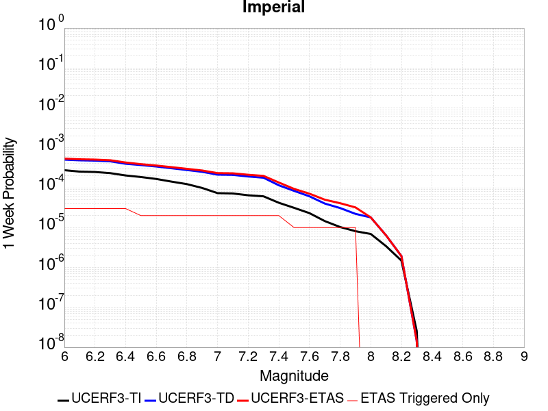 |  |  |  |

| Magnitude | 1 wk TI Prob | 1 wk TD Prob | 1 wk ETAS Prob | 1 wk ETAS/TD Gain | 1 wk ETAS Triggered Only | 1 mo TI Prob | 1 mo TD Prob | 1 mo ETAS Prob | 1 mo ETAS/TD Gain | 1 mo ETAS Triggered Only | 1 yr TI Prob | 1 yr TD Prob | 1 yr ETAS Prob | 1 yr ETAS/TD Gain | 1 yr ETAS Triggered Only | 10 yr TI Prob | 10 yr TD Prob | 10 yr ETAS Prob | 10 yr ETAS/TD Gain | 10 yr ETAS Triggered Only |
|-----|-----|-----|-----|-----|-----|-----|-----|-----|-----|-----|-----|-----|-----|-----|-----|-----|-----|-----|-----|-----|
| 6.0 | 2.7496446E-4 | 5.055345E-4 | 5.355194E-4 | 1.0593132 | 3.0E-5 | 0.0011778869 | 0.002164817 | 0.0022446439 | 1.0368747 | 8.0E-5 | 0.0142467655 | 0.026048409 | 0.026194502 | 1.0056086 | 1.5E-4 | 0.13367249 | 0.22807029 | 0.22822468 | 1.0006769 | 2.0E-4 |
| 6.1 | 2.5356023E-4 | 4.8657708E-4 | 5.165625E-4 | 1.0616252 | 3.0E-5 | 0.001086234 | 0.002083702 | 0.0021635354 | 1.0383132 | 8.0E-5 | 0.013144928 | 0.02507094 | 0.025217177 | 1.005833 | 1.5E-4 | 0.123940155 | 0.21949561 | 0.21965171 | 1.0007112 | 2.0E-4 |
| 6.2 | 2.4820742E-4 | 4.775311E-4 | 5.075168E-4 | 1.0627931 | 3.0E-5 | 0.0010633124 | 0.0020449946 | 0.002124831 | 1.0390399 | 8.0E-5 | 0.01286919 | 0.024610676 | 0.024756985 | 1.005945 | 1.5E-4 | 0.12148927 | 0.21600136 | 0.21615817 | 1.0007259 | 2.0E-4 |
| 6.3 | 2.3205351E-4 | 4.5892023E-4 | 4.8890646E-4 | 1.0653409 | 3.0E-5 | 9.94136E-4 | 0.0019653554 | 0.002045198 | 1.0406251 | 8.0E-5 | 0.012036599 | 0.023661187 | 0.023807637 | 1.0061895 | 1.5E-4 | 0.11405133 | 0.20793827 | 0.20809668 | 1.0007619 | 2.0E-4 |
| 6.4 | 2.0304754E-4 | 3.9878016E-4 | 4.287682E-4 | 1.0751994 | 3.0E-5 | 8.6991355E-4 | 0.0017079529 | 0.0017878163 | 1.0467597 | 8.0E-5 | 0.010539869 | 0.020595418 | 0.020742329 | 1.0071331 | 1.5E-4 | 0.100537635 | 0.18507113 | 0.1852341 | 1.0008807 | 2.0E-4 |
| 6.5 | 1.854992E-4 | 3.6990462E-4 | 3.8989724E-4 | 1.054048 | 2.0E-5 | 7.9475436E-4 | 0.0015843548 | 0.0016542438 | 1.044112 | 7.0E-5 | 0.009633281 | 0.01911443 | 0.019251753 | 1.0071843 | 1.4E-4 | 0.0922623 | 0.1733039 | 0.1734527 | 1.0008587 | 1.8E-4 |
| 6.6 | 1.6586106E-4 | 3.4036173E-4 | 3.6035493E-4 | 1.058741 | 2.0E-5 | 7.106394E-4 | 0.0014578878 | 0.0015277858 | 1.0479447 | 7.0E-5 | 0.008617763 | 0.017607626 | 0.01774516 | 1.0078111 | 1.4E-4 | 0.08291132 | 0.16078055 | 0.1609316 | 1.0009395 | 1.8E-4 |
| 6.7 | 1.4224656E-4 | 3.076812E-4 | 3.2767505E-4 | 1.0649823 | 2.0E-5 | 6.094856E-4 | 0.0013179756 | 0.0013878833 | 1.0530418 | 7.0E-5 | 0.0073952693 | 0.015928522 | 0.01606629 | 1.0086492 | 1.4E-4 | 0.07153955 | 0.14648798 | 0.14664161 | 1.0010488 | 1.8E-4 |
| 6.8 | 1.2317259E-4 | 2.779231E-4 | 2.9791755E-4 | 1.0719423 | 2.0E-5 | 5.2777573E-4 | 0.0011905615 | 0.001260478 | 1.0587258 | 7.0E-5 | 0.0064067547 | 0.014400131 | 0.014538115 | 1.0095822 | 1.4E-4 | 0.06225166 | 0.13294089 | 0.13309695 | 1.001174 | 1.8E-4 |
| 6.9 | 9.859898E-5 | 2.5015484E-4 | 2.7014982E-4 | 1.0799305 | 2.0E-5 | 4.2249862E-4 | 0.0010716559 | 0.0011415809 | 1.0652494 | 7.0E-5 | 0.0051317946 | 0.012970319 | 0.013108503 | 1.0106539 | 1.4E-4 | 0.05014893 | 0.119408876 | 0.11956738 | 1.0013274 | 1.8E-4 |
| 7.0 | 7.3191884E-5 | 2.1267848E-4 | 2.3267423E-4 | 1.0940187 | 2.0E-5 | 3.136418E-4 | 9.11164E-4 | 9.811003E-4 | 1.0767548 | 7.0E-5 | 0.003811904 | 0.011037681 | 0.011166247 | 1.0116478 | 1.3E-4 | 0.037471764 | 0.10206756 | 0.10222021 | 1.0014956 | 1.7E-4 |
| 7.1 | 7.1760296E-5 | 2.0969207E-4 | 2.2968788E-4 | 1.0953579 | 2.0E-5 | 3.0750787E-4 | 8.9837395E-4 | 9.683111E-4 | 1.0778486 | 7.0E-5 | 0.003737482 | 0.010883528 | 0.011012113 | 1.0118147 | 1.3E-4 | 0.03675245 | 0.10070406 | 0.100856945 | 1.0015181 | 1.7E-4 |
| 7.2 | 6.46614E-5 | 1.9137723E-4 | 2.113734E-4 | 1.1044856 | 2.0E-5 | 2.7709085E-4 | 8.199333E-4 | 8.898759E-4 | 1.0853028 | 7.0E-5 | 0.0033683628 | 0.009937617 | 0.010066326 | 1.0129516 | 1.3E-4 | 0.033177625 | 0.092511006 | 0.09266528 | 1.0016676 | 1.7E-4 |
| 7.3 | 6.088115E-5 | 1.780939E-4 | 1.9809033E-4 | 1.1122802 | 2.0E-5 | 2.6089314E-4 | 7.6303916E-4 | 8.3298574E-4 | 1.0916684 | 7.0E-5 | 0.0031717476 | 0.009251006 | 0.009369896 | 1.0128516 | 1.2E-4 | 0.031268585 | 0.08656135 | 0.086689234 | 1.0014774 | 1.4E-4 |
| 7.4 | 4.199346E-5 | 1.1511097E-4 | 1.3510867E-4 | 1.1737254 | 2.0E-5 | 1.7995955E-4 | 4.932403E-4 | 5.632058E-4 | 1.1418487 | 7.0E-5 | 0.0021888057 | 0.005988835 | 0.0060981764 | 1.0182575 | 1.1E-4 | 0.02167372 | 0.05744024 | 0.057562772 | 1.0021333 | 1.3E-4 |
| 7.5 | 3.130448E-5 | 8.333871E-5 | 9.3337876E-5 | 1.1199822 | 1.0E-5 | 1.3415517E-4 | 3.5711733E-4 | 4.070995E-4 | 1.13996 | 5.0E-5 | 0.0016321153 | 0.0043392954 | 0.0044289045 | 1.0206507 | 9.0E-5 | 0.016201803 | 0.042133506 | 0.042238872 | 1.0025008 | 1.1E-4 |
| 7.6 | 2.3074248E-5 | 6.0849357E-5 | 7.084875E-5 | 1.1643302 | 1.0E-5 | 9.888588E-5 | 2.6075702E-4 | 3.1074398E-4 | 1.1916994 | 5.0E-5 | 0.0012032706 | 0.0031701182 | 0.003259833 | 1.0283002 | 9.0E-5 | 0.011967761 | 0.03102816 | 0.031134749 | 1.0034351 | 1.1E-4 |
| 7.7 | 1.45864815E-5 | 4.0128452E-5 | 5.0128052E-5 | 1.2491897 | 1.0E-5 | 6.2511994E-5 | 1.7196777E-4 | 2.119609E-4 | 1.2325617 | 4.0E-5 | 7.608177E-4 | 0.0020917025 | 0.0021715353 | 1.0381664 | 8.0E-5 | 0.007582182 | 0.02062909 | 0.020717233 | 1.0042728 | 9.0E-5 |
| 7.8 | 1.0352979E-5 | 3.096395E-5 | 4.096364E-5 | 1.3229462 | 1.0E-5 | 4.4369157E-5 | 1.326959E-4 | 1.7269059E-4 | 1.3014011 | 4.0E-5 | 5.400606E-4 | 0.0016143778 | 0.0016842647 | 1.0432904 | 7.0E-5 | 0.0053875 | 0.016017893 | 0.01609661 | 1.0049144 | 8.0E-5 |
| 7.9 | 8.137906E-6 | 2.2151205E-5 | 3.2150983E-5 | 1.4514327 | 1.0E-5 | 3.4876273E-5 | 9.493029E-5 | 1.349265E-4 | 1.4213219 | 4.0E-5 | 4.2453592E-4 | 0.0011551644 | 0.0012250836 | 1.0605274 | 7.0E-5 | 0.004237258 | 0.011618842 | 0.011688029 | 1.0059547 | 7.0E-5 |
| 8.0 | 6.93792E-6 | 1.8010365E-5 | 1.8010365E-5 | 1.0 | 0.0 | 2.9733603E-5 | 7.7185E-5 | 9.718346E-5 | 1.2590977 | 2.0E-5 | 3.6194647E-4 | 9.3932304E-4 | 9.892761E-4 | 1.0531799 | 5.0E-5 | 0.0036135751 | 0.009502415 | 0.00955194 | 1.0052118 | 5.0E-5 |
| 8.1 | 3.4286315E-6 | 6.380179E-6 | 6.380179E-6 | 1.0 | 0.0 | 1.4694053E-5 | 2.734334E-5 | 3.7343067E-5 | 1.3657098 | 1.0E-5 | 1.7888541E-4 | 3.3285443E-4 | 3.728411E-4 | 1.1201327 | 4.0E-5 | 0.0017874148 | 0.0034863674 | 0.003526228 | 1.0114332 | 4.0E-5 |
| 8.2 | 1.4906886E-6 | 1.936633E-6 | 1.936633E-6 | 1.0 | 0.0 | 6.3886496E-6 | 8.2998295E-6 | 8.2998295E-6 | 1.0 | 0.0 | 7.7779034E-5 | 1.0104576E-4 | 1.2104375E-4 | 1.1979101 | 2.0E-5 | 7.775182E-4 | 0.0011075423 | 0.0011275201 | 1.018038 | 2.0E-5 |
| 8.3 | 2.5758007E-8 | 1.4495866E-8 | 1.4495866E-8 | 1.0 | 0.0 | 1.10391454E-7 | 6.212514E-8 | 6.212514E-8 | 1.0 | 0.0 | 1.3440151E-6 | 7.563736E-7 | 7.563736E-7 | 1.0 | 0.0 | 1.344007E-5 | 7.884359E-6 | 7.884359E-6 | 1.0 | 0.0 |

## Santa Ynez (East)
*[(top)](#table-of-contents)*

| 1 Week | 1 Month | 1 Year | 10 Year |
|-----|-----|-----|-----|
| 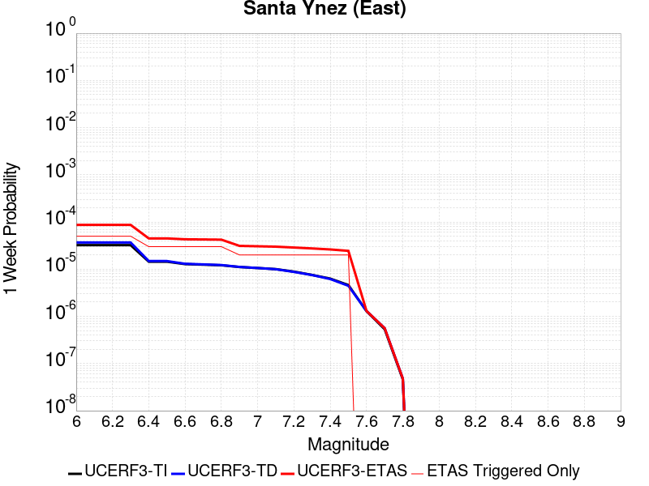 |  |  | 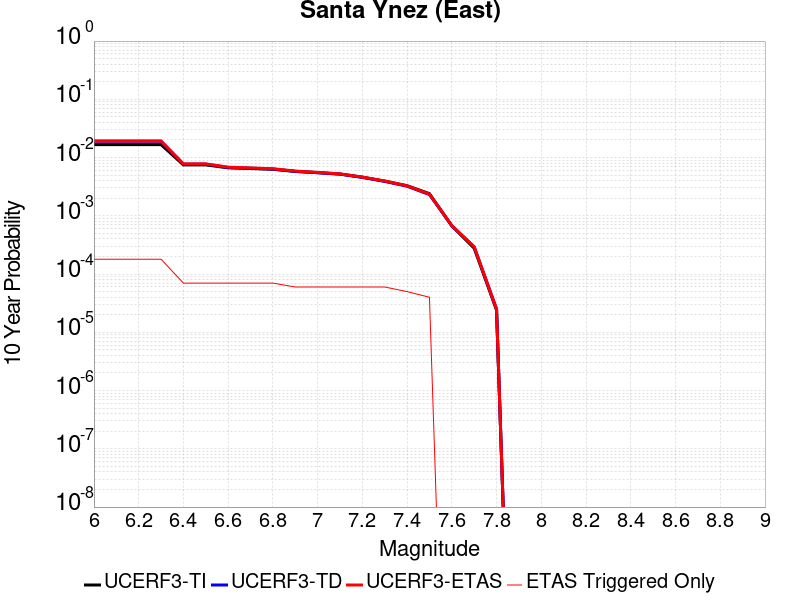 |

| Magnitude | 1 wk TI Prob | 1 wk TD Prob | 1 wk ETAS Prob | 1 wk ETAS/TD Gain | 1 wk ETAS Triggered Only | 1 mo TI Prob | 1 mo TD Prob | 1 mo ETAS Prob | 1 mo ETAS/TD Gain | 1 mo ETAS Triggered Only | 1 yr TI Prob | 1 yr TD Prob | 1 yr ETAS Prob | 1 yr ETAS/TD Gain | 1 yr ETAS Triggered Only | 10 yr TI Prob | 10 yr TD Prob | 10 yr ETAS Prob | 10 yr ETAS/TD Gain | 10 yr ETAS Triggered Only |
|-----|-----|-----|-----|-----|-----|-----|-----|-----|-----|-----|-----|-----|-----|-----|-----|-----|-----|-----|-----|-----|
| 6.0 | 3.2269712E-5 | 3.6750775E-5 | 8.6748936E-5 | 2.3604655 | 5.0E-5 | 1.3829143E-4 | 1.5749714E-4 | 2.274861E-4 | 1.4443825 | 7.0E-5 | 0.0016823979 | 0.0019164253 | 0.0020361952 | 1.0624965 | 1.2E-4 | 0.016697178 | 0.019056438 | 0.019233009 | 1.0092657 | 1.8E-4 |
| 6.1 | 3.2269712E-5 | 3.6750775E-5 | 8.6748936E-5 | 2.3604655 | 5.0E-5 | 1.3829143E-4 | 1.5749714E-4 | 2.274861E-4 | 1.4443825 | 7.0E-5 | 0.0016823979 | 0.0019164253 | 0.0020361952 | 1.0624965 | 1.2E-4 | 0.016697178 | 0.019056438 | 0.019233009 | 1.0092657 | 1.8E-4 |
| 6.2 | 3.2269712E-5 | 3.6750775E-5 | 8.6748936E-5 | 2.3604655 | 5.0E-5 | 1.3829143E-4 | 1.5749714E-4 | 2.274861E-4 | 1.4443825 | 7.0E-5 | 0.0016823979 | 0.0019164253 | 0.0020361952 | 1.0624965 | 1.2E-4 | 0.016697178 | 0.019056438 | 0.019233009 | 1.0092657 | 1.8E-4 |
| 6.3 | 3.2269712E-5 | 3.6750775E-5 | 8.6748936E-5 | 2.3604655 | 5.0E-5 | 1.3829143E-4 | 1.5749714E-4 | 2.274861E-4 | 1.4443825 | 7.0E-5 | 0.0016823979 | 0.0019164253 | 0.0020361952 | 1.0624965 | 1.2E-4 | 0.016697178 | 0.019056438 | 0.019233009 | 1.0092657 | 1.8E-4 |
| 6.4 | 1.4404779E-5 | 1.48492945E-5 | 4.484885E-5 | 3.020268 | 3.0E-5 | 6.1733306E-5 | 6.363831E-5 | 1.1363513E-4 | 1.7856402 | 5.0E-5 | 7.513438E-4 | 7.7452604E-4 | 8.344796E-4 | 1.0774068 | 6.0E-5 | 0.0074880854 | 0.007718817 | 0.0077882763 | 1.0089988 | 7.0E-5 |
| 6.5 | 1.4404779E-5 | 1.48492945E-5 | 4.484885E-5 | 3.020268 | 3.0E-5 | 6.1733306E-5 | 6.363831E-5 | 1.1363513E-4 | 1.7856402 | 5.0E-5 | 7.513438E-4 | 7.7452604E-4 | 8.344796E-4 | 1.0774068 | 6.0E-5 | 0.0074880854 | 0.007718817 | 0.0077882763 | 1.0089988 | 7.0E-5 |
| 6.6 | 1.280208E-5 | 1.301186E-5 | 4.301147E-5 | 3.305559 | 3.0E-5 | 5.4864904E-5 | 5.5763932E-5 | 1.05761144E-4 | 1.8965869 | 5.0E-5 | 6.6777546E-4 | 6.7871617E-4 | 7.386754E-4 | 1.0883422 | 6.0E-5 | 0.006657724 | 0.0067666434 | 0.0068361694 | 1.0102749 | 7.0E-5 |
| 6.7 | 1.2457027E-5 | 1.262838E-5 | 4.2628002E-5 | 3.3755715 | 3.0E-5 | 5.3386164E-5 | 5.4120515E-5 | 1.0411781E-4 | 1.923814 | 5.0E-5 | 6.497827E-4 | 6.5871974E-4 | 7.186802E-4 | 1.0910258 | 6.0E-5 | 0.00647886 | 0.00656787 | 0.00663741 | 1.0105879 | 7.0E-5 |
| 6.8 | 1.2095134E-5 | 1.2230827E-5 | 4.223046E-5 | 3.4527886 | 3.0E-5 | 5.1835254E-5 | 5.2416784E-5 | 1.0241417E-4 | 1.9538429 | 5.0E-5 | 6.309115E-4 | 6.3798914E-4 | 6.9795083E-4 | 1.0939854 | 6.0E-5 | 0.0062912325 | 0.006361764 | 0.0064313184 | 1.0109333 | 7.0E-5 |
| 6.9 | 1.1104036E-5 | 1.115726E-5 | 3.1157037E-5 | 2.7925348 | 2.0E-5 | 4.758786E-5 | 4.781596E-5 | 8.781405E-5 | 1.8365008 | 4.0E-5 | 5.7922816E-4 | 5.82005E-4 | 6.3197594E-4 | 1.0858599 | 5.0E-5 | 0.005777207 | 0.0058049536 | 0.0058646053 | 1.010276 | 6.0E-5 |
| 7.0 | 1.0577444E-5 | 1.05815925E-5 | 3.058138E-5 | 2.8900547 | 2.0E-5 | 4.5331115E-5 | 4.53489E-5 | 8.5347085E-5 | 1.88201 | 4.0E-5 | 5.5176654E-4 | 5.5198424E-4 | 6.019566E-4 | 1.0905323 | 5.0E-5 | 0.0055039856 | 0.00550627 | 0.00556594 | 1.0108367 | 6.0E-5 |
| 7.1 | 1.0021775E-5 | 9.9809E-6 | 2.99807E-5 | 3.0038073 | 2.0E-5 | 4.294976E-5 | 4.277459E-5 | 8.277288E-5 | 1.9350946 | 4.0E-5 | 5.2278786E-4 | 5.206574E-4 | 5.7063135E-4 | 1.0959824 | 5.0E-5 | 0.0052155964 | 0.005194508 | 0.0052541965 | 1.0114907 | 6.0E-5 |
| 7.2 | 8.874109E-6 | 8.748706E-6 | 2.874853E-5 | 3.2860322 | 2.0E-5 | 3.8031343E-5 | 3.7493923E-5 | 7.749243E-5 | 2.0667996 | 4.0E-5 | 4.629332E-4 | 4.56394E-4 | 5.0637114E-4 | 1.1095045 | 5.0E-5 | 0.0046197 | 0.0045546847 | 0.004614412 | 1.0131133 | 6.0E-5 |
| 7.3 | 7.5504267E-6 | 7.5050243E-6 | 2.7504873E-5 | 3.6648614 | 2.0E-5 | 3.235857E-5 | 3.2164E-5 | 7.2162715E-5 | 2.2435865 | 4.0E-5 | 3.9389438E-4 | 3.9152734E-4 | 4.4150776E-4 | 1.127655 | 5.0E-5 | 0.0039319694 | 0.0039084824 | 0.003968248 | 1.0152912 | 6.0E-5 |
| 7.4 | 6.309394E-6 | 6.183062E-6 | 2.618294E-5 | 4.2346234 | 2.0E-5 | 2.703998E-5 | 2.6498574E-5 | 5.6497778E-5 | 2.1321063 | 3.0E-5 | 3.2916202E-4 | 3.2257332E-4 | 3.6256041E-4 | 1.1239628 | 4.0E-5 | 0.003286749 | 0.0032211484 | 0.0032709872 | 1.0154724 | 5.0E-5 |
| 7.5 | 4.6103073E-6 | 4.4408016E-6 | 2.4440713E-5 | 5.503671 | 2.0E-5 | 1.975831E-5 | 1.9031871E-5 | 4.90313E-5 | 2.5762732 | 3.0E-5 | 2.4053088E-4 | 2.316891E-4 | 2.6168214E-4 | 1.1294539 | 3.0E-5 | 0.002402707 | 0.002314545 | 0.0023544524 | 1.0172421 | 4.0E-5 |
| 7.6 | 1.2858658E-6 | 1.3008196E-6 | 1.3008196E-6 | 1.0 | 0.0 | 5.5108417E-6 | 5.574929E-6 | 5.574929E-6 | 1.0 | 0.0 | 6.7092435E-5 | 6.787272E-5 | 6.787272E-5 | 1.0 | 0.0 | 6.707218E-4 | 6.7852676E-4 | 6.7852676E-4 | 1.0 | 0.0 |
| 7.7 | 5.3302307E-7 | 5.612138E-7 | 5.612138E-7 | 1.0 | 0.0 | 2.2843826E-6 | 2.4052001E-6 | 2.4052001E-6 | 1.0 | 0.0 | 2.7812002E-5 | 2.9282955E-5 | 2.9282955E-5 | 1.0 | 0.0 | 2.7808524E-4 | 2.9279455E-4 | 2.9279455E-4 | 1.0 | 0.0 |
| 7.8 | 4.613933E-8 | 4.80301E-8 | 4.80301E-8 | 1.0 | 0.0 | 1.9773998E-7 | 2.0584326E-7 | 2.0584326E-7 | 1.0 | 0.0 | 2.4074816E-6 | 2.5061388E-6 | 2.5061388E-6 | 1.0 | 0.0 | 2.4074554E-5 | 2.5061116E-5 | 2.5061116E-5 | 1.0 | 0.0 |

## Pleito
*[(top)](#table-of-contents)*

| 1 Week | 1 Month | 1 Year | 10 Year |
|-----|-----|-----|-----|
| 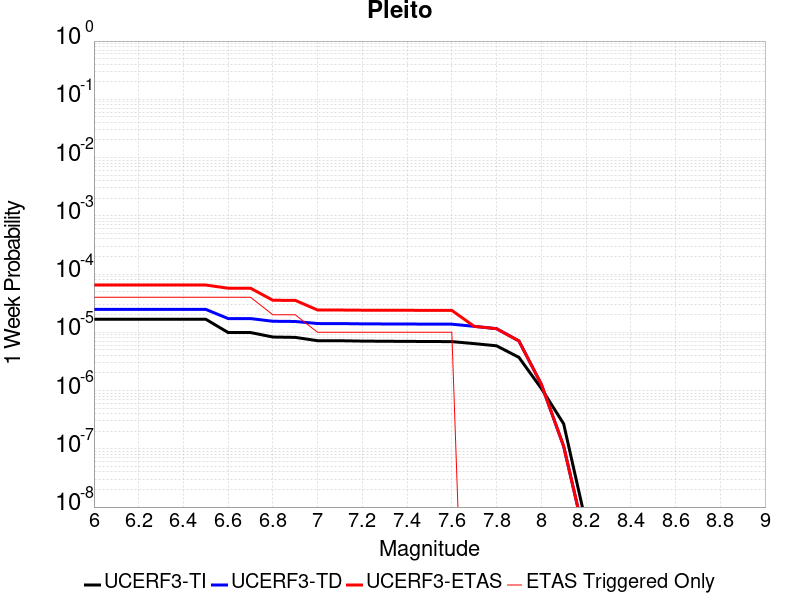 |  |  |  |

| Magnitude | 1 wk TI Prob | 1 wk TD Prob | 1 wk ETAS Prob | 1 wk ETAS/TD Gain | 1 wk ETAS Triggered Only | 1 mo TI Prob | 1 mo TD Prob | 1 mo ETAS Prob | 1 mo ETAS/TD Gain | 1 mo ETAS Triggered Only | 1 yr TI Prob | 1 yr TD Prob | 1 yr ETAS Prob | 1 yr ETAS/TD Gain | 1 yr ETAS Triggered Only | 10 yr TI Prob | 10 yr TD Prob | 10 yr ETAS Prob | 10 yr ETAS/TD Gain | 10 yr ETAS Triggered Only |
|-----|-----|-----|-----|-----|-----|-----|-----|-----|-----|-----|-----|-----|-----|-----|-----|-----|-----|-----|-----|-----|
| 6.0 | 1.6763008E-5 | 2.4764735E-5 | 6.476374E-5 | 2.61516 | 4.0E-5 | 7.183948E-5 | 1.0613067E-4 | 1.661243E-4 | 1.5652808 | 6.0E-5 | 8.742947E-4 | 0.001291447 | 0.001401305 | 1.0850657 | 1.1E-4 | 0.00870863 | 0.012954412 | 0.013151821 | 1.0152388 | 2.0E-4 |
| 6.1 | 1.6763008E-5 | 2.4764735E-5 | 6.476374E-5 | 2.61516 | 4.0E-5 | 7.183948E-5 | 1.0613067E-4 | 1.661243E-4 | 1.5652808 | 6.0E-5 | 8.742947E-4 | 0.001291447 | 0.001401305 | 1.0850657 | 1.1E-4 | 0.00870863 | 0.012954412 | 0.013151821 | 1.0152388 | 2.0E-4 |
| 6.2 | 1.6763008E-5 | 2.4764735E-5 | 6.476374E-5 | 2.61516 | 4.0E-5 | 7.183948E-5 | 1.0613067E-4 | 1.661243E-4 | 1.5652808 | 6.0E-5 | 8.742947E-4 | 0.001291447 | 0.001401305 | 1.0850657 | 1.1E-4 | 0.00870863 | 0.012954412 | 0.013151821 | 1.0152388 | 2.0E-4 |
| 6.3 | 1.6763008E-5 | 2.4764735E-5 | 6.476374E-5 | 2.61516 | 4.0E-5 | 7.183948E-5 | 1.0613067E-4 | 1.661243E-4 | 1.5652808 | 6.0E-5 | 8.742947E-4 | 0.001291447 | 0.001401305 | 1.0850657 | 1.1E-4 | 0.00870863 | 0.012954412 | 0.013151821 | 1.0152388 | 2.0E-4 |
| 6.4 | 1.6763008E-5 | 2.4764735E-5 | 6.476374E-5 | 2.61516 | 4.0E-5 | 7.183948E-5 | 1.0613067E-4 | 1.661243E-4 | 1.5652808 | 6.0E-5 | 8.742947E-4 | 0.001291447 | 0.001401305 | 1.0850657 | 1.1E-4 | 0.00870863 | 0.012954412 | 0.013151821 | 1.0152388 | 2.0E-4 |
| 6.5 | 1.6763008E-5 | 2.4764735E-5 | 6.476374E-5 | 2.61516 | 4.0E-5 | 7.183948E-5 | 1.0613067E-4 | 1.661243E-4 | 1.5652808 | 6.0E-5 | 8.742947E-4 | 0.001291447 | 0.001401305 | 1.0850657 | 1.1E-4 | 0.00870863 | 0.012954412 | 0.013151821 | 1.0152388 | 2.0E-4 |
| 6.6 | 9.910213E-6 | 1.721552E-5 | 5.721483E-5 | 3.3234448 | 4.0E-5 | 4.247165E-5 | 7.3778734E-5 | 1.13775786E-4 | 1.5421216 | 4.0E-5 | 5.169696E-4 | 8.9788967E-4 | 9.5783576E-4 | 1.0667634 | 6.0E-5 | 0.0051576863 | 0.009051226 | 0.009150321 | 1.0109482 | 1.0E-4 |
| 6.7 | 9.910213E-6 | 1.721552E-5 | 5.721483E-5 | 3.3234448 | 4.0E-5 | 4.247165E-5 | 7.3778734E-5 | 1.13775786E-4 | 1.5421216 | 4.0E-5 | 5.169696E-4 | 8.9788967E-4 | 9.5783576E-4 | 1.0667634 | 6.0E-5 | 0.0051576863 | 0.009051226 | 0.009150321 | 1.0109482 | 1.0E-4 |
| 6.8 | 8.300162E-6 | 1.5475129E-5 | 3.547482E-5 | 2.2923763 | 2.0E-5 | 3.557164E-5 | 6.63203E-5 | 8.631898E-5 | 1.3015468 | 2.0E-5 | 4.3299864E-4 | 8.07152E-4 | 8.2713587E-4 | 1.0247585 | 2.0E-5 | 0.004321559 | 0.008150663 | 0.008200255 | 1.0060844 | 5.0E-5 |
| 6.9 | 8.183114E-6 | 1.5346344E-5 | 3.534604E-5 | 2.303222 | 2.0E-5 | 3.5070017E-5 | 6.57684E-5 | 8.576708E-5 | 1.3040774 | 2.0E-5 | 4.2689382E-4 | 8.0043747E-4 | 8.204215E-4 | 1.0249664 | 2.0E-5 | 0.0042607468 | 0.008084008 | 0.008133603 | 1.0061351 | 5.0E-5 |
| 7.0 | 7.1748823E-6 | 1.4133306E-5 | 2.4133164E-5 | 1.7075386 | 1.0E-5 | 3.0749135E-5 | 6.0569906E-5 | 7.05693E-5 | 1.1650885 | 1.0E-5 | 3.743064E-4 | 7.3718966E-4 | 7.471823E-4 | 1.013555 | 1.0E-5 | 0.0037367654 | 0.0074553755 | 0.0074950773 | 1.0053252 | 4.0E-5 |
| 7.1 | 7.1671807E-6 | 1.4123676E-5 | 2.4123534E-5 | 1.708021 | 1.0E-5 | 3.0716128E-5 | 6.0528637E-5 | 7.052803E-5 | 1.1652011 | 1.0E-5 | 3.7390468E-4 | 7.366875E-4 | 7.4668013E-4 | 1.0135642 | 1.0E-5 | 0.0037327618 | 0.0074503883 | 0.00749009 | 1.0053289 | 4.0E-5 |
| 7.2 | 7.0649667E-6 | 1.3970962E-5 | 2.3970822E-5 | 1.7157604 | 1.0E-5 | 3.0278077E-5 | 5.987418E-5 | 6.987358E-5 | 1.1670069 | 1.0E-5 | 3.6857324E-4 | 7.287248E-4 | 7.3871756E-4 | 1.0137126 | 1.0E-5 | 0.0036796255 | 0.0073711374 | 0.007410843 | 1.0053866 | 4.0E-5 |
| 7.3 | 7.02082E-6 | 1.3914415E-5 | 2.3914276E-5 | 1.7186692 | 1.0E-5 | 3.008888E-5 | 5.9631846E-5 | 6.963125E-5 | 1.1676856 | 1.0E-5 | 3.6627054E-4 | 7.257764E-4 | 7.3576916E-4 | 1.0137683 | 1.0E-5 | 0.0036566744 | 0.0073416373 | 0.0073813437 | 1.0054084 | 4.0E-5 |
| 7.4 | 6.987146E-6 | 1.3873975E-5 | 2.3873838E-5 | 1.7207639 | 1.0E-5 | 2.9944567E-5 | 5.9458544E-5 | 6.945795E-5 | 1.1681744 | 1.0E-5 | 3.6451413E-4 | 7.2366785E-4 | 7.336606E-4 | 1.0138085 | 1.0E-5 | 0.0036391679 | 0.007320571 | 0.0073602786 | 1.005424 | 4.0E-5 |
| 7.5 | 6.9494554E-6 | 1.383088E-5 | 2.3830742E-5 | 1.7230098 | 1.0E-5 | 2.9783041E-5 | 5.9273858E-5 | 6.9273265E-5 | 1.1686984 | 1.0E-5 | 3.625482E-4 | 7.2142074E-4 | 7.3141354E-4 | 1.0138515 | 1.0E-5 | 0.0036195726 | 0.007298199 | 0.007337907 | 1.0054408 | 4.0E-5 |
| 7.6 | 6.92694E-6 | 1.3789992E-5 | 2.3789855E-5 | 1.7251536 | 1.0E-5 | 2.9686547E-5 | 5.909863E-5 | 6.909804E-5 | 1.1691986 | 1.0E-5 | 3.6137376E-4 | 7.192888E-4 | 7.292816E-4 | 1.0138927 | 1.0E-5 | 0.0036078666 | 0.007276951 | 0.0073166597 | 1.0054568 | 4.0E-5 |
| 7.7 | 6.395867E-6 | 1.26690065E-5 | 1.26690065E-5 | 1.0 | 0.0 | 2.741057E-5 | 5.4294615E-5 | 5.4294615E-5 | 1.0 | 0.0 | 3.336726E-4 | 6.6083675E-4 | 6.6083675E-4 | 1.0 | 0.0 | 0.0033317201 | 0.0066955453 | 0.0067253443 | 1.0044506 | 3.0E-5 |
| 7.8 | 5.8664327E-6 | 1.1536581E-5 | 1.1536581E-5 | 1.0 | 0.0 | 2.5141611E-5 | 4.9441554E-5 | 4.9441554E-5 | 1.0 | 0.0 | 3.060561E-4 | 6.0178485E-4 | 6.0178485E-4 | 1.0 | 0.0 | 0.0030563495 | 0.0061010164 | 0.0061308336 | 1.0048872 | 3.0E-5 |
| 7.9 | 3.7167474E-6 | 7.1145205E-6 | 7.1145205E-6 | 1.0 | 0.0 | 1.592882E-5 | 3.0490448E-5 | 3.0490448E-5 | 1.0 | 0.0 | 1.9391612E-4 | 3.7115812E-4 | 3.7115812E-4 | 1.0 | 0.0 | 0.0019374699 | 0.0037676243 | 0.003787549 | 1.0052884 | 2.0E-5 |
| 8.0 | 1.0903841E-6 | 1.2879104E-6 | 1.2879104E-6 | 1.0 | 0.0 | 4.6730665E-6 | 5.5196047E-6 | 5.5196047E-6 | 1.0 | 0.0 | 5.68931E-5 | 6.719913E-5 | 6.719913E-5 | 1.0 | 0.0 | 5.6878536E-4 | 6.942094E-4 | 6.942094E-4 | 1.0 | 0.0 |
| 8.1 | 2.6894583E-7 | 1.1056095E-7 | 1.1056095E-7 | 1.0 | 0.0 | 1.1526245E-6 | 4.7383253E-7 | 4.7383253E-7 | 1.0 | 0.0 | 1.4033113E-5 | 5.768896E-6 | 5.768896E-6 | 1.0 | 0.0 | 1.4032227E-4 | 6.454915E-5 | 6.454915E-5 | 1.0 | 0.0 |
| 8.2 | 5.2967013E-9 | 2.4567874E-9 | 2.4567874E-9 | 1.0 | 0.0 | 2.2700148E-8 | 1.0529089E-8 | 1.0529089E-8 | 1.0 | 0.0 | 2.7637427E-7 | 1.2819166E-7 | 1.2819166E-7 | 1.0 | 0.0 | 2.7637393E-6 | 1.4588004E-6 | 1.4588004E-6 | 1.0 | 0.0 |

## Pinto Mtn
*[(top)](#table-of-contents)*

| 1 Week | 1 Month | 1 Year | 10 Year |
|-----|-----|-----|-----|
|  |  |  |  |

| Magnitude | 1 wk TI Prob | 1 wk TD Prob | 1 wk ETAS Prob | 1 wk ETAS/TD Gain | 1 wk ETAS Triggered Only | 1 mo TI Prob | 1 mo TD Prob | 1 mo ETAS Prob | 1 mo ETAS/TD Gain | 1 mo ETAS Triggered Only | 1 yr TI Prob | 1 yr TD Prob | 1 yr ETAS Prob | 1 yr ETAS/TD Gain | 1 yr ETAS Triggered Only | 10 yr TI Prob | 10 yr TD Prob | 10 yr ETAS Prob | 10 yr ETAS/TD Gain | 10 yr ETAS Triggered Only |
|-----|-----|-----|-----|-----|-----|-----|-----|-----|-----|-----|-----|-----|-----|-----|-----|-----|-----|-----|-----|-----|
| 6.0 | 4.4194956E-5 | 4.7853926E-5 | 1.07851054E-4 | 2.2537556 | 6.0E-5 | 1.893932E-4 | 2.0507304E-4 | 2.8505662E-4 | 1.3900249 | 8.0E-5 | 0.0023034236 | 0.0024940688 | 0.0026337195 | 1.0559932 | 1.4E-4 | 0.022796938 | 0.024678305 | 0.024863616 | 1.0075091 | 1.9E-4 |
| 6.1 | 4.4194956E-5 | 4.7853926E-5 | 1.07851054E-4 | 2.2537556 | 6.0E-5 | 1.893932E-4 | 2.0507304E-4 | 2.8505662E-4 | 1.3900249 | 8.0E-5 | 0.0023034236 | 0.0024940688 | 0.0026337195 | 1.0559932 | 1.4E-4 | 0.022796938 | 0.024678305 | 0.024863616 | 1.0075091 | 1.9E-4 |
| 6.2 | 4.4194956E-5 | 4.7853926E-5 | 1.07851054E-4 | 2.2537556 | 6.0E-5 | 1.893932E-4 | 2.0507304E-4 | 2.8505662E-4 | 1.3900249 | 8.0E-5 | 0.0023034236 | 0.0024940688 | 0.0026337195 | 1.0559932 | 1.4E-4 | 0.022796938 | 0.024678305 | 0.024863616 | 1.0075091 | 1.9E-4 |
| 6.3 | 4.4194956E-5 | 4.7853926E-5 | 1.07851054E-4 | 2.2537556 | 6.0E-5 | 1.893932E-4 | 2.0507304E-4 | 2.8505662E-4 | 1.3900249 | 8.0E-5 | 0.0023034236 | 0.0024940688 | 0.0026337195 | 1.0559932 | 1.4E-4 | 0.022796938 | 0.024678305 | 0.024863616 | 1.0075091 | 1.9E-4 |
| 6.4 | 3.729929E-5 | 3.960349E-5 | 9.9601115E-5 | 2.514958 | 6.0E-5 | 1.5984432E-4 | 1.6971873E-4 | 2.4970516E-4 | 1.4712881 | 8.0E-5 | 0.0019443673 | 0.0020644604 | 0.0022041714 | 1.0676743 | 1.4E-4 | 0.019274427 | 0.020462848 | 0.020639164 | 1.0086164 | 1.8E-4 |
| 6.5 | 3.729929E-5 | 3.960349E-5 | 9.9601115E-5 | 2.514958 | 6.0E-5 | 1.5984432E-4 | 1.6971873E-4 | 2.4970516E-4 | 1.4712881 | 8.0E-5 | 0.0019443673 | 0.0020644604 | 0.0022041714 | 1.0676743 | 1.4E-4 | 0.019274427 | 0.020462848 | 0.020639164 | 1.0086164 | 1.8E-4 |
| 6.6 | 3.0204548E-5 | 3.12056E-5 | 7.1204355E-5 | 2.2817812 | 4.0E-5 | 1.2944164E-4 | 1.3373162E-4 | 1.9372361E-4 | 1.4485998 | 6.0E-5 | 0.0015748127 | 0.0016270012 | 0.0017368223 | 1.067499 | 1.1E-4 | 0.015636992 | 0.016154764 | 0.016302342 | 1.0091351 | 1.5E-4 |
| 6.7 | 2.9857754E-5 | 3.0814987E-5 | 7.081375E-5 | 2.2980297 | 4.0E-5 | 1.2795553E-4 | 1.3205773E-4 | 1.920498E-4 | 1.4542867 | 6.0E-5 | 0.0015567453 | 0.0016066517 | 0.001716475 | 1.0683553 | 1.1E-4 | 0.015458848 | 0.015954204 | 0.016101811 | 1.009252 | 1.5E-4 |
| 6.8 | 2.4819734E-5 | 2.5009665E-5 | 5.5008917E-5 | 2.1995063 | 3.0E-5 | 1.0636595E-4 | 1.0718E-4 | 1.5717464E-4 | 1.466455 | 5.0E-5 | 0.0012942362 | 0.001304157 | 0.0013940396 | 1.0689201 | 9.0E-5 | 0.012867244 | 0.012967403 | 0.013085847 | 1.0091339 | 1.2E-4 |
| 6.9 | 2.331124E-5 | 2.3337945E-5 | 4.3337477E-5 | 1.8569535 | 2.0E-5 | 9.990149E-5 | 1.0001605E-4 | 1.4001204E-4 | 1.3998958 | 4.0E-5 | 0.001215622 | 0.0012170355 | 0.0012969382 | 1.0656534 | 8.0E-5 | 0.012089936 | 0.012105897 | 0.012204686 | 1.0081605 | 1.0E-4 |
| 7.0 | 2.1818534E-5 | 2.1761074E-5 | 4.176064E-5 | 1.9190522 | 2.0E-5 | 9.3504656E-5 | 9.3258524E-5 | 1.332548E-4 | 1.4288752 | 4.0E-5 | 0.0011378246 | 0.0011348509 | 0.0012047715 | 1.0616121 | 7.0E-5 | 0.011320163 | 0.01129266 | 0.011381643 | 1.0078797 | 9.0E-5 |
| 7.1 | 2.066081E-5 | 2.0540718E-5 | 4.0540308E-5 | 1.9736558 | 2.0E-5 | 8.854332E-5 | 8.8028784E-5 | 1.2802526E-4 | 1.4543568 | 4.0E-5 | 0.0010774818 | 0.0010712431 | 0.0011411681 | 1.0652746 | 7.0E-5 | 0.010722724 | 0.0106628435 | 0.0107518835 | 1.0083505 | 9.0E-5 |
| 7.2 | 1.8990233E-5 | 1.9054001E-5 | 3.9053622E-5 | 2.0496283 | 2.0E-5 | 8.138417E-5 | 8.165756E-5 | 1.21654295E-4 | 1.4898106 | 4.0E-5 | 9.904018E-4 | 9.937467E-4 | 0.0010636771 | 1.0703704 | 7.0E-5 | 0.009859995 | 0.009895029 | 0.009984138 | 1.0090054 | 9.0E-5 |
| 7.3 | 1.3335872E-5 | 1.4906713E-5 | 3.4906414E-5 | 2.3416574 | 2.0E-5 | 5.7152483E-5 | 6.388442E-5 | 9.38825E-5 | 1.4695681 | 3.0E-5 | 6.956093E-4 | 7.77528E-4 | 8.3748135E-4 | 1.0771077 | 6.0E-5 | 0.006934359 | 0.007749376 | 0.007828756 | 1.0102434 | 8.0E-5 |
| 7.4 | 9.414066E-6 | 1.186096E-5 | 3.1860724E-5 | 2.6861842 | 2.0E-5 | 4.0345374E-5 | 5.083175E-5 | 8.083022E-5 | 1.5901524 | 3.0E-5 | 4.910942E-4 | 6.1871024E-4 | 6.686793E-4 | 1.0807632 | 5.0E-5 | 0.0049001034 | 0.0061708256 | 0.0062205167 | 1.0080526 | 5.0E-5 |
| 7.5 | 7.2101157E-6 | 9.158192E-6 | 1.91581E-5 | 2.0919085 | 1.0E-5 | 3.090013E-5 | 3.9248847E-5 | 5.9248065E-5 | 1.5095491 | 2.0E-5 | 3.7614413E-4 | 4.7775774E-4 | 5.1773863E-4 | 1.0836844 | 4.0E-5 | 0.0037550807 | 0.004768082 | 0.0048078913 | 1.0083491 | 4.0E-5 |
| 7.6 | 3.296375E-6 | 4.5455017E-6 | 4.5455017E-6 | 1.0 | 0.0 | 1.4127245E-5 | 1.9480583E-5 | 1.9480583E-5 | 1.0 | 0.0 | 1.7198564E-4 | 2.3715167E-4 | 2.5714692E-4 | 1.0843142 | 2.0E-5 | 0.0017185259 | 0.0023691233 | 0.002389076 | 1.0084219 | 2.0E-5 |
| 7.7 | 2.5741092E-6 | 3.5844084E-6 | 3.5844084E-6 | 1.0 | 0.0 | 1.103185E-5 | 1.5361667E-5 | 1.5361667E-5 | 1.0 | 0.0 | 1.3430449E-4 | 1.8701357E-4 | 1.970117E-4 | 1.053462 | 1.0E-5 | 0.0013422335 | 0.0018686918 | 0.0018786731 | 1.0053413 | 1.0E-5 |

## San Jacinto (San Jacinto Valley) rev
*[(top)](#table-of-contents)*

| 1 Week | 1 Month | 1 Year | 10 Year |
|-----|-----|-----|-----|
| 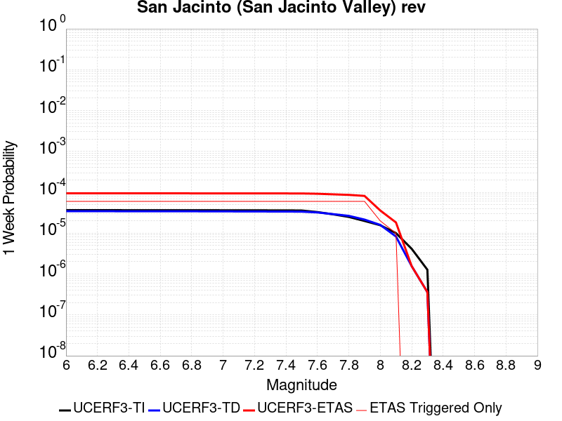 |  |  | 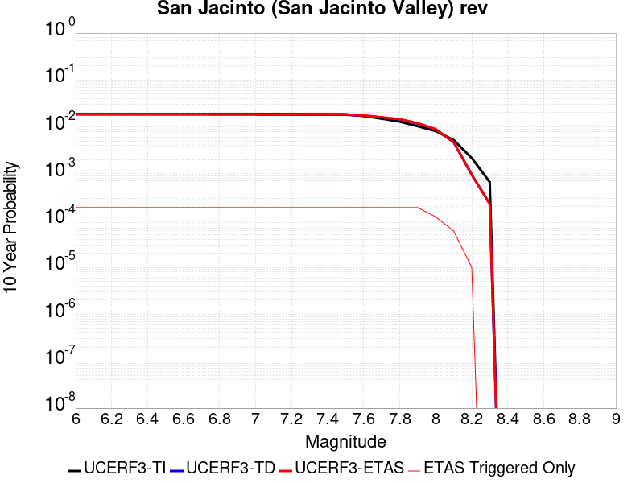 |

| Magnitude | 1 wk TI Prob | 1 wk TD Prob | 1 wk ETAS Prob | 1 wk ETAS/TD Gain | 1 wk ETAS Triggered Only | 1 mo TI Prob | 1 mo TD Prob | 1 mo ETAS Prob | 1 mo ETAS/TD Gain | 1 mo ETAS Triggered Only | 1 yr TI Prob | 1 yr TD Prob | 1 yr ETAS Prob | 1 yr ETAS/TD Gain | 1 yr ETAS Triggered Only | 10 yr TI Prob | 10 yr TD Prob | 10 yr ETAS Prob | 10 yr ETAS/TD Gain | 10 yr ETAS Triggered Only |
|-----|-----|-----|-----|-----|-----|-----|-----|-----|-----|-----|-----|-----|-----|-----|-----|-----|-----|-----|-----|-----|
| 6.0 | 3.652694E-5 | 3.4401106E-5 | 9.4399045E-5 | 2.74407 | 6.0E-5 | 1.5653463E-4 | 1.4742499E-4 | 2.4741024E-4 | 1.6782111 | 1.0E-4 | 0.0019041431 | 0.0017934233 | 0.0019531364 | 1.0890548 | 1.6E-4 | 0.018879099 | 0.018526303 | 0.018712781 | 1.0100657 | 1.9E-4 |
| 6.1 | 3.652694E-5 | 3.4401106E-5 | 9.4399045E-5 | 2.74407 | 6.0E-5 | 1.5653463E-4 | 1.4742499E-4 | 2.4741024E-4 | 1.6782111 | 1.0E-4 | 0.0019041431 | 0.0017934233 | 0.0019531364 | 1.0890548 | 1.6E-4 | 0.018879099 | 0.018526303 | 0.018712781 | 1.0100657 | 1.9E-4 |
| 6.2 | 3.652694E-5 | 3.4401106E-5 | 9.4399045E-5 | 2.74407 | 6.0E-5 | 1.5653463E-4 | 1.4742499E-4 | 2.4741024E-4 | 1.6782111 | 1.0E-4 | 0.0019041431 | 0.0017934233 | 0.0019531364 | 1.0890548 | 1.6E-4 | 0.018879099 | 0.018526303 | 0.018712781 | 1.0100657 | 1.9E-4 |
| 6.3 | 3.652694E-5 | 3.4401106E-5 | 9.4399045E-5 | 2.74407 | 6.0E-5 | 1.5653463E-4 | 1.4742499E-4 | 2.4741024E-4 | 1.6782111 | 1.0E-4 | 0.0019041431 | 0.0017934233 | 0.0019531364 | 1.0890548 | 1.6E-4 | 0.018879099 | 0.018526303 | 0.018712781 | 1.0100657 | 1.9E-4 |
| 6.4 | 3.646941E-5 | 3.432268E-5 | 9.432062E-5 | 2.7480552 | 6.0E-5 | 1.5628811E-4 | 1.4708891E-4 | 2.470742E-4 | 1.6797609 | 1.0E-4 | 0.0019011468 | 0.0017893389 | 0.0019490526 | 1.0892586 | 1.6E-4 | 0.018849645 | 0.018486181 | 0.01867267 | 1.010088 | 1.9E-4 |
| 6.5 | 3.646941E-5 | 3.432268E-5 | 9.432062E-5 | 2.7480552 | 6.0E-5 | 1.5628811E-4 | 1.4708891E-4 | 2.470742E-4 | 1.6797609 | 1.0E-4 | 0.0019011468 | 0.0017893389 | 0.0019490526 | 1.0892586 | 1.6E-4 | 0.018849645 | 0.018486181 | 0.01867267 | 1.010088 | 1.9E-4 |
| 6.6 | 3.6442503E-5 | 3.4286066E-5 | 9.428401E-5 | 2.749922 | 6.0E-5 | 1.561728E-4 | 1.4693203E-4 | 2.4691733E-4 | 1.6804868 | 1.0E-4 | 0.0018997455 | 0.001787432 | 0.0019471459 | 1.0893539 | 1.6E-4 | 0.018835869 | 0.01846745 | 0.018653942 | 1.0100983 | 1.9E-4 |
| 6.7 | 3.6432113E-5 | 3.427164E-5 | 9.4269584E-5 | 2.7506585 | 6.0E-5 | 1.5612828E-4 | 1.4687021E-4 | 2.4685552E-4 | 1.6807733 | 1.0E-4 | 0.0018992044 | 0.0017866807 | 0.0019463948 | 1.0893916 | 1.6E-4 | 0.018830549 | 0.018460074 | 0.018646566 | 1.0101025 | 1.9E-4 |
| 6.8 | 3.6409598E-5 | 3.4240697E-5 | 9.423865E-5 | 2.7522407 | 6.0E-5 | 1.560318E-4 | 1.4673761E-4 | 2.4672292E-4 | 1.6813885 | 1.0E-4 | 0.0018980318 | 0.0017850689 | 0.0019447833 | 1.0894724 | 1.6E-4 | 0.018819023 | 0.018444229 | 0.018630724 | 1.0101113 | 1.9E-4 |
| 6.9 | 3.638078E-5 | 3.4201123E-5 | 9.4199066E-5 | 2.7542684 | 6.0E-5 | 1.5590832E-4 | 1.4656801E-4 | 2.4655336E-4 | 1.6821771 | 1.0E-4 | 0.0018965311 | 0.0017830075 | 0.0019427222 | 1.089576 | 1.6E-4 | 0.018804269 | 0.018423963 | 0.018610463 | 1.0101227 | 1.9E-4 |
| 7.0 | 3.6294874E-5 | 3.408314E-5 | 9.408109E-5 | 2.7603412 | 6.0E-5 | 1.5554018E-4 | 1.4606243E-4 | 2.4604783E-4 | 1.6845387 | 1.0E-4 | 0.0018920569 | 0.0017768623 | 0.001936578 | 1.0898864 | 1.6E-4 | 0.018760284 | 0.018363545 | 0.018550055 | 1.0101566 | 1.9E-4 |
| 7.1 | 3.6260717E-5 | 3.403942E-5 | 9.403738E-5 | 2.762602 | 6.0E-5 | 1.5539382E-4 | 1.4587509E-4 | 2.4586052E-4 | 1.685418 | 1.0E-4 | 0.001890278 | 0.0017745851 | 0.0019343012 | 1.090002 | 1.6E-4 | 0.018742796 | 0.018341139 | 0.018527655 | 1.0101693 | 1.9E-4 |
| 7.2 | 3.6210204E-5 | 3.397364E-5 | 9.3971605E-5 | 2.766015 | 6.0E-5 | 1.5517735E-4 | 1.455932E-4 | 2.4557865E-4 | 1.6867452 | 1.0E-4 | 0.001887647 | 0.0017711588 | 0.0019308754 | 1.0901763 | 1.6E-4 | 0.01871693 | 0.018307408 | 0.01849393 | 1.0101883 | 1.9E-4 |
| 7.3 | 3.6119454E-5 | 3.386193E-5 | 9.38599E-5 | 2.7718415 | 6.0E-5 | 1.5478847E-4 | 1.4511449E-4 | 2.4509997E-4 | 1.6890111 | 1.0E-4 | 0.0018829206 | 0.0017653398 | 0.0019250574 | 1.0904741 | 1.6E-4 | 0.018670462 | 0.01824996 | 0.018436493 | 1.010221 | 1.9E-4 |
| 7.4 | 3.607848E-5 | 3.380943E-5 | 9.38074E-5 | 2.7745929 | 6.0E-5 | 1.5461289E-4 | 1.4488952E-4 | 2.4487503E-4 | 1.6900811 | 1.0E-4 | 0.0018807866 | 0.0017626052 | 0.0019223231 | 1.0906147 | 1.6E-4 | 0.018649481 | 0.018222956 | 0.018409492 | 1.0102364 | 1.9E-4 |
| 7.5 | 3.5856774E-5 | 3.3619202E-5 | 9.3617185E-5 | 2.7846344 | 6.0E-5 | 1.5366284E-4 | 1.4407437E-4 | 2.4405995E-4 | 1.693986 | 1.0E-4 | 0.0018692396 | 0.0017526967 | 0.0019124163 | 1.0911279 | 1.6E-4 | 0.018535944 | 0.018124057 | 0.018310614 | 1.0102932 | 1.9E-4 |
| 7.6 | 3.286655E-5 | 3.2142278E-5 | 9.214035E-5 | 2.8666403 | 6.0E-5 | 1.4084904E-4 | 1.3774536E-4 | 2.3773158E-4 | 1.7258773 | 1.0E-4 | 0.001713488 | 0.0016757617 | 0.0018354936 | 1.0953189 | 1.6E-4 | 0.017003361 | 0.017343804 | 0.017530508 | 1.010765 | 1.9E-4 |
| 7.7 | 2.8882527E-5 | 2.9235205E-5 | 8.923345E-5 | 3.0522602 | 6.0E-5 | 1.237764E-4 | 1.2528773E-4 | 2.252752E-4 | 1.7980628 | 1.0E-4 | 0.0015059357 | 0.0015243118 | 0.0016840679 | 1.1048054 | 1.6E-4 | 0.014957713 | 0.015830338 | 0.01601733 | 1.0118123 | 1.9E-4 |
| 7.8 | 2.4950225E-5 | 2.6526219E-5 | 8.6524626E-5 | 3.261853 | 6.0E-5 | 1.0692515E-4 | 1.1367885E-4 | 2.1366749E-4 | 1.8795711 | 1.0E-4 | 0.0013010362 | 0.0013831621 | 0.0015429409 | 1.115517 | 1.6E-4 | 0.012934455 | 0.01441176 | 0.0145990215 | 1.0129937 | 1.9E-4 |
| 7.9 | 1.9881603E-5 | 2.150649E-5 | 8.15052E-5 | 3.7897954 | 6.0E-5 | 8.520408E-5 | 9.216742E-5 | 1.921582E-4 | 2.084882 | 1.0E-4 | 0.001036866 | 0.0011215615 | 0.001281382 | 1.1424983 | 1.6E-4 | 0.010320415 | 0.011776998 | 0.01196476 | 1.0159432 | 1.9E-4 |
| 8.0 | 1.563292E-5 | 1.5936288E-5 | 3.593597E-5 | 2.2549775 | 2.0E-5 | 6.6996516E-5 | 6.829659E-5 | 1.282925E-4 | 1.8784611 | 6.0E-5 | 8.153773E-4 | 8.3119445E-4 | 9.3111134E-4 | 1.1202087 | 1.0E-4 | 0.00812392 | 0.008810331 | 0.008929274 | 1.0135003 | 1.2E-4 |
| 8.1 | 1.0045313E-5 | 8.300794E-6 | 1.830071E-5 | 2.204694 | 1.0E-5 | 4.305063E-5 | 3.557435E-5 | 7.557293E-5 | 2.1243656 | 4.0E-5 | 5.2401534E-4 | 4.3303217E-4 | 4.930062E-4 | 1.1384978 | 6.0E-5 | 0.0052278144 | 0.0046587666 | 0.004718487 | 1.0128189 | 6.0E-5 |
| 8.2 | 4.1554413E-6 | 1.5648296E-6 | 1.5648296E-6 | 1.0 | 0.0 | 1.7808914E-5 | 6.7063957E-6 | 6.7063957E-6 | 1.0 | 0.0 | 2.1680194E-4 | 8.164734E-5 | 9.164652E-5 | 1.122468 | 1.0E-5 | 0.0021659054 | 9.479703E-4 | 9.5796084E-4 | 1.0105388 | 1.0E-5 |
| 8.3 | 1.2758221E-6 | 3.612677E-7 | 3.612677E-7 | 1.0 | 0.0 | 5.4677976E-6 | 1.5482892E-6 | 1.5482892E-6 | 1.0 | 0.0 | 6.65684E-5 | 1.8850264E-5 | 1.8850264E-5 | 1.0 | 0.0 | 6.6548464E-4 | 2.2739546E-4 | 2.2739546E-4 | 1.0 | 0.0 |

## Mission Ridge-Arroyo Parida-Santa Ana
*[(top)](#table-of-contents)*

| 1 Week | 1 Month | 1 Year | 10 Year |
|-----|-----|-----|-----|
| 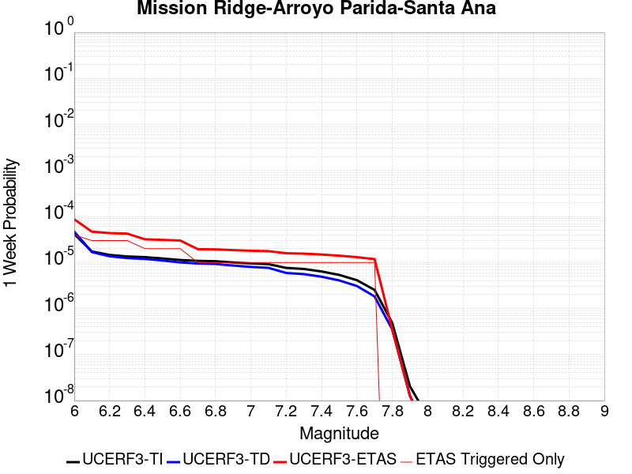 | 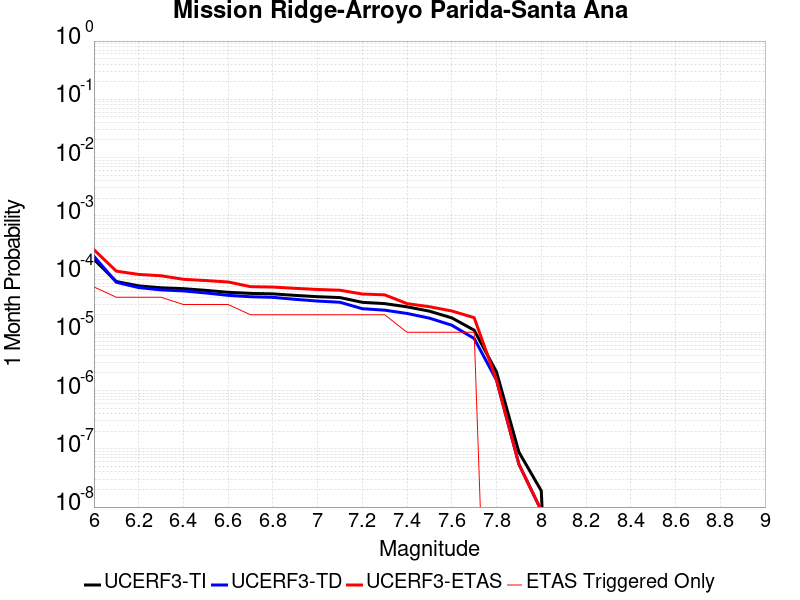 | 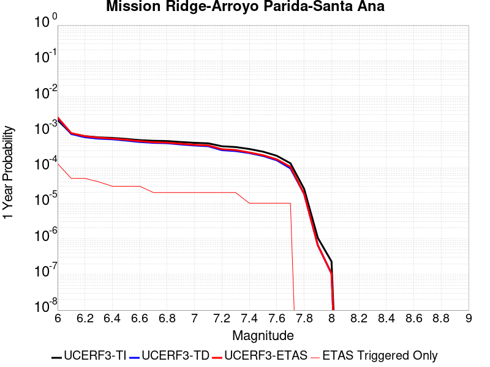 |  |

| Magnitude | 1 wk TI Prob | 1 wk TD Prob | 1 wk ETAS Prob | 1 wk ETAS/TD Gain | 1 wk ETAS Triggered Only | 1 mo TI Prob | 1 mo TD Prob | 1 mo ETAS Prob | 1 mo ETAS/TD Gain | 1 mo ETAS Triggered Only | 1 yr TI Prob | 1 yr TD Prob | 1 yr ETAS Prob | 1 yr ETAS/TD Gain | 1 yr ETAS Triggered Only | 10 yr TI Prob | 10 yr TD Prob | 10 yr ETAS Prob | 10 yr ETAS/TD Gain | 10 yr ETAS Triggered Only |
|-----|-----|-----|-----|-----|-----|-----|-----|-----|-----|-----|-----|-----|-----|-----|-----|-----|-----|-----|-----|-----|
| 6.0 | 4.169034E-5 | 4.7137048E-5 | 8.713516E-5 | 1.8485495 | 4.0E-5 | 1.7866064E-4 | 2.0200513E-4 | 2.61993E-4 | 1.2969621 | 6.0E-5 | 0.0021730233 | 0.0024574657 | 0.0025871464 | 1.05277 | 1.3E-4 | 0.021518968 | 0.02438483 | 0.024531173 | 1.0060014 | 1.5E-4 |
| 6.1 | 1.73813E-5 | 1.6854203E-5 | 4.6853696E-5 | 2.7799413 | 3.0E-5 | 7.4489166E-5 | 7.223036E-5 | 1.1222747E-4 | 1.5537437 | 4.0E-5 | 9.065282E-4 | 8.790605E-4 | 9.2901656E-4 | 1.0568289 | 5.0E-5 | 0.009028391 | 0.008757128 | 0.008816604 | 1.0067916 | 6.0E-5 |
| 6.2 | 1.4622182E-5 | 1.3673262E-5 | 4.367285E-5 | 3.194033 | 3.0E-5 | 6.2664985E-5 | 5.85984E-5 | 9.859606E-5 | 1.6825725 | 4.0E-5 | 7.6267915E-4 | 7.132059E-4 | 7.6317025E-4 | 1.070056 | 5.0E-5 | 0.007600669 | 0.007109767 | 0.0071594114 | 1.0069826 | 5.0E-5 |
| 6.3 | 1.3552434E-5 | 1.2482174E-5 | 4.24818E-5 | 3.4033976 | 3.0E-5 | 5.8080568E-5 | 5.349395E-5 | 9.349181E-5 | 1.7477081 | 4.0E-5 | 7.069015E-4 | 6.510974E-4 | 6.910713E-4 | 1.0613947 | 4.0E-5 | 0.00704657 | 0.006492415 | 0.006532155 | 1.006121 | 4.0E-5 |
| 6.4 | 1.30977305E-5 | 1.1979128E-5 | 3.197889E-5 | 2.6695504 | 2.0E-5 | 5.613192E-5 | 5.133813E-5 | 8.133659E-5 | 1.584331 | 3.0E-5 | 6.831918E-4 | 6.2486547E-4 | 6.548467E-4 | 1.0479803 | 3.0E-5 | 0.006810953 | 0.006231584 | 0.006261397 | 1.0047842 | 3.0E-5 |
| 6.5 | 1.225205E-5 | 1.1048776E-5 | 3.1048556E-5 | 2.8101354 | 2.0E-5 | 5.2507727E-5 | 4.735105E-5 | 7.734963E-5 | 1.6335356 | 3.0E-5 | 6.3909404E-4 | 5.7634927E-4 | 6.06332E-4 | 1.0520217 | 3.0E-5 | 0.006372592 | 0.005749009 | 0.0057788366 | 1.0051883 | 3.0E-5 |
| 6.6 | 1.1352241E-5 | 1.0063508E-5 | 3.0063307E-5 | 2.9873586 | 2.0E-5 | 4.8651553E-5 | 4.3128617E-5 | 7.3127325E-5 | 1.6955638 | 3.0E-5 | 5.921717E-4 | 5.249665E-4 | 5.549508E-4 | 1.0571165 | 3.0E-5 | 0.0059059616 | 0.0052376646 | 0.0052675074 | 1.0056977 | 3.0E-5 |
| 6.7 | 1.0864116E-5 | 9.517E-6 | 1.9516905E-5 | 2.0507412 | 1.0E-5 | 4.6559664E-5 | 4.0786515E-5 | 6.07857E-5 | 1.4903381 | 2.0E-5 | 5.667165E-4 | 4.964647E-4 | 5.164548E-4 | 1.0402648 | 2.0E-5 | 0.005652734 | 0.0049539437 | 0.0049738446 | 1.0040172 | 2.0E-5 |
| 6.8 | 1.0666365E-5 | 9.299752E-6 | 1.929966E-5 | 2.0752876 | 1.0E-5 | 4.571219E-5 | 3.985548E-5 | 5.9854683E-5 | 1.501793 | 2.0E-5 | 5.564038E-4 | 4.8513446E-4 | 5.0512474E-4 | 1.0412056 | 2.0E-5 | 0.005550127 | 0.00484114 | 0.0048610433 | 1.0041113 | 2.0E-5 |
| 6.9 | 1.0038665E-5 | 8.592018E-6 | 1.8591933E-5 | 2.1638608 | 1.0E-5 | 4.302214E-5 | 3.682243E-5 | 5.682169E-5 | 1.5431273 | 2.0E-5 | 5.236687E-4 | 4.4822265E-4 | 4.6821366E-4 | 1.0446007 | 2.0E-5 | 0.005224364 | 0.0044735507 | 0.0044934615 | 1.0044507 | 2.0E-5 |
| 7.0 | 9.5379955E-6 | 8.025047E-6 | 1.8024966E-5 | 2.2460887 | 1.0E-5 | 4.0876483E-5 | 3.439261E-5 | 5.4391923E-5 | 1.5815003 | 2.0E-5 | 4.975576E-4 | 4.1865133E-4 | 4.3864295E-4 | 1.0477525 | 2.0E-5 | 0.00496445 | 0.00417898 | 0.0041988962 | 1.0047659 | 2.0E-5 |
| 7.1 | 9.207389E-6 | 7.652347E-6 | 1.7652272E-5 | 2.3067784 | 1.0E-5 | 3.945964E-5 | 3.2795375E-5 | 5.2794716E-5 | 1.6098222 | 2.0E-5 | 4.803152E-4 | 3.992122E-4 | 4.1920424E-4 | 1.0500786 | 2.0E-5 | 0.004792784 | 0.003985301 | 0.004005221 | 1.0049984 | 2.0E-5 |
| 7.2 | 7.638091E-6 | 5.9310923E-6 | 1.5931033E-5 | 2.6860201 | 1.0E-5 | 3.2734264E-5 | 2.5418722E-5 | 4.541821E-5 | 1.7868016 | 2.0E-5 | 3.984668E-4 | 3.094293E-4 | 3.294231E-4 | 1.0646151 | 2.0E-5 | 0.0039775306 | 0.0030901956 | 0.0031101338 | 1.0064521 | 2.0E-5 |
| 7.3 | 7.2500147E-6 | 5.596131E-6 | 1.5596075E-5 | 2.786939 | 1.0E-5 | 3.1071122E-5 | 2.3983199E-5 | 4.398272E-5 | 1.8338971 | 2.0E-5 | 3.7822526E-4 | 2.9195662E-4 | 3.1195077E-4 | 1.0684834 | 2.0E-5 | 0.0037758215 | 0.0029159402 | 0.002935882 | 1.0068388 | 2.0E-5 |
| 7.4 | 6.3899715E-6 | 4.9184864E-6 | 1.4918437E-5 | 3.033136 | 1.0E-5 | 2.7385306E-5 | 2.1079059E-5 | 3.107885E-5 | 1.4743944 | 1.0E-5 | 3.3336508E-4 | 2.566075E-4 | 2.6660494E-4 | 1.03896 | 1.0E-5 | 0.0033286542 | 0.002563311 | 0.0025732853 | 1.0038912 | 1.0E-5 |
| 7.5 | 5.379025E-6 | 4.0838477E-6 | 1.40838065E-5 | 3.4486613 | 1.0E-5 | 2.305276E-5 | 1.7502087E-5 | 2.7501912E-5 | 1.5713505 | 1.0E-5 | 2.806312E-4 | 2.1306718E-4 | 2.2306504E-4 | 1.0469235 | 1.0E-5 | 0.0028027708 | 0.0021286402 | 0.0021386188 | 1.0046878 | 1.0E-5 |
| 7.6 | 4.1270696E-6 | 3.0883373E-6 | 1.3088306E-5 | 4.2379785 | 1.0E-5 | 1.768732E-5 | 1.32356645E-5 | 2.3235532E-5 | 1.7555244 | 1.0E-5 | 2.1532185E-4 | 1.6113237E-4 | 1.7113076E-4 | 1.0620508 | 1.0E-5 | 0.0021511333 | 0.0016101635 | 0.0016201474 | 1.0062006 | 1.0E-5 |
| 7.7 | 2.5406805E-6 | 1.8282044E-6 | 1.1828186E-5 | 6.469838 | 1.0E-5 | 1.0888585E-5 | 7.835139E-6 | 1.783506E-5 | 2.2762916 | 1.0E-5 | 1.3256045E-4 | 9.53887E-5 | 1.0538774E-4 | 1.1048242 | 1.0E-5 | 0.0013248142 | 9.534837E-4 | 9.6347416E-4 | 1.0104779 | 1.0E-5 |
| 7.8 | 4.8608285E-7 | 3.509864E-7 | 3.509864E-7 | 1.0 | 0.0 | 2.0832106E-6 | 1.5042266E-6 | 1.5042266E-6 | 1.0 | 0.0 | 2.5362791E-5 | 1.8313805E-5 | 1.8313805E-5 | 1.0 | 0.0 | 2.5359896E-4 | 1.8312308E-4 | 1.8312308E-4 | 1.0 | 0.0 |
| 7.9 | 2.0472514E-8 | 1.2688718E-8 | 1.2688718E-8 | 1.0 | 0.0 | 8.7739345E-8 | 5.438022E-8 | 5.438022E-8 | 1.0 | 0.0 | 1.068226E-6 | 6.6207895E-7 | 6.6207895E-7 | 1.0 | 0.0 | 1.0682209E-5 | 6.620771E-6 | 6.620771E-6 | 1.0 | 0.0 |
| 8.0 | 4.443582E-9 | 2.032067E-9 | 2.032067E-9 | 1.0 | 0.0 | 1.9043922E-8 | 8.7088585E-9 | 8.7088585E-9 | 1.0 | 0.0 | 2.3185973E-7 | 1.0603035E-7 | 1.0603035E-7 | 1.0 | 0.0 | 2.3185949E-6 | 1.0603031E-6 | 1.0603031E-6 | 1.0 | 0.0 |

## Independence rev 2011
*[(top)](#table-of-contents)*

| 1 Week | 1 Month | 1 Year | 10 Year |
|-----|-----|-----|-----|
|  |  | 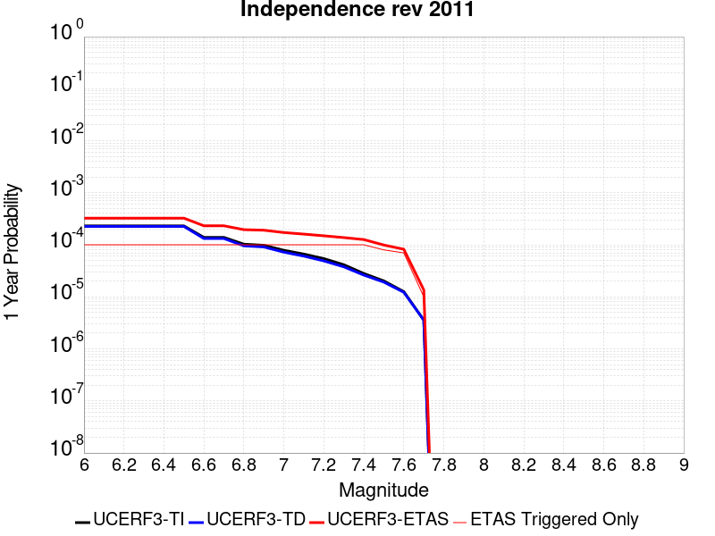 | 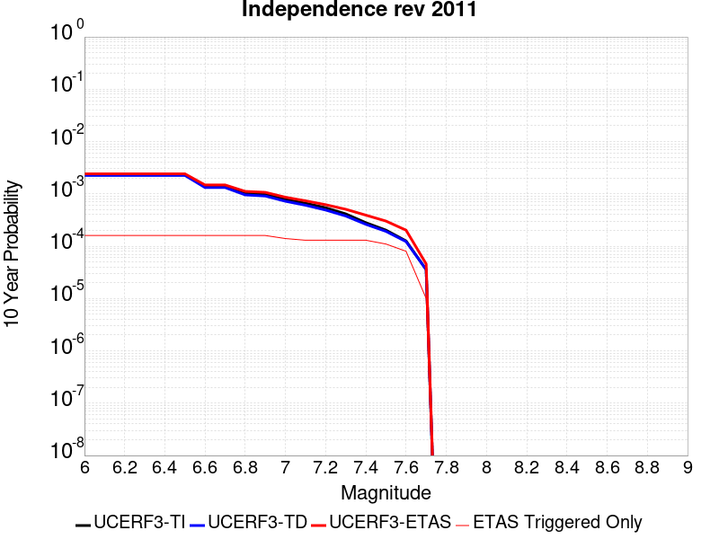 |

| Magnitude | 1 wk TI Prob | 1 wk TD Prob | 1 wk ETAS Prob | 1 wk ETAS/TD Gain | 1 wk ETAS Triggered Only | 1 mo TI Prob | 1 mo TD Prob | 1 mo ETAS Prob | 1 mo ETAS/TD Gain | 1 mo ETAS Triggered Only | 1 yr TI Prob | 1 yr TD Prob | 1 yr ETAS Prob | 1 yr ETAS/TD Gain | 1 yr ETAS Triggered Only | 10 yr TI Prob | 10 yr TD Prob | 10 yr ETAS Prob | 10 yr ETAS/TD Gain | 10 yr ETAS Triggered Only |
|-----|-----|-----|-----|-----|-----|-----|-----|-----|-----|-----|-----|-----|-----|-----|-----|-----|-----|-----|-----|-----|
| 6.0 | 4.422171E-6 | 4.3262253E-6 | 8.432588E-5 | 19.49179 | 8.0E-5 | 1.8952025E-5 | 1.8540852E-5 | 1.08539185E-4 | 5.8540564 | 9.0E-5 | 2.3071647E-4 | 2.2571447E-4 | 3.256919E-4 | 1.4429376 | 1.0E-4 | 0.0023047708 | 0.0022551457 | 0.0024147849 | 1.0707889 | 1.6E-4 |
| 6.1 | 4.422171E-6 | 4.3262253E-6 | 8.432588E-5 | 19.49179 | 8.0E-5 | 1.8952025E-5 | 1.8540852E-5 | 1.08539185E-4 | 5.8540564 | 9.0E-5 | 2.3071647E-4 | 2.2571447E-4 | 3.256919E-4 | 1.4429376 | 1.0E-4 | 0.0023047708 | 0.0022551457 | 0.0024147849 | 1.0707889 | 1.6E-4 |
| 6.2 | 4.422171E-6 | 4.3262253E-6 | 8.432588E-5 | 19.49179 | 8.0E-5 | 1.8952025E-5 | 1.8540852E-5 | 1.08539185E-4 | 5.8540564 | 9.0E-5 | 2.3071647E-4 | 2.2571447E-4 | 3.256919E-4 | 1.4429376 | 1.0E-4 | 0.0023047708 | 0.0022551457 | 0.0024147849 | 1.0707889 | 1.6E-4 |
| 6.3 | 4.422171E-6 | 4.3262253E-6 | 8.432588E-5 | 19.49179 | 8.0E-5 | 1.8952025E-5 | 1.8540852E-5 | 1.08539185E-4 | 5.8540564 | 9.0E-5 | 2.3071647E-4 | 2.2571447E-4 | 3.256919E-4 | 1.4429376 | 1.0E-4 | 0.0023047708 | 0.0022551457 | 0.0024147849 | 1.0707889 | 1.6E-4 |
| 6.4 | 4.422171E-6 | 4.3262253E-6 | 8.432588E-5 | 19.49179 | 8.0E-5 | 1.8952025E-5 | 1.8540852E-5 | 1.08539185E-4 | 5.8540564 | 9.0E-5 | 2.3071647E-4 | 2.2571447E-4 | 3.256919E-4 | 1.4429376 | 1.0E-4 | 0.0023047708 | 0.0022551457 | 0.0024147849 | 1.0707889 | 1.6E-4 |
| 6.5 | 4.422171E-6 | 4.3262253E-6 | 8.432588E-5 | 19.49179 | 8.0E-5 | 1.8952025E-5 | 1.8540852E-5 | 1.08539185E-4 | 5.8540564 | 9.0E-5 | 2.3071647E-4 | 2.2571447E-4 | 3.256919E-4 | 1.4429376 | 1.0E-4 | 0.0023047708 | 0.0022551457 | 0.0024147849 | 1.0707889 | 1.6E-4 |
| 6.6 | 2.663744E-6 | 2.5319846E-6 | 8.2531784E-5 | 32.595688 | 8.0E-5 | 1.1415996E-5 | 1.08513195E-5 | 1.00850346E-4 | 9.293832 | 9.0E-5 | 1.3898089E-4 | 1.321073E-4 | 2.3209408E-4 | 1.7568605 | 1.0E-4 | 0.0013889399 | 0.0013203359 | 0.0014801247 | 1.1210213 | 1.6E-4 |
| 6.7 | 2.663744E-6 | 2.5319846E-6 | 8.2531784E-5 | 32.595688 | 8.0E-5 | 1.1415996E-5 | 1.08513195E-5 | 1.00850346E-4 | 9.293832 | 9.0E-5 | 1.3898089E-4 | 1.321073E-4 | 2.3209408E-4 | 1.7568605 | 1.0E-4 | 0.0013889399 | 0.0013203359 | 0.0014801247 | 1.1210213 | 1.6E-4 |
| 6.8 | 1.9716529E-6 | 1.8322567E-6 | 8.183211E-5 | 44.661926 | 8.0E-5 | 8.449913E-6 | 7.852505E-6 | 9.78518E-5 | 12.46122 | 9.0E-5 | 1.0287284E-4 | 9.560019E-5 | 1.9559063E-4 | 2.045923 | 1.0E-4 | 0.0010282523 | 9.5560355E-4 | 0.0011154506 | 1.1672734 | 1.6E-4 |
| 6.9 | 1.8788617E-6 | 1.7429976E-6 | 8.174286E-5 | 46.89786 | 8.0E-5 | 8.0522395E-6 | 7.4699688E-6 | 9.7469296E-5 | 13.048153 | 9.0E-5 | 9.80316E-5 | 9.09432E-5 | 1.9093411E-4 | 2.0994875 | 1.0E-4 | 9.798837E-4 | 9.090718E-4 | 0.0010689264 | 1.1758437 | 1.6E-4 |
| 7.0 | 1.5045488E-6 | 1.3849498E-6 | 8.138484E-5 | 58.76375 | 8.0E-5 | 6.44805E-6 | 5.9354857E-6 | 9.593495E-5 | 16.162949 | 9.0E-5 | 7.8502184E-5 | 7.226219E-5 | 1.7225496E-4 | 2.3837495 | 1.0E-4 | 7.8474457E-4 | 7.223921E-4 | 8.6229097E-4 | 1.1936606 | 1.4E-4 |
| 7.1 | 1.272341E-6 | 1.1625089E-6 | 8.116241E-5 | 69.8166 | 8.0E-5 | 5.4528787E-6 | 4.9821715E-6 | 9.4981726E-5 | 19.064322 | 9.0E-5 | 6.6386776E-5 | 6.0656283E-5 | 1.6065022E-4 | 2.6485338 | 1.0E-4 | 6.636695E-4 | 6.064005E-4 | 7.363216E-4 | 1.2142497 | 1.3E-4 |
| 7.2 | 1.0416892E-6 | 9.409871E-7 | 8.094091E-5 | 86.01703 | 8.0E-5 | 4.464375E-6 | 4.032796E-6 | 9.403243E-5 | 23.316935 | 9.0E-5 | 5.4352407E-5 | 4.9098202E-5 | 1.4909329E-4 | 3.0366344 | 1.0E-4 | 5.4339116E-4 | 4.908754E-4 | 6.208116E-4 | 1.264703 | 1.3E-4 |
| 7.3 | 7.9450155E-7 | 7.2350036E-7 | 8.072344E-5 | 111.57346 | 8.0E-5 | 3.4050022E-6 | 3.1007123E-6 | 9.310043E-5 | 30.0255 | 9.0E-5 | 4.1455114E-5 | 3.7750528E-5 | 1.3774676E-4 | 3.6488695 | 1.0E-4 | 4.144738E-4 | 3.7744228E-4 | 5.073932E-4 | 1.3442935 | 1.3E-4 |
| 7.4 | 5.3893444E-7 | 5.0195166E-7 | 8.050191E-5 | 160.37782 | 8.0E-5 | 2.309717E-6 | 2.1512196E-6 | 9.215103E-5 | 42.836643 | 9.0E-5 | 2.8120441E-5 | 2.6190788E-5 | 1.2618817E-4 | 4.818036 | 1.0E-4 | 2.8116882E-4 | 2.6187746E-4 | 3.9184344E-4 | 1.4962853 | 1.3E-4 |
| 7.5 | 3.8852085E-7 | 3.6825622E-7 | 6.0368235E-5 | 163.92998 | 6.0E-5 | 1.6650882E-6 | 1.57824E-6 | 7.157813E-5 | 45.35313 | 7.0E-5 | 2.027226E-5 | 1.9214905E-5 | 9.9213365E-5 | 5.1633544 | 8.0E-5 | 2.0270412E-4 | 1.9213265E-4 | 3.0211153E-4 | 1.5724111 | 1.1E-4 |
| 7.6 | 2.414929E-7 | 2.3457605E-7 | 5.0234565E-5 | 214.15044 | 5.0E-5 | 1.0349692E-6 | 1.0053255E-6 | 6.1005267E-5 | 60.6821 | 6.0E-5 | 1.2600677E-5 | 1.2239771E-5 | 8.223891E-5 | 6.7189913 | 7.0E-5 | 1.2599962E-4 | 1.223911E-4 | 2.023813E-4 | 1.6535623 | 8.0E-5 |
| 7.7 | 6.8298014E-8 | 6.8589785E-8 | 6.8589785E-8 | 1.0 | 0.0 | 2.9270575E-7 | 2.939562E-7 | 1.0293953E-5 | 35.018665 | 1.0E-5 | 3.5636867E-6 | 3.5789112E-6 | 1.3578875E-5 | 3.7941358 | 1.0E-5 | 3.5636294E-5 | 3.5788584E-5 | 4.5788227E-5 | 1.2794087 | 1.0E-5 |

## Red Mountain
*[(top)](#table-of-contents)*

| 1 Week | 1 Month | 1 Year | 10 Year |
|-----|-----|-----|-----|
| 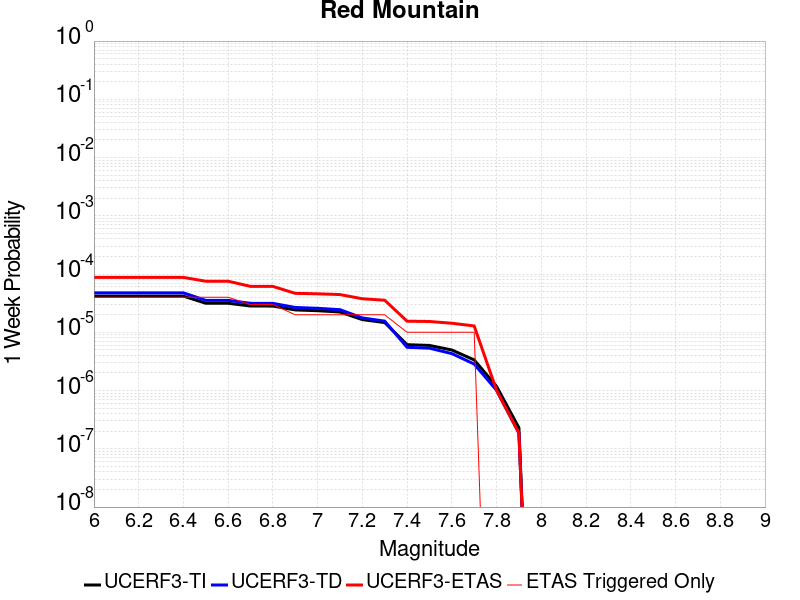 | 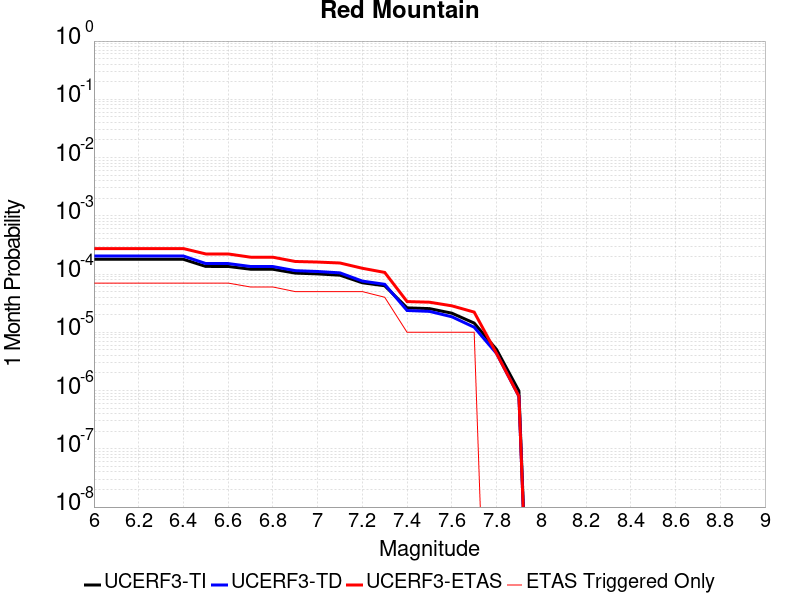 |  |  |

| Magnitude | 1 wk TI Prob | 1 wk TD Prob | 1 wk ETAS Prob | 1 wk ETAS/TD Gain | 1 wk ETAS Triggered Only | 1 mo TI Prob | 1 mo TD Prob | 1 mo ETAS Prob | 1 mo ETAS/TD Gain | 1 mo ETAS Triggered Only | 1 yr TI Prob | 1 yr TD Prob | 1 yr ETAS Prob | 1 yr ETAS/TD Gain | 1 yr ETAS Triggered Only | 10 yr TI Prob | 10 yr TD Prob | 10 yr ETAS Prob | 10 yr ETAS/TD Gain | 10 yr ETAS Triggered Only |
|-----|-----|-----|-----|-----|-----|-----|-----|-----|-----|-----|-----|-----|-----|-----|-----|-----|-----|-----|-----|-----|
| 6.0 | 4.1810763E-5 | 4.7590016E-5 | 8.758811E-5 | 1.8404725 | 4.0E-5 | 1.7917668E-4 | 2.039422E-4 | 2.7392793E-4 | 1.3431646 | 7.0E-5 | 0.0021792934 | 0.0024803334 | 0.0026000356 | 1.0482606 | 1.2E-4 | 0.021580452 | 0.02454411 | 0.024690429 | 1.0059614 | 1.5E-4 |
| 6.1 | 4.1810763E-5 | 4.7590016E-5 | 8.758811E-5 | 1.8404725 | 4.0E-5 | 1.7917668E-4 | 2.039422E-4 | 2.7392793E-4 | 1.3431646 | 7.0E-5 | 0.0021792934 | 0.0024803334 | 0.0026000356 | 1.0482606 | 1.2E-4 | 0.021580452 | 0.02454411 | 0.024690429 | 1.0059614 | 1.5E-4 |
| 6.2 | 4.1810763E-5 | 4.7590016E-5 | 8.758811E-5 | 1.8404725 | 4.0E-5 | 1.7917668E-4 | 2.039422E-4 | 2.7392793E-4 | 1.3431646 | 7.0E-5 | 0.0021792934 | 0.0024803334 | 0.0026000356 | 1.0482606 | 1.2E-4 | 0.021580452 | 0.02454411 | 0.024690429 | 1.0059614 | 1.5E-4 |
| 6.3 | 4.1810763E-5 | 4.7590016E-5 | 8.758811E-5 | 1.8404725 | 4.0E-5 | 1.7917668E-4 | 2.039422E-4 | 2.7392793E-4 | 1.3431646 | 7.0E-5 | 0.0021792934 | 0.0024803334 | 0.0026000356 | 1.0482606 | 1.2E-4 | 0.021580452 | 0.02454411 | 0.024690429 | 1.0059614 | 1.5E-4 |
| 6.4 | 4.1810763E-5 | 4.7590016E-5 | 8.758811E-5 | 1.8404725 | 4.0E-5 | 1.7917668E-4 | 2.039422E-4 | 2.7392793E-4 | 1.3431646 | 7.0E-5 | 0.0021792934 | 0.0024803334 | 0.0026000356 | 1.0482606 | 1.2E-4 | 0.021580452 | 0.02454411 | 0.024690429 | 1.0059614 | 1.5E-4 |
| 6.5 | 3.154503E-5 | 3.5359757E-5 | 7.5358344E-5 | 2.1311896 | 4.0E-5 | 1.3518598E-4 | 1.5153353E-4 | 2.2152293E-4 | 1.461874 | 7.0E-5 | 0.0016446467 | 0.0018434518 | 0.0019532489 | 1.0595607 | 1.1E-4 | 0.01632528 | 0.018291244 | 0.01840905 | 1.0064405 | 1.2E-4 |
| 6.6 | 3.1535834E-5 | 3.5349138E-5 | 7.534772E-5 | 2.1315293 | 4.0E-5 | 1.3514658E-4 | 1.5148803E-4 | 2.2147743E-4 | 1.4620126 | 7.0E-5 | 0.0016441676 | 0.0018428987 | 0.001952696 | 1.0595785 | 1.1E-4 | 0.01632056 | 0.018285805 | 0.01840361 | 1.0064424 | 1.2E-4 |
| 6.7 | 2.8267326E-5 | 3.1469353E-5 | 6.146841E-5 | 1.9532784 | 3.0E-5 | 1.2114006E-4 | 1.3486217E-4 | 1.9485407E-4 | 1.4448386 | 6.0E-5 | 0.0014738824 | 0.0016407954 | 0.0017306478 | 1.0547614 | 9.0E-5 | 0.014641452 | 0.01629557 | 0.016393943 | 1.0060366 | 1.0E-4 |
| 6.8 | 2.8212884E-5 | 3.1407242E-5 | 6.1406296E-5 | 1.9551637 | 3.0E-5 | 1.20906756E-4 | 1.3459599E-4 | 1.9458792E-4 | 1.4457185 | 6.0E-5 | 0.0014710457 | 0.0016375595 | 0.0017274121 | 1.0548699 | 9.0E-5 | 0.014613459 | 0.016263688 | 0.016362062 | 1.0060487 | 1.0E-4 |
| 6.9 | 2.4227871E-5 | 2.6706994E-5 | 4.670646E-5 | 1.7488475 | 2.0E-5 | 1.03829596E-4 | 1.1445395E-4 | 1.6444823E-4 | 1.4368069 | 5.0E-5 | 0.0012633923 | 0.0013926621 | 0.0014725506 | 1.057364 | 8.0E-5 | 0.012562336 | 0.0138470335 | 0.013935788 | 1.0064096 | 9.0E-5 |
| 7.0 | 2.348524E-5 | 2.5835778E-5 | 4.5835262E-5 | 1.7741003 | 2.0E-5 | 1.0064714E-4 | 1.10720495E-4 | 1.6071496E-4 | 1.4515376 | 5.0E-5 | 0.0012246901 | 0.001347264 | 0.0014271563 | 1.0592996 | 8.0E-5 | 0.012179627 | 0.013398598 | 0.013487392 | 1.0066271 | 9.0E-5 |
| 7.1 | 2.2311642E-5 | 2.4462845E-5 | 4.4462355E-5 | 1.8175464 | 2.0E-5 | 9.561782E-5 | 1.04836974E-4 | 1.5483172E-4 | 1.476881 | 5.0E-5 | 0.0011635252 | 0.0012757176 | 0.0013556156 | 1.0626298 | 8.0E-5 | 0.01157452 | 0.01269146 | 0.012780317 | 1.0070014 | 9.0E-5 |
| 7.2 | 1.6533986E-5 | 1.7670362E-5 | 3.7670008E-5 | 2.1318188 | 2.0E-5 | 7.085802E-5 | 7.572828E-5 | 1.257245E-4 | 1.6602052 | 5.0E-5 | 8.623549E-4 | 9.2166534E-4 | 9.8161E-4 | 1.0650395 | 6.0E-5 | 0.008590161 | 0.009184707 | 0.0092540635 | 1.0075513 | 7.0E-5 |
| 7.3 | 1.4703092E-5 | 1.5559537E-5 | 3.5559224E-5 | 2.2853653 | 2.0E-5 | 6.301173E-5 | 6.668237E-5 | 1.06679705E-4 | 1.5998187 | 4.0E-5 | 7.668978E-4 | 8.1161706E-4 | 8.515846E-4 | 1.0492443 | 4.0E-5 | 0.0076425658 | 0.008092604 | 0.008142199 | 1.0061284 | 5.0E-5 |
| 7.4 | 6.1331984E-6 | 5.5288874E-6 | 1.5528833E-5 | 2.8086722 | 1.0E-5 | 2.6284872E-5 | 2.3695018E-5 | 3.369478E-5 | 1.4220196 | 1.0E-5 | 3.199713E-4 | 2.884492E-4 | 2.984463E-4 | 1.0346582 | 1.0E-5 | 0.0031951098 | 0.0028808024 | 0.0029007448 | 1.0069225 | 2.0E-5 |
| 7.5 | 5.954766E-6 | 5.338517E-6 | 1.5338464E-5 | 2.8731694 | 1.0E-5 | 2.5520176E-5 | 2.2879161E-5 | 3.2878932E-5 | 1.4370689 | 1.0E-5 | 3.1066386E-4 | 2.785187E-4 | 2.885159E-4 | 1.0358943 | 1.0E-5 | 0.003102299 | 0.0027817504 | 0.0028016947 | 1.0071697 | 2.0E-5 |
| 7.6 | 4.9726646E-6 | 4.315309E-6 | 1.4315266E-5 | 3.317321 | 1.0E-5 | 2.1311245E-5 | 1.8494053E-5 | 2.8493867E-5 | 1.5407044 | 1.0E-5 | 2.5943352E-4 | 2.2514217E-4 | 2.3513992E-4 | 1.0444064 | 1.0E-5 | 0.0025913084 | 0.0022491754 | 0.0022691304 | 1.0088722 | 2.0E-5 |
| 7.7 | 3.3613894E-6 | 2.8526886E-6 | 1.285266E-5 | 4.505455 | 1.0E-5 | 1.4405875E-5 | 1.22257525E-5 | 2.2225631E-5 | 1.8179356 | 1.0E-5 | 1.7537741E-4 | 1.4883863E-4 | 1.5883715E-4 | 1.0671768 | 1.0E-5 | 0.0017523908 | 0.0014874157 | 0.0015073861 | 1.0134262 | 2.0E-5 |
| 7.8 | 1.1828961E-6 | 1.0122935E-6 | 1.0122935E-6 | 1.0 | 0.0 | 5.069545E-6 | 4.338394E-6 | 4.338394E-6 | 1.0 | 0.0 | 6.171996E-5 | 5.281869E-5 | 5.281869E-5 | 1.0 | 0.0 | 6.170282E-4 | 5.280643E-4 | 5.3805904E-4 | 1.0189271 | 1.0E-5 |
| 7.9 | 2.2967266E-7 | 1.861919E-7 | 1.861919E-7 | 1.0 | 0.0 | 9.843111E-7 | 7.97965E-7 | 7.97965E-7 | 1.0 | 0.0 | 1.19839215E-5 | 9.715184E-6 | 9.715184E-6 | 1.0 | 0.0 | 1.1983275E-4 | 9.714788E-5 | 9.714788E-5 | 1.0 | 0.0 |

## Owens Valley
*[(top)](#table-of-contents)*

| 1 Week | 1 Month | 1 Year | 10 Year |
|-----|-----|-----|-----|
| 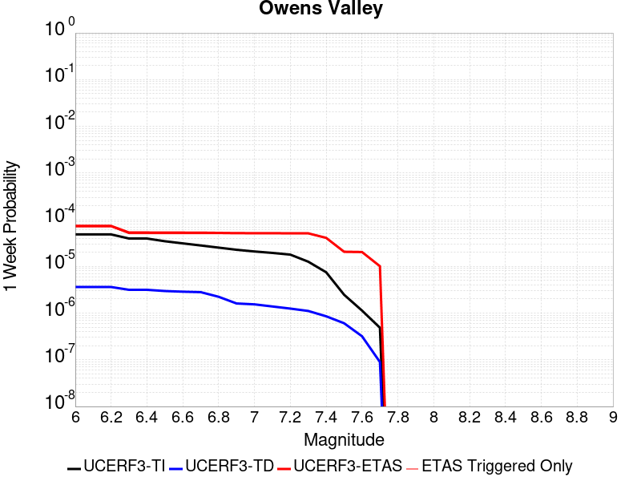 |  |  |  |

| Magnitude | 1 wk TI Prob | 1 wk TD Prob | 1 wk ETAS Prob | 1 wk ETAS/TD Gain | 1 wk ETAS Triggered Only | 1 mo TI Prob | 1 mo TD Prob | 1 mo ETAS Prob | 1 mo ETAS/TD Gain | 1 mo ETAS Triggered Only | 1 yr TI Prob | 1 yr TD Prob | 1 yr ETAS Prob | 1 yr ETAS/TD Gain | 1 yr ETAS Triggered Only | 10 yr TI Prob | 10 yr TD Prob | 10 yr ETAS Prob | 10 yr ETAS/TD Gain | 10 yr ETAS Triggered Only |
|-----|-----|-----|-----|-----|-----|-----|-----|-----|-----|-----|-----|-----|-----|-----|-----|-----|-----|-----|-----|-----|
| 6.0 | 4.83821E-5 | 3.6210524E-6 | 7.36208E-5 | 20.331327 | 7.0E-5 | 2.0733538E-4 | 1.551871E-5 | 8.5517626E-5 | 5.5106144 | 7.0E-5 | 0.002521386 | 1.889249E-4 | 2.989041E-4 | 1.582132 | 1.1E-4 | 0.024929691 | 0.0019297141 | 0.0020993862 | 1.0879259 | 1.7E-4 |
| 6.1 | 4.83821E-5 | 3.6210524E-6 | 7.36208E-5 | 20.331327 | 7.0E-5 | 2.0733538E-4 | 1.551871E-5 | 8.5517626E-5 | 5.5106144 | 7.0E-5 | 0.002521386 | 1.889249E-4 | 2.989041E-4 | 1.582132 | 1.1E-4 | 0.024929691 | 0.0019297141 | 0.0020993862 | 1.0879259 | 1.7E-4 |
| 6.2 | 4.83821E-5 | 3.6210524E-6 | 7.36208E-5 | 20.331327 | 7.0E-5 | 2.0733538E-4 | 1.551871E-5 | 8.5517626E-5 | 5.5106144 | 7.0E-5 | 0.002521386 | 1.889249E-4 | 2.989041E-4 | 1.582132 | 1.1E-4 | 0.024929691 | 0.0019297141 | 0.0020993862 | 1.0879259 | 1.7E-4 |
| 6.3 | 3.953008E-5 | 3.1530958E-6 | 5.3152937E-5 | 16.85738 | 5.0E-5 | 1.6940363E-4 | 1.3513202E-5 | 6.3512525E-5 | 4.700035 | 5.0E-5 | 0.002060538 | 1.6451156E-4 | 2.444984E-4 | 1.4862081 | 8.0E-5 | 0.020415364 | 0.0016621627 | 0.00180193 | 1.0840876 | 1.4E-4 |
| 6.4 | 3.953008E-5 | 3.1530958E-6 | 5.3152937E-5 | 16.85738 | 5.0E-5 | 1.6940363E-4 | 1.3513202E-5 | 6.3512525E-5 | 4.700035 | 5.0E-5 | 0.002060538 | 1.6451156E-4 | 2.444984E-4 | 1.4862081 | 8.0E-5 | 0.020415364 | 0.0016621627 | 0.00180193 | 1.0840876 | 1.4E-4 |
| 6.5 | 3.457342E-5 | 2.9707387E-6 | 5.297059E-5 | 17.83078 | 5.0E-5 | 1.4816338E-4 | 1.273168E-5 | 6.2731044E-5 | 4.9271617 | 5.0E-5 | 0.0018023965 | 1.5499788E-4 | 2.3498548E-4 | 1.5160562 | 8.0E-5 | 0.017878477 | 0.0015563119 | 0.0016861095 | 1.0834008 | 1.3E-4 |
| 6.6 | 3.1127765E-5 | 2.8737306E-6 | 5.2873587E-5 | 18.398935 | 5.0E-5 | 1.3339789E-4 | 1.2315934E-5 | 6.231532E-5 | 5.0597315 | 5.0E-5 | 0.0016229092 | 1.4993687E-4 | 2.2992487E-4 | 1.5334779 | 8.0E-5 | 0.016111081 | 0.0015013438 | 0.0016211636 | 1.0798084 | 1.2E-4 |
| 6.7 | 2.806885E-5 | 2.8101606E-6 | 5.281002E-5 | 18.792528 | 5.0E-5 | 1.2028952E-4 | 1.2043493E-5 | 6.204289E-5 | 5.1515694 | 5.0E-5 | 0.001463541 | 1.4662035E-4 | 2.2660862E-4 | 1.5455469 | 8.0E-5 | 0.014539397 | 0.0014656087 | 0.0015854328 | 1.0817572 | 1.2E-4 |
| 6.8 | 2.524524E-5 | 2.2351392E-6 | 5.2235027E-5 | 23.369923 | 5.0E-5 | 1.0818939E-4 | 9.579134E-6 | 5.9578655E-5 | 6.2196283 | 5.0E-5 | 0.0013164099 | 1.16620016E-4 | 1.966107E-4 | 1.6859086 | 8.0E-5 | 0.01308639 | 0.001165827 | 0.0012856872 | 1.1028112 | 1.2E-4 |
| 6.9 | 2.2704568E-5 | 1.6079711E-6 | 5.160789E-5 | 32.095036 | 5.0E-5 | 9.730166E-5 | 6.8912864E-6 | 5.689094E-5 | 8.255489 | 5.0E-5 | 0.0011840039 | 8.38982E-5 | 1.6389148E-4 | 1.9534565 | 8.0E-5 | 0.011777153 | 8.38853E-4 | 9.487608E-4 | 1.1310214 | 1.1E-4 |
| 7.0 | 2.0871712E-5 | 1.5393621E-6 | 5.1539286E-5 | 33.480938 | 5.0E-5 | 8.944713E-5 | 6.5972495E-6 | 5.659692E-5 | 8.578866 | 5.0E-5 | 0.0010884746 | 8.031857E-5 | 1.6031215E-4 | 1.9959537 | 8.0E-5 | 0.010831586 | 8.030395E-4 | 9.129512E-4 | 1.1368695 | 1.1E-4 |
| 7.1 | 1.944928E-5 | 1.3862556E-6 | 5.1386185E-5 | 37.068336 | 5.0E-5 | 8.335139E-5 | 5.941082E-6 | 5.5940785E-5 | 9.415926 | 5.0E-5 | 0.0010143308 | 7.233028E-5 | 1.5232449E-4 | 2.1059575 | 8.0E-5 | 0.010097133 | 7.2319806E-4 | 8.331185E-4 | 1.1519922 | 1.1E-4 |
| 7.2 | 1.7876306E-5 | 1.2487686E-6 | 5.1248706E-5 | 41.039394 | 5.0E-5 | 7.6610486E-5 | 5.3518543E-6 | 5.5351586E-5 | 10.342506 | 5.0E-5 | 9.3233347E-4 | 6.515689E-5 | 1.4515167E-4 | 2.2277257 | 8.0E-5 | 0.009284316 | 6.5148395E-4 | 7.6141226E-4 | 1.1687353 | 1.1E-4 |
| 7.3 | 1.2618672E-5 | 1.1113839E-6 | 5.111133E-5 | 45.988903 | 5.0E-5 | 5.40789E-5 | 4.763065E-6 | 5.4762826E-5 | 11.497392 | 5.0E-5 | 6.582117E-4 | 5.7988782E-5 | 1.3798414E-4 | 2.379497 | 8.0E-5 | 0.0065626553 | 5.7983754E-4 | 6.8977376E-4 | 1.1895983 | 1.1E-4 |
| 7.4 | 7.4874442E-6 | 8.547518E-7 | 4.0854717E-5 | 47.797173 | 4.0E-5 | 3.208865E-5 | 3.6632168E-6 | 4.366307E-5 | 11.919325 | 4.0E-5 | 3.906093E-4 | 4.4598757E-5 | 1.14595634E-4 | 2.5694804 | 7.0E-5 | 0.003899234 | 4.459579E-4 | 5.459133E-4 | 1.2241364 | 1.0E-4 |
| 7.5 | 2.4734156E-6 | 6.0679935E-7 | 2.0606787E-5 | 33.959805 | 2.0E-5 | 1.060031E-5 | 2.6005662E-6 | 2.2600514E-5 | 8.690613 | 2.0E-5 | 1.2905113E-4 | 3.1661435E-5 | 8.1659855E-5 | 2.5791583 | 5.0E-5 | 0.0012897621 | 3.1656958E-4 | 3.865474E-4 | 1.2210504 | 7.0E-5 |
| 7.6 | 1.1328841E-6 | 3.1961991E-7 | 2.0319614E-5 | 63.574303 | 2.0E-5 | 4.8552088E-6 | 1.369799E-6 | 2.1369771E-5 | 15.600662 | 2.0E-5 | 5.9110564E-5 | 1.6677177E-5 | 6.6676344E-5 | 3.9980593 | 5.0E-5 | 5.9094845E-4 | 1.6675945E-4 | 2.3674777E-4 | 1.4196963 | 7.0E-5 |
| 7.7 | 4.8613185E-7 | 8.962742E-8 | 1.0089627E-5 | 112.57299 | 1.0E-5 | 2.0834207E-6 | 3.8411747E-7 | 1.0384114E-5 | 27.033693 | 1.0E-5 | 2.536535E-5 | 4.676621E-6 | 2.4676527E-5 | 5.276572 | 2.0E-5 | 2.5362454E-4 | 4.676529E-5 | 7.6763885E-5 | 1.6414714 | 3.0E-5 |

## San Jacinto (Stepovers Combined)
*[(top)](#table-of-contents)*

| 1 Week | 1 Month | 1 Year | 10 Year |
|-----|-----|-----|-----|
| 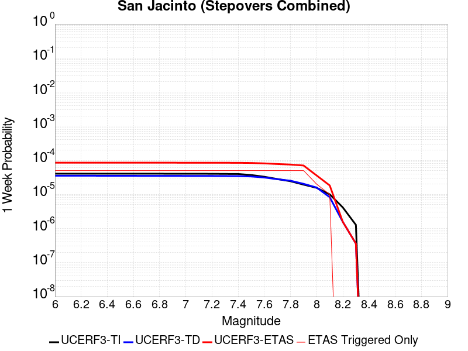 |  |  |  |

| Magnitude | 1 wk TI Prob | 1 wk TD Prob | 1 wk ETAS Prob | 1 wk ETAS/TD Gain | 1 wk ETAS Triggered Only | 1 mo TI Prob | 1 mo TD Prob | 1 mo ETAS Prob | 1 mo ETAS/TD Gain | 1 mo ETAS Triggered Only | 1 yr TI Prob | 1 yr TD Prob | 1 yr ETAS Prob | 1 yr ETAS/TD Gain | 1 yr ETAS Triggered Only | 10 yr TI Prob | 10 yr TD Prob | 10 yr ETAS Prob | 10 yr ETAS/TD Gain | 10 yr ETAS Triggered Only |
|-----|-----|-----|-----|-----|-----|-----|-----|-----|-----|-----|-----|-----|-----|-----|-----|-----|-----|-----|-----|-----|
| 6.0 | 4.0667746E-5 | 3.5271103E-5 | 8.526934E-5 | 2.417541 | 5.0E-5 | 1.742787E-4 | 1.5115313E-4 | 2.4113953E-4 | 1.5953326 | 9.0E-5 | 0.0021197782 | 0.0018387372 | 0.0019784798 | 1.0759993 | 1.4E-4 | 0.020996714 | 0.018986495 | 0.019143457 | 1.008267 | 1.6E-4 |
| 6.1 | 4.0667746E-5 | 3.5271103E-5 | 8.526934E-5 | 2.417541 | 5.0E-5 | 1.742787E-4 | 1.5115313E-4 | 2.4113953E-4 | 1.5953326 | 9.0E-5 | 0.0021197782 | 0.0018387372 | 0.0019784798 | 1.0759993 | 1.4E-4 | 0.020996714 | 0.018986495 | 0.019143457 | 1.008267 | 1.6E-4 |
| 6.2 | 4.0667746E-5 | 3.5271103E-5 | 8.526934E-5 | 2.417541 | 5.0E-5 | 1.742787E-4 | 1.5115313E-4 | 2.4113953E-4 | 1.5953326 | 9.0E-5 | 0.0021197782 | 0.0018387372 | 0.0019784798 | 1.0759993 | 1.4E-4 | 0.020996714 | 0.018986495 | 0.019143457 | 1.008267 | 1.6E-4 |
| 6.3 | 4.0667746E-5 | 3.5271103E-5 | 8.526934E-5 | 2.417541 | 5.0E-5 | 1.742787E-4 | 1.5115313E-4 | 2.4113953E-4 | 1.5953326 | 9.0E-5 | 0.0021197782 | 0.0018387372 | 0.0019784798 | 1.0759993 | 1.4E-4 | 0.020996714 | 0.018986495 | 0.019143457 | 1.008267 | 1.6E-4 |
| 6.4 | 4.0577226E-5 | 3.5143014E-5 | 8.5141255E-5 | 2.4227078 | 5.0E-5 | 1.738908E-4 | 1.5060425E-4 | 2.4059069E-4 | 1.5975027 | 9.0E-5 | 0.0021150648 | 0.0018320669 | 0.0019718104 | 1.0762764 | 1.4E-4 | 0.020950472 | 0.018921062 | 0.019078035 | 1.0082961 | 1.6E-4 |
| 6.5 | 4.0577226E-5 | 3.5143014E-5 | 8.5141255E-5 | 2.4227078 | 5.0E-5 | 1.738908E-4 | 1.5060425E-4 | 2.4059069E-4 | 1.5975027 | 9.0E-5 | 0.0021150648 | 0.0018320669 | 0.0019718104 | 1.0762764 | 1.4E-4 | 0.020950472 | 0.018921062 | 0.019078035 | 1.0082961 | 1.6E-4 |
| 6.6 | 4.053861E-5 | 3.5088357E-5 | 8.5086605E-5 | 2.4249241 | 5.0E-5 | 1.7372532E-4 | 1.5037002E-4 | 2.4035649E-4 | 1.5984335 | 9.0E-5 | 0.0021130538 | 0.0018292206 | 0.0019689645 | 1.0763953 | 1.4E-4 | 0.020930743 | 0.01889314 | 0.019050118 | 1.0083086 | 1.6E-4 |
| 6.7 | 4.0516545E-5 | 3.505743E-5 | 8.5055675E-5 | 2.426181 | 5.0E-5 | 1.7363077E-4 | 1.502375E-4 | 2.4022398E-4 | 1.5989615 | 9.0E-5 | 0.002111905 | 0.0018276101 | 0.0019673542 | 1.0764627 | 1.4E-4 | 0.020919468 | 0.018877337 | 0.019034317 | 1.0083158 | 1.6E-4 |
| 6.8 | 4.049434E-5 | 3.5028992E-5 | 8.502724E-5 | 2.427339 | 5.0E-5 | 1.7353562E-4 | 1.5011564E-4 | 2.4010213E-4 | 1.5994478 | 9.0E-5 | 0.0021107488 | 0.0018261289 | 0.0019658732 | 1.0765249 | 1.4E-4 | 0.020908125 | 0.018862749 | 0.01901973 | 1.0083224 | 1.6E-4 |
| 6.9 | 4.046386E-5 | 3.4991554E-5 | 8.4989806E-5 | 2.4288664 | 5.0E-5 | 1.73405E-4 | 1.499552E-4 | 2.399417E-4 | 1.6000893 | 9.0E-5 | 0.0021091616 | 0.0018241788 | 0.0019639235 | 1.0766069 | 1.4E-4 | 0.020892553 | 0.018843522 | 0.019000508 | 1.008331 | 1.6E-4 |
| 7.0 | 4.036382E-5 | 3.4872126E-5 | 8.487038E-5 | 2.43376 | 5.0E-5 | 1.7297632E-4 | 1.4944343E-4 | 2.3942997E-4 | 1.6021446 | 9.0E-5 | 0.0021039525 | 0.0018179584 | 0.0019577038 | 1.0768695 | 1.4E-4 | 0.02084144 | 0.018782137 | 0.018939132 | 1.0083587 | 1.6E-4 |
| 7.1 | 4.0343282E-5 | 3.485059E-5 | 8.484884E-5 | 2.4346461 | 5.0E-5 | 1.7288832E-4 | 1.4935112E-4 | 2.3933769E-4 | 1.6025168 | 9.0E-5 | 0.002102883 | 0.0018168368 | 0.0019565823 | 1.076917 | 1.4E-4 | 0.020830948 | 0.018771008 | 0.018928004 | 1.0083638 | 1.6E-4 |
| 7.2 | 4.0257353E-5 | 3.475509E-5 | 8.475335E-5 | 2.4385884 | 5.0E-5 | 1.725201E-4 | 1.489419E-4 | 2.3892848E-4 | 1.6041725 | 9.0E-5 | 0.0020984085 | 0.0018118626 | 0.0019516089 | 1.0771285 | 1.4E-4 | 0.020787042 | 0.018721746 | 0.01887875 | 1.0083863 | 1.6E-4 |
| 7.3 | 3.9940667E-5 | 3.458276E-5 | 8.458103E-5 | 2.4457572 | 5.0E-5 | 1.7116306E-4 | 1.4820343E-4 | 2.3819008E-4 | 1.6071835 | 9.0E-5 | 0.0020819185 | 0.0018028866 | 0.0019426342 | 1.0775132 | 1.4E-4 | 0.020625217 | 0.018630387 | 0.018787406 | 1.0084281 | 1.6E-4 |
| 7.4 | 3.9721202E-5 | 3.4468165E-5 | 8.446644E-5 | 2.450564 | 5.0E-5 | 1.7022261E-4 | 1.4771236E-4 | 2.3769907E-4 | 1.6092023 | 9.0E-5 | 0.0020704903 | 0.0017969179 | 0.0019366663 | 1.0777712 | 1.4E-4 | 0.020513052 | 0.018569522 | 0.01872655 | 1.0084562 | 1.6E-4 |
| 7.5 | 3.7036873E-5 | 3.3535776E-5 | 8.35341E-5 | 2.490895 | 5.0E-5 | 1.5871979E-4 | 1.4371685E-4 | 2.3370392E-4 | 1.6261414 | 9.0E-5 | 0.0019307006 | 0.0017483513 | 0.0018881066 | 1.0799354 | 1.4E-4 | 0.019140124 | 0.018071128 | 0.018228237 | 1.0086939 | 1.6E-4 |
| 7.6 | 3.2940967E-5 | 3.13167E-5 | 8.1315135E-5 | 2.5965421 | 5.0E-5 | 1.4116794E-4 | 1.3420754E-4 | 2.2419546E-4 | 1.6705132 | 9.0E-5 | 0.0017173645 | 0.0016327545 | 0.0017725258 | 1.0856047 | 1.4E-4 | 0.01704153 | 0.016904091 | 0.017061386 | 1.0093051 | 1.6E-4 |
| 7.7 | 2.8236149E-5 | 2.7882697E-5 | 7.7881305E-5 | 2.793177 | 5.0E-5 | 1.2100645E-4 | 1.1949181E-4 | 2.0948105E-4 | 1.7530997 | 9.0E-5 | 0.0014722579 | 0.0014538429 | 0.0015936394 | 1.0961565 | 1.4E-4 | 0.014625421 | 0.015114912 | 0.0152724935 | 1.0104256 | 1.6E-4 |
| 7.8 | 2.4329287E-5 | 2.5206451E-5 | 7.520519E-5 | 2.9835691 | 5.0E-5 | 1.042642E-4 | 1.08023174E-4 | 1.9801345E-4 | 1.8330646 | 9.0E-5 | 0.0012686774 | 0.0013143895 | 0.0014542056 | 1.1063733 | 1.4E-4 | 0.012614589 | 0.013712341 | 0.013870146 | 1.0115083 | 1.6E-4 |
| 7.9 | 1.9370926E-5 | 2.0420413E-5 | 7.0419395E-5 | 3.4484804 | 5.0E-5 | 8.301561E-5 | 8.751312E-5 | 1.7750525E-4 | 2.0283272 | 9.0E-5 | 0.0010102465 | 0.0010649522 | 0.0012048031 | 1.1313213 | 1.4E-4 | 0.0100566605 | 0.011199402 | 0.011357609 | 1.0141264 | 1.6E-4 |
| 8.0 | 1.5583017E-5 | 1.5885415E-5 | 3.58851E-5 | 2.2589965 | 2.0E-5 | 6.6782646E-5 | 6.807858E-5 | 1.2807449E-4 | 1.8812745 | 6.0E-5 | 8.127754E-4 | 8.2854216E-4 | 9.2845934E-4 | 1.1205939 | 1.0E-4 | 0.008098091 | 0.008781636 | 0.008900583 | 1.0135449 | 1.2E-4 |
| 8.1 | 1.0024873E-5 | 8.291399E-6 | 1.8291317E-5 | 2.206059 | 1.0E-5 | 4.2963035E-5 | 3.553409E-5 | 7.553267E-5 | 2.1256397 | 4.0E-5 | 5.229494E-4 | 4.3254215E-4 | 4.925162E-4 | 1.1386548 | 6.0E-5 | 0.0052172043 | 0.0046530655 | 0.0047127865 | 1.0128347 | 6.0E-5 |
| 8.2 | 4.142796E-6 | 1.5602761E-6 | 1.5602761E-6 | 1.0 | 0.0 | 1.775472E-5 | 6.6868806E-6 | 6.6868806E-6 | 1.0 | 0.0 | 2.1614227E-4 | 8.140976E-5 | 9.140895E-5 | 1.1228254 | 1.0E-5 | 0.0021593217 | 9.4514614E-4 | 9.5513667E-4 | 1.0105704 | 1.0E-5 |
| 8.3 | 1.2750878E-6 | 3.609817E-7 | 3.609817E-7 | 1.0 | 0.0 | 5.4646503E-6 | 1.5470634E-6 | 1.5470634E-6 | 1.0 | 0.0 | 6.653009E-5 | 1.8835339E-5 | 1.8835339E-5 | 1.0 | 0.0 | 6.6510175E-4 | 2.272251E-4 | 2.272251E-4 | 1.0 | 0.0 |

## Pisgah-Bullion Mtn-Mesquite Lk
*[(top)](#table-of-contents)*

| 1 Week | 1 Month | 1 Year | 10 Year |
|-----|-----|-----|-----|
| 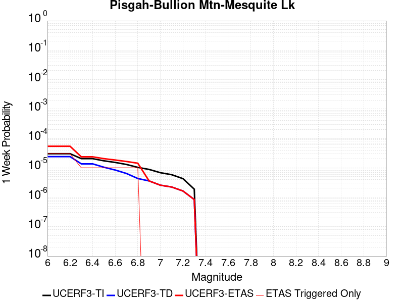 |  |  | 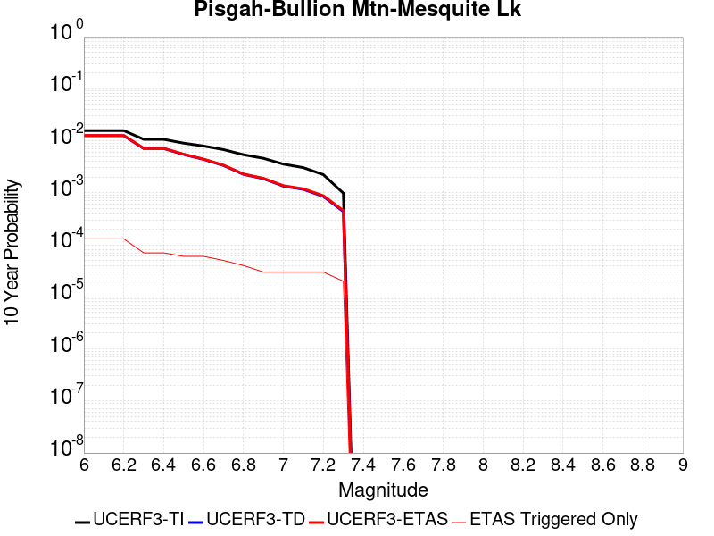 |

| Magnitude | 1 wk TI Prob | 1 wk TD Prob | 1 wk ETAS Prob | 1 wk ETAS/TD Gain | 1 wk ETAS Triggered Only | 1 mo TI Prob | 1 mo TD Prob | 1 mo ETAS Prob | 1 mo ETAS/TD Gain | 1 mo ETAS Triggered Only | 1 yr TI Prob | 1 yr TD Prob | 1 yr ETAS Prob | 1 yr ETAS/TD Gain | 1 yr ETAS Triggered Only | 10 yr TI Prob | 10 yr TD Prob | 10 yr ETAS Prob | 10 yr ETAS/TD Gain | 10 yr ETAS Triggered Only |
|-----|-----|-----|-----|-----|-----|-----|-----|-----|-----|-----|-----|-----|-----|-----|-----|-----|-----|-----|-----|-----|
| 6.0 | 3.0240792E-5 | 2.40909E-5 | 5.409018E-5 | 2.2452536 | 3.0E-5 | 1.2959696E-4 | 1.032432E-4 | 1.63237E-4 | 1.5810921 | 6.0E-5 | 0.0015767008 | 0.0012563618 | 0.0013362613 | 1.0635959 | 8.0E-5 | 0.015655609 | 0.012502613 | 0.012630988 | 1.0102679 | 1.3E-4 |
| 6.1 | 3.0240792E-5 | 2.40909E-5 | 5.409018E-5 | 2.2452536 | 3.0E-5 | 1.2959696E-4 | 1.032432E-4 | 1.63237E-4 | 1.5810921 | 6.0E-5 | 0.0015767008 | 0.0012563618 | 0.0013362613 | 1.0635959 | 8.0E-5 | 0.015655609 | 0.012502613 | 0.012630988 | 1.0102679 | 1.3E-4 |
| 6.2 | 3.0240792E-5 | 2.40909E-5 | 5.409018E-5 | 2.2452536 | 3.0E-5 | 1.2959696E-4 | 1.032432E-4 | 1.63237E-4 | 1.5810921 | 6.0E-5 | 0.0015767008 | 0.0012563618 | 0.0013362613 | 1.0635959 | 8.0E-5 | 0.015655609 | 0.012502613 | 0.012630988 | 1.0102679 | 1.3E-4 |
| 6.3 | 2.0498217E-5 | 1.3638054E-5 | 2.3637918E-5 | 1.7332324 | 1.0E-5 | 8.784654E-5 | 5.8447586E-5 | 7.8446414E-5 | 1.3421669 | 2.0E-5 | 0.0010690069 | 7.1138324E-4 | 7.513548E-4 | 1.0561885 | 4.0E-5 | 0.01063879 | 0.0070926864 | 0.00716219 | 1.0097994 | 7.0E-5 |
| 6.4 | 2.0498217E-5 | 1.3638054E-5 | 2.3637918E-5 | 1.7332324 | 1.0E-5 | 8.784654E-5 | 5.8447586E-5 | 7.8446414E-5 | 1.3421669 | 2.0E-5 | 0.0010690069 | 7.1138324E-4 | 7.513548E-4 | 1.0561885 | 4.0E-5 | 0.01063879 | 0.0070926864 | 0.00716219 | 1.0097994 | 7.0E-5 |
| 6.5 | 1.7316182E-5 | 1.04769715E-5 | 2.0476868E-5 | 1.9544643 | 1.0E-5 | 7.42101E-5 | 4.490059E-5 | 6.4899694E-5 | 1.4454085 | 2.0E-5 | 9.0313336E-4 | 5.465376E-4 | 5.865157E-4 | 1.073148 | 4.0E-5 | 0.008994718 | 0.00545293 | 0.005512603 | 1.0109433 | 6.0E-5 |
| 6.6 | 1.5251077E-5 | 8.414133E-6 | 1.8414048E-5 | 2.1884665 | 1.0E-5 | 6.536012E-5 | 3.606011E-5 | 5.605939E-5 | 1.5546094 | 2.0E-5 | 7.9546886E-4 | 4.3895066E-4 | 4.789331E-4 | 1.0910864 | 4.0E-5 | 0.007926274 | 0.0043815537 | 0.0044412906 | 1.0136337 | 6.0E-5 |
| 6.7 | 1.2997425E-5 | 6.4112146E-6 | 1.641115E-5 | 2.5597568 | 1.0E-5 | 5.570206E-5 | 2.7476372E-5 | 4.747582E-5 | 1.7278782 | 2.0E-5 | 6.7796157E-4 | 3.3447813E-4 | 3.6446808E-4 | 1.089662 | 3.0E-5 | 0.0067589693 | 0.003340207 | 0.00339004 | 1.0149192 | 5.0E-5 |
| 6.8 | 1.035386E-5 | 4.333145E-6 | 1.4333102E-5 | 3.3077824 | 1.0E-5 | 4.437293E-5 | 1.8570496E-5 | 3.8570124E-5 | 2.0769572 | 2.0E-5 | 5.401065E-4 | 2.260732E-4 | 2.4606867E-4 | 1.088447 | 2.0E-5 | 0.0053879567 | 0.002258519 | 0.0022984287 | 1.0176708 | 4.0E-5 |
| 6.9 | 8.816252E-6 | 3.5805879E-6 | 3.5805879E-6 | 1.0 | 0.0 | 3.778339E-5 | 1.534529E-5 | 2.5345136E-5 | 1.6516558 | 1.0E-5 | 4.5991567E-4 | 1.8681347E-4 | 1.9681161E-4 | 1.0535194 | 1.0E-5 | 0.00458965 | 0.0018666228 | 0.0018965668 | 1.0160418 | 3.0E-5 |
| 7.0 | 6.8232207E-6 | 2.5674399E-6 | 2.5674399E-6 | 1.0 | 0.0 | 2.9242048E-5 | 1.100327E-5 | 2.100316E-5 | 1.9088107 | 1.0E-5 | 3.5596377E-4 | 1.3395688E-4 | 1.4395555E-4 | 1.0746409 | 1.0E-5 | 0.0035539411 | 0.0013387925 | 0.0013687523 | 1.0223782 | 3.0E-5 |
| 7.1 | 5.837013E-6 | 2.2273143E-6 | 2.2273143E-6 | 1.0 | 0.0 | 2.501553E-5 | 9.5456E-6 | 1.9545503E-5 | 2.047593 | 1.0E-5 | 3.045215E-4 | 1.1621177E-4 | 1.2621061E-4 | 1.0860398 | 1.0E-5 | 0.0030410455 | 0.001161539 | 0.0011915042 | 1.0257978 | 3.0E-5 |
| 7.2 | 4.278052E-6 | 1.6275065E-6 | 1.6275065E-6 | 1.0 | 0.0 | 1.833438E-5 | 6.975011E-6 | 1.697494E-5 | 2.4336796 | 1.0E-5 | 2.231982E-4 | 8.491768E-5 | 9.491683E-5 | 1.1177511 | 1.0E-5 | 0.0022297418 | 8.4887556E-4 | 8.7885006E-4 | 1.0353109 | 3.0E-5 |
| 7.3 | 1.8803692E-6 | 8.344788E-7 | 8.344788E-7 | 1.0 | 0.0 | 8.0587E-6 | 3.5763337E-6 | 3.5763337E-6 | 1.0 | 0.0 | 9.811026E-5 | 4.354114E-5 | 4.354114E-5 | 1.0 | 0.0 | 9.806695E-4 | 4.3534054E-4 | 4.5533184E-4 | 1.0459211 | 2.0E-5 |

## Deep Springs
*[(top)](#table-of-contents)*

| 1 Week | 1 Month | 1 Year | 10 Year |
|-----|-----|-----|-----|
|  |  |  |  |

| Magnitude | 1 wk TI Prob | 1 wk TD Prob | 1 wk ETAS Prob | 1 wk ETAS/TD Gain | 1 wk ETAS Triggered Only | 1 mo TI Prob | 1 mo TD Prob | 1 mo ETAS Prob | 1 mo ETAS/TD Gain | 1 mo ETAS Triggered Only | 1 yr TI Prob | 1 yr TD Prob | 1 yr ETAS Prob | 1 yr ETAS/TD Gain | 1 yr ETAS Triggered Only | 10 yr TI Prob | 10 yr TD Prob | 10 yr ETAS Prob | 10 yr ETAS/TD Gain | 10 yr ETAS Triggered Only |
|-----|-----|-----|-----|-----|-----|-----|-----|-----|-----|-----|-----|-----|-----|-----|-----|-----|-----|-----|-----|-----|
| 6.0 | 1.9810619E-5 | 2.311252E-5 | 6.31116E-5 | 2.7306237 | 4.0E-5 | 8.489989E-5 | 9.9052755E-5 | 1.490478E-4 | 1.5047315 | 5.0E-5 | 0.001033166 | 0.0012058078 | 0.0013056872 | 1.082832 | 1.0E-4 | 0.010283757 | 0.01204243 | 0.012180744 | 1.0114856 | 1.4E-4 |
| 6.1 | 1.9810619E-5 | 2.311252E-5 | 6.31116E-5 | 2.7306237 | 4.0E-5 | 8.489989E-5 | 9.9052755E-5 | 1.490478E-4 | 1.5047315 | 5.0E-5 | 0.001033166 | 0.0012058078 | 0.0013056872 | 1.082832 | 1.0E-4 | 0.010283757 | 0.01204243 | 0.012180744 | 1.0114856 | 1.4E-4 |
| 6.2 | 1.9810619E-5 | 2.311252E-5 | 6.31116E-5 | 2.7306237 | 4.0E-5 | 8.489989E-5 | 9.9052755E-5 | 1.490478E-4 | 1.5047315 | 5.0E-5 | 0.001033166 | 0.0012058078 | 0.0013056872 | 1.082832 | 1.0E-4 | 0.010283757 | 0.01204243 | 0.012180744 | 1.0114856 | 1.4E-4 |
| 6.3 | 1.9810619E-5 | 2.311252E-5 | 6.31116E-5 | 2.7306237 | 4.0E-5 | 8.489989E-5 | 9.9052755E-5 | 1.490478E-4 | 1.5047315 | 5.0E-5 | 0.001033166 | 0.0012058078 | 0.0013056872 | 1.082832 | 1.0E-4 | 0.010283757 | 0.01204243 | 0.012180744 | 1.0114856 | 1.4E-4 |
| 6.4 | 1.9810619E-5 | 2.311252E-5 | 6.31116E-5 | 2.7306237 | 4.0E-5 | 8.489989E-5 | 9.9052755E-5 | 1.490478E-4 | 1.5047315 | 5.0E-5 | 0.001033166 | 0.0012058078 | 0.0013056872 | 1.082832 | 1.0E-4 | 0.010283757 | 0.01204243 | 0.012180744 | 1.0114856 | 1.4E-4 |
| 6.5 | 1.7190405E-5 | 2.0050558E-5 | 6.0049755E-5 | 2.994917 | 4.0E-5 | 7.367108E-5 | 8.593096E-5 | 1.3592666E-4 | 1.5818125 | 5.0E-5 | 8.9657627E-4 | 0.0010462092 | 0.001136115 | 1.0859349 | 9.0E-5 | 0.008929676 | 0.010462061 | 0.010580805 | 1.01135 | 1.2E-4 |
| 6.6 | 1.7190405E-5 | 2.0050558E-5 | 6.0049755E-5 | 2.994917 | 4.0E-5 | 7.367108E-5 | 8.593096E-5 | 1.3592666E-4 | 1.5818125 | 5.0E-5 | 8.9657627E-4 | 0.0010462092 | 0.001136115 | 1.0859349 | 9.0E-5 | 0.008929676 | 0.010462061 | 0.010580805 | 1.01135 | 1.2E-4 |

## Santa Rosa Island
*[(top)](#table-of-contents)*

| 1 Week | 1 Month | 1 Year | 10 Year |
|-----|-----|-----|-----|
|  |  |  |  |

| Magnitude | 1 wk TI Prob | 1 wk TD Prob | 1 wk ETAS Prob | 1 wk ETAS/TD Gain | 1 wk ETAS Triggered Only | 1 mo TI Prob | 1 mo TD Prob | 1 mo ETAS Prob | 1 mo ETAS/TD Gain | 1 mo ETAS Triggered Only | 1 yr TI Prob | 1 yr TD Prob | 1 yr ETAS Prob | 1 yr ETAS/TD Gain | 1 yr ETAS Triggered Only | 10 yr TI Prob | 10 yr TD Prob | 10 yr ETAS Prob | 10 yr ETAS/TD Gain | 10 yr ETAS Triggered Only |
|-----|-----|-----|-----|-----|-----|-----|-----|-----|-----|-----|-----|-----|-----|-----|-----|-----|-----|-----|-----|-----|
| 6.0 | 4.1143165E-5 | 4.709113E-5 | 5.7090656E-5 | 1.2123442 | 1.0E-5 | 1.7631594E-4 | 2.0180462E-4 | 2.118026E-4 | 1.0495429 | 1.0E-5 | 0.002144533 | 0.0024543991 | 0.0025342028 | 1.0325146 | 8.0E-5 | 0.021239553 | 0.024293557 | 0.024430156 | 1.0056229 | 1.4E-4 |
| 6.1 | 2.1061249E-5 | 2.3864959E-5 | 3.3864722E-5 | 1.4190143 | 1.0E-5 | 9.0259375E-5 | 1.0227455E-4 | 1.1227353E-4 | 1.097766 | 1.0E-5 | 0.0010983539 | 0.0012445103 | 0.0012944482 | 1.0401264 | 5.0E-5 | 0.01092941 | 0.01237845 | 0.012457459 | 1.0063828 | 8.0E-5 |
| 6.2 | 2.1061249E-5 | 2.3864959E-5 | 3.3864722E-5 | 1.4190143 | 1.0E-5 | 9.0259375E-5 | 1.0227455E-4 | 1.1227353E-4 | 1.097766 | 1.0E-5 | 0.0010983539 | 0.0012445103 | 0.0012944482 | 1.0401264 | 5.0E-5 | 0.01092941 | 0.01237845 | 0.012457459 | 1.0063828 | 8.0E-5 |
| 6.3 | 1.5158236E-5 | 1.7074419E-5 | 2.7074248E-5 | 1.5856615 | 1.0E-5 | 6.496225E-5 | 7.3174095E-5 | 8.317336E-5 | 1.1366504 | 1.0E-5 | 7.906284E-4 | 8.9054246E-4 | 9.3050685E-4 | 1.0448765 | 4.0E-5 | 0.007878214 | 0.00887099 | 0.008930458 | 1.0067036 | 6.0E-5 |
| 6.4 | 1.2341918E-5 | 1.3852917E-5 | 2.3852777E-5 | 1.7218597 | 1.0E-5 | 5.2892858E-5 | 5.9368336E-5 | 6.936774E-5 | 1.16843 | 1.0E-5 | 6.437803E-4 | 7.225779E-4 | 7.62549E-4 | 1.0553174 | 4.0E-5 | 0.006419184 | 0.0072031217 | 0.0072626895 | 1.0082697 | 6.0E-5 |
| 6.5 | 9.061158E-6 | 1.0117032E-5 | 2.011693E-5 | 1.9884223 | 1.0E-5 | 3.883296E-5 | 4.3358017E-5 | 5.335758E-5 | 1.2306279 | 1.0E-5 | 4.726887E-4 | 5.277613E-4 | 5.5774546E-4 | 1.0568138 | 3.0E-5 | 0.004716845 | 0.0052656177 | 0.005315354 | 1.0094455 | 5.0E-5 |
| 6.6 | 7.5461685E-6 | 8.400734E-6 | 8.400734E-6 | 1.0 | 0.0 | 3.2340322E-5 | 3.600267E-5 | 3.600267E-5 | 1.0 | 0.0 | 3.936723E-4 | 4.3824868E-4 | 4.4824427E-4 | 1.0228081 | 1.0E-5 | 0.003929756 | 0.0043742736 | 0.0044041425 | 1.0068283 | 3.0E-5 |
| 6.7 | 5.5023775E-6 | 6.087381E-6 | 6.087381E-6 | 1.0 | 0.0 | 2.3581404E-5 | 2.6088532E-5 | 2.6088532E-5 | 1.0 | 0.0 | 2.8706578E-4 | 3.1758484E-4 | 3.2758166E-4 | 1.0314777 | 1.0E-5 | 0.0028669522 | 0.0031716316 | 0.0032015364 | 1.0094289 | 3.0E-5 |
| 6.8 | 3.7351679E-6 | 4.0831405E-6 | 4.0831405E-6 | 1.0 | 0.0 | 1.6007763E-5 | 1.7499071E-5 | 1.7499071E-5 | 1.0 | 0.0 | 1.948771E-4 | 2.1303285E-4 | 2.1303285E-4 | 1.0 | 0.0 | 0.0019470629 | 0.0021285315 | 0.00213851 | 1.004688 | 1.0E-5 |
| 6.9 | 2.456366E-6 | 2.6292707E-6 | 2.6292707E-6 | 1.0 | 0.0 | 1.0527241E-5 | 1.1268255E-5 | 1.1268255E-5 | 1.0 | 0.0 | 1.2816161E-4 | 1.3718239E-4 | 1.3718239E-4 | 1.0 | 0.0 | 0.0012808773 | 0.0013709799 | 0.0013809663 | 1.007284 | 1.0E-5 |
| 7.0 | 2.3245157E-6 | 2.4827784E-6 | 2.4827784E-6 | 1.0 | 0.0 | 9.962172E-6 | 1.0640436E-5 | 1.0640436E-5 | 1.0 | 0.0 | 1.2128269E-4 | 1.2953962E-4 | 1.2953962E-4 | 1.0 | 0.0 | 0.0012121652 | 0.0012946434 | 0.0013046304 | 1.0077142 | 1.0E-5 |
| 7.1 | 2.2248344E-6 | 2.37325E-6 | 2.37325E-6 | 1.0 | 0.0 | 9.53497E-6 | 1.0171032E-5 | 1.0171032E-5 | 1.0 | 0.0 | 1.1608207E-4 | 1.238253E-4 | 1.238253E-4 | 1.0 | 0.0 | 0.0011602144 | 0.0012375651 | 0.0012475527 | 1.0080703 | 1.0E-5 |
| 7.2 | 2.1350402E-6 | 2.2761542E-6 | 2.2761542E-6 | 1.0 | 0.0 | 9.150141E-6 | 9.75491E-6 | 9.75491E-6 | 1.0 | 0.0 | 1.1139726E-4 | 1.1875957E-4 | 1.1875957E-4 | 1.0 | 0.0 | 0.0011134144 | 0.0011869629 | 0.0011969511 | 1.0084149 | 1.0E-5 |
| 7.3 | 1.9793572E-6 | 2.1087192E-6 | 2.1087192E-6 | 1.0 | 0.0 | 8.482932E-6 | 9.037337E-6 | 9.037337E-6 | 1.0 | 0.0 | 1.032748E-4 | 1.1002403E-4 | 1.1002403E-4 | 1.0 | 0.0 | 0.0010322682 | 0.0010996974 | 0.0010996974 | 1.0 | 0.0 |
| 7.4 | 1.6951194E-6 | 1.8045735E-6 | 1.8045735E-6 | 1.0 | 0.0 | 7.264777E-6 | 7.733864E-6 | 7.733864E-6 | 1.0 | 0.0 | 8.844508E-5 | 9.415574E-5 | 9.415574E-5 | 1.0 | 0.0 | 8.840988E-4 | 9.411601E-4 | 9.411601E-4 | 1.0 | 0.0 |
| 7.5 | 8.987207E-7 | 9.512216E-7 | 9.512216E-7 | 1.0 | 0.0 | 3.8516546E-6 | 4.0766577E-6 | 4.0766577E-6 | 1.0 | 0.0 | 4.6892885E-5 | 4.9632188E-5 | 4.9632188E-5 | 1.0 | 0.0 | 4.688299E-4 | 4.962122E-4 | 4.962122E-4 | 1.0 | 0.0 |
| 7.6 | 3.8783037E-7 | 4.0529335E-7 | 4.0529335E-7 | 1.0 | 0.0 | 1.6621291E-6 | 1.7369704E-6 | 1.7369704E-6 | 1.0 | 0.0 | 2.0236233E-5 | 2.1147416E-5 | 2.1147416E-5 | 1.0 | 0.0 | 2.023439E-4 | 2.114547E-4 | 2.114547E-4 | 1.0 | 0.0 |
| 7.7 | 6.181804E-8 | 6.339047E-8 | 6.339047E-8 | 1.0 | 0.0 | 2.6493444E-7 | 2.7167343E-7 | 2.7167343E-7 | 1.0 | 0.0 | 3.225572E-6 | 3.307619E-6 | 3.307619E-6 | 1.0 | 0.0 | 3.225525E-5 | 3.3075703E-5 | 3.3075703E-5 | 1.0 | 0.0 |
| 7.8 | 1.3704449E-9 | 1.3964153E-9 | 1.3964153E-9 | 1.0 | 0.0 | 5.873335E-9 | 5.984637E-9 | 5.984637E-9 | 1.0 | 0.0 | 7.1507856E-8 | 7.286295E-8 | 7.286295E-8 | 1.0 | 0.0 | 7.1507833E-7 | 7.286294E-7 | 7.286294E-7 | 1.0 | 0.0 |

## Sheephole
*[(top)](#table-of-contents)*

| 1 Week | 1 Month | 1 Year | 10 Year |
|-----|-----|-----|-----|
|  |  |  | 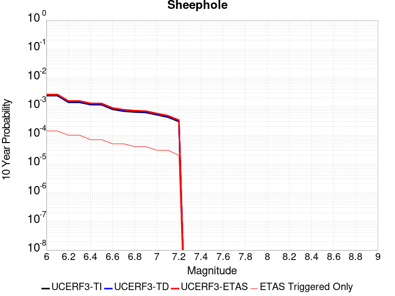 |

| Magnitude | 1 wk TI Prob | 1 wk TD Prob | 1 wk ETAS Prob | 1 wk ETAS/TD Gain | 1 wk ETAS Triggered Only | 1 mo TI Prob | 1 mo TD Prob | 1 mo ETAS Prob | 1 mo ETAS/TD Gain | 1 mo ETAS Triggered Only | 1 yr TI Prob | 1 yr TD Prob | 1 yr ETAS Prob | 1 yr ETAS/TD Gain | 1 yr ETAS Triggered Only | 10 yr TI Prob | 10 yr TD Prob | 10 yr ETAS Prob | 10 yr ETAS/TD Gain | 10 yr ETAS Triggered Only |
|-----|-----|-----|-----|-----|-----|-----|-----|-----|-----|-----|-----|-----|-----|-----|-----|-----|-----|-----|-----|-----|
| 6.0 | 4.5579695E-6 | 4.7412627E-6 | 6.4740976E-5 | 13.654797 | 6.0E-5 | 1.9534009E-5 | 2.031957E-5 | 9.031815E-5 | 4.444885 | 7.0E-5 | 2.3780059E-4 | 2.473682E-4 | 3.4734348E-4 | 1.4041556 | 1.0E-4 | 0.0023754628 | 0.002471473 | 0.0026111272 | 1.0565064 | 1.4E-4 |
| 6.1 | 4.5579695E-6 | 4.7412627E-6 | 6.4740976E-5 | 13.654797 | 6.0E-5 | 1.9534009E-5 | 2.031957E-5 | 9.031815E-5 | 4.444885 | 7.0E-5 | 2.3780059E-4 | 2.473682E-4 | 3.4734348E-4 | 1.4041556 | 1.0E-4 | 0.0023754628 | 0.002471473 | 0.0026111272 | 1.0565064 | 1.4E-4 |
| 6.2 | 2.6677674E-6 | 2.7873941E-6 | 3.278731E-5 | 11.762711 | 3.0E-5 | 1.1433239E-5 | 1.1945926E-5 | 5.1945448E-5 | 4.3483815 | 4.0E-5 | 1.3919079E-4 | 1.4543302E-4 | 2.1542284E-4 | 1.4812512 | 7.0E-5 | 0.0013910364 | 0.0014534844 | 0.0015533391 | 1.0687002 | 1.0E-4 |
| 6.3 | 2.6677674E-6 | 2.7873941E-6 | 3.278731E-5 | 11.762711 | 3.0E-5 | 1.1433239E-5 | 1.1945926E-5 | 5.1945448E-5 | 4.3483815 | 4.0E-5 | 1.3919079E-4 | 1.4543302E-4 | 2.1542284E-4 | 1.4812512 | 7.0E-5 | 0.0013910364 | 0.0014534844 | 0.0015533391 | 1.0687002 | 1.0E-4 |
| 6.4 | 2.2159759E-6 | 2.3228788E-6 | 2.2322833E-5 | 9.609986 | 2.0E-5 | 9.497005E-6 | 9.955161E-6 | 3.9954863E-5 | 4.013482 | 3.0E-5 | 1.156199E-4 | 1.2119815E-4 | 1.8119087E-4 | 1.494997 | 6.0E-5 | 0.0011555976 | 0.0012113999 | 0.0012813151 | 1.0577143 | 7.0E-5 |
| 6.5 | 2.1986082E-6 | 2.304759E-6 | 2.2304714E-5 | 9.677677 | 2.0E-5 | 9.4225725E-6 | 9.877506E-6 | 3.987721E-5 | 4.0371737 | 3.0E-5 | 1.1471378E-4 | 1.2025281E-4 | 1.802456E-4 | 1.4988889 | 6.0E-5 | 0.0011465458 | 0.0012019566 | 0.0012718725 | 1.0581684 | 7.0E-5 |
| 6.6 | 1.5232331E-6 | 1.6018919E-6 | 2.160186E-5 | 13.485217 | 2.0E-5 | 6.5281256E-6 | 6.865234E-6 | 2.6865097E-5 | 3.9132092 | 2.0E-5 | 7.947703E-5 | 8.35812E-5 | 1.2357786E-4 | 1.4785365 | 4.0E-5 | 7.9448614E-4 | 8.3551643E-4 | 8.854746E-4 | 1.0597932 | 5.0E-5 |
| 6.7 | 1.3137362E-6 | 1.382819E-6 | 2.1382792E-5 | 15.463188 | 2.0E-5 | 5.6302856E-6 | 5.926355E-6 | 2.5926236E-5 | 4.374736 | 2.0E-5 | 6.854657E-5 | 7.215112E-5 | 1.12148235E-4 | 1.5543519 | 4.0E-5 | 6.8525434E-4 | 7.212908E-4 | 7.7125477E-4 | 1.0692701 | 5.0E-5 |
| 6.8 | 1.2275751E-6 | 1.2922847E-6 | 1.1292272E-5 | 8.738223 | 1.0E-5 | 5.2610258E-6 | 5.5383516E-6 | 1.5538297E-5 | 2.8055813 | 1.0E-5 | 6.4051106E-5 | 6.7427485E-5 | 9.742546E-5 | 1.4448924 | 3.0E-5 | 6.4032647E-4 | 6.740836E-4 | 7.140566E-4 | 1.0592998 | 4.0E-5 |
| 6.9 | 1.1837088E-6 | 1.246102E-6 | 1.1246089E-5 | 9.025015 | 1.0E-5 | 5.0730278E-6 | 5.340427E-6 | 1.5340374E-5 | 2.8724995 | 1.0E-5 | 6.176237E-5 | 6.501789E-5 | 9.5015945E-5 | 1.4613814 | 3.0E-5 | 6.17452E-4 | 6.5000186E-4 | 6.8997586E-4 | 1.0614983 | 4.0E-5 |
| 7.0 | 9.849371E-7 | 1.0366288E-6 | 1.1036618E-5 | 10.646645 | 1.0E-5 | 4.2211523E-6 | 4.442688E-6 | 1.4442643E-5 | 3.2508795 | 1.0E-5 | 5.1391315E-5 | 5.4088487E-5 | 7.40874E-5 | 1.3697444 | 2.0E-5 | 5.137943E-4 | 5.407633E-4 | 5.7074707E-4 | 1.0554471 | 3.0E-5 |
| 7.1 | 8.1643645E-7 | 8.591669E-7 | 1.08591585E-5 | 12.639173 | 1.0E-5 | 3.4990085E-6 | 3.682139E-6 | 1.3682103E-5 | 3.7158027 | 1.0E-5 | 4.2599597E-5 | 4.482921E-5 | 6.482832E-5 | 1.4461176 | 2.0E-5 | 4.259143E-4 | 4.4821028E-4 | 4.7819686E-4 | 1.0669029 | 3.0E-5 |
| 7.2 | 5.7295756E-7 | 6.029502E-7 | 1.0602944E-5 | 17.585108 | 1.0E-5 | 2.45553E-6 | 2.58407E-6 | 1.2584044E-5 | 4.869854 | 1.0E-5 | 2.9895667E-5 | 3.1460666E-5 | 5.1460036E-5 | 1.6356944 | 2.0E-5 | 2.9891645E-4 | 3.145688E-4 | 3.3456253E-4 | 1.063559 | 2.0E-5 |

## Mission Creek
*[(top)](#table-of-contents)*

| 1 Week | 1 Month | 1 Year | 10 Year |
|-----|-----|-----|-----|
|  | 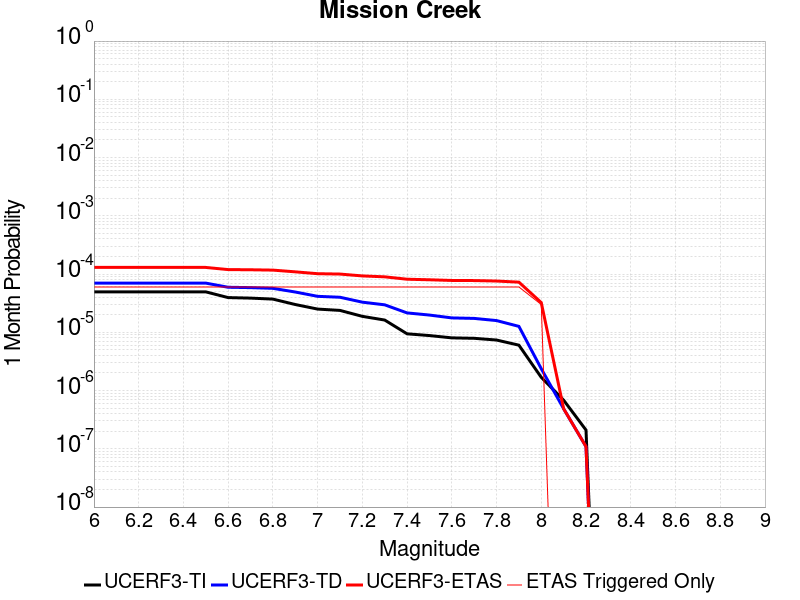 |  |  |

| Magnitude | 1 wk TI Prob | 1 wk TD Prob | 1 wk ETAS Prob | 1 wk ETAS/TD Gain | 1 wk ETAS Triggered Only | 1 mo TI Prob | 1 mo TD Prob | 1 mo ETAS Prob | 1 mo ETAS/TD Gain | 1 mo ETAS Triggered Only | 1 yr TI Prob | 1 yr TD Prob | 1 yr ETAS Prob | 1 yr ETAS/TD Gain | 1 yr ETAS Triggered Only | 10 yr TI Prob | 10 yr TD Prob | 10 yr ETAS Prob | 10 yr ETAS/TD Gain | 10 yr ETAS Triggered Only |
|-----|-----|-----|-----|-----|-----|-----|-----|-----|-----|-----|-----|-----|-----|-----|-----|-----|-----|-----|-----|-----|
| 6.0 | 1.1549387E-5 | 1.6322783E-5 | 6.632197E-5 | 4.0631533 | 5.0E-5 | 4.9496433E-5 | 6.995299E-5 | 1.2994879E-4 | 1.8576589 | 6.0E-5 | 6.0245243E-4 | 8.5135986E-4 | 9.312918E-4 | 1.0938873 | 8.0E-5 | 0.006008218 | 0.008510157 | 0.008629135 | 1.0139807 | 1.2E-4 |
| 6.1 | 1.1549387E-5 | 1.6322783E-5 | 6.632197E-5 | 4.0631533 | 5.0E-5 | 4.9496433E-5 | 6.995299E-5 | 1.2994879E-4 | 1.8576589 | 6.0E-5 | 6.0245243E-4 | 8.5135986E-4 | 9.312918E-4 | 1.0938873 | 8.0E-5 | 0.006008218 | 0.008510157 | 0.008629135 | 1.0139807 | 1.2E-4 |
| 6.2 | 1.1549387E-5 | 1.6322783E-5 | 6.632197E-5 | 4.0631533 | 5.0E-5 | 4.9496433E-5 | 6.995299E-5 | 1.2994879E-4 | 1.8576589 | 6.0E-5 | 6.0245243E-4 | 8.5135986E-4 | 9.312918E-4 | 1.0938873 | 8.0E-5 | 0.006008218 | 0.008510157 | 0.008629135 | 1.0139807 | 1.2E-4 |
| 6.3 | 1.1549387E-5 | 1.6322783E-5 | 6.632197E-5 | 4.0631533 | 5.0E-5 | 4.9496433E-5 | 6.995299E-5 | 1.2994879E-4 | 1.8576589 | 6.0E-5 | 6.0245243E-4 | 8.5135986E-4 | 9.312918E-4 | 1.0938873 | 8.0E-5 | 0.006008218 | 0.008510157 | 0.008629135 | 1.0139807 | 1.2E-4 |
| 6.4 | 1.1549387E-5 | 1.6322783E-5 | 6.632197E-5 | 4.0631533 | 5.0E-5 | 4.9496433E-5 | 6.995299E-5 | 1.2994879E-4 | 1.8576589 | 6.0E-5 | 6.0245243E-4 | 8.5135986E-4 | 9.312918E-4 | 1.0938873 | 8.0E-5 | 0.006008218 | 0.008510157 | 0.008629135 | 1.0139807 | 1.2E-4 |
| 6.5 | 1.1549387E-5 | 1.6322783E-5 | 6.632197E-5 | 4.0631533 | 5.0E-5 | 4.9496433E-5 | 6.995299E-5 | 1.2994879E-4 | 1.8576589 | 6.0E-5 | 6.0245243E-4 | 8.5135986E-4 | 9.312918E-4 | 1.0938873 | 8.0E-5 | 0.006008218 | 0.008510157 | 0.008629135 | 1.0139807 | 1.2E-4 |
| 6.6 | 9.202681E-6 | 1.3846059E-5 | 6.3845364E-5 | 4.611086 | 5.0E-5 | 3.9439463E-5 | 5.9338956E-5 | 1.193354E-4 | 2.0110803 | 6.0E-5 | 4.800697E-4 | 7.2222133E-4 | 8.0216356E-4 | 1.1106894 | 8.0E-5 | 0.004790339 | 0.0072273402 | 0.0073464727 | 1.0164837 | 1.2E-4 |
| 6.7 | 9.019164E-6 | 1.3651728E-5 | 6.3651045E-5 | 4.66249 | 5.0E-5 | 3.8652986E-5 | 5.8506146E-5 | 1.18502634E-4 | 2.0254734 | 6.0E-5 | 4.7049852E-4 | 7.1208854E-4 | 7.920316E-4 | 1.1122656 | 8.0E-5 | 0.004695036 | 0.0071266647 | 0.0072458093 | 1.0167181 | 1.2E-4 |
| 6.8 | 8.673558E-6 | 1.3273839E-5 | 6.3273175E-5 | 4.766758 | 5.0E-5 | 3.717186E-5 | 5.688669E-5 | 1.16883275E-4 | 2.0546682 | 6.0E-5 | 4.524734E-4 | 6.923842E-4 | 7.723288E-4 | 1.1154628 | 8.0E-5 | 0.0045155324 | 0.0069308523 | 0.0070500206 | 1.0171939 | 1.2E-4 |
| 6.9 | 7.002255E-6 | 1.1478069E-5 | 6.147749E-5 | 5.356084 | 5.0E-5 | 3.000932E-5 | 4.9190832E-5 | 1.0918788E-4 | 2.2196796 | 6.0E-5 | 3.653022E-4 | 5.9874065E-4 | 6.6869875E-4 | 1.116842 | 7.0E-5 | 0.0036470229 | 0.005999676 | 0.0060990755 | 1.0165676 | 1.0E-4 |
| 7.0 | 5.84644E-6 | 9.675359E-6 | 5.9674876E-5 | 6.167717 | 5.0E-5 | 2.5055931E-5 | 4.146519E-5 | 1.01462705E-4 | 2.4469368 | 6.0E-5 | 3.0501327E-4 | 5.047263E-4 | 5.74691E-4 | 1.1386191 | 7.0E-5 | 0.0030459496 | 0.005063994 | 0.0051634875 | 1.0196472 | 1.0E-4 |
| 7.1 | 5.54703E-6 | 9.329834E-6 | 5.9329366E-5 | 6.3591022 | 5.0E-5 | 2.377277E-5 | 3.9984414E-5 | 9.998202E-5 | 2.5005248 | 6.0E-5 | 2.8939504E-4 | 4.8670598E-4 | 5.566719E-4 | 1.143754 | 7.0E-5 | 0.0028901845 | 0.0048845876 | 0.004984099 | 1.0203725 | 1.0E-4 |
| 7.2 | 4.384709E-6 | 7.681918E-6 | 5.7681533E-5 | 7.5087414 | 5.0E-5 | 1.8791474E-5 | 3.292211E-5 | 9.2920134E-5 | 2.8224235 | 6.0E-5 | 2.2876218E-4 | 4.0075663E-4 | 4.7072858E-4 | 1.1745996 | 7.0E-5 | 0.0022852682 | 0.004028542 | 0.004128139 | 1.0247229 | 1.0E-4 |
| 7.3 | 3.7888456E-6 | 6.915788E-6 | 5.6915444E-5 | 8.229784 | 5.0E-5 | 1.623781E-5 | 2.9638775E-5 | 8.9637E-5 | 3.024315 | 6.0E-5 | 1.9767738E-4 | 3.6079568E-4 | 4.3077042E-4 | 1.1939456 | 7.0E-5 | 0.0019750162 | 0.00363027 | 0.0037299069 | 1.0274462 | 1.0E-4 |
| 7.4 | 2.1982462E-6 | 5.0241033E-6 | 5.502385E-5 | 10.951975 | 5.0E-5 | 9.421021E-6 | 2.1531694E-5 | 8.15304E-5 | 3.7865298 | 6.0E-5 | 1.1469489E-4 | 2.6211704E-4 | 3.221013E-4 | 1.2288454 | 6.0E-5 | 0.0011463572 | 0.0026460327 | 0.0027357945 | 1.0339231 | 9.0E-5 |
| 7.5 | 2.051923E-6 | 4.6153277E-6 | 5.4615095E-5 | 11.833417 | 5.0E-5 | 8.793926E-6 | 1.9779825E-5 | 7.977864E-5 | 4.033334 | 6.0E-5 | 1.0706078E-4 | 2.4079291E-4 | 3.0077845E-4 | 1.2491168 | 6.0E-5 | 0.0010700922 | 0.0024335932 | 0.002523374 | 1.0368923 | 9.0E-5 |
| 7.6 | 1.8733427E-6 | 4.1236603E-6 | 5.4123455E-5 | 13.125099 | 5.0E-5 | 8.028587E-6 | 1.7672712E-5 | 7.767165E-5 | 4.3950047 | 6.0E-5 | 9.774366E-5 | 2.151441E-4 | 2.751312E-4 | 1.2788229 | 6.0E-5 | 9.770069E-4 | 0.0021782513 | 0.0022680552 | 1.0412276 | 9.0E-5 |
| 7.7 | 1.8411953E-6 | 4.0433315E-6 | 5.404313E-5 | 13.36599 | 5.0E-5 | 7.890813E-6 | 1.732845E-5 | 7.732741E-5 | 4.462454 | 6.0E-5 | 9.606641E-5 | 2.1095353E-4 | 2.7094086E-4 | 1.2843628 | 6.0E-5 | 9.6024893E-4 | 0.0021365292 | 0.0022263369 | 1.0420344 | 9.0E-5 |
| 7.8 | 1.7194251E-6 | 3.71068E-6 | 5.3710493E-5 | 14.474569 | 5.0E-5 | 7.368944E-6 | 1.5902819E-5 | 7.5901866E-5 | 4.772856 | 6.0E-5 | 8.97132E-5 | 1.9359968E-4 | 2.5358808E-4 | 1.3098578 | 6.0E-5 | 8.967699E-4 | 0.0019624757 | 0.002052299 | 1.0457704 | 9.0E-5 |
| 7.9 | 1.4035052E-6 | 2.9502596E-6 | 5.2950112E-5 | 17.94761 | 5.0E-5 | 6.0150082E-6 | 1.2643909E-5 | 7.264315E-5 | 5.745308 | 6.0E-5 | 7.3230265E-5 | 1.5392878E-4 | 2.1391954E-4 | 1.3897307 | 6.0E-5 | 7.3206134E-4 | 0.0015631174 | 0.0016529767 | 1.0574872 | 9.0E-5 |
| 8.0 | 3.9318823E-7 | 5.528477E-7 | 2.0552836E-5 | 37.176304 | 2.0E-5 | 1.6850913E-6 | 2.3693453E-6 | 3.2369273E-5 | 13.6616955 | 3.0E-5 | 2.0515794E-5 | 2.8846403E-5 | 5.8845537E-5 | 2.039961 | 3.0E-5 | 2.0513899E-4 | 2.990952E-4 | 3.2908624E-4 | 1.1002725 | 3.0E-5 |
| 8.1 | 1.596793E-7 | 1.13775044E-7 | 1.13775044E-7 | 1.0 | 0.0 | 6.8433974E-7 | 4.876072E-7 | 4.876072E-7 | 1.0 | 0.0 | 8.331805E-6 | 5.936602E-6 | 5.936602E-6 | 1.0 | 0.0 | 8.331492E-5 | 6.5494125E-5 | 6.5494125E-5 | 1.0 | 0.0 |
| 8.2 | 4.9003038E-8 | 2.5435753E-8 | 2.5435753E-8 | 1.0 | 0.0 | 2.10013E-7 | 1.09010365E-7 | 1.09010365E-7 | 1.0 | 0.0 | 2.5569052E-6 | 1.3272004E-6 | 1.3272004E-6 | 1.0 | 0.0 | 2.556876E-5 | 1.4952613E-5 | 1.4952613E-5 | 1.0 | 0.0 |

## Whittier alt 1
*[(top)](#table-of-contents)*

| 1 Week | 1 Month | 1 Year | 10 Year |
|-----|-----|-----|-----|
|  |  | 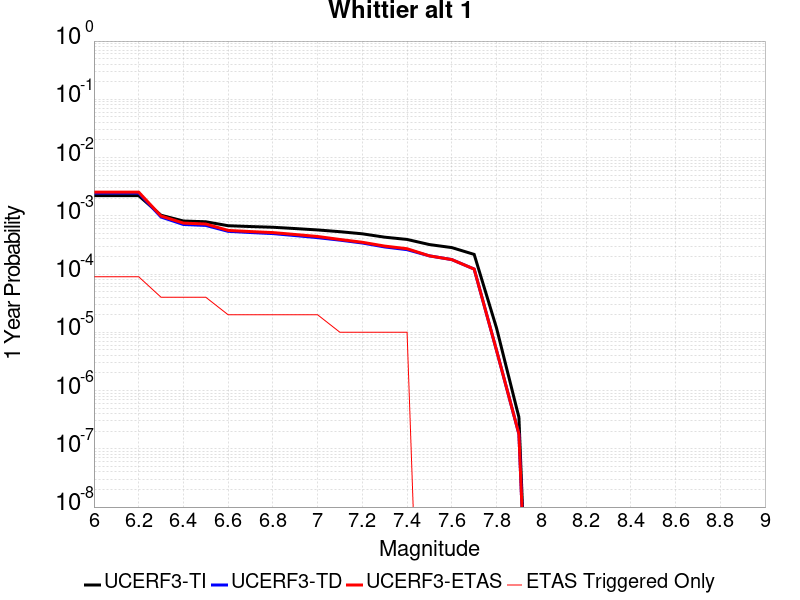 |  |

| Magnitude | 1 wk TI Prob | 1 wk TD Prob | 1 wk ETAS Prob | 1 wk ETAS/TD Gain | 1 wk ETAS Triggered Only | 1 mo TI Prob | 1 mo TD Prob | 1 mo ETAS Prob | 1 mo ETAS/TD Gain | 1 mo ETAS Triggered Only | 1 yr TI Prob | 1 yr TD Prob | 1 yr ETAS Prob | 1 yr ETAS/TD Gain | 1 yr ETAS Triggered Only | 10 yr TI Prob | 10 yr TD Prob | 10 yr ETAS Prob | 10 yr ETAS/TD Gain | 10 yr ETAS Triggered Only |
|-----|-----|-----|-----|-----|-----|-----|-----|-----|-----|-----|-----|-----|-----|-----|-----|-----|-----|-----|-----|-----|
| 6.0 | 4.2554693E-5 | 4.7252182E-5 | 6.725124E-5 | 1.4232409 | 2.0E-5 | 1.8236451E-4 | 2.0249544E-4 | 2.6248329E-4 | 1.296243 | 6.0E-5 | 0.002218027 | 0.0024629163 | 0.0025526946 | 1.036452 | 9.0E-5 | 0.02196019 | 0.024390263 | 0.024497582 | 1.0044 | 1.1E-4 |
| 6.1 | 4.2554693E-5 | 4.7252182E-5 | 6.725124E-5 | 1.4232409 | 2.0E-5 | 1.8236451E-4 | 2.0249544E-4 | 2.6248329E-4 | 1.296243 | 6.0E-5 | 0.002218027 | 0.0024629163 | 0.0025526946 | 1.036452 | 9.0E-5 | 0.02196019 | 0.024390263 | 0.024497582 | 1.0044 | 1.1E-4 |
| 6.2 | 4.2554693E-5 | 4.7252182E-5 | 6.725124E-5 | 1.4232409 | 2.0E-5 | 1.8236451E-4 | 2.0249544E-4 | 2.6248329E-4 | 1.296243 | 6.0E-5 | 0.002218027 | 0.0024629163 | 0.0025526946 | 1.036452 | 9.0E-5 | 0.02196019 | 0.024390263 | 0.024497582 | 1.0044 | 1.1E-4 |
| 6.3 | 1.9617712E-5 | 1.826841E-5 | 1.826841E-5 | 1.0 | 0.0 | 8.40732E-5 | 7.829095E-5 | 9.8289376E-5 | 1.2554374 | 2.0E-5 | 0.0010231105 | 9.527944E-4 | 9.927563E-4 | 1.0419418 | 4.0E-5 | 0.01018413 | 0.0094904 | 0.00954983 | 1.0062622 | 6.0E-5 |
| 6.4 | 1.5611336E-5 | 1.3604089E-5 | 1.3604089E-5 | 1.0 | 0.0 | 6.690401E-5 | 5.8301972E-5 | 7.830081E-5 | 1.3430216 | 2.0E-5 | 8.142519E-4 | 7.096013E-4 | 7.4957294E-4 | 1.0563297 | 4.0E-5 | 0.008112748 | 0.0070753377 | 0.0071249837 | 1.0070168 | 5.0E-5 |
| 6.5 | 1.5150166E-5 | 1.3100744E-5 | 1.3100744E-5 | 1.0 | 0.0 | 6.492767E-5 | 5.614487E-5 | 7.614375E-5 | 1.3562013 | 2.0E-5 | 7.9020765E-4 | 6.8335526E-4 | 7.23328E-4 | 1.0584947 | 4.0E-5 | 0.007874036 | 0.006814508 | 0.006864167 | 1.0072873 | 5.0E-5 |
| 6.6 | 1.295588E-5 | 1.0380544E-5 | 1.0380544E-5 | 1.0 | 0.0 | 5.552402E-5 | 4.44873E-5 | 5.4486853E-5 | 1.2247733 | 1.0E-5 | 6.7579525E-4 | 5.415002E-4 | 5.614894E-4 | 1.0369145 | 2.0E-5 | 0.006737438 | 0.005403343 | 0.0054331813 | 1.0055221 | 3.0E-5 |
| 6.7 | 1.2542085E-5 | 9.899189E-6 | 9.899189E-6 | 1.0 | 0.0 | 5.3750682E-5 | 4.2424414E-5 | 5.242399E-5 | 1.2357033 | 1.0E-5 | 6.542181E-4 | 5.163967E-4 | 5.363864E-4 | 1.0387099 | 2.0E-5 | 0.006522954 | 0.005153464 | 0.0051733614 | 1.0038608 | 2.0E-5 |
| 6.8 | 1.2195878E-5 | 9.49523E-6 | 9.49523E-6 | 1.0 | 0.0 | 5.2267E-5 | 4.069322E-5 | 5.069281E-5 | 1.2457312 | 1.0E-5 | 6.36165E-4 | 4.9532915E-4 | 5.153193E-4 | 1.0403572 | 2.0E-5 | 0.0063434686 | 0.0049436963 | 0.0049635977 | 1.0040256 | 2.0E-5 |
| 6.9 | 1.1580298E-5 | 8.772739E-6 | 8.772739E-6 | 1.0 | 0.0 | 4.9628903E-5 | 3.759692E-5 | 4.7596546E-5 | 1.2659692 | 1.0E-5 | 6.040644E-4 | 4.5764804E-4 | 4.7763888E-4 | 1.0436817 | 2.0E-5 | 0.00602425 | 0.0045684646 | 0.004588373 | 1.0043578 | 2.0E-5 |
| 7.0 | 1.0964795E-5 | 8.083794E-6 | 8.083794E-6 | 1.0 | 0.0 | 4.6991136E-5 | 3.4644378E-5 | 4.464403E-5 | 1.2886372 | 1.0E-5 | 5.7196687E-4 | 4.217152E-4 | 4.4170677E-4 | 1.0474054 | 2.0E-5 | 0.0057049696 | 0.004210459 | 0.0042303745 | 1.0047301 | 2.0E-5 |
| 7.1 | 1.0230601E-5 | 7.32646E-6 | 7.32646E-6 | 1.0 | 0.0 | 4.3844695E-5 | 3.1398744E-5 | 3.1398744E-5 | 1.0 | 0.0 | 5.336784E-4 | 3.8221394E-4 | 3.9221012E-4 | 1.0261533 | 1.0E-5 | 0.005323986 | 0.0038167592 | 0.003826721 | 1.00261 | 1.0E-5 |
| 7.2 | 9.40865E-6 | 6.5430822E-6 | 6.5430822E-6 | 1.0 | 0.0 | 4.032216E-5 | 2.8041486E-5 | 2.8041486E-5 | 1.0 | 0.0 | 4.908117E-4 | 3.4135283E-4 | 3.5134942E-4 | 1.0292852 | 1.0E-5 | 0.0048972913 | 0.0034094024 | 0.0034193683 | 1.002923 | 1.0E-5 |
| 7.3 | 8.237384E-6 | 5.5975433E-6 | 5.5975433E-6 | 1.0 | 0.0 | 3.5302593E-5 | 2.3989258E-5 | 2.3989258E-5 | 1.0 | 0.0 | 4.2972428E-4 | 2.920311E-4 | 3.020282E-4 | 1.034233 | 1.0E-5 | 0.0042889426 | 0.0029167992 | 0.0029267701 | 1.0034184 | 1.0E-5 |
| 7.4 | 7.5316966E-6 | 5.0276153E-6 | 5.0276153E-6 | 1.0 | 0.0 | 3.2278298E-5 | 2.154675E-5 | 2.154675E-5 | 1.0 | 0.0 | 3.9291743E-4 | 2.623011E-4 | 2.722985E-4 | 1.0381141 | 1.0E-5 | 0.0039222343 | 0.0026200267 | 0.0026300005 | 1.0038067 | 1.0E-5 |
| 7.5 | 6.149649E-6 | 3.9336355E-6 | 3.9336355E-6 | 1.0 | 0.0 | 2.6355372E-5 | 1.6858336E-5 | 1.6858336E-5 | 1.0 | 0.0 | 3.208294E-4 | 2.052318E-4 | 2.052318E-4 | 1.0 | 0.0 | 0.003203666 | 0.0020505118 | 0.0020505118 | 1.0 | 0.0 |
| 7.6 | 5.457711E-6 | 3.3951796E-6 | 3.3951796E-6 | 1.0 | 0.0 | 2.338998E-5 | 1.4550694E-5 | 1.4550694E-5 | 1.0 | 0.0 | 2.8473578E-4 | 1.771411E-4 | 1.771411E-4 | 1.0 | 0.0 | 0.0028437122 | 0.0017700798 | 0.0017700798 | 1.0 | 0.0 |
| 7.7 | 4.1676276E-6 | 2.3329922E-6 | 2.3329922E-6 | 1.0 | 0.0 | 1.7861139E-5 | 9.998504E-6 | 9.998504E-6 | 1.0 | 0.0 | 2.1743766E-4 | 1.2172572E-4 | 1.2172572E-4 | 1.0 | 0.0 | 0.0021722503 | 0.0012166635 | 0.0012166635 | 1.0 | 0.0 |
| 7.8 | 2.2692414E-7 | 9.384417E-8 | 9.384417E-8 | 1.0 | 0.0 | 9.725317E-7 | 4.0218927E-7 | 4.0218927E-7 | 1.0 | 0.0 | 1.1840509E-5 | 4.8966467E-6 | 4.8966467E-6 | 1.0 | 0.0 | 1.1839878E-4 | 4.8965718E-5 | 4.8965718E-5 | 1.0 | 0.0 |
| 7.9 | 6.676829E-9 | 3.4397174E-9 | 3.4397174E-9 | 1.0 | 0.0 | 2.861498E-8 | 1.4741646E-8 | 1.4741646E-8 | 1.0 | 0.0 | 3.4838732E-7 | 1.7947953E-7 | 1.7947953E-7 | 1.0 | 0.0 | 3.4838679E-6 | 1.794794E-6 | 1.794794E-6 | 1.0 | 0.0 |

## San Jacinto (Anza) rev
*[(top)](#table-of-contents)*

| 1 Week | 1 Month | 1 Year | 10 Year |
|-----|-----|-----|-----|
|  |  | 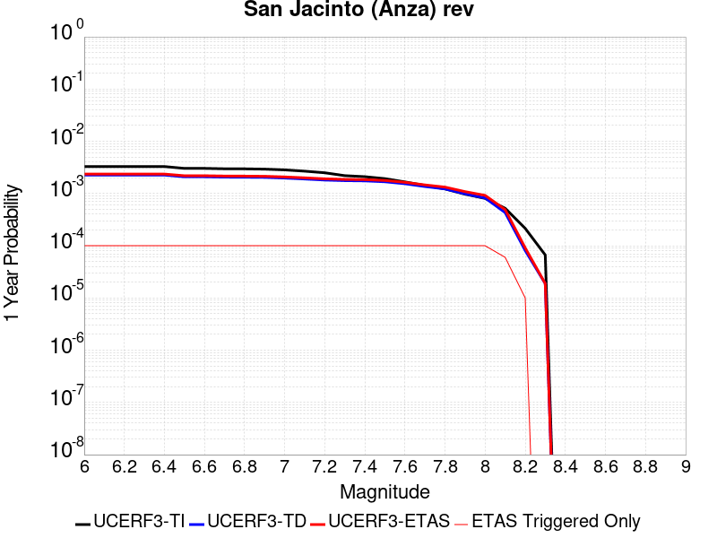 |  |

| Magnitude | 1 wk TI Prob | 1 wk TD Prob | 1 wk ETAS Prob | 1 wk ETAS/TD Gain | 1 wk ETAS Triggered Only | 1 mo TI Prob | 1 mo TD Prob | 1 mo ETAS Prob | 1 mo ETAS/TD Gain | 1 mo ETAS Triggered Only | 1 yr TI Prob | 1 yr TD Prob | 1 yr ETAS Prob | 1 yr ETAS/TD Gain | 1 yr ETAS Triggered Only | 10 yr TI Prob | 10 yr TD Prob | 10 yr ETAS Prob | 10 yr ETAS/TD Gain | 10 yr ETAS Triggered Only |
|-----|-----|-----|-----|-----|-----|-----|-----|-----|-----|-----|-----|-----|-----|-----|-----|-----|-----|-----|-----|-----|
| 6.0 | 6.3015636E-5 | 4.3298347E-5 | 6.3297484E-5 | 1.4618914 | 2.0E-5 | 2.7003905E-4 | 1.8555121E-4 | 2.4554008E-4 | 1.3233008 | 6.0E-5 | 0.0032827691 | 0.0022567573 | 0.0023565318 | 1.0442114 | 1.0E-4 | 0.032346968 | 0.02329361 | 0.023410816 | 1.0050316 | 1.2E-4 |
| 6.1 | 6.3015636E-5 | 4.3298347E-5 | 6.3297484E-5 | 1.4618914 | 2.0E-5 | 2.7003905E-4 | 1.8555121E-4 | 2.4554008E-4 | 1.3233008 | 6.0E-5 | 0.0032827691 | 0.0022567573 | 0.0023565318 | 1.0442114 | 1.0E-4 | 0.032346968 | 0.02329361 | 0.023410816 | 1.0050316 | 1.2E-4 |
| 6.2 | 6.3015636E-5 | 4.3298347E-5 | 6.3297484E-5 | 1.4618914 | 2.0E-5 | 2.7003905E-4 | 1.8555121E-4 | 2.4554008E-4 | 1.3233008 | 6.0E-5 | 0.0032827691 | 0.0022567573 | 0.0023565318 | 1.0442114 | 1.0E-4 | 0.032346968 | 0.02329361 | 0.023410816 | 1.0050316 | 1.2E-4 |
| 6.3 | 6.3015636E-5 | 4.3298347E-5 | 6.3297484E-5 | 1.4618914 | 2.0E-5 | 2.7003905E-4 | 1.8555121E-4 | 2.4554008E-4 | 1.3233008 | 6.0E-5 | 0.0032827691 | 0.0022567573 | 0.0023565318 | 1.0442114 | 1.0E-4 | 0.032346968 | 0.02329361 | 0.023410816 | 1.0050316 | 1.2E-4 |
| 6.4 | 6.3015636E-5 | 4.3298347E-5 | 6.3297484E-5 | 1.4618914 | 2.0E-5 | 2.7003905E-4 | 1.8555121E-4 | 2.4554008E-4 | 1.3233008 | 6.0E-5 | 0.0032827691 | 0.0022567573 | 0.0023565318 | 1.0442114 | 1.0E-4 | 0.032346968 | 0.02329361 | 0.023410816 | 1.0050316 | 1.2E-4 |
| 6.5 | 5.811017E-5 | 4.0080286E-5 | 6.0079485E-5 | 1.4989785 | 2.0E-5 | 2.4901982E-4 | 1.7176138E-4 | 2.3175107E-4 | 1.3492619 | 6.0E-5 | 0.0030276014 | 0.0020891947 | 0.0021889857 | 1.0477654 | 1.0E-4 | 0.02986684 | 0.021590833 | 0.021708243 | 1.005438 | 1.2E-4 |
| 6.6 | 5.811017E-5 | 4.0080286E-5 | 6.0079485E-5 | 1.4989785 | 2.0E-5 | 2.4901982E-4 | 1.7176138E-4 | 2.3175107E-4 | 1.3492619 | 6.0E-5 | 0.0030276014 | 0.0020891947 | 0.0021889857 | 1.0477654 | 1.0E-4 | 0.02986684 | 0.021590833 | 0.021708243 | 1.005438 | 1.2E-4 |
| 6.7 | 5.712442E-5 | 3.950301E-5 | 5.950222E-5 | 1.5062705 | 2.0E-5 | 2.4479596E-4 | 1.6928767E-4 | 2.2927752E-4 | 1.3543663 | 6.0E-5 | 0.0029763177 | 0.0020591344 | 0.0021589287 | 1.0484641 | 1.0E-4 | 0.029367693 | 0.021282919 | 0.021400364 | 1.0055183 | 1.2E-4 |
| 6.8 | 5.6967532E-5 | 3.93593E-5 | 5.9358514E-5 | 1.5081191 | 2.0E-5 | 2.4412372E-4 | 1.6867183E-4 | 2.2866171E-4 | 1.3556603 | 6.0E-5 | 0.0029681553 | 0.0020516508 | 0.0021514457 | 1.0486412 | 1.0E-4 | 0.029288229 | 0.02120852 | 0.021325974 | 1.0055381 | 1.2E-4 |
| 6.9 | 5.6211324E-5 | 3.9064216E-5 | 5.9063434E-5 | 1.5119575 | 2.0E-5 | 2.4088343E-4 | 1.6740736E-4 | 2.2739731E-4 | 1.3583472 | 6.0E-5 | 0.0029288116 | 0.0020362847 | 0.002136081 | 1.0490091 | 1.0E-4 | 0.028905109 | 0.021047527 | 0.021165002 | 1.0055814 | 1.2E-4 |
| 7.0 | 5.4383527E-5 | 3.7925012E-5 | 5.792425E-5 | 1.5273365 | 2.0E-5 | 2.3305144E-4 | 1.6252567E-4 | 2.2251591E-4 | 1.3691125 | 6.0E-5 | 0.0028337094 | 0.001976959 | 0.0020767613 | 1.0504827 | 1.0E-4 | 0.027978465 | 0.02044095 | 0.020558497 | 1.0057505 | 1.2E-4 |
| 7.1 | 5.1393665E-5 | 3.638787E-5 | 5.6387144E-5 | 1.5496137 | 2.0E-5 | 2.2023996E-4 | 1.5593872E-4 | 2.1592937E-4 | 1.3847065 | 6.0E-5 | 0.0026781242 | 0.0018969048 | 0.001996715 | 1.0526174 | 1.0E-4 | 0.026460782 | 0.019616077 | 0.019733723 | 1.0059974 | 1.2E-4 |
| 7.2 | 4.785222E-5 | 3.4738845E-5 | 5.473815E-5 | 1.5757043 | 2.0E-5 | 2.0506482E-4 | 1.4887229E-4 | 2.0886335E-4 | 1.4029701 | 6.0E-5 | 0.0024938055 | 0.0018110167 | 0.0019108356 | 1.0551176 | 1.0E-4 | 0.024660049 | 0.018728783 | 0.018846536 | 1.0062872 | 1.2E-4 |
| 7.3 | 4.2143256E-5 | 3.3834414E-5 | 5.3833737E-5 | 1.5910941 | 2.0E-5 | 1.8060145E-4 | 1.449966E-4 | 2.0498788E-4 | 1.4137429 | 6.0E-5 | 0.002196605 | 0.0017639075 | 0.0018637311 | 1.0565923 | 1.0E-4 | 0.02175019 | 0.018236695 | 0.018354507 | 1.0064602 | 1.2E-4 |
| 7.4 | 4.0264713E-5 | 3.3472694E-5 | 5.3472024E-5 | 1.597482 | 2.0E-5 | 1.7255165E-4 | 1.4344654E-4 | 2.0343793E-4 | 1.4182143 | 6.0E-5 | 0.002098792 | 0.0017450659 | 0.0018448915 | 1.0572044 | 1.0E-4 | 0.020790804 | 0.018041389 | 0.018159224 | 1.0065314 | 1.2E-4 |
| 7.5 | 3.694492E-5 | 3.2186905E-5 | 5.218626E-5 | 1.6213506 | 2.0E-5 | 1.5832575E-4 | 1.379366E-4 | 1.9792833E-4 | 1.4349225 | 6.0E-5 | 0.0019259118 | 0.0016780876 | 0.0017779198 | 1.0594916 | 1.0E-4 | 0.01909306 | 0.017357888 | 0.017475804 | 1.0067933 | 1.2E-4 |
| 7.6 | 3.200565E-5 | 2.9502702E-5 | 4.9502112E-5 | 1.677884 | 2.0E-5 | 1.3715986E-4 | 1.2643404E-4 | 1.8642645E-4 | 1.4744958 | 6.0E-5 | 0.001668642 | 0.0015382497 | 0.001638096 | 1.064909 | 1.0E-4 | 0.01656168 | 0.015946016 | 0.016064104 | 1.0074054 | 1.2E-4 |
| 7.7 | 2.731642E-5 | 2.6091477E-5 | 4.6090954E-5 | 1.7665138 | 2.0E-5 | 1.1706512E-4 | 1.11815825E-4 | 1.7180911E-4 | 1.5365367 | 6.0E-5 | 0.001424336 | 0.0013605085 | 0.0014603725 | 1.0734019 | 1.0E-4 | 0.014152412 | 0.0141668 | 0.0142851 | 1.0083505 | 1.2E-4 |
| 7.8 | 2.3466424E-5 | 2.3503619E-5 | 4.350315E-5 | 1.8509128 | 2.0E-5 | 1.0056651E-4 | 1.0072591E-4 | 1.6071986E-4 | 1.5956159 | 6.0E-5 | 0.0012237094 | 0.0012256489 | 0.0013255263 | 1.0814894 | 1.0E-4 | 0.012169928 | 0.012808796 | 0.012927259 | 1.0092486 | 1.2E-4 |
| 7.9 | 1.8611925E-5 | 1.890698E-5 | 3.89066E-5 | 2.0577905 | 2.0E-5 | 7.9762955E-5 | 8.10274E-5 | 1.4102254E-4 | 1.7404302 | 6.0E-5 | 9.7068126E-4 | 9.860628E-4 | 0.0010859643 | 1.1013135 | 1.0E-4 | 0.0096645225 | 0.010393705 | 0.010512458 | 1.0114255 | 1.2E-4 |
| 8.0 | 1.5460775E-5 | 1.5739915E-5 | 3.5739602E-5 | 2.270635 | 2.0E-5 | 6.6258784E-5 | 6.745504E-5 | 1.27451E-4 | 1.8894213 | 6.0E-5 | 8.0640207E-4 | 8.2095637E-4 | 9.2087424E-4 | 1.1217091 | 1.0E-4 | 0.008034821 | 0.008702706 | 0.008821662 | 1.0136688 | 1.2E-4 |
| 8.1 | 9.983884E-6 | 8.268954E-6 | 1.8268871E-5 | 2.2093327 | 1.0E-5 | 4.2787375E-5 | 3.5437897E-5 | 7.543648E-5 | 2.1286952 | 4.0E-5 | 5.2081177E-4 | 4.313715E-4 | 4.913456E-4 | 1.1390313 | 6.0E-5 | 0.0051959283 | 0.00463968 | 0.004699402 | 1.012872 | 6.0E-5 |
| 8.2 | 4.1226E-6 | 1.5522551E-6 | 1.5522551E-6 | 1.0 | 0.0 | 1.7668166E-5 | 6.6525045E-6 | 6.6525045E-6 | 1.0 | 0.0 | 2.1508869E-4 | 8.099126E-5 | 9.099045E-5 | 1.12346 | 1.0E-5 | 0.0021488064 | 9.401847E-4 | 9.501753E-4 | 1.0106262 | 1.0E-5 |
| 8.3 | 1.2750878E-6 | 3.609817E-7 | 3.609817E-7 | 1.0 | 0.0 | 5.4646503E-6 | 1.5470634E-6 | 1.5470634E-6 | 1.0 | 0.0 | 6.653009E-5 | 1.8835339E-5 | 1.8835339E-5 | 1.0 | 0.0 | 6.6510175E-4 | 2.272251E-4 | 2.272251E-4 | 1.0 | 0.0 |

## Rose Canyon
*[(top)](#table-of-contents)*

| 1 Week | 1 Month | 1 Year | 10 Year |
|-----|-----|-----|-----|
| 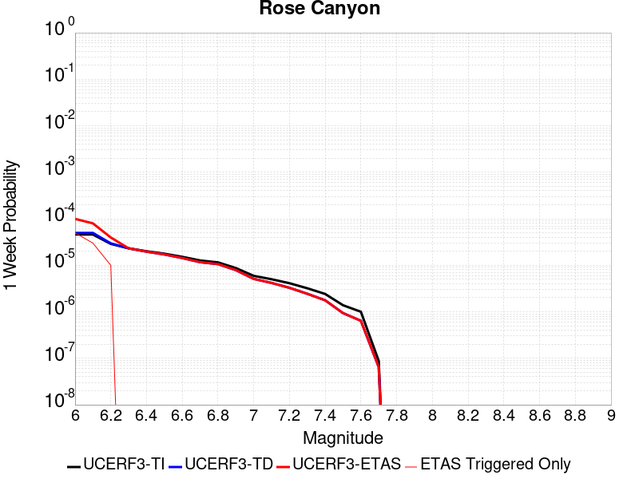 |  | 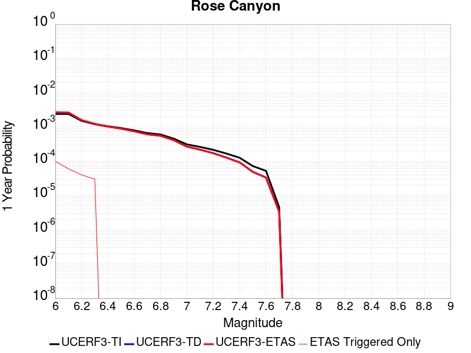 |  |

| Magnitude | 1 wk TI Prob | 1 wk TD Prob | 1 wk ETAS Prob | 1 wk ETAS/TD Gain | 1 wk ETAS Triggered Only | 1 mo TI Prob | 1 mo TD Prob | 1 mo ETAS Prob | 1 mo ETAS/TD Gain | 1 mo ETAS Triggered Only | 1 yr TI Prob | 1 yr TD Prob | 1 yr ETAS Prob | 1 yr ETAS/TD Gain | 1 yr ETAS Triggered Only | 10 yr TI Prob | 10 yr TD Prob | 10 yr ETAS Prob | 10 yr ETAS/TD Gain | 10 yr ETAS Triggered Only |
|-----|-----|-----|-----|-----|-----|-----|-----|-----|-----|-----|-----|-----|-----|-----|-----|-----|-----|-----|-----|-----|
| 6.0 | 4.5923203E-5 | 4.9714607E-5 | 9.9712124E-5 | 2.0056906 | 5.0E-5 | 1.9679888E-4 | 2.1304654E-4 | 2.930295E-4 | 1.3754247 | 8.0E-5 | 0.0023933933 | 0.0025909478 | 0.0026906887 | 1.0384959 | 1.0E-4 | 0.023677798 | 0.025618518 | 0.025735443 | 1.0045642 | 1.2E-4 |
| 6.1 | 4.5923203E-5 | 4.9714607E-5 | 7.9713114E-5 | 1.6034144 | 3.0E-5 | 1.9679888E-4 | 2.1304654E-4 | 2.7303377E-4 | 1.2815686 | 6.0E-5 | 0.0023933933 | 0.0025909478 | 0.0026507925 | 1.0230975 | 6.0E-5 | 0.023677798 | 0.025618518 | 0.02567698 | 1.002282 | 6.0E-5 |
| 6.2 | 2.8844734E-5 | 2.9669678E-5 | 3.9669383E-5 | 1.3370345 | 1.0E-5 | 1.2361443E-4 | 1.2714976E-4 | 1.6714468E-4 | 1.3145497 | 4.0E-5 | 0.0015039665 | 0.001546976 | 0.0015869142 | 1.0258169 | 4.0E-5 | 0.0149382865 | 0.015364873 | 0.015404259 | 1.0025634 | 4.0E-5 |
| 6.3 | 2.3171577E-5 | 2.3162425E-5 | 2.3162425E-5 | 1.0 | 0.0 | 9.9302975E-5 | 9.926383E-5 | 1.2926085E-4 | 1.3021948 | 3.0E-5 | 0.0012083431 | 0.0012078804 | 0.0012378442 | 1.0248069 | 3.0E-5 | 0.012017938 | 0.012012152 | 0.012041792 | 1.0024675 | 3.0E-5 |
| 6.4 | 2.0066604E-5 | 1.9668067E-5 | 1.9668067E-5 | 1.0 | 0.0 | 8.599689E-5 | 8.428905E-5 | 8.428905E-5 | 1.0 | 0.0 | 0.0010465092 | 0.001025746 | 0.001025746 | 1.0 | 0.0 | 0.010415946 | 0.010211479 | 0.010211479 | 1.0 | 0.0 |
| 6.5 | 1.776989E-5 | 1.7115402E-5 | 1.7115402E-5 | 1.0 | 0.0 | 7.615444E-5 | 7.33497E-5 | 7.33497E-5 | 1.0 | 0.0 | 9.267859E-4 | 8.926737E-4 | 8.926737E-4 | 1.0 | 0.0 | 0.009229303 | 0.008874663 | 0.008874663 | 1.0 | 0.0 |
| 6.6 | 1.5227364E-5 | 1.4340872E-5 | 1.4340872E-5 | 1.0 | 0.0 | 6.52585E-5 | 6.145947E-5 | 6.145947E-5 | 1.0 | 0.0 | 7.942326E-4 | 7.480173E-4 | 7.480173E-4 | 1.0 | 0.0 | 0.007914 | 0.0074410336 | 0.0074410336 | 1.0 | 0.0 |
| 6.7 | 1.2703898E-5 | 1.1674277E-5 | 1.1674277E-5 | 1.0 | 0.0 | 5.4444143E-5 | 5.0031682E-5 | 5.0031682E-5 | 1.0 | 0.0 | 6.626558E-4 | 6.089697E-4 | 6.089697E-4 | 1.0 | 0.0 | 0.006606833 | 0.0060623093 | 0.0060623093 | 1.0 | 0.0 |
| 6.8 | 1.1554917E-5 | 1.0610384E-5 | 1.0610384E-5 | 1.0 | 0.0 | 4.9520135E-5 | 4.547231E-5 | 4.547231E-5 | 1.0 | 0.0 | 6.0274085E-4 | 5.5348873E-4 | 5.5348873E-4 | 1.0 | 0.0 | 0.0060110865 | 0.005504414 | 0.005504414 | 1.0 | 0.0 |
| 6.9 | 8.732078E-6 | 7.882285E-6 | 7.882285E-6 | 1.0 | 0.0 | 3.7422655E-5 | 3.37808E-5 | 3.37808E-5 | 1.0 | 0.0 | 4.5552556E-4 | 4.112066E-4 | 4.112066E-4 | 1.0 | 0.0 | 0.0045459294 | 0.004089515 | 0.004089515 | 1.0 | 0.0 |
| 7.0 | 5.9337494E-6 | 5.107436E-6 | 5.107436E-6 | 1.0 | 0.0 | 2.5430107E-5 | 2.1888829E-5 | 2.1888829E-5 | 1.0 | 0.0 | 3.0956755E-4 | 2.6646405E-4 | 2.6646405E-4 | 1.0 | 0.0 | 0.0030913667 | 0.002661461 | 0.002661461 | 1.0 | 0.0 |
| 7.1 | 5.013409E-6 | 4.17734E-6 | 4.17734E-6 | 1.0 | 0.0 | 2.1485863E-5 | 1.7902763E-5 | 1.7902763E-5 | 1.0 | 0.0 | 2.6155898E-4 | 2.1794444E-4 | 2.1794444E-4 | 1.0 | 0.0 | 0.0026125133 | 0.0021773188 | 0.0021773188 | 1.0 | 0.0 |
| 7.2 | 4.120763E-6 | 3.2820917E-6 | 3.2820917E-6 | 1.0 | 0.0 | 1.7660293E-5 | 1.4066032E-5 | 1.4066032E-5 | 1.0 | 0.0 | 2.1499286E-4 | 1.7124058E-4 | 1.7124058E-4 | 1.0 | 0.0 | 0.0021478499 | 0.0017110958 | 0.0017110958 | 1.0 | 0.0 |
| 7.3 | 3.2081239E-6 | 2.4404965E-6 | 2.4404965E-6 | 1.0 | 0.0 | 1.374903E-5 | 1.0459229E-5 | 1.0459229E-5 | 1.0 | 0.0 | 1.6738157E-4 | 1.2733374E-4 | 1.2733374E-4 | 1.0 | 0.0 | 0.0016725556 | 0.0012726148 | 0.0012726148 | 1.0 | 0.0 |
| 7.4 | 2.4194755E-6 | 1.7680321E-6 | 1.7680321E-6 | 1.0 | 0.0 | 1.0369139E-5 | 7.5772587E-6 | 7.5772587E-6 | 1.0 | 0.0 | 1.2623696E-4 | 9.224927E-5 | 9.224927E-5 | 1.0 | 0.0 | 0.0012616527 | 9.221151E-4 | 9.221151E-4 | 1.0 | 0.0 |
| 7.5 | 1.3842889E-6 | 9.3782967E-7 | 9.3782967E-7 | 1.0 | 0.0 | 5.9326535E-6 | 4.019264E-6 | 4.019264E-6 | 1.0 | 0.0 | 7.222766E-5 | 4.8933474E-5 | 4.8933474E-5 | 1.0 | 0.0 | 7.220419E-4 | 4.8923056E-4 | 4.8923056E-4 | 1.0 | 0.0 |
| 7.6 | 1.0021575E-6 | 6.4113493E-7 | 6.4113493E-7 | 1.0 | 0.0 | 4.2949537E-6 | 2.7477186E-6 | 2.7477186E-6 | 1.0 | 0.0 | 5.2289808E-5 | 3.345298E-5 | 3.345298E-5 | 1.0 | 0.0 | 5.2277505E-4 | 3.344816E-4 | 3.344816E-4 | 1.0 | 0.0 |
| 7.7 | 8.7620116E-8 | 6.449304E-8 | 6.449304E-8 | 1.0 | 0.0 | 3.7551473E-7 | 2.763987E-7 | 2.763987E-7 | 1.0 | 0.0 | 4.5718825E-6 | 3.3651493E-6 | 3.3651493E-6 | 1.0 | 0.0 | 4.5717883E-5 | 3.3651013E-5 | 3.3651013E-5 | 1.0 | 0.0 |

## San Clemente
*[(top)](#table-of-contents)*

| 1 Week | 1 Month | 1 Year | 10 Year |
|-----|-----|-----|-----|
|  |  |  | 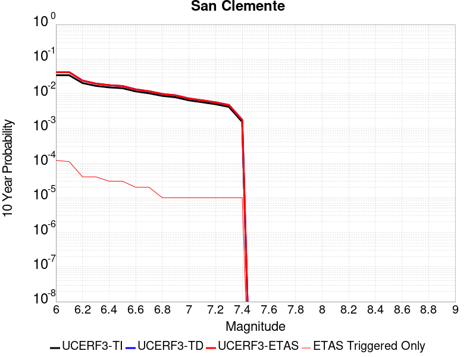 |

| Magnitude | 1 wk TI Prob | 1 wk TD Prob | 1 wk ETAS Prob | 1 wk ETAS/TD Gain | 1 wk ETAS Triggered Only | 1 mo TI Prob | 1 mo TD Prob | 1 mo ETAS Prob | 1 mo ETAS/TD Gain | 1 mo ETAS Triggered Only | 1 yr TI Prob | 1 yr TD Prob | 1 yr ETAS Prob | 1 yr ETAS/TD Gain | 1 yr ETAS Triggered Only | 10 yr TI Prob | 10 yr TD Prob | 10 yr ETAS Prob | 10 yr ETAS/TD Gain | 10 yr ETAS Triggered Only |
|-----|-----|-----|-----|-----|-----|-----|-----|-----|-----|-----|-----|-----|-----|-----|-----|-----|-----|-----|-----|-----|
| 6.0 | 6.681379E-5 | 8.163834E-5 | 1.016367E-4 | 1.2449629 | 2.0E-5 | 2.8631336E-4 | 3.4983488E-4 | 3.898209E-4 | 1.1142997 | 4.0E-5 | 0.003480294 | 0.00425141 | 0.0043410272 | 1.0210794 | 9.0E-5 | 0.03426291 | 0.04175603 | 0.04187102 | 1.0027539 | 1.2E-4 |
| 6.1 | 6.681379E-5 | 8.163834E-5 | 1.016367E-4 | 1.2449629 | 2.0E-5 | 2.8631336E-4 | 3.4983488E-4 | 3.898209E-4 | 1.1142997 | 4.0E-5 | 0.003480294 | 0.00425141 | 0.00433107 | 1.0187373 | 8.0E-5 | 0.03426291 | 0.04175603 | 0.041861437 | 1.0025244 | 1.1E-4 |
| 6.2 | 3.9400576E-5 | 4.6452373E-5 | 5.6451907E-5 | 1.2152642 | 1.0E-5 | 1.6884868E-4 | 1.9906677E-4 | 2.1906279E-4 | 1.1004488 | 2.0E-5 | 0.0020537945 | 0.0024209984 | 0.0024609016 | 1.0164821 | 4.0E-5 | 0.020349167 | 0.023952903 | 0.023991946 | 1.00163 | 4.0E-5 |
| 6.3 | 3.2590255E-5 | 3.792912E-5 | 4.7928737E-5 | 1.2636397 | 1.0E-5 | 1.3966505E-4 | 1.6254342E-4 | 1.8254017E-4 | 1.1230241 | 2.0E-5 | 0.0016990956 | 0.0019772002 | 0.002017121 | 1.0201906 | 4.0E-5 | 0.01686163 | 0.019599883 | 0.019639097 | 1.0020008 | 4.0E-5 |
| 6.4 | 2.9454652E-5 | 3.4097764E-5 | 4.409742E-5 | 1.2932644 | 1.0E-5 | 1.2622811E-4 | 1.4612524E-4 | 1.661223E-4 | 1.1368489 | 2.0E-5 | 0.0015357438 | 0.0017776493 | 0.001807596 | 1.0168462 | 3.0E-5 | 0.015251739 | 0.01763747 | 0.017666942 | 1.001671 | 3.0E-5 |
| 6.5 | 2.790836E-5 | 3.2247463E-5 | 4.224714E-5 | 1.310092 | 1.0E-5 | 1.1960178E-4 | 1.3819624E-4 | 1.5819346E-4 | 1.1447017 | 2.0E-5 | 0.001455179 | 0.0016812662 | 0.0017112158 | 1.0178137 | 3.0E-5 | 0.014456868 | 0.016688485 | 0.016717983 | 1.0017676 | 3.0E-5 |
| 6.6 | 2.2492153E-5 | 2.5762702E-5 | 3.5762445E-5 | 1.3881481 | 1.0E-5 | 9.639138E-5 | 1.1040699E-4 | 1.3040478E-4 | 1.1811279 | 2.0E-5 | 0.0011729331 | 0.0013433909 | 0.001363364 | 1.0148677 | 2.0E-5 | 0.011667615 | 0.013354417 | 0.01337415 | 1.0014776 | 2.0E-5 |
| 6.7 | 1.9862755E-5 | 2.2666423E-5 | 3.2666198E-5 | 1.4411712 | 1.0E-5 | 8.512331E-5 | 9.713826E-5 | 1.1713632E-4 | 1.205872 | 2.0E-5 | 0.0010358836 | 0.0011820279 | 0.0012020043 | 1.0169001 | 2.0E-5 | 0.010310682 | 0.011758701 | 0.0117784655 | 1.0016809 | 2.0E-5 |
| 6.8 | 1.6697575E-5 | 1.897771E-5 | 1.897771E-5 | 1.0 | 0.0 | 7.155907E-5 | 8.133056E-5 | 9.132974E-5 | 1.1229451 | 1.0E-5 | 8.7088346E-4 | 9.897591E-4 | 9.997492E-4 | 1.0100935 | 1.0E-5 | 0.008674784 | 0.0098545365 | 0.009864438 | 1.0010048 | 1.0E-5 |
| 6.9 | 1.5218415E-5 | 1.72694E-5 | 1.72694E-5 | 1.0 | 0.0 | 6.522015E-5 | 7.4009666E-5 | 8.400893E-5 | 1.1351075 | 1.0E-5 | 7.93766E-4 | 9.00704E-4 | 9.10695E-4 | 1.0110924 | 1.0E-5 | 0.007909367 | 0.008971481 | 0.008981391 | 1.0011046 | 1.0E-5 |
| 7.0 | 1.2392958E-5 | 1.4033016E-5 | 1.4033016E-5 | 1.0 | 0.0 | 5.3111595E-5 | 6.014015E-5 | 7.013955E-5 | 1.1662682 | 1.0E-5 | 6.4644177E-4 | 7.319679E-4 | 7.419606E-4 | 1.0136518 | 1.0E-5 | 0.0064456454 | 0.0072963564 | 0.007306284 | 1.0013605 | 1.0E-5 |
| 7.1 | 1.0934128E-5 | 1.2375138E-5 | 1.2375138E-5 | 1.0 | 0.0 | 4.6859706E-5 | 5.303527E-5 | 6.3034735E-5 | 1.1885438 | 1.0E-5 | 5.7036756E-4 | 6.455204E-4 | 6.5551396E-4 | 1.0154814 | 1.0E-5 | 0.0056890585 | 0.0064371997 | 0.0064471355 | 1.0015435 | 1.0E-5 |
| 7.2 | 9.5798805E-6 | 1.0844935E-5 | 1.0844935E-5 | 1.0 | 0.0 | 4.1055984E-5 | 4.6477508E-5 | 5.647704E-5 | 1.2151479 | 1.0E-5 | 4.9974193E-4 | 5.657239E-4 | 5.7571824E-4 | 1.0176665 | 1.0E-5 | 0.0049861963 | 0.0056435615 | 0.005653505 | 1.0017619 | 1.0E-5 |
| 7.3 | 8.0167365E-6 | 9.083918E-6 | 9.083918E-6 | 1.0 | 0.0 | 3.4356988E-5 | 3.8930535E-5 | 4.8930146E-5 | 1.2568578 | 1.0E-5 | 4.1821605E-4 | 4.7388324E-4 | 4.8387848E-4 | 1.0210923 | 1.0E-5 | 0.0041742986 | 0.0047294297 | 0.004739383 | 1.0021044 | 1.0E-5 |
| 7.4 | 2.9581017E-6 | 3.3623792E-6 | 3.3623792E-6 | 1.0 | 0.0 | 1.2677518E-5 | 1.4410146E-5 | 2.4410001E-5 | 1.6939455 | 1.0E-5 | 1.5433785E-4 | 1.7543444E-4 | 1.8543268E-4 | 1.0569913 | 1.0E-5 | 0.001542307 | 0.0017534546 | 0.0017634371 | 1.0056931 | 1.0E-5 |

## White Mountains
*[(top)](#table-of-contents)*

| 1 Week | 1 Month | 1 Year | 10 Year |
|-----|-----|-----|-----|
|  |  | 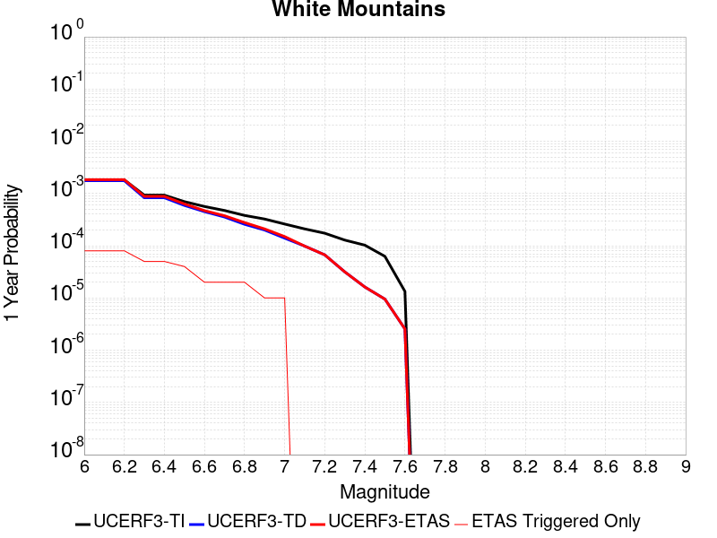 |  |

| Magnitude | 1 wk TI Prob | 1 wk TD Prob | 1 wk ETAS Prob | 1 wk ETAS/TD Gain | 1 wk ETAS Triggered Only | 1 mo TI Prob | 1 mo TD Prob | 1 mo ETAS Prob | 1 mo ETAS/TD Gain | 1 mo ETAS Triggered Only | 1 yr TI Prob | 1 yr TD Prob | 1 yr ETAS Prob | 1 yr ETAS/TD Gain | 1 yr ETAS Triggered Only | 10 yr TI Prob | 10 yr TD Prob | 10 yr ETAS Prob | 10 yr ETAS/TD Gain | 10 yr ETAS Triggered Only |
|-----|-----|-----|-----|-----|-----|-----|-----|-----|-----|-----|-----|-----|-----|-----|-----|-----|-----|-----|-----|-----|
| 6.0 | 3.503579E-5 | 3.3784127E-5 | 5.378345E-5 | 1.591974 | 2.0E-5 | 1.5014476E-4 | 1.4478175E-4 | 1.6477886E-4 | 1.138119 | 2.0E-5 | 0.0018264796 | 0.0017614134 | 0.0018412725 | 1.045338 | 8.0E-5 | 0.018115403 | 0.017486857 | 0.017594934 | 1.0061804 | 1.1E-4 |
| 6.1 | 3.503579E-5 | 3.3784127E-5 | 5.378345E-5 | 1.591974 | 2.0E-5 | 1.5014476E-4 | 1.4478175E-4 | 1.6477886E-4 | 1.138119 | 2.0E-5 | 0.0018264796 | 0.0017614134 | 0.0018412725 | 1.045338 | 8.0E-5 | 0.018115403 | 0.017486857 | 0.017594934 | 1.0061804 | 1.1E-4 |
| 6.2 | 3.503579E-5 | 3.3784127E-5 | 5.378345E-5 | 1.591974 | 2.0E-5 | 1.5014476E-4 | 1.4478175E-4 | 1.6477886E-4 | 1.138119 | 2.0E-5 | 0.0018264796 | 0.0017614134 | 0.0018412725 | 1.045338 | 8.0E-5 | 0.018115403 | 0.017486857 | 0.017594934 | 1.0061804 | 1.1E-4 |
| 6.3 | 1.7818425E-5 | 1.591616E-5 | 2.5916E-5 | 1.6282823 | 1.0E-5 | 7.636245E-5 | 6.821041E-5 | 7.820973E-5 | 1.1465952 | 1.0E-5 | 9.293162E-4 | 8.301596E-4 | 8.8011805E-4 | 1.0601794 | 5.0E-5 | 0.009254395 | 0.0082720425 | 0.008321629 | 1.0059944 | 5.0E-5 |
| 6.4 | 1.7818425E-5 | 1.591616E-5 | 2.5916E-5 | 1.6282823 | 1.0E-5 | 7.636245E-5 | 6.821041E-5 | 7.820973E-5 | 1.1465952 | 1.0E-5 | 9.293162E-4 | 8.301596E-4 | 8.8011805E-4 | 1.0601794 | 5.0E-5 | 0.009254395 | 0.0082720425 | 0.008321629 | 1.0059944 | 5.0E-5 |
| 6.5 | 1.3397557E-5 | 1.1336374E-5 | 2.133626E-5 | 1.8821063 | 1.0E-5 | 5.741684E-5 | 4.8583595E-5 | 5.8583108E-5 | 1.2058208 | 1.0E-5 | 6.988258E-4 | 5.913517E-4 | 6.3132803E-4 | 1.0676017 | 4.0E-5 | 0.006966323 | 0.005898487 | 0.0059382506 | 1.0067414 | 4.0E-5 |
| 6.6 | 1.0818695E-5 | 8.625434E-6 | 1.8625347E-5 | 2.1593518 | 1.0E-5 | 4.6365014E-5 | 3.6965648E-5 | 4.6965277E-5 | 1.2705114 | 1.0E-5 | 5.6434784E-4 | 4.4996818E-4 | 4.6995917E-4 | 1.0444276 | 2.0E-5 | 0.005629168 | 0.0044910074 | 0.0045109177 | 1.0044334 | 2.0E-5 |
| 6.7 | 9.067908E-6 | 6.802476E-6 | 1.6802407E-5 | 2.470043 | 1.0E-5 | 3.8861883E-5 | 2.915316E-5 | 3.915287E-5 | 1.343006 | 1.0E-5 | 4.7304068E-4 | 3.548851E-4 | 3.74878E-4 | 1.0563363 | 2.0E-5 | 0.00472035 | 0.003543501 | 0.0035634302 | 1.0056242 | 2.0E-5 |
| 6.8 | 7.295947E-6 | 4.9364285E-6 | 1.4936379E-5 | 3.025746 | 1.0E-5 | 3.126797E-5 | 2.1155956E-5 | 3.1155745E-5 | 1.4726701 | 1.0E-5 | 3.8062103E-4 | 2.5754445E-4 | 2.775393E-4 | 1.0776365 | 2.0E-5 | 0.0037996976 | 0.0025725728 | 0.0025925213 | 1.0077543 | 2.0E-5 |
| 6.9 | 6.2243444E-6 | 3.8322546E-6 | 3.8322546E-6 | 1.0 | 0.0 | 2.6675489E-5 | 1.6423846E-5 | 1.6423846E-5 | 1.0 | 0.0 | 3.2472567E-4 | 1.9994251E-4 | 2.0994052E-4 | 1.0500044 | 1.0E-5 | 0.0032425157 | 0.001997679 | 0.002007659 | 1.0049958 | 1.0E-5 |
| 7.0 | 4.9878413E-6 | 2.679564E-6 | 2.679564E-6 | 1.0 | 0.0 | 2.1376287E-5 | 1.1483797E-5 | 1.1483797E-5 | 1.0 | 0.0 | 2.602252E-4 | 1.3980652E-4 | 1.4980511E-4 | 1.0715175 | 1.0E-5 | 0.002599207 | 0.0013972119 | 0.0014071979 | 1.0071471 | 1.0E-5 |
| 7.1 | 4.0252844E-6 | 1.885702E-6 | 1.885702E-6 | 1.0 | 0.0 | 1.7251105E-5 | 8.081555E-6 | 8.081555E-6 | 1.0 | 0.0 | 2.1001195E-4 | 9.838863E-5 | 9.838863E-5 | 1.0 | 0.0 | 0.0020981359 | 9.834635E-4 | 9.834635E-4 | 1.0 | 0.0 |
| 7.2 | 3.3284066E-6 | 1.2818929E-6 | 1.2818929E-6 | 1.0 | 0.0 | 1.4264522E-5 | 5.4938155E-6 | 5.4938155E-6 | 1.0 | 0.0 | 1.736567E-4 | 6.688525E-5 | 6.688525E-5 | 1.0 | 0.0 | 0.0017352107 | 6.6866126E-4 | 6.6866126E-4 | 1.0 | 0.0 |
| 7.3 | 2.458226E-6 | 6.056684E-7 | 6.056684E-7 | 1.0 | 0.0 | 1.0535211E-5 | 2.5957193E-6 | 2.5957193E-6 | 1.0 | 0.0 | 1.2825865E-4 | 3.160246E-5 | 3.160246E-5 | 1.0 | 0.0 | 0.0012818464 | 3.1598343E-4 | 3.1598343E-4 | 1.0 | 0.0 |
| 7.4 | 1.965953E-6 | 3.1084684E-7 | 3.1084684E-7 | 1.0 | 0.0 | 8.425486E-6 | 1.3322001E-6 | 1.3322001E-6 | 1.0 | 0.0 | 1.0257547E-4 | 1.6219417E-5 | 1.6219417E-5 | 1.0 | 0.0 | 0.0010252813 | 1.6218246E-4 | 1.6218246E-4 | 1.0 | 0.0 |
| 7.5 | 1.2014192E-6 | 1.8241002E-7 | 1.8241002E-7 | 1.0 | 0.0 | 5.148929E-6 | 7.8175697E-7 | 7.8175697E-7 | 1.0 | 0.0 | 6.2686406E-5 | 9.51785E-6 | 9.51785E-6 | 1.0 | 0.0 | 6.266873E-4 | 9.517451E-5 | 9.517451E-5 | 1.0 | 0.0 |
| 7.6 | 2.5612175E-7 | 4.893784E-8 | 4.893784E-8 | 1.0 | 0.0 | 1.0976642E-6 | 2.0973359E-7 | 2.0973359E-7 | 1.0 | 0.0 | 1.3363979E-5 | 2.5535037E-6 | 2.5535037E-6 | 1.0 | 0.0 | 1.3363175E-4 | 2.553478E-5 | 2.553478E-5 | 1.0 | 0.0 |

## Lost Hills
*[(top)](#table-of-contents)*

| 1 Week | 1 Month | 1 Year | 10 Year |
|-----|-----|-----|-----|
|  |  | 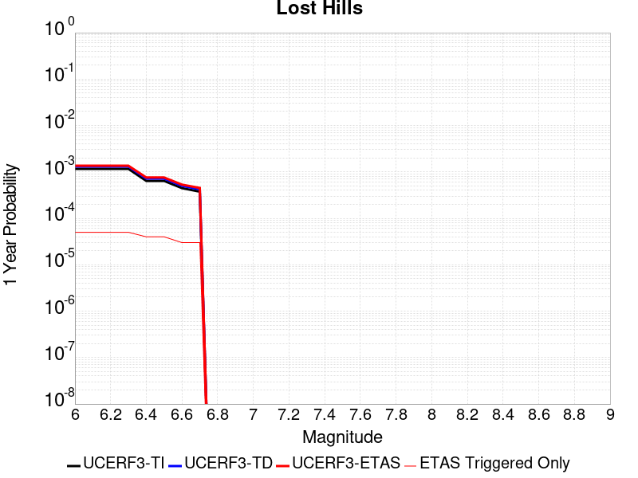 |  |

| Magnitude | 1 wk TI Prob | 1 wk TD Prob | 1 wk ETAS Prob | 1 wk ETAS/TD Gain | 1 wk ETAS Triggered Only | 1 mo TI Prob | 1 mo TD Prob | 1 mo ETAS Prob | 1 mo ETAS/TD Gain | 1 mo ETAS Triggered Only | 1 yr TI Prob | 1 yr TD Prob | 1 yr ETAS Prob | 1 yr ETAS/TD Gain | 1 yr ETAS Triggered Only | 10 yr TI Prob | 10 yr TD Prob | 10 yr ETAS Prob | 10 yr ETAS/TD Gain | 10 yr ETAS Triggered Only |
|-----|-----|-----|-----|-----|-----|-----|-----|-----|-----|-----|-----|-----|-----|-----|-----|-----|-----|-----|-----|-----|
| 6.0 | 2.233523E-5 | 2.5106583E-5 | 4.510608E-5 | 1.7965839 | 2.0E-5 | 9.571891E-5 | 1.0759615E-4 | 1.3759293E-4 | 1.2787904 | 3.0E-5 | 0.0011647546 | 0.001309364 | 0.0013592986 | 1.0381365 | 5.0E-5 | 0.011586686 | 0.013033091 | 0.013131788 | 1.0075728 | 1.0E-4 |
| 6.1 | 2.233523E-5 | 2.5106583E-5 | 4.510608E-5 | 1.7965839 | 2.0E-5 | 9.571891E-5 | 1.0759615E-4 | 1.3759293E-4 | 1.2787904 | 3.0E-5 | 0.0011647546 | 0.001309364 | 0.0013592986 | 1.0381365 | 5.0E-5 | 0.011586686 | 0.013033091 | 0.013131788 | 1.0075728 | 1.0E-4 |
| 6.2 | 2.233523E-5 | 2.5106583E-5 | 4.510608E-5 | 1.7965839 | 2.0E-5 | 9.571891E-5 | 1.0759615E-4 | 1.3759293E-4 | 1.2787904 | 3.0E-5 | 0.0011647546 | 0.001309364 | 0.0013592986 | 1.0381365 | 5.0E-5 | 0.011586686 | 0.013033091 | 0.013131788 | 1.0075728 | 1.0E-4 |
| 6.3 | 2.233523E-5 | 2.5106583E-5 | 4.510608E-5 | 1.7965839 | 2.0E-5 | 9.571891E-5 | 1.0759615E-4 | 1.3759293E-4 | 1.2787904 | 3.0E-5 | 0.0011647546 | 0.001309364 | 0.0013592986 | 1.0381365 | 5.0E-5 | 0.011586686 | 0.013033091 | 0.013131788 | 1.0075728 | 1.0E-4 |
| 6.4 | 1.2288092E-5 | 1.3781108E-5 | 2.3780969E-5 | 1.7256211 | 1.0E-5 | 5.2662188E-5 | 5.906108E-5 | 7.90599E-5 | 1.3386124 | 2.0E-5 | 6.409735E-4 | 7.189252E-4 | 7.5889647E-4 | 1.0555986 | 4.0E-5 | 0.006391279 | 0.0071752006 | 0.0072446987 | 1.0096859 | 7.0E-5 |
| 6.5 | 1.2288092E-5 | 1.3781108E-5 | 2.3780969E-5 | 1.7256211 | 1.0E-5 | 5.2662188E-5 | 5.906108E-5 | 7.90599E-5 | 1.3386124 | 2.0E-5 | 6.409735E-4 | 7.189252E-4 | 7.5889647E-4 | 1.0555986 | 4.0E-5 | 0.006391279 | 0.0071752006 | 0.0072446987 | 1.0096859 | 7.0E-5 |
| 6.6 | 8.58281E-6 | 9.63377E-6 | 9.63377E-6 | 1.0 | 0.0 | 3.6782953E-5 | 4.12874E-5 | 5.128699E-5 | 1.2421947 | 1.0E-5 | 4.4774043E-4 | 5.026414E-4 | 5.326263E-4 | 1.0596547 | 3.0E-5 | 0.0044683935 | 0.005023205 | 0.005082904 | 1.0118846 | 6.0E-5 |
| 6.7 | 7.205685E-6 | 8.088302E-6 | 8.088302E-6 | 1.0 | 0.0 | 3.088114E-5 | 3.466415E-5 | 4.4663804E-5 | 1.2884725 | 1.0E-5 | 3.7591302E-4 | 4.2203604E-4 | 4.5202338E-4 | 1.071054 | 3.0E-5 | 0.0037527776 | 0.0042203604 | 0.004280107 | 1.0141568 | 6.0E-5 |

## Santa Cruz Island
*[(top)](#table-of-contents)*

| 1 Week | 1 Month | 1 Year | 10 Year |
|-----|-----|-----|-----|
|  |  |  | 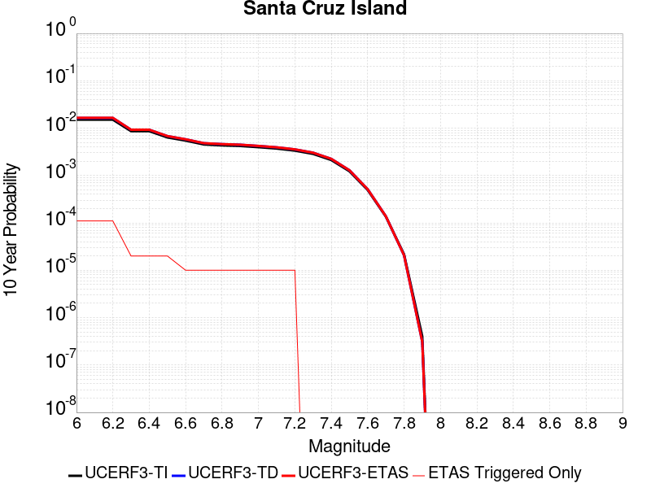 |

| Magnitude | 1 wk TI Prob | 1 wk TD Prob | 1 wk ETAS Prob | 1 wk ETAS/TD Gain | 1 wk ETAS Triggered Only | 1 mo TI Prob | 1 mo TD Prob | 1 mo ETAS Prob | 1 mo ETAS/TD Gain | 1 mo ETAS Triggered Only | 1 yr TI Prob | 1 yr TD Prob | 1 yr ETAS Prob | 1 yr ETAS/TD Gain | 1 yr ETAS Triggered Only | 10 yr TI Prob | 10 yr TD Prob | 10 yr ETAS Prob | 10 yr ETAS/TD Gain | 10 yr ETAS Triggered Only |
|-----|-----|-----|-----|-----|-----|-----|-----|-----|-----|-----|-----|-----|-----|-----|-----|-----|-----|-----|-----|-----|
| 6.0 | 2.9164563E-5 | 3.1599742E-5 | 6.1598796E-5 | 1.9493448 | 3.0E-5 | 1.2498499E-4 | 1.3542121E-4 | 1.6541715E-4 | 1.221501 | 3.0E-5 | 0.0015206301 | 0.0016476426 | 0.0016975602 | 1.0302964 | 5.0E-5 | 0.015102667 | 0.016368 | 0.016476199 | 1.0066104 | 1.1E-4 |
| 6.1 | 2.9164563E-5 | 3.1599742E-5 | 6.1598796E-5 | 1.9493448 | 3.0E-5 | 1.2498499E-4 | 1.3542121E-4 | 1.6541715E-4 | 1.221501 | 3.0E-5 | 0.0015206301 | 0.0016476426 | 0.0016975602 | 1.0302964 | 5.0E-5 | 0.015102667 | 0.016368 | 0.016476199 | 1.0066104 | 1.1E-4 |
| 6.2 | 2.9164563E-5 | 3.1599742E-5 | 6.1598796E-5 | 1.9493448 | 3.0E-5 | 1.2498499E-4 | 1.3542121E-4 | 1.6541715E-4 | 1.221501 | 3.0E-5 | 0.0015206301 | 0.0016476426 | 0.0016975602 | 1.0302964 | 5.0E-5 | 0.015102667 | 0.016368 | 0.016476199 | 1.0066104 | 1.1E-4 |
| 6.3 | 1.6635553E-5 | 1.780436E-5 | 2.780418E-5 | 1.5616502 | 1.0E-5 | 7.1293274E-5 | 7.630227E-5 | 8.63015E-5 | 1.1310477 | 1.0E-5 | 8.6765E-4 | 9.286024E-4 | 9.385931E-4 | 1.0107589 | 1.0E-5 | 0.008642701 | 0.009249094 | 0.009268909 | 1.0021424 | 2.0E-5 |
| 6.4 | 1.6635553E-5 | 1.780436E-5 | 2.780418E-5 | 1.5616502 | 1.0E-5 | 7.1293274E-5 | 7.630227E-5 | 8.63015E-5 | 1.1310477 | 1.0E-5 | 8.6765E-4 | 9.286024E-4 | 9.385931E-4 | 1.0107589 | 1.0E-5 | 0.008642701 | 0.009249094 | 0.009268909 | 1.0021424 | 2.0E-5 |
| 6.5 | 1.2238748E-5 | 1.3042996E-5 | 2.3042865E-5 | 1.766685 | 1.0E-5 | 5.2450723E-5 | 5.5897377E-5 | 6.589682E-5 | 1.1788893 | 1.0E-5 | 6.3840044E-4 | 6.8034173E-4 | 6.9033494E-4 | 1.0146885 | 1.0E-5 | 0.0063656955 | 0.006782988 | 0.0068028523 | 1.0029285 | 2.0E-5 |
| 6.6 | 1.0489767E-5 | 1.1156636E-5 | 1.1156636E-5 | 1.0 | 0.0 | 4.495537E-5 | 4.781329E-5 | 4.781329E-5 | 1.0 | 0.0 | 5.4719415E-4 | 5.819736E-4 | 5.819736E-4 | 1.0 | 0.0 | 0.005458487 | 0.005804736 | 0.005814678 | 1.0017127 | 1.0E-5 |
| 6.7 | 8.699222E-6 | 9.236783E-6 | 9.236783E-6 | 1.0 | 0.0 | 3.7281847E-5 | 3.958561E-5 | 3.958561E-5 | 1.0 | 0.0 | 4.5381195E-4 | 4.818488E-4 | 4.818488E-4 | 1.0 | 0.0 | 0.0045288634 | 0.004808108 | 0.00481806 | 1.0020698 | 1.0E-5 |
| 6.8 | 8.307732E-6 | 8.8169045E-6 | 8.8169045E-6 | 1.0 | 0.0 | 3.560408E-5 | 3.7786187E-5 | 3.7786187E-5 | 1.0 | 0.0 | 4.3339343E-4 | 4.5995016E-4 | 4.5995016E-4 | 1.0 | 0.0 | 0.004325492 | 0.0045900354 | 0.0045999894 | 1.0021687 | 1.0E-5 |
| 6.9 | 8.073121E-6 | 8.564939E-6 | 8.564939E-6 | 1.0 | 0.0 | 3.459863E-5 | 3.670637E-5 | 3.670637E-5 | 1.0 | 0.0 | 4.2115687E-4 | 4.4680882E-4 | 4.4680882E-4 | 1.0 | 0.0 | 0.004203596 | 0.004459156 | 0.0044691116 | 1.0022326 | 1.0E-5 |
| 7.0 | 7.617019E-6 | 8.074665E-6 | 8.074665E-6 | 1.0 | 0.0 | 3.264396E-5 | 3.4605247E-5 | 3.4605247E-5 | 1.0 | 0.0 | 3.9736772E-4 | 4.2123784E-4 | 4.2123784E-4 | 1.0 | 0.0 | 0.003966579 | 0.0042044413 | 0.0042143995 | 1.0023685 | 1.0E-5 |
| 7.1 | 7.1224836E-6 | 7.5457883E-6 | 7.5457883E-6 | 1.0 | 0.0 | 3.052457E-5 | 3.2338692E-5 | 3.2338692E-5 | 1.0 | 0.0 | 3.715733E-4 | 3.9365282E-4 | 3.9365282E-4 | 1.0 | 0.0 | 0.003709526 | 0.0039295983 | 0.0039395588 | 1.0025347 | 1.0E-5 |
| 7.2 | 6.441115E-6 | 6.8273835E-6 | 6.8273835E-6 | 1.0 | 0.0 | 2.7604487E-5 | 2.9259889E-5 | 2.9259889E-5 | 1.0 | 0.0 | 3.360328E-4 | 3.5618115E-4 | 3.5618115E-4 | 1.0 | 0.0 | 0.0033552512 | 0.0035561312 | 0.0035660956 | 1.002802 | 1.0E-5 |
| 7.3 | 5.494274E-6 | 5.8199944E-6 | 5.8199944E-6 | 1.0 | 0.0 | 2.3546674E-5 | 2.4942596E-5 | 2.4942596E-5 | 1.0 | 0.0 | 2.8664304E-4 | 3.03634E-4 | 3.03634E-4 | 1.0 | 0.0 | 0.002862736 | 0.0030322145 | 0.0030322145 | 1.0 | 0.0 |
| 7.4 | 4.0802624E-6 | 4.3122564E-6 | 4.3122564E-6 | 1.0 | 0.0 | 1.7486722E-5 | 1.8480969E-5 | 1.8480969E-5 | 1.0 | 0.0 | 2.1288003E-4 | 2.2498264E-4 | 2.2498264E-4 | 1.0 | 0.0 | 0.0021267622 | 0.0022475577 | 0.0022475577 | 1.0 | 0.0 |
| 7.5 | 2.3584746E-6 | 2.4753099E-6 | 2.4753099E-6 | 1.0 | 0.0 | 1.0107709E-5 | 1.0608428E-5 | 1.0608428E-5 | 1.0 | 0.0 | 1.2305441E-4 | 1.2915001E-4 | 1.2915001E-4 | 1.0 | 0.0 | 0.0012298629 | 0.0012907545 | 0.0012907545 | 1.0 | 0.0 |
| 7.6 | 9.4981914E-7 | 9.860934E-7 | 9.860934E-7 | 1.0 | 0.0 | 4.0706473E-6 | 4.2261076E-6 | 4.2261076E-6 | 1.0 | 0.0 | 4.9559E-5 | 5.1451658E-5 | 5.1451658E-5 | 1.0 | 0.0 | 4.954795E-4 | 5.1439874E-4 | 5.1439874E-4 | 1.0 | 0.0 |
| 7.7 | 2.6013532E-7 | 2.6416632E-7 | 2.6416632E-7 | 1.0 | 0.0 | 1.1148652E-6 | 1.1321408E-6 | 1.1321408E-6 | 1.0 | 0.0 | 1.3573399E-5 | 1.3783729E-5 | 1.3783729E-5 | 1.0 | 0.0 | 1.357257E-4 | 1.378288E-4 | 1.378288E-4 | 1.0 | 0.0 |
| 7.8 | 4.1522263E-8 | 3.965698E-8 | 3.965698E-8 | 1.0 | 0.0 | 1.7795254E-7 | 1.6995848E-7 | 1.6995848E-7 | 1.0 | 0.0 | 2.16657E-6 | 2.0692428E-6 | 2.0692428E-6 | 1.0 | 0.0 | 2.1665488E-5 | 2.0692256E-5 | 2.0692256E-5 | 1.0 | 0.0 |
| 7.9 | 7.7242046E-10 | 5.9475225E-10 | 5.9475225E-10 | 1.0 | 0.0 | 3.3103735E-9 | 2.5489382E-9 | 2.5489382E-9 | 1.0 | 0.0 | 4.0303796E-8 | 3.1033323E-8 | 3.1033323E-8 | 1.0 | 0.0 | 4.030379E-7 | 3.103332E-7 | 3.103332E-7 | 1.0 | 0.0 |

## Camp Rock 2011
*[(top)](#table-of-contents)*

| 1 Week | 1 Month | 1 Year | 10 Year |
|-----|-----|-----|-----|
|  |  |  |  |

| Magnitude | 1 wk TI Prob | 1 wk TD Prob | 1 wk ETAS Prob | 1 wk ETAS/TD Gain | 1 wk ETAS Triggered Only | 1 mo TI Prob | 1 mo TD Prob | 1 mo ETAS Prob | 1 mo ETAS/TD Gain | 1 mo ETAS Triggered Only | 1 yr TI Prob | 1 yr TD Prob | 1 yr ETAS Prob | 1 yr ETAS/TD Gain | 1 yr ETAS Triggered Only | 10 yr TI Prob | 10 yr TD Prob | 10 yr ETAS Prob | 10 yr ETAS/TD Gain | 10 yr ETAS Triggered Only |
|-----|-----|-----|-----|-----|-----|-----|-----|-----|-----|-----|-----|-----|-----|-----|-----|-----|-----|-----|-----|-----|
| 6.0 | 1.6710783E-5 | 4.249999E-6 | 2.4249914E-5 | 5.705863 | 2.0E-5 | 7.161568E-5 | 1.8214158E-5 | 4.8213613E-5 | 2.6470404 | 3.0E-5 | 8.7157206E-4 | 2.2173533E-4 | 2.9171983E-4 | 1.3156217 | 7.0E-5 | 0.008681616 | 0.0022151938 | 0.0023149722 | 1.0450428 | 1.0E-4 |
| 6.1 | 1.6710783E-5 | 4.249999E-6 | 2.4249914E-5 | 5.705863 | 2.0E-5 | 7.161568E-5 | 1.8214158E-5 | 4.8213613E-5 | 2.6470404 | 3.0E-5 | 8.7157206E-4 | 2.2173533E-4 | 2.9171983E-4 | 1.3156217 | 7.0E-5 | 0.008681616 | 0.0022151938 | 0.0023149722 | 1.0450428 | 1.0E-4 |
| 6.2 | 1.6710783E-5 | 4.249999E-6 | 2.4249914E-5 | 5.705863 | 2.0E-5 | 7.161568E-5 | 1.8214158E-5 | 4.8213613E-5 | 2.6470404 | 3.0E-5 | 8.7157206E-4 | 2.2173533E-4 | 2.9171983E-4 | 1.3156217 | 7.0E-5 | 0.008681616 | 0.0022151938 | 0.0023149722 | 1.0450428 | 1.0E-4 |
| 6.3 | 1.6710783E-5 | 4.249999E-6 | 2.4249914E-5 | 5.705863 | 2.0E-5 | 7.161568E-5 | 1.8214158E-5 | 4.8213613E-5 | 2.6470404 | 3.0E-5 | 8.7157206E-4 | 2.2173533E-4 | 2.9171983E-4 | 1.3156217 | 7.0E-5 | 0.008681616 | 0.0022151938 | 0.0023149722 | 1.0450428 | 1.0E-4 |
| 6.4 | 7.982846E-6 | 3.6820359E-6 | 2.3681961E-5 | 6.4317575 | 2.0E-5 | 3.421175E-5 | 1.578006E-5 | 4.5779587E-5 | 2.9011035 | 3.0E-5 | 4.1644843E-4 | 1.9210564E-4 | 2.620922E-4 | 1.3643129 | 7.0E-5 | 0.0041566887 | 0.0019194306 | 0.0020192387 | 1.0519987 | 1.0E-4 |
| 6.5 | 7.982846E-6 | 3.6820359E-6 | 2.3681961E-5 | 6.4317575 | 2.0E-5 | 3.421175E-5 | 1.578006E-5 | 4.5779587E-5 | 2.9011035 | 3.0E-5 | 4.1644843E-4 | 1.9210564E-4 | 2.620922E-4 | 1.3643129 | 7.0E-5 | 0.0041566887 | 0.0019194306 | 0.0020192387 | 1.0519987 | 1.0E-4 |
| 6.6 | 7.048869E-6 | 3.4242998E-6 | 1.34242655E-5 | 3.920295 | 1.0E-5 | 3.0209088E-5 | 1.467549E-5 | 3.4675195E-5 | 2.3627965 | 2.0E-5 | 3.677336E-4 | 1.7865976E-4 | 2.3864904E-4 | 1.3357738 | 6.0E-5 | 0.0036712566 | 0.0017851929 | 0.0018750322 | 1.0503247 | 9.0E-5 |
| 6.7 | 6.987307E-6 | 3.3622775E-6 | 1.3362243E-5 | 3.9741645 | 1.0E-5 | 2.9945259E-5 | 1.4409683E-5 | 3.4409393E-5 | 2.3879356 | 2.0E-5 | 3.6452254E-4 | 1.7542407E-4 | 2.3541355E-4 | 1.3419683 | 6.0E-5 | 0.0036392517 | 0.0017528872 | 0.0018427294 | 1.0512539 | 9.0E-5 |
| 6.8 | 6.3737602E-6 | 3.1178672E-6 | 1.3117836E-5 | 4.2073107 | 1.0E-5 | 2.731583E-5 | 1.3362222E-5 | 3.3361954E-5 | 2.496737 | 2.0E-5 | 3.3251947E-4 | 1.6267318E-4 | 2.2266342E-4 | 1.3687776 | 6.0E-5 | 0.0033202237 | 0.0016255698 | 0.0017154234 | 1.0552752 | 9.0E-5 |
| 6.9 | 6.112211E-6 | 2.933078E-6 | 1.2933048E-5 | 4.4093776 | 1.0E-5 | 2.6194928E-5 | 1.2570275E-5 | 3.2570024E-5 | 2.5910351 | 2.0E-5 | 3.1887658E-4 | 1.5303263E-4 | 2.1302345E-4 | 1.3920132 | 6.0E-5 | 0.003184194 | 0.0015293002 | 0.0016191626 | 1.0587604 | 9.0E-5 |
| 7.0 | 5.5140117E-6 | 2.64191E-6 | 1.2641884E-5 | 4.7851305 | 1.0E-5 | 2.3631264E-5 | 1.1322423E-5 | 3.1322197E-5 | 2.7663863 | 2.0E-5 | 2.8767265E-4 | 1.3784204E-4 | 1.9783377E-4 | 1.4352208 | 6.0E-5 | 0.0028730053 | 0.0013775907 | 0.0014674667 | 1.0652415 | 9.0E-5 |
| 7.1 | 4.8151105E-6 | 2.1342612E-6 | 1.213424E-5 | 5.6854525 | 1.0E-5 | 2.0636026E-5 | 9.146803E-6 | 2.914662E-5 | 3.1865366 | 2.0E-5 | 2.5121463E-4 | 1.1135685E-4 | 1.7135017E-4 | 1.5387484 | 6.0E-5 | 0.0025093083 | 0.0011130325 | 0.0012029322 | 1.0807701 | 9.0E-5 |
| 7.2 | 3.818335E-6 | 1.2937372E-6 | 1.1293724E-5 | 8.729535 | 1.0E-5 | 1.6364189E-5 | 5.5445767E-6 | 2.5544467E-5 | 4.607108 | 2.0E-5 | 1.9921579E-4 | 6.750321E-5 | 1.0750051E-4 | 1.5925244 | 4.0E-5 | 0.0019903728 | 6.7483535E-4 | 7.347948E-4 | 1.0888506 | 6.0E-5 |
| 7.3 | 2.7166698E-6 | 7.383078E-7 | 7.383078E-7 | 1.0 | 0.0 | 1.1642818E-5 | 3.1641725E-6 | 1.3164141E-5 | 4.1603737 | 1.0E-5 | 1.4174209E-4 | 3.852314E-5 | 6.8521986E-5 | 1.7787228 | 3.0E-5 | 0.0014165172 | 3.8516664E-4 | 4.1515508E-4 | 1.0778583 | 3.0E-5 |
| 7.4 | 2.0893426E-6 | 5.4614605E-7 | 5.4614605E-7 | 1.0 | 0.0 | 8.954295E-6 | 2.340624E-6 | 1.2340601E-5 | 5.272355 | 1.0E-5 | 1.0901308E-4 | 2.8496728E-5 | 3.8496444E-5 | 1.3509074 | 1.0E-5 | 0.0010895962 | 2.849313E-4 | 2.9492844E-4 | 1.0350862 | 1.0E-5 |
| 7.5 | 1.1681728E-6 | 3.6028484E-7 | 3.6028484E-7 | 1.0 | 0.0 | 5.0064455E-6 | 1.544077E-6 | 1.1544062E-5 | 7.476351 | 1.0E-5 | 6.0951766E-5 | 1.879898E-5 | 2.8798791E-5 | 1.5319338 | 1.0E-5 | 6.093505E-4 | 1.8797436E-4 | 1.9797249E-4 | 1.0531888 | 1.0E-5 |
| 7.6 | 1.3154387E-7 | 7.1196716E-8 | 7.1196716E-8 | 1.0 | 0.0 | 5.6375933E-7 | 3.0512876E-7 | 3.0512876E-7 | 1.0 | 0.0 | 6.863748E-6 | 3.714938E-6 | 3.714938E-6 | 1.0 | 0.0 | 6.863536E-5 | 3.7148915E-5 | 3.7148915E-5 | 1.0 | 0.0 |

## San Andreas (Santa Cruz Mts) 2011 CFM
*[(top)](#table-of-contents)*

| 1 Week | 1 Month | 1 Year | 10 Year |
|-----|-----|-----|-----|
|  |  | 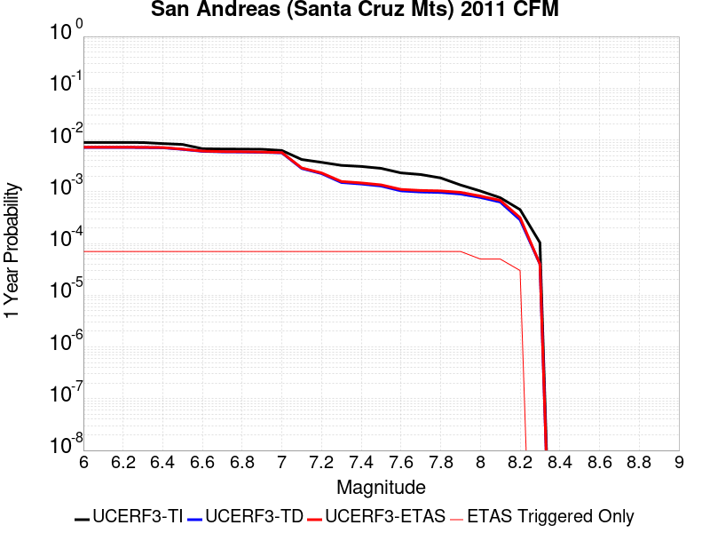 | 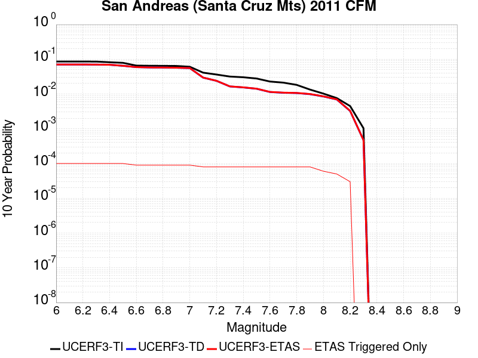 |

| Magnitude | 1 wk TI Prob | 1 wk TD Prob | 1 wk ETAS Prob | 1 wk ETAS/TD Gain | 1 wk ETAS Triggered Only | 1 mo TI Prob | 1 mo TD Prob | 1 mo ETAS Prob | 1 mo ETAS/TD Gain | 1 mo ETAS Triggered Only | 1 yr TI Prob | 1 yr TD Prob | 1 yr ETAS Prob | 1 yr ETAS/TD Gain | 1 yr ETAS Triggered Only | 10 yr TI Prob | 10 yr TD Prob | 10 yr ETAS Prob | 10 yr ETAS/TD Gain | 10 yr ETAS Triggered Only |
|-----|-----|-----|-----|-----|-----|-----|-----|-----|-----|-----|-----|-----|-----|-----|-----|-----|-----|-----|-----|-----|
| 6.0 | 1.7221631E-4 | 1.3792426E-4 | 1.579215E-4 | 1.1449871 | 2.0E-5 | 7.378611E-4 | 5.9097214E-4 | 6.209544E-4 | 1.0507338 | 3.0E-5 | 0.008946515 | 0.0071717235 | 0.0072412216 | 1.0096905 | 7.0E-5 | 0.08594794 | 0.07054796 | 0.07064091 | 1.0013175 | 1.0E-4 |
| 6.1 | 1.7221631E-4 | 1.3792426E-4 | 1.579215E-4 | 1.1449871 | 2.0E-5 | 7.378611E-4 | 5.9097214E-4 | 6.209544E-4 | 1.0507338 | 3.0E-5 | 0.008946515 | 0.0071717235 | 0.0072412216 | 1.0096905 | 7.0E-5 | 0.08594794 | 0.07054796 | 0.07064091 | 1.0013175 | 1.0E-4 |
| 6.2 | 1.7221631E-4 | 1.3792426E-4 | 1.579215E-4 | 1.1449871 | 2.0E-5 | 7.378611E-4 | 5.9097214E-4 | 6.209544E-4 | 1.0507338 | 3.0E-5 | 0.008946515 | 0.0071717235 | 0.0072412216 | 1.0096905 | 7.0E-5 | 0.08594794 | 0.07054796 | 0.07064091 | 1.0013175 | 1.0E-4 |
| 6.3 | 1.716926E-4 | 1.3711878E-4 | 1.5711605E-4 | 1.145839 | 2.0E-5 | 7.3561794E-4 | 5.8752164E-4 | 6.17504E-4 | 1.051032 | 3.0E-5 | 0.008919428 | 0.007129989 | 0.0071994904 | 1.0097477 | 7.0E-5 | 0.08569809 | 0.07015993 | 0.07025291 | 1.0013254 | 1.0E-4 |
| 6.4 | 1.6392978E-4 | 1.3587909E-4 | 1.5587638E-4 | 1.1471697 | 2.0E-5 | 7.02367E-4 | 5.82211E-4 | 6.1219354E-4 | 1.0514977 | 3.0E-5 | 0.008517839 | 0.0070657525 | 0.007135258 | 1.0098369 | 7.0E-5 | 0.08198654 | 0.069394976 | 0.06948803 | 1.001341 | 1.0E-4 |
| 6.5 | 1.5742714E-4 | 1.2647794E-4 | 1.4647542E-4 | 1.1581104 | 2.0E-5 | 6.745133E-4 | 5.419374E-4 | 5.719212E-4 | 1.0553269 | 3.0E-5 | 0.00818132 | 0.0065784375 | 0.006647977 | 1.0105709 | 7.0E-5 | 0.078865945 | 0.06486093 | 0.064954445 | 1.0014417 | 1.0E-4 |
| 6.6 | 1.3038084E-4 | 1.1587992E-4 | 1.358776E-4 | 1.1725725 | 2.0E-5 | 5.5865536E-4 | 4.96535E-4 | 5.265201E-4 | 1.0603887 | 3.0E-5 | 0.006780438 | 0.006028784 | 0.006098362 | 1.011541 | 7.0E-5 | 0.0657725 | 0.059330538 | 0.0594152 | 1.0014269 | 9.0E-5 |
| 6.7 | 1.2867592E-4 | 1.1314491E-4 | 1.3314265E-4 | 1.1767445 | 2.0E-5 | 5.5135164E-4 | 4.8481792E-4 | 5.148034E-4 | 1.0618489 | 3.0E-5 | 0.0066920654 | 0.005886907 | 0.005956495 | 1.0118208 | 7.0E-5 | 0.06494093 | 0.058041416 | 0.058126193 | 1.0014607 | 9.0E-5 |
| 6.8 | 1.2801298E-4 | 1.12520516E-4 | 1.3251827E-4 | 1.1777253 | 2.0E-5 | 5.485117E-4 | 4.8214293E-4 | 5.1212846E-4 | 1.0621922 | 3.0E-5 | 0.0066577005 | 0.0058545293 | 0.0059241196 | 1.0118866 | 7.0E-5 | 0.06461738 | 0.05775524 | 0.05784004 | 1.0014683 | 9.0E-5 |
| 6.9 | 1.269149E-4 | 1.1094256E-4 | 1.3094033E-4 | 1.1802535 | 2.0E-5 | 5.4380763E-4 | 4.7538272E-4 | 5.0536846E-4 | 1.0630771 | 3.0E-5 | 0.006600777 | 0.005772663 | 0.0058422587 | 1.0120561 | 7.0E-5 | 0.06408122 | 0.057027116 | 0.057111986 | 1.0014882 | 9.0E-5 |
| 7.0 | 1.2030331E-4 | 1.0824356E-4 | 1.282414E-4 | 1.1847485 | 2.0E-5 | 5.154837E-4 | 4.638198E-4 | 4.9380586E-4 | 1.0646503 | 3.0E-5 | 0.006257969 | 0.0056326203 | 0.005702226 | 1.0123576 | 7.0E-5 | 0.06084648 | 0.055699922 | 0.05578491 | 1.0015258 | 9.0E-5 |
| 7.1 | 8.049617E-5 | 5.392429E-5 | 7.392321E-5 | 1.3708704 | 2.0E-5 | 3.4493793E-4 | 2.3108382E-4 | 2.610769E-4 | 1.129793 | 3.0E-5 | 0.0041915346 | 0.0028098505 | 0.0028796538 | 1.0248424 | 7.0E-5 | 0.041133516 | 0.029618833 | 0.029696463 | 1.0026209 | 8.0E-5 |
| 7.2 | 7.093979E-5 | 4.2935415E-5 | 6.293456E-5 | 1.4657959 | 2.0E-5 | 3.0399222E-4 | 1.8399608E-4 | 2.1399056E-4 | 1.1630169 | 3.0E-5 | 0.0036948253 | 0.0022378736 | 0.002307717 | 1.0312097 | 7.0E-5 | 0.03633994 | 0.023941126 | 0.024019212 | 1.0032616 | 8.0E-5 |
| 7.3 | 6.193693E-5 | 2.8891074E-5 | 4.8890495E-5 | 1.6922354 | 2.0E-5 | 2.6541698E-4 | 1.2381302E-4 | 1.538093E-4 | 1.2422708 | 3.0E-5 | 0.0032266637 | 0.001506383 | 0.0015762774 | 1.0463989 | 7.0E-5 | 0.031802133 | 0.016497677 | 0.016576357 | 1.0047692 | 8.0E-5 |
| 7.4 | 5.906492E-5 | 2.7020369E-5 | 4.701983E-5 | 1.7401624 | 2.0E-5 | 2.5311083E-4 | 1.1579645E-4 | 1.4579298E-4 | 1.2590454 | 3.0E-5 | 0.0030772698 | 0.0014089114 | 0.0014788128 | 1.0496137 | 7.0E-5 | 0.030350044 | 0.0154695045 | 0.015548267 | 1.0050914 | 8.0E-5 |
| 7.5 | 5.424296E-5 | 2.4675093E-5 | 4.46746E-5 | 1.8105139 | 2.0E-5 | 2.324491E-4 | 1.0574612E-4 | 1.3574294E-4 | 1.2836684 | 3.0E-5 | 0.002826395 | 0.0012866998 | 0.0013566097 | 1.0543327 | 7.0E-5 | 0.027907165 | 0.014161854 | 0.014240721 | 1.005569 | 8.0E-5 |
| 7.6 | 4.43084E-5 | 1.990151E-5 | 3.990111E-5 | 2.0049288 | 2.0E-5 | 1.8987931E-4 | 8.528939E-5 | 1.15286835E-4 | 1.3517137 | 3.0E-5 | 0.0023093296 | 0.001037904 | 0.0011078314 | 1.0673736 | 7.0E-5 | 0.022854783 | 0.011411123 | 0.01149021 | 1.0069307 | 8.0E-5 |
| 7.7 | 4.118098E-5 | 1.8933848E-5 | 3.8933467E-5 | 2.0562894 | 2.0E-5 | 1.7647797E-4 | 8.1142534E-5 | 1.111401E-4 | 1.3696898 | 3.0E-5 | 0.002146502 | 9.874629E-4 | 0.0010573937 | 1.0708188 | 7.0E-5 | 0.021258866 | 0.010868995 | 0.010948126 | 1.0072803 | 8.0E-5 |
| 7.8 | 3.5408906E-5 | 1.856201E-5 | 3.856164E-5 | 2.0774496 | 2.0E-5 | 1.5174363E-4 | 7.954905E-5 | 1.0954666E-4 | 1.3770958 | 3.0E-5 | 0.0018459131 | 9.6807955E-4 | 0.0010380117 | 1.0722381 | 7.0E-5 | 0.018306552 | 0.0106506655 | 0.010729814 | 1.0074313 | 8.0E-5 |
| 7.9 | 2.5860836E-5 | 1.7313954E-5 | 3.7313606E-5 | 2.1551175 | 2.0E-5 | 1.10827445E-4 | 7.420055E-5 | 1.0419833E-4 | 1.4042797 | 3.0E-5 | 0.001348489 | 9.030175E-4 | 9.729543E-4 | 1.0774479 | 7.0E-5 | 0.013403354 | 0.009906601 | 0.009985808 | 1.0079954 | 8.0E-5 |
| 8.0 | 1.9777332E-5 | 1.4837888E-5 | 1.4837888E-5 | 1.0 | 0.0 | 8.4757245E-5 | 6.3589396E-5 | 7.358876E-5 | 1.157249 | 1.0E-5 | 0.0010314309 | 7.739261E-4 | 8.238874E-4 | 1.0645556 | 5.0E-5 | 0.010266567 | 0.008508087 | 0.008567576 | 1.0069921 | 6.0E-5 |
| 8.1 | 1.468494E-5 | 1.2105831E-5 | 1.2105831E-5 | 1.0 | 0.0 | 6.293394E-5 | 5.1881103E-5 | 6.1880586E-5 | 1.1927384 | 1.0E-5 | 7.6595135E-4 | 6.3146953E-4 | 6.8143796E-4 | 1.0791304 | 5.0E-5 | 0.0076331664 | 0.0069684954 | 0.007018147 | 1.0071251 | 5.0E-5 |
| 8.2 | 8.63836E-6 | 5.4678667E-6 | 5.4678667E-6 | 1.0 | 0.0 | 3.7021015E-5 | 2.3433504E-5 | 2.3433504E-5 | 1.0 | 0.0 | 4.5063766E-4 | 2.8526565E-4 | 3.152571E-4 | 1.1051351 | 3.0E-5 | 0.004497249 | 0.003245162 | 0.0032750648 | 1.0092145 | 3.0E-5 |
| 8.3 | 1.983087E-6 | 7.6564595E-7 | 7.6564595E-7 | 1.0 | 0.0 | 8.498917E-6 | 3.281336E-6 | 3.281336E-6 | 1.0 | 0.0 | 1.034694E-4 | 3.9949547E-5 | 3.9949547E-5 | 1.0 | 0.0 | 0.0010342124 | 4.717979E-4 | 4.717979E-4 | 1.0 | 0.0 |

## San Diego Trough north alt1
*[(top)](#table-of-contents)*

| 1 Week | 1 Month | 1 Year | 10 Year |
|-----|-----|-----|-----|
|  |  | 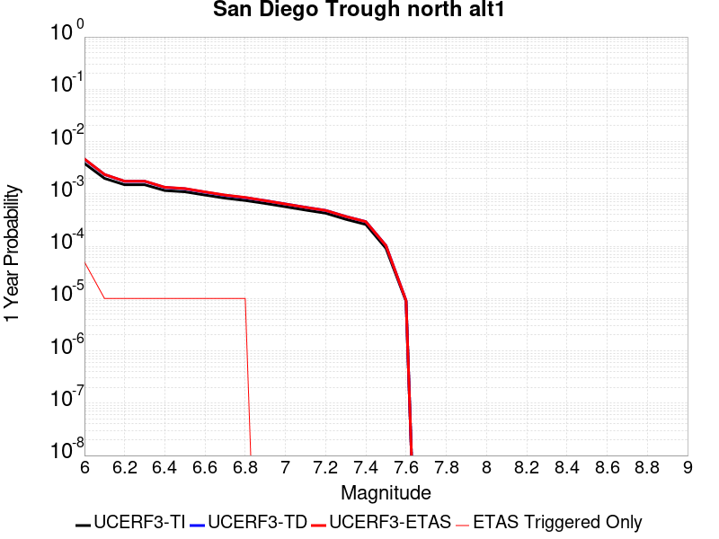 |  |

| Magnitude | 1 wk TI Prob | 1 wk TD Prob | 1 wk ETAS Prob | 1 wk ETAS/TD Gain | 1 wk ETAS Triggered Only | 1 mo TI Prob | 1 mo TD Prob | 1 mo ETAS Prob | 1 mo ETAS/TD Gain | 1 mo ETAS Triggered Only | 1 yr TI Prob | 1 yr TD Prob | 1 yr ETAS Prob | 1 yr ETAS/TD Gain | 1 yr ETAS Triggered Only | 10 yr TI Prob | 10 yr TD Prob | 10 yr ETAS Prob | 10 yr ETAS/TD Gain | 10 yr ETAS Triggered Only |
|-----|-----|-----|-----|-----|-----|-----|-----|-----|-----|-----|-----|-----|-----|-----|-----|-----|-----|-----|-----|-----|
| 6.0 | 7.329252E-5 | 8.821269E-5 | 1.0821093E-4 | 1.2267047 | 2.0E-5 | 3.14073E-4 | 3.7800326E-4 | 3.979957E-4 | 1.0528896 | 2.0E-5 | 0.0038171355 | 0.0045930487 | 0.004642819 | 1.010836 | 5.0E-5 | 0.03752231 | 0.045045137 | 0.045131084 | 1.001908 | 9.0E-5 |
| 6.1 | 3.7940346E-5 | 4.4884906E-5 | 4.4884906E-5 | 1.0 | 0.0 | 1.6259136E-4 | 1.9235026E-4 | 1.9235026E-4 | 1.0 | 0.0 | 0.0019777524 | 0.002339431 | 0.0023494076 | 1.0042646 | 1.0E-5 | 0.019602431 | 0.023156732 | 0.023195807 | 1.0016874 | 4.0E-5 |
| 6.2 | 2.8645263E-5 | 3.329672E-5 | 3.329672E-5 | 1.0 | 0.0 | 1.2275964E-4 | 1.4269259E-4 | 1.4269259E-4 | 1.0 | 0.0 | 0.0014935739 | 0.0017359206 | 0.0017459032 | 1.0057507 | 1.0E-5 | 0.0148357535 | 0.017226268 | 0.017265579 | 1.002282 | 4.0E-5 |
| 6.3 | 2.8645263E-5 | 3.329672E-5 | 3.329672E-5 | 1.0 | 0.0 | 1.2275964E-4 | 1.4269259E-4 | 1.4269259E-4 | 1.0 | 0.0 | 0.0014935739 | 0.0017359206 | 0.0017459032 | 1.0057507 | 1.0E-5 | 0.0148357535 | 0.017226268 | 0.017265579 | 1.002282 | 4.0E-5 |
| 6.4 | 2.2204576E-5 | 2.544832E-5 | 2.544832E-5 | 1.0 | 0.0 | 9.5159E-5 | 1.0905972E-4 | 1.0905972E-4 | 1.0 | 0.0 | 0.001157945 | 0.0013270028 | 0.0013369895 | 1.0075258 | 1.0E-5 | 0.011519298 | 0.013191959 | 0.013211695 | 1.0014961 | 2.0E-5 |
| 6.5 | 2.1004838E-5 | 2.4024695E-5 | 2.4024695E-5 | 1.0 | 0.0 | 9.0017624E-5 | 1.0295897E-4 | 1.0295897E-4 | 1.0 | 0.0 | 0.0010954136 | 0.0012528135 | 0.001262801 | 1.007972 | 1.0E-5 | 0.010900296 | 0.012458592 | 0.012478342 | 1.0015854 | 2.0E-5 |
| 6.6 | 1.820557E-5 | 2.070479E-5 | 2.070479E-5 | 1.0 | 0.0 | 7.802154E-5 | 8.8731824E-5 | 8.8731824E-5 | 1.0 | 0.0 | 9.4949827E-4 | 0.0010797799 | 0.0010897692 | 1.0092511 | 1.0E-5 | 0.009454516 | 0.010746005 | 0.010765791 | 1.0018412 | 2.0E-5 |
| 6.7 | 1.5884485E-5 | 1.7983646E-5 | 1.7983646E-5 | 1.0 | 0.0 | 6.807459E-5 | 7.707051E-5 | 7.707051E-5 | 1.0 | 0.0 | 8.284929E-4 | 9.3793223E-4 | 9.479229E-4 | 1.0106517 | 1.0E-5 | 0.008254109 | 0.009340104 | 0.009359917 | 1.0021213 | 2.0E-5 |
| 6.8 | 1.4331171E-5 | 1.6201066E-5 | 1.6201066E-5 | 1.0 | 0.0 | 6.141786E-5 | 6.94313E-5 | 6.94313E-5 | 1.0 | 0.0 | 7.4750587E-4 | 8.450002E-4 | 8.549917E-4 | 1.0118244 | 1.0E-5 | 0.0074499645 | 0.008418139 | 0.008437971 | 1.0023558 | 2.0E-5 |
| 6.9 | 1.2574203E-5 | 1.4205835E-5 | 1.4205835E-5 | 1.0 | 0.0 | 5.3888325E-5 | 6.0880735E-5 | 6.0880735E-5 | 1.0 | 0.0 | 6.558929E-4 | 7.409723E-4 | 7.409723E-4 | 1.0 | 0.0 | 0.0065396037 | 0.007385203 | 0.0073951297 | 1.0013441 | 1.0E-5 |
| 7.0 | 1.0883844E-5 | 1.2289262E-5 | 1.2289262E-5 | 1.0 | 0.0 | 4.664421E-5 | 5.2667205E-5 | 5.2667205E-5 | 1.0 | 0.0 | 5.677453E-4 | 6.4103556E-4 | 6.4103556E-4 | 1.0 | 0.0 | 0.00566297 | 0.006391993 | 0.0064019286 | 1.0015545 | 1.0E-5 |
| 7.1 | 9.393088E-6 | 1.060702E-5 | 1.060702E-5 | 1.0 | 0.0 | 4.025547E-5 | 4.545787E-5 | 4.545787E-5 | 1.0 | 0.0 | 4.900001E-4 | 5.533098E-4 | 5.533098E-4 | 1.0 | 0.0 | 0.0048892107 | 0.005519418 | 0.0055293627 | 1.0018017 | 1.0E-5 |
| 7.2 | 8.190791E-6 | 9.258625E-6 | 9.258625E-6 | 1.0 | 0.0 | 3.510292E-5 | 3.9679224E-5 | 3.9679224E-5 | 1.0 | 0.0 | 4.2729423E-4 | 4.8298817E-4 | 4.8298817E-4 | 1.0 | 0.0 | 0.0042647356 | 0.004819465 | 0.0048294165 | 1.002065 | 1.0E-5 |
| 7.3 | 6.268162E-6 | 7.089716E-6 | 7.089716E-6 | 1.0 | 0.0 | 2.6863276E-5 | 3.0384144E-5 | 3.0384144E-5 | 1.0 | 0.0 | 3.2701128E-4 | 3.6986457E-4 | 3.6986457E-4 | 1.0 | 0.0 | 0.003265305 | 0.003692536 | 0.003692536 | 1.0 | 0.0 |
| 7.4 | 4.985186E-6 | 5.6426816E-6 | 5.6426816E-6 | 1.0 | 0.0 | 2.1364907E-5 | 2.4182698E-5 | 2.4182698E-5 | 1.0 | 0.0 | 2.600867E-4 | 2.9438498E-4 | 2.9438498E-4 | 1.0 | 0.0 | 0.002597825 | 0.0029399914 | 0.0029399914 | 1.0 | 0.0 |
| 7.5 | 1.7489613E-6 | 1.969678E-6 | 1.969678E-6 | 1.0 | 0.0 | 7.495527E-6 | 8.4414505E-6 | 8.4414505E-6 | 1.0 | 0.0 | 9.125422E-5 | 1.02770035E-4 | 1.02770035E-4 | 1.0 | 0.0 | 9.1216754E-4 | 0.0010272472 | 0.0010272472 | 1.0 | 0.0 |
| 7.6 | 1.6988751E-7 | 1.7533823E-7 | 1.7533823E-7 | 1.0 | 0.0 | 7.2808916E-7 | 7.5144936E-7 | 7.5144936E-7 | 1.0 | 0.0 | 8.864449E-6 | 9.14886E-6 | 9.14886E-6 | 1.0 | 0.0 | 8.8640954E-5 | 9.1485024E-5 | 9.1485024E-5 | 1.0 | 0.0 |

## San Pedro Basin
*[(top)](#table-of-contents)*

| 1 Week | 1 Month | 1 Year | 10 Year |
|-----|-----|-----|-----|
| 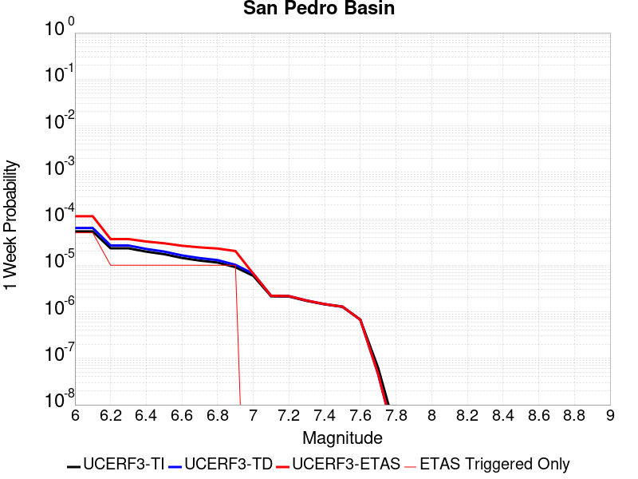 | 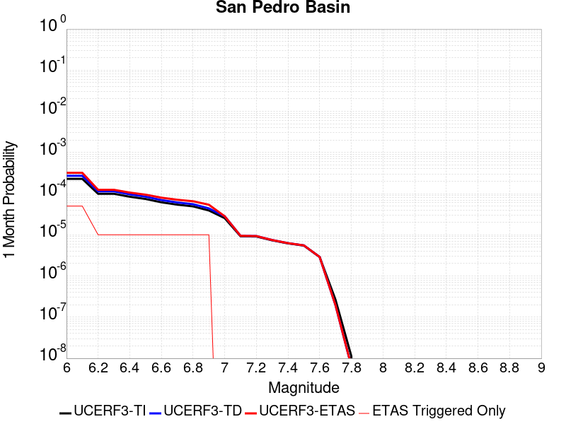 |  |  |

| Magnitude | 1 wk TI Prob | 1 wk TD Prob | 1 wk ETAS Prob | 1 wk ETAS/TD Gain | 1 wk ETAS Triggered Only | 1 mo TI Prob | 1 mo TD Prob | 1 mo ETAS Prob | 1 mo ETAS/TD Gain | 1 mo ETAS Triggered Only | 1 yr TI Prob | 1 yr TD Prob | 1 yr ETAS Prob | 1 yr ETAS/TD Gain | 1 yr ETAS Triggered Only | 10 yr TI Prob | 10 yr TD Prob | 10 yr ETAS Prob | 10 yr ETAS/TD Gain | 10 yr ETAS Triggered Only |
|-----|-----|-----|-----|-----|-----|-----|-----|-----|-----|-----|-----|-----|-----|-----|-----|-----|-----|-----|-----|-----|
| 6.0 | 5.3449043E-5 | 6.337018E-5 | 1.13367016E-4 | 1.7889646 | 5.0E-5 | 2.2904722E-4 | 2.7156167E-4 | 3.215481E-4 | 1.1840702 | 5.0E-5 | 0.0027850836 | 0.0033018515 | 0.0033616533 | 1.0181116 | 6.0E-5 | 0.027504366 | 0.03258948 | 0.032686222 | 1.0029684 | 1.0E-4 |
| 6.1 | 5.3449043E-5 | 6.337018E-5 | 1.13367016E-4 | 1.7889646 | 5.0E-5 | 2.2904722E-4 | 2.7156167E-4 | 3.215481E-4 | 1.1840702 | 5.0E-5 | 0.0027850836 | 0.0033018515 | 0.0033616533 | 1.0181116 | 6.0E-5 | 0.027504366 | 0.03258948 | 0.032686222 | 1.0029684 | 1.0E-4 |
| 6.2 | 2.3189454E-5 | 2.6642829E-5 | 3.6642563E-5 | 1.3753256 | 1.0E-5 | 9.9379584E-5 | 1.1417881E-4 | 1.2417766E-4 | 1.087572 | 1.0E-5 | 0.0012092749 | 0.0013892875 | 0.0014092597 | 1.0143759 | 2.0E-5 | 0.012027155 | 0.01381089 | 0.013840476 | 1.0021422 | 3.0E-5 |
| 6.3 | 2.3189454E-5 | 2.6642829E-5 | 3.6642563E-5 | 1.3753256 | 1.0E-5 | 9.9379584E-5 | 1.1417881E-4 | 1.2417766E-4 | 1.087572 | 1.0E-5 | 0.0012092749 | 0.0013892875 | 0.0014092597 | 1.0143759 | 2.0E-5 | 0.012027155 | 0.01381089 | 0.013840476 | 1.0021422 | 3.0E-5 |
| 6.4 | 1.966056E-5 | 2.246342E-5 | 3.2463195E-5 | 1.4451581 | 1.0E-5 | 8.425682E-5 | 9.626848E-5 | 1.06267515E-4 | 1.1038662 | 1.0E-5 | 0.001025344 | 0.0011714787 | 0.001181467 | 1.0085262 | 1.0E-5 | 0.010206259 | 0.011657119 | 0.011676886 | 1.0016956 | 2.0E-5 |
| 6.5 | 1.7342953E-5 | 1.9745152E-5 | 2.9744955E-5 | 1.5064434 | 1.0E-5 | 7.4324824E-5 | 8.461954E-5 | 9.46187E-5 | 1.118166 | 1.0E-5 | 9.04529E-4 | 0.0010297929 | 0.0010397827 | 1.0097007 | 1.0E-5 | 0.009008561 | 0.010253932 | 0.010273728 | 1.0019305 | 2.0E-5 |
| 6.6 | 1.439804E-5 | 1.6322716E-5 | 2.6322554E-5 | 1.6126331 | 1.0E-5 | 6.170443E-5 | 6.99528E-5 | 7.995211E-5 | 1.1429435 | 1.0E-5 | 7.509924E-4 | 8.513747E-4 | 8.613662E-4 | 1.0117357 | 1.0E-5 | 0.0074845953 | 0.008484333 | 0.0085041635 | 1.0023373 | 2.0E-5 |
| 6.7 | 1.2634884E-5 | 1.4285298E-5 | 2.4285155E-5 | 1.7000104 | 1.0E-5 | 5.414838E-5 | 6.122144E-5 | 7.122083E-5 | 1.1633315 | 1.0E-5 | 6.590571E-4 | 7.451466E-4 | 7.5513916E-4 | 1.0134102 | 1.0E-5 | 0.006571059 | 0.007429502 | 0.0074394275 | 1.001336 | 1.0E-5 |
| 6.8 | 1.146091E-5 | 1.2933193E-5 | 2.2933064E-5 | 1.7731943 | 1.0E-5 | 4.911726E-5 | 5.542696E-5 | 6.542641E-5 | 1.1804076 | 1.0E-5 | 5.9783855E-4 | 6.74644E-4 | 6.846373E-4 | 1.0148126 | 1.0E-5 | 0.0059623276 | 0.0067288997 | 0.006738832 | 1.0014762 | 1.0E-5 |
| 6.9 | 9.109035E-6 | 1.0235013E-5 | 2.0234911E-5 | 1.9770284 | 1.0E-5 | 3.9038136E-5 | 4.386376E-5 | 5.386332E-5 | 1.2279686 | 1.0E-5 | 4.7518566E-4 | 5.339384E-4 | 5.4393307E-4 | 1.0187187 | 1.0E-5 | 0.0047417083 | 0.0053293095 | 0.005339256 | 1.0018665 | 1.0E-5 |
| 7.0 | 5.9351028E-6 | 6.583965E-6 | 6.583965E-6 | 1.0 | 0.0 | 2.5435906E-5 | 2.821682E-5 | 2.821682E-5 | 1.0 | 0.0 | 3.0963816E-4 | 3.4350925E-4 | 3.4350925E-4 | 1.0 | 0.0 | 0.0030920706 | 0.0034320997 | 0.0034320997 | 1.0 | 0.0 |
| 7.1 | 2.1557585E-6 | 2.2096492E-6 | 2.2096492E-6 | 1.0 | 0.0 | 9.238933E-6 | 9.469892E-6 | 9.469892E-6 | 1.0 | 0.0 | 1.1247819E-4 | 1.15289986E-4 | 1.15289986E-4 | 1.0 | 0.0 | 0.0011242128 | 0.0011523172 | 0.0011523172 | 1.0 | 0.0 |
| 7.2 | 2.1251979E-6 | 2.1779954E-6 | 2.1779954E-6 | 1.0 | 0.0 | 9.107958E-6 | 9.334234E-6 | 9.334234E-6 | 1.0 | 0.0 | 1.1088375E-4 | 1.13638525E-4 | 1.13638525E-4 | 1.0 | 0.0 | 0.0011082845 | 0.0011358195 | 0.0011358195 | 1.0 | 0.0 |
| 7.3 | 1.7145798E-6 | 1.7442885E-6 | 1.7442885E-6 | 1.0 | 0.0 | 7.3481783E-6 | 7.475501E-6 | 7.475501E-6 | 1.0 | 0.0 | 8.94604E-5 | 9.1010515E-5 | 9.1010515E-5 | 1.0 | 0.0 | 8.9424395E-4 | 9.0974156E-4 | 9.0974156E-4 | 1.0 | 0.0 |
| 7.4 | 1.4467993E-6 | 1.4641878E-6 | 1.4641878E-6 | 1.0 | 0.0 | 6.200554E-6 | 6.275076E-6 | 6.275076E-6 | 1.0 | 0.0 | 7.548913E-5 | 7.639644E-5 | 7.639644E-5 | 1.0 | 0.0 | 7.546349E-4 | 7.6370913E-4 | 7.6370913E-4 | 1.0 | 0.0 |
| 7.5 | 1.2803735E-6 | 1.2931506E-6 | 1.2931506E-6 | 1.0 | 0.0 | 5.487303E-6 | 5.5420624E-6 | 5.5420624E-6 | 1.0 | 0.0 | 6.680587E-5 | 6.747259E-5 | 6.747259E-5 | 1.0 | 0.0 | 6.678579E-4 | 6.745281E-4 | 6.745281E-4 | 1.0 | 0.0 |
| 7.6 | 6.755009E-7 | 6.76947E-7 | 6.76947E-7 | 1.0 | 0.0 | 2.8950008E-6 | 2.9011985E-6 | 2.9011985E-6 | 1.0 | 0.0 | 3.5246063E-5 | 3.532158E-5 | 3.532158E-5 | 1.0 | 0.0 | 3.5240475E-4 | 3.5316538E-4 | 3.5316538E-4 | 1.0 | 0.0 |
| 7.7 | 6.211885E-8 | 4.5699714E-8 | 4.5699714E-8 | 1.0 | 0.0 | 2.6622362E-7 | 1.9585592E-7 | 1.9585592E-7 | 1.0 | 0.0 | 3.2412677E-6 | 2.3845432E-6 | 2.3845432E-6 | 1.0 | 0.0 | 3.2412205E-5 | 2.3845198E-5 | 2.3845198E-5 | 1.0 | 0.0 |
| 7.8 | 2.6580573E-9 | 1.5138054E-9 | 1.5138054E-9 | 1.0 | 0.0 | 1.1391674E-8 | 6.4877375E-9 | 6.4877375E-9 | 1.0 | 0.0 | 1.3869362E-7 | 7.89882E-8 | 7.89882E-8 | 1.0 | 0.0 | 1.3869354E-6 | 7.89882E-7 | 7.89882E-7 | 1.0 | 0.0 |

## Palos Verdes
*[(top)](#table-of-contents)*

| 1 Week | 1 Month | 1 Year | 10 Year |
|-----|-----|-----|-----|
|  |  |  |  |

| Magnitude | 1 wk TI Prob | 1 wk TD Prob | 1 wk ETAS Prob | 1 wk ETAS/TD Gain | 1 wk ETAS Triggered Only | 1 mo TI Prob | 1 mo TD Prob | 1 mo ETAS Prob | 1 mo ETAS/TD Gain | 1 mo ETAS Triggered Only | 1 yr TI Prob | 1 yr TD Prob | 1 yr ETAS Prob | 1 yr ETAS/TD Gain | 1 yr ETAS Triggered Only | 10 yr TI Prob | 10 yr TD Prob | 10 yr ETAS Prob | 10 yr ETAS/TD Gain | 10 yr ETAS Triggered Only |
|-----|-----|-----|-----|-----|-----|-----|-----|-----|-----|-----|-----|-----|-----|-----|-----|-----|-----|-----|-----|-----|
| 6.0 | 6.126063E-5 | 7.622572E-5 | 1.4622038E-4 | 1.9182552 | 7.0E-5 | 2.6251914E-4 | 3.266441E-4 | 3.9662124E-4 | 1.2142305 | 7.0E-5 | 0.0031914865 | 0.0039701737 | 0.004049856 | 1.0200702 | 8.0E-5 | 0.031460393 | 0.03904909 | 0.039145183 | 1.0024608 | 1.0E-4 |
| 6.1 | 6.126063E-5 | 7.622572E-5 | 1.4622038E-4 | 1.9182552 | 7.0E-5 | 2.6251914E-4 | 3.266441E-4 | 3.9662124E-4 | 1.2142305 | 7.0E-5 | 0.0031914865 | 0.0039701737 | 0.004049856 | 1.0200702 | 8.0E-5 | 0.031460393 | 0.03904909 | 0.039145183 | 1.0024608 | 1.0E-4 |
| 6.2 | 6.126063E-5 | 7.622572E-5 | 1.4622038E-4 | 1.9182552 | 7.0E-5 | 2.6251914E-4 | 3.266441E-4 | 3.9662124E-4 | 1.2142305 | 7.0E-5 | 0.0031914865 | 0.0039701737 | 0.004049856 | 1.0200702 | 8.0E-5 | 0.031460393 | 0.03904909 | 0.039145183 | 1.0024608 | 1.0E-4 |
| 6.3 | 4.0838047E-5 | 4.9749007E-5 | 8.9747016E-5 | 1.8039962 | 4.0E-5 | 1.7500846E-4 | 2.1319388E-4 | 2.5318534E-4 | 1.1875826 | 4.0E-5 | 0.0021286458 | 0.002592754 | 0.0026426245 | 1.0192345 | 5.0E-5 | 0.021083709 | 0.025646746 | 0.025705209 | 1.0022795 | 6.0E-5 |
| 6.4 | 4.0838047E-5 | 4.9749007E-5 | 8.9747016E-5 | 1.8039962 | 4.0E-5 | 1.7500846E-4 | 2.1319388E-4 | 2.5318534E-4 | 1.1875826 | 4.0E-5 | 0.0021286458 | 0.002592754 | 0.0026426245 | 1.0192345 | 5.0E-5 | 0.021083709 | 0.025646746 | 0.025705209 | 1.0022795 | 6.0E-5 |
| 6.5 | 3.0512005E-5 | 3.6561592E-5 | 6.65605E-5 | 1.8205031 | 3.0E-5 | 1.3075917E-4 | 1.566838E-4 | 1.8667911E-4 | 1.1914384 | 3.0E-5 | 0.0015908304 | 0.001906072 | 0.0019459957 | 1.0209455 | 4.0E-5 | 0.015794903 | 0.018909173 | 0.018958228 | 1.0025942 | 5.0E-5 |
| 6.6 | 2.9255087E-5 | 3.5154393E-5 | 6.5153334E-5 | 1.8533485 | 3.0E-5 | 1.2537291E-4 | 1.5065364E-4 | 1.8064912E-4 | 1.1991023 | 3.0E-5 | 0.0015253464 | 0.0018327782 | 0.001872705 | 1.0217848 | 4.0E-5 | 0.015149189 | 0.018188244 | 0.018237334 | 1.002699 | 5.0E-5 |
| 6.7 | 2.287198E-5 | 2.724828E-5 | 5.724746E-5 | 2.100957 | 3.0E-5 | 9.801909E-5 | 1.16773626E-4 | 1.4677012E-4 | 1.2568773 | 3.0E-5 | 0.001192729 | 0.0014208833 | 0.0014608265 | 1.0281115 | 4.0E-5 | 0.011863477 | 0.014127217 | 0.014176511 | 1.0034893 | 5.0E-5 |
| 6.8 | 2.1325764E-5 | 2.5431878E-5 | 4.543137E-5 | 1.7863946 | 2.0E-5 | 9.139293E-5 | 1.0898972E-4 | 1.2898754E-4 | 1.1834836 | 2.0E-5 | 0.001112141 | 0.0013262323 | 0.0013561925 | 1.0225905 | 3.0E-5 | 0.011065915 | 0.013192211 | 0.0132316835 | 1.002992 | 4.0E-5 |
| 6.9 | 1.9009392E-5 | 2.2613547E-5 | 3.2613323E-5 | 1.4422028 | 1.0E-5 | 8.1466285E-5 | 9.6912096E-5 | 1.0691113E-4 | 1.1031762 | 1.0E-5 | 9.914007E-4 | 0.0011793535 | 0.0011993299 | 1.0169384 | 2.0E-5 | 0.009869894 | 0.011739633 | 0.011769281 | 1.0025254 | 3.0E-5 |
| 7.0 | 1.7098473E-5 | 2.0319356E-5 | 3.0319152E-5 | 1.4921316 | 1.0E-5 | 7.3277115E-5 | 8.708052E-5 | 9.7079654E-5 | 1.1148262 | 1.0E-5 | 8.917837E-4 | 0.001059775 | 0.0010797537 | 1.0188519 | 2.0E-5 | 0.008882134 | 0.010555646 | 0.0105853295 | 1.002812 | 3.0E-5 |
| 7.1 | 1.5982785E-5 | 1.899476E-5 | 2.8994571E-5 | 1.526451 | 1.0E-5 | 6.849585E-5 | 8.1404054E-5 | 9.1403235E-5 | 1.122834 | 1.0E-5 | 8.336179E-4 | 9.907284E-4 | 0.0010107086 | 1.0201671 | 2.0E-5 | 0.008304977 | 0.009871479 | 0.009901184 | 1.0030091 | 3.0E-5 |
| 7.2 | 1.4468002E-5 | 1.7197237E-5 | 2.7197064E-5 | 1.5814788 | 1.0E-5 | 6.200425E-5 | 7.370083E-5 | 8.370009E-5 | 1.1356736 | 1.0E-5 | 7.546402E-4 | 8.970222E-4 | 9.1700425E-4 | 1.022276 | 2.0E-5 | 0.007520827 | 0.008942284 | 0.008962105 | 1.0022166 | 2.0E-5 |
| 7.3 | 5.288233E-6 | 6.2036747E-6 | 1.6203612E-5 | 2.6119378 | 1.0E-5 | 2.2663658E-5 | 2.6587102E-5 | 3.6586836E-5 | 1.3761122 | 1.0E-5 | 2.7589512E-4 | 3.236848E-4 | 3.3368156E-4 | 1.0308843 | 1.0E-5 | 0.0027555283 | 0.0032355562 | 0.003245524 | 1.0030806 | 1.0E-5 |
| 7.4 | 8.279556E-7 | 8.408347E-7 | 8.408347E-7 | 1.0 | 0.0 | 3.5483763E-6 | 3.6035726E-6 | 3.6035726E-6 | 1.0 | 0.0 | 4.3200624E-5 | 4.3872686E-5 | 4.3872686E-5 | 1.0 | 0.0 | 4.3192226E-4 | 4.3864746E-4 | 4.3864746E-4 | 1.0 | 0.0 |
| 7.5 | 6.559831E-7 | 6.667229E-7 | 6.667229E-7 | 1.0 | 0.0 | 2.8113532E-6 | 2.857381E-6 | 2.857381E-6 | 1.0 | 0.0 | 3.4227687E-5 | 3.4788125E-5 | 3.4788125E-5 | 1.0 | 0.0 | 3.4222414E-4 | 3.4783344E-4 | 3.4783344E-4 | 1.0 | 0.0 |
| 7.6 | 3.5018968E-7 | 3.5620027E-7 | 3.5620027E-7 | 1.0 | 0.0 | 1.500812E-6 | 1.526572E-6 | 1.526572E-6 | 1.0 | 0.0 | 1.8272232E-5 | 1.8585903E-5 | 1.8585903E-5 | 1.0 | 0.0 | 1.8270731E-4 | 1.8584808E-4 | 1.8584808E-4 | 1.0 | 0.0 |
| 7.7 | 1.1986104E-7 | 1.2198376E-7 | 1.2198376E-7 | 1.0 | 0.0 | 5.1369005E-7 | 5.2278745E-7 | 5.2278745E-7 | 1.0 | 0.0 | 6.2541585E-6 | 6.364919E-6 | 6.364919E-6 | 1.0 | 0.0 | 6.2539824E-5 | 6.364741E-5 | 6.364741E-5 | 1.0 | 0.0 |
| 7.8 | 3.0445005E-8 | 3.1027582E-8 | 3.1027582E-8 | 1.0 | 0.0 | 1.3047858E-7 | 1.3297536E-7 | 1.3297536E-7 | 1.0 | 0.0 | 1.5885756E-6 | 1.6189739E-6 | 1.6189739E-6 | 1.0 | 0.0 | 1.5885644E-5 | 1.6189642E-5 | 1.6189642E-5 | 1.0 | 0.0 |

## Blue Cut
*[(top)](#table-of-contents)*

| 1 Week | 1 Month | 1 Year | 10 Year |
|-----|-----|-----|-----|
|  |  |  |  |

| Magnitude | 1 wk TI Prob | 1 wk TD Prob | 1 wk ETAS Prob | 1 wk ETAS/TD Gain | 1 wk ETAS Triggered Only | 1 mo TI Prob | 1 mo TD Prob | 1 mo ETAS Prob | 1 mo ETAS/TD Gain | 1 mo ETAS Triggered Only | 1 yr TI Prob | 1 yr TD Prob | 1 yr ETAS Prob | 1 yr ETAS/TD Gain | 1 yr ETAS Triggered Only | 10 yr TI Prob | 10 yr TD Prob | 10 yr ETAS Prob | 10 yr ETAS/TD Gain | 10 yr ETAS Triggered Only |
|-----|-----|-----|-----|-----|-----|-----|-----|-----|-----|-----|-----|-----|-----|-----|-----|-----|-----|-----|-----|-----|
| 6.0 | 2.1227985E-5 | 2.2719574E-5 | 9.2717986E-5 | 4.0809736 | 7.0E-5 | 9.097391E-5 | 9.73663E-5 | 1.6735948E-4 | 1.7188646 | 7.0E-5 | 0.0011070445 | 0.0011848481 | 0.0012747415 | 1.0758691 | 9.0E-5 | 0.011015458 | 0.011791152 | 0.01188009 | 1.0075428 | 9.0E-5 |
| 6.1 | 2.1227985E-5 | 2.2719574E-5 | 9.2717986E-5 | 4.0809736 | 7.0E-5 | 9.097391E-5 | 9.73663E-5 | 1.6735948E-4 | 1.7188646 | 7.0E-5 | 0.0011070445 | 0.0011848481 | 0.0012747415 | 1.0758691 | 9.0E-5 | 0.011015458 | 0.011791152 | 0.01188009 | 1.0075428 | 9.0E-5 |
| 6.2 | 2.1227985E-5 | 2.2719574E-5 | 9.2717986E-5 | 4.0809736 | 7.0E-5 | 9.097391E-5 | 9.73663E-5 | 1.6735948E-4 | 1.7188646 | 7.0E-5 | 0.0011070445 | 0.0011848481 | 0.0012747415 | 1.0758691 | 9.0E-5 | 0.011015458 | 0.011791152 | 0.01188009 | 1.0075428 | 9.0E-5 |
| 6.3 | 1.1613981E-5 | 1.2353542E-5 | 4.235317E-5 | 3.4284234 | 3.0E-5 | 4.9773254E-5 | 5.2942745E-5 | 8.294116E-5 | 1.5666199 | 3.0E-5 | 6.0582085E-4 | 6.443998E-4 | 6.84374E-4 | 1.0620333 | 4.0E-5 | 0.0060417196 | 0.0064265593 | 0.006466302 | 1.0061842 | 4.0E-5 |
| 6.4 | 1.1613981E-5 | 1.2353542E-5 | 4.235317E-5 | 3.4284234 | 3.0E-5 | 4.9773254E-5 | 5.2942745E-5 | 8.294116E-5 | 1.5666199 | 3.0E-5 | 6.0582085E-4 | 6.443998E-4 | 6.84374E-4 | 1.0620333 | 4.0E-5 | 0.0060417196 | 0.0064265593 | 0.006466302 | 1.0061842 | 4.0E-5 |
| 6.5 | 8.931326E-6 | 9.4816E-6 | 3.9481314E-5 | 4.163993 | 3.0E-5 | 3.8276554E-5 | 4.0634844E-5 | 7.063363E-5 | 1.7382526 | 3.0E-5 | 4.6591737E-4 | 4.946261E-4 | 5.3460634E-4 | 1.0808291 | 4.0E-5 | 0.0046494175 | 0.004936161 | 0.004975964 | 1.0080634 | 4.0E-5 |
| 6.6 | 7.345353E-6 | 7.79028E-6 | 3.7790047E-5 | 4.850923 | 3.0E-5 | 3.1479703E-5 | 3.338653E-5 | 6.338553E-5 | 1.898536 | 3.0E-5 | 3.83198E-4 | 4.064132E-4 | 4.36401E-4 | 1.0737865 | 3.0E-5 | 0.0038253788 | 0.0040574907 | 0.004087369 | 1.0073637 | 3.0E-5 |
| 6.7 | 6.2775666E-6 | 6.655149E-6 | 3.665495E-5 | 5.5077577 | 3.0E-5 | 2.690358E-5 | 2.8521798E-5 | 5.8520942E-5 | 2.0517972 | 3.0E-5 | 3.2750185E-4 | 3.472051E-4 | 3.7719466E-4 | 1.0863743 | 3.0E-5 | 0.0032701963 | 0.003467367 | 0.0034972632 | 1.008622 | 3.0E-5 |
| 6.8 | 5.5234095E-6 | 5.8551113E-6 | 3.5854937E-5 | 6.123698 | 3.0E-5 | 2.367154E-5 | 2.5093133E-5 | 5.509238E-5 | 2.195516 | 3.0E-5 | 2.8816288E-4 | 3.0547334E-4 | 3.354642E-4 | 1.0981783 | 3.0E-5 | 0.002877895 | 0.0030512505 | 0.003081159 | 1.009802 | 3.0E-5 |
| 6.9 | 4.7780054E-6 | 5.0654203E-6 | 3.506527E-5 | 6.922479 | 3.0E-5 | 2.0477004E-5 | 2.1708804E-5 | 5.1708153E-5 | 2.3818977 | 3.0E-5 | 2.4927902E-4 | 2.642797E-4 | 2.9427174E-4 | 1.113486 | 3.0E-5 | 0.0024899957 | 0.002640346 | 0.002670267 | 1.0113322 | 3.0E-5 |
| 7.0 | 3.883171E-6 | 4.118487E-6 | 3.4118362E-5 | 8.284198 | 3.0E-5 | 1.6642054E-5 | 1.7650578E-5 | 4.765005E-5 | 2.699631 | 3.0E-5 | 2.0259817E-4 | 2.1488148E-4 | 2.4487503E-4 | 1.1395818 | 3.0E-5 | 0.0020241356 | 0.0021474129 | 0.0021773484 | 1.0139403 | 3.0E-5 |
| 7.1 | 2.8358215E-6 | 3.0097158E-6 | 1.3009686E-5 | 4.3225627 | 1.0E-5 | 1.2153464E-5 | 1.2898756E-5 | 2.2898626E-5 | 1.7752585 | 1.0E-5 | 1.4795837E-4 | 1.5703762E-4 | 1.6703604E-4 | 1.063669 | 1.0E-5 | 0.001478599 | 0.0015699116 | 0.001579896 | 1.0063598 | 1.0E-5 |

## Ventura-Pitas Point
*[(top)](#table-of-contents)*

| 1 Week | 1 Month | 1 Year | 10 Year |
|-----|-----|-----|-----|
|  |  |  |  |

| Magnitude | 1 wk TI Prob | 1 wk TD Prob | 1 wk ETAS Prob | 1 wk ETAS/TD Gain | 1 wk ETAS Triggered Only | 1 mo TI Prob | 1 mo TD Prob | 1 mo ETAS Prob | 1 mo ETAS/TD Gain | 1 mo ETAS Triggered Only | 1 yr TI Prob | 1 yr TD Prob | 1 yr ETAS Prob | 1 yr ETAS/TD Gain | 1 yr ETAS Triggered Only | 10 yr TI Prob | 10 yr TD Prob | 10 yr ETAS Prob | 10 yr ETAS/TD Gain | 10 yr ETAS Triggered Only |
|-----|-----|-----|-----|-----|-----|-----|-----|-----|-----|-----|-----|-----|-----|-----|-----|-----|-----|-----|-----|-----|
| 6.0 | 3.3179622E-5 | 3.373519E-5 | 5.373451E-5 | 1.5928328 | 2.0E-5 | 1.4219063E-4 | 1.4457281E-4 | 1.7456847E-4 | 1.2074779 | 3.0E-5 | 0.0017297962 | 0.0017590097 | 0.0018089217 | 1.028375 | 5.0E-5 | 0.017163932 | 0.017476497 | 0.017564924 | 1.0050597 | 9.0E-5 |
| 6.1 | 3.3179622E-5 | 3.373519E-5 | 5.373451E-5 | 1.5928328 | 2.0E-5 | 1.4219063E-4 | 1.4457281E-4 | 1.7456847E-4 | 1.2074779 | 3.0E-5 | 0.0017297962 | 0.0017590097 | 0.0018089217 | 1.028375 | 5.0E-5 | 0.017163932 | 0.017476497 | 0.017564924 | 1.0050597 | 9.0E-5 |
| 6.2 | 3.3179622E-5 | 3.373519E-5 | 5.373451E-5 | 1.5928328 | 2.0E-5 | 1.4219063E-4 | 1.4457281E-4 | 1.7456847E-4 | 1.2074779 | 3.0E-5 | 0.0017297962 | 0.0017590097 | 0.0018089217 | 1.028375 | 5.0E-5 | 0.017163932 | 0.017476497 | 0.017564924 | 1.0050597 | 9.0E-5 |
| 6.3 | 3.3179622E-5 | 3.373519E-5 | 5.373451E-5 | 1.5928328 | 2.0E-5 | 1.4219063E-4 | 1.4457281E-4 | 1.7456847E-4 | 1.2074779 | 3.0E-5 | 0.0017297962 | 0.0017590097 | 0.0018089217 | 1.028375 | 5.0E-5 | 0.017163932 | 0.017476497 | 0.017564924 | 1.0050597 | 9.0E-5 |
| 6.4 | 1.8754668E-5 | 1.7019594E-5 | 2.7019423E-5 | 1.5875481 | 1.0E-5 | 8.037467E-5 | 7.2939205E-5 | 8.293848E-5 | 1.1370904 | 1.0E-5 | 9.781223E-4 | 8.8769617E-4 | 9.076784E-4 | 1.0225103 | 2.0E-5 | 0.009738282 | 0.008843943 | 0.0088935 | 1.0056036 | 5.0E-5 |
| 6.5 | 1.8754668E-5 | 1.7019594E-5 | 2.7019423E-5 | 1.5875481 | 1.0E-5 | 8.037467E-5 | 7.2939205E-5 | 8.293848E-5 | 1.1370904 | 1.0E-5 | 9.781223E-4 | 8.8769617E-4 | 9.076784E-4 | 1.0225103 | 2.0E-5 | 0.009738282 | 0.008843943 | 0.0088935 | 1.0056036 | 5.0E-5 |
| 6.6 | 1.4361558E-5 | 1.2122258E-5 | 1.2122258E-5 | 1.0 | 0.0 | 6.154808E-5 | 5.1951512E-5 | 5.1951512E-5 | 1.0 | 0.0 | 7.490902E-4 | 6.323284E-4 | 6.4232206E-4 | 1.0158045 | 1.0E-5 | 0.0074657016 | 0.006305652 | 0.006335463 | 1.0047276 | 3.0E-5 |
| 6.7 | 1.4361558E-5 | 1.2122258E-5 | 1.2122258E-5 | 1.0 | 0.0 | 6.154808E-5 | 5.1951512E-5 | 5.1951512E-5 | 1.0 | 0.0 | 7.490902E-4 | 6.323284E-4 | 6.4232206E-4 | 1.0158045 | 1.0E-5 | 0.0074657016 | 0.006305652 | 0.006335463 | 1.0047276 | 3.0E-5 |
| 6.8 | 1.3663846E-5 | 1.1344401E-5 | 1.1344401E-5 | 1.0 | 0.0 | 5.8558027E-5 | 4.8617967E-5 | 4.8617967E-5 | 1.0 | 0.0 | 7.127108E-4 | 5.917649E-4 | 5.917649E-4 | 1.0 | 0.0 | 0.007104293 | 0.0059022107 | 0.005922093 | 1.0033686 | 2.0E-5 |
| 6.9 | 1.3644157E-5 | 1.1322501E-5 | 1.1322501E-5 | 1.0 | 0.0 | 5.8473648E-5 | 4.8524114E-5 | 4.8524114E-5 | 1.0 | 0.0 | 7.116841E-4 | 5.906229E-4 | 5.906229E-4 | 1.0 | 0.0 | 0.007094092 | 0.0058908514 | 0.0059107337 | 1.003375 | 2.0E-5 |
| 7.0 | 1.3568845E-5 | 1.12420685E-5 | 1.12420685E-5 | 1.0 | 0.0 | 5.8150898E-5 | 4.8179416E-5 | 4.8179416E-5 | 1.0 | 0.0 | 7.077572E-4 | 5.8642845E-4 | 5.8642845E-4 | 1.0 | 0.0 | 0.007055073 | 0.005849128 | 0.0058690114 | 1.0033994 | 2.0E-5 |
| 7.1 | 1.306572E-5 | 1.0720521E-5 | 1.0720521E-5 | 1.0 | 0.0 | 5.599474E-5 | 4.594429E-5 | 4.594429E-5 | 1.0 | 0.0 | 6.815227E-4 | 5.5923004E-4 | 5.5923004E-4 | 1.0 | 0.0 | 0.0067943637 | 0.005578536 | 0.0055984245 | 1.0035652 | 2.0E-5 |
| 7.2 | 1.232604E-5 | 9.995121E-6 | 9.995121E-6 | 1.0 | 0.0 | 5.2824813E-5 | 4.283554E-5 | 4.283554E-5 | 1.0 | 0.0 | 6.429523E-4 | 5.2139966E-4 | 5.2139966E-4 | 1.0 | 0.0 | 0.0064109527 | 0.005202059 | 0.005221955 | 1.0038246 | 2.0E-5 |
| 7.3 | 1.0917261E-5 | 8.843812E-6 | 8.843812E-6 | 1.0 | 0.0 | 4.678742E-5 | 3.7901507E-5 | 3.7901507E-5 | 1.0 | 0.0 | 5.69488E-4 | 4.6135474E-4 | 4.6135474E-4 | 1.0 | 0.0 | 0.0056803077 | 0.004604239 | 0.004624147 | 1.0043238 | 2.0E-5 |
| 7.4 | 1.039959E-5 | 8.42354E-6 | 8.42354E-6 | 1.0 | 0.0 | 4.456891E-5 | 3.6100395E-5 | 3.6100395E-5 | 1.0 | 0.0 | 5.424914E-4 | 4.394352E-4 | 4.394352E-4 | 1.0 | 0.0 | 0.0054116896 | 0.0043859277 | 0.0044058403 | 1.0045401 | 2.0E-5 |
| 7.5 | 9.015877E-6 | 7.29752E-6 | 7.29752E-6 | 1.0 | 0.0 | 3.86389E-5 | 3.1274718E-5 | 3.1274718E-5 | 1.0 | 0.0 | 4.7032707E-4 | 3.8070456E-4 | 3.8070456E-4 | 1.0 | 0.0 | 0.004693329 | 0.003800772 | 0.003820696 | 1.0052421 | 2.0E-5 |
| 7.6 | 4.900162E-6 | 3.874119E-6 | 3.874119E-6 | 1.0 | 0.0 | 2.1000526E-5 | 1.6603262E-5 | 1.6603262E-5 | 1.0 | 0.0 | 2.556514E-4 | 2.0212609E-4 | 2.0212609E-4 | 1.0 | 0.0 | 0.0025535747 | 0.002019436 | 0.002029416 | 1.0049418 | 1.0E-5 |
| 7.7 | 3.8850626E-6 | 3.12676E-6 | 3.12676E-6 | 1.0 | 0.0 | 1.6650163E-5 | 1.3400332E-5 | 1.3400332E-5 | 1.0 | 0.0 | 2.0269687E-4 | 1.6313691E-4 | 1.6313691E-4 | 1.0 | 0.0 | 0.002025121 | 0.0016301809 | 0.0016401645 | 1.0061243 | 1.0E-5 |
| 7.8 | 2.4654719E-6 | 2.029902E-6 | 2.029902E-6 | 1.0 | 0.0 | 1.0566265E-5 | 8.699551E-6 | 8.699551E-6 | 1.0 | 0.0 | 1.2863669E-4 | 1.0591193E-4 | 1.0591193E-4 | 1.0 | 0.0 | 0.0012856225 | 0.0010586192 | 0.0010686086 | 1.0094362 | 1.0E-5 |
| 7.9 | 4.095894E-7 | 3.2765078E-7 | 3.2765078E-7 | 1.0 | 0.0 | 1.7553821E-6 | 1.4042168E-6 | 1.4042168E-6 | 1.0 | 0.0 | 2.1371567E-5 | 1.709621E-5 | 1.709621E-5 | 1.0 | 0.0 | 2.1369511E-4 | 1.7094925E-4 | 1.7094925E-4 | 1.0 | 0.0 |
| 8.0 | 7.791402E-9 | 5.6836056E-9 | 5.6836056E-9 | 1.0 | 0.0 | 3.3391725E-8 | 2.4358311E-8 | 2.4358311E-8 | 1.0 | 0.0 | 4.0654416E-7 | 2.965624E-7 | 2.965624E-7 | 1.0 | 0.0 | 4.065434E-6 | 2.9656223E-6 | 2.9656223E-6 | 1.0 | 0.0 |

## Tin Mountain
*[(top)](#table-of-contents)*

| 1 Week | 1 Month | 1 Year | 10 Year |
|-----|-----|-----|-----|
|  |  |  |  |

| Magnitude | 1 wk TI Prob | 1 wk TD Prob | 1 wk ETAS Prob | 1 wk ETAS/TD Gain | 1 wk ETAS Triggered Only | 1 mo TI Prob | 1 mo TD Prob | 1 mo ETAS Prob | 1 mo ETAS/TD Gain | 1 mo ETAS Triggered Only | 1 yr TI Prob | 1 yr TD Prob | 1 yr ETAS Prob | 1 yr ETAS/TD Gain | 1 yr ETAS Triggered Only | 10 yr TI Prob | 10 yr TD Prob | 10 yr ETAS Prob | 10 yr ETAS/TD Gain | 10 yr ETAS Triggered Only |
|-----|-----|-----|-----|-----|-----|-----|-----|-----|-----|-----|-----|-----|-----|-----|-----|-----|-----|-----|-----|-----|
| 6.0 | 4.083776E-6 | 4.1815365E-6 | 4.1815365E-6 | 1.0 | 0.0 | 1.750178E-5 | 1.792077E-5 | 2.792059E-5 | 1.5580018 | 1.0E-5 | 2.1306332E-4 | 2.1816725E-4 | 2.481607E-4 | 1.1374792 | 3.0E-5 | 0.0021285915 | 0.0021798965 | 0.0022697002 | 1.0411963 | 9.0E-5 |
| 6.1 | 4.083776E-6 | 4.1815365E-6 | 4.1815365E-6 | 1.0 | 0.0 | 1.750178E-5 | 1.792077E-5 | 2.792059E-5 | 1.5580018 | 1.0E-5 | 2.1306332E-4 | 2.1816725E-4 | 2.481607E-4 | 1.1374792 | 3.0E-5 | 0.0021285915 | 0.0021798965 | 0.0022697002 | 1.0411963 | 9.0E-5 |
| 6.2 | 4.083776E-6 | 4.1815365E-6 | 4.1815365E-6 | 1.0 | 0.0 | 1.750178E-5 | 1.792077E-5 | 2.792059E-5 | 1.5580018 | 1.0E-5 | 2.1306332E-4 | 2.1816725E-4 | 2.481607E-4 | 1.1374792 | 3.0E-5 | 0.0021285915 | 0.0021798965 | 0.0022697002 | 1.0411963 | 9.0E-5 |
| 6.3 | 4.083776E-6 | 4.1815365E-6 | 4.1815365E-6 | 1.0 | 0.0 | 1.750178E-5 | 1.792077E-5 | 2.792059E-5 | 1.5580018 | 1.0E-5 | 2.1306332E-4 | 2.1816725E-4 | 2.481607E-4 | 1.1374792 | 3.0E-5 | 0.0021285915 | 0.0021798965 | 0.0022697002 | 1.0411963 | 9.0E-5 |
| 6.4 | 4.083776E-6 | 4.1815365E-6 | 4.1815365E-6 | 1.0 | 0.0 | 1.750178E-5 | 1.792077E-5 | 2.792059E-5 | 1.5580018 | 1.0E-5 | 2.1306332E-4 | 2.1816725E-4 | 2.481607E-4 | 1.1374792 | 3.0E-5 | 0.0021285915 | 0.0021798965 | 0.0022697002 | 1.0411963 | 9.0E-5 |
| 6.5 | 2.3143427E-6 | 2.3731573E-6 | 2.3731573E-6 | 1.0 | 0.0 | 9.9185745E-6 | 1.0170638E-5 | 2.0170537E-5 | 1.9832125 | 1.0E-5 | 1.2075195E-4 | 1.2382126E-4 | 1.4381878E-4 | 1.1615032 | 2.0E-5 | 0.0012068636 | 0.0012375986 | 0.0012875367 | 1.0403508 | 5.0E-5 |
| 6.6 | 2.3143427E-6 | 2.3731573E-6 | 2.3731573E-6 | 1.0 | 0.0 | 9.9185745E-6 | 1.0170638E-5 | 2.0170537E-5 | 1.9832125 | 1.0E-5 | 1.2075195E-4 | 1.2382126E-4 | 1.4381878E-4 | 1.1615032 | 2.0E-5 | 0.0012068636 | 0.0012375986 | 0.0012875367 | 1.0403508 | 5.0E-5 |
| 6.7 | 1.7029532E-6 | 1.7497915E-6 | 1.7497915E-6 | 1.0 | 0.0 | 7.2983503E-6 | 7.499088E-6 | 1.7499013E-5 | 2.3334856 | 1.0E-5 | 8.885379E-5 | 9.1298105E-5 | 1.0129719E-4 | 1.1095213 | 1.0E-5 | 8.881827E-4 | 9.1265864E-4 | 9.426312E-4 | 1.032841 | 3.0E-5 |
| 6.8 | 1.2914646E-6 | 1.3299378E-6 | 1.3299378E-6 | 1.0 | 0.0 | 5.534837E-6 | 5.6997237E-6 | 1.5699667E-5 | 2.754461 | 1.0E-5 | 6.738455E-5 | 6.939237E-5 | 7.939168E-5 | 1.144098 | 1.0E-5 | 6.736412E-4 | 6.9375033E-4 | 7.037434E-4 | 1.0144044 | 1.0E-5 |
| 6.9 | 5.8708974E-7 | 6.1169936E-7 | 6.1169936E-7 | 1.0 | 0.0 | 2.5160964E-6 | 2.6215664E-6 | 2.6215664E-6 | 1.0 | 0.0 | 3.0633044E-5 | 3.1917145E-5 | 3.1917145E-5 | 1.0 | 0.0 | 3.0628822E-4 | 3.191297E-4 | 3.191297E-4 | 1.0 | 0.0 |
| 7.0 | 4.6248786E-7 | 4.832015E-7 | 4.832015E-7 | 1.0 | 0.0 | 1.9820893E-6 | 2.0708624E-6 | 2.0708624E-6 | 1.0 | 0.0 | 2.413167E-5 | 2.5212494E-5 | 2.5212494E-5 | 1.0 | 0.0 | 2.412905E-4 | 2.5210003E-4 | 2.5210003E-4 | 1.0 | 0.0 |
| 7.1 | 3.804606E-7 | 3.987147E-7 | 3.987147E-7 | 1.0 | 0.0 | 1.6305444E-6 | 1.7087764E-6 | 1.7087764E-6 | 1.0 | 0.0 | 1.9851697E-5 | 2.0804187E-5 | 2.0804187E-5 | 1.0 | 0.0 | 1.9849923E-4 | 2.0802575E-4 | 2.0802575E-4 | 1.0 | 0.0 |
| 7.2 | 3.5864858E-7 | 3.7616863E-7 | 3.7616863E-7 | 1.0 | 0.0 | 1.5370645E-6 | 1.6121504E-6 | 1.6121504E-6 | 1.0 | 0.0 | 1.87136E-5 | 1.9627789E-5 | 1.9627789E-5 | 1.0 | 0.0 | 1.8712023E-4 | 1.9626386E-4 | 1.9626386E-4 | 1.0 | 0.0 |
| 7.3 | 3.342063E-7 | 3.506347E-7 | 3.506347E-7 | 1.0 | 0.0 | 1.4323119E-6 | 1.5027196E-6 | 1.5027196E-6 | 1.0 | 0.0 | 1.7438259E-5 | 1.829549E-5 | 1.829549E-5 | 1.0 | 0.0 | 1.743689E-4 | 1.8294314E-4 | 1.8294314E-4 | 1.0 | 0.0 |
| 7.4 | 2.971242E-7 | 3.1165817E-7 | 3.1165817E-7 | 1.0 | 0.0 | 1.2733886E-6 | 1.3356774E-6 | 1.3356774E-6 | 1.0 | 0.0 | 1.5503398E-5 | 1.6261785E-5 | 1.6261785E-5 | 1.0 | 0.0 | 1.5502315E-4 | 1.6260923E-4 | 1.6260923E-4 | 1.0 | 0.0 |
| 7.5 | 1.4326713E-7 | 1.5012525E-7 | 1.5012525E-7 | 1.0 | 0.0 | 6.140018E-7 | 6.433939E-7 | 6.433939E-7 | 1.0 | 0.0 | 7.4754466E-6 | 7.8333205E-6 | 7.8333205E-6 | 1.0 | 0.0 | 7.475195E-5 | 7.833321E-5 | 7.833321E-5 | 1.0 | 0.0 |

## Coronado Bank alt1
*[(top)](#table-of-contents)*

| 1 Week | 1 Month | 1 Year | 10 Year |
|-----|-----|-----|-----|
| 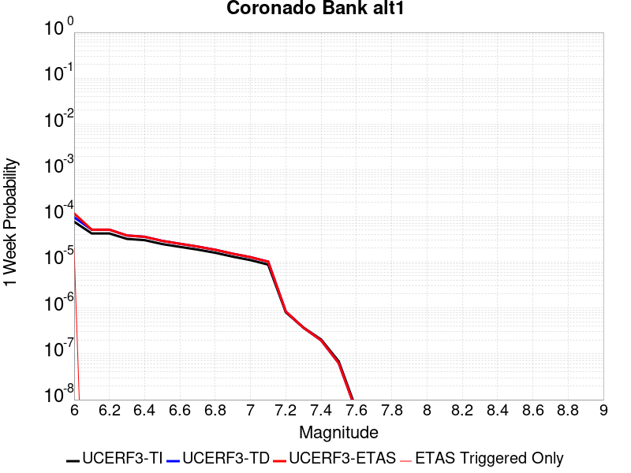 |  | 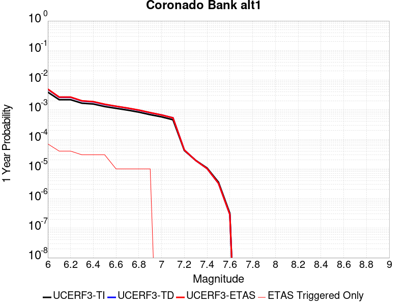 | 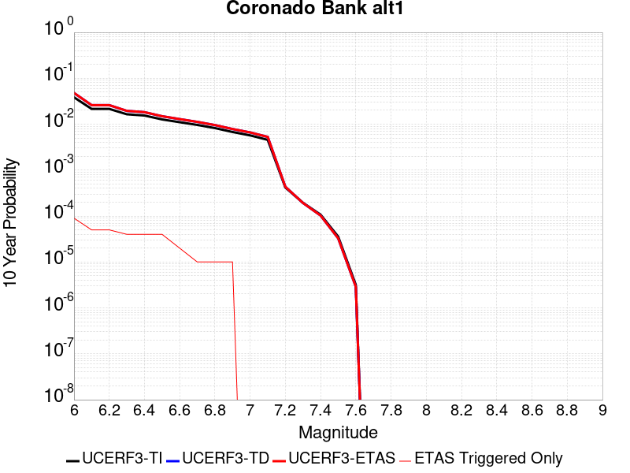 |

| Magnitude | 1 wk TI Prob | 1 wk TD Prob | 1 wk ETAS Prob | 1 wk ETAS/TD Gain | 1 wk ETAS Triggered Only | 1 mo TI Prob | 1 mo TD Prob | 1 mo ETAS Prob | 1 mo ETAS/TD Gain | 1 mo ETAS Triggered Only | 1 yr TI Prob | 1 yr TD Prob | 1 yr ETAS Prob | 1 yr ETAS/TD Gain | 1 yr ETAS Triggered Only | 10 yr TI Prob | 10 yr TD Prob | 10 yr ETAS Prob | 10 yr ETAS/TD Gain | 10 yr ETAS Triggered Only |
|-----|-----|-----|-----|-----|-----|-----|-----|-----|-----|-----|-----|-----|-----|-----|-----|-----|-----|-----|-----|-----|
| 6.0 | 7.533492E-5 | 9.3951705E-5 | 1.1394983E-4 | 1.2128553 | 2.0E-5 | 3.22824E-4 | 4.025903E-4 | 4.325782E-4 | 1.0744874 | 3.0E-5 | 0.0039233007 | 0.004891121 | 0.0049607786 | 1.0142417 | 7.0E-5 | 0.03854755 | 0.047904 | 0.04798969 | 1.0017887 | 9.0E-5 |
| 6.1 | 4.1807285E-5 | 5.0493105E-5 | 5.0493105E-5 | 1.0 | 0.0 | 1.7916178E-4 | 2.1638138E-4 | 2.2637921E-4 | 1.0462047 | 1.0E-5 | 0.0021791123 | 0.0026313365 | 0.0026712313 | 1.0151614 | 4.0E-5 | 0.021578677 | 0.026011124 | 0.026059823 | 1.0018723 | 5.0E-5 |
| 6.2 | 4.1807285E-5 | 5.0493105E-5 | 5.0493105E-5 | 1.0 | 0.0 | 1.7916178E-4 | 2.1638138E-4 | 2.2637921E-4 | 1.0462047 | 1.0E-5 | 0.0021791123 | 0.0026313365 | 0.0026712313 | 1.0151614 | 4.0E-5 | 0.021578677 | 0.026011124 | 0.026059823 | 1.0018723 | 5.0E-5 |
| 6.3 | 3.1793104E-5 | 3.7711125E-5 | 3.7711125E-5 | 1.0 | 0.0 | 1.3624904E-4 | 1.6160926E-4 | 1.6160926E-4 | 1.0 | 0.0 | 0.0016575698 | 0.001965849 | 0.00199579 | 1.0152305 | 3.0E-5 | 0.016452603 | 0.019488495 | 0.019527715 | 1.0020125 | 4.0E-5 |
| 6.4 | 2.9878007E-5 | 3.5335797E-5 | 3.5335797E-5 | 1.0 | 0.0 | 1.2804232E-4 | 1.5143053E-4 | 1.5143053E-4 | 1.0 | 0.0 | 0.0015578003 | 0.0018421395 | 0.0018720842 | 1.0162554 | 3.0E-5 | 0.015469253 | 0.018272463 | 0.018311733 | 1.0021491 | 4.0E-5 |
| 6.5 | 2.4512565E-5 | 2.8764101E-5 | 2.8764101E-5 | 1.0 | 0.0 | 1.0504962E-4 | 1.2326906E-4 | 1.2326906E-4 | 1.0 | 0.0 | 0.0012782287 | 0.0014997943 | 0.0015297494 | 1.0199728 | 3.0E-5 | 0.012709012 | 0.0148996925 | 0.014939097 | 1.0026447 | 4.0E-5 |
| 6.6 | 2.1317413E-5 | 2.490667E-5 | 2.490667E-5 | 1.0 | 0.0 | 9.135714E-5 | 1.0673863E-4 | 1.0673863E-4 | 1.0 | 0.0 | 0.0011117056 | 0.0012987903 | 0.0013087774 | 1.0076895 | 1.0E-5 | 0.011061605 | 0.012914407 | 0.012934149 | 1.0015286 | 2.0E-5 |
| 6.7 | 1.8585655E-5 | 2.1634882E-5 | 2.1634882E-5 | 1.0 | 0.0 | 7.9650374E-5 | 9.271774E-5 | 9.271774E-5 | 1.0 | 0.0 | 9.6931186E-4 | 0.0011282744 | 0.001138263 | 1.0088531 | 1.0E-5 | 0.0096509475 | 0.011227623 | 0.0112375105 | 1.0008807 | 1.0E-5 |
| 6.8 | 1.5862879E-5 | 1.8419476E-5 | 1.8419476E-5 | 1.0 | 0.0 | 6.798199E-5 | 7.8938334E-5 | 7.8938334E-5 | 1.0 | 0.0 | 8.273665E-4 | 9.606697E-4 | 9.7066007E-4 | 1.0103995 | 1.0E-5 | 0.008242928 | 0.009567151 | 0.0095770545 | 1.0010352 | 1.0E-5 |
| 6.9 | 1.3021509E-5 | 1.5095266E-5 | 1.5095266E-5 | 1.0 | 0.0 | 5.5805274E-5 | 6.46925E-5 | 6.46925E-5 | 1.0 | 0.0 | 6.792174E-4 | 7.873646E-4 | 7.973567E-4 | 1.0126905 | 1.0E-5 | 0.006771452 | 0.007847573 | 0.007857494 | 1.0012643 | 1.0E-5 |
| 7.0 | 1.0974371E-5 | 1.2720105E-5 | 1.2720105E-5 | 1.0 | 0.0 | 4.7032172E-5 | 5.4513697E-5 | 5.4513697E-5 | 1.0 | 0.0 | 5.7246623E-4 | 6.635197E-4 | 6.635197E-4 | 1.0 | 0.0 | 0.0057099373 | 0.0066171354 | 0.0066171354 | 1.0 | 0.0 |
| 7.1 | 8.766221E-6 | 1.0163833E-5 | 1.0163833E-5 | 1.0 | 0.0 | 3.7568978E-5 | 4.3558655E-5 | 4.3558655E-5 | 1.0 | 0.0 | 4.573063E-4 | 5.302148E-4 | 5.302148E-4 | 1.0 | 0.0 | 0.0045636636 | 0.005291197 | 0.005291197 | 1.0 | 0.0 |
| 7.2 | 8.026024E-7 | 8.331776E-7 | 8.331776E-7 | 1.0 | 0.0 | 3.43972E-6 | 3.5707562E-6 | 3.5707562E-6 | 1.0 | 0.0 | 4.1877785E-5 | 4.34731E-5 | 4.34731E-5 | 1.0 | 0.0 | 4.1869894E-4 | 4.3464705E-4 | 4.3464705E-4 | 1.0 | 0.0 |
| 7.3 | 3.7293114E-7 | 3.700106E-7 | 3.700106E-7 | 1.0 | 0.0 | 1.5982754E-6 | 1.5857588E-6 | 1.5857588E-6 | 1.0 | 0.0 | 1.9458828E-5 | 1.9306442E-5 | 1.9306442E-5 | 1.0 | 0.0 | 1.9457124E-4 | 1.9304773E-4 | 1.9304773E-4 | 1.0 | 0.0 |
| 7.4 | 2.0557036E-7 | 1.9674441E-7 | 1.9674441E-7 | 1.0 | 0.0 | 8.810155E-7 | 8.4319004E-7 | 8.4319004E-7 | 1.0 | 0.0 | 1.0726311E-5 | 1.02657905E-5 | 1.02657905E-5 | 1.0 | 0.0 | 1.0725793E-4 | 1.026532E-4 | 1.026532E-4 | 1.0 | 0.0 |
| 7.5 | 6.845446E-8 | 6.2794086E-8 | 6.2794086E-8 | 1.0 | 0.0 | 2.9337625E-7 | 2.6911746E-7 | 2.6911746E-7 | 1.0 | 0.0 | 3.5718497E-6 | 3.2765004E-6 | 3.2765004E-6 | 1.0 | 0.0 | 3.5717923E-5 | 3.276453E-5 | 3.276453E-5 | 1.0 | 0.0 |
| 7.6 | 6.0975145E-9 | 5.531901E-9 | 5.531901E-9 | 1.0 | 0.0 | 2.6132206E-8 | 2.3708148E-8 | 2.3708148E-8 | 1.0 | 0.0 | 3.1815955E-7 | 2.8864667E-7 | 2.8864667E-7 | 1.0 | 0.0 | 3.181591E-6 | 2.886464E-6 | 2.886464E-6 | 1.0 | 0.0 |

## San Jacinto (Coyote Creek)
*[(top)](#table-of-contents)*

| 1 Week | 1 Month | 1 Year | 10 Year |
|-----|-----|-----|-----|
|  | 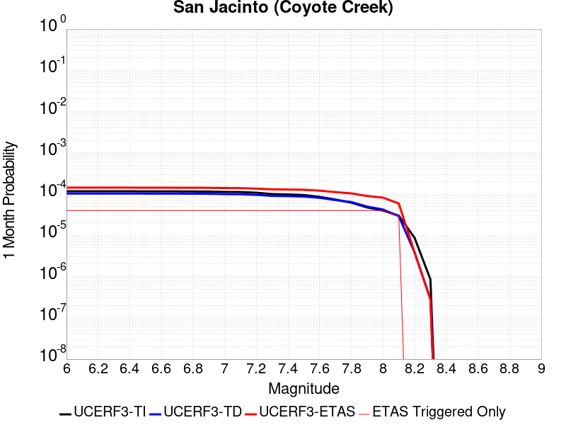 |  |  |

| Magnitude | 1 wk TI Prob | 1 wk TD Prob | 1 wk ETAS Prob | 1 wk ETAS/TD Gain | 1 wk ETAS Triggered Only | 1 mo TI Prob | 1 mo TD Prob | 1 mo ETAS Prob | 1 mo ETAS/TD Gain | 1 mo ETAS Triggered Only | 1 yr TI Prob | 1 yr TD Prob | 1 yr ETAS Prob | 1 yr ETAS/TD Gain | 1 yr ETAS Triggered Only | 10 yr TI Prob | 10 yr TD Prob | 10 yr ETAS Prob | 10 yr ETAS/TD Gain | 10 yr ETAS Triggered Only |
|-----|-----|-----|-----|-----|-----|-----|-----|-----|-----|-----|-----|-----|-----|-----|-----|-----|-----|-----|-----|-----|
| 6.0 | 2.7374346E-5 | 2.41444E-5 | 3.4144156E-5 | 1.4141648 | 1.0E-5 | 1.1731335E-4 | 1.034719E-4 | 1.4346777E-4 | 1.3865384 | 4.0E-5 | 0.0014273542 | 0.001259045 | 0.0013389443 | 1.0634602 | 8.0E-5 | 0.01418221 | 0.012928195 | 0.01300716 | 1.006108 | 8.0E-5 |
| 6.1 | 2.7374346E-5 | 2.41444E-5 | 3.4144156E-5 | 1.4141648 | 1.0E-5 | 1.1731335E-4 | 1.034719E-4 | 1.4346777E-4 | 1.3865384 | 4.0E-5 | 0.0014273542 | 0.001259045 | 0.0013389443 | 1.0634602 | 8.0E-5 | 0.01418221 | 0.012928195 | 0.01300716 | 1.006108 | 8.0E-5 |
| 6.2 | 2.7374346E-5 | 2.41444E-5 | 3.4144156E-5 | 1.4141648 | 1.0E-5 | 1.1731335E-4 | 1.034719E-4 | 1.4346777E-4 | 1.3865384 | 4.0E-5 | 0.0014273542 | 0.001259045 | 0.0013389443 | 1.0634602 | 8.0E-5 | 0.01418221 | 0.012928195 | 0.01300716 | 1.006108 | 8.0E-5 |
| 6.3 | 2.7374346E-5 | 2.41444E-5 | 3.4144156E-5 | 1.4141648 | 1.0E-5 | 1.1731335E-4 | 1.034719E-4 | 1.4346777E-4 | 1.3865384 | 4.0E-5 | 0.0014273542 | 0.001259045 | 0.0013389443 | 1.0634602 | 8.0E-5 | 0.01418221 | 0.012928195 | 0.01300716 | 1.006108 | 8.0E-5 |
| 6.4 | 2.7374346E-5 | 2.41444E-5 | 3.4144156E-5 | 1.4141648 | 1.0E-5 | 1.1731335E-4 | 1.034719E-4 | 1.4346777E-4 | 1.3865384 | 4.0E-5 | 0.0014273542 | 0.001259045 | 0.0013389443 | 1.0634602 | 8.0E-5 | 0.01418221 | 0.012928195 | 0.01300716 | 1.006108 | 8.0E-5 |
| 6.5 | 2.7282445E-5 | 2.4030476E-5 | 3.4030236E-5 | 1.4161283 | 1.0E-5 | 1.16919524E-4 | 1.0298371E-4 | 1.4297958E-4 | 1.388371 | 4.0E-5 | 0.0014225657 | 0.001253108 | 0.0013330078 | 1.0637612 | 8.0E-5 | 0.014134934 | 0.012869522 | 0.012948493 | 1.0061362 | 8.0E-5 |
| 6.6 | 2.7282445E-5 | 2.4030476E-5 | 3.4030236E-5 | 1.4161283 | 1.0E-5 | 1.16919524E-4 | 1.0298371E-4 | 1.4297958E-4 | 1.388371 | 4.0E-5 | 0.0014225657 | 0.001253108 | 0.0013330078 | 1.0637612 | 8.0E-5 | 0.014134934 | 0.012869522 | 0.012948493 | 1.0061362 | 8.0E-5 |
| 6.7 | 2.7216198E-5 | 2.3955597E-5 | 3.395536E-5 | 1.417429 | 1.0E-5 | 1.1663563E-4 | 1.02662816E-4 | 1.4265871E-4 | 1.389585 | 4.0E-5 | 0.0014191137 | 0.0012492058 | 0.0013291058 | 1.0639607 | 8.0E-5 | 0.014100855 | 0.012830934 | 0.012909908 | 1.0061549 | 8.0E-5 |
| 6.8 | 2.7078617E-5 | 2.3872815E-5 | 3.3872577E-5 | 1.4188765 | 1.0E-5 | 1.1604605E-4 | 1.0230807E-4 | 1.4230398E-4 | 1.390936 | 4.0E-5 | 0.001411945 | 0.0012448917 | 0.001324792 | 1.0641826 | 8.0E-5 | 0.014030075 | 0.0127880825 | 0.01286706 | 1.0061759 | 8.0E-5 |
| 6.9 | 2.6982952E-5 | 2.3792329E-5 | 3.379209E-5 | 1.4202936 | 1.0E-5 | 1.15636096E-4 | 1.0196315E-4 | 1.4195907E-4 | 1.3922585 | 4.0E-5 | 0.0014069602 | 0.0012406971 | 0.0013205978 | 1.0643998 | 8.0E-5 | 0.013980856 | 0.012746378 | 0.012825359 | 1.0061963 | 8.0E-5 |
| 7.0 | 2.6449972E-5 | 2.3369357E-5 | 3.3369124E-5 | 1.4279008 | 1.0E-5 | 1.1335209E-4 | 1.0015055E-4 | 1.4014654E-4 | 1.3993586 | 4.0E-5 | 0.001379188 | 0.0012186535 | 0.0012985561 | 1.0655662 | 8.0E-5 | 0.0137065975 | 0.012527733 | 0.012606731 | 1.0063058 | 8.0E-5 |
| 7.1 | 2.6257849E-5 | 2.3195396E-5 | 3.3195163E-5 | 1.43111 | 1.0E-5 | 1.1252879E-4 | 9.940507E-5 | 1.3940109E-4 | 1.402354 | 4.0E-5 | 0.0013691769 | 0.0012095873 | 0.0012894906 | 1.0660583 | 8.0E-5 | 0.013607717 | 0.012437661 | 0.012516665 | 1.0063521 | 8.0E-5 |
| 7.2 | 2.5270041E-5 | 2.2390155E-5 | 3.2389933E-5 | 1.4466149 | 1.0E-5 | 1.0829568E-4 | 9.5954296E-5 | 1.3595045E-4 | 1.4168252 | 4.0E-5 | 0.0013177024 | 0.0011676198 | 0.0012475264 | 1.0684354 | 8.0E-5 | 0.013099162 | 0.0120187905 | 0.012097829 | 1.0065763 | 8.0E-5 |
| 7.3 | 2.339701E-5 | 2.1122027E-5 | 3.1121817E-5 | 1.4734294 | 1.0E-5 | 1.0026905E-4 | 9.051985E-5 | 1.3051623E-4 | 1.4418521 | 4.0E-5 | 0.001220092 | 0.001101524 | 0.0011814359 | 1.0725466 | 8.0E-5 | 0.012134149 | 0.011357642 | 0.011436733 | 1.0069637 | 8.0E-5 |
| 7.4 | 2.296333E-5 | 2.0852396E-5 | 3.085219E-5 | 1.4795512 | 1.0E-5 | 9.841056E-5 | 8.936436E-5 | 1.2936078E-4 | 1.4475658 | 4.0E-5 | 0.0011974899 | 0.0010874701 | 0.001167383 | 1.0734853 | 8.0E-5 | 0.011910575 | 0.011216754 | 0.011295856 | 1.0070522 | 8.0E-5 |
| 7.5 | 2.2188895E-5 | 2.037534E-5 | 3.0375139E-5 | 1.4907793 | 1.0E-5 | 9.50918E-5 | 8.731998E-5 | 1.2731648E-4 | 1.4580454 | 4.0E-5 | 0.0011571277 | 0.0010626042 | 0.0011425193 | 1.0752068 | 8.0E-5 | 0.011511209 | 0.010966369 | 0.011045492 | 1.007215 | 8.0E-5 |
| 7.6 | 2.0013189E-5 | 1.8961666E-5 | 2.8961476E-5 | 1.5273699 | 1.0E-5 | 8.5767984E-5 | 8.126176E-5 | 1.21258505E-4 | 1.4921964 | 4.0E-5 | 0.001043725 | 9.889146E-4 | 0.0010688355 | 1.0808167 | 8.0E-5 | 0.010388365 | 0.010224371 | 0.010303553 | 1.0077444 | 8.0E-5 |
| 7.7 | 1.7230794E-5 | 1.6743043E-5 | 2.6742875E-5 | 1.597253 | 1.0E-5 | 7.384417E-5 | 7.175393E-5 | 1.1175106E-4 | 1.5574207 | 4.0E-5 | 8.986819E-4 | 8.732547E-4 | 9.531849E-4 | 1.0915313 | 8.0E-5 | 0.008950562 | 0.00906292 | 0.009142195 | 1.0087472 | 8.0E-5 |
| 7.8 | 1.4478809E-5 | 1.499039E-5 | 2.499024E-5 | 1.6670841 | 1.0E-5 | 6.205057E-5 | 6.424295E-5 | 1.0424038E-4 | 1.6225964 | 4.0E-5 | 7.552038E-4 | 7.8187784E-4 | 8.618153E-4 | 1.1022378 | 8.0E-5 | 0.0075264242 | 0.008141388 | 0.008220737 | 1.0097463 | 8.0E-5 |
| 7.9 | 1.1114467E-5 | 1.1644517E-5 | 2.16444E-5 | 1.8587633 | 1.0E-5 | 4.7632562E-5 | 4.990412E-5 | 8.9902125E-5 | 1.801497 | 4.0E-5 | 5.797721E-4 | 6.074139E-4 | 6.8736525E-4 | 1.1316259 | 8.0E-5 | 0.0057826187 | 0.0063803545 | 0.0064598443 | 1.0124584 | 8.0E-5 |
| 8.0 | 9.327402E-6 | 9.8986575E-6 | 1.9898558E-5 | 2.010228 | 1.0E-5 | 3.9973966E-5 | 4.2422133E-5 | 8.242043E-5 | 1.9428641 | 4.0E-5 | 4.8657437E-4 | 5.163676E-4 | 5.963263E-4 | 1.1548483 | 8.0E-5 | 0.0048551033 | 0.00544994 | 0.0055295043 | 1.0145991 | 8.0E-5 |
| 8.1 | 7.0235833E-6 | 6.826985E-6 | 1.6826916E-5 | 2.4647655 | 1.0E-5 | 3.0100724E-5 | 2.9258183E-5 | 5.9257305E-5 | 2.025324 | 3.0E-5 | 3.664147E-4 | 3.5616063E-4 | 4.0614285E-4 | 1.140336 | 5.0E-5 | 0.003658111 | 0.0037874572 | 0.0038372679 | 1.0131515 | 5.0E-5 |
| 8.2 | 2.0358202E-6 | 8.9912584E-7 | 8.9912584E-7 | 1.0 | 0.0 | 8.724915E-6 | 3.853391E-6 | 3.853391E-6 | 1.0 | 0.0 | 1.06220665E-4 | 4.6914047E-5 | 5.6913577E-5 | 1.2131457 | 1.0E-5 | 0.001061699 | 5.3239096E-4 | 5.423856E-4 | 1.0187732 | 1.0E-5 |
| 8.3 | 2.0051264E-7 | 6.61379E-8 | 6.61379E-8 | 1.0 | 0.0 | 8.5933965E-7 | 2.8344812E-7 | 2.8344812E-7 | 1.0 | 0.0 | 1.046241E-5 | 3.450976E-6 | 3.450976E-6 | 1.0 | 0.0 | 1.0461917E-4 | 4.0120205E-5 | 4.0120205E-5 | 1.0 | 0.0 |

## San Cayetano
*[(top)](#table-of-contents)*

| 1 Week | 1 Month | 1 Year | 10 Year |
|-----|-----|-----|-----|
| 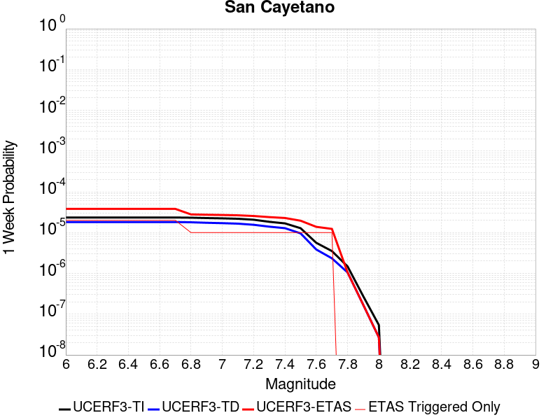 |  |  | 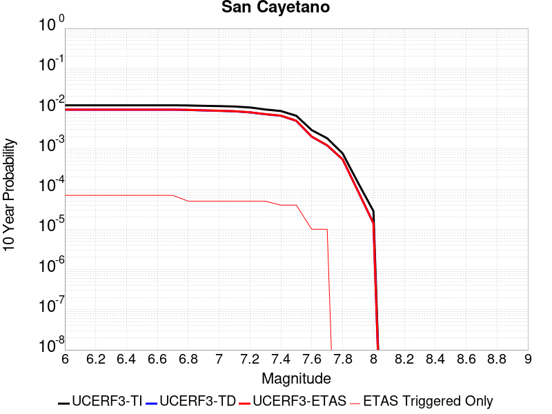 |

| Magnitude | 1 wk TI Prob | 1 wk TD Prob | 1 wk ETAS Prob | 1 wk ETAS/TD Gain | 1 wk ETAS Triggered Only | 1 mo TI Prob | 1 mo TD Prob | 1 mo ETAS Prob | 1 mo ETAS/TD Gain | 1 mo ETAS Triggered Only | 1 yr TI Prob | 1 yr TD Prob | 1 yr ETAS Prob | 1 yr ETAS/TD Gain | 1 yr ETAS Triggered Only | 10 yr TI Prob | 10 yr TD Prob | 10 yr ETAS Prob | 10 yr ETAS/TD Gain | 10 yr ETAS Triggered Only |
|-----|-----|-----|-----|-----|-----|-----|-----|-----|-----|-----|-----|-----|-----|-----|-----|-----|-----|-----|-----|-----|
| 6.0 | 2.3476267E-5 | 1.8169216E-5 | 3.816885E-5 | 2.100743 | 2.0E-5 | 1.0060869E-4 | 7.786576E-5 | 1.2786187E-4 | 1.6420808 | 5.0E-5 | 0.0012242225 | 9.4760704E-4 | 9.975596E-4 | 1.0527145 | 5.0E-5 | 0.012175002 | 0.00943675 | 0.00950609 | 1.0073478 | 7.0E-5 |
| 6.1 | 2.3476267E-5 | 1.8169216E-5 | 3.816885E-5 | 2.100743 | 2.0E-5 | 1.0060869E-4 | 7.786576E-5 | 1.2786187E-4 | 1.6420808 | 5.0E-5 | 0.0012242225 | 9.4760704E-4 | 9.975596E-4 | 1.0527145 | 5.0E-5 | 0.012175002 | 0.00943675 | 0.00950609 | 1.0073478 | 7.0E-5 |
| 6.2 | 2.3476267E-5 | 1.8169216E-5 | 3.816885E-5 | 2.100743 | 2.0E-5 | 1.0060869E-4 | 7.786576E-5 | 1.2786187E-4 | 1.6420808 | 5.0E-5 | 0.0012242225 | 9.4760704E-4 | 9.975596E-4 | 1.0527145 | 5.0E-5 | 0.012175002 | 0.00943675 | 0.00950609 | 1.0073478 | 7.0E-5 |
| 6.3 | 2.3476267E-5 | 1.8169216E-5 | 3.816885E-5 | 2.100743 | 2.0E-5 | 1.0060869E-4 | 7.786576E-5 | 1.2786187E-4 | 1.6420808 | 5.0E-5 | 0.0012242225 | 9.4760704E-4 | 9.975596E-4 | 1.0527145 | 5.0E-5 | 0.012175002 | 0.00943675 | 0.00950609 | 1.0073478 | 7.0E-5 |
| 6.4 | 2.3476267E-5 | 1.8169216E-5 | 3.816885E-5 | 2.100743 | 2.0E-5 | 1.0060869E-4 | 7.786576E-5 | 1.2786187E-4 | 1.6420808 | 5.0E-5 | 0.0012242225 | 9.4760704E-4 | 9.975596E-4 | 1.0527145 | 5.0E-5 | 0.012175002 | 0.00943675 | 0.00950609 | 1.0073478 | 7.0E-5 |
| 6.5 | 2.3476267E-5 | 1.8169216E-5 | 3.816885E-5 | 2.100743 | 2.0E-5 | 1.0060869E-4 | 7.786576E-5 | 1.2786187E-4 | 1.6420808 | 5.0E-5 | 0.0012242225 | 9.4760704E-4 | 9.975596E-4 | 1.0527145 | 5.0E-5 | 0.012175002 | 0.00943675 | 0.00950609 | 1.0073478 | 7.0E-5 |
| 6.6 | 2.3476267E-5 | 1.8169216E-5 | 3.816885E-5 | 2.100743 | 2.0E-5 | 1.0060869E-4 | 7.786576E-5 | 1.2786187E-4 | 1.6420808 | 5.0E-5 | 0.0012242225 | 9.4760704E-4 | 9.975596E-4 | 1.0527145 | 5.0E-5 | 0.012175002 | 0.00943675 | 0.00950609 | 1.0073478 | 7.0E-5 |
| 6.7 | 2.3476267E-5 | 1.8169216E-5 | 3.816885E-5 | 2.100743 | 2.0E-5 | 1.0060869E-4 | 7.786576E-5 | 1.2786187E-4 | 1.6420808 | 5.0E-5 | 0.0012242225 | 9.4760704E-4 | 9.975596E-4 | 1.0527145 | 5.0E-5 | 0.012175002 | 0.00943675 | 0.00950609 | 1.0073478 | 7.0E-5 |
| 6.8 | 2.3241924E-5 | 1.7936945E-5 | 2.7936767E-5 | 1.5574985 | 1.0E-5 | 9.960445E-5 | 7.687038E-5 | 1.0686807E-4 | 1.3902373 | 3.0E-5 | 0.0012120095 | 9.354987E-4 | 9.654706E-4 | 1.0320385 | 3.0E-5 | 0.012054204 | 0.0093166195 | 0.009366154 | 1.0053167 | 5.0E-5 |
| 6.9 | 2.2761007E-5 | 1.7432383E-5 | 2.743221E-5 | 1.573635 | 1.0E-5 | 9.7543525E-5 | 7.47081E-5 | 1.04705854E-4 | 1.4015329 | 3.0E-5 | 0.0011869454 | 9.09195E-4 | 9.391677E-4 | 1.0329663 | 3.0E-5 | 0.011806256 | 0.009055741 | 0.009105288 | 1.0054713 | 5.0E-5 |
| 7.0 | 2.240283E-5 | 1.7066137E-5 | 2.7065966E-5 | 1.5859457 | 1.0E-5 | 9.600859E-5 | 7.313856E-5 | 1.03136364E-4 | 1.4101504 | 3.0E-5 | 0.0011682777 | 8.9010154E-4 | 9.200749E-4 | 1.033674 | 3.0E-5 | 0.011621549 | 0.008866336 | 0.008915893 | 1.0055894 | 5.0E-5 |
| 7.1 | 2.1871154E-5 | 1.658602E-5 | 2.6585854E-5 | 1.6029074 | 1.0E-5 | 9.373015E-5 | 7.108103E-5 | 1.0107889E-4 | 1.4220235 | 3.0E-5 | 0.0011405671 | 8.6507126E-4 | 8.950453E-4 | 1.0346493 | 3.0E-5 | 0.011347309 | 0.008617996 | 0.008667566 | 1.0057518 | 5.0E-5 |
| 7.2 | 2.0714133E-5 | 1.5564563E-5 | 2.5564406E-5 | 1.6424751 | 1.0E-5 | 8.8771834E-5 | 6.670358E-5 | 9.670158E-5 | 1.449721 | 3.0E-5 | 0.0010802611 | 8.118168E-4 | 8.417924E-4 | 1.0369241 | 3.0E-5 | 0.010750249 | 0.008089443 | 0.008139038 | 1.0061309 | 5.0E-5 |
| 7.3 | 1.8408395E-5 | 1.3996829E-5 | 2.3996688E-5 | 1.7144376 | 1.0E-5 | 7.8890735E-5 | 5.9985046E-5 | 8.9983245E-5 | 1.5000947 | 3.0E-5 | 9.600714E-4 | 7.300762E-4 | 7.600543E-4 | 1.0410616 | 3.0E-5 | 0.009559342 | 0.0072776447 | 0.007327281 | 1.0068203 | 5.0E-5 |
| 7.4 | 1.6856795E-5 | 1.285006E-5 | 2.284993E-5 | 1.7781966 | 1.0E-5 | 7.2241404E-5 | 5.5070537E-5 | 7.506944E-5 | 1.3631506 | 2.0E-5 | 8.7918417E-4 | 6.7028037E-4 | 6.9026696E-4 | 1.0298183 | 2.0E-5 | 0.00875714 | 0.0066834087 | 0.0067231413 | 1.005945 | 4.0E-5 |
| 7.5 | 1.2822778E-5 | 9.577415E-6 | 1.957732E-5 | 2.0441132 | 1.0E-5 | 5.495361E-5 | 4.1045427E-5 | 6.104461E-5 | 1.487245 | 2.0E-5 | 6.688548E-4 | 4.9961504E-4 | 5.1960506E-4 | 1.0400108 | 2.0E-5 | 0.006668452 | 0.0049851923 | 0.005024993 | 1.0079838 | 4.0E-5 |
| 7.6 | 5.6272684E-6 | 3.854899E-6 | 1.3854861E-5 | 3.5940914 | 1.0E-5 | 2.4116642E-5 | 1.6520893E-5 | 2.6520727E-5 | 1.6052841 | 1.0E-5 | 2.9358055E-4 | 2.0112342E-4 | 2.111214E-4 | 1.0497108 | 1.0E-5 | 0.0029319301 | 0.0020094248 | 0.0020194047 | 1.0049665 | 1.0E-5 |
| 7.7 | 3.5261346E-6 | 2.3407094E-6 | 1.2340686E-5 | 5.2721987 | 1.0E-5 | 1.5111918E-5 | 1.0031574E-5 | 2.0031473E-5 | 1.9968425 | 1.0E-5 | 1.8397206E-4 | 1.2212765E-4 | 1.3212643E-4 | 1.0818715 | 1.0E-5 | 0.0018381984 | 0.0012206127 | 0.0012306004 | 1.0081826 | 1.0E-5 |
| 7.8 | 1.4826929E-6 | 1.0564395E-6 | 1.0564395E-6 | 1.0 | 0.0 | 6.354383E-6 | 4.52759E-6 | 4.52759E-6 | 1.0 | 0.0 | 7.736187E-5 | 5.5122033E-5 | 5.5122033E-5 | 1.0 | 0.0 | 7.733494E-4 | 5.510856E-4 | 5.510856E-4 | 1.0 | 0.0 |
| 7.9 | 2.7568166E-7 | 1.6977887E-7 | 1.6977887E-7 | 1.0 | 0.0 | 1.1814923E-6 | 7.276235E-7 | 7.276235E-7 | 1.0 | 0.0 | 1.4384574E-5 | 8.85878E-6 | 8.85878E-6 | 1.0 | 0.0 | 1.4383643E-4 | 8.858431E-5 | 8.858431E-5 | 1.0 | 0.0 |
| 8.0 | 5.407832E-8 | 2.688677E-8 | 2.688677E-8 | 1.0 | 0.0 | 2.3176422E-7 | 1.15229014E-7 | 1.15229014E-7 | 1.0 | 0.0 | 2.8217257E-6 | 1.4029123E-6 | 1.4029123E-6 | 1.0 | 0.0 | 2.8216898E-5 | 1.40290385E-5 | 1.40290385E-5 | 1.0 | 0.0 |

## San Jacinto (Superstition Mtn)
*[(top)](#table-of-contents)*

| 1 Week | 1 Month | 1 Year | 10 Year |
|-----|-----|-----|-----|
|  |  |  | 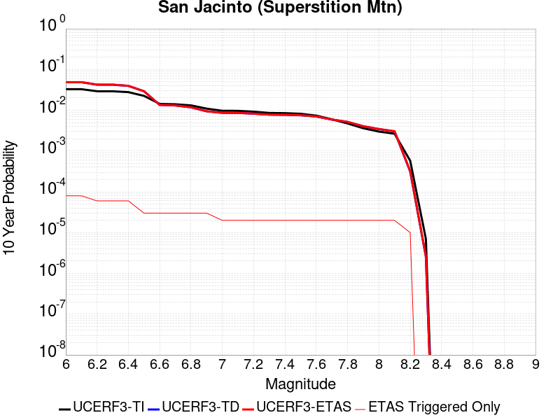 |

| Magnitude | 1 wk TI Prob | 1 wk TD Prob | 1 wk ETAS Prob | 1 wk ETAS/TD Gain | 1 wk ETAS Triggered Only | 1 mo TI Prob | 1 mo TD Prob | 1 mo ETAS Prob | 1 mo ETAS/TD Gain | 1 mo ETAS Triggered Only | 1 yr TI Prob | 1 yr TD Prob | 1 yr ETAS Prob | 1 yr ETAS/TD Gain | 1 yr ETAS Triggered Only | 10 yr TI Prob | 10 yr TD Prob | 10 yr ETAS Prob | 10 yr ETAS/TD Gain | 10 yr ETAS Triggered Only |
|-----|-----|-----|-----|-----|-----|-----|-----|-----|-----|-----|-----|-----|-----|-----|-----|-----|-----|-----|-----|-----|
| 6.0 | 6.4193904E-5 | 9.599558E-5 | 1.0599462E-4 | 1.1041615 | 1.0E-5 | 2.7508775E-4 | 4.1135435E-4 | 4.3134612E-4 | 1.0485998 | 2.0E-5 | 0.0033440501 | 0.0049981694 | 0.005047919 | 1.0099536 | 5.0E-5 | 0.03294174 | 0.048820045 | 0.048896138 | 1.0015587 | 8.0E-5 |
| 6.1 | 6.4193904E-5 | 9.599558E-5 | 1.0599462E-4 | 1.1041615 | 1.0E-5 | 2.7508775E-4 | 4.1135435E-4 | 4.3134612E-4 | 1.0485998 | 2.0E-5 | 0.0033440501 | 0.0049981694 | 0.005047919 | 1.0099536 | 5.0E-5 | 0.03294174 | 0.048820045 | 0.048896138 | 1.0015587 | 8.0E-5 |
| 6.2 | 5.7023593E-5 | 8.3144616E-5 | 8.3144616E-5 | 1.0 | 0.0 | 2.4436394E-4 | 3.5629462E-4 | 3.6629106E-4 | 1.0280566 | 1.0E-5 | 0.002971072 | 0.0043309047 | 0.004360775 | 1.006897 | 3.0E-5 | 0.029316625 | 0.042502448 | 0.0425599 | 1.0013517 | 6.0E-5 |
| 6.3 | 5.6940098E-5 | 8.298998E-5 | 8.298998E-5 | 1.0 | 0.0 | 2.4400617E-4 | 3.5563204E-4 | 3.656285E-4 | 1.028109 | 1.0E-5 | 0.002966728 | 0.00432287 | 0.0043527405 | 1.0069098 | 3.0E-5 | 0.029274331 | 0.04242582 | 0.042483274 | 1.0013542 | 6.0E-5 |
| 6.4 | 5.4171585E-5 | 7.748391E-5 | 7.748391E-5 | 1.0 | 0.0 | 2.3214328E-4 | 3.3204095E-4 | 3.4203762E-4 | 1.0301068 | 1.0E-5 | 0.0028226813 | 0.0040367534 | 0.004066632 | 1.0074017 | 3.0E-5 | 0.02787096 | 0.039715026 | 0.039772645 | 1.0014508 | 6.0E-5 |
| 6.5 | 4.375144E-5 | 5.6421442E-5 | 5.6421442E-5 | 1.0 | 0.0 | 1.874927E-4 | 2.417904E-4 | 2.5178798E-4 | 1.0413481 | 1.0E-5 | 0.0022803338 | 0.002941 | 0.0029709118 | 1.0101706 | 3.0E-5 | 0.022570757 | 0.029235592 | 0.029264715 | 1.0009961 | 3.0E-5 |
| 6.6 | 2.772192E-5 | 2.5488029E-5 | 2.5488029E-5 | 1.0 | 0.0 | 1.1880282E-4 | 1.0922994E-4 | 1.1922885E-4 | 1.09154 | 1.0E-5 | 0.0014454646 | 0.0013290826 | 0.0013590427 | 1.022542 | 3.0E-5 | 0.014360986 | 0.013540891 | 0.013570485 | 1.0021855 | 3.0E-5 |
| 6.7 | 2.7124124E-5 | 2.4699055E-5 | 2.4699055E-5 | 1.0 | 0.0 | 1.1624106E-4 | 1.0584891E-4 | 1.1584785E-4 | 1.0944643 | 1.0E-5 | 0.0014143161 | 0.0012879678 | 0.0013179291 | 1.0232625 | 3.0E-5 | 0.014053487 | 0.013134248 | 0.013163854 | 1.0022541 | 3.0E-5 |
| 6.8 | 2.5475807E-5 | 2.2164071E-5 | 2.2164071E-5 | 1.0 | 0.0 | 1.0917746E-4 | 9.498548E-5 | 1.0498453E-4 | 1.1052692 | 1.0E-5 | 0.001328425 | 0.0011558468 | 0.001185812 | 1.025925 | 3.0E-5 | 0.0132051185 | 0.011821818 | 0.0118514635 | 1.0025077 | 3.0E-5 |
| 6.9 | 2.1162023E-5 | 1.762564E-5 | 1.762564E-5 | 1.0 | 0.0 | 9.069123E-5 | 7.553629E-5 | 8.553554E-5 | 1.1323767 | 1.0E-5 | 0.0011036064 | 9.1927015E-4 | 9.4924256E-4 | 1.0326046 | 3.0E-5 | 0.010981417 | 0.009446762 | 0.009476478 | 1.0031457 | 3.0E-5 |
| 7.0 | 1.8754288E-5 | 1.616099E-5 | 1.616099E-5 | 1.0 | 0.0 | 8.037304E-5 | 6.9259564E-5 | 7.925887E-5 | 1.1443744 | 1.0E-5 | 9.781026E-4 | 8.429114E-4 | 8.628945E-4 | 1.0237073 | 2.0E-5 | 0.009738087 | 0.008669995 | 0.008689821 | 1.0022868 | 2.0E-5 |
| 7.1 | 1.8678527E-5 | 1.6086136E-5 | 1.6086136E-5 | 1.0 | 0.0 | 8.0048376E-5 | 6.8938774E-5 | 7.893809E-5 | 1.1450462 | 1.0E-5 | 9.7415317E-4 | 8.3900883E-4 | 8.5899205E-4 | 1.0238177 | 2.0E-5 | 0.009698939 | 0.008631011 | 0.0086508375 | 1.0022973 | 2.0E-5 |
| 7.2 | 1.7804578E-5 | 1.5380709E-5 | 1.5380709E-5 | 1.0 | 0.0 | 7.6303106E-5 | 6.591567E-5 | 7.591501E-5 | 1.151699 | 1.0E-5 | 9.285943E-4 | 8.022301E-4 | 8.2221406E-4 | 1.0249104 | 2.0E-5 | 0.009247236 | 0.008262424 | 0.008282258 | 1.0024006 | 2.0E-5 |
| 7.3 | 1.6583685E-5 | 1.4529837E-5 | 1.4529837E-5 | 1.0 | 0.0 | 7.1070994E-5 | 6.226926E-5 | 7.226864E-5 | 1.1605829 | 1.0E-5 | 8.649459E-4 | 7.5786654E-4 | 7.778514E-4 | 1.0263699 | 2.0E-5 | 0.00861587 | 0.007817646 | 0.007837489 | 1.0025383 | 2.0E-5 |
| 7.4 | 1.6387552E-5 | 1.4394727E-5 | 1.4394727E-5 | 1.0 | 0.0 | 7.023047E-5 | 6.169024E-5 | 7.1689625E-5 | 1.1620902 | 1.0E-5 | 8.5472054E-4 | 7.508219E-4 | 7.7080686E-4 | 1.0266175 | 2.0E-5 | 0.008514405 | 0.0077470187 | 0.007766864 | 1.0025617 | 2.0E-5 |
| 7.5 | 1.5790754E-5 | 1.40354305E-5 | 1.40354305E-5 | 1.0 | 0.0 | 6.767291E-5 | 6.015047E-5 | 7.0149865E-5 | 1.1662397 | 1.0E-5 | 8.236062E-4 | 7.320879E-4 | 7.5207325E-4 | 1.0272992 | 2.0E-5 | 0.008205604 | 0.007557581 | 0.00757743 | 1.0026263 | 2.0E-5 |
| 7.6 | 1.4248672E-5 | 1.3054444E-5 | 1.3054444E-5 | 1.0 | 0.0 | 6.106431E-5 | 5.5946428E-5 | 6.594587E-5 | 1.1787324 | 1.0E-5 | 7.432043E-4 | 6.809366E-4 | 7.00923E-4 | 1.0293514 | 2.0E-5 | 0.007407237 | 0.007040175 | 0.007060034 | 1.0028208 | 2.0E-5 |
| 7.7 | 1.15449975E-5 | 1.0903222E-5 | 1.0903222E-5 | 1.0 | 0.0 | 4.947762E-5 | 4.672726E-5 | 5.6726793E-5 | 1.2139978 | 1.0E-5 | 6.022235E-4 | 5.6875666E-4 | 5.887453E-4 | 1.0351444 | 2.0E-5 | 0.006005941 | 0.0059102564 | 0.0059301383 | 1.003364 | 2.0E-5 |
| 7.8 | 9.1391985E-6 | 9.5139185E-6 | 9.5139185E-6 | 1.0 | 0.0 | 3.9167408E-5 | 4.0773306E-5 | 5.07729E-5 | 1.2452486 | 1.0E-5 | 4.767588E-4 | 4.963025E-4 | 5.162926E-4 | 1.040278 | 2.0E-5 | 0.0047573727 | 0.005176809 | 0.0051967055 | 1.0038434 | 2.0E-5 |
| 7.9 | 6.973017E-6 | 7.3817937E-6 | 7.3817937E-6 | 1.0 | 0.0 | 2.9884017E-5 | 3.163588E-5 | 4.163556E-5 | 1.3160868 | 1.0E-5 | 3.6377716E-4 | 3.8509927E-4 | 4.050916E-4 | 1.0519147 | 2.0E-5 | 0.0036318225 | 0.004051976 | 0.004071895 | 1.0049158 | 2.0E-5 |
| 8.0 | 5.7638235E-6 | 6.259641E-6 | 6.259641E-6 | 1.0 | 0.0 | 2.4701867E-5 | 2.682676E-5 | 3.6826492E-5 | 1.3727521 | 1.0E-5 | 3.0070372E-4 | 3.2656736E-4 | 3.4656082E-4 | 1.0612231 | 2.0E-5 | 0.0030029714 | 0.0034535413 | 0.0034734723 | 1.0057712 | 2.0E-5 |
| 8.1 | 5.1124434E-6 | 5.4953657E-6 | 5.4953657E-6 | 1.0 | 0.0 | 2.1910288E-5 | 2.3551356E-5 | 3.355112E-5 | 1.424594 | 1.0E-5 | 2.6672508E-4 | 2.8670052E-4 | 3.066948E-4 | 1.0697392 | 2.0E-5 | 0.0026640517 | 0.0030403896 | 0.0030603288 | 1.0065581 | 2.0E-5 |
| 8.2 | 1.1075938E-6 | 5.3348367E-7 | 5.3348367E-7 | 1.0 | 0.0 | 4.7468216E-6 | 2.2863567E-6 | 2.2863567E-6 | 1.0 | 0.0 | 5.779102E-5 | 2.7836059E-5 | 3.783578E-5 | 1.3592362 | 1.0E-5 | 5.777599E-4 | 3.133962E-4 | 3.2339303E-4 | 1.0318985 | 1.0E-5 |
| 8.3 | 1.3584393E-8 | 4.4718784E-9 | 4.4718784E-9 | 1.0 | 0.0 | 5.8218827E-8 | 1.9165192E-8 | 1.9165192E-8 | 1.0 | 0.0 | 7.0881396E-7 | 2.3333622E-7 | 2.3333622E-7 | 1.0 | 0.0 | 7.0881174E-6 | 2.6140672E-6 | 2.6140672E-6 | 1.0 | 0.0 |

## Big Pine (Central)
*[(top)](#table-of-contents)*

| 1 Week | 1 Month | 1 Year | 10 Year |
|-----|-----|-----|-----|
|  |  |  |  |

| Magnitude | 1 wk TI Prob | 1 wk TD Prob | 1 wk ETAS Prob | 1 wk ETAS/TD Gain | 1 wk ETAS Triggered Only | 1 mo TI Prob | 1 mo TD Prob | 1 mo ETAS Prob | 1 mo ETAS/TD Gain | 1 mo ETAS Triggered Only | 1 yr TI Prob | 1 yr TD Prob | 1 yr ETAS Prob | 1 yr ETAS/TD Gain | 1 yr ETAS Triggered Only | 10 yr TI Prob | 10 yr TD Prob | 10 yr ETAS Prob | 10 yr ETAS/TD Gain | 10 yr ETAS Triggered Only |
|-----|-----|-----|-----|-----|-----|-----|-----|-----|-----|-----|-----|-----|-----|-----|-----|-----|-----|-----|-----|-----|
| 6.0 | 1.2706755E-5 | 1.4250602E-5 | 2.425046E-5 | 1.7017148 | 1.0E-5 | 5.4456385E-5 | 6.107279E-5 | 7.107217E-5 | 1.1637291 | 1.0E-5 | 6.628048E-4 | 7.433441E-4 | 8.1329205E-4 | 1.094099 | 7.0E-5 | 0.006608314 | 0.007413639 | 0.007493046 | 1.010711 | 8.0E-5 |
| 6.1 | 8.342579E-6 | 9.510835E-6 | 1.951074E-5 | 2.0514224 | 1.0E-5 | 3.5753423E-5 | 4.076021E-5 | 5.07598E-5 | 1.2453274 | 1.0E-5 | 4.3521097E-4 | 4.9616426E-4 | 5.561345E-4 | 1.1208677 | 6.0E-5 | 0.0043435963 | 0.004954155 | 0.005023808 | 1.0140595 | 7.0E-5 |
| 6.2 | 6.923899E-6 | 7.967221E-6 | 1.7967142E-5 | 2.2551327 | 1.0E-5 | 2.9673516E-5 | 3.4144894E-5 | 4.4144555E-5 | 1.2928596 | 1.0E-5 | 3.6121515E-4 | 4.1565404E-4 | 4.5563743E-4 | 1.0961939 | 4.0E-5 | 0.003606286 | 0.0041521094 | 0.0042019016 | 1.0119921 | 5.0E-5 |
| 6.3 | 2.728396E-6 | 3.4243646E-6 | 1.342433E-5 | 3.9202397 | 1.0E-5 | 1.1693074E-5 | 1.4675771E-5 | 2.4675624E-5 | 1.6813852 | 1.0E-5 | 1.4235388E-4 | 1.7866373E-4 | 1.9866016E-4 | 1.1119221 | 2.0E-5 | 0.0014226272 | 0.0017867433 | 0.0018067076 | 1.0111736 | 2.0E-5 |
| 6.4 | 2.7136944E-6 | 3.4086581E-6 | 1.3408624E-5 | 3.9336958 | 1.0E-5 | 1.1630066E-5 | 1.4608458E-5 | 2.4608311E-5 | 1.6845249 | 1.0E-5 | 1.4158686E-4 | 1.7784433E-4 | 1.9784077E-4 | 1.1124378 | 2.0E-5 | 0.0014149669 | 0.0017785623 | 0.0017985267 | 1.011225 | 2.0E-5 |
| 6.5 | 2.6971882E-6 | 3.3910032E-6 | 1.3390969E-5 | 3.9489698 | 1.0E-5 | 1.1559327E-5 | 1.4532795E-5 | 2.453265E-5 | 1.6880889 | 1.0E-5 | 1.4072572E-4 | 1.7692328E-4 | 1.9691975E-4 | 1.1130234 | 2.0E-5 | 0.0014063664 | 0.0017693666 | 0.0017893312 | 1.0112835 | 2.0E-5 |
| 6.6 | 2.669092E-6 | 3.3610236E-6 | 1.336099E-5 | 3.975274 | 1.0E-5 | 1.1438916E-5 | 1.4404312E-5 | 2.4404168E-5 | 1.6942265 | 1.0E-5 | 1.3925991E-4 | 1.7535927E-4 | 1.9535575E-4 | 1.1140316 | 2.0E-5 | 0.0013917267 | 0.0017537511 | 0.0017737161 | 1.0113841 | 2.0E-5 |
| 6.7 | 2.6408059E-6 | 3.3310494E-6 | 1.3331016E-5 | 4.002047 | 1.0E-5 | 1.1317691E-5 | 1.4275853E-5 | 2.4275709E-5 | 1.7004735 | 1.0E-5 | 1.3778417E-4 | 1.737955E-4 | 1.9379203E-4 | 1.1150578 | 2.0E-5 | 0.0013769877 | 0.0017381381 | 0.0017581034 | 1.0114865 | 2.0E-5 |
| 6.8 | 2.1786943E-6 | 2.8545066E-6 | 1.2854478E-5 | 4.5032225 | 1.0E-5 | 9.337228E-6 | 1.2233547E-5 | 2.2233424E-5 | 1.8174144 | 1.0E-5 | 1.1367482E-4 | 1.4893398E-4 | 1.5893248E-4 | 1.0671339 | 1.0E-5 | 0.0011361669 | 0.0014898704 | 0.0014998555 | 1.006702 | 1.0E-5 |
| 6.9 | 1.4411696E-6 | 2.0685677E-6 | 1.2068547E-5 | 5.834253 | 1.0E-5 | 6.1764263E-6 | 8.865261E-6 | 1.8865174E-5 | 2.1279883 | 1.0E-5 | 7.51954E-5 | 1.0792949E-4 | 1.1792841E-4 | 1.0926431 | 1.0E-5 | 7.5169955E-4 | 0.0010802548 | 0.001090244 | 1.0092471 | 1.0E-5 |
| 7.0 | 1.0073411E-6 | 1.5543274E-6 | 1.1554312E-5 | 7.433641 | 1.0E-5 | 4.317169E-6 | 6.661387E-6 | 1.666132E-5 | 2.501179 | 1.0E-5 | 5.2560266E-5 | 8.109952E-5 | 9.109871E-5 | 1.1232953 | 1.0E-5 | 5.2547833E-4 | 8.1217213E-4 | 8.2216406E-4 | 1.0123026 | 1.0E-5 |
| 7.1 | 8.947104E-7 | 1.430316E-6 | 1.1430302E-5 | 7.9914517 | 1.0E-5 | 3.834468E-6 | 6.1299124E-6 | 1.612985E-5 | 2.6313348 | 1.0E-5 | 4.6683643E-5 | 7.462928E-5 | 8.462853E-5 | 1.1339856 | 1.0E-5 | 4.6673836E-4 | 7.4751483E-4 | 7.5750734E-4 | 1.0133677 | 1.0E-5 |
| 7.2 | 5.215166E-7 | 1.0112277E-6 | 1.1011218E-5 | 10.88896 | 1.0E-5 | 2.2350691E-6 | 4.333826E-6 | 1.4333783E-5 | 3.30742 | 1.0E-5 | 2.7211627E-5 | 5.27631E-5 | 6.276257E-5 | 1.1895164 | 1.0E-5 | 2.7208295E-4 | 5.289683E-4 | 5.3896295E-4 | 1.0188947 | 1.0E-5 |
| 7.3 | 4.4024807E-7 | 9.220183E-7 | 1.0922009E-5 | 11.845762 | 1.0E-5 | 1.8867761E-6 | 3.951501E-6 | 1.3951461E-5 | 3.530674 | 1.0E-5 | 2.2971257E-5 | 4.8108504E-5 | 5.8108024E-5 | 1.2078534 | 1.0E-5 | 2.2968883E-4 | 4.824433E-4 | 4.924385E-4 | 1.0207179 | 1.0E-5 |
| 7.4 | 3.6130905E-7 | 8.359109E-7 | 1.0835903E-5 | 12.962988 | 1.0E-5 | 1.5484665E-6 | 3.5824705E-6 | 1.3582435E-5 | 3.7913597 | 1.0E-5 | 1.8852415E-5 | 4.3615746E-5 | 5.361531E-5 | 1.229265 | 1.0E-5 | 1.8850817E-4 | 4.3752496E-4 | 4.4752058E-4 | 1.0228459 | 1.0E-5 |
| 7.5 | 3.408184E-7 | 8.1087245E-7 | 1.0810864E-5 | 13.332386 | 1.0E-5 | 1.4606494E-6 | 3.475163E-6 | 1.3475128E-5 | 3.8775527 | 1.0E-5 | 1.7783263E-5 | 4.230933E-5 | 5.2308907E-5 | 1.2363445 | 1.0E-5 | 1.778184E-4 | 4.2444657E-4 | 4.344423E-4 | 1.02355 | 1.0E-5 |
| 7.6 | 3.1428627E-7 | 7.732167E-7 | 1.0773209E-5 | 13.932975 | 1.0E-5 | 1.3469405E-6 | 3.313782E-6 | 1.3313748E-5 | 4.01769 | 1.0E-5 | 1.6398877E-5 | 4.0344585E-5 | 5.034418E-5 | 1.2478547 | 1.0E-5 | 1.6397667E-4 | 4.0477706E-4 | 4.14773E-4 | 1.0246949 | 1.0E-5 |
| 7.7 | 1.7972785E-7 | 5.0782415E-7 | 1.0507819E-5 | 20.691845 | 1.0E-5 | 7.70262E-7 | 2.1763874E-6 | 1.2176366E-5 | 5.59476 | 1.0E-5 | 9.377899E-6 | 2.6497206E-5 | 3.6496942E-5 | 1.3773882 | 1.0E-5 | 9.377503E-5 | 2.6633305E-4 | 2.7633036E-4 | 1.037537 | 1.0E-5 |
| 7.8 | 4.9230927E-8 | 1.1981747E-7 | 1.1981747E-7 | 1.0 | 0.0 | 2.1098968E-7 | 5.135033E-7 | 5.135033E-7 | 1.0 | 0.0 | 2.5687964E-6 | 6.2518866E-6 | 6.2518866E-6 | 1.0 | 0.0 | 2.5687666E-5 | 6.2971965E-5 | 6.2971965E-5 | 1.0 | 0.0 |
| 7.9 | 3.6805972E-9 | 4.1051638E-9 | 4.1051638E-9 | 1.0 | 0.0 | 1.5773987E-8 | 1.7593557E-8 | 1.7593557E-8 | 1.0 | 0.0 | 1.9204828E-7 | 2.1420155E-7 | 2.1420155E-7 | 1.0 | 0.0 | 1.920481E-6 | 2.1898923E-6 | 2.1898923E-6 | 1.0 | 0.0 |

## Elysian Park (Upper)
*[(top)](#table-of-contents)*

| 1 Week | 1 Month | 1 Year | 10 Year |
|-----|-----|-----|-----|
|  |  |  |  |

| Magnitude | 1 wk TI Prob | 1 wk TD Prob | 1 wk ETAS Prob | 1 wk ETAS/TD Gain | 1 wk ETAS Triggered Only | 1 mo TI Prob | 1 mo TD Prob | 1 mo ETAS Prob | 1 mo ETAS/TD Gain | 1 mo ETAS Triggered Only | 1 yr TI Prob | 1 yr TD Prob | 1 yr ETAS Prob | 1 yr ETAS/TD Gain | 1 yr ETAS Triggered Only | 10 yr TI Prob | 10 yr TD Prob | 10 yr ETAS Prob | 10 yr ETAS/TD Gain | 10 yr ETAS Triggered Only |
|-----|-----|-----|-----|-----|-----|-----|-----|-----|-----|-----|-----|-----|-----|-----|-----|-----|-----|-----|-----|-----|
| 6.0 | 3.1876025E-5 | 3.7035275E-5 | 5.7034536E-5 | 1.5400057 | 2.0E-5 | 1.3660437E-4 | 1.5871569E-4 | 1.8871092E-4 | 1.1889873 | 3.0E-5 | 0.0016618895 | 0.001931122 | 0.0019810256 | 1.0258417 | 5.0E-5 | 0.016495159 | 0.019189863 | 0.019268326 | 1.0040889 | 8.0E-5 |
| 6.1 | 3.1876025E-5 | 3.7035275E-5 | 5.7034536E-5 | 1.5400057 | 2.0E-5 | 1.3660437E-4 | 1.5871569E-4 | 1.8871092E-4 | 1.1889873 | 3.0E-5 | 0.0016618895 | 0.001931122 | 0.0019810256 | 1.0258417 | 5.0E-5 | 0.016495159 | 0.019189863 | 0.019268326 | 1.0040889 | 8.0E-5 |
| 6.2 | 3.1876025E-5 | 3.7035275E-5 | 5.7034536E-5 | 1.5400057 | 2.0E-5 | 1.3660437E-4 | 1.5871569E-4 | 1.8871092E-4 | 1.1889873 | 3.0E-5 | 0.0016618895 | 0.001931122 | 0.0019810256 | 1.0258417 | 5.0E-5 | 0.016495159 | 0.019189863 | 0.019268326 | 1.0040889 | 8.0E-5 |
| 6.3 | 3.1876025E-5 | 3.7035275E-5 | 5.7034536E-5 | 1.5400057 | 2.0E-5 | 1.3660437E-4 | 1.5871569E-4 | 1.8871092E-4 | 1.1889873 | 3.0E-5 | 0.0016618895 | 0.001931122 | 0.0019810256 | 1.0258417 | 5.0E-5 | 0.016495159 | 0.019189863 | 0.019268326 | 1.0040889 | 8.0E-5 |
| 6.4 | 1.9273462E-5 | 2.120244E-5 | 2.120244E-5 | 1.0 | 0.0 | 8.259794E-5 | 9.086542E-5 | 9.086542E-5 | 1.0 | 0.0 | 0.001005166 | 0.0011058967 | 0.0011258746 | 1.0180649 | 2.0E-5 | 0.010006315 | 0.011020744 | 0.011040524 | 1.0017948 | 2.0E-5 |
| 6.5 | 1.9273462E-5 | 2.120244E-5 | 2.120244E-5 | 1.0 | 0.0 | 8.259794E-5 | 9.086542E-5 | 9.086542E-5 | 1.0 | 0.0 | 0.001005166 | 0.0011058967 | 0.0011258746 | 1.0180649 | 2.0E-5 | 0.010006315 | 0.011020744 | 0.011040524 | 1.0017948 | 2.0E-5 |
| 6.6 | 9.813258E-6 | 9.665589E-6 | 9.665589E-6 | 1.0 | 0.0 | 4.205614E-5 | 4.1423333E-5 | 4.1423333E-5 | 1.0 | 0.0 | 5.119132E-4 | 5.042196E-4 | 5.242095E-4 | 1.0396453 | 2.0E-5 | 0.005107356 | 0.0050314795 | 0.005051379 | 1.003955 | 2.0E-5 |
| 6.7 | 9.801478E-6 | 9.653158E-6 | 9.653158E-6 | 1.0 | 0.0 | 4.2005657E-5 | 4.137006E-5 | 4.137006E-5 | 1.0 | 0.0 | 5.112989E-4 | 5.0357135E-4 | 5.2356126E-4 | 1.0396963 | 2.0E-5 | 0.0051012407 | 0.005025026 | 0.0050449255 | 1.0039601 | 2.0E-5 |
| 6.8 | 8.102489E-6 | 7.772994E-6 | 7.772994E-6 | 1.0 | 0.0 | 3.4724493E-5 | 3.3312434E-5 | 3.3312434E-5 | 1.0 | 0.0 | 4.2268867E-4 | 4.0550836E-4 | 4.2550027E-4 | 1.0493008 | 2.0E-5 | 0.004218856 | 0.0040481784 | 0.004068097 | 1.0049205 | 2.0E-5 |
| 6.9 | 6.08275E-6 | 5.481441E-6 | 5.481441E-6 | 1.0 | 0.0 | 2.6068668E-5 | 2.3491682E-5 | 2.3491682E-5 | 1.0 | 0.0 | 3.173398E-4 | 2.8597447E-4 | 2.959716E-4 | 1.0349581 | 1.0E-5 | 0.0031688702 | 0.0028561424 | 0.0028661138 | 1.0034913 | 1.0E-5 |
| 7.0 | 5.5995934E-6 | 4.9827686E-6 | 4.9827686E-6 | 1.0 | 0.0 | 2.3998036E-5 | 2.1354552E-5 | 2.1354552E-5 | 1.0 | 0.0 | 2.9213692E-4 | 2.5996132E-4 | 2.6995872E-4 | 1.0384573 | 1.0E-5 | 0.0029175316 | 0.0025966396 | 0.0026066136 | 1.0038412 | 1.0E-5 |
| 7.1 | 4.709881E-6 | 4.0873906E-6 | 4.0873906E-6 | 1.0 | 0.0 | 2.0185047E-5 | 1.7517272E-5 | 1.7517272E-5 | 1.0 | 0.0 | 2.4572524E-4 | 2.1325232E-4 | 2.232502E-4 | 1.0468827 | 1.0E-5 | 0.002454537 | 0.0021305184 | 0.002140497 | 1.0046837 | 1.0E-5 |
| 7.2 | 3.6063436E-6 | 2.9779412E-6 | 2.9779412E-6 | 1.0 | 0.0 | 1.5455667E-5 | 1.27625435E-5 | 1.27625435E-5 | 1.0 | 0.0 | 1.881565E-4 | 1.55373E-4 | 1.6537144E-4 | 1.0643512 | 1.0E-5 | 0.0018799726 | 0.0015526549 | 0.0015626394 | 1.0064306 | 1.0E-5 |
| 7.3 | 2.471135E-6 | 2.0954562E-6 | 2.0954562E-6 | 1.0 | 0.0 | 1.0590536E-5 | 8.980496E-6 | 8.980496E-6 | 1.0 | 0.0 | 1.2893214E-4 | 1.0933213E-4 | 1.1933104E-4 | 1.0914544 | 1.0E-5 | 0.0012885736 | 0.0010927906 | 0.0011027798 | 1.0091408 | 1.0E-5 |
| 7.4 | 1.163943E-6 | 1.0275061E-6 | 1.0275061E-6 | 1.0 | 0.0 | 4.988318E-6 | 4.40359E-6 | 4.40359E-6 | 1.0 | 0.0 | 6.0731076E-5 | 5.361242E-5 | 6.3611886E-5 | 1.1865139 | 1.0E-5 | 6.071448E-4 | 5.3599785E-4 | 5.459925E-4 | 1.0186468 | 1.0E-5 |
| 7.5 | 4.99459E-7 | 4.917601E-7 | 4.917601E-7 | 1.0 | 0.0 | 2.140537E-6 | 2.1075416E-6 | 2.1075416E-6 | 1.0 | 0.0 | 2.6060725E-5 | 2.5659032E-5 | 2.5659032E-5 | 1.0 | 0.0 | 2.605767E-4 | 2.5656226E-4 | 2.5656226E-4 | 1.0 | 0.0 |
| 7.6 | 2.4667852E-7 | 2.4778313E-7 | 2.4778313E-7 | 1.0 | 0.0 | 1.0571932E-6 | 1.0619274E-6 | 1.0619274E-6 | 1.0 | 0.0 | 1.2871251E-5 | 1.2928893E-5 | 1.2928893E-5 | 1.0 | 0.0 | 1.2870505E-4 | 1.2928178E-4 | 1.2928178E-4 | 1.0 | 0.0 |
| 7.7 | 8.2312795E-8 | 7.3864214E-8 | 7.3864214E-8 | 1.0 | 0.0 | 3.527691E-7 | 3.165609E-7 | 3.165609E-7 | 1.0 | 0.0 | 4.294955E-6 | 3.854123E-6 | 3.854123E-6 | 1.0 | 0.0 | 4.2948723E-5 | 3.854068E-5 | 3.854068E-5 | 1.0 | 0.0 |
| 7.8 | 2.7819295E-8 | 1.7565618E-8 | 1.7565618E-8 | 1.0 | 0.0 | 1.1922555E-7 | 7.528122E-8 | 7.528122E-8 | 1.0 | 0.0 | 1.45157E-6 | 9.1654863E-7 | 9.1654863E-7 | 1.0 | 0.0 | 1.45156055E-5 | 9.165463E-6 | 9.165463E-6 | 1.0 | 0.0 |

## Chino alt 1
*[(top)](#table-of-contents)*

| 1 Week | 1 Month | 1 Year | 10 Year |
|-----|-----|-----|-----|
|  |  | 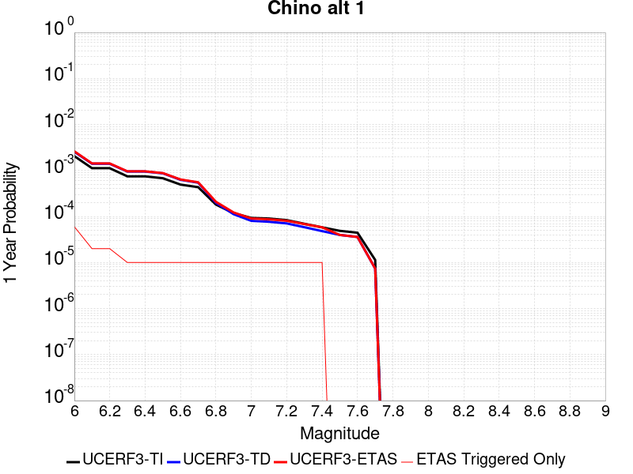 |  |

| Magnitude | 1 wk TI Prob | 1 wk TD Prob | 1 wk ETAS Prob | 1 wk ETAS/TD Gain | 1 wk ETAS Triggered Only | 1 mo TI Prob | 1 mo TD Prob | 1 mo ETAS Prob | 1 mo ETAS/TD Gain | 1 mo ETAS Triggered Only | 1 yr TI Prob | 1 yr TD Prob | 1 yr ETAS Prob | 1 yr ETAS/TD Gain | 1 yr ETAS Triggered Only | 10 yr TI Prob | 10 yr TD Prob | 10 yr ETAS Prob | 10 yr ETAS/TD Gain | 10 yr ETAS Triggered Only |
|-----|-----|-----|-----|-----|-----|-----|-----|-----|-----|-----|-----|-----|-----|-----|-----|-----|-----|-----|-----|-----|
| 6.0 | 3.939946E-5 | 4.894798E-5 | 5.894749E-5 | 1.2042885 | 1.0E-5 | 1.6884391E-4 | 2.0976314E-4 | 2.3975683E-4 | 1.1429884 | 3.0E-5 | 0.0020537362 | 0.002551385 | 0.002611232 | 1.0234567 | 6.0E-5 | 0.020348595 | 0.025280168 | 0.025348399 | 1.002699 | 7.0E-5 |
| 6.1 | 2.1505624E-5 | 2.6878823E-5 | 2.6878823E-5 | 1.0 | 0.0 | 9.2163704E-5 | 1.15190494E-4 | 1.2518934E-4 | 1.0868027 | 1.0E-5 | 0.0011215154 | 0.0014016517 | 0.0014216236 | 1.0142488 | 2.0E-5 | 0.011158722 | 0.013947425 | 0.013967146 | 1.001414 | 2.0E-5 |
| 6.2 | 2.1505624E-5 | 2.6878823E-5 | 2.6878823E-5 | 1.0 | 0.0 | 9.2163704E-5 | 1.15190494E-4 | 1.2518934E-4 | 1.0868027 | 1.0E-5 | 0.0011215154 | 0.0014016517 | 0.0014216236 | 1.0142488 | 2.0E-5 | 0.011158722 | 0.013947425 | 0.013967146 | 1.001414 | 2.0E-5 |
| 6.3 | 1.4290785E-5 | 1.8164832E-5 | 1.8164832E-5 | 1.0 | 0.0 | 6.1244784E-5 | 7.784722E-5 | 7.784722E-5 | 1.0 | 0.0 | 7.454001E-4 | 9.4742293E-4 | 9.5741346E-4 | 1.0105449 | 1.0E-5 | 0.007429048 | 0.00944674 | 0.009456646 | 1.0010486 | 1.0E-5 |
| 6.4 | 1.4290785E-5 | 1.8164832E-5 | 1.8164832E-5 | 1.0 | 0.0 | 6.1244784E-5 | 7.784722E-5 | 7.784722E-5 | 1.0 | 0.0 | 7.454001E-4 | 9.4742293E-4 | 9.5741346E-4 | 1.0105449 | 1.0E-5 | 0.007429048 | 0.00944674 | 0.009456646 | 1.0010486 | 1.0E-5 |
| 6.5 | 1.3017944E-5 | 1.6651793E-5 | 1.6651793E-5 | 1.0 | 0.0 | 5.5789995E-5 | 7.1363116E-5 | 7.1363116E-5 | 1.0 | 0.0 | 6.790315E-4 | 8.6854334E-4 | 8.785347E-4 | 1.0115036 | 1.0E-5 | 0.0067696036 | 0.008664233 | 0.008674146 | 1.0011442 | 1.0E-5 |
| 6.6 | 9.470016E-6 | 1.2039209E-5 | 1.2039209E-5 | 1.0 | 0.0 | 4.058515E-5 | 5.159578E-5 | 5.159578E-5 | 1.0 | 0.0 | 4.940122E-4 | 6.280315E-4 | 6.3802523E-4 | 1.0159128 | 1.0E-5 | 0.004929154 | 0.006273248 | 0.006283185 | 1.001584 | 1.0E-5 |
| 6.7 | 8.314155E-6 | 1.040749E-5 | 1.040749E-5 | 1.0 | 0.0 | 3.5631605E-5 | 4.4602948E-5 | 4.4602948E-5 | 1.0 | 0.0 | 4.3372845E-4 | 5.4293784E-4 | 5.529324E-4 | 1.0184083 | 1.0E-5 | 0.004328829 | 0.0054270807 | 0.0054370263 | 1.0018326 | 1.0E-5 |
| 6.8 | 3.4856364E-6 | 3.8134033E-6 | 3.8134033E-6 | 1.0 | 0.0 | 1.4938357E-5 | 1.6343065E-5 | 1.6343065E-5 | 1.0 | 0.0 | 1.8185932E-4 | 1.9896074E-4 | 2.0895875E-4 | 1.0502511 | 1.0E-5 | 0.0018171056 | 0.0019894529 | 0.001999433 | 1.0050166 | 1.0E-5 |
| 6.9 | 2.2645952E-6 | 2.152909E-6 | 2.152909E-6 | 1.0 | 0.0 | 9.705372E-6 | 9.226722E-6 | 9.226722E-6 | 1.0 | 0.0 | 1.18156495E-4 | 1.12329755E-4 | 1.2232864E-4 | 1.0890136 | 1.0E-5 | 0.0011809369 | 0.0011233138 | 0.0011333026 | 1.0088922 | 1.0E-5 |
| 7.0 | 1.7864003E-6 | 1.5430741E-6 | 1.5430741E-6 | 1.0 | 0.0 | 7.655979E-6 | 6.613158E-6 | 6.613158E-6 | 1.0 | 0.0 | 9.3207556E-5 | 8.051228E-5 | 9.051148E-5 | 1.1241946 | 1.0E-5 | 9.316847E-4 | 8.052856E-4 | 8.1527757E-4 | 1.0124079 | 1.0E-5 |
| 7.1 | 1.7315456E-6 | 1.4733466E-6 | 1.4733466E-6 | 1.0 | 0.0 | 7.420889E-6 | 6.314328E-6 | 6.314328E-6 | 1.0 | 0.0 | 9.034557E-5 | 7.687428E-5 | 8.6873515E-5 | 1.1300725 | 1.0E-5 | 9.0308854E-4 | 7.68921E-4 | 7.7891327E-4 | 1.0129952 | 1.0E-5 |
| 7.2 | 1.6008337E-6 | 1.3574178E-6 | 1.3574178E-6 | 1.0 | 0.0 | 6.860698E-6 | 5.817492E-6 | 5.817492E-6 | 1.0 | 0.0 | 8.352579E-5 | 7.082572E-5 | 8.082501E-5 | 1.1411817 | 1.0E-5 | 8.34944E-4 | 7.0846075E-4 | 7.1845367E-4 | 1.0141051 | 1.0E-5 |
| 7.3 | 1.3320939E-6 | 1.1217794E-6 | 1.1217794E-6 | 1.0 | 0.0 | 5.7089615E-6 | 4.8076176E-6 | 4.8076176E-6 | 1.0 | 0.0 | 6.9504385E-5 | 5.853122E-5 | 6.853064E-5 | 1.170839 | 1.0E-5 | 6.9482654E-4 | 5.8530655E-4 | 5.953007E-4 | 1.0170751 | 1.0E-5 |
| 7.4 | 1.114294E-6 | 9.237087E-7 | 9.237087E-7 | 1.0 | 0.0 | 4.775537E-6 | 3.9587458E-6 | 3.9587458E-6 | 1.0 | 0.0 | 5.8140613E-5 | 4.81967E-5 | 5.8196216E-5 | 1.207473 | 1.0E-5 | 5.81254E-4 | 4.8187698E-4 | 4.9187214E-4 | 1.0207422 | 1.0E-5 |
| 7.5 | 9.354081E-7 | 7.6233886E-7 | 7.6233886E-7 | 1.0 | 0.0 | 4.0088858E-6 | 3.2671626E-6 | 3.2671626E-6 | 1.0 | 0.0 | 4.8807087E-5 | 3.9777013E-5 | 3.9777013E-5 | 1.0 | 0.0 | 4.879637E-4 | 3.9770233E-4 | 3.9770233E-4 | 1.0 | 0.0 |
| 7.6 | 8.521771E-7 | 6.880688E-7 | 6.880688E-7 | 1.0 | 0.0 | 3.6521824E-6 | 2.948863E-6 | 2.948863E-6 | 1.0 | 0.0 | 4.4464414E-5 | 3.590185E-5 | 3.590185E-5 | 1.0 | 0.0 | 4.4455516E-4 | 3.5896365E-4 | 3.5896365E-4 | 1.0 | 0.0 |
| 7.7 | 2.1803626E-7 | 1.4186368E-7 | 1.4186368E-7 | 1.0 | 0.0 | 9.344408E-7 | 6.0798715E-7 | 6.0798715E-7 | 1.0 | 0.0 | 1.1376757E-5 | 7.4022278E-6 | 7.4022278E-6 | 1.0 | 0.0 | 1.13761744E-4 | 7.402077E-5 | 7.402077E-5 | 1.0 | 0.0 |

## Oceanic - West Huasna
*[(top)](#table-of-contents)*

| 1 Week | 1 Month | 1 Year | 10 Year |
|-----|-----|-----|-----|
|  |  | 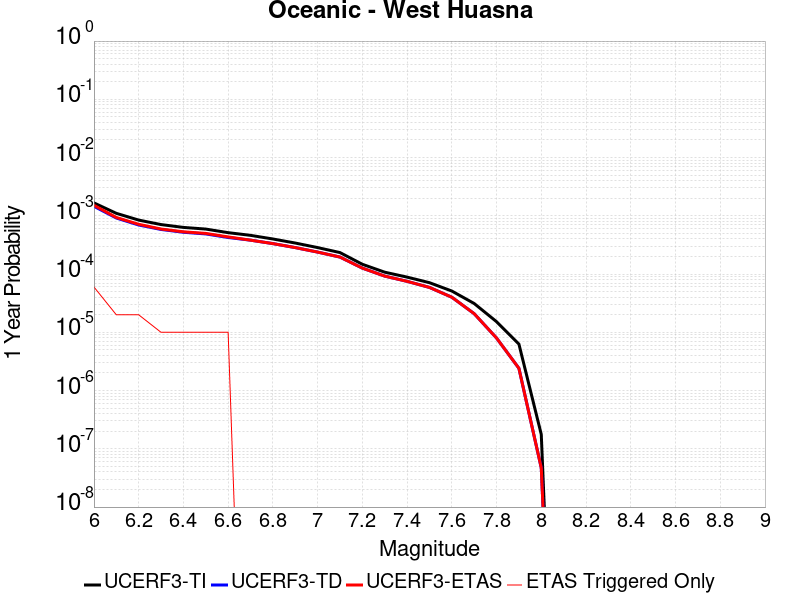 |  |

| Magnitude | 1 wk TI Prob | 1 wk TD Prob | 1 wk ETAS Prob | 1 wk ETAS/TD Gain | 1 wk ETAS Triggered Only | 1 mo TI Prob | 1 mo TD Prob | 1 mo ETAS Prob | 1 mo ETAS/TD Gain | 1 mo ETAS Triggered Only | 1 yr TI Prob | 1 yr TD Prob | 1 yr ETAS Prob | 1 yr ETAS/TD Gain | 1 yr ETAS Triggered Only | 10 yr TI Prob | 10 yr TD Prob | 10 yr ETAS Prob | 10 yr ETAS/TD Gain | 10 yr ETAS Triggered Only |
|-----|-----|-----|-----|-----|-----|-----|-----|-----|-----|-----|-----|-----|-----|-----|-----|-----|-----|-----|-----|-----|
| 6.0 | 3.195567E-5 | 2.7926368E-5 | 4.792581E-5 | 1.7161491 | 2.0E-5 | 1.3694567E-4 | 1.19679185E-4 | 1.496756E-4 | 1.2506402 | 3.0E-5 | 0.0016660384 | 0.0014561634 | 0.0015160759 | 1.0411441 | 6.0E-5 | 0.016536033 | 0.01447077 | 0.014539758 | 1.0047673 | 7.0E-5 |
| 6.1 | 2.1156782E-5 | 1.7573117E-5 | 2.7572942E-5 | 1.569041 | 1.0E-5 | 9.066878E-5 | 7.531123E-5 | 9.530973E-5 | 1.2655447 | 2.0E-5 | 0.0011033333 | 9.1653795E-4 | 9.3651965E-4 | 1.0218012 | 2.0E-5 | 0.010978713 | 0.009128587 | 0.009148404 | 1.0021709 | 2.0E-5 |
| 6.2 | 1.6195117E-5 | 1.3327227E-5 | 2.3327093E-5 | 1.7503337 | 1.0E-5 | 6.9405796E-5 | 5.7115452E-5 | 7.711431E-5 | 1.350148 | 2.0E-5 | 8.44688E-4 | 6.9516135E-4 | 7.151475E-4 | 1.0287503 | 2.0E-5 | 0.008414844 | 0.0069301617 | 0.006950023 | 1.0028659 | 2.0E-5 |
| 6.3 | 1.3559345E-5 | 1.1179013E-5 | 2.1178901E-5 | 1.8945234 | 1.0E-5 | 5.811018E-5 | 4.7909183E-5 | 5.7908703E-5 | 1.2087183 | 1.0E-5 | 7.072618E-4 | 5.8313913E-4 | 5.931333E-4 | 1.0171386 | 1.0E-5 | 0.0070501505 | 0.005816208 | 0.0058261496 | 1.0017093 | 1.0E-5 |
| 6.4 | 1.2120619E-5 | 1.0000874E-5 | 2.0000774E-5 | 1.9999026 | 1.0E-5 | 5.1944477E-5 | 4.2860185E-5 | 5.285976E-5 | 1.2333068 | 1.0E-5 | 6.322405E-4 | 5.216983E-4 | 5.316931E-4 | 1.0191581 | 1.0E-5 | 0.006304447 | 0.005204804 | 0.0052147517 | 1.0019113 | 1.0E-5 |
| 6.5 | 1.13511915E-5 | 9.367378E-6 | 1.9367284E-5 | 2.0675244 | 1.0E-5 | 4.8647056E-5 | 4.0145293E-5 | 5.0144892E-5 | 1.2490852 | 1.0E-5 | 5.9211696E-4 | 4.886598E-4 | 4.9865484E-4 | 1.0204542 | 1.0E-5 | 0.0059054173 | 0.0048759114 | 0.0048858626 | 1.0020409 | 1.0E-5 |
| 6.6 | 9.850605E-6 | 8.1353155E-6 | 1.8135233E-5 | 2.2291987 | 1.0E-5 | 4.2216197E-5 | 3.4865174E-5 | 4.4864824E-5 | 1.2868092 | 1.0E-5 | 5.1386096E-4 | 4.2440102E-4 | 4.343968E-4 | 1.0235527 | 1.0E-5 | 0.0051267436 | 0.0042359377 | 0.0042458954 | 1.0023508 | 1.0E-5 |
| 6.7 | 8.8558645E-6 | 7.318341E-6 | 7.318341E-6 | 1.0 | 0.0 | 3.7953152E-5 | 3.1363943E-5 | 3.1363943E-5 | 1.0 | 0.0 | 4.6198163E-4 | 3.8178926E-4 | 3.8178926E-4 | 1.0 | 0.0 | 0.004610224 | 0.0038113592 | 0.0038113592 | 1.0 | 0.0 |
| 6.8 | 7.67136E-6 | 6.39169E-6 | 6.39169E-6 | 1.0 | 0.0 | 3.2876844E-5 | 2.739267E-5 | 2.739267E-5 | 1.0 | 0.0 | 4.0020206E-4 | 3.3345487E-4 | 3.3345487E-4 | 1.0 | 0.0 | 0.003994821 | 0.0033295664 | 0.0033295664 | 1.0 | 0.0 |
| 6.9 | 6.534529E-6 | 5.458261E-6 | 5.458261E-6 | 1.0 | 0.0 | 2.8004823E-5 | 2.3392338E-5 | 2.3392338E-5 | 1.0 | 0.0 | 3.4090536E-4 | 2.8476462E-4 | 2.8476462E-4 | 1.0 | 0.0 | 0.0034038287 | 0.002844014 | 0.002844014 | 1.0 | 0.0 |
| 7.0 | 5.460525E-6 | 4.5699203E-6 | 4.5699203E-6 | 1.0 | 0.0 | 2.3402039E-5 | 1.9585226E-5 | 1.9585226E-5 | 1.0 | 0.0 | 2.8488258E-4 | 2.3842414E-4 | 2.3842414E-4 | 1.0 | 0.0 | 0.0028451765 | 0.0023816973 | 0.0023816973 | 1.0 | 0.0 |
| 7.1 | 4.4825083E-6 | 3.7524153E-6 | 3.7524153E-6 | 1.0 | 0.0 | 1.9210609E-5 | 1.6081682E-5 | 1.6081682E-5 | 1.0 | 0.0 | 2.3386406E-4 | 1.9577699E-4 | 1.9577699E-4 | 1.0 | 0.0 | 0.002336181 | 0.001956057 | 0.001956057 | 1.0 | 0.0 |
| 7.2 | 2.821708E-6 | 2.424941E-6 | 2.424941E-6 | 1.0 | 0.0 | 1.2092979E-5 | 1.0392562E-5 | 1.0392562E-5 | 1.0 | 0.0 | 1.4722206E-4 | 1.265221E-4 | 1.265221E-4 | 1.0 | 0.0 | 0.0014712457 | 0.0012645032 | 0.0012645032 | 1.0 | 0.0 |
| 7.3 | 2.0644757E-6 | 1.7687502E-6 | 1.7687502E-6 | 1.0 | 0.0 | 8.847723E-6 | 7.580336E-6 | 7.580336E-6 | 1.0 | 0.0 | 1.0771569E-4 | 9.228668E-5 | 9.228668E-5 | 1.0 | 0.0 | 0.001076635 | 9.224854E-4 | 9.224854E-4 | 1.0 | 0.0 |
| 7.4 | 1.6980367E-6 | 1.4379966E-6 | 1.4379966E-6 | 1.0 | 0.0 | 7.27728E-6 | 6.1628284E-6 | 6.1628284E-6 | 1.0 | 0.0 | 8.8597284E-5 | 7.502986E-5 | 7.502986E-5 | 1.0 | 0.0 | 8.8561967E-4 | 7.5004686E-4 | 7.5004686E-4 | 1.0 | 0.0 |
| 7.5 | 1.3637683E-6 | 1.1302697E-6 | 1.1302697E-6 | 1.0 | 0.0 | 5.844708E-6 | 4.844004E-6 | 4.844004E-6 | 1.0 | 0.0 | 7.1156996E-5 | 5.897415E-5 | 5.897415E-5 | 1.0 | 0.0 | 7.1134215E-4 | 5.8958656E-4 | 5.8958656E-4 | 1.0 | 0.0 |
| 7.6 | 9.802994E-7 | 7.6772847E-7 | 7.6772847E-7 | 1.0 | 0.0 | 4.2012766E-6 | 3.2902608E-6 | 3.2902608E-6 | 1.0 | 0.0 | 5.1149345E-5 | 4.005819E-5 | 4.005819E-5 | 1.0 | 0.0 | 5.113757E-4 | 4.0051117E-4 | 4.0051117E-4 | 1.0 | 0.0 |
| 7.7 | 5.986191E-7 | 4.0050708E-7 | 4.0050708E-7 | 1.0 | 0.0 | 2.5655079E-6 | 1.7164577E-6 | 1.7164577E-6 | 1.0 | 0.0 | 3.1234613E-5 | 2.0897673E-5 | 2.0897673E-5 | 1.0 | 0.0 | 3.123022E-4 | 2.0895849E-4 | 2.0895849E-4 | 1.0 | 0.0 |
| 7.8 | 2.9189815E-7 | 1.5285202E-7 | 1.5285202E-7 | 1.0 | 0.0 | 1.2509914E-6 | 6.5507993E-7 | 6.5507993E-7 | 1.0 | 0.0 | 1.5230714E-5 | 7.975569E-6 | 7.975569E-6 | 1.0 | 0.0 | 1.522967E-4 | 7.97542E-5 | 7.97542E-5 | 1.0 | 0.0 |
| 7.9 | 1.2057845E-7 | 4.6208047E-8 | 4.6208047E-8 | 1.0 | 0.0 | 5.1676466E-7 | 1.9803447E-7 | 1.9803447E-7 | 1.0 | 0.0 | 6.2915915E-6 | 2.411067E-6 | 2.411067E-6 | 1.0 | 0.0 | 6.2914136E-5 | 2.4111772E-5 | 2.4111772E-5 | 1.0 | 0.0 |
| 8.0 | 3.3806387E-9 | 9.0093144E-10 | 9.0093144E-10 | 1.0 | 0.0 | 1.4488451E-8 | 3.8611354E-9 | 3.8611354E-9 | 1.0 | 0.0 | 1.7639688E-7 | 4.7009323E-8 | 4.7009323E-8 | 1.0 | 0.0 | 1.7639674E-6 | 4.712806E-7 | 4.712806E-7 | 1.0 | 0.0 |

## San Jacinto (Borrego)
*[(top)](#table-of-contents)*

| 1 Week | 1 Month | 1 Year | 10 Year |
|-----|-----|-----|-----|
|  |  | 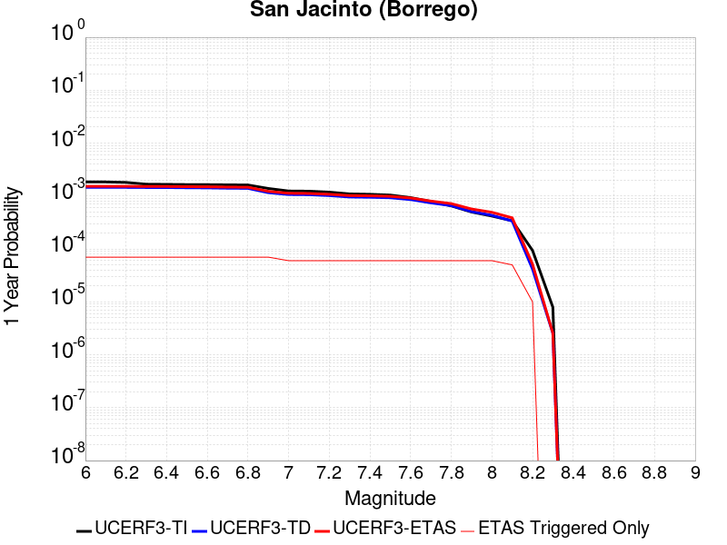 | 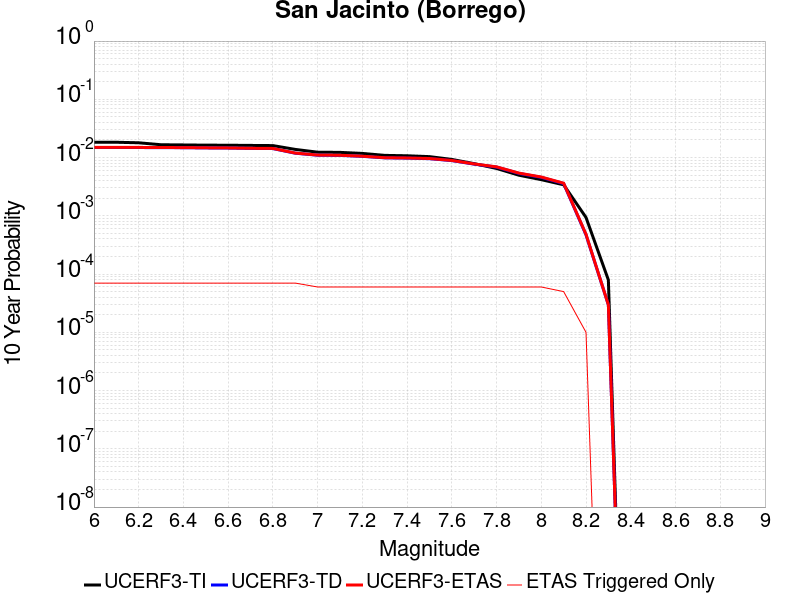 |

| Magnitude | 1 wk TI Prob | 1 wk TD Prob | 1 wk ETAS Prob | 1 wk ETAS/TD Gain | 1 wk ETAS Triggered Only | 1 mo TI Prob | 1 mo TD Prob | 1 mo ETAS Prob | 1 mo ETAS/TD Gain | 1 mo ETAS Triggered Only | 1 yr TI Prob | 1 yr TD Prob | 1 yr ETAS Prob | 1 yr ETAS/TD Gain | 1 yr ETAS Triggered Only | 10 yr TI Prob | 10 yr TD Prob | 10 yr ETAS Prob | 10 yr ETAS/TD Gain | 10 yr ETAS Triggered Only |
|-----|-----|-----|-----|-----|-----|-----|-----|-----|-----|-----|-----|-----|-----|-----|-----|-----|-----|-----|-----|-----|
| 6.0 | 3.543992E-5 | 2.7925962E-5 | 3.792568E-5 | 1.3580797 | 1.0E-5 | 1.5187653E-4 | 1.1967727E-4 | 1.4967368E-4 | 1.2506442 | 3.0E-5 | 0.0018475284 | 0.0014561092 | 0.0015260072 | 1.0480033 | 7.0E-5 | 0.018322436 | 0.01486815 | 0.01493711 | 1.0046381 | 7.0E-5 |
| 6.1 | 3.542281E-5 | 2.7925962E-5 | 3.792568E-5 | 1.3580797 | 1.0E-5 | 1.5180321E-4 | 1.1967727E-4 | 1.4967368E-4 | 1.2506442 | 3.0E-5 | 0.0018466372 | 0.0014561092 | 0.0015260072 | 1.0480033 | 7.0E-5 | 0.018313672 | 0.01486815 | 0.01493711 | 1.0046381 | 7.0E-5 |
| 6.2 | 3.4688688E-5 | 2.7925962E-5 | 3.792568E-5 | 1.3580797 | 1.0E-5 | 1.4865733E-4 | 1.1967727E-4 | 1.4967368E-4 | 1.2506442 | 3.0E-5 | 0.0018084005 | 0.0014561091 | 0.0015260072 | 1.0480033 | 7.0E-5 | 0.017937548 | 0.01486815 | 0.014937109 | 1.0046381 | 7.0E-5 |
| 6.3 | 3.2087122E-5 | 2.7771312E-5 | 3.7771035E-5 | 1.3600738 | 1.0E-5 | 1.3750899E-4 | 1.1901455E-4 | 1.4901097E-4 | 1.25204 | 3.0E-5 | 0.0016728862 | 0.0014480512 | 0.0015179499 | 1.0482708 | 7.0E-5 | 0.016603488 | 0.014789308 | 0.014858273 | 1.0046631 | 7.0E-5 |
| 6.4 | 3.1828724E-5 | 2.773829E-5 | 3.7738013E-5 | 1.3605025 | 1.0E-5 | 1.364017E-4 | 1.1887303E-4 | 1.4886947E-4 | 1.2523401 | 3.0E-5 | 0.0016594254 | 0.0014463306 | 0.0015162294 | 1.0483284 | 7.0E-5 | 0.016470885 | 0.014772502 | 0.014841467 | 1.0046686 | 7.0E-5 |
| 6.5 | 3.1563577E-5 | 2.7477974E-5 | 3.7477697E-5 | 1.3639178 | 1.0E-5 | 1.3526545E-4 | 1.17757496E-4 | 1.4775396E-4 | 1.2547308 | 3.0E-5 | 0.0016456128 | 0.0014327668 | 0.0015026665 | 1.0487865 | 7.0E-5 | 0.0163348 | 0.01463991 | 0.014708885 | 1.0047115 | 7.0E-5 |
| 6.6 | 3.1467625E-5 | 2.7322194E-5 | 3.7321923E-5 | 1.3659928 | 1.0E-5 | 1.3485427E-4 | 1.17089934E-4 | 1.4708642E-4 | 1.2561833 | 3.0E-5 | 0.0016406142 | 0.0014246498 | 0.0014945501 | 1.0490649 | 7.0E-5 | 0.016285548 | 0.014560228 | 0.0146292085 | 1.0047376 | 7.0E-5 |
| 6.7 | 3.1223695E-5 | 2.6940217E-5 | 3.693995E-5 | 1.3711822 | 1.0E-5 | 1.3380898E-4 | 1.1545303E-4 | 1.4544957E-4 | 1.2598159 | 3.0E-5 | 0.0016279068 | 0.0014047464 | 0.0014746481 | 1.049761 | 7.0E-5 | 0.01616033 | 0.01436451 | 0.014433504 | 1.0048032 | 7.0E-5 |
| 6.8 | 3.1015585E-5 | 2.6761221E-5 | 3.6760954E-5 | 1.373665 | 1.0E-5 | 1.3291716E-4 | 1.1468597E-4 | 1.4468253E-4 | 1.2615539 | 3.0E-5 | 0.001617065 | 0.0013954195 | 0.0014653218 | 1.0500941 | 7.0E-5 | 0.016053487 | 0.014271772 | 0.014340772 | 1.0048348 | 7.0E-5 |
| 6.9 | 2.6641965E-5 | 2.2183434E-5 | 3.2183212E-5 | 1.4507768 | 1.0E-5 | 1.1417485E-4 | 9.506842E-5 | 1.2506556E-4 | 1.3155322 | 3.0E-5 | 0.0013891924 | 0.0011568473 | 0.0012267664 | 1.0604392 | 7.0E-5 | 0.0138054015 | 0.011882191 | 0.011951359 | 1.0058212 | 7.0E-5 |
| 7.0 | 2.3854353E-5 | 2.047825E-5 | 3.0478046E-5 | 1.488313 | 1.0E-5 | 1.02228936E-4 | 8.776099E-5 | 1.1775836E-4 | 1.3418075 | 3.0E-5 | 0.0012439266 | 0.0010679689 | 0.0011279049 | 1.0561215 | 6.0E-5 | 0.012369866 | 0.0109826205 | 0.011041962 | 1.0054032 | 6.0E-5 |
| 7.1 | 2.3672901E-5 | 2.0314741E-5 | 3.0314537E-5 | 1.4922434 | 1.0E-5 | 1.0145135E-4 | 8.706028E-5 | 1.1705767E-4 | 1.3445588 | 3.0E-5 | 0.0012344702 | 0.0010594461 | 0.0011193826 | 1.0565734 | 6.0E-5 | 0.0122763505 | 0.010897858 | 0.010957205 | 1.0054457 | 6.0E-5 |
| 7.2 | 2.2717244E-5 | 1.9542116E-5 | 2.9541921E-5 | 1.5117053 | 1.0E-5 | 9.735599E-5 | 8.3749255E-5 | 1.1374674E-4 | 1.3581822 | 3.0E-5 | 0.0011846646 | 0.0010191725 | 0.0010791114 | 1.0588113 | 6.0E-5 | 0.01178369 | 0.010495322 | 0.010554692 | 1.0056568 | 6.0E-5 |
| 7.3 | 2.1016205E-5 | 1.8383771E-5 | 2.8383587E-5 | 1.543948 | 1.0E-5 | 9.006634E-5 | 7.878522E-5 | 1.0878286E-4 | 1.3807521 | 3.0E-5 | 0.001096006 | 9.5879E-4 | 0.0010187326 | 1.0625188 | 6.0E-5 | 0.010906163 | 0.009890901 | 0.009950307 | 1.0060062 | 6.0E-5 |
| 7.4 | 2.0683625E-5 | 1.8186302E-5 | 2.818612E-5 | 1.5498544 | 1.0E-5 | 8.86411E-5 | 7.7938974E-5 | 1.07936634E-4 | 1.3848865 | 3.0E-5 | 0.001078671 | 9.48496E-4 | 0.0010084391 | 1.0631981 | 6.0E-5 | 0.010734501 | 0.0097876275 | 0.00984704 | 1.0060701 | 6.0E-5 |
| 7.5 | 1.9993966E-5 | 1.7781347E-5 | 2.7781169E-5 | 1.5623771 | 1.0E-5 | 8.568561E-5 | 7.6203556E-5 | 1.06201274E-4 | 1.3936524 | 3.0E-5 | 0.001042723 | 9.2738547E-4 | 9.873298E-4 | 1.064638 | 6.0E-5 | 0.010378438 | 0.009574548 | 0.009633974 | 1.0062066 | 6.0E-5 |
| 7.6 | 1.788966E-5 | 1.6434618E-5 | 2.6434454E-5 | 1.6084617 | 1.0E-5 | 7.666772E-5 | 7.043219E-5 | 1.0043007E-4 | 1.4259117 | 3.0E-5 | 9.3302975E-4 | 8.5717626E-4 | 9.171248E-4 | 1.0699372 | 6.0E-5 | 0.00929122 | 0.008866415 | 0.008925883 | 1.0067071 | 6.0E-5 |
| 7.7 | 1.5125781E-5 | 1.4236738E-5 | 2.4236595E-5 | 1.7023981 | 1.0E-5 | 6.4823165E-5 | 6.101317E-5 | 9.101134E-5 | 1.4916672 | 3.0E-5 | 7.889362E-4 | 7.4258295E-4 | 8.025384E-4 | 1.080739 | 6.0E-5 | 0.007861412 | 0.007714161 | 0.0077736983 | 1.0077178 | 6.0E-5 |
| 7.8 | 1.250089E-5 | 1.262994E-5 | 2.2629814E-5 | 1.7917594 | 1.0E-5 | 5.3574146E-5 | 5.4127195E-5 | 8.4125575E-5 | 1.5542201 | 3.0E-5 | 6.5207E-4 | 6.588E-4 | 7.187605E-4 | 1.0910147 | 6.0E-5 | 0.006501599 | 0.006867759 | 0.006927347 | 1.0086765 | 6.0E-5 |
| 7.9 | 9.561E-6 | 9.754065E-6 | 1.9753967E-5 | 2.0252037 | 1.0E-5 | 4.0975072E-5 | 4.180247E-5 | 7.1801216E-5 | 1.717631 | 3.0E-5 | 4.987573E-4 | 5.0882675E-4 | 5.6879624E-4 | 1.1178583 | 6.0E-5 | 0.0049763937 | 0.0053523607 | 0.0054120393 | 1.01115 | 6.0E-5 |
| 8.0 | 8.01699E-6 | 8.292994E-6 | 1.829291E-5 | 2.2058272 | 1.0E-5 | 3.4358076E-5 | 3.554092E-5 | 6.5539854E-5 | 1.8440675 | 3.0E-5 | 4.1822926E-4 | 4.3262533E-4 | 4.925994E-4 | 1.1386281 | 6.0E-5 | 0.0041744304 | 0.0045733186 | 0.0046330444 | 1.0130596 | 6.0E-5 |
| 8.1 | 6.541947E-6 | 6.461784E-6 | 1.646172E-5 | 2.5475502 | 1.0E-5 | 2.8036617E-5 | 2.7693068E-5 | 5.769224E-5 | 2.0832736 | 3.0E-5 | 3.4129233E-4 | 3.3711144E-4 | 3.870946E-4 | 1.1482689 | 5.0E-5 | 0.0034076865 | 0.0035805756 | 0.0036303964 | 1.0139142 | 5.0E-5 |
| 8.2 | 1.7968189E-6 | 7.9684827E-7 | 7.9684827E-7 | 1.0 | 0.0 | 7.70063E-6 | 3.4150596E-6 | 3.4150596E-6 | 1.0 | 0.0 | 9.3751136E-5 | 4.157758E-5 | 5.1577164E-5 | 1.2405043 | 1.0E-5 | 9.371159E-4 | 4.7107413E-4 | 4.8106944E-4 | 1.0212181 | 1.0E-5 |
| 8.3 | 1.5167889E-7 | 4.8951257E-8 | 4.8951257E-8 | 1.0 | 0.0 | 6.500522E-7 | 2.0979108E-7 | 2.0979108E-7 | 1.0 | 0.0 | 7.9143565E-6 | 2.5542038E-6 | 2.5542038E-6 | 1.0 | 0.0 | 7.914075E-5 | 2.9679897E-5 | 2.9679897E-5 | 1.0 | 0.0 |

## Kern Canyon (North Kern) 2011
*[(top)](#table-of-contents)*

| 1 Week | 1 Month | 1 Year | 10 Year |
|-----|-----|-----|-----|
|  |  |  | 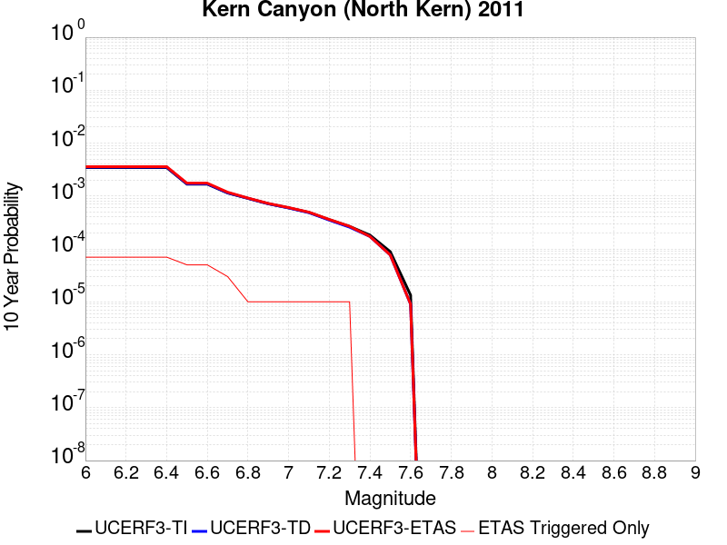 |

| Magnitude | 1 wk TI Prob | 1 wk TD Prob | 1 wk ETAS Prob | 1 wk ETAS/TD Gain | 1 wk ETAS Triggered Only | 1 mo TI Prob | 1 mo TD Prob | 1 mo ETAS Prob | 1 mo ETAS/TD Gain | 1 mo ETAS Triggered Only | 1 yr TI Prob | 1 yr TD Prob | 1 yr ETAS Prob | 1 yr ETAS/TD Gain | 1 yr ETAS Triggered Only | 10 yr TI Prob | 10 yr TD Prob | 10 yr ETAS Prob | 10 yr ETAS/TD Gain | 10 yr ETAS Triggered Only |
|-----|-----|-----|-----|-----|-----|-----|-----|-----|-----|-----|-----|-----|-----|-----|-----|-----|-----|-----|-----|-----|
| 6.0 | 6.6264497E-6 | 6.75733E-6 | 4.675706E-5 | 6.9194574 | 4.0E-5 | 2.8398761E-5 | 2.895971E-5 | 6.895855E-5 | 2.3811893 | 4.0E-5 | 3.4570007E-4 | 3.5253543E-4 | 4.025178E-4 | 1.1417797 | 5.0E-5 | 0.0034516277 | 0.0035205502 | 0.003590304 | 1.0198133 | 7.0E-5 |
| 6.1 | 6.6264497E-6 | 6.75733E-6 | 4.675706E-5 | 6.9194574 | 4.0E-5 | 2.8398761E-5 | 2.895971E-5 | 6.895855E-5 | 2.3811893 | 4.0E-5 | 3.4570007E-4 | 3.5253543E-4 | 4.025178E-4 | 1.1417797 | 5.0E-5 | 0.0034516277 | 0.0035205502 | 0.003590304 | 1.0198133 | 7.0E-5 |
| 6.2 | 6.6264497E-6 | 6.75733E-6 | 4.675706E-5 | 6.9194574 | 4.0E-5 | 2.8398761E-5 | 2.895971E-5 | 6.895855E-5 | 2.3811893 | 4.0E-5 | 3.4570007E-4 | 3.5253543E-4 | 4.025178E-4 | 1.1417797 | 5.0E-5 | 0.0034516277 | 0.0035205502 | 0.003590304 | 1.0198133 | 7.0E-5 |
| 6.3 | 6.6264497E-6 | 6.75733E-6 | 4.675706E-5 | 6.9194574 | 4.0E-5 | 2.8398761E-5 | 2.895971E-5 | 6.895855E-5 | 2.3811893 | 4.0E-5 | 3.4570007E-4 | 3.5253543E-4 | 4.025178E-4 | 1.1417797 | 5.0E-5 | 0.0034516277 | 0.0035205502 | 0.003590304 | 1.0198133 | 7.0E-5 |
| 6.4 | 6.6264497E-6 | 6.75733E-6 | 4.675706E-5 | 6.9194574 | 4.0E-5 | 2.8398761E-5 | 2.895971E-5 | 6.895855E-5 | 2.3811893 | 4.0E-5 | 3.4570007E-4 | 3.5253543E-4 | 4.025178E-4 | 1.1417797 | 5.0E-5 | 0.0034516277 | 0.0035205502 | 0.003590304 | 1.0198133 | 7.0E-5 |
| 6.5 | 3.2162225E-6 | 3.2570915E-6 | 3.3256994E-5 | 10.210642 | 3.0E-5 | 1.3783738E-5 | 1.3958894E-5 | 4.3958476E-5 | 3.1491375 | 3.0E-5 | 1.6780409E-4 | 1.6993708E-4 | 1.9993198E-4 | 1.1765059 | 3.0E-5 | 0.0016767744 | 0.001698151 | 0.0017480662 | 1.0293938 | 5.0E-5 |
| 6.6 | 3.2162225E-6 | 3.2570915E-6 | 3.3256994E-5 | 10.210642 | 3.0E-5 | 1.3783738E-5 | 1.3958894E-5 | 4.3958476E-5 | 3.1491375 | 3.0E-5 | 1.6780409E-4 | 1.6993708E-4 | 1.9993198E-4 | 1.1765059 | 3.0E-5 | 0.0016767744 | 0.001698151 | 0.0017480662 | 1.0293938 | 5.0E-5 |
| 6.7 | 2.1908265E-6 | 2.2071222E-6 | 2.2207078E-5 | 10.061553 | 2.0E-5 | 9.389223E-6 | 9.459062E-6 | 2.9458874E-5 | 3.1143546 | 2.0E-5 | 1.1430779E-4 | 1.1515819E-4 | 1.3515589E-4 | 1.1736542 | 2.0E-5 | 0.0011424901 | 0.0011510046 | 0.0011809701 | 1.0260342 | 3.0E-5 |
| 6.8 | 1.7303895E-6 | 1.736553E-6 | 1.1736535E-5 | 6.7585244 | 1.0E-5 | 7.415934E-6 | 7.442349E-6 | 1.7442275E-5 | 2.3436518 | 1.0E-5 | 9.028525E-5 | 9.060693E-5 | 1.0060603E-4 | 1.1103568 | 1.0E-5 | 9.024858E-4 | 9.0570963E-4 | 9.1570057E-4 | 1.011031 | 1.0E-5 |
| 6.9 | 1.3700314E-6 | 1.3688623E-6 | 1.1368848E-5 | 8.305326 | 1.0E-5 | 5.87155E-6 | 5.86654E-6 | 1.586648E-5 | 2.7045722 | 1.0E-5 | 7.148377E-5 | 7.142283E-5 | 8.142211E-5 | 1.1400013 | 1.0E-5 | 7.146078E-4 | 7.140033E-4 | 7.2399614E-4 | 1.0139955 | 1.0E-5 |
| 7.0 | 1.1467797E-6 | 1.1413805E-6 | 1.1141369E-5 | 9.76131 | 1.0E-5 | 4.9147607E-6 | 4.8916218E-6 | 1.4891573E-5 | 3.0443017 | 1.0E-5 | 5.983557E-5 | 5.95539E-5 | 6.95533E-5 | 1.1679051 | 1.0E-5 | 5.981946E-4 | 5.9538253E-4 | 6.053766E-4 | 1.016786 | 1.0E-5 |
| 7.1 | 9.3952065E-7 | 9.3026915E-7 | 1.093026E-5 | 11.749567 | 1.0E-5 | 4.026511E-6 | 3.986862E-6 | 1.3986822E-5 | 3.5082285 | 1.0E-5 | 4.9021666E-5 | 4.853898E-5 | 5.853849E-5 | 1.20601 | 1.0E-5 | 4.901085E-4 | 4.8528553E-4 | 4.9528066E-4 | 1.0205964 | 1.0E-5 |
| 7.2 | 6.858055E-7 | 6.7193014E-7 | 1.06719235E-5 | 15.882489 | 1.0E-5 | 2.939163E-6 | 2.8796974E-6 | 1.2879668E-5 | 4.472577 | 1.0E-5 | 3.5783723E-5 | 3.5059762E-5 | 4.5059413E-5 | 1.2852173 | 1.0E-5 | 3.5777962E-4 | 3.5054318E-4 | 3.6053968E-4 | 1.0285171 | 1.0E-5 |
| 7.3 | 5.1101983E-7 | 4.939301E-7 | 1.0493925E-5 | 21.245771 | 1.0E-5 | 2.1900833E-6 | 2.1168414E-6 | 1.21168205E-5 | 5.7240095 | 1.0E-5 | 2.6663936E-5 | 2.5772246E-5 | 3.5771987E-5 | 1.3880043 | 1.0E-5 | 2.6660739E-4 | 2.5769303E-4 | 2.6769046E-4 | 1.0387958 | 1.0E-5 |
| 7.4 | 3.4999414E-7 | 3.2995916E-7 | 3.2995916E-7 | 1.0 | 0.0 | 1.499974E-6 | 1.4141099E-6 | 1.4141099E-6 | 1.0 | 0.0 | 1.8262032E-5 | 1.7216655E-5 | 1.7216655E-5 | 1.0 | 0.0 | 1.826053E-4 | 1.7215345E-4 | 1.7215345E-4 | 1.0 | 0.0 |
| 7.5 | 1.7021522E-7 | 1.4750053E-7 | 1.4750053E-7 | 1.0 | 0.0 | 7.2949354E-7 | 6.32145E-7 | 6.32145E-7 | 1.0 | 0.0 | 8.881548E-6 | 7.696339E-6 | 7.696339E-6 | 1.0 | 0.0 | 8.8811925E-5 | 7.696081E-5 | 7.696081E-5 | 1.0 | 0.0 |
| 7.6 | 2.572245E-8 | 1.735264E-8 | 1.735264E-8 | 1.0 | 0.0 | 1.10239064E-7 | 7.436845E-8 | 7.436845E-8 | 1.0 | 0.0 | 1.3421597E-6 | 9.0543557E-7 | 9.0543557E-7 | 1.0 | 0.0 | 1.3421517E-5 | 9.054324E-6 | 9.054324E-6 | 1.0 | 0.0 |

## Big Pine (East)
*[(top)](#table-of-contents)*

| 1 Week | 1 Month | 1 Year | 10 Year |
|-----|-----|-----|-----|
|  | 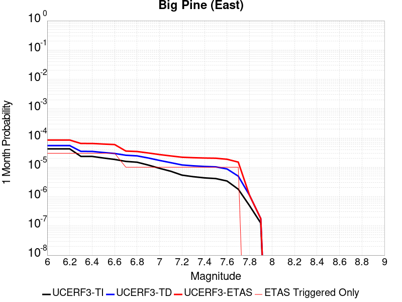 |  |  |

| Magnitude | 1 wk TI Prob | 1 wk TD Prob | 1 wk ETAS Prob | 1 wk ETAS/TD Gain | 1 wk ETAS Triggered Only | 1 mo TI Prob | 1 mo TD Prob | 1 mo ETAS Prob | 1 mo ETAS/TD Gain | 1 mo ETAS Triggered Only | 1 yr TI Prob | 1 yr TD Prob | 1 yr ETAS Prob | 1 yr ETAS/TD Gain | 1 yr ETAS Triggered Only | 10 yr TI Prob | 10 yr TD Prob | 10 yr ETAS Prob | 10 yr ETAS/TD Gain | 10 yr ETAS Triggered Only |
|-----|-----|-----|-----|-----|-----|-----|-----|-----|-----|-----|-----|-----|-----|-----|-----|-----|-----|-----|-----|-----|
| 6.0 | 9.916913E-6 | 1.28172705E-5 | 3.2817014E-5 | 2.5603745 | 2.0E-5 | 4.250036E-5 | 5.493013E-5 | 8.492848E-5 | 1.5461184 | 3.0E-5 | 5.173191E-4 | 6.685912E-4 | 7.185578E-4 | 1.0747341 | 5.0E-5 | 0.0051611643 | 0.006670449 | 0.006739982 | 1.010424 | 7.0E-5 |
| 6.1 | 9.916913E-6 | 1.28172705E-5 | 3.2817014E-5 | 2.5603745 | 2.0E-5 | 4.250036E-5 | 5.493013E-5 | 8.492848E-5 | 1.5461184 | 3.0E-5 | 5.173191E-4 | 6.685912E-4 | 7.185578E-4 | 1.0747341 | 5.0E-5 | 0.0051611643 | 0.006670449 | 0.006739982 | 1.010424 | 7.0E-5 |
| 6.2 | 9.916913E-6 | 1.28172705E-5 | 3.2817014E-5 | 2.5603745 | 2.0E-5 | 4.250036E-5 | 5.493013E-5 | 8.492848E-5 | 1.5461184 | 3.0E-5 | 5.173191E-4 | 6.685912E-4 | 7.185578E-4 | 1.0747341 | 5.0E-5 | 0.0051611643 | 0.006670449 | 0.006739982 | 1.010424 | 7.0E-5 |
| 6.3 | 5.479711E-6 | 8.1132375E-6 | 2.8113076E-5 | 3.4650872 | 2.0E-5 | 2.3484265E-5 | 3.4770575E-5 | 6.4769534E-5 | 1.8627685 | 3.0E-5 | 2.858834E-4 | 4.232527E-4 | 4.6323577E-4 | 1.0944662 | 4.0E-5 | 0.0028551589 | 0.0042272513 | 0.004267082 | 1.0094224 | 4.0E-5 |
| 6.4 | 5.465009E-6 | 8.0975315E-6 | 2.8097369E-5 | 3.4698687 | 2.0E-5 | 2.3421257E-5 | 3.4703262E-5 | 6.470222E-5 | 1.8644421 | 3.0E-5 | 2.851165E-4 | 4.2243348E-4 | 4.624166E-4 | 1.0946494 | 4.0E-5 | 0.0028475097 | 0.00421909 | 0.0042589214 | 1.0094407 | 4.0E-5 |
| 6.5 | 4.826767E-6 | 7.4225877E-6 | 2.7422439E-5 | 3.6944582 | 2.0E-5 | 2.068598E-5 | 3.1810716E-5 | 6.180976E-5 | 1.9430484 | 3.0E-5 | 2.518227E-4 | 3.8722943E-4 | 4.2721393E-4 | 1.1032579 | 4.0E-5 | 0.0025153751 | 0.0038682907 | 0.003908136 | 1.0103005 | 4.0E-5 |
| 6.6 | 4.3146847E-6 | 6.8825234E-6 | 2.6882386E-5 | 3.905891 | 2.0E-5 | 1.8491375E-5 | 2.949621E-5 | 5.9495324E-5 | 2.0170498 | 3.0E-5 | 2.2510924E-4 | 3.5905963E-4 | 3.9904527E-4 | 1.1113621 | 4.0E-5 | 0.0022488134 | 0.0035875062 | 0.0036273627 | 1.0111098 | 4.0E-5 |
| 6.7 | 3.6968106E-6 | 5.9957474E-6 | 1.5995687E-5 | 2.6678388 | 1.0E-5 | 1.5843378E-5 | 2.5695816E-5 | 3.569556E-5 | 1.3891584 | 1.0E-5 | 1.9287605E-4 | 3.128032E-4 | 3.3279692E-4 | 1.063918 | 2.0E-5 | 0.0019270873 | 0.0031262499 | 0.0031461874 | 1.0063775 | 2.0E-5 |
| 6.8 | 3.4671132E-6 | 5.7024477E-6 | 1.5702391E-5 | 2.753623 | 1.0E-5 | 1.4858972E-5 | 2.4438841E-5 | 3.4438595E-5 | 1.4091747 | 1.0E-5 | 1.8089297E-4 | 2.9750372E-4 | 3.1749776E-4 | 1.067206 | 2.0E-5 | 0.0018074579 | 0.0029736666 | 0.0029936072 | 1.0067058 | 2.0E-5 |
| 6.9 | 2.7686972E-6 | 4.8254797E-6 | 1.4825431E-5 | 3.0723228 | 1.0E-5 | 1.1865792E-5 | 2.0680467E-5 | 3.068026E-5 | 1.483538 | 1.0E-5 | 1.4445644E-4 | 2.5175634E-4 | 2.6175383E-4 | 1.039711 | 1.0E-5 | 0.0014436257 | 0.002517256 | 0.0025272307 | 1.0039626 | 1.0E-5 |
| 7.0 | 2.1472624E-6 | 3.985277E-6 | 1.3985237E-5 | 3.5092258 | 1.0E-5 | 9.20252E-6 | 1.707965E-5 | 2.7079479E-5 | 1.5854821 | 1.0E-5 | 1.12034926E-4 | 2.0792543E-4 | 2.1792336E-4 | 1.0480841 | 1.0E-5 | 0.0011197845 | 0.0020798238 | 0.002089803 | 1.004798 | 1.0E-5 |
| 7.1 | 1.7018335E-6 | 3.3450835E-6 | 1.334505E-5 | 3.989452 | 1.0E-5 | 7.293552E-6 | 1.4335996E-5 | 2.4335852E-5 | 1.6975348 | 1.0E-5 | 8.879537E-5 | 1.7452713E-4 | 1.8452539E-4 | 1.0572877 | 1.0E-5 | 8.87599E-4 | 0.0017463792 | 0.0017563617 | 1.0057161 | 1.0E-5 |
| 7.2 | 1.25603E-6 | 2.794679E-6 | 1.2794651E-5 | 4.5782185 | 1.0E-5 | 5.3829745E-6 | 1.1977142E-5 | 2.1977023E-5 | 1.8349137 | 1.0E-5 | 6.553574E-5 | 1.4581217E-4 | 1.5581072E-4 | 1.0685713 | 1.0E-5 | 6.551642E-4 | 0.0014596173 | 0.0014696027 | 1.0068411 | 1.0E-5 |
| 7.3 | 1.112297E-6 | 2.610519E-6 | 1.2610492E-5 | 4.830646 | 1.0E-5 | 4.7669787E-6 | 1.1187892E-5 | 2.118778E-5 | 1.8938135 | 1.0E-5 | 5.803642E-5 | 1.3620428E-4 | 1.4620292E-4 | 1.0734091 | 1.0E-5 | 5.802127E-4 | 0.001363502 | 0.0013734883 | 1.0073241 | 1.0E-5 |
| 7.4 | 1.0137181E-6 | 2.4836752E-6 | 1.2483651E-5 | 5.0262814 | 1.0E-5 | 4.3444993E-6 | 1.064428E-5 | 2.0644173E-5 | 1.9394617 | 1.0E-5 | 5.2892992E-5 | 1.2958662E-4 | 1.3958532E-4 | 1.0771585 | 1.0E-5 | 5.288041E-4 | 0.0012971918 | 0.0013071789 | 1.007699 | 1.0E-5 |
| 7.5 | 9.598608E-7 | 2.407328E-6 | 1.2407304E-5 | 5.153973 | 1.0E-5 | 4.1136827E-6 | 1.03170805E-5 | 2.0316978E-5 | 1.9692564 | 1.0E-5 | 5.0082934E-5 | 1.2560343E-4 | 1.3560218E-4 | 1.0796057 | 1.0E-5 | 5.007165E-4 | 0.0012572132 | 0.0012672007 | 1.0079441 | 1.0E-5 |
| 7.6 | 7.929459E-7 | 2.0450152E-6 | 1.2044995E-5 | 5.8899293 | 1.0E-5 | 3.3983351E-6 | 8.764322E-6 | 1.8764234E-5 | 2.1409795 | 1.0E-5 | 4.1373947E-5 | 1.0670057E-4 | 1.16699506E-4 | 1.0937102 | 1.0E-5 | 4.1366243E-4 | 0.0010685825 | 0.0010785719 | 1.0093482 | 1.0E-5 |
| 7.7 | 4.155788E-7 | 1.1606729E-6 | 1.1160661E-5 | 9.615682 | 1.0E-5 | 1.7810507E-6 | 4.974303E-6 | 1.4974254E-5 | 3.0103219 | 1.0E-5 | 2.1684076E-5 | 6.05605E-5 | 7.0559894E-5 | 1.1651142 | 1.0E-5 | 2.1681961E-4 | 6.085995E-4 | 6.185935E-4 | 1.0164212 | 1.0E-5 |
| 7.8 | 1.14666925E-7 | 2.592197E-7 | 2.592197E-7 | 1.0 | 0.0 | 4.914296E-7 | 1.1109411E-6 | 1.1109411E-6 | 1.0 | 0.0 | 5.9831386E-6 | 1.3525627E-5 | 1.3525627E-5 | 1.0 | 0.0 | 5.9829777E-5 | 1.3636416E-4 | 1.3636416E-4 | 1.0 | 0.0 |
| 7.9 | 2.9231824E-8 | 4.1462318E-8 | 4.1462318E-8 | 1.0 | 0.0 | 1.2527924E-7 | 1.7769564E-7 | 1.7769564E-7 | 1.0 | 0.0 | 1.5252737E-6 | 2.1634426E-6 | 2.1634426E-6 | 1.0 | 0.0 | 1.5252632E-5 | 2.197062E-5 | 2.197062E-5 | 1.0 | 0.0 |

## San Juan
*[(top)](#table-of-contents)*

| 1 Week | 1 Month | 1 Year | 10 Year |
|-----|-----|-----|-----|
|  |  |  |  |

| Magnitude | 1 wk TI Prob | 1 wk TD Prob | 1 wk ETAS Prob | 1 wk ETAS/TD Gain | 1 wk ETAS Triggered Only | 1 mo TI Prob | 1 mo TD Prob | 1 mo ETAS Prob | 1 mo ETAS/TD Gain | 1 mo ETAS Triggered Only | 1 yr TI Prob | 1 yr TD Prob | 1 yr ETAS Prob | 1 yr ETAS/TD Gain | 1 yr ETAS Triggered Only | 10 yr TI Prob | 10 yr TD Prob | 10 yr ETAS Prob | 10 yr ETAS/TD Gain | 10 yr ETAS Triggered Only |
|-----|-----|-----|-----|-----|-----|-----|-----|-----|-----|-----|-----|-----|-----|-----|-----|-----|-----|-----|-----|-----|
| 6.0 | 8.682808E-6 | 8.74917E-6 | 1.8749082E-5 | 2.1429555 | 1.0E-5 | 3.72115E-5 | 3.749593E-5 | 5.749518E-5 | 1.5333712 | 2.0E-5 | 4.5295584E-4 | 4.5642213E-4 | 4.8640845E-4 | 1.0656986 | 3.0E-5 | 0.004520337 | 0.004555389 | 0.00462507 | 1.0152965 | 7.0E-5 |
| 6.1 | 8.682808E-6 | 8.74917E-6 | 1.8749082E-5 | 2.1429555 | 1.0E-5 | 3.72115E-5 | 3.749593E-5 | 5.749518E-5 | 1.5333712 | 2.0E-5 | 4.5295584E-4 | 4.5642213E-4 | 4.8640845E-4 | 1.0656986 | 3.0E-5 | 0.004520337 | 0.004555389 | 0.00462507 | 1.0152965 | 7.0E-5 |
| 6.2 | 8.682808E-6 | 8.74917E-6 | 1.8749082E-5 | 2.1429555 | 1.0E-5 | 3.72115E-5 | 3.749593E-5 | 5.749518E-5 | 1.5333712 | 2.0E-5 | 4.5295584E-4 | 4.5642213E-4 | 4.8640845E-4 | 1.0656986 | 3.0E-5 | 0.004520337 | 0.004555389 | 0.00462507 | 1.0152965 | 7.0E-5 |
| 6.3 | 6.3054235E-6 | 6.282591E-6 | 1.6282529E-5 | 2.59169 | 1.0E-5 | 2.7022963E-5 | 2.692512E-5 | 3.6924852E-5 | 1.3713903 | 1.0E-5 | 3.2895492E-4 | 3.2776545E-4 | 3.3776215E-4 | 1.0304996 | 1.0E-5 | 0.003284684 | 0.0032730205 | 0.0033128897 | 1.0121812 | 4.0E-5 |
| 6.4 | 6.1490473E-6 | 6.1144706E-6 | 1.6114409E-5 | 2.6354547 | 1.0E-5 | 2.6352795E-5 | 2.6204618E-5 | 3.6204357E-5 | 1.3816022 | 1.0E-5 | 3.2079802E-4 | 3.189959E-4 | 3.289927E-4 | 1.0313383 | 1.0E-5 | 0.0032033534 | 0.0031855768 | 0.0032254492 | 1.0125166 | 4.0E-5 |
| 6.5 | 5.204848E-6 | 5.137238E-6 | 1.5137187E-5 | 2.9465613 | 1.0E-5 | 2.23063E-5 | 2.2016555E-5 | 3.2016334E-5 | 1.4541937 | 1.0E-5 | 2.7154534E-4 | 2.6801953E-4 | 2.7801684E-4 | 1.0373007 | 1.0E-5 | 0.0027121378 | 0.0026771172 | 0.002707037 | 1.0111761 | 3.0E-5 |
| 6.6 | 4.5179986E-6 | 4.415036E-6 | 1.4414992E-5 | 3.2649772 | 1.0E-5 | 1.9362706E-5 | 1.892145E-5 | 2.8921262E-5 | 1.5284907 | 1.0E-5 | 2.3571544E-4 | 2.303451E-4 | 2.403428E-4 | 1.0434031 | 1.0E-5 | 0.0023546559 | 0.0023012008 | 0.0023211548 | 1.0086712 | 2.0E-5 |
| 6.7 | 3.9442616E-6 | 3.8198336E-6 | 1.3819796E-5 | 3.6179051 | 1.0E-5 | 1.6903869E-5 | 1.6370615E-5 | 2.6370451E-5 | 1.6108406 | 1.0E-5 | 2.0578515E-4 | 1.9929469E-4 | 2.092927E-4 | 1.050167 | 1.0E-5 | 0.002055947 | 0.001991285 | 0.0020112451 | 1.0100237 | 2.0E-5 |
| 6.8 | 3.4536245E-6 | 3.3163408E-6 | 1.3316308E-5 | 4.015362 | 1.0E-5 | 1.4801163E-5 | 1.4212815E-5 | 2.4212673E-5 | 1.7035804 | 1.0E-5 | 1.8018926E-4 | 1.7302789E-4 | 1.8302616E-4 | 1.0577842 | 1.0E-5 | 0.0018004322 | 0.001729051 | 0.0017490163 | 1.0115471 | 2.0E-5 |
| 6.9 | 3.059865E-6 | 2.9120363E-6 | 1.2912007E-5 | 4.434013 | 1.0E-5 | 1.3113641E-5 | 1.2480099E-5 | 2.2479975E-5 | 1.8012657 | 1.0E-5 | 1.596469E-4 | 1.5193518E-4 | 1.6193367E-4 | 1.0658076 | 1.0E-5 | 0.0015953224 | 0.0015184281 | 0.0015383977 | 1.0131515 | 2.0E-5 |
| 7.0 | 2.6504351E-6 | 2.492005E-6 | 2.492005E-6 | 1.0 | 0.0 | 1.1358958E-5 | 1.0679981E-5 | 1.0679981E-5 | 1.0 | 0.0 | 1.3828653E-4 | 1.3002155E-4 | 1.3002155E-4 | 1.0 | 0.0 | 0.0013820052 | 0.001299567 | 0.0013095541 | 1.0076848 | 1.0E-5 |
| 7.1 | 2.2039317E-6 | 2.0338366E-6 | 2.0338366E-6 | 1.0 | 0.0 | 9.445387E-6 | 8.716416E-6 | 8.716416E-6 | 1.0 | 0.0 | 1.1499152E-4 | 1.0611773E-4 | 1.0611773E-4 | 1.0 | 0.0 | 0.0011493203 | 0.0010607811 | 0.0010707704 | 1.009417 | 1.0E-5 |
| 7.2 | 1.0786707E-6 | 8.770239E-7 | 8.770239E-7 | 1.0 | 0.0 | 4.622866E-6 | 3.7586685E-6 | 3.7586685E-6 | 1.0 | 0.0 | 5.628194E-5 | 4.576084E-5 | 4.576084E-5 | 1.0 | 0.0 | 5.6267687E-4 | 4.5757365E-4 | 4.5757365E-4 | 1.0 | 0.0 |
| 7.3 | 6.846433E-7 | 4.868812E-7 | 4.868812E-7 | 1.0 | 0.0 | 2.9341822E-6 | 2.086632E-6 | 2.086632E-6 | 1.0 | 0.0 | 3.5723086E-5 | 2.5404452E-5 | 2.5404452E-5 | 1.0 | 0.0 | 3.571734E-4 | 2.5405022E-4 | 2.5405022E-4 | 1.0 | 0.0 |
| 7.4 | 5.23043E-7 | 3.2627884E-7 | 3.2627884E-7 | 1.0 | 0.0 | 2.2416111E-6 | 1.3983371E-6 | 1.3983371E-6 | 1.0 | 0.0 | 2.7291273E-5 | 1.7024622E-5 | 1.7024622E-5 | 1.0 | 0.0 | 2.7287923E-4 | 1.7026608E-4 | 1.7026608E-4 | 1.0 | 0.0 |
| 7.5 | 4.648444E-7 | 2.723464E-7 | 2.723464E-7 | 1.0 | 0.0 | 1.9921886E-6 | 1.1671983E-6 | 1.1671983E-6 | 1.0 | 0.0 | 2.4254627E-5 | 1.4210547E-5 | 1.4210547E-5 | 1.0 | 0.0 | 2.425198E-4 | 1.4212691E-4 | 1.4212691E-4 | 1.0 | 0.0 |
| 7.6 | 3.9906567E-7 | 2.2083036E-7 | 2.2083036E-7 | 1.0 | 0.0 | 1.7102802E-6 | 9.4641547E-7 | 9.4641547E-7 | 1.0 | 0.0 | 2.0822463E-5 | 1.1522548E-5 | 1.1522548E-5 | 1.0 | 0.0 | 2.0820512E-4 | 1.15244526E-4 | 1.15244526E-4 | 1.0 | 0.0 |
| 7.7 | 1.8784601E-7 | 5.366277E-8 | 5.366277E-8 | 1.0 | 0.0 | 8.0505407E-7 | 2.2998329E-7 | 2.2998329E-7 | 1.0 | 0.0 | 9.80149E-6 | 2.800043E-6 | 2.800043E-6 | 1.0 | 0.0 | 9.801057E-5 | 2.8008939E-5 | 2.8008939E-5 | 1.0 | 0.0 |
| 7.8 | 1.00154914E-7 | 1.2412917E-8 | 1.2412917E-8 | 1.0 | 0.0 | 4.2923529E-7 | 5.3198217E-8 | 5.3198217E-8 | 1.0 | 0.0 | 5.225927E-6 | 6.476881E-7 | 6.476881E-7 | 1.0 | 0.0 | 5.225804E-5 | 6.4827886E-6 | 6.4827886E-6 | 1.0 | 0.0 |
| 7.9 | 6.171429E-8 | 4.2946513E-9 | 4.2946513E-9 | 1.0 | 0.0 | 2.6448978E-7 | 1.8405647E-8 | 1.8405647E-8 | 1.0 | 0.0 | 3.2201583E-6 | 2.2408874E-7 | 2.2408874E-7 | 1.0 | 0.0 | 3.2201115E-5 | 2.2462114E-6 | 2.2462114E-6 | 1.0 | 0.0 |
| 8.0 | 1.3974572E-8 | 3.3737857E-10 | 3.3737857E-10 | 1.0 | 0.0 | 5.989102E-8 | 1.4459075E-9 | 1.4459075E-9 | 1.0 | 0.0 | 7.2917294E-7 | 1.760392E-8 | 1.760392E-8 | 1.0 | 0.0 | 7.2917055E-6 | 1.8038004E-7 | 1.8038004E-7 | 1.0 | 0.0 |
| 8.1 | 1.8403477E-9 | 1.1291601E-10 | 1.1291601E-10 | 1.0 | 0.0 | 7.887204E-9 | 4.839261E-10 | 4.839261E-10 | 1.0 | 0.0 | 9.602671E-8 | 5.8917977E-9 | 5.8917977E-9 | 1.0 | 0.0 | 9.602667E-7 | 6.0206084E-8 | 6.0206084E-8 | 1.0 | 0.0 |

## Hosgri (Extension)
*[(top)](#table-of-contents)*

| 1 Week | 1 Month | 1 Year | 10 Year |
|-----|-----|-----|-----|
|  |  |  |  |

| Magnitude | 1 wk TI Prob | 1 wk TD Prob | 1 wk ETAS Prob | 1 wk ETAS/TD Gain | 1 wk ETAS Triggered Only | 1 mo TI Prob | 1 mo TD Prob | 1 mo ETAS Prob | 1 mo ETAS/TD Gain | 1 mo ETAS Triggered Only | 1 yr TI Prob | 1 yr TD Prob | 1 yr ETAS Prob | 1 yr ETAS/TD Gain | 1 yr ETAS Triggered Only | 10 yr TI Prob | 10 yr TD Prob | 10 yr ETAS Prob | 10 yr ETAS/TD Gain | 10 yr ETAS Triggered Only |
|-----|-----|-----|-----|-----|-----|-----|-----|-----|-----|-----|-----|-----|-----|-----|-----|-----|-----|-----|-----|-----|
| 6.0 | 1.1369135E-5 | 1.2083073E-5 | 2.2082952E-5 | 1.827594 | 1.0E-5 | 4.8723956E-5 | 5.17837E-5 | 6.178318E-5 | 1.1931009 | 1.0E-5 | 5.9305265E-4 | 6.303069E-4 | 6.60288E-4 | 1.0475658 | 3.0E-5 | 0.005914725 | 0.00628744 | 0.006347063 | 1.0094829 | 6.0E-5 |
| 6.1 | 6.934979E-6 | 7.324556E-6 | 1.7324483E-5 | 2.3652604 | 1.0E-5 | 2.9721E-5 | 3.13906E-5 | 4.1390285E-5 | 1.3185567 | 1.0E-5 | 3.617931E-4 | 3.821177E-4 | 4.0211005E-4 | 1.0523199 | 2.0E-5 | 0.0036120464 | 0.003815019 | 0.0038548666 | 1.0104449 | 4.0E-5 |
| 6.2 | 6.934979E-6 | 7.324556E-6 | 1.7324483E-5 | 2.3652604 | 1.0E-5 | 2.9721E-5 | 3.13906E-5 | 4.1390285E-5 | 1.3185567 | 1.0E-5 | 3.617931E-4 | 3.821177E-4 | 4.0211005E-4 | 1.0523199 | 2.0E-5 | 0.0036120464 | 0.003815019 | 0.0038548666 | 1.0104449 | 4.0E-5 |
| 6.3 | 4.5484676E-6 | 4.769331E-6 | 1.4769284E-5 | 3.09672 | 1.0E-5 | 1.9493287E-5 | 2.0439833E-5 | 3.0439629E-5 | 1.4892308 | 1.0E-5 | 2.3730492E-4 | 2.4882698E-4 | 2.6882198E-4 | 1.0803572 | 2.0E-5 | 0.0023705168 | 0.0024855263 | 0.002525427 | 1.0160532 | 4.0E-5 |
| 6.4 | 4.218095E-6 | 4.416863E-6 | 1.4416819E-5 | 3.2640405 | 1.0E-5 | 1.8077424E-5 | 1.8929275E-5 | 2.8929086E-5 | 1.5282723 | 1.0E-5 | 2.2007042E-4 | 2.3043988E-4 | 2.504353E-4 | 1.0867705 | 2.0E-5 | 0.002198526 | 0.002302043 | 0.0023419508 | 1.0173359 | 4.0E-5 |
| 6.5 | 3.717374E-6 | 3.883879E-6 | 1.38838395E-5 | 3.5747356 | 1.0E-5 | 1.5931506E-5 | 1.664509E-5 | 2.6644922E-5 | 1.6007679 | 1.0E-5 | 1.9394881E-4 | 2.026353E-4 | 2.1263327E-4 | 1.0493398 | 1.0E-5 | 0.0019377962 | 0.0020245241 | 0.0020544634 | 1.0147883 | 3.0E-5 |
| 6.6 | 3.4605036E-6 | 3.6083072E-6 | 1.3608271E-5 | 3.7713728 | 1.0E-5 | 1.4830645E-5 | 1.5464082E-5 | 2.5463927E-5 | 1.6466497 | 1.0E-5 | 1.8054814E-4 | 1.8825909E-4 | 1.982572E-4 | 1.0531083 | 1.0E-5 | 0.0018040152 | 0.0018810107 | 0.001900973 | 1.0106126 | 2.0E-5 |
| 6.7 | 3.123439E-6 | 3.2465698E-6 | 1.32465375E-5 | 4.080164 | 1.0E-5 | 1.33860985E-5 | 1.39137965E-5 | 2.3913657E-5 | 1.7187011 | 1.0E-5 | 1.6296357E-4 | 1.6938741E-4 | 1.7938572E-4 | 1.0590262 | 1.0E-5 | 0.001628441 | 0.001692594 | 0.0017025771 | 1.0058981 | 1.0E-5 |
| 6.8 | 2.8290783E-6 | 2.9305413E-6 | 1.2930512E-5 | 4.4123287 | 1.0E-5 | 1.2124565E-5 | 1.2559403E-5 | 2.2559278E-5 | 1.7962061 | 1.0E-5 | 1.4760658E-4 | 1.5290009E-4 | 1.6289856E-4 | 1.0653921 | 1.0E-5 | 0.0014750857 | 0.0015279576 | 0.0015379423 | 1.0065347 | 1.0E-5 |
| 6.9 | 2.454112E-6 | 2.5283207E-6 | 1.2528295E-5 | 4.9551845 | 1.0E-5 | 1.0517581E-5 | 1.0835615E-5 | 2.0835507E-5 | 1.9228725 | 1.0E-5 | 1.2804402E-4 | 1.3191569E-4 | 1.4191437E-4 | 1.075796 | 1.0E-5 | 0.0012797028 | 0.0013183799 | 0.0013283667 | 1.007575 | 1.0E-5 |
| 7.0 | 2.1008145E-6 | 2.1498715E-6 | 1.214985E-5 | 5.651431 | 1.0E-5 | 9.003459E-6 | 9.2137025E-6 | 1.921361E-5 | 2.08533 | 1.0E-5 | 1.096116E-4 | 1.1217109E-4 | 1.2216996E-4 | 1.0891396 | 1.0E-5 | 0.0010955755 | 0.0011211485 | 0.0011311373 | 1.0089095 | 1.0E-5 |
| 7.1 | 1.744384E-6 | 1.7686364E-6 | 1.7686364E-6 | 1.0 | 0.0 | 7.47591E-6 | 7.579848E-6 | 7.579848E-6 | 1.0 | 0.0 | 9.1015405E-5 | 9.228076E-5 | 9.228076E-5 | 1.0 | 0.0 | 9.097813E-4 | 9.224261E-4 | 9.224261E-4 | 1.0 | 0.0 |
| 7.2 | 1.5456587E-6 | 1.5562894E-6 | 1.5562894E-6 | 1.0 | 0.0 | 6.6242346E-6 | 6.6697944E-6 | 6.6697944E-6 | 1.0 | 0.0 | 8.064707E-5 | 8.120173E-5 | 8.120173E-5 | 1.0 | 0.0 | 8.0617814E-4 | 8.117219E-4 | 8.117219E-4 | 1.0 | 0.0 |
| 7.3 | 1.3775123E-6 | 1.3766092E-6 | 1.3766092E-6 | 1.0 | 0.0 | 5.9036106E-6 | 5.8997407E-6 | 5.8997407E-6 | 1.0 | 0.0 | 7.187409E-5 | 7.182699E-5 | 7.182699E-5 | 1.0 | 0.0 | 7.185085E-4 | 7.180387E-4 | 7.180387E-4 | 1.0 | 0.0 |
| 7.4 | 1.214491E-6 | 1.2023471E-6 | 1.2023471E-6 | 1.0 | 0.0 | 5.2049513E-6 | 5.152906E-6 | 5.152906E-6 | 1.0 | 0.0 | 6.336844E-5 | 6.2734835E-5 | 6.2734835E-5 | 1.0 | 0.0 | 6.335037E-4 | 6.2717206E-4 | 6.2717206E-4 | 1.0 | 0.0 |
| 7.5 | 1.0101123E-6 | 9.842256E-7 | 9.842256E-7 | 1.0 | 0.0 | 4.3290456E-6 | 4.218103E-6 | 4.218103E-6 | 1.0 | 0.0 | 5.2704854E-5 | 5.13542E-5 | 5.13542E-5 | 1.0 | 0.0 | 5.2692357E-4 | 5.1342393E-4 | 5.1342393E-4 | 1.0 | 0.0 |
| 7.6 | 8.1558215E-7 | 7.765977E-7 | 7.765977E-7 | 1.0 | 0.0 | 3.4953473E-6 | 3.3282718E-6 | 3.3282718E-6 | 1.0 | 0.0 | 4.255502E-5 | 4.0520958E-5 | 4.0520958E-5 | 1.0 | 0.0 | 4.2546875E-4 | 4.0513615E-4 | 4.0513615E-4 | 1.0 | 0.0 |
| 7.7 | 4.757816E-7 | 4.1308996E-7 | 4.1308996E-7 | 1.0 | 0.0 | 2.0390623E-6 | 1.7703843E-6 | 1.7703843E-6 | 1.0 | 0.0 | 2.4825302E-5 | 2.1554217E-5 | 2.1554217E-5 | 1.0 | 0.0 | 2.482253E-4 | 2.1552139E-4 | 2.1552139E-4 | 1.0 | 0.0 |
| 7.8 | 2.782787E-7 | 2.004783E-7 | 2.004783E-7 | 1.0 | 0.0 | 1.1926223E-6 | 8.591924E-7 | 8.591924E-7 | 1.0 | 0.0 | 1.452008E-5 | 1.0460618E-5 | 1.0460618E-5 | 1.0 | 0.0 | 1.4519131E-4 | 1.04601284E-4 | 1.04601284E-4 | 1.0 | 0.0 |
| 7.9 | 1.6948086E-7 | 9.243938E-8 | 9.243938E-8 | 1.0 | 0.0 | 7.2634634E-7 | 3.961687E-7 | 3.961687E-7 | 1.0 | 0.0 | 8.843231E-6 | 4.8233433E-6 | 4.8233433E-6 | 1.0 | 0.0 | 8.842879E-5 | 4.8232392E-5 | 4.8232392E-5 | 1.0 | 0.0 |
| 8.0 | 1.0225492E-7 | 4.473497E-8 | 4.473497E-8 | 1.0 | 0.0 | 4.382353E-7 | 1.917213E-7 | 1.917213E-7 | 1.0 | 0.0 | 5.335502E-6 | 2.3342043E-6 | 2.3342043E-6 | 1.0 | 0.0 | 5.335374E-5 | 2.33418E-5 | 2.33418E-5 | 1.0 | 0.0 |
| 8.1 | 1.43711345E-8 | 5.78716E-9 | 5.78716E-9 | 1.0 | 0.0 | 6.1590576E-8 | 2.4802116E-8 | 2.4802116E-8 | 1.0 | 0.0 | 7.4986497E-7 | 3.019657E-7 | 3.019657E-7 | 1.0 | 0.0 | 7.4986247E-6 | 3.0196536E-6 | 3.0196536E-6 | 1.0 | 0.0 |

## Pine Mtn
*[(top)](#table-of-contents)*

| 1 Week | 1 Month | 1 Year | 10 Year |
|-----|-----|-----|-----|
| 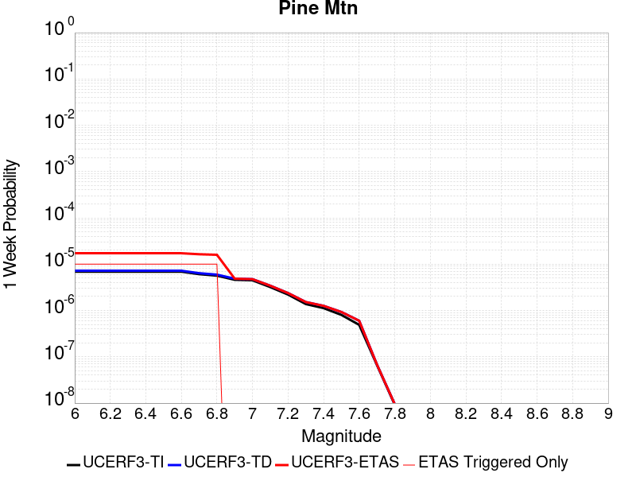 | 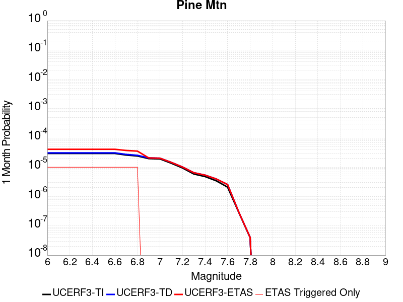 | 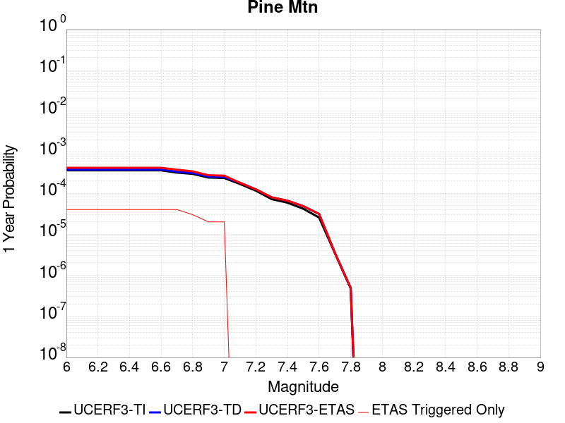 | 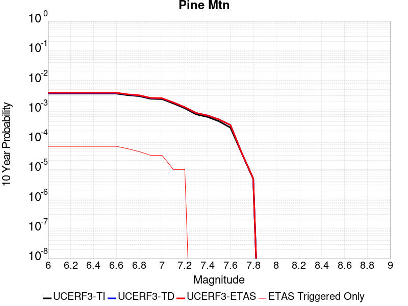 |

| Magnitude | 1 wk TI Prob | 1 wk TD Prob | 1 wk ETAS Prob | 1 wk ETAS/TD Gain | 1 wk ETAS Triggered Only | 1 mo TI Prob | 1 mo TD Prob | 1 mo ETAS Prob | 1 mo ETAS/TD Gain | 1 mo ETAS Triggered Only | 1 yr TI Prob | 1 yr TD Prob | 1 yr ETAS Prob | 1 yr ETAS/TD Gain | 1 yr ETAS Triggered Only | 10 yr TI Prob | 10 yr TD Prob | 10 yr ETAS Prob | 10 yr ETAS/TD Gain | 10 yr ETAS Triggered Only |
|-----|-----|-----|-----|-----|-----|-----|-----|-----|-----|-----|-----|-----|-----|-----|-----|-----|-----|-----|-----|-----|
| 6.0 | 6.894797E-6 | 7.2254716E-6 | 1.72254E-5 | 2.3839827 | 1.0E-5 | 2.9548795E-5 | 3.0965955E-5 | 4.0965646E-5 | 1.3229253 | 1.0E-5 | 3.596972E-4 | 3.7694827E-4 | 4.169332E-4 | 1.1060754 | 4.0E-5 | 0.0035911554 | 0.0037633865 | 0.0038231607 | 1.0158831 | 6.0E-5 |
| 6.1 | 6.894797E-6 | 7.2254716E-6 | 1.72254E-5 | 2.3839827 | 1.0E-5 | 2.9548795E-5 | 3.0965955E-5 | 4.0965646E-5 | 1.3229253 | 1.0E-5 | 3.596972E-4 | 3.7694827E-4 | 4.169332E-4 | 1.1060754 | 4.0E-5 | 0.0035911554 | 0.0037633865 | 0.0038231607 | 1.0158831 | 6.0E-5 |
| 6.2 | 6.894797E-6 | 7.2254716E-6 | 1.72254E-5 | 2.3839827 | 1.0E-5 | 2.9548795E-5 | 3.0965955E-5 | 4.0965646E-5 | 1.3229253 | 1.0E-5 | 3.596972E-4 | 3.7694827E-4 | 4.169332E-4 | 1.1060754 | 4.0E-5 | 0.0035911554 | 0.0037633865 | 0.0038231607 | 1.0158831 | 6.0E-5 |
| 6.3 | 6.894797E-6 | 7.2254716E-6 | 1.72254E-5 | 2.3839827 | 1.0E-5 | 2.9548795E-5 | 3.0965955E-5 | 4.0965646E-5 | 1.3229253 | 1.0E-5 | 3.596972E-4 | 3.7694827E-4 | 4.169332E-4 | 1.1060754 | 4.0E-5 | 0.0035911554 | 0.0037633865 | 0.0038231607 | 1.0158831 | 6.0E-5 |
| 6.4 | 6.894797E-6 | 7.2254716E-6 | 1.72254E-5 | 2.3839827 | 1.0E-5 | 2.9548795E-5 | 3.0965955E-5 | 4.0965646E-5 | 1.3229253 | 1.0E-5 | 3.596972E-4 | 3.7694827E-4 | 4.169332E-4 | 1.1060754 | 4.0E-5 | 0.0035911554 | 0.0037633865 | 0.0038231607 | 1.0158831 | 6.0E-5 |
| 6.5 | 6.894797E-6 | 7.2254716E-6 | 1.72254E-5 | 2.3839827 | 1.0E-5 | 2.9548795E-5 | 3.0965955E-5 | 4.0965646E-5 | 1.3229253 | 1.0E-5 | 3.596972E-4 | 3.7694827E-4 | 4.169332E-4 | 1.1060754 | 4.0E-5 | 0.0035911554 | 0.0037633865 | 0.0038231607 | 1.0158831 | 6.0E-5 |
| 6.6 | 6.894797E-6 | 7.2254716E-6 | 1.72254E-5 | 2.3839827 | 1.0E-5 | 2.9548795E-5 | 3.0965955E-5 | 4.0965646E-5 | 1.3229253 | 1.0E-5 | 3.596972E-4 | 3.7694827E-4 | 4.169332E-4 | 1.1060754 | 4.0E-5 | 0.0035911554 | 0.0037633865 | 0.0038231607 | 1.0158831 | 6.0E-5 |
| 6.7 | 6.0867933E-6 | 6.397124E-6 | 1.639706E-5 | 2.5631926 | 1.0E-5 | 2.6085996E-5 | 2.7415968E-5 | 3.7415695E-5 | 1.364741 | 1.0E-5 | 3.1755073E-4 | 3.337405E-4 | 3.7372715E-4 | 1.1198136 | 4.0E-5 | 0.0031709734 | 0.0033326119 | 0.0033824453 | 1.0149533 | 5.0E-5 |
| 6.8 | 5.6530425E-6 | 5.950606E-6 | 1.5950547E-5 | 2.6804912 | 1.0E-5 | 2.42271E-5 | 2.5502359E-5 | 3.5502104E-5 | 1.3921106 | 1.0E-5 | 2.94925E-4 | 3.1044905E-4 | 3.4043973E-4 | 1.0966042 | 3.0E-5 | 0.002945339 | 0.0031003582 | 0.0031402342 | 1.0128617 | 4.0E-5 |
| 6.9 | 4.6015225E-6 | 4.8638444E-6 | 4.8638444E-6 | 1.0 | 0.0 | 1.9720663E-5 | 2.084489E-5 | 2.084489E-5 | 1.0 | 0.0 | 2.4007261E-4 | 2.5375842E-4 | 2.7375337E-4 | 1.0787951 | 2.0E-5 | 0.0023981342 | 0.002534831 | 0.0025647548 | 1.011805 | 3.0E-5 |
| 7.0 | 4.4875965E-6 | 4.7474837E-6 | 4.7474837E-6 | 1.0 | 0.0 | 1.9232413E-5 | 2.0346208E-5 | 2.0346208E-5 | 1.0 | 0.0 | 2.3412947E-4 | 2.4768838E-4 | 2.676834E-4 | 1.0807266 | 2.0E-5 | 0.0023388295 | 0.0024742668 | 0.0025041925 | 1.0120949 | 3.0E-5 |
| 7.1 | 3.203907E-6 | 3.42942E-6 | 3.42942E-6 | 1.0 | 0.0 | 1.3730958E-5 | 1.4697435E-5 | 1.4697435E-5 | 1.0 | 0.0 | 1.6716159E-4 | 1.7892725E-4 | 1.7892725E-4 | 1.0 | 0.0 | 0.0016703589 | 0.001787898 | 0.0017978802 | 1.0055832 | 1.0E-5 |
| 7.2 | 2.2060601E-6 | 2.3784874E-6 | 2.3784874E-6 | 1.0 | 0.0 | 9.4545085E-6 | 1.019348E-5 | 1.019348E-5 | 1.0 | 0.0 | 1.15102564E-4 | 1.2409901E-4 | 1.2409901E-4 | 1.0 | 0.0 | 0.0011504296 | 0.0012403419 | 0.0012503295 | 1.0080523 | 1.0E-5 |
| 7.3 | 1.3765207E-6 | 1.5216535E-6 | 1.5216535E-6 | 1.0 | 0.0 | 5.899361E-6 | 6.5213567E-6 | 6.5213567E-6 | 1.0 | 0.0 | 7.182235E-5 | 7.939472E-5 | 7.939472E-5 | 1.0 | 0.0 | 7.1799144E-4 | 7.9367263E-4 | 7.9367263E-4 | 1.0 | 0.0 |
| 7.4 | 1.1245983E-6 | 1.2587126E-6 | 1.2587126E-6 | 1.0 | 0.0 | 4.819698E-6 | 5.394472E-6 | 5.394472E-6 | 1.0 | 0.0 | 5.8678244E-5 | 6.56758E-5 | 6.56758E-5 | 1.0 | 0.0 | 5.866275E-4 | 6.565722E-4 | 6.565722E-4 | 1.0 | 0.0 |
| 7.5 | 8.031682E-7 | 9.276999E-7 | 9.276999E-7 | 1.0 | 0.0 | 3.4421448E-6 | 3.975851E-6 | 3.975851E-6 | 1.0 | 0.0 | 4.1907308E-5 | 4.840498E-5 | 4.840498E-5 | 1.0 | 0.0 | 4.1899405E-4 | 4.8395112E-4 | 4.8395112E-4 | 1.0 | 0.0 |
| 7.6 | 4.8953444E-7 | 6.0030544E-7 | 6.0030544E-7 | 1.0 | 0.0 | 2.098003E-6 | 2.5727354E-6 | 2.5727354E-6 | 1.0 | 0.0 | 2.5542888E-5 | 3.1322652E-5 | 3.1322652E-5 | 1.0 | 0.0 | 2.5539953E-4 | 3.1318725E-4 | 3.1318725E-4 | 1.0 | 0.0 |
| 7.7 | 6.634529E-8 | 6.788826E-8 | 6.788826E-8 | 1.0 | 0.0 | 2.843369E-7 | 2.9094966E-7 | 2.9094966E-7 | 1.0 | 0.0 | 3.4617963E-6 | 3.5423066E-6 | 3.5423066E-6 | 1.0 | 0.0 | 3.4617424E-5 | 3.542255E-5 | 3.542255E-5 | 1.0 | 0.0 |
| 7.8 | 9.235578E-9 | 9.488566E-9 | 9.488566E-9 | 1.0 | 0.0 | 3.9581046E-8 | 4.0665284E-8 | 4.0665284E-8 | 1.0 | 0.0 | 4.818991E-7 | 4.950997E-7 | 4.950997E-7 | 1.0 | 0.0 | 4.8189804E-6 | 4.950988E-6 | 4.950988E-6 | 1.0 | 0.0 |

## San Jacinto (Lytle Creek connector)
*[(top)](#table-of-contents)*

| 1 Week | 1 Month | 1 Year | 10 Year |
|-----|-----|-----|-----|
| 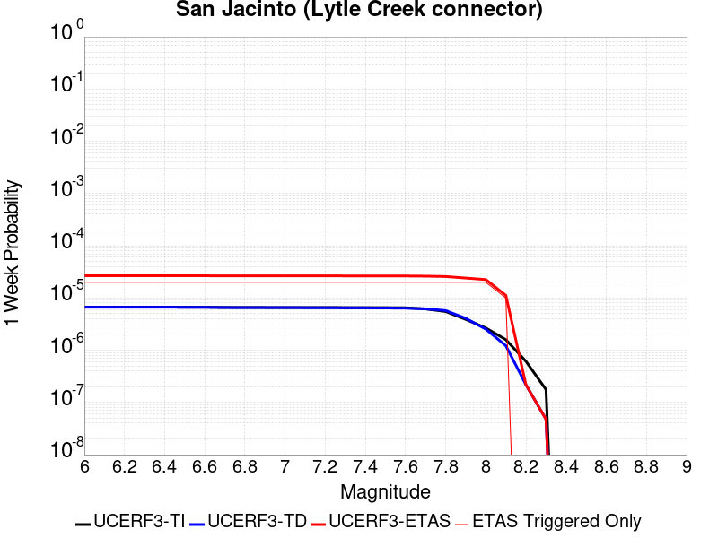 |  |  |  |

| Magnitude | 1 wk TI Prob | 1 wk TD Prob | 1 wk ETAS Prob | 1 wk ETAS/TD Gain | 1 wk ETAS Triggered Only | 1 mo TI Prob | 1 mo TD Prob | 1 mo ETAS Prob | 1 mo ETAS/TD Gain | 1 mo ETAS Triggered Only | 1 yr TI Prob | 1 yr TD Prob | 1 yr ETAS Prob | 1 yr ETAS/TD Gain | 1 yr ETAS Triggered Only | 10 yr TI Prob | 10 yr TD Prob | 10 yr ETAS Prob | 10 yr ETAS/TD Gain | 10 yr ETAS Triggered Only |
|-----|-----|-----|-----|-----|-----|-----|-----|-----|-----|-----|-----|-----|-----|-----|-----|-----|-----|-----|-----|-----|
| 6.0 | 6.693995E-6 | 6.660123E-6 | 2.6659989E-5 | 4.002928 | 2.0E-5 | 2.8688235E-5 | 2.8543072E-5 | 5.8542217E-5 | 2.0510132 | 3.0E-5 | 3.492233E-4 | 3.4745657E-4 | 4.0743573E-4 | 1.1726234 | 6.0E-5 | 0.00348675 | 0.0035491167 | 0.0036188683 | 1.0196532 | 7.0E-5 |
| 6.1 | 6.693995E-6 | 6.660123E-6 | 2.6659989E-5 | 4.002928 | 2.0E-5 | 2.8688235E-5 | 2.8543072E-5 | 5.8542217E-5 | 2.0510132 | 3.0E-5 | 3.492233E-4 | 3.4745657E-4 | 4.0743573E-4 | 1.1726234 | 6.0E-5 | 0.00348675 | 0.0035491167 | 0.0036188683 | 1.0196532 | 7.0E-5 |
| 6.2 | 6.693995E-6 | 6.660123E-6 | 2.6659989E-5 | 4.002928 | 2.0E-5 | 2.8688235E-5 | 2.8543072E-5 | 5.8542217E-5 | 2.0510132 | 3.0E-5 | 3.492233E-4 | 3.4745657E-4 | 4.0743573E-4 | 1.1726234 | 6.0E-5 | 0.00348675 | 0.0035491167 | 0.0036188683 | 1.0196532 | 7.0E-5 |
| 6.3 | 6.693995E-6 | 6.660123E-6 | 2.6659989E-5 | 4.002928 | 2.0E-5 | 2.8688235E-5 | 2.8543072E-5 | 5.8542217E-5 | 2.0510132 | 3.0E-5 | 3.492233E-4 | 3.4745657E-4 | 4.0743573E-4 | 1.1726234 | 6.0E-5 | 0.00348675 | 0.0035491167 | 0.0036188683 | 1.0196532 | 7.0E-5 |
| 6.4 | 6.693995E-6 | 6.660123E-6 | 2.6659989E-5 | 4.002928 | 2.0E-5 | 2.8688235E-5 | 2.8543072E-5 | 5.8542217E-5 | 2.0510132 | 3.0E-5 | 3.492233E-4 | 3.4745657E-4 | 4.0743573E-4 | 1.1726234 | 6.0E-5 | 0.00348675 | 0.0035491167 | 0.0036188683 | 1.0196532 | 7.0E-5 |
| 6.5 | 6.6561875E-6 | 6.620341E-6 | 2.6620208E-5 | 4.0209723 | 2.0E-5 | 2.8526205E-5 | 2.8372582E-5 | 5.837173E-5 | 2.057329 | 3.0E-5 | 3.472512E-4 | 3.453815E-4 | 4.053608E-4 | 1.173661 | 6.0E-5 | 0.0034670907 | 0.0035284322 | 0.0035981853 | 1.0197688 | 7.0E-5 |
| 6.6 | 6.6561875E-6 | 6.620341E-6 | 2.6620208E-5 | 4.0209723 | 2.0E-5 | 2.8526205E-5 | 2.8372582E-5 | 5.837173E-5 | 2.057329 | 3.0E-5 | 3.472512E-4 | 3.453815E-4 | 4.053608E-4 | 1.173661 | 6.0E-5 | 0.0034670907 | 0.0035284322 | 0.0035981853 | 1.0197688 | 7.0E-5 |
| 6.7 | 6.5802237E-6 | 6.539518E-6 | 2.6539386E-5 | 4.0583096 | 2.0E-5 | 2.8200653E-5 | 2.8026205E-5 | 5.802536E-5 | 2.070397 | 3.0E-5 | 3.4328885E-4 | 3.4116567E-4 | 4.011452E-4 | 1.1758076 | 6.0E-5 | 0.0034275902 | 0.0034864065 | 0.0035561626 | 1.020008 | 7.0E-5 |
| 6.8 | 6.575632E-6 | 6.5340073E-6 | 2.6533877E-5 | 4.060889 | 2.0E-5 | 2.8180975E-5 | 2.8002589E-5 | 5.8001748E-5 | 2.0712996 | 3.0E-5 | 3.4304935E-4 | 3.4087826E-4 | 4.008578E-4 | 1.1759559 | 6.0E-5 | 0.0034252026 | 0.0034835413 | 0.0035532976 | 1.0200245 | 7.0E-5 |
| 6.9 | 6.570433E-6 | 6.525401E-6 | 2.6525271E-5 | 4.0649257 | 2.0E-5 | 2.8158694E-5 | 2.7965707E-5 | 5.7964866E-5 | 2.0727124 | 3.0E-5 | 3.4277816E-4 | 3.4042934E-4 | 4.0040893E-4 | 1.176188 | 6.0E-5 | 0.0034224992 | 0.0034790665 | 0.003548823 | 1.0200503 | 7.0E-5 |
| 7.0 | 6.5643826E-6 | 6.5155223E-6 | 2.6515392E-5 | 4.069573 | 2.0E-5 | 2.8132765E-5 | 2.7923368E-5 | 5.792253E-5 | 2.074339 | 3.0E-5 | 3.424626E-4 | 3.3991406E-4 | 3.9989364E-4 | 1.1764553 | 6.0E-5 | 0.0034193532 | 0.0034739296 | 0.0035436864 | 1.0200801 | 7.0E-5 |
| 7.1 | 6.557402E-6 | 6.504234E-6 | 2.6504104E-5 | 4.0749 | 2.0E-5 | 2.8102848E-5 | 2.7874992E-5 | 5.7874156E-5 | 2.0762036 | 3.0E-5 | 3.4209844E-4 | 3.3932526E-4 | 3.9930487E-4 | 1.1767615 | 6.0E-5 | 0.0034157229 | 0.0034680606 | 0.0035378179 | 1.0201142 | 7.0E-5 |
| 7.2 | 6.546394E-6 | 6.4862006E-6 | 2.648607E-5 | 4.0834494 | 2.0E-5 | 2.8055672E-5 | 2.7797707E-5 | 5.779687E-5 | 2.0791957 | 3.0E-5 | 3.4152428E-4 | 3.383846E-4 | 3.983643E-4 | 1.177253 | 6.0E-5 | 0.0034099987 | 0.0034586883 | 0.003528446 | 1.0201689 | 7.0E-5 |
| 7.3 | 6.5364216E-6 | 6.4669857E-6 | 2.6466856E-5 | 4.092611 | 2.0E-5 | 2.8012933E-5 | 2.771536E-5 | 5.771453E-5 | 2.0824022 | 3.0E-5 | 3.4100408E-4 | 3.373823E-4 | 3.9736208E-4 | 1.1777798 | 6.0E-5 | 0.003404813 | 0.0034487103 | 0.003518469 | 1.0202274 | 7.0E-5 |
| 7.4 | 6.5269523E-6 | 6.4480723E-6 | 2.6447944E-5 | 4.101682 | 2.0E-5 | 2.7972354E-5 | 2.7634303E-5 | 5.7633475E-5 | 2.0855772 | 3.0E-5 | 3.4051016E-4 | 3.3639578E-4 | 3.9637557E-4 | 1.1783013 | 6.0E-5 | 0.0033998888 | 0.0034388923 | 0.0035086514 | 1.0202854 | 7.0E-5 |
| 7.5 | 6.5111835E-6 | 6.424346E-6 | 2.6424217E-5 | 4.1131372 | 2.0E-5 | 2.7904773E-5 | 2.753262E-5 | 5.7531794E-5 | 2.0895865 | 3.0E-5 | 3.3968766E-4 | 3.3515817E-4 | 3.9513805E-4 | 1.17896 | 6.0E-5 | 0.0033916887 | 0.0034265644 | 0.0034963244 | 1.0203587 | 7.0E-5 |
| 7.6 | 6.4768806E-6 | 6.383454E-6 | 2.6383326E-5 | 4.13308 | 2.0E-5 | 2.7757764E-5 | 2.7357375E-5 | 5.7356552E-5 | 2.0965664 | 3.0E-5 | 3.3789838E-4 | 3.330252E-4 | 3.9300523E-4 | 1.1801065 | 6.0E-5 | 0.0033738504 | 0.0034052972 | 0.0034750588 | 1.0204862 | 7.0E-5 |
| 7.7 | 6.1655364E-6 | 6.1759456E-6 | 2.6175821E-5 | 4.2383504 | 2.0E-5 | 2.642346E-5 | 2.646807E-5 | 5.6467277E-5 | 2.1334112 | 3.0E-5 | 3.2165812E-4 | 3.2220117E-4 | 3.8218184E-4 | 1.186159 | 6.0E-5 | 0.0032119295 | 0.0032969362 | 0.0033667055 | 1.0211618 | 7.0E-5 |
| 7.8 | 5.5043524E-6 | 5.7370175E-6 | 2.5736903E-5 | 4.4861116 | 2.0E-5 | 2.3589868E-5 | 2.4586987E-5 | 5.458625E-5 | 2.2201276 | 3.0E-5 | 2.871688E-4 | 2.993055E-4 | 3.5928754E-4 | 1.200404 | 6.0E-5 | 0.0028679797 | 0.0030670585 | 0.003136844 | 1.0227531 | 7.0E-5 |
| 7.9 | 3.889249E-6 | 4.0766436E-6 | 2.4076562E-5 | 5.905977 | 2.0E-5 | 1.6668104E-5 | 1.7471213E-5 | 4.747069E-5 | 2.7170804 | 3.0E-5 | 2.0291525E-4 | 2.126913E-4 | 2.7267853E-4 | 1.2820389 | 6.0E-5 | 0.0020273007 | 0.0021941073 | 0.0022639537 | 1.0318336 | 7.0E-5 |
| 8.0 | 2.668535E-6 | 2.5313454E-6 | 2.2531294E-5 | 8.900917 | 2.0E-5 | 1.1436528E-5 | 1.0848577E-5 | 4.0848252E-5 | 3.7653093 | 3.0E-5 | 1.3923083E-4 | 1.3207346E-4 | 1.8206685E-4 | 1.3785272 | 5.0E-5 | 0.0013914363 | 0.0013755665 | 0.0014254977 | 1.0362986 | 5.0E-5 |
| 8.1 | 1.5911459E-6 | 1.2185134E-6 | 1.1218501E-5 | 9.206712 | 1.0E-5 | 6.8191785E-6 | 5.2221894E-6 | 2.5222085E-5 | 4.829791 | 2.0E-5 | 8.3020335E-5 | 6.357832E-5 | 1.0357578E-4 | 1.6291052 | 4.0E-5 | 8.298933E-4 | 6.6911156E-4 | 7.090848E-4 | 1.0597408 | 4.0E-5 |
| 8.2 | 6.1294963E-7 | 2.1802066E-7 | 2.1802066E-7 | 1.0 | 0.0 | 2.6269242E-6 | 9.3437393E-7 | 9.3437393E-7 | 1.0 | 0.0 | 3.1982334E-5 | 1.1375943E-5 | 2.137583E-5 | 1.879038 | 1.0E-5 | 3.1977732E-4 | 1.2778955E-4 | 1.3778827E-4 | 1.0782436 | 1.0E-5 |
| 8.3 | 1.762871E-7 | 4.7516316E-8 | 4.7516316E-8 | 1.0 | 0.0 | 7.5551594E-7 | 2.0364133E-7 | 2.0364133E-7 | 1.0 | 0.0 | 9.1983675E-6 | 2.4793305E-6 | 2.4793305E-6 | 1.0 | 0.0 | 9.197987E-5 | 2.8671833E-5 | 2.8671833E-5 | 1.0 | 0.0 |

## Elmore Ranch
*[(top)](#table-of-contents)*

| 1 Week | 1 Month | 1 Year | 10 Year |
|-----|-----|-----|-----|
|  |  | 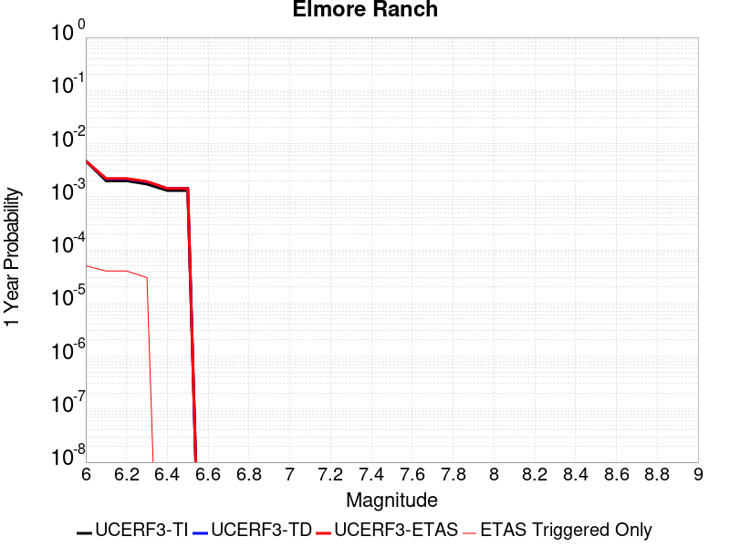 |  |

| Magnitude | 1 wk TI Prob | 1 wk TD Prob | 1 wk ETAS Prob | 1 wk ETAS/TD Gain | 1 wk ETAS Triggered Only | 1 mo TI Prob | 1 mo TD Prob | 1 mo ETAS Prob | 1 mo ETAS/TD Gain | 1 mo ETAS Triggered Only | 1 yr TI Prob | 1 yr TD Prob | 1 yr ETAS Prob | 1 yr ETAS/TD Gain | 1 yr ETAS Triggered Only | 10 yr TI Prob | 10 yr TD Prob | 10 yr ETAS Prob | 10 yr ETAS/TD Gain | 10 yr ETAS Triggered Only |
|-----|-----|-----|-----|-----|-----|-----|-----|-----|-----|-----|-----|-----|-----|-----|-----|-----|-----|-----|-----|-----|
| 6.0 | 9.102099E-5 | 8.953848E-5 | 1.0953669E-4 | 1.2233477 | 2.0E-5 | 3.9003167E-4 | 3.836898E-4 | 4.2367444E-4 | 1.1042109 | 4.0E-5 | 0.0047383 | 0.004662132 | 0.004711899 | 1.0106747 | 5.0E-5 | 0.046385348 | 0.04583787 | 0.045895122 | 1.001249 | 6.0E-5 |
| 6.1 | 3.8306698E-5 | 4.14921E-5 | 6.149127E-5 | 1.4819994 | 2.0E-5 | 1.6416123E-4 | 1.7781362E-4 | 2.178065E-4 | 1.2249147 | 4.0E-5 | 0.0019968306 | 0.0021632186 | 0.002203132 | 1.018451 | 4.0E-5 | 0.019789828 | 0.021595007 | 0.021634143 | 1.0018123 | 4.0E-5 |
| 6.2 | 3.8306698E-5 | 4.14921E-5 | 6.149127E-5 | 1.4819994 | 2.0E-5 | 1.6416123E-4 | 1.7781362E-4 | 2.178065E-4 | 1.2249147 | 4.0E-5 | 0.0019968306 | 0.0021632186 | 0.002203132 | 1.018451 | 4.0E-5 | 0.019789828 | 0.021595007 | 0.021634143 | 1.0018123 | 4.0E-5 |
| 6.3 | 3.3197924E-5 | 3.6550366E-5 | 5.6549638E-5 | 1.5471702 | 2.0E-5 | 1.4226905E-4 | 1.56639E-4 | 1.866343E-4 | 1.1914932 | 3.0E-5 | 0.0017307495 | 0.0019059771 | 0.00193592 | 1.01571 | 3.0E-5 | 0.017173318 | 0.019057386 | 0.019086814 | 1.0015442 | 3.0E-5 |
| 6.4 | 2.5148964E-5 | 2.7420736E-5 | 2.7420736E-5 | 1.0 | 0.0 | 1.0777682E-4 | 1.17515796E-4 | 1.17515796E-4 | 1.0 | 0.0 | 0.0013113929 | 0.0014304637 | 0.0014304637 | 1.0 | 0.0 | 0.01303681 | 0.014365338 | 0.014365338 | 1.0 | 0.0 |
| 6.5 | 2.5148964E-5 | 2.7420736E-5 | 2.7420736E-5 | 1.0 | 0.0 | 1.0777682E-4 | 1.17515796E-4 | 1.17515796E-4 | 1.0 | 0.0 | 0.0013113929 | 0.0014304637 | 0.0014304637 | 1.0 | 0.0 | 0.01303681 | 0.014365338 | 0.014365338 | 1.0 | 0.0 |

## Channel Islands Thrust
*[(top)](#table-of-contents)*

| 1 Week | 1 Month | 1 Year | 10 Year |
|-----|-----|-----|-----|
|  |  |  |  |

| Magnitude | 1 wk TI Prob | 1 wk TD Prob | 1 wk ETAS Prob | 1 wk ETAS/TD Gain | 1 wk ETAS Triggered Only | 1 mo TI Prob | 1 mo TD Prob | 1 mo ETAS Prob | 1 mo ETAS/TD Gain | 1 mo ETAS Triggered Only | 1 yr TI Prob | 1 yr TD Prob | 1 yr ETAS Prob | 1 yr ETAS/TD Gain | 1 yr ETAS Triggered Only | 10 yr TI Prob | 10 yr TD Prob | 10 yr ETAS Prob | 10 yr ETAS/TD Gain | 10 yr ETAS Triggered Only |
|-----|-----|-----|-----|-----|-----|-----|-----|-----|-----|-----|-----|-----|-----|-----|-----|-----|-----|-----|-----|-----|
| 6.0 | 2.2156251E-5 | 2.4092022E-5 | 2.4092022E-5 | 1.0 | 0.0 | 9.495191E-5 | 1.03248036E-4 | 1.03248036E-4 | 1.0 | 0.0 | 0.0011554264 | 0.0012564266 | 0.0012863888 | 1.0238472 | 3.0E-5 | 0.011494373 | 0.0125038205 | 0.01256307 | 1.0047386 | 6.0E-5 |
| 6.1 | 2.2156251E-5 | 2.4092022E-5 | 2.4092022E-5 | 1.0 | 0.0 | 9.495191E-5 | 1.03248036E-4 | 1.03248036E-4 | 1.0 | 0.0 | 0.0011554264 | 0.0012564266 | 0.0012863888 | 1.0238472 | 3.0E-5 | 0.011494373 | 0.0125038205 | 0.01256307 | 1.0047386 | 6.0E-5 |
| 6.2 | 2.2156251E-5 | 2.4092022E-5 | 2.4092022E-5 | 1.0 | 0.0 | 9.495191E-5 | 1.03248036E-4 | 1.03248036E-4 | 1.0 | 0.0 | 0.0011554264 | 0.0012564266 | 0.0012863888 | 1.0238472 | 3.0E-5 | 0.011494373 | 0.0125038205 | 0.01256307 | 1.0047386 | 6.0E-5 |
| 6.3 | 2.2156251E-5 | 2.4092022E-5 | 2.4092022E-5 | 1.0 | 0.0 | 9.495191E-5 | 1.03248036E-4 | 1.03248036E-4 | 1.0 | 0.0 | 0.0011554264 | 0.0012564266 | 0.0012863888 | 1.0238472 | 3.0E-5 | 0.011494373 | 0.0125038205 | 0.01256307 | 1.0047386 | 6.0E-5 |
| 6.4 | 2.2156251E-5 | 2.4092022E-5 | 2.4092022E-5 | 1.0 | 0.0 | 9.495191E-5 | 1.03248036E-4 | 1.03248036E-4 | 1.0 | 0.0 | 0.0011554264 | 0.0012564266 | 0.0012863888 | 1.0238472 | 3.0E-5 | 0.011494373 | 0.0125038205 | 0.01256307 | 1.0047386 | 6.0E-5 |
| 6.5 | 2.2156251E-5 | 2.4092022E-5 | 2.4092022E-5 | 1.0 | 0.0 | 9.495191E-5 | 1.03248036E-4 | 1.03248036E-4 | 1.0 | 0.0 | 0.0011554264 | 0.0012564266 | 0.0012863888 | 1.0238472 | 3.0E-5 | 0.011494373 | 0.0125038205 | 0.01256307 | 1.0047386 | 6.0E-5 |
| 6.6 | 2.2156251E-5 | 2.4092022E-5 | 2.4092022E-5 | 1.0 | 0.0 | 9.495191E-5 | 1.03248036E-4 | 1.03248036E-4 | 1.0 | 0.0 | 0.0011554264 | 0.0012564266 | 0.0012863888 | 1.0238472 | 3.0E-5 | 0.011494373 | 0.0125038205 | 0.01256307 | 1.0047386 | 6.0E-5 |
| 6.7 | 1.0601296E-5 | 1.1379544E-5 | 1.1379544E-5 | 1.0 | 0.0 | 4.5433335E-5 | 4.876859E-5 | 4.876859E-5 | 1.0 | 0.0 | 5.5301044E-4 | 5.936007E-4 | 6.0359476E-4 | 1.0168363 | 1.0E-5 | 0.005516363 | 0.005920653 | 0.005940535 | 1.003358 | 2.0E-5 |
| 6.8 | 1.0246747E-5 | 1.0996669E-5 | 1.0996669E-5 | 1.0 | 0.0 | 4.391389E-5 | 4.7127756E-5 | 4.7127756E-5 | 1.0 | 0.0 | 5.345204E-4 | 5.7363417E-4 | 5.836284E-4 | 1.0174227 | 1.0E-5 | 0.0053323656 | 0.005722025 | 0.0057419105 | 1.0034753 | 2.0E-5 |
| 6.9 | 9.049551E-6 | 9.699645E-6 | 9.699645E-6 | 1.0 | 0.0 | 3.878322E-5 | 4.1569267E-5 | 4.1569267E-5 | 1.0 | 0.0 | 4.7208337E-4 | 5.059924E-4 | 5.1598734E-4 | 1.0197531 | 1.0E-5 | 0.0047108172 | 0.0050488203 | 0.0050687194 | 1.0039413 | 2.0E-5 |
| 7.0 | 8.6542195E-6 | 9.274603E-6 | 9.274603E-6 | 1.0 | 0.0 | 3.7088983E-5 | 3.9747716E-5 | 3.9747716E-5 | 1.0 | 0.0 | 4.5146482E-4 | 4.8382508E-4 | 4.9382023E-4 | 1.0206586 | 1.0E-5 | 0.004505487 | 0.0048281294 | 0.0048480327 | 1.0041224 | 2.0E-5 |
| 7.1 | 8.391028E-6 | 8.992925E-6 | 8.992925E-6 | 1.0 | 0.0 | 3.5961057E-5 | 3.8540562E-5 | 3.8540562E-5 | 1.0 | 0.0 | 4.3773788E-4 | 4.6913436E-4 | 4.791297E-4 | 1.0213058 | 1.0E-5 | 0.004368766 | 0.0046818503 | 0.004701757 | 1.0042518 | 2.0E-5 |
| 7.2 | 5.965188E-6 | 6.3716957E-6 | 6.3716957E-6 | 1.0 | 0.0 | 2.556484E-5 | 2.7306984E-5 | 2.7306984E-5 | 1.0 | 0.0 | 3.1120746E-4 | 3.3241237E-4 | 3.3241237E-4 | 1.0 | 0.0 | 0.00310772 | 0.0033192094 | 0.0033192094 | 1.0 | 0.0 |
| 7.3 | 4.877518E-6 | 5.206007E-6 | 5.206007E-6 | 1.0 | 0.0 | 2.0903482E-5 | 2.231127E-5 | 2.231127E-5 | 1.0 | 0.0 | 2.5447016E-4 | 2.716063E-4 | 2.716063E-4 | 1.0 | 0.0 | 0.0025417898 | 0.0027127897 | 0.0027127897 | 1.0 | 0.0 |
| 7.4 | 3.8829853E-6 | 4.141863E-6 | 4.141863E-6 | 1.0 | 0.0 | 1.664126E-5 | 1.7750723E-5 | 1.7750723E-5 | 1.0 | 0.0 | 2.0258849E-4 | 2.1609403E-4 | 2.1609403E-4 | 1.0 | 0.0 | 0.002024039 | 0.002158881 | 0.002158881 | 1.0 | 0.0 |
| 7.5 | 1.3489616E-6 | 1.4277905E-6 | 1.4277905E-6 | 1.0 | 0.0 | 5.7812517E-6 | 6.119088E-6 | 6.119088E-6 | 1.0 | 0.0 | 7.038446E-5 | 7.449739E-5 | 7.449739E-5 | 1.0 | 0.0 | 7.036218E-4 | 7.4472814E-4 | 7.4472814E-4 | 1.0 | 0.0 |
| 7.6 | 6.058192E-7 | 6.35378E-7 | 6.35378E-7 | 1.0 | 0.0 | 2.5963652E-6 | 2.7230458E-6 | 2.7230458E-6 | 1.0 | 0.0 | 3.161029E-5 | 3.3152595E-5 | 3.3152595E-5 | 1.0 | 0.0 | 3.1605794E-4 | 3.314781E-4 | 3.314781E-4 | 1.0 | 0.0 |
| 7.7 | 2.2170494E-7 | 2.2607924E-7 | 2.2607924E-7 | 1.0 | 0.0 | 9.5016367E-7 | 9.689107E-7 | 9.689107E-7 | 1.0 | 0.0 | 1.1568181E-5 | 1.17964355E-5 | 1.17964355E-5 | 1.0 | 0.0 | 1.1567579E-4 | 1.179592E-4 | 1.179592E-4 | 1.0 | 0.0 |
| 7.8 | 2.1613102E-8 | 1.5466837E-8 | 1.5466837E-8 | 1.0 | 0.0 | 9.262757E-8 | 6.628645E-8 | 6.628645E-8 | 1.0 | 0.0 | 1.1277401E-6 | 8.070372E-7 | 8.070372E-7 | 1.0 | 0.0 | 1.1277344E-5 | 8.07035E-6 | 8.07035E-6 | 1.0 | 0.0 |

## Cleghorn
*[(top)](#table-of-contents)*

| 1 Week | 1 Month | 1 Year | 10 Year |
|-----|-----|-----|-----|
|  |  |  |  |

| Magnitude | 1 wk TI Prob | 1 wk TD Prob | 1 wk ETAS Prob | 1 wk ETAS/TD Gain | 1 wk ETAS Triggered Only | 1 mo TI Prob | 1 mo TD Prob | 1 mo ETAS Prob | 1 mo ETAS/TD Gain | 1 mo ETAS Triggered Only | 1 yr TI Prob | 1 yr TD Prob | 1 yr ETAS Prob | 1 yr ETAS/TD Gain | 1 yr ETAS Triggered Only | 10 yr TI Prob | 10 yr TD Prob | 10 yr ETAS Prob | 10 yr ETAS/TD Gain | 10 yr ETAS Triggered Only |
|-----|-----|-----|-----|-----|-----|-----|-----|-----|-----|-----|-----|-----|-----|-----|-----|-----|-----|-----|-----|-----|
| 6.0 | 7.9267165E-6 | 9.831764E-6 | 9.831764E-6 | 1.0 | 0.0 | 3.39712E-5 | 4.2135514E-5 | 4.2135514E-5 | 1.0 | 0.0 | 4.1352084E-4 | 5.1288976E-4 | 5.1288976E-4 | 1.0 | 0.0 | 0.004127522 | 0.005132214 | 0.0051919064 | 1.0116309 | 6.0E-5 |
| 6.1 | 7.9267165E-6 | 9.831764E-6 | 9.831764E-6 | 1.0 | 0.0 | 3.39712E-5 | 4.2135514E-5 | 4.2135514E-5 | 1.0 | 0.0 | 4.1352084E-4 | 5.1288976E-4 | 5.1288976E-4 | 1.0 | 0.0 | 0.004127522 | 0.005132214 | 0.0051919064 | 1.0116309 | 6.0E-5 |
| 6.2 | 7.9267165E-6 | 9.831764E-6 | 9.831764E-6 | 1.0 | 0.0 | 3.39712E-5 | 4.2135514E-5 | 4.2135514E-5 | 1.0 | 0.0 | 4.1352084E-4 | 5.1288976E-4 | 5.1288976E-4 | 1.0 | 0.0 | 0.004127522 | 0.005132214 | 0.0051919064 | 1.0116309 | 6.0E-5 |
| 6.3 | 7.9267165E-6 | 9.831764E-6 | 9.831764E-6 | 1.0 | 0.0 | 3.39712E-5 | 4.2135514E-5 | 4.2135514E-5 | 1.0 | 0.0 | 4.1352084E-4 | 5.1288976E-4 | 5.1288976E-4 | 1.0 | 0.0 | 0.004127522 | 0.005132214 | 0.0051919064 | 1.0116309 | 6.0E-5 |
| 6.4 | 4.3445207E-6 | 6.0916254E-6 | 6.0916254E-6 | 1.0 | 0.0 | 1.8619241E-5 | 2.6106709E-5 | 2.6106709E-5 | 1.0 | 0.0 | 2.2666567E-4 | 3.1780385E-4 | 3.1780385E-4 | 1.0 | 0.0 | 0.0022643462 | 0.0031877246 | 0.003227597 | 1.0125082 | 4.0E-5 |
| 6.5 | 4.3445207E-6 | 6.0916254E-6 | 6.0916254E-6 | 1.0 | 0.0 | 1.8619241E-5 | 2.6106709E-5 | 2.6106709E-5 | 1.0 | 0.0 | 2.2666567E-4 | 3.1780385E-4 | 3.1780385E-4 | 1.0 | 0.0 | 0.0022643462 | 0.0031877246 | 0.003227597 | 1.0125082 | 4.0E-5 |
| 6.6 | 4.040109E-6 | 5.774033E-6 | 5.774033E-6 | 1.0 | 0.0 | 1.7314638E-5 | 2.4745626E-5 | 2.4745626E-5 | 1.0 | 0.0 | 2.1078532E-4 | 3.0123728E-4 | 3.0123728E-4 | 1.0 | 0.0 | 0.002105855 | 0.0030225143 | 0.0030623935 | 1.013194 | 4.0E-5 |
| 6.7 | 3.3632055E-6 | 5.06753E-6 | 5.06753E-6 | 1.0 | 0.0 | 1.4413658E-5 | 2.1717806E-5 | 2.1717806E-5 | 1.0 | 0.0 | 1.7547216E-4 | 2.643825E-4 | 2.643825E-4 | 1.0 | 0.0 | 0.0017533366 | 0.0026548486 | 0.002664822 | 1.0037566 | 1.0E-5 |
| 6.8 | 3.2902772E-6 | 4.9894375E-6 | 4.9894375E-6 | 1.0 | 0.0 | 1.4101111E-5 | 2.138313E-5 | 2.138313E-5 | 1.0 | 0.0 | 1.716675E-4 | 2.6030882E-4 | 2.6030882E-4 | 1.0 | 0.0 | 0.0017153495 | 0.0026142076 | 0.0026241813 | 1.0038153 | 1.0E-5 |
| 6.9 | 3.031547E-6 | 4.6911987E-6 | 4.6911987E-6 | 1.0 | 0.0 | 1.299228E-5 | 2.0104984E-5 | 2.0104984E-5 | 1.0 | 0.0 | 1.5816953E-4 | 2.4475096E-4 | 2.4475096E-4 | 1.0 | 0.0 | 0.00158057 | 0.0024589805 | 0.0024589805 | 1.0 | 0.0 |
| 7.0 | 2.8259715E-6 | 4.3707637E-6 | 4.3707637E-6 | 1.0 | 0.0 | 1.211125E-5 | 1.8731711E-5 | 1.8731711E-5 | 1.0 | 0.0 | 1.4744449E-4 | 2.2803496E-4 | 2.2803496E-4 | 1.0 | 0.0 | 0.001473467 | 0.0022921748 | 0.0022921748 | 1.0 | 0.0 |
| 7.1 | 2.5962665E-6 | 4.065983E-6 | 4.065983E-6 | 1.0 | 0.0 | 1.1126809E-5 | 1.7425526E-5 | 1.7425526E-5 | 1.0 | 0.0 | 1.3546048E-4 | 2.1213535E-4 | 2.1213535E-4 | 1.0 | 0.0 | 0.0013537793 | 0.0021334959 | 0.0021334959 | 1.0 | 0.0 |
| 7.2 | 2.3247253E-6 | 3.6765352E-6 | 3.6765352E-6 | 1.0 | 0.0 | 9.96307E-6 | 1.5756486E-5 | 1.5756486E-5 | 1.0 | 0.0 | 1.21293626E-4 | 1.9181852E-4 | 1.9181852E-4 | 1.0 | 0.0 | 0.0012122744 | 0.0019307166 | 0.0019307166 | 1.0 | 0.0 |
| 7.3 | 2.056928E-6 | 3.235253E-6 | 3.235253E-6 | 1.0 | 0.0 | 8.815376E-6 | 1.3865297E-5 | 1.3865297E-5 | 1.0 | 0.0 | 1.0732192E-4 | 1.6879707E-4 | 1.6879707E-4 | 1.0 | 0.0 | 0.001072701 | 0.0017009423 | 0.0017009423 | 1.0 | 0.0 |
| 7.4 | 1.8055999E-6 | 2.8256538E-6 | 2.8256538E-6 | 1.0 | 0.0 | 7.738263E-6 | 1.210989E-5 | 1.210989E-5 | 1.0 | 0.0 | 9.4209274E-5 | 1.4742807E-4 | 1.4742807E-4 | 1.0 | 0.0 | 9.4169343E-4 | 0.0014876705 | 0.0014876705 | 1.0 | 0.0 |
| 7.5 | 1.4683443E-6 | 2.4248943E-6 | 2.4248943E-6 | 1.0 | 0.0 | 6.292889E-6 | 1.0392363E-5 | 1.0392363E-5 | 1.0 | 0.0 | 7.661323E-5 | 1.2651978E-4 | 1.2651978E-4 | 1.0 | 0.0 | 7.658682E-4 | 0.0012788812 | 0.0012788812 | 1.0 | 0.0 |
| 7.6 | 9.804088E-7 | 1.9004091E-6 | 1.9004091E-6 | 1.0 | 0.0 | 4.201745E-6 | 8.144585E-6 | 8.144585E-6 | 1.0 | 0.0 | 5.1155046E-5 | 9.915586E-5 | 9.915586E-5 | 1.0 | 0.0 | 5.114327E-4 | 0.0010055583 | 0.0010055583 | 1.0 | 0.0 |
| 7.7 | 7.3434086E-7 | 1.6285549E-6 | 1.6285549E-6 | 1.0 | 0.0 | 3.1471714E-6 | 6.9795024E-6 | 6.9795024E-6 | 1.0 | 0.0 | 3.831614E-5 | 8.4972155E-5 | 8.4972155E-5 | 1.0 | 0.0 | 3.8309532E-4 | 8.6387293E-4 | 8.6387293E-4 | 1.0 | 0.0 |
| 7.8 | 6.434184E-7 | 1.5221389E-6 | 1.5221389E-6 | 1.0 | 0.0 | 2.7575045E-6 | 6.523436E-6 | 6.523436E-6 | 1.0 | 0.0 | 3.35721E-5 | 7.9419966E-5 | 7.9419966E-5 | 1.0 | 0.0 | 3.3567028E-4 | 8.080443E-4 | 8.080443E-4 | 1.0 | 0.0 |
| 7.9 | 3.4943926E-7 | 7.5750586E-7 | 7.5750586E-7 | 1.0 | 0.0 | 1.497596E-6 | 3.2464498E-6 | 3.2464498E-6 | 1.0 | 0.0 | 1.8233079E-5 | 3.9524817E-5 | 3.9524817E-5 | 1.0 | 0.0 | 1.8231584E-4 | 4.0401975E-4 | 4.0401975E-4 | 1.0 | 0.0 |
| 8.0 | 6.717524E-8 | 5.837515E-8 | 5.837515E-8 | 1.0 | 0.0 | 2.8789387E-7 | 2.501792E-7 | 2.501792E-7 | 1.0 | 0.0 | 3.505102E-6 | 3.0459275E-6 | 3.0459275E-6 | 1.0 | 0.0 | 3.5050467E-5 | 3.2751934E-5 | 3.2751934E-5 | 1.0 | 0.0 |
| 8.1 | 3.1984914E-8 | 1.2949885E-8 | 1.2949885E-8 | 1.0 | 0.0 | 1.370782E-7 | 5.549951E-8 | 5.549951E-8 | 1.0 | 0.0 | 1.6689258E-6 | 6.757063E-7 | 6.757063E-7 | 1.0 | 0.0 | 1.6689133E-5 | 7.741151E-6 | 7.741151E-6 | 1.0 | 0.0 |
| 8.2 | 1.21887656E-8 | 3.6471115E-9 | 3.6471115E-9 | 1.0 | 0.0 | 5.2237567E-8 | 1.563048E-8 | 1.563048E-8 | 1.0 | 0.0 | 6.359922E-7 | 1.9030107E-7 | 1.9030107E-7 | 1.0 | 0.0 | 6.3599036E-6 | 2.245849E-6 | 2.245849E-6 | 1.0 | 0.0 |

## San Andreas (Peninsula) 2011 CFM
*[(top)](#table-of-contents)*

| 1 Week | 1 Month | 1 Year | 10 Year |
|-----|-----|-----|-----|
|  |  |  |  |

| Magnitude | 1 wk TI Prob | 1 wk TD Prob | 1 wk ETAS Prob | 1 wk ETAS/TD Gain | 1 wk ETAS Triggered Only | 1 mo TI Prob | 1 mo TD Prob | 1 mo ETAS Prob | 1 mo ETAS/TD Gain | 1 mo ETAS Triggered Only | 1 yr TI Prob | 1 yr TD Prob | 1 yr ETAS Prob | 1 yr ETAS/TD Gain | 1 yr ETAS Triggered Only | 10 yr TI Prob | 10 yr TD Prob | 10 yr ETAS Prob | 10 yr ETAS/TD Gain | 10 yr ETAS Triggered Only |
|-----|-----|-----|-----|-----|-----|-----|-----|-----|-----|-----|-----|-----|-----|-----|-----|-----|-----|-----|-----|-----|
| 6.0 | 8.6200685E-5 | 2.5207937E-5 | 2.5207937E-5 | 1.0 | 0.0 | 3.6937918E-4 | 1.0802955E-4 | 1.1802847E-4 | 1.0925573 | 1.0E-5 | 0.0044879215 | 0.0013144679 | 0.0013644021 | 1.0379882 | 5.0E-5 | 0.043983612 | 0.01477218 | 0.014831292 | 1.0040017 | 6.0E-5 |
| 6.1 | 8.6200685E-5 | 2.5207937E-5 | 2.5207937E-5 | 1.0 | 0.0 | 3.6937918E-4 | 1.0802955E-4 | 1.1802847E-4 | 1.0925573 | 1.0E-5 | 0.0044879215 | 0.0013144679 | 0.0013644021 | 1.0379882 | 5.0E-5 | 0.043983612 | 0.01477218 | 0.014831292 | 1.0040017 | 6.0E-5 |
| 6.2 | 8.6200685E-5 | 2.5207937E-5 | 2.5207937E-5 | 1.0 | 0.0 | 3.6937918E-4 | 1.0802955E-4 | 1.1802847E-4 | 1.0925573 | 1.0E-5 | 0.0044879215 | 0.0013144679 | 0.0013644021 | 1.0379882 | 5.0E-5 | 0.043983612 | 0.01477218 | 0.014831292 | 1.0040017 | 6.0E-5 |
| 6.3 | 8.551163E-5 | 2.4899866E-5 | 2.4899866E-5 | 1.0 | 0.0 | 3.6642692E-4 | 1.06709354E-4 | 1.1670828E-4 | 1.0937026 | 1.0E-5 | 0.004452125 | 0.0012984137 | 0.0013483488 | 1.0384586 | 5.0E-5 | 0.043639794 | 0.01459892 | 0.014658044 | 1.0040499 | 6.0E-5 |
| 6.4 | 8.551163E-5 | 2.4899866E-5 | 2.4899866E-5 | 1.0 | 0.0 | 3.6642692E-4 | 1.06709354E-4 | 1.1670828E-4 | 1.0937026 | 1.0E-5 | 0.004452125 | 0.0012984137 | 0.0013483488 | 1.0384586 | 5.0E-5 | 0.043639794 | 0.01459892 | 0.014658044 | 1.0040499 | 6.0E-5 |
| 6.5 | 8.511146E-5 | 2.4721267E-5 | 2.4721267E-5 | 1.0 | 0.0 | 3.647124E-4 | 1.0594399E-4 | 1.1594293E-4 | 1.0943795 | 1.0E-5 | 0.004431336 | 0.0012891064 | 0.001339042 | 1.0387366 | 5.0E-5 | 0.04344007 | 0.014498963 | 0.014558094 | 1.0040783 | 6.0E-5 |
| 6.6 | 8.4985084E-5 | 2.4651948E-5 | 2.4651948E-5 | 1.0 | 0.0 | 3.6417096E-4 | 1.0564694E-4 | 1.1564588E-4 | 1.0946449 | 1.0E-5 | 0.0044247704 | 0.0012854942 | 0.0013354298 | 1.0388455 | 5.0E-5 | 0.043376986 | 0.0144609315 | 0.014520064 | 1.0040891 | 6.0E-5 |
| 6.7 | 8.462618E-5 | 2.4480485E-5 | 2.4480485E-5 | 1.0 | 0.0 | 3.6263323E-4 | 1.0491216E-4 | 1.14911105E-4 | 1.0953078 | 1.0E-5 | 0.004406125 | 0.0012765586 | 0.0013264949 | 1.0391178 | 5.0E-5 | 0.043197807 | 0.014365727 | 0.014424865 | 1.0041167 | 6.0E-5 |
| 6.8 | 8.42337E-5 | 2.4376272E-5 | 2.4376272E-5 | 1.0 | 0.0 | 3.6095164E-4 | 1.04465566E-4 | 1.14464514E-4 | 1.0957153 | 1.0E-5 | 0.004385734 | 0.0012711277 | 0.0013210642 | 1.0392852 | 5.0E-5 | 0.043001823 | 0.014306363 | 0.0143655045 | 1.0041339 | 6.0E-5 |
| 6.9 | 8.365989E-5 | 2.4180892E-5 | 2.4180892E-5 | 1.0 | 0.0 | 3.5849313E-4 | 1.0362829E-4 | 1.13627255E-4 | 1.0964887 | 1.0E-5 | 0.004355922 | 0.0012609458 | 0.0013108827 | 1.0396028 | 5.0E-5 | 0.04271523 | 0.014198911 | 0.014258059 | 1.0041656 | 6.0E-5 |
| 7.0 | 8.30936E-5 | 2.3942457E-5 | 2.3942457E-5 | 1.0 | 0.0 | 3.560668E-4 | 1.026065E-4 | 1.1260548E-4 | 1.0974497 | 1.0E-5 | 0.004326499 | 0.0012485199 | 0.0012984574 | 1.0399975 | 5.0E-5 | 0.042432297 | 0.014069902 | 0.0141290575 | 1.0042044 | 6.0E-5 |
| 7.1 | 8.041264E-5 | 2.3628894E-5 | 2.3628894E-5 | 1.0 | 0.0 | 3.4458007E-4 | 1.0126277E-4 | 1.1126176E-4 | 1.098743 | 1.0E-5 | 0.0041871946 | 0.0012321785 | 0.001282117 | 1.0405285 | 5.0E-5 | 0.041091725 | 0.013892905 | 0.013952072 | 1.0042588 | 6.0E-5 |
| 7.2 | 7.8427016E-5 | 2.3052688E-5 | 2.3052688E-5 | 1.0 | 0.0 | 3.3607247E-4 | 9.87935E-5 | 1.08792505E-4 | 1.1012112 | 1.0E-5 | 0.004084008 | 0.0012021487 | 0.0012520886 | 1.0415422 | 5.0E-5 | 0.040097635 | 0.013576745 | 0.013635931 | 1.0043594 | 6.0E-5 |
| 7.3 | 7.721087E-5 | 2.2837554E-5 | 2.2837554E-5 | 1.0 | 0.0 | 3.3086175E-4 | 9.787157E-5 | 1.0787059E-4 | 1.1021647 | 1.0E-5 | 0.004020803 | 0.0011909365 | 0.0012408771 | 1.0419338 | 5.0E-5 | 0.03948827 | 0.013460464 | 0.013519656 | 1.0043975 | 6.0E-5 |
| 7.4 | 7.3536525E-5 | 2.095521E-5 | 2.095521E-5 | 1.0 | 0.0 | 3.1511846E-4 | 8.980496E-5 | 9.980406E-5 | 1.1113424 | 1.0E-5 | 0.0038298194 | 0.0010928282 | 0.0011427735 | 1.0457028 | 5.0E-5 | 0.037644852 | 0.0124172745 | 0.012476529 | 1.004772 | 6.0E-5 |
| 7.5 | 6.806207E-5 | 1.876151E-5 | 1.876151E-5 | 1.0 | 0.0 | 2.9166197E-4 | 8.0404E-5 | 9.04032E-5 | 1.1243619 | 1.0E-5 | 0.0035452035 | 9.784801E-4 | 0.0010284312 | 1.0510497 | 5.0E-5 | 0.034891766 | 0.011170478 | 0.0112298075 | 1.0053113 | 6.0E-5 |
| 7.6 | 5.6731416E-5 | 1.4173155E-5 | 1.4173155E-5 | 1.0 | 0.0 | 2.43112E-4 | 6.074068E-5 | 7.0740076E-5 | 1.1646243 | 1.0E-5 | 0.0029558712 | 7.3926704E-4 | 7.8923005E-4 | 1.0675845 | 5.0E-5 | 0.02916862 | 0.00848332 | 0.00854281 | 1.0070127 | 6.0E-5 |
| 7.7 | 4.946994E-5 | 1.3242368E-5 | 1.3242368E-5 | 1.0 | 0.0 | 2.1199681E-4 | 5.675177E-5 | 6.675121E-5 | 1.176196 | 1.0E-5 | 0.002578006 | 6.907339E-4 | 7.4069935E-4 | 1.0723368 | 5.0E-5 | 0.02548303 | 0.007905742 | 0.007965268 | 1.0075294 | 6.0E-5 |
| 7.8 | 3.9718198E-5 | 1.2979126E-5 | 1.2979126E-5 | 1.0 | 0.0 | 1.7020974E-4 | 5.562364E-5 | 6.5623084E-5 | 1.1797696 | 1.0E-5 | 0.0020703338 | 6.7700754E-4 | 7.269737E-4 | 1.0738044 | 5.0E-5 | 0.020511515 | 0.007716547 | 0.0077760844 | 1.0077155 | 6.0E-5 |
| 7.9 | 2.4115114E-5 | 1.2183215E-5 | 1.2183215E-5 | 1.0 | 0.0 | 1.0334639E-4 | 5.2212738E-5 | 6.221222E-5 | 1.1915141 | 1.0E-5 | 0.001257516 | 6.355048E-4 | 6.8547303E-4 | 1.0786276 | 5.0E-5 | 0.012504238 | 0.0071578487 | 0.007217419 | 1.0083224 | 6.0E-5 |
| 8.0 | 1.7756569E-5 | 1.1408184E-5 | 1.1408184E-5 | 1.0 | 0.0 | 7.6097356E-5 | 4.8891303E-5 | 5.8890815E-5 | 1.2045254 | 1.0E-5 | 9.260915E-4 | 5.9508916E-4 | 6.450594E-4 | 1.083971 | 5.0E-5 | 0.009222416 | 0.006658535 | 0.0067181354 | 1.008951 | 6.0E-5 |
| 8.1 | 1.3159258E-5 | 9.744603E-6 | 9.744603E-6 | 1.0 | 0.0 | 5.6395602E-5 | 4.1761916E-5 | 5.1761497E-5 | 1.2394426 | 1.0E-5 | 6.864001E-4 | 5.083328E-4 | 5.583074E-4 | 1.0983107 | 5.0E-5 | 0.0068428386 | 0.005688865 | 0.005738581 | 1.0087391 | 5.0E-5 |
| 8.2 | 8.635426E-6 | 5.465718E-6 | 5.465718E-6 | 1.0 | 0.0 | 3.700844E-5 | 2.3424296E-5 | 2.3424296E-5 | 1.0 | 0.0 | 4.5048463E-4 | 2.8515357E-4 | 3.15145E-4 | 1.1051764 | 3.0E-5 | 0.004495725 | 0.0032439749 | 0.0032738775 | 1.0092179 | 3.0E-5 |
| 8.3 | 1.983087E-6 | 7.6564595E-7 | 7.6564595E-7 | 1.0 | 0.0 | 8.498917E-6 | 3.281336E-6 | 3.281336E-6 | 1.0 | 0.0 | 1.034694E-4 | 3.9949547E-5 | 3.9949547E-5 | 1.0 | 0.0 | 0.0010342124 | 4.717979E-4 | 4.717979E-4 | 1.0 | 0.0 |

## Bullion Mountains
*[(top)](#table-of-contents)*

| 1 Week | 1 Month | 1 Year | 10 Year |
|-----|-----|-----|-----|
|  | 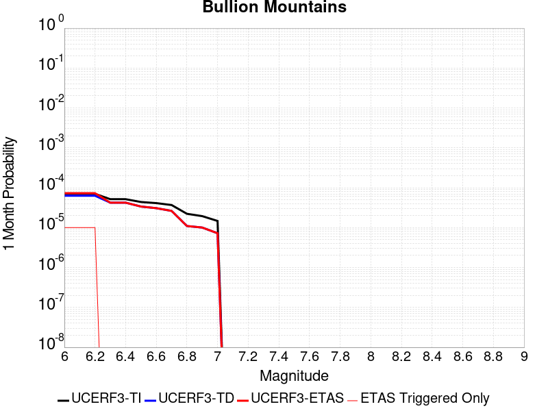 |  | 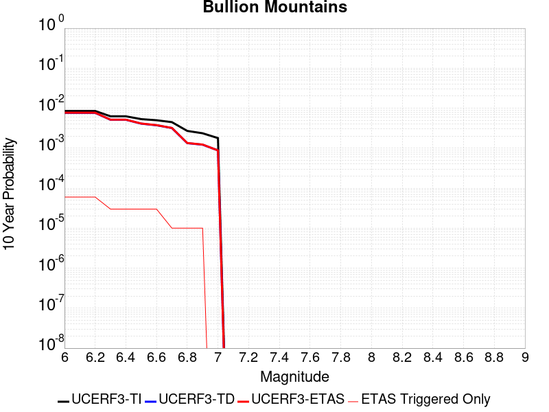 |

| Magnitude | 1 wk TI Prob | 1 wk TD Prob | 1 wk ETAS Prob | 1 wk ETAS/TD Gain | 1 wk ETAS Triggered Only | 1 mo TI Prob | 1 mo TD Prob | 1 mo ETAS Prob | 1 mo ETAS/TD Gain | 1 mo ETAS Triggered Only | 1 yr TI Prob | 1 yr TD Prob | 1 yr ETAS Prob | 1 yr ETAS/TD Gain | 1 yr ETAS Triggered Only | 10 yr TI Prob | 10 yr TD Prob | 10 yr ETAS Prob | 10 yr ETAS/TD Gain | 10 yr ETAS Triggered Only |
|-----|-----|-----|-----|-----|-----|-----|-----|-----|-----|-----|-----|-----|-----|-----|-----|-----|-----|-----|-----|-----|
| 6.0 | 1.6420427E-5 | 1.4692009E-5 | 2.4691863E-5 | 1.6806321 | 1.0E-5 | 7.037136E-5 | 6.296445E-5 | 7.296382E-5 | 1.1588098 | 1.0E-5 | 8.5643446E-4 | 7.6636096E-4 | 7.9633796E-4 | 1.039116 | 3.0E-5 | 0.008531413 | 0.0076409746 | 0.0077005164 | 1.0077924 | 6.0E-5 |
| 6.1 | 1.6420427E-5 | 1.4692009E-5 | 2.4691863E-5 | 1.6806321 | 1.0E-5 | 7.037136E-5 | 6.296445E-5 | 7.296382E-5 | 1.1588098 | 1.0E-5 | 8.5643446E-4 | 7.6636096E-4 | 7.9633796E-4 | 1.039116 | 3.0E-5 | 0.008531413 | 0.0076409746 | 0.0077005164 | 1.0077924 | 6.0E-5 |
| 6.2 | 1.6420427E-5 | 1.4692009E-5 | 2.4691863E-5 | 1.6806321 | 1.0E-5 | 7.037136E-5 | 6.296445E-5 | 7.296382E-5 | 1.1588098 | 1.0E-5 | 8.5643446E-4 | 7.6636096E-4 | 7.9633796E-4 | 1.039116 | 3.0E-5 | 0.008531413 | 0.0076409746 | 0.0077005164 | 1.0077924 | 6.0E-5 |
| 6.3 | 1.2046778E-5 | 9.862255E-6 | 9.862255E-6 | 1.0 | 0.0 | 5.1628023E-5 | 4.2266256E-5 | 4.2266256E-5 | 1.0 | 0.0 | 6.283899E-4 | 5.144933E-4 | 5.3448306E-4 | 1.0388532 | 2.0E-5 | 0.0062661595 | 0.0051353034 | 0.0051651495 | 1.0058119 | 3.0E-5 |
| 6.4 | 1.2046778E-5 | 9.862255E-6 | 9.862255E-6 | 1.0 | 0.0 | 5.1628023E-5 | 4.2266256E-5 | 4.2266256E-5 | 1.0 | 0.0 | 6.283899E-4 | 5.144933E-4 | 5.3448306E-4 | 1.0388532 | 2.0E-5 | 0.0062661595 | 0.0051353034 | 0.0051651495 | 1.0058119 | 3.0E-5 |
| 6.5 | 1.0244343E-5 | 7.879378E-6 | 7.879378E-6 | 1.0 | 0.0 | 4.390359E-5 | 3.3768443E-5 | 3.3768443E-5 | 1.0 | 0.0 | 5.343951E-4 | 4.1107394E-4 | 4.310657E-4 | 1.0486331 | 2.0E-5 | 0.005331118 | 0.0041051665 | 0.0041350434 | 1.0072778 | 3.0E-5 |
| 6.6 | 9.605408E-6 | 7.1774166E-6 | 7.1774166E-6 | 1.0 | 0.0 | 4.1165385E-5 | 3.0760108E-5 | 3.0760108E-5 | 1.0 | 0.0 | 5.010733E-4 | 3.7446033E-4 | 3.9445283E-4 | 1.0533901 | 2.0E-5 | 0.00499945 | 0.0037402906 | 0.0037701784 | 1.0079907 | 3.0E-5 |
| 6.7 | 8.60418E-6 | 6.123926E-6 | 6.123926E-6 | 1.0 | 0.0 | 3.687454E-5 | 2.6245243E-5 | 2.6245243E-5 | 1.0 | 0.0 | 4.48855E-4 | 3.195085E-4 | 3.195085E-4 | 1.0 | 0.0 | 0.004479495 | 0.0031924031 | 0.003202371 | 1.0031224 | 1.0E-5 |
| 6.8 | 5.187994E-6 | 2.563117E-6 | 2.563117E-6 | 1.0 | 0.0 | 2.223407E-5 | 1.0984763E-5 | 1.0984763E-5 | 1.0 | 0.0 | 2.7066618E-4 | 1.3373529E-4 | 1.3373529E-4 | 1.0 | 0.0 | 0.0027033675 | 0.0013369396 | 0.0013469262 | 1.0074698 | 1.0E-5 |
| 6.9 | 4.5302368E-6 | 2.3442778E-6 | 2.3442778E-6 | 1.0 | 0.0 | 1.9415156E-5 | 1.0046889E-5 | 1.0046889E-5 | 1.0 | 0.0 | 2.3635388E-4 | 1.2231797E-4 | 1.2231797E-4 | 1.0 | 0.0 | 0.0023610266 | 0.0012228956 | 0.0012328833 | 1.0081673 | 1.0E-5 |
| 7.0 | 3.431668E-6 | 1.6882177E-6 | 1.6882177E-6 | 1.0 | 0.0 | 1.4707065E-5 | 7.2352186E-6 | 7.2352186E-6 | 1.0 | 0.0 | 1.7904381E-4 | 8.808879E-5 | 8.808879E-5 | 1.0 | 0.0 | 0.0017889962 | 8.8088785E-4 | 8.8088785E-4 | 1.0 | 0.0 |

## Santa Ynez River
*[(top)](#table-of-contents)*

| 1 Week | 1 Month | 1 Year | 10 Year |
|-----|-----|-----|-----|
|  |  |  | 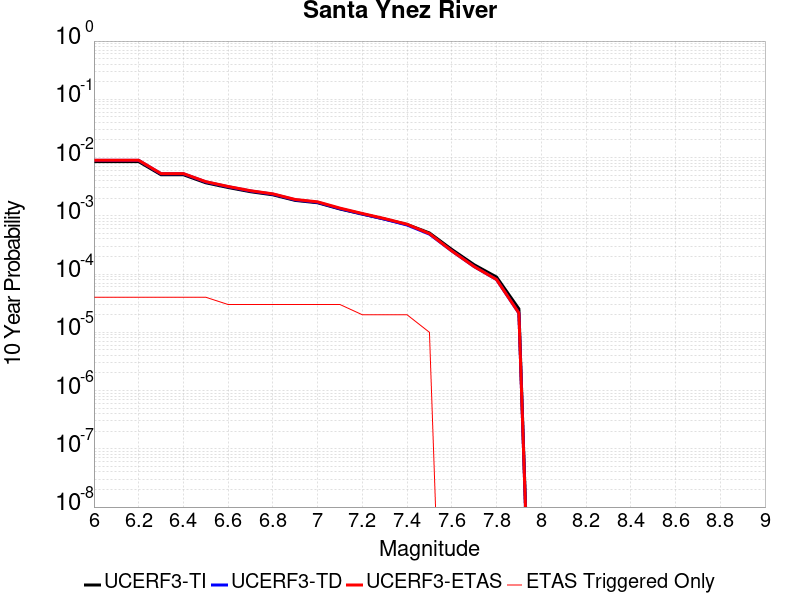 |

| Magnitude | 1 wk TI Prob | 1 wk TD Prob | 1 wk ETAS Prob | 1 wk ETAS/TD Gain | 1 wk ETAS Triggered Only | 1 mo TI Prob | 1 mo TD Prob | 1 mo ETAS Prob | 1 mo ETAS/TD Gain | 1 mo ETAS Triggered Only | 1 yr TI Prob | 1 yr TD Prob | 1 yr ETAS Prob | 1 yr ETAS/TD Gain | 1 yr ETAS Triggered Only | 10 yr TI Prob | 10 yr TD Prob | 10 yr ETAS Prob | 10 yr ETAS/TD Gain | 10 yr ETAS Triggered Only |
|-----|-----|-----|-----|-----|-----|-----|-----|-----|-----|-----|-----|-----|-----|-----|-----|-----|-----|-----|-----|-----|
| 6.0 | 1.6396456E-5 | 1.7209444E-5 | 4.7208927E-5 | 2.7431989 | 3.0E-5 | 7.026863E-5 | 7.3752875E-5 | 1.03750666E-4 | 1.4067338 | 3.0E-5 | 8.551848E-4 | 8.976069E-4 | 9.37571E-4 | 1.0445229 | 4.0E-5 | 0.0085190125 | 0.008943363 | 0.008983005 | 1.0044326 | 4.0E-5 |
| 6.1 | 1.6396456E-5 | 1.7209444E-5 | 4.7208927E-5 | 2.7431989 | 3.0E-5 | 7.026863E-5 | 7.3752875E-5 | 1.03750666E-4 | 1.4067338 | 3.0E-5 | 8.551848E-4 | 8.976069E-4 | 9.37571E-4 | 1.0445229 | 4.0E-5 | 0.0085190125 | 0.008943363 | 0.008983005 | 1.0044326 | 4.0E-5 |
| 6.2 | 1.6396456E-5 | 1.7209444E-5 | 4.7208927E-5 | 2.7431989 | 3.0E-5 | 7.026863E-5 | 7.3752875E-5 | 1.03750666E-4 | 1.4067338 | 3.0E-5 | 8.551848E-4 | 8.976069E-4 | 9.37571E-4 | 1.0445229 | 4.0E-5 | 0.0085190125 | 0.008943363 | 0.008983005 | 1.0044326 | 4.0E-5 |
| 6.3 | 9.736976E-6 | 1.01223395E-5 | 4.0122035E-5 | 3.9637117 | 3.0E-5 | 4.172923E-5 | 4.338076E-5 | 7.337946E-5 | 1.6915208 | 3.0E-5 | 5.0793495E-4 | 5.280378E-4 | 5.680166E-4 | 1.0757122 | 4.0E-5 | 0.005067755 | 0.0052683367 | 0.005308126 | 1.0075525 | 4.0E-5 |
| 6.4 | 9.736976E-6 | 1.01223395E-5 | 4.0122035E-5 | 3.9637117 | 3.0E-5 | 4.172923E-5 | 4.338076E-5 | 7.337946E-5 | 1.6915208 | 3.0E-5 | 5.0793495E-4 | 5.280378E-4 | 5.680166E-4 | 1.0757122 | 4.0E-5 | 0.005067755 | 0.0052683367 | 0.005308126 | 1.0075525 | 4.0E-5 |
| 6.5 | 7.081964E-6 | 7.329905E-6 | 3.7329686E-5 | 5.0927925 | 3.0E-5 | 3.035092E-5 | 3.141351E-5 | 6.141257E-5 | 1.9549731 | 3.0E-5 | 3.694598E-4 | 3.8239395E-4 | 4.2237865E-4 | 1.1045642 | 4.0E-5 | 0.0036884616 | 0.0038175215 | 0.0038573688 | 1.010438 | 4.0E-5 |
| 6.6 | 5.873247E-6 | 6.0597517E-6 | 2.6059632E-5 | 4.300445 | 2.0E-5 | 2.5170815E-5 | 2.5970112E-5 | 4.596959E-5 | 1.7700961 | 2.0E-5 | 3.064116E-4 | 3.161411E-4 | 3.461316E-4 | 1.0948644 | 3.0E-5 | 0.0030598943 | 0.003157001 | 0.0031869062 | 1.0094727 | 3.0E-5 |
| 6.7 | 4.973277E-6 | 5.11591E-6 | 2.5115807E-5 | 4.909353 | 2.0E-5 | 2.1313872E-5 | 2.1925147E-5 | 4.1924708E-5 | 1.9121746 | 2.0E-5 | 2.5946548E-4 | 2.6690646E-4 | 2.9689845E-4 | 1.112369 | 3.0E-5 | 0.0025916274 | 0.0026659078 | 0.0026958277 | 1.0112232 | 3.0E-5 |
| 6.8 | 4.396492E-6 | 4.510987E-6 | 2.4510897E-5 | 5.4336 | 2.0E-5 | 1.884197E-5 | 1.933266E-5 | 3.9332273E-5 | 2.034499 | 2.0E-5 | 2.2937685E-4 | 2.3535005E-4 | 2.6534297E-4 | 1.1274397 | 3.0E-5 | 0.0022914023 | 0.0023510433 | 0.0023809727 | 1.0127302 | 3.0E-5 |
| 6.9 | 3.5255632E-6 | 3.6013423E-6 | 2.3601271E-5 | 6.553465 | 2.0E-5 | 1.5109469E-5 | 1.5434234E-5 | 3.5433924E-5 | 2.2958007 | 2.0E-5 | 1.8394225E-4 | 1.8789574E-4 | 2.178901E-4 | 1.159633 | 3.0E-5 | 0.0018379007 | 0.001877385 | 0.0019073286 | 1.0159497 | 3.0E-5 |
| 7.0 | 3.211603E-6 | 3.273663E-6 | 2.3273598E-5 | 7.1093445 | 2.0E-5 | 1.376394E-5 | 1.402991E-5 | 3.402963E-5 | 2.4255059 | 2.0E-5 | 1.6756308E-4 | 1.708009E-4 | 2.0079578E-4 | 1.175613 | 3.0E-5 | 0.0016743679 | 0.0017067104 | 0.0017366592 | 1.0175477 | 3.0E-5 |
| 7.1 | 2.5094619E-6 | 2.5409295E-6 | 2.2540878E-5 | 8.871116 | 2.0E-5 | 1.0754793E-5 | 1.0889652E-5 | 3.0889434E-5 | 2.836586 | 2.0E-5 | 1.3093173E-4 | 1.325735E-4 | 1.6256953E-4 | 1.2262596 | 3.0E-5 | 0.0013085462 | 0.0013249503 | 0.0013549104 | 1.0226123 | 3.0E-5 |
| 7.2 | 2.0515774E-6 | 2.0619466E-6 | 1.2061926E-5 | 5.8497763 | 1.0E-5 | 8.792445E-6 | 8.836884E-6 | 1.8836796E-5 | 2.1316106 | 1.0E-5 | 1.0704277E-4 | 1.0758379E-4 | 1.2758165E-4 | 1.1858816 | 2.0E-5 | 0.0010699122 | 0.0010753215 | 0.0010952998 | 1.0185791 | 2.0E-5 |
| 7.3 | 1.6845745E-6 | 1.6773996E-6 | 1.1677383E-5 | 6.9615984 | 1.0E-5 | 7.219585E-6 | 7.1888358E-6 | 1.7188764E-5 | 2.3910358 | 1.0E-5 | 8.78949E-5 | 8.752059E-5 | 1.0751884E-4 | 1.2284976 | 2.0E-5 | 8.7860145E-4 | 8.7486405E-4 | 8.9484657E-4 | 1.0228407 | 2.0E-5 |
| 7.4 | 1.3600285E-6 | 1.3333447E-6 | 1.1333332E-5 | 8.499927 | 1.0E-5 | 5.82868E-6 | 5.714322E-6 | 1.5714264E-5 | 2.7499788 | 1.0E-5 | 7.096187E-5 | 6.956967E-5 | 8.956828E-5 | 1.2874616 | 2.0E-5 | 7.0939213E-4 | 6.9548114E-4 | 7.1546726E-4 | 1.0287371 | 2.0E-5 |
| 7.5 | 9.735342E-7 | 9.2901894E-7 | 1.09290095E-5 | 11.764033 | 1.0E-5 | 4.172283E-6 | 3.9815036E-6 | 1.3981464E-5 | 3.5116038 | 1.0E-5 | 5.079636E-5 | 4.8473747E-5 | 5.8473262E-5 | 1.2062873 | 1.0E-5 | 5.0784746E-4 | 4.8463346E-4 | 4.946286E-4 | 1.0206242 | 1.0E-5 |
| 7.6 | 5.067187E-7 | 4.778609E-7 | 4.778609E-7 | 1.0 | 0.0 | 2.1716498E-6 | 2.0479738E-6 | 2.0479738E-6 | 1.0 | 0.0 | 2.6439517E-5 | 2.4933803E-5 | 2.4933803E-5 | 1.0 | 0.0 | 2.643637E-4 | 2.493108E-4 | 2.493108E-4 | 1.0 | 0.0 |
| 7.7 | 2.769089E-7 | 2.5759346E-7 | 2.5759346E-7 | 1.0 | 0.0 | 1.1867519E-6 | 1.1039714E-6 | 1.1039714E-6 | 1.0 | 0.0 | 1.4448608E-5 | 1.344077E-5 | 1.344077E-5 | 1.0 | 0.0 | 1.444767E-4 | 1.343996E-4 | 1.343996E-4 | 1.0 | 0.0 |
| 7.8 | 1.7044663E-7 | 1.5449208E-7 | 1.5449208E-7 | 1.0 | 0.0 | 7.3048534E-7 | 6.6210873E-7 | 6.6210873E-7 | 1.0 | 0.0 | 8.893623E-6 | 8.061144E-6 | 8.061144E-6 | 1.0 | 0.0 | 8.893267E-5 | 8.060854E-5 | 8.060854E-5 | 1.0 | 0.0 |
| 7.9 | 4.8344287E-8 | 4.0911143E-8 | 4.0911143E-8 | 1.0 | 0.0 | 2.0718979E-7 | 1.7533345E-7 | 1.7533345E-7 | 1.0 | 0.0 | 2.5225327E-6 | 2.1346827E-6 | 2.1346827E-6 | 1.0 | 0.0 | 2.5225041E-5 | 2.1346626E-5 | 2.1346626E-5 | 1.0 | 0.0 |

## Hosgri
*[(top)](#table-of-contents)*

| 1 Week | 1 Month | 1 Year | 10 Year |
|-----|-----|-----|-----|
|  |  |  |  |

| Magnitude | 1 wk TI Prob | 1 wk TD Prob | 1 wk ETAS Prob | 1 wk ETAS/TD Gain | 1 wk ETAS Triggered Only | 1 mo TI Prob | 1 mo TD Prob | 1 mo ETAS Prob | 1 mo ETAS/TD Gain | 1 mo ETAS Triggered Only | 1 yr TI Prob | 1 yr TD Prob | 1 yr ETAS Prob | 1 yr ETAS/TD Gain | 1 yr ETAS Triggered Only | 10 yr TI Prob | 10 yr TD Prob | 10 yr ETAS Prob | 10 yr ETAS/TD Gain | 10 yr ETAS Triggered Only |
|-----|-----|-----|-----|-----|-----|-----|-----|-----|-----|-----|-----|-----|-----|-----|-----|-----|-----|-----|-----|-----|
| 6.0 | 2.883978E-5 | 2.9128403E-5 | 3.912811E-5 | 1.3432975 | 1.0E-5 | 1.235932E-4 | 1.248302E-4 | 1.448277E-4 | 1.1601976 | 2.0E-5 | 0.0015037085 | 0.0015187752 | 0.0015387449 | 1.0131485 | 2.0E-5 | 0.01493574 | 0.01508773 | 0.015136976 | 1.003264 | 5.0E-5 |
| 6.1 | 2.883978E-5 | 2.9128403E-5 | 3.912811E-5 | 1.3432975 | 1.0E-5 | 1.235932E-4 | 1.248302E-4 | 1.448277E-4 | 1.1601976 | 2.0E-5 | 0.0015037085 | 0.0015187752 | 0.0015387449 | 1.0131485 | 2.0E-5 | 0.01493574 | 0.01508773 | 0.015136976 | 1.003264 | 5.0E-5 |
| 6.2 | 2.883978E-5 | 2.9128403E-5 | 3.912811E-5 | 1.3432975 | 1.0E-5 | 1.235932E-4 | 1.248302E-4 | 1.448277E-4 | 1.1601976 | 2.0E-5 | 0.0015037085 | 0.0015187752 | 0.0015387449 | 1.0131485 | 2.0E-5 | 0.01493574 | 0.01508773 | 0.015136976 | 1.003264 | 5.0E-5 |
| 6.3 | 2.2914428E-5 | 2.2641956E-5 | 3.264173E-5 | 1.441648 | 1.0E-5 | 9.8200995E-5 | 9.703337E-5 | 1.17031435E-4 | 1.2060946 | 2.0E-5 | 0.0011949413 | 0.001180746 | 0.0012007224 | 1.0169184 | 2.0E-5 | 0.011885363 | 0.011746123 | 0.011795536 | 1.0042068 | 5.0E-5 |
| 6.4 | 2.0195741E-5 | 1.9696547E-5 | 2.969635E-5 | 1.5076932 | 1.0E-5 | 8.65503E-5 | 8.4411055E-5 | 1.04409366E-4 | 1.2369158 | 2.0E-5 | 0.0010532405 | 0.001027222 | 0.0010472015 | 1.01945 | 2.0E-5 | 0.010482626 | 0.010225783 | 0.010265374 | 1.0038717 | 4.0E-5 |
| 6.5 | 1.9924333E-5 | 1.9408968E-5 | 2.9408775E-5 | 1.5152158 | 1.0E-5 | 8.53872E-5 | 8.317865E-5 | 1.03176986E-4 | 1.2404263 | 2.0E-5 | 0.0010390934 | 0.0010122315 | 0.0010322112 | 1.0197383 | 2.0E-5 | 0.010342481 | 0.010077244 | 0.01011684 | 1.0039294 | 4.0E-5 |
| 6.6 | 1.809694E-5 | 1.7458287E-5 | 2.7458113E-5 | 1.5727838 | 1.0E-5 | 7.7556004E-5 | 7.4819094E-5 | 9.4817595E-5 | 1.2672914 | 2.0E-5 | 9.438353E-4 | 9.105431E-4 | 9.3052484E-4 | 1.0219449 | 2.0E-5 | 0.009398366 | 0.009069063 | 0.009098791 | 1.0032779 | 3.0E-5 |
| 6.7 | 1.675989E-5 | 1.6042752E-5 | 2.6042591E-5 | 1.6233245 | 1.0E-5 | 7.182612E-5 | 6.8752845E-5 | 8.875147E-5 | 1.2908771 | 2.0E-5 | 8.7413215E-4 | 8.3674554E-4 | 8.567288E-4 | 1.0238822 | 2.0E-5 | 0.008707017 | 0.008336853 | 0.008356687 | 1.002379 | 2.0E-5 |
| 6.8 | 1.5401129E-5 | 1.4614069E-5 | 2.4613923E-5 | 1.6842622 | 1.0E-5 | 6.6003166E-5 | 6.263023E-5 | 8.2628976E-5 | 1.3193146 | 2.0E-5 | 8.032922E-4 | 7.6225714E-4 | 7.8224187E-4 | 1.0262178 | 2.0E-5 | 0.008003947 | 0.0075972863 | 0.0076171346 | 1.0026125 | 2.0E-5 |
| 6.9 | 1.356559E-5 | 1.2689955E-5 | 2.2689828E-5 | 1.7880149 | 1.0E-5 | 5.8136946E-5 | 5.438439E-5 | 7.43833E-5 | 1.3677326 | 2.0E-5 | 7.0758746E-4 | 6.6192925E-4 | 6.8191596E-4 | 1.0301948 | 2.0E-5 | 0.007053386 | 0.006600378 | 0.006620246 | 1.0030102 | 2.0E-5 |
| 7.0 | 1.2030819E-5 | 1.1095949E-5 | 2.1095839E-5 | 1.9012198 | 1.0E-5 | 5.155963E-5 | 4.75532E-5 | 6.755225E-5 | 1.4205616 | 2.0E-5 | 6.275577E-4 | 5.788065E-4 | 5.9879496E-4 | 1.0345339 | 2.0E-5 | 0.006257884 | 0.0057737473 | 0.005793632 | 1.003444 | 2.0E-5 |
| 7.1 | 1.0972698E-5 | 1.0022167E-5 | 1.0022167E-5 | 1.0 | 0.0 | 4.7025E-5 | 4.2951437E-5 | 5.2951007E-5 | 1.2328111 | 1.0E-5 | 5.72379E-4 | 5.2280835E-4 | 5.328031E-4 | 1.0191175 | 1.0E-5 | 0.0057090693 | 0.005216533 | 0.005226481 | 1.001907 | 1.0E-5 |
| 7.2 | 9.961926E-6 | 9.034732E-6 | 9.034732E-6 | 1.0 | 0.0 | 4.2693267E-5 | 3.8719707E-5 | 4.871932E-5 | 1.2582564 | 1.0E-5 | 5.1966653E-4 | 4.7131052E-4 | 4.8130582E-4 | 1.0212075 | 1.0E-5 | 0.00518453 | 0.0047038523 | 0.0047138054 | 1.002116 | 1.0E-5 |
| 7.3 | 8.700929E-6 | 7.828089E-6 | 7.828089E-6 | 1.0 | 0.0 | 3.7289166E-5 | 3.354852E-5 | 4.3548185E-5 | 1.2980658 | 1.0E-5 | 4.53901E-4 | 4.083767E-4 | 4.1837263E-4 | 1.0244772 | 1.0E-5 | 0.00452975 | 0.004076999 | 0.0040869582 | 1.0024428 | 1.0E-5 |
| 7.4 | 7.866285E-6 | 6.9987263E-6 | 6.9987263E-6 | 1.0 | 0.0 | 3.3712215E-5 | 2.9994197E-5 | 2.9994197E-5 | 1.0 | 0.0 | 4.103689E-4 | 3.6511818E-4 | 3.6511818E-4 | 1.0 | 0.0 | 0.004096119 | 0.0036459167 | 0.0036459167 | 1.0 | 0.0 |
| 7.5 | 6.8381305E-6 | 5.9596814E-6 | 5.9596814E-6 | 1.0 | 0.0 | 2.9305946E-5 | 2.5541241E-5 | 2.5541241E-5 | 1.0 | 0.0 | 3.5674145E-4 | 3.1092027E-4 | 3.1092027E-4 | 1.0 | 0.0 | 0.0035616932 | 0.003105584 | 0.003105584 | 1.0 | 0.0 |
| 7.6 | 5.503376E-6 | 4.595227E-6 | 4.595227E-6 | 1.0 | 0.0 | 2.3585684E-5 | 1.9693682E-5 | 1.9693682E-5 | 1.0 | 0.0 | 2.8711787E-4 | 2.397442E-4 | 2.397442E-4 | 1.0 | 0.0 | 0.002867472 | 0.0023955852 | 0.0023955852 | 1.0 | 0.0 |
| 7.7 | 3.6144982E-6 | 2.6521896E-6 | 2.6521896E-6 | 1.0 | 0.0 | 1.5490614E-5 | 1.1366477E-5 | 1.1366477E-5 | 1.0 | 0.0 | 1.8858191E-4 | 1.3837808E-4 | 1.3837808E-4 | 1.0 | 0.0 | 0.0018842196 | 0.001383647 | 0.001383647 | 1.0 | 0.0 |
| 7.8 | 1.9853494E-6 | 1.1360784E-6 | 1.1360784E-6 | 1.0 | 0.0 | 8.508612E-6 | 4.8688985E-6 | 4.8688985E-6 | 1.0 | 0.0 | 1.0358743E-4 | 5.9277223E-5 | 5.9277223E-5 | 1.0 | 0.0 | 0.0010353916 | 5.933389E-4 | 5.933389E-4 | 1.0 | 0.0 |
| 7.9 | 1.1818757E-6 | 5.29477E-7 | 5.29477E-7 | 1.0 | 0.0 | 5.0651715E-6 | 2.269185E-6 | 2.269185E-6 | 1.0 | 0.0 | 6.1666724E-5 | 2.7626977E-5 | 2.7626977E-5 | 1.0 | 0.0 | 6.1649614E-4 | 2.7691363E-4 | 2.7691363E-4 | 1.0 | 0.0 |
| 8.0 | 6.962958E-7 | 2.71365E-7 | 2.71365E-7 | 1.0 | 0.0 | 2.9841215E-6 | 1.1629924E-6 | 1.1629924E-6 | 1.0 | 0.0 | 3.6331072E-5 | 1.415934E-5 | 1.415934E-5 | 1.0 | 0.0 | 3.6325134E-4 | 1.4215276E-4 | 1.4215276E-4 | 1.0 | 0.0 |
| 8.1 | 1.5033264E-7 | 6.52693E-8 | 6.52693E-8 | 1.0 | 0.0 | 6.442826E-7 | 2.7972553E-7 | 2.7972553E-7 | 1.0 | 0.0 | 7.844113E-6 | 3.4056532E-6 | 3.4056532E-6 | 1.0 | 0.0 | 7.843835E-5 | 3.4072833E-5 | 3.4072833E-5 | 1.0 | 0.0 |

## Great Valley 03a Dunnigan Hills
*[(top)](#table-of-contents)*

| 1 Week | 1 Month | 1 Year | 10 Year |
|-----|-----|-----|-----|
|  |  | 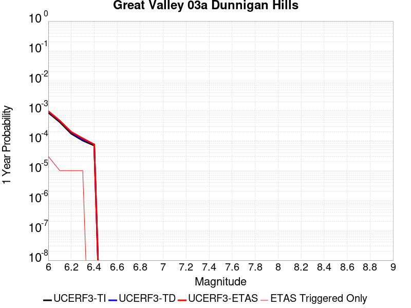 |  |

| Magnitude | 1 wk TI Prob | 1 wk TD Prob | 1 wk ETAS Prob | 1 wk ETAS/TD Gain | 1 wk ETAS Triggered Only | 1 mo TI Prob | 1 mo TD Prob | 1 mo ETAS Prob | 1 mo ETAS/TD Gain | 1 mo ETAS Triggered Only | 1 yr TI Prob | 1 yr TD Prob | 1 yr ETAS Prob | 1 yr ETAS/TD Gain | 1 yr ETAS Triggered Only | 10 yr TI Prob | 10 yr TD Prob | 10 yr ETAS Prob | 10 yr ETAS/TD Gain | 10 yr ETAS Triggered Only |
|-----|-----|-----|-----|-----|-----|-----|-----|-----|-----|-----|-----|-----|-----|-----|-----|-----|-----|-----|-----|-----|
| 6.0 | 1.6591328E-5 | 1.8107954E-5 | 2.8107774E-5 | 1.5522335 | 1.0E-5 | 7.110376E-5 | 7.7603596E-5 | 8.760282E-5 | 1.12885 | 1.0E-5 | 8.6534437E-4 | 9.444834E-4 | 9.7445503E-4 | 1.0317334 | 3.0E-5 | 0.008619824 | 0.009411525 | 0.009461055 | 1.0052626 | 5.0E-5 |
| 6.1 | 8.041125E-6 | 8.769726E-6 | 1.8769639E-5 | 2.1402764 | 1.0E-5 | 3.4461507E-5 | 3.7584115E-5 | 4.758374E-5 | 1.2660599 | 1.0E-5 | 4.194881E-4 | 4.5751085E-4 | 4.6750627E-4 | 1.0218474 | 1.0E-5 | 0.004186971 | 0.004567687 | 0.0045776414 | 1.0021793 | 1.0E-5 |
| 6.2 | 3.2807004E-6 | 3.5795688E-6 | 1.3579533E-5 | 3.7936225 | 1.0E-5 | 1.4060069E-5 | 1.5340942E-5 | 2.5340789E-5 | 1.6518404 | 1.0E-5 | 1.7116789E-4 | 1.8676413E-4 | 1.9676225E-4 | 1.0535334 | 1.0E-5 | 0.0017103611 | 0.0018664796 | 0.001876461 | 1.0053477 | 1.0E-5 |
| 6.3 | 1.9339366E-6 | 2.1103806E-6 | 1.2110359E-5 | 5.7384715 | 1.0E-5 | 8.288273E-6 | 9.044474E-6 | 1.9044382E-5 | 2.1056376 | 1.0E-5 | 1.00905054E-4 | 1.1011375E-4 | 1.2011265E-4 | 1.0908052 | 1.0E-5 | 0.0010085925 | 0.0011008718 | 0.0011108608 | 1.0090737 | 1.0E-5 |
| 6.4 | 1.3142635E-6 | 1.4339867E-6 | 1.4339867E-6 | 1.0 | 0.0 | 5.6325457E-6 | 6.145657E-6 | 6.145657E-6 | 1.0 | 0.0 | 6.857408E-5 | 7.482337E-5 | 7.482337E-5 | 1.0 | 0.0 | 6.8552926E-4 | 7.4823375E-4 | 7.4823375E-4 | 1.0 | 0.0 |

## Great Valley 07 (Orestimba)
*[(top)](#table-of-contents)*

| 1 Week | 1 Month | 1 Year | 10 Year |
|-----|-----|-----|-----|
|  |  |  |  |

| Magnitude | 1 wk TI Prob | 1 wk TD Prob | 1 wk ETAS Prob | 1 wk ETAS/TD Gain | 1 wk ETAS Triggered Only | 1 mo TI Prob | 1 mo TD Prob | 1 mo ETAS Prob | 1 mo ETAS/TD Gain | 1 mo ETAS Triggered Only | 1 yr TI Prob | 1 yr TD Prob | 1 yr ETAS Prob | 1 yr ETAS/TD Gain | 1 yr ETAS Triggered Only | 10 yr TI Prob | 10 yr TD Prob | 10 yr ETAS Prob | 10 yr ETAS/TD Gain | 10 yr ETAS Triggered Only |
|-----|-----|-----|-----|-----|-----|-----|-----|-----|-----|-----|-----|-----|-----|-----|-----|-----|-----|-----|-----|-----|
| 6.0 | 2.9687902E-5 | 3.27575E-5 | 5.2756845E-5 | 1.6105273 | 2.0E-5 | 1.2722766E-4 | 1.4038214E-4 | 1.7037793E-4 | 1.2136724 | 3.0E-5 | 0.0015478961 | 0.0017078844 | 0.0017478161 | 1.0233808 | 4.0E-5 | 0.015371585 | 0.016955135 | 0.017004289 | 1.0028989 | 5.0E-5 |
| 6.1 | 2.9687902E-5 | 3.27575E-5 | 5.2756845E-5 | 1.6105273 | 2.0E-5 | 1.2722766E-4 | 1.4038214E-4 | 1.7037793E-4 | 1.2136724 | 3.0E-5 | 0.0015478961 | 0.0017078844 | 0.0017478161 | 1.0233808 | 4.0E-5 | 0.015371585 | 0.016955135 | 0.017004289 | 1.0028989 | 5.0E-5 |
| 6.2 | 1.9231524E-5 | 2.1159167E-5 | 3.1158954E-5 | 1.4725984 | 1.0E-5 | 8.2418206E-5 | 9.067912E-5 | 1.10677305E-4 | 1.2205379 | 2.0E-5 | 0.0010029797 | 0.0011034822 | 0.0011334491 | 1.0271567 | 3.0E-5 | 0.00998465 | 0.010982441 | 0.011022001 | 1.0036021 | 4.0E-5 |
| 6.3 | 1.324766E-5 | 1.4548534E-5 | 2.4548388E-5 | 1.6873446 | 1.0E-5 | 5.6774446E-5 | 6.234942E-5 | 7.23488E-5 | 1.1603764 | 1.0E-5 | 6.910097E-4 | 7.5884897E-4 | 7.788338E-4 | 1.0263357 | 2.0E-5 | 0.006888649 | 0.0075635235 | 0.007593297 | 1.0039364 | 3.0E-5 |
| 6.4 | 7.818645E-6 | 8.57284E-6 | 1.8572755E-5 | 2.1664646 | 1.0E-5 | 3.3508048E-5 | 3.6740246E-5 | 4.673988E-5 | 1.2721711 | 1.0E-5 | 4.078841E-4 | 4.4722404E-4 | 4.6721508E-4 | 1.0447003 | 2.0E-5 | 0.004071363 | 0.0044635804 | 0.0044934466 | 1.0066911 | 3.0E-5 |
| 6.5 | 5.3076565E-6 | 5.8178007E-6 | 1.5817743E-5 | 2.7188525 | 1.0E-5 | 2.27469E-5 | 2.4933206E-5 | 3.4932957E-5 | 1.4010615 | 1.0E-5 | 2.7690834E-4 | 3.035216E-4 | 3.1351857E-4 | 1.0329366 | 1.0E-5 | 0.0027656353 | 0.00303128 | 0.0030412497 | 1.003289 | 1.0E-5 |
| 6.6 | 3.6003578E-6 | 3.9484953E-6 | 1.39484555E-5 | 3.5326002 | 1.0E-5 | 1.5430012E-5 | 1.6922022E-5 | 2.6921853E-5 | 1.590936 | 1.0E-5 | 1.8784421E-4 | 2.0600771E-4 | 2.1600565E-4 | 1.0485319 | 1.0E-5 | 0.0018768552 | 0.0020583214 | 0.0020683007 | 1.0048484 | 1.0E-5 |
| 6.7 | 2.5361826E-6 | 2.7834678E-6 | 1.278344E-5 | 4.592631 | 1.0E-5 | 1.0869308E-5 | 1.1929101E-5 | 2.1928981E-5 | 1.8382761 | 1.0E-5 | 1.3232579E-4 | 1.4522845E-4 | 1.55227E-4 | 1.0688471 | 1.0E-5 | 0.0013224703 | 0.0014514653 | 0.0014614508 | 1.0068796 | 1.0E-5 |
| 6.8 | 1.2115831E-6 | 1.3313797E-6 | 1.3313797E-6 | 1.0 | 0.0 | 5.1924885E-6 | 5.7059065E-6 | 5.7059065E-6 | 1.0 | 0.0 | 6.3216714E-5 | 6.9468166E-5 | 6.9468166E-5 | 1.0 | 0.0 | 6.3198735E-4 | 6.945596E-4 | 6.945596E-4 | 1.0 | 0.0 |

## Rinconada 2011 CFM
*[(top)](#table-of-contents)*

| 1 Week | 1 Month | 1 Year | 10 Year |
|-----|-----|-----|-----|
|  |  |  |  |

| Magnitude | 1 wk TI Prob | 1 wk TD Prob | 1 wk ETAS Prob | 1 wk ETAS/TD Gain | 1 wk ETAS Triggered Only | 1 mo TI Prob | 1 mo TD Prob | 1 mo ETAS Prob | 1 mo ETAS/TD Gain | 1 mo ETAS Triggered Only | 1 yr TI Prob | 1 yr TD Prob | 1 yr ETAS Prob | 1 yr ETAS/TD Gain | 1 yr ETAS Triggered Only | 10 yr TI Prob | 10 yr TD Prob | 10 yr ETAS Prob | 10 yr ETAS/TD Gain | 10 yr ETAS Triggered Only |
|-----|-----|-----|-----|-----|-----|-----|-----|-----|-----|-----|-----|-----|-----|-----|-----|-----|-----|-----|-----|-----|
| 6.0 | 1.5752368E-5 | 1.6274716E-5 | 1.6274716E-5 | 1.0 | 0.0 | 6.75084E-5 | 6.974694E-5 | 6.974694E-5 | 1.0 | 0.0 | 8.2160486E-4 | 8.488413E-4 | 8.5883273E-4 | 1.0117707 | 1.0E-5 | 0.008185739 | 0.00845637 | 0.008505947 | 1.0058627 | 5.0E-5 |
| 6.1 | 1.0966133E-5 | 1.1323029E-5 | 1.1323029E-5 | 1.0 | 0.0 | 4.6996865E-5 | 4.852637E-5 | 4.852637E-5 | 1.0 | 0.0 | 5.720366E-4 | 5.9064914E-4 | 5.9064914E-4 | 1.0 | 0.0 | 0.0057056635 | 0.005890889 | 0.005910771 | 1.003375 | 2.0E-5 |
| 6.2 | 1.0966133E-5 | 1.1323029E-5 | 1.1323029E-5 | 1.0 | 0.0 | 4.6996865E-5 | 4.852637E-5 | 4.852637E-5 | 1.0 | 0.0 | 5.720366E-4 | 5.9064914E-4 | 5.9064914E-4 | 1.0 | 0.0 | 0.0057056635 | 0.005890889 | 0.005910771 | 1.003375 | 2.0E-5 |
| 6.3 | 8.926149E-6 | 9.212772E-6 | 9.212772E-6 | 1.0 | 0.0 | 3.8254362E-5 | 3.948271E-5 | 3.948271E-5 | 1.0 | 0.0 | 4.6564735E-4 | 4.8059633E-4 | 4.8059633E-4 | 1.0 | 0.0 | 0.0046467283 | 0.0047956146 | 0.004815519 | 1.0041505 | 2.0E-5 |
| 6.4 | 7.676955E-6 | 7.920191E-6 | 7.920191E-6 | 1.0 | 0.0 | 3.290082E-5 | 3.3943234E-5 | 3.3943234E-5 | 1.0 | 0.0 | 4.0049385E-4 | 4.131807E-4 | 4.131807E-4 | 1.0 | 0.0 | 0.0039977287 | 0.004124151 | 0.004144069 | 1.0048295 | 2.0E-5 |
| 6.5 | 6.1671026E-6 | 6.358955E-6 | 6.358955E-6 | 1.0 | 0.0 | 2.6430173E-5 | 2.725238E-5 | 2.725238E-5 | 1.0 | 0.0 | 3.2173982E-4 | 3.317473E-4 | 3.317473E-4 | 1.0 | 0.0 | 0.003212744 | 0.0033125326 | 0.0033324664 | 1.0060177 | 2.0E-5 |
| 6.6 | 5.553456E-6 | 5.7248126E-6 | 5.7248126E-6 | 1.0 | 0.0 | 2.3800309E-5 | 2.4534682E-5 | 2.4534682E-5 | 1.0 | 0.0 | 2.897302E-4 | 2.9866886E-4 | 2.9866886E-4 | 1.0 | 0.0 | 0.0028935277 | 0.0029826832 | 0.0030026236 | 1.0066854 | 2.0E-5 |
| 6.7 | 4.787857E-6 | 4.93331E-6 | 4.93331E-6 | 1.0 | 0.0 | 2.0519226E-5 | 2.1142585E-5 | 2.1142585E-5 | 1.0 | 0.0 | 2.4979294E-4 | 2.573806E-4 | 2.573806E-4 | 1.0 | 0.0 | 0.0024951235 | 0.002570831 | 0.0025907794 | 1.0077596 | 2.0E-5 |
| 6.8 | 3.9955166E-6 | 4.1134763E-6 | 4.1134763E-6 | 1.0 | 0.0 | 1.7123532E-5 | 1.7629065E-5 | 1.7629065E-5 | 1.0 | 0.0 | 2.0845905E-4 | 2.1461275E-4 | 2.1461275E-4 | 1.0 | 0.0 | 0.002082636 | 0.0021440587 | 0.0021540371 | 1.004654 | 1.0E-5 |
| 6.9 | 3.4250072E-6 | 3.5224466E-6 | 3.5224466E-6 | 1.0 | 0.0 | 1.46785205E-5 | 1.5096112E-5 | 1.5096112E-5 | 1.0 | 0.0 | 1.7869633E-4 | 1.8377969E-4 | 1.8377969E-4 | 1.0 | 0.0 | 0.001785527 | 0.0018362795 | 0.0018462611 | 1.0054358 | 1.0E-5 |
| 7.0 | 2.7712713E-6 | 2.8467002E-6 | 2.8467002E-6 | 1.0 | 0.0 | 1.1876823E-5 | 1.22000865E-5 | 1.22000865E-5 | 1.0 | 0.0 | 1.4459073E-4 | 1.4852594E-4 | 1.4852594E-4 | 1.0 | 0.0 | 0.0014449668 | 0.0014842683 | 0.0014942535 | 1.0067273 | 1.0E-5 |
| 7.1 | 2.227358E-6 | 2.2856987E-6 | 2.2856987E-6 | 1.0 | 0.0 | 9.545785E-6 | 9.795815E-6 | 9.795815E-6 | 1.0 | 0.0 | 1.16213734E-4 | 1.1925753E-4 | 1.1925753E-4 | 1.0 | 0.0 | 0.0011615298 | 0.0011919363 | 0.0012019244 | 1.0083797 | 1.0E-5 |
| 7.2 | 1.581796E-6 | 1.6209015E-6 | 1.6209015E-6 | 1.0 | 0.0 | 6.779108E-6 | 6.946702E-6 | 6.946702E-6 | 1.0 | 0.0 | 8.253252E-5 | 8.4572814E-5 | 8.4572814E-5 | 1.0 | 0.0 | 8.250187E-4 | 8.4540684E-4 | 8.4540684E-4 | 1.0 | 0.0 |
| 7.3 | 1.0306567E-6 | 1.054648E-6 | 1.054648E-6 | 1.0 | 0.0 | 4.4170924E-6 | 4.519912E-6 | 4.519912E-6 | 1.0 | 0.0 | 5.3776774E-5 | 5.502854E-5 | 5.502854E-5 | 1.0 | 0.0 | 5.376376E-4 | 5.501494E-4 | 5.501494E-4 | 1.0 | 0.0 |
| 7.4 | 6.535541E-7 | 6.682744E-7 | 6.682744E-7 | 1.0 | 0.0 | 2.800943E-6 | 2.8640302E-6 | 2.8640302E-6 | 1.0 | 0.0 | 3.4100947E-5 | 3.4869012E-5 | 3.4869012E-5 | 1.0 | 0.0 | 3.4095717E-4 | 3.486355E-4 | 3.486355E-4 | 1.0 | 0.0 |
| 7.5 | 3.2656962E-7 | 3.3316712E-7 | 3.3316712E-7 | 1.0 | 0.0 | 1.3995833E-6 | 1.4278584E-6 | 1.4278584E-6 | 1.0 | 0.0 | 1.7039794E-5 | 1.7384036E-5 | 1.7384036E-5 | 1.0 | 0.0 | 1.7038487E-4 | 1.738268E-4 | 1.738268E-4 | 1.0 | 0.0 |
| 7.6 | 9.754343E-8 | 9.821017E-8 | 9.821017E-8 | 1.0 | 0.0 | 4.180432E-7 | 4.2090065E-7 | 4.2090065E-7 | 1.0 | 0.0 | 5.089664E-6 | 5.1244533E-6 | 5.1244533E-6 | 1.0 | 0.0 | 5.0895473E-5 | 5.124336E-5 | 5.124336E-5 | 1.0 | 0.0 |
| 7.7 | 6.0001453E-9 | 5.8491207E-9 | 5.8491207E-9 | 1.0 | 0.0 | 2.5714908E-8 | 2.506766E-8 | 2.506766E-8 | 1.0 | 0.0 | 3.1307894E-7 | 3.051987E-7 | 3.051987E-7 | 1.0 | 0.0 | 3.1307852E-6 | 3.0519832E-6 | 3.0519832E-6 | 1.0 | 0.0 |
| 7.8 | 7.400003E-11 | 7.4654505E-11 | 7.4654505E-11 | 1.0 | 0.0 | 3.171432E-10 | 3.1994773E-10 | 3.1994773E-10 | 1.0 | 0.0 | 3.861218E-9 | 3.895363E-9 | 3.895363E-9 | 1.0 | 0.0 | 3.861218E-8 | 3.895363E-8 | 3.895363E-8 | 1.0 | 0.0 |

## Ortigalita (North)
*[(top)](#table-of-contents)*

| 1 Week | 1 Month | 1 Year | 10 Year |
|-----|-----|-----|-----|
| 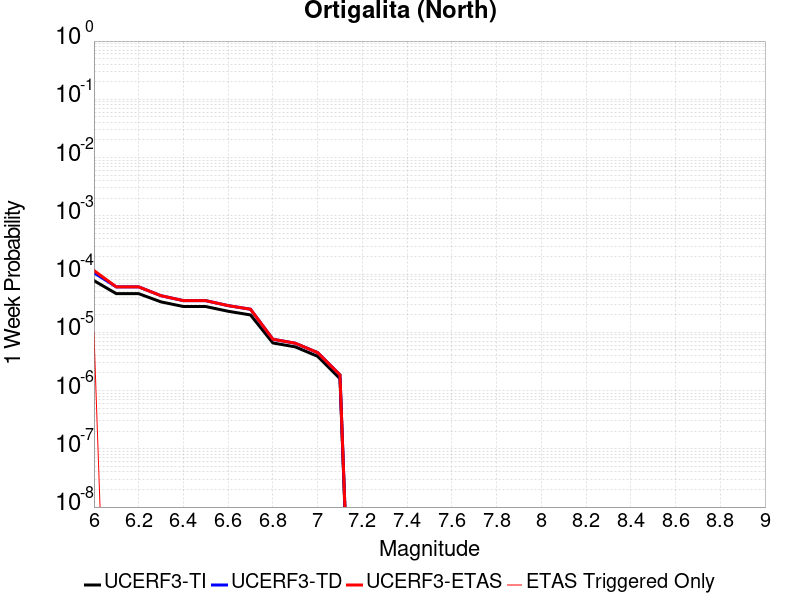 | 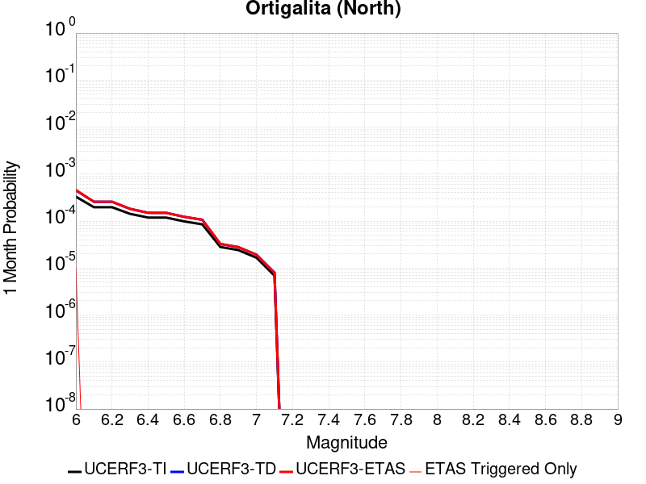 |  |  |

| Magnitude | 1 wk TI Prob | 1 wk TD Prob | 1 wk ETAS Prob | 1 wk ETAS/TD Gain | 1 wk ETAS Triggered Only | 1 mo TI Prob | 1 mo TD Prob | 1 mo ETAS Prob | 1 mo ETAS/TD Gain | 1 mo ETAS Triggered Only | 1 yr TI Prob | 1 yr TD Prob | 1 yr ETAS Prob | 1 yr ETAS/TD Gain | 1 yr ETAS Triggered Only | 10 yr TI Prob | 10 yr TD Prob | 10 yr ETAS Prob | 10 yr ETAS/TD Gain | 10 yr ETAS Triggered Only |
|-----|-----|-----|-----|-----|-----|-----|-----|-----|-----|-----|-----|-----|-----|-----|-----|-----|-----|-----|-----|-----|
| 6.0 | 7.711876E-5 | 1.0505308E-4 | 1.15052026E-4 | 1.09518 | 1.0E-5 | 3.3046713E-4 | 4.501601E-4 | 4.601556E-4 | 1.0222043 | 1.0E-5 | 0.004016016 | 0.0054680547 | 0.0055177812 | 1.009094 | 5.0E-5 | 0.039442103 | 0.053455614 | 0.05350294 | 1.0008854 | 5.0E-5 |
| 6.1 | 4.607858E-5 | 6.0239887E-5 | 6.0239887E-5 | 1.0 | 0.0 | 1.9746469E-4 | 2.5814763E-4 | 2.5814763E-4 | 1.0 | 0.0 | 0.0024014818 | 0.0031387366 | 0.0031487052 | 1.003176 | 1.0E-5 | 0.023756953 | 0.030975312 | 0.030985001 | 1.0003128 | 1.0E-5 |
| 6.2 | 4.607858E-5 | 6.0239887E-5 | 6.0239887E-5 | 1.0 | 0.0 | 1.9746469E-4 | 2.5814763E-4 | 2.5814763E-4 | 1.0 | 0.0 | 0.0024014818 | 0.0031387366 | 0.0031487052 | 1.003176 | 1.0E-5 | 0.023756953 | 0.030975312 | 0.030985001 | 1.0003128 | 1.0E-5 |
| 6.3 | 3.327423E-5 | 4.2476124E-5 | 4.2476124E-5 | 1.0 | 0.0 | 1.4259605E-4 | 1.8202956E-4 | 1.8202956E-4 | 1.0 | 0.0 | 0.0017347244 | 0.002214206 | 0.0022241839 | 1.0045063 | 1.0E-5 | 0.017212452 | 0.02194574 | 0.02195552 | 1.0004457 | 1.0E-5 |
| 6.4 | 2.7732503E-5 | 3.4999008E-5 | 3.4999008E-5 | 1.0 | 0.0 | 1.1884817E-4 | 1.499886E-4 | 1.499886E-4 | 1.0 | 0.0 | 0.001446016 | 0.0018248158 | 0.0018347976 | 1.00547 | 1.0E-5 | 0.014366428 | 0.018121297 | 0.018131116 | 1.0005418 | 1.0E-5 |
| 6.5 | 2.7689714E-5 | 3.4948822E-5 | 3.4948822E-5 | 1.0 | 0.0 | 1.186648E-4 | 1.4977354E-4 | 1.4977354E-4 | 1.0 | 0.0 | 0.0014437864 | 0.0018222018 | 0.0018321836 | 1.0054779 | 1.0E-5 | 0.014344421 | 0.018095585 | 0.018105403 | 1.0005426 | 1.0E-5 |
| 6.6 | 2.2976905E-5 | 2.871829E-5 | 2.871829E-5 | 1.0 | 0.0 | 9.846873E-5 | 1.23074E-4 | 1.23074E-4 | 1.0 | 0.0 | 0.0011981975 | 0.0014976348 | 0.0015076199 | 1.0066671 | 1.0E-5 | 0.011917574 | 0.014898733 | 0.014908585 | 1.0006613 | 1.0E-5 |
| 6.7 | 1.9871539E-5 | 2.4904637E-5 | 2.4904637E-5 | 1.0 | 0.0 | 8.516096E-5 | 1.067312E-4 | 1.067312E-4 | 1.0 | 0.0 | 0.0010363415 | 0.0012989199 | 0.0013089069 | 1.0076888 | 1.0E-5 | 0.010315218 | 0.012936938 | 0.012946809 | 1.0007629 | 1.0E-5 |
| 6.8 | 6.5640475E-6 | 7.6054926E-6 | 7.6054926E-6 | 1.0 | 0.0 | 2.813133E-5 | 3.2594577E-5 | 3.2594577E-5 | 1.0 | 0.0 | 3.424451E-4 | 3.9676955E-4 | 3.9676955E-4 | 1.0 | 0.0 | 0.0034191788 | 0.003960899 | 0.003960899 | 1.0 | 0.0 |
| 6.9 | 5.6219683E-6 | 6.5018376E-6 | 6.5018376E-6 | 1.0 | 0.0 | 2.4093928E-5 | 2.7864735E-5 | 2.7864735E-5 | 1.0 | 0.0 | 2.933041E-4 | 3.3920293E-4 | 3.3920293E-4 | 1.0 | 0.0 | 0.0029291727 | 0.003387109 | 0.003387109 | 1.0 | 0.0 |
| 7.0 | 3.875591E-6 | 4.4847548E-6 | 4.4847548E-6 | 1.0 | 0.0 | 1.6609569E-5 | 1.9220248E-5 | 1.9220248E-5 | 1.0 | 0.0 | 2.0220275E-4 | 2.339835E-4 | 2.339835E-4 | 1.0 | 0.0 | 0.0020201886 | 0.0023375798 | 0.0023375798 | 1.0 | 0.0 |
| 7.1 | 1.6017933E-6 | 1.8570418E-6 | 1.8570418E-6 | 1.0 | 0.0 | 6.8648105E-6 | 7.958732E-6 | 7.958732E-6 | 1.0 | 0.0 | 8.357586E-5 | 9.689432E-5 | 9.689432E-5 | 1.0 | 0.0 | 8.3544437E-4 | 9.686254E-4 | 9.686254E-4 | 1.0 | 0.0 |

## Los Osos 2011
*[(top)](#table-of-contents)*

| 1 Week | 1 Month | 1 Year | 10 Year |
|-----|-----|-----|-----|
|  | 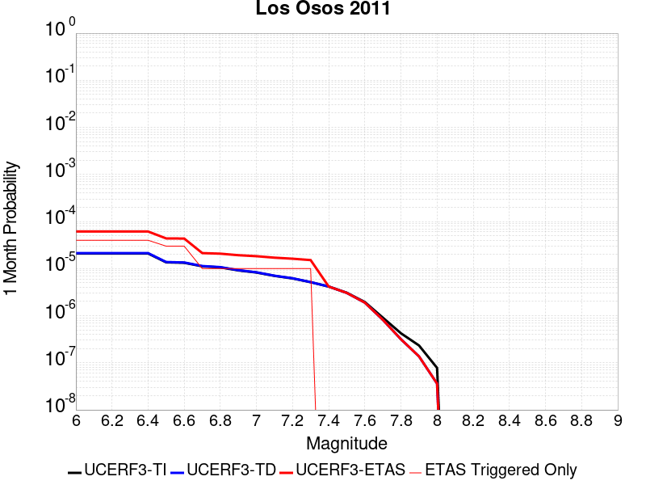 |  |  |

| Magnitude | 1 wk TI Prob | 1 wk TD Prob | 1 wk ETAS Prob | 1 wk ETAS/TD Gain | 1 wk ETAS Triggered Only | 1 mo TI Prob | 1 mo TD Prob | 1 mo ETAS Prob | 1 mo ETAS/TD Gain | 1 mo ETAS Triggered Only | 1 yr TI Prob | 1 yr TD Prob | 1 yr ETAS Prob | 1 yr ETAS/TD Gain | 1 yr ETAS Triggered Only | 10 yr TI Prob | 10 yr TD Prob | 10 yr ETAS Prob | 10 yr ETAS/TD Gain | 10 yr ETAS Triggered Only |
|-----|-----|-----|-----|-----|-----|-----|-----|-----|-----|-----|-----|-----|-----|-----|-----|-----|-----|-----|-----|-----|
| 6.0 | 4.8871775E-6 | 4.9814826E-6 | 3.4981334E-5 | 7.0222735 | 3.0E-5 | 2.0944879E-5 | 2.1349053E-5 | 6.13482E-5 | 2.8735795 | 4.0E-5 | 2.5497406E-4 | 2.598965E-4 | 2.998861E-4 | 1.1538674 | 4.0E-5 | 0.002546817 | 0.0025962 | 0.0026460702 | 1.0192089 | 5.0E-5 |
| 6.1 | 4.8871775E-6 | 4.9814826E-6 | 3.4981334E-5 | 7.0222735 | 3.0E-5 | 2.0944879E-5 | 2.1349053E-5 | 6.13482E-5 | 2.8735795 | 4.0E-5 | 2.5497406E-4 | 2.598965E-4 | 2.998861E-4 | 1.1538674 | 4.0E-5 | 0.002546817 | 0.0025962 | 0.0026460702 | 1.0192089 | 5.0E-5 |
| 6.2 | 4.8871775E-6 | 4.9814826E-6 | 3.4981334E-5 | 7.0222735 | 3.0E-5 | 2.0944879E-5 | 2.1349053E-5 | 6.13482E-5 | 2.8735795 | 4.0E-5 | 2.5497406E-4 | 2.598965E-4 | 2.998861E-4 | 1.1538674 | 4.0E-5 | 0.002546817 | 0.0025962 | 0.0026460702 | 1.0192089 | 5.0E-5 |
| 6.3 | 4.8871775E-6 | 4.9814826E-6 | 3.4981334E-5 | 7.0222735 | 3.0E-5 | 2.0944879E-5 | 2.1349053E-5 | 6.13482E-5 | 2.8735795 | 4.0E-5 | 2.5497406E-4 | 2.598965E-4 | 2.998861E-4 | 1.1538674 | 4.0E-5 | 0.002546817 | 0.0025962 | 0.0026460702 | 1.0192089 | 5.0E-5 |
| 6.4 | 4.8871775E-6 | 4.9814826E-6 | 3.4981334E-5 | 7.0222735 | 3.0E-5 | 2.0944879E-5 | 2.1349053E-5 | 6.13482E-5 | 2.8735795 | 4.0E-5 | 2.5497406E-4 | 2.598965E-4 | 2.998861E-4 | 1.1538674 | 4.0E-5 | 0.002546817 | 0.0025962 | 0.0026460702 | 1.0192089 | 5.0E-5 |
| 6.5 | 3.1724062E-6 | 3.2233943E-6 | 2.322333E-5 | 7.2046194 | 2.0E-5 | 1.3595956E-5 | 1.3814474E-5 | 4.381406E-5 | 3.1716053 | 3.0E-5 | 1.6551818E-4 | 1.6817838E-4 | 1.9817334E-4 | 1.178352 | 3.0E-5 | 0.0016539496 | 0.0016805246 | 0.0017204573 | 1.0237621 | 4.0E-5 |
| 6.6 | 3.1022591E-6 | 3.1511038E-6 | 2.315104E-5 | 7.3469625 | 2.0E-5 | 1.3295328E-5 | 1.3504661E-5 | 4.3504257E-5 | 3.2214253 | 3.0E-5 | 1.618586E-4 | 1.6440697E-4 | 1.9440203E-4 | 1.182444 | 3.0E-5 | 0.0016174077 | 0.0016428662 | 0.0016828005 | 1.0243077 | 4.0E-5 |
| 6.7 | 2.611518E-6 | 2.6491825E-6 | 2.6491825E-6 | 1.0 | 0.0 | 1.1192172E-5 | 1.1353591E-5 | 2.1353477E-5 | 1.8807687 | 1.0E-5 | 1.3625617E-4 | 1.3822124E-4 | 1.4821986E-4 | 1.0723377 | 1.0E-5 | 0.0013617266 | 0.0013813572 | 0.0013913434 | 1.0072292 | 1.0E-5 |
| 6.8 | 2.4780884E-6 | 2.5121587E-6 | 2.5121587E-6 | 1.0 | 0.0 | 1.0620336E-5 | 1.076635E-5 | 2.0766242E-5 | 1.9288099 | 1.0E-5 | 1.2929492E-4 | 1.3107246E-4 | 1.4107116E-4 | 1.0762837 | 1.0E-5 | 0.0012921972 | 0.0013099556 | 0.0013199425 | 1.0076238 | 1.0E-5 |
| 6.9 | 2.1376322E-6 | 2.1635049E-6 | 2.1635049E-6 | 1.0 | 0.0 | 9.161248E-6 | 9.272131E-6 | 1.9272038E-5 | 2.0784907 | 1.0E-5 | 1.1153249E-4 | 1.1288237E-4 | 1.2288123E-4 | 1.0885777 | 1.0E-5 | 0.0011147653 | 0.0011282521 | 0.0011382409 | 1.0088533 | 1.0E-5 |
| 7.0 | 1.9282882E-6 | 1.949458E-6 | 1.949458E-6 | 1.0 | 0.0 | 8.264066E-6 | 8.354793E-6 | 1.8354709E-5 | 2.1969078 | 1.0E-5 | 1.0061036E-4 | 1.0171487E-4 | 1.1171385E-4 | 1.098304 | 1.0E-5 | 0.0010056482 | 0.0010166845 | 0.0010266743 | 1.009826 | 1.0E-5 |
| 7.1 | 1.6353226E-6 | 1.6501111E-6 | 1.6501111E-6 | 1.0 | 0.0 | 7.0085066E-6 | 7.0718856E-6 | 1.7071816E-5 | 2.41404 | 1.0E-5 | 8.532523E-5 | 8.6096814E-5 | 9.609595E-5 | 1.1161383 | 1.0E-5 | 8.529247E-4 | 8.6063537E-4 | 8.7062677E-4 | 1.0116093 | 1.0E-5 |
| 7.2 | 1.4446276E-6 | 1.4553335E-6 | 1.4553335E-6 | 1.0 | 0.0 | 6.191247E-6 | 6.2371287E-6 | 1.6237067E-5 | 2.603292 | 1.0E-5 | 7.537582E-5 | 7.59344E-5 | 8.5933636E-5 | 1.1316826 | 1.0E-5 | 7.535026E-4 | 7.590851E-4 | 7.690775E-4 | 1.0131638 | 1.0E-5 |
| 7.3 | 1.2014582E-6 | 1.2069066E-6 | 1.2069066E-6 | 1.0 | 0.0 | 5.149096E-6 | 5.172447E-6 | 1.5172395E-5 | 2.933311 | 1.0E-5 | 6.268844E-5 | 6.297272E-5 | 7.297209E-5 | 1.1587889 | 1.0E-5 | 6.267076E-4 | 6.295492E-4 | 6.395429E-4 | 1.0158744 | 1.0E-5 |
| 7.4 | 9.707733E-7 | 9.709767E-7 | 9.709767E-7 | 1.0 | 0.0 | 4.16045E-6 | 4.161322E-6 | 4.161322E-6 | 1.0 | 0.0 | 5.0652303E-5 | 5.066292E-5 | 5.066292E-5 | 1.0 | 0.0 | 5.064076E-4 | 5.065139E-4 | 5.065139E-4 | 1.0 | 0.0 |
| 7.5 | 7.174908E-7 | 7.114907E-7 | 7.114907E-7 | 1.0 | 0.0 | 3.074957E-6 | 3.0492424E-6 | 3.0492424E-6 | 1.0 | 0.0 | 3.743696E-5 | 3.7123897E-5 | 3.7123897E-5 | 1.0 | 0.0 | 3.7430652E-4 | 3.7117713E-4 | 3.7117713E-4 | 1.0 | 0.0 |
| 7.6 | 4.5535776E-7 | 4.4207857E-7 | 4.4207857E-7 | 1.0 | 0.0 | 1.9515319E-6 | 1.8946212E-6 | 1.8946212E-6 | 1.0 | 0.0 | 2.3759641E-5 | 2.3066768E-5 | 2.3066768E-5 | 1.0 | 0.0 | 2.37571E-4 | 2.3064384E-4 | 2.3064384E-4 | 1.0 | 0.0 |
| 7.7 | 2.1173553E-7 | 1.9060734E-7 | 1.9060734E-7 | 1.0 | 0.0 | 9.0743765E-7 | 8.1688836E-7 | 8.1688836E-7 | 1.0 | 0.0 | 1.1047998E-5 | 9.94557E-6 | 9.94557E-6 | 1.0 | 0.0 | 1.1047449E-4 | 9.945128E-5 | 9.945128E-5 | 1.0 | 0.0 |
| 7.8 | 9.873608E-8 | 7.367457E-8 | 7.367457E-8 | 1.0 | 0.0 | 4.2315455E-7 | 3.1574814E-7 | 3.1574814E-7 | 1.0 | 0.0 | 5.1518946E-6 | 3.8442267E-6 | 3.8442267E-6 | 1.0 | 0.0 | 5.1517753E-5 | 3.844161E-5 | 3.844161E-5 | 1.0 | 0.0 |
| 7.9 | 5.4399106E-8 | 3.187941E-8 | 3.187941E-8 | 1.0 | 0.0 | 2.33139E-7 | 1.3662603E-7 | 1.3662603E-7 | 1.0 | 0.0 | 2.8384638E-6 | 1.6634207E-6 | 1.6634207E-6 | 1.0 | 0.0 | 2.8384275E-5 | 1.6634083E-5 | 1.6634083E-5 | 1.0 | 0.0 |
| 8.0 | 1.817203E-8 | 8.420079E-9 | 8.420079E-9 | 1.0 | 0.0 | 7.7880124E-8 | 3.6086053E-8 | 3.6086053E-8 | 1.0 | 0.0 | 9.481901E-7 | 4.393476E-7 | 4.393476E-7 | 1.0 | 0.0 | 9.481861E-6 | 4.393468E-6 | 4.393468E-6 | 1.0 | 0.0 |

## Hunting Creek - Berryessa 2011 CFM
*[(top)](#table-of-contents)*

| 1 Week | 1 Month | 1 Year | 10 Year |
|-----|-----|-----|-----|
|  | 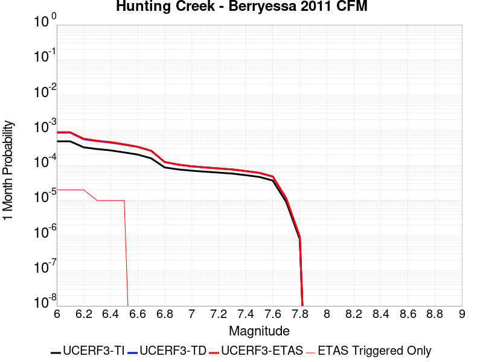 |  |  |

| Magnitude | 1 wk TI Prob | 1 wk TD Prob | 1 wk ETAS Prob | 1 wk ETAS/TD Gain | 1 wk ETAS Triggered Only | 1 mo TI Prob | 1 mo TD Prob | 1 mo ETAS Prob | 1 mo ETAS/TD Gain | 1 mo ETAS Triggered Only | 1 yr TI Prob | 1 yr TD Prob | 1 yr ETAS Prob | 1 yr ETAS/TD Gain | 1 yr ETAS Triggered Only | 10 yr TI Prob | 10 yr TD Prob | 10 yr ETAS Prob | 10 yr ETAS/TD Gain | 10 yr ETAS Triggered Only |
|-----|-----|-----|-----|-----|-----|-----|-----|-----|-----|-----|-----|-----|-----|-----|-----|-----|-----|-----|-----|-----|
| 6.0 | 1.1270982E-4 | 2.0028367E-4 | 2.1028167E-4 | 1.0499191 | 1.0E-5 | 4.8295266E-4 | 8.579912E-4 | 8.779741E-4 | 1.0232903 | 2.0E-5 | 0.0058641075 | 0.010386173 | 0.01041586 | 1.0028584 | 3.0E-5 | 0.057117578 | 0.09804048 | 0.09807656 | 1.000368 | 4.0E-5 |
| 6.1 | 1.1239393E-4 | 1.9976508E-4 | 2.097631E-4 | 1.0500488 | 1.0E-5 | 4.8159933E-4 | 8.557703E-4 | 8.757532E-4 | 1.0233507 | 2.0E-5 | 0.0058477195 | 0.010359417 | 0.010389105 | 1.0028659 | 3.0E-5 | 0.056962132 | 0.09779895 | 0.097835034 | 1.000369 | 4.0E-5 |
| 6.2 | 7.596265E-5 | 1.2933646E-4 | 1.3933517E-4 | 1.0773077 | 1.0E-5 | 3.2551357E-4 | 5.5415573E-4 | 5.7414465E-4 | 1.036071 | 2.0E-5 | 0.0039559277 | 0.0067213587 | 0.0067412243 | 1.0029556 | 2.0E-5 | 0.038862433 | 0.06459229 | 0.064610995 | 1.0002897 | 2.0E-5 |
| 6.3 | 6.78794E-5 | 1.1448377E-4 | 1.1448377E-4 | 1.0 | 0.0 | 2.9087928E-4 | 4.9052597E-4 | 5.0052104E-4 | 1.0203763 | 1.0E-5 | 0.003535705 | 0.005952661 | 0.0059626014 | 1.0016699 | 1.0E-5 | 0.034799766 | 0.057466213 | 0.057475638 | 1.000164 | 1.0E-5 |
| 6.4 | 6.2165134E-5 | 1.0434825E-4 | 1.0434825E-4 | 1.0 | 0.0 | 2.6639478E-4 | 4.4711027E-4 | 4.5710578E-4 | 1.0223558 | 1.0E-5 | 0.0032385332 | 0.0054274183 | 0.005437364 | 1.0018325 | 1.0E-5 | 0.03191742 | 0.05255138 | 0.052560855 | 1.0001802 | 1.0E-5 |
| 6.5 | 5.4368087E-5 | 9.070258E-5 | 9.070258E-5 | 1.0 | 0.0 | 2.3298527E-4 | 3.886537E-4 | 3.986498E-4 | 1.0257199 | 1.0E-5 | 0.0028329059 | 0.0047197016 | 0.0047296546 | 1.0021088 | 1.0E-5 | 0.027970633 | 0.045881182 | 0.045890722 | 1.0002079 | 1.0E-5 |
| 6.6 | 4.729947E-5 | 7.847101E-5 | 7.847101E-5 | 1.0 | 0.0 | 2.0269625E-4 | 3.3624718E-4 | 3.3624718E-4 | 1.0 | 0.0 | 0.002465034 | 0.004084746 | 0.004094705 | 1.0024382 | 1.0E-5 | 0.02437869 | 0.03985269 | 0.03986229 | 1.0002409 | 1.0E-5 |
| 6.7 | 3.6875328E-5 | 6.0443555E-5 | 6.0443555E-5 | 1.0 | 0.0 | 1.5802756E-4 | 2.5900968E-4 | 2.5900968E-4 | 1.0 | 0.0 | 0.0019222875 | 0.0031482724 | 0.0031582408 | 1.0031663 | 1.0E-5 | 0.019057442 | 0.03089371 | 0.0309034 | 1.0003136 | 1.0E-5 |
| 6.8 | 2.0292036E-5 | 2.8976721E-5 | 2.8976721E-5 | 1.0 | 0.0 | 8.6962966E-5 | 1.2417998E-4 | 1.2417998E-4 | 1.0 | 0.0 | 0.0010582599 | 0.0015108302 | 0.0015208151 | 1.0066088 | 1.0E-5 | 0.010532344 | 0.0149790775 | 0.014988927 | 1.0006576 | 1.0E-5 |
| 6.9 | 1.7871042E-5 | 2.4472653E-5 | 2.4472653E-5 | 1.0 | 0.0 | 7.658793E-5 | 1.04878585E-4 | 1.04878585E-4 | 1.0 | 0.0 | 9.320591E-4 | 0.0012761486 | 0.0012861358 | 1.0078261 | 1.0E-5 | 0.009281595 | 0.012680395 | 0.0126902675 | 1.0007787 | 1.0E-5 |
| 7.0 | 1.6415532E-5 | 2.1906566E-5 | 2.1906566E-5 | 1.0 | 0.0 | 7.035038E-5 | 9.388191E-5 | 9.388191E-5 | 1.0 | 0.0 | 8.561793E-4 | 0.0011424144 | 0.001152403 | 1.0087434 | 1.0E-5 | 0.008528882 | 0.011365017 | 0.011374903 | 1.0008699 | 1.0E-5 |
| 7.1 | 1.5409885E-5 | 2.0346588E-5 | 2.0346588E-5 | 1.0 | 0.0 | 6.6040695E-5 | 8.719676E-5 | 8.719676E-5 | 1.0 | 0.0 | 8.0374884E-4 | 0.0010611062 | 0.0010710956 | 1.0094141 | 1.0E-5 | 0.00800848 | 0.010560924 | 0.010570819 | 1.0009369 | 1.0E-5 |
| 7.2 | 1.4497423E-5 | 1.905519E-5 | 1.905519E-5 | 1.0 | 0.0 | 6.213033E-5 | 8.166256E-5 | 8.166256E-5 | 1.0 | 0.0 | 7.5617427E-4 | 9.937913E-4 | 0.0010037813 | 1.0100524 | 1.0E-5 | 0.0075360634 | 0.00989425 | 0.009904152 | 1.0010006 | 1.0E-5 |
| 7.3 | 1.3615175E-5 | 1.7826347E-5 | 1.7826347E-5 | 1.0 | 0.0 | 5.8349444E-5 | 7.6396405E-5 | 7.6396405E-5 | 1.0 | 0.0 | 7.101729E-4 | 9.297323E-4 | 9.39723E-4 | 1.0107458 | 1.0E-5 | 0.0070790765 | 0.009259124 | 0.009269032 | 1.00107 | 1.0E-5 |
| 7.4 | 1.2252825E-5 | 1.6026455E-5 | 1.6026455E-5 | 1.0 | 0.0 | 5.251105E-5 | 6.868302E-5 | 6.868302E-5 | 1.0 | 0.0 | 6.391345E-4 | 8.3589775E-4 | 8.458894E-4 | 1.0119532 | 1.0E-5 | 0.0063729943 | 0.008328172 | 0.008338089 | 1.0011908 | 1.0E-5 |
| 7.5 | 1.0913301E-5 | 1.4241286E-5 | 1.4241286E-5 | 1.0 | 0.0 | 4.6770452E-5 | 6.103267E-5 | 6.103267E-5 | 1.0 | 0.0 | 5.6928146E-4 | 7.428222E-4 | 7.5281475E-4 | 1.0134522 | 1.0E-5 | 0.0056782532 | 0.0074039865 | 0.0074139126 | 1.0013406 | 1.0E-5 |
| 7.6 | 8.623192E-6 | 1.12347825E-5 | 1.12347825E-5 | 1.0 | 0.0 | 3.6956015E-5 | 4.8148195E-5 | 4.8148195E-5 | 1.0 | 0.0 | 4.4984656E-4 | 5.8604917E-4 | 5.960433E-4 | 1.0170534 | 1.0E-5 | 0.00448937 | 0.005845504 | 0.0058554453 | 1.0017008 | 1.0E-5 |
| 7.7 | 2.0993634E-6 | 2.66264E-6 | 2.66264E-6 | 1.0 | 0.0 | 8.997241E-6 | 1.1411265E-5 | 1.1411265E-5 | 1.0 | 0.0 | 1.09535904E-4 | 1.3892337E-4 | 1.4892197E-4 | 1.0719721 | 1.0E-5 | 0.0010948193 | 0.0013883994 | 0.0013983855 | 1.0071925 | 1.0E-5 |
| 7.8 | 1.8428308E-7 | 2.1674624E-7 | 2.1674624E-7 | 1.0 | 0.0 | 7.897844E-7 | 9.289122E-7 | 9.289122E-7 | 1.0 | 0.0 | 9.615583E-6 | 1.130945E-5 | 1.130945E-5 | 1.0 | 0.0 | 9.615166E-5 | 1.1308173E-4 | 1.1308173E-4 | 1.0 | 0.0 |

## San Luis Range 2011 CFM
*[(top)](#table-of-contents)*

| 1 Week | 1 Month | 1 Year | 10 Year |
|-----|-----|-----|-----|
|  |  |  |  |

| Magnitude | 1 wk TI Prob | 1 wk TD Prob | 1 wk ETAS Prob | 1 wk ETAS/TD Gain | 1 wk ETAS Triggered Only | 1 mo TI Prob | 1 mo TD Prob | 1 mo ETAS Prob | 1 mo ETAS/TD Gain | 1 mo ETAS Triggered Only | 1 yr TI Prob | 1 yr TD Prob | 1 yr ETAS Prob | 1 yr ETAS/TD Gain | 1 yr ETAS Triggered Only | 10 yr TI Prob | 10 yr TD Prob | 10 yr ETAS Prob | 10 yr ETAS/TD Gain | 10 yr ETAS Triggered Only |
|-----|-----|-----|-----|-----|-----|-----|-----|-----|-----|-----|-----|-----|-----|-----|-----|-----|-----|-----|-----|-----|
| 6.0 | 8.8368415E-6 | 8.965455E-6 | 8.965455E-6 | 1.0 | 0.0 | 3.787163E-5 | 3.8422855E-5 | 3.8422855E-5 | 1.0 | 0.0 | 4.609895E-4 | 4.6770574E-4 | 4.7770108E-4 | 1.021371 | 1.0E-5 | 0.0046003438 | 0.004667997 | 0.0047177635 | 1.0106612 | 5.0E-5 |
| 6.1 | 8.8368415E-6 | 8.965455E-6 | 8.965455E-6 | 1.0 | 0.0 | 3.787163E-5 | 3.8422855E-5 | 3.8422855E-5 | 1.0 | 0.0 | 4.609895E-4 | 4.6770574E-4 | 4.7770108E-4 | 1.021371 | 1.0E-5 | 0.0046003438 | 0.004667997 | 0.0047177635 | 1.0106612 | 5.0E-5 |
| 6.2 | 8.8368415E-6 | 8.965455E-6 | 8.965455E-6 | 1.0 | 0.0 | 3.787163E-5 | 3.8422855E-5 | 3.8422855E-5 | 1.0 | 0.0 | 4.609895E-4 | 4.6770574E-4 | 4.7770108E-4 | 1.021371 | 1.0E-5 | 0.0046003438 | 0.004667997 | 0.0047177635 | 1.0106612 | 5.0E-5 |
| 6.3 | 8.8368415E-6 | 8.965455E-6 | 8.965455E-6 | 1.0 | 0.0 | 3.787163E-5 | 3.8422855E-5 | 3.8422855E-5 | 1.0 | 0.0 | 4.609895E-4 | 4.6770574E-4 | 4.7770108E-4 | 1.021371 | 1.0E-5 | 0.0046003438 | 0.004667997 | 0.0047177635 | 1.0106612 | 5.0E-5 |
| 6.4 | 3.9094193E-6 | 3.941204E-6 | 3.941204E-6 | 1.0 | 0.0 | 1.6754546E-5 | 1.6890766E-5 | 1.6890766E-5 | 1.0 | 0.0 | 2.039675E-4 | 2.0562594E-4 | 2.1562389E-4 | 1.048622 | 1.0E-5 | 0.0020378039 | 0.0020543856 | 0.0020743445 | 1.0097153 | 2.0E-5 |
| 6.5 | 3.9094193E-6 | 3.941204E-6 | 3.941204E-6 | 1.0 | 0.0 | 1.6754546E-5 | 1.6890766E-5 | 1.6890766E-5 | 1.0 | 0.0 | 2.039675E-4 | 2.0562594E-4 | 2.1562389E-4 | 1.048622 | 1.0E-5 | 0.0020378039 | 0.0020543856 | 0.0020743445 | 1.0097153 | 2.0E-5 |
| 6.6 | 3.0587726E-6 | 3.0753893E-6 | 3.0753893E-6 | 1.0 | 0.0 | 1.3108959E-5 | 1.3180174E-5 | 1.3180174E-5 | 1.0 | 0.0 | 1.595899E-4 | 1.6045693E-4 | 1.7045531E-4 | 1.062312 | 1.0E-5 | 0.0015947534 | 0.0016034227 | 0.0016233906 | 1.0124533 | 2.0E-5 |
| 6.7 | 2.6160574E-6 | 2.6251284E-6 | 2.6251284E-6 | 1.0 | 0.0 | 1.1211626E-5 | 1.1250502E-5 | 1.1250502E-5 | 1.0 | 0.0 | 1.3649299E-4 | 1.3696631E-4 | 1.4696494E-4 | 1.0730007 | 1.0E-5 | 0.0013640919 | 0.0013688251 | 0.0013887978 | 1.0145911 | 2.0E-5 |
| 6.8 | 2.5110312E-6 | 2.5181412E-6 | 2.5181412E-6 | 1.0 | 0.0 | 1.0761518E-5 | 1.079199E-5 | 1.079199E-5 | 1.0 | 0.0 | 1.310136E-4 | 1.313846E-4 | 1.413833E-4 | 1.0761024 | 1.0E-5 | 0.0013093639 | 0.0013130752 | 0.0013330489 | 1.0152115 | 2.0E-5 |
| 6.9 | 1.8564405E-6 | 1.852488E-6 | 1.852488E-6 | 1.0 | 0.0 | 7.95615E-6 | 7.93921E-6 | 7.93921E-6 | 1.0 | 0.0 | 9.686181E-5 | 9.665562E-5 | 9.665562E-5 | 1.0 | 0.0 | 9.68196E-4 | 9.6613786E-4 | 9.7612815E-4 | 1.0103405 | 1.0E-5 |
| 7.0 | 1.546127E-6 | 1.5369549E-6 | 1.5369549E-6 | 1.0 | 0.0 | 6.626242E-6 | 6.5869326E-6 | 6.5869326E-6 | 1.0 | 0.0 | 8.06715E-5 | 8.019296E-5 | 8.019296E-5 | 1.0 | 0.0 | 8.0642226E-4 | 8.016409E-4 | 8.016409E-4 | 1.0 | 0.0 |
| 7.1 | 1.3368208E-6 | 1.3235336E-6 | 1.3235336E-6 | 1.0 | 0.0 | 5.7292195E-6 | 5.6722747E-6 | 5.6722747E-6 | 1.0 | 0.0 | 6.975101E-5 | 6.905776E-5 | 6.905776E-5 | 1.0 | 0.0 | 6.972912E-4 | 6.903635E-4 | 6.903635E-4 | 1.0 | 0.0 |
| 7.2 | 1.0623363E-6 | 1.0454378E-6 | 1.0454378E-6 | 1.0 | 0.0 | 4.5528623E-6 | 4.4804397E-6 | 4.4804397E-6 | 1.0 | 0.0 | 5.5429686E-5 | 5.4547992E-5 | 5.4547992E-5 | 1.0 | 0.0 | 5.5415864E-4 | 5.453463E-4 | 5.453463E-4 | 1.0 | 0.0 |
| 7.3 | 7.831679E-7 | 7.727399E-7 | 7.727399E-7 | 1.0 | 0.0 | 3.3564295E-6 | 3.3117383E-6 | 3.3117383E-6 | 1.0 | 0.0 | 4.086376E-5 | 4.031967E-5 | 4.031967E-5 | 1.0 | 0.0 | 4.0856248E-4 | 4.0312367E-4 | 4.0312367E-4 | 1.0 | 0.0 |
| 7.4 | 5.9558846E-7 | 5.910646E-7 | 5.910646E-7 | 1.0 | 0.0 | 2.5525194E-6 | 2.5331315E-6 | 2.5331315E-6 | 1.0 | 0.0 | 3.107648E-5 | 3.084044E-5 | 3.084044E-5 | 1.0 | 0.0 | 3.1072134E-4 | 3.083617E-4 | 3.083617E-4 | 1.0 | 0.0 |
| 7.5 | 4.1616502E-7 | 4.1196404E-7 | 4.1196404E-7 | 1.0 | 0.0 | 1.7835631E-6 | 1.765559E-6 | 1.765559E-6 | 1.0 | 0.0 | 2.1714664E-5 | 2.1495469E-5 | 2.1495469E-5 | 1.0 | 0.0 | 2.1712543E-4 | 2.1493394E-4 | 2.1493394E-4 | 1.0 | 0.0 |
| 7.6 | 2.3816014E-7 | 2.3376614E-7 | 2.3376614E-7 | 1.0 | 0.0 | 1.0206859E-6 | 1.0018545E-6 | 1.0018545E-6 | 1.0 | 0.0 | 1.242678E-5 | 1.219751E-5 | 1.219751E-5 | 1.0 | 0.0 | 1.2426086E-4 | 1.2196843E-4 | 1.2196843E-4 | 1.0 | 0.0 |
| 7.7 | 9.918777E-8 | 9.3868096E-8 | 9.3868096E-8 | 1.0 | 0.0 | 4.2509038E-7 | 4.022918E-7 | 4.022918E-7 | 1.0 | 0.0 | 5.1754632E-6 | 4.8978914E-6 | 4.8978914E-6 | 1.0 | 0.0 | 5.1753424E-5 | 4.897784E-5 | 4.897784E-5 | 1.0 | 0.0 |
| 7.8 | 3.4982556E-8 | 2.968672E-8 | 2.968672E-8 | 1.0 | 0.0 | 1.4992524E-7 | 1.272288E-7 | 1.272288E-7 | 1.0 | 0.0 | 1.8253382E-6 | 1.5490094E-6 | 1.5490094E-6 | 1.0 | 0.0 | 1.8253233E-5 | 1.5489988E-5 | 1.5489988E-5 | 1.0 | 0.0 |
| 7.9 | 1.6624908E-8 | 1.1476994E-8 | 1.1476994E-8 | 1.0 | 0.0 | 7.12496E-8 | 4.9187115E-8 | 4.9187115E-8 | 1.0 | 0.0 | 8.6746354E-7 | 5.988529E-7 | 5.988529E-7 | 1.0 | 0.0 | 8.674601E-6 | 5.9885133E-6 | 5.9885133E-6 | 1.0 | 0.0 |
| 8.0 | 6.3352315E-9 | 3.0886564E-9 | 3.0886564E-9 | 1.0 | 0.0 | 2.715099E-8 | 1.32370985E-8 | 1.32370985E-8 | 1.0 | 0.0 | 3.3056327E-7 | 1.6116167E-7 | 1.6116167E-7 | 1.0 | 0.0 | 3.3056278E-6 | 1.6116155E-6 | 1.6116155E-6 | 1.0 | 0.0 |

## Puente Hills
*[(top)](#table-of-contents)*

| 1 Week | 1 Month | 1 Year | 10 Year |
|-----|-----|-----|-----|
|  |  |  |  |

| Magnitude | 1 wk TI Prob | 1 wk TD Prob | 1 wk ETAS Prob | 1 wk ETAS/TD Gain | 1 wk ETAS Triggered Only | 1 mo TI Prob | 1 mo TD Prob | 1 mo ETAS Prob | 1 mo ETAS/TD Gain | 1 mo ETAS Triggered Only | 1 yr TI Prob | 1 yr TD Prob | 1 yr ETAS Prob | 1 yr ETAS/TD Gain | 1 yr ETAS Triggered Only | 10 yr TI Prob | 10 yr TD Prob | 10 yr ETAS Prob | 10 yr ETAS/TD Gain | 10 yr ETAS Triggered Only |
|-----|-----|-----|-----|-----|-----|-----|-----|-----|-----|-----|-----|-----|-----|-----|-----|-----|-----|-----|-----|-----|
| 6.0 | 1.2101656E-5 | 8.098448E-6 | 8.098448E-6 | 1.0 | 0.0 | 5.1863204E-5 | 3.4707205E-5 | 4.4706856E-5 | 1.2881147 | 1.0E-5 | 6.312516E-4 | 4.2248392E-4 | 4.324797E-4 | 1.0236596 | 1.0E-5 | 0.0062946146 | 0.0042173676 | 0.004257199 | 1.0094446 | 4.0E-5 |
| 6.1 | 1.2101656E-5 | 8.098448E-6 | 8.098448E-6 | 1.0 | 0.0 | 5.1863204E-5 | 3.4707205E-5 | 4.4706856E-5 | 1.2881147 | 1.0E-5 | 6.312516E-4 | 4.2248392E-4 | 4.324797E-4 | 1.0236596 | 1.0E-5 | 0.0062946146 | 0.0042173676 | 0.004257199 | 1.0094446 | 4.0E-5 |
| 6.2 | 1.2101656E-5 | 8.098448E-6 | 8.098448E-6 | 1.0 | 0.0 | 5.1863204E-5 | 3.4707205E-5 | 4.4706856E-5 | 1.2881147 | 1.0E-5 | 6.312516E-4 | 4.2248392E-4 | 4.324797E-4 | 1.0236596 | 1.0E-5 | 0.0062946146 | 0.0042173676 | 0.004257199 | 1.0094446 | 4.0E-5 |
| 6.3 | 1.2101656E-5 | 8.098448E-6 | 8.098448E-6 | 1.0 | 0.0 | 5.1863204E-5 | 3.4707205E-5 | 4.4706856E-5 | 1.2881147 | 1.0E-5 | 6.312516E-4 | 4.2248392E-4 | 4.324797E-4 | 1.0236596 | 1.0E-5 | 0.0062946146 | 0.0042173676 | 0.004257199 | 1.0094446 | 4.0E-5 |
| 6.4 | 1.2101656E-5 | 8.098448E-6 | 8.098448E-6 | 1.0 | 0.0 | 5.1863204E-5 | 3.4707205E-5 | 4.4706856E-5 | 1.2881147 | 1.0E-5 | 6.312516E-4 | 4.2248392E-4 | 4.324797E-4 | 1.0236596 | 1.0E-5 | 0.0062946146 | 0.0042173676 | 0.004257199 | 1.0094446 | 4.0E-5 |
| 6.5 | 1.2101656E-5 | 8.098448E-6 | 8.098448E-6 | 1.0 | 0.0 | 5.1863204E-5 | 3.4707205E-5 | 4.4706856E-5 | 1.2881147 | 1.0E-5 | 6.312516E-4 | 4.2248392E-4 | 4.324797E-4 | 1.0236596 | 1.0E-5 | 0.0062946146 | 0.0042173676 | 0.004257199 | 1.0094446 | 4.0E-5 |
| 6.6 | 1.0222488E-5 | 6.399079E-6 | 6.399079E-6 | 1.0 | 0.0 | 4.3809923E-5 | 2.742435E-5 | 3.7424077E-5 | 1.3646294 | 1.0E-5 | 5.332553E-4 | 3.3384276E-4 | 3.4383943E-4 | 1.0299442 | 1.0E-5 | 0.0053197746 | 0.0033336577 | 0.003353591 | 1.0059794 | 2.0E-5 |
| 6.7 | 1.0222488E-5 | 6.399079E-6 | 6.399079E-6 | 1.0 | 0.0 | 4.3809923E-5 | 2.742435E-5 | 3.7424077E-5 | 1.3646294 | 1.0E-5 | 5.332553E-4 | 3.3384276E-4 | 3.4383943E-4 | 1.0299442 | 1.0E-5 | 0.0053197746 | 0.0033336577 | 0.003353591 | 1.0059794 | 2.0E-5 |
| 6.8 | 8.6367845E-6 | 5.028129E-6 | 5.028129E-6 | 1.0 | 0.0 | 3.7014266E-5 | 2.1548949E-5 | 3.1548734E-5 | 1.4640497 | 1.0E-5 | 4.505555E-4 | 2.6232743E-4 | 2.723248E-4 | 1.0381103 | 1.0E-5 | 0.004496431 | 0.002620234 | 0.0026401815 | 1.007613 | 2.0E-5 |
| 6.9 | 8.066481E-6 | 4.8360116E-6 | 4.8360116E-6 | 1.0 | 0.0 | 3.4570177E-5 | 2.0725602E-5 | 3.0725394E-5 | 1.482485 | 1.0E-5 | 4.2081063E-4 | 2.523055E-4 | 2.62303E-4 | 1.0396245 | 1.0E-5 | 0.0042001465 | 0.0025202443 | 0.0025302193 | 1.0039579 | 1.0E-5 |
| 7.0 | 7.393828E-6 | 4.4172275E-6 | 4.4172275E-6 | 1.0 | 0.0 | 3.168745E-5 | 1.8930841E-5 | 2.8930652E-5 | 1.5282285 | 1.0E-5 | 3.857264E-4 | 2.3045906E-4 | 2.4045675E-4 | 1.0433817 | 1.0E-5 | 0.0038505755 | 0.0023022462 | 0.0023122232 | 1.0043336 | 1.0E-5 |
| 7.1 | 6.4660953E-6 | 3.8043859E-6 | 3.8043859E-6 | 1.0 | 0.0 | 2.7711543E-5 | 1.630441E-5 | 1.630441E-5 | 1.0 | 0.0 | 3.373358E-4 | 1.9848847E-4 | 1.9848847E-4 | 1.0 | 0.0 | 0.0033682417 | 0.0019831478 | 0.0019831478 | 1.0 | 0.0 |
| 7.2 | 5.143232E-6 | 2.7864896E-6 | 2.7864896E-6 | 1.0 | 0.0 | 2.2042237E-5 | 1.1942045E-5 | 1.1942045E-5 | 1.0 | 0.0 | 2.6833118E-4 | 1.453848E-4 | 1.453848E-4 | 1.0 | 0.0 | 0.002680074 | 0.0014529065 | 0.0014529065 | 1.0 | 0.0 |
| 7.3 | 3.928255E-6 | 2.091338E-6 | 2.091338E-6 | 1.0 | 0.0 | 1.683527E-5 | 8.962847E-6 | 8.962847E-6 | 1.0 | 0.0 | 2.0495013E-4 | 1.0911726E-4 | 1.0911726E-4 | 1.0 | 0.0 | 0.002047612 | 0.0010906435 | 0.0010906435 | 1.0 | 0.0 |
| 7.4 | 2.7894434E-6 | 1.3546429E-6 | 1.3546429E-6 | 1.0 | 0.0 | 1.1954703E-5 | 5.8056E-6 | 5.8056E-6 | 1.0 | 0.0 | 1.4553878E-4 | 7.068093E-5 | 7.068093E-5 | 1.0 | 0.0 | 0.001454435 | 7.0658885E-4 | 7.0658885E-4 | 1.0 | 0.0 |
| 7.5 | 2.041735E-6 | 8.786996E-7 | 8.786996E-7 | 1.0 | 0.0 | 8.750263E-6 | 3.7658504E-6 | 3.7658504E-6 | 1.0 | 0.0 | 1.06529245E-4 | 4.5848297E-5 | 4.5848297E-5 | 1.0 | 0.0 | 0.0010647819 | 4.5839173E-4 | 4.5839173E-4 | 1.0 | 0.0 |
| 7.6 | 1.6959062E-6 | 6.698339E-7 | 6.698339E-7 | 1.0 | 0.0 | 7.268149E-6 | 2.8707138E-6 | 2.8707138E-6 | 1.0 | 0.0 | 8.848612E-5 | 3.4950408E-5 | 3.4950408E-5 | 1.0 | 0.0 | 8.84509E-4 | 3.4945202E-4 | 3.4945202E-4 | 1.0 | 0.0 |
| 7.7 | 1.4767965E-6 | 5.407146E-7 | 5.407146E-7 | 1.0 | 0.0 | 6.3291122E-6 | 2.3173466E-6 | 2.3173466E-6 | 1.0 | 0.0 | 7.705422E-5 | 2.8213353E-5 | 2.8213353E-5 | 1.0 | 0.0 | 7.702751E-4 | 2.8210029E-4 | 2.8210029E-4 | 1.0 | 0.0 |
| 7.8 | 1.8432911E-7 | 7.2811105E-8 | 7.2811105E-8 | 1.0 | 0.0 | 7.8998164E-7 | 3.1204758E-7 | 3.1204758E-7 | 1.0 | 0.0 | 9.617985E-6 | 3.799176E-6 | 3.799176E-6 | 1.0 | 0.0 | 9.617568E-5 | 3.7991435E-5 | 3.7991435E-5 | 1.0 | 0.0 |

## Dry Mountain
*[(top)](#table-of-contents)*

| 1 Week | 1 Month | 1 Year | 10 Year |
|-----|-----|-----|-----|
|  |  |  |  |

| Magnitude | 1 wk TI Prob | 1 wk TD Prob | 1 wk ETAS Prob | 1 wk ETAS/TD Gain | 1 wk ETAS Triggered Only | 1 mo TI Prob | 1 mo TD Prob | 1 mo ETAS Prob | 1 mo ETAS/TD Gain | 1 mo ETAS Triggered Only | 1 yr TI Prob | 1 yr TD Prob | 1 yr ETAS Prob | 1 yr ETAS/TD Gain | 1 yr ETAS Triggered Only | 10 yr TI Prob | 10 yr TD Prob | 10 yr ETAS Prob | 10 yr ETAS/TD Gain | 10 yr ETAS Triggered Only |
|-----|-----|-----|-----|-----|-----|-----|-----|-----|-----|-----|-----|-----|-----|-----|-----|-----|-----|-----|-----|-----|
| 6.0 | 6.222801E-6 | 6.439381E-6 | 2.6439253E-5 | 4.1058683 | 2.0E-5 | 2.6668875E-5 | 2.7597147E-5 | 4.7596594E-5 | 1.7246926 | 2.0E-5 | 3.2464517E-4 | 3.3595937E-4 | 3.659493E-4 | 1.0892665 | 3.0E-5 | 0.0032417132 | 0.0033560768 | 0.0033959425 | 1.0118787 | 4.0E-5 |
| 6.1 | 6.222801E-6 | 6.439381E-6 | 2.6439253E-5 | 4.1058683 | 2.0E-5 | 2.6668875E-5 | 2.7597147E-5 | 4.7596594E-5 | 1.7246926 | 2.0E-5 | 3.2464517E-4 | 3.3595937E-4 | 3.659493E-4 | 1.0892665 | 3.0E-5 | 0.0032417132 | 0.0033560768 | 0.0033959425 | 1.0118787 | 4.0E-5 |
| 6.2 | 6.222801E-6 | 6.439381E-6 | 2.6439253E-5 | 4.1058683 | 2.0E-5 | 2.6668875E-5 | 2.7597147E-5 | 4.7596594E-5 | 1.7246926 | 2.0E-5 | 3.2464517E-4 | 3.3595937E-4 | 3.659493E-4 | 1.0892665 | 3.0E-5 | 0.0032417132 | 0.0033560768 | 0.0033959425 | 1.0118787 | 4.0E-5 |
| 6.3 | 6.222801E-6 | 6.439381E-6 | 2.6439253E-5 | 4.1058683 | 2.0E-5 | 2.6668875E-5 | 2.7597147E-5 | 4.7596594E-5 | 1.7246926 | 2.0E-5 | 3.2464517E-4 | 3.3595937E-4 | 3.659493E-4 | 1.0892665 | 3.0E-5 | 0.0032417132 | 0.0033560768 | 0.0033959425 | 1.0118787 | 4.0E-5 |
| 6.4 | 6.222801E-6 | 6.439381E-6 | 2.6439253E-5 | 4.1058683 | 2.0E-5 | 2.6668875E-5 | 2.7597147E-5 | 4.7596594E-5 | 1.7246926 | 2.0E-5 | 3.2464517E-4 | 3.3595937E-4 | 3.659493E-4 | 1.0892665 | 3.0E-5 | 0.0032417132 | 0.0033560768 | 0.0033959425 | 1.0118787 | 4.0E-5 |
| 6.5 | 2.8528623E-6 | 2.9521684E-6 | 2.9521684E-6 | 1.0 | 0.0 | 1.22264955E-5 | 1.2652138E-5 | 1.2652138E-5 | 1.0 | 0.0 | 1.4884741E-4 | 1.540376E-4 | 1.540376E-4 | 1.0 | 0.0 | 0.0014874774 | 0.0015401616 | 0.0015501463 | 1.0064828 | 1.0E-5 |
| 6.6 | 2.8528623E-6 | 2.9521684E-6 | 2.9521684E-6 | 1.0 | 0.0 | 1.22264955E-5 | 1.2652138E-5 | 1.2652138E-5 | 1.0 | 0.0 | 1.4884741E-4 | 1.540376E-4 | 1.540376E-4 | 1.0 | 0.0 | 0.0014874774 | 0.0015401616 | 0.0015501463 | 1.0064828 | 1.0E-5 |
| 6.7 | 2.541E-6 | 2.6293578E-6 | 2.6293578E-6 | 1.0 | 0.0 | 1.0889954E-5 | 1.1268677E-5 | 1.1268677E-5 | 1.0 | 0.0 | 1.3257713E-4 | 1.3719614E-4 | 1.3719614E-4 | 1.0 | 0.0 | 0.0013249806 | 0.0013719613 | 0.0013819477 | 1.0072788 | 1.0E-5 |

## San Gabriel
*[(top)](#table-of-contents)*

| 1 Week | 1 Month | 1 Year | 10 Year |
|-----|-----|-----|-----|
|  |  | 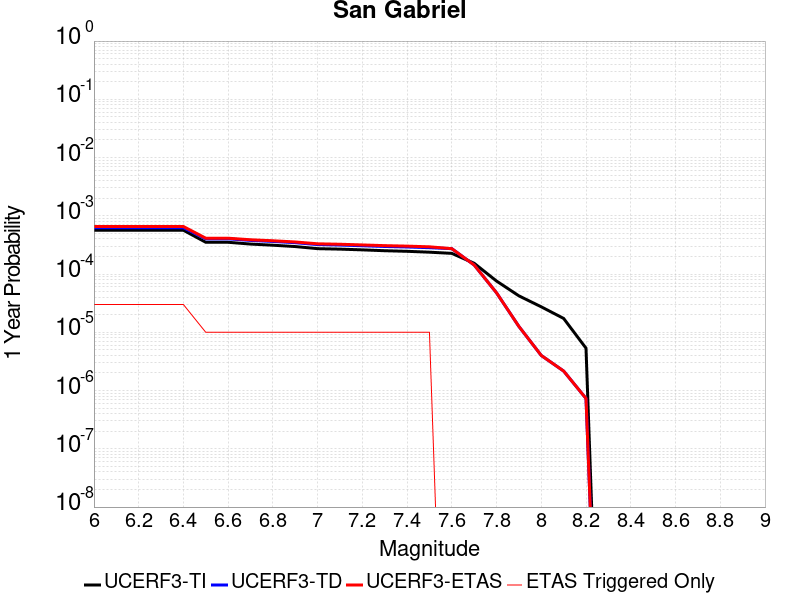 |  |

| Magnitude | 1 wk TI Prob | 1 wk TD Prob | 1 wk ETAS Prob | 1 wk ETAS/TD Gain | 1 wk ETAS Triggered Only | 1 mo TI Prob | 1 mo TD Prob | 1 mo ETAS Prob | 1 mo ETAS/TD Gain | 1 mo ETAS Triggered Only | 1 yr TI Prob | 1 yr TD Prob | 1 yr ETAS Prob | 1 yr ETAS/TD Gain | 1 yr ETAS Triggered Only | 10 yr TI Prob | 10 yr TD Prob | 10 yr ETAS Prob | 10 yr ETAS/TD Gain | 10 yr ETAS Triggered Only |
|-----|-----|-----|-----|-----|-----|-----|-----|-----|-----|-----|-----|-----|-----|-----|-----|-----|-----|-----|-----|-----|
| 6.0 | 1.083775E-5 | 1.198525E-5 | 2.198513E-5 | 1.8343489 | 1.0E-5 | 4.6446676E-5 | 5.1364408E-5 | 6.13639E-5 | 1.1946774 | 1.0E-5 | 5.653415E-4 | 6.251936E-4 | 6.5517484E-4 | 1.0479552 | 3.0E-5 | 0.0056390543 | 0.0062463325 | 0.006286083 | 1.0063637 | 4.0E-5 |
| 6.1 | 1.083775E-5 | 1.198525E-5 | 2.198513E-5 | 1.8343489 | 1.0E-5 | 4.6446676E-5 | 5.1364408E-5 | 6.13639E-5 | 1.1946774 | 1.0E-5 | 5.653415E-4 | 6.251936E-4 | 6.5517484E-4 | 1.0479552 | 3.0E-5 | 0.0056390543 | 0.0062463325 | 0.006286083 | 1.0063637 | 4.0E-5 |
| 6.2 | 1.083775E-5 | 1.198525E-5 | 2.198513E-5 | 1.8343489 | 1.0E-5 | 4.6446676E-5 | 5.1364408E-5 | 6.13639E-5 | 1.1946774 | 1.0E-5 | 5.653415E-4 | 6.251936E-4 | 6.5517484E-4 | 1.0479552 | 3.0E-5 | 0.0056390543 | 0.0062463325 | 0.006286083 | 1.0063637 | 4.0E-5 |
| 6.3 | 1.083775E-5 | 1.198525E-5 | 2.198513E-5 | 1.8343489 | 1.0E-5 | 4.6446676E-5 | 5.1364408E-5 | 6.13639E-5 | 1.1946774 | 1.0E-5 | 5.653415E-4 | 6.251936E-4 | 6.5517484E-4 | 1.0479552 | 3.0E-5 | 0.0056390543 | 0.0062463325 | 0.006286083 | 1.0063637 | 4.0E-5 |
| 6.4 | 1.083775E-5 | 1.198525E-5 | 2.198513E-5 | 1.8343489 | 1.0E-5 | 4.6446676E-5 | 5.1364408E-5 | 6.13639E-5 | 1.1946774 | 1.0E-5 | 5.653415E-4 | 6.251936E-4 | 6.5517484E-4 | 1.0479552 | 3.0E-5 | 0.0056390543 | 0.0062463325 | 0.006286083 | 1.0063637 | 4.0E-5 |
| 6.5 | 6.7317824E-6 | 7.717007E-6 | 7.717007E-6 | 1.0 | 0.0 | 2.8850178E-5 | 3.3072472E-5 | 3.3072472E-5 | 1.0 | 0.0 | 3.511943E-4 | 4.0258403E-4 | 4.1258E-4 | 1.0248295 | 1.0E-5 | 0.003506398 | 0.004029533 | 0.0040394925 | 1.0024717 | 1.0E-5 |
| 6.6 | 6.7317824E-6 | 7.717007E-6 | 7.717007E-6 | 1.0 | 0.0 | 2.8850178E-5 | 3.3072472E-5 | 3.3072472E-5 | 1.0 | 0.0 | 3.511943E-4 | 4.0258403E-4 | 4.1258E-4 | 1.0248295 | 1.0E-5 | 0.003506398 | 0.004029533 | 0.0040394925 | 1.0024717 | 1.0E-5 |
| 6.7 | 6.274881E-6 | 7.2459275E-6 | 7.2459275E-6 | 1.0 | 0.0 | 2.6892068E-5 | 3.105361E-5 | 3.105361E-5 | 1.0 | 0.0 | 3.2736175E-4 | 3.7801306E-4 | 3.880093E-4 | 1.0264441 | 1.0E-5 | 0.0032687993 | 0.0037846796 | 0.0037946417 | 1.0026323 | 1.0E-5 |
| 6.8 | 5.996209E-6 | 6.958647E-6 | 6.958647E-6 | 1.0 | 0.0 | 2.5697784E-5 | 2.9822439E-5 | 2.9822439E-5 | 1.0 | 0.0 | 3.128256E-4 | 3.6302864E-4 | 3.7302502E-4 | 1.027536 | 1.0E-5 | 0.003123856 | 0.0036353325 | 0.0036452962 | 1.0027407 | 1.0E-5 |
| 6.9 | 5.686331E-6 | 6.6236917E-6 | 6.6236917E-6 | 1.0 | 0.0 | 2.4369761E-5 | 2.8386947E-5 | 2.8386947E-5 | 1.0 | 0.0 | 2.9666146E-4 | 3.4555717E-4 | 3.5555373E-4 | 1.0289288 | 1.0E-5 | 0.0029626573 | 0.0034611735 | 0.003471139 | 1.0028791 | 1.0E-5 |
| 7.0 | 5.2329838E-6 | 6.1475757E-6 | 6.1475757E-6 | 1.0 | 0.0 | 2.242688E-5 | 2.6346492E-5 | 2.6346492E-5 | 1.0 | 0.0 | 2.7301308E-4 | 3.207221E-4 | 3.3071887E-4 | 1.0311697 | 1.0E-5 | 0.002726779 | 0.0032135549 | 0.0032235228 | 1.0031018 | 1.0E-5 |
| 7.1 | 5.135671E-6 | 6.0377E-6 | 6.0377E-6 | 1.0 | 0.0 | 2.2009834E-5 | 2.5875606E-5 | 2.5875606E-5 | 1.0 | 0.0 | 2.6793676E-4 | 3.1499073E-4 | 3.2498757E-4 | 1.031737 | 1.0E-5 | 0.0026761394 | 0.0031564054 | 0.0031663738 | 1.0031582 | 1.0E-5 |
| 7.2 | 4.989062E-6 | 5.8710784E-6 | 5.8710784E-6 | 1.0 | 0.0 | 2.1381518E-5 | 2.5161527E-5 | 2.5161527E-5 | 1.0 | 0.0 | 2.6028889E-4 | 3.0629928E-4 | 3.162962E-4 | 1.0326378 | 1.0E-5 | 0.0025998424 | 0.003069734 | 0.0030797033 | 1.0032476 | 1.0E-5 |
| 7.3 | 4.8219395E-6 | 5.7026323E-6 | 5.7026323E-6 | 1.0 | 0.0 | 2.0665291E-5 | 2.4439627E-5 | 2.4439627E-5 | 1.0 | 0.0 | 2.5157086E-4 | 2.975126E-4 | 3.0750962E-4 | 1.033602 | 1.0E-5 | 0.0025128627 | 0.002982106 | 0.0029920763 | 1.0033433 | 1.0E-5 |
| 7.4 | 4.7118383E-6 | 5.5911896E-6 | 5.5911896E-6 | 1.0 | 0.0 | 2.0193436E-5 | 2.3962024E-5 | 2.3962024E-5 | 1.0 | 0.0 | 2.4582737E-4 | 2.9169934E-4 | 3.0169642E-4 | 1.0342718 | 1.0E-5 | 0.002455556 | 0.0029241266 | 0.0029340973 | 1.0034099 | 1.0E-5 |
| 7.5 | 4.5506545E-6 | 5.4365555E-6 | 5.4365555E-6 | 1.0 | 0.0 | 1.9502659E-5 | 2.329932E-5 | 2.329932E-5 | 1.0 | 0.0 | 2.37419E-4 | 2.8363304E-4 | 2.936302E-4 | 1.0352468 | 1.0E-5 | 0.002371655 | 0.0028436715 | 0.0028536431 | 1.0035065 | 1.0E-5 |
| 7.6 | 4.343636E-6 | 5.2294336E-6 | 5.2294336E-6 | 1.0 | 0.0 | 1.861545E-5 | 2.241167E-5 | 2.241167E-5 | 1.0 | 0.0 | 2.2661954E-4 | 2.7282868E-4 | 2.7282868E-4 | 1.0 | 0.0 | 0.0022638857 | 0.0027358893 | 0.0027358893 | 1.0 | 0.0 |
| 7.7 | 2.936235E-6 | 2.743946E-6 | 2.743946E-6 | 1.0 | 0.0 | 1.2583803E-5 | 1.1759716E-5 | 1.1759716E-5 | 1.0 | 0.0 | 1.5319703E-4 | 1.4316518E-4 | 1.4316518E-4 | 1.0 | 0.0 | 0.0015309147 | 0.0014379849 | 0.0014379849 | 1.0 | 0.0 |
| 7.8 | 1.4541639E-6 | 9.122518E-7 | 9.122518E-7 | 1.0 | 0.0 | 6.232116E-6 | 3.9096444E-6 | 3.9096444E-6 | 1.0 | 0.0 | 7.587337E-5 | 4.7598885E-5 | 4.7598885E-5 | 1.0 | 0.0 | 7.584747E-4 | 4.8078224E-4 | 4.8078224E-4 | 1.0 | 0.0 |
| 7.9 | 8.098958E-7 | 2.4165956E-7 | 2.4165956E-7 | 1.0 | 0.0 | 3.4709774E-6 | 1.0356835E-6 | 1.0356835E-6 | 1.0 | 0.0 | 4.225833E-5 | 1.2609373E-5 | 1.2609373E-5 | 1.0 | 0.0 | 4.2250296E-4 | 1.2917137E-4 | 1.2917137E-4 | 1.0 | 0.0 |
| 8.0 | 5.2473234E-7 | 7.672734E-8 | 7.672734E-8 | 1.0 | 0.0 | 2.248851E-6 | 3.2883142E-7 | 3.2883142E-7 | 1.0 | 0.0 | 2.7379416E-5 | 4.003515E-6 | 4.003515E-6 | 1.0 | 0.0 | 2.7376044E-4 | 4.215796E-5 | 4.215796E-5 | 1.0 | 0.0 |
| 8.1 | 3.3162388E-7 | 4.1457096E-8 | 4.1457096E-8 | 1.0 | 0.0 | 1.4212444E-6 | 1.7767324E-7 | 1.7767324E-7 | 1.0 | 0.0 | 1.7303513E-5 | 2.1631695E-6 | 2.1631695E-6 | 1.0 | 0.0 | 1.7302166E-4 | 2.294416E-5 | 2.294416E-5 | 1.0 | 0.0 |
| 8.2 | 1.0235345E-7 | 1.4032201E-8 | 1.4032201E-8 | 1.0 | 0.0 | 4.3865757E-7 | 6.013801E-8 | 6.013801E-8 | 1.0 | 0.0 | 5.340643E-6 | 7.3217996E-7 | 7.3217996E-7 | 1.0 | 0.0 | 5.3405143E-5 | 7.921925E-6 | 7.921925E-6 | 1.0 | 0.0 |

## Santa Cruz Catalina Ridge alt1
*[(top)](#table-of-contents)*

| 1 Week | 1 Month | 1 Year | 10 Year |
|-----|-----|-----|-----|
|  |  |  | 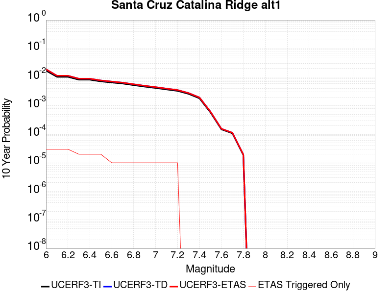 |

| Magnitude | 1 wk TI Prob | 1 wk TD Prob | 1 wk ETAS Prob | 1 wk ETAS/TD Gain | 1 wk ETAS Triggered Only | 1 mo TI Prob | 1 mo TD Prob | 1 mo ETAS Prob | 1 mo ETAS/TD Gain | 1 mo ETAS Triggered Only | 1 yr TI Prob | 1 yr TD Prob | 1 yr ETAS Prob | 1 yr ETAS/TD Gain | 1 yr ETAS Triggered Only | 10 yr TI Prob | 10 yr TD Prob | 10 yr ETAS Prob | 10 yr ETAS/TD Gain | 10 yr ETAS Triggered Only |
|-----|-----|-----|-----|-----|-----|-----|-----|-----|-----|-----|-----|-----|-----|-----|-----|-----|-----|-----|-----|-----|
| 6.0 | 3.2833184E-5 | 3.6558402E-5 | 5.655767E-5 | 1.5470499 | 2.0E-5 | 1.4070606E-4 | 1.5667039E-4 | 1.7666725E-4 | 1.1276366 | 2.0E-5 | 0.00171175 | 0.0019059594 | 0.0019259213 | 1.0104734 | 2.0E-5 | 0.016986247 | 0.018913032 | 0.018942466 | 1.0015562 | 3.0E-5 |
| 6.1 | 1.9835548E-5 | 2.1659505E-5 | 3.165929E-5 | 1.461681 | 1.0E-5 | 8.500672E-5 | 9.282326E-5 | 1.02822334E-4 | 1.1077216 | 1.0E-5 | 0.0010344655 | 0.0011295575 | 0.0011395462 | 1.0088431 | 1.0E-5 | 0.010296632 | 0.011240296 | 0.011269959 | 1.0026389 | 3.0E-5 |
| 6.2 | 1.9835548E-5 | 2.1659505E-5 | 3.165929E-5 | 1.461681 | 1.0E-5 | 8.500672E-5 | 9.282326E-5 | 1.02822334E-4 | 1.1077216 | 1.0E-5 | 0.0010344655 | 0.0011295575 | 0.0011395462 | 1.0088431 | 1.0E-5 | 0.010296632 | 0.011240296 | 0.011269959 | 1.0026389 | 3.0E-5 |
| 6.3 | 1.5728183E-5 | 1.703395E-5 | 2.7033779E-5 | 1.587053 | 1.0E-5 | 6.7404755E-5 | 7.300063E-5 | 8.29999E-5 | 1.1369752 | 1.0E-5 | 8.2034385E-4 | 8.884264E-4 | 8.984175E-4 | 1.0112458 | 1.0E-5 | 0.008173222 | 0.008849427 | 0.00886925 | 1.0022401 | 2.0E-5 |
| 6.4 | 1.5728183E-5 | 1.703395E-5 | 2.7033779E-5 | 1.587053 | 1.0E-5 | 6.7404755E-5 | 7.300063E-5 | 8.29999E-5 | 1.1369752 | 1.0E-5 | 8.2034385E-4 | 8.884264E-4 | 8.984175E-4 | 1.0112458 | 1.0E-5 | 0.008173222 | 0.008849427 | 0.00886925 | 1.0022401 | 2.0E-5 |
| 6.5 | 1.3707734E-5 | 1.4794522E-5 | 2.4794374E-5 | 1.6759158 | 1.0E-5 | 5.8746107E-5 | 6.3403575E-5 | 7.340294E-5 | 1.1577098 | 1.0E-5 | 7.1499916E-4 | 7.716686E-4 | 7.816609E-4 | 1.012949 | 1.0E-5 | 0.0071270303 | 0.0076902895 | 0.007710136 | 1.0025806 | 2.0E-5 |
| 6.6 | 1.2539813E-5 | 1.3510219E-5 | 1.3510219E-5 | 1.0 | 0.0 | 5.3740947E-5 | 5.789967E-5 | 5.789967E-5 | 1.0 | 0.0 | 6.540996E-4 | 7.0470315E-4 | 7.0470315E-4 | 1.0 | 0.0 | 0.0065217763 | 0.0070249885 | 0.0070349183 | 1.0014135 | 1.0E-5 |
| 6.7 | 1.1504083E-5 | 1.2377375E-5 | 1.2377375E-5 | 1.0 | 0.0 | 4.930228E-5 | 5.3044827E-5 | 5.3044827E-5 | 1.0 | 0.0 | 6.0008996E-4 | 6.456314E-4 | 6.456314E-4 | 1.0 | 0.0 | 0.005984721 | 0.006437786 | 0.0064477217 | 1.0015433 | 1.0E-5 |
| 6.8 | 1.012739E-5 | 1.0877071E-5 | 1.0877071E-5 | 1.0 | 0.0 | 4.340238E-5 | 4.6615194E-5 | 4.6615194E-5 | 1.0 | 0.0 | 5.282958E-4 | 5.673937E-4 | 5.673937E-4 | 1.0 | 0.0 | 0.0052704164 | 0.0056596193 | 0.005669563 | 1.0017569 | 1.0E-5 |
| 6.9 | 8.9607865E-6 | 9.609117E-6 | 9.609117E-6 | 1.0 | 0.0 | 3.8402806E-5 | 4.1181287E-5 | 4.1181287E-5 | 1.0 | 0.0 | 4.6745385E-4 | 5.012679E-4 | 5.012679E-4 | 1.0 | 0.0 | 0.0046647177 | 0.005001492 | 0.0050114417 | 1.0019894 | 1.0E-5 |
| 7.0 | 8.046829E-6 | 8.619746E-6 | 8.619746E-6 | 1.0 | 0.0 | 3.4485955E-5 | 3.694125E-5 | 3.694125E-5 | 1.0 | 0.0 | 4.1978562E-4 | 4.496677E-4 | 4.496677E-4 | 1.0 | 0.0 | 0.004189935 | 0.0044876686 | 0.004497624 | 1.0022184 | 1.0E-5 |
| 7.1 | 7.136131E-6 | 7.637656E-6 | 7.637656E-6 | 1.0 | 0.0 | 3.0583058E-5 | 3.2732405E-5 | 3.2732405E-5 | 1.0 | 0.0 | 3.7228514E-4 | 3.9844486E-4 | 3.9844486E-4 | 1.0 | 0.0 | 0.0037166206 | 0.003977381 | 0.0039873417 | 1.0025042 | 1.0E-5 |
| 7.2 | 6.362014E-6 | 6.8049585E-6 | 6.8049585E-6 | 1.0 | 0.0 | 2.726549E-5 | 2.9163786E-5 | 2.9163786E-5 | 1.0 | 0.0 | 3.3190678E-4 | 3.550119E-4 | 3.550119E-4 | 1.0 | 0.0 | 0.0033141149 | 0.003544516 | 0.0035544806 | 1.0028113 | 1.0E-5 |
| 7.3 | 5.004101E-6 | 5.351715E-6 | 5.351715E-6 | 1.0 | 0.0 | 2.1445969E-5 | 2.2935723E-5 | 2.2935723E-5 | 1.0 | 0.0 | 2.6107338E-4 | 2.792072E-4 | 2.792072E-4 | 1.0 | 0.0 | 0.002607669 | 0.0027886187 | 0.0027886187 | 1.0 | 0.0 |
| 7.4 | 3.4901443E-6 | 3.7320526E-6 | 3.7320526E-6 | 1.0 | 0.0 | 1.4957676E-5 | 1.5994416E-5 | 1.5994416E-5 | 1.0 | 0.0 | 1.8209449E-4 | 1.9471499E-4 | 1.9471499E-4 | 1.0 | 0.0 | 0.0018194534 | 0.0019454823 | 0.0019454823 | 1.0 | 0.0 |
| 7.5 | 1.1215045E-6 | 1.189387E-6 | 1.189387E-6 | 1.0 | 0.0 | 4.806439E-6 | 5.097363E-6 | 5.097363E-6 | 1.0 | 0.0 | 5.851682E-5 | 6.205866E-5 | 6.205866E-5 | 1.0 | 0.0 | 5.850142E-4 | 6.2041637E-4 | 6.2041637E-4 | 1.0 | 0.0 |
| 7.6 | 2.8599047E-7 | 2.9951994E-7 | 2.9951994E-7 | 1.0 | 0.0 | 1.2256729E-6 | 1.2836562E-6 | 1.2836562E-6 | 1.0 | 0.0 | 1.4922465E-5 | 1.5628404E-5 | 1.5628404E-5 | 1.0 | 0.0 | 1.4921463E-4 | 1.5627318E-4 | 1.5627318E-4 | 1.0 | 0.0 |
| 7.7 | 2.0781519E-7 | 2.1744323E-7 | 2.1744323E-7 | 1.0 | 0.0 | 8.906362E-7 | 9.3189925E-7 | 9.3189925E-7 | 1.0 | 0.0 | 1.08434415E-5 | 1.13458145E-5 | 1.13458145E-5 | 1.0 | 0.0 | 1.0842913E-4 | 1.1345245E-4 | 1.1345245E-4 | 1.0 | 0.0 |
| 7.8 | 3.614776E-8 | 3.764102E-8 | 3.764102E-8 | 1.0 | 0.0 | 1.5491896E-7 | 1.6131864E-7 | 1.6131864E-7 | 1.0 | 0.0 | 1.8861368E-6 | 1.9640527E-6 | 1.9640527E-6 | 1.0 | 0.0 | 1.8861208E-5 | 1.9640367E-5 | 1.9640367E-5 | 1.0 | 0.0 |

## Kern Canyon (Lake Isabella) 2011
*[(top)](#table-of-contents)*

| 1 Week | 1 Month | 1 Year | 10 Year |
|-----|-----|-----|-----|
|  |  |  |  |

| Magnitude | 1 wk TI Prob | 1 wk TD Prob | 1 wk ETAS Prob | 1 wk ETAS/TD Gain | 1 wk ETAS Triggered Only | 1 mo TI Prob | 1 mo TD Prob | 1 mo ETAS Prob | 1 mo ETAS/TD Gain | 1 mo ETAS Triggered Only | 1 yr TI Prob | 1 yr TD Prob | 1 yr ETAS Prob | 1 yr ETAS/TD Gain | 1 yr ETAS Triggered Only | 10 yr TI Prob | 10 yr TD Prob | 10 yr ETAS Prob | 10 yr ETAS/TD Gain | 10 yr ETAS Triggered Only |
|-----|-----|-----|-----|-----|-----|-----|-----|-----|-----|-----|-----|-----|-----|-----|-----|-----|-----|-----|-----|-----|
| 6.0 | 4.2387383E-6 | 4.0016344E-6 | 1.40015945E-5 | 3.498969 | 1.0E-5 | 1.8165894E-5 | 1.7149758E-5 | 2.7149586E-5 | 1.5830886 | 1.0E-5 | 2.2114732E-4 | 2.0878017E-4 | 2.3877391E-4 | 1.1436619 | 3.0E-5 | 0.0022092736 | 0.002086024 | 0.0021259408 | 1.0191352 | 4.0E-5 |
| 6.1 | 4.2387383E-6 | 4.0016344E-6 | 1.40015945E-5 | 3.498969 | 1.0E-5 | 1.8165894E-5 | 1.7149758E-5 | 2.7149586E-5 | 1.5830886 | 1.0E-5 | 2.2114732E-4 | 2.0878017E-4 | 2.3877391E-4 | 1.1436619 | 3.0E-5 | 0.0022092736 | 0.002086024 | 0.0021259408 | 1.0191352 | 4.0E-5 |
| 6.2 | 4.2387383E-6 | 4.0016344E-6 | 1.40015945E-5 | 3.498969 | 1.0E-5 | 1.8165894E-5 | 1.7149758E-5 | 2.7149586E-5 | 1.5830886 | 1.0E-5 | 2.2114732E-4 | 2.0878017E-4 | 2.3877391E-4 | 1.1436619 | 3.0E-5 | 0.0022092736 | 0.002086024 | 0.0021259408 | 1.0191352 | 4.0E-5 |
| 6.3 | 4.2387383E-6 | 4.0016344E-6 | 1.40015945E-5 | 3.498969 | 1.0E-5 | 1.8165894E-5 | 1.7149758E-5 | 2.7149586E-5 | 1.5830886 | 1.0E-5 | 2.2114732E-4 | 2.0878017E-4 | 2.3877391E-4 | 1.1436619 | 3.0E-5 | 0.0022092736 | 0.002086024 | 0.0021259408 | 1.0191352 | 4.0E-5 |
| 6.4 | 4.2387383E-6 | 4.0016344E-6 | 1.40015945E-5 | 3.498969 | 1.0E-5 | 1.8165894E-5 | 1.7149758E-5 | 2.7149586E-5 | 1.5830886 | 1.0E-5 | 2.2114732E-4 | 2.0878017E-4 | 2.3877391E-4 | 1.1436619 | 3.0E-5 | 0.0022092736 | 0.002086024 | 0.0021259408 | 1.0191352 | 4.0E-5 |
| 6.5 | 2.7857532E-6 | 2.5178624E-6 | 1.2517838E-5 | 4.971613 | 1.0E-5 | 1.1938888E-5 | 1.0790796E-5 | 2.0790689E-5 | 1.9267057 | 1.0E-5 | 1.4534626E-4 | 1.3137035E-4 | 1.5136773E-4 | 1.1522213 | 2.0E-5 | 0.0014525123 | 0.0013129596 | 0.0013429202 | 1.0228192 | 3.0E-5 |
| 6.6 | 2.2233348E-6 | 1.944119E-6 | 1.1944099E-5 | 6.1437078 | 1.0E-5 | 9.528543E-6 | 8.331913E-6 | 1.833183E-5 | 2.2001946 | 1.0E-5 | 1.1600384E-4 | 1.014364E-4 | 1.1143539E-4 | 1.0985739 | 1.0E-5 | 0.001159433 | 0.0010139096 | 0.0010238995 | 1.0098528 | 1.0E-5 |
| 6.7 | 2.1635126E-6 | 1.8834991E-6 | 1.18834805E-5 | 6.3092575 | 1.0E-5 | 9.272164E-6 | 8.072114E-6 | 1.8072033E-5 | 2.238823 | 1.0E-5 | 1.1288274E-4 | 9.827364E-5 | 1.0827266E-4 | 1.1017467 | 1.0E-5 | 0.0011282542 | 9.8231E-4 | 9.923001E-4 | 1.0101701 | 1.0E-5 |
| 6.8 | 1.8685711E-6 | 1.583138E-6 | 1.1583122E-5 | 7.316559 | 1.0E-5 | 8.008137E-6 | 6.7848596E-6 | 1.6784792E-5 | 2.4738598 | 1.0E-5 | 9.74947E-5 | 8.2602586E-5 | 9.260176E-5 | 1.1210515 | 1.0E-5 | 9.745194E-4 | 8.2572375E-4 | 8.357155E-4 | 1.0121006 | 1.0E-5 |
| 6.9 | 1.5815071E-6 | 1.3064887E-6 | 1.3064887E-6 | 1.0 | 0.0 | 6.77787E-6 | 5.5992255E-6 | 5.5992255E-6 | 1.0 | 0.0 | 8.251744E-5 | 6.816846E-5 | 6.816846E-5 | 1.0 | 0.0 | 8.248681E-4 | 6.8147824E-4 | 6.8147824E-4 | 1.0 | 0.0 |
| 7.0 | 1.3772564E-6 | 1.1210681E-6 | 1.1210681E-6 | 1.0 | 0.0 | 5.9025137E-6 | 4.8045686E-6 | 4.8045686E-6 | 1.0 | 0.0 | 7.186073E-5 | 5.8494075E-5 | 5.8494075E-5 | 1.0 | 0.0 | 7.18375E-4 | 5.8478885E-4 | 5.8478885E-4 | 1.0 | 0.0 |
| 7.1 | 1.0916998E-6 | 8.7637505E-7 | 8.7637505E-7 | 1.0 | 0.0 | 4.678705E-6 | 3.7558877E-6 | 3.7558877E-6 | 1.0 | 0.0 | 5.6961744E-5 | 4.5726985E-5 | 4.5726985E-5 | 1.0 | 0.0 | 5.6947145E-4 | 4.571771E-4 | 4.571771E-4 | 1.0 | 0.0 |
| 7.2 | 7.6277024E-7 | 5.901439E-7 | 5.901439E-7 | 1.0 | 0.0 | 3.2690114E-6 | 2.5291856E-6 | 2.5291856E-6 | 1.0 | 0.0 | 3.9799485E-5 | 3.0792406E-5 | 3.0792406E-5 | 1.0 | 0.0 | 3.9792358E-4 | 3.07882E-4 | 3.07882E-4 | 1.0 | 0.0 |
| 7.3 | 5.3265916E-7 | 4.3824264E-7 | 4.3824264E-7 | 1.0 | 0.0 | 2.282823E-6 | 1.8781814E-6 | 1.8781814E-6 | 1.0 | 0.0 | 2.7793016E-5 | 2.2866623E-5 | 2.2866623E-5 | 1.0 | 0.0 | 2.778954E-4 | 2.2864307E-4 | 2.2864307E-4 | 1.0 | 0.0 |
| 7.4 | 3.4946007E-7 | 3.0065647E-7 | 3.0065647E-7 | 1.0 | 0.0 | 1.497685E-6 | 1.2885271E-6 | 1.2885271E-6 | 1.0 | 0.0 | 1.8234163E-5 | 1.5687707E-5 | 1.5687707E-5 | 1.0 | 0.0 | 1.8232666E-4 | 1.5686621E-4 | 1.5686621E-4 | 1.0 | 0.0 |
| 7.5 | 1.8317026E-7 | 1.4244755E-7 | 1.4244755E-7 | 1.0 | 0.0 | 7.850152E-7 | 6.1048934E-7 | 6.1048934E-7 | 1.0 | 0.0 | 9.557518E-6 | 7.432683E-6 | 7.432683E-6 | 1.0 | 0.0 | 9.5571064E-5 | 7.432442E-5 | 7.432442E-5 | 1.0 | 0.0 |
| 7.6 | 2.572245E-8 | 1.735264E-8 | 1.735264E-8 | 1.0 | 0.0 | 1.10239064E-7 | 7.436845E-8 | 7.436845E-8 | 1.0 | 0.0 | 1.3421597E-6 | 9.0543557E-7 | 9.0543557E-7 | 1.0 | 0.0 | 1.3421517E-5 | 9.054324E-6 | 9.054324E-6 | 1.0 | 0.0 |

## Los Alamos 2011 CFM
*[(top)](#table-of-contents)*

| 1 Week | 1 Month | 1 Year | 10 Year |
|-----|-----|-----|-----|
|  |  | 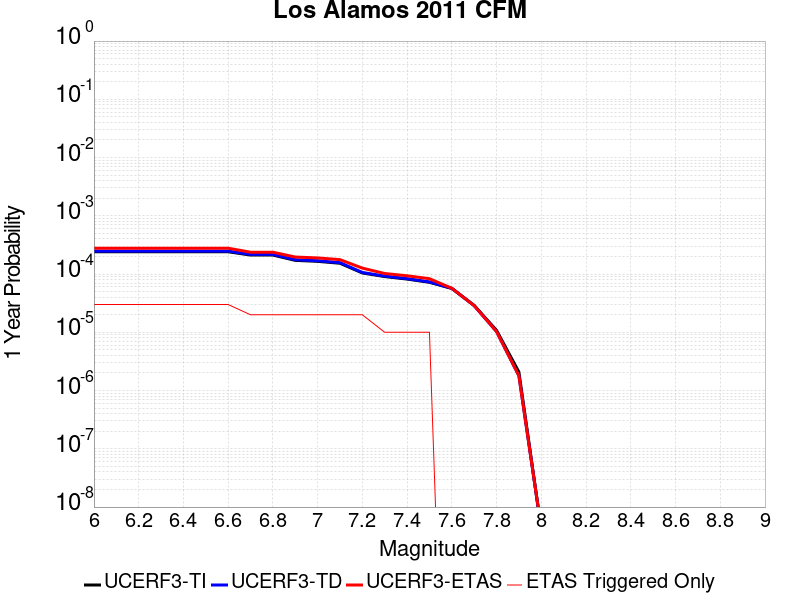 |  |

| Magnitude | 1 wk TI Prob | 1 wk TD Prob | 1 wk ETAS Prob | 1 wk ETAS/TD Gain | 1 wk ETAS Triggered Only | 1 mo TI Prob | 1 mo TD Prob | 1 mo ETAS Prob | 1 mo ETAS/TD Gain | 1 mo ETAS Triggered Only | 1 yr TI Prob | 1 yr TD Prob | 1 yr ETAS Prob | 1 yr ETAS/TD Gain | 1 yr ETAS Triggered Only | 10 yr TI Prob | 10 yr TD Prob | 10 yr ETAS Prob | 10 yr ETAS/TD Gain | 10 yr ETAS Triggered Only |
|-----|-----|-----|-----|-----|-----|-----|-----|-----|-----|-----|-----|-----|-----|-----|-----|-----|-----|-----|-----|-----|
| 6.0 | 4.6284417E-6 | 4.7517333E-6 | 2.4751638E-5 | 5.2089705 | 2.0E-5 | 1.9836029E-5 | 2.0364423E-5 | 4.0364015E-5 | 1.982085 | 2.0E-5 | 2.4147688E-4 | 2.479104E-4 | 2.7790296E-4 | 1.1209815 | 3.0E-5 | 0.0024121467 | 0.0024765125 | 0.0025164136 | 1.0161117 | 4.0E-5 |
| 6.1 | 4.6284417E-6 | 4.7517333E-6 | 2.4751638E-5 | 5.2089705 | 2.0E-5 | 1.9836029E-5 | 2.0364423E-5 | 4.0364015E-5 | 1.982085 | 2.0E-5 | 2.4147688E-4 | 2.479104E-4 | 2.7790296E-4 | 1.1209815 | 3.0E-5 | 0.0024121467 | 0.0024765125 | 0.0025164136 | 1.0161117 | 4.0E-5 |
| 6.2 | 4.6284417E-6 | 4.7517333E-6 | 2.4751638E-5 | 5.2089705 | 2.0E-5 | 1.9836029E-5 | 2.0364423E-5 | 4.0364015E-5 | 1.982085 | 2.0E-5 | 2.4147688E-4 | 2.479104E-4 | 2.7790296E-4 | 1.1209815 | 3.0E-5 | 0.0024121467 | 0.0024765125 | 0.0025164136 | 1.0161117 | 4.0E-5 |
| 6.3 | 4.6284417E-6 | 4.7517333E-6 | 2.4751638E-5 | 5.2089705 | 2.0E-5 | 1.9836029E-5 | 2.0364423E-5 | 4.0364015E-5 | 1.982085 | 2.0E-5 | 2.4147688E-4 | 2.479104E-4 | 2.7790296E-4 | 1.1209815 | 3.0E-5 | 0.0024121467 | 0.0024765125 | 0.0025164136 | 1.0161117 | 4.0E-5 |
| 6.4 | 4.6284417E-6 | 4.7517333E-6 | 2.4751638E-5 | 5.2089705 | 2.0E-5 | 1.9836029E-5 | 2.0364423E-5 | 4.0364015E-5 | 1.982085 | 2.0E-5 | 2.4147688E-4 | 2.479104E-4 | 2.7790296E-4 | 1.1209815 | 3.0E-5 | 0.0024121467 | 0.0024765125 | 0.0025164136 | 1.0161117 | 4.0E-5 |
| 6.5 | 4.6284417E-6 | 4.7517333E-6 | 2.4751638E-5 | 5.2089705 | 2.0E-5 | 1.9836029E-5 | 2.0364423E-5 | 4.0364015E-5 | 1.982085 | 2.0E-5 | 2.4147688E-4 | 2.479104E-4 | 2.7790296E-4 | 1.1209815 | 3.0E-5 | 0.0024121467 | 0.0024765125 | 0.0025164136 | 1.0161117 | 4.0E-5 |
| 6.6 | 4.6284417E-6 | 4.7517333E-6 | 2.4751638E-5 | 5.2089705 | 2.0E-5 | 1.9836029E-5 | 2.0364423E-5 | 4.0364015E-5 | 1.982085 | 2.0E-5 | 2.4147688E-4 | 2.479104E-4 | 2.7790296E-4 | 1.1209815 | 3.0E-5 | 0.0024121467 | 0.0024765125 | 0.0025164136 | 1.0161117 | 4.0E-5 |
| 6.7 | 4.062321E-6 | 4.166351E-6 | 2.4166267E-5 | 5.8003435 | 2.0E-5 | 1.7409831E-5 | 1.7855677E-5 | 3.785532E-5 | 2.120072 | 2.0E-5 | 2.1194408E-4 | 2.1737268E-4 | 2.3736834E-4 | 1.0919878 | 2.0E-5 | 0.0021174205 | 0.0021717504 | 0.0022016852 | 1.0137837 | 3.0E-5 |
| 6.8 | 4.062321E-6 | 4.166351E-6 | 2.4166267E-5 | 5.8003435 | 2.0E-5 | 1.7409831E-5 | 1.7855677E-5 | 3.785532E-5 | 2.120072 | 2.0E-5 | 2.1194408E-4 | 2.1737268E-4 | 2.3736834E-4 | 1.0919878 | 2.0E-5 | 0.0021174205 | 0.0021717504 | 0.0022016852 | 1.0137837 | 3.0E-5 |
| 6.9 | 3.2936077E-6 | 3.37296E-6 | 2.3372893E-5 | 6.92949 | 2.0E-5 | 1.4115385E-5 | 1.4455468E-5 | 3.445518E-5 | 2.3835394 | 2.0E-5 | 1.7184127E-4 | 1.7598206E-4 | 1.9597853E-4 | 1.1136279 | 2.0E-5 | 0.0017170844 | 0.0017585196 | 0.0017884668 | 1.0170298 | 3.0E-5 |
| 7.0 | 3.1687898E-6 | 3.2448177E-6 | 2.3244753E-5 | 7.1636543 | 2.0E-5 | 1.3580457E-5 | 1.3906293E-5 | 3.3906013E-5 | 2.4381778 | 2.0E-5 | 1.6532952E-4 | 1.692969E-4 | 1.892935E-4 | 1.1181157 | 2.0E-5 | 0.0016520657 | 0.0016917707 | 0.00172172 | 1.0177029 | 3.0E-5 |
| 7.1 | 2.9379228E-6 | 3.007328E-6 | 2.3007267E-5 | 7.650402 | 2.0E-5 | 1.25910365E-5 | 1.288849E-5 | 3.288823E-5 | 2.551752 | 2.0E-5 | 1.5328509E-4 | 1.5690697E-4 | 1.7690384E-4 | 1.127444 | 2.0E-5 | 0.001531794 | 0.001568051 | 0.001598004 | 1.019102 | 3.0E-5 |
| 7.2 | 2.0020686E-6 | 2.041632E-6 | 2.2041591E-5 | 10.796064 | 2.0E-5 | 8.580266E-6 | 8.749822E-6 | 2.8749648E-5 | 3.2857406 | 2.0E-5 | 1.0445973E-4 | 1.0652392E-4 | 1.2652179E-4 | 1.1877313 | 2.0E-5 | 0.0010441064 | 0.001064733 | 0.0010847118 | 1.018764 | 2.0E-5 |
| 7.3 | 1.7364243E-6 | 1.7678824E-6 | 1.1767865E-5 | 6.6564746 | 1.0E-5 | 7.441797E-6 | 7.576617E-6 | 1.7576542E-5 | 2.3198402 | 1.0E-5 | 9.0600115E-5 | 9.224144E-5 | 1.0224052E-4 | 1.1084012 | 1.0E-5 | 9.0563187E-4 | 9.2203467E-4 | 9.3202543E-4 | 1.0108355 | 1.0E-5 |
| 7.4 | 1.5718434E-6 | 1.5983198E-6 | 1.1598304E-5 | 7.25656 | 1.0E-5 | 6.7364545E-6 | 6.8499244E-6 | 1.6849855E-5 | 2.45986 | 1.0E-5 | 8.201325E-5 | 8.339467E-5 | 9.3393835E-5 | 1.1199018 | 1.0E-5 | 8.198299E-4 | 8.3363673E-4 | 8.4362837E-4 | 1.0119857 | 1.0E-5 |
| 7.5 | 1.3841119E-6 | 1.4042814E-6 | 1.1404268E-5 | 8.12107 | 1.0E-5 | 5.9318945E-6 | 6.018335E-6 | 1.6018275E-5 | 2.6615791 | 1.0E-5 | 7.221842E-5 | 7.327079E-5 | 8.327006E-5 | 1.1364701 | 1.0E-5 | 7.2194956E-4 | 7.3246926E-4 | 7.4246194E-4 | 1.0136424 | 1.0E-5 |
| 7.6 | 1.0843726E-6 | 1.0934443E-6 | 1.0934443E-6 | 1.0 | 0.0 | 4.647303E-6 | 4.6861815E-6 | 4.6861815E-6 | 1.0 | 0.0 | 5.6579443E-5 | 5.705279E-5 | 5.705279E-5 | 1.0 | 0.0 | 5.656504E-4 | 5.70384E-4 | 5.70384E-4 | 1.0 | 0.0 |
| 7.7 | 5.544814E-7 | 5.501884E-7 | 5.501884E-7 | 1.0 | 0.0 | 2.3763469E-6 | 2.3579482E-6 | 2.3579482E-6 | 1.0 | 0.0 | 2.8931638E-5 | 2.8707644E-5 | 2.8707644E-5 | 1.0 | 0.0 | 2.8927872E-4 | 2.870395E-4 | 2.870395E-4 | 1.0 | 0.0 |
| 7.8 | 2.0707465E-7 | 1.9778598E-7 | 1.9778598E-7 | 1.0 | 0.0 | 8.874625E-7 | 8.476539E-7 | 8.476539E-7 | 1.0 | 0.0 | 1.08048025E-5 | 1.0320137E-5 | 1.0320137E-5 | 1.0 | 0.0 | 1.0804277E-4 | 1.0319663E-4 | 1.0319663E-4 | 1.0 | 0.0 |
| 7.9 | 3.9821284E-8 | 3.4331528E-8 | 3.4331528E-8 | 1.0 | 0.0 | 1.7066264E-7 | 1.4713511E-7 | 1.4713511E-7 | 1.0 | 0.0 | 2.0778157E-6 | 1.7913685E-6 | 1.7913685E-6 | 1.0 | 0.0 | 2.0777963E-5 | 1.7913546E-5 | 1.7913546E-5 | 1.0 | 0.0 |
| 8.0 | 7.880441E-11 | 8.2353124E-11 | 8.2353124E-11 | 1.0 | 0.0 | 3.3773329E-10 | 3.52942E-10 | 3.52942E-10 | 1.0 | 0.0 | 4.1119033E-9 | 4.2970694E-9 | 4.2970694E-9 | 1.0 | 0.0 | 4.1119034E-8 | 4.2970694E-8 | 4.2970694E-8 | 1.0 | 0.0 |

## Great Valley 09 (Laguna Seca)
*[(top)](#table-of-contents)*

| 1 Week | 1 Month | 1 Year | 10 Year |
|-----|-----|-----|-----|
| 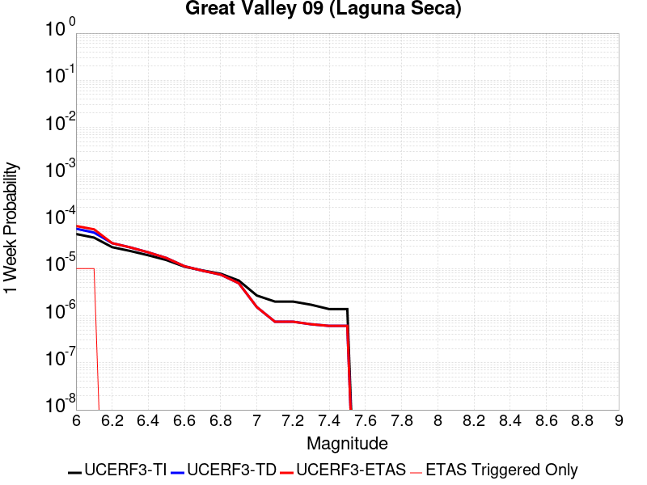 | 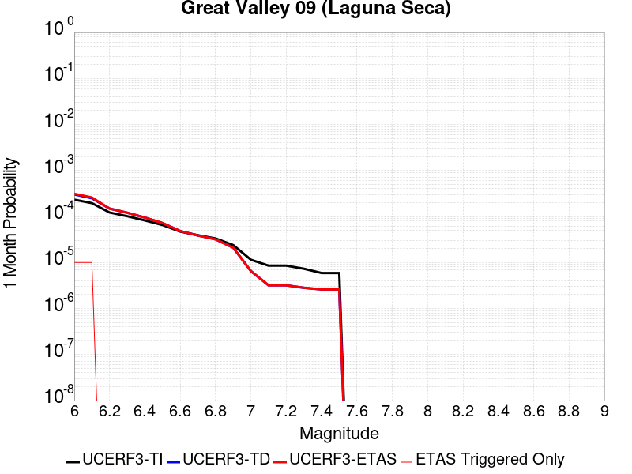 |  |  |

| Magnitude | 1 wk TI Prob | 1 wk TD Prob | 1 wk ETAS Prob | 1 wk ETAS/TD Gain | 1 wk ETAS Triggered Only | 1 mo TI Prob | 1 mo TD Prob | 1 mo ETAS Prob | 1 mo ETAS/TD Gain | 1 mo ETAS Triggered Only | 1 yr TI Prob | 1 yr TD Prob | 1 yr ETAS Prob | 1 yr ETAS/TD Gain | 1 yr ETAS Triggered Only | 10 yr TI Prob | 10 yr TD Prob | 10 yr ETAS Prob | 10 yr ETAS/TD Gain | 10 yr ETAS Triggered Only |
|-----|-----|-----|-----|-----|-----|-----|-----|-----|-----|-----|-----|-----|-----|-----|-----|-----|-----|-----|-----|-----|
| 6.0 | 5.4353277E-5 | 7.050019E-5 | 8.049948E-5 | 1.1418335 | 1.0E-5 | 2.3292181E-4 | 3.0211007E-4 | 3.1210706E-4 | 1.0330905 | 1.0E-5 | 0.0028321352 | 0.0036720056 | 0.0036919322 | 1.0054266 | 2.0E-5 | 0.02796312 | 0.036115844 | 0.0361544 | 1.0010675 | 4.0E-5 |
| 6.1 | 4.5578287E-5 | 5.822054E-5 | 6.821996E-5 | 1.1717507 | 1.0E-5 | 1.953209E-4 | 2.4949352E-4 | 2.5949103E-4 | 1.0400712 | 1.0E-5 | 0.0023754383 | 0.0030333549 | 0.0030433247 | 1.0032867 | 1.0E-5 | 0.023502063 | 0.029919893 | 0.029939294 | 1.0006485 | 2.0E-5 |
| 6.2 | 2.8536782E-5 | 3.4736422E-5 | 3.4736422E-5 | 1.0 | 0.0 | 1.2229476E-4 | 1.4886161E-4 | 1.4886161E-4 | 1.0 | 0.0 | 0.0014879217 | 0.0018108576 | 0.0018108576 | 1.0 | 0.0 | 0.014779986 | 0.017958276 | 0.017968098 | 1.0005468 | 1.0E-5 |
| 6.3 | 2.3698774E-5 | 2.8213344E-5 | 2.8213344E-5 | 1.0 | 0.0 | 1.01562226E-4 | 1.2090833E-4 | 1.2090833E-4 | 1.0 | 0.0 | 0.0012358186 | 0.001471051 | 0.001471051 | 1.0 | 0.0 | 0.012289686 | 0.014611455 | 0.014621308 | 1.0006744 | 1.0E-5 |
| 6.4 | 1.9191197E-5 | 2.212289E-5 | 2.212289E-5 | 1.0 | 0.0 | 8.2245395E-5 | 9.4808805E-5 | 9.4808805E-5 | 1.0 | 0.0 | 0.0010008777 | 0.0011536906 | 0.0011536906 | 1.0 | 0.0 | 0.009963818 | 0.011477022 | 0.0114869075 | 1.0008613 | 1.0E-5 |
| 6.5 | 1.5203241E-5 | 1.6801298E-5 | 1.6801298E-5 | 1.0 | 0.0 | 6.5155116E-5 | 7.200338E-5 | 7.200338E-5 | 1.0 | 0.0 | 7.9297484E-4 | 8.76301E-4 | 8.76301E-4 | 1.0 | 0.0 | 0.007901512 | 0.008729581 | 0.008739494 | 1.0011356 | 1.0E-5 |
| 6.6 | 1.0984925E-5 | 1.12425605E-5 | 1.12425605E-5 | 1.0 | 0.0 | 4.70774E-5 | 4.8181533E-5 | 4.8181533E-5 | 1.0 | 0.0 | 5.730166E-4 | 5.8645604E-4 | 5.8645604E-4 | 1.0 | 0.0 | 0.005715413 | 0.0058494755 | 0.0058494755 | 1.0 | 0.0 |
| 6.7 | 9.134616E-6 | 9.019868E-6 | 9.019868E-6 | 1.0 | 0.0 | 3.9147766E-5 | 3.865602E-5 | 3.865602E-5 | 1.0 | 0.0 | 4.7651984E-4 | 4.7053778E-4 | 4.7053778E-4 | 1.0 | 0.0 | 0.004754993 | 0.00469566 | 0.00469566 | 1.0 | 0.0 |
| 6.8 | 7.785589E-6 | 7.4519185E-6 | 7.4519185E-6 | 1.0 | 0.0 | 3.3366385E-5 | 3.1936415E-5 | 3.1936415E-5 | 1.0 | 0.0 | 4.0616E-4 | 3.887585E-4 | 3.887585E-4 | 1.0 | 0.0 | 0.0040541845 | 0.003880988 | 0.003880988 | 1.0 | 0.0 |
| 6.9 | 5.579095E-6 | 4.8984666E-6 | 4.8984666E-6 | 1.0 | 0.0 | 2.3910188E-5 | 2.0993268E-5 | 2.0993268E-5 | 1.0 | 0.0 | 2.9106764E-4 | 2.5556443E-4 | 2.5556443E-4 | 1.0 | 0.0 | 0.002906867 | 0.0025528427 | 0.0025528427 | 1.0 | 0.0 |
| 7.0 | 2.6816688E-6 | 1.521587E-6 | 1.521587E-6 | 1.0 | 0.0 | 1.1492816E-5 | 6.521071E-6 | 6.521071E-6 | 1.0 | 0.0 | 1.3991605E-4 | 7.939124E-5 | 7.939124E-5 | 1.0 | 0.0 | 0.0013982799 | 7.936375E-4 | 7.936375E-4 | 1.0 | 0.0 |
| 7.1 | 1.9951021E-6 | 7.45357E-7 | 7.45357E-7 | 1.0 | 0.0 | 8.55041E-6 | 3.1943835E-6 | 3.1943835E-6 | 1.0 | 0.0 | 1.0409627E-4 | 3.889097E-5 | 3.889097E-5 | 1.0 | 0.0 | 0.0010404752 | 3.8884574E-4 | 3.8884574E-4 | 1.0 | 0.0 |
| 7.2 | 1.9951021E-6 | 7.45357E-7 | 7.45357E-7 | 1.0 | 0.0 | 8.55041E-6 | 3.1943835E-6 | 3.1943835E-6 | 1.0 | 0.0 | 1.0409627E-4 | 3.889097E-5 | 3.889097E-5 | 1.0 | 0.0 | 0.0010404752 | 3.8884574E-4 | 3.8884574E-4 | 1.0 | 0.0 |
| 7.3 | 1.7087556E-6 | 6.578663E-7 | 6.578663E-7 | 1.0 | 0.0 | 7.3232177E-6 | 2.819424E-6 | 2.819424E-6 | 1.0 | 0.0 | 8.915652E-5 | 3.432599E-5 | 3.432599E-5 | 1.0 | 0.0 | 8.9120766E-4 | 3.432109E-4 | 3.432109E-4 | 1.0 | 0.0 |
| 7.4 | 1.3804846E-6 | 6.0737113E-7 | 6.0737113E-7 | 1.0 | 0.0 | 5.916349E-6 | 2.6030168E-6 | 2.6030168E-6 | 1.0 | 0.0 | 7.2029165E-5 | 3.169131E-5 | 3.169131E-5 | 1.0 | 0.0 | 7.200583E-4 | 3.168719E-4 | 3.168719E-4 | 1.0 | 0.0 |
| 7.5 | 1.3804846E-6 | 6.0737113E-7 | 6.0737113E-7 | 1.0 | 0.0 | 5.916349E-6 | 2.6030168E-6 | 2.6030168E-6 | 1.0 | 0.0 | 7.2029165E-5 | 3.169131E-5 | 3.169131E-5 | 1.0 | 0.0 | 7.200583E-4 | 3.168719E-4 | 3.168719E-4 | 1.0 | 0.0 |

## Elsinore (Temecula) rev
*[(top)](#table-of-contents)*

| 1 Week | 1 Month | 1 Year | 10 Year |
|-----|-----|-----|-----|
|  |  | 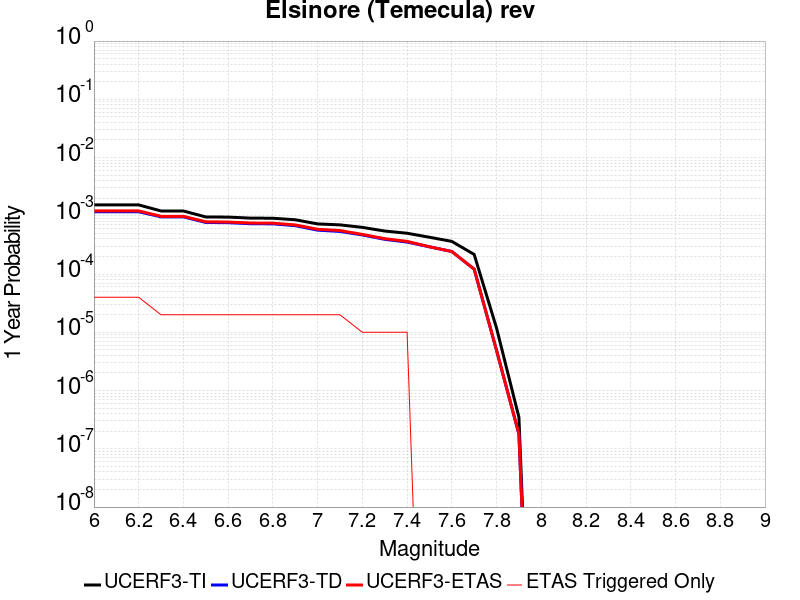 | 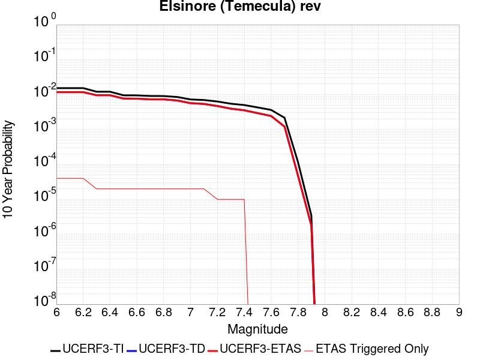 |

| Magnitude | 1 wk TI Prob | 1 wk TD Prob | 1 wk ETAS Prob | 1 wk ETAS/TD Gain | 1 wk ETAS Triggered Only | 1 mo TI Prob | 1 mo TD Prob | 1 mo ETAS Prob | 1 mo ETAS/TD Gain | 1 mo ETAS Triggered Only | 1 yr TI Prob | 1 yr TD Prob | 1 yr ETAS Prob | 1 yr ETAS/TD Gain | 1 yr ETAS Triggered Only | 10 yr TI Prob | 10 yr TD Prob | 10 yr ETAS Prob | 10 yr ETAS/TD Gain | 10 yr ETAS Triggered Only |
|-----|-----|-----|-----|-----|-----|-----|-----|-----|-----|-----|-----|-----|-----|-----|-----|-----|-----|-----|-----|-----|
| 6.0 | 2.9514995E-5 | 2.251887E-5 | 5.2518197E-5 | 2.332186 | 3.0E-5 | 1.264867E-4 | 9.6505995E-5 | 1.265031E-4 | 1.3108315 | 3.0E-5 | 0.0015388876 | 0.0011743492 | 0.0012143023 | 1.0340214 | 4.0E-5 | 0.015282745 | 0.011688135 | 0.011727667 | 1.0033823 | 4.0E-5 |
| 6.1 | 2.9514995E-5 | 2.251887E-5 | 5.2518197E-5 | 2.332186 | 3.0E-5 | 1.264867E-4 | 9.6505995E-5 | 1.265031E-4 | 1.3108315 | 3.0E-5 | 0.0015388876 | 0.0011743492 | 0.0012143023 | 1.0340214 | 4.0E-5 | 0.015282745 | 0.011688135 | 0.011727667 | 1.0033823 | 4.0E-5 |
| 6.2 | 2.9514995E-5 | 2.251887E-5 | 5.2518197E-5 | 2.332186 | 3.0E-5 | 1.264867E-4 | 9.6505995E-5 | 1.265031E-4 | 1.3108315 | 3.0E-5 | 0.0015388876 | 0.0011743492 | 0.0012143023 | 1.0340214 | 4.0E-5 | 0.015282745 | 0.011688135 | 0.011727667 | 1.0033823 | 4.0E-5 |
| 6.3 | 2.3223649E-5 | 1.840822E-5 | 2.8408034E-5 | 1.5432256 | 1.0E-5 | 9.952613E-5 | 7.889008E-5 | 8.888929E-5 | 1.1267487 | 1.0E-5 | 0.001211057 | 9.600807E-4 | 9.800615E-4 | 1.0208116 | 2.0E-5 | 0.012044783 | 0.009551284 | 0.009571092 | 1.002074 | 2.0E-5 |
| 6.4 | 2.3223649E-5 | 1.840822E-5 | 2.8408034E-5 | 1.5432256 | 1.0E-5 | 9.952613E-5 | 7.889008E-5 | 8.888929E-5 | 1.1267487 | 1.0E-5 | 0.001211057 | 9.600807E-4 | 9.800615E-4 | 1.0208116 | 2.0E-5 | 0.012044783 | 0.009551284 | 0.009571092 | 1.002074 | 2.0E-5 |
| 6.5 | 1.8338875E-5 | 1.4750074E-5 | 2.4749927E-5 | 1.6779526 | 1.0E-5 | 7.8592806E-5 | 6.321312E-5 | 7.321249E-5 | 1.158185 | 1.0E-5 | 9.5644733E-4 | 7.6935673E-4 | 7.8934134E-4 | 1.0259757 | 2.0E-5 | 0.009523412 | 0.0076699676 | 0.007689814 | 1.0025876 | 2.0E-5 |
| 6.6 | 1.8223333E-5 | 1.461263E-5 | 2.4612484E-5 | 1.6843295 | 1.0E-5 | 7.809766E-5 | 6.26241E-5 | 7.262348E-5 | 1.159673 | 1.0E-5 | 9.504242E-4 | 7.621905E-4 | 7.821753E-4 | 1.0262202 | 2.0E-5 | 0.009463696 | 0.007598796 | 0.0076186443 | 1.002612 | 2.0E-5 |
| 6.7 | 1.7512752E-5 | 1.4026963E-5 | 2.4026822E-5 | 1.7129027 | 1.0E-5 | 7.505249E-5 | 6.0114216E-5 | 7.0113616E-5 | 1.16634 | 1.0E-5 | 9.13381E-4 | 7.316534E-4 | 7.516388E-4 | 1.0273154 | 2.0E-5 | 0.00909636 | 0.0072983317 | 0.0073181856 | 1.0027204 | 2.0E-5 |
| 6.8 | 1.7417142E-5 | 1.395093E-5 | 2.395079E-5 | 1.716788 | 1.0E-5 | 7.4642754E-5 | 5.978838E-5 | 6.9787784E-5 | 1.1672466 | 1.0E-5 | 9.083966E-4 | 7.27689E-4 | 7.4767444E-4 | 1.0274643 | 2.0E-5 | 0.009046922 | 0.007259359 | 0.007279214 | 1.002735 | 2.0E-5 |
| 6.9 | 1.6402591E-5 | 1.29883665E-5 | 2.2988237E-5 | 1.7699097 | 1.0E-5 | 7.0294926E-5 | 5.5663284E-5 | 6.566273E-5 | 1.1796416 | 1.0E-5 | 8.5550465E-4 | 6.774974E-4 | 6.974839E-4 | 1.0295004 | 2.0E-5 | 0.008522186 | 0.0067598647 | 0.0067797294 | 1.0029386 | 2.0E-5 |
| 7.0 | 1.3912486E-5 | 1.0878067E-5 | 2.0877958E-5 | 1.919271 | 1.0E-5 | 5.9623577E-5 | 4.661947E-5 | 5.6619003E-5 | 1.2144927 | 1.0E-5 | 7.2567526E-4 | 5.674469E-4 | 5.874356E-4 | 1.0352256 | 2.0E-5 | 0.0072331014 | 0.0056635314 | 0.0056834184 | 1.0035113 | 2.0E-5 |
| 7.1 | 1.3405147E-5 | 1.0327192E-5 | 2.0327088E-5 | 1.9683074 | 1.0E-5 | 5.7449364E-5 | 4.4258657E-5 | 5.4258217E-5 | 1.2259345 | 1.0E-5 | 6.9922156E-4 | 5.3871854E-4 | 5.5870775E-4 | 1.0371051 | 2.0E-5 | 0.0069702556 | 0.005377366 | 0.005397259 | 1.0036993 | 2.0E-5 |
| 7.2 | 1.21402E-5 | 8.996479E-6 | 8.996479E-6 | 1.0 | 0.0 | 5.202839E-5 | 3.8555776E-5 | 3.8555776E-5 | 1.0 | 0.0 | 6.332616E-4 | 4.6931725E-4 | 4.7931256E-4 | 1.0212976 | 1.0E-5 | 0.0063146 | 0.0046847262 | 0.0046946793 | 1.0021245 | 1.0E-5 |
| 7.3 | 1.05047775E-5 | 7.571515E-6 | 7.571515E-6 | 1.0 | 0.0 | 4.5019697E-5 | 3.2448956E-5 | 3.2448956E-5 | 1.0 | 0.0 | 5.4797693E-4 | 3.9499588E-4 | 4.0499194E-4 | 1.0253067 | 1.0E-5 | 0.005466277 | 0.003943348 | 0.0039533083 | 1.0025259 | 1.0E-5 |
| 7.4 | 9.624483E-6 | 6.786621E-6 | 6.786621E-6 | 1.0 | 0.0 | 4.124713E-5 | 2.90852E-5 | 2.90852E-5 | 1.0 | 0.0 | 5.0206814E-4 | 3.5405616E-4 | 3.6405263E-4 | 1.0282341 | 1.0E-5 | 0.005009353 | 0.0035350726 | 0.0035450372 | 1.0028188 | 1.0E-5 |
| 7.5 | 8.215151E-6 | 5.6353133E-6 | 5.6353133E-6 | 1.0 | 0.0 | 3.5207315E-5 | 2.4151126E-5 | 2.4151126E-5 | 1.0 | 0.0 | 4.2856473E-4 | 2.9400157E-4 | 2.9400157E-4 | 1.0 | 0.0 | 0.004277392 | 0.002936254 | 0.002936254 | 1.0 | 0.0 |
| 7.6 | 6.975058E-6 | 4.675836E-6 | 4.675836E-6 | 1.0 | 0.0 | 2.9892764E-5 | 2.003915E-5 | 2.003915E-5 | 1.0 | 0.0 | 3.6388362E-4 | 2.439505E-4 | 2.439505E-4 | 1.0 | 0.0 | 0.0036328835 | 0.0024369434 | 0.0024369434 | 1.0 | 0.0 |
| 7.7 | 4.159604E-6 | 2.326789E-6 | 2.326789E-6 | 1.0 | 0.0 | 1.7826753E-5 | 9.971919E-6 | 9.971919E-6 | 1.0 | 0.0 | 2.1701909E-4 | 1.2140209E-4 | 1.2140209E-4 | 1.0 | 0.0 | 0.0021680726 | 0.0012134308 | 0.0012134308 | 1.0 | 0.0 |
| 7.8 | 2.2692414E-7 | 9.384417E-8 | 9.384417E-8 | 1.0 | 0.0 | 9.725317E-7 | 4.0218927E-7 | 4.0218927E-7 | 1.0 | 0.0 | 1.1840509E-5 | 4.8966467E-6 | 4.8966467E-6 | 1.0 | 0.0 | 1.1839878E-4 | 4.8965718E-5 | 4.8965718E-5 | 1.0 | 0.0 |
| 7.9 | 6.676829E-9 | 3.4397174E-9 | 3.4397174E-9 | 1.0 | 0.0 | 2.861498E-8 | 1.4741646E-8 | 1.4741646E-8 | 1.0 | 0.0 | 3.4838732E-7 | 1.7947953E-7 | 1.7947953E-7 | 1.0 | 0.0 | 3.4838679E-6 | 1.794794E-6 | 1.794794E-6 | 1.0 | 0.0 |

## Raymond
*[(top)](#table-of-contents)*

| 1 Week | 1 Month | 1 Year | 10 Year |
|-----|-----|-----|-----|
|  |  | 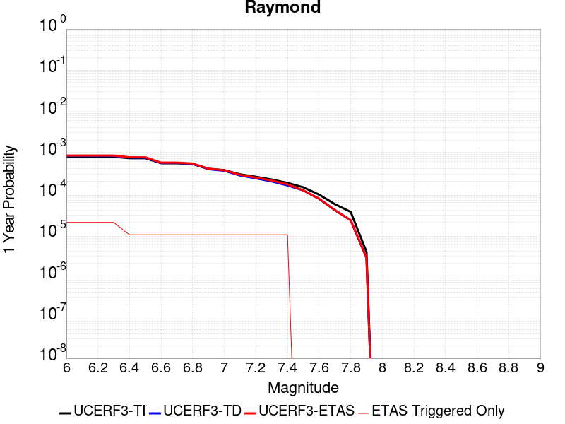 |  |

| Magnitude | 1 wk TI Prob | 1 wk TD Prob | 1 wk ETAS Prob | 1 wk ETAS/TD Gain | 1 wk ETAS Triggered Only | 1 mo TI Prob | 1 mo TD Prob | 1 mo ETAS Prob | 1 mo ETAS/TD Gain | 1 mo ETAS Triggered Only | 1 yr TI Prob | 1 yr TD Prob | 1 yr ETAS Prob | 1 yr ETAS/TD Gain | 1 yr ETAS Triggered Only | 10 yr TI Prob | 10 yr TD Prob | 10 yr ETAS Prob | 10 yr ETAS/TD Gain | 10 yr ETAS Triggered Only |
|-----|-----|-----|-----|-----|-----|-----|-----|-----|-----|-----|-----|-----|-----|-----|-----|-----|-----|-----|-----|-----|
| 6.0 | 1.5157413E-5 | 1.5810125E-5 | 1.5810125E-5 | 1.0 | 0.0 | 6.4958724E-5 | 6.775606E-5 | 6.775606E-5 | 1.0 | 0.0 | 7.905855E-4 | 8.246429E-4 | 8.446264E-4 | 1.0242329 | 2.0E-5 | 0.007877788 | 0.008218355 | 0.008258026 | 1.0048271 | 4.0E-5 |
| 6.1 | 1.5157413E-5 | 1.5810125E-5 | 1.5810125E-5 | 1.0 | 0.0 | 6.4958724E-5 | 6.775606E-5 | 6.775606E-5 | 1.0 | 0.0 | 7.905855E-4 | 8.246429E-4 | 8.446264E-4 | 1.0242329 | 2.0E-5 | 0.007877788 | 0.008218355 | 0.008258026 | 1.0048271 | 4.0E-5 |
| 6.2 | 1.5157413E-5 | 1.5810125E-5 | 1.5810125E-5 | 1.0 | 0.0 | 6.4958724E-5 | 6.775606E-5 | 6.775606E-5 | 1.0 | 0.0 | 7.905855E-4 | 8.246429E-4 | 8.446264E-4 | 1.0242329 | 2.0E-5 | 0.007877788 | 0.008218355 | 0.008258026 | 1.0048271 | 4.0E-5 |
| 6.3 | 1.5157413E-5 | 1.5810125E-5 | 1.5810125E-5 | 1.0 | 0.0 | 6.4958724E-5 | 6.775606E-5 | 6.775606E-5 | 1.0 | 0.0 | 7.905855E-4 | 8.246429E-4 | 8.446264E-4 | 1.0242329 | 2.0E-5 | 0.007877788 | 0.008218355 | 0.008258026 | 1.0048271 | 4.0E-5 |
| 6.4 | 1.3941944E-5 | 1.4454688E-5 | 1.4454688E-5 | 1.0 | 0.0 | 5.9749822E-5 | 6.194732E-5 | 6.194732E-5 | 1.0 | 0.0 | 7.2721124E-4 | 7.53971E-4 | 7.6396344E-4 | 1.0132531 | 1.0E-5 | 0.007248361 | 0.007516471 | 0.0075462456 | 1.0039612 | 3.0E-5 |
| 6.5 | 1.3941944E-5 | 1.4454688E-5 | 1.4454688E-5 | 1.0 | 0.0 | 5.9749822E-5 | 6.194732E-5 | 6.194732E-5 | 1.0 | 0.0 | 7.2721124E-4 | 7.53971E-4 | 7.6396344E-4 | 1.0132531 | 1.0E-5 | 0.007248361 | 0.007516471 | 0.0075462456 | 1.0039612 | 3.0E-5 |
| 6.6 | 1.0542609E-5 | 1.067111E-5 | 1.067111E-5 | 1.0 | 0.0 | 4.5181827E-5 | 4.573256E-5 | 4.573256E-5 | 1.0 | 0.0 | 5.499499E-4 | 5.566571E-4 | 5.666515E-4 | 1.0179543 | 1.0E-5 | 0.005485909 | 0.0055531966 | 0.0055730855 | 1.0035815 | 2.0E-5 |
| 6.7 | 1.0542609E-5 | 1.067111E-5 | 1.067111E-5 | 1.0 | 0.0 | 4.5181827E-5 | 4.573256E-5 | 4.573256E-5 | 1.0 | 0.0 | 5.499499E-4 | 5.566571E-4 | 5.666515E-4 | 1.0179543 | 1.0E-5 | 0.005485909 | 0.0055531966 | 0.0055730855 | 1.0035815 | 2.0E-5 |
| 6.8 | 1.0079132E-5 | 1.0176644E-5 | 1.0176644E-5 | 1.0 | 0.0 | 4.3195567E-5 | 4.3613487E-5 | 4.3613487E-5 | 1.0 | 0.0 | 5.257791E-4 | 5.308702E-4 | 5.408649E-4 | 1.018827 | 1.0E-5 | 0.0052453685 | 0.0052965777 | 0.0053164717 | 1.003756 | 2.0E-5 |
| 6.9 | 7.721598E-6 | 7.548902E-6 | 7.548902E-6 | 1.0 | 0.0 | 3.3092143E-5 | 3.2352043E-5 | 3.2352043E-5 | 1.0 | 0.0 | 4.0282236E-4 | 3.9381615E-4 | 4.038122E-4 | 1.0253825 | 1.0E-5 | 0.0040209293 | 0.003931324 | 0.0039512455 | 1.0050673 | 2.0E-5 |
| 7.0 | 7.137566E-6 | 6.911303E-6 | 6.911303E-6 | 1.0 | 0.0 | 3.058921E-5 | 2.961954E-5 | 2.961954E-5 | 1.0 | 0.0 | 3.7236E-4 | 3.605593E-4 | 3.705557E-4 | 1.0277247 | 1.0E-5 | 0.0037173668 | 0.003599869 | 0.003619797 | 1.0055357 | 2.0E-5 |
| 7.1 | 5.654976E-6 | 5.299538E-6 | 5.299538E-6 | 1.0 | 0.0 | 2.4235387E-5 | 2.2712107E-5 | 2.2712107E-5 | 1.0 | 0.0 | 2.9502588E-4 | 2.7648505E-4 | 2.8648227E-4 | 1.0361583 | 1.0E-5 | 0.0029463451 | 0.0027614492 | 0.002781394 | 1.0072225 | 2.0E-5 |
| 7.2 | 4.9358455E-6 | 4.526655E-6 | 4.526655E-6 | 1.0 | 0.0 | 2.1153453E-5 | 1.9399806E-5 | 1.9399806E-5 | 1.0 | 0.0 | 2.5751285E-4 | 2.3616718E-4 | 2.4616483E-4 | 1.0423329 | 1.0E-5 | 0.0025721465 | 0.002359192 | 0.0023791445 | 1.0084574 | 2.0E-5 |
| 7.3 | 4.2368597E-6 | 3.8056128E-6 | 3.8056128E-6 | 1.0 | 0.0 | 1.8157843E-5 | 1.6309668E-5 | 1.6309668E-5 | 1.0 | 0.0 | 2.2104931E-4 | 1.9855222E-4 | 2.0855023E-4 | 1.0503546 | 1.0E-5 | 0.0022082955 | 0.0019837746 | 0.002003735 | 1.0100617 | 2.0E-5 |
| 7.4 | 3.4999923E-6 | 3.0437407E-6 | 3.0437407E-6 | 1.0 | 0.0 | 1.49998805E-5 | 1.3044538E-5 | 1.3044538E-5 | 1.0 | 0.0 | 1.8260824E-4 | 1.5880575E-4 | 1.6880417E-4 | 1.06296 | 1.0E-5 | 0.0018245826 | 0.0015869461 | 0.0016069143 | 1.0125828 | 2.0E-5 |
| 7.5 | 2.738017E-6 | 2.3020405E-6 | 2.3020405E-6 | 1.0 | 0.0 | 1.1734306E-5 | 9.865851E-6 | 9.865851E-6 | 1.0 | 0.0 | 1.428558E-4 | 1.20110184E-4 | 1.20110184E-4 | 1.0 | 0.0 | 0.0014276401 | 0.0012004747 | 0.0012104627 | 1.0083201 | 1.0E-5 |
| 7.6 | 1.8186392E-6 | 1.442302E-6 | 1.442302E-6 | 1.0 | 0.0 | 7.794145E-6 | 6.1812802E-6 | 6.1812802E-6 | 1.0 | 0.0 | 9.488958E-5 | 7.5254524E-5 | 7.5254524E-5 | 1.0 | 0.0 | 9.4849075E-4 | 7.5230957E-4 | 7.5230957E-4 | 1.0 | 0.0 |
| 7.7 | 1.0660348E-6 | 7.6437E-7 | 7.6437E-7 | 1.0 | 0.0 | 4.5687125E-6 | 3.2758674E-6 | 3.2758674E-6 | 1.0 | 0.0 | 5.5622655E-5 | 3.988297E-5 | 3.988297E-5 | 1.0 | 0.0 | 5.5608735E-4 | 3.9877492E-4 | 3.9877492E-4 | 1.0 | 0.0 |
| 7.8 | 6.913602E-7 | 4.3202903E-7 | 4.3202903E-7 | 1.0 | 0.0 | 2.962969E-6 | 1.8515517E-6 | 1.8515517E-6 | 1.0 | 0.0 | 3.607355E-5 | 2.2542416E-5 | 2.2542416E-5 | 1.0 | 0.0 | 3.6067693E-4 | 2.2541684E-4 | 2.2541684E-4 | 1.0 | 0.0 |
| 7.9 | 7.425201E-8 | 5.322267E-8 | 5.322267E-8 | 1.0 | 0.0 | 3.1822285E-7 | 2.2809714E-7 | 2.2809714E-7 | 1.0 | 0.0 | 3.874356E-6 | 2.7770805E-6 | 2.7770805E-6 | 1.0 | 0.0 | 3.8742884E-5 | 2.7770588E-5 | 2.7770588E-5 | 1.0 | 0.0 |

## Oak Ridge (Onshore)
*[(top)](#table-of-contents)*

| 1 Week | 1 Month | 1 Year | 10 Year |
|-----|-----|-----|-----|
|  |  |  | 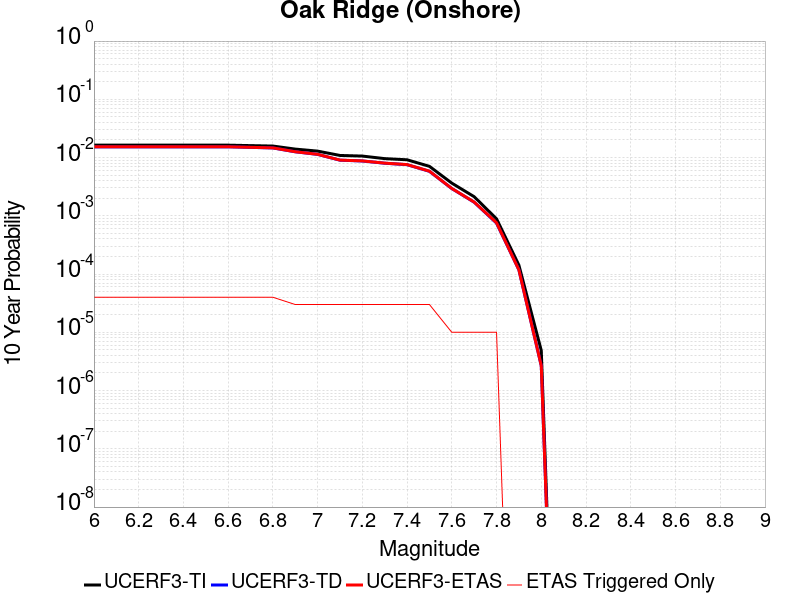 |

| Magnitude | 1 wk TI Prob | 1 wk TD Prob | 1 wk ETAS Prob | 1 wk ETAS/TD Gain | 1 wk ETAS Triggered Only | 1 mo TI Prob | 1 mo TD Prob | 1 mo ETAS Prob | 1 mo ETAS/TD Gain | 1 mo ETAS Triggered Only | 1 yr TI Prob | 1 yr TD Prob | 1 yr ETAS Prob | 1 yr ETAS/TD Gain | 1 yr ETAS Triggered Only | 10 yr TI Prob | 10 yr TD Prob | 10 yr ETAS Prob | 10 yr ETAS/TD Gain | 10 yr ETAS Triggered Only |
|-----|-----|-----|-----|-----|-----|-----|-----|-----|-----|-----|-----|-----|-----|-----|-----|-----|-----|-----|-----|-----|
| 6.0 | 3.155064E-5 | 2.9526076E-5 | 2.9526076E-5 | 1.0 | 0.0 | 1.3521002E-4 | 1.265344E-4 | 1.265344E-4 | 1.0 | 0.0 | 0.001644939 | 0.0015395058 | 0.0015395058 | 1.0 | 0.0 | 0.01632816 | 0.015293054 | 0.015332443 | 1.0025755 | 4.0E-5 |
| 6.1 | 3.155064E-5 | 2.9526076E-5 | 2.9526076E-5 | 1.0 | 0.0 | 1.3521002E-4 | 1.265344E-4 | 1.265344E-4 | 1.0 | 0.0 | 0.001644939 | 0.0015395058 | 0.0015395058 | 1.0 | 0.0 | 0.01632816 | 0.015293054 | 0.015332443 | 1.0025755 | 4.0E-5 |
| 6.2 | 3.155064E-5 | 2.9526076E-5 | 2.9526076E-5 | 1.0 | 0.0 | 1.3521002E-4 | 1.265344E-4 | 1.265344E-4 | 1.0 | 0.0 | 0.001644939 | 0.0015395058 | 0.0015395058 | 1.0 | 0.0 | 0.01632816 | 0.015293054 | 0.015332443 | 1.0025755 | 4.0E-5 |
| 6.3 | 3.155064E-5 | 2.9526076E-5 | 2.9526076E-5 | 1.0 | 0.0 | 1.3521002E-4 | 1.265344E-4 | 1.265344E-4 | 1.0 | 0.0 | 0.001644939 | 0.0015395058 | 0.0015395058 | 1.0 | 0.0 | 0.01632816 | 0.015293054 | 0.015332443 | 1.0025755 | 4.0E-5 |
| 6.4 | 3.155064E-5 | 2.9526076E-5 | 2.9526076E-5 | 1.0 | 0.0 | 1.3521002E-4 | 1.265344E-4 | 1.265344E-4 | 1.0 | 0.0 | 0.001644939 | 0.0015395058 | 0.0015395058 | 1.0 | 0.0 | 0.01632816 | 0.015293054 | 0.015332443 | 1.0025755 | 4.0E-5 |
| 6.5 | 3.155064E-5 | 2.9526076E-5 | 2.9526076E-5 | 1.0 | 0.0 | 1.3521002E-4 | 1.265344E-4 | 1.265344E-4 | 1.0 | 0.0 | 0.001644939 | 0.0015395058 | 0.0015395058 | 1.0 | 0.0 | 0.01632816 | 0.015293054 | 0.015332443 | 1.0025755 | 4.0E-5 |
| 6.6 | 3.155064E-5 | 2.9526076E-5 | 2.9526076E-5 | 1.0 | 0.0 | 1.3521002E-4 | 1.265344E-4 | 1.265344E-4 | 1.0 | 0.0 | 0.001644939 | 0.0015395058 | 0.0015395058 | 1.0 | 0.0 | 0.01632816 | 0.015293054 | 0.015332443 | 1.0025755 | 4.0E-5 |
| 6.7 | 3.098897E-5 | 2.8864279E-5 | 2.8864279E-5 | 1.0 | 0.0 | 1.328031E-4 | 1.236984E-4 | 1.236984E-4 | 1.0 | 0.0 | 0.0016156785 | 0.0015050253 | 0.0015050253 | 1.0 | 0.0 | 0.016039822 | 0.014952909 | 0.014992312 | 1.0026351 | 4.0E-5 |
| 6.8 | 3.0449872E-5 | 2.8239476E-5 | 2.8239476E-5 | 1.0 | 0.0 | 1.3049292E-4 | 1.2102092E-4 | 1.2102092E-4 | 1.0 | 0.0 | 0.0015875935 | 0.001472471 | 0.001472471 | 1.0 | 0.0 | 0.015762992 | 0.014631658 | 0.014671072 | 1.0026938 | 4.0E-5 |
| 6.9 | 2.697928E-5 | 2.4219877E-5 | 2.4219877E-5 | 1.0 | 0.0 | 1.15620365E-4 | 1.03795464E-4 | 1.03795464E-4 | 1.0 | 0.0 | 0.0014067689 | 0.0012629988 | 0.0012629988 | 1.0 | 0.0 | 0.0139789665 | 0.012561066 | 0.01259069 | 1.0023583 | 3.0E-5 |
| 7.0 | 2.4893961E-5 | 2.1862146E-5 | 2.1862146E-5 | 1.0 | 0.0 | 1.0668404E-4 | 9.369165E-5 | 9.369165E-5 | 1.0 | 0.0 | 0.0012981043 | 0.0011401166 | 0.0011401166 | 1.0 | 0.0 | 0.012905477 | 0.011345102 | 0.011374762 | 1.0026143 | 3.0E-5 |
| 7.1 | 2.0945363E-5 | 1.7354592E-5 | 1.7354592E-5 | 1.0 | 0.0 | 8.976275E-5 | 7.437473E-5 | 7.437473E-5 | 1.0 | 0.0 | 0.0010923136 | 9.0514094E-4 | 9.0514094E-4 | 1.0 | 0.0 | 0.0108696 | 0.009015621 | 0.00904535 | 1.0032976 | 3.0E-5 |
| 7.2 | 2.0439404E-5 | 1.680953E-5 | 1.680953E-5 | 1.0 | 0.0 | 8.7594504E-5 | 7.203888E-5 | 7.203888E-5 | 1.0 | 0.0 | 0.0010659413 | 8.767251E-4 | 8.767251E-4 | 1.0 | 0.0 | 0.010608427 | 0.008733723 | 0.008763461 | 1.003405 | 3.0E-5 |
| 7.3 | 1.8463334E-5 | 1.5381947E-5 | 1.5381947E-5 | 1.0 | 0.0 | 7.912617E-5 | 6.592098E-5 | 6.592098E-5 | 1.0 | 0.0 | 9.6293533E-4 | 8.0229685E-4 | 8.0229685E-4 | 1.0 | 0.0 | 0.009587734 | 0.0079950085 | 0.008024769 | 1.0037223 | 3.0E-5 |
| 7.4 | 1.763139E-5 | 1.4516977E-5 | 1.4516977E-5 | 1.0 | 0.0 | 7.556091E-5 | 6.221415E-5 | 6.221415E-5 | 1.0 | 0.0 | 9.1956573E-4 | 7.57198E-4 | 7.57198E-4 | 1.0 | 0.0 | 0.009157699 | 0.007547126 | 0.0075768996 | 1.003945 | 3.0E-5 |
| 7.5 | 1.3594944E-5 | 1.1163363E-5 | 1.1163363E-5 | 1.0 | 0.0 | 5.8262744E-5 | 4.7842117E-5 | 4.7842117E-5 | 1.0 | 0.0 | 7.0911803E-4 | 5.8232463E-4 | 5.8232463E-4 | 1.0 | 0.0 | 0.007068595 | 0.005808362 | 0.0058381874 | 1.0051349 | 3.0E-5 |
| 7.6 | 6.9889534E-6 | 5.6367194E-6 | 5.6367194E-6 | 1.0 | 0.0 | 2.9952313E-5 | 2.4157147E-5 | 2.4157147E-5 | 1.0 | 0.0 | 3.646084E-4 | 2.94074E-4 | 2.94074E-4 | 1.0 | 0.0 | 0.0036401073 | 0.0029368924 | 0.0029468632 | 1.003395 | 1.0E-5 |
| 7.7 | 4.0824193E-6 | 3.2832731E-6 | 3.2832731E-6 | 1.0 | 0.0 | 1.7495966E-5 | 1.4071096E-5 | 1.4071096E-5 | 1.0 | 0.0 | 2.1299256E-4 | 1.7130225E-4 | 1.7130225E-4 | 1.0 | 0.0 | 0.0021278851 | 0.0017117155 | 0.0017216984 | 1.0058321 | 1.0E-5 |
| 7.8 | 1.7023609E-6 | 1.43706E-6 | 1.43706E-6 | 1.0 | 0.0 | 7.295812E-6 | 6.158814E-6 | 6.158814E-6 | 1.0 | 0.0 | 8.882289E-5 | 7.4981006E-5 | 7.4981006E-5 | 1.0 | 0.0 | 8.8787393E-4 | 7.4955984E-4 | 7.5955235E-4 | 1.0133312 | 1.0E-5 |
| 7.9 | 2.721225E-7 | 2.261692E-7 | 2.261692E-7 | 1.0 | 0.0 | 1.1662388E-6 | 9.692963E-7 | 9.692963E-7 | 1.0 | 0.0 | 1.4198865E-5 | 1.1801121E-5 | 1.1801121E-5 | 1.0 | 0.0 | 1.4197957E-4 | 1.1800523E-4 | 1.1800523E-4 | 1.0 | 0.0 |
| 8.0 | 9.364255E-9 | 5.1204916E-9 | 5.1204916E-9 | 1.0 | 0.0 | 4.0132523E-8 | 2.1944963E-8 | 2.1944963E-8 | 1.0 | 0.0 | 4.8861335E-7 | 2.671799E-7 | 2.671799E-7 | 1.0 | 0.0 | 4.8861225E-6 | 2.6717962E-6 | 2.6717962E-6 | 1.0 | 0.0 |

## Hayward (So) 2011 CFM
*[(top)](#table-of-contents)*

| 1 Week | 1 Month | 1 Year | 10 Year |
|-----|-----|-----|-----|
| 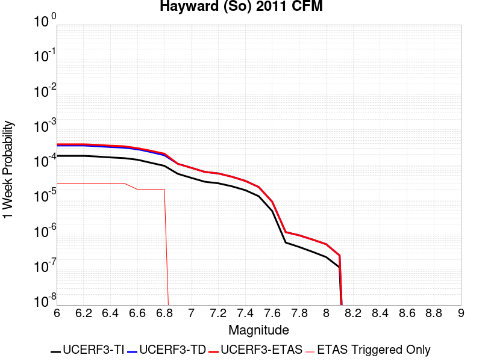 | 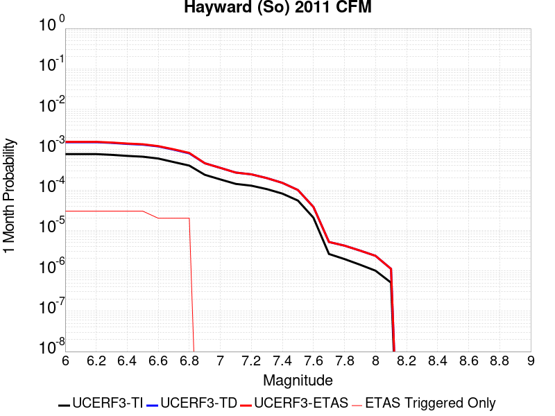 | 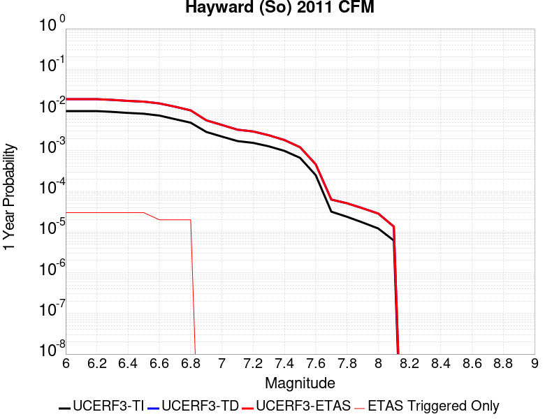 |  |

| Magnitude | 1 wk TI Prob | 1 wk TD Prob | 1 wk ETAS Prob | 1 wk ETAS/TD Gain | 1 wk ETAS Triggered Only | 1 mo TI Prob | 1 mo TD Prob | 1 mo ETAS Prob | 1 mo ETAS/TD Gain | 1 mo ETAS Triggered Only | 1 yr TI Prob | 1 yr TD Prob | 1 yr ETAS Prob | 1 yr ETAS/TD Gain | 1 yr ETAS Triggered Only | 10 yr TI Prob | 10 yr TD Prob | 10 yr ETAS Prob | 10 yr ETAS/TD Gain | 10 yr ETAS Triggered Only |
|-----|-----|-----|-----|-----|-----|-----|-----|-----|-----|-----|-----|-----|-----|-----|-----|-----|-----|-----|-----|-----|
| 6.0 | 1.8091932E-4 | 3.570673E-4 | 3.8705659E-4 | 1.0839878 | 3.0E-5 | 7.751381E-4 | 0.0015294008 | 0.001559355 | 1.0195855 | 3.0E-5 | 0.00939654 | 0.018463885 | 0.01849333 | 1.0015948 | 3.0E-5 | 0.090090066 | 0.1667085 | 0.16674182 | 1.0001999 | 4.0E-5 |
| 6.1 | 1.8091932E-4 | 3.570673E-4 | 3.8705659E-4 | 1.0839878 | 3.0E-5 | 7.751381E-4 | 0.0015294008 | 0.001559355 | 1.0195855 | 3.0E-5 | 0.00939654 | 0.018463885 | 0.01849333 | 1.0015948 | 3.0E-5 | 0.090090066 | 0.1667085 | 0.16674182 | 1.0001999 | 4.0E-5 |
| 6.2 | 1.8091932E-4 | 3.570673E-4 | 3.8705659E-4 | 1.0839878 | 3.0E-5 | 7.751381E-4 | 0.0015294008 | 0.001559355 | 1.0195855 | 3.0E-5 | 0.00939654 | 0.018463885 | 0.01849333 | 1.0015948 | 3.0E-5 | 0.090090066 | 0.1667085 | 0.16674182 | 1.0001999 | 4.0E-5 |
| 6.3 | 1.7322872E-4 | 3.4263515E-4 | 3.7262487E-4 | 1.0875267 | 3.0E-5 | 7.4219756E-4 | 0.0014676197 | 0.0014975755 | 1.0204113 | 3.0E-5 | 0.0089988755 | 0.017724147 | 0.017753616 | 1.0016626 | 3.0E-5 | 0.08643075 | 0.16065954 | 0.16069311 | 1.000209 | 4.0E-5 |
| 6.4 | 1.6334097E-4 | 3.2345165E-4 | 3.5344195E-4 | 1.0927196 | 3.0E-5 | 6.998449E-4 | 0.0013854936 | 0.001415452 | 1.0216229 | 3.0E-5 | 0.008487372 | 0.016739927 | 0.016769424 | 1.0017622 | 3.0E-5 | 0.081704415 | 0.15256606 | 0.15259995 | 1.0002222 | 4.0E-5 |
| 6.5 | 1.5600289E-4 | 3.101982E-4 | 3.4018888E-4 | 1.0966823 | 3.0E-5 | 6.684125E-4 | 0.0013287518 | 0.001358712 | 1.0225476 | 3.0E-5 | 0.008107598 | 0.016059443 | 0.016088963 | 1.0018381 | 3.0E-5 | 0.078181036 | 0.14684291 | 0.1468685 | 1.0001743 | 3.0E-5 |
| 6.6 | 1.4046066E-4 | 2.8034003E-4 | 3.0033445E-4 | 1.071322 | 2.0E-5 | 6.018354E-4 | 0.0012009109 | 0.0012208868 | 1.016634 | 2.0E-5 | 0.0073027555 | 0.014524571 | 0.01454428 | 1.001357 | 2.0E-5 | 0.07067384 | 0.13393044 | 0.13394777 | 1.0001293 | 2.0E-5 |
| 6.7 | 1.14696966E-4 | 2.3272466E-4 | 2.5272E-4 | 1.0859184 | 2.0E-5 | 4.914658E-4 | 9.970153E-4 | 0.0010169953 | 1.0200399 | 2.0E-5 | 0.0059671924 | 0.012072163 | 0.012091922 | 1.0016367 | 2.0E-5 | 0.058094822 | 0.11274141 | 0.11275916 | 1.0001574 | 2.0E-5 |
| 6.8 | 9.3874296E-5 | 1.8862431E-4 | 2.0862053E-4 | 1.1060109 | 2.0E-5 | 4.0225635E-4 | 8.081431E-4 | 8.2812697E-4 | 1.0247281 | 2.0E-5 | 0.0048864787 | 0.009795489 | 0.009815293 | 1.0020218 | 2.0E-5 | 0.047804173 | 0.092592984 | 0.092611134 | 1.000196 | 2.0E-5 |
| 6.9 | 5.551852E-5 | 1.0729875E-4 | 1.0729875E-4 | 1.0 | 0.0 | 2.3791482E-4 | 4.5977137E-4 | 4.5977137E-4 | 1.0 | 0.0 | 0.0028927654 | 0.005583468 | 0.005583468 | 1.0 | 0.0 | 0.028553981 | 0.054246075 | 0.054246075 | 1.0 | 0.0 |
| 7.0 | 4.2662363E-5 | 8.246792E-5 | 8.246792E-5 | 1.0 | 0.0 | 1.8282588E-4 | 3.5338648E-4 | 3.5338648E-4 | 1.0 | 0.0 | 0.0022236328 | 0.0042940658 | 0.0042940658 | 1.0 | 0.0 | 0.022015138 | 0.04206509 | 0.04206509 | 1.0 | 0.0 |
| 7.1 | 3.305886E-5 | 6.302183E-5 | 6.302183E-5 | 1.0 | 0.0 | 1.4167312E-4 | 2.7006568E-4 | 2.7006568E-4 | 1.0 | 0.0 | 0.0017235056 | 0.003283111 | 0.003283111 | 1.0 | 0.0 | 0.017101998 | 0.032453902 | 0.032453902 | 1.0 | 0.0 |
| 7.2 | 2.9856887E-5 | 5.701622E-5 | 5.701622E-5 | 1.0 | 0.0 | 1.2795182E-4 | 2.4433242E-4 | 2.4433242E-4 | 1.0 | 0.0 | 0.0015567001 | 0.0029707062 | 0.0029707062 | 1.0 | 0.0 | 0.015458403 | 0.029454801 | 0.029454801 | 1.0 | 0.0 |
| 7.3 | 2.4559737E-5 | 4.599286E-5 | 4.599286E-5 | 1.0 | 0.0 | 1.0525176E-4 | 1.9709744E-4 | 1.9709744E-4 | 1.0 | 0.0 | 0.0012806869 | 0.0023970334 | 0.0023970334 | 1.0 | 0.0 | 0.012733313 | 0.023858516 | 0.023858516 | 1.0 | 0.0 |
| 7.4 | 1.9002231E-5 | 3.505084E-5 | 3.505084E-5 | 1.0 | 0.0 | 8.143559E-5 | 1.502093E-4 | 1.502093E-4 | 1.0 | 0.0 | 9.910273E-4 | 0.001827274 | 0.001827274 | 1.0 | 0.0 | 0.009866194 | 0.018258808 | 0.018258808 | 1.0 | 0.0 |
| 7.5 | 1.2783333E-5 | 2.3331182E-5 | 2.3331182E-5 | 1.0 | 0.0 | 5.4784563E-5 | 9.998698E-5 | 9.998698E-5 | 1.0 | 0.0 | 6.667979E-4 | 0.0012166675 | 0.0012166675 | 1.0 | 0.0 | 0.006648007 | 0.012209443 | 0.012209443 | 1.0 | 0.0 |
| 7.6 | 4.8149627E-6 | 8.888056E-6 | 8.888056E-6 | 1.0 | 0.0 | 2.063539E-5 | 3.8091122E-5 | 3.8091122E-5 | 1.0 | 0.0 | 2.5120692E-4 | 4.6366194E-4 | 4.6366194E-4 | 1.0 | 0.0 | 0.0025092314 | 0.0046805087 | 0.0046805087 | 1.0 | 0.0 |
| 7.7 | 6.0838227E-7 | 1.205754E-6 | 1.205754E-6 | 1.0 | 0.0 | 2.6073499E-6 | 5.1675065E-6 | 5.1675065E-6 | 1.0 | 0.0 | 3.174402E-5 | 6.291258E-5 | 6.291258E-5 | 1.0 | 0.0 | 3.1739488E-4 | 6.5296254E-4 | 6.5296254E-4 | 1.0 | 0.0 |
| 7.8 | 4.5542808E-7 | 9.792941E-7 | 9.792941E-7 | 1.0 | 0.0 | 1.9518332E-6 | 4.196968E-6 | 4.196968E-6 | 1.0 | 0.0 | 2.376331E-5 | 5.109689E-5 | 5.109689E-5 | 1.0 | 0.0 | 2.3760769E-4 | 5.321693E-4 | 5.321693E-4 | 1.0 | 0.0 |
| 7.9 | 3.3016747E-7 | 7.3869535E-7 | 7.3869535E-7 | 1.0 | 0.0 | 1.4150027E-6 | 3.1658333E-6 | 3.1658333E-6 | 1.0 | 0.0 | 1.7227521E-5 | 3.854334E-5 | 3.854334E-5 | 1.0 | 0.0 | 1.7226185E-4 | 3.9932923E-4 | 3.9932923E-4 | 1.0 | 0.0 |
| 8.0 | 2.347038E-7 | 5.471963E-7 | 5.471963E-7 | 1.0 | 0.0 | 1.0058731E-6 | 2.3451248E-6 | 2.3451248E-6 | 1.0 | 0.0 | 1.2246436E-5 | 2.8551523E-5 | 2.8551523E-5 | 1.0 | 0.0 | 1.2245761E-4 | 2.9357258E-4 | 2.9357258E-4 | 1.0 | 0.0 |
| 8.1 | 1.18822804E-7 | 2.6060948E-7 | 2.6060948E-7 | 1.0 | 0.0 | 5.092405E-7 | 1.1168972E-6 | 1.1168972E-6 | 1.0 | 0.0 | 6.1999854E-6 | 1.359814E-5 | 1.359814E-5 | 1.0 | 0.0 | 6.199812E-5 | 1.3918082E-4 | 1.3918082E-4 | 1.0 | 0.0 |

## North Frontal  (West)
*[(top)](#table-of-contents)*

| 1 Week | 1 Month | 1 Year | 10 Year |
|-----|-----|-----|-----|
|  |  |  | 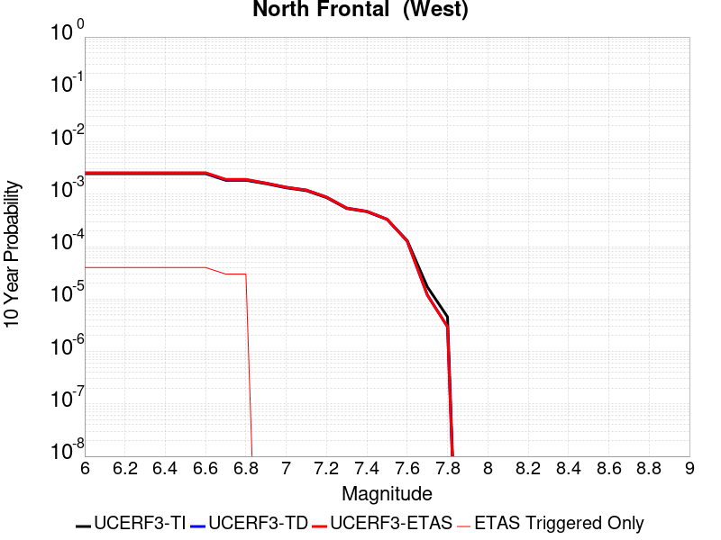 |

| Magnitude | 1 wk TI Prob | 1 wk TD Prob | 1 wk ETAS Prob | 1 wk ETAS/TD Gain | 1 wk ETAS Triggered Only | 1 mo TI Prob | 1 mo TD Prob | 1 mo ETAS Prob | 1 mo ETAS/TD Gain | 1 mo ETAS Triggered Only | 1 yr TI Prob | 1 yr TD Prob | 1 yr ETAS Prob | 1 yr ETAS/TD Gain | 1 yr ETAS Triggered Only | 10 yr TI Prob | 10 yr TD Prob | 10 yr ETAS Prob | 10 yr ETAS/TD Gain | 10 yr ETAS Triggered Only |
|-----|-----|-----|-----|-----|-----|-----|-----|-----|-----|-----|-----|-----|-----|-----|-----|-----|-----|-----|-----|-----|
| 6.0 | 4.7316266E-6 | 4.852674E-6 | 4.852674E-6 | 1.0 | 0.0 | 2.0278241E-5 | 2.0797017E-5 | 2.0797017E-5 | 1.0 | 0.0 | 2.4685962E-4 | 2.5317573E-4 | 2.5317573E-4 | 1.0 | 0.0 | 0.0024658558 | 0.002529019 | 0.002568918 | 1.0157764 | 4.0E-5 |
| 6.1 | 4.7316266E-6 | 4.852674E-6 | 4.852674E-6 | 1.0 | 0.0 | 2.0278241E-5 | 2.0797017E-5 | 2.0797017E-5 | 1.0 | 0.0 | 2.4685962E-4 | 2.5317573E-4 | 2.5317573E-4 | 1.0 | 0.0 | 0.0024658558 | 0.002529019 | 0.002568918 | 1.0157764 | 4.0E-5 |
| 6.2 | 4.7316266E-6 | 4.852674E-6 | 4.852674E-6 | 1.0 | 0.0 | 2.0278241E-5 | 2.0797017E-5 | 2.0797017E-5 | 1.0 | 0.0 | 2.4685962E-4 | 2.5317573E-4 | 2.5317573E-4 | 1.0 | 0.0 | 0.0024658558 | 0.002529019 | 0.002568918 | 1.0157764 | 4.0E-5 |
| 6.3 | 4.7316266E-6 | 4.852674E-6 | 4.852674E-6 | 1.0 | 0.0 | 2.0278241E-5 | 2.0797017E-5 | 2.0797017E-5 | 1.0 | 0.0 | 2.4685962E-4 | 2.5317573E-4 | 2.5317573E-4 | 1.0 | 0.0 | 0.0024658558 | 0.002529019 | 0.002568918 | 1.0157764 | 4.0E-5 |
| 6.4 | 4.7316266E-6 | 4.852674E-6 | 4.852674E-6 | 1.0 | 0.0 | 2.0278241E-5 | 2.0797017E-5 | 2.0797017E-5 | 1.0 | 0.0 | 2.4685962E-4 | 2.5317573E-4 | 2.5317573E-4 | 1.0 | 0.0 | 0.0024658558 | 0.002529019 | 0.002568918 | 1.0157764 | 4.0E-5 |
| 6.5 | 4.7316266E-6 | 4.852674E-6 | 4.852674E-6 | 1.0 | 0.0 | 2.0278241E-5 | 2.0797017E-5 | 2.0797017E-5 | 1.0 | 0.0 | 2.4685962E-4 | 2.5317573E-4 | 2.5317573E-4 | 1.0 | 0.0 | 0.0024658558 | 0.002529019 | 0.002568918 | 1.0157764 | 4.0E-5 |
| 6.6 | 4.7316266E-6 | 4.852674E-6 | 4.852674E-6 | 1.0 | 0.0 | 2.0278241E-5 | 2.0797017E-5 | 2.0797017E-5 | 1.0 | 0.0 | 2.4685962E-4 | 2.5317573E-4 | 2.5317573E-4 | 1.0 | 0.0 | 0.0024658558 | 0.002529019 | 0.002568918 | 1.0157764 | 4.0E-5 |
| 6.7 | 3.5382777E-6 | 3.6308872E-6 | 3.6308872E-6 | 1.0 | 0.0 | 1.516396E-5 | 1.5560858E-5 | 1.5560858E-5 | 1.0 | 0.0 | 1.8460557E-4 | 1.8943775E-4 | 1.8943775E-4 | 1.0 | 0.0 | 0.0018445229 | 0.0018928396 | 0.0019227827 | 1.0158192 | 3.0E-5 |
| 6.8 | 3.5382777E-6 | 3.6308872E-6 | 3.6308872E-6 | 1.0 | 0.0 | 1.516396E-5 | 1.5560858E-5 | 1.5560858E-5 | 1.0 | 0.0 | 1.8460557E-4 | 1.8943775E-4 | 1.8943775E-4 | 1.0 | 0.0 | 0.0018445229 | 0.0018928396 | 0.0019227827 | 1.0158192 | 3.0E-5 |
| 6.9 | 3.0428037E-6 | 3.1227619E-6 | 3.1227619E-6 | 1.0 | 0.0 | 1.30405215E-5 | 1.3383201E-5 | 1.3383201E-5 | 1.0 | 0.0 | 1.5875678E-4 | 1.6292896E-4 | 1.6292896E-4 | 1.0 | 0.0 | 0.0015864341 | 0.0016281622 | 0.0016281622 | 1.0 | 0.0 |
| 7.0 | 2.538778E-6 | 2.6060916E-6 | 2.6060916E-6 | 1.0 | 0.0 | 1.0880432E-5 | 1.116892E-5 | 1.116892E-5 | 1.0 | 0.0 | 1.324612E-4 | 1.3597358E-4 | 1.3597358E-4 | 1.0 | 0.0 | 0.0013238228 | 0.0013589506 | 0.0013589506 | 1.0 | 0.0 |
| 7.1 | 2.2418935E-6 | 2.3012087E-6 | 2.3012087E-6 | 1.0 | 0.0 | 9.60808E-6 | 9.862288E-6 | 9.862288E-6 | 1.0 | 0.0 | 1.1697209E-4 | 1.2006718E-4 | 1.2006718E-4 | 1.0 | 0.0 | 0.0011691054 | 0.0012000671 | 0.0012000671 | 1.0 | 0.0 |
| 7.2 | 1.6526745E-6 | 1.6924864E-6 | 1.6924864E-6 | 1.0 | 0.0 | 7.082872E-6 | 7.2534945E-6 | 7.2534945E-6 | 1.0 | 0.0 | 8.623055E-5 | 8.830797E-5 | 8.830797E-5 | 1.0 | 0.0 | 8.61971E-4 | 8.8275387E-4 | 8.8275387E-4 | 1.0 | 0.0 |
| 7.3 | 1.0246019E-6 | 1.0442274E-6 | 1.0442274E-6 | 1.0 | 0.0 | 4.391144E-6 | 4.4752533E-6 | 4.4752533E-6 | 1.0 | 0.0 | 5.3460866E-5 | 5.4484964E-5 | 5.4484964E-5 | 1.0 | 0.0 | 5.344801E-4 | 5.4472755E-4 | 5.4472755E-4 | 1.0 | 0.0 |
| 7.4 | 8.9045164E-7 | 9.056572E-7 | 9.056572E-7 | 1.0 | 0.0 | 3.8162157E-6 | 3.881383E-6 | 3.881383E-6 | 1.0 | 0.0 | 4.646144E-5 | 4.725492E-5 | 4.725492E-5 | 1.0 | 0.0 | 4.6451724E-4 | 4.7245962E-4 | 4.7245962E-4 | 1.0 | 0.0 |
| 7.5 | 6.3357E-7 | 6.4027137E-7 | 6.4027137E-7 | 1.0 | 0.0 | 2.7152971E-6 | 2.7440176E-6 | 2.7440176E-6 | 1.0 | 0.0 | 3.305824E-5 | 3.340797E-5 | 3.340797E-5 | 1.0 | 0.0 | 3.3053322E-4 | 3.3403604E-4 | 3.3403604E-4 | 1.0 | 0.0 |
| 7.6 | 2.5087024E-7 | 2.436123E-7 | 2.436123E-7 | 1.0 | 0.0 | 1.0751578E-6 | 1.0440525E-6 | 1.0440525E-6 | 1.0 | 0.0 | 1.3089967E-5 | 1.2711286E-5 | 1.2711286E-5 | 1.0 | 0.0 | 1.3089196E-4 | 1.2710765E-4 | 1.2710765E-4 | 1.0 | 0.0 |
| 7.7 | 3.282987E-8 | 2.2875435E-8 | 2.2875435E-8 | 1.0 | 0.0 | 1.4069944E-7 | 9.8037575E-8 | 9.8037575E-8 | 1.0 | 0.0 | 1.7130144E-6 | 1.193607E-6 | 1.193607E-6 | 1.0 | 0.0 | 1.7130013E-5 | 1.1936014E-5 | 1.1936014E-5 | 1.0 | 0.0 |
| 7.8 | 8.77499E-9 | 5.6817466E-9 | 5.6817466E-9 | 1.0 | 0.0 | 3.7607098E-8 | 2.4350342E-8 | 2.4350342E-8 | 1.0 | 0.0 | 4.578663E-7 | 2.964654E-7 | 2.964654E-7 | 1.0 | 0.0 | 4.5786537E-6 | 2.9646512E-6 | 2.9646512E-6 | 1.0 | 0.0 |

## San Gabriel (Extension)
*[(top)](#table-of-contents)*

| 1 Week | 1 Month | 1 Year | 10 Year |
|-----|-----|-----|-----|
|  |  |  |  |

| Magnitude | 1 wk TI Prob | 1 wk TD Prob | 1 wk ETAS Prob | 1 wk ETAS/TD Gain | 1 wk ETAS Triggered Only | 1 mo TI Prob | 1 mo TD Prob | 1 mo ETAS Prob | 1 mo ETAS/TD Gain | 1 mo ETAS Triggered Only | 1 yr TI Prob | 1 yr TD Prob | 1 yr ETAS Prob | 1 yr ETAS/TD Gain | 1 yr ETAS Triggered Only | 10 yr TI Prob | 10 yr TD Prob | 10 yr ETAS Prob | 10 yr ETAS/TD Gain | 10 yr ETAS Triggered Only |
|-----|-----|-----|-----|-----|-----|-----|-----|-----|-----|-----|-----|-----|-----|-----|-----|-----|-----|-----|-----|-----|
| 6.0 | 5.6486106E-6 | 5.7168368E-6 | 5.7168368E-6 | 1.0 | 0.0 | 2.4208108E-5 | 2.4500505E-5 | 2.4500505E-5 | 1.0 | 0.0 | 2.9469383E-4 | 2.9825408E-4 | 3.1824812E-4 | 1.0670369 | 2.0E-5 | 0.0029430336 | 0.0029786646 | 0.0030185455 | 1.0133889 | 4.0E-5 |
| 6.1 | 5.6486106E-6 | 5.7168368E-6 | 5.7168368E-6 | 1.0 | 0.0 | 2.4208108E-5 | 2.4500505E-5 | 2.4500505E-5 | 1.0 | 0.0 | 2.9469383E-4 | 2.9825408E-4 | 3.1824812E-4 | 1.0670369 | 2.0E-5 | 0.0029430336 | 0.0029786646 | 0.0030185455 | 1.0133889 | 4.0E-5 |
| 6.2 | 5.6486106E-6 | 5.7168368E-6 | 5.7168368E-6 | 1.0 | 0.0 | 2.4208108E-5 | 2.4500505E-5 | 2.4500505E-5 | 1.0 | 0.0 | 2.9469383E-4 | 2.9825408E-4 | 3.1824812E-4 | 1.0670369 | 2.0E-5 | 0.0029430336 | 0.0029786646 | 0.0030185455 | 1.0133889 | 4.0E-5 |
| 6.3 | 5.6486106E-6 | 5.7168368E-6 | 5.7168368E-6 | 1.0 | 0.0 | 2.4208108E-5 | 2.4500505E-5 | 2.4500505E-5 | 1.0 | 0.0 | 2.9469383E-4 | 2.9825408E-4 | 3.1824812E-4 | 1.0670369 | 2.0E-5 | 0.0029430336 | 0.0029786646 | 0.0030185455 | 1.0133889 | 4.0E-5 |
| 6.4 | 5.6486106E-6 | 5.7168368E-6 | 5.7168368E-6 | 1.0 | 0.0 | 2.4208108E-5 | 2.4500505E-5 | 2.4500505E-5 | 1.0 | 0.0 | 2.9469383E-4 | 2.9825408E-4 | 3.1824812E-4 | 1.0670369 | 2.0E-5 | 0.0029430336 | 0.0029786646 | 0.0030185455 | 1.0133889 | 4.0E-5 |
| 6.5 | 4.7134554E-6 | 4.7542608E-6 | 4.7542608E-6 | 1.0 | 0.0 | 2.0200367E-5 | 2.0375248E-5 | 2.0375248E-5 | 1.0 | 0.0 | 2.459117E-4 | 2.4804127E-4 | 2.680363E-4 | 1.0806117 | 2.0E-5 | 0.0024563975 | 0.0024777285 | 0.0025176294 | 1.0161039 | 4.0E-5 |
| 6.6 | 4.7134554E-6 | 4.7542608E-6 | 4.7542608E-6 | 1.0 | 0.0 | 2.0200367E-5 | 2.0375248E-5 | 2.0375248E-5 | 1.0 | 0.0 | 2.459117E-4 | 2.4804127E-4 | 2.680363E-4 | 1.0806117 | 2.0E-5 | 0.0024563975 | 0.0024777285 | 0.0025176294 | 1.0161039 | 4.0E-5 |
| 6.7 | 4.2468837E-6 | 4.274078E-6 | 4.274078E-6 | 1.0 | 0.0 | 1.8200803E-5 | 1.8317352E-5 | 1.8317352E-5 | 1.0 | 0.0 | 2.2157225E-4 | 2.2299167E-4 | 2.3298943E-4 | 1.0448347 | 1.0E-5 | 0.0022135144 | 0.0022277513 | 0.0022576845 | 1.0134364 | 3.0E-5 |
| 6.8 | 4.1180615E-6 | 4.1414673E-6 | 4.1414673E-6 | 1.0 | 0.0 | 1.7648716E-5 | 1.774903E-5 | 1.774903E-5 | 1.0 | 0.0 | 2.1485193E-4 | 2.1607373E-4 | 2.2607157E-4 | 1.0462705 | 1.0E-5 | 0.0021464431 | 0.0021587077 | 0.002188643 | 1.0138673 | 3.0E-5 |
| 6.9 | 3.863861E-6 | 3.879783E-6 | 3.879783E-6 | 1.0 | 0.0 | 1.65593E-5 | 1.6627539E-5 | 1.6627539E-5 | 1.0 | 0.0 | 2.0159081E-4 | 2.0242216E-4 | 2.1242014E-4 | 1.0493917 | 1.0E-5 | 0.0020140803 | 0.0020224454 | 0.002052385 | 1.0148035 | 3.0E-5 |
| 7.0 | 3.6947372E-6 | 3.705682E-6 | 3.705682E-6 | 1.0 | 0.0 | 1.5834492E-5 | 1.5881402E-5 | 1.5881402E-5 | 1.0 | 0.0 | 1.9276788E-4 | 1.9333958E-4 | 2.0333765E-4 | 1.0517125 | 1.0E-5 | 0.0019260074 | 0.0019317803 | 0.0019617223 | 1.0154997 | 3.0E-5 |
| 7.1 | 3.5686835E-6 | 3.5729024E-6 | 3.5729024E-6 | 1.0 | 0.0 | 1.5294268E-5 | 1.5312353E-5 | 1.5312353E-5 | 1.0 | 0.0 | 1.861918E-4 | 1.8641262E-4 | 1.9641075E-4 | 1.0536344 | 1.0E-5 | 0.0018603588 | 0.0018626284 | 0.0018925725 | 1.0160763 | 3.0E-5 |
| 7.2 | 2.8023446E-6 | 2.776794E-6 | 2.776794E-6 | 1.0 | 0.0 | 1.2009994E-5 | 1.1900492E-5 | 1.1900492E-5 | 1.0 | 0.0 | 1.4621185E-4 | 1.4487897E-4 | 1.5487752E-4 | 1.0690131 | 1.0E-5 | 0.001461157 | 0.001447856 | 0.001467827 | 1.0137936 | 2.0E-5 |
| 7.3 | 2.5843012E-6 | 2.5459692E-6 | 2.5459692E-6 | 1.0 | 0.0 | 1.1075529E-5 | 1.0911252E-5 | 1.0911252E-5 | 1.0 | 0.0 | 1.3483623E-4 | 1.3283649E-4 | 1.4283515E-4 | 1.0752705 | 1.0E-5 | 0.0013475444 | 0.0013275805 | 0.001347554 | 1.015045 | 2.0E-5 |
| 7.4 | 2.4464468E-6 | 2.396669E-6 | 2.396669E-6 | 1.0 | 0.0 | 1.04847295E-5 | 1.0271398E-5 | 1.0271398E-5 | 1.0 | 0.0 | 1.276441E-4 | 1.250472E-4 | 1.3504595E-4 | 1.0799598 | 1.0E-5 | 0.0012757082 | 0.001249778 | 0.001269753 | 1.0159829 | 2.0E-5 |
| 7.5 | 2.0420266E-6 | 1.8910376E-6 | 1.8910376E-6 | 1.0 | 0.0 | 8.751514E-6 | 8.104422E-6 | 8.104422E-6 | 1.0 | 0.0 | 1.0654447E-4 | 9.866691E-5 | 1.08665925E-4 | 1.1013411 | 1.0E-5 | 0.001064934 | 9.862344E-4 | 9.962246E-4 | 1.0101296 | 1.0E-5 |
| 7.6 | 1.8326596E-6 | 1.6398233E-6 | 1.6398233E-6 | 1.0 | 0.0 | 7.854232E-6 | 7.027795E-6 | 7.027795E-6 | 1.0 | 0.0 | 9.562107E-5 | 8.556007E-5 | 8.556007E-5 | 1.0 | 0.0 | 9.5579936E-4 | 8.552735E-4 | 8.552735E-4 | 1.0 | 0.0 |
| 7.7 | 1.4786998E-6 | 1.2523672E-6 | 1.2523672E-6 | 1.0 | 0.0 | 6.3372695E-6 | 5.3672766E-6 | 5.3672766E-6 | 1.0 | 0.0 | 7.715353E-5 | 6.534465E-5 | 6.534465E-5 | 1.0 | 0.0 | 7.7126746E-4 | 6.5325975E-4 | 6.5325975E-4 | 1.0 | 0.0 |
| 7.8 | 7.6975533E-7 | 6.069207E-7 | 6.069207E-7 | 1.0 | 0.0 | 3.2989474E-6 | 2.6010862E-6 | 2.6010862E-6 | 1.0 | 0.0 | 4.0163945E-5 | 3.1667765E-5 | 3.1667765E-5 | 1.0 | 0.0 | 4.0156685E-4 | 3.166365E-4 | 3.166365E-4 | 1.0 | 0.0 |
| 7.9 | 1.7645915E-7 | 9.211899E-8 | 9.211899E-8 | 1.0 | 0.0 | 7.562533E-7 | 3.947956E-7 | 3.947956E-7 | 1.0 | 0.0 | 9.207345E-6 | 4.806626E-6 | 4.806626E-6 | 1.0 | 0.0 | 9.206964E-5 | 4.8069025E-5 | 4.8069025E-5 | 1.0 | 0.0 |
| 8.0 | 1.0463461E-7 | 2.4937416E-8 | 2.4937416E-8 | 1.0 | 0.0 | 4.4843398E-7 | 1.0687464E-7 | 1.0687464E-7 | 1.0 | 0.0 | 5.45967E-6 | 1.3011979E-6 | 1.3011979E-6 | 1.0 | 0.0 | 5.459536E-5 | 1.3015701E-5 | 1.3015701E-5 | 1.0 | 0.0 |
| 8.1 | 7.875717E-8 | 1.3857542E-8 | 1.3857542E-8 | 1.0 | 0.0 | 3.3753068E-7 | 5.9389468E-8 | 5.9389468E-8 | 1.0 | 0.0 | 4.109428E-6 | 7.2306653E-7 | 7.2306653E-7 | 1.0 | 0.0 | 4.109352E-5 | 7.234439E-6 | 7.234439E-6 | 1.0 | 0.0 |
| 8.2 | 1.33163E-8 | 1.7720816E-9 | 1.7720816E-9 | 1.0 | 0.0 | 5.7069855E-8 | 7.594638E-9 | 7.594638E-9 | 1.0 | 0.0 | 6.9482525E-7 | 9.246471E-8 | 9.246471E-8 | 1.0 | 0.0 | 6.9482307E-6 | 9.2664203E-7 | 9.2664203E-7 | 1.0 | 0.0 |

## South Klamath Lake West
*[(top)](#table-of-contents)*

| 1 Week | 1 Month | 1 Year | 10 Year |
|-----|-----|-----|-----|
|  |  |  |  |

| Magnitude | 1 wk TI Prob | 1 wk TD Prob | 1 wk ETAS Prob | 1 wk ETAS/TD Gain | 1 wk ETAS Triggered Only | 1 mo TI Prob | 1 mo TD Prob | 1 mo ETAS Prob | 1 mo ETAS/TD Gain | 1 mo ETAS Triggered Only | 1 yr TI Prob | 1 yr TD Prob | 1 yr ETAS Prob | 1 yr ETAS/TD Gain | 1 yr ETAS Triggered Only | 10 yr TI Prob | 10 yr TD Prob | 10 yr ETAS Prob | 10 yr ETAS/TD Gain | 10 yr ETAS Triggered Only |
|-----|-----|-----|-----|-----|-----|-----|-----|-----|-----|-----|-----|-----|-----|-----|-----|-----|-----|-----|-----|-----|
| 6.0 | 2.174025E-5 | 2.3042025E-5 | 3.3041793E-5 | 1.4339796 | 1.0E-5 | 9.3169176E-5 | 9.874817E-5 | 1.0874718E-4 | 1.1012577 | 1.0E-5 | 0.0011337444 | 0.0012016617 | 0.0012216377 | 1.0166236 | 2.0E-5 | 0.011279777 | 0.0119582405 | 0.011978001 | 1.0016525 | 2.0E-5 |
| 6.1 | 2.174025E-5 | 2.3042025E-5 | 3.3041793E-5 | 1.4339796 | 1.0E-5 | 9.3169176E-5 | 9.874817E-5 | 1.0874718E-4 | 1.1012577 | 1.0E-5 | 0.0011337444 | 0.0012016617 | 0.0012216377 | 1.0166236 | 2.0E-5 | 0.011279777 | 0.0119582405 | 0.011978001 | 1.0016525 | 2.0E-5 |
| 6.2 | 9.834929E-6 | 1.0393841E-5 | 1.0393841E-5 | 1.0 | 0.0 | 4.2149015E-5 | 4.4544326E-5 | 4.4544326E-5 | 1.0 | 0.0 | 5.1304343E-4 | 5.422012E-4 | 5.422012E-4 | 1.0 | 0.0 | 0.0051186057 | 0.0054096854 | 0.0054096854 | 1.0 | 0.0 |
| 6.3 | 9.834929E-6 | 1.0393841E-5 | 1.0393841E-5 | 1.0 | 0.0 | 4.2149015E-5 | 4.4544326E-5 | 4.4544326E-5 | 1.0 | 0.0 | 5.1304343E-4 | 5.422012E-4 | 5.422012E-4 | 1.0 | 0.0 | 0.0051186057 | 0.0054096854 | 0.0054096854 | 1.0 | 0.0 |
| 6.4 | 6.066321E-6 | 6.40043E-6 | 6.40043E-6 | 1.0 | 0.0 | 2.5998259E-5 | 2.743014E-5 | 2.743014E-5 | 1.0 | 0.0 | 3.1648282E-4 | 3.3391351E-4 | 3.3391351E-4 | 1.0 | 0.0 | 0.0031603249 | 0.0033343881 | 0.0033343881 | 1.0 | 0.0 |
| 6.5 | 6.066321E-6 | 6.40043E-6 | 6.40043E-6 | 1.0 | 0.0 | 2.5998259E-5 | 2.743014E-5 | 2.743014E-5 | 1.0 | 0.0 | 3.1648282E-4 | 3.3391351E-4 | 3.3391351E-4 | 1.0 | 0.0 | 0.0031603249 | 0.0033343881 | 0.0033343881 | 1.0 | 0.0 |
| 6.6 | 4.2321803E-6 | 4.461291E-6 | 4.461291E-6 | 1.0 | 0.0 | 1.8137789E-5 | 1.9119685E-5 | 1.9119685E-5 | 1.0 | 0.0 | 2.208052E-4 | 2.3275832E-4 | 2.3275832E-4 | 1.0 | 0.0 | 0.0022058594 | 0.0023252473 | 0.0023252473 | 1.0 | 0.0 |
| 6.7 | 3.186646E-6 | 3.360305E-6 | 3.360305E-6 | 1.0 | 0.0 | 1.3656982E-5 | 1.4401232E-5 | 1.4401232E-5 | 1.0 | 0.0 | 1.6626107E-4 | 1.7532158E-4 | 1.7532158E-4 | 1.0 | 0.0 | 0.0016613674 | 0.0017518997 | 0.0017518997 | 1.0 | 0.0 |
| 6.8 | 2.380121E-6 | 2.510907E-6 | 2.510907E-6 | 1.0 | 0.0 | 1.0200479E-5 | 1.07609885E-5 | 1.07609885E-5 | 1.0 | 0.0 | 1.2418375E-4 | 1.3100762E-4 | 1.3100762E-4 | 1.0 | 0.0 | 0.0012411437 | 0.0013093497 | 0.0013093497 | 1.0 | 0.0 |
| 6.9 | 8.928287E-7 | 9.4302504E-7 | 9.4302504E-7 | 1.0 | 0.0 | 3.826403E-6 | 4.0415307E-6 | 4.0415307E-6 | 1.0 | 0.0 | 4.658546E-5 | 4.9204747E-5 | 4.9204747E-5 | 1.0 | 0.0 | 4.6575698E-4 | 4.9196015E-4 | 4.9196015E-4 | 1.0 | 0.0 |

## Emerson-Copper Mtn 2011
*[(top)](#table-of-contents)*

| 1 Week | 1 Month | 1 Year | 10 Year |
|-----|-----|-----|-----|
|  |  |  |  |

| Magnitude | 1 wk TI Prob | 1 wk TD Prob | 1 wk ETAS Prob | 1 wk ETAS/TD Gain | 1 wk ETAS Triggered Only | 1 mo TI Prob | 1 mo TD Prob | 1 mo ETAS Prob | 1 mo ETAS/TD Gain | 1 mo ETAS Triggered Only | 1 yr TI Prob | 1 yr TD Prob | 1 yr ETAS Prob | 1 yr ETAS/TD Gain | 1 yr ETAS Triggered Only | 10 yr TI Prob | 10 yr TD Prob | 10 yr ETAS Prob | 10 yr ETAS/TD Gain | 10 yr ETAS Triggered Only |
|-----|-----|-----|-----|-----|-----|-----|-----|-----|-----|-----|-----|-----|-----|-----|-----|-----|-----|-----|-----|-----|
| 6.0 | 2.1364202E-5 | 9.967999E-6 | 9.967999E-6 | 1.0 | 0.0 | 9.1557646E-5 | 4.2719344E-5 | 5.271892E-5 | 1.234076 | 1.0E-5 | 0.0011141442 | 5.1999267E-4 | 5.4997706E-4 | 1.0576631 | 3.0E-5 | 0.011085749 | 0.0051886286 | 0.005218473 | 1.0057518 | 3.0E-5 |
| 6.1 | 2.1364202E-5 | 9.967999E-6 | 9.967999E-6 | 1.0 | 0.0 | 9.1557646E-5 | 4.2719344E-5 | 5.271892E-5 | 1.234076 | 1.0E-5 | 0.0011141442 | 5.1999267E-4 | 5.4997706E-4 | 1.0576631 | 3.0E-5 | 0.011085749 | 0.0051886286 | 0.005218473 | 1.0057518 | 3.0E-5 |
| 6.2 | 2.1364202E-5 | 9.967999E-6 | 9.967999E-6 | 1.0 | 0.0 | 9.1557646E-5 | 4.2719344E-5 | 5.271892E-5 | 1.234076 | 1.0E-5 | 0.0011141442 | 5.1999267E-4 | 5.4997706E-4 | 1.0576631 | 3.0E-5 | 0.011085749 | 0.0051886286 | 0.005218473 | 1.0057518 | 3.0E-5 |
| 6.3 | 1.7751237E-5 | 8.089109E-6 | 8.089109E-6 | 1.0 | 0.0 | 7.607452E-5 | 3.4667184E-5 | 4.4666835E-5 | 1.2884473 | 1.0E-5 | 9.258136E-4 | 4.2199748E-4 | 4.4198905E-4 | 1.0473737 | 2.0E-5 | 0.00921966 | 0.004212584 | 0.0042324997 | 1.0047277 | 2.0E-5 |
| 6.4 | 1.7751237E-5 | 8.089109E-6 | 8.089109E-6 | 1.0 | 0.0 | 7.607452E-5 | 3.4667184E-5 | 4.4666835E-5 | 1.2884473 | 1.0E-5 | 9.258136E-4 | 4.2199748E-4 | 4.4198905E-4 | 1.0473737 | 2.0E-5 | 0.00921966 | 0.004212584 | 0.0042324997 | 1.0047277 | 2.0E-5 |
| 6.5 | 1.5886664E-5 | 6.6037437E-6 | 6.6037437E-6 | 1.0 | 0.0 | 6.808392E-5 | 2.830148E-5 | 3.8301197E-5 | 1.3533285 | 1.0E-5 | 8.286065E-4 | 3.4452073E-4 | 3.6451383E-4 | 1.0580317 | 2.0E-5 | 0.008255237 | 0.0034403303 | 0.0034602615 | 1.0057935 | 2.0E-5 |
| 6.6 | 1.5886664E-5 | 6.6037437E-6 | 6.6037437E-6 | 1.0 | 0.0 | 6.808392E-5 | 2.830148E-5 | 3.8301197E-5 | 1.3533285 | 1.0E-5 | 8.286065E-4 | 3.4452073E-4 | 3.6451383E-4 | 1.0580317 | 2.0E-5 | 0.008255237 | 0.0034403303 | 0.0034602615 | 1.0057935 | 2.0E-5 |
| 6.7 | 1.428471E-5 | 5.4703055E-6 | 5.4703055E-6 | 1.0 | 0.0 | 6.121875E-5 | 2.3443978E-5 | 3.3443743E-5 | 1.4265388 | 1.0E-5 | 7.450834E-4 | 2.8539696E-4 | 3.0539127E-4 | 1.0700579 | 2.0E-5 | 0.007425902 | 0.0028506925 | 0.0028706356 | 1.0069958 | 2.0E-5 |
| 6.8 | 1.3490684E-5 | 5.0735894E-6 | 5.0735894E-6 | 1.0 | 0.0 | 5.7815934E-5 | 2.1743796E-5 | 3.1743577E-5 | 1.4598913 | 1.0E-5 | 7.0368167E-4 | 2.6470242E-4 | 2.7469976E-4 | 1.0377682 | 1.0E-5 | 0.007014576 | 0.002644252 | 0.0026542256 | 1.0037718 | 1.0E-5 |
| 6.9 | 1.2235421E-5 | 4.289545E-6 | 4.289545E-6 | 1.0 | 0.0 | 5.2436466E-5 | 1.8383655E-5 | 2.838347E-5 | 1.5439515 | 1.0E-5 | 6.38227E-4 | 2.238016E-4 | 2.3379936E-4 | 1.0446725 | 1.0E-5 | 0.0063639707 | 0.0022361164 | 0.0022460942 | 1.004462 | 1.0E-5 |
| 7.0 | 1.1009851E-5 | 3.7188345E-6 | 3.7188345E-6 | 1.0 | 0.0 | 4.7184225E-5 | 1.5937783E-5 | 2.5937625E-5 | 1.6274298 | 1.0E-5 | 5.743165E-4 | 1.9402867E-4 | 2.0402674E-4 | 1.0515288 | 1.0E-5 | 0.005728345 | 0.0019389305 | 0.0019489111 | 1.0051475 | 1.0E-5 |
| 7.1 | 9.726373E-6 | 3.2115693E-6 | 3.2115693E-6 | 1.0 | 0.0 | 4.168379E-5 | 1.3763814E-5 | 2.3763678E-5 | 1.7265328 | 1.0E-5 | 5.07382E-4 | 1.6756494E-4 | 1.7756326E-4 | 1.0596683 | 1.0E-5 | 0.0050622504 | 0.0016747171 | 0.0016847003 | 1.0059612 | 1.0E-5 |
| 7.2 | 3.9335127E-6 | 1.1524114E-6 | 1.1524114E-6 | 1.0 | 0.0 | 1.6857803E-5 | 4.9388973E-6 | 1.4938848E-5 | 3.0247335 | 1.0E-5 | 2.0522442E-4 | 6.0129474E-5 | 7.012887E-5 | 1.1662978 | 1.0E-5 | 0.00205035 | 6.01138E-4 | 6.11132E-4 | 1.0166252 | 1.0E-5 |
| 7.3 | 2.661632E-6 | 6.91098E-7 | 6.91098E-7 | 1.0 | 0.0 | 1.14069435E-5 | 2.9618452E-6 | 1.2961816E-5 | 4.3762636 | 1.0E-5 | 1.3887069E-4 | 3.605988E-5 | 4.605952E-5 | 1.2773066 | 1.0E-5 | 0.0013878393 | 3.6054134E-4 | 3.7053772E-4 | 1.027726 | 1.0E-5 |
| 7.4 | 2.0893426E-6 | 5.4614605E-7 | 5.4614605E-7 | 1.0 | 0.0 | 8.954295E-6 | 2.340624E-6 | 1.2340601E-5 | 5.272355 | 1.0E-5 | 1.0901308E-4 | 2.8496728E-5 | 3.8496444E-5 | 1.3509074 | 1.0E-5 | 0.0010895962 | 2.849313E-4 | 2.9492844E-4 | 1.0350862 | 1.0E-5 |
| 7.5 | 1.1681728E-6 | 3.6028484E-7 | 3.6028484E-7 | 1.0 | 0.0 | 5.0064455E-6 | 1.544077E-6 | 1.1544062E-5 | 7.476351 | 1.0E-5 | 6.0951766E-5 | 1.879898E-5 | 2.8798791E-5 | 1.5319338 | 1.0E-5 | 6.093505E-4 | 1.8797436E-4 | 1.9797249E-4 | 1.0531888 | 1.0E-5 |
| 7.6 | 1.3154387E-7 | 7.1196716E-8 | 7.1196716E-8 | 1.0 | 0.0 | 5.6375933E-7 | 3.0512876E-7 | 3.0512876E-7 | 1.0 | 0.0 | 6.863748E-6 | 3.714938E-6 | 3.714938E-6 | 1.0 | 0.0 | 6.863536E-5 | 3.7148915E-5 | 3.7148915E-5 | 1.0 | 0.0 |

## Los Alamos extension
*[(top)](#table-of-contents)*

| 1 Week | 1 Month | 1 Year | 10 Year |
|-----|-----|-----|-----|
|  | 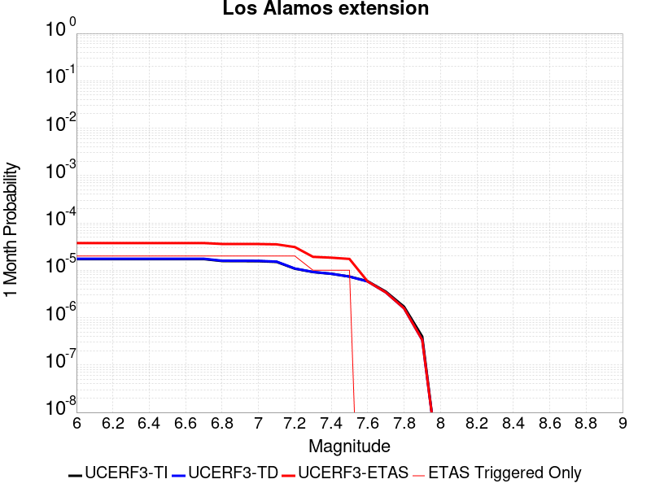 |  |  |

| Magnitude | 1 wk TI Prob | 1 wk TD Prob | 1 wk ETAS Prob | 1 wk ETAS/TD Gain | 1 wk ETAS Triggered Only | 1 mo TI Prob | 1 mo TD Prob | 1 mo ETAS Prob | 1 mo ETAS/TD Gain | 1 mo ETAS Triggered Only | 1 yr TI Prob | 1 yr TD Prob | 1 yr ETAS Prob | 1 yr ETAS/TD Gain | 1 yr ETAS Triggered Only | 10 yr TI Prob | 10 yr TD Prob | 10 yr ETAS Prob | 10 yr ETAS/TD Gain | 10 yr ETAS Triggered Only |
|-----|-----|-----|-----|-----|-----|-----|-----|-----|-----|-----|-----|-----|-----|-----|-----|-----|-----|-----|-----|-----|
| 6.0 | 4.0146506E-6 | 4.086164E-6 | 2.4086083E-5 | 5.8945456 | 2.0E-5 | 1.7205533E-5 | 1.7512022E-5 | 3.7511672E-5 | 2.1420527 | 2.0E-5 | 2.0945723E-4 | 2.1318911E-4 | 2.4318272E-4 | 1.1406901 | 3.0E-5 | 0.0020925992 | 0.002129955 | 0.0021598912 | 1.0140548 | 3.0E-5 |
| 6.1 | 4.0146506E-6 | 4.086164E-6 | 2.4086083E-5 | 5.8945456 | 2.0E-5 | 1.7205533E-5 | 1.7512022E-5 | 3.7511672E-5 | 2.1420527 | 2.0E-5 | 2.0945723E-4 | 2.1318911E-4 | 2.4318272E-4 | 1.1406901 | 3.0E-5 | 0.0020925992 | 0.002129955 | 0.0021598912 | 1.0140548 | 3.0E-5 |
| 6.2 | 4.0146506E-6 | 4.086164E-6 | 2.4086083E-5 | 5.8945456 | 2.0E-5 | 1.7205533E-5 | 1.7512022E-5 | 3.7511672E-5 | 2.1420527 | 2.0E-5 | 2.0945723E-4 | 2.1318911E-4 | 2.4318272E-4 | 1.1406901 | 3.0E-5 | 0.0020925992 | 0.002129955 | 0.0021598912 | 1.0140548 | 3.0E-5 |
| 6.3 | 4.0146506E-6 | 4.086164E-6 | 2.4086083E-5 | 5.8945456 | 2.0E-5 | 1.7205533E-5 | 1.7512022E-5 | 3.7511672E-5 | 2.1420527 | 2.0E-5 | 2.0945723E-4 | 2.1318911E-4 | 2.4318272E-4 | 1.1406901 | 3.0E-5 | 0.0020925992 | 0.002129955 | 0.0021598912 | 1.0140548 | 3.0E-5 |
| 6.4 | 4.0146506E-6 | 4.086164E-6 | 2.4086083E-5 | 5.8945456 | 2.0E-5 | 1.7205533E-5 | 1.7512022E-5 | 3.7511672E-5 | 2.1420527 | 2.0E-5 | 2.0945723E-4 | 2.1318911E-4 | 2.4318272E-4 | 1.1406901 | 3.0E-5 | 0.0020925992 | 0.002129955 | 0.0021598912 | 1.0140548 | 3.0E-5 |
| 6.5 | 4.0146506E-6 | 4.086164E-6 | 2.4086083E-5 | 5.8945456 | 2.0E-5 | 1.7205533E-5 | 1.7512022E-5 | 3.7511672E-5 | 2.1420527 | 2.0E-5 | 2.0945723E-4 | 2.1318911E-4 | 2.4318272E-4 | 1.1406901 | 3.0E-5 | 0.0020925992 | 0.002129955 | 0.0021598912 | 1.0140548 | 3.0E-5 |
| 6.6 | 4.0146506E-6 | 4.086164E-6 | 2.4086083E-5 | 5.8945456 | 2.0E-5 | 1.7205533E-5 | 1.7512022E-5 | 3.7511672E-5 | 2.1420527 | 2.0E-5 | 2.0945723E-4 | 2.1318911E-4 | 2.4318272E-4 | 1.1406901 | 3.0E-5 | 0.0020925992 | 0.002129955 | 0.0021598912 | 1.0140548 | 3.0E-5 |
| 6.7 | 4.0146506E-6 | 4.086164E-6 | 2.4086083E-5 | 5.8945456 | 2.0E-5 | 1.7205533E-5 | 1.7512022E-5 | 3.7511672E-5 | 2.1420527 | 2.0E-5 | 2.0945723E-4 | 2.1318911E-4 | 2.4318272E-4 | 1.1406901 | 3.0E-5 | 0.0020925992 | 0.002129955 | 0.0021598912 | 1.0140548 | 3.0E-5 |
| 6.8 | 3.6584688E-6 | 3.7188636E-6 | 2.3718789E-5 | 6.377967 | 2.0E-5 | 1.5679057E-5 | 1.5937894E-5 | 3.5937577E-5 | 2.2548509 | 2.0E-5 | 1.9087581E-4 | 1.9402753E-4 | 2.240217E-4 | 1.1545873 | 3.0E-5 | 0.0019071194 | 0.0019386737 | 0.0019686155 | 1.0154445 | 3.0E-5 |
| 6.9 | 3.644631E-6 | 3.7045736E-6 | 2.3704499E-5 | 6.398712 | 2.0E-5 | 1.5619753E-5 | 1.5876652E-5 | 3.5876335E-5 | 2.2596915 | 2.0E-5 | 1.901539E-4 | 1.9328203E-4 | 2.2327623E-4 | 1.1551836 | 3.0E-5 | 0.0018999127 | 0.0019312317 | 0.0019611737 | 1.0155041 | 3.0E-5 |
| 7.0 | 3.6318522E-6 | 3.691334E-6 | 2.369126E-5 | 6.4180756 | 2.0E-5 | 1.5564989E-5 | 1.5819913E-5 | 3.5819598E-5 | 2.2642095 | 2.0E-5 | 1.8948725E-4 | 1.9259135E-4 | 2.2258557E-4 | 1.1557403 | 3.0E-5 | 0.0018932576 | 0.0019243368 | 0.0019542791 | 1.0155598 | 3.0E-5 |
| 7.1 | 3.5001724E-6 | 3.5554046E-6 | 2.3555334E-5 | 6.625219 | 2.0E-5 | 1.5000653E-5 | 1.5237365E-5 | 3.523706E-5 | 2.312543 | 2.0E-5 | 1.8261763E-4 | 1.8550004E-4 | 2.1549448E-4 | 1.161695 | 3.0E-5 | 0.0018246764 | 0.0018535426 | 0.0018834871 | 1.0161552 | 3.0E-5 |
| 7.2 | 2.5204702E-6 | 2.5436989E-6 | 2.2543649E-5 | 8.862546 | 2.0E-5 | 1.080197E-5 | 1.0901522E-5 | 3.0901305E-5 | 2.8345864 | 2.0E-5 | 1.3150605E-4 | 1.3271799E-4 | 1.6271402E-4 | 1.2260132 | 3.0E-5 | 0.0013142825 | 0.001326393 | 0.0013563532 | 1.0225878 | 3.0E-5 |
| 7.3 | 2.1399692E-6 | 2.1501362E-6 | 1.2150114E-5 | 5.650858 | 1.0E-5 | 9.1712645E-6 | 9.2148375E-6 | 1.9214745E-5 | 2.0851963 | 1.0E-5 | 1.1165442E-4 | 1.121849E-4 | 1.3218266E-4 | 1.1782571 | 2.0E-5 | 0.0011159834 | 0.001121286 | 0.0011412635 | 1.0178167 | 2.0E-5 |
| 7.4 | 1.9660122E-6 | 1.970241E-6 | 1.1970222E-5 | 6.075511 | 1.0E-5 | 8.42574E-6 | 8.4438625E-6 | 1.8443778E-5 | 2.184282 | 1.0E-5 | 1.0257855E-4 | 1.0279921E-4 | 1.2279715E-4 | 1.1945341 | 2.0E-5 | 0.0010253121 | 0.0010275197 | 0.0010474991 | 1.0194443 | 2.0E-5 |
| 7.5 | 1.7204633E-6 | 1.7151029E-6 | 1.1715086E-5 | 6.8305435 | 1.0E-5 | 7.373393E-6 | 7.3504207E-6 | 1.7350347E-5 | 2.3604562 | 1.0E-5 | 8.976737E-5 | 8.948772E-5 | 9.948683E-5 | 1.1117371 | 1.0E-5 | 8.9731114E-4 | 8.945199E-4 | 9.0451096E-4 | 1.0111692 | 1.0E-5 |
| 7.6 | 1.3717638E-6 | 1.3535872E-6 | 1.3535872E-6 | 1.0 | 0.0 | 5.878974E-6 | 5.801075E-6 | 5.801075E-6 | 1.0 | 0.0 | 7.157416E-5 | 7.062583E-5 | 7.062583E-5 | 1.0 | 0.0 | 7.1551115E-4 | 7.0603646E-4 | 7.0603646E-4 | 1.0 | 0.0 |
| 7.7 | 8.272564E-7 | 7.9576733E-7 | 7.9576733E-7 | 1.0 | 0.0 | 3.5453797E-6 | 3.4104269E-6 | 3.4104269E-6 | 1.0 | 0.0 | 4.3164142E-5 | 4.1521158E-5 | 4.1521158E-5 | 1.0 | 0.0 | 4.315576E-4 | 4.151342E-4 | 4.151342E-4 | 1.0 | 0.0 |
| 7.8 | 3.9708277E-7 | 3.671937E-7 | 3.671937E-7 | 1.0 | 0.0 | 1.7017821E-6 | 1.5736864E-6 | 1.5736864E-6 | 1.0 | 0.0 | 2.0719E-5 | 1.9159465E-5 | 1.9159465E-5 | 1.0 | 0.0 | 2.071707E-4 | 1.9157819E-4 | 1.9157819E-4 | 1.0 | 0.0 |
| 7.9 | 9.292528E-8 | 7.889168E-8 | 7.889168E-8 | 1.0 | 0.0 | 3.9825116E-7 | 3.3810713E-7 | 3.3810713E-7 | 1.0 | 0.0 | 4.848697E-6 | 4.1164467E-6 | 4.1164467E-6 | 1.0 | 0.0 | 4.8485912E-5 | 4.1163716E-5 | 4.1163716E-5 | 1.0 | 0.0 |
| 8.0 | 7.880441E-11 | 8.2353124E-11 | 8.2353124E-11 | 1.0 | 0.0 | 3.3773329E-10 | 3.52942E-10 | 3.52942E-10 | 1.0 | 0.0 | 4.1119033E-9 | 4.2970694E-9 | 4.2970694E-9 | 1.0 | 0.0 | 4.1119034E-8 | 4.2970694E-8 | 4.2970694E-8 | 1.0 | 0.0 |

## Great Valley 03 Mysterious Ridge
*[(top)](#table-of-contents)*

| 1 Week | 1 Month | 1 Year | 10 Year |
|-----|-----|-----|-----|
| 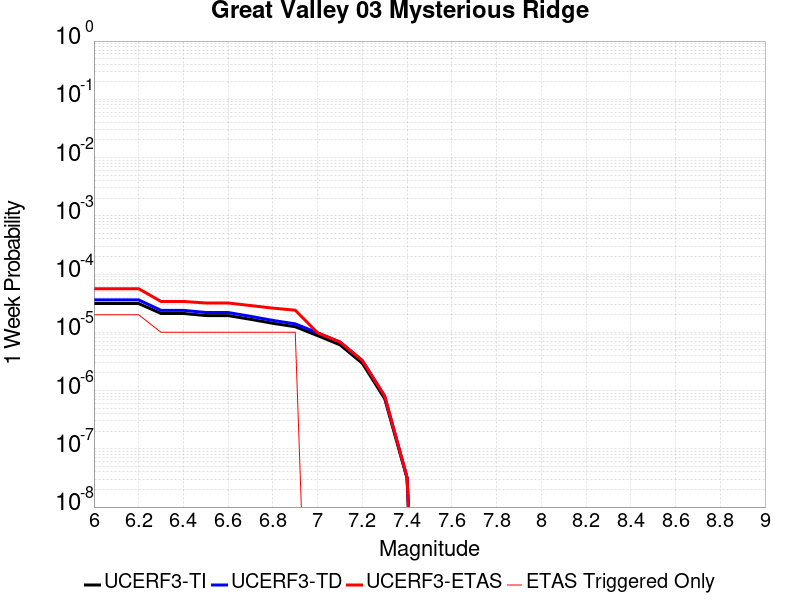 |  | 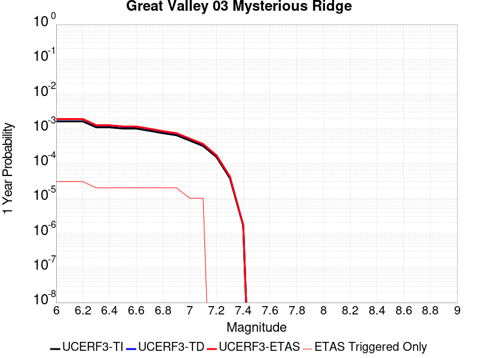 |  |

| Magnitude | 1 wk TI Prob | 1 wk TD Prob | 1 wk ETAS Prob | 1 wk ETAS/TD Gain | 1 wk ETAS Triggered Only | 1 mo TI Prob | 1 mo TD Prob | 1 mo ETAS Prob | 1 mo ETAS/TD Gain | 1 mo ETAS Triggered Only | 1 yr TI Prob | 1 yr TD Prob | 1 yr ETAS Prob | 1 yr ETAS/TD Gain | 1 yr ETAS Triggered Only | 10 yr TI Prob | 10 yr TD Prob | 10 yr ETAS Prob | 10 yr ETAS/TD Gain | 10 yr ETAS Triggered Only |
|-----|-----|-----|-----|-----|-----|-----|-----|-----|-----|-----|-----|-----|-----|-----|-----|-----|-----|-----|-----|-----|
| 6.0 | 3.1182444E-5 | 3.6034133E-5 | 5.6033412E-5 | 1.5550094 | 2.0E-5 | 1.336322E-4 | 1.5442389E-4 | 1.7442081E-4 | 1.1294936 | 2.0E-5 | 0.0016257578 | 0.0018786751 | 0.0019086187 | 1.0159388 | 3.0E-5 | 0.016139153 | 0.018646672 | 0.018676111 | 1.0015788 | 3.0E-5 |
| 6.1 | 3.1182444E-5 | 3.6034133E-5 | 5.6033412E-5 | 1.5550094 | 2.0E-5 | 1.336322E-4 | 1.5442389E-4 | 1.7442081E-4 | 1.1294936 | 2.0E-5 | 0.0016257578 | 0.0018786751 | 0.0019086187 | 1.0159388 | 3.0E-5 | 0.016139153 | 0.018646672 | 0.018676111 | 1.0015788 | 3.0E-5 |
| 6.2 | 3.1182444E-5 | 3.6034133E-5 | 5.6033412E-5 | 1.5550094 | 2.0E-5 | 1.336322E-4 | 1.5442389E-4 | 1.7442081E-4 | 1.1294936 | 2.0E-5 | 0.0016257578 | 0.0018786751 | 0.0019086187 | 1.0159388 | 3.0E-5 | 0.016139153 | 0.018646672 | 0.018676111 | 1.0015788 | 3.0E-5 |
| 6.3 | 2.106934E-5 | 2.3850303E-5 | 3.3850065E-5 | 1.4192718 | 1.0E-5 | 9.0294045E-5 | 1.0221176E-4 | 1.12210735E-4 | 1.0978261 | 1.0E-5 | 0.0010987755 | 0.0012437488 | 0.0012637239 | 1.0160605 | 2.0E-5 | 0.010933585 | 0.0123711275 | 0.01239088 | 1.0015967 | 2.0E-5 |
| 6.4 | 2.106934E-5 | 2.3850303E-5 | 3.3850065E-5 | 1.4192718 | 1.0E-5 | 9.0294045E-5 | 1.0221176E-4 | 1.12210735E-4 | 1.0978261 | 1.0E-5 | 0.0010987755 | 0.0012437488 | 0.0012637239 | 1.0160605 | 2.0E-5 | 0.010933585 | 0.0123711275 | 0.01239088 | 1.0015967 | 2.0E-5 |
| 6.5 | 1.9389783E-5 | 2.1884982E-5 | 3.1884763E-5 | 1.4569243 | 1.0E-5 | 8.309642E-5 | 9.378956E-5 | 1.03788625E-4 | 1.1066117 | 1.0E-5 | 0.0010112294 | 0.0011413175 | 0.0011612946 | 1.0175036 | 2.0E-5 | 0.010066401 | 0.011357434 | 0.011377207 | 1.0017409 | 2.0E-5 |
| 6.6 | 1.9370193E-5 | 2.1864902E-5 | 3.1864685E-5 | 1.4573439 | 1.0E-5 | 8.301247E-5 | 9.3703515E-5 | 1.0370258E-4 | 1.1067096 | 1.0E-5 | 0.0010102082 | 0.001140271 | 0.0011602482 | 1.0175197 | 2.0E-5 | 0.010056281 | 0.011347076 | 0.011366849 | 1.0017426 | 2.0E-5 |
| 6.7 | 1.6723505E-5 | 1.8799281E-5 | 2.8799093E-5 | 1.5319252 | 1.0E-5 | 7.16702E-5 | 8.056597E-5 | 9.056517E-5 | 1.1241119 | 1.0E-5 | 8.722353E-4 | 9.804688E-4 | 0.0010004492 | 1.0203784 | 2.0E-5 | 0.008688197 | 0.009763439 | 0.009783244 | 1.0020285 | 2.0E-5 |
| 6.8 | 1.426937E-5 | 1.599721E-5 | 2.599705E-5 | 1.6250991 | 1.0E-5 | 6.115301E-5 | 6.855775E-5 | 7.855707E-5 | 1.1458524 | 1.0E-5 | 7.4428355E-4 | 8.343854E-4 | 8.543687E-4 | 1.0239497 | 2.0E-5 | 0.007417957 | 0.008314005 | 0.008333839 | 1.0023856 | 2.0E-5 |
| 6.9 | 1.2469891E-5 | 1.3956928E-5 | 2.3956789E-5 | 1.71648 | 1.0E-5 | 5.3441294E-5 | 5.9814105E-5 | 6.9813505E-5 | 1.1671747 | 1.0E-5 | 6.504535E-4 | 7.280055E-4 | 7.479909E-4 | 1.0274523 | 2.0E-5 | 0.006485529 | 0.00725743 | 0.0072772847 | 1.0027359 | 2.0E-5 |
| 7.0 | 8.7746275E-6 | 9.791734E-6 | 9.791734E-6 | 1.0 | 0.0 | 3.7605005E-5 | 4.196394E-5 | 4.196394E-5 | 1.0 | 0.0 | 4.5774475E-4 | 5.1079853E-4 | 5.2079343E-4 | 1.0195671 | 1.0E-5 | 0.00456803 | 0.005096977 | 0.0051069264 | 1.0019519 | 1.0E-5 |
| 7.1 | 6.1067153E-6 | 6.813725E-6 | 6.813725E-6 | 1.0 | 0.0 | 2.6171374E-5 | 2.9201385E-5 | 2.9201385E-5 | 1.0 | 0.0 | 3.1858988E-4 | 3.5547445E-4 | 3.6547089E-4 | 1.0281215 | 1.0E-5 | 0.0031813353 | 0.003549609 | 0.0035595736 | 1.0028073 | 1.0E-5 |
| 7.2 | 2.939283E-6 | 3.2741057E-6 | 3.2741057E-6 | 1.0 | 0.0 | 1.2596866E-5 | 1.4031816E-5 | 1.4031816E-5 | 1.0 | 0.0 | 1.5335606E-4 | 1.7082572E-4 | 1.7082572E-4 | 1.0 | 0.0 | 0.0015325027 | 0.001707116 | 0.001707116 | 1.0 | 0.0 |
| 7.3 | 7.2387763E-7 | 8.008505E-7 | 8.008505E-7 | 1.0 | 0.0 | 3.102329E-6 | 3.4322145E-6 | 3.4322145E-6 | 1.0 | 0.0 | 3.77702E-5 | 4.178687E-5 | 4.178687E-5 | 1.0 | 0.0 | 3.7763783E-4 | 4.1783508E-4 | 4.1783508E-4 | 1.0 | 0.0 |
| 7.4 | 3.112171E-8 | 3.2068368E-8 | 3.2068368E-8 | 1.0 | 0.0 | 1.3337875E-7 | 1.3743585E-7 | 1.3743585E-7 | 1.0 | 0.0 | 1.6238852E-6 | 1.6732803E-6 | 1.6732803E-6 | 1.0 | 0.0 | 1.6238733E-5 | 1.6732685E-5 | 1.6732685E-5 | 1.0 | 0.0 |

## Big Pine (West)
*[(top)](#table-of-contents)*

| 1 Week | 1 Month | 1 Year | 10 Year |
|-----|-----|-----|-----|
|  | 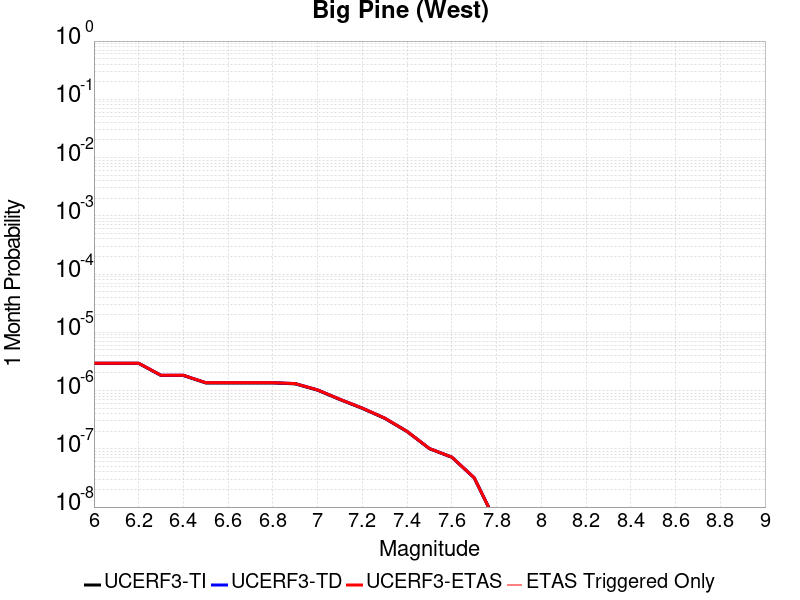 |  | 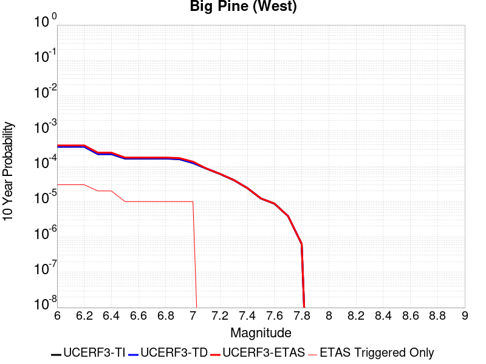 |

| Magnitude | 1 wk TI Prob | 1 wk TD Prob | 1 wk ETAS Prob | 1 wk ETAS/TD Gain | 1 wk ETAS Triggered Only | 1 mo TI Prob | 1 mo TD Prob | 1 mo ETAS Prob | 1 mo ETAS/TD Gain | 1 mo ETAS Triggered Only | 1 yr TI Prob | 1 yr TD Prob | 1 yr ETAS Prob | 1 yr ETAS/TD Gain | 1 yr ETAS Triggered Only | 10 yr TI Prob | 10 yr TD Prob | 10 yr ETAS Prob | 10 yr ETAS/TD Gain | 10 yr ETAS Triggered Only |
|-----|-----|-----|-----|-----|-----|-----|-----|-----|-----|-----|-----|-----|-----|-----|-----|-----|-----|-----|-----|-----|
| 6.0 | 6.8306974E-7 | 6.8818304E-7 | 6.8818304E-7 | 1.0 | 0.0 | 2.9274386E-6 | 2.949353E-6 | 2.949353E-6 | 1.0 | 0.0 | 3.564098E-5 | 3.5907877E-5 | 5.590716E-5 | 1.5569608 | 2.0E-5 | 3.5635266E-4 | 3.5903015E-4 | 3.8901938E-4 | 1.0835284 | 3.0E-5 |
| 6.1 | 6.8306974E-7 | 6.8818304E-7 | 6.8818304E-7 | 1.0 | 0.0 | 2.9274386E-6 | 2.949353E-6 | 2.949353E-6 | 1.0 | 0.0 | 3.564098E-5 | 3.5907877E-5 | 5.590716E-5 | 1.5569608 | 2.0E-5 | 3.5635266E-4 | 3.5903015E-4 | 3.8901938E-4 | 1.0835284 | 3.0E-5 |
| 6.2 | 6.8306974E-7 | 6.8818304E-7 | 6.8818304E-7 | 1.0 | 0.0 | 2.9274386E-6 | 2.949353E-6 | 2.949353E-6 | 1.0 | 0.0 | 3.564098E-5 | 3.5907877E-5 | 5.590716E-5 | 1.5569608 | 2.0E-5 | 3.5635266E-4 | 3.5903015E-4 | 3.8901938E-4 | 1.0835284 | 3.0E-5 |
| 6.3 | 4.227652E-7 | 4.2665604E-7 | 4.2665604E-7 | 1.0 | 0.0 | 1.8118495E-6 | 1.8285248E-6 | 1.8285248E-6 | 1.0 | 0.0 | 2.2059045E-5 | 2.226208E-5 | 4.2261636E-5 | 1.8983687 | 2.0E-5 | 2.2056856E-4 | 2.2260031E-4 | 2.4259587E-4 | 1.0898272 | 2.0E-5 |
| 6.4 | 4.227652E-7 | 4.2665604E-7 | 4.2665604E-7 | 1.0 | 0.0 | 1.8118495E-6 | 1.8285248E-6 | 1.8285248E-6 | 1.0 | 0.0 | 2.2059045E-5 | 2.226208E-5 | 4.2261636E-5 | 1.8983687 | 2.0E-5 | 2.2056856E-4 | 2.2260031E-4 | 2.4259587E-4 | 1.0898272 | 2.0E-5 |
| 6.5 | 3.1538403E-7 | 3.1884528E-7 | 3.1884528E-7 | 1.0 | 0.0 | 1.3516451E-6 | 1.3664791E-6 | 1.3664791E-6 | 1.0 | 0.0 | 1.6456155E-5 | 1.6636759E-5 | 2.6636593E-5 | 1.6010686 | 1.0E-5 | 1.6454936E-4 | 1.6635554E-4 | 1.7635387E-4 | 1.0601022 | 1.0E-5 |
| 6.6 | 3.1538403E-7 | 3.1884528E-7 | 3.1884528E-7 | 1.0 | 0.0 | 1.3516451E-6 | 1.3664791E-6 | 1.3664791E-6 | 1.0 | 0.0 | 1.6456155E-5 | 1.6636759E-5 | 2.6636593E-5 | 1.6010686 | 1.0E-5 | 1.6454936E-4 | 1.6635554E-4 | 1.7635387E-4 | 1.0601022 | 1.0E-5 |
| 6.7 | 3.1538403E-7 | 3.1884528E-7 | 3.1884528E-7 | 1.0 | 0.0 | 1.3516451E-6 | 1.3664791E-6 | 1.3664791E-6 | 1.0 | 0.0 | 1.6456155E-5 | 1.6636759E-5 | 2.6636593E-5 | 1.6010686 | 1.0E-5 | 1.6454936E-4 | 1.6635554E-4 | 1.7635387E-4 | 1.0601022 | 1.0E-5 |
| 6.8 | 3.1538403E-7 | 3.1884528E-7 | 3.1884528E-7 | 1.0 | 0.0 | 1.3516451E-6 | 1.3664791E-6 | 1.3664791E-6 | 1.0 | 0.0 | 1.6456155E-5 | 1.6636759E-5 | 2.6636593E-5 | 1.6010686 | 1.0E-5 | 1.6454936E-4 | 1.6635554E-4 | 1.7635387E-4 | 1.0601022 | 1.0E-5 |
| 6.9 | 3.0402092E-7 | 3.0739798E-7 | 3.0739798E-7 | 1.0 | 0.0 | 1.3029462E-6 | 1.3174192E-6 | 1.3174192E-6 | 1.0 | 0.0 | 1.5863254E-5 | 1.6039465E-5 | 2.6039304E-5 | 1.6234522 | 1.0E-5 | 1.5862122E-4 | 1.6038347E-4 | 1.7038187E-4 | 1.0623406 | 1.0E-5 |
| 7.0 | 2.3673063E-7 | 2.3944315E-7 | 2.3944315E-7 | 1.0 | 0.0 | 1.0145594E-6 | 1.0261845E-6 | 1.0261845E-6 | 1.0 | 0.0 | 1.235219E-5 | 1.2493728E-5 | 2.2493603E-5 | 1.8003917 | 1.0E-5 | 1.2351504E-4 | 1.2493054E-4 | 1.3492927E-4 | 1.0800345 | 1.0E-5 |
| 7.1 | 1.632138E-7 | 1.6514511E-7 | 1.6514511E-7 | 1.0 | 0.0 | 6.9948754E-7 | 7.0776457E-7 | 7.0776457E-7 | 1.0 | 0.0 | 8.516227E-6 | 8.617002E-6 | 8.617002E-6 | 1.0 | 0.0 | 8.5159016E-5 | 8.616685E-5 | 8.616685E-5 | 1.0 | 0.0 |
| 7.2 | 1.1523723E-7 | 1.1657165E-7 | 1.1657165E-7 | 1.0 | 0.0 | 4.9387376E-7 | 4.9959266E-7 | 4.9959266E-7 | 1.0 | 0.0 | 6.0128964E-6 | 6.082525E-6 | 6.082525E-6 | 1.0 | 0.0 | 6.0127335E-5 | 6.0823695E-5 | 6.0823695E-5 | 1.0 | 0.0 |
| 7.3 | 7.777805E-8 | 7.862446E-8 | 7.862446E-8 | 1.0 | 0.0 | 3.3333444E-7 | 3.3696193E-7 | 3.3696193E-7 | 1.0 | 0.0 | 4.0583395E-6 | 4.102504E-6 | 4.102504E-6 | 1.0 | 0.0 | 4.0582654E-5 | 4.102434E-5 | 4.102434E-5 | 1.0 | 0.0 |
| 7.4 | 4.609946E-8 | 4.6522135E-8 | 4.6522135E-8 | 1.0 | 0.0 | 1.975691E-7 | 1.9938055E-7 | 1.9938055E-7 | 1.0 | 0.0 | 2.4054011E-6 | 2.4274557E-6 | 2.4274557E-6 | 1.0 | 0.0 | 2.405375E-5 | 2.427431E-5 | 2.427431E-5 | 1.0 | 0.0 |
| 7.5 | 2.3439137E-8 | 2.3608283E-8 | 2.3608283E-8 | 1.0 | 0.0 | 1.00453434E-7 | 1.0117836E-7 | 1.0117836E-7 | 1.0 | 0.0 | 1.2230199E-6 | 1.2318458E-6 | 1.2318458E-6 | 1.0 | 0.0 | 1.2230132E-5 | 1.2318393E-5 | 1.2318393E-5 | 1.0 | 0.0 |
| 7.6 | 1.6699769E-8 | 1.6817072E-8 | 1.6817072E-8 | 1.0 | 0.0 | 7.157044E-8 | 7.207316E-8 | 7.207316E-8 | 1.0 | 0.0 | 8.713697E-7 | 8.7749044E-7 | 8.7749044E-7 | 1.0 | 0.0 | 8.713663E-6 | 8.774871E-6 | 8.774871E-6 | 1.0 | 0.0 |
| 7.7 | 7.4061512E-9 | 7.4541635E-9 | 7.4541635E-9 | 1.0 | 0.0 | 3.1740647E-8 | 3.1946417E-8 | 3.1946417E-8 | 1.0 | 0.0 | 3.864423E-7 | 3.8894754E-7 | 3.8894754E-7 | 1.0 | 0.0 | 3.8644166E-6 | 3.8894696E-6 | 3.8894696E-6 | 1.0 | 0.0 |
| 7.8 | 1.2189427E-9 | 1.2270763E-9 | 1.2270763E-9 | 1.0 | 0.0 | 5.2240403E-9 | 5.258898E-9 | 5.258898E-9 | 1.0 | 0.0 | 6.3602684E-8 | 6.4027084E-8 | 6.4027084E-8 | 1.0 | 0.0 | 6.360267E-7 | 6.4027074E-7 | 6.4027074E-7 | 1.0 | 0.0 |

## Kern Canyon (South Kern) 2011
*[(top)](#table-of-contents)*

| 1 Week | 1 Month | 1 Year | 10 Year |
|-----|-----|-----|-----|
|  | 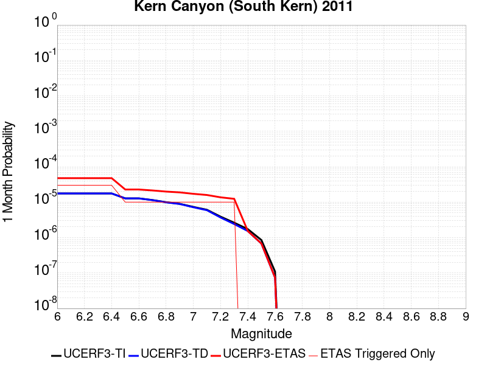 | 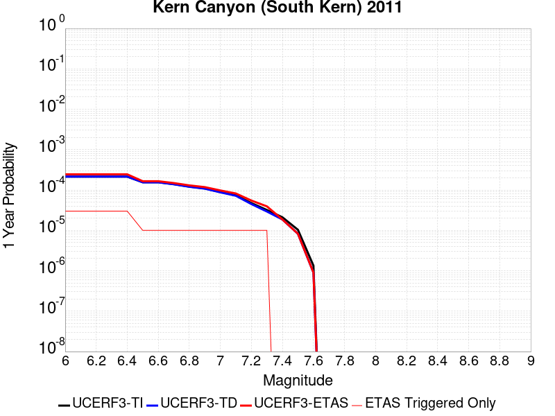 |  |

| Magnitude | 1 wk TI Prob | 1 wk TD Prob | 1 wk ETAS Prob | 1 wk ETAS/TD Gain | 1 wk ETAS Triggered Only | 1 mo TI Prob | 1 mo TD Prob | 1 mo ETAS Prob | 1 mo ETAS/TD Gain | 1 mo ETAS Triggered Only | 1 yr TI Prob | 1 yr TD Prob | 1 yr ETAS Prob | 1 yr ETAS/TD Gain | 1 yr ETAS Triggered Only | 10 yr TI Prob | 10 yr TD Prob | 10 yr ETAS Prob | 10 yr ETAS/TD Gain | 10 yr ETAS Triggered Only |
|-----|-----|-----|-----|-----|-----|-----|-----|-----|-----|-----|-----|-----|-----|-----|-----|-----|-----|-----|-----|-----|
| 6.0 | 4.105075E-6 | 4.113726E-6 | 3.4113604E-5 | 8.292629 | 3.0E-5 | 1.7593058E-5 | 1.7630138E-5 | 4.7629608E-5 | 2.7016015 | 3.0E-5 | 2.1417443E-4 | 2.1462643E-4 | 2.4462E-4 | 1.1397477 | 3.0E-5 | 0.0021396813 | 0.0021442554 | 0.002174191 | 1.0139608 | 3.0E-5 |
| 6.1 | 4.105075E-6 | 4.113726E-6 | 3.4113604E-5 | 8.292629 | 3.0E-5 | 1.7593058E-5 | 1.7630138E-5 | 4.7629608E-5 | 2.7016015 | 3.0E-5 | 2.1417443E-4 | 2.1462643E-4 | 2.4462E-4 | 1.1397477 | 3.0E-5 | 0.0021396813 | 0.0021442554 | 0.002174191 | 1.0139608 | 3.0E-5 |
| 6.2 | 4.105075E-6 | 4.113726E-6 | 3.4113604E-5 | 8.292629 | 3.0E-5 | 1.7593058E-5 | 1.7630138E-5 | 4.7629608E-5 | 2.7016015 | 3.0E-5 | 2.1417443E-4 | 2.1462643E-4 | 2.4462E-4 | 1.1397477 | 3.0E-5 | 0.0021396813 | 0.0021442554 | 0.002174191 | 1.0139608 | 3.0E-5 |
| 6.3 | 4.105075E-6 | 4.113726E-6 | 3.4113604E-5 | 8.292629 | 3.0E-5 | 1.7593058E-5 | 1.7630138E-5 | 4.7629608E-5 | 2.7016015 | 3.0E-5 | 2.1417443E-4 | 2.1462643E-4 | 2.4462E-4 | 1.1397477 | 3.0E-5 | 0.0021396813 | 0.0021442554 | 0.002174191 | 1.0139608 | 3.0E-5 |
| 6.4 | 4.105075E-6 | 4.113726E-6 | 3.4113604E-5 | 8.292629 | 3.0E-5 | 1.7593058E-5 | 1.7630138E-5 | 4.7629608E-5 | 2.7016015 | 3.0E-5 | 2.1417443E-4 | 2.1462643E-4 | 2.4462E-4 | 1.1397477 | 3.0E-5 | 0.0021396813 | 0.0021442554 | 0.002174191 | 1.0139608 | 3.0E-5 |
| 6.5 | 2.9849807E-6 | 2.973154E-6 | 1.2973124E-5 | 4.3634214 | 1.0E-5 | 1.2792712E-5 | 1.2742028E-5 | 2.27419E-5 | 1.7847944 | 1.0E-5 | 1.5574014E-4 | 1.551233E-4 | 1.6512175E-4 | 1.0644548 | 1.0E-5 | 0.0015563103 | 0.0015501654 | 0.0015601498 | 1.0064409 | 1.0E-5 |
| 6.6 | 2.9849807E-6 | 2.973154E-6 | 1.2973124E-5 | 4.3634214 | 1.0E-5 | 1.2792712E-5 | 1.2742028E-5 | 2.27419E-5 | 1.7847944 | 1.0E-5 | 1.5574014E-4 | 1.551233E-4 | 1.6512175E-4 | 1.0644548 | 1.0E-5 | 0.0015563103 | 0.0015501654 | 0.0015601498 | 1.0064409 | 1.0E-5 |
| 6.7 | 2.6756725E-6 | 2.6582202E-6 | 1.2658194E-5 | 4.7619057 | 1.0E-5 | 1.1467117E-5 | 1.1392323E-5 | 2.1392209E-5 | 1.8777741 | 1.0E-5 | 1.396032E-4 | 1.386928E-4 | 1.4869143E-4 | 1.0720918 | 1.0E-5 | 0.0013951553 | 0.0013860734 | 0.0013960596 | 1.0072047 | 1.0E-5 |
| 6.8 | 2.3283721E-6 | 2.3047783E-6 | 1.2304755E-5 | 5.3388023 | 1.0E-5 | 9.9787E-6 | 9.877584E-6 | 1.9877485E-5 | 2.0123832 | 1.0E-5 | 1.214839E-4 | 1.2025302E-4 | 1.3025182E-4 | 1.083148 | 1.0E-5 | 0.001214175 | 0.001201887 | 0.001211875 | 1.0083102 | 1.0E-5 |
| 6.9 | 2.0972677E-6 | 2.0696405E-6 | 1.20696195E-5 | 5.831747 | 1.0E-5 | 8.988259E-6 | 8.869858E-6 | 1.8869769E-5 | 2.1274037 | 1.0E-5 | 1.0942656E-4 | 1.0798523E-4 | 1.1798415E-4 | 1.0925952 | 1.0E-5 | 0.0010937268 | 0.0010793334 | 0.0010893226 | 1.0092549 | 1.0E-5 |
| 7.0 | 1.7132242E-6 | 1.6787029E-6 | 1.1678686E-5 | 6.95697 | 1.0E-5 | 7.3423685E-6 | 7.1944214E-6 | 1.719435E-5 | 2.3899558 | 1.0E-5 | 8.938967E-5 | 8.75886E-5 | 9.758773E-5 | 1.1141601 | 1.0E-5 | 8.935372E-4 | 8.755446E-4 | 8.855359E-4 | 1.0114114 | 1.0E-5 |
| 7.1 | 1.4215541E-6 | 1.3815746E-6 | 1.138156E-5 | 8.238108 | 1.0E-5 | 6.0923603E-6 | 5.9210206E-6 | 1.5920961E-5 | 2.688888 | 1.0E-5 | 7.417196E-5 | 7.208607E-5 | 8.2085346E-5 | 1.138713 | 1.0E-5 | 7.414721E-4 | 7.206296E-4 | 7.306224E-4 | 1.0138668 | 1.0E-5 |
| 7.2 | 9.097853E-7 | 8.60377E-7 | 1.0860368E-5 | 12.622803 | 1.0E-5 | 3.899074E-6 | 3.6873246E-6 | 1.3687288E-5 | 3.7119834 | 1.0E-5 | 4.7470192E-5 | 4.4892266E-5 | 5.4891814E-5 | 1.2227455 | 1.0E-5 | 4.7460053E-4 | 4.4883305E-4 | 4.5882855E-4 | 1.02227 | 1.0E-5 |
| 7.3 | 6.144169E-7 | 5.628199E-7 | 1.0562814E-5 | 18.767664 | 1.0E-5 | 2.6332125E-6 | 2.4120832E-6 | 1.2412059E-5 | 5.1457844 | 1.0E-5 | 3.205889E-5 | 2.9366722E-5 | 3.9366427E-5 | 1.3405116 | 1.0E-5 | 3.2054266E-4 | 2.9362892E-4 | 3.0362597E-4 | 1.0340466 | 1.0E-5 |
| 7.4 | 4.049844E-7 | 3.5728252E-7 | 3.5728252E-7 | 1.0 | 0.0 | 1.7356463E-6 | 1.5312098E-6 | 1.5312098E-6 | 1.0 | 0.0 | 2.1131287E-5 | 1.8642324E-5 | 1.8642324E-5 | 1.0 | 0.0 | 2.1129279E-4 | 1.8640784E-4 | 1.8640784E-4 | 1.0 | 0.0 |
| 7.5 | 1.9871162E-7 | 1.5830383E-7 | 1.5830383E-7 | 1.0 | 0.0 | 8.5162094E-7 | 6.784448E-7 | 6.784448E-7 | 1.0 | 0.0 | 1.0368436E-5 | 8.260035E-6 | 8.260035E-6 | 1.0 | 0.0 | 1.0367952E-4 | 8.259736E-5 | 8.259736E-5 | 1.0 | 0.0 |
| 7.6 | 2.572245E-8 | 1.735264E-8 | 1.735264E-8 | 1.0 | 0.0 | 1.10239064E-7 | 7.436845E-8 | 7.436845E-8 | 1.0 | 0.0 | 1.3421597E-6 | 9.0543557E-7 | 9.0543557E-7 | 1.0 | 0.0 | 1.3421517E-5 | 9.054324E-6 | 9.054324E-6 | 1.0 | 0.0 |

## Calaveras (So) - Paicines extension 2011 CFM
*[(top)](#table-of-contents)*

| 1 Week | 1 Month | 1 Year | 10 Year |
|-----|-----|-----|-----|
| 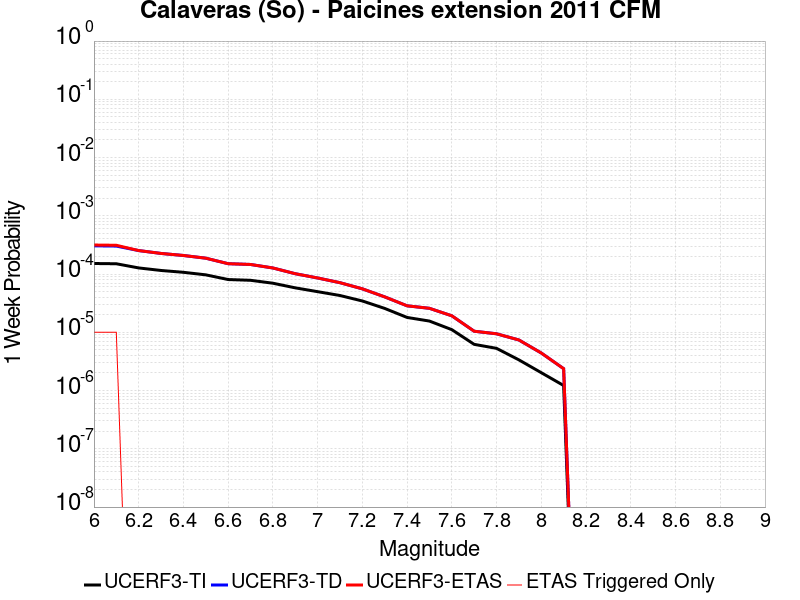 |  |  |  |

| Magnitude | 1 wk TI Prob | 1 wk TD Prob | 1 wk ETAS Prob | 1 wk ETAS/TD Gain | 1 wk ETAS Triggered Only | 1 mo TI Prob | 1 mo TD Prob | 1 mo ETAS Prob | 1 mo ETAS/TD Gain | 1 mo ETAS Triggered Only | 1 yr TI Prob | 1 yr TD Prob | 1 yr ETAS Prob | 1 yr ETAS/TD Gain | 1 yr ETAS Triggered Only | 10 yr TI Prob | 10 yr TD Prob | 10 yr ETAS Prob | 10 yr ETAS/TD Gain | 10 yr ETAS Triggered Only |
|-----|-----|-----|-----|-----|-----|-----|-----|-----|-----|-----|-----|-----|-----|-----|-----|-----|-----|-----|-----|-----|
| 6.0 | 1.5183659E-4 | 3.0520977E-4 | 3.1520674E-4 | 1.0327543 | 1.0E-5 | 6.5056595E-4 | 0.0013068188 | 0.0013168057 | 1.0076421 | 1.0E-5 | 0.007891912 | 0.015696203 | 0.015725734 | 1.0018812 | 3.0E-5 | 0.076174594 | 0.13848905 | 0.13851489 | 1.0001867 | 3.0E-5 |
| 6.1 | 1.5024997E-4 | 3.021517E-4 | 3.1214865E-4 | 1.033086 | 1.0E-5 | 6.437695E-4 | 0.0012937278 | 0.0013037149 | 1.0077196 | 1.0E-5 | 0.0078097614 | 0.015539596 | 0.01556913 | 1.0019006 | 3.0E-5 | 0.075409345 | 0.13715863 | 0.13718452 | 1.0001887 | 3.0E-5 |
| 6.2 | 1.2743923E-4 | 2.5313982E-4 | 2.5313982E-4 | 1.0 | 0.0 | 5.460538E-4 | 0.0010839999 | 0.0010839999 | 1.0 | 0.0 | 0.0066279583 | 0.013046881 | 0.013056751 | 1.0007565 | 1.0E-5 | 0.064337276 | 0.117256075 | 0.1172649 | 1.0000753 | 1.0E-5 |
| 6.3 | 1.1525114E-4 | 2.2599236E-4 | 2.2599236E-4 | 1.0 | 0.0 | 4.9383997E-4 | 9.678718E-4 | 9.678718E-4 | 1.0 | 0.0 | 0.0059959386 | 0.011668079 | 0.011677962 | 1.000847 | 1.0E-5 | 0.058367174 | 0.106372125 | 0.10638106 | 1.000084 | 1.0E-5 |
| 6.4 | 1.07200925E-4 | 2.0840544E-4 | 2.0840544E-4 | 1.0 | 0.0 | 4.5935164E-4 | 8.926123E-4 | 8.926123E-4 | 1.0 | 0.0 | 0.0055782744 | 0.010772959 | 0.010782851 | 1.0009183 | 1.0E-5 | 0.0544031 | 0.099194765 | 0.09920377 | 1.0000908 | 1.0E-5 |
| 6.5 | 9.69631E-5 | 1.8734725E-4 | 1.8734725E-4 | 1.0 | 0.0 | 4.1548995E-4 | 8.024631E-4 | 8.024631E-4 | 1.0 | 0.0 | 0.0050468626 | 0.009694842 | 0.009704744 | 1.0010215 | 1.0E-5 | 0.04933773 | 0.090086564 | 0.09009567 | 1.000101 | 1.0E-5 |
| 6.6 | 8.0552316E-5 | 1.507068E-4 | 1.507068E-4 | 1.0 | 0.0 | 3.4517853E-4 | 6.4569083E-4 | 6.4569083E-4 | 1.0 | 0.0 | 0.0041944524 | 0.007826508 | 0.007826508 | 1.0 | 0.0 | 0.04116161 | 0.0748563 | 0.0748563 | 1.0 | 0.0 |
| 6.7 | 7.815757E-5 | 1.4611272E-4 | 1.4611272E-4 | 1.0 | 0.0 | 3.34918E-4 | 6.26014E-4 | 6.26014E-4 | 1.0 | 0.0 | 0.004070005 | 0.007589312 | 0.007589312 | 1.0 | 0.0 | 0.039962657 | 0.07270582 | 0.07270582 | 1.0 | 0.0 |
| 6.8 | 6.965264E-5 | 1.2722758E-4 | 1.2722758E-4 | 1.0 | 0.0 | 2.9847719E-4 | 5.4513285E-4 | 5.4513285E-4 | 1.0 | 0.0 | 0.0036279052 | 0.0066135945 | 0.0066135945 | 1.0 | 0.0 | 0.03569247 | 0.063801065 | 0.063801065 | 1.0 | 0.0 |
| 6.9 | 5.8000453E-5 | 1.01439E-4 | 1.01439E-4 | 1.0 | 0.0 | 2.4854968E-4 | 4.346666E-4 | 4.346666E-4 | 1.0 | 0.0 | 0.0030218933 | 0.005279322 | 0.005279322 | 1.0 | 0.0 | 0.029811295 | 0.051502965 | 0.051502965 | 1.0 | 0.0 |
| 7.0 | 4.9865852E-5 | 8.568029E-5 | 8.568029E-5 | 1.0 | 0.0 | 2.1369329E-4 | 3.6715003E-4 | 3.6715003E-4 | 1.0 | 0.0 | 0.0025986114 | 0.004460979 | 0.004460979 | 1.0 | 0.0 | 0.025684336 | 0.043782018 | 0.043782018 | 1.0 | 0.0 |
| 7.1 | 4.283875E-5 | 7.1124625E-5 | 7.1124625E-5 | 1.0 | 0.0 | 1.8358172E-4 | 3.0478454E-4 | 3.0478454E-4 | 1.0 | 0.0 | 0.0022328163 | 0.003704494 | 0.003704494 | 1.0 | 0.0 | 0.022105146 | 0.03673582 | 0.03673582 | 1.0 | 0.0 |
| 7.2 | 3.450115E-5 | 5.5778568E-5 | 5.5778568E-5 | 1.0 | 0.0 | 1.478537E-4 | 2.3902925E-4 | 2.3902925E-4 | 1.0 | 0.0 | 0.0017986323 | 0.0029063264 | 0.0029063264 | 1.0 | 0.0 | 0.017841442 | 0.029079042 | 0.029079042 | 1.0 | 0.0 |
| 7.3 | 2.5709045E-5 | 4.059001E-5 | 4.059001E-5 | 1.0 | 0.0 | 1.1017697E-4 | 1.7394568E-4 | 1.7394568E-4 | 1.0 | 0.0 | 0.0013405791 | 0.0021157486 | 0.0021157486 | 1.0 | 0.0 | 0.013325208 | 0.02129686 | 0.02129686 | 1.0 | 0.0 |
| 7.4 | 1.8003093E-5 | 2.8511378E-5 | 2.8511378E-5 | 1.0 | 0.0 | 7.715383E-5 | 1.2218591E-4 | 1.2218591E-4 | 1.0 | 0.0 | 9.3894306E-4 | 0.0014866006 | 0.0014866006 | 1.0 | 0.0 | 0.009349857 | 0.015051589 | 0.015051589 | 1.0 | 0.0 |
| 7.5 | 1.5595824E-5 | 2.5823752E-5 | 2.5823752E-5 | 1.0 | 0.0 | 6.683753E-5 | 1.10668545E-4 | 1.10668545E-4 | 1.0 | 0.0 | 8.134431E-4 | 0.0013465589 | 0.0013465589 | 1.0 | 0.0 | 0.008104719 | 0.013651571 | 0.013651571 | 1.0 | 0.0 |
| 7.6 | 1.1110309E-5 | 1.9223195E-5 | 1.9223195E-5 | 1.0 | 0.0 | 4.761474E-5 | 8.2382525E-5 | 8.2382525E-5 | 1.0 | 0.0 | 5.795553E-4 | 0.0010025471 | 0.0010025471 | 1.0 | 0.0 | 0.0057804612 | 0.01020344 | 0.01020344 | 1.0 | 0.0 |
| 7.7 | 6.2140443E-6 | 1.04376995E-5 | 1.04376995E-5 | 1.0 | 0.0 | 2.6631347E-5 | 4.4732235E-5 | 4.4732235E-5 | 1.0 | 0.0 | 3.241884E-4 | 5.4447894E-4 | 5.4447894E-4 | 1.0 | 0.0 | 0.0032371588 | 0.005620102 | 0.005620102 | 1.0 | 0.0 |
| 7.8 | 5.305533E-6 | 9.433651E-6 | 9.433651E-6 | 1.0 | 0.0 | 2.27378E-5 | 4.0429306E-5 | 4.0429306E-5 | 1.0 | 0.0 | 2.7679754E-4 | 4.9211574E-4 | 4.9211574E-4 | 1.0 | 0.0 | 0.0027645302 | 0.005074622 | 0.005074622 | 1.0 | 0.0 |
| 7.9 | 3.363505E-6 | 7.3854467E-6 | 7.3854467E-6 | 1.0 | 0.0 | 1.4414942E-5 | 3.1651532E-5 | 3.1651532E-5 | 1.0 | 0.0 | 1.7548777E-4 | 3.8528934E-4 | 3.8528934E-4 | 1.0 | 0.0 | 0.0017534926 | 0.003948784 | 0.003948784 | 1.0 | 0.0 |
| 8.0 | 2.0271132E-6 | 4.4134235E-6 | 4.4134235E-6 | 1.0 | 0.0 | 8.687599E-6 | 1.8914534E-5 | 1.8914534E-5 | 1.0 | 0.0 | 1.05766376E-4 | 2.3026018E-4 | 2.3026018E-4 | 1.0 | 0.0 | 0.0010571606 | 0.002351194 | 0.002351194 | 1.0 | 0.0 |
| 8.1 | 1.2206116E-6 | 2.3752666E-6 | 2.3752666E-6 | 1.0 | 0.0 | 5.2311816E-6 | 1.0179674E-5 | 1.0179674E-5 | 1.0 | 0.0 | 6.3687774E-5 | 1.2393051E-4 | 1.2393051E-4 | 1.0 | 0.0 | 6.366953E-4 | 0.0012705618 | 0.0012705618 | 1.0 | 0.0 |

## San Gregorio (South) 2011 CFM
*[(top)](#table-of-contents)*

| 1 Week | 1 Month | 1 Year | 10 Year |
|-----|-----|-----|-----|
|  |  | 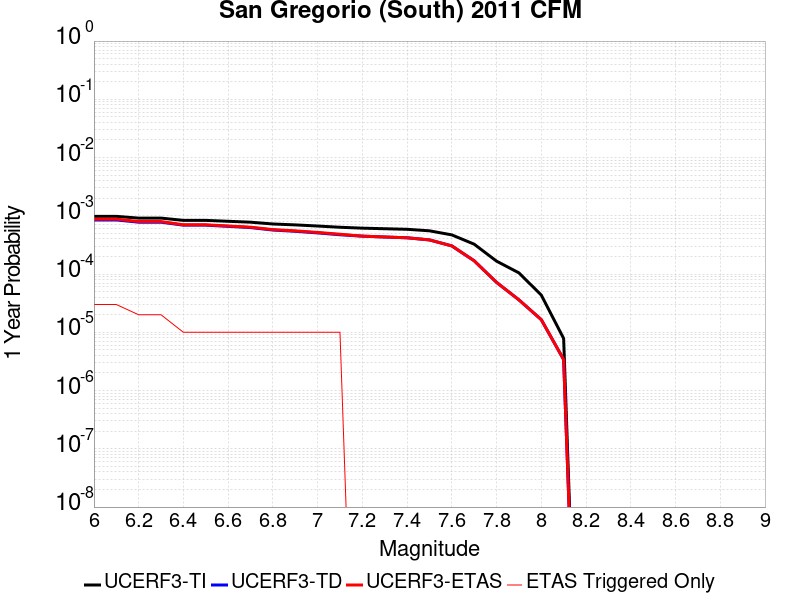 | 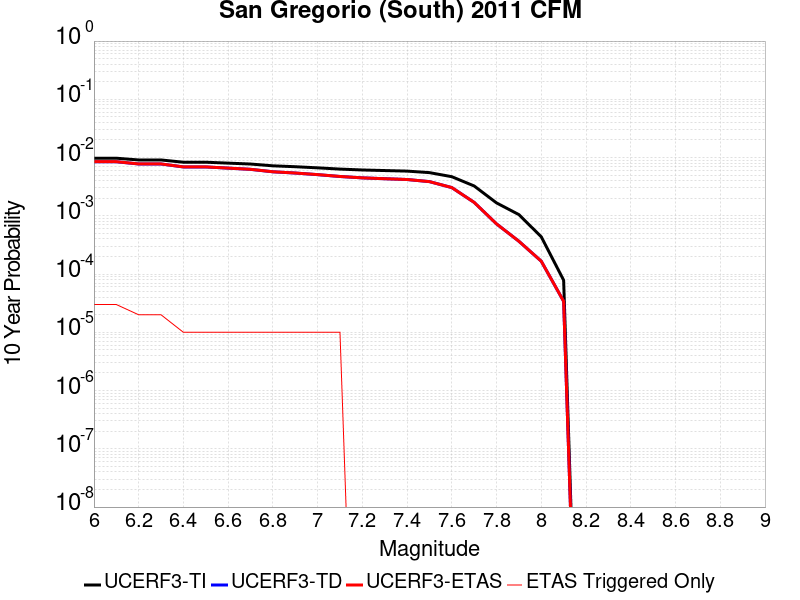 |

| Magnitude | 1 wk TI Prob | 1 wk TD Prob | 1 wk ETAS Prob | 1 wk ETAS/TD Gain | 1 wk ETAS Triggered Only | 1 mo TI Prob | 1 mo TD Prob | 1 mo ETAS Prob | 1 mo ETAS/TD Gain | 1 mo ETAS Triggered Only | 1 yr TI Prob | 1 yr TD Prob | 1 yr ETAS Prob | 1 yr ETAS/TD Gain | 1 yr ETAS Triggered Only | 10 yr TI Prob | 10 yr TD Prob | 10 yr ETAS Prob | 10 yr ETAS/TD Gain | 10 yr ETAS Triggered Only |
|-----|-----|-----|-----|-----|-----|-----|-----|-----|-----|-----|-----|-----|-----|-----|-----|-----|-----|-----|-----|-----|
| 6.0 | 1.8770423E-5 | 1.6279559E-5 | 2.6279396E-5 | 1.6142572 | 1.0E-5 | 8.044219E-5 | 6.9767695E-5 | 7.976699E-5 | 1.1433228 | 1.0E-5 | 9.789435E-4 | 8.490944E-4 | 8.790689E-4 | 1.0353018 | 3.0E-5 | 0.009746423 | 0.008471475 | 0.008501221 | 1.0035113 | 3.0E-5 |
| 6.1 | 1.8770423E-5 | 1.6279559E-5 | 2.6279396E-5 | 1.6142572 | 1.0E-5 | 8.044219E-5 | 6.9767695E-5 | 7.976699E-5 | 1.1433228 | 1.0E-5 | 9.789435E-4 | 8.490944E-4 | 8.790689E-4 | 1.0353018 | 3.0E-5 | 0.009746423 | 0.008471475 | 0.008501221 | 1.0035113 | 3.0E-5 |
| 6.2 | 1.7508692E-5 | 1.4899064E-5 | 1.4899064E-5 | 1.0 | 0.0 | 7.5035096E-5 | 6.3851585E-5 | 6.3851585E-5 | 1.0 | 0.0 | 9.1316935E-4 | 7.7711884E-4 | 7.971033E-4 | 1.0257161 | 2.0E-5 | 0.00909426 | 0.007756904 | 0.0077767484 | 1.0025584 | 2.0E-5 |
| 6.3 | 1.7508692E-5 | 1.4899064E-5 | 1.4899064E-5 | 1.0 | 0.0 | 7.5035096E-5 | 6.3851585E-5 | 6.3851585E-5 | 1.0 | 0.0 | 9.1316935E-4 | 7.7711884E-4 | 7.971033E-4 | 1.0257161 | 2.0E-5 | 0.00909426 | 0.007756904 | 0.0077767484 | 1.0025584 | 2.0E-5 |
| 6.4 | 1.6004591E-5 | 1.3248901E-5 | 1.3248901E-5 | 1.0 | 0.0 | 6.85893E-5 | 5.6779776E-5 | 5.6779776E-5 | 1.0 | 0.0 | 8.347548E-4 | 6.910755E-4 | 7.010686E-4 | 1.0144602 | 1.0E-5 | 0.008316261 | 0.0069019548 | 0.006911886 | 1.0014389 | 1.0E-5 |
| 6.5 | 1.6004591E-5 | 1.3248901E-5 | 1.3248901E-5 | 1.0 | 0.0 | 6.85893E-5 | 5.6779776E-5 | 5.6779776E-5 | 1.0 | 0.0 | 8.347548E-4 | 6.910755E-4 | 7.010686E-4 | 1.0144602 | 1.0E-5 | 0.008316261 | 0.0069019548 | 0.006911886 | 1.0014389 | 1.0E-5 |
| 6.6 | 1.5442201E-5 | 1.2633533E-5 | 1.2633533E-5 | 1.0 | 0.0 | 6.617918E-5 | 5.414259E-5 | 5.414259E-5 | 1.0 | 0.0 | 8.0543366E-4 | 6.5898756E-4 | 6.6898094E-4 | 1.0151649 | 1.0E-5 | 0.008025207 | 0.0065830066 | 0.0065929405 | 1.0015091 | 1.0E-5 |
| 6.7 | 1.489921E-5 | 1.2042042E-5 | 1.2042042E-5 | 1.0 | 0.0 | 6.3852196E-5 | 5.1607734E-5 | 5.1607734E-5 | 1.0 | 0.0 | 7.7712315E-4 | 6.281437E-4 | 6.3813746E-4 | 1.0159099 | 1.0E-5 | 0.0077441116 | 0.0062763398 | 0.006286277 | 1.0015833 | 1.0E-5 |
| 6.8 | 1.3876024E-5 | 1.0920992E-5 | 1.0920992E-5 | 1.0 | 0.0 | 5.9467322E-5 | 4.6803412E-5 | 4.6803412E-5 | 1.0 | 0.0 | 7.237741E-4 | 5.696829E-4 | 5.7967723E-4 | 1.0175437 | 1.0E-5 | 0.0072142133 | 0.005694849 | 0.0057047918 | 1.0017459 | 1.0E-5 |
| 6.9 | 1.33922495E-5 | 1.0392495E-5 | 1.0392495E-5 | 1.0 | 0.0 | 5.7394092E-5 | 4.4538505E-5 | 4.4538505E-5 | 1.0 | 0.0 | 6.9854903E-4 | 5.4212165E-4 | 5.521162E-4 | 1.0184361 | 1.0E-5 | 0.0069635725 | 0.0054206066 | 0.005430552 | 1.0018349 | 1.0E-5 |
| 7.0 | 1.2807324E-5 | 9.752456E-6 | 9.752456E-6 | 1.0 | 0.0 | 5.4887376E-5 | 4.179557E-5 | 4.179557E-5 | 1.0 | 0.0 | 6.680489E-4 | 5.0874247E-4 | 5.1873736E-4 | 1.0196463 | 1.0E-5 | 0.006660442 | 0.0050883847 | 0.005098334 | 1.0019553 | 1.0E-5 |
| 7.1 | 1.2191438E-5 | 9.061344E-6 | 9.061344E-6 | 1.0 | 0.0 | 5.224797E-5 | 3.8833754E-5 | 3.8833754E-5 | 1.0 | 0.0 | 6.3593336E-4 | 4.7269845E-4 | 4.8269372E-4 | 1.0211451 | 1.0E-5 | 0.0063411663 | 0.004729529 | 0.0047394815 | 1.0021044 | 1.0E-5 |
| 7.2 | 1.1769438E-5 | 8.581538E-6 | 8.581538E-6 | 1.0 | 0.0 | 5.0439474E-5 | 3.6777503E-5 | 3.6777503E-5 | 1.0 | 0.0 | 6.1392755E-4 | 4.476742E-4 | 4.476742E-4 | 1.0 | 0.0 | 0.0061223423 | 0.0044803214 | 0.0044803214 | 1.0 | 0.0 |
| 7.3 | 1.150374E-5 | 8.296966E-6 | 8.296966E-6 | 1.0 | 0.0 | 4.9300812E-5 | 3.5557943E-5 | 3.5557943E-5 | 1.0 | 0.0 | 6.0007203E-4 | 4.3283202E-4 | 4.3283202E-4 | 1.0 | 0.0 | 0.0059845424 | 0.004332466 | 0.004332466 | 1.0 | 0.0 |
| 7.4 | 1.12514E-5 | 8.042707E-6 | 8.042707E-6 | 1.0 | 0.0 | 4.8219394E-5 | 3.446829E-5 | 3.446829E-5 | 1.0 | 0.0 | 5.8691297E-4 | 4.1957066E-4 | 4.1957066E-4 | 1.0 | 0.0 | 0.005853653 | 0.0042003556 | 0.0042003556 | 1.0 | 0.0 |
| 7.5 | 1.059696E-5 | 7.39299E-6 | 7.39299E-6 | 1.0 | 0.0 | 4.5414752E-5 | 3.168386E-5 | 3.168386E-5 | 1.0 | 0.0 | 5.5278436E-4 | 3.8568274E-4 | 3.8568274E-4 | 1.0 | 0.0 | 0.0055141128 | 0.003862607 | 0.003862607 | 1.0 | 0.0 |
| 7.6 | 9.018592E-6 | 5.836751E-6 | 5.836751E-6 | 1.0 | 0.0 | 3.8650534E-5 | 2.5014408E-5 | 2.5014408E-5 | 1.0 | 0.0 | 4.7046866E-4 | 3.0450788E-4 | 3.0450788E-4 | 1.0 | 0.0 | 0.004694739 | 0.0030530049 | 0.0030530049 | 1.0 | 0.0 |
| 7.7 | 6.243489E-6 | 3.239351E-6 | 3.239351E-6 | 1.0 | 0.0 | 2.6757538E-5 | 1.3882858E-5 | 1.3882858E-5 | 1.0 | 0.0 | 3.257243E-4 | 1.690107E-4 | 1.690107E-4 | 1.0 | 0.0 | 0.003252473 | 0.0016990631 | 0.0016990631 | 1.0 | 0.0 |
| 7.8 | 3.1941963E-6 | 1.380876E-6 | 1.380876E-6 | 1.0 | 0.0 | 1.368934E-5 | 5.9180265E-6 | 5.9180265E-6 | 1.0 | 0.0 | 1.6665498E-4 | 7.2049595E-5 | 7.2049595E-5 | 1.0 | 0.0 | 0.0016653005 | 7.2625576E-4 | 7.2625576E-4 | 1.0 | 0.0 |
| 7.9 | 2.0098398E-6 | 6.915071E-7 | 6.915071E-7 | 1.0 | 0.0 | 8.6135715E-6 | 2.9635985E-6 | 2.9635985E-6 | 1.0 | 0.0 | 1.0486518E-4 | 3.6081216E-5 | 3.6081216E-5 | 1.0 | 0.0 | 0.0010481571 | 3.6566515E-4 | 3.6566515E-4 | 1.0 | 0.0 |
| 8.0 | 8.353119E-7 | 3.1619197E-7 | 3.1619197E-7 | 1.0 | 0.0 | 3.579903E-6 | 1.3551078E-6 | 1.3551078E-6 | 1.0 | 0.0 | 4.358445E-5 | 1.6498312E-5 | 1.6498312E-5 | 1.0 | 0.0 | 4.3575902E-4 | 1.6616881E-4 | 1.6616881E-4 | 1.0 | 0.0 |
| 8.1 | 1.5033264E-7 | 6.52693E-8 | 6.52693E-8 | 1.0 | 0.0 | 6.442826E-7 | 2.7972553E-7 | 2.7972553E-7 | 1.0 | 0.0 | 7.844113E-6 | 3.4056532E-6 | 3.4056532E-6 | 1.0 | 0.0 | 7.843835E-5 | 3.4072833E-5 | 3.4072833E-5 | 1.0 | 0.0 |

## Casmalia 2011 CFM
*[(top)](#table-of-contents)*

| 1 Week | 1 Month | 1 Year | 10 Year |
|-----|-----|-----|-----|
|  |  | 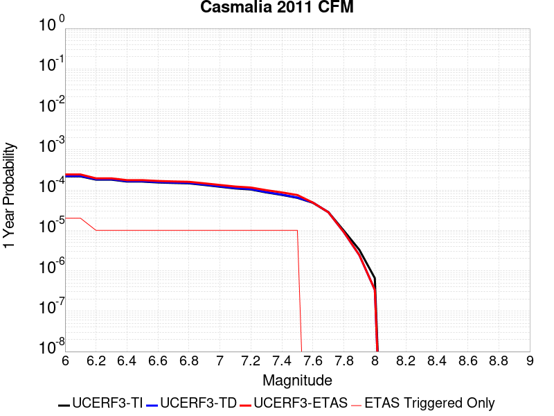 |  |

| Magnitude | 1 wk TI Prob | 1 wk TD Prob | 1 wk ETAS Prob | 1 wk ETAS/TD Gain | 1 wk ETAS Triggered Only | 1 mo TI Prob | 1 mo TD Prob | 1 mo ETAS Prob | 1 mo ETAS/TD Gain | 1 mo ETAS Triggered Only | 1 yr TI Prob | 1 yr TD Prob | 1 yr ETAS Prob | 1 yr ETAS/TD Gain | 1 yr ETAS Triggered Only | 10 yr TI Prob | 10 yr TD Prob | 10 yr ETAS Prob | 10 yr ETAS/TD Gain | 10 yr ETAS Triggered Only |
|-----|-----|-----|-----|-----|-----|-----|-----|-----|-----|-----|-----|-----|-----|-----|-----|-----|-----|-----|-----|-----|
| 6.0 | 4.1704893E-6 | 4.2624843E-6 | 1.4262441E-5 | 3.3460398 | 1.0E-5 | 1.7873403E-5 | 1.8267663E-5 | 3.82673E-5 | 2.0948107 | 2.0E-5 | 2.1758694E-4 | 2.223863E-4 | 2.4238185E-4 | 1.0899136 | 2.0E-5 | 0.0021737402 | 0.0022216584 | 0.0022515918 | 1.0134734 | 3.0E-5 |
| 6.1 | 4.1704893E-6 | 4.2624843E-6 | 1.4262441E-5 | 3.3460398 | 1.0E-5 | 1.7873403E-5 | 1.8267663E-5 | 3.82673E-5 | 2.0948107 | 2.0E-5 | 2.1758694E-4 | 2.223863E-4 | 2.4238185E-4 | 1.0899136 | 2.0E-5 | 0.0021737402 | 0.0022216584 | 0.0022515918 | 1.0134734 | 3.0E-5 |
| 6.2 | 3.457312E-6 | 3.537023E-6 | 1.3536987E-5 | 3.8272262 | 1.0E-5 | 1.4816967E-5 | 1.5158583E-5 | 2.5158432E-5 | 1.6596823 | 1.0E-5 | 1.8038164E-4 | 1.845402E-4 | 1.9453836E-4 | 1.0541787 | 1.0E-5 | 0.001802353 | 0.0018438791 | 0.0018638422 | 1.0108267 | 2.0E-5 |
| 6.3 | 3.457312E-6 | 3.537023E-6 | 1.3536987E-5 | 3.8272262 | 1.0E-5 | 1.4816967E-5 | 1.5158583E-5 | 2.5158432E-5 | 1.6596823 | 1.0E-5 | 1.8038164E-4 | 1.845402E-4 | 1.9453836E-4 | 1.0541787 | 1.0E-5 | 0.001802353 | 0.0018438791 | 0.0018638422 | 1.0108267 | 2.0E-5 |
| 6.4 | 3.0957337E-6 | 3.169227E-6 | 1.3169195E-5 | 4.1553335 | 1.0E-5 | 1.3267363E-5 | 1.3582331E-5 | 2.3582195E-5 | 1.7362406 | 1.0E-5 | 1.6151817E-4 | 1.653524E-4 | 1.7535074E-4 | 1.0604669 | 1.0E-5 | 0.0016140083 | 0.0016522998 | 0.0016722667 | 1.0120844 | 2.0E-5 |
| 6.5 | 3.0957337E-6 | 3.169227E-6 | 1.3169195E-5 | 4.1553335 | 1.0E-5 | 1.3267363E-5 | 1.3582331E-5 | 2.3582195E-5 | 1.7362406 | 1.0E-5 | 1.6151817E-4 | 1.653524E-4 | 1.7535074E-4 | 1.0604669 | 1.0E-5 | 0.0016140083 | 0.0016522998 | 0.0016722667 | 1.0120844 | 2.0E-5 |
| 6.6 | 2.9459152E-6 | 3.0165766E-6 | 1.3016546E-5 | 4.3150063 | 1.0E-5 | 1.262529E-5 | 1.2928121E-5 | 2.2927992E-5 | 1.7734976 | 1.0E-5 | 1.5370206E-4 | 1.5738855E-4 | 1.6738698E-4 | 1.063527 | 1.0E-5 | 0.0015359579 | 0.0015727765 | 0.0015927451 | 1.0126964 | 2.0E-5 |
| 6.7 | 2.8634809E-6 | 2.932474E-6 | 1.2932444E-5 | 4.41008 | 1.0E-5 | 1.2272003E-5 | 1.2567685E-5 | 2.256756E-5 | 1.7956815 | 1.0E-5 | 1.4940138E-4 | 1.5300087E-4 | 1.6299935E-4 | 1.0653491 | 1.0E-5 | 0.0014930099 | 0.0015289608 | 0.0015489302 | 1.0130608 | 2.0E-5 |
| 6.8 | 2.7999822E-6 | 2.867598E-6 | 1.2867569E-5 | 4.4872293 | 1.0E-5 | 1.1999869E-5 | 1.2289648E-5 | 2.2289525E-5 | 1.8136829 | 1.0E-5 | 1.460886E-4 | 1.4961624E-4 | 1.5961475E-4 | 1.0668277 | 1.0E-5 | 0.001459926 | 0.0014951604 | 0.0015151305 | 1.0133564 | 2.0E-5 |
| 6.9 | 2.551052E-6 | 2.6119662E-6 | 1.261194E-5 | 4.8285236 | 1.0E-5 | 1.0933034E-5 | 1.1194093E-5 | 2.119398E-5 | 1.8933183 | 1.0E-5 | 1.3310155E-4 | 1.3627959E-4 | 1.4627824E-4 | 1.0733685 | 1.0E-5 | 0.0013302186 | 0.0013619643 | 0.0013819371 | 1.0146646 | 2.0E-5 |
| 7.0 | 2.3081875E-6 | 2.3624102E-6 | 1.2362387E-5 | 5.232955 | 1.0E-5 | 9.892195E-6 | 1.0124576E-5 | 2.0124475E-5 | 1.9876857 | 1.0E-5 | 1.20430814E-4 | 1.2325977E-4 | 1.3325854E-4 | 1.0811194 | 1.0E-5 | 0.0012036557 | 0.0012319168 | 0.0012518922 | 1.0162148 | 2.0E-5 |
| 7.1 | 2.093245E-6 | 2.1417256E-6 | 1.2141704E-5 | 5.669122 | 1.0E-5 | 8.971019E-6 | 9.1787915E-6 | 1.91787E-5 | 2.089458 | 1.0E-5 | 1.09216686E-4 | 1.1174608E-4 | 1.2174496E-4 | 1.0894786 | 1.0E-5 | 0.0010916302 | 0.0011169009 | 0.0011368786 | 1.0178866 | 2.0E-5 |
| 7.2 | 1.9714576E-6 | 2.0165105E-6 | 1.20164905E-5 | 5.9590516 | 1.0E-5 | 8.449076E-6 | 8.642159E-6 | 1.8642073E-5 | 2.1571083 | 1.0E-5 | 1.0286264E-4 | 1.0521322E-4 | 1.1521217E-4 | 1.0950351 | 1.0E-5 | 0.0010281504 | 0.001051636 | 0.0010616254 | 1.009499 | 1.0E-5 |
| 7.3 | 1.6689512E-6 | 1.7047145E-6 | 1.17046975E-5 | 6.866075 | 1.0E-5 | 7.1526288E-6 | 7.3058986E-6 | 1.7305825E-5 | 2.368747 | 1.0E-5 | 8.7079774E-5 | 8.894569E-5 | 9.89448E-5 | 1.1124182 | 1.0E-5 | 8.7045657E-4 | 8.891017E-4 | 8.990928E-4 | 1.0112373 | 1.0E-5 |
| 7.4 | 1.4490954E-6 | 1.4778922E-6 | 1.1477878E-5 | 7.7663836 | 1.0E-5 | 6.210394E-6 | 6.333808E-6 | 1.6333744E-5 | 2.578819 | 1.0E-5 | 7.560892E-5 | 7.711139E-5 | 8.711062E-5 | 1.1296725 | 1.0E-5 | 7.55832E-4 | 7.7084696E-4 | 7.8083924E-4 | 1.0129627 | 1.0E-5 |
| 7.5 | 1.226873E-6 | 1.2481714E-6 | 1.1248159E-5 | 9.01171 | 1.0E-5 | 5.2580162E-6 | 5.3492954E-6 | 1.5349242E-5 | 2.869395 | 1.0E-5 | 6.401447E-5 | 6.512573E-5 | 7.512508E-5 | 1.1535392 | 1.0E-5 | 6.399603E-4 | 6.5106695E-4 | 6.6106045E-4 | 1.0153494 | 1.0E-5 |
| 7.6 | 9.2561345E-7 | 9.3619366E-7 | 9.3619366E-7 | 1.0 | 0.0 | 3.966909E-6 | 4.0122522E-6 | 4.0122522E-6 | 1.0 | 0.0 | 4.8296046E-5 | 4.884808E-5 | 4.884808E-5 | 1.0 | 0.0 | 4.828555E-4 | 4.8837386E-4 | 4.8837386E-4 | 1.0 | 0.0 |
| 7.7 | 5.4367933E-7 | 5.3929017E-7 | 5.3929017E-7 | 1.0 | 0.0 | 2.3300522E-6 | 2.3112416E-6 | 2.3112416E-6 | 1.0 | 0.0 | 2.8368017E-5 | 2.8139004E-5 | 2.8139004E-5 | 1.0 | 0.0 | 2.8364395E-4 | 2.8135453E-4 | 2.8135453E-4 | 1.0 | 0.0 |
| 7.8 | 1.8825742E-7 | 1.7342425E-7 | 1.7342425E-7 | 1.0 | 0.0 | 8.068173E-7 | 7.432466E-7 | 7.432466E-7 | 1.0 | 0.0 | 9.822956E-6 | 9.048989E-6 | 9.048989E-6 | 1.0 | 0.0 | 9.822522E-5 | 9.048623E-5 | 9.048623E-5 | 1.0 | 0.0 |
| 7.9 | 6.342771E-8 | 4.679002E-8 | 4.679002E-8 | 1.0 | 0.0 | 2.7183304E-7 | 2.0052863E-7 | 2.0052863E-7 | 1.0 | 0.0 | 3.3095623E-6 | 2.4414335E-6 | 2.4414335E-6 | 1.0 | 0.0 | 3.309513E-5 | 2.441407E-5 | 2.441407E-5 | 1.0 | 0.0 |
| 8.0 | 1.2574819E-8 | 6.4727095E-9 | 6.4727095E-9 | 1.0 | 0.0 | 5.3892084E-8 | 2.7740182E-8 | 2.7740182E-8 | 1.0 | 0.0 | 6.561359E-7 | 3.3773665E-7 | 3.3773665E-7 | 1.0 | 0.0 | 6.56134E-6 | 3.3773617E-6 | 3.3773617E-6 | 1.0 | 0.0 |

## Santa Susana East (connector)
*[(top)](#table-of-contents)*

| 1 Week | 1 Month | 1 Year | 10 Year |
|-----|-----|-----|-----|
|  |  |  |  |

| Magnitude | 1 wk TI Prob | 1 wk TD Prob | 1 wk ETAS Prob | 1 wk ETAS/TD Gain | 1 wk ETAS Triggered Only | 1 mo TI Prob | 1 mo TD Prob | 1 mo ETAS Prob | 1 mo ETAS/TD Gain | 1 mo ETAS Triggered Only | 1 yr TI Prob | 1 yr TD Prob | 1 yr ETAS Prob | 1 yr ETAS/TD Gain | 1 yr ETAS Triggered Only | 10 yr TI Prob | 10 yr TD Prob | 10 yr ETAS Prob | 10 yr ETAS/TD Gain | 10 yr ETAS Triggered Only |
|-----|-----|-----|-----|-----|-----|-----|-----|-----|-----|-----|-----|-----|-----|-----|-----|-----|-----|-----|-----|-----|
| 6.0 | 2.858397E-5 | 3.2021693E-5 | 3.2021693E-5 | 1.0 | 0.0 | 1.2249697E-4 | 1.3723019E-4 | 1.3723019E-4 | 1.0 | 0.0 | 0.0014903803 | 0.00166977 | 0.0016797533 | 1.0059788 | 1.0E-5 | 0.014804244 | 0.016599316 | 0.016628819 | 1.0017773 | 3.0E-5 |
| 6.1 | 2.858397E-5 | 3.2021693E-5 | 3.2021693E-5 | 1.0 | 0.0 | 1.2249697E-4 | 1.3723019E-4 | 1.3723019E-4 | 1.0 | 0.0 | 0.0014903803 | 0.00166977 | 0.0016797533 | 1.0059788 | 1.0E-5 | 0.014804244 | 0.016599316 | 0.016628819 | 1.0017773 | 3.0E-5 |
| 6.2 | 2.858397E-5 | 3.2021693E-5 | 3.2021693E-5 | 1.0 | 0.0 | 1.2249697E-4 | 1.3723019E-4 | 1.3723019E-4 | 1.0 | 0.0 | 0.0014903803 | 0.00166977 | 0.0016797533 | 1.0059788 | 1.0E-5 | 0.014804244 | 0.016599316 | 0.016628819 | 1.0017773 | 3.0E-5 |
| 6.3 | 1.943582E-5 | 2.0367343E-5 | 2.0367343E-5 | 1.0 | 0.0 | 8.329371E-5 | 8.7286324E-5 | 8.7286324E-5 | 1.0 | 0.0 | 0.001013629 | 0.001062305 | 0.001062305 | 1.0 | 0.0 | 0.010090181 | 0.010583852 | 0.01060364 | 1.0018697 | 2.0E-5 |
| 6.4 | 1.943582E-5 | 2.0367343E-5 | 2.0367343E-5 | 1.0 | 0.0 | 8.329371E-5 | 8.7286324E-5 | 8.7286324E-5 | 1.0 | 0.0 | 0.001013629 | 0.001062305 | 0.001062305 | 1.0 | 0.0 | 0.010090181 | 0.010583852 | 0.01060364 | 1.0018697 | 2.0E-5 |
| 6.5 | 1.943582E-5 | 2.0367343E-5 | 2.0367343E-5 | 1.0 | 0.0 | 8.329371E-5 | 8.7286324E-5 | 8.7286324E-5 | 1.0 | 0.0 | 0.001013629 | 0.001062305 | 0.001062305 | 1.0 | 0.0 | 0.010090181 | 0.010583852 | 0.01060364 | 1.0018697 | 2.0E-5 |
| 6.6 | 1.943582E-5 | 2.0367343E-5 | 2.0367343E-5 | 1.0 | 0.0 | 8.329371E-5 | 8.7286324E-5 | 8.7286324E-5 | 1.0 | 0.0 | 0.001013629 | 0.001062305 | 0.001062305 | 1.0 | 0.0 | 0.010090181 | 0.010583852 | 0.01060364 | 1.0018697 | 2.0E-5 |
| 6.7 | 1.9404439E-5 | 2.0354766E-5 | 2.0354766E-5 | 1.0 | 0.0 | 8.3159226E-5 | 8.723242E-5 | 8.723242E-5 | 1.0 | 0.0 | 0.0010119933 | 0.0010616493 | 0.0010616493 | 1.0 | 0.0 | 0.010073971 | 0.010577358 | 0.010597147 | 1.0018709 | 2.0E-5 |
| 6.8 | 1.2217526E-5 | 1.1593157E-5 | 1.1593157E-5 | 1.0 | 0.0 | 5.2359774E-5 | 4.9684106E-5 | 4.9684106E-5 | 1.0 | 0.0 | 6.372938E-4 | 6.047529E-4 | 6.047529E-4 | 1.0 | 0.0 | 0.0063546924 | 0.006033274 | 0.0060531534 | 1.003295 | 2.0E-5 |
| 6.9 | 1.2217526E-5 | 1.1593157E-5 | 1.1593157E-5 | 1.0 | 0.0 | 5.2359774E-5 | 4.9684106E-5 | 4.9684106E-5 | 1.0 | 0.0 | 6.372938E-4 | 6.047529E-4 | 6.047529E-4 | 1.0 | 0.0 | 0.0063546924 | 0.006033274 | 0.0060531534 | 1.003295 | 2.0E-5 |
| 7.0 | 9.276017E-6 | 8.059273E-6 | 8.059273E-6 | 1.0 | 0.0 | 3.9753755E-5 | 3.4539302E-5 | 3.4539302E-5 | 1.0 | 0.0 | 4.8389446E-4 | 4.2043833E-4 | 4.2043833E-4 | 1.0 | 0.0 | 0.0048284214 | 0.0041973097 | 0.004217226 | 1.004745 | 2.0E-5 |
| 7.1 | 9.130355E-6 | 7.942446E-6 | 7.942446E-6 | 1.0 | 0.0 | 3.9129503E-5 | 3.4038632E-5 | 3.4038632E-5 | 1.0 | 0.0 | 4.7629757E-4 | 4.1434498E-4 | 4.1434498E-4 | 1.0 | 0.0 | 0.00475278 | 0.0041366047 | 0.004156522 | 1.0048149 | 2.0E-5 |
| 7.2 | 8.851015E-6 | 7.741608E-6 | 7.741608E-6 | 1.0 | 0.0 | 3.7932372E-5 | 3.317792E-5 | 3.317792E-5 | 1.0 | 0.0 | 4.6172875E-4 | 4.038697E-4 | 4.038697E-4 | 1.0 | 0.0 | 0.0046077054 | 0.0040322347 | 0.0040521543 | 1.00494 | 2.0E-5 |
| 7.3 | 8.573006E-6 | 7.5503312E-6 | 7.5503312E-6 | 1.0 | 0.0 | 3.6740938E-5 | 3.235818E-5 | 3.235818E-5 | 1.0 | 0.0 | 4.472291E-4 | 3.9389305E-4 | 3.9389305E-4 | 1.0 | 0.0 | 0.004463301 | 0.003932817 | 0.0039527384 | 1.0050654 | 2.0E-5 |
| 7.4 | 7.852282E-6 | 6.8178556E-6 | 6.8178556E-6 | 1.0 | 0.0 | 3.36522E-5 | 2.921907E-5 | 2.921907E-5 | 1.0 | 0.0 | 4.096385E-4 | 3.5568717E-4 | 3.5568717E-4 | 1.0 | 0.0 | 0.0040888423 | 0.0035519868 | 0.003571916 | 1.0056107 | 2.0E-5 |
| 7.5 | 4.8869324E-6 | 4.2790975E-6 | 4.2790975E-6 | 1.0 | 0.0 | 2.0943828E-5 | 1.833887E-5 | 1.833887E-5 | 1.0 | 0.0 | 2.5496128E-4 | 2.2325452E-4 | 2.2325452E-4 | 1.0 | 0.0 | 0.0025466895 | 0.00223057 | 0.0022505252 | 1.0089463 | 2.0E-5 |
| 7.6 | 1.3894544E-6 | 1.1568394E-6 | 1.1568394E-6 | 1.0 | 0.0 | 5.954791E-6 | 4.957875E-6 | 4.957875E-6 | 1.0 | 0.0 | 7.249717E-5 | 6.036068E-5 | 6.036068E-5 | 1.0 | 0.0 | 7.247352E-4 | 6.0346466E-4 | 6.0346466E-4 | 1.0 | 0.0 |
| 7.7 | 2.9924632E-7 | 2.3719332E-7 | 2.3719332E-7 | 1.0 | 0.0 | 1.2824837E-6 | 1.0165425E-6 | 1.0165425E-6 | 1.0 | 0.0 | 1.5614127E-5 | 1.2376341E-5 | 1.2376341E-5 | 1.0 | 0.0 | 1.5613029E-4 | 1.2375724E-4 | 1.2375724E-4 | 1.0 | 0.0 |
| 7.8 | 4.8188564E-8 | 2.6321862E-8 | 2.6321862E-8 | 1.0 | 0.0 | 2.065224E-7 | 1.12807975E-7 | 1.12807975E-7 | 1.0 | 0.0 | 2.5144072E-6 | 1.3734362E-6 | 1.3734362E-6 | 1.0 | 0.0 | 2.5143789E-5 | 1.3734286E-5 | 1.3734286E-5 | 1.0 | 0.0 |
| 7.9 | 2.6127251E-9 | 2.7681102E-9 | 2.7681102E-9 | 1.0 | 0.0 | 1.1197393E-8 | 1.186333E-8 | 1.186333E-8 | 1.0 | 0.0 | 1.3632825E-7 | 1.4443603E-7 | 1.4443603E-7 | 1.0 | 0.0 | 1.3632817E-6 | 1.4443604E-6 | 1.4443604E-6 | 1.0 | 0.0 |

## San Diego Trough south
*[(top)](#table-of-contents)*

| 1 Week | 1 Month | 1 Year | 10 Year |
|-----|-----|-----|-----|
|  |  |  |  |

| Magnitude | 1 wk TI Prob | 1 wk TD Prob | 1 wk ETAS Prob | 1 wk ETAS/TD Gain | 1 wk ETAS Triggered Only | 1 mo TI Prob | 1 mo TD Prob | 1 mo ETAS Prob | 1 mo ETAS/TD Gain | 1 mo ETAS Triggered Only | 1 yr TI Prob | 1 yr TD Prob | 1 yr ETAS Prob | 1 yr ETAS/TD Gain | 1 yr ETAS Triggered Only | 10 yr TI Prob | 10 yr TD Prob | 10 yr ETAS Prob | 10 yr ETAS/TD Gain | 10 yr ETAS Triggered Only |
|-----|-----|-----|-----|-----|-----|-----|-----|-----|-----|-----|-----|-----|-----|-----|-----|-----|-----|-----|-----|-----|
| 6.0 | 8.279495E-5 | 1.0425541E-4 | 1.0425541E-4 | 1.0 | 0.0 | 3.5478722E-4 | 4.4673498E-4 | 4.4673498E-4 | 1.0 | 0.0 | 0.004310982 | 0.0054259133 | 0.005445805 | 1.003666 | 2.0E-5 | 0.042283054 | 0.05299303 | 0.053021442 | 1.0005361 | 3.0E-5 |
| 6.1 | 4.6961468E-5 | 5.773024E-5 | 5.773024E-5 | 1.0 | 0.0 | 2.0124791E-4 | 2.473905E-4 | 2.473905E-4 | 1.0 | 0.0 | 0.00244744 | 0.003007886 | 0.0030278258 | 1.0066292 | 2.0E-5 | 0.024206603 | 0.029679636 | 0.029708745 | 1.0009807 | 3.0E-5 |
| 6.2 | 3.5079658E-5 | 4.214258E-5 | 4.214258E-5 | 1.0 | 0.0 | 1.5033272E-4 | 1.8059829E-4 | 1.8059829E-4 | 1.0 | 0.0 | 0.0018287642 | 0.002196587 | 0.002216543 | 1.009085 | 2.0E-5 | 0.018137876 | 0.021751188 | 0.021780536 | 1.0013492 | 3.0E-5 |
| 6.3 | 3.5079658E-5 | 4.214258E-5 | 4.214258E-5 | 1.0 | 0.0 | 1.5033272E-4 | 1.8059829E-4 | 1.8059829E-4 | 1.0 | 0.0 | 0.0018287642 | 0.002196587 | 0.002216543 | 1.009085 | 2.0E-5 | 0.018137876 | 0.021751188 | 0.021780536 | 1.0013492 | 3.0E-5 |
| 6.4 | 2.7196904E-5 | 3.208715E-5 | 3.208715E-5 | 1.0 | 0.0 | 1.16552954E-4 | 1.3750911E-4 | 1.3750911E-4 | 1.0 | 0.0 | 0.0014181085 | 0.0016728995 | 0.0016828828 | 1.0059676 | 1.0E-5 | 0.014090929 | 0.016604666 | 0.016624333 | 1.0011845 | 2.0E-5 |
| 6.5 | 2.5584688E-5 | 3.0101632E-5 | 3.0101632E-5 | 1.0 | 0.0 | 1.0964406E-4 | 1.2900059E-4 | 1.2900059E-4 | 1.0 | 0.0 | 0.0013340989 | 0.0015694627 | 0.001579447 | 1.0063616 | 1.0E-5 | 0.013261181 | 0.015585332 | 0.01560502 | 1.0012633 | 2.0E-5 |
| 6.6 | 2.2034688E-5 | 2.574271E-5 | 2.574271E-5 | 1.0 | 0.0 | 9.443096E-5 | 1.1032127E-4 | 1.1032127E-4 | 1.0 | 0.0 | 0.0011490905 | 0.0013423412 | 0.0013523278 | 1.0074396 | 1.0E-5 | 0.011431668 | 0.013343325 | 0.013363058 | 1.0014789 | 2.0E-5 |
| 6.7 | 1.9394853E-5 | 2.254176E-5 | 2.254176E-5 | 1.0 | 0.0 | 8.311815E-5 | 9.6604E-5 | 9.6604E-5 | 1.0 | 0.0 | 0.0010114936 | 0.0011755243 | 0.0011855126 | 1.0084969 | 1.0E-5 | 0.01006902 | 0.011693766 | 0.011713533 | 1.0016903 | 2.0E-5 |
| 6.8 | 1.7615313E-5 | 2.0403182E-5 | 2.0403182E-5 | 1.0 | 0.0 | 7.549201E-5 | 8.743931E-5 | 8.743931E-5 | 1.0 | 0.0 | 9.1872766E-4 | 0.0010640579 | 0.0010740473 | 1.009388 | 1.0E-5 | 0.009149387 | 0.010590198 | 0.010609986 | 1.0018685 | 2.0E-5 |
| 6.9 | 1.5621423E-5 | 1.8026114E-5 | 1.8026114E-5 | 1.0 | 0.0 | 6.6947236E-5 | 7.725251E-5 | 7.725251E-5 | 1.0 | 0.0 | 8.147778E-4 | 9.40147E-4 | 9.40147E-4 | 1.0 | 0.0 | 0.008117969 | 0.009362142 | 0.009372048 | 1.0010581 | 1.0E-5 |
| 7.0 | 1.3444376E-5 | 1.544809E-5 | 1.544809E-5 | 1.0 | 0.0 | 5.7617483E-5 | 6.620443E-5 | 6.620443E-5 | 1.0 | 0.0 | 7.0126704E-4 | 8.057436E-4 | 8.057436E-4 | 1.0 | 0.0 | 0.006990582 | 0.008028555 | 0.008038475 | 1.0012356 | 1.0E-5 |
| 7.1 | 1.2268361E-5 | 1.407303E-5 | 1.407303E-5 | 1.0 | 0.0 | 5.2577634E-5 | 6.0311606E-5 | 6.0311606E-5 | 1.0 | 0.0 | 6.399447E-4 | 7.3404907E-4 | 7.3404907E-4 | 1.0 | 0.0 | 0.0063810493 | 0.0073165493 | 0.007326476 | 1.0013567 | 1.0E-5 |
| 7.2 | 1.0922655E-5 | 1.2513563E-5 | 1.2513563E-5 | 1.0 | 0.0 | 4.681054E-5 | 5.3628468E-5 | 5.3628468E-5 | 1.0 | 0.0 | 5.697693E-4 | 6.5273355E-4 | 6.5273355E-4 | 1.0 | 0.0 | 0.0056831064 | 0.0065084435 | 0.006518379 | 1.0015265 | 1.0E-5 |
| 7.3 | 6.1106753E-6 | 6.928925E-6 | 6.928925E-6 | 1.0 | 0.0 | 2.6188345E-5 | 2.9695057E-5 | 2.9695057E-5 | 1.0 | 0.0 | 3.1879646E-4 | 3.6147775E-4 | 3.6147775E-4 | 1.0 | 0.0 | 0.0031833951 | 0.003608943 | 0.003608943 | 1.0 | 0.0 |
| 7.4 | 4.933187E-6 | 5.5895525E-6 | 5.5895525E-6 | 1.0 | 0.0 | 2.114206E-5 | 2.3955008E-5 | 2.3955008E-5 | 1.0 | 0.0 | 2.5737417E-4 | 2.9161357E-4 | 2.9161357E-4 | 1.0 | 0.0 | 0.002570763 | 0.0029123505 | 0.0029123505 | 1.0 | 0.0 |
| 7.5 | 1.7489613E-6 | 1.969678E-6 | 1.969678E-6 | 1.0 | 0.0 | 7.495527E-6 | 8.4414505E-6 | 8.4414505E-6 | 1.0 | 0.0 | 9.125422E-5 | 1.02770035E-4 | 1.02770035E-4 | 1.0 | 0.0 | 9.1216754E-4 | 0.0010272472 | 0.0010272472 | 1.0 | 0.0 |
| 7.6 | 1.6988751E-7 | 1.7533823E-7 | 1.7533823E-7 | 1.0 | 0.0 | 7.2808916E-7 | 7.5144936E-7 | 7.5144936E-7 | 1.0 | 0.0 | 8.864449E-6 | 9.14886E-6 | 9.14886E-6 | 1.0 | 0.0 | 8.8640954E-5 | 9.1485024E-5 | 9.1485024E-5 | 1.0 | 0.0 |

## San Andreas (North Coast) 2011 CFM
*[(top)](#table-of-contents)*

| 1 Week | 1 Month | 1 Year | 10 Year |
|-----|-----|-----|-----|
|  |  | 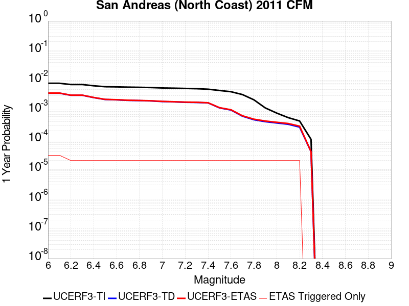 |  |

| Magnitude | 1 wk TI Prob | 1 wk TD Prob | 1 wk ETAS Prob | 1 wk ETAS/TD Gain | 1 wk ETAS Triggered Only | 1 mo TI Prob | 1 mo TD Prob | 1 mo ETAS Prob | 1 mo ETAS/TD Gain | 1 mo ETAS Triggered Only | 1 yr TI Prob | 1 yr TD Prob | 1 yr ETAS Prob | 1 yr ETAS/TD Gain | 1 yr ETAS Triggered Only | 10 yr TI Prob | 10 yr TD Prob | 10 yr ETAS Prob | 10 yr ETAS/TD Gain | 10 yr ETAS Triggered Only |
|-----|-----|-----|-----|-----|-----|-----|-----|-----|-----|-----|-----|-----|-----|-----|-----|-----|-----|-----|-----|-----|
| 6.0 | 1.5333705E-4 | 7.109695E-5 | 8.109623E-5 | 1.140643 | 1.0E-5 | 6.5699324E-4 | 3.046658E-4 | 3.1466273E-4 | 1.0328128 | 1.0E-5 | 0.007969595 | 0.0037030308 | 0.0037329197 | 1.0080714 | 3.0E-5 | 0.0768977 | 0.039364267 | 0.039393086 | 1.0007321 | 3.0E-5 |
| 6.1 | 1.5333705E-4 | 7.109695E-5 | 8.109623E-5 | 1.140643 | 1.0E-5 | 6.5699324E-4 | 3.046658E-4 | 3.1466273E-4 | 1.0328128 | 1.0E-5 | 0.007969595 | 0.0037030308 | 0.0037329197 | 1.0080714 | 3.0E-5 | 0.0768977 | 0.039364267 | 0.039393086 | 1.0007321 | 3.0E-5 |
| 6.2 | 1.3912938E-4 | 6.049243E-5 | 6.049243E-5 | 1.0 | 0.0 | 5.961325E-4 | 2.5922767E-4 | 2.5922767E-4 | 1.0 | 0.0 | 0.007233787 | 0.0031515562 | 0.0031714933 | 1.0063261 | 2.0E-5 | 0.07002798 | 0.03369792 | 0.03371725 | 1.0005735 | 2.0E-5 |
| 6.3 | 1.3912938E-4 | 6.049243E-5 | 6.049243E-5 | 1.0 | 0.0 | 5.961325E-4 | 2.5922767E-4 | 2.5922767E-4 | 1.0 | 0.0 | 0.007233787 | 0.0031515562 | 0.0031714933 | 1.0063261 | 2.0E-5 | 0.07002798 | 0.03369792 | 0.03371725 | 1.0005735 | 2.0E-5 |
| 6.4 | 1.2623647E-4 | 5.0433562E-5 | 5.0433562E-5 | 1.0 | 0.0 | 5.4090127E-4 | 2.1612605E-4 | 2.1612605E-4 | 1.0 | 0.0 | 0.0065656058 | 0.0026281793 | 0.0026481268 | 1.0075898 | 2.0E-5 | 0.06374981 | 0.02830552 | 0.028324952 | 1.0006865 | 2.0E-5 |
| 6.5 | 1.1736096E-4 | 4.3516375E-5 | 4.3516375E-5 | 1.0 | 0.0 | 5.028786E-4 | 1.8648551E-4 | 1.8648551E-4 | 1.0 | 0.0 | 0.006105373 | 0.0022681132 | 0.0022880677 | 1.0087979 | 2.0E-5 | 0.05940335 | 0.024576947 | 0.024596455 | 1.0007938 | 2.0E-5 |
| 6.6 | 1.1586959E-4 | 4.2416294E-5 | 4.2416294E-5 | 1.0 | 0.0 | 4.964894E-4 | 1.8177154E-4 | 1.8177154E-4 | 1.0 | 0.0 | 0.006028018 | 0.0022108385 | 0.0022307942 | 1.0090263 | 2.0E-5 | 0.058671024 | 0.023982164 | 0.024001684 | 1.000814 | 2.0E-5 |
| 6.7 | 1.13693764E-4 | 4.0728228E-5 | 4.0728228E-5 | 1.0 | 0.0 | 4.87168E-4 | 1.7453796E-4 | 1.7453796E-4 | 1.0 | 0.0 | 0.005915152 | 0.0021229447 | 0.0021429022 | 1.0094008 | 2.0E-5 | 0.057601593 | 0.023075242 | 0.02309478 | 1.0008467 | 2.0E-5 |
| 6.8 | 1.1204889E-4 | 3.9945848E-5 | 3.9945848E-5 | 1.0 | 0.0 | 4.8012115E-4 | 1.7118535E-4 | 1.7118535E-4 | 1.0 | 0.0 | 0.005829819 | 0.0020822054 | 0.0021021636 | 1.0095851 | 2.0E-5 | 0.05679232 | 0.022635331 | 0.02265488 | 1.0008636 | 2.0E-5 |
| 6.9 | 1.1005794E-4 | 3.9001738E-5 | 3.9001738E-5 | 1.0 | 0.0 | 4.7159163E-4 | 1.6713967E-4 | 1.6713967E-4 | 1.0 | 0.0 | 0.0057265228 | 0.0020330423 | 0.0020530017 | 1.0098175 | 2.0E-5 | 0.055811852 | 0.02210134 | 0.022120899 | 1.0008849 | 2.0E-5 |
| 7.0 | 1.0647948E-4 | 3.7159174E-5 | 3.7159174E-5 | 1.0 | 0.0 | 4.562608E-4 | 1.5924397E-4 | 1.5924397E-4 | 1.0 | 0.0 | 0.0055408357 | 0.0019370868 | 0.001957048 | 1.0103048 | 2.0E-5 | 0.054047033 | 0.02105931 | 0.02107889 | 1.0009297 | 2.0E-5 |
| 7.1 | 1.04795035E-4 | 3.620866E-5 | 3.620866E-5 | 1.0 | 0.0 | 4.4904428E-4 | 1.5517084E-4 | 1.5517084E-4 | 1.0 | 0.0 | 0.0054534175 | 0.0018875834 | 0.0019075456 | 1.0105755 | 2.0E-5 | 0.053215165 | 0.02052821 | 0.0205478 | 1.0009543 | 2.0E-5 |
| 7.2 | 1.02724036E-4 | 3.5117457E-5 | 3.5117457E-5 | 1.0 | 0.0 | 4.401716E-4 | 1.5049479E-4 | 1.5049479E-4 | 1.0 | 0.0 | 0.0053459285 | 0.0018307496 | 0.0018507129 | 1.0109044 | 2.0E-5 | 0.052191395 | 0.01991573 | 0.01993533 | 1.0009842 | 2.0E-5 |
| 7.3 | 1.00650694E-4 | 3.45853E-5 | 3.45853E-5 | 1.0 | 0.0 | 4.312888E-4 | 1.4821437E-4 | 1.4821437E-4 | 1.0 | 0.0 | 0.005238306 | 0.0018030318 | 0.0018229957 | 1.0110724 | 2.0E-5 | 0.051165357 | 0.01959264 | 0.019612249 | 1.0010008 | 2.0E-5 |
| 7.4 | 9.672919E-5 | 3.3374814E-5 | 3.3374814E-5 | 1.0 | 0.0 | 4.144878E-4 | 1.4302715E-4 | 1.4302715E-4 | 1.0 | 0.0 | 0.005034718 | 0.00173998 | 0.0017599452 | 1.0114744 | 2.0E-5 | 0.049221683 | 0.01886682 | 0.018886443 | 1.0010401 | 2.0E-5 |
| 7.5 | 8.7600405E-5 | 2.2694192E-5 | 2.2694192E-5 | 1.0 | 0.0 | 3.753763E-4 | 9.725721E-5 | 9.725721E-5 | 1.0 | 0.0 | 0.0045606326 | 0.0011834651 | 0.0012034414 | 1.0168796 | 2.0E-5 | 0.04468165 | 0.013127938 | 0.0131476745 | 1.0015035 | 2.0E-5 |
| 7.6 | 7.9562284E-5 | 1.922004E-5 | 1.922004E-5 | 1.0 | 0.0 | 3.4093665E-4 | 8.236901E-5 | 8.236901E-5 | 1.0 | 0.0 | 0.0041430052 | 0.0010023828 | 0.0010223628 | 1.0199325 | 2.0E-5 | 0.040666126 | 0.0112194 | 0.011239175 | 1.0017626 | 2.0E-5 |
| 7.7 | 6.3866544E-5 | 1.1936281E-5 | 1.1936281E-5 | 1.0 | 0.0 | 2.7368503E-4 | 5.115449E-5 | 5.115449E-5 | 1.0 | 0.0 | 0.0033270244 | 6.226282E-4 | 6.426157E-4 | 1.0321019 | 2.0E-5 | 0.032776527 | 0.0072073294 | 0.007227185 | 1.0027549 | 2.0E-5 |
| 7.8 | 4.2543215E-5 | 9.0726735E-6 | 9.0726735E-6 | 1.0 | 0.0 | 1.8231533E-4 | 3.888231E-5 | 3.888231E-5 | 1.0 | 0.0 | 0.0022174292 | 4.7328937E-4 | 4.932799E-4 | 1.0422374 | 2.0E-5 | 0.021954332 | 0.0054884683 | 0.0055083586 | 1.003624 | 2.0E-5 |
| 7.9 | 2.2636612E-5 | 7.811842E-6 | 7.811842E-6 | 1.0 | 0.0 | 9.7010445E-5 | 3.3478893E-5 | 3.3478893E-5 | 1.0 | 0.0 | 0.0011804621 | 4.0752938E-4 | 4.2752124E-4 | 1.0490562 | 2.0E-5 | 0.011742111 | 0.0046821116 | 0.004702018 | 1.0042516 | 2.0E-5 |
| 8.0 | 1.5167874E-5 | 7.0475517E-6 | 7.0475517E-6 | 1.0 | 0.0 | 6.500356E-5 | 3.0203442E-5 | 3.0203442E-5 | 1.0 | 0.0 | 7.9113094E-4 | 3.6766496E-4 | 3.876576E-4 | 1.0543773 | 2.0E-5 | 0.007883203 | 0.004214701 | 0.0042346166 | 1.0047253 | 2.0E-5 |
| 8.1 | 1.0681047E-5 | 6.3854363E-6 | 6.3854363E-6 | 1.0 | 0.0 | 4.5775112E-5 | 2.7365868E-5 | 2.7365868E-5 | 1.0 | 0.0 | 5.5716943E-4 | 3.331286E-4 | 3.5312193E-4 | 1.0600169 | 2.0E-5 | 0.0055577457 | 0.003816698 | 0.0038366215 | 1.0052202 | 2.0E-5 |
| 8.2 | 8.226114E-6 | 5.1139064E-6 | 5.1139064E-6 | 1.0 | 0.0 | 3.52543E-5 | 2.1916558E-5 | 2.1916558E-5 | 1.0 | 0.0 | 4.2913653E-4 | 2.6680148E-4 | 2.8679616E-4 | 1.0749421 | 2.0E-5 | 0.004283088 | 0.0030445685 | 0.0030645076 | 1.0065491 | 2.0E-5 |
| 8.3 | 1.983087E-6 | 7.6564595E-7 | 7.6564595E-7 | 1.0 | 0.0 | 8.498917E-6 | 3.281336E-6 | 3.281336E-6 | 1.0 | 0.0 | 1.034694E-4 | 3.9949547E-5 | 3.9949547E-5 | 1.0 | 0.0 | 0.0010342124 | 4.717979E-4 | 4.717979E-4 | 1.0 | 0.0 |

## Elsinore (Stepovers Combined)
*[(top)](#table-of-contents)*

| 1 Week | 1 Month | 1 Year | 10 Year |
|-----|-----|-----|-----|
|  |  | 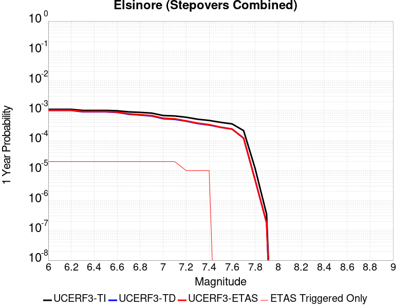 |  |

| Magnitude | 1 wk TI Prob | 1 wk TD Prob | 1 wk ETAS Prob | 1 wk ETAS/TD Gain | 1 wk ETAS Triggered Only | 1 mo TI Prob | 1 mo TD Prob | 1 mo ETAS Prob | 1 mo ETAS/TD Gain | 1 mo ETAS Triggered Only | 1 yr TI Prob | 1 yr TD Prob | 1 yr ETAS Prob | 1 yr ETAS/TD Gain | 1 yr ETAS Triggered Only | 10 yr TI Prob | 10 yr TD Prob | 10 yr ETAS Prob | 10 yr ETAS/TD Gain | 10 yr ETAS Triggered Only |
|-----|-----|-----|-----|-----|-----|-----|-----|-----|-----|-----|-----|-----|-----|-----|-----|-----|-----|-----|-----|-----|
| 6.0 | 2.144392E-5 | 1.976007E-5 | 2.9759873E-5 | 1.5060611 | 1.0E-5 | 9.189928E-5 | 8.468338E-5 | 9.468253E-5 | 1.1180769 | 1.0E-5 | 0.0011182994 | 0.0010305515 | 0.0010505309 | 1.0193871 | 2.0E-5 | 0.011126885 | 0.010264617 | 0.01029431 | 1.0028926 | 3.0E-5 |
| 6.1 | 2.144392E-5 | 1.976007E-5 | 2.9759873E-5 | 1.5060611 | 1.0E-5 | 9.189928E-5 | 8.468338E-5 | 9.468253E-5 | 1.1180769 | 1.0E-5 | 0.0011182994 | 0.0010305515 | 0.0010505309 | 1.0193871 | 2.0E-5 | 0.011126885 | 0.010264617 | 0.01029431 | 1.0028926 | 3.0E-5 |
| 6.2 | 2.144392E-5 | 1.976007E-5 | 2.9759873E-5 | 1.5060611 | 1.0E-5 | 9.189928E-5 | 8.468338E-5 | 9.468253E-5 | 1.1180769 | 1.0E-5 | 0.0011182994 | 0.0010305515 | 0.0010505309 | 1.0193871 | 2.0E-5 | 0.011126885 | 0.010264617 | 0.01029431 | 1.0028926 | 3.0E-5 |
| 6.3 | 1.9751555E-5 | 1.7741326E-5 | 2.7741147E-5 | 1.5636457 | 1.0E-5 | 8.4646774E-5 | 7.603211E-5 | 8.603135E-5 | 1.1315134 | 1.0E-5 | 0.0010300872 | 9.25312E-4 | 9.4529346E-4 | 1.0215943 | 2.0E-5 | 0.010253254 | 0.0092209745 | 0.009250698 | 1.0032234 | 3.0E-5 |
| 6.4 | 1.9751555E-5 | 1.7741326E-5 | 2.7741147E-5 | 1.5636457 | 1.0E-5 | 8.4646774E-5 | 7.603211E-5 | 8.603135E-5 | 1.1315134 | 1.0E-5 | 0.0010300872 | 9.25312E-4 | 9.4529346E-4 | 1.0215943 | 2.0E-5 | 0.010253254 | 0.0092209745 | 0.009250698 | 1.0032234 | 3.0E-5 |
| 6.5 | 1.9751555E-5 | 1.7741326E-5 | 2.7741147E-5 | 1.5636457 | 1.0E-5 | 8.4646774E-5 | 7.603211E-5 | 8.603135E-5 | 1.1315134 | 1.0E-5 | 0.0010300872 | 9.25312E-4 | 9.4529346E-4 | 1.0215943 | 2.0E-5 | 0.010253254 | 0.0092209745 | 0.009250698 | 1.0032234 | 3.0E-5 |
| 6.6 | 1.9188685E-5 | 1.7003247E-5 | 2.7003076E-5 | 1.588113 | 1.0E-5 | 8.2234634E-5 | 7.2869116E-5 | 8.2868384E-5 | 1.1372224 | 1.0E-5 | 0.0010007467 | 8.8683655E-4 | 9.068188E-4 | 1.0225321 | 2.0E-5 | 0.00996252 | 0.008839546 | 0.008869281 | 1.0033638 | 3.0E-5 |
| 6.7 | 1.7608272E-5 | 1.4732402E-5 | 2.4732255E-5 | 1.6787659 | 1.0E-5 | 7.546184E-5 | 6.313739E-5 | 7.313676E-5 | 1.1583748 | 1.0E-5 | 9.183606E-4 | 7.684364E-4 | 7.88421E-4 | 1.0260068 | 2.0E-5 | 0.009145746 | 0.007664441 | 0.0076842876 | 1.0025895 | 2.0E-5 |
| 6.8 | 1.697165E-5 | 1.3783126E-5 | 2.3782988E-5 | 1.7255148 | 1.0E-5 | 7.273361E-5 | 5.906925E-5 | 6.9068665E-5 | 1.1692828 | 1.0E-5 | 8.8517193E-4 | 7.189395E-4 | 7.389251E-4 | 1.0277988 | 2.0E-5 | 0.008816543 | 0.0071722106 | 0.0071920673 | 1.0027685 | 2.0E-5 |
| 6.9 | 1.600365E-5 | 1.2846429E-5 | 2.2846301E-5 | 1.7784164 | 1.0E-5 | 6.858527E-5 | 5.5055007E-5 | 6.505445E-5 | 1.1816266 | 1.0E-5 | 8.347058E-4 | 6.700963E-4 | 6.9008296E-4 | 1.0298264 | 2.0E-5 | 0.008315775 | 0.006686422 | 0.006706288 | 1.0029712 | 2.0E-5 |
| 7.0 | 1.3314581E-5 | 1.044738E-5 | 2.0447276E-5 | 1.9571677 | 1.0E-5 | 5.7061243E-5 | 4.4773733E-5 | 5.4773285E-5 | 1.2233353 | 1.0E-5 | 6.944992E-4 | 5.449866E-4 | 5.6497566E-4 | 1.0366782 | 2.0E-5 | 0.006923327 | 0.005440055 | 0.0054599466 | 1.0036564 | 2.0E-5 |
| 7.1 | 1.2865345E-5 | 9.937339E-6 | 1.993724E-5 | 2.0062954 | 1.0E-5 | 5.5136024E-5 | 4.258792E-5 | 5.2587493E-5 | 1.2347984 | 1.0E-5 | 6.710743E-4 | 5.1838707E-4 | 5.3837674E-4 | 1.0385612 | 2.0E-5 | 0.0066905143 | 0.005175021 | 0.005194918 | 1.0038447 | 2.0E-5 |
| 7.2 | 1.1650051E-5 | 8.633585E-6 | 8.633585E-6 | 1.0 | 0.0 | 4.9927836E-5 | 3.7000562E-5 | 3.7000562E-5 | 1.0 | 0.0 | 6.0770183E-4 | 4.503905E-4 | 4.60386E-4 | 1.022193 | 1.0E-5 | 0.0060604266 | 0.00449624 | 0.0045061954 | 1.0022141 | 1.0E-5 |
| 7.3 | 1.0008533E-5 | 7.2008215E-6 | 7.2008215E-6 | 1.0 | 0.0 | 4.2893007E-5 | 3.0860305E-5 | 3.0860305E-5 | 1.0 | 0.0 | 5.220972E-4 | 3.756609E-4 | 3.8565713E-4 | 1.0266098 | 1.0E-5 | 0.005208723 | 0.0037506663 | 0.0037606286 | 1.0026562 | 1.0E-5 |
| 7.4 | 9.116759E-6 | 6.409854E-6 | 6.409854E-6 | 1.0 | 0.0 | 3.907124E-5 | 2.7470522E-5 | 2.7470522E-5 | 1.0 | 0.0 | 4.7558855E-4 | 3.3440365E-4 | 3.444003E-4 | 1.029894 | 1.0E-5 | 0.00474572 | 0.0033391542 | 0.0033491207 | 1.0029848 | 1.0E-5 |
| 7.5 | 7.870524E-6 | 5.382316E-6 | 5.382316E-6 | 1.0 | 0.0 | 3.3730383E-5 | 2.306687E-5 | 2.306687E-5 | 1.0 | 0.0 | 4.1059E-4 | 2.8080423E-4 | 2.8080423E-4 | 1.0 | 0.0 | 0.0040983222 | 0.0028046207 | 0.0028046207 | 1.0 | 0.0 |
| 7.6 | 6.9774537E-6 | 4.677398E-6 | 4.677398E-6 | 1.0 | 0.0 | 2.990303E-5 | 2.0045845E-5 | 2.0045845E-5 | 1.0 | 0.0 | 3.640086E-4 | 2.44032E-4 | 2.44032E-4 | 1.0 | 0.0 | 0.003634129 | 0.0024377564 | 0.0024377564 | 1.0 | 0.0 |
| 7.7 | 4.1616954E-6 | 2.3281368E-6 | 2.3281368E-6 | 1.0 | 0.0 | 1.7835715E-5 | 9.977695E-6 | 9.977695E-6 | 1.0 | 0.0 | 2.171282E-4 | 1.2147242E-4 | 1.2147242E-4 | 1.0 | 0.0 | 0.0021691616 | 0.0012141332 | 0.0012141332 | 1.0 | 0.0 |
| 7.8 | 2.2692414E-7 | 9.384417E-8 | 9.384417E-8 | 1.0 | 0.0 | 9.725317E-7 | 4.0218927E-7 | 4.0218927E-7 | 1.0 | 0.0 | 1.1840509E-5 | 4.8966467E-6 | 4.8966467E-6 | 1.0 | 0.0 | 1.1839878E-4 | 4.8965718E-5 | 4.8965718E-5 | 1.0 | 0.0 |
| 7.9 | 6.676829E-9 | 3.4397174E-9 | 3.4397174E-9 | 1.0 | 0.0 | 2.861498E-8 | 1.4741646E-8 | 1.4741646E-8 | 1.0 | 0.0 | 3.4838732E-7 | 1.7947953E-7 | 1.7947953E-7 | 1.0 | 0.0 | 3.4838679E-6 | 1.794794E-6 | 1.794794E-6 | 1.0 | 0.0 |

## Hartley Springs 2011 CFM
*[(top)](#table-of-contents)*

| 1 Week | 1 Month | 1 Year | 10 Year |
|-----|-----|-----|-----|
|  |  |  | 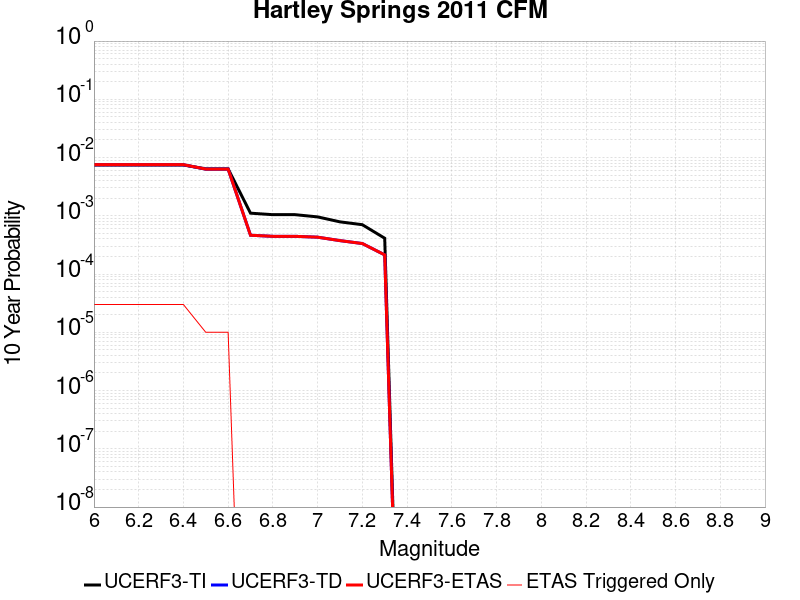 |

| Magnitude | 1 wk TI Prob | 1 wk TD Prob | 1 wk ETAS Prob | 1 wk ETAS/TD Gain | 1 wk ETAS Triggered Only | 1 mo TI Prob | 1 mo TD Prob | 1 mo ETAS Prob | 1 mo ETAS/TD Gain | 1 mo ETAS Triggered Only | 1 yr TI Prob | 1 yr TD Prob | 1 yr ETAS Prob | 1 yr ETAS/TD Gain | 1 yr ETAS Triggered Only | 10 yr TI Prob | 10 yr TD Prob | 10 yr ETAS Prob | 10 yr ETAS/TD Gain | 10 yr ETAS Triggered Only |
|-----|-----|-----|-----|-----|-----|-----|-----|-----|-----|-----|-----|-----|-----|-----|-----|-----|-----|-----|-----|-----|
| 6.0 | 1.4352418E-5 | 1.4434111E-5 | 2.4433966E-5 | 1.6927933 | 1.0E-5 | 6.1508916E-5 | 6.185994E-5 | 9.1858084E-5 | 1.4849366 | 3.0E-5 | 7.486137E-4 | 7.5304887E-4 | 7.830263E-4 | 1.039808 | 3.0E-5 | 0.007460968 | 0.007521092 | 0.0075508663 | 1.0039588 | 3.0E-5 |
| 6.1 | 1.4352418E-5 | 1.4434111E-5 | 2.4433966E-5 | 1.6927933 | 1.0E-5 | 6.1508916E-5 | 6.185994E-5 | 9.1858084E-5 | 1.4849366 | 3.0E-5 | 7.486137E-4 | 7.5304887E-4 | 7.830263E-4 | 1.039808 | 3.0E-5 | 0.007460968 | 0.007521092 | 0.0075508663 | 1.0039588 | 3.0E-5 |
| 6.2 | 1.4352418E-5 | 1.4434111E-5 | 2.4433966E-5 | 1.6927933 | 1.0E-5 | 6.1508916E-5 | 6.185994E-5 | 9.1858084E-5 | 1.4849366 | 3.0E-5 | 7.486137E-4 | 7.5304887E-4 | 7.830263E-4 | 1.039808 | 3.0E-5 | 0.007460968 | 0.007521092 | 0.0075508663 | 1.0039588 | 3.0E-5 |
| 6.3 | 1.4352418E-5 | 1.4434111E-5 | 2.4433966E-5 | 1.6927933 | 1.0E-5 | 6.1508916E-5 | 6.185994E-5 | 9.1858084E-5 | 1.4849366 | 3.0E-5 | 7.486137E-4 | 7.5304887E-4 | 7.830263E-4 | 1.039808 | 3.0E-5 | 0.007460968 | 0.007521092 | 0.0075508663 | 1.0039588 | 3.0E-5 |
| 6.4 | 1.4352418E-5 | 1.4434111E-5 | 2.4433966E-5 | 1.6927933 | 1.0E-5 | 6.1508916E-5 | 6.185994E-5 | 9.1858084E-5 | 1.4849366 | 3.0E-5 | 7.486137E-4 | 7.5304887E-4 | 7.830263E-4 | 1.039808 | 3.0E-5 | 0.007460968 | 0.007521092 | 0.0075508663 | 1.0039588 | 3.0E-5 |
| 6.5 | 1.2279858E-5 | 1.2133036E-5 | 1.2133036E-5 | 1.0 | 0.0 | 5.26269E-5 | 5.199858E-5 | 6.199806E-5 | 1.192303 | 1.0E-5 | 6.4054417E-4 | 6.33057E-4 | 6.4305065E-4 | 1.0157864 | 1.0E-5 | 0.0063870098 | 0.006328048 | 0.006337985 | 1.0015702 | 1.0E-5 |
| 6.6 | 1.2279858E-5 | 1.2133036E-5 | 1.2133036E-5 | 1.0 | 0.0 | 5.26269E-5 | 5.199858E-5 | 6.199806E-5 | 1.192303 | 1.0E-5 | 6.4054417E-4 | 6.33057E-4 | 6.4305065E-4 | 1.0157864 | 1.0E-5 | 0.0063870098 | 0.006328048 | 0.006337985 | 1.0015702 | 1.0E-5 |
| 6.7 | 2.1282601E-6 | 8.894127E-7 | 8.894127E-7 | 1.0 | 0.0 | 9.121083E-6 | 3.8117648E-6 | 3.8117648E-6 | 1.0 | 0.0 | 1.11043526E-4 | 4.6407506E-5 | 4.6407506E-5 | 1.0 | 0.0 | 0.0011098806 | 4.6400347E-4 | 4.6400347E-4 | 1.0 | 0.0 |
| 6.8 | 2.00516E-6 | 8.516916E-7 | 8.516916E-7 | 1.0 | 0.0 | 8.593515E-6 | 3.6501033E-6 | 3.6501033E-6 | 1.0 | 0.0 | 1.04621024E-4 | 4.443936E-5 | 4.443936E-5 | 1.0 | 0.0 | 0.0010457177 | 4.4432987E-4 | 4.4432987E-4 | 1.0 | 0.0 |
| 6.9 | 2.00516E-6 | 8.516916E-7 | 8.516916E-7 | 1.0 | 0.0 | 8.593515E-6 | 3.6501033E-6 | 3.6501033E-6 | 1.0 | 0.0 | 1.04621024E-4 | 4.443936E-5 | 4.443936E-5 | 1.0 | 0.0 | 0.0010457177 | 4.4432987E-4 | 4.4432987E-4 | 1.0 | 0.0 |
| 7.0 | 1.8366732E-6 | 8.2366813E-7 | 8.2366813E-7 | 1.0 | 0.0 | 7.871433E-6 | 3.5300031E-6 | 3.5300031E-6 | 1.0 | 0.0 | 9.583048E-5 | 4.2977194E-5 | 4.2977194E-5 | 1.0 | 0.0 | 9.5789164E-4 | 4.297139E-4 | 4.297139E-4 | 1.0 | 0.0 |
| 7.1 | 1.5097997E-6 | 7.1897E-7 | 7.1897E-7 | 1.0 | 0.0 | 6.470554E-6 | 3.0812978E-6 | 3.0812978E-6 | 1.0 | 0.0 | 7.877615E-5 | 3.7514397E-5 | 3.7514397E-5 | 1.0 | 0.0 | 7.874823E-4 | 3.7510434E-4 | 3.7510434E-4 | 1.0 | 0.0 |
| 7.2 | 1.3490993E-6 | 6.404769E-7 | 6.404769E-7 | 1.0 | 0.0 | 5.7818415E-6 | 2.7448996E-6 | 2.7448996E-6 | 1.0 | 0.0 | 7.0391645E-5 | 3.3418873E-5 | 3.3418873E-5 | 1.0 | 0.0 | 7.0369354E-4 | 3.3416142E-4 | 3.3416142E-4 | 1.0 | 0.0 |
| 7.3 | 7.900015E-7 | 4.0888176E-7 | 4.0888176E-7 | 1.0 | 0.0 | 3.3857161E-6 | 1.7523504E-6 | 1.7523504E-6 | 1.0 | 0.0 | 4.1220315E-5 | 2.1334865E-5 | 2.1334865E-5 | 1.0 | 0.0 | 4.121267E-4 | 2.1334866E-4 | 2.1334866E-4 | 1.0 | 0.0 |

## Sierra Madre
*[(top)](#table-of-contents)*

| 1 Week | 1 Month | 1 Year | 10 Year |
|-----|-----|-----|-----|
|  |  |  |  |

| Magnitude | 1 wk TI Prob | 1 wk TD Prob | 1 wk ETAS Prob | 1 wk ETAS/TD Gain | 1 wk ETAS Triggered Only | 1 mo TI Prob | 1 mo TD Prob | 1 mo ETAS Prob | 1 mo ETAS/TD Gain | 1 mo ETAS Triggered Only | 1 yr TI Prob | 1 yr TD Prob | 1 yr ETAS Prob | 1 yr ETAS/TD Gain | 1 yr ETAS Triggered Only | 10 yr TI Prob | 10 yr TD Prob | 10 yr ETAS Prob | 10 yr ETAS/TD Gain | 10 yr ETAS Triggered Only |
|-----|-----|-----|-----|-----|-----|-----|-----|-----|-----|-----|-----|-----|-----|-----|-----|-----|-----|-----|-----|-----|
| 6.0 | 1.3379373E-5 | 1.1000776E-5 | 1.1000776E-5 | 1.0 | 0.0 | 5.7338908E-5 | 4.714534E-5 | 4.714534E-5 | 1.0 | 0.0 | 6.978776E-4 | 5.738448E-4 | 5.838391E-4 | 1.0174164 | 1.0E-5 | 0.0069569005 | 0.0057238447 | 0.0057437303 | 1.0034741 | 2.0E-5 |
| 6.1 | 1.3379373E-5 | 1.1000776E-5 | 1.1000776E-5 | 1.0 | 0.0 | 5.7338908E-5 | 4.714534E-5 | 4.714534E-5 | 1.0 | 0.0 | 6.978776E-4 | 5.738448E-4 | 5.838391E-4 | 1.0174164 | 1.0E-5 | 0.0069569005 | 0.0057238447 | 0.0057437303 | 1.0034741 | 2.0E-5 |
| 6.2 | 1.3379373E-5 | 1.1000776E-5 | 1.1000776E-5 | 1.0 | 0.0 | 5.7338908E-5 | 4.714534E-5 | 4.714534E-5 | 1.0 | 0.0 | 6.978776E-4 | 5.738448E-4 | 5.838391E-4 | 1.0174164 | 1.0E-5 | 0.0069569005 | 0.0057238447 | 0.0057437303 | 1.0034741 | 2.0E-5 |
| 6.3 | 1.3379373E-5 | 1.1000776E-5 | 1.1000776E-5 | 1.0 | 0.0 | 5.7338908E-5 | 4.714534E-5 | 4.714534E-5 | 1.0 | 0.0 | 6.978776E-4 | 5.738448E-4 | 5.838391E-4 | 1.0174164 | 1.0E-5 | 0.0069569005 | 0.0057238447 | 0.0057437303 | 1.0034741 | 2.0E-5 |
| 6.4 | 1.3379373E-5 | 1.1000776E-5 | 1.1000776E-5 | 1.0 | 0.0 | 5.7338908E-5 | 4.714534E-5 | 4.714534E-5 | 1.0 | 0.0 | 6.978776E-4 | 5.738448E-4 | 5.838391E-4 | 1.0174164 | 1.0E-5 | 0.0069569005 | 0.0057238447 | 0.0057437303 | 1.0034741 | 2.0E-5 |
| 6.5 | 1.26563245E-5 | 1.0230232E-5 | 1.0230232E-5 | 1.0 | 0.0 | 5.4240263E-5 | 4.384312E-5 | 4.384312E-5 | 1.0 | 0.0 | 6.601751E-4 | 5.3366035E-4 | 5.43655E-4 | 1.0187285 | 1.0E-5 | 0.006582173 | 0.0053239604 | 0.005343854 | 1.0037366 | 2.0E-5 |
| 6.6 | 1.26563245E-5 | 1.0230232E-5 | 1.0230232E-5 | 1.0 | 0.0 | 5.4240263E-5 | 4.384312E-5 | 4.384312E-5 | 1.0 | 0.0 | 6.601751E-4 | 5.3366035E-4 | 5.43655E-4 | 1.0187285 | 1.0E-5 | 0.006582173 | 0.0053239604 | 0.005343854 | 1.0037366 | 2.0E-5 |
| 6.7 | 1.2502474E-5 | 1.00663765E-5 | 1.00663765E-5 | 1.0 | 0.0 | 5.3580934E-5 | 4.3140906E-5 | 4.3140906E-5 | 1.0 | 0.0 | 6.521526E-4 | 5.25115E-4 | 5.351097E-4 | 1.0190334 | 1.0E-5 | 0.0065024206 | 0.0052389116 | 0.0052588065 | 1.0037975 | 2.0E-5 |
| 6.8 | 1.2454966E-5 | 1.0018662E-5 | 1.0018662E-5 | 1.0 | 0.0 | 5.3377335E-5 | 4.293642E-5 | 4.293642E-5 | 1.0 | 0.0 | 6.4967526E-4 | 5.226266E-4 | 5.3262134E-4 | 1.0191242 | 1.0E-5 | 0.006477792 | 0.0052141445 | 0.00523404 | 1.0038158 | 2.0E-5 |
| 6.9 | 1.2225574E-5 | 9.792639E-6 | 9.792639E-6 | 1.0 | 0.0 | 5.2394265E-5 | 4.196778E-5 | 4.196778E-5 | 1.0 | 0.0 | 6.3771347E-4 | 5.10839E-4 | 5.208339E-4 | 1.0195656 | 1.0E-5 | 0.006358865 | 0.0050968137 | 0.005116712 | 1.003904 | 2.0E-5 |
| 7.0 | 1.182946E-5 | 9.399179E-6 | 9.399179E-6 | 1.0 | 0.0 | 5.06967E-5 | 4.0281582E-5 | 4.0281582E-5 | 1.0 | 0.0 | 6.1705755E-4 | 4.903189E-4 | 5.00314E-4 | 1.0203849 | 1.0E-5 | 0.006153469 | 0.004892533 | 0.004912435 | 1.0040679 | 2.0E-5 |
| 7.1 | 1.14369095E-5 | 8.986194E-6 | 8.986194E-6 | 1.0 | 0.0 | 4.9014405E-5 | 3.85117E-5 | 3.85117E-5 | 1.0 | 0.0 | 5.9658696E-4 | 4.6878002E-4 | 4.7877536E-4 | 1.021322 | 1.0E-5 | 0.005949879 | 0.0046780678 | 0.0046979743 | 1.0042553 | 2.0E-5 |
| 7.2 | 1.0836419E-5 | 8.39959E-6 | 8.39959E-6 | 1.0 | 0.0 | 4.644097E-5 | 3.599775E-5 | 3.599775E-5 | 1.0 | 0.0 | 5.652721E-4 | 4.3818538E-4 | 4.48181E-4 | 1.0228114 | 1.0E-5 | 0.0056383642 | 0.0043733614 | 0.004393274 | 1.0045532 | 2.0E-5 |
| 7.3 | 1.0403439E-5 | 8.020854E-6 | 8.020854E-6 | 1.0 | 0.0 | 4.4585406E-5 | 3.437464E-5 | 3.437464E-5 | 1.0 | 0.0 | 5.426921E-4 | 4.184318E-4 | 4.284276E-4 | 1.0238887 | 1.0E-5 | 0.005413687 | 0.004176585 | 0.0041965013 | 1.0047686 | 2.0E-5 |
| 7.4 | 9.768864E-6 | 7.4144855E-6 | 7.4144855E-6 | 1.0 | 0.0 | 4.186589E-5 | 3.1775984E-5 | 3.1775984E-5 | 1.0 | 0.0 | 5.09598E-4 | 3.868048E-4 | 3.9680096E-4 | 1.0258428 | 1.0E-5 | 0.0050843097 | 0.0038614576 | 0.0038813804 | 1.0051594 | 2.0E-5 |
| 7.5 | 8.687089E-6 | 6.450183E-6 | 6.450183E-6 | 1.0 | 0.0 | 3.722985E-5 | 2.7643353E-5 | 2.7643353E-5 | 1.0 | 0.0 | 4.5317915E-4 | 3.3650672E-4 | 3.3650672E-4 | 1.0 | 0.0 | 0.004522561 | 0.003360109 | 0.0033700755 | 1.002966 | 1.0E-5 |
| 7.6 | 6.3506063E-6 | 4.430329E-6 | 4.430329E-6 | 1.0 | 0.0 | 2.72166E-5 | 1.8986988E-5 | 1.8986988E-5 | 1.0 | 0.0 | 3.3131172E-4 | 2.3114232E-4 | 2.3114232E-4 | 1.0 | 0.0 | 0.003308182 | 0.0023090935 | 0.0023090935 | 1.0 | 0.0 |
| 7.7 | 4.62223E-6 | 2.9329542E-6 | 2.9329542E-6 | 1.0 | 0.0 | 1.9809406E-5 | 1.2569743E-5 | 1.2569743E-5 | 1.0 | 0.0 | 2.4115283E-4 | 1.5302589E-4 | 1.5302589E-4 | 1.0 | 0.0 | 0.0024089129 | 0.0015292577 | 0.0015292577 | 1.0 | 0.0 |
| 7.8 | 3.2145008E-6 | 1.949411E-6 | 1.949411E-6 | 1.0 | 0.0 | 1.3776359E-5 | 8.354592E-6 | 8.354592E-6 | 1.0 | 0.0 | 1.6771426E-4 | 1.01712416E-4 | 1.01712416E-4 | 1.0 | 0.0 | 0.0016758774 | 0.0010166786 | 0.0010166786 | 1.0 | 0.0 |
| 7.9 | 1.0391769E-6 | 5.602482E-7 | 5.602482E-7 | 1.0 | 0.0 | 4.4536077E-6 | 2.4010617E-6 | 2.4010617E-6 | 1.0 | 0.0 | 5.4221324E-5 | 2.9232539E-5 | 2.9232539E-5 | 1.0 | 0.0 | 5.4208096E-4 | 2.9228735E-4 | 2.9228735E-4 | 1.0 | 0.0 |
| 8.0 | 1.210983E-7 | 6.613497E-8 | 6.613497E-8 | 1.0 | 0.0 | 5.1899264E-7 | 2.8343558E-7 | 2.8343558E-7 | 1.0 | 0.0 | 6.3187167E-6 | 3.4508228E-6 | 3.4508228E-6 | 1.0 | 0.0 | 6.318537E-5 | 3.450771E-5 | 3.450771E-5 | 1.0 | 0.0 |

## Newport-Inglewood alt 1
*[(top)](#table-of-contents)*

| 1 Week | 1 Month | 1 Year | 10 Year |
|-----|-----|-----|-----|
|  |  |  |  |

| Magnitude | 1 wk TI Prob | 1 wk TD Prob | 1 wk ETAS Prob | 1 wk ETAS/TD Gain | 1 wk ETAS Triggered Only | 1 mo TI Prob | 1 mo TD Prob | 1 mo ETAS Prob | 1 mo ETAS/TD Gain | 1 mo ETAS Triggered Only | 1 yr TI Prob | 1 yr TD Prob | 1 yr ETAS Prob | 1 yr ETAS/TD Gain | 1 yr ETAS Triggered Only | 10 yr TI Prob | 10 yr TD Prob | 10 yr ETAS Prob | 10 yr ETAS/TD Gain | 10 yr ETAS Triggered Only |
|-----|-----|-----|-----|-----|-----|-----|-----|-----|-----|-----|-----|-----|-----|-----|-----|-----|-----|-----|-----|-----|
| 6.0 | 2.9668912E-5 | 3.0404828E-5 | 4.0404524E-5 | 1.3288851 | 1.0E-5 | 1.2714628E-4 | 1.3030265E-4 | 1.5030004E-4 | 1.1534688 | 2.0E-5 | 0.0015469068 | 0.0015857654 | 0.0016157179 | 1.0188884 | 3.0E-5 | 0.015361829 | 0.01579211 | 0.015821636 | 1.0018697 | 3.0E-5 |
| 6.1 | 2.9668912E-5 | 3.0404828E-5 | 4.0404524E-5 | 1.3288851 | 1.0E-5 | 1.2714628E-4 | 1.3030265E-4 | 1.5030004E-4 | 1.1534688 | 2.0E-5 | 0.0015469068 | 0.0015857654 | 0.0016157179 | 1.0188884 | 3.0E-5 | 0.015361829 | 0.01579211 | 0.015821636 | 1.0018697 | 3.0E-5 |
| 6.2 | 2.9668912E-5 | 3.0404828E-5 | 4.0404524E-5 | 1.3288851 | 1.0E-5 | 1.2714628E-4 | 1.3030265E-4 | 1.5030004E-4 | 1.1534688 | 2.0E-5 | 0.0015469068 | 0.0015857654 | 0.0016157179 | 1.0188884 | 3.0E-5 | 0.015361829 | 0.01579211 | 0.015821636 | 1.0018697 | 3.0E-5 |
| 6.3 | 2.9668912E-5 | 3.0404828E-5 | 4.0404524E-5 | 1.3288851 | 1.0E-5 | 1.2714628E-4 | 1.3030265E-4 | 1.5030004E-4 | 1.1534688 | 2.0E-5 | 0.0015469068 | 0.0015857654 | 0.0016157179 | 1.0188884 | 3.0E-5 | 0.015361829 | 0.01579211 | 0.015821636 | 1.0018697 | 3.0E-5 |
| 6.4 | 1.275942E-5 | 1.02725335E-5 | 1.02725335E-5 | 1.0 | 0.0 | 5.4682085E-5 | 4.4024422E-5 | 4.4024422E-5 | 1.0 | 0.0 | 6.65551E-4 | 5.358697E-4 | 5.358697E-4 | 1.0 | 0.0 | 0.0066356123 | 0.0053462 | 0.0053462 | 1.0 | 0.0 |
| 6.5 | 1.275942E-5 | 1.02725335E-5 | 1.02725335E-5 | 1.0 | 0.0 | 5.4682085E-5 | 4.4024422E-5 | 4.4024422E-5 | 1.0 | 0.0 | 6.65551E-4 | 5.358697E-4 | 5.358697E-4 | 1.0 | 0.0 | 0.0066356123 | 0.0053462 | 0.0053462 | 1.0 | 0.0 |
| 6.6 | 1.1255358E-5 | 8.661911E-6 | 8.661911E-6 | 1.0 | 0.0 | 4.8236358E-5 | 3.7121958E-5 | 3.7121958E-5 | 1.0 | 0.0 | 5.871194E-4 | 4.5186782E-4 | 4.5186782E-4 | 1.0 | 0.0 | 0.005855706 | 0.0045096674 | 0.0045096674 | 1.0 | 0.0 |
| 6.7 | 1.0504745E-5 | 7.8998455E-6 | 7.8998455E-6 | 1.0 | 0.0 | 4.5019555E-5 | 3.385605E-5 | 3.385605E-5 | 1.0 | 0.0 | 5.4797524E-4 | 4.121207E-4 | 4.121207E-4 | 1.0 | 0.0 | 0.0054662596 | 0.004113694 | 0.004113694 | 1.0 | 0.0 |
| 6.8 | 1.0476007E-5 | 7.881227E-6 | 7.881227E-6 | 1.0 | 0.0 | 4.4896402E-5 | 3.3776258E-5 | 3.3776258E-5 | 1.0 | 0.0 | 5.464766E-4 | 4.1114958E-4 | 4.1114958E-4 | 1.0 | 0.0 | 0.005451347 | 0.004104019 | 0.004104019 | 1.0 | 0.0 |
| 6.9 | 9.076797E-6 | 6.4896567E-6 | 6.4896567E-6 | 1.0 | 0.0 | 3.889998E-5 | 2.7812519E-5 | 2.7812519E-5 | 1.0 | 0.0 | 4.7350433E-4 | 3.3856515E-4 | 3.3856515E-4 | 1.0 | 0.0 | 0.004724967 | 0.003380531 | 0.003380531 | 1.0 | 0.0 |
| 7.0 | 8.73795E-6 | 6.2120503E-6 | 6.2120503E-6 | 1.0 | 0.0 | 3.7447822E-5 | 2.6622802E-5 | 2.6622802E-5 | 1.0 | 0.0 | 4.5583185E-4 | 3.2408469E-4 | 3.2408469E-4 | 1.0 | 0.0 | 0.0045489795 | 0.0032361522 | 0.0032361522 | 1.0 | 0.0 |
| 7.1 | 8.391299E-6 | 5.9557533E-6 | 5.9557533E-6 | 1.0 | 0.0 | 3.5962214E-5 | 2.5524409E-5 | 2.5524409E-5 | 1.0 | 0.0 | 4.37752E-4 | 3.1071564E-4 | 3.1071564E-4 | 1.0 | 0.0 | 0.004368907 | 0.0031028416 | 0.0031028416 | 1.0 | 0.0 |
| 7.2 | 7.796882E-6 | 5.4964826E-6 | 5.4964826E-6 | 1.0 | 0.0 | 3.341478E-5 | 2.3556144E-5 | 2.3556144E-5 | 1.0 | 0.0 | 4.06749E-4 | 2.867585E-4 | 2.867585E-4 | 1.0 | 0.0 | 0.0040600533 | 0.002863909 | 0.002863909 | 1.0 | 0.0 |
| 7.3 | 6.4738833E-6 | 4.6477753E-6 | 4.6477753E-6 | 1.0 | 0.0 | 2.774492E-5 | 1.9918885E-5 | 1.9918885E-5 | 1.0 | 0.0 | 3.3774204E-4 | 2.424856E-4 | 2.424856E-4 | 1.0 | 0.0 | 0.0033722918 | 0.0024222268 | 0.0024222268 | 1.0 | 0.0 |
| 7.4 | 5.382145E-6 | 3.8857215E-6 | 3.8857215E-6 | 1.0 | 0.0 | 2.3066134E-5 | 1.6652988E-5 | 1.6652988E-5 | 1.0 | 0.0 | 2.8079396E-4 | 2.0273139E-4 | 2.0273139E-4 | 1.0 | 0.0 | 0.0028043943 | 0.002025479 | 0.002025479 | 1.0 | 0.0 |
| 7.5 | 3.648244E-6 | 2.5737634E-6 | 2.5737634E-6 | 1.0 | 0.0 | 1.5635238E-5 | 1.1030369E-5 | 1.1030369E-5 | 1.0 | 0.0 | 1.9034238E-4 | 1.3428657E-4 | 1.3428657E-4 | 1.0 | 0.0 | 0.0019017943 | 0.0013420646 | 0.0013420646 | 1.0 | 0.0 |
| 7.6 | 2.2906888E-6 | 1.547986E-6 | 1.547986E-6 | 1.0 | 0.0 | 9.817201E-6 | 6.634209E-6 | 6.634209E-6 | 1.0 | 0.0 | 1.1951787E-4 | 8.076857E-5 | 8.076857E-5 | 1.0 | 0.0 | 0.0011945361 | 8.073989E-4 | 8.073989E-4 | 1.0 | 0.0 |
| 7.7 | 6.0479874E-7 | 3.397468E-7 | 3.397468E-7 | 1.0 | 0.0 | 2.5919921E-6 | 1.456057E-6 | 1.456057E-6 | 1.0 | 0.0 | 3.1557047E-5 | 1.7727363E-5 | 1.7727363E-5 | 1.0 | 0.0 | 3.1552566E-4 | 1.7726087E-4 | 1.7726087E-4 | 1.0 | 0.0 |
| 7.8 | 1.16056995E-8 | 9.782997E-9 | 9.782997E-9 | 1.0 | 0.0 | 4.9738713E-8 | 4.1927127E-8 | 4.1927127E-8 | 1.0 | 0.0 | 6.0556863E-7 | 5.1046277E-7 | 5.1046277E-7 | 1.0 | 0.0 | 6.05567E-6 | 5.1046277E-6 | 5.1046277E-6 | 1.0 | 0.0 |

## Cucamonga
*[(top)](#table-of-contents)*

| 1 Week | 1 Month | 1 Year | 10 Year |
|-----|-----|-----|-----|
|  |  |  |  |

| Magnitude | 1 wk TI Prob | 1 wk TD Prob | 1 wk ETAS Prob | 1 wk ETAS/TD Gain | 1 wk ETAS Triggered Only | 1 mo TI Prob | 1 mo TD Prob | 1 mo ETAS Prob | 1 mo ETAS/TD Gain | 1 mo ETAS Triggered Only | 1 yr TI Prob | 1 yr TD Prob | 1 yr ETAS Prob | 1 yr ETAS/TD Gain | 1 yr ETAS Triggered Only | 10 yr TI Prob | 10 yr TD Prob | 10 yr ETAS Prob | 10 yr ETAS/TD Gain | 10 yr ETAS Triggered Only |
|-----|-----|-----|-----|-----|-----|-----|-----|-----|-----|-----|-----|-----|-----|-----|-----|-----|-----|-----|-----|-----|
| 6.0 | 1.1848348E-5 | 1.1737109E-5 | 2.1736992E-5 | 1.8519886 | 1.0E-5 | 5.0777642E-5 | 5.0300943E-5 | 6.030044E-5 | 1.1987934 | 1.0E-5 | 6.180424E-4 | 6.122446E-4 | 6.3223235E-4 | 1.0326467 | 2.0E-5 | 0.0061632637 | 0.006106745 | 0.0061365617 | 1.0048826 | 3.0E-5 |
| 6.1 | 1.1848348E-5 | 1.1737109E-5 | 2.1736992E-5 | 1.8519886 | 1.0E-5 | 5.0777642E-5 | 5.0300943E-5 | 6.030044E-5 | 1.1987934 | 1.0E-5 | 6.180424E-4 | 6.122446E-4 | 6.3223235E-4 | 1.0326467 | 2.0E-5 | 0.0061632637 | 0.006106745 | 0.0061365617 | 1.0048826 | 3.0E-5 |
| 6.2 | 1.1848348E-5 | 1.1737109E-5 | 2.1736992E-5 | 1.8519886 | 1.0E-5 | 5.0777642E-5 | 5.0300943E-5 | 6.030044E-5 | 1.1987934 | 1.0E-5 | 6.180424E-4 | 6.122446E-4 | 6.3223235E-4 | 1.0326467 | 2.0E-5 | 0.0061632637 | 0.006106745 | 0.0061365617 | 1.0048826 | 3.0E-5 |
| 6.3 | 1.1848348E-5 | 1.1737109E-5 | 2.1736992E-5 | 1.8519886 | 1.0E-5 | 5.0777642E-5 | 5.0300943E-5 | 6.030044E-5 | 1.1987934 | 1.0E-5 | 6.180424E-4 | 6.122446E-4 | 6.3223235E-4 | 1.0326467 | 2.0E-5 | 0.0061632637 | 0.006106745 | 0.0061365617 | 1.0048826 | 3.0E-5 |
| 6.4 | 1.1848348E-5 | 1.1737109E-5 | 2.1736992E-5 | 1.8519886 | 1.0E-5 | 5.0777642E-5 | 5.0300943E-5 | 6.030044E-5 | 1.1987934 | 1.0E-5 | 6.180424E-4 | 6.122446E-4 | 6.3223235E-4 | 1.0326467 | 2.0E-5 | 0.0061632637 | 0.006106745 | 0.0061365617 | 1.0048826 | 3.0E-5 |
| 6.5 | 1.16988695E-5 | 1.157614E-5 | 2.1576025E-5 | 1.8638358 | 1.0E-5 | 5.013705E-5 | 4.9611102E-5 | 5.9610604E-5 | 1.2015578 | 1.0E-5 | 6.102476E-4 | 6.0385047E-4 | 6.2383834E-4 | 1.0331008 | 2.0E-5 | 0.006085745 | 0.0060232594 | 0.0060530785 | 1.0049506 | 3.0E-5 |
| 6.6 | 1.16988695E-5 | 1.157614E-5 | 2.1576025E-5 | 1.8638358 | 1.0E-5 | 5.013705E-5 | 4.9611102E-5 | 5.9610604E-5 | 1.2015578 | 1.0E-5 | 6.102476E-4 | 6.0385047E-4 | 6.2383834E-4 | 1.0331008 | 2.0E-5 | 0.006085745 | 0.0060232594 | 0.0060530785 | 1.0049506 | 3.0E-5 |
| 6.7 | 1.1397107E-5 | 1.1115039E-5 | 2.1114927E-5 | 1.8996719 | 1.0E-5 | 4.884383E-5 | 4.7635025E-5 | 5.763455E-5 | 1.2099196 | 1.0E-5 | 5.9451134E-4 | 5.798046E-4 | 5.99793E-4 | 1.0344744 | 2.0E-5 | 0.005929234 | 0.005784061 | 0.0058138873 | 1.0051566 | 3.0E-5 |
| 6.8 | 1.058387E-5 | 9.785037E-6 | 9.785037E-6 | 1.0 | 0.0 | 4.5358654E-5 | 4.1935207E-5 | 4.1935207E-5 | 1.0 | 0.0 | 5.521017E-4 | 5.1044265E-4 | 5.2043755E-4 | 1.0195808 | 1.0E-5 | 0.00550732 | 0.005093702 | 0.0051136003 | 1.0039064 | 2.0E-5 |
| 6.9 | 9.690046E-6 | 8.579504E-6 | 8.579504E-6 | 1.0 | 0.0 | 4.1528107E-5 | 3.6768783E-5 | 3.6768783E-5 | 1.0 | 0.0 | 5.054874E-4 | 4.475684E-4 | 4.5756393E-4 | 1.0223329 | 1.0E-5 | 0.005043391 | 0.0044675954 | 0.004487506 | 1.0044566 | 2.0E-5 |
| 7.0 | 9.381461E-6 | 8.18712E-6 | 8.18712E-6 | 1.0 | 0.0 | 4.020564E-5 | 3.508719E-5 | 3.508719E-5 | 1.0 | 0.0 | 4.893937E-4 | 4.2710314E-4 | 4.3709888E-4 | 1.0234035 | 1.0E-5 | 0.0048831734 | 0.004263747 | 0.004283662 | 1.0046707 | 2.0E-5 |
| 7.1 | 8.946492E-6 | 7.781904E-6 | 7.781904E-6 | 1.0 | 0.0 | 3.8341543E-5 | 3.3350592E-5 | 3.3350592E-5 | 1.0 | 0.0 | 4.667083E-4 | 4.0596814E-4 | 4.1596408E-4 | 1.0246224 | 1.0E-5 | 0.0046572937 | 0.0040531927 | 0.0040731113 | 1.0049144 | 2.0E-5 |
| 7.2 | 8.251016E-6 | 6.9752878E-6 | 6.9752878E-6 | 1.0 | 0.0 | 3.5361016E-5 | 2.9893748E-5 | 2.9893748E-5 | 1.0 | 0.0 | 4.3043532E-4 | 3.6389584E-4 | 3.7389222E-4 | 1.0274704 | 1.0E-5 | 0.0042960253 | 0.0036339252 | 0.0036538525 | 1.0054837 | 2.0E-5 |
| 7.3 | 7.717881E-6 | 6.4863584E-6 | 6.4863584E-6 | 1.0 | 0.0 | 3.3076216E-5 | 2.7798384E-5 | 2.7798384E-5 | 1.0 | 0.0 | 4.026285E-4 | 3.38393E-4 | 3.483896E-4 | 1.0295415 | 1.0E-5 | 0.004018998 | 0.0033797103 | 0.0033996427 | 1.0058976 | 2.0E-5 |
| 7.4 | 7.275623E-6 | 6.032004E-6 | 6.032004E-6 | 1.0 | 0.0 | 3.118087E-5 | 2.5851192E-5 | 2.5851192E-5 | 1.0 | 0.0 | 3.7956095E-4 | 3.1469302E-4 | 3.2468987E-4 | 1.031767 | 1.0E-5 | 0.0037891332 | 0.0031434046 | 0.003163342 | 1.0063425 | 2.0E-5 |
| 7.5 | 6.5109502E-6 | 5.100593E-6 | 5.100593E-6 | 1.0 | 0.0 | 2.7903774E-5 | 2.1859503E-5 | 2.1859503E-5 | 1.0 | 0.0 | 3.3967546E-4 | 2.661071E-4 | 2.661071E-4 | 1.0 | 0.0 | 0.0033915674 | 0.0026588016 | 0.0026588016 | 1.0 | 0.0 |
| 7.6 | 5.4495326E-6 | 3.908547E-6 | 3.908547E-6 | 1.0 | 0.0 | 2.335493E-5 | 1.6750808E-5 | 1.6750808E-5 | 1.0 | 0.0 | 2.8430918E-4 | 2.0392207E-4 | 2.0392207E-4 | 1.0 | 0.0 | 0.0028394572 | 0.0020382616 | 0.0020382616 | 1.0 | 0.0 |
| 7.7 | 4.7997164E-6 | 3.2002263E-6 | 3.2002263E-6 | 1.0 | 0.0 | 2.057005E-5 | 1.3715184E-5 | 1.3715184E-5 | 1.0 | 0.0 | 2.504116E-4 | 1.6696959E-4 | 1.6696959E-4 | 1.0 | 0.0 | 0.002501296 | 0.0016693701 | 0.0016693701 | 1.0 | 0.0 |
| 7.8 | 3.3941733E-6 | 2.0641678E-6 | 2.0641678E-6 | 1.0 | 0.0 | 1.4546376E-5 | 8.846404E-6 | 8.846404E-6 | 1.0 | 0.0 | 1.7708774E-4 | 1.07699656E-4 | 1.07699656E-4 | 1.0 | 0.0 | 0.0017694668 | 0.0010766032 | 0.0010766032 | 1.0 | 0.0 |
| 7.9 | 9.750552E-7 | 5.155798E-7 | 5.155798E-7 | 1.0 | 0.0 | 4.178801E-6 | 2.2096258E-6 | 2.2096258E-6 | 1.0 | 0.0 | 5.0875715E-5 | 2.6901867E-5 | 2.6901867E-5 | 1.0 | 0.0 | 5.086407E-4 | 2.689865E-4 | 2.689865E-4 | 1.0 | 0.0 |
| 8.0 | 1.133857E-7 | 6.053372E-8 | 6.053372E-8 | 1.0 | 0.0 | 4.8593864E-7 | 2.594302E-7 | 2.594302E-7 | 1.0 | 0.0 | 5.9162867E-6 | 3.1585582E-6 | 3.1585582E-6 | 1.0 | 0.0 | 5.916129E-5 | 3.158515E-5 | 3.158515E-5 | 1.0 | 0.0 |

## Hollywood
*[(top)](#table-of-contents)*

| 1 Week | 1 Month | 1 Year | 10 Year |
|-----|-----|-----|-----|
|  |  |  |  |

| Magnitude | 1 wk TI Prob | 1 wk TD Prob | 1 wk ETAS Prob | 1 wk ETAS/TD Gain | 1 wk ETAS Triggered Only | 1 mo TI Prob | 1 mo TD Prob | 1 mo ETAS Prob | 1 mo ETAS/TD Gain | 1 mo ETAS Triggered Only | 1 yr TI Prob | 1 yr TD Prob | 1 yr ETAS Prob | 1 yr ETAS/TD Gain | 1 yr ETAS Triggered Only | 10 yr TI Prob | 10 yr TD Prob | 10 yr ETAS Prob | 10 yr ETAS/TD Gain | 10 yr ETAS Triggered Only |
|-----|-----|-----|-----|-----|-----|-----|-----|-----|-----|-----|-----|-----|-----|-----|-----|-----|-----|-----|-----|-----|
| 6.0 | 1.24487615E-5 | 1.2593229E-5 | 2.2593103E-5 | 1.7940675 | 1.0E-5 | 5.3350745E-5 | 5.3969892E-5 | 6.396935E-5 | 1.1852785 | 1.0E-5 | 6.4935174E-4 | 6.5689E-4 | 6.868703E-4 | 1.0456398 | 3.0E-5 | 0.0064745755 | 0.0065499707 | 0.0065797744 | 1.0045502 | 3.0E-5 |
| 6.1 | 1.24487615E-5 | 1.2593229E-5 | 2.2593103E-5 | 1.7940675 | 1.0E-5 | 5.3350745E-5 | 5.3969892E-5 | 6.396935E-5 | 1.1852785 | 1.0E-5 | 6.4935174E-4 | 6.5689E-4 | 6.868703E-4 | 1.0456398 | 3.0E-5 | 0.0064745755 | 0.0065499707 | 0.0065797744 | 1.0045502 | 3.0E-5 |
| 6.2 | 1.24487615E-5 | 1.2593229E-5 | 2.2593103E-5 | 1.7940675 | 1.0E-5 | 5.3350745E-5 | 5.3969892E-5 | 6.396935E-5 | 1.1852785 | 1.0E-5 | 6.4935174E-4 | 6.5689E-4 | 6.868703E-4 | 1.0456398 | 3.0E-5 | 0.0064745755 | 0.0065499707 | 0.0065797744 | 1.0045502 | 3.0E-5 |
| 6.3 | 1.24487615E-5 | 1.2593229E-5 | 2.2593103E-5 | 1.7940675 | 1.0E-5 | 5.3350745E-5 | 5.3969892E-5 | 6.396935E-5 | 1.1852785 | 1.0E-5 | 6.4935174E-4 | 6.5689E-4 | 6.868703E-4 | 1.0456398 | 3.0E-5 | 0.0064745755 | 0.0065499707 | 0.0065797744 | 1.0045502 | 3.0E-5 |
| 6.4 | 1.2431024E-5 | 1.25738425E-5 | 2.2573717E-5 | 1.7952918 | 1.0E-5 | 5.327473E-5 | 5.388681E-5 | 6.388627E-5 | 1.1855642 | 1.0E-5 | 6.4842677E-4 | 6.558791E-4 | 6.858594E-4 | 1.0457101 | 3.0E-5 | 0.0064653796 | 0.0065399213 | 0.006569725 | 1.0045573 | 3.0E-5 |
| 6.5 | 1.1242222E-5 | 1.1317804E-5 | 1.1317804E-5 | 1.0 | 0.0 | 4.8180063E-5 | 4.8503985E-5 | 4.8503985E-5 | 1.0 | 0.0 | 5.864344E-4 | 5.903787E-4 | 6.1036693E-4 | 1.0338565 | 2.0E-5 | 0.0058488925 | 0.00588839 | 0.005908272 | 1.0033765 | 2.0E-5 |
| 6.6 | 1.1234066E-5 | 1.1308918E-5 | 1.1308918E-5 | 1.0 | 0.0 | 4.8145106E-5 | 4.8465907E-5 | 4.8465907E-5 | 1.0 | 0.0 | 5.86009E-4 | 5.899153E-4 | 6.0990354E-4 | 1.0338832 | 2.0E-5 | 0.005844661 | 0.0058837803 | 0.0059036626 | 1.0033792 | 2.0E-5 |
| 6.7 | 1.12294E-5 | 1.1303661E-5 | 1.1303661E-5 | 1.0 | 0.0 | 4.812511E-5 | 4.8443377E-5 | 4.8443377E-5 | 1.0 | 0.0 | 5.857657E-4 | 5.896412E-4 | 6.096294E-4 | 1.033899 | 2.0E-5 | 0.0058422405 | 0.005881054 | 0.005900936 | 1.0033808 | 2.0E-5 |
| 6.8 | 1.0252819E-5 | 1.0218449E-5 | 1.0218449E-5 | 1.0 | 0.0 | 4.3939912E-5 | 4.3792625E-5 | 4.3792625E-5 | 1.0 | 0.0 | 5.3483713E-4 | 5.330469E-4 | 5.530362E-4 | 1.0375001 | 2.0E-5 | 0.005335517 | 0.0053179096 | 0.005337803 | 1.0037409 | 2.0E-5 |
| 6.9 | 9.252289E-6 | 9.110309E-6 | 9.110309E-6 | 1.0 | 0.0 | 3.9652066E-5 | 3.9043607E-5 | 3.9043607E-5 | 1.0 | 0.0 | 4.8265693E-4 | 4.752539E-4 | 4.8524915E-4 | 1.0210314 | 1.0E-5 | 0.0048161 | 0.004742549 | 0.0047525014 | 1.0020986 | 1.0E-5 |
| 7.0 | 8.474604E-6 | 8.25826E-6 | 8.25826E-6 | 1.0 | 0.0 | 3.6319227E-5 | 3.5392073E-5 | 3.5392073E-5 | 1.0 | 0.0 | 4.4209688E-4 | 4.3081472E-4 | 4.4081043E-4 | 1.0232018 | 1.0E-5 | 0.004412184 | 0.0042999457 | 0.004309903 | 1.0023156 | 1.0E-5 |
| 7.1 | 6.643643E-6 | 6.2683707E-6 | 6.2683707E-6 | 1.0 | 0.0 | 2.8472443E-5 | 2.686417E-5 | 2.686417E-5 | 1.0 | 0.0 | 3.4659685E-4 | 3.2702263E-4 | 3.3701936E-4 | 1.030569 | 1.0E-5 | 0.0034605677 | 0.0032654598 | 0.0032754273 | 1.0030524 | 1.0E-5 |
| 7.2 | 5.549002E-6 | 5.1087086E-6 | 5.1087086E-6 | 1.0 | 0.0 | 2.378122E-5 | 2.1894282E-5 | 2.1894282E-5 | 1.0 | 0.0 | 2.8949787E-4 | 2.665304E-4 | 2.7652775E-4 | 1.0375092 | 1.0E-5 | 0.0028912104 | 0.002662124 | 0.0026720974 | 1.0037464 | 1.0E-5 |
| 7.3 | 4.3059727E-6 | 3.9598913E-6 | 3.9598913E-6 | 1.0 | 0.0 | 1.8454039E-5 | 1.6970853E-5 | 1.6970853E-5 | 1.0 | 0.0 | 2.2465475E-4 | 2.0660064E-4 | 2.1659858E-4 | 1.0483925 | 1.0E-5 | 0.0022442779 | 0.0020640958 | 0.0020740752 | 1.0048348 | 1.0E-5 |
| 7.4 | 2.8550733E-6 | 2.7013002E-6 | 2.7013002E-6 | 1.0 | 0.0 | 1.2235971E-5 | 1.1576949E-5 | 1.1576949E-5 | 1.0 | 0.0 | 1.4896276E-4 | 1.4094029E-4 | 1.5093888E-4 | 1.070942 | 1.0E-5 | 0.0014886294 | 0.0014085141 | 0.0014185001 | 1.0070897 | 1.0E-5 |
| 7.5 | 1.9927045E-6 | 1.8976393E-6 | 1.8976393E-6 | 1.0 | 0.0 | 8.540134E-6 | 8.132714E-6 | 8.132714E-6 | 1.0 | 0.0 | 1.0397117E-4 | 9.901134E-5 | 9.901134E-5 | 1.0 | 0.0 | 0.0010392254 | 9.896759E-4 | 9.896759E-4 | 1.0 | 0.0 |
| 7.6 | 1.345084E-6 | 1.2216018E-6 | 1.2216018E-6 | 1.0 | 0.0 | 5.764633E-6 | 5.2354258E-6 | 5.2354258E-6 | 1.0 | 0.0 | 7.018215E-5 | 6.373946E-5 | 6.373946E-5 | 1.0 | 0.0 | 7.0159987E-4 | 6.372138E-4 | 6.372138E-4 | 1.0 | 0.0 |
| 7.7 | 7.6835164E-7 | 6.2777013E-7 | 6.2777013E-7 | 1.0 | 0.0 | 3.2929315E-6 | 2.6904406E-6 | 2.6904406E-6 | 1.0 | 0.0 | 4.00907E-5 | 3.2755637E-5 | 3.2755637E-5 | 1.0 | 0.0 | 4.0083472E-4 | 3.2750957E-4 | 3.2750957E-4 | 1.0 | 0.0 |
| 7.8 | 3.6562128E-7 | 2.4534745E-7 | 2.4534745E-7 | 1.0 | 0.0 | 1.5669474E-6 | 1.0514887E-6 | 1.0514887E-6 | 1.0 | 0.0 | 1.9077417E-5 | 1.2801803E-5 | 1.2801803E-5 | 1.0 | 0.0 | 1.907578E-4 | 1.2801103E-4 | 1.2801103E-4 | 1.0 | 0.0 |
| 7.9 | 7.5024424E-8 | 5.381742E-8 | 5.381742E-8 | 1.0 | 0.0 | 3.215332E-7 | 2.3064608E-7 | 2.3064608E-7 | 1.0 | 0.0 | 3.91466E-6 | 2.8081138E-6 | 2.8081138E-6 | 1.0 | 0.0 | 3.9145907E-5 | 2.8080913E-5 | 2.8080913E-5 | 1.0 | 0.0 |

## Owens Valley Keough Hot Springs
*[(top)](#table-of-contents)*

| 1 Week | 1 Month | 1 Year | 10 Year |
|-----|-----|-----|-----|
|  |  | 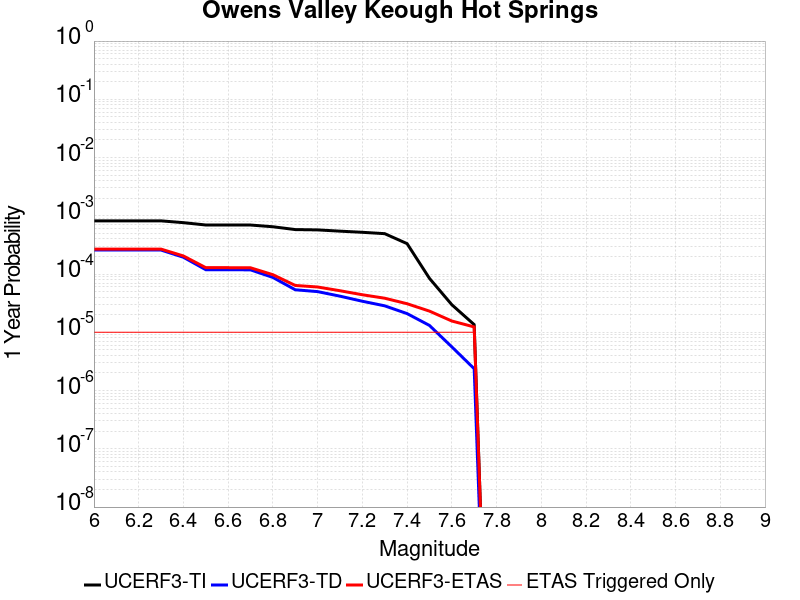 |  |

| Magnitude | 1 wk TI Prob | 1 wk TD Prob | 1 wk ETAS Prob | 1 wk ETAS/TD Gain | 1 wk ETAS Triggered Only | 1 mo TI Prob | 1 mo TD Prob | 1 mo ETAS Prob | 1 mo ETAS/TD Gain | 1 mo ETAS Triggered Only | 1 yr TI Prob | 1 yr TD Prob | 1 yr ETAS Prob | 1 yr ETAS/TD Gain | 1 yr ETAS Triggered Only | 10 yr TI Prob | 10 yr TD Prob | 10 yr ETAS Prob | 10 yr ETAS/TD Gain | 10 yr ETAS Triggered Only |
|-----|-----|-----|-----|-----|-----|-----|-----|-----|-----|-----|-----|-----|-----|-----|-----|-----|-----|-----|-----|-----|
| 6.0 | 1.5708529E-5 | 4.950463E-6 | 1.4950414E-5 | 3.020003 | 1.0E-5 | 6.7320536E-5 | 2.1216127E-5 | 3.1215914E-5 | 1.4713296 | 1.0E-5 | 8.193192E-4 | 2.5828084E-4 | 2.6827827E-4 | 1.0387075 | 1.0E-5 | 0.008163051 | 0.0025804387 | 0.0026103612 | 1.011596 | 3.0E-5 |
| 6.1 | 1.5708529E-5 | 4.950463E-6 | 1.4950414E-5 | 3.020003 | 1.0E-5 | 6.7320536E-5 | 2.1216127E-5 | 3.1215914E-5 | 1.4713296 | 1.0E-5 | 8.193192E-4 | 2.5828084E-4 | 2.6827827E-4 | 1.0387075 | 1.0E-5 | 0.008163051 | 0.0025804387 | 0.0026103612 | 1.011596 | 3.0E-5 |
| 6.2 | 1.5708529E-5 | 4.950463E-6 | 1.4950414E-5 | 3.020003 | 1.0E-5 | 6.7320536E-5 | 2.1216127E-5 | 3.1215914E-5 | 1.4713296 | 1.0E-5 | 8.193192E-4 | 2.5828084E-4 | 2.6827827E-4 | 1.0387075 | 1.0E-5 | 0.008163051 | 0.0025804387 | 0.0026103612 | 1.011596 | 3.0E-5 |
| 6.3 | 1.5708529E-5 | 4.950463E-6 | 1.4950414E-5 | 3.020003 | 1.0E-5 | 6.7320536E-5 | 2.1216127E-5 | 3.1215914E-5 | 1.4713296 | 1.0E-5 | 8.193192E-4 | 2.5828084E-4 | 2.6827827E-4 | 1.0387075 | 1.0E-5 | 0.008163051 | 0.0025804387 | 0.0026103612 | 1.011596 | 3.0E-5 |
| 6.4 | 1.4622509E-5 | 3.7263276E-6 | 1.37262905E-5 | 3.6835973 | 1.0E-5 | 6.266639E-5 | 1.5969896E-5 | 2.5969737E-5 | 1.6261681 | 1.0E-5 | 7.626962E-4 | 1.9441944E-4 | 2.044175E-4 | 1.0514252 | 1.0E-5 | 0.007600839 | 0.0019429466 | 0.0019728884 | 1.0154104 | 3.0E-5 |
| 6.5 | 1.3335527E-5 | 2.2775241E-6 | 1.2277502E-5 | 5.3907228 | 1.0E-5 | 5.7151006E-5 | 9.760785E-6 | 1.9760688E-5 | 2.0244977 | 1.0E-5 | 6.955913E-4 | 1.1883176E-4 | 1.2883058E-4 | 1.0841426 | 1.0E-5 | 0.0069341804 | 0.001187878 | 0.0012178423 | 1.0252252 | 3.0E-5 |
| 6.6 | 1.3332855E-5 | 2.2746733E-6 | 1.22746505E-5 | 5.3962255 | 1.0E-5 | 5.7139558E-5 | 9.748568E-6 | 1.974847E-5 | 2.0257816 | 1.0E-5 | 6.9545204E-4 | 1.1868303E-4 | 1.2868184E-4 | 1.0842481 | 1.0E-5 | 0.0069327964 | 0.0011863923 | 0.0012163566 | 1.0252568 | 3.0E-5 |
| 6.7 | 1.3318214E-5 | 2.2639038E-6 | 1.2263881E-5 | 5.4171386 | 1.0E-5 | 5.707681E-5 | 9.702413E-6 | 1.9702316E-5 | 2.0306613 | 1.0E-5 | 6.946886E-4 | 1.18121156E-4 | 1.2811998E-4 | 1.0846488 | 1.0E-5 | 0.0069252094 | 0.0011807795 | 0.001210744 | 1.0253769 | 3.0E-5 |
| 6.8 | 1.2441338E-5 | 1.677594E-6 | 1.1677577E-5 | 6.960908 | 1.0E-5 | 5.331893E-5 | 7.1896707E-6 | 1.7189599E-5 | 2.3908744 | 1.0E-5 | 6.489646E-4 | 8.753102E-5 | 9.7530145E-5 | 1.1142352 | 1.0E-5 | 0.0064707273 | 8.751236E-4 | 9.0509735E-4 | 1.0342509 | 3.0E-5 |
| 6.9 | 1.1130476E-5 | 1.0302234E-6 | 1.10302135E-5 | 10.706622 | 1.0E-5 | 4.7701167E-5 | 4.4152357E-6 | 1.4415192E-5 | 3.2648747 | 1.0E-5 | 5.806069E-4 | 5.3754186E-5 | 6.375365E-5 | 1.186022 | 1.0E-5 | 0.0057909233 | 5.375404E-4 | 5.575297E-4 | 1.0371865 | 2.0E-5 |
| 7.0 | 1.0986073E-5 | 9.577824E-7 | 1.0957773E-5 | 11.440775 | 1.0E-5 | 4.7082318E-5 | 4.1047756E-6 | 1.4104734E-5 | 3.4361768 | 1.0E-5 | 5.730765E-4 | 4.9974507E-5 | 5.997401E-5 | 1.2000921 | 1.0E-5 | 0.0057160086 | 4.997603E-4 | 5.1975035E-4 | 1.0399991 | 2.0E-5 |
| 7.1 | 1.0451338E-5 | 7.9988575E-7 | 1.0799878E-5 | 13.501776 | 1.0E-5 | 4.4790682E-5 | 3.4280772E-6 | 1.3428043E-5 | 3.917077 | 1.0E-5 | 5.451901E-4 | 4.1736046E-5 | 5.1735627E-5 | 1.239591 | 1.0E-5 | 0.005438545 | 4.1740583E-4 | 4.3739748E-4 | 1.047895 | 2.0E-5 |
| 7.2 | 9.989061E-6 | 6.543693E-7 | 1.0654363E-5 | 16.281881 | 1.0E-5 | 4.280956E-5 | 2.8044367E-6 | 1.28044085E-5 | 4.5657687 | 1.0E-5 | 5.2108173E-4 | 3.4143486E-5 | 4.4143144E-5 | 1.2928716 | 1.0E-5 | 0.0051986156 | 3.41488E-4 | 3.6148116E-4 | 1.0585473 | 2.0E-5 |
| 7.3 | 9.465365E-6 | 5.458855E-7 | 1.054588E-5 | 19.31885 | 1.0E-5 | 4.056522E-5 | 2.3395073E-6 | 1.2339484E-5 | 5.2743945 | 1.0E-5 | 4.937696E-4 | 2.8483131E-5 | 3.8482845E-5 | 1.351075 | 1.0E-5 | 0.0049267393 | 2.8489542E-4 | 3.0488972E-4 | 1.0701813 | 2.0E-5 |
| 7.4 | 6.3824805E-6 | 4.0153776E-7 | 1.04015335E-5 | 25.904247 | 1.0E-5 | 2.73532E-5 | 1.7208749E-6 | 1.1720857E-5 | 6.8109875 | 1.0E-5 | 3.3297433E-4 | 2.0951453E-5 | 3.0951243E-5 | 1.4772838 | 1.0E-5 | 0.0033247585 | 2.0955436E-4 | 2.2955018E-4 | 1.0954206 | 2.0E-5 |
| 7.5 | 1.6192645E-6 | 2.5156373E-7 | 1.0251561E-5 | 40.751347 | 1.0E-5 | 6.9396865E-6 | 1.0781299E-6 | 1.1078119E-5 | 10.2753105 | 1.0E-5 | 8.448741E-5 | 1.3126153E-5 | 2.3126022E-5 | 1.7618278 | 1.0E-5 | 8.4455294E-4 | 1.3125391E-4 | 1.5125128E-4 | 1.1523564 | 2.0E-5 |
| 7.6 | 5.7062545E-7 | 1.0790214E-7 | 1.0107901E-5 | 93.67656 | 1.0E-5 | 2.4455355E-6 | 4.6243767E-7 | 1.0462433E-5 | 22.624525 | 1.0E-5 | 2.9773988E-5 | 5.630165E-6 | 1.5630108E-5 | 2.7761369 | 1.0E-5 | 2.977E-4 | 5.6300305E-5 | 7.629918E-5 | 1.3552178 | 2.0E-5 |
| 7.7 | 2.5988817E-7 | 4.5445965E-8 | 1.0045445E-5 | 221.04152 | 1.0E-5 | 1.113806E-6 | 1.9476842E-7 | 1.0194766E-5 | 52.343018 | 1.0E-5 | 1.3560503E-5 | 2.3713033E-6 | 1.237128E-5 | 5.21708 | 1.0E-5 | 1.3559677E-4 | 2.3712824E-5 | 4.371235E-5 | 1.8434055 | 2.0E-5 |

## Pitas Point (Lower)-Montalvo
*[(top)](#table-of-contents)*

| 1 Week | 1 Month | 1 Year | 10 Year |
|-----|-----|-----|-----|
|  |  |  |  |

| Magnitude | 1 wk TI Prob | 1 wk TD Prob | 1 wk ETAS Prob | 1 wk ETAS/TD Gain | 1 wk ETAS Triggered Only | 1 mo TI Prob | 1 mo TD Prob | 1 mo ETAS Prob | 1 mo ETAS/TD Gain | 1 mo ETAS Triggered Only | 1 yr TI Prob | 1 yr TD Prob | 1 yr ETAS Prob | 1 yr ETAS/TD Gain | 1 yr ETAS Triggered Only | 10 yr TI Prob | 10 yr TD Prob | 10 yr ETAS Prob | 10 yr ETAS/TD Gain | 10 yr ETAS Triggered Only |
|-----|-----|-----|-----|-----|-----|-----|-----|-----|-----|-----|-----|-----|-----|-----|-----|-----|-----|-----|-----|-----|
| 6.0 | 5.2543637E-6 | 4.8379025E-6 | 1.4837854E-5 | 3.0670013 | 1.0E-5 | 2.2518509E-5 | 2.0733705E-5 | 3.07335E-5 | 1.4822965 | 1.0E-5 | 2.7412834E-4 | 2.5240393E-4 | 2.6240142E-4 | 1.0396091 | 1.0E-5 | 0.0027379042 | 0.0025212052 | 0.0025411546 | 1.0079128 | 2.0E-5 |
| 6.1 | 5.2543637E-6 | 4.8379025E-6 | 1.4837854E-5 | 3.0670013 | 1.0E-5 | 2.2518509E-5 | 2.0733705E-5 | 3.07335E-5 | 1.4822965 | 1.0E-5 | 2.7412834E-4 | 2.5240393E-4 | 2.6240142E-4 | 1.0396091 | 1.0E-5 | 0.0027379042 | 0.0025212052 | 0.0025411546 | 1.0079128 | 2.0E-5 |
| 6.2 | 5.2543637E-6 | 4.8379025E-6 | 1.4837854E-5 | 3.0670013 | 1.0E-5 | 2.2518509E-5 | 2.0733705E-5 | 3.07335E-5 | 1.4822965 | 1.0E-5 | 2.7412834E-4 | 2.5240393E-4 | 2.6240142E-4 | 1.0396091 | 1.0E-5 | 0.0027379042 | 0.0025212052 | 0.0025411546 | 1.0079128 | 2.0E-5 |
| 6.3 | 5.2543637E-6 | 4.8379025E-6 | 1.4837854E-5 | 3.0670013 | 1.0E-5 | 2.2518509E-5 | 2.0733705E-5 | 3.07335E-5 | 1.4822965 | 1.0E-5 | 2.7412834E-4 | 2.5240393E-4 | 2.6240142E-4 | 1.0396091 | 1.0E-5 | 0.0027379042 | 0.0025212052 | 0.0025411546 | 1.0079128 | 2.0E-5 |
| 6.4 | 5.2543637E-6 | 4.8379025E-6 | 1.4837854E-5 | 3.0670013 | 1.0E-5 | 2.2518509E-5 | 2.0733705E-5 | 3.07335E-5 | 1.4822965 | 1.0E-5 | 2.7412834E-4 | 2.5240393E-4 | 2.6240142E-4 | 1.0396091 | 1.0E-5 | 0.0027379042 | 0.0025212052 | 0.0025411546 | 1.0079128 | 2.0E-5 |
| 6.5 | 5.2543637E-6 | 4.8379025E-6 | 1.4837854E-5 | 3.0670013 | 1.0E-5 | 2.2518509E-5 | 2.0733705E-5 | 3.07335E-5 | 1.4822965 | 1.0E-5 | 2.7412834E-4 | 2.5240393E-4 | 2.6240142E-4 | 1.0396091 | 1.0E-5 | 0.0027379042 | 0.0025212052 | 0.0025411546 | 1.0079128 | 2.0E-5 |
| 6.6 | 5.2543637E-6 | 4.8379025E-6 | 1.4837854E-5 | 3.0670013 | 1.0E-5 | 2.2518509E-5 | 2.0733705E-5 | 3.07335E-5 | 1.4822965 | 1.0E-5 | 2.7412834E-4 | 2.5240393E-4 | 2.6240142E-4 | 1.0396091 | 1.0E-5 | 0.0027379042 | 0.0025212052 | 0.0025411546 | 1.0079128 | 2.0E-5 |
| 6.7 | 5.2543637E-6 | 4.8379025E-6 | 1.4837854E-5 | 3.0670013 | 1.0E-5 | 2.2518509E-5 | 2.0733705E-5 | 3.07335E-5 | 1.4822965 | 1.0E-5 | 2.7412834E-4 | 2.5240393E-4 | 2.6240142E-4 | 1.0396091 | 1.0E-5 | 0.0027379042 | 0.0025212052 | 0.0025411546 | 1.0079128 | 2.0E-5 |
| 6.8 | 5.2543637E-6 | 4.8379025E-6 | 1.4837854E-5 | 3.0670013 | 1.0E-5 | 2.2518509E-5 | 2.0733705E-5 | 3.07335E-5 | 1.4822965 | 1.0E-5 | 2.7412834E-4 | 2.5240393E-4 | 2.6240142E-4 | 1.0396091 | 1.0E-5 | 0.0027379042 | 0.0025212052 | 0.0025411546 | 1.0079128 | 2.0E-5 |
| 6.9 | 5.2543637E-6 | 4.8379025E-6 | 1.4837854E-5 | 3.0670013 | 1.0E-5 | 2.2518509E-5 | 2.0733705E-5 | 3.07335E-5 | 1.4822965 | 1.0E-5 | 2.7412834E-4 | 2.5240393E-4 | 2.6240142E-4 | 1.0396091 | 1.0E-5 | 0.0027379042 | 0.0025212052 | 0.0025411546 | 1.0079128 | 2.0E-5 |
| 7.0 | 5.2543637E-6 | 4.8379025E-6 | 1.4837854E-5 | 3.0670013 | 1.0E-5 | 2.2518509E-5 | 2.0733705E-5 | 3.07335E-5 | 1.4822965 | 1.0E-5 | 2.7412834E-4 | 2.5240393E-4 | 2.6240142E-4 | 1.0396091 | 1.0E-5 | 0.0027379042 | 0.0025212052 | 0.0025411546 | 1.0079128 | 2.0E-5 |
| 7.1 | 5.2543637E-6 | 4.8379025E-6 | 1.4837854E-5 | 3.0670013 | 1.0E-5 | 2.2518509E-5 | 2.0733705E-5 | 3.07335E-5 | 1.4822965 | 1.0E-5 | 2.7412834E-4 | 2.5240393E-4 | 2.6240142E-4 | 1.0396091 | 1.0E-5 | 0.0027379042 | 0.0025212052 | 0.0025411546 | 1.0079128 | 2.0E-5 |
| 7.2 | 5.2458695E-6 | 4.8290563E-6 | 1.4829008E-5 | 3.070788 | 1.0E-5 | 2.2482105E-5 | 2.0695794E-5 | 3.0695588E-5 | 1.4831799 | 1.0E-5 | 2.7368523E-4 | 2.5194246E-4 | 2.6193995E-4 | 1.0396816 | 1.0E-5 | 0.0027334841 | 0.002516601 | 0.0025365506 | 1.0079272 | 2.0E-5 |
| 7.3 | 5.22665E-6 | 4.8089737E-6 | 1.4808926E-5 | 3.0794358 | 1.0E-5 | 2.2399736E-5 | 2.0609727E-5 | 3.060952E-5 | 1.4851978 | 1.0E-5 | 2.7268266E-4 | 2.5089484E-4 | 2.6089232E-4 | 1.0398474 | 1.0E-5 | 0.002723483 | 0.0025061483 | 0.0025260982 | 1.0079603 | 2.0E-5 |
| 7.4 | 5.210642E-6 | 4.7921862E-6 | 1.4792138E-5 | 3.0867202 | 1.0E-5 | 2.233113E-5 | 2.053778E-5 | 3.0537576E-5 | 1.4868976 | 1.0E-5 | 2.718476E-4 | 2.500191E-4 | 2.600166E-4 | 1.039987 | 1.0E-5 | 0.002715153 | 0.0024974106 | 0.0025173607 | 1.0079883 | 2.0E-5 |
| 7.5 | 5.1226016E-6 | 4.7000726E-6 | 1.47000255E-5 | 3.1276166 | 1.0E-5 | 2.1953823E-5 | 2.0143016E-5 | 3.0142814E-5 | 1.49644 | 1.0E-5 | 2.67255E-4 | 2.4521392E-4 | 2.5521146E-4 | 1.0407708 | 1.0E-5 | 0.0026693381 | 0.002449465 | 0.002469416 | 1.0081451 | 2.0E-5 |
| 7.6 | 4.8796987E-6 | 4.4449725E-6 | 1.4444928E-5 | 3.2497227 | 1.0E-5 | 2.0912828E-5 | 1.9049745E-5 | 2.9049555E-5 | 1.5249314 | 1.0E-5 | 2.5458392E-4 | 2.3190626E-4 | 2.4190394E-4 | 1.0431108 | 1.0E-5 | 0.0025429246 | 0.0023166733 | 0.0023366269 | 1.0086131 | 2.0E-5 |
| 7.7 | 4.0834398E-6 | 3.6091444E-6 | 1.36091085E-5 | 3.7707298 | 1.0E-5 | 1.7500339E-5 | 1.546767E-5 | 2.5467516E-5 | 1.6464998 | 1.0E-5 | 2.1304579E-4 | 1.8830286E-4 | 1.9830097E-4 | 1.0530959 | 1.0E-5 | 0.0021284167 | 0.0018814567 | 0.0019014191 | 1.0106101 | 2.0E-5 |
| 7.8 | 2.5445438E-6 | 2.1212566E-6 | 2.1212566E-6 | 1.0 | 0.0 | 1.0905142E-5 | 9.091068E-6 | 9.091068E-6 | 1.0 | 0.0 | 1.3276201E-4 | 1.1067818E-4 | 1.1067818E-4 | 1.0 | 0.0 | 0.0013268272 | 0.0011062352 | 0.0011162242 | 1.0090296 | 1.0E-5 |
| 7.9 | 4.1677114E-7 | 3.3294015E-7 | 3.3294015E-7 | 1.0 | 0.0 | 1.7861609E-6 | 1.4268857E-6 | 1.4268857E-6 | 1.0 | 0.0 | 2.1746291E-5 | 1.7372196E-5 | 1.7372196E-5 | 1.0 | 0.0 | 2.1744163E-4 | 1.737087E-4 | 1.737087E-4 | 1.0 | 0.0 |
| 8.0 | 7.791402E-9 | 5.6836056E-9 | 5.6836056E-9 | 1.0 | 0.0 | 3.3391725E-8 | 2.4358311E-8 | 2.4358311E-8 | 1.0 | 0.0 | 4.0654416E-7 | 2.965624E-7 | 2.965624E-7 | 1.0 | 0.0 | 4.065434E-6 | 2.9656223E-6 | 2.9656223E-6 | 1.0 | 0.0 |

## Laguna Salada
*[(top)](#table-of-contents)*

| 1 Week | 1 Month | 1 Year | 10 Year |
|-----|-----|-----|-----|
|  |  | 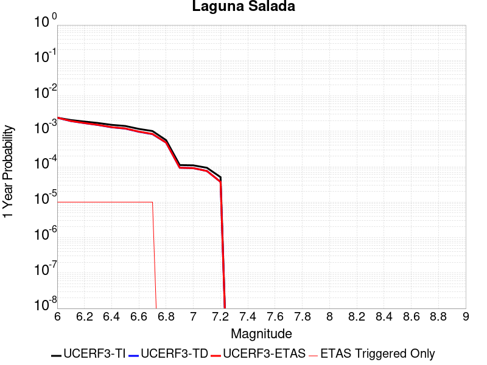 |  |

| Magnitude | 1 wk TI Prob | 1 wk TD Prob | 1 wk ETAS Prob | 1 wk ETAS/TD Gain | 1 wk ETAS Triggered Only | 1 mo TI Prob | 1 mo TD Prob | 1 mo ETAS Prob | 1 mo ETAS/TD Gain | 1 mo ETAS Triggered Only | 1 yr TI Prob | 1 yr TD Prob | 1 yr ETAS Prob | 1 yr ETAS/TD Gain | 1 yr ETAS Triggered Only | 10 yr TI Prob | 10 yr TD Prob | 10 yr ETAS Prob | 10 yr ETAS/TD Gain | 10 yr ETAS Triggered Only |
|-----|-----|-----|-----|-----|-----|-----|-----|-----|-----|-----|-----|-----|-----|-----|-----|-----|-----|-----|-----|-----|
| 6.0 | 4.6465593E-5 | 4.634507E-5 | 4.634507E-5 | 1.0 | 0.0 | 1.9912305E-4 | 1.9860751E-4 | 1.9860751E-4 | 1.0 | 0.0 | 0.0024216278 | 0.0024154421 | 0.002425418 | 1.00413 | 1.0E-5 | 0.02395408 | 0.023965387 | 0.023984907 | 1.0008146 | 2.0E-5 |
| 6.1 | 3.982297E-5 | 3.7244878E-5 | 3.7244878E-5 | 1.0 | 0.0 | 1.706587E-4 | 1.5961178E-4 | 1.5961178E-4 | 1.0 | 0.0 | 0.0020757897 | 0.0019416384 | 0.001951619 | 1.0051403 | 1.0E-5 | 0.020565065 | 0.019322045 | 0.019331852 | 1.0005076 | 1.0E-5 |
| 6.2 | 3.6067784E-5 | 3.2600165E-5 | 3.2600165E-5 | 1.0 | 0.0 | 1.5456705E-4 | 1.3970808E-4 | 1.3970808E-4 | 1.0 | 0.0 | 0.0018802295 | 0.0016997134 | 0.0017096964 | 1.0058733 | 1.0E-5 | 0.018644003 | 0.016963193 | 0.016973024 | 1.0005795 | 1.0E-5 |
| 6.3 | 3.2859112E-5 | 2.8847233E-5 | 2.8847233E-5 | 1.0 | 0.0 | 1.4081717E-4 | 1.2362566E-4 | 1.2362566E-4 | 1.0 | 0.0 | 0.0017131006 | 0.0015041964 | 0.0015141814 | 1.006638 | 1.0E-5 | 0.016999546 | 0.015031838 | 0.0150416875 | 1.0006553 | 1.0E-5 |
| 6.4 | 2.9132116E-5 | 2.4851877E-5 | 2.4851877E-5 | 1.0 | 0.0 | 1.2484594E-4 | 1.0650421E-4 | 1.0650421E-4 | 1.0 | 0.0 | 0.0015189396 | 0.001296006 | 0.0013059931 | 1.007706 | 1.0E-5 | 0.015085992 | 0.012965128 | 0.012974999 | 1.0007613 | 1.0E-5 |
| 6.5 | 2.7075037E-5 | 2.2824677E-5 | 2.2824677E-5 | 1.0 | 0.0 | 1.1603071E-4 | 9.7816875E-5 | 9.7816875E-5 | 1.0 | 0.0 | 0.0014117584 | 0.0011903581 | 0.0012003462 | 1.0083908 | 1.0E-5 | 0.014028233 | 0.011916272 | 0.011926153 | 1.0008292 | 1.0E-5 |
| 6.6 | 2.2367465E-5 | 1.8572848E-5 | 1.8572848E-5 | 1.0 | 0.0 | 9.5857045E-5 | 7.959595E-5 | 7.959595E-5 | 1.0 | 0.0 | 0.0011664346 | 9.687322E-4 | 9.787225E-4 | 1.0103128 | 1.0E-5 | 0.011603311 | 0.009708806 | 0.00971871 | 1.00102 | 1.0E-5 |
| 6.7 | 1.9458053E-5 | 1.5913607E-5 | 1.5913607E-5 | 1.0 | 0.0 | 8.338899E-5 | 6.819984E-5 | 6.819984E-5 | 1.0 | 0.0 | 0.001014788 | 8.300971E-4 | 8.400888E-4 | 1.0120368 | 1.0E-5 | 0.010101665 | 0.008315945 | 0.008325862 | 1.0011925 | 1.0E-5 |
| 6.8 | 1.0767866E-5 | 9.183346E-6 | 9.183346E-6 | 1.0 | 0.0 | 4.614718E-5 | 3.9356994E-5 | 3.9356994E-5 | 1.0 | 0.0 | 5.6169706E-4 | 4.7913467E-4 | 4.7913467E-4 | 1.0 | 0.0 | 0.0056027942 | 0.0048085325 | 0.0048085325 | 1.0 | 0.0 |
| 6.9 | 2.1384765E-6 | 1.7913964E-6 | 1.7913964E-6 | 1.0 | 0.0 | 9.164866E-6 | 7.677392E-6 | 7.677392E-6 | 1.0 | 0.0 | 1.1157654E-4 | 9.346863E-5 | 9.346863E-5 | 1.0 | 0.0 | 0.0011152053 | 9.343315E-4 | 9.343315E-4 | 1.0 | 0.0 |
| 7.0 | 2.0952946E-6 | 1.7493335E-6 | 1.7493335E-6 | 1.0 | 0.0 | 8.979802E-6 | 7.497124E-6 | 7.497124E-6 | 1.0 | 0.0 | 1.0932361E-4 | 9.127405E-5 | 9.127405E-5 | 1.0 | 0.0 | 0.0010926984 | 9.124038E-4 | 9.124038E-4 | 1.0 | 0.0 |
| 7.1 | 1.7887576E-6 | 1.4500541E-6 | 1.4500541E-6 | 1.0 | 0.0 | 7.666081E-6 | 6.2145045E-6 | 6.2145045E-6 | 1.0 | 0.0 | 9.333054E-5 | 7.565928E-5 | 7.565928E-5 | 1.0 | 0.0 | 9.329135E-4 | 7.5636554E-4 | 7.5636554E-4 | 1.0 | 0.0 |
| 7.2 | 9.723109E-7 | 7.135829E-7 | 7.135829E-7 | 1.0 | 0.0 | 4.16704E-6 | 3.0582096E-6 | 3.0582096E-6 | 1.0 | 0.0 | 5.073253E-5 | 3.7233232E-5 | 3.7233232E-5 | 1.0 | 0.0 | 5.072095E-4 | 3.722862E-4 | 3.722862E-4 | 1.0 | 0.0 |

## Sargent 2011 CFM
*[(top)](#table-of-contents)*

| 1 Week | 1 Month | 1 Year | 10 Year |
|-----|-----|-----|-----|
|  |  | 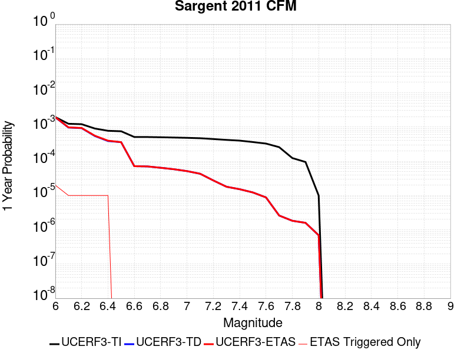 |  |

| Magnitude | 1 wk TI Prob | 1 wk TD Prob | 1 wk ETAS Prob | 1 wk ETAS/TD Gain | 1 wk ETAS Triggered Only | 1 mo TI Prob | 1 mo TD Prob | 1 mo ETAS Prob | 1 mo ETAS/TD Gain | 1 mo ETAS Triggered Only | 1 yr TI Prob | 1 yr TD Prob | 1 yr ETAS Prob | 1 yr ETAS/TD Gain | 1 yr ETAS Triggered Only | 10 yr TI Prob | 10 yr TD Prob | 10 yr ETAS Prob | 10 yr ETAS/TD Gain | 10 yr ETAS Triggered Only |
|-----|-----|-----|-----|-----|-----|-----|-----|-----|-----|-----|-----|-----|-----|-----|-----|-----|-----|-----|-----|-----|
| 6.0 | 3.7327867E-5 | 3.665065E-5 | 3.665065E-5 | 1.0 | 0.0 | 1.5996677E-4 | 1.5706717E-4 | 1.5706717E-4 | 1.0 | 0.0 | 0.0019458556 | 0.0019110267 | 0.0019309885 | 1.0104456 | 2.0E-5 | 0.01928905 | 0.019017996 | 0.019037616 | 1.0010316 | 2.0E-5 |
| 6.1 | 2.3771476E-5 | 1.8478724E-5 | 1.8478724E-5 | 1.0 | 0.0 | 1.01873775E-4 | 7.919262E-5 | 7.919262E-5 | 1.0 | 0.0 | 0.0012396075 | 9.638239E-4 | 9.738143E-4 | 1.0103654 | 1.0E-5 | 0.012327154 | 0.009635902 | 0.009645806 | 1.0010278 | 1.0E-5 |
| 6.2 | 2.3112721E-5 | 1.7710081E-5 | 1.7710081E-5 | 1.0 | 0.0 | 9.9050754E-5 | 7.5898635E-5 | 7.5898635E-5 | 1.0 | 0.0 | 0.0012052758 | 9.2375383E-4 | 9.337446E-4 | 1.0108154 | 1.0E-5 | 0.011987597 | 0.009238554 | 0.009248462 | 1.0010724 | 1.0E-5 |
| 6.3 | 1.728509E-5 | 1.0458513E-5 | 1.0458513E-5 | 1.0 | 0.0 | 7.407686E-5 | 4.4821696E-5 | 4.4821696E-5 | 1.0 | 0.0 | 9.015125E-4 | 5.456136E-4 | 5.5560813E-4 | 1.0183179 | 1.0E-5 | 0.008978641 | 0.0054789106 | 0.0054888558 | 1.0018152 | 1.0E-5 |
| 6.4 | 1.48395575E-5 | 7.4555796E-6 | 7.4555796E-6 | 1.0 | 0.0 | 6.3596555E-5 | 3.195231E-5 | 3.195231E-5 | 1.0 | 0.0 | 7.7401294E-4 | 3.889874E-4 | 3.989835E-4 | 1.0256978 | 1.0E-5 | 0.0077132257 | 0.00391845 | 0.003928411 | 1.002542 | 1.0E-5 |
| 6.5 | 1.4358964E-5 | 6.894356E-6 | 6.894356E-6 | 1.0 | 0.0 | 6.1536964E-5 | 2.9547118E-5 | 2.9547118E-5 | 1.0 | 0.0 | 7.48955E-4 | 3.5971415E-4 | 3.5971415E-4 | 1.0 | 0.0 | 0.0074643586 | 0.0036266989 | 0.0036266989 | 1.0 | 0.0 |
| 6.6 | 9.772591E-6 | 1.3732375E-6 | 1.3732375E-6 | 1.0 | 0.0 | 4.188186E-5 | 5.8852906E-6 | 5.8852906E-6 | 1.0 | 0.0 | 5.097923E-4 | 7.165109E-5 | 7.165109E-5 | 1.0 | 0.0 | 0.005086244 | 7.480871E-4 | 7.480871E-4 | 1.0 | 0.0 |
| 6.7 | 9.752745E-6 | 1.3519289E-6 | 1.3519289E-6 | 1.0 | 0.0 | 4.179681E-5 | 5.7939683E-6 | 5.7939683E-6 | 1.0 | 0.0 | 5.0875737E-4 | 7.053931E-5 | 7.053931E-5 | 1.0 | 0.0 | 0.005075942 | 7.369768E-4 | 7.369768E-4 | 1.0 | 0.0 |
| 6.8 | 9.608213E-6 | 1.235796E-6 | 1.235796E-6 | 1.0 | 0.0 | 4.1177405E-5 | 5.296258E-6 | 5.296258E-6 | 1.0 | 0.0 | 5.012196E-4 | 6.448006E-5 | 6.448006E-5 | 1.0 | 0.0 | 0.005000906 | 6.7611714E-4 | 6.7611714E-4 | 1.0 | 0.0 |
| 6.9 | 9.427164E-6 | 1.1205796E-6 | 1.1205796E-6 | 1.0 | 0.0 | 4.04015E-5 | 4.8024754E-6 | 4.8024754E-6 | 1.0 | 0.0 | 4.9177726E-4 | 5.8468588E-5 | 5.8468588E-5 | 1.0 | 0.0 | 0.004906904 | 6.1537215E-4 | 6.1537215E-4 | 1.0 | 0.0 |
| 7.0 | 9.247601E-6 | 9.87042E-7 | 9.87042E-7 | 1.0 | 0.0 | 3.9631974E-5 | 4.2301726E-6 | 4.2301726E-6 | 1.0 | 0.0 | 4.8241246E-4 | 5.1501152E-5 | 5.1501152E-5 | 1.0 | 0.0 | 0.0048136655 | 5.452185E-4 | 5.452185E-4 | 1.0 | 0.0 |
| 7.1 | 8.995454E-6 | 8.267614E-7 | 8.267614E-7 | 1.0 | 0.0 | 3.8551374E-5 | 3.5432583E-6 | 3.5432583E-6 | 1.0 | 0.0 | 4.6926187E-4 | 4.313833E-5 | 4.313833E-5 | 1.0 | 0.0 | 0.004682722 | 4.6070307E-4 | 4.6070307E-4 | 1.0 | 0.0 |
| 7.2 | 8.520861E-6 | 5.27322E-7 | 5.27322E-7 | 1.0 | 0.0 | 3.6517464E-5 | 2.2599497E-6 | 2.2599497E-6 | 1.0 | 0.0 | 4.445094E-4 | 2.7514547E-5 | 2.7514547E-5 | 1.0 | 0.0 | 0.004436213 | 3.0276953E-4 | 3.0276953E-4 | 1.0 | 0.0 |
| 7.3 | 8.043592E-6 | 3.453237E-7 | 3.453237E-7 | 1.0 | 0.0 | 3.4472083E-5 | 1.4799579E-6 | 1.4799579E-6 | 1.0 | 0.0 | 4.196168E-4 | 1.801834E-5 | 1.801834E-5 | 1.0 | 0.0 | 0.004188253 | 2.0650218E-4 | 2.0650218E-4 | 1.0 | 0.0 |
| 7.4 | 7.662316E-6 | 2.9259107E-7 | 2.9259107E-7 | 1.0 | 0.0 | 3.2838085E-5 | 1.2539612E-6 | 1.2539612E-6 | 1.0 | 0.0 | 3.9973034E-4 | 1.526687E-5 | 1.526687E-5 | 1.0 | 0.0 | 0.0039901207 | 1.7718194E-4 | 1.7718194E-4 | 1.0 | 0.0 |
| 7.5 | 6.961638E-6 | 2.3549052E-7 | 2.3549052E-7 | 1.0 | 0.0 | 2.9835252E-5 | 1.0092447E-6 | 1.0092447E-6 | 1.0 | 0.0 | 3.6318362E-4 | 1.2287485E-5 | 1.2287485E-5 | 1.0 | 0.0 | 0.0036259065 | 1.4393168E-4 | 1.4393168E-4 | 1.0 | 0.0 |
| 7.6 | 6.282332E-6 | 1.6871925E-7 | 1.6871925E-7 | 1.0 | 0.0 | 2.6924003E-5 | 7.230823E-7 | 7.230823E-7 | 1.0 | 0.0 | 3.2775043E-4 | 8.803492E-6 | 8.803492E-6 | 1.0 | 0.0 | 0.0032726745 | 1.0492336E-4 | 1.0492336E-4 | 1.0 | 0.0 |
| 7.7 | 4.934408E-6 | 4.9918345E-8 | 4.9918345E-8 | 1.0 | 0.0 | 2.114729E-5 | 2.1393575E-7 | 2.1393575E-7 | 1.0 | 0.0 | 2.5743784E-4 | 2.6046646E-6 | 2.6046646E-6 | 1.0 | 0.0 | 0.0025713982 | 3.2479504E-5 | 3.2479504E-5 | 1.0 | 0.0 |
| 7.8 | 2.373212E-6 | 3.5100808E-8 | 3.5100808E-8 | 1.0 | 0.0 | 1.0170869E-5 | 1.5043203E-7 | 1.5043203E-7 | 1.0 | 0.0 | 1.238233E-4 | 1.8315084E-6 | 1.8315084E-6 | 1.0 | 0.0 | 0.0012375432 | 2.4073881E-5 | 2.4073881E-5 | 1.0 | 0.0 |
| 7.9 | 1.8227792E-6 | 3.055616E-8 | 3.055616E-8 | 1.0 | 0.0 | 7.811887E-6 | 1.3095496E-7 | 1.3095496E-7 | 1.0 | 0.0 | 9.510558E-5 | 1.5943755E-6 | 1.5943755E-6 | 1.0 | 0.0 | 9.5064886E-4 | 2.1365537E-5 | 2.1365537E-5 | 1.0 | 0.0 |
| 8.0 | 1.9095137E-7 | 1.3250629E-8 | 1.3250629E-8 | 1.0 | 0.0 | 8.1836276E-7 | 5.678841E-8 | 5.678841E-8 | 1.0 | 0.0 | 9.963521E-6 | 6.9139867E-7 | 6.9139867E-7 | 1.0 | 0.0 | 9.963074E-5 | 8.455456E-6 | 8.455456E-6 | 1.0 | 0.0 |

## San Luis Range - Oceano 2011 CFM
*[(top)](#table-of-contents)*

| 1 Week | 1 Month | 1 Year | 10 Year |
|-----|-----|-----|-----|
| 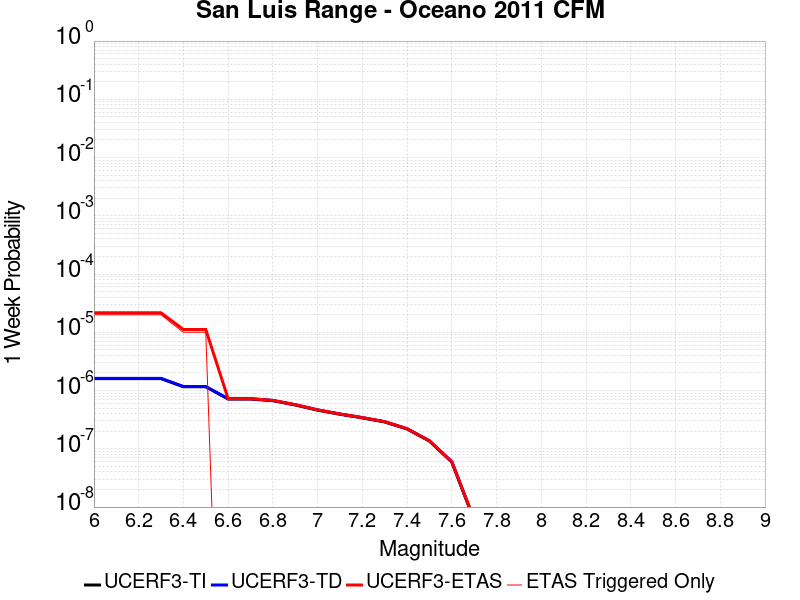 |  |  |  |

| Magnitude | 1 wk TI Prob | 1 wk TD Prob | 1 wk ETAS Prob | 1 wk ETAS/TD Gain | 1 wk ETAS Triggered Only | 1 mo TI Prob | 1 mo TD Prob | 1 mo ETAS Prob | 1 mo ETAS/TD Gain | 1 mo ETAS Triggered Only | 1 yr TI Prob | 1 yr TD Prob | 1 yr ETAS Prob | 1 yr ETAS/TD Gain | 1 yr ETAS Triggered Only | 10 yr TI Prob | 10 yr TD Prob | 10 yr ETAS Prob | 10 yr ETAS/TD Gain | 10 yr ETAS Triggered Only |
|-----|-----|-----|-----|-----|-----|-----|-----|-----|-----|-----|-----|-----|-----|-----|-----|-----|-----|-----|-----|-----|
| 6.0 | 1.6025788E-6 | 1.620119E-6 | 2.1620086E-5 | 13.344752 | 2.0E-5 | 6.8681766E-6 | 6.943351E-6 | 2.6943211E-5 | 3.8804336 | 2.0E-5 | 8.361684E-5 | 8.453243E-5 | 1.0453074E-4 | 1.2365756 | 2.0E-5 | 8.3585386E-4 | 8.4504357E-4 | 8.6502667E-4 | 1.0236474 | 2.0E-5 |
| 6.1 | 1.6025788E-6 | 1.620119E-6 | 2.1620086E-5 | 13.344752 | 2.0E-5 | 6.8681766E-6 | 6.943351E-6 | 2.6943211E-5 | 3.8804336 | 2.0E-5 | 8.361684E-5 | 8.453243E-5 | 1.0453074E-4 | 1.2365756 | 2.0E-5 | 8.3585386E-4 | 8.4504357E-4 | 8.6502667E-4 | 1.0236474 | 2.0E-5 |
| 6.2 | 1.6025788E-6 | 1.620119E-6 | 2.1620086E-5 | 13.344752 | 2.0E-5 | 6.8681766E-6 | 6.943351E-6 | 2.6943211E-5 | 3.8804336 | 2.0E-5 | 8.361684E-5 | 8.453243E-5 | 1.0453074E-4 | 1.2365756 | 2.0E-5 | 8.3585386E-4 | 8.4504357E-4 | 8.6502667E-4 | 1.0236474 | 2.0E-5 |
| 6.3 | 1.6025788E-6 | 1.620119E-6 | 2.1620086E-5 | 13.344752 | 2.0E-5 | 6.8681766E-6 | 6.943351E-6 | 2.6943211E-5 | 3.8804336 | 2.0E-5 | 8.361684E-5 | 8.453243E-5 | 1.0453074E-4 | 1.2365756 | 2.0E-5 | 8.3585386E-4 | 8.4504357E-4 | 8.6502667E-4 | 1.0236474 | 2.0E-5 |
| 6.4 | 1.1621186E-6 | 1.1749894E-6 | 1.1174978E-5 | 9.510705 | 1.0E-5 | 4.980499E-6 | 5.0356607E-6 | 1.503561E-5 | 2.9858267 | 1.0E-5 | 6.0635884E-5 | 6.130771E-5 | 7.1307106E-5 | 1.1631016 | 1.0E-5 | 6.0619344E-4 | 6.1293464E-4 | 6.229285E-4 | 1.016305 | 1.0E-5 |
| 6.5 | 1.1621186E-6 | 1.1749894E-6 | 1.1174978E-5 | 9.510705 | 1.0E-5 | 4.980499E-6 | 5.0356607E-6 | 1.503561E-5 | 2.9858267 | 1.0E-5 | 6.0635884E-5 | 6.130771E-5 | 7.1307106E-5 | 1.1631016 | 1.0E-5 | 6.0619344E-4 | 6.1293464E-4 | 6.229285E-4 | 1.016305 | 1.0E-5 |
| 6.6 | 7.164729E-7 | 7.2485784E-7 | 7.2485784E-7 | 1.0 | 0.0 | 3.0705946E-6 | 3.10653E-6 | 3.10653E-6 | 1.0 | 0.0 | 3.738385E-5 | 3.7821363E-5 | 3.7821363E-5 | 1.0 | 0.0 | 3.737756E-4 | 3.7815105E-4 | 3.7815105E-4 | 1.0 | 0.0 |
| 6.7 | 7.164729E-7 | 7.2485784E-7 | 7.2485784E-7 | 1.0 | 0.0 | 3.0705946E-6 | 3.10653E-6 | 3.10653E-6 | 1.0 | 0.0 | 3.738385E-5 | 3.7821363E-5 | 3.7821363E-5 | 1.0 | 0.0 | 3.737756E-4 | 3.7815105E-4 | 3.7815105E-4 | 1.0 | 0.0 |
| 6.8 | 6.700177E-7 | 6.7774397E-7 | 6.7774397E-7 | 1.0 | 0.0 | 2.8715012E-6 | 2.904614E-6 | 2.904614E-6 | 1.0 | 0.0 | 3.495997E-5 | 3.536312E-5 | 3.536312E-5 | 1.0 | 0.0 | 3.495447E-4 | 3.5357653E-4 | 3.5357653E-4 | 1.0 | 0.0 |
| 6.9 | 5.657865E-7 | 5.7217864E-7 | 5.7217864E-7 | 1.0 | 0.0 | 2.424797E-6 | 2.452192E-6 | 2.452192E-6 | 1.0 | 0.0 | 2.9521503E-5 | 2.9855039E-5 | 2.9855039E-5 | 1.0 | 0.0 | 2.9517582E-4 | 2.9851135E-4 | 2.9851135E-4 | 1.0 | 0.0 |
| 7.0 | 4.608413E-7 | 4.660169E-7 | 4.660169E-7 | 1.0 | 0.0 | 1.9750328E-6 | 1.9972138E-6 | 1.9972138E-6 | 1.0 | 0.0 | 2.4045758E-5 | 2.431581E-5 | 2.431581E-5 | 1.0 | 0.0 | 2.4043156E-4 | 2.4313178E-4 | 2.4313178E-4 | 1.0 | 0.0 |
| 7.1 | 3.9177846E-7 | 3.9621602E-7 | 3.9621602E-7 | 1.0 | 0.0 | 1.6790494E-6 | 1.6980675E-6 | 1.6980675E-6 | 1.0 | 0.0 | 2.0442236E-5 | 2.0673779E-5 | 2.0673779E-5 | 1.0 | 0.0 | 2.0440355E-4 | 2.067187E-4 | 2.067187E-4 | 1.0 | 0.0 |
| 7.2 | 3.3974752E-7 | 3.436653E-7 | 3.436653E-7 | 1.0 | 0.0 | 1.45606E-6 | 1.4728505E-6 | 1.4728505E-6 | 1.0 | 0.0 | 1.7727387E-5 | 1.7931809E-5 | 1.7931809E-5 | 1.0 | 0.0 | 1.7725973E-4 | 1.7930372E-4 | 1.7930372E-4 | 1.0 | 0.0 |
| 7.3 | 2.8900928E-7 | 2.923402E-7 | 2.923402E-7 | 1.0 | 0.0 | 1.2386106E-6 | 1.2528859E-6 | 1.2528859E-6 | 1.0 | 0.0 | 1.5079979E-5 | 1.525378E-5 | 1.525378E-5 | 1.0 | 0.0 | 1.5078956E-4 | 1.5252741E-4 | 1.5252741E-4 | 1.0 | 0.0 |
| 7.4 | 2.1881527E-7 | 2.2139594E-7 | 2.2139594E-7 | 1.0 | 0.0 | 9.3777936E-7 | 9.488394E-7 | 9.488394E-7 | 1.0 | 0.0 | 1.14174045E-5 | 1.1552059E-5 | 1.1552059E-5 | 1.0 | 0.0 | 1.1416818E-4 | 1.1551464E-4 | 1.1551464E-4 | 1.0 | 0.0 |
| 7.5 | 1.356398E-7 | 1.3718639E-7 | 1.3718639E-7 | 1.0 | 0.0 | 5.813133E-7 | 5.8794154E-7 | 5.8794154E-7 | 1.0 | 0.0 | 7.0774663E-6 | 7.158165E-6 | 7.158165E-6 | 1.0 | 0.0 | 7.077241E-5 | 7.157937E-5 | 7.157937E-5 | 1.0 | 0.0 |
| 7.6 | 5.9269272E-8 | 6.001364E-8 | 6.001364E-8 | 1.0 | 0.0 | 2.5401116E-7 | 2.572013E-7 | 2.572013E-7 | 1.0 | 0.0 | 3.0925814E-6 | 3.1314214E-6 | 3.1314214E-6 | 1.0 | 0.0 | 3.0925385E-5 | 3.1313786E-5 | 3.1313786E-5 | 1.0 | 0.0 |
| 7.7 | 5.946232E-9 | 6.036928E-9 | 6.036928E-9 | 1.0 | 0.0 | 2.5483851E-8 | 2.5872547E-8 | 2.5872547E-8 | 1.0 | 0.0 | 3.1026585E-7 | 3.1499823E-7 | 3.1499823E-7 | 1.0 | 0.0 | 3.102654E-6 | 3.1499787E-6 | 3.1499787E-6 | 1.0 | 0.0 |

## Malibu Coast (Extension) alt 1
*[(top)](#table-of-contents)*

| 1 Week | 1 Month | 1 Year | 10 Year |
|-----|-----|-----|-----|
|  |  |  | 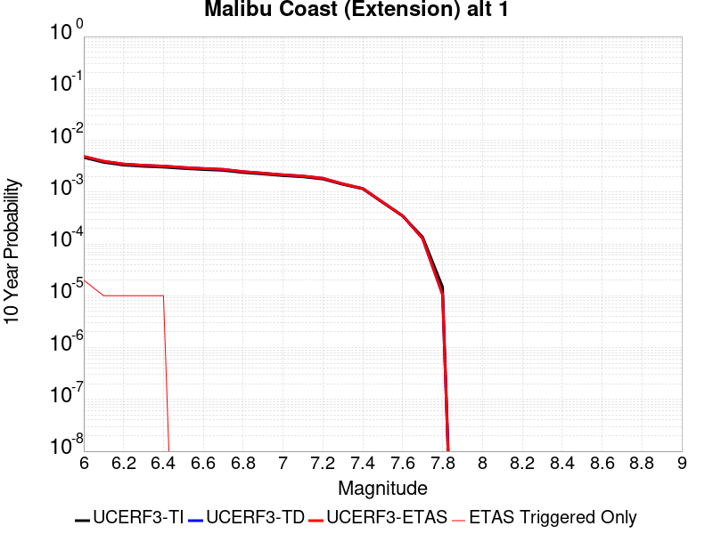 |

| Magnitude | 1 wk TI Prob | 1 wk TD Prob | 1 wk ETAS Prob | 1 wk ETAS/TD Gain | 1 wk ETAS Triggered Only | 1 mo TI Prob | 1 mo TD Prob | 1 mo ETAS Prob | 1 mo ETAS/TD Gain | 1 mo ETAS Triggered Only | 1 yr TI Prob | 1 yr TD Prob | 1 yr ETAS Prob | 1 yr ETAS/TD Gain | 1 yr ETAS Triggered Only | 10 yr TI Prob | 10 yr TD Prob | 10 yr ETAS Prob | 10 yr ETAS/TD Gain | 10 yr ETAS Triggered Only |
|-----|-----|-----|-----|-----|-----|-----|-----|-----|-----|-----|-----|-----|-----|-----|-----|-----|-----|-----|-----|-----|
| 6.0 | 8.930738E-6 | 9.3292765E-6 | 1.9329183E-5 | 2.0718844 | 1.0E-5 | 3.827403E-5 | 3.998201E-5 | 5.9981212E-5 | 1.5002049 | 2.0E-5 | 4.6588664E-4 | 4.86674E-4 | 5.066643E-4 | 1.0410752 | 2.0E-5 | 0.0046491115 | 0.004856264 | 0.0048761675 | 1.0040984 | 2.0E-5 |
| 6.1 | 7.199952E-6 | 7.5302974E-6 | 7.5302974E-6 | 1.0 | 0.0 | 3.0856572E-5 | 3.2272306E-5 | 4.2271986E-5 | 1.3098532 | 1.0E-5 | 3.75614E-4 | 3.928451E-4 | 4.0284116E-4 | 1.0254453 | 1.0E-5 | 0.0037497976 | 0.0039215726 | 0.0039315335 | 1.00254 | 1.0E-5 |
| 6.2 | 6.3721413E-6 | 6.666792E-6 | 6.666792E-6 | 1.0 | 0.0 | 2.7308892E-5 | 2.8571656E-5 | 3.8571372E-5 | 1.3499873 | 1.0E-5 | 3.3243504E-4 | 3.4780474E-4 | 3.5780127E-4 | 1.0287417 | 1.0E-5 | 0.0033193815 | 0.0034726441 | 0.0034826095 | 1.0028696 | 1.0E-5 |
| 6.3 | 6.016345E-6 | 6.295159E-6 | 6.295159E-6 | 1.0 | 0.0 | 2.578408E-5 | 2.6978976E-5 | 3.6978705E-5 | 1.370649 | 1.0E-5 | 3.1387596E-4 | 3.2841985E-4 | 3.3841658E-4 | 1.0304388 | 1.0E-5 | 0.00313433 | 0.0032793812 | 0.0032893484 | 1.0030394 | 1.0E-5 |
| 6.4 | 5.8104883E-6 | 6.0795455E-6 | 6.0795455E-6 | 1.0 | 0.0 | 2.4901856E-5 | 2.6054937E-5 | 3.6054676E-5 | 1.3837944 | 1.0E-5 | 3.031379E-4 | 3.17173E-4 | 3.271698E-4 | 1.0315186 | 1.0E-5 | 0.0030272473 | 0.0031672379 | 0.003177206 | 1.0031474 | 1.0E-5 |
| 6.5 | 5.476925E-6 | 5.727514E-6 | 5.727514E-6 | 1.0 | 0.0 | 2.3472323E-5 | 2.454626E-5 | 2.454626E-5 | 1.0 | 0.0 | 2.8573806E-4 | 2.9881002E-4 | 2.9881002E-4 | 1.0 | 0.0 | 0.0028537093 | 0.0029841145 | 0.0029841145 | 1.0 | 0.0 |
| 6.6 | 5.222387E-6 | 5.4585807E-6 | 5.4585807E-6 | 1.0 | 0.0 | 2.2381464E-5 | 2.3393708E-5 | 2.3393708E-5 | 1.0 | 0.0 | 2.7246025E-4 | 2.8478145E-4 | 2.8478145E-4 | 1.0 | 0.0 | 0.0027212645 | 0.002844196 | 0.002844196 | 1.0 | 0.0 |
| 6.7 | 5.0337076E-6 | 5.259104E-6 | 5.259104E-6 | 1.0 | 0.0 | 2.1572854E-5 | 2.2538823E-5 | 2.2538823E-5 | 1.0 | 0.0 | 2.6261783E-4 | 2.743759E-4 | 2.743759E-4 | 1.0 | 0.0 | 0.002623077 | 0.0027404015 | 0.0027404015 | 1.0 | 0.0 |
| 6.8 | 4.5675624E-6 | 4.7587173E-6 | 4.7587173E-6 | 1.0 | 0.0 | 1.9575122E-5 | 2.0394344E-5 | 2.0394344E-5 | 1.0 | 0.0 | 2.3830103E-4 | 2.4827302E-4 | 2.4827302E-4 | 1.0 | 0.0 | 0.0023804565 | 0.0024799763 | 0.0024799763 | 1.0 | 0.0 |
| 6.9 | 4.2802412E-6 | 4.4520216E-6 | 4.4520216E-6 | 1.0 | 0.0 | 1.8343762E-5 | 1.9079953E-5 | 1.9079953E-5 | 1.0 | 0.0 | 2.2331243E-4 | 2.3227383E-4 | 2.3227383E-4 | 1.0 | 0.0 | 0.0022308815 | 0.0023203273 | 0.0023203273 | 1.0 | 0.0 |
| 7.0 | 3.9794063E-6 | 4.1301E-6 | 4.1301E-6 | 1.0 | 0.0 | 1.7054486E-5 | 1.770031E-5 | 1.770031E-5 | 1.0 | 0.0 | 2.0761859E-4 | 2.1548007E-4 | 2.1548007E-4 | 1.0 | 0.0 | 0.0020742472 | 0.002152725 | 0.002152725 | 1.0 | 0.0 |
| 7.1 | 3.7730424E-6 | 3.911218E-6 | 3.911218E-6 | 1.0 | 0.0 | 1.6170083E-5 | 1.6762255E-5 | 1.6762255E-5 | 1.0 | 0.0 | 1.9685295E-4 | 2.0406146E-4 | 2.0406146E-4 | 1.0 | 0.0 | 0.0019667868 | 0.0020387538 | 0.0020387538 | 1.0 | 0.0 |
| 7.2 | 3.424985E-6 | 3.541338E-6 | 3.541338E-6 | 1.0 | 0.0 | 1.4678424E-5 | 1.5177075E-5 | 1.5177075E-5 | 1.0 | 0.0 | 1.7869516E-4 | 1.8476533E-4 | 1.8476533E-4 | 1.0 | 0.0 | 0.0017855153 | 0.0018461292 | 0.0018461292 | 1.0 | 0.0 |
| 7.3 | 2.6966375E-6 | 2.759654E-6 | 2.759654E-6 | 1.0 | 0.0 | 1.15569665E-5 | 1.1827035E-5 | 1.1827035E-5 | 1.0 | 0.0 | 1.4069698E-4 | 1.4398468E-4 | 1.4398468E-4 | 1.0 | 0.0 | 0.0014060794 | 0.001438918 | 0.001438918 | 1.0 | 0.0 |
| 7.4 | 2.215957E-6 | 2.249379E-6 | 2.249379E-6 | 1.0 | 0.0 | 9.496924E-6 | 9.64016E-6 | 9.64016E-6 | 1.0 | 0.0 | 1.1561892E-4 | 1.1736266E-4 | 1.1736266E-4 | 1.0 | 0.0 | 0.0011555878 | 0.0011730106 | 0.0011730106 | 1.0 | 0.0 |
| 7.5 | 1.2040218E-6 | 1.2219067E-6 | 1.2219067E-6 | 1.0 | 0.0 | 5.160083E-6 | 5.2367327E-6 | 5.2367327E-6 | 1.0 | 0.0 | 6.2822204E-5 | 6.3755375E-5 | 6.3755375E-5 | 1.0 | 0.0 | 6.280445E-4 | 6.3737266E-4 | 6.3737266E-4 | 1.0 | 0.0 |
| 7.6 | 6.6157446E-7 | 6.6789755E-7 | 6.6789755E-7 | 1.0 | 0.0 | 2.835316E-6 | 2.8624152E-6 | 2.8624152E-6 | 1.0 | 0.0 | 3.4519428E-5 | 3.4849363E-5 | 3.4849363E-5 | 1.0 | 0.0 | 3.4514067E-4 | 3.484405E-4 | 3.484405E-4 | 1.0 | 0.0 |
| 7.7 | 2.6012302E-7 | 2.4357584E-7 | 2.4357584E-7 | 1.0 | 0.0 | 1.1148124E-6 | 1.0438962E-6 | 1.0438962E-6 | 1.0 | 0.0 | 1.3572758E-5 | 1.2709373E-5 | 1.2709373E-5 | 1.0 | 0.0 | 1.3571928E-4 | 1.2708752E-4 | 1.2708752E-4 | 1.0 | 0.0 |
| 7.8 | 2.8323132E-8 | 2.0266642E-8 | 2.0266642E-8 | 1.0 | 0.0 | 1.2138484E-7 | 8.685703E-8 | 8.685703E-8 | 1.0 | 0.0 | 1.4778595E-6 | 1.0574839E-6 | 1.0574839E-6 | 1.0 | 0.0 | 1.4778497E-5 | 1.0574797E-5 | 1.0574797E-5 | 1.0 | 0.0 |

## San Jacinto (Clark) rev
*[(top)](#table-of-contents)*

| 1 Week | 1 Month | 1 Year | 10 Year |
|-----|-----|-----|-----|
|  | 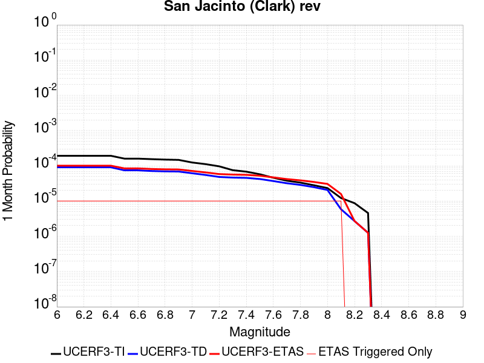 | 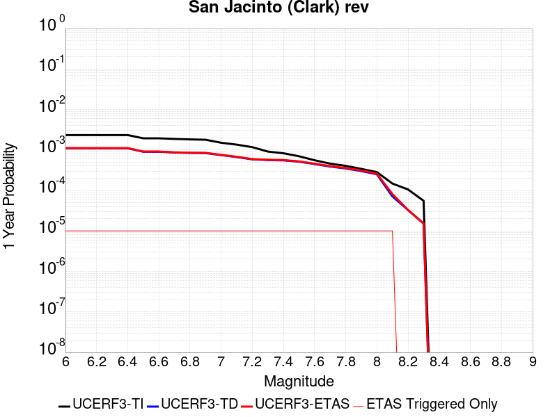 | 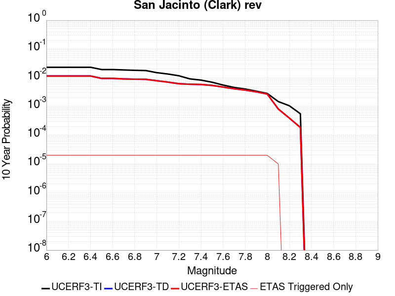 |

| Magnitude | 1 wk TI Prob | 1 wk TD Prob | 1 wk ETAS Prob | 1 wk ETAS/TD Gain | 1 wk ETAS Triggered Only | 1 mo TI Prob | 1 mo TD Prob | 1 mo ETAS Prob | 1 mo ETAS/TD Gain | 1 mo ETAS Triggered Only | 1 yr TI Prob | 1 yr TD Prob | 1 yr ETAS Prob | 1 yr ETAS/TD Gain | 1 yr ETAS Triggered Only | 10 yr TI Prob | 10 yr TD Prob | 10 yr ETAS Prob | 10 yr ETAS/TD Gain | 10 yr ETAS Triggered Only |
|-----|-----|-----|-----|-----|-----|-----|-----|-----|-----|-----|-----|-----|-----|-----|-----|-----|-----|-----|-----|-----|
| 6.0 | 4.482615E-5 | 2.1153059E-5 | 2.1153059E-5 | 1.0 | 0.0 | 1.9209793E-4 | 9.065287E-5 | 1.0065197E-4 | 1.1103009 | 1.0E-5 | 0.0023362834 | 0.0011031491 | 0.001113138 | 1.0090549 | 1.0E-5 | 0.02311874 | 0.011485709 | 0.011505479 | 1.0017213 | 2.0E-5 |
| 6.1 | 4.482615E-5 | 2.1153059E-5 | 2.1153059E-5 | 1.0 | 0.0 | 1.9209793E-4 | 9.065287E-5 | 1.0065197E-4 | 1.1103009 | 1.0E-5 | 0.0023362834 | 0.0011031491 | 0.001113138 | 1.0090549 | 1.0E-5 | 0.02311874 | 0.011485709 | 0.011505479 | 1.0017213 | 2.0E-5 |
| 6.2 | 4.482615E-5 | 2.1153059E-5 | 2.1153059E-5 | 1.0 | 0.0 | 1.9209793E-4 | 9.065287E-5 | 1.0065197E-4 | 1.1103009 | 1.0E-5 | 0.0023362834 | 0.0011031491 | 0.001113138 | 1.0090549 | 1.0E-5 | 0.02311874 | 0.011485709 | 0.011505479 | 1.0017213 | 2.0E-5 |
| 6.3 | 4.482615E-5 | 2.1153059E-5 | 2.1153059E-5 | 1.0 | 0.0 | 1.9209793E-4 | 9.065287E-5 | 1.0065197E-4 | 1.1103009 | 1.0E-5 | 0.0023362834 | 0.0011031491 | 0.001113138 | 1.0090549 | 1.0E-5 | 0.02311874 | 0.011485709 | 0.011505479 | 1.0017213 | 2.0E-5 |
| 6.4 | 4.482615E-5 | 2.1153059E-5 | 2.1153059E-5 | 1.0 | 0.0 | 1.9209793E-4 | 9.065287E-5 | 1.0065197E-4 | 1.1103009 | 1.0E-5 | 0.0023362834 | 0.0011031491 | 0.001113138 | 1.0090549 | 1.0E-5 | 0.02311874 | 0.011485709 | 0.011505479 | 1.0017213 | 2.0E-5 |
| 6.5 | 3.7294863E-5 | 1.7354667E-5 | 1.7354667E-5 | 1.0 | 0.0 | 1.5982533E-4 | 7.437504E-5 | 8.4374304E-5 | 1.1344436 | 1.0E-5 | 0.0019441366 | 9.051445E-4 | 9.1513543E-4 | 1.011038 | 1.0E-5 | 0.01927216 | 0.009485902 | 0.009505713 | 1.0020884 | 2.0E-5 |
| 6.6 | 3.7294863E-5 | 1.7354667E-5 | 1.7354667E-5 | 1.0 | 0.0 | 1.5982533E-4 | 7.437504E-5 | 8.4374304E-5 | 1.1344436 | 1.0E-5 | 0.0019441366 | 9.051445E-4 | 9.1513543E-4 | 1.011038 | 1.0E-5 | 0.01927216 | 0.009485902 | 0.009505713 | 1.0020884 | 2.0E-5 |
| 6.7 | 3.6039248E-5 | 1.6602684E-5 | 1.6602684E-5 | 1.0 | 0.0 | 1.5444479E-4 | 7.115244E-5 | 8.115173E-5 | 1.1405333 | 1.0E-5 | 0.0018787434 | 8.659408E-4 | 8.7593216E-4 | 1.0115381 | 1.0E-5 | 0.01862939 | 0.009088189 | 0.009108008 | 1.0021807 | 2.0E-5 |
| 6.8 | 3.5031844E-5 | 1.6231123E-5 | 1.6231123E-5 | 1.0 | 0.0 | 1.5012783E-4 | 6.956012E-5 | 7.9559424E-5 | 1.1437505 | 1.0E-5 | 0.0018262739 | 8.4656954E-4 | 8.5656106E-4 | 1.0118024 | 1.0E-5 | 0.01811338 | 0.008888788 | 0.00890861 | 1.00223 | 2.0E-5 |
| 6.9 | 3.435112E-5 | 1.6061658E-5 | 1.6061658E-5 | 1.0 | 0.0 | 1.4721078E-4 | 6.8833884E-5 | 7.8833196E-5 | 1.1452672 | 1.0E-5 | 0.0017908178 | 8.377344E-4 | 8.47726E-4 | 1.011927 | 1.0E-5 | 0.017764548 | 0.008796512 | 0.008816336 | 1.0022537 | 2.0E-5 |
| 7.0 | 2.8959772E-5 | 1.43355255E-5 | 1.43355255E-5 | 1.0 | 0.0 | 1.241074E-4 | 6.1436534E-5 | 7.143592E-5 | 1.1627595 | 1.0E-5 | 0.0015099603 | 7.477359E-4 | 7.577284E-4 | 1.0133637 | 1.0E-5 | 0.014997416 | 0.007868331 | 0.007888174 | 1.0025219 | 2.0E-5 |
| 7.1 | 2.6002877E-5 | 1.2827699E-5 | 1.2827699E-5 | 1.0 | 0.0 | 1.11436144E-4 | 5.4974706E-5 | 6.4974156E-5 | 1.1818918 | 1.0E-5 | 0.0013558907 | 6.6911365E-4 | 6.791069E-4 | 1.0149351 | 1.0E-5 | 0.013476475 | 0.0070483433 | 0.0070682024 | 1.0028175 | 2.0E-5 |
| 7.2 | 2.2544838E-5 | 1.1260331E-5 | 1.1260331E-5 | 1.0 | 0.0 | 9.661716E-5 | 4.825768E-5 | 5.8257196E-5 | 1.2072109 | 1.0E-5 | 0.001175679 | 5.873803E-4 | 5.973744E-4 | 1.0170147 | 1.0E-5 | 0.011694785 | 0.00619256 | 0.006212436 | 1.0032097 | 2.0E-5 |
| 7.3 | 1.75334E-5 | 1.0810585E-5 | 1.0810585E-5 | 1.0 | 0.0 | 7.514098E-5 | 4.6330264E-5 | 5.63298E-5 | 1.2158316 | 1.0E-5 | 9.144575E-4 | 5.6392635E-4 | 5.739207E-4 | 1.0177228 | 1.0E-5 | 0.009107036 | 0.0059332196 | 0.0059531005 | 1.0033509 | 2.0E-5 |
| 7.4 | 1.5924552E-5 | 1.0610475E-5 | 1.0610475E-5 | 1.0 | 0.0 | 6.82463E-5 | 4.547268E-5 | 5.5472225E-5 | 1.2199023 | 1.0E-5 | 8.305819E-4 | 5.534906E-4 | 5.634851E-4 | 1.0180571 | 1.0E-5 | 0.008274844 | 0.0058205863 | 0.0058404696 | 1.0034161 | 2.0E-5 |
| 7.5 | 1.3428931E-5 | 9.851045E-6 | 9.851045E-6 | 1.0 | 0.0 | 5.7551293E-5 | 4.221809E-5 | 5.2217667E-5 | 1.2368553 | 1.0E-5 | 7.004617E-4 | 5.1388505E-4 | 5.2387995E-4 | 1.0194496 | 1.0E-5 | 0.006982579 | 0.005406209 | 0.0054261005 | 1.0036794 | 2.0E-5 |
| 7.6 | 1.0688787E-5 | 8.614091E-6 | 8.614091E-6 | 1.0 | 0.0 | 4.5808283E-5 | 3.6917012E-5 | 4.691664E-5 | 1.2708678 | 1.0E-5 | 5.5757316E-4 | 4.4937237E-4 | 4.5936788E-4 | 1.0222433 | 1.0E-5 | 0.005561762 | 0.0047413614 | 0.0047612665 | 1.0041982 | 2.0E-5 |
| 7.7 | 8.81236E-6 | 7.4673385E-6 | 7.4673385E-6 | 1.0 | 0.0 | 3.776671E-5 | 3.200249E-5 | 4.2002168E-5 | 1.3124657 | 1.0E-5 | 4.597127E-4 | 3.8956082E-4 | 3.9955694E-4 | 1.0256599 | 1.0E-5 | 0.0045876284 | 0.0041344194 | 0.0041543366 | 1.0048175 | 2.0E-5 |
| 7.8 | 7.780431E-6 | 6.695928E-6 | 6.695928E-6 | 1.0 | 0.0 | 3.3344273E-5 | 2.8696519E-5 | 3.869623E-5 | 1.3484644 | 1.0E-5 | 4.0589093E-4 | 3.4932428E-4 | 3.5932078E-4 | 1.0286167 | 1.0E-5 | 0.0040515037 | 0.0037226272 | 0.0037425528 | 1.0053525 | 2.0E-5 |
| 7.9 | 6.5437994E-6 | 5.7797783E-6 | 5.7797783E-6 | 1.0 | 0.0 | 2.8044553E-5 | 2.4770245E-5 | 3.4769997E-5 | 1.4037002 | 1.0E-5 | 3.4138895E-4 | 3.0153614E-4 | 3.1153313E-4 | 1.0331535 | 1.0E-5 | 0.0034086495 | 0.0032343294 | 0.0032542646 | 1.0061637 | 2.0E-5 |
| 8.0 | 5.4488164E-6 | 4.812793E-6 | 4.812793E-6 | 1.0 | 0.0 | 2.3351862E-5 | 2.0626094E-5 | 3.0625888E-5 | 1.4848127 | 1.0E-5 | 2.8427184E-4 | 2.510939E-4 | 2.610914E-4 | 1.0398158 | 1.0E-5 | 0.0028390845 | 0.0027107038 | 0.0027306494 | 1.0073582 | 2.0E-5 |
| 8.1 | 2.8397242E-6 | 1.3665673E-6 | 1.3665673E-6 | 1.0 | 0.0 | 1.217019E-5 | 5.856704E-6 | 1.5856645E-5 | 2.7074351 | 1.0E-5 | 1.4816198E-4 | 7.1303046E-5 | 8.1302336E-5 | 1.1402365 | 1.0E-5 | 0.0014806325 | 8.113543E-4 | 8.213462E-4 | 1.012315 | 1.0E-5 |
| 8.2 | 2.030244E-6 | 6.3151083E-7 | 6.3151083E-7 | 1.0 | 0.0 | 8.701017E-6 | 2.7064723E-6 | 2.7064723E-6 | 1.0 | 0.0 | 1.05929736E-4 | 3.2950808E-5 | 3.2950808E-5 | 1.0 | 0.0 | 0.0010587925 | 3.9470522E-4 | 3.9470522E-4 | 1.0 | 0.0 |
| 8.3 | 1.0659804E-6 | 2.9230563E-7 | 2.9230563E-7 | 1.0 | 0.0 | 4.568479E-6 | 1.2527379E-6 | 1.2527379E-6 | 1.0 | 0.0 | 5.5619817E-5 | 1.5251981E-5 | 1.5251981E-5 | 1.0 | 0.0 | 5.5605895E-4 | 1.8556409E-4 | 1.8556409E-4 | 1.0 | 0.0 |

## Simi-Santa Rosa
*[(top)](#table-of-contents)*

| 1 Week | 1 Month | 1 Year | 10 Year |
|-----|-----|-----|-----|
|  |  |  |  |

| Magnitude | 1 wk TI Prob | 1 wk TD Prob | 1 wk ETAS Prob | 1 wk ETAS/TD Gain | 1 wk ETAS Triggered Only | 1 mo TI Prob | 1 mo TD Prob | 1 mo ETAS Prob | 1 mo ETAS/TD Gain | 1 mo ETAS Triggered Only | 1 yr TI Prob | 1 yr TD Prob | 1 yr ETAS Prob | 1 yr ETAS/TD Gain | 1 yr ETAS Triggered Only | 10 yr TI Prob | 10 yr TD Prob | 10 yr ETAS Prob | 10 yr ETAS/TD Gain | 10 yr ETAS Triggered Only |
|-----|-----|-----|-----|-----|-----|-----|-----|-----|-----|-----|-----|-----|-----|-----|-----|-----|-----|-----|-----|-----|
| 6.0 | 2.198912E-5 | 2.2275388E-5 | 2.2275388E-5 | 1.0 | 0.0 | 9.4235686E-5 | 9.54627E-5 | 1.0546175E-4 | 1.104743 | 1.0E-5 | 0.0011467156 | 0.0011616825 | 0.001171671 | 1.0085982 | 1.0E-5 | 0.011408163 | 0.011560547 | 0.011580316 | 1.00171 | 2.0E-5 |
| 6.1 | 2.198912E-5 | 2.2275388E-5 | 2.2275388E-5 | 1.0 | 0.0 | 9.4235686E-5 | 9.54627E-5 | 1.0546175E-4 | 1.104743 | 1.0E-5 | 0.0011467156 | 0.0011616825 | 0.001171671 | 1.0085982 | 1.0E-5 | 0.011408163 | 0.011560547 | 0.011580316 | 1.00171 | 2.0E-5 |
| 6.2 | 1.69983E-5 | 1.6668506E-5 | 1.6668506E-5 | 1.0 | 0.0 | 7.284782E-5 | 7.143466E-5 | 8.1433944E-5 | 1.139978 | 1.0E-5 | 8.865613E-4 | 8.6939917E-4 | 8.7939046E-4 | 1.0114923 | 1.0E-5 | 0.008830327 | 0.0086629 | 0.008682727 | 1.0022887 | 2.0E-5 |
| 6.3 | 1.69983E-5 | 1.6668506E-5 | 1.6668506E-5 | 1.0 | 0.0 | 7.284782E-5 | 7.143466E-5 | 8.1433944E-5 | 1.139978 | 1.0E-5 | 8.865613E-4 | 8.6939917E-4 | 8.7939046E-4 | 1.0114923 | 1.0E-5 | 0.008830327 | 0.0086629 | 0.008682727 | 1.0022887 | 2.0E-5 |
| 6.4 | 1.4666188E-5 | 1.4052489E-5 | 1.4052489E-5 | 1.0 | 0.0 | 6.285358E-5 | 6.0223705E-5 | 7.0223105E-5 | 1.1660376 | 1.0E-5 | 7.6497364E-4 | 7.330018E-4 | 7.429945E-4 | 1.0136325 | 1.0E-5 | 0.0076234564 | 0.0073083164 | 0.00732817 | 1.0027167 | 2.0E-5 |
| 6.5 | 1.4666188E-5 | 1.4052489E-5 | 1.4052489E-5 | 1.0 | 0.0 | 6.285358E-5 | 6.0223705E-5 | 7.0223105E-5 | 1.1660376 | 1.0E-5 | 7.6497364E-4 | 7.330018E-4 | 7.429945E-4 | 1.0136325 | 1.0E-5 | 0.0076234564 | 0.0073083164 | 0.00732817 | 1.0027167 | 2.0E-5 |
| 6.6 | 1.4377586E-5 | 1.3729529E-5 | 1.3729529E-5 | 1.0 | 0.0 | 6.1616774E-5 | 5.883965E-5 | 6.8839065E-5 | 1.1699435 | 1.0E-5 | 7.4992597E-4 | 7.1616215E-4 | 7.26155E-4 | 1.0139533 | 1.0E-5 | 0.007474003 | 0.0071410104 | 0.0071608676 | 1.0027807 | 2.0E-5 |
| 6.7 | 1.3881404E-5 | 1.3207497E-5 | 1.3207497E-5 | 1.0 | 0.0 | 5.9490372E-5 | 5.6602472E-5 | 6.6601904E-5 | 1.1766608 | 1.0E-5 | 7.240546E-4 | 6.889419E-4 | 6.98935E-4 | 1.014505 | 1.0E-5 | 0.007217 | 0.0068705105 | 0.0068903733 | 1.002891 | 2.0E-5 |
| 6.8 | 1.0176516E-5 | 9.1541E-6 | 9.1541E-6 | 1.0 | 0.0 | 4.3612912E-5 | 3.923136E-5 | 3.923136E-5 | 1.0 | 0.0 | 5.308578E-4 | 4.775537E-4 | 4.775537E-4 | 1.0 | 0.0 | 0.0052959146 | 0.004766908 | 0.00477686 | 1.0020878 | 1.0E-5 |
| 6.9 | 9.699797E-6 | 8.774672E-6 | 8.774672E-6 | 1.0 | 0.0 | 4.15699E-5 | 3.760529E-5 | 3.760529E-5 | 1.0 | 0.0 | 5.05996E-4 | 4.5776463E-4 | 4.5776463E-4 | 1.0 | 0.0 | 0.005048454 | 0.0045698346 | 0.004579789 | 1.0021783 | 1.0E-5 |
| 7.0 | 7.4049476E-6 | 6.559291E-6 | 6.559291E-6 | 1.0 | 0.0 | 3.1735104E-5 | 2.8111013E-5 | 2.8111013E-5 | 1.0 | 0.0 | 3.8630638E-4 | 3.422105E-4 | 3.422105E-4 | 1.0 | 0.0 | 0.0038563553 | 0.0034180775 | 0.0034280433 | 1.0029156 | 1.0E-5 |
| 7.1 | 3.873439E-6 | 2.759473E-6 | 2.759473E-6 | 1.0 | 0.0 | 1.6600346E-5 | 1.1826261E-5 | 1.1826261E-5 | 1.0 | 0.0 | 2.0209046E-4 | 1.4397544E-4 | 1.4397544E-4 | 1.0 | 0.0 | 0.0020190678 | 0.0014388453 | 0.0014488308 | 1.00694 | 1.0E-5 |
| 7.2 | 3.417706E-6 | 2.367616E-6 | 2.367616E-6 | 1.0 | 0.0 | 1.4647229E-5 | 1.0146887E-5 | 1.0146887E-5 | 1.0 | 0.0 | 1.7831543E-4 | 1.2353157E-4 | 1.2353157E-4 | 1.0 | 0.0 | 0.0017817242 | 0.0012346513 | 0.0012446389 | 1.0080894 | 1.0E-5 |
| 7.3 | 1.90225E-6 | 1.4073756E-6 | 1.4073756E-6 | 1.0 | 0.0 | 8.152474E-6 | 6.031596E-6 | 6.031596E-6 | 1.0 | 0.0 | 9.9251854E-5 | 7.343223E-5 | 7.343223E-5 | 1.0 | 0.0 | 9.920754E-4 | 7.340819E-4 | 7.440745E-4 | 1.0136125 | 1.0E-5 |
| 7.4 | 1.5170556E-6 | 1.1024792E-6 | 1.1024792E-6 | 1.0 | 0.0 | 6.5016507E-6 | 4.7249023E-6 | 4.7249023E-6 | 1.0 | 0.0 | 7.915472E-5 | 5.752418E-5 | 5.752418E-5 | 1.0 | 0.0 | 7.9126534E-4 | 5.75094E-4 | 5.850883E-4 | 1.0173784 | 1.0E-5 |
| 7.5 | 1.178732E-6 | 8.5351127E-7 | 8.5351127E-7 | 1.0 | 0.0 | 5.0516987E-6 | 3.6579004E-6 | 3.6579004E-6 | 1.0 | 0.0 | 6.1502695E-5 | 4.4534037E-5 | 4.4534037E-5 | 1.0 | 0.0 | 6.148568E-4 | 4.4525208E-4 | 4.5524762E-4 | 1.0224491 | 1.0E-5 |
| 7.6 | 6.8722386E-7 | 4.793211E-7 | 4.793211E-7 | 1.0 | 0.0 | 2.9452417E-6 | 2.0542318E-6 | 2.0542318E-6 | 1.0 | 0.0 | 3.5857727E-5 | 2.5009986E-5 | 2.5009986E-5 | 1.0 | 0.0 | 3.5851944E-4 | 2.5007184E-4 | 2.5007184E-4 | 1.0 | 0.0 |
| 7.7 | 5.5126515E-7 | 3.6731117E-7 | 3.6731117E-7 | 1.0 | 0.0 | 2.3625628E-6 | 1.5741898E-6 | 1.5741898E-6 | 1.0 | 0.0 | 2.8763823E-5 | 1.9165593E-5 | 1.9165593E-5 | 1.0 | 0.0 | 2.87601E-4 | 1.9163951E-4 | 1.9163951E-4 | 1.0 | 0.0 |
| 7.8 | 3.3860243E-7 | 2.0075514E-7 | 2.0075514E-7 | 1.0 | 0.0 | 1.4511525E-6 | 8.6037886E-7 | 8.6037886E-7 | 1.0 | 0.0 | 1.7667637E-5 | 1.0475063E-5 | 1.0475063E-5 | 1.0 | 0.0 | 1.7666233E-4 | 1.0474575E-4 | 1.0474575E-4 | 1.0 | 0.0 |
| 7.9 | 2.7955386E-7 | 1.4648724E-7 | 1.4648724E-7 | 1.0 | 0.0 | 1.1980875E-6 | 6.278023E-7 | 6.278023E-7 | 1.0 | 0.0 | 1.4586617E-5 | 7.643467E-6 | 7.643467E-6 | 1.0 | 0.0 | 1.458566E-4 | 7.643208E-5 | 7.643208E-5 | 1.0 | 0.0 |
| 8.0 | 5.6259015E-8 | 3.335318E-8 | 3.335318E-8 | 1.0 | 0.0 | 2.4111003E-7 | 1.429422E-7 | 1.429422E-7 | 1.0 | 0.0 | 2.9355108E-6 | 1.7403199E-6 | 1.7403199E-6 | 1.0 | 0.0 | 2.935472E-5 | 1.7403077E-5 | 1.7403077E-5 | 1.0 | 0.0 |

## Davis Creek
*[(top)](#table-of-contents)*

| 1 Week | 1 Month | 1 Year | 10 Year |
|-----|-----|-----|-----|
|  |  |  |  |

| Magnitude | 1 wk TI Prob | 1 wk TD Prob | 1 wk ETAS Prob | 1 wk ETAS/TD Gain | 1 wk ETAS Triggered Only | 1 mo TI Prob | 1 mo TD Prob | 1 mo ETAS Prob | 1 mo ETAS/TD Gain | 1 mo ETAS Triggered Only | 1 yr TI Prob | 1 yr TD Prob | 1 yr ETAS Prob | 1 yr ETAS/TD Gain | 1 yr ETAS Triggered Only | 10 yr TI Prob | 10 yr TD Prob | 10 yr ETAS Prob | 10 yr ETAS/TD Gain | 10 yr ETAS Triggered Only |
|-----|-----|-----|-----|-----|-----|-----|-----|-----|-----|-----|-----|-----|-----|-----|-----|-----|-----|-----|-----|-----|
| 6.0 | 2.331472E-5 | 2.5417214E-5 | 3.541696E-5 | 1.3934242 | 1.0E-5 | 9.99164E-5 | 1.0892704E-4 | 1.1892595E-4 | 1.0917946 | 1.0E-5 | 0.0012158032 | 0.0013254983 | 0.0013354851 | 1.0075344 | 1.0E-5 | 0.01209173 | 0.013187704 | 0.01320744 | 1.0014966 | 2.0E-5 |
| 6.1 | 1.0407654E-5 | 1.1316986E-5 | 1.1316986E-5 | 1.0 | 0.0 | 4.4603472E-5 | 4.8500624E-5 | 4.8500624E-5 | 1.0 | 0.0 | 5.4291193E-4 | 5.9036224E-4 | 5.9036224E-4 | 1.0 | 0.0 | 0.0054158745 | 0.005890611 | 0.005890611 | 1.0 | 0.0 |
| 6.2 | 1.0407654E-5 | 1.1316986E-5 | 1.1316986E-5 | 1.0 | 0.0 | 4.4603472E-5 | 4.8500624E-5 | 4.8500624E-5 | 1.0 | 0.0 | 5.4291193E-4 | 5.9036224E-4 | 5.9036224E-4 | 1.0 | 0.0 | 0.0054158745 | 0.005890611 | 0.005890611 | 1.0 | 0.0 |
| 6.3 | 5.1323277E-6 | 5.568556E-6 | 5.568556E-6 | 1.0 | 0.0 | 2.1995505E-5 | 2.386507E-5 | 2.386507E-5 | 1.0 | 0.0 | 2.6776237E-4 | 2.905271E-4 | 2.905271E-4 | 1.0 | 0.0 | 0.0026743996 | 0.0029023192 | 0.0029023192 | 1.0 | 0.0 |
| 6.4 | 2.4985154E-6 | 2.704538E-6 | 2.704538E-6 | 1.0 | 0.0 | 1.07078795E-5 | 1.1590847E-5 | 1.1590847E-5 | 1.0 | 0.0 | 1.3036063E-4 | 1.4111304E-4 | 1.4111304E-4 | 1.0 | 0.0 | 0.0013028418 | 0.001410589 | 0.001410589 | 1.0 | 0.0 |
| 6.5 | 2.4846438E-6 | 2.6904722E-6 | 2.6904722E-6 | 1.0 | 0.0 | 1.064843E-5 | 1.1530565E-5 | 1.1530565E-5 | 1.0 | 0.0 | 1.2963692E-4 | 1.403792E-4 | 1.403792E-4 | 1.0 | 0.0 | 0.0012956132 | 0.0014032599 | 0.0014032599 | 1.0 | 0.0 |
| 6.6 | 2.072566E-7 | 2.1018087E-7 | 2.1018087E-7 | 1.0 | 0.0 | 8.882423E-7 | 9.0077486E-7 | 9.0077486E-7 | 1.0 | 0.0 | 1.0814296E-5 | 1.0966881E-5 | 1.0966881E-5 | 1.0 | 0.0 | 1.081377E-4 | 1.09663575E-4 | 1.09663575E-4 | 1.0 | 0.0 |
| 6.7 | 1.7544528E-7 | 1.7790826E-7 | 1.7790826E-7 | 1.0 | 0.0 | 7.5190815E-7 | 7.6246374E-7 | 7.6246374E-7 | 1.0 | 0.0 | 9.154443E-6 | 9.282958E-6 | 9.282958E-6 | 1.0 | 0.0 | 9.1540656E-5 | 9.282586E-5 | 9.282586E-5 | 1.0 | 0.0 |
| 6.8 | 1.2320395E-7 | 1.2481138E-7 | 1.2481138E-7 | 1.0 | 0.0 | 5.280168E-7 | 5.349058E-7 | 5.349058E-7 | 1.0 | 0.0 | 6.428586E-6 | 6.5124595E-6 | 6.5124595E-6 | 1.0 | 0.0 | 6.4284E-5 | 6.5122804E-5 | 6.5122804E-5 | 1.0 | 0.0 |
| 6.9 | 6.399997E-8 | 6.486058E-8 | 6.486058E-8 | 1.0 | 0.0 | 2.7428555E-7 | 2.7797387E-7 | 2.7797387E-7 | 1.0 | 0.0 | 3.3394215E-6 | 3.3843273E-6 | 3.3843273E-6 | 1.0 | 0.0 | 3.3393713E-5 | 3.384282E-5 | 3.384282E-5 | 1.0 | 0.0 |
| 7.0 | 6.4455685E-9 | 6.535264E-9 | 6.535264E-9 | 1.0 | 0.0 | 2.7623864E-8 | 2.8008275E-8 | 2.8008275E-8 | 1.0 | 0.0 | 3.3632048E-7 | 3.4100074E-7 | 3.4100074E-7 | 1.0 | 0.0 | 3.3631998E-6 | 3.4100074E-6 | 3.4100074E-6 | 1.0 | 0.0 |

## Great Valley 04b Gordon Valley
*[(top)](#table-of-contents)*

| 1 Week | 1 Month | 1 Year | 10 Year |
|-----|-----|-----|-----|
|  |  |  |  |

| Magnitude | 1 wk TI Prob | 1 wk TD Prob | 1 wk ETAS Prob | 1 wk ETAS/TD Gain | 1 wk ETAS Triggered Only | 1 mo TI Prob | 1 mo TD Prob | 1 mo ETAS Prob | 1 mo ETAS/TD Gain | 1 mo ETAS Triggered Only | 1 yr TI Prob | 1 yr TD Prob | 1 yr ETAS Prob | 1 yr ETAS/TD Gain | 1 yr ETAS Triggered Only | 10 yr TI Prob | 10 yr TD Prob | 10 yr ETAS Prob | 10 yr ETAS/TD Gain | 10 yr ETAS Triggered Only |
|-----|-----|-----|-----|-----|-----|-----|-----|-----|-----|-----|-----|-----|-----|-----|-----|-----|-----|-----|-----|-----|
| 6.0 | 2.1181217E-5 | 2.3981951E-5 | 2.3981951E-5 | 1.0 | 0.0 | 9.077348E-5 | 1.02776685E-4 | 1.12775655E-4 | 1.0972884 | 1.0E-5 | 0.0011046068 | 0.0012507545 | 0.001260742 | 1.0079851 | 1.0E-5 | 0.010991322 | 0.0124536 | 0.012473351 | 1.001586 | 2.0E-5 |
| 6.1 | 2.1181217E-5 | 2.3981951E-5 | 2.3981951E-5 | 1.0 | 0.0 | 9.077348E-5 | 1.02776685E-4 | 1.12775655E-4 | 1.0972884 | 1.0E-5 | 0.0011046068 | 0.0012507545 | 0.001260742 | 1.0079851 | 1.0E-5 | 0.010991322 | 0.0124536 | 0.012473351 | 1.001586 | 2.0E-5 |
| 6.2 | 2.1181217E-5 | 2.3981951E-5 | 2.3981951E-5 | 1.0 | 0.0 | 9.077348E-5 | 1.02776685E-4 | 1.12775655E-4 | 1.0972884 | 1.0E-5 | 0.0011046068 | 0.0012507545 | 0.001260742 | 1.0079851 | 1.0E-5 | 0.010991322 | 0.0124536 | 0.012473351 | 1.001586 | 2.0E-5 |
| 6.3 | 2.1181217E-5 | 2.3981951E-5 | 2.3981951E-5 | 1.0 | 0.0 | 9.077348E-5 | 1.02776685E-4 | 1.12775655E-4 | 1.0972884 | 1.0E-5 | 0.0011046068 | 0.0012507545 | 0.001260742 | 1.0079851 | 1.0E-5 | 0.010991322 | 0.0124536 | 0.012473351 | 1.001586 | 2.0E-5 |
| 6.4 | 1.0988268E-5 | 1.2254499E-5 | 1.2254499E-5 | 1.0 | 0.0 | 4.7091726E-5 | 5.2518313E-5 | 5.2518313E-5 | 1.0 | 0.0 | 5.731909E-4 | 6.392388E-4 | 6.392388E-4 | 1.0 | 0.0 | 0.005717147 | 0.0063755875 | 0.006385524 | 1.0015585 | 1.0E-5 |
| 6.5 | 1.0988268E-5 | 1.2254499E-5 | 1.2254499E-5 | 1.0 | 0.0 | 4.7091726E-5 | 5.2518313E-5 | 5.2518313E-5 | 1.0 | 0.0 | 5.731909E-4 | 6.392388E-4 | 6.392388E-4 | 1.0 | 0.0 | 0.005717147 | 0.0063755875 | 0.006385524 | 1.0015585 | 1.0E-5 |
| 6.6 | 1.0517822E-5 | 1.1724062E-5 | 1.1724062E-5 | 1.0 | 0.0 | 4.5075605E-5 | 5.02451E-5 | 5.02451E-5 | 1.0 | 0.0 | 5.4865726E-4 | 6.11578E-4 | 6.11578E-4 | 1.0 | 0.0 | 0.0054730466 | 0.0061005033 | 0.0061104423 | 1.0016292 | 1.0E-5 |
| 6.7 | 7.789219E-6 | 8.6776445E-6 | 8.6776445E-6 | 1.0 | 0.0 | 3.3381937E-5 | 3.7189402E-5 | 3.7189402E-5 | 1.0 | 0.0 | 4.063493E-4 | 4.526921E-4 | 4.526921E-4 | 1.0 | 0.0 | 0.004056071 | 0.0045182165 | 0.0045182165 | 1.0 | 0.0 |
| 6.8 | 7.5850853E-6 | 8.452389E-6 | 8.452389E-6 | 1.0 | 0.0 | 3.2507105E-5 | 3.622405E-5 | 3.622405E-5 | 1.0 | 0.0 | 3.957021E-4 | 4.409437E-4 | 4.409437E-4 | 1.0 | 0.0 | 0.0039499826 | 0.0044012 | 0.0044012 | 1.0 | 0.0 |
| 6.9 | 6.604105E-6 | 7.3585493E-6 | 7.3585493E-6 | 1.0 | 0.0 | 2.8303E-5 | 3.153628E-5 | 3.153628E-5 | 1.0 | 0.0 | 3.4453452E-4 | 3.8389044E-4 | 3.8389044E-4 | 1.0 | 0.0 | 0.0034400085 | 0.0038326595 | 0.0038326595 | 1.0 | 0.0 |
| 7.0 | 5.3701115E-6 | 5.9884183E-6 | 5.9884183E-6 | 1.0 | 0.0 | 2.301456E-5 | 2.5664414E-5 | 2.5664414E-5 | 1.0 | 0.0 | 2.8016625E-4 | 3.1242234E-4 | 3.1242234E-4 | 1.0 | 0.0 | 0.0027981328 | 0.00312012 | 0.00312012 | 1.0 | 0.0 |
| 7.1 | 4.4685607E-6 | 4.986478E-6 | 4.986478E-6 | 1.0 | 0.0 | 1.9150835E-5 | 2.1370459E-5 | 2.1370459E-5 | 1.0 | 0.0 | 2.3313647E-4 | 2.6015675E-4 | 2.6015675E-4 | 1.0 | 0.0 | 0.0023289204 | 0.0025987667 | 0.0025987667 | 1.0 | 0.0 |
| 7.2 | 2.833378E-6 | 3.164419E-6 | 3.164419E-6 | 1.0 | 0.0 | 1.2142991E-5 | 1.3561736E-5 | 1.3561736E-5 | 1.0 | 0.0 | 1.4783088E-4 | 1.6510337E-4 | 1.6510337E-4 | 1.0 | 0.0 | 0.0014773258 | 0.0016499789 | 0.0016499789 | 1.0 | 0.0 |
| 7.3 | 7.0087293E-7 | 7.7728157E-7 | 7.7728157E-7 | 1.0 | 0.0 | 3.0037377E-6 | 3.3312049E-6 | 3.3312049E-6 | 1.0 | 0.0 | 3.656989E-5 | 4.0557123E-5 | 4.0557123E-5 | 1.0 | 0.0 | 3.6563876E-4 | 4.055422E-4 | 4.055422E-4 | 1.0 | 0.0 |
| 7.4 | 3.112171E-8 | 3.2068368E-8 | 3.2068368E-8 | 1.0 | 0.0 | 1.3337875E-7 | 1.3743585E-7 | 1.3743585E-7 | 1.0 | 0.0 | 1.6238852E-6 | 1.6732803E-6 | 1.6732803E-6 | 1.0 | 0.0 | 1.6238733E-5 | 1.6732685E-5 | 1.6732685E-5 | 1.0 | 0.0 |

## Redondo Canyon alt 1
*[(top)](#table-of-contents)*

| 1 Week | 1 Month | 1 Year | 10 Year |
|-----|-----|-----|-----|
|  | 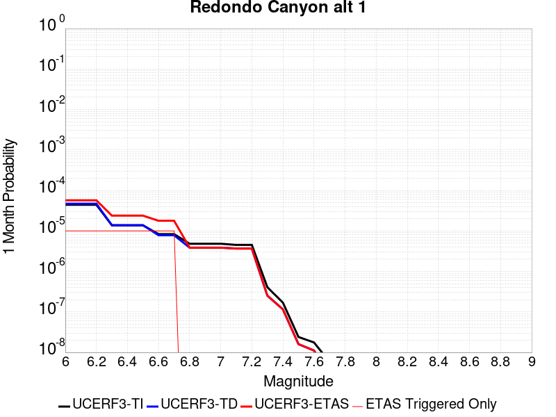 |  | 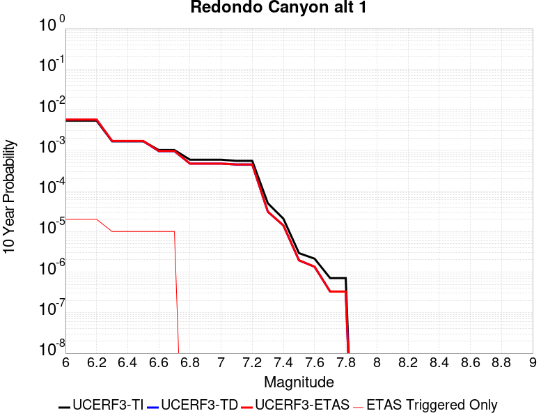 |

| Magnitude | 1 wk TI Prob | 1 wk TD Prob | 1 wk ETAS Prob | 1 wk ETAS/TD Gain | 1 wk ETAS Triggered Only | 1 mo TI Prob | 1 mo TD Prob | 1 mo ETAS Prob | 1 mo ETAS/TD Gain | 1 mo ETAS Triggered Only | 1 yr TI Prob | 1 yr TD Prob | 1 yr ETAS Prob | 1 yr ETAS/TD Gain | 1 yr ETAS Triggered Only | 10 yr TI Prob | 10 yr TD Prob | 10 yr ETAS Prob | 10 yr ETAS/TD Gain | 10 yr ETAS Triggered Only |
|-----|-----|-----|-----|-----|-----|-----|-----|-----|-----|-----|-----|-----|-----|-----|-----|-----|-----|-----|-----|-----|
| 6.0 | 1.0346246E-5 | 1.0981325E-5 | 2.0981215E-5 | 1.9106269 | 1.0E-5 | 4.43403E-5 | 4.7062418E-5 | 5.706195E-5 | 1.2124738 | 1.0E-5 | 5.3970946E-4 | 5.729132E-4 | 5.929018E-4 | 1.0348893 | 2.0E-5 | 0.0053840056 | 0.0057221013 | 0.005741987 | 1.0034752 | 2.0E-5 |
| 6.1 | 1.0346246E-5 | 1.0981325E-5 | 2.0981215E-5 | 1.9106269 | 1.0E-5 | 4.43403E-5 | 4.7062418E-5 | 5.706195E-5 | 1.2124738 | 1.0E-5 | 5.3970946E-4 | 5.729132E-4 | 5.929018E-4 | 1.0348893 | 2.0E-5 | 0.0053840056 | 0.0057221013 | 0.005741987 | 1.0034752 | 2.0E-5 |
| 6.2 | 1.0346246E-5 | 1.0981325E-5 | 2.0981215E-5 | 1.9106269 | 1.0E-5 | 4.43403E-5 | 4.7062418E-5 | 5.706195E-5 | 1.2124738 | 1.0E-5 | 5.3970946E-4 | 5.729132E-4 | 5.929018E-4 | 1.0348893 | 2.0E-5 | 0.0053840056 | 0.0057221013 | 0.005741987 | 1.0034752 | 2.0E-5 |
| 6.3 | 3.2052794E-6 | 3.2360983E-6 | 1.3236066E-5 | 4.090131 | 1.0E-5 | 1.373684E-5 | 1.3868941E-5 | 2.3868803E-5 | 1.7210256 | 1.0E-5 | 1.6723319E-4 | 1.6884525E-4 | 1.7884356E-4 | 1.0592158 | 1.0E-5 | 0.001671074 | 0.0016875593 | 0.0016975424 | 1.0059158 | 1.0E-5 |
| 6.4 | 3.2052794E-6 | 3.2360983E-6 | 1.3236066E-5 | 4.090131 | 1.0E-5 | 1.373684E-5 | 1.3868941E-5 | 2.3868803E-5 | 1.7210256 | 1.0E-5 | 1.6723319E-4 | 1.6884525E-4 | 1.7884356E-4 | 1.0592158 | 1.0E-5 | 0.001671074 | 0.0016875593 | 0.0016975424 | 1.0059158 | 1.0E-5 |
| 6.5 | 3.2052794E-6 | 3.2360983E-6 | 1.3236066E-5 | 4.090131 | 1.0E-5 | 1.373684E-5 | 1.3868941E-5 | 2.3868803E-5 | 1.7210256 | 1.0E-5 | 1.6723319E-4 | 1.6884525E-4 | 1.7884356E-4 | 1.0592158 | 1.0E-5 | 0.001671074 | 0.0016875593 | 0.0016975424 | 1.0059158 | 1.0E-5 |
| 6.6 | 1.948328E-6 | 1.8288489E-6 | 1.1828831E-5 | 6.4679103 | 1.0E-5 | 8.349951E-6 | 7.837909E-6 | 1.783783E-5 | 2.2758405 | 1.0E-5 | 1.016559E-4 | 9.5423864E-5 | 1.0542291E-4 | 1.1047856 | 1.0E-5 | 0.0010160941 | 9.5397583E-4 | 9.639663E-4 | 1.0104724 | 1.0E-5 |
| 6.7 | 1.948328E-6 | 1.8288489E-6 | 1.1828831E-5 | 6.4679103 | 1.0E-5 | 8.349951E-6 | 7.837909E-6 | 1.783783E-5 | 2.2758405 | 1.0E-5 | 1.016559E-4 | 9.5423864E-5 | 1.0542291E-4 | 1.1047856 | 1.0E-5 | 0.0010160941 | 9.5397583E-4 | 9.639663E-4 | 1.0104724 | 1.0E-5 |
| 6.8 | 1.1278219E-6 | 9.032885E-7 | 9.032885E-7 | 1.0 | 0.0 | 4.8335132E-6 | 3.871233E-6 | 3.871233E-6 | 1.0 | 0.0 | 5.8846435E-5 | 4.713167E-5 | 4.713167E-5 | 1.0 | 0.0 | 5.8830855E-4 | 4.7125877E-4 | 4.7125877E-4 | 1.0 | 0.0 |
| 6.9 | 1.1278219E-6 | 9.032885E-7 | 9.032885E-7 | 1.0 | 0.0 | 4.8335132E-6 | 3.871233E-6 | 3.871233E-6 | 1.0 | 0.0 | 5.8846435E-5 | 4.713167E-5 | 4.713167E-5 | 1.0 | 0.0 | 5.8830855E-4 | 4.7125877E-4 | 4.7125877E-4 | 1.0 | 0.0 |
| 7.0 | 1.1278219E-6 | 9.032885E-7 | 9.032885E-7 | 1.0 | 0.0 | 4.8335132E-6 | 3.871233E-6 | 3.871233E-6 | 1.0 | 0.0 | 5.8846435E-5 | 4.713167E-5 | 4.713167E-5 | 1.0 | 0.0 | 5.8830855E-4 | 4.7125877E-4 | 4.7125877E-4 | 1.0 | 0.0 |
| 7.1 | 1.0545139E-6 | 8.5690925E-7 | 8.5690925E-7 | 1.0 | 0.0 | 4.5193374E-6 | 3.6724655E-6 | 3.6724655E-6 | 1.0 | 0.0 | 5.5021545E-5 | 4.4711775E-5 | 4.4711775E-5 | 1.0 | 0.0 | 5.500792E-4 | 4.4706953E-4 | 4.4706953E-4 | 1.0 | 0.0 |
| 7.2 | 1.0545139E-6 | 8.5690925E-7 | 8.5690925E-7 | 1.0 | 0.0 | 4.5193374E-6 | 3.6724655E-6 | 3.6724655E-6 | 1.0 | 0.0 | 5.5021545E-5 | 4.4711775E-5 | 4.4711775E-5 | 1.0 | 0.0 | 5.500792E-4 | 4.4706953E-4 | 4.4706953E-4 | 1.0 | 0.0 |
| 7.3 | 9.505161E-8 | 5.8955752E-8 | 5.8955752E-8 | 1.0 | 0.0 | 4.0736398E-7 | 2.526675E-7 | 2.526675E-7 | 1.0 | 0.0 | 4.959645E-6 | 3.0762235E-6 | 3.0762235E-6 | 1.0 | 0.0 | 4.9595343E-5 | 3.076193E-5 | 3.076193E-5 | 1.0 | 0.0 |
| 7.4 | 3.9520785E-8 | 2.6987088E-8 | 2.6987088E-8 | 1.0 | 0.0 | 1.6937479E-7 | 1.1565894E-7 | 1.1565894E-7 | 1.0 | 0.0 | 2.062136E-6 | 1.408147E-6 | 1.408147E-6 | 1.0 | 0.0 | 2.062117E-5 | 1.4081407E-5 | 1.4081407E-5 | 1.0 | 0.0 |
| 7.5 | 5.6133214E-9 | 3.7367687E-9 | 3.7367687E-9 | 1.0 | 0.0 | 2.4057092E-8 | 1.6014722E-8 | 1.6014722E-8 | 1.0 | 0.0 | 2.9289507E-7 | 1.9497922E-7 | 1.9497922E-7 | 1.0 | 0.0 | 2.9289467E-6 | 1.9497909E-6 | 1.9497909E-6 | 1.0 | 0.0 |
| 7.6 | 4.1064334E-9 | 2.5957205E-9 | 2.5957205E-9 | 1.0 | 0.0 | 1.7599E-8 | 1.1124517E-8 | 1.1124517E-8 | 1.0 | 0.0 | 2.142678E-7 | 1.3544098E-7 | 1.3544098E-7 | 1.0 | 0.0 | 2.1426758E-6 | 1.3544093E-6 | 1.3544093E-6 | 1.0 | 0.0 |
| 7.7 | 1.361975E-9 | 6.360521E-10 | 6.360521E-10 | 1.0 | 0.0 | 5.8370353E-9 | 2.7259377E-9 | 2.7259377E-9 | 1.0 | 0.0 | 7.1065905E-8 | 3.318829E-8 | 3.318829E-8 | 1.0 | 0.0 | 7.106588E-7 | 3.3188286E-7 | 3.3188286E-7 | 1.0 | 0.0 |
| 7.8 | 1.361975E-9 | 6.360521E-10 | 6.360521E-10 | 1.0 | 0.0 | 5.8370353E-9 | 2.7259377E-9 | 2.7259377E-9 | 1.0 | 0.0 | 7.1065905E-8 | 3.318829E-8 | 3.318829E-8 | 1.0 | 0.0 | 7.106588E-7 | 3.3188286E-7 | 3.3188286E-7 | 1.0 | 0.0 |

## Johnson Valley (No) 2011 rev
*[(top)](#table-of-contents)*

| 1 Week | 1 Month | 1 Year | 10 Year |
|-----|-----|-----|-----|
|  | 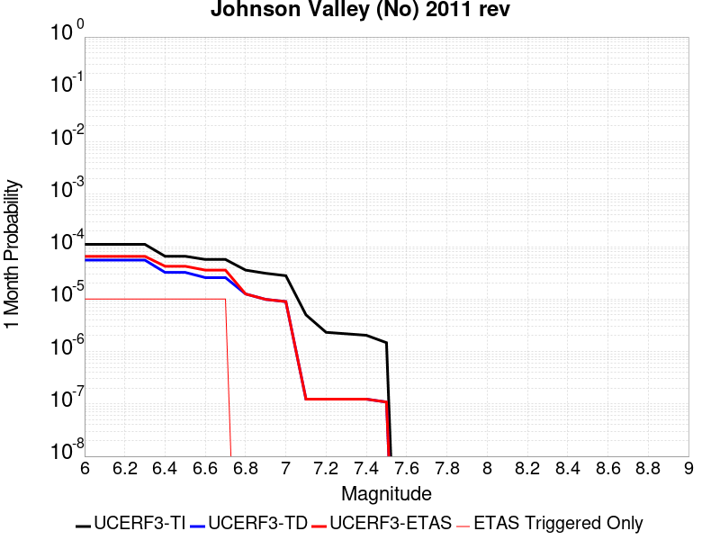 | 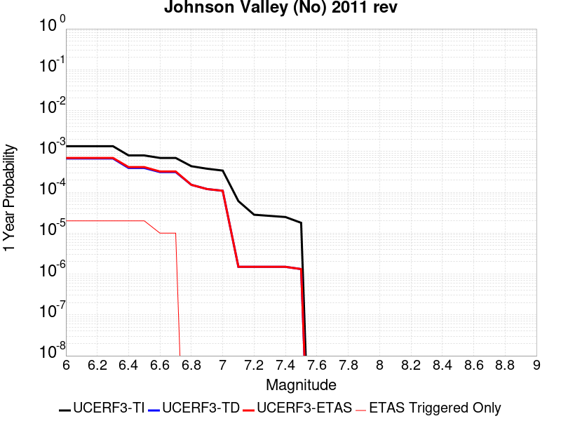 | 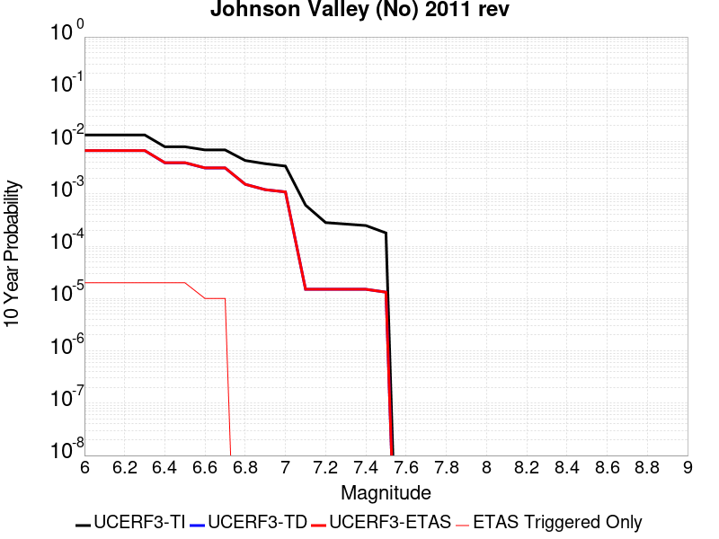 |

| Magnitude | 1 wk TI Prob | 1 wk TD Prob | 1 wk ETAS Prob | 1 wk ETAS/TD Gain | 1 wk ETAS Triggered Only | 1 mo TI Prob | 1 mo TD Prob | 1 mo ETAS Prob | 1 mo ETAS/TD Gain | 1 mo ETAS Triggered Only | 1 yr TI Prob | 1 yr TD Prob | 1 yr ETAS Prob | 1 yr ETAS/TD Gain | 1 yr ETAS Triggered Only | 10 yr TI Prob | 10 yr TD Prob | 10 yr ETAS Prob | 10 yr ETAS/TD Gain | 10 yr ETAS Triggered Only |
|-----|-----|-----|-----|-----|-----|-----|-----|-----|-----|-----|-----|-----|-----|-----|-----|-----|-----|-----|-----|-----|
| 6.0 | 2.577707E-5 | 1.2901208E-5 | 2.2901078E-5 | 1.7751112 | 1.0E-5 | 1.1046848E-4 | 5.528994E-5 | 6.528939E-5 | 1.1808547 | 1.0E-5 | 0.0013441239 | 6.729868E-4 | 6.929733E-4 | 1.0296983 | 2.0E-5 | 0.013360229 | 0.006713397 | 0.0067332624 | 1.0029591 | 2.0E-5 |
| 6.1 | 2.577707E-5 | 1.2901208E-5 | 2.2901078E-5 | 1.7751112 | 1.0E-5 | 1.1046848E-4 | 5.528994E-5 | 6.528939E-5 | 1.1808547 | 1.0E-5 | 0.0013441239 | 6.729868E-4 | 6.929733E-4 | 1.0296983 | 2.0E-5 | 0.013360229 | 0.006713397 | 0.0067332624 | 1.0029591 | 2.0E-5 |
| 6.2 | 2.577707E-5 | 1.2901208E-5 | 2.2901078E-5 | 1.7751112 | 1.0E-5 | 1.1046848E-4 | 5.528994E-5 | 6.528939E-5 | 1.1808547 | 1.0E-5 | 0.0013441239 | 6.729868E-4 | 6.929733E-4 | 1.0296983 | 2.0E-5 | 0.013360229 | 0.006713397 | 0.0067332624 | 1.0029591 | 2.0E-5 |
| 6.3 | 2.577707E-5 | 1.2901208E-5 | 2.2901078E-5 | 1.7751112 | 1.0E-5 | 1.1046848E-4 | 5.528994E-5 | 6.528939E-5 | 1.1808547 | 1.0E-5 | 0.0013441239 | 6.729868E-4 | 6.929733E-4 | 1.0296983 | 2.0E-5 | 0.013360229 | 0.006713397 | 0.0067332624 | 1.0029591 | 2.0E-5 |
| 6.4 | 1.5296591E-5 | 7.5369735E-6 | 1.7536899E-5 | 2.3267825 | 1.0E-5 | 6.555518E-5 | 3.230102E-5 | 4.2300697E-5 | 1.3095777 | 1.0E-5 | 7.97842E-4 | 3.9321271E-4 | 4.1320483E-4 | 1.050843 | 2.0E-5 | 0.007949836 | 0.003927011 | 0.0039469325 | 1.005073 | 2.0E-5 |
| 6.5 | 1.5296591E-5 | 7.5369735E-6 | 1.7536899E-5 | 2.3267825 | 1.0E-5 | 6.555518E-5 | 3.230102E-5 | 4.2300697E-5 | 1.3095777 | 1.0E-5 | 7.97842E-4 | 3.9321271E-4 | 4.1320483E-4 | 1.050843 | 2.0E-5 | 0.007949836 | 0.003927011 | 0.0039469325 | 1.005073 | 2.0E-5 |
| 6.6 | 1.3289383E-5 | 5.9919316E-6 | 1.599187E-5 | 2.668901 | 1.0E-5 | 5.6953253E-5 | 2.567955E-5 | 3.567929E-5 | 1.3894049 | 1.0E-5 | 6.9318525E-4 | 3.1262063E-4 | 3.226175E-4 | 1.0319777 | 1.0E-5 | 0.0069102696 | 0.0031234731 | 0.0031334418 | 1.0031916 | 1.0E-5 |
| 6.7 | 1.3289383E-5 | 5.9919316E-6 | 1.599187E-5 | 2.668901 | 1.0E-5 | 5.6953253E-5 | 2.567955E-5 | 3.567929E-5 | 1.3894049 | 1.0E-5 | 6.9318525E-4 | 3.1262063E-4 | 3.226175E-4 | 1.0319777 | 1.0E-5 | 0.0069102696 | 0.0031234731 | 0.0031334418 | 1.0031916 | 1.0E-5 |
| 6.8 | 8.330789E-6 | 2.9214577E-6 | 2.9214577E-6 | 1.0 | 0.0 | 3.570289E-5 | 1.2520505E-5 | 1.2520505E-5 | 1.0 | 0.0 | 4.34596E-4 | 1.524322E-4 | 1.524322E-4 | 1.0 | 0.0 | 0.0043374705 | 0.0015238364 | 0.0015238364 | 1.0 | 0.0 |
| 6.9 | 7.2359003E-6 | 2.3014702E-6 | 2.3014702E-6 | 1.0 | 0.0 | 3.1010633E-5 | 9.863436E-6 | 9.863436E-6 | 1.0 | 0.0 | 3.7748902E-4 | 1.2008605E-4 | 1.2008605E-4 | 1.0 | 0.0 | 0.0037684843 | 0.0012007345 | 0.0012007345 | 1.0 | 0.0 |
| 7.0 | 6.5149957E-6 | 2.0886398E-6 | 2.0886398E-6 | 1.0 | 0.0 | 2.792111E-5 | 8.951313E-6 | 8.951313E-6 | 1.0 | 0.0 | 3.398865E-4 | 1.0898209E-4 | 1.0898209E-4 | 1.0 | 0.0 | 0.003393671 | 0.0010898062 | 0.0010898062 | 1.0 | 0.0 |
| 7.1 | 1.1662233E-6 | 2.8793124E-8 | 2.8793124E-8 | 1.0 | 0.0 | 4.9980904E-6 | 1.2339909E-7 | 1.2339909E-7 | 1.0 | 0.0 | 6.0850052E-5 | 1.5023832E-6 | 1.5023832E-6 | 1.0 | 0.0 | 6.083339E-4 | 1.5023746E-5 | 1.5023746E-5 | 1.0 | 0.0 |
| 7.2 | 5.413881E-7 | 2.8793124E-8 | 2.8793124E-8 | 1.0 | 0.0 | 2.3202326E-6 | 1.2339909E-7 | 1.2339909E-7 | 1.0 | 0.0 | 2.8248465E-5 | 1.5023832E-6 | 1.5023832E-6 | 1.0 | 0.0 | 2.8244875E-4 | 1.5023746E-5 | 1.5023746E-5 | 1.0 | 0.0 |
| 7.3 | 5.076821E-7 | 2.8793124E-8 | 2.8793124E-8 | 1.0 | 0.0 | 2.1757785E-6 | 1.2339909E-7 | 1.2339909E-7 | 1.0 | 0.0 | 2.648978E-5 | 1.5023832E-6 | 1.5023832E-6 | 1.0 | 0.0 | 2.6486625E-4 | 1.5023746E-5 | 1.5023746E-5 | 1.0 | 0.0 |
| 7.4 | 4.7568687E-7 | 2.8775073E-8 | 2.8775073E-8 | 1.0 | 0.0 | 2.0386565E-6 | 1.2332174E-7 | 1.2332174E-7 | 1.0 | 0.0 | 2.482036E-5 | 1.5014413E-6 | 1.5014413E-6 | 1.0 | 0.0 | 2.4817587E-4 | 1.5014328E-5 | 1.5014328E-5 | 1.0 | 0.0 |
| 7.5 | 3.435626E-7 | 2.5350424E-8 | 2.5350424E-8 | 1.0 | 0.0 | 1.4724103E-6 | 1.0864467E-7 | 1.0864467E-7 | 1.0 | 0.0 | 1.7926448E-5 | 1.3227482E-6 | 1.3227482E-6 | 1.0 | 0.0 | 1.7925001E-4 | 1.3227419E-5 | 1.3227419E-5 | 1.0 | 0.0 |

## Superstition Hills
*[(top)](#table-of-contents)*

| 1 Week | 1 Month | 1 Year | 10 Year |
|-----|-----|-----|-----|
|  |  | 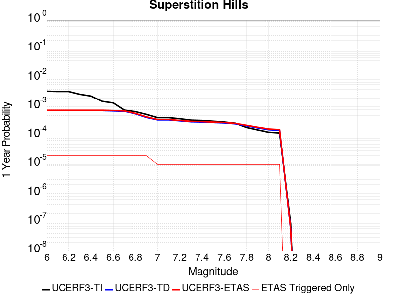 |  |

| Magnitude | 1 wk TI Prob | 1 wk TD Prob | 1 wk ETAS Prob | 1 wk ETAS/TD Gain | 1 wk ETAS Triggered Only | 1 mo TI Prob | 1 mo TD Prob | 1 mo ETAS Prob | 1 mo ETAS/TD Gain | 1 mo ETAS Triggered Only | 1 yr TI Prob | 1 yr TD Prob | 1 yr ETAS Prob | 1 yr ETAS/TD Gain | 1 yr ETAS Triggered Only | 10 yr TI Prob | 10 yr TD Prob | 10 yr ETAS Prob | 10 yr ETAS/TD Gain | 10 yr ETAS Triggered Only |
|-----|-----|-----|-----|-----|-----|-----|-----|-----|-----|-----|-----|-----|-----|-----|-----|-----|-----|-----|-----|-----|
| 6.0 | 6.6865185E-5 | 1.4137668E-5 | 1.4137668E-5 | 1.0 | 0.0 | 2.8653358E-4 | 6.058869E-5 | 7.058808E-5 | 1.1650373 | 1.0E-5 | 0.0034829667 | 7.374338E-4 | 7.5741904E-4 | 1.027101 | 2.0E-5 | 0.03428881 | 0.007520696 | 0.0075405454 | 1.0026393 | 2.0E-5 |
| 6.1 | 6.544851E-5 | 1.4137668E-5 | 1.4137668E-5 | 1.0 | 0.0 | 2.8046346E-4 | 6.058869E-5 | 7.058808E-5 | 1.1650373 | 1.0E-5 | 0.0034092965 | 7.374338E-4 | 7.5741904E-4 | 1.027101 | 2.0E-5 | 0.033574644 | 0.0075206957 | 0.007540545 | 1.0026393 | 2.0E-5 |
| 6.2 | 6.544851E-5 | 1.4137668E-5 | 1.4137668E-5 | 1.0 | 0.0 | 2.8046346E-4 | 6.058869E-5 | 7.058808E-5 | 1.1650373 | 1.0E-5 | 0.0034092965 | 7.374338E-4 | 7.5741904E-4 | 1.027101 | 2.0E-5 | 0.033574644 | 0.0075206957 | 0.007540545 | 1.0026393 | 2.0E-5 |
| 6.3 | 5.2402065E-5 | 1.4137667E-5 | 1.4137667E-5 | 1.0 | 0.0 | 2.2456095E-4 | 6.0588685E-5 | 7.058808E-5 | 1.1650373 | 1.0E-5 | 0.0027306017 | 7.374338E-4 | 7.5741904E-4 | 1.027101 | 2.0E-5 | 0.02697292 | 0.0075206906 | 0.0075405403 | 1.0026393 | 2.0E-5 |
| 6.4 | 4.542238E-5 | 1.4137666E-5 | 1.4137666E-5 | 1.0 | 0.0 | 1.9465282E-4 | 6.058868E-5 | 7.0588074E-5 | 1.1650373 | 1.0E-5 | 0.0023673223 | 7.3743373E-4 | 7.57419E-4 | 1.027101 | 2.0E-5 | 0.023422617 | 0.007520688 | 0.0075405375 | 1.0026393 | 2.0E-5 |
| 6.5 | 2.9672969E-5 | 1.4137665E-5 | 1.4137665E-5 | 1.0 | 0.0 | 1.2716366E-4 | 6.0588678E-5 | 7.0588074E-5 | 1.1650374 | 1.0E-5 | 0.0015471181 | 7.374337E-4 | 7.574189E-4 | 1.027101 | 2.0E-5 | 0.015363912 | 0.0075206826 | 0.0075405324 | 1.0026393 | 2.0E-5 |
| 6.6 | 2.6056105E-5 | 1.3803436E-5 | 1.3803436E-5 | 1.0 | 0.0 | 1.1166424E-4 | 5.915633E-5 | 6.9155736E-5 | 1.1690336 | 1.0E-5 | 0.0013586642 | 7.200064E-4 | 7.39992E-4 | 1.0277575 | 2.0E-5 | 0.013503874 | 0.0073450673 | 0.007364921 | 1.002703 | 2.0E-5 |
| 6.7 | 1.4611248E-5 | 1.338333E-5 | 1.338333E-5 | 1.0 | 0.0 | 6.261813E-5 | 5.7355956E-5 | 6.735538E-5 | 1.1743398 | 1.0E-5 | 7.6210906E-4 | 6.9810095E-4 | 7.18087E-4 | 1.0286292 | 2.0E-5 | 0.0075950073 | 0.0071262526 | 0.0071461103 | 1.0027865 | 2.0E-5 |
| 6.8 | 1.30607E-5 | 1.09787115E-5 | 1.09787115E-5 | 1.0 | 0.0 | 5.597323E-5 | 4.705082E-5 | 5.705035E-5 | 1.2125262 | 1.0E-5 | 6.8126095E-4 | 5.727019E-4 | 5.926904E-4 | 1.0349022 | 2.0E-5 | 0.006791762 | 0.005873964 | 0.0058938465 | 1.0033848 | 2.0E-5 |
| 6.9 | 1.0443096E-5 | 8.19507E-6 | 8.19507E-6 | 1.0 | 0.0 | 4.4755358E-5 | 3.512127E-5 | 4.512092E-5 | 1.2847178 | 1.0E-5 | 5.447602E-4 | 4.2751993E-4 | 4.4751138E-4 | 1.0467614 | 2.0E-5 | 0.005434267 | 0.004409497 | 0.004429409 | 1.0045156 | 2.0E-5 |
| 7.0 | 8.045912E-6 | 6.739447E-6 | 6.739447E-6 | 1.0 | 0.0 | 3.4482026E-5 | 2.888303E-5 | 3.8882743E-5 | 1.346214 | 1.0E-5 | 4.197378E-4 | 3.5159517E-4 | 3.6159166E-4 | 1.0284318 | 1.0E-5 | 0.0041894587 | 0.0036335257 | 0.0036434894 | 1.0027422 | 1.0E-5 |
| 7.1 | 8.045912E-6 | 6.739447E-6 | 6.739447E-6 | 1.0 | 0.0 | 3.4482026E-5 | 2.888303E-5 | 3.8882743E-5 | 1.346214 | 1.0E-5 | 4.197378E-4 | 3.5159517E-4 | 3.6159166E-4 | 1.0284318 | 1.0E-5 | 0.0041894587 | 0.0036335257 | 0.0036434894 | 1.0027422 | 1.0E-5 |
| 7.2 | 7.375506E-6 | 6.2463805E-6 | 6.2463805E-6 | 1.0 | 0.0 | 3.1608928E-5 | 2.6769932E-5 | 3.6769663E-5 | 1.3735434 | 1.0E-5 | 3.8477074E-4 | 3.2587603E-4 | 3.3587278E-4 | 1.0306765 | 1.0E-5 | 0.003841052 | 0.0033741172 | 0.0033840835 | 1.0029538 | 1.0E-5 |
| 7.3 | 6.6063913E-6 | 5.798824E-6 | 5.798824E-6 | 1.0 | 0.0 | 2.8312797E-5 | 2.4851872E-5 | 3.4851622E-5 | 1.4023741 | 1.0E-5 | 3.446538E-4 | 3.0253024E-4 | 3.125272E-4 | 1.0330446 | 1.0E-5 | 0.0034411973 | 0.0031383524 | 0.003148321 | 1.0031763 | 1.0E-5 |
| 7.4 | 6.4313126E-6 | 5.6802523E-6 | 5.6802523E-6 | 1.0 | 0.0 | 2.7562477E-5 | 2.4343715E-5 | 3.434347E-5 | 1.4107736 | 1.0E-5 | 3.355215E-4 | 2.963451E-4 | 3.0634215E-4 | 1.0337344 | 1.0E-5 | 0.0033501536 | 0.003076105 | 0.003086074 | 1.0032408 | 1.0E-5 |
| 7.5 | 6.0742927E-6 | 5.476088E-6 | 5.476088E-6 | 1.0 | 0.0 | 2.6032423E-5 | 2.3468741E-5 | 3.3468506E-5 | 1.4260887 | 1.0E-5 | 3.1689866E-4 | 2.8569513E-4 | 2.956923E-4 | 1.0349923 | 1.0E-5 | 0.0031644711 | 0.0029679502 | 0.0029779205 | 1.0033593 | 1.0E-5 |
| 7.6 | 5.6987187E-6 | 5.2943155E-6 | 5.2943155E-6 | 1.0 | 0.0 | 2.4422852E-5 | 2.268973E-5 | 3.2689502E-5 | 1.440718 | 1.0E-5 | 2.9730765E-4 | 2.762131E-4 | 2.8621033E-4 | 1.036194 | 1.0E-5 | 0.002969102 | 0.0028712032 | 0.0028811747 | 1.0034728 | 1.0E-5 |
| 7.7 | 5.1658035E-6 | 4.925336E-6 | 4.925336E-6 | 1.0 | 0.0 | 2.2138971E-5 | 2.1108413E-5 | 3.1108204E-5 | 1.4737347 | 1.0E-5 | 2.6950863E-4 | 2.5696523E-4 | 2.6696266E-4 | 1.0389057 | 1.0E-5 | 0.00269182 | 0.0026763005 | 0.0026862738 | 1.0037265 | 1.0E-5 |
| 7.8 | 3.6864697E-6 | 4.1963563E-6 | 4.1963563E-6 | 1.0 | 0.0 | 1.579906E-5 | 1.7984263E-5 | 2.7984082E-5 | 1.5560317 | 1.0E-5 | 1.9233658E-4 | 2.1893687E-4 | 2.2893467E-4 | 1.0456653 | 1.0E-5 | 0.0019217018 | 0.0022895595 | 0.0022995365 | 1.0043577 | 1.0E-5 |
| 7.9 | 3.0265903E-6 | 3.5636078E-6 | 3.5636078E-6 | 1.0 | 0.0 | 1.2971037E-5 | 1.5272519E-5 | 2.5272366E-5 | 1.6547608 | 1.0E-5 | 1.5791094E-4 | 1.8592748E-4 | 1.9592562E-4 | 1.0537744 | 1.0E-5 | 0.0015779877 | 0.0019537222 | 0.0019637027 | 1.0051085 | 1.0E-5 |
| 8.0 | 2.5271493E-6 | 3.0866524E-6 | 3.0866524E-6 | 1.0 | 0.0 | 1.0830595E-5 | 1.3228446E-5 | 2.3228313E-5 | 1.7559367 | 1.0E-5 | 1.3185451E-4 | 1.6104484E-4 | 1.7104323E-4 | 1.0620846 | 1.0E-5 | 0.0013177631 | 0.0016975543 | 0.0017075373 | 1.0058808 | 1.0E-5 |
| 8.1 | 2.3749135E-6 | 2.9172957E-6 | 2.9172957E-6 | 1.0 | 0.0 | 1.0178161E-5 | 1.2502638E-5 | 2.2502512E-5 | 1.7998213 | 1.0E-5 | 1.2391206E-4 | 1.522094E-4 | 1.6220787E-4 | 1.065689 | 1.0E-5 | 0.0012384299 | 0.0016051348 | 0.0016151187 | 1.00622 | 1.0E-5 |
| 8.2 | 1.7186406E-9 | 1.1438838E-9 | 1.1438838E-9 | 1.0 | 0.0 | 7.3656024E-9 | 4.902359E-9 | 4.902359E-9 | 1.0 | 0.0 | 8.9676206E-8 | 5.968622E-8 | 5.968622E-8 | 1.0 | 0.0 | 8.9676166E-7 | 6.386644E-7 | 6.386644E-7 | 1.0 | 0.0 |

## Monte Vista - Shannon 2011 CFM
*[(top)](#table-of-contents)*

| 1 Week | 1 Month | 1 Year | 10 Year |
|-----|-----|-----|-----|
|  |  |  |  |

| Magnitude | 1 wk TI Prob | 1 wk TD Prob | 1 wk ETAS Prob | 1 wk ETAS/TD Gain | 1 wk ETAS Triggered Only | 1 mo TI Prob | 1 mo TD Prob | 1 mo ETAS Prob | 1 mo ETAS/TD Gain | 1 mo ETAS Triggered Only | 1 yr TI Prob | 1 yr TD Prob | 1 yr ETAS Prob | 1 yr ETAS/TD Gain | 1 yr ETAS Triggered Only | 10 yr TI Prob | 10 yr TD Prob | 10 yr ETAS Prob | 10 yr ETAS/TD Gain | 10 yr ETAS Triggered Only |
|-----|-----|-----|-----|-----|-----|-----|-----|-----|-----|-----|-----|-----|-----|-----|-----|-----|-----|-----|-----|-----|
| 6.0 | 2.7907707E-5 | 2.7584067E-5 | 2.7584067E-5 | 1.0 | 0.0 | 1.19598975E-4 | 1.1821277E-4 | 1.1821277E-4 | 1.0 | 0.0 | 0.0014551448 | 0.001438414 | 0.0014483996 | 1.0069422 | 1.0E-5 | 0.014456532 | 0.014320111 | 0.014339825 | 1.0013766 | 2.0E-5 |
| 6.1 | 2.7907707E-5 | 2.7584067E-5 | 2.7584067E-5 | 1.0 | 0.0 | 1.19598975E-4 | 1.1821277E-4 | 1.1821277E-4 | 1.0 | 0.0 | 0.0014551448 | 0.001438414 | 0.0014483996 | 1.0069422 | 1.0E-5 | 0.014456532 | 0.014320111 | 0.014339825 | 1.0013766 | 2.0E-5 |
| 6.2 | 2.7907707E-5 | 2.7584067E-5 | 2.7584067E-5 | 1.0 | 0.0 | 1.19598975E-4 | 1.1821277E-4 | 1.1821277E-4 | 1.0 | 0.0 | 0.0014551448 | 0.001438414 | 0.0014483996 | 1.0069422 | 1.0E-5 | 0.014456532 | 0.014320111 | 0.014339825 | 1.0013766 | 2.0E-5 |
| 6.3 | 2.7907707E-5 | 2.7584067E-5 | 2.7584067E-5 | 1.0 | 0.0 | 1.19598975E-4 | 1.1821277E-4 | 1.1821277E-4 | 1.0 | 0.0 | 0.0014551448 | 0.001438414 | 0.0014483996 | 1.0069422 | 1.0E-5 | 0.014456532 | 0.014320111 | 0.014339825 | 1.0013766 | 2.0E-5 |
| 6.4 | 2.7907707E-5 | 2.7584067E-5 | 2.7584067E-5 | 1.0 | 0.0 | 1.19598975E-4 | 1.1821277E-4 | 1.1821277E-4 | 1.0 | 0.0 | 0.0014551448 | 0.001438414 | 0.0014483996 | 1.0069422 | 1.0E-5 | 0.014456532 | 0.014320111 | 0.014339825 | 1.0013766 | 2.0E-5 |
| 6.5 | 1.7990213E-5 | 1.6639742E-5 | 1.6639742E-5 | 1.0 | 0.0 | 7.709863E-5 | 7.13116E-5 | 7.13116E-5 | 1.0 | 0.0 | 9.382716E-4 | 8.679393E-4 | 8.679393E-4 | 1.0 | 0.0 | 0.0093431985 | 0.008668857 | 0.008678771 | 1.0011436 | 1.0E-5 |
| 6.6 | 9.650407E-6 | 7.457001E-6 | 7.457001E-6 | 1.0 | 0.0 | 4.135823E-5 | 3.195823E-5 | 3.195823E-5 | 1.0 | 0.0 | 5.0342013E-4 | 3.890298E-4 | 3.890298E-4 | 1.0 | 0.0 | 0.005022812 | 0.0039011573 | 0.0039011573 | 1.0 | 0.0 |
| 6.7 | 9.62828E-6 | 7.434916E-6 | 7.434916E-6 | 1.0 | 0.0 | 4.1263404E-5 | 3.186358E-5 | 3.186358E-5 | 1.0 | 0.0 | 5.022661E-4 | 3.8787787E-4 | 3.8787787E-4 | 1.0 | 0.0 | 0.0050113243 | 0.003889678 | 0.003889678 | 1.0 | 0.0 |
| 6.8 | 6.887523E-6 | 4.461425E-6 | 4.461425E-6 | 1.0 | 0.0 | 2.9517621E-5 | 1.9120265E-5 | 1.9120265E-5 | 1.0 | 0.0 | 3.5931775E-4 | 2.3276659E-4 | 2.3276659E-4 | 1.0 | 0.0 | 0.0035873733 | 0.0023423703 | 0.0023423703 | 1.0 | 0.0 |
| 6.9 | 6.2722347E-6 | 3.8032956E-6 | 3.8032956E-6 | 1.0 | 0.0 | 2.6880729E-5 | 1.6299748E-5 | 1.6299748E-5 | 1.0 | 0.0 | 3.2722374E-4 | 1.9843338E-4 | 1.9843338E-4 | 1.0 | 0.0 | 0.003267423 | 0.0019996904 | 0.0019996904 | 1.0 | 0.0 |
| 7.0 | 5.5320347E-6 | 3.0304461E-6 | 3.0304461E-6 | 1.0 | 0.0 | 2.3708504E-5 | 1.2987572E-5 | 1.2987572E-5 | 1.0 | 0.0 | 2.8861282E-4 | 1.5811404E-4 | 1.5811404E-4 | 1.0 | 0.0 | 0.0028823826 | 0.0015971304 | 0.0015971304 | 1.0 | 0.0 |
| 7.1 | 3.8794055E-6 | 1.283645E-6 | 1.283645E-6 | 1.0 | 0.0 | 1.6625918E-5 | 5.5013243E-6 | 5.5013243E-6 | 1.0 | 0.0 | 2.0240174E-4 | 6.697658E-5 | 6.697658E-5 | 1.0 | 0.0 | 0.002022175 | 6.86504E-4 | 6.86504E-4 | 1.0 | 0.0 |
| 7.2 | 3.4813652E-6 | 9.669686E-7 | 9.669686E-7 | 1.0 | 0.0 | 1.49200505E-5 | 4.144145E-6 | 4.144145E-6 | 1.0 | 0.0 | 1.8163648E-4 | 5.0453804E-5 | 5.0453804E-5 | 1.0 | 0.0 | 0.0018148809 | 5.213506E-4 | 5.213506E-4 | 1.0 | 0.0 |
| 7.3 | 3.1682148E-6 | 7.7177793E-7 | 7.7177793E-7 | 1.0 | 0.0 | 1.3577992E-5 | 3.3076153E-6 | 3.3076153E-6 | 1.0 | 0.0 | 1.6529951E-4 | 4.0269475E-5 | 4.0269475E-5 | 1.0 | 0.0 | 0.0016517661 | 4.195245E-4 | 4.195245E-4 | 1.0 | 0.0 |
| 7.4 | 2.9707667E-6 | 7.344474E-7 | 7.344474E-7 | 1.0 | 0.0 | 1.2731795E-5 | 3.147628E-6 | 3.147628E-6 | 1.0 | 0.0 | 1.5499859E-4 | 3.8321698E-5 | 3.8321698E-5 | 1.0 | 0.0 | 0.0015489052 | 3.998471E-4 | 3.998471E-4 | 1.0 | 0.0 |
| 7.5 | 2.3462758E-6 | 6.0069135E-7 | 6.0069135E-7 | 1.0 | 0.0 | 1.0055429E-5 | 2.5743889E-6 | 2.5743889E-6 | 1.0 | 0.0 | 1.2241797E-4 | 3.1342737E-5 | 3.1342737E-5 | 1.0 | 0.0 | 0.0012235056 | 3.2833643E-4 | 3.2833643E-4 | 1.0 | 0.0 |
| 7.6 | 2.112783E-6 | 5.250731E-7 | 5.250731E-7 | 1.0 | 0.0 | 9.054753E-6 | 2.2503114E-6 | 2.2503114E-6 | 1.0 | 0.0 | 1.1023604E-4 | 2.7397198E-5 | 2.7397198E-5 | 1.0 | 0.0 | 0.0011018137 | 2.8845918E-4 | 2.8845918E-4 | 1.0 | 0.0 |
| 7.7 | 1.7022471E-6 | 4.23102E-7 | 4.23102E-7 | 1.0 | 0.0 | 7.2953244E-6 | 1.8132929E-6 | 1.8132929E-6 | 1.0 | 0.0 | 8.881695E-5 | 2.207662E-5 | 2.207662E-5 | 1.0 | 0.0 | 8.878146E-4 | 2.3394964E-4 | 2.3394964E-4 | 1.0 | 0.0 |
| 7.8 | 7.230914E-7 | 3.728293E-7 | 3.728293E-7 | 1.0 | 0.0 | 3.0989595E-6 | 1.597839E-6 | 1.597839E-6 | 1.0 | 0.0 | 3.772918E-5 | 1.9453517E-5 | 1.9453517E-5 | 1.0 | 0.0 | 3.7722773E-4 | 2.072548E-4 | 2.072548E-4 | 1.0 | 0.0 |
| 7.9 | 4.3588446E-7 | 3.4304335E-7 | 3.4304335E-7 | 1.0 | 0.0 | 1.868075E-6 | 1.4701849E-6 | 1.4701849E-6 | 1.0 | 0.0 | 2.2743576E-5 | 1.7899356E-5 | 1.7899356E-5 | 1.0 | 0.0 | 2.2741247E-4 | 1.899464E-4 | 1.899464E-4 | 1.0 | 0.0 |
| 8.0 | 2.3317523E-7 | 3.1513432E-7 | 3.1513432E-7 | 1.0 | 0.0 | 9.99322E-7 | 1.350575E-6 | 1.350575E-6 | 1.0 | 0.0 | 1.2166677E-5 | 1.6443128E-5 | 1.6443128E-5 | 1.0 | 0.0 | 1.21660116E-4 | 1.7399403E-4 | 1.7399403E-4 | 1.0 | 0.0 |
| 8.1 | 1.4662456E-7 | 2.03077E-7 | 2.03077E-7 | 1.0 | 0.0 | 6.283908E-7 | 8.703297E-7 | 8.703297E-7 | 1.0 | 0.0 | 7.650631E-6 | 1.05962135E-5 | 1.05962135E-5 | 1.0 | 0.0 | 7.650368E-5 | 1.1132272E-4 | 1.1132272E-4 | 1.0 | 0.0 |
| 8.2 | 5.4931775E-9 | 5.0752176E-9 | 5.0752176E-9 | 1.0 | 0.0 | 2.3542189E-8 | 2.1750932E-8 | 2.1750932E-8 | 1.0 | 0.0 | 2.8662612E-7 | 2.6481757E-7 | 2.6481757E-7 | 1.0 | 0.0 | 2.8662573E-6 | 2.754138E-6 | 2.754138E-6 | 1.0 | 0.0 |

## Morales (West)
*[(top)](#table-of-contents)*

| 1 Week | 1 Month | 1 Year | 10 Year |
|-----|-----|-----|-----|
| 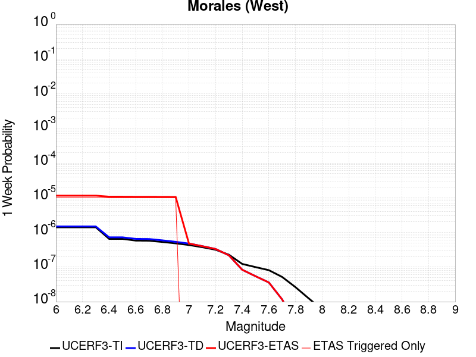 |  |  |  |

| Magnitude | 1 wk TI Prob | 1 wk TD Prob | 1 wk ETAS Prob | 1 wk ETAS/TD Gain | 1 wk ETAS Triggered Only | 1 mo TI Prob | 1 mo TD Prob | 1 mo ETAS Prob | 1 mo ETAS/TD Gain | 1 mo ETAS Triggered Only | 1 yr TI Prob | 1 yr TD Prob | 1 yr ETAS Prob | 1 yr ETAS/TD Gain | 1 yr ETAS Triggered Only | 10 yr TI Prob | 10 yr TD Prob | 10 yr ETAS Prob | 10 yr ETAS/TD Gain | 10 yr ETAS Triggered Only |
|-----|-----|-----|-----|-----|-----|-----|-----|-----|-----|-----|-----|-----|-----|-----|-----|-----|-----|-----|-----|-----|
| 6.0 | 1.4027072E-6 | 1.4791653E-6 | 1.147915E-5 | 7.7605596 | 1.0E-5 | 6.0115885E-6 | 6.3392686E-6 | 1.6339205E-5 | 2.577459 | 1.0E-5 | 7.318863E-5 | 7.7178556E-5 | 8.717779E-5 | 1.1295596 | 1.0E-5 | 7.316453E-4 | 7.715861E-4 | 7.9157064E-4 | 1.0259006 | 2.0E-5 |
| 6.1 | 1.4027072E-6 | 1.4791653E-6 | 1.147915E-5 | 7.7605596 | 1.0E-5 | 6.0115885E-6 | 6.3392686E-6 | 1.6339205E-5 | 2.577459 | 1.0E-5 | 7.318863E-5 | 7.7178556E-5 | 8.717779E-5 | 1.1295596 | 1.0E-5 | 7.316453E-4 | 7.715861E-4 | 7.9157064E-4 | 1.0259006 | 2.0E-5 |
| 6.2 | 1.4027072E-6 | 1.4791653E-6 | 1.147915E-5 | 7.7605596 | 1.0E-5 | 6.0115885E-6 | 6.3392686E-6 | 1.6339205E-5 | 2.577459 | 1.0E-5 | 7.318863E-5 | 7.7178556E-5 | 8.717779E-5 | 1.1295596 | 1.0E-5 | 7.316453E-4 | 7.715861E-4 | 7.9157064E-4 | 1.0259006 | 2.0E-5 |
| 6.3 | 1.4027072E-6 | 1.4791653E-6 | 1.147915E-5 | 7.7605596 | 1.0E-5 | 6.0115885E-6 | 6.3392686E-6 | 1.6339205E-5 | 2.577459 | 1.0E-5 | 7.318863E-5 | 7.7178556E-5 | 8.717779E-5 | 1.1295596 | 1.0E-5 | 7.316453E-4 | 7.715861E-4 | 7.9157064E-4 | 1.0259006 | 2.0E-5 |
| 6.4 | 6.504502E-7 | 7.2039586E-7 | 1.0720389E-5 | 14.881247 | 1.0E-5 | 2.7876408E-6 | 3.0874073E-6 | 1.3087377E-5 | 4.2389536 | 1.0E-5 | 3.3939E-5 | 3.7588547E-5 | 4.758817E-5 | 1.2660285 | 1.0E-5 | 3.3933815E-4 | 3.758231E-4 | 3.9581556E-4 | 1.0531965 | 2.0E-5 |
| 6.5 | 6.504502E-7 | 7.2039586E-7 | 1.0720389E-5 | 14.881247 | 1.0E-5 | 2.7876408E-6 | 3.0874073E-6 | 1.3087377E-5 | 4.2389536 | 1.0E-5 | 3.3939E-5 | 3.7588547E-5 | 4.758817E-5 | 1.2660285 | 1.0E-5 | 3.3933815E-4 | 3.758231E-4 | 3.9581556E-4 | 1.0531965 | 2.0E-5 |
| 6.6 | 5.8056526E-7 | 6.500219E-7 | 1.0650016E-5 | 16.384087 | 1.0E-5 | 2.4881344E-6 | 2.7858052E-6 | 1.27857775E-5 | 4.5896163 | 1.0E-5 | 3.0292615E-5 | 3.3916655E-5 | 4.3916316E-5 | 1.2948304 | 1.0E-5 | 3.0288487E-4 | 3.3911542E-4 | 3.591086E-4 | 1.058957 | 2.0E-5 |
| 6.7 | 5.741448E-7 | 6.43553E-7 | 1.0643546E-5 | 16.538725 | 1.0E-5 | 2.4606184E-6 | 2.7580813E-6 | 1.2758054E-5 | 4.6256986 | 1.0E-5 | 2.9957617E-5 | 3.357913E-5 | 4.3578795E-5 | 1.297794 | 1.0E-5 | 2.9953578E-4 | 3.3574118E-4 | 3.5573446E-4 | 1.0595497 | 2.0E-5 |
| 6.8 | 5.299428E-7 | 5.890972E-7 | 1.0589091E-5 | 17.975117 | 1.0E-5 | 2.2711813E-6 | 2.5246998E-6 | 1.2524674E-5 | 4.960857 | 1.0E-5 | 2.7651282E-5 | 3.0737792E-5 | 4.0737483E-5 | 1.3253224 | 1.0E-5 | 2.7647841E-4 | 3.073359E-4 | 3.2732973E-4 | 1.0650554 | 2.0E-5 |
| 6.9 | 4.82394E-7 | 5.341744E-7 | 1.0534169E-5 | 19.720469 | 1.0E-5 | 2.0674013E-6 | 2.2893166E-6 | 1.2289293E-5 | 5.3681054 | 1.0E-5 | 2.517032E-5 | 2.7872078E-5 | 3.78718E-5 | 1.358772 | 1.0E-5 | 2.516747E-4 | 2.7868623E-4 | 2.9868068E-4 | 1.0717453 | 2.0E-5 |
| 7.0 | 4.3264512E-7 | 4.759919E-7 | 4.759919E-7 | 1.0 | 0.0 | 1.8541921E-6 | 2.0399636E-6 | 2.0399636E-6 | 1.0 | 0.0 | 2.2574555E-5 | 2.4836278E-5 | 2.4836278E-5 | 1.0 | 0.0 | 2.2572262E-4 | 2.4833536E-4 | 2.5833288E-4 | 1.0402582 | 1.0E-5 |
| 7.1 | 3.7388565E-7 | 4.0004235E-7 | 4.0004235E-7 | 1.0 | 0.0 | 1.6023661E-6 | 1.7144661E-6 | 1.7144661E-6 | 1.0 | 0.0 | 1.9508632E-5 | 2.0873427E-5 | 2.0873427E-5 | 1.0 | 0.0 | 1.950692E-4 | 2.087149E-4 | 2.1871281E-4 | 1.0479022 | 1.0E-5 |
| 7.2 | 3.1592543E-7 | 3.3199368E-7 | 3.3199368E-7 | 1.0 | 0.0 | 1.3539654E-6 | 1.4228293E-6 | 1.4228293E-6 | 1.0 | 0.0 | 1.6484404E-5 | 1.732281E-5 | 1.732281E-5 | 1.0 | 0.0 | 1.6483181E-4 | 1.7321478E-4 | 1.7321478E-4 | 1.0 | 0.0 |
| 7.3 | 2.2677783E-7 | 2.1794003E-7 | 2.1794003E-7 | 1.0 | 0.0 | 9.719047E-7 | 9.340283E-7 | 9.340283E-7 | 1.0 | 0.0 | 1.1832874E-5 | 1.1371736E-5 | 1.1371736E-5 | 1.0 | 0.0 | 1.18322445E-4 | 1.1371159E-4 | 1.1371159E-4 | 1.0 | 0.0 |
| 7.4 | 1.2295531E-7 | 8.350615E-8 | 8.350615E-8 | 1.0 | 0.0 | 5.269512E-7 | 3.5788344E-7 | 3.5788344E-7 | 1.0 | 0.0 | 6.4156125E-6 | 4.357222E-6 | 4.357222E-6 | 1.0 | 0.0 | 6.415427E-5 | 4.3571377E-5 | 4.3571377E-5 | 1.0 | 0.0 |
| 7.5 | 9.9632544E-8 | 5.4428718E-8 | 5.4428718E-8 | 1.0 | 0.0 | 4.2699656E-7 | 2.3326591E-7 | 2.3326591E-7 | 1.0 | 0.0 | 5.198671E-6 | 2.8400086E-6 | 2.8400086E-6 | 1.0 | 0.0 | 5.198549E-5 | 2.839973E-5 | 2.839973E-5 | 1.0 | 0.0 |
| 7.6 | 8.125894E-8 | 3.594723E-8 | 3.594723E-8 | 1.0 | 0.0 | 3.4825257E-7 | 1.5405955E-7 | 1.5405955E-7 | 1.0 | 0.0 | 4.2399665E-6 | 1.8756734E-6 | 1.8756734E-6 | 1.0 | 0.0 | 4.2398857E-5 | 1.8756582E-5 | 1.8756582E-5 | 1.0 | 0.0 |
| 7.7 | 5.1810765E-8 | 1.164019E-8 | 1.164019E-8 | 1.0 | 0.0 | 2.2204613E-7 | 4.9886527E-8 | 4.9886527E-8 | 1.0 | 0.0 | 2.7034082E-6 | 6.073683E-7 | 6.073683E-7 | 1.0 | 0.0 | 2.7033753E-5 | 6.0736706E-6 | 6.0736706E-6 | 1.0 | 0.0 |
| 7.8 | 2.6315043E-8 | 2.3369484E-9 | 2.3369484E-9 | 1.0 | 0.0 | 1.1277875E-7 | 1.0015491E-8 | 1.0015491E-8 | 1.0 | 0.0 | 1.3730804E-6 | 1.2193858E-7 | 1.2193858E-7 | 1.0 | 0.0 | 1.3730719E-5 | 1.2193896E-6 | 1.2193896E-6 | 1.0 | 0.0 |
| 7.9 | 1.24281545E-8 | 4.201718E-10 | 4.201718E-10 | 1.0 | 0.0 | 5.3263516E-8 | 1.8007349E-9 | 1.8007349E-9 | 1.0 | 0.0 | 6.4848314E-7 | 2.1923938E-8 | 2.1923938E-8 | 1.0 | 0.0 | 6.4848123E-6 | 2.1924373E-7 | 2.1924373E-7 | 1.0 | 0.0 |
| 8.0 | 5.954214E-9 | 1.8482171E-10 | 1.8482171E-10 | 1.0 | 0.0 | 2.551806E-8 | 7.9209383E-10 | 7.9209383E-10 | 1.0 | 0.0 | 3.1068234E-7 | 9.643733E-9 | 9.643733E-9 | 1.0 | 0.0 | 3.1068191E-6 | 9.644168E-8 | 9.644168E-8 | 1.0 | 0.0 |
| 8.1 | 1.2586262E-9 | 8.337564E-11 | 8.337564E-11 | 1.0 | 0.0 | 5.3941123E-9 | 3.5732306E-10 | 3.5732306E-10 | 1.0 | 0.0 | 6.567332E-8 | 4.350408E-9 | 4.350408E-9 | 1.0 | 0.0 | 6.56733E-7 | 4.3508436E-8 | 4.3508436E-8 | 1.0 | 0.0 |

## San Gregorio (North) 2011 CFM
*[(top)](#table-of-contents)*

| 1 Week | 1 Month | 1 Year | 10 Year |
|-----|-----|-----|-----|
|  |  |  |  |

| Magnitude | 1 wk TI Prob | 1 wk TD Prob | 1 wk ETAS Prob | 1 wk ETAS/TD Gain | 1 wk ETAS Triggered Only | 1 mo TI Prob | 1 mo TD Prob | 1 mo ETAS Prob | 1 mo ETAS/TD Gain | 1 mo ETAS Triggered Only | 1 yr TI Prob | 1 yr TD Prob | 1 yr ETAS Prob | 1 yr ETAS/TD Gain | 1 yr ETAS Triggered Only | 10 yr TI Prob | 10 yr TD Prob | 10 yr ETAS Prob | 10 yr ETAS/TD Gain | 10 yr ETAS Triggered Only |
|-----|-----|-----|-----|-----|-----|-----|-----|-----|-----|-----|-----|-----|-----|-----|-----|-----|-----|-----|-----|-----|
| 6.0 | 5.0283932E-5 | 4.3057098E-5 | 4.3057098E-5 | 1.0 | 0.0 | 2.1548476E-4 | 1.8451746E-4 | 1.8451746E-4 | 1.0 | 0.0 | 0.0026203706 | 0.002244199 | 0.0022641541 | 1.0088918 | 2.0E-5 | 0.02589687 | 0.022295918 | 0.022315472 | 1.000877 | 2.0E-5 |
| 6.1 | 5.0283932E-5 | 4.3057098E-5 | 4.3057098E-5 | 1.0 | 0.0 | 2.1548476E-4 | 1.8451746E-4 | 1.8451746E-4 | 1.0 | 0.0 | 0.0026203706 | 0.002244199 | 0.0022641541 | 1.0088918 | 2.0E-5 | 0.02589687 | 0.022295918 | 0.022315472 | 1.000877 | 2.0E-5 |
| 6.2 | 4.2998647E-5 | 3.4440873E-5 | 3.4440873E-5 | 1.0 | 0.0 | 1.842669E-4 | 1.4759546E-4 | 1.4759546E-4 | 1.0 | 0.0 | 0.0022411412 | 0.001795506 | 0.00181547 | 1.0111189 | 2.0E-5 | 0.022186736 | 0.017884884 | 0.017904526 | 1.0010983 | 2.0E-5 |
| 6.3 | 4.2998647E-5 | 3.4440873E-5 | 3.4440873E-5 | 1.0 | 0.0 | 1.842669E-4 | 1.4759546E-4 | 1.4759546E-4 | 1.0 | 0.0 | 0.0022411412 | 0.001795506 | 0.00181547 | 1.0111189 | 2.0E-5 | 0.022186736 | 0.017884884 | 0.017904526 | 1.0010983 | 2.0E-5 |
| 6.4 | 4.1101295E-5 | 3.2326076E-5 | 3.2326076E-5 | 1.0 | 0.0 | 1.7613651E-4 | 1.3853304E-4 | 1.3853304E-4 | 1.0 | 0.0 | 0.0021423528 | 0.0016853481 | 0.0017053144 | 1.011847 | 2.0E-5 | 0.02121817 | 0.016800618 | 0.016820282 | 1.0011704 | 2.0E-5 |
| 6.5 | 4.1032585E-5 | 3.224411E-5 | 3.224411E-5 | 1.0 | 0.0 | 1.7584208E-4 | 1.381818E-4 | 1.381818E-4 | 1.0 | 0.0 | 0.0021387753 | 0.0016810785 | 0.0017010449 | 1.0118772 | 2.0E-5 | 0.021183075 | 0.01675857 | 0.016778236 | 1.0011734 | 2.0E-5 |
| 6.6 | 4.011629E-5 | 3.1265718E-5 | 3.1265718E-5 | 1.0 | 0.0 | 1.7191563E-4 | 1.3398913E-4 | 1.3398913E-4 | 1.0 | 0.0 | 0.0020910634 | 0.0016301107 | 0.001650078 | 1.0122491 | 2.0E-5 | 0.020714961 | 0.016257357 | 0.016277032 | 1.0012102 | 2.0E-5 |
| 6.7 | 3.8583938E-5 | 2.9452754E-5 | 2.9452754E-5 | 1.0 | 0.0 | 1.6534925E-4 | 1.2622007E-4 | 1.2622007E-4 | 1.0 | 0.0 | 0.0020112682 | 0.0015356604 | 0.0015556295 | 1.0130037 | 2.0E-5 | 0.019931622 | 0.015326062 | 0.015345756 | 1.001285 | 2.0E-5 |
| 6.8 | 3.44341E-5 | 2.4450024E-5 | 2.4450024E-5 | 1.0 | 0.0 | 1.4756636E-4 | 1.0478167E-4 | 1.0478167E-4 | 1.0 | 0.0 | 0.0017951399 | 0.0012749807 | 0.001284968 | 1.0078332 | 1.0E-5 | 0.017807078 | 0.012751525 | 0.012761398 | 1.0007743 | 1.0E-5 |
| 6.9 | 3.221199E-5 | 2.1777196E-5 | 2.1777196E-5 | 1.0 | 0.0 | 1.3804408E-4 | 9.3327544E-5 | 9.3327544E-5 | 1.0 | 0.0 | 0.0016793909 | 0.0011356788 | 0.0011456675 | 1.0087953 | 1.0E-5 | 0.01666756 | 0.011372544 | 0.01138243 | 1.0008693 | 1.0E-5 |
| 7.0 | 2.9186718E-5 | 1.814604E-5 | 1.814604E-5 | 1.0 | 0.0 | 1.2507994E-4 | 7.776645E-5 | 7.776645E-5 | 1.0 | 0.0 | 0.0015217843 | 9.463997E-4 | 9.563902E-4 | 1.0105563 | 1.0E-5 | 0.015114053 | 0.0094966395 | 0.009506545 | 1.001043 | 1.0E-5 |
| 7.1 | 2.6840138E-5 | 1.5283675E-5 | 1.5283675E-5 | 1.0 | 0.0 | 1.1502409E-4 | 6.549983E-5 | 6.549983E-5 | 1.0 | 0.0 | 0.0013995186 | 7.971706E-4 | 8.0716267E-4 | 1.0125344 | 1.0E-5 | 0.013907375 | 0.0080155255 | 0.008025446 | 1.0012376 | 1.0E-5 |
| 7.2 | 2.453002E-5 | 1.2605825E-5 | 1.2605825E-5 | 1.0 | 0.0 | 1.05124425E-4 | 5.4023847E-5 | 5.4023847E-5 | 1.0 | 0.0 | 0.0012791384 | 6.5754243E-4 | 6.5754243E-4 | 1.0 | 0.0 | 0.012718005 | 0.006627395 | 0.006627395 | 1.0 | 0.0 |
| 7.3 | 2.3330727E-5 | 1.1487833E-5 | 1.1487833E-5 | 1.0 | 0.0 | 9.9985E-5 | 4.923264E-5 | 4.923264E-5 | 1.0 | 0.0 | 0.0012166376 | 5.99243E-4 | 5.99243E-4 | 1.0 | 0.0 | 0.012099981 | 0.0060462817 | 0.0060462817 | 1.0 | 0.0 |
| 7.4 | 2.2136466E-5 | 1.0368137E-5 | 1.0368137E-5 | 1.0 | 0.0 | 9.486712E-5 | 4.4434113E-5 | 4.4434113E-5 | 1.0 | 0.0 | 0.0011543952 | 5.408513E-4 | 5.408513E-4 | 1.0 | 0.0 | 0.011484168 | 0.0054640025 | 0.0054640025 | 1.0 | 0.0 |
| 7.5 | 2.0994974E-5 | 9.426374E-6 | 9.426374E-6 | 1.0 | 0.0 | 8.997535E-5 | 4.0398125E-5 | 4.0398125E-5 | 1.0 | 0.0 | 0.0010948994 | 4.917364E-4 | 4.917364E-4 | 1.0 | 0.0 | 0.010895205 | 0.004973108 | 0.004973108 | 1.0 | 0.0 |
| 7.6 | 1.7091823E-5 | 6.892992E-6 | 6.892992E-6 | 1.0 | 0.0 | 7.3248615E-5 | 2.9541061E-5 | 2.9541061E-5 | 1.0 | 0.0 | 8.9143694E-4 | 3.5960317E-4 | 3.5960317E-4 | 1.0 | 0.0 | 0.008878695 | 0.0036480771 | 0.0036480771 | 1.0 | 0.0 |
| 7.7 | 1.2772179E-5 | 4.0202267E-6 | 4.0202267E-6 | 1.0 | 0.0 | 5.473676E-5 | 1.722943E-5 | 1.722943E-5 | 1.0 | 0.0 | 6.6621625E-4 | 2.0974813E-4 | 2.0974813E-4 | 1.0 | 0.0 | 0.006642225 | 0.0021365841 | 0.0021365841 | 1.0 | 0.0 |
| 7.8 | 7.041923E-6 | 1.9402341E-6 | 1.9402341E-6 | 1.0 | 0.0 | 3.017932E-5 | 8.315263E-6 | 8.315263E-6 | 1.0 | 0.0 | 3.6737128E-4 | 1.01233614E-4 | 1.01233614E-4 | 1.0 | 0.0 | 0.0036676454 | 0.0010376878 | 0.0010376878 | 1.0 | 0.0 |
| 7.9 | 2.946768E-6 | 1.0031822E-6 | 1.0031822E-6 | 1.0 | 0.0 | 1.2628945E-5 | 4.299345E-6 | 4.299345E-6 | 1.0 | 0.0 | 1.5374656E-4 | 5.2343268E-5 | 5.2343268E-5 | 1.0 | 0.0 | 0.0015364023 | 5.339059E-4 | 5.339059E-4 | 1.0 | 0.0 |
| 8.0 | 1.1433375E-6 | 5.180804E-7 | 5.180804E-7 | 1.0 | 0.0 | 4.9000087E-6 | 2.2203426E-6 | 2.2203426E-6 | 1.0 | 0.0 | 5.965597E-5 | 2.7032334E-5 | 2.7032334E-5 | 1.0 | 0.0 | 5.963996E-4 | 2.7394458E-4 | 2.7394458E-4 | 1.0 | 0.0 |
| 8.1 | 2.6675295E-7 | 1.6288074E-7 | 1.6288074E-7 | 1.0 | 0.0 | 1.1432264E-6 | 6.9806015E-7 | 6.9806015E-7 | 1.0 | 0.0 | 1.3918692E-5 | 8.498849E-6 | 8.498849E-6 | 1.0 | 0.0 | 1.391782E-4 | 8.6366665E-5 | 8.6366665E-5 | 1.0 | 0.0 |
| 8.2 | 1.2704569E-8 | 9.429871E-9 | 9.429871E-9 | 1.0 | 0.0 | 5.444815E-8 | 4.041373E-8 | 4.041373E-8 | 1.0 | 0.0 | 6.629061E-7 | 4.920371E-7 | 4.920371E-7 | 1.0 | 0.0 | 6.629041E-6 | 5.1106863E-6 | 5.1106863E-6 | 1.0 | 0.0 |

## San Gorgonio Pass
*[(top)](#table-of-contents)*

| 1 Week | 1 Month | 1 Year | 10 Year |
|-----|-----|-----|-----|
|  |  |  |  |

| Magnitude | 1 wk TI Prob | 1 wk TD Prob | 1 wk ETAS Prob | 1 wk ETAS/TD Gain | 1 wk ETAS Triggered Only | 1 mo TI Prob | 1 mo TD Prob | 1 mo ETAS Prob | 1 mo ETAS/TD Gain | 1 mo ETAS Triggered Only | 1 yr TI Prob | 1 yr TD Prob | 1 yr ETAS Prob | 1 yr ETAS/TD Gain | 1 yr ETAS Triggered Only | 10 yr TI Prob | 10 yr TD Prob | 10 yr ETAS Prob | 10 yr ETAS/TD Gain | 10 yr ETAS Triggered Only |
|-----|-----|-----|-----|-----|-----|-----|-----|-----|-----|-----|-----|-----|-----|-----|-----|-----|-----|-----|-----|-----|
| 6.0 | 7.644328E-6 | 1.331474E-5 | 1.331474E-5 | 1.0 | 0.0 | 3.2760996E-5 | 5.706197E-5 | 5.706197E-5 | 1.0 | 0.0 | 3.987921E-4 | 6.945166E-4 | 7.045097E-4 | 1.0143886 | 1.0E-5 | 0.003980772 | 0.006930024 | 0.0069498853 | 1.002866 | 2.0E-5 |
| 6.1 | 7.644328E-6 | 1.331474E-5 | 1.331474E-5 | 1.0 | 0.0 | 3.2760996E-5 | 5.706197E-5 | 5.706197E-5 | 1.0 | 0.0 | 3.987921E-4 | 6.945166E-4 | 7.045097E-4 | 1.0143886 | 1.0E-5 | 0.003980772 | 0.006930024 | 0.0069498853 | 1.002866 | 2.0E-5 |
| 6.2 | 7.644328E-6 | 1.331474E-5 | 1.331474E-5 | 1.0 | 0.0 | 3.2760996E-5 | 5.706197E-5 | 5.706197E-5 | 1.0 | 0.0 | 3.987921E-4 | 6.945166E-4 | 7.045097E-4 | 1.0143886 | 1.0E-5 | 0.003980772 | 0.006930024 | 0.0069498853 | 1.002866 | 2.0E-5 |
| 6.3 | 7.644328E-6 | 1.331474E-5 | 1.331474E-5 | 1.0 | 0.0 | 3.2760996E-5 | 5.706197E-5 | 5.706197E-5 | 1.0 | 0.0 | 3.987921E-4 | 6.945166E-4 | 7.045097E-4 | 1.0143886 | 1.0E-5 | 0.003980772 | 0.006930024 | 0.0069498853 | 1.002866 | 2.0E-5 |
| 6.4 | 7.644328E-6 | 1.331474E-5 | 1.331474E-5 | 1.0 | 0.0 | 3.2760996E-5 | 5.706197E-5 | 5.706197E-5 | 1.0 | 0.0 | 3.987921E-4 | 6.945166E-4 | 7.045097E-4 | 1.0143886 | 1.0E-5 | 0.003980772 | 0.006930024 | 0.0069498853 | 1.002866 | 2.0E-5 |
| 6.5 | 7.644328E-6 | 1.331474E-5 | 1.331474E-5 | 1.0 | 0.0 | 3.2760996E-5 | 5.706197E-5 | 5.706197E-5 | 1.0 | 0.0 | 3.987921E-4 | 6.945166E-4 | 7.045097E-4 | 1.0143886 | 1.0E-5 | 0.003980772 | 0.006930024 | 0.0069498853 | 1.002866 | 2.0E-5 |
| 6.6 | 7.644328E-6 | 1.331474E-5 | 1.331474E-5 | 1.0 | 0.0 | 3.2760996E-5 | 5.706197E-5 | 5.706197E-5 | 1.0 | 0.0 | 3.987921E-4 | 6.945166E-4 | 7.045097E-4 | 1.0143886 | 1.0E-5 | 0.003980772 | 0.006930024 | 0.0069498853 | 1.002866 | 2.0E-5 |
| 6.7 | 6.987586E-6 | 1.2619013E-5 | 1.2619013E-5 | 1.0 | 0.0 | 2.9946454E-5 | 5.408041E-5 | 5.408041E-5 | 1.0 | 0.0 | 3.645371E-4 | 6.582382E-4 | 6.6823163E-4 | 1.015182 | 1.0E-5 | 0.0036393967 | 0.0065694 | 0.006589269 | 1.0030245 | 2.0E-5 |
| 6.8 | 6.987586E-6 | 1.2619013E-5 | 1.2619013E-5 | 1.0 | 0.0 | 2.9946454E-5 | 5.408041E-5 | 5.408041E-5 | 1.0 | 0.0 | 3.645371E-4 | 6.582382E-4 | 6.6823163E-4 | 1.015182 | 1.0E-5 | 0.0036393967 | 0.0065694 | 0.006589269 | 1.0030245 | 2.0E-5 |
| 6.9 | 5.504702E-6 | 1.1049877E-5 | 1.1049877E-5 | 1.0 | 0.0 | 2.3591367E-5 | 4.7355785E-5 | 4.7355785E-5 | 1.0 | 0.0 | 2.8718702E-4 | 5.764092E-4 | 5.864034E-4 | 1.0173388 | 1.0E-5 | 0.0028681618 | 0.0057553523 | 0.0057752375 | 1.003455 | 2.0E-5 |
| 7.0 | 5.4825764E-6 | 1.1026218E-5 | 1.1026218E-5 | 1.0 | 0.0 | 2.3496545E-5 | 4.725439E-5 | 4.725439E-5 | 1.0 | 0.0 | 2.8603288E-4 | 5.751754E-4 | 5.8516965E-4 | 1.017376 | 1.0E-5 | 0.00285665 | 0.0057430784 | 0.0057629636 | 1.0034624 | 2.0E-5 |
| 7.1 | 5.4692787E-6 | 1.1011928E-5 | 1.1011928E-5 | 1.0 | 0.0 | 2.3439556E-5 | 4.719315E-5 | 4.719315E-5 | 1.0 | 0.0 | 2.8533922E-4 | 5.744302E-4 | 5.844245E-4 | 1.0173986 | 1.0E-5 | 0.0028497311 | 0.0057356646 | 0.0057555498 | 1.003467 | 2.0E-5 |
| 7.2 | 5.453661E-6 | 1.0994954E-5 | 1.0994954E-5 | 1.0 | 0.0 | 2.3372622E-5 | 4.712041E-5 | 4.712041E-5 | 1.0 | 0.0 | 2.8452452E-4 | 5.7354505E-4 | 5.835393E-4 | 1.0174254 | 1.0E-5 | 0.002841605 | 0.005726859 | 0.005746744 | 1.0034723 | 2.0E-5 |
| 7.3 | 5.4422303E-6 | 1.09818775E-5 | 1.09818775E-5 | 1.0 | 0.0 | 2.3323635E-5 | 4.7064368E-5 | 4.7064368E-5 | 1.0 | 0.0 | 2.8392827E-4 | 5.728631E-4 | 5.8285735E-4 | 1.0174462 | 1.0E-5 | 0.0028356577 | 0.0057200743 | 0.00573996 | 1.0034765 | 2.0E-5 |
| 7.4 | 5.398595E-6 | 1.0929241E-5 | 1.0929241E-5 | 1.0 | 0.0 | 2.313663E-5 | 4.6838795E-5 | 4.6838795E-5 | 1.0 | 0.0 | 2.8165206E-4 | 5.701182E-4 | 5.8011245E-4 | 1.0175302 | 1.0E-5 | 0.0028129534 | 0.0056927665 | 0.0057126526 | 1.0034932 | 2.0E-5 |
| 7.5 | 5.3578788E-6 | 1.0855785E-5 | 1.0855785E-5 | 1.0 | 0.0 | 2.2962136E-5 | 4.6523994E-5 | 4.6523994E-5 | 1.0 | 0.0 | 2.7952815E-4 | 5.662875E-4 | 5.762818E-4 | 1.0176489 | 1.0E-5 | 0.002791768 | 0.0056546913 | 0.0056745782 | 1.0035169 | 2.0E-5 |
| 7.6 | 4.8091474E-6 | 9.604131E-6 | 9.604131E-6 | 1.0 | 0.0 | 2.0610469E-5 | 4.1159943E-5 | 4.1159943E-5 | 1.0 | 0.0 | 2.5090357E-4 | 5.010119E-4 | 5.1100686E-4 | 1.0199496 | 1.0E-5 | 0.0025062046 | 0.0050054584 | 0.0050253584 | 1.0039756 | 2.0E-5 |
| 7.7 | 1.5991155E-6 | 3.353035E-6 | 3.353035E-6 | 1.0 | 0.0 | 6.853334E-6 | 1.4370073E-5 | 1.4370073E-5 | 1.0 | 0.0 | 8.343615E-5 | 1.7494184E-4 | 1.8494009E-4 | 1.0571519 | 1.0E-5 | 8.340483E-4 | 0.0017535852 | 0.0017735501 | 1.0113852 | 2.0E-5 |
| 7.8 | 9.258398E-7 | 2.0581049E-6 | 2.0581049E-6 | 1.0 | 0.0 | 3.967879E-6 | 8.82042E-6 | 8.82042E-6 | 1.0 | 0.0 | 4.8307855E-5 | 1.0738334E-4 | 1.1738227E-4 | 1.0931143 | 1.0E-5 | 4.8297356E-4 | 0.0010788103 | 0.0010987887 | 1.0185189 | 2.0E-5 |
| 7.9 | 5.975575E-7 | 1.2292295E-6 | 1.2292295E-6 | 1.0 | 0.0 | 2.5609581E-6 | 5.2681157E-6 | 5.2681157E-6 | 1.0 | 0.0 | 3.117922E-5 | 6.413743E-5 | 7.413679E-5 | 1.1559052 | 1.0E-5 | 3.1174847E-4 | 6.464778E-4 | 6.6646485E-4 | 1.0309169 | 2.0E-5 |
| 8.0 | 3.4413725E-7 | 6.714992E-7 | 6.714992E-7 | 1.0 | 0.0 | 1.4748731E-6 | 2.8778506E-6 | 2.8778506E-6 | 1.0 | 0.0 | 1.7956432E-5 | 3.5037272E-5 | 4.5036923E-5 | 1.2854004 | 1.0E-5 | 1.7954981E-4 | 3.5392298E-4 | 3.6391945E-4 | 1.0282447 | 1.0E-5 |
| 8.1 | 1.1787731E-8 | 9.6332045E-9 | 9.6332045E-9 | 1.0 | 0.0 | 5.0518846E-8 | 4.1285162E-8 | 4.1285162E-8 | 1.0 | 0.0 | 6.1506677E-7 | 5.0264674E-7 | 5.0264674E-7 | 1.0 | 0.0 | 6.1506507E-6 | 5.2417968E-6 | 5.2417968E-6 | 1.0 | 0.0 |

## Pitas Point (Lower West)
*[(top)](#table-of-contents)*

| 1 Week | 1 Month | 1 Year | 10 Year |
|-----|-----|-----|-----|
|  |  |  |  |

| Magnitude | 1 wk TI Prob | 1 wk TD Prob | 1 wk ETAS Prob | 1 wk ETAS/TD Gain | 1 wk ETAS Triggered Only | 1 mo TI Prob | 1 mo TD Prob | 1 mo ETAS Prob | 1 mo ETAS/TD Gain | 1 mo ETAS Triggered Only | 1 yr TI Prob | 1 yr TD Prob | 1 yr ETAS Prob | 1 yr ETAS/TD Gain | 1 yr ETAS Triggered Only | 10 yr TI Prob | 10 yr TD Prob | 10 yr ETAS Prob | 10 yr ETAS/TD Gain | 10 yr ETAS Triggered Only |
|-----|-----|-----|-----|-----|-----|-----|-----|-----|-----|-----|-----|-----|-----|-----|-----|-----|-----|-----|-----|-----|
| 6.0 | 8.151497E-6 | 7.855796E-6 | 1.7855718E-5 | 2.2729354 | 1.0E-5 | 3.493452E-5 | 3.3667267E-5 | 4.3666932E-5 | 1.2970144 | 1.0E-5 | 4.252448E-4 | 4.0982262E-4 | 4.1981853E-4 | 1.0243908 | 1.0E-5 | 0.0042443196 | 0.004090749 | 0.0041106674 | 1.0048691 | 2.0E-5 |
| 6.1 | 8.151497E-6 | 7.855796E-6 | 1.7855718E-5 | 2.2729354 | 1.0E-5 | 3.493452E-5 | 3.3667267E-5 | 4.3666932E-5 | 1.2970144 | 1.0E-5 | 4.252448E-4 | 4.0982262E-4 | 4.1981853E-4 | 1.0243908 | 1.0E-5 | 0.0042443196 | 0.004090749 | 0.0041106674 | 1.0048691 | 2.0E-5 |
| 6.2 | 8.151497E-6 | 7.855796E-6 | 1.7855718E-5 | 2.2729354 | 1.0E-5 | 3.493452E-5 | 3.3667267E-5 | 4.3666932E-5 | 1.2970144 | 1.0E-5 | 4.252448E-4 | 4.0982262E-4 | 4.1981853E-4 | 1.0243908 | 1.0E-5 | 0.0042443196 | 0.004090749 | 0.0041106674 | 1.0048691 | 2.0E-5 |
| 6.3 | 8.151497E-6 | 7.855796E-6 | 1.7855718E-5 | 2.2729354 | 1.0E-5 | 3.493452E-5 | 3.3667267E-5 | 4.3666932E-5 | 1.2970144 | 1.0E-5 | 4.252448E-4 | 4.0982262E-4 | 4.1981853E-4 | 1.0243908 | 1.0E-5 | 0.0042443196 | 0.004090749 | 0.0041106674 | 1.0048691 | 2.0E-5 |
| 6.4 | 8.151497E-6 | 7.855796E-6 | 1.7855718E-5 | 2.2729354 | 1.0E-5 | 3.493452E-5 | 3.3667267E-5 | 4.3666932E-5 | 1.2970144 | 1.0E-5 | 4.252448E-4 | 4.0982262E-4 | 4.1981853E-4 | 1.0243908 | 1.0E-5 | 0.0042443196 | 0.004090749 | 0.0041106674 | 1.0048691 | 2.0E-5 |
| 6.5 | 8.151497E-6 | 7.855796E-6 | 1.7855718E-5 | 2.2729354 | 1.0E-5 | 3.493452E-5 | 3.3667267E-5 | 4.3666932E-5 | 1.2970144 | 1.0E-5 | 4.252448E-4 | 4.0982262E-4 | 4.1981853E-4 | 1.0243908 | 1.0E-5 | 0.0042443196 | 0.004090749 | 0.0041106674 | 1.0048691 | 2.0E-5 |
| 6.6 | 8.151497E-6 | 7.855796E-6 | 1.7855718E-5 | 2.2729354 | 1.0E-5 | 3.493452E-5 | 3.3667267E-5 | 4.3666932E-5 | 1.2970144 | 1.0E-5 | 4.252448E-4 | 4.0982262E-4 | 4.1981853E-4 | 1.0243908 | 1.0E-5 | 0.0042443196 | 0.004090749 | 0.0041106674 | 1.0048691 | 2.0E-5 |
| 6.7 | 8.151497E-6 | 7.855796E-6 | 1.7855718E-5 | 2.2729354 | 1.0E-5 | 3.493452E-5 | 3.3667267E-5 | 4.3666932E-5 | 1.2970144 | 1.0E-5 | 4.252448E-4 | 4.0982262E-4 | 4.1981853E-4 | 1.0243908 | 1.0E-5 | 0.0042443196 | 0.004090749 | 0.0041106674 | 1.0048691 | 2.0E-5 |
| 6.8 | 8.151497E-6 | 7.855796E-6 | 1.7855718E-5 | 2.2729354 | 1.0E-5 | 3.493452E-5 | 3.3667267E-5 | 4.3666932E-5 | 1.2970144 | 1.0E-5 | 4.252448E-4 | 4.0982262E-4 | 4.1981853E-4 | 1.0243908 | 1.0E-5 | 0.0042443196 | 0.004090749 | 0.0041106674 | 1.0048691 | 2.0E-5 |
| 6.9 | 8.151497E-6 | 7.855796E-6 | 1.7855718E-5 | 2.2729354 | 1.0E-5 | 3.493452E-5 | 3.3667267E-5 | 4.3666932E-5 | 1.2970144 | 1.0E-5 | 4.252448E-4 | 4.0982262E-4 | 4.1981853E-4 | 1.0243908 | 1.0E-5 | 0.0042443196 | 0.004090749 | 0.0041106674 | 1.0048691 | 2.0E-5 |
| 7.0 | 8.103535E-6 | 7.805226E-6 | 1.7805149E-5 | 2.281183 | 1.0E-5 | 3.4728975E-5 | 3.3450542E-5 | 4.3450207E-5 | 1.2989388 | 1.0E-5 | 4.2274324E-4 | 4.07185E-4 | 4.171809E-4 | 1.0245489 | 1.0E-5 | 0.0042193993 | 0.0040644696 | 0.0040843883 | 1.0049007 | 2.0E-5 |
| 7.1 | 7.853298E-6 | 7.540917E-6 | 1.7540842E-5 | 2.3260887 | 1.0E-5 | 3.3656554E-5 | 3.2317817E-5 | 4.2317497E-5 | 1.3094168 | 1.0E-5 | 4.096915E-4 | 3.9339912E-4 | 4.0339518E-4 | 1.0254095 | 1.0E-5 | 0.00408937 | 0.0039271032 | 0.0039470247 | 1.0050728 | 2.0E-5 |
| 7.2 | 7.771102E-6 | 7.453199E-6 | 1.7453125E-5 | 2.3416958 | 1.0E-5 | 3.33043E-5 | 3.1941894E-5 | 4.1941574E-5 | 1.3130585 | 1.0E-5 | 4.0540437E-4 | 3.8882386E-4 | 3.9881998E-4 | 1.0257086 | 1.0E-5 | 0.0040466557 | 0.003881511 | 0.0039014334 | 1.0051327 | 2.0E-5 |
| 7.3 | 7.3945344E-6 | 7.0493033E-6 | 1.7049233E-5 | 2.4185698 | 1.0E-5 | 3.1690477E-5 | 3.0210955E-5 | 4.0210653E-5 | 1.3309958 | 1.0E-5 | 3.8576324E-4 | 3.677569E-4 | 3.7775323E-4 | 1.0271819 | 1.0E-5 | 0.0038509427 | 0.003671551 | 0.0036914775 | 1.0054272 | 2.0E-5 |
| 7.4 | 6.964645E-6 | 6.5901527E-6 | 1.6590087E-5 | 2.5174055 | 1.0E-5 | 2.9848137E-5 | 2.8243208E-5 | 3.8242924E-5 | 1.3540574 | 1.0E-5 | 3.6334046E-4 | 3.438073E-4 | 3.5380386E-4 | 1.0290761 | 1.0E-5 | 0.0036274698 | 0.0034328073 | 0.0034527385 | 1.0058061 | 2.0E-5 |
| 7.5 | 6.6525035E-6 | 6.259191E-6 | 1.6259128E-5 | 2.5976405 | 1.0E-5 | 2.851042E-5 | 2.6824831E-5 | 3.6824564E-5 | 1.3727789 | 1.0E-5 | 3.4705905E-4 | 3.2654387E-4 | 3.365406E-4 | 1.0306138 | 1.0E-5 | 0.0034651754 | 0.0032606919 | 0.0032806266 | 1.0061136 | 2.0E-5 |
| 7.6 | 5.613338E-6 | 5.15142E-6 | 1.5151369E-5 | 2.9412024 | 1.0E-5 | 2.405694E-5 | 2.2077327E-5 | 3.2077107E-5 | 1.4529433 | 1.0E-5 | 2.928539E-4 | 2.6875862E-4 | 2.7875594E-4 | 1.0371981 | 1.0E-5 | 0.0029246826 | 0.0026843674 | 0.0027043137 | 1.0074306 | 2.0E-5 |
| 7.7 | 4.494704E-6 | 3.996945E-6 | 1.3996905E-5 | 3.501901 | 1.0E-5 | 1.9262876E-5 | 1.7129652E-5 | 2.7129481E-5 | 1.583773 | 1.0E-5 | 2.3450027E-4 | 2.0853379E-4 | 2.185317E-4 | 1.0479438 | 1.0E-5 | 0.0023425296 | 0.0020834052 | 0.0021033634 | 1.0095797 | 2.0E-5 |
| 7.8 | 2.6075882E-6 | 2.1836663E-6 | 2.1836663E-6 | 1.0 | 0.0 | 1.117533E-5 | 9.358537E-6 | 9.358537E-6 | 1.0 | 0.0 | 1.3605114E-4 | 1.1393427E-4 | 1.1393427E-4 | 1.0 | 0.0 | 0.0013596788 | 0.0011387634 | 0.0011487519 | 1.0087714 | 1.0E-5 |
| 7.9 | 4.045984E-7 | 3.2424057E-7 | 3.2424057E-7 | 1.0 | 0.0 | 1.733992E-6 | 1.3896017E-6 | 1.3896017E-6 | 1.0 | 0.0 | 2.1111147E-5 | 1.6918271E-5 | 1.6918271E-5 | 1.0 | 0.0 | 2.1109142E-4 | 1.6917015E-4 | 1.6917015E-4 | 1.0 | 0.0 |
| 8.0 | 7.791402E-9 | 5.6836056E-9 | 5.6836056E-9 | 1.0 | 0.0 | 3.3391725E-8 | 2.4358311E-8 | 2.4358311E-8 | 1.0 | 0.0 | 4.0654416E-7 | 2.965624E-7 | 2.965624E-7 | 1.0 | 0.0 | 4.065434E-6 | 2.9656223E-6 | 2.9656223E-6 | 1.0 | 0.0 |

## Ortigalita (South)
*[(top)](#table-of-contents)*

| 1 Week | 1 Month | 1 Year | 10 Year |
|-----|-----|-----|-----|
|  |  |  |  |

| Magnitude | 1 wk TI Prob | 1 wk TD Prob | 1 wk ETAS Prob | 1 wk ETAS/TD Gain | 1 wk ETAS Triggered Only | 1 mo TI Prob | 1 mo TD Prob | 1 mo ETAS Prob | 1 mo ETAS/TD Gain | 1 mo ETAS Triggered Only | 1 yr TI Prob | 1 yr TD Prob | 1 yr ETAS Prob | 1 yr ETAS/TD Gain | 1 yr ETAS Triggered Only | 10 yr TI Prob | 10 yr TD Prob | 10 yr ETAS Prob | 10 yr ETAS/TD Gain | 10 yr ETAS Triggered Only |
|-----|-----|-----|-----|-----|-----|-----|-----|-----|-----|-----|-----|-----|-----|-----|-----|-----|-----|-----|-----|-----|
| 6.0 | 3.72394E-5 | 4.32556E-5 | 4.32556E-5 | 1.0 | 0.0 | 1.5958765E-4 | 1.8536886E-4 | 1.8536886E-4 | 1.0 | 0.0 | 0.0019412481 | 0.0022546863 | 0.0022646638 | 1.0044252 | 1.0E-5 | 0.019243775 | 0.022334501 | 0.022354055 | 1.0008755 | 2.0E-5 |
| 6.1 | 2.7299884E-5 | 3.1492036E-5 | 3.1492036E-5 | 1.0 | 0.0 | 1.16994255E-4 | 1.349592E-4 | 1.349592E-4 | 1.0 | 0.0 | 0.0014234743 | 0.0016419457 | 0.0016519293 | 1.0060804 | 1.0E-5 | 0.014143906 | 0.016304072 | 0.016313909 | 1.0006033 | 1.0E-5 |
| 6.2 | 2.7299884E-5 | 3.1492036E-5 | 3.1492036E-5 | 1.0 | 0.0 | 1.16994255E-4 | 1.349592E-4 | 1.349592E-4 | 1.0 | 0.0 | 0.0014234743 | 0.0016419457 | 0.0016519293 | 1.0060804 | 1.0E-5 | 0.014143906 | 0.016304072 | 0.016313909 | 1.0006033 | 1.0E-5 |
| 6.3 | 2.0546433E-5 | 2.3631454E-5 | 2.3631454E-5 | 1.0 | 0.0 | 8.805317E-5 | 1.0127383E-4 | 1.0127383E-4 | 1.0 | 0.0 | 0.00107152 | 0.0012323305 | 0.0012423181 | 1.0081047 | 1.0E-5 | 0.010663681 | 0.012257031 | 0.012266909 | 1.0008059 | 1.0E-5 |
| 6.4 | 2.0546433E-5 | 2.3631454E-5 | 2.3631454E-5 | 1.0 | 0.0 | 8.805317E-5 | 1.0127383E-4 | 1.0127383E-4 | 1.0 | 0.0 | 0.00107152 | 0.0012323305 | 0.0012423181 | 1.0081047 | 1.0E-5 | 0.010663681 | 0.012257031 | 0.012266909 | 1.0008059 | 1.0E-5 |
| 6.5 | 1.7779594E-5 | 2.0446974E-5 | 2.0446974E-5 | 1.0 | 0.0 | 7.619603E-5 | 8.762703E-5 | 8.762703E-5 | 1.0 | 0.0 | 9.272918E-4 | 0.0010663505 | 0.0010763399 | 1.0093678 | 1.0E-5 | 0.009234319 | 0.010613804 | 0.010623697 | 1.0009322 | 1.0E-5 |
| 6.6 | 1.6272212E-5 | 1.8714967E-5 | 1.8714967E-5 | 1.0 | 0.0 | 6.973618E-5 | 8.0204605E-5 | 8.0204605E-5 | 1.0 | 0.0 | 8.487073E-4 | 9.760659E-4 | 9.86056E-4 | 1.0102352 | 1.0E-5 | 0.008454733 | 0.009719091 | 0.009728993 | 1.0010189 | 1.0E-5 |
| 6.7 | 1.3051484E-5 | 1.5038758E-5 | 1.5038758E-5 | 1.0 | 0.0 | 5.593373E-5 | 6.445028E-5 | 6.445028E-5 | 1.0 | 0.0 | 6.807804E-4 | 7.844092E-4 | 7.9440133E-4 | 1.0127385 | 1.0E-5 | 0.006786986 | 0.007817388 | 0.00782731 | 1.0012692 | 1.0E-5 |
| 6.8 | 1.04277415E-5 | 1.1987235E-5 | 1.1987235E-5 | 1.0 | 0.0 | 4.4689557E-5 | 5.1372896E-5 | 5.1372896E-5 | 1.0 | 0.0 | 5.439595E-4 | 6.2529295E-4 | 6.2529295E-4 | 1.0 | 0.0 | 0.0054262993 | 0.00623609 | 0.00623609 | 1.0 | 0.0 |
| 6.9 | 7.639968E-6 | 8.791503E-6 | 8.791503E-6 | 1.0 | 0.0 | 3.274231E-5 | 3.767736E-5 | 3.767736E-5 | 1.0 | 0.0 | 3.9856473E-4 | 4.586312E-4 | 4.586312E-4 | 1.0 | 0.0 | 0.003978506 | 0.004577433 | 0.004577433 | 1.0 | 0.0 |
| 7.0 | 3.919831E-6 | 4.5334014E-6 | 4.5334014E-6 | 1.0 | 0.0 | 1.679917E-5 | 1.942873E-5 | 1.942873E-5 | 1.0 | 0.0 | 2.045107E-4 | 2.3652123E-4 | 2.3652123E-4 | 1.0 | 0.0 | 0.0020432258 | 0.0023629034 | 0.0023629034 | 1.0 | 0.0 |
| 7.1 | 1.6017933E-6 | 1.8570418E-6 | 1.8570418E-6 | 1.0 | 0.0 | 6.8648105E-6 | 7.958732E-6 | 7.958732E-6 | 1.0 | 0.0 | 8.357586E-5 | 9.689432E-5 | 9.689432E-5 | 1.0 | 0.0 | 8.3544437E-4 | 9.686254E-4 | 9.686254E-4 | 1.0 | 0.0 |

## La Panza 2011
*[(top)](#table-of-contents)*

| 1 Week | 1 Month | 1 Year | 10 Year |
|-----|-----|-----|-----|
|  | 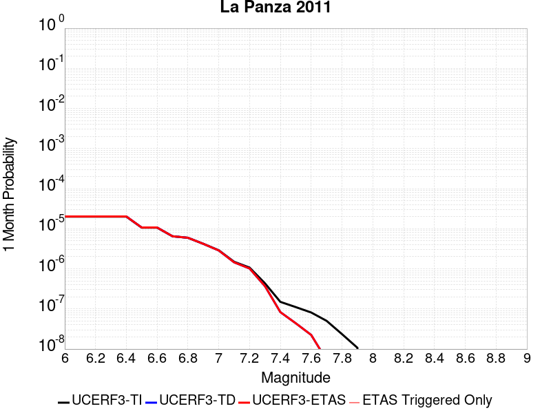 |  |  |

| Magnitude | 1 wk TI Prob | 1 wk TD Prob | 1 wk ETAS Prob | 1 wk ETAS/TD Gain | 1 wk ETAS Triggered Only | 1 mo TI Prob | 1 mo TD Prob | 1 mo ETAS Prob | 1 mo ETAS/TD Gain | 1 mo ETAS Triggered Only | 1 yr TI Prob | 1 yr TD Prob | 1 yr ETAS Prob | 1 yr ETAS/TD Gain | 1 yr ETAS Triggered Only | 10 yr TI Prob | 10 yr TD Prob | 10 yr ETAS Prob | 10 yr ETAS/TD Gain | 10 yr ETAS Triggered Only |
|-----|-----|-----|-----|-----|-----|-----|-----|-----|-----|-----|-----|-----|-----|-----|-----|-----|-----|-----|-----|-----|
| 6.0 | 4.6754544E-6 | 4.7175886E-6 | 4.7175886E-6 | 1.0 | 0.0 | 2.0037509E-5 | 2.021809E-5 | 2.021809E-5 | 1.0 | 0.0 | 2.4392935E-4 | 2.4612944E-4 | 2.5612698E-4 | 1.040619 | 1.0E-5 | 0.0024366176 | 0.0024587628 | 0.0024787136 | 1.0081142 | 2.0E-5 |
| 6.1 | 4.6754544E-6 | 4.7175886E-6 | 4.7175886E-6 | 1.0 | 0.0 | 2.0037509E-5 | 2.021809E-5 | 2.021809E-5 | 1.0 | 0.0 | 2.4392935E-4 | 2.4612944E-4 | 2.5612698E-4 | 1.040619 | 1.0E-5 | 0.0024366176 | 0.0024587628 | 0.0024787136 | 1.0081142 | 2.0E-5 |
| 6.2 | 4.6754544E-6 | 4.7175886E-6 | 4.7175886E-6 | 1.0 | 0.0 | 2.0037509E-5 | 2.021809E-5 | 2.021809E-5 | 1.0 | 0.0 | 2.4392935E-4 | 2.4612944E-4 | 2.5612698E-4 | 1.040619 | 1.0E-5 | 0.0024366176 | 0.0024587628 | 0.0024787136 | 1.0081142 | 2.0E-5 |
| 6.3 | 4.6754544E-6 | 4.7175886E-6 | 4.7175886E-6 | 1.0 | 0.0 | 2.0037509E-5 | 2.021809E-5 | 2.021809E-5 | 1.0 | 0.0 | 2.4392935E-4 | 2.4612944E-4 | 2.5612698E-4 | 1.040619 | 1.0E-5 | 0.0024366176 | 0.0024587628 | 0.0024787136 | 1.0081142 | 2.0E-5 |
| 6.4 | 4.6754544E-6 | 4.7175886E-6 | 4.7175886E-6 | 1.0 | 0.0 | 2.0037509E-5 | 2.021809E-5 | 2.021809E-5 | 1.0 | 0.0 | 2.4392935E-4 | 2.4612944E-4 | 2.5612698E-4 | 1.040619 | 1.0E-5 | 0.0024366176 | 0.0024587628 | 0.0024787136 | 1.0081142 | 2.0E-5 |
| 6.5 | 2.485343E-6 | 2.5006007E-6 | 2.5006007E-6 | 1.0 | 0.0 | 1.0651426E-5 | 1.0716818E-5 | 1.0716818E-5 | 1.0 | 0.0 | 1.296734E-4 | 1.3046984E-4 | 1.4046853E-4 | 1.0766361 | 1.0E-5 | 0.0012959775 | 0.0013039707 | 0.0013239447 | 1.0153178 | 2.0E-5 |
| 6.6 | 2.485343E-6 | 2.5006007E-6 | 2.5006007E-6 | 1.0 | 0.0 | 1.0651426E-5 | 1.0716818E-5 | 1.0716818E-5 | 1.0 | 0.0 | 1.296734E-4 | 1.3046984E-4 | 1.4046853E-4 | 1.0766361 | 1.0E-5 | 0.0012959775 | 0.0013039707 | 0.0013239447 | 1.0153178 | 2.0E-5 |
| 6.7 | 1.5108508E-6 | 1.514639E-6 | 1.514639E-6 | 1.0 | 0.0 | 6.4750584E-6 | 6.4912947E-6 | 6.4912947E-6 | 1.0 | 0.0 | 7.8830984E-5 | 7.902876E-5 | 8.902797E-5 | 1.1265262 | 1.0E-5 | 7.880303E-4 | 7.9001737E-4 | 8.0000947E-4 | 1.012648 | 1.0E-5 |
| 6.8 | 1.3865837E-6 | 1.3885118E-6 | 1.3885118E-6 | 1.0 | 0.0 | 5.942488E-6 | 5.950752E-6 | 5.950752E-6 | 1.0 | 0.0 | 7.234739E-5 | 7.244809E-5 | 8.244737E-5 | 1.1380198 | 1.0E-5 | 7.232384E-4 | 7.242546E-4 | 7.342473E-4 | 1.0137973 | 1.0E-5 |
| 6.9 | 9.826583E-7 | 9.796303E-7 | 9.796303E-7 | 1.0 | 0.0 | 4.2113857E-6 | 4.198409E-6 | 4.198409E-6 | 1.0 | 0.0 | 5.1272415E-5 | 5.1114486E-5 | 6.111398E-5 | 1.1956292 | 1.0E-5 | 5.126059E-4 | 5.1103265E-4 | 5.2102754E-4 | 1.0195582 | 1.0E-5 |
| 7.0 | 6.7797646E-7 | 6.710231E-7 | 6.710231E-7 | 1.0 | 0.0 | 2.9056102E-6 | 2.8758104E-6 | 2.8758104E-6 | 1.0 | 0.0 | 3.537523E-5 | 3.501246E-5 | 4.501211E-5 | 1.2856026 | 1.0E-5 | 3.5369597E-4 | 3.5007254E-4 | 3.6006904E-4 | 1.0285555 | 1.0E-5 |
| 7.1 | 3.4979826E-7 | 3.3874045E-7 | 3.3874045E-7 | 1.0 | 0.0 | 1.4991346E-6 | 1.4517441E-6 | 1.4517441E-6 | 1.0 | 0.0 | 1.825181E-5 | 1.7674853E-5 | 1.7674853E-5 | 1.0 | 0.0 | 1.825031E-4 | 1.7673563E-4 | 1.7673563E-4 | 1.0 | 0.0 |
| 7.2 | 2.5088332E-7 | 2.3832064E-7 | 2.3832064E-7 | 1.0 | 0.0 | 1.0752137E-6 | 1.0213738E-6 | 1.0213738E-6 | 1.0 | 0.0 | 1.3090649E-5 | 1.2435164E-5 | 1.2435164E-5 | 1.0 | 0.0 | 1.3089878E-4 | 1.2434553E-4 | 1.2434553E-4 | 1.0 | 0.0 |
| 7.3 | 1.0159086E-7 | 8.644785E-8 | 8.644785E-8 | 1.0 | 0.0 | 4.3538932E-7 | 3.704907E-7 | 3.704907E-7 | 1.0 | 0.0 | 5.300852E-6 | 4.510716E-6 | 4.510716E-6 | 1.0 | 0.0 | 5.3007258E-5 | 4.510628E-5 | 4.510628E-5 | 1.0 | 0.0 |
| 7.4 | 3.5006252E-8 | 1.9403883E-8 | 1.9403883E-8 | 1.0 | 0.0 | 1.5002678E-7 | 8.315949E-8 | 8.315949E-8 | 1.0 | 0.0 | 1.8265745E-6 | 1.0124663E-6 | 1.0124663E-6 | 1.0 | 0.0 | 1.8265595E-5 | 1.012462E-5 | 1.012462E-5 | 1.0 | 0.0 |
| 7.5 | 2.592274E-8 | 1.0238468E-8 | 1.0238468E-8 | 1.0 | 0.0 | 1.1109746E-7 | 4.3879147E-8 | 4.3879147E-8 | 1.0 | 0.0 | 1.3526106E-6 | 5.342285E-7 | 5.342285E-7 | 1.0 | 0.0 | 1.3526024E-5 | 5.342273E-6 | 5.342273E-6 | 1.0 | 0.0 |
| 7.6 | 1.9016717E-8 | 5.2442264E-9 | 5.2442264E-9 | 1.0 | 0.0 | 8.150022E-8 | 2.2475257E-8 | 2.2475257E-8 | 1.0 | 0.0 | 9.922647E-7 | 2.736362E-7 | 2.736362E-7 | 1.0 | 0.0 | 9.922603E-6 | 2.736359E-6 | 2.736359E-6 | 1.0 | 0.0 |
| 7.7 | 1.17738495E-8 | 1.2393437E-9 | 1.2393437E-9 | 1.0 | 0.0 | 5.0459356E-8 | 5.3114735E-9 | 5.3114735E-9 | 1.0 | 0.0 | 6.1434247E-7 | 6.466719E-8 | 6.466719E-8 | 1.0 | 0.0 | 6.143408E-6 | 6.466717E-7 | 6.466717E-7 | 1.0 | 0.0 |
| 7.8 | 5.489079E-9 | 2.009185E-10 | 2.009185E-10 | 1.0 | 0.0 | 2.3524624E-8 | 8.61079E-10 | 8.61079E-10 | 1.0 | 0.0 | 2.8641225E-7 | 1.0483639E-8 | 1.0483639E-8 | 1.0 | 0.0 | 2.8641189E-6 | 1.0483638E-7 | 1.0483638E-7 | 1.0 | 0.0 |
| 7.9 | 2.5081048E-9 | 6.675449E-11 | 6.675449E-11 | 1.0 | 0.0 | 1.0749021E-8 | 2.8609015E-10 | 2.8609015E-10 | 1.0 | 0.0 | 1.3086932E-7 | 3.483148E-9 | 3.483148E-9 | 1.0 | 0.0 | 1.3086925E-6 | 3.483148E-8 | 3.483148E-8 | 1.0 | 0.0 |

## Calaveras (No) 2011 CFM
*[(top)](#table-of-contents)*

| 1 Week | 1 Month | 1 Year | 10 Year |
|-----|-----|-----|-----|
|  |  |  |  |

| Magnitude | 1 wk TI Prob | 1 wk TD Prob | 1 wk ETAS Prob | 1 wk ETAS/TD Gain | 1 wk ETAS Triggered Only | 1 mo TI Prob | 1 mo TD Prob | 1 mo ETAS Prob | 1 mo ETAS/TD Gain | 1 mo ETAS Triggered Only | 1 yr TI Prob | 1 yr TD Prob | 1 yr ETAS Prob | 1 yr ETAS/TD Gain | 1 yr ETAS Triggered Only | 10 yr TI Prob | 10 yr TD Prob | 10 yr ETAS Prob | 10 yr ETAS/TD Gain | 10 yr ETAS Triggered Only |
|-----|-----|-----|-----|-----|-----|-----|-----|-----|-----|-----|-----|-----|-----|-----|-----|-----|-----|-----|-----|-----|
| 6.0 | 4.8694856E-5 | 6.747457E-5 | 6.747457E-5 | 1.0 | 0.0 | 2.0867554E-4 | 2.891453E-4 | 2.891453E-4 | 1.0 | 0.0 | 0.0025376645 | 0.0035146773 | 0.0035246422 | 1.0028352 | 1.0E-5 | 0.02508881 | 0.034771074 | 0.034790378 | 1.0005552 | 2.0E-5 |
| 6.1 | 4.8694856E-5 | 6.747457E-5 | 6.747457E-5 | 1.0 | 0.0 | 2.0867554E-4 | 2.891453E-4 | 2.891453E-4 | 1.0 | 0.0 | 0.0025376645 | 0.0035146773 | 0.0035246422 | 1.0028352 | 1.0E-5 | 0.02508881 | 0.034771074 | 0.034790378 | 1.0005552 | 2.0E-5 |
| 6.2 | 4.7541962E-5 | 6.5805805E-5 | 6.5805805E-5 | 1.0 | 0.0 | 2.0373536E-4 | 2.8199502E-4 | 2.8199502E-4 | 1.0 | 0.0 | 0.0024776561 | 0.003427919 | 0.0034378846 | 1.0029073 | 1.0E-5 | 0.024502134 | 0.0339325 | 0.03395182 | 1.0005695 | 2.0E-5 |
| 6.3 | 4.6717287E-5 | 6.463939E-5 | 6.463939E-5 | 1.0 | 0.0 | 2.0020158E-4 | 2.7699716E-4 | 2.7699716E-4 | 1.0 | 0.0 | 0.0024347296 | 0.0033672696 | 0.003377236 | 1.0029597 | 1.0E-5 | 0.024082264 | 0.033345006 | 0.03336434 | 1.0005798 | 2.0E-5 |
| 6.4 | 4.6276386E-5 | 6.400103E-5 | 6.400103E-5 | 1.0 | 0.0 | 1.983123E-4 | 2.7426204E-4 | 2.7426204E-4 | 1.0 | 0.0 | 0.0024117786 | 0.00333408 | 0.0033440467 | 1.0029893 | 1.0E-5 | 0.02385771 | 0.03302388 | 0.03304322 | 1.0005857 | 2.0E-5 |
| 6.5 | 4.5720994E-5 | 6.32025E-5 | 6.32025E-5 | 1.0 | 0.0 | 1.9593239E-4 | 2.7084045E-4 | 2.7084045E-4 | 1.0 | 0.0 | 0.002382867 | 0.0032925585 | 0.0033025257 | 1.0030272 | 1.0E-5 | 0.023574775 | 0.032621842 | 0.03264119 | 1.0005931 | 2.0E-5 |
| 6.6 | 4.549134E-5 | 6.285557E-5 | 6.285557E-5 | 1.0 | 0.0 | 1.949483E-4 | 2.693539E-4 | 2.693539E-4 | 1.0 | 0.0 | 0.0023709119 | 0.0032745146 | 0.0032844818 | 1.0030439 | 1.0E-5 | 0.023457756 | 0.03244731 | 0.03246666 | 1.0005964 | 2.0E-5 |
| 6.7 | 3.701047E-5 | 5.03607E-5 | 5.03607E-5 | 1.0 | 0.0 | 1.5860666E-4 | 2.1581395E-4 | 2.1581395E-4 | 1.0 | 0.0 | 0.0019293258 | 0.002624412 | 0.002624412 | 1.0 | 0.0 | 0.019126613 | 0.026125198 | 0.026125198 | 1.0 | 0.0 |
| 6.8 | 3.5523568E-5 | 4.834225E-5 | 4.834225E-5 | 1.0 | 0.0 | 1.5223498E-4 | 2.0716486E-4 | 2.0716486E-4 | 1.0 | 0.0 | 0.0018518851 | 0.0025193577 | 0.0025193577 | 1.0 | 0.0 | 0.018365284 | 0.025097623 | 0.025097623 | 1.0 | 0.0 |
| 6.9 | 3.2946147E-5 | 4.4663826E-5 | 4.4663826E-5 | 1.0 | 0.0 | 1.4119013E-4 | 1.9140259E-4 | 1.9140259E-4 | 1.0 | 0.0 | 0.0017176344 | 0.0023278783 | 0.0023278783 | 1.0 | 0.0 | 0.017044188 | 0.023219762 | 0.023219762 | 1.0 | 0.0 |
| 7.0 | 2.7682381E-5 | 3.7023216E-5 | 3.7023216E-5 | 1.0 | 0.0 | 1.1863338E-4 | 1.5866144E-4 | 1.5866144E-4 | 1.0 | 0.0 | 0.0014434044 | 0.0019300217 | 0.0019300217 | 1.0 | 0.0 | 0.01434065 | 0.019311164 | 0.019311164 | 1.0 | 0.0 |
| 7.1 | 2.471967E-5 | 3.328756E-5 | 3.328756E-5 | 1.0 | 0.0 | 1.05937135E-4 | 1.4265333E-4 | 1.4265333E-4 | 1.0 | 0.0 | 0.0012890215 | 0.0017354497 | 0.0017354497 | 1.0 | 0.0 | 0.0128157 | 0.017386293 | 0.017386293 | 1.0 | 0.0 |
| 7.2 | 1.9748062E-5 | 2.6775411E-5 | 2.6775411E-5 | 1.0 | 0.0 | 8.463181E-5 | 1.1474685E-4 | 1.1474685E-4 | 1.0 | 0.0 | 0.0010299052 | 0.001396171 | 0.001396171 | 1.0 | 0.0 | 0.01025145 | 0.014031046 | 0.014031046 | 1.0 | 0.0 |
| 7.3 | 1.1603734E-5 | 1.5784257E-5 | 1.5784257E-5 | 1.0 | 0.0 | 4.9729337E-5 | 6.7645145E-5 | 6.7645145E-5 | 1.0 | 0.0 | 6.052865E-4 | 8.232826E-4 | 8.232826E-4 | 1.0 | 0.0 | 0.0060364045 | 0.008308739 | 0.008308739 | 1.0 | 0.0 |
| 7.4 | 4.885381E-6 | 6.035117E-6 | 6.035117E-6 | 1.0 | 0.0 | 2.0937177E-5 | 2.5864532E-5 | 2.5864532E-5 | 1.0 | 0.0 | 2.5488032E-4 | 3.1485534E-4 | 3.1485534E-4 | 1.0 | 0.0 | 0.0025458818 | 0.0032009764 | 0.0032009764 | 1.0 | 0.0 |
| 7.5 | 3.0571264E-6 | 4.1554085E-6 | 4.1554085E-6 | 1.0 | 0.0 | 1.3101904E-5 | 1.7808772E-5 | 1.7808772E-5 | 1.0 | 0.0 | 1.5950401E-4 | 2.1680034E-4 | 2.1680034E-4 | 1.0 | 0.0 | 0.0015938957 | 0.0022209007 | 0.0022209007 | 1.0 | 0.0 |
| 7.6 | 1.764948E-6 | 2.795641E-6 | 2.795641E-6 | 1.0 | 0.0 | 7.564041E-6 | 1.1981264E-5 | 1.1981264E-5 | 1.0 | 0.0 | 9.208831E-5 | 1.458622E-4 | 1.458622E-4 | 1.0 | 0.0 | 9.205016E-4 | 0.0015124046 | 0.0015124046 | 1.0 | 0.0 |
| 7.7 | 1.3173734E-6 | 2.0585271E-6 | 2.0585271E-6 | 1.0 | 0.0 | 5.645874E-6 | 8.82223E-6 | 8.82223E-6 | 1.0 | 0.0 | 6.873634E-5 | 1.0740537E-4 | 1.0740537E-4 | 1.0 | 0.0 | 6.8715087E-4 | 0.0011261607 | 0.0011261607 | 1.0 | 0.0 |
| 7.8 | 9.4429885E-7 | 1.5490102E-6 | 1.5490102E-6 | 1.0 | 0.0 | 4.0469886E-6 | 6.6385983E-6 | 6.6385983E-6 | 1.0 | 0.0 | 4.9270973E-5 | 8.082195E-5 | 8.082195E-5 | 1.0 | 0.0 | 4.926005E-4 | 8.501931E-4 | 8.501931E-4 | 1.0 | 0.0 |
| 7.9 | 6.388233E-7 | 1.11492E-6 | 1.11492E-6 | 1.0 | 0.0 | 2.7378112E-6 | 4.7782196E-6 | 4.7782196E-6 | 1.0 | 0.0 | 3.3332344E-5 | 5.8173282E-5 | 5.8173282E-5 | 1.0 | 0.0 | 3.3327343E-4 | 6.096674E-4 | 6.096674E-4 | 1.0 | 0.0 |
| 8.0 | 3.087986E-7 | 5.754721E-7 | 5.754721E-7 | 1.0 | 0.0 | 1.323422E-6 | 2.4663066E-6 | 2.4663066E-6 | 1.0 | 0.0 | 1.6112543E-5 | 3.0026871E-5 | 3.0026871E-5 | 1.0 | 0.0 | 1.6111376E-4 | 3.110238E-4 | 3.110238E-4 | 1.0 | 0.0 |
| 8.1 | 1.6725647E-7 | 2.7410795E-7 | 2.7410795E-7 | 1.0 | 0.0 | 7.168133E-7 | 1.1747478E-6 | 1.1747478E-6 | 1.0 | 0.0 | 8.7271665E-6 | 1.4302462E-5 | 1.4302462E-5 | 1.0 | 0.0 | 8.726824E-5 | 1.4847395E-4 | 1.4847395E-4 | 1.0 | 0.0 |

## Hayward (No) 2011 CFM
*[(top)](#table-of-contents)*

| 1 Week | 1 Month | 1 Year | 10 Year |
|-----|-----|-----|-----|
|  |  |  |  |

| Magnitude | 1 wk TI Prob | 1 wk TD Prob | 1 wk ETAS Prob | 1 wk ETAS/TD Gain | 1 wk ETAS Triggered Only | 1 mo TI Prob | 1 mo TD Prob | 1 mo ETAS Prob | 1 mo ETAS/TD Gain | 1 mo ETAS Triggered Only | 1 yr TI Prob | 1 yr TD Prob | 1 yr ETAS Prob | 1 yr ETAS/TD Gain | 1 yr ETAS Triggered Only | 10 yr TI Prob | 10 yr TD Prob | 10 yr ETAS Prob | 10 yr ETAS/TD Gain | 10 yr ETAS Triggered Only |
|-----|-----|-----|-----|-----|-----|-----|-----|-----|-----|-----|-----|-----|-----|-----|-----|-----|-----|-----|-----|-----|
| 6.0 | 9.3068506E-5 | 1.739643E-4 | 1.8396258E-4 | 1.0574731 | 1.0E-5 | 3.9880406E-4 | 7.453474E-4 | 7.653325E-4 | 1.0268131 | 2.0E-5 | 0.0048446343 | 0.009036727 | 0.009056547 | 1.0021932 | 2.0E-5 | 0.047403704 | 0.086396605 | 0.08641488 | 1.0002115 | 2.0E-5 |
| 6.1 | 9.055486E-5 | 1.6947639E-4 | 1.794747E-4 | 1.0589952 | 1.0E-5 | 3.880345E-4 | 7.2612526E-4 | 7.4611075E-4 | 1.0275234 | 2.0E-5 | 0.0047140904 | 0.008804814 | 0.008824638 | 1.0022515 | 2.0E-5 | 0.046153355 | 0.08428568 | 0.08430399 | 1.0002173 | 2.0E-5 |
| 6.2 | 9.006742E-5 | 1.6868232E-4 | 1.7868062E-4 | 1.059273 | 1.0E-5 | 3.859461E-4 | 7.227246E-4 | 7.4271014E-4 | 1.0276531 | 2.0E-5 | 0.0046887742 | 0.00876378 | 0.008783604 | 1.0022621 | 2.0E-5 | 0.0459107 | 0.08390991 | 0.08392823 | 1.0002184 | 2.0E-5 |
| 6.3 | 8.8336754E-5 | 1.6547782E-4 | 1.7547616E-4 | 1.0604211 | 1.0E-5 | 3.7853114E-4 | 7.0899865E-4 | 7.289845E-4 | 1.0281888 | 2.0E-5 | 0.004598882 | 0.008598051 | 0.00861788 | 1.0023061 | 2.0E-5 | 0.04504866 | 0.08240195 | 0.082420304 | 1.0002227 | 2.0E-5 |
| 6.4 | 8.526157E-5 | 1.5974796E-4 | 1.6974636E-4 | 1.0625886 | 1.0E-5 | 3.6535555E-4 | 6.844552E-4 | 7.044415E-4 | 1.0292003 | 2.0E-5 | 0.0044391346 | 0.00830156 | 0.008321393 | 1.0023892 | 2.0E-5 | 0.043514993 | 0.07968467 | 0.07970307 | 1.000231 | 2.0E-5 |
| 6.5 | 8.152396E-5 | 1.5307199E-4 | 1.6307046E-4 | 1.0653187 | 1.0E-5 | 3.493416E-4 | 6.558586E-4 | 6.6585204E-4 | 1.0152372 | 1.0E-5 | 0.0042449418 | 0.007955993 | 0.007965913 | 1.0012469 | 1.0E-5 | 0.04164765 | 0.07651448 | 0.07652372 | 1.0001206 | 1.0E-5 |
| 6.6 | 7.987405E-5 | 1.5011412E-4 | 1.6011261E-4 | 1.066606 | 1.0E-5 | 3.4227243E-4 | 6.431883E-4 | 6.5318187E-4 | 1.0155375 | 1.0E-5 | 0.0041592065 | 0.007802858 | 0.00781278 | 1.0012716 | 1.0E-5 | 0.04082218 | 0.075105876 | 0.07511512 | 1.0001231 | 1.0E-5 |
| 6.7 | 7.777665E-5 | 1.4650672E-4 | 1.5650525E-4 | 1.0682462 | 1.0E-5 | 3.332859E-4 | 6.277355E-4 | 6.3772924E-4 | 1.0159203 | 1.0E-5 | 0.004050208 | 0.007616053 | 0.0076259766 | 1.001303 | 1.0E-5 | 0.039771806 | 0.0733825 | 0.073391765 | 1.0001262 | 1.0E-5 |
| 6.8 | 7.3284005E-5 | 1.3801287E-4 | 1.4801149E-4 | 1.0724471 | 1.0E-5 | 3.140365E-4 | 5.9135025E-4 | 6.0134433E-4 | 1.0169004 | 1.0E-5 | 0.0038166929 | 0.007176059 | 0.007185987 | 1.0013835 | 1.0E-5 | 0.037518036 | 0.06929624 | 0.069305554 | 1.0001343 | 1.0E-5 |
| 6.9 | 6.458263E-5 | 1.21319164E-4 | 1.21319164E-4 | 1.0 | 0.0 | 2.7675333E-4 | 5.1983615E-4 | 5.1983615E-4 | 1.0 | 0.0 | 0.0033642664 | 0.0063107396 | 0.0063107396 | 1.0 | 0.0 | 0.033137884 | 0.061224625 | 0.061224625 | 1.0 | 0.0 |
| 7.0 | 5.3853604E-5 | 1.00254634E-4 | 1.00254634E-4 | 1.0 | 0.0 | 2.3078074E-4 | 4.295923E-4 | 4.295923E-4 | 1.0 | 0.0 | 0.0028061352 | 0.0052178074 | 0.0052178074 | 1.0 | 0.0 | 0.027709642 | 0.050957024 | 0.050957024 | 1.0 | 0.0 |
| 7.1 | 4.4308683E-5 | 8.17098E-5 | 8.17098E-5 | 1.0 | 0.0 | 1.8988053E-4 | 3.5013806E-4 | 3.5013806E-4 | 1.0 | 0.0 | 0.0023093442 | 0.0042546396 | 0.0042546396 | 1.0 | 0.0 | 0.022854926 | 0.041824497 | 0.041824497 | 1.0 | 0.0 |
| 7.2 | 3.295973E-5 | 6.0774026E-5 | 6.0774026E-5 | 1.0 | 0.0 | 1.4124835E-4 | 2.6043423E-4 | 2.6043423E-4 | 1.0 | 0.0 | 0.0017183421 | 0.0031661994 | 0.0031661994 | 1.0 | 0.0 | 0.017051157 | 0.031370014 | 0.031370014 | 1.0 | 0.0 |
| 7.3 | 2.452256E-5 | 4.518223E-5 | 4.518223E-5 | 1.0 | 0.0 | 1.05092455E-4 | 1.9362383E-4 | 1.9362383E-4 | 1.0 | 0.0 | 0.0012787496 | 0.0023548352 | 0.0023548352 | 1.0 | 0.0 | 0.0127141625 | 0.023442036 | 0.023442036 | 1.0 | 0.0 |
| 7.4 | 1.8829967E-5 | 3.4604043E-5 | 3.4604043E-5 | 1.0 | 0.0 | 8.069736E-5 | 1.4829468E-4 | 1.4829468E-4 | 1.0 | 0.0 | 9.820475E-4 | 0.0018040023 | 0.0018040023 | 1.0 | 0.0 | 0.009777189 | 0.01802003 | 0.01802003 | 1.0 | 0.0 |
| 7.5 | 1.26374125E-5 | 2.292219E-5 | 2.292219E-5 | 1.0 | 0.0 | 5.4159216E-5 | 9.823428E-5 | 9.823428E-5 | 1.0 | 0.0 | 6.5918895E-4 | 0.0011953521 | 0.0011953521 | 1.0 | 0.0 | 0.00657237 | 0.011988704 | 0.011988704 | 1.0 | 0.0 |
| 7.6 | 4.666429E-6 | 8.479636E-6 | 8.479636E-6 | 1.0 | 0.0 | 1.9998828E-5 | 3.6340796E-5 | 3.6340796E-5 | 1.0 | 0.0 | 2.4345852E-4 | 4.423606E-4 | 4.423606E-4 | 1.0 | 0.0 | 0.0024319198 | 0.004458377 | 0.004458377 | 1.0 | 0.0 |
| 7.7 | 3.8399318E-7 | 7.1343146E-7 | 7.1343146E-7 | 1.0 | 0.0 | 1.6456839E-6 | 3.0575598E-6 | 3.0575598E-6 | 1.0 | 0.0 | 2.003602E-5 | 3.7225156E-5 | 3.7225156E-5 | 1.0 | 0.0 | 2.0034213E-4 | 3.86166E-4 | 3.86166E-4 | 1.0 | 0.0 |
| 7.8 | 2.5637698E-7 | 5.3666145E-7 | 5.3666145E-7 | 1.0 | 0.0 | 1.098758E-6 | 2.2999754E-6 | 2.2999754E-6 | 1.0 | 0.0 | 1.3377297E-5 | 2.8001843E-5 | 2.8001843E-5 | 1.0 | 0.0 | 1.3376492E-4 | 2.9246495E-4 | 2.9246495E-4 | 1.0 | 0.0 |
| 7.9 | 1.7141245E-7 | 3.7293606E-7 | 3.7293606E-7 | 1.0 | 0.0 | 7.3462456E-7 | 1.5982963E-6 | 1.5982963E-6 | 1.0 | 0.0 | 8.944017E-6 | 1.9459085E-5 | 1.9459085E-5 | 1.0 | 0.0 | 8.943657E-5 | 2.0246378E-4 | 2.0246378E-4 | 1.0 | 0.0 |
| 8.0 | 1.1808895E-7 | 2.7512246E-7 | 2.7512246E-7 | 1.0 | 0.0 | 5.060954E-7 | 1.1790958E-6 | 1.1790958E-6 | 1.0 | 0.0 | 6.161694E-6 | 1.4355397E-5 | 1.4355397E-5 | 1.0 | 0.0 | 6.161523E-5 | 1.4817173E-4 | 1.4817173E-4 | 1.0 | 0.0 |
| 8.1 | 5.138535E-8 | 1.12307575E-7 | 1.12307575E-7 | 1.0 | 0.0 | 2.2022292E-7 | 4.8131807E-7 | 4.8131807E-7 | 1.0 | 0.0 | 2.6812106E-6 | 5.860032E-6 | 5.860032E-6 | 1.0 | 0.0 | 2.6811784E-5 | 6.0156468E-5 | 6.0156468E-5 | 1.0 | 0.0 |

## Hunting Creek - Bartlett Springs connector 2011
*[(top)](#table-of-contents)*

| 1 Week | 1 Month | 1 Year | 10 Year |
|-----|-----|-----|-----|
|  |  |  |  |

| Magnitude | 1 wk TI Prob | 1 wk TD Prob | 1 wk ETAS Prob | 1 wk ETAS/TD Gain | 1 wk ETAS Triggered Only | 1 mo TI Prob | 1 mo TD Prob | 1 mo ETAS Prob | 1 mo ETAS/TD Gain | 1 mo ETAS Triggered Only | 1 yr TI Prob | 1 yr TD Prob | 1 yr ETAS Prob | 1 yr ETAS/TD Gain | 1 yr ETAS Triggered Only | 10 yr TI Prob | 10 yr TD Prob | 10 yr ETAS Prob | 10 yr ETAS/TD Gain | 10 yr ETAS Triggered Only |
|-----|-----|-----|-----|-----|-----|-----|-----|-----|-----|-----|-----|-----|-----|-----|-----|-----|-----|-----|-----|-----|
| 6.0 | 4.940016E-5 | 6.7870766E-5 | 7.7870085E-5 | 1.1473289 | 1.0E-5 | 2.1169778E-4 | 2.9084194E-4 | 3.0083905E-4 | 1.0343729 | 1.0E-5 | 0.002574374 | 0.0035350819 | 0.003555011 | 1.0056375 | 2.0E-5 | 0.025447546 | 0.03477475 | 0.034794055 | 1.0005552 | 2.0E-5 |
| 6.1 | 4.940016E-5 | 6.7870766E-5 | 7.7870085E-5 | 1.1473289 | 1.0E-5 | 2.1169778E-4 | 2.9084194E-4 | 3.0083905E-4 | 1.0343729 | 1.0E-5 | 0.002574374 | 0.0035350819 | 0.003555011 | 1.0056375 | 2.0E-5 | 0.025447546 | 0.03477475 | 0.034794055 | 1.0005552 | 2.0E-5 |
| 6.2 | 4.472471E-5 | 6.100572E-5 | 6.100572E-5 | 1.0 | 0.0 | 1.9166325E-4 | 2.6142647E-4 | 2.6142647E-4 | 1.0 | 0.0 | 0.0023310026 | 0.0031781218 | 0.0031880902 | 1.0031365 | 1.0E-5 | 0.02306703 | 0.031317808 | 0.031327493 | 1.0003093 | 1.0E-5 |
| 6.3 | 4.472471E-5 | 6.100572E-5 | 6.100572E-5 | 1.0 | 0.0 | 1.9166325E-4 | 2.6142647E-4 | 2.6142647E-4 | 1.0 | 0.0 | 0.0023310026 | 0.0031781218 | 0.0031880902 | 1.0031365 | 1.0E-5 | 0.02306703 | 0.031317808 | 0.031327493 | 1.0003093 | 1.0E-5 |
| 6.4 | 4.0001003E-5 | 5.410516E-5 | 5.410516E-5 | 1.0 | 0.0 | 1.714216E-4 | 2.318579E-4 | 2.318579E-4 | 1.0 | 0.0 | 0.0020850603 | 0.0028191686 | 0.0028291403 | 1.0035372 | 1.0E-5 | 0.02065605 | 0.027829198 | 0.027838921 | 1.0003493 | 1.0E-5 |
| 6.5 | 3.8033053E-5 | 5.126649E-5 | 5.126649E-5 | 1.0 | 0.0 | 1.6298861E-4 | 2.1969521E-4 | 2.1969521E-4 | 1.0 | 0.0 | 0.0019825802 | 0.0026714848 | 0.0026814581 | 1.0037333 | 1.0E-5 | 0.019649856 | 0.026391273 | 0.02640101 | 1.000369 | 1.0E-5 |
| 6.6 | 3.653754E-5 | 4.912955E-5 | 4.912955E-5 | 1.0 | 0.0 | 1.5658008E-4 | 2.1053842E-4 | 2.1053842E-4 | 1.0 | 0.0 | 0.0019046954 | 0.0025602889 | 0.002570263 | 1.0038958 | 1.0E-5 | 0.018884527 | 0.025307199 | 0.025316946 | 1.0003852 | 1.0E-5 |
| 6.7 | 3.372024E-5 | 4.5140216E-5 | 4.5140216E-5 | 1.0 | 0.0 | 1.4450731E-4 | 1.9344388E-4 | 1.9344388E-4 | 1.0 | 0.0 | 0.0017579567 | 0.0023526535 | 0.00236263 | 1.0042405 | 1.0E-5 | 0.017441148 | 0.023278862 | 0.023288628 | 1.0004196 | 1.0E-5 |
| 6.8 | 2.9650024E-5 | 3.9411647E-5 | 3.9411647E-5 | 1.0 | 0.0 | 1.2706534E-4 | 1.6889606E-4 | 1.6889606E-4 | 1.0 | 0.0 | 0.0015459227 | 0.0020543607 | 0.00206434 | 1.0048577 | 1.0E-5 | 0.015352124 | 0.020351961 | 0.020361759 | 1.0004814 | 1.0E-5 |
| 6.9 | 2.860775E-5 | 3.7812886E-5 | 3.7812886E-5 | 1.0 | 0.0 | 1.2259888E-4 | 1.620452E-4 | 1.620452E-4 | 1.0 | 0.0 | 0.0014916194 | 0.0019711219 | 0.0019811022 | 1.0050633 | 1.0E-5 | 0.014816469 | 0.019536555 | 0.01954636 | 1.0005019 | 1.0E-5 |
| 7.0 | 2.6696067E-5 | 3.5067544E-5 | 3.5067544E-5 | 1.0 | 0.0 | 1.144067E-4 | 1.5028086E-4 | 1.5028086E-4 | 1.0 | 0.0 | 0.0013920115 | 0.0018281427 | 0.0018381244 | 1.00546 | 1.0E-5 | 0.013833242 | 0.01813184 | 0.018141657 | 1.0005416 | 1.0E-5 |
| 7.1 | 2.456087E-5 | 3.2013326E-5 | 3.2013326E-5 | 1.0 | 0.0 | 1.0525662E-4 | 1.3719281E-4 | 1.3719281E-4 | 1.0 | 0.0 | 0.001280746 | 0.0016690517 | 0.001679035 | 1.0059814 | 1.0E-5 | 0.012733897 | 0.016566671 | 0.016576506 | 1.0005937 | 1.0E-5 |
| 7.2 | 2.295761E-5 | 2.9823148E-5 | 2.9823148E-5 | 1.0 | 0.0 | 9.8386045E-5 | 1.2780727E-4 | 1.2780727E-4 | 1.0 | 0.0 | 0.0011971919 | 0.0015549522 | 0.0015649366 | 1.0064211 | 1.0E-5 | 0.011907627 | 0.015442378 | 0.015452223 | 1.0006375 | 1.0E-5 |
| 7.3 | 2.1256936E-5 | 2.7542124E-5 | 2.7542124E-5 | 1.0 | 0.0 | 9.109797E-5 | 1.1803238E-4 | 1.1803238E-4 | 1.0 | 0.0 | 0.0011085535 | 0.0014361058 | 0.0014460915 | 1.0069532 | 1.0E-5 | 0.011030397 | 0.014269741 | 0.014279598 | 1.0006908 | 1.0E-5 |
| 7.4 | 1.8784336E-5 | 2.430697E-5 | 2.430697E-5 | 1.0 | 0.0 | 8.050181E-5 | 1.0416861E-4 | 1.0416861E-4 | 1.0 | 0.0 | 9.796688E-4 | 0.0012675226 | 0.0012775098 | 1.0078794 | 1.0E-5 | 0.009753612 | 0.012604194 | 0.012614068 | 1.0007834 | 1.0E-5 |
| 7.5 | 1.7248298E-5 | 2.2269056E-5 | 2.2269056E-5 | 1.0 | 0.0 | 7.391918E-5 | 9.543537E-5 | 9.543537E-5 | 1.0 | 0.0 | 8.9959445E-4 | 0.0011613137 | 0.001171302 | 1.008601 | 1.0E-5 | 0.008959615 | 0.011553645 | 0.011563529 | 1.0008556 | 1.0E-5 |
| 7.6 | 1.0653709E-5 | 1.3722259E-5 | 1.3722259E-5 | 1.0 | 0.0 | 4.5657955E-5 | 5.880837E-5 | 5.880837E-5 | 1.0 | 0.0 | 5.557438E-4 | 7.157594E-4 | 7.2575227E-4 | 1.0139612 | 1.0E-5 | 0.0055435603 | 0.0071350415 | 0.00714497 | 1.0013915 | 1.0E-5 |
| 7.7 | 3.286316E-6 | 4.0903997E-6 | 4.0903997E-6 | 1.0 | 0.0 | 1.4084137E-5 | 1.7530168E-5 | 1.7530168E-5 | 1.0 | 0.0 | 1.7146087E-4 | 2.1340905E-4 | 2.2340691E-4 | 1.0468484 | 1.0E-5 | 0.0017132863 | 0.0021320845 | 0.002142063 | 1.0046803 | 1.0E-5 |
| 7.8 | 5.1855085E-7 | 5.972095E-7 | 5.972095E-7 | 1.0 | 0.0 | 2.222359E-6 | 2.5594668E-6 | 2.5594668E-6 | 1.0 | 0.0 | 2.7056883E-5 | 3.1161075E-5 | 3.1161075E-5 | 1.0 | 0.0 | 2.705359E-4 | 3.1156064E-4 | 3.1156064E-4 | 1.0 | 0.0 |

## Santa Susana alt 1
*[(top)](#table-of-contents)*

| 1 Week | 1 Month | 1 Year | 10 Year |
|-----|-----|-----|-----|
|  |  |  |  |

| Magnitude | 1 wk TI Prob | 1 wk TD Prob | 1 wk ETAS Prob | 1 wk ETAS/TD Gain | 1 wk ETAS Triggered Only | 1 mo TI Prob | 1 mo TD Prob | 1 mo ETAS Prob | 1 mo ETAS/TD Gain | 1 mo ETAS Triggered Only | 1 yr TI Prob | 1 yr TD Prob | 1 yr ETAS Prob | 1 yr ETAS/TD Gain | 1 yr ETAS Triggered Only | 10 yr TI Prob | 10 yr TD Prob | 10 yr ETAS Prob | 10 yr ETAS/TD Gain | 10 yr ETAS Triggered Only |
|-----|-----|-----|-----|-----|-----|-----|-----|-----|-----|-----|-----|-----|-----|-----|-----|-----|-----|-----|-----|-----|
| 6.0 | 2.674877E-5 | 2.7198214E-5 | 2.7198214E-5 | 1.0 | 0.0 | 1.1463255E-4 | 1.16559204E-4 | 1.16559204E-4 | 1.0 | 0.0 | 0.0013947578 | 0.0014182981 | 0.0014182981 | 1.0 | 0.0 | 0.013860362 | 0.014104388 | 0.014124106 | 1.001398 | 2.0E-5 |
| 6.1 | 2.674877E-5 | 2.7198214E-5 | 2.7198214E-5 | 1.0 | 0.0 | 1.1463255E-4 | 1.16559204E-4 | 1.16559204E-4 | 1.0 | 0.0 | 0.0013947578 | 0.0014182981 | 0.0014182981 | 1.0 | 0.0 | 0.013860362 | 0.014104388 | 0.014124106 | 1.001398 | 2.0E-5 |
| 6.2 | 2.674877E-5 | 2.7198214E-5 | 2.7198214E-5 | 1.0 | 0.0 | 1.1463255E-4 | 1.16559204E-4 | 1.16559204E-4 | 1.0 | 0.0 | 0.0013947578 | 0.0014182981 | 0.0014182981 | 1.0 | 0.0 | 0.013860362 | 0.014104388 | 0.014124106 | 1.001398 | 2.0E-5 |
| 6.3 | 2.674877E-5 | 2.7198214E-5 | 2.7198214E-5 | 1.0 | 0.0 | 1.1463255E-4 | 1.16559204E-4 | 1.16559204E-4 | 1.0 | 0.0 | 0.0013947578 | 0.0014182981 | 0.0014182981 | 1.0 | 0.0 | 0.013860362 | 0.014104388 | 0.014124106 | 1.001398 | 2.0E-5 |
| 6.4 | 2.674877E-5 | 2.7198214E-5 | 2.7198214E-5 | 1.0 | 0.0 | 1.1463255E-4 | 1.16559204E-4 | 1.16559204E-4 | 1.0 | 0.0 | 0.0013947578 | 0.0014182981 | 0.0014182981 | 1.0 | 0.0 | 0.013860362 | 0.014104388 | 0.014124106 | 1.001398 | 2.0E-5 |
| 6.5 | 2.674877E-5 | 2.7198214E-5 | 2.7198214E-5 | 1.0 | 0.0 | 1.1463255E-4 | 1.16559204E-4 | 1.16559204E-4 | 1.0 | 0.0 | 0.0013947578 | 0.0014182981 | 0.0014182981 | 1.0 | 0.0 | 0.013860362 | 0.014104388 | 0.014124106 | 1.001398 | 2.0E-5 |
| 6.6 | 2.6647976E-5 | 2.7074553E-5 | 2.7074553E-5 | 1.0 | 0.0 | 1.14200615E-4 | 1.16029274E-4 | 1.16029274E-4 | 1.0 | 0.0 | 0.0013895056 | 0.0014118546 | 0.0014118546 | 1.0 | 0.0 | 0.013808494 | 0.014040773 | 0.014060492 | 1.0014044 | 2.0E-5 |
| 6.7 | 2.6647976E-5 | 2.7074553E-5 | 2.7074553E-5 | 1.0 | 0.0 | 1.14200615E-4 | 1.16029274E-4 | 1.16029274E-4 | 1.0 | 0.0 | 0.0013895056 | 0.0014118546 | 0.0014118546 | 1.0 | 0.0 | 0.013808494 | 0.014040773 | 0.014060492 | 1.0014044 | 2.0E-5 |
| 6.8 | 1.9073179E-5 | 1.7637467E-5 | 1.7637467E-5 | 1.0 | 0.0 | 8.1739636E-5 | 7.558706E-5 | 7.558706E-5 | 1.0 | 0.0 | 9.947256E-4 | 9.19902E-4 | 9.19902E-4 | 1.0 | 0.0 | 0.009902848 | 0.009163361 | 0.009183178 | 1.0021626 | 2.0E-5 |
| 6.9 | 1.9041876E-5 | 1.7619597E-5 | 1.7619597E-5 | 1.0 | 0.0 | 8.160549E-5 | 7.551048E-5 | 7.551048E-5 | 1.0 | 0.0 | 9.930939E-4 | 9.189705E-4 | 9.189705E-4 | 1.0 | 0.0 | 0.0098866755 | 0.009154123 | 0.00917394 | 1.0021648 | 2.0E-5 |
| 7.0 | 1.5917482E-5 | 1.3864049E-5 | 1.3864049E-5 | 1.0 | 0.0 | 6.8215995E-5 | 5.9416023E-5 | 5.9416023E-5 | 1.0 | 0.0 | 8.302132E-4 | 7.2315463E-4 | 7.2315463E-4 | 1.0 | 0.0 | 0.008271185 | 0.0072090672 | 0.007228923 | 1.0027543 | 2.0E-5 |
| 7.1 | 1.577788E-5 | 1.3744056E-5 | 1.3744056E-5 | 1.0 | 0.0 | 6.761774E-5 | 5.890179E-5 | 5.890179E-5 | 1.0 | 0.0 | 8.2293496E-4 | 7.16898E-4 | 7.16898E-4 | 1.0 | 0.0 | 0.008198941 | 0.0071469042 | 0.0071667614 | 1.0027784 | 2.0E-5 |
| 7.2 | 1.5416446E-5 | 1.34701295E-5 | 1.34701295E-5 | 1.0 | 0.0 | 6.606882E-5 | 5.7727877E-5 | 5.7727877E-5 | 1.0 | 0.0 | 8.0409093E-4 | 7.026149E-4 | 7.026149E-4 | 1.0 | 0.0 | 0.008011877 | 0.0070049763 | 0.0070248363 | 1.0028352 | 2.0E-5 |
| 7.3 | 1.4534083E-5 | 1.2718032E-5 | 1.2718032E-5 | 1.0 | 0.0 | 6.228744E-5 | 5.4504737E-5 | 5.4504737E-5 | 1.0 | 0.0 | 7.580857E-4 | 6.633976E-4 | 6.633976E-4 | 1.0 | 0.0 | 0.007555048 | 0.0066151717 | 0.006635039 | 1.0030034 | 2.0E-5 |
| 7.4 | 1.2858995E-5 | 1.1229814E-5 | 1.1229814E-5 | 1.0 | 0.0 | 5.5108816E-5 | 4.812691E-5 | 4.812691E-5 | 1.0 | 0.0 | 6.7074323E-4 | 5.8579154E-4 | 5.8579154E-4 | 1.0 | 0.0 | 0.0066872234 | 0.0058433902 | 0.0058632735 | 1.0034027 | 2.0E-5 |
| 7.5 | 8.827668E-6 | 7.805494E-6 | 7.805494E-6 | 1.0 | 0.0 | 3.7832317E-5 | 3.3451703E-5 | 3.3451703E-5 | 1.0 | 0.0 | 4.605111E-4 | 4.072008E-4 | 4.072008E-4 | 1.0 | 0.0 | 0.0045955796 | 0.0040648985 | 0.004084817 | 1.0049002 | 2.0E-5 |
| 7.6 | 3.2533426E-6 | 2.8720106E-6 | 2.8720106E-6 | 1.0 | 0.0 | 1.3942822E-5 | 1.230856E-5 | 1.230856E-5 | 1.0 | 0.0 | 1.6974064E-4 | 1.4984679E-4 | 1.4984679E-4 | 1.0 | 0.0 | 0.0016961104 | 0.0014974943 | 0.0014974943 | 1.0 | 0.0 |
| 7.7 | 1.2751709E-6 | 1.1491339E-6 | 1.1491339E-6 | 1.0 | 0.0 | 5.4650063E-6 | 4.9248506E-6 | 4.9248506E-6 | 1.0 | 0.0 | 6.653442E-5 | 5.99585E-5 | 5.99585E-5 | 1.0 | 0.0 | 6.6514505E-4 | 5.9943215E-4 | 5.9943215E-4 | 1.0 | 0.0 |
| 7.8 | 3.067544E-7 | 3.240052E-7 | 3.240052E-7 | 1.0 | 0.0 | 1.3146611E-6 | 1.3885931E-6 | 1.3885931E-6 | 1.0 | 0.0 | 1.600588E-5 | 1.6906E-5 | 1.6906E-5 | 1.0 | 0.0 | 1.6004729E-4 | 1.6904817E-4 | 1.6904817E-4 | 1.0 | 0.0 |
| 7.9 | 7.622999E-8 | 8.0879715E-8 | 8.0879715E-8 | 1.0 | 0.0 | 3.2669993E-7 | 3.4662733E-7 | 3.4662733E-7 | 1.0 | 0.0 | 3.977564E-6 | 4.220182E-6 | 4.220182E-6 | 1.0 | 0.0 | 3.977493E-5 | 4.2201224E-5 | 4.2201224E-5 | 1.0 | 0.0 |

## Hector Mine
*[(top)](#table-of-contents)*

| 1 Week | 1 Month | 1 Year | 10 Year |
|-----|-----|-----|-----|
|  |  |  | 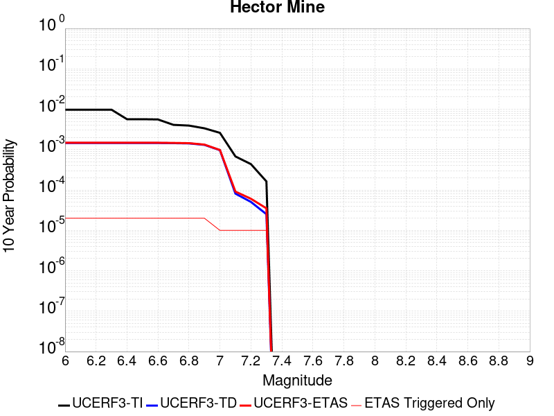 |

| Magnitude | 1 wk TI Prob | 1 wk TD Prob | 1 wk ETAS Prob | 1 wk ETAS/TD Gain | 1 wk ETAS Triggered Only | 1 mo TI Prob | 1 mo TD Prob | 1 mo ETAS Prob | 1 mo ETAS/TD Gain | 1 mo ETAS Triggered Only | 1 yr TI Prob | 1 yr TD Prob | 1 yr ETAS Prob | 1 yr ETAS/TD Gain | 1 yr ETAS Triggered Only | 10 yr TI Prob | 10 yr TD Prob | 10 yr ETAS Prob | 10 yr ETAS/TD Gain | 10 yr ETAS Triggered Only |
|-----|-----|-----|-----|-----|-----|-----|-----|-----|-----|-----|-----|-----|-----|-----|-----|-----|-----|-----|-----|-----|
| 6.0 | 1.8760093E-5 | 2.7962699E-6 | 2.7962699E-6 | 1.0 | 0.0 | 8.039792E-5 | 1.19839815E-5 | 1.19839815E-5 | 1.0 | 0.0 | 9.78405E-4 | 1.458992E-4 | 1.458992E-4 | 1.0 | 0.0 | 0.009741086 | 0.0014584264 | 0.0014783972 | 1.0136935 | 2.0E-5 |
| 6.1 | 1.8760093E-5 | 2.7962699E-6 | 2.7962699E-6 | 1.0 | 0.0 | 8.039792E-5 | 1.19839815E-5 | 1.19839815E-5 | 1.0 | 0.0 | 9.78405E-4 | 1.458992E-4 | 1.458992E-4 | 1.0 | 0.0 | 0.009741086 | 0.0014584264 | 0.0014783972 | 1.0136935 | 2.0E-5 |
| 6.2 | 1.8760093E-5 | 2.7962699E-6 | 2.7962699E-6 | 1.0 | 0.0 | 8.039792E-5 | 1.19839815E-5 | 1.19839815E-5 | 1.0 | 0.0 | 9.78405E-4 | 1.458992E-4 | 1.458992E-4 | 1.0 | 0.0 | 0.009741086 | 0.0014584264 | 0.0014783972 | 1.0136935 | 2.0E-5 |
| 6.3 | 1.8760093E-5 | 2.7962699E-6 | 2.7962699E-6 | 1.0 | 0.0 | 8.039792E-5 | 1.19839815E-5 | 1.19839815E-5 | 1.0 | 0.0 | 9.78405E-4 | 1.458992E-4 | 1.458992E-4 | 1.0 | 0.0 | 0.009741086 | 0.0014584264 | 0.0014783972 | 1.0136935 | 2.0E-5 |
| 6.4 | 1.0888055E-5 | 2.7962699E-6 | 2.7962699E-6 | 1.0 | 0.0 | 4.666226E-5 | 1.19839815E-5 | 1.19839815E-5 | 1.0 | 0.0 | 5.679649E-4 | 1.458992E-4 | 1.458992E-4 | 1.0 | 0.0 | 0.0056651547 | 0.0014584264 | 0.0014783972 | 1.0136935 | 2.0E-5 |
| 6.5 | 1.0888055E-5 | 2.7962699E-6 | 2.7962699E-6 | 1.0 | 0.0 | 4.666226E-5 | 1.19839815E-5 | 1.19839815E-5 | 1.0 | 0.0 | 5.679649E-4 | 1.458992E-4 | 1.458992E-4 | 1.0 | 0.0 | 0.0056651547 | 0.0014584264 | 0.0014783972 | 1.0136935 | 2.0E-5 |
| 6.6 | 1.0730738E-5 | 2.7962699E-6 | 2.7962699E-6 | 1.0 | 0.0 | 4.5988065E-5 | 1.19839815E-5 | 1.19839815E-5 | 1.0 | 0.0 | 5.5976084E-4 | 1.458992E-4 | 1.458992E-4 | 1.0 | 0.0 | 0.0055835294 | 0.0014584264 | 0.0014783972 | 1.0136935 | 2.0E-5 |
| 6.7 | 7.881326E-6 | 2.770952E-6 | 2.770952E-6 | 1.0 | 0.0 | 3.3776672E-5 | 1.1875478E-5 | 1.1875478E-5 | 1.0 | 0.0 | 4.111534E-4 | 1.4457834E-4 | 1.4457834E-4 | 1.0 | 0.0 | 0.0041039353 | 0.001445235 | 0.001465206 | 1.0138186 | 2.0E-5 |
| 6.8 | 7.5683483E-6 | 2.7327321E-6 | 2.7327321E-6 | 1.0 | 0.0 | 3.2435375E-5 | 1.1711679E-5 | 1.1711679E-5 | 1.0 | 0.0 | 3.9482914E-4 | 1.4258435E-4 | 1.4258435E-4 | 1.0 | 0.0 | 0.0039412836 | 0.0014253207 | 0.0014452923 | 1.014012 | 2.0E-5 |
| 6.9 | 6.473048E-6 | 2.513824E-6 | 2.513824E-6 | 1.0 | 0.0 | 2.7741338E-5 | 1.07735095E-5 | 1.07735095E-5 | 1.0 | 0.0 | 3.3769844E-4 | 1.3116356E-4 | 1.3116356E-4 | 1.0 | 0.0 | 0.0033718573 | 0.001311251 | 0.0013312247 | 1.0152326 | 2.0E-5 |
| 7.0 | 4.9959954E-6 | 1.8564588E-6 | 1.8564588E-6 | 1.0 | 0.0 | 2.1411232E-5 | 7.956248E-6 | 7.956248E-6 | 1.0 | 0.0 | 2.6065056E-4 | 9.686658E-5 | 9.686658E-5 | 1.0 | 0.0 | 0.0026034506 | 9.685931E-4 | 9.785835E-4 | 1.0103142 | 1.0E-5 |
| 7.1 | 1.2997541E-6 | 1.5599346E-7 | 1.5599346E-7 | 1.0 | 0.0 | 5.5703626E-6 | 6.685433E-7 | 6.685433E-7 | 1.0 | 0.0 | 6.7817055E-5 | 8.139488E-6 | 8.139488E-6 | 1.0 | 0.0 | 6.779636E-4 | 8.1392296E-5 | 9.139148E-5 | 1.1228517 | 1.0E-5 |
| 7.2 | 8.392699E-7 | 9.725453E-8 | 9.725453E-8 | 1.0 | 0.0 | 3.596866E-6 | 4.1680505E-7 | 4.1680505E-7 | 1.0 | 0.0 | 4.3790962E-5 | 5.0745916E-6 | 5.0745916E-6 | 1.0 | 0.0 | 4.3782333E-4 | 5.074495E-5 | 6.0744445E-5 | 1.1970539 | 1.0E-5 |
| 7.3 | 3.13015E-7 | 4.8283802E-8 | 4.8283802E-8 | 1.0 | 0.0 | 1.3414921E-6 | 2.0693057E-7 | 2.0693057E-7 | 1.0 | 0.0 | 1.6332544E-5 | 2.5193776E-6 | 2.5193776E-6 | 1.0 | 0.0 | 1.6331344E-4 | 2.5193574E-5 | 3.5193323E-5 | 1.3969166 | 1.0E-5 |

## Jess Valley
*[(top)](#table-of-contents)*

| 1 Week | 1 Month | 1 Year | 10 Year |
|-----|-----|-----|-----|
|  |  |  |  |

| Magnitude | 1 wk TI Prob | 1 wk TD Prob | 1 wk ETAS Prob | 1 wk ETAS/TD Gain | 1 wk ETAS Triggered Only | 1 mo TI Prob | 1 mo TD Prob | 1 mo ETAS Prob | 1 mo ETAS/TD Gain | 1 mo ETAS Triggered Only | 1 yr TI Prob | 1 yr TD Prob | 1 yr ETAS Prob | 1 yr ETAS/TD Gain | 1 yr ETAS Triggered Only | 10 yr TI Prob | 10 yr TD Prob | 10 yr ETAS Prob | 10 yr ETAS/TD Gain | 10 yr ETAS Triggered Only |
|-----|-----|-----|-----|-----|-----|-----|-----|-----|-----|-----|-----|-----|-----|-----|-----|-----|-----|-----|-----|-----|
| 6.0 | 3.3861274E-6 | 3.4340592E-6 | 3.4340592E-6 | 1.0 | 0.0 | 1.4511894E-5 | 1.471733E-5 | 1.471733E-5 | 1.0 | 0.0 | 1.7666799E-4 | 1.7917156E-4 | 1.8916978E-4 | 1.0558025 | 1.0E-5 | 0.001765276 | 0.0017905476 | 0.0018005297 | 1.005575 | 1.0E-5 |
| 6.1 | 3.3861274E-6 | 3.4340592E-6 | 3.4340592E-6 | 1.0 | 0.0 | 1.4511894E-5 | 1.471733E-5 | 1.471733E-5 | 1.0 | 0.0 | 1.7666799E-4 | 1.7917156E-4 | 1.8916978E-4 | 1.0558025 | 1.0E-5 | 0.001765276 | 0.0017905476 | 0.0018005297 | 1.005575 | 1.0E-5 |
| 6.2 | 3.3861274E-6 | 3.4340592E-6 | 3.4340592E-6 | 1.0 | 0.0 | 1.4511894E-5 | 1.471733E-5 | 1.471733E-5 | 1.0 | 0.0 | 1.7666799E-4 | 1.7917156E-4 | 1.8916978E-4 | 1.0558025 | 1.0E-5 | 0.001765276 | 0.0017905476 | 0.0018005297 | 1.005575 | 1.0E-5 |
| 6.3 | 3.3861274E-6 | 3.4340592E-6 | 3.4340592E-6 | 1.0 | 0.0 | 1.4511894E-5 | 1.471733E-5 | 1.471733E-5 | 1.0 | 0.0 | 1.7666799E-4 | 1.7917156E-4 | 1.8916978E-4 | 1.0558025 | 1.0E-5 | 0.001765276 | 0.0017905476 | 0.0018005297 | 1.005575 | 1.0E-5 |
| 6.4 | 1.5291708E-6 | 1.5502784E-6 | 1.5502784E-6 | 1.0 | 0.0 | 6.553573E-6 | 6.644038E-6 | 6.644038E-6 | 1.0 | 0.0 | 7.978683E-5 | 8.088895E-5 | 9.088815E-5 | 1.1236162 | 1.0E-5 | 7.975819E-4 | 8.086733E-4 | 8.1866526E-4 | 1.0123559 | 1.0E-5 |
| 6.5 | 1.5291708E-6 | 1.5502784E-6 | 1.5502784E-6 | 1.0 | 0.0 | 6.553573E-6 | 6.644038E-6 | 6.644038E-6 | 1.0 | 0.0 | 7.978683E-5 | 8.088895E-5 | 9.088815E-5 | 1.1236162 | 1.0E-5 | 7.975819E-4 | 8.086733E-4 | 8.1866526E-4 | 1.0123559 | 1.0E-5 |
| 6.6 | 5.396423E-7 | 5.4719953E-7 | 5.4719953E-7 | 1.0 | 0.0 | 2.312751E-6 | 2.3451398E-6 | 2.3451398E-6 | 1.0 | 0.0 | 2.8157378E-5 | 2.855189E-5 | 2.855189E-5 | 1.0 | 0.0 | 2.8153812E-4 | 2.8550063E-4 | 2.8550063E-4 | 1.0 | 0.0 |
| 6.7 | 5.396423E-7 | 5.4719953E-7 | 5.4719953E-7 | 1.0 | 0.0 | 2.312751E-6 | 2.3451398E-6 | 2.3451398E-6 | 1.0 | 0.0 | 2.8157378E-5 | 2.855189E-5 | 2.855189E-5 | 1.0 | 0.0 | 2.8153812E-4 | 2.8550063E-4 | 2.8550063E-4 | 1.0 | 0.0 |
| 6.8 | 3.6058395E-7 | 3.6563068E-7 | 3.6563068E-7 | 1.0 | 0.0 | 1.5453588E-6 | 1.5669885E-6 | 1.5669885E-6 | 1.0 | 0.0 | 1.8814582E-5 | 1.9078087E-5 | 1.9078087E-5 | 1.0 | 0.0 | 1.8812988E-4 | 1.9078086E-4 | 1.9078086E-4 | 1.0 | 0.0 |

## Robinson Creek
*[(top)](#table-of-contents)*

| 1 Week | 1 Month | 1 Year | 10 Year |
|-----|-----|-----|-----|
|  |  |  |  |

| Magnitude | 1 wk TI Prob | 1 wk TD Prob | 1 wk ETAS Prob | 1 wk ETAS/TD Gain | 1 wk ETAS Triggered Only | 1 mo TI Prob | 1 mo TD Prob | 1 mo ETAS Prob | 1 mo ETAS/TD Gain | 1 mo ETAS Triggered Only | 1 yr TI Prob | 1 yr TD Prob | 1 yr ETAS Prob | 1 yr ETAS/TD Gain | 1 yr ETAS Triggered Only | 10 yr TI Prob | 10 yr TD Prob | 10 yr ETAS Prob | 10 yr ETAS/TD Gain | 10 yr ETAS Triggered Only |
|-----|-----|-----|-----|-----|-----|-----|-----|-----|-----|-----|-----|-----|-----|-----|-----|-----|-----|-----|-----|-----|
| 6.0 | 1.3705327E-5 | 1.5285013E-5 | 1.5285013E-5 | 1.0 | 0.0 | 5.8735794E-5 | 6.55072E-5 | 6.55072E-5 | 1.0 | 0.0 | 7.1487366E-4 | 7.9755014E-4 | 7.9755014E-4 | 1.0 | 0.0 | 0.0071257832 | 0.007975501 | 0.007995342 | 1.0024877 | 2.0E-5 |
| 6.1 | 1.3705327E-5 | 1.5285013E-5 | 1.5285013E-5 | 1.0 | 0.0 | 5.8735794E-5 | 6.55072E-5 | 6.55072E-5 | 1.0 | 0.0 | 7.1487366E-4 | 7.9755014E-4 | 7.9755014E-4 | 1.0 | 0.0 | 0.0071257832 | 0.007975501 | 0.007995342 | 1.0024877 | 2.0E-5 |
| 6.2 | 1.3705327E-5 | 1.5285013E-5 | 1.5285013E-5 | 1.0 | 0.0 | 5.8735794E-5 | 6.55072E-5 | 6.55072E-5 | 1.0 | 0.0 | 7.1487366E-4 | 7.9755014E-4 | 7.9755014E-4 | 1.0 | 0.0 | 0.0071257832 | 0.007975501 | 0.007995342 | 1.0024877 | 2.0E-5 |
| 6.3 | 1.3705327E-5 | 1.5285013E-5 | 1.5285013E-5 | 1.0 | 0.0 | 5.8735794E-5 | 6.55072E-5 | 6.55072E-5 | 1.0 | 0.0 | 7.1487366E-4 | 7.9755014E-4 | 7.9755014E-4 | 1.0 | 0.0 | 0.0071257832 | 0.007975501 | 0.007995342 | 1.0024877 | 2.0E-5 |
| 6.4 | 1.3705327E-5 | 1.5285013E-5 | 1.5285013E-5 | 1.0 | 0.0 | 5.8735794E-5 | 6.55072E-5 | 6.55072E-5 | 1.0 | 0.0 | 7.1487366E-4 | 7.9755014E-4 | 7.9755014E-4 | 1.0 | 0.0 | 0.0071257832 | 0.007975501 | 0.007995342 | 1.0024877 | 2.0E-5 |

## Earthquake Valley (No  Extension)
*[(top)](#table-of-contents)*

| 1 Week | 1 Month | 1 Year | 10 Year |
|-----|-----|-----|-----|
|  |  |  | 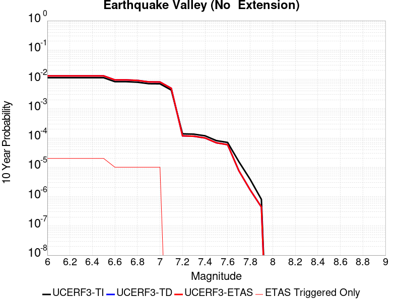 |

| Magnitude | 1 wk TI Prob | 1 wk TD Prob | 1 wk ETAS Prob | 1 wk ETAS/TD Gain | 1 wk ETAS Triggered Only | 1 mo TI Prob | 1 mo TD Prob | 1 mo ETAS Prob | 1 mo ETAS/TD Gain | 1 mo ETAS Triggered Only | 1 yr TI Prob | 1 yr TD Prob | 1 yr ETAS Prob | 1 yr ETAS/TD Gain | 1 yr ETAS Triggered Only | 10 yr TI Prob | 10 yr TD Prob | 10 yr ETAS Prob | 10 yr ETAS/TD Gain | 10 yr ETAS Triggered Only |
|-----|-----|-----|-----|-----|-----|-----|-----|-----|-----|-----|-----|-----|-----|-----|-----|-----|-----|-----|-----|-----|
| 6.0 | 2.1859703E-5 | 2.5198351E-5 | 2.5198351E-5 | 1.0 | 0.0 | 9.3681076E-5 | 1.0798928E-4 | 1.0798928E-4 | 1.0 | 0.0 | 0.0011399703 | 0.0013141216 | 0.0013340954 | 1.0151993 | 2.0E-5 | 0.011341401 | 0.013077869 | 0.0130976075 | 1.0015093 | 2.0E-5 |
| 6.1 | 2.1859703E-5 | 2.5198351E-5 | 2.5198351E-5 | 1.0 | 0.0 | 9.3681076E-5 | 1.0798928E-4 | 1.0798928E-4 | 1.0 | 0.0 | 0.0011399703 | 0.0013141216 | 0.0013340954 | 1.0151993 | 2.0E-5 | 0.011341401 | 0.013077869 | 0.0130976075 | 1.0015093 | 2.0E-5 |
| 6.2 | 2.1859703E-5 | 2.5198351E-5 | 2.5198351E-5 | 1.0 | 0.0 | 9.3681076E-5 | 1.0798928E-4 | 1.0798928E-4 | 1.0 | 0.0 | 0.0011399703 | 0.0013141216 | 0.0013340954 | 1.0151993 | 2.0E-5 | 0.011341401 | 0.013077869 | 0.0130976075 | 1.0015093 | 2.0E-5 |
| 6.3 | 2.1859703E-5 | 2.5198351E-5 | 2.5198351E-5 | 1.0 | 0.0 | 9.3681076E-5 | 1.0798928E-4 | 1.0798928E-4 | 1.0 | 0.0 | 0.0011399703 | 0.0013141216 | 0.0013340954 | 1.0151993 | 2.0E-5 | 0.011341401 | 0.013077869 | 0.0130976075 | 1.0015093 | 2.0E-5 |
| 6.4 | 2.1859703E-5 | 2.5198351E-5 | 2.5198351E-5 | 1.0 | 0.0 | 9.3681076E-5 | 1.0798928E-4 | 1.0798928E-4 | 1.0 | 0.0 | 0.0011399703 | 0.0013141216 | 0.0013340954 | 1.0151993 | 2.0E-5 | 0.011341401 | 0.013077869 | 0.0130976075 | 1.0015093 | 2.0E-5 |
| 6.5 | 2.1859703E-5 | 2.5198351E-5 | 2.5198351E-5 | 1.0 | 0.0 | 9.3681076E-5 | 1.0798928E-4 | 1.0798928E-4 | 1.0 | 0.0 | 0.0011399703 | 0.0013141216 | 0.0013340954 | 1.0151993 | 2.0E-5 | 0.011341401 | 0.013077869 | 0.0130976075 | 1.0015093 | 2.0E-5 |
| 6.6 | 1.597E-5 | 1.835627E-5 | 1.835627E-5 | 1.0 | 0.0 | 6.8441055E-5 | 7.866784E-5 | 7.866784E-5 | 1.0 | 0.0 | 8.329513E-4 | 9.5744745E-4 | 9.6743787E-4 | 1.0104344 | 1.0E-5 | 0.008298361 | 0.009541833 | 0.009551737 | 1.0010381 | 1.0E-5 |
| 6.7 | 1.597E-5 | 1.835627E-5 | 1.835627E-5 | 1.0 | 0.0 | 6.8441055E-5 | 7.866784E-5 | 7.866784E-5 | 1.0 | 0.0 | 8.329513E-4 | 9.5744745E-4 | 9.6743787E-4 | 1.0104344 | 1.0E-5 | 0.008298361 | 0.009541833 | 0.009551737 | 1.0010381 | 1.0E-5 |
| 6.8 | 1.5315149E-5 | 1.7602086E-5 | 1.7602086E-5 | 1.0 | 0.0 | 6.5634704E-5 | 7.543582E-5 | 7.543582E-5 | 1.0 | 0.0 | 7.988095E-4 | 9.1813074E-4 | 9.2812156E-4 | 1.0108817 | 1.0E-5 | 0.007959441 | 0.009151915 | 0.009161824 | 1.0010827 | 1.0E-5 |
| 6.9 | 1.3634728E-5 | 1.5675814E-5 | 1.5675814E-5 | 1.0 | 0.0 | 5.8433237E-5 | 6.7180794E-5 | 6.7180794E-5 | 1.0 | 0.0 | 7.1119244E-4 | 8.1770134E-4 | 8.2769315E-4 | 1.0122194 | 1.0E-5 | 0.007089207 | 0.008154998 | 0.008164915 | 1.0012163 | 1.0E-5 |
| 7.0 | 1.3496271E-5 | 1.5517848E-5 | 1.5517848E-5 | 1.0 | 0.0 | 5.783988E-5 | 6.6503824E-5 | 6.6503824E-5 | 1.0 | 0.0 | 7.03973E-4 | 8.0946536E-4 | 8.194573E-4 | 1.0123439 | 1.0E-5 | 0.007017471 | 0.008073238 | 0.008083156 | 1.0012287 | 1.0E-5 |
| 7.1 | 8.242798E-6 | 9.472594E-6 | 9.472594E-6 | 1.0 | 0.0 | 3.53258E-5 | 4.0596577E-5 | 4.0596577E-5 | 1.0 | 0.0 | 4.300067E-4 | 4.9421826E-4 | 4.9421826E-4 | 1.0 | 0.0 | 0.004291756 | 0.0049377684 | 0.0049377684 | 1.0 | 0.0 |
| 7.2 | 2.6506527E-7 | 2.2559628E-7 | 2.2559628E-7 | 1.0 | 0.0 | 1.1359936E-6 | 9.668408E-7 | 9.668408E-7 | 1.0 | 0.0 | 1.3830633E-5 | 1.1771229E-5 | 1.1771229E-5 | 1.0 | 0.0 | 1.3829772E-4 | 1.1770646E-4 | 1.1770646E-4 | 1.0 | 0.0 |
| 7.3 | 2.5810488E-7 | 2.1954757E-7 | 2.1954757E-7 | 1.0 | 0.0 | 1.1061633E-6 | 9.4091786E-7 | 9.4091786E-7 | 1.0 | 0.0 | 1.3467455E-5 | 1.1455619E-5 | 1.1455619E-5 | 1.0 | 0.0 | 1.3466639E-4 | 1.145507E-4 | 1.145507E-4 | 1.0 | 0.0 |
| 7.4 | 2.2676066E-7 | 1.9109943E-7 | 1.9109943E-7 | 1.0 | 0.0 | 9.71831E-7 | 8.189973E-7 | 8.189973E-7 | 1.0 | 0.0 | 1.1831979E-5 | 9.971251E-6 | 9.971251E-6 | 1.0 | 0.0 | 1.1831349E-4 | 9.970842E-5 | 9.970842E-5 | 1.0 | 0.0 |
| 7.5 | 1.5553917E-7 | 1.311138E-7 | 1.311138E-7 | 1.0 | 0.0 | 6.6659624E-7 | 5.619162E-7 | 5.619162E-7 | 1.0 | 0.0 | 8.115779E-6 | 6.84131E-6 | 6.84131E-6 | 1.0 | 0.0 | 8.115482E-5 | 6.841121E-5 | 6.841121E-5 | 1.0 | 0.0 |
| 7.6 | 1.3448629E-7 | 1.1287708E-7 | 1.1287708E-7 | 1.0 | 0.0 | 5.7636964E-7 | 4.8375887E-7 | 4.8375887E-7 | 1.0 | 0.0 | 7.017278E-6 | 5.8897504E-6 | 5.8897504E-6 | 1.0 | 0.0 | 7.0170565E-5 | 5.8896156E-5 | 5.8896156E-5 | 1.0 | 0.0 |
| 7.7 | 2.9719402E-8 | 1.4581234E-8 | 1.4581234E-8 | 1.0 | 0.0 | 1.2736886E-7 | 6.2491004E-8 | 6.2491004E-8 | 1.0 | 0.0 | 1.5507147E-6 | 7.6082773E-7 | 7.6082773E-7 | 1.0 | 0.0 | 1.550704E-5 | 7.608257E-6 | 7.608257E-6 | 1.0 | 0.0 |
| 7.8 | 7.4390196E-9 | 3.249962E-9 | 3.249962E-9 | 1.0 | 0.0 | 3.1881513E-8 | 1.39284095E-8 | 1.39284095E-8 | 1.0 | 0.0 | 3.8815733E-7 | 1.6957837E-7 | 1.6957837E-7 | 1.0 | 0.0 | 3.8815665E-6 | 1.6957828E-6 | 1.6957828E-6 | 1.0 | 0.0 |
| 7.9 | 1.5373532E-9 | 8.4400953E-10 | 8.4400953E-10 | 1.0 | 0.0 | 6.5886567E-9 | 3.6171839E-9 | 3.6171839E-9 | 1.0 | 0.0 | 8.021689E-8 | 4.403921E-8 | 4.403921E-8 | 1.0 | 0.0 | 8.0216864E-7 | 4.403921E-7 | 4.403921E-7 | 1.0 | 0.0 |

## Calaveras (Central) 2011 CFM
*[(top)](#table-of-contents)*

| 1 Week | 1 Month | 1 Year | 10 Year |
|-----|-----|-----|-----|
|  |  |  |  |

| Magnitude | 1 wk TI Prob | 1 wk TD Prob | 1 wk ETAS Prob | 1 wk ETAS/TD Gain | 1 wk ETAS Triggered Only | 1 mo TI Prob | 1 mo TD Prob | 1 mo ETAS Prob | 1 mo ETAS/TD Gain | 1 mo ETAS Triggered Only | 1 yr TI Prob | 1 yr TD Prob | 1 yr ETAS Prob | 1 yr ETAS/TD Gain | 1 yr ETAS Triggered Only | 10 yr TI Prob | 10 yr TD Prob | 10 yr ETAS Prob | 10 yr ETAS/TD Gain | 10 yr ETAS Triggered Only |
|-----|-----|-----|-----|-----|-----|-----|-----|-----|-----|-----|-----|-----|-----|-----|-----|-----|-----|-----|-----|-----|
| 6.0 | 1.5010907E-4 | 2.4804124E-4 | 2.5803875E-4 | 1.0403059 | 1.0E-5 | 6.4316596E-4 | 0.001062498 | 0.0010724873 | 1.0094018 | 1.0E-5 | 0.0078024664 | 0.012850443 | 0.012860315 | 1.0007682 | 1.0E-5 | 0.07534136 | 0.120411225 | 0.12042002 | 1.0000731 | 1.0E-5 |
| 6.1 | 1.4521465E-4 | 2.3965565E-4 | 2.4965324E-4 | 1.0417166 | 1.0E-5 | 6.222001E-4 | 0.0010265942 | 0.0010365839 | 1.0097309 | 1.0E-5 | 0.0075490056 | 0.012419763 | 0.012429639 | 1.0007951 | 1.0E-5 | 0.07297657 | 0.11668273 | 0.11669156 | 1.0000757 | 1.0E-5 |
| 6.2 | 1.429998E-4 | 2.3896809E-4 | 2.489657E-4 | 1.0418366 | 1.0E-5 | 6.127123E-4 | 0.0010236499 | 0.0010336398 | 1.009759 | 1.0E-5 | 0.007434286 | 0.012384372 | 0.012394248 | 1.0007975 | 1.0E-5 | 0.07190444 | 0.11633677 | 0.11634561 | 1.0000759 | 1.0E-5 |
| 6.3 | 1.3536277E-4 | 2.3227946E-4 | 2.4227714E-4 | 1.0430416 | 1.0E-5 | 5.799972E-4 | 9.950127E-4 | 0.0010050028 | 1.0100402 | 1.0E-5 | 0.0070386264 | 0.012040534 | 0.0120504135 | 1.0008205 | 1.0E-5 | 0.0681982 | 0.113249525 | 0.11325839 | 1.0000783 | 1.0E-5 |
| 6.4 | 1.2993296E-4 | 2.2651516E-4 | 2.3651289E-4 | 1.0441371 | 1.0E-5 | 5.5673666E-4 | 9.703276E-4 | 9.803178E-4 | 1.0102957 | 1.0E-5 | 0.006757223 | 0.011743338 | 0.01175322 | 1.0008415 | 1.0E-5 | 0.06555412 | 0.11052752 | 0.11053642 | 1.0000805 | 1.0E-5 |
| 6.5 | 1.0498927E-4 | 1.7981966E-4 | 1.8981787E-4 | 1.0556012 | 1.0E-5 | 4.498764E-4 | 7.7042676E-4 | 7.8041904E-4 | 1.0129699 | 1.0E-5 | 0.005463498 | 0.00933952 | 0.009349426 | 1.0010607 | 1.0E-5 | 0.053311124 | 0.08920739 | 0.08921649 | 1.000102 | 1.0E-5 |
| 6.6 | 1.0157505E-4 | 1.7469494E-4 | 1.8469318E-4 | 1.0572326 | 1.0E-5 | 4.35249E-4 | 7.4847665E-4 | 7.5846916E-4 | 1.0133505 | 1.0E-5 | 0.0052862884 | 0.009074567 | 0.009084476 | 1.001092 | 1.0E-5 | 0.05162293 | 0.08678487 | 0.086794004 | 1.0001053 | 1.0E-5 |
| 6.7 | 9.660386E-5 | 1.6728783E-4 | 1.7728616E-4 | 1.0597672 | 1.0E-5 | 4.1395082E-4 | 7.167497E-4 | 7.267425E-4 | 1.0139419 | 1.0E-5 | 0.0050282106 | 0.008691474 | 0.008701387 | 1.0011406 | 1.0E-5 | 0.049159497 | 0.08327401 | 0.08328317 | 1.00011 | 1.0E-5 |
| 6.8 | 9.089927E-5 | 1.5643238E-4 | 1.6643082E-4 | 1.0639154 | 1.0E-5 | 3.8951015E-4 | 6.702511E-4 | 6.802444E-4 | 1.0149097 | 1.0E-5 | 0.0047319788 | 0.008129742 | 0.008139661 | 1.0012201 | 1.0E-5 | 0.046324775 | 0.078163 | 0.07817222 | 1.0001179 | 1.0E-5 |
| 6.9 | 7.353187E-5 | 1.2295779E-4 | 1.2295779E-4 | 1.0 | 0.0 | 3.150985E-4 | 5.2685605E-4 | 5.2685605E-4 | 1.0 | 0.0 | 0.0038295772 | 0.006395728 | 0.006395728 | 1.0 | 0.0 | 0.037642512 | 0.06218928 | 0.06218928 | 1.0 | 0.0 |
| 7.0 | 5.746064E-5 | 9.3890936E-5 | 9.3890936E-5 | 1.0 | 0.0 | 2.4623662E-4 | 4.0232803E-4 | 4.0232803E-4 | 1.0 | 0.0 | 0.0029938098 | 0.0048874132 | 0.0048874132 | 1.0 | 0.0 | 0.02953797 | 0.04798713 | 0.04798713 | 1.0 | 0.0 |
| 7.1 | 4.9557195E-5 | 8.052768E-5 | 8.052768E-5 | 1.0 | 0.0 | 2.123707E-4 | 3.4507332E-4 | 3.4507332E-4 | 1.0 | 0.0 | 0.0025825473 | 0.004193237 | 0.004193237 | 1.0 | 0.0 | 0.0255274 | 0.041373473 | 0.041373473 | 1.0 | 0.0 |
| 7.2 | 3.687595E-5 | 5.952694E-5 | 5.952694E-5 | 1.0 | 0.0 | 1.5803022E-4 | 2.5509068E-4 | 2.5509068E-4 | 1.0 | 0.0 | 0.0019223199 | 0.003101335 | 0.003101335 | 1.0 | 0.0 | 0.01905776 | 0.030883823 | 0.030883823 | 1.0 | 0.0 |
| 7.3 | 2.5846984E-5 | 4.2473923E-5 | 4.2473923E-5 | 1.0 | 0.0 | 1.1076809E-4 | 1.820185E-4 | 1.820185E-4 | 1.0 | 0.0 | 0.0013477671 | 0.0022138404 | 0.0022138404 | 1.0 | 0.0 | 0.013396223 | 0.022175217 | 0.022175217 | 1.0 | 0.0 |
| 7.4 | 1.7747854E-5 | 2.993759E-5 | 2.993759E-5 | 1.0 | 0.0 | 7.6060016E-5 | 1.2829766E-4 | 1.2829766E-4 | 1.0 | 0.0 | 9.2563726E-4 | 0.0015609078 | 0.0015609078 | 1.0 | 0.0 | 0.009217911 | 0.015708687 | 0.015708687 | 1.0 | 0.0 |
| 7.5 | 1.4883479E-5 | 2.6244672E-5 | 2.6244672E-5 | 1.0 | 0.0 | 6.378478E-5 | 1.12472335E-4 | 1.12472335E-4 | 1.0 | 0.0 | 7.76303E-4 | 0.0013684932 | 0.0013684932 | 1.0 | 0.0 | 0.0077359667 | 0.013801667 | 0.013801667 | 1.0 | 0.0 |
| 7.6 | 8.166975E-6 | 1.4964299E-5 | 1.4964299E-5 | 1.0 | 0.0 | 3.5000852E-5 | 6.413114E-5 | 6.413114E-5 | 1.0 | 0.0 | 4.2605202E-4 | 7.805183E-4 | 7.805183E-4 | 1.0 | 0.0 | 0.004252361 | 0.007939203 | 0.007939203 | 1.0 | 0.0 |
| 7.7 | 3.3858064E-6 | 6.254251E-6 | 6.254251E-6 | 1.0 | 0.0 | 1.4510518E-5 | 2.6803657E-5 | 2.6803657E-5 | 1.0 | 0.0 | 1.7665124E-4 | 3.2628572E-4 | 3.2628572E-4 | 1.0 | 0.0 | 0.0017651088 | 0.003388363 | 0.003388363 | 1.0 | 0.0 |
| 7.8 | 2.7721615E-6 | 5.366695E-6 | 5.366695E-6 | 1.0 | 0.0 | 1.1880637E-5 | 2.2999919E-5 | 2.2999919E-5 | 1.0 | 0.0 | 1.4463716E-4 | 2.7998807E-4 | 2.7998807E-4 | 1.0 | 0.0 | 0.0014454306 | 0.002907615 | 0.002907615 | 1.0 | 0.0 |
| 7.9 | 1.9736292E-6 | 4.128705E-6 | 4.128705E-6 | 1.0 | 0.0 | 8.4583835E-6 | 1.769433E-5 | 1.769433E-5 | 1.0 | 0.0 | 1.0297595E-4 | 2.1540721E-4 | 2.1540721E-4 | 1.0 | 0.0 | 0.0010292825 | 0.0022237299 | 0.0022237299 | 1.0 | 0.0 |
| 8.0 | 1.1767289E-6 | 2.5546633E-6 | 2.5546633E-6 | 1.0 | 0.0 | 5.0431145E-6 | 1.0948511E-5 | 1.0948511E-5 | 1.0 | 0.0 | 6.139818E-5 | 1.3329E-4 | 1.3329E-4 | 1.0 | 0.0 | 6.1381224E-4 | 0.001366126 | 0.001366126 | 1.0 | 0.0 |
| 8.1 | 7.5112825E-7 | 1.541076E-6 | 1.541076E-6 | 1.0 | 0.0 | 3.2191172E-6 | 6.604595E-6 | 6.604595E-6 | 1.0 | 0.0 | 3.9192048E-5 | 8.0408E-5 | 8.0408E-5 | 1.0 | 0.0 | 3.9185135E-4 | 8.2356273E-4 | 8.2356273E-4 | 1.0 | 0.0 |

## South Cuyama
*[(top)](#table-of-contents)*

| 1 Week | 1 Month | 1 Year | 10 Year |
|-----|-----|-----|-----|
|  |  |  |  |

| Magnitude | 1 wk TI Prob | 1 wk TD Prob | 1 wk ETAS Prob | 1 wk ETAS/TD Gain | 1 wk ETAS Triggered Only | 1 mo TI Prob | 1 mo TD Prob | 1 mo ETAS Prob | 1 mo ETAS/TD Gain | 1 mo ETAS Triggered Only | 1 yr TI Prob | 1 yr TD Prob | 1 yr ETAS Prob | 1 yr ETAS/TD Gain | 1 yr ETAS Triggered Only | 10 yr TI Prob | 10 yr TD Prob | 10 yr ETAS Prob | 10 yr ETAS/TD Gain | 10 yr ETAS Triggered Only |
|-----|-----|-----|-----|-----|-----|-----|-----|-----|-----|-----|-----|-----|-----|-----|-----|-----|-----|-----|-----|-----|
| 6.0 | 1.2747308E-6 | 1.2818697E-6 | 1.1281857E-5 | 8.801095 | 1.0E-5 | 5.4631205E-6 | 5.4937163E-6 | 1.549366E-5 | 2.8202515 | 1.0E-5 | 6.6511464E-5 | 6.6884015E-5 | 7.688334E-5 | 1.1495025 | 1.0E-5 | 6.649156E-4 | 6.686458E-4 | 6.886324E-4 | 1.0298913 | 2.0E-5 |
| 6.1 | 1.2747308E-6 | 1.2818697E-6 | 1.1281857E-5 | 8.801095 | 1.0E-5 | 5.4631205E-6 | 5.4937163E-6 | 1.549366E-5 | 2.8202515 | 1.0E-5 | 6.6511464E-5 | 6.6884015E-5 | 7.688334E-5 | 1.1495025 | 1.0E-5 | 6.649156E-4 | 6.686458E-4 | 6.886324E-4 | 1.0298913 | 2.0E-5 |
| 6.2 | 1.2747308E-6 | 1.2818697E-6 | 1.1281857E-5 | 8.801095 | 1.0E-5 | 5.4631205E-6 | 5.4937163E-6 | 1.549366E-5 | 2.8202515 | 1.0E-5 | 6.6511464E-5 | 6.6884015E-5 | 7.688334E-5 | 1.1495025 | 1.0E-5 | 6.649156E-4 | 6.686458E-4 | 6.886324E-4 | 1.0298913 | 2.0E-5 |
| 6.3 | 1.2747308E-6 | 1.2818697E-6 | 1.1281857E-5 | 8.801095 | 1.0E-5 | 5.4631205E-6 | 5.4937163E-6 | 1.549366E-5 | 2.8202515 | 1.0E-5 | 6.6511464E-5 | 6.6884015E-5 | 7.688334E-5 | 1.1495025 | 1.0E-5 | 6.649156E-4 | 6.686458E-4 | 6.886324E-4 | 1.0298913 | 2.0E-5 |
| 6.4 | 1.2747308E-6 | 1.2818697E-6 | 1.1281857E-5 | 8.801095 | 1.0E-5 | 5.4631205E-6 | 5.4937163E-6 | 1.549366E-5 | 2.8202515 | 1.0E-5 | 6.6511464E-5 | 6.6884015E-5 | 7.688334E-5 | 1.1495025 | 1.0E-5 | 6.649156E-4 | 6.686458E-4 | 6.886324E-4 | 1.0298913 | 2.0E-5 |
| 6.5 | 1.2747308E-6 | 1.2818697E-6 | 1.1281857E-5 | 8.801095 | 1.0E-5 | 5.4631205E-6 | 5.4937163E-6 | 1.549366E-5 | 2.8202515 | 1.0E-5 | 6.6511464E-5 | 6.6884015E-5 | 7.688334E-5 | 1.1495025 | 1.0E-5 | 6.649156E-4 | 6.686458E-4 | 6.886324E-4 | 1.0298913 | 2.0E-5 |
| 6.6 | 1.2747308E-6 | 1.2818697E-6 | 1.1281857E-5 | 8.801095 | 1.0E-5 | 5.4631205E-6 | 5.4937163E-6 | 1.549366E-5 | 2.8202515 | 1.0E-5 | 6.6511464E-5 | 6.6884015E-5 | 7.688334E-5 | 1.1495025 | 1.0E-5 | 6.649156E-4 | 6.686458E-4 | 6.886324E-4 | 1.0298913 | 2.0E-5 |
| 6.7 | 1.2747308E-6 | 1.2818697E-6 | 1.1281857E-5 | 8.801095 | 1.0E-5 | 5.4631205E-6 | 5.4937163E-6 | 1.549366E-5 | 2.8202515 | 1.0E-5 | 6.6511464E-5 | 6.6884015E-5 | 7.688334E-5 | 1.1495025 | 1.0E-5 | 6.649156E-4 | 6.686458E-4 | 6.886324E-4 | 1.0298913 | 2.0E-5 |
| 6.8 | 1.2747308E-6 | 1.2818697E-6 | 1.1281857E-5 | 8.801095 | 1.0E-5 | 5.4631205E-6 | 5.4937163E-6 | 1.549366E-5 | 2.8202515 | 1.0E-5 | 6.6511464E-5 | 6.6884015E-5 | 7.688334E-5 | 1.1495025 | 1.0E-5 | 6.649156E-4 | 6.686458E-4 | 6.886324E-4 | 1.0298913 | 2.0E-5 |
| 6.9 | 8.4566324E-7 | 8.507883E-7 | 8.507883E-7 | 1.0 | 0.0 | 3.624266E-6 | 3.6462304E-6 | 3.6462304E-6 | 1.0 | 0.0 | 4.4124543E-5 | 4.439196E-5 | 4.439196E-5 | 1.0 | 0.0 | 4.4115784E-4 | 4.4383196E-4 | 4.5382752E-4 | 1.022521 | 1.0E-5 |
| 7.0 | 8.2277904E-7 | 8.27782E-7 | 8.27782E-7 | 1.0 | 0.0 | 3.526191E-6 | 3.5476323E-6 | 3.5476323E-6 | 1.0 | 0.0 | 4.293053E-5 | 4.3191576E-5 | 4.3191576E-5 | 1.0 | 0.0 | 4.292224E-4 | 4.3183283E-4 | 4.3183283E-4 | 1.0 | 0.0 |
| 7.1 | 6.7661887E-7 | 6.80913E-7 | 6.80913E-7 | 1.0 | 0.0 | 2.899792E-6 | 2.9181954E-6 | 2.9181954E-6 | 1.0 | 0.0 | 3.5304394E-5 | 3.5528454E-5 | 3.5528454E-5 | 1.0 | 0.0 | 3.5298787E-4 | 3.552281E-4 | 3.552281E-4 | 1.0 | 0.0 |
| 7.2 | 5.783336E-7 | 5.8211907E-7 | 5.8211907E-7 | 1.0 | 0.0 | 2.4785702E-6 | 2.4947938E-6 | 2.4947938E-6 | 1.0 | 0.0 | 3.0176174E-5 | 3.0373692E-5 | 3.0373692E-5 | 1.0 | 0.0 | 3.0172078E-4 | 3.0369565E-4 | 3.0369565E-4 | 1.0 | 0.0 |
| 7.3 | 5.136759E-7 | 5.170938E-7 | 5.170938E-7 | 1.0 | 0.0 | 2.2014663E-6 | 2.2161144E-6 | 2.2161144E-6 | 1.0 | 0.0 | 2.6802521E-5 | 2.698086E-5 | 2.698086E-5 | 1.0 | 0.0 | 2.679929E-4 | 2.6977606E-4 | 2.6977606E-4 | 1.0 | 0.0 |
| 7.4 | 4.3370295E-7 | 4.3665364E-7 | 4.3665364E-7 | 1.0 | 0.0 | 1.8587256E-6 | 1.8713713E-6 | 1.8713713E-6 | 1.0 | 0.0 | 2.2629749E-5 | 2.278371E-5 | 2.278371E-5 | 1.0 | 0.0 | 2.2627445E-4 | 2.278139E-4 | 2.278139E-4 | 1.0 | 0.0 |
| 7.5 | 3.3242574E-7 | 3.3476465E-7 | 3.3476465E-7 | 1.0 | 0.0 | 1.4246809E-6 | 1.4347048E-6 | 1.4347048E-6 | 1.0 | 0.0 | 1.7345352E-5 | 1.7467393E-5 | 1.7467393E-5 | 1.0 | 0.0 | 1.7343998E-4 | 1.7466032E-4 | 1.7466032E-4 | 1.0 | 0.0 |
| 7.6 | 2.0627535E-7 | 2.07789E-7 | 2.07789E-7 | 1.0 | 0.0 | 8.840369E-7 | 8.90524E-7 | 8.90524E-7 | 1.0 | 0.0 | 1.0763096E-5 | 1.0842076E-5 | 1.0842076E-5 | 1.0 | 0.0 | 1.0762575E-4 | 1.0841556E-4 | 1.0841556E-4 | 1.0 | 0.0 |
| 7.7 | 6.15236E-8 | 6.1983044E-8 | 6.1983044E-8 | 1.0 | 0.0 | 2.6367252E-7 | 2.656416E-7 | 2.656416E-7 | 1.0 | 0.0 | 3.2102084E-6 | 3.2341818E-6 | 3.2341818E-6 | 1.0 | 0.0 | 3.210162E-5 | 3.234136E-5 | 3.234136E-5 | 1.0 | 0.0 |
| 7.8 | 1.1765573E-8 | 1.1873414E-8 | 1.1873414E-8 | 1.0 | 0.0 | 5.0423886E-8 | 5.0886058E-8 | 5.0886058E-8 | 1.0 | 0.0 | 6.1391063E-7 | 6.195376E-7 | 6.195376E-7 | 1.0 | 0.0 | 6.1390897E-6 | 6.19536E-6 | 6.19536E-6 | 1.0 | 0.0 |
| 7.9 | 6.0381755E-10 | 6.10058E-10 | 6.10058E-10 | 1.0 | 0.0 | 2.5877895E-9 | 2.614534E-9 | 2.614534E-9 | 1.0 | 0.0 | 3.1506335E-8 | 3.1831952E-8 | 3.1831952E-8 | 1.0 | 0.0 | 3.1506332E-7 | 3.183195E-7 | 3.183195E-7 | 1.0 | 0.0 |

## Northridge
*[(top)](#table-of-contents)*

| 1 Week | 1 Month | 1 Year | 10 Year |
|-----|-----|-----|-----|
|  |  |  |  |

| Magnitude | 1 wk TI Prob | 1 wk TD Prob | 1 wk ETAS Prob | 1 wk ETAS/TD Gain | 1 wk ETAS Triggered Only | 1 mo TI Prob | 1 mo TD Prob | 1 mo ETAS Prob | 1 mo ETAS/TD Gain | 1 mo ETAS Triggered Only | 1 yr TI Prob | 1 yr TD Prob | 1 yr ETAS Prob | 1 yr ETAS/TD Gain | 1 yr ETAS Triggered Only | 10 yr TI Prob | 10 yr TD Prob | 10 yr ETAS Prob | 10 yr ETAS/TD Gain | 10 yr ETAS Triggered Only |
|-----|-----|-----|-----|-----|-----|-----|-----|-----|-----|-----|-----|-----|-----|-----|-----|-----|-----|-----|-----|-----|
| 6.0 | 1.8340852E-5 | 7.5878907E-6 | 7.5878907E-6 | 1.0 | 0.0 | 7.860128E-5 | 3.251914E-5 | 3.251914E-5 | 1.0 | 0.0 | 9.565505E-4 | 3.9585077E-4 | 3.9585077E-4 | 1.0 | 0.0 | 0.009524435 | 0.0039516874 | 0.0039716084 | 1.0050411 | 2.0E-5 |
| 6.1 | 1.8340852E-5 | 7.5878907E-6 | 7.5878907E-6 | 1.0 | 0.0 | 7.860128E-5 | 3.251914E-5 | 3.251914E-5 | 1.0 | 0.0 | 9.565505E-4 | 3.9585077E-4 | 3.9585077E-4 | 1.0 | 0.0 | 0.009524435 | 0.0039516874 | 0.0039716084 | 1.0050411 | 2.0E-5 |
| 6.2 | 1.8340852E-5 | 7.5878907E-6 | 7.5878907E-6 | 1.0 | 0.0 | 7.860128E-5 | 3.251914E-5 | 3.251914E-5 | 1.0 | 0.0 | 9.565505E-4 | 3.9585077E-4 | 3.9585077E-4 | 1.0 | 0.0 | 0.009524435 | 0.0039516874 | 0.0039716084 | 1.0050411 | 2.0E-5 |
| 6.3 | 1.8340852E-5 | 7.5878907E-6 | 7.5878907E-6 | 1.0 | 0.0 | 7.860128E-5 | 3.251914E-5 | 3.251914E-5 | 1.0 | 0.0 | 9.565505E-4 | 3.9585077E-4 | 3.9585077E-4 | 1.0 | 0.0 | 0.009524435 | 0.0039516874 | 0.0039716084 | 1.0050411 | 2.0E-5 |
| 6.4 | 1.7361892E-5 | 7.5878907E-6 | 7.5878907E-6 | 1.0 | 0.0 | 7.440598E-5 | 3.251914E-5 | 3.251914E-5 | 1.0 | 0.0 | 9.055163E-4 | 3.9585077E-4 | 3.9585077E-4 | 1.0 | 0.0 | 0.009018354 | 0.0039516874 | 0.0039716084 | 1.0050411 | 2.0E-5 |
| 6.5 | 1.7361892E-5 | 7.5878907E-6 | 7.5878907E-6 | 1.0 | 0.0 | 7.440598E-5 | 3.251914E-5 | 3.251914E-5 | 1.0 | 0.0 | 9.055163E-4 | 3.9585077E-4 | 3.9585077E-4 | 1.0 | 0.0 | 0.009018354 | 0.0039516874 | 0.0039716084 | 1.0050411 | 2.0E-5 |
| 6.6 | 1.5458201E-5 | 7.5878907E-6 | 7.5878907E-6 | 1.0 | 0.0 | 6.624775E-5 | 3.251914E-5 | 3.251914E-5 | 1.0 | 0.0 | 8.0626784E-4 | 3.9585077E-4 | 3.9585077E-4 | 1.0 | 0.0 | 0.008033488 | 0.0039516874 | 0.0039716084 | 1.0050411 | 2.0E-5 |
| 6.7 | 1.2538368E-5 | 6.381497E-6 | 6.381497E-6 | 1.0 | 0.0 | 5.3734755E-5 | 2.7348988E-5 | 2.7348988E-5 | 1.0 | 0.0 | 6.5402425E-4 | 3.329235E-4 | 3.329235E-4 | 1.0 | 0.0 | 0.0065210275 | 0.0033243035 | 0.003344237 | 1.0059963 | 2.0E-5 |
| 6.8 | 1.1438097E-5 | 6.350156E-6 | 6.350156E-6 | 1.0 | 0.0 | 4.9019498E-5 | 2.7214674E-5 | 2.7214674E-5 | 1.0 | 0.0 | 5.9664896E-4 | 3.3128873E-4 | 3.3128873E-4 | 1.0 | 0.0 | 0.005950495 | 0.0033080047 | 0.0033279385 | 1.0060259 | 2.0E-5 |
| 6.9 | 1.1204891E-5 | 6.2866116E-6 | 6.2866116E-6 | 1.0 | 0.0 | 4.8020076E-5 | 2.6942345E-5 | 2.6942345E-5 | 1.0 | 0.0 | 5.8448757E-4 | 3.2797412E-4 | 3.2797412E-4 | 1.0 | 0.0 | 0.0058295266 | 0.0032749567 | 0.0032948912 | 1.006087 | 2.0E-5 |
| 7.0 | 1.061046E-5 | 6.1152687E-6 | 6.1152687E-6 | 1.0 | 0.0 | 4.5472607E-5 | 2.6208034E-5 | 2.6208034E-5 | 1.0 | 0.0 | 5.534883E-4 | 3.190365E-4 | 3.190365E-4 | 1.0 | 0.0 | 0.0055211177 | 0.0031858315 | 0.0032057676 | 1.0062578 | 2.0E-5 |
| 7.1 | 1.0266979E-5 | 6.0041907E-6 | 6.0041907E-6 | 1.0 | 0.0 | 4.40006E-5 | 2.5731995E-5 | 2.5731995E-5 | 1.0 | 0.0 | 5.355756E-4 | 3.1324243E-4 | 3.1324243E-4 | 1.0 | 0.0 | 0.0053428668 | 0.0031280548 | 0.003147992 | 1.0063738 | 2.0E-5 |
| 7.2 | 9.91273E-6 | 5.819906E-6 | 5.819906E-6 | 1.0 | 0.0 | 4.248244E-5 | 2.4942217E-5 | 2.4942217E-5 | 1.0 | 0.0 | 5.171009E-4 | 3.036296E-4 | 3.036296E-4 | 1.0 | 0.0 | 0.0051589934 | 0.0030321924 | 0.0030521317 | 1.006576 | 2.0E-5 |
| 7.3 | 8.4959265E-6 | 5.1930183E-6 | 5.1930183E-6 | 1.0 | 0.0 | 3.6410605E-5 | 2.2255605E-5 | 2.2255605E-5 | 1.0 | 0.0 | 4.4320893E-4 | 2.7092852E-4 | 2.7092852E-4 | 1.0 | 0.0 | 0.00442326 | 0.0027060085 | 0.0027259544 | 1.007371 | 2.0E-5 |
| 7.4 | 8.0847185E-6 | 4.9818977E-6 | 4.9818977E-6 | 1.0 | 0.0 | 3.4648332E-5 | 2.1350817E-5 | 2.1350817E-5 | 1.0 | 0.0 | 4.2176177E-4 | 2.5991542E-4 | 2.5991542E-4 | 1.0 | 0.0 | 0.0042096223 | 0.0025961401 | 0.0026160881 | 1.0076838 | 2.0E-5 |
| 7.5 | 6.8220684E-6 | 4.2532647E-6 | 4.2532647E-6 | 1.0 | 0.0 | 2.9237108E-5 | 1.8228153E-5 | 1.8228153E-5 | 1.0 | 0.0 | 3.5590364E-4 | 2.2190536E-4 | 2.2190536E-4 | 1.0 | 0.0 | 0.0035533418 | 0.0022168586 | 0.0022368142 | 1.0090017 | 2.0E-5 |
| 7.6 | 4.4224143E-6 | 2.8999295E-6 | 2.8999295E-6 | 1.0 | 0.0 | 1.8953066E-5 | 1.24282105E-5 | 1.24282105E-5 | 1.0 | 0.0 | 2.3072914E-4 | 1.5130307E-4 | 1.5130307E-4 | 1.0 | 0.0 | 0.0023048974 | 0.0015120122 | 0.001521997 | 1.0066037 | 1.0E-5 |
| 7.7 | 2.5297056E-6 | 1.6045943E-6 | 1.6045943E-6 | 1.0 | 0.0 | 1.0841551E-5 | 6.876815E-6 | 6.876815E-6 | 1.0 | 0.0 | 1.319879E-4 | 8.372205E-5 | 8.372205E-5 | 1.0 | 0.0 | 0.0013190953 | 8.369098E-4 | 8.4690144E-4 | 1.0119387 | 1.0E-5 |
| 7.8 | 1.2508156E-6 | 8.780148E-7 | 8.780148E-7 | 1.0 | 0.0 | 5.3606273E-6 | 3.7629154E-6 | 3.7629154E-6 | 1.0 | 0.0 | 6.526368E-5 | 4.5812543E-5 | 4.5812543E-5 | 1.0 | 0.0 | 6.524452E-4 | 4.580323E-4 | 4.6802772E-4 | 1.0218226 | 1.0E-5 |
| 7.9 | 2.262199E-7 | 1.466491E-7 | 1.466491E-7 | 1.0 | 0.0 | 9.695135E-7 | 6.2849597E-7 | 6.2849597E-7 | 1.0 | 0.0 | 1.1803763E-5 | 7.651913E-6 | 7.651913E-6 | 1.0 | 0.0 | 1.1803136E-4 | 7.651657E-5 | 7.651657E-5 | 1.0 | 0.0 |
| 8.0 | 2.865362E-9 | 1.27525E-9 | 1.27525E-9 | 1.0 | 0.0 | 1.2280123E-8 | 5.465357E-9 | 5.465357E-9 | 1.0 | 0.0 | 1.4951048E-7 | 6.654073E-8 | 6.654073E-8 | 1.0 | 0.0 | 1.4951038E-6 | 6.6540724E-7 | 6.6540724E-7 | 1.0 | 0.0 |

## Bartlett Springs 2011 CFM
*[(top)](#table-of-contents)*

| 1 Week | 1 Month | 1 Year | 10 Year |
|-----|-----|-----|-----|
|  |  | 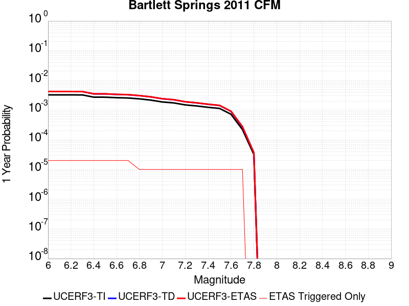 | 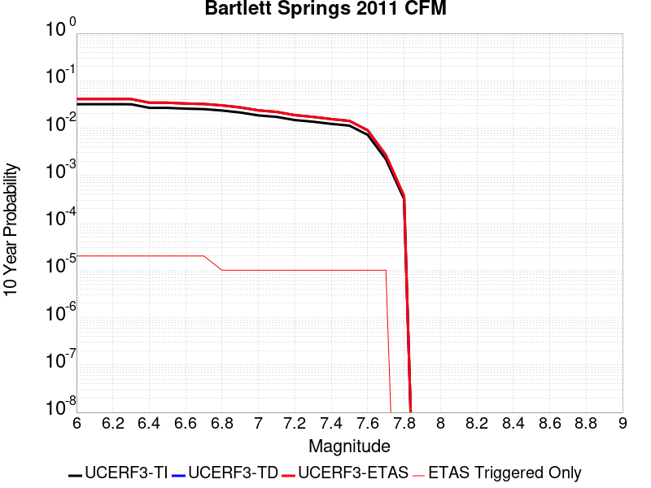 |

| Magnitude | 1 wk TI Prob | 1 wk TD Prob | 1 wk ETAS Prob | 1 wk ETAS/TD Gain | 1 wk ETAS Triggered Only | 1 mo TI Prob | 1 mo TD Prob | 1 mo ETAS Prob | 1 mo ETAS/TD Gain | 1 mo ETAS Triggered Only | 1 yr TI Prob | 1 yr TD Prob | 1 yr ETAS Prob | 1 yr ETAS/TD Gain | 1 yr ETAS Triggered Only | 10 yr TI Prob | 10 yr TD Prob | 10 yr ETAS Prob | 10 yr ETAS/TD Gain | 10 yr ETAS Triggered Only |
|-----|-----|-----|-----|-----|-----|-----|-----|-----|-----|-----|-----|-----|-----|-----|-----|-----|-----|-----|-----|-----|
| 6.0 | 6.2326144E-5 | 8.060668E-5 | 8.060668E-5 | 1.0 | 0.0 | 2.6708472E-4 | 3.4541206E-4 | 3.4541206E-4 | 1.0 | 0.0 | 0.003246908 | 0.0041973754 | 0.0042172917 | 1.0047449 | 2.0E-5 | 0.031998757 | 0.041198105 | 0.041217282 | 1.0004655 | 2.0E-5 |
| 6.1 | 6.227657E-5 | 8.054418E-5 | 8.054418E-5 | 1.0 | 0.0 | 2.668723E-4 | 3.4514428E-4 | 3.4514428E-4 | 1.0 | 0.0 | 0.0032443295 | 0.004194128 | 0.004214044 | 1.0047486 | 2.0E-5 | 0.031973712 | 0.041166842 | 0.041186016 | 1.0004659 | 2.0E-5 |
| 6.2 | 6.22452E-5 | 8.050479E-5 | 8.050479E-5 | 1.0 | 0.0 | 2.6673786E-4 | 3.449755E-4 | 3.449755E-4 | 1.0 | 0.0 | 0.0032426978 | 0.004192081 | 0.004211997 | 1.0047508 | 2.0E-5 | 0.03195787 | 0.04114713 | 0.04116631 | 1.0004661 | 2.0E-5 |
| 6.3 | 6.219006E-5 | 8.043463E-5 | 8.043463E-5 | 1.0 | 0.0 | 2.6650162E-4 | 3.4467486E-4 | 3.4467486E-4 | 1.0 | 0.0 | 0.00323983 | 0.0041884347 | 0.004208351 | 1.004755 | 2.0E-5 | 0.031930014 | 0.04111203 | 0.04113121 | 1.0004665 | 2.0E-5 |
| 6.4 | 5.2175856E-5 | 6.7254E-5 | 6.7254E-5 | 1.0 | 0.0 | 2.2359163E-4 | 2.8819984E-4 | 2.8819984E-4 | 1.0 | 0.0 | 0.0027188298 | 0.0035032362 | 0.003523166 | 1.005689 | 2.0E-5 | 0.026858058 | 0.03448956 | 0.034508873 | 1.0005599 | 2.0E-5 |
| 6.5 | 5.205166E-5 | 6.709666E-5 | 6.709666E-5 | 1.0 | 0.0 | 2.2305945E-4 | 2.875257E-4 | 2.875257E-4 | 1.0 | 0.0 | 0.0027123666 | 0.0034950553 | 0.0035149853 | 1.0057024 | 2.0E-5 | 0.026794989 | 0.034410305 | 0.034429617 | 1.0005612 | 2.0E-5 |
| 6.6 | 5.0085426E-5 | 6.449303E-5 | 6.449303E-5 | 1.0 | 0.0 | 2.1463417E-4 | 2.7636968E-4 | 2.7636968E-4 | 1.0 | 0.0 | 0.0026100394 | 0.0033596596 | 0.0033795924 | 1.0059329 | 2.0E-5 | 0.025795965 | 0.03309789 | 0.033117227 | 1.0005842 | 2.0E-5 |
| 6.7 | 4.8930866E-5 | 6.30177E-5 | 6.30177E-5 | 1.0 | 0.0 | 2.0968684E-4 | 2.700482E-4 | 2.700482E-4 | 1.0 | 0.0 | 0.0025499484 | 0.0032829295 | 0.003302864 | 1.0060722 | 2.0E-5 | 0.025208864 | 0.032353252 | 0.032372605 | 1.0005982 | 2.0E-5 |
| 6.8 | 4.5679535E-5 | 5.874213E-5 | 5.874213E-5 | 1.0 | 0.0 | 1.9575475E-4 | 2.517279E-4 | 2.517279E-4 | 1.0 | 0.0 | 0.002380709 | 0.0030605178 | 0.0030704872 | 1.0032574 | 1.0E-5 | 0.023553653 | 0.030190729 | 0.030200427 | 1.0003213 | 1.0E-5 |
| 6.9 | 4.1439176E-5 | 5.3220345E-5 | 5.3220345E-5 | 1.0 | 0.0 | 1.7758438E-4 | 2.2806737E-4 | 2.2806737E-4 | 1.0 | 0.0 | 0.002159946 | 0.00277321 | 0.0027831823 | 1.003596 | 1.0E-5 | 0.021390721 | 0.02739108 | 0.027400805 | 1.0003551 | 1.0E-5 |
| 7.0 | 3.5920104E-5 | 4.6008958E-5 | 4.6008958E-5 | 1.0 | 0.0 | 1.5393422E-4 | 1.9716643E-4 | 1.9716643E-4 | 1.0 | 0.0 | 0.001872538 | 0.0023978746 | 0.0024078505 | 1.0041604 | 1.0E-5 | 0.018568378 | 0.023723308 | 0.02373307 | 1.0004115 | 1.0E-5 |
| 7.1 | 3.338812E-5 | 4.2689815E-5 | 4.2689815E-5 | 1.0 | 0.0 | 1.430841E-4 | 1.829436E-4 | 1.829436E-4 | 1.0 | 0.0 | 0.0017406568 | 0.0022250775 | 0.0022350552 | 1.0044842 | 1.0E-5 | 0.017270854 | 0.02203084 | 0.02204062 | 1.0004439 | 1.0E-5 |
| 7.2 | 2.8619615E-5 | 3.640186E-5 | 3.640186E-5 | 1.0 | 0.0 | 1.2264973E-4 | 1.559987E-4 | 1.559987E-4 | 1.0 | 0.0 | 0.0014922376 | 0.0018976394 | 0.0019076205 | 1.0052598 | 1.0E-5 | 0.014822568 | 0.018816413 | 0.018826224 | 1.0005214 | 1.0E-5 |
| 7.3 | 2.6376783E-5 | 3.3422963E-5 | 3.3422963E-5 | 1.0 | 0.0 | 1.13038455E-4 | 1.4323345E-4 | 1.4323345E-4 | 1.0 | 0.0 | 0.0013753743 | 0.0017424817 | 0.0017524643 | 1.005729 | 1.0E-5 | 0.01366893 | 0.017289983 | 0.01729981 | 1.0005684 | 1.0E-5 |
| 7.4 | 2.3738676E-5 | 2.9979174E-5 | 2.9979174E-5 | 1.0 | 0.0 | 1.0173322E-4 | 1.2847589E-4 | 1.2847589E-4 | 1.0 | 0.0 | 0.0012378981 | 0.0015630797 | 0.001573064 | 1.0063876 | 1.0E-5 | 0.012310251 | 0.01552236 | 0.015532204 | 1.0006342 | 1.0E-5 |
| 7.5 | 2.1789481E-5 | 2.7439555E-5 | 2.7439555E-5 | 1.0 | 0.0 | 9.338015E-5 | 1.1759284E-4 | 1.1759284E-4 | 1.0 | 0.0 | 0.0011363103 | 0.0014307604 | 0.0014407461 | 1.0069793 | 1.0E-5 | 0.011305175 | 0.014216874 | 0.014226732 | 1.0006934 | 1.0E-5 |
| 7.6 | 1.3895281E-5 | 1.7368566E-5 | 1.7368566E-5 | 1.0 | 0.0 | 5.9549846E-5 | 7.44346E-5 | 7.44346E-5 | 1.0 | 0.0 | 7.2477816E-4 | 9.058674E-4 | 9.158583E-4 | 1.0110291 | 1.0E-5 | 0.0072241887 | 0.009022309 | 0.009032219 | 1.0010984 | 1.0E-5 |
| 7.7 | 4.245981E-6 | 5.1625234E-6 | 5.1625234E-6 | 1.0 | 0.0 | 1.8196934E-5 | 2.2124914E-5 | 2.2124914E-5 | 1.0 | 0.0 | 2.2152514E-4 | 2.693377E-4 | 2.79335E-4 | 1.0371181 | 1.0E-5 | 0.0022130446 | 0.00269016 | 0.0027001332 | 1.0037073 | 1.0E-5 |
| 7.8 | 6.145192E-7 | 7.0470315E-7 | 7.0470315E-7 | 1.0 | 0.0 | 2.633651E-6 | 3.020153E-6 | 3.020153E-6 | 1.0 | 0.0 | 3.206423E-5 | 3.6769754E-5 | 3.6769754E-5 | 1.0 | 0.0 | 3.2059604E-4 | 3.6763048E-4 | 3.6763048E-4 | 1.0 | 0.0 |

## Breckenridge 2011
*[(top)](#table-of-contents)*

| 1 Week | 1 Month | 1 Year | 10 Year |
|-----|-----|-----|-----|
| 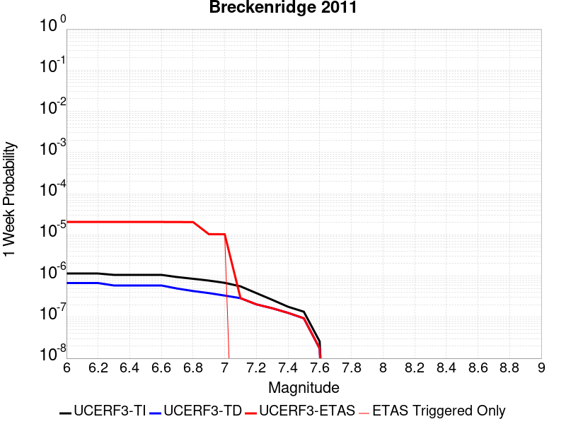 | 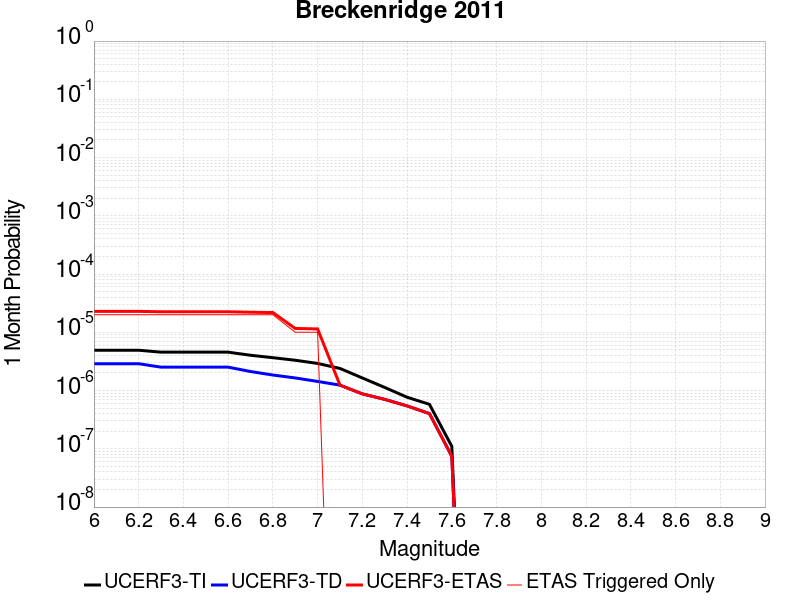 |  | 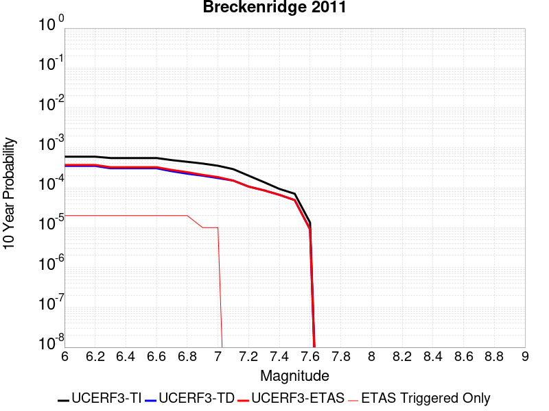 |

| Magnitude | 1 wk TI Prob | 1 wk TD Prob | 1 wk ETAS Prob | 1 wk ETAS/TD Gain | 1 wk ETAS Triggered Only | 1 mo TI Prob | 1 mo TD Prob | 1 mo ETAS Prob | 1 mo ETAS/TD Gain | 1 mo ETAS Triggered Only | 1 yr TI Prob | 1 yr TD Prob | 1 yr ETAS Prob | 1 yr ETAS/TD Gain | 1 yr ETAS Triggered Only | 10 yr TI Prob | 10 yr TD Prob | 10 yr ETAS Prob | 10 yr ETAS/TD Gain | 10 yr ETAS Triggered Only |
|-----|-----|-----|-----|-----|-----|-----|-----|-----|-----|-----|-----|-----|-----|-----|-----|-----|-----|-----|-----|-----|
| 6.0 | 1.1490393E-6 | 6.738007E-7 | 2.0673788E-5 | 30.682348 | 2.0E-5 | 4.924445E-6 | 2.8877141E-6 | 2.2887656E-5 | 7.9258733 | 2.0E-5 | 5.995347E-5 | 3.5157373E-5 | 5.515667E-5 | 1.5688508 | 2.0E-5 | 5.9937296E-4 | 3.5152017E-4 | 3.7151313E-4 | 1.0568757 | 2.0E-5 |
| 6.1 | 1.1490393E-6 | 6.738007E-7 | 2.0673788E-5 | 30.682348 | 2.0E-5 | 4.924445E-6 | 2.8877141E-6 | 2.2887656E-5 | 7.9258733 | 2.0E-5 | 5.995347E-5 | 3.5157373E-5 | 5.515667E-5 | 1.5688508 | 2.0E-5 | 5.9937296E-4 | 3.5152017E-4 | 3.7151313E-4 | 1.0568757 | 2.0E-5 |
| 6.2 | 1.1490393E-6 | 6.738007E-7 | 2.0673788E-5 | 30.682348 | 2.0E-5 | 4.924445E-6 | 2.8877141E-6 | 2.2887656E-5 | 7.9258733 | 2.0E-5 | 5.995347E-5 | 3.5157373E-5 | 5.515667E-5 | 1.5688508 | 2.0E-5 | 5.9937296E-4 | 3.5152017E-4 | 3.7151313E-4 | 1.0568757 | 2.0E-5 |
| 6.3 | 1.064617E-6 | 5.886405E-7 | 2.0588628E-5 | 34.976578 | 2.0E-5 | 4.5626366E-6 | 2.5227425E-6 | 2.2522692E-5 | 8.92786 | 2.0E-5 | 5.5548684E-5 | 3.071397E-5 | 5.0713355E-5 | 1.6511495 | 2.0E-5 | 5.55348E-4 | 3.070984E-4 | 3.2709228E-4 | 1.0651057 | 2.0E-5 |
| 6.4 | 1.064617E-6 | 5.886405E-7 | 2.0588628E-5 | 34.976578 | 2.0E-5 | 4.5626366E-6 | 2.5227425E-6 | 2.2522692E-5 | 8.92786 | 2.0E-5 | 5.5548684E-5 | 3.071397E-5 | 5.0713355E-5 | 1.6511495 | 2.0E-5 | 5.55348E-4 | 3.070984E-4 | 3.2709228E-4 | 1.0651057 | 2.0E-5 |
| 6.5 | 1.064617E-6 | 5.886405E-7 | 2.0588628E-5 | 34.976578 | 2.0E-5 | 4.5626366E-6 | 2.5227425E-6 | 2.2522692E-5 | 8.92786 | 2.0E-5 | 5.5548684E-5 | 3.071397E-5 | 5.0713355E-5 | 1.6511495 | 2.0E-5 | 5.55348E-4 | 3.070984E-4 | 3.2709228E-4 | 1.0651057 | 2.0E-5 |
| 6.6 | 1.064617E-6 | 5.886405E-7 | 2.0588628E-5 | 34.976578 | 2.0E-5 | 4.5626366E-6 | 2.5227425E-6 | 2.2522692E-5 | 8.92786 | 2.0E-5 | 5.5548684E-5 | 3.071397E-5 | 5.0713355E-5 | 1.6511495 | 2.0E-5 | 5.55348E-4 | 3.070984E-4 | 3.2709228E-4 | 1.0651057 | 2.0E-5 |
| 6.7 | 9.4219524E-7 | 4.954012E-7 | 2.0495392E-5 | 41.3713 | 2.0E-5 | 4.037973E-6 | 2.1231463E-6 | 2.2123104E-5 | 10.419962 | 2.0E-5 | 4.916122E-5 | 2.5849005E-5 | 4.584849E-5 | 1.7737042 | 2.0E-5 | 4.9150345E-4 | 2.5846064E-4 | 2.7845547E-4 | 1.0773612 | 2.0E-5 |
| 6.8 | 8.556422E-7 | 4.311915E-7 | 2.0431184E-5 | 47.383087 | 2.0E-5 | 3.667033E-6 | 1.8479623E-6 | 2.1847925E-5 | 11.822712 | 2.0E-5 | 4.464521E-5 | 2.2498712E-5 | 4.249826E-5 | 1.8889198 | 2.0E-5 | 4.4636242E-4 | 2.2496474E-4 | 2.4496025E-4 | 1.0888828 | 2.0E-5 |
| 6.9 | 7.7357794E-7 | 3.841983E-7 | 1.0384195E-5 | 27.028215 | 1.0E-5 | 3.3153299E-6 | 1.6465632E-6 | 1.1646547E-5 | 7.0732465 | 1.0E-5 | 4.0363393E-5 | 2.0046726E-5 | 3.0046525E-5 | 1.4988246 | 1.0E-5 | 4.035606E-4 | 2.0044947E-4 | 2.1044747E-4 | 1.0498779 | 1.0E-5 |
| 7.0 | 6.8172454E-7 | 3.3470985E-7 | 1.03347065E-5 | 30.876614 | 1.0E-5 | 2.9216735E-6 | 1.43447E-6 | 1.1434456E-5 | 7.9712057 | 1.0E-5 | 3.5570793E-5 | 1.7464534E-5 | 2.746436E-5 | 1.572579 | 1.0E-5 | 3.55651E-4 | 1.7463184E-4 | 1.846301E-4 | 1.0572534 | 1.0E-5 |
| 7.1 | 5.5936397E-7 | 2.8909366E-7 | 2.8909366E-7 | 1.0 | 0.0 | 2.397272E-6 | 1.2389722E-6 | 1.2389722E-6 | 1.0 | 0.0 | 2.9186394E-5 | 1.5084385E-5 | 1.5084385E-5 | 1.0 | 0.0 | 2.9182562E-4 | 1.5083379E-4 | 1.5083379E-4 | 1.0 | 0.0 |
| 7.2 | 3.8420822E-7 | 2.0468183E-7 | 2.0468183E-7 | 1.0 | 0.0 | 1.6466057E-6 | 8.772076E-7 | 8.772076E-7 | 1.0 | 0.0 | 2.004724E-5 | 1.0679951E-5 | 1.0679951E-5 | 1.0 | 0.0 | 2.004543E-4 | 1.06794454E-4 | 1.06794454E-4 | 1.0 | 0.0 |
| 7.3 | 2.6405158E-7 | 1.6473078E-7 | 1.6473078E-7 | 1.0 | 0.0 | 1.1316491E-6 | 7.0598884E-7 | 7.0598884E-7 | 1.0 | 0.0 | 1.37777415E-5 | 8.595381E-6 | 8.595381E-6 | 1.0 | 0.0 | 1.3776887E-4 | 8.595055E-5 | 8.595055E-5 | 1.0 | 0.0 |
| 7.4 | 1.792114E-7 | 1.2725252E-7 | 1.2725252E-7 | 1.0 | 0.0 | 7.6804866E-7 | 5.453678E-7 | 5.453678E-7 | 1.0 | 0.0 | 9.3509525E-6 | 6.639834E-6 | 6.639834E-6 | 1.0 | 0.0 | 9.350559E-5 | 6.63964E-5 | 6.63964E-5 | 1.0 | 0.0 |
| 7.5 | 1.3548703E-7 | 9.385346E-8 | 9.385346E-8 | 1.0 | 0.0 | 5.8065854E-7 | 4.0222903E-7 | 4.0222903E-7 | 1.0 | 0.0 | 7.0694946E-6 | 4.897128E-6 | 4.897128E-6 | 1.0 | 0.0 | 7.0692695E-5 | 4.8970236E-5 | 4.8970236E-5 | 1.0 | 0.0 |
| 7.6 | 2.572245E-8 | 1.735264E-8 | 1.735264E-8 | 1.0 | 0.0 | 1.10239064E-7 | 7.436845E-8 | 7.436845E-8 | 1.0 | 0.0 | 1.3421597E-6 | 9.0543557E-7 | 9.0543557E-7 | 1.0 | 0.0 | 1.3421517E-5 | 9.054324E-6 | 9.054324E-6 | 1.0 | 0.0 |

## Point Reyes 2011 CFM
*[(top)](#table-of-contents)*

| 1 Week | 1 Month | 1 Year | 10 Year |
|-----|-----|-----|-----|
|  |  |  |  |

| Magnitude | 1 wk TI Prob | 1 wk TD Prob | 1 wk ETAS Prob | 1 wk ETAS/TD Gain | 1 wk ETAS Triggered Only | 1 mo TI Prob | 1 mo TD Prob | 1 mo ETAS Prob | 1 mo ETAS/TD Gain | 1 mo ETAS Triggered Only | 1 yr TI Prob | 1 yr TD Prob | 1 yr ETAS Prob | 1 yr ETAS/TD Gain | 1 yr ETAS Triggered Only | 10 yr TI Prob | 10 yr TD Prob | 10 yr ETAS Prob | 10 yr ETAS/TD Gain | 10 yr ETAS Triggered Only |
|-----|-----|-----|-----|-----|-----|-----|-----|-----|-----|-----|-----|-----|-----|-----|-----|-----|-----|-----|-----|-----|
| 6.0 | 8.8644965E-6 | 8.96716E-6 | 1.896707E-5 | 2.1151702 | 1.0E-5 | 3.7990147E-5 | 3.8430157E-5 | 4.842977E-5 | 1.2602023 | 1.0E-5 | 4.624319E-4 | 4.67793E-4 | 4.777883E-4 | 1.021367 | 1.0E-5 | 0.0046147075 | 0.004668711 | 0.0046786647 | 1.0021319 | 1.0E-5 |
| 6.1 | 4.526405E-6 | 4.5392153E-6 | 4.5392153E-6 | 1.0 | 0.0 | 1.9398734E-5 | 1.945364E-5 | 1.945364E-5 | 1.0 | 0.0 | 2.36154E-4 | 2.3682338E-4 | 2.3682338E-4 | 1.0 | 0.0 | 0.002359032 | 0.0023658164 | 0.0023658164 | 1.0 | 0.0 |
| 6.2 | 4.526405E-6 | 4.5392153E-6 | 4.5392153E-6 | 1.0 | 0.0 | 1.9398734E-5 | 1.945364E-5 | 1.945364E-5 | 1.0 | 0.0 | 2.36154E-4 | 2.3682338E-4 | 2.3682338E-4 | 1.0 | 0.0 | 0.002359032 | 0.0023658164 | 0.0023658164 | 1.0 | 0.0 |
| 6.3 | 2.6842322E-6 | 2.660673E-6 | 2.660673E-6 | 1.0 | 0.0 | 1.1503801E-5 | 1.1402836E-5 | 1.1402836E-5 | 1.0 | 0.0 | 1.4004979E-4 | 1.3882088E-4 | 1.3882088E-4 | 1.0 | 0.0 | 0.0013996155 | 0.0013873635 | 0.0013873635 | 1.0 | 0.0 |
| 6.4 | 2.6842322E-6 | 2.660673E-6 | 2.660673E-6 | 1.0 | 0.0 | 1.1503801E-5 | 1.1402836E-5 | 1.1402836E-5 | 1.0 | 0.0 | 1.4004979E-4 | 1.3882088E-4 | 1.3882088E-4 | 1.0 | 0.0 | 0.0013996155 | 0.0013873635 | 0.0013873635 | 1.0 | 0.0 |
| 6.5 | 1.9281833E-6 | 1.8906233E-6 | 1.8906233E-6 | 1.0 | 0.0 | 8.263617E-6 | 8.1026465E-6 | 8.1026465E-6 | 1.0 | 0.0 | 1.0060489E-4 | 9.864534E-5 | 9.864534E-5 | 1.0 | 0.0 | 0.0010055936 | 9.860265E-4 | 9.860265E-4 | 1.0 | 0.0 |
| 6.6 | 1.4726726E-6 | 1.4269547E-6 | 1.4269547E-6 | 1.0 | 0.0 | 6.3114385E-6 | 6.115506E-6 | 6.115506E-6 | 1.0 | 0.0 | 7.683905E-5 | 7.445379E-5 | 7.445379E-5 | 1.0 | 0.0 | 7.6812494E-4 | 7.442957E-4 | 7.442957E-4 | 1.0 | 0.0 |
| 6.7 | 8.572307E-7 | 8.007182E-7 | 8.007182E-7 | 1.0 | 0.0 | 3.6738406E-6 | 3.431645E-6 | 3.431645E-6 | 1.0 | 0.0 | 4.472809E-5 | 4.1779494E-5 | 4.1779494E-5 | 1.0 | 0.0 | 4.471909E-4 | 4.177204E-4 | 4.177204E-4 | 1.0 | 0.0 |
| 6.8 | 6.6745434E-7 | 6.07727E-7 | 6.07727E-7 | 1.0 | 0.0 | 2.8605155E-6 | 2.6045416E-6 | 2.6045416E-6 | 1.0 | 0.0 | 3.482622E-5 | 3.1709842E-5 | 3.1709842E-5 | 1.0 | 0.0 | 3.4820763E-4 | 3.170566E-4 | 3.170566E-4 | 1.0 | 0.0 |
| 6.9 | 4.291521E-7 | 3.6535639E-7 | 3.6535639E-7 | 1.0 | 0.0 | 1.839222E-6 | 1.5658121E-6 | 1.5658121E-6 | 1.0 | 0.0 | 2.2392298E-5 | 1.90636E-5 | 1.90636E-5 | 1.0 | 0.0 | 2.2390042E-4 | 1.906224E-4 | 1.906224E-4 | 1.0 | 0.0 |
| 7.0 | 2.6812808E-7 | 2.0187117E-7 | 2.0187117E-7 | 1.0 | 0.0 | 1.1491198E-6 | 8.6516184E-7 | 8.6516184E-7 | 1.0 | 0.0 | 1.3990444E-5 | 1.0533295E-5 | 1.0533295E-5 | 1.0 | 0.0 | 1.3989564E-4 | 1.05330415E-4 | 1.05330415E-4 | 1.0 | 0.0 |
| 7.1 | 1.9451231E-7 | 1.2725201E-7 | 1.2725201E-7 | 1.0 | 0.0 | 8.336239E-7 | 5.4536565E-7 | 5.4536565E-7 | 1.0 | 0.0 | 1.0149324E-5 | 6.639806E-6 | 6.639806E-6 | 1.0 | 0.0 | 1.014886E-4 | 6.639846E-5 | 6.639846E-5 | 1.0 | 0.0 |
| 7.2 | 1.6715143E-7 | 1.0042555E-7 | 1.0042555E-7 | 1.0 | 0.0 | 7.1636305E-7 | 4.3039515E-7 | 4.3039515E-7 | 1.0 | 0.0 | 8.721685E-6 | 5.2400483E-6 | 5.2400483E-6 | 1.0 | 0.0 | 8.721343E-5 | 5.240162E-5 | 5.240162E-5 | 1.0 | 0.0 |
| 7.3 | 1.5503173E-7 | 9.012816E-8 | 9.012816E-8 | 1.0 | 0.0 | 6.644215E-7 | 3.8626348E-7 | 3.8626348E-7 | 1.0 | 0.0 | 8.089301E-6 | 4.7027474E-6 | 4.7027474E-6 | 1.0 | 0.0 | 8.089007E-5 | 4.7028854E-5 | 4.7028854E-5 | 1.0 | 0.0 |
| 7.4 | 1.4251614E-7 | 8.097342E-8 | 8.097342E-8 | 1.0 | 0.0 | 6.1078333E-7 | 3.4702887E-7 | 3.4702887E-7 | 1.0 | 0.0 | 7.4362615E-6 | 4.225068E-6 | 4.225068E-6 | 1.0 | 0.0 | 7.436013E-5 | 4.2252257E-5 | 4.2252257E-5 | 1.0 | 0.0 |
| 7.5 | 1.2710186E-7 | 7.029377E-8 | 7.029377E-8 | 1.0 | 0.0 | 5.447221E-7 | 3.0125898E-7 | 3.0125898E-7 | 1.0 | 0.0 | 6.6319717E-6 | 3.6678218E-6 | 3.6678218E-6 | 1.0 | 0.0 | 6.6317734E-5 | 3.667999E-5 | 3.667999E-5 | 1.0 | 0.0 |
| 7.6 | 1.0144708E-7 | 5.494996E-8 | 5.494996E-8 | 1.0 | 0.0 | 4.347731E-7 | 2.354998E-7 | 2.354998E-7 | 1.0 | 0.0 | 5.2933497E-6 | 2.8672061E-6 | 2.8672061E-6 | 1.0 | 0.0 | 5.293224E-5 | 2.8674069E-5 | 2.8674069E-5 | 1.0 | 0.0 |
| 7.7 | 7.090527E-8 | 3.9821334E-8 | 3.9821334E-8 | 1.0 | 0.0 | 3.038797E-7 | 1.7066284E-7 | 1.7066284E-7 | 1.0 | 0.0 | 3.699729E-6 | 2.0778182E-6 | 2.0778182E-6 | 1.0 | 0.0 | 3.6996673E-5 | 2.0780362E-5 | 2.0780362E-5 | 1.0 | 0.0 |
| 7.8 | 3.8712045E-8 | 2.7438638E-8 | 2.7438638E-8 | 1.0 | 0.0 | 1.6590876E-7 | 1.1759416E-7 | 1.1759416E-7 | 1.0 | 0.0 | 2.0199373E-6 | 1.4317079E-6 | 1.4317079E-6 | 1.0 | 0.0 | 2.0199188E-5 | 1.4319363E-5 | 1.4319363E-5 | 1.0 | 0.0 |
| 7.9 | 1.7068782E-8 | 1.183186E-8 | 1.183186E-8 | 1.0 | 0.0 | 7.315192E-8 | 5.0707975E-8 | 5.0707975E-8 | 1.0 | 0.0 | 8.906242E-7 | 6.173694E-7 | 6.173694E-7 | 1.0 | 0.0 | 8.906207E-6 | 6.1760525E-6 | 6.1760525E-6 | 1.0 | 0.0 |
| 8.0 | 1.0172592E-8 | 7.0268076E-9 | 7.0268076E-9 | 1.0 | 0.0 | 4.359682E-8 | 3.011489E-8 | 3.011489E-8 | 1.0 | 0.0 | 5.3079117E-7 | 3.6664872E-7 | 3.6664872E-7 | 1.0 | 0.0 | 5.307899E-6 | 3.6688568E-6 | 3.6688568E-6 | 1.0 | 0.0 |
| 8.1 | 3.7861243E-9 | 3.5448604E-9 | 3.5448604E-9 | 1.0 | 0.0 | 1.6226247E-8 | 1.5192258E-8 | 1.5192258E-8 | 1.0 | 0.0 | 1.9755454E-7 | 1.8496571E-7 | 1.8496571E-7 | 1.0 | 0.0 | 1.9755437E-6 | 1.8514592E-6 | 1.8514592E-6 | 1.0 | 0.0 |

## Concord 2011 CFM
*[(top)](#table-of-contents)*

| 1 Week | 1 Month | 1 Year | 10 Year |
|-----|-----|-----|-----|
|  |  |  |  |

| Magnitude | 1 wk TI Prob | 1 wk TD Prob | 1 wk ETAS Prob | 1 wk ETAS/TD Gain | 1 wk ETAS Triggered Only | 1 mo TI Prob | 1 mo TD Prob | 1 mo ETAS Prob | 1 mo ETAS/TD Gain | 1 mo ETAS Triggered Only | 1 yr TI Prob | 1 yr TD Prob | 1 yr ETAS Prob | 1 yr ETAS/TD Gain | 1 yr ETAS Triggered Only | 10 yr TI Prob | 10 yr TD Prob | 10 yr ETAS Prob | 10 yr ETAS/TD Gain | 10 yr ETAS Triggered Only |
|-----|-----|-----|-----|-----|-----|-----|-----|-----|-----|-----|-----|-----|-----|-----|-----|-----|-----|-----|-----|-----|
| 6.0 | 5.7865112E-5 | 9.7585355E-5 | 9.7585355E-5 | 1.0 | 0.0 | 2.4796976E-4 | 4.181607E-4 | 4.181607E-4 | 1.0 | 0.0 | 0.0030148525 | 0.005079743 | 0.005079743 | 1.0 | 0.0 | 0.029742775 | 0.049266078 | 0.049275585 | 1.000193 | 1.0E-5 |
| 6.1 | 5.7865112E-5 | 9.7585355E-5 | 9.7585355E-5 | 1.0 | 0.0 | 2.4796976E-4 | 4.181607E-4 | 4.181607E-4 | 1.0 | 0.0 | 0.0030148525 | 0.005079743 | 0.005079743 | 1.0 | 0.0 | 0.029742775 | 0.049266078 | 0.049275585 | 1.000193 | 1.0E-5 |
| 6.2 | 5.6789337E-5 | 9.578793E-5 | 9.578793E-5 | 1.0 | 0.0 | 2.4336016E-4 | 4.1045985E-4 | 4.1045985E-4 | 1.0 | 0.0 | 0.0029588845 | 0.0049864696 | 0.0049864696 | 1.0 | 0.0 | 0.029197963 | 0.04838257 | 0.048392083 | 1.0001967 | 1.0E-5 |
| 6.3 | 5.203322E-5 | 8.803241E-5 | 8.803241E-5 | 1.0 | 0.0 | 2.2298045E-4 | 3.772316E-4 | 3.772316E-4 | 1.0 | 0.0 | 0.0027114071 | 0.0045839064 | 0.0045839064 | 1.0 | 0.0 | 0.026785625 | 0.04455397 | 0.044563524 | 1.0002145 | 1.0E-5 |
| 6.4 | 4.7120942E-5 | 7.897583E-5 | 7.897583E-5 | 1.0 | 0.0 | 2.0193127E-4 | 3.3842813E-4 | 3.3842813E-4 | 1.0 | 0.0 | 0.0024557412 | 0.004113323 | 0.004113323 | 1.0 | 0.0 | 0.024287801 | 0.040080756 | 0.040090356 | 1.0002395 | 1.0E-5 |
| 6.5 | 2.9598437E-5 | 4.6675777E-5 | 4.6675777E-5 | 1.0 | 0.0 | 1.2684427E-4 | 2.000249E-4 | 2.000249E-4 | 1.0 | 0.0 | 0.001543235 | 0.0024327936 | 0.0024327936 | 1.0 | 0.0 | 0.015325619 | 0.023909668 | 0.023909668 | 1.0 | 0.0 |
| 6.6 | 2.0443718E-5 | 2.9984873E-5 | 2.9984873E-5 | 1.0 | 0.0 | 8.7613E-5 | 1.2850047E-4 | 1.2850047E-4 | 1.0 | 0.0 | 0.0010661662 | 0.0015634067 | 0.0015634067 | 1.0 | 0.0 | 0.010610655 | 0.0154669015 | 0.0154669015 | 1.0 | 0.0 |
| 6.7 | 1.798539E-5 | 2.5557883E-5 | 2.5557883E-5 | 1.0 | 0.0 | 7.7077966E-5 | 1.0952931E-4 | 1.0952931E-4 | 1.0 | 0.0 | 9.380202E-4 | 0.0013327252 | 0.0013327252 | 1.0 | 0.0 | 0.009340706 | 0.013217516 | 0.013217516 | 1.0 | 0.0 |
| 6.8 | 1.613555E-5 | 2.1959608E-5 | 2.1959608E-5 | 1.0 | 0.0 | 6.915052E-5 | 9.4109295E-5 | 9.4109295E-5 | 1.0 | 0.0 | 8.4158237E-4 | 0.0011451923 | 0.0011451923 | 1.0 | 0.0 | 0.008384023 | 0.011378321 | 0.011378321 | 1.0 | 0.0 |
| 6.9 | 1.2916435E-5 | 1.708134E-5 | 1.708134E-5 | 1.0 | 0.0 | 5.5354973E-5 | 7.320372E-5 | 7.320372E-5 | 1.0 | 0.0 | 6.7373837E-4 | 8.908967E-4 | 8.908967E-4 | 1.0 | 0.0 | 0.006716994 | 0.008867833 | 0.008867833 | 1.0 | 0.0 |
| 7.0 | 9.81129E-6 | 1.2631038E-5 | 1.2631038E-5 | 1.0 | 0.0 | 4.2047708E-5 | 5.4131906E-5 | 5.4131906E-5 | 1.0 | 0.0 | 5.118106E-4 | 6.588583E-4 | 6.588583E-4 | 1.0 | 0.0 | 0.005106334 | 0.0065697595 | 0.0065697595 | 1.0 | 0.0 |
| 7.1 | 8.0889195E-6 | 1.04184555E-5 | 1.04184555E-5 | 1.0 | 0.0 | 3.4666336E-5 | 4.4649765E-5 | 4.4649765E-5 | 1.0 | 0.0 | 4.219809E-4 | 5.434764E-4 | 5.434764E-4 | 1.0 | 0.0 | 0.004211805 | 0.0054219896 | 0.0054219896 | 1.0 | 0.0 |
| 7.2 | 6.267438E-6 | 8.115879E-6 | 8.115879E-6 | 1.0 | 0.0 | 2.6860173E-5 | 3.478188E-5 | 3.478188E-5 | 1.0 | 0.0 | 3.2697353E-4 | 4.2338783E-4 | 4.2338783E-4 | 1.0 | 0.0 | 0.0032649285 | 0.004226169 | 0.004226169 | 1.0 | 0.0 |
| 7.3 | 3.6761196E-6 | 4.840281E-6 | 4.840281E-6 | 1.0 | 0.0 | 1.5754704E-5 | 2.0743897E-5 | 2.0743897E-5 | 1.0 | 0.0 | 1.9179663E-4 | 2.5252788E-4 | 2.5252788E-4 | 1.0 | 0.0 | 0.0019163118 | 0.0025226264 | 0.0025226264 | 1.0 | 0.0 |
| 7.4 | 2.8044356E-6 | 3.7096993E-6 | 3.7096993E-6 | 1.0 | 0.0 | 1.2018954E-5 | 1.5898615E-5 | 1.5898615E-5 | 1.0 | 0.0 | 1.4632095E-4 | 1.9354856E-4 | 1.9354856E-4 | 1.0 | 0.0 | 0.0014622464 | 0.0019340349 | 0.0019340349 | 1.0 | 0.0 |
| 7.5 | 2.4578699E-6 | 3.2448306E-6 | 3.2448306E-6 | 1.0 | 0.0 | 1.0533685E-5 | 1.3906343E-5 | 1.3906343E-5 | 1.0 | 0.0 | 1.2824008E-4 | 1.6929668E-4 | 1.6929668E-4 | 1.0 | 0.0 | 0.0012816609 | 0.0016918926 | 0.0016918926 | 1.0 | 0.0 |
| 7.6 | 1.7713267E-6 | 2.335189E-6 | 2.335189E-6 | 1.0 | 0.0 | 7.591378E-6 | 1.0007916E-5 | 1.0007916E-5 | 1.0 | 0.0 | 9.2421105E-5 | 1.2183965E-4 | 1.2183965E-4 | 1.0 | 0.0 | 9.2382677E-4 | 0.0012178655 | 0.0012178655 | 1.0 | 0.0 |
| 7.7 | 5.1912366E-7 | 6.829346E-7 | 6.829346E-7 | 1.0 | 0.0 | 2.2248137E-6 | 2.9268595E-6 | 2.9268595E-6 | 1.0 | 0.0 | 2.708677E-5 | 3.5633944E-5 | 3.5633944E-5 | 1.0 | 0.0 | 2.708347E-4 | 3.5630353E-4 | 3.5630353E-4 | 1.0 | 0.0 |

## San Andreas (Offshore) 2011 CFM
*[(top)](#table-of-contents)*

| 1 Week | 1 Month | 1 Year | 10 Year |
|-----|-----|-----|-----|
|  |  |  |  |

| Magnitude | 1 wk TI Prob | 1 wk TD Prob | 1 wk ETAS Prob | 1 wk ETAS/TD Gain | 1 wk ETAS Triggered Only | 1 mo TI Prob | 1 mo TD Prob | 1 mo ETAS Prob | 1 mo ETAS/TD Gain | 1 mo ETAS Triggered Only | 1 yr TI Prob | 1 yr TD Prob | 1 yr ETAS Prob | 1 yr ETAS/TD Gain | 1 yr ETAS Triggered Only | 10 yr TI Prob | 10 yr TD Prob | 10 yr ETAS Prob | 10 yr ETAS/TD Gain | 10 yr ETAS Triggered Only |
|-----|-----|-----|-----|-----|-----|-----|-----|-----|-----|-----|-----|-----|-----|-----|-----|-----|-----|-----|-----|-----|
| 6.0 | 1.7072787E-4 | 1.9226626E-4 | 1.9226626E-4 | 1.0 | 0.0 | 7.3148566E-4 | 8.237405E-4 | 8.237405E-4 | 1.0 | 0.0 | 0.008869528 | 0.009983436 | 0.009993336 | 1.0009917 | 1.0E-5 | 0.085237645 | 0.09681613 | 0.09682517 | 1.0000933 | 1.0E-5 |
| 6.1 | 1.7072787E-4 | 1.9226626E-4 | 1.9226626E-4 | 1.0 | 0.0 | 7.3148566E-4 | 8.237405E-4 | 8.237405E-4 | 1.0 | 0.0 | 0.008869528 | 0.009983436 | 0.009993336 | 1.0009917 | 1.0E-5 | 0.085237645 | 0.09681613 | 0.09682517 | 1.0000933 | 1.0E-5 |
| 6.2 | 1.6312556E-4 | 1.8408237E-4 | 1.8408237E-4 | 1.0 | 0.0 | 6.989222E-4 | 7.8868825E-4 | 7.8868825E-4 | 1.0 | 0.0 | 0.008476226 | 0.0095605 | 0.009570405 | 1.0010359 | 1.0E-5 | 0.08160117 | 0.092837214 | 0.09284629 | 1.0000978 | 1.0E-5 |
| 6.3 | 1.5103363E-4 | 1.6881147E-4 | 1.6881147E-4 | 1.0 | 0.0 | 6.471264E-4 | 7.232793E-4 | 7.232793E-4 | 1.0 | 0.0 | 0.007850339 | 0.008770814 | 0.008780727 | 1.0011301 | 1.0E-5 | 0.075787395 | 0.08546859 | 0.08547774 | 1.000107 | 1.0E-5 |
| 6.4 | 1.5047993E-4 | 1.6767075E-4 | 1.6767075E-4 | 1.0 | 0.0 | 6.4475456E-4 | 7.183932E-4 | 7.183932E-4 | 1.0 | 0.0 | 0.007821669 | 0.008711802 | 0.008721715 | 1.0011379 | 1.0E-5 | 0.0755203 | 0.08494888 | 0.08495803 | 1.0001078 | 1.0E-5 |
| 6.5 | 1.2760791E-4 | 1.3734949E-4 | 1.3734949E-4 | 1.0 | 0.0 | 5.467764E-4 | 5.8850925E-4 | 5.8850925E-4 | 1.0 | 0.0 | 0.0066367025 | 0.007141834 | 0.007141834 | 1.0 | 0.0 | 0.064419635 | 0.07024954 | 0.07024954 | 1.0 | 0.0 |
| 6.6 | 1.1063525E-4 | 1.15565475E-4 | 1.15565475E-4 | 1.0 | 0.0 | 4.740649E-4 | 4.9518765E-4 | 4.9518765E-4 | 1.0 | 0.0 | 0.0057564764 | 0.006012446 | 0.006012446 | 1.0 | 0.0 | 0.05609626 | 0.059496127 | 0.059496127 | 1.0 | 0.0 |
| 6.7 | 1.0391049E-4 | 1.0645875E-4 | 1.0645875E-4 | 1.0 | 0.0 | 4.4525467E-4 | 4.56173E-4 | 4.56173E-4 | 1.0 | 0.0 | 0.0054075094 | 0.0055399504 | 0.0055399504 | 1.0 | 0.0 | 0.052778035 | 0.05498844 | 0.05498844 | 1.0 | 0.0 |
| 6.8 | 1.0096706E-4 | 1.01582154E-4 | 1.01582154E-4 | 1.0 | 0.0 | 4.3264418E-4 | 4.3528038E-4 | 4.3528038E-4 | 1.0 | 0.0 | 0.0052547283 | 0.0052868384 | 0.0052868384 | 1.0 | 0.0 | 0.051321987 | 0.052686825 | 0.052686825 | 1.0 | 0.0 |
| 6.9 | 9.800265E-5 | 9.588697E-5 | 9.588697E-5 | 1.0 | 0.0 | 4.1994374E-4 | 4.1088034E-4 | 4.1088034E-4 | 1.0 | 0.0 | 0.0051008356 | 0.004991162 | 0.004991162 | 1.0 | 0.0 | 0.049853306 | 0.05001508 | 0.05001508 | 1.0 | 0.0 |
| 7.0 | 9.4642375E-5 | 9.002096E-5 | 9.002096E-5 | 1.0 | 0.0 | 4.0554712E-4 | 3.8574796E-4 | 3.8574796E-4 | 1.0 | 0.0 | 0.004926363 | 0.00468653 | 0.00468653 | 1.0 | 0.0 | 0.048185747 | 0.047194667 | 0.047194667 | 1.0 | 0.0 |
| 7.1 | 9.0996844E-5 | 8.354119E-5 | 8.354119E-5 | 1.0 | 0.0 | 3.8992817E-4 | 3.579854E-4 | 3.579854E-4 | 1.0 | 0.0 | 0.004737046 | 0.0043499186 | 0.0043499186 | 1.0 | 0.0 | 0.04637333 | 0.04404688 | 0.04404688 | 1.0 | 0.0 |
| 7.2 | 8.848287E-5 | 7.981761E-5 | 7.981761E-5 | 1.0 | 0.0 | 3.791572E-4 | 3.420315E-4 | 3.420315E-4 | 1.0 | 0.0 | 0.004606472 | 0.0041564363 | 0.0041564363 | 1.0 | 0.0 | 0.045121472 | 0.042189904 | 0.042189904 | 1.0 | 0.0 |
| 7.3 | 7.9280784E-5 | 6.1274885E-5 | 6.1274885E-5 | 1.0 | 0.0 | 3.3973053E-4 | 2.6258078E-4 | 2.6258078E-4 | 1.0 | 0.0 | 0.004128377 | 0.003192337 | 0.003192337 | 1.0 | 0.0 | 0.040525194 | 0.03290183 | 0.03290183 | 1.0 | 0.0 |
| 7.4 | 6.468038E-5 | 3.7930724E-5 | 3.7930724E-5 | 1.0 | 0.0 | 2.771722E-4 | 1.6255044E-4 | 1.6255044E-4 | 1.0 | 0.0 | 0.0033693502 | 0.0019773128 | 0.0019773128 | 1.0 | 0.0 | 0.0331872 | 0.02081734 | 0.02081734 | 1.0 | 0.0 |
| 7.5 | 4.930574E-5 | 1.2699263E-5 | 1.2699263E-5 | 1.0 | 0.0 | 2.1129321E-4 | 5.4424287E-5 | 5.4424287E-5 | 1.0 | 0.0 | 0.0025694598 | 6.6241587E-4 | 6.6241587E-4 | 1.0 | 0.0 | 0.02539953 | 0.0074798525 | 0.0074798525 | 1.0 | 0.0 |
| 7.6 | 4.612566E-5 | 1.0332297E-5 | 1.0332297E-5 | 1.0 | 0.0 | 1.9766642E-4 | 4.428053E-5 | 4.428053E-5 | 1.0 | 0.0 | 0.0024039324 | 5.3898344E-4 | 5.3898344E-4 | 1.0 | 0.0 | 0.023780935 | 0.006170428 | 0.006170428 | 1.0 | 0.0 |
| 7.7 | 3.9435414E-5 | 5.5710498E-6 | 5.5710498E-6 | 1.0 | 0.0 | 1.6899795E-4 | 2.3875711E-5 | 2.3875711E-5 | 1.0 | 0.0 | 0.0020556084 | 2.906482E-4 | 2.906482E-4 | 1.0 | 0.0 | 0.020366974 | 0.0035397834 | 0.0035397834 | 1.0 | 0.0 |
| 7.8 | 2.7787428E-5 | 3.7526645E-6 | 3.7526645E-6 | 1.0 | 0.0 | 1.1908354E-4 | 1.6082748E-5 | 1.6082748E-5 | 1.0 | 0.0 | 0.0014488777 | 1.9578991E-4 | 1.9578991E-4 | 1.0 | 0.0 | 0.014394675 | 0.0023862 | 0.0023862 | 1.0 | 0.0 |
| 7.9 | 1.590671E-5 | 3.0391298E-6 | 3.0391298E-6 | 1.0 | 0.0 | 6.816983E-5 | 1.3024777E-5 | 1.3024777E-5 | 1.0 | 0.0 | 8.2965166E-4 | 1.5856515E-4 | 1.5856515E-4 | 1.0 | 0.0 | 0.008265611 | 0.0019033558 | 0.0019033558 | 1.0 | 0.0 |
| 8.0 | 9.193638E-6 | 2.5908973E-6 | 2.5908973E-6 | 1.0 | 0.0 | 3.940071E-5 | 1.1103798E-5 | 1.1103798E-5 | 1.0 | 0.0 | 4.7959806E-4 | 1.3518038E-4 | 1.3518038E-4 | 1.0 | 0.0 | 0.0047856434 | 0.0016108477 | 0.0016108477 | 1.0 | 0.0 |
| 8.1 | 5.601576E-6 | 2.2333788E-6 | 2.2333788E-6 | 1.0 | 0.0 | 2.4006533E-5 | 9.571589E-6 | 9.571589E-6 | 1.0 | 0.0 | 2.9224035E-4 | 1.1652788E-4 | 1.1652788E-4 | 1.0 | 0.0 | 0.0029185633 | 0.0014015464 | 0.0014015464 | 1.0 | 0.0 |
| 8.2 | 4.3508785E-6 | 1.8568232E-6 | 1.8568232E-6 | 1.0 | 0.0 | 1.864649E-5 | 7.957789E-6 | 7.957789E-6 | 1.0 | 0.0 | 2.2699735E-4 | 9.6881806E-5 | 9.6881806E-5 | 1.0 | 0.0 | 0.0022676561 | 0.0011590312 | 0.0011590312 | 1.0 | 0.0 |
| 8.3 | 1.9573292E-6 | 7.511501E-7 | 7.511501E-7 | 1.0 | 0.0 | 8.388526E-6 | 3.2192108E-6 | 3.2192108E-6 | 1.0 | 0.0 | 1.0212552E-4 | 3.9193204E-5 | 3.9193204E-5 | 1.0 | 0.0 | 0.001020786 | 4.6391718E-4 | 4.6391718E-4 | 1.0 | 0.0 |

## Elsinore (Julian)
*[(top)](#table-of-contents)*

| 1 Week | 1 Month | 1 Year | 10 Year |
|-----|-----|-----|-----|
|  |  | 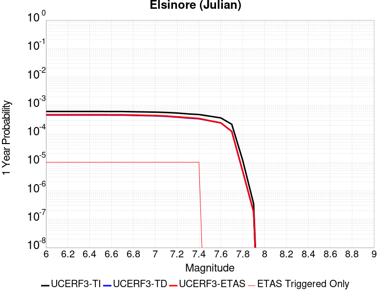 |  |

| Magnitude | 1 wk TI Prob | 1 wk TD Prob | 1 wk ETAS Prob | 1 wk ETAS/TD Gain | 1 wk ETAS Triggered Only | 1 mo TI Prob | 1 mo TD Prob | 1 mo ETAS Prob | 1 mo ETAS/TD Gain | 1 mo ETAS Triggered Only | 1 yr TI Prob | 1 yr TD Prob | 1 yr ETAS Prob | 1 yr ETAS/TD Gain | 1 yr ETAS Triggered Only | 10 yr TI Prob | 10 yr TD Prob | 10 yr ETAS Prob | 10 yr ETAS/TD Gain | 10 yr ETAS Triggered Only |
|-----|-----|-----|-----|-----|-----|-----|-----|-----|-----|-----|-----|-----|-----|-----|-----|-----|-----|-----|-----|-----|
| 6.0 | 1.1710231E-5 | 8.845315E-6 | 8.845315E-6 | 1.0 | 0.0 | 5.0185736E-5 | 3.7907954E-5 | 3.7907954E-5 | 1.0 | 0.0 | 6.1084004E-4 | 4.614333E-4 | 4.7142868E-4 | 1.0216616 | 1.0E-5 | 0.006091637 | 0.0046049724 | 0.0046149264 | 1.0021616 | 1.0E-5 |
| 6.1 | 1.1710231E-5 | 8.845315E-6 | 8.845315E-6 | 1.0 | 0.0 | 5.0185736E-5 | 3.7907954E-5 | 3.7907954E-5 | 1.0 | 0.0 | 6.1084004E-4 | 4.614333E-4 | 4.7142868E-4 | 1.0216616 | 1.0E-5 | 0.006091637 | 0.0046049724 | 0.0046149264 | 1.0021616 | 1.0E-5 |
| 6.2 | 1.1710231E-5 | 8.845315E-6 | 8.845315E-6 | 1.0 | 0.0 | 5.0185736E-5 | 3.7907954E-5 | 3.7907954E-5 | 1.0 | 0.0 | 6.1084004E-4 | 4.614333E-4 | 4.7142868E-4 | 1.0216616 | 1.0E-5 | 0.006091637 | 0.0046049724 | 0.0046149264 | 1.0021616 | 1.0E-5 |
| 6.3 | 1.1710231E-5 | 8.845315E-6 | 8.845315E-6 | 1.0 | 0.0 | 5.0185736E-5 | 3.7907954E-5 | 3.7907954E-5 | 1.0 | 0.0 | 6.1084004E-4 | 4.614333E-4 | 4.7142868E-4 | 1.0216616 | 1.0E-5 | 0.006091637 | 0.0046049724 | 0.0046149264 | 1.0021616 | 1.0E-5 |
| 6.4 | 1.1710231E-5 | 8.845315E-6 | 8.845315E-6 | 1.0 | 0.0 | 5.0185736E-5 | 3.7907954E-5 | 3.7907954E-5 | 1.0 | 0.0 | 6.1084004E-4 | 4.614333E-4 | 4.7142868E-4 | 1.0216616 | 1.0E-5 | 0.006091637 | 0.0046049724 | 0.0046149264 | 1.0021616 | 1.0E-5 |
| 6.5 | 1.1710231E-5 | 8.845315E-6 | 8.845315E-6 | 1.0 | 0.0 | 5.0185736E-5 | 3.7907954E-5 | 3.7907954E-5 | 1.0 | 0.0 | 6.1084004E-4 | 4.614333E-4 | 4.7142868E-4 | 1.0216616 | 1.0E-5 | 0.006091637 | 0.0046049724 | 0.0046149264 | 1.0021616 | 1.0E-5 |
| 6.6 | 1.1650619E-5 | 8.777691E-6 | 8.777691E-6 | 1.0 | 0.0 | 4.993027E-5 | 3.761814E-5 | 3.761814E-5 | 1.0 | 0.0 | 6.0773146E-4 | 4.5790634E-4 | 4.6790176E-4 | 1.0218285 | 1.0E-5 | 0.0060607214 | 0.004569848 | 0.0045798025 | 1.0021783 | 1.0E-5 |
| 6.7 | 1.1650619E-5 | 8.777691E-6 | 8.777691E-6 | 1.0 | 0.0 | 4.993027E-5 | 3.761814E-5 | 3.761814E-5 | 1.0 | 0.0 | 6.0773146E-4 | 4.5790634E-4 | 4.6790176E-4 | 1.0218285 | 1.0E-5 | 0.0060607214 | 0.004569848 | 0.0045798025 | 1.0021783 | 1.0E-5 |
| 6.8 | 1.1442698E-5 | 8.560841E-6 | 8.560841E-6 | 1.0 | 0.0 | 4.9039216E-5 | 3.6688813E-5 | 3.6688813E-5 | 1.0 | 0.0 | 5.968889E-4 | 4.4659642E-4 | 4.5659195E-4 | 1.0223815 | 1.0E-5 | 0.0059528816 | 0.004457207 | 0.004467163 | 1.0022335 | 1.0E-5 |
| 6.9 | 1.1300589E-5 | 8.408708E-6 | 8.408708E-6 | 1.0 | 0.0 | 4.8430196E-5 | 3.603683E-5 | 3.603683E-5 | 1.0 | 0.0 | 5.894781E-4 | 4.3866172E-4 | 4.4865735E-4 | 1.0227866 | 1.0E-5 | 0.005879169 | 0.0043781744 | 0.0043881307 | 1.002274 | 1.0E-5 |
| 7.0 | 1.1117729E-5 | 8.225868E-6 | 8.225868E-6 | 1.0 | 0.0 | 4.764654E-5 | 3.5253255E-5 | 3.5253255E-5 | 1.0 | 0.0 | 5.799422E-4 | 4.291255E-4 | 4.391212E-4 | 1.0232933 | 1.0E-5 | 0.0057843104 | 0.0042831833 | 0.0042931405 | 1.0023247 | 1.0E-5 |
| 7.1 | 1.08053955E-5 | 7.911498E-6 | 7.911498E-6 | 1.0 | 0.0 | 4.6308014E-5 | 3.3905988E-5 | 3.3905988E-5 | 1.0 | 0.0 | 5.6365423E-4 | 4.1272887E-4 | 4.2272473E-4 | 1.024219 | 1.0E-5 | 0.005622267 | 0.004119835 | 0.004129794 | 1.0024173 | 1.0E-5 |
| 7.2 | 1.032804E-5 | 7.432751E-6 | 7.432751E-6 | 1.0 | 0.0 | 4.4262277E-5 | 3.1854266E-5 | 3.1854266E-5 | 1.0 | 0.0 | 5.387599E-4 | 3.8775822E-4 | 3.9775437E-4 | 1.0257792 | 1.0E-5 | 0.0053745564 | 0.00387102 | 0.0038809814 | 1.0025733 | 1.0E-5 |
| 7.3 | 9.622426E-6 | 6.897587E-6 | 6.897587E-6 | 1.0 | 0.0 | 4.1238312E-5 | 2.956076E-5 | 2.956076E-5 | 1.0 | 0.0 | 5.019608E-4 | 3.5984424E-4 | 3.6984065E-4 | 1.0277798 | 1.0E-5 | 0.005008285 | 0.0035928036 | 0.0036027676 | 1.0027733 | 1.0E-5 |
| 7.4 | 9.144434E-6 | 6.496142E-6 | 6.496142E-6 | 1.0 | 0.0 | 3.9189843E-5 | 2.7840319E-5 | 2.7840319E-5 | 1.0 | 0.0 | 4.7703186E-4 | 3.3890453E-4 | 3.4890114E-4 | 1.0294968 | 1.0E-5 | 0.0047600917 | 0.0033840172 | 0.0033939832 | 1.0029451 | 1.0E-5 |
| 7.5 | 7.988981E-6 | 5.498105E-6 | 5.498105E-6 | 1.0 | 0.0 | 3.4238044E-5 | 2.3563101E-5 | 2.3563101E-5 | 1.0 | 0.0 | 4.1676845E-4 | 2.8684427E-4 | 2.8684427E-4 | 1.0 | 0.0 | 0.0041598766 | 0.0028648674 | 0.0028648674 | 1.0 | 0.0 |
| 7.6 | 6.9554876E-6 | 4.6623254E-6 | 4.6623254E-6 | 1.0 | 0.0 | 2.9808893E-5 | 1.998125E-5 | 1.998125E-5 | 1.0 | 0.0 | 3.6286283E-4 | 2.4324573E-4 | 2.4324573E-4 | 1.0 | 0.0 | 0.0036227088 | 0.002429911 | 0.002429911 | 1.0 | 0.0 |
| 7.7 | 4.1557314E-6 | 2.3244427E-6 | 2.3244427E-6 | 1.0 | 0.0 | 1.7810156E-5 | 9.961864E-6 | 9.961864E-6 | 1.0 | 0.0 | 2.1681708E-4 | 1.2127968E-4 | 1.2127968E-4 | 1.0 | 0.0 | 0.0021660565 | 0.001212208 | 0.001212208 | 1.0 | 0.0 |
| 7.8 | 2.2597293E-7 | 9.331864E-8 | 9.331864E-8 | 1.0 | 0.0 | 9.684551E-7 | 3.99937E-7 | 3.99937E-7 | 1.0 | 0.0 | 1.1790877E-5 | 4.8692254E-6 | 4.8692254E-6 | 1.0 | 0.0 | 1.17902506E-4 | 4.8691512E-5 | 4.8691512E-5 | 1.0 | 0.0 |
| 7.9 | 6.676829E-9 | 3.4397174E-9 | 3.4397174E-9 | 1.0 | 0.0 | 2.861498E-8 | 1.4741646E-8 | 1.4741646E-8 | 1.0 | 0.0 | 3.4838732E-7 | 1.7947953E-7 | 1.7947953E-7 | 1.0 | 0.0 | 3.4838679E-6 | 1.794794E-6 | 1.794794E-6 | 1.0 | 0.0 |

## Verdugo
*[(top)](#table-of-contents)*

| 1 Week | 1 Month | 1 Year | 10 Year |
|-----|-----|-----|-----|
|  |  |  |  |

| Magnitude | 1 wk TI Prob | 1 wk TD Prob | 1 wk ETAS Prob | 1 wk ETAS/TD Gain | 1 wk ETAS Triggered Only | 1 mo TI Prob | 1 mo TD Prob | 1 mo ETAS Prob | 1 mo ETAS/TD Gain | 1 mo ETAS Triggered Only | 1 yr TI Prob | 1 yr TD Prob | 1 yr ETAS Prob | 1 yr ETAS/TD Gain | 1 yr ETAS Triggered Only | 10 yr TI Prob | 10 yr TD Prob | 10 yr ETAS Prob | 10 yr ETAS/TD Gain | 10 yr ETAS Triggered Only |
|-----|-----|-----|-----|-----|-----|-----|-----|-----|-----|-----|-----|-----|-----|-----|-----|-----|-----|-----|-----|-----|
| 6.0 | 5.392987E-6 | 4.2164934E-6 | 4.2164934E-6 | 1.0 | 0.0 | 2.3112598E-5 | 1.8070563E-5 | 1.8070563E-5 | 1.0 | 0.0 | 2.8135953E-4 | 2.1998737E-4 | 2.1998737E-4 | 1.0 | 0.0 | 0.0028100356 | 0.0021977439 | 0.0022077218 | 1.0045401 | 1.0E-5 |
| 6.1 | 5.392987E-6 | 4.2164934E-6 | 4.2164934E-6 | 1.0 | 0.0 | 2.3112598E-5 | 1.8070563E-5 | 1.8070563E-5 | 1.0 | 0.0 | 2.8135953E-4 | 2.1998737E-4 | 2.1998737E-4 | 1.0 | 0.0 | 0.0028100356 | 0.0021977439 | 0.0022077218 | 1.0045401 | 1.0E-5 |
| 6.2 | 5.392987E-6 | 4.2164934E-6 | 4.2164934E-6 | 1.0 | 0.0 | 2.3112598E-5 | 1.8070563E-5 | 1.8070563E-5 | 1.0 | 0.0 | 2.8135953E-4 | 2.1998737E-4 | 2.1998737E-4 | 1.0 | 0.0 | 0.0028100356 | 0.0021977439 | 0.0022077218 | 1.0045401 | 1.0E-5 |
| 6.3 | 5.392987E-6 | 4.2164934E-6 | 4.2164934E-6 | 1.0 | 0.0 | 2.3112598E-5 | 1.8070563E-5 | 1.8070563E-5 | 1.0 | 0.0 | 2.8135953E-4 | 2.1998737E-4 | 2.1998737E-4 | 1.0 | 0.0 | 0.0028100356 | 0.0021977439 | 0.0022077218 | 1.0045401 | 1.0E-5 |
| 6.4 | 5.392987E-6 | 4.2164934E-6 | 4.2164934E-6 | 1.0 | 0.0 | 2.3112598E-5 | 1.8070563E-5 | 1.8070563E-5 | 1.0 | 0.0 | 2.8135953E-4 | 2.1998737E-4 | 2.1998737E-4 | 1.0 | 0.0 | 0.0028100356 | 0.0021977439 | 0.0022077218 | 1.0045401 | 1.0E-5 |
| 6.5 | 4.9154837E-6 | 3.7224413E-6 | 3.7224413E-6 | 1.0 | 0.0 | 2.1066187E-5 | 1.5953223E-5 | 1.5953223E-5 | 1.0 | 0.0 | 2.5645064E-4 | 1.9421338E-4 | 1.9421338E-4 | 1.0 | 0.0 | 0.002561549 | 0.0019404575 | 0.001950438 | 1.0051434 | 1.0E-5 |
| 6.6 | 4.9154837E-6 | 3.7224413E-6 | 3.7224413E-6 | 1.0 | 0.0 | 2.1066187E-5 | 1.5953223E-5 | 1.5953223E-5 | 1.0 | 0.0 | 2.5645064E-4 | 1.9421338E-4 | 1.9421338E-4 | 1.0 | 0.0 | 0.002561549 | 0.0019404575 | 0.001950438 | 1.0051434 | 1.0E-5 |
| 6.7 | 4.817006E-6 | 3.620628E-6 | 3.620628E-6 | 1.0 | 0.0 | 2.0644147E-5 | 1.5516885E-5 | 1.5516885E-5 | 1.0 | 0.0 | 2.513135E-4 | 1.889019E-4 | 1.889019E-4 | 1.0 | 0.0 | 0.0025102948 | 0.0018874329 | 0.0018974141 | 1.0052882 | 1.0E-5 |
| 6.8 | 4.507407E-6 | 3.3070805E-6 | 3.3070805E-6 | 1.0 | 0.0 | 1.9317316E-5 | 1.4173126E-5 | 1.4173126E-5 | 1.0 | 0.0 | 2.3516294E-4 | 1.7254429E-4 | 1.7254429E-4 | 1.0 | 0.0 | 0.0023491425 | 0.0017241176 | 0.0017341003 | 1.0057901 | 1.0E-5 |
| 6.9 | 4.3573054E-6 | 3.1609877E-6 | 3.1609877E-6 | 1.0 | 0.0 | 1.8674033E-5 | 1.354702E-5 | 1.354702E-5 | 1.0 | 0.0 | 2.2733262E-4 | 1.649226E-4 | 1.649226E-4 | 1.0 | 0.0 | 0.0022710022 | 0.0016480145 | 0.0016579981 | 1.0060579 | 1.0E-5 |
| 7.0 | 4.171527E-6 | 2.9836467E-6 | 2.9836467E-6 | 1.0 | 0.0 | 1.787785E-5 | 1.2786995E-5 | 1.2786995E-5 | 1.0 | 0.0 | 2.1764109E-4 | 1.5567066E-4 | 1.5567066E-4 | 1.0 | 0.0 | 0.0021742806 | 0.0015556274 | 0.0015656119 | 1.0064182 | 1.0E-5 |
| 7.1 | 4.0405484E-6 | 2.882238E-6 | 2.882238E-6 | 1.0 | 0.0 | 1.731652E-5 | 1.23523905E-5 | 1.23523905E-5 | 1.0 | 0.0 | 2.1080824E-4 | 1.5038009E-4 | 1.5038009E-4 | 1.0 | 0.0 | 0.0021060838 | 0.0015027943 | 0.0015127793 | 1.0066442 | 1.0E-5 |
| 7.2 | 3.8306007E-6 | 2.701823E-6 | 2.701823E-6 | 1.0 | 0.0 | 1.6416758E-5 | 1.157919E-5 | 1.157919E-5 | 1.0 | 0.0 | 1.9985568E-4 | 1.4096762E-4 | 1.4096762E-4 | 1.0 | 0.0 | 0.0019967605 | 0.0014087928 | 0.0014187787 | 1.0070883 | 1.0E-5 |
| 7.3 | 3.5750938E-6 | 2.512154E-6 | 2.512154E-6 | 1.0 | 0.0 | 1.532174E-5 | 1.076633E-5 | 1.076633E-5 | 1.0 | 0.0 | 1.8652623E-4 | 1.3107229E-4 | 1.3107229E-4 | 1.0 | 0.0 | 0.0018636974 | 0.0013099604 | 0.0013199473 | 1.0076238 | 1.0E-5 |
| 7.4 | 3.3510041E-6 | 2.340838E-6 | 2.340838E-6 | 1.0 | 0.0 | 1.4361368E-5 | 1.0032124E-5 | 1.0032124E-5 | 1.0 | 0.0 | 1.7483562E-4 | 1.2213437E-4 | 1.2213437E-4 | 1.0 | 0.0 | 0.0017469813 | 0.0012206829 | 0.0012306707 | 1.0081822 | 1.0E-5 |
| 7.5 | 2.948287E-6 | 2.0390912E-6 | 2.0390912E-6 | 1.0 | 0.0 | 1.2635454E-5 | 8.7389335E-6 | 8.7389335E-6 | 1.0 | 0.0 | 1.538258E-4 | 1.06391424E-4 | 1.06391424E-4 | 1.0 | 0.0 | 0.0015371935 | 0.0010634151 | 0.0010734044 | 1.0093937 | 1.0E-5 |
| 7.6 | 2.0134323E-6 | 1.4471086E-6 | 1.4471086E-6 | 1.0 | 0.0 | 8.628967E-6 | 6.20188E-6 | 6.20188E-6 | 1.0 | 0.0 | 1.05052604E-4 | 7.550536E-5 | 7.550536E-5 | 1.0 | 0.0 | 0.0010500296 | 7.548059E-4 | 7.548059E-4 | 1.0 | 0.0 |
| 7.7 | 5.726436E-7 | 4.0453273E-7 | 4.0453273E-7 | 1.0 | 0.0 | 2.4541846E-6 | 1.7337106E-6 | 1.7337106E-6 | 1.0 | 0.0 | 2.9879287E-5 | 2.110775E-5 | 2.110775E-5 | 1.0 | 0.0 | 2.987527E-4 | 2.1105999E-4 | 2.1105999E-4 | 1.0 | 0.0 |
| 7.8 | 1.6248204E-7 | 1.06879604E-7 | 1.06879604E-7 | 1.0 | 0.0 | 6.963514E-7 | 4.5805535E-7 | 4.5805535E-7 | 1.0 | 0.0 | 8.478045E-6 | 5.57681E-6 | 5.57681E-6 | 1.0 | 0.0 | 8.477722E-5 | 5.5766737E-5 | 5.5766737E-5 | 1.0 | 0.0 |
| 7.9 | 4.4475744E-8 | 3.037888E-8 | 3.037888E-8 | 1.0 | 0.0 | 1.9061031E-7 | 1.301952E-7 | 1.301952E-7 | 1.0 | 0.0 | 2.320678E-6 | 1.5851255E-6 | 1.5851255E-6 | 1.0 | 0.0 | 2.3206538E-5 | 1.5851156E-5 | 1.5851156E-5 | 1.0 | 0.0 |

## Elsinore (Coyote Mountains)
*[(top)](#table-of-contents)*

| 1 Week | 1 Month | 1 Year | 10 Year |
|-----|-----|-----|-----|
|  |  | 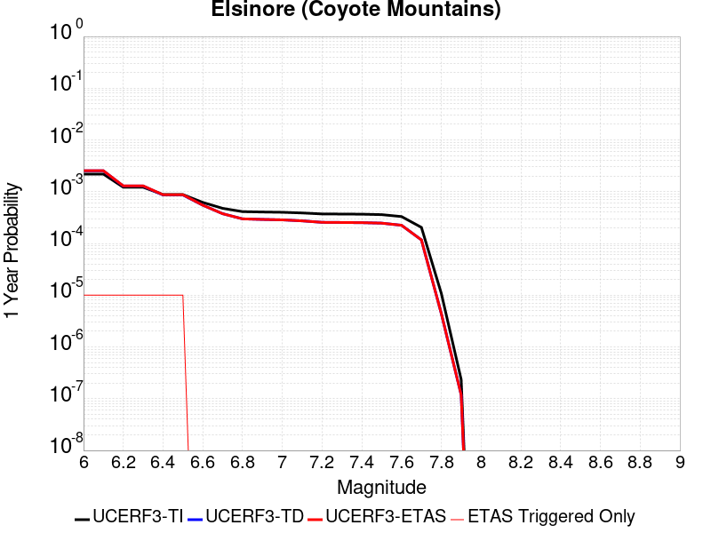 | 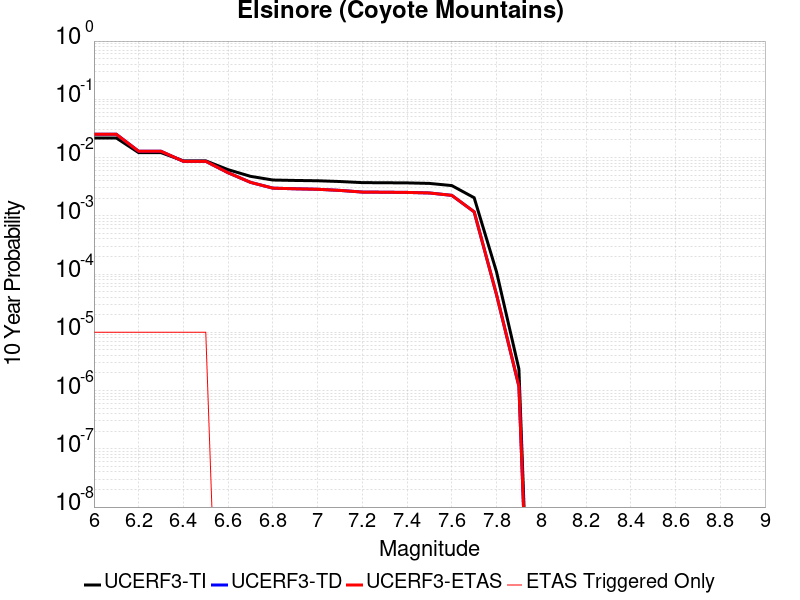 |

| Magnitude | 1 wk TI Prob | 1 wk TD Prob | 1 wk ETAS Prob | 1 wk ETAS/TD Gain | 1 wk ETAS Triggered Only | 1 mo TI Prob | 1 mo TD Prob | 1 mo ETAS Prob | 1 mo ETAS/TD Gain | 1 mo ETAS Triggered Only | 1 yr TI Prob | 1 yr TD Prob | 1 yr ETAS Prob | 1 yr ETAS/TD Gain | 1 yr ETAS Triggered Only | 10 yr TI Prob | 10 yr TD Prob | 10 yr ETAS Prob | 10 yr ETAS/TD Gain | 10 yr ETAS Triggered Only |
|-----|-----|-----|-----|-----|-----|-----|-----|-----|-----|-----|-----|-----|-----|-----|-----|-----|-----|-----|-----|-----|
| 6.0 | 4.20513E-5 | 4.8630944E-5 | 4.8630944E-5 | 1.0 | 0.0 | 1.8020741E-4 | 2.0840492E-4 | 2.0840492E-4 | 1.0 | 0.0 | 0.0021918174 | 0.0025349057 | 0.0025448804 | 1.0039349 | 1.0E-5 | 0.021703249 | 0.025111204 | 0.025120951 | 1.0003883 | 1.0E-5 |
| 6.1 | 4.20513E-5 | 4.8630944E-5 | 4.8630944E-5 | 1.0 | 0.0 | 1.8020741E-4 | 2.0840492E-4 | 2.0840492E-4 | 1.0 | 0.0 | 0.0021918174 | 0.0025349057 | 0.0025448804 | 1.0039349 | 1.0E-5 | 0.021703249 | 0.025111204 | 0.025120951 | 1.0003883 | 1.0E-5 |
| 6.2 | 2.3413893E-5 | 2.4695422E-5 | 2.4695422E-5 | 1.0 | 0.0 | 1.0034139E-4 | 1.0583377E-4 | 1.0583377E-4 | 1.0 | 0.0 | 0.0012209718 | 0.0012878523 | 0.0012978393 | 1.0077549 | 1.0E-5 | 0.012142851 | 0.012812569 | 0.012822441 | 1.0007704 | 1.0E-5 |
| 6.3 | 2.3413893E-5 | 2.4695422E-5 | 2.4695422E-5 | 1.0 | 0.0 | 1.0034139E-4 | 1.0583377E-4 | 1.0583377E-4 | 1.0 | 0.0 | 0.0012209718 | 0.0012878523 | 0.0012978393 | 1.0077549 | 1.0E-5 | 0.012142851 | 0.012812569 | 0.012822441 | 1.0007704 | 1.0E-5 |
| 6.4 | 1.6894814E-5 | 1.6568214E-5 | 1.6568214E-5 | 1.0 | 0.0 | 7.240433E-5 | 7.100491E-5 | 7.100491E-5 | 1.0 | 0.0 | 8.811662E-4 | 8.641788E-4 | 8.7417016E-4 | 1.0115616 | 1.0E-5 | 0.0087768035 | 0.008611842 | 0.008621756 | 1.0011512 | 1.0E-5 |
| 6.5 | 1.6894814E-5 | 1.6568214E-5 | 1.6568214E-5 | 1.0 | 0.0 | 7.240433E-5 | 7.100491E-5 | 7.100491E-5 | 1.0 | 0.0 | 8.811662E-4 | 8.641788E-4 | 8.7417016E-4 | 1.0115616 | 1.0E-5 | 0.0087768035 | 0.008611842 | 0.008621756 | 1.0011512 | 1.0E-5 |
| 6.6 | 1.1910969E-5 | 1.0530538E-5 | 1.0530538E-5 | 1.0 | 0.0 | 5.1046012E-5 | 4.513017E-5 | 4.513017E-5 | 1.0 | 0.0 | 6.21308E-4 | 5.493346E-4 | 5.493346E-4 | 1.0 | 0.0 | 0.0061957375 | 0.0054810685 | 0.0054810685 | 1.0 | 0.0 |
| 6.7 | 9.1486E-6 | 7.2026473E-6 | 7.2026473E-6 | 1.0 | 0.0 | 3.9207694E-5 | 3.0868145E-5 | 3.0868145E-5 | 1.0 | 0.0 | 4.7724912E-4 | 3.7575865E-4 | 3.7575865E-4 | 1.0 | 0.0 | 0.0047622547 | 0.0037516125 | 0.0037516125 | 1.0 | 0.0 |
| 6.8 | 7.90441E-6 | 5.7288153E-6 | 5.7288153E-6 | 1.0 | 0.0 | 3.3875604E-5 | 2.4551842E-5 | 2.4551842E-5 | 1.0 | 0.0 | 4.1235742E-4 | 2.9887896E-4 | 2.9887896E-4 | 1.0 | 0.0 | 0.0041159308 | 0.0029848986 | 0.0029848986 | 1.0 | 0.0 |
| 6.9 | 7.77015E-6 | 5.5827695E-6 | 5.5827695E-6 | 1.0 | 0.0 | 3.3300217E-5 | 2.3925944E-5 | 2.3925944E-5 | 1.0 | 0.0 | 4.0535472E-4 | 2.912607E-4 | 2.912607E-4 | 1.0 | 0.0 | 0.004046161 | 0.0029089167 | 0.0029089167 | 1.0 | 0.0 |
| 7.0 | 7.675798E-6 | 5.4796283E-6 | 5.4796283E-6 | 1.0 | 0.0 | 3.289586E-5 | 2.3483917E-5 | 2.3483917E-5 | 1.0 | 0.0 | 4.004335E-4 | 2.8588044E-4 | 2.8588044E-4 | 1.0 | 0.0 | 0.003997127 | 0.0028552532 | 0.0028552532 | 1.0 | 0.0 |
| 7.1 | 7.447814E-6 | 5.2385003E-6 | 5.2385003E-6 | 1.0 | 0.0 | 3.191881E-5 | 2.245053E-5 | 2.245053E-5 | 1.0 | 0.0 | 3.8854225E-4 | 2.7330214E-4 | 2.7330214E-4 | 1.0 | 0.0 | 0.003878636 | 0.0027297847 | 0.0027297847 | 1.0 | 0.0 |
| 7.2 | 7.128185E-6 | 4.905146E-6 | 4.905146E-6 | 1.0 | 0.0 | 3.0549007E-5 | 2.1021891E-5 | 2.1021891E-5 | 1.0 | 0.0 | 3.7187067E-4 | 2.5591266E-4 | 2.5591266E-4 | 1.0 | 0.0 | 0.00371249 | 0.002556298 | 0.002556298 | 1.0 | 0.0 |
| 7.3 | 7.0913875E-6 | 4.873821E-6 | 4.873821E-6 | 1.0 | 0.0 | 3.0391306E-5 | 2.0887644E-5 | 2.0887644E-5 | 1.0 | 0.0 | 3.6995133E-4 | 2.542786E-4 | 2.542786E-4 | 1.0 | 0.0 | 0.0036933604 | 0.0025399947 | 0.0025399947 | 1.0 | 0.0 |
| 7.4 | 7.051521E-6 | 4.837673E-6 | 4.837673E-6 | 1.0 | 0.0 | 3.0220453E-5 | 2.0732725E-5 | 2.0732725E-5 | 1.0 | 0.0 | 3.6787192E-4 | 2.5239287E-4 | 2.5239287E-4 | 1.0 | 0.0 | 0.0036726352 | 0.0025211805 | 0.0025211805 | 1.0 | 0.0 |
| 7.5 | 6.910666E-6 | 4.7332255E-6 | 4.7332255E-6 | 1.0 | 0.0 | 2.9616802E-5 | 2.02851E-5 | 2.02851E-5 | 1.0 | 0.0 | 3.605249E-4 | 2.4694428E-4 | 2.4694428E-4 | 1.0 | 0.0 | 0.0035994058 | 0.002466817 | 0.002466817 | 1.0 | 0.0 |
| 7.6 | 6.341753E-6 | 4.306345E-6 | 4.306345E-6 | 1.0 | 0.0 | 2.7178658E-5 | 1.8455641E-5 | 1.8455641E-5 | 1.0 | 0.0 | 3.3084993E-4 | 2.2467543E-4 | 2.2467543E-4 | 1.0 | 0.0 | 0.0033035777 | 0.002244598 | 0.002244598 | 1.0 | 0.0 |
| 7.7 | 3.9205916E-6 | 2.2437468E-6 | 2.2437468E-6 | 1.0 | 0.0 | 1.6802427E-5 | 9.616027E-6 | 9.616027E-6 | 1.0 | 0.0 | 2.0455034E-4 | 1.17069576E-4 | 1.17069576E-4 | 1.0 | 0.0 | 0.0020436216 | 0.001170152 | 0.001170152 | 1.0 | 0.0 |
| 7.8 | 2.0846227E-7 | 8.4853966E-8 | 8.4853966E-8 | 1.0 | 0.0 | 8.9340944E-7 | 3.6365984E-7 | 3.6365984E-7 | 1.0 | 0.0 | 1.0877206E-5 | 4.427553E-6 | 4.427553E-6 | 1.0 | 0.0 | 1.0876673E-4 | 4.4274973E-5 | 4.4274973E-5 | 1.0 | 0.0 |
| 7.9 | 4.4969806E-9 | 2.269088E-9 | 2.269088E-9 | 1.0 | 0.0 | 1.9272775E-8 | 9.724664E-9 | 9.724664E-9 | 1.0 | 0.0 | 2.3464601E-7 | 1.1839777E-7 | 1.1839777E-7 | 1.0 | 0.0 | 2.3464577E-6 | 1.1839772E-6 | 1.1839772E-6 | 1.0 | 0.0 |

## Sierra Madre (San Fernando)
*[(top)](#table-of-contents)*

| 1 Week | 1 Month | 1 Year | 10 Year |
|-----|-----|-----|-----|
|  |  |  |  |

| Magnitude | 1 wk TI Prob | 1 wk TD Prob | 1 wk ETAS Prob | 1 wk ETAS/TD Gain | 1 wk ETAS Triggered Only | 1 mo TI Prob | 1 mo TD Prob | 1 mo ETAS Prob | 1 mo ETAS/TD Gain | 1 mo ETAS Triggered Only | 1 yr TI Prob | 1 yr TD Prob | 1 yr ETAS Prob | 1 yr ETAS/TD Gain | 1 yr ETAS Triggered Only | 10 yr TI Prob | 10 yr TD Prob | 10 yr ETAS Prob | 10 yr ETAS/TD Gain | 10 yr ETAS Triggered Only |
|-----|-----|-----|-----|-----|-----|-----|-----|-----|-----|-----|-----|-----|-----|-----|-----|-----|-----|-----|-----|-----|
| 6.0 | 1.0346413E-5 | 6.2872386E-6 | 6.2872386E-6 | 1.0 | 0.0 | 4.4341014E-5 | 2.6945036E-5 | 2.6945036E-5 | 1.0 | 0.0 | 5.3971814E-4 | 3.2800753E-4 | 3.2800753E-4 | 1.0 | 0.0 | 0.0053840918 | 0.0032753467 | 0.003285314 | 1.003043 | 1.0E-5 |
| 6.1 | 1.0346413E-5 | 6.2872386E-6 | 6.2872386E-6 | 1.0 | 0.0 | 4.4341014E-5 | 2.6945036E-5 | 2.6945036E-5 | 1.0 | 0.0 | 5.3971814E-4 | 3.2800753E-4 | 3.2800753E-4 | 1.0 | 0.0 | 0.0053840918 | 0.0032753467 | 0.003285314 | 1.003043 | 1.0E-5 |
| 6.2 | 1.0346413E-5 | 6.2872386E-6 | 6.2872386E-6 | 1.0 | 0.0 | 4.4341014E-5 | 2.6945036E-5 | 2.6945036E-5 | 1.0 | 0.0 | 5.3971814E-4 | 3.2800753E-4 | 3.2800753E-4 | 1.0 | 0.0 | 0.0053840918 | 0.0032753467 | 0.003285314 | 1.003043 | 1.0E-5 |
| 6.3 | 1.0346413E-5 | 6.2872386E-6 | 6.2872386E-6 | 1.0 | 0.0 | 4.4341014E-5 | 2.6945036E-5 | 2.6945036E-5 | 1.0 | 0.0 | 5.3971814E-4 | 3.2800753E-4 | 3.2800753E-4 | 1.0 | 0.0 | 0.0053840918 | 0.0032753467 | 0.003285314 | 1.003043 | 1.0E-5 |
| 6.4 | 1.0249558E-5 | 6.2872386E-6 | 6.2872386E-6 | 1.0 | 0.0 | 4.392594E-5 | 2.6945036E-5 | 2.6945036E-5 | 1.0 | 0.0 | 5.3466705E-4 | 3.2800753E-4 | 3.2800753E-4 | 1.0 | 0.0 | 0.0053338245 | 0.0032753467 | 0.003285314 | 1.003043 | 1.0E-5 |
| 6.5 | 1.0249558E-5 | 6.2872386E-6 | 6.2872386E-6 | 1.0 | 0.0 | 4.392594E-5 | 2.6945036E-5 | 2.6945036E-5 | 1.0 | 0.0 | 5.3466705E-4 | 3.2800753E-4 | 3.2800753E-4 | 1.0 | 0.0 | 0.0053338245 | 0.0032753467 | 0.003285314 | 1.003043 | 1.0E-5 |
| 6.6 | 9.9035515E-6 | 6.2872386E-6 | 6.2872386E-6 | 1.0 | 0.0 | 4.2443102E-5 | 2.6945036E-5 | 2.6945036E-5 | 1.0 | 0.0 | 5.166222E-4 | 3.2800753E-4 | 3.2800753E-4 | 1.0 | 0.0 | 0.0051542283 | 0.0032753467 | 0.003285314 | 1.003043 | 1.0E-5 |
| 6.7 | 9.87217E-6 | 6.274661E-6 | 6.274661E-6 | 1.0 | 0.0 | 4.2308613E-5 | 2.6891132E-5 | 2.6891132E-5 | 1.0 | 0.0 | 5.149856E-4 | 3.2735144E-4 | 3.2735144E-4 | 1.0 | 0.0 | 0.005137938 | 0.003268805 | 0.0032787723 | 1.0030493 | 1.0E-5 |
| 6.8 | 9.4359175E-6 | 6.1786473E-6 | 6.1786473E-6 | 1.0 | 0.0 | 4.043902E-5 | 2.6479653E-5 | 2.6479653E-5 | 1.0 | 0.0 | 4.9223384E-4 | 3.223432E-4 | 3.223432E-4 | 1.0 | 0.0 | 0.0049114493 | 0.0032188678 | 0.0032288358 | 1.0030967 | 1.0E-5 |
| 6.9 | 8.700447E-6 | 6.0399334E-6 | 6.0399334E-6 | 1.0 | 0.0 | 3.72871E-5 | 2.5885178E-5 | 2.5885178E-5 | 1.0 | 0.0 | 4.5387587E-4 | 3.1510755E-4 | 3.1510755E-4 | 1.0 | 0.0 | 0.0045295 | 0.0031467169 | 0.0031566853 | 1.0031679 | 1.0E-5 |
| 7.0 | 8.648878E-6 | 6.014848E-6 | 6.014848E-6 | 1.0 | 0.0 | 3.7066096E-5 | 2.5777672E-5 | 2.5777672E-5 | 1.0 | 0.0 | 4.5118626E-4 | 3.1379904E-4 | 3.1379904E-4 | 1.0 | 0.0 | 0.004502713 | 0.0031336688 | 0.0031436374 | 1.0031811 | 1.0E-5 |
| 7.1 | 8.505786E-6 | 5.9244794E-6 | 5.9244794E-6 | 1.0 | 0.0 | 3.645286E-5 | 2.5390384E-5 | 2.5390384E-5 | 1.0 | 0.0 | 4.437232E-4 | 3.0908515E-4 | 3.0908515E-4 | 1.0 | 0.0 | 0.0044283825 | 0.0030866617 | 0.0030966308 | 1.0032297 | 1.0E-5 |
| 7.2 | 8.139752E-6 | 5.698777E-6 | 5.698777E-6 | 1.0 | 0.0 | 3.4884186E-5 | 2.4423107E-5 | 2.4423107E-5 | 1.0 | 0.0 | 4.246322E-4 | 2.973118E-4 | 2.973118E-4 | 1.0 | 0.0 | 0.004238217 | 0.0029692466 | 0.0029792169 | 1.0033579 | 1.0E-5 |
| 7.3 | 7.8816E-6 | 5.5520936E-6 | 5.5520936E-6 | 1.0 | 0.0 | 3.3777847E-5 | 2.3794475E-5 | 2.3794475E-5 | 1.0 | 0.0 | 4.111677E-4 | 2.8966027E-4 | 2.8966027E-4 | 1.0 | 0.0 | 0.004104078 | 0.0028929329 | 0.0029029038 | 1.0034467 | 1.0E-5 |
| 7.4 | 7.5810603E-6 | 5.356333E-6 | 5.356333E-6 | 1.0 | 0.0 | 3.2489854E-5 | 2.2955517E-5 | 2.2955517E-5 | 1.0 | 0.0 | 3.9549218E-4 | 2.7944864E-4 | 2.7944864E-4 | 1.0 | 0.0 | 0.0039478904 | 0.0027910774 | 0.0028010495 | 1.0035728 | 1.0E-5 |
| 7.5 | 6.349153E-6 | 4.4075887E-6 | 4.4075887E-6 | 1.0 | 0.0 | 2.7210372E-5 | 1.8889532E-5 | 1.8889532E-5 | 1.0 | 0.0 | 3.312359E-4 | 2.2995661E-4 | 2.2995661E-4 | 1.0 | 0.0 | 0.0033074263 | 0.0022972687 | 0.0023072457 | 1.004343 | 1.0E-5 |
| 7.6 | 4.430576E-6 | 2.8905786E-6 | 2.8905786E-6 | 1.0 | 0.0 | 1.8988047E-5 | 1.23881355E-5 | 1.23881355E-5 | 1.0 | 0.0 | 2.3115493E-4 | 1.5081534E-4 | 1.5081534E-4 | 1.0 | 0.0 | 0.0023091463 | 0.0015071525 | 0.0015071525 | 1.0 | 0.0 |
| 7.7 | 3.005066E-6 | 1.7509823E-6 | 1.7509823E-6 | 1.0 | 0.0 | 1.2878791E-5 | 7.504188E-6 | 7.504188E-6 | 1.0 | 0.0 | 1.56788E-4 | 9.135967E-5 | 9.135967E-5 | 1.0 | 0.0 | 0.0015667742 | 9.1322226E-4 | 9.1322226E-4 | 1.0 | 0.0 |
| 7.8 | 1.8459098E-6 | 1.0581826E-6 | 1.0581826E-6 | 1.0 | 0.0 | 7.911018E-6 | 4.5350607E-6 | 4.5350607E-6 | 1.0 | 0.0 | 9.631238E-5 | 5.5212968E-5 | 5.5212968E-5 | 1.0 | 0.0 | 9.627065E-4 | 5.5199297E-4 | 5.5199297E-4 | 1.0 | 0.0 |
| 7.9 | 9.839262E-7 | 5.2340516E-7 | 5.2340516E-7 | 1.0 | 0.0 | 4.2168194E-6 | 2.243163E-6 | 2.243163E-6 | 1.0 | 0.0 | 5.1338568E-5 | 2.731017E-5 | 2.731017E-5 | 1.0 | 0.0 | 5.132671E-4 | 2.7306844E-4 | 2.7306844E-4 | 1.0 | 0.0 |
| 8.0 | 1.210983E-7 | 6.613497E-8 | 6.613497E-8 | 1.0 | 0.0 | 5.1899264E-7 | 2.8343558E-7 | 2.8343558E-7 | 1.0 | 0.0 | 6.3187167E-6 | 3.4508228E-6 | 3.4508228E-6 | 1.0 | 0.0 | 6.318537E-5 | 3.450771E-5 | 3.450771E-5 | 1.0 | 0.0 |

## Fish Slough 2011 CFM
*[(top)](#table-of-contents)*

| 1 Week | 1 Month | 1 Year | 10 Year |
|-----|-----|-----|-----|
|  |  |  | 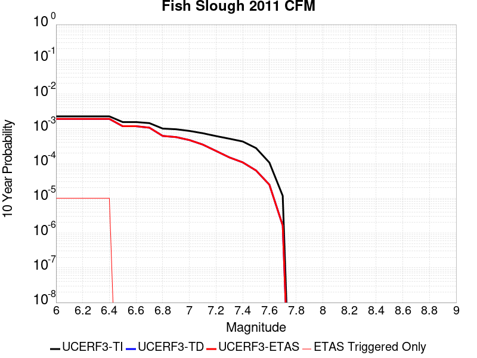 |

| Magnitude | 1 wk TI Prob | 1 wk TD Prob | 1 wk ETAS Prob | 1 wk ETAS/TD Gain | 1 wk ETAS Triggered Only | 1 mo TI Prob | 1 mo TD Prob | 1 mo ETAS Prob | 1 mo ETAS/TD Gain | 1 mo ETAS Triggered Only | 1 yr TI Prob | 1 yr TD Prob | 1 yr ETAS Prob | 1 yr ETAS/TD Gain | 1 yr ETAS Triggered Only | 10 yr TI Prob | 10 yr TD Prob | 10 yr ETAS Prob | 10 yr ETAS/TD Gain | 10 yr ETAS Triggered Only |
|-----|-----|-----|-----|-----|-----|-----|-----|-----|-----|-----|-----|-----|-----|-----|-----|-----|-----|-----|-----|-----|
| 6.0 | 4.3629925E-6 | 3.6772458E-6 | 1.3677209E-5 | 3.7194166 | 1.0E-5 | 1.8698405E-5 | 1.5759542E-5 | 2.5759384E-5 | 1.6345263 | 1.0E-5 | 2.276293E-4 | 1.9185765E-4 | 2.0185573E-4 | 1.052112 | 1.0E-5 | 0.0022739628 | 0.001917129 | 0.0019271099 | 1.0052061 | 1.0E-5 |
| 6.1 | 4.3629925E-6 | 3.6772458E-6 | 1.3677209E-5 | 3.7194166 | 1.0E-5 | 1.8698405E-5 | 1.5759542E-5 | 2.5759384E-5 | 1.6345263 | 1.0E-5 | 2.276293E-4 | 1.9185765E-4 | 2.0185573E-4 | 1.052112 | 1.0E-5 | 0.0022739628 | 0.001917129 | 0.0019271099 | 1.0052061 | 1.0E-5 |
| 6.2 | 4.3629925E-6 | 3.6772458E-6 | 1.3677209E-5 | 3.7194166 | 1.0E-5 | 1.8698405E-5 | 1.5759542E-5 | 2.5759384E-5 | 1.6345263 | 1.0E-5 | 2.276293E-4 | 1.9185765E-4 | 2.0185573E-4 | 1.052112 | 1.0E-5 | 0.0022739628 | 0.001917129 | 0.0019271099 | 1.0052061 | 1.0E-5 |
| 6.3 | 4.3629925E-6 | 3.6772458E-6 | 1.3677209E-5 | 3.7194166 | 1.0E-5 | 1.8698405E-5 | 1.5759542E-5 | 2.5759384E-5 | 1.6345263 | 1.0E-5 | 2.276293E-4 | 1.9185765E-4 | 2.0185573E-4 | 1.052112 | 1.0E-5 | 0.0022739628 | 0.001917129 | 0.0019271099 | 1.0052061 | 1.0E-5 |
| 6.4 | 4.3629925E-6 | 3.6772458E-6 | 1.3677209E-5 | 3.7194166 | 1.0E-5 | 1.8698405E-5 | 1.5759542E-5 | 2.5759384E-5 | 1.6345263 | 1.0E-5 | 2.276293E-4 | 1.9185765E-4 | 2.0185573E-4 | 1.052112 | 1.0E-5 | 0.0022739628 | 0.001917129 | 0.0019271099 | 1.0052061 | 1.0E-5 |
| 6.5 | 2.991715E-6 | 2.2703657E-6 | 2.2703657E-6 | 1.0 | 0.0 | 1.2821573E-5 | 9.730108E-6 | 9.730108E-6 | 1.0 | 0.0 | 1.5609147E-4 | 1.1845854E-4 | 1.1845854E-4 | 1.0 | 0.0 | 0.0015598187 | 0.0011840442 | 0.0011840442 | 1.0 | 0.0 |
| 6.6 | 2.991715E-6 | 2.2703657E-6 | 2.2703657E-6 | 1.0 | 0.0 | 1.2821573E-5 | 9.730108E-6 | 9.730108E-6 | 1.0 | 0.0 | 1.5609147E-4 | 1.1845854E-4 | 1.1845854E-4 | 1.0 | 0.0 | 0.0015598187 | 0.0011840442 | 0.0011840442 | 1.0 | 0.0 |
| 6.7 | 2.7890346E-6 | 2.0621612E-6 | 2.0621612E-6 | 1.0 | 0.0 | 1.1952951E-5 | 8.837809E-6 | 8.837809E-6 | 1.0 | 0.0 | 1.4551746E-4 | 1.07595915E-4 | 1.07595915E-4 | 1.0 | 0.0 | 0.0014542221 | 0.0010755265 | 0.0010755265 | 1.0 | 0.0 |
| 6.8 | 1.9416723E-6 | 1.192531E-6 | 1.192531E-6 | 1.0 | 0.0 | 8.321425E-6 | 5.1108377E-6 | 5.1108377E-6 | 1.0 | 0.0 | 1.01308644E-4 | 6.2222716E-5 | 6.2222716E-5 | 1.0 | 0.0 | 0.0010126247 | 6.22057E-4 | 6.22057E-4 | 1.0 | 0.0 |
| 6.9 | 1.8567416E-6 | 1.1046726E-6 | 1.1046726E-6 | 1.0 | 0.0 | 7.957439E-6 | 4.734303E-6 | 4.734303E-6 | 1.0 | 0.0 | 9.687752E-5 | 5.7638652E-5 | 5.7638652E-5 | 1.0 | 0.0 | 9.6835295E-4 | 5.762409E-4 | 5.762409E-4 | 1.0 | 0.0 |
| 7.0 | 1.6634067E-6 | 9.0737336E-7 | 9.0737336E-7 | 1.0 | 0.0 | 7.1288664E-6 | 3.8887374E-6 | 3.8887374E-6 | 1.0 | 0.0 | 8.679049E-5 | 4.7344376E-5 | 4.7344376E-5 | 1.0 | 0.0 | 8.6756604E-4 | 4.733458E-4 | 4.733458E-4 | 1.0 | 0.0 |
| 7.1 | 1.4281054E-6 | 6.736389E-7 | 6.736389E-7 | 1.0 | 0.0 | 6.1204373E-6 | 2.8870209E-6 | 2.8870209E-6 | 1.0 | 0.0 | 7.451377E-5 | 3.514893E-5 | 3.514893E-5 | 1.0 | 0.0 | 7.44888E-4 | 3.5143548E-4 | 3.5143548E-4 | 1.0 | 0.0 |
| 7.2 | 1.1810387E-6 | 4.408126E-7 | 4.408126E-7 | 1.0 | 0.0 | 5.0615845E-6 | 1.8891956E-6 | 1.8891956E-6 | 1.0 | 0.0 | 6.1623046E-5 | 2.3000723E-5 | 2.3000723E-5 | 1.0 | 0.0 | 6.160596E-4 | 2.2998432E-4 | 2.2998432E-4 | 1.0 | 0.0 |
| 7.3 | 9.918052E-7 | 2.8731267E-7 | 2.8731267E-7 | 1.0 | 0.0 | 4.2505867E-6 | 1.2313394E-6 | 1.2313394E-6 | 1.0 | 0.0 | 5.1749663E-5 | 1.4991455E-5 | 1.4991455E-5 | 1.0 | 0.0 | 5.173762E-4 | 1.4990455E-4 | 1.4990455E-4 | 1.0 | 0.0 |
| 7.4 | 8.25252E-7 | 2.0692863E-7 | 2.0692863E-7 | 1.0 | 0.0 | 3.5367896E-6 | 8.868367E-7 | 8.868367E-7 | 1.0 | 0.0 | 4.3059565E-5 | 1.0797184E-5 | 1.0797184E-5 | 1.0 | 0.0 | 4.305122E-4 | 1.0796666E-4 | 1.0796666E-4 | 1.0 | 0.0 |
| 7.5 | 5.3248567E-7 | 1.2071294E-7 | 1.2071294E-7 | 1.0 | 0.0 | 2.2820795E-6 | 5.1734105E-7 | 5.1734105E-7 | 1.0 | 0.0 | 2.7783964E-5 | 6.2986096E-6 | 6.2986096E-6 | 1.0 | 0.0 | 2.778049E-4 | 6.298435E-5 | 6.298435E-5 | 1.0 | 0.0 |
| 7.6 | 2.037542E-7 | 4.7123013E-8 | 4.7123013E-8 | 1.0 | 0.0 | 8.73232E-7 | 2.0195576E-7 | 2.0195576E-7 | 1.0 | 0.0 | 1.0631547E-5 | 2.4588087E-6 | 2.4588087E-6 | 1.0 | 0.0 | 1.0631039E-4 | 2.4587836E-5 | 2.4587836E-5 | 1.0 | 0.0 |
| 7.7 | 2.2501226E-8 | 3.1506997E-9 | 3.1506997E-9 | 1.0 | 0.0 | 9.6433816E-8 | 1.3502998E-8 | 1.3502998E-8 | 1.0 | 0.0 | 1.1740811E-6 | 1.64399E-7 | 1.64399E-7 | 1.0 | 0.0 | 1.1740749E-5 | 1.6439889E-6 | 1.6439889E-6 | 1.0 | 0.0 |

## Hayward (So) extension 2011 CFM
*[(top)](#table-of-contents)*

| 1 Week | 1 Month | 1 Year | 10 Year |
|-----|-----|-----|-----|
|  |  |  |  |

| Magnitude | 1 wk TI Prob | 1 wk TD Prob | 1 wk ETAS Prob | 1 wk ETAS/TD Gain | 1 wk ETAS Triggered Only | 1 mo TI Prob | 1 mo TD Prob | 1 mo ETAS Prob | 1 mo ETAS/TD Gain | 1 mo ETAS Triggered Only | 1 yr TI Prob | 1 yr TD Prob | 1 yr ETAS Prob | 1 yr ETAS/TD Gain | 1 yr ETAS Triggered Only | 10 yr TI Prob | 10 yr TD Prob | 10 yr ETAS Prob | 10 yr ETAS/TD Gain | 10 yr ETAS Triggered Only |
|-----|-----|-----|-----|-----|-----|-----|-----|-----|-----|-----|-----|-----|-----|-----|-----|-----|-----|-----|-----|-----|
| 6.0 | 1.1721256E-4 | 2.3671088E-4 | 2.467085E-4 | 1.0422356 | 1.0E-5 | 5.022428E-4 | 0.0010138806 | 0.0010238704 | 1.0098531 | 1.0E-5 | 0.0060976758 | 0.012250609 | 0.012260486 | 1.0008063 | 1.0E-5 | 0.0593305 | 0.11284437 | 0.112853244 | 1.0000786 | 1.0E-5 |
| 6.1 | 6.99169E-5 | 1.3808164E-4 | 1.4808026E-4 | 1.072411 | 1.0E-5 | 2.9960944E-4 | 5.9155683E-4 | 6.015509E-4 | 1.0168946 | 1.0E-5 | 0.0036416445 | 0.0071723475 | 0.007182276 | 1.0013843 | 1.0E-5 | 0.035825435 | 0.067804344 | 0.067813665 | 1.0001374 | 1.0E-5 |
| 6.2 | 6.99169E-5 | 1.3808164E-4 | 1.4808026E-4 | 1.072411 | 1.0E-5 | 2.9960944E-4 | 5.9155683E-4 | 6.015509E-4 | 1.0168946 | 1.0E-5 | 0.0036416445 | 0.0071723475 | 0.007182276 | 1.0013843 | 1.0E-5 | 0.035825435 | 0.067804344 | 0.067813665 | 1.0001374 | 1.0E-5 |
| 6.3 | 6.970908E-5 | 1.3776305E-4 | 1.4776168E-4 | 1.0725784 | 1.0E-5 | 2.9871898E-4 | 5.9019245E-4 | 6.001865E-4 | 1.0169337 | 1.0E-5 | 0.0036308395 | 0.007155884 | 0.007165813 | 1.0013875 | 1.0E-5 | 0.035720866 | 0.0676533 | 0.06766263 | 1.0001378 | 1.0E-5 |
| 6.4 | 6.9517155E-5 | 1.3743227E-4 | 1.4743091E-4 | 1.0727531 | 1.0E-5 | 2.9789665E-4 | 5.8877567E-4 | 5.987698E-4 | 1.0169744 | 1.0E-5 | 0.0036208609 | 0.0071387975 | 0.0071487264 | 1.0013908 | 1.0E-5 | 0.03562429 | 0.06749734 | 0.06750666 | 1.0001382 | 1.0E-5 |
| 6.5 | 4.786248E-5 | 9.415232E-5 | 9.415232E-5 | 1.0 | 0.0 | 2.0510878E-4 | 4.0344993E-4 | 4.0344993E-4 | 1.0 | 0.0 | 0.0024943394 | 0.0049013784 | 0.0049013784 | 1.0 | 0.0 | 0.02466527 | 0.046900697 | 0.046900697 | 1.0 | 0.0 |
| 6.6 | 4.4662214E-5 | 8.8819244E-5 | 8.8819244E-5 | 1.0 | 0.0 | 1.9139545E-4 | 3.80601E-4 | 3.80601E-4 | 1.0 | 0.0 | 0.0023277493 | 0.0046244357 | 0.0046244357 | 1.0 | 0.0 | 0.02303517 | 0.04429206 | 0.04429206 | 1.0 | 0.0 |
| 6.7 | 3.884542E-5 | 7.8650686E-5 | 7.8650686E-5 | 1.0 | 0.0 | 1.6646975E-4 | 3.3703333E-4 | 3.3703333E-4 | 1.0 | 0.0 | 0.002024885 | 0.0040961048 | 0.0040961048 | 1.0 | 0.0 | 0.020065336 | 0.039332055 | 0.039332055 | 1.0 | 0.0 |
| 6.8 | 3.4221863E-5 | 6.855886E-5 | 6.855886E-5 | 1.0 | 0.0 | 1.4665688E-4 | 2.9379298E-4 | 2.9379298E-4 | 1.0 | 0.0 | 0.0017840851 | 0.0035714838 | 0.0035714838 | 1.0 | 0.0 | 0.017698295 | 0.034419462 | 0.034419462 | 1.0 | 0.0 |
| 6.9 | 1.6927712E-5 | 3.006262E-5 | 3.006262E-5 | 1.0 | 0.0 | 7.2545314E-5 | 1.2883375E-4 | 1.2883375E-4 | 1.0 | 0.0 | 8.828813E-4 | 0.0015674793 | 0.0015674793 | 1.0 | 0.0 | 0.008793819 | 0.015463544 | 0.015463544 | 1.0 | 0.0 |
| 7.0 | 1.2509653E-5 | 2.246337E-5 | 2.246337E-5 | 1.0 | 0.0 | 5.3611697E-5 | 9.626828E-5 | 9.626828E-5 | 1.0 | 0.0 | 6.525269E-4 | 0.0011714802 | 0.0011714802 | 1.0 | 0.0 | 0.0065061417 | 0.011583166 | 0.011583166 | 1.0 | 0.0 |
| 7.1 | 8.751583E-6 | 1.4926157E-5 | 1.4926157E-5 | 1.0 | 0.0 | 3.750624E-5 | 6.396771E-5 | 6.396771E-5 | 1.0 | 0.0 | 4.5654282E-4 | 7.785344E-4 | 7.785344E-4 | 1.0 | 0.0 | 0.0045560603 | 0.007764457 | 0.007764457 | 1.0 | 0.0 |
| 7.2 | 6.354379E-6 | 1.1499087E-5 | 1.1499087E-5 | 1.0 | 0.0 | 2.7232769E-5 | 4.9280898E-5 | 4.9280898E-5 | 1.0 | 0.0 | 3.3150852E-4 | 5.9983454E-4 | 5.9983454E-4 | 1.0 | 0.0 | 0.0033101442 | 0.006001243 | 0.006001243 | 1.0 | 0.0 |
| 7.3 | 4.645554E-6 | 8.818441E-6 | 8.818441E-6 | 1.0 | 0.0 | 1.9909365E-5 | 3.7792794E-5 | 3.7792794E-5 | 1.0 | 0.0 | 2.4236954E-4 | 4.6003403E-4 | 4.6003403E-4 | 1.0 | 0.0 | 0.0024210536 | 0.004611421 | 0.004611421 | 1.0 | 0.0 |
| 7.4 | 4.23437E-6 | 7.992759E-6 | 7.992759E-6 | 1.0 | 0.0 | 1.8147173E-5 | 3.425425E-5 | 3.425425E-5 | 1.0 | 0.0 | 2.2091944E-4 | 4.1696956E-4 | 4.1696956E-4 | 1.0 | 0.0 | 0.0022069993 | 0.0041826614 | 0.0041826614 | 1.0 | 0.0 |
| 7.5 | 2.2187417E-6 | 3.952336E-6 | 3.952336E-6 | 1.0 | 0.0 | 9.508858E-6 | 1.6938488E-5 | 1.6938488E-5 | 1.0 | 0.0 | 1.157642E-4 | 2.0620918E-4 | 2.0620918E-4 | 1.0 | 0.0 | 0.0011570391 | 0.0020739497 | 0.0020739497 | 1.0 | 0.0 |
| 7.6 | 2.7952495E-8 | 3.8785874E-8 | 3.8785874E-8 | 1.0 | 0.0 | 1.1979641E-7 | 1.6622516E-7 | 1.6622516E-7 | 1.0 | 0.0 | 1.4585203E-6 | 2.0237894E-6 | 2.0237894E-6 | 1.0 | 0.0 | 1.4585107E-5 | 2.0317146E-5 | 2.0317146E-5 | 1.0 | 0.0 |
| 7.7 | 1.7192724E-8 | 2.3436652E-8 | 2.3436652E-8 | 1.0 | 0.0 | 7.36831E-8 | 1.0044278E-7 | 1.0044278E-7 | 1.0 | 0.0 | 8.9709135E-7 | 1.2228902E-6 | 1.2228902E-6 | 1.0 | 0.0 | 8.970877E-6 | 1.2285953E-5 | 1.2285953E-5 | 1.0 | 0.0 |

## Monterey Bay-Tularcitos
*[(top)](#table-of-contents)*

| 1 Week | 1 Month | 1 Year | 10 Year |
|-----|-----|-----|-----|
|  |  |  |  |

| Magnitude | 1 wk TI Prob | 1 wk TD Prob | 1 wk ETAS Prob | 1 wk ETAS/TD Gain | 1 wk ETAS Triggered Only | 1 mo TI Prob | 1 mo TD Prob | 1 mo ETAS Prob | 1 mo ETAS/TD Gain | 1 mo ETAS Triggered Only | 1 yr TI Prob | 1 yr TD Prob | 1 yr ETAS Prob | 1 yr ETAS/TD Gain | 1 yr ETAS Triggered Only | 10 yr TI Prob | 10 yr TD Prob | 10 yr ETAS Prob | 10 yr ETAS/TD Gain | 10 yr ETAS Triggered Only |
|-----|-----|-----|-----|-----|-----|-----|-----|-----|-----|-----|-----|-----|-----|-----|-----|-----|-----|-----|-----|-----|
| 6.0 | 3.0131365E-5 | 3.279877E-5 | 3.279877E-5 | 1.0 | 0.0 | 1.2912804E-4 | 1.4055918E-4 | 1.4055918E-4 | 1.0 | 0.0 | 0.001571 | 0.0017100703 | 0.0017100703 | 1.0 | 0.0 | 0.015599402 | 0.016979916 | 0.016989747 | 1.0005789 | 1.0E-5 |
| 6.1 | 3.0131365E-5 | 3.279877E-5 | 3.279877E-5 | 1.0 | 0.0 | 1.2912804E-4 | 1.4055918E-4 | 1.4055918E-4 | 1.0 | 0.0 | 0.001571 | 0.0017100703 | 0.0017100703 | 1.0 | 0.0 | 0.015599402 | 0.016979916 | 0.016989747 | 1.0005789 | 1.0E-5 |
| 6.2 | 3.0131365E-5 | 3.279877E-5 | 3.279877E-5 | 1.0 | 0.0 | 1.2912804E-4 | 1.4055918E-4 | 1.4055918E-4 | 1.0 | 0.0 | 0.001571 | 0.0017100703 | 0.0017100703 | 1.0 | 0.0 | 0.015599402 | 0.016979916 | 0.016989747 | 1.0005789 | 1.0E-5 |
| 6.3 | 1.6998249E-5 | 1.8330798E-5 | 1.8330798E-5 | 1.0 | 0.0 | 7.28476E-5 | 7.85583E-5 | 7.85583E-5 | 1.0 | 0.0 | 8.865586E-4 | 9.5604634E-4 | 9.5604634E-4 | 1.0 | 0.0 | 0.0088303005 | 0.009521258 | 0.009531163 | 1.0010403 | 1.0E-5 |
| 6.4 | 1.6998249E-5 | 1.8330798E-5 | 1.8330798E-5 | 1.0 | 0.0 | 7.28476E-5 | 7.85583E-5 | 7.85583E-5 | 1.0 | 0.0 | 8.865586E-4 | 9.5604634E-4 | 9.5604634E-4 | 1.0 | 0.0 | 0.0088303005 | 0.009521258 | 0.009531163 | 1.0010403 | 1.0E-5 |
| 6.5 | 1.27470785E-5 | 1.3693312E-5 | 1.3693312E-5 | 1.0 | 0.0 | 5.4629192E-5 | 5.8684363E-5 | 5.8684363E-5 | 1.0 | 0.0 | 6.649074E-4 | 7.1425823E-4 | 7.1425823E-4 | 1.0 | 0.0 | 0.0066292146 | 0.007120678 | 0.007130607 | 1.0013944 | 1.0E-5 |
| 6.6 | 1.2739422E-5 | 1.36854E-5 | 1.36854E-5 | 1.0 | 0.0 | 5.4596385E-5 | 5.8650454E-5 | 5.8650454E-5 | 1.0 | 0.0 | 6.645082E-4 | 7.1384566E-4 | 7.1384566E-4 | 1.0 | 0.0 | 0.0066252467 | 0.007116579 | 0.007126508 | 1.0013952 | 1.0E-5 |
| 6.7 | 1.0160109E-5 | 1.0885755E-5 | 1.0885755E-5 | 1.0 | 0.0 | 4.35426E-5 | 4.665244E-5 | 4.665244E-5 | 1.0 | 0.0 | 5.300022E-4 | 5.6785246E-4 | 5.6785246E-4 | 1.0 | 0.0 | 0.005287399 | 0.0056647263 | 0.0056746695 | 1.0017554 | 1.0E-5 |
| 6.8 | 8.349859E-6 | 8.932587E-6 | 8.932587E-6 | 1.0 | 0.0 | 3.578462E-5 | 3.8281985E-5 | 3.8281985E-5 | 1.0 | 0.0 | 4.3559066E-4 | 4.6598914E-4 | 4.6598914E-4 | 1.0 | 0.0 | 0.004347378 | 0.004650685 | 0.0046606385 | 1.0021402 | 1.0E-5 |
| 6.9 | 5.193639E-6 | 5.53643E-6 | 5.53643E-6 | 1.0 | 0.0 | 2.2258262E-5 | 2.372736E-5 | 2.372736E-5 | 1.0 | 0.0 | 2.7096065E-4 | 2.8884556E-4 | 2.8884556E-4 | 1.0 | 0.0 | 0.0027063051 | 0.0028850224 | 0.0028850224 | 1.0 | 0.0 |
| 7.0 | 4.359381E-6 | 4.643366E-6 | 4.643366E-6 | 1.0 | 0.0 | 1.8682927E-5 | 1.9900004E-5 | 1.9900004E-5 | 1.0 | 0.0 | 2.274409E-4 | 2.422586E-4 | 2.422586E-4 | 1.0 | 0.0 | 0.0022720827 | 0.002420238 | 0.002420238 | 1.0 | 0.0 |
| 7.1 | 3.0398533E-6 | 3.2310427E-6 | 3.2310427E-6 | 1.0 | 0.0 | 1.3027877E-5 | 1.3847267E-5 | 1.3847267E-5 | 1.0 | 0.0 | 1.5860285E-4 | 1.6858005E-4 | 1.6858005E-4 | 1.0 | 0.0 | 0.001584897 | 0.0016847793 | 0.0016847793 | 1.0 | 0.0 |
| 7.2 | 1.642335E-6 | 1.7333153E-6 | 1.7333153E-6 | 1.0 | 0.0 | 7.0385595E-6 | 7.428485E-6 | 7.428485E-6 | 1.0 | 0.0 | 8.569109E-5 | 9.044012E-5 | 9.044012E-5 | 1.0 | 0.0 | 8.5658056E-4 | 9.042358E-4 | 9.042358E-4 | 1.0 | 0.0 |
| 7.3 | 3.356842E-7 | 3.2952389E-7 | 3.2952389E-7 | 1.0 | 0.0 | 1.4386458E-6 | 1.4122445E-6 | 1.4122445E-6 | 1.0 | 0.0 | 1.7515373E-5 | 1.7193941E-5 | 1.7193941E-5 | 1.0 | 0.0 | 1.7513991E-4 | 1.719262E-4 | 1.719262E-4 | 1.0 | 0.0 |
| 7.4 | 2.1973483E-7 | 2.1006414E-7 | 2.1006414E-7 | 1.0 | 0.0 | 9.417204E-7 | 9.002746E-7 | 9.002746E-7 | 1.0 | 0.0 | 1.1465385E-5 | 1.0960788E-5 | 1.0960788E-5 | 1.0 | 0.0 | 1.1464794E-4 | 1.0960251E-4 | 1.0960251E-4 | 1.0 | 0.0 |
| 7.5 | 1.1944135E-7 | 1.0696035E-7 | 1.0696035E-7 | 1.0 | 0.0 | 5.118914E-7 | 4.5840142E-7 | 4.5840142E-7 | 1.0 | 0.0 | 6.23226E-6 | 5.581023E-6 | 5.581023E-6 | 1.0 | 0.0 | 6.2320854E-5 | 5.5808843E-5 | 5.5808843E-5 | 1.0 | 0.0 |
| 7.6 | 4.636058E-8 | 3.3364433E-8 | 3.3364433E-8 | 1.0 | 0.0 | 1.9868818E-7 | 1.4299042E-7 | 1.4299042E-7 | 1.0 | 0.0 | 2.419026E-6 | 1.740907E-6 | 1.740907E-6 | 1.0 | 0.0 | 2.4189996E-5 | 1.7408936E-5 | 1.7408936E-5 | 1.0 | 0.0 |
| 7.7 | 1.8588572E-8 | 8.003168E-9 | 8.003168E-9 | 1.0 | 0.0 | 7.9665305E-8 | 3.429929E-8 | 3.429929E-8 | 1.0 | 0.0 | 9.699246E-7 | 4.1759378E-7 | 4.1759378E-7 | 1.0 | 0.0 | 9.699204E-6 | 4.1759304E-6 | 4.1759304E-6 | 1.0 | 0.0 |
| 7.8 | 2.7960154E-9 | 7.608624E-10 | 7.608624E-10 | 1.0 | 0.0 | 1.1982923E-8 | 3.2608392E-9 | 3.2608392E-9 | 1.0 | 0.0 | 1.4589209E-7 | 3.9700716E-8 | 3.9700716E-8 | 1.0 | 0.0 | 1.4589199E-6 | 3.970071E-7 | 3.970071E-7 | 1.0 | 0.0 |

## Likely 2011 CFM
*[(top)](#table-of-contents)*

| 1 Week | 1 Month | 1 Year | 10 Year |
|-----|-----|-----|-----|
|  |  |  |  |

| Magnitude | 1 wk TI Prob | 1 wk TD Prob | 1 wk ETAS Prob | 1 wk ETAS/TD Gain | 1 wk ETAS Triggered Only | 1 mo TI Prob | 1 mo TD Prob | 1 mo ETAS Prob | 1 mo ETAS/TD Gain | 1 mo ETAS Triggered Only | 1 yr TI Prob | 1 yr TD Prob | 1 yr ETAS Prob | 1 yr ETAS/TD Gain | 1 yr ETAS Triggered Only | 10 yr TI Prob | 10 yr TD Prob | 10 yr ETAS Prob | 10 yr ETAS/TD Gain | 10 yr ETAS Triggered Only |
|-----|-----|-----|-----|-----|-----|-----|-----|-----|-----|-----|-----|-----|-----|-----|-----|-----|-----|-----|-----|-----|
| 6.0 | 2.5315949E-5 | 2.7104748E-5 | 2.7104748E-5 | 1.0 | 0.0 | 1.0849241E-4 | 1.16158284E-4 | 1.16158284E-4 | 1.0 | 0.0 | 0.0013200947 | 0.0014133542 | 0.0014133542 | 1.0 | 0.0 | 0.013122803 | 0.01404831 | 0.01405817 | 1.0007018 | 1.0E-5 |
| 6.1 | 2.5315949E-5 | 2.7104748E-5 | 2.7104748E-5 | 1.0 | 0.0 | 1.0849241E-4 | 1.16158284E-4 | 1.16158284E-4 | 1.0 | 0.0 | 0.0013200947 | 0.0014133542 | 0.0014133542 | 1.0 | 0.0 | 0.013122803 | 0.01404831 | 0.01405817 | 1.0007018 | 1.0E-5 |
| 6.2 | 1.6375941E-5 | 1.7465842E-5 | 1.7465842E-5 | 1.0 | 0.0 | 7.0180715E-5 | 7.485153E-5 | 7.485153E-5 | 1.0 | 0.0 | 8.5411523E-4 | 9.109487E-4 | 9.109487E-4 | 1.0 | 0.0 | 0.008508399 | 0.009073433 | 0.009083342 | 1.0010921 | 1.0E-5 |
| 6.3 | 1.1945543E-5 | 1.2712587E-5 | 1.2712587E-5 | 1.0 | 0.0 | 5.119418E-5 | 5.4481407E-5 | 5.4481407E-5 | 1.0 | 0.0 | 6.2311086E-4 | 6.631146E-4 | 6.631146E-4 | 1.0 | 0.0 | 0.0062136655 | 0.0066119144 | 0.0066119144 | 1.0 | 0.0 |
| 6.4 | 9.192729E-6 | 9.768488E-6 | 9.768488E-6 | 1.0 | 0.0 | 3.939681E-5 | 4.1864292E-5 | 4.1864292E-5 | 1.0 | 0.0 | 4.7955062E-4 | 5.0958124E-4 | 5.0958124E-4 | 1.0 | 0.0 | 0.004785171 | 0.0050844094 | 0.0050844094 | 1.0 | 0.0 |
| 6.5 | 7.67906E-6 | 8.152622E-6 | 8.152622E-6 | 1.0 | 0.0 | 3.2909844E-5 | 3.4939352E-5 | 3.4939352E-5 | 1.0 | 0.0 | 4.006037E-4 | 4.2530545E-4 | 4.2530545E-4 | 1.0 | 0.0 | 0.0039988225 | 0.004245108 | 0.004245108 | 1.0 | 0.0 |
| 6.6 | 6.4884057E-6 | 6.8847507E-6 | 6.8847507E-6 | 1.0 | 0.0 | 2.7807157E-5 | 2.9505749E-5 | 2.9505749E-5 | 1.0 | 0.0 | 3.3849955E-4 | 3.591747E-4 | 3.591747E-4 | 1.0 | 0.0 | 0.003379844 | 0.0035860867 | 0.0035860867 | 1.0 | 0.0 |
| 6.7 | 4.6060636E-6 | 4.884041E-6 | 4.884041E-6 | 1.0 | 0.0 | 1.9740122E-5 | 2.0931442E-5 | 2.0931442E-5 | 1.0 | 0.0 | 2.403095E-4 | 2.5481134E-4 | 2.5481134E-4 | 1.0 | 0.0 | 0.002400498 | 0.0025452746 | 0.0025452746 | 1.0 | 0.0 |
| 6.8 | 3.2795615E-6 | 3.4773732E-6 | 3.4773732E-6 | 1.0 | 0.0 | 1.4055187E-5 | 1.4902946E-5 | 1.4902946E-5 | 1.0 | 0.0 | 1.7110848E-4 | 1.8142881E-4 | 1.8142881E-4 | 1.0 | 0.0 | 0.0017097679 | 0.0018128622 | 0.0018128622 | 1.0 | 0.0 |
| 6.9 | 2.3289967E-6 | 2.4705569E-6 | 2.4705569E-6 | 1.0 | 0.0 | 9.981376E-6 | 1.058806E-5 | 1.058806E-5 | 1.0 | 0.0 | 1.2151648E-4 | 1.2890245E-4 | 1.2890245E-4 | 1.0 | 0.0 | 0.0012145005 | 0.0012883197 | 0.0012883197 | 1.0 | 0.0 |
| 7.0 | 1.211292E-6 | 1.2863958E-6 | 1.2863958E-6 | 1.0 | 0.0 | 5.1912407E-6 | 5.5131145E-6 | 5.5131145E-6 | 1.0 | 0.0 | 6.320152E-5 | 6.712041E-5 | 6.712041E-5 | 1.0 | 0.0 | 6.3183554E-4 | 6.710312E-4 | 6.710312E-4 | 1.0 | 0.0 |

## Ozena
*[(top)](#table-of-contents)*

| 1 Week | 1 Month | 1 Year | 10 Year |
|-----|-----|-----|-----|
|  |  |  |  |

| Magnitude | 1 wk TI Prob | 1 wk TD Prob | 1 wk ETAS Prob | 1 wk ETAS/TD Gain | 1 wk ETAS Triggered Only | 1 mo TI Prob | 1 mo TD Prob | 1 mo ETAS Prob | 1 mo ETAS/TD Gain | 1 mo ETAS Triggered Only | 1 yr TI Prob | 1 yr TD Prob | 1 yr ETAS Prob | 1 yr ETAS/TD Gain | 1 yr ETAS Triggered Only | 10 yr TI Prob | 10 yr TD Prob | 10 yr ETAS Prob | 10 yr ETAS/TD Gain | 10 yr ETAS Triggered Only |
|-----|-----|-----|-----|-----|-----|-----|-----|-----|-----|-----|-----|-----|-----|-----|-----|-----|-----|-----|-----|-----|
| 6.0 | 1.4377547E-6 | 1.4513782E-6 | 1.4513782E-6 | 1.0 | 0.0 | 6.161791E-6 | 6.2201793E-6 | 6.2201793E-6 | 1.0 | 0.0 | 7.5017226E-5 | 7.572832E-5 | 7.572832E-5 | 1.0 | 0.0 | 7.4991904E-4 | 7.570518E-4 | 7.670442E-4 | 1.0131991 | 1.0E-5 |
| 6.1 | 1.4377547E-6 | 1.4513782E-6 | 1.4513782E-6 | 1.0 | 0.0 | 6.161791E-6 | 6.2201793E-6 | 6.2201793E-6 | 1.0 | 0.0 | 7.5017226E-5 | 7.572832E-5 | 7.572832E-5 | 1.0 | 0.0 | 7.4991904E-4 | 7.570518E-4 | 7.670442E-4 | 1.0131991 | 1.0E-5 |
| 6.2 | 1.4377547E-6 | 1.4513782E-6 | 1.4513782E-6 | 1.0 | 0.0 | 6.161791E-6 | 6.2201793E-6 | 6.2201793E-6 | 1.0 | 0.0 | 7.5017226E-5 | 7.572832E-5 | 7.572832E-5 | 1.0 | 0.0 | 7.4991904E-4 | 7.570518E-4 | 7.670442E-4 | 1.0131991 | 1.0E-5 |
| 6.3 | 1.4377547E-6 | 1.4513782E-6 | 1.4513782E-6 | 1.0 | 0.0 | 6.161791E-6 | 6.2201793E-6 | 6.2201793E-6 | 1.0 | 0.0 | 7.5017226E-5 | 7.572832E-5 | 7.572832E-5 | 1.0 | 0.0 | 7.4991904E-4 | 7.570518E-4 | 7.670442E-4 | 1.0131991 | 1.0E-5 |
| 6.4 | 1.4377547E-6 | 1.4513782E-6 | 1.4513782E-6 | 1.0 | 0.0 | 6.161791E-6 | 6.2201793E-6 | 6.2201793E-6 | 1.0 | 0.0 | 7.5017226E-5 | 7.572832E-5 | 7.572832E-5 | 1.0 | 0.0 | 7.4991904E-4 | 7.570518E-4 | 7.670442E-4 | 1.0131991 | 1.0E-5 |
| 6.5 | 1.4377547E-6 | 1.4513782E-6 | 1.4513782E-6 | 1.0 | 0.0 | 6.161791E-6 | 6.2201793E-6 | 6.2201793E-6 | 1.0 | 0.0 | 7.5017226E-5 | 7.572832E-5 | 7.572832E-5 | 1.0 | 0.0 | 7.4991904E-4 | 7.570518E-4 | 7.670442E-4 | 1.0131991 | 1.0E-5 |
| 6.6 | 1.4377547E-6 | 1.4513782E-6 | 1.4513782E-6 | 1.0 | 0.0 | 6.161791E-6 | 6.2201793E-6 | 6.2201793E-6 | 1.0 | 0.0 | 7.5017226E-5 | 7.572832E-5 | 7.572832E-5 | 1.0 | 0.0 | 7.4991904E-4 | 7.570518E-4 | 7.670442E-4 | 1.0131991 | 1.0E-5 |
| 6.7 | 1.4377547E-6 | 1.4513782E-6 | 1.4513782E-6 | 1.0 | 0.0 | 6.161791E-6 | 6.2201793E-6 | 6.2201793E-6 | 1.0 | 0.0 | 7.5017226E-5 | 7.572832E-5 | 7.572832E-5 | 1.0 | 0.0 | 7.4991904E-4 | 7.570518E-4 | 7.670442E-4 | 1.0131991 | 1.0E-5 |
| 6.8 | 9.223257E-7 | 9.317624E-7 | 9.317624E-7 | 1.0 | 0.0 | 3.9528186E-6 | 3.9932615E-6 | 3.9932615E-6 | 1.0 | 0.0 | 4.81245E-5 | 4.8616912E-5 | 4.8616912E-5 | 1.0 | 0.0 | 4.811408E-4 | 4.860668E-4 | 4.860668E-4 | 1.0 | 0.0 |
| 6.9 | 9.141515E-7 | 9.235371E-7 | 9.235371E-7 | 1.0 | 0.0 | 3.917786E-6 | 3.9580104E-6 | 3.9580104E-6 | 1.0 | 0.0 | 4.7698002E-5 | 4.818775E-5 | 4.818775E-5 | 1.0 | 0.0 | 4.7687767E-4 | 4.8177704E-4 | 4.8177704E-4 | 1.0 | 0.0 |
| 7.0 | 8.767648E-7 | 8.8585773E-7 | 8.8585773E-7 | 1.0 | 0.0 | 3.757558E-6 | 3.7965276E-6 | 3.7965276E-6 | 1.0 | 0.0 | 4.5747307E-5 | 4.6221783E-5 | 4.6221783E-5 | 1.0 | 0.0 | 4.5737892E-4 | 4.6212564E-4 | 4.6212564E-4 | 1.0 | 0.0 |
| 7.1 | 8.199402E-7 | 8.2853984E-7 | 8.2853984E-7 | 1.0 | 0.0 | 3.5140247E-6 | 3.5508804E-6 | 3.5508804E-6 | 1.0 | 0.0 | 4.2782412E-5 | 4.323115E-5 | 4.323115E-5 | 1.0 | 0.0 | 4.2774176E-4 | 4.322311E-4 | 4.322311E-4 | 1.0 | 0.0 |
| 7.2 | 7.38705E-7 | 7.464262E-7 | 7.464262E-7 | 1.0 | 0.0 | 3.1658747E-6 | 3.198966E-6 | 3.198966E-6 | 1.0 | 0.0 | 3.8543843E-5 | 3.894675E-5 | 3.894675E-5 | 1.0 | 0.0 | 3.853716E-4 | 3.8940276E-4 | 3.8940276E-4 | 1.0 | 0.0 |
| 7.3 | 6.490017E-7 | 6.557802E-7 | 6.557802E-7 | 1.0 | 0.0 | 2.7814328E-6 | 2.8104837E-6 | 2.8104837E-6 | 1.0 | 0.0 | 3.386342E-5 | 3.4217133E-5 | 3.4217133E-5 | 1.0 | 0.0 | 3.3858258E-4 | 3.4212202E-4 | 3.4212202E-4 | 1.0 | 0.0 |
| 7.4 | 5.346736E-7 | 5.4022604E-7 | 5.4022604E-7 | 1.0 | 0.0 | 2.291456E-6 | 2.3152527E-6 | 2.3152527E-6 | 1.0 | 0.0 | 2.789812E-5 | 2.8187867E-5 | 2.8187867E-5 | 1.0 | 0.0 | 2.789462E-4 | 2.8184598E-4 | 2.8184598E-4 | 1.0 | 0.0 |
| 7.5 | 2.939325E-7 | 2.9666057E-7 | 2.9666057E-7 | 1.0 | 0.0 | 1.25971E-6 | 1.271402E-6 | 1.271402E-6 | 1.0 | 0.0 | 1.5336862E-5 | 1.5479225E-5 | 1.5479225E-5 | 1.0 | 0.0 | 1.5335804E-4 | 1.5478309E-4 | 1.5478309E-4 | 1.0 | 0.0 |
| 7.6 | 1.4151905E-7 | 1.4253266E-7 | 1.4253266E-7 | 1.0 | 0.0 | 6.065101E-7 | 6.108541E-7 | 6.108541E-7 | 1.0 | 0.0 | 7.3842357E-6 | 7.4371237E-6 | 7.4371237E-6 | 1.0 | 0.0 | 7.38399E-5 | 7.436883E-5 | 7.436883E-5 | 1.0 | 0.0 |
| 7.7 | 4.4957577E-8 | 4.5252243E-8 | 4.5252243E-8 | 1.0 | 0.0 | 1.9267533E-7 | 1.9393818E-7 | 1.9393818E-7 | 1.0 | 0.0 | 2.3458194E-6 | 2.3611947E-6 | 2.3611947E-6 | 1.0 | 0.0 | 2.3457947E-5 | 2.3611707E-5 | 2.3611707E-5 | 1.0 | 0.0 |
| 7.8 | 5.9993255E-9 | 6.0412972E-9 | 6.0412972E-9 | 1.0 | 0.0 | 2.5711394E-8 | 2.5891273E-8 | 2.5891273E-8 | 1.0 | 0.0 | 3.1303617E-7 | 3.1522623E-7 | 3.1522623E-7 | 1.0 | 0.0 | 3.1303573E-6 | 3.1522588E-6 | 3.1522588E-6 | 1.0 | 0.0 |

## Mono Lake 2011 CFM
*[(top)](#table-of-contents)*

| 1 Week | 1 Month | 1 Year | 10 Year |
|-----|-----|-----|-----|
|  | 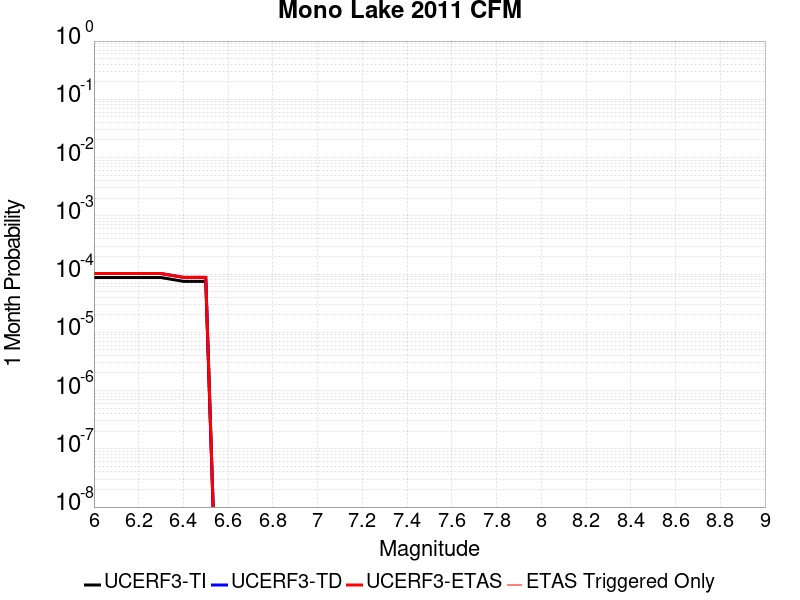 | 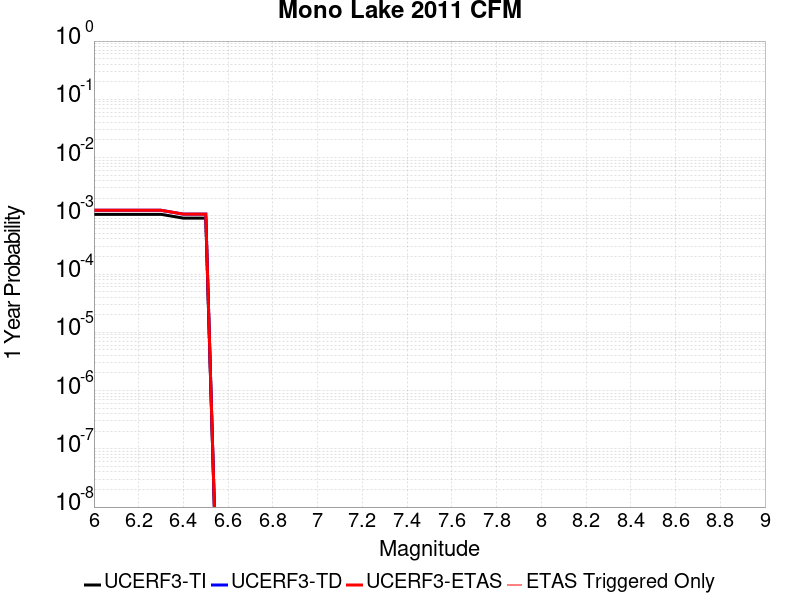 | 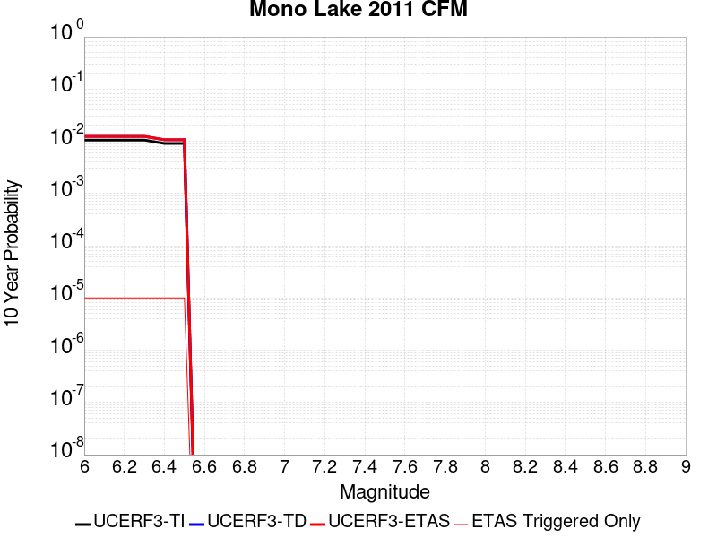 |

| Magnitude | 1 wk TI Prob | 1 wk TD Prob | 1 wk ETAS Prob | 1 wk ETAS/TD Gain | 1 wk ETAS Triggered Only | 1 mo TI Prob | 1 mo TD Prob | 1 mo ETAS Prob | 1 mo ETAS/TD Gain | 1 mo ETAS Triggered Only | 1 yr TI Prob | 1 yr TD Prob | 1 yr ETAS Prob | 1 yr ETAS/TD Gain | 1 yr ETAS Triggered Only | 10 yr TI Prob | 10 yr TD Prob | 10 yr ETAS Prob | 10 yr ETAS/TD Gain | 10 yr ETAS Triggered Only |
|-----|-----|-----|-----|-----|-----|-----|-----|-----|-----|-----|-----|-----|-----|-----|-----|-----|-----|-----|-----|-----|
| 6.0 | 2.0341662E-5 | 2.3828192E-5 | 2.3828192E-5 | 1.0 | 0.0 | 8.717564E-5 | 1.0211982E-4 | 1.0211982E-4 | 1.0 | 0.0 | 0.0010608466 | 0.0012431308 | 0.0012431308 | 1.0 | 0.0 | 0.010557966 | 0.012413842 | 0.012423717 | 1.0007956 | 1.0E-5 |
| 6.1 | 2.0341662E-5 | 2.3828192E-5 | 2.3828192E-5 | 1.0 | 0.0 | 8.717564E-5 | 1.0211982E-4 | 1.0211982E-4 | 1.0 | 0.0 | 0.0010608466 | 0.0012431308 | 0.0012431308 | 1.0 | 0.0 | 0.010557966 | 0.012413842 | 0.012423717 | 1.0007956 | 1.0E-5 |
| 6.2 | 2.0341662E-5 | 2.3828192E-5 | 2.3828192E-5 | 1.0 | 0.0 | 8.717564E-5 | 1.0211982E-4 | 1.0211982E-4 | 1.0 | 0.0 | 0.0010608466 | 0.0012431308 | 0.0012431308 | 1.0 | 0.0 | 0.010557966 | 0.012413842 | 0.012423717 | 1.0007956 | 1.0E-5 |
| 6.3 | 2.0341662E-5 | 2.3828192E-5 | 2.3828192E-5 | 1.0 | 0.0 | 8.717564E-5 | 1.0211982E-4 | 1.0211982E-4 | 1.0 | 0.0 | 0.0010608466 | 0.0012431308 | 0.0012431308 | 1.0 | 0.0 | 0.010557966 | 0.012413842 | 0.012423717 | 1.0007956 | 1.0E-5 |
| 6.4 | 1.749821E-5 | 2.049101E-5 | 2.049101E-5 | 1.0 | 0.0 | 7.499018E-5 | 8.781861E-5 | 8.781861E-5 | 1.0 | 0.0 | 9.1262296E-4 | 0.0010691914 | 0.0010691914 | 1.0 | 0.0 | 0.009088841 | 0.01069187 | 0.010701763 | 1.0009253 | 1.0E-5 |
| 6.5 | 1.749821E-5 | 2.049101E-5 | 2.049101E-5 | 1.0 | 0.0 | 7.499018E-5 | 8.781861E-5 | 8.781861E-5 | 1.0 | 0.0 | 9.1262296E-4 | 0.0010691914 | 0.0010691914 | 1.0 | 0.0 | 0.009088841 | 0.01069187 | 0.010701763 | 1.0009253 | 1.0E-5 |

## San Jose
*[(top)](#table-of-contents)*

| 1 Week | 1 Month | 1 Year | 10 Year |
|-----|-----|-----|-----|
|  |  |  |  |

| Magnitude | 1 wk TI Prob | 1 wk TD Prob | 1 wk ETAS Prob | 1 wk ETAS/TD Gain | 1 wk ETAS Triggered Only | 1 mo TI Prob | 1 mo TD Prob | 1 mo ETAS Prob | 1 mo ETAS/TD Gain | 1 mo ETAS Triggered Only | 1 yr TI Prob | 1 yr TD Prob | 1 yr ETAS Prob | 1 yr ETAS/TD Gain | 1 yr ETAS Triggered Only | 10 yr TI Prob | 10 yr TD Prob | 10 yr ETAS Prob | 10 yr ETAS/TD Gain | 10 yr ETAS Triggered Only |
|-----|-----|-----|-----|-----|-----|-----|-----|-----|-----|-----|-----|-----|-----|-----|-----|-----|-----|-----|-----|-----|
| 6.0 | 5.0851277E-6 | 4.125642E-6 | 4.125642E-6 | 1.0 | 0.0 | 2.1793223E-5 | 1.768122E-5 | 1.768122E-5 | 1.0 | 0.0 | 2.653002E-4 | 2.152502E-4 | 2.152502E-4 | 1.0 | 0.0 | 0.0026498367 | 0.0021507454 | 0.002160724 | 1.0046395 | 1.0E-5 |
| 6.1 | 5.0851277E-6 | 4.125642E-6 | 4.125642E-6 | 1.0 | 0.0 | 2.1793223E-5 | 1.768122E-5 | 1.768122E-5 | 1.0 | 0.0 | 2.653002E-4 | 2.152502E-4 | 2.152502E-4 | 1.0 | 0.0 | 0.0026498367 | 0.0021507454 | 0.002160724 | 1.0046395 | 1.0E-5 |
| 6.2 | 5.0851277E-6 | 4.125642E-6 | 4.125642E-6 | 1.0 | 0.0 | 2.1793223E-5 | 1.768122E-5 | 1.768122E-5 | 1.0 | 0.0 | 2.653002E-4 | 2.152502E-4 | 2.152502E-4 | 1.0 | 0.0 | 0.0026498367 | 0.0021507454 | 0.002160724 | 1.0046395 | 1.0E-5 |
| 6.3 | 5.0851277E-6 | 4.125642E-6 | 4.125642E-6 | 1.0 | 0.0 | 2.1793223E-5 | 1.768122E-5 | 1.768122E-5 | 1.0 | 0.0 | 2.653002E-4 | 2.152502E-4 | 2.152502E-4 | 1.0 | 0.0 | 0.0026498367 | 0.0021507454 | 0.002160724 | 1.0046395 | 1.0E-5 |
| 6.4 | 4.3115124E-6 | 3.3237525E-6 | 3.3237525E-6 | 1.0 | 0.0 | 1.8477778E-5 | 1.4244589E-5 | 1.4244589E-5 | 1.0 | 0.0 | 2.2494372E-4 | 1.7341628E-4 | 1.7341628E-4 | 1.0 | 0.0 | 0.0022471617 | 0.0017330965 | 0.0017430792 | 1.0057601 | 1.0E-5 |
| 6.5 | 4.3115124E-6 | 3.3237525E-6 | 3.3237525E-6 | 1.0 | 0.0 | 1.8477778E-5 | 1.4244589E-5 | 1.4244589E-5 | 1.0 | 0.0 | 2.2494372E-4 | 1.7341628E-4 | 1.7341628E-4 | 1.0 | 0.0 | 0.0022471617 | 0.0017330965 | 0.0017430792 | 1.0057601 | 1.0E-5 |
| 6.6 | 3.110396E-6 | 2.0799562E-6 | 2.0799562E-6 | 1.0 | 0.0 | 1.33302E-5 | 8.9140685E-6 | 8.9140685E-6 | 1.0 | 0.0 | 1.622831E-4 | 1.0852366E-4 | 1.0852366E-4 | 1.0 | 0.0 | 0.0016216465 | 0.001084804 | 0.0010947931 | 1.0092082 | 1.0E-5 |
| 6.7 | 3.110396E-6 | 2.0799562E-6 | 2.0799562E-6 | 1.0 | 0.0 | 1.33302E-5 | 8.9140685E-6 | 8.9140685E-6 | 1.0 | 0.0 | 1.622831E-4 | 1.0852366E-4 | 1.0852366E-4 | 1.0 | 0.0 | 0.0016216465 | 0.001084804 | 0.0010947931 | 1.0092082 | 1.0E-5 |
| 6.8 | 2.856651E-6 | 1.9024077E-6 | 1.9024077E-6 | 1.0 | 0.0 | 1.2242733E-5 | 8.153152E-6 | 8.153152E-6 | 1.0 | 0.0 | 1.4904508E-4 | 9.926035E-5 | 9.926035E-5 | 1.0 | 0.0 | 0.0014894515 | 9.922545E-4 | 0.0010022445 | 1.010068 | 1.0E-5 |
| 6.9 | 2.1618725E-6 | 1.4186406E-6 | 1.4186406E-6 | 1.0 | 0.0 | 9.265135E-6 | 6.0798748E-6 | 6.0798748E-6 | 1.0 | 0.0 | 1.12797185E-4 | 7.402005E-5 | 7.402005E-5 | 1.0 | 0.0 | 0.0011273995 | 7.4003247E-4 | 7.4003247E-4 | 1.0 | 0.0 |
| 7.0 | 1.9684312E-6 | 1.3256082E-6 | 1.3256082E-6 | 1.0 | 0.0 | 8.436106E-6 | 5.681166E-6 | 5.681166E-6 | 1.0 | 0.0 | 1.02704755E-4 | 6.916608E-5 | 6.916608E-5 | 1.0 | 0.0 | 0.001026573 | 6.9152354E-4 | 6.9152354E-4 | 1.0 | 0.0 |
| 7.1 | 1.6070337E-6 | 1.1154867E-6 | 1.1154867E-6 | 1.0 | 0.0 | 6.887269E-6 | 4.7806493E-6 | 4.7806493E-6 | 1.0 | 0.0 | 8.384928E-5 | 5.8202913E-5 | 5.8202913E-5 | 1.0 | 0.0 | 8.3817646E-4 | 5.819527E-4 | 5.819527E-4 | 1.0 | 0.0 |
| 7.2 | 1.0631658E-6 | 6.403567E-7 | 6.403567E-7 | 1.0 | 0.0 | 4.556417E-6 | 2.744383E-6 | 2.744383E-6 | 1.0 | 0.0 | 5.5472963E-5 | 3.3412365E-5 | 3.3412365E-5 | 1.0 | 0.0 | 5.545912E-4 | 3.3414463E-4 | 3.3414463E-4 | 1.0 | 0.0 |
| 7.3 | 7.060711E-7 | 4.5823228E-7 | 4.5823228E-7 | 1.0 | 0.0 | 3.0260155E-6 | 1.9638512E-6 | 1.9638512E-6 | 1.0 | 0.0 | 3.6841117E-5 | 2.3909635E-5 | 2.3909635E-5 | 1.0 | 0.0 | 3.6835007E-4 | 2.3914136E-4 | 2.3914136E-4 | 1.0 | 0.0 |
| 7.4 | 3.3677085E-7 | 2.3231999E-7 | 2.3231999E-7 | 1.0 | 0.0 | 1.4433028E-6 | 9.956567E-7 | 9.956567E-7 | 1.0 | 0.0 | 1.757207E-5 | 1.2122056E-5 | 1.2122056E-5 | 1.0 | 0.0 | 1.7570681E-4 | 1.2128407E-4 | 1.2128407E-4 | 1.0 | 0.0 |
| 7.5 | 3.129161E-7 | 1.9529637E-7 | 1.9529637E-7 | 1.0 | 0.0 | 1.3410682E-6 | 8.3698416E-7 | 8.3698416E-7 | 1.0 | 0.0 | 1.6327383E-5 | 1.0190237E-5 | 1.0190237E-5 | 1.0 | 0.0 | 1.6326184E-4 | 1.0196777E-4 | 1.0196777E-4 | 1.0 | 0.0 |
| 7.6 | 2.8008668E-7 | 1.4240818E-7 | 1.4240818E-7 | 1.0 | 0.0 | 1.2003709E-6 | 6.103206E-7 | 6.103206E-7 | 1.0 | 0.0 | 1.46144175E-5 | 7.43063E-6 | 7.43063E-6 | 1.0 | 0.0 | 1.4613457E-4 | 7.43735E-5 | 7.43735E-5 | 1.0 | 0.0 |
| 7.7 | 2.7852005E-7 | 1.4015403E-7 | 1.4015403E-7 | 1.0 | 0.0 | 1.1936568E-6 | 6.0066003E-7 | 6.0066003E-7 | 1.0 | 0.0 | 1.4532674E-5 | 7.3130127E-6 | 7.3130127E-6 | 1.0 | 0.0 | 1.4531724E-4 | 7.31974E-5 | 7.31974E-5 | 1.0 | 0.0 |
| 7.8 | 1.1810797E-7 | 7.5187074E-8 | 7.5187074E-8 | 1.0 | 0.0 | 5.0617695E-7 | 3.2223028E-7 | 3.2223028E-7 | 1.0 | 0.0 | 6.1626865E-6 | 3.9231472E-6 | 3.9231472E-6 | 1.0 | 0.0 | 6.162516E-5 | 3.9271265E-5 | 3.9271265E-5 | 1.0 | 0.0 |

## Trinidad (alt1)
*[(top)](#table-of-contents)*

| 1 Week | 1 Month | 1 Year | 10 Year |
|-----|-----|-----|-----|
|  |  |  |  |

| Magnitude | 1 wk TI Prob | 1 wk TD Prob | 1 wk ETAS Prob | 1 wk ETAS/TD Gain | 1 wk ETAS Triggered Only | 1 mo TI Prob | 1 mo TD Prob | 1 mo ETAS Prob | 1 mo ETAS/TD Gain | 1 mo ETAS Triggered Only | 1 yr TI Prob | 1 yr TD Prob | 1 yr ETAS Prob | 1 yr ETAS/TD Gain | 1 yr ETAS Triggered Only | 10 yr TI Prob | 10 yr TD Prob | 10 yr ETAS Prob | 10 yr ETAS/TD Gain | 10 yr ETAS Triggered Only |
|-----|-----|-----|-----|-----|-----|-----|-----|-----|-----|-----|-----|-----|-----|-----|-----|-----|-----|-----|-----|-----|
| 6.0 | 3.0167168E-5 | 3.4033183E-5 | 4.4032844E-5 | 1.2938209 | 1.0E-5 | 1.2928146E-4 | 1.4584929E-4 | 1.5584784E-4 | 1.0685539 | 1.0E-5 | 0.0015728653 | 0.0017744373 | 0.0017844195 | 1.0056256 | 1.0E-5 | 0.0156177925 | 0.017619645 | 0.017629469 | 1.0005575 | 1.0E-5 |
| 6.1 | 3.0167168E-5 | 3.4033183E-5 | 4.4032844E-5 | 1.2938209 | 1.0E-5 | 1.2928146E-4 | 1.4584929E-4 | 1.5584784E-4 | 1.0685539 | 1.0E-5 | 0.0015728653 | 0.0017744373 | 0.0017844195 | 1.0056256 | 1.0E-5 | 0.0156177925 | 0.017619645 | 0.017629469 | 1.0005575 | 1.0E-5 |
| 6.2 | 3.0167168E-5 | 3.4033183E-5 | 4.4032844E-5 | 1.2938209 | 1.0E-5 | 1.2928146E-4 | 1.4584929E-4 | 1.5584784E-4 | 1.0685539 | 1.0E-5 | 0.0015728653 | 0.0017744373 | 0.0017844195 | 1.0056256 | 1.0E-5 | 0.0156177925 | 0.017619645 | 0.017629469 | 1.0005575 | 1.0E-5 |
| 6.3 | 3.0167168E-5 | 3.4033183E-5 | 4.4032844E-5 | 1.2938209 | 1.0E-5 | 1.2928146E-4 | 1.4584929E-4 | 1.5584784E-4 | 1.0685539 | 1.0E-5 | 0.0015728653 | 0.0017744373 | 0.0017844195 | 1.0056256 | 1.0E-5 | 0.0156177925 | 0.017619645 | 0.017629469 | 1.0005575 | 1.0E-5 |
| 6.4 | 3.0167168E-5 | 3.4033183E-5 | 4.4032844E-5 | 1.2938209 | 1.0E-5 | 1.2928146E-4 | 1.4584929E-4 | 1.5584784E-4 | 1.0685539 | 1.0E-5 | 0.0015728653 | 0.0017744373 | 0.0017844195 | 1.0056256 | 1.0E-5 | 0.0156177925 | 0.017619645 | 0.017629469 | 1.0005575 | 1.0E-5 |
| 6.5 | 3.0167168E-5 | 3.4033183E-5 | 4.4032844E-5 | 1.2938209 | 1.0E-5 | 1.2928146E-4 | 1.4584929E-4 | 1.5584784E-4 | 1.0685539 | 1.0E-5 | 0.0015728653 | 0.0017744373 | 0.0017844195 | 1.0056256 | 1.0E-5 | 0.0156177925 | 0.017619645 | 0.017629469 | 1.0005575 | 1.0E-5 |
| 6.6 | 3.0167168E-5 | 3.4033183E-5 | 4.4032844E-5 | 1.2938209 | 1.0E-5 | 1.2928146E-4 | 1.4584929E-4 | 1.5584784E-4 | 1.0685539 | 1.0E-5 | 0.0015728653 | 0.0017744373 | 0.0017844195 | 1.0056256 | 1.0E-5 | 0.0156177925 | 0.017619645 | 0.017629469 | 1.0005575 | 1.0E-5 |
| 6.7 | 3.0167168E-5 | 3.4033183E-5 | 4.4032844E-5 | 1.2938209 | 1.0E-5 | 1.2928146E-4 | 1.4584929E-4 | 1.5584784E-4 | 1.0685539 | 1.0E-5 | 0.0015728653 | 0.0017744373 | 0.0017844195 | 1.0056256 | 1.0E-5 | 0.0156177925 | 0.017619645 | 0.017629469 | 1.0005575 | 1.0E-5 |
| 6.8 | 1.717077E-5 | 1.9195684E-5 | 1.9195684E-5 | 1.0 | 0.0 | 7.358694E-5 | 8.226487E-5 | 8.226487E-5 | 1.0 | 0.0 | 8.9555274E-4 | 0.0010011591 | 0.0010011591 | 1.0 | 0.0 | 0.008919522 | 0.009970939 | 0.009970939 | 1.0 | 0.0 |
| 6.9 | 1.717077E-5 | 1.9195684E-5 | 1.9195684E-5 | 1.0 | 0.0 | 7.358694E-5 | 8.226487E-5 | 8.226487E-5 | 1.0 | 0.0 | 8.9555274E-4 | 0.0010011591 | 0.0010011591 | 1.0 | 0.0 | 0.008919522 | 0.009970939 | 0.009970939 | 1.0 | 0.0 |
| 7.0 | 1.2858572E-5 | 1.433737E-5 | 1.433737E-5 | 1.0 | 0.0 | 5.5107E-5 | 6.14446E-5 | 6.14446E-5 | 1.0 | 0.0 | 6.707212E-4 | 7.478634E-4 | 7.478634E-4 | 1.0 | 0.0 | 0.006687004 | 0.0074566454 | 0.0074566454 | 1.0 | 0.0 |
| 7.1 | 1.0588431E-5 | 1.1801269E-5 | 1.1801269E-5 | 1.0 | 0.0 | 4.53782E-5 | 5.057605E-5 | 5.057605E-5 | 1.0 | 0.0 | 5.5233954E-4 | 6.156183E-4 | 6.156183E-4 | 1.0 | 0.0 | 0.005509687 | 0.006141979 | 0.006141979 | 1.0 | 0.0 |
| 7.2 | 8.138061E-6 | 9.067213E-6 | 9.067213E-6 | 1.0 | 0.0 | 3.487694E-5 | 3.8859045E-5 | 3.8859045E-5 | 1.0 | 0.0 | 4.2454398E-4 | 4.7303102E-4 | 4.7303102E-4 | 1.0 | 0.0 | 0.0042373384 | 0.0047226823 | 0.0047226823 | 1.0 | 0.0 |
| 7.3 | 5.787542E-6 | 6.46032E-6 | 6.46032E-6 | 1.0 | 0.0 | 2.4803514E-5 | 2.7686914E-5 | 2.7686914E-5 | 1.0 | 0.0 | 3.0194095E-4 | 3.3705754E-4 | 3.3705754E-4 | 1.0 | 0.0 | 0.00301531 | 0.0033675742 | 0.0033675742 | 1.0 | 0.0 |
| 7.4 | 4.303563E-6 | 4.800851E-6 | 4.800851E-6 | 1.0 | 0.0 | 1.844371E-5 | 2.0575026E-5 | 2.0575026E-5 | 1.0 | 0.0 | 2.2452902E-4 | 2.504919E-4 | 2.504919E-4 | 1.0 | 0.0 | 0.0022430231 | 0.0025040337 | 0.0025040337 | 1.0 | 0.0 |
| 7.5 | 5.6063425E-7 | 6.142982E-7 | 6.142982E-7 | 1.0 | 0.0 | 2.402716E-6 | 2.632704E-6 | 2.632704E-6 | 1.0 | 0.0 | 2.9252675E-5 | 3.2052718E-5 | 3.2052718E-5 | 1.0 | 0.0 | 2.9248823E-4 | 3.2048248E-4 | 3.2048248E-4 | 1.0 | 0.0 |
| 7.6 | 4.6699128E-7 | 5.1257996E-7 | 5.1257996E-7 | 1.0 | 0.0 | 2.0013897E-6 | 2.1967694E-6 | 2.1967694E-6 | 1.0 | 0.0 | 2.4366647E-5 | 2.6745354E-5 | 2.6745354E-5 | 1.0 | 0.0 | 2.4363975E-4 | 2.6742276E-4 | 2.6742276E-4 | 1.0 | 0.0 |
| 7.7 | 2.2080937E-7 | 2.4346897E-7 | 2.4346897E-7 | 1.0 | 0.0 | 9.4632554E-7 | 1.043438E-6 | 1.043438E-6 | 1.0 | 0.0 | 1.15214525E-5 | 1.270379E-5 | 1.270379E-5 | 1.0 | 0.0 | 1.1520855E-4 | 1.2703124E-4 | 1.2703124E-4 | 1.0 | 0.0 |
| 7.8 | 1.1438307E-8 | 1.2682963E-8 | 1.2682963E-8 | 1.0 | 0.0 | 4.9021317E-8 | 5.4355557E-8 | 5.4355557E-8 | 1.0 | 0.0 | 5.9683435E-7 | 6.6177887E-7 | 6.6177887E-7 | 1.0 | 0.0 | 5.9683275E-6 | 6.617789E-6 | 6.617789E-6 | 1.0 | 0.0 |

## Malibu Coast alt 1
*[(top)](#table-of-contents)*

| 1 Week | 1 Month | 1 Year | 10 Year |
|-----|-----|-----|-----|
|  |  |  |  |

| Magnitude | 1 wk TI Prob | 1 wk TD Prob | 1 wk ETAS Prob | 1 wk ETAS/TD Gain | 1 wk ETAS Triggered Only | 1 mo TI Prob | 1 mo TD Prob | 1 mo ETAS Prob | 1 mo ETAS/TD Gain | 1 mo ETAS Triggered Only | 1 yr TI Prob | 1 yr TD Prob | 1 yr ETAS Prob | 1 yr ETAS/TD Gain | 1 yr ETAS Triggered Only | 10 yr TI Prob | 10 yr TD Prob | 10 yr ETAS Prob | 10 yr ETAS/TD Gain | 10 yr ETAS Triggered Only |
|-----|-----|-----|-----|-----|-----|-----|-----|-----|-----|-----|-----|-----|-----|-----|-----|-----|-----|-----|-----|-----|
| 6.0 | 1.6572556E-5 | 1.759807E-5 | 1.759807E-5 | 1.0 | 0.0 | 7.102331E-5 | 7.5418226E-5 | 8.5417465E-5 | 1.132584 | 1.0E-5 | 8.6436566E-4 | 9.1784896E-4 | 9.278398E-4 | 1.010885 | 1.0E-5 | 0.0086101135 | 0.009142514 | 0.009152423 | 1.0010837 | 1.0E-5 |
| 6.1 | 1.6572556E-5 | 1.759807E-5 | 1.759807E-5 | 1.0 | 0.0 | 7.102331E-5 | 7.5418226E-5 | 8.5417465E-5 | 1.132584 | 1.0E-5 | 8.6436566E-4 | 9.1784896E-4 | 9.278398E-4 | 1.010885 | 1.0E-5 | 0.0086101135 | 0.009142514 | 0.009152423 | 1.0010837 | 1.0E-5 |
| 6.2 | 1.1085717E-5 | 1.155715E-5 | 1.155715E-5 | 1.0 | 0.0 | 4.750935E-5 | 4.9529724E-5 | 5.9529226E-5 | 1.2018889 | 1.0E-5 | 5.782728E-4 | 6.0286105E-4 | 6.12855E-4 | 1.0165776 | 1.0E-5 | 0.0057677035 | 0.0060126274 | 0.0060225674 | 1.0016532 | 1.0E-5 |
| 6.3 | 1.0208568E-5 | 1.0592241E-5 | 1.0592241E-5 | 1.0 | 0.0 | 4.375027E-5 | 4.5394543E-5 | 5.5394088E-5 | 1.2202808 | 1.0E-5 | 5.325294E-4 | 5.5254134E-4 | 5.6253583E-4 | 1.0180882 | 1.0E-5 | 0.0053125503 | 0.0055119833 | 0.005521928 | 1.0018042 | 1.0E-5 |
| 6.4 | 9.0682315E-6 | 9.342641E-6 | 9.342641E-6 | 1.0 | 0.0 | 3.8863272E-5 | 4.0039286E-5 | 5.0038885E-5 | 1.2497448 | 1.0E-5 | 4.730576E-4 | 4.873713E-4 | 4.973664E-4 | 1.0205083 | 1.0E-5 | 0.0047205184 | 0.004863238 | 0.004873189 | 1.0020462 | 1.0E-5 |
| 6.5 | 7.605796E-6 | 7.74859E-6 | 7.74859E-6 | 1.0 | 0.0 | 3.259586E-5 | 3.320783E-5 | 3.320783E-5 | 1.0 | 0.0 | 3.9678233E-4 | 4.0423166E-4 | 4.0423166E-4 | 1.0 | 0.0 | 0.0039607463 | 0.0040351013 | 0.0040351013 | 1.0 | 0.0 |
| 6.6 | 5.889873E-6 | 5.8795417E-6 | 5.8795417E-6 | 1.0 | 0.0 | 2.5242069E-5 | 2.5197793E-5 | 2.5197793E-5 | 1.0 | 0.0 | 3.0727885E-4 | 3.0674002E-4 | 3.0674002E-4 | 1.0 | 0.0 | 0.003068543 | 0.0030631793 | 0.0030631793 | 1.0 | 0.0 |
| 6.7 | 5.66586E-6 | 5.6416443E-6 | 5.6416443E-6 | 1.0 | 0.0 | 2.428203E-5 | 2.4178253E-5 | 2.4178253E-5 | 1.0 | 0.0 | 2.955936E-4 | 2.9433056E-4 | 2.9433056E-4 | 1.0 | 0.0 | 0.0029520073 | 0.0029394194 | 0.0029394194 | 1.0 | 0.0 |
| 6.8 | 5.521556E-6 | 5.48943E-6 | 5.48943E-6 | 1.0 | 0.0 | 2.3663597E-5 | 2.3525918E-5 | 2.3525918E-5 | 1.0 | 0.0 | 2.880662E-4 | 2.8639048E-4 | 2.8639048E-4 | 1.0 | 0.0 | 0.0028769306 | 0.0028602257 | 0.0028602257 | 1.0 | 0.0 |
| 6.9 | 5.29752E-6 | 5.2499345E-6 | 5.2499345E-6 | 1.0 | 0.0 | 2.270346E-5 | 2.2499526E-5 | 2.2499526E-5 | 1.0 | 0.0 | 2.7637955E-4 | 2.7389737E-4 | 2.7389737E-4 | 1.0 | 0.0 | 0.0027603607 | 0.0027356083 | 0.0027356083 | 1.0 | 0.0 |
| 7.0 | 5.106743E-6 | 5.0476815E-6 | 5.0476815E-6 | 1.0 | 0.0 | 2.1885859E-5 | 2.1632743E-5 | 2.1632743E-5 | 1.0 | 0.0 | 2.6642776E-4 | 2.6334688E-4 | 2.6334688E-4 | 1.0 | 0.0 | 0.0026610855 | 0.0026303576 | 0.0026303576 | 1.0 | 0.0 |
| 7.1 | 4.8469647E-6 | 4.770376E-6 | 4.770376E-6 | 1.0 | 0.0 | 2.0772539E-5 | 2.044431E-5 | 2.044431E-5 | 1.0 | 0.0 | 2.528763E-4 | 2.488811E-4 | 2.488811E-4 | 1.0 | 0.0 | 0.0025258875 | 0.0024860317 | 0.0024860317 | 1.0 | 0.0 |
| 7.2 | 4.545514E-6 | 4.4481967E-6 | 4.4481967E-6 | 1.0 | 0.0 | 1.9480629E-5 | 1.906356E-5 | 1.906356E-5 | 1.0 | 0.0 | 2.3715083E-4 | 2.3207419E-4 | 2.3207419E-4 | 1.0 | 0.0 | 0.0023689792 | 0.002318326 | 0.002318326 | 1.0 | 0.0 |
| 7.3 | 3.794097E-6 | 3.6519373E-6 | 3.6519373E-6 | 1.0 | 0.0 | 1.6260314E-5 | 1.5651065E-5 | 1.5651065E-5 | 1.0 | 0.0 | 1.9795135E-4 | 1.9053511E-4 | 1.9053511E-4 | 1.0 | 0.0 | 0.001977751 | 0.0019037221 | 0.0019037221 | 1.0 | 0.0 |
| 7.4 | 2.808217E-6 | 2.7190777E-6 | 2.7190777E-6 | 1.0 | 0.0 | 1.203516E-5 | 1.1653137E-5 | 1.1653137E-5 | 1.0 | 0.0 | 1.4651821E-4 | 1.4186774E-4 | 1.4186774E-4 | 1.0 | 0.0 | 0.0014642165 | 0.0014177744 | 0.0014177744 | 1.0 | 0.0 |
| 7.5 | 1.83809E-6 | 1.8190703E-6 | 1.8190703E-6 | 1.0 | 0.0 | 7.877505E-6 | 7.795992E-6 | 7.795992E-6 | 1.0 | 0.0 | 9.59044E-5 | 9.4912095E-5 | 9.4912095E-5 | 1.0 | 0.0 | 9.5863023E-4 | 9.487176E-4 | 9.487176E-4 | 1.0 | 0.0 |
| 7.6 | 1.1292672E-6 | 1.1001456E-6 | 1.1001456E-6 | 1.0 | 0.0 | 4.839708E-6 | 4.7149015E-6 | 4.7149015E-6 | 1.0 | 0.0 | 5.8921847E-5 | 5.7402427E-5 | 5.7402427E-5 | 1.0 | 0.0 | 5.890623E-4 | 5.7387765E-4 | 5.7387765E-4 | 1.0 | 0.0 |
| 7.7 | 5.065272E-7 | 4.6091537E-7 | 4.6091537E-7 | 1.0 | 0.0 | 2.170829E-6 | 1.9753502E-6 | 1.9753502E-6 | 1.0 | 0.0 | 2.6429525E-5 | 2.4049634E-5 | 2.4049634E-5 | 1.0 | 0.0 | 2.642638E-4 | 2.4047145E-4 | 2.4047145E-4 | 1.0 | 0.0 |
| 7.8 | 8.952991E-8 | 6.707853E-8 | 6.707853E-8 | 1.0 | 0.0 | 3.8369956E-7 | 2.874794E-7 | 2.874794E-7 | 1.0 | 0.0 | 4.671532E-6 | 3.5000562E-6 | 3.5000562E-6 | 1.0 | 0.0 | 4.671434E-5 | 3.500003E-5 | 3.500003E-5 | 1.0 | 0.0 |
| 7.9 | 8.007447E-10 | 6.161581E-10 | 6.161581E-10 | 1.0 | 0.0 | 3.4317629E-9 | 2.640678E-9 | 2.640678E-9 | 1.0 | 0.0 | 4.1781714E-8 | 3.2150254E-8 | 3.2150254E-8 | 1.0 | 0.0 | 4.1781706E-7 | 3.2150248E-7 | 3.2150248E-7 | 1.0 | 0.0 |

## Eaton Roughs 2011 CFM
*[(top)](#table-of-contents)*

| 1 Week | 1 Month | 1 Year | 10 Year |
|-----|-----|-----|-----|
|  |  |  |  |

| Magnitude | 1 wk TI Prob | 1 wk TD Prob | 1 wk ETAS Prob | 1 wk ETAS/TD Gain | 1 wk ETAS Triggered Only | 1 mo TI Prob | 1 mo TD Prob | 1 mo ETAS Prob | 1 mo ETAS/TD Gain | 1 mo ETAS Triggered Only | 1 yr TI Prob | 1 yr TD Prob | 1 yr ETAS Prob | 1 yr ETAS/TD Gain | 1 yr ETAS Triggered Only | 10 yr TI Prob | 10 yr TD Prob | 10 yr ETAS Prob | 10 yr ETAS/TD Gain | 10 yr ETAS Triggered Only |
|-----|-----|-----|-----|-----|-----|-----|-----|-----|-----|-----|-----|-----|-----|-----|-----|-----|-----|-----|-----|-----|
| 6.0 | 6.8044945E-5 | 8.8434645E-5 | 8.8434645E-5 | 1.0 | 0.0 | 2.9158857E-4 | 3.7895713E-4 | 3.7895713E-4 | 1.0 | 0.0 | 0.0035443127 | 0.0046046837 | 0.0046146377 | 1.0021617 | 1.0E-5 | 0.03488314 | 0.04516368 | 0.045173228 | 1.0002114 | 1.0E-5 |
| 6.1 | 6.8044945E-5 | 8.8434645E-5 | 8.8434645E-5 | 1.0 | 0.0 | 2.9158857E-4 | 3.7895713E-4 | 3.7895713E-4 | 1.0 | 0.0 | 0.0035443127 | 0.0046046837 | 0.0046146377 | 1.0021617 | 1.0E-5 | 0.03488314 | 0.04516368 | 0.045173228 | 1.0002114 | 1.0E-5 |
| 6.2 | 6.8044945E-5 | 8.8434645E-5 | 8.8434645E-5 | 1.0 | 0.0 | 2.9158857E-4 | 3.7895713E-4 | 3.7895713E-4 | 1.0 | 0.0 | 0.0035443127 | 0.0046046837 | 0.0046146377 | 1.0021617 | 1.0E-5 | 0.03488314 | 0.04516368 | 0.045173228 | 1.0002114 | 1.0E-5 |
| 6.3 | 6.8044945E-5 | 8.8434645E-5 | 8.8434645E-5 | 1.0 | 0.0 | 2.9158857E-4 | 3.7895713E-4 | 3.7895713E-4 | 1.0 | 0.0 | 0.0035443127 | 0.0046046837 | 0.0046146377 | 1.0021617 | 1.0E-5 | 0.03488314 | 0.04516368 | 0.045173228 | 1.0002114 | 1.0E-5 |
| 6.4 | 4.5830013E-5 | 5.71553E-5 | 5.71553E-5 | 1.0 | 0.0 | 1.9639956E-4 | 2.4493135E-4 | 2.4493135E-4 | 1.0 | 0.0 | 0.0023885423 | 0.002978342 | 0.0029883122 | 1.0033475 | 1.0E-5 | 0.023630321 | 0.029421948 | 0.029431652 | 1.0003299 | 1.0E-5 |
| 6.5 | 4.5830013E-5 | 5.71553E-5 | 5.71553E-5 | 1.0 | 0.0 | 1.9639956E-4 | 2.4493135E-4 | 2.4493135E-4 | 1.0 | 0.0 | 0.0023885423 | 0.002978342 | 0.0029883122 | 1.0033475 | 1.0E-5 | 0.023630321 | 0.029421948 | 0.029431652 | 1.0003299 | 1.0E-5 |
| 6.6 | 3.222194E-5 | 3.8262962E-5 | 3.8262962E-5 | 1.0 | 0.0 | 1.3808672E-4 | 1.6397446E-4 | 1.6397446E-4 | 1.0 | 0.0 | 0.0016799092 | 0.0019946485 | 0.0020046285 | 1.0050035 | 1.0E-5 | 0.016672665 | 0.019776754 | 0.019786557 | 1.0004957 | 1.0E-5 |
| 6.7 | 2.4155654E-5 | 2.7786275E-5 | 2.7786275E-5 | 1.0 | 0.0 | 1.0352012E-4 | 1.1907864E-4 | 1.1907864E-4 | 1.0 | 0.0 | 0.0012596287 | 0.0014488265 | 0.001458812 | 1.0068921 | 1.0E-5 | 0.012525126 | 0.01439499 | 0.014404845 | 1.0006847 | 1.0E-5 |
| 6.8 | 2.1814667E-5 | 2.4940904E-5 | 2.4940904E-5 | 1.0 | 0.0 | 9.348808E-5 | 1.0688523E-4 | 1.0688523E-4 | 1.0 | 0.0 | 0.001137623 | 0.0013005546 | 0.0013105415 | 1.007679 | 1.0E-5 | 0.011318169 | 0.012930086 | 0.012939956 | 1.0007634 | 1.0E-5 |
| 6.9 | 2.0700467E-5 | 2.362897E-5 | 2.362897E-5 | 1.0 | 0.0 | 8.871327E-5 | 1.01263104E-4 | 1.01263104E-4 | 1.0 | 0.0 | 0.0010795488 | 0.0012321841 | 0.0012421719 | 1.0081056 | 1.0E-5 | 0.010743194 | 0.012254083 | 0.01226396 | 1.0008061 | 1.0E-5 |
| 7.0 | 2.0104066E-5 | 2.2936536E-5 | 2.2936536E-5 | 1.0 | 0.0 | 8.615744E-5 | 9.829576E-5 | 9.829576E-5 | 1.0 | 0.0 | 0.0010484619 | 0.0011960969 | 0.0012060849 | 1.0083505 | 1.0E-5 | 0.010435291 | 0.01189712 | 0.011907001 | 1.0008305 | 1.0E-5 |
| 7.1 | 1.8225232E-5 | 2.0773083E-5 | 2.0773083E-5 | 1.0 | 0.0 | 7.81058E-5 | 8.902447E-5 | 8.902447E-5 | 1.0 | 0.0 | 9.5052324E-4 | 0.0010833355 | 0.0010933247 | 1.0092207 | 1.0E-5 | 0.009464677 | 0.010780873 | 0.010790764 | 1.0009176 | 1.0E-5 |
| 7.2 | 1.7526572E-5 | 1.9993524E-5 | 1.9993524E-5 | 1.0 | 0.0 | 7.511172E-5 | 8.568373E-5 | 8.568373E-5 | 1.0 | 0.0 | 9.141015E-4 | 0.0010427017 | 0.0010526913 | 1.0095805 | 1.0E-5 | 0.009103506 | 0.010378398 | 0.010388294 | 1.0009536 | 1.0E-5 |
| 7.3 | 1.5727232E-5 | 1.8021543E-5 | 1.8021543E-5 | 1.0 | 0.0 | 6.740067E-5 | 7.72329E-5 | 7.72329E-5 | 1.0 | 0.0 | 8.2029426E-4 | 9.399062E-4 | 9.498968E-4 | 1.0106294 | 1.0E-5 | 0.008172729 | 0.009359558 | 0.009369465 | 1.0010585 | 1.0E-5 |
| 7.4 | 1.4457361E-5 | 1.6598395E-5 | 1.6598395E-5 | 1.0 | 0.0 | 6.195865E-5 | 7.113405E-5 | 7.113405E-5 | 1.0 | 0.0 | 7.540854E-4 | 8.657138E-4 | 8.7570515E-4 | 1.0115411 | 1.0E-5 | 0.007515317 | 0.008623603 | 0.008633517 | 1.0011497 | 1.0E-5 |
| 7.5 | 1.33280955E-5 | 1.5345471E-5 | 1.5345471E-5 | 1.0 | 0.0 | 5.711916E-5 | 6.576465E-5 | 6.576465E-5 | 1.0 | 0.0 | 6.9520384E-4 | 8.0039137E-4 | 8.1038335E-4 | 1.0124838 | 1.0E-5 | 0.00693033 | 0.007975256 | 0.007985176 | 1.0012438 | 1.0E-5 |
| 7.6 | 1.0699478E-5 | 1.2387852E-5 | 1.2387852E-5 | 1.0 | 0.0 | 4.5854096E-5 | 5.3089716E-5 | 5.3089716E-5 | 1.0 | 0.0 | 5.581306E-4 | 6.461761E-4 | 6.5616966E-4 | 1.0154656 | 1.0E-5 | 0.005567309 | 0.0064430824 | 0.0064530177 | 1.0015421 | 1.0E-5 |
| 7.7 | 5.9390236E-6 | 6.8529853E-6 | 6.8529853E-6 | 1.0 | 0.0 | 2.545271E-5 | 2.9369607E-5 | 2.9369607E-5 | 1.0 | 0.0 | 3.0984267E-4 | 3.5751655E-4 | 3.6751298E-4 | 1.0279608 | 1.0E-5 | 0.0030941102 | 0.0035694393 | 0.0035794035 | 1.0027915 | 1.0E-5 |
| 7.8 | 2.1622036E-6 | 2.329702E-6 | 2.329702E-6 | 1.0 | 0.0 | 9.266554E-6 | 9.984399E-6 | 9.984399E-6 | 1.0 | 0.0 | 1.1281446E-4 | 1.21553356E-4 | 1.21553356E-4 | 1.0 | 0.0 | 0.001127572 | 0.0012148687 | 0.0012148687 | 1.0 | 0.0 |
| 7.9 | 4.9586197E-7 | 5.2189216E-7 | 5.2189216E-7 | 1.0 | 0.0 | 2.125121E-6 | 2.2366787E-6 | 2.2366787E-6 | 1.0 | 0.0 | 2.5873042E-5 | 2.7231245E-5 | 2.7231245E-5 | 1.0 | 0.0 | 2.5870028E-4 | 2.7228118E-4 | 2.7228118E-4 | 1.0 | 0.0 |

## Round Valley
*[(top)](#table-of-contents)*

| 1 Week | 1 Month | 1 Year | 10 Year |
|-----|-----|-----|-----|
|  |  |  |  |

| Magnitude | 1 wk TI Prob | 1 wk TD Prob | 1 wk ETAS Prob | 1 wk ETAS/TD Gain | 1 wk ETAS Triggered Only | 1 mo TI Prob | 1 mo TD Prob | 1 mo ETAS Prob | 1 mo ETAS/TD Gain | 1 mo ETAS Triggered Only | 1 yr TI Prob | 1 yr TD Prob | 1 yr ETAS Prob | 1 yr ETAS/TD Gain | 1 yr ETAS Triggered Only | 10 yr TI Prob | 10 yr TD Prob | 10 yr ETAS Prob | 10 yr ETAS/TD Gain | 10 yr ETAS Triggered Only |
|-----|-----|-----|-----|-----|-----|-----|-----|-----|-----|-----|-----|-----|-----|-----|-----|-----|-----|-----|-----|-----|
| 6.0 | 1.588152E-5 | 1.3670525E-5 | 1.3670525E-5 | 1.0 | 0.0 | 6.806188E-5 | 5.8586873E-5 | 5.8586873E-5 | 1.0 | 0.0 | 8.283384E-4 | 7.131011E-4 | 7.23094E-4 | 1.0140133 | 1.0E-5 | 0.008252576 | 0.0071120164 | 0.0071219453 | 1.0013961 | 1.0E-5 |
| 6.1 | 1.588152E-5 | 1.3670525E-5 | 1.3670525E-5 | 1.0 | 0.0 | 6.806188E-5 | 5.8586873E-5 | 5.8586873E-5 | 1.0 | 0.0 | 8.283384E-4 | 7.131011E-4 | 7.23094E-4 | 1.0140133 | 1.0E-5 | 0.008252576 | 0.0071120164 | 0.0071219453 | 1.0013961 | 1.0E-5 |
| 6.2 | 1.588152E-5 | 1.3670525E-5 | 1.3670525E-5 | 1.0 | 0.0 | 6.806188E-5 | 5.8586873E-5 | 5.8586873E-5 | 1.0 | 0.0 | 8.283384E-4 | 7.131011E-4 | 7.23094E-4 | 1.0140133 | 1.0E-5 | 0.008252576 | 0.0071120164 | 0.0071219453 | 1.0013961 | 1.0E-5 |
| 6.3 | 1.588152E-5 | 1.3670525E-5 | 1.3670525E-5 | 1.0 | 0.0 | 6.806188E-5 | 5.8586873E-5 | 5.8586873E-5 | 1.0 | 0.0 | 8.283384E-4 | 7.131011E-4 | 7.23094E-4 | 1.0140133 | 1.0E-5 | 0.008252576 | 0.0071120164 | 0.0071219453 | 1.0013961 | 1.0E-5 |
| 6.4 | 1.588152E-5 | 1.3670525E-5 | 1.3670525E-5 | 1.0 | 0.0 | 6.806188E-5 | 5.8586873E-5 | 5.8586873E-5 | 1.0 | 0.0 | 8.283384E-4 | 7.131011E-4 | 7.23094E-4 | 1.0140133 | 1.0E-5 | 0.008252576 | 0.0071120164 | 0.0071219453 | 1.0013961 | 1.0E-5 |
| 6.5 | 1.0646776E-5 | 7.952847E-6 | 7.952847E-6 | 1.0 | 0.0 | 4.5628243E-5 | 3.4083234E-5 | 3.4083234E-5 | 1.0 | 0.0 | 5.553823E-4 | 4.1489274E-4 | 4.248886E-4 | 1.0240927 | 1.0E-5 | 0.005539963 | 0.00414201 | 0.0041519688 | 1.0024043 | 1.0E-5 |
| 6.6 | 8.632956E-6 | 5.768552E-6 | 5.768552E-6 | 1.0 | 0.0 | 3.6997862E-5 | 2.4722152E-5 | 2.4722152E-5 | 1.0 | 0.0 | 4.5035584E-4 | 3.0095447E-4 | 3.1095147E-4 | 1.0332177 | 1.0E-5 | 0.0044944426 | 0.0030058469 | 0.003015817 | 1.0033169 | 1.0E-5 |
| 6.7 | 8.632956E-6 | 5.768552E-6 | 5.768552E-6 | 1.0 | 0.0 | 3.6997862E-5 | 2.4722152E-5 | 2.4722152E-5 | 1.0 | 0.0 | 4.5035584E-4 | 3.0095447E-4 | 3.1095147E-4 | 1.0332177 | 1.0E-5 | 0.0044944426 | 0.0030058469 | 0.003015817 | 1.0033169 | 1.0E-5 |
| 6.8 | 7.143895E-6 | 4.201644E-6 | 4.201644E-6 | 1.0 | 0.0 | 3.0616335E-5 | 1.8006931E-5 | 1.8006931E-5 | 1.0 | 0.0 | 3.726901E-4 | 2.19214E-4 | 2.19214E-4 | 1.0 | 0.0 | 0.0037206567 | 0.0021901424 | 0.0021901424 | 1.0 | 0.0 |
| 6.9 | 6.5120694E-6 | 3.6642807E-6 | 3.6642807E-6 | 1.0 | 0.0 | 2.790857E-5 | 1.5703974E-5 | 1.5703974E-5 | 1.0 | 0.0 | 3.3973387E-4 | 1.9118062E-4 | 1.9118062E-4 | 1.0 | 0.0 | 0.0033921495 | 0.0019103106 | 0.0019103106 | 1.0 | 0.0 |
| 7.0 | 5.0614435E-6 | 2.6834869E-6 | 2.6834869E-6 | 1.0 | 0.0 | 2.169172E-5 | 1.1500612E-5 | 1.1500612E-5 | 1.0 | 0.0 | 2.6406467E-4 | 1.40012E-4 | 1.40012E-4 | 1.0 | 0.0 | 0.0026375111 | 0.0013993392 | 0.0013993392 | 1.0 | 0.0 |
| 7.1 | 4.41728E-6 | 2.3573243E-6 | 2.3573243E-6 | 1.0 | 0.0 | 1.8931061E-5 | 1.01027845E-5 | 1.01027845E-5 | 1.0 | 0.0 | 2.304613E-4 | 1.2299545E-4 | 1.2299545E-4 | 1.0 | 0.0 | 0.0023022245 | 0.0012293702 | 0.0012293702 | 1.0 | 0.0 |
| 7.2 | 2.535495E-6 | 1.120784E-6 | 1.120784E-6 | 1.0 | 0.0 | 1.0866362E-5 | 4.803354E-6 | 4.803354E-6 | 1.0 | 0.0 | 1.3228992E-4 | 5.8479785E-5 | 5.8479785E-5 | 1.0 | 0.0 | 0.0013221119 | 5.846952E-4 | 5.846952E-4 | 1.0 | 0.0 |
| 7.3 | 7.900015E-7 | 4.0888176E-7 | 4.0888176E-7 | 1.0 | 0.0 | 3.3857161E-6 | 1.7523504E-6 | 1.7523504E-6 | 1.0 | 0.0 | 4.1220315E-5 | 2.1334865E-5 | 2.1334865E-5 | 1.0 | 0.0 | 4.121267E-4 | 2.1334866E-4 | 2.1334866E-4 | 1.0 | 0.0 |

## Green Valley 2011 CFM
*[(top)](#table-of-contents)*

| 1 Week | 1 Month | 1 Year | 10 Year |
|-----|-----|-----|-----|
|  |  |  |  |

| Magnitude | 1 wk TI Prob | 1 wk TD Prob | 1 wk ETAS Prob | 1 wk ETAS/TD Gain | 1 wk ETAS Triggered Only | 1 mo TI Prob | 1 mo TD Prob | 1 mo ETAS Prob | 1 mo ETAS/TD Gain | 1 mo ETAS Triggered Only | 1 yr TI Prob | 1 yr TD Prob | 1 yr ETAS Prob | 1 yr ETAS/TD Gain | 1 yr ETAS Triggered Only | 10 yr TI Prob | 10 yr TD Prob | 10 yr ETAS Prob | 10 yr ETAS/TD Gain | 10 yr ETAS Triggered Only |
|-----|-----|-----|-----|-----|-----|-----|-----|-----|-----|-----|-----|-----|-----|-----|-----|-----|-----|-----|-----|-----|
| 6.0 | 9.9629346E-5 | 1.7302863E-4 | 1.7302863E-4 | 1.0 | 0.0 | 4.2691303E-4 | 7.41326E-4 | 7.41326E-4 | 1.0 | 0.0 | 0.0051852856 | 0.00898692 | 0.00898692 | 1.0 | 0.0 | 0.050659515 | 0.08553951 | 0.085548654 | 1.0001069 | 1.0E-5 |
| 6.1 | 9.88615E-5 | 1.7150163E-4 | 1.7150163E-4 | 1.0 | 0.0 | 4.2362334E-4 | 7.347854E-4 | 7.347854E-4 | 1.0 | 0.0 | 0.0051454236 | 0.008907947 | 0.008907947 | 1.0 | 0.0 | 0.050279044 | 0.08482712 | 0.08483627 | 1.0001079 | 1.0E-5 |
| 6.2 | 9.696895E-5 | 1.6789208E-4 | 1.6789208E-4 | 1.0 | 0.0 | 4.15515E-4 | 7.1932544E-4 | 7.1932544E-4 | 1.0 | 0.0 | 0.0050471667 | 0.00872133 | 0.00872133 | 1.0 | 0.0 | 0.04934063 | 0.08313578 | 0.083144955 | 1.0001103 | 1.0E-5 |
| 6.3 | 9.275224E-5 | 1.5968543E-4 | 1.5968543E-4 | 1.0 | 0.0 | 3.9744904E-4 | 6.841728E-4 | 6.841728E-4 | 1.0 | 0.0 | 0.0048282105 | 0.008296652 | 0.008296652 | 1.0 | 0.0 | 0.047246475 | 0.07927481 | 0.07928401 | 1.0001161 | 1.0E-5 |
| 6.4 | 8.391499E-5 | 1.4365884E-4 | 1.4365884E-4 | 1.0 | 0.0 | 3.595861E-4 | 6.155238E-4 | 6.155238E-4 | 1.0 | 0.0 | 0.004369175 | 0.007467181 | 0.007467181 | 1.0 | 0.0 | 0.04284265 | 0.07164672 | 0.071656 | 1.0001296 | 1.0E-5 |
| 6.5 | 5.9519385E-5 | 9.932622E-5 | 9.932622E-5 | 1.0 | 0.0 | 2.5505814E-4 | 4.2560388E-4 | 4.2560388E-4 | 1.0 | 0.0 | 0.0031009112 | 0.005168341 | 0.005168341 | 1.0 | 0.0 | 0.030579966 | 0.05014692 | 0.05014692 | 1.0 | 0.0 |
| 6.6 | 4.5361558E-5 | 7.4019794E-5 | 7.4019794E-5 | 1.0 | 0.0 | 1.9439218E-4 | 3.1717744E-4 | 3.1717744E-4 | 1.0 | 0.0 | 0.0023641558 | 0.0038538678 | 0.0038538678 | 1.0 | 0.0 | 0.023391623 | 0.03766727 | 0.03766727 | 1.0 | 0.0 |
| 6.7 | 3.8808106E-5 | 6.264382E-5 | 6.264382E-5 | 1.0 | 0.0 | 1.6630985E-4 | 2.6843755E-4 | 2.6843755E-4 | 1.0 | 0.0 | 0.0020229418 | 0.0032627317 | 0.0032627317 | 1.0 | 0.0 | 0.020046256 | 0.032007415 | 0.032007415 | 1.0 | 0.0 |
| 6.8 | 2.2284667E-5 | 3.128574E-5 | 3.128574E-5 | 1.0 | 0.0 | 9.550222E-5 | 1.3407487E-4 | 1.3407487E-4 | 1.0 | 0.0 | 0.0011621192 | 0.0016311383 | 0.0016311383 | 1.0 | 0.0 | 0.011560607 | 0.01616672 | 0.01616672 | 1.0 | 0.0 |
| 6.9 | 1.8050168E-5 | 2.4448536E-5 | 2.4448536E-5 | 1.0 | 0.0 | 7.735557E-5 | 1.0477527E-4 | 1.0477527E-4 | 1.0 | 0.0 | 9.4139716E-4 | 0.0012748954 | 0.0012748954 | 1.0 | 0.0 | 0.009374191 | 0.012669067 | 0.012669067 | 1.0 | 0.0 |
| 7.0 | 1.4763166E-5 | 1.9583236E-5 | 1.9583236E-5 | 1.0 | 0.0 | 6.326917E-5 | 8.3925464E-5 | 8.3925464E-5 | 1.0 | 0.0 | 7.7002996E-4 | 0.001021315 | 0.001021315 | 1.0 | 0.0 | 0.007673672 | 0.01016625 | 0.01016625 | 1.0 | 0.0 |
| 7.1 | 1.2399713E-5 | 1.6304042E-5 | 1.6304042E-5 | 1.0 | 0.0 | 5.3140546E-5 | 6.987261E-5 | 6.987261E-5 | 1.0 | 0.0 | 6.467941E-4 | 8.5036893E-4 | 8.5036893E-4 | 1.0 | 0.0 | 0.006449148 | 0.008471781 | 0.008471781 | 1.0 | 0.0 |
| 7.2 | 1.0584195E-5 | 1.39220465E-5 | 1.39220465E-5 | 1.0 | 0.0 | 4.5360044E-5 | 5.966456E-5 | 5.966456E-5 | 1.0 | 0.0 | 5.521186E-4 | 7.2617555E-4 | 7.2617555E-4 | 1.0 | 0.0 | 0.0055074887 | 0.0072386027 | 0.0072386027 | 1.0 | 0.0 |
| 7.3 | 7.998173E-6 | 1.0544255E-5 | 1.0544255E-5 | 1.0 | 0.0 | 3.4277433E-5 | 4.5188888E-5 | 4.5188888E-5 | 1.0 | 0.0 | 4.1724785E-4 | 5.500369E-4 | 5.500369E-4 | 1.0 | 0.0 | 0.004164653 | 0.005487135 | 0.005487135 | 1.0 | 0.0 |
| 7.4 | 6.7571127E-6 | 8.932903E-6 | 8.932903E-6 | 1.0 | 0.0 | 2.8958733E-5 | 3.8283313E-5 | 3.8283313E-5 | 1.0 | 0.0 | 3.5251552E-4 | 4.660006E-4 | 4.660006E-4 | 1.0 | 0.0 | 0.0035195686 | 0.004650633 | 0.004650633 | 1.0 | 0.0 |
| 7.5 | 5.69878E-6 | 7.516483E-6 | 7.516483E-6 | 1.0 | 0.0 | 2.4423114E-5 | 3.2213105E-5 | 3.2213105E-5 | 1.0 | 0.0 | 2.9731085E-4 | 3.9212484E-4 | 3.9212484E-4 | 1.0 | 0.0 | 0.002969134 | 0.0039147018 | 0.0039147018 | 1.0 | 0.0 |
| 7.6 | 4.503664E-6 | 5.9358217E-6 | 5.9358217E-6 | 1.0 | 0.0 | 1.9301275E-5 | 2.5438992E-5 | 2.5438992E-5 | 1.0 | 0.0 | 2.3496768E-4 | 3.0967654E-4 | 3.0967654E-4 | 1.0 | 0.0 | 0.002347194 | 0.0030927279 | 0.0030927279 | 1.0 | 0.0 |
| 7.7 | 1.0873546E-6 | 1.410754E-6 | 1.410754E-6 | 1.0 | 0.0 | 4.6600826E-6 | 6.0460743E-6 | 6.0460743E-6 | 1.0 | 0.0 | 5.6735033E-5 | 7.36085E-5 | 7.36085E-5 | 1.0 | 0.0 | 5.672055E-4 | 7.3587085E-4 | 7.3587085E-4 | 1.0 | 0.0 |
| 7.8 | 4.9373917E-8 | 6.177967E-8 | 6.177967E-8 | 1.0 | 0.0 | 2.1160248E-7 | 2.6477002E-7 | 2.6477002E-7 | 1.0 | 0.0 | 2.5762572E-6 | 3.2235714E-6 | 3.2235714E-6 | 1.0 | 0.0 | 2.5762274E-5 | 3.2228E-5 | 3.2228E-5 | 1.0 | 0.0 |

## North Salt Lake
*[(top)](#table-of-contents)*

| 1 Week | 1 Month | 1 Year | 10 Year |
|-----|-----|-----|-----|
|  | 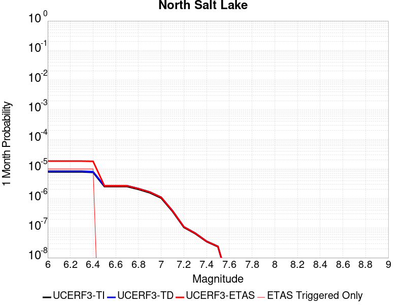 | 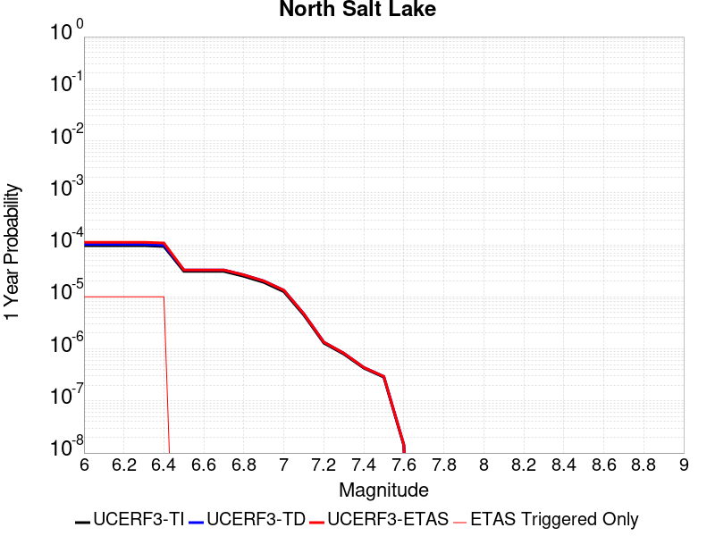 |  |

| Magnitude | 1 wk TI Prob | 1 wk TD Prob | 1 wk ETAS Prob | 1 wk ETAS/TD Gain | 1 wk ETAS Triggered Only | 1 mo TI Prob | 1 mo TD Prob | 1 mo ETAS Prob | 1 mo ETAS/TD Gain | 1 mo ETAS Triggered Only | 1 yr TI Prob | 1 yr TD Prob | 1 yr ETAS Prob | 1 yr ETAS/TD Gain | 1 yr ETAS Triggered Only | 10 yr TI Prob | 10 yr TD Prob | 10 yr ETAS Prob | 10 yr ETAS/TD Gain | 10 yr ETAS Triggered Only |
|-----|-----|-----|-----|-----|-----|-----|-----|-----|-----|-----|-----|-----|-----|-----|-----|-----|-----|-----|-----|-----|
| 6.0 | 1.849599E-6 | 1.955571E-6 | 1.1955552E-5 | 6.1135864 | 1.0E-5 | 7.926829E-6 | 8.381003E-6 | 1.8380919E-5 | 2.1931646 | 1.0E-5 | 9.650487E-5 | 1.0203594E-4 | 1.12034926E-4 | 1.0979947 | 1.0E-5 | 9.646297E-4 | 0.0010200888 | 0.0010300786 | 1.009793 | 1.0E-5 |
| 6.1 | 1.849599E-6 | 1.955571E-6 | 1.1955552E-5 | 6.1135864 | 1.0E-5 | 7.926829E-6 | 8.381003E-6 | 1.8380919E-5 | 2.1931646 | 1.0E-5 | 9.650487E-5 | 1.0203594E-4 | 1.12034926E-4 | 1.0979947 | 1.0E-5 | 9.646297E-4 | 0.0010200888 | 0.0010300786 | 1.009793 | 1.0E-5 |
| 6.2 | 1.849599E-6 | 1.955571E-6 | 1.1955552E-5 | 6.1135864 | 1.0E-5 | 7.926829E-6 | 8.381003E-6 | 1.8380919E-5 | 2.1931646 | 1.0E-5 | 9.650487E-5 | 1.0203594E-4 | 1.12034926E-4 | 1.0979947 | 1.0E-5 | 9.646297E-4 | 0.0010200888 | 0.0010300786 | 1.009793 | 1.0E-5 |
| 6.3 | 1.849599E-6 | 1.955571E-6 | 1.1955552E-5 | 6.1135864 | 1.0E-5 | 7.926829E-6 | 8.381003E-6 | 1.8380919E-5 | 2.1931646 | 1.0E-5 | 9.650487E-5 | 1.0203594E-4 | 1.12034926E-4 | 1.0979947 | 1.0E-5 | 9.646297E-4 | 0.0010200888 | 0.0010300786 | 1.009793 | 1.0E-5 |
| 6.4 | 1.7803909E-6 | 1.8860707E-6 | 1.1886052E-5 | 6.302018 | 1.0E-5 | 7.630225E-6 | 8.083147E-6 | 1.8083065E-5 | 2.237132 | 1.0E-5 | 9.289402E-5 | 9.840987E-5 | 1.0840889E-4 | 1.1016058 | 1.0E-5 | 9.28552E-4 | 9.838602E-4 | 9.938503E-4 | 1.010154 | 1.0E-5 |
| 6.5 | 5.9157696E-7 | 6.3001835E-7 | 6.3001835E-7 | 1.0 | 0.0 | 2.5353274E-6 | 2.7000763E-6 | 2.7000763E-6 | 1.0 | 0.0 | 3.0867173E-5 | 3.2872973E-5 | 3.2872973E-5 | 1.0 | 0.0 | 3.0862886E-4 | 3.28685E-4 | 3.28685E-4 | 1.0 | 0.0 |
| 6.6 | 5.9157696E-7 | 6.3001835E-7 | 6.3001835E-7 | 1.0 | 0.0 | 2.5353274E-6 | 2.7000763E-6 | 2.7000763E-6 | 1.0 | 0.0 | 3.0867173E-5 | 3.2872973E-5 | 3.2872973E-5 | 1.0 | 0.0 | 3.0862886E-4 | 3.28685E-4 | 3.28685E-4 | 1.0 | 0.0 |
| 6.7 | 5.9157696E-7 | 6.3001835E-7 | 6.3001835E-7 | 1.0 | 0.0 | 2.5353274E-6 | 2.7000763E-6 | 2.7000763E-6 | 1.0 | 0.0 | 3.0867173E-5 | 3.2872973E-5 | 3.2872973E-5 | 1.0 | 0.0 | 3.0862886E-4 | 3.28685E-4 | 3.28685E-4 | 1.0 | 0.0 |
| 6.8 | 4.7536267E-7 | 5.066019E-7 | 5.066019E-7 | 1.0 | 0.0 | 2.037267E-6 | 2.1711494E-6 | 2.1711494E-6 | 1.0 | 0.0 | 2.4803443E-5 | 2.6433447E-5 | 2.6433447E-5 | 1.0 | 0.0 | 2.4800675E-4 | 2.6430548E-4 | 2.6430548E-4 | 1.0 | 0.0 |
| 6.9 | 3.6345344E-7 | 3.8750048E-7 | 3.8750048E-7 | 1.0 | 0.0 | 1.5576567E-6 | 1.6607154E-6 | 1.6607154E-6 | 1.0 | 0.0 | 1.8964305E-5 | 2.021904E-5 | 2.021904E-5 | 1.0 | 0.0 | 1.8962687E-4 | 2.021737E-4 | 2.021737E-4 | 1.0 | 0.0 |
| 7.0 | 2.4087325E-7 | 2.5709335E-7 | 2.5709335E-7 | 1.0 | 0.0 | 1.0323135E-6 | 1.1018283E-6 | 1.1018283E-6 | 1.0 | 0.0 | 1.25683455E-5 | 1.3414689E-5 | 1.3414689E-5 | 1.0 | 0.0 | 1.2567634E-4 | 1.3414006E-4 | 1.3414006E-4 | 1.0 | 0.0 |
| 7.1 | 8.551555E-8 | 9.044477E-8 | 9.044477E-8 | 1.0 | 0.0 | 3.6649516E-7 | 3.876204E-7 | 3.876204E-7 | 1.0 | 0.0 | 4.4620692E-6 | 4.7192693E-6 | 4.7192693E-6 | 1.0 | 0.0 | 4.46198E-5 | 4.719181E-5 | 4.719181E-5 | 1.0 | 0.0 |
| 7.2 | 2.475279E-8 | 2.5893172E-8 | 2.5893172E-8 | 1.0 | 0.0 | 1.0608338E-7 | 1.1097074E-7 | 1.1097074E-7 | 1.0 | 0.0 | 1.2915643E-6 | 1.3510679E-6 | 1.3510679E-6 | 1.0 | 0.0 | 1.2915569E-5 | 1.3510604E-5 | 1.3510604E-5 | 1.0 | 0.0 |
| 7.3 | 1.5212393E-8 | 1.5847489E-8 | 1.5847489E-8 | 1.0 | 0.0 | 6.519597E-8 | 6.791781E-8 | 6.791781E-8 | 1.0 | 0.0 | 7.9376065E-7 | 8.2689905E-7 | 8.2689905E-7 | 1.0 | 0.0 | 7.937579E-6 | 8.268963E-6 | 8.268963E-6 | 1.0 | 0.0 |
| 7.4 | 8.182E-9 | 8.447294E-9 | 8.447294E-9 | 1.0 | 0.0 | 3.5065714E-8 | 3.620269E-8 | 3.620269E-8 | 1.0 | 0.0 | 4.26925E-7 | 4.4076765E-7 | 4.4076765E-7 | 1.0 | 0.0 | 4.269242E-6 | 4.4076683E-6 | 4.4076683E-6 | 1.0 | 0.0 |
| 7.5 | 5.479913E-9 | 5.6680434E-9 | 5.6680434E-9 | 1.0 | 0.0 | 2.3485342E-8 | 2.4291614E-8 | 2.4291614E-8 | 1.0 | 0.0 | 2.85934E-7 | 2.9575037E-7 | 2.9575037E-7 | 1.0 | 0.0 | 2.8593363E-6 | 2.9575E-6 | 2.9575E-6 | 1.0 | 0.0 |
| 7.6 | 2.6813562E-10 | 2.773195E-10 | 2.773195E-10 | 1.0 | 0.0 | 1.1491527E-9 | 1.1885122E-9 | 1.1885122E-9 | 1.0 | 0.0 | 1.3990933E-8 | 1.4470135E-8 | 1.4470135E-8 | 1.0 | 0.0 | 1.3990932E-7 | 1.4470135E-7 | 1.4470135E-7 | 1.0 | 0.0 |

## White Wolf
*[(top)](#table-of-contents)*

| 1 Week | 1 Month | 1 Year | 10 Year |
|-----|-----|-----|-----|
| 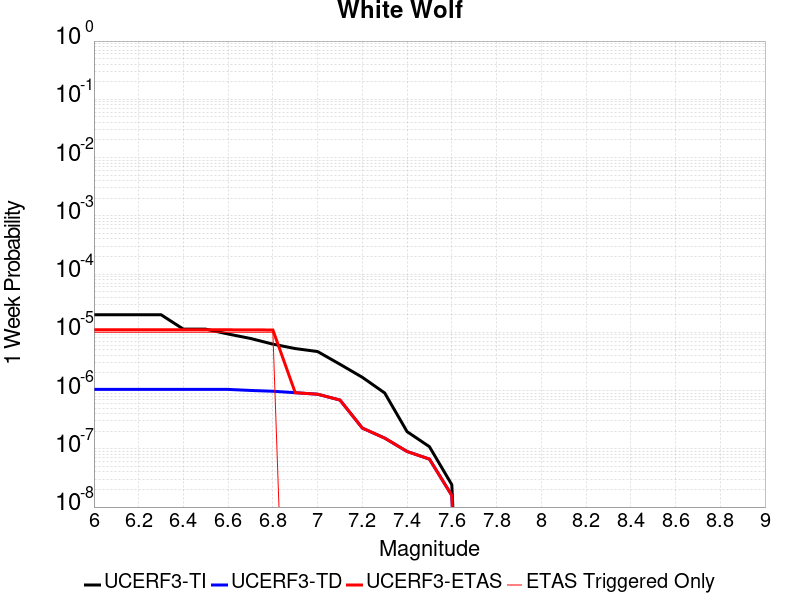 |  |  | 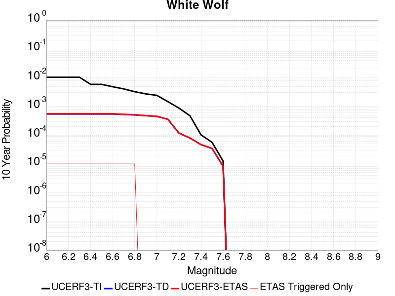 |

| Magnitude | 1 wk TI Prob | 1 wk TD Prob | 1 wk ETAS Prob | 1 wk ETAS/TD Gain | 1 wk ETAS Triggered Only | 1 mo TI Prob | 1 mo TD Prob | 1 mo ETAS Prob | 1 mo ETAS/TD Gain | 1 mo ETAS Triggered Only | 1 yr TI Prob | 1 yr TD Prob | 1 yr ETAS Prob | 1 yr ETAS/TD Gain | 1 yr ETAS Triggered Only | 10 yr TI Prob | 10 yr TD Prob | 10 yr ETAS Prob | 10 yr ETAS/TD Gain | 10 yr ETAS Triggered Only |
|-----|-----|-----|-----|-----|-----|-----|-----|-----|-----|-----|-----|-----|-----|-----|-----|-----|-----|-----|-----|-----|
| 6.0 | 2.0037822E-5 | 1.0468583E-6 | 1.1046848E-5 | 10.5523815 | 1.0E-5 | 8.587355E-5 | 4.4865283E-6 | 1.4486483E-5 | 3.228885 | 1.0E-5 | 0.001045009 | 5.4622164E-5 | 6.4621614E-5 | 1.1830659 | 1.0E-5 | 0.010401085 | 5.4609246E-4 | 5.56087E-4 | 1.018302 | 1.0E-5 |
| 6.1 | 2.0037822E-5 | 1.0468583E-6 | 1.1046848E-5 | 10.5523815 | 1.0E-5 | 8.587355E-5 | 4.4865283E-6 | 1.4486483E-5 | 3.228885 | 1.0E-5 | 0.001045009 | 5.4622164E-5 | 6.4621614E-5 | 1.1830659 | 1.0E-5 | 0.010401085 | 5.4609246E-4 | 5.56087E-4 | 1.018302 | 1.0E-5 |
| 6.2 | 2.0037822E-5 | 1.0468583E-6 | 1.1046848E-5 | 10.5523815 | 1.0E-5 | 8.587355E-5 | 4.4865283E-6 | 1.4486483E-5 | 3.228885 | 1.0E-5 | 0.001045009 | 5.4622164E-5 | 6.4621614E-5 | 1.1830659 | 1.0E-5 | 0.010401085 | 5.4609246E-4 | 5.56087E-4 | 1.018302 | 1.0E-5 |
| 6.3 | 2.0037822E-5 | 1.0468583E-6 | 1.1046848E-5 | 10.5523815 | 1.0E-5 | 8.587355E-5 | 4.4865283E-6 | 1.4486483E-5 | 3.228885 | 1.0E-5 | 0.001045009 | 5.4622164E-5 | 6.4621614E-5 | 1.1830659 | 1.0E-5 | 0.010401085 | 5.4609246E-4 | 5.56087E-4 | 1.018302 | 1.0E-5 |
| 6.4 | 1.132487E-5 | 1.0468583E-6 | 1.1046848E-5 | 10.5523815 | 1.0E-5 | 4.8534253E-5 | 4.4865283E-6 | 1.4486483E-5 | 3.228885 | 1.0E-5 | 5.907443E-4 | 5.4622164E-5 | 6.4621614E-5 | 1.1830659 | 1.0E-5 | 0.005891764 | 5.4609246E-4 | 5.56087E-4 | 1.018302 | 1.0E-5 |
| 6.5 | 1.132487E-5 | 1.0468583E-6 | 1.1046848E-5 | 10.5523815 | 1.0E-5 | 4.8534253E-5 | 4.4865283E-6 | 1.4486483E-5 | 3.228885 | 1.0E-5 | 5.907443E-4 | 5.4622164E-5 | 6.4621614E-5 | 1.1830659 | 1.0E-5 | 0.005891764 | 5.4609246E-4 | 5.56087E-4 | 1.018302 | 1.0E-5 |
| 6.6 | 9.347473E-6 | 1.0468583E-6 | 1.1046848E-5 | 10.5523815 | 1.0E-5 | 4.0059982E-5 | 4.4865283E-6 | 1.4486483E-5 | 3.228885 | 1.0E-5 | 4.8762115E-4 | 5.4622164E-5 | 6.4621614E-5 | 1.1830659 | 1.0E-5 | 0.0048655253 | 5.4609246E-4 | 5.56087E-4 | 1.018302 | 1.0E-5 |
| 6.7 | 7.842647E-6 | 1.0047773E-6 | 1.1004768E-5 | 10.952444 | 1.0E-5 | 3.361091E-5 | 4.306182E-6 | 1.4306139E-5 | 3.322233 | 1.0E-5 | 4.0913603E-4 | 5.2426552E-5 | 6.242603E-5 | 1.1907331 | 1.0E-5 | 0.004083836 | 5.241468E-4 | 5.3414155E-4 | 1.0190686 | 1.0E-5 |
| 6.8 | 6.26597E-6 | 9.734289E-7 | 1.0973419E-5 | 11.272955 | 1.0E-5 | 2.685388E-5 | 4.1718313E-6 | 1.417179E-5 | 3.3970187 | 1.0E-5 | 3.2689696E-4 | 5.0790914E-5 | 6.0790408E-5 | 1.1968756 | 1.0E-5 | 0.003264165 | 5.07798E-4 | 5.177929E-4 | 1.0196829 | 1.0E-5 |
| 6.9 | 5.258436E-6 | 9.1827343E-7 | 9.1827343E-7 | 1.0 | 0.0 | 2.2535958E-5 | 3.935452E-6 | 3.935452E-6 | 1.0 | 0.0 | 2.7434074E-4 | 4.7913123E-5 | 4.7913123E-5 | 1.0 | 0.0 | 0.0027400232 | 4.7903272E-4 | 4.7903272E-4 | 1.0 | 0.0 |
| 7.0 | 4.675028E-6 | 8.660704E-7 | 8.660704E-7 | 1.0 | 0.0 | 2.003568E-5 | 3.7117254E-6 | 3.7117254E-6 | 1.0 | 0.0 | 2.4390711E-4 | 4.518937E-5 | 4.518937E-5 | 1.0 | 0.0 | 0.0024363957 | 4.518065E-4 | 4.518065E-4 | 1.0 | 0.0 |
| 7.1 | 2.8270078E-6 | 6.8737717E-7 | 6.8737717E-7 | 1.0 | 0.0 | 1.2115692E-5 | 2.945899E-6 | 2.945899E-6 | 1.0 | 0.0 | 1.4749856E-4 | 3.586577E-5 | 3.586577E-5 | 1.0 | 0.0 | 0.001474007 | 3.5860392E-4 | 3.5860392E-4 | 1.0 | 0.0 |
| 7.2 | 1.6881406E-6 | 2.2703432E-7 | 2.2703432E-7 | 1.0 | 0.0 | 7.2348685E-6 | 9.730038E-7 | 9.730038E-7 | 1.0 | 0.0 | 8.808096E-5 | 1.1846259E-5 | 1.1846259E-5 | 1.0 | 0.0 | 8.8046055E-4 | 1.1845643E-4 | 1.1845643E-4 | 1.0 | 0.0 |
| 7.3 | 9.086107E-7 | 1.5264496E-7 | 1.5264496E-7 | 1.0 | 0.0 | 3.8940398E-6 | 6.5419255E-7 | 6.5419255E-7 | 1.0 | 0.0 | 4.7408903E-5 | 7.964766E-6 | 7.964766E-6 | 1.0 | 0.0 | 4.739879E-4 | 7.964489E-5 | 7.964489E-5 | 1.0 | 0.0 |
| 7.4 | 1.9717383E-7 | 9.003399E-8 | 9.003399E-8 | 1.0 | 0.0 | 8.450304E-7 | 3.8585992E-7 | 3.8585992E-7 | 1.0 | 0.0 | 1.0288197E-5 | 4.697835E-6 | 4.697835E-6 | 1.0 | 0.0 | 1.028772E-4 | 4.6977384E-5 | 4.6977384E-5 | 1.0 | 0.0 |
| 7.5 | 1.086975E-7 | 6.659662E-8 | 6.659662E-8 | 1.0 | 0.0 | 4.6584634E-7 | 2.8541407E-7 | 2.8541407E-7 | 1.0 | 0.0 | 5.6716644E-6 | 3.474911E-6 | 3.474911E-6 | 1.0 | 0.0 | 5.6715195E-5 | 3.474859E-5 | 3.474859E-5 | 1.0 | 0.0 |
| 7.6 | 2.4217808E-8 | 1.5820849E-8 | 1.5820849E-8 | 1.0 | 0.0 | 1.03790605E-7 | 6.780364E-8 | 6.780364E-8 | 1.0 | 0.0 | 1.2636499E-6 | 8.25509E-7 | 8.25509E-7 | 1.0 | 0.0 | 1.2636427E-5 | 8.255064E-6 | 8.255064E-6 | 1.0 | 0.0 |

## Burnt Mtn
*[(top)](#table-of-contents)*

| 1 Week | 1 Month | 1 Year | 10 Year |
|-----|-----|-----|-----|
|  |  |  |  |

| Magnitude | 1 wk TI Prob | 1 wk TD Prob | 1 wk ETAS Prob | 1 wk ETAS/TD Gain | 1 wk ETAS Triggered Only | 1 mo TI Prob | 1 mo TD Prob | 1 mo ETAS Prob | 1 mo ETAS/TD Gain | 1 mo ETAS Triggered Only | 1 yr TI Prob | 1 yr TD Prob | 1 yr ETAS Prob | 1 yr ETAS/TD Gain | 1 yr ETAS Triggered Only | 10 yr TI Prob | 10 yr TD Prob | 10 yr ETAS Prob | 10 yr ETAS/TD Gain | 10 yr ETAS Triggered Only |
|-----|-----|-----|-----|-----|-----|-----|-----|-----|-----|-----|-----|-----|-----|-----|-----|-----|-----|-----|-----|-----|
| 6.0 | 1.5673151E-5 | 1.1749247E-5 | 1.1749247E-5 | 1.0 | 0.0 | 6.716892E-5 | 5.0353672E-5 | 5.0353672E-5 | 1.0 | 0.0 | 8.1747473E-4 | 6.130124E-4 | 6.130124E-4 | 1.0 | 0.0 | 0.008144741 | 0.006125855 | 0.0061357934 | 1.0016224 | 1.0E-5 |
| 6.1 | 1.5673151E-5 | 1.1749247E-5 | 1.1749247E-5 | 1.0 | 0.0 | 6.716892E-5 | 5.0353672E-5 | 5.0353672E-5 | 1.0 | 0.0 | 8.1747473E-4 | 6.130124E-4 | 6.130124E-4 | 1.0 | 0.0 | 0.008144741 | 0.006125855 | 0.0061357934 | 1.0016224 | 1.0E-5 |
| 6.2 | 1.5673151E-5 | 1.1749247E-5 | 1.1749247E-5 | 1.0 | 0.0 | 6.716892E-5 | 5.0353672E-5 | 5.0353672E-5 | 1.0 | 0.0 | 8.1747473E-4 | 6.130124E-4 | 6.130124E-4 | 1.0 | 0.0 | 0.008144741 | 0.006125855 | 0.0061357934 | 1.0016224 | 1.0E-5 |
| 6.3 | 1.5673151E-5 | 1.1749247E-5 | 1.1749247E-5 | 1.0 | 0.0 | 6.716892E-5 | 5.0353672E-5 | 5.0353672E-5 | 1.0 | 0.0 | 8.1747473E-4 | 6.130124E-4 | 6.130124E-4 | 1.0 | 0.0 | 0.008144741 | 0.006125855 | 0.0061357934 | 1.0016224 | 1.0E-5 |
| 6.4 | 1.5673151E-5 | 1.1749247E-5 | 1.1749247E-5 | 1.0 | 0.0 | 6.716892E-5 | 5.0353672E-5 | 5.0353672E-5 | 1.0 | 0.0 | 8.1747473E-4 | 6.130124E-4 | 6.130124E-4 | 1.0 | 0.0 | 0.008144741 | 0.006125855 | 0.0061357934 | 1.0016224 | 1.0E-5 |
| 6.5 | 1.36191375E-5 | 1.007816E-5 | 1.007816E-5 | 1.0 | 0.0 | 5.8366426E-5 | 4.319211E-5 | 4.319211E-5 | 1.0 | 0.0 | 7.103795E-4 | 5.2586396E-4 | 5.2586396E-4 | 1.0 | 0.0 | 0.0070811296 | 0.00525864 | 0.00525864 | 1.0 | 0.0 |

## Great Valley 04a Trout Creek
*[(top)](#table-of-contents)*

| 1 Week | 1 Month | 1 Year | 10 Year |
|-----|-----|-----|-----|
|  | 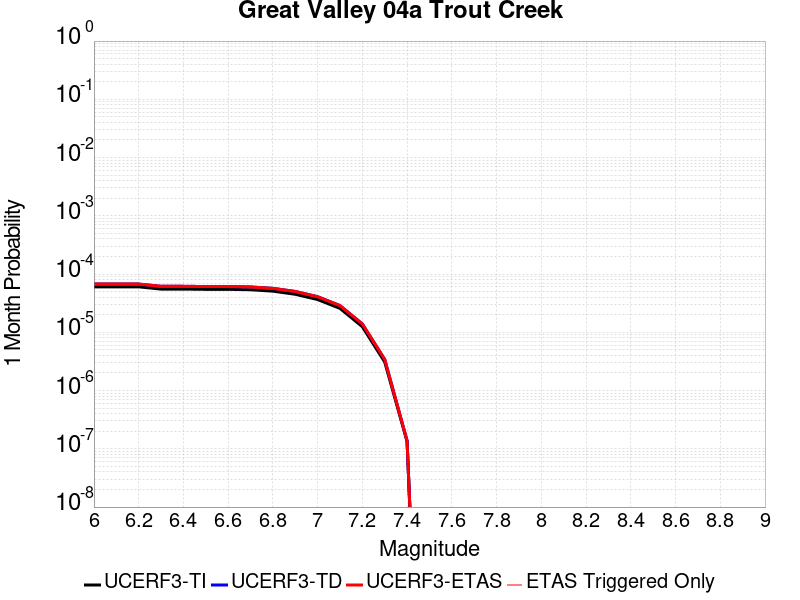 |  | 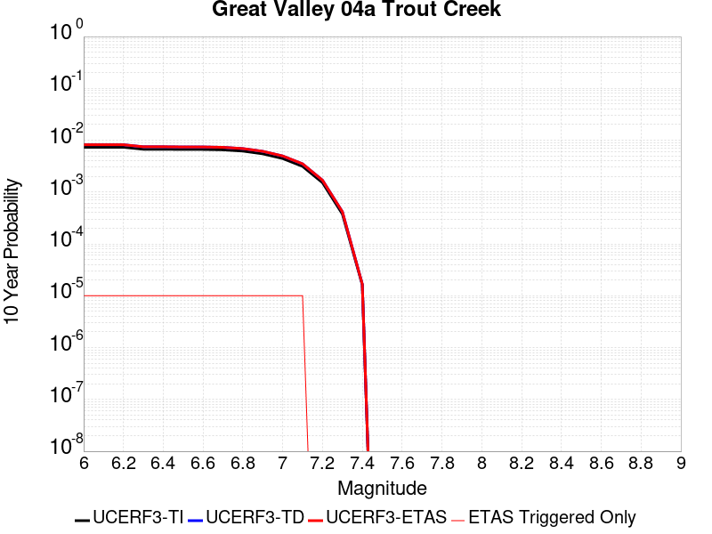 |

| Magnitude | 1 wk TI Prob | 1 wk TD Prob | 1 wk ETAS Prob | 1 wk ETAS/TD Gain | 1 wk ETAS Triggered Only | 1 mo TI Prob | 1 mo TD Prob | 1 mo ETAS Prob | 1 mo ETAS/TD Gain | 1 mo ETAS Triggered Only | 1 yr TI Prob | 1 yr TD Prob | 1 yr ETAS Prob | 1 yr ETAS/TD Gain | 1 yr ETAS Triggered Only | 10 yr TI Prob | 10 yr TD Prob | 10 yr ETAS Prob | 10 yr ETAS/TD Gain | 10 yr ETAS Triggered Only |
|-----|-----|-----|-----|-----|-----|-----|-----|-----|-----|-----|-----|-----|-----|-----|-----|-----|-----|-----|-----|-----|
| 6.0 | 1.4088538E-5 | 1.5719554E-5 | 1.5719554E-5 | 1.0 | 0.0 | 6.037805E-5 | 6.7367844E-5 | 6.7367844E-5 | 1.0 | 0.0 | 7.3485484E-4 | 8.199074E-4 | 8.2989916E-4 | 1.0121865 | 1.0E-5 | 0.007324295 | 0.008170108 | 0.008180026 | 1.001214 | 1.0E-5 |
| 6.1 | 1.4088538E-5 | 1.5719554E-5 | 1.5719554E-5 | 1.0 | 0.0 | 6.037805E-5 | 6.7367844E-5 | 6.7367844E-5 | 1.0 | 0.0 | 7.3485484E-4 | 8.199074E-4 | 8.2989916E-4 | 1.0121865 | 1.0E-5 | 0.007324295 | 0.008170108 | 0.008180026 | 1.001214 | 1.0E-5 |
| 6.2 | 1.4088538E-5 | 1.5719554E-5 | 1.5719554E-5 | 1.0 | 0.0 | 6.037805E-5 | 6.7367844E-5 | 6.7367844E-5 | 1.0 | 0.0 | 7.3485484E-4 | 8.199074E-4 | 8.2989916E-4 | 1.0121865 | 1.0E-5 | 0.007324295 | 0.008170108 | 0.008180026 | 1.001214 | 1.0E-5 |
| 6.3 | 1.2882862E-5 | 1.4378603E-5 | 1.4378603E-5 | 1.0 | 0.0 | 5.5211098E-5 | 6.1621184E-5 | 6.1621184E-5 | 1.0 | 0.0 | 6.7198783E-4 | 7.4999005E-4 | 7.5998256E-4 | 1.0133235 | 1.0E-5 | 0.0066995937 | 0.0074756527 | 0.0074855783 | 1.0013276 | 1.0E-5 |
| 6.4 | 1.2882862E-5 | 1.4378603E-5 | 1.4378603E-5 | 1.0 | 0.0 | 5.5211098E-5 | 6.1621184E-5 | 6.1621184E-5 | 1.0 | 0.0 | 6.7198783E-4 | 7.4999005E-4 | 7.5998256E-4 | 1.0133235 | 1.0E-5 | 0.0066995937 | 0.0074756527 | 0.0074855783 | 1.0013276 | 1.0E-5 |
| 6.5 | 1.2762329E-5 | 1.424516E-5 | 1.424516E-5 | 1.0 | 0.0 | 5.469455E-5 | 6.1049315E-5 | 6.1049315E-5 | 1.0 | 0.0 | 6.657027E-4 | 7.430323E-4 | 7.530249E-4 | 1.0134484 | 1.0E-5 | 0.00663712 | 0.0074065393 | 0.007416465 | 1.0013402 | 1.0E-5 |
| 6.6 | 1.2762329E-5 | 1.424516E-5 | 1.424516E-5 | 1.0 | 0.0 | 5.469455E-5 | 6.1049315E-5 | 6.1049315E-5 | 1.0 | 0.0 | 6.657027E-4 | 7.430323E-4 | 7.530249E-4 | 1.0134484 | 1.0E-5 | 0.00663712 | 0.0074065393 | 0.007416465 | 1.0013402 | 1.0E-5 |
| 6.7 | 1.2557959E-5 | 1.4019395E-5 | 1.4019395E-5 | 1.0 | 0.0 | 5.3818712E-5 | 6.0081795E-5 | 6.0081795E-5 | 1.0 | 0.0 | 6.5504585E-4 | 7.312607E-4 | 7.412534E-4 | 1.013665 | 1.0E-5 | 0.006531183 | 0.007289598 | 0.007299525 | 1.0013618 | 1.0E-5 |
| 6.8 | 1.1871544E-5 | 1.3258823E-5 | 1.3258823E-5 | 1.0 | 0.0 | 5.0877054E-5 | 5.6822348E-5 | 5.6822348E-5 | 1.0 | 0.0 | 6.1925204E-4 | 6.916025E-4 | 7.0159556E-4 | 1.0144491 | 1.0E-5 | 0.0061752927 | 0.0068955184 | 0.0069054496 | 1.0014402 | 1.0E-5 |
| 6.9 | 1.0500373E-5 | 1.1731261E-5 | 1.1731261E-5 | 1.0 | 0.0 | 4.5000823E-5 | 5.0275914E-5 | 5.0275914E-5 | 1.0 | 0.0 | 5.4774724E-4 | 6.119459E-4 | 6.219398E-4 | 1.0163313 | 1.0E-5 | 0.005463991 | 0.0061034737 | 0.006113413 | 1.0016284 | 1.0E-5 |
| 7.0 | 8.524332E-6 | 9.5334835E-6 | 9.5334835E-6 | 1.0 | 0.0 | 3.653234E-5 | 4.0857187E-5 | 4.0857187E-5 | 1.0 | 0.0 | 4.4469046E-4 | 4.9733004E-4 | 5.073251E-4 | 1.0200974 | 1.0E-5 | 0.0044380166 | 0.004962902 | 0.0049728523 | 1.002005 | 1.0E-5 |
| 7.1 | 6.006849E-6 | 6.711559E-6 | 6.711559E-6 | 1.0 | 0.0 | 2.5743384E-5 | 2.876354E-5 | 2.876354E-5 | 1.0 | 0.0 | 3.1338062E-4 | 3.501454E-4 | 3.601419E-4 | 1.0285496 | 1.0E-5 | 0.0031293905 | 0.0034964874 | 0.0035064525 | 1.00285 | 1.0E-5 |
| 7.2 | 2.9122193E-6 | 3.2465305E-6 | 3.2465305E-6 | 1.0 | 0.0 | 1.248088E-5 | 1.3913637E-5 | 1.3913637E-5 | 1.0 | 0.0 | 1.5194413E-4 | 1.6938712E-4 | 1.6938712E-4 | 1.0 | 0.0 | 0.0015184027 | 0.0016927521 | 0.0016927521 | 1.0 | 0.0 |
| 7.3 | 7.2194007E-7 | 7.988761E-7 | 7.988761E-7 | 1.0 | 0.0 | 3.0940253E-6 | 3.4237528E-6 | 3.4237528E-6 | 1.0 | 0.0 | 3.7669106E-5 | 4.1683852E-5 | 4.1683852E-5 | 1.0 | 0.0 | 3.766272E-4 | 4.168053E-4 | 4.168053E-4 | 1.0 | 0.0 |
| 7.4 | 3.112171E-8 | 3.2068368E-8 | 3.2068368E-8 | 1.0 | 0.0 | 1.3337875E-7 | 1.3743585E-7 | 1.3743585E-7 | 1.0 | 0.0 | 1.6238852E-6 | 1.6732803E-6 | 1.6732803E-6 | 1.0 | 0.0 | 1.6238733E-5 | 1.6732685E-5 | 1.6732685E-5 | 1.0 | 0.0 |

## Earthquake Valley (So Extension)
*[(top)](#table-of-contents)*

| 1 Week | 1 Month | 1 Year | 10 Year |
|-----|-----|-----|-----|
|  |  |  |  |

| Magnitude | 1 wk TI Prob | 1 wk TD Prob | 1 wk ETAS Prob | 1 wk ETAS/TD Gain | 1 wk ETAS Triggered Only | 1 mo TI Prob | 1 mo TD Prob | 1 mo ETAS Prob | 1 mo ETAS/TD Gain | 1 mo ETAS Triggered Only | 1 yr TI Prob | 1 yr TD Prob | 1 yr ETAS Prob | 1 yr ETAS/TD Gain | 1 yr ETAS Triggered Only | 10 yr TI Prob | 10 yr TD Prob | 10 yr ETAS Prob | 10 yr ETAS/TD Gain | 10 yr ETAS Triggered Only |
|-----|-----|-----|-----|-----|-----|-----|-----|-----|-----|-----|-----|-----|-----|-----|-----|-----|-----|-----|-----|-----|
| 6.0 | 3.0194888E-5 | 3.707208E-5 | 3.707208E-5 | 1.0 | 0.0 | 1.2940024E-4 | 1.5887374E-4 | 1.5887374E-4 | 1.0 | 0.0 | 0.0015743093 | 0.0019330877 | 0.0019330877 | 1.0 | 0.0 | 0.01563203 | 0.0192131 | 0.01922291 | 1.0005105 | 1.0E-5 |
| 6.1 | 3.0194888E-5 | 3.707208E-5 | 3.707208E-5 | 1.0 | 0.0 | 1.2940024E-4 | 1.5887374E-4 | 1.5887374E-4 | 1.0 | 0.0 | 0.0015743093 | 0.0019330877 | 0.0019330877 | 1.0 | 0.0 | 0.01563203 | 0.0192131 | 0.01922291 | 1.0005105 | 1.0E-5 |
| 6.2 | 3.0194888E-5 | 3.707208E-5 | 3.707208E-5 | 1.0 | 0.0 | 1.2940024E-4 | 1.5887374E-4 | 1.5887374E-4 | 1.0 | 0.0 | 0.0015743093 | 0.0019330877 | 0.0019330877 | 1.0 | 0.0 | 0.01563203 | 0.0192131 | 0.01922291 | 1.0005105 | 1.0E-5 |
| 6.3 | 1.5795305E-5 | 1.8446612E-5 | 1.8446612E-5 | 1.0 | 0.0 | 6.769241E-5 | 7.905514E-5 | 7.905514E-5 | 1.0 | 0.0 | 8.238434E-4 | 9.621823E-4 | 9.621823E-4 | 1.0 | 0.0 | 0.008207959 | 0.0095910635 | 0.0095910635 | 1.0 | 0.0 |
| 6.4 | 1.5795305E-5 | 1.8446612E-5 | 1.8446612E-5 | 1.0 | 0.0 | 6.769241E-5 | 7.905514E-5 | 7.905514E-5 | 1.0 | 0.0 | 8.238434E-4 | 9.621823E-4 | 9.621823E-4 | 1.0 | 0.0 | 0.008207959 | 0.0095910635 | 0.0095910635 | 1.0 | 0.0 |
| 6.5 | 1.5795305E-5 | 1.8446612E-5 | 1.8446612E-5 | 1.0 | 0.0 | 6.769241E-5 | 7.905514E-5 | 7.905514E-5 | 1.0 | 0.0 | 8.238434E-4 | 9.621823E-4 | 9.621823E-4 | 1.0 | 0.0 | 0.008207959 | 0.0095910635 | 0.0095910635 | 1.0 | 0.0 |
| 6.6 | 1.5795305E-5 | 1.8446612E-5 | 1.8446612E-5 | 1.0 | 0.0 | 6.769241E-5 | 7.905514E-5 | 7.905514E-5 | 1.0 | 0.0 | 8.238434E-4 | 9.621823E-4 | 9.621823E-4 | 1.0 | 0.0 | 0.008207959 | 0.0095910635 | 0.0095910635 | 1.0 | 0.0 |
| 6.7 | 1.1363076E-5 | 1.3138288E-5 | 1.3138288E-5 | 1.0 | 0.0 | 4.8697988E-5 | 5.6306162E-5 | 5.6306162E-5 | 1.0 | 0.0 | 5.927367E-4 | 6.8538805E-4 | 6.8538805E-4 | 1.0 | 0.0 | 0.0059115817 | 0.006840215 | 0.006840215 | 1.0 | 0.0 |
| 6.8 | 1.0049611E-5 | 1.1594328E-5 | 1.1594328E-5 | 1.0 | 0.0 | 4.306905E-5 | 4.968944E-5 | 4.968944E-5 | 1.0 | 0.0 | 5.242395E-4 | 6.0487416E-4 | 6.0487416E-4 | 1.0 | 0.0 | 0.0052300454 | 0.0060394546 | 0.0060394546 | 1.0 | 0.0 |
| 6.9 | 1.0049611E-5 | 1.1594328E-5 | 1.1594328E-5 | 1.0 | 0.0 | 4.306905E-5 | 4.968944E-5 | 4.968944E-5 | 1.0 | 0.0 | 5.242395E-4 | 6.0487416E-4 | 6.0487416E-4 | 1.0 | 0.0 | 0.0052300454 | 0.0060394546 | 0.0060394546 | 1.0 | 0.0 |
| 7.0 | 1.0049611E-5 | 1.1594328E-5 | 1.1594328E-5 | 1.0 | 0.0 | 4.306905E-5 | 4.968944E-5 | 4.968944E-5 | 1.0 | 0.0 | 5.242395E-4 | 6.0487416E-4 | 6.0487416E-4 | 1.0 | 0.0 | 0.0052300454 | 0.0060394546 | 0.0060394546 | 1.0 | 0.0 |
| 7.1 | 8.140254E-6 | 9.3834515E-6 | 9.3834515E-6 | 1.0 | 0.0 | 3.4886336E-5 | 4.021455E-5 | 4.021455E-5 | 1.0 | 0.0 | 4.2465836E-4 | 4.895692E-4 | 4.895692E-4 | 1.0 | 0.0 | 0.0042384774 | 0.004891483 | 0.004891483 | 1.0 | 0.0 |
| 7.2 | 1.673835E-7 | 1.4153493E-7 | 1.4153493E-7 | 1.0 | 0.0 | 7.173577E-7 | 6.065781E-7 | 6.065781E-7 | 1.0 | 0.0 | 8.733795E-6 | 7.3850674E-6 | 7.3850674E-6 | 1.0 | 0.0 | 8.733451E-5 | 7.3848576E-5 | 7.3848576E-5 | 1.0 | 0.0 |
| 7.3 | 1.6632116E-7 | 1.4051723E-7 | 1.4051723E-7 | 1.0 | 0.0 | 7.1280476E-7 | 6.022166E-7 | 6.022166E-7 | 1.0 | 0.0 | 8.678364E-6 | 7.331966E-6 | 7.331966E-6 | 1.0 | 0.0 | 8.6780245E-5 | 7.33176E-5 | 7.33176E-5 | 1.0 | 0.0 |
| 7.4 | 1.6569169E-7 | 1.3996352E-7 | 1.3996352E-7 | 1.0 | 0.0 | 7.1010703E-7 | 5.9984353E-7 | 5.9984353E-7 | 1.0 | 0.0 | 8.645519E-6 | 7.303074E-6 | 7.303074E-6 | 1.0 | 0.0 | 8.645182E-5 | 7.30287E-5 | 7.30287E-5 | 1.0 | 0.0 |
| 7.5 | 1.1764555E-7 | 1.0095245E-7 | 1.0095245E-7 | 1.0 | 0.0 | 5.041951E-7 | 4.3265328E-7 | 4.3265328E-7 | 1.0 | 0.0 | 6.138558E-6 | 5.267543E-6 | 5.267543E-6 | 1.0 | 0.0 | 6.1383886E-5 | 5.2674397E-5 | 5.2674397E-5 | 1.0 | 0.0 |
| 7.6 | 1.07927605E-7 | 9.2600665E-8 | 9.2600665E-8 | 1.0 | 0.0 | 4.6254678E-7 | 3.9685995E-7 | 3.9685995E-7 | 1.0 | 0.0 | 5.6314925E-6 | 4.8317615E-6 | 4.8317615E-6 | 1.0 | 0.0 | 5.63135E-5 | 4.831677E-5 | 4.831677E-5 | 1.0 | 0.0 |
| 7.7 | 2.1826905E-8 | 1.1179958E-8 | 1.1179958E-8 | 1.0 | 0.0 | 9.3543875E-8 | 4.791411E-8 | 4.791411E-8 | 1.0 | 0.0 | 1.1388961E-6 | 5.8335416E-7 | 5.8335416E-7 | 1.0 | 0.0 | 1.1388902E-5 | 5.8335318E-6 | 5.8335318E-6 | 1.0 | 0.0 |
| 7.8 | 2.6169649E-9 | 1.1968753E-9 | 1.1968753E-9 | 1.0 | 0.0 | 1.1215564E-8 | 5.1294657E-9 | 5.1294657E-9 | 1.0 | 0.0 | 1.3654947E-7 | 6.245124E-8 | 6.245124E-8 | 1.0 | 0.0 | 1.365494E-6 | 6.2451244E-7 | 6.2451244E-7 | 1.0 | 0.0 |

## Earthquake Valley
*[(top)](#table-of-contents)*

| 1 Week | 1 Month | 1 Year | 10 Year |
|-----|-----|-----|-----|
|  |  |  |  |

| Magnitude | 1 wk TI Prob | 1 wk TD Prob | 1 wk ETAS Prob | 1 wk ETAS/TD Gain | 1 wk ETAS Triggered Only | 1 mo TI Prob | 1 mo TD Prob | 1 mo ETAS Prob | 1 mo ETAS/TD Gain | 1 mo ETAS Triggered Only | 1 yr TI Prob | 1 yr TD Prob | 1 yr ETAS Prob | 1 yr ETAS/TD Gain | 1 yr ETAS Triggered Only | 10 yr TI Prob | 10 yr TD Prob | 10 yr ETAS Prob | 10 yr ETAS/TD Gain | 10 yr ETAS Triggered Only |
|-----|-----|-----|-----|-----|-----|-----|-----|-----|-----|-----|-----|-----|-----|-----|-----|-----|-----|-----|-----|-----|
| 6.0 | 1.9416384E-5 | 2.258411E-5 | 2.258411E-5 | 1.0 | 0.0 | 8.321042E-5 | 9.6786134E-5 | 9.6786134E-5 | 1.0 | 0.0 | 0.001012616 | 0.001177854 | 0.0011878422 | 1.0084801 | 1.0E-5 | 0.010080142 | 0.011727945 | 0.011737828 | 1.0008427 | 1.0E-5 |
| 6.1 | 1.9416384E-5 | 2.258411E-5 | 2.258411E-5 | 1.0 | 0.0 | 8.321042E-5 | 9.6786134E-5 | 9.6786134E-5 | 1.0 | 0.0 | 0.001012616 | 0.001177854 | 0.0011878422 | 1.0084801 | 1.0E-5 | 0.010080142 | 0.011727945 | 0.011737828 | 1.0008427 | 1.0E-5 |
| 6.2 | 1.9416384E-5 | 2.258411E-5 | 2.258411E-5 | 1.0 | 0.0 | 8.321042E-5 | 9.6786134E-5 | 9.6786134E-5 | 1.0 | 0.0 | 0.001012616 | 0.001177854 | 0.0011878422 | 1.0084801 | 1.0E-5 | 0.010080142 | 0.011727945 | 0.011737828 | 1.0008427 | 1.0E-5 |
| 6.3 | 1.9416384E-5 | 2.258411E-5 | 2.258411E-5 | 1.0 | 0.0 | 8.321042E-5 | 9.6786134E-5 | 9.6786134E-5 | 1.0 | 0.0 | 0.001012616 | 0.001177854 | 0.0011878422 | 1.0084801 | 1.0E-5 | 0.010080142 | 0.011727945 | 0.011737828 | 1.0008427 | 1.0E-5 |
| 6.4 | 1.9416384E-5 | 2.258411E-5 | 2.258411E-5 | 1.0 | 0.0 | 8.321042E-5 | 9.6786134E-5 | 9.6786134E-5 | 1.0 | 0.0 | 0.001012616 | 0.001177854 | 0.0011878422 | 1.0084801 | 1.0E-5 | 0.010080142 | 0.011727945 | 0.011737828 | 1.0008427 | 1.0E-5 |
| 6.5 | 1.9389157E-5 | 2.25527E-5 | 2.25527E-5 | 1.0 | 0.0 | 8.309374E-5 | 9.665152E-5 | 9.665152E-5 | 1.0 | 0.0 | 0.0010111968 | 0.001176217 | 0.0011862052 | 1.0084919 | 1.0E-5 | 0.010066078 | 0.011711747 | 0.01172163 | 1.0008439 | 1.0E-5 |
| 6.6 | 1.9389157E-5 | 2.25527E-5 | 2.25527E-5 | 1.0 | 0.0 | 8.309374E-5 | 9.665152E-5 | 9.665152E-5 | 1.0 | 0.0 | 0.0010111968 | 0.001176217 | 0.0011862052 | 1.0084919 | 1.0E-5 | 0.010066078 | 0.011711747 | 0.01172163 | 1.0008439 | 1.0E-5 |
| 6.7 | 1.4925434E-5 | 1.720822E-5 | 1.720822E-5 | 1.0 | 0.0 | 6.396457E-5 | 7.374791E-5 | 7.374791E-5 | 1.0 | 0.0 | 7.7849044E-4 | 8.97596E-4 | 9.07587E-4 | 1.0111309 | 1.0E-5 | 0.007757689 | 0.008948081 | 0.008957992 | 1.0011076 | 1.0E-5 |
| 6.8 | 1.3570335E-5 | 1.5616837E-5 | 1.5616837E-5 | 1.0 | 0.0 | 5.8157282E-5 | 6.692804E-5 | 6.692804E-5 | 1.0 | 0.0 | 7.0783484E-4 | 8.146264E-4 | 8.2461827E-4 | 1.0122656 | 1.0E-5 | 0.0070558446 | 0.008124473 | 0.008134392 | 1.0012208 | 1.0E-5 |
| 6.9 | 1.3570335E-5 | 1.5616837E-5 | 1.5616837E-5 | 1.0 | 0.0 | 5.8157282E-5 | 6.692804E-5 | 6.692804E-5 | 1.0 | 0.0 | 7.0783484E-4 | 8.146264E-4 | 8.2461827E-4 | 1.0122656 | 1.0E-5 | 0.0070558446 | 0.008124473 | 0.008134392 | 1.0012208 | 1.0E-5 |
| 7.0 | 1.3433392E-5 | 1.546038E-5 | 1.546038E-5 | 1.0 | 0.0 | 5.757041E-5 | 6.6257555E-5 | 6.6257555E-5 | 1.0 | 0.0 | 7.0069433E-4 | 8.064692E-4 | 8.164611E-4 | 1.0123898 | 1.0E-5 | 0.006984891 | 0.008043493 | 0.008053413 | 1.0012332 | 1.0E-5 |
| 7.1 | 8.181609E-6 | 9.4168445E-6 | 9.4168445E-6 | 1.0 | 0.0 | 3.5063567E-5 | 4.0357656E-5 | 4.0357656E-5 | 1.0 | 0.0 | 4.268153E-4 | 4.913108E-4 | 4.913108E-4 | 1.0 | 0.0 | 0.0042599645 | 0.004908822 | 0.004908822 | 1.0 | 0.0 |
| 7.2 | 2.0663983E-7 | 1.7262263E-7 | 1.7262263E-7 | 1.0 | 0.0 | 8.855989E-7 | 7.398111E-7 | 7.398111E-7 | 1.0 | 0.0 | 1.0782113E-5 | 9.007167E-6 | 9.007167E-6 | 1.0 | 0.0 | 1.07815904E-4 | 9.006837E-5 | 9.006837E-5 | 1.0 | 0.0 |
| 7.3 | 2.0462376E-7 | 1.7077758E-7 | 1.7077758E-7 | 1.0 | 0.0 | 8.7695867E-7 | 7.319037E-7 | 7.319037E-7 | 1.0 | 0.0 | 1.0676919E-5 | 8.910895E-6 | 8.910895E-6 | 1.0 | 0.0 | 1.0676406E-4 | 8.9105735E-5 | 8.9105735E-5 | 1.0 | 0.0 |
| 7.4 | 2.0171088E-7 | 1.6860244E-7 | 1.6860244E-7 | 1.0 | 0.0 | 8.644749E-7 | 7.2258166E-7 | 7.2258166E-7 | 1.0 | 0.0 | 1.0524931E-5 | 8.7974E-6 | 8.7974E-6 | 1.0 | 0.0 | 1.05244326E-4 | 8.7970875E-5 | 8.7970875E-5 | 1.0 | 0.0 |
| 7.5 | 1.4847944E-7 | 1.2558573E-7 | 1.2558573E-7 | 1.0 | 0.0 | 6.363403E-7 | 5.382244E-7 | 5.382244E-7 | 1.0 | 0.0 | 7.747416E-6 | 6.5528648E-6 | 6.5528648E-6 | 1.0 | 0.0 | 7.747146E-5 | 6.552693E-5 | 6.552693E-5 | 1.0 | 0.0 |
| 7.6 | 1.3185847E-7 | 1.1122516E-7 | 1.1122516E-7 | 1.0 | 0.0 | 5.6510765E-7 | 4.766792E-7 | 4.766792E-7 | 1.0 | 0.0 | 6.8801637E-6 | 5.803556E-6 | 5.803556E-6 | 1.0 | 0.0 | 6.8799505E-5 | 5.8034257E-5 | 5.8034257E-5 | 1.0 | 0.0 |
| 7.7 | 2.8609954E-8 | 1.4170218E-8 | 1.4170218E-8 | 1.0 | 0.0 | 1.2261408E-7 | 6.0729505E-8 | 6.0729505E-8 | 1.0 | 0.0 | 1.4928254E-6 | 7.393815E-7 | 7.393815E-7 | 1.0 | 0.0 | 1.4928154E-5 | 7.393796E-6 | 7.393796E-6 | 1.0 | 0.0 |
| 7.8 | 6.527266E-9 | 2.9232412E-9 | 2.9232412E-9 | 1.0 | 0.0 | 2.7973995E-8 | 1.2528178E-8 | 1.2528178E-8 | 1.0 | 0.0 | 3.4058334E-7 | 1.5253055E-7 | 1.5253055E-7 | 1.0 | 0.0 | 3.4058282E-6 | 1.5253047E-6 | 1.5253047E-6 | 1.0 | 0.0 |
| 7.9 | 1.2898267E-9 | 7.127704E-10 | 7.127704E-10 | 1.0 | 0.0 | 5.527829E-9 | 3.0547302E-9 | 3.0547302E-9 | 1.0 | 0.0 | 6.7301315E-8 | 3.719134E-8 | 3.719134E-8 | 1.0 | 0.0 | 6.7301295E-7 | 3.7191342E-7 | 3.7191342E-7 | 1.0 | 0.0 |

## West Tahoe
*[(top)](#table-of-contents)*

| 1 Week | 1 Month | 1 Year | 10 Year |
|-----|-----|-----|-----|
|  |  |  |  |

| Magnitude | 1 wk TI Prob | 1 wk TD Prob | 1 wk ETAS Prob | 1 wk ETAS/TD Gain | 1 wk ETAS Triggered Only | 1 mo TI Prob | 1 mo TD Prob | 1 mo ETAS Prob | 1 mo ETAS/TD Gain | 1 mo ETAS Triggered Only | 1 yr TI Prob | 1 yr TD Prob | 1 yr ETAS Prob | 1 yr ETAS/TD Gain | 1 yr ETAS Triggered Only | 10 yr TI Prob | 10 yr TD Prob | 10 yr ETAS Prob | 10 yr ETAS/TD Gain | 10 yr ETAS Triggered Only |
|-----|-----|-----|-----|-----|-----|-----|-----|-----|-----|-----|-----|-----|-----|-----|-----|-----|-----|-----|-----|-----|
| 6.0 | 1.952444E-5 | 2.118317E-5 | 3.1182957E-5 | 1.4720628 | 1.0E-5 | 8.367348E-5 | 9.078217E-5 | 1.0078125E-4 | 1.1101438 | 1.0E-5 | 0.0010182485 | 0.0011047672 | 0.0011147561 | 1.0090417 | 1.0E-5 | 0.010135954 | 0.010998235 | 0.011008126 | 1.0008992 | 1.0E-5 |
| 6.1 | 1.952444E-5 | 2.118317E-5 | 3.1182957E-5 | 1.4720628 | 1.0E-5 | 8.367348E-5 | 9.078217E-5 | 1.0078125E-4 | 1.1101438 | 1.0E-5 | 0.0010182485 | 0.0011047672 | 0.0011147561 | 1.0090417 | 1.0E-5 | 0.010135954 | 0.010998235 | 0.011008126 | 1.0008992 | 1.0E-5 |
| 6.2 | 1.952444E-5 | 2.118317E-5 | 3.1182957E-5 | 1.4720628 | 1.0E-5 | 8.367348E-5 | 9.078217E-5 | 1.0078125E-4 | 1.1101438 | 1.0E-5 | 0.0010182485 | 0.0011047672 | 0.0011147561 | 1.0090417 | 1.0E-5 | 0.010135954 | 0.010998235 | 0.011008126 | 1.0008992 | 1.0E-5 |
| 6.3 | 1.952444E-5 | 2.118317E-5 | 3.1182957E-5 | 1.4720628 | 1.0E-5 | 8.367348E-5 | 9.078217E-5 | 1.0078125E-4 | 1.1101438 | 1.0E-5 | 0.0010182485 | 0.0011047672 | 0.0011147561 | 1.0090417 | 1.0E-5 | 0.010135954 | 0.010998235 | 0.011008126 | 1.0008992 | 1.0E-5 |
| 6.4 | 1.952444E-5 | 2.118317E-5 | 3.1182957E-5 | 1.4720628 | 1.0E-5 | 8.367348E-5 | 9.078217E-5 | 1.0078125E-4 | 1.1101438 | 1.0E-5 | 0.0010182485 | 0.0011047672 | 0.0011147561 | 1.0090417 | 1.0E-5 | 0.010135954 | 0.010998235 | 0.011008126 | 1.0008992 | 1.0E-5 |
| 6.5 | 1.2685271E-5 | 1.3690627E-5 | 2.369049E-5 | 1.7304167 | 1.0E-5 | 5.4364315E-5 | 5.8672893E-5 | 6.867231E-5 | 1.1704265 | 1.0E-5 | 6.616845E-4 | 7.141248E-4 | 7.241177E-4 | 1.0139931 | 1.0E-5 | 0.0065971776 | 0.00711995 | 0.0071298787 | 1.0013945 | 1.0E-5 |
| 6.6 | 1.2685271E-5 | 1.3690627E-5 | 2.369049E-5 | 1.7304167 | 1.0E-5 | 5.4364315E-5 | 5.8672893E-5 | 6.867231E-5 | 1.1704265 | 1.0E-5 | 6.616845E-4 | 7.141248E-4 | 7.241177E-4 | 1.0139931 | 1.0E-5 | 0.0065971776 | 0.00711995 | 0.0071298787 | 1.0013945 | 1.0E-5 |
| 6.7 | 9.117886E-6 | 9.809846E-6 | 1.9809748E-5 | 2.019374 | 1.0E-5 | 3.9076072E-5 | 4.2041564E-5 | 5.204114E-5 | 1.2378498 | 1.0E-5 | 4.756473E-4 | 5.11743E-4 | 5.2173785E-4 | 1.019531 | 1.0E-5 | 0.0047463053 | 0.0051063634 | 0.0051163123 | 1.0019484 | 1.0E-5 |
| 6.8 | 8.786828E-6 | 9.457863E-6 | 1.9457768E-5 | 2.0573113 | 1.0E-5 | 3.7657293E-5 | 4.053311E-5 | 5.0532704E-5 | 1.2467018 | 1.0E-5 | 4.5838108E-4 | 4.933859E-4 | 5.0338096E-4 | 1.0202581 | 1.0E-5 | 0.0045743673 | 0.0049236063 | 0.004933557 | 1.0020211 | 1.0E-5 |
| 6.9 | 6.7562123E-6 | 7.2638086E-6 | 1.7263736E-5 | 2.3766782 | 1.0E-5 | 2.8954875E-5 | 3.1130265E-5 | 4.112995E-5 | 1.3212209 | 1.0E-5 | 3.5246857E-4 | 3.789498E-4 | 3.88946E-4 | 1.0263788 | 1.0E-5 | 0.0035191004 | 0.0037835082 | 0.0037934703 | 1.0026331 | 1.0E-5 |
| 7.0 | 5.1792854E-6 | 5.567338E-6 | 1.5567282E-5 | 2.7961805 | 1.0E-5 | 2.2196748E-5 | 2.3859824E-5 | 3.3859586E-5 | 1.4191046 | 1.0E-5 | 2.702119E-4 | 2.9045844E-4 | 3.0045555E-4 | 1.0344183 | 1.0E-5 | 0.0026988357 | 0.0029011632 | 0.0029111342 | 1.0034369 | 1.0E-5 |
| 7.1 | 4.090765E-6 | 4.3974223E-6 | 1.4397378E-5 | 3.2740493 | 1.0E-5 | 1.7531731E-5 | 1.884598E-5 | 2.884579E-5 | 1.5306071 | 1.0E-5 | 2.134279E-4 | 2.2942905E-4 | 2.3942675E-4 | 1.0435765 | 1.0E-5 | 0.0021322304 | 0.0022922563 | 0.0023022334 | 1.0043526 | 1.0E-5 |
| 7.2 | 2.2356758E-6 | 2.4023684E-6 | 2.4023684E-6 | 1.0 | 0.0 | 9.581432E-6 | 1.0295834E-5 | 1.0295834E-5 | 1.0 | 0.0 | 1.1664769E-4 | 1.2534647E-4 | 1.2534647E-4 | 1.0 | 0.0 | 0.0011658648 | 0.0012529434 | 0.0012529434 | 1.0 | 0.0 |

## Carson Range (Genoa)
*[(top)](#table-of-contents)*

| 1 Week | 1 Month | 1 Year | 10 Year |
|-----|-----|-----|-----|
|  |  |  |  |

| Magnitude | 1 wk TI Prob | 1 wk TD Prob | 1 wk ETAS Prob | 1 wk ETAS/TD Gain | 1 wk ETAS Triggered Only | 1 mo TI Prob | 1 mo TD Prob | 1 mo ETAS Prob | 1 mo ETAS/TD Gain | 1 mo ETAS Triggered Only | 1 yr TI Prob | 1 yr TD Prob | 1 yr ETAS Prob | 1 yr ETAS/TD Gain | 1 yr ETAS Triggered Only | 10 yr TI Prob | 10 yr TD Prob | 10 yr ETAS Prob | 10 yr ETAS/TD Gain | 10 yr ETAS Triggered Only |
|-----|-----|-----|-----|-----|-----|-----|-----|-----|-----|-----|-----|-----|-----|-----|-----|-----|-----|-----|-----|-----|
| 6.0 | 4.1268457E-5 | 5.014691E-5 | 6.014641E-5 | 1.1994041 | 1.0E-5 | 1.7685282E-4 | 2.1489977E-4 | 2.2489764E-4 | 1.0465233 | 1.0E-5 | 0.0021510567 | 0.002613659 | 0.002623633 | 1.003816 | 1.0E-5 | 0.02130354 | 0.025868865 | 0.025878605 | 1.0003766 | 1.0E-5 |
| 6.1 | 4.1268457E-5 | 5.014691E-5 | 6.014641E-5 | 1.1994041 | 1.0E-5 | 1.7685282E-4 | 2.1489977E-4 | 2.2489764E-4 | 1.0465233 | 1.0E-5 | 0.0021510567 | 0.002613659 | 0.002623633 | 1.003816 | 1.0E-5 | 0.02130354 | 0.025868865 | 0.025878605 | 1.0003766 | 1.0E-5 |
| 6.2 | 4.1268457E-5 | 5.014691E-5 | 6.014641E-5 | 1.1994041 | 1.0E-5 | 1.7685282E-4 | 2.1489977E-4 | 2.2489764E-4 | 1.0465233 | 1.0E-5 | 0.0021510567 | 0.002613659 | 0.002623633 | 1.003816 | 1.0E-5 | 0.02130354 | 0.025868865 | 0.025878605 | 1.0003766 | 1.0E-5 |
| 6.3 | 4.1268457E-5 | 5.014691E-5 | 6.014641E-5 | 1.1994041 | 1.0E-5 | 1.7685282E-4 | 2.1489977E-4 | 2.2489764E-4 | 1.0465233 | 1.0E-5 | 0.0021510567 | 0.002613659 | 0.002623633 | 1.003816 | 1.0E-5 | 0.02130354 | 0.025868865 | 0.025878605 | 1.0003766 | 1.0E-5 |
| 6.4 | 4.1268457E-5 | 5.014691E-5 | 6.014641E-5 | 1.1994041 | 1.0E-5 | 1.7685282E-4 | 2.1489977E-4 | 2.2489764E-4 | 1.0465233 | 1.0E-5 | 0.0021510567 | 0.002613659 | 0.002623633 | 1.003816 | 1.0E-5 | 0.02130354 | 0.025868865 | 0.025878605 | 1.0003766 | 1.0E-5 |
| 6.5 | 2.5677185E-5 | 3.0978295E-5 | 3.0978295E-5 | 1.0 | 0.0 | 1.1004044E-4 | 1.3275839E-4 | 1.3275839E-4 | 1.0 | 0.0 | 0.0013389189 | 0.0016153152 | 0.0016153152 | 1.0 | 0.0 | 0.0133088045 | 0.01605366 | 0.01605366 | 1.0 | 0.0 |
| 6.6 | 2.5677185E-5 | 3.0978295E-5 | 3.0978295E-5 | 1.0 | 0.0 | 1.1004044E-4 | 1.3275839E-4 | 1.3275839E-4 | 1.0 | 0.0 | 0.0013389189 | 0.0016153152 | 0.0016153152 | 1.0 | 0.0 | 0.0133088045 | 0.01605366 | 0.01605366 | 1.0 | 0.0 |
| 6.7 | 1.9969408E-5 | 2.4063473E-5 | 2.4063473E-5 | 1.0 | 0.0 | 8.558037E-5 | 1.0312596E-4 | 1.0312596E-4 | 1.0 | 0.0 | 0.0010414429 | 0.0012549888 | 0.0012549888 | 1.0 | 0.0 | 0.010365757 | 0.012494174 | 0.012494174 | 1.0 | 0.0 |
| 6.8 | 1.4783156E-5 | 1.7817569E-5 | 1.7817569E-5 | 1.0 | 0.0 | 6.335485E-5 | 7.635951E-5 | 7.635951E-5 | 1.0 | 0.0 | 7.710722E-4 | 9.294107E-4 | 9.294107E-4 | 1.0 | 0.0 | 0.0076840227 | 0.009268024 | 0.009268024 | 1.0 | 0.0 |
| 6.9 | 1.06660555E-5 | 1.2877027E-5 | 1.2877027E-5 | 1.0 | 0.0 | 4.5710865E-5 | 5.518674E-5 | 5.518674E-5 | 1.0 | 0.0 | 5.5638765E-4 | 6.718067E-4 | 6.718067E-4 | 1.0 | 0.0 | 0.005549967 | 0.0067090564 | 0.0067090564 | 1.0 | 0.0 |
| 7.0 | 7.664838E-6 | 9.258307E-6 | 9.258307E-6 | 1.0 | 0.0 | 3.2848893E-5 | 3.9678456E-5 | 3.9678456E-5 | 1.0 | 0.0 | 3.998619E-4 | 4.830852E-4 | 4.830852E-4 | 1.0 | 0.0 | 0.0039914316 | 0.00483085 | 0.00483085 | 1.0 | 0.0 |

## Homestead Valley 2011
*[(top)](#table-of-contents)*

| 1 Week | 1 Month | 1 Year | 10 Year |
|-----|-----|-----|-----|
|  |  |  |  |

| Magnitude | 1 wk TI Prob | 1 wk TD Prob | 1 wk ETAS Prob | 1 wk ETAS/TD Gain | 1 wk ETAS Triggered Only | 1 mo TI Prob | 1 mo TD Prob | 1 mo ETAS Prob | 1 mo ETAS/TD Gain | 1 mo ETAS Triggered Only | 1 yr TI Prob | 1 yr TD Prob | 1 yr ETAS Prob | 1 yr ETAS/TD Gain | 1 yr ETAS Triggered Only | 10 yr TI Prob | 10 yr TD Prob | 10 yr ETAS Prob | 10 yr ETAS/TD Gain | 10 yr ETAS Triggered Only |
|-----|-----|-----|-----|-----|-----|-----|-----|-----|-----|-----|-----|-----|-----|-----|-----|-----|-----|-----|-----|-----|
| 6.0 | 1.539795E-5 | 6.286469E-6 | 6.286469E-6 | 1.0 | 0.0 | 6.5989545E-5 | 2.6941849E-5 | 2.6941849E-5 | 1.0 | 0.0 | 8.0312655E-4 | 3.2798824E-4 | 3.2798824E-4 | 1.0 | 0.0 | 0.008002302 | 0.0032770627 | 0.00328703 | 1.0030415 | 1.0E-5 |
| 6.1 | 1.539795E-5 | 6.286469E-6 | 6.286469E-6 | 1.0 | 0.0 | 6.5989545E-5 | 2.6941849E-5 | 2.6941849E-5 | 1.0 | 0.0 | 8.0312655E-4 | 3.2798824E-4 | 3.2798824E-4 | 1.0 | 0.0 | 0.008002302 | 0.0032770627 | 0.00328703 | 1.0030415 | 1.0E-5 |
| 6.2 | 1.539795E-5 | 6.286469E-6 | 6.286469E-6 | 1.0 | 0.0 | 6.5989545E-5 | 2.6941849E-5 | 2.6941849E-5 | 1.0 | 0.0 | 8.0312655E-4 | 3.2798824E-4 | 3.2798824E-4 | 1.0 | 0.0 | 0.008002302 | 0.0032770627 | 0.00328703 | 1.0030415 | 1.0E-5 |
| 6.3 | 1.539795E-5 | 6.286469E-6 | 6.286469E-6 | 1.0 | 0.0 | 6.5989545E-5 | 2.6941849E-5 | 2.6941849E-5 | 1.0 | 0.0 | 8.0312655E-4 | 3.2798824E-4 | 3.2798824E-4 | 1.0 | 0.0 | 0.008002302 | 0.0032770627 | 0.00328703 | 1.0030415 | 1.0E-5 |
| 6.4 | 1.539795E-5 | 6.286469E-6 | 6.286469E-6 | 1.0 | 0.0 | 6.5989545E-5 | 2.6941849E-5 | 2.6941849E-5 | 1.0 | 0.0 | 8.0312655E-4 | 3.2798824E-4 | 3.2798824E-4 | 1.0 | 0.0 | 0.008002302 | 0.0032770627 | 0.00328703 | 1.0030415 | 1.0E-5 |
| 6.5 | 1.0265258E-5 | 2.8786876E-6 | 2.8786876E-6 | 1.0 | 0.0 | 4.3993223E-5 | 1.2337214E-5 | 1.2337214E-5 | 1.0 | 0.0 | 5.3548586E-4 | 1.5020218E-4 | 1.5020218E-4 | 1.0 | 0.0 | 0.005341973 | 0.0015016886 | 0.0015016886 | 1.0 | 0.0 |
| 6.6 | 6.664671E-6 | 5.343859E-7 | 5.343859E-7 | 1.0 | 0.0 | 2.8562565E-5 | 2.2902238E-6 | 2.2902238E-6 | 1.0 | 0.0 | 3.476937E-4 | 2.7883236E-5 | 2.7883236E-5 | 1.0 | 0.0 | 0.003471502 | 2.78809E-4 | 2.78809E-4 | 1.0 | 0.0 |
| 6.7 | 6.5954046E-6 | 5.343859E-7 | 5.343859E-7 | 1.0 | 0.0 | 2.8265715E-5 | 2.2902238E-6 | 2.2902238E-6 | 1.0 | 0.0 | 3.4408073E-4 | 2.7883236E-5 | 2.7883236E-5 | 1.0 | 0.0 | 0.0034354846 | 2.78809E-4 | 2.78809E-4 | 1.0 | 0.0 |
| 6.8 | 4.648189E-6 | 2.3257238E-7 | 2.3257238E-7 | 1.0 | 0.0 | 1.9920659E-5 | 9.967384E-7 | 9.967384E-7 | 1.0 | 0.0 | 2.4250703E-4 | 1.2135227E-5 | 1.2135227E-5 | 1.0 | 0.0 | 0.0024224254 | 1.2134612E-4 | 1.2134612E-4 | 1.0 | 0.0 |
| 6.9 | 4.1428534E-6 | 1.9342777E-7 | 1.9342777E-7 | 1.0 | 0.0 | 1.7754966E-5 | 8.289759E-7 | 8.289759E-7 | 1.0 | 0.0 | 2.1614527E-4 | 1.0092737E-5 | 1.0092737E-5 | 1.0 | 0.0 | 0.0021593515 | 1.0092309E-4 | 1.0092309E-4 | 1.0 | 0.0 |
| 7.0 | 3.0673707E-6 | 1.5364343E-7 | 1.5364343E-7 | 1.0 | 0.0 | 1.3145808E-5 | 6.5847166E-7 | 6.5847166E-7 | 1.0 | 0.0 | 1.6003846E-4 | 8.016864E-6 | 8.016864E-6 | 1.0 | 0.0 | 0.0015992324 | 8.016585E-5 | 8.016585E-5 | 1.0 | 0.0 |
| 7.1 | 2.340854E-6 | 1.4684727E-7 | 1.4684727E-7 | 1.0 | 0.0 | 1.0032193E-5 | 6.293453E-7 | 6.293453E-7 | 1.0 | 0.0 | 1.221351E-4 | 7.662254E-6 | 7.662254E-6 | 1.0 | 0.0 | 0.00122068 | 7.661999E-5 | 7.661999E-5 | 1.0 | 0.0 |
| 7.2 | 1.3754182E-6 | 1.3920152E-7 | 1.3920152E-7 | 1.0 | 0.0 | 5.8946357E-6 | 5.965778E-7 | 5.965778E-7 | 1.0 | 0.0 | 7.176483E-5 | 7.2633115E-6 | 7.2633115E-6 | 1.0 | 0.0 | 7.174166E-4 | 7.2630835E-5 | 7.2630835E-5 | 1.0 | 0.0 |
| 7.3 | 1.2573237E-6 | 1.3824703E-7 | 1.3824703E-7 | 1.0 | 0.0 | 5.388519E-6 | 5.9248714E-7 | 5.9248714E-7 | 1.0 | 0.0 | 6.560324E-5 | 7.213508E-6 | 7.213508E-6 | 1.0 | 0.0 | 6.558388E-4 | 7.213283E-5 | 7.213283E-5 | 1.0 | 0.0 |
| 7.4 | 1.0994207E-6 | 1.3103899E-7 | 1.3103899E-7 | 1.0 | 0.0 | 4.7117946E-6 | 5.615955E-7 | 5.615955E-7 | 1.0 | 0.0 | 5.736459E-5 | 6.837405E-6 | 6.837405E-6 | 1.0 | 0.0 | 5.734978E-4 | 6.837204E-5 | 6.837204E-5 | 1.0 | 0.0 |
| 7.5 | 5.5569126E-7 | 6.7717565E-8 | 6.7717565E-8 | 1.0 | 0.0 | 2.3815317E-6 | 2.902181E-7 | 2.902181E-7 | 1.0 | 0.0 | 2.8994764E-5 | 3.5334003E-6 | 3.5334003E-6 | 1.0 | 0.0 | 2.899098E-4 | 3.5333505E-5 | 3.5333505E-5 | 1.0 | 0.0 |

## Lions Head 2011 CFM
*[(top)](#table-of-contents)*

| 1 Week | 1 Month | 1 Year | 10 Year |
|-----|-----|-----|-----|
|  |  | 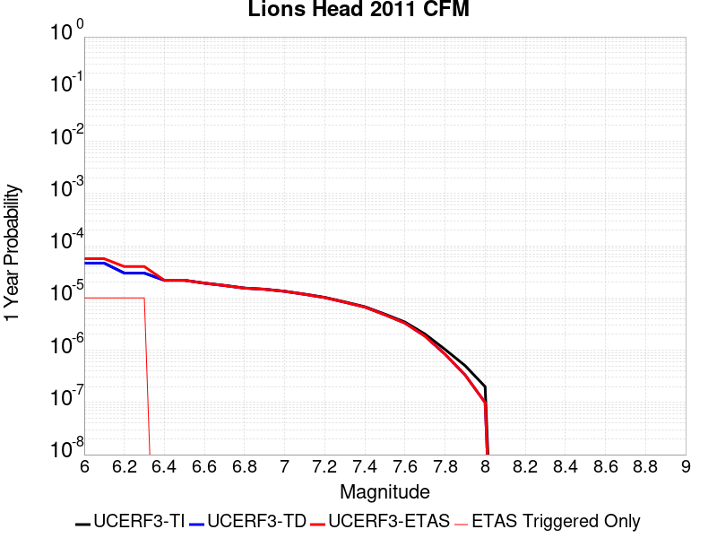 |  |

| Magnitude | 1 wk TI Prob | 1 wk TD Prob | 1 wk ETAS Prob | 1 wk ETAS/TD Gain | 1 wk ETAS Triggered Only | 1 mo TI Prob | 1 mo TD Prob | 1 mo ETAS Prob | 1 mo ETAS/TD Gain | 1 mo ETAS Triggered Only | 1 yr TI Prob | 1 yr TD Prob | 1 yr ETAS Prob | 1 yr ETAS/TD Gain | 1 yr ETAS Triggered Only | 10 yr TI Prob | 10 yr TD Prob | 10 yr ETAS Prob | 10 yr ETAS/TD Gain | 10 yr ETAS Triggered Only |
|-----|-----|-----|-----|-----|-----|-----|-----|-----|-----|-----|-----|-----|-----|-----|-----|-----|-----|-----|-----|-----|
| 6.0 | 8.889363E-7 | 8.891427E-7 | 8.891427E-7 | 1.0 | 0.0 | 3.8097214E-6 | 3.8106066E-6 | 1.3810569E-5 | 3.6242442 | 1.0E-5 | 4.638237E-5 | 4.639321E-5 | 5.6392746E-5 | 1.2155387 | 1.0E-5 | 4.637269E-4 | 4.6384154E-4 | 4.738369E-4 | 1.0215491 | 1.0E-5 |
| 6.1 | 8.889363E-7 | 8.891427E-7 | 8.891427E-7 | 1.0 | 0.0 | 3.8097214E-6 | 3.8106066E-6 | 1.3810569E-5 | 3.6242442 | 1.0E-5 | 4.638237E-5 | 4.639321E-5 | 5.6392746E-5 | 1.2155387 | 1.0E-5 | 4.637269E-4 | 4.6384154E-4 | 4.738369E-4 | 1.0215491 | 1.0E-5 |
| 6.2 | 5.7435483E-7 | 5.736074E-7 | 5.736074E-7 | 1.0 | 0.0 | 2.4615185E-6 | 2.458315E-6 | 1.245829E-5 | 5.0678167 | 1.0E-5 | 2.9968574E-5 | 2.992959E-5 | 3.992929E-5 | 1.3341075 | 1.0E-5 | 2.9964533E-4 | 2.9925702E-4 | 3.0925404E-4 | 1.0334061 | 1.0E-5 |
| 6.3 | 5.7435483E-7 | 5.736074E-7 | 5.736074E-7 | 1.0 | 0.0 | 2.4615185E-6 | 2.458315E-6 | 1.245829E-5 | 5.0678167 | 1.0E-5 | 2.9968574E-5 | 2.992959E-5 | 3.992929E-5 | 1.3341075 | 1.0E-5 | 2.9964533E-4 | 2.9925702E-4 | 3.0925404E-4 | 1.0334061 | 1.0E-5 |
| 6.4 | 4.1835764E-7 | 4.1715435E-7 | 4.1715435E-7 | 1.0 | 0.0 | 1.7929601E-6 | 1.7878032E-6 | 1.7878032E-6 | 1.0 | 0.0 | 2.1829072E-5 | 2.1766287E-5 | 2.1766287E-5 | 1.0 | 0.0 | 2.1826927E-4 | 2.176418E-4 | 2.176418E-4 | 1.0 | 0.0 |
| 6.5 | 4.1835764E-7 | 4.1715435E-7 | 4.1715435E-7 | 1.0 | 0.0 | 1.7929601E-6 | 1.7878032E-6 | 1.7878032E-6 | 1.0 | 0.0 | 2.1829072E-5 | 2.1766287E-5 | 2.1766287E-5 | 1.0 | 0.0 | 2.1826927E-4 | 2.176418E-4 | 2.176418E-4 | 1.0 | 0.0 |
| 6.6 | 3.6896213E-7 | 3.676191E-7 | 3.676191E-7 | 1.0 | 0.0 | 1.5812653E-6 | 1.5755095E-6 | 1.5755095E-6 | 1.0 | 0.0 | 1.9251736E-5 | 1.918166E-5 | 1.918166E-5 | 1.0 | 0.0 | 1.9250068E-4 | 1.9180018E-4 | 1.9180018E-4 | 1.0 | 0.0 |
| 6.7 | 3.3283942E-7 | 3.313985E-7 | 3.313985E-7 | 1.0 | 0.0 | 1.4264539E-6 | 1.4202784E-6 | 1.4202784E-6 | 1.0 | 0.0 | 1.7366938E-5 | 1.7291753E-5 | 1.7291753E-5 | 1.0 | 0.0 | 1.736558E-4 | 1.7290414E-4 | 1.7290414E-4 | 1.0 | 0.0 |
| 6.8 | 2.9684807E-7 | 2.9531475E-7 | 2.9531475E-7 | 1.0 | 0.0 | 1.2722054E-6 | 1.265634E-6 | 1.265634E-6 | 1.0 | 0.0 | 1.5488991E-5 | 1.5408985E-5 | 1.5408985E-5 | 1.0 | 0.0 | 1.5487912E-4 | 1.540792E-4 | 1.540792E-4 | 1.0 | 0.0 |
| 6.9 | 2.8254823E-7 | 2.8096676E-7 | 2.8096676E-7 | 1.0 | 0.0 | 1.2109203E-6 | 1.2041426E-6 | 1.2041426E-6 | 1.0 | 0.0 | 1.4742856E-5 | 1.4660338E-5 | 1.4660338E-5 | 1.0 | 0.0 | 1.4741877E-4 | 1.4659374E-4 | 1.4659374E-4 | 1.0 | 0.0 |
| 7.0 | 2.5794475E-7 | 2.5627173E-7 | 2.5627173E-7 | 1.0 | 0.0 | 1.105477E-6 | 1.0983069E-6 | 1.0983069E-6 | 1.0 | 0.0 | 1.34591E-5 | 1.3371806E-5 | 1.3371806E-5 | 1.0 | 0.0 | 1.3458285E-4 | 1.3371003E-4 | 1.3371003E-4 | 1.0 | 0.0 |
| 7.1 | 2.2678832E-7 | 2.2496157E-7 | 2.2496157E-7 | 1.0 | 0.0 | 9.719496E-7 | 9.641207E-7 | 9.641207E-7 | 1.0 | 0.0 | 1.1833421E-5 | 1.1738105E-5 | 1.1738105E-5 | 1.0 | 0.0 | 1.1832791E-4 | 1.1737487E-4 | 1.1737487E-4 | 1.0 | 0.0 |
| 7.2 | 1.968546E-7 | 1.9487963E-7 | 1.9487963E-7 | 1.0 | 0.0 | 8.436623E-7 | 8.3519814E-7 | 8.3519814E-7 | 1.0 | 0.0 | 1.027154E-5 | 1.016849E-5 | 1.016849E-5 | 1.0 | 0.0 | 1.0271065E-4 | 1.01680256E-4 | 1.01680256E-4 | 1.0 | 0.0 |
| 7.3 | 1.6101195E-7 | 1.5880485E-7 | 1.5880485E-7 | 1.0 | 0.0 | 6.90051E-7 | 6.80592E-7 | 6.80592E-7 | 1.0 | 0.0 | 8.401339E-6 | 8.286176E-6 | 8.286176E-6 | 1.0 | 0.0 | 8.4010215E-5 | 8.285868E-5 | 8.285868E-5 | 1.0 | 0.0 |
| 7.4 | 1.304744E-7 | 1.2803415E-7 | 1.2803415E-7 | 1.0 | 0.0 | 5.591759E-7 | 5.4871765E-7 | 5.4871765E-7 | 1.0 | 0.0 | 6.807945E-6 | 6.6806165E-6 | 6.6806165E-6 | 1.0 | 0.0 | 6.807737E-5 | 6.680416E-5 | 6.680416E-5 | 1.0 | 0.0 |
| 7.5 | 9.410614E-8 | 9.132625E-8 | 9.132625E-8 | 1.0 | 0.0 | 4.0331196E-7 | 3.9139815E-7 | 3.9139815E-7 | 1.0 | 0.0 | 4.910312E-6 | 4.765262E-6 | 4.765262E-6 | 1.0 | 0.0 | 4.9102036E-5 | 4.76516E-5 | 4.76516E-5 | 1.0 | 0.0 |
| 7.6 | 6.6360826E-8 | 6.327081E-8 | 6.327081E-8 | 1.0 | 0.0 | 2.844035E-7 | 2.711606E-7 | 2.711606E-7 | 1.0 | 0.0 | 3.462607E-6 | 3.301375E-6 | 3.301375E-6 | 1.0 | 0.0 | 3.4625533E-5 | 3.301326E-5 | 3.301326E-5 | 1.0 | 0.0 |
| 7.7 | 3.9100893E-8 | 3.5618154E-8 | 3.5618154E-8 | 1.0 | 0.0 | 1.6757524E-7 | 1.5264922E-7 | 1.5264922E-7 | 1.0 | 0.0 | 2.0402267E-6 | 1.8585027E-6 | 1.8585027E-6 | 1.0 | 0.0 | 2.040208E-5 | 1.8584873E-5 | 1.8584873E-5 | 1.0 | 0.0 |
| 7.8 | 1.9858547E-8 | 1.6059335E-8 | 1.6059335E-8 | 1.0 | 0.0 | 8.5108056E-8 | 6.882573E-8 | 6.882573E-8 | 1.0 | 0.0 | 1.0361902E-6 | 8.379529E-7 | 8.379529E-7 | 1.0 | 0.0 | 1.0361853E-5 | 8.379498E-6 | 8.379498E-6 | 1.0 | 0.0 |
| 7.9 | 9.717722E-9 | 6.444841E-9 | 6.444841E-9 | 1.0 | 0.0 | 4.1647375E-8 | 2.762075E-8 | 2.762075E-8 | 1.0 | 0.0 | 5.070567E-7 | 3.3628257E-7 | 3.3628257E-7 | 1.0 | 0.0 | 5.0705553E-6 | 3.3628207E-6 | 3.3628207E-6 | 1.0 | 0.0 |
| 8.0 | 3.8397716E-9 | 1.908825E-9 | 1.908825E-9 | 1.0 | 0.0 | 1.6456164E-8 | 8.180682E-9 | 8.180682E-9 | 1.0 | 0.0 | 2.0035378E-7 | 9.959979E-8 | 9.959979E-8 | 1.0 | 0.0 | 2.0035359E-6 | 9.959974E-7 | 9.959974E-7 | 1.0 | 0.0 |

## Eureka Peak
*[(top)](#table-of-contents)*

| 1 Week | 1 Month | 1 Year | 10 Year |
|-----|-----|-----|-----|
|  | 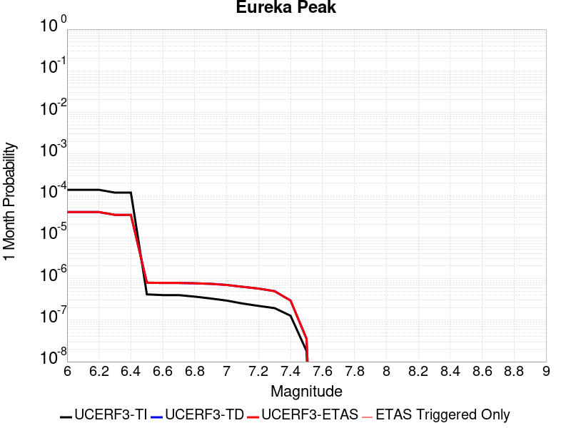 |  |  |

| Magnitude | 1 wk TI Prob | 1 wk TD Prob | 1 wk ETAS Prob | 1 wk ETAS/TD Gain | 1 wk ETAS Triggered Only | 1 mo TI Prob | 1 mo TD Prob | 1 mo ETAS Prob | 1 mo ETAS/TD Gain | 1 mo ETAS Triggered Only | 1 yr TI Prob | 1 yr TD Prob | 1 yr ETAS Prob | 1 yr ETAS/TD Gain | 1 yr ETAS Triggered Only | 10 yr TI Prob | 10 yr TD Prob | 10 yr ETAS Prob | 10 yr ETAS/TD Gain | 10 yr ETAS Triggered Only |
|-----|-----|-----|-----|-----|-----|-----|-----|-----|-----|-----|-----|-----|-----|-----|-----|-----|-----|-----|-----|-----|
| 6.0 | 3.1949054E-5 | 9.310979E-6 | 9.310979E-6 | 1.0 | 0.0 | 1.3691733E-4 | 3.9904025E-5 | 3.9904025E-5 | 1.0 | 0.0 | 0.0016656938 | 4.858013E-4 | 4.9579644E-4 | 1.0205746 | 1.0E-5 | 0.016532637 | 0.004921293 | 0.0049312436 | 1.002022 | 1.0E-5 |
| 6.1 | 3.1949054E-5 | 9.310979E-6 | 9.310979E-6 | 1.0 | 0.0 | 1.3691733E-4 | 3.9904025E-5 | 3.9904025E-5 | 1.0 | 0.0 | 0.0016656938 | 4.858013E-4 | 4.9579644E-4 | 1.0205746 | 1.0E-5 | 0.016532637 | 0.004921293 | 0.0049312436 | 1.002022 | 1.0E-5 |
| 6.2 | 3.1949054E-5 | 9.310979E-6 | 9.310979E-6 | 1.0 | 0.0 | 1.3691733E-4 | 3.9904025E-5 | 3.9904025E-5 | 1.0 | 0.0 | 0.0016656938 | 4.858013E-4 | 4.9579644E-4 | 1.0205746 | 1.0E-5 | 0.016532637 | 0.004921293 | 0.0049312436 | 1.002022 | 1.0E-5 |
| 6.3 | 2.7339745E-5 | 7.980821E-6 | 7.980821E-6 | 1.0 | 0.0 | 1.1716507E-4 | 3.4203495E-5 | 3.4203495E-5 | 1.0 | 0.0 | 0.0014255513 | 4.164239E-4 | 4.2641972E-4 | 1.024004 | 1.0E-5 | 0.0141644105 | 0.0042259954 | 0.004235953 | 1.0023563 | 1.0E-5 |
| 6.4 | 2.7339745E-5 | 7.980821E-6 | 7.980821E-6 | 1.0 | 0.0 | 1.1716507E-4 | 3.4203495E-5 | 3.4203495E-5 | 1.0 | 0.0 | 0.0014255513 | 4.164239E-4 | 4.2641972E-4 | 1.024004 | 1.0E-5 | 0.0141644105 | 0.0042259954 | 0.004235953 | 1.0023563 | 1.0E-5 |
| 6.5 | 9.738388E-8 | 1.8620014E-7 | 1.8620014E-7 | 1.0 | 0.0 | 4.1735944E-7 | 7.980003E-7 | 7.980003E-7 | 1.0 | 0.0 | 5.081339E-6 | 9.715612E-6 | 9.715612E-6 | 1.0 | 0.0 | 5.0812232E-5 | 9.715195E-5 | 9.715195E-5 | 1.0 | 0.0 |
| 6.6 | 9.3495956E-8 | 1.8328839E-7 | 1.8328839E-7 | 1.0 | 0.0 | 4.0069688E-7 | 7.855215E-7 | 7.855215E-7 | 1.0 | 0.0 | 4.8784736E-6 | 9.563682E-6 | 9.563682E-6 | 1.0 | 0.0 | 4.8783666E-5 | 9.563279E-5 | 9.563279E-5 | 1.0 | 0.0 |
| 6.7 | 9.3495956E-8 | 1.8328839E-7 | 1.8328839E-7 | 1.0 | 0.0 | 4.0069688E-7 | 7.855215E-7 | 7.855215E-7 | 1.0 | 0.0 | 4.8784736E-6 | 9.563682E-6 | 9.563682E-6 | 1.0 | 0.0 | 4.8783666E-5 | 9.563279E-5 | 9.563279E-5 | 1.0 | 0.0 |
| 6.8 | 8.591428E-8 | 1.8021817E-7 | 1.8021817E-7 | 1.0 | 0.0 | 3.68204E-7 | 7.7236336E-7 | 7.7236336E-7 | 1.0 | 0.0 | 4.4828744E-6 | 9.403484E-6 | 9.403484E-6 | 1.0 | 0.0 | 4.482784E-5 | 9.403094E-5 | 9.403094E-5 | 1.0 | 0.0 |
| 6.9 | 7.749723E-8 | 1.7439834E-7 | 1.7439834E-7 | 1.0 | 0.0 | 3.3213098E-7 | 7.4742127E-7 | 7.4742127E-7 | 1.0 | 0.0 | 4.043687E-6 | 9.099816E-6 | 9.099816E-6 | 1.0 | 0.0 | 4.0436134E-5 | 9.0994516E-5 | 9.0994516E-5 | 1.0 | 0.0 |
| 7.0 | 6.897872E-8 | 1.6416043E-7 | 1.6416043E-7 | 1.0 | 0.0 | 2.9562307E-7 | 7.035445E-7 | 7.035445E-7 | 1.0 | 0.0 | 3.5992048E-6 | 8.565621E-6 | 8.565621E-6 | 1.0 | 0.0 | 3.5991467E-5 | 8.565299E-5 | 8.565299E-5 | 1.0 | 0.0 |
| 7.1 | 5.859318E-8 | 1.4787899E-7 | 1.4787899E-7 | 1.0 | 0.0 | 2.5111362E-7 | 6.33767E-7 | 6.33767E-7 | 1.0 | 0.0 | 3.057304E-6 | 7.716087E-6 | 7.716087E-6 | 1.0 | 0.0 | 3.0572617E-5 | 7.715825E-5 | 7.715825E-5 | 1.0 | 0.0 |
| 7.2 | 5.1375338E-8 | 1.3421746E-7 | 1.3421746E-7 | 1.0 | 0.0 | 2.2018E-7 | 5.7521754E-7 | 5.7521754E-7 | 1.0 | 0.0 | 2.680688E-6 | 7.003252E-6 | 7.003252E-6 | 1.0 | 0.0 | 2.6806558E-5 | 7.003037E-5 | 7.003037E-5 | 1.0 | 0.0 |
| 7.3 | 4.5441396E-8 | 1.1636931E-7 | 1.1636931E-7 | 1.0 | 0.0 | 1.9474882E-7 | 4.987255E-7 | 4.987255E-7 | 1.0 | 0.0 | 2.3710643E-6 | 6.0719667E-6 | 6.0719667E-6 | 1.0 | 0.0 | 2.371039E-5 | 6.0718063E-5 | 6.0718063E-5 | 1.0 | 0.0 |
| 7.4 | 2.981918E-8 | 6.911723E-8 | 6.911723E-8 | 1.0 | 0.0 | 1.2779647E-7 | 2.9621668E-7 | 2.9621668E-7 | 1.0 | 0.0 | 1.5559209E-6 | 3.6064325E-6 | 3.6064325E-6 | 1.0 | 0.0 | 1.55591E-5 | 3.6063782E-5 | 3.6063782E-5 | 1.0 | 0.0 |
| 7.5 | 4.24214E-9 | 8.34289E-9 | 8.34289E-9 | 1.0 | 0.0 | 1.81806E-8 | 3.5755242E-8 | 3.5755242E-8 | 1.0 | 0.0 | 2.213488E-7 | 4.3532006E-7 | 4.3532006E-7 | 1.0 | 0.0 | 2.2134857E-6 | 4.3531986E-6 | 4.3531986E-6 | 1.0 | 0.0 |

## South Klamath Lake East
*[(top)](#table-of-contents)*

| 1 Week | 1 Month | 1 Year | 10 Year |
|-----|-----|-----|-----|
|  |  |  |  |

| Magnitude | 1 wk TI Prob | 1 wk TD Prob | 1 wk ETAS Prob | 1 wk ETAS/TD Gain | 1 wk ETAS Triggered Only | 1 mo TI Prob | 1 mo TD Prob | 1 mo ETAS Prob | 1 mo ETAS/TD Gain | 1 mo ETAS Triggered Only | 1 yr TI Prob | 1 yr TD Prob | 1 yr ETAS Prob | 1 yr ETAS/TD Gain | 1 yr ETAS Triggered Only | 10 yr TI Prob | 10 yr TD Prob | 10 yr ETAS Prob | 10 yr ETAS/TD Gain | 10 yr ETAS Triggered Only |
|-----|-----|-----|-----|-----|-----|-----|-----|-----|-----|-----|-----|-----|-----|-----|-----|-----|-----|-----|-----|-----|
| 6.0 | 2.3539369E-5 | 2.5047308E-5 | 3.504706E-5 | 1.3992345 | 1.0E-5 | 1.0087911E-4 | 1.0734166E-4 | 1.1734058E-4 | 1.0931505 | 1.0E-5 | 0.0012275111 | 0.0013061843 | 0.0013161713 | 1.0076458 | 1.0E-5 | 0.012207527 | 0.012993417 | 0.013003287 | 1.0007596 | 1.0E-5 |
| 6.1 | 2.3539369E-5 | 2.5047308E-5 | 3.504706E-5 | 1.3992345 | 1.0E-5 | 1.0087911E-4 | 1.0734166E-4 | 1.1734058E-4 | 1.0931505 | 1.0E-5 | 0.0012275111 | 0.0013061843 | 0.0013161713 | 1.0076458 | 1.0E-5 | 0.012207527 | 0.012993417 | 0.013003287 | 1.0007596 | 1.0E-5 |
| 6.2 | 2.3539369E-5 | 2.5047308E-5 | 3.504706E-5 | 1.3992345 | 1.0E-5 | 1.0087911E-4 | 1.0734166E-4 | 1.1734058E-4 | 1.0931505 | 1.0E-5 | 0.0012275111 | 0.0013061843 | 0.0013161713 | 1.0076458 | 1.0E-5 | 0.012207527 | 0.012993417 | 0.013003287 | 1.0007596 | 1.0E-5 |
| 6.3 | 9.807823E-6 | 1.0396044E-5 | 1.0396044E-5 | 1.0 | 0.0 | 4.2032847E-5 | 4.455376E-5 | 4.455376E-5 | 1.0 | 0.0 | 5.1162974E-4 | 5.4231536E-4 | 5.4231536E-4 | 1.0 | 0.0 | 0.005104534 | 0.005410756 | 0.005410756 | 1.0 | 0.0 |
| 6.4 | 9.807823E-6 | 1.0396044E-5 | 1.0396044E-5 | 1.0 | 0.0 | 4.2032847E-5 | 4.455376E-5 | 4.455376E-5 | 1.0 | 0.0 | 5.1162974E-4 | 5.4231536E-4 | 5.4231536E-4 | 1.0 | 0.0 | 0.005104534 | 0.005410756 | 0.005410756 | 1.0 | 0.0 |
| 6.5 | 6.191981E-6 | 6.5508398E-6 | 6.5508398E-6 | 1.0 | 0.0 | 2.653679E-5 | 2.8074743E-5 | 2.8074743E-5 | 1.0 | 0.0 | 3.2303753E-4 | 3.4175918E-4 | 3.4175918E-4 | 1.0 | 0.0 | 0.0032256835 | 0.003412614 | 0.003412614 | 1.0 | 0.0 |
| 6.6 | 4.3693776E-6 | 4.6165574E-6 | 4.6165574E-6 | 1.0 | 0.0 | 1.8725768E-5 | 1.9785102E-5 | 1.9785102E-5 | 1.0 | 0.0 | 2.2796239E-4 | 2.4085813E-4 | 2.4085813E-4 | 1.0 | 0.0 | 0.0022772867 | 0.0024060833 | 0.0024060833 | 1.0 | 0.0 |
| 6.7 | 3.360834E-6 | 3.5512403E-6 | 3.5512403E-6 | 1.0 | 0.0 | 1.4403494E-5 | 1.5219517E-5 | 1.5219517E-5 | 1.0 | 0.0 | 1.7534842E-4 | 1.8528267E-4 | 1.8528267E-4 | 1.0 | 0.0 | 0.0017521014 | 0.0018513618 | 0.0018513618 | 1.0 | 0.0 |
| 6.8 | 2.57873E-6 | 2.7251708E-6 | 2.7251708E-6 | 1.0 | 0.0 | 1.1051653E-5 | 1.1679254E-5 | 1.1679254E-5 | 1.0 | 0.0 | 1.3454557E-4 | 1.4218627E-4 | 1.4218627E-4 | 1.0 | 0.0 | 0.0013446413 | 0.0014210136 | 0.0014210136 | 1.0 | 0.0 |
| 6.9 | 9.987825E-7 | 1.0566213E-6 | 1.0566213E-6 | 1.0 | 0.0 | 4.2804895E-6 | 4.528371E-6 | 4.528371E-6 | 1.0 | 0.0 | 5.211371E-5 | 5.5131848E-5 | 5.5131848E-5 | 1.0 | 0.0 | 5.210149E-4 | 5.5121386E-4 | 5.5121386E-4 | 1.0 | 0.0 |

## Reliz 2011 CFM
*[(top)](#table-of-contents)*

| 1 Week | 1 Month | 1 Year | 10 Year |
|-----|-----|-----|-----|
|  |  |  |  |

| Magnitude | 1 wk TI Prob | 1 wk TD Prob | 1 wk ETAS Prob | 1 wk ETAS/TD Gain | 1 wk ETAS Triggered Only | 1 mo TI Prob | 1 mo TD Prob | 1 mo ETAS Prob | 1 mo ETAS/TD Gain | 1 mo ETAS Triggered Only | 1 yr TI Prob | 1 yr TD Prob | 1 yr ETAS Prob | 1 yr ETAS/TD Gain | 1 yr ETAS Triggered Only | 10 yr TI Prob | 10 yr TD Prob | 10 yr ETAS Prob | 10 yr ETAS/TD Gain | 10 yr ETAS Triggered Only |
|-----|-----|-----|-----|-----|-----|-----|-----|-----|-----|-----|-----|-----|-----|-----|-----|-----|-----|-----|-----|-----|
| 6.0 | 1.6002472E-5 | 1.6282795E-5 | 1.6282795E-5 | 1.0 | 0.0 | 6.8580215E-5 | 6.978165E-5 | 6.978165E-5 | 1.0 | 0.0 | 8.3464425E-4 | 8.492802E-4 | 8.5927173E-4 | 1.0117646 | 1.0E-5 | 0.008315164 | 0.008462543 | 0.008472458 | 1.0011717 | 1.0E-5 |
| 6.1 | 1.6002472E-5 | 1.6282795E-5 | 1.6282795E-5 | 1.0 | 0.0 | 6.8580215E-5 | 6.978165E-5 | 6.978165E-5 | 1.0 | 0.0 | 8.3464425E-4 | 8.492802E-4 | 8.5927173E-4 | 1.0117646 | 1.0E-5 | 0.008315164 | 0.008462543 | 0.008472458 | 1.0011717 | 1.0E-5 |
| 6.2 | 1.6002472E-5 | 1.6282795E-5 | 1.6282795E-5 | 1.0 | 0.0 | 6.8580215E-5 | 6.978165E-5 | 6.978165E-5 | 1.0 | 0.0 | 8.3464425E-4 | 8.492802E-4 | 8.5927173E-4 | 1.0117646 | 1.0E-5 | 0.008315164 | 0.008462543 | 0.008472458 | 1.0011717 | 1.0E-5 |
| 6.3 | 7.792404E-6 | 7.803792E-6 | 7.803792E-6 | 1.0 | 0.0 | 3.339559E-5 | 3.3444398E-5 | 3.3444398E-5 | 1.0 | 0.0 | 4.0651546E-4 | 4.0711026E-4 | 4.0711026E-4 | 1.0 | 0.0 | 0.0040577264 | 0.0040639215 | 0.0040639215 | 1.0 | 0.0 |
| 6.4 | 7.792404E-6 | 7.803792E-6 | 7.803792E-6 | 1.0 | 0.0 | 3.339559E-5 | 3.3444398E-5 | 3.3444398E-5 | 1.0 | 0.0 | 4.0651546E-4 | 4.0711026E-4 | 4.0711026E-4 | 1.0 | 0.0 | 0.0040577264 | 0.0040639215 | 0.0040639215 | 1.0 | 0.0 |
| 6.5 | 5.9659374E-6 | 5.928728E-6 | 5.928728E-6 | 1.0 | 0.0 | 2.5568053E-5 | 2.5408588E-5 | 2.5408588E-5 | 1.0 | 0.0 | 3.1124658E-4 | 3.0930588E-4 | 3.0930588E-4 | 1.0 | 0.0 | 0.00310811 | 0.003088972 | 0.003088972 | 1.0 | 0.0 |
| 6.6 | 5.2350692E-6 | 5.178976E-6 | 5.178976E-6 | 1.0 | 0.0 | 2.2435817E-5 | 2.2195423E-5 | 2.2195423E-5 | 1.0 | 0.0 | 2.7312184E-4 | 2.7019592E-4 | 2.7019592E-4 | 1.0 | 0.0 | 0.002727864 | 0.0026988846 | 0.0026988846 | 1.0 | 0.0 |
| 6.7 | 4.580206E-6 | 4.50611E-6 | 4.50611E-6 | 1.0 | 0.0 | 1.9629308E-5 | 1.931176E-5 | 1.931176E-5 | 1.0 | 0.0 | 2.389606E-4 | 2.3509537E-4 | 2.3509537E-4 | 1.0 | 0.0 | 0.002387038 | 0.002348669 | 0.002348669 | 1.0 | 0.0 |
| 6.8 | 4.0765017E-6 | 3.988228E-6 | 3.988228E-6 | 1.0 | 0.0 | 1.7470604E-5 | 1.7092294E-5 | 1.7092294E-5 | 1.0 | 0.0 | 2.1268385E-4 | 2.0807884E-4 | 2.0807884E-4 | 1.0 | 0.0 | 0.002124804 | 0.0020790389 | 0.0020790389 | 1.0 | 0.0 |
| 6.9 | 3.5752896E-6 | 3.4725074E-6 | 3.4725074E-6 | 1.0 | 0.0 | 1.532258E-5 | 1.488209E-5 | 1.488209E-5 | 1.0 | 0.0 | 1.8653645E-4 | 1.811744E-4 | 1.811744E-4 | 1.0 | 0.0 | 0.0018637994 | 0.001810464 | 0.001810464 | 1.0 | 0.0 |
| 7.0 | 3.0259848E-6 | 2.9079317E-6 | 2.9079317E-6 | 1.0 | 0.0 | 1.2968442E-5 | 1.2462505E-5 | 1.2462505E-5 | 1.0 | 0.0 | 1.5787935E-4 | 1.5172044E-4 | 1.5172044E-4 | 1.0 | 0.0 | 0.0015776722 | 0.0015163644 | 0.0015163644 | 1.0 | 0.0 |
| 7.1 | 2.5861116E-6 | 2.455157E-6 | 2.455157E-6 | 1.0 | 0.0 | 1.1083288E-5 | 1.0522059E-5 | 1.0522059E-5 | 1.0 | 0.0 | 1.3493067E-4 | 1.2809855E-4 | 1.2809855E-4 | 1.0 | 0.0 | 0.0013484878 | 0.0012804423 | 0.0012804423 | 1.0 | 0.0 |
| 7.2 | 2.1482588E-6 | 2.0032267E-6 | 2.0032267E-6 | 1.0 | 0.0 | 9.20679E-6 | 8.585229E-6 | 8.585229E-6 | 1.0 | 0.0 | 1.12086906E-4 | 1.0452016E-4 | 1.0452016E-4 | 1.0 | 0.0 | 0.0011203039 | 0.0010449048 | 0.0010449048 | 1.0 | 0.0 |
| 7.3 | 1.7194744E-6 | 1.561114E-6 | 1.561114E-6 | 1.0 | 0.0 | 7.3691554E-6 | 6.6904713E-6 | 6.6904713E-6 | 1.0 | 0.0 | 8.971577E-5 | 8.145344E-5 | 8.145344E-5 | 1.0 | 0.0 | 8.967956E-4 | 8.144305E-4 | 8.144305E-4 | 1.0 | 0.0 |
| 7.4 | 1.2755178E-6 | 1.1056196E-6 | 1.1056196E-6 | 1.0 | 0.0 | 5.4664933E-6 | 4.738361E-6 | 4.738361E-6 | 1.0 | 0.0 | 6.655252E-5 | 5.768802E-5 | 5.768802E-5 | 1.0 | 0.0 | 6.6532596E-4 | 5.769249E-4 | 5.769249E-4 | 1.0 | 0.0 |
| 7.5 | 8.8463224E-7 | 7.0579193E-7 | 7.0579193E-7 | 1.0 | 0.0 | 3.7912755E-6 | 3.0248189E-6 | 3.0248189E-6 | 1.0 | 0.0 | 4.6157802E-5 | 3.682655E-5 | 3.682655E-5 | 1.0 | 0.0 | 4.6148215E-4 | 3.683988E-4 | 3.683988E-4 | 1.0 | 0.0 |
| 7.6 | 5.291355E-7 | 3.5006548E-7 | 3.5006548E-7 | 1.0 | 0.0 | 2.2677216E-6 | 1.5002796E-6 | 1.5002796E-6 | 1.0 | 0.0 | 2.760916E-5 | 1.8265751E-5 | 1.8265751E-5 | 1.0 | 0.0 | 2.760573E-4 | 1.8283579E-4 | 1.8283579E-4 | 1.0 | 0.0 |
| 7.7 | 2.9663357E-7 | 1.3509886E-7 | 1.3509886E-7 | 1.0 | 0.0 | 1.2712861E-6 | 5.7899496E-7 | 5.7899496E-7 | 1.0 | 0.0 | 1.5477797E-5 | 7.0492406E-6 | 7.0492406E-6 | 1.0 | 0.0 | 1.547672E-4 | 7.0675895E-5 | 7.0675895E-5 | 1.0 | 0.0 |
| 7.8 | 1.2509386E-7 | 2.7148959E-8 | 2.7148959E-8 | 1.0 | 0.0 | 5.3611643E-7 | 1.1635268E-7 | 1.1635268E-7 | 1.0 | 0.0 | 6.527198E-6 | 1.4165929E-6 | 1.4165929E-6 | 1.0 | 0.0 | 6.527006E-5 | 1.4322827E-5 | 1.4322827E-5 | 1.0 | 0.0 |
| 7.9 | 6.213493E-8 | 1.1477568E-8 | 1.1477568E-8 | 1.0 | 0.0 | 2.6629255E-7 | 4.9189577E-8 | 4.9189577E-8 | 1.0 | 0.0 | 3.242107E-6 | 5.9888293E-7 | 5.9888293E-7 | 1.0 | 0.0 | 3.2420594E-5 | 6.1203536E-6 | 6.1203536E-6 | 1.0 | 0.0 |
| 8.0 | 5.92383E-9 | 1.6775827E-9 | 1.6775827E-9 | 1.0 | 0.0 | 2.5387841E-8 | 7.18964E-9 | 7.18964E-9 | 1.0 | 0.0 | 3.0909692E-7 | 8.753386E-8 | 8.753386E-8 | 1.0 | 0.0 | 3.090965E-6 | 8.992677E-7 | 8.992677E-7 | 1.0 | 0.0 |

## Cerro Prieto
*[(top)](#table-of-contents)*

| 1 Week | 1 Month | 1 Year | 10 Year |
|-----|-----|-----|-----|
|  |  |  |  |

| Magnitude | 1 wk TI Prob | 1 wk TD Prob | 1 wk ETAS Prob | 1 wk ETAS/TD Gain | 1 wk ETAS Triggered Only | 1 mo TI Prob | 1 mo TD Prob | 1 mo ETAS Prob | 1 mo ETAS/TD Gain | 1 mo ETAS Triggered Only | 1 yr TI Prob | 1 yr TD Prob | 1 yr ETAS Prob | 1 yr ETAS/TD Gain | 1 yr ETAS Triggered Only | 10 yr TI Prob | 10 yr TD Prob | 10 yr ETAS Prob | 10 yr ETAS/TD Gain | 10 yr ETAS Triggered Only |
|-----|-----|-----|-----|-----|-----|-----|-----|-----|-----|-----|-----|-----|-----|-----|-----|-----|-----|-----|-----|-----|
| 6.0 | 2.9101528E-4 | 5.9654453E-4 | 5.9654453E-4 | 1.0 | 0.0 | 0.0012466122 | 0.0025543566 | 0.0025543566 | 1.0 | 0.0 | 0.015072231 | 0.030802928 | 0.030802928 | 1.0 | 0.0 | 0.14089979 | 0.25386256 | 0.25387004 | 1.0000294 | 1.0E-5 |
| 6.1 | 2.9101528E-4 | 5.9654453E-4 | 5.9654453E-4 | 1.0 | 0.0 | 0.0012466122 | 0.0025543566 | 0.0025543566 | 1.0 | 0.0 | 0.015072231 | 0.030802928 | 0.030802928 | 1.0 | 0.0 | 0.14089979 | 0.25386256 | 0.25387004 | 1.0000294 | 1.0E-5 |
| 6.2 | 2.9101528E-4 | 5.9654453E-4 | 5.9654453E-4 | 1.0 | 0.0 | 0.0012466122 | 0.0025543566 | 0.0025543566 | 1.0 | 0.0 | 0.015072231 | 0.030802928 | 0.030802928 | 1.0 | 0.0 | 0.14089979 | 0.25386256 | 0.25387004 | 1.0000294 | 1.0E-5 |
| 6.3 | 2.9101528E-4 | 5.9654453E-4 | 5.9654453E-4 | 1.0 | 0.0 | 0.0012466122 | 0.0025543566 | 0.0025543566 | 1.0 | 0.0 | 0.015072231 | 0.030802928 | 0.030802928 | 1.0 | 0.0 | 0.14089979 | 0.25386256 | 0.25387004 | 1.0000294 | 1.0E-5 |
| 6.4 | 2.508648E-4 | 5.140412E-4 | 5.140412E-4 | 1.0 | 0.0 | 0.0010746918 | 0.0022013725 | 0.0022013725 | 1.0 | 0.0 | 0.013006088 | 0.026629416 | 0.026629416 | 1.0 | 0.0 | 0.12270685 | 0.2242222 | 0.22422995 | 1.0000346 | 1.0E-5 |
| 6.5 | 2.508648E-4 | 5.140412E-4 | 5.140412E-4 | 1.0 | 0.0 | 0.0010746918 | 0.0022013725 | 0.0022013725 | 1.0 | 0.0 | 0.013006088 | 0.026629416 | 0.026629416 | 1.0 | 0.0 | 0.12270685 | 0.2242222 | 0.22422995 | 1.0000346 | 1.0E-5 |
| 6.6 | 2.294914E-4 | 4.7123645E-4 | 4.7123645E-4 | 1.0 | 0.0 | 9.831638E-4 | 0.0020182093 | 0.0020182093 | 1.0 | 0.0 | 0.011904482 | 0.024394194 | 0.024394194 | 1.0 | 0.0 | 0.11286586 | 0.20837563 | 0.20838355 | 1.000038 | 1.0E-5 |
| 6.7 | 1.9621674E-4 | 4.0426268E-4 | 4.0426268E-4 | 1.0 | 0.0 | 8.4065786E-4 | 0.0017315624 | 0.0017315624 | 1.0 | 0.0 | 0.010187071 | 0.020888962 | 0.020888962 | 1.0 | 0.0 | 0.09732539 | 0.18264732 | 0.18265548 | 1.0000447 | 1.0E-5 |
| 6.8 | 1.5476145E-4 | 3.0572579E-4 | 3.0572579E-4 | 1.0 | 0.0 | 6.6309475E-4 | 0.0013096977 | 0.0013096977 | 1.0 | 0.0 | 0.008043335 | 0.015826825 | 0.015826825 | 1.0 | 0.0 | 0.07758363 | 0.14310057 | 0.14310914 | 1.0000598 | 1.0E-5 |
| 6.9 | 1.20509176E-4 | 2.2588465E-4 | 2.2588465E-4 | 1.0 | 0.0 | 5.1636563E-4 | 9.6778123E-4 | 9.6778123E-4 | 1.0 | 0.0 | 0.006268645 | 0.011734025 | 0.011734025 | 1.0 | 0.0 | 0.060947374 | 0.10917958 | 0.10918849 | 1.0000815 | 1.0E-5 |
| 7.0 | 9.3269155E-5 | 1.6721459E-4 | 1.6721459E-4 | 1.0 | 0.0 | 3.9966372E-4 | 7.1648025E-4 | 7.1648025E-4 | 1.0 | 0.0 | 0.0048550544 | 0.008695914 | 0.008695914 | 1.0 | 0.0 | 0.04750344 | 0.082943216 | 0.08295239 | 1.0001105 | 1.0E-5 |
| 7.1 | 5.029709E-5 | 8.174011E-5 | 8.174011E-5 | 1.0 | 0.0 | 2.1554115E-4 | 3.50287E-4 | 3.50287E-4 | 1.0 | 0.0 | 0.0026210553 | 0.004259821 | 0.004259821 | 1.0 | 0.0 | 0.025903556 | 0.04226813 | 0.04226813 | 1.0 | 0.0 |
| 7.2 | 6.5445185E-8 | 6.824737E-8 | 6.824737E-8 | 1.0 | 0.0 | 2.8047933E-7 | 2.9248872E-7 | 2.9248872E-7 | 1.0 | 0.0 | 3.4148304E-6 | 3.56105E-6 | 3.56105E-6 | 1.0 | 0.0 | 3.414778E-5 | 3.56105E-5 | 3.56105E-5 | 1.0 | 0.0 |

## Surprise Valley 2011 CFM
*[(top)](#table-of-contents)*

| 1 Week | 1 Month | 1 Year | 10 Year |
|-----|-----|-----|-----|
|  |  |  |  |

| Magnitude | 1 wk TI Prob | 1 wk TD Prob | 1 wk ETAS Prob | 1 wk ETAS/TD Gain | 1 wk ETAS Triggered Only | 1 mo TI Prob | 1 mo TD Prob | 1 mo ETAS Prob | 1 mo ETAS/TD Gain | 1 mo ETAS Triggered Only | 1 yr TI Prob | 1 yr TD Prob | 1 yr ETAS Prob | 1 yr ETAS/TD Gain | 1 yr ETAS Triggered Only | 10 yr TI Prob | 10 yr TD Prob | 10 yr ETAS Prob | 10 yr ETAS/TD Gain | 10 yr ETAS Triggered Only |
|-----|-----|-----|-----|-----|-----|-----|-----|-----|-----|-----|-----|-----|-----|-----|-----|-----|-----|-----|-----|-----|
| 6.0 | 4.0396248E-5 | 4.485131E-5 | 4.485131E-5 | 1.0 | 0.0 | 1.7311527E-4 | 1.9220692E-4 | 1.9220692E-4 | 1.0 | 0.0 | 0.002105641 | 0.0023378176 | 0.0023378176 | 1.0 | 0.0 | 0.020858008 | 0.023153966 | 0.023163736 | 1.0004219 | 1.0E-5 |
| 6.1 | 4.0396248E-5 | 4.485131E-5 | 4.485131E-5 | 1.0 | 0.0 | 1.7311527E-4 | 1.9220692E-4 | 1.9220692E-4 | 1.0 | 0.0 | 0.002105641 | 0.0023378176 | 0.0023378176 | 1.0 | 0.0 | 0.020858008 | 0.023153966 | 0.023163736 | 1.0004219 | 1.0E-5 |
| 6.2 | 2.2295266E-5 | 2.440125E-5 | 2.440125E-5 | 1.0 | 0.0 | 9.554764E-5 | 1.0457276E-4 | 1.0457276E-4 | 1.0 | 0.0 | 0.0011626717 | 0.0012724606 | 0.0012724606 | 1.0 | 0.0 | 0.011566074 | 0.012654981 | 0.0126648545 | 1.0007802 | 1.0E-5 |
| 6.3 | 1.572643E-5 | 1.7096807E-5 | 1.7096807E-5 | 1.0 | 0.0 | 6.7397246E-5 | 7.327003E-5 | 7.327003E-5 | 1.0 | 0.0 | 8.202525E-4 | 8.91708E-4 | 8.91708E-4 | 1.0 | 0.0 | 0.008172315 | 0.008882407 | 0.008892318 | 1.0011158 | 1.0E-5 |
| 6.4 | 1.5714395E-5 | 1.7084629E-5 | 1.7084629E-5 | 1.0 | 0.0 | 6.734567E-5 | 7.3217845E-5 | 7.3217845E-5 | 1.0 | 0.0 | 8.1962504E-4 | 8.9107314E-4 | 8.9107314E-4 | 1.0 | 0.0 | 0.008166086 | 0.008876109 | 0.00888602 | 1.0011166 | 1.0E-5 |
| 6.5 | 1.2733495E-5 | 1.38016E-5 | 1.38016E-5 | 1.0 | 0.0 | 5.457098E-5 | 5.9148413E-5 | 5.9148413E-5 | 1.0 | 0.0 | 6.641992E-4 | 7.1990065E-4 | 7.1990065E-4 | 1.0 | 0.0 | 0.0066221743 | 0.0071763797 | 0.007186308 | 1.0013834 | 1.0E-5 |
| 6.6 | 1.0983784E-5 | 1.1886554E-5 | 1.1886554E-5 | 1.0 | 0.0 | 4.7072506E-5 | 5.094141E-5 | 5.094141E-5 | 1.0 | 0.0 | 5.7295704E-4 | 6.200405E-4 | 6.200405E-4 | 1.0 | 0.0 | 0.0057148207 | 0.0061836545 | 0.0061935927 | 1.0016072 | 1.0E-5 |
| 6.7 | 9.104806E-6 | 9.839491E-6 | 9.839491E-6 | 1.0 | 0.0 | 3.902001E-5 | 4.2168587E-5 | 4.2168587E-5 | 1.0 | 0.0 | 4.7496508E-4 | 5.132855E-4 | 5.132855E-4 | 1.0 | 0.0 | 0.004739512 | 0.005121397 | 0.0051313457 | 1.0019426 | 1.0E-5 |
| 6.8 | 6.2162403E-6 | 6.7041337E-6 | 6.7041337E-6 | 1.0 | 0.0 | 2.6640759E-5 | 2.8731698E-5 | 2.8731698E-5 | 1.0 | 0.0 | 3.2430296E-4 | 3.497545E-4 | 3.497545E-4 | 1.0 | 0.0 | 0.003238301 | 0.0034922638 | 0.0034922638 | 1.0 | 0.0 |
| 6.9 | 4.1792696E-6 | 4.50323E-6 | 4.50323E-6 | 1.0 | 0.0 | 1.7911032E-5 | 1.9299423E-5 | 1.9299423E-5 | 1.0 | 0.0 | 2.1804498E-4 | 2.3494668E-4 | 2.3494668E-4 | 1.0 | 0.0 | 0.0021783116 | 0.0023471361 | 0.0023471361 | 1.0 | 0.0 |
| 7.0 | 2.7478413E-6 | 2.9622424E-6 | 2.9622424E-6 | 1.0 | 0.0 | 1.177641E-5 | 1.269527E-5 | 1.269527E-5 | 1.0 | 0.0 | 1.4336836E-4 | 1.545552E-4 | 1.545552E-4 | 1.0 | 0.0 | 0.001432759 | 0.0015445995 | 0.0015445995 | 1.0 | 0.0 |
| 7.1 | 8.128648E-7 | 8.724922E-7 | 8.724922E-7 | 1.0 | 0.0 | 3.4837017E-6 | 3.7392501E-6 | 3.7392501E-6 | 1.0 | 0.0 | 4.2413245E-5 | 4.552502E-5 | 4.552502E-5 | 1.0 | 0.0 | 4.2405148E-4 | 4.5521575E-4 | 4.5521575E-4 | 1.0 | 0.0 |
| 7.2 | 4.8641045E-8 | 4.9402068E-8 | 4.9402068E-8 | 1.0 | 0.0 | 2.084616E-7 | 2.1172312E-7 | 2.1172312E-7 | 1.0 | 0.0 | 2.538017E-6 | 2.577726E-6 | 2.577726E-6 | 1.0 | 0.0 | 2.537988E-5 | 2.5776973E-5 | 2.5776973E-5 | 1.0 | 0.0 |
| 7.3 | 5.3911844E-9 | 5.4758145E-9 | 5.4758145E-9 | 1.0 | 0.0 | 2.3105075E-8 | 2.3467775E-8 | 2.3467775E-8 | 1.0 | 0.0 | 2.8130427E-7 | 2.8572015E-7 | 2.8572015E-7 | 1.0 | 0.0 | 2.8130391E-6 | 2.8571992E-6 | 2.8571992E-6 | 1.0 | 0.0 |

## Point Reyes 2011 connector
*[(top)](#table-of-contents)*

| 1 Week | 1 Month | 1 Year | 10 Year |
|-----|-----|-----|-----|
|  | 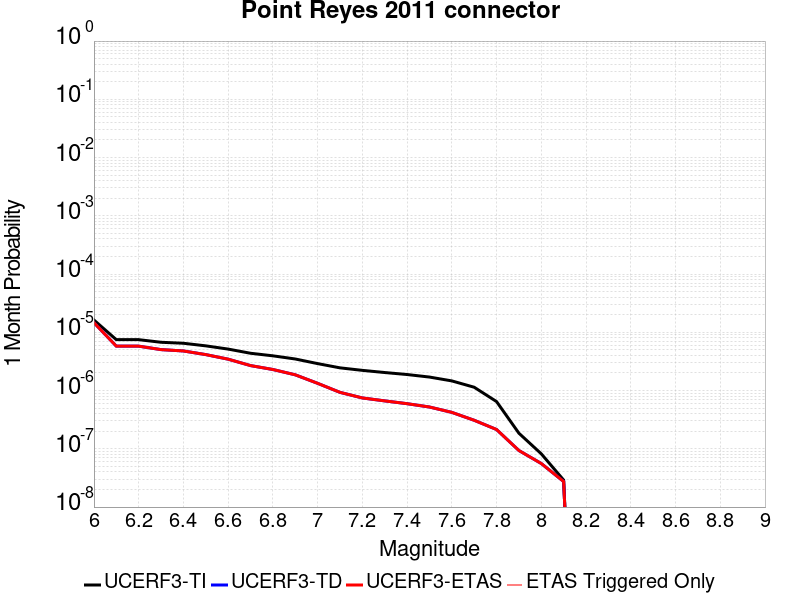 |  |  |

| Magnitude | 1 wk TI Prob | 1 wk TD Prob | 1 wk ETAS Prob | 1 wk ETAS/TD Gain | 1 wk ETAS Triggered Only | 1 mo TI Prob | 1 mo TD Prob | 1 mo ETAS Prob | 1 mo ETAS/TD Gain | 1 mo ETAS Triggered Only | 1 yr TI Prob | 1 yr TD Prob | 1 yr ETAS Prob | 1 yr ETAS/TD Gain | 1 yr ETAS Triggered Only | 10 yr TI Prob | 10 yr TD Prob | 10 yr ETAS Prob | 10 yr ETAS/TD Gain | 10 yr ETAS Triggered Only |
|-----|-----|-----|-----|-----|-----|-----|-----|-----|-----|-----|-----|-----|-----|-----|-----|-----|-----|-----|-----|-----|
| 6.0 | 3.7893044E-6 | 3.419019E-6 | 3.419019E-6 | 1.0 | 0.0 | 1.6239776E-5 | 1.4652868E-5 | 1.4652868E-5 | 1.0 | 0.0 | 1.9770133E-4 | 1.783862E-4 | 1.783862E-4 | 1.0 | 0.0 | 0.0019752553 | 0.0017828896 | 0.0017928717 | 1.0055989 | 1.0E-5 |
| 6.1 | 1.7449562E-6 | 1.3500688E-6 | 1.3500688E-6 | 1.0 | 0.0 | 7.478362E-6 | 5.785997E-6 | 5.785997E-6 | 1.0 | 0.0 | 9.104525E-5 | 7.044229E-5 | 7.044229E-5 | 1.0 | 0.0 | 9.1007963E-4 | 7.044551E-4 | 7.044551E-4 | 1.0 | 0.0 |
| 6.2 | 1.7449562E-6 | 1.3500688E-6 | 1.3500688E-6 | 1.0 | 0.0 | 7.478362E-6 | 5.785997E-6 | 5.785997E-6 | 1.0 | 0.0 | 9.104525E-5 | 7.044229E-5 | 7.044229E-5 | 1.0 | 0.0 | 9.1007963E-4 | 7.044551E-4 | 7.044551E-4 | 1.0 | 0.0 |
| 6.3 | 1.5739171E-6 | 1.177309E-6 | 1.177309E-6 | 1.0 | 0.0 | 6.7453416E-6 | 5.0456E-6 | 5.0456E-6 | 1.0 | 0.0 | 8.212144E-5 | 6.1428495E-5 | 6.1428495E-5 | 1.0 | 0.0 | 8.2091097E-4 | 6.1436923E-4 | 6.1436923E-4 | 1.0 | 0.0 |
| 6.4 | 1.5138507E-6 | 1.1166635E-6 | 1.1166635E-6 | 1.0 | 0.0 | 6.4879155E-6 | 4.785692E-6 | 4.785692E-6 | 1.0 | 0.0 | 7.898751E-5 | 5.8264282E-5 | 5.8264282E-5 | 1.0 | 0.0 | 7.8959437E-4 | 5.82744E-4 | 5.82744E-4 | 1.0 | 0.0 |
| 6.5 | 1.3662817E-6 | 9.671104E-7 | 9.671104E-7 | 1.0 | 0.0 | 5.8554797E-6 | 4.1447524E-6 | 4.1447524E-6 | 1.0 | 0.0 | 7.128814E-5 | 5.046121E-5 | 5.046121E-5 | 1.0 | 0.0 | 7.126527E-4 | 5.0474936E-4 | 5.0474936E-4 | 1.0 | 0.0 |
| 6.6 | 1.2022703E-6 | 8.0700335E-7 | 8.0700335E-7 | 1.0 | 0.0 | 5.1525767E-6 | 3.4585812E-6 | 3.4585812E-6 | 1.0 | 0.0 | 6.273081E-5 | 4.2107422E-5 | 4.2107422E-5 | 1.0 | 0.0 | 6.271311E-4 | 4.2124547E-4 | 4.2124547E-4 | 1.0 | 0.0 |
| 6.7 | 1.0194848E-6 | 6.2657085E-7 | 6.2657085E-7 | 1.0 | 0.0 | 4.3692135E-6 | 2.685301E-6 | 2.685301E-6 | 1.0 | 0.0 | 5.319387E-5 | 3.2693053E-5 | 3.2693053E-5 | 1.0 | 0.0 | 5.3181144E-4 | 3.271329E-4 | 3.271329E-4 | 1.0 | 0.0 |
| 6.8 | 9.212307E-7 | 5.3642964E-7 | 5.3642964E-7 | 1.0 | 0.0 | 3.9481256E-6 | 2.2989823E-6 | 2.2989823E-6 | 1.0 | 0.0 | 4.806737E-5 | 2.7989752E-5 | 2.7989752E-5 | 1.0 | 0.0 | 4.8056975E-4 | 2.8011258E-4 | 2.8011258E-4 | 1.0 | 0.0 |
| 6.9 | 8.1306075E-7 | 4.3497826E-7 | 4.3497826E-7 | 1.0 | 0.0 | 3.4845416E-6 | 1.8641912E-6 | 1.8641912E-6 | 1.0 | 0.0 | 4.2423468E-5 | 2.2696293E-5 | 2.2696293E-5 | 1.0 | 0.0 | 4.241537E-4 | 2.2718993E-4 | 2.2718993E-4 | 1.0 | 0.0 |
| 7.0 | 6.773335E-7 | 3.1071133E-7 | 3.1071133E-7 | 1.0 | 0.0 | 2.9028547E-6 | 1.3316193E-6 | 1.3316193E-6 | 1.0 | 0.0 | 3.5341684E-5 | 1.6212343E-5 | 1.6212343E-5 | 1.0 | 0.0 | 3.5336064E-4 | 1.6236167E-4 | 1.6236167E-4 | 1.0 | 0.0 |
| 7.1 | 5.7279397E-7 | 2.1740257E-7 | 2.1740257E-7 | 1.0 | 0.0 | 2.454829E-6 | 9.3172497E-7 | 9.3172497E-7 | 1.0 | 0.0 | 2.9887131E-5 | 1.1343692E-5 | 1.1343692E-5 | 1.0 | 0.0 | 2.9883112E-4 | 1.13681126E-4 | 1.13681126E-4 | 1.0 | 0.0 |
| 7.2 | 5.185539E-7 | 1.7426692E-7 | 1.7426692E-7 | 1.0 | 0.0 | 2.222372E-6 | 7.4685795E-7 | 7.4685795E-7 | 1.0 | 0.0 | 2.7057044E-5 | 9.092957E-6 | 9.092957E-6 | 1.0 | 0.0 | 2.7053748E-4 | 9.117584E-5 | 9.117584E-5 | 1.0 | 0.0 |
| 7.3 | 4.7599846E-7 | 1.5518242E-7 | 1.5518242E-7 | 1.0 | 0.0 | 2.0399918E-6 | 6.650673E-7 | 6.650673E-7 | 1.0 | 0.0 | 2.4836616E-5 | 8.097164E-6 | 8.097164E-6 | 1.0 | 0.0 | 2.4833842E-4 | 8.121868E-5 | 8.121868E-5 | 1.0 | 0.0 |
| 7.4 | 4.3987393E-7 | 1.3891216E-7 | 1.3891216E-7 | 1.0 | 0.0 | 1.8851727E-6 | 5.9533767E-7 | 5.9533767E-7 | 1.0 | 0.0 | 2.2951735E-5 | 7.2482117E-6 | 7.2482117E-6 | 1.0 | 0.0 | 2.2949366E-4 | 7.272974E-5 | 7.272974E-5 | 1.0 | 0.0 |
| 7.5 | 3.980054E-7 | 1.218397E-7 | 1.218397E-7 | 1.0 | 0.0 | 1.7057363E-6 | 5.2217007E-7 | 5.2217007E-7 | 1.0 | 0.0 | 2.0767142E-5 | 6.3574016E-6 | 6.3574016E-6 | 1.0 | 0.0 | 2.0765202E-4 | 6.381693E-5 | 6.381693E-5 | 1.0 | 0.0 |
| 7.6 | 3.4188398E-7 | 9.856225E-8 | 9.856225E-8 | 1.0 | 0.0 | 1.4652163E-6 | 4.2240958E-7 | 4.2240958E-7 | 1.0 | 0.0 | 1.7838862E-5 | 5.142824E-6 | 5.142824E-6 | 1.0 | 0.0 | 1.783743E-4 | 5.1655472E-5 | 5.1655472E-5 | 1.0 | 0.0 |
| 7.7 | 2.6611437E-7 | 7.212507E-8 | 7.212507E-8 | 1.0 | 0.0 | 1.1404896E-6 | 3.0910743E-7 | 3.0910743E-7 | 1.0 | 0.0 | 1.3885373E-5 | 3.763376E-6 | 3.763376E-6 | 1.0 | 0.0 | 1.3884505E-4 | 3.7818565E-5 | 3.7818565E-5 | 1.0 | 0.0 |
| 7.8 | 1.5107078E-7 | 5.0045998E-8 | 5.0045998E-8 | 1.0 | 0.0 | 6.474461E-7 | 2.1448285E-7 | 2.1448285E-7 | 1.0 | 0.0 | 7.882627E-6 | 2.6113255E-6 | 2.6113255E-6 | 1.0 | 0.0 | 7.8823476E-5 | 2.6276892E-5 | 2.6276892E-5 | 1.0 | 0.0 |
| 7.9 | 4.3228205E-8 | 2.1814706E-8 | 2.1814706E-8 | 1.0 | 0.0 | 1.8526373E-7 | 9.3491614E-8 | 9.3491614E-8 | 1.0 | 0.0 | 2.2555835E-6 | 1.1382598E-6 | 1.1382598E-6 | 1.0 | 0.0 | 2.2555607E-5 | 1.1459969E-5 | 1.1459969E-5 | 1.0 | 0.0 |
| 8.0 | 1.9149928E-8 | 1.3047568E-8 | 1.3047568E-8 | 1.0 | 0.0 | 8.207112E-8 | 5.5918147E-8 | 5.5918147E-8 | 1.0 | 0.0 | 9.992154E-7 | 6.808032E-7 | 6.808032E-7 | 1.0 | 0.0 | 9.992109E-6 | 6.8564223E-6 | 6.8564223E-6 | 1.0 | 0.0 |
| 8.1 | 6.7792816E-9 | 6.4079337E-9 | 6.4079337E-9 | 1.0 | 0.0 | 2.9054062E-8 | 2.7462569E-8 | 2.7462569E-8 | 1.0 | 0.0 | 3.5373316E-7 | 3.3435674E-7 | 3.3435674E-7 | 1.0 | 0.0 | 3.537326E-6 | 3.3689214E-6 | 3.3689214E-6 | 1.0 | 0.0 |

## Channel Islands Western Deep Ramp
*[(top)](#table-of-contents)*

| 1 Week | 1 Month | 1 Year | 10 Year |
|-----|-----|-----|-----|
|  |  |  |  |

| Magnitude | 1 wk TI Prob | 1 wk TD Prob | 1 wk ETAS Prob | 1 wk ETAS/TD Gain | 1 wk ETAS Triggered Only | 1 mo TI Prob | 1 mo TD Prob | 1 mo ETAS Prob | 1 mo ETAS/TD Gain | 1 mo ETAS Triggered Only | 1 yr TI Prob | 1 yr TD Prob | 1 yr ETAS Prob | 1 yr ETAS/TD Gain | 1 yr ETAS Triggered Only | 10 yr TI Prob | 10 yr TD Prob | 10 yr ETAS Prob | 10 yr ETAS/TD Gain | 10 yr ETAS Triggered Only |
|-----|-----|-----|-----|-----|-----|-----|-----|-----|-----|-----|-----|-----|-----|-----|-----|-----|-----|-----|-----|-----|
| 6.0 | 6.0213506E-6 | 6.2548684E-6 | 1.6254806E-5 | 2.5987446 | 1.0E-5 | 2.5805533E-5 | 2.6806329E-5 | 3.680606E-5 | 1.3730363 | 1.0E-5 | 3.1413708E-4 | 3.2632265E-4 | 3.3631938E-4 | 1.0306345 | 1.0E-5 | 0.0031369338 | 0.0032588763 | 0.0032688437 | 1.0030586 | 1.0E-5 |
| 6.1 | 6.0213506E-6 | 6.2548684E-6 | 1.6254806E-5 | 2.5987446 | 1.0E-5 | 2.5805533E-5 | 2.6806329E-5 | 3.680606E-5 | 1.3730363 | 1.0E-5 | 3.1413708E-4 | 3.2632265E-4 | 3.3631938E-4 | 1.0306345 | 1.0E-5 | 0.0031369338 | 0.0032588763 | 0.0032688437 | 1.0030586 | 1.0E-5 |
| 6.2 | 6.0213506E-6 | 6.2548684E-6 | 1.6254806E-5 | 2.5987446 | 1.0E-5 | 2.5805533E-5 | 2.6806329E-5 | 3.680606E-5 | 1.3730363 | 1.0E-5 | 3.1413708E-4 | 3.2632265E-4 | 3.3631938E-4 | 1.0306345 | 1.0E-5 | 0.0031369338 | 0.0032588763 | 0.0032688437 | 1.0030586 | 1.0E-5 |
| 6.3 | 6.0213506E-6 | 6.2548684E-6 | 1.6254806E-5 | 2.5987446 | 1.0E-5 | 2.5805533E-5 | 2.6806329E-5 | 3.680606E-5 | 1.3730363 | 1.0E-5 | 3.1413708E-4 | 3.2632265E-4 | 3.3631938E-4 | 1.0306345 | 1.0E-5 | 0.0031369338 | 0.0032588763 | 0.0032688437 | 1.0030586 | 1.0E-5 |
| 6.4 | 6.0213506E-6 | 6.2548684E-6 | 1.6254806E-5 | 2.5987446 | 1.0E-5 | 2.5805533E-5 | 2.6806329E-5 | 3.680606E-5 | 1.3730363 | 1.0E-5 | 3.1413708E-4 | 3.2632265E-4 | 3.3631938E-4 | 1.0306345 | 1.0E-5 | 0.0031369338 | 0.0032588763 | 0.0032688437 | 1.0030586 | 1.0E-5 |
| 6.5 | 6.0213506E-6 | 6.2548684E-6 | 1.6254806E-5 | 2.5987446 | 1.0E-5 | 2.5805533E-5 | 2.6806329E-5 | 3.680606E-5 | 1.3730363 | 1.0E-5 | 3.1413708E-4 | 3.2632265E-4 | 3.3631938E-4 | 1.0306345 | 1.0E-5 | 0.0031369338 | 0.0032588763 | 0.0032688437 | 1.0030586 | 1.0E-5 |
| 6.6 | 6.0213506E-6 | 6.2548684E-6 | 1.6254806E-5 | 2.5987446 | 1.0E-5 | 2.5805533E-5 | 2.6806329E-5 | 3.680606E-5 | 1.3730363 | 1.0E-5 | 3.1413708E-4 | 3.2632265E-4 | 3.3631938E-4 | 1.0306345 | 1.0E-5 | 0.0031369338 | 0.0032588763 | 0.0032688437 | 1.0030586 | 1.0E-5 |
| 6.7 | 5.313309E-6 | 5.5252403E-6 | 5.5252403E-6 | 1.0 | 0.0 | 2.2771126E-5 | 2.367941E-5 | 2.367941E-5 | 1.0 | 0.0 | 2.772032E-4 | 2.8826276E-4 | 2.8826276E-4 | 1.0 | 0.0 | 0.0027685766 | 0.0028792918 | 0.0028792918 | 1.0 | 0.0 |
| 6.8 | 5.313309E-6 | 5.5252403E-6 | 5.5252403E-6 | 1.0 | 0.0 | 2.2771126E-5 | 2.367941E-5 | 2.367941E-5 | 1.0 | 0.0 | 2.772032E-4 | 2.8826276E-4 | 2.8826276E-4 | 1.0 | 0.0 | 0.0027685766 | 0.0028792918 | 0.0028792918 | 1.0 | 0.0 |
| 6.9 | 4.744377E-6 | 4.9394303E-6 | 4.9394303E-6 | 1.0 | 0.0 | 2.0332885E-5 | 2.1168837E-5 | 2.1168837E-5 | 1.0 | 0.0 | 2.4752476E-4 | 2.5770385E-4 | 2.5770385E-4 | 1.0 | 0.0 | 0.0024724922 | 0.0025744175 | 0.0025744175 | 1.0 | 0.0 |
| 7.0 | 4.722209E-6 | 4.9164732E-6 | 4.9164732E-6 | 1.0 | 0.0 | 2.0237881E-5 | 2.107045E-5 | 2.107045E-5 | 1.0 | 0.0 | 2.4636835E-4 | 2.5650626E-4 | 2.5650626E-4 | 1.0 | 0.0 | 0.002460954 | 0.0025624693 | 0.0025624693 | 1.0 | 0.0 |
| 7.1 | 4.611174E-6 | 4.801409E-6 | 4.801409E-6 | 1.0 | 0.0 | 1.9762025E-5 | 2.0577325E-5 | 2.0577325E-5 | 1.0 | 0.0 | 2.4057609E-4 | 2.5050386E-4 | 2.5050386E-4 | 1.0 | 0.0 | 0.002403158 | 0.002502582 | 0.002502582 | 1.0 | 0.0 |
| 7.2 | 4.043994E-6 | 4.2120264E-6 | 4.2120264E-6 | 1.0 | 0.0 | 1.7331287E-5 | 1.8051438E-5 | 1.8051438E-5 | 1.0 | 0.0 | 2.10988E-4 | 2.1975765E-4 | 2.1975765E-4 | 1.0 | 0.0 | 0.002107878 | 0.0021957543 | 0.0021957543 | 1.0 | 0.0 |
| 7.3 | 2.1233036E-6 | 2.2297875E-6 | 2.2297875E-6 | 1.0 | 0.0 | 9.099841E-6 | 9.556197E-6 | 9.556197E-6 | 1.0 | 0.0 | 1.1078493E-4 | 1.1634055E-4 | 1.1634055E-4 | 1.0 | 0.0 | 0.0011072971 | 0.001162802 | 0.001162802 | 1.0 | 0.0 |
| 7.4 | 1.9051884E-6 | 2.0014973E-6 | 2.0014973E-6 | 1.0 | 0.0 | 8.165067E-6 | 8.577817E-6 | 8.577817E-6 | 1.0 | 0.0 | 9.940516E-5 | 1.0442998E-4 | 1.0442998E-4 | 1.0 | 0.0 | 9.93607E-4 | 0.0010438144 | 0.0010438144 | 1.0 | 0.0 |
| 7.5 | 1.2408497E-6 | 1.3038839E-6 | 1.3038839E-6 | 1.0 | 0.0 | 5.317916E-6 | 5.588062E-6 | 5.588062E-6 | 1.0 | 0.0 | 6.4743705E-5 | 6.8032554E-5 | 6.8032554E-5 | 1.0 | 0.0 | 6.4724847E-4 | 6.8011944E-4 | 6.8011944E-4 | 1.0 | 0.0 |
| 7.6 | 6.5440025E-7 | 6.886718E-7 | 6.886718E-7 | 1.0 | 0.0 | 2.8045695E-6 | 2.9514472E-6 | 2.9514472E-6 | 1.0 | 0.0 | 3.4145098E-5 | 3.593329E-5 | 3.593329E-5 | 1.0 | 0.0 | 3.4139853E-4 | 3.5927625E-4 | 3.5927625E-4 | 1.0 | 0.0 |
| 7.7 | 3.985963E-7 | 4.1930787E-7 | 4.1930787E-7 | 1.0 | 0.0 | 1.7082689E-6 | 1.7970326E-6 | 1.7970326E-6 | 1.0 | 0.0 | 2.0797976E-5 | 2.1878664E-5 | 2.1878664E-5 | 1.0 | 0.0 | 2.0796029E-4 | 2.1876628E-4 | 2.1876628E-4 | 1.0 | 0.0 |
| 7.8 | 3.706329E-8 | 3.8591796E-8 | 3.8591796E-8 | 1.0 | 0.0 | 1.5884267E-7 | 1.653934E-7 | 1.653934E-7 | 1.0 | 0.0 | 1.9339077E-6 | 2.0136629E-6 | 2.0136629E-6 | 1.0 | 0.0 | 1.933891E-5 | 2.0136458E-5 | 2.0136458E-5 | 1.0 | 0.0 |

## Richfield
*[(top)](#table-of-contents)*

| 1 Week | 1 Month | 1 Year | 10 Year |
|-----|-----|-----|-----|
|  |  |  |  |

| Magnitude | 1 wk TI Prob | 1 wk TD Prob | 1 wk ETAS Prob | 1 wk ETAS/TD Gain | 1 wk ETAS Triggered Only | 1 mo TI Prob | 1 mo TD Prob | 1 mo ETAS Prob | 1 mo ETAS/TD Gain | 1 mo ETAS Triggered Only | 1 yr TI Prob | 1 yr TD Prob | 1 yr ETAS Prob | 1 yr ETAS/TD Gain | 1 yr ETAS Triggered Only | 10 yr TI Prob | 10 yr TD Prob | 10 yr ETAS Prob | 10 yr ETAS/TD Gain | 10 yr ETAS Triggered Only |
|-----|-----|-----|-----|-----|-----|-----|-----|-----|-----|-----|-----|-----|-----|-----|-----|-----|-----|-----|-----|-----|
| 6.0 | 1.5166896E-6 | 1.5392679E-6 | 1.5392679E-6 | 1.0 | 0.0 | 6.5000822E-6 | 6.596852E-6 | 6.596852E-6 | 1.0 | 0.0 | 7.913562E-5 | 8.0314814E-5 | 8.0314814E-5 | 1.0 | 0.0 | 7.910745E-4 | 8.0296566E-4 | 8.129576E-4 | 1.0124438 | 1.0E-5 |
| 6.1 | 1.5166896E-6 | 1.5392679E-6 | 1.5392679E-6 | 1.0 | 0.0 | 6.5000822E-6 | 6.596852E-6 | 6.596852E-6 | 1.0 | 0.0 | 7.913562E-5 | 8.0314814E-5 | 8.0314814E-5 | 1.0 | 0.0 | 7.910745E-4 | 8.0296566E-4 | 8.129576E-4 | 1.0124438 | 1.0E-5 |
| 6.2 | 6.473272E-7 | 6.598479E-7 | 6.598479E-7 | 1.0 | 0.0 | 2.7742565E-6 | 2.8279171E-6 | 2.8279171E-6 | 1.0 | 0.0 | 3.377605E-5 | 3.442948E-5 | 3.442948E-5 | 1.0 | 0.0 | 3.3770915E-4 | 3.4425448E-4 | 3.5425107E-4 | 1.0290383 | 1.0E-5 |
| 6.3 | 6.473272E-7 | 6.598479E-7 | 6.598479E-7 | 1.0 | 0.0 | 2.7742565E-6 | 2.8279171E-6 | 2.8279171E-6 | 1.0 | 0.0 | 3.377605E-5 | 3.442948E-5 | 3.442948E-5 | 1.0 | 0.0 | 3.3770915E-4 | 3.4425448E-4 | 3.5425107E-4 | 1.0290383 | 1.0E-5 |
| 6.4 | 6.473272E-7 | 6.598479E-7 | 6.598479E-7 | 1.0 | 0.0 | 2.7742565E-6 | 2.8279171E-6 | 2.8279171E-6 | 1.0 | 0.0 | 3.377605E-5 | 3.442948E-5 | 3.442948E-5 | 1.0 | 0.0 | 3.3770915E-4 | 3.4425448E-4 | 3.5425107E-4 | 1.0290383 | 1.0E-5 |
| 6.5 | 2.7954403E-7 | 2.85316E-7 | 2.85316E-7 | 1.0 | 0.0 | 1.1980452E-6 | 1.2227825E-6 | 1.2227825E-6 | 1.0 | 0.0 | 1.4586103E-5 | 1.4887319E-5 | 1.4887319E-5 | 1.0 | 0.0 | 1.4585146E-4 | 1.4886746E-4 | 1.5886597E-4 | 1.0671638 | 1.0E-5 |
| 6.6 | 2.7954403E-7 | 2.85316E-7 | 2.85316E-7 | 1.0 | 0.0 | 1.1980452E-6 | 1.2227825E-6 | 1.2227825E-6 | 1.0 | 0.0 | 1.4586103E-5 | 1.4887319E-5 | 1.4887319E-5 | 1.0 | 0.0 | 1.4585146E-4 | 1.4886746E-4 | 1.5886597E-4 | 1.0671638 | 1.0E-5 |
| 6.7 | 1.0777299E-7 | 1.0878809E-7 | 1.0878809E-7 | 1.0 | 0.0 | 4.6188418E-7 | 4.662346E-7 | 4.662346E-7 | 1.0 | 0.0 | 5.6234253E-6 | 5.676396E-6 | 5.676396E-6 | 1.0 | 0.0 | 5.623283E-5 | 5.676294E-5 | 5.676294E-5 | 1.0 | 0.0 |
| 6.8 | 2.1301874E-8 | 2.0666132E-8 | 2.0666132E-8 | 1.0 | 0.0 | 9.129375E-8 | 8.856914E-8 | 8.856914E-8 | 1.0 | 0.0 | 1.1115008E-6 | 1.0783288E-6 | 1.0783288E-6 | 1.0 | 0.0 | 1.1114952E-5 | 1.0783239E-5 | 1.0783239E-5 | 1.0 | 0.0 |
| 6.9 | 1.8413502E-8 | 1.7751097E-8 | 1.7751097E-8 | 1.0 | 0.0 | 7.891501E-8 | 7.607613E-8 | 7.607613E-8 | 1.0 | 0.0 | 9.607899E-7 | 9.2622645E-7 | 9.2622645E-7 | 1.0 | 0.0 | 9.607857E-6 | 9.2622295E-6 | 9.2622295E-6 | 1.0 | 0.0 |
| 7.0 | 1.2290541E-8 | 1.1574315E-8 | 1.1574315E-8 | 1.0 | 0.0 | 5.2673748E-8 | 4.9604207E-8 | 4.9604207E-8 | 1.0 | 0.0 | 6.413027E-7 | 6.03931E-7 | 6.03931E-7 | 1.0 | 0.0 | 6.4130086E-6 | 6.0392954E-6 | 6.0392954E-6 | 1.0 | 0.0 |
| 7.1 | 6.373573E-9 | 6.155758E-9 | 6.155758E-9 | 1.0 | 0.0 | 2.7315311E-8 | 2.6381821E-8 | 2.6381821E-8 | 1.0 | 0.0 | 3.3256384E-7 | 3.2119863E-7 | 3.2119863E-7 | 1.0 | 0.0 | 3.3256335E-6 | 3.211982E-6 | 3.211982E-6 | 1.0 | 0.0 |
| 7.2 | 3.6989944E-9 | 3.7360146E-9 | 3.7360146E-9 | 1.0 | 0.0 | 1.5852834E-8 | 1.6011493E-8 | 1.6011493E-8 | 1.0 | 0.0 | 1.9300822E-7 | 1.9493989E-7 | 1.9493989E-7 | 1.0 | 0.0 | 1.9300805E-6 | 1.9493975E-6 | 1.9493975E-6 | 1.0 | 0.0 |
| 7.3 | 2.097397E-9 | 2.1200501E-9 | 2.1200501E-9 | 1.0 | 0.0 | 8.9888434E-9 | 9.085929E-9 | 9.085929E-9 | 1.0 | 0.0 | 1.0943917E-7 | 1.1062118E-7 | 1.1062118E-7 | 1.0 | 0.0 | 1.0943911E-6 | 1.1062115E-6 | 1.1062115E-6 | 1.0 | 0.0 |
| 7.4 | 5.8314464E-12 | 5.8918426E-12 | 5.8918426E-12 | 1.0 | 0.0 | 2.4991786E-11 | 2.5250912E-11 | 2.5250912E-11 | 1.0 | 0.0 | 3.0427527E-10 | 3.0742975E-10 | 3.0742975E-10 | 1.0 | 0.0 | 3.0427532E-9 | 3.0742973E-9 | 3.0742973E-9 | 1.0 | 0.0 |

## Holser alt 1
*[(top)](#table-of-contents)*

| 1 Week | 1 Month | 1 Year | 10 Year |
|-----|-----|-----|-----|
|  |  |  |  |

| Magnitude | 1 wk TI Prob | 1 wk TD Prob | 1 wk ETAS Prob | 1 wk ETAS/TD Gain | 1 wk ETAS Triggered Only | 1 mo TI Prob | 1 mo TD Prob | 1 mo ETAS Prob | 1 mo ETAS/TD Gain | 1 mo ETAS Triggered Only | 1 yr TI Prob | 1 yr TD Prob | 1 yr ETAS Prob | 1 yr ETAS/TD Gain | 1 yr ETAS Triggered Only | 10 yr TI Prob | 10 yr TD Prob | 10 yr ETAS Prob | 10 yr ETAS/TD Gain | 10 yr ETAS Triggered Only |
|-----|-----|-----|-----|-----|-----|-----|-----|-----|-----|-----|-----|-----|-----|-----|-----|-----|-----|-----|-----|-----|
| 6.0 | 6.2746653E-6 | 5.7899742E-6 | 5.7899742E-6 | 1.0 | 0.0 | 2.6891146E-5 | 2.4814004E-5 | 2.4814004E-5 | 1.0 | 0.0 | 3.273505E-4 | 3.0208015E-4 | 3.0208015E-4 | 1.0 | 0.0 | 0.0032686873 | 0.003017828 | 0.003027798 | 1.0033036 | 1.0E-5 |
| 6.1 | 6.2746653E-6 | 5.7899742E-6 | 5.7899742E-6 | 1.0 | 0.0 | 2.6891146E-5 | 2.4814004E-5 | 2.4814004E-5 | 1.0 | 0.0 | 3.273505E-4 | 3.0208015E-4 | 3.0208015E-4 | 1.0 | 0.0 | 0.0032686873 | 0.003017828 | 0.003027798 | 1.0033036 | 1.0E-5 |
| 6.2 | 6.2746653E-6 | 5.7899742E-6 | 5.7899742E-6 | 1.0 | 0.0 | 2.6891146E-5 | 2.4814004E-5 | 2.4814004E-5 | 1.0 | 0.0 | 3.273505E-4 | 3.0208015E-4 | 3.0208015E-4 | 1.0 | 0.0 | 0.0032686873 | 0.003017828 | 0.003027798 | 1.0033036 | 1.0E-5 |
| 6.3 | 6.2746653E-6 | 5.7899742E-6 | 5.7899742E-6 | 1.0 | 0.0 | 2.6891146E-5 | 2.4814004E-5 | 2.4814004E-5 | 1.0 | 0.0 | 3.273505E-4 | 3.0208015E-4 | 3.0208015E-4 | 1.0 | 0.0 | 0.0032686873 | 0.003017828 | 0.003027798 | 1.0033036 | 1.0E-5 |
| 6.4 | 6.2746653E-6 | 5.7899742E-6 | 5.7899742E-6 | 1.0 | 0.0 | 2.6891146E-5 | 2.4814004E-5 | 2.4814004E-5 | 1.0 | 0.0 | 3.273505E-4 | 3.0208015E-4 | 3.0208015E-4 | 1.0 | 0.0 | 0.0032686873 | 0.003017828 | 0.003027798 | 1.0033036 | 1.0E-5 |
| 6.5 | 6.2746653E-6 | 5.7899742E-6 | 5.7899742E-6 | 1.0 | 0.0 | 2.6891146E-5 | 2.4814004E-5 | 2.4814004E-5 | 1.0 | 0.0 | 3.273505E-4 | 3.0208015E-4 | 3.0208015E-4 | 1.0 | 0.0 | 0.0032686873 | 0.003017828 | 0.003027798 | 1.0033036 | 1.0E-5 |
| 6.6 | 3.375825E-6 | 2.7711988E-6 | 2.7711988E-6 | 1.0 | 0.0 | 1.4467741E-5 | 1.1876513E-5 | 1.1876513E-5 | 1.0 | 0.0 | 1.761305E-4 | 1.4458712E-4 | 1.4458712E-4 | 1.0 | 0.0 | 0.0017599097 | 0.0014449474 | 0.0014449474 | 1.0 | 0.0 |
| 6.7 | 3.375825E-6 | 2.7711988E-6 | 2.7711988E-6 | 1.0 | 0.0 | 1.4467741E-5 | 1.1876513E-5 | 1.1876513E-5 | 1.0 | 0.0 | 1.761305E-4 | 1.4458712E-4 | 1.4458712E-4 | 1.0 | 0.0 | 0.0017599097 | 0.0014449474 | 0.0014449474 | 1.0 | 0.0 |
| 6.8 | 3.366533E-6 | 2.7615984E-6 | 2.7615984E-6 | 1.0 | 0.0 | 1.4427919E-5 | 1.1835369E-5 | 1.1835369E-5 | 1.0 | 0.0 | 1.7564575E-4 | 1.4408625E-4 | 1.4408625E-4 | 1.0 | 0.0 | 0.0017550698 | 0.0014399453 | 0.0014399453 | 1.0 | 0.0 |
| 6.9 | 3.253174E-6 | 2.6438204E-6 | 2.6438204E-6 | 1.0 | 0.0 | 1.39421E-5 | 1.13306105E-5 | 1.13306105E-5 | 1.0 | 0.0 | 1.6973184E-4 | 1.379416E-4 | 1.379416E-4 | 1.0 | 0.0 | 0.0016960226 | 0.0013785758 | 0.0013785758 | 1.0 | 0.0 |
| 7.0 | 2.9336593E-6 | 2.3118082E-6 | 2.3118082E-6 | 1.0 | 0.0 | 1.2572766E-5 | 9.907712E-6 | 9.907712E-6 | 1.0 | 0.0 | 1.5306266E-4 | 1.2061974E-4 | 1.2061974E-4 | 1.0 | 0.0 | 0.0015295728 | 0.0012055453 | 0.0012055453 | 1.0 | 0.0 |
| 7.1 | 2.9087812E-6 | 2.2876604E-6 | 2.2876604E-6 | 1.0 | 0.0 | 1.2466146E-5 | 9.804223E-6 | 9.804223E-6 | 1.0 | 0.0 | 1.5176475E-4 | 1.19359895E-4 | 1.19359895E-4 | 1.0 | 0.0 | 0.0015166114 | 0.0011929603 | 0.0011929603 | 1.0 | 0.0 |
| 7.2 | 2.8674524E-6 | 2.247552E-6 | 2.247552E-6 | 1.0 | 0.0 | 1.2289024E-5 | 9.63233E-6 | 9.63233E-6 | 1.0 | 0.0 | 1.4960859E-4 | 1.1726733E-4 | 1.1726733E-4 | 1.0 | 0.0 | 0.0014950791 | 0.0011720568 | 0.0011720568 | 1.0 | 0.0 |
| 7.3 | 2.8057775E-6 | 2.1954418E-6 | 2.1954418E-6 | 1.0 | 0.0 | 1.2024705E-5 | 9.409002E-6 | 9.409002E-6 | 1.0 | 0.0 | 1.4639096E-4 | 1.145486E-4 | 1.145486E-4 | 1.0 | 0.0 | 0.0014629456 | 0.0011448979 | 0.0011448979 | 1.0 | 0.0 |
| 7.4 | 2.683666E-6 | 2.1092408E-6 | 2.1092408E-6 | 1.0 | 0.0 | 1.1501375E-5 | 9.0395715E-6 | 9.0395715E-6 | 1.0 | 0.0 | 1.4002025E-4 | 1.1005125E-4 | 1.1005125E-4 | 1.0 | 0.0 | 0.0013993206 | 0.0010999697 | 0.0010999697 | 1.0 | 0.0 |
| 7.5 | 2.434495E-6 | 1.9195488E-6 | 1.9195488E-6 | 1.0 | 0.0 | 1.0433508E-5 | 8.226612E-6 | 8.226612E-6 | 1.0 | 0.0 | 1.2702055E-4 | 1.0015442E-4 | 1.0015442E-4 | 1.0 | 0.0 | 0.0012694797 | 0.0010010948 | 0.0010010948 | 1.0 | 0.0 |
| 7.6 | 1.9914562E-6 | 1.5731545E-6 | 1.5731545E-6 | 1.0 | 0.0 | 8.534785E-6 | 6.7420733E-6 | 6.7420733E-6 | 1.0 | 0.0 | 1.03906044E-4 | 8.2081664E-5 | 8.2081664E-5 | 1.0 | 0.0 | 0.0010385747 | 8.2051504E-4 | 8.2051504E-4 | 1.0 | 0.0 |
| 7.7 | 1.5229501E-6 | 1.1896134E-6 | 1.1896134E-6 | 1.0 | 0.0 | 6.526913E-6 | 5.098333E-6 | 5.098333E-6 | 1.0 | 0.0 | 7.946226E-5 | 6.207045E-5 | 6.207045E-5 | 1.0 | 0.0 | 7.943385E-4 | 6.2053243E-4 | 6.2053243E-4 | 1.0 | 0.0 |
| 7.8 | 6.3489426E-7 | 4.6878412E-7 | 4.6878412E-7 | 1.0 | 0.0 | 2.7209726E-6 | 2.0090733E-6 | 2.0090733E-6 | 1.0 | 0.0 | 3.312734E-5 | 2.4460194E-5 | 2.4460194E-5 | 1.0 | 0.0 | 3.31224E-4 | 2.445752E-4 | 2.445752E-4 | 1.0 | 0.0 |
| 7.9 | 1.5459432E-7 | 1.01936465E-7 | 1.01936465E-7 | 1.0 | 0.0 | 6.6254694E-7 | 4.3687047E-7 | 4.3687047E-7 | 1.0 | 0.0 | 8.066479E-6 | 5.318885E-6 | 5.318885E-6 | 1.0 | 0.0 | 8.066186E-5 | 5.3187596E-5 | 5.3187596E-5 | 1.0 | 0.0 |
| 8.0 | 1.8307812E-8 | 9.690041E-9 | 9.690041E-9 | 1.0 | 0.0 | 7.846205E-8 | 4.1528747E-8 | 4.1528747E-8 | 1.0 | 0.0 | 9.55275E-7 | 5.056124E-7 | 5.056124E-7 | 1.0 | 0.0 | 9.552709E-6 | 5.0561125E-6 | 5.0561125E-6 | 1.0 | 0.0 |

