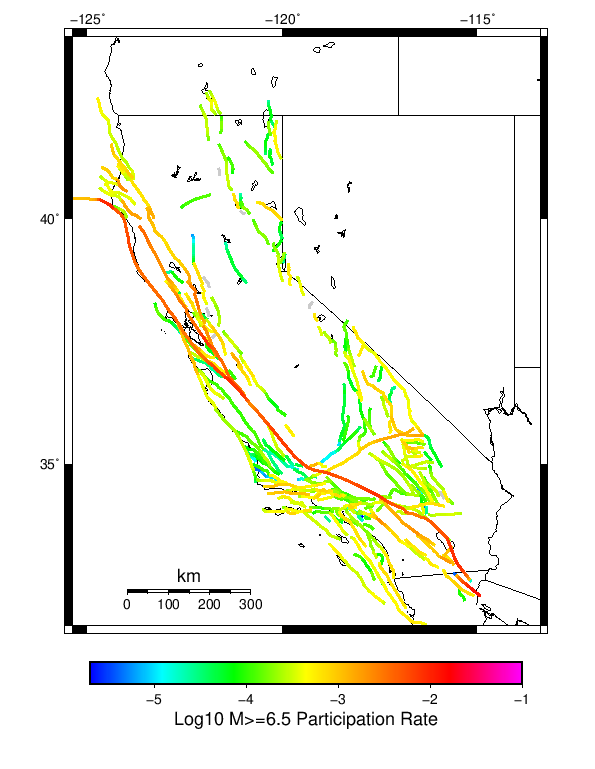
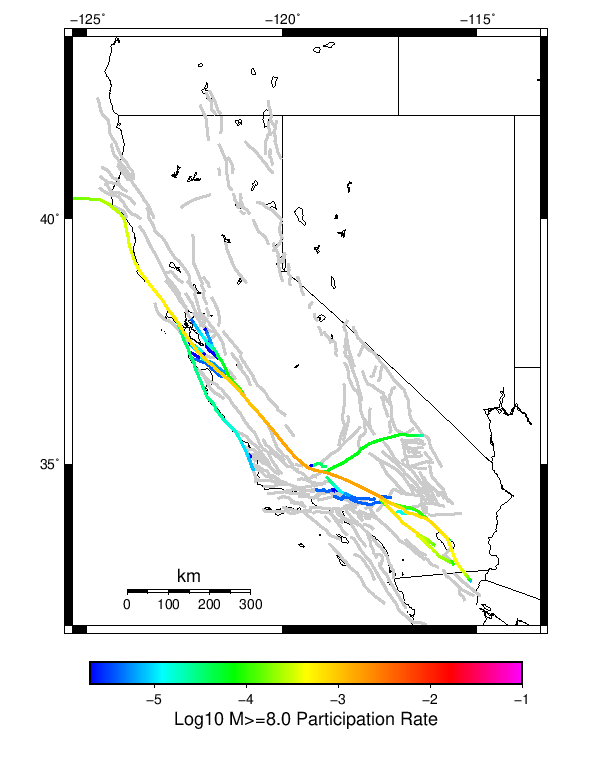

# Start 2012, 500 yr, NoERT, Spontaneous, Historical Catalog Results

|   | Start 2012, 500 yr, NoERT, Spontaneous, Historical Catalog |
|-----|-----|
| Num Simulations | 990 (incomplete) |
| Start Time | 2012/01/01 00:00:00 UTC |
| Start Time Epoch Milliseconds | 1325376000000 |
| Duration | 500 Years |
| Includes Spontaneous? | true |
| Trigger Ruptures | *(none)* |
| Historical Ruptures | 60366 Trigger Ruptures |
|   | First: M7.3 at 1852/01/05 04:40:39 UTC |
|   | Last: M3.2 at 2011/12/31 19:14:44 UTC |
|   | Largest: M7.9 at 1857/01/09 16:25:39 UTC |
| Config Generated With | u3etas_config_builder.sh --start-year 2012 --num-simulations 1000 --duration-years 500 --prob-model NO_ERT --include-spontaneous --historical-catalog --scale-factor 1.0 --hpc-site USC_HPC --nodes 36 --hours 24 --queue scec |

## Table Of Contents

* [Magnitude Frequency Distribution](#magnitude-frequency-distribution)
* [Long Term Rate Variability](#long-term-rate-variability)
  * [162 Year Variability](#162-year-variability)
  * [80 Year Variability](#80-year-variability)
  * [28 Year Variability](#28-year-variability)
  * [Variability Duration Dependence](#variability-duration-dependence)
* [Simulation Stationarity](#simulation-stationarity)
* [Section Participation](#section-participation)
  * [Section Participation Plots](#section-participation-plots)
  * [Supra-Seismogenic Parent Sections Table](#supra-seismogenic-parent-sections-table)
  * [M≥6.5 Parent Sections Table](#m65-parent-sections-table)
  * [M≥7 Parent Sections Table](#m7-parent-sections-table)
  * [M≥7.5 Parent Sections Table](#m75-parent-sections-table)
  * [M≥8 Parent Sections Table](#m8-parent-sections-table)
* [Gridded Nucleation](#gridded-nucleation)
* [JSON Input File](#json-input-file)

## Magnitude Frequency Distribution
*[(top)](#table-of-contents)*

**Legend**
* **Mean** (thick black line): mean annual rate across all 990 catalogs
* **2.5%,97.5%** (thin black lines): annual rate percentiles across all 990 catalogs
* **Median** (thin blue line): median annual rate across all 990 catalogs
* **Mode** (thin cyan line): modal annual rate across all 990 catalogs (scaled to annualized value)
* **500 yr Probability** (thin red line): 500 year probability calculated as the fraction of catalogs with at least 1 occurrence
* **500 yr Supraseismogenic Probability** (thin dashed red line): same as above, but only for supraseismogenic ruptures on explicitly modeled UCERF3 faults
* **95% Conf** (light red shaded region): binomial 95% confidence bounds on probability


| Mag | Mean | 2.5 %ile | 97.5 %ile | Median | Mode | 500 yr Probability | 500 yr Supra-Seis Prob |
|-----|-----|-----|-----|-----|-----|-----|-----|
| **M&ge;5** | 7.928 | 7.204 | 8.710 | 7.916 | 8.260 | 1.000 (100.00%) | 1.000 (100.00%) |
| **M&ge;5.1** | 6.280 | 5.686 | 6.914 | 6.268 | 6.120 | 1.000 (100.00%) | 1.000 (100.00%) |
| **M&ge;5.2** | 4.972 | 4.488 | 5.492 | 4.960 | 4.908 | 1.000 (100.00%) | 1.000 (100.00%) |
| **M&ge;5.3** | 3.935 | 3.528 | 4.368 | 3.928 | 3.872 | 1.000 (100.00%) | 1.000 (100.00%) |
| **M&ge;5.4** | 3.110 | 2.784 | 3.432 | 3.108 | 3.042 | 1.000 (100.00%) | 1.000 (100.00%) |
| **M&ge;5.5** | 2.454 | 2.192 | 2.722 | 2.454 | 2.490 | 1.000 (100.00%) | 1.000 (100.00%) |
| **M&ge;5.6** | 1.936 | 1.724 | 2.150 | 1.936 | 1.880 | 1.000 (100.00%) | 1.000 (100.00%) |
| **M&ge;5.7** | 1.522 | 1.342 | 1.698 | 1.518 | 1.502 | 1.000 (100.00%) | 1.000 (100.00%) |
| **M&ge;5.8** | 1.192 | 1.056 | 1.336 | 1.192 | 1.218 | 1.000 (100.00%) | 1.000 (100.00%) |
| **M&ge;5.9** | 0.918 | 0.808 | 1.040 | 0.916 | 0.956 | 1.000 (100.00%) | 1.000 (100.00%) |
| **M&ge;6** | 0.736 | 0.642 | 0.834 | 0.736 | 0.724 | 1.000 (100.00%) | 1.000 (100.00%) |
| **M&ge;6.1** | 0.574 | 0.496 | 0.654 | 0.574 | 0.586 | 1.000 (100.00%) | 1.000 (100.00%) |
| **M&ge;6.2** | 0.460 | 0.394 | 0.532 | 0.460 | 0.466 | 1.000 (100.00%) | 1.000 (100.00%) |
| **M&ge;6.3** | 0.369 | 0.312 | 0.432 | 0.368 | 0.342 | 1.000 (100.00%) | 1.000 (100.00%) |
| **M&ge;6.4** | 0.294 | 0.246 | 0.348 | 0.292 | 0.290 | 1.000 (100.00%) | 1.000 (100.00%) |
| **M&ge;6.5** | 0.230 | 0.190 | 0.270 | 0.230 | 0.234 | 1.000 (100.00%) | 1.000 (100.00%) |
| **M&ge;6.6** | 0.182 | 0.148 | 0.216 | 0.182 | 0.178 | 1.000 (100.00%) | 1.000 (100.00%) |
| **M&ge;6.7** | 0.141 | 0.112 | 0.172 | 0.142 | 0.144 | 1.000 (100.00%) | 1.000 (100.00%) |
| **M&ge;6.8** | 0.112 | 0.086 | 0.138 | 0.112 | 0.110 | 1.000 (100.00%) | 1.000 (100.00%) |
| **M&ge;6.9** | 0.089 | 0.066 | 0.110 | 0.088 | 0.090 | 1.000 (100.00%) | 1.000 (100.00%) |
| **M&ge;7** | 0.071 | 0.052 | 0.090 | 0.070 | 0.068 | 1.000 (100.00%) | 1.000 (100.00%) |
| **M&ge;7.1** | 0.054 | 0.038 | 0.072 | 0.054 | 0.050 | 1.000 (100.00%) | 1.000 (100.00%) |
| **M&ge;7.2** | 0.041 | 0.028 | 0.056 | 0.040 | 0.040 | 1.000 (100.00%) | 1.000 (100.00%) |
| **M&ge;7.3** | 0.033 | 0.022 | 0.046 | 0.032 | 0.030 | 1.000 (100.00%) | 1.000 (100.00%) |
| **M&ge;7.4** | 0.025 | 0.016 | 0.036 | 0.026 | 0.024 | 1.000 (100.00%) | 1.000 (100.00%) |
| **M&ge;7.5** | 0.018 | 0.010 | 0.028 | 0.018 | 0.018 | 1.000 (100.00%) | 1.000 (100.00%) |
| **M&ge;7.6** | 0.013 | 8.00E-3 | 0.020 | 0.014 | 0.012 | 1.000 (100.00%) | 1.000 (100.00%) |
| **M&ge;7.7** | 9.16E-3 | 4.00E-3 | 0.014 | 8.00E-3 | 8.00E-3 | 1.000 (100.00%) | 1.000 (100.00%) |
| **M&ge;7.8** | 6.41E-3 | 2.00E-3 | 0.012 | 6.00E-3 | 6.00E-3 | 0.998 (99.80%) | 0.998 (99.80%) |
| **M&ge;7.9** | 3.51E-3 | 0.000 | 8.00E-3 | 4.00E-3 | 4.00E-3 | 0.904 (90.40%) | 0.904 (90.40%) |
| **M&ge;8** | 1.86E-3 | 0.000 | 6.00E-3 | 2.00E-3 | 2.00E-3 | 0.661 (66.06%) | 0.661 (66.06%) |
| **M&ge;8.1** | 8.63E-4 | 0.000 | 4.00E-3 | 0.000 | 0.000 | 0.376 (37.58%) | 0.376 (37.58%) |
| **M&ge;8.2** | 3.58E-4 | 0.000 | 2.00E-3 | 0.000 | 0.000 | 0.172 (17.17%) | 0.172 (17.17%) |
| **M&ge;8.3** | 6.67E-5 | 0.000 | 2.00E-3 | 0.000 | 0.000 | 0.033 (3.33%) | 0.033 (3.33%) |
| **M&ge;8.4** | 0.000 | 0.000 | 0.000 | 0.000 | 0.000 | 0.000 (0.00%) | 0.000 (0.00%) |
| **M&ge;8.5** | 0.000 | 0.000 | 0.000 | 0.000 | 0.000 | 0.000 (0.00%) | 0.000 (0.00%) |
| **M&ge;8.6** | 0.000 | 0.000 | 0.000 | 0.000 | 0.000 | 0.000 (0.00%) | 0.000 (0.00%) |
| **M&ge;8.7** | 0.000 | 0.000 | 0.000 | 0.000 | 0.000 | 0.000 (0.00%) | 0.000 (0.00%) |
| **M&ge;8.8** | 0.000 | 0.000 | 0.000 | 0.000 | 0.000 | 0.000 (0.00%) | 0.000 (0.00%) |
| **M&ge;8.9** | 0.000 | 0.000 | 0.000 | 0.000 | 0.000 | 0.000 (0.00%) | 0.000 (0.00%) |
| **M&ge;9** | 0.000 | 0.000 | 0.000 | 0.000 | 0.000 | 0.000 (0.00%) | 0.000 (0.00%) |


## Long Term Rate Variability
*[(top)](#table-of-contents)*

### 162 Year Variability
*[(top)](#table-of-contents)*


[Download CSV Here](plots/long_term_var_162yr.csv)

| **Magnitude** | Mean | Median | Mode | Std. Dev. | 2.5 %-ile | 16 %-ile | 84 %-ile | 97.5 %-ile |
|-----|-----|-----|-----|-----|-----|-----|-----|-----|
| **5.0** | 7.933886 | 7.888889 | 8.024692 | 0.77747923 | 6.54321 | 7.1728396 | 8.703704 | 9.518518 |
| **5.1** | 6.2845473 | 6.2530866 | 5.8209877 | 0.62530357 | 5.1790123 | 5.6666665 | 6.9012346 | 7.580247 |
| **5.2** | 4.975718 | 4.9506173 | 4.9691358 | 0.5055322 | 4.080247 | 4.4753084 | 5.4753084 | 6.012346 |
| **5.3** | 3.9380846 | 3.9135802 | 4.0061727 | 0.40783274 | 3.2037036 | 3.5370371 | 4.339506 | 4.783951 |
| **5.4** | 3.1123934 | 3.0925925 | 3.0925925 | 0.3291211 | 2.5185184 | 2.7901235 | 3.4382715 | 3.7901235 |
| **5.5** | 2.4568524 | 2.4444444 | 2.4814816 | 0.26791933 | 1.9691358 | 2.191358 | 2.7222223 | 3.0123458 |
| **5.6** | 1.9378538 | 1.925926 | 1.8950617 | 0.21683322 | 1.5617284 | 1.7222222 | 2.148148 | 2.3888888 |
| **5.7** | 1.5235379 | 1.5185186 | 1.537037 | 0.17636225 | 1.2037038 | 1.345679 | 1.6975309 | 1.8827161 |
| **5.8** | 1.1932535 | 1.1851852 | 1.191358 | 0.14435096 | 0.9382716 | 1.0493827 | 1.3395061 | 1.4938271 |
| **5.9** | 0.9192377 | 0.91358024 | 0.88271606 | 0.11632475 | 0.7160494 | 0.80246913 | 1.037037 | 1.1666666 |
| **6.0** | 0.7370142 | 0.72839504 | 0.7037037 | 0.09798925 | 0.5555556 | 0.6419753 | 0.8333333 | 0.9444444 |
| **6.1** | 0.5748514 | 0.56790125 | 0.537037 | 0.08216646 | 0.42592594 | 0.49382716 | 0.66049385 | 0.74691355 |
| **6.2** | 0.46066424 | 0.45679012 | 0.46296296 | 0.069754235 | 0.33333334 | 0.3888889 | 0.5308642 | 0.60493827 |
| **6.3** | 0.36959928 | 0.36419752 | 0.36419752 | 0.05932567 | 0.2654321 | 0.30864197 | 0.42592594 | 0.49382716 |
| **6.4** | 0.29435715 | 0.29012346 | 0.30246913 | 0.050309855 | 0.2037037 | 0.24691358 | 0.34567901 | 0.40123457 |
| **6.5** | 0.23002453 | 0.22839506 | 0.22222222 | 0.042963848 | 0.15432099 | 0.18518518 | 0.27160493 | 0.32098764 |
| **6.6** | 0.18190548 | 0.17901234 | 0.18518518 | 0.036552835 | 0.11728395 | 0.14814815 | 0.21604939 | 0.25925925 |
| **6.7** | 0.1412063 | 0.14197531 | 0.13580246 | 0.031287696 | 0.086419754 | 0.11111111 | 0.17283951 | 0.2037037 |
| **6.8** | 0.1123436 | 0.11111111 | 0.11728395 | 0.026678199 | 0.061728396 | 0.086419754 | 0.13580246 | 0.16666667 |
| **6.9** | 0.08914661 | 0.086419754 | 0.086419754 | 0.023063961 | 0.049382716 | 0.06790123 | 0.11111111 | 0.13580246 |
| **7.0** | 0.07071746 | 0.06790123 | 0.06790123 | 0.0198478 | 0.037037037 | 0.049382716 | 0.09259259 | 0.11111111 |
| **7.1** | 0.05431475 | 0.055555556 | 0.055555556 | 0.0170236 | 0.024691358 | 0.037037037 | 0.074074075 | 0.09259259 |
| **7.2** | 0.041081596 | 0.043209877 | 0.043209877 | 0.0142583875 | 0.018518519 | 0.024691358 | 0.055555556 | 0.074074075 |
| **7.3** | 0.032616287 | 0.030864198 | 0.030864198 | 0.012231699 | 0.012345679 | 0.018518519 | 0.043209877 | 0.061728396 |
| **7.4** | 0.025368916 | 0.024691358 | 0.024691358 | 0.010685198 | 0.0061728396 | 0.012345679 | 0.037037037 | 0.049382716 |
| **7.5** | 0.017849274 | 0.018518519 | 0.018518519 | 0.00866263 | 0.0061728396 | 0.012345679 | 0.024691358 | 0.037037037 |
| **7.6** | 0.013324604 | 0.012345679 | 0.012345679 | 0.0071003954 | 0.0 | 0.0061728396 | 0.018518519 | 0.030864198 |
| **7.7** | 0.009188593 | 0.0061728396 | 0.0061728396 | 0.0056599397 | 0.0 | 0.0061728396 | 0.012345679 | 0.018518519 |
| **7.8** | 0.0064222473 | 0.0061728396 | 0.0061728396 | 0.0046862355 | 0.0 | 0.0 | 0.012345679 | 0.018518519 |
| **7.9** | 0.0035000208 | 0.0061728396 | 0.0 | 0.0037008028 | 0.0 | 0.0 | 0.0061728396 | 0.012345679 |
| **8.0** | 0.0018414599 | 0.0 | 0.0 | 0.0029708229 | 0.0 | 0.0 | 0.0061728396 | 0.0061728396 |
| **8.1** | 8.5006445E-4 | 0.0 | 0.0 | 0.0021574441 | 0.0 | 0.0 | 0.0 | 0.0061728396 |
| **8.2** | 3.554059E-4 | 0.0 | 0.0 | 0.00143814 | 0.0 | 0.0 | 0.0 | 0.0061728396 |
| **8.3** | 6.4430315E-5 | 0.0 | 0.0 | 6.274546E-4 | 0.0 | 0.0 | 0.0 | 0.0 |
| **8.4** | 0.0 | 0.0 | 0.0 | 0.0 | 0.0 | 0.0 | 0.0 | 0.0 |
| **8.5** | 0.0 | 0.0 | 0.0 | 0.0 | 0.0 | 0.0 | 0.0 | 0.0 |
| **8.6** | 0.0 | 0.0 | 0.0 | 0.0 | 0.0 | 0.0 | 0.0 | 0.0 |
| **8.7** | 0.0 | 0.0 | 0.0 | 0.0 | 0.0 | 0.0 | 0.0 | 0.0 |
| **8.8** | 0.0 | 0.0 | 0.0 | 0.0 | 0.0 | 0.0 | 0.0 | 0.0 |
| **8.9** | 0.0 | 0.0 | 0.0 | 0.0 | 0.0 | 0.0 | 0.0 | 0.0 |
| **9.0** | 0.0 | 0.0 | 0.0 | 0.0 | 0.0 | 0.0 | 0.0 | 0.0 |

### 80 Year Variability
*[(top)](#table-of-contents)*


[Download CSV Here](plots/long_term_var_80yr.csv)

| **Magnitude** | Mean | Median | Mode | Std. Dev. | 2.5 %-ile | 16 %-ile | 84 %-ile | 97.5 %-ile |
|-----|-----|-----|-----|-----|-----|-----|-----|-----|
| **5.0** | 7.936286 | 7.85 | 7.4625 | 1.2242709 | 5.825 | 6.7125 | 9.1375 | 10.5625 |
| **5.1** | 6.2868433 | 6.2125 | 6.3875 | 0.9801835 | 4.5875 | 5.3125 | 7.2625 | 8.4125 |
| **5.2** | 4.977778 | 4.9375 | 5.025 | 0.7896363 | 3.6125 | 4.1875 | 5.7625 | 6.6625 |
| **5.3** | 3.9398758 | 3.9 | 3.9375 | 0.63478756 | 2.825 | 3.3125 | 4.5625 | 5.3 |
| **5.4** | 3.113769 | 3.075 | 3.075 | 0.5096783 | 2.225 | 2.6 | 3.6125 | 4.2125 |
| **5.5** | 2.4580135 | 2.425 | 2.2625 | 0.41061866 | 1.7375 | 2.0625 | 2.85 | 3.35 |
| **5.6** | 1.9389057 | 1.9125 | 1.8375 | 0.3310549 | 1.3625 | 1.6125 | 2.2625 | 2.6375 |
| **5.7** | 1.5243518 | 1.5 | 1.45 | 0.26654366 | 1.05 | 1.2625 | 1.775 | 2.1 |
| **5.8** | 1.1938447 | 1.175 | 1.2 | 0.21552059 | 0.8125 | 0.9875 | 1.4 | 1.6625 |
| **5.9** | 0.9196717 | 0.9 | 0.9 | 0.17346407 | 0.6125 | 0.75 | 1.0875 | 1.2875 |
| **6.0** | 0.7372559 | 0.725 | 0.7 | 0.14479917 | 0.4875 | 0.6 | 0.875 | 1.05 |
| **6.1** | 0.5750463 | 0.5625 | 0.5625 | 0.12092859 | 0.3625 | 0.4625 | 0.7 | 0.8375 |
| **6.2** | 0.4608249 | 0.45 | 0.425 | 0.10248421 | 0.2875 | 0.3625 | 0.5625 | 0.6875 |
| **6.3** | 0.36973065 | 0.3625 | 0.375 | 0.08771373 | 0.2125 | 0.2875 | 0.4625 | 0.5625 |
| **6.4** | 0.2945244 | 0.2875 | 0.275 | 0.07537235 | 0.1625 | 0.225 | 0.3625 | 0.4625 |
| **6.5** | 0.2301473 | 0.225 | 0.2125 | 0.06468234 | 0.1125 | 0.1625 | 0.2875 | 0.3625 |
| **6.6** | 0.1820202 | 0.175 | 0.1625 | 0.055564757 | 0.0875 | 0.125 | 0.2375 | 0.3 |
| **6.7** | 0.14128156 | 0.1375 | 0.1375 | 0.047212835 | 0.0625 | 0.1 | 0.1875 | 0.25 |
| **6.8** | 0.11239057 | 0.1125 | 0.1 | 0.04049165 | 0.0375 | 0.075 | 0.15 | 0.2 |
| **6.9** | 0.08919823 | 0.0875 | 0.0875 | 0.035047926 | 0.025 | 0.05 | 0.125 | 0.1625 |
| **7.0** | 0.070755474 | 0.0625 | 0.0625 | 0.030332921 | 0.0125 | 0.0375 | 0.1 | 0.1375 |
| **7.1** | 0.05435606 | 0.05 | 0.05 | 0.025982866 | 0.0125 | 0.025 | 0.075 | 0.1125 |
| **7.2** | 0.041109007 | 0.0375 | 0.0375 | 0.02230475 | 0.0 | 0.025 | 0.0625 | 0.0875 |
| **7.3** | 0.0326431 | 0.025 | 0.025 | 0.019537788 | 0.0 | 0.0125 | 0.05 | 0.075 |
| **7.4** | 0.0253851 | 0.025 | 0.025 | 0.016907347 | 0.0 | 0.0125 | 0.0375 | 0.0625 |
| **7.5** | 0.017878788 | 0.0125 | 0.0125 | 0.013985206 | 0.0 | 0.0 | 0.0375 | 0.05 |
| **7.6** | 0.013362794 | 0.0125 | 0.0125 | 0.011637508 | 0.0 | 0.0 | 0.025 | 0.0375 |
| **7.7** | 0.009221381 | 0.0125 | 0.0 | 0.009490283 | 0.0 | 0.0 | 0.0125 | 0.025 |
| **7.8** | 0.006441498 | 0.0 | 0.0 | 0.007815335 | 0.0 | 0.0 | 0.0125 | 0.025 |
| **7.9** | 0.003510101 | 0.0 | 0.0 | 0.0059277997 | 0.0 | 0.0 | 0.0125 | 0.0125 |
| **8.0** | 0.0018455387 | 0.0 | 0.0 | 0.004487772 | 0.0 | 0.0 | 0.0 | 0.0125 |
| **8.1** | 8.585859E-4 | 0.0 | 0.0 | 0.0031866427 | 0.0 | 0.0 | 0.0 | 0.0125 |
| **8.2** | 3.577441E-4 | 0.0 | 0.0 | 0.0020843588 | 0.0 | 0.0 | 0.0 | 0.0125 |
| **8.3** | 6.3131316E-5 | 0.0 | 0.0 | 8.861648E-4 | 0.0 | 0.0 | 0.0 | 0.0 |
| **8.4** | 0.0 | 0.0 | 0.0 | 0.0 | 0.0 | 0.0 | 0.0 | 0.0 |
| **8.5** | 0.0 | 0.0 | 0.0 | 0.0 | 0.0 | 0.0 | 0.0 | 0.0 |
| **8.6** | 0.0 | 0.0 | 0.0 | 0.0 | 0.0 | 0.0 | 0.0 | 0.0 |
| **8.7** | 0.0 | 0.0 | 0.0 | 0.0 | 0.0 | 0.0 | 0.0 | 0.0 |
| **8.8** | 0.0 | 0.0 | 0.0 | 0.0 | 0.0 | 0.0 | 0.0 | 0.0 |
| **8.9** | 0.0 | 0.0 | 0.0 | 0.0 | 0.0 | 0.0 | 0.0 | 0.0 |
| **9.0** | 0.0 | 0.0 | 0.0 | 0.0 | 0.0 | 0.0 | 0.0 | 0.0 |

### 28 Year Variability
*[(top)](#table-of-contents)*


[Download CSV Here](plots/long_term_var_28yr.csv)

| **Magnitude** | Mean | Median | Mode | Std. Dev. | 2.5 %-ile | 16 %-ile | 84 %-ile | 97.5 %-ile |
|-----|-----|-----|-----|-----|-----|-----|-----|-----|
| **5.0** | 7.9374523 | 7.5 | 6.642857 | 2.1413066 | 4.928571 | 5.964286 | 9.964286 | 13.178572 |
| **5.1** | 6.2876263 | 5.964286 | 5.428571 | 1.714414 | 3.8214285 | 4.714286 | 7.928571 | 10.428572 |
| **5.2** | 4.9782233 | 4.714286 | 4.25 | 1.3731532 | 2.9642856 | 3.7142856 | 6.285714 | 8.285714 |
| **5.3** | 3.9401665 | 3.75 | 3.5714285 | 1.1021345 | 2.3214285 | 2.892857 | 5.0 | 6.607143 |
| **5.4** | 3.114116 | 2.9642856 | 2.8214285 | 0.88543963 | 1.7857143 | 2.2857144 | 3.9642856 | 5.214286 |
| **5.5** | 2.458361 | 2.357143 | 2.2142856 | 0.7138712 | 1.3571428 | 1.7857143 | 3.142857 | 4.142857 |
| **5.6** | 1.939118 | 1.8571428 | 1.6785715 | 0.5752809 | 1.0357143 | 1.3928572 | 2.5 | 3.2857144 |
| **5.7** | 1.5245544 | 1.4642857 | 1.3214285 | 0.4630909 | 0.78571427 | 1.0714285 | 1.9642857 | 2.607143 |
| **5.8** | 1.193933 | 1.1428572 | 1.1071428 | 0.3747303 | 0.60714287 | 0.8214286 | 1.5714285 | 2.0714285 |
| **5.9** | 0.91982853 | 0.89285713 | 0.8214286 | 0.30184355 | 0.42857143 | 0.64285713 | 1.2142857 | 1.6071428 |
| **6.0** | 0.7374013 | 0.71428573 | 0.64285713 | 0.25131014 | 0.32142857 | 0.5 | 0.96428573 | 1.2857143 |
| **6.1** | 0.5752652 | 0.5714286 | 0.5714286 | 0.21060748 | 0.21428572 | 0.35714287 | 0.78571427 | 1.0357143 |
| **6.2** | 0.4609944 | 0.42857143 | 0.39285713 | 0.17884903 | 0.17857143 | 0.2857143 | 0.64285713 | 0.85714287 |
| **6.3** | 0.36987945 | 0.35714287 | 0.2857143 | 0.15380256 | 0.10714286 | 0.21428572 | 0.53571427 | 0.71428573 |
| **6.4** | 0.29462057 | 0.2857143 | 0.25 | 0.13231291 | 0.071428575 | 0.17857143 | 0.42857143 | 0.60714287 |
| **6.5** | 0.2301948 | 0.21428572 | 0.17857143 | 0.11335896 | 0.035714287 | 0.10714286 | 0.35714287 | 0.5 |
| **6.6** | 0.18208769 | 0.17857143 | 0.14285715 | 0.097730994 | 0.035714287 | 0.071428575 | 0.2857143 | 0.39285713 |
| **6.7** | 0.14135684 | 0.14285715 | 0.10714286 | 0.083688535 | 0.0 | 0.071428575 | 0.21428572 | 0.32142857 |
| **6.8** | 0.112435274 | 0.10714286 | 0.071428575 | 0.07236805 | 0.0 | 0.035714287 | 0.17857143 | 0.2857143 |
| **6.9** | 0.08925813 | 0.071428575 | 0.071428575 | 0.0628957 | 0.0 | 0.035714287 | 0.14285715 | 0.25 |
| **7.0** | 0.070783466 | 0.071428575 | 0.035714287 | 0.054984048 | 0.0 | 0.0 | 0.10714286 | 0.21428572 |
| **7.1** | 0.05435447 | 0.035714287 | 0.035714287 | 0.04720757 | 0.0 | 0.0 | 0.10714286 | 0.17857143 |
| **7.2** | 0.041106444 | 0.035714287 | 0.035714287 | 0.04009563 | 0.0 | 0.0 | 0.071428575 | 0.14285715 |
| **7.3** | 0.032656398 | 0.035714287 | 0.0 | 0.03502062 | 0.0 | 0.0 | 0.071428575 | 0.10714286 |
| **7.4** | 0.025407435 | 0.035714287 | 0.0 | 0.030574026 | 0.0 | 0.0 | 0.071428575 | 0.10714286 |
| **7.5** | 0.017895339 | 0.0 | 0.0 | 0.025467468 | 0.0 | 0.0 | 0.035714287 | 0.071428575 |
| **7.6** | 0.013371106 | 0.0 | 0.0 | 0.021519495 | 0.0 | 0.0 | 0.035714287 | 0.071428575 |
| **7.7** | 0.009205501 | 0.0 | 0.0 | 0.017619174 | 0.0 | 0.0 | 0.035714287 | 0.035714287 |
| **7.8** | 0.006442577 | 0.0 | 0.0 | 0.014698071 | 0.0 | 0.0 | 0.035714287 | 0.035714287 |
| **7.9** | 0.0035077666 | 0.0 | 0.0 | 0.010827005 | 0.0 | 0.0 | 0.0 | 0.035714287 |
| **8.0** | 0.001844071 | 0.0 | 0.0 | 0.007970187 | 0.0 | 0.0 | 0.0 | 0.035714287 |
| **8.1** | 8.6155673E-4 | 0.0 | 0.0 | 0.005521245 | 0.0 | 0.0 | 0.0 | 0.0 |
| **8.2** | 3.586283E-4 | 0.0 | 0.0 | 0.0035609398 | 0.0 | 0.0 | 0.0 | 0.0 |
| **8.3** | 6.366183E-5 | 0.0 | 0.0 | 0.0015065586 | 0.0 | 0.0 | 0.0 | 0.0 |
| **8.4** | 0.0 | 0.0 | 0.0 | 0.0 | 0.0 | 0.0 | 0.0 | 0.0 |
| **8.5** | 0.0 | 0.0 | 0.0 | 0.0 | 0.0 | 0.0 | 0.0 | 0.0 |
| **8.6** | 0.0 | 0.0 | 0.0 | 0.0 | 0.0 | 0.0 | 0.0 | 0.0 |
| **8.7** | 0.0 | 0.0 | 0.0 | 0.0 | 0.0 | 0.0 | 0.0 | 0.0 |
| **8.8** | 0.0 | 0.0 | 0.0 | 0.0 | 0.0 | 0.0 | 0.0 | 0.0 |
| **8.9** | 0.0 | 0.0 | 0.0 | 0.0 | 0.0 | 0.0 | 0.0 | 0.0 |
| **9.0** | 0.0 | 0.0 | 0.0 | 0.0 | 0.0 | 0.0 | 0.0 | 0.0 |

### Variability Duration Dependence
*[(top)](#table-of-contents)*


[Download CSV Here](plots/long_term_var_m5.csv)

| **Duration (years)** | Mean | Median | Mode | Std. Dev. | 2.5 %-ile | 16 %-ile | 84 %-ile | 97.5 %-ile |
|-----|-----|-----|-----|-----|-----|-----|-----|-----|
| **1.0** | 7.927996 | 6.0 | 4.0 | 8.978014 | 1.0 | 3.0 | 11.0 | 28.0 |
| **4.0** | 7.927996 | 6.5 | 5.5 | 5.1088977 | 3.0 | 4.5 | 10.75 | 22.25 |
| **8.0** | 7.9288 | 6.875 | 5.875 | 3.806279 | 3.75 | 5.0 | 10.625 | 18.625 |
| **12.0** | 7.9303584 | 7.0833335 | 6.0 | 3.1792982 | 4.1666665 | 5.3333335 | 10.5 | 16.666666 |
| **16.0** | 7.9288 | 7.25 | 6.6875 | 2.7883272 | 4.4375 | 5.5625 | 10.3125 | 15.375 |
| **20.0** | 7.927996 | 7.35 | 6.8 | 2.514534 | 4.6 | 5.7 | 10.15 | 14.4 |
| **24.0** | 7.936286 | 7.4583335 | 6.75 | 2.310288 | 4.75 | 5.8333335 | 10.125 | 13.708333 |
| **28.0** | 7.9374523 | 7.5 | 6.642857 | 2.1413066 | 4.928571 | 5.964286 | 9.964286 | 13.178572 |
| **32.0** | 7.936286 | 7.5625 | 6.53125 | 2.0070875 | 5.03125 | 6.0625 | 9.875 | 12.71875 |
| **36.0** | 7.9406977 | 7.611111 | 6.5555553 | 1.890669 | 5.111111 | 6.138889 | 9.805555 | 12.444445 |
| **40.0** | 7.936286 | 7.65 | 7.2 | 1.7773882 | 5.25 | 6.225 | 9.7 | 12.125 |
| **44.0** | 7.935107 | 7.7045455 | 7.318182 | 1.6998693 | 5.318182 | 6.2727275 | 9.590909 | 11.886364 |
| **48.0** | 7.936286 | 7.75 | 6.7708335 | 1.6085263 | 5.4166665 | 6.3541665 | 9.520833 | 11.604167 |
| **52.0** | 7.9406977 | 7.730769 | 7.3846154 | 1.5481279 | 5.5 | 6.4038463 | 9.5 | 11.423077 |
| **56.0** | 7.9470263 | 7.785714 | 7.875 | 1.5070949 | 5.535714 | 6.446429 | 9.428572 | 11.357142 |
| **60.0** | 7.936286 | 7.7833333 | 6.883333 | 1.4229506 | 5.6 | 6.55 | 9.333333 | 11.1 |
| **64.0** | 7.9470263 | 7.8125 | 7.140625 | 1.3829609 | 5.671875 | 6.578125 | 9.328125 | 11.0 |
| **68.0** | 7.9374523 | 7.8088236 | 7.9558825 | 1.3372829 | 5.7058825 | 6.5882354 | 9.294118 | 10.8529415 |
| **72.0** | 7.94935 | 7.8333335 | 7.888889 | 1.282529 | 5.7777777 | 6.6805553 | 9.236111 | 10.736111 |
| **76.0** | 7.943802 | 7.8289475 | 7.5263157 | 1.2528108 | 5.7894735 | 6.7105265 | 9.184211 | 10.710526 |
| **80.0** | 7.936286 | 7.85 | 7.4625 | 1.2242709 | 5.825 | 6.7125 | 9.1375 | 10.5625 |
| **84.0** | 7.954074 | 7.857143 | 7.845238 | 1.1866429 | 5.857143 | 6.785714 | 9.142858 | 10.440476 |
| **88.0** | 7.9469857 | 7.8636365 | 7.181818 | 1.1495118 | 5.8977275 | 6.806818 | 9.090909 | 10.340909 |
| **92.0** | 7.942828 | 7.869565 | 8.423913 | 1.1120285 | 5.9565215 | 6.8369565 | 9.032609 | 10.271739 |
| **96.0** | 7.936286 | 7.875 | 7.78125 | 1.0717314 | 6.0 | 6.875 | 8.979167 | 10.208333 |
| **100.0** | 7.927996 | 7.86 | 8.01 | 1.042801 | 6.09 | 6.88 | 8.97 | 10.17 |
| **200.0** | 7.9715075 | 7.91 | 7.885 | 0.6748948 | 6.74 | 7.31 | 8.64 | 9.36 |
| **300.0** | 8.013512 | 7.99 | 8.1866665 | 0.5207646 | 7.0666666 | 7.5 | 8.53 | 9.133333 |
| **400.0** | 7.9715075 | 7.95 | 7.7925 | 0.43000132 | 7.135 | 7.57 | 8.3975 | 8.8675 |
| **500.0** | 7.927996 | 7.916 | 8.26 | 0.38861436 | 7.204 | 7.546 | 8.308 | 8.71 |


## Simulation Stationarity
*[(top)](#table-of-contents)*


## Section Participation
*[(top)](#table-of-contents)*

### Section Participation Plots
*[(top)](#table-of-contents)*

| Min Mag | Complete Catalog (including spontaneous) |
|-----|-----|
| **All Supra. Seis.** |  |
| **M&ge;6.5** |  |
| **M&ge;7** |  |
| **M&ge;7.5** |  |
| **M&ge;8** |  |

### Supra-Seismogenic Parent Sections Table
*[(top)](#table-of-contents)*

*First 10 of 313 with matching ruptures shown*

| Parent Name | Total Mean Annual Rate | Total 500 Year Prob |
|-----|-----|-----|
| San Andreas (Parkfield) | 0.04981818 | 1.0 |
| San Andreas (Creeping Section) 2011 CFM | 0.032832325 | 1.0 |
| San Andreas (Mojave S) | 0.026064647 | 1.0 |
| Mendocino | 0.019812122 | 1.0 |
| Cerro Prieto | 0.015872728 | 1.0 |
| Imperial | 0.012886869 | 1.0 |
| Hayward (So) 2011 CFM | 0.012163636 | 1.0 |
| Brawley (Seismic Zone) alt 1 | 0.011979798 | 1.0 |
| San Andreas (Offshore) 2011 CFM | 0.010933333 | 1.0 |
| Elsinore (Glen Ivy) rev | 0.010761616 | 0.989899 |

### M≥6.5 Parent Sections Table
*[(top)](#table-of-contents)*

*First 10 of 306 with matching ruptures shown*

| Parent Name | Total Mean Annual Rate | Total 500 Year Prob |
|-----|-----|-----|
| Cerro Prieto | 0.013585859 | 1.0 |
| San Andreas (Creeping Section) 2011 CFM | 0.013157575 | 1.0 |
| Mendocino | 0.010729293 | 1.0 |
| Hayward (So) 2011 CFM | 0.010220202 | 0.9989899 |
| San Andreas (Mojave S) | 0.010086869 | 1.0 |
| Imperial | 0.008965656 | 1.0 |
| San Andreas (San Bernardino N) | 0.008888889 | 1.0 |
| Brawley (Seismic Zone) alt 1 | 0.008581818 | 0.9989899 |
| San Andreas (Offshore) 2011 CFM | 0.00800404 | 1.0 |
| San Andreas (Santa Cruz Mts) 2011 CFM | 0.007947475 | 1.0 |

### M≥7 Parent Sections Table
*[(top)](#table-of-contents)*

*First 10 of 273 with matching ruptures shown*

| Parent Name | Total Mean Annual Rate | Total 500 Year Prob |
|-----|-----|-----|
| San Andreas (Creeping Section) 2011 CFM | 0.008357576 | 0.9969697 |
| San Andreas (Cholame) rev | 0.007006061 | 1.0 |
| San Andreas (Mojave S) | 0.0069555556 | 1.0 |
| San Andreas (Carrizo) rev | 0.006921212 | 1.0 |
| San Andreas (Santa Cruz Mts) 2011 CFM | 0.0062767677 | 0.9959596 |
| San Andreas (Mojave N) | 0.0059777778 | 1.0 |
| San Andreas (San Bernardino N) | 0.0059757577 | 0.9959596 |
| San Andreas (North Coast) 2011 CFM | 0.0056727272 | 1.0 |
| San Andreas (Parkfield) | 0.005610101 | 0.9909091 |
| San Andreas (Offshore) 2011 CFM | 0.0056040403 | 1.0 |

### M≥7.5 Parent Sections Table
*[(top)](#table-of-contents)*

*First 10 of 215 with matching ruptures shown*

| Parent Name | Total Mean Annual Rate | Total 500 Year Prob |
|-----|-----|-----|
| San Andreas (Mojave N) | 0.0058 | 0.9989899 |
| San Andreas (Big Bend) | 0.005323232 | 1.0 |
| San Andreas (Mojave S) | 0.005270707 | 0.9989899 |
| San Andreas (Carrizo) rev | 0.0049656564 | 1.0 |
| San Andreas (Cholame) rev | 0.0047474746 | 0.9959596 |
| San Andreas (North Coast) 2011 CFM | 0.0044727274 | 0.9989899 |
| San Andreas (San Bernardino N) | 0.00430303 | 0.9808081 |
| San Andreas (Creeping Section) 2011 CFM | 0.0040929294 | 0.9353535 |
| San Andreas (Parkfield) | 0.0037535354 | 0.94040406 |
| San Andreas (Peninsula) 2011 CFM | 0.003571717 | 0.97676766 |

### M≥8 Parent Sections Table
*[(top)](#table-of-contents)*

*First 10 of 62 with matching ruptures shown*

| Parent Name | Total Mean Annual Rate | Total 500 Year Prob |
|-----|-----|-----|
| San Andreas (Mojave N) | 0.0016767677 | 0.6262626 |
| San Andreas (Mojave S) | 0.0016323233 | 0.61616164 |
| San Andreas (Carrizo) rev | 0.0016282828 | 0.6131313 |
| San Andreas (Big Bend) | 0.0016262627 | 0.6131313 |
| San Andreas (Cholame) rev | 0.0015878788 | 0.6020202 |
| San Andreas (San Bernardino N) | 0.0015696969 | 0.6010101 |
| San Andreas (Parkfield) | 0.0013979798 | 0.53838384 |
| San Andreas (Creeping Section) 2011 CFM | 0.0012787879 | 0.5121212 |
| San Andreas (Santa Cruz Mts) 2011 CFM | 8.6262624E-4 | 0.37676767 |
| San Andreas (Peninsula) 2011 CFM | 7.7171717E-4 | 0.34646463 |

## Gridded Nucleation
*[(top)](#table-of-contents)*

| Min Mag | Complete Catalog (including spontaneous) |
|-----|-----|
| **M&ge;5** |  |
| **M&ge;6** |  |
| **M&ge;7** |  |


## JSON Input File
*[(top)](#table-of-contents)*

```
{
  "numSimulations": 1000,
  "duration": 500.0,
  "startYear": 2012,
  "includeSpontaneous": true,
  "randomSeed": 1567442589085,
  "binaryOutput": true,
  "binaryOutputFilters": [
    {
      "prefix": "results_complete",
      "descendantsOnly": false
    },
    {
      "prefix": "results_m5_preserve_chain",
      "minMag": 5.0,
      "preserveChainBelowMag": true,
      "descendantsOnly": false
    }
  ],
  "forceRecalc": false,
  "simulationName": "Start 2012, 500 yr, NoERT, Spontaneous, Historical Catalog",
  "numRetries": 3,
  "outputDir": "${ETAS_SIM_DIR}/2019_09_02-Start2012_500yr_NoERT_Spontaneous_HistoricalCatalog-includeSpont-histCatalog-no_ert",
  "triggerCatalog": "${ETAS_LAUNCHER}/inputs/u3_historical_catalog.txt",
  "triggerCatalogSurfaceMappings": "${ETAS_LAUNCHER}/inputs/u3_historical_catalog_finite_fault_mappings.xml",
  "treatTriggerCatalogAsSpontaneous": true,
  "cacheDir": "${ETAS_LAUNCHER}/inputs/cache_fm3p1_ba",
  "fssFile": "${ETAS_LAUNCHER}/inputs/2013_05_10-ucerf3p3-production-10runs_COMPOUND_SOL_FM3_1_SpatSeisU3_MEAN_BRANCH_AVG_SOL.zip",
  "probModel": "NO_ERT",
  "applySubSeisForSupraNucl": true,
  "totRateScaleFactor": 1.0,
  "gridSeisCorr": true,
  "timeIndependentERF": false,
  "griddedOnly": false,
  "imposeGR": false,
  "includeIndirectTriggering": true,
  "gridSeisDiscr": 0.1,
  "catalogCompletenessModel": "RELAXED",
  "configCommand": "u3etas_config_builder.sh --start-year 2012 --num-simulations 1000 --duration-years 500 --prob-model NO_ERT --include-spontaneous --historical-catalog --scale-factor 1.0 --hpc-site USC_HPC --nodes 36 --hours 24 --queue scec",
  "configTime": 1567442589085
}
```

