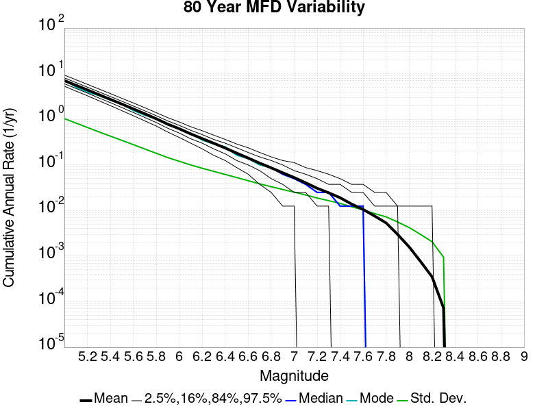
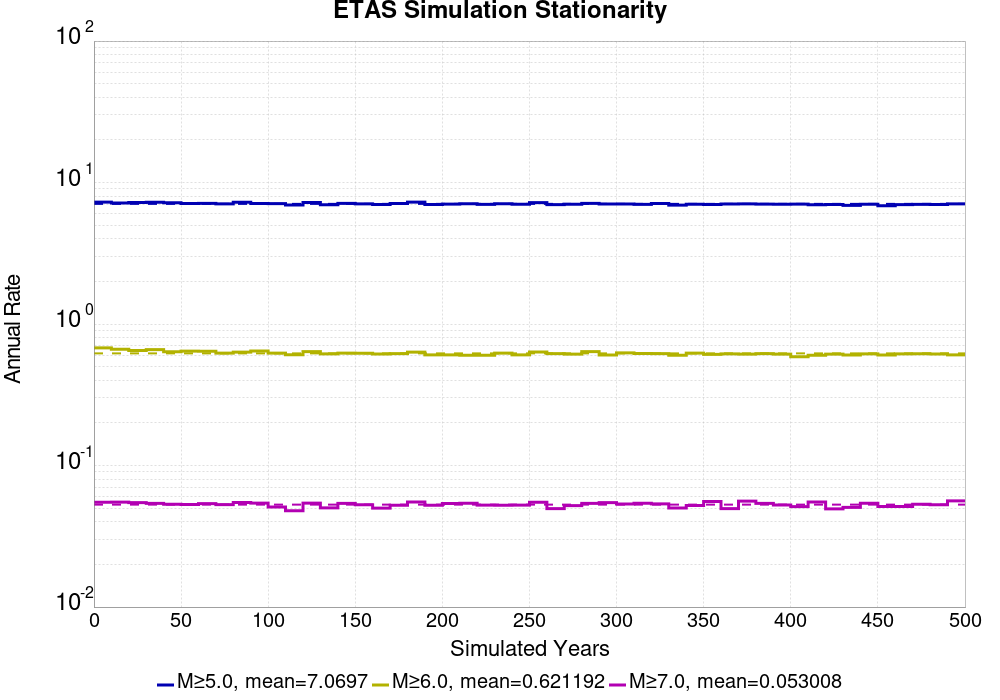
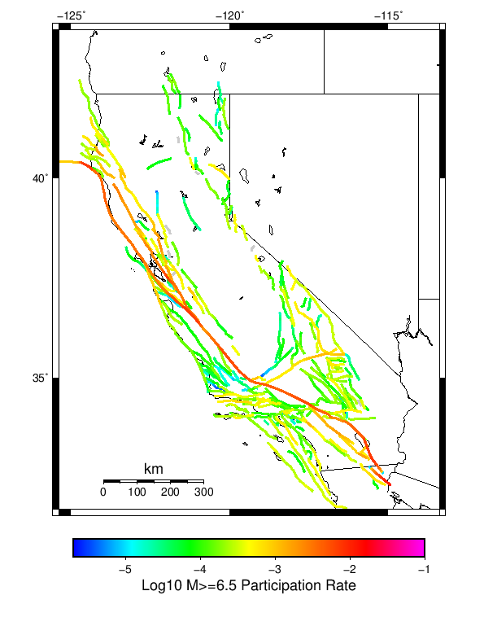
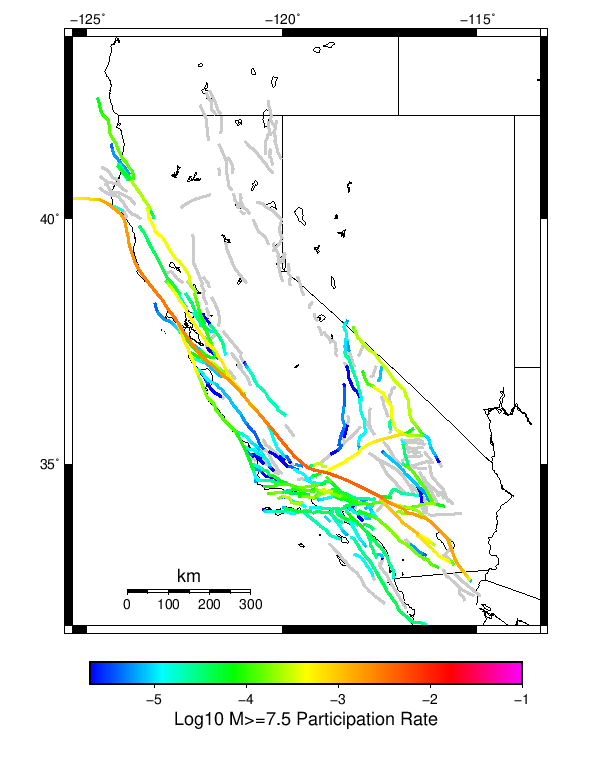
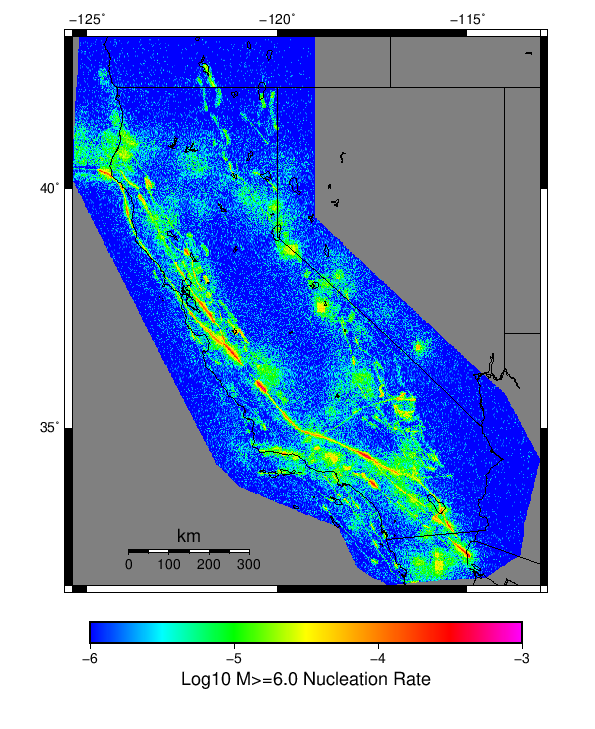

# Start 2012, 500 yr, Scale Factor 1.0, Spontaneous, Historical Catalog Results

|   | Start 2012, 500 yr, Scale Factor 1.0, Spontaneous, Historical Catalog |
|-----|-----|
| Num Simulations | 345 (incomplete) |
| Start Time | 2012/01/01 00:00:00 UTC |
| Start Time Epoch Milliseconds | 1325376000000 |
| Duration | 500 Years |
| Includes Spontaneous? | true |
| Trigger Ruptures | *(none)* |
| Historical Ruptures | 60366 Trigger Ruptures |
|   | First: M7.3 at 1852/01/05 04:40:39 UTC |
|   | Last: M3.2 at 2011/12/31 19:14:44 UTC |
|   | Largest: M7.9 at 1857/01/09 16:25:39 UTC |
| Config Generated With | u3etas_config_builder.sh --start-year 2012 --num-simulations 1000 --duration-years 500 --include-spontaneous --historical-catalog --scale-factor 1.0 --hpc-site USC_HPC --nodes 36 --hours 24 --queue scec |

## Table Of Contents

* [Magnitude Frequency Distribution](#magnitude-frequency-distribution)
* [Long Term Rate Variability](#long-term-rate-variability)
  * [162 Year Variability](#162-year-variability)
  * [80 Year Variability](#80-year-variability)
  * [28 Year Variability](#28-year-variability)
  * [M2.5  Variability Duration Dependence](#m25--variability-duration-dependence)
  * [M5  Variability Duration Dependence](#m5--variability-duration-dependence)
* [Simulation Stationarity](#simulation-stationarity)
* [Section Participation](#section-participation)
  * [Section Participation Plots](#section-participation-plots)
  * [Supra-Seismogenic Parent Sections Table](#supra-seismogenic-parent-sections-table)
  * [M≥6.5 Parent Sections Table](#m65-parent-sections-table)
  * [M≥7 Parent Sections Table](#m7-parent-sections-table)
  * [M≥7.5 Parent Sections Table](#m75-parent-sections-table)
  * [M≥8 Parent Sections Table](#m8-parent-sections-table)
* [Gridded Nucleation](#gridded-nucleation)
* [JSON Input File](#json-input-file)

## Magnitude Frequency Distribution
*[(top)](#table-of-contents)*

**Legend**
* **Mean** (thick black line): mean annual rate across all 345 catalogs
* **2.5%,97.5%** (thin black lines): annual rate percentiles across all 345 catalogs
* **Median** (thin blue line): median annual rate across all 345 catalogs
* **Mode** (thin cyan line): modal annual rate across all 345 catalogs (scaled to annualized value)
* **500 yr Probability** (thin red line): 500 year probability calculated as the fraction of catalogs with at least 1 occurrence
* **500 yr Supraseismogenic Probability** (thin dashed red line): same as above, but only for supraseismogenic ruptures on explicitly modeled UCERF3 faults
* **95% Conf** (light red shaded region): binomial 95% confidence bounds on probability


| Mag | Mean | 2.5 %ile | 97.5 %ile | Median | Mode | 500 yr Probability | 500 yr Supra-Seis Prob |
|-----|-----|-----|-----|-----|-----|-----|-----|
| **M&ge;2.5** | 2271.149 | 2079.892 | 2467.098 | 2267.622 | 2267.622 | 1.000 (100.00%) | 1.000 (100.00%) |
| **M&ge;2.6** | 1804.049 | 1652.056 | 1960.150 | 1801.834 | 1801.834 | 1.000 (100.00%) | 1.000 (100.00%) |
| **M&ge;2.7** | 1432.956 | 1312.062 | 1556.094 | 1430.500 | 1487.928 | 1.000 (100.00%) | 1.000 (100.00%) |
| **M&ge;2.8** | 1138.257 | 1042.684 | 1235.422 | 1137.288 | 1137.288 | 1.000 (100.00%) | 1.000 (100.00%) |
| **M&ge;2.9** | 904.167 | 827.534 | 981.424 | 903.160 | 939.692 | 1.000 (100.00%) | 1.000 (100.00%) |
| **M&ge;3** | 718.129 | 657.094 | 779.502 | 717.282 | 717.282 | 1.000 (100.00%) | 1.000 (100.00%) |
| **M&ge;3.1** | 570.424 | 522.506 | 619.066 | 569.588 | 569.588 | 1.000 (100.00%) | 1.000 (100.00%) |
| **M&ge;3.2** | 453.029 | 414.936 | 492.076 | 452.362 | 486.760 | 1.000 (100.00%) | 1.000 (100.00%) |
| **M&ge;3.3** | 359.805 | 329.510 | 390.588 | 359.416 | 362.470 | 1.000 (100.00%) | 1.000 (100.00%) |
| **M&ge;3.4** | 285.790 | 261.500 | 310.122 | 285.458 | 280.012 | 1.000 (100.00%) | 1.000 (100.00%) |
| **M&ge;3.5** | 226.963 | 207.618 | 246.850 | 226.574 | 227.146 | 1.000 (100.00%) | 1.000 (100.00%) |
| **M&ge;3.6** | 180.247 | 164.718 | 195.400 | 179.930 | 178.364 | 1.000 (100.00%) | 1.000 (100.00%) |
| **M&ge;3.7** | 143.146 | 130.870 | 155.020 | 142.824 | 143.386 | 1.000 (100.00%) | 1.000 (100.00%) |
| **M&ge;3.8** | 113.680 | 103.988 | 123.356 | 113.504 | 116.580 | 1.000 (100.00%) | 1.000 (100.00%) |
| **M&ge;3.9** | 90.256 | 82.514 | 98.298 | 90.178 | 87.858 | 1.000 (100.00%) | 1.000 (100.00%) |
| **M&ge;4** | 71.682 | 65.520 | 78.080 | 71.594 | 72.566 | 1.000 (100.00%) | 1.000 (100.00%) |
| **M&ge;4.1** | 56.911 | 52.150 | 61.904 | 56.848 | 57.486 | 1.000 (100.00%) | 1.000 (100.00%) |
| **M&ge;4.2** | 45.190 | 41.426 | 49.092 | 45.118 | 45.166 | 1.000 (100.00%) | 1.000 (100.00%) |
| **M&ge;4.3** | 35.863 | 32.876 | 39.086 | 35.804 | 36.126 | 1.000 (100.00%) | 1.000 (100.00%) |
| **M&ge;4.4** | 28.455 | 26.066 | 31.008 | 28.462 | 28.750 | 1.000 (100.00%) | 1.000 (100.00%) |
| **M&ge;4.5** | 22.583 | 20.664 | 24.666 | 22.554 | 22.788 | 1.000 (100.00%) | 1.000 (100.00%) |
| **M&ge;4.6** | 17.918 | 16.358 | 19.560 | 17.936 | 18.190 | 1.000 (100.00%) | 1.000 (100.00%) |
| **M&ge;4.7** | 14.208 | 12.926 | 15.554 | 14.192 | 14.444 | 1.000 (100.00%) | 1.000 (100.00%) |
| **M&ge;4.8** | 11.261 | 10.262 | 12.342 | 11.250 | 11.502 | 1.000 (100.00%) | 1.000 (100.00%) |
| **M&ge;4.9** | 8.922 | 8.144 | 9.768 | 8.918 | 8.976 | 1.000 (100.00%) | 1.000 (100.00%) |
| **M&ge;5** | 7.061 | 6.444 | 7.760 | 7.060 | 7.300 | 1.000 (100.00%) | 1.000 (100.00%) |
| **M&ge;5.1** | 5.583 | 5.062 | 6.128 | 5.582 | 5.606 | 1.000 (100.00%) | 1.000 (100.00%) |
| **M&ge;5.2** | 4.411 | 3.976 | 4.826 | 4.410 | 4.478 | 1.000 (100.00%) | 1.000 (100.00%) |
| **M&ge;5.3** | 3.480 | 3.140 | 3.832 | 3.474 | 3.484 | 1.000 (100.00%) | 1.000 (100.00%) |
| **M&ge;5.4** | 2.745 | 2.460 | 3.026 | 2.742 | 2.728 | 1.000 (100.00%) | 1.000 (100.00%) |
| **M&ge;5.5** | 2.159 | 1.924 | 2.400 | 2.158 | 2.226 | 1.000 (100.00%) | 1.000 (100.00%) |
| **M&ge;5.6** | 1.694 | 1.514 | 1.896 | 1.690 | 1.748 | 1.000 (100.00%) | 1.000 (100.00%) |
| **M&ge;5.7** | 1.322 | 1.168 | 1.492 | 1.320 | 1.340 | 1.000 (100.00%) | 1.000 (100.00%) |
| **M&ge;5.8** | 1.028 | 0.906 | 1.164 | 1.026 | 1.040 | 1.000 (100.00%) | 1.000 (100.00%) |
| **M&ge;5.9** | 0.784 | 0.688 | 0.890 | 0.780 | 0.774 | 1.000 (100.00%) | 1.000 (100.00%) |
| **M&ge;6** | 0.621 | 0.538 | 0.702 | 0.620 | 0.622 | 1.000 (100.00%) | 1.000 (100.00%) |
| **M&ge;6.1** | 0.479 | 0.402 | 0.538 | 0.478 | 0.472 | 1.000 (100.00%) | 1.000 (100.00%) |
| **M&ge;6.2** | 0.378 | 0.312 | 0.432 | 0.378 | 0.366 | 1.000 (100.00%) | 1.000 (100.00%) |
| **M&ge;6.3** | 0.298 | 0.242 | 0.352 | 0.298 | 0.306 | 1.000 (100.00%) | 1.000 (100.00%) |
| **M&ge;6.4** | 0.234 | 0.190 | 0.280 | 0.234 | 0.240 | 1.000 (100.00%) | 1.000 (100.00%) |
| **M&ge;6.5** | 0.181 | 0.144 | 0.218 | 0.182 | 0.186 | 1.000 (100.00%) | 1.000 (100.00%) |
| **M&ge;6.6** | 0.142 | 0.112 | 0.174 | 0.144 | 0.148 | 1.000 (100.00%) | 1.000 (100.00%) |
| **M&ge;6.7** | 0.110 | 0.082 | 0.138 | 0.110 | 0.112 | 1.000 (100.00%) | 1.000 (100.00%) |
| **M&ge;6.8** | 0.087 | 0.064 | 0.110 | 0.088 | 0.088 | 1.000 (100.00%) | 1.000 (100.00%) |
| **M&ge;6.9** | 0.067 | 0.048 | 0.086 | 0.068 | 0.072 | 1.000 (100.00%) | 1.000 (100.00%) |
| **M&ge;7** | 0.053 | 0.036 | 0.068 | 0.054 | 0.058 | 1.000 (100.00%) | 1.000 (100.00%) |
| **M&ge;7.1** | 0.041 | 0.028 | 0.056 | 0.040 | 0.040 | 1.000 (100.00%) | 1.000 (100.00%) |
| **M&ge;7.2** | 0.031 | 0.020 | 0.044 | 0.030 | 0.030 | 1.000 (100.00%) | 1.000 (100.00%) |
| **M&ge;7.3** | 0.024 | 0.016 | 0.036 | 0.024 | 0.022 | 1.000 (100.00%) | 1.000 (100.00%) |
| **M&ge;7.4** | 0.019 | 0.010 | 0.030 | 0.018 | 0.018 | 1.000 (100.00%) | 1.000 (100.00%) |
| **M&ge;7.5** | 0.014 | 8.00E-3 | 0.024 | 0.014 | 0.014 | 1.000 (100.00%) | 1.000 (100.00%) |
| **M&ge;7.6** | 0.011 | 6.00E-3 | 0.018 | 0.010 | 0.010 | 1.000 (100.00%) | 1.000 (100.00%) |
| **M&ge;7.7** | 7.68E-3 | 4.00E-3 | 0.012 | 8.00E-3 | 8.00E-3 | 0.997 (99.71%) | 0.997 (99.71%) |
| **M&ge;7.8** | 5.28E-3 | 2.00E-3 | 0.010 | 6.00E-3 | 6.00E-3 | 0.991 (99.13%) | 0.991 (99.13%) |
| **M&ge;7.9** | 3.06E-3 | 0.000 | 6.00E-3 | 2.00E-3 | 2.00E-3 | 0.893 (89.28%) | 0.893 (89.28%) |
| **M&ge;8** | 1.71E-3 | 0.000 | 6.00E-3 | 2.00E-3 | 2.00E-3 | 0.658 (65.80%) | 0.658 (65.80%) |
| **M&ge;8.1** | 8.52E-4 | 0.000 | 4.00E-3 | 0.000 | 0.000 | 0.386 (38.55%) | 0.386 (38.55%) |
| **M&ge;8.2** | 3.54E-4 | 0.000 | 2.00E-3 | 0.000 | 0.000 | 0.174 (17.39%) | 0.174 (17.39%) |
| **M&ge;8.3** | 6.38E-5 | 0.000 | 2.00E-3 | 0.000 | 0.000 | 0.032 (3.19%) | 0.032 (3.19%) |
| **M&ge;8.4** | 0.000 | 0.000 | 0.000 | 0.000 | 0.000 | 0.000 (0.00%) | 0.000 (0.00%) |
| **M&ge;8.5** | 0.000 | 0.000 | 0.000 | 0.000 | 0.000 | 0.000 (0.00%) | 0.000 (0.00%) |
| **M&ge;8.6** | 0.000 | 0.000 | 0.000 | 0.000 | 0.000 | 0.000 (0.00%) | 0.000 (0.00%) |
| **M&ge;8.7** | 0.000 | 0.000 | 0.000 | 0.000 | 0.000 | 0.000 (0.00%) | 0.000 (0.00%) |
| **M&ge;8.8** | 0.000 | 0.000 | 0.000 | 0.000 | 0.000 | 0.000 (0.00%) | 0.000 (0.00%) |
| **M&ge;8.9** | 0.000 | 0.000 | 0.000 | 0.000 | 0.000 | 0.000 (0.00%) | 0.000 (0.00%) |
| **M&ge;9** | 0.000 | 0.000 | 0.000 | 0.000 | 0.000 | 0.000 (0.00%) | 0.000 (0.00%) |


## Long Term Rate Variability
*[(top)](#table-of-contents)*

### 162 Year Variability
*[(top)](#table-of-contents)*


[Download CSV Here](plots/long_term_var_162yr.csv)

| **Magnitude** | Mean | Median | Mode | Std. Dev. | 2.5 %-ile | 16 %-ile | 84 %-ile | 97.5 %-ile |
|-----|-----|-----|-----|-----|-----|-----|-----|-----|
| **2.5** | 2270.4094 | 2268.1667 | 2340.395 | 203.08595 | 1897.7593 | 2061.1729 | 2479.2468 | 2687.1914 |
| **2.6** | 1803.4695 | 1801.5062 | 1766.3704 | 161.35597 | 1508.895 | 1636.2407 | 1969.9073 | 2135.321 |
| **2.7** | 1432.4895 | 1430.1357 | 1452.105 | 128.17346 | 1198.0 | 1301.7284 | 1563.642 | 1692.5247 |
| **2.8** | 1137.8877 | 1136.4321 | 1094.2161 | 101.82004 | 951.9506 | 1032.7593 | 1242.4073 | 1344.8086 |
| **2.9** | 903.8735 | 902.7531 | 868.9136 | 80.88908 | 756.2901 | 820.7901 | 986.5741 | 1068.7654 |
| **3.0** | 717.9 | 717.26544 | 722.14197 | 64.21907 | 600.9506 | 651.8765 | 784.03705 | 848.9136 |
| **3.1** | 570.2399 | 569.7469 | 574.09875 | 51.051346 | 477.46915 | 518.0741 | 623.32715 | 675.2531 |
| **3.2** | 452.88147 | 452.23456 | 442.69754 | 40.56726 | 378.30246 | 411.4074 | 494.76544 | 536.14197 |
| **3.3** | 359.68387 | 359.34567 | 368.62344 | 32.25305 | 300.3395 | 327.01236 | 392.74692 | 426.3395 |
| **3.4** | 285.6897 | 285.37656 | 280.41974 | 25.628386 | 238.66049 | 259.98148 | 312.19754 | 338.29013 |
| **3.5** | 226.88074 | 226.56172 | 226.54938 | 20.377405 | 189.49382 | 206.2963 | 247.7037 | 268.4753 |
| **3.6** | 180.18114 | 179.96913 | 180.93828 | 16.201431 | 150.14197 | 163.79013 | 196.78395 | 213.12346 |
| **3.7** | 143.09352 | 142.82716 | 139.27777 | 12.873748 | 119.320984 | 130.04938 | 156.2963 | 169.37038 |
| **3.8** | 113.63825 | 113.32716 | 111.06173 | 10.227244 | 94.78395 | 103.19753 | 124.15432 | 134.58643 |
| **3.9** | 90.2216 | 89.99383 | 93.61729 | 8.134156 | 74.90124 | 81.895065 | 98.53704 | 107.0 |
| **4.0** | 71.655815 | 71.46296 | 68.950615 | 6.469793 | 59.444443 | 65.05556 | 78.265434 | 84.84568 |
| **4.1** | 56.88918 | 56.660492 | 59.15432 | 5.157567 | 47.148148 | 51.56173 | 62.228394 | 67.487656 |
| **4.2** | 45.174335 | 45.006172 | 44.098766 | 4.0993 | 37.4321 | 40.93827 | 49.37037 | 53.506172 |
| **4.3** | 35.850872 | 35.790123 | 36.290123 | 3.2602227 | 29.709877 | 32.51852 | 39.209877 | 42.38889 |
| **4.4** | 28.445381 | 28.32716 | 29.32716 | 2.6009998 | 23.54321 | 25.80247 | 31.061728 | 33.71605 |
| **4.5** | 22.57498 | 22.5 | 22.030865 | 2.0682664 | 18.734568 | 20.419754 | 24.703703 | 26.641975 |
| **4.6** | 17.91089 | 17.851852 | 17.851852 | 1.6515664 | 14.876543 | 16.185184 | 19.617285 | 21.135803 |
| **4.7** | 14.203155 | 14.197531 | 14.092592 | 1.3225915 | 11.734568 | 12.814815 | 15.580247 | 16.845678 |
| **4.8** | 11.257977 | 11.253086 | 11.265432 | 1.0565593 | 9.302469 | 10.141975 | 12.345679 | 13.37037 |
| **4.9** | 8.920224 | 8.907408 | 9.154321 | 0.8491963 | 7.3333335 | 8.024692 | 9.790123 | 10.592592 |
| **5.0** | 7.0598736 | 7.0617285 | 6.95679 | 0.6784274 | 5.7901235 | 6.351852 | 7.740741 | 8.425926 |
| **5.1** | 5.5826445 | 5.5740743 | 5.54321 | 0.5464492 | 4.5925927 | 5.037037 | 6.1358023 | 6.685185 |
| **5.2** | 4.4099603 | 4.4012346 | 4.5246916 | 0.43419734 | 3.5925925 | 3.993827 | 4.851852 | 5.2901235 |
| **5.3** | 3.4792092 | 3.4691358 | 3.2654321 | 0.35110486 | 2.8271606 | 3.1234567 | 3.8395061 | 4.191358 |
| **5.4** | 2.7433472 | 2.7345679 | 2.6111112 | 0.284772 | 2.2160494 | 2.4629629 | 3.0246913 | 3.2962964 |
| **5.5** | 2.1580307 | 2.154321 | 2.148148 | 0.23227432 | 1.7160494 | 1.9320987 | 2.3950617 | 2.6296296 |
| **5.6** | 1.6932725 | 1.6851852 | 1.6851852 | 0.18551259 | 1.3395061 | 1.5123457 | 1.8765432 | 2.0493827 |
| **5.7** | 1.321924 | 1.3148148 | 1.3580247 | 0.15006024 | 1.037037 | 1.1666666 | 1.4691358 | 1.6234568 |
| **5.8** | 1.027894 | 1.0246913 | 0.9691358 | 0.122086324 | 0.7962963 | 0.90123457 | 1.1481482 | 1.2654321 |
| **5.9** | 0.78472 | 0.7777778 | 0.7592593 | 0.09795034 | 0.60493827 | 0.6851852 | 0.88271606 | 0.9814815 |
| **6.0** | 0.6208803 | 0.61728394 | 0.59876543 | 0.079743795 | 0.47530866 | 0.537037 | 0.69753087 | 0.7839506 |
| **6.1** | 0.47851136 | 0.47530866 | 0.46296296 | 0.065915264 | 0.3580247 | 0.41358024 | 0.54320985 | 0.61728394 |
| **6.2** | 0.37771216 | 0.37654322 | 0.39506173 | 0.056466416 | 0.27160493 | 0.32098764 | 0.4382716 | 0.49382716 |
| **6.3** | 0.29769188 | 0.2962963 | 0.30864197 | 0.04838732 | 0.2037037 | 0.25308642 | 0.34567901 | 0.39506173 |
| **6.4** | 0.23406692 | 0.2345679 | 0.22839506 | 0.041097436 | 0.15432099 | 0.19135803 | 0.27160493 | 0.32098764 |
| **6.5** | 0.1810461 | 0.17901234 | 0.16666667 | 0.035482418 | 0.11728395 | 0.14814815 | 0.21604939 | 0.25308642 |
| **6.6** | 0.14224966 | 0.14197531 | 0.13580246 | 0.03022474 | 0.09259259 | 0.11111111 | 0.17283951 | 0.2037037 |
| **6.7** | 0.10976919 | 0.11111111 | 0.11728395 | 0.025749303 | 0.061728396 | 0.086419754 | 0.13580246 | 0.16049382 |
| **6.8** | 0.086646385 | 0.086419754 | 0.086419754 | 0.022375884 | 0.043209877 | 0.061728396 | 0.11111111 | 0.13580246 |
| **6.9** | 0.0670603 | 0.06790123 | 0.061728396 | 0.01965549 | 0.030864198 | 0.049382716 | 0.086419754 | 0.10493827 |
| **7.0** | 0.05276436 | 0.055555556 | 0.055555556 | 0.016963102 | 0.024691358 | 0.037037037 | 0.06790123 | 0.086419754 |
| **7.1** | 0.040531997 | 0.037037037 | 0.037037037 | 0.014660255 | 0.012345679 | 0.024691358 | 0.055555556 | 0.074074075 |
| **7.2** | 0.030727023 | 0.030864198 | 0.030864198 | 0.012211356 | 0.012345679 | 0.018518519 | 0.043209877 | 0.055555556 |
| **7.3** | 0.024375262 | 0.024691358 | 0.024691358 | 0.010605651 | 0.0061728396 | 0.012345679 | 0.037037037 | 0.049382716 |
| **7.4** | 0.019085107 | 0.018518519 | 0.018518519 | 0.009475199 | 0.0061728396 | 0.012345679 | 0.030864198 | 0.037037037 |
| **7.5** | 0.013800918 | 0.012345679 | 0.012345679 | 0.007925385 | 0.0 | 0.0061728396 | 0.024691358 | 0.030864198 |
| **7.6** | 0.010562414 | 0.012345679 | 0.0061728396 | 0.0067941444 | 0.0 | 0.0061728396 | 0.018518519 | 0.024691358 |
| **7.7** | 0.007628079 | 0.0061728396 | 0.0061728396 | 0.0054312428 | 0.0 | 0.0 | 0.012345679 | 0.018518519 |
| **7.8** | 0.0052484046 | 0.0061728396 | 0.0061728396 | 0.0044847317 | 0.0 | 0.0 | 0.012345679 | 0.012345679 |
| **7.9** | 0.0030357249 | 0.0 | 0.0 | 0.0034908308 | 0.0 | 0.0 | 0.0061728396 | 0.012345679 |
| **8.0** | 0.0017057315 | 0.0 | 0.0 | 0.002879301 | 0.0 | 0.0 | 0.0061728396 | 0.0061728396 |
| **8.1** | 8.3497347E-4 | 0.0 | 0.0 | 0.0021121758 | 0.0 | 0.0 | 0.0 | 0.0061728396 |
| **8.2** | 3.399535E-4 | 0.0 | 0.0 | 0.0014088391 | 0.0 | 0.0 | 0.0 | 0.0061728396 |
| **8.3** | 5.9640963E-5 | 0.0 | 0.0 | 6.0411065E-4 | 0.0 | 0.0 | 0.0 | 0.0 |
| **8.4** | 0.0 | 0.0 | 0.0 | 0.0 | 0.0 | 0.0 | 0.0 | 0.0 |
| **8.5** | 0.0 | 0.0 | 0.0 | 0.0 | 0.0 | 0.0 | 0.0 | 0.0 |
| **8.6** | 0.0 | 0.0 | 0.0 | 0.0 | 0.0 | 0.0 | 0.0 | 0.0 |
| **8.7** | 0.0 | 0.0 | 0.0 | 0.0 | 0.0 | 0.0 | 0.0 | 0.0 |
| **8.8** | 0.0 | 0.0 | 0.0 | 0.0 | 0.0 | 0.0 | 0.0 | 0.0 |
| **8.9** | 0.0 | 0.0 | 0.0 | 0.0 | 0.0 | 0.0 | 0.0 | 0.0 |
| **9.0** | 0.0 | 0.0 | 0.0 | 0.0 | 0.0 | 0.0 | 0.0 | 0.0 |

### 80 Year Variability
*[(top)](#table-of-contents)*



[Download CSV Here](plots/long_term_var_80yr.csv)

| **Magnitude** | Mean | Median | Mode | Std. Dev. | 2.5 %-ile | 16 %-ile | 84 %-ile | 97.5 %-ile |
|-----|-----|-----|-----|-----|-----|-----|-----|-----|
| **2.5** | 2271.0542 | 2237.35 | 2266.55 | 319.24 | 1754.05 | 1953.875 | 2594.5625 | 2954.875 |
| **2.6** | 1803.984 | 1776.2 | 1779.4125 | 253.53656 | 1394.1375 | 1551.7125 | 2060.725 | 2347.5874 |
| **2.7** | 1432.8942 | 1410.625 | 1378.6125 | 201.4051 | 1105.9375 | 1232.1 | 1635.875 | 1864.125 |
| **2.8** | 1138.2042 | 1120.5 | 1114.9125 | 159.9863 | 878.0875 | 979.85 | 1298.55 | 1482.2125 |
| **2.9** | 904.12445 | 889.825 | 840.95 | 127.07125 | 698.8 | 778.8625 | 1032.225 | 1177.8 |
| **3.0** | 718.1011 | 707.0375 | 646.05 | 100.90934 | 555.6875 | 618.7625 | 819.75 | 936.1125 |
| **3.1** | 570.40063 | 561.1625 | 580.4875 | 80.18189 | 441.15 | 490.55 | 651.25 | 743.1625 |
| **3.2** | 453.01202 | 445.6125 | 471.3 | 63.692497 | 349.4 | 389.7375 | 516.825 | 590.6 |
| **3.3** | 359.79517 | 353.8625 | 346.55 | 50.598904 | 277.6 | 309.525 | 410.975 | 469.2125 |
| **3.4** | 285.77777 | 281.125 | 251.8125 | 40.191307 | 220.35 | 246.075 | 326.1625 | 373.4125 |
| **3.5** | 226.94833 | 223.2125 | 229.0 | 31.941895 | 175.2875 | 195.05 | 259.0625 | 296.05 |
| **3.6** | 180.23495 | 177.25 | 172.7375 | 25.37458 | 139.125 | 155.025 | 205.75 | 235.675 |
| **3.7** | 143.13388 | 140.8875 | 154.4 | 20.160759 | 110.4875 | 123.1625 | 163.425 | 186.95 |
| **3.8** | 113.67021 | 112.0625 | 125.9625 | 16.018538 | 87.35 | 97.9375 | 129.95 | 148.95 |
| **3.9** | 90.24805 | 88.9875 | 86.95 | 12.726468 | 69.4125 | 77.5625 | 102.925 | 118.1 |
| **4.0** | 71.676735 | 70.6875 | 73.275 | 10.123218 | 55.0875 | 61.675 | 81.775 | 93.5375 |
| **4.1** | 56.904613 | 56.175 | 51.0 | 8.057021 | 43.7125 | 48.85 | 64.8875 | 74.4875 |
| **4.2** | 45.18574 | 44.575 | 50.05 | 6.405778 | 34.675 | 38.7625 | 51.6125 | 58.775 |
| **4.3** | 35.86128 | 35.3875 | 34.6125 | 5.10473 | 27.4875 | 30.7625 | 41.0625 | 46.7 |
| **4.4** | 28.453255 | 28.1 | 28.8875 | 4.0657134 | 21.7625 | 24.35 | 32.625 | 37.2125 |
| **4.5** | 22.58143 | 22.2875 | 23.3875 | 3.2345912 | 17.3 | 19.325 | 25.9125 | 29.475 |
| **4.6** | 17.916267 | 17.7 | 16.4125 | 2.585606 | 13.575 | 15.3125 | 20.575 | 23.475 |
| **4.7** | 14.207753 | 14.025 | 14.35 | 2.0621674 | 10.75 | 12.1375 | 16.3 | 18.65 |
| **4.8** | 11.261974 | 11.125 | 10.275 | 1.6414857 | 8.5 | 9.625 | 12.9125 | 14.8 |
| **4.9** | 8.923273 | 8.825 | 8.1625 | 1.315528 | 6.6875 | 7.6125 | 10.2375 | 11.7375 |
| **5.0** | 7.0621195 | 6.975 | 6.85 | 1.046659 | 5.2875 | 6.0125 | 8.0875 | 9.25 |
| **5.1** | 5.5843964 | 5.5125 | 5.075 | 0.8410217 | 4.15 | 4.7625 | 6.4125 | 7.3875 |
| **5.2** | 4.4110265 | 4.3625 | 3.9125 | 0.66663337 | 3.275 | 3.75 | 5.0625 | 5.825 |
| **5.3** | 3.48032 | 3.45 | 3.2875 | 0.53521305 | 2.5625 | 2.9375 | 4.0 | 4.6125 |
| **5.4** | 2.7443056 | 2.7125 | 2.4875 | 0.43168795 | 2.0 | 2.3125 | 3.1625 | 3.675 |
| **5.5** | 2.1586595 | 2.1375 | 2.125 | 0.34859583 | 1.55 | 1.8125 | 2.5 | 2.8875 |
| **5.6** | 1.6940821 | 1.6875 | 1.6125 | 0.2782607 | 1.2 | 1.4125 | 1.9625 | 2.2625 |
| **5.7** | 1.3226268 | 1.3125 | 1.4 | 0.22312371 | 0.925 | 1.1 | 1.5375 | 1.775 |
| **5.8** | 1.0282911 | 1.025 | 0.8875 | 0.17956349 | 0.7125 | 0.85 | 1.2 | 1.4 |
| **5.9** | 0.7849758 | 0.775 | 0.75 | 0.14504972 | 0.525 | 0.6375 | 0.925 | 1.1 |
| **6.0** | 0.6212198 | 0.6125 | 0.6125 | 0.120558694 | 0.4 | 0.5 | 0.7375 | 0.8875 |
| **6.1** | 0.47872585 | 0.475 | 0.5 | 0.09973196 | 0.3 | 0.3875 | 0.575 | 0.6875 |
| **6.2** | 0.37794685 | 0.375 | 0.375 | 0.08504547 | 0.225 | 0.3 | 0.4625 | 0.5625 |
| **6.3** | 0.29800725 | 0.3 | 0.2875 | 0.07272477 | 0.1625 | 0.225 | 0.3625 | 0.4625 |
| **6.4** | 0.23434179 | 0.2375 | 0.2375 | 0.061803672 | 0.125 | 0.175 | 0.2875 | 0.375 |
| **6.5** | 0.18127416 | 0.175 | 0.175 | 0.05290433 | 0.0875 | 0.125 | 0.2375 | 0.2875 |
| **6.6** | 0.14244565 | 0.1375 | 0.1375 | 0.04538994 | 0.0625 | 0.1 | 0.1875 | 0.2375 |
| **6.7** | 0.10987319 | 0.1125 | 0.1125 | 0.038713437 | 0.0375 | 0.075 | 0.15 | 0.1875 |
| **6.8** | 0.08672705 | 0.0875 | 0.0875 | 0.033627912 | 0.025 | 0.05 | 0.1125 | 0.1625 |
| **6.9** | 0.0671558 | 0.0625 | 0.0625 | 0.029315524 | 0.0125 | 0.0375 | 0.1 | 0.125 |
| **7.0** | 0.05282005 | 0.05 | 0.05 | 0.025625989 | 0.0125 | 0.025 | 0.075 | 0.1125 |
| **7.1** | 0.04057367 | 0.0375 | 0.0375 | 0.022145249 | 0.0 | 0.0125 | 0.0625 | 0.0875 |
| **7.2** | 0.03075483 | 0.025 | 0.025 | 0.019182032 | 0.0 | 0.0125 | 0.05 | 0.075 |
| **7.3** | 0.024408212 | 0.025 | 0.0125 | 0.016786624 | 0.0 | 0.0125 | 0.0375 | 0.0625 |
| **7.4** | 0.019088164 | 0.0125 | 0.0125 | 0.014768189 | 0.0 | 0.0 | 0.0375 | 0.05 |
| **7.5** | 0.013786232 | 0.0125 | 0.0125 | 0.012311541 | 0.0 | 0.0 | 0.025 | 0.0375 |
| **7.6** | 0.010561594 | 0.0125 | 0.0125 | 0.0105764475 | 0.0 | 0.0 | 0.025 | 0.0375 |
| **7.7** | 0.0076268115 | 0.0 | 0.0 | 0.008769729 | 0.0 | 0.0 | 0.0125 | 0.025 |
| **7.8** | 0.005235507 | 0.0 | 0.0 | 0.007259648 | 0.0 | 0.0 | 0.0125 | 0.025 |
| **7.9** | 0.003031401 | 0.0 | 0.0 | 0.005633629 | 0.0 | 0.0 | 0.0125 | 0.0125 |
| **8.0** | 0.0017149758 | 0.0 | 0.0 | 0.004405818 | 0.0 | 0.0 | 0.0 | 0.0125 |
| **8.1** | 8.454106E-4 | 0.0 | 0.0 | 0.0031396935 | 0.0 | 0.0 | 0.0 | 0.0125 |
| **8.2** | 3.442029E-4 | 0.0 | 0.0 | 0.0020459918 | 0.0 | 0.0 | 0.0 | 0.0125 |
| **8.3** | 6.0386472E-5 | 0.0 | 0.0 | 8.6691836E-4 | 0.0 | 0.0 | 0.0 | 0.0 |
| **8.4** | 0.0 | 0.0 | 0.0 | 0.0 | 0.0 | 0.0 | 0.0 | 0.0 |
| **8.5** | 0.0 | 0.0 | 0.0 | 0.0 | 0.0 | 0.0 | 0.0 | 0.0 |
| **8.6** | 0.0 | 0.0 | 0.0 | 0.0 | 0.0 | 0.0 | 0.0 | 0.0 |
| **8.7** | 0.0 | 0.0 | 0.0 | 0.0 | 0.0 | 0.0 | 0.0 | 0.0 |
| **8.8** | 0.0 | 0.0 | 0.0 | 0.0 | 0.0 | 0.0 | 0.0 | 0.0 |
| **8.9** | 0.0 | 0.0 | 0.0 | 0.0 | 0.0 | 0.0 | 0.0 | 0.0 |
| **9.0** | 0.0 | 0.0 | 0.0 | 0.0 | 0.0 | 0.0 | 0.0 | 0.0 |

### 28 Year Variability
*[(top)](#table-of-contents)*


[Download CSV Here](plots/long_term_var_28yr.csv)

| **Magnitude** | Mean | Median | Mode | Std. Dev. | 2.5 %-ile | 16 %-ile | 84 %-ile | 97.5 %-ile |
|-----|-----|-----|-----|-----|-----|-----|-----|-----|
| **2.5** | 2271.4736 | 2129.1428 | 1976.5358 | 559.91565 | 1586.9286 | 1788.7858 | 2759.8572 | 3768.4644 |
| **2.6** | 1804.3229 | 1691.0358 | 1684.6072 | 444.72098 | 1260.0358 | 1420.9286 | 2190.8928 | 2990.7144 |
| **2.7** | 1433.1627 | 1342.3928 | 1372.6072 | 353.33356 | 1000.9643 | 1128.8928 | 1739.1428 | 2375.6072 |
| **2.8** | 1138.4169 | 1067.3928 | 1033.0358 | 280.74164 | 795.0357 | 896.9643 | 1382.8928 | 1887.8928 |
| **2.9** | 904.2962 | 847.5357 | 788.4643 | 223.05981 | 630.9643 | 712.5357 | 1098.5714 | 1499.9286 |
| **3.0** | 718.24194 | 673.7857 | 645.0 | 177.18654 | 501.17856 | 565.75 | 873.3571 | 1191.4642 |
| **3.1** | 570.5114 | 535.3214 | 439.5357 | 140.8391 | 397.42856 | 449.32144 | 692.6429 | 946.5714 |
| **3.2** | 453.1027 | 425.07144 | 414.25 | 111.86503 | 315.14285 | 356.75 | 549.5 | 750.25 |
| **3.3** | 359.8673 | 337.4643 | 351.4643 | 88.872086 | 249.89285 | 283.32144 | 436.5 | 596.6786 |
| **3.4** | 285.8315 | 268.0357 | 247.28572 | 70.6027 | 198.35715 | 225.0 | 347.17856 | 474.75 |
| **3.5** | 226.99188 | 212.92857 | 188.28572 | 56.116646 | 157.57143 | 178.75 | 275.4643 | 375.89285 |
| **3.6** | 180.26895 | 169.21428 | 152.46428 | 44.58053 | 124.67857 | 141.85715 | 218.5 | 299.2857 |
| **3.7** | 143.15942 | 134.46428 | 127.03571 | 35.394787 | 98.96429 | 112.71429 | 173.53572 | 237.53572 |
| **3.8** | 113.68962 | 106.78571 | 100.64286 | 28.125639 | 78.39286 | 89.42857 | 138.07143 | 188.89285 |
| **3.9** | 90.263054 | 84.89286 | 78.28571 | 22.344484 | 61.92857 | 71.10714 | 109.64286 | 149.60715 |
| **4.0** | 71.68859 | 67.42857 | 58.42857 | 17.771294 | 49.17857 | 56.42857 | 87.21429 | 119.0 |
| **4.1** | 56.913292 | 53.57143 | 47.17857 | 14.13565 | 38.892857 | 44.67857 | 69.21429 | 94.67857 |
| **4.2** | 45.191944 | 42.57143 | 38.714287 | 11.238317 | 30.821428 | 35.5 | 54.892857 | 75.07143 |
| **4.3** | 35.866516 | 33.785713 | 29.357143 | 8.943809 | 24.214285 | 28.178572 | 43.714287 | 59.67857 |
| **4.4** | 28.45654 | 26.821428 | 25.321428 | 7.1282964 | 19.142857 | 22.321428 | 34.785713 | 47.32143 |
| **4.5** | 22.583418 | 21.321428 | 18.178572 | 5.677247 | 15.107142 | 17.642857 | 27.535715 | 37.607143 |
| **4.6** | 17.917915 | 16.892857 | 14.25 | 4.5253425 | 11.892858 | 14.0 | 21.821428 | 29.785715 |
| **4.7** | 14.208677 | 13.464286 | 11.785714 | 3.6033494 | 9.428572 | 11.071428 | 17.321428 | 23.535715 |
| **4.8** | 11.263421 | 10.678572 | 9.285714 | 2.871275 | 7.357143 | 8.714286 | 13.821428 | 18.714285 |
| **4.9** | 8.924577 | 8.464286 | 7.607143 | 2.296965 | 5.75 | 6.892857 | 10.928572 | 14.821428 |
| **5.0** | 7.0630617 | 6.714286 | 6.107143 | 1.8355914 | 4.464286 | 5.428571 | 8.678572 | 11.678572 |
| **5.1** | 5.585288 | 5.321429 | 4.535714 | 1.4714688 | 3.5 | 4.25 | 6.928571 | 9.285714 |
| **5.2** | 4.4116187 | 4.214286 | 3.607143 | 1.1735504 | 2.6785715 | 3.357143 | 5.464286 | 7.357143 |
| **5.3** | 3.480447 | 3.3214285 | 3.0714285 | 0.94018364 | 2.107143 | 2.607143 | 4.321429 | 5.857143 |
| **5.4** | 2.7443247 | 2.607143 | 2.5357144 | 0.75542206 | 1.6071428 | 2.0357144 | 3.4285715 | 4.607143 |
| **5.5** | 2.1586835 | 2.0714285 | 1.7857143 | 0.6057604 | 1.25 | 1.6071428 | 2.7142856 | 3.642857 |
| **5.6** | 1.6942029 | 1.6428572 | 1.4285715 | 0.48543388 | 0.9285714 | 1.25 | 2.142857 | 2.857143 |
| **5.7** | 1.3227134 | 1.2857143 | 1.2857143 | 0.3905263 | 0.71428573 | 0.96428573 | 1.6785715 | 2.25 |
| **5.8** | 1.0283583 | 1.0 | 0.96428573 | 0.31202447 | 0.5 | 0.71428573 | 1.3214285 | 1.75 |
| **5.9** | 0.7851175 | 0.75 | 0.75 | 0.2500593 | 0.35714287 | 0.53571427 | 1.0357143 | 1.3571428 |
| **6.0** | 0.6213007 | 0.60714287 | 0.5714286 | 0.20766428 | 0.2857143 | 0.42857143 | 0.8214286 | 1.0714285 |
| **6.1** | 0.47871757 | 0.4642857 | 0.39285713 | 0.17356703 | 0.17857143 | 0.32142857 | 0.64285713 | 0.85714287 |
| **6.2** | 0.3779564 | 0.35714287 | 0.32142857 | 0.1465683 | 0.14285715 | 0.25 | 0.53571427 | 0.71428573 |
| **6.3** | 0.29802704 | 0.2857143 | 0.2857143 | 0.12567067 | 0.071428575 | 0.17857143 | 0.42857143 | 0.5714286 |
| **6.4** | 0.23439288 | 0.21428572 | 0.17857143 | 0.10728586 | 0.071428575 | 0.14285715 | 0.32142857 | 0.4642857 |
| **6.5** | 0.18130557 | 0.17857143 | 0.14285715 | 0.09205251 | 0.035714287 | 0.10714286 | 0.2857143 | 0.39285713 |
| **6.6** | 0.14241262 | 0.14285715 | 0.10714286 | 0.079450086 | 0.0 | 0.071428575 | 0.21428572 | 0.32142857 |
| **6.7** | 0.109883085 | 0.10714286 | 0.10714286 | 0.068219095 | 0.0 | 0.035714287 | 0.17857143 | 0.25 |
| **6.8** | 0.08676166 | 0.071428575 | 0.071428575 | 0.05928593 | 0.0 | 0.035714287 | 0.14285715 | 0.21428572 |
| **6.9** | 0.06718426 | 0.071428575 | 0.035714287 | 0.051560737 | 0.0 | 0.0 | 0.10714286 | 0.17857143 |
| **7.0** | 0.05288637 | 0.035714287 | 0.035714287 | 0.045539122 | 0.0 | 0.0 | 0.10714286 | 0.14285715 |
| **7.1** | 0.04059798 | 0.035714287 | 0.035714287 | 0.039821595 | 0.0 | 0.0 | 0.071428575 | 0.14285715 |
| **7.2** | 0.03076361 | 0.035714287 | 0.0 | 0.034361888 | 0.0 | 0.0 | 0.071428575 | 0.10714286 |
| **7.3** | 0.024418464 | 0.0 | 0.0 | 0.030074792 | 0.0 | 0.0 | 0.035714287 | 0.10714286 |
| **7.4** | 0.019090245 | 0.0 | 0.0 | 0.026239138 | 0.0 | 0.0 | 0.035714287 | 0.071428575 |
| **7.5** | 0.013786384 | 0.0 | 0.0 | 0.021955084 | 0.0 | 0.0 | 0.035714287 | 0.071428575 |
| **7.6** | 0.010565096 | 0.0 | 0.0 | 0.019103296 | 0.0 | 0.0 | 0.035714287 | 0.071428575 |
| **7.7** | 0.0076360977 | 0.0 | 0.0 | 0.016087806 | 0.0 | 0.0 | 0.035714287 | 0.035714287 |
| **7.8** | 0.005249056 | 0.0 | 0.0 | 0.0133659 | 0.0 | 0.0 | 0.0 | 0.035714287 |
| **7.9** | 0.0030386068 | 0.0 | 0.0 | 0.010159762 | 0.0 | 0.0 | 0.0 | 0.035714287 |
| **8.0** | 0.0017172087 | 0.0 | 0.0 | 0.0076980577 | 0.0 | 0.0 | 0.0 | 0.035714287 |
| **8.1** | 8.4033614E-4 | 0.0 | 0.0 | 0.0054139486 | 0.0 | 0.0 | 0.0 | 0.0 |
| **8.2** | 3.4709537E-4 | 0.0 | 0.0 | 0.0035039808 | 0.0 | 0.0 | 0.0 | 0.0 |
| **8.3** | 6.0893923E-5 | 0.0 | 0.0 | 0.0014735825 | 0.0 | 0.0 | 0.0 | 0.0 |
| **8.4** | 0.0 | 0.0 | 0.0 | 0.0 | 0.0 | 0.0 | 0.0 | 0.0 |
| **8.5** | 0.0 | 0.0 | 0.0 | 0.0 | 0.0 | 0.0 | 0.0 | 0.0 |
| **8.6** | 0.0 | 0.0 | 0.0 | 0.0 | 0.0 | 0.0 | 0.0 | 0.0 |
| **8.7** | 0.0 | 0.0 | 0.0 | 0.0 | 0.0 | 0.0 | 0.0 | 0.0 |
| **8.8** | 0.0 | 0.0 | 0.0 | 0.0 | 0.0 | 0.0 | 0.0 | 0.0 |
| **8.9** | 0.0 | 0.0 | 0.0 | 0.0 | 0.0 | 0.0 | 0.0 | 0.0 |
| **9.0** | 0.0 | 0.0 | 0.0 | 0.0 | 0.0 | 0.0 | 0.0 | 0.0 |

### M2.5  Variability Duration Dependence
*[(top)](#table-of-contents)*


[Download CSV Here](plots/long_term_var_m2.5.csv)

| **Duration (years)** | Mean | Median | Mode | Std. Dev. | 2.5 %-ile | 16 %-ile | 84 %-ile | 97.5 %-ile |
|-----|-----|-----|-----|-----|-----|-----|-----|-----|
| **1.0** | 2271.1494 | 1737.0 | 1495.0 | 2272.5735 | 1263.0 | 1428.0 | 2616.0 | 6774.0 |
| **4.0** | 2271.1494 | 1881.5 | 1638.5 | 1305.9084 | 1376.75 | 1549.25 | 2758.0 | 6036.5 |
| **8.0** | 2270.236 | 1964.0 | 1711.875 | 978.3883 | 1442.5 | 1623.125 | 2811.875 | 5101.75 |
| **12.0** | 2270.6057 | 2015.8334 | 1823.0 | 820.63257 | 1483.4166 | 1674.0 | 2839.5833 | 4595.3335 |
| **16.0** | 2270.236 | 2055.8125 | 2079.0625 | 721.077 | 1517.625 | 1711.0625 | 2831.6875 | 4281.5 |
| **20.0** | 2271.1494 | 2083.65 | 1883.05 | 656.1288 | 1540.4 | 1738.3 | 2815.6 | 4058.9 |
| **24.0** | 2271.0542 | 2109.9167 | 1711.0834 | 601.73895 | 1562.7916 | 1765.6666 | 2768.0417 | 3904.875 |
| **28.0** | 2271.4736 | 2129.1428 | 1976.5358 | 559.91565 | 1586.9286 | 1788.7858 | 2759.8572 | 3768.4644 |
| **32.0** | 2271.0542 | 2149.6562 | 2087.0625 | 521.78845 | 1606.9688 | 1808.2188 | 2736.4375 | 3647.1562 |
| **36.0** | 2272.5227 | 2154.4167 | 2221.4167 | 497.71576 | 1625.7778 | 1824.7222 | 2718.4443 | 3535.861 |
| **40.0** | 2271.0542 | 2173.975 | 2031.0 | 467.8859 | 1626.6 | 1838.175 | 2702.2 | 3451.3 |
| **44.0** | 2271.1428 | 2181.3865 | 2094.5908 | 444.07916 | 1647.841 | 1858.0682 | 2692.6592 | 3352.4092 |
| **48.0** | 2271.0542 | 2192.3333 | 2045.9584 | 428.3089 | 1654.3541 | 1869.6666 | 2671.5 | 3313.6875 |
| **52.0** | 2272.5227 | 2205.8655 | 2122.4038 | 403.84943 | 1685.0385 | 1887.4807 | 2665.4807 | 3231.0576 |
| **56.0** | 2274.6675 | 2216.8928 | 2142.0894 | 391.52307 | 1690.3572 | 1897.0178 | 2640.4106 | 3197.4644 |
| **60.0** | 2271.0542 | 2216.2834 | 2059.1667 | 374.25354 | 1702.8 | 1913.6 | 2650.0833 | 3146.45 |
| **64.0** | 2274.6675 | 2223.2812 | 2100.7812 | 366.0895 | 1719.3125 | 1922.0312 | 2636.0312 | 3136.6875 |
| **68.0** | 2271.4736 | 2230.8823 | 2156.8088 | 355.5713 | 1723.4117 | 1920.9706 | 2624.4119 | 3046.9707 |
| **72.0** | 2275.0347 | 2241.625 | 2230.5417 | 341.57028 | 1739.9166 | 1933.8889 | 2610.361 | 3041.486 |
| **76.0** | 2273.378 | 2240.842 | 2088.408 | 322.56665 | 1764.3158 | 1945.0922 | 2591.6711 | 2998.092 |
| **80.0** | 2271.0542 | 2237.35 | 2266.55 | 319.24 | 1754.05 | 1953.875 | 2594.5625 | 2954.875 |
| **84.0** | 2274.3035 | 2239.1904 | 2227.8215 | 310.77975 | 1772.0714 | 1965.9524 | 2600.274 | 2955.262 |
| **88.0** | 2274.3525 | 2246.0454 | 2318.682 | 297.85208 | 1785.0682 | 1970.2727 | 2570.5 | 2916.307 |
| **92.0** | 2272.7964 | 2250.6956 | 2336.2173 | 290.03812 | 1791.0435 | 1974.7283 | 2574.7065 | 2874.3914 |
| **96.0** | 2271.0542 | 2252.9792 | 2334.9792 | 284.82498 | 1795.0521 | 1980.2291 | 2553.3438 | 2839.7395 |
| **100.0** | 2271.1494 | 2254.58 | 2248.15 | 280.13202 | 1795.63 | 1988.76 | 2553.75 | 2852.08 |
| **200.0** | 2275.346 | 2267.63 | 2299.7 | 174.54684 | 1948.495 | 2096.64 | 2451.465 | 2613.135 |
| **300.0** | 2280.7227 | 2276.97 | 2276.97 | 132.99078 | 2053.4 | 2142.7266 | 2422.1633 | 2535.17 |
| **400.0** | 2275.346 | 2272.6975 | 2272.6975 | 109.93247 | 2055.7124 | 2172.3474 | 2380.4026 | 2495.185 |
| **500.0** | 2271.1494 | 2267.622 | 2267.622 | 97.05069 | 2079.892 | 2181.056 | 2361.144 | 2467.098 |

### M5  Variability Duration Dependence
*[(top)](#table-of-contents)*


[Download CSV Here](plots/long_term_var_m5.csv)

| **Duration (years)** | Mean | Median | Mode | Std. Dev. | 2.5 %-ile | 16 %-ile | 84 %-ile | 97.5 %-ile |
|-----|-----|-----|-----|-----|-----|-----|-----|-----|
| **1.0** | 7.060754 | 5.0 | 4.0 | 7.7226343 | 1.0 | 3.0 | 10.0 | 23.0 |
| **4.0** | 7.060754 | 6.0 | 4.75 | 4.346542 | 2.75 | 4.0 | 9.25 | 19.0 |
| **8.0** | 7.0584383 | 6.25 | 5.5 | 3.2345874 | 3.5 | 4.625 | 9.125 | 16.0 |
| **12.0** | 7.060233 | 6.4166665 | 5.8333335 | 2.7085578 | 3.8333333 | 4.9166665 | 9.166667 | 14.333333 |
| **16.0** | 7.0584383 | 6.5 | 5.5 | 2.3769543 | 4.0625 | 5.0625 | 9.0 | 13.4375 |
| **20.0** | 7.060754 | 6.6 | 6.25 | 2.1506314 | 4.25 | 5.2 | 8.9 | 12.75 |
| **24.0** | 7.0621195 | 6.625 | 5.7083335 | 1.9749659 | 4.375 | 5.3333335 | 8.75 | 12.166667 |
| **28.0** | 7.0630617 | 6.714286 | 6.107143 | 1.8355914 | 4.464286 | 5.428571 | 8.678572 | 11.678572 |
| **32.0** | 7.0621195 | 6.75 | 6.25 | 1.7148819 | 4.59375 | 5.46875 | 8.59375 | 11.4375 |
| **36.0** | 7.0660906 | 6.7777777 | 6.1944447 | 1.6315198 | 4.6944447 | 5.5555553 | 8.527778 | 11.055555 |
| **40.0** | 7.0621195 | 6.8 | 6.4 | 1.5345311 | 4.8 | 5.6 | 8.5 | 10.775 |
| **44.0** | 7.062762 | 6.840909 | 6.3863635 | 1.4540799 | 4.818182 | 5.681818 | 8.454545 | 10.477273 |
| **48.0** | 7.0621195 | 6.875 | 6.3125 | 1.4036183 | 4.8958335 | 5.7291665 | 8.375 | 10.354167 |
| **52.0** | 7.0660906 | 6.8846154 | 6.8846154 | 1.3279719 | 5.019231 | 5.769231 | 8.365385 | 10.153846 |
| **56.0** | 7.074321 | 6.910714 | 6.839286 | 1.2819315 | 5.035714 | 5.839286 | 8.303572 | 9.964286 |
| **60.0** | 7.0621195 | 6.9166665 | 7.15 | 1.2376503 | 5.1 | 5.8333335 | 8.316667 | 9.816667 |
| **64.0** | 7.074321 | 6.9375 | 7.015625 | 1.2051083 | 5.140625 | 5.875 | 8.234375 | 9.859375 |
| **68.0** | 7.0630617 | 6.9558825 | 7.3382354 | 1.1740533 | 5.1764708 | 5.882353 | 8.25 | 9.617647 |
| **72.0** | 7.076369 | 6.986111 | 7.1666665 | 1.1287616 | 5.2083335 | 5.9444447 | 8.194445 | 9.527778 |
| **76.0** | 7.069724 | 6.9736843 | 6.75 | 1.0543152 | 5.3026314 | 6.013158 | 8.157895 | 9.289474 |
| **80.0** | 7.0621195 | 6.975 | 6.85 | 1.046659 | 5.2875 | 6.0125 | 8.0875 | 9.25 |
| **84.0** | 7.073906 | 7.0 | 6.642857 | 1.0289974 | 5.2738094 | 6.047619 | 8.095238 | 9.285714 |
| **88.0** | 7.073281 | 7.0227275 | 7.0113635 | 0.9874122 | 5.3636365 | 6.068182 | 8.079545 | 9.170455 |
| **92.0** | 7.067259 | 7.0108695 | 7.097826 | 0.9608691 | 5.369565 | 6.054348 | 8.054348 | 9.032609 |
| **96.0** | 7.0621195 | 7.0104165 | 7.21875 | 0.9460352 | 5.4166665 | 6.09375 | 8.010417 | 8.947917 |
| **100.0** | 7.060754 | 7.0 | 6.73 | 0.9360041 | 5.39 | 6.13 | 7.97 | 8.93 |
| **200.0** | 7.0767465 | 7.06 | 7.585 | 0.6025713 | 5.98 | 6.475 | 7.685 | 8.305 |
| **300.0** | 7.090483 | 7.0733333 | 6.93 | 0.46174154 | 6.3166666 | 6.61 | 7.56 | 7.96 |
| **400.0** | 7.0767465 | 7.0475 | 7.05 | 0.38198826 | 6.325 | 6.7275 | 7.4525 | 7.855 |
| **500.0** | 7.060754 | 7.06 | 7.3 | 0.3400407 | 6.444 | 6.73 | 7.384 | 7.76 |


## Simulation Stationarity
*[(top)](#table-of-contents)*




## Section Participation
*[(top)](#table-of-contents)*

### Section Participation Plots
*[(top)](#table-of-contents)*

| Min Mag | Complete Catalog (including spontaneous) |
|-----|-----|
| **All Supra. Seis.** |  |
| **M&ge;6.5** |  |
| **M&ge;7** |  |
| **M&ge;7.5** |  |
| **M&ge;8** |  |

### Supra-Seismogenic Parent Sections Table
*[(top)](#table-of-contents)*

*First 10 of 313 with matching ruptures shown*

| Parent Name | Total Mean Annual Rate | Total 500 Year Prob |
|-----|-----|-----|
| San Andreas (Parkfield) | 0.041431885 | 1.0 |
| San Andreas (Creeping Section) 2011 CFM | 0.027298551 | 1.0 |
| San Andreas (Mojave S) | 0.018591305 | 1.0 |
| Mendocino | 0.017008696 | 1.0 |
| Cerro Prieto | 0.01230145 | 1.0 |
| Imperial | 0.010881159 | 1.0 |
| Brawley (Seismic Zone) alt 1 | 0.010185507 | 1.0 |
| Hayward (So) 2011 CFM | 0.009333333 | 1.0 |
| San Andreas (Offshore) 2011 CFM | 0.00835942 | 0.9971014 |
| Elsinore (Glen Ivy) rev | 0.007924638 | 0.99130434 |

### M≥6.5 Parent Sections Table
*[(top)](#table-of-contents)*

*First 10 of 304 with matching ruptures shown*

| Parent Name | Total Mean Annual Rate | Total 500 Year Prob |
|-----|-----|-----|
| Cerro Prieto | 0.010695652 | 1.0 |
| San Andreas (Creeping Section) 2011 CFM | 0.010365217 | 0.9971014 |
| Mendocino | 0.0088 | 0.9971014 |
| Hayward (So) 2011 CFM | 0.007965217 | 1.0 |
| Imperial | 0.0076869563 | 1.0 |
| Brawley (Seismic Zone) alt 1 | 0.007304348 | 1.0 |
| San Andreas (Mojave S) | 0.007101449 | 1.0 |
| San Andreas (San Bernardino N) | 0.0065507246 | 0.9971014 |
| San Andreas (Santa Cruz Mts) 2011 CFM | 0.0064869565 | 1.0 |
| San Andreas (Offshore) 2011 CFM | 0.006057971 | 0.9971014 |

### M≥7 Parent Sections Table
*[(top)](#table-of-contents)*

*First 10 of 263 with matching ruptures shown*

| Parent Name | Total Mean Annual Rate | Total 500 Year Prob |
|-----|-----|-----|
| San Andreas (Creeping Section) 2011 CFM | 0.0066550723 | 0.9942029 |
| San Andreas (Carrizo) rev | 0.0055362317 | 1.0 |
| San Andreas (Cholame) rev | 0.005484058 | 1.0 |
| San Andreas (Mojave S) | 0.0052173915 | 0.9971014 |
| San Andreas (Santa Cruz Mts) 2011 CFM | 0.005205797 | 0.9884058 |
| San Andreas (Mojave N) | 0.0048289853 | 1.0 |
| San Andreas (North Coast) 2011 CFM | 0.004631884 | 0.9971014 |
| San Andreas (San Bernardino N) | 0.0045449277 | 0.9884058 |
| San Andreas (Big Bend) | 0.0044173915 | 0.9942029 |
| San Andreas (Parkfield) | 0.0042898552 | 0.973913 |

### M≥7.5 Parent Sections Table
*[(top)](#table-of-contents)*

*First 10 of 192 with matching ruptures shown*

| Parent Name | Total Mean Annual Rate | Total 500 Year Prob |
|-----|-----|-----|
| San Andreas (Mojave N) | 0.004765217 | 1.0 |
| San Andreas (Big Bend) | 0.004324638 | 0.9942029 |
| San Andreas (Mojave S) | 0.0043130433 | 0.98550725 |
| San Andreas (Carrizo) rev | 0.0041333335 | 0.99130434 |
| San Andreas (Cholame) rev | 0.003947826 | 0.97971016 |
| San Andreas (North Coast) 2011 CFM | 0.0037217392 | 0.9884058 |
| San Andreas (San Bernardino N) | 0.003547826 | 0.9478261 |
| San Andreas (Creeping Section) 2011 CFM | 0.0034202898 | 0.9217391 |
| San Andreas (Parkfield) | 0.0030724637 | 0.9217391 |
| San Andreas (Peninsula) 2011 CFM | 0.002915942 | 0.9478261 |

### M≥8 Parent Sections Table
*[(top)](#table-of-contents)*

*First 10 of 51 with matching ruptures shown*

| Parent Name | Total Mean Annual Rate | Total 500 Year Prob |
|-----|-----|-----|
| San Andreas (Mojave N) | 0.0015652174 | 0.6231884 |
| San Andreas (Carrizo) rev | 0.0015478261 | 0.6289855 |
| San Andreas (Big Bend) | 0.0015362318 | 0.62608695 |
| San Andreas (Mojave S) | 0.0015362318 | 0.62028986 |
| San Andreas (Cholame) rev | 0.0015130435 | 0.62028986 |
| San Andreas (San Bernardino N) | 0.0014608696 | 0.6 |
| San Andreas (Parkfield) | 0.0012869565 | 0.5507246 |
| San Andreas (Creeping Section) 2011 CFM | 0.0011594202 | 0.5014493 |
| San Andreas (Santa Cruz Mts) 2011 CFM | 8.057971E-4 | 0.3710145 |
| San Andreas (Peninsula) 2011 CFM | 7.188406E-4 | 0.33333334 |

## Gridded Nucleation
*[(top)](#table-of-contents)*

| Min Mag | Complete Catalog (including spontaneous) |
|-----|-----|
| **M&ge;2.5** |  |
| **M&ge;5** |  |
| **M&ge;6** |  |
| **M&ge;7** |  |


## JSON Input File
*[(top)](#table-of-contents)*

```
{
  "numSimulations": 1000,
  "duration": 500.0,
  "startYear": 2012,
  "includeSpontaneous": true,
  "randomSeed": 1567442579879,
  "binaryOutput": true,
  "binaryOutputFilters": [
    {
      "prefix": "results_complete",
      "descendantsOnly": false
    },
    {
      "prefix": "results_m5_preserve_chain",
      "minMag": 5.0,
      "preserveChainBelowMag": true,
      "descendantsOnly": false
    }
  ],
  "forceRecalc": false,
  "simulationName": "Start 2012, 500 yr, Scale Factor 1.0, Spontaneous, Historical Catalog",
  "numRetries": 3,
  "outputDir": "${ETAS_SIM_DIR}/2019_09_02-Start2012_500yr_ScaleFactor1p0_Spontaneous_HistoricalCatalog-includeSpont-histCatalog-full_td",
  "triggerCatalog": "${ETAS_LAUNCHER}/inputs/u3_historical_catalog.txt",
  "triggerCatalogSurfaceMappings": "${ETAS_LAUNCHER}/inputs/u3_historical_catalog_finite_fault_mappings.xml",
  "treatTriggerCatalogAsSpontaneous": true,
  "cacheDir": "${ETAS_LAUNCHER}/inputs/cache_fm3p1_ba",
  "fssFile": "${ETAS_LAUNCHER}/inputs/2013_05_10-ucerf3p3-production-10runs_COMPOUND_SOL_FM3_1_SpatSeisU3_MEAN_BRANCH_AVG_SOL.zip",
  "probModel": "FULL_TD",
  "applySubSeisForSupraNucl": true,
  "totRateScaleFactor": 1.0,
  "gridSeisCorr": true,
  "timeIndependentERF": false,
  "griddedOnly": false,
  "imposeGR": false,
  "includeIndirectTriggering": true,
  "gridSeisDiscr": 0.1,
  "catalogCompletenessModel": "RELAXED",
  "configCommand": "u3etas_config_builder.sh --start-year 2012 --num-simulations 1000 --duration-years 500 --include-spontaneous --historical-catalog --scale-factor 1.0 --hpc-site USC_HPC --nodes 36 --hours 24 --queue scec",
  "configTime": 1567442579879
}
```

