# Parent Section Magnitude-Probability Distributions

Only fault sections with at least one triggered aftershock are plotted. Sections are sorted by total supraseismogenic trigger rate (decreasing)

## Table Of Contents

* [Garlock (Central)](#garlock-central)
* [Tank Canyon](#tank-canyon)
* [Owl Lake](#owl-lake)
* [Little Lake](#little-lake)
* [Panamint Valley](#panamint-valley)
* [Garlock (East)](#garlock-east)
* [Airport Lake](#airport-lake)
* [Hunter Mountain-Saline Valley](#hunter-mountain-saline-valley)
* [Blackwater](#blackwater)
* [Ash Hill](#ash-hill)
* [Garlock (West)](#garlock-west)
* [McLean Lake](#mclean-lake)
* [Goldstone Lake](#goldstone-lake)
* [Gravel Hills-Harper Lk](#gravel-hills-harper-lk)
* [Coyote Canyon](#coyote-canyon)
* [San Andreas (Mojave N)](#san-andreas-mojave-n)
* [San Andreas (Mojave S)](#san-andreas-mojave-s)
* [So Sierra Nevada](#so-sierra-nevada)
* [Death Valley (So)](#death-valley-so)
* [Nelson Lake](#nelson-lake)
* [Towne Pass](#towne-pass)
* [Lenwood-Lockhart-Old Woman Springs](#lenwood-lockhart-old-woman-springs)
* [San Andreas (San Bernardino N)](#san-andreas-san-bernardino-n)
* [Bicycle Lake](#bicycle-lake)
* [Paradise](#paradise)
* [Garlic Springs](#garlic-springs)
* [San Andreas (San Bernardino S)](#san-andreas-san-bernardino-s)
* [Death Valley (Black Mtns Frontal)](#death-valley-black-mtns-frontal)
* [Coyote Lake](#coyote-lake)
* [San Andreas (Big Bend)](#san-andreas-big-bend)
* [Helendale-So Lockhart](#helendale-so-lockhart)
* [Death Valley (No)](#death-valley-no)
* [San Andreas (San Gorgonio Pass-Garnet HIll)](#san-andreas-san-gorgonio-pass-garnet-hill)
* [San Andreas (Parkfield)](#san-andreas-parkfield)
* [San Andreas (Carrizo) rev](#san-andreas-carrizo-rev)
* [San Andreas (Cholame) rev](#san-andreas-cholame-rev)
* [Death Valley (Fish Lake Valley)](#death-valley-fish-lake-valley)
* [Red Pass](#red-pass)
* [Elsinore (Glen Ivy) rev](#elsinore-glen-ivy-rev)
* [San Andreas (Coachella) rev](#san-andreas-coachella-rev)
* [Sierra Nevada  (No Extension)](#sierra-nevada--no-extension)
* [Calico-Hidalgo](#calico-hidalgo)
* [San Andreas (North Branch Mill Creek)](#san-andreas-north-branch-mill-creek)
* [Ludlow](#ludlow)
* [San Jacinto (San Bernardino)](#san-jacinto-san-bernardino)
* [Baker](#baker)
* [Scodie Lineament](#scodie-lineament)
* [Manix-Afton Hills](#manix-afton-hills)
* [Cady](#cady)
* [White Wolf (Extension)](#white-wolf-extension)
* [San Andreas (Creeping Section) 2011 CFM](#san-andreas-creeping-section-2011-cfm)
* [Cleghorn Lake](#cleghorn-lake)
* [Lake Isabella (Seismicity)](#lake-isabella-seismicity)
* [San Jacinto (San Jacinto Valley) rev](#san-jacinto-san-jacinto-valley-rev)
* [San Jacinto (Anza) rev](#san-jacinto-anza-rev)
* [San Jacinto (Stepovers Combined)](#san-jacinto-stepovers-combined)
* [Blue Cut](#blue-cut)
* [Brawley (Seismic Zone) alt 1](#brawley-seismic-zone-alt-1)
* [Santa Ynez (East)](#santa-ynez-east)
* [Santa Rosa Island](#santa-rosa-island)
* [Pinto Mtn](#pinto-mtn)
* [Imperial](#imperial)
* [Deep Springs](#deep-springs)
* [Santa Ynez (West)](#santa-ynez-west)
* [Cleghorn Pass](#cleghorn-pass)
* [Mission Creek](#mission-creek)
* [Mission Ridge-Arroyo Parida-Santa Ana](#mission-ridge-arroyo-parida-santa-ana)
* [Big Pine (Central)](#big-pine-central)
* [Oceanic - West Huasna](#oceanic---west-huasna)
* [Independence rev 2011](#independence-rev-2011)
* [Chino alt 1](#chino-alt-1)
* [Whittier alt 1](#whittier-alt-1)
* [Pisgah-Bullion Mtn-Mesquite Lk](#pisgah-bullion-mtn-mesquite-lk)
* [Kern Canyon (North Kern) 2011](#kern-canyon-north-kern-2011)
* [Pleito](#pleito)
* [Camp Rock 2011](#camp-rock-2011)
* [Rose Canyon](#rose-canyon)
* [Red Mountain](#red-mountain)
* [Santa Cruz Island](#santa-cruz-island)
* [Lost Hills](#lost-hills)
* [Cleghorn](#cleghorn)
* [White Mountains](#white-mountains)
* [Channel Islands Thrust](#channel-islands-thrust)
* [San Diego Trough north alt1](#san-diego-trough-north-alt1)
* [Big Pine (East)](#big-pine-east)
* [Owens Valley](#owens-valley)
* [Coronado Bank alt1](#coronado-bank-alt1)
* [San Jacinto (Coyote Creek)](#san-jacinto-coyote-creek)
* [Ventura-Pitas Point](#ventura-pitas-point)
* [San Jacinto (Lytle Creek connector)](#san-jacinto-lytle-creek-connector)
* [San Gabriel](#san-gabriel)
* [San Jacinto (Borrego)](#san-jacinto-borrego)
* [Kern Canyon (South Kern) 2011](#kern-canyon-south-kern-2011)
* [Palos Verdes](#palos-verdes)
* [Sheephole](#sheephole)
* [Great Valley 09 (Laguna Seca)](#great-valley-09-laguna-seca)
* [Bullion Mountains](#bullion-mountains)
* [Dry Mountain](#dry-mountain)
* [Tin Mountain](#tin-mountain)
* [San Jacinto (Clark) rev](#san-jacinto-clark-rev)
* [Kern Canyon (Lake Isabella) 2011](#kern-canyon-lake-isabella-2011)
* [San Jacinto (Superstition Mtn)](#san-jacinto-superstition-mtn)
* [Pine Mtn](#pine-mtn)
* [Santa Ynez River](#santa-ynez-river)
* [Hosgri](#hosgri)
* [San Clemente](#san-clemente)
* [Hunting Creek - Berryessa 2011 CFM](#hunting-creek---berryessa-2011-cfm)
* [San Cayetano](#san-cayetano)
* [Malibu Coast alt 1](#malibu-coast-alt-1)
* [White Wolf](#white-wolf)
* [Calaveras (So) 2011 CFM](#calaveras-so-2011-cfm)
* [Malibu Coast (Extension) alt 1](#malibu-coast-extension-alt-1)
* [Elysian Park (Upper)](#elysian-park-upper)
* [San Pedro Basin](#san-pedro-basin)
* [Earthquake Valley (No  Extension)](#earthquake-valley-no--extension)
* [Channel Islands Western Deep Ramp](#channel-islands-western-deep-ramp)
* [Calaveras (So) - Paicines extension 2011 CFM](#calaveras-so---paicines-extension-2011-cfm)
* [San Diego Trough south](#san-diego-trough-south)
* [Cucamonga](#cucamonga)
* [North Frontal  (West)](#north-frontal--west)
* [San Juan](#san-juan)
* [Great Valley 07 (Orestimba)](#great-valley-07-orestimba)
* [Monte Vista - Shannon 2011 CFM](#monte-vista---shannon-2011-cfm)
* [Ortigalita (North)](#ortigalita-north)
* [Mono Lake 2011 CFM](#mono-lake-2011-cfm)
* [Santa Cruz Catalina Ridge alt1](#santa-cruz-catalina-ridge-alt1)
* [Elsinore (Temecula) rev](#elsinore-temecula-rev)
* [Cedar Mtn-Mahogany Mtn](#cedar-mtn-mahogany-mtn)
* [Elsinore (Coyote Mountains)](#elsinore-coyote-mountains)
* [Santa Susana alt 1](#santa-susana-alt-1)
* [Green Valley 2011 CFM](#green-valley-2011-cfm)
* [Owens Valley Keough Hot Springs](#owens-valley-keough-hot-springs)
* [Pitas Point (Lower West)](#pitas-point-lower-west)
* [Puente Hills](#puente-hills)
* [Raymond](#raymond)
* [Hosgri (Extension)](#hosgri-extension)
* [Elsinore (Stepovers Combined)](#elsinore-stepovers-combined)
* [Superstition Hills](#superstition-hills)
* [Hayward (So) 2011 CFM](#hayward-so-2011-cfm)
* [Emerson-Copper Mtn 2011](#emerson-copper-mtn-2011)
* [Earthquake Valley](#earthquake-valley)
* [San Gabriel (Extension)](#san-gabriel-extension)
* [Santa Monica alt 1](#santa-monica-alt-1)
* [Rinconada 2011 CFM](#rinconada-2011-cfm)
* [North Frontal  (East)](#north-frontal--east)
* [Sierra Madre](#sierra-madre)
* [San Andreas (Santa Cruz Mts) 2011 CFM](#san-andreas-santa-cruz-mts-2011-cfm)
* [San Luis Range 2011 CFM](#san-luis-range-2011-cfm)
* [Newport-Inglewood alt 1](#newport-inglewood-alt-1)
* [Robinson Creek](#robinson-creek)
* [San Jose](#san-jose)
* [Likely 2011 CFM](#likely-2011-cfm)
* [Newport-Inglewood (Offshore)](#newport-inglewood-offshore)
* [Elmore Ranch](#elmore-ranch)
* [San Andreas (Peninsula) 2011 CFM](#san-andreas-peninsula-2011-cfm)
* [Pitas Point (Lower)-Montalvo](#pitas-point-lower-montalvo)
* [Elsinore (Julian)](#elsinore-julian)
* [Clamshell-Sawpit](#clamshell-sawpit)
* [Surprise Valley 2011 CFM](#surprise-valley-2011-cfm)
* [Great Valley 04b Gordon Valley](#great-valley-04b-gordon-valley)
* [San Gorgonio Pass](#san-gorgonio-pass)
* [Quien Sabe 2011 CFM](#quien-sabe-2011-cfm)
* [Great Valley 03 Mysterious Ridge](#great-valley-03-mysterious-ridge)
* [Great Valley 03a Dunnigan Hills](#great-valley-03a-dunnigan-hills)
* [Calaveras (Central) 2011 CFM](#calaveras-central-2011-cfm)
* [San Andreas (North Coast) 2011 CFM](#san-andreas-north-coast-2011-cfm)
* [Pittville 2011 CFM](#pittville-2011-cfm)
* [Hollywood](#hollywood)
* [Del Valle](#del-valle)
* [Peralta Hills](#peralta-hills)
* [South Klamath Lake East](#south-klamath-lake-east)
* [San Andreas (Offshore) 2011 CFM](#san-andreas-offshore-2011-cfm)
* [Carlsbad](#carlsbad)
* [Oak Ridge (Onshore)](#oak-ridge-onshore)
* [Monterey Bay-Tularcitos](#monterey-bay-tularcitos)
* [Anacapa-Dume alt 1](#anacapa-dume-alt-1)
* [Oceanside alt1](#oceanside-alt1)
* [Hayward (So) extension 2011 CFM](#hayward-so-extension-2011-cfm)
* [Santa Susana East (connector)](#santa-susana-east-connector)
* [Earthquake Valley (So Extension)](#earthquake-valley-so-extension)
* [Redondo Canyon alt 1](#redondo-canyon-alt-1)
* [Great Valley 04a Trout Creek](#great-valley-04a-trout-creek)
* [South Klamath Lake West](#south-klamath-lake-west)
* [Shoreline](#shoreline)
* [Calaveras (No) 2011 CFM](#calaveras-no-2011-cfm)
* [Almanor 2011 CFM](#almanor-2011-cfm)
* [Carson Range (Genoa)](#carson-range-genoa)
* [Laguna Salada](#laguna-salada)
* [Point Reyes 2011 CFM](#point-reyes-2011-cfm)
* [Concord 2011 CFM](#concord-2011-cfm)
* [West Tahoe](#west-tahoe)
* [Burnt Mtn](#burnt-mtn)
* [Northridge](#northridge)
* [Greenville (So) 2011 CFM](#greenville-so-2011-cfm)
* [Hartley Springs 2011 CFM](#hartley-springs-2011-cfm)
* [Reliz 2011 CFM](#reliz-2011-cfm)
* [Great Valley 01](#great-valley-01)
* [Davis Creek](#davis-creek)
* [Elysian Park (Lower CFM)](#elysian-park-lower-cfm)
* [Fontana (Seismicity)](#fontana-seismicity)
* [Los Osos 2011](#los-osos-2011)
* [Ozena](#ozena)
* [Goose Lake 2011 CFM](#goose-lake-2011-cfm)
* [Mission Hills 2011](#mission-hills-2011)
* [Sierra Madre (San Fernando)](#sierra-madre-san-fernando)
* [San Joaquin Hills](#san-joaquin-hills)
* [Mission (connected) 2011 CFM](#mission-connected-2011-cfm)
* [Great Valley 11](#great-valley-11)
* [Swain Ravine - Spenceville](#swain-ravine---spenceville)
* [Mendocino](#mendocino)
* [La Panza 2011](#la-panza-2011)
* [Morales (East)](#morales-east)
* [Round Valley](#round-valley)
* [Great Valley 14 (Kettleman Hills)](#great-valley-14-kettleman-hills)
* [San Gregorio (North) 2011 CFM](#san-gregorio-north-2011-cfm)
* [Fitzhugh Creek](#fitzhugh-creek)
* [San Vicente](#san-vicente)
* [Great Valley 02](#great-valley-02)
* [Gillem - Big Crack 2011 CFM](#gillem---big-crack-2011-cfm)

## Garlock (Central)
*[(top)](#table-of-contents)*

| 1 Week | 1 Month | 1 Year | 10 Year |
|-----|-----|-----|-----|
|  |  |  |  |

| Magnitude | 1 wk TI Prob | 1 wk TD Prob | 1 wk ETAS Prob | 1 wk ETAS/TD Gain | 1 wk ETAS Triggered Only | 1 mo TI Prob | 1 mo TD Prob | 1 mo ETAS Prob | 1 mo ETAS/TD Gain | 1 mo ETAS Triggered Only | 1 yr TI Prob | 1 yr TD Prob | 1 yr ETAS Prob | 1 yr ETAS/TD Gain | 1 yr ETAS Triggered Only | 10 yr TI Prob | 10 yr TD Prob | 10 yr ETAS Prob | 10 yr ETAS/TD Gain | 10 yr ETAS Triggered Only |
|-----|-----|-----|-----|-----|-----|-----|-----|-----|-----|-----|-----|-----|-----|-----|-----|-----|-----|-----|-----|-----|
| 6.0 | 5.5131142E-5 | 7.024681E-5 | 0.110272504 | 1569.7866 | 0.11021 | 2.3625491E-4 | 3.010234E-4 | 0.13398077 | 445.08426 | 0.13372 | 0.0028726095 | 0.0036588663 | 0.17739087 | 48.482468 | 0.17437 | 0.028357591 | 0.036079824 | 0.23896575 | 6.623251 | 0.21048 |
| 6.1 | 5.5131142E-5 | 7.024681E-5 | 0.110272504 | 1569.7866 | 0.11021 | 2.3625491E-4 | 3.010234E-4 | 0.13398077 | 445.08426 | 0.13372 | 0.0028726095 | 0.0036588663 | 0.17739087 | 48.482468 | 0.17437 | 0.028357591 | 0.036079824 | 0.23896575 | 6.623251 | 0.21048 |
| 6.2 | 4.216245E-5 | 5.1661493E-5 | 0.066148244 | 1280.4169 | 0.0661 | 1.806837E-4 | 2.2138779E-4 | 0.08084354 | 365.16708 | 0.08064 | 0.0021976046 | 0.0026920962 | 0.108227216 | 40.20184 | 0.10582 | 0.021759989 | 0.026689773 | 0.15245119 | 5.71197 | 0.12921 |
| 6.3 | 4.216245E-5 | 5.1661493E-5 | 0.066148244 | 1280.4169 | 0.0661 | 1.806837E-4 | 2.2138779E-4 | 0.08084354 | 365.16708 | 0.08064 | 0.0021976046 | 0.0026920962 | 0.108227216 | 40.20184 | 0.10582 | 0.021759989 | 0.026689773 | 0.15245119 | 5.71197 | 0.12921 |
| 6.4 | 3.6858168E-5 | 4.411054E-5 | 0.050911866 | 1154.1882 | 0.05087 | 1.5795401E-4 | 1.8903162E-4 | 0.06213732 | 328.7139 | 0.06196 | 0.0019213937 | 0.002299056 | 0.083472006 | 36.30708 | 0.08136 | 0.019048655 | 0.02284894 | 0.120505415 | 5.274005 | 0.09994 |
| 6.5 | 3.39199E-5 | 4.0018083E-5 | 0.04574819 | 1143.1879 | 0.04571 | 1.453629E-4 | 1.7149492E-4 | 0.055851944 | 325.67697 | 0.05569 | 0.0017683565 | 0.002085973 | 0.07510334 | 36.003986 | 0.07317 | 0.017543508 | 0.020759864 | 0.10879355 | 5.2405715 | 0.0899 |
| 6.6 | 3.3571985E-5 | 3.9472274E-5 | 0.04569767 | 1157.7157 | 0.04566 | 1.4387199E-4 | 1.6915603E-4 | 0.05576975 | 329.69412 | 0.05561 | 0.0017502342 | 0.0020575512 | 0.074957244 | 36.43032 | 0.07305 | 0.017365133 | 0.020481179 | 0.10840279 | 5.2928004 | 0.08976 |
| 6.7 | 3.2580007E-5 | 3.8088703E-5 | 0.043956418 | 1154.054 | 0.04392 | 1.3962112E-4 | 1.632272E-4 | 0.053684488 | 328.89426 | 0.05353 | 0.0016985617 | 0.0019855013 | 0.072066076 | 36.296165 | 0.07022 | 0.016856372 | 0.019773813 | 0.104445755 | 5.2820234 | 0.08638 |
| 6.8 | 3.2185937E-5 | 3.7515918E-5 | 0.0430859 | 1148.4698 | 0.04305 | 1.3793244E-4 | 1.6077272E-4 | 0.05259234 | 327.12228 | 0.05244 | 0.0016780337 | 0.001955672 | 0.07065106 | 36.126232 | 0.06883 | 0.016654192 | 0.019480614 | 0.102491386 | 5.261199 | 0.08466 |
| 6.9 | 3.165394E-5 | 3.6720503E-5 | 0.04201518 | 1144.1885 | 0.04198 | 1.3565269E-4 | 1.5736422E-4 | 0.05125932 | 325.73682 | 0.05111 | 0.0016503202 | 0.001914247 | 0.068785995 | 35.933704 | 0.067 | 0.01638118 | 0.019073246 | 0.09990161 | 5.2377872 | 0.0824 |
| 7.0 | 3.0903822E-5 | 3.5625766E-5 | 0.040744174 | 1143.6716 | 0.04071 | 1.3243823E-4 | 1.5267303E-4 | 0.0497551 | 325.89316 | 0.04961 | 0.0016112428 | 0.0018572307 | 0.06685629 | 35.997837 | 0.06512 | 0.015996104 | 0.018512413 | 0.09713938 | 5.2472568 | 0.08011 |
| 7.1 | 3.0069863E-5 | 3.4392073E-5 | 0.038683064 | 1124.7668 | 0.03865 | 1.2886449E-4 | 1.4738638E-4 | 0.047310434 | 320.99597 | 0.04717 | 0.0015677959 | 0.0017929734 | 0.06386149 | 35.617645 | 0.06218 | 0.01556781 | 0.017880075 | 0.092982784 | 5.2003574 | 0.07647 |
| 7.2 | 2.7957109E-5 | 3.128145E-5 | 0.031960282 | 1021.7007 | 0.03193 | 1.1981068E-4 | 1.340566E-4 | 0.039248813 | 292.77792 | 0.03912 | 0.0014577188 | 0.0016309366 | 0.053216666 | 32.629513 | 0.05167 | 0.014481937 | 0.016283695 | 0.07918251 | 4.862687 | 0.06394 |
| 7.3 | 2.4519275E-5 | 2.6714795E-5 | 0.022436116 | 839.8386 | 0.02241 | 1.0507837E-4 | 1.1448703E-4 | 0.027321372 | 238.64162 | 0.02721 | 0.0012785783 | 0.001393003 | 0.03728294 | 26.764433 | 0.03594 | 0.012712469 | 0.013928054 | 0.05826185 | 4.1830573 | 0.04496 |
| 7.4 | 2.3225532E-5 | 2.51994E-5 | 0.02025469 | 803.7767 | 0.02023 | 9.95342E-5 | 1.0799304E-4 | 0.02476533 | 229.3234 | 0.02466 | 0.0012111551 | 0.0013140367 | 0.033791304 | 25.715649 | 0.03252 | 0.012045753 | 0.013145725 | 0.053389642 | 4.061369 | 0.04078 |
| 7.5 | 2.097765E-5 | 2.2483688E-5 | 0.015832128 | 704.16064 | 0.01581 | 8.9901114E-5 | 9.635517E-5 | 0.019294506 | 200.24359 | 0.0192 | 0.0010939965 | 0.0011725046 | 0.026522746 | 22.62059 | 0.02538 | 0.010886264 | 0.011740365 | 0.04339432 | 3.6961646 | 0.03203 |
| 7.6 | 1.511254E-5 | 1.5991332E-5 | 0.008545855 | 534.4054 | 0.00853 | 6.476642E-5 | 6.853253E-5 | 0.01045782 | 152.59645 | 0.01039 | 7.882459E-4 | 8.3407195E-4 | 0.014372771 | 17.232052 | 0.01355 | 0.007854558 | 0.008383559 | 0.025320368 | 3.020241 | 0.01708 |
| 7.7 | 9.934069E-6 | 1.0678794E-5 | 0.0023906534 | 223.86925 | 0.00238 | 4.2573887E-5 | 4.5765457E-5 | 0.0030556277 | 66.76712 | 0.00301 | 5.182138E-4 | 5.570524E-4 | 0.0045148465 | 8.104887 | 0.00396 | 0.00517007 | 0.005627684 | 0.0105896015 | 1.881698 | 0.00499 |
| 7.8 | 6.7562896E-6 | 8.428449E-6 | 0.0013784169 | 163.54337 | 0.00137 | 2.8955206E-5 | 3.6121426E-5 | 0.0018460561 | 51.106956 | 0.00181 | 3.5247262E-4 | 4.3968976E-4 | 0.002878617 | 6.5469275 | 0.00244 | 0.0035191406 | 0.004446654 | 0.0075129587 | 1.6895756 | 0.00308 |
| 7.9 | 3.975453E-6 | 5.37103E-6 | 7.9536677E-4 | 148.08458 | 7.9E-4 | 1.7037546E-5 | 2.3018498E-5 | 0.001042995 | 45.311165 | 0.00102 | 2.0741238E-4 | 2.8021427E-4 | 0.0016598275 | 5.923423 | 0.00138 | 0.002072189 | 0.0028336283 | 0.004588641 | 1.6193519 | 0.00176 |
| 8.0 | 1.6729537E-6 | 2.0775144E-6 | 2.2207705E-4 | 106.89555 | 2.2E-4 | 7.169782E-6 | 8.903603E-6 | 2.9890102E-4 | 33.570793 | 2.9E-4 | 8.7288594E-5 | 1.0839601E-4 | 5.1835156E-4 | 4.782017 | 4.1E-4 | 8.7254314E-4 | 0.0010969337 | 0.0015863962 | 1.4462097 | 4.9E-4 |
| 8.1 | 3.6733252E-7 | 3.1489964E-7 | 2.0314894E-5 | 64.512276 | 2.0E-5 | 1.5742813E-6 | 1.3495693E-6 | 3.134953E-5 | 23.229284 | 3.0E-5 | 1.9166706E-5 | 1.6430899E-5 | 4.6430407E-5 | 2.8257983 | 3.0E-5 | 1.9165053E-4 | 1.6638759E-4 | 2.0638094E-4 | 1.2403625 | 4.0E-5 |

## Tank Canyon
*[(top)](#table-of-contents)*

| 1 Week | 1 Month | 1 Year | 10 Year |
|-----|-----|-----|-----|
|  |  | 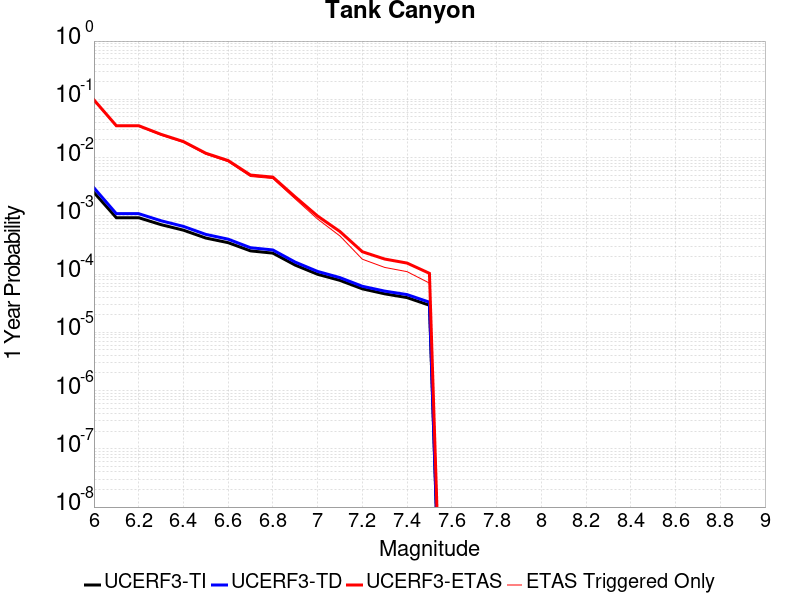 | 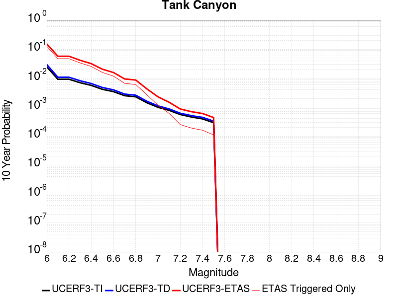 |

| Magnitude | 1 wk TI Prob | 1 wk TD Prob | 1 wk ETAS Prob | 1 wk ETAS/TD Gain | 1 wk ETAS Triggered Only | 1 mo TI Prob | 1 mo TD Prob | 1 mo ETAS Prob | 1 mo ETAS/TD Gain | 1 mo ETAS Triggered Only | 1 yr TI Prob | 1 yr TD Prob | 1 yr ETAS Prob | 1 yr ETAS/TD Gain | 1 yr ETAS Triggered Only | 10 yr TI Prob | 10 yr TD Prob | 10 yr ETAS Prob | 10 yr ETAS/TD Gain | 10 yr ETAS Triggered Only |
|-----|-----|-----|-----|-----|-----|-----|-----|-----|-----|-----|-----|-----|-----|-----|-----|-----|-----|-----|-----|-----|
| 6.0 | 4.8284557E-5 | 5.7964822E-5 | 0.04795519 | 827.31537 | 0.0479 | 2.0691741E-4 | 2.4840087E-4 | 0.064022556 | 257.73886 | 0.06379 | 0.0025163088 | 0.0030207601 | 0.09784345 | 32.390343 | 0.09511 | 0.02488006 | 0.029863637 | 0.15449706 | 5.1734176 | 0.12847 |
| 6.1 | 1.7796336E-5 | 2.0873314E-5 | 0.016160537 | 774.2199 | 0.01614 | 7.626778E-5 | 8.945422E-5 | 0.022107484 | 247.13742 | 0.02202 | 9.281647E-4 | 0.0010885983 | 0.035251368 | 32.38235 | 0.0342 | 0.009242975 | 0.010836744 | 0.05776265 | 5.330259 | 0.04744 |
| 6.2 | 1.7796336E-5 | 2.0873314E-5 | 0.016160537 | 774.2199 | 0.01614 | 7.626778E-5 | 8.945422E-5 | 0.022107484 | 247.13742 | 0.02202 | 9.281647E-4 | 0.0010885983 | 0.035251368 | 32.38235 | 0.0342 | 0.009242975 | 0.010836744 | 0.05776265 | 5.330259 | 0.04744 |
| 6.3 | 1.3515912E-5 | 1.5759564E-5 | 0.011325581 | 718.6481 | 0.01131 | 5.792405E-5 | 6.753938E-5 | 0.015626488 | 231.36856 | 0.01556 | 7.049971E-4 | 8.2200574E-4 | 0.025032088 | 30.45245 | 0.02423 | 0.007027647 | 0.0081922645 | 0.04180463 | 5.102939 | 0.03389 |
| 6.4 | 1.0870146E-5 | 1.2618021E-5 | 0.008472512 | 671.4612 | 0.00846 | 4.658551E-5 | 5.4076212E-5 | 0.011803441 | 218.27419 | 0.01175 | 5.67031E-4 | 6.581969E-4 | 0.018836224 | 28.617916 | 0.01819 | 0.005655863 | 0.0065644905 | 0.03199644 | 4.8741693 | 0.0256 |
| 6.5 | 7.964826E-6 | 9.196094E-6 | 0.0053891465 | 586.02563 | 0.00538 | 3.4134522E-5 | 3.9411298E-5 | 0.0074391197 | 188.75603 | 0.0074 | 4.1550855E-4 | 4.7973756E-4 | 0.011884264 | 24.772427 | 0.01141 | 0.0041473247 | 0.004788321 | 0.020562425 | 4.294287 | 0.01585 |
| 6.6 | 6.6317E-6 | 7.6122988E-6 | 0.003947582 | 518.5795 | 0.00394 | 2.8421264E-5 | 3.2623782E-5 | 0.005502445 | 168.66364 | 0.00547 | 3.4597394E-4 | 3.9713128E-4 | 0.008883759 | 22.369831 | 0.00849 | 0.0034543579 | 0.003965368 | 0.015768379 | 3.9765234 | 0.01185 |
| 6.7 | 4.793663E-6 | 5.4307857E-6 | 0.0022354187 | 411.61975 | 0.00223 | 2.0544108E-5 | 2.3274613E-5 | 0.0030232049 | 129.8928 | 0.003 | 2.500958E-4 | 2.8333595E-4 | 0.005011996 | 17.689234 | 0.00473 | 0.0024981452 | 0.0028304397 | 0.009471589 | 3.3463314 | 0.00666 |
| 6.8 | 4.382823E-6 | 4.9692567E-6 | 0.002094959 | 421.58392 | 0.00209 | 1.8783392E-5 | 2.1296666E-5 | 0.002821237 | 132.47318 | 0.0028 | 2.286638E-4 | 2.5926033E-4 | 0.00461813 | 17.812714 | 0.00436 | 0.0022842865 | 0.002590253 | 0.008664479 | 3.3450317 | 0.00609 |
| 6.9 | 2.729601E-6 | 3.0735416E-6 | 9.430706E-4 | 306.83514 | 9.4E-4 | 1.1698237E-5 | 1.3172262E-5 | 0.0012631558 | 95.895134 | 0.00125 | 1.4241673E-4 | 1.6036171E-4 | 0.002110049 | 13.15806 | 0.00195 | 0.001423255 | 0.0016026258 | 0.004288315 | 2.6758053 | 0.00269 |
| 7.0 | 1.8987357E-6 | 2.126939E-6 | 4.1212607E-4 | 193.76488 | 4.1E-4 | 8.137413E-6 | 9.115425E-6 | 5.491105E-4 | 60.239704 | 5.4E-4 | 9.90685E-5 | 1.1097535E-4 | 9.908777E-4 | 8.928809 | 8.8E-4 | 9.902435E-4 | 0.0011092679 | 0.00227797 | 2.0535796 | 0.00117 |
| 7.1 | 1.4928986E-6 | 1.6641272E-6 | 2.516637E-4 | 151.22865 | 2.5E-4 | 6.398121E-6 | 7.1319573E-6 | 3.071298E-4 | 43.06389 | 3.0E-4 | 7.789434E-5 | 8.682871E-5 | 5.3678965E-4 | 6.1821675 | 4.5E-4 | 7.786704E-4 | 8.6800574E-4 | 0.0014774762 | 1.7021503 | 6.1E-4 |
| 7.2 | 1.069082E-6 | 1.1828573E-6 | 1.0118274E-4 | 85.540955 | 1.0E-4 | 4.581772E-6 | 5.0693816E-6 | 1.3506872E-4 | 26.644024 | 1.3E-4 | 5.5781646E-5 | 6.171851E-5 | 2.417074E-4 | 3.9162874 | 1.8E-4 | 5.576765E-4 | 6.170659E-4 | 8.669116E-4 | 1.4048932 | 2.5E-4 |
| 7.3 | 8.776551E-7 | 9.770005E-7 | 8.097692E-5 | 82.883194 | 8.0E-5 | 3.7613736E-6 | 4.1871413E-6 | 1.0418672E-4 | 24.882544 | 1.0E-4 | 4.579376E-5 | 5.097777E-5 | 1.8097114E-4 | 3.5500011 | 1.3E-4 | 4.5784327E-4 | 5.097118E-4 | 6.9961493E-4 | 1.3725697 | 1.9E-4 |
| 7.4 | 7.55721E-7 | 8.510244E-7 | 6.0850973E-5 | 71.503204 | 6.0E-5 | 3.2388E-6 | 3.6472454E-6 | 8.3646955E-5 | 22.934282 | 8.0E-5 | 3.9431678E-5 | 4.4404827E-5 | 1.5439994E-4 | 3.4770982 | 1.1E-4 | 3.942468E-4 | 4.440104E-4 | 6.0393935E-4 | 1.360192 | 1.6E-4 |
| 7.5 | 5.587665E-7 | 6.305619E-7 | 5.063053E-5 | 80.29431 | 5.0E-5 | 2.3947114E-6 | 2.702408E-6 | 6.2702245E-5 | 23.20236 | 6.0E-5 | 2.915522E-5 | 3.290182E-5 | 1.0289952E-4 | 3.127472 | 7.0E-5 | 2.9151395E-4 | 3.290182E-4 | 4.3898198E-4 | 1.334218 | 1.1E-4 |

## Owl Lake
*[(top)](#table-of-contents)*

| 1 Week | 1 Month | 1 Year | 10 Year |
|-----|-----|-----|-----|
|  | 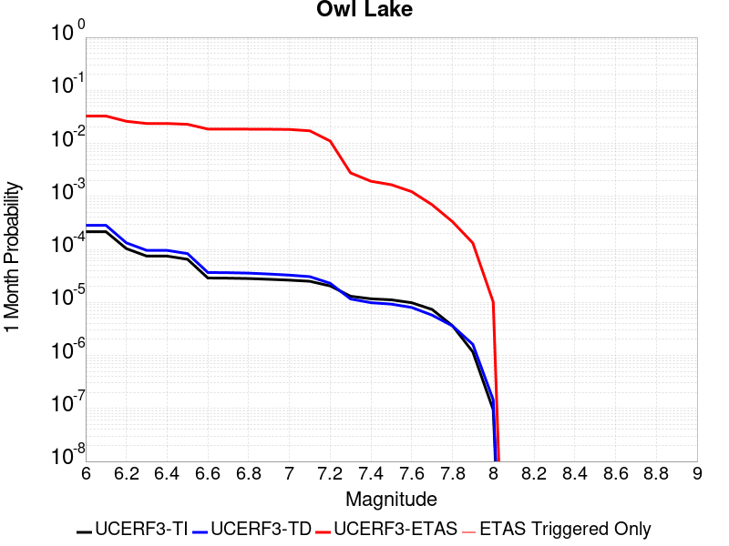 |  |  |

| Magnitude | 1 wk TI Prob | 1 wk TD Prob | 1 wk ETAS Prob | 1 wk ETAS/TD Gain | 1 wk ETAS Triggered Only | 1 mo TI Prob | 1 mo TD Prob | 1 mo ETAS Prob | 1 mo ETAS/TD Gain | 1 mo ETAS Triggered Only | 1 yr TI Prob | 1 yr TD Prob | 1 yr ETAS Prob | 1 yr ETAS/TD Gain | 1 yr ETAS Triggered Only | 10 yr TI Prob | 10 yr TD Prob | 10 yr ETAS Prob | 10 yr ETAS/TD Gain | 10 yr ETAS Triggered Only |
|-----|-----|-----|-----|-----|-----|-----|-----|-----|-----|-----|-----|-----|-----|-----|-----|-----|-----|-----|-----|-----|
| 6.0 | 5.0320643E-5 | 6.635816E-5 | 0.025184691 | 379.5267 | 0.02512 | 2.1564208E-4 | 2.843674E-4 | 0.032775126 | 115.25628 | 0.0325 | 0.0026222812 | 0.0034577388 | 0.04925882 | 14.245964 | 0.04596 | 0.02591553 | 0.034140717 | 0.09219852 | 2.7005444 | 0.06011 |
| 6.1 | 5.0320643E-5 | 6.635816E-5 | 0.025184691 | 379.5267 | 0.02512 | 2.1564208E-4 | 2.843674E-4 | 0.032775126 | 115.25628 | 0.0325 | 0.0026222812 | 0.0034577388 | 0.04925882 | 14.245964 | 0.04596 | 0.02591553 | 0.034140717 | 0.09219852 | 2.7005444 | 0.06011 |
| 6.2 | 2.4125871E-5 | 3.0981035E-5 | 0.020300353 | 655.2509 | 0.02027 | 1.0339249E-4 | 1.3277028E-4 | 0.026109321 | 196.65034 | 0.02598 | 0.0012580766 | 0.001615439 | 0.03777693 | 23.38493 | 0.03622 | 0.012509781 | 0.016070465 | 0.06206917 | 3.8623135 | 0.04675 |
| 6.3 | 1.7433485E-5 | 2.2355514E-5 | 0.01865194 | 834.3328 | 0.01863 | 7.471279E-5 | 9.580672E-5 | 0.023713544 | 247.51442 | 0.02362 | 9.0924866E-4 | 0.0011659743 | 0.033168618 | 28.447124 | 0.03204 | 0.009055373 | 0.011628896 | 0.051954437 | 4.4677014 | 0.0408 |
| 6.4 | 1.7433485E-5 | 2.2355514E-5 | 0.01865194 | 834.3328 | 0.01863 | 7.471279E-5 | 9.580672E-5 | 0.023713544 | 247.51442 | 0.02362 | 9.0924866E-4 | 0.0011659743 | 0.033168618 | 28.447124 | 0.03204 | 0.009055373 | 0.011628896 | 0.051954437 | 4.4677014 | 0.0408 |
| 6.5 | 1.5182742E-5 | 1.9429144E-5 | 0.018159077 | 934.6308 | 0.01814 | 6.506727E-5 | 8.326596E-5 | 0.022901366 | 275.03876 | 0.02282 | 7.919061E-4 | 0.0010134429 | 0.031802207 | 31.380365 | 0.03082 | 0.0078909 | 0.010118429 | 0.04862482 | 4.8055706 | 0.0389 |
| 6.6 | 6.7271576E-6 | 8.547361E-6 | 0.015108419 | 1767.612 | 0.0151 | 2.8830356E-5 | 3.6631063E-5 | 0.018605951 | 507.9282 | 0.01857 | 3.5095305E-4 | 4.458976E-4 | 0.024745058 | 55.494934 | 0.02431 | 0.0035039932 | 0.004467813 | 0.03394552 | 7.597794 | 0.02961 |
| 6.7 | 6.682835E-6 | 8.479807E-6 | 0.015108352 | 1781.6858 | 0.0151 | 2.8640408E-5 | 3.6341557E-5 | 0.018595668 | 511.69156 | 0.01856 | 3.4864116E-4 | 4.4237426E-4 | 0.024731625 | 55.906563 | 0.0243 | 0.003480947 | 0.0044327388 | 0.03388162 | 7.643495 | 0.02958 |
| 6.8 | 6.5774975E-6 | 8.32628E-6 | 0.015058201 | 1808.5148 | 0.01505 | 2.8188972E-5 | 3.5683603E-5 | 0.018545022 | 519.70715 | 0.01851 | 3.4314668E-4 | 4.343669E-4 | 0.024653843 | 56.758106 | 0.02423 | 0.0034261728 | 0.004352885 | 0.03370456 | 7.74304 | 0.02948 |
| 6.9 | 6.363419E-6 | 7.999454E-6 | 0.015017879 | 1877.3629 | 0.01501 | 2.727151E-5 | 3.428296E-5 | 0.01848365 | 539.14984 | 0.01845 | 3.3198006E-4 | 4.1732067E-4 | 0.02453725 | 58.797115 | 0.02413 | 0.0033148455 | 0.0041828766 | 0.033420067 | 7.989733 | 0.02936 |
| 7.0 | 6.1342453E-6 | 7.6316555E-6 | 0.0148575185 | 1946.8276 | 0.01485 | 2.6289357E-5 | 3.2706717E-5 | 0.01830211 | 559.5826 | 0.01827 | 3.2002592E-4 | 3.9813702E-4 | 0.02428862 | 61.005684 | 0.0239 | 0.0031956544 | 0.003991571 | 0.032945536 | 8.2537775 | 0.02907 |
| 7.1 | 5.842926E-6 | 7.142211E-6 | 0.013967043 | 1955.5627 | 0.01396 | 2.504087E-5 | 3.0609146E-5 | 0.017260082 | 563.8864 | 0.01723 | 3.0482994E-4 | 3.7260808E-4 | 0.02298418 | 61.6846 | 0.02262 | 0.0030441214 | 0.0037370329 | 0.031054564 | 8.309952 | 0.02742 |
| 7.2 | 4.77173E-6 | 5.358483E-6 | 0.008905311 | 1661.9088 | 0.0089 | 2.045011E-5 | 2.2964748E-5 | 0.011072711 | 482.1612 | 0.01105 | 2.4895166E-4 | 2.79564E-4 | 0.01484549 | 53.1023 | 0.01457 | 0.0024867293 | 0.002808645 | 0.020488847 | 7.2949224 | 0.01773 |
| 7.3 | 3.0494948E-6 | 2.710463E-6 | 0.0022627043 | 834.80365 | 0.00226 | 1.3069198E-5 | 1.1616219E-5 | 0.002771584 | 238.59607 | 0.00276 | 1.5910587E-4 | 1.4141845E-4 | 0.003630925 | 25.675043 | 0.00349 | 0.0015899199 | 0.0014232415 | 0.00569715 | 4.00294 | 0.00428 |
| 7.4 | 2.7263884E-6 | 2.3056762E-6 | 0.0015723021 | 681.92664 | 0.00157 | 1.1684469E-5 | 9.881433E-6 | 0.0019298624 | 195.30188 | 0.00192 | 1.4224913E-4 | 1.20299905E-4 | 0.0025200113 | 20.94774 | 0.0024 | 0.0014215811 | 0.0012112238 | 0.004147663 | 3.4243572 | 0.00294 |
| 7.5 | 2.6090431E-6 | 2.1656133E-6 | 0.0013821627 | 638.2315 | 0.00138 | 1.1181565E-5 | 9.281167E-6 | 0.0016592658 | 178.77771 | 0.00165 | 1.3612706E-4 | 1.1299244E-4 | 0.0021827586 | 19.31774 | 0.00207 | 0.001360437 | 0.0011379806 | 0.003705056 | 3.2558165 | 0.00257 |
| 7.6 | 2.3008756E-6 | 1.8727933E-6 | 0.001001871 | 534.96075 | 0.001 | 9.860858E-6 | 8.0262325E-6 | 0.0012280165 | 153.00035 | 0.00122 | 1.20049335E-4 | 9.7715085E-5 | 0.0016175666 | 16.553907 | 0.00152 | 0.001199845 | 9.849932E-4 | 0.0028731315 | 2.916905 | 0.00189 |
| 7.7 | 1.7184348E-6 | 1.3419171E-6 | 5.413412E-4 | 403.4088 | 5.4E-4 | 7.3646997E-6 | 5.7510606E-6 | 6.957471E-4 | 120.97717 | 6.9E-4 | 8.966153E-5 | 7.0016955E-5 | 9.1995747E-4 | 13.139067 | 8.5E-4 | 8.962536E-4 | 7.078345E-4 | 0.0018170488 | 2.567053 | 0.00111 |
| 7.8 | 8.4612907E-7 | 8.4058576E-7 | 2.4084038E-4 | 286.51495 | 2.4E-4 | 3.6262625E-6 | 3.6025056E-6 | 3.3360132E-4 | 92.602585 | 3.3E-4 | 4.4148852E-5 | 4.3859643E-5 | 4.5384167E-4 | 10.347591 | 4.1E-4 | 4.414008E-4 | 4.4398365E-4 | 9.4376167E-4 | 2.1256676 | 5.0E-4 |
| 7.9 | 2.716738E-7 | 3.768106E-7 | 1.00376776E-4 | 266.38522 | 1.0E-4 | 1.1643157E-6 | 1.6149015E-6 | 1.316147E-4 | 81.50014 | 1.3E-4 | 1.4175452E-5 | 1.966126E-5 | 1.7965812E-4 | 9.1376705 | 1.6E-4 | 1.4174548E-4 | 1.9836679E-4 | 3.7833108E-4 | 1.90723 | 1.8E-4 |
| 8.0 | 2.1995428E-8 | 3.384878E-8 | 1.0033848E-5 | 296.4316 | 1.0E-5 | 9.426611E-8 | 1.4506621E-7 | 1.0145065E-5 | 69.93404 | 1.0E-5 | 1.1476893E-6 | 1.7661803E-6 | 1.1766163E-5 | 6.6619263 | 1.0E-5 | 1.14768345E-5 | 1.7963059E-5 | 2.7962878E-5 | 1.5566881 | 1.0E-5 |

## Little Lake
*[(top)](#table-of-contents)*

| 1 Week | 1 Month | 1 Year | 10 Year |
|-----|-----|-----|-----|
|  |  |  |  |

| Magnitude | 1 wk TI Prob | 1 wk TD Prob | 1 wk ETAS Prob | 1 wk ETAS/TD Gain | 1 wk ETAS Triggered Only | 1 mo TI Prob | 1 mo TD Prob | 1 mo ETAS Prob | 1 mo ETAS/TD Gain | 1 mo ETAS Triggered Only | 1 yr TI Prob | 1 yr TD Prob | 1 yr ETAS Prob | 1 yr ETAS/TD Gain | 1 yr ETAS Triggered Only | 10 yr TI Prob | 10 yr TD Prob | 10 yr ETAS Prob | 10 yr ETAS/TD Gain | 10 yr ETAS Triggered Only |
|-----|-----|-----|-----|-----|-----|-----|-----|-----|-----|-----|-----|-----|-----|-----|-----|-----|-----|-----|-----|-----|
| 6.0 | 2.8424427E-5 | 3.120572E-5 | 0.023910461 | 766.2204 | 0.02388 | 1.2181328E-4 | 1.337327E-4 | 0.030109724 | 225.14854 | 0.02998 | 0.0014820677 | 0.0016271127 | 0.042590354 | 26.175415 | 0.04103 | 0.014722223 | 0.016165402 | 0.06659676 | 4.11971 | 0.05126 |
| 6.1 | 2.8424427E-5 | 3.120572E-5 | 0.023910461 | 766.2204 | 0.02388 | 1.2181328E-4 | 1.337327E-4 | 0.030109724 | 225.14854 | 0.02998 | 0.0014820677 | 0.0016271127 | 0.042590354 | 26.175415 | 0.04103 | 0.014722223 | 0.016165402 | 0.06659676 | 4.11971 | 0.05126 |
| 6.2 | 2.8424427E-5 | 3.120572E-5 | 0.023910461 | 766.2204 | 0.02388 | 1.2181328E-4 | 1.337327E-4 | 0.030109724 | 225.14854 | 0.02998 | 0.0014820677 | 0.0016271127 | 0.042590354 | 26.175415 | 0.04103 | 0.014722223 | 0.016165402 | 0.06659676 | 4.11971 | 0.05126 |
| 6.3 | 1.48860645E-5 | 1.6081389E-5 | 0.017305803 | 1076.1385 | 0.01729 | 6.379586E-5 | 6.8918576E-5 | 0.021447444 | 311.19977 | 0.02138 | 7.7643775E-4 | 8.3878887E-4 | 0.029444775 | 35.103916 | 0.02863 | 0.007737305 | 0.008359048 | 0.04345322 | 5.1983457 | 0.03539 |
| 6.4 | 1.48860645E-5 | 1.6081389E-5 | 0.017305803 | 1076.1385 | 0.01729 | 6.379586E-5 | 6.8918576E-5 | 0.021447444 | 311.19977 | 0.02138 | 7.7643775E-4 | 8.3878887E-4 | 0.029444775 | 35.103916 | 0.02863 | 0.007737305 | 0.008359048 | 0.04345322 | 5.1983457 | 0.03539 |
| 6.5 | 1.2797581E-5 | 1.3765565E-5 | 0.015833547 | 1150.2286 | 0.01582 | 5.4845623E-5 | 5.899409E-5 | 0.019597841 | 332.20007 | 0.01954 | 6.675408E-4 | 7.18042E-4 | 0.026709367 | 37.197495 | 0.02601 | 0.006655392 | 0.00715977 | 0.039149083 | 5.4679246 | 0.03222 |
| 6.6 | 9.661896E-6 | 1.0289038E-5 | 0.013370152 | 1299.4559 | 0.01336 | 4.1407468E-5 | 4.409522E-5 | 0.016513368 | 374.49338 | 0.01647 | 5.040193E-4 | 5.367433E-4 | 0.022355026 | 41.64938 | 0.02183 | 0.005028777 | 0.0053560743 | 0.03207221 | 5.988007 | 0.02686 |
| 6.7 | 7.767871E-6 | 8.199687E-6 | 0.011888103 | 1449.824 | 0.01188 | 3.329045E-5 | 3.5141118E-5 | 0.014664627 | 417.3068 | 0.01463 | 4.0523586E-4 | 4.2777284E-4 | 0.019589573 | 45.794334 | 0.01917 | 0.004044977 | 0.004270846 | 0.027720267 | 6.49058 | 0.02355 |
| 6.8 | 6.4235196E-6 | 6.7357446E-6 | 0.009346673 | 1387.6228 | 0.00934 | 2.752908E-5 | 2.8867229E-5 | 0.011678531 | 404.56015 | 0.01165 | 3.35115E-4 | 3.5141467E-4 | 0.015546073 | 44.238544 | 0.0152 | 0.003346101 | 0.00350985 | 0.022164145 | 6.3148413 | 0.01872 |
| 6.9 | 3.1283696E-6 | 3.1121804E-6 | 0.005633095 | 1810.0154 | 0.00563 | 1.3407229E-5 | 1.3337856E-5 | 0.0071732425 | 537.8107 | 0.00716 | 1.6322079E-4 | 1.6237781E-4 | 0.009400877 | 57.89509 | 0.00924 | 0.0016310095 | 0.00162274 | 0.0128445 | 7.9153166 | 0.01124 |
| 7.0 | 2.290603E-6 | 2.2286815E-6 | 0.0035022208 | 1571.4318 | 0.0035 | 9.816834E-6 | 9.551463E-6 | 0.004469509 | 467.9397 | 0.00446 | 1.19513395E-4 | 1.162839E-4 | 0.00582562 | 50.09825 | 0.00571 | 0.0011944914 | 0.0011623327 | 0.008074289 | 6.9466248 | 0.00692 |
| 7.1 | 1.293693E-6 | 1.1776827E-6 | 0.0013711761 | 1164.3 | 0.00137 | 5.5443866E-6 | 5.0472063E-6 | 0.0017850383 | 353.66858 | 0.00178 | 6.750081E-5 | 6.14487E-5 | 0.0024912993 | 40.54275 | 0.00243 | 6.7480316E-4 | 6.143856E-4 | 0.00363253 | 5.9124603 | 0.00302 |
| 7.2 | 4.715842E-7 | 3.0917857E-7 | 2.0309173E-5 | 65.687515 | 2.0E-5 | 2.0210737E-6 | 1.3250503E-6 | 2.1325024E-5 | 16.093746 | 2.0E-5 | 2.4606294E-5 | 1.6132375E-5 | 6.6131564E-5 | 4.0993075 | 5.0E-5 | 2.460357E-4 | 1.6131258E-4 | 2.5129807E-4 | 1.5578331 | 9.0E-5 |
| 7.3 | 3.9430947E-7 | 2.3097488E-7 | 2.0230971E-5 | 87.589485 | 2.0E-5 | 1.6898966E-6 | 9.89892E-7 | 2.0989872E-5 | 21.204205 | 2.0E-5 | 2.0574296E-5 | 1.2051869E-5 | 5.2051386E-5 | 4.3189473 | 4.0E-5 | 2.0572392E-4 | 1.20512224E-4 | 1.905038E-4 | 1.580784 | 7.0E-5 |
| 7.4 | 3.547123E-7 | 1.9679135E-7 | 2.0196787E-5 | 102.63046 | 2.0E-5 | 1.5201948E-6 | 8.4339126E-7 | 2.0843374E-5 | 24.713766 | 2.0E-5 | 1.8508214E-5 | 1.0268241E-5 | 5.026783E-5 | 4.895467 | 4.0E-5 | 1.8506673E-4 | 1.02677724E-4 | 1.7267054E-4 | 1.6816747 | 7.0E-5 |
| 7.5 | 2.6354266E-7 | 1.4423138E-7 | 2.0144229E-5 | 139.66606 | 2.0E-5 | 1.129468E-6 | 6.181344E-7 | 2.0618121E-5 | 33.355404 | 2.0E-5 | 1.3751187E-5 | 7.5257603E-6 | 4.752546E-5 | 6.3150377 | 4.0E-5 | 1.3750336E-4 | 7.5255106E-5 | 1.4524984E-4 | 1.9300994 | 7.0E-5 |
| 7.6 | 1.269913E-7 | 7.572556E-8 | 1.0075725E-5 | 133.0558 | 1.0E-5 | 5.4424834E-7 | 3.245381E-7 | 1.0324535E-5 | 31.813015 | 1.0E-5 | 6.6262032E-6 | 3.9512443E-6 | 1.3951205E-5 | 3.5308383 | 1.0E-5 | 6.626006E-5 | 3.9511775E-5 | 7.9510195E-5 | 2.0123165 | 4.0E-5 |

## Panamint Valley
*[(top)](#table-of-contents)*

| 1 Week | 1 Month | 1 Year | 10 Year |
|-----|-----|-----|-----|
|  | 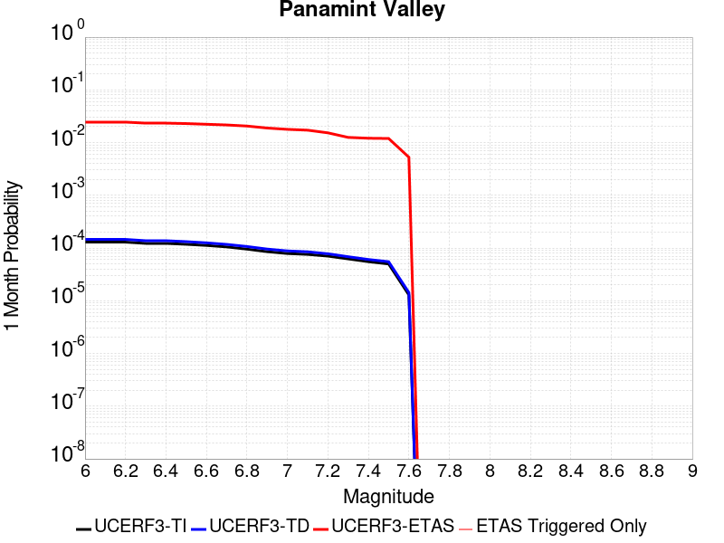 | 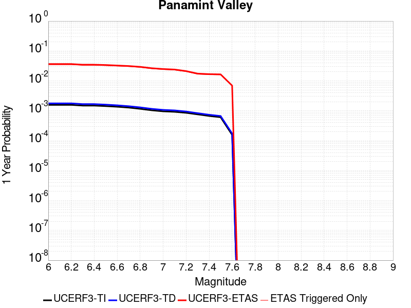 |  |

| Magnitude | 1 wk TI Prob | 1 wk TD Prob | 1 wk ETAS Prob | 1 wk ETAS/TD Gain | 1 wk ETAS Triggered Only | 1 mo TI Prob | 1 mo TD Prob | 1 mo ETAS Prob | 1 mo ETAS/TD Gain | 1 mo ETAS Triggered Only | 1 yr TI Prob | 1 yr TD Prob | 1 yr ETAS Prob | 1 yr ETAS/TD Gain | 1 yr ETAS Triggered Only | 10 yr TI Prob | 10 yr TD Prob | 10 yr ETAS Prob | 10 yr ETAS/TD Gain | 10 yr ETAS Triggered Only |
|-----|-----|-----|-----|-----|-----|-----|-----|-----|-----|-----|-----|-----|-----|-----|-----|-----|-----|-----|-----|-----|
| 6.0 | 3.0211835E-5 | 3.3984514E-5 | 0.019213332 | 565.3555 | 0.01918 | 1.2947287E-4 | 1.4563995E-4 | 0.0244421 | 167.82553 | 0.0243 | 0.0015751923 | 0.0017717537 | 0.036579974 | 20.646194 | 0.03487 | 0.015640736 | 0.017583137 | 0.06275467 | 3.5690255 | 0.04598 |
| 6.1 | 3.0211835E-5 | 3.3984514E-5 | 0.019213332 | 565.3555 | 0.01918 | 1.2947287E-4 | 1.4563995E-4 | 0.0244421 | 167.82553 | 0.0243 | 0.0015751923 | 0.0017717537 | 0.036579974 | 20.646194 | 0.03487 | 0.015640736 | 0.017583137 | 0.06275467 | 3.5690255 | 0.04598 |
| 6.2 | 3.0211835E-5 | 3.3984514E-5 | 0.019213332 | 565.3555 | 0.01918 | 1.2947287E-4 | 1.4563995E-4 | 0.0244421 | 167.82553 | 0.0243 | 0.0015751923 | 0.0017717537 | 0.036579974 | 20.646194 | 0.03487 | 0.015640736 | 0.017583137 | 0.06275467 | 3.5690255 | 0.04598 |
| 6.3 | 2.8573924E-5 | 3.210268E-5 | 0.018581508 | 578.8148 | 0.01855 | 1.2245393E-4 | 1.3757581E-4 | 0.023394376 | 170.04715 | 0.02326 | 0.001489857 | 0.0016737265 | 0.03473829 | 20.75506 | 0.03312 | 0.01479908 | 0.016617801 | 0.05943426 | 3.576542 | 0.04354 |
| 6.4 | 2.8573924E-5 | 3.210268E-5 | 0.018581508 | 578.8148 | 0.01855 | 1.2245393E-4 | 1.3757581E-4 | 0.023394376 | 170.04715 | 0.02326 | 0.001489857 | 0.0016737265 | 0.03473829 | 20.75506 | 0.03312 | 0.01479908 | 0.016617801 | 0.05943426 | 3.576542 | 0.04354 |
| 6.5 | 2.7468774E-5 | 3.0828433E-5 | 0.018270265 | 592.6434 | 0.01824 | 1.1771801E-4 | 1.3211532E-4 | 0.0229491 | 173.70506 | 0.02282 | 0.0014322745 | 0.0016073446 | 0.033955265 | 21.125069 | 0.0324 | 0.014230782 | 0.015963677 | 0.057706498 | 3.6148627 | 0.04242 |
| 6.6 | 2.6135967E-5 | 2.925248E-5 | 0.017798733 | 608.4521 | 0.01777 | 1.1200648E-4 | 1.253619E-4 | 0.022262586 | 177.58655 | 0.02214 | 0.0013628257 | 0.0015252391 | 0.032687638 | 21.431156 | 0.03121 | 0.013544982 | 0.015154043 | 0.05532591 | 3.6509008 | 0.04079 |
| 6.7 | 2.4498746E-5 | 2.7341335E-5 | 0.017336868 | 634.09 | 0.01731 | 1.04990395E-4 | 1.1717203E-4 | 0.021594655 | 184.29872 | 0.02148 | 0.0012775084 | 0.0014256609 | 0.031422835 | 22.040888 | 0.03004 | 0.012701893 | 0.014171274 | 0.05259888 | 3.7116547 | 0.03898 |
| 6.8 | 2.2244329E-5 | 2.4935423E-5 | 0.016654521 | 667.90607 | 0.01663 | 9.532935E-5 | 1.0686185E-4 | 0.020604672 | 192.81596 | 0.0205 | 0.0011600169 | 0.0013002884 | 0.029483594 | 22.67466 | 0.02822 | 0.011539802 | 0.0129325185 | 0.048693974 | 3.765235 | 0.03623 |
| 6.9 | 1.9902658E-5 | 2.2290267E-5 | 0.015381948 | 690.07465 | 0.01536 | 8.529431E-5 | 9.552632E-5 | 0.018883731 | 197.68092 | 0.01879 | 0.0010379635 | 0.0011624309 | 0.026582846 | 22.868324 | 0.02545 | 0.010331288 | 0.011568608 | 0.043554246 | 3.7648652 | 0.03236 |
| 7.0 | 1.8353881E-5 | 2.0566185E-5 | 0.0146302655 | 711.37476 | 0.01461 | 7.865712E-5 | 8.813792E-5 | 0.017836573 | 202.37117 | 0.01775 | 9.5722964E-4 | 0.0010725686 | 0.024946934 | 23.259056 | 0.0239 | 0.009531168 | 0.010678849 | 0.04053656 | 3.7959673 | 0.03018 |
| 7.1 | 1.7667631E-5 | 1.9772613E-5 | 0.014139493 | 715.105 | 0.01412 | 7.571623E-5 | 8.473711E-5 | 0.017193288 | 202.9015 | 0.01711 | 9.2145515E-4 | 0.0010312037 | 0.023977516 | 23.25197 | 0.02297 | 0.009176437 | 0.010269073 | 0.038991064 | 3.7969413 | 0.02902 |
| 7.2 | 1.6381597E-5 | 1.8158249E-5 | 0.012487932 | 687.7277 | 0.01247 | 7.020495E-5 | 7.781885E-5 | 0.015306634 | 196.69571 | 0.01523 | 8.544101E-4 | 9.4704994E-4 | 0.021267787 | 22.45688 | 0.02034 | 0.008511325 | 0.009434792 | 0.03500128 | 3.7098093 | 0.02581 |
| 7.3 | 1.4520491E-5 | 1.5966476E-5 | 0.010315802 | 646.0914 | 0.0103 | 6.222919E-5 | 6.842605E-5 | 0.012547572 | 183.3742 | 0.01248 | 7.57377E-4 | 8.327849E-4 | 0.01752887 | 21.048494 | 0.01671 | 0.0075480095 | 0.00829975 | 0.029452717 | 3.5486267 | 0.02133 |
| 7.4 | 1.2852287E-5 | 1.4145411E-5 | 0.009954005 | 703.69147 | 0.00994 | 5.5080065E-5 | 6.062187E-5 | 0.012089892 | 199.4312 | 0.01203 | 6.7039346E-4 | 7.378371E-4 | 0.016815966 | 22.79089 | 0.01609 | 0.0066837464 | 0.0073567946 | 0.027696054 | 3.7646904 | 0.02049 |
| 7.5 | 1.1637851E-5 | 1.2836797E-5 | 0.009862711 | 768.3155 | 0.00985 | 4.987555E-5 | 5.5013777E-5 | 0.011964358 | 217.47932 | 0.01191 | 6.070656E-4 | 6.6960254E-4 | 0.016528975 | 24.684757 | 0.01587 | 0.006054099 | 0.0066787465 | 0.026753768 | 4.005807 | 0.02021 |
| 7.6 | 3.0068115E-6 | 3.3330316E-6 | 0.0044133184 | 1324.1154 | 0.00441 | 1.2886271E-5 | 1.4284384E-5 | 0.005274209 | 369.22903 | 0.00526 | 1.5687906E-4 | 1.7390578E-4 | 0.0069527267 | 39.97985 | 0.00678 | 0.0015676835 | 0.0017391363 | 0.010314197 | 5.9306436 | 0.00859 |

## Garlock (East)
*[(top)](#table-of-contents)*

| 1 Week | 1 Month | 1 Year | 10 Year |
|-----|-----|-----|-----|
|  |  |  |  |

| Magnitude | 1 wk TI Prob | 1 wk TD Prob | 1 wk ETAS Prob | 1 wk ETAS/TD Gain | 1 wk ETAS Triggered Only | 1 mo TI Prob | 1 mo TD Prob | 1 mo ETAS Prob | 1 mo ETAS/TD Gain | 1 mo ETAS Triggered Only | 1 yr TI Prob | 1 yr TD Prob | 1 yr ETAS Prob | 1 yr ETAS/TD Gain | 1 yr ETAS Triggered Only | 10 yr TI Prob | 10 yr TD Prob | 10 yr ETAS Prob | 10 yr ETAS/TD Gain | 10 yr ETAS Triggered Only |
|-----|-----|-----|-----|-----|-----|-----|-----|-----|-----|-----|-----|-----|-----|-----|-----|-----|-----|-----|-----|-----|
| 6.0 | 4.5092507E-5 | 6.290325E-5 | 0.015571928 | 247.55362 | 0.01551 | 1.9323928E-4 | 2.6956003E-4 | 0.020684056 | 76.73265 | 0.02042 | 0.0023501497 | 0.0032774 | 0.032720584 | 9.983702 | 0.02954 | 0.023254504 | 0.032351844 | 0.07098036 | 2.1940126 | 0.03992 |
| 6.1 | 4.5092507E-5 | 6.290325E-5 | 0.015571928 | 247.55362 | 0.01551 | 1.9323928E-4 | 2.6956003E-4 | 0.020684056 | 76.73265 | 0.02042 | 0.0023501497 | 0.0032774 | 0.032720584 | 9.983702 | 0.02954 | 0.023254504 | 0.032351844 | 0.07098036 | 2.1940126 | 0.03992 |
| 6.2 | 2.6674514E-5 | 3.4509674E-5 | 0.012344085 | 357.69925 | 0.01231 | 1.1431433E-4 | 1.4789042E-4 | 0.015825571 | 107.00877 | 0.01568 | 0.0013908884 | 0.0017991117 | 0.023729585 | 13.189611 | 0.02197 | 0.01382215 | 0.017890299 | 0.046067026 | 2.5749724 | 0.02869 |
| 6.3 | 2.6674514E-5 | 3.4509674E-5 | 0.012344085 | 357.69925 | 0.01231 | 1.1431433E-4 | 1.4789042E-4 | 0.015825571 | 107.00877 | 0.01568 | 0.0013908884 | 0.0017991117 | 0.023729585 | 13.189611 | 0.02197 | 0.01382215 | 0.017890299 | 0.046067026 | 2.5749724 | 0.02869 |
| 6.4 | 2.5312667E-5 | 3.233893E-5 | 0.012211945 | 377.62366 | 0.01218 | 1.0847834E-4 | 1.3858822E-4 | 0.015626442 | 112.75447 | 0.01549 | 0.0013199237 | 0.0016860351 | 0.023329481 | 13.83689 | 0.02168 | 0.013121112 | 0.016778335 | 0.04447569 | 2.650781 | 0.02817 |
| 6.5 | 2.5312667E-5 | 3.233893E-5 | 0.012211945 | 377.62366 | 0.01218 | 1.0847834E-4 | 1.3858822E-4 | 0.015626442 | 112.75447 | 0.01549 | 0.0013199237 | 0.0016860351 | 0.023329481 | 13.83689 | 0.02168 | 0.013121112 | 0.016778335 | 0.04447569 | 2.650781 | 0.02817 |
| 6.6 | 2.246556E-5 | 2.8133776E-5 | 0.0118478015 | 421.12375 | 0.01182 | 9.627742E-5 | 1.20567885E-4 | 0.015078764 | 125.064514 | 0.01496 | 0.0011715472 | 0.0014669491 | 0.02214657 | 15.097025 | 0.02071 | 0.011653901 | 0.01461866 | 0.040938195 | 2.8004067 | 0.02671 |
| 6.7 | 2.2241198E-5 | 2.7803519E-5 | 0.011827475 | 425.3949 | 0.0118 | 9.531594E-5 | 1.1915263E-4 | 0.015027376 | 126.11871 | 0.01491 | 0.0011598538 | 0.0014497414 | 0.022059819 | 15.216382 | 0.02064 | 0.011538187 | 0.014448853 | 0.04067437 | 2.8150587 | 0.02661 |
| 6.8 | 1.9528685E-5 | 2.389819E-5 | 0.011423626 | 478.01215 | 0.0114 | 8.369167E-5 | 1.0241691E-4 | 0.014410951 | 140.70871 | 0.01431 | 0.0010184698 | 0.0012462323 | 0.020821806 | 16.707806 | 0.0196 | 0.010138147 | 0.012436427 | 0.037204523 | 2.9915764 | 0.02508 |
| 6.9 | 1.3318621E-5 | 1.5198884E-5 | 0.0107450355 | 706.9621 | 0.01073 | 5.7078556E-5 | 6.513648E-5 | 0.013354271 | 205.01984 | 0.01329 | 6.9470983E-4 | 7.927538E-4 | 0.01870854 | 23.599432 | 0.01793 | 0.0069254204 | 0.007939888 | 0.030310843 | 3.8175404 | 0.02255 |
| 7.0 | 1.1760853E-5 | 1.31077895E-5 | 0.0105829695 | 807.3802 | 0.01057 | 5.0402683E-5 | 5.6175057E-5 | 0.013125441 | 233.65247 | 0.01307 | 6.134799E-4 | 6.8372174E-4 | 0.018131783 | 26.519245 | 0.01746 | 0.0061178906 | 0.00685652 | 0.028616294 | 4.1735883 | 0.02191 |
| 7.1 | 1.0064758E-5 | 1.0902931E-5 | 0.010220791 | 937.4353 | 0.01021 | 4.3133965E-5 | 4.672603E-5 | 0.01257614 | 269.14636 | 0.01253 | 5.2502943E-4 | 5.687444E-4 | 0.017239258 | 30.31108 | 0.01668 | 0.005237907 | 0.0057129986 | 0.026374282 | 4.6165395 | 0.02078 |
| 7.2 | 9.768808E-6 | 1.0498807E-5 | 0.010010394 | 953.4792 | 0.01 | 4.186565E-5 | 4.499413E-5 | 0.012324441 | 273.9122 | 0.01228 | 5.095951E-4 | 5.4766936E-4 | 0.016868725 | 30.800932 | 0.01633 | 0.0050842804 | 0.0055032647 | 0.025711438 | 4.672034 | 0.02032 |
| 7.3 | 9.344516E-6 | 9.944468E-6 | 0.009249853 | 930.15063 | 0.00924 | 4.004731E-5 | 4.261847E-5 | 0.0113321375 | 265.89734 | 0.01129 | 4.8746695E-4 | 5.1875977E-4 | 0.015570947 | 30.015717 | 0.01506 | 0.0048639905 | 0.0052149445 | 0.02388706 | 4.580501 | 0.01877 |
| 7.4 | 9.023491E-6 | 9.490661E-6 | 0.008189413 | 862.8917 | 0.00818 | 3.867153E-5 | 4.0673647E-5 | 0.010140263 | 249.30794 | 0.0101 | 4.7072413E-4 | 4.950925E-4 | 0.013928439 | 28.133003 | 0.01344 | 0.004697283 | 0.0049783974 | 0.02166491 | 4.3517838 | 0.01677 |
| 7.5 | 7.081253E-6 | 7.087672E-6 | 0.0040770588 | 575.2324 | 0.00407 | 3.0347876E-5 | 3.0375388E-5 | 0.005080222 | 167.24797 | 0.00505 | 3.6942272E-4 | 3.6975832E-4 | 0.00709727 | 19.194347 | 0.00673 | 0.003688092 | 0.0037243143 | 0.0121727325 | 3.2684493 | 0.00848 |
| 7.6 | 6.116396E-6 | 5.959245E-6 | 0.0025059443 | 420.51376 | 0.0025 | 2.6212863E-5 | 2.5539372E-5 | 0.0031254601 | 122.37812 | 0.0031 | 3.1909486E-4 | 3.1089774E-4 | 0.00441962 | 14.215671 | 0.00411 | 0.0031863707 | 0.0031357552 | 0.008279575 | 2.6403766 | 0.00516 |
| 7.7 | 4.797145E-6 | 4.757281E-6 | 0.0012947512 | 272.16202 | 0.00129 | 2.055903E-5 | 2.0388188E-5 | 0.0016203555 | 79.47521 | 0.0016 | 2.5027743E-4 | 2.4819805E-4 | 0.0023476768 | 9.458885 | 0.0021 | 0.0024999576 | 0.0025093474 | 0.005122773 | 2.0414762 | 0.00262 |
| 7.8 | 3.4028885E-6 | 3.978462E-6 | 6.6397584E-4 | 166.89261 | 6.6E-4 | 1.4583726E-5 | 1.7050439E-5 | 8.6703594E-4 | 50.85124 | 8.5E-4 | 1.775424E-4 | 2.0756939E-4 | 0.0013373349 | 6.4428325 | 0.00113 | 0.0017740062 | 0.0021012232 | 0.0035781134 | 1.7028717 | 0.00148 |
| 7.9 | 2.5928412E-6 | 3.3724489E-6 | 4.7337086E-4 | 140.36414 | 4.7E-4 | 1.1112129E-5 | 1.4453272E-5 | 6.2444445E-4 | 43.204365 | 6.1E-4 | 1.3528178E-4 | 1.7595445E-4 | 9.858119E-4 | 5.602654 | 8.1E-4 | 0.0013519945 | 0.0017812408 | 0.0028293706 | 1.5884267 | 0.00105 |
| 8.0 | 1.3743648E-6 | 1.6734747E-6 | 1.8167317E-4 | 108.560455 | 1.8E-4 | 5.8901214E-6 | 7.1720146E-6 | 2.2717044E-4 | 31.674564 | 2.2E-4 | 7.1709874E-5 | 8.731581E-5 | 3.8728962E-4 | 4.435504 | 3.0E-4 | 7.1686733E-4 | 8.837234E-4 | 0.0012533964 | 1.418313 | 3.7E-4 |
| 8.1 | 3.6733252E-7 | 3.1489964E-7 | 2.0314894E-5 | 64.512276 | 2.0E-5 | 1.5742813E-6 | 1.3495693E-6 | 3.134953E-5 | 23.229284 | 3.0E-5 | 1.9166706E-5 | 1.6430899E-5 | 4.6430407E-5 | 2.8257983 | 3.0E-5 | 1.9165053E-4 | 1.6638759E-4 | 2.0638094E-4 | 1.2403625 | 4.0E-5 |

## Airport Lake
*[(top)](#table-of-contents)*

| 1 Week | 1 Month | 1 Year | 10 Year |
|-----|-----|-----|-----|
| 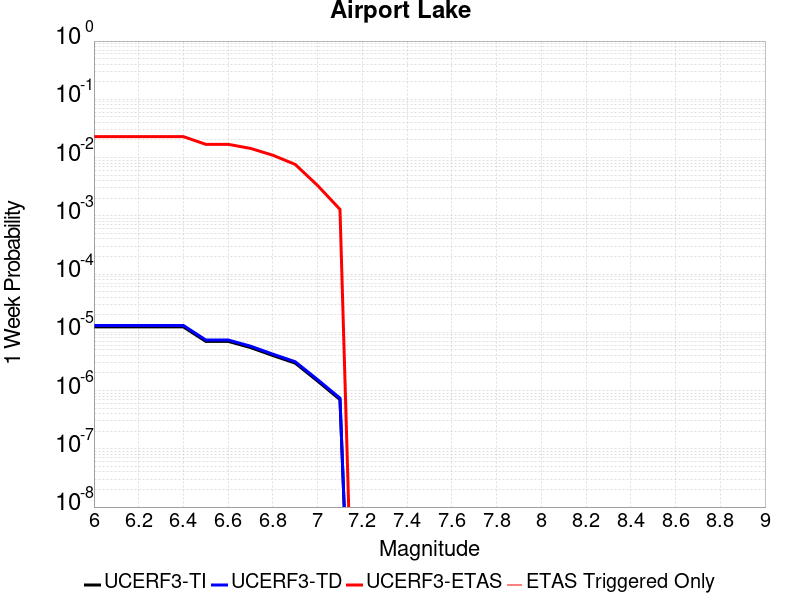 |  | 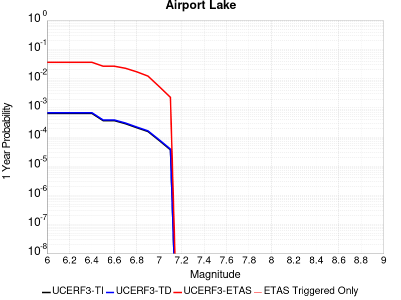 |  |

| Magnitude | 1 wk TI Prob | 1 wk TD Prob | 1 wk ETAS Prob | 1 wk ETAS/TD Gain | 1 wk ETAS Triggered Only | 1 mo TI Prob | 1 mo TD Prob | 1 mo ETAS Prob | 1 mo ETAS/TD Gain | 1 mo ETAS Triggered Only | 1 yr TI Prob | 1 yr TD Prob | 1 yr ETAS Prob | 1 yr ETAS/TD Gain | 1 yr ETAS Triggered Only | 10 yr TI Prob | 10 yr TD Prob | 10 yr ETAS Prob | 10 yr ETAS/TD Gain | 10 yr ETAS Triggered Only |
|-----|-----|-----|-----|-----|-----|-----|-----|-----|-----|-----|-----|-----|-----|-----|-----|-----|-----|-----|-----|-----|
| 6.0 | 1.2387061E-5 | 1.3103157E-5 | 0.022872804 | 1745.5948 | 0.02286 | 5.3086325E-5 | 5.615534E-5 | 0.027834596 | 495.67142 | 0.02778 | 6.461343E-4 | 6.8350515E-4 | 0.036748838 | 53.765266 | 0.03609 | 0.0064425888 | 0.0068168393 | 0.05034806 | 7.385836 | 0.04383 |
| 6.1 | 1.2387061E-5 | 1.3103157E-5 | 0.022872804 | 1745.5948 | 0.02286 | 5.3086325E-5 | 5.615534E-5 | 0.027834596 | 495.67142 | 0.02778 | 6.461343E-4 | 6.8350515E-4 | 0.036748838 | 53.765266 | 0.03609 | 0.0064425888 | 0.0068168393 | 0.05034806 | 7.385836 | 0.04383 |
| 6.2 | 1.2387061E-5 | 1.3103157E-5 | 0.022872804 | 1745.5948 | 0.02286 | 5.3086325E-5 | 5.615534E-5 | 0.027834596 | 495.67142 | 0.02778 | 6.461343E-4 | 6.8350515E-4 | 0.036748838 | 53.765266 | 0.03609 | 0.0064425888 | 0.0068168393 | 0.05034806 | 7.385836 | 0.04383 |
| 6.3 | 1.2387061E-5 | 1.3103157E-5 | 0.022872804 | 1745.5948 | 0.02286 | 5.3086325E-5 | 5.615534E-5 | 0.027834596 | 495.67142 | 0.02778 | 6.461343E-4 | 6.8350515E-4 | 0.036748838 | 53.765266 | 0.03609 | 0.0064425888 | 0.0068168393 | 0.05034806 | 7.385836 | 0.04383 |
| 6.4 | 1.2387061E-5 | 1.3103157E-5 | 0.022872804 | 1745.5948 | 0.02286 | 5.3086325E-5 | 5.615534E-5 | 0.027834596 | 495.67142 | 0.02778 | 6.461343E-4 | 6.8350515E-4 | 0.036748838 | 53.765266 | 0.03609 | 0.0064425888 | 0.0068168393 | 0.05034806 | 7.385836 | 0.04383 |
| 6.5 | 6.9922594E-6 | 7.384925E-6 | 0.01687726 | 2285.3665 | 0.01687 | 2.996648E-5 | 3.1649324E-5 | 0.020700995 | 654.0738 | 0.02067 | 3.6478083E-4 | 3.8526783E-4 | 0.027005007 | 70.09412 | 0.02663 | 0.003641826 | 0.0038465366 | 0.035952564 | 9.346736 | 0.03223 |
| 6.6 | 6.9922594E-6 | 7.384925E-6 | 0.01687726 | 2285.3665 | 0.01687 | 2.996648E-5 | 3.1649324E-5 | 0.020700995 | 654.0738 | 0.02067 | 3.6478083E-4 | 3.8526783E-4 | 0.027005007 | 70.09412 | 0.02663 | 0.003641826 | 0.0038465366 | 0.035952564 | 9.346736 | 0.03223 |
| 6.7 | 5.477277E-6 | 5.7860684E-6 | 0.014365703 | 2482.809 | 0.01436 | 2.3473833E-5 | 2.4797222E-5 | 0.01761436 | 710.33606 | 0.01759 | 2.8575645E-4 | 3.0186825E-4 | 0.022885049 | 75.81138 | 0.02259 | 0.0028538927 | 0.003014966 | 0.030282507 | 10.044063 | 0.02735 |
| 6.8 | 3.9950432E-6 | 4.2190873E-6 | 0.010964173 | 2598.7075 | 0.01096 | 1.7121502E-5 | 1.8081691E-5 | 0.013487838 | 745.93896 | 0.01347 | 2.0843433E-4 | 2.2012512E-4 | 0.017326359 | 78.71141 | 0.01711 | 0.0020823893 | 0.0021993418 | 0.022913683 | 10.418427 | 0.02076 |
| 6.9 | 2.95695E-6 | 3.1230243E-6 | 0.0076230993 | 2440.935 | 0.00762 | 1.2672582E-5 | 1.3384334E-5 | 0.009513257 | 710.7755 | 0.0095 | 1.5427776E-4 | 1.6294434E-4 | 0.0123609565 | 75.85999 | 0.0122 | 0.001541707 | 0.0016284712 | 0.016394386 | 10.0673485 | 0.01479 |
| 7.0 | 1.456072E-6 | 1.540812E-6 | 0.0033115358 | 2149.2146 | 0.00331 | 6.2402937E-6 | 6.603469E-6 | 0.0042165755 | 638.5395 | 0.00421 | 7.597293E-5 | 8.039528E-5 | 0.0054099667 | 67.2921 | 0.00533 | 7.594696E-4 | 8.0376083E-4 | 0.0072385846 | 9.005894 | 0.00644 |
| 7.1 | 6.995192E-7 | 7.4089746E-7 | 0.00129074 | 1742.1304 | 0.00129 | 2.997936E-6 | 3.1752747E-6 | 0.0016931699 | 533.2357 | 0.00169 | 3.649926E-5 | 3.865897E-5 | 0.0023085712 | 59.716316 | 0.00227 | 3.6493264E-4 | 3.865897E-4 | 0.003175511 | 8.214164 | 0.00279 |

## Hunter Mountain-Saline Valley
*[(top)](#table-of-contents)*

| 1 Week | 1 Month | 1 Year | 10 Year |
|-----|-----|-----|-----|
|  | 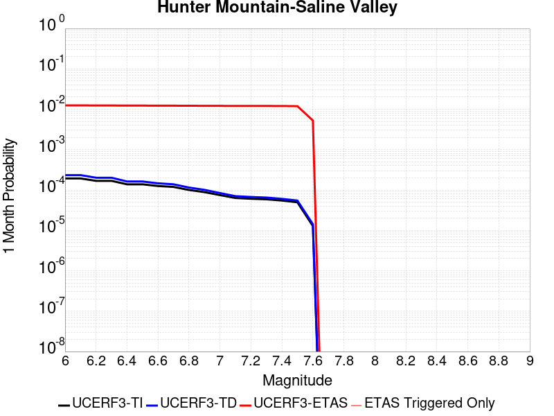 |  |  |

| Magnitude | 1 wk TI Prob | 1 wk TD Prob | 1 wk ETAS Prob | 1 wk ETAS/TD Gain | 1 wk ETAS Triggered Only | 1 mo TI Prob | 1 mo TD Prob | 1 mo ETAS Prob | 1 mo ETAS/TD Gain | 1 mo ETAS Triggered Only | 1 yr TI Prob | 1 yr TD Prob | 1 yr ETAS Prob | 1 yr ETAS/TD Gain | 1 yr ETAS Triggered Only | 10 yr TI Prob | 10 yr TD Prob | 10 yr ETAS Prob | 10 yr ETAS/TD Gain | 10 yr ETAS Triggered Only |
|-----|-----|-----|-----|-----|-----|-----|-----|-----|-----|-----|-----|-----|-----|-----|-----|-----|-----|-----|-----|-----|
| 6.0 | 4.5103672E-5 | 5.4570177E-5 | 0.010174018 | 186.43916 | 0.01012 | 1.9328714E-4 | 2.3385242E-4 | 0.01247099 | 53.32846 | 0.01224 | 0.002350731 | 0.0028435152 | 0.019266682 | 6.775656 | 0.01647 | 0.023260195 | 0.028091887 | 0.0486769 | 1.7327744 | 0.02118 |
| 6.1 | 4.5103672E-5 | 5.4570177E-5 | 0.010174018 | 186.43916 | 0.01012 | 1.9328714E-4 | 2.3385242E-4 | 0.01247099 | 53.32846 | 0.01224 | 0.002350731 | 0.0028435152 | 0.019266682 | 6.775656 | 0.01647 | 0.023260195 | 0.028091887 | 0.0486769 | 1.7327744 | 0.02118 |
| 6.2 | 3.9363465E-5 | 4.706337E-5 | 0.010116589 | 214.95676 | 0.01007 | 1.6868966E-4 | 2.0168544E-4 | 0.012389227 | 61.428463 | 0.01219 | 0.002051862 | 0.0024528175 | 0.018822568 | 7.6738553 | 0.01641 | 0.020330196 | 0.024273481 | 0.044851553 | 1.8477594 | 0.02109 |
| 6.3 | 3.9363465E-5 | 4.706337E-5 | 0.010116589 | 214.95676 | 0.01007 | 1.6868966E-4 | 2.0168544E-4 | 0.012389227 | 61.428463 | 0.01219 | 0.002051862 | 0.0024528175 | 0.018822568 | 7.6738553 | 0.01641 | 0.020330196 | 0.024273481 | 0.044851553 | 1.8477594 | 0.02109 |
| 6.4 | 3.2311684E-5 | 3.795099E-5 | 0.01007757 | 265.5417 | 0.01004 | 1.384713E-4 | 1.6263737E-4 | 0.01232066 | 75.7554 | 0.01216 | 0.0016845843 | 0.0019783843 | 0.018296037 | 9.24797 | 0.01635 | 0.016718714 | 0.019616475 | 0.040184923 | 2.0485291 | 0.02098 |
| 6.5 | 3.2311684E-5 | 3.795099E-5 | 0.01007757 | 265.5417 | 0.01004 | 1.384713E-4 | 1.6263737E-4 | 0.01232066 | 75.7554 | 0.01216 | 0.0016845843 | 0.0019783843 | 0.018296037 | 9.24797 | 0.01635 | 0.016718714 | 0.019616475 | 0.040184923 | 2.0485291 | 0.02098 |
| 6.6 | 2.9305844E-5 | 3.418183E-5 | 0.01003384 | 293.54306 | 0.01 | 1.2559042E-4 | 1.4648569E-4 | 0.01226471 | 83.72633 | 0.01212 | 0.0015279909 | 0.001782067 | 0.018043038 | 10.124781 | 0.01629 | 0.015175272 | 0.01768569 | 0.03820624 | 2.160291 | 0.02089 |
| 6.7 | 2.7826512E-5 | 3.2344276E-5 | 0.0100320205 | 310.16373 | 0.01 | 1.19251024E-4 | 1.386113E-4 | 0.0122569315 | 88.42664 | 0.01212 | 0.0014509142 | 0.0016863465 | 0.017938893 | 10.637727 | 0.01628 | 0.014414776 | 0.016743187 | 0.037263755 | 2.2256072 | 0.02087 |
| 6.8 | 2.3389874E-5 | 2.6866714E-5 | 0.009996599 | 372.08118 | 0.00997 | 1.0023846E-4 | 1.15138246E-4 | 0.0122037465 | 105.99212 | 0.01209 | 0.00121972 | 0.001400954 | 0.017588245 | 12.554477 | 0.01621 | 0.01213047 | 0.013927434 | 0.034378577 | 2.4684072 | 0.02074 |
| 6.9 | 2.069209E-5 | 2.3570032E-5 | 0.009983336 | 423.56055 | 0.00996 | 8.867737E-5 | 1.01010715E-4 | 0.012169791 | 120.4802 | 0.01207 | 0.0010791123 | 0.0012291478 | 0.017379273 | 14.139286 | 0.01617 | 0.010738871 | 0.012228523 | 0.032655638 | 2.670448 | 0.02068 |
| 7.0 | 1.7462342E-5 | 1.9633546E-5 | 0.009969438 | 507.77573 | 0.00995 | 7.483646E-5 | 8.414118E-5 | 0.012133127 | 144.19963 | 0.01205 | 9.1075303E-4 | 0.0010239601 | 0.017157422 | 16.755949 | 0.01615 | 0.009070295 | 0.0101960525 | 0.03060581 | 3.0017314 | 0.02062 |
| 7.1 | 1.4807709E-5 | 1.6441749E-5 | 0.009956278 | 605.5486 | 0.00994 | 6.3460066E-5 | 7.046283E-5 | 0.012099615 | 171.71628 | 0.01203 | 7.723524E-4 | 8.575638E-4 | 0.016943756 | 19.758013 | 0.0161 | 0.007696735 | 0.008545532 | 0.02891992 | 3.3842156 | 0.02055 |
| 7.2 | 1.4180048E-5 | 1.5698337E-5 | 0.009945543 | 633.5412 | 0.00993 | 6.077022E-5 | 6.727694E-5 | 0.012086468 | 179.65247 | 0.01202 | 7.396263E-4 | 8.188051E-4 | 0.016875647 | 20.610088 | 0.01607 | 0.0073716943 | 0.008160833 | 0.028503455 | 3.4927137 | 0.02051 |
| 7.3 | 1.3730402E-5 | 1.5172075E-5 | 0.009935021 | 654.8228 | 0.00992 | 5.8843252E-5 | 6.502165E-5 | 0.0120742405 | 185.6957 | 0.01201 | 7.161811E-4 | 7.9136714E-4 | 0.016828666 | 21.265306 | 0.01605 | 0.007138774 | 0.007888422 | 0.028206868 | 3.5757298 | 0.02048 |
| 7.4 | 1.2810095E-5 | 1.4109277E-5 | 0.00991397 | 702.6561 | 0.0099 | 5.489925E-5 | 6.0467017E-5 | 0.012049742 | 199.27792 | 0.01199 | 6.681934E-4 | 7.359531E-4 | 0.016754156 | 22.76525 | 0.01603 | 0.006661878 | 0.007338053 | 0.027588356 | 3.759629 | 0.0204 |
| 7.5 | 1.1595659E-5 | 1.2800664E-5 | 0.009822675 | 767.3567 | 0.00981 | 4.9694736E-5 | 5.4858923E-5 | 0.011924208 | 217.36131 | 0.01187 | 6.0486543E-4 | 6.6771836E-4 | 0.016467161 | 24.661837 | 0.01581 | 0.006032217 | 0.0066599925 | 0.026645994 | 4.0009046 | 0.02012 |
| 7.6 | 2.997694E-6 | 3.3251579E-6 | 0.0043933108 | 1321.2336 | 0.00439 | 1.28471975E-5 | 1.425064E-5 | 0.005254176 | 368.69754 | 0.00524 | 1.564034E-4 | 1.73495E-4 | 0.0069323224 | 39.956898 | 0.00676 | 0.0015629337 | 0.001735031 | 0.010290162 | 5.930823 | 0.00857 |

## Blackwater
*[(top)](#table-of-contents)*

| 1 Week | 1 Month | 1 Year | 10 Year |
|-----|-----|-----|-----|
| 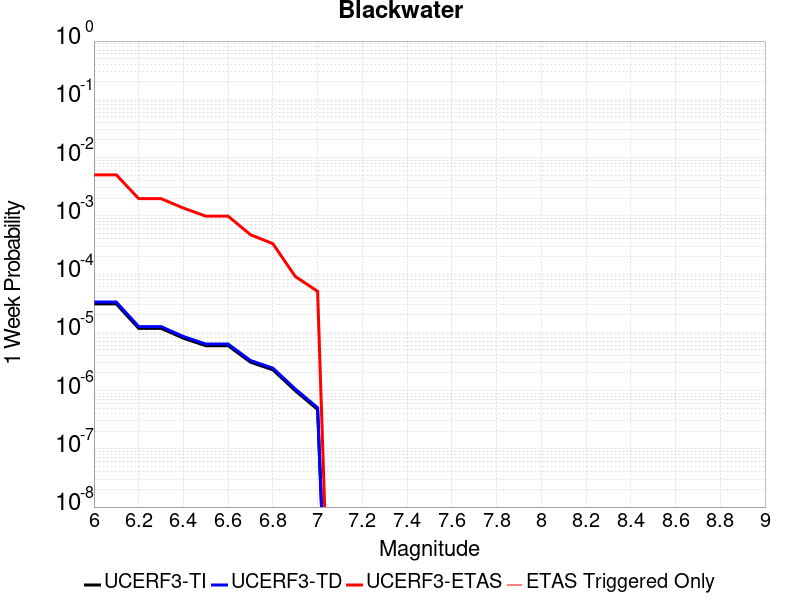 |  |  |  |

| Magnitude | 1 wk TI Prob | 1 wk TD Prob | 1 wk ETAS Prob | 1 wk ETAS/TD Gain | 1 wk ETAS Triggered Only | 1 mo TI Prob | 1 mo TD Prob | 1 mo ETAS Prob | 1 mo ETAS/TD Gain | 1 mo ETAS Triggered Only | 1 yr TI Prob | 1 yr TD Prob | 1 yr ETAS Prob | 1 yr ETAS/TD Gain | 1 yr ETAS Triggered Only | 10 yr TI Prob | 10 yr TD Prob | 10 yr ETAS Prob | 10 yr ETAS/TD Gain | 10 yr ETAS Triggered Only |
|-----|-----|-----|-----|-----|-----|-----|-----|-----|-----|-----|-----|-----|-----|-----|-----|-----|-----|-----|-----|-----|
| 6.0 | 3.0708583E-5 | 3.3095846E-5 | 0.0050529297 | 152.67564 | 0.00502 | 1.3160157E-4 | 1.4183241E-4 | 0.0071708355 | 50.55851 | 0.00703 | 0.0016010714 | 0.0017255784 | 0.012816408 | 7.4273105 | 0.01111 | 0.015895851 | 0.017135633 | 0.03304821 | 1.9286249 | 0.01619 |
| 6.1 | 3.0708583E-5 | 3.3095846E-5 | 0.0050529297 | 152.67564 | 0.00502 | 1.3160157E-4 | 1.4183241E-4 | 0.0071708355 | 50.55851 | 0.00703 | 0.0016010714 | 0.0017255784 | 0.012816408 | 7.4273105 | 0.01111 | 0.015895851 | 0.017135633 | 0.03304821 | 1.9286249 | 0.01619 |
| 6.2 | 1.1707779E-5 | 1.2545122E-5 | 0.0019725205 | 157.23407 | 0.00196 | 5.017523E-5 | 5.3763757E-5 | 0.0028236147 | 52.51893 | 0.00277 | 6.107122E-4 | 6.5438676E-4 | 0.0048816185 | 7.4598374 | 0.00423 | 0.006090366 | 0.0065255696 | 0.012794393 | 1.9606555 | 0.00631 |
| 6.3 | 1.1707779E-5 | 1.2545122E-5 | 0.0019725205 | 157.23407 | 0.00196 | 5.017523E-5 | 5.3763757E-5 | 0.0028236147 | 52.51893 | 0.00277 | 6.107122E-4 | 6.5438676E-4 | 0.0048816185 | 7.4598374 | 0.00423 | 0.006090366 | 0.0065255696 | 0.012794393 | 1.9606555 | 0.00631 |
| 6.4 | 7.929244E-6 | 8.480098E-6 | 0.0013584687 | 160.19492 | 0.00135 | 3.3982033E-5 | 3.6342793E-5 | 0.0019462734 | 53.55321 | 0.00191 | 4.136527E-4 | 4.423877E-4 | 0.0032711357 | 7.3942733 | 0.00283 | 0.0041288356 | 0.0044154758 | 0.008696489 | 1.9695474 | 0.0043 |
| 6.5 | 5.8832115E-6 | 6.285991E-6 | 9.862798E-4 | 156.90125 | 9.8E-4 | 2.521352E-5 | 2.6939697E-5 | 0.0013969028 | 51.85295 | 0.00137 | 3.0693135E-4 | 3.27944E-4 | 0.0023772717 | 7.2490172 | 0.00205 | 0.0030650778 | 0.0032748538 | 0.0063846363 | 1.9495943 | 0.00312 |
| 6.6 | 5.8832115E-6 | 6.285991E-6 | 9.862798E-4 | 156.90125 | 9.8E-4 | 2.521352E-5 | 2.6939697E-5 | 0.0013969028 | 51.85295 | 0.00137 | 3.0693135E-4 | 3.27944E-4 | 0.0023772717 | 7.2490172 | 0.00205 | 0.0030650778 | 0.0032748538 | 0.0063846363 | 1.9495943 | 0.00312 |
| 6.7 | 3.0715053E-6 | 3.2814662E-6 | 4.732799E-4 | 144.2282 | 4.7E-4 | 1.3163528E-5 | 1.4063357E-5 | 6.5405434E-4 | 46.507698 | 6.4E-4 | 1.6025416E-4 | 1.7120909E-4 | 0.0011610396 | 6.7814136 | 9.9E-4 | 0.0016013865 | 0.0017108864 | 0.0031484228 | 1.840229 | 0.00144 |
| 6.8 | 2.2722281E-6 | 2.4287538E-6 | 3.3242794E-4 | 136.87183 | 3.3E-4 | 9.738084E-6 | 1.0408908E-5 | 4.904039E-4 | 47.11387 | 4.8E-4 | 1.1855473E-4 | 1.26722E-4 | 8.3663204E-4 | 6.6021056 | 7.1E-4 | 0.001184915 | 0.0012665876 | 0.0022753084 | 1.7964082 | 0.00101 |
| 6.9 | 9.952399E-7 | 1.0653489E-6 | 9.106525E-5 | 85.47928 | 9.0E-5 | 4.265307E-6 | 4.5657757E-6 | 1.74565E-4 | 38.23337 | 1.7E-4 | 5.1928873E-5 | 5.5587418E-5 | 3.1557298E-4 | 5.6770573 | 2.6E-4 | 5.191674E-4 | 5.557858E-4 | 8.955968E-4 | 1.6114066 | 3.4E-4 |
| 7.0 | 4.7385504E-7 | 5.0755597E-7 | 5.050753E-5 | 99.51126 | 5.0E-5 | 2.0308057E-6 | 2.1752398E-6 | 8.2175065E-5 | 37.777473 | 8.0E-5 | 2.4724779E-5 | 2.6483543E-5 | 1.264809E-4 | 4.77583 | 1.0E-4 | 2.4722028E-4 | 2.6483546E-4 | 4.0479837E-4 | 1.5284902 | 1.4E-4 |

## Ash Hill
*[(top)](#table-of-contents)*

| 1 Week | 1 Month | 1 Year | 10 Year |
|-----|-----|-----|-----|
|  | 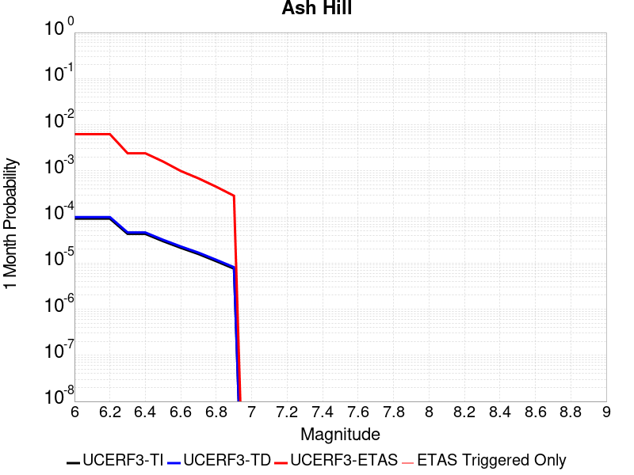 |  | 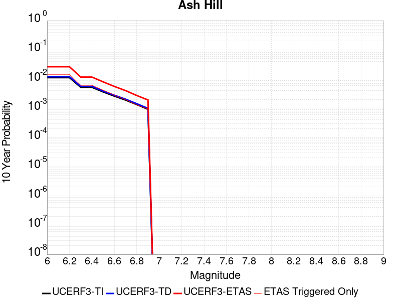 |

| Magnitude | 1 wk TI Prob | 1 wk TD Prob | 1 wk ETAS Prob | 1 wk ETAS/TD Gain | 1 wk ETAS Triggered Only | 1 mo TI Prob | 1 mo TD Prob | 1 mo ETAS Prob | 1 mo ETAS/TD Gain | 1 mo ETAS Triggered Only | 1 yr TI Prob | 1 yr TD Prob | 1 yr ETAS Prob | 1 yr ETAS/TD Gain | 1 yr ETAS Triggered Only | 10 yr TI Prob | 10 yr TD Prob | 10 yr ETAS Prob | 10 yr ETAS/TD Gain | 10 yr ETAS Triggered Only |
|-----|-----|-----|-----|-----|-----|-----|-----|-----|-----|-----|-----|-----|-----|-----|-----|-----|-----|-----|-----|-----|
| 6.0 | 2.1545662E-5 | 2.3194447E-5 | 0.0044130925 | 190.26505 | 0.00439 | 9.2335285E-5 | 9.940143E-5 | 0.006238791 | 62.76359 | 0.00614 | 0.0011236023 | 0.0012096206 | 0.011097645 | 9.174484 | 0.0099 | 0.011179381 | 0.012038348 | 0.026373671 | 2.1908047 | 0.01451 |
| 6.1 | 2.1545662E-5 | 2.3194447E-5 | 0.0044130925 | 190.26505 | 0.00439 | 9.2335285E-5 | 9.940143E-5 | 0.006238791 | 62.76359 | 0.00614 | 0.0011236023 | 0.0012096206 | 0.011097645 | 9.174484 | 0.0099 | 0.011179381 | 0.012038348 | 0.026373671 | 2.1908047 | 0.01451 |
| 6.2 | 2.1545662E-5 | 2.3194447E-5 | 0.0044130925 | 190.26505 | 0.00439 | 9.2335285E-5 | 9.940143E-5 | 0.006238791 | 62.76359 | 0.00614 | 0.0011236023 | 0.0012096206 | 0.011097645 | 9.174484 | 0.0099 | 0.011179381 | 0.012038348 | 0.026373671 | 2.1908047 | 0.01451 |
| 6.3 | 1.0025529E-5 | 1.0746934E-5 | 0.0017507282 | 162.90489 | 0.00174 | 4.2965847E-5 | 4.605755E-5 | 0.002405949 | 52.23788 | 0.00236 | 5.229836E-4 | 5.6061964E-4 | 0.0044884165 | 8.00617 | 0.00393 | 0.005217545 | 0.0055933665 | 0.011679135 | 2.0880332 | 0.00612 |
| 6.4 | 1.0025529E-5 | 1.0746934E-5 | 0.0017507282 | 162.90489 | 0.00174 | 4.2965847E-5 | 4.605755E-5 | 0.002405949 | 52.23788 | 0.00236 | 5.229836E-4 | 5.6061964E-4 | 0.0044884165 | 8.00617 | 0.00393 | 0.005217545 | 0.0055933665 | 0.011679135 | 2.0880332 | 0.00612 |
| 6.5 | 6.9617327E-6 | 7.456634E-6 | 0.0011374482 | 152.54178 | 0.00113 | 2.9835655E-5 | 3.195666E-5 | 0.0015919068 | 49.814556 | 0.00156 | 3.6318856E-4 | 3.8901155E-4 | 0.003087961 | 7.937968 | 0.0027 | 0.0036259557 | 0.0038841602 | 0.008018041 | 2.064292 | 0.00415 |
| 6.6 | 4.9919777E-6 | 5.3466883E-6 | 7.353428E-4 | 137.53238 | 7.3E-4 | 2.1394015E-5 | 2.2914215E-5 | 9.92892E-4 | 43.330833 | 9.7E-4 | 2.60441E-4 | 2.7895154E-4 | 0.0021184382 | 7.5942874 | 0.00184 | 0.0026013597 | 0.0027866727 | 0.005588842 | 2.005561 | 0.00281 |
| 6.7 | 3.6630722E-6 | 3.924624E-6 | 5.0392264E-4 | 128.40025 | 5.0E-4 | 1.5698786E-5 | 1.681974E-5 | 6.868085E-4 | 40.833477 | 6.7E-4 | 1.9111596E-4 | 2.0476682E-4 | 0.0015344945 | 7.4938626 | 0.00133 | 0.0019095168 | 0.0020463446 | 0.004022293 | 1.9655991 | 0.00198 |
| 6.8 | 2.5599613E-6 | 2.744925E-6 | 3.42744E-4 | 124.86461 | 3.4E-4 | 1.0971216E-5 | 1.1763939E-5 | 4.5175877E-4 | 38.401997 | 4.4E-4 | 1.3356637E-4 | 1.4322149E-4 | 9.930998E-4 | 6.9340134 | 8.5E-4 | 0.0013348613 | 0.0014317769 | 0.0027299155 | 1.9066627 | 0.0013 |
| 6.9 | 1.7684905E-6 | 1.8968707E-6 | 2.3189644E-4 | 122.252106 | 2.3E-4 | 7.579223E-6 | 8.129446E-6 | 2.8812716E-4 | 35.442413 | 2.8E-4 | 9.2273134E-5 | 9.8976E-5 | 7.189146E-4 | 7.2635245 | 6.2E-4 | 9.223483E-4 | 9.8976E-4 | 0.0019288297 | 1.9487852 | 9.4E-4 |

## Garlock (West)
*[(top)](#table-of-contents)*

| 1 Week | 1 Month | 1 Year | 10 Year |
|-----|-----|-----|-----|
|  |  |  |  |

| Magnitude | 1 wk TI Prob | 1 wk TD Prob | 1 wk ETAS Prob | 1 wk ETAS/TD Gain | 1 wk ETAS Triggered Only | 1 mo TI Prob | 1 mo TD Prob | 1 mo ETAS Prob | 1 mo ETAS/TD Gain | 1 mo ETAS Triggered Only | 1 yr TI Prob | 1 yr TD Prob | 1 yr ETAS Prob | 1 yr ETAS/TD Gain | 1 yr ETAS Triggered Only | 10 yr TI Prob | 10 yr TD Prob | 10 yr ETAS Prob | 10 yr ETAS/TD Gain | 10 yr ETAS Triggered Only |
|-----|-----|-----|-----|-----|-----|-----|-----|-----|-----|-----|-----|-----|-----|-----|-----|-----|-----|-----|-----|-----|
| 6.0 | 2.5181727E-5 | 2.51973E-5 | 0.0071650175 | 284.35657 | 0.00714 | 1.0791722E-4 | 1.0798398E-4 | 0.00893703 | 82.76256 | 0.00883 | 0.0013131002 | 0.0013139155 | 0.013028503 | 9.915785 | 0.01173 | 0.013053683 | 0.013141977 | 0.027638922 | 2.1031022 | 0.01469 |
| 6.1 | 2.5077732E-5 | 2.5098372E-5 | 0.0071649193 | 285.47345 | 0.00714 | 1.0747157E-4 | 1.0756004E-4 | 0.00893661 | 83.084854 | 0.00883 | 0.001307681 | 0.0013087603 | 0.013023408 | 9.950951 | 0.01173 | 0.013000126 | 0.013091032 | 0.027588725 | 2.1074522 | 0.01469 |
| 6.2 | 2.494612E-5 | 2.498005E-5 | 0.0071648015 | 286.82095 | 0.00714 | 1.0690756E-4 | 1.0705298E-4 | 0.008936108 | 83.473694 | 0.00883 | 0.0013008224 | 0.0013025942 | 0.0130173145 | 9.993377 | 0.01173 | 0.012932341 | 0.013030097 | 0.027528685 | 2.1127 | 0.01469 |
| 6.3 | 2.4733758E-5 | 2.479942E-5 | 0.007164622 | 288.90283 | 0.00714 | 1.0599751E-4 | 1.06278916E-4 | 0.008935341 | 84.07444 | 0.00883 | 0.0012897556 | 0.0012931811 | 0.013008012 | 10.058925 | 0.01173 | 0.012822957 | 0.012937066 | 0.02743702 | 2.120807 | 0.01469 |
| 6.4 | 2.3237335E-5 | 2.317873E-5 | 0.0071430136 | 308.17105 | 0.00712 | 9.958477E-5 | 9.933365E-5 | 0.008888461 | 89.48086 | 0.00879 | 0.0012117702 | 0.001208719 | 0.0128546255 | 10.634916 | 0.01166 | 0.012051838 | 0.012101916 | 0.026525227 | 2.1918206 | 0.0146 |
| 6.5 | 2.2732203E-5 | 2.2993298E-5 | 0.0071428297 | 310.64832 | 0.00712 | 9.742009E-5 | 9.8539E-5 | 0.008887673 | 90.19447 | 0.00879 | 0.0011854442 | 0.0011990548 | 0.012835085 | 10.704336 | 0.01165 | 0.011791403 | 0.012006322 | 0.02642115 | 2.200603 | 0.01459 |
| 6.6 | 2.1319436E-5 | 2.17735E-5 | 0.007131619 | 327.53665 | 0.00711 | 9.136581E-5 | 9.331167E-5 | 0.008872492 | 95.08449 | 0.00878 | 0.001111811 | 0.0011354799 | 0.012752274 | 11.230736 | 0.01163 | 0.011062649 | 0.011377227 | 0.025761688 | 2.2643206 | 0.01455 |
| 6.7 | 1.970802E-5 | 2.0393396E-5 | 0.0071302485 | 349.63516 | 0.00711 | 8.446021E-5 | 8.739735E-5 | 0.00886663 | 101.451935 | 0.00878 | 0.001027818 | 0.001063545 | 0.012681176 | 11.923497 | 0.01163 | 0.010230771 | 0.010664964 | 0.025049895 | 2.3488026 | 0.01454 |
| 6.8 | 1.8744462E-5 | 1.9901045E-5 | 0.0071297595 | 358.26056 | 0.00711 | 8.033094E-5 | 8.5287415E-5 | 0.008864539 | 103.93724 | 0.00878 | 9.775903E-4 | 0.0010378812 | 0.01265581 | 12.193891 | 0.01163 | 0.009733009 | 0.01041075 | 0.024789482 | 2.3811426 | 0.01453 |
| 6.9 | 1.7559682E-5 | 1.8953415E-5 | 0.007108819 | 375.068 | 0.00709 | 7.5253614E-5 | 8.12264E-5 | 0.008840515 | 108.83795 | 0.00876 | 9.158276E-4 | 9.884841E-4 | 0.0125670275 | 12.713433 | 0.01159 | 0.0091206245 | 0.009921231 | 0.024257572 | 2.4450161 | 0.01448 |
| 7.0 | 1.6794445E-5 | 1.8216237E-5 | 0.0070780874 | 388.55927 | 0.00706 | 7.197421E-5 | 7.8067256E-5 | 0.008797387 | 112.689835 | 0.00872 | 8.759337E-4 | 9.5005584E-4 | 0.012489082 | 13.145631 | 0.01155 | 0.008724891 | 0.009540141 | 0.023842381 | 2.4991646 | 0.01444 |
| 7.1 | 1.6337795E-5 | 1.7717046E-5 | 0.0070675923 | 398.91483 | 0.00705 | 7.0017246E-5 | 7.5927994E-5 | 0.008775268 | 115.57355 | 0.0087 | 8.521265E-4 | 9.240326E-4 | 0.012433387 | 13.455573 | 0.01152 | 0.008488664 | 0.009281996 | 0.023558242 | 2.5380578 | 0.01441 |
| 7.2 | 1.5780008E-5 | 1.7165687E-5 | 0.0070570447 | 411.11346 | 0.00704 | 6.762685E-5 | 7.356516E-5 | 0.008762926 | 119.11788 | 0.00869 | 8.2304585E-4 | 8.9528906E-4 | 0.012375002 | 13.822353 | 0.01149 | 0.008200042 | 0.008996838 | 0.023237554 | 2.5828578 | 0.01437 |
| 7.3 | 1.5058865E-5 | 1.6618762E-5 | 0.007036502 | 423.4071 | 0.00702 | 6.45364E-5 | 7.122133E-5 | 0.008740604 | 122.724525 | 0.00867 | 7.854473E-4 | 8.667759E-4 | 0.012306851 | 14.198423 | 0.01145 | 0.00782677 | 0.008713539 | 0.022888934 | 2.6268244 | 0.0143 |
| 7.4 | 1.4887923E-5 | 1.6454731E-5 | 0.006866342 | 417.28677 | 0.00685 | 6.380382E-5 | 7.051838E-5 | 0.008529922 | 120.960266 | 0.00846 | 7.7653467E-4 | 8.582243E-4 | 0.012048612 | 14.039001 | 0.0112 | 0.0077382675 | 0.008628399 | 0.022517515 | 2.609698 | 0.01401 |
| 7.5 | 1.4509299E-5 | 1.6046748E-5 | 0.0063759447 | 397.33563 | 0.00636 | 6.218123E-5 | 6.876997E-5 | 0.007888232 | 114.7046 | 0.00782 | 7.567935E-4 | 8.36954E-4 | 0.011248233 | 13.439488 | 0.01042 | 0.0075422134 | 0.008416704 | 0.021396529 | 2.5421505 | 0.01309 |
| 7.6 | 1.2756717E-5 | 1.4050848E-5 | 0.0041639926 | 296.35168 | 0.00415 | 5.4670498E-5 | 6.0216535E-5 | 0.0052199056 | 86.68559 | 0.00516 | 6.6541E-4 | 7.328904E-4 | 0.0075378995 | 10.285167 | 0.00681 | 0.006634211 | 0.0073816874 | 0.015868574 | 2.1497216 | 0.00855 |
| 7.7 | 1.0328985E-5 | 1.1460557E-5 | 0.0023914333 | 208.66641 | 0.00238 | 4.4266326E-5 | 4.911575E-5 | 0.0030589679 | 62.280792 | 0.00301 | 5.388092E-4 | 5.978206E-4 | 0.004555453 | 7.620101 | 0.00396 | 0.0053750467 | 0.006038511 | 0.010998379 | 1.8213726 | 0.00499 |
| 7.8 | 7.0306583E-6 | 8.899601E-6 | 0.0013788874 | 154.93811 | 0.00137 | 3.0131043E-5 | 3.814059E-5 | 0.0018480716 | 48.454193 | 0.00181 | 3.667837E-4 | 4.642629E-4 | 0.0029031301 | 6.253203 | 0.00244 | 0.003661789 | 0.0046952725 | 0.007760811 | 1.652899 | 0.00308 |
| 7.9 | 4.060633E-6 | 5.4653938E-6 | 7.9546106E-4 | 145.54506 | 7.9E-4 | 1.7402595E-5 | 2.3422906E-5 | 0.001043399 | 44.546093 | 0.00102 | 2.11856E-4 | 2.851367E-4 | 0.0016647432 | 5.838404 | 0.00138 | 0.0021165414 | 0.002884201 | 0.004639125 | 1.608461 | 0.00176 |
| 8.0 | 1.6729537E-6 | 2.0775144E-6 | 2.2207705E-4 | 106.89555 | 2.2E-4 | 7.169782E-6 | 8.903603E-6 | 2.9890102E-4 | 33.570793 | 2.9E-4 | 8.7288594E-5 | 1.0839601E-4 | 5.1835156E-4 | 4.782017 | 4.1E-4 | 8.7254314E-4 | 0.0010969337 | 0.0015863962 | 1.4462097 | 4.9E-4 |
| 8.1 | 3.6733252E-7 | 3.1489964E-7 | 2.0314894E-5 | 64.512276 | 2.0E-5 | 1.5742813E-6 | 1.3495693E-6 | 3.134953E-5 | 23.229284 | 3.0E-5 | 1.9166706E-5 | 1.6430899E-5 | 4.6430407E-5 | 2.8257983 | 3.0E-5 | 1.9165053E-4 | 1.6638759E-4 | 2.0638094E-4 | 1.2403625 | 4.0E-5 |

## McLean Lake
*[(top)](#table-of-contents)*

| 1 Week | 1 Month | 1 Year | 10 Year |
|-----|-----|-----|-----|
|  |  |  |  |

| Magnitude | 1 wk TI Prob | 1 wk TD Prob | 1 wk ETAS Prob | 1 wk ETAS/TD Gain | 1 wk ETAS Triggered Only | 1 mo TI Prob | 1 mo TD Prob | 1 mo ETAS Prob | 1 mo ETAS/TD Gain | 1 mo ETAS Triggered Only | 1 yr TI Prob | 1 yr TD Prob | 1 yr ETAS Prob | 1 yr ETAS/TD Gain | 1 yr ETAS Triggered Only | 10 yr TI Prob | 10 yr TD Prob | 10 yr ETAS Prob | 10 yr ETAS/TD Gain | 10 yr ETAS Triggered Only |
|-----|-----|-----|-----|-----|-----|-----|-----|-----|-----|-----|-----|-----|-----|-----|-----|-----|-----|-----|-----|-----|
| 6.0 | 1.7360222E-5 | 1.8501627E-5 | 0.002538455 | 137.20172 | 0.00252 | 7.439883E-5 | 7.9290556E-5 | 0.00411897 | 51.947803 | 0.00404 | 9.0542925E-4 | 9.6498354E-4 | 0.008437766 | 8.743947 | 0.00748 | 0.009017491 | 0.0096127745 | 0.020784343 | 2.1621585 | 0.01128 |
| 6.1 | 9.062689E-6 | 9.592193E-6 | 0.0013795791 | 143.8231 | 0.00137 | 3.8839516E-5 | 4.1108804E-5 | 0.002271017 | 55.24406 | 0.00223 | 4.727685E-4 | 5.003936E-4 | 0.004548367 | 9.089579 | 0.00405 | 0.0047176396 | 0.004993552 | 0.011132741 | 2.2294235 | 0.00617 |
| 6.2 | 9.062689E-6 | 9.592193E-6 | 0.0013795791 | 143.8231 | 0.00137 | 3.8839516E-5 | 4.1108804E-5 | 0.002271017 | 55.24406 | 0.00223 | 4.727685E-4 | 5.003936E-4 | 0.004548367 | 9.089579 | 0.00405 | 0.0047176396 | 0.004993552 | 0.011132741 | 2.2294235 | 0.00617 |
| 6.3 | 7.2575485E-6 | 7.66771E-6 | 0.0010376598 | 135.32852 | 0.00103 | 3.110341E-5 | 3.2861237E-5 | 0.001742805 | 53.035282 | 0.00171 | 3.786182E-4 | 4.0001926E-4 | 0.0034188111 | 8.546617 | 0.00302 | 0.0037797375 | 0.0039936965 | 0.008714766 | 2.1821303 | 0.00474 |
| 6.4 | 7.2575485E-6 | 7.66771E-6 | 0.0010376598 | 135.32852 | 0.00103 | 3.110341E-5 | 3.2861237E-5 | 0.001742805 | 53.035282 | 0.00171 | 3.786182E-4 | 4.0001926E-4 | 0.0034188111 | 8.546617 | 0.00302 | 0.0037797375 | 0.0039936965 | 0.008714766 | 2.1821303 | 0.00474 |
| 6.5 | 6.06582E-6 | 6.4038773E-6 | 8.263986E-4 | 129.04662 | 8.2E-4 | 2.5996113E-5 | 2.7444936E-5 | 0.0013874077 | 50.55241 | 0.00136 | 3.164567E-4 | 3.3409733E-4 | 0.002863252 | 8.570113 | 0.00253 | 0.0031600643 | 0.0033365893 | 0.0072833765 | 2.1828806 | 0.00396 |
| 6.6 | 5.598744E-6 | 5.910262E-6 | 7.25906E-4 | 122.82129 | 7.2E-4 | 2.3994397E-5 | 2.5329486E-5 | 0.0012152994 | 47.97963 | 0.00119 | 2.9209262E-4 | 3.0834923E-4 | 0.0025376617 | 8.22983 | 0.00223 | 0.0029170897 | 0.003079843 | 0.006668756 | 2.1652908 | 0.0036 |
| 6.7 | 5.246996E-6 | 5.539162E-6 | 6.655355E-4 | 120.15094 | 6.6E-4 | 2.2486933E-5 | 2.3739085E-5 | 0.0011137133 | 46.91475 | 0.00109 | 2.73744E-4 | 2.8899137E-4 | 0.002328402 | 8.056994 | 0.00204 | 0.0027340704 | 0.0028867796 | 0.0061971955 | 2.1467505 | 0.00332 |
| 6.8 | 4.02324E-6 | 4.2469046E-6 | 4.742449E-4 | 111.66837 | 4.7E-4 | 1.7242342E-5 | 1.8200926E-5 | 8.0818654E-4 | 44.403595 | 7.9E-4 | 2.099053E-4 | 2.2157968E-4 | 0.0017212473 | 7.7680736 | 0.0015 | 0.0020970714 | 0.002214172 | 0.0046886806 | 2.1175776 | 0.00248 |
| 6.9 | 6.835972E-7 | 7.1399285E-7 | 3.071397E-5 | 43.0172 | 3.0E-5 | 2.9296991E-6 | 3.0599674E-6 | 9.3059694E-5 | 30.411987 | 9.0E-5 | 3.56685E-5 | 3.7254784E-5 | 2.4724696E-4 | 6.6366496 | 2.1E-4 | 3.5662777E-4 | 3.7251666E-4 | 6.824012E-4 | 1.8318676 | 3.1E-4 |

## Goldstone Lake
*[(top)](#table-of-contents)*

| 1 Week | 1 Month | 1 Year | 10 Year |
|-----|-----|-----|-----|
|  | 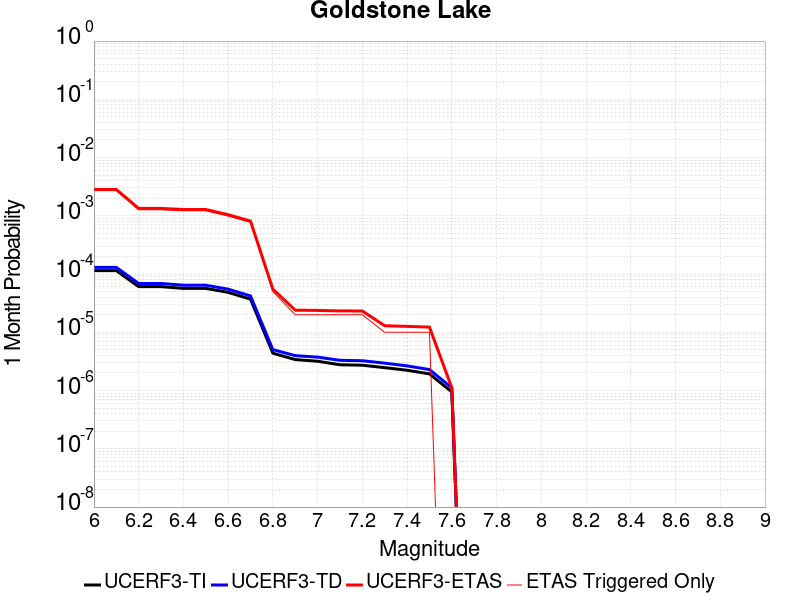 |  |  |

| Magnitude | 1 wk TI Prob | 1 wk TD Prob | 1 wk ETAS Prob | 1 wk ETAS/TD Gain | 1 wk ETAS Triggered Only | 1 mo TI Prob | 1 mo TD Prob | 1 mo ETAS Prob | 1 mo ETAS/TD Gain | 1 mo ETAS Triggered Only | 1 yr TI Prob | 1 yr TD Prob | 1 yr ETAS Prob | 1 yr ETAS/TD Gain | 1 yr ETAS Triggered Only | 10 yr TI Prob | 10 yr TD Prob | 10 yr ETAS Prob | 10 yr ETAS/TD Gain | 10 yr ETAS Triggered Only |
|-----|-----|-----|-----|-----|-----|-----|-----|-----|-----|-----|-----|-----|-----|-----|-----|-----|-----|-----|-----|-----|
| 6.0 | 2.671352E-5 | 3.037609E-5 | 0.001680326 | 55.31739 | 0.00165 | 1.1448149E-4 | 1.3017785E-4 | 0.0028298264 | 21.738155 | 0.0027 | 0.001392921 | 0.0015839594 | 0.0066758813 | 4.2146792 | 0.0051 | 0.013842222 | 0.015746197 | 0.023935188 | 1.5200616 | 0.00832 |
| 6.1 | 2.671352E-5 | 3.037609E-5 | 0.001680326 | 55.31739 | 0.00165 | 1.1448149E-4 | 1.3017785E-4 | 0.0028298264 | 21.738155 | 0.0027 | 0.001392921 | 0.0015839594 | 0.0066758813 | 4.2146792 | 0.0051 | 0.013842222 | 0.015746197 | 0.023935188 | 1.5200616 | 0.00832 |
| 6.2 | 1.4197047E-5 | 1.6096245E-5 | 7.260848E-4 | 45.10896 | 7.1E-4 | 6.0843064E-5 | 6.8982634E-5 | 0.0013388951 | 19.40916 | 0.00127 | 7.4051257E-4 | 8.3963864E-4 | 0.0033175563 | 3.9511716 | 0.00248 | 0.007380498 | 0.0083743585 | 0.01252927 | 1.4961468 | 0.00419 |
| 6.3 | 1.4197047E-5 | 1.6096245E-5 | 7.260848E-4 | 45.10896 | 7.1E-4 | 6.0843064E-5 | 6.8982634E-5 | 0.0013388951 | 19.40916 | 0.00127 | 7.4051257E-4 | 8.3963864E-4 | 0.0033175563 | 3.9511716 | 0.00248 | 0.007380498 | 0.0083743585 | 0.01252927 | 1.4961468 | 0.00419 |
| 6.4 | 1.3238931E-5 | 1.500846E-5 | 7.1499794E-4 | 47.639664 | 7.0E-4 | 5.6737044E-5 | 6.4320935E-5 | 0.0012842425 | 19.966166 | 0.00122 | 6.9055456E-4 | 7.82924E-4 | 0.0031410763 | 4.011981 | 0.00236 | 0.006884126 | 0.0078112837 | 0.011770116 | 1.5068096 | 0.00399 |
| 6.5 | 1.3238931E-5 | 1.500846E-5 | 7.1499794E-4 | 47.639664 | 7.0E-4 | 5.6737044E-5 | 6.4320935E-5 | 0.0012842425 | 19.966166 | 0.00122 | 6.9055456E-4 | 7.82924E-4 | 0.0031410763 | 4.011981 | 0.00236 | 0.006884126 | 0.0078112837 | 0.011770116 | 1.5068096 | 0.00399 |
| 6.6 | 1.1328278E-5 | 1.2855166E-5 | 5.628481E-4 | 43.78381 | 5.5E-4 | 4.8548856E-5 | 5.5092944E-5 | 0.0010450385 | 18.968643 | 9.9E-4 | 5.90922E-4 | 6.7064585E-4 | 0.0026693046 | 3.9802 | 0.002 | 0.0058935313 | 0.0066956086 | 0.010162241 | 1.5177472 | 0.00349 |
| 6.7 | 8.651175E-6 | 9.824565E-6 | 4.6982005E-4 | 47.820953 | 4.6E-4 | 3.707594E-5 | 4.2105108E-5 | 8.120727E-4 | 19.286798 | 7.7E-4 | 4.5130608E-4 | 5.1259965E-4 | 0.0020118307 | 3.9247603 | 0.0015 | 0.0045039062 | 0.005123051 | 0.0077395774 | 1.510736 | 0.00263 |
| 6.8 | 1.0215377E-6 | 1.1754702E-6 | 3.1175434E-5 | 26.521671 | 3.0E-5 | 4.378012E-6 | 5.0377203E-6 | 5.5037468E-5 | 10.925074 | 5.0E-5 | 5.3300988E-5 | 6.1332634E-5 | 1.2132896E-4 | 1.978212 | 6.0E-5 | 5.3288206E-4 | 6.1316835E-4 | 6.831254E-4 | 1.1140912 | 7.0E-5 |
| 6.9 | 7.9360774E-7 | 9.2833966E-7 | 9.2833966E-7 | 1.0 | 0.0 | 3.4011714E-6 | 3.9785928E-6 | 2.3978513E-5 | 6.026883 | 2.0E-5 | 4.1408475E-5 | 4.843836E-5 | 6.8437395E-5 | 1.4128759 | 2.0E-5 | 4.140076E-4 | 4.8428503E-4 | 5.042753E-4 | 1.041278 | 2.0E-5 |
| 7.0 | 7.4382757E-7 | 8.7473285E-7 | 8.7473285E-7 | 1.0 | 0.0 | 3.1878285E-6 | 3.74885E-6 | 2.3748775E-5 | 6.3349495 | 2.0E-5 | 3.8811122E-5 | 4.564136E-5 | 6.5640445E-5 | 1.438179 | 2.0E-5 | 3.8804344E-4 | 4.5632652E-4 | 4.763174E-4 | 1.0438082 | 2.0E-5 |
| 7.1 | 6.4709513E-7 | 7.7113E-7 | 7.7113E-7 | 1.0 | 0.0 | 2.773262E-6 | 3.3048389E-6 | 2.3304772E-5 | 7.051712 | 2.0E-5 | 3.376394E-5 | 4.0235733E-5 | 6.023493E-5 | 1.4970506 | 2.0E-5 | 3.375881E-4 | 4.0229043E-4 | 4.2228238E-4 | 1.0496954 | 2.0E-5 |
| 7.2 | 6.356704E-7 | 7.5883594E-7 | 7.5883594E-7 | 1.0 | 0.0 | 2.7242988E-6 | 3.2521505E-6 | 2.3252085E-5 | 7.1497574 | 2.0E-5 | 3.3167835E-5 | 3.959427E-5 | 5.959348E-5 | 1.5051036 | 2.0E-5 | 3.3162883E-4 | 3.958781E-4 | 4.158702E-4 | 1.0505006 | 2.0E-5 |
| 7.3 | 5.7695723E-7 | 6.8965653E-7 | 6.8965653E-7 | 1.0 | 0.0 | 2.4726714E-6 | 2.9556677E-6 | 1.2955638E-5 | 4.3833203 | 1.0E-5 | 3.0104358E-5 | 3.5984718E-5 | 4.598436E-5 | 1.2778857 | 1.0E-5 | 3.0100282E-4 | 3.5979465E-4 | 3.6979106E-4 | 1.0277836 | 1.0E-5 |
| 7.4 | 5.209647E-7 | 6.193514E-7 | 6.193514E-7 | 1.0 | 0.0 | 2.232704E-6 | 2.6543607E-6 | 1.2654335E-5 | 4.7673755 | 1.0E-5 | 2.718283E-5 | 3.2316417E-5 | 4.2316096E-5 | 1.3094302 | 1.0E-5 | 2.7179506E-4 | 3.2312275E-4 | 3.331195E-4 | 1.030938 | 1.0E-5 |
| 7.5 | 4.512955E-7 | 5.348885E-7 | 5.348885E-7 | 1.0 | 0.0 | 1.934122E-6 | 2.2923775E-6 | 1.2292355E-5 | 5.362273 | 1.0E-5 | 2.3547682E-5 | 2.7909393E-5 | 3.7909114E-5 | 1.3582923 | 1.0E-5 | 2.3545188E-4 | 2.7906417E-4 | 2.890614E-4 | 1.0358241 | 1.0E-5 |
| 7.6 | 2.21172E-7 | 2.603961E-7 | 2.603961E-7 | 1.0 | 0.0 | 9.478797E-7 | 1.1159829E-6 | 1.1159829E-6 | 1.0 | 0.0 | 1.1540374E-5 | 1.3587036E-5 | 1.3587036E-5 | 1.0 | 0.0 | 1.1539775E-4 | 1.3586486E-4 | 1.3586486E-4 | 1.0 | 0.0 |

## Gravel Hills-Harper Lk
*[(top)](#table-of-contents)*

| 1 Week | 1 Month | 1 Year | 10 Year |
|-----|-----|-----|-----|
|  | 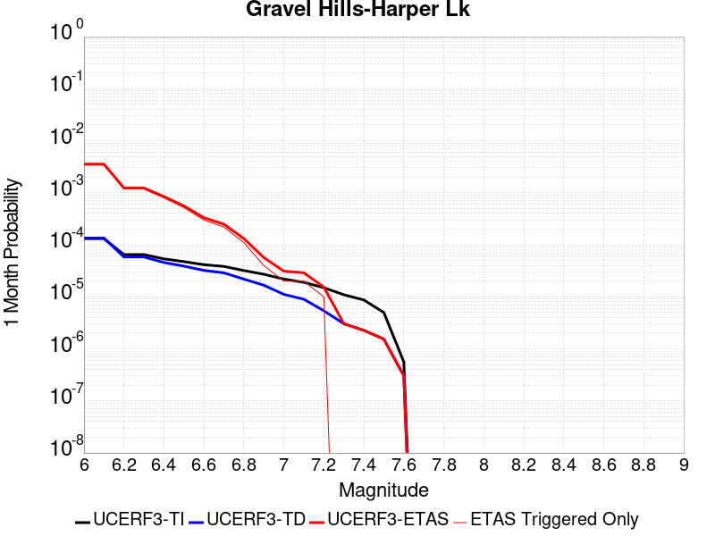 | 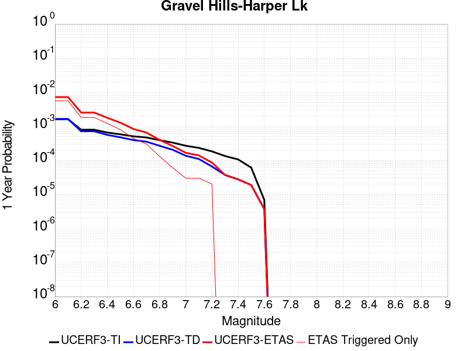 | 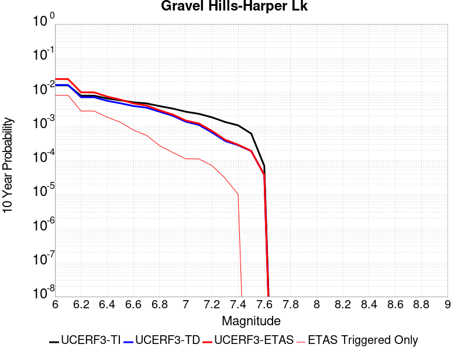 |

| Magnitude | 1 wk TI Prob | 1 wk TD Prob | 1 wk ETAS Prob | 1 wk ETAS/TD Gain | 1 wk ETAS Triggered Only | 1 mo TI Prob | 1 mo TD Prob | 1 mo ETAS Prob | 1 mo ETAS/TD Gain | 1 mo ETAS Triggered Only | 1 yr TI Prob | 1 yr TD Prob | 1 yr ETAS Prob | 1 yr ETAS/TD Gain | 1 yr ETAS Triggered Only | 10 yr TI Prob | 10 yr TD Prob | 10 yr ETAS Prob | 10 yr ETAS/TD Gain | 10 yr ETAS Triggered Only |
|-----|-----|-----|-----|-----|-----|-----|-----|-----|-----|-----|-----|-----|-----|-----|-----|-----|-----|-----|-----|-----|
| 6.0 | 3.0679566E-5 | 3.1464646E-5 | 0.0024113897 | 76.63807 | 0.00238 | 1.3147724E-4 | 1.3484273E-4 | 0.0035543817 | 26.359459 | 0.00342 | 0.0015995599 | 0.0016406906 | 0.0071616177 | 4.3650017 | 0.00553 | 0.015880952 | 0.01630734 | 0.024255576 | 1.4874024 | 0.00808 |
| 6.1 | 3.0679566E-5 | 3.1464646E-5 | 0.0024113897 | 76.63807 | 0.00238 | 1.3147724E-4 | 1.3484273E-4 | 0.0035543817 | 26.359459 | 0.00342 | 0.0015995599 | 0.0016406906 | 0.0071616177 | 4.3650017 | 0.00553 | 0.015880952 | 0.01630734 | 0.024255576 | 1.4874024 | 0.00808 |
| 6.2 | 1.514536E-5 | 1.3635206E-5 | 8.5362373E-4 | 62.604385 | 8.4E-4 | 6.490707E-5 | 5.843536E-5 | 0.0012383664 | 21.192074 | 0.00118 | 7.8995706E-4 | 7.1123015E-4 | 0.0025299357 | 3.5571268 | 0.00182 | 0.007871548 | 0.0070907404 | 0.009860957 | 1.3906809 | 0.00279 |
| 6.3 | 1.514536E-5 | 1.3635206E-5 | 8.5362373E-4 | 62.604385 | 8.4E-4 | 6.490707E-5 | 5.843536E-5 | 0.0012383664 | 21.192074 | 0.00118 | 7.8995706E-4 | 7.1123015E-4 | 0.0025299357 | 3.5571268 | 0.00182 | 0.007871548 | 0.0070907404 | 0.009860957 | 1.3906809 | 0.00279 |
| 6.4 | 1.2532521E-5 | 1.06896905E-5 | 5.706837E-4 | 53.386364 | 5.6E-4 | 5.37097E-5 | 4.581219E-5 | 8.4577553E-4 | 18.461802 | 8.0E-4 | 6.537194E-4 | 5.576265E-4 | 0.0017669518 | 3.1687012 | 0.00121 | 0.0065179965 | 0.005562863 | 0.007392627 | 1.3289249 | 0.00184 |
| 6.5 | 1.1094058E-5 | 9.083664E-6 | 3.690804E-4 | 40.631226 | 3.6E-4 | 4.7545094E-5 | 3.892943E-5 | 5.589092E-4 | 14.356984 | 5.2E-4 | 5.787078E-4 | 4.7386673E-4 | 0.0012734877 | 2.6874382 | 8.0E-4 | 0.0057720304 | 0.0047289706 | 0.0060327756 | 1.2757059 | 0.00131 |
| 6.6 | 9.688328E-6 | 7.5316952E-6 | 2.1753012E-4 | 28.88196 | 2.1E-4 | 4.1520743E-5 | 3.227831E-5 | 3.3226862E-4 | 10.293867 | 3.0E-4 | 5.053978E-4 | 3.9292008E-4 | 8.327472E-4 | 2.1193805 | 4.4E-4 | 0.0050424994 | 0.0039225104 | 0.00468949 | 1.1955328 | 7.7E-4 |
| 6.7 | 8.974824E-6 | 6.749413E-6 | 1.7674826E-4 | 26.187206 | 1.7E-4 | 3.8462964E-5 | 2.8925748E-5 | 2.489194E-4 | 8.605461 | 2.2E-4 | 4.6818596E-4 | 3.5211627E-4 | 6.520106E-4 | 1.8516912 | 3.0E-4 | 0.004672008 | 0.0035158044 | 0.004053906 | 1.1530522 | 5.4E-4 |
| 6.8 | 7.4780046E-6 | 5.1161933E-6 | 1.1511563E-4 | 22.50025 | 1.1E-4 | 3.20482E-5 | 2.1926366E-5 | 1.3192395E-4 | 6.016681 | 1.1E-4 | 3.9011694E-4 | 2.669222E-4 | 3.9688748E-4 | 1.4869033 | 1.3E-4 | 0.0038943281 | 0.0026661542 | 0.0029354342 | 1.1009995 | 2.7E-4 |
| 6.9 | 6.3409307E-6 | 3.9074966E-6 | 4.390734E-5 | 11.236692 | 4.0E-5 | 2.7175134E-5 | 1.6746313E-5 | 5.6745645E-5 | 3.3885455 | 4.0E-5 | 3.3080703E-4 | 2.0386827E-4 | 2.6385605E-4 | 1.2942476 | 6.0E-5 | 0.0033031502 | 0.0020369107 | 0.0022065644 | 1.0832897 | 1.7E-4 |
| 7.0 | 5.1239335E-6 | 2.6058565E-6 | 2.2605804E-5 | 8.675 | 2.0E-5 | 2.195953E-5 | 1.116791E-5 | 3.1167685E-5 | 2.7908254 | 2.0E-5 | 2.6732447E-4 | 1.3596108E-4 | 1.65957E-4 | 1.2206213 | 3.0E-5 | 0.0026700313 | 0.0013588042 | 0.0014686547 | 1.0808436 | 1.1E-4 |
| 7.1 | 4.438899E-6 | 2.0984728E-6 | 2.2098431E-5 | 10.530721 | 2.0E-5 | 1.9023713E-5 | 8.993425E-6 | 2.8993245E-5 | 3.223827 | 2.0E-5 | 2.315891E-4 | 1.0948967E-4 | 1.3948638E-4 | 1.2739685 | 3.0E-5 | 0.002313479 | 0.0010943791 | 0.0012042588 | 1.1004037 | 1.1E-4 |
| 7.2 | 3.50367E-6 | 1.2615716E-6 | 1.1261559E-5 | 8.926611 | 1.0E-5 | 1.5015643E-5 | 5.4067245E-6 | 1.5406671E-5 | 2.8495386 | 1.0E-5 | 1.8280011E-4 | 6.582497E-5 | 8.582365E-5 | 1.3038161 | 2.0E-5 | 0.0018264982 | 6.580629E-4 | 7.2801684E-4 | 1.1063029 | 7.0E-5 |
| 7.3 | 2.561638E-6 | 7.1191585E-7 | 7.1191585E-7 | 1.0 | 0.0 | 1.0978401E-5 | 3.0510646E-6 | 3.0510646E-6 | 1.0 | 0.0 | 1.3365384E-4 | 3.71461E-5 | 3.71461E-5 | 1.0 | 0.0 | 0.0013357349 | 3.7140088E-4 | 4.0138973E-4 | 1.0807452 | 3.0E-5 |
| 7.4 | 2.0368864E-6 | 5.304837E-7 | 5.304837E-7 | 1.0 | 0.0 | 8.729483E-6 | 2.2734996E-6 | 2.2734996E-6 | 1.0 | 0.0 | 1.06276275E-4 | 2.7679513E-5 | 2.7679513E-5 | 1.0 | 0.0 | 0.0010622547 | 2.767612E-4 | 2.867584E-4 | 1.0361222 | 1.0E-5 |
| 7.5 | 1.1681728E-6 | 3.6030585E-7 | 3.6030585E-7 | 1.0 | 0.0 | 5.0064455E-6 | 1.544167E-6 | 1.544167E-6 | 1.0 | 0.0 | 6.0951766E-5 | 1.8800076E-5 | 1.8800076E-5 | 1.0 | 0.0 | 6.093505E-4 | 1.8798532E-4 | 1.8798532E-4 | 1.0 | 0.0 |
| 7.6 | 1.3154387E-7 | 7.1197384E-8 | 7.1197384E-8 | 1.0 | 0.0 | 5.6375933E-7 | 3.051316E-7 | 3.051316E-7 | 1.0 | 0.0 | 6.863748E-6 | 3.7149728E-6 | 3.7149728E-6 | 1.0 | 0.0 | 6.863536E-5 | 3.7149264E-5 | 3.7149264E-5 | 1.0 | 0.0 |

## Coyote Canyon
*[(top)](#table-of-contents)*

| 1 Week | 1 Month | 1 Year | 10 Year |
|-----|-----|-----|-----|
| 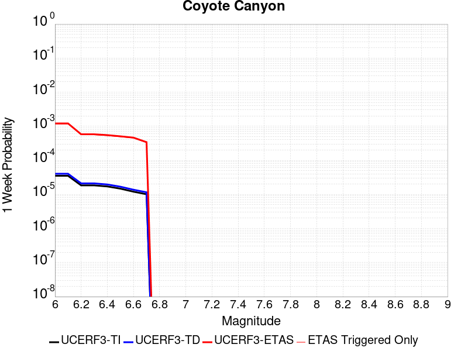 |  |  |  |

| Magnitude | 1 wk TI Prob | 1 wk TD Prob | 1 wk ETAS Prob | 1 wk ETAS/TD Gain | 1 wk ETAS Triggered Only | 1 mo TI Prob | 1 mo TD Prob | 1 mo ETAS Prob | 1 mo ETAS/TD Gain | 1 mo ETAS Triggered Only | 1 yr TI Prob | 1 yr TD Prob | 1 yr ETAS Prob | 1 yr ETAS/TD Gain | 1 yr ETAS Triggered Only | 10 yr TI Prob | 10 yr TD Prob | 10 yr ETAS Prob | 10 yr ETAS/TD Gain | 10 yr ETAS Triggered Only |
|-----|-----|-----|-----|-----|-----|-----|-----|-----|-----|-----|-----|-----|-----|-----|-----|-----|-----|-----|-----|-----|
| 6.0 | 3.5090034E-5 | 4.0364324E-5 | 0.0012103171 | 29.984823 | 0.00117 | 1.503772E-4 | 1.7297994E-4 | 0.0019326755 | 11.172831 | 0.00176 | 0.0018293047 | 0.0021042528 | 0.0054671615 | 2.5981486 | 0.00337 | 0.018143194 | 0.020869201 | 0.026215255 | 1.2561696 | 0.00546 |
| 6.1 | 3.5090034E-5 | 4.0364324E-5 | 0.0012103171 | 29.984823 | 0.00117 | 1.503772E-4 | 1.7297994E-4 | 0.0019326755 | 11.172831 | 0.00176 | 0.0018293047 | 0.0021042528 | 0.0054671615 | 2.5981486 | 0.00337 | 0.018143194 | 0.020869201 | 0.026215255 | 1.2561696 | 0.00546 |
| 6.2 | 1.841879E-5 | 2.1059794E-5 | 5.81048E-4 | 27.590395 | 5.6E-4 | 7.8935285E-5 | 9.0253714E-5 | 9.7017427E-4 | 10.749412 | 8.8E-4 | 9.606133E-4 | 0.001098387 | 0.0027865306 | 2.5369298 | 0.00169 | 0.0095647145 | 0.010939667 | 0.013867286 | 1.267615 | 0.00296 |
| 6.3 | 1.841879E-5 | 2.1059794E-5 | 5.81048E-4 | 27.590395 | 5.6E-4 | 7.8935285E-5 | 9.0253714E-5 | 9.7017427E-4 | 10.749412 | 8.8E-4 | 9.606133E-4 | 0.001098387 | 0.0027865306 | 2.5369298 | 0.00169 | 0.0095647145 | 0.010939667 | 0.013867286 | 1.267615 | 0.00296 |
| 6.4 | 1.712201E-5 | 1.9565212E-5 | 5.495548E-4 | 28.088367 | 5.3E-4 | 7.337798E-5 | 8.3848776E-5 | 9.2377834E-4 | 11.017195 | 8.4E-4 | 8.930107E-4 | 0.0010204813 | 0.0025788895 | 2.5271304 | 0.00156 | 0.008894307 | 0.010167871 | 0.012870112 | 1.2657628 | 0.00273 |
| 6.5 | 1.4744935E-5 | 1.6836972E-5 | 5.068287E-4 | 30.10213 | 4.9E-4 | 6.3191044E-5 | 7.215698E-5 | 8.521007E-4 | 11.808985 | 7.8E-4 | 7.6907943E-4 | 8.7825063E-4 | 0.0023269772 | 2.6495593 | 0.00145 | 0.007664232 | 0.008756994 | 0.011254927 | 1.28525 | 0.00252 |
| 6.6 | 1.2017839E-5 | 1.37240895E-5 | 4.637179E-4 | 33.788612 | 4.5E-4 | 5.150401E-5 | 5.88167E-5 | 7.387767E-4 | 12.560662 | 6.8E-4 | 6.268809E-4 | 7.159466E-4 | 0.0019150875 | 2.6749027 | 0.0012 | 0.0062511545 | 0.0071450938 | 0.009220161 | 1.2904184 | 0.00209 |
| 6.7 | 1.00956095E-5 | 1.1533517E-5 | 3.415297E-4 | 29.611933 | 3.3E-4 | 4.326618E-5 | 4.942891E-5 | 5.6940323E-4 | 11.519639 | 5.2E-4 | 5.266384E-4 | 6.017178E-4 | 0.0015811281 | 2.6276906 | 9.8E-4 | 0.005253921 | 0.0060094125 | 0.0078085354 | 1.2993841 | 0.00181 |

## San Andreas (Mojave N)
*[(top)](#table-of-contents)*

| 1 Week | 1 Month | 1 Year | 10 Year |
|-----|-----|-----|-----|
|  |  |  |  |

| Magnitude | 1 wk TI Prob | 1 wk TD Prob | 1 wk ETAS Prob | 1 wk ETAS/TD Gain | 1 wk ETAS Triggered Only | 1 mo TI Prob | 1 mo TD Prob | 1 mo ETAS Prob | 1 mo ETAS/TD Gain | 1 mo ETAS Triggered Only | 1 yr TI Prob | 1 yr TD Prob | 1 yr ETAS Prob | 1 yr ETAS/TD Gain | 1 yr ETAS Triggered Only | 10 yr TI Prob | 10 yr TD Prob | 10 yr ETAS Prob | 10 yr ETAS/TD Gain | 10 yr ETAS Triggered Only |
|-----|-----|-----|-----|-----|-----|-----|-----|-----|-----|-----|-----|-----|-----|-----|-----|-----|-----|-----|-----|-----|
| 6.0 | 9.877682E-5 | 1.9400702E-4 | 0.0029534716 | 15.22353 | 0.00276 | 4.2326056E-4 | 8.311939E-4 | 0.0043482683 | 5.2313523 | 0.00352 | 0.0051410277 | 0.010072956 | 0.0147553105 | 1.4648442 | 0.00473 | 0.05023708 | 0.09831428 | 0.10377849 | 1.0555791 | 0.00606 |
| 6.1 | 9.877682E-5 | 1.9400702E-4 | 0.0029534716 | 15.22353 | 0.00276 | 4.2326056E-4 | 8.311939E-4 | 0.0043482683 | 5.2313523 | 0.00352 | 0.0051410277 | 0.010072956 | 0.0147553105 | 1.4648442 | 0.00473 | 0.05023708 | 0.09831428 | 0.10377849 | 1.0555791 | 0.00606 |
| 6.2 | 9.877682E-5 | 1.9400702E-4 | 0.0029534716 | 15.22353 | 0.00276 | 4.2326056E-4 | 8.311939E-4 | 0.0043482683 | 5.2313523 | 0.00352 | 0.0051410277 | 0.010072956 | 0.0147553105 | 1.4648442 | 0.00473 | 0.05023708 | 0.09831428 | 0.10377849 | 1.0555791 | 0.00606 |
| 6.3 | 9.877682E-5 | 1.9400702E-4 | 0.0029534716 | 15.22353 | 0.00276 | 4.2326056E-4 | 8.311939E-4 | 0.0043482683 | 5.2313523 | 0.00352 | 0.0051410277 | 0.010072956 | 0.0147553105 | 1.4648442 | 0.00473 | 0.05023708 | 0.09831428 | 0.10377849 | 1.0555791 | 0.00606 |
| 6.4 | 9.877682E-5 | 1.9400702E-4 | 0.0029534716 | 15.22353 | 0.00276 | 4.2326056E-4 | 8.311939E-4 | 0.0043482683 | 5.2313523 | 0.00352 | 0.0051410277 | 0.010072956 | 0.0147553105 | 1.4648442 | 0.00473 | 0.05023708 | 0.09831428 | 0.10377849 | 1.0555791 | 0.00606 |
| 6.5 | 9.861474E-5 | 1.9374468E-4 | 0.00295321 | 15.242792 | 0.00276 | 4.2256617E-4 | 8.300703E-4 | 0.0043471484 | 5.2370844 | 0.00352 | 0.0051326132 | 0.010059402 | 0.014741822 | 1.4654769 | 0.00473 | 0.050156746 | 0.098192066 | 0.10365702 | 1.0556558 | 0.00606 |
| 6.6 | 9.861474E-5 | 1.9374468E-4 | 0.00295321 | 15.242792 | 0.00276 | 4.2256617E-4 | 8.300703E-4 | 0.0043471484 | 5.2370844 | 0.00352 | 0.0051326132 | 0.010059402 | 0.014741822 | 1.4654769 | 0.00473 | 0.050156746 | 0.098192066 | 0.10365702 | 1.0556558 | 0.00606 |
| 6.7 | 9.8552715E-5 | 1.9364421E-4 | 0.0029531098 | 15.250183 | 0.00276 | 4.223004E-4 | 8.2964E-4 | 0.0043467195 | 5.239284 | 0.00352 | 0.0051293927 | 0.010054212 | 0.014736656 | 1.4657196 | 0.00473 | 0.050125998 | 0.098145254 | 0.10361049 | 1.0556852 | 0.00606 |
| 6.8 | 9.8464974E-5 | 1.9349584E-4 | 0.0029529617 | 15.261112 | 0.00276 | 4.219245E-4 | 8.290045E-4 | 0.0043460866 | 5.2425365 | 0.00352 | 0.0051248376 | 0.010046546 | 0.014729027 | 1.4660785 | 0.00473 | 0.05008251 | 0.09807528 | 0.10354094 | 1.0557293 | 0.00606 |
| 6.9 | 9.825824E-5 | 1.9317595E-4 | 0.0029526427 | 15.284734 | 0.00276 | 4.2103877E-4 | 8.276344E-4 | 0.0043447213 | 5.2495656 | 0.00352 | 0.0051141046 | 0.010030019 | 0.014712577 | 1.4668543 | 0.00473 | 0.049980022 | 0.09792438 | 0.10339096 | 1.0558245 | 0.00606 |
| 7.0 | 9.781462E-5 | 1.924896E-4 | 0.0029519582 | 15.335677 | 0.00276 | 4.1913814E-4 | 8.246948E-4 | 0.004341792 | 5.2647257 | 0.00352 | 0.005091073 | 0.009994558 | 0.014667384 | 1.4675369 | 0.00472 | 0.04976007 | 0.09760077 | 0.10306029 | 1.0559372 | 0.00605 |
| 7.1 | 9.7121134E-5 | 1.9150671E-4 | 0.0029509782 | 15.409267 | 0.00276 | 4.1616702E-4 | 8.204851E-4 | 0.004337597 | 5.286625 | 0.00352 | 0.005055068 | 0.009943774 | 0.01461684 | 1.4699489 | 0.00472 | 0.04941613 | 0.09713728 | 0.102590576 | 1.0561401 | 0.00604 |
| 7.2 | 9.663819E-5 | 1.9081456E-4 | 0.002950288 | 15.461544 | 0.00276 | 4.1409794E-4 | 8.175206E-4 | 0.004334643 | 5.3021817 | 0.00352 | 0.0050299936 | 0.00990801 | 0.014581244 | 1.4716622 | 0.00472 | 0.049176537 | 0.09681055 | 0.10226581 | 1.0563499 | 0.00604 |
| 7.3 | 9.6277574E-5 | 1.9033969E-4 | 0.0029498143 | 15.497631 | 0.00276 | 4.125529E-4 | 8.154867E-4 | 0.004332616 | 5.3129206 | 0.00352 | 0.0050112694 | 0.009883473 | 0.014556823 | 1.472845 | 0.00472 | 0.04899759 | 0.09658401 | 0.10204064 | 1.0564963 | 0.00604 |
| 7.4 | 9.593308E-5 | 1.897375E-4 | 0.0029492138 | 15.543653 | 0.00276 | 4.1107697E-4 | 8.129075E-4 | 0.004330046 | 5.326616 | 0.00352 | 0.0049933824 | 0.009852355 | 0.014525852 | 1.4743533 | 0.00472 | 0.04882661 | 0.09630218 | 0.10176052 | 1.0566792 | 0.00604 |
| 7.5 | 9.561707E-5 | 1.8919831E-4 | 0.0029486762 | 15.585108 | 0.00276 | 4.0972308E-4 | 8.1059814E-4 | 0.0043277447 | 5.3389525 | 0.00352 | 0.0049769743 | 0.009824493 | 0.014498121 | 1.475712 | 0.00472 | 0.048669744 | 0.09604836 | 0.10150823 | 1.056845 | 0.00604 |
| 7.6 | 9.418194E-5 | 1.8572104E-4 | 0.0029352102 | 15.804403 | 0.00275 | 4.0357444E-4 | 7.957047E-4 | 0.004302912 | 5.4076743 | 0.00351 | 0.004902454 | 0.009644784 | 0.014299454 | 1.48261 | 0.0047 | 0.047957025 | 0.094430685 | 0.09985504 | 1.0574428 | 0.00599 |
| 7.7 | 8.202141E-5 | 1.6021315E-4 | 0.002619819 | 16.352085 | 0.00246 | 3.51473E-4 | 6.8644714E-4 | 0.0038342848 | 5.5856957 | 0.00315 | 0.00427079 | 0.008325525 | 0.012460807 | 1.4966993 | 0.00417 | 0.04189639 | 0.08223219 | 0.08714225 | 1.0597097 | 0.00535 |
| 7.8 | 7.2859846E-5 | 1.4516473E-4 | 0.0016049527 | 11.05608 | 0.00146 | 3.1221908E-4 | 6.219862E-4 | 0.002580767 | 4.1492352 | 0.00196 | 0.003794643 | 0.0075464295 | 0.0101863565 | 1.3498245 | 0.00266 | 0.037304975 | 0.07472468 | 0.07790763 | 1.0425956 | 0.00344 |
| 7.9 | 5.3874453E-5 | 1.0045676E-4 | 9.203744E-4 | 9.161896 | 8.2E-4 | 2.3087008E-4 | 4.3045796E-4 | 0.0015199888 | 3.531097 | 0.00109 | 0.0028072202 | 0.0052282433 | 0.006720401 | 1.2854033 | 0.0015 | 0.02772022 | 0.05242443 | 0.05429115 | 1.0356079 | 0.00197 |
| 8.0 | 3.468538E-5 | 5.4260272E-5 | 2.9424723E-4 | 5.422886 | 2.4E-4 | 1.4864317E-4 | 2.325233E-4 | 5.6244654E-4 | 2.4188826 | 3.3E-4 | 0.0018082283 | 0.002827298 | 0.0033159126 | 1.1728203 | 4.9E-4 | 0.017935853 | 0.028947512 | 0.029559275 | 1.0211335 | 6.3E-4 |
| 8.1 | 1.9152367E-5 | 1.940263E-5 | 3.9402243E-5 | 2.0307682 | 2.0E-5 | 8.207899E-5 | 8.3151484E-5 | 1.2314816E-4 | 1.4810097 | 4.0E-5 | 9.988535E-4 | 0.0010118998 | 0.0010618492 | 1.0493621 | 5.0E-5 | 0.009943757 | 0.01085625 | 0.010945274 | 1.0082002 | 9.0E-5 |
| 8.2 | 8.643924E-6 | 5.4748625E-6 | 5.4748625E-6 | 1.0 | 0.0 | 3.704486E-5 | 2.3463486E-5 | 2.3463486E-5 | 1.0 | 0.0 | 4.5092785E-4 | 2.8563058E-4 | 2.9562772E-4 | 1.0350002 | 1.0E-5 | 0.0045001395 | 0.0032487072 | 0.0032586746 | 1.0030681 | 1.0E-5 |
| 8.3 | 1.983087E-6 | 7.6599065E-7 | 7.6599065E-7 | 1.0 | 0.0 | 8.498917E-6 | 3.282813E-6 | 3.282813E-6 | 1.0 | 0.0 | 1.034694E-4 | 3.9967534E-5 | 4.9967133E-5 | 1.2501931 | 1.0E-5 | 0.0010342124 | 4.719687E-4 | 4.8196397E-4 | 1.0211779 | 1.0E-5 |

## San Andreas (Mojave S)
*[(top)](#table-of-contents)*

| 1 Week | 1 Month | 1 Year | 10 Year |
|-----|-----|-----|-----|
| 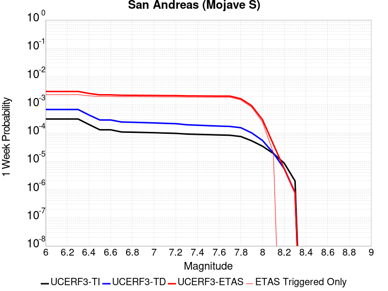 | 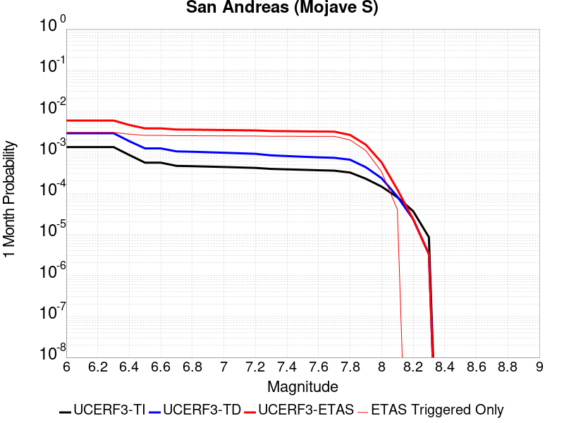 |  |  |

| Magnitude | 1 wk TI Prob | 1 wk TD Prob | 1 wk ETAS Prob | 1 wk ETAS/TD Gain | 1 wk ETAS Triggered Only | 1 mo TI Prob | 1 mo TD Prob | 1 mo ETAS Prob | 1 mo ETAS/TD Gain | 1 mo ETAS Triggered Only | 1 yr TI Prob | 1 yr TD Prob | 1 yr ETAS Prob | 1 yr ETAS/TD Gain | 1 yr ETAS Triggered Only | 10 yr TI Prob | 10 yr TD Prob | 10 yr ETAS Prob | 10 yr ETAS/TD Gain | 10 yr ETAS Triggered Only |
|-----|-----|-----|-----|-----|-----|-----|-----|-----|-----|-----|-----|-----|-----|-----|-----|-----|-----|-----|-----|-----|
| 6.0 | 3.1064058E-4 | 6.7460834E-4 | 0.0029330838 | 4.347832 | 0.00226 | 0.0013306376 | 0.0028881032 | 0.00588941 | 2.0391965 | 0.00301 | 0.016080605 | 0.03462235 | 0.03863832 | 1.1159936 | 0.00416 | 0.1496549 | 0.28660452 | 0.29059952 | 1.0139391 | 0.0056 |
| 6.1 | 3.1064058E-4 | 6.7460834E-4 | 0.0029330838 | 4.347832 | 0.00226 | 0.0013306376 | 0.0028881032 | 0.00588941 | 2.0391965 | 0.00301 | 0.016080605 | 0.03462235 | 0.03863832 | 1.1159936 | 0.00416 | 0.1496549 | 0.28660452 | 0.29059952 | 1.0139391 | 0.0056 |
| 6.2 | 3.1064058E-4 | 6.7460834E-4 | 0.0029330838 | 4.347832 | 0.00226 | 0.0013306376 | 0.0028881032 | 0.00588941 | 2.0391965 | 0.00301 | 0.016080605 | 0.03462235 | 0.03863832 | 1.1159936 | 0.00416 | 0.1496549 | 0.28660452 | 0.29059952 | 1.0139391 | 0.0056 |
| 6.3 | 3.1064058E-4 | 6.7460834E-4 | 0.0029330838 | 4.347832 | 0.00226 | 0.0013306376 | 0.0028881032 | 0.00588941 | 2.0391965 | 0.00301 | 0.016080605 | 0.03462235 | 0.03863832 | 1.1159936 | 0.00416 | 0.1496549 | 0.28660452 | 0.29059952 | 1.0139391 | 0.0056 |
| 6.4 | 1.9872203E-4 | 4.3179357E-4 | 0.0025008998 | 5.7918878 | 0.00207 | 8.5138786E-4 | 0.0018492596 | 0.0045841928 | 2.478934 | 0.00274 | 0.010316478 | 0.02228844 | 0.025974412 | 1.165376 | 0.00377 | 0.098504856 | 0.19699748 | 0.20106067 | 1.0206256 | 0.00506 |
| 6.5 | 1.291105E-4 | 2.875267E-4 | 0.002226969 | 7.74526 | 0.00194 | 5.5321335E-4 | 0.0012316781 | 0.003788525 | 3.075905 | 0.00256 | 0.006714592 | 0.0148934 | 0.018331422 | 1.230842 | 0.00349 | 0.065152965 | 0.13803436 | 0.14203387 | 1.0289748 | 0.00464 |
| 6.6 | 1.291105E-4 | 2.875267E-4 | 0.002226969 | 7.74526 | 0.00194 | 5.5321335E-4 | 0.0012316781 | 0.003788525 | 3.075905 | 0.00256 | 0.006714592 | 0.0148934 | 0.018331422 | 1.230842 | 0.00349 | 0.065152965 | 0.13803436 | 0.14203387 | 1.0289748 | 0.00464 |
| 6.7 | 1.08001186E-4 | 2.4333889E-4 | 0.0021528741 | 8.847226 | 0.00191 | 4.6278012E-4 | 0.0010424647 | 0.0035498482 | 3.4052453 | 0.00251 | 0.0056198016 | 0.012618446 | 0.015955796 | 1.2644818 | 0.00338 | 0.054797906 | 0.119176775 | 0.1231581 | 1.0334069 | 0.00452 |
| 6.8 | 1.0624356E-4 | 2.3851555E-4 | 0.00214806 | 9.005954 | 0.00191 | 4.5525006E-4 | 0.0010218095 | 0.0035292448 | 3.4539163 | 0.00251 | 0.0055285925 | 0.012369843 | 0.015708033 | 1.2698652 | 0.00338 | 0.053930566 | 0.11712591 | 0.121098846 | 1.0339202 | 0.0045 |
| 6.9 | 1.0393785E-4 | 2.3221898E-4 | 0.0021317778 | 9.180032 | 0.0019 | 4.4537184E-4 | 9.948451E-4 | 0.003492358 | 3.510454 | 0.0025 | 0.0054089287 | 0.012045221 | 0.015364749 | 1.2755888 | 0.00336 | 0.05279156 | 0.11442335 | 0.11837302 | 1.034518 | 0.00446 |
| 7.0 | 1.0155622E-4 | 2.2591476E-4 | 0.0021154878 | 9.364098 | 0.00189 | 4.3516833E-4 | 9.6784724E-4 | 0.0034554373 | 3.57023 | 0.00249 | 0.005285311 | 0.0117200995 | 0.015030838 | 1.2824837 | 0.00335 | 0.05161361 | 0.111683756 | 0.11562788 | 1.0353152 | 0.00444 |
| 7.1 | 9.885595E-5 | 2.1879886E-4 | 0.0020983876 | 9.590487 | 0.00188 | 4.2359953E-4 | 9.3737274E-4 | 0.0034150481 | 3.6432126 | 0.00248 | 0.0051451353 | 0.011352993 | 0.014655074 | 1.2908555 | 0.00334 | 0.05027629 | 0.1085682 | 0.112517245 | 1.0363739 | 0.00443 |
| 7.2 | 9.6411415E-5 | 2.124288E-4 | 0.0020920294 | 9.848144 | 0.00188 | 4.1312634E-4 | 9.1009185E-4 | 0.0033778439 | 3.711542 | 0.00247 | 0.005018219 | 0.011024255 | 0.014307655 | 1.2978342 | 0.00332 | 0.049064007 | 0.105758004 | 0.10970161 | 1.037289 | 0.00441 |
| 7.3 | 9.1180635E-5 | 1.9471257E-4 | 0.0020443525 | 10.499334 | 0.00185 | 3.907156E-4 | 8.342157E-4 | 0.0032721802 | 3.922463 | 0.00244 | 0.004746591 | 0.01010939 | 0.013346332 | 1.3201916 | 0.00327 | 0.046464786 | 0.09795115 | 0.10185702 | 1.0398757 | 0.00433 |
| 7.4 | 8.887388E-5 | 1.8719878E-4 | 0.0020368525 | 10.8806925 | 0.00185 | 3.8083247E-4 | 8.020339E-4 | 0.0032400768 | 4.0398254 | 0.00244 | 0.0046267817 | 0.00972114 | 0.012959352 | 1.3331103 | 0.00327 | 0.045316286 | 0.09458615 | 0.09848848 | 1.0412569 | 0.00431 |
| 7.5 | 8.6750515E-5 | 1.8051457E-4 | 0.0020201823 | 11.191243 | 0.00184 | 3.7173493E-4 | 7.7340455E-4 | 0.0032015252 | 4.139522 | 0.00243 | 0.004516484 | 0.009375632 | 0.012595161 | 1.3433933 | 0.00325 | 0.04425787 | 0.091549896 | 0.09543806 | 1.0424705 | 0.00428 |
| 7.6 | 8.453092E-5 | 1.7439072E-4 | 0.0020140698 | 11.54918 | 0.00184 | 3.6222505E-4 | 7.471748E-4 | 0.0031753592 | 4.249821 | 0.00243 | 0.0044011753 | 0.009058985 | 0.012269634 | 1.354416 | 0.00324 | 0.04315024 | 0.08870898 | 0.09258197 | 1.0436594 | 0.00425 |
| 7.7 | 8.259102E-5 | 1.6961215E-4 | 0.0020093 | 11.846439 | 0.00184 | 3.539135E-4 | 7.2670676E-4 | 0.003154941 | 4.341422 | 0.00243 | 0.004300386 | 0.008811831 | 0.012003456 | 1.3621979 | 0.00322 | 0.042181134 | 0.08645982 | 0.09031496 | 1.0445888 | 0.00422 |
| 7.8 | 7.444844E-5 | 1.5283503E-4 | 0.0016226104 | 10.616744 | 0.00147 | 3.1902574E-4 | 6.548429E-4 | 0.002623553 | 4.0063853 | 0.00197 | 0.0038772223 | 0.007943616 | 0.010592407 | 1.333449 | 0.00267 | 0.03810269 | 0.078290746 | 0.081470646 | 1.0406165 | 0.00345 |
| 7.9 | 5.2586525E-5 | 1.00064186E-4 | 9.1998215E-4 | 9.19392 | 8.2E-4 | 2.2535135E-4 | 4.2877605E-4 | 0.0015183087 | 3.5410297 | 0.00109 | 0.0027402006 | 0.005207864 | 0.006700052 | 1.286526 | 0.0015 | 0.027066574 | 0.052200034 | 0.054067202 | 1.0357695 | 0.00197 |
| 8.0 | 3.379877E-5 | 5.4074168E-5 | 2.940612E-4 | 5.4381084 | 2.4E-4 | 1.4484383E-4 | 2.3172585E-4 | 5.616494E-4 | 2.4237666 | 3.3E-4 | 0.0017620471 | 0.002817614 | 0.0033062333 | 1.173416 | 4.9E-4 | 0.017481409 | 0.028834904 | 0.029446736 | 1.0212185 | 6.3E-4 |
| 8.1 | 1.8668277E-5 | 1.9309397E-5 | 3.9309012E-5 | 2.0357451 | 2.0E-5 | 8.000444E-5 | 8.275194E-5 | 1.2274862E-4 | 1.4833324 | 4.0E-5 | 9.736188E-4 | 0.0010070398 | 0.0010569894 | 1.0496005 | 5.0E-5 | 0.009693642 | 0.010798888 | 0.010887916 | 1.0082442 | 9.0E-5 |
| 8.2 | 8.541571E-6 | 5.460819E-6 | 5.460819E-6 | 1.0 | 0.0 | 3.660622E-5 | 2.3403301E-5 | 2.3403301E-5 | 1.0 | 0.0 | 4.455896E-4 | 2.84898E-4 | 2.9489517E-4 | 1.0350903 | 1.0E-5 | 0.0044469717 | 0.0032408056 | 0.003250773 | 1.0030756 | 1.0E-5 |
| 8.3 | 1.983087E-6 | 7.6599065E-7 | 7.6599065E-7 | 1.0 | 0.0 | 8.498917E-6 | 3.282813E-6 | 3.282813E-6 | 1.0 | 0.0 | 1.034694E-4 | 3.9967534E-5 | 4.9967133E-5 | 1.2501931 | 1.0E-5 | 0.0010342124 | 4.719687E-4 | 4.8196397E-4 | 1.0211779 | 1.0E-5 |

## So Sierra Nevada
*[(top)](#table-of-contents)*

| 1 Week | 1 Month | 1 Year | 10 Year |
|-----|-----|-----|-----|
| 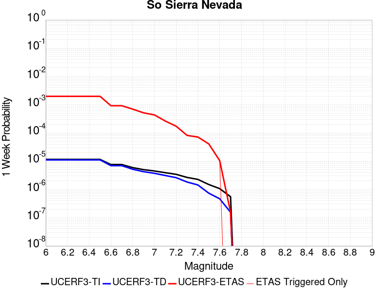 |  |  |  |

| Magnitude | 1 wk TI Prob | 1 wk TD Prob | 1 wk ETAS Prob | 1 wk ETAS/TD Gain | 1 wk ETAS Triggered Only | 1 mo TI Prob | 1 mo TD Prob | 1 mo ETAS Prob | 1 mo ETAS/TD Gain | 1 mo ETAS Triggered Only | 1 yr TI Prob | 1 yr TD Prob | 1 yr ETAS Prob | 1 yr ETAS/TD Gain | 1 yr ETAS Triggered Only | 10 yr TI Prob | 10 yr TD Prob | 10 yr ETAS Prob | 10 yr ETAS/TD Gain | 10 yr ETAS Triggered Only |
|-----|-----|-----|-----|-----|-----|-----|-----|-----|-----|-----|-----|-----|-----|-----|-----|-----|-----|-----|-----|-----|
| 6.0 | 1.15488665E-5 | 1.1079643E-5 | 0.0019710578 | 177.89906 | 0.00196 | 4.9494203E-5 | 4.748339E-5 | 0.0027373557 | 57.6487 | 0.00269 | 6.024253E-4 | 5.7796965E-4 | 0.005085363 | 8.798668 | 0.00451 | 0.006007948 | 0.005765934 | 0.011790993 | 2.0449405 | 0.00606 |
| 6.1 | 1.15488665E-5 | 1.1079643E-5 | 0.0019710578 | 177.89906 | 0.00196 | 4.9494203E-5 | 4.748339E-5 | 0.0027373557 | 57.6487 | 0.00269 | 6.024253E-4 | 5.7796965E-4 | 0.005085363 | 8.798668 | 0.00451 | 0.006007948 | 0.005765934 | 0.011790993 | 2.0449405 | 0.00606 |
| 6.2 | 1.15488665E-5 | 1.1079643E-5 | 0.0019710578 | 177.89906 | 0.00196 | 4.9494203E-5 | 4.748339E-5 | 0.0027373557 | 57.6487 | 0.00269 | 6.024253E-4 | 5.7796965E-4 | 0.005085363 | 8.798668 | 0.00451 | 0.006007948 | 0.005765934 | 0.011790993 | 2.0449405 | 0.00606 |
| 6.3 | 1.15488665E-5 | 1.1079643E-5 | 0.0019710578 | 177.89906 | 0.00196 | 4.9494203E-5 | 4.748339E-5 | 0.0027373557 | 57.6487 | 0.00269 | 6.024253E-4 | 5.7796965E-4 | 0.005085363 | 8.798668 | 0.00451 | 0.006007948 | 0.005765934 | 0.011790993 | 2.0449405 | 0.00606 |
| 6.4 | 1.15488665E-5 | 1.1079643E-5 | 0.0019710578 | 177.89906 | 0.00196 | 4.9494203E-5 | 4.748339E-5 | 0.0027373557 | 57.6487 | 0.00269 | 6.024253E-4 | 5.7796965E-4 | 0.005085363 | 8.798668 | 0.00451 | 0.006007948 | 0.005765934 | 0.011790993 | 2.0449405 | 0.00606 |
| 6.5 | 1.15488665E-5 | 1.1079643E-5 | 0.0019710578 | 177.89906 | 0.00196 | 4.9494203E-5 | 4.748339E-5 | 0.0027373557 | 57.6487 | 0.00269 | 6.024253E-4 | 5.7796965E-4 | 0.005085363 | 8.798668 | 0.00451 | 0.006007948 | 0.005765934 | 0.011790993 | 2.0449405 | 0.00606 |
| 6.6 | 7.587044E-6 | 6.935635E-6 | 9.1692933E-4 | 132.20554 | 9.1E-4 | 3.2515498E-5 | 2.9723828E-5 | 0.0012796867 | 43.05255 | 0.00125 | 3.9580427E-4 | 3.6183043E-4 | 0.0025310453 | 6.9951143 | 0.00217 | 0.003951 | 0.0036127048 | 0.006552047 | 1.8136127 | 0.00295 |
| 6.7 | 7.587044E-6 | 6.935635E-6 | 9.1692933E-4 | 132.20554 | 9.1E-4 | 3.2515498E-5 | 2.9723828E-5 | 0.0012796867 | 43.05255 | 0.00125 | 3.9580427E-4 | 3.6183043E-4 | 0.0025310453 | 6.9951143 | 0.00217 | 0.003951 | 0.0036127048 | 0.006552047 | 1.8136127 | 0.00295 |
| 6.8 | 5.9026956E-6 | 5.1793927E-6 | 6.9517584E-4 | 134.21956 | 6.9E-4 | 2.5297022E-5 | 2.2197215E-5 | 9.221772E-4 | 41.544727 | 9.0E-4 | 3.0794772E-4 | 2.7021873E-4 | 0.0016998324 | 6.290579 | 0.00143 | 0.0030752132 | 0.002699018 | 0.004633782 | 1.7168399 | 0.00194 |
| 6.9 | 5.0118915E-6 | 4.2524252E-6 | 5.1425025E-4 | 120.931046 | 5.1E-4 | 2.1479358E-5 | 1.8224557E-5 | 6.8821234E-4 | 37.762913 | 6.7E-4 | 2.614798E-4 | 2.2186211E-4 | 0.0013016225 | 5.8668084 | 0.00108 | 0.0026117235 | 0.0022164788 | 0.003663265 | 1.6527408 | 0.00145 |
| 7.0 | 4.4924795E-6 | 3.7139177E-6 | 4.3371232E-4 | 116.78027 | 4.3E-4 | 1.925334E-5 | 1.5916696E-5 | 5.859076E-4 | 36.810883 | 5.7E-4 | 2.3438422E-4 | 1.9376918E-4 | 0.0011335871 | 5.8501925 | 9.4E-4 | 0.0023413717 | 0.0019360651 | 0.0031537032 | 1.628924 | 0.00122 |
| 7.1 | 3.9118436E-6 | 3.1119775E-6 | 2.6311117E-4 | 84.5479 | 2.6E-4 | 1.6764936E-5 | 1.3336982E-5 | 3.5333243E-4 | 26.492683 | 3.4E-4 | 2.0409399E-4 | 1.6236622E-4 | 7.5227045E-4 | 4.6331706 | 5.9E-4 | 0.0020390663 | 0.001622532 | 0.002381299 | 1.4676437 | 7.6E-4 |
| 7.2 | 3.4200818E-6 | 2.6054543E-6 | 1.7260501E-4 | 66.24757 | 1.7E-4 | 1.4657411E-5 | 1.11661875E-5 | 2.4116362E-4 | 21.597668 | 2.3E-4 | 1.7843937E-4 | 1.3594035E-4 | 5.158887E-4 | 3.7949636 | 3.8E-4 | 0.0017829615 | 0.0013586218 | 0.0018679289 | 1.3748704 | 5.1E-4 |
| 7.3 | 2.6593618E-6 | 1.8284203E-6 | 8.182827E-5 | 44.753536 | 8.0E-5 | 1.13972155E-5 | 7.836065E-6 | 1.178352E-4 | 15.037548 | 1.1E-4 | 1.3875226E-4 | 9.540021E-5 | 3.0538018E-4 | 3.2010431 | 2.1E-4 | 0.0013866565 | 9.5362146E-4 | 0.0012433449 | 1.3038139 | 2.9E-4 |
| 7.4 | 2.2577992E-6 | 1.436438E-6 | 7.1436334E-5 | 49.731583 | 7.0E-5 | 9.676246E-6 | 6.15615E-6 | 9.615559E-5 | 15.619437 | 9.0E-5 | 1.1780193E-4 | 7.49488E-5 | 2.4493606E-4 | 3.2680452 | 1.7E-4 | 0.001177395 | 7.492603E-4 | 9.890805E-4 | 1.3200759 | 2.4E-4 |
| 7.5 | 1.489319E-6 | 7.353936E-7 | 4.0735365E-5 | 55.3926 | 4.0E-5 | 6.3827797E-6 | 3.1516831E-6 | 5.3151525E-5 | 16.864489 | 5.0E-5 | 7.770758E-5 | 3.8371072E-5 | 1.4836685E-4 | 3.866633 | 1.1E-4 | 7.7680405E-4 | 3.836449E-4 | 5.3358736E-4 | 1.3908366 | 1.5E-4 |
| 7.6 | 1.0680322E-6 | 4.6596554E-7 | 1.0465961E-5 | 22.460804 | 1.0E-5 | 4.577273E-6 | 1.9969937E-6 | 1.1996974E-5 | 6.0075173 | 1.0E-5 | 5.5726876E-5 | 2.4313129E-5 | 7.4311916E-5 | 3.056452 | 5.0E-5 | 5.5712904E-4 | 2.4310495E-4 | 3.3308307E-4 | 1.3701205 | 9.0E-5 |
| 7.7 | 5.509146E-7 | 1.5580486E-7 | 1.5580486E-7 | 1.0 | 0.0 | 2.3610605E-6 | 6.677349E-7 | 6.677349E-7 | 1.0 | 0.0 | 2.8745531E-5 | 8.129644E-6 | 2.8129482E-5 | 3.4601123 | 2.0E-5 | 2.8741814E-4 | 8.1293576E-5 | 1.0129195E-4 | 1.2460018 | 2.0E-5 |

## Death Valley (So)
*[(top)](#table-of-contents)*

| 1 Week | 1 Month | 1 Year | 10 Year |
|-----|-----|-----|-----|
| 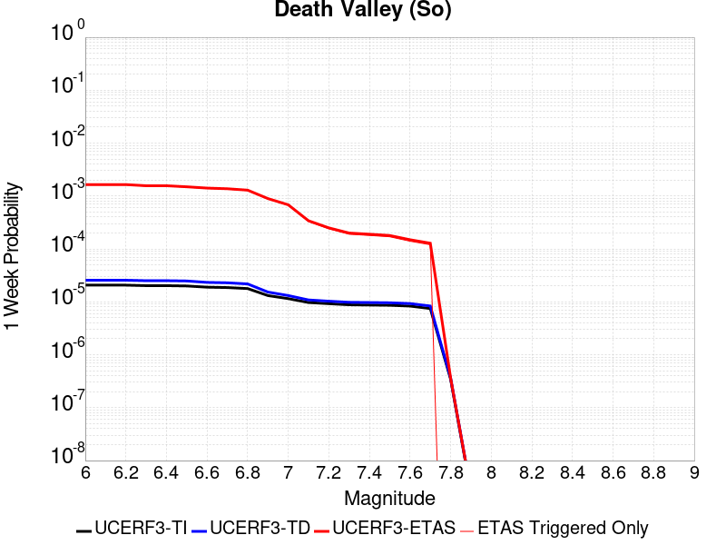 |  | 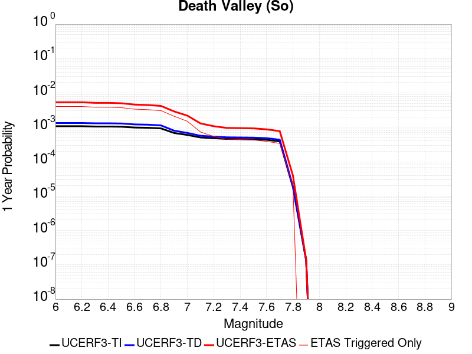 |  |

| Magnitude | 1 wk TI Prob | 1 wk TD Prob | 1 wk ETAS Prob | 1 wk ETAS/TD Gain | 1 wk ETAS Triggered Only | 1 mo TI Prob | 1 mo TD Prob | 1 mo ETAS Prob | 1 mo ETAS/TD Gain | 1 mo ETAS Triggered Only | 1 yr TI Prob | 1 yr TD Prob | 1 yr ETAS Prob | 1 yr ETAS/TD Gain | 1 yr ETAS Triggered Only | 10 yr TI Prob | 10 yr TD Prob | 10 yr ETAS Prob | 10 yr ETAS/TD Gain | 10 yr ETAS Triggered Only |
|-----|-----|-----|-----|-----|-----|-----|-----|-----|-----|-----|-----|-----|-----|-----|-----|-----|-----|-----|-----|-----|
| 6.0 | 2.0684236E-5 | 2.5617775E-5 | 0.0016455763 | 64.23572 | 0.00162 | 8.864371E-5 | 1.0978594E-4 | 0.0024295312 | 22.129711 | 0.00232 | 0.0010787029 | 0.0013358411 | 0.0053604576 | 4.012796 | 0.00403 | 0.010734817 | 0.013281397 | 0.01912277 | 1.4398162 | 0.00592 |
| 6.1 | 2.0684236E-5 | 2.5617775E-5 | 0.0016455763 | 64.23572 | 0.00162 | 8.864371E-5 | 1.0978594E-4 | 0.0024295312 | 22.129711 | 0.00232 | 0.0010787029 | 0.0013358411 | 0.0053604576 | 4.012796 | 0.00403 | 0.010734817 | 0.013281397 | 0.01912277 | 1.4398162 | 0.00592 |
| 6.2 | 2.0684236E-5 | 2.5617775E-5 | 0.0016455763 | 64.23572 | 0.00162 | 8.864371E-5 | 1.0978594E-4 | 0.0024295312 | 22.129711 | 0.00232 | 0.0010787029 | 0.0013358411 | 0.0053604576 | 4.012796 | 0.00403 | 0.010734817 | 0.013281397 | 0.01912277 | 1.4398162 | 0.00592 |
| 6.3 | 2.0240292E-5 | 2.511786E-5 | 0.0015650792 | 62.309414 | 0.00154 | 8.6741224E-5 | 1.07643624E-4 | 0.002287409 | 21.249832 | 0.00218 | 0.0010555626 | 0.00130979 | 0.0051547475 | 3.9355526 | 0.00385 | 0.010505628 | 0.013023956 | 0.01860037 | 1.4281659 | 0.00565 |
| 6.4 | 2.0240292E-5 | 2.511786E-5 | 0.0015650792 | 62.309414 | 0.00154 | 8.6741224E-5 | 1.07643624E-4 | 0.002287409 | 21.249832 | 0.00218 | 0.0010555626 | 0.00130979 | 0.0051547475 | 3.9355526 | 0.00385 | 0.010505628 | 0.013023956 | 0.01860037 | 1.4281659 | 0.00565 |
| 6.5 | 1.9962767E-5 | 2.4807114E-5 | 0.0014947706 | 60.255726 | 0.00147 | 8.55519E-5 | 1.0631196E-4 | 0.0022060887 | 20.751085 | 0.0021 | 0.0010410968 | 0.0012935963 | 0.005018771 | 3.8797042 | 0.00373 | 0.010362327 | 0.012863902 | 0.01828328 | 1.4212856 | 0.00549 |
| 6.6 | 1.8937297E-5 | 2.3310964E-5 | 0.0014132785 | 60.6272 | 0.00139 | 8.115732E-5 | 9.990039E-5 | 0.0020397066 | 20.417404 | 0.00194 | 9.876423E-4 | 0.0012156231 | 0.0045915144 | 3.777087 | 0.00338 | 0.009832645 | 0.012092789 | 0.017022446 | 1.4076526 | 0.00499 |
| 6.7 | 1.8621096E-5 | 2.2911607E-5 | 0.0013728807 | 59.92075 | 0.00135 | 7.980225E-5 | 9.818898E-5 | 0.0019680054 | 20.043036 | 0.00187 | 9.711593E-4 | 0.0011948098 | 0.004460903 | 3.7335672 | 0.00327 | 0.009669261 | 0.011886904 | 0.016679252 | 1.403162 | 0.00485 |
| 6.8 | 1.7830353E-5 | 2.1805688E-5 | 0.0012917779 | 59.240414 | 0.00127 | 7.641356E-5 | 9.344968E-5 | 0.0018332871 | 19.617907 | 0.00174 | 9.29938E-4 | 0.00113717 | 0.00419369 | 3.6878304 | 0.00306 | 0.009260561 | 0.011316354 | 0.015814865 | 1.3975229 | 0.00455 |
| 6.9 | 1.3135183E-5 | 1.5303925E-5 | 8.9529046E-4 | 58.50071 | 8.8E-4 | 5.6292425E-5 | 6.558664E-5 | 0.0012555086 | 19.14275 | 0.00119 | 6.8514474E-4 | 7.982312E-4 | 0.002896555 | 3.6287167 | 0.0021 | 0.006830362 | 0.007954649 | 0.010970467 | 1.3791264 | 0.00304 |
| 7.0 | 1.1507512E-5 | 1.3154199E-5 | 6.8314536E-4 | 51.933636 | 6.7E-4 | 4.9316975E-5 | 5.6373956E-5 | 9.6632267E-4 | 17.141296 | 9.1E-4 | 6.002687E-4 | 6.8614254E-4 | 0.0021851133 | 3.1846347 | 0.0015 | 0.0059864987 | 0.0068409415 | 0.009035823 | 1.3208449 | 0.00221 |
| 7.1 | 9.715903E-6 | 1.0865278E-5 | 3.408617E-4 | 31.371649 | 3.3E-4 | 4.1638916E-5 | 4.656467E-5 | 4.365465E-4 | 9.375058 | 3.9E-4 | 5.068359E-4 | 5.667817E-4 | 0.0012963678 | 2.2872438 | 7.3E-4 | 0.0050568148 | 0.0056538144 | 0.0066879345 | 1.1829066 | 0.00104 |
| 7.2 | 9.233269E-6 | 1.02863105E-5 | 2.5028383E-4 | 24.331741 | 2.4E-4 | 3.9570554E-5 | 4.4083466E-5 | 3.2407112E-4 | 7.351308 | 2.8E-4 | 4.81665E-4 | 5.3658825E-4 | 0.0010762985 | 2.0058181 | 5.4E-4 | 0.0048062233 | 0.0053533576 | 0.0061192354 | 1.143065 | 7.7E-4 |
| 7.3 | 8.8041315E-6 | 9.808164E-6 | 1.998063E-4 | 20.371428 | 1.9E-4 | 3.7731446E-5 | 4.2034335E-5 | 2.7202466E-4 | 6.4714875 | 2.3E-4 | 4.592835E-4 | 5.1165203E-4 | 9.614218E-4 | 1.879054 | 4.5E-4 | 0.0045833546 | 0.005105167 | 0.0057419 | 1.1247232 | 6.4E-4 |
| 7.4 | 8.708749E-6 | 9.707175E-6 | 1.8970543E-4 | 19.542805 | 1.8E-4 | 3.7322676E-5 | 4.160154E-5 | 2.615924E-4 | 6.288046 | 2.2E-4 | 4.5430884E-4 | 5.0638523E-4 | 9.4616244E-4 | 1.8684638 | 4.4E-4 | 0.004533812 | 0.0050527398 | 0.005669607 | 1.1220857 | 6.2E-4 |
| 7.5 | 8.612678E-6 | 9.604817E-6 | 1.7960319E-4 | 18.699282 | 1.7E-4 | 3.6910955E-5 | 4.1162875E-5 | 2.5115424E-4 | 6.1014743 | 2.1E-4 | 4.492982E-4 | 5.01047E-4 | 9.3083153E-4 | 1.857773 | 4.3E-4 | 0.004483909 | 0.0049995985 | 0.005596599 | 1.1194097 | 6.0E-4 |
| 7.6 | 8.319024E-6 | 9.283916E-6 | 1.4928261E-4 | 16.079702 | 1.4E-4 | 3.5652476E-5 | 3.978763E-5 | 2.0978086E-4 | 5.272515 | 1.7E-4 | 4.3398244E-4 | 4.8431093E-4 | 8.74122E-4 | 1.8048779 | 3.9E-4 | 0.0043313587 | 0.0048329784 | 0.0053703687 | 1.1111923 | 5.4E-4 |
| 7.7 | 7.4718328E-6 | 8.34517E-6 | 1.2834417E-4 | 15.379456 | 1.2E-4 | 3.2021748E-5 | 3.5764548E-5 | 1.8575919E-4 | 5.193948 | 1.5E-4 | 3.8979502E-4 | 4.353504E-4 | 7.7520235E-4 | 1.7806401 | 3.4E-4 | 0.00389112 | 0.0043453807 | 0.004803382 | 1.1053995 | 4.6E-4 |
| 7.8 | 3.4586725E-7 | 3.6482615E-7 | 3.6482615E-7 | 1.0 | 0.0 | 1.4822873E-6 | 1.5635396E-6 | 1.1563524E-5 | 7.3957343 | 1.0E-5 | 1.80467E-5 | 1.9035933E-5 | 3.9035553E-5 | 2.0506246 | 2.0E-5 | 1.8045233E-4 | 1.9034347E-4 | 2.2033777E-4 | 1.1575798 | 3.0E-5 |
| 7.9 | 2.5591178E-9 | 2.6696718E-9 | 2.6696718E-9 | 1.0 | 0.0 | 1.0967647E-8 | 1.14414505E-8 | 1.14414505E-8 | 1.0 | 0.0 | 1.335311E-7 | 1.3929966E-7 | 1.3929966E-7 | 1.0 | 0.0 | 1.3353102E-6 | 1.3929966E-6 | 1.3929966E-6 | 1.0 | 0.0 |

## Nelson Lake
*[(top)](#table-of-contents)*

| 1 Week | 1 Month | 1 Year | 10 Year |
|-----|-----|-----|-----|
|  | 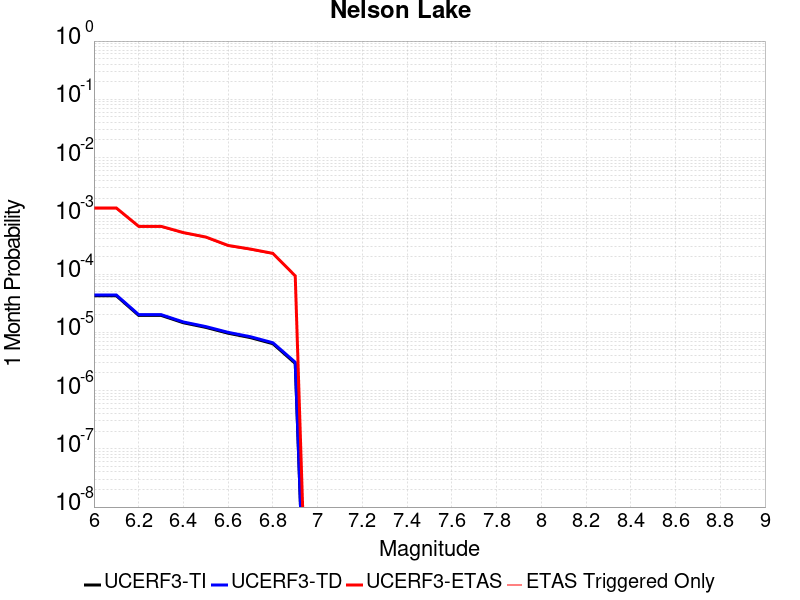 |  | 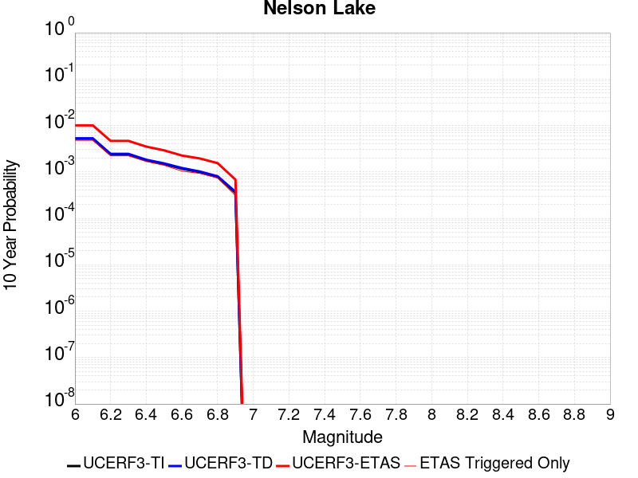 |

| Magnitude | 1 wk TI Prob | 1 wk TD Prob | 1 wk ETAS Prob | 1 wk ETAS/TD Gain | 1 wk ETAS Triggered Only | 1 mo TI Prob | 1 mo TD Prob | 1 mo ETAS Prob | 1 mo ETAS/TD Gain | 1 mo ETAS Triggered Only | 1 yr TI Prob | 1 yr TD Prob | 1 yr ETAS Prob | 1 yr ETAS/TD Gain | 1 yr ETAS Triggered Only | 10 yr TI Prob | 10 yr TD Prob | 10 yr ETAS Prob | 10 yr ETAS/TD Gain | 10 yr ETAS Triggered Only |
|-----|-----|-----|-----|-----|-----|-----|-----|-----|-----|-----|-----|-----|-----|-----|-----|-----|-----|-----|-----|-----|
| 6.0 | 9.913453E-6 | 1.0192255E-5 | 7.701845E-4 | 75.56566 | 7.6E-4 | 4.2485535E-5 | 4.3680422E-5 | 0.0013636227 | 31.218168 | 0.00132 | 5.1713863E-4 | 5.316897E-4 | 0.0033102117 | 6.2258334 | 0.00278 | 0.0051593683 | 0.005305204 | 0.010089686 | 1.9018469 | 0.00481 |
| 6.1 | 9.913453E-6 | 1.0192255E-5 | 7.701845E-4 | 75.56566 | 7.6E-4 | 4.2485535E-5 | 4.3680422E-5 | 0.0013636227 | 31.218168 | 0.00132 | 5.1713863E-4 | 5.316897E-4 | 0.0033102117 | 6.2258334 | 0.00278 | 0.0051593683 | 0.005305204 | 0.010089686 | 1.9018469 | 0.00481 |
| 6.2 | 4.5596407E-6 | 4.696313E-6 | 3.746946E-4 | 79.784836 | 3.7E-4 | 1.954117E-5 | 2.0126909E-5 | 6.6011405E-4 | 32.79759 | 6.4E-4 | 2.3788778E-4 | 2.4501883E-4 | 0.0015347027 | 6.263612 | 0.00129 | 0.0023763329 | 0.0024476128 | 0.004662179 | 1.9047862 | 0.00222 |
| 6.3 | 4.5596407E-6 | 4.696313E-6 | 3.746946E-4 | 79.784836 | 3.7E-4 | 1.954117E-5 | 2.0126909E-5 | 6.6011405E-4 | 32.79759 | 6.4E-4 | 2.3788778E-4 | 2.4501883E-4 | 0.0015347027 | 6.263612 | 0.00129 | 0.0023763329 | 0.0024476128 | 0.004662179 | 1.9047862 | 0.00222 |
| 6.4 | 3.4025713E-6 | 3.5098972E-6 | 2.835089E-4 | 80.77413 | 2.8E-4 | 1.4582367E-5 | 1.5042335E-5 | 5.1503483E-4 | 34.23902 | 5.0E-4 | 1.7752586E-4 | 1.8312587E-4 | 0.0011929409 | 6.514322 | 0.00101 | 0.001773841 | 0.0018298327 | 0.0035067585 | 1.9164368 | 0.00168 |
| 6.5 | 2.8352947E-6 | 2.927856E-6 | 2.3292718E-4 | 79.55554 | 2.3E-4 | 1.2151207E-5 | 1.2547898E-5 | 4.3254264E-4 | 34.47132 | 4.2E-4 | 1.479309E-4 | 1.5276071E-4 | 9.6263696E-4 | 6.301601 | 8.1E-4 | 0.0014783246 | 0.0015266308 | 0.0029145088 | 1.9091117 | 0.00139 |
| 6.6 | 2.251518E-6 | 2.3290677E-6 | 1.5232872E-4 | 65.403305 | 1.5E-4 | 9.649328E-6 | 9.981683E-6 | 3.099787E-4 | 31.05475 | 3.0E-4 | 1.1747423E-4 | 1.2152085E-4 | 6.914516E-4 | 5.6899834 | 5.7E-4 | 0.0011741214 | 0.0012146058 | 0.0022533424 | 1.8552049 | 0.00104 |
| 6.7 | 1.8911853E-6 | 1.9591396E-6 | 1.3195889E-4 | 67.35553 | 1.3E-4 | 8.105055E-6 | 8.39629E-6 | 2.683941E-4 | 31.965801 | 2.6E-4 | 9.867457E-5 | 1.0222061E-4 | 6.1216846E-4 | 5.988699 | 5.1E-4 | 9.863076E-4 | 0.0010217935 | 0.0019508431 | 1.9092344 | 9.3E-4 |
| 6.8 | 1.4874814E-6 | 1.5438305E-6 | 1.1154366E-4 | 72.251236 | 1.1E-4 | 6.374905E-6 | 6.6164025E-6 | 2.2661495E-4 | 34.250477 | 2.2E-4 | 7.76117E-5 | 8.055224E-5 | 5.105176E-4 | 6.3377204 | 4.3E-4 | 7.75846E-4 | 8.0528157E-4 | 0.0015446857 | 1.9181932 | 7.4E-4 |
| 6.9 | 6.835972E-7 | 7.1399285E-7 | 3.071397E-5 | 43.0172 | 3.0E-5 | 2.9296991E-6 | 3.0599674E-6 | 9.3059694E-5 | 30.411987 | 9.0E-5 | 3.56685E-5 | 3.7254784E-5 | 2.4724696E-4 | 6.6366496 | 2.1E-4 | 3.5662777E-4 | 3.7251666E-4 | 6.824012E-4 | 1.8318676 | 3.1E-4 |

## Towne Pass
*[(top)](#table-of-contents)*

| 1 Week | 1 Month | 1 Year | 10 Year |
|-----|-----|-----|-----|
|  |  | 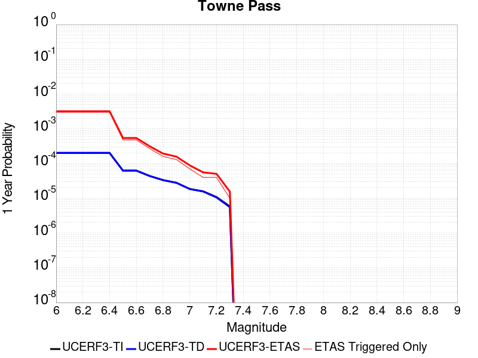 | 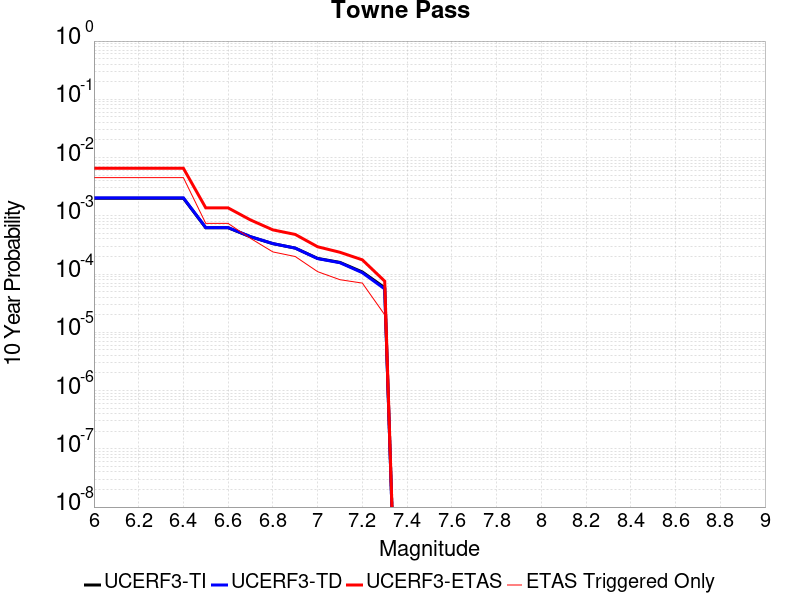 |

| Magnitude | 1 wk TI Prob | 1 wk TD Prob | 1 wk ETAS Prob | 1 wk ETAS/TD Gain | 1 wk ETAS Triggered Only | 1 mo TI Prob | 1 mo TD Prob | 1 mo ETAS Prob | 1 mo ETAS/TD Gain | 1 mo ETAS Triggered Only | 1 yr TI Prob | 1 yr TD Prob | 1 yr ETAS Prob | 1 yr ETAS/TD Gain | 1 yr ETAS Triggered Only | 10 yr TI Prob | 10 yr TD Prob | 10 yr ETAS Prob | 10 yr ETAS/TD Gain | 10 yr ETAS Triggered Only |
|-----|-----|-----|-----|-----|-----|-----|-----|-----|-----|-----|-----|-----|-----|-----|-----|-----|-----|-----|-----|-----|
| 6.0 | 3.849728E-6 | 3.8945414E-6 | 0.0010938903 | 280.8778 | 0.00109 | 1.649873E-5 | 1.669081E-5 | 0.0017066626 | 102.25164 | 0.00169 | 2.0085352E-4 | 2.0319603E-4 | 0.0031925885 | 15.711864 | 0.00299 | 0.0020067208 | 0.0020305314 | 0.0065413537 | 3.2214983 | 0.00452 |
| 6.1 | 3.849728E-6 | 3.8945414E-6 | 0.0010938903 | 280.8778 | 0.00109 | 1.649873E-5 | 1.669081E-5 | 0.0017066626 | 102.25164 | 0.00169 | 2.0085352E-4 | 2.0319603E-4 | 0.0031925885 | 15.711864 | 0.00299 | 0.0020067208 | 0.0020305314 | 0.0065413537 | 3.2214983 | 0.00452 |
| 6.2 | 3.849728E-6 | 3.8945414E-6 | 0.0010938903 | 280.8778 | 0.00109 | 1.649873E-5 | 1.669081E-5 | 0.0017066626 | 102.25164 | 0.00169 | 2.0085352E-4 | 2.0319603E-4 | 0.0031925885 | 15.711864 | 0.00299 | 0.0020067208 | 0.0020305314 | 0.0065413537 | 3.2214983 | 0.00452 |
| 6.3 | 3.849728E-6 | 3.8945414E-6 | 0.0010938903 | 280.8778 | 0.00109 | 1.649873E-5 | 1.669081E-5 | 0.0017066626 | 102.25164 | 0.00169 | 2.0085352E-4 | 2.0319603E-4 | 0.0031925885 | 15.711864 | 0.00299 | 0.0020067208 | 0.0020305314 | 0.0065413537 | 3.2214983 | 0.00452 |
| 6.4 | 3.849728E-6 | 3.8945414E-6 | 0.0010938903 | 280.8778 | 0.00109 | 1.649873E-5 | 1.669081E-5 | 0.0017066626 | 102.25164 | 0.00169 | 2.0085352E-4 | 2.0319603E-4 | 0.0031925885 | 15.711864 | 0.00299 | 0.0020067208 | 0.0020305314 | 0.0065413537 | 3.2214983 | 0.00452 |
| 6.5 | 1.1953545E-6 | 1.203052E-6 | 1.4120288E-4 | 117.37055 | 1.4E-4 | 5.1229376E-6 | 5.1559277E-6 | 2.8515447E-4 | 55.306145 | 2.8E-4 | 6.236998E-5 | 6.277173E-5 | 5.427416E-4 | 8.646275 | 4.8E-4 | 6.235248E-4 | 6.275517E-4 | 0.0013670874 | 2.1784456 | 7.4E-4 |
| 6.6 | 1.1953545E-6 | 1.203052E-6 | 1.4120288E-4 | 117.37055 | 1.4E-4 | 5.1229376E-6 | 5.1559277E-6 | 2.8515447E-4 | 55.306145 | 2.8E-4 | 6.236998E-5 | 6.277173E-5 | 5.427416E-4 | 8.646275 | 4.8E-4 | 6.235248E-4 | 6.275517E-4 | 0.0013670874 | 2.1784456 | 7.4E-4 |
| 6.7 | 8.375951E-7 | 8.4106705E-7 | 8.0841E-5 | 96.11719 | 8.0E-5 | 3.5896885E-6 | 3.6045683E-6 | 1.8360392E-4 | 50.93645 | 1.8E-4 | 4.370358E-5 | 4.3884793E-5 | 3.1387294E-4 | 7.1522026 | 2.7E-4 | 4.3694986E-4 | 4.38767E-4 | 8.485871E-4 | 1.9340267 | 4.1E-4 |
| 6.8 | 6.38041E-7 | 6.392156E-7 | 6.0639177E-5 | 94.864975 | 6.0E-5 | 2.7344586E-6 | 2.7394929E-6 | 1.12739195E-4 | 41.153305 | 1.1E-4 | 3.3291526E-5 | 3.3352855E-5 | 1.9334751E-4 | 5.7970304 | 1.6E-4 | 3.3286537E-4 | 3.334823E-4 | 5.7340227E-4 | 1.7194383 | 2.4E-4 |
| 6.9 | 5.3460053E-7 | 5.345333E-7 | 5.0534505E-5 | 94.53949 | 5.0E-5 | 2.2911431E-6 | 2.2908553E-6 | 1.0229063E-4 | 44.651722 | 1.0E-4 | 2.789431E-5 | 2.789084E-5 | 1.5788722E-4 | 5.6608987 | 1.3E-4 | 2.789081E-4 | 2.7887672E-4 | 4.7882093E-4 | 1.7169628 | 2.0E-4 |
| 7.0 | 3.557783E-7 | 3.5324226E-7 | 2.0353235E-5 | 57.618347 | 2.0E-5 | 1.5247632E-6 | 1.5138945E-6 | 4.1513835E-5 | 27.421879 | 4.0E-5 | 1.8563835E-5 | 1.843152E-5 | 8.843023E-5 | 4.797772 | 7.0E-5 | 1.8562283E-4 | 1.8430075E-4 | 2.9428047E-4 | 1.5967405 | 1.1E-4 |
| 7.1 | 3.037942E-7 | 3.0002218E-7 | 1.0300019E-5 | 34.33086 | 1.0E-5 | 1.3019744E-6 | 1.2858087E-6 | 2.1285783E-5 | 16.554392 | 2.0E-5 | 1.5851423E-5 | 1.5654618E-5 | 5.565399E-5 | 3.555117 | 4.0E-5 | 1.5850292E-4 | 1.5653588E-4 | 2.3652337E-4 | 1.5109849 | 8.0E-5 |
| 7.2 | 2.0808248E-7 | 2.0217689E-7 | 1.0202175E-5 | 50.461628 | 1.0E-5 | 8.917818E-7 | 8.6647213E-7 | 2.0866455E-5 | 24.082085 | 2.0E-5 | 1.0857389E-5 | 1.0549252E-5 | 5.0548828E-5 | 4.791698 | 4.0E-5 | 1.0856859E-4 | 1.0548797E-4 | 1.7548059E-4 | 1.6635127 | 7.0E-5 |
| 7.3 | 1.1162073E-7 | 1.0636894E-7 | 1.0106368E-5 | 95.0124 | 1.0E-5 | 4.7837443E-7 | 4.558668E-7 | 1.0455862E-5 | 22.936222 | 1.0E-5 | 5.8241935E-6 | 5.550166E-6 | 1.5550111E-5 | 2.8017378 | 1.0E-5 | 5.8240406E-5 | 5.5500474E-5 | 7.549937E-5 | 1.3603373 | 2.0E-5 |

## Lenwood-Lockhart-Old Woman Springs
*[(top)](#table-of-contents)*

| 1 Week | 1 Month | 1 Year | 10 Year |
|-----|-----|-----|-----|
|  |  |  |  |

| Magnitude | 1 wk TI Prob | 1 wk TD Prob | 1 wk ETAS Prob | 1 wk ETAS/TD Gain | 1 wk ETAS Triggered Only | 1 mo TI Prob | 1 mo TD Prob | 1 mo ETAS Prob | 1 mo ETAS/TD Gain | 1 mo ETAS Triggered Only | 1 yr TI Prob | 1 yr TD Prob | 1 yr ETAS Prob | 1 yr ETAS/TD Gain | 1 yr ETAS Triggered Only | 10 yr TI Prob | 10 yr TD Prob | 10 yr ETAS Prob | 10 yr ETAS/TD Gain | 10 yr ETAS Triggered Only |
|-----|-----|-----|-----|-----|-----|-----|-----|-----|-----|-----|-----|-----|-----|-----|-----|-----|-----|-----|-----|-----|
| 6.0 | 3.744542E-5 | 4.396252E-5 | 0.0013739041 | 31.251713 | 0.00133 | 1.604705E-4 | 1.8839816E-4 | 0.0019080741 | 10.127881 | 0.00172 | 0.0019519776 | 0.0022915069 | 0.0050152508 | 2.1886258 | 0.00273 | 0.019349206 | 0.022696787 | 0.02638122 | 1.1623328 | 0.00377 |
| 6.1 | 3.744542E-5 | 4.396252E-5 | 0.0013739041 | 31.251713 | 0.00133 | 1.604705E-4 | 1.8839816E-4 | 0.0019080741 | 10.127881 | 0.00172 | 0.0019519776 | 0.0022915069 | 0.0050152508 | 2.1886258 | 0.00273 | 0.019349206 | 0.022696787 | 0.02638122 | 1.1623328 | 0.00377 |
| 6.2 | 3.744542E-5 | 4.396252E-5 | 0.0013739041 | 31.251713 | 0.00133 | 1.604705E-4 | 1.8839816E-4 | 0.0019080741 | 10.127881 | 0.00172 | 0.0019519776 | 0.0022915069 | 0.0050152508 | 2.1886258 | 0.00273 | 0.019349206 | 0.022696787 | 0.02638122 | 1.1623328 | 0.00377 |
| 6.3 | 2.1079984E-5 | 2.5353434E-5 | 5.95339E-4 | 23.481592 | 5.7E-4 | 9.0339665E-5 | 1.0865316E-4 | 8.2857494E-4 | 7.62587 | 7.2E-4 | 0.0010993304 | 0.0013220694 | 0.0024106284 | 1.823375 | 0.00109 | 0.010939079 | 0.0131442575 | 0.01470349 | 1.1186246 | 0.00158 |
| 6.4 | 2.1079984E-5 | 2.5353434E-5 | 5.95339E-4 | 23.481592 | 5.7E-4 | 9.0339665E-5 | 1.0865316E-4 | 8.2857494E-4 | 7.62587 | 7.2E-4 | 0.0010993304 | 0.0013220694 | 0.0024106284 | 1.823375 | 0.00109 | 0.010939079 | 0.0131442575 | 0.01470349 | 1.1186246 | 0.00158 |
| 6.5 | 1.7397282E-5 | 2.066241E-5 | 4.906527E-4 | 23.746151 | 4.7E-4 | 7.455765E-5 | 8.8550245E-5 | 6.9849624E-4 | 7.8881345 | 6.1E-4 | 9.073613E-4 | 0.0010775778 | 0.0019566296 | 1.8157663 | 8.8E-4 | 0.009036654 | 0.010724821 | 0.011951522 | 1.1143796 | 0.00124 |
| 6.6 | 1.52050325E-5 | 1.7679693E-5 | 4.476721E-4 | 25.321259 | 4.3E-4 | 6.51628E-5 | 7.576796E-5 | 6.1572704E-4 | 8.126483 | 5.4E-4 | 7.9306826E-4 | 9.220924E-4 | 0.0017113639 | 1.8559572 | 7.9E-4 | 0.007902439 | 0.009183526 | 0.010283332 | 1.1197586 | 0.00111 |
| 6.7 | 1.332523E-5 | 1.5264002E-5 | 3.3525913E-4 | 21.964037 | 3.2E-4 | 5.7106878E-5 | 6.5415545E-5 | 4.7538872E-4 | 7.2672133 | 4.1E-4 | 6.950544E-4 | 7.961491E-4 | 0.0013956714 | 1.7530277 | 6.0E-4 | 0.006928845 | 0.007933599 | 0.008796697 | 1.1087902 | 8.7E-4 |
| 6.8 | 1.1525329E-5 | 1.3030979E-5 | 2.730276E-4 | 20.952192 | 2.6E-4 | 4.9393333E-5 | 5.584588E-5 | 3.8582744E-4 | 6.9087896 | 3.3E-4 | 6.011979E-4 | 6.797157E-4 | 0.0011693827 | 1.7203996 | 4.9E-4 | 0.00599574 | 0.006776819 | 0.007462143 | 1.1011276 | 6.9E-4 |
| 6.9 | 1.0253909E-5 | 1.15144385E-5 | 2.5151166E-4 | 21.843155 | 2.4E-4 | 4.3944583E-5 | 4.9346683E-5 | 3.5933137E-4 | 7.281774 | 3.1E-4 | 5.3489394E-4 | 6.0063385E-4 | 0.0010603576 | 1.7653975 | 4.6E-4 | 0.0053360825 | 0.0059904843 | 0.00660677 | 1.1028775 | 6.2E-4 |
| 7.0 | 8.104563E-6 | 8.991279E-6 | 1.5898993E-4 | 17.682682 | 1.5E-4 | 3.4733377E-5 | 3.8533497E-5 | 2.485254E-4 | 6.449594 | 2.1E-4 | 4.2279682E-4 | 4.6904673E-4 | 7.589107E-4 | 1.6179852 | 2.9E-4 | 0.0042199334 | 0.0046808156 | 0.00506899 | 1.0829288 | 3.9E-4 |
| 7.1 | 6.7986157E-6 | 7.515816E-6 | 1.07515065E-4 | 14.305176 | 1.0E-4 | 2.91366E-5 | 3.2210253E-5 | 1.7220575E-4 | 5.346302 | 1.4E-4 | 3.5468035E-4 | 3.920914E-4 | 6.0200907E-4 | 1.5353794 | 2.1E-4 | 0.003541148 | 0.003914213 | 0.004183156 | 1.0687094 | 2.7E-4 |
| 7.2 | 5.6893327E-6 | 6.2800136E-6 | 7.6279575E-5 | 12.146402 | 7.0E-5 | 2.4382627E-5 | 2.6914078E-5 | 1.2691139E-4 | 4.7154274 | 1.0E-4 | 2.9681803E-4 | 3.2763163E-4 | 4.875792E-4 | 1.4881934 | 1.6E-4 | 0.002964219 | 0.0032716845 | 0.0034809976 | 1.0639771 | 2.1E-4 |
| 7.3 | 4.253348E-6 | 4.7069107E-6 | 6.4706626E-5 | 13.747155 | 6.0E-5 | 1.8228506E-5 | 2.0172329E-5 | 8.017112E-5 | 3.9743116 | 6.0E-5 | 2.2190946E-4 | 2.4557224E-4 | 3.5554523E-4 | 1.4478234 | 1.1E-4 | 0.00221688 | 0.0024531898 | 0.0026028217 | 1.0609949 | 1.5E-4 |
| 7.4 | 2.5448119E-6 | 2.852045E-6 | 2.2851988E-5 | 8.012492 | 2.0E-5 | 1.0906291E-5 | 1.2223002E-5 | 3.2222757E-5 | 2.6362393 | 2.0E-5 | 1.3277601E-4 | 1.4880655E-4 | 1.987991E-4 | 1.3359567 | 5.0E-5 | 0.001326967 | 0.0014872311 | 0.0015571271 | 1.0469973 | 7.0E-5 |
| 7.5 | 4.3706837E-8 | 4.562909E-8 | 4.562909E-8 | 1.0 | 0.0 | 1.8731501E-7 | 1.9555324E-7 | 1.9555324E-7 | 1.0 | 0.0 | 2.2805577E-6 | 2.3808586E-6 | 2.3808586E-6 | 1.0 | 0.0 | 2.2805343E-5 | 2.3808387E-5 | 2.3808387E-5 | 1.0 | 0.0 |

## San Andreas (San Bernardino N)
*[(top)](#table-of-contents)*

| 1 Week | 1 Month | 1 Year | 10 Year |
|-----|-----|-----|-----|
|  |  |  | 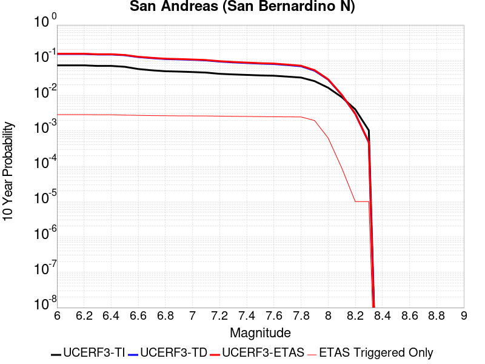 |

| Magnitude | 1 wk TI Prob | 1 wk TD Prob | 1 wk ETAS Prob | 1 wk ETAS/TD Gain | 1 wk ETAS Triggered Only | 1 mo TI Prob | 1 mo TD Prob | 1 mo ETAS Prob | 1 mo ETAS/TD Gain | 1 mo ETAS Triggered Only | 1 yr TI Prob | 1 yr TD Prob | 1 yr ETAS Prob | 1 yr ETAS/TD Gain | 1 yr ETAS Triggered Only | 10 yr TI Prob | 10 yr TD Prob | 10 yr ETAS Prob | 10 yr ETAS/TD Gain | 10 yr ETAS Triggered Only |
|-----|-----|-----|-----|-----|-----|-----|-----|-----|-----|-----|-----|-----|-----|-----|-----|-----|-----|-----|-----|-----|
| 6.0 | 1.4273766E-4 | 3.1606483E-4 | 0.0014357108 | 4.5424566 | 0.00112 | 6.115894E-4 | 0.0013538664 | 0.0028518357 | 2.106438 | 0.0015 | 0.0074207084 | 0.016360244 | 0.018504577 | 1.1310699 | 0.00218 | 0.07177748 | 0.15026689 | 0.15272261 | 1.0163424 | 0.00289 |
| 6.1 | 1.4273766E-4 | 3.1606483E-4 | 0.0014357108 | 4.5424566 | 0.00112 | 6.115894E-4 | 0.0013538664 | 0.0028518357 | 2.106438 | 0.0015 | 0.0074207084 | 0.016360244 | 0.018504577 | 1.1310699 | 0.00218 | 0.07177748 | 0.15026689 | 0.15272261 | 1.0163424 | 0.00289 |
| 6.2 | 1.4273766E-4 | 3.1606483E-4 | 0.0014357108 | 4.5424566 | 0.00112 | 6.115894E-4 | 0.0013538664 | 0.0028518357 | 2.106438 | 0.0015 | 0.0074207084 | 0.016360244 | 0.018504577 | 1.1310699 | 0.00218 | 0.07177748 | 0.15026689 | 0.15272261 | 1.0163424 | 0.00289 |
| 6.3 | 1.3730655E-4 | 3.0511338E-4 | 0.0014247716 | 4.6696467 | 0.00112 | 5.883239E-4 | 0.0013069791 | 0.0028050188 | 2.1461847 | 0.0015 | 0.0071393442 | 0.015797773 | 0.017943334 | 1.1358142 | 0.00218 | 0.06914291 | 0.14556676 | 0.14801899 | 1.0168461 | 0.00287 |
| 6.4 | 1.3730655E-4 | 3.0511338E-4 | 0.0014247716 | 4.6696467 | 0.00112 | 5.883239E-4 | 0.0013069791 | 0.0028050188 | 2.1461847 | 0.0015 | 0.0071393442 | 0.015797773 | 0.017943334 | 1.1358142 | 0.00218 | 0.06914291 | 0.14556676 | 0.14801899 | 1.0168461 | 0.00287 |
| 6.5 | 1.2942807E-4 | 2.8925808E-4 | 0.0013789427 | 4.7671714 | 0.00109 | 5.545738E-4 | 0.0012390936 | 0.002707272 | 2.184881 | 0.00147 | 0.0067310524 | 0.01498286 | 0.017071096 | 1.139375 | 0.00212 | 0.06530788 | 0.13870941 | 0.14112103 | 1.0173861 | 0.0028 |
| 6.6 | 1.1125901E-4 | 2.536472E-4 | 0.0013333732 | 5.2568026 | 0.00108 | 4.767372E-4 | 0.0010866089 | 0.0025450224 | 2.3421698 | 0.00146 | 0.005788839 | 0.013149847 | 0.015222233 | 1.1575977 | 0.0021 | 0.056403454 | 0.122999296 | 0.12541981 | 1.0196792 | 0.00276 |
| 6.7 | 1.02209575E-4 | 2.3499702E-4 | 0.0013047456 | 5.5521793 | 0.00107 | 4.3796748E-4 | 0.0010067427 | 0.002455283 | 2.4388385 | 0.00145 | 0.0053192247 | 0.012188629 | 0.014223521 | 1.16695 | 0.00206 | 0.051936906 | 0.114790924 | 0.11718984 | 1.0208981 | 0.00271 |
| 6.8 | 9.610582E-5 | 2.2025521E-4 | 0.0012900195 | 5.8569307 | 0.00107 | 4.1181705E-4 | 9.436101E-4 | 0.002392242 | 2.5352015 | 0.00145 | 0.0050023515 | 0.011428202 | 0.013454773 | 1.1773309 | 0.00205 | 0.048912346 | 0.1081929 | 0.11059186 | 1.022173 | 0.00269 |
| 6.9 | 9.3877505E-5 | 2.1481077E-4 | 0.0012845809 | 5.980058 | 0.00107 | 4.0227012E-4 | 9.2029345E-4 | 0.0023689591 | 2.5741343 | 0.00145 | 0.0048866454 | 0.011147255 | 0.013174403 | 1.1818517 | 0.00205 | 0.04780577 | 0.10578323 | 0.108170785 | 1.0225703 | 0.00267 |
| 7.0 | 9.1019785E-5 | 2.0808022E-4 | 0.0012678597 | 6.093129 | 0.00106 | 3.900265E-4 | 8.914682E-4 | 0.0023301844 | 2.6138728 | 0.00144 | 0.0047382377 | 0.010799837 | 0.012817806 | 1.1868517 | 0.00204 | 0.046384744 | 0.102753714 | 0.10514039 | 1.0232271 | 0.00266 |
| 7.1 | 8.771155E-5 | 1.9982594E-4 | 0.0012496162 | 6.253523 | 0.00105 | 3.758525E-4 | 8.5611636E-4 | 0.0022848921 | 2.6689036 | 0.00143 | 0.0045664064 | 0.0103736 | 0.012382541 | 1.1936591 | 0.00203 | 0.044737056 | 0.09906527 | 0.10145274 | 1.0241001 | 0.00265 |
| 7.2 | 8.0830236E-5 | 1.8388197E-4 | 0.0012336889 | 6.7091346 | 0.00105 | 3.4636928E-4 | 7.8782777E-4 | 0.002206709 | 2.8010044 | 0.00142 | 0.0042088944 | 0.009549725 | 0.011530625 | 1.2074301 | 0.002 | 0.041300658 | 0.09179615 | 0.094175644 | 1.0259215 | 0.00262 |
| 7.3 | 7.7668235E-5 | 1.7331762E-4 | 0.0012231356 | 7.0571914 | 0.00105 | 3.328214E-4 | 7.425784E-4 | 0.002161524 | 2.910836 | 0.00142 | 0.0040445733 | 0.009003494 | 0.010965667 | 1.2179346 | 0.00198 | 0.03971748 | 0.08706327 | 0.08942777 | 1.0271585 | 0.00259 |
| 7.4 | 7.520177E-5 | 1.6551897E-4 | 0.0012153452 | 7.3426337 | 0.00105 | 3.2225347E-4 | 7.0917426E-4 | 0.0021281673 | 3.0009086 | 0.00142 | 0.0039163795 | 0.008600081 | 0.010563053 | 1.2282504 | 0.00198 | 0.038480744 | 0.08351955 | 0.08587491 | 1.0282012 | 0.00257 |
| 7.5 | 7.274697E-5 | 1.5839566E-4 | 0.0011982309 | 7.5647964 | 0.00104 | 3.1173544E-4 | 6.78662E-4 | 0.002087705 | 3.0762074 | 0.00141 | 0.003788775 | 0.008231463 | 0.010175329 | 1.2361507 | 0.00196 | 0.03724827 | 0.08023631 | 0.08257251 | 1.0291165 | 0.00254 |
| 7.6 | 7.1185845E-5 | 1.540943E-4 | 0.001193934 | 7.748074 | 0.00104 | 3.0504653E-4 | 6.6023704E-4 | 0.002069306 | 3.1341865 | 0.00141 | 0.0037076178 | 0.008008812 | 0.009943194 | 1.2415318 | 0.00195 | 0.036463667 | 0.07822598 | 0.080548845 | 1.0296943 | 0.00252 |
| 7.7 | 6.709961E-5 | 1.4318313E-4 | 0.0011830343 | 8.262385 | 0.00104 | 2.8753807E-4 | 6.1349774E-4 | 0.0020226326 | 3.2968872 | 0.00141 | 0.003495157 | 0.0074437927 | 0.009369352 | 1.2586799 | 0.00194 | 0.034406938 | 0.07305469 | 0.075372055 | 1.0317209 | 0.0025 |
| 7.8 | 6.300812E-5 | 1.3202413E-4 | 0.0011718868 | 8.876308 | 0.00104 | 2.7000686E-4 | 5.65695E-4 | 0.0019748975 | 3.491099 | 0.00141 | 0.0032823787 | 0.006865616 | 0.008782365 | 1.279181 | 0.00193 | 0.032343175 | 0.06771354 | 0.07003493 | 1.0342826 | 0.00249 |
| 7.9 | 4.983037E-5 | 9.723488E-5 | 9.171551E-4 | 9.432367 | 8.2E-4 | 2.1354125E-4 | 4.1665437E-4 | 0.0015062002 | 3.6149871 | 0.00109 | 0.0025967648 | 0.0050609782 | 0.006553387 | 1.2948854 | 0.0015 | 0.025666296 | 0.05064886 | 0.052519083 | 1.0369252 | 0.00197 |
| 8.0 | 3.2211527E-5 | 5.3304586E-5 | 2.9329179E-4 | 5.502187 | 2.4E-4 | 1.380421E-4 | 2.2842824E-4 | 5.5835285E-4 | 2.444325 | 3.3E-4 | 0.0016793669 | 0.0027775685 | 0.0032662076 | 1.1759232 | 4.9E-4 | 0.016667323 | 0.028361378 | 0.02897351 | 1.0215833 | 6.3E-4 |
| 8.1 | 1.743376E-5 | 1.8824427E-5 | 3.8824048E-5 | 2.0624294 | 2.0E-5 | 7.471398E-5 | 8.067362E-5 | 1.206704E-4 | 1.495785 | 4.0E-5 | 9.0926304E-4 | 9.817594E-4 | 0.0010317103 | 1.050879 | 5.0E-5 | 0.009055517 | 0.010484105 | 0.010573162 | 1.0084944 | 9.0E-5 |
| 8.2 | 7.831616E-6 | 5.1551065E-6 | 5.1551065E-6 | 1.0 | 0.0 | 3.3563636E-5 | 2.2093127E-5 | 2.2093127E-5 | 1.0 | 0.0 | 4.0856065E-4 | 2.6895068E-4 | 2.78948E-4 | 1.0371715 | 1.0E-5 | 0.004078103 | 0.0030418145 | 0.0030517841 | 1.0032775 | 1.0E-5 |
| 8.3 | 1.983087E-6 | 7.6599065E-7 | 7.6599065E-7 | 1.0 | 0.0 | 8.498917E-6 | 3.282813E-6 | 3.282813E-6 | 1.0 | 0.0 | 1.034694E-4 | 3.9967534E-5 | 4.9967133E-5 | 1.2501931 | 1.0E-5 | 0.0010342124 | 4.719687E-4 | 4.8196397E-4 | 1.0211779 | 1.0E-5 |

## Bicycle Lake
*[(top)](#table-of-contents)*

| 1 Week | 1 Month | 1 Year | 10 Year |
|-----|-----|-----|-----|
| 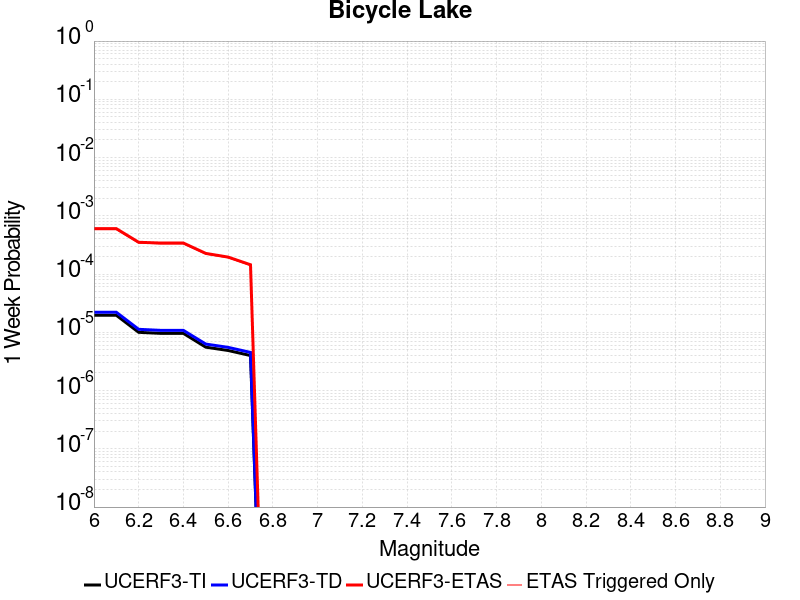 | 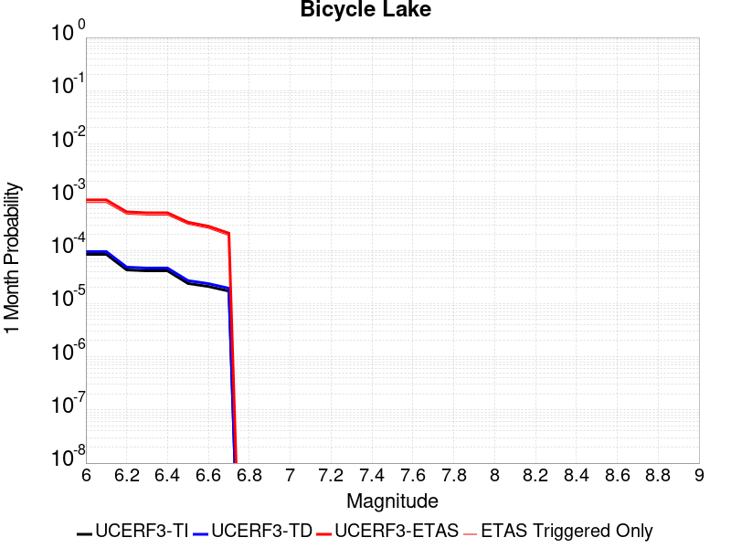 |  |  |

| Magnitude | 1 wk TI Prob | 1 wk TD Prob | 1 wk ETAS Prob | 1 wk ETAS/TD Gain | 1 wk ETAS Triggered Only | 1 mo TI Prob | 1 mo TD Prob | 1 mo ETAS Prob | 1 mo ETAS/TD Gain | 1 mo ETAS Triggered Only | 1 yr TI Prob | 1 yr TD Prob | 1 yr ETAS Prob | 1 yr ETAS/TD Gain | 1 yr ETAS Triggered Only | 10 yr TI Prob | 10 yr TD Prob | 10 yr ETAS Prob | 10 yr ETAS/TD Gain | 10 yr ETAS Triggered Only |
|-----|-----|-----|-----|-----|-----|-----|-----|-----|-----|-----|-----|-----|-----|-----|-----|-----|-----|-----|-----|-----|
| 6.0 | 1.9621975E-5 | 2.2097078E-5 | 6.0208427E-4 | 27.247234 | 5.8E-4 | 8.4091465E-5 | 9.4699084E-5 | 8.8462426E-4 | 9.341424 | 7.9E-4 | 0.0010233327 | 0.0011524865 | 0.002720677 | 2.3607018 | 0.00157 | 0.01018633 | 0.011478408 | 0.014275924 | 1.2437198 | 0.00283 |
| 6.1 | 1.9621975E-5 | 2.2097078E-5 | 6.0208427E-4 | 27.247234 | 5.8E-4 | 8.4091465E-5 | 9.4699084E-5 | 8.8462426E-4 | 9.341424 | 7.9E-4 | 0.0010233327 | 0.0011524865 | 0.002720677 | 2.3607018 | 0.00157 | 0.01018633 | 0.011478408 | 0.014275924 | 1.2437198 | 0.00283 |
| 6.2 | 9.9971285E-6 | 1.1255639E-5 | 3.512518E-4 | 31.20674 | 3.4E-4 | 4.2844134E-5 | 4.8237856E-5 | 5.282147E-4 | 10.950211 | 4.8E-4 | 5.2150246E-4 | 5.871896E-4 | 0.0014866611 | 2.5318246 | 9.0E-4 | 0.0052028033 | 0.005861487 | 0.0075415806 | 1.2866328 | 0.00169 |
| 6.3 | 9.589428E-6 | 1.0798346E-5 | 3.407948E-4 | 31.559906 | 3.3E-4 | 4.10969E-5 | 4.62781E-5 | 5.062568E-4 | 10.939447 | 4.6E-4 | 5.002399E-4 | 5.6334207E-4 | 0.0014128631 | 2.5080025 | 8.5E-4 | 0.0049911533 | 0.0056242296 | 0.007235118 | 1.2864194 | 0.00162 |
| 6.4 | 9.589428E-6 | 1.0798346E-5 | 3.407948E-4 | 31.559906 | 3.3E-4 | 4.10969E-5 | 4.62781E-5 | 5.062568E-4 | 10.939447 | 4.6E-4 | 5.002399E-4 | 5.6334207E-4 | 0.0014128631 | 2.5080025 | 8.5E-4 | 0.0049911533 | 0.0056242296 | 0.007235118 | 1.2864194 | 0.00162 |
| 6.5 | 5.557707E-6 | 6.2856016E-6 | 2.2628422E-4 | 36.00041 | 2.2E-4 | 2.3818526E-5 | 2.6938165E-5 | 3.369298E-4 | 12.507526 | 3.1E-4 | 2.8995197E-4 | 3.2794967E-4 | 8.5777586E-4 | 2.6155715 | 5.3E-4 | 0.0028957394 | 0.0032772934 | 0.0042540818 | 1.2980472 | 9.8E-4 |
| 6.6 | 4.8742945E-6 | 5.5132896E-6 | 1.9551224E-4 | 35.461994 | 1.9E-4 | 2.0889667E-5 | 2.3628318E-5 | 2.8362218E-4 | 12.003486 | 2.6E-4 | 2.54302E-4 | 2.87663E-4 | 7.2753645E-4 | 2.5291276 | 4.4E-4 | 0.002540112 | 0.0028754752 | 0.0037030885 | 1.287818 | 8.3E-4 |
| 6.7 | 3.991108E-6 | 4.5159104E-6 | 1.4451527E-4 | 32.00136 | 1.4E-4 | 1.7104636E-5 | 1.9353902E-5 | 2.0935023E-4 | 10.816952 | 1.9E-4 | 2.0822904E-4 | 2.3563375E-4 | 5.8555126E-4 | 2.485006 | 3.5E-4 | 0.0020803404 | 0.0023563374 | 0.003034735 | 1.2879034 | 6.8E-4 |

## Paradise
*[(top)](#table-of-contents)*

| 1 Week | 1 Month | 1 Year | 10 Year |
|-----|-----|-----|-----|
|  | 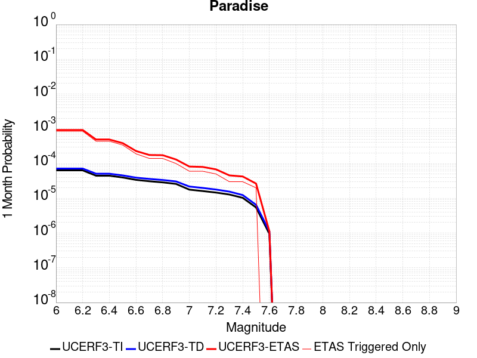 |  | 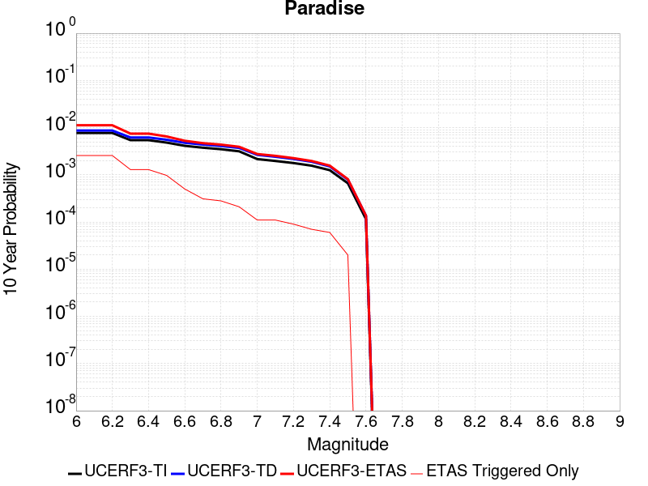 |

| Magnitude | 1 wk TI Prob | 1 wk TD Prob | 1 wk ETAS Prob | 1 wk ETAS/TD Gain | 1 wk ETAS Triggered Only | 1 mo TI Prob | 1 mo TD Prob | 1 mo ETAS Prob | 1 mo ETAS/TD Gain | 1 mo ETAS Triggered Only | 1 yr TI Prob | 1 yr TD Prob | 1 yr ETAS Prob | 1 yr ETAS/TD Gain | 1 yr ETAS Triggered Only | 10 yr TI Prob | 10 yr TD Prob | 10 yr ETAS Prob | 10 yr ETAS/TD Gain | 10 yr ETAS Triggered Only |
|-----|-----|-----|-----|-----|-----|-----|-----|-----|-----|-----|-----|-----|-----|-----|-----|-----|-----|-----|-----|-----|
| 6.0 | 1.4851273E-5 | 1.6694692E-5 | 5.866852E-4 | 35.14202 | 5.7E-4 | 6.364676E-5 | 7.154685E-5 | 9.2148606E-4 | 12.8794775 | 8.5E-4 | 7.7462377E-4 | 8.707584E-4 | 0.002359461 | 2.7096622 | 0.00149 | 0.0077192914 | 0.008675844 | 0.011213634 | 1.2925122 | 0.00256 |
| 6.1 | 1.4851273E-5 | 1.6694692E-5 | 5.866852E-4 | 35.14202 | 5.7E-4 | 6.364676E-5 | 7.154685E-5 | 9.2148606E-4 | 12.8794775 | 8.5E-4 | 7.7462377E-4 | 8.707584E-4 | 0.002359461 | 2.7096622 | 0.00149 | 0.0077192914 | 0.008675844 | 0.011213634 | 1.2925122 | 0.00256 |
| 6.2 | 1.4851273E-5 | 1.6694692E-5 | 5.866852E-4 | 35.14202 | 5.7E-4 | 6.364676E-5 | 7.154685E-5 | 9.2148606E-4 | 12.8794775 | 8.5E-4 | 7.7462377E-4 | 8.707584E-4 | 0.002359461 | 2.7096622 | 0.00149 | 0.0077192914 | 0.008675844 | 0.011213634 | 1.2925122 | 0.00256 |
| 6.3 | 1.0426831E-5 | 1.188862E-5 | 3.1188506E-4 | 26.233915 | 3.0E-4 | 4.4685654E-5 | 5.0950268E-5 | 4.9092784E-4 | 9.635432 | 4.4E-4 | 5.43912E-4 | 6.201489E-4 | 0.0013696838 | 2.208637 | 7.5E-4 | 0.0054258266 | 0.0061847917 | 0.007466813 | 1.2072861 | 0.00129 |
| 6.4 | 1.0426831E-5 | 1.188862E-5 | 3.1188506E-4 | 26.233915 | 3.0E-4 | 4.4685654E-5 | 5.0950268E-5 | 4.9092784E-4 | 9.635432 | 4.4E-4 | 5.43912E-4 | 6.201489E-4 | 0.0013696838 | 2.208637 | 7.5E-4 | 0.0054258266 | 0.0061847917 | 0.007466813 | 1.2072861 | 0.00129 |
| 6.5 | 9.25027E-6 | 1.06199595E-5 | 2.3061762E-4 | 21.715488 | 2.2E-4 | 3.964341E-5 | 4.551335E-5 | 3.8549787E-4 | 8.469996 | 3.4E-4 | 4.8255164E-4 | 5.53989E-4 | 0.0011136788 | 2.0102904 | 5.6E-4 | 0.0048150513 | 0.0055265795 | 0.0064912187 | 1.1745454 | 9.7E-4 |
| 6.6 | 7.904275E-6 | 9.159525E-6 | 1.1915852E-4 | 13.009246 | 1.1E-4 | 3.3875025E-5 | 3.9254537E-5 | 2.2924707E-4 | 5.8400145 | 1.9E-4 | 4.1235037E-4 | 4.7782314E-4 | 7.6768454E-4 | 1.6066291 | 2.9E-4 | 0.0041158604 | 0.0047683544 | 0.0052659702 | 1.104358 | 5.0E-4 |
| 6.7 | 7.2061953E-6 | 8.407248E-6 | 6.840674E-5 | 8.136639 | 6.0E-5 | 3.088333E-5 | 3.6030586E-5 | 1.7602554E-4 | 4.8854475 | 1.4E-4 | 3.7593965E-4 | 4.3858777E-4 | 6.385001E-4 | 1.4558091 | 2.0E-4 | 0.003753043 | 0.004377591 | 0.004686234 | 1.0705053 | 3.1E-4 |
| 6.8 | 6.6948724E-6 | 7.842166E-6 | 6.78417E-5 | 8.6508875 | 6.0E-5 | 2.8691995E-5 | 3.360887E-5 | 1.7360416E-4 | 5.165427 | 1.4E-4 | 3.4926904E-4 | 4.0911473E-4 | 5.99037E-4 | 1.4642274 | 1.9E-4 | 0.003487206 | 0.0040839734 | 0.0043628295 | 1.0682807 | 2.8E-4 |
| 6.9 | 6.0421025E-6 | 7.130621E-6 | 3.713041E-5 | 5.207177 | 3.0E-5 | 2.5894467E-5 | 3.0559466E-5 | 1.3055641E-4 | 4.2722087 | 1.0E-4 | 3.1521954E-4 | 3.7200135E-4 | 5.01953E-4 | 1.3493311 | 1.3E-4 | 0.0031477278 | 0.0037141247 | 0.003923345 | 1.0563309 | 2.1E-4 |
| 7.0 | 4.134091E-6 | 5.0803087E-6 | 2.5080208E-5 | 4.9367485 | 2.0E-5 | 1.7717413E-5 | 2.177258E-5 | 8.177127E-5 | 3.7556999 | 6.0E-5 | 2.1568815E-4 | 2.6505045E-4 | 3.4502926E-4 | 1.3017493 | 8.0E-5 | 0.0021547892 | 0.0026474963 | 0.0027572052 | 1.0414387 | 1.1E-4 |
| 7.1 | 3.7674888E-6 | 4.6318696E-6 | 2.4631776E-5 | 5.317891 | 2.0E-5 | 1.6146281E-5 | 1.9850726E-5 | 7.984954E-5 | 4.0224996 | 6.0E-5 | 1.9656324E-4 | 2.4165731E-4 | 3.2163798E-4 | 1.3309673 | 8.0E-5 | 0.0019638946 | 0.002414096 | 0.0025238304 | 1.0454557 | 1.1E-4 |
| 7.2 | 3.4065345E-6 | 4.156723E-6 | 2.415664E-5 | 5.8114624 | 2.0E-5 | 1.4599351E-5 | 1.7814415E-5 | 6.7813526E-5 | 3.806666 | 5.0E-5 | 1.777326E-4 | 2.1687041E-4 | 2.768574E-4 | 1.2766029 | 6.0E-5 | 0.0017759053 | 0.002166736 | 0.0022565408 | 1.0414472 | 9.0E-5 |
| 7.3 | 2.9934936E-6 | 3.6293168E-6 | 1.362928E-5 | 3.7553296 | 1.0E-5 | 1.2829195E-5 | 1.555413E-5 | 4.5553665E-5 | 2.928718 | 3.0E-5 | 1.5618425E-4 | 1.8935655E-4 | 2.2934898E-4 | 1.2112017 | 4.0E-5 | 0.0015607453 | 0.0018920974 | 0.0019619649 | 1.036926 | 7.0E-5 |
| 7.4 | 2.4049796E-6 | 2.8889842E-6 | 1.2888955E-5 | 4.4614143 | 1.0E-5 | 1.0307015E-5 | 1.238131E-5 | 4.238094E-5 | 3.422977 | 3.0E-5 | 1.2548068E-4 | 1.5073347E-4 | 1.9072743E-4 | 1.2653291 | 4.0E-5 | 0.0012540985 | 0.0015064536 | 0.0015663633 | 1.0397687 | 6.0E-5 |
| 7.5 | 1.2710091E-6 | 1.5134682E-6 | 1.15134535E-5 | 7.607331 | 1.0E-5 | 5.44717E-6 | 6.4862834E-6 | 2.6486154E-5 | 4.08341 | 2.0E-5 | 6.631728E-5 | 7.8968886E-5 | 9.8967306E-5 | 1.2532443 | 2.0E-5 | 6.6297496E-4 | 7.8953087E-4 | 8.0951507E-4 | 1.0253115 | 2.0E-5 |
| 7.6 | 2.21172E-7 | 2.603961E-7 | 2.603961E-7 | 1.0 | 0.0 | 9.478797E-7 | 1.1159829E-6 | 1.1159829E-6 | 1.0 | 0.0 | 1.1540374E-5 | 1.3587036E-5 | 1.3587036E-5 | 1.0 | 0.0 | 1.1539775E-4 | 1.3586486E-4 | 1.3586486E-4 | 1.0 | 0.0 |

## Garlic Springs
*[(top)](#table-of-contents)*

| 1 Week | 1 Month | 1 Year | 10 Year |
|-----|-----|-----|-----|
|  | 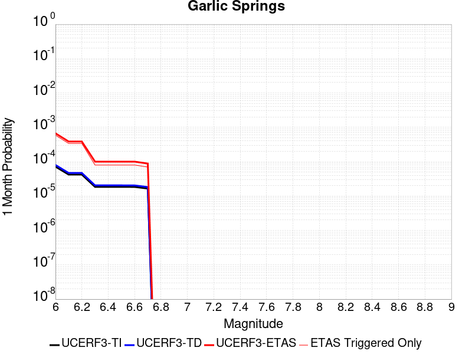 | 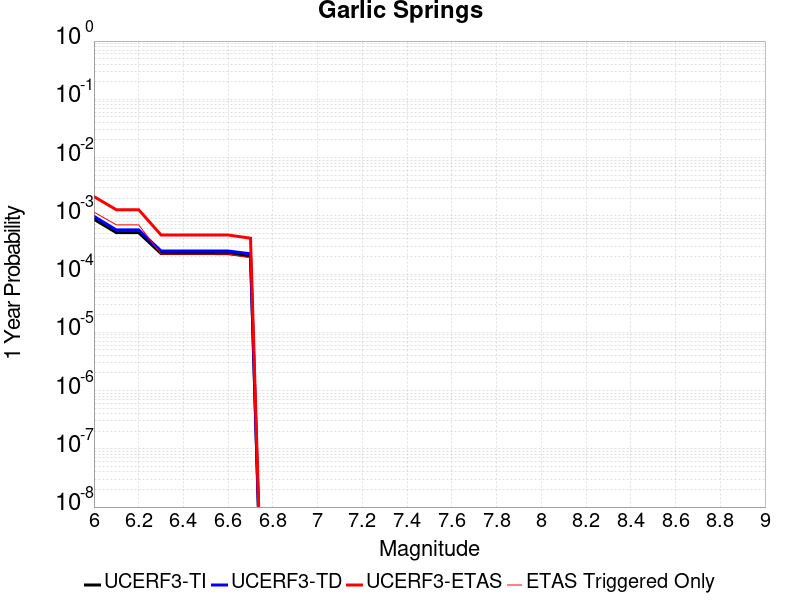 |  |

| Magnitude | 1 wk TI Prob | 1 wk TD Prob | 1 wk ETAS Prob | 1 wk ETAS/TD Gain | 1 wk ETAS Triggered Only | 1 mo TI Prob | 1 mo TD Prob | 1 mo ETAS Prob | 1 mo ETAS/TD Gain | 1 mo ETAS Triggered Only | 1 yr TI Prob | 1 yr TD Prob | 1 yr ETAS Prob | 1 yr ETAS/TD Gain | 1 yr ETAS Triggered Only | 10 yr TI Prob | 10 yr TD Prob | 10 yr ETAS Prob | 10 yr ETAS/TD Gain | 10 yr ETAS Triggered Only |
|-----|-----|-----|-----|-----|-----|-----|-----|-----|-----|-----|-----|-----|-----|-----|-----|-----|-----|-----|-----|-----|
| 6.0 | 1.6760017E-5 | 1.8776833E-5 | 3.7877008E-4 | 20.172203 | 3.6E-4 | 7.182667E-5 | 8.0470316E-5 | 6.7042286E-4 | 8.3313055 | 5.9E-4 | 8.7413884E-4 | 9.794032E-4 | 0.002138267 | 2.1832347 | 0.00116 | 0.008707083 | 0.009762413 | 0.011723083 | 1.2008387 | 0.00198 |
| 6.1 | 9.852767E-6 | 1.09735865E-5 | 2.009715E-4 | 18.314112 | 1.9E-4 | 4.222546E-5 | 4.702921E-5 | 3.8701322E-4 | 8.229209 | 3.4E-4 | 5.139737E-4 | 5.7250116E-4 | 0.0012721004 | 2.222005 | 7.0E-4 | 0.005127866 | 0.005717221 | 0.006840761 | 1.1965184 | 0.00113 |
| 6.2 | 9.852767E-6 | 1.09735865E-5 | 2.009715E-4 | 18.314112 | 1.9E-4 | 4.222546E-5 | 4.702921E-5 | 3.8701322E-4 | 8.229209 | 3.4E-4 | 5.139737E-4 | 5.7250116E-4 | 0.0012721004 | 2.222005 | 7.0E-4 | 0.005127866 | 0.005717221 | 0.006840761 | 1.1965184 | 0.00113 |
| 6.3 | 4.3167724E-6 | 4.7780286E-6 | 5.477779E-5 | 11.464517 | 5.0E-5 | 1.8500323E-5 | 2.0477235E-5 | 1.004756E-4 | 4.9066978 | 8.0E-5 | 2.2521814E-4 | 2.4930484E-4 | 4.6925E-4 | 1.8822337 | 2.2E-4 | 0.0022499003 | 0.00249251 | 0.0028516126 | 1.1440728 | 3.6E-4 |
| 6.4 | 4.3167724E-6 | 4.7780286E-6 | 5.477779E-5 | 11.464517 | 5.0E-5 | 1.8500323E-5 | 2.0477235E-5 | 1.004756E-4 | 4.9066978 | 8.0E-5 | 2.2521814E-4 | 2.4930484E-4 | 4.6925E-4 | 1.8822337 | 2.2E-4 | 0.0022499003 | 0.00249251 | 0.0028516126 | 1.1440728 | 3.6E-4 |
| 6.5 | 4.3167724E-6 | 4.7780286E-6 | 5.477779E-5 | 11.464517 | 5.0E-5 | 1.8500323E-5 | 2.0477235E-5 | 1.004756E-4 | 4.9066978 | 8.0E-5 | 2.2521814E-4 | 2.4930484E-4 | 4.6925E-4 | 1.8822337 | 2.2E-4 | 0.0022499003 | 0.00249251 | 0.0028516126 | 1.1440728 | 3.6E-4 |
| 6.6 | 4.301311E-6 | 4.760897E-6 | 5.4760658E-5 | 11.502172 | 5.0E-5 | 1.8434059E-5 | 2.0403815E-5 | 1.0040218E-4 | 4.9207554 | 8.0E-5 | 2.2441156E-4 | 2.4841115E-4 | 4.683565E-4 | 1.8854085 | 2.2E-4 | 0.0022418506 | 0.002483593 | 0.002842699 | 1.1445913 | 3.6E-4 |
| 6.7 | 3.8599724E-6 | 4.27106E-6 | 4.4270888E-5 | 10.365317 | 4.0E-5 | 1.6542634E-5 | 1.8304541E-5 | 8.830326E-5 | 4.8241177 | 7.0E-5 | 2.0138794E-4 | 2.228578E-4 | 4.1281545E-4 | 1.8523716 | 1.9E-4 | 0.0020120554 | 0.002228578 | 0.0025279094 | 1.134315 | 3.0E-4 |

## San Andreas (San Bernardino S)
*[(top)](#table-of-contents)*

| 1 Week | 1 Month | 1 Year | 10 Year |
|-----|-----|-----|-----|
|  |  | 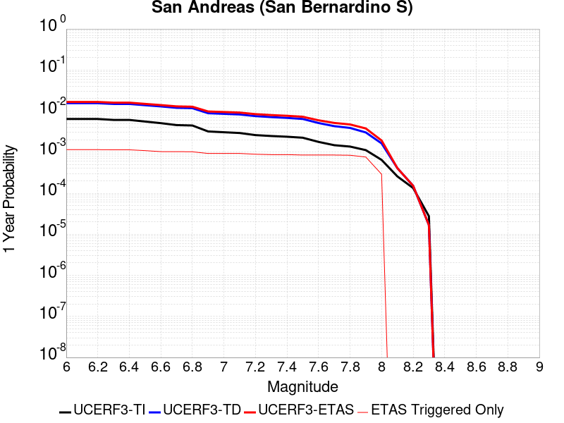 |  |

| Magnitude | 1 wk TI Prob | 1 wk TD Prob | 1 wk ETAS Prob | 1 wk ETAS/TD Gain | 1 wk ETAS Triggered Only | 1 mo TI Prob | 1 mo TD Prob | 1 mo ETAS Prob | 1 mo ETAS/TD Gain | 1 mo ETAS Triggered Only | 1 yr TI Prob | 1 yr TD Prob | 1 yr ETAS Prob | 1 yr ETAS/TD Gain | 1 yr ETAS Triggered Only | 10 yr TI Prob | 10 yr TD Prob | 10 yr ETAS Prob | 10 yr ETAS/TD Gain | 10 yr ETAS Triggered Only |
|-----|-----|-----|-----|-----|-----|-----|-----|-----|-----|-----|-----|-----|-----|-----|-----|-----|-----|-----|-----|-----|
| 6.0 | 1.2336002E-4 | 3.0004102E-4 | 8.29882E-4 | 2.7658951 | 5.3E-4 | 5.2857865E-4 | 0.0012852824 | 0.0019743957 | 1.536157 | 6.9E-4 | 0.006416472 | 0.015540994 | 0.016673122 | 1.0728478 | 0.00115 | 0.06234337 | 0.14283717 | 0.1441572 | 1.0092415 | 0.00154 |
| 6.1 | 1.2336002E-4 | 3.0004102E-4 | 8.29882E-4 | 2.7658951 | 5.3E-4 | 5.2857865E-4 | 0.0012852824 | 0.0019743957 | 1.536157 | 6.9E-4 | 0.006416472 | 0.015540994 | 0.016673122 | 1.0728478 | 0.00115 | 0.06234337 | 0.14283717 | 0.1441572 | 1.0092415 | 0.00154 |
| 6.2 | 1.2336002E-4 | 3.0004102E-4 | 8.29882E-4 | 2.7658951 | 5.3E-4 | 5.2857865E-4 | 0.0012852824 | 0.0019743957 | 1.536157 | 6.9E-4 | 0.006416472 | 0.015540994 | 0.016673122 | 1.0728478 | 0.00115 | 0.06234337 | 0.14283717 | 0.1441572 | 1.0092415 | 0.00154 |
| 6.3 | 1.1712257E-4 | 2.8792414E-4 | 8.1777154E-4 | 2.8402326 | 5.3E-4 | 5.018573E-4 | 0.0012334028 | 0.0019225517 | 1.558738 | 6.9E-4 | 0.006093008 | 0.014918125 | 0.016041119 | 1.0752771 | 0.00114 | 0.059286322 | 0.13754563 | 0.13886519 | 1.0095936 | 0.00153 |
| 6.4 | 1.1712257E-4 | 2.8792414E-4 | 8.1777154E-4 | 2.8402326 | 5.3E-4 | 5.018573E-4 | 0.0012334028 | 0.0019225517 | 1.558738 | 6.9E-4 | 0.006093008 | 0.014918125 | 0.016041119 | 1.0752771 | 0.00114 | 0.059286322 | 0.13754563 | 0.13886519 | 1.0095936 | 0.00153 |
| 6.5 | 1.0689076E-4 | 2.680528E-4 | 7.879134E-4 | 2.9393964 | 5.2E-4 | 4.5802278E-4 | 0.0011483167 | 0.0018175473 | 1.5827928 | 6.7E-4 | 0.0055621783 | 0.01389575 | 0.014970604 | 1.0773512 | 0.00109 | 0.05425003 | 0.12879294 | 0.13008234 | 1.0100113 | 0.00148 |
| 6.6 | 9.7648895E-5 | 2.50501E-4 | 7.5037574E-4 | 2.9954998 | 5.0E-4 | 4.1842813E-4 | 0.0010731576 | 0.0017224601 | 1.6050392 | 6.5E-4 | 0.005082469 | 0.012991785 | 0.014008404 | 1.0782509 | 0.00103 | 0.049677886 | 0.12095292 | 0.12217479 | 1.010102 | 0.00139 |
| 6.7 | 8.757013E-5 | 2.3120902E-4 | 7.310934E-4 | 3.1620452 | 5.0E-4 | 3.7524657E-4 | 9.905418E-4 | 0.0016398979 | 1.6555566 | 6.5E-4 | 0.00455906 | 0.011997245 | 0.013014888 | 1.084823 | 0.00103 | 0.04466656 | 0.11226123 | 0.11346855 | 1.0107546 | 0.00136 |
| 6.8 | 8.562978E-5 | 2.2680782E-4 | 7.266944E-4 | 3.2040095 | 5.0E-4 | 3.6693315E-4 | 9.7169366E-4 | 0.001621062 | 1.6682851 | 6.5E-4 | 0.004458263 | 0.011770263 | 0.012778258 | 1.0856391 | 0.00102 | 0.043698758 | 0.11027153 | 0.111472666 | 1.0108925 | 0.00135 |
| 6.9 | 6.124075E-5 | 1.7065753E-4 | 6.405773E-4 | 3.7535837 | 4.7E-4 | 2.6243398E-4 | 7.311852E-4 | 0.0013207538 | 1.8063191 | 5.9E-4 | 0.0031904527 | 0.008866051 | 0.009787805 | 1.1039644 | 9.3E-4 | 0.031450346 | 0.08418263 | 0.08533656 | 1.0137074 | 0.00126 |
| 7.0 | 5.8598747E-5 | 1.649477E-4 | 6.348702E-4 | 3.8489177 | 4.7E-4 | 2.5111332E-4 | 7.06728E-4 | 0.001296311 | 1.8342432 | 5.9E-4 | 0.0030530186 | 0.008570663 | 0.009492693 | 1.1075797 | 9.3E-4 | 0.03011414 | 0.081500374 | 0.08265768 | 1.0142001 | 0.00126 |
| 7.1 | 5.613814E-5 | 1.5913323E-4 | 6.2905846E-4 | 3.95303 | 4.7E-4 | 2.4056983E-4 | 6.818221E-4 | 0.0012714198 | 1.8647385 | 5.9E-4 | 0.0029250039 | 0.008269769 | 0.009192077 | 1.1115278 | 9.3E-4 | 0.028868021 | 0.07879931 | 0.079960026 | 1.01473 | 0.00126 |
| 7.2 | 4.991222E-5 | 1.4519796E-4 | 5.951326E-4 | 4.0987673 | 4.5E-4 | 2.1389198E-4 | 6.2212895E-4 | 0.0011917743 | 1.9156388 | 5.7E-4 | 0.002601025 | 0.007548217 | 0.008431499 | 1.1170186 | 8.9E-4 | 0.025707912 | 0.07225321 | 0.07338506 | 1.015665 | 0.00122 |
| 7.3 | 4.7410045E-5 | 1.3714004E-4 | 5.8707834E-4 | 4.2808676 | 4.5E-4 | 2.0317009E-4 | 5.8761094E-4 | 0.001157276 | 1.9694595 | 5.7E-4 | 0.0024707897 | 0.0071307817 | 0.007994577 | 1.1211363 | 8.7E-4 | 0.024434982 | 0.06853558 | 0.06964403 | 1.0161732 | 0.00119 |
| 7.4 | 4.5556746E-5 | 1.3121912E-4 | 5.811601E-4 | 4.4289284 | 4.5E-4 | 1.952286E-4 | 5.622468E-4 | 0.0011319263 | 2.0132198 | 5.7E-4 | 0.002374317 | 0.0068239477 | 0.0076880106 | 1.1266222 | 8.7E-4 | 0.023491086 | 0.065788016 | 0.06689038 | 1.0167564 | 0.00118 |
| 7.5 | 4.3084514E-5 | 1.2357246E-4 | 5.635181E-4 | 4.5602236 | 4.4E-4 | 1.8463485E-4 | 5.2948913E-4 | 0.0010891926 | 2.0570633 | 5.6E-4 | 0.0022456115 | 0.0064275465 | 0.0072720833 | 1.1313933 | 8.5E-4 | 0.022230545 | 0.062188786 | 0.06325789 | 1.0171913 | 0.00114 |
| 7.6 | 3.408608E-5 | 9.83552E-5 | 5.383119E-4 | 5.4731417 | 4.4E-4 | 1.4607502E-4 | 4.214543E-4 | 9.812183E-4 | 2.3281724 | 5.6E-4 | 0.0017770125 | 0.0051191594 | 0.0059648077 | 1.1651928 | 8.5E-4 | 0.017628696 | 0.050020292 | 0.05108427 | 1.0212709 | 0.00112 |
| 7.7 | 2.8315713E-5 | 8.248679E-5 | 5.224505E-4 | 6.3337474 | 4.4E-4 | 1.2134742E-4 | 3.5346695E-4 | 9.13269E-4 | 2.5837464 | 5.6E-4 | 0.0014764034 | 0.0042949775 | 0.0051413267 | 1.1970556 | 8.5E-4 | 0.01466633 | 0.0422714 | 0.043344058 | 1.0253755 | 0.00112 |
| 7.8 | 2.6222975E-5 | 7.463088E-5 | 5.1459804E-4 | 6.8952427 | 4.4E-4 | 1.1237934E-4 | 3.1980744E-4 | 8.7962835E-4 | 2.7504938 | 5.6E-4 | 0.0013673597 | 0.0038867102 | 0.0047234455 | 1.2152811 | 8.4E-4 | 0.013589768 | 0.03843674 | 0.039504077 | 1.0277686 | 0.00111 |
| 7.9 | 2.1469694E-5 | 5.787864E-5 | 4.4785606E-4 | 7.7378473 | 3.9E-4 | 9.200973E-5 | 2.4802773E-4 | 7.5790123E-4 | 3.0557115 | 5.1E-4 | 0.0011196428 | 0.0030155594 | 0.0037732676 | 1.2512662 | 7.6E-4 | 0.011140184 | 0.030152109 | 0.031121956 | 1.0321652 | 0.001 |
| 8.0 | 1.2420249E-5 | 3.131896E-5 | 1.6131489E-4 | 5.1507106 | 1.3E-4 | 5.322855E-5 | 1.342172E-4 | 3.041944E-4 | 2.2664335 | 1.7E-4 | 6.478649E-4 | 0.0016328706 | 0.0019223972 | 1.1773113 | 2.9E-4 | 0.0064597935 | 0.016522504 | 0.016866721 | 1.0208333 | 3.5E-4 |
| 8.1 | 4.9197724E-6 | 7.822348E-6 | 7.822348E-6 | 1.0 | 0.0 | 2.1084568E-5 | 3.352392E-5 | 3.352392E-5 | 1.0 | 0.0 | 2.566744E-4 | 4.0807744E-4 | 4.0807744E-4 | 1.0 | 0.0 | 0.002563781 | 0.0043843705 | 0.0043943264 | 1.0022708 | 1.0E-5 |
| 8.2 | 2.5634774E-6 | 2.9067196E-6 | 2.9067196E-6 | 1.0 | 0.0 | 1.0986286E-5 | 1.2457311E-5 | 1.2457311E-5 | 1.0 | 0.0 | 1.3374983E-4 | 1.5165724E-4 | 1.5165724E-4 | 1.0 | 0.0 | 0.0013366934 | 0.0017049741 | 0.0017049741 | 1.0 | 0.0 |
| 8.3 | 5.2850464E-7 | 3.2088764E-7 | 3.2088764E-7 | 1.0 | 0.0 | 2.2650179E-6 | 1.375232E-6 | 1.375232E-6 | 1.0 | 0.0 | 2.7576245E-5 | 1.6743334E-5 | 1.6743334E-5 | 1.0 | 0.0 | 2.7572823E-4 | 1.9870348E-4 | 1.9870348E-4 | 1.0 | 0.0 |

## Death Valley (Black Mtns Frontal)
*[(top)](#table-of-contents)*

| 1 Week | 1 Month | 1 Year | 10 Year |
|-----|-----|-----|-----|
| 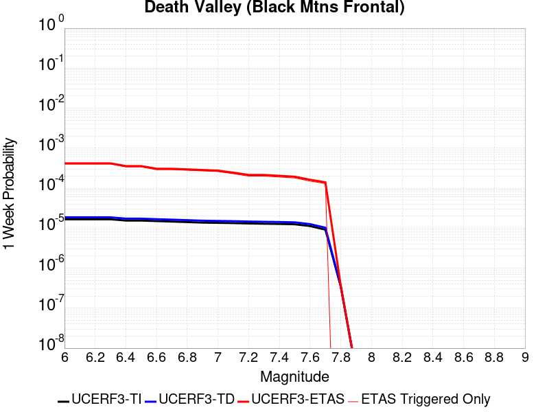 |  | 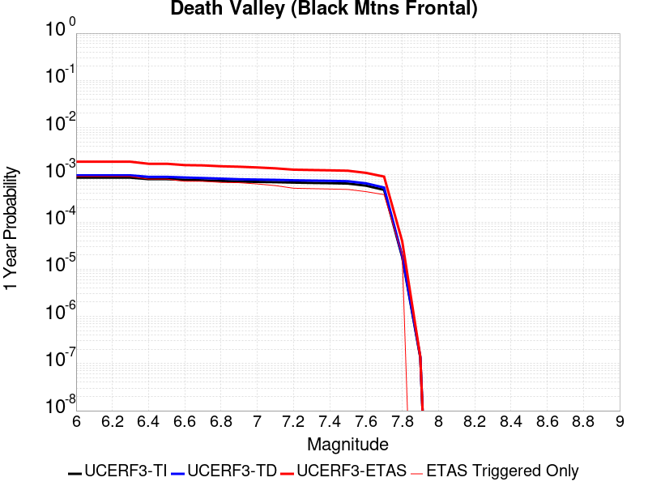 |  |

| Magnitude | 1 wk TI Prob | 1 wk TD Prob | 1 wk ETAS Prob | 1 wk ETAS/TD Gain | 1 wk ETAS Triggered Only | 1 mo TI Prob | 1 mo TD Prob | 1 mo ETAS Prob | 1 mo ETAS/TD Gain | 1 mo ETAS Triggered Only | 1 yr TI Prob | 1 yr TD Prob | 1 yr ETAS Prob | 1 yr ETAS/TD Gain | 1 yr ETAS Triggered Only | 10 yr TI Prob | 10 yr TD Prob | 10 yr ETAS Prob | 10 yr ETAS/TD Gain | 10 yr ETAS Triggered Only |
|-----|-----|-----|-----|-----|-----|-----|-----|-----|-----|-----|-----|-----|-----|-----|-----|-----|-----|-----|-----|-----|
| 6.0 | 1.6707214E-5 | 1.867027E-5 | 4.186628E-4 | 22.424038 | 4.0E-4 | 7.160038E-5 | 8.001302E-5 | 6.199698E-4 | 7.748361 | 5.4E-4 | 8.71386E-4 | 9.737309E-4 | 0.001892835 | 1.9438996 | 9.2E-4 | 0.00867977 | 0.009695496 | 0.0110918265 | 1.1440183 | 0.00141 |
| 6.1 | 1.6707214E-5 | 1.867027E-5 | 4.186628E-4 | 22.424038 | 4.0E-4 | 7.160038E-5 | 8.001302E-5 | 6.199698E-4 | 7.748361 | 5.4E-4 | 8.71386E-4 | 9.737309E-4 | 0.001892835 | 1.9438996 | 9.2E-4 | 0.00867977 | 0.009695496 | 0.0110918265 | 1.1440183 | 0.00141 |
| 6.2 | 1.6707214E-5 | 1.867027E-5 | 4.186628E-4 | 22.424038 | 4.0E-4 | 7.160038E-5 | 8.001302E-5 | 6.199698E-4 | 7.748361 | 5.4E-4 | 8.71386E-4 | 9.737309E-4 | 0.001892835 | 1.9438996 | 9.2E-4 | 0.00867977 | 0.009695496 | 0.0110918265 | 1.1440183 | 0.00141 |
| 6.3 | 1.6707214E-5 | 1.867027E-5 | 4.186628E-4 | 22.424038 | 4.0E-4 | 7.160038E-5 | 8.001302E-5 | 6.199698E-4 | 7.748361 | 5.4E-4 | 8.71386E-4 | 9.737309E-4 | 0.001892835 | 1.9438996 | 9.2E-4 | 0.00867977 | 0.009695496 | 0.0110918265 | 1.1440183 | 0.00141 |
| 6.4 | 1.5515609E-5 | 1.7338214E-5 | 3.5733232E-4 | 20.609524 | 3.4E-4 | 6.649377E-5 | 7.4304546E-5 | 5.3427037E-4 | 7.1902785 | 4.6E-4 | 8.0926094E-4 | 9.042885E-4 | 0.001713556 | 1.8949219 | 8.1E-4 | 0.008063202 | 0.009006773 | 0.010195965 | 1.1320331 | 0.0012 |
| 6.5 | 1.5515609E-5 | 1.7338214E-5 | 3.5733232E-4 | 20.609524 | 3.4E-4 | 6.649377E-5 | 7.4304546E-5 | 5.3427037E-4 | 7.1902785 | 4.6E-4 | 8.0926094E-4 | 9.042885E-4 | 0.001713556 | 1.8949219 | 8.1E-4 | 0.008063202 | 0.009006773 | 0.010195965 | 1.1320331 | 0.0012 |
| 6.6 | 1.5041828E-5 | 1.6809145E-5 | 3.0680426E-4 | 18.252224 | 2.9E-4 | 6.4463384E-5 | 7.203723E-5 | 4.6200913E-4 | 6.413477 | 3.9E-4 | 7.8455906E-4 | 8.767063E-4 | 0.0016060664 | 1.831932 | 7.3E-4 | 0.00781795 | 0.008733132 | 0.009823526 | 1.1248571 | 0.0011 |
| 6.7 | 1.4634985E-5 | 1.6356016E-5 | 3.0635128E-4 | 18.730188 | 2.9E-4 | 6.271985E-5 | 7.009536E-5 | 4.6006803E-4 | 6.563459 | 3.9E-4 | 7.6334673E-4 | 8.5308263E-4 | 0.0015824599 | 1.8549901 | 7.3E-4 | 0.007607299 | 0.008498715 | 0.009569537 | 1.125998 | 0.00108 |
| 6.8 | 1.4209158E-5 | 1.5882048E-5 | 2.958776E-4 | 18.629688 | 2.8E-4 | 6.089497E-5 | 6.8064175E-5 | 4.480383E-4 | 6.5825863 | 3.8E-4 | 7.4114406E-4 | 8.2837185E-4 | 0.0015178003 | 1.8322692 | 6.9E-4 | 0.007386771 | 0.008253456 | 0.0092551205 | 1.1213629 | 0.00101 |
| 6.9 | 1.3780098E-5 | 1.5404594E-5 | 2.8540043E-4 | 18.52697 | 2.7E-4 | 5.9056227E-5 | 6.6018045E-5 | 4.3599363E-4 | 6.6041584 | 3.7E-4 | 7.1877235E-4 | 8.0347876E-4 | 0.0014829324 | 1.8456398 | 6.8E-4 | 0.0071645193 | 0.008006332 | 0.008958647 | 1.1189451 | 9.6E-4 |
| 7.0 | 1.3585064E-5 | 1.5188155E-5 | 2.751842E-4 | 18.118343 | 2.6E-4 | 5.8220405E-5 | 6.50905E-5 | 4.0506836E-4 | 6.2231565 | 3.4E-4 | 7.086029E-4 | 7.9219416E-4 | 0.0014316872 | 1.8072428 | 6.4E-4 | 0.007063476 | 0.007894293 | 0.00879711 | 1.1143632 | 9.1E-4 |
| 7.1 | 1.3398601E-5 | 1.49813395E-5 | 2.4497788E-4 | 16.352201 | 2.3E-4 | 5.742131E-5 | 6.420419E-5 | 3.6418493E-4 | 5.672292 | 3.0E-4 | 6.9888023E-4 | 7.8141113E-4 | 0.0013709501 | 1.7544543 | 5.9E-4 | 0.0069668638 | 0.007787224 | 0.0086306045 | 1.1083032 | 8.5E-4 |
| 7.2 | 1.3126312E-5 | 1.4679561E-5 | 2.1467662E-4 | 14.624186 | 2.0E-4 | 5.6254412E-5 | 6.291092E-5 | 3.128952E-4 | 4.9736233 | 2.5E-4 | 6.846822E-4 | 7.6567667E-4 | 0.0012852785 | 1.6786178 | 5.2E-4 | 0.006825765 | 0.00763097 | 0.00838517 | 1.0988342 | 7.6E-4 |
| 7.3 | 1.2922429E-5 | 1.4453788E-5 | 2.1445089E-4 | 14.837003 | 2.0E-4 | 5.5380664E-5 | 6.194336E-5 | 3.1192787E-4 | 5.0356946 | 2.5E-4 | 6.74051E-4 | 7.53905E-4 | 0.0012635204 | 1.6759678 | 5.1E-4 | 0.006720101 | 0.007514055 | 0.008248494 | 1.0977421 | 7.4E-4 |
| 7.4 | 1.2768878E-5 | 1.4283772E-5 | 2.0428105E-4 | 14.30162 | 1.9E-4 | 5.4722615E-5 | 6.1214756E-5 | 3.0120005E-4 | 4.9203835 | 2.4E-4 | 6.660441E-4 | 7.4504025E-4 | 0.0012446677 | 1.6706047 | 5.0E-4 | 0.0066405144 | 0.0074260035 | 0.008140657 | 1.0962366 | 7.2E-4 |
| 7.5 | 1.2521929E-5 | 1.40120155E-5 | 1.940095E-4 | 13.845938 | 1.8E-4 | 5.366431E-5 | 6.005014E-5 | 2.9003632E-4 | 4.8299026 | 2.3E-4 | 6.531671E-4 | 7.3087064E-4 | 0.0012205126 | 1.6699432 | 4.9E-4 | 0.006512506 | 0.0072852457 | 0.007970219 | 1.0940219 | 6.9E-4 |
| 7.6 | 1.1301089E-5 | 1.2648149E-5 | 1.6264625E-4 | 12.859293 | 1.5E-4 | 4.8432343E-5 | 5.4205255E-5 | 2.4419496E-4 | 4.5050054 | 1.9E-4 | 5.895042E-4 | 6.5975444E-4 | 0.0010994641 | 1.6664748 | 4.4E-4 | 0.0058794282 | 0.00657851 | 0.007174563 | 1.0906061 | 6.0E-4 |
| 7.7 | 9.189108E-6 | 1.0283358E-5 | 1.4028202E-4 | 13.641654 | 1.3E-4 | 3.93813E-5 | 4.407082E-5 | 2.0406376E-4 | 4.63036 | 1.6E-4 | 4.7936183E-4 | 5.3643517E-4 | 9.162313E-4 | 1.7080001 | 3.8E-4 | 0.004783291 | 0.005351914 | 0.005849238 | 1.0929245 | 5.0E-4 |
| 7.8 | 3.4586725E-7 | 3.6482615E-7 | 3.6482615E-7 | 1.0 | 0.0 | 1.4822873E-6 | 1.5635396E-6 | 1.1563524E-5 | 7.3957343 | 1.0E-5 | 1.80467E-5 | 1.9035933E-5 | 3.9035553E-5 | 2.0506246 | 2.0E-5 | 1.8045233E-4 | 1.9034347E-4 | 2.2033777E-4 | 1.1575798 | 3.0E-5 |
| 7.9 | 2.5591178E-9 | 2.6696718E-9 | 2.6696718E-9 | 1.0 | 0.0 | 1.0967647E-8 | 1.14414505E-8 | 1.14414505E-8 | 1.0 | 0.0 | 1.335311E-7 | 1.3929966E-7 | 1.3929966E-7 | 1.0 | 0.0 | 1.3353102E-6 | 1.3929966E-6 | 1.3929966E-6 | 1.0 | 0.0 |

## Coyote Lake
*[(top)](#table-of-contents)*

| 1 Week | 1 Month | 1 Year | 10 Year |
|-----|-----|-----|-----|
| 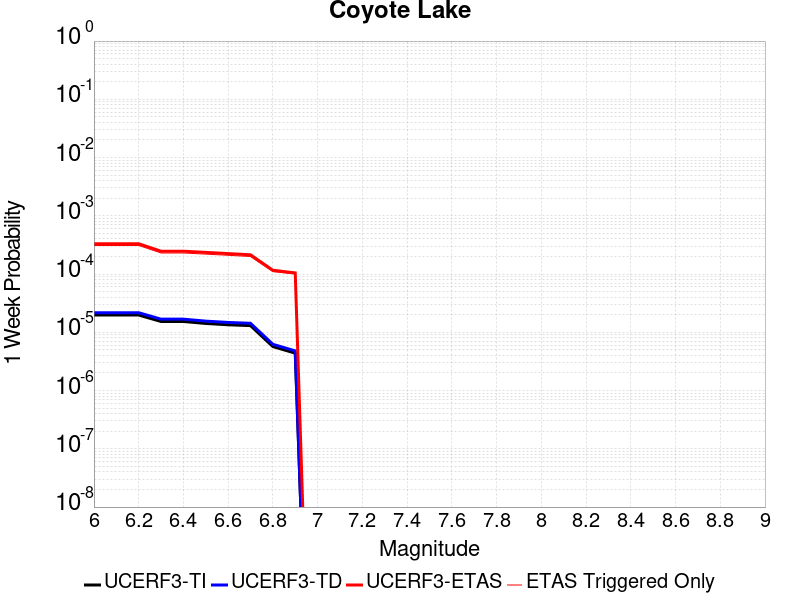 | 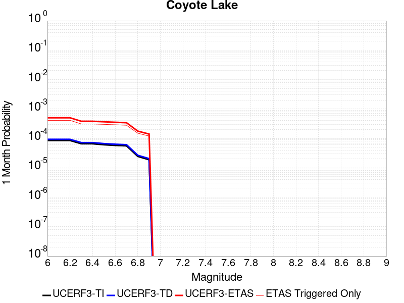 |  |  |

| Magnitude | 1 wk TI Prob | 1 wk TD Prob | 1 wk ETAS Prob | 1 wk ETAS/TD Gain | 1 wk ETAS Triggered Only | 1 mo TI Prob | 1 mo TD Prob | 1 mo ETAS Prob | 1 mo ETAS/TD Gain | 1 mo ETAS Triggered Only | 1 yr TI Prob | 1 yr TD Prob | 1 yr ETAS Prob | 1 yr ETAS/TD Gain | 1 yr ETAS Triggered Only | 10 yr TI Prob | 10 yr TD Prob | 10 yr ETAS Prob | 10 yr ETAS/TD Gain | 10 yr ETAS Triggered Only |
|-----|-----|-----|-----|-----|-----|-----|-----|-----|-----|-----|-----|-----|-----|-----|-----|-----|-----|-----|-----|-----|
| 6.0 | 1.980352E-5 | 2.1706745E-5 | 3.3170002E-4 | 15.280966 | 3.1E-4 | 8.486947E-5 | 9.302599E-5 | 5.029879E-4 | 5.40696 | 4.1E-4 | 0.0010327959 | 0.0011320751 | 0.0018612486 | 1.6441035 | 7.3E-4 | 0.010280091 | 0.011270258 | 0.012496283 | 1.1087841 | 0.00124 |
| 6.1 | 1.980352E-5 | 2.1706745E-5 | 3.3170002E-4 | 15.280966 | 3.1E-4 | 8.486947E-5 | 9.302599E-5 | 5.029879E-4 | 5.40696 | 4.1E-4 | 0.0010327959 | 0.0011320751 | 0.0018612486 | 1.6441035 | 7.3E-4 | 0.010280091 | 0.011270258 | 0.012496283 | 1.1087841 | 0.00124 |
| 6.2 | 1.980352E-5 | 2.1706745E-5 | 3.3170002E-4 | 15.280966 | 3.1E-4 | 8.486947E-5 | 9.302599E-5 | 5.029879E-4 | 5.40696 | 4.1E-4 | 0.0010327959 | 0.0011320751 | 0.0018612486 | 1.6441035 | 7.3E-4 | 0.010280091 | 0.011270258 | 0.012496283 | 1.1087841 | 0.00124 |
| 6.3 | 1.5344787E-5 | 1.682067E-5 | 2.468168E-4 | 14.673424 | 2.3E-4 | 6.576172E-5 | 7.2086936E-5 | 3.8206458E-4 | 5.300053 | 3.1E-4 | 8.003548E-4 | 8.773662E-4 | 0.0014168925 | 1.6149384 | 5.4E-4 | 0.007974784 | 0.00874507 | 0.009597548 | 1.0974811 | 8.6E-4 |
| 6.4 | 1.5344787E-5 | 1.682067E-5 | 2.468168E-4 | 14.673424 | 2.3E-4 | 6.576172E-5 | 7.2086936E-5 | 3.8206458E-4 | 5.300053 | 3.1E-4 | 8.003548E-4 | 8.773662E-4 | 0.0014168925 | 1.6149384 | 5.4E-4 | 0.007974784 | 0.00874507 | 0.009597548 | 1.0974811 | 8.6E-4 |
| 6.5 | 1.4189697E-5 | 1.5557987E-5 | 2.3555456E-4 | 15.140427 | 2.2E-4 | 6.081157E-5 | 6.6675726E-5 | 3.6665573E-4 | 5.499089 | 3.0E-4 | 7.401293E-4 | 8.115349E-4 | 0.0013411047 | 1.6525534 | 5.3E-4 | 0.0073766913 | 0.008091656 | 0.008934778 | 1.1041964 | 8.5E-4 |
| 6.6 | 1.3469301E-5 | 1.4771577E-5 | 2.2476848E-4 | 15.216281 | 2.1E-4 | 5.7724297E-5 | 6.330556E-5 | 3.532872E-4 | 5.580666 | 2.9E-4 | 7.025667E-4 | 7.7053264E-4 | 0.001290132 | 1.6743379 | 5.2E-4 | 0.0070034964 | 0.0076845144 | 0.008518059 | 1.1084708 | 8.4E-4 |
| 6.7 | 1.3027966E-5 | 1.4281745E-5 | 2.1427889E-4 | 15.003691 | 2.0E-4 | 5.5832945E-5 | 6.120638E-5 | 3.4118924E-4 | 5.5744066 | 2.8E-4 | 6.7955407E-4 | 7.4499263E-4 | 0.0012446202 | 1.6706476 | 5.0E-4 | 0.006774798 | 0.0074308286 | 0.008224884 | 1.1068596 | 8.0E-4 |
| 6.8 | 5.695434E-6 | 6.2244176E-6 | 1.1622373E-4 | 18.672226 | 1.1E-4 | 2.4408775E-5 | 2.6675973E-5 | 1.7667197E-4 | 6.6228876 | 1.5E-4 | 2.971363E-4 | 3.2476155E-4 | 5.047031E-4 | 1.5540729 | 1.8E-4 | 0.0029673933 | 0.0032458105 | 0.0035448368 | 1.0921268 | 3.0E-4 |
| 6.9 | 4.385688E-6 | 4.7930553E-6 | 1.04792576E-4 | 21.863419 | 1.0E-4 | 1.879567E-5 | 2.0541665E-5 | 1.405392E-4 | 6.8416653 | 1.2E-4 | 2.2881327E-4 | 2.5009477E-4 | 3.9005978E-4 | 1.5596478 | 1.4E-4 | 0.002285778 | 0.0025009478 | 0.0027104227 | 1.0837581 | 2.1E-4 |

## San Andreas (Big Bend)
*[(top)](#table-of-contents)*

| 1 Week | 1 Month | 1 Year | 10 Year |
|-----|-----|-----|-----|
|  | 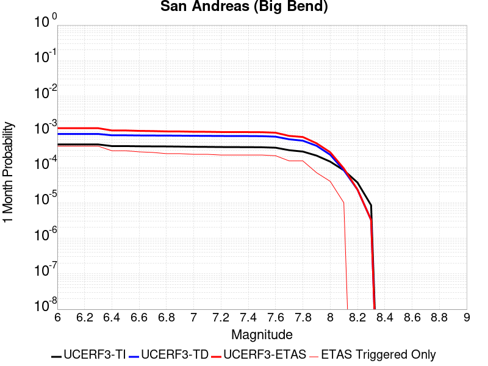 | 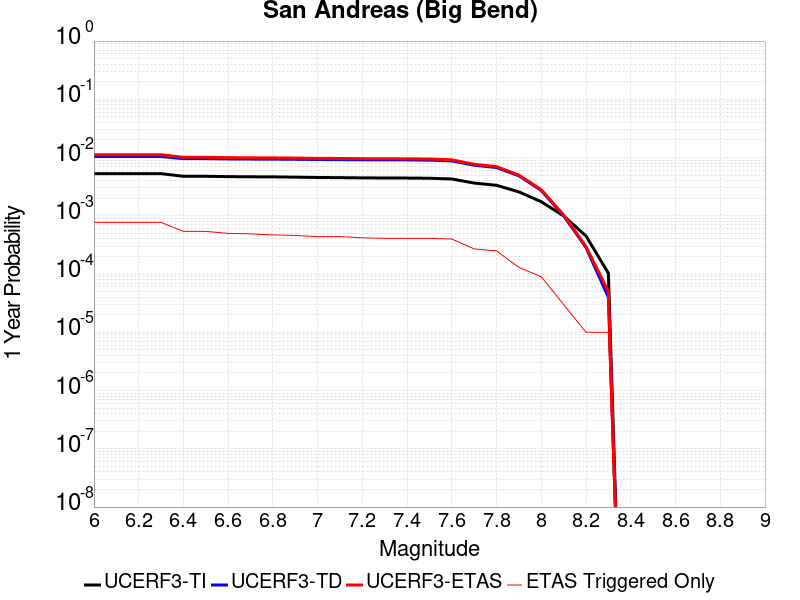 |  |

| Magnitude | 1 wk TI Prob | 1 wk TD Prob | 1 wk ETAS Prob | 1 wk ETAS/TD Gain | 1 wk ETAS Triggered Only | 1 mo TI Prob | 1 mo TD Prob | 1 mo ETAS Prob | 1 mo ETAS/TD Gain | 1 mo ETAS Triggered Only | 1 yr TI Prob | 1 yr TD Prob | 1 yr ETAS Prob | 1 yr ETAS/TD Gain | 1 yr ETAS Triggered Only | 10 yr TI Prob | 10 yr TD Prob | 10 yr ETAS Prob | 10 yr ETAS/TD Gain | 10 yr ETAS Triggered Only |
|-----|-----|-----|-----|-----|-----|-----|-----|-----|-----|-----|-----|-----|-----|-----|-----|-----|-----|-----|-----|-----|
| 6.0 | 1.0179969E-4 | 2.0072258E-4 | 4.4067443E-4 | 2.19544 | 2.4E-4 | 4.362114E-4 | 8.599571E-4 | 0.0012496217 | 1.453121 | 3.9E-4 | 0.0052979486 | 0.010419999 | 0.011181976 | 1.0731263 | 7.7E-4 | 0.051734097 | 0.10144902 | 0.1025183 | 1.01054 | 0.00119 |
| 6.1 | 1.0179969E-4 | 2.0072258E-4 | 4.4067443E-4 | 2.19544 | 2.4E-4 | 4.362114E-4 | 8.599571E-4 | 0.0012496217 | 1.453121 | 3.9E-4 | 0.0052979486 | 0.010419999 | 0.011181976 | 1.0731263 | 7.7E-4 | 0.051734097 | 0.10144902 | 0.1025183 | 1.01054 | 0.00119 |
| 6.2 | 1.0179969E-4 | 2.0072258E-4 | 4.4067443E-4 | 2.19544 | 2.4E-4 | 4.362114E-4 | 8.599571E-4 | 0.0012496217 | 1.453121 | 3.9E-4 | 0.0052979486 | 0.010419999 | 0.011181976 | 1.0731263 | 7.7E-4 | 0.051734097 | 0.10144902 | 0.1025183 | 1.01054 | 0.00119 |
| 6.3 | 1.0179969E-4 | 2.0072258E-4 | 4.4067443E-4 | 2.19544 | 2.4E-4 | 4.362114E-4 | 8.599571E-4 | 0.0012496217 | 1.453121 | 3.9E-4 | 0.0052979486 | 0.010419999 | 0.011181976 | 1.0731263 | 7.7E-4 | 0.051734097 | 0.10144902 | 0.1025183 | 1.01054 | 0.00119 |
| 6.4 | 9.1639464E-5 | 1.8429532E-4 | 3.6426215E-4 | 1.9765133 | 1.8E-4 | 3.9268145E-4 | 7.895982E-4 | 0.0010793692 | 1.3669854 | 2.9E-4 | 0.0047704205 | 0.009571102 | 0.010105934 | 1.0558798 | 5.4E-4 | 0.046693064 | 0.09377527 | 0.094473064 | 1.0074412 | 7.7E-4 |
| 6.5 | 9.1639464E-5 | 1.8429532E-4 | 3.6426215E-4 | 1.9765133 | 1.8E-4 | 3.9268145E-4 | 7.895982E-4 | 0.0010793692 | 1.3669854 | 2.9E-4 | 0.0047704205 | 0.009571102 | 0.010105934 | 1.0558798 | 5.4E-4 | 0.046693064 | 0.09377527 | 0.094473064 | 1.0074412 | 7.7E-4 |
| 6.6 | 9.042622E-5 | 1.823659E-4 | 3.523349E-4 | 1.9320219 | 1.7E-4 | 3.8748336E-4 | 7.8133424E-4 | 0.0010511233 | 1.3452927 | 2.7E-4 | 0.0047074095 | 0.009471365 | 0.00996663 | 1.0522907 | 5.0E-4 | 0.046089325 | 0.092869274 | 0.09353148 | 1.0071305 | 7.3E-4 |
| 6.7 | 8.9836685E-5 | 1.8150927E-4 | 3.4148022E-4 | 1.8813378 | 1.6E-4 | 3.8495753E-4 | 7.776651E-4 | 0.001037463 | 1.3340741 | 2.6E-4 | 0.00467679 | 0.00942708 | 0.009912461 | 1.0514879 | 4.9E-4 | 0.045795817 | 0.09246355 | 0.09311698 | 1.0070668 | 7.2E-4 |
| 6.8 | 8.9471854E-5 | 1.8097709E-4 | 3.2095175E-4 | 1.7734386 | 1.4E-4 | 3.8339442E-4 | 7.7538576E-4 | 0.0010151997 | 1.3092834 | 2.4E-4 | 0.004657841 | 0.009399569 | 0.009865151 | 1.0495323 | 4.7E-4 | 0.04561414 | 0.092210755 | 0.09284621 | 1.0068913 | 7.0E-4 |
| 6.9 | 8.858234E-5 | 1.7979681E-4 | 3.1977164E-4 | 1.7785168 | 1.4E-4 | 3.7958333E-4 | 7.703304E-4 | 0.0010101455 | 1.3113146 | 2.4E-4 | 0.004611638 | 0.009338548 | 0.009794253 | 1.0487982 | 4.6E-4 | 0.04517103 | 0.09165087 | 0.09227763 | 1.0068386 | 6.9E-4 |
| 7.0 | 8.7433385E-5 | 1.7818481E-4 | 3.0816166E-4 | 1.7294496 | 1.3E-4 | 3.746607E-4 | 7.634259E-4 | 9.932503E-4 | 1.3010435 | 2.3E-4 | 0.004551957 | 0.009255203 | 0.009691131 | 1.0471008 | 4.4E-4 | 0.044598386 | 0.09088532 | 0.091494426 | 1.006702 | 6.7E-4 |
| 7.1 | 8.684964E-5 | 1.7730435E-4 | 3.072813E-4 | 1.7330725 | 1.3E-4 | 3.7215967E-4 | 7.596547E-4 | 9.8948E-4 | 1.3025391 | 2.3E-4 | 0.0045216335 | 0.009209678 | 0.009645625 | 1.0473359 | 4.4E-4 | 0.04430731 | 0.09046686 | 0.09107625 | 1.006736 | 6.7E-4 |
| 7.2 | 8.606521E-5 | 1.762105E-4 | 2.9618936E-4 | 1.6808836 | 1.2E-4 | 3.6879873E-4 | 7.549695E-4 | 9.748034E-4 | 1.2911825 | 2.2E-4 | 0.0044808835 | 0.0091531165 | 0.0095692715 | 1.0454661 | 4.2E-4 | 0.043916024 | 0.089947365 | 0.0905116 | 1.0062729 | 6.2E-4 |
| 7.3 | 8.568266E-5 | 1.7563057E-4 | 2.956095E-4 | 1.6831324 | 1.2E-4 | 3.6715972E-4 | 7.524855E-4 | 9.723199E-4 | 1.2921444 | 2.2E-4 | 0.0044610105 | 0.009123127 | 0.009529387 | 1.0445307 | 4.1E-4 | 0.043725148 | 0.08966853 | 0.09022383 | 1.0061928 | 6.1E-4 |
| 7.4 | 8.5432206E-5 | 1.7525644E-4 | 2.9523543E-4 | 1.6845909 | 1.2E-4 | 3.6608664E-4 | 7.50883E-4 | 9.707178E-4 | 1.2927684 | 2.2E-4 | 0.004447999 | 0.009103781 | 0.009510048 | 1.0446262 | 4.1E-4 | 0.043600157 | 0.08948871 | 0.09004412 | 1.0062065 | 6.1E-4 |
| 7.5 | 8.4791965E-5 | 1.7394972E-4 | 2.9392887E-4 | 1.6897345 | 1.2E-4 | 3.633435E-4 | 7.4528606E-4 | 9.651221E-4 | 1.2949687 | 2.2E-4 | 0.0044147377 | 0.009036204 | 0.0094425 | 1.044963 | 4.1E-4 | 0.043280575 | 0.088866346 | 0.089413024 | 1.0061517 | 6.0E-4 |
| 7.6 | 8.241105E-5 | 1.6840403E-4 | 2.8838383E-4 | 1.712452 | 1.2E-4 | 3.531424E-4 | 7.215321E-4 | 9.313806E-4 | 1.2908373 | 2.1E-4 | 0.0042910352 | 0.008749358 | 0.009145859 | 1.0453176 | 4.0E-4 | 0.042091176 | 0.086243294 | 0.086764134 | 1.0060393 | 5.7E-4 |
| 7.7 | 7.00432E-5 | 1.42045E-4 | 2.3203222E-4 | 1.633512 | 9.0E-5 | 3.001506E-4 | 6.0862233E-4 | 7.5853104E-4 | 1.2463082 | 1.5E-4 | 0.0036482112 | 0.0073848404 | 0.0076528466 | 1.0362914 | 2.7E-4 | 0.035888977 | 0.07351733 | 0.07390645 | 1.0052929 | 4.2E-4 |
| 7.8 | 6.415362E-5 | 1.2968935E-4 | 2.1967766E-4 | 1.693876 | 9.0E-5 | 2.749151E-4 | 5.556931E-4 | 7.0560974E-4 | 1.2697831 | 1.5E-4 | 0.0033419547 | 0.0067446055 | 0.0069929194 | 1.0368167 | 2.5E-4 | 0.03292141 | 0.06725231 | 0.06760675 | 1.0052704 | 3.8E-4 |
| 7.9 | 4.939911E-5 | 9.3411545E-5 | 1.2340874E-4 | 1.3211294 | 3.0E-5 | 2.116933E-4 | 4.0027377E-4 | 4.7024575E-4 | 1.1748103 | 7.0E-5 | 0.0025743195 | 0.004862453 | 0.0049918205 | 1.0266055 | 1.3E-4 | 0.025447013 | 0.048914436 | 0.04912368 | 1.0042777 | 2.2E-4 |
| 8.0 | 3.344983E-5 | 5.222685E-5 | 7.2225805E-5 | 1.3829248 | 2.0E-5 | 1.4334853E-4 | 2.2381016E-4 | 2.6380122E-4 | 1.1786829 | 4.0E-5 | 0.0017438711 | 0.0027214854 | 0.0028112405 | 1.0329802 | 9.0E-5 | 0.017302496 | 0.027922187 | 0.028067999 | 1.0052221 | 1.5E-4 |
| 8.1 | 1.9104898E-5 | 1.9173063E-5 | 1.9173063E-5 | 1.0 | 0.0 | 8.1875565E-5 | 8.216769E-5 | 9.216687E-5 | 1.1216923 | 1.0E-5 | 9.963791E-4 | 9.999331E-4 | 0.0010299032 | 1.029972 | 3.0E-5 | 0.009919235 | 0.010749801 | 0.010809156 | 1.0055215 | 6.0E-5 |
| 8.2 | 8.643924E-6 | 5.4748625E-6 | 5.4748625E-6 | 1.0 | 0.0 | 3.704486E-5 | 2.3463486E-5 | 2.3463486E-5 | 1.0 | 0.0 | 4.5092785E-4 | 2.8563058E-4 | 2.9562772E-4 | 1.0350002 | 1.0E-5 | 0.0045001395 | 0.0032487072 | 0.0032586746 | 1.0030681 | 1.0E-5 |
| 8.3 | 1.983087E-6 | 7.6599065E-7 | 7.6599065E-7 | 1.0 | 0.0 | 8.498917E-6 | 3.282813E-6 | 3.282813E-6 | 1.0 | 0.0 | 1.034694E-4 | 3.9967534E-5 | 4.9967133E-5 | 1.2501931 | 1.0E-5 | 0.0010342124 | 4.719687E-4 | 4.8196397E-4 | 1.0211779 | 1.0E-5 |

## Helendale-So Lockhart
*[(top)](#table-of-contents)*

| 1 Week | 1 Month | 1 Year | 10 Year |
|-----|-----|-----|-----|
|  |  |  |  |

| Magnitude | 1 wk TI Prob | 1 wk TD Prob | 1 wk ETAS Prob | 1 wk ETAS/TD Gain | 1 wk ETAS Triggered Only | 1 mo TI Prob | 1 mo TD Prob | 1 mo ETAS Prob | 1 mo ETAS/TD Gain | 1 mo ETAS Triggered Only | 1 yr TI Prob | 1 yr TD Prob | 1 yr ETAS Prob | 1 yr ETAS/TD Gain | 1 yr ETAS Triggered Only | 10 yr TI Prob | 10 yr TD Prob | 10 yr ETAS Prob | 10 yr ETAS/TD Gain | 10 yr ETAS Triggered Only |
|-----|-----|-----|-----|-----|-----|-----|-----|-----|-----|-----|-----|-----|-----|-----|-----|-----|-----|-----|-----|-----|
| 6.0 | 1.7296055E-5 | 1.8103729E-5 | 3.680974E-4 | 20.332684 | 3.5E-4 | 7.412385E-5 | 7.7585224E-5 | 5.975449E-4 | 7.7017875 | 5.2E-4 | 9.0208417E-4 | 9.4421144E-4 | 0.0017634372 | 1.8676295 | 8.2E-4 | 0.008984311 | 0.009404116 | 0.010543302 | 1.1211369 | 0.00115 |
| 6.1 | 1.7296055E-5 | 1.8103729E-5 | 3.680974E-4 | 20.332684 | 3.5E-4 | 7.412385E-5 | 7.7585224E-5 | 5.975449E-4 | 7.7017875 | 5.2E-4 | 9.0208417E-4 | 9.4421144E-4 | 0.0017634372 | 1.8676295 | 8.2E-4 | 0.008984311 | 0.009404116 | 0.010543302 | 1.1211369 | 0.00115 |
| 6.2 | 1.7296055E-5 | 1.8103729E-5 | 3.680974E-4 | 20.332684 | 3.5E-4 | 7.412385E-5 | 7.7585224E-5 | 5.975449E-4 | 7.7017875 | 5.2E-4 | 9.0208417E-4 | 9.4421144E-4 | 0.0017634372 | 1.8676295 | 8.2E-4 | 0.008984311 | 0.009404116 | 0.010543302 | 1.1211369 | 0.00115 |
| 6.3 | 1.0669118E-5 | 1.1135425E-5 | 1.9113343E-4 | 17.164448 | 1.8E-4 | 4.5723988E-5 | 4.772239E-5 | 3.4770806E-4 | 7.2860575 | 3.0E-4 | 5.5654737E-4 | 5.80868E-4 | 0.0011105601 | 1.9118977 | 5.3E-4 | 0.0055515557 | 0.0057937936 | 0.0065593324 | 1.1321309 | 7.7E-4 |
| 6.4 | 1.0669118E-5 | 1.1135425E-5 | 1.9113343E-4 | 17.164448 | 1.8E-4 | 4.5723988E-5 | 4.772239E-5 | 3.4770806E-4 | 7.2860575 | 3.0E-4 | 5.5654737E-4 | 5.80868E-4 | 0.0011105601 | 1.9118977 | 5.3E-4 | 0.0055515557 | 0.0057937936 | 0.0065593324 | 1.1321309 | 7.7E-4 |
| 6.5 | 8.790038E-6 | 9.170197E-6 | 1.6916874E-4 | 18.447666 | 1.6E-4 | 3.767105E-5 | 3.930026E-5 | 2.7929083E-4 | 7.10659 | 2.4E-4 | 4.585485E-4 | 4.7837716E-4 | 8.8818104E-4 | 1.8566543 | 4.1E-4 | 0.0045760344 | 0.004773638 | 0.0053906785 | 1.12926 | 6.2E-4 |
| 6.6 | 7.396949E-6 | 7.715537E-6 | 1.3771454E-4 | 17.84899 | 1.3E-4 | 3.1700827E-5 | 3.3066175E-5 | 2.3305956E-4 | 7.0482774 | 2.0E-4 | 3.858892E-4 | 4.025073E-4 | 7.223785E-4 | 1.7946966 | 3.2E-4 | 0.003852198 | 0.00401789 | 0.0045158807 | 1.1239434 | 5.0E-4 |
| 6.7 | 6.4600285E-6 | 6.738031E-6 | 1.2673723E-4 | 18.809237 | 1.2E-4 | 2.7685543E-5 | 2.887696E-5 | 2.1887147E-4 | 7.5794497 | 1.9E-4 | 3.3701936E-4 | 3.5152107E-4 | 6.114297E-4 | 1.7393827 | 2.6E-4 | 0.0033650869 | 0.003509732 | 0.0039481875 | 1.1249257 | 4.4E-4 |
| 6.8 | 5.600104E-6 | 5.836009E-6 | 8.583554E-5 | 14.707917 | 8.0E-5 | 2.4000226E-5 | 2.5011232E-5 | 1.5500798E-4 | 6.1975346 | 1.3E-4 | 2.9216358E-4 | 3.044698E-4 | 4.94412E-4 | 1.6238456 | 1.9E-4 | 0.0029177975 | 0.003040588 | 0.003359615 | 1.1049228 | 3.2E-4 |
| 6.9 | 4.839122E-6 | 5.0395092E-6 | 8.503911E-5 | 16.874481 | 8.0E-5 | 2.0738931E-5 | 2.159772E-5 | 1.5159491E-4 | 7.019024 | 1.3E-4 | 2.5246723E-4 | 2.6292098E-4 | 4.5287103E-4 | 1.7224606 | 1.9E-4 | 0.002521806 | 0.002626147 | 0.0029054114 | 1.10634 | 2.8E-4 |
| 7.0 | 3.6937633E-6 | 3.845208E-6 | 5.3845015E-5 | 14.003148 | 5.0E-5 | 1.5830317E-5 | 1.647936E-5 | 9.647804E-5 | 5.8544774 | 8.0E-5 | 1.9271708E-4 | 2.0061806E-4 | 3.2059397E-4 | 1.5980315 | 1.2E-4 | 0.0019255003 | 0.002004401 | 0.00217406 | 1.0846434 | 1.7E-4 |
| 7.1 | 2.7858857E-6 | 2.8978538E-6 | 2.2897795E-5 | 7.9016395 | 2.0E-5 | 1.1939455E-5 | 1.2419316E-5 | 6.2418694E-5 | 5.0259366 | 5.0E-5 | 1.4535317E-4 | 1.511949E-4 | 2.4118129E-4 | 1.5951682 | 9.0E-5 | 0.0014525814 | 0.0015109418 | 0.0016307605 | 1.0793006 | 1.2E-4 |
| 7.2 | 2.1672065E-6 | 2.2540128E-6 | 2.2253967E-5 | 9.873044 | 2.0E-5 | 9.2879945E-6 | 9.66002E-6 | 5.965954E-5 | 6.175923 | 5.0E-5 | 1.1307546E-4 | 1.1760458E-4 | 1.8759635E-4 | 1.5951449 | 7.0E-5 | 0.0011301794 | 0.0011754417 | 0.0012653358 | 1.0764769 | 9.0E-5 |
| 7.3 | 1.4823496E-6 | 1.5422102E-6 | 2.1542179E-5 | 13.968381 | 2.0E-5 | 6.3529114E-6 | 6.6094562E-6 | 2.6609325E-5 | 4.0259476 | 2.0E-5 | 7.734395E-5 | 8.046731E-5 | 1.20464094E-4 | 1.4970562 | 4.0E-5 | 7.731704E-4 | 8.0439687E-4 | 8.643486E-4 | 1.07453 | 6.0E-5 |
| 7.4 | 4.2321457E-7 | 4.4108765E-7 | 4.4108765E-7 | 1.0 | 0.0 | 1.8137755E-6 | 1.8903745E-6 | 1.8903745E-6 | 1.0 | 0.0 | 2.2082493E-5 | 2.3015113E-5 | 2.3015113E-5 | 1.0 | 0.0 | 2.2080299E-4 | 2.3013182E-4 | 2.4012952E-4 | 1.0434433 | 1.0E-5 |
| 7.5 | 5.6942316E-8 | 5.9415648E-8 | 5.9415648E-8 | 1.0 | 0.0 | 2.440385E-7 | 2.5463845E-7 | 2.5463845E-7 | 1.0 | 0.0 | 2.9711643E-6 | 3.1002196E-6 | 3.1002196E-6 | 1.0 | 0.0 | 2.9711247E-5 | 3.1001844E-5 | 3.1001844E-5 | 1.0 | 0.0 |

## Death Valley (No)
*[(top)](#table-of-contents)*

| 1 Week | 1 Month | 1 Year | 10 Year |
|-----|-----|-----|-----|
|  |  |  |  |

| Magnitude | 1 wk TI Prob | 1 wk TD Prob | 1 wk ETAS Prob | 1 wk ETAS/TD Gain | 1 wk ETAS Triggered Only | 1 mo TI Prob | 1 mo TD Prob | 1 mo ETAS Prob | 1 mo ETAS/TD Gain | 1 mo ETAS Triggered Only | 1 yr TI Prob | 1 yr TD Prob | 1 yr ETAS Prob | 1 yr ETAS/TD Gain | 1 yr ETAS Triggered Only | 10 yr TI Prob | 10 yr TD Prob | 10 yr ETAS Prob | 10 yr ETAS/TD Gain | 10 yr ETAS Triggered Only |
|-----|-----|-----|-----|-----|-----|-----|-----|-----|-----|-----|-----|-----|-----|-----|-----|-----|-----|-----|-----|-----|
| 6.0 | 2.0074807E-5 | 2.2500084E-5 | 2.1249581E-4 | 9.444223 | 1.9E-4 | 8.603206E-5 | 9.642541E-5 | 3.3640227E-4 | 3.4887307 | 2.4E-4 | 0.001046937 | 0.0011733545 | 0.0016927443 | 1.4426538 | 5.2E-4 | 0.010420183 | 0.011672506 | 0.012463168 | 1.0677371 | 8.0E-4 |
| 6.1 | 2.0074807E-5 | 2.2500084E-5 | 2.1249581E-4 | 9.444223 | 1.9E-4 | 8.603206E-5 | 9.642541E-5 | 3.3640227E-4 | 3.4887307 | 2.4E-4 | 0.001046937 | 0.0011733545 | 0.0016927443 | 1.4426538 | 5.2E-4 | 0.010420183 | 0.011672506 | 0.012463168 | 1.0677371 | 8.0E-4 |
| 6.2 | 2.0074807E-5 | 2.2500084E-5 | 2.1249581E-4 | 9.444223 | 1.9E-4 | 8.603206E-5 | 9.642541E-5 | 3.3640227E-4 | 3.4887307 | 2.4E-4 | 0.001046937 | 0.0011733545 | 0.0016927443 | 1.4426538 | 5.2E-4 | 0.010420183 | 0.011672506 | 0.012463168 | 1.0677371 | 8.0E-4 |
| 6.3 | 1.9050609E-5 | 2.1336948E-5 | 2.113329E-4 | 9.9045515 | 1.9E-4 | 8.164292E-5 | 9.1440896E-5 | 3.3141894E-4 | 3.6244063 | 2.4E-4 | 9.935491E-4 | 0.001112731 | 0.0016321525 | 1.4667987 | 5.2E-4 | 0.009891188 | 0.011072419 | 0.01186356 | 1.0714515 | 8.0E-4 |
| 6.4 | 1.9050609E-5 | 2.1336948E-5 | 2.113329E-4 | 9.9045515 | 1.9E-4 | 8.164292E-5 | 9.1440896E-5 | 3.3141894E-4 | 3.6244063 | 2.4E-4 | 9.935491E-4 | 0.001112731 | 0.0016321525 | 1.4667987 | 5.2E-4 | 0.009891188 | 0.011072419 | 0.01186356 | 1.0714515 | 8.0E-4 |
| 6.5 | 1.8367004E-5 | 2.0561009E-5 | 2.005573E-4 | 9.754254 | 1.8E-4 | 7.8713354E-5 | 8.811567E-5 | 3.180954E-4 | 3.6099756 | 2.3E-4 | 9.5791375E-4 | 0.0010722869 | 0.00158174 | 1.475109 | 5.1E-4 | 0.009537951 | 0.0106719155 | 0.011443592 | 1.072309 | 7.8E-4 |
| 6.6 | 1.779439E-5 | 1.9910927E-5 | 1.9990734E-4 | 10.040082 | 1.8E-4 | 7.625944E-5 | 8.53298E-5 | 3.1531017E-4 | 3.6951942 | 2.3E-4 | 9.280632E-4 | 0.0010384015 | 0.001547872 | 1.4906296 | 5.1E-4 | 0.009241969 | 0.010336253 | 0.011098294 | 1.0737251 | 7.7E-4 |
| 6.7 | 1.7025437E-5 | 1.9043426E-5 | 1.9903999E-4 | 10.451901 | 1.8E-4 | 7.296412E-5 | 8.161216E-5 | 3.015942E-4 | 3.6954567 | 2.2E-4 | 8.87976E-4 | 9.931813E-4 | 0.0014926847 | 1.5029328 | 5.0E-4 | 0.008844362 | 0.009888145 | 0.0106406305 | 1.0760998 | 7.6E-4 |
| 6.8 | 1.6545107E-5 | 1.8512545E-5 | 1.9850921E-4 | 10.722956 | 1.8E-4 | 7.090568E-5 | 7.93371E-5 | 2.9931965E-4 | 3.7727575 | 2.2E-4 | 8.629347E-4 | 9.655073E-4 | 0.0014650245 | 1.5173625 | 5.0E-4 | 0.008595915 | 0.009613829 | 0.010366523 | 1.0782928 | 7.6E-4 |
| 6.9 | 1.615478E-5 | 1.8087594E-5 | 1.9808434E-4 | 10.951392 | 1.8E-4 | 6.9232934E-5 | 7.751599E-5 | 2.9749895E-4 | 3.837904 | 2.2E-4 | 8.4258494E-4 | 9.433546E-4 | 0.0014428829 | 1.5295234 | 5.0E-4 | 0.008393973 | 0.009394196 | 0.010147056 | 1.0801411 | 7.6E-4 |
| 7.0 | 1.5894311E-5 | 1.780555E-5 | 1.9780235E-4 | 11.109028 | 1.8E-4 | 6.81167E-5 | 7.6307304E-5 | 2.9629053E-4 | 3.8828592 | 2.2E-4 | 8.2900526E-4 | 9.286515E-4 | 0.0014281871 | 1.5379151 | 5.0E-4 | 0.008259195 | 0.009248397 | 0.009981554 | 1.0792738 | 7.4E-4 |
| 7.1 | 1.5602263E-5 | 1.7483504E-5 | 1.8748053E-4 | 10.723282 | 1.7E-4 | 6.6865134E-5 | 7.492718E-5 | 2.8491145E-4 | 3.8025112 | 2.1E-4 | 8.137789E-4 | 9.118627E-4 | 0.0014014159 | 1.5368716 | 4.9E-4 | 0.008108052 | 0.009081894 | 0.009805264 | 1.0796497 | 7.3E-4 |
| 7.2 | 1.5323829E-5 | 1.717063E-5 | 1.8716771E-4 | 10.900456 | 1.7E-4 | 6.56719E-5 | 7.358637E-5 | 2.8357093E-4 | 3.8535793 | 2.1E-4 | 7.99262E-4 | 8.9555193E-4 | 0.0013851131 | 1.5466586 | 4.9E-4 | 0.007963934 | 0.008920107 | 0.009643595 | 1.0811076 | 7.3E-4 |
| 7.3 | 1.4556212E-5 | 1.6302456E-5 | 1.8629969E-4 | 11.427707 | 1.7E-4 | 6.238227E-5 | 6.9865826E-5 | 2.7985114E-4 | 4.0055513 | 2.1E-4 | 7.592395E-4 | 8.5029035E-4 | 0.0013198907 | 1.5522823 | 4.7E-4 | 0.0075665074 | 0.008471014 | 0.009155169 | 1.0807643 | 6.9E-4 |
| 7.4 | 1.411725E-5 | 1.580796E-5 | 1.8580527E-4 | 11.753906 | 1.7E-4 | 6.0501097E-5 | 6.7746674E-5 | 2.7773244E-4 | 4.099573 | 2.1E-4 | 7.363519E-4 | 8.245094E-4 | 0.001294122 | 1.5695659 | 4.7E-4 | 0.0073391674 | 0.008215138 | 0.00889947 | 1.0833013 | 6.9E-4 |
| 7.5 | 1.3503312E-5 | 1.5126289E-5 | 1.8512372E-4 | 12.238542 | 1.7E-4 | 5.7870053E-5 | 6.482538E-5 | 2.7481175E-4 | 4.239262 | 2.1E-4 | 7.043401E-4 | 7.8896893E-4 | 0.0012585982 | 1.5952442 | 4.7E-4 | 0.007021119 | 0.007862304 | 0.008536958 | 1.0858086 | 6.8E-4 |
| 7.6 | 1.1279839E-5 | 1.2626327E-5 | 1.6262443E-4 | 12.879789 | 1.5E-4 | 4.834127E-5 | 5.4111737E-5 | 2.4410145E-4 | 4.511063 | 1.9E-4 | 5.88396E-4 | 6.5861654E-4 | 0.0010983268 | 1.667627 | 4.4E-4 | 0.005868405 | 0.006567199 | 0.0071632583 | 1.0907632 | 6.0E-4 |
| 7.7 | 9.189108E-6 | 1.0283358E-5 | 1.4028202E-4 | 13.641654 | 1.3E-4 | 3.93813E-5 | 4.407082E-5 | 2.0406376E-4 | 4.63036 | 1.6E-4 | 4.7936183E-4 | 5.3643517E-4 | 9.162313E-4 | 1.7080001 | 3.8E-4 | 0.004783291 | 0.005351914 | 0.005849238 | 1.0929245 | 5.0E-4 |
| 7.8 | 3.4586725E-7 | 3.6482615E-7 | 3.6482615E-7 | 1.0 | 0.0 | 1.4822873E-6 | 1.5635396E-6 | 1.1563524E-5 | 7.3957343 | 1.0E-5 | 1.80467E-5 | 1.9035933E-5 | 3.9035553E-5 | 2.0506246 | 2.0E-5 | 1.8045233E-4 | 1.9034347E-4 | 2.2033777E-4 | 1.1575798 | 3.0E-5 |
| 7.9 | 2.5591178E-9 | 2.6696718E-9 | 2.6696718E-9 | 1.0 | 0.0 | 1.0967647E-8 | 1.14414505E-8 | 1.14414505E-8 | 1.0 | 0.0 | 1.335311E-7 | 1.3929966E-7 | 1.3929966E-7 | 1.0 | 0.0 | 1.3353102E-6 | 1.3929966E-6 | 1.3929966E-6 | 1.0 | 0.0 |

## San Andreas (San Gorgonio Pass-Garnet HIll)
*[(top)](#table-of-contents)*

| 1 Week | 1 Month | 1 Year | 10 Year |
|-----|-----|-----|-----|
| 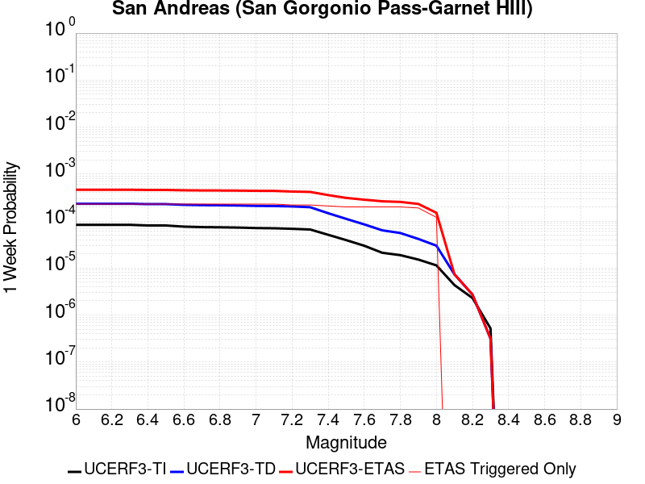 |  | 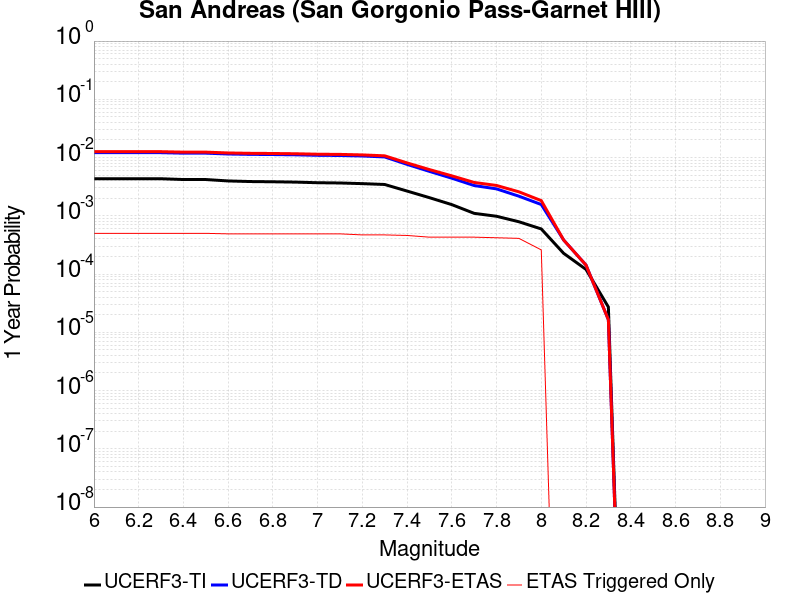 |  |

| Magnitude | 1 wk TI Prob | 1 wk TD Prob | 1 wk ETAS Prob | 1 wk ETAS/TD Gain | 1 wk ETAS Triggered Only | 1 mo TI Prob | 1 mo TD Prob | 1 mo ETAS Prob | 1 mo ETAS/TD Gain | 1 mo ETAS Triggered Only | 1 yr TI Prob | 1 yr TD Prob | 1 yr ETAS Prob | 1 yr ETAS/TD Gain | 1 yr ETAS Triggered Only | 10 yr TI Prob | 10 yr TD Prob | 10 yr ETAS Prob | 10 yr ETAS/TD Gain | 10 yr ETAS Triggered Only |
|-----|-----|-----|-----|-----|-----|-----|-----|-----|-----|-----|-----|-----|-----|-----|-----|-----|-----|-----|-----|-----|
| 6.0 | 8.31567E-5 | 2.3382473E-4 | 4.6377096E-4 | 1.9834127 | 2.3E-4 | 3.5633717E-4 | 0.0010017233 | 0.0013014228 | 1.2991838 | 3.0E-4 | 0.004329778 | 0.012127888 | 0.012621825 | 1.0407273 | 5.0E-4 | 0.042463828 | 0.11257892 | 0.11316462 | 1.0052025 | 6.6E-4 |
| 6.1 | 8.31567E-5 | 2.3382473E-4 | 4.6377096E-4 | 1.9834127 | 2.3E-4 | 3.5633717E-4 | 0.0010017233 | 0.0013014228 | 1.2991838 | 3.0E-4 | 0.004329778 | 0.012127888 | 0.012621825 | 1.0407273 | 5.0E-4 | 0.042463828 | 0.11257892 | 0.11316462 | 1.0052025 | 6.6E-4 |
| 6.2 | 8.31567E-5 | 2.3382473E-4 | 4.6377096E-4 | 1.9834127 | 2.3E-4 | 3.5633717E-4 | 0.0010017233 | 0.0013014228 | 1.2991838 | 3.0E-4 | 0.004329778 | 0.012127888 | 0.012621825 | 1.0407273 | 5.0E-4 | 0.042463828 | 0.11257892 | 0.11316462 | 1.0052025 | 6.6E-4 |
| 6.3 | 8.31567E-5 | 2.3382473E-4 | 4.6377096E-4 | 1.9834127 | 2.3E-4 | 3.5633717E-4 | 0.0010017233 | 0.0013014228 | 1.2991838 | 3.0E-4 | 0.004329778 | 0.012127888 | 0.012621825 | 1.0407273 | 5.0E-4 | 0.042463828 | 0.11257892 | 0.11316462 | 1.0052025 | 6.6E-4 |
| 6.4 | 8.059055E-5 | 2.2940808E-4 | 4.5935533E-4 | 2.00235 | 2.3E-4 | 3.4534236E-4 | 9.828096E-4 | 0.0012825147 | 1.3049474 | 3.0E-4 | 0.0041964394 | 0.011900152 | 0.012394202 | 1.0415163 | 5.0E-4 | 0.041180745 | 0.11056015 | 0.11114717 | 1.0053096 | 6.6E-4 |
| 6.5 | 8.059055E-5 | 2.2940808E-4 | 4.5935533E-4 | 2.00235 | 2.3E-4 | 3.4534236E-4 | 9.828096E-4 | 0.0012825147 | 1.3049474 | 3.0E-4 | 0.0041964394 | 0.011900152 | 0.012394202 | 1.0415163 | 5.0E-4 | 0.041180745 | 0.11056015 | 0.11114717 | 1.0053096 | 6.6E-4 |
| 6.6 | 7.619237E-5 | 2.218517E-4 | 4.5180068E-4 | 2.0364985 | 2.3E-4 | 3.2649786E-4 | 9.5044886E-4 | 0.0012501638 | 1.3153403 | 3.0E-4 | 0.0039678677 | 0.01151087 | 0.01199523 | 1.0420785 | 4.9E-4 | 0.03897764 | 0.10709683 | 0.107677214 | 1.0054193 | 6.5E-4 |
| 6.7 | 7.440636E-5 | 2.1860997E-4 | 4.4855967E-4 | 2.051872 | 2.3E-4 | 3.188454E-4 | 9.3656575E-4 | 0.0012362847 | 1.3200192 | 3.0E-4 | 0.0038750346 | 0.011343609 | 0.01182805 | 1.0427061 | 4.9E-4 | 0.038081564 | 0.105605274 | 0.10618663 | 1.005505 | 6.5E-4 |
| 6.8 | 7.3735864E-5 | 2.1708169E-4 | 4.4703175E-4 | 2.059279 | 2.3E-4 | 3.1597257E-4 | 9.3002064E-4 | 0.0012297416 | 1.3222735 | 3.0E-4 | 0.0038401815 | 0.011264749 | 0.011749229 | 1.0430086 | 4.9E-4 | 0.03774495 | 0.10490683 | 0.105488636 | 1.005546 | 6.5E-4 |
| 6.9 | 7.27575E-5 | 2.1477141E-4 | 4.44722E-4 | 2.070676 | 2.3E-4 | 3.117806E-4 | 9.201265E-4 | 0.0012198505 | 1.3257421 | 3.0E-4 | 0.003789323 | 0.011145527 | 0.011630065 | 1.0434738 | 4.9E-4 | 0.037253562 | 0.103854746 | 0.10442828 | 1.0055225 | 6.4E-4 |
| 7.0 | 7.102591E-5 | 2.1061185E-4 | 4.405634E-4 | 2.0918264 | 2.3E-4 | 3.0436125E-4 | 9.023122E-4 | 0.0012020415 | 1.3321792 | 3.0E-4 | 0.003699303 | 0.010930831 | 0.011415475 | 1.0443374 | 4.9E-4 | 0.03638325 | 0.10195695 | 0.102531694 | 1.0056372 | 6.4E-4 |
| 7.1 | 7.028513E-5 | 2.0896831E-4 | 4.3892025E-4 | 2.1004152 | 2.3E-4 | 3.0118722E-4 | 8.9527335E-4 | 0.0011950048 | 1.3347932 | 3.0E-4 | 0.0036607897 | 0.010845989 | 0.011330674 | 1.044688 | 4.9E-4 | 0.036010686 | 0.101199985 | 0.101775214 | 1.0056841 | 6.4E-4 |
| 7.2 | 6.8498244E-5 | 2.0504706E-4 | 4.2500196E-4 | 2.0727043 | 2.2E-4 | 2.9353087E-4 | 8.784794E-4 | 0.0011682246 | 1.3298259 | 2.9E-4 | 0.003567883 | 0.010643536 | 0.0111085335 | 1.0436883 | 4.7E-4 | 0.035111405 | 0.09939202 | 0.099950396 | 1.005618 | 6.2E-4 |
| 7.3 | 6.622592E-5 | 1.9732013E-4 | 4.1727672E-4 | 2.1147194 | 2.2E-4 | 2.8379448E-4 | 8.453858E-4 | 0.0011351407 | 1.3427486 | 2.9E-4 | 0.0034497243 | 0.0102444785 | 0.010709664 | 1.0454084 | 4.7E-4 | 0.033966612 | 0.095888525 | 0.09644908 | 1.0058458 | 6.2E-4 |
| 7.4 | 5.1050705E-5 | 1.4689034E-4 | 3.568595E-4 | 2.429428 | 2.1E-4 | 2.1877038E-4 | 6.29379E-4 | 9.092028E-4 | 1.444603 | 2.8E-4 | 0.002660276 | 0.0076359594 | 0.008092447 | 1.0597813 | 4.6E-4 | 0.02628654 | 0.07286301 | 0.07342857 | 1.0077618 | 6.1E-4 |
| 7.5 | 3.9302922E-5 | 1.1129847E-4 | 3.112762E-4 | 2.7967699 | 2.0E-4 | 1.6843023E-4 | 4.7690657E-4 | 7.3678256E-4 | 1.5449202 | 2.6E-4 | 0.0020487092 | 0.005790949 | 0.0062184585 | 1.0738238 | 4.3E-4 | 0.020299247 | 0.05600951 | 0.056538146 | 1.0094383 | 5.6E-4 |
| 7.6 | 2.9851626E-5 | 8.4949745E-5 | 2.8493276E-4 | 3.3541331 | 2.0E-4 | 1.2792926E-4 | 3.6401965E-4 | 6.23925E-4 | 1.7139871 | 2.6E-4 | 0.0015564259 | 0.0044229585 | 0.0048510567 | 1.09679 | 4.3E-4 | 0.0154556995 | 0.04319374 | 0.04371998 | 1.0121833 | 5.5E-4 |
| 7.7 | 2.1135214E-5 | 6.3529005E-5 | 2.635163E-4 | 4.1479683 | 2.0E-4 | 9.0576345E-5 | 2.7223877E-4 | 5.3216796E-4 | 1.954784 | 2.6E-4 | 0.0011022091 | 0.0033094748 | 0.0037380517 | 1.1295 | 4.3E-4 | 0.010967582 | 0.032582592 | 0.03311467 | 1.0163301 | 5.5E-4 |
| 7.8 | 1.883379E-5 | 5.564028E-5 | 2.5562916E-4 | 4.5943184 | 2.0E-4 | 8.0713755E-5 | 2.3843657E-4 | 4.983746E-4 | 2.0901768 | 2.6E-4 | 9.822468E-4 | 0.0028991038 | 0.0033178863 | 1.1444523 | 4.2E-4 | 0.0097791655 | 0.028695205 | 0.029209998 | 1.0179399 | 5.3E-4 |
| 7.9 | 1.5156185E-5 | 4.1658426E-5 | 2.3165051E-4 | 5.560712 | 1.9E-4 | 6.495346E-5 | 1.785239E-4 | 4.2847928E-4 | 2.4001226 | 2.5E-4 | 7.9052144E-4 | 0.0021713632 | 0.002580473 | 1.1884115 | 4.1E-4 | 0.007877152 | 0.021759422 | 0.022248544 | 1.0224786 | 5.0E-4 |
| 8.0 | 1.1405907E-5 | 2.9974231E-5 | 1.4997064E-4 | 5.003319 | 1.2E-4 | 4.8881542E-5 | 1.2845467E-4 | 2.8843412E-4 | 2.2454157 | 1.6E-4 | 5.9497025E-4 | 0.0015628147 | 0.0018224083 | 1.1661065 | 2.6E-4 | 0.005933798 | 0.015772851 | 0.016087802 | 1.019968 | 3.2E-4 |
| 8.1 | 4.3511436E-6 | 7.369219E-6 | 7.369219E-6 | 1.0 | 0.0 | 1.8647626E-5 | 3.1581985E-5 | 3.1581985E-5 | 1.0 | 0.0 | 2.2701119E-4 | 3.8444297E-4 | 3.8444297E-4 | 1.0 | 0.0 | 0.0022677942 | 0.0041163345 | 0.0041262936 | 1.0024194 | 1.0E-5 |
| 8.2 | 2.3042528E-6 | 2.7329415E-6 | 2.7329415E-6 | 1.0 | 0.0 | 9.875332E-6 | 1.1712554E-5 | 1.1712554E-5 | 1.0 | 0.0 | 1.2022553E-4 | 1.4259106E-4 | 1.4259106E-4 | 1.0 | 0.0 | 0.0012016051 | 0.0015979785 | 0.0015979785 | 1.0 | 0.0 |
| 8.3 | 5.202968E-7 | 3.1598344E-7 | 3.1598344E-7 | 1.0 | 0.0 | 2.2298414E-6 | 1.3542141E-6 | 1.3542141E-6 | 1.0 | 0.0 | 2.714798E-5 | 1.6487444E-5 | 1.6487444E-5 | 1.0 | 0.0 | 2.7144665E-4 | 1.9563142E-4 | 1.9563142E-4 | 1.0 | 0.0 |

## San Andreas (Parkfield)
*[(top)](#table-of-contents)*

| 1 Week | 1 Month | 1 Year | 10 Year |
|-----|-----|-----|-----|
| 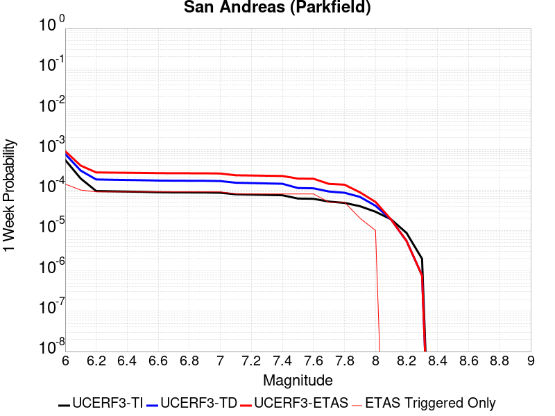 | 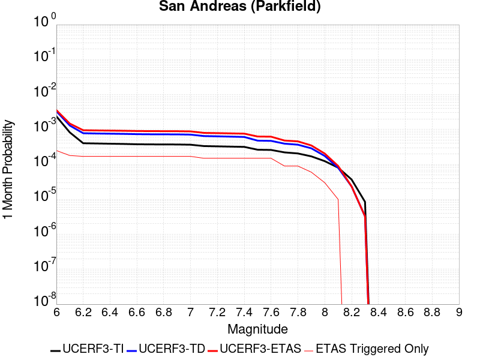 |  |  |

| Magnitude | 1 wk TI Prob | 1 wk TD Prob | 1 wk ETAS Prob | 1 wk ETAS/TD Gain | 1 wk ETAS Triggered Only | 1 mo TI Prob | 1 mo TD Prob | 1 mo ETAS Prob | 1 mo ETAS/TD Gain | 1 mo ETAS Triggered Only | 1 yr TI Prob | 1 yr TD Prob | 1 yr ETAS Prob | 1 yr ETAS/TD Gain | 1 yr ETAS Triggered Only | 10 yr TI Prob | 10 yr TD Prob | 10 yr ETAS Prob | 10 yr ETAS/TD Gain | 10 yr ETAS Triggered Only |
|-----|-----|-----|-----|-----|-----|-----|-----|-----|-----|-----|-----|-----|-----|-----|-----|-----|-----|-----|-----|-----|
| 6.0 | 5.556969E-4 | 7.7782426E-4 | 9.177153E-4 | 1.1798493 | 1.4E-4 | 0.0023793848 | 0.0033298214 | 0.003578989 | 1.0748291 | 2.5E-4 | 0.028586963 | 0.040191233 | 0.040575154 | 1.0095525 | 4.0E-4 | 0.25176284 | 0.33716413 | 0.3375751 | 1.0012189 | 6.2E-4 |
| 6.1 | 1.925858E-4 | 3.0276453E-4 | 4.0273427E-4 | 1.3301897 | 1.0E-4 | 8.2510663E-4 | 0.0012970108 | 0.0014767774 | 1.1386007 | 1.8E-4 | 0.0099994885 | 0.015778083 | 0.016053665 | 1.0174662 | 2.8E-4 | 0.095613256 | 0.1497237 | 0.1500468 | 1.002158 | 3.8E-4 |
| 6.2 | 9.4306815E-5 | 1.8242796E-4 | 2.7241153E-4 | 1.4932554 | 9.0E-5 | 4.0410945E-4 | 7.816011E-4 | 9.5146825E-4 | 1.2173322 | 1.7E-4 | 0.0049089384 | 0.009474681 | 0.0097322175 | 1.0271815 | 2.6E-4 | 0.048019063 | 0.09185409 | 0.09218102 | 1.0035592 | 3.6E-4 |
| 6.3 | 9.283051E-5 | 1.7939322E-4 | 2.6937708E-4 | 1.5016012 | 9.0E-5 | 3.9778434E-4 | 7.686027E-4 | 9.3847205E-4 | 1.2210106 | 1.7E-4 | 0.0048322747 | 0.009317789 | 0.009575366 | 1.0276436 | 2.6E-4 | 0.047285385 | 0.09050704 | 0.09083445 | 1.0036176 | 3.6E-4 |
| 6.4 | 9.138826E-5 | 1.770153E-4 | 2.6699938E-4 | 1.5083406 | 9.0E-5 | 3.916052E-4 | 7.5841765E-4 | 9.2828873E-4 | 1.2239809 | 1.7E-4 | 0.0047573745 | 0.00919484 | 0.009452449 | 1.0280167 | 2.6E-4 | 0.046568092 | 0.08940927 | 0.08973709 | 1.0036664 | 3.6E-4 |
| 6.5 | 9.000255E-5 | 1.7459576E-4 | 2.6458004E-4 | 1.5153865 | 9.0E-5 | 3.8566816E-4 | 7.480541E-4 | 9.1792695E-4 | 1.2270863 | 1.7E-4 | 0.0046854047 | 0.009069731 | 0.0093273735 | 1.0284067 | 2.6E-4 | 0.045878403 | 0.088295065 | 0.08862328 | 1.0037172 | 3.6E-4 |
| 6.6 | 8.8109264E-5 | 1.7140752E-4 | 2.613921E-4 | 1.5249745 | 9.0E-5 | 3.7755648E-4 | 7.3439797E-4 | 9.042731E-4 | 1.2313122 | 1.7E-4 | 0.0045870654 | 0.008904854 | 0.009162539 | 1.0289376 | 2.6E-4 | 0.04493529 | 0.0868267 | 0.08715544 | 1.0037862 | 3.6E-4 |
| 6.7 | 8.738073E-5 | 1.7007832E-4 | 2.60063E-4 | 1.529078 | 9.0E-5 | 3.7443507E-4 | 7.287046E-4 | 8.9858077E-4 | 1.2331207 | 1.7E-4 | 0.0045492216 | 0.008836143 | 0.009093845 | 1.0291646 | 2.6E-4 | 0.04457213 | 0.08622707 | 0.086556025 | 1.003815 | 3.6E-4 |
| 6.8 | 8.710195E-5 | 1.6953335E-4 | 2.5951807E-4 | 1.530779 | 9.0E-5 | 3.7324068E-4 | 7.263703E-4 | 8.962468E-4 | 1.2338704 | 1.7E-4 | 0.0045347405 | 0.008807961 | 0.009065671 | 1.0292587 | 2.6E-4 | 0.04443313 | 0.08597467 | 0.08630372 | 1.0038273 | 3.6E-4 |
| 6.9 | 8.6801556E-5 | 1.689429E-4 | 2.589277E-4 | 1.5326344 | 9.0E-5 | 3.7195362E-4 | 7.2384125E-4 | 8.937182E-4 | 1.2346882 | 1.7E-4 | 0.0045191357 | 0.008777418 | 0.009035136 | 1.0293615 | 2.6E-4 | 0.044283327 | 0.085700735 | 0.08602988 | 1.0038407 | 3.6E-4 |
| 7.0 | 8.5571606E-5 | 1.6647128E-4 | 2.564563E-4 | 1.5405438 | 9.0E-5 | 3.6668387E-4 | 7.132544E-4 | 8.8313315E-4 | 1.2381741 | 1.7E-4 | 0.004455241 | 0.008649553 | 0.008907304 | 1.0297993 | 2.6E-4 | 0.043669727 | 0.08454914 | 0.0848787 | 1.0038979 | 3.6E-4 |
| 7.1 | 7.82589E-5 | 1.5128135E-4 | 2.3126925E-4 | 1.528736 | 8.0E-5 | 3.3535215E-4 | 6.481883E-4 | 7.9809106E-4 | 1.2312642 | 1.5E-4 | 0.0040752706 | 0.007863307 | 0.00810142 | 1.0302815 | 2.4E-4 | 0.040013418 | 0.07746111 | 0.07777477 | 1.0040493 | 3.4E-4 |
| 7.2 | 7.690929E-5 | 1.4865391E-4 | 2.2864202E-4 | 1.5380827 | 8.0E-5 | 3.2956956E-4 | 6.369334E-4 | 7.8683783E-4 | 1.2353535 | 1.5E-4 | 0.004005129 | 0.007727258 | 0.007965404 | 1.0308189 | 2.4E-4 | 0.0393371 | 0.07623427 | 0.07654835 | 1.00412 | 3.4E-4 |
| 7.3 | 7.5543794E-5 | 1.4561978E-4 | 2.2560814E-4 | 1.5492959 | 8.0E-5 | 3.2371894E-4 | 6.2393624E-4 | 7.738426E-4 | 1.2402592 | 1.5E-4 | 0.003934157 | 0.007570127 | 0.0078083104 | 1.0314635 | 2.4E-4 | 0.038652334 | 0.074797355 | 0.07511192 | 1.0042056 | 3.4E-4 |
| 7.4 | 7.4214564E-5 | 1.4262961E-4 | 2.226182E-4 | 1.5608133 | 8.0E-5 | 3.1802364E-4 | 6.111273E-4 | 7.610356E-4 | 1.245298 | 1.5E-4 | 0.003865065 | 0.00741525 | 0.00765347 | 1.0321257 | 2.4E-4 | 0.03798529 | 0.07337123 | 0.07368629 | 1.0042939 | 3.4E-4 |
| 7.5 | 6.149578E-5 | 1.11907226E-4 | 1.9189827E-4 | 1.7147979 | 8.0E-5 | 2.6352672E-4 | 4.7951436E-4 | 6.2944245E-4 | 1.3126665 | 1.5E-4 | 0.0032037178 | 0.0058224914 | 0.006061094 | 1.0409795 | 2.4E-4 | 0.03157923 | 0.058557566 | 0.05886824 | 1.0053055 | 3.3E-4 |
| 7.6 | 6.0643448E-5 | 1.10193796E-4 | 1.9018499E-4 | 1.7259136 | 8.0E-5 | 2.598746E-4 | 4.7217376E-4 | 6.2210293E-4 | 1.3175297 | 1.5E-4 | 0.0031593828 | 0.0057335934 | 0.0059722173 | 1.0416186 | 2.4E-4 | 0.031148417 | 0.057718582 | 0.058029532 | 1.0053874 | 3.3E-4 |
| 7.7 | 5.1652263E-5 | 9.174698E-5 | 1.4174239E-4 | 1.5449271 | 5.0E-5 | 2.2134806E-4 | 3.931421E-4 | 4.8310673E-4 | 1.2288349 | 9.0E-5 | 0.002691582 | 0.0047760103 | 0.004925294 | 1.0312569 | 1.5E-4 | 0.026592141 | 0.04853623 | 0.048755065 | 1.0045087 | 2.3E-4 |
| 7.8 | 4.8090482E-5 | 8.559635E-5 | 1.3559207E-4 | 1.584087 | 5.0E-5 | 2.060858E-4 | 3.6678996E-4 | 4.5675694E-4 | 1.245282 | 9.0E-5 | 0.0025062072 | 0.0044565317 | 0.0046058632 | 1.0335084 | 1.5E-4 | 0.024781305 | 0.04530245 | 0.045512483 | 1.0046363 | 2.2E-4 |
| 7.9 | 3.970278E-5 | 6.750426E-5 | 8.750291E-5 | 1.2962576 | 2.0E-5 | 1.7014367E-4 | 2.892719E-4 | 3.4925455E-4 | 1.2073573 | 6.0E-5 | 0.002069531 | 0.0035162016 | 0.0036258148 | 1.0311737 | 1.1E-4 | 0.020503636 | 0.035881363 | 0.03604526 | 1.0045679 | 1.7E-4 |
| 8.0 | 2.8982335E-5 | 4.069796E-5 | 5.0697552E-5 | 1.2457026 | 1.0E-5 | 1.2420409E-4 | 1.7440817E-4 | 2.0440294E-4 | 1.1719803 | 3.0E-5 | 0.0015111357 | 0.0021213528 | 0.002201183 | 1.0376318 | 8.0E-5 | 0.015009012 | 0.022010697 | 0.022137836 | 1.0057762 | 1.3E-4 |
| 8.1 | 1.8836186E-5 | 1.8681134E-5 | 1.8681134E-5 | 1.0 | 0.0 | 8.0724014E-5 | 8.005955E-5 | 9.0058755E-5 | 1.124897 | 1.0E-5 | 9.823717E-4 | 9.742898E-4 | 0.0010042605 | 1.0307617 | 3.0E-5 | 0.009780403 | 0.010488115 | 0.010547486 | 1.0056608 | 6.0E-5 |
| 8.2 | 8.643924E-6 | 5.4748625E-6 | 5.4748625E-6 | 1.0 | 0.0 | 3.704486E-5 | 2.3463486E-5 | 2.3463486E-5 | 1.0 | 0.0 | 4.5092785E-4 | 2.8563058E-4 | 2.9562772E-4 | 1.0350002 | 1.0E-5 | 0.0045001395 | 0.0032487072 | 0.0032586746 | 1.0030681 | 1.0E-5 |
| 8.3 | 1.983087E-6 | 7.6599065E-7 | 7.6599065E-7 | 1.0 | 0.0 | 8.498917E-6 | 3.282813E-6 | 3.282813E-6 | 1.0 | 0.0 | 1.034694E-4 | 3.9967534E-5 | 4.9967133E-5 | 1.2501931 | 1.0E-5 | 0.0010342124 | 4.719687E-4 | 4.8196397E-4 | 1.0211779 | 1.0E-5 |

## San Andreas (Carrizo) rev
*[(top)](#table-of-contents)*

| 1 Week | 1 Month | 1 Year | 10 Year |
|-----|-----|-----|-----|
|  |  | 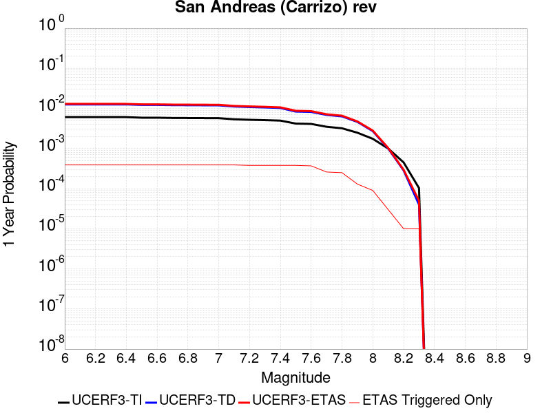 |  |

| Magnitude | 1 wk TI Prob | 1 wk TD Prob | 1 wk ETAS Prob | 1 wk ETAS/TD Gain | 1 wk ETAS Triggered Only | 1 mo TI Prob | 1 mo TD Prob | 1 mo ETAS Prob | 1 mo ETAS/TD Gain | 1 mo ETAS Triggered Only | 1 yr TI Prob | 1 yr TD Prob | 1 yr ETAS Prob | 1 yr ETAS/TD Gain | 1 yr ETAS Triggered Only | 10 yr TI Prob | 10 yr TD Prob | 10 yr ETAS Prob | 10 yr ETAS/TD Gain | 10 yr ETAS Triggered Only |
|-----|-----|-----|-----|-----|-----|-----|-----|-----|-----|-----|-----|-----|-----|-----|-----|-----|-----|-----|-----|-----|
| 6.0 | 1.1674632E-4 | 2.432302E-4 | 3.731986E-4 | 1.5343431 | 1.3E-4 | 5.002454E-4 | 0.0010420004 | 0.0012717607 | 1.2204993 | 2.3E-4 | 0.006073493 | 0.012613042 | 0.012998124 | 1.0305303 | 3.9E-4 | 0.0591016 | 0.12061418 | 0.12114181 | 1.0043745 | 6.0E-4 |
| 6.1 | 1.1674632E-4 | 2.432302E-4 | 3.731986E-4 | 1.5343431 | 1.3E-4 | 5.002454E-4 | 0.0010420004 | 0.0012717607 | 1.2204993 | 2.3E-4 | 0.006073493 | 0.012613042 | 0.012998124 | 1.0305303 | 3.9E-4 | 0.0591016 | 0.12061418 | 0.12114181 | 1.0043745 | 6.0E-4 |
| 6.2 | 1.1674632E-4 | 2.432302E-4 | 3.731986E-4 | 1.5343431 | 1.3E-4 | 5.002454E-4 | 0.0010420004 | 0.0012717607 | 1.2204993 | 2.3E-4 | 0.006073493 | 0.012613042 | 0.012998124 | 1.0305303 | 3.9E-4 | 0.0591016 | 0.12061418 | 0.12114181 | 1.0043745 | 6.0E-4 |
| 6.3 | 1.1674632E-4 | 2.432302E-4 | 3.731986E-4 | 1.5343431 | 1.3E-4 | 5.002454E-4 | 0.0010420004 | 0.0012717607 | 1.2204993 | 2.3E-4 | 0.006073493 | 0.012613042 | 0.012998124 | 1.0305303 | 3.9E-4 | 0.0591016 | 0.12061418 | 0.12114181 | 1.0043745 | 6.0E-4 |
| 6.4 | 1.1674632E-4 | 2.432302E-4 | 3.731986E-4 | 1.5343431 | 1.3E-4 | 5.002454E-4 | 0.0010420004 | 0.0012717607 | 1.2204993 | 2.3E-4 | 0.006073493 | 0.012613042 | 0.012998124 | 1.0305303 | 3.9E-4 | 0.0591016 | 0.12061418 | 0.12114181 | 1.0043745 | 6.0E-4 |
| 6.5 | 1.13136164E-4 | 2.3643032E-4 | 3.663996E-4 | 1.5497149 | 1.3E-4 | 4.847792E-4 | 0.0010128808 | 0.0012426479 | 1.226845 | 2.3E-4 | 0.0058862255 | 0.012262545 | 0.012647762 | 1.0314142 | 3.9E-4 | 0.057327334 | 0.117585555 | 0.118115 | 1.0045027 | 6.0E-4 |
| 6.6 | 1.13136164E-4 | 2.3643032E-4 | 3.663996E-4 | 1.5497149 | 1.3E-4 | 4.847792E-4 | 0.0010128808 | 0.0012426479 | 1.226845 | 2.3E-4 | 0.0058862255 | 0.012262545 | 0.012647762 | 1.0314142 | 3.9E-4 | 0.057327334 | 0.117585555 | 0.118115 | 1.0045027 | 6.0E-4 |
| 6.7 | 1.1149675E-4 | 2.3334254E-4 | 3.633122E-4 | 1.5569909 | 1.3E-4 | 4.777557E-4 | 9.996577E-4 | 0.0012294278 | 1.2298487 | 2.3E-4 | 0.0058011734 | 0.012103349 | 0.012488629 | 1.0318325 | 3.9E-4 | 0.05652051 | 0.1162071 | 0.11673737 | 1.0045632 | 6.0E-4 |
| 6.8 | 1.1103589E-4 | 2.3236412E-4 | 3.6233393E-4 | 1.5593368 | 1.3E-4 | 4.7578133E-4 | 9.954676E-4 | 0.0012252388 | 1.2308172 | 2.3E-4 | 0.005777263 | 0.012052901 | 0.0124382 | 1.0319674 | 3.9E-4 | 0.056293584 | 0.1157674 | 0.11629794 | 1.0045828 | 6.0E-4 |
| 6.9 | 1.1053259E-4 | 2.3128795E-4 | 3.6125787E-4 | 1.56194 | 1.3E-4 | 4.7362508E-4 | 9.90859E-4 | 0.0012206312 | 1.2318919 | 2.3E-4 | 0.0057511497 | 0.01199741 | 0.012382732 | 1.032117 | 3.9E-4 | 0.05604569 | 0.11528359 | 0.11580558 | 1.0045278 | 5.9E-4 |
| 7.0 | 1.1005377E-4 | 2.3029637E-4 | 3.6026642E-4 | 1.56436 | 1.3E-4 | 4.7157376E-4 | 9.866126E-4 | 0.0012163857 | 1.2328908 | 2.3E-4 | 0.0057263062 | 0.011946279 | 0.01233162 | 1.0322561 | 3.9E-4 | 0.055809796 | 0.11483591 | 0.11535816 | 1.0045477 | 5.9E-4 |
| 7.1 | 1.0308142E-4 | 2.1539345E-4 | 3.4536544E-4 | 1.6034167 | 1.3E-4 | 4.417027E-4 | 9.227892E-4 | 0.001152577 | 1.2490144 | 2.3E-4 | 0.0053644776 | 0.011177397 | 0.011563038 | 1.0345018 | 3.9E-4 | 0.052368138 | 0.108092256 | 0.108609565 | 1.0047858 | 5.8E-4 |
| 7.2 | 1.0027479E-4 | 2.094724E-4 | 3.2944727E-4 | 1.5727478 | 1.2E-4 | 4.296783E-4 | 8.9743105E-4 | 0.0011172337 | 1.2449242 | 2.2E-4 | 0.0052187922 | 0.010871782 | 0.011247651 | 1.0345728 | 3.8E-4 | 0.050979212 | 0.10539625 | 0.105897225 | 1.0047532 | 5.6E-4 |
| 7.3 | 9.816942E-5 | 2.0422463E-4 | 3.2420014E-4 | 1.5874683 | 1.2E-4 | 4.2065824E-4 | 8.7495585E-4 | 0.0010947634 | 1.2512213 | 2.2E-4 | 0.005109493 | 0.010600842 | 0.010976814 | 1.0354662 | 3.8E-4 | 0.049935985 | 0.102979995 | 0.10348233 | 1.0048779 | 5.6E-4 |
| 7.4 | 9.5634205E-5 | 1.9791997E-4 | 3.1789622E-4 | 1.6061857 | 1.2E-4 | 4.0979648E-4 | 8.479536E-4 | 0.001067767 | 1.2592281 | 2.2E-4 | 0.0049778637 | 0.010275229 | 0.010651324 | 1.0366021 | 3.8E-4 | 0.048678253 | 0.10006632 | 0.10056128 | 1.0049464 | 5.5E-4 |
| 7.5 | 8.052417E-5 | 1.611261E-4 | 2.8110677E-4 | 1.7446383 | 1.2E-4 | 3.4505792E-4 | 6.903579E-4 | 9.1020594E-4 | 1.3184553 | 2.2E-4 | 0.0041929903 | 0.008372796 | 0.0087496145 | 1.0450051 | 3.8E-4 | 0.04114753 | 0.08281049 | 0.083305776 | 1.005981 | 5.4E-4 |
| 7.6 | 7.897024E-5 | 1.5765853E-4 | 2.7763963E-4 | 1.7610186 | 1.2E-4 | 3.384E-4 | 6.755046E-4 | 8.853628E-4 | 1.3106687 | 2.1E-4 | 0.0041122385 | 0.008193332 | 0.008560301 | 1.0447887 | 3.7E-4 | 0.040369697 | 0.08115171 | 0.08162951 | 1.0058877 | 5.2E-4 |
| 7.7 | 6.707427E-5 | 1.3276102E-4 | 2.2274908E-4 | 1.6778197 | 9.0E-5 | 2.8742946E-4 | 5.688518E-4 | 7.187665E-4 | 1.2635391 | 1.5E-4 | 0.003493839 | 0.00690381 | 0.007162015 | 1.0374004 | 2.6E-4 | 0.034394164 | 0.069048055 | 0.069420435 | 1.005393 | 4.0E-4 |
| 7.8 | 6.147705E-5 | 1.2197486E-4 | 2.1196388E-4 | 1.737767 | 9.0E-5 | 2.6344648E-4 | 5.226447E-4 | 6.725663E-4 | 1.2868519 | 1.5E-4 | 0.0032027436 | 0.006344659 | 0.006593073 | 1.0391532 | 2.5E-4 | 0.031569764 | 0.06351457 | 0.063861065 | 1.0054555 | 3.7E-4 |
| 7.9 | 4.7636717E-5 | 8.87977E-5 | 1.1879503E-4 | 1.3378166 | 3.0E-5 | 2.0414138E-4 | 3.8050607E-4 | 4.5047945E-4 | 1.1838955 | 7.0E-5 | 0.0024825884 | 0.0046228287 | 0.0047522276 | 1.0279913 | 1.3E-4 | 0.024550365 | 0.046628095 | 0.046837837 | 1.0044982 | 2.2E-4 |
| 8.0 | 3.3554235E-5 | 5.2136907E-5 | 7.213587E-5 | 1.3835855 | 2.0E-5 | 1.4379594E-4 | 2.2342477E-4 | 2.6341583E-4 | 1.1789912 | 4.0E-5 | 0.0017493097 | 0.002716805 | 0.0028065606 | 1.0330372 | 9.0E-5 | 0.017356034 | 0.027880952 | 0.02802677 | 1.0052301 | 1.5E-4 |
| 8.1 | 1.9175432E-5 | 1.9184976E-5 | 1.9184976E-5 | 1.0 | 0.0 | 8.217783E-5 | 8.2218736E-5 | 9.221792E-5 | 1.1216167 | 1.0E-5 | 0.0010000558 | 0.0010005541 | 0.001030524 | 1.0299534 | 3.0E-5 | 0.009955673 | 0.0107580265 | 0.010817382 | 1.0055172 | 6.0E-5 |
| 8.2 | 8.643924E-6 | 5.4748625E-6 | 5.4748625E-6 | 1.0 | 0.0 | 3.704486E-5 | 2.3463486E-5 | 2.3463486E-5 | 1.0 | 0.0 | 4.5092785E-4 | 2.8563058E-4 | 2.9562772E-4 | 1.0350002 | 1.0E-5 | 0.0045001395 | 0.0032487072 | 0.0032586746 | 1.0030681 | 1.0E-5 |
| 8.3 | 1.983087E-6 | 7.6599065E-7 | 7.6599065E-7 | 1.0 | 0.0 | 8.498917E-6 | 3.282813E-6 | 3.282813E-6 | 1.0 | 0.0 | 1.034694E-4 | 3.9967534E-5 | 4.9967133E-5 | 1.2501931 | 1.0E-5 | 0.0010342124 | 4.719687E-4 | 4.8196397E-4 | 1.0211779 | 1.0E-5 |

## San Andreas (Cholame) rev
*[(top)](#table-of-contents)*

| 1 Week | 1 Month | 1 Year | 10 Year |
|-----|-----|-----|-----|
|  |  |  |  |

| Magnitude | 1 wk TI Prob | 1 wk TD Prob | 1 wk ETAS Prob | 1 wk ETAS/TD Gain | 1 wk ETAS Triggered Only | 1 mo TI Prob | 1 mo TD Prob | 1 mo ETAS Prob | 1 mo ETAS/TD Gain | 1 mo ETAS Triggered Only | 1 yr TI Prob | 1 yr TD Prob | 1 yr ETAS Prob | 1 yr ETAS/TD Gain | 1 yr ETAS Triggered Only | 10 yr TI Prob | 10 yr TD Prob | 10 yr ETAS Prob | 10 yr ETAS/TD Gain | 10 yr ETAS Triggered Only |
|-----|-----|-----|-----|-----|-----|-----|-----|-----|-----|-----|-----|-----|-----|-----|-----|-----|-----|-----|-----|-----|
| 6.0 | 1.2302514E-4 | 2.5204287E-4 | 3.9200758E-4 | 1.5553211 | 1.4E-4 | 5.27144E-4 | 0.0010797381 | 0.0013294682 | 1.2312876 | 2.5E-4 | 0.0063991086 | 0.0130670825 | 0.013471725 | 1.0309665 | 4.1E-4 | 0.06217949 | 0.12439073 | 0.12491609 | 1.0042235 | 6.0E-4 |
| 6.1 | 1.2302514E-4 | 2.5204287E-4 | 3.9200758E-4 | 1.5553211 | 1.4E-4 | 5.27144E-4 | 0.0010797381 | 0.0013294682 | 1.2312876 | 2.5E-4 | 0.0063991086 | 0.0130670825 | 0.013471725 | 1.0309665 | 4.1E-4 | 0.06217949 | 0.12439073 | 0.12491609 | 1.0042235 | 6.0E-4 |
| 6.2 | 1.2203569E-4 | 2.5021084E-4 | 3.9017582E-4 | 1.5593882 | 1.4E-4 | 5.2290526E-4 | 0.0010718931 | 0.0013216251 | 1.2329822 | 2.5E-4 | 0.006347804 | 0.01297271 | 0.013377391 | 1.0311948 | 4.1E-4 | 0.061695136 | 0.12357691 | 0.124093994 | 1.0041844 | 5.9E-4 |
| 6.3 | 1.2142645E-4 | 2.4907055E-4 | 3.890357E-4 | 1.5619497 | 1.4E-4 | 5.202953E-4 | 0.0010670102 | 0.0013167434 | 1.2340496 | 2.5E-4 | 0.006316212 | 0.012913967 | 0.013308802 | 1.0305742 | 4.0E-4 | 0.06139677 | 0.12307103 | 0.12357965 | 1.0041327 | 5.8E-4 |
| 6.4 | 1.1865206E-4 | 2.44126E-4 | 3.8409184E-4 | 1.5733343 | 1.4E-4 | 5.0840975E-4 | 0.0010458364 | 0.0012955749 | 1.2387931 | 2.5E-4 | 0.006172335 | 0.012659196 | 0.013054132 | 1.0311975 | 4.0E-4 | 0.060036868 | 0.1208638 | 0.121373706 | 1.0042188 | 5.8E-4 |
| 6.5 | 1.17443946E-4 | 2.4205919E-4 | 3.8202532E-4 | 1.578231 | 1.4E-4 | 5.032341E-4 | 0.0010369857 | 0.0012867264 | 1.2408334 | 2.5E-4 | 0.006109677 | 0.012552682 | 0.012947662 | 1.0314656 | 4.0E-4 | 0.059444077 | 0.11993805 | 0.12044849 | 1.0042558 | 5.8E-4 |
| 6.6 | 1.13579066E-4 | 2.3514954E-4 | 3.6511896E-4 | 1.5527097 | 1.3E-4 | 4.866766E-4 | 0.001007396 | 0.0012471542 | 1.237998 | 2.4E-4 | 0.0059092017 | 0.012196515 | 0.012581758 | 1.0315863 | 3.9E-4 | 0.057545185 | 0.11685214 | 0.11735554 | 1.004308 | 5.7E-4 |
| 6.7 | 1.1271412E-4 | 2.3359268E-4 | 3.635623E-4 | 1.5563942 | 1.3E-4 | 4.829711E-4 | 0.0010007289 | 0.0012404887 | 1.2395852 | 2.4E-4 | 0.005864331 | 0.012116249 | 0.012501523 | 1.0317981 | 3.9E-4 | 0.057119697 | 0.116155714 | 0.11665951 | 1.0043372 | 5.7E-4 |
| 6.8 | 1.1217975E-4 | 2.3247694E-4 | 3.6244674E-4 | 1.5590652 | 1.3E-4 | 4.8068175E-4 | 9.959509E-4 | 0.0012357119 | 1.2407358 | 2.4E-4 | 0.005836608 | 0.012058721 | 0.012444018 | 1.0319518 | 3.9E-4 | 0.056856725 | 0.11565396 | 0.116158046 | 1.0043585 | 5.7E-4 |
| 6.9 | 1.1146753E-4 | 2.3096445E-4 | 3.609344E-4 | 1.5627272 | 1.3E-4 | 4.7763053E-4 | 9.894737E-4 | 0.0012292361 | 1.2423131 | 2.4E-4 | 0.0057996577 | 0.011980731 | 0.012366059 | 1.0321623 | 3.9E-4 | 0.056506127 | 0.11497439 | 0.11547885 | 1.0043876 | 5.7E-4 |
| 7.0 | 1.0965793E-4 | 2.2719789E-4 | 3.5716835E-4 | 1.5720584 | 1.3E-4 | 4.698779E-4 | 9.733434E-4 | 0.0012131098 | 1.2463328 | 2.4E-4 | 0.005705768 | 0.011786487 | 0.01217189 | 1.0326988 | 3.9E-4 | 0.055614736 | 0.11327597 | 0.1137814 | 1.004462 | 5.7E-4 |
| 7.1 | 9.927982E-5 | 2.0538924E-4 | 3.2536458E-4 | 1.5841365 | 1.2E-4 | 4.2541555E-4 | 8.7994366E-4 | 0.00109975 | 1.249796 | 2.2E-4 | 0.0051671406 | 0.010660981 | 0.011027036 | 1.034336 | 3.7E-4 | 0.05048634 | 0.1033706 | 0.103863746 | 1.0047706 | 5.5E-4 |
| 7.2 | 9.696786E-5 | 2.0043184E-4 | 3.204078E-4 | 1.5985873 | 1.2E-4 | 4.1551032E-4 | 8.5871184E-4 | 0.0010785229 | 1.2559777 | 2.2E-4 | 0.00504711 | 0.010404981 | 0.010771131 | 1.0351899 | 3.7E-4 | 0.04934009 | 0.1011086 | 0.101602994 | 1.0048897 | 5.5E-4 |
| 7.3 | 9.4727984E-5 | 1.9472468E-4 | 3.1470132E-4 | 1.6161346 | 1.2E-4 | 4.0591392E-4 | 8.3426846E-4 | 0.0010540849 | 1.2634841 | 2.2E-4 | 0.0049308087 | 0.010110183 | 0.010476442 | 1.0362267 | 3.7E-4 | 0.048228268 | 0.09847952 | 0.09897535 | 1.0050349 | 5.5E-4 |
| 7.4 | 9.220358E-5 | 1.8843076E-4 | 3.0840814E-4 | 1.6367188 | 1.2E-4 | 3.9509835E-4 | 8.073114E-4 | 0.0010271338 | 1.2722895 | 2.2E-4 | 0.004799717 | 0.009784967 | 0.010151346 | 1.0374432 | 3.7E-4 | 0.046973653 | 0.095557496 | 0.0960459 | 1.0051111 | 5.4E-4 |
| 7.5 | 7.71631E-5 | 1.5177966E-4 | 2.7176144E-4 | 1.7904998 | 1.2E-4 | 3.306571E-4 | 6.503223E-4 | 8.701792E-4 | 1.3380738 | 2.2E-4 | 0.0040183207 | 0.007889002 | 0.008256082 | 1.0465307 | 3.7E-4 | 0.03946433 | 0.07828531 | 0.07877381 | 1.0062401 | 5.3E-4 |
| 7.6 | 7.5634416E-5 | 1.483744E-4 | 2.6835658E-4 | 1.8086449 | 1.2E-4 | 3.241072E-4 | 6.3573546E-4 | 8.4560196E-4 | 1.330116 | 2.1E-4 | 0.0039388672 | 0.0077126776 | 0.008069901 | 1.0463164 | 3.6E-4 | 0.038697794 | 0.07664872 | 0.07711963 | 1.0061437 | 5.1E-4 |
| 7.7 | 6.3783E-5 | 1.235872E-4 | 2.1357609E-4 | 1.7281407 | 9.0E-5 | 2.7332708E-4 | 5.29552E-4 | 6.794725E-4 | 1.2831084 | 1.5E-4 | 0.0033226798 | 0.0064282627 | 0.0066766557 | 1.0386407 | 2.5E-4 | 0.032734364 | 0.06454029 | 0.06490512 | 1.0056528 | 3.9E-4 |
| 7.8 | 5.863422E-5 | 1.1416107E-4 | 2.041508E-4 | 1.7882698 | 9.0E-5 | 2.512653E-4 | 4.8917E-4 | 6.3909666E-4 | 1.3064919 | 1.5E-4 | 0.003054864 | 0.0059394026 | 0.006177977 | 1.040168 | 2.4E-4 | 0.030132094 | 0.059659187 | 0.059997708 | 1.0056742 | 3.6E-4 |
| 7.9 | 4.595283E-5 | 8.426331E-5 | 1.1426079E-4 | 1.3559968 | 3.0E-5 | 1.9692584E-4 | 3.610785E-4 | 4.3105322E-4 | 1.1937937 | 7.0E-5 | 0.0023949358 | 0.0043872762 | 0.0045067496 | 1.0272318 | 1.2E-4 | 0.023692891 | 0.044362005 | 0.04456269 | 1.0045238 | 2.1E-4 |
| 8.0 | 3.2950178E-5 | 5.0772942E-5 | 7.077193E-5 | 1.3938906 | 2.0E-5 | 1.412074E-4 | 2.1758018E-4 | 2.575715E-4 | 1.1838002 | 4.0E-5 | 0.0017178444 | 0.0026458222 | 0.0027355843 | 1.0339259 | 9.0E-5 | 0.017046256 | 0.027180137 | 0.02732606 | 1.0053687 | 1.5E-4 |
| 8.1 | 1.9177472E-5 | 1.9185145E-5 | 1.9185145E-5 | 1.0 | 0.0 | 8.218658E-5 | 8.221946E-5 | 9.2218645E-5 | 1.1216156 | 1.0E-5 | 0.0010001622 | 0.0010005629 | 0.0010305329 | 1.0299531 | 3.0E-5 | 0.009956728 | 0.010758142 | 0.010817497 | 1.0055171 | 6.0E-5 |
| 8.2 | 8.643924E-6 | 5.4748625E-6 | 5.4748625E-6 | 1.0 | 0.0 | 3.704486E-5 | 2.3463486E-5 | 2.3463486E-5 | 1.0 | 0.0 | 4.5092785E-4 | 2.8563058E-4 | 2.9562772E-4 | 1.0350002 | 1.0E-5 | 0.0045001395 | 0.0032487072 | 0.0032586746 | 1.0030681 | 1.0E-5 |
| 8.3 | 1.983087E-6 | 7.6599065E-7 | 7.6599065E-7 | 1.0 | 0.0 | 8.498917E-6 | 3.282813E-6 | 3.282813E-6 | 1.0 | 0.0 | 1.034694E-4 | 3.9967534E-5 | 4.9967133E-5 | 1.2501931 | 1.0E-5 | 0.0010342124 | 4.719687E-4 | 4.8196397E-4 | 1.0211779 | 1.0E-5 |

## Death Valley (Fish Lake Valley)
*[(top)](#table-of-contents)*

| 1 Week | 1 Month | 1 Year | 10 Year |
|-----|-----|-----|-----|
|  | 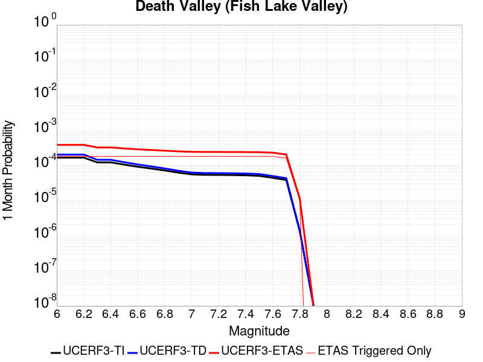 |  |  |

| Magnitude | 1 wk TI Prob | 1 wk TD Prob | 1 wk ETAS Prob | 1 wk ETAS/TD Gain | 1 wk ETAS Triggered Only | 1 mo TI Prob | 1 mo TD Prob | 1 mo ETAS Prob | 1 mo ETAS/TD Gain | 1 mo ETAS Triggered Only | 1 yr TI Prob | 1 yr TD Prob | 1 yr ETAS Prob | 1 yr ETAS/TD Gain | 1 yr ETAS Triggered Only | 10 yr TI Prob | 10 yr TD Prob | 10 yr ETAS Prob | 10 yr ETAS/TD Gain | 10 yr ETAS Triggered Only |
|-----|-----|-----|-----|-----|-----|-----|-----|-----|-----|-----|-----|-----|-----|-----|-----|-----|-----|-----|-----|-----|
| 6.0 | 3.872328E-5 | 4.7267473E-5 | 1.8726086E-4 | 3.9617276 | 1.4E-4 | 1.6594635E-4 | 2.0256084E-4 | 3.825244E-4 | 1.8884419 | 1.8E-4 | 0.0020185246 | 0.002463534 | 0.0028824992 | 1.1700668 | 4.2E-4 | 0.02000288 | 0.024388181 | 0.024954036 | 1.0232021 | 5.8E-4 |
| 6.1 | 3.872328E-5 | 4.7267473E-5 | 1.8726086E-4 | 3.9617276 | 1.4E-4 | 1.6594635E-4 | 2.0256084E-4 | 3.825244E-4 | 1.8884419 | 1.8E-4 | 0.0020185246 | 0.002463534 | 0.0028824992 | 1.1700668 | 4.2E-4 | 0.02000288 | 0.024388181 | 0.024954036 | 1.0232021 | 5.8E-4 |
| 6.2 | 3.872328E-5 | 4.7267473E-5 | 1.8726086E-4 | 3.9617276 | 1.4E-4 | 1.6594635E-4 | 2.0256084E-4 | 3.825244E-4 | 1.8884419 | 1.8E-4 | 0.0020185246 | 0.002463534 | 0.0028824992 | 1.1700668 | 4.2E-4 | 0.02000288 | 0.024388181 | 0.024954036 | 1.0232021 | 5.8E-4 |
| 6.3 | 2.8356371E-5 | 3.3609853E-5 | 1.7360515E-4 | 5.1653056 | 1.4E-4 | 1.2152165E-4 | 1.4403471E-4 | 3.2400878E-4 | 2.2495186 | 1.8E-4 | 0.0014785219 | 0.0017522911 | 0.002171555 | 1.2392662 | 4.2E-4 | 0.014687235 | 0.017391782 | 0.017951868 | 1.0322042 | 5.7E-4 |
| 6.4 | 2.8356371E-5 | 3.3609853E-5 | 1.7360515E-4 | 5.1653056 | 1.4E-4 | 1.2152165E-4 | 1.4403471E-4 | 3.2400878E-4 | 2.2495186 | 1.8E-4 | 0.0014785219 | 0.0017522911 | 0.002171555 | 1.2392662 | 4.2E-4 | 0.014687235 | 0.017391782 | 0.017951868 | 1.0322042 | 5.7E-4 |
| 6.5 | 2.4448687E-5 | 2.8607552E-5 | 1.6860355E-4 | 5.8936725 | 1.4E-4 | 1.0477588E-4 | 1.2259831E-4 | 3.0257626E-4 | 2.4680293 | 1.8E-4 | 0.0012748998 | 0.0014916632 | 0.0019110367 | 1.2811449 | 4.2E-4 | 0.012676105 | 0.014821377 | 0.015382929 | 1.0378879 | 5.7E-4 |
| 6.6 | 2.1298161E-5 | 2.4660083E-5 | 1.6465664E-4 | 6.6770506 | 1.4E-4 | 9.127464E-5 | 1.0568198E-4 | 2.8566297E-4 | 2.7030432 | 1.8E-4 | 0.0011107022 | 0.0012859525 | 0.0017054124 | 1.3261862 | 4.2E-4 | 0.011051672 | 0.012788526 | 0.0133413635 | 1.0432292 | 5.6E-4 |
| 6.7 | 1.8959729E-5 | 2.1781025E-5 | 1.6177798E-4 | 7.427473 | 1.4E-4 | 8.125345E-5 | 9.334405E-5 | 2.7332726E-4 | 2.92817 | 1.8E-4 | 9.888117E-4 | 0.001135897 | 0.0015454312 | 1.3605382 | 4.1E-4 | 0.009844234 | 0.01130357 | 0.011847353 | 1.0481071 | 5.5E-4 |
| 6.8 | 1.6691629E-5 | 1.9018353E-5 | 1.5901569E-4 | 8.361171 | 1.4E-4 | 7.153359E-5 | 8.150477E-5 | 2.614901E-4 | 3.2082796 | 1.8E-4 | 8.7057345E-4 | 9.918857E-4 | 0.001401479 | 1.4129441 | 4.1E-4 | 0.008671708 | 0.009876343 | 0.010420912 | 1.0551386 | 5.5E-4 |
| 6.9 | 1.450505E-5 | 1.638954E-5 | 1.5638725E-4 | 9.541894 | 1.4E-4 | 6.216302E-5 | 7.0239046E-5 | 2.502264E-4 | 3.5624974 | 1.8E-4 | 7.5657194E-4 | 8.5483363E-4 | 0.0012644832 | 1.4792155 | 4.1E-4 | 0.007540013 | 0.008516385 | 0.009061702 | 1.0640314 | 5.5E-4 |
| 7.0 | 1.2940855E-5 | 1.4537972E-5 | 1.5453594E-4 | 10.629814 | 1.4E-4 | 5.545963E-5 | 6.230414E-5 | 2.4229292E-4 | 3.8888736 | 1.8E-4 | 6.750118E-4 | 7.5829466E-4 | 0.0011679837 | 1.5402769 | 4.1E-4 | 0.006729651 | 0.0075576897 | 0.008103533 | 1.0722235 | 5.5E-4 |
| 7.1 | 1.2544658E-5 | 1.4078208E-5 | 1.5407623E-4 | 10.944307 | 1.4E-4 | 5.3761712E-5 | 6.0333812E-5 | 2.4032294E-4 | 3.9832218 | 1.8E-4 | 6.5435225E-4 | 7.343222E-4 | 0.0011440212 | 1.557928 | 4.1E-4 | 0.006524288 | 0.007319551 | 0.007865525 | 1.0745913 | 5.5E-4 |
| 7.2 | 1.2489416E-5 | 1.4015674E-5 | 1.5401372E-4 | 10.988677 | 1.4E-4 | 5.3524967E-5 | 6.0065824E-5 | 2.4005501E-4 | 3.9965324 | 1.8E-4 | 6.514716E-4 | 7.310616E-4 | 0.0011407619 | 1.5604182 | 4.1E-4 | 0.006495651 | 0.0072871596 | 0.007833152 | 1.0749252 | 5.5E-4 |
| 7.3 | 1.2368307E-5 | 1.3879812E-5 | 1.5387787E-4 | 11.086452 | 1.4E-4 | 5.3005948E-5 | 5.9483587E-5 | 2.3947288E-4 | 4.025865 | 1.8E-4 | 6.451563E-4 | 7.2397763E-4 | 0.0011336808 | 1.5659058 | 4.1E-4 | 0.0064328653 | 0.007216782 | 0.0077628125 | 1.0756613 | 5.5E-4 |
| 7.4 | 1.2161707E-5 | 1.36478675E-5 | 1.5364596E-4 | 11.257873 | 1.4E-4 | 5.212056E-5 | 5.8489582E-5 | 2.3847906E-4 | 4.077291 | 1.8E-4 | 6.3438306E-4 | 7.118836E-4 | 0.0011215918 | 1.5755268 | 4.1E-4 | 0.006325751 | 0.0070966207 | 0.0076427176 | 1.0769516 | 5.5E-4 |
| 7.5 | 1.1707948E-5 | 1.3145515E-5 | 1.5314367E-4 | 11.64988 | 1.4E-4 | 5.0175953E-5 | 5.6336736E-5 | 2.363266E-4 | 4.1948934 | 1.8E-4 | 6.10721E-4 | 6.856895E-4 | 0.0010954083 | 1.5975283 | 4.1E-4 | 0.0060904534 | 0.006836321 | 0.0073825615 | 1.0799026 | 5.5E-4 |
| 7.6 | 1.0319538E-5 | 1.1579622E-5 | 1.51578E-4 | 13.090064 | 1.4E-4 | 4.4225842E-5 | 4.9626036E-5 | 2.296171E-4 | 4.6269484 | 1.8E-4 | 5.383166E-4 | 6.040347E-4 | 0.001013787 | 1.6783589 | 4.1E-4 | 0.0053701443 | 0.0060244603 | 0.006561207 | 1.0890946 | 5.4E-4 |
| 7.7 | 8.937764E-6 | 1.0022779E-5 | 1.4002148E-4 | 13.9703245 | 1.3E-4 | 3.830414E-5 | 4.295409E-5 | 2.0294722E-4 | 4.724747 | 1.6E-4 | 4.6625308E-4 | 5.228456E-4 | 9.026469E-4 | 1.726412 | 3.8E-4 | 0.0046527605 | 0.005216664 | 0.005714056 | 1.0953467 | 5.0E-4 |
| 7.8 | 3.108007E-7 | 3.284654E-7 | 3.284654E-7 | 1.0 | 0.0 | 1.3320023E-6 | 1.407708E-6 | 1.1407694E-5 | 8.103736 | 1.0E-5 | 1.6217007E-5 | 1.7138715E-5 | 3.7138372E-5 | 2.1669285 | 2.0E-5 | 1.6215823E-4 | 1.7137431E-4 | 2.0136917E-4 | 1.1750255 | 3.0E-5 |
| 7.9 | 2.5591178E-9 | 2.6696718E-9 | 2.6696718E-9 | 1.0 | 0.0 | 1.0967647E-8 | 1.14414505E-8 | 1.14414505E-8 | 1.0 | 0.0 | 1.335311E-7 | 1.3929966E-7 | 1.3929966E-7 | 1.0 | 0.0 | 1.3353102E-6 | 1.3929966E-6 | 1.3929966E-6 | 1.0 | 0.0 |

## Red Pass
*[(top)](#table-of-contents)*

| 1 Week | 1 Month | 1 Year | 10 Year |
|-----|-----|-----|-----|
| 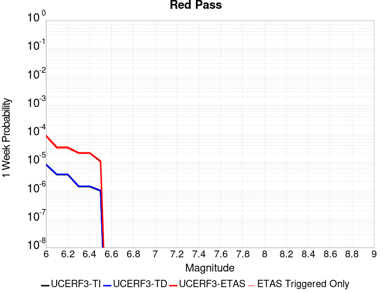 | 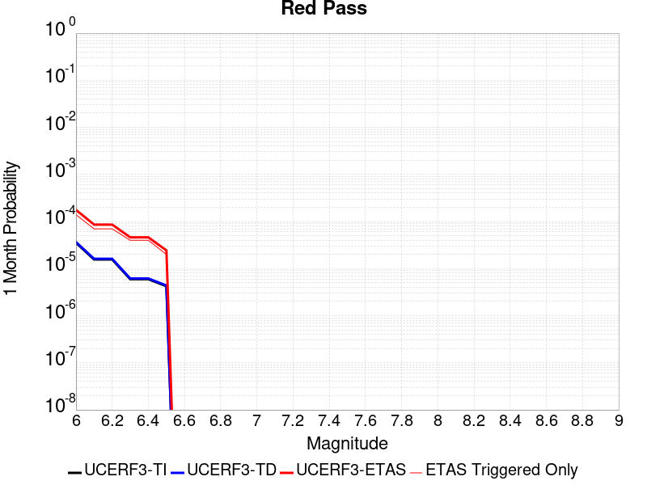 |  | 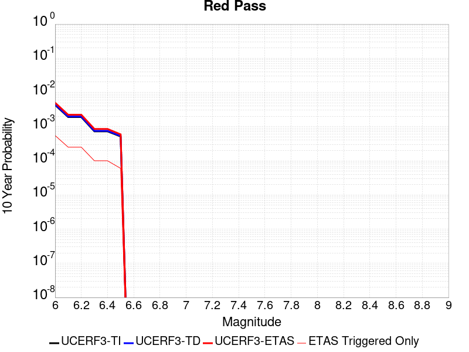 |

| Magnitude | 1 wk TI Prob | 1 wk TD Prob | 1 wk ETAS Prob | 1 wk ETAS/TD Gain | 1 wk ETAS Triggered Only | 1 mo TI Prob | 1 mo TD Prob | 1 mo ETAS Prob | 1 mo ETAS/TD Gain | 1 mo ETAS Triggered Only | 1 yr TI Prob | 1 yr TD Prob | 1 yr ETAS Prob | 1 yr ETAS/TD Gain | 1 yr ETAS Triggered Only | 10 yr TI Prob | 10 yr TD Prob | 10 yr ETAS Prob | 10 yr ETAS/TD Gain | 10 yr ETAS Triggered Only |
|-----|-----|-----|-----|-----|-----|-----|-----|-----|-----|-----|-----|-----|-----|-----|-----|-----|-----|-----|-----|-----|
| 6.0 | 8.258278E-6 | 8.551265E-6 | 8.855058E-5 | 10.355261 | 8.0E-5 | 3.539214E-5 | 3.6647863E-5 | 1.7664273E-4 | 4.8200006 | 1.4E-4 | 4.308141E-4 | 4.4611428E-4 | 7.659715E-4 | 1.716985 | 3.2E-4 | 0.0042997985 | 0.004453945 | 0.005001495 | 1.122936 | 5.5E-4 |
| 6.1 | 3.649988E-6 | 3.7753161E-6 | 3.3775203E-5 | 8.946324 | 3.0E-5 | 1.5642712E-5 | 1.6179853E-5 | 8.617872E-5 | 5.326298 | 7.0E-5 | 1.9043336E-4 | 1.9697666E-4 | 3.5694515E-4 | 1.812119 | 1.6E-4 | 0.0019027026 | 0.001968488 | 0.002217996 | 1.1267511 | 2.5E-4 |
| 6.2 | 3.649988E-6 | 3.7753161E-6 | 3.3775203E-5 | 8.946324 | 3.0E-5 | 1.5642712E-5 | 1.6179853E-5 | 8.617872E-5 | 5.326298 | 7.0E-5 | 1.9043336E-4 | 1.9697666E-4 | 3.5694515E-4 | 1.812119 | 1.6E-4 | 0.0019027026 | 0.001968488 | 0.002217996 | 1.1267511 | 2.5E-4 |
| 6.3 | 1.3924937E-6 | 1.4411166E-6 | 2.1441088E-5 | 14.878107 | 2.0E-5 | 5.9678164E-6 | 6.1762075E-6 | 4.617596E-5 | 7.476426 | 4.0E-5 | 7.265574E-5 | 7.519415E-5 | 1.4518888E-4 | 1.9308535 | 7.0E-5 | 7.263199E-4 | 7.518258E-4 | 8.517506E-4 | 1.1329095 | 1.0E-4 |
| 6.4 | 1.3924937E-6 | 1.4411166E-6 | 2.1441088E-5 | 14.878107 | 2.0E-5 | 5.9678164E-6 | 6.1762075E-6 | 4.617596E-5 | 7.476426 | 4.0E-5 | 7.265574E-5 | 7.519415E-5 | 1.4518888E-4 | 1.9308535 | 7.0E-5 | 7.263199E-4 | 7.518258E-4 | 8.517506E-4 | 1.1329095 | 1.0E-4 |
| 6.5 | 9.876812E-7 | 1.0221912E-6 | 1.1022181E-5 | 10.782895 | 1.0E-5 | 4.2329125E-6 | 4.3808195E-6 | 2.4380732E-5 | 5.5653358 | 2.0E-5 | 5.153449E-5 | 5.3336476E-5 | 8.3334875E-5 | 1.5624368 | 3.0E-5 | 5.1522546E-4 | 5.333648E-4 | 5.9333275E-4 | 1.1124333 | 6.0E-5 |

## Elsinore (Glen Ivy) rev
*[(top)](#table-of-contents)*

| 1 Week | 1 Month | 1 Year | 10 Year |
|-----|-----|-----|-----|
|  |  |  | 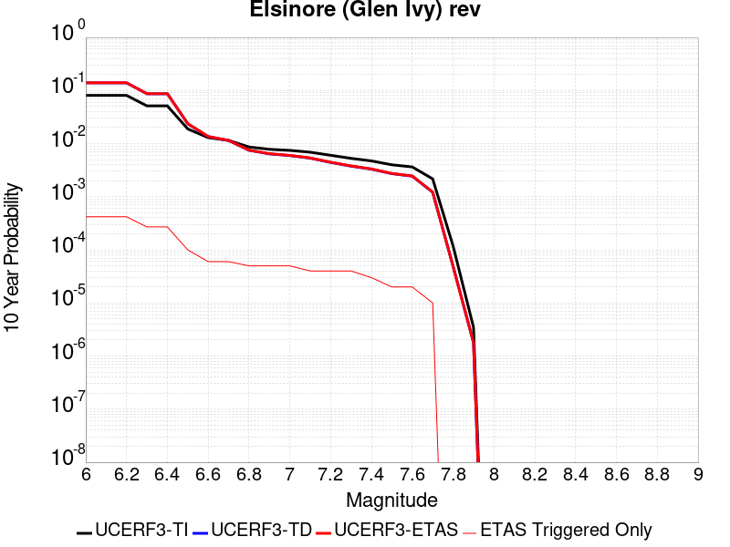 |

| Magnitude | 1 wk TI Prob | 1 wk TD Prob | 1 wk ETAS Prob | 1 wk ETAS/TD Gain | 1 wk ETAS Triggered Only | 1 mo TI Prob | 1 mo TD Prob | 1 mo ETAS Prob | 1 mo ETAS/TD Gain | 1 mo ETAS Triggered Only | 1 yr TI Prob | 1 yr TD Prob | 1 yr ETAS Prob | 1 yr ETAS/TD Gain | 1 yr ETAS Triggered Only | 10 yr TI Prob | 10 yr TD Prob | 10 yr ETAS Prob | 10 yr ETAS/TD Gain | 10 yr ETAS Triggered Only |
|-----|-----|-----|-----|-----|-----|-----|-----|-----|-----|-----|-----|-----|-----|-----|-----|-----|-----|-----|-----|-----|
| 6.0 | 1.6204086E-4 | 2.9360707E-4 | 4.1357183E-4 | 1.4085895 | 1.2E-4 | 6.94276E-4 | 0.0012578638 | 0.0013976877 | 1.1111598 | 1.4E-4 | 0.008420097 | 0.015234485 | 0.015451133 | 1.014221 | 2.2E-4 | 0.081081145 | 0.13969168 | 0.140053 | 1.0025866 | 4.2E-4 |
| 6.1 | 1.6204086E-4 | 2.9360707E-4 | 4.1357183E-4 | 1.4085895 | 1.2E-4 | 6.94276E-4 | 0.0012578638 | 0.0013976877 | 1.1111598 | 1.4E-4 | 0.008420097 | 0.015234485 | 0.015451133 | 1.014221 | 2.2E-4 | 0.081081145 | 0.13969168 | 0.140053 | 1.0025866 | 4.2E-4 |
| 6.2 | 1.6204086E-4 | 2.9360707E-4 | 4.1357183E-4 | 1.4085895 | 1.2E-4 | 6.94276E-4 | 0.0012578638 | 0.0013976877 | 1.1111598 | 1.4E-4 | 0.008420097 | 0.015234485 | 0.015451133 | 1.014221 | 2.2E-4 | 0.081081145 | 0.13969168 | 0.140053 | 1.0025866 | 4.2E-4 |
| 6.3 | 1.0111737E-4 | 1.7703383E-4 | 2.370232E-4 | 1.3388582 | 6.0E-5 | 4.332882E-4 | 7.5861247E-4 | 8.2855934E-4 | 1.0922037 | 7.0E-5 | 0.005262531 | 0.009217682 | 0.009356392 | 1.0150481 | 1.4E-4 | 0.0513964 | 0.0870191 | 0.0872656 | 1.0028328 | 2.7E-4 |
| 6.4 | 1.0111737E-4 | 1.7703383E-4 | 2.370232E-4 | 1.3388582 | 6.0E-5 | 4.332882E-4 | 7.5861247E-4 | 8.2855934E-4 | 1.0922037 | 7.0E-5 | 0.005262531 | 0.009217682 | 0.009356392 | 1.0150481 | 1.4E-4 | 0.0513964 | 0.0870191 | 0.0872656 | 1.0028328 | 2.7E-4 |
| 6.5 | 3.6624708E-5 | 4.6391084E-5 | 6.639015E-5 | 1.4310974 | 2.0E-5 | 1.569536E-4 | 1.9880582E-4 | 2.2879986E-4 | 1.150871 | 3.0E-5 | 0.001909235 | 0.0024181372 | 0.0024680162 | 1.020627 | 5.0E-5 | 0.01892915 | 0.023739954 | 0.023837581 | 1.0041124 | 1.0E-4 |
| 6.6 | 2.5051324E-5 | 2.614772E-5 | 3.614746E-5 | 1.3824326 | 1.0E-5 | 1.073584E-4 | 1.12057096E-4 | 1.3205485E-4 | 1.1784605 | 2.0E-5 | 0.0013063047 | 0.0013634858 | 0.0014034313 | 1.0292965 | 4.0E-5 | 0.012986525 | 0.013564618 | 0.013623804 | 1.0043633 | 6.0E-5 |
| 6.7 | 2.2189772E-5 | 2.2072849E-5 | 3.207263E-5 | 1.4530352 | 1.0E-5 | 9.509556E-5 | 9.4594696E-5 | 1.145928E-4 | 1.2114084 | 2.0E-5 | 0.0011571734 | 0.0011511183 | 0.0011910723 | 1.0347089 | 4.0E-5 | 0.011511663 | 0.011465415 | 0.011524728 | 1.0051731 | 6.0E-5 |
| 6.8 | 1.6654378E-5 | 1.4437705E-5 | 2.443756E-5 | 1.6926209 | 1.0E-5 | 7.137396E-5 | 6.187444E-5 | 8.18732E-5 | 1.3232152 | 2.0E-5 | 8.686314E-4 | 7.530661E-4 | 7.9303596E-4 | 1.0530761 | 4.0E-5 | 0.008652439 | 0.00751048 | 0.0075601046 | 1.0066074 | 5.0E-5 |
| 6.9 | 1.5042909E-5 | 1.2332022E-5 | 2.2331898E-5 | 1.810887 | 1.0E-5 | 6.446802E-5 | 5.285047E-5 | 7.284941E-5 | 1.3784062 | 2.0E-5 | 7.8461546E-4 | 6.4326765E-4 | 6.8324193E-4 | 1.0621425 | 4.0E-5 | 0.007818509 | 0.00641828 | 0.006467959 | 1.0077403 | 5.0E-5 |
| 7.0 | 1.4361385E-5 | 1.1451324E-5 | 2.145121E-5 | 1.8732514 | 1.0E-5 | 6.154734E-5 | 4.9076196E-5 | 6.907521E-5 | 1.4075096 | 2.0E-5 | 7.490812E-4 | 5.973418E-4 | 6.373179E-4 | 1.0669234 | 4.0E-5 | 0.007465612 | 0.0059613534 | 0.0060110553 | 1.0083374 | 5.0E-5 |
| 7.1 | 1.3265571E-5 | 1.0244926E-5 | 2.0244823E-5 | 1.9760829 | 1.0E-5 | 5.6851208E-5 | 4.39061E-5 | 6.390522E-5 | 1.4554976 | 2.0E-5 | 6.919436E-4 | 5.344282E-4 | 5.6441216E-4 | 1.0561048 | 3.0E-5 | 0.006897931 | 0.0053347866 | 0.005374573 | 1.007458 | 4.0E-5 |
| 7.2 | 1.1596403E-5 | 8.505067E-6 | 1.8504981E-5 | 2.1757598 | 1.0E-5 | 4.9697923E-5 | 3.6449786E-5 | 5.644906E-5 | 1.5486801 | 2.0E-5 | 6.049042E-4 | 4.436875E-4 | 4.7367415E-4 | 1.0675851 | 3.0E-5 | 0.006032603 | 0.0044294316 | 0.0044692545 | 1.0089905 | 4.0E-5 |
| 7.3 | 1.0150827E-5 | 7.2387597E-6 | 1.7238688E-5 | 2.381442 | 1.0E-5 | 4.3502816E-5 | 3.1022897E-5 | 5.1022274E-5 | 1.6446651 | 2.0E-5 | 5.2951806E-4 | 3.7763975E-4 | 4.0762842E-4 | 1.0794108 | 3.0E-5 | 0.005282581 | 0.0037703665 | 0.0038102157 | 1.0105691 | 4.0E-5 |
| 7.4 | 9.080705E-6 | 6.352519E-6 | 1.6352456E-5 | 2.5741687 | 1.0E-5 | 3.8916725E-5 | 2.7224805E-5 | 4.722426E-5 | 1.7346041 | 2.0E-5 | 4.7370812E-4 | 3.3141294E-4 | 3.61403E-4 | 1.0904915 | 3.0E-5 | 0.004726996 | 0.0033093381 | 0.0033392387 | 1.0090352 | 3.0E-5 |
| 7.5 | 7.671649E-6 | 5.2256332E-6 | 5.2256332E-6 | 1.0 | 0.0 | 3.287808E-5 | 2.2395385E-5 | 3.239516E-5 | 1.4465106 | 1.0E-5 | 4.0021708E-4 | 2.7263095E-4 | 2.926255E-4 | 1.0733392 | 2.0E-5 | 0.0039949706 | 0.00272309 | 0.0027430353 | 1.0073246 | 2.0E-5 |
| 7.6 | 6.990086E-6 | 4.687545E-6 | 4.687545E-6 | 1.0 | 0.0 | 2.9957167E-5 | 2.008933E-5 | 3.0089128E-5 | 1.4977667 | 1.0E-5 | 3.6466747E-4 | 2.445613E-4 | 2.645564E-4 | 1.0817591 | 2.0E-5 | 0.0036406964 | 0.002443038 | 0.002462989 | 1.0081666 | 2.0E-5 |
| 7.7 | 4.163505E-6 | 2.3295343E-6 | 2.3295343E-6 | 1.0 | 0.0 | 1.7843471E-5 | 9.983683E-6 | 1.9983583E-5 | 2.0016243 | 1.0E-5 | 2.172226E-4 | 1.21545316E-4 | 1.315441E-4 | 1.0822638 | 1.0E-5 | 0.0021701038 | 0.0012148614 | 0.0012248493 | 1.0082214 | 1.0E-5 |
| 7.8 | 2.2692414E-7 | 9.3854695E-8 | 9.3854695E-8 | 1.0 | 0.0 | 9.725317E-7 | 4.0223435E-7 | 4.0223435E-7 | 1.0 | 0.0 | 1.1840509E-5 | 4.8971956E-6 | 4.8971956E-6 | 1.0 | 0.0 | 1.1839878E-4 | 4.8971204E-5 | 4.8971204E-5 | 1.0 | 0.0 |
| 7.9 | 6.676829E-9 | 3.439853E-9 | 3.439853E-9 | 1.0 | 0.0 | 2.861498E-8 | 1.4742227E-8 | 1.4742227E-8 | 1.0 | 0.0 | 3.4838732E-7 | 1.7948659E-7 | 1.7948659E-7 | 1.0 | 0.0 | 3.4838679E-6 | 1.7948646E-6 | 1.7948646E-6 | 1.0 | 0.0 |

## San Andreas (Coachella) rev
*[(top)](#table-of-contents)*

| 1 Week | 1 Month | 1 Year | 10 Year |
|-----|-----|-----|-----|
| 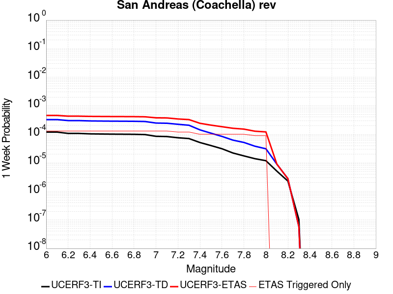 | 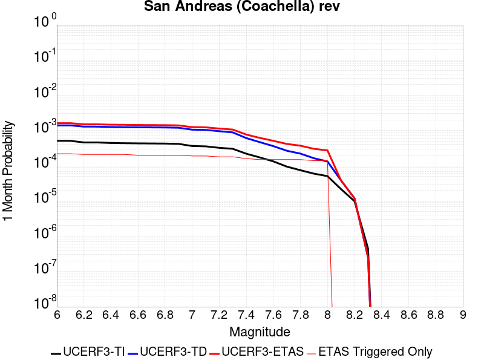 |  |  |

| Magnitude | 1 wk TI Prob | 1 wk TD Prob | 1 wk ETAS Prob | 1 wk ETAS/TD Gain | 1 wk ETAS Triggered Only | 1 mo TI Prob | 1 mo TD Prob | 1 mo ETAS Prob | 1 mo ETAS/TD Gain | 1 mo ETAS Triggered Only | 1 yr TI Prob | 1 yr TD Prob | 1 yr ETAS Prob | 1 yr ETAS/TD Gain | 1 yr ETAS Triggered Only | 10 yr TI Prob | 10 yr TD Prob | 10 yr ETAS Prob | 10 yr ETAS/TD Gain | 10 yr ETAS Triggered Only |
|-----|-----|-----|-----|-----|-----|-----|-----|-----|-----|-----|-----|-----|-----|-----|-----|-----|-----|-----|-----|-----|
| 6.0 | 1.1925945E-4 | 3.2729402E-4 | 4.5725147E-4 | 1.3970664 | 1.3E-4 | 5.110118E-4 | 0.0014019393 | 0.0016216309 | 1.1567055 | 2.2E-4 | 0.0062038354 | 0.016936364 | 0.017280437 | 1.0203156 | 3.5E-4 | 0.060334753 | 0.15265316 | 0.15305988 | 1.0026643 | 4.8E-4 |
| 6.1 | 1.1925945E-4 | 3.2729402E-4 | 4.5725147E-4 | 1.3970664 | 1.3E-4 | 5.110118E-4 | 0.0014019393 | 0.0016216309 | 1.1567055 | 2.2E-4 | 0.0062038354 | 0.016936364 | 0.017280437 | 1.0203156 | 3.5E-4 | 0.060334753 | 0.15265316 | 0.15305988 | 1.0026643 | 4.8E-4 |
| 6.2 | 1.07432395E-4 | 3.0230157E-4 | 4.3226226E-4 | 1.4299042 | 1.3E-4 | 4.603433E-4 | 0.0012949388 | 0.0015046669 | 1.1619598 | 2.1E-4 | 0.005590286 | 0.015653009 | 0.015977843 | 1.0207522 | 3.3E-4 | 0.05451731 | 0.14182423 | 0.14221899 | 1.0027834 | 4.6E-4 |
| 6.3 | 1.0718766E-4 | 3.0175463E-4 | 4.317154E-4 | 1.4306836 | 1.3E-4 | 4.592948E-4 | 0.0012925972 | 0.0015023256 | 1.1622536 | 2.1E-4 | 0.005577586 | 0.015624908 | 0.01594975 | 1.0207901 | 3.3E-4 | 0.054396555 | 0.14159249 | 0.14198735 | 1.0027888 | 4.6E-4 |
| 6.4 | 1.0355944E-4 | 2.9383553E-4 | 4.2379732E-4 | 1.4422944 | 1.3E-4 | 4.4375064E-4 | 0.0012586913 | 0.001468427 | 1.1666299 | 2.1E-4 | 0.0053892885 | 0.015217941 | 0.01554292 | 1.0213549 | 3.3E-4 | 0.052604496 | 0.13815255 | 0.138549 | 1.0028696 | 4.6E-4 |
| 6.5 | 1.0227914E-4 | 2.9102986E-4 | 4.2099203E-4 | 1.4465595 | 1.3E-4 | 4.382655E-4 | 0.0012466786 | 0.0014564168 | 1.1682376 | 2.1E-4 | 0.0053228354 | 0.01507372 | 0.015398746 | 1.0215625 | 3.3E-4 | 0.051971316 | 0.13693172 | 0.13732873 | 1.0028993 | 4.6E-4 |
| 6.6 | 1.0116757E-4 | 2.8868738E-4 | 4.1864984E-4 | 1.4501841 | 1.3E-4 | 4.3350324E-4 | 0.0012366489 | 0.0014364016 | 1.1615274 | 2.0E-4 | 0.0052651367 | 0.01495329 | 0.015268506 | 1.02108 | 3.2E-4 | 0.051421247 | 0.1359099 | 0.13629875 | 1.002861 | 4.5E-4 |
| 6.7 | 1.0050676E-4 | 2.8727303E-4 | 4.1723566E-4 | 1.4524012 | 1.3E-4 | 4.3067214E-4 | 0.0012305931 | 0.001430347 | 1.1623232 | 2.0E-4 | 0.005230834 | 0.014880571 | 0.015195808 | 1.0211846 | 3.2E-4 | 0.051094085 | 0.13529462 | 0.13568373 | 1.002876 | 4.5E-4 |
| 6.8 | 9.976819E-5 | 2.853096E-4 | 4.152725E-4 | 1.4555154 | 1.3E-4 | 4.2750788E-4 | 0.0012221863 | 0.0014219419 | 1.1634412 | 2.0E-4 | 0.0051924936 | 0.0147796115 | 0.015094882 | 1.0213314 | 3.2E-4 | 0.050728295 | 0.13444631 | 0.13483581 | 1.002897 | 4.5E-4 |
| 6.9 | 9.77719E-5 | 2.8027873E-4 | 4.102423E-4 | 1.463694 | 1.3E-4 | 4.1895514E-4 | 0.0012006456 | 0.0014004054 | 1.1663771 | 2.0E-4 | 0.0050888555 | 0.014520878 | 0.014836231 | 1.0217172 | 3.2E-4 | 0.049738888 | 0.1322748 | 0.13266529 | 1.002952 | 4.5E-4 |
| 7.0 | 8.500761E-5 | 2.4762485E-4 | 3.7759266E-4 | 1.5248576 | 1.3E-4 | 3.6426744E-4 | 0.001060821 | 0.0012506194 | 1.1789166 | 1.9E-4 | 0.0044259406 | 0.012839786 | 0.013145805 | 1.0238338 | 3.1E-4 | 0.04338823 | 0.11813272 | 0.118520744 | 1.0032846 | 4.4E-4 |
| 7.1 | 8.319876E-5 | 2.4365232E-4 | 3.7362066E-4 | 1.5334171 | 1.3E-4 | 3.5651738E-4 | 0.0010438096 | 0.0012336113 | 1.1818355 | 1.9E-4 | 0.004331963 | 0.012635092 | 0.012941176 | 1.0242249 | 3.1E-4 | 0.042484846 | 0.116353 | 0.116741806 | 1.0033416 | 4.4E-4 |
| 7.2 | 7.563917E-5 | 2.2413683E-4 | 3.4410995E-4 | 1.5352672 | 1.2E-4 | 3.2412758E-4 | 9.602359E-4 | 0.001140063 | 1.187274 | 1.8E-4 | 0.0039391145 | 0.011628893 | 0.011925405 | 1.0254978 | 3.0E-4 | 0.03870018 | 0.10775925 | 0.10814291 | 1.0035604 | 4.3E-4 |
| 7.3 | 7.082985E-5 | 2.0729867E-4 | 3.272738E-4 | 1.5787549 | 1.2E-4 | 3.0352117E-4 | 8.881233E-4 | 0.0010679634 | 1.2024946 | 1.8E-4 | 0.0036891096 | 0.010759917 | 0.01105669 | 1.0275812 | 3.0E-4 | 0.03628465 | 0.100282 | 0.100659885 | 1.0037682 | 4.2E-4 |
| 7.4 | 5.146215E-5 | 1.4273795E-4 | 2.4272366E-4 | 1.7004846 | 1.0E-4 | 2.2053342E-4 | 6.115915E-4 | 7.7149365E-4 | 1.2614526 | 1.6E-4 | 0.0026816884 | 0.0074208933 | 0.0076888897 | 1.0361137 | 2.7E-4 | 0.02649557 | 0.070849575 | 0.07121194 | 1.0051147 | 3.9E-4 |
| 7.5 | 4.0285166E-5 | 1.09416E-4 | 2.0940506E-4 | 1.9138432 | 1.0E-4 | 1.7263928E-4 | 4.6884175E-4 | 6.187714E-4 | 1.3197874 | 1.5E-4 | 0.002099857 | 0.0056932783 | 0.005951798 | 1.0454079 | 2.6E-4 | 0.020801254 | 0.055011146 | 0.055360794 | 1.0063559 | 3.7E-4 |
| 7.6 | 3.1168736E-5 | 8.4389096E-5 | 1.8438065E-4 | 2.1848872 | 1.0E-4 | 1.3357346E-4 | 3.6161754E-4 | 5.115633E-4 | 1.4146528 | 1.5E-4 | 0.0016250437 | 0.0043938323 | 0.00465269 | 1.0589138 | 2.6E-4 | 0.016132116 | 0.04281005 | 0.04315464 | 1.0080492 | 3.6E-4 |
| 7.7 | 2.2100989E-5 | 6.238755E-5 | 1.6238132E-4 | 2.602784 | 1.0E-4 | 9.4715084E-5 | 2.6734784E-4 | 4.1730775E-4 | 1.5609168 | 1.5E-4 | 0.001152546 | 0.0032501083 | 0.0035092633 | 1.0797373 | 2.6E-4 | 0.011465867 | 0.0319002 | 0.032239035 | 1.0106217 | 3.5E-4 |
| 7.8 | 1.7484861E-5 | 5.179572E-5 | 1.5179053E-4 | 2.9305615 | 1.0E-4 | 7.493296E-5 | 2.2196278E-4 | 3.719295E-4 | 1.675639 | 1.5E-4 | 9.1192697E-4 | 0.0026990508 | 0.002958349 | 1.0960702 | 2.6E-4 | 0.009081938 | 0.026640115 | 0.026961325 | 1.0120573 | 3.3E-4 |
| 7.9 | 1.3967285E-5 | 3.822255E-5 | 1.2821911E-4 | 3.3545408 | 9.0E-5 | 5.985842E-5 | 1.6380067E-4 | 3.0377772E-4 | 1.8545574 | 1.4E-4 | 7.2853256E-4 | 0.00199245 | 0.002241952 | 1.1252236 | 2.5E-4 | 0.0072614877 | 0.019909438 | 0.020203464 | 1.0147682 | 3.0E-4 |
| 8.0 | 1.1887396E-5 | 3.106521E-5 | 1.2106242E-4 | 3.8970416 | 9.0E-5 | 5.094499E-5 | 1.3312983E-4 | 2.731112E-4 | 2.051465 | 1.4E-4 | 6.200787E-4 | 0.0016196516 | 0.0018592628 | 1.14794 | 2.4E-4 | 0.006183513 | 0.016279267 | 0.016564546 | 1.0175241 | 2.9E-4 |
| 8.1 | 5.100864E-6 | 8.973418E-6 | 8.973418E-6 | 1.0 | 0.0 | 2.1860664E-5 | 3.8456936E-5 | 3.8456936E-5 | 1.0 | 0.0 | 2.6612106E-4 | 4.6811273E-4 | 4.6811273E-4 | 1.0 | 0.0 | 0.002658026 | 0.004917731 | 0.0049276818 | 1.0020235 | 1.0E-5 |
| 8.2 | 2.3004484E-6 | 2.7864487E-6 | 2.7864487E-6 | 1.0 | 0.0 | 9.859027E-6 | 1.1941868E-5 | 1.1941868E-5 | 1.0 | 0.0 | 1.2002704E-4 | 1.4538258E-4 | 1.4538258E-4 | 1.0 | 0.0 | 0.0011996223 | 0.0015973912 | 0.0015973912 | 1.0 | 0.0 |
| 8.3 | 1.0424446E-7 | 5.8161504E-8 | 5.8161504E-8 | 1.0 | 0.0 | 4.4676187E-7 | 2.4926356E-7 | 2.4926356E-7 | 1.0 | 0.0 | 5.439312E-6 | 3.03478E-6 | 3.03478E-6 | 1.0 | 0.0 | 5.4391792E-5 | 3.190716E-5 | 3.190716E-5 | 1.0 | 0.0 |

## Sierra Nevada  (No Extension)
*[(top)](#table-of-contents)*

| 1 Week | 1 Month | 1 Year | 10 Year |
|-----|-----|-----|-----|
|  |  | 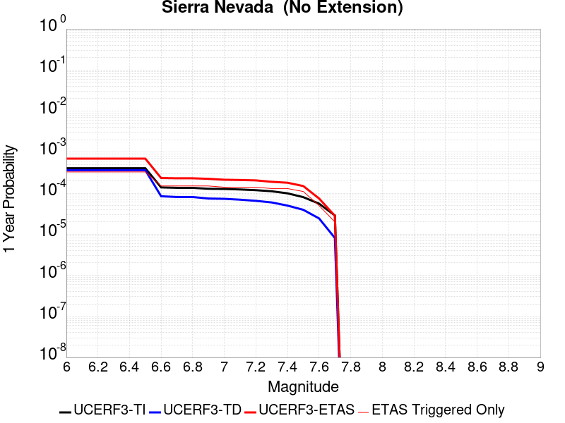 |  |

| Magnitude | 1 wk TI Prob | 1 wk TD Prob | 1 wk ETAS Prob | 1 wk ETAS/TD Gain | 1 wk ETAS Triggered Only | 1 mo TI Prob | 1 mo TD Prob | 1 mo ETAS Prob | 1 mo ETAS/TD Gain | 1 mo ETAS Triggered Only | 1 yr TI Prob | 1 yr TD Prob | 1 yr ETAS Prob | 1 yr ETAS/TD Gain | 1 yr ETAS Triggered Only | 10 yr TI Prob | 10 yr TD Prob | 10 yr ETAS Prob | 10 yr ETAS/TD Gain | 10 yr ETAS Triggered Only |
|-----|-----|-----|-----|-----|-----|-----|-----|-----|-----|-----|-----|-----|-----|-----|-----|-----|-----|-----|-----|-----|
| 6.0 | 7.7690465E-6 | 6.976322E-6 | 1.6697521E-4 | 23.934563 | 1.6E-4 | 3.329549E-5 | 2.9898381E-5 | 2.398921E-4 | 8.0235815 | 2.1E-4 | 4.0529718E-4 | 3.6398784E-4 | 6.9386774E-4 | 1.9062937 | 3.3E-4 | 0.004045588 | 0.0036374326 | 0.0040658684 | 1.1177852 | 4.3E-4 |
| 6.1 | 7.7690465E-6 | 6.976322E-6 | 1.6697521E-4 | 23.934563 | 1.6E-4 | 3.329549E-5 | 2.9898381E-5 | 2.398921E-4 | 8.0235815 | 2.1E-4 | 4.0529718E-4 | 3.6398784E-4 | 6.9386774E-4 | 1.9062937 | 3.3E-4 | 0.004045588 | 0.0036374326 | 0.0040658684 | 1.1177852 | 4.3E-4 |
| 6.2 | 7.7690465E-6 | 6.976322E-6 | 1.6697521E-4 | 23.934563 | 1.6E-4 | 3.329549E-5 | 2.9898381E-5 | 2.398921E-4 | 8.0235815 | 2.1E-4 | 4.0529718E-4 | 3.6398784E-4 | 6.9386774E-4 | 1.9062937 | 3.3E-4 | 0.004045588 | 0.0036374326 | 0.0040658684 | 1.1177852 | 4.3E-4 |
| 6.3 | 7.7690465E-6 | 6.976322E-6 | 1.6697521E-4 | 23.934563 | 1.6E-4 | 3.329549E-5 | 2.9898381E-5 | 2.398921E-4 | 8.0235815 | 2.1E-4 | 4.0529718E-4 | 3.6398784E-4 | 6.9386774E-4 | 1.9062937 | 3.3E-4 | 0.004045588 | 0.0036374326 | 0.0040658684 | 1.1177852 | 4.3E-4 |
| 6.4 | 7.7690465E-6 | 6.976322E-6 | 1.6697521E-4 | 23.934563 | 1.6E-4 | 3.329549E-5 | 2.9898381E-5 | 2.398921E-4 | 8.0235815 | 2.1E-4 | 4.0529718E-4 | 3.6398784E-4 | 6.9386774E-4 | 1.9062937 | 3.3E-4 | 0.004045588 | 0.0036374326 | 0.0040658684 | 1.1177852 | 4.3E-4 |
| 6.5 | 7.7690465E-6 | 6.976322E-6 | 1.6697521E-4 | 23.934563 | 1.6E-4 | 3.329549E-5 | 2.9898381E-5 | 2.398921E-4 | 8.0235815 | 2.1E-4 | 4.0529718E-4 | 3.6398784E-4 | 6.9386774E-4 | 1.9062937 | 3.3E-4 | 0.004045588 | 0.0036374326 | 0.0040658684 | 1.1177852 | 4.3E-4 |
| 6.6 | 2.653E-6 | 1.614854E-6 | 6.161476E-5 | 38.155003 | 6.0E-5 | 1.136995E-5 | 6.9207845E-6 | 8.6920234E-5 | 12.559303 | 8.0E-5 | 1.3842035E-4 | 8.425733E-5 | 2.342447E-4 | 2.7801106 | 1.5E-4 | 0.0013833415 | 8.422573E-4 | 0.0010420888 | 1.2372571 | 2.0E-4 |
| 6.7 | 2.5902466E-6 | 1.5501876E-6 | 6.15501E-5 | 39.704933 | 6.0E-5 | 1.11010095E-5 | 6.643644E-6 | 8.6643115E-5 | 13.041504 | 8.0E-5 | 1.351464E-4 | 8.0883394E-5 | 2.3087126E-4 | 2.8543715 | 1.5E-4 | 0.0013506424 | 8.0854254E-4 | 0.0010083808 | 1.2471586 | 2.0E-4 |
| 6.8 | 2.5853892E-6 | 1.5469877E-6 | 6.1546896E-5 | 39.784992 | 6.0E-5 | 1.1080193E-5 | 6.629931E-6 | 8.66294E-5 | 13.066411 | 8.0E-5 | 1.34893E-4 | 8.071645E-5 | 2.3070435E-4 | 2.8582072 | 1.5E-4 | 0.0013481114 | 8.068743E-4 | 0.0010067129 | 1.24767 | 2.0E-4 |
| 6.9 | 2.458257E-6 | 1.4220619E-6 | 6.1421975E-5 | 43.192196 | 6.0E-5 | 1.0535345E-5 | 6.094537E-6 | 8.609405E-5 | 14.12643 | 8.0E-5 | 1.2826028E-4 | 7.4198484E-5 | 2.2418736E-4 | 3.0214546 | 1.5E-4 | 0.0012818627 | 7.4173906E-4 | 9.415907E-4 | 1.2694366 | 2.0E-4 |
| 7.0 | 2.4341468E-6 | 1.3990258E-6 | 5.1398954E-5 | 36.739105 | 5.0E-5 | 1.0432016E-5 | 5.9958115E-6 | 7.599539E-5 | 12.674747 | 7.0E-5 | 1.270024E-4 | 7.2996576E-5 | 2.1298636E-4 | 2.9177582 | 1.4E-4 | 0.0012692984 | 7.297279E-4 | 9.1958925E-4 | 1.2601811 | 1.9E-4 |
| 7.1 | 2.3652476E-6 | 1.3339754E-6 | 5.1333907E-5 | 38.4819 | 5.0E-5 | 1.0136736E-5 | 5.717025E-6 | 7.571663E-5 | 13.2440605 | 7.0E-5 | 1.2340778E-4 | 6.9602575E-5 | 2.0959284E-4 | 3.0112798 | 1.4E-4 | 0.0012333926 | 6.9580943E-4 | 8.8567723E-4 | 1.2728733 | 1.9E-4 |
| 7.2 | 2.272158E-6 | 1.2502821E-6 | 5.125022E-5 | 40.990925 | 5.0E-5 | 9.737784E-6 | 5.3583412E-6 | 7.5357966E-5 | 14.063675 | 7.0E-5 | 1.1855107E-4 | 6.5235865E-5 | 2.0522674E-4 | 3.1459188 | 1.4E-4 | 0.0011848784 | 6.5216864E-4 | 8.4204477E-4 | 1.2911457 | 1.9E-4 |
| 7.3 | 2.1382127E-6 | 1.1419703E-6 | 5.1141913E-5 | 44.783928 | 5.0E-5 | 9.163737E-6 | 4.8941492E-6 | 7.4893804E-5 | 15.302722 | 7.0E-5 | 1.1156279E-4 | 5.958465E-5 | 1.8957691E-4 | 3.18164 | 1.3E-4 | 0.001115068 | 5.956879E-4 | 7.755807E-4 | 1.3019917 | 1.8E-4 |
| 7.4 | 1.9048055E-6 | 9.575242E-7 | 5.0957475E-5 | 53.21795 | 5.0E-5 | 8.163426E-6 | 4.1036687E-6 | 7.410338E-5 | 18.057837 | 7.0E-5 | 9.9385186E-5 | 4.996103E-5 | 1.7995454E-4 | 3.601898 | 1.3E-4 | 9.934074E-4 | 4.994987E-4 | 6.6941377E-4 | 1.3401712 | 1.7E-4 |
| 7.5 | 1.5373403E-6 | 7.560042E-7 | 4.0755975E-5 | 53.909718 | 4.0E-5 | 6.5885843E-6 | 3.2400142E-6 | 5.323985E-5 | 16.431982 | 5.0E-5 | 8.021306E-5 | 3.9446462E-5 | 1.4944213E-4 | 3.7884798 | 1.1E-4 | 8.0184115E-4 | 3.943951E-4 | 5.443359E-4 | 1.3801793 | 1.5E-4 |
| 7.6 | 1.0680322E-6 | 4.6596554E-7 | 1.0465961E-5 | 22.460804 | 1.0E-5 | 4.577273E-6 | 1.9969937E-6 | 1.1996974E-5 | 6.0075173 | 1.0E-5 | 5.5726876E-5 | 2.4313129E-5 | 7.4311916E-5 | 3.056452 | 5.0E-5 | 5.5712904E-4 | 2.4310495E-4 | 3.3308307E-4 | 1.3701205 | 9.0E-5 |
| 7.7 | 5.509146E-7 | 1.5580486E-7 | 1.5580486E-7 | 1.0 | 0.0 | 2.3610605E-6 | 6.677349E-7 | 6.677349E-7 | 1.0 | 0.0 | 2.8745531E-5 | 8.129644E-6 | 2.8129482E-5 | 3.4601123 | 2.0E-5 | 2.8741814E-4 | 8.1293576E-5 | 1.0129195E-4 | 1.2460018 | 2.0E-5 |

## Calico-Hidalgo
*[(top)](#table-of-contents)*

| 1 Week | 1 Month | 1 Year | 10 Year |
|-----|-----|-----|-----|
| 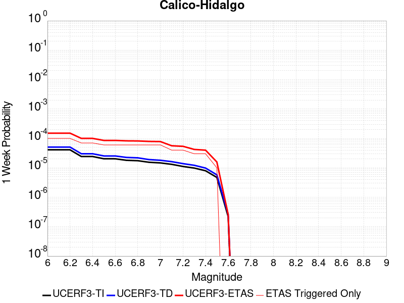 | 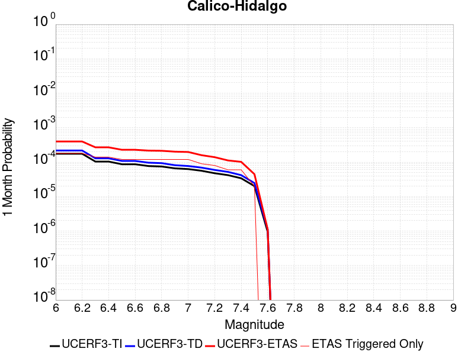 |  |  |

| Magnitude | 1 wk TI Prob | 1 wk TD Prob | 1 wk ETAS Prob | 1 wk ETAS/TD Gain | 1 wk ETAS Triggered Only | 1 mo TI Prob | 1 mo TD Prob | 1 mo ETAS Prob | 1 mo ETAS/TD Gain | 1 mo ETAS Triggered Only | 1 yr TI Prob | 1 yr TD Prob | 1 yr ETAS Prob | 1 yr ETAS/TD Gain | 1 yr ETAS Triggered Only | 10 yr TI Prob | 10 yr TD Prob | 10 yr ETAS Prob | 10 yr ETAS/TD Gain | 10 yr ETAS Triggered Only |
|-----|-----|-----|-----|-----|-----|-----|-----|-----|-----|-----|-----|-----|-----|-----|-----|-----|-----|-----|-----|-----|
| 6.0 | 4.0906612E-5 | 5.0703686E-5 | 1.5069862E-4 | 2.9721432 | 1.0E-4 | 1.7530227E-4 | 2.172857E-4 | 3.972466E-4 | 1.8282224 | 1.8E-4 | 0.0021322158 | 0.002642648 | 0.0028620667 | 1.0830299 | 2.2E-4 | 0.02111873 | 0.026152607 | 0.026532408 | 1.0145224 | 3.9E-4 |
| 6.1 | 4.0906612E-5 | 5.0703686E-5 | 1.5069862E-4 | 2.9721432 | 1.0E-4 | 1.7530227E-4 | 2.172857E-4 | 3.972466E-4 | 1.8282224 | 1.8E-4 | 0.0021322158 | 0.002642648 | 0.0028620667 | 1.0830299 | 2.2E-4 | 0.02111873 | 0.026152607 | 0.026532408 | 1.0145224 | 3.9E-4 |
| 6.2 | 4.0906612E-5 | 5.0703686E-5 | 1.5069862E-4 | 2.9721432 | 1.0E-4 | 1.7530227E-4 | 2.172857E-4 | 3.972466E-4 | 1.8282224 | 1.8E-4 | 0.0021322158 | 0.002642648 | 0.0028620667 | 1.0830299 | 2.2E-4 | 0.02111873 | 0.026152607 | 0.026532408 | 1.0145224 | 3.9E-4 |
| 6.3 | 2.4242801E-5 | 3.0090669E-5 | 1.0008856E-4 | 3.3262327 | 7.0E-5 | 1.0389358E-4 | 1.2895382E-4 | 2.6893578E-4 | 2.08552 | 1.4E-4 | 0.0012641704 | 0.0015689151 | 0.0017386484 | 1.1081852 | 1.7E-4 | 0.01257003 | 0.01558206 | 0.015877387 | 1.018953 | 3.0E-4 |
| 6.4 | 2.4242801E-5 | 3.0090669E-5 | 1.0008856E-4 | 3.3262327 | 7.0E-5 | 1.0389358E-4 | 1.2895382E-4 | 2.6893578E-4 | 2.08552 | 1.4E-4 | 0.0012641704 | 0.0015689151 | 0.0017386484 | 1.1081852 | 1.7E-4 | 0.01257003 | 0.01558206 | 0.015877387 | 1.018953 | 3.0E-4 |
| 6.5 | 2.0286952E-5 | 2.5315738E-5 | 8.531422E-5 | 3.3700073 | 6.0E-5 | 8.694118E-5 | 1.0849161E-4 | 2.2847859E-4 | 2.1059563 | 1.2E-4 | 0.0010579949 | 0.001320102 | 0.0014699041 | 1.1134776 | 1.5E-4 | 0.010529719 | 0.013124538 | 0.013390994 | 1.0203022 | 2.7E-4 |
| 6.6 | 2.0269223E-5 | 2.5296687E-5 | 8.529517E-5 | 3.371792 | 6.0E-5 | 8.6865206E-5 | 1.08409964E-4 | 2.2839695E-4 | 2.1067894 | 1.2E-4 | 0.0010570707 | 0.0013191093 | 0.0014689114 | 1.1135631 | 1.5E-4 | 0.010520565 | 0.013114728 | 0.013381187 | 1.0203176 | 2.7E-4 |
| 6.7 | 1.799852E-5 | 2.25406E-5 | 8.253925E-5 | 3.6618035 | 6.0E-5 | 7.713423E-5 | 9.659908E-5 | 2.1658749E-4 | 2.242128 | 1.2E-4 | 9.3870464E-4 | 0.0011754738 | 0.0013252975 | 1.1274581 | 1.5E-4 | 0.009347493 | 0.011694173 | 0.011951133 | 1.0219733 | 2.6E-4 |
| 6.8 | 1.7458793E-5 | 2.184212E-5 | 8.184081E-5 | 3.746926 | 6.0E-5 | 7.4821255E-5 | 9.3605806E-5 | 2.1359458E-4 | 2.2818518 | 1.2E-4 | 9.10568E-4 | 0.0011390693 | 0.0012888985 | 1.1315365 | 1.5E-4 | 0.009068459 | 0.011333893 | 0.0115909465 | 1.02268 | 2.6E-4 |
| 6.9 | 1.542884E-5 | 1.9025927E-5 | 7.902479E-5 | 4.1535316 | 6.0E-5 | 6.612192E-5 | 8.153721E-5 | 2.0152742E-4 | 2.4716008 | 1.2E-4 | 8.04737E-4 | 9.922766E-4 | 0.0011421278 | 1.1510175 | 1.5E-4 | 0.008018291 | 0.009879857 | 0.010127388 | 1.025054 | 2.5E-4 |
| 7.0 | 1.468253E-5 | 1.8030598E-5 | 7.8029516E-5 | 4.3276167 | 6.0E-5 | 6.292361E-5 | 7.7271776E-5 | 1.972625E-4 | 2.5528402 | 1.2E-4 | 7.658257E-4 | 9.4039086E-4 | 0.0010902499 | 1.1593581 | 1.5E-4 | 0.0076319184 | 0.009365481 | 0.00961314 | 1.0264437 | 2.5E-4 |
| 7.1 | 1.3139281E-5 | 1.6200942E-5 | 5.6200293E-5 | 3.4689522 | 4.0E-5 | 5.6309986E-5 | 6.943083E-5 | 1.5942458E-4 | 2.296164 | 9.0E-5 | 6.853584E-4 | 8.4500515E-4 | 9.6490374E-4 | 1.141891 | 1.2E-4 | 0.0068324856 | 0.0084192185 | 0.00862745 | 1.024733 | 2.1E-4 |
| 7.2 | 1.1127404E-5 | 1.3866597E-5 | 5.3866042E-5 | 3.88459 | 4.0E-5 | 4.7688E-5 | 5.942698E-5 | 1.3942223E-4 | 2.3461099 | 8.0E-5 | 5.8044674E-4 | 7.232942E-4 | 8.132291E-4 | 1.1243407 | 9.0E-5 | 0.0057893298 | 0.0072105085 | 0.007369355 | 1.0220299 | 1.6E-4 |
| 7.3 | 9.808154E-6 | 1.2176215E-5 | 4.217585E-5 | 3.4637897 | 3.0E-5 | 4.2034266E-5 | 5.2182797E-5 | 1.1217967E-4 | 2.1497443 | 6.0E-5 | 5.11647E-4 | 6.3515105E-4 | 7.051066E-4 | 1.11014 | 7.0E-5 | 0.0051047057 | 0.006334433 | 0.0064735464 | 1.0219615 | 1.4E-4 |
| 7.4 | 7.942452E-6 | 9.792144E-6 | 3.979185E-5 | 4.0636506 | 3.0E-5 | 3.4038632E-5 | 4.1965708E-5 | 1.0196319E-4 | 2.429679 | 6.0E-5 | 4.1434157E-4 | 5.1082217E-4 | 5.8078644E-4 | 1.136964 | 7.0E-5 | 0.0041356985 | 0.005097421 | 0.0052267583 | 1.0253731 | 1.3E-4 |
| 7.5 | 4.7121216E-6 | 5.772836E-6 | 1.5772779E-5 | 2.7322407 | 1.0E-5 | 2.019465E-5 | 2.4740535E-5 | 4.474004E-5 | 1.8083699 | 2.0E-5 | 2.4584212E-4 | 3.0118204E-4 | 3.2117602E-4 | 1.066385 | 2.0E-5 | 0.0024557032 | 0.0030084911 | 0.0030583406 | 1.0165696 | 5.0E-5 |
| 7.6 | 2.21172E-7 | 2.603961E-7 | 2.603961E-7 | 1.0 | 0.0 | 9.478797E-7 | 1.1159829E-6 | 1.1159829E-6 | 1.0 | 0.0 | 1.1540374E-5 | 1.3587036E-5 | 1.3587036E-5 | 1.0 | 0.0 | 1.1539775E-4 | 1.3586486E-4 | 1.3586486E-4 | 1.0 | 0.0 |

## San Andreas (North Branch Mill Creek)
*[(top)](#table-of-contents)*

| 1 Week | 1 Month | 1 Year | 10 Year |
|-----|-----|-----|-----|
|  | 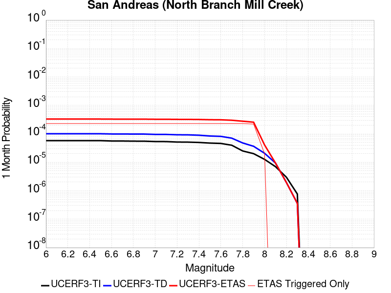 |  |  |

| Magnitude | 1 wk TI Prob | 1 wk TD Prob | 1 wk ETAS Prob | 1 wk ETAS/TD Gain | 1 wk ETAS Triggered Only | 1 mo TI Prob | 1 mo TD Prob | 1 mo ETAS Prob | 1 mo ETAS/TD Gain | 1 mo ETAS Triggered Only | 1 yr TI Prob | 1 yr TD Prob | 1 yr ETAS Prob | 1 yr ETAS/TD Gain | 1 yr ETAS Triggered Only | 10 yr TI Prob | 10 yr TD Prob | 10 yr ETAS Prob | 10 yr ETAS/TD Gain | 10 yr ETAS Triggered Only |
|-----|-----|-----|-----|-----|-----|-----|-----|-----|-----|-----|-----|-----|-----|-----|-----|-----|-----|-----|-----|-----|
| 6.0 | 1.3461156E-5 | 2.3499893E-5 | 1.934959E-4 | 8.233906 | 1.7E-4 | 5.7689394E-5 | 1.00709956E-4 | 3.306868E-4 | 3.283556 | 2.3E-4 | 7.02142E-4 | 0.0012254574 | 0.0015450652 | 1.260807 | 3.2E-4 | 0.0069992766 | 0.01222957 | 0.012644433 | 1.033923 | 4.2E-4 |
| 6.1 | 1.3461156E-5 | 2.3499893E-5 | 1.934959E-4 | 8.233906 | 1.7E-4 | 5.7689394E-5 | 1.00709956E-4 | 3.306868E-4 | 3.283556 | 2.3E-4 | 7.02142E-4 | 0.0012254574 | 0.0015450652 | 1.260807 | 3.2E-4 | 0.0069992766 | 0.01222957 | 0.012644433 | 1.033923 | 4.2E-4 |
| 6.2 | 1.3461156E-5 | 2.3499893E-5 | 1.934959E-4 | 8.233906 | 1.7E-4 | 5.7689394E-5 | 1.00709956E-4 | 3.306868E-4 | 3.283556 | 2.3E-4 | 7.02142E-4 | 0.0012254574 | 0.0015450652 | 1.260807 | 3.2E-4 | 0.0069992766 | 0.01222957 | 0.012644433 | 1.033923 | 4.2E-4 |
| 6.3 | 1.3461156E-5 | 2.3499893E-5 | 1.934959E-4 | 8.233906 | 1.7E-4 | 5.7689394E-5 | 1.00709956E-4 | 3.306868E-4 | 3.283556 | 2.3E-4 | 7.02142E-4 | 0.0012254574 | 0.0015450652 | 1.260807 | 3.2E-4 | 0.0069992766 | 0.01222957 | 0.012644433 | 1.033923 | 4.2E-4 |
| 6.4 | 1.3461156E-5 | 2.3499893E-5 | 1.934959E-4 | 8.233906 | 1.7E-4 | 5.7689394E-5 | 1.00709956E-4 | 3.306868E-4 | 3.283556 | 2.3E-4 | 7.02142E-4 | 0.0012254574 | 0.0015450652 | 1.260807 | 3.2E-4 | 0.0069992766 | 0.01222957 | 0.012644433 | 1.033923 | 4.2E-4 |
| 6.5 | 1.3450706E-5 | 2.3488852E-5 | 1.9348486E-4 | 8.237306 | 1.7E-4 | 5.764461E-5 | 1.0066265E-4 | 3.306395E-4 | 3.2846293 | 2.3E-4 | 7.0159714E-4 | 0.001224882 | 0.00154449 | 1.2609297 | 3.2E-4 | 0.006993862 | 0.01222388 | 0.012638746 | 1.033939 | 4.2E-4 |
| 6.6 | 1.3074523E-5 | 2.3103135E-5 | 1.9309921E-4 | 8.358138 | 1.7E-4 | 5.6032466E-5 | 9.9009696E-5 | 3.2898693E-4 | 3.3227746 | 2.3E-4 | 6.8198174E-4 | 0.0012047797 | 0.0015243941 | 1.2652887 | 3.2E-4 | 0.006798926 | 0.012025044 | 0.012439994 | 1.0345072 | 4.2E-4 |
| 6.7 | 1.3050216E-5 | 2.3078432E-5 | 1.930745E-4 | 8.366015 | 1.7E-4 | 5.59283E-5 | 9.890384E-5 | 3.2888108E-4 | 3.325261 | 2.3E-4 | 6.8071426E-4 | 0.0012034923 | 0.0015231072 | 1.2655729 | 3.2E-4 | 0.0067863287 | 0.012012309 | 0.012427264 | 1.0345441 | 4.2E-4 |
| 6.8 | 1.29049395E-5 | 2.292684E-5 | 1.9292295E-4 | 8.41472 | 1.7E-4 | 5.530571E-5 | 9.825421E-5 | 3.282316E-4 | 3.3406367 | 2.3E-4 | 6.73139E-4 | 0.0011955918 | 0.0015152091 | 1.2673299 | 3.2E-4 | 0.0067110364 | 0.011934154 | 0.012349142 | 1.0347731 | 4.2E-4 |
| 6.9 | 1.2867369E-5 | 2.2886245E-5 | 1.9288235E-4 | 8.427873 | 1.7E-4 | 5.51447E-5 | 9.8080236E-5 | 3.2805768E-4 | 3.3447888 | 2.3E-4 | 6.711799E-4 | 0.0011934759 | 0.0015130941 | 1.2678044 | 3.2E-4 | 0.006691564 | 0.011913223 | 0.01232822 | 1.034835 | 4.2E-4 |
| 7.0 | 1.2495996E-5 | 2.2286325E-5 | 1.9228253E-4 | 8.627826 | 1.7E-4 | 5.3553173E-5 | 9.550934E-5 | 3.2548737E-4 | 3.4079113 | 2.3E-4 | 6.518148E-4 | 0.0011622087 | 0.0014818369 | 1.2750177 | 3.2E-4 | 0.0064990623 | 0.0116038285 | 0.012009071 | 1.0349232 | 4.1E-4 |
| 7.1 | 1.2452067E-5 | 2.2231397E-5 | 1.9222761E-4 | 8.646672 | 1.7E-4 | 5.3364907E-5 | 9.527396E-5 | 3.2525204E-4 | 3.413861 | 2.3E-4 | 6.4952404E-4 | 0.0011593461 | 0.001478975 | 1.2756977 | 3.2E-4 | 0.0064762887 | 0.0115755 | 0.011980754 | 1.0350096 | 4.1E-4 |
| 7.2 | 1.2002777E-5 | 2.1609963E-5 | 1.9160629E-4 | 8.866571 | 1.7E-4 | 5.143946E-5 | 9.2610855E-5 | 3.2258956E-4 | 3.4832802 | 2.3E-4 | 6.2609545E-4 | 0.0011269567 | 0.001446596 | 1.2836306 | 3.2E-4 | 0.006243344 | 0.011254923 | 0.011660309 | 1.0360185 | 4.1E-4 |
| 7.3 | 1.1923425E-5 | 2.1479793E-5 | 1.9147614E-4 | 8.914246 | 1.7E-4 | 5.109939E-5 | 9.205302E-5 | 3.2203185E-4 | 3.49833 | 2.3E-4 | 6.219575E-4 | 0.001120172 | 0.0014398135 | 1.2853504 | 3.2E-4 | 0.0062021962 | 0.011187789 | 0.011593202 | 1.0362371 | 4.1E-4 |
| 7.4 | 1.16105175E-5 | 2.0853771E-5 | 1.9085023E-4 | 9.151833 | 1.7E-4 | 4.975841E-5 | 8.937026E-5 | 3.193497E-4 | 3.573333 | 2.3E-4 | 6.0564023E-4 | 0.0010875424 | 0.0014071943 | 1.2939214 | 3.2E-4 | 0.006039923 | 0.010865397 | 0.011270942 | 1.0373244 | 4.1E-4 |
| 7.5 | 1.1037265E-5 | 1.9553907E-5 | 1.8955058E-4 | 9.693745 | 1.7E-4 | 4.7301706E-5 | 8.379978E-5 | 3.137805E-4 | 3.7444072 | 2.3E-4 | 5.757461E-4 | 0.0010197869 | 0.0013394606 | 1.3134711 | 3.2E-4 | 0.005742567 | 0.010194898 | 0.010600718 | 1.0398062 | 4.1E-4 |
| 7.6 | 1.0720915E-5 | 1.899582E-5 | 1.8899259E-4 | 9.949168 | 1.7E-4 | 4.5945973E-5 | 8.140812E-5 | 3.113894E-4 | 3.8250408 | 2.3E-4 | 5.592486E-4 | 9.906954E-4 | 0.0013103784 | 1.3226855 | 3.2E-4 | 0.005578433 | 0.009906623 | 0.01031256 | 1.0409764 | 4.1E-4 |
| 7.7 | 9.276279E-6 | 1.6441649E-5 | 1.8643885E-4 | 11.339426 | 1.7E-4 | 3.9754876E-5 | 7.0462316E-5 | 3.0044612E-4 | 4.263926 | 2.3E-4 | 4.839081E-4 | 8.575427E-4 | 0.0011772682 | 1.3728392 | 3.2E-4 | 0.0048285574 | 0.008586041 | 0.008992521 | 1.047342 | 4.1E-4 |
| 7.8 | 5.8346777E-6 | 1.1155013E-5 | 1.8115311E-4 | 16.239614 | 1.7E-4 | 2.5005522E-5 | 4.7806327E-5 | 2.7779533E-4 | 5.8108487 | 2.3E-4 | 3.043997E-4 | 5.818867E-4 | 9.0170046E-4 | 1.5496153 | 3.2E-4 | 0.0030398308 | 0.0058469265 | 0.0062445877 | 1.068012 | 4.0E-4 |
| 7.9 | 4.690204E-6 | 8.509093E-6 | 1.6850773E-4 | 19.803253 | 1.6E-4 | 2.0100719E-5 | 3.6467034E-5 | 2.5645902E-4 | 7.032626 | 2.2E-4 | 2.4469878E-4 | 4.4389578E-4 | 7.3376705E-4 | 1.6530164 | 2.9E-4 | 0.002444295 | 0.0044707474 | 0.004839093 | 1.0823902 | 3.7E-4 |
| 8.0 | 2.9570454E-6 | 4.846947E-6 | 1.4846898E-5 | 3.0631444 | 1.0E-5 | 1.267299E-5 | 2.0772464E-5 | 4.0772047E-5 | 1.9627931 | 2.0E-5 | 1.5428272E-4 | 2.5287544E-4 | 2.8286784E-4 | 1.1186055 | 3.0E-5 | 0.0015417566 | 0.002549644 | 0.0025995167 | 1.0195606 | 5.0E-5 |
| 8.1 | 1.6376824E-6 | 2.1968929E-6 | 2.1968929E-6 | 1.0 | 0.0 | 7.01862E-6 | 9.41522E-6 | 9.41522E-6 | 1.0 | 0.0 | 8.544835E-5 | 1.14624294E-4 | 1.14624294E-4 | 1.0 | 0.0 | 8.54155E-4 | 0.0011606582 | 0.0011606582 | 1.0 | 0.0 |
| 8.2 | 6.9631557E-7 | 4.5360213E-7 | 4.5360213E-7 | 1.0 | 0.0 | 2.984206E-6 | 1.9440076E-6 | 1.9440076E-6 | 1.0 | 0.0 | 3.63321E-5 | 2.3668037E-5 | 2.3668037E-5 | 1.0 | 0.0 | 3.6326164E-4 | 2.451564E-4 | 2.451564E-4 | 1.0 | 0.0 |
| 8.3 | 1.7876137E-7 | 8.360375E-8 | 8.360375E-8 | 1.0 | 0.0 | 7.661199E-7 | 3.5830175E-7 | 3.5830175E-7 | 1.0 | 0.0 | 9.32747E-6 | 4.3623154E-6 | 4.3623154E-6 | 1.0 | 0.0 | 9.3270784E-5 | 4.5817014E-5 | 4.5817014E-5 | 1.0 | 0.0 |

## Ludlow
*[(top)](#table-of-contents)*

| 1 Week | 1 Month | 1 Year | 10 Year |
|-----|-----|-----|-----|
|  |  |  | 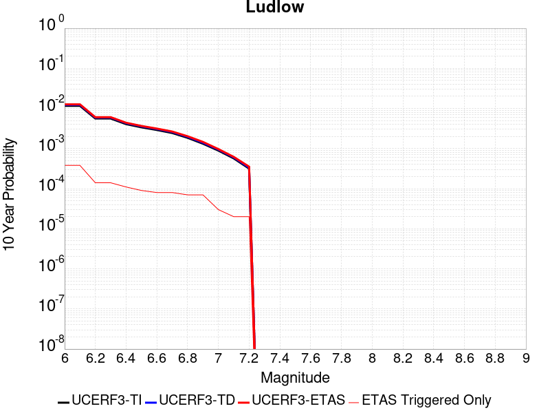 |

| Magnitude | 1 wk TI Prob | 1 wk TD Prob | 1 wk ETAS Prob | 1 wk ETAS/TD Gain | 1 wk ETAS Triggered Only | 1 mo TI Prob | 1 mo TD Prob | 1 mo ETAS Prob | 1 mo ETAS/TD Gain | 1 mo ETAS Triggered Only | 1 yr TI Prob | 1 yr TD Prob | 1 yr ETAS Prob | 1 yr ETAS/TD Gain | 1 yr ETAS Triggered Only | 10 yr TI Prob | 10 yr TD Prob | 10 yr ETAS Prob | 10 yr ETAS/TD Gain | 10 yr ETAS Triggered Only |
|-----|-----|-----|-----|-----|-----|-----|-----|-----|-----|-----|-----|-----|-----|-----|-----|-----|-----|-----|-----|-----|
| 6.0 | 2.2407607E-5 | 2.3657254E-5 | 1.3365466E-4 | 5.6496267 | 1.1E-4 | 9.602906E-5 | 1.0138454E-4 | 2.6136832E-4 | 2.5779898 | 1.6E-4 | 0.0011685267 | 0.001233702 | 0.0014933812 | 1.2104878 | 2.6E-4 | 0.011624013 | 0.012273042 | 0.0126483785 | 1.0305822 | 3.8E-4 |
| 6.1 | 2.2407607E-5 | 2.3657254E-5 | 1.3365466E-4 | 5.6496267 | 1.1E-4 | 9.602906E-5 | 1.0138454E-4 | 2.6136832E-4 | 2.5779898 | 1.6E-4 | 0.0011685267 | 0.001233702 | 0.0014933812 | 1.2104878 | 2.6E-4 | 0.011624013 | 0.012273042 | 0.0126483785 | 1.0305822 | 3.8E-4 |
| 6.2 | 1.0781252E-5 | 1.1365663E-5 | 4.136532E-5 | 3.6394992 | 3.0E-5 | 4.620455E-5 | 4.8709102E-5 | 8.870715E-5 | 1.8211617 | 4.0E-5 | 5.623952E-4 | 5.9287593E-4 | 6.6283444E-4 | 1.1179986 | 7.0E-5 | 0.00560974 | 0.0059133614 | 0.006052533 | 1.0235353 | 1.4E-4 |
| 6.3 | 1.0781252E-5 | 1.1365663E-5 | 4.136532E-5 | 3.6394992 | 3.0E-5 | 4.620455E-5 | 4.8709102E-5 | 8.870715E-5 | 1.8211617 | 4.0E-5 | 5.623952E-4 | 5.9287593E-4 | 6.6283444E-4 | 1.1179986 | 7.0E-5 | 0.00560974 | 0.0059133614 | 0.006052533 | 1.0235353 | 1.4E-4 |
| 6.4 | 7.814439E-6 | 8.237729E-6 | 2.8237564E-5 | 3.4278336 | 2.0E-5 | 3.3490025E-5 | 3.530408E-5 | 6.530302E-5 | 1.8497301 | 3.0E-5 | 4.0766477E-4 | 4.2974384E-4 | 4.8971805E-4 | 1.1395581 | 6.0E-5 | 0.0040691774 | 0.0042892746 | 0.0043988028 | 1.0255353 | 1.1E-4 |
| 6.5 | 6.4986366E-6 | 6.85092E-6 | 2.6850783E-5 | 3.919296 | 2.0E-5 | 2.7851002E-5 | 2.9360759E-5 | 4.9360173E-5 | 1.6811613 | 2.0E-5 | 3.390332E-4 | 3.5740953E-4 | 4.0739166E-4 | 1.1398455 | 5.0E-5 | 0.003385164 | 0.0035684432 | 0.0036581222 | 1.0251311 | 9.0E-5 |
| 6.6 | 5.582177E-6 | 5.8860055E-6 | 2.5885887E-5 | 4.39787 | 2.0E-5 | 2.3923398E-5 | 2.5225498E-5 | 4.5224995E-5 | 1.7928286 | 2.0E-5 | 2.9122844E-4 | 3.0707786E-4 | 3.470656E-4 | 1.1302202 | 4.0E-5 | 0.0029084706 | 0.003066609 | 0.0031463634 | 1.0260074 | 8.0E-5 |
| 6.7 | 4.6858763E-6 | 4.940427E-6 | 2.494033E-5 | 5.048213 | 2.0E-5 | 2.0082172E-5 | 2.1173091E-5 | 4.117267E-5 | 1.9445752 | 2.0E-5 | 2.4447302E-4 | 2.5775246E-4 | 2.9774214E-4 | 1.1551477 | 4.0E-5 | 0.0024420423 | 0.0025745912 | 0.0026543853 | 1.0309929 | 8.0E-5 |
| 6.8 | 3.5584908E-6 | 3.7520183E-6 | 2.3751943E-5 | 6.3304443 | 2.0E-5 | 1.5250586E-5 | 1.6079981E-5 | 3.607966E-5 | 2.2437625 | 2.0E-5 | 1.8566006E-4 | 1.957566E-4 | 2.3574877E-4 | 1.2042954 | 4.0E-5 | 0.0018550502 | 0.0019558826 | 0.0020257458 | 1.0357195 | 7.0E-5 |
| 6.9 | 2.532834E-6 | 2.6710034E-6 | 2.267095E-5 | 8.4878025 | 2.0E-5 | 1.0854958E-5 | 1.1447109E-5 | 3.144688E-5 | 2.7471461 | 2.0E-5 | 1.3215111E-4 | 1.3935992E-4 | 1.7935435E-4 | 1.2869866 | 4.0E-5 | 0.0013207254 | 0.0013927529 | 0.0014626554 | 1.0501902 | 7.0E-5 |
| 7.0 | 1.7083285E-6 | 1.8019439E-6 | 1.8019439E-6 | 1.0 | 0.0 | 7.3213873E-6 | 7.722595E-6 | 7.722595E-6 | 1.0 | 0.0 | 8.913424E-5 | 9.40187E-5 | 1.0401776E-4 | 1.1063519 | 1.0E-5 | 8.9098496E-4 | 9.3980576E-4 | 9.697775E-4 | 1.0318915 | 3.0E-5 |
| 7.1 | 1.0905424E-6 | 1.1497619E-6 | 1.1497619E-6 | 1.0 | 0.0 | 4.6737446E-6 | 4.9275427E-6 | 4.9275427E-6 | 1.0 | 0.0 | 5.6901354E-5 | 5.999128E-5 | 6.999068E-5 | 1.1666809 | 1.0E-5 | 5.6886784E-4 | 5.997606E-4 | 6.197486E-4 | 1.0333266 | 2.0E-5 |
| 7.2 | 6.06668E-7 | 6.387277E-7 | 6.387277E-7 | 1.0 | 0.0 | 2.600003E-6 | 2.7374022E-6 | 2.7374022E-6 | 1.0 | 0.0 | 3.1654577E-5 | 3.3327433E-5 | 4.3327098E-5 | 1.3000431 | 1.0E-5 | 3.1650066E-4 | 3.3323118E-4 | 3.5322452E-4 | 1.0599984 | 2.0E-5 |

## San Jacinto (San Bernardino)
*[(top)](#table-of-contents)*

| 1 Week | 1 Month | 1 Year | 10 Year |
|-----|-----|-----|-----|
| 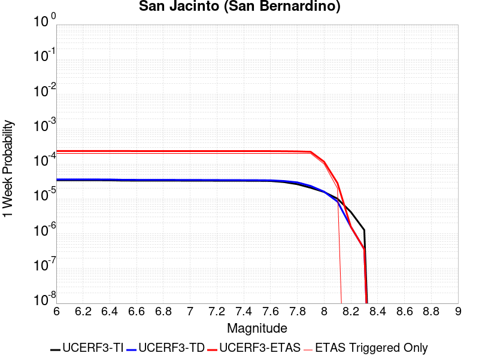 | 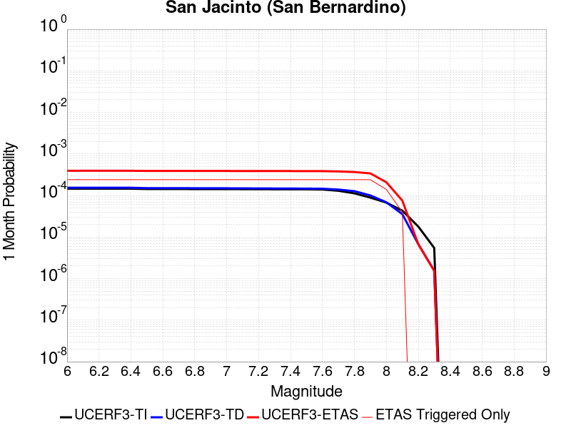 |  |  |

| Magnitude | 1 wk TI Prob | 1 wk TD Prob | 1 wk ETAS Prob | 1 wk ETAS/TD Gain | 1 wk ETAS Triggered Only | 1 mo TI Prob | 1 mo TD Prob | 1 mo ETAS Prob | 1 mo ETAS/TD Gain | 1 mo ETAS Triggered Only | 1 yr TI Prob | 1 yr TD Prob | 1 yr ETAS Prob | 1 yr ETAS/TD Gain | 1 yr ETAS Triggered Only | 10 yr TI Prob | 10 yr TD Prob | 10 yr ETAS Prob | 10 yr ETAS/TD Gain | 10 yr ETAS Triggered Only |
|-----|-----|-----|-----|-----|-----|-----|-----|-----|-----|-----|-----|-----|-----|-----|-----|-----|-----|-----|-----|-----|
| 6.0 | 3.409352E-5 | 3.5986508E-5 | 2.3597931E-4 | 6.5574384 | 2.0E-4 | 1.461069E-4 | 1.542188E-4 | 3.9418178E-4 | 2.5559905 | 2.4E-4 | 0.0017774 | 0.0018759987 | 0.002175436 | 1.1596148 | 3.0E-4 | 0.01763251 | 0.019349935 | 0.019742195 | 1.0202719 | 4.0E-4 |
| 6.1 | 3.409352E-5 | 3.5986508E-5 | 2.3597931E-4 | 6.5574384 | 2.0E-4 | 1.461069E-4 | 1.542188E-4 | 3.9418178E-4 | 2.5559905 | 2.4E-4 | 0.0017774 | 0.0018759987 | 0.002175436 | 1.1596148 | 3.0E-4 | 0.01763251 | 0.019349935 | 0.019742195 | 1.0202719 | 4.0E-4 |
| 6.2 | 3.409352E-5 | 3.5986508E-5 | 2.3597931E-4 | 6.5574384 | 2.0E-4 | 1.461069E-4 | 1.542188E-4 | 3.9418178E-4 | 2.5559905 | 2.4E-4 | 0.0017774 | 0.0018759987 | 0.002175436 | 1.1596148 | 3.0E-4 | 0.01763251 | 0.019349935 | 0.019742195 | 1.0202719 | 4.0E-4 |
| 6.3 | 3.409352E-5 | 3.5986508E-5 | 2.3597931E-4 | 6.5574384 | 2.0E-4 | 1.461069E-4 | 1.542188E-4 | 3.9418178E-4 | 2.5559905 | 2.4E-4 | 0.0017774 | 0.0018759987 | 0.002175436 | 1.1596148 | 3.0E-4 | 0.01763251 | 0.019349935 | 0.019742195 | 1.0202719 | 4.0E-4 |
| 6.4 | 3.400795E-5 | 3.5879173E-5 | 2.35872E-4 | 6.5740647 | 2.0E-4 | 1.4574021E-4 | 1.5375883E-4 | 3.9372192E-4 | 2.560646 | 2.4E-4 | 0.0017729428 | 0.0018704084 | 0.0021698473 | 1.1600928 | 3.0E-4 | 0.017588645 | 0.019295016 | 0.019687299 | 1.0203308 | 4.0E-4 |
| 6.5 | 3.341482E-5 | 3.5139812E-5 | 2.3513279E-4 | 6.6913505 | 2.0E-4 | 1.4319851E-4 | 1.5059051E-4 | 3.9055437E-4 | 2.593486 | 2.4E-4 | 0.0017420477 | 0.0018318989 | 0.0021313494 | 1.1634645 | 3.0E-4 | 0.017284546 | 0.018916558 | 0.019299181 | 1.0202268 | 3.9E-4 |
| 6.6 | 3.3364955E-5 | 3.5077028E-5 | 2.3507001E-4 | 6.701537 | 2.0E-4 | 1.4298483E-4 | 1.5032147E-4 | 3.902854E-4 | 2.5963383 | 2.4E-4 | 0.0017394501 | 0.001828629 | 0.0021280805 | 1.1637573 | 3.0E-4 | 0.017258976 | 0.018884424 | 0.019267058 | 1.0202619 | 3.9E-4 |
| 6.7 | 3.335922E-5 | 3.5066805E-5 | 2.350598E-4 | 6.7032 | 2.0E-4 | 1.4296026E-4 | 1.5027766E-4 | 3.902416E-4 | 2.596804 | 2.4E-4 | 0.0017391514 | 0.0018280965 | 0.002127548 | 1.1638051 | 3.0E-4 | 0.017256035 | 0.018879214 | 0.019261852 | 1.0202676 | 3.9E-4 |
| 6.8 | 3.327683E-5 | 3.496087E-5 | 2.3495388E-4 | 6.7204814 | 2.0E-4 | 1.4260718E-4 | 1.498237E-4 | 3.8978775E-4 | 2.6016428 | 2.4E-4 | 0.0017348597 | 0.0018225788 | 0.002122032 | 1.164302 | 3.0E-4 | 0.017213784 | 0.018824987 | 0.019207645 | 1.0203271 | 3.9E-4 |
| 6.9 | 3.3235785E-5 | 3.4901823E-5 | 2.3489485E-4 | 6.7301598 | 2.0E-4 | 1.4243131E-4 | 1.4957068E-4 | 3.8953478E-4 | 2.6043525 | 2.4E-4 | 0.0017327217 | 0.0018195034 | 0.0021189575 | 1.1645801 | 3.0E-4 | 0.017192734 | 0.018794855 | 0.019177524 | 1.0203604 | 3.9E-4 |
| 7.0 | 3.3197095E-5 | 3.4841752E-5 | 2.3483479E-4 | 6.7400393 | 2.0E-4 | 1.422655E-4 | 1.4931326E-4 | 3.8927744E-4 | 2.6071188 | 2.4E-4 | 0.0017307063 | 0.0018163746 | 0.0021158296 | 1.1648642 | 3.0E-4 | 0.017172894 | 0.018764233 | 0.019146916 | 1.0203942 | 3.9E-4 |
| 7.1 | 3.3129716E-5 | 3.4721965E-5 | 2.3471501E-4 | 6.759843 | 2.0E-4 | 1.4197677E-4 | 1.4879994E-4 | 3.8876422E-4 | 2.6126637 | 2.4E-4 | 0.0017271966 | 0.0018101353 | 0.0021095923 | 1.1654334 | 3.0E-4 | 0.017138338 | 0.018703312 | 0.019086018 | 1.0204619 | 3.9E-4 |
| 7.2 | 3.3034008E-5 | 3.458941E-5 | 2.3458249E-4 | 6.781916 | 2.0E-4 | 1.4156665E-4 | 1.4823192E-4 | 3.8819635E-4 | 2.6188445 | 2.4E-4 | 0.0017222111 | 0.0018032312 | 0.0021026903 | 1.1660681 | 3.0E-4 | 0.017089253 | 0.018635705 | 0.019018438 | 1.0205376 | 3.9E-4 |
| 7.3 | 3.2956614E-5 | 3.445717E-5 | 2.3445027E-4 | 6.804107 | 2.0E-4 | 1.4123498E-4 | 1.4766524E-4 | 3.8762979E-4 | 2.625058 | 2.4E-4 | 0.0017181796 | 0.0017963431 | 0.0020958043 | 1.166706 | 3.0E-4 | 0.017049557 | 0.018568452 | 0.018951211 | 1.0206133 | 3.9E-4 |
| 7.4 | 3.2915937E-5 | 3.4378863E-5 | 2.3437198E-4 | 6.817328 | 2.0E-4 | 1.4106068E-4 | 1.4732967E-4 | 3.8729433E-4 | 2.6287596 | 2.4E-4 | 0.0017160608 | 0.0017922645 | 0.0020917268 | 1.167086 | 3.0E-4 | 0.017028693 | 0.018528719 | 0.018911492 | 1.0206584 | 3.9E-4 |
| 7.5 | 3.281791E-5 | 3.4243778E-5 | 2.3423693E-4 | 6.8402767 | 2.0E-4 | 1.406406E-4 | 1.4675081E-4 | 3.8671558E-4 | 2.6351855 | 2.4E-4 | 0.0017109542 | 0.0017852283 | 0.0020846927 | 1.1677457 | 3.0E-4 | 0.016978411 | 0.018459605 | 0.018842407 | 1.0207372 | 3.9E-4 |
| 7.6 | 3.2521442E-5 | 3.396873E-5 | 2.3396194E-4 | 6.887568 | 2.0E-4 | 1.3937015E-4 | 1.4557215E-4 | 3.8553722E-4 | 2.648427 | 2.4E-4 | 0.0016955109 | 0.0017709016 | 0.0020703704 | 1.1691052 | 3.0E-4 | 0.016826328 | 0.018317232 | 0.018690273 | 1.0203655 | 3.8E-4 |
| 7.7 | 3.0287873E-5 | 3.245276E-5 | 2.3244627E-4 | 7.1626034 | 2.0E-4 | 1.297987E-4 | 1.3907586E-4 | 3.7904247E-4 | 2.725437 | 2.4E-4 | 0.0015791537 | 0.0016919347 | 0.001991427 | 1.1770118 | 3.0E-4 | 0.01567979 | 0.01752809 | 0.01790143 | 1.0212995 | 3.8E-4 |
| 7.8 | 2.6316151E-5 | 2.9663592E-5 | 2.2965766E-4 | 7.742072 | 2.0E-4 | 1.1277862E-4 | 1.2712348E-4 | 3.67093E-4 | 2.8876882 | 2.4E-4 | 0.0013722149 | 0.0015466306 | 0.0018461666 | 1.19367 | 3.0E-4 | 0.013637724 | 0.016069634 | 0.016443528 | 1.023267 | 3.8E-4 |
| 7.9 | 2.0761147E-5 | 2.34181E-5 | 2.2341342E-4 | 9.540202 | 2.0E-4 | 8.897331E-5 | 1.0035944E-4 | 3.4033536E-4 | 3.3911645 | 2.4E-4 | 0.0010827117 | 0.0012211921 | 0.0015108379 | 1.2371829 | 2.9E-4 | 0.010774517 | 0.012793174 | 0.013148569 | 1.02778 | 3.6E-4 |
| 8.0 | 1.5738568E-5 | 1.6033575E-5 | 1.1603197E-4 | 7.236812 | 1.0E-4 | 6.744926E-5 | 6.871352E-5 | 2.087039E-4 | 3.0373049 | 1.4E-4 | 8.2088535E-4 | 8.3626667E-4 | 0.0010061244 | 1.2031144 | 1.7E-4 | 0.008178596 | 0.008865921 | 0.009093882 | 1.025712 | 2.3E-4 |
| 8.1 | 1.0105832E-5 | 8.3304985E-6 | 2.8330332E-5 | 3.400797 | 2.0E-5 | 4.3309992E-5 | 3.570165E-5 | 7.570022E-5 | 2.1203563 | 4.0E-5 | 5.2717153E-4 | 4.345814E-4 | 4.8455968E-4 | 1.1150032 | 5.0E-5 | 0.005259227 | 0.004677232 | 0.0047568576 | 1.0170242 | 8.0E-5 |
| 8.2 | 4.189207E-6 | 1.5784357E-6 | 1.5784357E-6 | 1.0 | 0.0 | 1.7953622E-5 | 6.7647065E-6 | 6.7647065E-6 | 1.0 | 0.0 | 2.1856341E-4 | 8.235722E-5 | 9.235639E-5 | 1.1214123 | 1.0E-5 | 0.0021834858 | 9.565867E-4 | 9.6657715E-4 | 1.0104438 | 1.0E-5 |
| 8.3 | 1.2758221E-6 | 3.6149942E-7 | 3.6149942E-7 | 1.0 | 0.0 | 5.4677976E-6 | 1.5492824E-6 | 1.5492824E-6 | 1.0 | 0.0 | 6.65684E-5 | 1.8862354E-5 | 2.8862165E-5 | 1.5301465 | 1.0E-5 | 6.6548464E-4 | 2.2751294E-4 | 2.3751067E-4 | 1.0439435 | 1.0E-5 |

## Baker
*[(top)](#table-of-contents)*

| 1 Week | 1 Month | 1 Year | 10 Year |
|-----|-----|-----|-----|
| 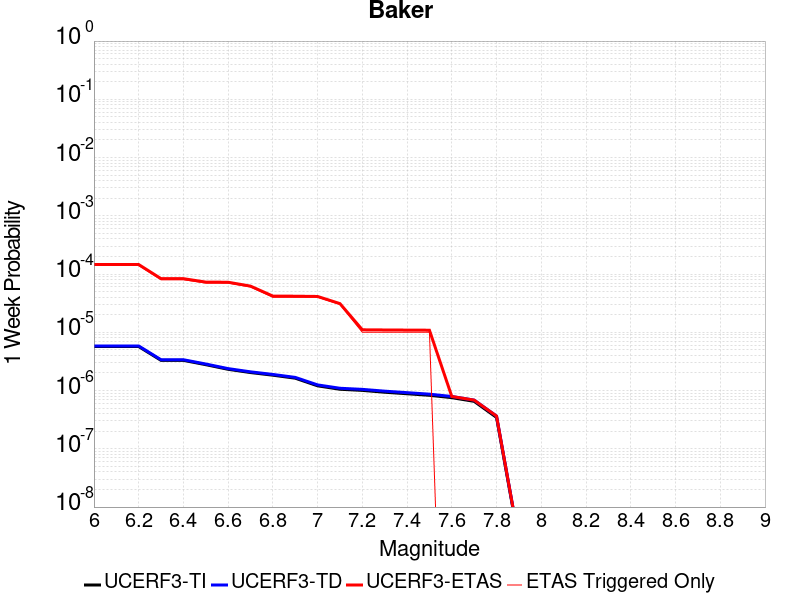 |  |  |  |

| Magnitude | 1 wk TI Prob | 1 wk TD Prob | 1 wk ETAS Prob | 1 wk ETAS/TD Gain | 1 wk ETAS Triggered Only | 1 mo TI Prob | 1 mo TD Prob | 1 mo ETAS Prob | 1 mo ETAS/TD Gain | 1 mo ETAS Triggered Only | 1 yr TI Prob | 1 yr TD Prob | 1 yr ETAS Prob | 1 yr ETAS/TD Gain | 1 yr ETAS Triggered Only | 10 yr TI Prob | 10 yr TD Prob | 10 yr ETAS Prob | 10 yr ETAS/TD Gain | 10 yr ETAS Triggered Only |
|-----|-----|-----|-----|-----|-----|-----|-----|-----|-----|-----|-----|-----|-----|-----|-----|-----|-----|-----|-----|-----|
| 6.0 | 5.695525E-6 | 5.8348373E-6 | 1.4583403E-4 | 24.993675 | 1.4E-4 | 2.4409164E-5 | 2.5006228E-5 | 2.0500172E-4 | 8.198027 | 1.8E-4 | 2.9714106E-4 | 3.044123E-4 | 5.8432703E-4 | 1.9195251 | 2.8E-4 | 0.0029674405 | 0.0030403486 | 0.003429163 | 1.1278847 | 3.9E-4 |
| 6.1 | 5.695525E-6 | 5.8348373E-6 | 1.4583403E-4 | 24.993675 | 1.4E-4 | 2.4409164E-5 | 2.5006228E-5 | 2.0500172E-4 | 8.198027 | 1.8E-4 | 2.9714106E-4 | 3.044123E-4 | 5.8432703E-4 | 1.9195251 | 2.8E-4 | 0.0029674405 | 0.0030403486 | 0.003429163 | 1.1278847 | 3.9E-4 |
| 6.2 | 5.695525E-6 | 5.8348373E-6 | 1.4583403E-4 | 24.993675 | 1.4E-4 | 2.4409164E-5 | 2.5006228E-5 | 2.0500172E-4 | 8.198027 | 1.8E-4 | 2.9714106E-4 | 3.044123E-4 | 5.8432703E-4 | 1.9195251 | 2.8E-4 | 0.0029674405 | 0.0030403486 | 0.003429163 | 1.1278847 | 3.9E-4 |
| 6.3 | 3.2995713E-6 | 3.383667E-6 | 8.33834E-5 | 24.642908 | 8.0E-5 | 1.4140943E-5 | 1.4501353E-5 | 1.2449975E-4 | 8.585389 | 1.1E-4 | 1.7215237E-4 | 1.7654014E-4 | 3.665066E-4 | 2.0760524 | 1.9E-4 | 0.0017201907 | 0.001764046 | 0.0020335696 | 1.1527872 | 2.7E-4 |
| 6.4 | 3.2995713E-6 | 3.383667E-6 | 8.33834E-5 | 24.642908 | 8.0E-5 | 1.4140943E-5 | 1.4501353E-5 | 1.2449975E-4 | 8.585389 | 1.1E-4 | 1.7215237E-4 | 1.7654014E-4 | 3.665066E-4 | 2.0760524 | 1.9E-4 | 0.0017201907 | 0.001764046 | 0.0020335696 | 1.1527872 | 2.7E-4 |
| 6.5 | 2.782202E-6 | 2.8558404E-6 | 7.285564E-5 | 25.511103 | 7.0E-5 | 1.1923668E-5 | 1.223926E-5 | 1.12238034E-4 | 9.170328 | 1.0E-4 | 1.4516099E-4 | 1.4900314E-4 | 3.289763E-4 | 2.2078483 | 1.8E-4 | 0.001450662 | 0.0014890651 | 0.0017386929 | 1.1676406 | 2.5E-4 |
| 6.6 | 2.3163404E-6 | 2.38092E-6 | 7.238075E-5 | 30.40033 | 7.0E-5 | 9.927136E-6 | 1.0203904E-5 | 1.0020298E-4 | 9.820064 | 9.0E-5 | 1.20856166E-4 | 1.2422565E-4 | 2.8420577E-4 | 2.2878187 | 1.6E-4 | 0.0012079047 | 0.0012415823 | 0.0014712968 | 1.1850175 | 2.3E-4 |
| 6.7 | 2.037056E-6 | 2.0965003E-6 | 6.209638E-5 | 29.61906 | 6.0E-5 | 8.7302105E-6 | 8.984972E-6 | 8.8984256E-5 | 9.903676 | 8.0E-5 | 1.0628513E-4 | 1.093867E-4 | 2.3937249E-4 | 2.1883142 | 1.3E-4 | 0.0010623431 | 0.0010933448 | 0.001273148 | 1.1644524 | 1.8E-4 |
| 6.8 | 1.8356744E-6 | 1.8915287E-6 | 4.1891453E-5 | 22.146877 | 4.0E-5 | 7.867153E-6 | 8.106527E-6 | 6.810604E-5 | 8.401383 | 6.0E-5 | 9.577837E-5 | 9.869264E-5 | 2.0868178E-4 | 2.1144614 | 1.1E-4 | 9.57371E-4 | 9.86502E-4 | 0.0011463442 | 1.1620293 | 1.6E-4 |
| 6.9 | 1.6310546E-6 | 1.6832072E-6 | 4.168314E-5 | 24.764116 | 4.0E-5 | 6.9902153E-6 | 7.213726E-6 | 6.7213296E-5 | 9.317417 | 6.0E-5 | 8.510255E-5 | 8.782368E-5 | 1.878149E-4 | 2.138545 | 1.0E-4 | 8.5069967E-4 | 8.7790104E-4 | 0.0010277694 | 1.1707121 | 1.5E-4 |
| 7.0 | 1.2058036E-6 | 1.2508665E-6 | 4.1250816E-5 | 32.97779 | 4.0E-5 | 5.1677193E-6 | 5.3608455E-6 | 6.5360524E-5 | 12.1922035 | 6.0E-5 | 6.291517E-5 | 6.5266366E-5 | 1.552605E-4 | 2.3788745 | 9.0E-5 | 6.289736E-4 | 6.524743E-4 | 7.72396E-4 | 1.1837953 | 1.2E-4 |
| 7.1 | 1.052382E-6 | 1.0951609E-6 | 3.109513E-5 | 28.393206 | 3.0E-5 | 4.5102006E-6 | 4.693538E-6 | 5.4693304E-5 | 11.652894 | 5.0E-5 | 5.491031E-5 | 5.7142337E-5 | 1.3713776E-4 | 2.3999329 | 8.0E-5 | 5.4896745E-4 | 5.7127734E-4 | 6.812145E-4 | 1.192441 | 1.1E-4 |
| 7.2 | 1.0067454E-6 | 1.0487711E-6 | 1.1048761E-5 | 10.53496 | 1.0E-5 | 4.3146156E-6 | 4.4947255E-6 | 3.449459E-5 | 7.67446 | 3.0E-5 | 5.252918E-5 | 5.4721917E-5 | 1.0471918E-4 | 1.9136606 | 5.0E-5 | 5.251676E-4 | 5.470853E-4 | 6.270415E-4 | 1.1461495 | 8.0E-5 |
| 7.3 | 9.3596316E-7 | 9.767723E-7 | 1.09767625E-5 | 11.23779 | 1.0E-5 | 4.0112645E-6 | 4.1861604E-6 | 3.4186036E-5 | 8.166442 | 3.0E-5 | 4.8836053E-5 | 5.096532E-5 | 1.00962774E-4 | 1.9810092 | 5.0E-5 | 4.8825322E-4 | 5.095371E-4 | 5.7950144E-4 | 1.1373096 | 7.0E-5 |
| 7.4 | 8.8117395E-7 | 9.2076635E-7 | 1.0920757E-5 | 11.860509 | 1.0E-5 | 3.7764542E-6 | 3.9461356E-6 | 3.3946017E-5 | 8.6023445 | 3.0E-5 | 4.5977362E-5 | 4.8043148E-5 | 9.804075E-5 | 2.0406811 | 5.0E-5 | 4.596785E-4 | 4.8032837E-4 | 5.5029476E-4 | 1.1456636 | 7.0E-5 |
| 7.5 | 8.292386E-7 | 8.6745956E-7 | 1.0867451E-5 | 12.5279045 | 1.0E-5 | 3.5538749E-6 | 3.7176785E-6 | 3.3717566E-5 | 9.069522 | 3.0E-5 | 4.326757E-5 | 4.5261804E-5 | 9.5259544E-5 | 2.1046343 | 5.0E-5 | 4.3259145E-4 | 4.5252658E-4 | 5.124994E-4 | 1.1325289 | 6.0E-5 |
| 7.6 | 7.553842E-7 | 7.9144706E-7 | 7.9144706E-7 | 1.0 | 0.0 | 3.2373566E-6 | 3.3919116E-6 | 1.33918775E-5 | 3.94818 | 1.0E-5 | 3.9414106E-5 | 4.129575E-5 | 7.129451E-5 | 1.7264371 | 3.0E-5 | 3.9407116E-4 | 4.1288146E-4 | 4.5286494E-4 | 1.0968401 | 4.0E-5 |
| 7.7 | 6.5285366E-7 | 6.852797E-7 | 6.852797E-7 | 1.0 | 0.0 | 2.797941E-6 | 2.9369096E-6 | 1.293688E-5 | 4.4049296 | 1.0E-5 | 3.40644E-5 | 3.5756293E-5 | 6.575522E-5 | 1.838983 | 3.0E-5 | 3.405918E-4 | 3.5750607E-4 | 3.9749176E-4 | 1.1118462 | 4.0E-5 |
| 7.8 | 3.4586725E-7 | 3.6482615E-7 | 3.6482615E-7 | 1.0 | 0.0 | 1.4822873E-6 | 1.5635396E-6 | 1.1563524E-5 | 7.3957343 | 1.0E-5 | 1.80467E-5 | 1.9035933E-5 | 3.9035553E-5 | 2.0506246 | 2.0E-5 | 1.8045233E-4 | 1.9034347E-4 | 2.2033777E-4 | 1.1575798 | 3.0E-5 |
| 7.9 | 2.5591178E-9 | 2.6696718E-9 | 2.6696718E-9 | 1.0 | 0.0 | 1.0967647E-8 | 1.14414505E-8 | 1.14414505E-8 | 1.0 | 0.0 | 1.335311E-7 | 1.3929966E-7 | 1.3929966E-7 | 1.0 | 0.0 | 1.3353102E-6 | 1.3929966E-6 | 1.3929966E-6 | 1.0 | 0.0 |

## Scodie Lineament
*[(top)](#table-of-contents)*

| 1 Week | 1 Month | 1 Year | 10 Year |
|-----|-----|-----|-----|
|  | 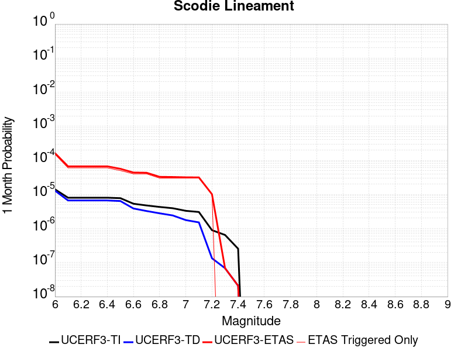 |  |  |

| Magnitude | 1 wk TI Prob | 1 wk TD Prob | 1 wk ETAS Prob | 1 wk ETAS/TD Gain | 1 wk ETAS Triggered Only | 1 mo TI Prob | 1 mo TD Prob | 1 mo ETAS Prob | 1 mo ETAS/TD Gain | 1 mo ETAS Triggered Only | 1 yr TI Prob | 1 yr TD Prob | 1 yr ETAS Prob | 1 yr ETAS/TD Gain | 1 yr ETAS Triggered Only | 10 yr TI Prob | 10 yr TD Prob | 10 yr ETAS Prob | 10 yr ETAS/TD Gain | 10 yr ETAS Triggered Only |
|-----|-----|-----|-----|-----|-----|-----|-----|-----|-----|-----|-----|-----|-----|-----|-----|-----|-----|-----|-----|-----|
| 6.0 | 3.2919327E-6 | 3.0133422E-6 | 1.1301301E-4 | 37.504208 | 1.1E-4 | 1.4108206E-5 | 1.2914278E-5 | 1.6291234E-4 | 12.614902 | 1.5E-4 | 1.7175387E-4 | 1.5722317E-4 | 3.9718542E-4 | 2.5262525 | 2.4E-4 | 0.0017162118 | 0.0015714309 | 0.0019408495 | 1.2350842 | 3.7E-4 |
| 6.1 | 1.8663811E-6 | 1.5490499E-6 | 4.154899E-5 | 26.822239 | 4.0E-5 | 7.998751E-6 | 6.6387715E-6 | 6.663837E-5 | 10.037757 | 6.0E-5 | 9.738045E-5 | 8.082454E-5 | 1.6081808E-4 | 1.9897184 | 8.0E-5 | 9.7337784E-4 | 8.080003E-4 | 9.1791135E-4 | 1.1360285 | 1.1E-4 |
| 6.2 | 1.8663811E-6 | 1.5490499E-6 | 4.154899E-5 | 26.822239 | 4.0E-5 | 7.998751E-6 | 6.6387715E-6 | 6.663837E-5 | 10.037757 | 6.0E-5 | 9.738045E-5 | 8.082454E-5 | 1.6081808E-4 | 1.9897184 | 8.0E-5 | 9.7337784E-4 | 8.080003E-4 | 9.1791135E-4 | 1.1360285 | 1.1E-4 |
| 6.3 | 1.8663811E-6 | 1.5490499E-6 | 4.154899E-5 | 26.822239 | 4.0E-5 | 7.998751E-6 | 6.6387715E-6 | 6.663837E-5 | 10.037757 | 6.0E-5 | 9.738045E-5 | 8.082454E-5 | 1.6081808E-4 | 1.9897184 | 8.0E-5 | 9.7337784E-4 | 8.080003E-4 | 9.1791135E-4 | 1.1360285 | 1.1E-4 |
| 6.4 | 1.8663811E-6 | 1.5490499E-6 | 4.154899E-5 | 26.822239 | 4.0E-5 | 7.998751E-6 | 6.6387715E-6 | 6.663837E-5 | 10.037757 | 6.0E-5 | 9.738045E-5 | 8.082454E-5 | 1.6081808E-4 | 1.9897184 | 8.0E-5 | 9.7337784E-4 | 8.080003E-4 | 9.1791135E-4 | 1.1360285 | 1.1E-4 |
| 6.5 | 1.8106311E-6 | 1.4909839E-6 | 4.1490923E-5 | 27.82788 | 4.0E-5 | 7.759824E-6 | 6.3899183E-6 | 5.63896E-5 | 8.824776 | 5.0E-5 | 9.447177E-5 | 7.7794975E-5 | 1.4778953E-4 | 1.899731 | 7.0E-5 | 9.4431615E-4 | 7.7772606E-4 | 8.776483E-4 | 1.12848 | 1.0E-4 |
| 6.6 | 1.2414679E-6 | 8.997558E-7 | 3.089973E-5 | 34.34235 | 3.0E-5 | 5.320566E-6 | 3.856091E-6 | 4.3855936E-5 | 11.373159 | 4.0E-5 | 6.477596E-5 | 4.6946985E-5 | 1.06944164E-4 | 2.2779775 | 6.0E-5 | 6.475708E-4 | 4.693793E-4 | 5.393465E-4 | 1.1490631 | 7.0E-5 |
| 6.7 | 1.1062215E-6 | 7.594311E-7 | 3.075941E-5 | 40.503223 | 3.0E-5 | 4.7409408E-6 | 3.2547011E-6 | 4.325457E-5 | 13.289875 | 4.0E-5 | 5.7719422E-5 | 3.9625334E-5 | 9.962296E-5 | 2.5141227 | 6.0E-5 | 5.770443E-4 | 3.961897E-4 | 4.6616196E-4 | 1.1766131 | 7.0E-5 |
| 6.8 | 1.0006736E-6 | 6.500397E-7 | 2.0650026E-5 | 31.767332 | 2.0E-5 | 4.288594E-6 | 2.7858816E-6 | 3.27858E-5 | 11.768554 | 3.0E-5 | 5.221238E-5 | 3.3917644E-5 | 8.391595E-5 | 2.474109 | 5.0E-5 | 5.220012E-4 | 3.3913075E-4 | 3.991104E-4 | 1.176863 | 6.0E-5 |
| 6.9 | 9.167364E-7 | 5.631625E-7 | 2.0563151E-5 | 36.51371 | 2.0E-5 | 3.9288643E-6 | 2.4135516E-6 | 3.2413478E-5 | 13.429786 | 3.0E-5 | 4.7832873E-5 | 2.9384651E-5 | 7.938318E-5 | 2.7015185 | 5.0E-5 | 4.782258E-4 | 2.9381333E-4 | 3.537957E-4 | 1.2041513 | 6.0E-5 |
| 7.0 | 7.6987664E-7 | 4.113383E-7 | 2.041133E-5 | 49.62176 | 2.0E-5 | 3.2994672E-6 | 1.7628774E-6 | 3.1762826E-5 | 18.017603 | 3.0E-5 | 4.0170275E-5 | 2.1462862E-5 | 7.1461785E-5 | 3.3295555 | 5.0E-5 | 4.0163012E-4 | 2.1461173E-4 | 2.64601E-4 | 1.2329289 | 5.0E-5 |
| 7.1 | 7.1038727E-7 | 3.5211494E-7 | 2.0352109E-5 | 57.799618 | 2.0E-5 | 3.0445133E-6 | 1.5090633E-6 | 3.150902E-5 | 20.879852 | 3.0E-5 | 3.706632E-5 | 1.8372726E-5 | 6.837181E-5 | 3.7213752 | 5.0E-5 | 3.7060137E-4 | 1.8371557E-4 | 2.3370638E-4 | 1.2721099 | 5.0E-5 |
| 7.2 | 2.0799602E-7 | 3.1186854E-8 | 1.0031186E-5 | 321.64792 | 1.0E-5 | 8.914113E-7 | 1.3365793E-7 | 1.0133656E-5 | 75.81784 | 1.0E-5 | 1.0852878E-5 | 1.6272843E-6 | 1.1627268E-5 | 7.145198 | 1.0E-5 | 1.08523476E-4 | 1.627273E-5 | 2.6272568E-5 | 1.6145151 | 1.0E-5 |
| 7.3 | 1.5048182E-7 | 1.5945696E-8 | 1.5945696E-8 | 1.0 | 0.0 | 6.449219E-7 | 6.83387E-8 | 6.83387E-8 | 1.0 | 0.0 | 7.851896E-6 | 8.320234E-7 | 8.320234E-7 | 1.0 | 0.0 | 7.851618E-5 | 8.320206E-6 | 8.320206E-6 | 1.0 | 0.0 |
| 7.4 | 5.9334678E-8 | 4.8683537E-9 | 4.8683537E-9 | 1.0 | 0.0 | 2.5429145E-7 | 2.0864372E-8 | 2.0864372E-8 | 1.0 | 0.0 | 3.095994E-6 | 2.5402372E-7 | 2.5402372E-7 | 1.0 | 0.0 | 3.095951E-5 | 2.5402353E-6 | 2.5402353E-6 | 1.0 | 0.0 |

## Manix-Afton Hills
*[(top)](#table-of-contents)*

| 1 Week | 1 Month | 1 Year | 10 Year |
|-----|-----|-----|-----|
|  |  |  | 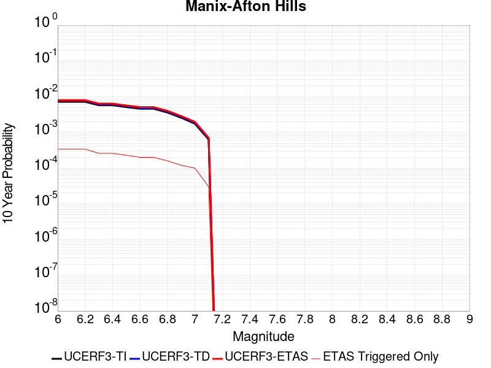 |

| Magnitude | 1 wk TI Prob | 1 wk TD Prob | 1 wk ETAS Prob | 1 wk ETAS/TD Gain | 1 wk ETAS Triggered Only | 1 mo TI Prob | 1 mo TD Prob | 1 mo ETAS Prob | 1 mo ETAS/TD Gain | 1 mo ETAS Triggered Only | 1 yr TI Prob | 1 yr TD Prob | 1 yr ETAS Prob | 1 yr ETAS/TD Gain | 1 yr ETAS Triggered Only | 10 yr TI Prob | 10 yr TD Prob | 10 yr ETAS Prob | 10 yr ETAS/TD Gain | 10 yr ETAS Triggered Only |
|-----|-----|-----|-----|-----|-----|-----|-----|-----|-----|-----|-----|-----|-----|-----|-----|-----|-----|-----|-----|-----|
| 6.0 | 1.3783202E-5 | 1.47110895E-5 | 1.0470977E-4 | 7.1177435 | 9.0E-5 | 5.906953E-5 | 6.30461E-5 | 1.8303854E-4 | 2.903249 | 1.2E-4 | 7.189342E-4 | 7.6733343E-4 | 0.0010071493 | 1.3125315 | 2.4E-4 | 0.0071661277 | 0.007648596 | 0.007985995 | 1.0441126 | 3.4E-4 |
| 6.1 | 1.3783202E-5 | 1.47110895E-5 | 1.0470977E-4 | 7.1177435 | 9.0E-5 | 5.906953E-5 | 6.30461E-5 | 1.8303854E-4 | 2.903249 | 1.2E-4 | 7.189342E-4 | 7.6733343E-4 | 0.0010071493 | 1.3125315 | 2.4E-4 | 0.0071661277 | 0.007648596 | 0.007985995 | 1.0441126 | 3.4E-4 |
| 6.2 | 1.3783202E-5 | 1.47110895E-5 | 1.0470977E-4 | 7.1177435 | 9.0E-5 | 5.906953E-5 | 6.30461E-5 | 1.8303854E-4 | 2.903249 | 1.2E-4 | 7.189342E-4 | 7.6733343E-4 | 0.0010071493 | 1.3125315 | 2.4E-4 | 0.0071661277 | 0.007648596 | 0.007985995 | 1.0441126 | 3.4E-4 |
| 6.3 | 1.10494875E-5 | 1.1793136E-5 | 8.1792314E-5 | 6.9355865 | 7.0E-5 | 4.7354086E-5 | 5.054109E-5 | 1.4053655E-4 | 2.7806394 | 9.0E-5 | 5.763835E-4 | 6.151744E-4 | 7.8506983E-4 | 1.2761744 | 1.7E-4 | 0.005748908 | 0.0061357557 | 0.00639416 | 1.0421146 | 2.6E-4 |
| 6.4 | 1.10494875E-5 | 1.1793136E-5 | 8.1792314E-5 | 6.9355865 | 7.0E-5 | 4.7354086E-5 | 5.054109E-5 | 1.4053655E-4 | 2.7806394 | 9.0E-5 | 5.763835E-4 | 6.151744E-4 | 7.8506983E-4 | 1.2761744 | 1.7E-4 | 0.005748908 | 0.0061357557 | 0.00639416 | 1.0421146 | 2.6E-4 |
| 6.5 | 9.788949E-6 | 1.045432E-5 | 8.045359E-5 | 7.695727 | 7.0E-5 | 4.1951964E-5 | 4.480351E-5 | 1.3479948E-4 | 3.0086813 | 9.0E-5 | 5.1064545E-4 | 5.453555E-4 | 7.0526823E-4 | 1.2932266 | 1.6E-4 | 0.0050947363 | 0.0054410985 | 0.005669847 | 1.0420408 | 2.3E-4 |
| 6.6 | 8.810006E-6 | 9.4136285E-6 | 6.9413065E-5 | 7.373678 | 6.0E-5 | 3.775662E-5 | 4.0343548E-5 | 1.2034032E-4 | 2.982889 | 8.0E-5 | 4.5958988E-4 | 4.9108086E-4 | 6.3101214E-4 | 1.2849455 | 1.4E-4 | 0.0045864056 | 0.004900839 | 0.005099859 | 1.0406094 | 2.0E-4 |
| 6.7 | 8.80128E-6 | 9.404108E-6 | 6.940354E-5 | 7.3801303 | 6.0E-5 | 3.7719226E-5 | 4.0302748E-5 | 1.20299526E-4 | 2.9848964 | 8.0E-5 | 4.591348E-4 | 4.9058435E-4 | 6.305157E-4 | 1.285234 | 1.4E-4 | 0.004581874 | 0.0048958957 | 0.0050949166 | 1.0406505 | 2.0E-4 |
| 6.8 | 6.8994877E-6 | 7.380076E-6 | 4.737978E-5 | 6.4199586 | 4.0E-5 | 2.9568899E-5 | 3.162856E-5 | 9.1626665E-5 | 2.8969598 | 6.0E-5 | 3.5994186E-4 | 3.8501783E-4 | 5.0497166E-4 | 1.3115538 | 1.2E-4 | 0.003593594 | 0.0038443129 | 0.004003698 | 1.0414599 | 1.6E-4 |
| 6.9 | 4.9328037E-6 | 5.2709615E-6 | 4.527075E-5 | 8.588708 | 4.0E-5 | 2.1140417E-5 | 2.2589675E-5 | 7.258855E-5 | 3.2133508 | 5.0E-5 | 2.5735417E-4 | 2.7500073E-4 | 3.6497597E-4 | 1.3271818 | 9.0E-5 | 0.0025705635 | 0.0027472095 | 0.0028668798 | 1.0435607 | 1.2E-4 |
| 7.0 | 3.347973E-6 | 3.59003E-6 | 3.3589924E-5 | 9.356446 | 3.0E-5 | 1.4348378E-5 | 1.5385775E-5 | 5.538516E-5 | 3.599764 | 4.0E-5 | 1.746775E-4 | 1.8730981E-4 | 2.572967E-4 | 1.3736424 | 7.0E-5 | 0.0017454025 | 0.0018719219 | 0.0019717347 | 1.053321 | 1.0E-4 |
| 7.1 | 1.2073567E-6 | 1.293482E-6 | 1.293482E-6 | 1.0 | 0.0 | 5.1743755E-6 | 5.543492E-6 | 5.543492E-6 | 1.0 | 0.0 | 6.29962E-5 | 6.749156E-5 | 7.7490884E-5 | 1.1481566 | 1.0E-5 | 6.297835E-4 | 6.7487074E-4 | 7.048505E-4 | 1.044423 | 3.0E-5 |

## Cady
*[(top)](#table-of-contents)*

| 1 Week | 1 Month | 1 Year | 10 Year |
|-----|-----|-----|-----|
|  |  | 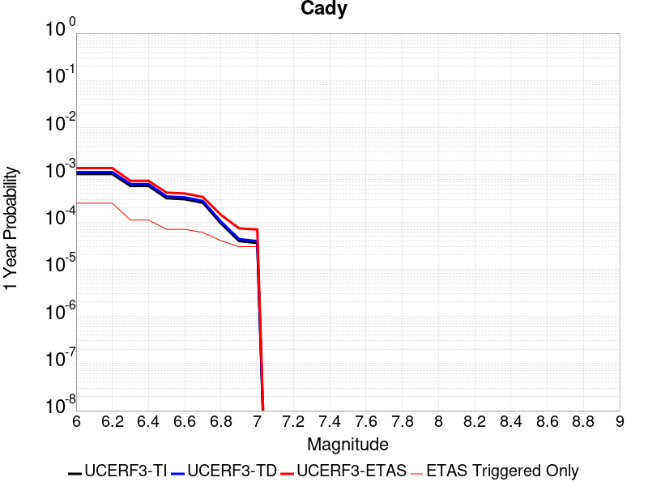 | 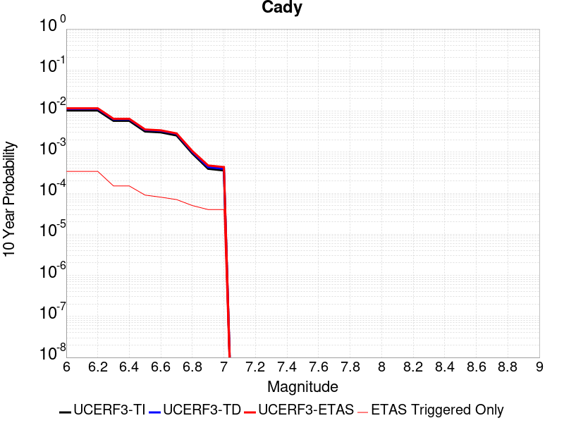 |

| Magnitude | 1 wk TI Prob | 1 wk TD Prob | 1 wk ETAS Prob | 1 wk ETAS/TD Gain | 1 wk ETAS Triggered Only | 1 mo TI Prob | 1 mo TD Prob | 1 mo ETAS Prob | 1 mo ETAS/TD Gain | 1 mo ETAS Triggered Only | 1 yr TI Prob | 1 yr TD Prob | 1 yr ETAS Prob | 1 yr ETAS/TD Gain | 1 yr ETAS Triggered Only | 10 yr TI Prob | 10 yr TD Prob | 10 yr ETAS Prob | 10 yr ETAS/TD Gain | 10 yr ETAS Triggered Only |
|-----|-----|-----|-----|-----|-----|-----|-----|-----|-----|-----|-----|-----|-----|-----|-----|-----|-----|-----|-----|-----|
| 6.0 | 1.9892565E-5 | 2.1858728E-5 | 1.7185546E-4 | 7.8620973 | 1.5E-4 | 8.525106E-5 | 9.3677416E-5 | 2.836596E-4 | 3.028047 | 1.9E-4 | 0.0010374374 | 0.0011400167 | 0.0013897317 | 1.219045 | 2.5E-4 | 0.010326075 | 0.011350701 | 0.011686841 | 1.0296141 | 3.4E-4 |
| 6.1 | 1.9892565E-5 | 2.1858728E-5 | 1.7185546E-4 | 7.8620973 | 1.5E-4 | 8.525106E-5 | 9.3677416E-5 | 2.836596E-4 | 3.028047 | 1.9E-4 | 0.0010374374 | 0.0011400167 | 0.0013897317 | 1.219045 | 2.5E-4 | 0.010326075 | 0.011350701 | 0.011686841 | 1.0296141 | 3.4E-4 |
| 6.2 | 1.9892565E-5 | 2.1858728E-5 | 1.7185546E-4 | 7.8620973 | 1.5E-4 | 8.525106E-5 | 9.3677416E-5 | 2.836596E-4 | 3.028047 | 1.9E-4 | 0.0010374374 | 0.0011400167 | 0.0013897317 | 1.219045 | 2.5E-4 | 0.010326075 | 0.011350701 | 0.011686841 | 1.0296141 | 3.4E-4 |
| 6.3 | 1.1117327E-5 | 1.2176583E-5 | 6.2175975E-5 | 5.106192 | 5.0E-5 | 4.764482E-5 | 5.2184492E-5 | 1.3218031E-4 | 2.5329425 | 8.0E-5 | 5.7992124E-4 | 6.351925E-4 | 7.451226E-4 | 1.1730659 | 1.1E-4 | 0.0057841022 | 0.0063368753 | 0.006485925 | 1.023521 | 1.5E-4 |
| 6.4 | 1.1117327E-5 | 1.2176583E-5 | 6.2175975E-5 | 5.106192 | 5.0E-5 | 4.764482E-5 | 5.2184492E-5 | 1.3218031E-4 | 2.5329425 | 8.0E-5 | 5.7992124E-4 | 6.351925E-4 | 7.451226E-4 | 1.1730659 | 1.1E-4 | 0.0057841022 | 0.0063368753 | 0.006485925 | 1.023521 | 1.5E-4 |
| 6.5 | 6.103093E-6 | 6.672021E-6 | 3.667182E-5 | 5.496359 | 3.0E-5 | 2.615585E-5 | 2.8594131E-5 | 8.859242E-5 | 3.0982726 | 6.0E-5 | 3.1840094E-4 | 3.480905E-4 | 4.1806613E-4 | 1.2010272 | 7.0E-5 | 0.0031794512 | 0.0034766865 | 0.0035663738 | 1.0257968 | 9.0E-5 |
| 6.6 | 5.817237E-6 | 6.3656585E-6 | 3.636547E-5 | 5.712758 | 3.0E-5 | 2.4930776E-5 | 2.728118E-5 | 8.727954E-5 | 3.1992586 | 6.0E-5 | 3.034899E-4 | 3.3211018E-4 | 4.020869E-4 | 1.2107034 | 7.0E-5 | 0.0030307577 | 0.0033173605 | 0.0033970952 | 1.0240356 | 8.0E-5 |
| 6.7 | 4.8846314E-6 | 5.3405684E-6 | 3.5340407E-5 | 6.6173496 | 3.0E-5 | 2.0933967E-5 | 2.2888014E-5 | 7.288687E-5 | 3.1844995 | 5.0E-5 | 2.5484123E-4 | 2.7863772E-4 | 3.38621E-4 | 1.2152734 | 6.0E-5 | 0.0025454918 | 0.0027840391 | 0.0028538443 | 1.0250733 | 7.0E-5 |
| 6.8 | 1.7788773E-6 | 1.9399079E-6 | 2.193987E-5 | 11.309748 | 2.0E-5 | 7.6237375E-6 | 8.313874E-6 | 4.831354E-5 | 5.811195 | 4.0E-5 | 9.281505E-5 | 1.01218284E-4 | 1.4121424E-4 | 1.3951455 | 4.0E-5 | 9.2776294E-4 | 0.0010118765 | 0.0010618259 | 1.0493631 | 5.0E-5 |
| 6.9 | 7.5455404E-7 | 8.297092E-7 | 2.0829693E-5 | 25.10481 | 2.0E-5 | 3.233799E-6 | 3.5558937E-6 | 3.3555785E-5 | 9.436667 | 3.0E-5 | 3.937079E-5 | 4.3292483E-5 | 7.329118E-5 | 1.6929309 | 3.0E-5 | 3.9363815E-4 | 4.3287344E-4 | 4.728561E-4 | 1.0923657 | 4.0E-5 |
| 7.0 | 6.8578805E-7 | 7.541816E-7 | 2.0754167E-5 | 27.518791 | 2.0E-5 | 2.9390883E-6 | 3.2322048E-6 | 3.3232107E-5 | 10.28156 | 3.0E-5 | 3.578281E-5 | 3.9351715E-5 | 6.9350535E-5 | 1.7623256 | 3.0E-5 | 3.577705E-4 | 3.9347992E-4 | 4.3346419E-4 | 1.101617 | 4.0E-5 |

## White Wolf (Extension)
*[(top)](#table-of-contents)*

| 1 Week | 1 Month | 1 Year | 10 Year |
|-----|-----|-----|-----|
| 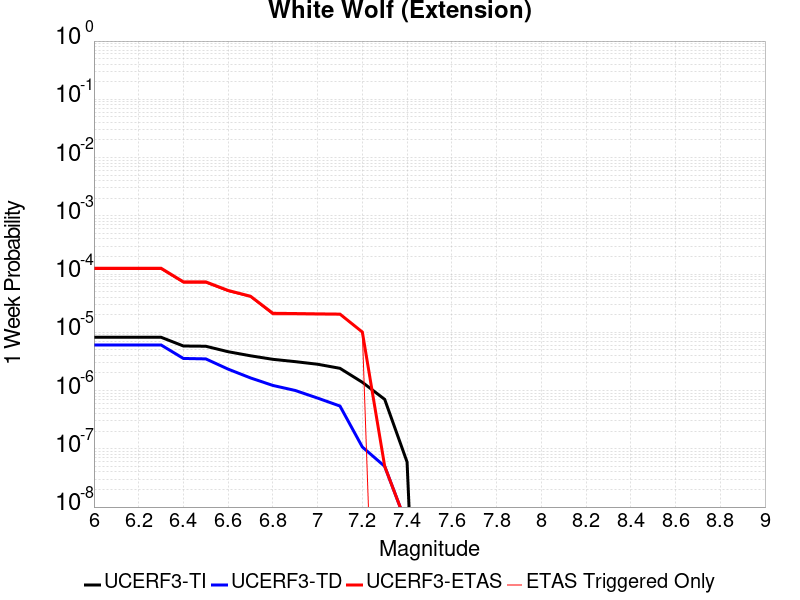 |  |  |  |

| Magnitude | 1 wk TI Prob | 1 wk TD Prob | 1 wk ETAS Prob | 1 wk ETAS/TD Gain | 1 wk ETAS Triggered Only | 1 mo TI Prob | 1 mo TD Prob | 1 mo ETAS Prob | 1 mo ETAS/TD Gain | 1 mo ETAS Triggered Only | 1 yr TI Prob | 1 yr TD Prob | 1 yr ETAS Prob | 1 yr ETAS/TD Gain | 1 yr ETAS Triggered Only | 10 yr TI Prob | 10 yr TD Prob | 10 yr ETAS Prob | 10 yr ETAS/TD Gain | 10 yr ETAS Triggered Only |
|-----|-----|-----|-----|-----|-----|-----|-----|-----|-----|-----|-----|-----|-----|-----|-----|-----|-----|-----|-----|-----|
| 6.0 | 8.222555E-6 | 6.0666657E-6 | 1.2606593E-4 | 20.780104 | 1.2E-4 | 3.5239045E-5 | 2.5999774E-5 | 1.7599587E-4 | 6.7691307 | 1.5E-4 | 4.289509E-4 | 3.1650788E-4 | 5.4643507E-4 | 1.7264501 | 2.3E-4 | 0.0042812387 | 0.003161223 | 0.0034901798 | 1.1040599 | 3.3E-4 |
| 6.1 | 8.222555E-6 | 6.0666657E-6 | 1.2606593E-4 | 20.780104 | 1.2E-4 | 3.5239045E-5 | 2.5999774E-5 | 1.7599587E-4 | 6.7691307 | 1.5E-4 | 4.289509E-4 | 3.1650788E-4 | 5.4643507E-4 | 1.7264501 | 2.3E-4 | 0.0042812387 | 0.003161223 | 0.0034901798 | 1.1040599 | 3.3E-4 |
| 6.2 | 8.222555E-6 | 6.0666657E-6 | 1.2606593E-4 | 20.780104 | 1.2E-4 | 3.5239045E-5 | 2.5999774E-5 | 1.7599587E-4 | 6.7691307 | 1.5E-4 | 4.289509E-4 | 3.1650788E-4 | 5.4643507E-4 | 1.7264501 | 2.3E-4 | 0.0042812387 | 0.003161223 | 0.0034901798 | 1.1040599 | 3.3E-4 |
| 6.3 | 8.222555E-6 | 6.0666657E-6 | 1.2606593E-4 | 20.780104 | 1.2E-4 | 3.5239045E-5 | 2.5999774E-5 | 1.7599587E-4 | 6.7691307 | 1.5E-4 | 4.289509E-4 | 3.1650788E-4 | 5.4643507E-4 | 1.7264501 | 2.3E-4 | 0.0042812387 | 0.003161223 | 0.0034901798 | 1.1040599 | 3.3E-4 |
| 6.4 | 5.821773E-6 | 3.5571766E-6 | 7.355693E-5 | 20.67846 | 7.0E-5 | 2.4950215E-5 | 1.5244959E-5 | 1.15243434E-4 | 7.5594454 | 1.0E-4 | 3.0372653E-4 | 1.8559267E-4 | 3.2556668E-4 | 1.7542001 | 1.4E-4 | 0.0030331176 | 0.001854485 | 0.002074077 | 1.1184113 | 2.2E-4 |
| 6.5 | 5.766023E-6 | 3.4991106E-6 | 7.3498864E-5 | 21.005014 | 7.0E-5 | 2.4711293E-5 | 1.4996108E-5 | 1.0499476E-4 | 7.001467 | 9.0E-5 | 3.0081844E-4 | 1.8256342E-4 | 3.125397E-4 | 1.7119514 | 1.3E-4 | 0.0030041158 | 0.0018242426 | 0.0020338595 | 1.1149063 | 2.1E-4 |
| 6.6 | 4.643576E-6 | 2.332624E-6 | 5.2332507E-5 | 22.435038 | 5.0E-5 | 1.9900888E-5 | 9.996925E-6 | 7.999622E-5 | 8.002084 | 7.0E-5 | 2.4226638E-4 | 1.2170619E-4 | 2.2169402E-4 | 1.821551 | 1.0E-4 | 0.0024200242 | 0.0012164378 | 0.0013462796 | 1.1067394 | 1.3E-4 |
| 6.7 | 3.9529173E-6 | 1.6483477E-6 | 4.1648284E-5 | 25.266684 | 4.0E-5 | 1.6940963E-5 | 7.0643296E-6 | 6.7063906E-5 | 9.493315 | 6.0E-5 | 2.0623671E-4 | 8.6005006E-5 | 1.6599812E-4 | 1.9300984 | 8.0E-5 | 0.002060454 | 8.597357E-4 | 9.5964974E-4 | 1.1162149 | 1.0E-4 |
| 6.8 | 3.4377522E-6 | 1.2245237E-6 | 2.12245E-5 | 17.33286 | 2.0E-5 | 1.473314E-5 | 5.2479486E-6 | 4.524774E-5 | 8.621985 | 4.0E-5 | 1.7936122E-4 | 6.3891996E-5 | 1.2388817E-4 | 1.9390248 | 6.0E-5 | 0.0017921652 | 6.387454E-4 | 7.1869424E-4 | 1.1251656 | 8.0E-5 |
| 6.9 | 3.1367306E-6 | 1.0033783E-6 | 2.1003358E-5 | 20.93264 | 2.0E-5 | 1.3443062E-5 | 4.3001864E-6 | 4.4300014E-5 | 10.301883 | 4.0E-5 | 1.63657E-4 | 5.235359E-5 | 1.1235045E-4 | 2.1459932 | 6.0E-5 | 0.0016353652 | 5.2342017E-4 | 6.033783E-4 | 1.1527609 | 8.0E-5 |
| 7.0 | 2.8298145E-6 | 7.4286646E-7 | 2.0742851E-5 | 27.922718 | 2.0E-5 | 1.2127721E-5 | 3.1837099E-6 | 3.3183613E-5 | 10.422939 | 3.0E-5 | 1.47645E-4 | 3.8761027E-5 | 8.8759094E-5 | 2.2899055 | 5.0E-5 | 0.0014754693 | 3.8754768E-4 | 4.4752442E-4 | 1.1547596 | 6.0E-5 |
| 7.1 | 2.4091064E-6 | 5.4227525E-7 | 2.0542264E-5 | 37.881622 | 2.0E-5 | 1.03247E-5 | 2.3240348E-6 | 3.2323966E-5 | 13.908554 | 3.0E-5 | 1.2569598E-4 | 2.8294799E-5 | 7.8293386E-5 | 2.7670593 | 5.0E-5 | 0.001256249 | 2.8291598E-4 | 3.3290184E-4 | 1.1766809 | 5.0E-5 |
| 7.2 | 1.3875518E-6 | 1.0743063E-7 | 1.0107429E-5 | 94.08331 | 1.0E-5 | 5.9466374E-6 | 4.6041689E-7 | 1.0460412E-5 | 22.719437 | 1.0E-5 | 7.23979E-5 | 5.6055624E-6 | 1.5605507E-5 | 2.7839322 | 1.0E-5 | 7.2374323E-4 | 5.6054323E-5 | 6.605376E-5 | 1.1783884 | 1.0E-5 |
| 7.3 | 7.056077E-7 | 5.002034E-8 | 5.002034E-8 | 1.0 | 0.0 | 3.0240296E-6 | 2.1437286E-7 | 2.1437286E-7 | 1.0 | 0.0 | 3.681694E-5 | 2.609987E-6 | 2.609987E-6 | 1.0 | 0.0 | 3.681084E-4 | 2.609961E-5 | 2.609961E-5 | 1.0 | 0.0 |
| 7.4 | 5.9334678E-8 | 4.8683537E-9 | 4.8683537E-9 | 1.0 | 0.0 | 2.5429145E-7 | 2.0864372E-8 | 2.0864372E-8 | 1.0 | 0.0 | 3.095994E-6 | 2.5402372E-7 | 2.5402372E-7 | 1.0 | 0.0 | 3.095951E-5 | 2.5402353E-6 | 2.5402353E-6 | 1.0 | 0.0 |

## San Andreas (Creeping Section) 2011 CFM
*[(top)](#table-of-contents)*

| 1 Week | 1 Month | 1 Year | 10 Year |
|-----|-----|-----|-----|
|  |  | 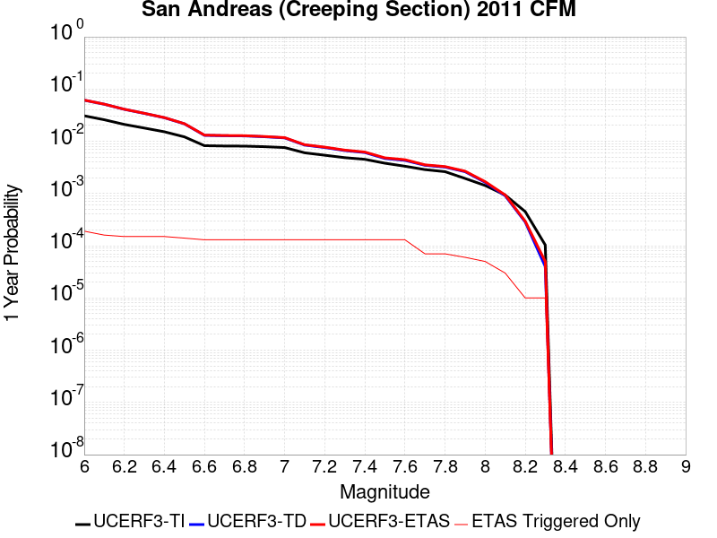 | 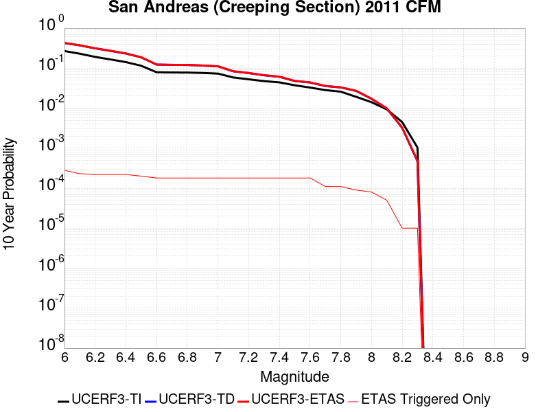 |

| Magnitude | 1 wk TI Prob | 1 wk TD Prob | 1 wk ETAS Prob | 1 wk ETAS/TD Gain | 1 wk ETAS Triggered Only | 1 mo TI Prob | 1 mo TD Prob | 1 mo ETAS Prob | 1 mo ETAS/TD Gain | 1 mo ETAS Triggered Only | 1 yr TI Prob | 1 yr TD Prob | 1 yr ETAS Prob | 1 yr ETAS/TD Gain | 1 yr ETAS Triggered Only | 10 yr TI Prob | 10 yr TD Prob | 10 yr ETAS Prob | 10 yr ETAS/TD Gain | 10 yr ETAS Triggered Only |
|-----|-----|-----|-----|-----|-----|-----|-----|-----|-----|-----|-----|-----|-----|-----|-----|-----|-----|-----|-----|-----|
| 6.0 | 5.986481E-4 | 0.001228691 | 0.001298605 | 1.0569012 | 7.0E-5 | 0.0025631124 | 0.005246795 | 0.005376113 | 1.024647 | 1.3E-4 | 0.030762846 | 0.061203245 | 0.06138162 | 1.0029144 | 1.9E-4 | 0.26835477 | 0.425928 | 0.42608875 | 1.0003774 | 2.8E-4 |
| 6.1 | 5.015945E-4 | 0.0010230356 | 0.0010729844 | 1.0488242 | 5.0E-5 | 0.00214792 | 0.004369436 | 0.004468999 | 1.0227863 | 1.0E-4 | 0.025839351 | 0.051246606 | 0.051398408 | 1.0029621 | 1.6E-4 | 0.23032776 | 0.37284943 | 0.3729937 | 1.0003868 | 2.3E-4 |
| 6.2 | 4.073338E-4 | 8.1157376E-4 | 8.515413E-4 | 1.0492469 | 4.0E-5 | 0.0017445484 | 0.0034683137 | 0.0035580015 | 1.0258592 | 9.0E-5 | 0.021034058 | 0.04093177 | 0.04107563 | 1.0035146 | 1.5E-4 | 0.19150782 | 0.31302592 | 0.31317705 | 1.0004828 | 2.2E-4 |
| 6.3 | 3.464099E-4 | 6.7455834E-4 | 7.1453134E-4 | 1.0592581 | 4.0E-5 | 0.0014837692 | 0.0028832308 | 0.0029729714 | 1.031125 | 9.0E-5 | 0.017915873 | 0.034187846 | 0.03433272 | 1.0042375 | 1.5E-4 | 0.16538359 | 0.27130842 | 0.27146873 | 1.0005909 | 2.2E-4 |
| 6.4 | 2.935057E-4 | 5.5516965E-4 | 5.9514743E-4 | 1.07201 | 4.0E-5 | 0.0012572751 | 0.0023727308 | 0.0024625172 | 1.037841 | 9.0E-5 | 0.015200248 | 0.02826279 | 0.028408552 | 1.0051574 | 1.5E-4 | 0.14201577 | 0.23297668 | 0.23314542 | 1.0007243 | 2.2E-4 |
| 6.5 | 2.3409708E-4 | 4.2132285E-4 | 4.61306E-4 | 1.094899 | 4.0E-5 | 0.0010028875 | 0.0018017791 | 0.0018916171 | 1.0498606 | 9.0E-5 | 0.012141965 | 0.021586355 | 0.021723332 | 1.0063456 | 1.4E-4 | 0.11499573 | 0.1868149 | 0.18697755 | 1.0008706 | 2.0E-4 |
| 6.6 | 1.5842178E-4 | 2.5068692E-4 | 2.806794E-4 | 1.1196412 | 3.0E-5 | 6.7877385E-4 | 0.0010739256 | 0.0011538398 | 1.0744131 | 8.0E-5 | 0.0082328 | 0.012995283 | 0.013123593 | 1.0098736 | 1.3E-4 | 0.07934396 | 0.12313759 | 0.12329543 | 1.0012817 | 1.8E-4 |
| 6.7 | 1.5616413E-4 | 2.4605254E-4 | 2.7604518E-4 | 1.1218952 | 3.0E-5 | 6.691031E-4 | 0.0010540807 | 0.0011339963 | 1.0758156 | 8.0E-5 | 0.0081159435 | 0.012757154 | 0.012885495 | 1.0100603 | 1.3E-4 | 0.0782586 | 0.12116472 | 0.12132291 | 1.0013056 | 1.8E-4 |
| 6.8 | 1.5538467E-4 | 2.442914E-4 | 2.742841E-4 | 1.1227741 | 3.0E-5 | 6.6576427E-4 | 0.001046539 | 0.0011264554 | 1.0763625 | 8.0E-5 | 0.008075596 | 0.012666538 | 0.012794891 | 1.0101333 | 1.3E-4 | 0.07788358 | 0.12039561 | 0.12055393 | 1.0013151 | 1.8E-4 |
| 6.9 | 1.5153569E-4 | 2.3538464E-4 | 2.6537757E-4 | 1.127421 | 3.0E-5 | 6.49277E-4 | 0.0010084033 | 0.0010883226 | 1.0792533 | 8.0E-5 | 0.007876333 | 0.012208726 | 0.012337139 | 1.0105181 | 1.3E-4 | 0.07602952 | 0.11646574 | 0.11662478 | 1.0013655 | 1.8E-4 |
| 7.0 | 1.4588932E-4 | 2.2395732E-4 | 2.539506E-4 | 1.1339241 | 3.0E-5 | 6.250901E-4 | 9.59466E-4 | 0.0010393893 | 1.0832998 | 8.0E-5 | 0.0075839474 | 0.011619428 | 0.011747917 | 1.0110582 | 1.3E-4 | 0.073302895 | 0.11131206 | 0.111472026 | 1.0014371 | 1.8E-4 |
| 7.1 | 1.1565079E-4 | 1.6281323E-4 | 1.9280834E-4 | 1.1842302 | 3.0E-5 | 4.955521E-4 | 6.9758523E-4 | 7.7752944E-4 | 1.1146014 | 8.0E-5 | 0.006016669 | 0.008460228 | 0.008589128 | 1.015236 | 1.3E-4 | 0.058563538 | 0.08366478 | 0.08382972 | 1.0019715 | 1.8E-4 |
| 7.2 | 1.0393792E-4 | 1.4615392E-4 | 1.7614954E-4 | 1.2052331 | 3.0E-5 | 4.4537216E-4 | 6.262243E-4 | 7.0617424E-4 | 1.1276697 | 8.0E-5 | 0.005408933 | 0.0075977976 | 0.00772681 | 1.0169802 | 1.3E-4 | 0.052791595 | 0.07561503 | 0.07578143 | 1.0022005 | 1.8E-4 |
| 7.3 | 9.332884E-5 | 1.2780601E-4 | 1.5780216E-4 | 1.2347008 | 3.0E-5 | 3.999194E-4 | 5.4762565E-4 | 6.2758185E-4 | 1.1460052 | 8.0E-5 | 0.0048581534 | 0.0066470946 | 0.0067762304 | 1.0194274 | 1.3E-4 | 0.047533102 | 0.06647954 | 0.066647574 | 1.0025276 | 1.8E-4 |
| 7.4 | 8.670252E-5 | 1.1702972E-4 | 1.470262E-4 | 1.2563151 | 3.0E-5 | 3.715293E-4 | 5.014601E-4 | 5.8141997E-4 | 1.1594541 | 8.0E-5 | 0.004513991 | 0.0060883067 | 0.006217515 | 1.0212224 | 1.3E-4 | 0.044233937 | 0.061148684 | 0.061317675 | 1.0027636 | 1.8E-4 |
| 7.5 | 7.3036405E-5 | 9.005699E-5 | 1.2005428E-4 | 1.3330925 | 3.0E-5 | 3.129756E-4 | 3.859015E-4 | 4.6587063E-4 | 1.2072268 | 8.0E-5 | 0.0038038217 | 0.0046882504 | 0.004817641 | 1.0275989 | 1.3E-4 | 0.03739367 | 0.047875606 | 0.04804699 | 1.0035797 | 1.8E-4 |
| 7.6 | 6.3935775E-5 | 8.280209E-5 | 1.1279961E-4 | 1.3622797 | 3.0E-5 | 2.7398168E-4 | 3.5481792E-4 | 4.3478954E-4 | 1.2253878 | 8.0E-5 | 0.0033306254 | 0.00431137 | 0.0044408096 | 1.0300229 | 1.3E-4 | 0.032811474 | 0.043990135 | 0.044162218 | 1.0039119 | 1.8E-4 |
| 7.7 | 5.5050095E-5 | 6.661729E-5 | 7.661663E-5 | 1.1501012 | 1.0E-5 | 2.3590765E-4 | 2.8547147E-4 | 3.2546005E-4 | 1.1400791 | 4.0E-5 | 0.0028683927 | 0.0034700802 | 0.0035398372 | 1.0201025 | 7.0E-5 | 0.0283165 | 0.03579509 | 0.03590115 | 1.0029631 | 1.1E-4 |
| 7.8 | 5.027131E-5 | 6.1627725E-5 | 7.162711E-5 | 1.1622547 | 1.0E-5 | 2.1543067E-4 | 2.640921E-4 | 3.0408154E-4 | 1.1514223 | 4.0E-5 | 0.0026197135 | 0.003210584 | 0.003280359 | 1.0217329 | 7.0E-5 | 0.025890453 | 0.03312572 | 0.033232074 | 1.0032107 | 1.1E-4 |
| 7.9 | 3.7271806E-5 | 5.0224386E-5 | 6.0223883E-5 | 1.1990964 | 1.0E-5 | 1.5972654E-4 | 2.1522962E-4 | 2.55221E-4 | 1.1858081 | 4.0E-5 | 0.0019429359 | 0.0026172737 | 0.0026771165 | 1.0228646 | 6.0E-5 | 0.019260362 | 0.027066687 | 0.027154252 | 1.0032351 | 9.0E-5 |
| 8.0 | 2.7310243E-5 | 3.1428404E-5 | 4.142809E-5 | 1.3181735 | 1.0E-5 | 1.17038646E-4 | 1.3468621E-4 | 1.6468218E-4 | 1.2227099 | 3.0E-5 | 0.0014240141 | 0.0016385721 | 0.0016884902 | 1.0304644 | 5.0E-5 | 0.014149235 | 0.01721387 | 0.017292492 | 1.0045674 | 8.0E-5 |
| 8.1 | 1.7940547E-5 | 1.7400796E-5 | 1.7400796E-5 | 1.0 | 0.0 | 7.688579E-5 | 7.457271E-5 | 8.457197E-5 | 1.1340873 | 1.0E-5 | 9.3568244E-4 | 9.075451E-4 | 9.375179E-4 | 1.0330262 | 3.0E-5 | 0.009317525 | 0.009799073 | 0.0098485835 | 1.0050526 | 5.0E-5 |
| 8.2 | 8.643924E-6 | 5.4748625E-6 | 5.4748625E-6 | 1.0 | 0.0 | 3.704486E-5 | 2.3463486E-5 | 2.3463486E-5 | 1.0 | 0.0 | 4.5092785E-4 | 2.8563058E-4 | 2.9562772E-4 | 1.0350002 | 1.0E-5 | 0.0045001395 | 0.0032487072 | 0.0032586746 | 1.0030681 | 1.0E-5 |
| 8.3 | 1.983087E-6 | 7.6599065E-7 | 7.6599065E-7 | 1.0 | 0.0 | 8.498917E-6 | 3.282813E-6 | 3.282813E-6 | 1.0 | 0.0 | 1.034694E-4 | 3.9967534E-5 | 4.9967133E-5 | 1.2501931 | 1.0E-5 | 0.0010342124 | 4.719687E-4 | 4.8196397E-4 | 1.0211779 | 1.0E-5 |

## Cleghorn Lake
*[(top)](#table-of-contents)*

| 1 Week | 1 Month | 1 Year | 10 Year |
|-----|-----|-----|-----|
| 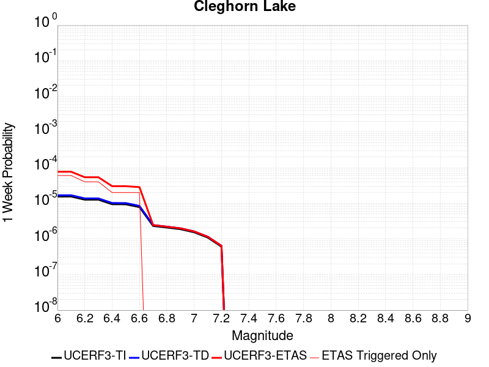 |  |  |  |

| Magnitude | 1 wk TI Prob | 1 wk TD Prob | 1 wk ETAS Prob | 1 wk ETAS/TD Gain | 1 wk ETAS Triggered Only | 1 mo TI Prob | 1 mo TD Prob | 1 mo ETAS Prob | 1 mo ETAS/TD Gain | 1 mo ETAS Triggered Only | 1 yr TI Prob | 1 yr TD Prob | 1 yr ETAS Prob | 1 yr ETAS/TD Gain | 1 yr ETAS Triggered Only | 10 yr TI Prob | 10 yr TD Prob | 10 yr ETAS Prob | 10 yr ETAS/TD Gain | 10 yr ETAS Triggered Only |
|-----|-----|-----|-----|-----|-----|-----|-----|-----|-----|-----|-----|-----|-----|-----|-----|-----|-----|-----|-----|-----|
| 6.0 | 1.5467183E-5 | 1.6794203E-5 | 7.67932E-5 | 4.5726013 | 6.0E-5 | 6.6286244E-5 | 7.197348E-5 | 1.5196773E-4 | 2.1114404 | 8.0E-5 | 8.067362E-4 | 8.759797E-4 | 0.0010158571 | 1.1596811 | 1.4E-4 | 0.008038137 | 0.008730696 | 0.009008251 | 1.0317907 | 2.8E-4 |
| 6.1 | 1.5467183E-5 | 1.6794203E-5 | 7.67932E-5 | 4.5726013 | 6.0E-5 | 6.6286244E-5 | 7.197348E-5 | 1.5196773E-4 | 2.1114404 | 8.0E-5 | 8.067362E-4 | 8.759797E-4 | 0.0010158571 | 1.1596811 | 1.4E-4 | 0.008038137 | 0.008730696 | 0.009008251 | 1.0317907 | 2.8E-4 |
| 6.2 | 1.2624631E-5 | 1.3681544E-5 | 5.3680997E-5 | 3.9236064 | 4.0E-5 | 5.410444E-5 | 5.863415E-5 | 1.1863063E-4 | 2.0232346 | 6.0E-5 | 6.585225E-4 | 7.1368564E-4 | 8.236071E-4 | 1.1540195 | 1.1E-4 | 0.0065657445 | 0.0071187317 | 0.007317308 | 1.0278949 | 2.0E-4 |
| 6.3 | 1.2624631E-5 | 1.3681544E-5 | 5.3680997E-5 | 3.9236064 | 4.0E-5 | 5.410444E-5 | 5.863415E-5 | 1.1863063E-4 | 2.0232346 | 6.0E-5 | 6.585225E-4 | 7.1368564E-4 | 8.236071E-4 | 1.1540195 | 1.1E-4 | 0.0065657445 | 0.0071187317 | 0.007317308 | 1.0278949 | 2.0E-4 |
| 6.4 | 9.417684E-6 | 1.0170118E-5 | 3.0169915E-5 | 2.9665256 | 2.0E-5 | 4.036088E-5 | 4.3585722E-5 | 7.3584415E-5 | 1.6882688 | 3.0E-5 | 4.912829E-4 | 5.3056807E-4 | 5.905362E-4 | 1.1130264 | 6.0E-5 | 0.004901982 | 0.005297049 | 0.0054363073 | 1.0262898 | 1.4E-4 |
| 6.5 | 9.368219E-6 | 1.0117545E-5 | 3.0117342E-5 | 2.9767442 | 2.0E-5 | 4.014889E-5 | 4.3360415E-5 | 7.3359115E-5 | 1.6918453 | 3.0E-5 | 4.8870314E-4 | 5.2782625E-4 | 5.877946E-4 | 1.1136137 | 6.0E-5 | 0.004876298 | 0.0052697617 | 0.0054090237 | 1.0264267 | 1.4E-4 |
| 6.6 | 7.803798E-6 | 8.441831E-6 | 2.8441662E-5 | 3.3691342 | 2.0E-5 | 3.3444423E-5 | 3.6179E-5 | 5.6178276E-5 | 1.552787 | 2.0E-5 | 4.0710976E-4 | 4.4043022E-4 | 4.804126E-4 | 1.0907803 | 4.0E-5 | 0.0040636472 | 0.0043994905 | 0.0045189625 | 1.0271559 | 1.2E-4 |
| 6.7 | 2.3108669E-6 | 2.4438336E-6 | 2.4438336E-6 | 1.0 | 0.0 | 9.903678E-6 | 1.0473532E-5 | 1.0473532E-5 | 1.0 | 0.0 | 1.205706E-4 | 1.2750797E-4 | 1.375067E-4 | 1.0784165 | 1.0E-5 | 0.001205052 | 0.0012743667 | 0.0013143158 | 1.0313481 | 4.0E-5 |
| 6.8 | 2.0882828E-6 | 2.2062823E-6 | 2.2062823E-6 | 1.0 | 0.0 | 8.949753E-6 | 9.455462E-6 | 9.455462E-6 | 1.0 | 0.0 | 1.08957785E-4 | 1.1511434E-4 | 1.2511319E-4 | 1.0868602 | 1.0E-5 | 0.0010890438 | 0.0011505639 | 0.0011905179 | 1.0347255 | 4.0E-5 |
| 6.9 | 1.876935E-6 | 1.981051E-6 | 1.981051E-6 | 1.0 | 0.0 | 8.043982E-6 | 8.490192E-6 | 8.490192E-6 | 1.0 | 0.0 | 9.7931086E-5 | 1.03363345E-4 | 1.1336231E-4 | 1.0967361 | 1.0E-5 | 9.788794E-4 | 0.0010331686 | 0.0010731274 | 1.0386759 | 4.0E-5 |
| 7.0 | 1.5357559E-6 | 1.6202807E-6 | 1.6202807E-6 | 1.0 | 0.0 | 6.5817944E-6 | 6.9440425E-6 | 6.9440425E-6 | 1.0 | 0.0 | 8.01304E-5 | 8.454057E-5 | 9.453972E-5 | 1.1182764 | 1.0E-5 | 8.010151E-4 | 8.450965E-4 | 8.750711E-4 | 1.0354689 | 3.0E-5 |
| 7.1 | 1.0905424E-6 | 1.1497619E-6 | 1.1497619E-6 | 1.0 | 0.0 | 4.6737446E-6 | 4.9275427E-6 | 4.9275427E-6 | 1.0 | 0.0 | 5.6901354E-5 | 5.999128E-5 | 6.999068E-5 | 1.1666809 | 1.0E-5 | 5.6886784E-4 | 5.997606E-4 | 6.197486E-4 | 1.0333266 | 2.0E-5 |
| 7.2 | 6.06668E-7 | 6.387277E-7 | 6.387277E-7 | 1.0 | 0.0 | 2.600003E-6 | 2.7374022E-6 | 2.7374022E-6 | 1.0 | 0.0 | 3.1654577E-5 | 3.3327433E-5 | 4.3327098E-5 | 1.3000431 | 1.0E-5 | 3.1650066E-4 | 3.3323118E-4 | 3.5322452E-4 | 1.0599984 | 2.0E-5 |

## Lake Isabella (Seismicity)
*[(top)](#table-of-contents)*

| 1 Week | 1 Month | 1 Year | 10 Year |
|-----|-----|-----|-----|
|  | 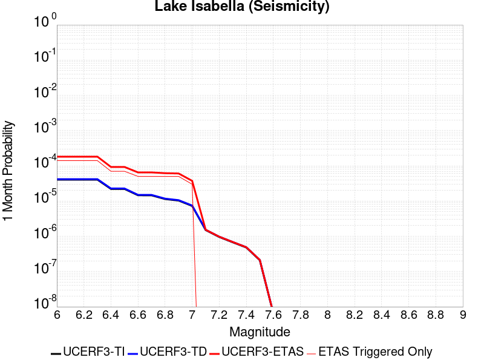 | 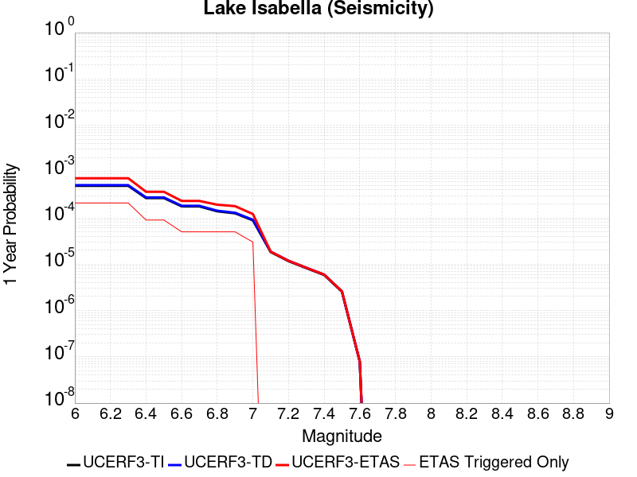 |  |

| Magnitude | 1 wk TI Prob | 1 wk TD Prob | 1 wk ETAS Prob | 1 wk ETAS/TD Gain | 1 wk ETAS Triggered Only | 1 mo TI Prob | 1 mo TD Prob | 1 mo ETAS Prob | 1 mo ETAS/TD Gain | 1 mo ETAS Triggered Only | 1 yr TI Prob | 1 yr TD Prob | 1 yr ETAS Prob | 1 yr ETAS/TD Gain | 1 yr ETAS Triggered Only | 10 yr TI Prob | 10 yr TD Prob | 10 yr ETAS Prob | 10 yr ETAS/TD Gain | 10 yr ETAS Triggered Only |
|-----|-----|-----|-----|-----|-----|-----|-----|-----|-----|-----|-----|-----|-----|-----|-----|-----|-----|-----|-----|-----|
| 6.0 | 9.431637E-6 | 9.741651E-6 | 7.974097E-5 | 8.18557 | 7.0E-5 | 4.0420677E-5 | 4.1749343E-5 | 1.817435E-4 | 4.353206 | 1.4E-4 | 4.920106E-4 | 5.0819275E-4 | 7.18086E-4 | 1.4130191 | 2.1E-4 | 0.004909227 | 0.005071599 | 0.005360128 | 1.0568912 | 2.9E-4 |
| 6.1 | 9.431637E-6 | 9.741651E-6 | 7.974097E-5 | 8.18557 | 7.0E-5 | 4.0420677E-5 | 4.1749343E-5 | 1.817435E-4 | 4.353206 | 1.4E-4 | 4.920106E-4 | 5.0819275E-4 | 7.18086E-4 | 1.4130191 | 2.1E-4 | 0.004909227 | 0.005071599 | 0.005360128 | 1.0568912 | 2.9E-4 |
| 6.2 | 9.431637E-6 | 9.741651E-6 | 7.974097E-5 | 8.18557 | 7.0E-5 | 4.0420677E-5 | 4.1749343E-5 | 1.817435E-4 | 4.353206 | 1.4E-4 | 4.920106E-4 | 5.0819275E-4 | 7.18086E-4 | 1.4130191 | 2.1E-4 | 0.004909227 | 0.005071599 | 0.005360128 | 1.0568912 | 2.9E-4 |
| 6.3 | 9.431637E-6 | 9.741651E-6 | 7.974097E-5 | 8.18557 | 7.0E-5 | 4.0420677E-5 | 4.1749343E-5 | 1.817435E-4 | 4.353206 | 1.4E-4 | 4.920106E-4 | 5.0819275E-4 | 7.18086E-4 | 1.4130191 | 2.1E-4 | 0.004909227 | 0.005071599 | 0.005360128 | 1.0568912 | 2.9E-4 |
| 6.4 | 5.144063E-6 | 5.3000763E-6 | 4.5299865E-5 | 8.547022 | 4.0E-5 | 2.2045799E-5 | 2.2714434E-5 | 9.271284E-5 | 4.0816708 | 7.0E-5 | 2.6837454E-4 | 2.765166E-4 | 3.664917E-4 | 1.3253877 | 9.0E-5 | 0.0026805066 | 0.0027620657 | 0.002901679 | 1.0505466 | 1.4E-4 |
| 6.5 | 5.144063E-6 | 5.3000763E-6 | 4.5299865E-5 | 8.547022 | 4.0E-5 | 2.2045799E-5 | 2.2714434E-5 | 9.271284E-5 | 4.0816708 | 7.0E-5 | 2.6837454E-4 | 2.765166E-4 | 3.664917E-4 | 1.3253877 | 9.0E-5 | 0.0026805066 | 0.0027620657 | 0.002901679 | 1.0505466 | 1.4E-4 |
| 6.6 | 3.4009804E-6 | 3.498786E-6 | 3.349868E-5 | 9.574372 | 3.0E-5 | 1.4575549E-5 | 1.4994721E-5 | 6.499397E-5 | 4.334457 | 5.0E-5 | 1.7744285E-4 | 1.8254704E-4 | 2.325379E-4 | 1.273852 | 5.0E-5 | 0.0017730123 | 0.0018241286 | 0.0019139644 | 1.0492486 | 9.0E-5 |
| 6.7 | 3.3880428E-6 | 3.4856528E-6 | 3.3485547E-5 | 9.606679 | 3.0E-5 | 1.4520103E-5 | 1.4938435E-5 | 6.493769E-5 | 4.3470206 | 5.0E-5 | 1.767679E-4 | 1.8186188E-4 | 2.3185278E-4 | 1.274884 | 5.0E-5 | 0.0017662736 | 0.0018172882 | 0.0019071246 | 1.0494343 | 9.0E-5 |
| 6.8 | 2.6582E-6 | 2.7337003E-6 | 3.2733617E-5 | 11.974107 | 3.0E-5 | 1.1392236E-5 | 1.1715813E-5 | 6.1715225E-5 | 5.2676864 | 5.0E-5 | 1.3869164E-4 | 1.4263204E-4 | 1.926249E-4 | 1.3505024 | 5.0E-5 | 0.0013860512 | 0.0014255369 | 0.0015154086 | 1.0630441 | 9.0E-5 |
| 6.9 | 2.406011E-6 | 2.4743288E-6 | 3.2474254E-5 | 13.12447 | 3.0E-5 | 1.0311434E-5 | 1.0604231E-5 | 6.06037E-5 | 5.7150493 | 5.0E-5 | 1.2553448E-4 | 1.2910018E-4 | 1.7909372E-4 | 1.3872461 | 5.0E-5 | 0.0012546359 | 0.0012903814 | 0.0013802653 | 1.0696568 | 9.0E-5 |
| 7.0 | 1.6953097E-6 | 1.7429371E-6 | 2.1742902E-5 | 12.474863 | 2.0E-5 | 7.265593E-6 | 7.469715E-6 | 3.746949E-5 | 5.016187 | 3.0E-5 | 8.8455E-5 | 9.094104E-5 | 1.20938304E-4 | 1.3298541 | 3.0E-5 | 8.84198E-4 | 9.09141E-4 | 9.790773E-4 | 1.0769258 | 7.0E-5 |
| 7.1 | 3.5013824E-7 | 3.5714822E-7 | 3.5714822E-7 | 1.0 | 0.0 | 1.5005916E-6 | 1.5306344E-6 | 1.5306344E-6 | 1.0 | 0.0 | 1.826955E-5 | 1.8635317E-5 | 1.8635317E-5 | 1.0 | 0.0 | 1.8268047E-4 | 1.863378E-4 | 1.863378E-4 | 1.0 | 0.0 |
| 7.2 | 2.2321095E-7 | 2.2750574E-7 | 2.2750574E-7 | 1.0 | 0.0 | 9.56618E-7 | 9.750242E-7 | 9.750242E-7 | 1.0 | 0.0 | 1.1646762E-5 | 1.1870856E-5 | 1.1870856E-5 | 1.0 | 0.0 | 1.1646151E-4 | 1.1870232E-4 | 1.1870232E-4 | 1.0 | 0.0 |
| 7.3 | 1.5760406E-7 | 1.6060922E-7 | 1.6060922E-7 | 1.0 | 0.0 | 6.7544585E-7 | 6.8832503E-7 | 6.8832503E-7 | 1.0 | 0.0 | 8.223522E-6 | 8.380326E-6 | 8.380326E-6 | 1.0 | 0.0 | 8.2232174E-5 | 8.3800165E-5 | 8.3800165E-5 | 1.0 | 0.0 |
| 7.4 | 1.1216497E-7 | 1.1431706E-7 | 1.1431706E-7 | 1.0 | 0.0 | 4.8070694E-7 | 4.899302E-7 | 4.899302E-7 | 1.0 | 0.0 | 5.852591E-6 | 5.964884E-6 | 5.964884E-6 | 1.0 | 0.0 | 5.8524372E-5 | 5.9647282E-5 | 5.9647282E-5 | 1.0 | 0.0 |
| 7.5 | 4.885185E-8 | 4.9787737E-8 | 4.9787737E-8 | 1.0 | 0.0 | 2.0936506E-7 | 2.13376E-7 | 2.13376E-7 | 1.0 | 0.0 | 2.5490165E-6 | 2.59785E-6 | 2.59785E-6 | 1.0 | 0.0 | 2.5489873E-5 | 2.5978214E-5 | 2.5978214E-5 | 1.0 | 0.0 |
| 7.6 | 1.504641E-9 | 1.5317903E-9 | 1.5317903E-9 | 1.0 | 0.0 | 6.4484613E-9 | 6.5648154E-9 | 6.5648154E-9 | 1.0 | 0.0 | 7.851001E-8 | 7.992663E-8 | 7.992663E-8 | 1.0 | 0.0 | 7.8509987E-7 | 7.992663E-7 | 7.992663E-7 | 1.0 | 0.0 |

## San Jacinto (San Jacinto Valley) rev
*[(top)](#table-of-contents)*

| 1 Week | 1 Month | 1 Year | 10 Year |
|-----|-----|-----|-----|
|  |  |  | 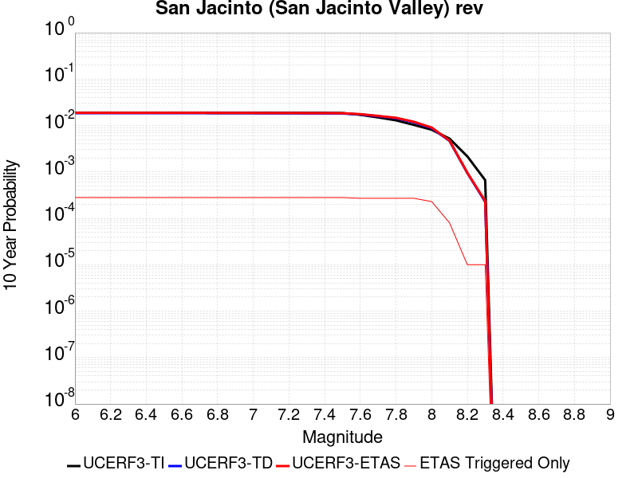 |

| Magnitude | 1 wk TI Prob | 1 wk TD Prob | 1 wk ETAS Prob | 1 wk ETAS/TD Gain | 1 wk ETAS Triggered Only | 1 mo TI Prob | 1 mo TD Prob | 1 mo ETAS Prob | 1 mo ETAS/TD Gain | 1 mo ETAS Triggered Only | 1 yr TI Prob | 1 yr TD Prob | 1 yr ETAS Prob | 1 yr ETAS/TD Gain | 1 yr ETAS Triggered Only | 10 yr TI Prob | 10 yr TD Prob | 10 yr ETAS Prob | 10 yr ETAS/TD Gain | 10 yr ETAS Triggered Only |
|-----|-----|-----|-----|-----|-----|-----|-----|-----|-----|-----|-----|-----|-----|-----|-----|-----|-----|-----|-----|-----|
| 6.0 | 3.652694E-5 | 3.4402394E-5 | 1.6439792E-4 | 4.778677 | 1.3E-4 | 1.5653463E-4 | 1.474305E-4 | 3.1740544E-4 | 2.1529157 | 1.7E-4 | 0.0019041431 | 0.00179349 | 0.0020031133 | 1.1168802 | 2.1E-4 | 0.018879099 | 0.018526595 | 0.018801408 | 1.0148335 | 2.8E-4 |
| 6.1 | 3.652694E-5 | 3.4402394E-5 | 1.6439792E-4 | 4.778677 | 1.3E-4 | 1.5653463E-4 | 1.474305E-4 | 3.1740544E-4 | 2.1529157 | 1.7E-4 | 0.0019041431 | 0.00179349 | 0.0020031133 | 1.1168802 | 2.1E-4 | 0.018879099 | 0.018526595 | 0.018801408 | 1.0148335 | 2.8E-4 |
| 6.2 | 3.652694E-5 | 3.4402394E-5 | 1.6439792E-4 | 4.778677 | 1.3E-4 | 1.5653463E-4 | 1.474305E-4 | 3.1740544E-4 | 2.1529157 | 1.7E-4 | 0.0019041431 | 0.00179349 | 0.0020031133 | 1.1168802 | 2.1E-4 | 0.018879099 | 0.018526595 | 0.018801408 | 1.0148335 | 2.8E-4 |
| 6.3 | 3.652694E-5 | 3.4402394E-5 | 1.6439792E-4 | 4.778677 | 1.3E-4 | 1.5653463E-4 | 1.474305E-4 | 3.1740544E-4 | 2.1529157 | 1.7E-4 | 0.0019041431 | 0.00179349 | 0.0020031133 | 1.1168802 | 2.1E-4 | 0.018879099 | 0.018526595 | 0.018801408 | 1.0148335 | 2.8E-4 |
| 6.4 | 3.646941E-5 | 3.432397E-5 | 1.6431951E-4 | 4.7873106 | 1.3E-4 | 1.5628811E-4 | 1.4709444E-4 | 3.1706944E-4 | 2.15555 | 1.7E-4 | 0.0019011468 | 0.0017894056 | 0.00199903 | 1.1171474 | 2.1E-4 | 0.018849645 | 0.018486476 | 0.0187613 | 1.0148662 | 2.8E-4 |
| 6.5 | 3.646941E-5 | 3.432397E-5 | 1.6431951E-4 | 4.7873106 | 1.3E-4 | 1.5628811E-4 | 1.4709444E-4 | 3.1706944E-4 | 2.15555 | 1.7E-4 | 0.0019011468 | 0.0017894056 | 0.00199903 | 1.1171474 | 2.1E-4 | 0.018849645 | 0.018486476 | 0.0187613 | 1.0148662 | 2.8E-4 |
| 6.6 | 3.6442503E-5 | 3.4287354E-5 | 1.642829E-4 | 4.791355 | 1.3E-4 | 1.561728E-4 | 1.4693754E-4 | 3.1691257E-4 | 2.156784 | 1.7E-4 | 0.0018997455 | 0.0017874985 | 0.001997123 | 1.1172726 | 2.1E-4 | 0.018835869 | 0.018467745 | 0.018742574 | 1.0148816 | 2.8E-4 |
| 6.7 | 3.6432113E-5 | 3.4272925E-5 | 1.6426847E-4 | 4.7929516 | 1.3E-4 | 1.5612828E-4 | 1.4687571E-4 | 3.1685075E-4 | 2.1572711 | 1.7E-4 | 0.0018992044 | 0.0017867472 | 0.0019963721 | 1.117322 | 2.1E-4 | 0.018830549 | 0.018460369 | 0.0187352 | 1.0148876 | 2.8E-4 |
| 6.8 | 3.6409598E-5 | 3.424198E-5 | 1.6423753E-4 | 4.796379 | 1.3E-4 | 1.560318E-4 | 1.4674311E-4 | 3.1671816E-4 | 2.158317 | 1.7E-4 | 0.0018980318 | 0.0017851355 | 0.0019947605 | 1.1174282 | 2.1E-4 | 0.018819023 | 0.018444523 | 0.018719358 | 1.0149007 | 2.8E-4 |
| 6.9 | 3.638078E-5 | 3.4202407E-5 | 1.6419796E-4 | 4.800772 | 1.3E-4 | 1.5590832E-4 | 1.4657351E-4 | 3.165486E-4 | 2.1596575 | 1.7E-4 | 0.0018965311 | 0.001783074 | 0.0019926997 | 1.1175641 | 2.1E-4 | 0.018804269 | 0.018424258 | 0.018699098 | 1.0149174 | 2.8E-4 |
| 7.0 | 3.6294874E-5 | 3.408442E-5 | 1.6407999E-4 | 4.8139296 | 1.3E-4 | 1.5554018E-4 | 1.4606792E-4 | 3.160431E-4 | 2.1636722 | 1.7E-4 | 0.0018920569 | 0.001776929 | 0.0019865558 | 1.1179714 | 2.1E-4 | 0.018760284 | 0.018363839 | 0.018638697 | 1.0149673 | 2.8E-4 |
| 7.1 | 3.6260717E-5 | 3.4040702E-5 | 1.6403628E-4 | 4.8188276 | 1.3E-4 | 1.5539382E-4 | 1.4588058E-4 | 3.1585578E-4 | 2.1651666 | 1.7E-4 | 0.001890278 | 0.0017746518 | 0.0019842791 | 1.118123 | 2.1E-4 | 0.018742796 | 0.018341439 | 0.018616304 | 1.0149859 | 2.8E-4 |
| 7.2 | 3.6210204E-5 | 3.397492E-5 | 1.639705E-4 | 4.826222 | 1.3E-4 | 1.5517735E-4 | 1.455987E-4 | 3.1557394E-4 | 2.1674228 | 1.7E-4 | 0.001887647 | 0.0017712255 | 0.0019808535 | 1.1183519 | 2.1E-4 | 0.01871693 | 0.01830772 | 0.018582594 | 1.015014 | 2.8E-4 |
| 7.3 | 3.6119454E-5 | 3.386321E-5 | 1.638588E-4 | 4.838845 | 1.3E-4 | 1.5478847E-4 | 1.4511998E-4 | 3.150953E-4 | 2.1712744 | 1.7E-4 | 0.0018829206 | 0.0017654065 | 0.0019750358 | 1.1187428 | 2.1E-4 | 0.018670462 | 0.018250274 | 0.018525163 | 1.0150622 | 2.8E-4 |
| 7.4 | 3.607848E-5 | 3.381071E-5 | 1.6380631E-4 | 4.8448057 | 1.3E-4 | 1.5461289E-4 | 1.44895E-4 | 3.1487038E-4 | 2.1730933 | 1.7E-4 | 0.0018807866 | 0.0017626719 | 0.0019723016 | 1.1189274 | 2.1E-4 | 0.018649481 | 0.018223269 | 0.018498166 | 1.015085 | 2.8E-4 |
| 7.5 | 3.5856774E-5 | 3.3620483E-5 | 1.6361612E-4 | 4.8665605 | 1.3E-4 | 1.5366284E-4 | 1.4407984E-4 | 3.1405533E-4 | 2.1797314 | 1.7E-4 | 0.0018692396 | 0.0017527633 | 0.0019623952 | 1.1196008 | 2.1E-4 | 0.018535944 | 0.018124366 | 0.018399293 | 1.0151688 | 2.8E-4 |
| 7.6 | 3.286655E-5 | 3.2143445E-5 | 1.6213927E-4 | 5.0442405 | 1.3E-4 | 1.4084904E-4 | 1.3775036E-4 | 3.0772694E-4 | 2.2339466 | 1.7E-4 | 0.001713488 | 0.0016758227 | 0.0018854707 | 1.1251016 | 2.1E-4 | 0.017003361 | 0.017344031 | 0.017609349 | 1.0152973 | 2.7E-4 |
| 7.7 | 2.8882527E-5 | 2.9236293E-5 | 1.592325E-4 | 5.4463983 | 1.3E-4 | 1.237764E-4 | 1.2529238E-4 | 2.9527108E-4 | 2.3566563 | 1.7E-4 | 0.0015059357 | 0.0015243685 | 0.0017340484 | 1.1375519 | 2.1E-4 | 0.014957713 | 0.015830461 | 0.016096186 | 1.0167857 | 2.7E-4 |
| 7.8 | 2.4950225E-5 | 2.6527203E-5 | 1.5652376E-4 | 5.9005 | 1.3E-4 | 1.0692515E-4 | 1.1368306E-4 | 2.8366374E-4 | 2.4952154 | 1.7E-4 | 0.0013010362 | 0.0013832134 | 0.001592923 | 1.1516104 | 2.1E-4 | 0.012934455 | 0.014411755 | 0.014677864 | 1.0184647 | 2.7E-4 |
| 7.9 | 1.9881603E-5 | 2.1507445E-5 | 1.5150465E-4 | 7.0442886 | 1.3E-4 | 8.520408E-5 | 9.217151E-5 | 2.6215584E-4 | 2.8442175 | 1.7E-4 | 0.001036866 | 0.0011216112 | 0.0013313757 | 1.1870207 | 2.1E-4 | 0.010320415 | 0.011777027 | 0.012043847 | 1.022656 | 2.7E-4 |
| 8.0 | 1.563292E-5 | 1.5937347E-5 | 1.1593575E-4 | 7.2744703 | 1.0E-4 | 6.6996516E-5 | 6.8301124E-5 | 2.0829156E-4 | 3.0496066 | 1.4E-4 | 8.153773E-4 | 8.3124964E-4 | 0.0010011083 | 1.2043414 | 1.7E-4 | 0.00812392 | 0.008810506 | 0.00903848 | 1.0258752 | 2.3E-4 |
| 8.1 | 1.0045313E-5 | 8.301802E-6 | 2.8301636E-5 | 3.4090953 | 2.0E-5 | 4.305063E-5 | 3.5578672E-5 | 7.557725E-5 | 2.124229 | 4.0E-5 | 5.2401534E-4 | 4.3308473E-4 | 4.8306308E-4 | 1.1154008 | 5.0E-5 | 0.0052278144 | 0.0046591135 | 0.004738741 | 1.0170907 | 8.0E-5 |
| 8.2 | 4.1554413E-6 | 1.5655598E-6 | 1.5655598E-6 | 1.0 | 0.0 | 1.7808914E-5 | 6.709525E-6 | 6.709525E-6 | 1.0 | 0.0 | 2.1680194E-4 | 8.168544E-5 | 9.168462E-5 | 1.1224109 | 1.0E-5 | 0.0021659054 | 9.482903E-4 | 9.582808E-4 | 1.0105352 | 1.0E-5 |
| 8.3 | 1.2758221E-6 | 3.6149942E-7 | 3.6149942E-7 | 1.0 | 0.0 | 5.4677976E-6 | 1.5492824E-6 | 1.5492824E-6 | 1.0 | 0.0 | 6.65684E-5 | 1.8862354E-5 | 2.8862165E-5 | 1.5301465 | 1.0E-5 | 6.6548464E-4 | 2.2751294E-4 | 2.3751067E-4 | 1.0439435 | 1.0E-5 |

## San Jacinto (Anza) rev
*[(top)](#table-of-contents)*

| 1 Week | 1 Month | 1 Year | 10 Year |
|-----|-----|-----|-----|
|  |  |  | 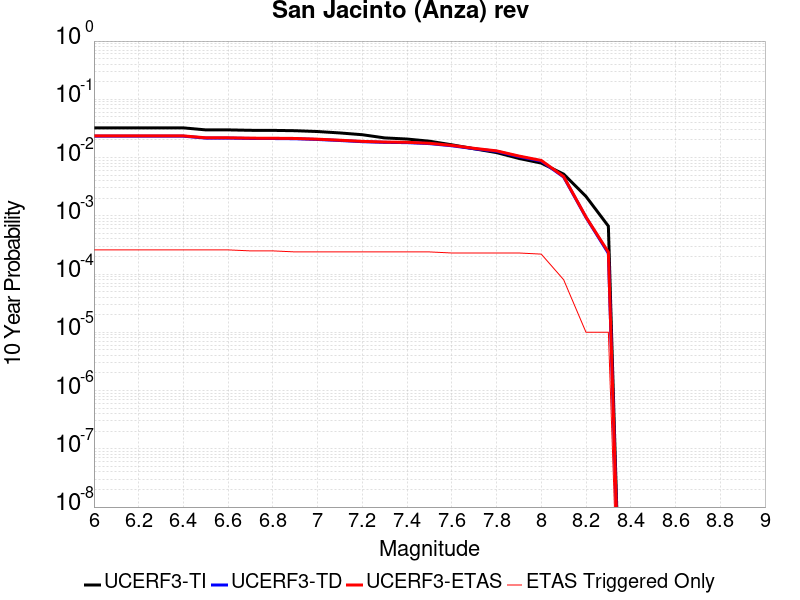 |

| Magnitude | 1 wk TI Prob | 1 wk TD Prob | 1 wk ETAS Prob | 1 wk ETAS/TD Gain | 1 wk ETAS Triggered Only | 1 mo TI Prob | 1 mo TD Prob | 1 mo ETAS Prob | 1 mo ETAS/TD Gain | 1 mo ETAS Triggered Only | 1 yr TI Prob | 1 yr TD Prob | 1 yr ETAS Prob | 1 yr ETAS/TD Gain | 1 yr ETAS Triggered Only | 10 yr TI Prob | 10 yr TD Prob | 10 yr ETAS Prob | 10 yr ETAS/TD Gain | 10 yr ETAS Triggered Only |
|-----|-----|-----|-----|-----|-----|-----|-----|-----|-----|-----|-----|-----|-----|-----|-----|-----|-----|-----|-----|-----|
| 6.0 | 6.3015636E-5 | 4.3302647E-5 | 1.4329831E-4 | 3.3092277 | 1.0E-4 | 2.7003905E-4 | 1.8556965E-4 | 3.2554366E-4 | 1.7542938 | 1.4E-4 | 0.0032827691 | 0.0022569813 | 0.0024465525 | 1.0839932 | 1.9E-4 | 0.032346968 | 0.023296192 | 0.023550136 | 1.0109006 | 2.6E-4 |
| 6.1 | 6.3015636E-5 | 4.3302647E-5 | 1.4329831E-4 | 3.3092277 | 1.0E-4 | 2.7003905E-4 | 1.8556965E-4 | 3.2554366E-4 | 1.7542938 | 1.4E-4 | 0.0032827691 | 0.0022569813 | 0.0024465525 | 1.0839932 | 1.9E-4 | 0.032346968 | 0.023296192 | 0.023550136 | 1.0109006 | 2.6E-4 |
| 6.2 | 6.3015636E-5 | 4.3302647E-5 | 1.4329831E-4 | 3.3092277 | 1.0E-4 | 2.7003905E-4 | 1.8556965E-4 | 3.2554366E-4 | 1.7542938 | 1.4E-4 | 0.0032827691 | 0.0022569813 | 0.0024465525 | 1.0839932 | 1.9E-4 | 0.032346968 | 0.023296192 | 0.023550136 | 1.0109006 | 2.6E-4 |
| 6.3 | 6.3015636E-5 | 4.3302647E-5 | 1.4329831E-4 | 3.3092277 | 1.0E-4 | 2.7003905E-4 | 1.8556965E-4 | 3.2554366E-4 | 1.7542938 | 1.4E-4 | 0.0032827691 | 0.0022569813 | 0.0024465525 | 1.0839932 | 1.9E-4 | 0.032346968 | 0.023296192 | 0.023550136 | 1.0109006 | 2.6E-4 |
| 6.4 | 6.3015636E-5 | 4.3302647E-5 | 1.4329831E-4 | 3.3092277 | 1.0E-4 | 2.7003905E-4 | 1.8556965E-4 | 3.2554366E-4 | 1.7542938 | 1.4E-4 | 0.0032827691 | 0.0022569813 | 0.0024465525 | 1.0839932 | 1.9E-4 | 0.032346968 | 0.023296192 | 0.023550136 | 1.0109006 | 2.6E-4 |
| 6.5 | 5.811017E-5 | 4.0082516E-5 | 1.4007851E-4 | 3.4947534 | 1.0E-4 | 2.4901982E-4 | 1.7177092E-4 | 3.1174687E-4 | 1.814899 | 1.4E-4 | 0.0030276014 | 0.002089311 | 0.0022789137 | 1.090749 | 1.9E-4 | 0.02986684 | 0.021593736 | 0.021848124 | 1.0117805 | 2.6E-4 |
| 6.6 | 5.811017E-5 | 4.0082516E-5 | 1.4007851E-4 | 3.4947534 | 1.0E-4 | 2.4901982E-4 | 1.7177092E-4 | 3.1174687E-4 | 1.814899 | 1.4E-4 | 0.0030276014 | 0.002089311 | 0.0022789137 | 1.090749 | 1.9E-4 | 0.02986684 | 0.021593736 | 0.021848124 | 1.0117805 | 2.6E-4 |
| 6.7 | 5.712442E-5 | 3.9505223E-5 | 1.3950127E-4 | 3.531211 | 1.0E-4 | 2.4479596E-4 | 1.6929714E-4 | 3.0927346E-4 | 1.8268083 | 1.4E-4 | 0.0029763177 | 0.0020592497 | 0.002238879 | 1.0872304 | 1.8E-4 | 0.029367693 | 0.021285562 | 0.02153024 | 1.011495 | 2.5E-4 |
| 6.8 | 5.6967532E-5 | 3.9361643E-5 | 1.3935771E-4 | 3.5404444 | 1.0E-4 | 2.4412372E-4 | 1.6868189E-4 | 3.0865826E-4 | 1.8298247 | 1.4E-4 | 0.0029681553 | 0.002051773 | 0.0022314037 | 1.087549 | 1.8E-4 | 0.029288229 | 0.021210281 | 0.021454979 | 1.0115367 | 2.5E-4 |
| 6.9 | 5.6211324E-5 | 3.9066435E-5 | 1.2906292E-4 | 3.3036778 | 9.0E-5 | 2.4088343E-4 | 1.6741687E-4 | 2.973951E-4 | 1.7763748 | 1.3E-4 | 0.0029288116 | 0.0020364004 | 0.002206054 | 1.0833106 | 1.7E-4 | 0.028905109 | 0.021049714 | 0.021284662 | 1.0111616 | 2.4E-4 |
| 7.0 | 5.4383527E-5 | 3.792697E-5 | 1.2792356E-4 | 3.3728917 | 9.0E-5 | 2.3305144E-4 | 1.6253405E-4 | 2.9251294E-4 | 1.7997024 | 1.3E-4 | 0.0028337094 | 0.001977061 | 0.0021467248 | 1.0858163 | 1.7E-4 | 0.027978465 | 0.020440677 | 0.020675771 | 1.0115013 | 2.4E-4 |
| 7.1 | 5.1393665E-5 | 3.6389913E-5 | 1.2638664E-4 | 3.4731228 | 9.0E-5 | 2.2023996E-4 | 1.5594746E-4 | 2.859272E-4 | 1.833484 | 1.3E-4 | 0.0026781242 | 0.0018970112 | 0.0020666886 | 1.0894446 | 1.7E-4 | 0.026460782 | 0.019614287 | 0.01984958 | 1.011996 | 2.4E-4 |
| 7.2 | 4.785222E-5 | 3.4741795E-5 | 1.2473867E-4 | 3.5904496 | 9.0E-5 | 2.0506482E-4 | 1.4888494E-4 | 2.7886557E-4 | 1.8730276 | 1.3E-4 | 0.0024938055 | 0.0018111705 | 0.0019808626 | 1.093692 | 1.7E-4 | 0.024660049 | 0.018728992 | 0.018964497 | 1.0125743 | 2.4E-4 |
| 7.3 | 4.2143256E-5 | 3.383628E-5 | 1.2383323E-4 | 3.659777 | 9.0E-5 | 1.8060145E-4 | 1.4500458E-4 | 2.7498574E-4 | 1.8963934 | 1.3E-4 | 0.002196605 | 0.0017640047 | 0.0019337048 | 1.0962017 | 1.7E-4 | 0.02175019 | 0.01823724 | 0.018472863 | 1.0129199 | 2.4E-4 |
| 7.4 | 4.0264713E-5 | 3.347446E-5 | 1.2347144E-4 | 3.6885266 | 9.0E-5 | 1.7255165E-4 | 1.4345412E-4 | 2.7343546E-4 | 1.9060831 | 1.3E-4 | 0.002098792 | 0.0017451581 | 0.0019148614 | 1.0972424 | 1.7E-4 | 0.020790804 | 0.018041821 | 0.01827749 | 1.0130625 | 2.4E-4 |
| 7.5 | 3.694492E-5 | 3.218847E-5 | 1.2218556E-4 | 3.7959425 | 9.0E-5 | 1.5832575E-4 | 1.379433E-4 | 2.6792535E-4 | 1.9422863 | 1.3E-4 | 0.0019259118 | 0.001678169 | 0.0018478837 | 1.1011308 | 1.7E-4 | 0.01909306 | 0.01735827 | 0.017594105 | 1.0135863 | 2.4E-4 |
| 7.6 | 3.200565E-5 | 2.9504106E-5 | 1.1950145E-4 | 4.050333 | 9.0E-5 | 1.3715986E-4 | 1.2644005E-4 | 2.564236E-4 | 2.0280252 | 1.3E-4 | 0.001668642 | 0.0015383229 | 0.0017080613 | 1.11034 | 1.7E-4 | 0.01656168 | 0.0159463 | 0.016172633 | 1.0141934 | 2.3E-4 |
| 7.7 | 2.731642E-5 | 2.6092788E-5 | 1.16090436E-4 | 4.449139 | 9.0E-5 | 1.1706512E-4 | 1.1182144E-4 | 2.418069E-4 | 2.1624377 | 1.3E-4 | 0.001424336 | 0.0013605768 | 0.0015303455 | 1.124777 | 1.7E-4 | 0.014152412 | 0.014167004 | 0.014393746 | 1.0160049 | 2.3E-4 |
| 7.8 | 2.3466424E-5 | 2.3504817E-5 | 1.13502705E-4 | 4.8289123 | 9.0E-5 | 1.0056651E-4 | 1.0073105E-4 | 2.3071795E-4 | 2.2904353 | 1.3E-4 | 0.0012237094 | 0.0012257113 | 0.001395503 | 1.138525 | 1.7E-4 | 0.012169928 | 0.012808893 | 0.0130359465 | 1.0177263 | 2.3E-4 |
| 7.9 | 1.8611925E-5 | 1.8908117E-5 | 1.0890642E-4 | 5.7597704 | 9.0E-5 | 7.9762955E-5 | 8.1032274E-5 | 2.1102175E-4 | 2.6041691 | 1.3E-4 | 9.7068126E-4 | 9.861222E-4 | 0.0011559544 | 1.1722225 | 1.7E-4 | 0.0096645225 | 0.010393824 | 0.010621434 | 1.0218985 | 2.3E-4 |
| 8.0 | 1.5460775E-5 | 1.5740965E-5 | 1.0573955E-4 | 6.717476 | 9.0E-5 | 6.6258784E-5 | 6.7459536E-5 | 1.9745076E-4 | 2.9269512 | 1.3E-4 | 8.0640207E-4 | 8.21011E-4 | 9.808796E-4 | 1.1947217 | 1.6E-4 | 0.008034821 | 0.0087028835 | 0.0089209685 | 1.025059 | 2.2E-4 |
| 8.1 | 9.983884E-6 | 8.269952E-6 | 2.8269786E-5 | 3.4183738 | 2.0E-5 | 4.2787375E-5 | 3.544217E-5 | 7.544075E-5 | 2.128559 | 4.0E-5 | 5.2081177E-4 | 4.314235E-4 | 4.8140195E-4 | 1.1158454 | 5.0E-5 | 0.0051959283 | 0.004640022 | 0.004719651 | 1.0171613 | 8.0E-5 |
| 8.2 | 4.1226E-6 | 1.5529788E-6 | 1.5529788E-6 | 1.0 | 0.0 | 1.7668166E-5 | 6.6556063E-6 | 6.6556063E-6 | 1.0 | 0.0 | 2.1508869E-4 | 8.102902E-5 | 9.102821E-5 | 1.1234026 | 1.0E-5 | 0.0021488064 | 9.4050163E-4 | 9.504923E-4 | 1.0106226 | 1.0E-5 |
| 8.3 | 1.2750878E-6 | 3.612133E-7 | 3.612133E-7 | 1.0 | 0.0 | 5.4646503E-6 | 1.548056E-6 | 1.548056E-6 | 1.0 | 0.0 | 6.653009E-5 | 1.8847424E-5 | 2.8847235E-5 | 1.5305665 | 1.0E-5 | 6.6510175E-4 | 2.2734253E-4 | 2.3734027E-4 | 1.0439765 | 1.0E-5 |

## San Jacinto (Stepovers Combined)
*[(top)](#table-of-contents)*

| 1 Week | 1 Month | 1 Year | 10 Year |
|-----|-----|-----|-----|
|  | 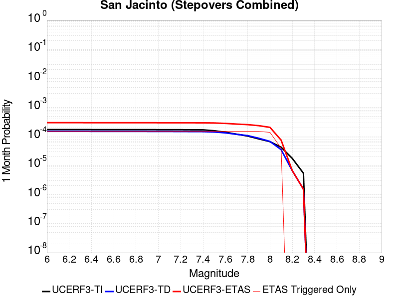 |  |  |

| Magnitude | 1 wk TI Prob | 1 wk TD Prob | 1 wk ETAS Prob | 1 wk ETAS/TD Gain | 1 wk ETAS Triggered Only | 1 mo TI Prob | 1 mo TD Prob | 1 mo ETAS Prob | 1 mo ETAS/TD Gain | 1 mo ETAS Triggered Only | 1 yr TI Prob | 1 yr TD Prob | 1 yr ETAS Prob | 1 yr ETAS/TD Gain | 1 yr ETAS Triggered Only | 10 yr TI Prob | 10 yr TD Prob | 10 yr ETAS Prob | 10 yr ETAS/TD Gain | 10 yr ETAS Triggered Only |
|-----|-----|-----|-----|-----|-----|-----|-----|-----|-----|-----|-----|-----|-----|-----|-----|-----|-----|-----|-----|-----|
| 6.0 | 4.0667746E-5 | 3.5272755E-5 | 1.4526887E-4 | 4.118444 | 1.1E-4 | 1.742787E-4 | 1.5116022E-4 | 3.0113754E-4 | 1.9921746 | 1.5E-4 | 0.0021197782 | 0.0018388226 | 0.0020284732 | 1.103137 | 1.9E-4 | 0.020996714 | 0.018986892 | 0.019241955 | 1.0134337 | 2.6E-4 |
| 6.1 | 4.0667746E-5 | 3.5272755E-5 | 1.4526887E-4 | 4.118444 | 1.1E-4 | 1.742787E-4 | 1.5116022E-4 | 3.0113754E-4 | 1.9921746 | 1.5E-4 | 0.0021197782 | 0.0018388226 | 0.0020284732 | 1.103137 | 1.9E-4 | 0.020996714 | 0.018986892 | 0.019241955 | 1.0134337 | 2.6E-4 |
| 6.2 | 4.0667746E-5 | 3.5272755E-5 | 1.4526887E-4 | 4.118444 | 1.1E-4 | 1.742787E-4 | 1.5116022E-4 | 3.0113754E-4 | 1.9921746 | 1.5E-4 | 0.0021197782 | 0.0018388226 | 0.0020284732 | 1.103137 | 1.9E-4 | 0.020996714 | 0.018986892 | 0.019241955 | 1.0134337 | 2.6E-4 |
| 6.3 | 4.0667746E-5 | 3.5272755E-5 | 1.4526887E-4 | 4.118444 | 1.1E-4 | 1.742787E-4 | 1.5116022E-4 | 3.0113754E-4 | 1.9921746 | 1.5E-4 | 0.0021197782 | 0.0018388226 | 0.0020284732 | 1.103137 | 1.9E-4 | 0.020996714 | 0.018986892 | 0.019241955 | 1.0134337 | 2.6E-4 |
| 6.4 | 4.0577226E-5 | 3.5144654E-5 | 1.4514079E-4 | 4.1298113 | 1.1E-4 | 1.738908E-4 | 1.5061127E-4 | 3.0058867E-4 | 1.9957914 | 1.5E-4 | 0.0021150648 | 0.0018321523 | 0.0020218042 | 1.1035131 | 1.9E-4 | 0.020950472 | 0.018921461 | 0.01917654 | 1.013481 | 2.6E-4 |
| 6.5 | 4.0577226E-5 | 3.5144654E-5 | 1.4514079E-4 | 4.1298113 | 1.1E-4 | 1.738908E-4 | 1.5061127E-4 | 3.0058867E-4 | 1.9957914 | 1.5E-4 | 0.0021150648 | 0.0018321523 | 0.0020218042 | 1.1035131 | 1.9E-4 | 0.020950472 | 0.018921461 | 0.01917654 | 1.013481 | 2.6E-4 |
| 6.6 | 4.053861E-5 | 3.509E-5 | 1.4508615E-4 | 4.134686 | 1.1E-4 | 1.7372532E-4 | 1.5037706E-4 | 3.003545E-4 | 1.9973425 | 1.5E-4 | 0.0021130538 | 0.0018293057 | 0.002018958 | 1.1036745 | 1.9E-4 | 0.020930743 | 0.018893538 | 0.019148625 | 1.0135013 | 2.6E-4 |
| 6.7 | 4.0516545E-5 | 3.5059067E-5 | 1.4505521E-4 | 4.137452 | 1.1E-4 | 1.7363077E-4 | 1.5024451E-4 | 3.00222E-4 | 1.9982226 | 1.5E-4 | 0.002111905 | 0.001827695 | 0.0020173478 | 1.1037661 | 1.9E-4 | 0.020919468 | 0.018877735 | 0.019132826 | 1.0135128 | 2.6E-4 |
| 6.8 | 4.049434E-5 | 3.5030633E-5 | 1.4502677E-4 | 4.139999 | 1.1E-4 | 1.7353562E-4 | 1.5012265E-4 | 3.0010013E-4 | 1.999033 | 1.5E-4 | 0.0021107488 | 0.0018262138 | 0.0020158668 | 1.1038504 | 1.9E-4 | 0.020908125 | 0.018863149 | 0.019118244 | 1.0135235 | 2.6E-4 |
| 6.9 | 4.046386E-5 | 3.499319E-5 | 1.4498935E-4 | 4.1433587 | 1.1E-4 | 1.73405E-4 | 1.4996222E-4 | 2.999397E-4 | 2.000102 | 1.5E-4 | 0.0021091616 | 0.0018242638 | 0.002013917 | 1.1039616 | 1.9E-4 | 0.020892553 | 0.01884392 | 0.019099021 | 1.0135375 | 2.6E-4 |
| 7.0 | 4.036382E-5 | 3.487376E-5 | 1.4486992E-4 | 4.1541243 | 1.1E-4 | 1.7297632E-4 | 1.4945042E-4 | 2.99428E-4 | 2.0035274 | 1.5E-4 | 0.0021039525 | 0.0018180435 | 0.0020076982 | 1.1043179 | 1.9E-4 | 0.02084144 | 0.018782536 | 0.019037653 | 1.0135826 | 2.6E-4 |
| 7.1 | 4.0343282E-5 | 3.4852223E-5 | 1.4484838E-4 | 4.1560736 | 1.1E-4 | 1.7288832E-4 | 1.4935812E-4 | 2.9933572E-4 | 2.0041475 | 1.5E-4 | 0.002102883 | 0.0018169218 | 0.0020065766 | 1.1043825 | 1.9E-4 | 0.020830948 | 0.018771412 | 0.019026533 | 1.0135908 | 2.6E-4 |
| 7.2 | 4.0257353E-5 | 3.4756722E-5 | 1.4475289E-4 | 4.1647453 | 1.1E-4 | 1.725201E-4 | 1.489489E-4 | 2.9892655E-4 | 2.0069067 | 1.5E-4 | 0.0020984085 | 0.0018119477 | 0.0020016034 | 1.1046696 | 1.9E-4 | 0.020787042 | 0.018722152 | 0.018977284 | 1.0136273 | 2.6E-4 |
| 7.3 | 3.9940667E-5 | 3.4584376E-5 | 1.4458057E-4 | 4.1805167 | 1.1E-4 | 1.7116306E-4 | 1.4821035E-4 | 2.9818813E-4 | 2.011925 | 1.5E-4 | 0.0020819185 | 0.0018029709 | 0.0019926284 | 1.1051916 | 1.9E-4 | 0.020625217 | 0.018630784 | 0.01888594 | 1.0136954 | 2.6E-4 |
| 7.4 | 3.9721202E-5 | 3.4469766E-5 | 1.4446597E-4 | 4.1910925 | 1.1E-4 | 1.7022261E-4 | 1.4771923E-4 | 2.9769706E-4 | 2.01529 | 1.5E-4 | 0.0020704903 | 0.0017970012 | 0.0019866598 | 1.1055417 | 1.9E-4 | 0.020513052 | 0.018569905 | 0.018825078 | 1.0137411 | 2.6E-4 |
| 7.5 | 3.7036873E-5 | 3.3537188E-5 | 1.435335E-4 | 4.2798314 | 1.1E-4 | 1.5871979E-4 | 1.437229E-4 | 2.9370133E-4 | 2.043525 | 1.5E-4 | 0.0019307006 | 0.0017484248 | 0.0019380926 | 1.1084793 | 1.9E-4 | 0.019140124 | 0.018071463 | 0.018326765 | 1.0141274 | 2.6E-4 |
| 7.6 | 3.2940967E-5 | 3.1317984E-5 | 1.4131454E-4 | 4.5122485 | 1.1E-4 | 1.4116794E-4 | 1.3421304E-4 | 2.841929E-4 | 2.117476 | 1.5E-4 | 0.0017173645 | 0.0016328214 | 0.0018225111 | 1.116173 | 1.9E-4 | 0.01704153 | 0.016904354 | 0.017150128 | 1.0145391 | 2.5E-4 |
| 7.7 | 2.8236149E-5 | 2.7883889E-5 | 1.3788082E-4 | 4.9448204 | 1.1E-4 | 1.2100645E-4 | 1.19496915E-4 | 2.69479E-4 | 2.2551124 | 1.5E-4 | 0.0014722579 | 0.001453905 | 0.0016436288 | 1.1304926 | 1.9E-4 | 0.014625421 | 0.015115095 | 0.0153613165 | 1.0162897 | 2.5E-4 |
| 7.8 | 2.4329287E-5 | 2.5207537E-5 | 1.3520477E-4 | 5.363664 | 1.1E-4 | 1.042642E-4 | 1.0802783E-4 | 2.5801163E-4 | 2.388381 | 1.5E-4 | 0.0012686774 | 0.0013144462 | 0.0015041964 | 1.1443576 | 1.9E-4 | 0.012614589 | 0.013712396 | 0.013958967 | 1.0179816 | 2.5E-4 |
| 7.9 | 1.9370926E-5 | 2.0421452E-5 | 1.3041921E-4 | 6.3863826 | 1.1E-4 | 8.301561E-5 | 8.7517576E-5 | 2.3750444E-4 | 2.7137914 | 1.5E-4 | 0.0010102465 | 0.0010650064 | 0.0012548041 | 1.1782126 | 1.9E-4 | 0.0100566605 | 0.011199483 | 0.011446683 | 1.0220724 | 2.5E-4 |
| 8.0 | 1.5583017E-5 | 1.588647E-5 | 1.1588488E-4 | 7.294565 | 1.0E-4 | 6.6782646E-5 | 6.808309E-5 | 2.0807356E-4 | 3.0561707 | 1.4E-4 | 8.127754E-4 | 8.285971E-4 | 9.984563E-4 | 1.2049961 | 1.7E-4 | 0.008098091 | 0.008781809 | 0.00900979 | 1.0259604 | 2.3E-4 |
| 8.1 | 1.0024873E-5 | 8.292404E-6 | 2.8292237E-5 | 3.411826 | 2.0E-5 | 4.2963035E-5 | 3.5538393E-5 | 7.553697E-5 | 2.1255033 | 4.0E-5 | 5.229494E-4 | 4.3259456E-4 | 4.825729E-4 | 1.1155317 | 5.0E-5 | 0.0052172043 | 0.0046534105 | 0.004733038 | 1.0171117 | 8.0E-5 |
| 8.2 | 4.142796E-6 | 1.5610041E-6 | 1.5610041E-6 | 1.0 | 0.0 | 1.775472E-5 | 6.69E-6 | 6.69E-6 | 1.0 | 0.0 | 2.1614227E-4 | 8.144774E-5 | 9.144692E-5 | 1.1227682 | 1.0E-5 | 0.0021593217 | 9.454649E-4 | 9.554554E-4 | 1.0105668 | 1.0E-5 |
| 8.3 | 1.2750878E-6 | 3.612133E-7 | 3.612133E-7 | 1.0 | 0.0 | 5.4646503E-6 | 1.548056E-6 | 1.548056E-6 | 1.0 | 0.0 | 6.653009E-5 | 1.8847424E-5 | 2.8847235E-5 | 1.5305665 | 1.0E-5 | 6.6510175E-4 | 2.2734253E-4 | 2.3734027E-4 | 1.0439765 | 1.0E-5 |

## Blue Cut
*[(top)](#table-of-contents)*

| 1 Week | 1 Month | 1 Year | 10 Year |
|-----|-----|-----|-----|
|  | 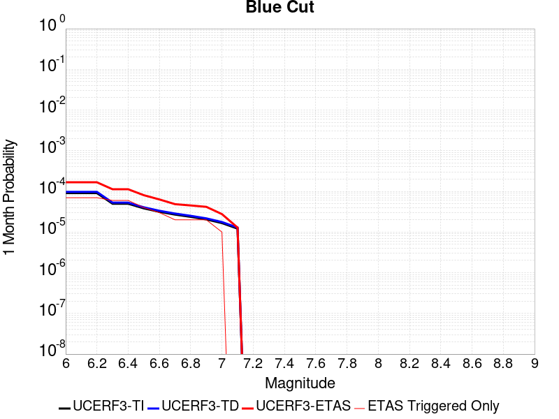 | 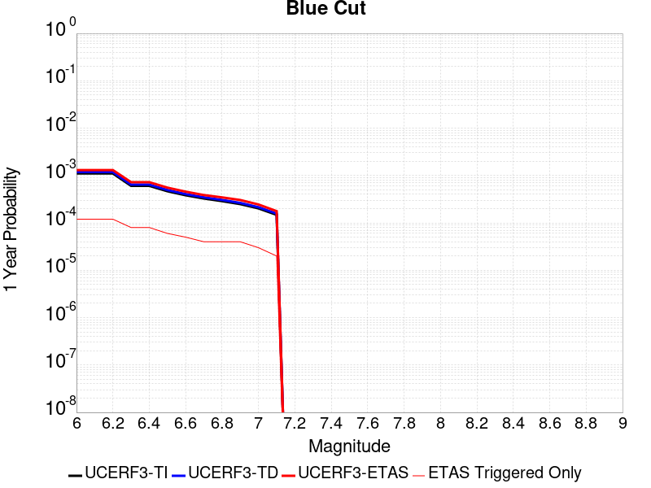 |  |

| Magnitude | 1 wk TI Prob | 1 wk TD Prob | 1 wk ETAS Prob | 1 wk ETAS/TD Gain | 1 wk ETAS Triggered Only | 1 mo TI Prob | 1 mo TD Prob | 1 mo ETAS Prob | 1 mo ETAS/TD Gain | 1 mo ETAS Triggered Only | 1 yr TI Prob | 1 yr TD Prob | 1 yr ETAS Prob | 1 yr ETAS/TD Gain | 1 yr ETAS Triggered Only | 10 yr TI Prob | 10 yr TD Prob | 10 yr ETAS Prob | 10 yr ETAS/TD Gain | 10 yr ETAS Triggered Only |
|-----|-----|-----|-----|-----|-----|-----|-----|-----|-----|-----|-----|-----|-----|-----|-----|-----|-----|-----|-----|-----|
| 6.0 | 2.1227985E-5 | 2.2719574E-5 | 6.271867E-5 | 2.7605565 | 4.0E-5 | 9.097391E-5 | 9.73663E-5 | 1.6735948E-4 | 1.7188646 | 7.0E-5 | 0.0011070445 | 0.0011848481 | 0.001304706 | 1.1011589 | 1.2E-4 | 0.011015458 | 0.011791152 | 0.0119887935 | 1.0167619 | 2.0E-4 |
| 6.1 | 2.1227985E-5 | 2.2719574E-5 | 6.271867E-5 | 2.7605565 | 4.0E-5 | 9.097391E-5 | 9.73663E-5 | 1.6735948E-4 | 1.7188646 | 7.0E-5 | 0.0011070445 | 0.0011848481 | 0.001304706 | 1.1011589 | 1.2E-4 | 0.011015458 | 0.011791152 | 0.0119887935 | 1.0167619 | 2.0E-4 |
| 6.2 | 2.1227985E-5 | 2.2719574E-5 | 6.271867E-5 | 2.7605565 | 4.0E-5 | 9.097391E-5 | 9.73663E-5 | 1.6735948E-4 | 1.7188646 | 7.0E-5 | 0.0011070445 | 0.0011848481 | 0.001304706 | 1.1011589 | 1.2E-4 | 0.011015458 | 0.011791152 | 0.0119887935 | 1.0167619 | 2.0E-4 |
| 6.3 | 1.1613981E-5 | 1.2353542E-5 | 4.235317E-5 | 3.4284234 | 3.0E-5 | 4.9773254E-5 | 5.2942745E-5 | 1.1293957E-4 | 2.1332397 | 6.0E-5 | 6.0582085E-4 | 6.443998E-4 | 7.2434824E-4 | 1.1240666 | 8.0E-5 | 0.0060417196 | 0.0064265593 | 0.0065656593 | 1.0216446 | 1.4E-4 |
| 6.4 | 1.1613981E-5 | 1.2353542E-5 | 4.235317E-5 | 3.4284234 | 3.0E-5 | 4.9773254E-5 | 5.2942745E-5 | 1.1293957E-4 | 2.1332397 | 6.0E-5 | 6.0582085E-4 | 6.443998E-4 | 7.2434824E-4 | 1.1240666 | 8.0E-5 | 0.0060417196 | 0.0064265593 | 0.0065656593 | 1.0216446 | 1.4E-4 |
| 6.5 | 8.931326E-6 | 9.4816E-6 | 2.948141E-5 | 3.1093287 | 2.0E-5 | 3.8276554E-5 | 4.0634844E-5 | 8.063322E-5 | 1.9843369 | 4.0E-5 | 4.6591737E-4 | 4.946261E-4 | 5.545964E-4 | 1.1212437 | 6.0E-5 | 0.0046494175 | 0.004936161 | 0.0050356677 | 1.0201586 | 1.0E-4 |
| 6.6 | 7.345353E-6 | 7.79028E-6 | 1.7790202E-5 | 2.283641 | 1.0E-5 | 3.1479703E-5 | 3.338653E-5 | 6.338553E-5 | 1.898536 | 3.0E-5 | 3.83198E-4 | 4.064132E-4 | 4.5639285E-4 | 1.1229775 | 5.0E-5 | 0.0038253788 | 0.0040574907 | 0.0041371663 | 1.0196366 | 8.0E-5 |
| 6.7 | 6.2775666E-6 | 6.655149E-6 | 6.655149E-6 | 1.0 | 0.0 | 2.690358E-5 | 2.8521798E-5 | 4.8521226E-5 | 1.7011981 | 2.0E-5 | 3.2750185E-4 | 3.472051E-4 | 3.871912E-4 | 1.1151657 | 4.0E-5 | 0.0032701963 | 0.003467367 | 0.0035371245 | 1.0201182 | 7.0E-5 |
| 6.8 | 5.5234095E-6 | 5.8551113E-6 | 5.8551113E-6 | 1.0 | 0.0 | 2.367154E-5 | 2.5093133E-5 | 4.509263E-5 | 1.7970108 | 2.0E-5 | 2.8816288E-4 | 3.0547334E-4 | 3.4546113E-4 | 1.1309043 | 4.0E-5 | 0.002877895 | 0.0030512505 | 0.003101098 | 1.0163367 | 5.0E-5 |
| 6.9 | 4.7780054E-6 | 5.0654203E-6 | 5.0654203E-6 | 1.0 | 0.0 | 2.0477004E-5 | 2.1708804E-5 | 4.170837E-5 | 1.9212652 | 2.0E-5 | 2.4927902E-4 | 2.642797E-4 | 3.042691E-4 | 1.1513149 | 4.0E-5 | 0.0024899957 | 0.002640346 | 0.0026902142 | 1.0188869 | 5.0E-5 |
| 7.0 | 3.883171E-6 | 4.118487E-6 | 4.118487E-6 | 1.0 | 0.0 | 1.6642054E-5 | 1.7650578E-5 | 2.7650402E-5 | 1.5665437 | 1.0E-5 | 2.0259817E-4 | 2.1488148E-4 | 2.4487503E-4 | 1.1395818 | 3.0E-5 | 0.0020241356 | 0.0021474129 | 0.002187327 | 1.0185871 | 4.0E-5 |
| 7.1 | 2.8358215E-6 | 3.0097158E-6 | 3.0097158E-6 | 1.0 | 0.0 | 1.2153464E-5 | 1.2898756E-5 | 1.2898756E-5 | 1.0 | 0.0 | 1.4795837E-4 | 1.5703762E-4 | 1.7703447E-4 | 1.127338 | 2.0E-5 | 0.001478599 | 0.0015699116 | 0.0015998646 | 1.0190793 | 3.0E-5 |

## Brawley (Seismic Zone) alt 1
*[(top)](#table-of-contents)*

| 1 Week | 1 Month | 1 Year | 10 Year |
|-----|-----|-----|-----|
|  |  |  | 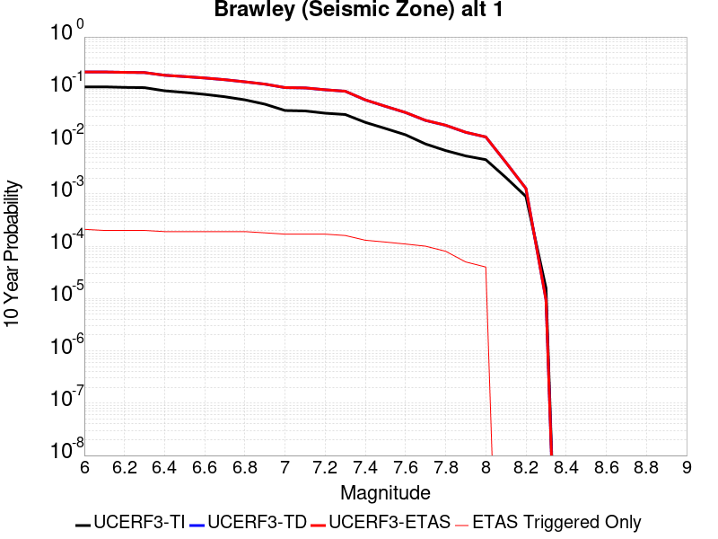 |

| Magnitude | 1 wk TI Prob | 1 wk TD Prob | 1 wk ETAS Prob | 1 wk ETAS/TD Gain | 1 wk ETAS Triggered Only | 1 mo TI Prob | 1 mo TD Prob | 1 mo ETAS Prob | 1 mo ETAS/TD Gain | 1 mo ETAS Triggered Only | 1 yr TI Prob | 1 yr TD Prob | 1 yr ETAS Prob | 1 yr ETAS/TD Gain | 1 yr ETAS Triggered Only | 10 yr TI Prob | 10 yr TD Prob | 10 yr ETAS Prob | 10 yr ETAS/TD Gain | 10 yr ETAS Triggered Only |
|-----|-----|-----|-----|-----|-----|-----|-----|-----|-----|-----|-----|-----|-----|-----|-----|-----|-----|-----|-----|-----|
| 6.0 | 2.2521618E-4 | 4.7632487E-4 | 5.163058E-4 | 1.0839363 | 4.0E-5 | 9.6485513E-4 | 0.0020398323 | 0.0021096894 | 1.0342466 | 7.0E-5 | 0.011683988 | 0.024546238 | 0.024653537 | 1.0043713 | 1.1E-4 | 0.11088423 | 0.21350002 | 0.21366519 | 1.0007735 | 2.1E-4 |
| 6.1 | 2.2521618E-4 | 4.7632487E-4 | 5.163058E-4 | 1.0839363 | 4.0E-5 | 9.6485513E-4 | 0.0020398323 | 0.0020997098 | 1.0293542 | 6.0E-5 | 0.011683988 | 0.024546238 | 0.024643783 | 1.003974 | 1.0E-4 | 0.11088423 | 0.21350002 | 0.21365732 | 1.0007367 | 2.0E-4 |
| 6.2 | 2.198148E-4 | 4.6717093E-4 | 5.0715223E-4 | 1.0855818 | 4.0E-5 | 9.417233E-4 | 0.0020006616 | 0.0020605414 | 1.0299301 | 6.0E-5 | 0.011405343 | 0.024080504 | 0.024178095 | 1.0040528 | 1.0E-4 | 0.10837428 | 0.20993657 | 0.21009459 | 1.0007527 | 2.0E-4 |
| 6.3 | 2.1704129E-4 | 4.615278E-4 | 5.015093E-4 | 1.0866287 | 4.0E-5 | 9.298453E-4 | 0.0019765133 | 0.0020363948 | 1.0302964 | 6.0E-5 | 0.011262234 | 0.02379366 | 0.023891281 | 1.0041028 | 1.0E-4 | 0.107082725 | 0.20782755 | 0.20798598 | 1.0007623 | 2.0E-4 |
| 6.4 | 1.876142E-4 | 4.00449E-4 | 4.4043298E-4 | 1.0998479 | 4.0E-5 | 8.038131E-4 | 0.0017150956 | 0.0017749927 | 1.0349234 | 6.0E-5 | 0.00974259 | 0.020680401 | 0.020778334 | 1.0047355 | 1.0E-4 | 0.093263686 | 0.18457815 | 0.18473308 | 1.0008394 | 1.9E-4 |
| 6.5 | 1.7390939E-4 | 3.7477075E-4 | 4.1475578E-4 | 1.106692 | 4.0E-5 | 7.45113E-4 | 0.0016051838 | 0.0016650875 | 1.037319 | 6.0E-5 | 0.009034078 | 0.019368723 | 0.019466786 | 1.0050629 | 1.0E-4 | 0.086755216 | 0.17440031 | 0.17455718 | 1.0008994 | 1.9E-4 |
| 6.6 | 1.591791E-4 | 3.4891962E-4 | 3.8890567E-4 | 1.1145996 | 4.0E-5 | 6.8201777E-4 | 0.0014945229 | 0.0015544333 | 1.0400866 | 6.0E-5 | 0.008271996 | 0.018045569 | 0.018143766 | 1.0054415 | 1.0E-4 | 0.07970774 | 0.16380852 | 0.1639674 | 1.0009699 | 1.9E-4 |
| 6.7 | 1.4268003E-4 | 3.20582E-4 | 3.605692E-4 | 1.1247331 | 4.0E-5 | 6.1134255E-4 | 0.0013732077 | 0.0014331252 | 1.0436333 | 6.0E-5 | 0.007417723 | 0.016592601 | 0.016690943 | 1.0059267 | 1.0E-4 | 0.07174956 | 0.15193306 | 0.1520942 | 1.0010606 | 1.9E-4 |
| 6.8 | 1.239713E-4 | 2.9053655E-4 | 3.3052493E-4 | 1.1376363 | 4.0E-5 | 5.3119735E-4 | 0.0012445687 | 0.001304494 | 1.0481495 | 6.0E-5 | 0.0064481674 | 0.015048777 | 0.0151472725 | 1.0065451 | 1.0E-4 | 0.06264243 | 0.13837762 | 0.13854134 | 1.001183 | 1.9E-4 |
| 6.9 | 1.0180238E-4 | 2.625439E-4 | 2.9253602E-4 | 1.1142366 | 3.0E-5 | 4.3622297E-4 | 0.0011247073 | 0.001174651 | 1.044406 | 5.0E-5 | 0.005298089 | 0.013608336 | 0.013697111 | 1.0065236 | 9.0E-5 | 0.05173543 | 0.124961674 | 0.12511918 | 1.0012604 | 1.8E-4 |
| 7.0 | 7.6619996E-5 | 2.23993E-4 | 2.5398628E-4 | 1.1339028 | 3.0E-5 | 3.283301E-4 | 9.5962E-4 | 9.995817E-4 | 1.0416431 | 4.0E-5 | 0.0039900932 | 0.011621496 | 0.011700566 | 1.0068038 | 8.0E-5 | 0.039192066 | 0.107266866 | 0.10741863 | 1.0014148 | 1.7E-4 |
| 7.1 | 7.5127435E-5 | 2.2082464E-4 | 2.50818E-4 | 1.1358244 | 3.0E-5 | 3.2193496E-4 | 9.4605127E-4 | 9.860134E-4 | 1.042241 | 4.0E-5 | 0.0039125155 | 0.011458045 | 0.011537128 | 1.006902 | 8.0E-5 | 0.038443442 | 0.10583085 | 0.105982855 | 1.0014364 | 1.7E-4 |
| 7.2 | 6.788582E-5 | 2.0210193E-4 | 2.3209587E-4 | 1.14841 | 3.0E-5 | 2.9090676E-4 | 8.6586666E-4 | 9.0583204E-4 | 1.0461565 | 4.0E-5 | 0.0035360386 | 0.0104916105 | 0.010570771 | 1.0075451 | 8.0E-5 | 0.034803 | 0.09750131 | 0.09765474 | 1.0015736 | 1.7E-4 |
| 7.3 | 6.399602E-5 | 1.8841137E-4 | 2.1840572E-4 | 1.159196 | 3.0E-5 | 2.7423984E-4 | 8.072303E-4 | 8.47198E-4 | 1.0495121 | 4.0E-5 | 0.0033337586 | 0.009784332 | 0.009863548 | 1.0080963 | 8.0E-5 | 0.03284188 | 0.09139617 | 0.09154154 | 1.0015906 | 1.6E-4 |
| 7.4 | 4.506759E-5 | 1.2529209E-4 | 1.3529083E-4 | 1.0798035 | 1.0E-5 | 1.9313251E-4 | 5.368565E-4 | 5.5684574E-4 | 1.037234 | 2.0E-5 | 0.0023488526 | 0.0065168133 | 0.0065664877 | 1.0076225 | 5.0E-5 | 0.023241805 | 0.062363707 | 0.062485598 | 1.0019546 | 1.3E-4 |
| 7.5 | 3.43289E-5 | 9.33541E-5 | 1.03353166E-4 | 1.1071091 | 1.0E-5 | 1.4711556E-4 | 4.00028E-4 | 4.1002396E-4 | 1.0249883 | 1.0E-5 | 0.0017896603 | 0.0048595266 | 0.0048993323 | 1.0081912 | 4.0E-5 | 0.01775316 | 0.04705519 | 0.047169544 | 1.0024302 | 1.2E-4 |
| 7.6 | 2.5980507E-5 | 7.053101E-5 | 8.0530306E-5 | 1.1417716 | 1.0E-5 | 1.1134028E-4 | 3.0224086E-4 | 3.1223785E-4 | 1.0330762 | 1.0E-5 | 0.001354725 | 0.003673598 | 0.0037134509 | 1.0108485 | 4.0E-5 | 0.013464959 | 0.035840835 | 0.03594689 | 1.0029591 | 1.1E-4 |
| 7.7 | 1.7292105E-5 | 4.9407296E-5 | 5.9406804E-5 | 1.2023892 | 1.0E-5 | 7.4106916E-5 | 2.117284E-4 | 2.2172628E-4 | 1.0472203 | 1.0E-5 | 9.018782E-4 | 0.0025747516 | 0.0026146488 | 1.0154954 | 4.0E-5 | 0.008982267 | 0.025290398 | 0.025387868 | 1.003854 | 1.0E-4 |
| 7.8 | 1.2927471E-5 | 3.9693266E-5 | 4.969287E-5 | 1.2519219 | 1.0E-5 | 5.5402274E-5 | 1.7010293E-4 | 1.8010123E-4 | 1.0587779 | 1.0E-5 | 6.743139E-4 | 0.0020690386 | 0.0021089558 | 1.0192926 | 4.0E-5 | 0.0067227143 | 0.020431727 | 0.020510094 | 1.0038354 | 8.0E-5 |
| 7.9 | 1.0200774E-5 | 2.874569E-5 | 2.874569E-5 | 1.0 | 0.0 | 4.371687E-5 | 1.2319001E-4 | 1.2319001E-4 | 1.0 | 0.0 | 5.321229E-4 | 0.0014988075 | 0.0015287625 | 1.0199859 | 3.0E-5 | 0.005308505 | 0.014991644 | 0.015040894 | 1.0032852 | 5.0E-5 |
| 8.0 | 8.650396E-6 | 2.3277367E-5 | 2.3277367E-5 | 1.0 | 0.0 | 3.70726E-5 | 9.975634E-5 | 9.975634E-5 | 1.0 | 0.0 | 4.5126543E-4 | 0.0012138576 | 0.0012338333 | 1.0164564 | 2.0E-5 | 0.0045035016 | 0.012211097 | 0.012250609 | 1.0032357 | 4.0E-5 |
| 8.1 | 3.9368224E-6 | 7.3279825E-6 | 7.3279825E-6 | 1.0 | 0.0 | 1.6871985E-5 | 3.140526E-5 | 3.140526E-5 | 1.0 | 0.0 | 2.0539707E-4 | 3.8229208E-4 | 3.8229208E-4 | 1.0 | 0.0 | 0.0020520731 | 0.004001185 | 0.004001185 | 1.0 | 0.0 |
| 8.2 | 1.7101195E-6 | 2.217876E-6 | 2.217876E-6 | 1.0 | 0.0 | 7.329063E-6 | 9.505149E-6 | 9.505149E-6 | 1.0 | 0.0 | 8.922769E-5 | 1.1571907E-4 | 1.1571907E-4 | 1.0 | 0.0 | 8.9191867E-4 | 0.0012666774 | 0.0012666774 | 1.0 | 0.0 |
| 8.3 | 3.0346666E-8 | 1.721586E-8 | 1.721586E-8 | 1.0 | 0.0 | 1.3005713E-7 | 7.378226E-8 | 7.378226E-8 | 1.0 | 0.0 | 1.5834444E-6 | 8.9829894E-7 | 8.9829894E-7 | 1.0 | 0.0 | 1.5834332E-5 | 9.367729E-6 | 9.367729E-6 | 1.0 | 0.0 |

## Santa Ynez (East)
*[(top)](#table-of-contents)*

| 1 Week | 1 Month | 1 Year | 10 Year |
|-----|-----|-----|-----|
|  |  |  |  |

| Magnitude | 1 wk TI Prob | 1 wk TD Prob | 1 wk ETAS Prob | 1 wk ETAS/TD Gain | 1 wk ETAS Triggered Only | 1 mo TI Prob | 1 mo TD Prob | 1 mo ETAS Prob | 1 mo ETAS/TD Gain | 1 mo ETAS Triggered Only | 1 yr TI Prob | 1 yr TD Prob | 1 yr ETAS Prob | 1 yr ETAS/TD Gain | 1 yr ETAS Triggered Only | 10 yr TI Prob | 10 yr TD Prob | 10 yr ETAS Prob | 10 yr ETAS/TD Gain | 10 yr ETAS Triggered Only |
|-----|-----|-----|-----|-----|-----|-----|-----|-----|-----|-----|-----|-----|-----|-----|-----|-----|-----|-----|-----|-----|
| 6.0 | 3.2269712E-5 | 3.67505E-5 | 1.16747564E-4 | 3.176761 | 8.0E-5 | 1.3829143E-4 | 1.5749598E-4 | 2.5748022E-4 | 1.6348369 | 1.0E-4 | 0.0016823979 | 0.0019164166 | 0.0020461674 | 1.0677049 | 1.3E-4 | 0.016697178 | 0.019056441 | 0.019223202 | 1.0087509 | 1.7E-4 |
| 6.1 | 3.2269712E-5 | 3.67505E-5 | 1.16747564E-4 | 3.176761 | 8.0E-5 | 1.3829143E-4 | 1.5749598E-4 | 2.5748022E-4 | 1.6348369 | 1.0E-4 | 0.0016823979 | 0.0019164166 | 0.0020461674 | 1.0677049 | 1.3E-4 | 0.016697178 | 0.019056441 | 0.019223202 | 1.0087509 | 1.7E-4 |
| 6.2 | 3.2269712E-5 | 3.67505E-5 | 1.16747564E-4 | 3.176761 | 8.0E-5 | 1.3829143E-4 | 1.5749598E-4 | 2.5748022E-4 | 1.6348369 | 1.0E-4 | 0.0016823979 | 0.0019164166 | 0.0020461674 | 1.0677049 | 1.3E-4 | 0.016697178 | 0.019056441 | 0.019223202 | 1.0087509 | 1.7E-4 |
| 6.3 | 3.2269712E-5 | 3.67505E-5 | 1.16747564E-4 | 3.176761 | 8.0E-5 | 1.3829143E-4 | 1.5749598E-4 | 2.5748022E-4 | 1.6348369 | 1.0E-4 | 0.0016823979 | 0.0019164166 | 0.0020461674 | 1.0677049 | 1.3E-4 | 0.016697178 | 0.019056441 | 0.019223202 | 1.0087509 | 1.7E-4 |
| 6.4 | 1.4404779E-5 | 1.4849382E-5 | 4.4848937E-5 | 3.020256 | 3.0E-5 | 6.1733306E-5 | 6.363868E-5 | 1.0363614E-4 | 1.6285084 | 4.0E-5 | 7.513438E-4 | 7.745306E-4 | 8.344841E-4 | 1.0774063 | 6.0E-5 | 0.0074880854 | 0.007718862 | 0.0077783987 | 1.0077132 | 6.0E-5 |
| 6.5 | 1.4404779E-5 | 1.4849382E-5 | 4.4848937E-5 | 3.020256 | 3.0E-5 | 6.1733306E-5 | 6.363868E-5 | 1.0363614E-4 | 1.6285084 | 4.0E-5 | 7.513438E-4 | 7.745306E-4 | 8.344841E-4 | 1.0774063 | 6.0E-5 | 0.0074880854 | 0.007718862 | 0.0077783987 | 1.0077132 | 6.0E-5 |
| 6.6 | 1.280208E-5 | 1.3011947E-5 | 3.3011685E-5 | 2.537029 | 2.0E-5 | 5.4864904E-5 | 5.5764307E-5 | 8.576263E-5 | 1.5379485 | 3.0E-5 | 6.6777546E-4 | 6.787207E-4 | 7.2868675E-4 | 1.073618 | 5.0E-5 | 0.006657724 | 0.0067666885 | 0.0068163504 | 1.0073391 | 5.0E-5 |
| 6.7 | 1.2457027E-5 | 1.2628468E-5 | 3.2628213E-5 | 2.5837035 | 2.0E-5 | 5.3386164E-5 | 5.412089E-5 | 8.411927E-5 | 1.5542846 | 3.0E-5 | 6.497827E-4 | 6.587243E-4 | 7.0869137E-4 | 1.0758543 | 5.0E-5 | 0.00647886 | 0.006567915 | 0.0066175866 | 1.0075628 | 5.0E-5 |
| 6.8 | 1.2095134E-5 | 1.2230915E-5 | 3.223067E-5 | 2.6351807 | 2.0E-5 | 5.1835254E-5 | 5.241716E-5 | 8.241559E-5 | 1.5723016 | 3.0E-5 | 6.309115E-4 | 6.379937E-4 | 6.8796176E-4 | 1.0783207 | 5.0E-5 | 0.0062912325 | 0.006361809 | 0.006411491 | 1.0078094 | 5.0E-5 |
| 6.9 | 1.1104036E-5 | 1.1157347E-5 | 3.1157124E-5 | 2.7925208 | 2.0E-5 | 4.758786E-5 | 4.781633E-5 | 7.78149E-5 | 1.6273707 | 3.0E-5 | 5.7922816E-4 | 5.820096E-4 | 6.319805E-4 | 1.0858592 | 5.0E-5 | 0.005777207 | 0.0058049993 | 0.005854709 | 1.0085633 | 5.0E-5 |
| 7.0 | 1.0577444E-5 | 1.058168E-5 | 3.058147E-5 | 2.890039 | 2.0E-5 | 4.5331115E-5 | 4.5349276E-5 | 7.534792E-5 | 1.661502 | 3.0E-5 | 5.5176654E-4 | 5.519888E-4 | 6.0196116E-4 | 1.0905316 | 5.0E-5 | 0.0055039856 | 0.0055063153 | 0.00555604 | 1.0090305 | 5.0E-5 |
| 7.1 | 1.0021775E-5 | 9.980988E-6 | 2.9980787E-5 | 3.0037897 | 2.0E-5 | 4.294976E-5 | 4.2774966E-5 | 7.2773684E-5 | 1.7013148 | 3.0E-5 | 5.2278786E-4 | 5.2066194E-4 | 5.706359E-4 | 1.0959816 | 5.0E-5 | 0.0052155964 | 0.0051945536 | 0.0052442937 | 1.0095755 | 5.0E-5 |
| 7.2 | 8.874109E-6 | 8.748793E-6 | 2.8748618E-5 | 3.2860096 | 2.0E-5 | 3.8031343E-5 | 3.7494297E-5 | 5.7493548E-5 | 1.5333945 | 2.0E-5 | 4.629332E-4 | 4.5639853E-4 | 4.9638026E-4 | 1.0876027 | 4.0E-5 | 0.0046197 | 0.0045547304 | 0.004594548 | 1.0087421 | 4.0E-5 |
| 7.3 | 7.5504267E-6 | 7.5051175E-6 | 1.7505043E-5 | 2.3324142 | 1.0E-5 | 3.235857E-5 | 3.21644E-5 | 4.2164076E-5 | 1.3108927 | 1.0E-5 | 3.9389438E-4 | 3.915322E-4 | 4.2152047E-4 | 1.0765921 | 3.0E-5 | 0.0039319694 | 0.003908531 | 0.0039384137 | 1.0076455 | 3.0E-5 |
| 7.4 | 6.309394E-6 | 6.1831556E-6 | 1.6183094E-5 | 2.6172872 | 1.0E-5 | 2.703998E-5 | 2.6498974E-5 | 3.649871E-5 | 1.3773631 | 1.0E-5 | 3.2916202E-4 | 3.225782E-4 | 3.5256855E-4 | 1.0929707 | 3.0E-5 | 0.003286749 | 0.003221197 | 0.0032511004 | 1.0092833 | 3.0E-5 |
| 7.5 | 4.6103073E-6 | 4.4408903E-6 | 1.4440846E-5 | 3.2517908 | 1.0E-5 | 1.975831E-5 | 1.9032252E-5 | 2.9032062E-5 | 1.5254139 | 1.0E-5 | 2.4053088E-4 | 2.3169373E-4 | 2.6168677E-4 | 1.1294513 | 3.0E-5 | 0.002402707 | 0.002314591 | 0.0023445217 | 1.0129312 | 3.0E-5 |
| 7.6 | 1.2858658E-6 | 1.3008173E-6 | 1.3008173E-6 | 1.0 | 0.0 | 5.5108417E-6 | 5.5749197E-6 | 5.5749197E-6 | 1.0 | 0.0 | 6.7092435E-5 | 6.78726E-5 | 7.7871926E-5 | 1.1473248 | 1.0E-5 | 6.707218E-4 | 6.785256E-4 | 6.885188E-4 | 1.0147278 | 1.0E-5 |
| 7.7 | 5.3302307E-7 | 5.612138E-7 | 5.612138E-7 | 1.0 | 0.0 | 2.2843826E-6 | 2.4052001E-6 | 2.4052001E-6 | 1.0 | 0.0 | 2.7812002E-5 | 2.9282954E-5 | 2.9282954E-5 | 1.0 | 0.0 | 2.7808524E-4 | 2.9279452E-4 | 2.9279452E-4 | 1.0 | 0.0 |
| 7.8 | 4.613933E-8 | 4.80301E-8 | 4.80301E-8 | 1.0 | 0.0 | 1.9773998E-7 | 2.0584326E-7 | 2.0584326E-7 | 1.0 | 0.0 | 2.4074816E-6 | 2.5061388E-6 | 2.5061388E-6 | 1.0 | 0.0 | 2.4074554E-5 | 2.5061116E-5 | 2.5061116E-5 | 1.0 | 0.0 |

## Santa Rosa Island
*[(top)](#table-of-contents)*

| 1 Week | 1 Month | 1 Year | 10 Year |
|-----|-----|-----|-----|
| 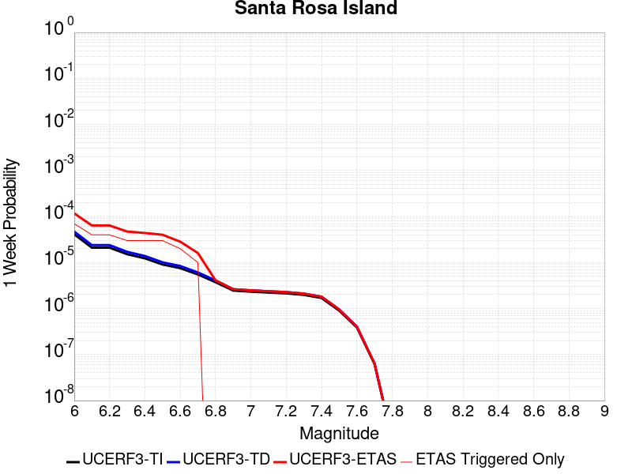 | 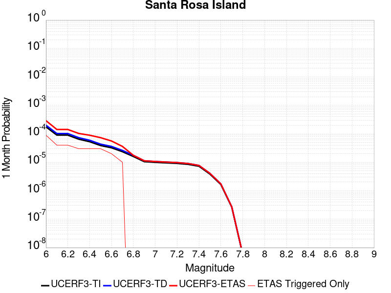 |  | 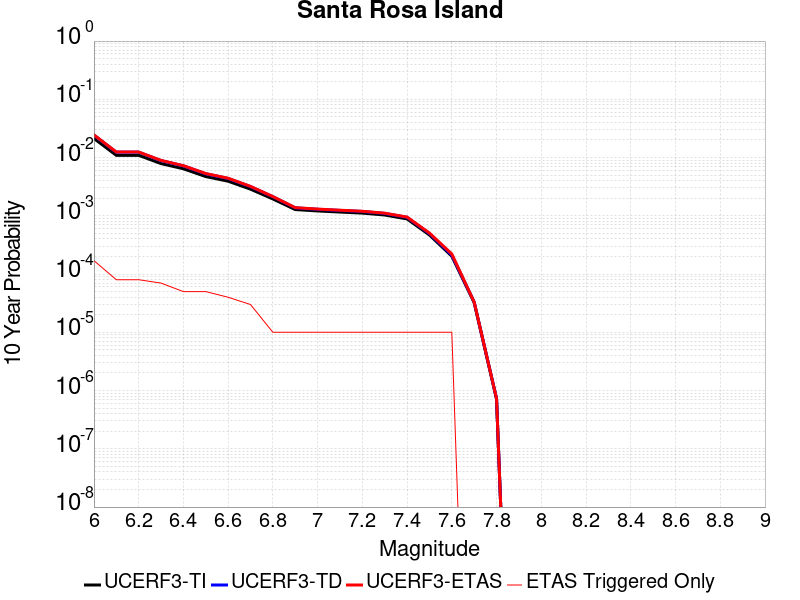 |

| Magnitude | 1 wk TI Prob | 1 wk TD Prob | 1 wk ETAS Prob | 1 wk ETAS/TD Gain | 1 wk ETAS Triggered Only | 1 mo TI Prob | 1 mo TD Prob | 1 mo ETAS Prob | 1 mo ETAS/TD Gain | 1 mo ETAS Triggered Only | 1 yr TI Prob | 1 yr TD Prob | 1 yr ETAS Prob | 1 yr ETAS/TD Gain | 1 yr ETAS Triggered Only | 10 yr TI Prob | 10 yr TD Prob | 10 yr ETAS Prob | 10 yr ETAS/TD Gain | 10 yr ETAS Triggered Only |
|-----|-----|-----|-----|-----|-----|-----|-----|-----|-----|-----|-----|-----|-----|-----|-----|-----|-----|-----|-----|-----|
| 6.0 | 4.1143165E-5 | 4.7091133E-5 | 1.1708784E-4 | 2.4864094 | 7.0E-5 | 1.7631594E-4 | 2.0180465E-4 | 2.9178648E-4 | 1.4458859 | 9.0E-5 | 0.002144533 | 0.0024544 | 0.0025741055 | 1.0487717 | 1.2E-4 | 0.021239553 | 0.024293551 | 0.024459422 | 1.0068277 | 1.7E-4 |
| 6.1 | 2.1061249E-5 | 2.3864959E-5 | 6.3864005E-5 | 2.6760576 | 4.0E-5 | 9.0259375E-5 | 1.0227455E-4 | 1.4227047E-4 | 1.3910642 | 4.0E-5 | 0.0010983539 | 0.0012445104 | 0.0013044357 | 1.0481517 | 6.0E-5 | 0.01092941 | 0.012378449 | 0.012457458 | 1.0063828 | 8.0E-5 |
| 6.2 | 2.1061249E-5 | 2.3864959E-5 | 6.3864005E-5 | 2.6760576 | 4.0E-5 | 9.0259375E-5 | 1.0227455E-4 | 1.4227047E-4 | 1.3910642 | 4.0E-5 | 0.0010983539 | 0.0012445104 | 0.0013044357 | 1.0481517 | 6.0E-5 | 0.01092941 | 0.012378449 | 0.012457458 | 1.0063828 | 8.0E-5 |
| 6.3 | 1.5158236E-5 | 1.7074419E-5 | 4.7073907E-5 | 2.7569845 | 3.0E-5 | 6.496225E-5 | 7.3174095E-5 | 1.031719E-4 | 1.4099511 | 3.0E-5 | 7.906284E-4 | 8.905424E-4 | 9.404979E-4 | 1.0560956 | 5.0E-5 | 0.007878214 | 0.008870989 | 0.008940369 | 1.0078208 | 7.0E-5 |
| 6.4 | 1.2341918E-5 | 1.3852917E-5 | 4.3852502E-5 | 3.165579 | 3.0E-5 | 5.2892858E-5 | 5.9368336E-5 | 8.936656E-5 | 1.5052899 | 3.0E-5 | 6.437803E-4 | 7.225779E-4 | 7.62549E-4 | 1.0553174 | 4.0E-5 | 0.006419184 | 0.007203121 | 0.007252761 | 1.0068915 | 5.0E-5 |
| 6.5 | 9.061158E-6 | 1.0117031E-5 | 4.0116727E-5 | 3.965267 | 3.0E-5 | 3.883296E-5 | 4.3358013E-5 | 7.3356714E-5 | 1.6918836 | 3.0E-5 | 4.726887E-4 | 5.277613E-4 | 5.677402E-4 | 1.0757519 | 4.0E-5 | 0.004716845 | 0.0052656173 | 0.005315354 | 1.0094455 | 5.0E-5 |
| 6.6 | 7.5461685E-6 | 8.400733E-6 | 2.8400565E-5 | 3.3807244 | 2.0E-5 | 3.2340322E-5 | 3.600267E-5 | 5.600195E-5 | 1.5554943 | 2.0E-5 | 3.936723E-4 | 4.3824865E-4 | 4.6823552E-4 | 1.0684243 | 3.0E-5 | 0.003929756 | 0.0043742736 | 0.004414099 | 1.0091044 | 4.0E-5 |
| 6.7 | 5.5023775E-6 | 6.087381E-6 | 1.608732E-5 | 2.6427326 | 1.0E-5 | 2.3581404E-5 | 2.6088532E-5 | 3.608827E-5 | 1.3833002 | 1.0E-5 | 2.8706578E-4 | 3.1758484E-4 | 3.3757847E-4 | 1.0629553 | 2.0E-5 | 0.0028669522 | 0.0031716314 | 0.0032015364 | 1.0094289 | 3.0E-5 |
| 6.8 | 3.7351679E-6 | 4.0831405E-6 | 4.0831405E-6 | 1.0 | 0.0 | 1.6007763E-5 | 1.749907E-5 | 1.749907E-5 | 1.0 | 0.0 | 1.948771E-4 | 2.1303284E-4 | 2.1303284E-4 | 1.0 | 0.0 | 0.0019470629 | 0.0021285315 | 0.00213851 | 1.004688 | 1.0E-5 |
| 6.9 | 2.456366E-6 | 2.6292705E-6 | 2.6292705E-6 | 1.0 | 0.0 | 1.0527241E-5 | 1.1268254E-5 | 1.1268254E-5 | 1.0 | 0.0 | 1.2816161E-4 | 1.3718237E-4 | 1.3718237E-4 | 1.0 | 0.0 | 0.0012808773 | 0.0013709799 | 0.0013809662 | 1.007284 | 1.0E-5 |
| 7.0 | 2.3245157E-6 | 2.4827782E-6 | 2.4827782E-6 | 1.0 | 0.0 | 9.962172E-6 | 1.0640435E-5 | 1.0640435E-5 | 1.0 | 0.0 | 1.2128269E-4 | 1.2953962E-4 | 1.2953962E-4 | 1.0 | 0.0 | 0.0012121652 | 0.0012946434 | 0.0013046304 | 1.0077142 | 1.0E-5 |
| 7.1 | 2.2248344E-6 | 2.37325E-6 | 2.37325E-6 | 1.0 | 0.0 | 9.53497E-6 | 1.0171032E-5 | 1.0171032E-5 | 1.0 | 0.0 | 1.1608207E-4 | 1.2382529E-4 | 1.2382529E-4 | 1.0 | 0.0 | 0.0011602144 | 0.001237565 | 0.0012475526 | 1.0080703 | 1.0E-5 |
| 7.2 | 2.1350402E-6 | 2.276154E-6 | 2.276154E-6 | 1.0 | 0.0 | 9.150141E-6 | 9.754909E-6 | 9.754909E-6 | 1.0 | 0.0 | 1.1139726E-4 | 1.1875956E-4 | 1.1875956E-4 | 1.0 | 0.0 | 0.0011134144 | 0.0011869629 | 0.001196951 | 1.0084149 | 1.0E-5 |
| 7.3 | 1.9793572E-6 | 2.108719E-6 | 2.108719E-6 | 1.0 | 0.0 | 8.482932E-6 | 9.037336E-6 | 9.037336E-6 | 1.0 | 0.0 | 1.032748E-4 | 1.10024026E-4 | 1.10024026E-4 | 1.0 | 0.0 | 0.0010322682 | 0.0010996973 | 0.0011096863 | 1.0090834 | 1.0E-5 |
| 7.4 | 1.6951194E-6 | 1.8045733E-6 | 1.8045733E-6 | 1.0 | 0.0 | 7.264777E-6 | 7.733863E-6 | 7.733863E-6 | 1.0 | 0.0 | 8.844508E-5 | 9.415573E-5 | 9.415573E-5 | 1.0 | 0.0 | 8.840988E-4 | 9.4116E-4 | 9.511506E-4 | 1.0106152 | 1.0E-5 |
| 7.5 | 8.987207E-7 | 9.5122147E-7 | 9.5122147E-7 | 1.0 | 0.0 | 3.8516546E-6 | 4.076657E-6 | 4.076657E-6 | 1.0 | 0.0 | 4.6892885E-5 | 4.963218E-5 | 4.963218E-5 | 1.0 | 0.0 | 4.688299E-4 | 4.9621216E-4 | 5.062072E-4 | 1.0201427 | 1.0E-5 |
| 7.6 | 3.8783037E-7 | 4.052932E-7 | 4.052932E-7 | 1.0 | 0.0 | 1.6621291E-6 | 1.7369698E-6 | 1.7369698E-6 | 1.0 | 0.0 | 2.0236233E-5 | 2.1147409E-5 | 2.1147409E-5 | 1.0 | 0.0 | 2.023439E-4 | 2.1145462E-4 | 2.214525E-4 | 1.0472815 | 1.0E-5 |
| 7.7 | 6.181804E-8 | 6.339035E-8 | 6.339035E-8 | 1.0 | 0.0 | 2.6493444E-7 | 2.7167292E-7 | 2.7167292E-7 | 1.0 | 0.0 | 3.225572E-6 | 3.3076128E-6 | 3.3076128E-6 | 1.0 | 0.0 | 3.225525E-5 | 3.307564E-5 | 3.307564E-5 | 1.0 | 0.0 |
| 7.8 | 1.3704449E-9 | 1.3964153E-9 | 1.3964153E-9 | 1.0 | 0.0 | 5.873335E-9 | 5.984637E-9 | 5.984637E-9 | 1.0 | 0.0 | 7.1507856E-8 | 7.286295E-8 | 7.286295E-8 | 1.0 | 0.0 | 7.1507833E-7 | 7.286294E-7 | 7.286294E-7 | 1.0 | 0.0 |

## Pinto Mtn
*[(top)](#table-of-contents)*

| 1 Week | 1 Month | 1 Year | 10 Year |
|-----|-----|-----|-----|
|  |  |  | 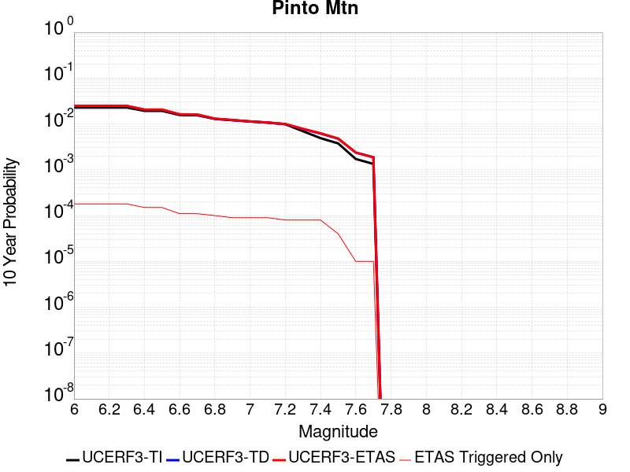 |

| Magnitude | 1 wk TI Prob | 1 wk TD Prob | 1 wk ETAS Prob | 1 wk ETAS/TD Gain | 1 wk ETAS Triggered Only | 1 mo TI Prob | 1 mo TD Prob | 1 mo ETAS Prob | 1 mo ETAS/TD Gain | 1 mo ETAS Triggered Only | 1 yr TI Prob | 1 yr TD Prob | 1 yr ETAS Prob | 1 yr ETAS/TD Gain | 1 yr ETAS Triggered Only | 10 yr TI Prob | 10 yr TD Prob | 10 yr ETAS Prob | 10 yr ETAS/TD Gain | 10 yr ETAS Triggered Only |
|-----|-----|-----|-----|-----|-----|-----|-----|-----|-----|-----|-----|-----|-----|-----|-----|-----|-----|-----|-----|-----|
| 6.0 | 4.4194956E-5 | 4.785362E-5 | 9.7851225E-5 | 2.0448031 | 5.0E-5 | 1.893932E-4 | 2.0507174E-4 | 2.750574E-4 | 1.3412739 | 7.0E-5 | 0.0023034236 | 0.0024940541 | 0.0025938048 | 1.0399953 | 1.0E-4 | 0.022796938 | 0.024678145 | 0.024853703 | 1.0071139 | 1.8E-4 |
| 6.1 | 4.4194956E-5 | 4.785362E-5 | 9.7851225E-5 | 2.0448031 | 5.0E-5 | 1.893932E-4 | 2.0507174E-4 | 2.750574E-4 | 1.3412739 | 7.0E-5 | 0.0023034236 | 0.0024940541 | 0.0025938048 | 1.0399953 | 1.0E-4 | 0.022796938 | 0.024678145 | 0.024853703 | 1.0071139 | 1.8E-4 |
| 6.2 | 4.4194956E-5 | 4.785362E-5 | 9.7851225E-5 | 2.0448031 | 5.0E-5 | 1.893932E-4 | 2.0507174E-4 | 2.750574E-4 | 1.3412739 | 7.0E-5 | 0.0023034236 | 0.0024940541 | 0.0025938048 | 1.0399953 | 1.0E-4 | 0.022796938 | 0.024678145 | 0.024853703 | 1.0071139 | 1.8E-4 |
| 6.3 | 4.4194956E-5 | 4.785362E-5 | 9.7851225E-5 | 2.0448031 | 5.0E-5 | 1.893932E-4 | 2.0507174E-4 | 2.750574E-4 | 1.3412739 | 7.0E-5 | 0.0023034236 | 0.0024940541 | 0.0025938048 | 1.0399953 | 1.0E-4 | 0.022796938 | 0.024678145 | 0.024853703 | 1.0071139 | 1.8E-4 |
| 6.4 | 3.729929E-5 | 3.9603186E-5 | 7.96016E-5 | 2.0099797 | 4.0E-5 | 1.5984432E-4 | 1.6971743E-4 | 2.2970724E-4 | 1.3534688 | 6.0E-5 | 0.0019443673 | 0.002064445 | 0.00214428 | 1.0386714 | 8.0E-5 | 0.019274427 | 0.02046269 | 0.020609621 | 1.0071805 | 1.5E-4 |
| 6.5 | 3.729929E-5 | 3.9603186E-5 | 7.96016E-5 | 2.0099797 | 4.0E-5 | 1.5984432E-4 | 1.6971743E-4 | 2.2970724E-4 | 1.3534688 | 6.0E-5 | 0.0019443673 | 0.002064445 | 0.00214428 | 1.0386714 | 8.0E-5 | 0.019274427 | 0.02046269 | 0.020609621 | 1.0071805 | 1.5E-4 |
| 6.6 | 3.0204548E-5 | 3.1205298E-5 | 6.120436E-5 | 1.9613452 | 3.0E-5 | 1.2944164E-4 | 1.3373033E-4 | 1.7372498E-4 | 1.2990694 | 4.0E-5 | 0.0015748127 | 0.0016269855 | 0.0016769042 | 1.0306817 | 5.0E-5 | 0.015636992 | 0.01615461 | 0.016262831 | 1.0066992 | 1.1E-4 |
| 6.7 | 2.9857754E-5 | 3.081468E-5 | 6.0813756E-5 | 1.9735318 | 3.0E-5 | 1.2795553E-4 | 1.3205643E-4 | 1.7205115E-4 | 1.3028609 | 4.0E-5 | 0.0015567453 | 0.001606636 | 0.0016565556 | 1.031071 | 5.0E-5 | 0.015458848 | 0.01595405 | 0.016062293 | 1.0067848 | 1.1E-4 |
| 6.8 | 2.4819734E-5 | 2.5009364E-5 | 5.500861E-5 | 2.1995208 | 3.0E-5 | 1.0636595E-4 | 1.07178705E-4 | 1.4717442E-4 | 1.3731685 | 4.0E-5 | 0.0012942362 | 0.0013041412 | 0.001344089 | 1.0306315 | 4.0E-5 | 0.012867244 | 0.0129672475 | 0.01306595 | 1.0076118 | 1.0E-4 |
| 6.9 | 2.331124E-5 | 2.3337643E-5 | 4.3337175E-5 | 1.8569646 | 2.0E-5 | 9.990149E-5 | 1.00014746E-4 | 1.3001174E-4 | 1.2999258 | 3.0E-5 | 0.001215622 | 0.0012170197 | 0.0012469832 | 1.0246204 | 3.0E-5 | 0.012089936 | 0.012105742 | 0.012194651 | 1.0073445 | 9.0E-5 |
| 7.0 | 2.1818534E-5 | 2.1760772E-5 | 4.1760337E-5 | 1.919065 | 2.0E-5 | 9.3504656E-5 | 9.325723E-5 | 1.2325443E-4 | 1.3216609 | 3.0E-5 | 0.0011378246 | 0.0011348352 | 0.0011648012 | 1.0264056 | 3.0E-5 | 0.011320163 | 0.011292503 | 0.011381487 | 1.0078799 | 9.0E-5 |
| 7.1 | 2.066081E-5 | 2.0540418E-5 | 4.0540006E-5 | 1.97367 | 2.0E-5 | 8.854332E-5 | 8.8027504E-5 | 1.1802486E-4 | 1.3407726 | 3.0E-5 | 0.0010774818 | 0.0010712275 | 0.0011011953 | 1.0279752 | 3.0E-5 | 0.010722724 | 0.010662688 | 0.010751729 | 1.0083506 | 9.0E-5 |
| 7.2 | 1.8990233E-5 | 1.9053701E-5 | 3.905332E-5 | 2.0496447 | 2.0E-5 | 8.138417E-5 | 8.1656275E-5 | 1.11653826E-4 | 1.3673637 | 3.0E-5 | 9.904018E-4 | 9.937311E-4 | 0.0010237013 | 1.0301592 | 3.0E-5 | 0.009859995 | 0.009894874 | 0.009974082 | 1.008005 | 8.0E-5 |
| 7.3 | 1.3335872E-5 | 1.4906372E-5 | 3.4906072E-5 | 2.3416882 | 2.0E-5 | 5.7152483E-5 | 6.388296E-5 | 9.388104E-5 | 1.4695789 | 3.0E-5 | 6.956093E-4 | 7.775102E-4 | 8.074869E-4 | 1.0385547 | 3.0E-5 | 0.006934359 | 0.0077491994 | 0.007828579 | 1.0102437 | 8.0E-5 |
| 7.4 | 9.414066E-6 | 1.186061E-5 | 3.1860374E-5 | 2.686234 | 2.0E-5 | 4.0345374E-5 | 5.0830247E-5 | 8.082872E-5 | 1.5901698 | 3.0E-5 | 4.910942E-4 | 6.1869196E-4 | 6.4867345E-4 | 1.0484594 | 3.0E-5 | 0.0049001034 | 0.006170644 | 0.00625015 | 1.0128846 | 8.0E-5 |
| 7.5 | 7.2101157E-6 | 9.157893E-6 | 9.157893E-6 | 1.0 | 0.0 | 3.090013E-5 | 3.924757E-5 | 3.924757E-5 | 1.0 | 0.0 | 3.7614413E-4 | 4.7774217E-4 | 4.7774217E-4 | 1.0 | 0.0 | 0.0037550807 | 0.004767927 | 0.0048077363 | 1.0083494 | 4.0E-5 |
| 7.6 | 3.296375E-6 | 4.5453176E-6 | 4.5453176E-6 | 1.0 | 0.0 | 1.4127245E-5 | 1.9479796E-5 | 1.9479796E-5 | 1.0 | 0.0 | 1.7198564E-4 | 2.3714209E-4 | 2.3714209E-4 | 1.0 | 0.0 | 0.0017185259 | 0.0023690276 | 0.002379004 | 1.0042112 | 1.0E-5 |
| 7.7 | 2.5741092E-6 | 3.584251E-6 | 3.584251E-6 | 1.0 | 0.0 | 1.103185E-5 | 1.5360993E-5 | 1.5360993E-5 | 1.0 | 0.0 | 1.3430449E-4 | 1.8700535E-4 | 1.8700535E-4 | 1.0 | 0.0 | 0.0013422335 | 0.0018686098 | 0.0018785911 | 1.0053415 | 1.0E-5 |

## Imperial
*[(top)](#table-of-contents)*

| 1 Week | 1 Month | 1 Year | 10 Year |
|-----|-----|-----|-----|
|  | 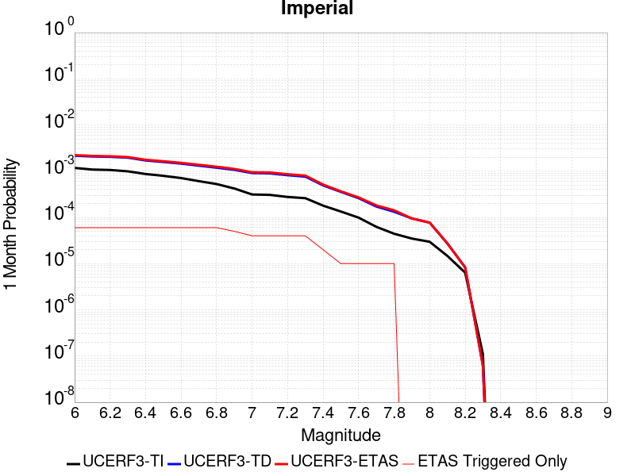 |  |  |

| Magnitude | 1 wk TI Prob | 1 wk TD Prob | 1 wk ETAS Prob | 1 wk ETAS/TD Gain | 1 wk ETAS Triggered Only | 1 mo TI Prob | 1 mo TD Prob | 1 mo ETAS Prob | 1 mo ETAS/TD Gain | 1 mo ETAS Triggered Only | 1 yr TI Prob | 1 yr TD Prob | 1 yr ETAS Prob | 1 yr ETAS/TD Gain | 1 yr ETAS Triggered Only | 10 yr TI Prob | 10 yr TD Prob | 10 yr ETAS Prob | 10 yr ETAS/TD Gain | 10 yr ETAS Triggered Only |
|-----|-----|-----|-----|-----|-----|-----|-----|-----|-----|-----|-----|-----|-----|-----|-----|-----|-----|-----|-----|-----|
| 6.0 | 2.7496446E-4 | 5.0552754E-4 | 5.455073E-4 | 1.0790852 | 4.0E-5 | 0.0011778869 | 0.002164787 | 0.002224657 | 1.0276563 | 6.0E-5 | 0.0142467655 | 0.026038699 | 0.026136095 | 1.0037404 | 1.0E-4 | 0.13367249 | 0.2280438 | 0.22819047 | 1.0006431 | 1.9E-4 |
| 6.1 | 2.5356023E-4 | 4.8656776E-4 | 5.265483E-4 | 1.0821685 | 4.0E-5 | 0.001086234 | 0.0020836622 | 0.0021435372 | 1.0287354 | 6.0E-5 | 0.013144928 | 0.025071215 | 0.025168708 | 1.0038886 | 1.0E-4 | 0.123940155 | 0.21947981 | 0.21962811 | 1.0006757 | 1.9E-4 |
| 6.2 | 2.4820742E-4 | 4.7752203E-4 | 5.175029E-4 | 1.0837258 | 4.0E-5 | 0.0010633124 | 0.0020449557 | 0.002104833 | 1.0292805 | 6.0E-5 | 0.01286919 | 0.024611235 | 0.024708774 | 1.0039632 | 1.0E-4 | 0.12148927 | 0.21598552 | 0.21613449 | 1.0006897 | 1.9E-4 |
| 6.3 | 2.3205351E-4 | 4.5890483E-4 | 4.9888645E-4 | 1.087124 | 4.0E-5 | 9.94136E-4 | 0.0019652895 | 0.0020251714 | 1.0304699 | 6.0E-5 | 0.012036599 | 0.02366133 | 0.023758965 | 1.0041263 | 1.0E-4 | 0.11405133 | 0.20793462 | 0.2080851 | 1.0007237 | 1.9E-4 |
| 6.4 | 2.0304754E-4 | 3.987652E-4 | 4.3874924E-4 | 1.1002697 | 4.0E-5 | 8.6991355E-4 | 0.0017078889 | 0.0017677865 | 1.0350711 | 6.0E-5 | 0.010539869 | 0.020595672 | 0.020693611 | 1.0047554 | 1.0E-4 | 0.100537635 | 0.1850669 | 0.18521358 | 1.0007926 | 1.8E-4 |
| 6.5 | 1.854992E-4 | 3.6988858E-4 | 4.0987378E-4 | 1.1081007 | 4.0E-5 | 7.9475436E-4 | 0.0015842861 | 0.001644191 | 1.037812 | 6.0E-5 | 0.009633281 | 0.01911948 | 0.01921757 | 1.0051303 | 1.0E-4 | 0.0922623 | 0.173298 | 0.1734468 | 1.0008587 | 1.8E-4 |
| 6.6 | 1.6586106E-4 | 3.403506E-4 | 3.80337E-4 | 1.1174859 | 4.0E-5 | 7.106394E-4 | 0.0014578402 | 0.0015177528 | 1.0410968 | 6.0E-5 | 0.008617763 | 0.01760642 | 0.01770466 | 1.0055797 | 1.0E-4 | 0.08291132 | 0.16077545 | 0.1609265 | 1.0009396 | 1.8E-4 |
| 6.7 | 1.4224656E-4 | 3.076692E-4 | 3.4765687E-4 | 1.1299697 | 4.0E-5 | 6.094856E-4 | 0.001317924 | 0.001377845 | 1.0454662 | 6.0E-5 | 0.0073952693 | 0.015929576 | 0.016027983 | 1.0061777 | 1.0E-4 | 0.07153955 | 0.14648417 | 0.1466378 | 1.0010488 | 1.8E-4 |
| 6.8 | 1.2317259E-4 | 2.779122E-4 | 3.1790108E-4 | 1.1438904 | 4.0E-5 | 5.2777573E-4 | 0.0011905148 | 0.0012504433 | 1.0503384 | 6.0E-5 | 0.0064067547 | 0.0143995695 | 0.0144981295 | 1.0068446 | 1.0E-4 | 0.06225166 | 0.13293684 | 0.1330929 | 1.001174 | 1.8E-4 |
| 6.9 | 9.859898E-5 | 2.5014306E-4 | 2.8013554E-4 | 1.1199014 | 3.0E-5 | 4.2249862E-4 | 0.0010716055 | 0.0011215518 | 1.0466089 | 5.0E-5 | 0.0051317946 | 0.012969712 | 0.013058544 | 1.0068493 | 9.0E-5 | 0.05014893 | 0.11940631 | 0.11955602 | 1.0012537 | 1.7E-4 |
| 7.0 | 7.3191884E-5 | 2.1266776E-4 | 2.4266138E-4 | 1.1410351 | 3.0E-5 | 3.136418E-4 | 9.1111806E-4 | 9.5108163E-4 | 1.0438621 | 4.0E-5 | 0.003811904 | 0.011037128 | 0.011116245 | 1.0071683 | 8.0E-5 | 0.037471764 | 0.10206493 | 0.1022086 | 1.0014076 | 1.6E-4 |
| 7.1 | 7.1760296E-5 | 2.0968143E-4 | 2.3967514E-4 | 1.1430442 | 3.0E-5 | 3.0750787E-4 | 8.983284E-4 | 9.382924E-4 | 1.0444871 | 4.0E-5 | 0.003737482 | 0.010882978 | 0.010962107 | 1.0072709 | 8.0E-5 | 0.03675245 | 0.10070146 | 0.100845344 | 1.0014288 | 1.6E-4 |
| 7.2 | 6.46614E-5 | 1.9136685E-4 | 2.2136112E-4 | 1.156737 | 3.0E-5 | 2.7709085E-4 | 8.1988896E-4 | 8.5985614E-4 | 1.0487471 | 4.0E-5 | 0.0033683628 | 0.0099370815 | 0.010016287 | 1.0079707 | 8.0E-5 | 0.033177625 | 0.09250898 | 0.092654176 | 1.0015695 | 1.6E-4 |
| 7.3 | 6.088115E-5 | 1.78084E-4 | 2.0807865E-4 | 1.1684299 | 3.0E-5 | 2.6089314E-4 | 7.6299673E-4 | 8.029662E-4 | 1.0523849 | 4.0E-5 | 0.0031717476 | 0.009250494 | 0.009329754 | 1.0085682 | 8.0E-5 | 0.031268585 | 0.08655989 | 0.08669691 | 1.0015829 | 1.5E-4 |
| 7.4 | 4.199346E-5 | 1.1510366E-4 | 1.2510251E-4 | 1.0868682 | 1.0E-5 | 1.7995955E-4 | 4.9320905E-4 | 5.131992E-4 | 1.0405308 | 2.0E-5 | 0.0021888057 | 0.0059884563 | 0.006038157 | 1.0082994 | 5.0E-5 | 0.02167372 | 0.057439793 | 0.0575529 | 1.0019691 | 1.2E-4 |
| 7.5 | 3.130448E-5 | 8.33328E-5 | 9.333197E-5 | 1.1199908 | 1.0E-5 | 1.3415517E-4 | 3.57092E-4 | 3.6708842E-4 | 1.027994 | 1.0E-5 | 0.0016321153 | 0.004338988 | 0.0043788147 | 1.0091788 | 4.0E-5 | 0.016201803 | 0.04213201 | 0.042237375 | 1.0025009 | 1.1E-4 |
| 7.6 | 2.3074248E-5 | 6.0844646E-5 | 7.084404E-5 | 1.164343 | 1.0E-5 | 9.888588E-5 | 2.6073685E-4 | 2.7073422E-4 | 1.0383428 | 1.0E-5 | 0.0012032706 | 0.0031698733 | 0.0032097467 | 1.0125788 | 4.0E-5 | 0.011967761 | 0.031026395 | 0.031123292 | 1.003123 | 1.0E-4 |
| 7.7 | 1.45864815E-5 | 4.0124698E-5 | 5.0124298E-5 | 1.2492131 | 1.0E-5 | 6.2511994E-5 | 1.7195169E-4 | 1.8194997E-4 | 1.0581459 | 1.0E-5 | 7.608177E-4 | 0.0020915072 | 0.0021314234 | 1.0190849 | 4.0E-5 | 0.007582182 | 0.020627763 | 0.020715907 | 1.004273 | 9.0E-5 |
| 7.8 | 1.0352979E-5 | 3.0960902E-5 | 4.0960593E-5 | 1.322978 | 1.0E-5 | 4.4369157E-5 | 1.3268284E-4 | 1.4268151E-4 | 1.0753577 | 1.0E-5 | 5.400606E-4 | 0.0016142189 | 0.0016541544 | 1.0247397 | 4.0E-5 | 0.0053875 | 0.016016833 | 0.016085712 | 1.0043004 | 7.0E-5 |
| 7.9 | 8.137906E-6 | 2.2149103E-5 | 2.2149103E-5 | 1.0 | 0.0 | 3.4876273E-5 | 9.492128E-5 | 9.492128E-5 | 1.0 | 0.0 | 4.2453592E-4 | 0.0011550548 | 0.0011850202 | 1.0259428 | 3.0E-5 | 0.004237258 | 0.011617903 | 0.011667321 | 1.0042537 | 5.0E-5 |
| 8.0 | 6.93792E-6 | 1.8008766E-5 | 1.8008766E-5 | 1.0 | 0.0 | 2.9733603E-5 | 7.717814E-5 | 7.717814E-5 | 1.0 | 0.0 | 3.6194647E-4 | 9.3923963E-4 | 9.592208E-4 | 1.0212739 | 2.0E-5 | 0.0036135751 | 0.00950155 | 0.009541171 | 1.0041698 | 4.0E-5 |
| 8.1 | 3.4286315E-6 | 6.379872E-6 | 6.379872E-6 | 1.0 | 0.0 | 1.4694053E-5 | 2.7342023E-5 | 2.7342023E-5 | 1.0 | 0.0 | 1.7888541E-4 | 3.328384E-4 | 3.328384E-4 | 1.0 | 0.0 | 0.0017874148 | 0.003486031 | 0.003486031 | 1.0 | 0.0 |
| 8.2 | 1.4906886E-6 | 1.9366646E-6 | 1.9366646E-6 | 1.0 | 0.0 | 6.3886496E-6 | 8.299965E-6 | 8.299965E-6 | 1.0 | 0.0 | 7.7779034E-5 | 1.0104742E-4 | 1.0104742E-4 | 1.0 | 0.0 | 7.775182E-4 | 0.0011075331 | 0.0011075331 | 1.0 | 0.0 |
| 8.3 | 2.5758007E-8 | 1.4500102E-8 | 1.4500102E-8 | 1.0 | 0.0 | 1.10391454E-7 | 6.214329E-8 | 6.214329E-8 | 1.0 | 0.0 | 1.3440151E-6 | 7.565946E-7 | 7.565946E-7 | 1.0 | 0.0 | 1.344007E-5 | 7.887763E-6 | 7.887763E-6 | 1.0 | 0.0 |

## Deep Springs
*[(top)](#table-of-contents)*

| 1 Week | 1 Month | 1 Year | 10 Year |
|-----|-----|-----|-----|
|  |  |  | 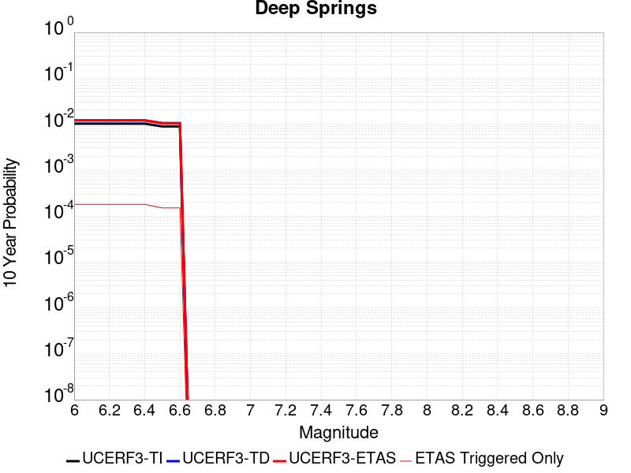 |

| Magnitude | 1 wk TI Prob | 1 wk TD Prob | 1 wk ETAS Prob | 1 wk ETAS/TD Gain | 1 wk ETAS Triggered Only | 1 mo TI Prob | 1 mo TD Prob | 1 mo ETAS Prob | 1 mo ETAS/TD Gain | 1 mo ETAS Triggered Only | 1 yr TI Prob | 1 yr TD Prob | 1 yr ETAS Prob | 1 yr ETAS/TD Gain | 1 yr ETAS Triggered Only | 10 yr TI Prob | 10 yr TD Prob | 10 yr ETAS Prob | 10 yr ETAS/TD Gain | 10 yr ETAS Triggered Only |
|-----|-----|-----|-----|-----|-----|-----|-----|-----|-----|-----|-----|-----|-----|-----|-----|-----|-----|-----|-----|-----|
| 6.0 | 1.9810619E-5 | 2.311252E-5 | 8.311113E-5 | 3.5959356 | 6.0E-5 | 8.489989E-5 | 9.905276E-5 | 1.6904583E-4 | 1.7066242 | 7.0E-5 | 0.001033166 | 0.0012058079 | 0.0013256633 | 1.0993984 | 1.2E-4 | 0.010283757 | 0.012042425 | 0.012220257 | 1.0147672 | 1.8E-4 |
| 6.1 | 1.9810619E-5 | 2.311252E-5 | 8.311113E-5 | 3.5959356 | 6.0E-5 | 8.489989E-5 | 9.905276E-5 | 1.6904583E-4 | 1.7066242 | 7.0E-5 | 0.001033166 | 0.0012058079 | 0.0013256633 | 1.0993984 | 1.2E-4 | 0.010283757 | 0.012042425 | 0.012220257 | 1.0147672 | 1.8E-4 |
| 6.2 | 1.9810619E-5 | 2.311252E-5 | 8.311113E-5 | 3.5959356 | 6.0E-5 | 8.489989E-5 | 9.905276E-5 | 1.6904583E-4 | 1.7066242 | 7.0E-5 | 0.001033166 | 0.0012058079 | 0.0013256633 | 1.0993984 | 1.2E-4 | 0.010283757 | 0.012042425 | 0.012220257 | 1.0147672 | 1.8E-4 |
| 6.3 | 1.9810619E-5 | 2.311252E-5 | 8.311113E-5 | 3.5959356 | 6.0E-5 | 8.489989E-5 | 9.905276E-5 | 1.6904583E-4 | 1.7066242 | 7.0E-5 | 0.001033166 | 0.0012058079 | 0.0013256633 | 1.0993984 | 1.2E-4 | 0.010283757 | 0.012042425 | 0.012220257 | 1.0147672 | 1.8E-4 |
| 6.4 | 1.9810619E-5 | 2.311252E-5 | 8.311113E-5 | 3.5959356 | 6.0E-5 | 8.489989E-5 | 9.905276E-5 | 1.6904583E-4 | 1.7066242 | 7.0E-5 | 0.001033166 | 0.0012058079 | 0.0013256633 | 1.0993984 | 1.2E-4 | 0.010283757 | 0.012042425 | 0.012220257 | 1.0147672 | 1.8E-4 |
| 6.5 | 1.7190405E-5 | 2.0050555E-5 | 7.004955E-5 | 3.4936464 | 5.0E-5 | 7.367108E-5 | 8.593095E-5 | 1.3592666E-4 | 1.5818125 | 5.0E-5 | 8.9657627E-4 | 0.0010462094 | 0.0011361152 | 1.0859349 | 9.0E-5 | 0.008929676 | 0.010462056 | 0.010610487 | 1.0141876 | 1.5E-4 |
| 6.6 | 1.7190405E-5 | 2.0050555E-5 | 7.004955E-5 | 3.4936464 | 5.0E-5 | 7.367108E-5 | 8.593095E-5 | 1.3592666E-4 | 1.5818125 | 5.0E-5 | 8.9657627E-4 | 0.0010462094 | 0.0011361152 | 1.0859349 | 9.0E-5 | 0.008929676 | 0.010462056 | 0.010610487 | 1.0141876 | 1.5E-4 |

## Santa Ynez (West)
*[(top)](#table-of-contents)*

| 1 Week | 1 Month | 1 Year | 10 Year |
|-----|-----|-----|-----|
|  |  | 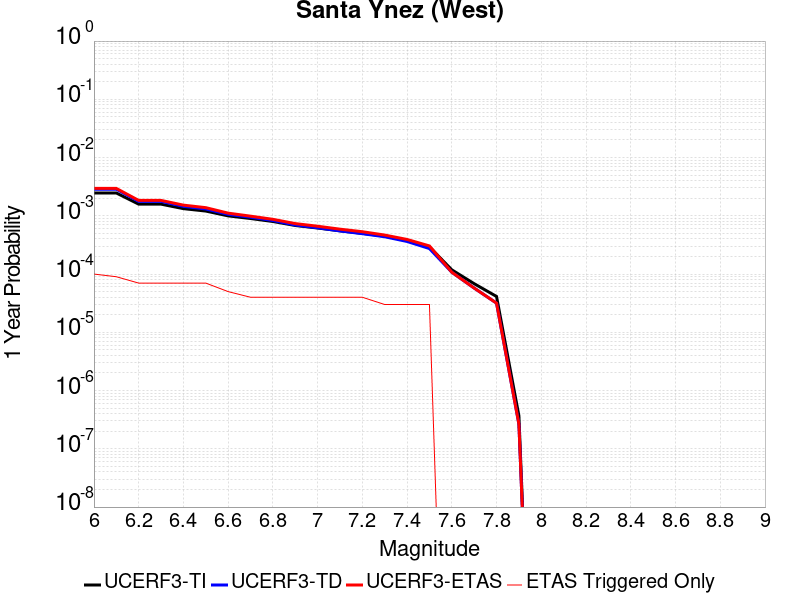 |  |

| Magnitude | 1 wk TI Prob | 1 wk TD Prob | 1 wk ETAS Prob | 1 wk ETAS/TD Gain | 1 wk ETAS Triggered Only | 1 mo TI Prob | 1 mo TD Prob | 1 mo ETAS Prob | 1 mo ETAS/TD Gain | 1 mo ETAS Triggered Only | 1 yr TI Prob | 1 yr TD Prob | 1 yr ETAS Prob | 1 yr ETAS/TD Gain | 1 yr ETAS Triggered Only | 10 yr TI Prob | 10 yr TD Prob | 10 yr ETAS Prob | 10 yr ETAS/TD Gain | 10 yr ETAS Triggered Only |
|-----|-----|-----|-----|-----|-----|-----|-----|-----|-----|-----|-----|-----|-----|-----|-----|-----|-----|-----|-----|-----|
| 6.0 | 4.7352758E-5 | 5.4972126E-5 | 9.4969924E-5 | 1.7276015 | 4.0E-5 | 2.0292461E-4 | 2.3557522E-4 | 2.8556344E-4 | 1.2121965 | 5.0E-5 | 0.0024678076 | 0.0028645284 | 0.002964242 | 1.0348097 | 1.0E-4 | 0.024405818 | 0.028304417 | 0.028459888 | 1.0054928 | 1.6E-4 |
| 6.1 | 4.7352758E-5 | 5.4972126E-5 | 8.4970474E-5 | 1.5457011 | 3.0E-5 | 2.0292461E-4 | 2.3557522E-4 | 2.755658E-4 | 1.1697571 | 4.0E-5 | 0.0024678076 | 0.0028645284 | 0.0029542705 | 1.0313288 | 9.0E-5 | 0.024405818 | 0.028304417 | 0.028430738 | 1.004463 | 1.3E-4 |
| 6.2 | 3.0415853E-5 | 3.392511E-5 | 6.392409E-5 | 1.8842708 | 3.0E-5 | 1.3034715E-4 | 1.4538545E-4 | 1.8537963E-4 | 1.2750907 | 4.0E-5 | 0.0015858212 | 0.0017686661 | 0.0018385423 | 1.0395079 | 7.0E-5 | 0.015745522 | 0.017549807 | 0.017638227 | 1.0050383 | 9.0E-5 |
| 6.3 | 3.0415853E-5 | 3.392511E-5 | 6.392409E-5 | 1.8842708 | 3.0E-5 | 1.3034715E-4 | 1.4538545E-4 | 1.8537963E-4 | 1.2750907 | 4.0E-5 | 0.0015858212 | 0.0017686661 | 0.0018385423 | 1.0395079 | 7.0E-5 | 0.015745522 | 0.017549807 | 0.017638227 | 1.0050383 | 9.0E-5 |
| 6.4 | 2.5452082E-5 | 2.7912422E-5 | 5.7911584E-5 | 2.0747602 | 3.0E-5 | 1.09075794E-4 | 1.196193E-4 | 1.5961452E-4 | 1.3343542 | 4.0E-5 | 0.0013271887 | 0.0014554089 | 0.001525307 | 1.0480264 | 7.0E-5 | 0.013192902 | 0.014460951 | 0.014549649 | 1.0061337 | 9.0E-5 |
| 6.5 | 2.3143784E-5 | 2.5128256E-5 | 5.5127504E-5 | 2.193845 | 3.0E-5 | 9.9183875E-5 | 1.0768817E-4 | 1.4768387E-4 | 1.3714029 | 4.0E-5 | 0.0012068948 | 0.0013103267 | 0.0013802351 | 1.0533518 | 7.0E-5 | 0.012003611 | 0.01302768 | 0.013106638 | 1.0060607 | 8.0E-5 |
| 6.6 | 1.9118515E-5 | 2.035434E-5 | 5.035373E-5 | 2.4738572 | 3.0E-5 | 8.193392E-5 | 8.7230015E-5 | 1.172274E-4 | 1.3438883 | 3.0E-5 | 9.97089E-4 | 0.001061516 | 0.001111463 | 1.0470525 | 5.0E-5 | 0.00992627 | 0.010565365 | 0.010624731 | 1.0056189 | 6.0E-5 |
| 6.7 | 1.722807E-5 | 1.8146347E-5 | 3.8145983E-5 | 2.1021302 | 2.0E-5 | 7.3832496E-5 | 7.776777E-5 | 9.776622E-5 | 1.2571559 | 2.0E-5 | 8.985399E-4 | 9.464169E-4 | 9.863791E-4 | 1.0422246 | 4.0E-5 | 0.008949154 | 0.0094245095 | 0.009474039 | 1.0052553 | 5.0E-5 |
| 6.8 | 1.5317364E-5 | 1.5926486E-5 | 3.5926165E-5 | 2.25575 | 2.0E-5 | 6.56442E-5 | 6.82546E-5 | 8.825324E-5 | 1.2930006 | 2.0E-5 | 7.98925E-4 | 8.306873E-4 | 8.70654E-4 | 1.0481129 | 4.0E-5 | 0.007960589 | 0.00827631 | 0.008325896 | 1.0059913 | 5.0E-5 |
| 6.9 | 1.3071226E-5 | 1.3329624E-5 | 3.3329357E-5 | 2.5003974 | 2.0E-5 | 5.6018336E-5 | 5.7125722E-5 | 7.7124576E-5 | 1.350085 | 2.0E-5 | 6.8180985E-4 | 6.9528597E-4 | 7.3525816E-4 | 1.0574902 | 4.0E-5 | 0.0067972173 | 0.006931367 | 0.0069710896 | 1.0057309 | 4.0E-5 |
| 7.0 | 1.1836986E-5 | 1.19327815E-5 | 3.1932545E-5 | 2.6760352 | 2.0E-5 | 5.0728955E-5 | 5.11395E-5 | 7.113848E-5 | 1.3910671 | 2.0E-5 | 6.1745E-4 | 6.2244723E-4 | 6.6242233E-4 | 1.0642225 | 4.0E-5 | 0.006157372 | 0.006207231 | 0.0062469826 | 1.006404 | 4.0E-5 |
| 7.1 | 1.0597169E-5 | 1.0542201E-5 | 3.054199E-5 | 2.8971171 | 2.0E-5 | 4.541565E-5 | 4.5180084E-5 | 6.5179185E-5 | 1.442653 | 2.0E-5 | 5.5279525E-4 | 5.4992986E-4 | 5.8990787E-4 | 1.0726966 | 4.0E-5 | 0.0055142213 | 0.005485821 | 0.0055256016 | 1.0072515 | 4.0E-5 |
| 7.2 | 9.59113E-6 | 9.459144E-6 | 2.9458955E-5 | 3.1143363 | 2.0E-5 | 4.11042E-5 | 4.0538565E-5 | 6.0537754E-5 | 1.4933374 | 2.0E-5 | 5.0032866E-4 | 4.934463E-4 | 5.334266E-4 | 1.0810225 | 4.0E-5 | 0.004992037 | 0.0049236254 | 0.0049634282 | 1.008084 | 4.0E-5 |
| 7.3 | 8.586084E-6 | 8.379583E-6 | 1.83795E-5 | 2.1933668 | 1.0E-5 | 3.679698E-5 | 3.5912013E-5 | 4.5911653E-5 | 1.2784483 | 1.0E-5 | 4.4791115E-4 | 4.3714207E-4 | 4.6712894E-4 | 1.0685976 | 3.0E-5 | 0.004470094 | 0.004362933 | 0.0043928022 | 1.0068461 | 3.0E-5 |
| 7.4 | 7.2622997E-6 | 6.9515427E-6 | 1.6951473E-5 | 2.4385197 | 1.0E-5 | 3.112377E-5 | 2.979199E-5 | 3.9791692E-5 | 1.3356507 | 1.0E-5 | 3.78866E-4 | 3.626581E-4 | 3.926472E-4 | 1.0826925 | 3.0E-5 | 0.0037822074 | 0.0036207628 | 0.0036506543 | 1.0082556 | 3.0E-5 |
| 7.5 | 5.627296E-6 | 5.251588E-6 | 1.5251535E-5 | 2.904176 | 1.0E-5 | 2.411676E-5 | 2.2506614E-5 | 3.250639E-5 | 1.4443039 | 1.0E-5 | 2.9358198E-4 | 2.739843E-4 | 3.0397606E-4 | 1.1094654 | 3.0E-5 | 0.0029319443 | 0.002736537 | 0.0027664548 | 1.0109328 | 3.0E-5 |
| 7.6 | 2.265244E-6 | 2.0608625E-6 | 2.0608625E-6 | 1.0 | 0.0 | 9.708152E-6 | 8.832238E-6 | 8.832238E-6 | 1.0 | 0.0 | 1.18190335E-4 | 1.0752728E-4 | 1.0752728E-4 | 1.0 | 0.0 | 0.001181275 | 0.0010747612 | 0.0010747612 | 1.0 | 0.0 |
| 7.7 | 1.3099874E-6 | 1.1016252E-6 | 1.1016252E-6 | 1.0 | 0.0 | 5.61422E-6 | 4.7212425E-6 | 4.7212425E-6 | 1.0 | 0.0 | 6.8350986E-5 | 5.7479636E-5 | 5.7479636E-5 | 1.0 | 0.0 | 6.832996E-4 | 5.7465007E-4 | 5.7465007E-4 | 1.0 | 0.0 |
| 7.8 | 7.903951E-7 | 6.0711415E-7 | 6.0711415E-7 | 1.0 | 0.0 | 3.3874032E-6 | 2.6019152E-6 | 2.6019152E-6 | 1.0 | 0.0 | 4.1240855E-5 | 3.167787E-5 | 3.167787E-5 | 1.0 | 0.0 | 4.12332E-4 | 3.167349E-4 | 3.167349E-4 | 1.0 | 0.0 |
| 7.9 | 7.0753297E-9 | 5.0899476E-9 | 5.0899476E-9 | 1.0 | 0.0 | 3.032284E-8 | 2.181406E-8 | 2.181406E-8 | 1.0 | 0.0 | 3.6918053E-7 | 2.6558615E-7 | 2.6558615E-7 | 1.0 | 0.0 | 3.691799E-6 | 2.6558594E-6 | 2.6558594E-6 | 1.0 | 0.0 |

## Cleghorn Pass
*[(top)](#table-of-contents)*

| 1 Week | 1 Month | 1 Year | 10 Year |
|-----|-----|-----|-----|
|  | 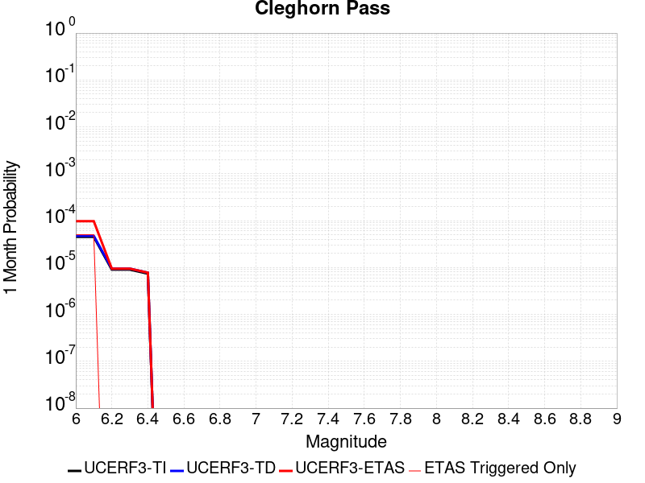 | 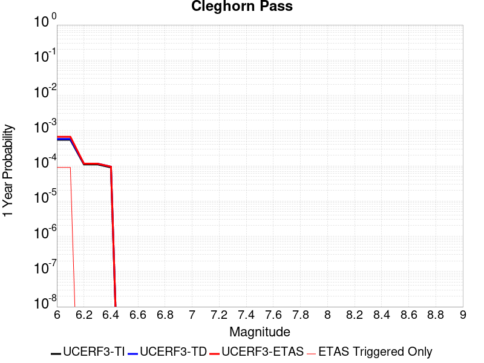 |  |

| Magnitude | 1 wk TI Prob | 1 wk TD Prob | 1 wk ETAS Prob | 1 wk ETAS/TD Gain | 1 wk ETAS Triggered Only | 1 mo TI Prob | 1 mo TD Prob | 1 mo ETAS Prob | 1 mo ETAS/TD Gain | 1 mo ETAS Triggered Only | 1 yr TI Prob | 1 yr TD Prob | 1 yr ETAS Prob | 1 yr ETAS/TD Gain | 1 yr ETAS Triggered Only | 10 yr TI Prob | 10 yr TD Prob | 10 yr ETAS Prob | 10 yr ETAS/TD Gain | 10 yr ETAS Triggered Only |
|-----|-----|-----|-----|-----|-----|-----|-----|-----|-----|-----|-----|-----|-----|-----|-----|-----|-----|-----|-----|-----|
| 6.0 | 1.0522846E-5 | 1.1040642E-5 | 5.10402E-5 | 4.6229377 | 4.0E-5 | 4.509713E-5 | 4.7316473E-5 | 9.731411E-5 | 2.0566645 | 5.0E-5 | 5.4891926E-4 | 5.759784E-4 | 6.659266E-4 | 1.1561658 | 9.0E-5 | 0.0054756533 | 0.005750022 | 0.0058991592 | 1.0259368 | 1.5E-4 |
| 6.1 | 1.0522846E-5 | 1.1040642E-5 | 5.10402E-5 | 4.6229377 | 4.0E-5 | 4.509713E-5 | 4.7316473E-5 | 9.731411E-5 | 2.0566645 | 5.0E-5 | 5.4891926E-4 | 5.759784E-4 | 6.659266E-4 | 1.1561658 | 9.0E-5 | 0.0054756533 | 0.005750022 | 0.0058991592 | 1.0259368 | 1.5E-4 |
| 6.2 | 2.1045846E-6 | 2.2082024E-6 | 2.2082024E-6 | 1.0 | 0.0 | 9.019617E-6 | 9.463714E-6 | 9.463714E-6 | 1.0 | 0.0 | 1.098083E-4 | 1.1521882E-4 | 1.1521882E-4 | 1.0 | 0.0 | 0.0010975406 | 0.0011520023 | 0.0011819677 | 1.0260116 | 3.0E-5 |
| 6.3 | 2.1045846E-6 | 2.2082024E-6 | 2.2082024E-6 | 1.0 | 0.0 | 9.019617E-6 | 9.463714E-6 | 9.463714E-6 | 1.0 | 0.0 | 1.098083E-4 | 1.1521882E-4 | 1.1521882E-4 | 1.0 | 0.0 | 0.0010975406 | 0.0011520023 | 0.0011819677 | 1.0260116 | 3.0E-5 |
| 6.4 | 1.7259927E-6 | 1.810877E-6 | 1.810877E-6 | 1.0 | 0.0 | 7.3970905E-6 | 7.760902E-6 | 7.760902E-6 | 1.0 | 0.0 | 9.005586E-5 | 9.4488976E-5 | 9.4488976E-5 | 1.0 | 0.0 | 9.001937E-4 | 9.448898E-4 | 9.7486144E-4 | 1.0317197 | 3.0E-5 |

## Mission Creek
*[(top)](#table-of-contents)*

| 1 Week | 1 Month | 1 Year | 10 Year |
|-----|-----|-----|-----|
|  | 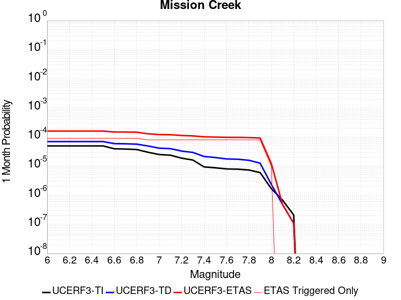 |  | 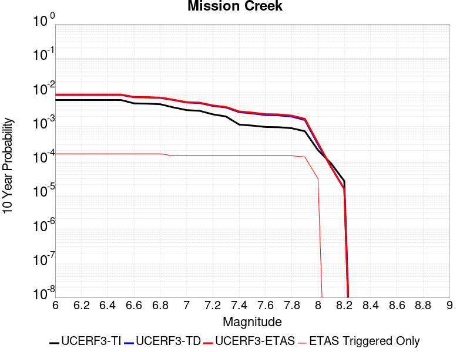 |

| Magnitude | 1 wk TI Prob | 1 wk TD Prob | 1 wk ETAS Prob | 1 wk ETAS/TD Gain | 1 wk ETAS Triggered Only | 1 mo TI Prob | 1 mo TD Prob | 1 mo ETAS Prob | 1 mo ETAS/TD Gain | 1 mo ETAS Triggered Only | 1 yr TI Prob | 1 yr TD Prob | 1 yr ETAS Prob | 1 yr ETAS/TD Gain | 1 yr ETAS Triggered Only | 10 yr TI Prob | 10 yr TD Prob | 10 yr ETAS Prob | 10 yr ETAS/TD Gain | 10 yr ETAS Triggered Only |
|-----|-----|-----|-----|-----|-----|-----|-----|-----|-----|-----|-----|-----|-----|-----|-----|-----|-----|-----|-----|-----|
| 6.0 | 1.1549387E-5 | 1.632237E-5 | 9.632106E-5 | 5.901169 | 8.0E-5 | 4.9496433E-5 | 6.9951224E-5 | 1.5994493E-4 | 2.2865207 | 9.0E-5 | 6.0245243E-4 | 8.513384E-4 | 9.912192E-4 | 1.164307 | 1.4E-4 | 0.006008218 | 0.008509998 | 0.008668636 | 1.0186415 | 1.6E-4 |
| 6.1 | 1.1549387E-5 | 1.632237E-5 | 9.632106E-5 | 5.901169 | 8.0E-5 | 4.9496433E-5 | 6.9951224E-5 | 1.5994493E-4 | 2.2865207 | 9.0E-5 | 6.0245243E-4 | 8.513384E-4 | 9.912192E-4 | 1.164307 | 1.4E-4 | 0.006008218 | 0.008509998 | 0.008668636 | 1.0186415 | 1.6E-4 |
| 6.2 | 1.1549387E-5 | 1.632237E-5 | 9.632106E-5 | 5.901169 | 8.0E-5 | 4.9496433E-5 | 6.9951224E-5 | 1.5994493E-4 | 2.2865207 | 9.0E-5 | 6.0245243E-4 | 8.513384E-4 | 9.912192E-4 | 1.164307 | 1.4E-4 | 0.006008218 | 0.008509998 | 0.008668636 | 1.0186415 | 1.6E-4 |
| 6.3 | 1.1549387E-5 | 1.632237E-5 | 9.632106E-5 | 5.901169 | 8.0E-5 | 4.9496433E-5 | 6.9951224E-5 | 1.5994493E-4 | 2.2865207 | 9.0E-5 | 6.0245243E-4 | 8.513384E-4 | 9.912192E-4 | 1.164307 | 1.4E-4 | 0.006008218 | 0.008509998 | 0.008668636 | 1.0186415 | 1.6E-4 |
| 6.4 | 1.1549387E-5 | 1.632237E-5 | 9.632106E-5 | 5.901169 | 8.0E-5 | 4.9496433E-5 | 6.9951224E-5 | 1.5994493E-4 | 2.2865207 | 9.0E-5 | 6.0245243E-4 | 8.513384E-4 | 9.912192E-4 | 1.164307 | 1.4E-4 | 0.006008218 | 0.008509998 | 0.008668636 | 1.0186415 | 1.6E-4 |
| 6.5 | 1.1549387E-5 | 1.632237E-5 | 9.632106E-5 | 5.901169 | 8.0E-5 | 4.9496433E-5 | 6.9951224E-5 | 1.5994493E-4 | 2.2865207 | 9.0E-5 | 6.0245243E-4 | 8.513384E-4 | 9.912192E-4 | 1.164307 | 1.4E-4 | 0.006008218 | 0.008509998 | 0.008668636 | 1.0186415 | 1.6E-4 |
| 6.6 | 9.202681E-6 | 1.3845646E-5 | 9.384454E-5 | 6.7779093 | 8.0E-5 | 3.9439463E-5 | 5.9337188E-5 | 1.4933184E-4 | 2.5166655 | 9.0E-5 | 4.800697E-4 | 7.221998E-4 | 8.620987E-4 | 1.1937121 | 1.4E-4 | 0.004790339 | 0.0072271815 | 0.007386025 | 1.0219786 | 1.6E-4 |
| 6.7 | 9.019164E-6 | 1.3651316E-5 | 9.3650226E-5 | 6.860161 | 8.0E-5 | 3.8652986E-5 | 5.8504378E-5 | 1.4849911E-4 | 2.5382564 | 9.0E-5 | 4.7049852E-4 | 7.12067E-4 | 8.519673E-4 | 1.1964707 | 1.4E-4 | 0.004695036 | 0.007126506 | 0.0072853654 | 1.0222914 | 1.6E-4 |
| 6.8 | 8.673558E-6 | 1.3273427E-5 | 9.327236E-5 | 7.0269995 | 8.0E-5 | 3.717186E-5 | 5.6884925E-5 | 1.468798E-4 | 2.5820515 | 9.0E-5 | 4.524734E-4 | 6.923627E-4 | 8.322658E-4 | 1.2020662 | 1.4E-4 | 0.0045155324 | 0.006930694 | 0.007089585 | 1.0229257 | 1.6E-4 |
| 6.9 | 7.002255E-6 | 1.1477657E-5 | 8.147685E-5 | 7.098736 | 7.0E-5 | 3.000932E-5 | 4.9189068E-5 | 1.2918514E-4 | 2.6262977 | 8.0E-5 | 3.653022E-4 | 5.9871917E-4 | 7.2864135E-4 | 1.2170001 | 1.3E-4 | 0.0036470229 | 0.005999517 | 0.0061386772 | 1.0231953 | 1.4E-4 |
| 7.0 | 5.84644E-6 | 9.67498E-6 | 7.9674304E-5 | 8.235087 | 7.0E-5 | 2.5055931E-5 | 4.1463565E-5 | 1.2146025E-4 | 2.9293246 | 8.0E-5 | 3.0501327E-4 | 5.047066E-4 | 6.346409E-4 | 1.2574455 | 1.3E-4 | 0.0030459496 | 0.0050638523 | 0.005203143 | 1.027507 | 1.4E-4 |
| 7.1 | 5.54703E-6 | 9.329456E-6 | 7.9328805E-5 | 8.503047 | 7.0E-5 | 2.377277E-5 | 3.9982795E-5 | 1.19979595E-4 | 3.0007806 | 8.0E-5 | 2.8939504E-4 | 4.8668624E-4 | 6.16623E-4 | 1.2669826 | 1.3E-4 | 0.0028901845 | 0.004884446 | 0.0050237626 | 1.0285224 | 1.4E-4 |
| 7.2 | 4.384709E-6 | 7.68157E-6 | 7.7681034E-5 | 10.11265 | 7.0E-5 | 1.8791474E-5 | 3.2920623E-5 | 1.1291799E-4 | 3.4300077 | 8.0E-5 | 2.2876218E-4 | 4.0073853E-4 | 5.306864E-4 | 1.3242711 | 1.3E-4 | 0.0022852682 | 0.004028366 | 0.0041678017 | 1.0346135 | 1.4E-4 |
| 7.3 | 3.7888456E-6 | 6.915452E-6 | 7.691497E-5 | 11.1221895 | 7.0E-5 | 1.623781E-5 | 2.9637333E-5 | 1.0963496E-4 | 3.6992183 | 8.0E-5 | 1.9767738E-4 | 3.6077813E-4 | 4.907312E-4 | 1.3602023 | 1.3E-4 | 0.0019750162 | 0.0036301152 | 0.0037696068 | 1.0384263 | 1.4E-4 |
| 7.4 | 2.1982462E-6 | 5.0237763E-6 | 7.5023425E-5 | 14.933671 | 7.0E-5 | 9.421021E-6 | 2.1530293E-5 | 1.01528574E-4 | 4.715615 | 8.0E-5 | 1.1469489E-4 | 2.621E-4 | 3.920659E-4 | 1.4958639 | 1.3E-4 | 0.0011463572 | 0.0026458844 | 0.002785514 | 1.0527724 | 1.4E-4 |
| 7.5 | 2.051923E-6 | 4.615016E-6 | 7.461469E-5 | 16.167809 | 7.0E-5 | 8.793926E-6 | 1.9778492E-5 | 9.977691E-5 | 5.044718 | 8.0E-5 | 1.0706078E-4 | 2.4077666E-4 | 3.7074537E-4 | 1.5397894 | 1.3E-4 | 0.0010700922 | 0.0024335422 | 0.0025732014 | 1.0573893 | 1.4E-4 |
| 7.6 | 1.8733427E-6 | 4.1233748E-6 | 7.412308E-5 | 17.976315 | 7.0E-5 | 8.028587E-6 | 1.7671488E-5 | 9.7670076E-5 | 5.5269866 | 8.0E-5 | 9.774366E-5 | 2.151292E-4 | 3.4510123E-4 | 1.604158 | 1.3E-4 | 9.770069E-4 | 0.0021780801 | 0.0023177753 | 1.0641367 | 1.4E-4 |
| 7.7 | 1.8411953E-6 | 4.0430496E-6 | 7.4042764E-5 | 18.313593 | 7.0E-5 | 7.890813E-6 | 1.732724E-5 | 9.732586E-5 | 5.6169276 | 8.0E-5 | 9.606641E-5 | 2.1093882E-4 | 3.4091139E-4 | 1.6161624 | 1.3E-4 | 9.6024893E-4 | 0.0021363653 | 0.0022760662 | 1.0653919 | 1.4E-4 |
| 7.8 | 1.7194251E-6 | 3.7104276E-6 | 7.3710165E-5 | 19.86568 | 7.0E-5 | 7.368944E-6 | 1.5901736E-5 | 9.590046E-5 | 6.0308175 | 8.0E-5 | 8.97132E-5 | 1.9358651E-4 | 3.2356134E-4 | 1.6714044 | 1.3E-4 | 8.967699E-4 | 0.0019623525 | 0.0021020777 | 1.071203 | 1.4E-4 |
| 7.9 | 1.4035052E-6 | 2.9500632E-6 | 7.294986E-5 | 24.728235 | 7.0E-5 | 6.0150082E-6 | 1.2643067E-5 | 9.2642054E-5 | 7.327499 | 8.0E-5 | 7.3230265E-5 | 1.5391852E-4 | 2.7390005E-4 | 1.7795132 | 1.2E-4 | 7.3206134E-4 | 0.0015631086 | 0.0016929054 | 1.0830376 | 1.3E-4 |
| 8.0 | 3.9318823E-7 | 5.528522E-7 | 1.0552847E-5 | 19.088007 | 1.0E-5 | 1.6850913E-6 | 2.3693647E-6 | 1.2369341E-5 | 5.220531 | 1.0E-5 | 2.0515794E-5 | 2.8846638E-5 | 5.8845773E-5 | 2.0399525 | 3.0E-5 | 2.0513899E-4 | 2.9899E-4 | 3.2898103E-4 | 1.1003078 | 3.0E-5 |
| 8.1 | 1.596793E-7 | 1.1380002E-7 | 1.1380002E-7 | 1.0 | 0.0 | 6.8433974E-7 | 4.877143E-7 | 4.877143E-7 | 1.0 | 0.0 | 8.331805E-6 | 5.937906E-6 | 5.937906E-6 | 1.0 | 0.0 | 8.331492E-5 | 6.549966E-5 | 6.549966E-5 | 1.0 | 0.0 |
| 8.2 | 4.9003038E-8 | 2.5444924E-8 | 2.5444924E-8 | 1.0 | 0.0 | 2.10013E-7 | 1.0904967E-7 | 1.0904967E-7 | 1.0 | 0.0 | 2.5569052E-6 | 1.327679E-6 | 1.327679E-6 | 1.0 | 0.0 | 2.556876E-5 | 1.495635E-5 | 1.495635E-5 | 1.0 | 0.0 |

## Mission Ridge-Arroyo Parida-Santa Ana
*[(top)](#table-of-contents)*

| 1 Week | 1 Month | 1 Year | 10 Year |
|-----|-----|-----|-----|
|  | 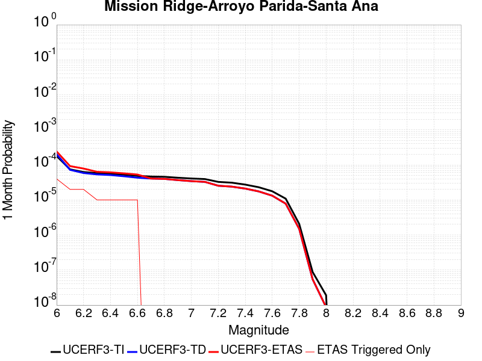 | 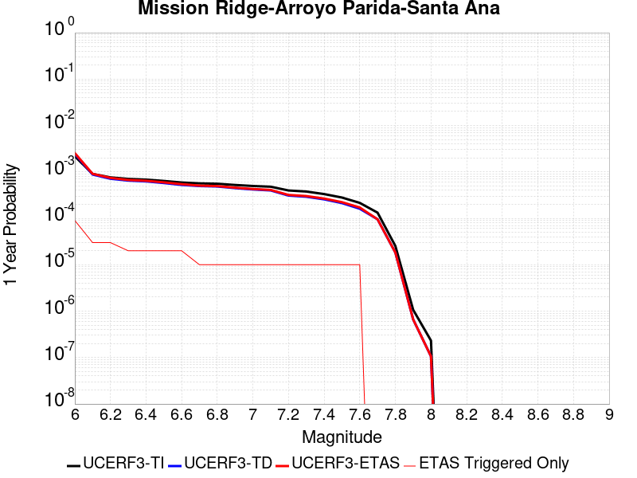 |  |

| Magnitude | 1 wk TI Prob | 1 wk TD Prob | 1 wk ETAS Prob | 1 wk ETAS/TD Gain | 1 wk ETAS Triggered Only | 1 mo TI Prob | 1 mo TD Prob | 1 mo ETAS Prob | 1 mo ETAS/TD Gain | 1 mo ETAS Triggered Only | 1 yr TI Prob | 1 yr TD Prob | 1 yr ETAS Prob | 1 yr ETAS/TD Gain | 1 yr ETAS Triggered Only | 10 yr TI Prob | 10 yr TD Prob | 10 yr ETAS Prob | 10 yr ETAS/TD Gain | 10 yr ETAS Triggered Only |
|-----|-----|-----|-----|-----|-----|-----|-----|-----|-----|-----|-----|-----|-----|-----|-----|-----|-----|-----|-----|-----|
| 6.0 | 4.169034E-5 | 4.7138263E-5 | 7.713685E-5 | 1.6363957 | 3.0E-5 | 1.7866064E-4 | 2.0201034E-4 | 2.4200226E-4 | 1.1979697 | 4.0E-5 | 0.0021730233 | 0.00245745 | 0.0025472287 | 1.0365334 | 9.0E-5 | 0.021518968 | 0.024384614 | 0.024501689 | 1.0048012 | 1.2E-4 |
| 6.1 | 1.73813E-5 | 1.6854226E-5 | 2.6854057E-5 | 1.593313 | 1.0E-5 | 7.4489166E-5 | 7.223046E-5 | 9.222901E-5 | 1.2768714 | 2.0E-5 | 9.065282E-4 | 8.790618E-4 | 9.0903544E-4 | 1.0340973 | 3.0E-5 | 0.009028391 | 0.008756988 | 0.00880655 | 1.0056597 | 5.0E-5 |
| 6.2 | 1.4622182E-5 | 1.367329E-5 | 2.3673152E-5 | 1.7313429 | 1.0E-5 | 6.2664985E-5 | 5.8598518E-5 | 7.8597346E-5 | 1.3412856 | 2.0E-5 | 7.6267915E-4 | 7.132073E-4 | 7.431859E-4 | 1.0420336 | 3.0E-5 | 0.007600669 | 0.007109627 | 0.0071592717 | 1.0069827 | 5.0E-5 |
| 6.3 | 1.3552434E-5 | 1.2482201E-5 | 2.2482076E-5 | 1.8011308 | 1.0E-5 | 5.8080568E-5 | 5.3494066E-5 | 6.3493535E-5 | 1.1869266 | 1.0E-5 | 7.069015E-4 | 6.510988E-4 | 6.710858E-4 | 1.0306973 | 2.0E-5 | 0.00704657 | 0.006492275 | 0.0065220804 | 1.0045909 | 3.0E-5 |
| 6.4 | 1.30977305E-5 | 1.1979156E-5 | 2.1979036E-5 | 1.8347733 | 1.0E-5 | 5.613192E-5 | 5.1338247E-5 | 6.1337734E-5 | 1.1947765 | 1.0E-5 | 6.831918E-4 | 6.248669E-4 | 6.448544E-4 | 1.0319868 | 2.0E-5 | 0.006810953 | 0.0062314444 | 0.0062612575 | 1.0047843 | 3.0E-5 |
| 6.5 | 1.225205E-5 | 1.1048803E-5 | 2.1048692E-5 | 1.9050654 | 1.0E-5 | 5.2507727E-5 | 4.7351168E-5 | 5.7350695E-5 | 1.2111781 | 1.0E-5 | 6.3909404E-4 | 5.7635066E-4 | 5.963392E-4 | 1.0346811 | 2.0E-5 | 0.006372592 | 0.005748869 | 0.0057786964 | 1.0051885 | 3.0E-5 |
| 6.6 | 1.1352241E-5 | 1.0063535E-5 | 2.0063435E-5 | 1.9936767 | 1.0E-5 | 4.8651553E-5 | 4.3128734E-5 | 5.3128304E-5 | 1.231854 | 1.0E-5 | 5.921717E-4 | 5.2496797E-4 | 5.4495747E-4 | 1.0380776 | 2.0E-5 | 0.0059059616 | 0.0052375244 | 0.00525742 | 1.0037986 | 2.0E-5 |
| 6.7 | 1.0864116E-5 | 9.517027E-6 | 9.517027E-6 | 1.0 | 0.0 | 4.6559664E-5 | 4.0786632E-5 | 4.0786632E-5 | 1.0 | 0.0 | 5.667165E-4 | 4.964661E-4 | 5.0646113E-4 | 1.0201323 | 1.0E-5 | 0.005652734 | 0.004953804 | 0.004963754 | 1.0020087 | 1.0E-5 |
| 6.8 | 1.0666365E-5 | 9.299779E-6 | 9.299779E-6 | 1.0 | 0.0 | 4.571219E-5 | 3.9855597E-5 | 3.9855597E-5 | 1.0 | 0.0 | 5.564038E-4 | 4.8513585E-4 | 4.95131E-4 | 1.0206028 | 1.0E-5 | 0.005550127 | 0.0048410003 | 0.0048509515 | 1.0020556 | 1.0E-5 |
| 6.9 | 1.0038665E-5 | 8.592046E-6 | 8.592046E-6 | 1.0 | 0.0 | 4.302214E-5 | 3.682254E-5 | 3.682254E-5 | 1.0 | 0.0 | 5.236687E-4 | 4.4822405E-4 | 4.5821955E-4 | 1.0223002 | 1.0E-5 | 0.005224364 | 0.004473411 | 0.004483366 | 1.0022254 | 1.0E-5 |
| 7.0 | 9.5379955E-6 | 8.025073E-6 | 8.025073E-6 | 1.0 | 0.0 | 4.0876483E-5 | 3.4392728E-5 | 3.4392728E-5 | 1.0 | 0.0 | 4.975576E-4 | 4.1865272E-4 | 4.2864852E-4 | 1.0238762 | 1.0E-5 | 0.00496445 | 0.0041788397 | 0.004188798 | 1.002383 | 1.0E-5 |
| 7.1 | 9.207389E-6 | 7.652375E-6 | 7.652375E-6 | 1.0 | 0.0 | 3.945964E-5 | 3.279549E-5 | 3.279549E-5 | 1.0 | 0.0 | 4.803152E-4 | 3.9921363E-4 | 4.0920964E-4 | 1.0250392 | 1.0E-5 | 0.004792784 | 0.003985161 | 0.0039951215 | 1.0024993 | 1.0E-5 |
| 7.2 | 7.638091E-6 | 5.9311183E-6 | 5.9311183E-6 | 1.0 | 0.0 | 3.2734264E-5 | 2.541883E-5 | 2.541883E-5 | 1.0 | 0.0 | 3.984668E-4 | 3.0943064E-4 | 3.1942755E-4 | 1.0323074 | 1.0E-5 | 0.0039775306 | 0.0030900547 | 0.0031000238 | 1.0032262 | 1.0E-5 |
| 7.3 | 7.2500147E-6 | 5.5961527E-6 | 5.5961527E-6 | 1.0 | 0.0 | 3.1071122E-5 | 2.3983293E-5 | 2.3983293E-5 | 1.0 | 0.0 | 3.7822526E-4 | 2.9195778E-4 | 3.0195486E-4 | 1.0342416 | 1.0E-5 | 0.0037758215 | 0.0029157975 | 0.0029257683 | 1.0034196 | 1.0E-5 |
| 7.4 | 6.3899715E-6 | 4.9184964E-6 | 4.9184964E-6 | 1.0 | 0.0 | 2.7385306E-5 | 2.10791E-5 | 2.10791E-5 | 1.0 | 0.0 | 3.3336508E-4 | 2.5660804E-4 | 2.6660546E-4 | 1.03896 | 1.0E-5 | 0.0033286542 | 0.0025631618 | 0.002573136 | 1.0038915 | 1.0E-5 |
| 7.5 | 5.379025E-6 | 4.0838527E-6 | 4.0838527E-6 | 1.0 | 0.0 | 2.305276E-5 | 1.7502109E-5 | 1.7502109E-5 | 1.0 | 0.0 | 2.806312E-4 | 2.1306744E-4 | 2.2306532E-4 | 1.0469235 | 1.0E-5 | 0.0028027708 | 0.002128643 | 0.0021386216 | 1.0046878 | 1.0E-5 |
| 7.6 | 4.1270696E-6 | 3.0883439E-6 | 3.0883439E-6 | 1.0 | 0.0 | 1.768732E-5 | 1.3235693E-5 | 1.3235693E-5 | 1.0 | 0.0 | 2.1532185E-4 | 1.6113273E-4 | 1.7113112E-4 | 1.0620506 | 1.0E-5 | 0.0021511333 | 0.001610167 | 0.0016201509 | 1.0062006 | 1.0E-5 |
| 7.7 | 2.5406805E-6 | 1.8282013E-6 | 1.8282013E-6 | 1.0 | 0.0 | 1.0888585E-5 | 7.835125E-6 | 7.835125E-6 | 1.0 | 0.0 | 1.3256045E-4 | 9.538854E-5 | 9.538854E-5 | 1.0 | 0.0 | 0.0013248142 | 9.534821E-4 | 9.534821E-4 | 1.0 | 0.0 |
| 7.8 | 4.8608285E-7 | 3.5098864E-7 | 3.5098864E-7 | 1.0 | 0.0 | 2.0832106E-6 | 1.5042363E-6 | 1.5042363E-6 | 1.0 | 0.0 | 2.5362791E-5 | 1.8313924E-5 | 1.8313924E-5 | 1.0 | 0.0 | 2.5359896E-4 | 1.8312426E-4 | 1.8312426E-4 | 1.0 | 0.0 |
| 7.9 | 2.0472514E-8 | 1.2688783E-8 | 1.2688783E-8 | 1.0 | 0.0 | 8.7739345E-8 | 5.43805E-8 | 5.43805E-8 | 1.0 | 0.0 | 1.068226E-6 | 6.6208236E-7 | 6.6208236E-7 | 1.0 | 0.0 | 1.0682209E-5 | 6.620805E-6 | 6.620805E-6 | 1.0 | 0.0 |
| 8.0 | 4.443582E-9 | 2.0321211E-9 | 2.0321211E-9 | 1.0 | 0.0 | 1.9043922E-8 | 8.70909E-9 | 8.70909E-9 | 1.0 | 0.0 | 2.3185973E-7 | 1.0603316E-7 | 1.0603316E-7 | 1.0 | 0.0 | 2.3185949E-6 | 1.0603312E-6 | 1.0603312E-6 | 1.0 | 0.0 |

## Big Pine (Central)
*[(top)](#table-of-contents)*

| 1 Week | 1 Month | 1 Year | 10 Year |
|-----|-----|-----|-----|
|  |  |  | 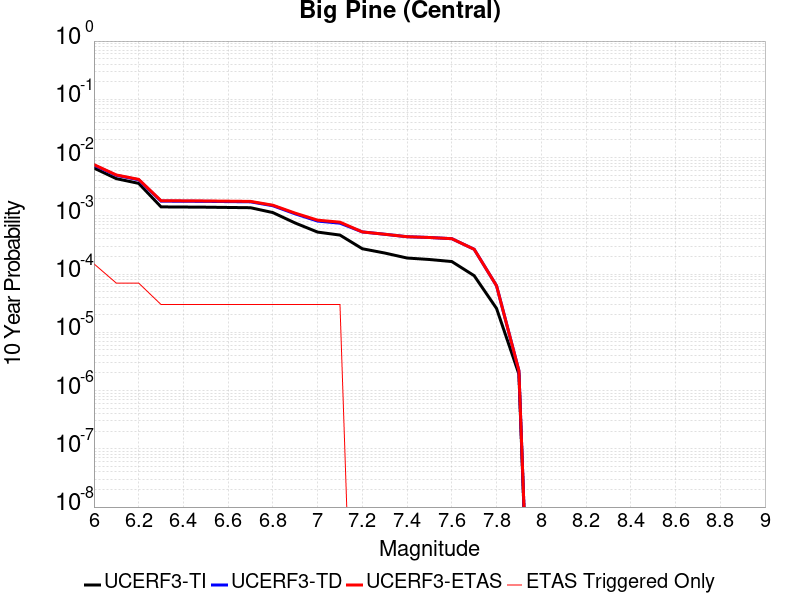 |

| Magnitude | 1 wk TI Prob | 1 wk TD Prob | 1 wk ETAS Prob | 1 wk ETAS/TD Gain | 1 wk ETAS Triggered Only | 1 mo TI Prob | 1 mo TD Prob | 1 mo ETAS Prob | 1 mo ETAS/TD Gain | 1 mo ETAS Triggered Only | 1 yr TI Prob | 1 yr TD Prob | 1 yr ETAS Prob | 1 yr ETAS/TD Gain | 1 yr ETAS Triggered Only | 10 yr TI Prob | 10 yr TD Prob | 10 yr ETAS Prob | 10 yr ETAS/TD Gain | 10 yr ETAS Triggered Only |
|-----|-----|-----|-----|-----|-----|-----|-----|-----|-----|-----|-----|-----|-----|-----|-----|-----|-----|-----|-----|-----|
| 6.0 | 1.2706755E-5 | 1.4250529E-5 | 3.4250243E-5 | 2.4034367 | 2.0E-5 | 5.4456385E-5 | 6.107247E-5 | 1.0107003E-4 | 1.6549196 | 4.0E-5 | 6.628048E-4 | 7.433402E-4 | 8.232807E-4 | 1.1075423 | 8.0E-5 | 0.006608314 | 0.0074135666 | 0.007562455 | 1.0200832 | 1.5E-4 |
| 6.1 | 8.342579E-6 | 9.510762E-6 | 1.9510666E-5 | 2.0514305 | 1.0E-5 | 3.5753423E-5 | 4.0759893E-5 | 6.0759077E-5 | 1.4906584 | 2.0E-5 | 4.3521097E-4 | 4.961604E-4 | 5.461356E-4 | 1.1007239 | 5.0E-5 | 0.0043435963 | 0.0049540824 | 0.0050237356 | 1.0140598 | 7.0E-5 |
| 6.2 | 6.923899E-6 | 7.967147E-6 | 1.7967068E-5 | 2.2551444 | 1.0E-5 | 2.9673516E-5 | 3.4144578E-5 | 5.4143897E-5 | 1.5857245 | 2.0E-5 | 3.6121515E-4 | 4.156502E-4 | 4.656294E-4 | 1.1202434 | 5.0E-5 | 0.003606286 | 0.0041520367 | 0.004221746 | 1.0167892 | 7.0E-5 |
| 6.3 | 2.728396E-6 | 3.4242908E-6 | 3.4242908E-6 | 1.0 | 0.0 | 1.1693074E-5 | 1.4675454E-5 | 1.4675454E-5 | 1.0 | 0.0 | 1.4235388E-4 | 1.7865987E-4 | 1.8865809E-4 | 1.0559623 | 1.0E-5 | 0.0014226272 | 0.0017866704 | 0.0018166169 | 1.0167611 | 3.0E-5 |
| 6.4 | 2.7136944E-6 | 3.408584E-6 | 3.408584E-6 | 1.0 | 0.0 | 1.1630066E-5 | 1.4608141E-5 | 1.4608141E-5 | 1.0 | 0.0 | 1.4158686E-4 | 1.7784047E-4 | 1.8783868E-4 | 1.0562202 | 1.0E-5 | 0.0014149669 | 0.0017784894 | 0.0018084361 | 1.0168382 | 3.0E-5 |
| 6.5 | 2.6971882E-6 | 3.3909291E-6 | 3.3909291E-6 | 1.0 | 0.0 | 1.1559327E-5 | 1.45324775E-5 | 1.45324775E-5 | 1.0 | 0.0 | 1.4072572E-4 | 1.7691942E-4 | 1.8691765E-4 | 1.056513 | 1.0E-5 | 0.0014063664 | 0.0017692937 | 0.0017992406 | 1.0169259 | 3.0E-5 |
| 6.6 | 2.669092E-6 | 3.3609497E-6 | 3.3609497E-6 | 1.0 | 0.0 | 1.1438916E-5 | 1.4403995E-5 | 1.4403995E-5 | 1.0 | 0.0 | 1.3925991E-4 | 1.753554E-4 | 1.8535365E-4 | 1.0570171 | 1.0E-5 | 0.0013917267 | 0.0017536782 | 0.0017836256 | 1.0170768 | 3.0E-5 |
| 6.7 | 2.6408059E-6 | 3.3309752E-6 | 3.3309752E-6 | 1.0 | 0.0 | 1.1317691E-5 | 1.4275535E-5 | 1.4275535E-5 | 1.0 | 0.0 | 1.3778417E-4 | 1.7379165E-4 | 1.837899E-4 | 1.0575302 | 1.0E-5 | 0.0013769877 | 0.0017380653 | 0.0017680131 | 1.0172306 | 3.0E-5 |
| 6.8 | 2.1786943E-6 | 2.8544325E-6 | 2.8544325E-6 | 1.0 | 0.0 | 9.337228E-6 | 1.2233229E-5 | 1.2233229E-5 | 1.0 | 0.0 | 1.1367482E-4 | 1.4893012E-4 | 1.5892863E-4 | 1.0671356 | 1.0E-5 | 0.0011361669 | 0.0014897975 | 0.0015197528 | 1.0201069 | 3.0E-5 |
| 6.9 | 1.4411696E-6 | 2.068499E-6 | 2.068499E-6 | 1.0 | 0.0 | 6.1764263E-6 | 8.864968E-6 | 8.864968E-6 | 1.0 | 0.0 | 7.51954E-5 | 1.079259E-4 | 1.1792482E-4 | 1.0926461 | 1.0E-5 | 7.5169955E-4 | 0.0010801847 | 0.0011101522 | 1.027743 | 3.0E-5 |
| 7.0 | 1.0073411E-6 | 1.554261E-6 | 1.554261E-6 | 1.0 | 0.0 | 4.317169E-6 | 6.6611024E-6 | 6.6611024E-6 | 1.0 | 0.0 | 5.2560266E-5 | 8.1096056E-5 | 9.1095244E-5 | 1.1233006 | 1.0E-5 | 5.2547833E-4 | 8.1210316E-4 | 8.4207876E-4 | 1.0369111 | 3.0E-5 |
| 7.1 | 8.947104E-7 | 1.4302494E-6 | 1.4302494E-6 | 1.0 | 0.0 | 3.834468E-6 | 6.129627E-6 | 6.129627E-6 | 1.0 | 0.0 | 4.6683643E-5 | 7.46258E-5 | 8.4625055E-5 | 1.133992 | 1.0E-5 | 4.6673836E-4 | 7.474457E-4 | 7.7742327E-4 | 1.0401067 | 3.0E-5 |
| 7.2 | 5.215166E-7 | 1.0111678E-6 | 1.0111678E-6 | 1.0 | 0.0 | 2.2350691E-6 | 4.3335694E-6 | 4.3335694E-6 | 1.0 | 0.0 | 2.7211627E-5 | 5.2759973E-5 | 5.2759973E-5 | 1.0 | 0.0 | 2.7208295E-4 | 5.2890263E-4 | 5.2890263E-4 | 1.0 | 0.0 |
| 7.3 | 4.4024807E-7 | 9.219589E-7 | 9.219589E-7 | 1.0 | 0.0 | 1.8867761E-6 | 3.9512465E-6 | 3.9512465E-6 | 1.0 | 0.0 | 2.2971257E-5 | 4.810541E-5 | 4.810541E-5 | 1.0 | 0.0 | 2.2968883E-4 | 4.8237795E-4 | 4.8237795E-4 | 1.0 | 0.0 |
| 7.4 | 3.6130905E-7 | 8.358523E-7 | 8.358523E-7 | 1.0 | 0.0 | 1.5484665E-6 | 3.5822195E-6 | 3.5822195E-6 | 1.0 | 0.0 | 1.8852415E-5 | 4.3612687E-5 | 4.3612687E-5 | 1.0 | 0.0 | 1.8850817E-4 | 4.374597E-4 | 4.374597E-4 | 1.0 | 0.0 |
| 7.5 | 3.408184E-7 | 8.108147E-7 | 8.108147E-7 | 1.0 | 0.0 | 1.4606494E-6 | 3.4749157E-6 | 3.4749157E-6 | 1.0 | 0.0 | 1.7783263E-5 | 4.2306317E-5 | 4.2306317E-5 | 1.0 | 0.0 | 1.778184E-4 | 4.2437963E-4 | 4.2437963E-4 | 1.0 | 0.0 |
| 7.6 | 3.1428627E-7 | 7.7316E-7 | 7.7316E-7 | 1.0 | 0.0 | 1.3469405E-6 | 3.3135389E-6 | 3.3135389E-6 | 1.0 | 0.0 | 1.6398877E-5 | 4.0341627E-5 | 4.0341627E-5 | 1.0 | 0.0 | 1.6397667E-4 | 4.0471106E-4 | 4.0471106E-4 | 1.0 | 0.0 |
| 7.7 | 1.7972785E-7 | 5.077752E-7 | 5.077752E-7 | 1.0 | 0.0 | 7.70262E-7 | 2.1761778E-6 | 2.1761778E-6 | 1.0 | 0.0 | 9.377899E-6 | 2.6494654E-5 | 2.6494654E-5 | 1.0 | 0.0 | 9.377503E-5 | 2.662899E-4 | 2.662899E-4 | 1.0 | 0.0 |
| 7.8 | 4.9230927E-8 | 1.198079E-7 | 1.198079E-7 | 1.0 | 0.0 | 2.1098968E-7 | 5.134623E-7 | 5.134623E-7 | 1.0 | 0.0 | 2.5687964E-6 | 6.2513873E-6 | 6.2513873E-6 | 1.0 | 0.0 | 2.5687666E-5 | 6.295415E-5 | 6.295415E-5 | 1.0 | 0.0 |
| 7.9 | 3.6805972E-9 | 4.105293E-9 | 4.105293E-9 | 1.0 | 0.0 | 1.5773987E-8 | 1.7594115E-8 | 1.7594115E-8 | 1.0 | 0.0 | 1.9204828E-7 | 2.1420831E-7 | 2.1420831E-7 | 1.0 | 0.0 | 1.920481E-6 | 2.1900614E-6 | 2.1900614E-6 | 1.0 | 0.0 |

## Oceanic - West Huasna
*[(top)](#table-of-contents)*

| 1 Week | 1 Month | 1 Year | 10 Year |
|-----|-----|-----|-----|
|  | 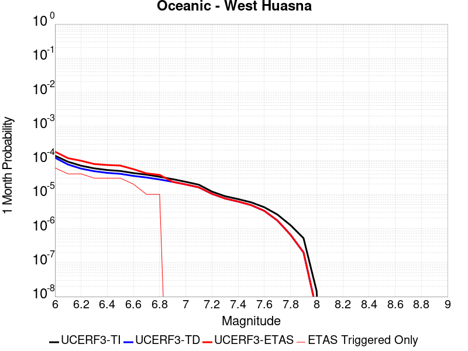 |  |  |

| Magnitude | 1 wk TI Prob | 1 wk TD Prob | 1 wk ETAS Prob | 1 wk ETAS/TD Gain | 1 wk ETAS Triggered Only | 1 mo TI Prob | 1 mo TD Prob | 1 mo ETAS Prob | 1 mo ETAS/TD Gain | 1 mo ETAS Triggered Only | 1 yr TI Prob | 1 yr TD Prob | 1 yr ETAS Prob | 1 yr ETAS/TD Gain | 1 yr ETAS Triggered Only | 10 yr TI Prob | 10 yr TD Prob | 10 yr ETAS Prob | 10 yr ETAS/TD Gain | 10 yr ETAS Triggered Only |
|-----|-----|-----|-----|-----|-----|-----|-----|-----|-----|-----|-----|-----|-----|-----|-----|-----|-----|-----|-----|-----|
| 6.0 | 3.195567E-5 | 2.7926868E-5 | 7.792547E-5 | 2.7903404 | 5.0E-5 | 1.3694567E-4 | 1.1968133E-4 | 1.7967416E-4 | 1.5012714 | 6.0E-5 | 0.0016660384 | 0.0014561893 | 0.0015660292 | 1.0754297 | 1.1E-4 | 0.016536033 | 0.014471028 | 0.014609002 | 1.0095345 | 1.4E-4 |
| 6.1 | 2.1156782E-5 | 1.7573486E-5 | 5.7572783E-5 | 3.2761164 | 4.0E-5 | 9.066878E-5 | 7.531282E-5 | 1.15309806E-4 | 1.5310781 | 4.0E-5 | 0.0011033333 | 9.165572E-4 | 9.964838E-4 | 1.0872031 | 8.0E-5 | 0.010978713 | 0.009128777 | 0.009227864 | 1.0108544 | 1.0E-4 |
| 6.2 | 1.6195117E-5 | 1.3327152E-5 | 5.332662E-5 | 4.0013514 | 4.0E-5 | 6.9405796E-5 | 5.7115132E-5 | 9.711285E-5 | 1.7002997 | 4.0E-5 | 8.44688E-4 | 6.9515745E-4 | 7.5511576E-4 | 1.0862514 | 6.0E-5 | 0.008414844 | 0.006930123 | 0.007009569 | 1.0114638 | 8.0E-5 |
| 6.3 | 1.3559345E-5 | 1.1179142E-5 | 4.1178806E-5 | 3.683539 | 3.0E-5 | 5.811018E-5 | 4.7909736E-5 | 7.79083E-5 | 1.6261475 | 3.0E-5 | 7.072618E-4 | 5.831459E-4 | 6.3311675E-4 | 1.0856918 | 5.0E-5 | 0.0070501505 | 0.0058162753 | 0.005885868 | 1.0119652 | 7.0E-5 |
| 6.4 | 1.2120619E-5 | 1.0000977E-5 | 4.000068E-5 | 3.9996767 | 3.0E-5 | 5.1944477E-5 | 4.2860633E-5 | 7.2859344E-5 | 1.699913 | 3.0E-5 | 6.322405E-4 | 5.2170374E-4 | 5.7167764E-4 | 1.0957898 | 5.0E-5 | 0.006304447 | 0.0052048573 | 0.0052744932 | 1.013379 | 7.0E-5 |
| 6.5 | 1.13511915E-5 | 9.3674735E-6 | 3.936719E-5 | 4.202541 | 3.0E-5 | 4.8647056E-5 | 4.01457E-5 | 7.0144495E-5 | 1.747248 | 3.0E-5 | 5.9211696E-4 | 4.886647E-4 | 5.386403E-4 | 1.1022696 | 5.0E-5 | 0.0059054173 | 0.0048759608 | 0.0049456195 | 1.0142862 | 7.0E-5 |
| 6.6 | 9.850605E-6 | 8.135418E-6 | 2.8135255E-5 | 3.4583662 | 2.0E-5 | 4.2216197E-5 | 3.4865614E-5 | 5.4864915E-5 | 1.5736111 | 2.0E-5 | 5.1386096E-4 | 4.2440637E-4 | 4.643894E-4 | 1.0942093 | 4.0E-5 | 0.0051267436 | 0.004235991 | 0.004295737 | 1.0141044 | 6.0E-5 |
| 6.7 | 8.8558645E-6 | 7.318433E-6 | 1.731836E-5 | 2.3664029 | 1.0E-5 | 3.7953152E-5 | 3.1364336E-5 | 4.1364023E-5 | 1.3188235 | 1.0E-5 | 4.6198163E-4 | 3.8179406E-4 | 4.017864E-4 | 1.0523642 | 2.0E-5 | 0.004610224 | 0.0038114067 | 0.0038412923 | 1.0078411 | 3.0E-5 |
| 6.8 | 7.67136E-6 | 6.391756E-6 | 1.6391692E-5 | 2.5645053 | 1.0E-5 | 3.2876844E-5 | 2.7392953E-5 | 3.7392678E-5 | 1.3650473 | 1.0E-5 | 4.0020206E-4 | 3.3345833E-4 | 3.5345164E-4 | 1.0599575 | 2.0E-5 | 0.003994821 | 0.0033296007 | 0.003349534 | 1.0059867 | 2.0E-5 |
| 6.9 | 6.534529E-6 | 5.4583297E-6 | 5.4583297E-6 | 1.0 | 0.0 | 2.8004823E-5 | 2.3392633E-5 | 2.3392633E-5 | 1.0 | 0.0 | 3.4090536E-4 | 2.847682E-4 | 2.9476537E-4 | 1.0351063 | 1.0E-5 | 0.0034038287 | 0.0028440498 | 0.0028540213 | 1.0035061 | 1.0E-5 |
| 7.0 | 5.460525E-6 | 4.5699517E-6 | 4.5699517E-6 | 1.0 | 0.0 | 2.3402039E-5 | 1.958536E-5 | 1.958536E-5 | 1.0 | 0.0 | 2.8488258E-4 | 2.3842578E-4 | 2.484234E-4 | 1.0419317 | 1.0E-5 | 0.0028451765 | 0.0023817138 | 0.00239169 | 1.0041887 | 1.0E-5 |
| 7.1 | 4.4825083E-6 | 3.7524428E-6 | 3.7524428E-6 | 1.0 | 0.0 | 1.9210609E-5 | 1.60818E-5 | 1.60818E-5 | 1.0 | 0.0 | 2.3386406E-4 | 1.9577841E-4 | 2.0577647E-4 | 1.0510682 | 1.0E-5 | 0.002336181 | 0.0019560715 | 0.0019660518 | 1.0051023 | 1.0E-5 |
| 7.2 | 2.821708E-6 | 2.4249334E-6 | 2.4249334E-6 | 1.0 | 0.0 | 1.2092979E-5 | 1.039253E-5 | 1.039253E-5 | 1.0 | 0.0 | 1.4722206E-4 | 1.2652173E-4 | 1.2652173E-4 | 1.0 | 0.0 | 0.0014712457 | 0.0012644994 | 0.0012644994 | 1.0 | 0.0 |
| 7.3 | 2.0644757E-6 | 1.7687412E-6 | 1.7687412E-6 | 1.0 | 0.0 | 8.847723E-6 | 7.5802973E-6 | 7.5802973E-6 | 1.0 | 0.0 | 1.0771569E-4 | 9.228622E-5 | 9.228622E-5 | 1.0 | 0.0 | 0.001076635 | 9.2248066E-4 | 9.2248066E-4 | 1.0 | 0.0 |
| 7.4 | 1.6980367E-6 | 1.4379892E-6 | 1.4379892E-6 | 1.0 | 0.0 | 7.27728E-6 | 6.162796E-6 | 6.162796E-6 | 1.0 | 0.0 | 8.8597284E-5 | 7.5029464E-5 | 7.5029464E-5 | 1.0 | 0.0 | 8.8561967E-4 | 7.500429E-4 | 7.500429E-4 | 1.0 | 0.0 |
| 7.5 | 1.3637683E-6 | 1.1302635E-6 | 1.1302635E-6 | 1.0 | 0.0 | 5.844708E-6 | 4.8439774E-6 | 4.8439774E-6 | 1.0 | 0.0 | 7.1156996E-5 | 5.897383E-5 | 5.897383E-5 | 1.0 | 0.0 | 7.1134215E-4 | 5.895833E-4 | 5.895833E-4 | 1.0 | 0.0 |
| 7.6 | 9.802994E-7 | 7.677247E-7 | 7.677247E-7 | 1.0 | 0.0 | 4.2012766E-6 | 3.2902446E-6 | 3.2902446E-6 | 1.0 | 0.0 | 5.1149345E-5 | 4.0057992E-5 | 4.0057992E-5 | 1.0 | 0.0 | 5.113757E-4 | 4.0050913E-4 | 4.0050913E-4 | 1.0 | 0.0 |
| 7.7 | 5.986191E-7 | 4.0050548E-7 | 4.0050548E-7 | 1.0 | 0.0 | 2.5655079E-6 | 1.7164509E-6 | 1.7164509E-6 | 1.0 | 0.0 | 3.1234613E-5 | 2.089759E-5 | 2.089759E-5 | 1.0 | 0.0 | 3.123022E-4 | 2.089576E-4 | 2.089576E-4 | 1.0 | 0.0 |
| 7.8 | 2.9189815E-7 | 1.5285792E-7 | 1.5285792E-7 | 1.0 | 0.0 | 1.2509914E-6 | 6.5510517E-7 | 6.5510517E-7 | 1.0 | 0.0 | 1.5230714E-5 | 7.9758765E-6 | 7.9758765E-6 | 1.0 | 0.0 | 1.522967E-4 | 7.9757214E-5 | 7.9757214E-5 | 1.0 | 0.0 |
| 7.9 | 1.2057845E-7 | 4.621248E-8 | 4.621248E-8 | 1.0 | 0.0 | 5.1676466E-7 | 1.9805347E-7 | 1.9805347E-7 | 1.0 | 0.0 | 6.2915915E-6 | 2.4112983E-6 | 2.4112983E-6 | 1.0 | 0.0 | 6.2914136E-5 | 2.4114026E-5 | 2.4114026E-5 | 1.0 | 0.0 |
| 8.0 | 3.3806387E-9 | 9.011393E-10 | 9.011393E-10 | 1.0 | 0.0 | 1.4488451E-8 | 3.8620254E-9 | 3.8620254E-9 | 1.0 | 0.0 | 1.7639688E-7 | 4.702016E-8 | 4.702016E-8 | 1.0 | 0.0 | 1.7639674E-6 | 4.7129527E-7 | 4.7129527E-7 | 1.0 | 0.0 |

## Independence rev 2011
*[(top)](#table-of-contents)*

| 1 Week | 1 Month | 1 Year | 10 Year |
|-----|-----|-----|-----|
| 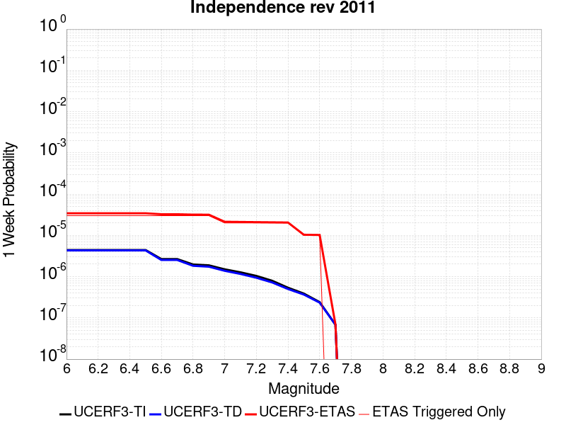 |  |  |  |

| Magnitude | 1 wk TI Prob | 1 wk TD Prob | 1 wk ETAS Prob | 1 wk ETAS/TD Gain | 1 wk ETAS Triggered Only | 1 mo TI Prob | 1 mo TD Prob | 1 mo ETAS Prob | 1 mo ETAS/TD Gain | 1 mo ETAS Triggered Only | 1 yr TI Prob | 1 yr TD Prob | 1 yr ETAS Prob | 1 yr ETAS/TD Gain | 1 yr ETAS Triggered Only | 10 yr TI Prob | 10 yr TD Prob | 10 yr ETAS Prob | 10 yr ETAS/TD Gain | 10 yr ETAS Triggered Only |
|-----|-----|-----|-----|-----|-----|-----|-----|-----|-----|-----|-----|-----|-----|-----|-----|-----|-----|-----|-----|-----|
| 6.0 | 4.422171E-6 | 4.326227E-6 | 3.4326098E-5 | 7.9344187 | 3.0E-5 | 1.8952025E-5 | 1.8540857E-5 | 5.8540118E-5 | 3.1573575 | 4.0E-5 | 2.3071647E-4 | 2.2571455E-4 | 3.2569197E-4 | 1.4429375 | 1.0E-4 | 0.0023047708 | 0.0022551466 | 0.0024048083 | 1.0663645 | 1.5E-4 |
| 6.1 | 4.422171E-6 | 4.326227E-6 | 3.4326098E-5 | 7.9344187 | 3.0E-5 | 1.8952025E-5 | 1.8540857E-5 | 5.8540118E-5 | 3.1573575 | 4.0E-5 | 2.3071647E-4 | 2.2571455E-4 | 3.2569197E-4 | 1.4429375 | 1.0E-4 | 0.0023047708 | 0.0022551466 | 0.0024048083 | 1.0663645 | 1.5E-4 |
| 6.2 | 4.422171E-6 | 4.326227E-6 | 3.4326098E-5 | 7.9344187 | 3.0E-5 | 1.8952025E-5 | 1.8540857E-5 | 5.8540118E-5 | 3.1573575 | 4.0E-5 | 2.3071647E-4 | 2.2571455E-4 | 3.2569197E-4 | 1.4429375 | 1.0E-4 | 0.0023047708 | 0.0022551466 | 0.0024048083 | 1.0663645 | 1.5E-4 |
| 6.3 | 4.422171E-6 | 4.326227E-6 | 3.4326098E-5 | 7.9344187 | 3.0E-5 | 1.8952025E-5 | 1.8540857E-5 | 5.8540118E-5 | 3.1573575 | 4.0E-5 | 2.3071647E-4 | 2.2571455E-4 | 3.2569197E-4 | 1.4429375 | 1.0E-4 | 0.0023047708 | 0.0022551466 | 0.0024048083 | 1.0663645 | 1.5E-4 |
| 6.4 | 4.422171E-6 | 4.326227E-6 | 3.4326098E-5 | 7.9344187 | 3.0E-5 | 1.8952025E-5 | 1.8540857E-5 | 5.8540118E-5 | 3.1573575 | 4.0E-5 | 2.3071647E-4 | 2.2571455E-4 | 3.2569197E-4 | 1.4429375 | 1.0E-4 | 0.0023047708 | 0.0022551466 | 0.0024048083 | 1.0663645 | 1.5E-4 |
| 6.5 | 4.422171E-6 | 4.326227E-6 | 3.4326098E-5 | 7.9344187 | 3.0E-5 | 1.8952025E-5 | 1.8540857E-5 | 5.8540118E-5 | 3.1573575 | 4.0E-5 | 2.3071647E-4 | 2.2571455E-4 | 3.2569197E-4 | 1.4429375 | 1.0E-4 | 0.0023047708 | 0.0022551466 | 0.0024048083 | 1.0663645 | 1.5E-4 |
| 6.6 | 2.663744E-6 | 2.5319862E-6 | 3.253191E-5 | 12.848376 | 3.0E-5 | 1.1415996E-5 | 1.0851327E-5 | 5.0850893E-5 | 4.6861453 | 4.0E-5 | 1.3898089E-4 | 1.3210738E-4 | 2.2209549E-4 | 1.6811739 | 9.0E-5 | 0.0013889399 | 0.0013203367 | 0.001460152 | 1.1058936 | 1.4E-4 |
| 6.7 | 2.663744E-6 | 2.5319862E-6 | 3.253191E-5 | 12.848376 | 3.0E-5 | 1.1415996E-5 | 1.0851327E-5 | 5.0850893E-5 | 4.6861453 | 4.0E-5 | 1.3898089E-4 | 1.3210738E-4 | 2.2209549E-4 | 1.6811739 | 9.0E-5 | 0.0013889399 | 0.0013203367 | 0.001460152 | 1.1058936 | 1.4E-4 |
| 6.8 | 1.9716529E-6 | 1.8322585E-6 | 3.18322E-5 | 17.373207 | 3.0E-5 | 8.449913E-6 | 7.852514E-6 | 4.7852198E-5 | 6.0938706 | 4.0E-5 | 1.0287284E-4 | 9.5600284E-5 | 1.8559168E-4 | 1.9413298 | 9.0E-5 | 0.0010282523 | 9.556045E-4 | 0.0010954707 | 1.1463641 | 1.4E-4 |
| 6.9 | 1.8788617E-6 | 1.7429993E-6 | 3.1742948E-5 | 18.211681 | 3.0E-5 | 8.0522395E-6 | 7.4699765E-6 | 4.746968E-5 | 6.354729 | 4.0E-5 | 9.80316E-5 | 9.0943286E-5 | 1.8093511E-4 | 1.9895377 | 9.0E-5 | 9.798837E-4 | 9.0907275E-4 | 0.0010489455 | 1.1538631 | 1.4E-4 |
| 7.0 | 1.5045488E-6 | 1.3849503E-6 | 2.1384923E-5 | 15.44093 | 2.0E-5 | 6.44805E-6 | 5.9354884E-6 | 3.593531E-5 | 6.054314 | 3.0E-5 | 7.8502184E-5 | 7.226223E-5 | 1.5225644E-4 | 2.1069992 | 8.0E-5 | 7.8474457E-4 | 7.2239246E-4 | 8.522985E-4 | 1.1798276 | 1.3E-4 |
| 7.1 | 1.272341E-6 | 1.1625096E-6 | 2.1162487E-5 | 18.204138 | 2.0E-5 | 5.4528787E-6 | 4.982175E-6 | 3.4982026E-5 | 7.0214367 | 3.0E-5 | 6.6386776E-5 | 6.0656326E-5 | 1.4065148E-4 | 2.3188262 | 8.0E-5 | 6.636695E-4 | 6.064009E-4 | 7.363221E-4 | 1.2142496 | 1.3E-4 |
| 7.2 | 1.0416892E-6 | 9.4098806E-7 | 2.094097E-5 | 22.254234 | 2.0E-5 | 4.464375E-6 | 4.0328E-6 | 3.403268E-5 | 8.438971 | 3.0E-5 | 5.4352407E-5 | 4.909825E-5 | 1.2909432E-4 | 2.629306 | 8.0E-5 | 5.4339116E-4 | 4.9087586E-4 | 6.2081206E-4 | 1.2647027 | 1.3E-4 |
| 7.3 | 7.9450155E-7 | 7.235002E-7 | 2.0723486E-5 | 28.643373 | 2.0E-5 | 3.4050022E-6 | 3.1007114E-6 | 3.310062E-5 | 10.675169 | 3.0E-5 | 4.1455114E-5 | 3.775052E-5 | 1.07747874E-4 | 2.8542092 | 7.0E-5 | 4.144738E-4 | 3.7744216E-4 | 4.9739686E-4 | 1.3178095 | 1.2E-4 |
| 7.4 | 5.3893444E-7 | 5.019512E-7 | 2.050194E-5 | 40.84449 | 2.0E-5 | 2.309717E-6 | 2.1512178E-6 | 3.2151154E-5 | 14.9455595 | 3.0E-5 | 2.8120441E-5 | 2.6190766E-5 | 9.618893E-5 | 3.6726277 | 7.0E-5 | 2.8116882E-4 | 2.6187726E-4 | 3.7184844E-4 | 1.4199342 | 1.1E-4 |
| 7.5 | 3.8852085E-7 | 3.682554E-7 | 1.0368251E-5 | 28.155058 | 1.0E-5 | 1.6650882E-6 | 1.5782365E-6 | 1.157822E-5 | 7.3361764 | 1.0E-5 | 2.027226E-5 | 1.9214862E-5 | 6.92139E-5 | 3.6021025 | 5.0E-5 | 2.0270412E-4 | 1.9213221E-4 | 2.8211492E-4 | 1.4683374 | 9.0E-5 |
| 7.6 | 2.414929E-7 | 2.345755E-7 | 1.0234573E-5 | 43.630188 | 1.0E-5 | 1.0349692E-6 | 1.0053232E-6 | 1.1005313E-5 | 10.94704 | 1.0E-5 | 1.2600677E-5 | 1.2239742E-5 | 5.223925E-5 | 4.2680025 | 4.0E-5 | 1.2599962E-4 | 1.223908E-4 | 2.0238101E-4 | 1.6535639 | 8.0E-5 |
| 7.7 | 6.8298014E-8 | 6.85897E-8 | 6.85897E-8 | 1.0 | 0.0 | 2.9270575E-7 | 2.9395582E-7 | 2.9395582E-7 | 1.0 | 0.0 | 3.5636867E-6 | 3.5789067E-6 | 1.35788705E-5 | 3.7941394 | 1.0E-5 | 3.5636294E-5 | 3.5788536E-5 | 4.578818E-5 | 1.279409 | 1.0E-5 |

## Chino alt 1
*[(top)](#table-of-contents)*

| 1 Week | 1 Month | 1 Year | 10 Year |
|-----|-----|-----|-----|
| 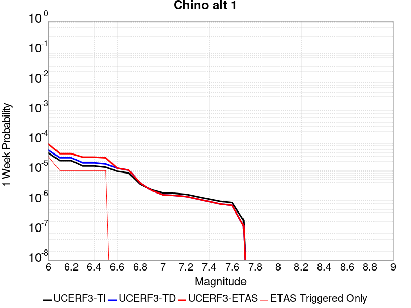 | 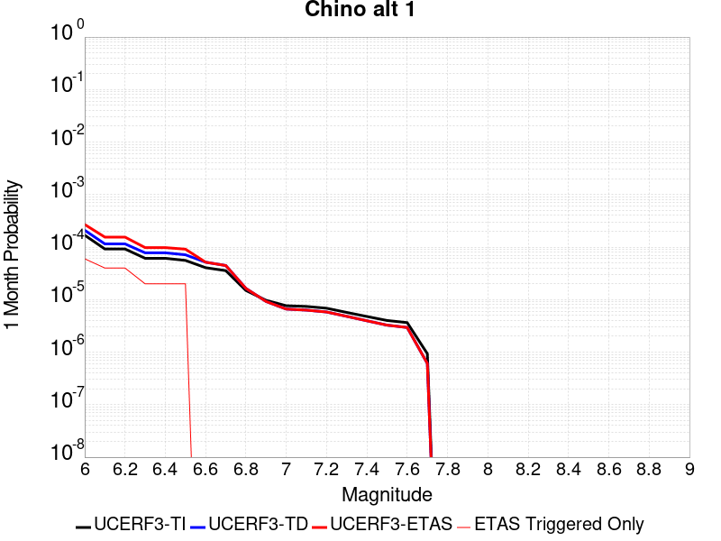 | 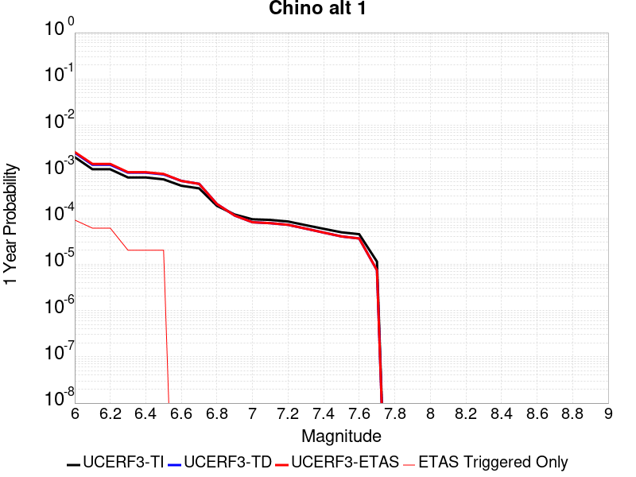 |  |

| Magnitude | 1 wk TI Prob | 1 wk TD Prob | 1 wk ETAS Prob | 1 wk ETAS/TD Gain | 1 wk ETAS Triggered Only | 1 mo TI Prob | 1 mo TD Prob | 1 mo ETAS Prob | 1 mo ETAS/TD Gain | 1 mo ETAS Triggered Only | 1 yr TI Prob | 1 yr TD Prob | 1 yr ETAS Prob | 1 yr ETAS/TD Gain | 1 yr ETAS Triggered Only | 10 yr TI Prob | 10 yr TD Prob | 10 yr ETAS Prob | 10 yr ETAS/TD Gain | 10 yr ETAS Triggered Only |
|-----|-----|-----|-----|-----|-----|-----|-----|-----|-----|-----|-----|-----|-----|-----|-----|-----|-----|-----|-----|-----|
| 6.0 | 3.939946E-5 | 4.8948554E-5 | 7.894709E-5 | 1.6128584 | 3.0E-5 | 1.6884391E-4 | 2.097656E-4 | 2.69753E-4 | 1.2859735 | 6.0E-5 | 0.0020537362 | 0.0025513945 | 0.002641165 | 1.0351849 | 9.0E-5 | 0.020348595 | 0.025277847 | 0.025404561 | 1.0050129 | 1.3E-4 |
| 6.1 | 2.1505624E-5 | 2.6879026E-5 | 3.6878755E-5 | 1.3720273 | 1.0E-5 | 9.2163704E-5 | 1.1519137E-4 | 1.5518676E-4 | 1.3472083 | 4.0E-5 | 0.0011215154 | 0.001401664 | 0.0014615799 | 1.0427463 | 6.0E-5 | 0.011158722 | 0.013945141 | 0.014014165 | 1.0049497 | 7.0E-5 |
| 6.2 | 2.1505624E-5 | 2.6879026E-5 | 3.6878755E-5 | 1.3720273 | 1.0E-5 | 9.2163704E-5 | 1.1519137E-4 | 1.5518676E-4 | 1.3472083 | 4.0E-5 | 0.0011215154 | 0.001401664 | 0.0014615799 | 1.0427463 | 6.0E-5 | 0.011158722 | 0.013945141 | 0.014014165 | 1.0049497 | 7.0E-5 |
| 6.3 | 1.4290785E-5 | 1.8165128E-5 | 2.8164946E-5 | 1.5504954 | 1.0E-5 | 6.1244784E-5 | 7.784848E-5 | 9.7846925E-5 | 1.2568893 | 2.0E-5 | 7.454001E-4 | 9.4743853E-4 | 9.6741953E-4 | 1.0210896 | 2.0E-5 | 0.007429048 | 0.0094444575 | 0.009474174 | 1.0031464 | 3.0E-5 |
| 6.4 | 1.4290785E-5 | 1.8165128E-5 | 2.8164946E-5 | 1.5504954 | 1.0E-5 | 6.1244784E-5 | 7.784848E-5 | 9.7846925E-5 | 1.2568893 | 2.0E-5 | 7.454001E-4 | 9.4743853E-4 | 9.6741953E-4 | 1.0210896 | 2.0E-5 | 0.007429048 | 0.0094444575 | 0.009474174 | 1.0031464 | 3.0E-5 |
| 6.5 | 1.3017944E-5 | 1.6652088E-5 | 2.6651922E-5 | 1.6005152 | 1.0E-5 | 5.5789995E-5 | 7.136439E-5 | 9.136296E-5 | 1.2802318 | 2.0E-5 | 6.790315E-4 | 8.685589E-4 | 8.885415E-4 | 1.0230067 | 2.0E-5 | 0.0067696036 | 0.008661949 | 0.008691689 | 1.0034335 | 3.0E-5 |
| 6.6 | 9.470016E-6 | 1.2039424E-5 | 1.2039424E-5 | 1.0 | 0.0 | 4.058515E-5 | 5.1596704E-5 | 5.1596704E-5 | 1.0 | 0.0 | 4.940122E-4 | 6.280428E-4 | 6.280428E-4 | 1.0 | 0.0 | 0.004929154 | 0.0062718987 | 0.006281836 | 1.0015844 | 1.0E-5 |
| 6.7 | 8.314155E-6 | 1.0407736E-5 | 1.0407736E-5 | 1.0 | 0.0 | 3.5631605E-5 | 4.4604003E-5 | 4.4604003E-5 | 1.0 | 0.0 | 4.3372845E-4 | 5.429507E-4 | 5.429507E-4 | 1.0 | 0.0 | 0.004328829 | 0.005425775 | 0.005435721 | 1.0018331 | 1.0E-5 |
| 6.8 | 3.4856364E-6 | 3.8133708E-6 | 3.8133708E-6 | 1.0 | 0.0 | 1.4938357E-5 | 1.6342927E-5 | 1.6342927E-5 | 1.0 | 0.0 | 1.8185932E-4 | 1.9895904E-4 | 1.9895904E-4 | 1.0 | 0.0 | 0.0018171056 | 0.0019894864 | 0.0019894864 | 1.0 | 0.0 |
| 6.9 | 2.2645952E-6 | 2.1529022E-6 | 2.1529022E-6 | 1.0 | 0.0 | 9.705372E-6 | 9.226692E-6 | 9.226692E-6 | 1.0 | 0.0 | 1.18156495E-4 | 1.123294E-4 | 1.123294E-4 | 1.0 | 0.0 | 0.0011809369 | 0.0011233423 | 0.0011233423 | 1.0 | 0.0 |
| 7.0 | 1.7864003E-6 | 1.5430785E-6 | 1.5430785E-6 | 1.0 | 0.0 | 7.655979E-6 | 6.613177E-6 | 6.613177E-6 | 1.0 | 0.0 | 9.3207556E-5 | 8.051251E-5 | 8.051251E-5 | 1.0 | 0.0 | 9.316847E-4 | 8.0528046E-4 | 8.0528046E-4 | 1.0 | 0.0 |
| 7.1 | 1.7315456E-6 | 1.4733511E-6 | 1.4733511E-6 | 1.0 | 0.0 | 7.420889E-6 | 6.3143466E-6 | 6.3143466E-6 | 1.0 | 0.0 | 9.034557E-5 | 7.6874516E-5 | 7.6874516E-5 | 1.0 | 0.0 | 9.0308854E-4 | 7.6891703E-4 | 7.6891703E-4 | 1.0 | 0.0 |
| 7.2 | 1.6008337E-6 | 1.3574215E-6 | 1.3574215E-6 | 1.0 | 0.0 | 6.860698E-6 | 5.817508E-6 | 5.817508E-6 | 1.0 | 0.0 | 8.352579E-5 | 7.082591E-5 | 7.082591E-5 | 1.0 | 0.0 | 8.34944E-4 | 7.0845755E-4 | 7.0845755E-4 | 1.0 | 0.0 |
| 7.3 | 1.3320939E-6 | 1.121782E-6 | 1.121782E-6 | 1.0 | 0.0 | 5.7089615E-6 | 4.807629E-6 | 4.807629E-6 | 1.0 | 0.0 | 6.9504385E-5 | 5.8531357E-5 | 5.8531357E-5 | 1.0 | 0.0 | 6.9482654E-4 | 5.8530393E-4 | 5.8530393E-4 | 1.0 | 0.0 |
| 7.4 | 1.114294E-6 | 9.237111E-7 | 9.237111E-7 | 1.0 | 0.0 | 4.775537E-6 | 3.958756E-6 | 3.958756E-6 | 1.0 | 0.0 | 5.8140613E-5 | 4.8196827E-5 | 4.8196827E-5 | 1.0 | 0.0 | 5.81254E-4 | 4.8188053E-4 | 4.8188053E-4 | 1.0 | 0.0 |
| 7.5 | 9.354081E-7 | 7.6234323E-7 | 7.6234323E-7 | 1.0 | 0.0 | 4.0088858E-6 | 3.2671815E-6 | 3.2671815E-6 | 1.0 | 0.0 | 4.8807087E-5 | 3.9777242E-5 | 3.9777242E-5 | 1.0 | 0.0 | 4.879637E-4 | 3.977046E-4 | 3.977046E-4 | 1.0 | 0.0 |
| 7.6 | 8.521771E-7 | 6.88071E-7 | 6.88071E-7 | 1.0 | 0.0 | 3.6521824E-6 | 2.9488726E-6 | 2.9488726E-6 | 1.0 | 0.0 | 4.4464414E-5 | 3.5901965E-5 | 3.5901965E-5 | 1.0 | 0.0 | 4.4455516E-4 | 3.589648E-4 | 3.589648E-4 | 1.0 | 0.0 |
| 7.7 | 2.1803626E-7 | 1.418649E-7 | 1.418649E-7 | 1.0 | 0.0 | 9.344408E-7 | 6.079923E-7 | 6.079923E-7 | 1.0 | 0.0 | 1.1376757E-5 | 7.4022914E-6 | 7.4022914E-6 | 1.0 | 0.0 | 1.13761744E-4 | 7.402141E-5 | 7.402141E-5 | 1.0 | 0.0 |

## Whittier alt 1
*[(top)](#table-of-contents)*

| 1 Week | 1 Month | 1 Year | 10 Year |
|-----|-----|-----|-----|
|  |  |  |  |

| Magnitude | 1 wk TI Prob | 1 wk TD Prob | 1 wk ETAS Prob | 1 wk ETAS/TD Gain | 1 wk ETAS Triggered Only | 1 mo TI Prob | 1 mo TD Prob | 1 mo ETAS Prob | 1 mo ETAS/TD Gain | 1 mo ETAS Triggered Only | 1 yr TI Prob | 1 yr TD Prob | 1 yr ETAS Prob | 1 yr ETAS/TD Gain | 1 yr ETAS Triggered Only | 10 yr TI Prob | 10 yr TD Prob | 10 yr ETAS Prob | 10 yr ETAS/TD Gain | 10 yr ETAS Triggered Only |
|-----|-----|-----|-----|-----|-----|-----|-----|-----|-----|-----|-----|-----|-----|-----|-----|-----|-----|-----|-----|-----|
| 6.0 | 4.2554693E-5 | 4.725218E-5 | 8.7250286E-5 | 1.8464818 | 4.0E-5 | 1.8236451E-4 | 2.0249544E-4 | 2.7248127E-4 | 1.3456168 | 7.0E-5 | 0.002218027 | 0.0024629154 | 0.0025427183 | 1.0324018 | 8.0E-5 | 0.02196019 | 0.024390234 | 0.024517063 | 1.0052 | 1.3E-4 |
| 6.1 | 4.2554693E-5 | 4.725218E-5 | 8.7250286E-5 | 1.8464818 | 4.0E-5 | 1.8236451E-4 | 2.0249544E-4 | 2.7248127E-4 | 1.3456168 | 7.0E-5 | 0.002218027 | 0.0024629154 | 0.0025427183 | 1.0324018 | 8.0E-5 | 0.02196019 | 0.024390234 | 0.024517063 | 1.0052 | 1.3E-4 |
| 6.2 | 4.2554693E-5 | 4.725218E-5 | 8.7250286E-5 | 1.8464818 | 4.0E-5 | 1.8236451E-4 | 2.0249544E-4 | 2.7248127E-4 | 1.3456168 | 7.0E-5 | 0.002218027 | 0.0024629154 | 0.0025427183 | 1.0324018 | 8.0E-5 | 0.02196019 | 0.024390234 | 0.024517063 | 1.0052 | 1.3E-4 |
| 6.3 | 1.9617712E-5 | 1.8268593E-5 | 2.8268409E-5 | 1.5473776 | 1.0E-5 | 8.40732E-5 | 7.829172E-5 | 9.8290155E-5 | 1.2554349 | 2.0E-5 | 0.0010231105 | 9.52804E-4 | 9.827754E-4 | 1.031456 | 3.0E-5 | 0.01018413 | 0.009490474 | 0.009549906 | 1.0062622 | 6.0E-5 |
| 6.4 | 1.5611336E-5 | 1.3604271E-5 | 2.3604134E-5 | 1.7350533 | 1.0E-5 | 6.690401E-5 | 5.8302747E-5 | 7.830158E-5 | 1.343017 | 2.0E-5 | 8.142519E-4 | 7.0961076E-4 | 7.3958945E-4 | 1.0422467 | 3.0E-5 | 0.008112748 | 0.0070754145 | 0.0071151317 | 1.0056133 | 4.0E-5 |
| 6.5 | 1.5150166E-5 | 1.3100925E-5 | 2.3100794E-5 | 1.7632949 | 1.0E-5 | 6.492767E-5 | 5.6145647E-5 | 7.6144526E-5 | 1.3561964 | 2.0E-5 | 7.9020765E-4 | 6.8336475E-4 | 7.1334426E-4 | 1.0438704 | 3.0E-5 | 0.007874036 | 0.0068145846 | 0.006854312 | 1.0058298 | 4.0E-5 |
| 6.6 | 1.295588E-5 | 1.0380725E-5 | 2.0380621E-5 | 1.9633138 | 1.0E-5 | 5.552402E-5 | 4.4488075E-5 | 6.448718E-5 | 1.4495387 | 2.0E-5 | 6.7579525E-4 | 5.4150965E-4 | 5.714934E-4 | 1.0553707 | 3.0E-5 | 0.006737438 | 0.0054033357 | 0.0054431194 | 1.0073628 | 4.0E-5 |
| 6.7 | 1.2542085E-5 | 9.899369E-6 | 1.989927E-5 | 2.0101554 | 1.0E-5 | 5.3750682E-5 | 4.242519E-5 | 6.242434E-5 | 1.4713981 | 2.0E-5 | 6.542181E-4 | 5.164061E-4 | 5.463906E-4 | 1.0580639 | 3.0E-5 | 0.006522954 | 0.0051534795 | 0.005193273 | 1.0077218 | 4.0E-5 |
| 6.8 | 1.2195878E-5 | 9.495415E-6 | 1.9495319E-5 | 2.05313 | 1.0E-5 | 5.2267E-5 | 4.069401E-5 | 6.0693194E-5 | 1.4914528 | 2.0E-5 | 6.36165E-4 | 4.9533875E-4 | 5.253239E-4 | 1.0605346 | 3.0E-5 | 0.0063434686 | 0.004943688 | 0.0049834903 | 1.0080512 | 4.0E-5 |
| 6.9 | 1.1580298E-5 | 8.772933E-6 | 1.8772846E-5 | 2.1398597 | 1.0E-5 | 4.9628903E-5 | 3.7597754E-5 | 5.7597E-5 | 1.5319266 | 2.0E-5 | 6.040644E-4 | 4.5765814E-4 | 4.8764443E-4 | 1.0655211 | 3.0E-5 | 0.00602425 | 0.0045684157 | 0.004608233 | 1.0087157 | 4.0E-5 |
| 7.0 | 1.0964795E-5 | 8.083994E-6 | 1.8083912E-5 | 2.2370024 | 1.0E-5 | 4.6991136E-5 | 3.4645236E-5 | 5.4644544E-5 | 1.5772599 | 2.0E-5 | 5.7196687E-4 | 4.2172565E-4 | 4.51713E-4 | 1.0711063 | 3.0E-5 | 0.0057049696 | 0.004210462 | 0.0042502936 | 1.0094601 | 4.0E-5 |
| 7.1 | 1.0230601E-5 | 7.3266697E-6 | 1.7326596E-5 | 2.3648667 | 1.0E-5 | 4.3844695E-5 | 3.1399642E-5 | 5.1399013E-5 | 1.63693 | 2.0E-5 | 5.336784E-4 | 3.8222488E-4 | 4.0221724E-4 | 1.0523052 | 2.0E-5 | 0.005323986 | 0.0038168381 | 0.0038467236 | 1.0078299 | 3.0E-5 |
| 7.2 | 9.40865E-6 | 6.543289E-6 | 1.6543223E-5 | 2.5282733 | 1.0E-5 | 4.032216E-5 | 2.8042374E-5 | 4.8041813E-5 | 1.7131864 | 2.0E-5 | 4.908117E-4 | 3.4136363E-4 | 3.613568E-4 | 1.0585686 | 2.0E-5 | 0.0048972913 | 0.003409485 | 0.0034393829 | 1.008769 | 3.0E-5 |
| 7.3 | 8.237384E-6 | 5.5977525E-6 | 1.5597696E-5 | 2.7864213 | 1.0E-5 | 3.5302593E-5 | 2.3990153E-5 | 4.3989672E-5 | 1.8336554 | 2.0E-5 | 4.2972428E-4 | 2.92042E-4 | 3.1203617E-4 | 1.0684633 | 2.0E-5 | 0.0042889426 | 0.002916903 | 0.0029468157 | 1.0102549 | 3.0E-5 |
| 7.4 | 7.5316966E-6 | 5.027819E-6 | 1.5027769E-5 | 2.9889238 | 1.0E-5 | 3.2278298E-5 | 2.1547625E-5 | 4.1547195E-5 | 1.9281566 | 2.0E-5 | 3.9291743E-4 | 2.6231175E-4 | 2.8230652E-4 | 1.0762252 | 2.0E-5 | 0.0039222343 | 0.0026201333 | 0.0026400809 | 1.0076132 | 2.0E-5 |
| 7.5 | 6.149649E-6 | 3.933841E-6 | 3.933841E-6 | 1.0 | 0.0 | 2.6355372E-5 | 1.6859214E-5 | 2.6859045E-5 | 1.5931375 | 1.0E-5 | 3.208294E-4 | 2.052425E-4 | 2.1524045E-4 | 1.0487128 | 1.0E-5 | 0.003203666 | 0.0020506186 | 0.0020605982 | 1.0048666 | 1.0E-5 |
| 7.6 | 5.457711E-6 | 3.3953788E-6 | 3.3953788E-6 | 1.0 | 0.0 | 2.338998E-5 | 1.4551547E-5 | 2.4551402E-5 | 1.6872022 | 1.0E-5 | 2.8473578E-4 | 1.771515E-4 | 1.8714972E-4 | 1.0564388 | 1.0E-5 | 0.0028437122 | 0.0017701836 | 0.0017801658 | 1.0056391 | 1.0E-5 |
| 7.7 | 4.1676276E-6 | 2.3331952E-6 | 2.3331952E-6 | 1.0 | 0.0 | 1.7861139E-5 | 9.999374E-6 | 1.9999274E-5 | 2.0000527 | 1.0E-5 | 2.1743766E-4 | 1.2173632E-4 | 1.317351E-4 | 1.0821347 | 1.0E-5 | 0.0021722503 | 0.0012167693 | 0.0012267572 | 1.0082085 | 1.0E-5 |
| 7.8 | 2.2692414E-7 | 9.3854695E-8 | 9.3854695E-8 | 1.0 | 0.0 | 9.725317E-7 | 4.0223435E-7 | 4.0223435E-7 | 1.0 | 0.0 | 1.1840509E-5 | 4.8971956E-6 | 4.8971956E-6 | 1.0 | 0.0 | 1.1839878E-4 | 4.8971204E-5 | 4.8971204E-5 | 1.0 | 0.0 |
| 7.9 | 6.676829E-9 | 3.439853E-9 | 3.439853E-9 | 1.0 | 0.0 | 2.861498E-8 | 1.4742227E-8 | 1.4742227E-8 | 1.0 | 0.0 | 3.4838732E-7 | 1.7948659E-7 | 1.7948659E-7 | 1.0 | 0.0 | 3.4838679E-6 | 1.7948646E-6 | 1.7948646E-6 | 1.0 | 0.0 |

## Pisgah-Bullion Mtn-Mesquite Lk
*[(top)](#table-of-contents)*

| 1 Week | 1 Month | 1 Year | 10 Year |
|-----|-----|-----|-----|
|  |  |  | 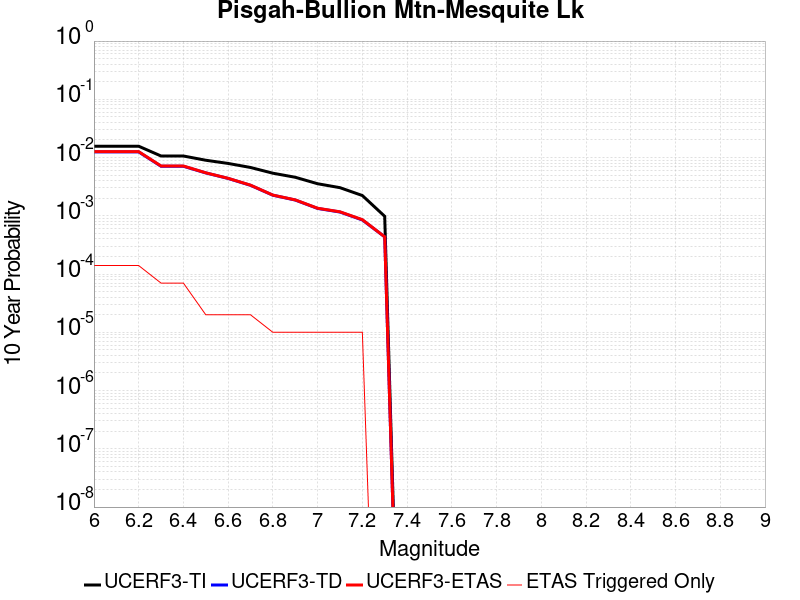 |

| Magnitude | 1 wk TI Prob | 1 wk TD Prob | 1 wk ETAS Prob | 1 wk ETAS/TD Gain | 1 wk ETAS Triggered Only | 1 mo TI Prob | 1 mo TD Prob | 1 mo ETAS Prob | 1 mo ETAS/TD Gain | 1 mo ETAS Triggered Only | 1 yr TI Prob | 1 yr TD Prob | 1 yr ETAS Prob | 1 yr ETAS/TD Gain | 1 yr ETAS Triggered Only | 10 yr TI Prob | 10 yr TD Prob | 10 yr ETAS Prob | 10 yr ETAS/TD Gain | 10 yr ETAS Triggered Only |
|-----|-----|-----|-----|-----|-----|-----|-----|-----|-----|-----|-----|-----|-----|-----|-----|-----|-----|-----|-----|-----|
| 6.0 | 3.0240792E-5 | 2.4091114E-5 | 4.4090633E-5 | 1.8301616 | 2.0E-5 | 1.2959696E-4 | 1.03244114E-4 | 1.4323999E-4 | 1.3873913 | 4.0E-5 | 0.0015767008 | 0.0012563728 | 0.0013362722 | 1.0635954 | 8.0E-5 | 0.015655609 | 0.012502721 | 0.012640971 | 1.0110576 | 1.4E-4 |
| 6.1 | 3.0240792E-5 | 2.4091114E-5 | 4.4090633E-5 | 1.8301616 | 2.0E-5 | 1.2959696E-4 | 1.03244114E-4 | 1.4323999E-4 | 1.3873913 | 4.0E-5 | 0.0015767008 | 0.0012563728 | 0.0013362722 | 1.0635954 | 8.0E-5 | 0.015655609 | 0.012502721 | 0.012640971 | 1.0110576 | 1.4E-4 |
| 6.2 | 3.0240792E-5 | 2.4091114E-5 | 4.4090633E-5 | 1.8301616 | 2.0E-5 | 1.2959696E-4 | 1.03244114E-4 | 1.4323999E-4 | 1.3873913 | 4.0E-5 | 0.0015767008 | 0.0012563728 | 0.0013362722 | 1.0635954 | 8.0E-5 | 0.015655609 | 0.012502721 | 0.012640971 | 1.0110576 | 1.4E-4 |
| 6.3 | 2.0498217E-5 | 1.36380695E-5 | 1.36380695E-5 | 1.0 | 0.0 | 8.784654E-5 | 5.844765E-5 | 7.844648E-5 | 1.3421665 | 2.0E-5 | 0.0010690069 | 7.1138405E-4 | 7.713414E-4 | 1.0842826 | 6.0E-5 | 0.01063879 | 0.0070926943 | 0.007162198 | 1.0097994 | 7.0E-5 |
| 6.4 | 2.0498217E-5 | 1.36380695E-5 | 1.36380695E-5 | 1.0 | 0.0 | 8.784654E-5 | 5.844765E-5 | 7.844648E-5 | 1.3421665 | 2.0E-5 | 0.0010690069 | 7.1138405E-4 | 7.713414E-4 | 1.0842826 | 6.0E-5 | 0.01063879 | 0.0070926943 | 0.007162198 | 1.0097994 | 7.0E-5 |
| 6.5 | 1.7316182E-5 | 1.0477042E-5 | 1.0477042E-5 | 1.0 | 0.0 | 7.42101E-5 | 4.4900895E-5 | 4.4900895E-5 | 1.0 | 0.0 | 9.0313336E-4 | 5.465413E-4 | 5.565358E-4 | 1.0182868 | 1.0E-5 | 0.008994718 | 0.0054529672 | 0.005472858 | 1.0036477 | 2.0E-5 |
| 6.6 | 1.5251077E-5 | 8.414273E-6 | 8.414273E-6 | 1.0 | 0.0 | 6.536012E-5 | 3.6060712E-5 | 3.6060712E-5 | 1.0 | 0.0 | 7.9546886E-4 | 4.3895794E-4 | 4.4895356E-4 | 1.0227712 | 1.0E-5 | 0.007926274 | 0.0043816264 | 0.0044015385 | 1.0045445 | 2.0E-5 |
| 6.7 | 1.2997425E-5 | 6.4114965E-6 | 6.4114965E-6 | 1.0 | 0.0 | 5.570206E-5 | 2.7477578E-5 | 2.7477578E-5 | 1.0 | 0.0 | 6.7796157E-4 | 3.3449283E-4 | 3.4448947E-4 | 1.029886 | 1.0E-5 | 0.0067589693 | 0.0033403537 | 0.0033602868 | 1.0059674 | 2.0E-5 |
| 6.8 | 1.035386E-5 | 4.3332193E-6 | 4.3332193E-6 | 1.0 | 0.0 | 4.437293E-5 | 1.8570812E-5 | 1.8570812E-5 | 1.0 | 0.0 | 5.401065E-4 | 2.2607706E-4 | 2.2607706E-4 | 1.0 | 0.0 | 0.0053879567 | 0.0022585576 | 0.0022685349 | 1.0044177 | 1.0E-5 |
| 6.9 | 8.816252E-6 | 3.580638E-6 | 3.580638E-6 | 1.0 | 0.0 | 3.778339E-5 | 1.5345504E-5 | 1.5345504E-5 | 1.0 | 0.0 | 4.5991567E-4 | 1.8681608E-4 | 1.8681608E-4 | 1.0 | 0.0 | 0.00458965 | 0.0018666488 | 0.0018766301 | 1.0053473 | 1.0E-5 |
| 7.0 | 6.8232207E-6 | 2.5675843E-6 | 2.5675843E-6 | 1.0 | 0.0 | 2.9242048E-5 | 1.1003888E-5 | 1.1003888E-5 | 1.0 | 0.0 | 3.5596377E-4 | 1.3396442E-4 | 1.3396442E-4 | 1.0 | 0.0 | 0.0035539411 | 0.0013388677 | 0.0013488543 | 1.007459 | 1.0E-5 |
| 7.1 | 5.837013E-6 | 2.22738E-6 | 2.22738E-6 | 1.0 | 0.0 | 2.501553E-5 | 9.545881E-6 | 9.545881E-6 | 1.0 | 0.0 | 3.045215E-4 | 1.16215204E-4 | 1.16215204E-4 | 1.0 | 0.0 | 0.0030410455 | 0.0011615733 | 0.0011715617 | 1.008599 | 1.0E-5 |
| 7.2 | 4.278052E-6 | 1.6275711E-6 | 1.6275711E-6 | 1.0 | 0.0 | 1.833438E-5 | 6.9752873E-6 | 6.9752873E-6 | 1.0 | 0.0 | 2.231982E-4 | 8.492105E-5 | 8.492105E-5 | 1.0 | 0.0 | 0.0022297418 | 8.489092E-4 | 8.589007E-4 | 1.0117698 | 1.0E-5 |
| 7.3 | 1.8803692E-6 | 8.344926E-7 | 8.344926E-7 | 1.0 | 0.0 | 8.0587E-6 | 3.5763926E-6 | 3.5763926E-6 | 1.0 | 0.0 | 9.811026E-5 | 4.354186E-5 | 4.354186E-5 | 1.0 | 0.0 | 9.806695E-4 | 4.3534773E-4 | 4.3534773E-4 | 1.0 | 0.0 |

## Kern Canyon (North Kern) 2011
*[(top)](#table-of-contents)*

| 1 Week | 1 Month | 1 Year | 10 Year |
|-----|-----|-----|-----|
|  |  | 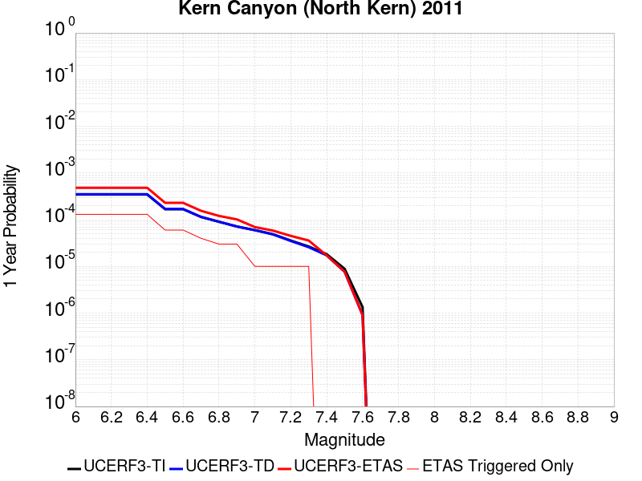 |  |

| Magnitude | 1 wk TI Prob | 1 wk TD Prob | 1 wk ETAS Prob | 1 wk ETAS/TD Gain | 1 wk ETAS Triggered Only | 1 mo TI Prob | 1 mo TD Prob | 1 mo ETAS Prob | 1 mo ETAS/TD Gain | 1 mo ETAS Triggered Only | 1 yr TI Prob | 1 yr TD Prob | 1 yr ETAS Prob | 1 yr ETAS/TD Gain | 1 yr ETAS Triggered Only | 10 yr TI Prob | 10 yr TD Prob | 10 yr ETAS Prob | 10 yr ETAS/TD Gain | 10 yr ETAS Triggered Only |
|-----|-----|-----|-----|-----|-----|-----|-----|-----|-----|-----|-----|-----|-----|-----|-----|-----|-----|-----|-----|-----|
| 6.0 | 6.6264497E-6 | 6.75733E-6 | 5.675699E-5 | 8.3993225 | 5.0E-5 | 2.8398761E-5 | 2.895971E-5 | 1.3895653E-4 | 4.7982707 | 1.1E-4 | 3.4570007E-4 | 3.5253543E-4 | 4.824896E-4 | 1.3686273 | 1.3E-4 | 0.0034516277 | 0.0035205502 | 0.0036600574 | 1.0396265 | 1.4E-4 |
| 6.1 | 6.6264497E-6 | 6.75733E-6 | 5.675699E-5 | 8.3993225 | 5.0E-5 | 2.8398761E-5 | 2.895971E-5 | 1.3895653E-4 | 4.7982707 | 1.1E-4 | 3.4570007E-4 | 3.5253543E-4 | 4.824896E-4 | 1.3686273 | 1.3E-4 | 0.0034516277 | 0.0035205502 | 0.0036600574 | 1.0396265 | 1.4E-4 |
| 6.2 | 6.6264497E-6 | 6.75733E-6 | 5.675699E-5 | 8.3993225 | 5.0E-5 | 2.8398761E-5 | 2.895971E-5 | 1.3895653E-4 | 4.7982707 | 1.1E-4 | 3.4570007E-4 | 3.5253543E-4 | 4.824896E-4 | 1.3686273 | 1.3E-4 | 0.0034516277 | 0.0035205502 | 0.0036600574 | 1.0396265 | 1.4E-4 |
| 6.3 | 6.6264497E-6 | 6.75733E-6 | 5.675699E-5 | 8.3993225 | 5.0E-5 | 2.8398761E-5 | 2.895971E-5 | 1.3895653E-4 | 4.7982707 | 1.1E-4 | 3.4570007E-4 | 3.5253543E-4 | 4.824896E-4 | 1.3686273 | 1.3E-4 | 0.0034516277 | 0.0035205502 | 0.0036600574 | 1.0396265 | 1.4E-4 |
| 6.4 | 6.6264497E-6 | 6.75733E-6 | 5.675699E-5 | 8.3993225 | 5.0E-5 | 2.8398761E-5 | 2.895971E-5 | 1.3895653E-4 | 4.7982707 | 1.1E-4 | 3.4570007E-4 | 3.5253543E-4 | 4.824896E-4 | 1.3686273 | 1.3E-4 | 0.0034516277 | 0.0035205502 | 0.0036600574 | 1.0396265 | 1.4E-4 |
| 6.5 | 3.2162225E-6 | 3.2570915E-6 | 2.3257026E-5 | 7.140428 | 2.0E-5 | 1.3783738E-5 | 1.3958893E-5 | 7.395806E-5 | 5.298275 | 6.0E-5 | 1.6780409E-4 | 1.6993708E-4 | 2.2992688E-4 | 1.3530118 | 6.0E-5 | 0.0016767744 | 0.001698151 | 0.0017680321 | 1.0411513 | 7.0E-5 |
| 6.6 | 3.2162225E-6 | 3.2570915E-6 | 2.3257026E-5 | 7.140428 | 2.0E-5 | 1.3783738E-5 | 1.3958893E-5 | 7.395806E-5 | 5.298275 | 6.0E-5 | 1.6780409E-4 | 1.6993708E-4 | 2.2992688E-4 | 1.3530118 | 6.0E-5 | 0.0016767744 | 0.001698151 | 0.0017680321 | 1.0411513 | 7.0E-5 |
| 6.7 | 2.1908265E-6 | 2.2071222E-6 | 1.22071E-5 | 5.530777 | 1.0E-5 | 9.389223E-6 | 9.459061E-6 | 4.9458682E-5 | 5.228709 | 4.0E-5 | 1.1430779E-4 | 1.1515819E-4 | 1.5515358E-4 | 1.3473083 | 4.0E-5 | 0.0011424901 | 0.0011510046 | 0.001200947 | 1.0433903 | 5.0E-5 |
| 6.8 | 1.7303895E-6 | 1.7365529E-6 | 1.7365529E-6 | 1.0 | 0.0 | 7.415934E-6 | 7.4423488E-6 | 3.7442125E-5 | 5.0309553 | 3.0E-5 | 9.028525E-5 | 9.0606925E-5 | 1.2060421E-4 | 1.3310705 | 3.0E-5 | 9.024858E-4 | 9.057096E-4 | 9.456734E-4 | 1.0441242 | 4.0E-5 |
| 6.9 | 1.3700314E-6 | 1.3688622E-6 | 1.3688622E-6 | 1.0 | 0.0 | 5.87155E-6 | 5.8665396E-6 | 3.5866364E-5 | 6.113717 | 3.0E-5 | 7.148377E-5 | 7.142282E-5 | 1.0142068E-4 | 1.4200038 | 3.0E-5 | 7.146078E-4 | 7.140032E-4 | 7.539747E-4 | 1.0559821 | 4.0E-5 |
| 7.0 | 1.1467797E-6 | 1.1413804E-6 | 1.1413804E-6 | 1.0 | 0.0 | 4.9147607E-6 | 4.8916213E-6 | 1.4891572E-5 | 3.044302 | 1.0E-5 | 5.983557E-5 | 5.9553895E-5 | 6.95533E-5 | 1.1679051 | 1.0E-5 | 5.981946E-4 | 5.953825E-4 | 6.153706E-4 | 1.0335718 | 2.0E-5 |
| 7.1 | 9.3952065E-7 | 9.3026904E-7 | 9.3026904E-7 | 1.0 | 0.0 | 4.026511E-6 | 3.9868614E-6 | 1.3986822E-5 | 3.5082288 | 1.0E-5 | 4.9021666E-5 | 4.8538972E-5 | 5.8538488E-5 | 1.20601 | 1.0E-5 | 4.901085E-4 | 4.8528548E-4 | 5.052758E-4 | 1.0411929 | 2.0E-5 |
| 7.2 | 6.858055E-7 | 6.7193E-7 | 6.7193E-7 | 1.0 | 0.0 | 2.939163E-6 | 2.879697E-6 | 1.2879668E-5 | 4.4725776 | 1.0E-5 | 3.5783723E-5 | 3.5059755E-5 | 4.5059405E-5 | 1.2852173 | 1.0E-5 | 3.5777962E-4 | 3.5054312E-4 | 3.7053612E-4 | 1.0570344 | 2.0E-5 |
| 7.3 | 5.1101983E-7 | 4.9393E-7 | 4.9393E-7 | 1.0 | 0.0 | 2.1900833E-6 | 2.116841E-6 | 1.211682E-5 | 5.7240105 | 1.0E-5 | 2.6663936E-5 | 2.5772239E-5 | 3.577198E-5 | 1.3880044 | 1.0E-5 | 2.6660739E-4 | 2.57693E-4 | 2.676904E-4 | 1.0387958 | 1.0E-5 |
| 7.4 | 3.4999414E-7 | 3.2995905E-7 | 3.2995905E-7 | 1.0 | 0.0 | 1.499974E-6 | 1.4141094E-6 | 1.4141094E-6 | 1.0 | 0.0 | 1.8262032E-5 | 1.721665E-5 | 1.721665E-5 | 1.0 | 0.0 | 1.826053E-4 | 1.7215339E-4 | 1.7215339E-4 | 1.0 | 0.0 |
| 7.5 | 1.7021522E-7 | 1.4750044E-7 | 1.4750044E-7 | 1.0 | 0.0 | 7.2949354E-7 | 6.321446E-7 | 6.321446E-7 | 1.0 | 0.0 | 8.881548E-6 | 7.696334E-6 | 7.696334E-6 | 1.0 | 0.0 | 8.8811925E-5 | 7.696076E-5 | 7.696076E-5 | 1.0 | 0.0 |
| 7.6 | 2.572245E-8 | 1.7352555E-8 | 1.7352555E-8 | 1.0 | 0.0 | 1.10239064E-7 | 7.436809E-8 | 7.436809E-8 | 1.0 | 0.0 | 1.3421597E-6 | 9.054312E-7 | 9.054312E-7 | 1.0 | 0.0 | 1.3421517E-5 | 9.05428E-6 | 9.05428E-6 | 1.0 | 0.0 |

## Pleito
*[(top)](#table-of-contents)*

| 1 Week | 1 Month | 1 Year | 10 Year |
|-----|-----|-----|-----|
|  | 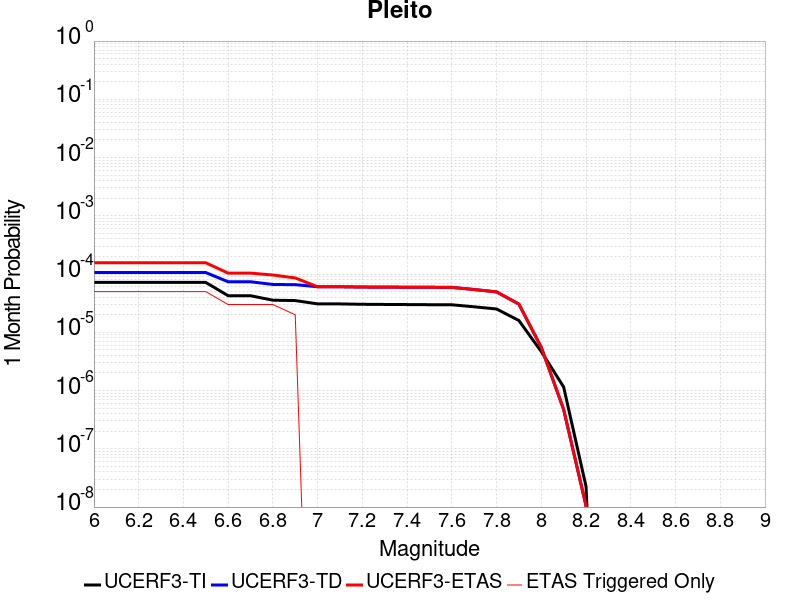 |  |  |

| Magnitude | 1 wk TI Prob | 1 wk TD Prob | 1 wk ETAS Prob | 1 wk ETAS/TD Gain | 1 wk ETAS Triggered Only | 1 mo TI Prob | 1 mo TD Prob | 1 mo ETAS Prob | 1 mo ETAS/TD Gain | 1 mo ETAS Triggered Only | 1 yr TI Prob | 1 yr TD Prob | 1 yr ETAS Prob | 1 yr ETAS/TD Gain | 1 yr ETAS Triggered Only | 10 yr TI Prob | 10 yr TD Prob | 10 yr ETAS Prob | 10 yr ETAS/TD Gain | 10 yr ETAS Triggered Only |
|-----|-----|-----|-----|-----|-----|-----|-----|-----|-----|-----|-----|-----|-----|-----|-----|-----|-----|-----|-----|-----|
| 6.0 | 1.6763008E-5 | 2.4763838E-5 | 6.476285E-5 | 2.6152184 | 4.0E-5 | 7.183948E-5 | 1.0612683E-4 | 1.5612152E-4 | 1.4710844 | 5.0E-5 | 8.742947E-4 | 0.0012914003 | 0.0013613099 | 1.0541347 | 7.0E-5 | 0.00870863 | 0.0129538905 | 0.013092076 | 1.0106676 | 1.4E-4 |
| 6.1 | 1.6763008E-5 | 2.4763838E-5 | 6.476285E-5 | 2.6152184 | 4.0E-5 | 7.183948E-5 | 1.0612683E-4 | 1.5612152E-4 | 1.4710844 | 5.0E-5 | 8.742947E-4 | 0.0012914003 | 0.0013613099 | 1.0541347 | 7.0E-5 | 0.00870863 | 0.0129538905 | 0.013092076 | 1.0106676 | 1.4E-4 |
| 6.2 | 1.6763008E-5 | 2.4763838E-5 | 6.476285E-5 | 2.6152184 | 4.0E-5 | 7.183948E-5 | 1.0612683E-4 | 1.5612152E-4 | 1.4710844 | 5.0E-5 | 8.742947E-4 | 0.0012914003 | 0.0013613099 | 1.0541347 | 7.0E-5 | 0.00870863 | 0.0129538905 | 0.013092076 | 1.0106676 | 1.4E-4 |
| 6.3 | 1.6763008E-5 | 2.4763838E-5 | 6.476285E-5 | 2.6152184 | 4.0E-5 | 7.183948E-5 | 1.0612683E-4 | 1.5612152E-4 | 1.4710844 | 5.0E-5 | 8.742947E-4 | 0.0012914003 | 0.0013613099 | 1.0541347 | 7.0E-5 | 0.00870863 | 0.0129538905 | 0.013092076 | 1.0106676 | 1.4E-4 |
| 6.4 | 1.6763008E-5 | 2.4763838E-5 | 6.476285E-5 | 2.6152184 | 4.0E-5 | 7.183948E-5 | 1.0612683E-4 | 1.5612152E-4 | 1.4710844 | 5.0E-5 | 8.742947E-4 | 0.0012914003 | 0.0013613099 | 1.0541347 | 7.0E-5 | 0.00870863 | 0.0129538905 | 0.013092076 | 1.0106676 | 1.4E-4 |
| 6.5 | 1.6763008E-5 | 2.4763838E-5 | 6.476285E-5 | 2.6152184 | 4.0E-5 | 7.183948E-5 | 1.0612683E-4 | 1.5612152E-4 | 1.4710844 | 5.0E-5 | 8.742947E-4 | 0.0012914003 | 0.0013613099 | 1.0541347 | 7.0E-5 | 0.00870863 | 0.0129538905 | 0.013092076 | 1.0106676 | 1.4E-4 |
| 6.6 | 9.910213E-6 | 1.7214623E-5 | 4.7214107E-5 | 2.7426744 | 3.0E-5 | 4.247165E-5 | 7.377489E-5 | 1.03772676E-4 | 1.4066124 | 3.0E-5 | 5.169696E-4 | 8.978429E-4 | 9.3780697E-4 | 1.0445112 | 4.0E-5 | 0.0051576863 | 0.009050702 | 0.009110159 | 1.0065693 | 6.0E-5 |
| 6.7 | 9.910213E-6 | 1.7214623E-5 | 4.7214107E-5 | 2.7426744 | 3.0E-5 | 4.247165E-5 | 7.377489E-5 | 1.03772676E-4 | 1.4066124 | 3.0E-5 | 5.169696E-4 | 8.978429E-4 | 9.3780697E-4 | 1.0445112 | 4.0E-5 | 0.0051576863 | 0.009050702 | 0.009110159 | 1.0065693 | 6.0E-5 |
| 6.8 | 8.300162E-6 | 1.5474232E-5 | 4.5473767E-5 | 2.9386768 | 3.0E-5 | 3.557164E-5 | 6.631646E-5 | 9.631447E-5 | 1.4523463 | 3.0E-5 | 4.3299864E-4 | 8.071053E-4 | 8.47073E-4 | 1.0495198 | 4.0E-5 | 0.004321559 | 0.008150139 | 0.008189813 | 1.0048679 | 4.0E-5 |
| 6.9 | 8.183114E-6 | 1.5345448E-5 | 3.534514E-5 | 2.3032982 | 2.0E-5 | 3.5070017E-5 | 6.576455E-5 | 8.576324E-5 | 1.3040951 | 2.0E-5 | 4.2689382E-4 | 8.003907E-4 | 8.3036674E-4 | 1.0374517 | 3.0E-5 | 0.0042607468 | 0.008083483 | 0.008113241 | 1.0036813 | 3.0E-5 |
| 7.0 | 7.1748823E-6 | 1.413244E-5 | 1.413244E-5 | 1.0 | 0.0 | 3.0749135E-5 | 6.0566195E-5 | 6.0566195E-5 | 1.0 | 0.0 | 3.743064E-4 | 7.371445E-4 | 7.471371E-4 | 1.0135559 | 1.0E-5 | 0.0037367654 | 0.007454939 | 0.0074648648 | 1.0013314 | 1.0E-5 |
| 7.1 | 7.1671807E-6 | 1.412281E-5 | 1.412281E-5 | 1.0 | 0.0 | 3.0716128E-5 | 6.052493E-5 | 6.052493E-5 | 1.0 | 0.0 | 3.7390468E-4 | 7.366424E-4 | 7.46635E-4 | 1.0135651 | 1.0E-5 | 0.0037327618 | 0.0074499524 | 0.0074598775 | 1.0013323 | 1.0E-5 |
| 7.2 | 7.0649667E-6 | 1.39701015E-5 | 1.39701015E-5 | 1.0 | 0.0 | 3.0278077E-5 | 5.9870494E-5 | 5.9870494E-5 | 1.0 | 0.0 | 3.6857324E-4 | 7.2868E-4 | 7.386727E-4 | 1.0137135 | 1.0E-5 | 0.0036796255 | 0.0073707094 | 0.007380636 | 1.0013467 | 1.0E-5 |
| 7.3 | 7.02082E-6 | 1.3913556E-5 | 1.3913556E-5 | 1.0 | 0.0 | 3.008888E-5 | 5.9628168E-5 | 5.9628168E-5 | 1.0 | 0.0 | 3.6627054E-4 | 7.2573166E-4 | 7.357244E-4 | 1.0137691 | 1.0E-5 | 0.0036566744 | 0.007341209 | 0.0073511354 | 1.0013522 | 1.0E-5 |
| 7.4 | 6.987146E-6 | 1.3873118E-5 | 1.3873118E-5 | 1.0 | 0.0 | 2.9944567E-5 | 5.945487E-5 | 5.945487E-5 | 1.0 | 0.0 | 3.6451413E-4 | 7.2362315E-4 | 7.336159E-4 | 1.0138093 | 1.0E-5 | 0.0036391679 | 0.007320144 | 0.007330071 | 1.0013561 | 1.0E-5 |
| 7.5 | 6.9494554E-6 | 1.3830024E-5 | 1.3830024E-5 | 1.0 | 0.0 | 2.9783041E-5 | 5.9270187E-5 | 5.9270187E-5 | 1.0 | 0.0 | 3.625482E-4 | 7.2137616E-4 | 7.313689E-4 | 1.0138524 | 1.0E-5 | 0.0036195726 | 0.0072977724 | 0.0073077 | 1.0013603 | 1.0E-5 |
| 7.6 | 6.92694E-6 | 1.3789138E-5 | 1.3789138E-5 | 1.0 | 0.0 | 2.9686547E-5 | 5.909497E-5 | 5.909497E-5 | 1.0 | 0.0 | 3.6137376E-4 | 7.1924424E-4 | 7.292371E-4 | 1.0138935 | 1.0E-5 | 0.0036078666 | 0.0072765257 | 0.007286453 | 1.0013642 | 1.0E-5 |
| 7.7 | 6.395867E-6 | 1.2668219E-5 | 1.2668219E-5 | 1.0 | 0.0 | 2.741057E-5 | 5.429124E-5 | 5.429124E-5 | 1.0 | 0.0 | 3.336726E-4 | 6.6079566E-4 | 6.6079566E-4 | 1.0 | 0.0 | 0.0033317201 | 0.0066951844 | 0.0066951844 | 1.0 | 0.0 |
| 7.8 | 5.8664327E-6 | 1.153586E-5 | 1.153586E-5 | 1.0 | 0.0 | 2.5141611E-5 | 4.9438466E-5 | 4.9438466E-5 | 1.0 | 0.0 | 3.060561E-4 | 6.017473E-4 | 6.017473E-4 | 1.0 | 0.0 | 0.0030563495 | 0.0061006667 | 0.0061006667 | 1.0 | 0.0 |
| 7.9 | 3.7167474E-6 | 7.1140853E-6 | 7.1140853E-6 | 1.0 | 0.0 | 1.592882E-5 | 3.0488582E-5 | 3.0488582E-5 | 1.0 | 0.0 | 1.9391612E-4 | 3.7113542E-4 | 3.7113542E-4 | 1.0 | 0.0 | 0.0019374699 | 0.0037674906 | 0.0037674906 | 1.0 | 0.0 |
| 8.0 | 1.0903841E-6 | 1.2879392E-6 | 1.2879392E-6 | 1.0 | 0.0 | 4.6730665E-6 | 5.5197274E-6 | 5.5197274E-6 | 1.0 | 0.0 | 5.68931E-5 | 6.720063E-5 | 6.720063E-5 | 1.0 | 0.0 | 5.6878536E-4 | 6.941948E-4 | 6.941948E-4 | 1.0 | 0.0 |
| 8.1 | 2.6894583E-7 | 1.1060341E-7 | 1.1060341E-7 | 1.0 | 0.0 | 1.1526245E-6 | 4.740145E-7 | 4.740145E-7 | 1.0 | 0.0 | 1.4033113E-5 | 5.7711113E-6 | 5.7711113E-6 | 1.0 | 0.0 | 1.4032227E-4 | 6.456908E-5 | 6.456908E-5 | 1.0 | 0.0 |
| 8.2 | 5.2967013E-9 | 2.4578228E-9 | 2.4578228E-9 | 1.0 | 0.0 | 2.2700148E-8 | 1.0533527E-8 | 1.0533527E-8 | 1.0 | 0.0 | 2.7637427E-7 | 1.2824569E-7 | 1.2824569E-7 | 1.0 | 0.0 | 2.7637393E-6 | 1.4592787E-6 | 1.4592787E-6 | 1.0 | 0.0 |

## Camp Rock 2011
*[(top)](#table-of-contents)*

| 1 Week | 1 Month | 1 Year | 10 Year |
|-----|-----|-----|-----|
|  |  |  |  |

| Magnitude | 1 wk TI Prob | 1 wk TD Prob | 1 wk ETAS Prob | 1 wk ETAS/TD Gain | 1 wk ETAS Triggered Only | 1 mo TI Prob | 1 mo TD Prob | 1 mo ETAS Prob | 1 mo ETAS/TD Gain | 1 mo ETAS Triggered Only | 1 yr TI Prob | 1 yr TD Prob | 1 yr ETAS Prob | 1 yr ETAS/TD Gain | 1 yr ETAS Triggered Only | 10 yr TI Prob | 10 yr TD Prob | 10 yr ETAS Prob | 10 yr ETAS/TD Gain | 10 yr ETAS Triggered Only |
|-----|-----|-----|-----|-----|-----|-----|-----|-----|-----|-----|-----|-----|-----|-----|-----|-----|-----|-----|-----|-----|
| 6.0 | 1.6710783E-5 | 4.25026E-6 | 3.4250133E-5 | 8.058361 | 3.0E-5 | 7.161568E-5 | 1.8215276E-5 | 4.821473E-5 | 2.6469393 | 3.0E-5 | 8.7157206E-4 | 2.2174895E-4 | 2.617401E-4 | 1.1803442 | 4.0E-5 | 0.008681616 | 0.0022153298 | 0.0023450416 | 1.058552 | 1.3E-4 |
| 6.1 | 1.6710783E-5 | 4.25026E-6 | 3.4250133E-5 | 8.058361 | 3.0E-5 | 7.161568E-5 | 1.8215276E-5 | 4.821473E-5 | 2.6469393 | 3.0E-5 | 8.7157206E-4 | 2.2174895E-4 | 2.617401E-4 | 1.1803442 | 4.0E-5 | 0.008681616 | 0.0022153298 | 0.0023450416 | 1.058552 | 1.3E-4 |
| 6.2 | 1.6710783E-5 | 4.25026E-6 | 3.4250133E-5 | 8.058361 | 3.0E-5 | 7.161568E-5 | 1.8215276E-5 | 4.821473E-5 | 2.6469393 | 3.0E-5 | 8.7157206E-4 | 2.2174895E-4 | 2.617401E-4 | 1.1803442 | 4.0E-5 | 0.008681616 | 0.0022153298 | 0.0023450416 | 1.058552 | 1.3E-4 |
| 6.3 | 1.6710783E-5 | 4.25026E-6 | 3.4250133E-5 | 8.058361 | 3.0E-5 | 7.161568E-5 | 1.8215276E-5 | 4.821473E-5 | 2.6469393 | 3.0E-5 | 8.7157206E-4 | 2.2174895E-4 | 2.617401E-4 | 1.1803442 | 4.0E-5 | 0.008681616 | 0.0022153298 | 0.0023450416 | 1.058552 | 1.3E-4 |
| 6.4 | 7.982846E-6 | 3.6820884E-6 | 2.3682014E-5 | 6.43168 | 2.0E-5 | 3.421175E-5 | 1.5780286E-5 | 3.577997E-5 | 2.267384 | 2.0E-5 | 4.1644843E-4 | 1.9210839E-4 | 2.2210262E-4 | 1.1561319 | 3.0E-5 | 0.0041566887 | 0.001919458 | 0.0020392276 | 1.0623976 | 1.2E-4 |
| 6.5 | 7.982846E-6 | 3.6820884E-6 | 2.3682014E-5 | 6.43168 | 2.0E-5 | 3.421175E-5 | 1.5780286E-5 | 3.577997E-5 | 2.267384 | 2.0E-5 | 4.1644843E-4 | 1.9210839E-4 | 2.2210262E-4 | 1.1561319 | 3.0E-5 | 0.0041566887 | 0.001919458 | 0.0020392276 | 1.0623976 | 1.2E-4 |
| 6.6 | 7.048869E-6 | 3.4243571E-6 | 2.3424289E-5 | 6.8404922 | 2.0E-5 | 3.0209088E-5 | 1.4675736E-5 | 3.4675442E-5 | 2.3627737 | 2.0E-5 | 3.677336E-4 | 1.7866275E-4 | 2.086574E-4 | 1.1678841 | 3.0E-5 | 0.0036712566 | 0.0017852228 | 0.0019050086 | 1.0670985 | 1.2E-4 |
| 6.7 | 6.987307E-6 | 3.3623348E-6 | 2.3362267E-5 | 6.948228 | 2.0E-5 | 2.9945259E-5 | 1.4409929E-5 | 3.440964E-5 | 2.387912 | 2.0E-5 | 3.6452254E-4 | 1.7542706E-4 | 2.054218E-4 | 1.1709813 | 3.0E-5 | 0.0036392517 | 0.001752917 | 0.0018727066 | 1.0683373 | 1.2E-4 |
| 6.8 | 6.3737602E-6 | 3.1179077E-6 | 2.3117846E-5 | 7.4145384 | 2.0E-5 | 2.731583E-5 | 1.3362394E-5 | 3.336213E-5 | 2.4967177 | 2.0E-5 | 3.3251947E-4 | 1.626753E-4 | 1.9267041E-4 | 1.1843865 | 3.0E-5 | 0.0033202237 | 0.0016255907 | 0.0017453957 | 1.0736994 | 1.2E-4 |
| 6.9 | 6.112211E-6 | 2.9331156E-6 | 2.2933056E-5 | 7.818668 | 2.0E-5 | 2.6194928E-5 | 1.2570436E-5 | 3.2570184E-5 | 2.5910146 | 2.0E-5 | 3.1887658E-4 | 1.5303459E-4 | 1.8303E-4 | 1.1960042 | 3.0E-5 | 0.003184194 | 0.0015293199 | 0.0016491363 | 1.0783463 | 1.2E-4 |
| 7.0 | 5.5140117E-6 | 2.641923E-6 | 2.264187E-5 | 8.570224 | 2.0E-5 | 2.3631264E-5 | 1.132248E-5 | 3.132225E-5 | 2.7663777 | 2.0E-5 | 2.8767265E-4 | 1.3784273E-4 | 1.6783859E-4 | 1.2176094 | 3.0E-5 | 0.0028730053 | 0.0013775975 | 0.0014874459 | 1.0797392 | 1.1E-4 |
| 7.1 | 4.8151105E-6 | 2.1342705E-6 | 2.2134227E-5 | 10.370864 | 2.0E-5 | 2.0636026E-5 | 9.146843E-6 | 2.9146659E-5 | 3.186527 | 2.0E-5 | 2.5121463E-4 | 1.1135734E-4 | 1.41354E-4 | 1.2693729 | 3.0E-5 | 0.0025093083 | 0.0011130372 | 0.0012229148 | 1.0987186 | 1.1E-4 |
| 7.2 | 3.818335E-6 | 1.2937425E-6 | 1.129373E-5 | 8.729504 | 1.0E-5 | 1.6364189E-5 | 5.5445994E-6 | 1.5544543E-5 | 2.803547 | 1.0E-5 | 1.9921579E-4 | 6.750349E-5 | 8.7502136E-5 | 1.296261 | 2.0E-5 | 0.0019903728 | 6.748381E-4 | 7.447908E-4 | 1.1036586 | 7.0E-5 |
| 7.3 | 2.7166698E-6 | 7.3835776E-7 | 7.3835776E-7 | 1.0 | 0.0 | 1.1642818E-5 | 3.1643867E-6 | 3.1643867E-6 | 1.0 | 0.0 | 1.4174209E-4 | 3.8525748E-5 | 3.8525748E-5 | 1.0 | 0.0 | 0.0014165172 | 3.851927E-4 | 4.1518113E-4 | 1.0778531 | 3.0E-5 |
| 7.4 | 2.0893426E-6 | 5.4618386E-7 | 5.4618386E-7 | 1.0 | 0.0 | 8.954295E-6 | 2.3407858E-6 | 2.3407858E-6 | 1.0 | 0.0 | 1.0901308E-4 | 2.84987E-5 | 2.84987E-5 | 1.0 | 0.0 | 0.0010895962 | 2.84951E-4 | 2.9494814E-4 | 1.0350838 | 1.0E-5 |
| 7.5 | 1.1681728E-6 | 3.6030585E-7 | 3.6030585E-7 | 1.0 | 0.0 | 5.0064455E-6 | 1.544167E-6 | 1.544167E-6 | 1.0 | 0.0 | 6.0951766E-5 | 1.8800076E-5 | 1.8800076E-5 | 1.0 | 0.0 | 6.093505E-4 | 1.8798532E-4 | 1.8798532E-4 | 1.0 | 0.0 |
| 7.6 | 1.3154387E-7 | 7.1197384E-8 | 7.1197384E-8 | 1.0 | 0.0 | 5.6375933E-7 | 3.051316E-7 | 3.051316E-7 | 1.0 | 0.0 | 6.863748E-6 | 3.7149728E-6 | 3.7149728E-6 | 1.0 | 0.0 | 6.863536E-5 | 3.7149264E-5 | 3.7149264E-5 | 1.0 | 0.0 |

## Rose Canyon
*[(top)](#table-of-contents)*

| 1 Week | 1 Month | 1 Year | 10 Year |
|-----|-----|-----|-----|
| 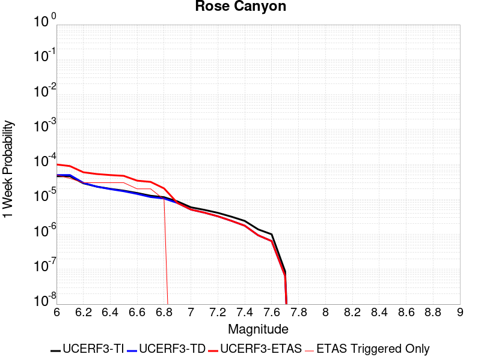 | 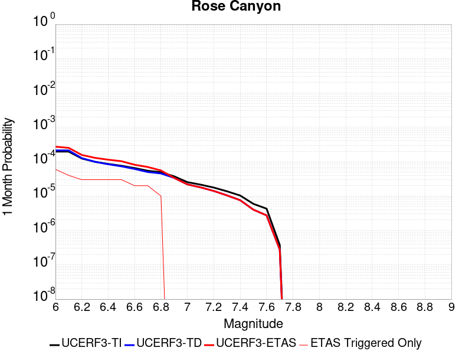 | 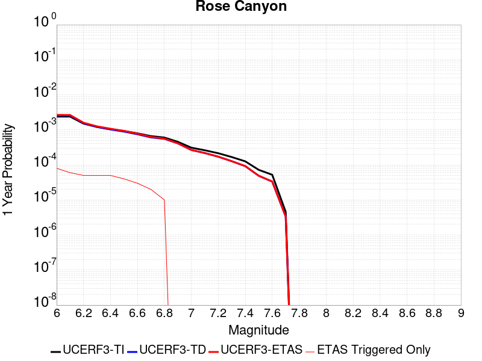 | 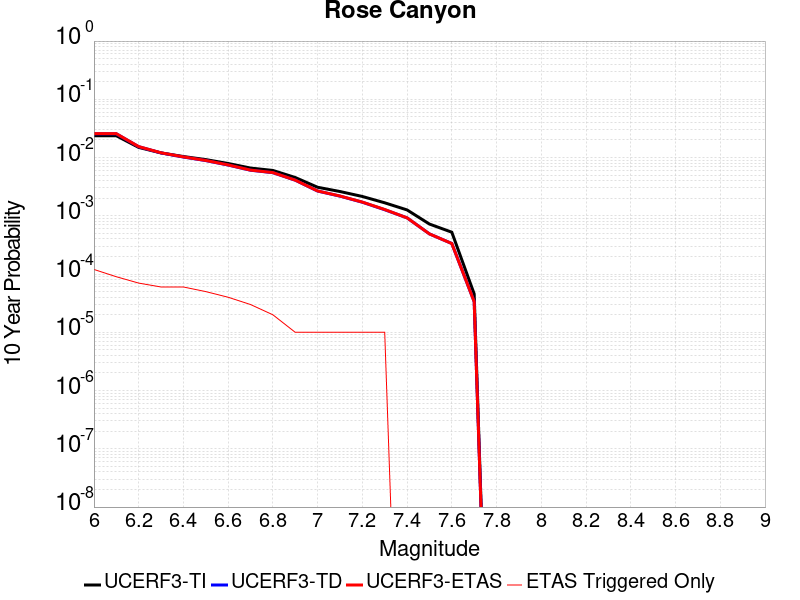 |

| Magnitude | 1 wk TI Prob | 1 wk TD Prob | 1 wk ETAS Prob | 1 wk ETAS/TD Gain | 1 wk ETAS Triggered Only | 1 mo TI Prob | 1 mo TD Prob | 1 mo ETAS Prob | 1 mo ETAS/TD Gain | 1 mo ETAS Triggered Only | 1 yr TI Prob | 1 yr TD Prob | 1 yr ETAS Prob | 1 yr ETAS/TD Gain | 1 yr ETAS Triggered Only | 10 yr TI Prob | 10 yr TD Prob | 10 yr ETAS Prob | 10 yr ETAS/TD Gain | 10 yr ETAS Triggered Only |
|-----|-----|-----|-----|-----|-----|-----|-----|-----|-----|-----|-----|-----|-----|-----|-----|-----|-----|-----|-----|-----|
| 6.0 | 4.5923203E-5 | 4.9714225E-5 | 9.971174E-5 | 2.0056984 | 5.0E-5 | 1.9679888E-4 | 2.1304491E-4 | 2.7303214E-4 | 1.2815708 | 6.0E-5 | 0.0023933933 | 0.0025909345 | 0.0026707272 | 1.0307969 | 8.0E-5 | 0.023677798 | 0.02563999 | 0.025756914 | 1.0045602 | 1.2E-4 |
| 6.1 | 4.5923203E-5 | 4.9714225E-5 | 8.971224E-5 | 1.8045586 | 4.0E-5 | 1.9679888E-4 | 2.1304491E-4 | 2.5303639E-4 | 1.1877139 | 4.0E-5 | 0.0023933933 | 0.0025909345 | 0.002650779 | 1.0230976 | 6.0E-5 | 0.023677798 | 0.02563999 | 0.025727684 | 1.0034201 | 9.0E-5 |
| 6.2 | 2.8844734E-5 | 2.9668723E-5 | 5.9667833E-5 | 2.0111358 | 3.0E-5 | 1.2361443E-4 | 1.2714567E-4 | 1.5714185E-4 | 1.2359198 | 3.0E-5 | 0.0015039665 | 0.0015468939 | 0.0015968166 | 1.0322728 | 5.0E-5 | 0.0149382865 | 0.015374276 | 0.0154432 | 1.0044831 | 7.0E-5 |
| 6.3 | 2.3171577E-5 | 2.3161238E-5 | 5.3160544E-5 | 2.2952375 | 3.0E-5 | 9.9302975E-5 | 9.9258745E-5 | 1.2925577E-4 | 1.3022103 | 3.0E-5 | 0.0012083431 | 0.0012078186 | 0.0012577582 | 1.0413469 | 5.0E-5 | 0.012017938 | 0.012022437 | 0.012081715 | 1.0049306 | 6.0E-5 |
| 6.4 | 2.0066604E-5 | 1.9667024E-5 | 4.9666436E-5 | 2.525366 | 3.0E-5 | 8.599689E-5 | 8.4284584E-5 | 1.14282055E-4 | 1.355907 | 3.0E-5 | 0.0010465092 | 0.0010256917 | 0.0010756404 | 1.0486976 | 5.0E-5 | 0.010415946 | 0.010217559 | 0.010276945 | 1.0058123 | 6.0E-5 |
| 6.5 | 1.776989E-5 | 1.7113807E-5 | 4.7113295E-5 | 2.7529407 | 3.0E-5 | 7.615444E-5 | 7.334287E-5 | 1.03340666E-4 | 1.4090078 | 3.0E-5 | 9.267859E-4 | 8.925905E-4 | 9.3255483E-4 | 1.0447733 | 4.0E-5 | 0.009229303 | 0.008896211 | 0.008945766 | 1.0055704 | 5.0E-5 |
| 6.6 | 1.5227364E-5 | 1.433926E-5 | 3.4338973E-5 | 2.394752 | 2.0E-5 | 6.52585E-5 | 6.1452556E-5 | 8.1451326E-5 | 1.3254343 | 2.0E-5 | 7.942326E-4 | 7.479332E-4 | 7.7791075E-4 | 1.0400805 | 3.0E-5 | 0.007914 | 0.007458359 | 0.007498061 | 1.005323 | 4.0E-5 |
| 6.7 | 1.2703898E-5 | 1.1673274E-5 | 3.167304E-5 | 2.7132955 | 2.0E-5 | 5.4444143E-5 | 5.0027378E-5 | 7.002638E-5 | 1.3997611 | 2.0E-5 | 6.626558E-4 | 6.089174E-4 | 6.289052E-4 | 1.0328252 | 2.0E-5 | 0.006606833 | 0.0060750856 | 0.0061049033 | 1.0049082 | 3.0E-5 |
| 6.8 | 1.1554917E-5 | 1.0609337E-5 | 2.0609232E-5 | 1.942556 | 1.0E-5 | 4.9520135E-5 | 4.546782E-5 | 5.5467364E-5 | 1.2199258 | 1.0E-5 | 6.0274085E-4 | 5.5343413E-4 | 5.6342856E-4 | 1.018059 | 1.0E-5 | 0.0060110865 | 0.0055225673 | 0.005542457 | 1.0036016 | 2.0E-5 |
| 6.9 | 8.732078E-6 | 7.881357E-6 | 7.881357E-6 | 1.0 | 0.0 | 3.7422655E-5 | 3.3776825E-5 | 3.3776825E-5 | 1.0 | 0.0 | 4.5552556E-4 | 4.111582E-4 | 4.111582E-4 | 1.0 | 0.0 | 0.0045459294 | 0.0041048084 | 0.0041147675 | 1.0024261 | 1.0E-5 |
| 7.0 | 5.9337494E-6 | 5.1074853E-6 | 5.1074853E-6 | 1.0 | 0.0 | 2.5430107E-5 | 2.188904E-5 | 2.188904E-5 | 1.0 | 0.0 | 3.0956755E-4 | 2.664666E-4 | 2.664666E-4 | 1.0 | 0.0 | 0.0030913667 | 0.0026614866 | 0.00267146 | 1.0037473 | 1.0E-5 |
| 7.1 | 5.013409E-6 | 4.1773833E-6 | 4.1773833E-6 | 1.0 | 0.0 | 2.1485863E-5 | 1.7902948E-5 | 1.7902948E-5 | 1.0 | 0.0 | 2.6155898E-4 | 2.179467E-4 | 2.179467E-4 | 1.0 | 0.0 | 0.0026125133 | 0.0021773411 | 0.0021873193 | 1.0045828 | 1.0E-5 |
| 7.2 | 4.120763E-6 | 3.2821383E-6 | 3.2821383E-6 | 1.0 | 0.0 | 1.7660293E-5 | 1.4066231E-5 | 1.4066231E-5 | 1.0 | 0.0 | 2.1499286E-4 | 1.7124301E-4 | 1.7124301E-4 | 1.0 | 0.0 | 0.0021478499 | 0.00171112 | 0.0017211029 | 1.0058341 | 1.0E-5 |
| 7.3 | 3.2081239E-6 | 2.4405372E-6 | 2.4405372E-6 | 1.0 | 0.0 | 1.374903E-5 | 1.0459404E-5 | 1.0459404E-5 | 1.0 | 0.0 | 1.6738157E-4 | 1.2733586E-4 | 1.2733586E-4 | 1.0 | 0.0 | 0.0016725556 | 0.001272636 | 0.0012826233 | 1.0078477 | 1.0E-5 |
| 7.4 | 2.4194755E-6 | 1.7680634E-6 | 1.7680634E-6 | 1.0 | 0.0 | 1.0369139E-5 | 7.577393E-6 | 7.577393E-6 | 1.0 | 0.0 | 1.2623696E-4 | 9.2250906E-5 | 9.2250906E-5 | 1.0 | 0.0 | 0.0012616527 | 9.2213147E-4 | 9.2213147E-4 | 1.0 | 0.0 |
| 7.5 | 1.3842889E-6 | 9.3786275E-7 | 9.3786275E-7 | 1.0 | 0.0 | 5.9326535E-6 | 4.019406E-6 | 4.019406E-6 | 1.0 | 0.0 | 7.222766E-5 | 4.8935202E-5 | 4.8935202E-5 | 1.0 | 0.0 | 7.220419E-4 | 4.892478E-4 | 4.892478E-4 | 1.0 | 0.0 |
| 7.6 | 1.0021575E-6 | 6.411463E-7 | 6.411463E-7 | 1.0 | 0.0 | 4.2949537E-6 | 2.7477672E-6 | 2.7477672E-6 | 1.0 | 0.0 | 5.2289808E-5 | 3.3453573E-5 | 3.3453573E-5 | 1.0 | 0.0 | 5.2277505E-4 | 3.344875E-4 | 3.344875E-4 | 1.0 | 0.0 |
| 7.7 | 8.7620116E-8 | 6.4492404E-8 | 6.4492404E-8 | 1.0 | 0.0 | 3.7551473E-7 | 2.76396E-7 | 2.76396E-7 | 1.0 | 0.0 | 4.5718825E-6 | 3.3651165E-6 | 3.3651165E-6 | 1.0 | 0.0 | 4.5717883E-5 | 3.3650686E-5 | 3.3650686E-5 | 1.0 | 0.0 |

## Red Mountain
*[(top)](#table-of-contents)*

| 1 Week | 1 Month | 1 Year | 10 Year |
|-----|-----|-----|-----|
|  |  |  |  |

| Magnitude | 1 wk TI Prob | 1 wk TD Prob | 1 wk ETAS Prob | 1 wk ETAS/TD Gain | 1 wk ETAS Triggered Only | 1 mo TI Prob | 1 mo TD Prob | 1 mo ETAS Prob | 1 mo ETAS/TD Gain | 1 mo ETAS Triggered Only | 1 yr TI Prob | 1 yr TD Prob | 1 yr ETAS Prob | 1 yr ETAS/TD Gain | 1 yr ETAS Triggered Only | 10 yr TI Prob | 10 yr TD Prob | 10 yr ETAS Prob | 10 yr ETAS/TD Gain | 10 yr ETAS Triggered Only |
|-----|-----|-----|-----|-----|-----|-----|-----|-----|-----|-----|-----|-----|-----|-----|-----|-----|-----|-----|-----|-----|
| 6.0 | 4.1810763E-5 | 4.7589947E-5 | 7.758852E-5 | 1.6303552 | 3.0E-5 | 1.7917668E-4 | 2.039419E-4 | 2.4393374E-4 | 1.1960943 | 4.0E-5 | 0.0021792934 | 0.0024803306 | 0.0025601322 | 1.0321738 | 8.0E-5 | 0.021580452 | 0.024544092 | 0.024661146 | 1.0047692 | 1.2E-4 |
| 6.1 | 4.1810763E-5 | 4.7589947E-5 | 7.758852E-5 | 1.6303552 | 3.0E-5 | 1.7917668E-4 | 2.039419E-4 | 2.4393374E-4 | 1.1960943 | 4.0E-5 | 0.0021792934 | 0.0024803306 | 0.0025601322 | 1.0321738 | 8.0E-5 | 0.021580452 | 0.024544092 | 0.024661146 | 1.0047692 | 1.2E-4 |
| 6.2 | 4.1810763E-5 | 4.7589947E-5 | 7.758852E-5 | 1.6303552 | 3.0E-5 | 1.7917668E-4 | 2.039419E-4 | 2.4393374E-4 | 1.1960943 | 4.0E-5 | 0.0021792934 | 0.0024803306 | 0.0025601322 | 1.0321738 | 8.0E-5 | 0.021580452 | 0.024544092 | 0.024661146 | 1.0047692 | 1.2E-4 |
| 6.3 | 4.1810763E-5 | 4.7589947E-5 | 7.758852E-5 | 1.6303552 | 3.0E-5 | 1.7917668E-4 | 2.039419E-4 | 2.4393374E-4 | 1.1960943 | 4.0E-5 | 0.0021792934 | 0.0024803306 | 0.0025601322 | 1.0321738 | 8.0E-5 | 0.021580452 | 0.024544092 | 0.024661146 | 1.0047692 | 1.2E-4 |
| 6.4 | 4.1810763E-5 | 4.7589947E-5 | 7.758852E-5 | 1.6303552 | 3.0E-5 | 1.7917668E-4 | 2.039419E-4 | 2.4393374E-4 | 1.1960943 | 4.0E-5 | 0.0021792934 | 0.0024803306 | 0.0025601322 | 1.0321738 | 8.0E-5 | 0.021580452 | 0.024544092 | 0.024661146 | 1.0047692 | 1.2E-4 |
| 6.5 | 3.154503E-5 | 3.5359728E-5 | 5.535902E-5 | 1.5655953 | 2.0E-5 | 1.3518598E-4 | 1.5153342E-4 | 1.8152887E-4 | 1.1979462 | 3.0E-5 | 0.0016446467 | 0.0018434501 | 0.0019033395 | 1.0324876 | 6.0E-5 | 0.01632528 | 0.018291233 | 0.018379588 | 1.0048304 | 9.0E-5 |
| 6.6 | 3.1535834E-5 | 3.534911E-5 | 5.5348402E-5 | 1.5657651 | 2.0E-5 | 1.3514658E-4 | 1.5148791E-4 | 1.8148337E-4 | 1.1980056 | 3.0E-5 | 0.0016441676 | 0.001842897 | 0.0019027865 | 1.0324974 | 6.0E-5 | 0.01632056 | 0.018285794 | 0.018374149 | 1.0048319 | 9.0E-5 |
| 6.7 | 2.8267326E-5 | 3.146934E-5 | 5.146871E-5 | 1.6355193 | 2.0E-5 | 1.2114006E-4 | 1.348621E-4 | 1.6485807E-4 | 1.2224195 | 3.0E-5 | 0.0014738824 | 0.0016407946 | 0.0017006961 | 1.0365076 | 6.0E-5 | 0.014641452 | 0.016295563 | 0.01637426 | 1.0048293 | 8.0E-5 |
| 6.8 | 2.8212884E-5 | 3.1407224E-5 | 5.1406598E-5 | 1.6367762 | 2.0E-5 | 1.20906756E-4 | 1.3459593E-4 | 1.645919E-4 | 1.2228594 | 3.0E-5 | 0.0014710457 | 0.0016375587 | 0.0016974604 | 1.03658 | 6.0E-5 | 0.014613459 | 0.01626368 | 0.01634238 | 1.004839 | 8.0E-5 |
| 6.9 | 2.4227871E-5 | 2.6706979E-5 | 4.6706446E-5 | 1.748848 | 2.0E-5 | 1.03829596E-4 | 1.14453884E-4 | 1.4445045E-4 | 1.2620842 | 3.0E-5 | 0.0012633923 | 0.0013926612 | 0.0014525776 | 1.043023 | 6.0E-5 | 0.012562336 | 0.013847026 | 0.013916057 | 1.0049852 | 7.0E-5 |
| 7.0 | 2.348524E-5 | 2.5835763E-5 | 4.5835248E-5 | 1.7741008 | 2.0E-5 | 1.0064714E-4 | 1.1072042E-4 | 1.4071711E-4 | 1.2709227 | 3.0E-5 | 0.0012246901 | 0.0013472632 | 0.0014071824 | 1.0444747 | 6.0E-5 | 0.012179627 | 0.01339859 | 0.013467652 | 1.0051544 | 7.0E-5 |
| 7.1 | 2.2311642E-5 | 2.4462828E-5 | 4.446234E-5 | 1.817547 | 2.0E-5 | 9.561782E-5 | 1.048369E-4 | 1.3483375E-4 | 1.2861288 | 3.0E-5 | 0.0011635252 | 0.0012757168 | 0.0013356402 | 1.0469724 | 6.0E-5 | 0.01157452 | 0.012691451 | 0.012760563 | 1.0054455 | 7.0E-5 |
| 7.2 | 1.6533986E-5 | 1.7670347E-5 | 3.7669994E-5 | 2.1318197 | 2.0E-5 | 7.085802E-5 | 7.572822E-5 | 1.0572594E-4 | 1.3961235 | 3.0E-5 | 8.623549E-4 | 9.216645E-4 | 9.6162764E-4 | 1.0433598 | 4.0E-5 | 0.008590161 | 0.009184699 | 0.009234239 | 1.0053939 | 5.0E-5 |
| 7.3 | 1.4703092E-5 | 1.555952E-5 | 3.555921E-5 | 2.2853665 | 2.0E-5 | 6.301173E-5 | 6.66823E-5 | 9.6680305E-5 | 1.4498645 | 3.0E-5 | 7.668978E-4 | 8.1161625E-4 | 8.415919E-4 | 1.0369333 | 3.0E-5 | 0.0076425658 | 0.008092596 | 0.008132272 | 1.0049028 | 4.0E-5 |
| 7.4 | 6.1331984E-6 | 5.528872E-6 | 2.5528761E-5 | 4.6173544 | 2.0E-5 | 2.6284872E-5 | 2.3694953E-5 | 4.369448E-5 | 1.8440416 | 2.0E-5 | 3.199713E-4 | 2.8844838E-4 | 3.0844263E-4 | 1.0693165 | 2.0E-5 | 0.0031951098 | 0.0028807942 | 0.0029107078 | 1.0103838 | 3.0E-5 |
| 7.5 | 5.954766E-6 | 5.3385015E-6 | 2.5338395E-5 | 4.74635 | 2.0E-5 | 2.5520176E-5 | 2.2879094E-5 | 4.2878637E-5 | 1.8741405 | 2.0E-5 | 3.1066386E-4 | 2.785179E-4 | 2.985123E-4 | 1.0717887 | 2.0E-5 | 0.003102299 | 0.0027817423 | 0.002811659 | 1.0107546 | 3.0E-5 |
| 7.6 | 4.9726646E-6 | 4.315295E-6 | 1.4315252E-5 | 3.3173287 | 1.0E-5 | 2.1311245E-5 | 1.8493993E-5 | 2.8493807E-5 | 1.5407062 | 1.0E-5 | 2.5943352E-4 | 2.2514143E-4 | 2.3513917E-4 | 1.0444065 | 1.0E-5 | 0.0025913084 | 0.002249168 | 0.0022591455 | 1.0044361 | 1.0E-5 |
| 7.7 | 3.3613894E-6 | 2.8526642E-6 | 1.2852636E-5 | 4.5054846 | 1.0E-5 | 1.4405875E-5 | 1.2225649E-5 | 2.2225526E-5 | 1.8179425 | 1.0E-5 | 1.7537741E-4 | 1.4883737E-4 | 1.5883589E-4 | 1.0671774 | 1.0E-5 | 0.0017523908 | 0.0014874031 | 0.0014973882 | 1.0067132 | 1.0E-5 |
| 7.8 | 1.1828961E-6 | 1.0122756E-6 | 1.0122756E-6 | 1.0 | 0.0 | 5.069545E-6 | 4.338317E-6 | 4.338317E-6 | 1.0 | 0.0 | 6.171996E-5 | 5.281776E-5 | 5.281776E-5 | 1.0 | 0.0 | 6.170282E-4 | 5.2805495E-4 | 5.2805495E-4 | 1.0 | 0.0 |
| 7.9 | 2.2967266E-7 | 1.8618952E-7 | 1.8618952E-7 | 1.0 | 0.0 | 9.843111E-7 | 7.9795484E-7 | 7.9795484E-7 | 1.0 | 0.0 | 1.19839215E-5 | 9.7150605E-6 | 9.7150605E-6 | 1.0 | 0.0 | 1.1983275E-4 | 9.714664E-5 | 9.714664E-5 | 1.0 | 0.0 |

## Santa Cruz Island
*[(top)](#table-of-contents)*

| 1 Week | 1 Month | 1 Year | 10 Year |
|-----|-----|-----|-----|
|  |  |  | 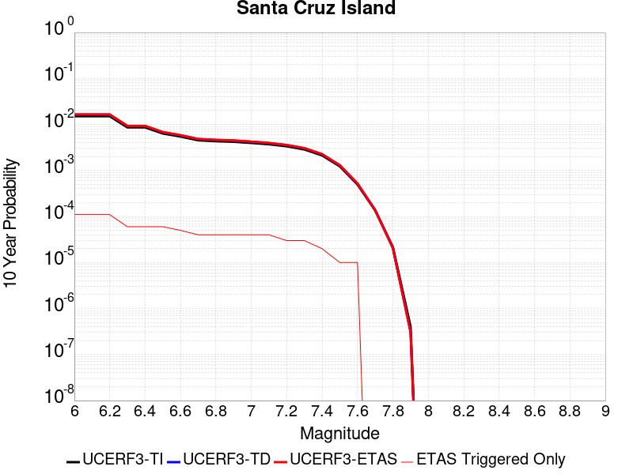 |

| Magnitude | 1 wk TI Prob | 1 wk TD Prob | 1 wk ETAS Prob | 1 wk ETAS/TD Gain | 1 wk ETAS Triggered Only | 1 mo TI Prob | 1 mo TD Prob | 1 mo ETAS Prob | 1 mo ETAS/TD Gain | 1 mo ETAS Triggered Only | 1 yr TI Prob | 1 yr TD Prob | 1 yr ETAS Prob | 1 yr ETAS/TD Gain | 1 yr ETAS Triggered Only | 10 yr TI Prob | 10 yr TD Prob | 10 yr ETAS Prob | 10 yr ETAS/TD Gain | 10 yr ETAS Triggered Only |
|-----|-----|-----|-----|-----|-----|-----|-----|-----|-----|-----|-----|-----|-----|-----|-----|-----|-----|-----|-----|-----|
| 6.0 | 2.9164563E-5 | 3.1599742E-5 | 7.159848E-5 | 2.265793 | 4.0E-5 | 1.2498499E-4 | 1.3542121E-4 | 2.0541174E-4 | 1.5168357 | 7.0E-5 | 0.0015206301 | 0.0016476426 | 0.0017275107 | 1.0484742 | 8.0E-5 | 0.015102667 | 0.016368 | 0.016476199 | 1.0066104 | 1.1E-4 |
| 6.1 | 2.9164563E-5 | 3.1599742E-5 | 7.159848E-5 | 2.265793 | 4.0E-5 | 1.2498499E-4 | 1.3542121E-4 | 2.0541174E-4 | 1.5168357 | 7.0E-5 | 0.0015206301 | 0.0016476426 | 0.0017275107 | 1.0484742 | 8.0E-5 | 0.015102667 | 0.016368 | 0.016476199 | 1.0066104 | 1.1E-4 |
| 6.2 | 2.9164563E-5 | 3.1599742E-5 | 7.159848E-5 | 2.265793 | 4.0E-5 | 1.2498499E-4 | 1.3542121E-4 | 2.0541174E-4 | 1.5168357 | 7.0E-5 | 0.0015206301 | 0.0016476426 | 0.0017275107 | 1.0484742 | 8.0E-5 | 0.015102667 | 0.016368 | 0.016476199 | 1.0066104 | 1.1E-4 |
| 6.3 | 1.6635553E-5 | 1.780436E-5 | 3.7804002E-5 | 2.1233006 | 2.0E-5 | 7.1293274E-5 | 7.630226E-5 | 1.1629921E-4 | 1.5241908 | 4.0E-5 | 8.6765E-4 | 9.2860236E-4 | 9.6856523E-4 | 1.0430355 | 4.0E-5 | 0.008642701 | 0.009249094 | 0.009308538 | 1.0064272 | 6.0E-5 |
| 6.4 | 1.6635553E-5 | 1.780436E-5 | 3.7804002E-5 | 2.1233006 | 2.0E-5 | 7.1293274E-5 | 7.630226E-5 | 1.1629921E-4 | 1.5241908 | 4.0E-5 | 8.6765E-4 | 9.2860236E-4 | 9.6856523E-4 | 1.0430355 | 4.0E-5 | 0.008642701 | 0.009249094 | 0.009308538 | 1.0064272 | 6.0E-5 |
| 6.5 | 1.2238748E-5 | 1.3042995E-5 | 3.3042736E-5 | 2.53337 | 2.0E-5 | 5.2450723E-5 | 5.5897377E-5 | 9.589514E-5 | 1.7155571 | 4.0E-5 | 6.3840044E-4 | 6.8034173E-4 | 7.203145E-4 | 1.058754 | 4.0E-5 | 0.0063656955 | 0.0067829876 | 0.0068425806 | 1.0087856 | 6.0E-5 |
| 6.6 | 1.0489767E-5 | 1.1156636E-5 | 2.1156524E-5 | 1.8963176 | 1.0E-5 | 4.495537E-5 | 4.781329E-5 | 7.7811856E-5 | 1.6274107 | 3.0E-5 | 5.4719415E-4 | 5.819735E-4 | 6.1195606E-4 | 1.0515187 | 3.0E-5 | 0.005458487 | 0.0058047357 | 0.0058544455 | 1.0085636 | 5.0E-5 |
| 6.7 | 8.699222E-6 | 9.236782E-6 | 1.923669E-5 | 2.0826182 | 1.0E-5 | 3.7281847E-5 | 3.958561E-5 | 5.9584818E-5 | 1.5052141 | 2.0E-5 | 4.5381195E-4 | 4.8184878E-4 | 5.0183915E-4 | 1.0414867 | 2.0E-5 | 0.0045288634 | 0.004808108 | 0.0048479154 | 1.0082793 | 4.0E-5 |
| 6.8 | 8.307732E-6 | 8.8169045E-6 | 1.8816816E-5 | 2.134175 | 1.0E-5 | 3.560408E-5 | 3.7786187E-5 | 5.778543E-5 | 1.529274 | 2.0E-5 | 4.3339343E-4 | 4.5995016E-4 | 4.7994094E-4 | 1.043463 | 2.0E-5 | 0.004325492 | 0.0045900354 | 0.004629852 | 1.0086745 | 4.0E-5 |
| 6.9 | 8.073121E-6 | 8.564939E-6 | 1.8564853E-5 | 2.1675406 | 1.0E-5 | 3.459863E-5 | 3.6706366E-5 | 5.6705634E-5 | 1.5448446 | 2.0E-5 | 4.2115687E-4 | 4.468088E-4 | 4.6679986E-4 | 1.0447419 | 2.0E-5 | 0.004203596 | 0.004459156 | 0.0044989777 | 1.0089303 | 4.0E-5 |
| 7.0 | 7.617019E-6 | 8.074664E-6 | 1.8074583E-5 | 2.2384317 | 1.0E-5 | 3.264396E-5 | 3.4605247E-5 | 5.4604556E-5 | 1.577927 | 2.0E-5 | 3.9736772E-4 | 4.212378E-4 | 4.412294E-4 | 1.0474591 | 2.0E-5 | 0.003966579 | 0.0042044413 | 0.004244273 | 1.0094738 | 4.0E-5 |
| 7.1 | 7.1224836E-6 | 7.545788E-6 | 1.7545712E-5 | 2.3252327 | 1.0E-5 | 3.052457E-5 | 3.2338692E-5 | 5.2338044E-5 | 1.6184342 | 2.0E-5 | 3.715733E-4 | 3.936528E-4 | 4.136449E-4 | 1.0507861 | 2.0E-5 | 0.003709526 | 0.003929598 | 0.0039694407 | 1.0101391 | 4.0E-5 |
| 7.2 | 6.441115E-6 | 6.8273835E-6 | 1.6827315E-5 | 2.46468 | 1.0E-5 | 2.7604487E-5 | 2.9259887E-5 | 3.9259594E-5 | 1.3417548 | 1.0E-5 | 3.360328E-4 | 3.5618112E-4 | 3.6617756E-4 | 1.0280656 | 1.0E-5 | 0.0033552512 | 0.003556131 | 0.0035860243 | 1.0084062 | 3.0E-5 |
| 7.3 | 5.494274E-6 | 5.8199944E-6 | 1.5819936E-5 | 2.7182047 | 1.0E-5 | 2.3546674E-5 | 2.4942596E-5 | 3.4942346E-5 | 1.4009106 | 1.0E-5 | 2.8664304E-4 | 3.0363398E-4 | 3.1363094E-4 | 1.0329244 | 1.0E-5 | 0.002862736 | 0.0030322142 | 0.0030621234 | 1.0098637 | 3.0E-5 |
| 7.4 | 4.0802624E-6 | 4.312256E-6 | 1.4312213E-5 | 3.3189619 | 1.0E-5 | 1.7486722E-5 | 1.8480967E-5 | 2.8480783E-5 | 1.5410873 | 1.0E-5 | 2.1288003E-4 | 2.2498262E-4 | 2.3498037E-4 | 1.0444379 | 1.0E-5 | 0.0021267622 | 0.0022475575 | 0.0022675125 | 1.0088786 | 2.0E-5 |
| 7.5 | 2.3584746E-6 | 2.4753094E-6 | 2.4753094E-6 | 1.0 | 0.0 | 1.0107709E-5 | 1.0608426E-5 | 1.0608426E-5 | 1.0 | 0.0 | 1.2305441E-4 | 1.2915E-4 | 1.2915E-4 | 1.0 | 0.0 | 0.0012298629 | 0.0012907543 | 0.0013007415 | 1.0077374 | 1.0E-5 |
| 7.6 | 9.4981914E-7 | 9.86093E-7 | 9.86093E-7 | 1.0 | 0.0 | 4.0706473E-6 | 4.2261063E-6 | 4.2261063E-6 | 1.0 | 0.0 | 4.9559E-5 | 5.145164E-5 | 5.145164E-5 | 1.0 | 0.0 | 4.954795E-4 | 5.1439856E-4 | 5.2439346E-4 | 1.0194302 | 1.0E-5 |
| 7.7 | 2.6013532E-7 | 2.6416603E-7 | 2.6416603E-7 | 1.0 | 0.0 | 1.1148652E-6 | 1.1321397E-6 | 1.1321397E-6 | 1.0 | 0.0 | 1.3573399E-5 | 1.3783714E-5 | 1.3783714E-5 | 1.0 | 0.0 | 1.357257E-4 | 1.3782867E-4 | 1.3782867E-4 | 1.0 | 0.0 |
| 7.8 | 4.1522263E-8 | 3.965679E-8 | 3.965679E-8 | 1.0 | 0.0 | 1.7795254E-7 | 1.6995766E-7 | 1.6995766E-7 | 1.0 | 0.0 | 2.16657E-6 | 2.0692328E-6 | 2.0692328E-6 | 1.0 | 0.0 | 2.1665488E-5 | 2.0692156E-5 | 2.0692156E-5 | 1.0 | 0.0 |
| 7.9 | 7.7242046E-10 | 5.9468175E-10 | 5.9468175E-10 | 1.0 | 0.0 | 3.3103735E-9 | 2.5486364E-9 | 2.5486364E-9 | 1.0 | 0.0 | 4.0303796E-8 | 3.1029646E-8 | 3.1029646E-8 | 1.0 | 0.0 | 4.030379E-7 | 3.1029643E-7 | 3.1029643E-7 | 1.0 | 0.0 |

## Lost Hills
*[(top)](#table-of-contents)*

| 1 Week | 1 Month | 1 Year | 10 Year |
|-----|-----|-----|-----|
| 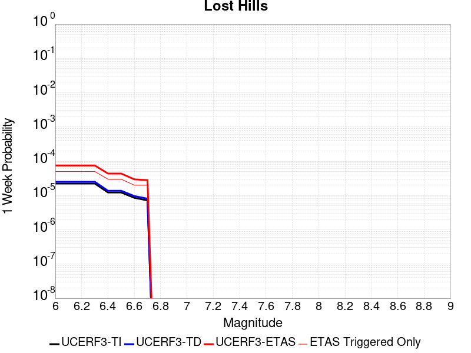 |  |  | 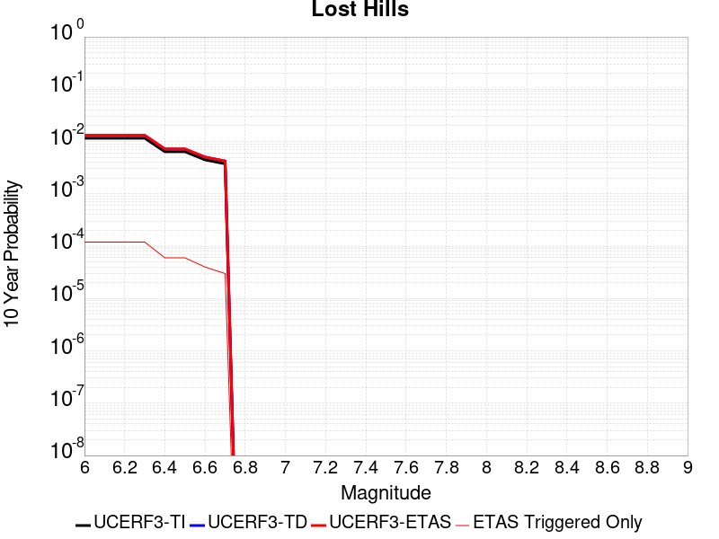 |

| Magnitude | 1 wk TI Prob | 1 wk TD Prob | 1 wk ETAS Prob | 1 wk ETAS/TD Gain | 1 wk ETAS Triggered Only | 1 mo TI Prob | 1 mo TD Prob | 1 mo ETAS Prob | 1 mo ETAS/TD Gain | 1 mo ETAS Triggered Only | 1 yr TI Prob | 1 yr TD Prob | 1 yr ETAS Prob | 1 yr ETAS/TD Gain | 1 yr ETAS Triggered Only | 10 yr TI Prob | 10 yr TD Prob | 10 yr ETAS Prob | 10 yr ETAS/TD Gain | 10 yr ETAS Triggered Only |
|-----|-----|-----|-----|-----|-----|-----|-----|-----|-----|-----|-----|-----|-----|-----|-----|-----|-----|-----|-----|-----|
| 6.0 | 2.233523E-5 | 2.5106583E-5 | 7.510533E-5 | 2.9914596 | 5.0E-5 | 9.571891E-5 | 1.0759615E-4 | 1.5759077E-4 | 1.4646506 | 5.0E-5 | 0.0011647546 | 0.001309364 | 0.0013692855 | 1.0457637 | 6.0E-5 | 0.011586686 | 0.013033091 | 0.013151526 | 1.0090873 | 1.2E-4 |
| 6.1 | 2.233523E-5 | 2.5106583E-5 | 7.510533E-5 | 2.9914596 | 5.0E-5 | 9.571891E-5 | 1.0759615E-4 | 1.5759077E-4 | 1.4646506 | 5.0E-5 | 0.0011647546 | 0.001309364 | 0.0013692855 | 1.0457637 | 6.0E-5 | 0.011586686 | 0.013033091 | 0.013151526 | 1.0090873 | 1.2E-4 |
| 6.2 | 2.233523E-5 | 2.5106583E-5 | 7.510533E-5 | 2.9914596 | 5.0E-5 | 9.571891E-5 | 1.0759615E-4 | 1.5759077E-4 | 1.4646506 | 5.0E-5 | 0.0011647546 | 0.001309364 | 0.0013692855 | 1.0457637 | 6.0E-5 | 0.011586686 | 0.013033091 | 0.013151526 | 1.0090873 | 1.2E-4 |
| 6.3 | 2.233523E-5 | 2.5106583E-5 | 7.510533E-5 | 2.9914596 | 5.0E-5 | 9.571891E-5 | 1.0759615E-4 | 1.5759077E-4 | 1.4646506 | 5.0E-5 | 0.0011647546 | 0.001309364 | 0.0013692855 | 1.0457637 | 6.0E-5 | 0.011586686 | 0.013033091 | 0.013151526 | 1.0090873 | 1.2E-4 |
| 6.4 | 1.2288092E-5 | 1.3781108E-5 | 4.3780696E-5 | 3.1768632 | 3.0E-5 | 5.2662188E-5 | 5.906108E-5 | 8.905931E-5 | 1.5079187 | 3.0E-5 | 6.409735E-4 | 7.189252E-4 | 7.5889647E-4 | 1.0555986 | 4.0E-5 | 0.006391279 | 0.0071752006 | 0.0072347703 | 1.0083021 | 6.0E-5 |
| 6.5 | 1.2288092E-5 | 1.3781108E-5 | 4.3780696E-5 | 3.1768632 | 3.0E-5 | 5.2662188E-5 | 5.906108E-5 | 8.905931E-5 | 1.5079187 | 3.0E-5 | 6.409735E-4 | 7.189252E-4 | 7.5889647E-4 | 1.0555986 | 4.0E-5 | 0.006391279 | 0.0071752006 | 0.0072347703 | 1.0083021 | 6.0E-5 |
| 6.6 | 8.58281E-6 | 9.63377E-6 | 2.9633577E-5 | 3.0760105 | 2.0E-5 | 3.6782953E-5 | 4.12874E-5 | 6.128658E-5 | 1.4843893 | 2.0E-5 | 4.4774043E-4 | 5.026414E-4 | 5.2263134E-4 | 1.0397698 | 2.0E-5 | 0.0044683935 | 0.005023205 | 0.0050630043 | 1.007923 | 4.0E-5 |
| 6.7 | 7.205685E-6 | 8.088302E-6 | 2.808814E-5 | 3.472687 | 2.0E-5 | 3.088114E-5 | 3.466415E-5 | 5.466346E-5 | 1.576945 | 2.0E-5 | 3.7591302E-4 | 4.2203604E-4 | 4.4202758E-4 | 1.0473694 | 2.0E-5 | 0.0037527776 | 0.0042203604 | 0.0042502335 | 1.0070784 | 3.0E-5 |

## Cleghorn
*[(top)](#table-of-contents)*

| 1 Week | 1 Month | 1 Year | 10 Year |
|-----|-----|-----|-----|
|  | 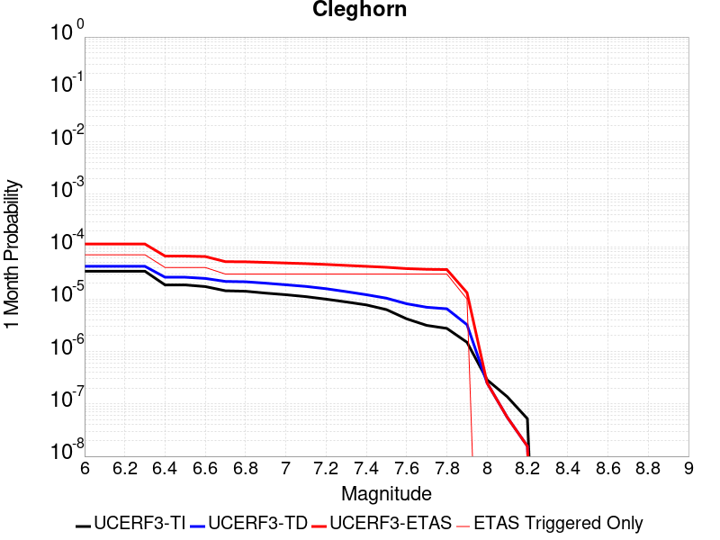 |  |  |

| Magnitude | 1 wk TI Prob | 1 wk TD Prob | 1 wk ETAS Prob | 1 wk ETAS/TD Gain | 1 wk ETAS Triggered Only | 1 mo TI Prob | 1 mo TD Prob | 1 mo ETAS Prob | 1 mo ETAS/TD Gain | 1 mo ETAS Triggered Only | 1 yr TI Prob | 1 yr TD Prob | 1 yr ETAS Prob | 1 yr ETAS/TD Gain | 1 yr ETAS Triggered Only | 10 yr TI Prob | 10 yr TD Prob | 10 yr ETAS Prob | 10 yr ETAS/TD Gain | 10 yr ETAS Triggered Only |
|-----|-----|-----|-----|-----|-----|-----|-----|-----|-----|-----|-----|-----|-----|-----|-----|-----|-----|-----|-----|-----|
| 6.0 | 7.9267165E-6 | 9.831582E-6 | 6.9830996E-5 | 7.102721 | 6.0E-5 | 3.39712E-5 | 4.2134732E-5 | 1.12131784E-4 | 2.6612673 | 7.0E-5 | 4.1352084E-4 | 5.128803E-4 | 6.2282383E-4 | 1.214365 | 1.1E-4 | 0.004127522 | 0.0051320773 | 0.005251461 | 1.0232624 | 1.2E-4 |
| 6.1 | 7.9267165E-6 | 9.831582E-6 | 6.9830996E-5 | 7.102721 | 6.0E-5 | 3.39712E-5 | 4.2134732E-5 | 1.12131784E-4 | 2.6612673 | 7.0E-5 | 4.1352084E-4 | 5.128803E-4 | 6.2282383E-4 | 1.214365 | 1.1E-4 | 0.004127522 | 0.0051320773 | 0.005251461 | 1.0232624 | 1.2E-4 |
| 6.2 | 7.9267165E-6 | 9.831582E-6 | 6.9830996E-5 | 7.102721 | 6.0E-5 | 3.39712E-5 | 4.2134732E-5 | 1.12131784E-4 | 2.6612673 | 7.0E-5 | 4.1352084E-4 | 5.128803E-4 | 6.2282383E-4 | 1.214365 | 1.1E-4 | 0.004127522 | 0.0051320773 | 0.005251461 | 1.0232624 | 1.2E-4 |
| 6.3 | 7.9267165E-6 | 9.831582E-6 | 6.9830996E-5 | 7.102721 | 6.0E-5 | 3.39712E-5 | 4.2134732E-5 | 1.12131784E-4 | 2.6612673 | 7.0E-5 | 4.1352084E-4 | 5.128803E-4 | 6.2282383E-4 | 1.214365 | 1.1E-4 | 0.004127522 | 0.0051320773 | 0.005251461 | 1.0232624 | 1.2E-4 |
| 6.4 | 4.3445207E-6 | 6.0914435E-6 | 4.60912E-5 | 7.5665483 | 4.0E-5 | 1.8619241E-5 | 2.610593E-5 | 6.610488E-5 | 2.5321789 | 4.0E-5 | 2.2666567E-4 | 3.1779436E-4 | 3.9776895E-4 | 1.2516551 | 8.0E-5 | 0.0022643462 | 0.0031875873 | 0.0032673322 | 1.0250174 | 8.0E-5 |
| 6.5 | 4.3445207E-6 | 6.0914435E-6 | 4.60912E-5 | 7.5665483 | 4.0E-5 | 1.8619241E-5 | 2.610593E-5 | 6.610488E-5 | 2.5321789 | 4.0E-5 | 2.2666567E-4 | 3.1779436E-4 | 3.9776895E-4 | 1.2516551 | 8.0E-5 | 0.0022643462 | 0.0031875873 | 0.0032673322 | 1.0250174 | 8.0E-5 |
| 6.6 | 4.040109E-6 | 5.773851E-6 | 4.577362E-5 | 7.927745 | 4.0E-5 | 1.7314638E-5 | 2.4744846E-5 | 6.474386E-5 | 2.6164582 | 4.0E-5 | 2.1078532E-4 | 3.012278E-4 | 3.7120673E-4 | 1.2323123 | 7.0E-5 | 0.002105855 | 0.003022377 | 0.0030921653 | 1.0230906 | 7.0E-5 |
| 6.7 | 3.3632055E-6 | 5.067348E-6 | 3.5067194E-5 | 6.9202266 | 3.0E-5 | 1.4413658E-5 | 2.1717027E-5 | 5.1716375E-5 | 2.3813746 | 3.0E-5 | 1.7547216E-4 | 2.6437303E-4 | 3.2435718E-4 | 1.226892 | 6.0E-5 | 0.0017533366 | 0.0026547113 | 0.002714552 | 1.0225413 | 6.0E-5 |
| 6.8 | 3.2902772E-6 | 4.9892556E-6 | 3.4989105E-5 | 7.012891 | 3.0E-5 | 1.4101111E-5 | 2.1382351E-5 | 5.138171E-5 | 2.4029963 | 3.0E-5 | 1.716675E-4 | 2.6029933E-4 | 3.2028373E-4 | 1.2304438 | 6.0E-5 | 0.0017153495 | 0.0026140702 | 0.0026739133 | 1.0228927 | 6.0E-5 |
| 6.9 | 3.031547E-6 | 4.6910186E-6 | 3.469088E-5 | 7.3951697 | 3.0E-5 | 1.299228E-5 | 2.0104211E-5 | 5.010361E-5 | 2.4921947 | 3.0E-5 | 1.5816953E-4 | 2.4474156E-4 | 2.947293E-4 | 1.2042471 | 5.0E-5 | 0.00158057 | 0.0024588439 | 0.0025087208 | 1.0202848 | 5.0E-5 |
| 7.0 | 2.8259715E-6 | 4.3705895E-6 | 3.437046E-5 | 7.8640327 | 3.0E-5 | 1.211125E-5 | 1.8730963E-5 | 4.8730402E-5 | 2.601596 | 3.0E-5 | 1.4744449E-4 | 2.2802586E-4 | 2.7801446E-4 | 1.2192234 | 5.0E-5 | 0.001473467 | 0.0022920412 | 0.0023419266 | 1.0217646 | 5.0E-5 |
| 7.1 | 2.5962665E-6 | 4.0658106E-6 | 3.4065688E-5 | 8.378572 | 3.0E-5 | 1.1126809E-5 | 1.7424789E-5 | 4.7424266E-5 | 2.7216551 | 3.0E-5 | 1.3546048E-4 | 2.1212637E-4 | 2.6211576E-4 | 1.2356585 | 5.0E-5 | 0.0013537793 | 0.002133366 | 0.0021832592 | 1.0233872 | 5.0E-5 |
| 7.2 | 2.3247253E-6 | 3.6763672E-6 | 3.3676257E-5 | 9.1602 | 3.0E-5 | 9.96307E-6 | 1.5755764E-5 | 4.5755292E-5 | 2.9040349 | 3.0E-5 | 1.21293626E-4 | 1.9180974E-4 | 2.4180015E-4 | 1.260625 | 5.0E-5 | 0.0012122744 | 0.0019305905 | 0.001980494 | 1.0258489 | 5.0E-5 |
| 7.3 | 2.056928E-6 | 3.2350938E-6 | 3.3234995E-5 | 10.273272 | 3.0E-5 | 8.815376E-6 | 1.3864615E-5 | 4.38642E-5 | 3.1637518 | 3.0E-5 | 1.0732192E-4 | 1.6878877E-4 | 2.1878033E-4 | 1.2961782 | 5.0E-5 | 0.001072701 | 0.0017008206 | 0.0017507356 | 1.0293475 | 5.0E-5 |
| 7.4 | 1.8055999E-6 | 2.8255042E-6 | 3.282542E-5 | 11.617544 | 3.0E-5 | 7.738263E-6 | 1.2109249E-5 | 4.2108884E-5 | 3.4774153 | 3.0E-5 | 9.4209274E-5 | 1.4742027E-4 | 1.974129E-4 | 1.3391163 | 5.0E-5 | 9.4169343E-4 | 0.0014875771 | 0.0015375027 | 1.0335617 | 5.0E-5 |
| 7.5 | 1.4683443E-6 | 2.4247483E-6 | 3.2424676E-5 | 13.372388 | 3.0E-5 | 6.292889E-6 | 1.0391738E-5 | 4.0391427E-5 | 3.8868787 | 3.0E-5 | 7.661323E-5 | 1.2651215E-4 | 1.7650584E-4 | 1.3951689 | 5.0E-5 | 7.658682E-4 | 0.0012787961 | 0.0013287322 | 1.0390493 | 5.0E-5 |
| 7.6 | 9.804088E-7 | 1.900266E-6 | 3.190021E-5 | 16.787233 | 3.0E-5 | 4.201745E-6 | 8.143972E-6 | 3.8143728E-5 | 4.683676 | 3.0E-5 | 5.1155046E-5 | 9.91484E-5 | 1.3914444E-4 | 1.4033957 | 4.0E-5 | 5.114327E-4 | 0.001005471 | 0.0010454308 | 1.0397424 | 4.0E-5 |
| 7.7 | 7.3434086E-7 | 1.6284146E-6 | 3.1628366E-5 | 19.422796 | 3.0E-5 | 3.1471714E-6 | 6.978901E-6 | 3.697869E-5 | 5.298641 | 3.0E-5 | 3.831614E-5 | 8.4964835E-5 | 1.14962284E-4 | 1.3530573 | 3.0E-5 | 3.8309532E-4 | 8.6378685E-4 | 8.937609E-4 | 1.0347008 | 3.0E-5 |
| 7.8 | 6.434184E-7 | 1.5220047E-6 | 3.152196E-5 | 20.710815 | 3.0E-5 | 2.7575045E-6 | 6.5228614E-6 | 3.6522666E-5 | 5.599179 | 3.0E-5 | 3.35721E-5 | 7.941297E-5 | 1.0941058E-4 | 1.377742 | 3.0E-5 | 3.3567028E-4 | 8.079678E-4 | 8.379436E-4 | 1.0371002 | 3.0E-5 |
| 7.9 | 3.4943926E-7 | 7.574459E-7 | 1.0757439E-5 | 14.202253 | 1.0E-5 | 1.497596E-6 | 3.2461926E-6 | 1.324616E-5 | 4.080522 | 1.0E-5 | 1.8233079E-5 | 3.952169E-5 | 4.952129E-5 | 1.2530156 | 1.0E-5 | 1.8231584E-4 | 4.040099E-4 | 4.1400586E-4 | 1.0247419 | 1.0E-5 |
| 8.0 | 6.717524E-8 | 5.838828E-8 | 5.838828E-8 | 1.0 | 0.0 | 2.8789387E-7 | 2.5023547E-7 | 2.5023547E-7 | 1.0 | 0.0 | 3.505102E-6 | 3.0466126E-6 | 3.0466126E-6 | 1.0 | 0.0 | 3.5050467E-5 | 3.273506E-5 | 3.273506E-5 | 1.0 | 0.0 |
| 8.1 | 3.1984914E-8 | 1.2956093E-8 | 1.2956093E-8 | 1.0 | 0.0 | 1.370782E-7 | 5.552611E-8 | 5.552611E-8 | 1.0 | 0.0 | 1.6689258E-6 | 6.760302E-7 | 6.760302E-7 | 1.0 | 0.0 | 1.6689133E-5 | 7.74454E-6 | 7.74454E-6 | 1.0 | 0.0 |
| 8.2 | 1.21887656E-8 | 3.6495305E-9 | 3.6495305E-9 | 1.0 | 0.0 | 5.2237567E-8 | 1.5640845E-8 | 1.5640845E-8 | 1.0 | 0.0 | 6.359922E-7 | 1.9042727E-7 | 1.9042727E-7 | 1.0 | 0.0 | 6.3599036E-6 | 2.2470974E-6 | 2.2470974E-6 | 1.0 | 0.0 |

## White Mountains
*[(top)](#table-of-contents)*

| 1 Week | 1 Month | 1 Year | 10 Year |
|-----|-----|-----|-----|
|  | 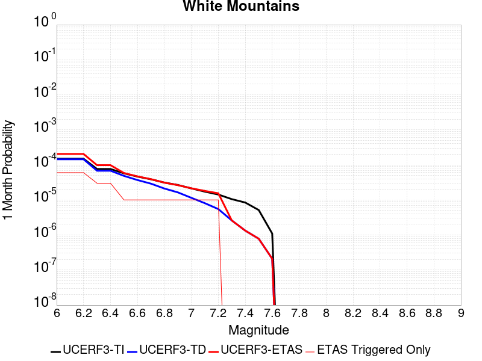 |  |  |

| Magnitude | 1 wk TI Prob | 1 wk TD Prob | 1 wk ETAS Prob | 1 wk ETAS/TD Gain | 1 wk ETAS Triggered Only | 1 mo TI Prob | 1 mo TD Prob | 1 mo ETAS Prob | 1 mo ETAS/TD Gain | 1 mo ETAS Triggered Only | 1 yr TI Prob | 1 yr TD Prob | 1 yr ETAS Prob | 1 yr ETAS/TD Gain | 1 yr ETAS Triggered Only | 10 yr TI Prob | 10 yr TD Prob | 10 yr ETAS Prob | 10 yr ETAS/TD Gain | 10 yr ETAS Triggered Only |
|-----|-----|-----|-----|-----|-----|-----|-----|-----|-----|-----|-----|-----|-----|-----|-----|-----|-----|-----|-----|-----|
| 6.0 | 3.503579E-5 | 3.378405E-5 | 7.37827E-5 | 2.1839507 | 4.0E-5 | 1.5014476E-4 | 1.4478143E-4 | 2.0477275E-4 | 1.4143578 | 6.0E-5 | 0.0018264796 | 0.0017614096 | 0.0018412686 | 1.0453382 | 8.0E-5 | 0.018115403 | 0.017486818 | 0.01760472 | 1.0067424 | 1.2E-4 |
| 6.1 | 3.503579E-5 | 3.378405E-5 | 7.37827E-5 | 2.1839507 | 4.0E-5 | 1.5014476E-4 | 1.4478143E-4 | 2.0477275E-4 | 1.4143578 | 6.0E-5 | 0.0018264796 | 0.0017614096 | 0.0018412686 | 1.0453382 | 8.0E-5 | 0.018115403 | 0.017486818 | 0.01760472 | 1.0067424 | 1.2E-4 |
| 6.2 | 3.503579E-5 | 3.378405E-5 | 7.37827E-5 | 2.1839507 | 4.0E-5 | 1.5014476E-4 | 1.4478143E-4 | 2.0477275E-4 | 1.4143578 | 6.0E-5 | 0.0018264796 | 0.0017614096 | 0.0018412686 | 1.0453382 | 8.0E-5 | 0.018115403 | 0.017486818 | 0.01760472 | 1.0067424 | 1.2E-4 |
| 6.3 | 1.7818425E-5 | 1.5916074E-5 | 4.5915596E-5 | 2.884857 | 3.0E-5 | 7.636245E-5 | 6.821004E-5 | 9.8207995E-5 | 1.439788 | 3.0E-5 | 9.293162E-4 | 8.301551E-4 | 8.6013024E-4 | 1.0361078 | 3.0E-5 | 0.009254395 | 0.008271999 | 0.0083116675 | 1.0047956 | 4.0E-5 |
| 6.4 | 1.7818425E-5 | 1.5916074E-5 | 4.5915596E-5 | 2.884857 | 3.0E-5 | 7.636245E-5 | 6.821004E-5 | 9.8207995E-5 | 1.439788 | 3.0E-5 | 9.293162E-4 | 8.301551E-4 | 8.6013024E-4 | 1.0361078 | 3.0E-5 | 0.009254395 | 0.008271999 | 0.0083116675 | 1.0047956 | 4.0E-5 |
| 6.5 | 1.3397557E-5 | 1.13362685E-5 | 2.1336155E-5 | 1.8821145 | 1.0E-5 | 5.741684E-5 | 4.858314E-5 | 5.8582656E-5 | 1.2058227 | 1.0E-5 | 6.988258E-4 | 5.913462E-4 | 6.0134026E-4 | 1.0169005 | 1.0E-5 | 0.006966323 | 0.005898432 | 0.0059183137 | 1.0033708 | 2.0E-5 |
| 6.6 | 1.0818695E-5 | 8.625366E-6 | 1.862528E-5 | 2.1593611 | 1.0E-5 | 4.6365014E-5 | 3.6965357E-5 | 4.6964986E-5 | 1.2705135 | 1.0E-5 | 5.6434784E-4 | 4.4996463E-4 | 4.599601E-4 | 1.0222139 | 1.0E-5 | 0.005629168 | 0.004490972 | 0.0045108823 | 1.0044334 | 2.0E-5 |
| 6.7 | 9.067908E-6 | 6.802442E-6 | 1.6802374E-5 | 2.4700503 | 1.0E-5 | 3.8861883E-5 | 2.9153016E-5 | 3.9152725E-5 | 1.3430077 | 1.0E-5 | 4.7304068E-4 | 3.5488335E-4 | 3.648798E-4 | 1.0281683 | 1.0E-5 | 0.00472035 | 0.0035434833 | 0.003553448 | 1.002812 | 1.0E-5 |
| 6.8 | 7.295947E-6 | 4.936391E-6 | 1.4936341E-5 | 3.0257614 | 1.0E-5 | 3.126797E-5 | 2.1155796E-5 | 3.1155585E-5 | 1.4726737 | 1.0E-5 | 3.8062103E-4 | 2.575425E-4 | 2.6753993E-4 | 1.0388186 | 1.0E-5 | 0.0037996976 | 0.0025725532 | 0.0025825277 | 1.0038772 | 1.0E-5 |
| 6.9 | 6.2243444E-6 | 3.832213E-6 | 1.3832175E-5 | 3.6094482 | 1.0E-5 | 2.6675489E-5 | 1.642367E-5 | 2.6423506E-5 | 1.6088673 | 1.0E-5 | 3.2472567E-4 | 1.9994036E-4 | 2.0993837E-4 | 1.050005 | 1.0E-5 | 0.0032425157 | 0.0019976576 | 0.0020076376 | 1.0049958 | 1.0E-5 |
| 7.0 | 4.9878413E-6 | 2.6795342E-6 | 1.2679508E-5 | 4.7319818 | 1.0E-5 | 2.1376287E-5 | 1.14836685E-5 | 2.1483555E-5 | 1.8707918 | 1.0E-5 | 2.602252E-4 | 1.3980496E-4 | 1.4980356E-4 | 1.0715182 | 1.0E-5 | 0.002599207 | 0.0013971963 | 0.0014071823 | 1.0071472 | 1.0E-5 |
| 7.1 | 4.0252844E-6 | 1.8857575E-6 | 1.1885739E-5 | 6.302899 | 1.0E-5 | 1.7251105E-5 | 8.081794E-6 | 1.8081711E-5 | 2.2373393 | 1.0E-5 | 2.1001195E-4 | 9.8391516E-5 | 1.0839054E-4 | 1.1016247 | 1.0E-5 | 0.0020981359 | 9.834924E-4 | 9.934825E-4 | 1.0101578 | 1.0E-5 |
| 7.2 | 3.3284066E-6 | 1.281964E-6 | 1.1281952E-5 | 8.800521 | 1.0E-5 | 1.4264522E-5 | 5.494121E-6 | 1.5494066E-5 | 2.8201175 | 1.0E-5 | 1.736567E-4 | 6.688897E-5 | 7.6888304E-5 | 1.1494914 | 1.0E-5 | 0.0017352107 | 6.6869846E-4 | 6.786918E-4 | 1.0149444 | 1.0E-5 |
| 7.3 | 2.458226E-6 | 6.05722E-7 | 6.05722E-7 | 1.0 | 0.0 | 1.0535211E-5 | 2.5959491E-6 | 2.5959491E-6 | 1.0 | 0.0 | 1.2825865E-4 | 3.1605257E-5 | 3.1605257E-5 | 1.0 | 0.0 | 0.0012818464 | 3.160114E-4 | 3.160114E-4 | 1.0 | 0.0 |
| 7.4 | 1.965953E-6 | 3.1089303E-7 | 3.1089303E-7 | 1.0 | 0.0 | 8.425486E-6 | 1.332398E-6 | 1.332398E-6 | 1.0 | 0.0 | 1.0257547E-4 | 1.6221828E-5 | 1.6221828E-5 | 1.0 | 0.0 | 0.0010252813 | 1.6220656E-4 | 1.6220656E-4 | 1.0 | 0.0 |
| 7.5 | 1.2014192E-6 | 1.8244253E-7 | 1.8244253E-7 | 1.0 | 0.0 | 5.148929E-6 | 7.8189635E-7 | 7.8189635E-7 | 1.0 | 0.0 | 6.2686406E-5 | 9.519547E-6 | 9.519547E-6 | 1.0 | 0.0 | 6.266873E-4 | 9.519148E-5 | 9.519148E-5 | 1.0 | 0.0 |
| 7.6 | 2.5612175E-7 | 4.8946475E-8 | 4.8946475E-8 | 1.0 | 0.0 | 1.0976642E-6 | 2.0977059E-7 | 2.0977059E-7 | 1.0 | 0.0 | 1.3363979E-5 | 2.5539543E-6 | 2.5539543E-6 | 1.0 | 0.0 | 1.3363175E-4 | 2.5539286E-5 | 2.5539286E-5 | 1.0 | 0.0 |

## Channel Islands Thrust
*[(top)](#table-of-contents)*

| 1 Week | 1 Month | 1 Year | 10 Year |
|-----|-----|-----|-----|
| 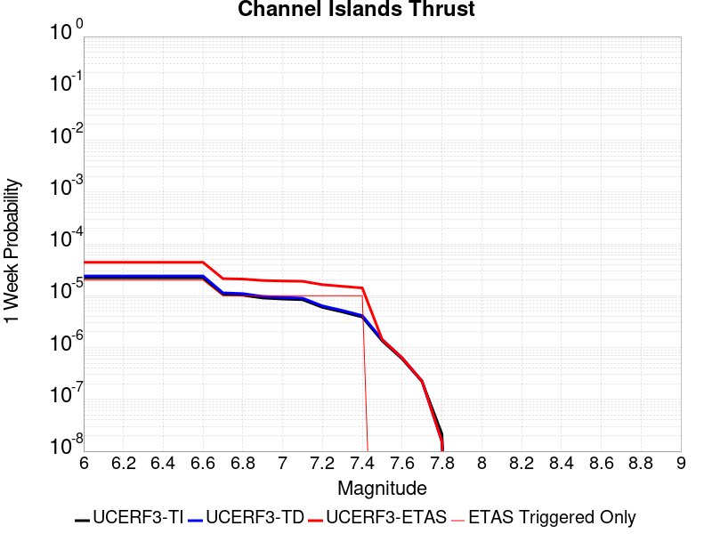 |  | 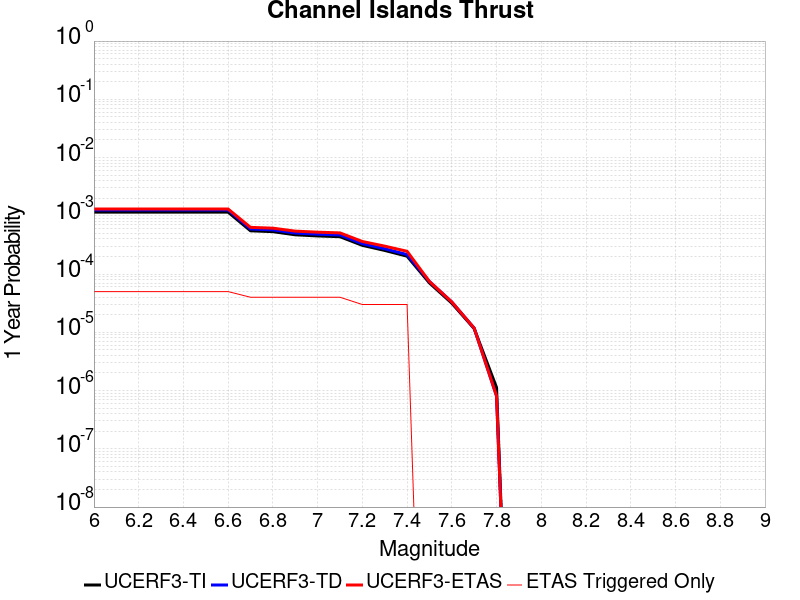 | 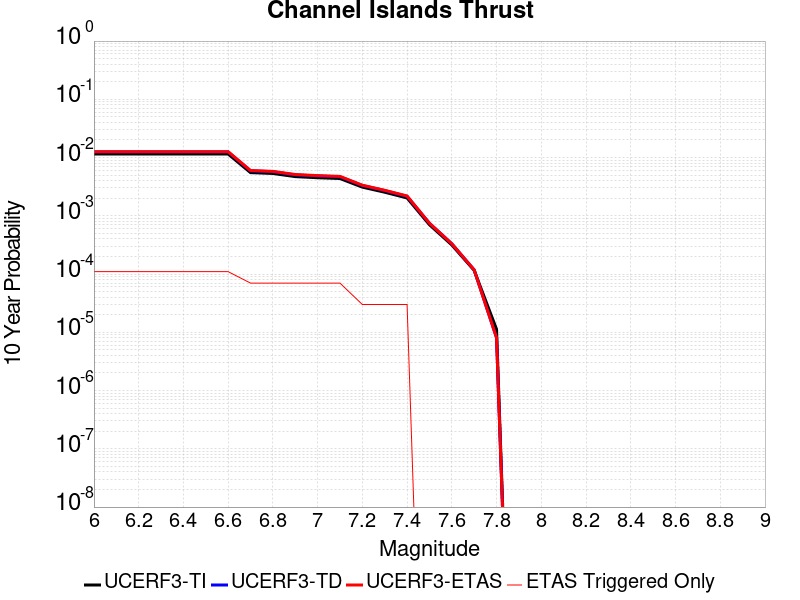 |

| Magnitude | 1 wk TI Prob | 1 wk TD Prob | 1 wk ETAS Prob | 1 wk ETAS/TD Gain | 1 wk ETAS Triggered Only | 1 mo TI Prob | 1 mo TD Prob | 1 mo ETAS Prob | 1 mo ETAS/TD Gain | 1 mo ETAS Triggered Only | 1 yr TI Prob | 1 yr TD Prob | 1 yr ETAS Prob | 1 yr ETAS/TD Gain | 1 yr ETAS Triggered Only | 10 yr TI Prob | 10 yr TD Prob | 10 yr ETAS Prob | 10 yr ETAS/TD Gain | 10 yr ETAS Triggered Only |
|-----|-----|-----|-----|-----|-----|-----|-----|-----|-----|-----|-----|-----|-----|-----|-----|-----|-----|-----|-----|-----|
| 6.0 | 2.2156251E-5 | 2.4092022E-5 | 4.409154E-5 | 1.8301303 | 2.0E-5 | 9.495191E-5 | 1.03248036E-4 | 1.3324495E-4 | 1.2905325 | 3.0E-5 | 0.0011554264 | 0.0012564264 | 0.0013063637 | 1.0397455 | 5.0E-5 | 0.011494373 | 0.0125038205 | 0.012612445 | 1.0086873 | 1.1E-4 |
| 6.1 | 2.2156251E-5 | 2.4092022E-5 | 4.409154E-5 | 1.8301303 | 2.0E-5 | 9.495191E-5 | 1.03248036E-4 | 1.3324495E-4 | 1.2905325 | 3.0E-5 | 0.0011554264 | 0.0012564264 | 0.0013063637 | 1.0397455 | 5.0E-5 | 0.011494373 | 0.0125038205 | 0.012612445 | 1.0086873 | 1.1E-4 |
| 6.2 | 2.2156251E-5 | 2.4092022E-5 | 4.409154E-5 | 1.8301303 | 2.0E-5 | 9.495191E-5 | 1.03248036E-4 | 1.3324495E-4 | 1.2905325 | 3.0E-5 | 0.0011554264 | 0.0012564264 | 0.0013063637 | 1.0397455 | 5.0E-5 | 0.011494373 | 0.0125038205 | 0.012612445 | 1.0086873 | 1.1E-4 |
| 6.3 | 2.2156251E-5 | 2.4092022E-5 | 4.409154E-5 | 1.8301303 | 2.0E-5 | 9.495191E-5 | 1.03248036E-4 | 1.3324495E-4 | 1.2905325 | 3.0E-5 | 0.0011554264 | 0.0012564264 | 0.0013063637 | 1.0397455 | 5.0E-5 | 0.011494373 | 0.0125038205 | 0.012612445 | 1.0086873 | 1.1E-4 |
| 6.4 | 2.2156251E-5 | 2.4092022E-5 | 4.409154E-5 | 1.8301303 | 2.0E-5 | 9.495191E-5 | 1.03248036E-4 | 1.3324495E-4 | 1.2905325 | 3.0E-5 | 0.0011554264 | 0.0012564264 | 0.0013063637 | 1.0397455 | 5.0E-5 | 0.011494373 | 0.0125038205 | 0.012612445 | 1.0086873 | 1.1E-4 |
| 6.5 | 2.2156251E-5 | 2.4092022E-5 | 4.409154E-5 | 1.8301303 | 2.0E-5 | 9.495191E-5 | 1.03248036E-4 | 1.3324495E-4 | 1.2905325 | 3.0E-5 | 0.0011554264 | 0.0012564264 | 0.0013063637 | 1.0397455 | 5.0E-5 | 0.011494373 | 0.0125038205 | 0.012612445 | 1.0086873 | 1.1E-4 |
| 6.6 | 2.2156251E-5 | 2.4092022E-5 | 4.409154E-5 | 1.8301303 | 2.0E-5 | 9.495191E-5 | 1.03248036E-4 | 1.3324495E-4 | 1.2905325 | 3.0E-5 | 0.0011554264 | 0.0012564264 | 0.0013063637 | 1.0397455 | 5.0E-5 | 0.011494373 | 0.0125038205 | 0.012612445 | 1.0086873 | 1.1E-4 |
| 6.7 | 1.0601296E-5 | 1.1379544E-5 | 2.137943E-5 | 1.8787599 | 1.0E-5 | 4.5433335E-5 | 4.876859E-5 | 6.8767615E-5 | 1.4100801 | 2.0E-5 | 5.5301044E-4 | 5.936007E-4 | 6.3357694E-4 | 1.0673454 | 4.0E-5 | 0.005516363 | 0.005920653 | 0.005990239 | 1.011753 | 7.0E-5 |
| 6.8 | 1.0246747E-5 | 1.0996669E-5 | 2.0996558E-5 | 1.9093564 | 1.0E-5 | 4.391389E-5 | 4.7127756E-5 | 6.712681E-5 | 1.4243584 | 2.0E-5 | 5.345204E-4 | 5.7363417E-4 | 6.136112E-4 | 1.0696908 | 4.0E-5 | 0.0053323656 | 0.005722025 | 0.005791624 | 1.0121634 | 7.0E-5 |
| 6.9 | 9.049551E-6 | 9.699645E-6 | 1.9699548E-5 | 2.0309556 | 1.0E-5 | 3.878322E-5 | 4.1569267E-5 | 6.156843E-5 | 1.4811047 | 2.0E-5 | 4.7208337E-4 | 5.059924E-4 | 5.4597214E-4 | 1.0790126 | 4.0E-5 | 0.0047108172 | 0.0050488203 | 0.005118467 | 1.0137947 | 7.0E-5 |
| 7.0 | 8.6542195E-6 | 9.274603E-6 | 1.927451E-5 | 2.0782032 | 1.0E-5 | 3.7088983E-5 | 3.9747716E-5 | 5.9746922E-5 | 1.5031536 | 2.0E-5 | 4.5146482E-4 | 4.8382508E-4 | 5.2380573E-4 | 1.0826346 | 4.0E-5 | 0.004505487 | 0.004828129 | 0.004897791 | 1.0144284 | 7.0E-5 |
| 7.1 | 8.391028E-6 | 8.992924E-6 | 1.8992834E-5 | 2.1119752 | 1.0E-5 | 3.5961057E-5 | 3.854056E-5 | 5.853979E-5 | 1.5189139 | 2.0E-5 | 4.3773788E-4 | 4.6913436E-4 | 5.091156E-4 | 1.0852234 | 4.0E-5 | 0.004368766 | 0.0046818503 | 0.0047515226 | 1.0148814 | 7.0E-5 |
| 7.2 | 5.965188E-6 | 6.3716952E-6 | 1.6371632E-5 | 2.569431 | 1.0E-5 | 2.556484E-5 | 2.7306982E-5 | 4.7306436E-5 | 1.7323934 | 2.0E-5 | 3.1120746E-4 | 3.3241234E-4 | 3.6240238E-4 | 1.0902194 | 3.0E-5 | 0.00310772 | 0.0033192092 | 0.0033491098 | 1.0090083 | 3.0E-5 |
| 7.3 | 4.877518E-6 | 5.2060063E-6 | 1.5205955E-5 | 2.9208481 | 1.0E-5 | 2.0903482E-5 | 2.2311267E-5 | 4.231082E-5 | 1.896388 | 2.0E-5 | 2.5447016E-4 | 2.716063E-4 | 3.0159813E-4 | 1.110424 | 3.0E-5 | 0.0025417898 | 0.0027127895 | 0.0027427082 | 1.0110288 | 3.0E-5 |
| 7.4 | 3.8829853E-6 | 4.141863E-6 | 1.4141821E-5 | 3.4143627 | 1.0E-5 | 1.664126E-5 | 1.7750723E-5 | 3.7750367E-5 | 2.1266947 | 2.0E-5 | 2.0258849E-4 | 2.1609402E-4 | 2.4608755E-4 | 1.1387985 | 3.0E-5 | 0.002024039 | 0.0021588807 | 0.002188816 | 1.0138661 | 3.0E-5 |
| 7.5 | 1.3489616E-6 | 1.4277903E-6 | 1.4277903E-6 | 1.0 | 0.0 | 5.7812517E-6 | 6.119087E-6 | 6.119087E-6 | 1.0 | 0.0 | 7.038446E-5 | 7.449738E-5 | 7.449738E-5 | 1.0 | 0.0 | 7.036218E-4 | 7.44728E-4 | 7.44728E-4 | 1.0 | 0.0 |
| 7.6 | 6.058192E-7 | 6.353778E-7 | 6.353778E-7 | 1.0 | 0.0 | 2.5963652E-6 | 2.7230449E-6 | 2.7230449E-6 | 1.0 | 0.0 | 3.161029E-5 | 3.3152584E-5 | 3.3152584E-5 | 1.0 | 0.0 | 3.1605794E-4 | 3.31478E-4 | 3.31478E-4 | 1.0 | 0.0 |
| 7.7 | 2.2170494E-7 | 2.2607902E-7 | 2.2607902E-7 | 1.0 | 0.0 | 9.5016367E-7 | 9.689098E-7 | 9.689098E-7 | 1.0 | 0.0 | 1.1568181E-5 | 1.1796425E-5 | 1.1796425E-5 | 1.0 | 0.0 | 1.1567579E-4 | 1.1795909E-4 | 1.1795909E-4 | 1.0 | 0.0 |
| 7.8 | 2.1613102E-8 | 1.5466682E-8 | 1.5466682E-8 | 1.0 | 0.0 | 9.262757E-8 | 6.628578E-8 | 6.628578E-8 | 1.0 | 0.0 | 1.1277401E-6 | 8.070291E-7 | 8.070291E-7 | 1.0 | 0.0 | 1.1277344E-5 | 8.070269E-6 | 8.070269E-6 | 1.0 | 0.0 |

## San Diego Trough north alt1
*[(top)](#table-of-contents)*

| 1 Week | 1 Month | 1 Year | 10 Year |
|-----|-----|-----|-----|
|  | 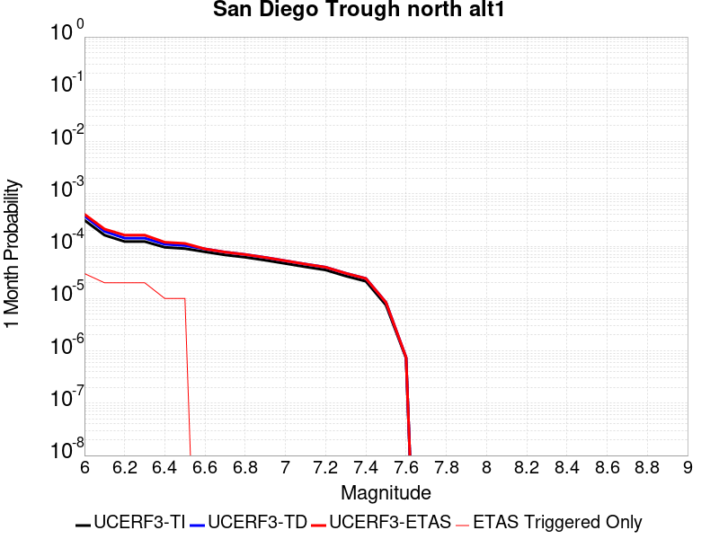 |  |  |

| Magnitude | 1 wk TI Prob | 1 wk TD Prob | 1 wk ETAS Prob | 1 wk ETAS/TD Gain | 1 wk ETAS Triggered Only | 1 mo TI Prob | 1 mo TD Prob | 1 mo ETAS Prob | 1 mo ETAS/TD Gain | 1 mo ETAS Triggered Only | 1 yr TI Prob | 1 yr TD Prob | 1 yr ETAS Prob | 1 yr ETAS/TD Gain | 1 yr ETAS Triggered Only | 10 yr TI Prob | 10 yr TD Prob | 10 yr ETAS Prob | 10 yr ETAS/TD Gain | 10 yr ETAS Triggered Only |
|-----|-----|-----|-----|-----|-----|-----|-----|-----|-----|-----|-----|-----|-----|-----|-----|-----|-----|-----|-----|-----|
| 6.0 | 7.329252E-5 | 8.821093E-5 | 1.0820917E-4 | 1.2267092 | 2.0E-5 | 3.14073E-4 | 3.7799572E-4 | 4.0798436E-4 | 1.0793359 | 3.0E-5 | 0.0038171355 | 0.004593027 | 0.0046627056 | 1.0151705 | 7.0E-5 | 0.03752231 | 0.045044992 | 0.045150034 | 1.002332 | 1.1E-4 |
| 6.1 | 3.7940346E-5 | 4.4885E-5 | 6.48841E-5 | 1.4455632 | 2.0E-5 | 1.6259136E-4 | 1.9235066E-4 | 2.1234681E-4 | 1.1039568 | 2.0E-5 | 0.0019777524 | 0.0023394432 | 0.002369373 | 1.0127935 | 3.0E-5 | 0.019602431 | 0.023156688 | 0.02319576 | 1.0016874 | 4.0E-5 |
| 6.2 | 2.8645263E-5 | 3.329678E-5 | 5.3296113E-5 | 1.6006386 | 2.0E-5 | 1.2275964E-4 | 1.4269284E-4 | 1.6268999E-4 | 1.1401412 | 2.0E-5 | 0.0014935739 | 0.0017359189 | 0.0017658669 | 1.017252 | 3.0E-5 | 0.0148357535 | 0.017226247 | 0.017265558 | 1.002282 | 4.0E-5 |
| 6.3 | 2.8645263E-5 | 3.329678E-5 | 5.3296113E-5 | 1.6006386 | 2.0E-5 | 1.2275964E-4 | 1.4269284E-4 | 1.6268999E-4 | 1.1401412 | 2.0E-5 | 0.0014935739 | 0.0017359189 | 0.0017658669 | 1.017252 | 3.0E-5 | 0.0148357535 | 0.017226247 | 0.017265558 | 1.002282 | 4.0E-5 |
| 6.4 | 2.2204576E-5 | 2.5448318E-5 | 3.5448065E-5 | 1.3929433 | 1.0E-5 | 9.5159E-5 | 1.0905972E-4 | 1.19058626E-4 | 1.0916829 | 1.0E-5 | 0.001157945 | 0.0013270034 | 0.0013469768 | 1.0150516 | 2.0E-5 | 0.011519298 | 0.013191955 | 0.013221559 | 1.0022441 | 3.0E-5 |
| 6.5 | 2.1004838E-5 | 2.4024694E-5 | 3.4024455E-5 | 1.4162284 | 1.0E-5 | 9.0017624E-5 | 1.0295896E-4 | 1.1295793E-4 | 1.0971161 | 1.0E-5 | 0.0010954136 | 0.0012528138 | 0.0012628014 | 1.007972 | 1.0E-5 | 0.010900296 | 0.012458589 | 0.012468464 | 1.0007926 | 1.0E-5 |
| 6.6 | 1.820557E-5 | 2.0704787E-5 | 2.0704787E-5 | 1.0 | 0.0 | 7.802154E-5 | 8.873181E-5 | 8.873181E-5 | 1.0 | 0.0 | 9.4949827E-4 | 0.0010797799 | 0.0010797799 | 1.0 | 0.0 | 0.009454516 | 0.010746004 | 0.010746004 | 1.0 | 0.0 |
| 6.7 | 1.5884485E-5 | 1.7983646E-5 | 1.7983646E-5 | 1.0 | 0.0 | 6.807459E-5 | 7.707051E-5 | 7.707051E-5 | 1.0 | 0.0 | 8.284929E-4 | 9.3793223E-4 | 9.3793223E-4 | 1.0 | 0.0 | 0.008254109 | 0.009340104 | 0.009340104 | 1.0 | 0.0 |
| 6.8 | 1.4331171E-5 | 1.6201066E-5 | 1.6201066E-5 | 1.0 | 0.0 | 6.141786E-5 | 6.94313E-5 | 6.94313E-5 | 1.0 | 0.0 | 7.4750587E-4 | 8.450002E-4 | 8.450002E-4 | 1.0 | 0.0 | 0.0074499645 | 0.008418139 | 0.008418139 | 1.0 | 0.0 |
| 6.9 | 1.2574203E-5 | 1.4205835E-5 | 1.4205835E-5 | 1.0 | 0.0 | 5.3888325E-5 | 6.0880735E-5 | 6.0880735E-5 | 1.0 | 0.0 | 6.558929E-4 | 7.409723E-4 | 7.409723E-4 | 1.0 | 0.0 | 0.0065396037 | 0.007385203 | 0.007385203 | 1.0 | 0.0 |
| 7.0 | 1.0883844E-5 | 1.2289262E-5 | 1.2289262E-5 | 1.0 | 0.0 | 4.664421E-5 | 5.2667205E-5 | 5.2667205E-5 | 1.0 | 0.0 | 5.677453E-4 | 6.4103556E-4 | 6.4103556E-4 | 1.0 | 0.0 | 0.00566297 | 0.006391993 | 0.006391993 | 1.0 | 0.0 |
| 7.1 | 9.393088E-6 | 1.060702E-5 | 1.060702E-5 | 1.0 | 0.0 | 4.025547E-5 | 4.545787E-5 | 4.545787E-5 | 1.0 | 0.0 | 4.900001E-4 | 5.533098E-4 | 5.533098E-4 | 1.0 | 0.0 | 0.0048892107 | 0.005519418 | 0.005519418 | 1.0 | 0.0 |
| 7.2 | 8.190791E-6 | 9.258625E-6 | 9.258625E-6 | 1.0 | 0.0 | 3.510292E-5 | 3.9679224E-5 | 3.9679224E-5 | 1.0 | 0.0 | 4.2729423E-4 | 4.8298817E-4 | 4.8298817E-4 | 1.0 | 0.0 | 0.0042647356 | 0.004819465 | 0.004819465 | 1.0 | 0.0 |
| 7.3 | 6.268162E-6 | 7.089716E-6 | 7.089716E-6 | 1.0 | 0.0 | 2.6863276E-5 | 3.0384144E-5 | 3.0384144E-5 | 1.0 | 0.0 | 3.2701128E-4 | 3.6986457E-4 | 3.6986457E-4 | 1.0 | 0.0 | 0.003265305 | 0.003692536 | 0.003692536 | 1.0 | 0.0 |
| 7.4 | 4.985186E-6 | 5.6426816E-6 | 5.6426816E-6 | 1.0 | 0.0 | 2.1364907E-5 | 2.4182698E-5 | 2.4182698E-5 | 1.0 | 0.0 | 2.600867E-4 | 2.9438498E-4 | 2.9438498E-4 | 1.0 | 0.0 | 0.002597825 | 0.0029399914 | 0.0029399914 | 1.0 | 0.0 |
| 7.5 | 1.7489613E-6 | 1.969678E-6 | 1.969678E-6 | 1.0 | 0.0 | 7.495527E-6 | 8.4414505E-6 | 8.4414505E-6 | 1.0 | 0.0 | 9.125422E-5 | 1.02770035E-4 | 1.02770035E-4 | 1.0 | 0.0 | 9.1216754E-4 | 0.0010272472 | 0.0010272472 | 1.0 | 0.0 |
| 7.6 | 1.6988751E-7 | 1.7533823E-7 | 1.7533823E-7 | 1.0 | 0.0 | 7.2808916E-7 | 7.5144936E-7 | 7.5144936E-7 | 1.0 | 0.0 | 8.864449E-6 | 9.14886E-6 | 9.14886E-6 | 1.0 | 0.0 | 8.8640954E-5 | 9.1485024E-5 | 9.1485024E-5 | 1.0 | 0.0 |

## Big Pine (East)
*[(top)](#table-of-contents)*

| 1 Week | 1 Month | 1 Year | 10 Year |
|-----|-----|-----|-----|
|  | 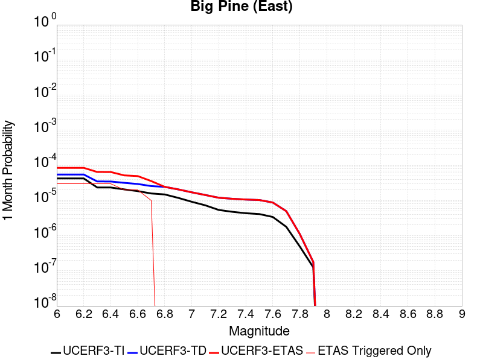 |  |  |

| Magnitude | 1 wk TI Prob | 1 wk TD Prob | 1 wk ETAS Prob | 1 wk ETAS/TD Gain | 1 wk ETAS Triggered Only | 1 mo TI Prob | 1 mo TD Prob | 1 mo ETAS Prob | 1 mo ETAS/TD Gain | 1 mo ETAS Triggered Only | 1 yr TI Prob | 1 yr TD Prob | 1 yr ETAS Prob | 1 yr ETAS/TD Gain | 1 yr ETAS Triggered Only | 10 yr TI Prob | 10 yr TD Prob | 10 yr ETAS Prob | 10 yr ETAS/TD Gain | 10 yr ETAS Triggered Only |
|-----|-----|-----|-----|-----|-----|-----|-----|-----|-----|-----|-----|-----|-----|-----|-----|-----|-----|-----|-----|-----|
| 6.0 | 9.916913E-6 | 1.2816984E-5 | 4.28166E-5 | 3.340614 | 3.0E-5 | 4.250036E-5 | 5.49289E-5 | 8.4927255E-5 | 1.5461305 | 3.0E-5 | 5.173191E-4 | 6.685763E-4 | 7.485228E-4 | 1.1195773 | 8.0E-5 | 0.0051611643 | 0.006670441 | 0.0067896405 | 1.0178698 | 1.2E-4 |
| 6.1 | 9.916913E-6 | 1.2816984E-5 | 4.28166E-5 | 3.340614 | 3.0E-5 | 4.250036E-5 | 5.49289E-5 | 8.4927255E-5 | 1.5461305 | 3.0E-5 | 5.173191E-4 | 6.685763E-4 | 7.485228E-4 | 1.1195773 | 8.0E-5 | 0.0051611643 | 0.006670441 | 0.0067896405 | 1.0178698 | 1.2E-4 |
| 6.2 | 9.916913E-6 | 1.2816984E-5 | 4.28166E-5 | 3.340614 | 3.0E-5 | 4.250036E-5 | 5.49289E-5 | 8.4927255E-5 | 1.5461305 | 3.0E-5 | 5.173191E-4 | 6.685763E-4 | 7.485228E-4 | 1.1195773 | 8.0E-5 | 0.0051611643 | 0.006670441 | 0.0067896405 | 1.0178698 | 1.2E-4 |
| 6.3 | 5.479711E-6 | 8.112951E-6 | 3.8112707E-5 | 4.697761 | 3.0E-5 | 2.3484265E-5 | 3.4769346E-5 | 6.4768305E-5 | 1.8627989 | 3.0E-5 | 2.858834E-4 | 4.2323777E-4 | 4.8321235E-4 | 1.1417043 | 6.0E-5 | 0.0028551589 | 0.004227244 | 0.004326821 | 1.0235561 | 1.0E-4 |
| 6.4 | 5.465009E-6 | 8.097245E-6 | 3.8097E-5 | 4.7049336 | 3.0E-5 | 2.3421257E-5 | 3.4702036E-5 | 6.4700995E-5 | 1.8644726 | 3.0E-5 | 2.851165E-4 | 4.2241855E-4 | 4.823932E-4 | 1.1419792 | 6.0E-5 | 0.0028475097 | 0.0042190826 | 0.0043186606 | 1.0236019 | 1.0E-4 |
| 6.5 | 4.826767E-6 | 7.422301E-6 | 2.7422153E-5 | 3.6945622 | 2.0E-5 | 2.068598E-5 | 3.180949E-5 | 5.1808853E-5 | 1.6287231 | 2.0E-5 | 2.518227E-4 | 3.872145E-4 | 4.3719512E-4 | 1.1290774 | 5.0E-5 | 0.0025153751 | 0.003868283 | 0.0039579347 | 1.0231762 | 9.0E-5 |
| 6.6 | 4.3146847E-6 | 6.8822374E-6 | 2.68821E-5 | 3.9060118 | 2.0E-5 | 1.8491375E-5 | 2.9494982E-5 | 4.9494392E-5 | 1.6780615 | 2.0E-5 | 2.2510924E-4 | 3.590447E-4 | 4.0902675E-4 | 1.1392084 | 5.0E-5 | 0.0022488134 | 0.0035874986 | 0.0036672114 | 1.0222197 | 8.0E-5 |
| 6.7 | 3.6968106E-6 | 5.9954727E-6 | 1.5995412E-5 | 2.667915 | 1.0E-5 | 1.5843378E-5 | 2.5694639E-5 | 3.5694382E-5 | 1.3891762 | 1.0E-5 | 1.9287605E-4 | 3.1278885E-4 | 3.5277635E-4 | 1.1278418 | 4.0E-5 | 0.0019270873 | 0.0031262483 | 0.0031960295 | 1.0223211 | 7.0E-5 |
| 6.8 | 3.4671132E-6 | 5.702177E-6 | 5.702177E-6 | 1.0 | 0.0 | 1.4858972E-5 | 2.4437682E-5 | 2.4437682E-5 | 1.0 | 0.0 | 1.8089297E-4 | 2.974896E-4 | 3.2748067E-4 | 1.1008139 | 3.0E-5 | 0.0018074579 | 0.002973667 | 0.0030334888 | 1.0201172 | 6.0E-5 |
| 6.9 | 2.7686972E-6 | 4.825223E-6 | 4.825223E-6 | 1.0 | 0.0 | 1.1865792E-5 | 2.0679368E-5 | 2.0679368E-5 | 1.0 | 0.0 | 1.4445644E-4 | 2.5174298E-4 | 2.7173792E-4 | 1.0794262 | 2.0E-5 | 0.0014436257 | 0.0025172636 | 0.0025671378 | 1.0198128 | 5.0E-5 |
| 7.0 | 2.1472624E-6 | 3.9850406E-6 | 3.9850406E-6 | 1.0 | 0.0 | 9.20252E-6 | 1.7078637E-5 | 1.7078637E-5 | 1.0 | 0.0 | 1.12034926E-4 | 2.079131E-4 | 2.1791102E-4 | 1.048087 | 1.0E-5 | 0.0011197845 | 0.0020798394 | 0.002119756 | 1.0191922 | 4.0E-5 |
| 7.1 | 1.7018335E-6 | 3.344876E-6 | 3.344876E-6 | 1.0 | 0.0 | 7.293552E-6 | 1.4335106E-5 | 1.4335106E-5 | 1.0 | 0.0 | 8.879537E-5 | 1.7451629E-4 | 1.8451455E-4 | 1.0572913 | 1.0E-5 | 8.87599E-4 | 0.0017464145 | 0.0017863446 | 1.0228641 | 4.0E-5 |
| 7.2 | 1.25603E-6 | 2.794484E-6 | 2.794484E-6 | 1.0 | 0.0 | 5.3829745E-6 | 1.1976307E-5 | 1.1976307E-5 | 1.0 | 0.0 | 6.553574E-5 | 1.4580201E-4 | 1.4580201E-4 | 1.0 | 0.0 | 6.551642E-4 | 0.001459661 | 0.0014696465 | 1.006841 | 1.0E-5 |
| 7.3 | 1.112297E-6 | 2.610332E-6 | 2.610332E-6 | 1.0 | 0.0 | 4.7669787E-6 | 1.118709E-5 | 1.118709E-5 | 1.0 | 0.0 | 5.803642E-5 | 1.3619453E-4 | 1.3619453E-4 | 1.0 | 0.0 | 5.802127E-4 | 0.0013635408 | 0.0013735272 | 1.0073239 | 1.0E-5 |
| 7.4 | 1.0137181E-6 | 2.4834917E-6 | 2.4834917E-6 | 1.0 | 0.0 | 4.3444993E-6 | 1.0643494E-5 | 1.0643494E-5 | 1.0 | 0.0 | 5.2892992E-5 | 1.2957705E-4 | 1.2957705E-4 | 1.0 | 0.0 | 5.288041E-4 | 0.0012972289 | 0.0013072159 | 1.0076988 | 1.0E-5 |
| 7.5 | 9.598608E-7 | 2.4071483E-6 | 2.4071483E-6 | 1.0 | 0.0 | 4.1136827E-6 | 1.031631E-5 | 1.031631E-5 | 1.0 | 0.0 | 5.0082934E-5 | 1.2559404E-4 | 1.2559404E-4 | 1.0 | 0.0 | 5.007165E-4 | 0.0012572526 | 0.00126724 | 1.0079439 | 1.0E-5 |
| 7.6 | 7.929459E-7 | 2.0448588E-6 | 2.0448588E-6 | 1.0 | 0.0 | 3.3983351E-6 | 8.763653E-6 | 8.763653E-6 | 1.0 | 0.0 | 4.1373947E-5 | 1.06692416E-4 | 1.06692416E-4 | 1.0 | 0.0 | 4.1366243E-4 | 0.0010685222 | 0.0010785116 | 1.0093488 | 1.0E-5 |
| 7.7 | 4.155788E-7 | 1.1605589E-6 | 1.1605589E-6 | 1.0 | 0.0 | 1.7810507E-6 | 4.9738146E-6 | 4.9738146E-6 | 1.0 | 0.0 | 2.1684076E-5 | 6.0554554E-5 | 6.0554554E-5 | 1.0 | 0.0 | 2.1681961E-4 | 6.0857297E-4 | 6.0857297E-4 | 1.0 | 0.0 |
| 7.8 | 1.14666925E-7 | 2.592015E-7 | 2.592015E-7 | 1.0 | 0.0 | 4.914296E-7 | 1.1108631E-6 | 1.1108631E-6 | 1.0 | 0.0 | 5.9831386E-6 | 1.3524678E-5 | 1.3524678E-5 | 1.0 | 0.0 | 5.9829777E-5 | 1.3634123E-4 | 1.3634123E-4 | 1.0 | 0.0 |
| 7.9 | 2.9231824E-8 | 4.1463963E-8 | 4.1463963E-8 | 1.0 | 0.0 | 1.2527924E-7 | 1.7770269E-7 | 1.7770269E-7 | 1.0 | 0.0 | 1.5252737E-6 | 2.1635283E-6 | 2.1635283E-6 | 1.0 | 0.0 | 1.5252632E-5 | 2.1967755E-5 | 2.1967755E-5 | 1.0 | 0.0 |

## Owens Valley
*[(top)](#table-of-contents)*

| 1 Week | 1 Month | 1 Year | 10 Year |
|-----|-----|-----|-----|
|  |  |  | 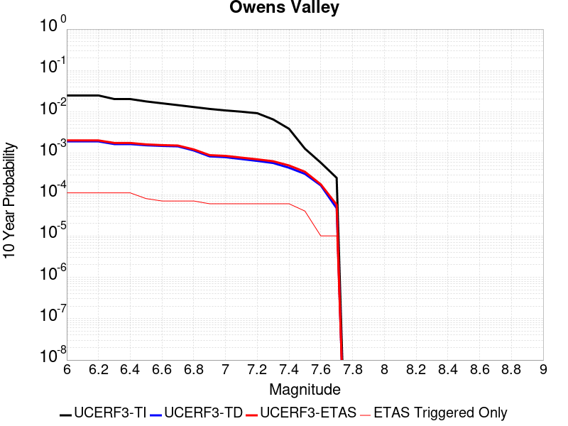 |

| Magnitude | 1 wk TI Prob | 1 wk TD Prob | 1 wk ETAS Prob | 1 wk ETAS/TD Gain | 1 wk ETAS Triggered Only | 1 mo TI Prob | 1 mo TD Prob | 1 mo ETAS Prob | 1 mo ETAS/TD Gain | 1 mo ETAS Triggered Only | 1 yr TI Prob | 1 yr TD Prob | 1 yr ETAS Prob | 1 yr ETAS/TD Gain | 1 yr ETAS Triggered Only | 10 yr TI Prob | 10 yr TD Prob | 10 yr ETAS Prob | 10 yr ETAS/TD Gain | 10 yr ETAS Triggered Only |
|-----|-----|-----|-----|-----|-----|-----|-----|-----|-----|-----|-----|-----|-----|-----|-----|-----|-----|-----|-----|-----|
| 6.0 | 4.83821E-5 | 3.626567E-6 | 3.3626457E-5 | 9.272256 | 3.0E-5 | 2.0733538E-4 | 1.5542342E-5 | 7.554141E-5 | 4.860362 | 6.0E-5 | 0.002521386 | 1.8921259E-4 | 2.6919745E-4 | 1.4227248 | 8.0E-5 | 0.024929691 | 0.001925011 | 0.0020347992 | 1.0570326 | 1.1E-4 |
| 6.1 | 4.83821E-5 | 3.626567E-6 | 3.3626457E-5 | 9.272256 | 3.0E-5 | 2.0733538E-4 | 1.5542342E-5 | 7.554141E-5 | 4.860362 | 6.0E-5 | 0.002521386 | 1.8921259E-4 | 2.6919745E-4 | 1.4227248 | 8.0E-5 | 0.024929691 | 0.001925011 | 0.0020347992 | 1.0570326 | 1.1E-4 |
| 6.2 | 4.83821E-5 | 3.626567E-6 | 3.3626457E-5 | 9.272256 | 3.0E-5 | 2.0733538E-4 | 1.5542342E-5 | 7.554141E-5 | 4.860362 | 6.0E-5 | 0.002521386 | 1.8921259E-4 | 2.6919745E-4 | 1.4227248 | 8.0E-5 | 0.024929691 | 0.001925011 | 0.0020347992 | 1.0570326 | 1.1E-4 |
| 6.3 | 3.953008E-5 | 3.1553948E-6 | 3.3155302E-5 | 10.507497 | 3.0E-5 | 1.6940363E-4 | 1.3523055E-5 | 7.352224E-5 | 5.436807 | 6.0E-5 | 0.002060538 | 1.6463149E-4 | 2.446183E-4 | 1.4858538 | 8.0E-5 | 0.020415364 | 0.0016592 | 0.0017690174 | 1.066187 | 1.1E-4 |
| 6.4 | 3.953008E-5 | 3.1553948E-6 | 3.3155302E-5 | 10.507497 | 3.0E-5 | 1.6940363E-4 | 1.3523055E-5 | 7.352224E-5 | 5.436807 | 6.0E-5 | 0.002060538 | 1.6463149E-4 | 2.446183E-4 | 1.4858538 | 8.0E-5 | 0.020415364 | 0.0016592 | 0.0017690174 | 1.066187 | 1.1E-4 |
| 6.5 | 3.457342E-5 | 2.9715961E-6 | 2.2971537E-5 | 7.7303696 | 2.0E-5 | 1.4816338E-4 | 1.2735354E-5 | 6.273472E-5 | 4.9260287 | 5.0E-5 | 0.0018023965 | 1.550426E-4 | 2.2503175E-4 | 1.4514188 | 7.0E-5 | 0.017878477 | 0.001555719 | 0.0016355945 | 1.0513432 | 8.0E-5 |
| 6.6 | 3.1127765E-5 | 2.8744932E-6 | 1.2874464E-5 | 4.478864 | 1.0E-5 | 1.3339789E-4 | 1.2319203E-5 | 5.231871E-5 | 4.2469234 | 4.0E-5 | 0.0016229092 | 1.4997667E-4 | 2.0996766E-4 | 1.4000022 | 6.0E-5 | 0.016111081 | 0.0015012559 | 0.0015711507 | 1.0465577 | 7.0E-5 |
| 6.7 | 2.806885E-5 | 2.8104134E-6 | 1.2810386E-5 | 4.5581856 | 1.0E-5 | 1.2028952E-4 | 1.20445775E-5 | 5.2044095E-5 | 4.3209567 | 4.0E-5 | 0.001463541 | 1.4663354E-4 | 2.0662474E-4 | 1.4091233 | 6.0E-5 | 0.014539397 | 0.0014657511 | 0.0015356485 | 1.047687 | 7.0E-5 |
| 6.8 | 2.524524E-5 | 2.2353688E-6 | 1.2235347E-5 | 5.473525 | 1.0E-5 | 1.0818939E-4 | 9.580118E-6 | 4.9579736E-5 | 5.175274 | 4.0E-5 | 0.0013164099 | 1.16632E-4 | 1.76625E-4 | 1.5143785 | 6.0E-5 | 0.01308639 | 0.0011659812 | 0.0012358995 | 1.0599653 | 7.0E-5 |
| 6.9 | 2.2704568E-5 | 1.6081682E-6 | 1.1608152E-5 | 7.218245 | 1.0E-5 | 9.730166E-5 | 6.8921313E-6 | 4.6891855E-5 | 6.80368 | 4.0E-5 | 0.0011840039 | 8.390849E-5 | 1.4390345E-4 | 1.7150047 | 6.0E-5 | 0.011777153 | 8.3897985E-4 | 8.989295E-4 | 1.0714555 | 6.0E-5 |
| 7.0 | 2.0871712E-5 | 1.5395453E-6 | 1.153953E-5 | 7.4954143 | 1.0E-5 | 8.944713E-5 | 6.598035E-6 | 4.6597772E-5 | 7.0623713 | 4.0E-5 | 0.0010884746 | 8.032813E-5 | 1.403233E-4 | 1.7468764 | 6.0E-5 | 0.010831586 | 8.0316263E-4 | 8.6311443E-4 | 1.0746447 | 6.0E-5 |
| 7.1 | 1.944928E-5 | 1.3864178E-6 | 1.13864035E-5 | 8.212823 | 1.0E-5 | 8.335139E-5 | 5.941777E-6 | 4.594154E-5 | 7.7319527 | 4.0E-5 | 0.0010143308 | 7.233874E-5 | 1.323344E-4 | 1.8293711 | 6.0E-5 | 0.010097133 | 7.2330976E-4 | 7.832664E-4 | 1.0828921 | 6.0E-5 |
| 7.2 | 1.7876306E-5 | 1.2489141E-6 | 1.12489015E-5 | 9.006946 | 1.0E-5 | 7.6610486E-5 | 5.352478E-6 | 4.5352263E-5 | 8.473134 | 4.0E-5 | 9.3233347E-4 | 6.516448E-5 | 1.2516057E-4 | 1.920687 | 6.0E-5 | 0.009284316 | 6.5159105E-4 | 7.115519E-4 | 1.0920223 | 6.0E-5 |
| 7.3 | 1.2618672E-5 | 1.1115209E-6 | 1.111151E-5 | 9.996672 | 1.0E-5 | 5.40789E-5 | 4.763652E-6 | 4.4763463E-5 | 9.396878 | 4.0E-5 | 6.582117E-4 | 5.799593E-5 | 1.1799245E-4 | 2.0344954 | 6.0E-5 | 0.0065626553 | 5.7994033E-4 | 6.399055E-4 | 1.1033989 | 6.0E-5 |
| 7.4 | 7.4874442E-6 | 8.5486437E-7 | 1.0854856E-5 | 12.697752 | 1.0E-5 | 3.208865E-5 | 3.6636993E-6 | 4.3663553E-5 | 11.917887 | 4.0E-5 | 3.906093E-4 | 4.4604632E-5 | 1.0460195E-4 | 2.3450918 | 6.0E-5 | 0.003899234 | 4.4604883E-4 | 5.060221E-4 | 1.1344544 | 6.0E-5 |
| 7.5 | 2.4734156E-6 | 6.068616E-7 | 1.06068555E-5 | 17.478212 | 1.0E-5 | 1.060031E-5 | 2.6008327E-6 | 2.2600781E-5 | 8.689825 | 2.0E-5 | 1.2905113E-4 | 3.166468E-5 | 7.166342E-5 | 2.2631972 | 4.0E-5 | 0.0012897621 | 3.1660203E-4 | 3.5658936E-4 | 1.1263015 | 4.0E-5 |
| 7.6 | 1.1328841E-6 | 3.196531E-7 | 3.196531E-7 | 1.0 | 0.0 | 4.8552088E-6 | 1.3699412E-6 | 1.3699412E-6 | 1.0 | 0.0 | 5.9110564E-5 | 1.6678909E-5 | 2.6678741E-5 | 1.5995497 | 1.0E-5 | 5.9094845E-4 | 1.6677675E-4 | 1.7677508E-4 | 1.0599504 | 1.0E-5 |
| 7.7 | 4.8613185E-7 | 8.964689E-8 | 8.964689E-8 | 1.0 | 0.0 | 2.0834207E-6 | 3.8420092E-7 | 3.8420092E-7 | 1.0 | 0.0 | 2.536535E-5 | 4.6776368E-6 | 1.467759E-5 | 3.1378217 | 1.0E-5 | 2.5362454E-4 | 4.677545E-5 | 5.677498E-5 | 1.2137773 | 1.0E-5 |

## Coronado Bank alt1
*[(top)](#table-of-contents)*

| 1 Week | 1 Month | 1 Year | 10 Year |
|-----|-----|-----|-----|
|  | 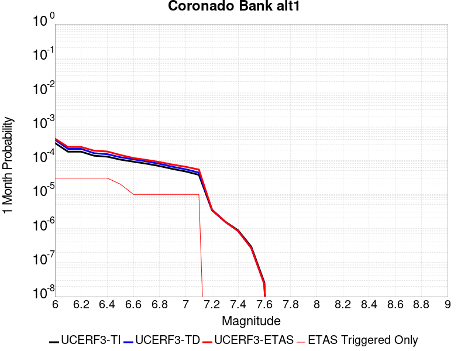 | 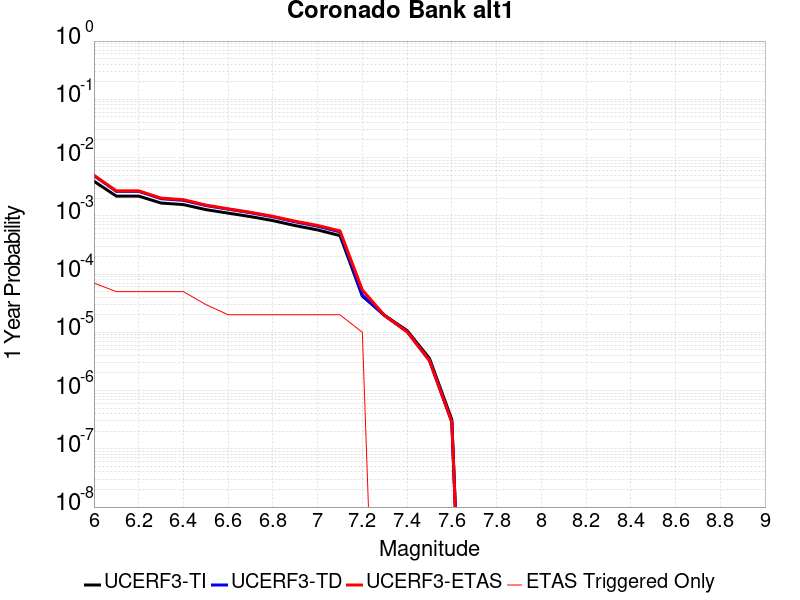 |  |

| Magnitude | 1 wk TI Prob | 1 wk TD Prob | 1 wk ETAS Prob | 1 wk ETAS/TD Gain | 1 wk ETAS Triggered Only | 1 mo TI Prob | 1 mo TD Prob | 1 mo ETAS Prob | 1 mo ETAS/TD Gain | 1 mo ETAS Triggered Only | 1 yr TI Prob | 1 yr TD Prob | 1 yr ETAS Prob | 1 yr ETAS/TD Gain | 1 yr ETAS Triggered Only | 10 yr TI Prob | 10 yr TD Prob | 10 yr ETAS Prob | 10 yr ETAS/TD Gain | 10 yr ETAS Triggered Only |
|-----|-----|-----|-----|-----|-----|-----|-----|-----|-----|-----|-----|-----|-----|-----|-----|-----|-----|-----|-----|-----|
| 6.0 | 7.533492E-5 | 9.394913E-5 | 1.1394725E-4 | 1.2128612 | 2.0E-5 | 3.22824E-4 | 4.0258127E-4 | 4.3256918E-4 | 1.0744891 | 3.0E-5 | 0.0039233007 | 0.0048909658 | 0.004960623 | 1.014242 | 7.0E-5 | 0.03854755 | 0.04790356 | 0.04799877 | 1.0019876 | 1.0E-4 |
| 6.1 | 4.1807285E-5 | 5.049283E-5 | 7.049182E-5 | 1.3960758 | 2.0E-5 | 1.7916178E-4 | 2.1638049E-4 | 2.46374E-4 | 1.1386147 | 3.0E-5 | 0.0021791123 | 0.0026313474 | 0.0026812158 | 1.0189517 | 5.0E-5 | 0.021578677 | 0.026011046 | 0.026069487 | 1.0022467 | 6.0E-5 |
| 6.2 | 4.1807285E-5 | 5.049283E-5 | 7.049182E-5 | 1.3960758 | 2.0E-5 | 1.7916178E-4 | 2.1638049E-4 | 2.46374E-4 | 1.1386147 | 3.0E-5 | 0.0021791123 | 0.0026313474 | 0.0026812158 | 1.0189517 | 5.0E-5 | 0.021578677 | 0.026011046 | 0.026069487 | 1.0022467 | 6.0E-5 |
| 6.3 | 3.1793104E-5 | 3.7711117E-5 | 5.771036E-5 | 1.5303276 | 2.0E-5 | 1.3624904E-4 | 1.6160926E-4 | 1.9160441E-4 | 1.1856029 | 3.0E-5 | 0.0016575698 | 0.001965848 | 0.0020157497 | 1.0253843 | 5.0E-5 | 0.016452603 | 0.019488465 | 0.019547295 | 1.0030187 | 6.0E-5 |
| 6.4 | 2.9878007E-5 | 3.5335794E-5 | 5.5335087E-5 | 1.5659783 | 2.0E-5 | 1.2804232E-4 | 1.5143053E-4 | 1.8142599E-4 | 1.1980807 | 3.0E-5 | 0.0015578003 | 0.0018421387 | 0.0018920465 | 1.0270923 | 5.0E-5 | 0.015469253 | 0.01827244 | 0.018331345 | 1.0032237 | 6.0E-5 |
| 6.5 | 2.4512565E-5 | 2.8764043E-5 | 3.8763756E-5 | 1.3476462 | 1.0E-5 | 1.0504962E-4 | 1.2326881E-4 | 1.4326634E-4 | 1.162227 | 2.0E-5 | 0.0012782287 | 0.0014997921 | 0.0015297472 | 1.0199728 | 3.0E-5 | 0.012709012 | 0.014899683 | 0.014939087 | 1.0026447 | 4.0E-5 |
| 6.6 | 2.1317413E-5 | 2.490667E-5 | 3.490642E-5 | 1.4014889 | 1.0E-5 | 9.135714E-5 | 1.0673863E-4 | 1.1673757E-4 | 1.0936768 | 1.0E-5 | 0.0011117056 | 0.0012987906 | 0.0013187645 | 1.015379 | 2.0E-5 | 0.011061605 | 0.012914404 | 0.012944018 | 1.002293 | 3.0E-5 |
| 6.7 | 1.8585655E-5 | 2.163488E-5 | 3.1634663E-5 | 1.4622066 | 1.0E-5 | 7.9650374E-5 | 9.271773E-5 | 1.02716804E-4 | 1.1078442 | 1.0E-5 | 9.6931186E-4 | 0.0011282742 | 0.0011482517 | 1.0177062 | 2.0E-5 | 0.0096509475 | 0.011227623 | 0.011257285 | 1.002642 | 3.0E-5 |
| 6.8 | 1.5862879E-5 | 1.8419474E-5 | 2.841929E-5 | 1.5428936 | 1.0E-5 | 6.798199E-5 | 7.893833E-5 | 8.893754E-5 | 1.1266712 | 1.0E-5 | 8.273665E-4 | 9.6066965E-4 | 9.806504E-4 | 1.0207988 | 2.0E-5 | 0.008242928 | 0.00956715 | 0.009596863 | 1.0031058 | 3.0E-5 |
| 6.9 | 1.3021509E-5 | 1.5095265E-5 | 2.5095114E-5 | 1.6624494 | 1.0E-5 | 5.5805274E-5 | 6.469249E-5 | 7.4691845E-5 | 1.1545675 | 1.0E-5 | 6.792174E-4 | 7.8736455E-4 | 8.0734876E-4 | 1.0253812 | 2.0E-5 | 0.006771452 | 0.007847573 | 0.007867415 | 1.0025285 | 2.0E-5 |
| 7.0 | 1.0974371E-5 | 1.2720104E-5 | 2.2719976E-5 | 1.7861471 | 1.0E-5 | 4.7032172E-5 | 5.451369E-5 | 6.4513144E-5 | 1.1834302 | 1.0E-5 | 5.7246623E-4 | 6.6351966E-4 | 6.8350637E-4 | 1.0301223 | 2.0E-5 | 0.0057099373 | 0.006617135 | 0.0066370023 | 1.0030024 | 2.0E-5 |
| 7.1 | 8.766221E-6 | 1.01638325E-5 | 2.016373E-5 | 1.9838709 | 1.0E-5 | 3.7568978E-5 | 4.355865E-5 | 5.3558215E-5 | 1.2295655 | 1.0E-5 | 4.573063E-4 | 5.3021475E-4 | 5.5020413E-4 | 1.0377005 | 2.0E-5 | 0.0045636636 | 0.0052911965 | 0.005311091 | 1.0037599 | 2.0E-5 |
| 7.2 | 8.026024E-7 | 8.331765E-7 | 8.331765E-7 | 1.0 | 0.0 | 3.43972E-6 | 3.5707515E-6 | 3.5707515E-6 | 1.0 | 0.0 | 4.1877785E-5 | 4.3473043E-5 | 5.347261E-5 | 1.2300177 | 1.0E-5 | 4.1869894E-4 | 4.3464647E-4 | 4.4464212E-4 | 1.0229973 | 1.0E-5 |
| 7.3 | 3.7293114E-7 | 3.7000953E-7 | 3.7000953E-7 | 1.0 | 0.0 | 1.5982754E-6 | 1.5857541E-6 | 1.5857541E-6 | 1.0 | 0.0 | 1.9458828E-5 | 1.9306386E-5 | 1.9306386E-5 | 1.0 | 0.0 | 1.9457124E-4 | 1.9304715E-4 | 1.9304715E-4 | 1.0 | 0.0 |
| 7.4 | 2.0557036E-7 | 1.9674363E-7 | 1.9674363E-7 | 1.0 | 0.0 | 8.810155E-7 | 8.431867E-7 | 8.431867E-7 | 1.0 | 0.0 | 1.0726311E-5 | 1.026575E-5 | 1.026575E-5 | 1.0 | 0.0 | 1.0725793E-4 | 1.0265279E-4 | 1.0265279E-4 | 1.0 | 0.0 |
| 7.5 | 6.845446E-8 | 6.279369E-8 | 6.279369E-8 | 1.0 | 0.0 | 2.9337625E-7 | 2.691158E-7 | 2.691158E-7 | 1.0 | 0.0 | 3.5718497E-6 | 3.2764797E-6 | 3.2764797E-6 | 1.0 | 0.0 | 3.5717923E-5 | 3.2764325E-5 | 3.2764325E-5 | 1.0 | 0.0 |
| 7.6 | 6.0975145E-9 | 5.53185E-9 | 5.53185E-9 | 1.0 | 0.0 | 2.6132206E-8 | 2.370793E-8 | 2.370793E-8 | 1.0 | 0.0 | 3.1815955E-7 | 2.88644E-7 | 2.88644E-7 | 1.0 | 0.0 | 3.181591E-6 | 2.8864374E-6 | 2.8864374E-6 | 1.0 | 0.0 |

## San Jacinto (Coyote Creek)
*[(top)](#table-of-contents)*

| 1 Week | 1 Month | 1 Year | 10 Year |
|-----|-----|-----|-----|
| 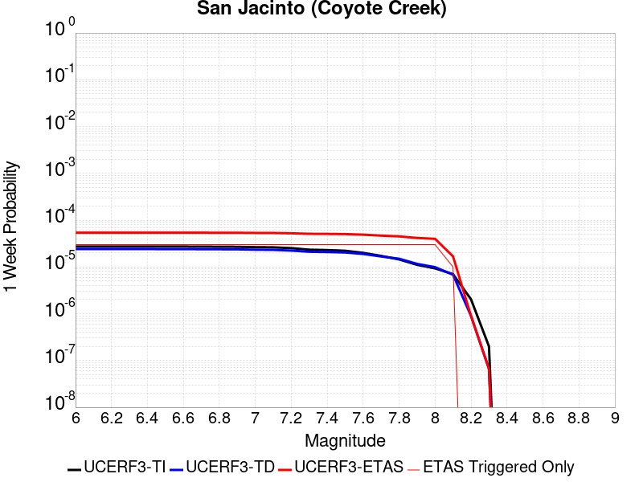 |  |  |  |

| Magnitude | 1 wk TI Prob | 1 wk TD Prob | 1 wk ETAS Prob | 1 wk ETAS/TD Gain | 1 wk ETAS Triggered Only | 1 mo TI Prob | 1 mo TD Prob | 1 mo ETAS Prob | 1 mo ETAS/TD Gain | 1 mo ETAS Triggered Only | 1 yr TI Prob | 1 yr TD Prob | 1 yr ETAS Prob | 1 yr ETAS/TD Gain | 1 yr ETAS Triggered Only | 10 yr TI Prob | 10 yr TD Prob | 10 yr ETAS Prob | 10 yr ETAS/TD Gain | 10 yr ETAS Triggered Only |
|-----|-----|-----|-----|-----|-----|-----|-----|-----|-----|-----|-----|-----|-----|-----|-----|-----|-----|-----|-----|-----|
| 6.0 | 2.7374346E-5 | 2.4145214E-5 | 5.414449E-5 | 2.2424521 | 3.0E-5 | 1.1731335E-4 | 1.034754E-4 | 1.5347023E-4 | 1.4831567 | 5.0E-5 | 0.0014273542 | 0.0012590875 | 0.0013289993 | 1.0555258 | 7.0E-5 | 0.01418221 | 0.012928318 | 0.013036896 | 1.0083984 | 1.1E-4 |
| 6.1 | 2.7374346E-5 | 2.4145214E-5 | 5.414449E-5 | 2.2424521 | 3.0E-5 | 1.1731335E-4 | 1.034754E-4 | 1.5347023E-4 | 1.4831567 | 5.0E-5 | 0.0014273542 | 0.0012590875 | 0.0013289993 | 1.0555258 | 7.0E-5 | 0.01418221 | 0.012928318 | 0.013036896 | 1.0083984 | 1.1E-4 |
| 6.2 | 2.7374346E-5 | 2.4145214E-5 | 5.414449E-5 | 2.2424521 | 3.0E-5 | 1.1731335E-4 | 1.034754E-4 | 1.5347023E-4 | 1.4831567 | 5.0E-5 | 0.0014273542 | 0.0012590875 | 0.0013289993 | 1.0555258 | 7.0E-5 | 0.01418221 | 0.012928318 | 0.013036896 | 1.0083984 | 1.1E-4 |
| 6.3 | 2.7374346E-5 | 2.4145214E-5 | 5.414449E-5 | 2.2424521 | 3.0E-5 | 1.1731335E-4 | 1.034754E-4 | 1.5347023E-4 | 1.4831567 | 5.0E-5 | 0.0014273542 | 0.0012590875 | 0.0013289993 | 1.0555258 | 7.0E-5 | 0.01418221 | 0.012928318 | 0.013036896 | 1.0083984 | 1.1E-4 |
| 6.4 | 2.7374346E-5 | 2.4145214E-5 | 5.414449E-5 | 2.2424521 | 3.0E-5 | 1.1731335E-4 | 1.034754E-4 | 1.5347023E-4 | 1.4831567 | 5.0E-5 | 0.0014273542 | 0.0012590875 | 0.0013289993 | 1.0555258 | 7.0E-5 | 0.01418221 | 0.012928318 | 0.013036896 | 1.0083984 | 1.1E-4 |
| 6.5 | 2.7282445E-5 | 2.4031293E-5 | 5.403057E-5 | 2.2483423 | 3.0E-5 | 1.16919524E-4 | 1.029872E-4 | 1.5298206E-4 | 1.4854472 | 5.0E-5 | 0.0014225657 | 0.0012531505 | 0.0013230628 | 1.0557892 | 7.0E-5 | 0.014134934 | 0.012869646 | 0.01297823 | 1.0084373 | 1.1E-4 |
| 6.6 | 2.7282445E-5 | 2.4031293E-5 | 5.403057E-5 | 2.2483423 | 3.0E-5 | 1.16919524E-4 | 1.029872E-4 | 1.5298206E-4 | 1.4854472 | 5.0E-5 | 0.0014225657 | 0.0012531505 | 0.0013230628 | 1.0557892 | 7.0E-5 | 0.014134934 | 0.012869646 | 0.01297823 | 1.0084373 | 1.1E-4 |
| 6.7 | 2.7216198E-5 | 2.3956412E-5 | 5.3955693E-5 | 2.2522442 | 3.0E-5 | 1.1663563E-4 | 1.02666316E-4 | 1.5266119E-4 | 1.4869647 | 5.0E-5 | 0.0014191137 | 0.0012492483 | 0.0013191609 | 1.0559638 | 7.0E-5 | 0.014100855 | 0.0128310565 | 0.012939645 | 1.0084629 | 1.1E-4 |
| 6.8 | 2.7078617E-5 | 2.387363E-5 | 5.3872915E-5 | 2.2565866 | 3.0E-5 | 1.1604605E-4 | 1.0231156E-4 | 1.5230644E-4 | 1.4886533 | 5.0E-5 | 0.001411945 | 0.0012449342 | 0.0013148469 | 1.0561578 | 7.0E-5 | 0.014030075 | 0.012788199 | 0.012896792 | 1.0084916 | 1.1E-4 |
| 6.9 | 2.6982952E-5 | 2.3793142E-5 | 5.3792428E-5 | 2.2608376 | 3.0E-5 | 1.15636096E-4 | 1.0196664E-4 | 1.5196153E-4 | 1.4903065 | 5.0E-5 | 0.0014069602 | 0.0012407395 | 0.0013106526 | 1.056348 | 7.0E-5 | 0.013980856 | 0.012746515 | 0.012855113 | 1.0085198 | 1.1E-4 |
| 7.0 | 2.6449972E-5 | 2.3370165E-5 | 5.3369462E-5 | 2.283658 | 3.0E-5 | 1.1335209E-4 | 1.00154015E-4 | 1.50149E-4 | 1.4991812 | 5.0E-5 | 0.001379188 | 0.0012186957 | 0.0012886103 | 1.0573685 | 7.0E-5 | 0.0137065975 | 0.0125278765 | 0.012636499 | 1.0086704 | 1.1E-4 |
| 7.1 | 2.6257849E-5 | 2.3196202E-5 | 5.3195505E-5 | 2.2932851 | 3.0E-5 | 1.1252879E-4 | 9.940852E-5 | 1.4940355E-4 | 1.502925 | 5.0E-5 | 0.0013691769 | 0.0012096294 | 0.0012795447 | 1.057799 | 7.0E-5 | 0.013607717 | 0.012437741 | 0.0125463735 | 1.0087341 | 1.1E-4 |
| 7.2 | 2.5270041E-5 | 2.2390966E-5 | 5.2390296E-5 | 2.339796 | 3.0E-5 | 1.0829568E-4 | 9.595777E-5 | 1.4595297E-4 | 1.5210125 | 5.0E-5 | 0.0013177024 | 0.0011676621 | 0.0012375803 | 1.0598788 | 7.0E-5 | 0.013099162 | 0.012018777 | 0.012127455 | 1.0090424 | 1.1E-4 |
| 7.3 | 2.339701E-5 | 2.1122814E-5 | 5.112218E-5 | 2.4202354 | 3.0E-5 | 1.0026905E-4 | 9.0523215E-5 | 1.4051869E-4 | 1.5522945 | 5.0E-5 | 0.001220092 | 0.0011015651 | 0.001171488 | 1.063476 | 7.0E-5 | 0.012134149 | 0.011357696 | 0.011466446 | 1.009575 | 1.1E-4 |
| 7.4 | 2.296333E-5 | 2.0853171E-5 | 5.0852545E-5 | 2.4386 | 3.0E-5 | 9.841056E-5 | 8.936768E-5 | 1.3936321E-4 | 1.5594364 | 5.0E-5 | 0.0011974899 | 0.0010875105 | 0.0011574343 | 1.0642972 | 7.0E-5 | 0.011910575 | 0.01121681 | 0.011325575 | 1.0096967 | 1.1E-4 |
| 7.5 | 2.2188895E-5 | 2.0376096E-5 | 5.0375485E-5 | 2.4722836 | 3.0E-5 | 9.50918E-5 | 8.732321E-5 | 1.3731884E-4 | 1.5725354 | 5.0E-5 | 0.0011571277 | 0.0010626436 | 0.0011325692 | 1.0658034 | 7.0E-5 | 0.011511209 | 0.010966429 | 0.011075222 | 1.0099206 | 1.1E-4 |
| 7.6 | 2.0013189E-5 | 1.8962366E-5 | 4.8961796E-5 | 2.582051 | 3.0E-5 | 8.5767984E-5 | 8.1264756E-5 | 1.3126069E-4 | 1.6152228 | 5.0E-5 | 0.001043725 | 9.889511E-4 | 0.0010588819 | 1.0707121 | 7.0E-5 | 0.010388365 | 0.010224434 | 0.010333309 | 1.0106485 | 1.1E-4 |
| 7.7 | 1.7230794E-5 | 1.674371E-5 | 4.6743207E-5 | 2.7916877 | 3.0E-5 | 7.384417E-5 | 7.175679E-5 | 1.217532E-4 | 1.6967481 | 5.0E-5 | 8.986819E-4 | 8.7328954E-4 | 9.432284E-4 | 1.0800867 | 7.0E-5 | 0.008950562 | 0.009062956 | 0.009171959 | 1.0120273 | 1.1E-4 |
| 7.8 | 1.4478809E-5 | 1.4990978E-5 | 4.4990527E-5 | 3.0011737 | 3.0E-5 | 6.205057E-5 | 6.424547E-5 | 1.14242255E-4 | 1.7782149 | 5.0E-5 | 7.552038E-4 | 7.819085E-4 | 8.518538E-4 | 1.0894545 | 7.0E-5 | 0.0075264242 | 0.008141387 | 0.008250492 | 1.0134013 | 1.1E-4 |
| 7.9 | 1.1114467E-5 | 1.1645102E-5 | 4.164475E-5 | 3.5761604 | 3.0E-5 | 4.7632562E-5 | 4.990663E-5 | 9.990414E-5 | 2.0018208 | 5.0E-5 | 5.797721E-4 | 6.074444E-4 | 6.7740184E-4 | 1.1151669 | 7.0E-5 | 0.0057826187 | 0.0063803247 | 0.006489623 | 1.0171305 | 1.1E-4 |
| 8.0 | 9.327402E-6 | 9.899186E-6 | 3.989889E-5 | 4.0305223 | 3.0E-5 | 3.9973966E-5 | 4.2424395E-5 | 9.242228E-5 | 2.178517 | 5.0E-5 | 4.8657437E-4 | 5.1639514E-4 | 5.7636417E-4 | 1.1161301 | 6.0E-5 | 0.0048551033 | 0.0054499684 | 0.0055494234 | 1.0182487 | 1.0E-4 |
| 8.1 | 7.0235833E-6 | 6.827495E-6 | 1.6827427E-5 | 2.464656 | 1.0E-5 | 3.0100724E-5 | 2.9260367E-5 | 5.9259488E-5 | 2.0252476 | 3.0E-5 | 3.664147E-4 | 3.5618723E-4 | 3.9617298E-4 | 1.1122605 | 4.0E-5 | 0.003658111 | 0.0037876023 | 0.0038573372 | 1.0184114 | 7.0E-5 |
| 8.2 | 2.0358202E-6 | 8.994527E-7 | 8.994527E-7 | 1.0 | 0.0 | 8.724915E-6 | 3.854792E-6 | 3.854792E-6 | 1.0 | 0.0 | 1.06220665E-4 | 4.69311E-5 | 5.6930632E-5 | 1.2130684 | 1.0E-5 | 0.001061699 | 5.3254166E-4 | 5.425363E-4 | 1.0187678 | 1.0E-5 |
| 8.3 | 2.0051264E-7 | 6.617272E-8 | 6.617272E-8 | 1.0 | 0.0 | 8.5933965E-7 | 2.8359733E-7 | 2.8359733E-7 | 1.0 | 0.0 | 1.046241E-5 | 3.4527925E-6 | 1.3452758E-5 | 3.8961964 | 1.0E-5 | 1.0461917E-4 | 4.01389E-5 | 5.0138497E-5 | 1.2491249 | 1.0E-5 |

## Ventura-Pitas Point
*[(top)](#table-of-contents)*

| 1 Week | 1 Month | 1 Year | 10 Year |
|-----|-----|-----|-----|
| 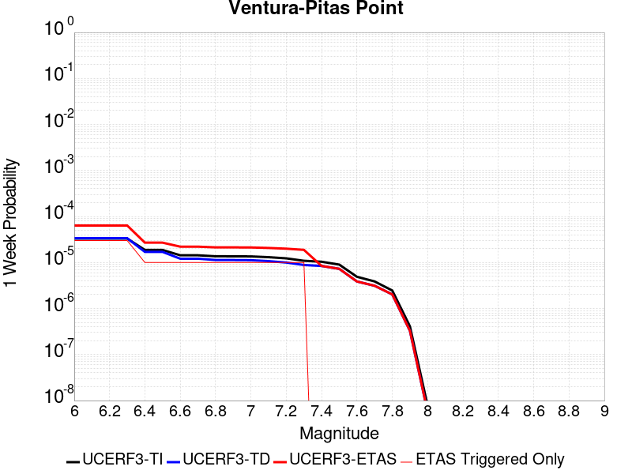 |  | 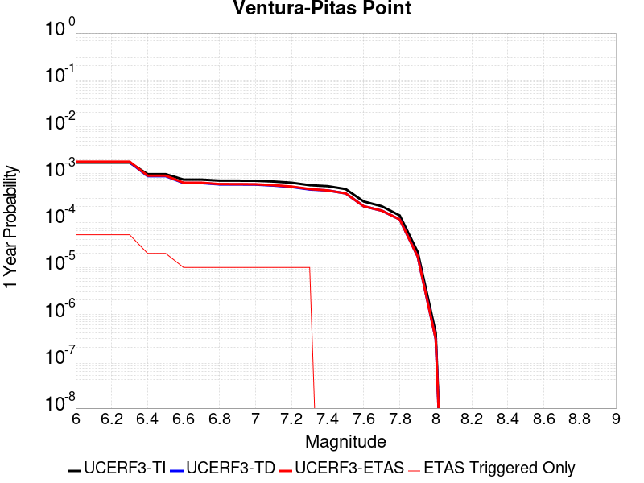 | 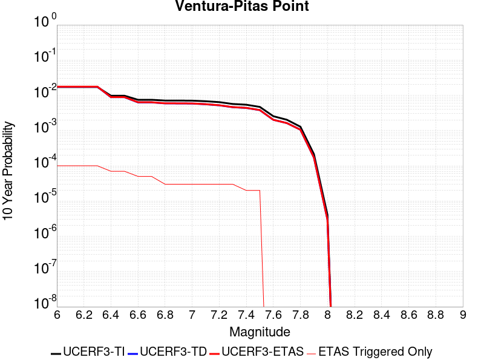 |

| Magnitude | 1 wk TI Prob | 1 wk TD Prob | 1 wk ETAS Prob | 1 wk ETAS/TD Gain | 1 wk ETAS Triggered Only | 1 mo TI Prob | 1 mo TD Prob | 1 mo ETAS Prob | 1 mo ETAS/TD Gain | 1 mo ETAS Triggered Only | 1 yr TI Prob | 1 yr TD Prob | 1 yr ETAS Prob | 1 yr ETAS/TD Gain | 1 yr ETAS Triggered Only | 10 yr TI Prob | 10 yr TD Prob | 10 yr ETAS Prob | 10 yr ETAS/TD Gain | 10 yr ETAS Triggered Only |
|-----|-----|-----|-----|-----|-----|-----|-----|-----|-----|-----|-----|-----|-----|-----|-----|-----|-----|-----|-----|-----|
| 6.0 | 3.3179622E-5 | 3.3735185E-5 | 6.373417E-5 | 1.8892493 | 3.0E-5 | 1.4219063E-4 | 1.445728E-4 | 1.7456846E-4 | 1.2074779 | 3.0E-5 | 0.0017297962 | 0.0017590096 | 0.0018089217 | 1.028375 | 5.0E-5 | 0.017163932 | 0.0174764 | 0.017574653 | 1.005622 | 1.0E-4 |
| 6.1 | 3.3179622E-5 | 3.3735185E-5 | 6.373417E-5 | 1.8892493 | 3.0E-5 | 1.4219063E-4 | 1.445728E-4 | 1.7456846E-4 | 1.2074779 | 3.0E-5 | 0.0017297962 | 0.0017590096 | 0.0018089217 | 1.028375 | 5.0E-5 | 0.017163932 | 0.0174764 | 0.017574653 | 1.005622 | 1.0E-4 |
| 6.2 | 3.3179622E-5 | 3.3735185E-5 | 6.373417E-5 | 1.8892493 | 3.0E-5 | 1.4219063E-4 | 1.445728E-4 | 1.7456846E-4 | 1.2074779 | 3.0E-5 | 0.0017297962 | 0.0017590096 | 0.0018089217 | 1.028375 | 5.0E-5 | 0.017163932 | 0.0174764 | 0.017574653 | 1.005622 | 1.0E-4 |
| 6.3 | 3.3179622E-5 | 3.3735185E-5 | 6.373417E-5 | 1.8892493 | 3.0E-5 | 1.4219063E-4 | 1.445728E-4 | 1.7456846E-4 | 1.2074779 | 3.0E-5 | 0.0017297962 | 0.0017590096 | 0.0018089217 | 1.028375 | 5.0E-5 | 0.017163932 | 0.0174764 | 0.017574653 | 1.005622 | 1.0E-4 |
| 6.4 | 1.8754668E-5 | 1.701961E-5 | 2.701944E-5 | 1.5875475 | 1.0E-5 | 8.037467E-5 | 7.293928E-5 | 8.293855E-5 | 1.1370903 | 1.0E-5 | 9.781223E-4 | 8.8769704E-4 | 9.0767926E-4 | 1.0225102 | 2.0E-5 | 0.009738282 | 0.008843848 | 0.008913229 | 1.0078452 | 7.0E-5 |
| 6.5 | 1.8754668E-5 | 1.701961E-5 | 2.701944E-5 | 1.5875475 | 1.0E-5 | 8.037467E-5 | 7.293928E-5 | 8.293855E-5 | 1.1370903 | 1.0E-5 | 9.781223E-4 | 8.8769704E-4 | 9.0767926E-4 | 1.0225102 | 2.0E-5 | 0.009738282 | 0.008843848 | 0.008913229 | 1.0078452 | 7.0E-5 |
| 6.6 | 1.4361558E-5 | 1.2122275E-5 | 2.2122154E-5 | 1.8249177 | 1.0E-5 | 6.154808E-5 | 5.1951585E-5 | 6.195107E-5 | 1.1924769 | 1.0E-5 | 7.490902E-4 | 6.3232926E-4 | 6.4232294E-4 | 1.0158045 | 1.0E-5 | 0.0074657016 | 0.0063055577 | 0.0063552423 | 1.0078795 | 5.0E-5 |
| 6.7 | 1.4361558E-5 | 1.2122275E-5 | 2.2122154E-5 | 1.8249177 | 1.0E-5 | 6.154808E-5 | 5.1951585E-5 | 6.195107E-5 | 1.1924769 | 1.0E-5 | 7.490902E-4 | 6.3232926E-4 | 6.4232294E-4 | 1.0158045 | 1.0E-5 | 0.0074657016 | 0.0063055577 | 0.0063552423 | 1.0078795 | 5.0E-5 |
| 6.8 | 1.3663846E-5 | 1.13444175E-5 | 2.1344304E-5 | 1.8814808 | 1.0E-5 | 5.8558027E-5 | 4.861804E-5 | 5.8617552E-5 | 1.205675 | 1.0E-5 | 7.127108E-4 | 5.917658E-4 | 6.017599E-4 | 1.0168886 | 1.0E-5 | 0.007104293 | 0.005902116 | 0.005931939 | 1.0050529 | 3.0E-5 |
| 6.9 | 1.3644157E-5 | 1.1322519E-5 | 2.1322405E-5 | 1.8831857 | 1.0E-5 | 5.8473648E-5 | 4.8524187E-5 | 5.8523703E-5 | 1.2060728 | 1.0E-5 | 7.116841E-4 | 5.9062376E-4 | 6.0061784E-4 | 1.0169213 | 1.0E-5 | 0.007094092 | 0.0058907564 | 0.0059205797 | 1.0050627 | 3.0E-5 |
| 7.0 | 1.3568845E-5 | 1.1242086E-5 | 2.1241973E-5 | 1.8895047 | 1.0E-5 | 5.8150898E-5 | 4.817949E-5 | 5.8179005E-5 | 1.2075472 | 1.0E-5 | 7.077572E-4 | 5.864293E-4 | 5.9642346E-4 | 1.0170424 | 1.0E-5 | 0.007055073 | 0.0058490336 | 0.005878858 | 1.005099 | 3.0E-5 |
| 7.1 | 1.306572E-5 | 1.072054E-5 | 2.0720432E-5 | 1.9327788 | 1.0E-5 | 5.599474E-5 | 4.5944373E-5 | 5.594391E-5 | 1.2176446 | 1.0E-5 | 6.815227E-4 | 5.5923103E-4 | 5.692254E-4 | 1.0178717 | 1.0E-5 | 0.0067943637 | 0.0055784425 | 0.005608275 | 1.0053478 | 3.0E-5 |
| 7.2 | 1.232604E-5 | 9.995143E-6 | 1.9995043E-5 | 2.000476 | 1.0E-5 | 5.2824813E-5 | 4.2835632E-5 | 5.2835207E-5 | 1.2334405 | 1.0E-5 | 6.429523E-4 | 5.214008E-4 | 5.313956E-4 | 1.0191691 | 1.0E-5 | 0.0064109527 | 0.005201967 | 0.0052318107 | 1.0057371 | 3.0E-5 |
| 7.3 | 1.0917261E-5 | 8.84384E-6 | 1.8843752E-5 | 2.1307204 | 1.0E-5 | 4.678742E-5 | 3.790163E-5 | 4.7901252E-5 | 1.2638309 | 1.0E-5 | 5.69488E-4 | 4.6135622E-4 | 4.713516E-4 | 1.0216652 | 1.0E-5 | 0.0056803077 | 0.00460415 | 0.004634012 | 1.0064858 | 3.0E-5 |
| 7.4 | 1.039959E-5 | 8.423562E-6 | 8.423562E-6 | 1.0 | 0.0 | 4.456891E-5 | 3.610049E-5 | 3.610049E-5 | 1.0 | 0.0 | 5.424914E-4 | 4.3943635E-4 | 4.3943635E-4 | 1.0 | 0.0 | 0.0054116896 | 0.004385836 | 0.004405748 | 1.0045401 | 2.0E-5 |
| 7.5 | 9.015877E-6 | 7.2975445E-6 | 7.2975445E-6 | 1.0 | 0.0 | 3.86389E-5 | 3.1274823E-5 | 3.1274823E-5 | 1.0 | 0.0 | 4.7032707E-4 | 3.8070587E-4 | 3.8070587E-4 | 1.0 | 0.0 | 0.004693329 | 0.0038006818 | 0.0038206058 | 1.0052422 | 2.0E-5 |
| 7.6 | 4.900162E-6 | 3.8741155E-6 | 3.8741155E-6 | 1.0 | 0.0 | 2.1000526E-5 | 1.6603248E-5 | 1.6603248E-5 | 1.0 | 0.0 | 2.556514E-4 | 2.0212591E-4 | 2.0212591E-4 | 1.0 | 0.0 | 0.0025535747 | 0.0020194345 | 0.0020194345 | 1.0 | 0.0 |
| 7.7 | 3.8850626E-6 | 3.1267302E-6 | 3.1267302E-6 | 1.0 | 0.0 | 1.6650163E-5 | 1.3400205E-5 | 1.3400205E-5 | 1.0 | 0.0 | 2.0269687E-4 | 1.6313537E-4 | 1.6313537E-4 | 1.0 | 0.0 | 0.002025121 | 0.0016301654 | 0.0016301654 | 1.0 | 0.0 |
| 7.8 | 2.4654719E-6 | 2.029875E-6 | 2.029875E-6 | 1.0 | 0.0 | 1.0566265E-5 | 8.699436E-6 | 8.699436E-6 | 1.0 | 0.0 | 1.2863669E-4 | 1.0591053E-4 | 1.0591053E-4 | 1.0 | 0.0 | 0.0012856225 | 0.0010586053 | 0.0010586053 | 1.0 | 0.0 |
| 7.9 | 4.095894E-7 | 3.2764765E-7 | 3.2764765E-7 | 1.0 | 0.0 | 1.7553821E-6 | 1.4042034E-6 | 1.4042034E-6 | 1.0 | 0.0 | 2.1371567E-5 | 1.7096047E-5 | 1.7096047E-5 | 1.0 | 0.0 | 2.1369511E-4 | 1.7094762E-4 | 1.7094762E-4 | 1.0 | 0.0 |
| 8.0 | 7.791402E-9 | 5.683497E-9 | 5.683497E-9 | 1.0 | 0.0 | 3.3391725E-8 | 2.4357844E-8 | 2.4357844E-8 | 1.0 | 0.0 | 4.0654416E-7 | 2.9655675E-7 | 2.9655675E-7 | 1.0 | 0.0 | 4.065434E-6 | 2.9655655E-6 | 2.9655655E-6 | 1.0 | 0.0 |

## San Jacinto (Lytle Creek connector)
*[(top)](#table-of-contents)*

| 1 Week | 1 Month | 1 Year | 10 Year |
|-----|-----|-----|-----|
|  | 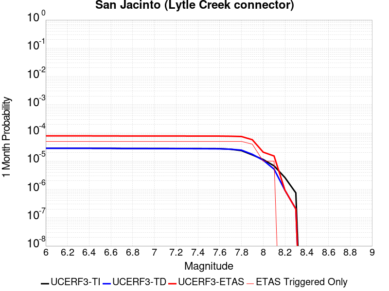 |  | 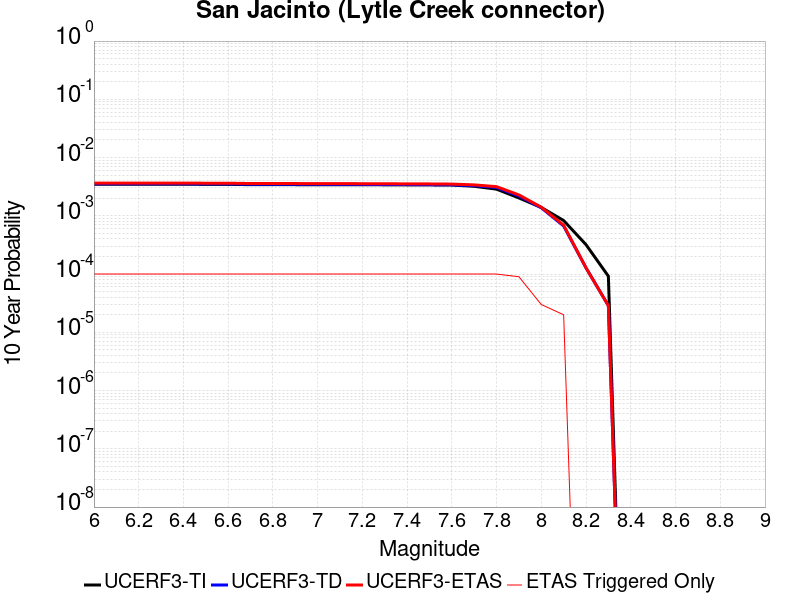 |

| Magnitude | 1 wk TI Prob | 1 wk TD Prob | 1 wk ETAS Prob | 1 wk ETAS/TD Gain | 1 wk ETAS Triggered Only | 1 mo TI Prob | 1 mo TD Prob | 1 mo ETAS Prob | 1 mo ETAS/TD Gain | 1 mo ETAS Triggered Only | 1 yr TI Prob | 1 yr TD Prob | 1 yr ETAS Prob | 1 yr ETAS/TD Gain | 1 yr ETAS Triggered Only | 10 yr TI Prob | 10 yr TD Prob | 10 yr ETAS Prob | 10 yr ETAS/TD Gain | 10 yr ETAS Triggered Only |
|-----|-----|-----|-----|-----|-----|-----|-----|-----|-----|-----|-----|-----|-----|-----|-----|-----|-----|-----|-----|-----|
| 6.0 | 6.693995E-6 | 6.660216E-6 | 3.6660018E-5 | 5.5043283 | 3.0E-5 | 2.8688235E-5 | 2.854347E-5 | 7.854204E-5 | 2.751664 | 5.0E-5 | 3.492233E-4 | 3.4746144E-4 | 4.074406E-4 | 1.172621 | 6.0E-5 | 0.00348675 | 0.0035493854 | 0.0036490303 | 1.0280739 | 1.0E-4 |
| 6.1 | 6.693995E-6 | 6.660216E-6 | 3.6660018E-5 | 5.5043283 | 3.0E-5 | 2.8688235E-5 | 2.854347E-5 | 7.854204E-5 | 2.751664 | 5.0E-5 | 3.492233E-4 | 3.4746144E-4 | 4.074406E-4 | 1.172621 | 6.0E-5 | 0.00348675 | 0.0035493854 | 0.0036490303 | 1.0280739 | 1.0E-4 |
| 6.2 | 6.693995E-6 | 6.660216E-6 | 3.6660018E-5 | 5.5043283 | 3.0E-5 | 2.8688235E-5 | 2.854347E-5 | 7.854204E-5 | 2.751664 | 5.0E-5 | 3.492233E-4 | 3.4746144E-4 | 4.074406E-4 | 1.172621 | 6.0E-5 | 0.00348675 | 0.0035493854 | 0.0036490303 | 1.0280739 | 1.0E-4 |
| 6.3 | 6.693995E-6 | 6.660216E-6 | 3.6660018E-5 | 5.5043283 | 3.0E-5 | 2.8688235E-5 | 2.854347E-5 | 7.854204E-5 | 2.751664 | 5.0E-5 | 3.492233E-4 | 3.4746144E-4 | 4.074406E-4 | 1.172621 | 6.0E-5 | 0.00348675 | 0.0035493854 | 0.0036490303 | 1.0280739 | 1.0E-4 |
| 6.4 | 6.693995E-6 | 6.660216E-6 | 3.6660018E-5 | 5.5043283 | 3.0E-5 | 2.8688235E-5 | 2.854347E-5 | 7.854204E-5 | 2.751664 | 5.0E-5 | 3.492233E-4 | 3.4746144E-4 | 4.074406E-4 | 1.172621 | 6.0E-5 | 0.00348675 | 0.0035493854 | 0.0036490303 | 1.0280739 | 1.0E-4 |
| 6.5 | 6.6561875E-6 | 6.6204343E-6 | 3.6620237E-5 | 5.531395 | 3.0E-5 | 2.8526205E-5 | 2.837298E-5 | 7.8371566E-5 | 2.7621899 | 5.0E-5 | 3.472512E-4 | 3.4538636E-4 | 4.0536566E-4 | 1.1736585 | 6.0E-5 | 0.0034670907 | 0.003528701 | 0.003628348 | 1.028239 | 1.0E-4 |
| 6.6 | 6.6561875E-6 | 6.6204343E-6 | 3.6620237E-5 | 5.531395 | 3.0E-5 | 2.8526205E-5 | 2.837298E-5 | 7.8371566E-5 | 2.7621899 | 5.0E-5 | 3.472512E-4 | 3.4538636E-4 | 4.0536566E-4 | 1.1736585 | 6.0E-5 | 0.0034670907 | 0.003528701 | 0.003628348 | 1.028239 | 1.0E-4 |
| 6.7 | 6.5802237E-6 | 6.539611E-6 | 3.6539415E-5 | 5.587399 | 3.0E-5 | 2.8200653E-5 | 2.8026603E-5 | 7.80252E-5 | 2.7839692 | 5.0E-5 | 3.4328885E-4 | 3.4117055E-4 | 4.011501E-4 | 1.1758051 | 6.0E-5 | 0.0034275902 | 0.0034866752 | 0.0035863265 | 1.0285807 | 1.0E-4 |
| 6.8 | 6.575632E-6 | 6.5341005E-6 | 3.6533904E-5 | 5.5912676 | 3.0E-5 | 2.8180975E-5 | 2.8002989E-5 | 7.800159E-5 | 2.7854738 | 5.0E-5 | 3.4304935E-4 | 3.4088313E-4 | 4.0086266E-4 | 1.1759534 | 6.0E-5 | 0.0034252026 | 0.00348381 | 0.0035834617 | 1.0286041 | 1.0E-4 |
| 6.9 | 6.570433E-6 | 6.525495E-6 | 3.65253E-5 | 5.5973225 | 3.0E-5 | 2.8158694E-5 | 2.7966107E-5 | 7.796471E-5 | 2.7878284 | 5.0E-5 | 3.4277816E-4 | 3.4043423E-4 | 4.004138E-4 | 1.1761855 | 6.0E-5 | 0.0034224992 | 0.0034793352 | 0.0035789872 | 1.0286411 | 1.0E-4 |
| 7.0 | 6.5643826E-6 | 6.515616E-6 | 3.651542E-5 | 5.604293 | 3.0E-5 | 2.8132765E-5 | 2.792377E-5 | 7.792237E-5 | 2.7905393 | 5.0E-5 | 3.424626E-4 | 3.3991894E-4 | 3.9989853E-4 | 1.1764526 | 6.0E-5 | 0.0034193532 | 0.0034741985 | 0.003573851 | 1.0286837 | 1.0E-4 |
| 7.1 | 6.557402E-6 | 6.5043278E-6 | 3.6504134E-5 | 5.6122837 | 3.0E-5 | 2.8102848E-5 | 2.7875392E-5 | 7.7874E-5 | 2.7936466 | 5.0E-5 | 3.4209844E-4 | 3.3933012E-4 | 3.9930976E-4 | 1.176759 | 6.0E-5 | 0.0034157229 | 0.0034683298 | 0.003567983 | 1.0287323 | 1.0E-4 |
| 7.2 | 6.546394E-6 | 6.4862943E-6 | 3.64861E-5 | 5.625107 | 3.0E-5 | 2.8055672E-5 | 2.7798109E-5 | 7.779672E-5 | 2.7986336 | 5.0E-5 | 3.4152428E-4 | 3.3838948E-4 | 3.983692E-4 | 1.1772505 | 6.0E-5 | 0.0034099987 | 0.0034589572 | 0.0035586113 | 1.0288105 | 1.0E-4 |
| 7.3 | 6.5364216E-6 | 6.4670803E-6 | 3.6466885E-5 | 5.6388483 | 3.0E-5 | 2.8012933E-5 | 2.7715765E-5 | 7.771438E-5 | 2.8039775 | 5.0E-5 | 3.4100408E-4 | 3.3738726E-4 | 3.9736702E-4 | 1.1777772 | 6.0E-5 | 0.003404813 | 0.0034489788 | 0.0035486338 | 1.0288941 | 1.0E-4 |
| 7.4 | 6.5269523E-6 | 6.4481674E-6 | 3.6447975E-5 | 5.6524544 | 3.0E-5 | 2.7972354E-5 | 2.7634711E-5 | 7.763333E-5 | 2.8092687 | 5.0E-5 | 3.4051016E-4 | 3.3640073E-4 | 3.9638055E-4 | 1.1782987 | 6.0E-5 | 0.0033998888 | 0.003439161 | 0.003538817 | 1.0289769 | 1.0E-4 |
| 7.5 | 6.5111835E-6 | 6.424442E-6 | 3.6424248E-5 | 5.6696362 | 3.0E-5 | 2.7904773E-5 | 2.7533031E-5 | 7.753166E-5 | 2.8159504 | 5.0E-5 | 3.3968766E-4 | 3.3516317E-4 | 3.9514306E-4 | 1.1789572 | 6.0E-5 | 0.0033916887 | 0.003426834 | 0.0035264913 | 1.0290815 | 1.0E-4 |
| 7.6 | 6.4768806E-6 | 6.383551E-6 | 3.638336E-5 | 5.6995487 | 3.0E-5 | 2.7757764E-5 | 2.735779E-5 | 7.7356424E-5 | 2.827583 | 5.0E-5 | 3.3789838E-4 | 3.3303024E-4 | 3.9301027E-4 | 1.1801038 | 6.0E-5 | 0.0033738504 | 0.0034055663 | 0.0035052258 | 1.0292637 | 1.0E-4 |
| 7.7 | 6.1655364E-6 | 6.1760365E-6 | 3.617585E-5 | 5.8574543 | 3.0E-5 | 2.642346E-5 | 2.646846E-5 | 7.6467135E-5 | 2.8889909 | 5.0E-5 | 3.2165812E-4 | 3.2220592E-4 | 3.8218658E-4 | 1.1861563 | 6.0E-5 | 0.0032119295 | 0.0032971818 | 0.003396852 | 1.030229 | 1.0E-4 |
| 7.8 | 5.5043524E-6 | 5.737097E-6 | 3.5736924E-5 | 6.2290955 | 3.0E-5 | 2.3589868E-5 | 2.4587327E-5 | 7.4586096E-5 | 3.033518 | 5.0E-5 | 2.871688E-4 | 2.9930964E-4 | 3.5929168E-4 | 1.2004013 | 6.0E-5 | 0.0028679797 | 0.0030672832 | 0.0031669766 | 1.0325022 | 1.0E-4 |
| 7.9 | 3.889249E-6 | 4.076761E-6 | 3.407664E-5 | 8.358753 | 3.0E-5 | 1.6668104E-5 | 1.7471715E-5 | 5.7471017E-5 | 3.2893746 | 4.0E-5 | 2.0291525E-4 | 2.1269741E-4 | 2.6268678E-4 | 1.2350258 | 5.0E-5 | 0.0020273007 | 0.0021943315 | 0.002284134 | 1.0409248 | 9.0E-5 |
| 8.0 | 2.668535E-6 | 2.5315155E-6 | 2.5315155E-6 | 1.0 | 0.0 | 1.1436528E-5 | 1.0849307E-5 | 2.0849198E-5 | 1.9217079 | 1.0E-5 | 1.3923083E-4 | 1.3208234E-4 | 1.4208101E-4 | 1.0757004 | 1.0E-5 | 0.0013914363 | 0.0013757964 | 0.001405755 | 1.0217756 | 3.0E-5 |
| 8.1 | 1.5911459E-6 | 1.218661E-6 | 1.218661E-6 | 1.0 | 0.0 | 6.8191785E-6 | 5.2228224E-6 | 1.522277E-5 | 2.9146636 | 1.0E-5 | 8.3020335E-5 | 6.3586034E-5 | 7.35854E-5 | 1.1572572 | 1.0E-5 | 8.298933E-4 | 6.6932244E-4 | 6.8930903E-4 | 1.029861 | 2.0E-5 |
| 8.2 | 6.1294963E-7 | 2.1812275E-7 | 2.1812275E-7 | 1.0 | 0.0 | 2.6269242E-6 | 9.3481145E-7 | 9.3481145E-7 | 1.0 | 0.0 | 3.1982334E-5 | 1.138127E-5 | 1.138127E-5 | 1.0 | 0.0 | 3.1977732E-4 | 1.2784546E-4 | 1.2784546E-4 | 1.0 | 0.0 |
| 8.3 | 1.762871E-7 | 4.7546838E-8 | 4.7546838E-8 | 1.0 | 0.0 | 7.5551594E-7 | 2.0377215E-7 | 2.0377215E-7 | 1.0 | 0.0 | 9.1983675E-6 | 2.480923E-6 | 2.480923E-6 | 1.0 | 0.0 | 9.197987E-5 | 2.868753E-5 | 2.868753E-5 | 1.0 | 0.0 |

## San Gabriel
*[(top)](#table-of-contents)*

| 1 Week | 1 Month | 1 Year | 10 Year |
|-----|-----|-----|-----|
|  | 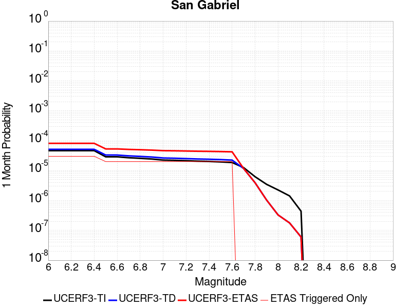 |  | 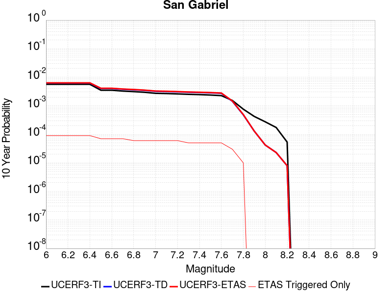 |

| Magnitude | 1 wk TI Prob | 1 wk TD Prob | 1 wk ETAS Prob | 1 wk ETAS/TD Gain | 1 wk ETAS Triggered Only | 1 mo TI Prob | 1 mo TD Prob | 1 mo ETAS Prob | 1 mo ETAS/TD Gain | 1 mo ETAS Triggered Only | 1 yr TI Prob | 1 yr TD Prob | 1 yr ETAS Prob | 1 yr ETAS/TD Gain | 1 yr ETAS Triggered Only | 10 yr TI Prob | 10 yr TD Prob | 10 yr ETAS Prob | 10 yr ETAS/TD Gain | 10 yr ETAS Triggered Only |
|-----|-----|-----|-----|-----|-----|-----|-----|-----|-----|-----|-----|-----|-----|-----|-----|-----|-----|-----|-----|-----|
| 6.0 | 1.083775E-5 | 1.19851875E-5 | 1.19851875E-5 | 1.0 | 0.0 | 4.6446676E-5 | 5.1364143E-5 | 8.13626E-5 | 1.584035 | 3.0E-5 | 5.653415E-4 | 6.251903E-4 | 6.9514656E-4 | 1.1118959 | 7.0E-5 | 0.0056390543 | 0.006246409 | 0.006335847 | 1.0143182 | 9.0E-5 |
| 6.1 | 1.083775E-5 | 1.19851875E-5 | 1.19851875E-5 | 1.0 | 0.0 | 4.6446676E-5 | 5.1364143E-5 | 8.13626E-5 | 1.584035 | 3.0E-5 | 5.653415E-4 | 6.251903E-4 | 6.9514656E-4 | 1.1118959 | 7.0E-5 | 0.0056390543 | 0.006246409 | 0.006335847 | 1.0143182 | 9.0E-5 |
| 6.2 | 1.083775E-5 | 1.19851875E-5 | 1.19851875E-5 | 1.0 | 0.0 | 4.6446676E-5 | 5.1364143E-5 | 8.13626E-5 | 1.584035 | 3.0E-5 | 5.653415E-4 | 6.251903E-4 | 6.9514656E-4 | 1.1118959 | 7.0E-5 | 0.0056390543 | 0.006246409 | 0.006335847 | 1.0143182 | 9.0E-5 |
| 6.3 | 1.083775E-5 | 1.19851875E-5 | 1.19851875E-5 | 1.0 | 0.0 | 4.6446676E-5 | 5.1364143E-5 | 8.13626E-5 | 1.584035 | 3.0E-5 | 5.653415E-4 | 6.251903E-4 | 6.9514656E-4 | 1.1118959 | 7.0E-5 | 0.0056390543 | 0.006246409 | 0.006335847 | 1.0143182 | 9.0E-5 |
| 6.4 | 1.083775E-5 | 1.19851875E-5 | 1.19851875E-5 | 1.0 | 0.0 | 4.6446676E-5 | 5.1364143E-5 | 8.13626E-5 | 1.584035 | 3.0E-5 | 5.653415E-4 | 6.251903E-4 | 6.9514656E-4 | 1.1118959 | 7.0E-5 | 0.0056390543 | 0.006246409 | 0.006335847 | 1.0143182 | 9.0E-5 |
| 6.5 | 6.7317824E-6 | 7.716944E-6 | 7.716944E-6 | 1.0 | 0.0 | 2.8850178E-5 | 3.3072207E-5 | 5.3071544E-5 | 1.6047174 | 2.0E-5 | 3.511943E-4 | 4.0258077E-4 | 4.625566E-4 | 1.1489785 | 6.0E-5 | 0.003506398 | 0.0040296097 | 0.0040993276 | 1.0173014 | 7.0E-5 |
| 6.6 | 6.7317824E-6 | 7.716944E-6 | 7.716944E-6 | 1.0 | 0.0 | 2.8850178E-5 | 3.3072207E-5 | 5.3071544E-5 | 1.6047174 | 2.0E-5 | 3.511943E-4 | 4.0258077E-4 | 4.625566E-4 | 1.1489785 | 6.0E-5 | 0.003506398 | 0.0040296097 | 0.0040993276 | 1.0173014 | 7.0E-5 |
| 6.7 | 6.274881E-6 | 7.2458647E-6 | 7.2458647E-6 | 1.0 | 0.0 | 2.6892068E-5 | 3.1053343E-5 | 5.105272E-5 | 1.6440331 | 2.0E-5 | 3.2736175E-4 | 3.780098E-4 | 4.3798712E-4 | 1.158666 | 6.0E-5 | 0.0032687993 | 0.0037847564 | 0.0038544915 | 1.0184252 | 7.0E-5 |
| 6.8 | 5.996209E-6 | 6.958585E-6 | 6.958585E-6 | 1.0 | 0.0 | 2.5697784E-5 | 2.9822171E-5 | 4.9821574E-5 | 1.670622 | 2.0E-5 | 3.128256E-4 | 3.6302538E-4 | 4.1300722E-4 | 1.1376814 | 5.0E-5 | 0.003123856 | 0.0036354093 | 0.0036951911 | 1.0164443 | 6.0E-5 |
| 6.9 | 5.686331E-6 | 6.6236316E-6 | 6.6236316E-6 | 1.0 | 0.0 | 2.4369761E-5 | 2.8386688E-5 | 4.8386122E-5 | 1.7045356 | 2.0E-5 | 2.9666146E-4 | 3.4555403E-4 | 3.9553674E-4 | 1.1446452 | 5.0E-5 | 0.0029626573 | 0.0034612515 | 0.0035210438 | 1.0172747 | 6.0E-5 |
| 7.0 | 5.2329838E-6 | 6.147514E-6 | 6.147514E-6 | 1.0 | 0.0 | 2.242688E-5 | 2.6346226E-5 | 4.63457E-5 | 1.759102 | 2.0E-5 | 2.7301308E-4 | 3.2071886E-4 | 3.7070282E-4 | 1.1558498 | 5.0E-5 | 0.002726779 | 0.0032136322 | 0.0032734394 | 1.0186105 | 6.0E-5 |
| 7.1 | 5.135671E-6 | 6.03764E-6 | 6.03764E-6 | 1.0 | 0.0 | 2.2009834E-5 | 2.5875348E-5 | 4.587483E-5 | 1.7729164 | 2.0E-5 | 2.6793676E-4 | 3.1498758E-4 | 3.6497184E-4 | 1.1586864 | 5.0E-5 | 0.0026761394 | 0.0031564834 | 0.0032162939 | 1.0189486 | 6.0E-5 |
| 7.2 | 4.989062E-6 | 5.87102E-6 | 5.87102E-6 | 1.0 | 0.0 | 2.1381518E-5 | 2.5161276E-5 | 4.5160774E-5 | 1.7948523 | 2.0E-5 | 2.6028889E-4 | 3.0629625E-4 | 3.562809E-4 | 1.1631906 | 5.0E-5 | 0.0025998424 | 0.003069813 | 0.0031296287 | 1.0194851 | 6.0E-5 |
| 7.3 | 4.8219395E-6 | 5.702574E-6 | 5.702574E-6 | 1.0 | 0.0 | 2.0665291E-5 | 2.443938E-5 | 4.443889E-5 | 1.8183314 | 2.0E-5 | 2.5157086E-4 | 2.9750957E-4 | 3.3749765E-4 | 1.1344094 | 4.0E-5 | 0.0025128627 | 0.0029821852 | 0.0030320361 | 1.0167162 | 5.0E-5 |
| 7.4 | 4.7118383E-6 | 5.5911332E-6 | 5.5911332E-6 | 1.0 | 0.0 | 2.0193436E-5 | 2.3961782E-5 | 4.3961303E-5 | 1.8346424 | 2.0E-5 | 2.4582737E-4 | 2.916964E-4 | 3.3168474E-4 | 1.1370889 | 4.0E-5 | 0.002455556 | 0.0029242067 | 0.0029740606 | 1.0170486 | 5.0E-5 |
| 7.5 | 4.5506545E-6 | 5.4365014E-6 | 5.4365014E-6 | 1.0 | 0.0 | 1.9502659E-5 | 2.3299088E-5 | 4.329862E-5 | 1.8583827 | 2.0E-5 | 2.37419E-4 | 2.8363022E-4 | 3.2361888E-4 | 1.1409887 | 4.0E-5 | 0.002371655 | 0.002843753 | 0.0028936109 | 1.0175323 | 5.0E-5 |
| 7.6 | 4.343636E-6 | 5.2293817E-6 | 5.2293817E-6 | 1.0 | 0.0 | 1.861545E-5 | 2.2411448E-5 | 4.2411E-5 | 1.8923811 | 2.0E-5 | 2.2661954E-4 | 2.7282597E-4 | 3.1281504E-4 | 1.1465737 | 4.0E-5 | 0.0022638857 | 0.0027359722 | 0.0027858354 | 1.0182251 | 5.0E-5 |
| 7.7 | 2.936235E-6 | 2.7440458E-6 | 2.7440458E-6 | 1.0 | 0.0 | 1.2583803E-5 | 1.1760143E-5 | 1.1760143E-5 | 1.0 | 0.0 | 1.5319703E-4 | 1.4317037E-4 | 1.6316751E-4 | 1.1396737 | 2.0E-5 | 0.0015309147 | 0.0014380751 | 0.0014680319 | 1.0208312 | 3.0E-5 |
| 7.8 | 1.4541639E-6 | 9.1237047E-7 | 9.1237047E-7 | 1.0 | 0.0 | 6.232116E-6 | 3.9101533E-6 | 3.9101533E-6 | 1.0 | 0.0 | 7.587337E-5 | 4.7605077E-5 | 5.7604604E-5 | 1.2100517 | 1.0E-5 | 7.584747E-4 | 4.8085177E-4 | 4.90847E-4 | 1.0207864 | 1.0E-5 |
| 7.9 | 8.098958E-7 | 2.41753E-7 | 2.41753E-7 | 1.0 | 0.0 | 3.4709774E-6 | 1.0360839E-6 | 1.0360839E-6 | 1.0 | 0.0 | 4.225833E-5 | 1.2614248E-5 | 1.2614248E-5 | 1.0 | 0.0 | 4.2250296E-4 | 1.2921814E-4 | 1.2921814E-4 | 1.0 | 0.0 |
| 8.0 | 5.2473234E-7 | 7.6792055E-8 | 7.6792055E-8 | 1.0 | 0.0 | 2.248851E-6 | 3.2910876E-7 | 3.2910876E-7 | 1.0 | 0.0 | 2.7379416E-5 | 4.0068917E-6 | 4.0068917E-6 | 1.0 | 0.0 | 2.7376044E-4 | 4.21918E-5 | 4.21918E-5 | 1.0 | 0.0 |
| 8.1 | 3.3162388E-7 | 4.1496126E-8 | 4.1496126E-8 | 1.0 | 0.0 | 1.4212444E-6 | 1.7784053E-7 | 1.7784053E-7 | 1.0 | 0.0 | 1.7303513E-5 | 2.1652063E-6 | 2.1652063E-6 | 1.0 | 0.0 | 1.7302166E-4 | 2.2965523E-5 | 2.2965523E-5 | 1.0 | 0.0 |
| 8.2 | 1.0235345E-7 | 1.4043474E-8 | 1.4043474E-8 | 1.0 | 0.0 | 4.3865757E-7 | 6.0186316E-8 | 6.0186316E-8 | 1.0 | 0.0 | 5.340643E-6 | 7.327681E-7 | 7.327681E-7 | 1.0 | 0.0 | 5.3405143E-5 | 7.9273705E-6 | 7.9273705E-6 | 1.0 | 0.0 |

## San Jacinto (Borrego)
*[(top)](#table-of-contents)*

| 1 Week | 1 Month | 1 Year | 10 Year |
|-----|-----|-----|-----|
|  |  |  |  |

| Magnitude | 1 wk TI Prob | 1 wk TD Prob | 1 wk ETAS Prob | 1 wk ETAS/TD Gain | 1 wk ETAS Triggered Only | 1 mo TI Prob | 1 mo TD Prob | 1 mo ETAS Prob | 1 mo ETAS/TD Gain | 1 mo ETAS Triggered Only | 1 yr TI Prob | 1 yr TD Prob | 1 yr ETAS Prob | 1 yr ETAS/TD Gain | 1 yr ETAS Triggered Only | 10 yr TI Prob | 10 yr TD Prob | 10 yr ETAS Prob | 10 yr ETAS/TD Gain | 10 yr ETAS Triggered Only |
|-----|-----|-----|-----|-----|-----|-----|-----|-----|-----|-----|-----|-----|-----|-----|-----|-----|-----|-----|-----|-----|
| 6.0 | 3.543992E-5 | 2.7926513E-5 | 4.7925954E-5 | 1.7161453 | 2.0E-5 | 1.5187653E-4 | 1.1967963E-4 | 1.5967485E-4 | 1.3341856 | 4.0E-5 | 0.0018475284 | 0.0014561379 | 0.0015160504 | 1.0411448 | 6.0E-5 | 0.018322436 | 0.014869647 | 0.014958309 | 1.0059626 | 9.0E-5 |
| 6.1 | 3.542281E-5 | 2.7926513E-5 | 4.7925954E-5 | 1.7161453 | 2.0E-5 | 1.5180321E-4 | 1.1967963E-4 | 1.5967485E-4 | 1.3341856 | 4.0E-5 | 0.0018466372 | 0.0014561379 | 0.0015160504 | 1.0411448 | 6.0E-5 | 0.018313672 | 0.014869647 | 0.014958309 | 1.0059626 | 9.0E-5 |
| 6.2 | 3.4688688E-5 | 2.7926511E-5 | 4.7925954E-5 | 1.7161454 | 2.0E-5 | 1.4865733E-4 | 1.1967963E-4 | 1.5967485E-4 | 1.3341856 | 4.0E-5 | 0.0018084005 | 0.0014561379 | 0.0015160504 | 1.0411448 | 6.0E-5 | 0.017937548 | 0.014869647 | 0.014958309 | 1.0059626 | 9.0E-5 |
| 6.3 | 3.2087122E-5 | 2.7771865E-5 | 4.7771307E-5 | 1.7201333 | 2.0E-5 | 1.3750899E-4 | 1.1901691E-4 | 1.5901215E-4 | 1.3360467 | 4.0E-5 | 0.0016728862 | 0.00144808 | 0.0015079931 | 1.0413742 | 6.0E-5 | 0.016603488 | 0.014790683 | 0.0148793515 | 1.0059949 | 9.0E-5 |
| 6.4 | 3.1828724E-5 | 2.7738852E-5 | 4.7738296E-5 | 1.7209904 | 2.0E-5 | 1.364017E-4 | 1.1887544E-4 | 1.5887068E-4 | 1.3364466 | 4.0E-5 | 0.0016594254 | 0.0014463598 | 0.001506273 | 1.0414234 | 6.0E-5 | 0.016470885 | 0.014773762 | 0.014862432 | 1.0060018 | 9.0E-5 |
| 6.5 | 3.1563577E-5 | 2.747857E-5 | 4.747802E-5 | 1.7278199 | 2.0E-5 | 1.3526545E-4 | 1.1776006E-4 | 1.5775535E-4 | 1.3396337 | 4.0E-5 | 0.0016456128 | 0.0014327979 | 0.001492712 | 1.0418161 | 6.0E-5 | 0.0163348 | 0.014640348 | 0.01472903 | 1.0060574 | 9.0E-5 |
| 6.6 | 3.1467625E-5 | 2.7322796E-5 | 4.732225E-5 | 1.7319695 | 2.0E-5 | 1.3485427E-4 | 1.1709251E-4 | 1.5708782E-4 | 1.3415703 | 4.0E-5 | 0.0016406142 | 0.0014246812 | 0.0014845957 | 1.0420547 | 6.0E-5 | 0.016285548 | 0.014560594 | 0.014649284 | 1.0060911 | 9.0E-5 |
| 6.7 | 3.1223695E-5 | 2.6940816E-5 | 4.6940277E-5 | 1.7423481 | 2.0E-5 | 1.3380898E-4 | 1.15455594E-4 | 1.5545098E-4 | 1.3464135 | 4.0E-5 | 0.0016279068 | 0.0014047775 | 0.0014646933 | 1.0426514 | 6.0E-5 | 0.01616033 | 0.014364966 | 0.014453673 | 1.0061753 | 9.0E-5 |
| 6.8 | 3.1015585E-5 | 2.6761822E-5 | 4.6761288E-5 | 1.7473133 | 2.0E-5 | 1.3291716E-4 | 1.1468855E-4 | 1.5468396E-4 | 1.3487307 | 4.0E-5 | 0.001617065 | 0.0013954508 | 0.0014553671 | 1.0429368 | 6.0E-5 | 0.016053487 | 0.014272246 | 0.0143609615 | 1.0062159 | 9.0E-5 |
| 6.9 | 2.6641965E-5 | 2.2184247E-5 | 4.21838E-5 | 1.9015206 | 2.0E-5 | 1.1417485E-4 | 9.50719E-5 | 1.350681E-4 | 1.4206942 | 4.0E-5 | 0.0013891924 | 0.0011568897 | 0.0012168202 | 1.0518032 | 6.0E-5 | 0.0138054015 | 0.011882438 | 0.011971369 | 1.0074842 | 9.0E-5 |
| 7.0 | 2.3854353E-5 | 2.0479023E-5 | 4.0478615E-5 | 1.9765891 | 2.0E-5 | 1.02228936E-4 | 8.77643E-5 | 1.277608E-4 | 1.4557261 | 4.0E-5 | 0.0012439266 | 0.0010680092 | 0.0011279451 | 1.0561193 | 6.0E-5 | 0.012369866 | 0.0109828 | 0.011071812 | 1.0081047 | 9.0E-5 |
| 7.1 | 2.3672901E-5 | 2.031551E-5 | 4.0315106E-5 | 1.9844495 | 2.0E-5 | 1.0145135E-4 | 8.7063585E-5 | 1.270601E-4 | 1.4593943 | 4.0E-5 | 0.0012344702 | 0.0010594862 | 0.0011194226 | 1.0565712 | 6.0E-5 | 0.0122763505 | 0.010897976 | 0.010986995 | 1.0081685 | 9.0E-5 |
| 7.2 | 2.2717244E-5 | 1.9542893E-5 | 3.95425E-5 | 2.02337 | 2.0E-5 | 9.735599E-5 | 8.375258E-5 | 1.2374923E-4 | 1.4775572 | 4.0E-5 | 0.0011846646 | 0.001019213 | 0.0010791519 | 1.0588089 | 6.0E-5 | 0.01178369 | 0.010495341 | 0.010584397 | 1.0084852 | 9.0E-5 |
| 7.3 | 2.1016205E-5 | 1.8384526E-5 | 3.8384158E-5 | 2.0878515 | 2.0E-5 | 9.006634E-5 | 7.878846E-5 | 1.18785305E-4 | 1.5076486 | 4.0E-5 | 0.001096006 | 9.5882936E-4 | 0.0010187718 | 1.0625163 | 6.0E-5 | 0.010906163 | 0.009890967 | 0.009980077 | 1.0090092 | 9.0E-5 |
| 7.4 | 2.0683625E-5 | 1.8187047E-5 | 3.8186685E-5 | 2.0996637 | 2.0E-5 | 8.86411E-5 | 7.794217E-5 | 1.1793905E-4 | 1.5131611 | 4.0E-5 | 0.001078671 | 9.485349E-4 | 0.0010084779 | 1.0631955 | 6.0E-5 | 0.010734501 | 0.009787692 | 0.009876811 | 1.0091052 | 9.0E-5 |
| 7.5 | 1.9993966E-5 | 1.7782075E-5 | 3.778172E-5 | 2.1247082 | 2.0E-5 | 8.568561E-5 | 7.620667E-5 | 1.1620363E-4 | 1.5248485 | 4.0E-5 | 0.001042723 | 9.2742336E-4 | 9.873677E-4 | 1.0646354 | 6.0E-5 | 0.010378438 | 0.009574614 | 0.009663753 | 1.0093099 | 9.0E-5 |
| 7.6 | 1.788966E-5 | 1.6435291E-5 | 3.643496E-5 | 2.2168736 | 2.0E-5 | 7.666772E-5 | 7.043507E-5 | 1.1043225E-4 | 1.5678589 | 4.0E-5 | 9.3302975E-4 | 8.572113E-4 | 9.171599E-4 | 1.0699344 | 6.0E-5 | 0.00929122 | 0.008866487 | 0.008955689 | 1.0100605 | 9.0E-5 |
| 7.7 | 1.5125781E-5 | 1.4237377E-5 | 3.423709E-5 | 2.4047332 | 2.0E-5 | 6.4823165E-5 | 6.1015908E-5 | 1.01013466E-4 | 1.6555268 | 4.0E-5 | 7.889362E-4 | 7.426163E-4 | 8.0257177E-4 | 1.0807354 | 6.0E-5 | 0.007861412 | 0.0077142045 | 0.00780351 | 1.0115768 | 9.0E-5 |
| 7.8 | 1.250089E-5 | 1.26304985E-5 | 3.2630247E-5 | 2.583449 | 2.0E-5 | 5.3574146E-5 | 5.412959E-5 | 9.412742E-5 | 1.7389274 | 4.0E-5 | 6.5207E-4 | 6.588291E-4 | 7.187896E-4 | 1.0910107 | 6.0E-5 | 0.006501599 | 0.0068677636 | 0.0069571454 | 1.0130147 | 9.0E-5 |
| 7.9 | 9.561E-6 | 9.754616E-6 | 2.9754421E-5 | 3.0502913 | 2.0E-5 | 4.0975072E-5 | 4.1804833E-5 | 8.180316E-5 | 1.9567872 | 4.0E-5 | 4.987573E-4 | 5.088555E-4 | 5.68825E-4 | 1.1178516 | 6.0E-5 | 0.0049763937 | 0.0053523467 | 0.005441865 | 1.0167251 | 9.0E-5 |
| 8.0 | 8.01699E-6 | 8.293488E-6 | 2.8293322E-5 | 3.4115107 | 2.0E-5 | 3.4358076E-5 | 3.554304E-5 | 7.554162E-5 | 2.1253562 | 4.0E-5 | 4.1822926E-4 | 4.3265108E-4 | 4.8262943E-4 | 1.1155165 | 5.0E-5 | 0.0041744304 | 0.004573375 | 0.004653009 | 1.0174125 | 8.0E-5 |
| 8.1 | 6.541947E-6 | 6.4622354E-6 | 1.646217E-5 | 2.5474422 | 1.0E-5 | 2.8036617E-5 | 2.7695003E-5 | 5.769417E-5 | 2.0831978 | 3.0E-5 | 3.4129233E-4 | 3.37135E-4 | 3.7712153E-4 | 1.1186068 | 4.0E-5 | 0.0034076865 | 0.0035806994 | 0.0036504488 | 1.0194793 | 7.0E-5 |
| 8.2 | 1.7968189E-6 | 7.9713476E-7 | 7.9713476E-7 | 1.0 | 0.0 | 7.70063E-6 | 3.4162877E-6 | 3.4162877E-6 | 1.0 | 0.0 | 9.3751136E-5 | 4.159253E-5 | 5.1592113E-5 | 1.2404178 | 1.0E-5 | 9.371159E-4 | 4.712058E-4 | 4.8120107E-4 | 1.0212121 | 1.0E-5 |
| 8.3 | 1.5167889E-7 | 4.897714E-8 | 4.897714E-8 | 1.0 | 0.0 | 6.500522E-7 | 2.09902E-7 | 2.09902E-7 | 1.0 | 0.0 | 7.9143565E-6 | 2.5555544E-6 | 1.2555529E-5 | 4.9130354 | 1.0E-5 | 7.914075E-5 | 2.969505E-5 | 3.969475E-5 | 1.3367465 | 1.0E-5 |

## Kern Canyon (South Kern) 2011
*[(top)](#table-of-contents)*

| 1 Week | 1 Month | 1 Year | 10 Year |
|-----|-----|-----|-----|
| 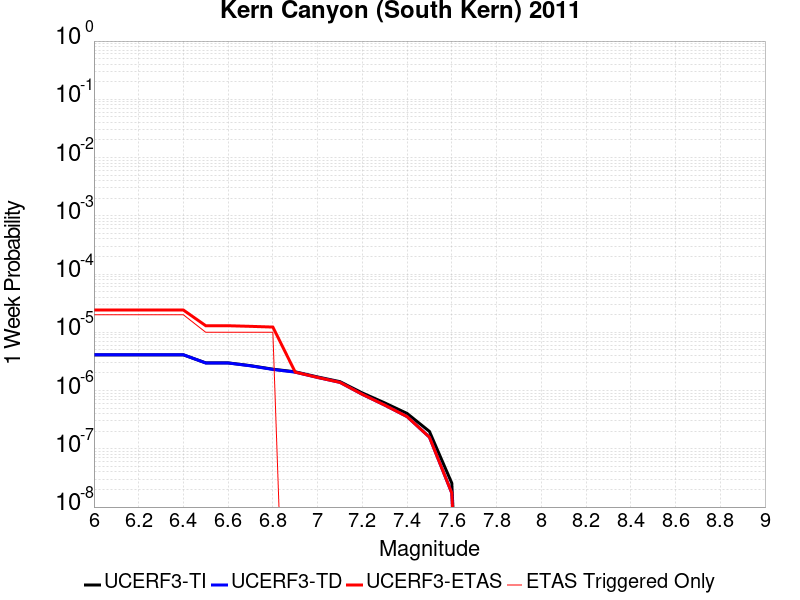 | 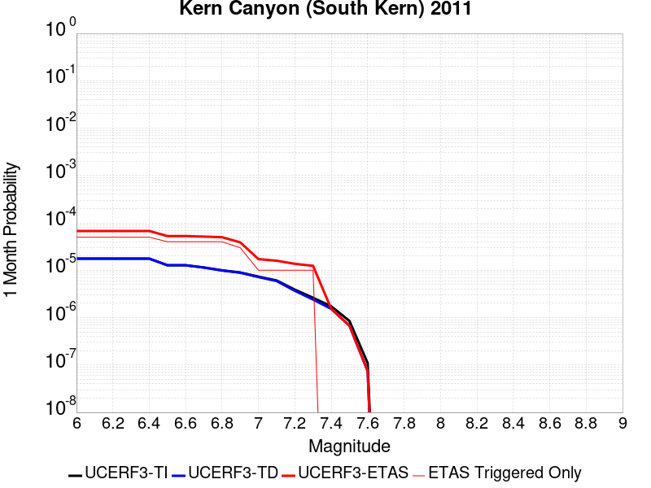 |  | 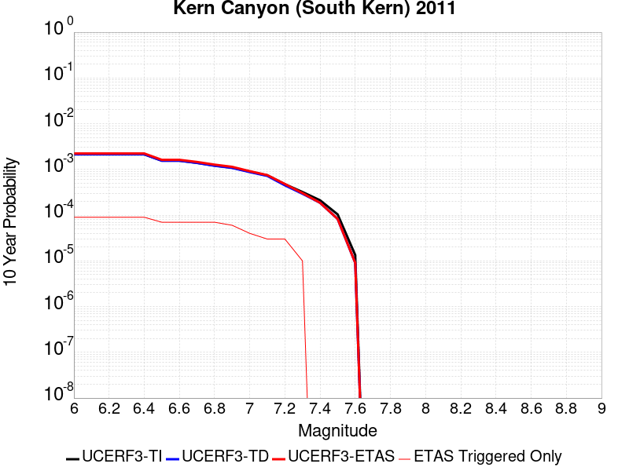 |

| Magnitude | 1 wk TI Prob | 1 wk TD Prob | 1 wk ETAS Prob | 1 wk ETAS/TD Gain | 1 wk ETAS Triggered Only | 1 mo TI Prob | 1 mo TD Prob | 1 mo ETAS Prob | 1 mo ETAS/TD Gain | 1 mo ETAS Triggered Only | 1 yr TI Prob | 1 yr TD Prob | 1 yr ETAS Prob | 1 yr ETAS/TD Gain | 1 yr ETAS Triggered Only | 10 yr TI Prob | 10 yr TD Prob | 10 yr ETAS Prob | 10 yr ETAS/TD Gain | 10 yr ETAS Triggered Only |
|-----|-----|-----|-----|-----|-----|-----|-----|-----|-----|-----|-----|-----|-----|-----|-----|-----|-----|-----|-----|-----|
| 6.0 | 4.105075E-6 | 4.1137264E-6 | 2.4113644E-5 | 5.861752 | 2.0E-5 | 1.7593058E-5 | 1.763014E-5 | 6.762926E-5 | 3.8360023 | 5.0E-5 | 2.1417443E-4 | 2.1462646E-4 | 2.6461572E-4 | 1.2329129 | 5.0E-5 | 0.0021396813 | 0.0021442557 | 0.0022340626 | 1.0418826 | 9.0E-5 |
| 6.1 | 4.105075E-6 | 4.1137264E-6 | 2.4113644E-5 | 5.861752 | 2.0E-5 | 1.7593058E-5 | 1.763014E-5 | 6.762926E-5 | 3.8360023 | 5.0E-5 | 2.1417443E-4 | 2.1462646E-4 | 2.6461572E-4 | 1.2329129 | 5.0E-5 | 0.0021396813 | 0.0021442557 | 0.0022340626 | 1.0418826 | 9.0E-5 |
| 6.2 | 4.105075E-6 | 4.1137264E-6 | 2.4113644E-5 | 5.861752 | 2.0E-5 | 1.7593058E-5 | 1.763014E-5 | 6.762926E-5 | 3.8360023 | 5.0E-5 | 2.1417443E-4 | 2.1462646E-4 | 2.6461572E-4 | 1.2329129 | 5.0E-5 | 0.0021396813 | 0.0021442557 | 0.0022340626 | 1.0418826 | 9.0E-5 |
| 6.3 | 4.105075E-6 | 4.1137264E-6 | 2.4113644E-5 | 5.861752 | 2.0E-5 | 1.7593058E-5 | 1.763014E-5 | 6.762926E-5 | 3.8360023 | 5.0E-5 | 2.1417443E-4 | 2.1462646E-4 | 2.6461572E-4 | 1.2329129 | 5.0E-5 | 0.0021396813 | 0.0021442557 | 0.0022340626 | 1.0418826 | 9.0E-5 |
| 6.4 | 4.105075E-6 | 4.1137264E-6 | 2.4113644E-5 | 5.861752 | 2.0E-5 | 1.7593058E-5 | 1.763014E-5 | 6.762926E-5 | 3.8360023 | 5.0E-5 | 2.1417443E-4 | 2.1462646E-4 | 2.6461572E-4 | 1.2329129 | 5.0E-5 | 0.0021396813 | 0.0021442557 | 0.0022340626 | 1.0418826 | 9.0E-5 |
| 6.5 | 2.9849807E-6 | 2.9731548E-6 | 1.2973125E-5 | 4.363421 | 1.0E-5 | 1.2792712E-5 | 1.274203E-5 | 5.274152E-5 | 4.1391773 | 4.0E-5 | 1.5574014E-4 | 1.5512333E-4 | 1.9511711E-4 | 1.2578193 | 4.0E-5 | 0.0015563103 | 0.0015501656 | 0.0016200572 | 1.0450865 | 7.0E-5 |
| 6.6 | 2.9849807E-6 | 2.9731548E-6 | 1.2973125E-5 | 4.363421 | 1.0E-5 | 1.2792712E-5 | 1.274203E-5 | 5.274152E-5 | 4.1391773 | 4.0E-5 | 1.5574014E-4 | 1.5512333E-4 | 1.9511711E-4 | 1.2578193 | 4.0E-5 | 0.0015563103 | 0.0015501656 | 0.0016200572 | 1.0450865 | 7.0E-5 |
| 6.7 | 2.6756725E-6 | 2.6582206E-6 | 1.26581945E-5 | 4.7619047 | 1.0E-5 | 1.1467117E-5 | 1.1392325E-5 | 5.139187E-5 | 4.5110955 | 4.0E-5 | 1.396032E-4 | 1.3869285E-4 | 1.7868729E-4 | 1.2883672 | 4.0E-5 | 0.0013951553 | 0.0013860738 | 0.0014559767 | 1.0504323 | 7.0E-5 |
| 6.8 | 2.3283721E-6 | 2.3047787E-6 | 1.2304756E-5 | 5.338801 | 1.0E-5 | 9.9787E-6 | 9.877586E-6 | 4.987719E-5 | 5.0495324 | 4.0E-5 | 1.214839E-4 | 1.20253055E-4 | 1.6024824E-4 | 1.3325919 | 4.0E-5 | 0.001214175 | 0.0012018873 | 0.0012718032 | 1.0581717 | 7.0E-5 |
| 6.9 | 2.0972677E-6 | 2.0696411E-6 | 2.0696411E-6 | 1.0 | 0.0 | 8.988259E-6 | 8.869861E-6 | 3.8869595E-5 | 4.3822103 | 3.0E-5 | 1.0942656E-4 | 1.0798526E-4 | 1.3798202E-4 | 1.2777857 | 3.0E-5 | 0.0010937268 | 0.0010793337 | 0.001139269 | 1.0555298 | 6.0E-5 |
| 7.0 | 1.7132242E-6 | 1.6787036E-6 | 1.6787036E-6 | 1.0 | 0.0 | 7.3423685E-6 | 7.194424E-6 | 1.7194352E-5 | 2.3899553 | 1.0E-5 | 8.938967E-5 | 8.758863E-5 | 9.7587756E-5 | 1.1141601 | 1.0E-5 | 8.935372E-4 | 8.7554497E-4 | 9.1550994E-4 | 1.0456458 | 4.0E-5 |
| 7.1 | 1.4215541E-6 | 1.3815752E-6 | 1.3815752E-6 | 1.0 | 0.0 | 6.0923603E-6 | 5.9210233E-6 | 1.5920965E-5 | 2.6888874 | 1.0E-5 | 7.417196E-5 | 7.20861E-5 | 8.208538E-5 | 1.138713 | 1.0E-5 | 7.414721E-4 | 7.206299E-4 | 7.506083E-4 | 1.0416002 | 3.0E-5 |
| 7.2 | 9.097853E-7 | 8.6037755E-7 | 8.6037755E-7 | 1.0 | 0.0 | 3.899074E-6 | 3.6873273E-6 | 1.368729E-5 | 3.7119815 | 1.0E-5 | 4.7470192E-5 | 4.4892295E-5 | 5.4891847E-5 | 1.2227454 | 1.0E-5 | 4.7460053E-4 | 4.4883334E-4 | 4.788199E-4 | 1.06681 | 3.0E-5 |
| 7.3 | 6.144169E-7 | 5.628206E-7 | 5.628206E-7 | 1.0 | 0.0 | 2.6332125E-6 | 2.4120861E-6 | 1.24120625E-5 | 5.1457787 | 1.0E-5 | 3.205889E-5 | 2.9366758E-5 | 3.9366467E-5 | 1.3405111 | 1.0E-5 | 3.2054266E-4 | 2.936293E-4 | 3.0362635E-4 | 1.0340465 | 1.0E-5 |
| 7.4 | 4.049844E-7 | 3.5728314E-7 | 3.5728314E-7 | 1.0 | 0.0 | 1.7356463E-6 | 1.5312125E-6 | 1.5312125E-6 | 1.0 | 0.0 | 2.1131287E-5 | 1.8642357E-5 | 1.8642357E-5 | 1.0 | 0.0 | 2.1129279E-4 | 1.8640817E-4 | 1.8640817E-4 | 1.0 | 0.0 |
| 7.5 | 1.9871162E-7 | 1.583044E-7 | 1.583044E-7 | 1.0 | 0.0 | 8.5162094E-7 | 6.7844724E-7 | 6.7844724E-7 | 1.0 | 0.0 | 1.0368436E-5 | 8.260065E-6 | 8.260065E-6 | 1.0 | 0.0 | 1.0367952E-4 | 8.259767E-5 | 8.259767E-5 | 1.0 | 0.0 |
| 7.6 | 2.572245E-8 | 1.7352555E-8 | 1.7352555E-8 | 1.0 | 0.0 | 1.10239064E-7 | 7.436809E-8 | 7.436809E-8 | 1.0 | 0.0 | 1.3421597E-6 | 9.054312E-7 | 9.054312E-7 | 1.0 | 0.0 | 1.3421517E-5 | 9.05428E-6 | 9.05428E-6 | 1.0 | 0.0 |

## Palos Verdes
*[(top)](#table-of-contents)*

| 1 Week | 1 Month | 1 Year | 10 Year |
|-----|-----|-----|-----|
|  |  |  |  |

| Magnitude | 1 wk TI Prob | 1 wk TD Prob | 1 wk ETAS Prob | 1 wk ETAS/TD Gain | 1 wk ETAS Triggered Only | 1 mo TI Prob | 1 mo TD Prob | 1 mo ETAS Prob | 1 mo ETAS/TD Gain | 1 mo ETAS Triggered Only | 1 yr TI Prob | 1 yr TD Prob | 1 yr ETAS Prob | 1 yr ETAS/TD Gain | 1 yr ETAS Triggered Only | 10 yr TI Prob | 10 yr TD Prob | 10 yr ETAS Prob | 10 yr ETAS/TD Gain | 10 yr ETAS Triggered Only |
|-----|-----|-----|-----|-----|-----|-----|-----|-----|-----|-----|-----|-----|-----|-----|-----|-----|-----|-----|-----|-----|
| 6.0 | 6.126063E-5 | 7.622612E-5 | 9.62246E-5 | 1.2623572 | 2.0E-5 | 2.6251914E-4 | 3.2664582E-4 | 3.766295E-4 | 1.153021 | 5.0E-5 | 0.0031914865 | 0.003970174 | 0.004039896 | 1.0175614 | 7.0E-5 | 0.031460393 | 0.039048895 | 0.039125774 | 1.0019687 | 8.0E-5 |
| 6.1 | 6.126063E-5 | 7.622612E-5 | 9.62246E-5 | 1.2623572 | 2.0E-5 | 2.6251914E-4 | 3.2664582E-4 | 3.766295E-4 | 1.153021 | 5.0E-5 | 0.0031914865 | 0.003970174 | 0.004039896 | 1.0175614 | 7.0E-5 | 0.031460393 | 0.039048895 | 0.039125774 | 1.0019687 | 8.0E-5 |
| 6.2 | 6.126063E-5 | 7.622612E-5 | 9.62246E-5 | 1.2623572 | 2.0E-5 | 2.6251914E-4 | 3.2664582E-4 | 3.766295E-4 | 1.153021 | 5.0E-5 | 0.0031914865 | 0.003970174 | 0.004039896 | 1.0175614 | 7.0E-5 | 0.031460393 | 0.039048895 | 0.039125774 | 1.0019687 | 8.0E-5 |
| 6.3 | 4.0838047E-5 | 4.9749437E-5 | 6.974844E-5 | 1.4019946 | 2.0E-5 | 1.7500846E-4 | 2.1319572E-4 | 2.6318507E-4 | 1.2344763 | 5.0E-5 | 0.0021286458 | 0.0025927818 | 0.0026526263 | 1.0230812 | 6.0E-5 | 0.021083709 | 0.025646681 | 0.025714885 | 1.0026594 | 7.0E-5 |
| 6.4 | 4.0838047E-5 | 4.9749437E-5 | 6.974844E-5 | 1.4019946 | 2.0E-5 | 1.7500846E-4 | 2.1319572E-4 | 2.6318507E-4 | 1.2344763 | 5.0E-5 | 0.0021286458 | 0.0025927818 | 0.0026526263 | 1.0230812 | 6.0E-5 | 0.021083709 | 0.025646681 | 0.025714885 | 1.0026594 | 7.0E-5 |
| 6.5 | 3.0512005E-5 | 3.656162E-5 | 5.656089E-5 | 1.5470017 | 2.0E-5 | 1.3075917E-4 | 1.5668393E-4 | 1.9667766E-4 | 1.255251 | 4.0E-5 | 0.0015908304 | 0.0019060767 | 0.0019559814 | 1.0261819 | 5.0E-5 | 0.015794903 | 0.018909154 | 0.01895821 | 1.0025942 | 5.0E-5 |
| 6.6 | 2.9255087E-5 | 3.515442E-5 | 5.5153716E-5 | 1.5688986 | 2.0E-5 | 1.2537291E-4 | 1.5065377E-4 | 1.9064774E-4 | 1.2654694 | 4.0E-5 | 0.0015253464 | 0.0018327828 | 0.0018826912 | 1.027231 | 5.0E-5 | 0.015149189 | 0.018188225 | 0.018237315 | 1.002699 | 5.0E-5 |
| 6.7 | 2.287198E-5 | 2.7248278E-5 | 4.7247733E-5 | 1.7339714 | 2.0E-5 | 9.801909E-5 | 1.16773626E-4 | 1.5676896E-4 | 1.3425031 | 4.0E-5 | 0.001192729 | 0.0014208833 | 0.0014608265 | 1.0281115 | 4.0E-5 | 0.011863477 | 0.014127217 | 0.014166652 | 1.0027914 | 4.0E-5 |
| 6.8 | 2.1325764E-5 | 2.5431877E-5 | 4.543137E-5 | 1.7863946 | 2.0E-5 | 9.139293E-5 | 1.0898971E-4 | 1.4898536E-4 | 1.3669671 | 4.0E-5 | 0.001112141 | 0.0013262323 | 0.0013661792 | 1.0301206 | 4.0E-5 | 0.011065915 | 0.013192211 | 0.0132316835 | 1.002992 | 4.0E-5 |
| 6.9 | 1.9009392E-5 | 2.2613547E-5 | 4.2613094E-5 | 1.8844056 | 2.0E-5 | 8.1466285E-5 | 9.6912096E-5 | 1.2690919E-4 | 1.3095288 | 3.0E-5 | 9.914007E-4 | 0.0011793535 | 0.001209318 | 1.0254077 | 3.0E-5 | 0.009869894 | 0.011739632 | 0.011769281 | 1.0025254 | 3.0E-5 |
| 7.0 | 1.7098473E-5 | 2.0319356E-5 | 4.0318948E-5 | 1.9842632 | 2.0E-5 | 7.3277115E-5 | 8.708052E-5 | 1.17077914E-4 | 1.3444787 | 3.0E-5 | 8.917837E-4 | 0.001059775 | 0.0010897432 | 1.0282779 | 3.0E-5 | 0.008882134 | 0.010555646 | 0.0105853295 | 1.002812 | 3.0E-5 |
| 7.1 | 1.5982785E-5 | 1.899476E-5 | 3.899438E-5 | 2.052902 | 2.0E-5 | 6.849585E-5 | 8.1404054E-5 | 1.1140161E-4 | 1.368502 | 3.0E-5 | 8.336179E-4 | 9.907284E-4 | 0.0010206987 | 1.0302508 | 3.0E-5 | 0.008304977 | 0.009871479 | 0.009901184 | 1.0030091 | 3.0E-5 |
| 7.2 | 1.4468002E-5 | 1.7197237E-5 | 3.7196893E-5 | 2.1629577 | 2.0E-5 | 6.200425E-5 | 7.370083E-5 | 1.0369862E-4 | 1.407021 | 3.0E-5 | 7.546402E-4 | 8.970222E-4 | 9.269953E-4 | 1.033414 | 3.0E-5 | 0.007520827 | 0.008942284 | 0.008972015 | 1.0033249 | 3.0E-5 |
| 7.3 | 5.288233E-6 | 6.2036747E-6 | 2.620355E-5 | 4.2238755 | 2.0E-5 | 2.2663658E-5 | 2.6587102E-5 | 5.6586305E-5 | 2.1283367 | 3.0E-5 | 2.7589512E-4 | 3.236848E-4 | 3.536751E-4 | 1.0926528 | 3.0E-5 | 0.0027555283 | 0.0032355562 | 0.003265459 | 1.0092419 | 3.0E-5 |
| 7.4 | 8.279556E-7 | 8.408347E-7 | 8.408347E-7 | 1.0 | 0.0 | 3.5483763E-6 | 3.6035726E-6 | 3.6035726E-6 | 1.0 | 0.0 | 4.3200624E-5 | 4.3872686E-5 | 4.3872686E-5 | 1.0 | 0.0 | 4.3192226E-4 | 4.3864746E-4 | 4.3864746E-4 | 1.0 | 0.0 |
| 7.5 | 6.559831E-7 | 6.667229E-7 | 6.667229E-7 | 1.0 | 0.0 | 2.8113532E-6 | 2.857381E-6 | 2.857381E-6 | 1.0 | 0.0 | 3.4227687E-5 | 3.4788125E-5 | 3.4788125E-5 | 1.0 | 0.0 | 3.4222414E-4 | 3.4783344E-4 | 3.4783344E-4 | 1.0 | 0.0 |
| 7.6 | 3.5018968E-7 | 3.5620027E-7 | 3.5620027E-7 | 1.0 | 0.0 | 1.500812E-6 | 1.526572E-6 | 1.526572E-6 | 1.0 | 0.0 | 1.8272232E-5 | 1.8585903E-5 | 1.8585903E-5 | 1.0 | 0.0 | 1.8270731E-4 | 1.8584808E-4 | 1.8584808E-4 | 1.0 | 0.0 |
| 7.7 | 1.1986104E-7 | 1.2198376E-7 | 1.2198376E-7 | 1.0 | 0.0 | 5.1369005E-7 | 5.2278745E-7 | 5.2278745E-7 | 1.0 | 0.0 | 6.2541585E-6 | 6.364919E-6 | 6.364919E-6 | 1.0 | 0.0 | 6.2539824E-5 | 6.364741E-5 | 6.364741E-5 | 1.0 | 0.0 |
| 7.8 | 3.0445005E-8 | 3.1027582E-8 | 3.1027582E-8 | 1.0 | 0.0 | 1.3047858E-7 | 1.3297536E-7 | 1.3297536E-7 | 1.0 | 0.0 | 1.5885756E-6 | 1.6189739E-6 | 1.6189739E-6 | 1.0 | 0.0 | 1.5885644E-5 | 1.6189642E-5 | 1.6189642E-5 | 1.0 | 0.0 |

## Sheephole
*[(top)](#table-of-contents)*

| 1 Week | 1 Month | 1 Year | 10 Year |
|-----|-----|-----|-----|
|  |  |  |  |

| Magnitude | 1 wk TI Prob | 1 wk TD Prob | 1 wk ETAS Prob | 1 wk ETAS/TD Gain | 1 wk ETAS Triggered Only | 1 mo TI Prob | 1 mo TD Prob | 1 mo ETAS Prob | 1 mo ETAS/TD Gain | 1 mo ETAS Triggered Only | 1 yr TI Prob | 1 yr TD Prob | 1 yr ETAS Prob | 1 yr ETAS/TD Gain | 1 yr ETAS Triggered Only | 10 yr TI Prob | 10 yr TD Prob | 10 yr ETAS Prob | 10 yr ETAS/TD Gain | 10 yr ETAS Triggered Only |
|-----|-----|-----|-----|-----|-----|-----|-----|-----|-----|-----|-----|-----|-----|-----|-----|-----|-----|-----|-----|-----|
| 6.0 | 4.5579695E-6 | 4.7412627E-6 | 4.7412627E-6 | 1.0 | 0.0 | 1.9534009E-5 | 2.031957E-5 | 3.0319366E-5 | 1.4921265 | 1.0E-5 | 2.3780059E-4 | 2.473682E-4 | 3.073534E-4 | 1.2424934 | 6.0E-5 | 0.0023754628 | 0.002471473 | 0.0025612507 | 1.0363256 | 9.0E-5 |
| 6.1 | 4.5579695E-6 | 4.7412627E-6 | 4.7412627E-6 | 1.0 | 0.0 | 1.9534009E-5 | 2.031957E-5 | 3.0319366E-5 | 1.4921265 | 1.0E-5 | 2.3780059E-4 | 2.473682E-4 | 3.073534E-4 | 1.2424934 | 6.0E-5 | 0.0023754628 | 0.002471473 | 0.0025612507 | 1.0363256 | 9.0E-5 |
| 6.2 | 2.6677674E-6 | 2.7873941E-6 | 2.7873941E-6 | 1.0 | 0.0 | 1.1433239E-5 | 1.1945926E-5 | 1.1945926E-5 | 1.0 | 0.0 | 1.3919079E-4 | 1.4543302E-4 | 1.6543012E-4 | 1.1375003 | 2.0E-5 | 0.0013910364 | 0.0014534844 | 0.0014934263 | 1.0274801 | 4.0E-5 |
| 6.3 | 2.6677674E-6 | 2.7873941E-6 | 2.7873941E-6 | 1.0 | 0.0 | 1.1433239E-5 | 1.1945926E-5 | 1.1945926E-5 | 1.0 | 0.0 | 1.3919079E-4 | 1.4543302E-4 | 1.6543012E-4 | 1.1375003 | 2.0E-5 | 0.0013910364 | 0.0014534844 | 0.0014934263 | 1.0274801 | 4.0E-5 |
| 6.4 | 2.2159759E-6 | 2.3228788E-6 | 2.3228788E-6 | 1.0 | 0.0 | 9.497005E-6 | 9.955161E-6 | 9.955161E-6 | 1.0 | 0.0 | 1.156199E-4 | 1.2119815E-4 | 1.4119573E-4 | 1.164999 | 2.0E-5 | 0.0011555976 | 0.0012113999 | 0.0012513514 | 1.0329796 | 4.0E-5 |
| 6.5 | 2.1986082E-6 | 2.304759E-6 | 2.304759E-6 | 1.0 | 0.0 | 9.4225725E-6 | 9.877506E-6 | 9.877506E-6 | 1.0 | 0.0 | 1.1471378E-4 | 1.2025281E-4 | 1.402504E-4 | 1.1662962 | 2.0E-5 | 0.0011465458 | 0.0012019566 | 0.0012419085 | 1.0332391 | 4.0E-5 |
| 6.6 | 1.5232331E-6 | 1.6018919E-6 | 1.6018919E-6 | 1.0 | 0.0 | 6.5281256E-6 | 6.865234E-6 | 6.865234E-6 | 1.0 | 0.0 | 7.947703E-5 | 8.35812E-5 | 1.03579536E-4 | 1.2392683 | 2.0E-5 | 7.9448614E-4 | 8.3551643E-4 | 8.75483E-4 | 1.0478346 | 4.0E-5 |
| 6.7 | 1.3137362E-6 | 1.382819E-6 | 1.382819E-6 | 1.0 | 0.0 | 5.6302856E-6 | 5.926355E-6 | 5.926355E-6 | 1.0 | 0.0 | 6.854657E-5 | 7.215112E-5 | 8.21504E-5 | 1.138588 | 1.0E-5 | 6.8525434E-4 | 7.212908E-4 | 7.512692E-4 | 1.0415621 | 3.0E-5 |
| 6.8 | 1.2275751E-6 | 1.2922847E-6 | 1.2922847E-6 | 1.0 | 0.0 | 5.2610258E-6 | 5.5383516E-6 | 5.5383516E-6 | 1.0 | 0.0 | 6.4051106E-5 | 6.7427485E-5 | 7.7426805E-5 | 1.1482974 | 1.0E-5 | 6.4032647E-4 | 6.740836E-4 | 7.040634E-4 | 1.0444748 | 3.0E-5 |
| 6.9 | 1.1837088E-6 | 1.246102E-6 | 1.246102E-6 | 1.0 | 0.0 | 5.0730278E-6 | 5.340427E-6 | 5.340427E-6 | 1.0 | 0.0 | 6.176237E-5 | 6.501789E-5 | 7.501724E-5 | 1.1537938 | 1.0E-5 | 6.17452E-4 | 6.5000186E-4 | 6.7998236E-4 | 1.0461237 | 3.0E-5 |
| 7.0 | 9.849371E-7 | 1.0366288E-6 | 1.0366288E-6 | 1.0 | 0.0 | 4.2211523E-6 | 4.442688E-6 | 4.442688E-6 | 1.0 | 0.0 | 5.1391315E-5 | 5.4088487E-5 | 6.4087944E-5 | 1.1848723 | 1.0E-5 | 5.137943E-4 | 5.407633E-4 | 5.6075247E-4 | 1.0369648 | 2.0E-5 |
| 7.1 | 8.1643645E-7 | 8.591669E-7 | 8.591669E-7 | 1.0 | 0.0 | 3.4990085E-6 | 3.682139E-6 | 3.682139E-6 | 1.0 | 0.0 | 4.2599597E-5 | 4.482921E-5 | 5.482876E-5 | 1.2230588 | 1.0E-5 | 4.259143E-4 | 4.4821028E-4 | 4.6820132E-4 | 1.0446019 | 2.0E-5 |
| 7.2 | 5.7295756E-7 | 6.029502E-7 | 6.029502E-7 | 1.0 | 0.0 | 2.45553E-6 | 2.58407E-6 | 2.58407E-6 | 1.0 | 0.0 | 2.9895667E-5 | 3.1460666E-5 | 4.1460353E-5 | 1.3178473 | 1.0E-5 | 2.9891645E-4 | 3.145688E-4 | 3.3456253E-4 | 1.063559 | 2.0E-5 |

## Great Valley 09 (Laguna Seca)
*[(top)](#table-of-contents)*

| 1 Week | 1 Month | 1 Year | 10 Year |
|-----|-----|-----|-----|
|  |  |  |  |

| Magnitude | 1 wk TI Prob | 1 wk TD Prob | 1 wk ETAS Prob | 1 wk ETAS/TD Gain | 1 wk ETAS Triggered Only | 1 mo TI Prob | 1 mo TD Prob | 1 mo ETAS Prob | 1 mo ETAS/TD Gain | 1 mo ETAS Triggered Only | 1 yr TI Prob | 1 yr TD Prob | 1 yr ETAS Prob | 1 yr ETAS/TD Gain | 1 yr ETAS Triggered Only | 10 yr TI Prob | 10 yr TD Prob | 10 yr ETAS Prob | 10 yr ETAS/TD Gain | 10 yr ETAS Triggered Only |
|-----|-----|-----|-----|-----|-----|-----|-----|-----|-----|-----|-----|-----|-----|-----|-----|-----|-----|-----|-----|-----|
| 6.0 | 5.4353277E-5 | 7.05022E-5 | 1.1049938E-4 | 1.5673182 | 4.0E-5 | 2.3292181E-4 | 3.0211566E-4 | 3.5210056E-4 | 1.1654495 | 5.0E-5 | 0.0028321352 | 0.0036721937 | 0.0037618633 | 1.0244185 | 9.0E-5 | 0.02796312 | 0.03611547 | 0.036202222 | 1.002402 | 9.0E-5 |
| 6.1 | 4.5578287E-5 | 5.822118E-5 | 8.8219436E-5 | 1.5152464 | 3.0E-5 | 1.953209E-4 | 2.4949326E-4 | 2.894833E-4 | 1.160285 | 4.0E-5 | 0.0023754383 | 0.003033432 | 0.00309325 | 1.0197196 | 6.0E-5 | 0.023502063 | 0.029919548 | 0.029977752 | 1.0019454 | 6.0E-5 |
| 6.2 | 2.8536782E-5 | 3.4737273E-5 | 6.473623E-5 | 1.8635956 | 3.0E-5 | 1.2229476E-4 | 1.4886224E-4 | 1.7885776E-4 | 1.2014986 | 3.0E-5 | 0.0014879217 | 0.001810813 | 0.0018407586 | 1.0165372 | 3.0E-5 | 0.014779986 | 0.017958116 | 0.017987577 | 1.0016406 | 3.0E-5 |
| 6.3 | 2.3698774E-5 | 2.8213295E-5 | 3.8213013E-5 | 1.3544328 | 1.0E-5 | 1.01562226E-4 | 1.20905075E-4 | 1.3090386E-4 | 1.0826995 | 1.0E-5 | 0.0012358186 | 0.0014710218 | 0.0014810071 | 1.006788 | 1.0E-5 | 0.012289686 | 0.014611342 | 0.014621195 | 1.0006744 | 1.0E-5 |
| 6.4 | 1.9191197E-5 | 2.2123184E-5 | 3.2122964E-5 | 1.4520046 | 1.0E-5 | 8.2245395E-5 | 9.4806666E-5 | 1.0480572E-4 | 1.1054678 | 1.0E-5 | 0.0010008777 | 0.0011536429 | 0.0011636313 | 1.0086582 | 1.0E-5 | 0.009963818 | 0.011476948 | 0.011486833 | 1.0008613 | 1.0E-5 |
| 6.5 | 1.5203241E-5 | 1.6802203E-5 | 1.6802203E-5 | 1.0 | 0.0 | 6.5155116E-5 | 7.200386E-5 | 7.200386E-5 | 1.0 | 0.0 | 7.9297484E-4 | 8.7626575E-4 | 8.7626575E-4 | 1.0 | 0.0 | 0.007901512 | 0.0087295165 | 0.0087295165 | 1.0 | 0.0 |
| 6.6 | 1.0984925E-5 | 1.1242595E-5 | 1.1242595E-5 | 1.0 | 0.0 | 4.70774E-5 | 4.8181686E-5 | 4.8181686E-5 | 1.0 | 0.0 | 5.730166E-4 | 5.8645656E-4 | 5.8645656E-4 | 1.0 | 0.0 | 0.005715413 | 0.0058494853 | 0.0058494853 | 1.0 | 0.0 |
| 6.7 | 9.134616E-6 | 9.019894E-6 | 9.019894E-6 | 1.0 | 0.0 | 3.9147766E-5 | 3.865613E-5 | 3.865613E-5 | 1.0 | 0.0 | 4.7651984E-4 | 4.7053912E-4 | 4.7053912E-4 | 1.0 | 0.0 | 0.004754993 | 0.0046956735 | 0.0046956735 | 1.0 | 0.0 |
| 6.8 | 7.785589E-6 | 7.4519444E-6 | 7.4519444E-6 | 1.0 | 0.0 | 3.3366385E-5 | 3.1936524E-5 | 3.1936524E-5 | 1.0 | 0.0 | 4.0616E-4 | 3.8875983E-4 | 3.8875983E-4 | 1.0 | 0.0 | 0.0040541845 | 0.0038810016 | 0.0038810016 | 1.0 | 0.0 |
| 6.9 | 5.579095E-6 | 4.898492E-6 | 4.898492E-6 | 1.0 | 0.0 | 2.3910188E-5 | 2.0993377E-5 | 2.0993377E-5 | 1.0 | 0.0 | 2.9106764E-4 | 2.5556577E-4 | 2.5556577E-4 | 1.0 | 0.0 | 0.002906867 | 0.002552856 | 0.002552856 | 1.0 | 0.0 |
| 7.0 | 2.6816688E-6 | 1.5216126E-6 | 1.5216126E-6 | 1.0 | 0.0 | 1.1492816E-5 | 6.521181E-6 | 6.521181E-6 | 1.0 | 0.0 | 1.3991605E-4 | 7.939258E-5 | 7.939258E-5 | 1.0 | 0.0 | 0.0013982799 | 7.9365086E-4 | 7.9365086E-4 | 1.0 | 0.0 |
| 7.1 | 1.9951021E-6 | 7.453827E-7 | 7.453827E-7 | 1.0 | 0.0 | 8.55041E-6 | 3.1944935E-6 | 3.1944935E-6 | 1.0 | 0.0 | 1.0409627E-4 | 3.8892307E-5 | 3.8892307E-5 | 1.0 | 0.0 | 0.0010404752 | 3.8885913E-4 | 3.8885913E-4 | 1.0 | 0.0 |
| 7.2 | 1.9951021E-6 | 7.453827E-7 | 7.453827E-7 | 1.0 | 0.0 | 8.55041E-6 | 3.1944935E-6 | 3.1944935E-6 | 1.0 | 0.0 | 1.0409627E-4 | 3.8892307E-5 | 3.8892307E-5 | 1.0 | 0.0 | 0.0010404752 | 3.8885913E-4 | 3.8885913E-4 | 1.0 | 0.0 |
| 7.3 | 1.7087556E-6 | 6.578881E-7 | 6.578881E-7 | 1.0 | 0.0 | 7.3232177E-6 | 2.8195177E-6 | 2.8195177E-6 | 1.0 | 0.0 | 8.915652E-5 | 3.4327128E-5 | 3.4327128E-5 | 1.0 | 0.0 | 8.9120766E-4 | 3.432223E-4 | 3.432223E-4 | 1.0 | 0.0 |
| 7.4 | 1.3804846E-6 | 6.073852E-7 | 6.073852E-7 | 1.0 | 0.0 | 5.916349E-6 | 2.6030768E-6 | 2.6030768E-6 | 1.0 | 0.0 | 7.2029165E-5 | 3.169204E-5 | 3.169204E-5 | 1.0 | 0.0 | 7.200583E-4 | 3.1687922E-4 | 3.1687922E-4 | 1.0 | 0.0 |
| 7.5 | 1.3804846E-6 | 6.073852E-7 | 6.073852E-7 | 1.0 | 0.0 | 5.916349E-6 | 2.6030768E-6 | 2.6030768E-6 | 1.0 | 0.0 | 7.2029165E-5 | 3.169204E-5 | 3.169204E-5 | 1.0 | 0.0 | 7.200583E-4 | 3.1687922E-4 | 3.1687922E-4 | 1.0 | 0.0 |

## Bullion Mountains
*[(top)](#table-of-contents)*

| 1 Week | 1 Month | 1 Year | 10 Year |
|-----|-----|-----|-----|
|  |  |  | 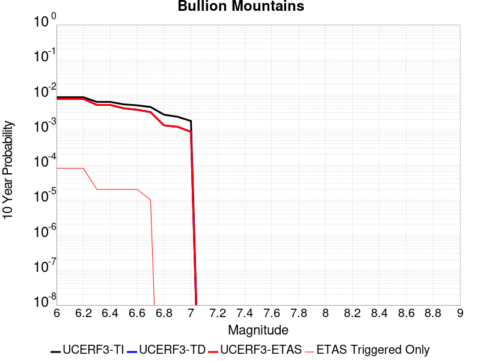 |

| Magnitude | 1 wk TI Prob | 1 wk TD Prob | 1 wk ETAS Prob | 1 wk ETAS/TD Gain | 1 wk ETAS Triggered Only | 1 mo TI Prob | 1 mo TD Prob | 1 mo ETAS Prob | 1 mo ETAS/TD Gain | 1 mo ETAS Triggered Only | 1 yr TI Prob | 1 yr TD Prob | 1 yr ETAS Prob | 1 yr ETAS/TD Gain | 1 yr ETAS Triggered Only | 10 yr TI Prob | 10 yr TD Prob | 10 yr ETAS Prob | 10 yr ETAS/TD Gain | 10 yr ETAS Triggered Only |
|-----|-----|-----|-----|-----|-----|-----|-----|-----|-----|-----|-----|-----|-----|-----|-----|-----|-----|-----|-----|-----|
| 6.0 | 1.6420427E-5 | 1.4692089E-5 | 4.469165E-5 | 3.0418851 | 3.0E-5 | 7.037136E-5 | 6.296479E-5 | 1.0296227E-4 | 1.6352357 | 4.0E-5 | 8.5643446E-4 | 7.663651E-4 | 8.063344E-4 | 1.0521544 | 4.0E-5 | 0.008531413 | 0.007641016 | 0.007720405 | 1.0103898 | 8.0E-5 |
| 6.1 | 1.6420427E-5 | 1.4692089E-5 | 4.469165E-5 | 3.0418851 | 3.0E-5 | 7.037136E-5 | 6.296479E-5 | 1.0296227E-4 | 1.6352357 | 4.0E-5 | 8.5643446E-4 | 7.663651E-4 | 8.063344E-4 | 1.0521544 | 4.0E-5 | 0.008531413 | 0.007641016 | 0.007720405 | 1.0103898 | 8.0E-5 |
| 6.2 | 1.6420427E-5 | 1.4692089E-5 | 4.469165E-5 | 3.0418851 | 3.0E-5 | 7.037136E-5 | 6.296479E-5 | 1.0296227E-4 | 1.6352357 | 4.0E-5 | 8.5643446E-4 | 7.663651E-4 | 8.063344E-4 | 1.0521544 | 4.0E-5 | 0.008531413 | 0.007641016 | 0.007720405 | 1.0103898 | 8.0E-5 |
| 6.3 | 1.2046778E-5 | 9.862335E-6 | 1.9862237E-5 | 2.0139487 | 1.0E-5 | 5.1628023E-5 | 4.2266598E-5 | 5.2266172E-5 | 1.2365835 | 1.0E-5 | 6.283899E-4 | 5.144975E-4 | 5.2449235E-4 | 1.0194265 | 1.0E-5 | 0.0062661595 | 0.005135345 | 0.005155242 | 1.0038745 | 2.0E-5 |
| 6.4 | 1.2046778E-5 | 9.862335E-6 | 1.9862237E-5 | 2.0139487 | 1.0E-5 | 5.1628023E-5 | 4.2266598E-5 | 5.2266172E-5 | 1.2365835 | 1.0E-5 | 6.283899E-4 | 5.144975E-4 | 5.2449235E-4 | 1.0194265 | 1.0E-5 | 0.0062661595 | 0.005135345 | 0.005155242 | 1.0038745 | 2.0E-5 |
| 6.5 | 1.0244343E-5 | 7.879458E-6 | 1.787938E-5 | 2.2691128 | 1.0E-5 | 4.390359E-5 | 3.3768785E-5 | 4.376845E-5 | 1.2961215 | 1.0E-5 | 5.343951E-4 | 4.110781E-4 | 4.21074E-4 | 1.0243163 | 1.0E-5 | 0.005331118 | 0.004105208 | 0.004125126 | 1.0048518 | 2.0E-5 |
| 6.6 | 9.605408E-6 | 7.1774966E-6 | 1.7177425E-5 | 2.3932335 | 1.0E-5 | 4.1165385E-5 | 3.076045E-5 | 4.0760144E-5 | 1.3250828 | 1.0E-5 | 5.010733E-4 | 3.744645E-4 | 3.8446073E-4 | 1.0266948 | 1.0E-5 | 0.00499945 | 0.003740332 | 0.0037602573 | 1.0053271 | 2.0E-5 |
| 6.7 | 8.60418E-6 | 6.1240044E-6 | 1.6123944E-5 | 2.6329083 | 1.0E-5 | 3.687454E-5 | 2.624558E-5 | 3.6245317E-5 | 1.3810066 | 1.0E-5 | 4.48855E-4 | 3.1951256E-4 | 3.2950938E-4 | 1.0312877 | 1.0E-5 | 0.004479495 | 0.0031924439 | 0.0032024118 | 1.0031224 | 1.0E-5 |
| 6.8 | 5.187994E-6 | 2.5631666E-6 | 2.5631666E-6 | 1.0 | 0.0 | 2.223407E-5 | 1.0984976E-5 | 1.0984976E-5 | 1.0 | 0.0 | 2.7066618E-4 | 1.3373788E-4 | 1.3373788E-4 | 1.0 | 0.0 | 0.0027033675 | 0.0013369655 | 0.0013369655 | 1.0 | 0.0 |
| 6.9 | 4.5302368E-6 | 2.3443165E-6 | 2.3443165E-6 | 1.0 | 0.0 | 1.9415156E-5 | 1.0047055E-5 | 1.0047055E-5 | 1.0 | 0.0 | 2.3635388E-4 | 1.2232E-4 | 1.2232E-4 | 1.0 | 0.0 | 0.0023610266 | 0.0012229157 | 0.0012229157 | 1.0 | 0.0 |
| 7.0 | 3.431668E-6 | 1.6882402E-6 | 1.6882402E-6 | 1.0 | 0.0 | 1.4707065E-5 | 7.235315E-6 | 7.235315E-6 | 1.0 | 0.0 | 1.7904381E-4 | 8.808996E-5 | 8.808996E-5 | 1.0 | 0.0 | 0.0017889962 | 8.808996E-4 | 8.808996E-4 | 1.0 | 0.0 |

## Dry Mountain
*[(top)](#table-of-contents)*

| 1 Week | 1 Month | 1 Year | 10 Year |
|-----|-----|-----|-----|
|  | 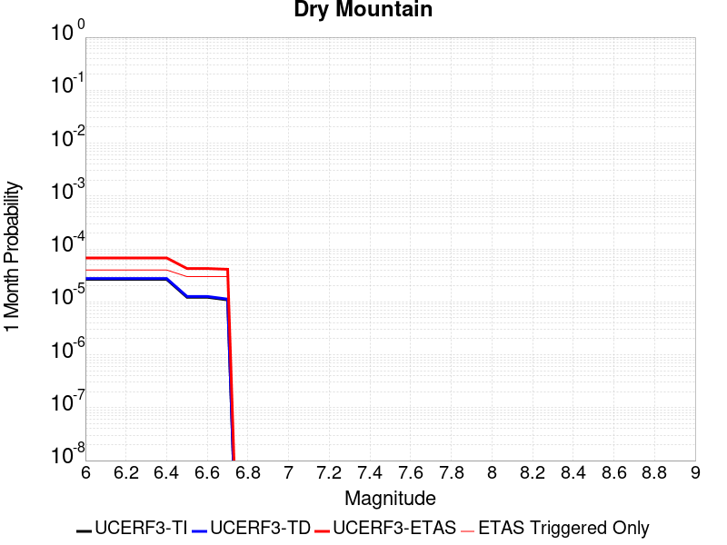 |  |  |

| Magnitude | 1 wk TI Prob | 1 wk TD Prob | 1 wk ETAS Prob | 1 wk ETAS/TD Gain | 1 wk ETAS Triggered Only | 1 mo TI Prob | 1 mo TD Prob | 1 mo ETAS Prob | 1 mo ETAS/TD Gain | 1 mo ETAS Triggered Only | 1 yr TI Prob | 1 yr TD Prob | 1 yr ETAS Prob | 1 yr ETAS/TD Gain | 1 yr ETAS Triggered Only | 10 yr TI Prob | 10 yr TD Prob | 10 yr ETAS Prob | 10 yr ETAS/TD Gain | 10 yr ETAS Triggered Only |
|-----|-----|-----|-----|-----|-----|-----|-----|-----|-----|-----|-----|-----|-----|-----|-----|-----|-----|-----|-----|-----|
| 6.0 | 6.222801E-6 | 6.439381E-6 | 2.6439253E-5 | 4.1058683 | 2.0E-5 | 2.6668875E-5 | 2.7597147E-5 | 6.759604E-5 | 2.4493852 | 4.0E-5 | 3.2464517E-4 | 3.3595937E-4 | 3.8594258E-4 | 1.1487775 | 5.0E-5 | 0.0032417132 | 0.0033560768 | 0.0034358085 | 1.0237573 | 8.0E-5 |
| 6.1 | 6.222801E-6 | 6.439381E-6 | 2.6439253E-5 | 4.1058683 | 2.0E-5 | 2.6668875E-5 | 2.7597147E-5 | 6.759604E-5 | 2.4493852 | 4.0E-5 | 3.2464517E-4 | 3.3595937E-4 | 3.8594258E-4 | 1.1487775 | 5.0E-5 | 0.0032417132 | 0.0033560768 | 0.0034358085 | 1.0237573 | 8.0E-5 |
| 6.2 | 6.222801E-6 | 6.439381E-6 | 2.6439253E-5 | 4.1058683 | 2.0E-5 | 2.6668875E-5 | 2.7597147E-5 | 6.759604E-5 | 2.4493852 | 4.0E-5 | 3.2464517E-4 | 3.3595937E-4 | 3.8594258E-4 | 1.1487775 | 5.0E-5 | 0.0032417132 | 0.0033560768 | 0.0034358085 | 1.0237573 | 8.0E-5 |
| 6.3 | 6.222801E-6 | 6.439381E-6 | 2.6439253E-5 | 4.1058683 | 2.0E-5 | 2.6668875E-5 | 2.7597147E-5 | 6.759604E-5 | 2.4493852 | 4.0E-5 | 3.2464517E-4 | 3.3595937E-4 | 3.8594258E-4 | 1.1487775 | 5.0E-5 | 0.0032417132 | 0.0033560768 | 0.0034358085 | 1.0237573 | 8.0E-5 |
| 6.4 | 6.222801E-6 | 6.439381E-6 | 2.6439253E-5 | 4.1058683 | 2.0E-5 | 2.6668875E-5 | 2.7597147E-5 | 6.759604E-5 | 2.4493852 | 4.0E-5 | 3.2464517E-4 | 3.3595937E-4 | 3.8594258E-4 | 1.1487775 | 5.0E-5 | 0.0032417132 | 0.0033560768 | 0.0034358085 | 1.0237573 | 8.0E-5 |
| 6.5 | 2.8528623E-6 | 2.9521684E-6 | 1.2952139E-5 | 4.3873305 | 1.0E-5 | 1.22264955E-5 | 1.2652138E-5 | 4.2651758E-5 | 3.3711107 | 3.0E-5 | 1.4884741E-4 | 1.540376E-4 | 1.9403143E-4 | 1.2596369 | 4.0E-5 | 0.0014874774 | 0.0015401616 | 0.0015900846 | 1.0324141 | 5.0E-5 |
| 6.6 | 2.8528623E-6 | 2.9521684E-6 | 1.2952139E-5 | 4.3873305 | 1.0E-5 | 1.22264955E-5 | 1.2652138E-5 | 4.2651758E-5 | 3.3711107 | 3.0E-5 | 1.4884741E-4 | 1.540376E-4 | 1.9403143E-4 | 1.2596369 | 4.0E-5 | 0.0014874774 | 0.0015401616 | 0.0015900846 | 1.0324141 | 5.0E-5 |
| 6.7 | 2.541E-6 | 2.6293578E-6 | 1.2629332E-5 | 4.8032 | 1.0E-5 | 1.0889954E-5 | 1.1268677E-5 | 4.126834E-5 | 3.662217 | 3.0E-5 | 1.3257713E-4 | 1.3719614E-4 | 1.7719065E-4 | 1.2915134 | 4.0E-5 | 0.0013249806 | 0.0013719613 | 0.0014218928 | 1.0363941 | 5.0E-5 |

## Tin Mountain
*[(top)](#table-of-contents)*

| 1 Week | 1 Month | 1 Year | 10 Year |
|-----|-----|-----|-----|
|  | 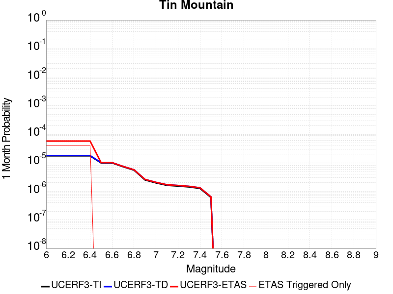 |  | 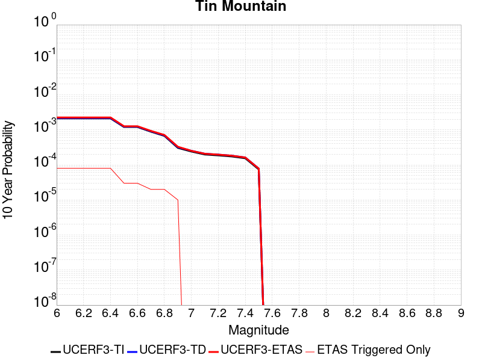 |

| Magnitude | 1 wk TI Prob | 1 wk TD Prob | 1 wk ETAS Prob | 1 wk ETAS/TD Gain | 1 wk ETAS Triggered Only | 1 mo TI Prob | 1 mo TD Prob | 1 mo ETAS Prob | 1 mo ETAS/TD Gain | 1 mo ETAS Triggered Only | 1 yr TI Prob | 1 yr TD Prob | 1 yr ETAS Prob | 1 yr ETAS/TD Gain | 1 yr ETAS Triggered Only | 10 yr TI Prob | 10 yr TD Prob | 10 yr ETAS Prob | 10 yr ETAS/TD Gain | 10 yr ETAS Triggered Only |
|-----|-----|-----|-----|-----|-----|-----|-----|-----|-----|-----|-----|-----|-----|-----|-----|-----|-----|-----|-----|-----|
| 6.0 | 4.083776E-6 | 4.1815365E-6 | 1.4181494E-5 | 3.3914554 | 1.0E-5 | 1.750178E-5 | 1.792077E-5 | 5.7920053E-5 | 3.232007 | 4.0E-5 | 2.1306332E-4 | 2.1816725E-4 | 2.6815635E-4 | 1.2291319 | 5.0E-5 | 0.0021285915 | 0.0021798965 | 0.002259722 | 1.036619 | 8.0E-5 |
| 6.1 | 4.083776E-6 | 4.1815365E-6 | 1.4181494E-5 | 3.3914554 | 1.0E-5 | 1.750178E-5 | 1.792077E-5 | 5.7920053E-5 | 3.232007 | 4.0E-5 | 2.1306332E-4 | 2.1816725E-4 | 2.6815635E-4 | 1.2291319 | 5.0E-5 | 0.0021285915 | 0.0021798965 | 0.002259722 | 1.036619 | 8.0E-5 |
| 6.2 | 4.083776E-6 | 4.1815365E-6 | 1.4181494E-5 | 3.3914554 | 1.0E-5 | 1.750178E-5 | 1.792077E-5 | 5.7920053E-5 | 3.232007 | 4.0E-5 | 2.1306332E-4 | 2.1816725E-4 | 2.6815635E-4 | 1.2291319 | 5.0E-5 | 0.0021285915 | 0.0021798965 | 0.002259722 | 1.036619 | 8.0E-5 |
| 6.3 | 4.083776E-6 | 4.1815365E-6 | 1.4181494E-5 | 3.3914554 | 1.0E-5 | 1.750178E-5 | 1.792077E-5 | 5.7920053E-5 | 3.232007 | 4.0E-5 | 2.1306332E-4 | 2.1816725E-4 | 2.6815635E-4 | 1.2291319 | 5.0E-5 | 0.0021285915 | 0.0021798965 | 0.002259722 | 1.036619 | 8.0E-5 |
| 6.4 | 4.083776E-6 | 4.1815365E-6 | 1.4181494E-5 | 3.3914554 | 1.0E-5 | 1.750178E-5 | 1.792077E-5 | 5.7920053E-5 | 3.232007 | 4.0E-5 | 2.1306332E-4 | 2.1816725E-4 | 2.6815635E-4 | 1.2291319 | 5.0E-5 | 0.0021285915 | 0.0021798965 | 0.002259722 | 1.036619 | 8.0E-5 |
| 6.5 | 2.3143427E-6 | 2.3731573E-6 | 2.3731573E-6 | 1.0 | 0.0 | 9.9185745E-6 | 1.0170638E-5 | 1.0170638E-5 | 1.0 | 0.0 | 1.2075195E-4 | 1.2382126E-4 | 1.3382002E-4 | 1.0807515 | 1.0E-5 | 0.0012068636 | 0.0012375986 | 0.0012675615 | 1.0242105 | 3.0E-5 |
| 6.6 | 2.3143427E-6 | 2.3731573E-6 | 2.3731573E-6 | 1.0 | 0.0 | 9.9185745E-6 | 1.0170638E-5 | 1.0170638E-5 | 1.0 | 0.0 | 1.2075195E-4 | 1.2382126E-4 | 1.3382002E-4 | 1.0807515 | 1.0E-5 | 0.0012068636 | 0.0012375986 | 0.0012675615 | 1.0242105 | 3.0E-5 |
| 6.7 | 1.7029532E-6 | 1.7497915E-6 | 1.7497915E-6 | 1.0 | 0.0 | 7.2983503E-6 | 7.499088E-6 | 7.499088E-6 | 1.0 | 0.0 | 8.885379E-5 | 9.1298105E-5 | 9.1298105E-5 | 1.0 | 0.0 | 8.881827E-4 | 9.1265864E-4 | 9.3264034E-4 | 1.021894 | 2.0E-5 |
| 6.8 | 1.2914646E-6 | 1.3299378E-6 | 1.3299378E-6 | 1.0 | 0.0 | 5.534837E-6 | 5.6997237E-6 | 5.6997237E-6 | 1.0 | 0.0 | 6.738455E-5 | 6.939237E-5 | 6.939237E-5 | 1.0 | 0.0 | 6.736412E-4 | 6.9375033E-4 | 7.1373646E-4 | 1.0288088 | 2.0E-5 |
| 6.9 | 5.8708974E-7 | 6.1169936E-7 | 6.1169936E-7 | 1.0 | 0.0 | 2.5160964E-6 | 2.6215664E-6 | 2.6215664E-6 | 1.0 | 0.0 | 3.0633044E-5 | 3.1917145E-5 | 3.1917145E-5 | 1.0 | 0.0 | 3.0628822E-4 | 3.191297E-4 | 3.2912652E-4 | 1.0313252 | 1.0E-5 |
| 7.0 | 4.6248786E-7 | 4.832015E-7 | 4.832015E-7 | 1.0 | 0.0 | 1.9820893E-6 | 2.0708624E-6 | 2.0708624E-6 | 1.0 | 0.0 | 2.413167E-5 | 2.5212494E-5 | 2.5212494E-5 | 1.0 | 0.0 | 2.412905E-4 | 2.5210003E-4 | 2.5210003E-4 | 1.0 | 0.0 |
| 7.1 | 3.804606E-7 | 3.987147E-7 | 3.987147E-7 | 1.0 | 0.0 | 1.6305444E-6 | 1.7087764E-6 | 1.7087764E-6 | 1.0 | 0.0 | 1.9851697E-5 | 2.0804187E-5 | 2.0804187E-5 | 1.0 | 0.0 | 1.9849923E-4 | 2.0802575E-4 | 2.0802575E-4 | 1.0 | 0.0 |
| 7.2 | 3.5864858E-7 | 3.7616863E-7 | 3.7616863E-7 | 1.0 | 0.0 | 1.5370645E-6 | 1.6121504E-6 | 1.6121504E-6 | 1.0 | 0.0 | 1.87136E-5 | 1.9627789E-5 | 1.9627789E-5 | 1.0 | 0.0 | 1.8712023E-4 | 1.9626386E-4 | 1.9626386E-4 | 1.0 | 0.0 |
| 7.3 | 3.342063E-7 | 3.506347E-7 | 3.506347E-7 | 1.0 | 0.0 | 1.4323119E-6 | 1.5027196E-6 | 1.5027196E-6 | 1.0 | 0.0 | 1.7438259E-5 | 1.829549E-5 | 1.829549E-5 | 1.0 | 0.0 | 1.743689E-4 | 1.8294314E-4 | 1.8294314E-4 | 1.0 | 0.0 |
| 7.4 | 2.971242E-7 | 3.1165817E-7 | 3.1165817E-7 | 1.0 | 0.0 | 1.2733886E-6 | 1.3356774E-6 | 1.3356774E-6 | 1.0 | 0.0 | 1.5503398E-5 | 1.6261785E-5 | 1.6261785E-5 | 1.0 | 0.0 | 1.5502315E-4 | 1.6260923E-4 | 1.6260923E-4 | 1.0 | 0.0 |
| 7.5 | 1.4326713E-7 | 1.5012525E-7 | 1.5012525E-7 | 1.0 | 0.0 | 6.140018E-7 | 6.433939E-7 | 6.433939E-7 | 1.0 | 0.0 | 7.4754466E-6 | 7.8333205E-6 | 7.8333205E-6 | 1.0 | 0.0 | 7.475195E-5 | 7.833321E-5 | 7.833321E-5 | 1.0 | 0.0 |

## San Jacinto (Clark) rev
*[(top)](#table-of-contents)*

| 1 Week | 1 Month | 1 Year | 10 Year |
|-----|-----|-----|-----|
|  |  |  |  |

| Magnitude | 1 wk TI Prob | 1 wk TD Prob | 1 wk ETAS Prob | 1 wk ETAS/TD Gain | 1 wk ETAS Triggered Only | 1 mo TI Prob | 1 mo TD Prob | 1 mo ETAS Prob | 1 mo ETAS/TD Gain | 1 mo ETAS Triggered Only | 1 yr TI Prob | 1 yr TD Prob | 1 yr ETAS Prob | 1 yr ETAS/TD Gain | 1 yr ETAS Triggered Only | 10 yr TI Prob | 10 yr TD Prob | 10 yr ETAS Prob | 10 yr ETAS/TD Gain | 10 yr ETAS Triggered Only |
|-----|-----|-----|-----|-----|-----|-----|-----|-----|-----|-----|-----|-----|-----|-----|-----|-----|-----|-----|-----|-----|
| 6.0 | 4.482615E-5 | 2.1154196E-5 | 4.1153773E-5 | 1.945419 | 2.0E-5 | 1.9209793E-4 | 9.065773E-5 | 1.20655015E-4 | 1.3308849 | 3.0E-5 | 0.0023362834 | 0.0011032083 | 0.0011431641 | 1.0362179 | 4.0E-5 | 0.02311874 | 0.011503847 | 0.011582927 | 1.0068742 | 8.0E-5 |
| 6.1 | 4.482615E-5 | 2.1154196E-5 | 4.1153773E-5 | 1.945419 | 2.0E-5 | 1.9209793E-4 | 9.065773E-5 | 1.20655015E-4 | 1.3308849 | 3.0E-5 | 0.0023362834 | 0.0011032083 | 0.0011431641 | 1.0362179 | 4.0E-5 | 0.02311874 | 0.011503847 | 0.011582927 | 1.0068742 | 8.0E-5 |
| 6.2 | 4.482615E-5 | 2.1154196E-5 | 4.1153773E-5 | 1.945419 | 2.0E-5 | 1.9209793E-4 | 9.065773E-5 | 1.20655015E-4 | 1.3308849 | 3.0E-5 | 0.0023362834 | 0.0011032083 | 0.0011431641 | 1.0362179 | 4.0E-5 | 0.02311874 | 0.011503847 | 0.011582927 | 1.0068742 | 8.0E-5 |
| 6.3 | 4.482615E-5 | 2.1154196E-5 | 4.1153773E-5 | 1.945419 | 2.0E-5 | 1.9209793E-4 | 9.065773E-5 | 1.20655015E-4 | 1.3308849 | 3.0E-5 | 0.0023362834 | 0.0011032083 | 0.0011431641 | 1.0362179 | 4.0E-5 | 0.02311874 | 0.011503847 | 0.011582927 | 1.0068742 | 8.0E-5 |
| 6.4 | 4.482615E-5 | 2.1154196E-5 | 4.1153773E-5 | 1.945419 | 2.0E-5 | 1.9209793E-4 | 9.065773E-5 | 1.20655015E-4 | 1.3308849 | 3.0E-5 | 0.0023362834 | 0.0011032083 | 0.0011431641 | 1.0362179 | 4.0E-5 | 0.02311874 | 0.011503847 | 0.011582927 | 1.0068742 | 8.0E-5 |
| 6.5 | 3.7294863E-5 | 1.7356087E-5 | 3.735574E-5 | 2.1523135 | 2.0E-5 | 1.5982533E-4 | 7.438113E-5 | 1.043789E-4 | 1.403298 | 3.0E-5 | 0.0019441366 | 9.052186E-4 | 9.4518234E-4 | 1.0441482 | 4.0E-5 | 0.01927216 | 0.0094941035 | 0.009563439 | 1.007303 | 7.0E-5 |
| 6.6 | 3.7294863E-5 | 1.7356087E-5 | 3.735574E-5 | 2.1523135 | 2.0E-5 | 1.5982533E-4 | 7.438113E-5 | 1.043789E-4 | 1.403298 | 3.0E-5 | 0.0019441366 | 9.052186E-4 | 9.4518234E-4 | 1.0441482 | 4.0E-5 | 0.01927216 | 0.0094941035 | 0.009563439 | 1.007303 | 7.0E-5 |
| 6.7 | 3.6039248E-5 | 1.6604314E-5 | 3.6603982E-5 | 2.2044864 | 2.0E-5 | 1.5444479E-4 | 7.1159426E-5 | 1.0115729E-4 | 1.4215586 | 3.0E-5 | 0.0018787434 | 8.6602574E-4 | 9.059911E-4 | 1.0461481 | 4.0E-5 | 0.01862939 | 0.009096047 | 0.00916541 | 1.0076257 | 7.0E-5 |
| 6.8 | 3.5031844E-5 | 1.6232942E-5 | 3.6232617E-5 | 2.2320426 | 2.0E-5 | 1.5012783E-4 | 6.956792E-5 | 9.956583E-5 | 1.4312032 | 3.0E-5 | 0.0018262739 | 8.4666436E-4 | 8.866305E-4 | 1.0472043 | 4.0E-5 | 0.01811338 | 0.008895969 | 0.008965346 | 1.0077988 | 7.0E-5 |
| 6.9 | 3.435112E-5 | 1.6063195E-5 | 3.6062873E-5 | 2.2450624 | 2.0E-5 | 1.4721078E-4 | 6.884047E-5 | 9.8838405E-5 | 1.4357601 | 3.0E-5 | 0.0017908178 | 8.3781447E-4 | 8.7778096E-4 | 1.0477033 | 4.0E-5 | 0.017764548 | 0.008804181 | 0.008873564 | 1.0078808 | 7.0E-5 |
| 7.0 | 2.8959772E-5 | 1.4336745E-5 | 3.433646E-5 | 2.394997 | 2.0E-5 | 1.241074E-4 | 6.144176E-5 | 9.143992E-5 | 1.4882373 | 3.0E-5 | 0.0015099603 | 7.477995E-4 | 7.8776956E-4 | 1.0534502 | 4.0E-5 | 0.014997416 | 0.007868037 | 0.007937485 | 1.0088267 | 7.0E-5 |
| 7.1 | 2.6002877E-5 | 1.2829002E-5 | 3.2828746E-5 | 2.5589478 | 2.0E-5 | 1.11436144E-4 | 5.498029E-5 | 8.497864E-5 | 1.5456201 | 3.0E-5 | 0.0013558907 | 6.691816E-4 | 7.091548E-4 | 1.0597345 | 4.0E-5 | 0.013476475 | 0.0070465137 | 0.0071160207 | 1.009864 | 7.0E-5 |
| 7.2 | 2.2544838E-5 | 1.1262543E-5 | 3.126232E-5 | 2.7757778 | 2.0E-5 | 9.661716E-5 | 4.8267157E-5 | 7.826571E-5 | 1.6215106 | 3.0E-5 | 0.001175679 | 5.874956E-4 | 6.274721E-4 | 1.0680456 | 4.0E-5 | 0.011694785 | 0.0061927503 | 0.0062623164 | 1.0112336 | 7.0E-5 |
| 7.3 | 1.75334E-5 | 1.0811715E-5 | 3.0811498E-5 | 2.8498254 | 2.0E-5 | 7.514098E-5 | 4.6335106E-5 | 7.6333716E-5 | 1.6474273 | 3.0E-5 | 9.144575E-4 | 5.6398526E-4 | 6.039627E-4 | 1.0708839 | 4.0E-5 | 0.009107036 | 0.0059337732 | 0.006003358 | 1.0117269 | 7.0E-5 |
| 7.4 | 1.5924552E-5 | 1.0611516E-5 | 3.0611303E-5 | 2.8847249 | 2.0E-5 | 6.82463E-5 | 4.547714E-5 | 7.547578E-5 | 1.6596421 | 3.0E-5 | 8.305819E-4 | 5.535449E-4 | 5.935228E-4 | 1.0722215 | 4.0E-5 | 0.008274844 | 0.0058210334 | 0.005890626 | 1.0119554 | 7.0E-5 |
| 7.5 | 1.3428931E-5 | 9.8519E-6 | 2.9851702E-5 | 3.0300453 | 2.0E-5 | 5.7551293E-5 | 4.2221753E-5 | 7.2220486E-5 | 1.7105043 | 3.0E-5 | 7.004617E-4 | 5.1392964E-4 | 5.539091E-4 | 1.0777917 | 4.0E-5 | 0.006982579 | 0.0054066023 | 0.005476224 | 1.0128771 | 7.0E-5 |
| 7.6 | 1.0688787E-5 | 8.614839E-6 | 2.8614668E-5 | 3.3215554 | 2.0E-5 | 4.5808283E-5 | 3.692022E-5 | 6.6919114E-5 | 1.8125328 | 3.0E-5 | 5.5757316E-4 | 4.4941145E-4 | 4.893935E-4 | 1.0889653 | 4.0E-5 | 0.005561762 | 0.0047416524 | 0.004801368 | 1.0125939 | 6.0E-5 |
| 7.7 | 8.81236E-6 | 7.4680274E-6 | 2.7467879E-5 | 3.6780634 | 2.0E-5 | 3.776671E-5 | 3.2005442E-5 | 6.200448E-5 | 1.9373106 | 3.0E-5 | 4.597127E-4 | 3.8959677E-4 | 4.2958118E-4 | 1.1026303 | 4.0E-5 | 0.0045876284 | 0.0041346536 | 0.0041944054 | 1.0144515 | 6.0E-5 |
| 7.8 | 7.780431E-6 | 6.696579E-6 | 2.6696445E-5 | 3.9865797 | 2.0E-5 | 3.3344273E-5 | 2.8699309E-5 | 5.869845E-5 | 2.0452914 | 3.0E-5 | 4.0589093E-4 | 3.4935825E-4 | 3.893443E-4 | 1.1144557 | 4.0E-5 | 0.0040515037 | 0.0037227906 | 0.0037825673 | 1.0160569 | 6.0E-5 |
| 7.9 | 6.5437994E-6 | 5.780382E-6 | 2.5780266E-5 | 4.459959 | 2.0E-5 | 2.8044553E-5 | 2.477283E-5 | 5.477209E-5 | 2.2109742 | 3.0E-5 | 3.4138895E-4 | 3.0156763E-4 | 3.4155557E-4 | 1.1326002 | 4.0E-5 | 0.0034086495 | 0.0032344845 | 0.0032942905 | 1.0184901 | 6.0E-5 |
| 8.0 | 5.4488164E-6 | 4.8133406E-6 | 2.4813244E-5 | 5.1550984 | 2.0E-5 | 2.3351862E-5 | 2.062844E-5 | 5.0627823E-5 | 2.4542727 | 3.0E-5 | 2.8427184E-4 | 2.5112246E-4 | 2.9111243E-4 | 1.1592448 | 4.0E-5 | 0.0028390845 | 0.002710839 | 0.0027706763 | 1.0220734 | 6.0E-5 |
| 8.1 | 2.8397242E-6 | 1.3670389E-6 | 1.1367025E-5 | 8.315071 | 1.0E-5 | 1.217019E-5 | 5.858725E-6 | 1.5858666E-5 | 2.706846 | 1.0E-5 | 1.4816198E-4 | 7.132765E-5 | 8.132694E-5 | 1.1401881 | 1.0E-5 | 0.0014806325 | 8.115382E-4 | 8.2153006E-4 | 1.0123123 | 1.0E-5 |
| 8.2 | 2.030244E-6 | 6.318974E-7 | 6.318974E-7 | 1.0 | 0.0 | 8.701017E-6 | 2.708129E-6 | 2.708129E-6 | 1.0 | 0.0 | 1.05929736E-4 | 3.2970976E-5 | 3.2970976E-5 | 1.0 | 0.0 | 0.0010587925 | 3.9486602E-4 | 3.9486602E-4 | 1.0 | 0.0 |
| 8.3 | 1.0659804E-6 | 2.9250086E-7 | 2.9250086E-7 | 1.0 | 0.0 | 4.568479E-6 | 1.2535745E-6 | 1.2535745E-6 | 1.0 | 0.0 | 5.5619817E-5 | 1.5262167E-5 | 1.5262167E-5 | 1.0 | 0.0 | 5.5605895E-4 | 1.8566217E-4 | 1.8566217E-4 | 1.0 | 0.0 |

## Kern Canyon (Lake Isabella) 2011
*[(top)](#table-of-contents)*

| 1 Week | 1 Month | 1 Year | 10 Year |
|-----|-----|-----|-----|
|  | 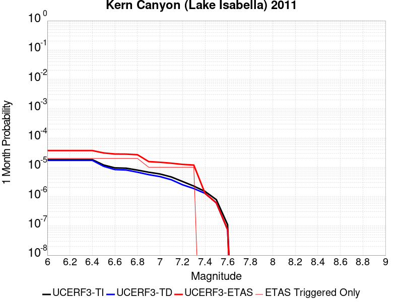 | 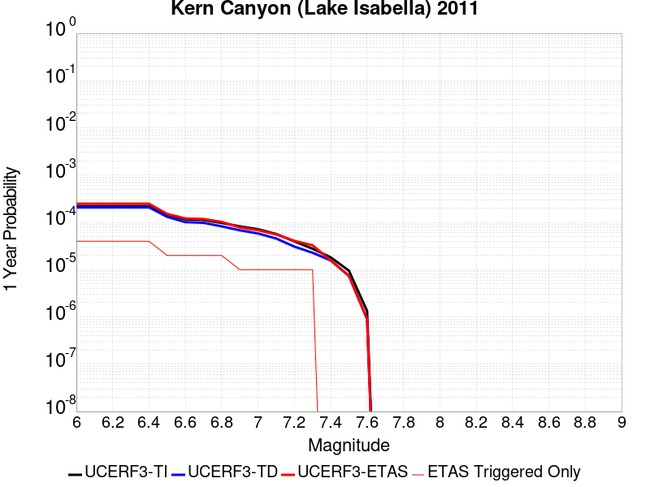 |  |

| Magnitude | 1 wk TI Prob | 1 wk TD Prob | 1 wk ETAS Prob | 1 wk ETAS/TD Gain | 1 wk ETAS Triggered Only | 1 mo TI Prob | 1 mo TD Prob | 1 mo ETAS Prob | 1 mo ETAS/TD Gain | 1 mo ETAS Triggered Only | 1 yr TI Prob | 1 yr TD Prob | 1 yr ETAS Prob | 1 yr ETAS/TD Gain | 1 yr ETAS Triggered Only | 10 yr TI Prob | 10 yr TD Prob | 10 yr ETAS Prob | 10 yr ETAS/TD Gain | 10 yr ETAS Triggered Only |
|-----|-----|-----|-----|-----|-----|-----|-----|-----|-----|-----|-----|-----|-----|-----|-----|-----|-----|-----|-----|-----|
| 6.0 | 4.2387383E-6 | 4.001639E-6 | 1.4001599E-5 | 3.4989662 | 1.0E-5 | 1.8165894E-5 | 1.7149778E-5 | 3.7149435E-5 | 2.1661758 | 2.0E-5 | 2.2114732E-4 | 2.087804E-4 | 2.4877206E-4 | 1.1915488 | 4.0E-5 | 0.0022092736 | 0.0020860266 | 0.0021558804 | 1.0334866 | 7.0E-5 |
| 6.1 | 4.2387383E-6 | 4.001639E-6 | 1.4001599E-5 | 3.4989662 | 1.0E-5 | 1.8165894E-5 | 1.7149778E-5 | 3.7149435E-5 | 2.1661758 | 2.0E-5 | 2.2114732E-4 | 2.087804E-4 | 2.4877206E-4 | 1.1915488 | 4.0E-5 | 0.0022092736 | 0.0020860266 | 0.0021558804 | 1.0334866 | 7.0E-5 |
| 6.2 | 4.2387383E-6 | 4.001639E-6 | 1.4001599E-5 | 3.4989662 | 1.0E-5 | 1.8165894E-5 | 1.7149778E-5 | 3.7149435E-5 | 2.1661758 | 2.0E-5 | 2.2114732E-4 | 2.087804E-4 | 2.4877206E-4 | 1.1915488 | 4.0E-5 | 0.0022092736 | 0.0020860266 | 0.0021558804 | 1.0334866 | 7.0E-5 |
| 6.3 | 4.2387383E-6 | 4.001639E-6 | 1.4001599E-5 | 3.4989662 | 1.0E-5 | 1.8165894E-5 | 1.7149778E-5 | 3.7149435E-5 | 2.1661758 | 2.0E-5 | 2.2114732E-4 | 2.087804E-4 | 2.4877206E-4 | 1.1915488 | 4.0E-5 | 0.0022092736 | 0.0020860266 | 0.0021558804 | 1.0334866 | 7.0E-5 |
| 6.4 | 4.2387383E-6 | 4.001639E-6 | 1.4001599E-5 | 3.4989662 | 1.0E-5 | 1.8165894E-5 | 1.7149778E-5 | 3.7149435E-5 | 2.1661758 | 2.0E-5 | 2.2114732E-4 | 2.087804E-4 | 2.4877206E-4 | 1.1915488 | 4.0E-5 | 0.0022092736 | 0.0020860266 | 0.0021558804 | 1.0334866 | 7.0E-5 |
| 6.5 | 2.7857532E-6 | 2.517867E-6 | 1.2517842E-5 | 4.971606 | 1.0E-5 | 1.1938888E-5 | 1.0790815E-5 | 3.07906E-5 | 2.853408 | 2.0E-5 | 1.4534626E-4 | 1.3137059E-4 | 1.5136796E-4 | 1.1522211 | 2.0E-5 | 0.0014525123 | 0.001312962 | 0.0013529095 | 1.0304254 | 4.0E-5 |
| 6.6 | 2.2233348E-6 | 1.9441236E-6 | 1.1944104E-5 | 6.143696 | 1.0E-5 | 9.528543E-6 | 8.331932E-6 | 2.8331766E-5 | 3.4003837 | 2.0E-5 | 1.1600384E-4 | 1.01436635E-4 | 1.2143461E-4 | 1.1971474 | 2.0E-5 | 0.001159433 | 0.001013912 | 0.0010538715 | 1.0394112 | 4.0E-5 |
| 6.7 | 2.1635126E-6 | 1.8835036E-6 | 1.1883485E-5 | 6.3092446 | 1.0E-5 | 9.272164E-6 | 8.072134E-6 | 2.8071972E-5 | 3.4776397 | 2.0E-5 | 1.1288274E-4 | 9.827388E-5 | 1.1827191E-4 | 1.2034929 | 2.0E-5 | 0.0011282542 | 9.823124E-4 | 0.0010222731 | 1.0406803 | 4.0E-5 |
| 6.8 | 1.8685711E-6 | 1.5831425E-6 | 1.1583126E-5 | 7.3165407 | 1.0E-5 | 8.008137E-6 | 6.784879E-6 | 2.6784743E-5 | 3.9477112 | 2.0E-5 | 9.74947E-5 | 8.260282E-5 | 1.0260117E-4 | 1.2421025 | 2.0E-5 | 9.745194E-4 | 8.2572614E-4 | 8.656931E-4 | 1.0484022 | 4.0E-5 |
| 6.9 | 1.5815071E-6 | 1.3064928E-6 | 1.3064928E-6 | 1.0 | 0.0 | 6.77787E-6 | 5.599243E-6 | 1.5599187E-5 | 2.7859457 | 1.0E-5 | 8.251744E-5 | 6.816868E-5 | 7.8168E-5 | 1.1466849 | 1.0E-5 | 8.248681E-4 | 6.8148033E-4 | 7.114599E-4 | 1.0439918 | 3.0E-5 |
| 7.0 | 1.3772564E-6 | 1.1210718E-6 | 1.1210718E-6 | 1.0 | 0.0 | 5.9025137E-6 | 4.8045845E-6 | 1.48045365E-5 | 3.0813353 | 1.0E-5 | 7.186073E-5 | 5.8494268E-5 | 6.849368E-5 | 1.170947 | 1.0E-5 | 7.18375E-4 | 5.847908E-4 | 6.1477325E-4 | 1.0512704 | 3.0E-5 |
| 7.1 | 1.0916998E-6 | 8.763777E-7 | 8.763777E-7 | 1.0 | 0.0 | 4.678705E-6 | 3.7558991E-6 | 1.3755862E-5 | 3.6624682 | 1.0E-5 | 5.6961744E-5 | 4.5727127E-5 | 5.572667E-5 | 1.2186786 | 1.0E-5 | 5.6947145E-4 | 4.571785E-4 | 4.871648E-4 | 1.0655899 | 3.0E-5 |
| 7.2 | 7.6277024E-7 | 5.901454E-7 | 5.901454E-7 | 1.0 | 0.0 | 3.2690114E-6 | 2.5291922E-6 | 1.2529167E-5 | 4.953821 | 1.0E-5 | 3.9799485E-5 | 3.0792486E-5 | 4.079218E-5 | 1.3247446 | 1.0E-5 | 3.9792358E-4 | 3.0788282E-4 | 3.378736E-4 | 1.0974097 | 3.0E-5 |
| 7.3 | 5.3265916E-7 | 4.3824414E-7 | 4.3824414E-7 | 1.0 | 0.0 | 2.282823E-6 | 1.878188E-6 | 1.1878169E-5 | 6.3242707 | 1.0E-5 | 2.7793016E-5 | 2.2866701E-5 | 3.2866472E-5 | 1.4373071 | 1.0E-5 | 2.778954E-4 | 2.2864387E-4 | 2.3864159E-4 | 1.0437261 | 1.0E-5 |
| 7.4 | 3.4946007E-7 | 3.006571E-7 | 3.006571E-7 | 1.0 | 0.0 | 1.497685E-6 | 1.2885298E-6 | 1.2885298E-6 | 1.0 | 0.0 | 1.8234163E-5 | 1.568774E-5 | 1.568774E-5 | 1.0 | 0.0 | 1.8232666E-4 | 1.5686655E-4 | 1.5686655E-4 | 1.0 | 0.0 |
| 7.5 | 1.8317026E-7 | 1.4244812E-7 | 1.4244812E-7 | 1.0 | 0.0 | 7.850152E-7 | 6.104918E-7 | 6.104918E-7 | 1.0 | 0.0 | 9.557518E-6 | 7.432713E-6 | 7.432713E-6 | 1.0 | 0.0 | 9.5571064E-5 | 7.432472E-5 | 7.432472E-5 | 1.0 | 0.0 |
| 7.6 | 2.572245E-8 | 1.7352555E-8 | 1.7352555E-8 | 1.0 | 0.0 | 1.10239064E-7 | 7.436809E-8 | 7.436809E-8 | 1.0 | 0.0 | 1.3421597E-6 | 9.054312E-7 | 9.054312E-7 | 1.0 | 0.0 | 1.3421517E-5 | 9.05428E-6 | 9.05428E-6 | 1.0 | 0.0 |

## San Jacinto (Superstition Mtn)
*[(top)](#table-of-contents)*

| 1 Week | 1 Month | 1 Year | 10 Year |
|-----|-----|-----|-----|
|  | 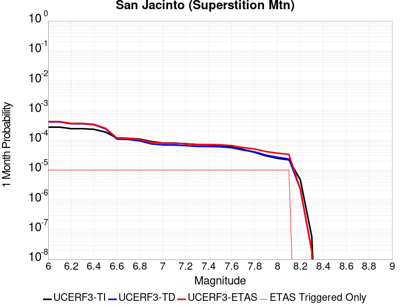 | 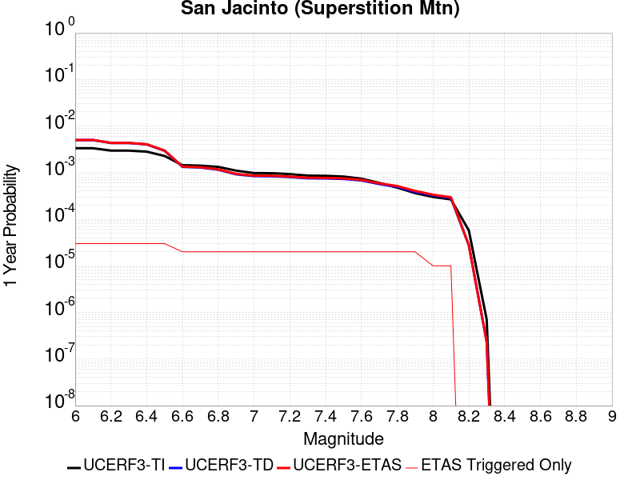 | 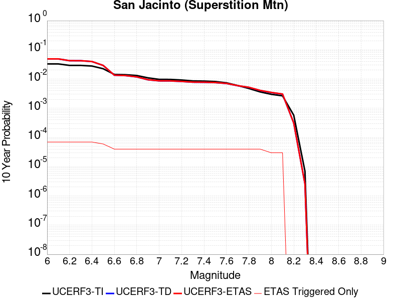 |

| Magnitude | 1 wk TI Prob | 1 wk TD Prob | 1 wk ETAS Prob | 1 wk ETAS/TD Gain | 1 wk ETAS Triggered Only | 1 mo TI Prob | 1 mo TD Prob | 1 mo ETAS Prob | 1 mo ETAS/TD Gain | 1 mo ETAS Triggered Only | 1 yr TI Prob | 1 yr TD Prob | 1 yr ETAS Prob | 1 yr ETAS/TD Gain | 1 yr ETAS Triggered Only | 10 yr TI Prob | 10 yr TD Prob | 10 yr ETAS Prob | 10 yr ETAS/TD Gain | 10 yr ETAS Triggered Only |
|-----|-----|-----|-----|-----|-----|-----|-----|-----|-----|-----|-----|-----|-----|-----|-----|-----|-----|-----|-----|-----|
| 6.0 | 6.4193904E-5 | 9.599367E-5 | 9.599367E-5 | 1.0 | 0.0 | 2.7508775E-4 | 4.1134638E-4 | 4.2134227E-4 | 1.0243005 | 1.0E-5 | 0.0033440501 | 0.0049980893 | 0.0050279396 | 1.0059723 | 3.0E-5 | 0.03294174 | 0.048823986 | 0.04889057 | 1.0013638 | 7.0E-5 |
| 6.1 | 6.4193904E-5 | 9.599367E-5 | 9.599367E-5 | 1.0 | 0.0 | 2.7508775E-4 | 4.1134638E-4 | 4.2134227E-4 | 1.0243005 | 1.0E-5 | 0.0033440501 | 0.0049980893 | 0.0050279396 | 1.0059723 | 3.0E-5 | 0.03294174 | 0.048823986 | 0.04889057 | 1.0013638 | 7.0E-5 |
| 6.2 | 5.7023593E-5 | 8.3144434E-5 | 8.3144434E-5 | 1.0 | 0.0 | 2.4436394E-4 | 3.5629404E-4 | 3.6629045E-4 | 1.0280567 | 1.0E-5 | 0.002971072 | 0.0043308944 | 0.0043607643 | 1.006897 | 3.0E-5 | 0.029316625 | 0.04250403 | 0.042571053 | 1.0015769 | 7.0E-5 |
| 6.3 | 5.6940098E-5 | 8.298979E-5 | 8.298979E-5 | 1.0 | 0.0 | 2.4400617E-4 | 3.5563146E-4 | 3.6562793E-4 | 1.028109 | 1.0E-5 | 0.002966728 | 0.00432286 | 0.0043527302 | 1.0069098 | 3.0E-5 | 0.029274331 | 0.042427283 | 0.042494312 | 1.0015799 | 7.0E-5 |
| 6.4 | 5.4171585E-5 | 7.7483564E-5 | 7.7483564E-5 | 1.0 | 0.0 | 2.3214328E-4 | 3.3203943E-4 | 3.4203613E-4 | 1.0301069 | 1.0E-5 | 0.0028226813 | 0.0040367353 | 0.004066614 | 1.0074017 | 3.0E-5 | 0.02787096 | 0.03971653 | 0.03978375 | 1.0016925 | 7.0E-5 |
| 6.5 | 4.375144E-5 | 5.642133E-5 | 5.642133E-5 | 1.0 | 0.0 | 1.874927E-4 | 2.4178992E-4 | 2.517875E-4 | 1.0413482 | 1.0E-5 | 0.0022803338 | 0.002940994 | 0.0029709057 | 1.0101706 | 3.0E-5 | 0.022570757 | 0.029236801 | 0.029295048 | 1.0019922 | 6.0E-5 |
| 6.6 | 2.772192E-5 | 2.5488358E-5 | 2.5488358E-5 | 1.0 | 0.0 | 1.1880282E-4 | 1.09231354E-4 | 1.1923026E-4 | 1.0915388 | 1.0E-5 | 0.0014454646 | 0.0013290998 | 0.0013490731 | 1.0150278 | 2.0E-5 | 0.014360986 | 0.01354049 | 0.013579949 | 1.0029141 | 4.0E-5 |
| 6.7 | 2.7124124E-5 | 2.4699386E-5 | 2.4699386E-5 | 1.0 | 0.0 | 1.1624106E-4 | 1.05850326E-4 | 1.1584927E-4 | 1.094463 | 1.0E-5 | 0.0014143161 | 0.001287985 | 0.0013079593 | 1.0155082 | 2.0E-5 | 0.014053487 | 0.013133943 | 0.013173418 | 1.0030055 | 4.0E-5 |
| 6.8 | 2.5475807E-5 | 2.216446E-5 | 2.216446E-5 | 1.0 | 0.0 | 1.0917746E-4 | 9.4987154E-5 | 1.04986204E-4 | 1.1052674 | 1.0E-5 | 0.001328425 | 0.001155867 | 0.0011758439 | 1.0172831 | 2.0E-5 | 0.0132051185 | 0.011822182 | 0.011861709 | 1.0033435 | 4.0E-5 |
| 6.9 | 2.1162023E-5 | 1.7626244E-5 | 1.7626244E-5 | 1.0 | 0.0 | 9.069123E-5 | 7.5538876E-5 | 8.553812E-5 | 1.1323721 | 1.0E-5 | 0.0011036064 | 9.193016E-4 | 9.3928317E-4 | 1.0217357 | 2.0E-5 | 0.010981417 | 0.00944688 | 0.009486502 | 1.0041943 | 4.0E-5 |
| 7.0 | 1.8754288E-5 | 1.6161559E-5 | 1.6161559E-5 | 1.0 | 0.0 | 8.037304E-5 | 6.9261994E-5 | 7.926131E-5 | 1.1443694 | 1.0E-5 | 9.781026E-4 | 8.4294105E-4 | 8.629242E-4 | 1.0237064 | 2.0E-5 | 0.009738087 | 0.008670042 | 0.008709695 | 1.0045736 | 4.0E-5 |
| 7.1 | 1.8678527E-5 | 1.6086702E-5 | 1.6086702E-5 | 1.0 | 0.0 | 8.0048376E-5 | 6.89412E-5 | 7.894051E-5 | 1.1450411 | 1.0E-5 | 9.7415317E-4 | 8.3903834E-4 | 8.5902156E-4 | 1.0238168 | 2.0E-5 | 0.009698939 | 0.008630998 | 0.008670653 | 1.0045944 | 4.0E-5 |
| 7.2 | 1.7804578E-5 | 1.5381282E-5 | 1.5381282E-5 | 1.0 | 0.0 | 7.6303106E-5 | 6.5918124E-5 | 7.5917465E-5 | 1.1516933 | 1.0E-5 | 9.285943E-4 | 8.022599E-4 | 8.2224386E-4 | 1.0249096 | 2.0E-5 | 0.009247236 | 0.008262311 | 0.008301981 | 1.0048013 | 4.0E-5 |
| 7.3 | 1.6583685E-5 | 1.4530388E-5 | 1.4530388E-5 | 1.0 | 0.0 | 7.1070994E-5 | 6.227162E-5 | 7.2270996E-5 | 1.1605768 | 1.0E-5 | 8.649459E-4 | 7.5789524E-4 | 7.778801E-4 | 1.0263689 | 2.0E-5 | 0.00861587 | 0.007817623 | 0.007857311 | 1.0050766 | 4.0E-5 |
| 7.4 | 1.6387552E-5 | 1.4395274E-5 | 1.4395274E-5 | 1.0 | 0.0 | 7.023047E-5 | 6.169258E-5 | 7.169197E-5 | 1.162084 | 1.0E-5 | 8.5472054E-4 | 7.5085036E-4 | 7.708353E-4 | 1.0266165 | 2.0E-5 | 0.008514405 | 0.0077470057 | 0.007786696 | 1.0051233 | 4.0E-5 |
| 7.5 | 1.5790754E-5 | 1.4035962E-5 | 1.4035962E-5 | 1.0 | 0.0 | 6.767291E-5 | 6.0152746E-5 | 7.015214E-5 | 1.1662334 | 1.0E-5 | 8.236062E-4 | 7.321156E-4 | 7.5210095E-4 | 1.0272981 | 2.0E-5 | 0.008205604 | 0.007557569 | 0.0075972667 | 1.0052527 | 4.0E-5 |
| 7.6 | 1.4248672E-5 | 1.3054932E-5 | 1.3054932E-5 | 1.0 | 0.0 | 6.106431E-5 | 5.594852E-5 | 6.594796E-5 | 1.1787257 | 1.0E-5 | 7.432043E-4 | 6.8096205E-4 | 7.0094847E-4 | 1.0293502 | 2.0E-5 | 0.007407237 | 0.0070401574 | 0.0070798756 | 1.0056417 | 4.0E-5 |
| 7.7 | 1.15449975E-5 | 1.090368E-5 | 1.090368E-5 | 1.0 | 0.0 | 4.947762E-5 | 4.6729223E-5 | 5.6728757E-5 | 1.2139889 | 1.0E-5 | 6.022235E-4 | 5.687805E-4 | 5.8876915E-4 | 1.0351429 | 2.0E-5 | 0.006005941 | 0.0059101824 | 0.0059499457 | 1.0067279 | 4.0E-5 |
| 7.8 | 9.1391985E-6 | 9.514299E-6 | 9.514299E-6 | 1.0 | 0.0 | 3.9167408E-5 | 4.0774932E-5 | 5.0774524E-5 | 1.2452388 | 1.0E-5 | 4.767588E-4 | 4.963223E-4 | 5.163124E-4 | 1.0402764 | 2.0E-5 | 0.0047573727 | 0.0051766867 | 0.0052164793 | 1.007687 | 4.0E-5 |
| 7.9 | 6.973017E-6 | 7.3821784E-6 | 7.3821784E-6 | 1.0 | 0.0 | 2.9884017E-5 | 3.1637526E-5 | 4.163721E-5 | 1.3160703 | 1.0E-5 | 3.6377716E-4 | 3.8511935E-4 | 4.0511164E-4 | 1.051912 | 2.0E-5 | 0.0036318225 | 0.0040517948 | 0.0040916326 | 1.0098321 | 4.0E-5 |
| 8.0 | 5.7638235E-6 | 6.259972E-6 | 6.259972E-6 | 1.0 | 0.0 | 2.4701867E-5 | 2.6828178E-5 | 3.682791E-5 | 1.3727324 | 1.0E-5 | 3.0070372E-4 | 3.2658462E-4 | 3.3658135E-4 | 1.03061 | 1.0E-5 | 0.0030029714 | 0.0034534496 | 0.003483346 | 1.008657 | 3.0E-5 |
| 8.1 | 5.1124434E-6 | 5.4956718E-6 | 5.4956718E-6 | 1.0 | 0.0 | 2.1910288E-5 | 2.355267E-5 | 3.3552435E-5 | 1.4245703 | 1.0E-5 | 2.6672508E-4 | 2.867165E-4 | 2.9671364E-4 | 1.0348676 | 1.0E-5 | 0.0026640517 | 0.003040336 | 0.003070245 | 1.0098374 | 3.0E-5 |
| 8.2 | 1.1075938E-6 | 5.336568E-7 | 5.336568E-7 | 1.0 | 0.0 | 4.7468216E-6 | 2.2870988E-6 | 2.2870988E-6 | 1.0 | 0.0 | 5.779102E-5 | 2.7845093E-5 | 2.7845093E-5 | 1.0 | 0.0 | 5.777599E-4 | 3.1346595E-4 | 3.1346595E-4 | 1.0 | 0.0 |
| 8.3 | 1.3584393E-8 | 4.473836E-9 | 4.473836E-9 | 1.0 | 0.0 | 5.8218827E-8 | 1.9173582E-8 | 1.9173582E-8 | 1.0 | 0.0 | 7.0881396E-7 | 2.3343837E-7 | 2.3343837E-7 | 1.0 | 0.0 | 7.0881174E-6 | 2.6163038E-6 | 2.6163038E-6 | 1.0 | 0.0 |

## Pine Mtn
*[(top)](#table-of-contents)*

| 1 Week | 1 Month | 1 Year | 10 Year |
|-----|-----|-----|-----|
| 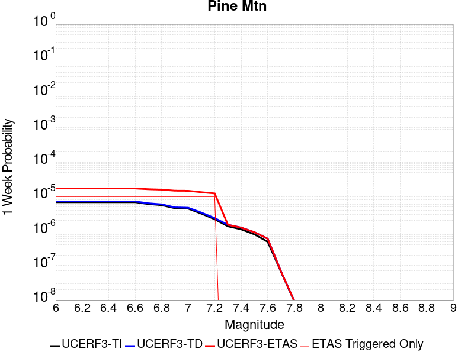 |  |  | 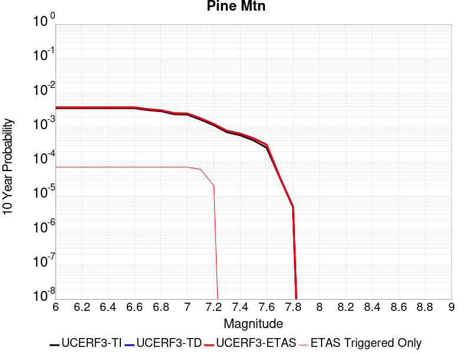 |

| Magnitude | 1 wk TI Prob | 1 wk TD Prob | 1 wk ETAS Prob | 1 wk ETAS/TD Gain | 1 wk ETAS Triggered Only | 1 mo TI Prob | 1 mo TD Prob | 1 mo ETAS Prob | 1 mo ETAS/TD Gain | 1 mo ETAS Triggered Only | 1 yr TI Prob | 1 yr TD Prob | 1 yr ETAS Prob | 1 yr ETAS/TD Gain | 1 yr ETAS Triggered Only | 10 yr TI Prob | 10 yr TD Prob | 10 yr ETAS Prob | 10 yr ETAS/TD Gain | 10 yr ETAS Triggered Only |
|-----|-----|-----|-----|-----|-----|-----|-----|-----|-----|-----|-----|-----|-----|-----|-----|-----|-----|-----|-----|-----|
| 6.0 | 6.894797E-6 | 7.225461E-6 | 1.722539E-5 | 2.3839846 | 1.0E-5 | 2.9548795E-5 | 3.096591E-5 | 5.0965293E-5 | 1.6458515 | 2.0E-5 | 3.596972E-4 | 3.7694772E-4 | 4.1693266E-4 | 1.1060755 | 4.0E-5 | 0.0035911554 | 0.003763381 | 0.0038331177 | 1.0185302 | 7.0E-5 |
| 6.1 | 6.894797E-6 | 7.225461E-6 | 1.722539E-5 | 2.3839846 | 1.0E-5 | 2.9548795E-5 | 3.096591E-5 | 5.0965293E-5 | 1.6458515 | 2.0E-5 | 3.596972E-4 | 3.7694772E-4 | 4.1693266E-4 | 1.1060755 | 4.0E-5 | 0.0035911554 | 0.003763381 | 0.0038331177 | 1.0185302 | 7.0E-5 |
| 6.2 | 6.894797E-6 | 7.225461E-6 | 1.722539E-5 | 2.3839846 | 1.0E-5 | 2.9548795E-5 | 3.096591E-5 | 5.0965293E-5 | 1.6458515 | 2.0E-5 | 3.596972E-4 | 3.7694772E-4 | 4.1693266E-4 | 1.1060755 | 4.0E-5 | 0.0035911554 | 0.003763381 | 0.0038331177 | 1.0185302 | 7.0E-5 |
| 6.3 | 6.894797E-6 | 7.225461E-6 | 1.722539E-5 | 2.3839846 | 1.0E-5 | 2.9548795E-5 | 3.096591E-5 | 5.0965293E-5 | 1.6458515 | 2.0E-5 | 3.596972E-4 | 3.7694772E-4 | 4.1693266E-4 | 1.1060755 | 4.0E-5 | 0.0035911554 | 0.003763381 | 0.0038331177 | 1.0185302 | 7.0E-5 |
| 6.4 | 6.894797E-6 | 7.225461E-6 | 1.722539E-5 | 2.3839846 | 1.0E-5 | 2.9548795E-5 | 3.096591E-5 | 5.0965293E-5 | 1.6458515 | 2.0E-5 | 3.596972E-4 | 3.7694772E-4 | 4.1693266E-4 | 1.1060755 | 4.0E-5 | 0.0035911554 | 0.003763381 | 0.0038331177 | 1.0185302 | 7.0E-5 |
| 6.5 | 6.894797E-6 | 7.225461E-6 | 1.722539E-5 | 2.3839846 | 1.0E-5 | 2.9548795E-5 | 3.096591E-5 | 5.0965293E-5 | 1.6458515 | 2.0E-5 | 3.596972E-4 | 3.7694772E-4 | 4.1693266E-4 | 1.1060755 | 4.0E-5 | 0.0035911554 | 0.003763381 | 0.0038331177 | 1.0185302 | 7.0E-5 |
| 6.6 | 6.894797E-6 | 7.225461E-6 | 1.722539E-5 | 2.3839846 | 1.0E-5 | 2.9548795E-5 | 3.096591E-5 | 5.0965293E-5 | 1.6458515 | 2.0E-5 | 3.596972E-4 | 3.7694772E-4 | 4.1693266E-4 | 1.1060755 | 4.0E-5 | 0.0035911554 | 0.003763381 | 0.0038331177 | 1.0185302 | 7.0E-5 |
| 6.7 | 6.0867933E-6 | 6.3971133E-6 | 1.6397049E-5 | 2.563195 | 1.0E-5 | 2.6085996E-5 | 2.7415923E-5 | 4.7415375E-5 | 1.729483 | 2.0E-5 | 3.1755073E-4 | 3.3373994E-4 | 3.737266E-4 | 1.1198138 | 4.0E-5 | 0.0031709734 | 0.0033326065 | 0.003402373 | 1.0209346 | 7.0E-5 |
| 6.8 | 5.6530425E-6 | 5.9505956E-6 | 1.5950536E-5 | 2.680494 | 1.0E-5 | 2.42271E-5 | 2.5502315E-5 | 4.5501805E-5 | 1.7842225 | 2.0E-5 | 2.94925E-4 | 3.104485E-4 | 3.5043608E-4 | 1.1288059 | 4.0E-5 | 0.002945339 | 0.0031003528 | 0.003170136 | 1.022508 | 7.0E-5 |
| 6.9 | 4.6015225E-6 | 4.863834E-6 | 1.48637855E-5 | 3.0559812 | 1.0E-5 | 1.9720663E-5 | 2.0844845E-5 | 4.084443E-5 | 1.9594499 | 2.0E-5 | 2.4007261E-4 | 2.5375787E-4 | 2.9374773E-4 | 1.1575906 | 4.0E-5 | 0.0023981342 | 0.0025348254 | 0.002604648 | 1.0275453 | 7.0E-5 |
| 7.0 | 4.4875965E-6 | 4.747473E-6 | 1.4747426E-5 | 3.1063738 | 1.0E-5 | 1.9232413E-5 | 2.0346162E-5 | 4.0345756E-5 | 1.9829663 | 2.0E-5 | 2.3412947E-4 | 2.4768783E-4 | 2.8767792E-4 | 1.1614536 | 4.0E-5 | 0.0023388295 | 0.0024742614 | 0.0025440883 | 1.0282212 | 7.0E-5 |
| 7.1 | 3.203907E-6 | 3.4294096E-6 | 1.3429375E-5 | 3.9159439 | 1.0E-5 | 1.3730958E-5 | 1.4697391E-5 | 3.4697096E-5 | 2.3607657 | 2.0E-5 | 1.6716159E-4 | 1.789267E-4 | 2.1891955E-4 | 1.2235153 | 4.0E-5 | 0.0016703589 | 0.0017878925 | 0.0018477853 | 1.0334991 | 6.0E-5 |
| 7.2 | 2.2060601E-6 | 2.3784817E-6 | 1.23784575E-5 | 5.204353 | 1.0E-5 | 9.4545085E-6 | 1.0193455E-5 | 2.0193353E-5 | 1.9810116 | 1.0E-5 | 1.15102564E-4 | 1.240987E-4 | 1.4409622E-4 | 1.161142 | 2.0E-5 | 0.0011504296 | 0.0012403389 | 0.001260314 | 1.0161046 | 2.0E-5 |
| 7.3 | 1.3765207E-6 | 1.5216481E-6 | 1.5216481E-6 | 1.0 | 0.0 | 5.899361E-6 | 6.521333E-6 | 6.521333E-6 | 1.0 | 0.0 | 7.182235E-5 | 7.939443E-5 | 7.939443E-5 | 1.0 | 0.0 | 7.1799144E-4 | 7.936697E-4 | 7.936697E-4 | 1.0 | 0.0 |
| 7.4 | 1.1245983E-6 | 1.2587075E-6 | 1.2587075E-6 | 1.0 | 0.0 | 4.819698E-6 | 5.39445E-6 | 5.39445E-6 | 1.0 | 0.0 | 5.8678244E-5 | 6.567554E-5 | 6.567554E-5 | 1.0 | 0.0 | 5.866275E-4 | 6.5656955E-4 | 6.5656955E-4 | 1.0 | 0.0 |
| 7.5 | 8.031682E-7 | 9.276951E-7 | 9.276951E-7 | 1.0 | 0.0 | 3.4421448E-6 | 3.9758306E-6 | 3.9758306E-6 | 1.0 | 0.0 | 4.1907308E-5 | 4.840473E-5 | 4.840473E-5 | 1.0 | 0.0 | 4.1899405E-4 | 4.8394862E-4 | 4.8394862E-4 | 1.0 | 0.0 |
| 7.6 | 4.8953444E-7 | 6.003009E-7 | 6.003009E-7 | 1.0 | 0.0 | 2.098003E-6 | 2.5727159E-6 | 2.5727159E-6 | 1.0 | 0.0 | 2.5542888E-5 | 3.1322415E-5 | 3.1322415E-5 | 1.0 | 0.0 | 2.5539953E-4 | 3.1318486E-4 | 3.1318486E-4 | 1.0 | 0.0 |
| 7.7 | 6.634529E-8 | 6.788826E-8 | 6.788826E-8 | 1.0 | 0.0 | 2.843369E-7 | 2.9094966E-7 | 2.9094966E-7 | 1.0 | 0.0 | 3.4617963E-6 | 3.5423066E-6 | 3.5423066E-6 | 1.0 | 0.0 | 3.4617424E-5 | 3.542255E-5 | 3.542255E-5 | 1.0 | 0.0 |
| 7.8 | 9.235578E-9 | 9.488566E-9 | 9.488566E-9 | 1.0 | 0.0 | 3.9581046E-8 | 4.0665284E-8 | 4.0665284E-8 | 1.0 | 0.0 | 4.818991E-7 | 4.950997E-7 | 4.950997E-7 | 1.0 | 0.0 | 4.8189804E-6 | 4.950988E-6 | 4.950988E-6 | 1.0 | 0.0 |

## Santa Ynez River
*[(top)](#table-of-contents)*

| 1 Week | 1 Month | 1 Year | 10 Year |
|-----|-----|-----|-----|
|  |  |  |  |

| Magnitude | 1 wk TI Prob | 1 wk TD Prob | 1 wk ETAS Prob | 1 wk ETAS/TD Gain | 1 wk ETAS Triggered Only | 1 mo TI Prob | 1 mo TD Prob | 1 mo ETAS Prob | 1 mo ETAS/TD Gain | 1 mo ETAS Triggered Only | 1 yr TI Prob | 1 yr TD Prob | 1 yr ETAS Prob | 1 yr ETAS/TD Gain | 1 yr ETAS Triggered Only | 10 yr TI Prob | 10 yr TD Prob | 10 yr ETAS Prob | 10 yr ETAS/TD Gain | 10 yr ETAS Triggered Only |
|-----|-----|-----|-----|-----|-----|-----|-----|-----|-----|-----|-----|-----|-----|-----|-----|-----|-----|-----|-----|-----|
| 6.0 | 1.6396456E-5 | 1.7209435E-5 | 4.720892E-5 | 2.7431998 | 3.0E-5 | 7.026863E-5 | 7.375284E-5 | 1.0375063E-4 | 1.406734 | 3.0E-5 | 8.551848E-4 | 8.976064E-4 | 9.575526E-4 | 1.0667844 | 6.0E-5 | 0.0085190125 | 0.008943358 | 0.009012732 | 1.0077571 | 7.0E-5 |
| 6.1 | 1.6396456E-5 | 1.7209435E-5 | 4.720892E-5 | 2.7431998 | 3.0E-5 | 7.026863E-5 | 7.375284E-5 | 1.0375063E-4 | 1.406734 | 3.0E-5 | 8.551848E-4 | 8.976064E-4 | 9.575526E-4 | 1.0667844 | 6.0E-5 | 0.0085190125 | 0.008943358 | 0.009012732 | 1.0077571 | 7.0E-5 |
| 6.2 | 1.6396456E-5 | 1.7209435E-5 | 4.720892E-5 | 2.7431998 | 3.0E-5 | 7.026863E-5 | 7.375284E-5 | 1.0375063E-4 | 1.406734 | 3.0E-5 | 8.551848E-4 | 8.976064E-4 | 9.575526E-4 | 1.0667844 | 6.0E-5 | 0.0085190125 | 0.008943358 | 0.009012732 | 1.0077571 | 7.0E-5 |
| 6.3 | 9.736976E-6 | 1.012233E-5 | 2.0122228E-5 | 1.9879048 | 1.0E-5 | 4.172923E-5 | 4.338072E-5 | 5.338029E-5 | 1.2305071 | 1.0E-5 | 5.0793495E-4 | 5.280373E-4 | 5.680162E-4 | 1.0757122 | 4.0E-5 | 0.005067755 | 0.005268332 | 0.0053180684 | 1.0094407 | 5.0E-5 |
| 6.4 | 9.736976E-6 | 1.012233E-5 | 2.0122228E-5 | 1.9879048 | 1.0E-5 | 4.172923E-5 | 4.338072E-5 | 5.338029E-5 | 1.2305071 | 1.0E-5 | 5.0793495E-4 | 5.280373E-4 | 5.680162E-4 | 1.0757122 | 4.0E-5 | 0.005067755 | 0.005268332 | 0.0053180684 | 1.0094407 | 5.0E-5 |
| 6.5 | 7.081964E-6 | 7.3298966E-6 | 1.7329823E-5 | 2.3642657 | 1.0E-5 | 3.035092E-5 | 3.1413474E-5 | 4.1413157E-5 | 1.3183248 | 1.0E-5 | 3.694598E-4 | 3.8239348E-4 | 3.9238966E-4 | 1.026141 | 1.0E-5 | 0.0036884616 | 0.0038175168 | 0.0038274785 | 1.0026095 | 1.0E-5 |
| 6.6 | 5.873247E-6 | 6.059743E-6 | 6.059743E-6 | 1.0 | 0.0 | 2.5170815E-5 | 2.5970074E-5 | 2.5970074E-5 | 1.0 | 0.0 | 3.064116E-4 | 3.1614062E-4 | 3.1614062E-4 | 1.0 | 0.0 | 0.0030598943 | 0.0031569963 | 0.0031569963 | 1.0 | 0.0 |
| 6.7 | 4.973277E-6 | 5.115901E-6 | 5.115901E-6 | 1.0 | 0.0 | 2.1313872E-5 | 2.1925109E-5 | 2.1925109E-5 | 1.0 | 0.0 | 2.5946548E-4 | 2.66906E-4 | 2.66906E-4 | 1.0 | 0.0 | 0.0025916274 | 0.0026659032 | 0.0026659032 | 1.0 | 0.0 |
| 6.8 | 4.396492E-6 | 4.5109778E-6 | 4.5109778E-6 | 1.0 | 0.0 | 1.884197E-5 | 1.9332621E-5 | 1.9332621E-5 | 1.0 | 0.0 | 2.2937685E-4 | 2.3534958E-4 | 2.3534958E-4 | 1.0 | 0.0 | 0.0022914023 | 0.0023510386 | 0.0023510386 | 1.0 | 0.0 |
| 6.9 | 3.5255632E-6 | 3.6013332E-6 | 3.6013332E-6 | 1.0 | 0.0 | 1.5109469E-5 | 1.5434196E-5 | 1.5434196E-5 | 1.0 | 0.0 | 1.8394225E-4 | 1.8789528E-4 | 1.8789528E-4 | 1.0 | 0.0 | 0.0018379007 | 0.0018773803 | 0.0018773803 | 1.0 | 0.0 |
| 7.0 | 3.211603E-6 | 3.273654E-6 | 3.273654E-6 | 1.0 | 0.0 | 1.376394E-5 | 1.4029872E-5 | 1.4029872E-5 | 1.0 | 0.0 | 1.6756308E-4 | 1.7080043E-4 | 1.7080043E-4 | 1.0 | 0.0 | 0.0016743679 | 0.0017067058 | 0.0017067058 | 1.0 | 0.0 |
| 7.1 | 2.5094619E-6 | 2.5409204E-6 | 2.5409204E-6 | 1.0 | 0.0 | 1.0754793E-5 | 1.0889614E-5 | 1.0889614E-5 | 1.0 | 0.0 | 1.3093173E-4 | 1.3257304E-4 | 1.3257304E-4 | 1.0 | 0.0 | 0.0013085462 | 0.0013249456 | 0.0013249456 | 1.0 | 0.0 |
| 7.2 | 2.0515774E-6 | 2.0619375E-6 | 2.0619375E-6 | 1.0 | 0.0 | 8.792445E-6 | 8.836846E-6 | 8.836846E-6 | 1.0 | 0.0 | 1.0704277E-4 | 1.0758333E-4 | 1.0758333E-4 | 1.0 | 0.0 | 0.0010699122 | 0.0010753168 | 0.0010753168 | 1.0 | 0.0 |
| 7.3 | 1.6845745E-6 | 1.6773907E-6 | 1.6773907E-6 | 1.0 | 0.0 | 7.219585E-6 | 7.1887976E-6 | 7.1887976E-6 | 1.0 | 0.0 | 8.78949E-5 | 8.752012E-5 | 8.752012E-5 | 1.0 | 0.0 | 8.7860145E-4 | 8.7485946E-4 | 8.7485946E-4 | 1.0 | 0.0 |
| 7.4 | 1.3600285E-6 | 1.3333357E-6 | 1.3333357E-6 | 1.0 | 0.0 | 5.82868E-6 | 5.714284E-6 | 5.714284E-6 | 1.0 | 0.0 | 7.096187E-5 | 6.956921E-5 | 6.956921E-5 | 1.0 | 0.0 | 7.0939213E-4 | 6.954765E-4 | 6.954765E-4 | 1.0 | 0.0 |
| 7.5 | 9.735342E-7 | 9.290103E-7 | 9.290103E-7 | 1.0 | 0.0 | 4.172283E-6 | 3.9814668E-6 | 3.9814668E-6 | 1.0 | 0.0 | 5.079636E-5 | 4.8473295E-5 | 4.8473295E-5 | 1.0 | 0.0 | 5.0784746E-4 | 4.8462892E-4 | 4.8462892E-4 | 1.0 | 0.0 |
| 7.6 | 5.067187E-7 | 4.77857E-7 | 4.77857E-7 | 1.0 | 0.0 | 2.1716498E-6 | 2.047957E-6 | 2.047957E-6 | 1.0 | 0.0 | 2.6439517E-5 | 2.4933597E-5 | 2.4933597E-5 | 1.0 | 0.0 | 2.643637E-4 | 2.4930874E-4 | 2.4930874E-4 | 1.0 | 0.0 |
| 7.7 | 2.769089E-7 | 2.5759124E-7 | 2.5759124E-7 | 1.0 | 0.0 | 1.1867519E-6 | 1.1039621E-6 | 1.1039621E-6 | 1.0 | 0.0 | 1.4448608E-5 | 1.34406555E-5 | 1.34406555E-5 | 1.0 | 0.0 | 1.444767E-4 | 1.3439846E-4 | 1.3439846E-4 | 1.0 | 0.0 |
| 7.8 | 1.7044663E-7 | 1.5449015E-7 | 1.5449015E-7 | 1.0 | 0.0 | 7.3048534E-7 | 6.621005E-7 | 6.621005E-7 | 1.0 | 0.0 | 8.893623E-6 | 8.061043E-6 | 8.061043E-6 | 1.0 | 0.0 | 8.893267E-5 | 8.060753E-5 | 8.060753E-5 | 1.0 | 0.0 |
| 7.9 | 4.8344287E-8 | 4.0910923E-8 | 4.0910923E-8 | 1.0 | 0.0 | 2.0718979E-7 | 1.7533252E-7 | 1.7533252E-7 | 1.0 | 0.0 | 2.5225327E-6 | 2.1346711E-6 | 2.1346711E-6 | 1.0 | 0.0 | 2.5225041E-5 | 2.1346512E-5 | 2.1346512E-5 | 1.0 | 0.0 |

## Hosgri
*[(top)](#table-of-contents)*

| 1 Week | 1 Month | 1 Year | 10 Year |
|-----|-----|-----|-----|
| 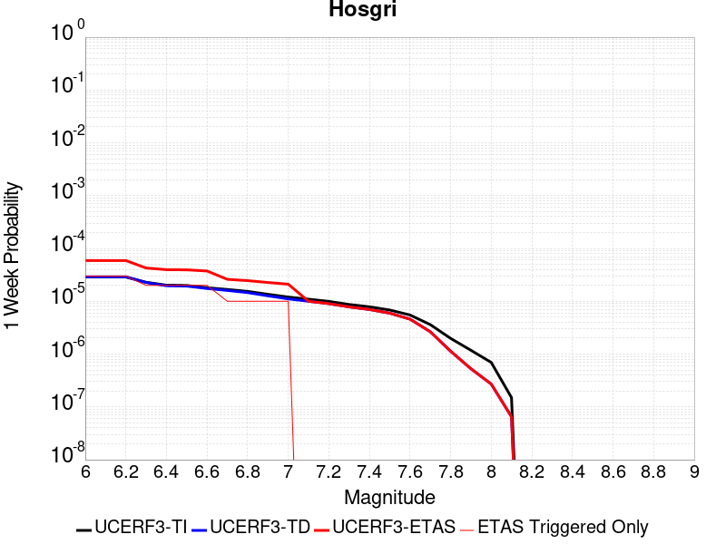 | 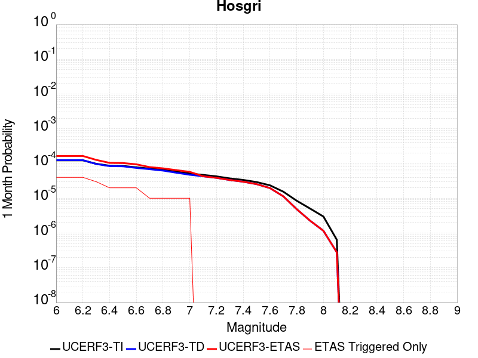 |  |  |

| Magnitude | 1 wk TI Prob | 1 wk TD Prob | 1 wk ETAS Prob | 1 wk ETAS/TD Gain | 1 wk ETAS Triggered Only | 1 mo TI Prob | 1 mo TD Prob | 1 mo ETAS Prob | 1 mo ETAS/TD Gain | 1 mo ETAS Triggered Only | 1 yr TI Prob | 1 yr TD Prob | 1 yr ETAS Prob | 1 yr ETAS/TD Gain | 1 yr ETAS Triggered Only | 10 yr TI Prob | 10 yr TD Prob | 10 yr ETAS Prob | 10 yr ETAS/TD Gain | 10 yr ETAS Triggered Only |
|-----|-----|-----|-----|-----|-----|-----|-----|-----|-----|-----|-----|-----|-----|-----|-----|-----|-----|-----|-----|-----|
| 6.0 | 2.883978E-5 | 2.9128416E-5 | 5.9127542E-5 | 2.0298922 | 3.0E-5 | 1.235932E-4 | 1.2483024E-4 | 1.6482525E-4 | 1.3203951 | 4.0E-5 | 0.0015037085 | 0.001518776 | 0.0015687001 | 1.0328712 | 5.0E-5 | 0.01493574 | 0.01508774 | 0.0151566835 | 1.0045695 | 7.0E-5 |
| 6.1 | 2.883978E-5 | 2.9128416E-5 | 5.9127542E-5 | 2.0298922 | 3.0E-5 | 1.235932E-4 | 1.2483024E-4 | 1.6482525E-4 | 1.3203951 | 4.0E-5 | 0.0015037085 | 0.001518776 | 0.0015687001 | 1.0328712 | 5.0E-5 | 0.01493574 | 0.01508774 | 0.0151566835 | 1.0045695 | 7.0E-5 |
| 6.2 | 2.883978E-5 | 2.9128416E-5 | 5.9127542E-5 | 2.0298922 | 3.0E-5 | 1.235932E-4 | 1.2483024E-4 | 1.6482525E-4 | 1.3203951 | 4.0E-5 | 0.0015037085 | 0.001518776 | 0.0015687001 | 1.0328712 | 5.0E-5 | 0.01493574 | 0.01508774 | 0.0151566835 | 1.0045695 | 7.0E-5 |
| 6.3 | 2.2914428E-5 | 2.2641969E-5 | 4.2641517E-5 | 1.8832954 | 2.0E-5 | 9.8200995E-5 | 9.703343E-5 | 1.2703052E-4 | 1.3091418 | 3.0E-5 | 0.0011949413 | 0.0011807467 | 0.0012107113 | 1.0253776 | 3.0E-5 | 0.011885363 | 0.011746133 | 0.011785663 | 1.0033654 | 4.0E-5 |
| 6.4 | 2.0195741E-5 | 1.969656E-5 | 3.9696166E-5 | 2.0153856 | 2.0E-5 | 8.65503E-5 | 8.4411105E-5 | 1.0440942E-4 | 1.2369156 | 2.0E-5 | 0.0010532405 | 0.0010272227 | 0.0010472022 | 1.01945 | 2.0E-5 | 0.010482626 | 0.010225792 | 0.010255486 | 1.0029037 | 3.0E-5 |
| 6.5 | 1.9924333E-5 | 1.940898E-5 | 3.9408595E-5 | 2.0304308 | 2.0E-5 | 8.53872E-5 | 8.3178704E-5 | 1.03177044E-4 | 1.2404262 | 2.0E-5 | 0.0010390934 | 0.0010122322 | 0.0010322119 | 1.0197383 | 2.0E-5 | 0.010342481 | 0.010077253 | 0.010106951 | 1.002947 | 3.0E-5 |
| 6.6 | 1.809694E-5 | 1.74583E-5 | 3.745795E-5 | 2.145567 | 2.0E-5 | 7.7556004E-5 | 7.4819145E-5 | 9.481765E-5 | 1.2672913 | 2.0E-5 | 9.438353E-4 | 9.105437E-4 | 9.3052554E-4 | 1.0219449 | 2.0E-5 | 0.009398366 | 0.009069073 | 0.009098801 | 1.0032779 | 3.0E-5 |
| 6.7 | 1.675989E-5 | 1.6042764E-5 | 2.6042604E-5 | 1.6233239 | 1.0E-5 | 7.182612E-5 | 6.87529E-5 | 7.8752215E-5 | 1.1454384 | 1.0E-5 | 8.7413215E-4 | 8.3674624E-4 | 8.467379E-4 | 1.0119411 | 1.0E-5 | 0.008707017 | 0.0083368635 | 0.008356696 | 1.002379 | 2.0E-5 |
| 6.8 | 1.5401129E-5 | 1.4614083E-5 | 2.4613937E-5 | 1.6842614 | 1.0E-5 | 6.6003166E-5 | 6.2630286E-5 | 7.262966E-5 | 1.1596571 | 1.0E-5 | 8.032922E-4 | 7.622578E-4 | 7.722502E-4 | 1.013109 | 1.0E-5 | 0.008003947 | 0.007597296 | 0.0076171444 | 1.0026125 | 2.0E-5 |
| 6.9 | 1.356559E-5 | 1.2689968E-5 | 2.2689841E-5 | 1.788014 | 1.0E-5 | 5.8136946E-5 | 5.4384444E-5 | 6.43839E-5 | 1.1838661 | 1.0E-5 | 7.0758746E-4 | 6.619299E-4 | 6.719233E-4 | 1.0150974 | 1.0E-5 | 0.007053386 | 0.006600388 | 0.0066202558 | 1.0030102 | 2.0E-5 |
| 7.0 | 1.2030819E-5 | 1.1095962E-5 | 2.109585E-5 | 1.9012188 | 1.0E-5 | 5.155963E-5 | 4.7553254E-5 | 5.7552777E-5 | 1.2102805 | 1.0E-5 | 6.275577E-4 | 5.7880714E-4 | 5.888014E-4 | 1.0172669 | 1.0E-5 | 0.006257884 | 0.005773757 | 0.0057836995 | 1.001722 | 1.0E-5 |
| 7.1 | 1.0972698E-5 | 1.0022179E-5 | 1.0022179E-5 | 1.0 | 0.0 | 4.7025E-5 | 4.2951488E-5 | 4.2951488E-5 | 1.0 | 0.0 | 5.72379E-4 | 5.22809E-4 | 5.22809E-4 | 1.0 | 0.0 | 0.0057090693 | 0.005216542 | 0.005216542 | 1.0 | 0.0 |
| 7.2 | 9.961926E-6 | 9.034746E-6 | 9.034746E-6 | 1.0 | 0.0 | 4.2693267E-5 | 3.8719765E-5 | 3.8719765E-5 | 1.0 | 0.0 | 5.1966653E-4 | 4.713112E-4 | 4.713112E-4 | 1.0 | 0.0 | 0.00518453 | 0.0047038626 | 0.0047038626 | 1.0 | 0.0 |
| 7.3 | 8.700929E-6 | 7.8281E-6 | 7.8281E-6 | 1.0 | 0.0 | 3.7289166E-5 | 3.354857E-5 | 3.354857E-5 | 1.0 | 0.0 | 4.53901E-4 | 4.0837732E-4 | 4.0837732E-4 | 1.0 | 0.0 | 0.00452975 | 0.004077008 | 0.004077008 | 1.0 | 0.0 |
| 7.4 | 7.866285E-6 | 6.998739E-6 | 6.998739E-6 | 1.0 | 0.0 | 3.3712215E-5 | 2.9994251E-5 | 2.9994251E-5 | 1.0 | 0.0 | 4.103689E-4 | 3.6511885E-4 | 3.6511885E-4 | 1.0 | 0.0 | 0.004096119 | 0.0036459267 | 0.0036459267 | 1.0 | 0.0 |
| 7.5 | 6.8381305E-6 | 5.9596955E-6 | 5.9596955E-6 | 1.0 | 0.0 | 2.9305946E-5 | 2.5541302E-5 | 2.5541302E-5 | 1.0 | 0.0 | 3.5674145E-4 | 3.10921E-4 | 3.10921E-4 | 1.0 | 0.0 | 0.0035616932 | 0.0031055948 | 0.0031055948 | 1.0 | 0.0 |
| 7.6 | 5.503376E-6 | 4.5952443E-6 | 4.5952443E-6 | 1.0 | 0.0 | 2.3585684E-5 | 1.9693754E-5 | 1.9693754E-5 | 1.0 | 0.0 | 2.8711787E-4 | 2.397451E-4 | 2.397451E-4 | 1.0 | 0.0 | 0.002867472 | 0.0023955975 | 0.0023955975 | 1.0 | 0.0 |
| 7.7 | 3.6144982E-6 | 2.6522112E-6 | 2.6522112E-6 | 1.0 | 0.0 | 1.5490614E-5 | 1.1366569E-5 | 1.1366569E-5 | 1.0 | 0.0 | 1.8858191E-4 | 1.383792E-4 | 1.383792E-4 | 1.0 | 0.0 | 0.0018842196 | 0.0013836613 | 0.0013836613 | 1.0 | 0.0 |
| 7.8 | 1.9853494E-6 | 1.1361129E-6 | 1.1361129E-6 | 1.0 | 0.0 | 8.508612E-6 | 4.8690463E-6 | 4.8690463E-6 | 1.0 | 0.0 | 1.0358743E-4 | 5.9279027E-5 | 5.9279027E-5 | 1.0 | 0.0 | 0.0010353916 | 5.9336185E-4 | 5.9336185E-4 | 1.0 | 0.0 |
| 7.9 | 1.1818757E-6 | 5.2951856E-7 | 5.2951856E-7 | 1.0 | 0.0 | 5.0651715E-6 | 2.2693632E-6 | 2.2693632E-6 | 1.0 | 0.0 | 6.1666724E-5 | 2.7629147E-5 | 2.7629147E-5 | 1.0 | 0.0 | 6.1649614E-4 | 2.7694515E-4 | 2.7694515E-4 | 1.0 | 0.0 |
| 8.0 | 6.962958E-7 | 2.7139782E-7 | 2.7139782E-7 | 1.0 | 0.0 | 2.9841215E-6 | 1.163133E-6 | 1.163133E-6 | 1.0 | 0.0 | 3.6331072E-5 | 1.4161053E-5 | 1.4161053E-5 | 1.0 | 0.0 | 3.6325134E-4 | 1.4217179E-4 | 1.4217179E-4 | 1.0 | 0.0 |
| 8.1 | 1.5033264E-7 | 6.527624E-8 | 6.527624E-8 | 1.0 | 0.0 | 6.442826E-7 | 2.7975528E-7 | 2.7975528E-7 | 1.0 | 0.0 | 7.844113E-6 | 3.4060151E-6 | 3.4060151E-6 | 1.0 | 0.0 | 7.843835E-5 | 3.407693E-5 | 3.407693E-5 | 1.0 | 0.0 |

## San Clemente
*[(top)](#table-of-contents)*

| 1 Week | 1 Month | 1 Year | 10 Year |
|-----|-----|-----|-----|
|  |  |  |  |

| Magnitude | 1 wk TI Prob | 1 wk TD Prob | 1 wk ETAS Prob | 1 wk ETAS/TD Gain | 1 wk ETAS Triggered Only | 1 mo TI Prob | 1 mo TD Prob | 1 mo ETAS Prob | 1 mo ETAS/TD Gain | 1 mo ETAS Triggered Only | 1 yr TI Prob | 1 yr TD Prob | 1 yr ETAS Prob | 1 yr ETAS/TD Gain | 1 yr ETAS Triggered Only | 10 yr TI Prob | 10 yr TD Prob | 10 yr ETAS Prob | 10 yr ETAS/TD Gain | 10 yr ETAS Triggered Only |
|-----|-----|-----|-----|-----|-----|-----|-----|-----|-----|-----|-----|-----|-----|-----|-----|-----|-----|-----|-----|-----|
| 6.0 | 6.681379E-5 | 8.163422E-5 | 1.0163259E-4 | 1.2449753 | 2.0E-5 | 2.8631336E-4 | 3.498173E-4 | 3.6981032E-4 | 1.0571527 | 2.0E-5 | 0.003480294 | 0.0042512873 | 0.0042911177 | 1.0093689 | 4.0E-5 | 0.03426291 | 0.041755714 | 0.04182279 | 1.0016065 | 7.0E-5 |
| 6.1 | 6.681379E-5 | 8.163422E-5 | 9.163341E-5 | 1.1224877 | 1.0E-5 | 2.8631336E-4 | 3.498173E-4 | 3.598138E-4 | 1.0285764 | 1.0E-5 | 0.003480294 | 0.0042512873 | 0.0042712027 | 1.0046844 | 2.0E-5 | 0.03426291 | 0.041755714 | 0.041794043 | 1.0009179 | 4.0E-5 |
| 6.2 | 3.9400576E-5 | 4.6451984E-5 | 4.6451984E-5 | 1.0 | 0.0 | 1.6884868E-4 | 1.9906509E-4 | 1.9906509E-4 | 1.0 | 0.0 | 0.0020537945 | 0.002420985 | 0.0024309605 | 1.0041206 | 1.0E-5 | 0.020349167 | 0.02395286 | 0.023982141 | 1.0012225 | 3.0E-5 |
| 6.3 | 3.2590255E-5 | 3.7929087E-5 | 3.7929087E-5 | 1.0 | 0.0 | 1.3966505E-4 | 1.6254328E-4 | 1.6254328E-4 | 1.0 | 0.0 | 0.0016990956 | 0.0019771985 | 0.0019871786 | 1.0050477 | 1.0E-5 | 0.01686163 | 0.019599866 | 0.019629277 | 1.0015006 | 3.0E-5 |
| 6.4 | 2.9454652E-5 | 3.4097775E-5 | 3.4097775E-5 | 1.0 | 0.0 | 1.2622811E-4 | 1.4612528E-4 | 1.4612528E-4 | 1.0 | 0.0 | 0.0015357438 | 0.0017776482 | 0.0017876304 | 1.0056154 | 1.0E-5 | 0.015251739 | 0.017637458 | 0.017666928 | 1.001671 | 3.0E-5 |
| 6.5 | 2.790836E-5 | 3.2247463E-5 | 3.2247463E-5 | 1.0 | 0.0 | 1.1960178E-4 | 1.3819622E-4 | 1.3819622E-4 | 1.0 | 0.0 | 0.001455179 | 0.0016812651 | 0.0016812651 | 1.0 | 0.0 | 0.014456868 | 0.016688475 | 0.016708141 | 1.0011784 | 2.0E-5 |
| 6.6 | 2.2492153E-5 | 2.5762707E-5 | 2.5762707E-5 | 1.0 | 0.0 | 9.639138E-5 | 1.1040701E-4 | 1.1040701E-4 | 1.0 | 0.0 | 0.0011729331 | 0.0013433908 | 0.0013433908 | 1.0 | 0.0 | 0.011667615 | 0.013354415 | 0.0133642815 | 1.0007389 | 1.0E-5 |
| 6.7 | 1.9862755E-5 | 2.2666423E-5 | 2.2666423E-5 | 1.0 | 0.0 | 8.512331E-5 | 9.713826E-5 | 9.713826E-5 | 1.0 | 0.0 | 0.0010358836 | 0.0011820279 | 0.0011820279 | 1.0 | 0.0 | 0.010310682 | 0.011758701 | 0.011758701 | 1.0 | 0.0 |
| 6.8 | 1.6697575E-5 | 1.897771E-5 | 1.897771E-5 | 1.0 | 0.0 | 7.155907E-5 | 8.133056E-5 | 8.133056E-5 | 1.0 | 0.0 | 8.7088346E-4 | 9.897591E-4 | 9.897591E-4 | 1.0 | 0.0 | 0.008674784 | 0.0098545365 | 0.0098545365 | 1.0 | 0.0 |
| 6.9 | 1.5218415E-5 | 1.72694E-5 | 1.72694E-5 | 1.0 | 0.0 | 6.522015E-5 | 7.4009666E-5 | 7.4009666E-5 | 1.0 | 0.0 | 7.93766E-4 | 9.00704E-4 | 9.00704E-4 | 1.0 | 0.0 | 0.007909367 | 0.008971481 | 0.008971481 | 1.0 | 0.0 |
| 7.0 | 1.2392958E-5 | 1.4033016E-5 | 1.4033016E-5 | 1.0 | 0.0 | 5.3111595E-5 | 6.014015E-5 | 6.014015E-5 | 1.0 | 0.0 | 6.4644177E-4 | 7.319679E-4 | 7.319679E-4 | 1.0 | 0.0 | 0.0064456454 | 0.0072963564 | 0.0072963564 | 1.0 | 0.0 |
| 7.1 | 1.0934128E-5 | 1.2375138E-5 | 1.2375138E-5 | 1.0 | 0.0 | 4.6859706E-5 | 5.303527E-5 | 5.303527E-5 | 1.0 | 0.0 | 5.7036756E-4 | 6.455204E-4 | 6.455204E-4 | 1.0 | 0.0 | 0.0056890585 | 0.0064371997 | 0.0064371997 | 1.0 | 0.0 |
| 7.2 | 9.5798805E-6 | 1.0844935E-5 | 1.0844935E-5 | 1.0 | 0.0 | 4.1055984E-5 | 4.6477508E-5 | 4.6477508E-5 | 1.0 | 0.0 | 4.9974193E-4 | 5.657239E-4 | 5.657239E-4 | 1.0 | 0.0 | 0.0049861963 | 0.0056435615 | 0.0056435615 | 1.0 | 0.0 |
| 7.3 | 8.0167365E-6 | 9.083918E-6 | 9.083918E-6 | 1.0 | 0.0 | 3.4356988E-5 | 3.8930535E-5 | 3.8930535E-5 | 1.0 | 0.0 | 4.1821605E-4 | 4.7388324E-4 | 4.7388324E-4 | 1.0 | 0.0 | 0.0041742986 | 0.0047294297 | 0.0047294297 | 1.0 | 0.0 |
| 7.4 | 2.9581017E-6 | 3.3623792E-6 | 3.3623792E-6 | 1.0 | 0.0 | 1.2677518E-5 | 1.4410146E-5 | 1.4410146E-5 | 1.0 | 0.0 | 1.5433785E-4 | 1.7543444E-4 | 1.7543444E-4 | 1.0 | 0.0 | 0.001542307 | 0.0017534546 | 0.0017534546 | 1.0 | 0.0 |

## Hunting Creek - Berryessa 2011 CFM
*[(top)](#table-of-contents)*

| 1 Week | 1 Month | 1 Year | 10 Year |
|-----|-----|-----|-----|
| 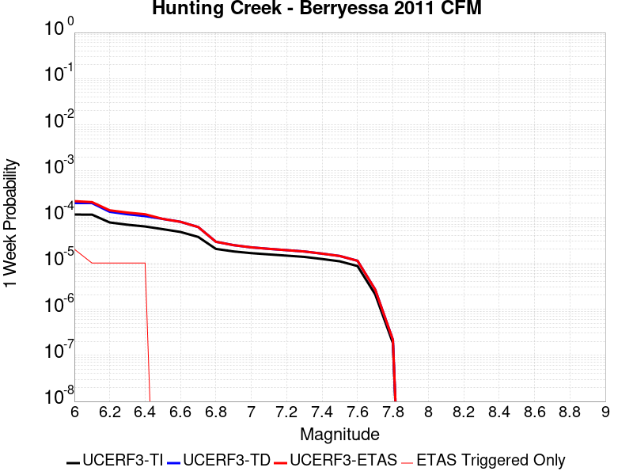 |  |  | 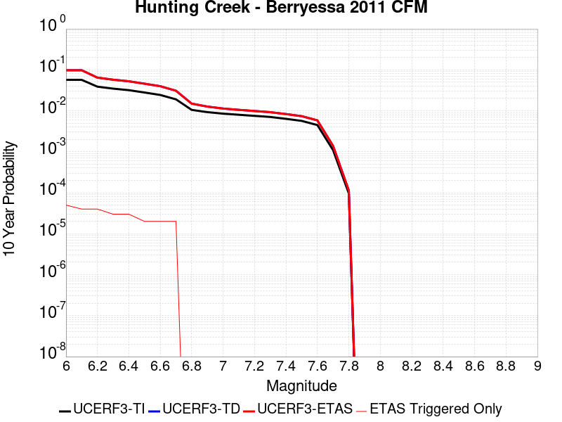 |

| Magnitude | 1 wk TI Prob | 1 wk TD Prob | 1 wk ETAS Prob | 1 wk ETAS/TD Gain | 1 wk ETAS Triggered Only | 1 mo TI Prob | 1 mo TD Prob | 1 mo ETAS Prob | 1 mo ETAS/TD Gain | 1 mo ETAS Triggered Only | 1 yr TI Prob | 1 yr TD Prob | 1 yr ETAS Prob | 1 yr ETAS/TD Gain | 1 yr ETAS Triggered Only | 10 yr TI Prob | 10 yr TD Prob | 10 yr ETAS Prob | 10 yr ETAS/TD Gain | 10 yr ETAS Triggered Only |
|-----|-----|-----|-----|-----|-----|-----|-----|-----|-----|-----|-----|-----|-----|-----|-----|-----|-----|-----|-----|-----|
| 6.0 | 1.1270982E-4 | 2.0012174E-4 | 2.2011774E-4 | 1.0999192 | 2.0E-5 | 4.8295266E-4 | 8.5739547E-4 | 8.8736974E-4 | 1.0349597 | 3.0E-5 | 0.0058641075 | 0.010386313 | 0.010416001 | 1.0028584 | 3.0E-5 | 0.057117578 | 0.09803703 | 0.098082125 | 1.00046 | 5.0E-5 |
| 6.1 | 1.1239393E-4 | 1.9960315E-4 | 2.0960114E-4 | 1.0500894 | 1.0E-5 | 4.8159933E-4 | 8.551744E-4 | 8.751573E-4 | 1.023367 | 2.0E-5 | 0.0058477195 | 0.010359551 | 0.010379344 | 1.0019106 | 2.0E-5 | 0.056962132 | 0.09779551 | 0.09783159 | 1.0003691 | 4.0E-5 |
| 6.2 | 7.596265E-5 | 1.2940196E-4 | 1.3940067E-4 | 1.0772686 | 1.0E-5 | 3.2551357E-4 | 5.5444165E-4 | 5.7443057E-4 | 1.0360523 | 2.0E-5 | 0.0039559277 | 0.0067210156 | 0.0067408816 | 1.0029558 | 2.0E-5 | 0.038862433 | 0.0645915 | 0.064628914 | 1.0005792 | 4.0E-5 |
| 6.3 | 6.78794E-5 | 1.145119E-4 | 1.2451076E-4 | 1.0873171 | 1.0E-5 | 2.9087928E-4 | 4.906513E-4 | 5.0064636E-4 | 1.0203711 | 1.0E-5 | 0.003535705 | 0.005952679 | 0.0059626196 | 1.0016699 | 1.0E-5 | 0.034799766 | 0.057465393 | 0.057493668 | 1.0004921 | 3.0E-5 |
| 6.4 | 6.2165134E-5 | 1.0436625E-4 | 1.14365204E-4 | 1.0958064 | 1.0E-5 | 2.6639478E-4 | 4.4721062E-4 | 4.5720616E-4 | 1.0223508 | 1.0E-5 | 0.0032385332 | 0.005427573 | 0.0054375185 | 1.0018325 | 1.0E-5 | 0.03191742 | 0.052550517 | 0.05257894 | 1.0005409 | 3.0E-5 |
| 6.5 | 5.4368087E-5 | 9.071415E-5 | 9.071415E-5 | 1.0 | 0.0 | 2.3298527E-4 | 3.8872007E-4 | 3.8872007E-4 | 1.0 | 0.0 | 0.0028329059 | 0.0047198683 | 0.0047198683 | 1.0 | 0.0 | 0.027970633 | 0.045880128 | 0.04589921 | 1.0004159 | 2.0E-5 |
| 6.6 | 4.729947E-5 | 7.847572E-5 | 7.847572E-5 | 1.0 | 0.0 | 2.0269625E-4 | 3.362842E-4 | 3.362842E-4 | 1.0 | 0.0 | 0.002465034 | 0.0040849647 | 0.0040849647 | 1.0 | 0.0 | 0.02437869 | 0.03985155 | 0.03987075 | 1.0004818 | 2.0E-5 |
| 6.7 | 3.6875328E-5 | 6.0451803E-5 | 6.0451803E-5 | 1.0 | 0.0 | 1.5802756E-4 | 2.59056E-4 | 2.59056E-4 | 1.0 | 0.0 | 0.0019222875 | 0.0031482063 | 0.0031482063 | 1.0 | 0.0 | 0.019057442 | 0.03089237 | 0.030911753 | 1.0006274 | 2.0E-5 |
| 6.8 | 2.0292036E-5 | 2.8976308E-5 | 2.8976308E-5 | 1.0 | 0.0 | 8.6962966E-5 | 1.2417832E-4 | 1.2417832E-4 | 1.0 | 0.0 | 0.0010582599 | 0.0015108072 | 0.0015108072 | 1.0 | 0.0 | 0.010532344 | 0.014978523 | 0.014978523 | 1.0 | 0.0 |
| 6.9 | 1.7871042E-5 | 2.4472254E-5 | 2.4472254E-5 | 1.0 | 0.0 | 7.658793E-5 | 1.048769E-4 | 1.048769E-4 | 1.0 | 0.0 | 9.320591E-4 | 0.0012761299 | 0.0012761299 | 1.0 | 0.0 | 0.009281595 | 0.012679775 | 0.012679775 | 1.0 | 0.0 |
| 7.0 | 1.6415532E-5 | 2.1906277E-5 | 2.1906277E-5 | 1.0 | 0.0 | 7.035038E-5 | 9.3880684E-5 | 9.3880684E-5 | 1.0 | 0.0 | 8.561793E-4 | 0.0011424015 | 0.0011424015 | 1.0 | 0.0 | 0.008528882 | 0.01136452 | 0.01136452 | 1.0 | 0.0 |
| 7.1 | 1.5409885E-5 | 2.0346342E-5 | 2.0346342E-5 | 1.0 | 0.0 | 6.6040695E-5 | 8.7195716E-5 | 8.7195716E-5 | 1.0 | 0.0 | 8.0374884E-4 | 0.0010610938 | 0.0010610938 | 1.0 | 0.0 | 0.00800848 | 0.010560595 | 0.010560595 | 1.0 | 0.0 |
| 7.2 | 1.4497423E-5 | 1.9054964E-5 | 1.9054964E-5 | 1.0 | 0.0 | 6.213033E-5 | 8.166159E-5 | 8.166159E-5 | 1.0 | 0.0 | 7.5617427E-4 | 9.937795E-4 | 9.937795E-4 | 1.0 | 0.0 | 0.0075360634 | 0.009893929 | 0.009893929 | 1.0 | 0.0 |
| 7.3 | 1.3615175E-5 | 1.7826127E-5 | 1.7826127E-5 | 1.0 | 0.0 | 5.8349444E-5 | 7.639547E-5 | 7.639547E-5 | 1.0 | 0.0 | 7.101729E-4 | 9.297209E-4 | 9.297209E-4 | 1.0 | 0.0 | 0.0070790765 | 0.009258823 | 0.009258823 | 1.0 | 0.0 |
| 7.4 | 1.2252825E-5 | 1.602625E-5 | 1.602625E-5 | 1.0 | 0.0 | 5.251105E-5 | 6.868213E-5 | 6.868213E-5 | 1.0 | 0.0 | 6.391345E-4 | 8.35887E-4 | 8.35887E-4 | 1.0 | 0.0 | 0.0063729943 | 0.008327872 | 0.008327872 | 1.0 | 0.0 |
| 7.5 | 1.0913301E-5 | 1.4241117E-5 | 1.4241117E-5 | 1.0 | 0.0 | 4.6770452E-5 | 6.1031948E-5 | 6.1031948E-5 | 1.0 | 0.0 | 5.6928146E-4 | 7.4281334E-4 | 7.4281334E-4 | 1.0 | 0.0 | 0.0056782532 | 0.0074036797 | 0.0074036797 | 1.0 | 0.0 |
| 7.6 | 8.623192E-6 | 1.12346415E-5 | 1.12346415E-5 | 1.0 | 0.0 | 3.6956015E-5 | 4.814759E-5 | 4.814759E-5 | 1.0 | 0.0 | 4.4984656E-4 | 5.8604183E-4 | 5.8604183E-4 | 1.0 | 0.0 | 0.00448937 | 0.0058452785 | 0.0058452785 | 1.0 | 0.0 |
| 7.7 | 2.0993634E-6 | 2.662584E-6 | 2.662584E-6 | 1.0 | 0.0 | 8.997241E-6 | 1.1411025E-5 | 1.1411025E-5 | 1.0 | 0.0 | 1.09535904E-4 | 1.3892044E-4 | 1.3892044E-4 | 1.0 | 0.0 | 0.0010948193 | 0.0013883426 | 0.0013883426 | 1.0 | 0.0 |
| 7.8 | 1.8428308E-7 | 2.167437E-7 | 2.167437E-7 | 1.0 | 0.0 | 7.897844E-7 | 9.289013E-7 | 9.289013E-7 | 1.0 | 0.0 | 9.615583E-6 | 1.1309318E-5 | 1.1309318E-5 | 1.0 | 0.0 | 9.615166E-5 | 1.13086026E-4 | 1.13086026E-4 | 1.0 | 0.0 |

## San Cayetano
*[(top)](#table-of-contents)*

| 1 Week | 1 Month | 1 Year | 10 Year |
|-----|-----|-----|-----|
|  |  |  |  |

| Magnitude | 1 wk TI Prob | 1 wk TD Prob | 1 wk ETAS Prob | 1 wk ETAS/TD Gain | 1 wk ETAS Triggered Only | 1 mo TI Prob | 1 mo TD Prob | 1 mo ETAS Prob | 1 mo ETAS/TD Gain | 1 mo ETAS Triggered Only | 1 yr TI Prob | 1 yr TD Prob | 1 yr ETAS Prob | 1 yr ETAS/TD Gain | 1 yr ETAS Triggered Only | 10 yr TI Prob | 10 yr TD Prob | 10 yr ETAS Prob | 10 yr ETAS/TD Gain | 10 yr ETAS Triggered Only |
|-----|-----|-----|-----|-----|-----|-----|-----|-----|-----|-----|-----|-----|-----|-----|-----|-----|-----|-----|-----|-----|
| 6.0 | 2.3476267E-5 | 1.816928E-5 | 2.8169097E-5 | 1.5503696 | 1.0E-5 | 1.0060869E-4 | 7.786603E-5 | 8.786526E-5 | 1.1284157 | 1.0E-5 | 0.0012242225 | 9.476103E-4 | 9.775818E-4 | 1.0316286 | 3.0E-5 | 0.012175002 | 0.009436584 | 0.009486113 | 1.0052485 | 5.0E-5 |
| 6.1 | 2.3476267E-5 | 1.816928E-5 | 2.8169097E-5 | 1.5503696 | 1.0E-5 | 1.0060869E-4 | 7.786603E-5 | 8.786526E-5 | 1.1284157 | 1.0E-5 | 0.0012242225 | 9.476103E-4 | 9.775818E-4 | 1.0316286 | 3.0E-5 | 0.012175002 | 0.009436584 | 0.009486113 | 1.0052485 | 5.0E-5 |
| 6.2 | 2.3476267E-5 | 1.816928E-5 | 2.8169097E-5 | 1.5503696 | 1.0E-5 | 1.0060869E-4 | 7.786603E-5 | 8.786526E-5 | 1.1284157 | 1.0E-5 | 0.0012242225 | 9.476103E-4 | 9.775818E-4 | 1.0316286 | 3.0E-5 | 0.012175002 | 0.009436584 | 0.009486113 | 1.0052485 | 5.0E-5 |
| 6.3 | 2.3476267E-5 | 1.816928E-5 | 2.8169097E-5 | 1.5503696 | 1.0E-5 | 1.0060869E-4 | 7.786603E-5 | 8.786526E-5 | 1.1284157 | 1.0E-5 | 0.0012242225 | 9.476103E-4 | 9.775818E-4 | 1.0316286 | 3.0E-5 | 0.012175002 | 0.009436584 | 0.009486113 | 1.0052485 | 5.0E-5 |
| 6.4 | 2.3476267E-5 | 1.816928E-5 | 2.8169097E-5 | 1.5503696 | 1.0E-5 | 1.0060869E-4 | 7.786603E-5 | 8.786526E-5 | 1.1284157 | 1.0E-5 | 0.0012242225 | 9.476103E-4 | 9.775818E-4 | 1.0316286 | 3.0E-5 | 0.012175002 | 0.009436584 | 0.009486113 | 1.0052485 | 5.0E-5 |
| 6.5 | 2.3476267E-5 | 1.816928E-5 | 2.8169097E-5 | 1.5503696 | 1.0E-5 | 1.0060869E-4 | 7.786603E-5 | 8.786526E-5 | 1.1284157 | 1.0E-5 | 0.0012242225 | 9.476103E-4 | 9.775818E-4 | 1.0316286 | 3.0E-5 | 0.012175002 | 0.009436584 | 0.009486113 | 1.0052485 | 5.0E-5 |
| 6.6 | 2.3476267E-5 | 1.816928E-5 | 2.8169097E-5 | 1.5503696 | 1.0E-5 | 1.0060869E-4 | 7.786603E-5 | 8.786526E-5 | 1.1284157 | 1.0E-5 | 0.0012242225 | 9.476103E-4 | 9.775818E-4 | 1.0316286 | 3.0E-5 | 0.012175002 | 0.009436584 | 0.009486113 | 1.0052485 | 5.0E-5 |
| 6.7 | 2.3476267E-5 | 1.816928E-5 | 2.8169097E-5 | 1.5503696 | 1.0E-5 | 1.0060869E-4 | 7.786603E-5 | 8.786526E-5 | 1.1284157 | 1.0E-5 | 0.0012242225 | 9.476103E-4 | 9.775818E-4 | 1.0316286 | 3.0E-5 | 0.012175002 | 0.009436584 | 0.009486113 | 1.0052485 | 5.0E-5 |
| 6.8 | 2.3241924E-5 | 1.7936987E-5 | 2.7936809E-5 | 1.5574973 | 1.0E-5 | 9.960445E-5 | 7.687056E-5 | 8.686979E-5 | 1.1300788 | 1.0E-5 | 0.0012120095 | 9.3550084E-4 | 9.654728E-4 | 1.0320383 | 3.0E-5 | 0.012054204 | 0.009316482 | 0.009366016 | 1.0053169 | 5.0E-5 |
| 6.9 | 2.2761007E-5 | 1.7432423E-5 | 2.7432248E-5 | 1.5736337 | 1.0E-5 | 9.7543525E-5 | 7.470827E-5 | 8.470752E-5 | 1.133844 | 1.0E-5 | 0.0011869454 | 9.09197E-4 | 9.391697E-4 | 1.0329661 | 3.0E-5 | 0.011806256 | 0.009055603 | 0.009105151 | 1.0054715 | 5.0E-5 |
| 7.0 | 2.240283E-5 | 1.7066168E-5 | 2.7065998E-5 | 1.5859447 | 1.0E-5 | 9.600859E-5 | 7.313869E-5 | 8.313796E-5 | 1.1367165 | 1.0E-5 | 0.0011682777 | 8.9010317E-4 | 9.200765E-4 | 1.033674 | 3.0E-5 | 0.011621549 | 0.008866196 | 0.008915752 | 1.0055894 | 5.0E-5 |
| 7.1 | 2.1871154E-5 | 1.6586018E-5 | 2.6585853E-5 | 1.6029074 | 1.0E-5 | 9.373015E-5 | 7.108101E-5 | 8.10803E-5 | 1.1406746 | 1.0E-5 | 0.0011405671 | 8.6507114E-4 | 8.950452E-4 | 1.0346493 | 3.0E-5 | 0.011347309 | 0.008617838 | 0.008667408 | 1.005752 | 5.0E-5 |
| 7.2 | 2.0714133E-5 | 1.5564561E-5 | 2.5564404E-5 | 1.6424752 | 1.0E-5 | 8.8771834E-5 | 6.670357E-5 | 7.6702905E-5 | 1.149907 | 1.0E-5 | 0.0010802611 | 8.1181666E-4 | 8.417923E-4 | 1.0369241 | 3.0E-5 | 0.010750249 | 0.008089285 | 0.008138881 | 1.006131 | 5.0E-5 |
| 7.3 | 1.8408395E-5 | 1.3996864E-5 | 2.3996725E-5 | 1.7144357 | 1.0E-5 | 7.8890735E-5 | 5.99852E-5 | 6.99846E-5 | 1.1666977 | 1.0E-5 | 9.600714E-4 | 7.300781E-4 | 7.600562E-4 | 1.0410615 | 3.0E-5 | 0.009559342 | 0.0072775153 | 0.0073271515 | 1.0068204 | 5.0E-5 |
| 7.4 | 1.6856795E-5 | 1.28500815E-5 | 1.28500815E-5 | 1.0 | 0.0 | 7.2241404E-5 | 5.5070628E-5 | 5.5070628E-5 | 1.0 | 0.0 | 8.7918417E-4 | 6.7028153E-4 | 6.902681E-4 | 1.0298182 | 2.0E-5 | 0.00875714 | 0.0066832784 | 0.006723011 | 1.0059451 | 4.0E-5 |
| 7.5 | 1.2822778E-5 | 9.577542E-6 | 9.577542E-6 | 1.0 | 0.0 | 5.495361E-5 | 4.1045972E-5 | 4.1045972E-5 | 1.0 | 0.0 | 6.688548E-4 | 4.996217E-4 | 5.196117E-4 | 1.0400103 | 2.0E-5 | 0.006668452 | 0.0049851555 | 0.005024956 | 1.0079838 | 4.0E-5 |
| 7.6 | 5.6272684E-6 | 3.854903E-6 | 3.854903E-6 | 1.0 | 0.0 | 2.4116642E-5 | 1.652091E-5 | 1.652091E-5 | 1.0 | 0.0 | 2.9358055E-4 | 2.0112359E-4 | 2.1112159E-4 | 1.0497106 | 1.0E-5 | 0.0029319301 | 0.0020094267 | 0.0020194065 | 1.0049665 | 1.0E-5 |
| 7.7 | 3.5261346E-6 | 2.3407013E-6 | 2.3407013E-6 | 1.0 | 0.0 | 1.5111918E-5 | 1.0031539E-5 | 1.0031539E-5 | 1.0 | 0.0 | 1.8397206E-4 | 1.2212721E-4 | 1.2212721E-4 | 1.0 | 0.0 | 0.0018381984 | 0.0012206084 | 0.0012206084 | 1.0 | 0.0 |
| 7.8 | 1.4826929E-6 | 1.056428E-6 | 1.056428E-6 | 1.0 | 0.0 | 6.354383E-6 | 4.5275406E-6 | 4.5275406E-6 | 1.0 | 0.0 | 7.736187E-5 | 5.5121433E-5 | 5.5121433E-5 | 1.0 | 0.0 | 7.733494E-4 | 5.5107963E-4 | 5.5107963E-4 | 1.0 | 0.0 |
| 7.9 | 2.7568166E-7 | 1.6978244E-7 | 1.6978244E-7 | 1.0 | 0.0 | 1.1814923E-6 | 7.2763885E-7 | 7.2763885E-7 | 1.0 | 0.0 | 1.4384574E-5 | 8.858967E-6 | 8.858967E-6 | 1.0 | 0.0 | 1.4383643E-4 | 8.8586174E-5 | 8.8586174E-5 | 1.0 | 0.0 |
| 8.0 | 5.407832E-8 | 2.6887697E-8 | 2.6887697E-8 | 1.0 | 0.0 | 2.3176422E-7 | 1.15232986E-7 | 1.15232986E-7 | 1.0 | 0.0 | 2.8217257E-6 | 1.4029607E-6 | 1.4029607E-6 | 1.0 | 0.0 | 2.8216898E-5 | 1.4029522E-5 | 1.4029522E-5 | 1.0 | 0.0 |

## Malibu Coast alt 1
*[(top)](#table-of-contents)*

| 1 Week | 1 Month | 1 Year | 10 Year |
|-----|-----|-----|-----|
|  | 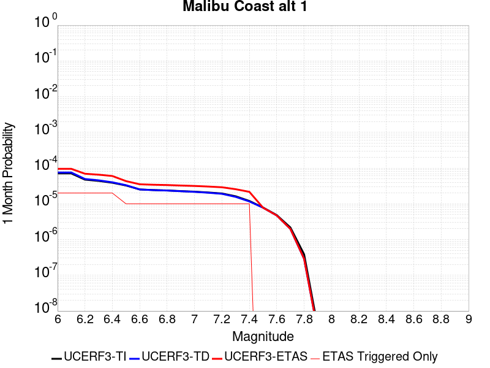 |  |  |

| Magnitude | 1 wk TI Prob | 1 wk TD Prob | 1 wk ETAS Prob | 1 wk ETAS/TD Gain | 1 wk ETAS Triggered Only | 1 mo TI Prob | 1 mo TD Prob | 1 mo ETAS Prob | 1 mo ETAS/TD Gain | 1 mo ETAS Triggered Only | 1 yr TI Prob | 1 yr TD Prob | 1 yr ETAS Prob | 1 yr ETAS/TD Gain | 1 yr ETAS Triggered Only | 10 yr TI Prob | 10 yr TD Prob | 10 yr ETAS Prob | 10 yr ETAS/TD Gain | 10 yr ETAS Triggered Only |
|-----|-----|-----|-----|-----|-----|-----|-----|-----|-----|-----|-----|-----|-----|-----|-----|-----|-----|-----|-----|-----|
| 6.0 | 1.6572556E-5 | 1.7598066E-5 | 1.7598066E-5 | 1.0 | 0.0 | 7.102331E-5 | 7.541821E-5 | 9.5416704E-5 | 1.265168 | 2.0E-5 | 8.6436566E-4 | 9.178488E-4 | 9.5781207E-4 | 1.0435401 | 4.0E-5 | 0.0086101135 | 0.009142512 | 0.009201964 | 1.0065027 | 6.0E-5 |
| 6.1 | 1.6572556E-5 | 1.7598066E-5 | 1.7598066E-5 | 1.0 | 0.0 | 7.102331E-5 | 7.541821E-5 | 9.5416704E-5 | 1.265168 | 2.0E-5 | 8.6436566E-4 | 9.178488E-4 | 9.5781207E-4 | 1.0435401 | 4.0E-5 | 0.0086101135 | 0.009142512 | 0.009201964 | 1.0065027 | 6.0E-5 |
| 6.2 | 1.1085717E-5 | 1.1557147E-5 | 1.1557147E-5 | 1.0 | 0.0 | 4.750935E-5 | 4.952971E-5 | 6.9528716E-5 | 1.4037781 | 2.0E-5 | 5.782728E-4 | 6.028609E-4 | 6.428368E-4 | 1.0663103 | 4.0E-5 | 0.0057677035 | 0.0060126255 | 0.006062325 | 1.0082659 | 5.0E-5 |
| 6.3 | 1.0208568E-5 | 1.0592237E-5 | 1.0592237E-5 | 1.0 | 0.0 | 4.375027E-5 | 4.539453E-5 | 6.539362E-5 | 1.4405618 | 2.0E-5 | 5.325294E-4 | 5.5254117E-4 | 5.8252463E-4 | 1.0542645 | 3.0E-5 | 0.0053125503 | 0.0055119814 | 0.005551761 | 1.0072169 | 4.0E-5 |
| 6.4 | 9.0682315E-6 | 9.342637E-6 | 9.342637E-6 | 1.0 | 0.0 | 3.8863272E-5 | 4.003927E-5 | 6.003847E-5 | 1.4994895 | 2.0E-5 | 4.730576E-4 | 4.8737114E-4 | 5.173565E-4 | 1.0615247 | 3.0E-5 | 0.0047205184 | 0.004863236 | 0.0049030418 | 1.008185 | 4.0E-5 |
| 6.5 | 7.605796E-6 | 7.748587E-6 | 7.748587E-6 | 1.0 | 0.0 | 3.259586E-5 | 3.3207816E-5 | 4.3207485E-5 | 1.301124 | 1.0E-5 | 3.9678233E-4 | 4.0423148E-4 | 4.242234E-4 | 1.0494566 | 2.0E-5 | 0.0039607463 | 0.0040351 | 0.0040649786 | 1.0074048 | 3.0E-5 |
| 6.6 | 5.889873E-6 | 5.8795385E-6 | 5.8795385E-6 | 1.0 | 0.0 | 2.5242069E-5 | 2.519778E-5 | 3.519753E-5 | 1.3968503 | 1.0E-5 | 3.0727885E-4 | 3.0673988E-4 | 3.2673375E-4 | 1.0651819 | 2.0E-5 | 0.003068543 | 0.0030631777 | 0.003093086 | 1.0097637 | 3.0E-5 |
| 6.7 | 5.66586E-6 | 5.641641E-6 | 5.641641E-6 | 1.0 | 0.0 | 2.428203E-5 | 2.417824E-5 | 3.4177996E-5 | 1.4135851 | 1.0E-5 | 2.955936E-4 | 2.9433038E-4 | 3.143245E-4 | 1.0679308 | 2.0E-5 | 0.0029520073 | 0.0029394177 | 0.0029693295 | 1.0101761 | 3.0E-5 |
| 6.8 | 5.521556E-6 | 5.489427E-6 | 5.489427E-6 | 1.0 | 0.0 | 2.3663597E-5 | 2.3525903E-5 | 3.352567E-5 | 1.4250534 | 1.0E-5 | 2.880662E-4 | 2.8639034E-4 | 3.063846E-4 | 1.0698148 | 2.0E-5 | 0.0028769306 | 0.002860224 | 0.0028901384 | 1.0104587 | 3.0E-5 |
| 6.9 | 5.29752E-6 | 5.2499317E-6 | 5.2499317E-6 | 1.0 | 0.0 | 2.270346E-5 | 2.2499513E-5 | 3.2499287E-5 | 1.4444441 | 1.0E-5 | 2.7637955E-4 | 2.7389723E-4 | 2.9389173E-4 | 1.0730001 | 2.0E-5 | 0.0027603607 | 0.0027356069 | 0.0027655247 | 1.0109365 | 3.0E-5 |
| 7.0 | 5.106743E-6 | 5.0476788E-6 | 5.0476788E-6 | 1.0 | 0.0 | 2.1885859E-5 | 2.163273E-5 | 3.1632513E-5 | 1.4622525 | 1.0E-5 | 2.6642776E-4 | 2.6334674E-4 | 2.8334145E-4 | 1.0759255 | 2.0E-5 | 0.0026610855 | 0.0026303562 | 0.0026602773 | 1.0113753 | 3.0E-5 |
| 7.1 | 4.8469647E-6 | 4.770373E-6 | 4.770373E-6 | 1.0 | 0.0 | 2.0772539E-5 | 2.0444295E-5 | 3.0444091E-5 | 1.489124 | 1.0E-5 | 2.528763E-4 | 2.4888094E-4 | 2.6887597E-4 | 1.0803397 | 2.0E-5 | 0.0025258875 | 0.00248603 | 0.0025159556 | 1.0120374 | 3.0E-5 |
| 7.2 | 4.545514E-6 | 4.4481935E-6 | 4.4481935E-6 | 1.0 | 0.0 | 1.9480629E-5 | 1.9063547E-5 | 2.9063358E-5 | 1.5245513 | 1.0E-5 | 2.3715083E-4 | 2.3207403E-4 | 2.5206938E-4 | 1.0861593 | 2.0E-5 | 0.0023689792 | 0.0023183243 | 0.0023482547 | 1.0129104 | 3.0E-5 |
| 7.3 | 3.794097E-6 | 3.6519348E-6 | 3.6519348E-6 | 1.0 | 0.0 | 1.6260314E-5 | 1.5651056E-5 | 2.56509E-5 | 1.6389245 | 1.0E-5 | 1.9795135E-4 | 1.9053498E-4 | 2.1053117E-4 | 1.1049476 | 2.0E-5 | 0.001977751 | 0.0019037209 | 0.0019336637 | 1.0157286 | 3.0E-5 |
| 7.4 | 2.808217E-6 | 2.719077E-6 | 2.719077E-6 | 1.0 | 0.0 | 1.203516E-5 | 1.1653135E-5 | 2.1653019E-5 | 1.8581282 | 1.0E-5 | 1.4651821E-4 | 1.418677E-4 | 1.5186628E-4 | 1.0704782 | 1.0E-5 | 0.0014642165 | 0.001417774 | 0.0014377456 | 1.0140866 | 2.0E-5 |
| 7.5 | 1.83809E-6 | 1.8190691E-6 | 1.8190691E-6 | 1.0 | 0.0 | 7.877505E-6 | 7.795988E-6 | 7.795988E-6 | 1.0 | 0.0 | 9.59044E-5 | 9.491203E-5 | 9.491203E-5 | 1.0 | 0.0 | 9.5863023E-4 | 9.48717E-4 | 9.587075E-4 | 1.0105306 | 1.0E-5 |
| 7.6 | 1.1292672E-6 | 1.1001447E-6 | 1.1001447E-6 | 1.0 | 0.0 | 4.839708E-6 | 4.714897E-6 | 4.714897E-6 | 1.0 | 0.0 | 5.8921847E-5 | 5.7402376E-5 | 5.7402376E-5 | 1.0 | 0.0 | 5.890623E-4 | 5.738771E-4 | 5.838714E-4 | 1.0174153 | 1.0E-5 |
| 7.7 | 5.065272E-7 | 4.609151E-7 | 4.609151E-7 | 1.0 | 0.0 | 2.170829E-6 | 1.975349E-6 | 1.975349E-6 | 1.0 | 0.0 | 2.6429525E-5 | 2.404962E-5 | 2.404962E-5 | 1.0 | 0.0 | 2.642638E-4 | 2.4047129E-4 | 2.4047129E-4 | 1.0 | 0.0 |
| 7.8 | 8.952991E-8 | 6.707874E-8 | 6.707874E-8 | 1.0 | 0.0 | 3.8369956E-7 | 2.8748025E-7 | 2.8748025E-7 | 1.0 | 0.0 | 4.671532E-6 | 3.5000667E-6 | 3.5000667E-6 | 1.0 | 0.0 | 4.671434E-5 | 3.5000136E-5 | 3.5000136E-5 | 1.0 | 0.0 |
| 7.9 | 8.007447E-10 | 6.1608785E-10 | 6.1608785E-10 | 1.0 | 0.0 | 3.4317629E-9 | 2.6403764E-9 | 2.6403764E-9 | 1.0 | 0.0 | 4.1781714E-8 | 3.2146584E-8 | 3.2146584E-8 | 1.0 | 0.0 | 4.1781706E-7 | 3.214658E-7 | 3.214658E-7 | 1.0 | 0.0 |

## White Wolf
*[(top)](#table-of-contents)*

| 1 Week | 1 Month | 1 Year | 10 Year |
|-----|-----|-----|-----|
|  | 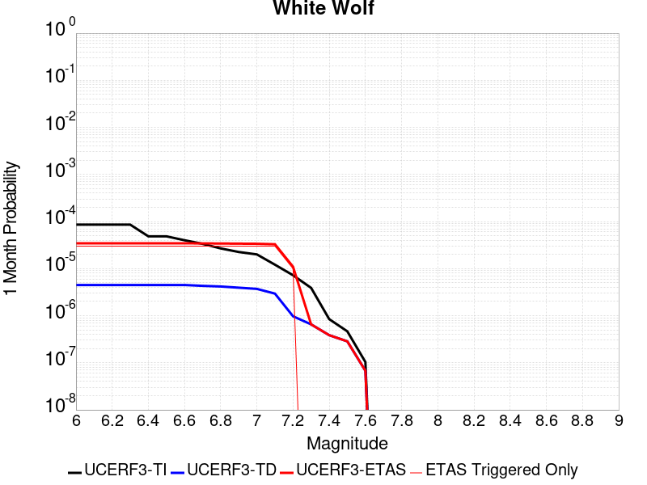 | 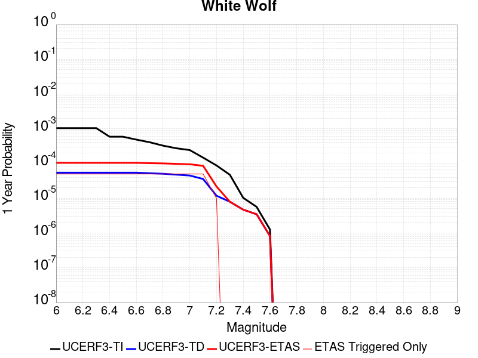 | 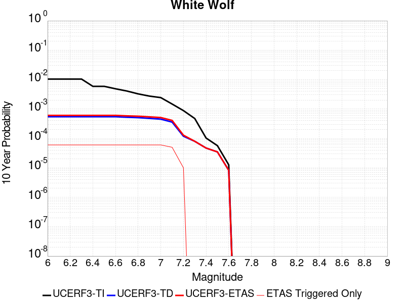 |

| Magnitude | 1 wk TI Prob | 1 wk TD Prob | 1 wk ETAS Prob | 1 wk ETAS/TD Gain | 1 wk ETAS Triggered Only | 1 mo TI Prob | 1 mo TD Prob | 1 mo ETAS Prob | 1 mo ETAS/TD Gain | 1 mo ETAS Triggered Only | 1 yr TI Prob | 1 yr TD Prob | 1 yr ETAS Prob | 1 yr ETAS/TD Gain | 1 yr ETAS Triggered Only | 10 yr TI Prob | 10 yr TD Prob | 10 yr ETAS Prob | 10 yr ETAS/TD Gain | 10 yr ETAS Triggered Only |
|-----|-----|-----|-----|-----|-----|-----|-----|-----|-----|-----|-----|-----|-----|-----|-----|-----|-----|-----|-----|-----|
| 6.0 | 2.0037822E-5 | 1.0469162E-6 | 2.1046895E-5 | 20.103706 | 2.0E-5 | 8.587355E-5 | 4.486776E-6 | 3.4486642E-5 | 7.6862855 | 3.0E-5 | 0.001045009 | 5.4625183E-5 | 1.0462245E-4 | 1.9152788 | 5.0E-5 | 0.010401085 | 5.461226E-4 | 6.0608983E-4 | 1.1098055 | 6.0E-5 |
| 6.1 | 2.0037822E-5 | 1.0469162E-6 | 2.1046895E-5 | 20.103706 | 2.0E-5 | 8.587355E-5 | 4.486776E-6 | 3.4486642E-5 | 7.6862855 | 3.0E-5 | 0.001045009 | 5.4625183E-5 | 1.0462245E-4 | 1.9152788 | 5.0E-5 | 0.010401085 | 5.461226E-4 | 6.0608983E-4 | 1.1098055 | 6.0E-5 |
| 6.2 | 2.0037822E-5 | 1.0469162E-6 | 2.1046895E-5 | 20.103706 | 2.0E-5 | 8.587355E-5 | 4.486776E-6 | 3.4486642E-5 | 7.6862855 | 3.0E-5 | 0.001045009 | 5.4625183E-5 | 1.0462245E-4 | 1.9152788 | 5.0E-5 | 0.010401085 | 5.461226E-4 | 6.0608983E-4 | 1.1098055 | 6.0E-5 |
| 6.3 | 2.0037822E-5 | 1.0469162E-6 | 2.1046895E-5 | 20.103706 | 2.0E-5 | 8.587355E-5 | 4.486776E-6 | 3.4486642E-5 | 7.6862855 | 3.0E-5 | 0.001045009 | 5.4625183E-5 | 1.0462245E-4 | 1.9152788 | 5.0E-5 | 0.010401085 | 5.461226E-4 | 6.0608983E-4 | 1.1098055 | 6.0E-5 |
| 6.4 | 1.132487E-5 | 1.0469162E-6 | 2.1046895E-5 | 20.103706 | 2.0E-5 | 4.8534253E-5 | 4.486776E-6 | 3.4486642E-5 | 7.6862855 | 3.0E-5 | 5.907443E-4 | 5.4625183E-5 | 1.0462245E-4 | 1.9152788 | 5.0E-5 | 0.005891764 | 5.461226E-4 | 6.0608983E-4 | 1.1098055 | 6.0E-5 |
| 6.5 | 1.132487E-5 | 1.0469162E-6 | 2.1046895E-5 | 20.103706 | 2.0E-5 | 4.8534253E-5 | 4.486776E-6 | 3.4486642E-5 | 7.6862855 | 3.0E-5 | 5.907443E-4 | 5.4625183E-5 | 1.0462245E-4 | 1.9152788 | 5.0E-5 | 0.005891764 | 5.461226E-4 | 6.0608983E-4 | 1.1098055 | 6.0E-5 |
| 6.6 | 9.347473E-6 | 1.0469162E-6 | 2.1046895E-5 | 20.103706 | 2.0E-5 | 4.0059982E-5 | 4.486776E-6 | 3.4486642E-5 | 7.6862855 | 3.0E-5 | 4.8762115E-4 | 5.4625183E-5 | 1.0462245E-4 | 1.9152788 | 5.0E-5 | 0.0048655253 | 5.461226E-4 | 6.0608983E-4 | 1.1098055 | 6.0E-5 |
| 6.7 | 7.842647E-6 | 1.0048342E-6 | 2.1004815E-5 | 20.90376 | 2.0E-5 | 3.361091E-5 | 4.3064256E-6 | 3.4306297E-5 | 7.9663043 | 3.0E-5 | 4.0913603E-4 | 5.2429517E-5 | 1.0242689E-4 | 1.9536113 | 5.0E-5 | 0.004083836 | 5.2417646E-4 | 5.84145E-4 | 1.1144053 | 6.0E-5 |
| 6.8 | 6.26597E-6 | 9.734822E-7 | 2.0973463E-5 | 21.544783 | 2.0E-5 | 2.685388E-5 | 4.17206E-6 | 3.4171935E-5 | 8.190662 | 3.0E-5 | 3.2689696E-4 | 5.0793697E-5 | 1.00791156E-4 | 1.9843241 | 5.0E-5 | 0.003264165 | 5.078258E-4 | 5.677953E-4 | 1.1180907 | 6.0E-5 |
| 6.9 | 5.258436E-6 | 9.183254E-7 | 2.0918307E-5 | 22.778753 | 2.0E-5 | 2.2535958E-5 | 3.9356746E-6 | 3.3935557E-5 | 8.622552 | 3.0E-5 | 2.7434074E-4 | 4.7915833E-5 | 9.7913435E-5 | 2.0434465 | 5.0E-5 | 0.0027400232 | 4.790598E-4 | 5.3903105E-4 | 1.1251854 | 6.0E-5 |
| 7.0 | 4.675028E-6 | 8.6611794E-7 | 2.08661E-5 | 24.091522 | 2.0E-5 | 2.003568E-5 | 3.7119291E-6 | 3.3711818E-5 | 9.082021 | 3.0E-5 | 2.4390711E-4 | 4.5191846E-5 | 9.5189585E-5 | 2.1063442 | 5.0E-5 | 0.0024363957 | 4.518313E-4 | 5.118042E-4 | 1.132733 | 6.0E-5 |
| 7.1 | 2.8270078E-6 | 6.8741696E-7 | 2.0687403E-5 | 30.094402 | 2.0E-5 | 1.2115692E-5 | 2.9460696E-6 | 3.294598E-5 | 11.183029 | 3.0E-5 | 1.4749856E-4 | 3.5867848E-5 | 8.586606E-5 | 2.3939562 | 5.0E-5 | 0.001474007 | 3.586247E-4 | 4.0860675E-4 | 1.1393715 | 5.0E-5 |
| 7.2 | 1.6881406E-6 | 2.2706382E-7 | 1.02270615E-5 | 45.04047 | 1.0E-5 | 7.2348685E-6 | 9.731303E-7 | 1.0973121E-5 | 11.276106 | 1.0E-5 | 8.808096E-5 | 1.1847799E-5 | 2.184768E-5 | 1.8440286 | 1.0E-5 | 8.8046055E-4 | 1.1847183E-4 | 1.2847064E-4 | 1.0843983 | 1.0E-5 |
| 7.3 | 9.086107E-7 | 1.5266386E-7 | 1.5266386E-7 | 1.0 | 0.0 | 3.8940398E-6 | 6.5427355E-7 | 6.5427355E-7 | 1.0 | 0.0 | 4.7408903E-5 | 7.965752E-6 | 7.965752E-6 | 1.0 | 0.0 | 4.739879E-4 | 7.965475E-5 | 7.965475E-5 | 1.0 | 0.0 |
| 7.4 | 1.9717383E-7 | 9.003913E-8 | 9.003913E-8 | 1.0 | 0.0 | 8.450304E-7 | 3.8588192E-7 | 3.8588192E-7 | 1.0 | 0.0 | 1.0288197E-5 | 4.6981027E-6 | 4.6981027E-6 | 1.0 | 0.0 | 1.028772E-4 | 4.6980065E-5 | 4.6980065E-5 | 1.0 | 0.0 |
| 7.5 | 1.086975E-7 | 6.6597195E-8 | 6.6597195E-8 | 1.0 | 0.0 | 4.6584634E-7 | 2.8541652E-7 | 2.8541652E-7 | 1.0 | 0.0 | 5.6716644E-6 | 3.474941E-6 | 3.474941E-6 | 1.0 | 0.0 | 5.6715195E-5 | 3.474889E-5 | 3.474889E-5 | 1.0 | 0.0 |
| 7.6 | 2.4217808E-8 | 1.5820765E-8 | 1.5820765E-8 | 1.0 | 0.0 | 1.03790605E-7 | 6.780328E-8 | 6.780328E-8 | 1.0 | 0.0 | 1.2636499E-6 | 8.255046E-7 | 8.255046E-7 | 1.0 | 0.0 | 1.2636427E-5 | 8.2550205E-6 | 8.2550205E-6 | 1.0 | 0.0 |

## Calaveras (So) 2011 CFM
*[(top)](#table-of-contents)*

| 1 Week | 1 Month | 1 Year | 10 Year |
|-----|-----|-----|-----|
|  |  | 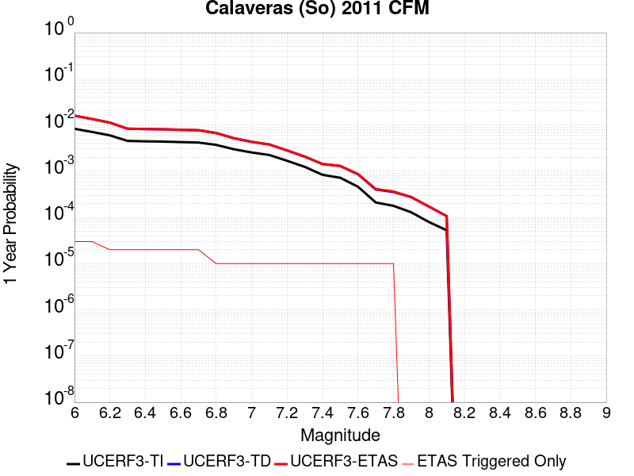 |  |

| Magnitude | 1 wk TI Prob | 1 wk TD Prob | 1 wk ETAS Prob | 1 wk ETAS/TD Gain | 1 wk ETAS Triggered Only | 1 mo TI Prob | 1 mo TD Prob | 1 mo ETAS Prob | 1 mo ETAS/TD Gain | 1 mo ETAS Triggered Only | 1 yr TI Prob | 1 yr TD Prob | 1 yr ETAS Prob | 1 yr ETAS/TD Gain | 1 yr ETAS Triggered Only | 10 yr TI Prob | 10 yr TD Prob | 10 yr ETAS Prob | 10 yr ETAS/TD Gain | 10 yr ETAS Triggered Only |
|-----|-----|-----|-----|-----|-----|-----|-----|-----|-----|-----|-----|-----|-----|-----|-----|-----|-----|-----|-----|-----|
| 6.0 | 1.5950744E-4 | 3.071188E-4 | 3.1711574E-4 | 1.0325507 | 1.0E-5 | 6.834242E-4 | 0.0013155643 | 0.0013255512 | 1.0075912 | 1.0E-5 | 0.00828899 | 0.01585904 | 0.015888564 | 1.0018617 | 3.0E-5 | 0.079865426 | 0.14440064 | 0.14445198 | 1.0003555 | 6.0E-5 |
| 6.1 | 1.3584697E-4 | 2.6036944E-4 | 2.7036684E-4 | 1.038397 | 1.0E-5 | 5.8207137E-4 | 0.0011153965 | 0.0011253853 | 1.0089555 | 1.0E-5 | 0.007063716 | 0.013462106 | 0.013491702 | 1.0021985 | 3.0E-5 | 0.06843361 | 0.12402854 | 0.12407234 | 1.0003531 | 5.0E-5 |
| 6.2 | 1.14676266E-4 | 2.1726108E-4 | 2.1726108E-4 | 1.0 | 0.0 | 4.9137714E-4 | 9.307893E-4 | 9.307893E-4 | 1.0 | 0.0 | 0.0059661185 | 0.011245592 | 0.011265366 | 1.0017585 | 2.0E-5 | 0.058084648 | 0.105019294 | 0.105055094 | 1.0003409 | 4.0E-5 |
| 6.3 | 8.691518E-5 | 1.5987165E-4 | 1.5987165E-4 | 1.0 | 0.0 | 3.7244044E-4 | 6.8496726E-4 | 6.8496726E-4 | 1.0 | 0.0 | 0.004525038 | 0.008300893 | 0.008320727 | 1.0023894 | 2.0E-5 | 0.044339992 | 0.0793347 | 0.07937153 | 1.0004642 | 4.0E-5 |
| 6.4 | 8.50982E-5 | 1.5693568E-4 | 1.5693568E-4 | 1.0 | 0.0 | 3.646556E-4 | 6.7239115E-4 | 6.7239115E-4 | 1.0 | 0.0 | 0.0044306475 | 0.008148931 | 0.008168767 | 1.0024343 | 2.0E-5 | 0.04343345 | 0.077940844 | 0.077977724 | 1.0004733 | 4.0E-5 |
| 6.5 | 8.4062965E-5 | 1.5518135E-4 | 1.5518135E-4 | 1.0 | 0.0 | 3.602201E-4 | 6.648764E-4 | 6.648764E-4 | 1.0 | 0.0 | 0.004376863 | 0.008058134 | 0.008077972 | 1.0024619 | 2.0E-5 | 0.042916555 | 0.077112116 | 0.077149026 | 1.0004787 | 4.0E-5 |
| 6.6 | 8.194716E-5 | 1.5154095E-4 | 1.5154095E-4 | 1.0 | 0.0 | 3.5115483E-4 | 6.492825E-4 | 6.492825E-4 | 1.0 | 0.0 | 0.0042669317 | 0.007869979 | 0.007889822 | 1.0025213 | 2.0E-5 | 0.04185927 | 0.07539739 | 0.07543437 | 1.0004905 | 4.0E-5 |
| 6.7 | 8.012326E-5 | 1.4821833E-4 | 1.4821833E-4 | 1.0 | 0.0 | 3.433402E-4 | 6.350497E-4 | 6.350497E-4 | 1.0 | 0.0 | 0.004172157 | 0.007698474 | 0.00771832 | 1.0025779 | 2.0E-5 | 0.040946912 | 0.073839515 | 0.07387656 | 1.0005018 | 4.0E-5 |
| 6.8 | 7.119773E-5 | 1.2880519E-4 | 1.2880519E-4 | 1.0 | 0.0 | 3.0509746E-4 | 5.519001E-4 | 5.519001E-4 | 1.0 | 0.0 | 0.0037082357 | 0.0066958875 | 0.0067058206 | 1.0014834 | 1.0E-5 | 0.036469642 | 0.06468402 | 0.06470272 | 1.0002892 | 2.0E-5 |
| 6.9 | 5.7343088E-5 | 9.9189E-5 | 9.9189E-5 | 1.0 | 0.0 | 2.4573295E-4 | 4.2502693E-4 | 4.2502693E-4 | 1.0 | 0.0 | 0.0029876942 | 0.0051625078 | 0.005172456 | 1.001927 | 1.0E-5 | 0.02947844 | 0.050509132 | 0.050528124 | 1.000376 | 2.0E-5 |
| 7.0 | 4.8746577E-5 | 8.284751E-5 | 8.284751E-5 | 1.0 | 0.0 | 2.0889717E-4 | 3.550128E-4 | 3.550128E-4 | 1.0 | 0.0 | 0.0025403565 | 0.004313781 | 0.0043237377 | 1.0023081 | 1.0E-5 | 0.025115121 | 0.04248505 | 0.042504203 | 1.0004507 | 2.0E-5 |
| 7.1 | 4.2998014E-5 | 7.264914E-5 | 7.264914E-5 | 1.0 | 0.0 | 1.8426418E-4 | 3.1131663E-4 | 3.1131663E-4 | 1.0 | 0.0 | 0.002241108 | 0.0037837527 | 0.003793715 | 1.0026329 | 1.0E-5 | 0.022186412 | 0.037423246 | 0.037442494 | 1.0005144 | 2.0E-5 |
| 7.2 | 3.221292E-5 | 5.390566E-5 | 5.390566E-5 | 1.0 | 0.0 | 1.3804805E-4 | 2.3100396E-4 | 2.3100396E-4 | 1.0 | 0.0 | 0.0016794393 | 0.0028088738 | 0.0028188457 | 1.0035502 | 1.0E-5 | 0.016668037 | 0.028035998 | 0.028055437 | 1.0006933 | 2.0E-5 |
| 7.3 | 2.3756531E-5 | 3.9471706E-5 | 3.9471706E-5 | 1.0 | 0.0 | 1.0180973E-4 | 1.6915359E-4 | 1.6915359E-4 | 1.0 | 0.0 | 0.0012388286 | 0.0020575167 | 0.002067496 | 1.0048503 | 1.0E-5 | 0.012319452 | 0.02064345 | 0.020663038 | 1.0009488 | 2.0E-5 |
| 7.4 | 1.5997684E-5 | 2.734085E-5 | 2.734085E-5 | 1.0 | 0.0 | 6.8559704E-5 | 1.1716982E-4 | 1.1716982E-4 | 1.0 | 0.0 | 8.343947E-4 | 0.0014256114 | 0.0014355972 | 1.0070045 | 1.0E-5 | 0.008312687 | 0.014376549 | 0.014396261 | 1.0013711 | 2.0E-5 |
| 7.5 | 1.3814293E-5 | 2.4782603E-5 | 2.4782603E-5 | 1.0 | 0.0 | 5.9202768E-5 | 1.0620684E-4 | 1.0620684E-4 | 1.0 | 0.0 | 7.205553E-4 | 0.0012923037 | 0.0013022907 | 1.0077281 | 1.0E-5 | 0.007182234 | 0.013055766 | 0.013075504 | 1.0015119 | 2.0E-5 |
| 7.6 | 8.817309E-6 | 1.6429829E-5 | 1.6429829E-5 | 1.0 | 0.0 | 3.7787922E-5 | 7.041166E-5 | 7.041166E-5 | 1.0 | 0.0 | 4.5997082E-4 | 8.5692614E-4 | 8.669176E-4 | 1.0116596 | 1.0E-5 | 0.004590199 | 0.008719863 | 0.008739689 | 1.0022736 | 2.0E-5 |
| 7.7 | 4.0352206E-6 | 7.706877E-6 | 7.706877E-6 | 1.0 | 0.0 | 1.7293689E-5 | 3.3029053E-5 | 3.3029053E-5 | 1.0 | 0.0 | 2.1053031E-4 | 4.020546E-4 | 4.1205058E-4 | 1.0248623 | 1.0E-5 | 0.0021033096 | 0.0041649863 | 0.004184903 | 1.004782 | 2.0E-5 |
| 7.8 | 3.413169E-6 | 6.7868646E-6 | 6.7868646E-6 | 1.0 | 0.0 | 1.4627784E-5 | 2.9086239E-5 | 2.9086239E-5 | 1.0 | 0.0 | 1.7807873E-4 | 3.5406748E-4 | 3.6406395E-4 | 1.0282332 | 1.0E-5 | 0.0017793609 | 0.0036663096 | 0.0036862362 | 1.0054351 | 2.0E-5 |
| 7.9 | 2.4740732E-6 | 5.278809E-6 | 5.278809E-6 | 1.0 | 0.0 | 1.06031275E-5 | 2.2623271E-5 | 2.2623271E-5 | 1.0 | 0.0 | 1.2908543E-4 | 2.7540355E-4 | 2.7540355E-4 | 1.0 | 0.0 | 0.0012901047 | 0.002834638 | 0.0028446098 | 1.0035177 | 1.0E-5 |
| 8.0 | 1.5231818E-6 | 3.2887135E-6 | 3.2887135E-6 | 1.0 | 0.0 | 6.527906E-6 | 1.409441E-5 | 1.409441E-5 | 1.0 | 0.0 | 7.9474354E-5 | 1.7158597E-4 | 1.7158597E-4 | 1.0 | 0.0 | 7.944594E-4 | 0.001756374 | 0.0017663564 | 1.0056835 | 1.0E-5 |
| 8.1 | 1.0104524E-6 | 2.0456548E-6 | 2.0456548E-6 | 1.0 | 0.0 | 4.330503E-6 | 8.767062E-6 | 8.767062E-6 | 1.0 | 0.0 | 5.2722597E-5 | 1.06733794E-4 | 1.06733794E-4 | 1.0 | 0.0 | 5.271009E-4 | 0.0010929212 | 0.0011029104 | 1.0091398 | 1.0E-5 |

## Malibu Coast (Extension) alt 1
*[(top)](#table-of-contents)*

| 1 Week | 1 Month | 1 Year | 10 Year |
|-----|-----|-----|-----|
|  |  | 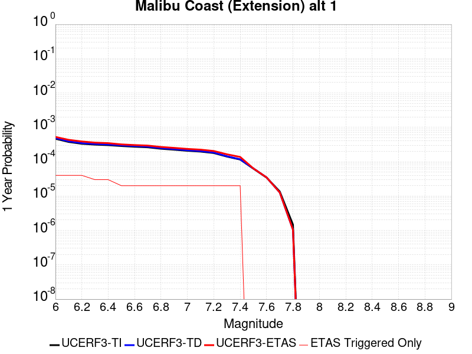 |  |

| Magnitude | 1 wk TI Prob | 1 wk TD Prob | 1 wk ETAS Prob | 1 wk ETAS/TD Gain | 1 wk ETAS Triggered Only | 1 mo TI Prob | 1 mo TD Prob | 1 mo ETAS Prob | 1 mo ETAS/TD Gain | 1 mo ETAS Triggered Only | 1 yr TI Prob | 1 yr TD Prob | 1 yr ETAS Prob | 1 yr ETAS/TD Gain | 1 yr ETAS Triggered Only | 10 yr TI Prob | 10 yr TD Prob | 10 yr ETAS Prob | 10 yr ETAS/TD Gain | 10 yr ETAS Triggered Only |
|-----|-----|-----|-----|-----|-----|-----|-----|-----|-----|-----|-----|-----|-----|-----|-----|-----|-----|-----|-----|-----|
| 6.0 | 8.930738E-6 | 9.329276E-6 | 9.329276E-6 | 1.0 | 0.0 | 3.827403E-5 | 3.998201E-5 | 5.998121E-5 | 1.500205 | 2.0E-5 | 4.6588664E-4 | 4.8667393E-4 | 5.266545E-4 | 1.0821506 | 4.0E-5 | 0.0046491115 | 0.004856264 | 0.0049159727 | 1.0122951 | 6.0E-5 |
| 6.1 | 7.199952E-6 | 7.5302964E-6 | 7.5302964E-6 | 1.0 | 0.0 | 3.0856572E-5 | 3.2272303E-5 | 5.227166E-5 | 1.6197064 | 2.0E-5 | 3.75614E-4 | 3.9284505E-4 | 4.3282934E-4 | 1.1017814 | 4.0E-5 | 0.0037497976 | 0.003921572 | 0.003981337 | 1.01524 | 6.0E-5 |
| 6.2 | 6.3721413E-6 | 6.6667917E-6 | 6.6667917E-6 | 1.0 | 0.0 | 2.7308892E-5 | 2.8571652E-5 | 4.857108E-5 | 1.6999745 | 2.0E-5 | 3.3243504E-4 | 3.4780471E-4 | 3.877908E-4 | 1.1149671 | 4.0E-5 | 0.0033193815 | 0.0034726437 | 0.0035324353 | 1.0172179 | 6.0E-5 |
| 6.3 | 6.016345E-6 | 6.295158E-6 | 6.295158E-6 | 1.0 | 0.0 | 2.578408E-5 | 2.6978973E-5 | 4.697843E-5 | 1.7412981 | 2.0E-5 | 3.1387596E-4 | 3.2841982E-4 | 3.5840995E-4 | 1.0913165 | 3.0E-5 | 0.00313433 | 0.0032793807 | 0.0033292167 | 1.0151968 | 5.0E-5 |
| 6.4 | 5.8104883E-6 | 6.0795446E-6 | 6.0795446E-6 | 1.0 | 0.0 | 2.4901856E-5 | 2.6054933E-5 | 4.605441E-5 | 1.767589 | 2.0E-5 | 3.031379E-4 | 3.1717293E-4 | 3.4716344E-4 | 1.0945556 | 3.0E-5 | 0.0030272473 | 0.0031672374 | 0.003217079 | 1.0157366 | 5.0E-5 |
| 6.5 | 5.476925E-6 | 5.7275133E-6 | 5.7275133E-6 | 1.0 | 0.0 | 2.3472323E-5 | 2.4546256E-5 | 3.454601E-5 | 1.4073842 | 1.0E-5 | 2.8573806E-4 | 2.9880996E-4 | 3.18804E-4 | 1.0669122 | 2.0E-5 | 0.0028537093 | 0.002984114 | 0.0030239946 | 1.0133643 | 4.0E-5 |
| 6.6 | 5.222387E-6 | 5.45858E-6 | 5.45858E-6 | 1.0 | 0.0 | 2.2381464E-5 | 2.3393704E-5 | 3.339347E-5 | 1.4274554 | 1.0E-5 | 2.7246025E-4 | 2.8478142E-4 | 3.0477572E-4 | 1.0702093 | 2.0E-5 | 0.0027212645 | 0.0028441956 | 0.0028840818 | 1.0140238 | 4.0E-5 |
| 6.7 | 5.0337076E-6 | 5.259103E-6 | 5.259103E-6 | 1.0 | 0.0 | 2.1572854E-5 | 2.253882E-5 | 3.2538595E-5 | 1.443669 | 1.0E-5 | 2.6261783E-4 | 2.7437587E-4 | 2.9437037E-4 | 1.0728728 | 2.0E-5 | 0.002623077 | 0.002740401 | 0.0027802915 | 1.0145564 | 4.0E-5 |
| 6.8 | 4.5675624E-6 | 4.7587164E-6 | 4.7587164E-6 | 1.0 | 0.0 | 1.9575122E-5 | 2.039434E-5 | 3.0394136E-5 | 1.4903221 | 1.0E-5 | 2.3830103E-4 | 2.48273E-4 | 2.6826802E-4 | 1.0805365 | 2.0E-5 | 0.0023804565 | 0.002479976 | 0.0025198767 | 1.0160892 | 4.0E-5 |
| 6.9 | 4.2802412E-6 | 4.4520207E-6 | 4.4520207E-6 | 1.0 | 0.0 | 1.8343762E-5 | 1.907995E-5 | 2.9079758E-5 | 1.5241004 | 1.0E-5 | 2.2331243E-4 | 2.3227377E-4 | 2.5226912E-4 | 1.0860853 | 2.0E-5 | 0.0022308815 | 0.0023203269 | 0.002360234 | 1.0171989 | 4.0E-5 |
| 7.0 | 3.9794063E-6 | 4.130099E-6 | 4.130099E-6 | 1.0 | 0.0 | 1.7054486E-5 | 1.7700306E-5 | 2.7700129E-5 | 1.564952 | 1.0E-5 | 2.0761859E-4 | 2.1548003E-4 | 2.3547572E-4 | 1.092796 | 2.0E-5 | 0.0020742472 | 0.0021527244 | 0.0021926383 | 1.0185411 | 4.0E-5 |
| 7.1 | 3.7730424E-6 | 3.911217E-6 | 3.911217E-6 | 1.0 | 0.0 | 1.6170083E-5 | 1.6762251E-5 | 2.6762084E-5 | 1.5965686 | 1.0E-5 | 1.9685295E-4 | 2.0406142E-4 | 2.2405734E-4 | 1.0979897 | 2.0E-5 | 0.0019667868 | 0.0020387534 | 0.0020786717 | 1.0195799 | 4.0E-5 |
| 7.2 | 3.424985E-6 | 3.541337E-6 | 3.541337E-6 | 1.0 | 0.0 | 1.4678424E-5 | 1.5177071E-5 | 2.517692E-5 | 1.6588787 | 1.0E-5 | 1.7869516E-4 | 1.8476529E-4 | 2.0476159E-4 | 1.1082255 | 2.0E-5 | 0.0017855153 | 0.0018461287 | 0.0018760734 | 1.0162202 | 3.0E-5 |
| 7.3 | 2.6966375E-6 | 2.7596534E-6 | 2.7596534E-6 | 1.0 | 0.0 | 1.15569665E-5 | 1.1827032E-5 | 2.1826914E-5 | 1.8455107 | 1.0E-5 | 1.4069698E-4 | 1.4398464E-4 | 1.6398176E-4 | 1.1388837 | 2.0E-5 | 0.0014060794 | 0.0014389176 | 0.0014688745 | 1.020819 | 3.0E-5 |
| 7.4 | 2.215957E-6 | 2.249378E-6 | 2.249378E-6 | 1.0 | 0.0 | 9.496924E-6 | 9.640156E-6 | 1.964006E-5 | 2.0373175 | 1.0E-5 | 1.1561892E-4 | 1.17362615E-4 | 1.3736027E-4 | 1.170392 | 2.0E-5 | 0.0011555878 | 0.0011730101 | 0.0012029748 | 1.0255452 | 3.0E-5 |
| 7.5 | 1.2040218E-6 | 1.2219067E-6 | 1.2219067E-6 | 1.0 | 0.0 | 5.160083E-6 | 5.2367322E-6 | 5.2367322E-6 | 1.0 | 0.0 | 6.2822204E-5 | 6.375537E-5 | 6.375537E-5 | 1.0 | 0.0 | 6.280445E-4 | 6.3737266E-4 | 6.473663E-4 | 1.0156794 | 1.0E-5 |
| 7.6 | 6.6157446E-7 | 6.678975E-7 | 6.678975E-7 | 1.0 | 0.0 | 2.835316E-6 | 2.8624147E-6 | 2.8624147E-6 | 1.0 | 0.0 | 3.4519428E-5 | 3.484936E-5 | 3.484936E-5 | 1.0 | 0.0 | 3.4514067E-4 | 3.4844046E-4 | 3.5843698E-4 | 1.0286893 | 1.0E-5 |
| 7.7 | 2.6012302E-7 | 2.4357593E-7 | 2.4357593E-7 | 1.0 | 0.0 | 1.1148124E-6 | 1.0438964E-6 | 1.0438964E-6 | 1.0 | 0.0 | 1.3572758E-5 | 1.2709375E-5 | 1.2709375E-5 | 1.0 | 0.0 | 1.3571928E-4 | 1.2708755E-4 | 1.2708755E-4 | 1.0 | 0.0 |
| 7.8 | 2.8323132E-8 | 2.0266649E-8 | 2.0266649E-8 | 1.0 | 0.0 | 1.2138484E-7 | 8.685707E-8 | 8.685707E-8 | 1.0 | 0.0 | 1.4778595E-6 | 1.0574844E-6 | 1.0574844E-6 | 1.0 | 0.0 | 1.4778497E-5 | 1.0574801E-5 | 1.0574801E-5 | 1.0 | 0.0 |

## Elysian Park (Upper)
*[(top)](#table-of-contents)*

| 1 Week | 1 Month | 1 Year | 10 Year |
|-----|-----|-----|-----|
| 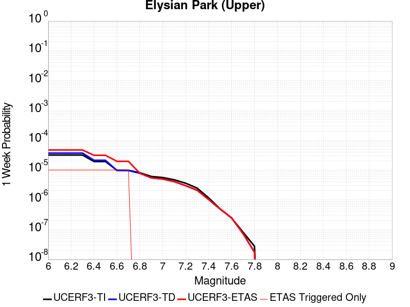 |  |  | 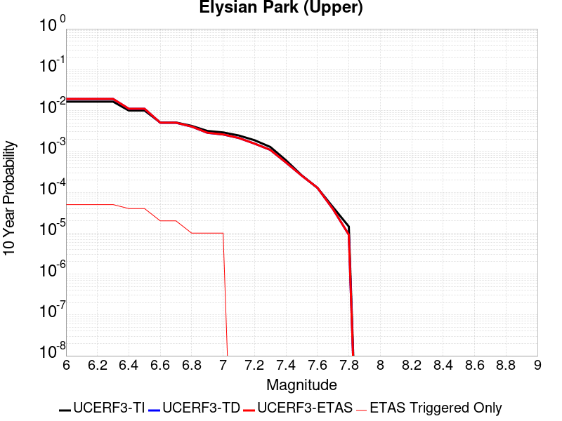 |

| Magnitude | 1 wk TI Prob | 1 wk TD Prob | 1 wk ETAS Prob | 1 wk ETAS/TD Gain | 1 wk ETAS Triggered Only | 1 mo TI Prob | 1 mo TD Prob | 1 mo ETAS Prob | 1 mo ETAS/TD Gain | 1 mo ETAS Triggered Only | 1 yr TI Prob | 1 yr TD Prob | 1 yr ETAS Prob | 1 yr ETAS/TD Gain | 1 yr ETAS Triggered Only | 10 yr TI Prob | 10 yr TD Prob | 10 yr ETAS Prob | 10 yr ETAS/TD Gain | 10 yr ETAS Triggered Only |
|-----|-----|-----|-----|-----|-----|-----|-----|-----|-----|-----|-----|-----|-----|-----|-----|-----|-----|-----|-----|-----|
| 6.0 | 3.1876025E-5 | 3.7035516E-5 | 4.7035144E-5 | 1.270001 | 1.0E-5 | 1.3660437E-4 | 1.587167E-4 | 1.6871512E-4 | 1.0629953 | 1.0E-5 | 0.0016618895 | 0.0019311075 | 0.001981011 | 1.0258418 | 5.0E-5 | 0.016495159 | 0.019189782 | 0.019238824 | 1.0025556 | 5.0E-5 |
| 6.1 | 3.1876025E-5 | 3.7035516E-5 | 4.7035144E-5 | 1.270001 | 1.0E-5 | 1.3660437E-4 | 1.587167E-4 | 1.6871512E-4 | 1.0629953 | 1.0E-5 | 0.0016618895 | 0.0019311075 | 0.001981011 | 1.0258418 | 5.0E-5 | 0.016495159 | 0.019189782 | 0.019238824 | 1.0025556 | 5.0E-5 |
| 6.2 | 3.1876025E-5 | 3.7035516E-5 | 4.7035144E-5 | 1.270001 | 1.0E-5 | 1.3660437E-4 | 1.587167E-4 | 1.6871512E-4 | 1.0629953 | 1.0E-5 | 0.0016618895 | 0.0019311075 | 0.001981011 | 1.0258418 | 5.0E-5 | 0.016495159 | 0.019189782 | 0.019238824 | 1.0025556 | 5.0E-5 |
| 6.3 | 3.1876025E-5 | 3.7035516E-5 | 4.7035144E-5 | 1.270001 | 1.0E-5 | 1.3660437E-4 | 1.587167E-4 | 1.6871512E-4 | 1.0629953 | 1.0E-5 | 0.0016618895 | 0.0019311075 | 0.001981011 | 1.0258418 | 5.0E-5 | 0.016495159 | 0.019189782 | 0.019238824 | 1.0025556 | 5.0E-5 |
| 6.4 | 1.9273462E-5 | 2.1202266E-5 | 3.1202053E-5 | 1.4716377 | 1.0E-5 | 8.259794E-5 | 9.086466E-5 | 1.00863756E-4 | 1.1100438 | 1.0E-5 | 0.001005166 | 0.0011058892 | 0.001145845 | 1.03613 | 4.0E-5 | 0.010006315 | 0.011020724 | 0.011060283 | 1.0035895 | 4.0E-5 |
| 6.5 | 1.9273462E-5 | 2.1202266E-5 | 3.1202053E-5 | 1.4716377 | 1.0E-5 | 8.259794E-5 | 9.086466E-5 | 1.00863756E-4 | 1.1100438 | 1.0E-5 | 0.001005166 | 0.0011058892 | 0.001145845 | 1.03613 | 4.0E-5 | 0.010006315 | 0.011020724 | 0.011060283 | 1.0035895 | 4.0E-5 |
| 6.6 | 9.813258E-6 | 9.665599E-6 | 1.9665502E-5 | 2.0345871 | 1.0E-5 | 4.205614E-5 | 4.1423376E-5 | 5.142296E-5 | 1.2413995 | 1.0E-5 | 5.119132E-4 | 5.0422014E-4 | 5.2421005E-4 | 1.0396452 | 2.0E-5 | 0.005107356 | 0.0050314846 | 0.005051384 | 1.003955 | 2.0E-5 |
| 6.7 | 9.801478E-6 | 9.653168E-6 | 1.9653071E-5 | 2.0359194 | 1.0E-5 | 4.2005657E-5 | 4.1370105E-5 | 5.136969E-5 | 1.2417104 | 1.0E-5 | 5.112989E-4 | 5.035719E-4 | 5.235618E-4 | 1.0396963 | 2.0E-5 | 0.0051012407 | 0.0050250315 | 0.0050449306 | 1.0039601 | 2.0E-5 |
| 6.8 | 8.102489E-6 | 7.773004E-6 | 7.773004E-6 | 1.0 | 0.0 | 3.4724493E-5 | 3.3312477E-5 | 3.3312477E-5 | 1.0 | 0.0 | 4.2268867E-4 | 4.055089E-4 | 4.1550485E-4 | 1.0246503 | 1.0E-5 | 0.004218856 | 0.0040481836 | 0.004058143 | 1.0024602 | 1.0E-5 |
| 6.9 | 6.08275E-6 | 5.4814514E-6 | 5.4814514E-6 | 1.0 | 0.0 | 2.6068668E-5 | 2.3491726E-5 | 2.3491726E-5 | 1.0 | 0.0 | 3.173398E-4 | 2.85975E-4 | 2.9597213E-4 | 1.0349581 | 1.0E-5 | 0.0031688702 | 0.0028561477 | 0.0028661191 | 1.0034912 | 1.0E-5 |
| 7.0 | 5.5995934E-6 | 4.98278E-6 | 4.98278E-6 | 1.0 | 0.0 | 2.3998036E-5 | 2.13546E-5 | 2.13546E-5 | 1.0 | 0.0 | 2.9213692E-4 | 2.599619E-4 | 2.699593E-4 | 1.0384572 | 1.0E-5 | 0.0029175316 | 0.0025966454 | 0.0026066194 | 1.0038412 | 1.0E-5 |
| 7.1 | 4.709881E-6 | 4.0874015E-6 | 4.0874015E-6 | 1.0 | 0.0 | 2.0185047E-5 | 1.7517319E-5 | 1.7517319E-5 | 1.0 | 0.0 | 2.4572524E-4 | 2.132529E-4 | 2.132529E-4 | 1.0 | 0.0 | 0.002454537 | 0.002130524 | 0.002130524 | 1.0 | 0.0 |
| 7.2 | 3.6063436E-6 | 2.9779544E-6 | 2.9779544E-6 | 1.0 | 0.0 | 1.5455667E-5 | 1.27626E-5 | 1.27626E-5 | 1.0 | 0.0 | 1.881565E-4 | 1.5537368E-4 | 1.5537368E-4 | 1.0 | 0.0 | 0.0018799726 | 0.0015526618 | 0.0015526618 | 1.0 | 0.0 |
| 7.3 | 2.471135E-6 | 2.0954615E-6 | 2.0954615E-6 | 1.0 | 0.0 | 1.0590536E-5 | 8.980519E-6 | 8.980519E-6 | 1.0 | 0.0 | 1.2893214E-4 | 1.093324E-4 | 1.093324E-4 | 1.0 | 0.0 | 0.0012885736 | 0.0010927934 | 0.0010927934 | 1.0 | 0.0 |
| 7.4 | 1.163943E-6 | 1.0275091E-6 | 1.0275091E-6 | 1.0 | 0.0 | 4.988318E-6 | 4.4036033E-6 | 4.4036033E-6 | 1.0 | 0.0 | 6.0731076E-5 | 5.3612584E-5 | 5.3612584E-5 | 1.0 | 0.0 | 6.071448E-4 | 5.359995E-4 | 5.359995E-4 | 1.0 | 0.0 |
| 7.5 | 4.99459E-7 | 4.917604E-7 | 4.917604E-7 | 1.0 | 0.0 | 2.140537E-6 | 2.1075427E-6 | 2.1075427E-6 | 1.0 | 0.0 | 2.6060725E-5 | 2.5659048E-5 | 2.5659048E-5 | 1.0 | 0.0 | 2.605767E-4 | 2.5656243E-4 | 2.5656243E-4 | 1.0 | 0.0 |
| 7.6 | 2.4667852E-7 | 2.4778336E-7 | 2.4778336E-7 | 1.0 | 0.0 | 1.0571932E-6 | 1.0619283E-6 | 1.0619283E-6 | 1.0 | 0.0 | 1.2871251E-5 | 1.2928905E-5 | 1.2928905E-5 | 1.0 | 0.0 | 1.2870505E-4 | 1.2928189E-4 | 1.2928189E-4 | 1.0 | 0.0 |
| 7.7 | 8.2312795E-8 | 7.3864456E-8 | 7.3864456E-8 | 1.0 | 0.0 | 3.527691E-7 | 3.165619E-7 | 3.165619E-7 | 1.0 | 0.0 | 4.294955E-6 | 3.8541357E-6 | 3.8541357E-6 | 1.0 | 0.0 | 4.2948723E-5 | 3.8540802E-5 | 3.8540802E-5 | 1.0 | 0.0 |
| 7.8 | 2.7819295E-8 | 1.7566023E-8 | 1.7566023E-8 | 1.0 | 0.0 | 1.1922555E-7 | 7.5282955E-8 | 7.5282955E-8 | 1.0 | 0.0 | 1.45157E-6 | 9.165697E-7 | 9.165697E-7 | 1.0 | 0.0 | 1.45156055E-5 | 9.165675E-6 | 9.165675E-6 | 1.0 | 0.0 |

## San Pedro Basin
*[(top)](#table-of-contents)*

| 1 Week | 1 Month | 1 Year | 10 Year |
|-----|-----|-----|-----|
|  |  |  |  |

| Magnitude | 1 wk TI Prob | 1 wk TD Prob | 1 wk ETAS Prob | 1 wk ETAS/TD Gain | 1 wk ETAS Triggered Only | 1 mo TI Prob | 1 mo TD Prob | 1 mo ETAS Prob | 1 mo ETAS/TD Gain | 1 mo ETAS Triggered Only | 1 yr TI Prob | 1 yr TD Prob | 1 yr ETAS Prob | 1 yr ETAS/TD Gain | 1 yr ETAS Triggered Only | 10 yr TI Prob | 10 yr TD Prob | 10 yr ETAS Prob | 10 yr ETAS/TD Gain | 10 yr ETAS Triggered Only |
|-----|-----|-----|-----|-----|-----|-----|-----|-----|-----|-----|-----|-----|-----|-----|-----|-----|-----|-----|-----|-----|
| 6.0 | 5.3449043E-5 | 6.336954E-5 | 8.336827E-5 | 1.3155891 | 2.0E-5 | 2.2904722E-4 | 2.715589E-4 | 3.0155078E-4 | 1.1104432 | 3.0E-5 | 0.0027850836 | 0.0033018254 | 0.0033416932 | 1.0120745 | 4.0E-5 | 0.027504366 | 0.03258945 | 0.032647494 | 1.0017811 | 6.0E-5 |
| 6.1 | 5.3449043E-5 | 6.336954E-5 | 8.336827E-5 | 1.3155891 | 2.0E-5 | 2.2904722E-4 | 2.715589E-4 | 3.0155078E-4 | 1.1104432 | 3.0E-5 | 0.0027850836 | 0.0033018254 | 0.0033416932 | 1.0120745 | 4.0E-5 | 0.027504366 | 0.03258945 | 0.032647494 | 1.0017811 | 6.0E-5 |
| 6.2 | 2.3189454E-5 | 2.6642796E-5 | 2.6642796E-5 | 1.0 | 0.0 | 9.9379584E-5 | 1.14178685E-4 | 1.2417755E-4 | 1.087572 | 1.0E-5 | 0.0012092749 | 0.0013892864 | 0.0013992725 | 1.007188 | 1.0E-5 | 0.012027155 | 0.013810883 | 0.013820745 | 1.0007141 | 1.0E-5 |
| 6.3 | 2.3189454E-5 | 2.6642796E-5 | 2.6642796E-5 | 1.0 | 0.0 | 9.9379584E-5 | 1.14178685E-4 | 1.2417755E-4 | 1.087572 | 1.0E-5 | 0.0012092749 | 0.0013892864 | 0.0013992725 | 1.007188 | 1.0E-5 | 0.012027155 | 0.013810883 | 0.013820745 | 1.0007141 | 1.0E-5 |
| 6.4 | 1.966056E-5 | 2.2463413E-5 | 2.2463413E-5 | 1.0 | 0.0 | 8.425682E-5 | 9.626844E-5 | 1.0626748E-4 | 1.1038662 | 1.0E-5 | 0.001025344 | 0.0011714783 | 0.0011814666 | 1.0085262 | 1.0E-5 | 0.010206259 | 0.011657117 | 0.011667 | 1.0008478 | 1.0E-5 |
| 6.5 | 1.7342953E-5 | 1.9745148E-5 | 1.9745148E-5 | 1.0 | 0.0 | 7.4324824E-5 | 8.4619525E-5 | 9.4618685E-5 | 1.1181661 | 1.0E-5 | 9.04529E-4 | 0.0010297928 | 0.0010397824 | 1.0097007 | 1.0E-5 | 0.009008561 | 0.010253931 | 0.010263829 | 1.0009652 | 1.0E-5 |
| 6.6 | 1.439804E-5 | 1.6322716E-5 | 1.6322716E-5 | 1.0 | 0.0 | 6.170443E-5 | 6.99528E-5 | 6.99528E-5 | 1.0 | 0.0 | 7.509924E-4 | 8.513747E-4 | 8.513747E-4 | 1.0 | 0.0 | 0.0074845953 | 0.008484332 | 0.008484332 | 1.0 | 0.0 |
| 6.7 | 1.2634884E-5 | 1.4285297E-5 | 1.4285297E-5 | 1.0 | 0.0 | 5.414838E-5 | 6.1221435E-5 | 6.1221435E-5 | 1.0 | 0.0 | 6.590571E-4 | 7.4514654E-4 | 7.4514654E-4 | 1.0 | 0.0 | 0.006571059 | 0.007429501 | 0.007429501 | 1.0 | 0.0 |
| 6.8 | 1.146091E-5 | 1.2933192E-5 | 1.2933192E-5 | 1.0 | 0.0 | 4.911726E-5 | 5.5426954E-5 | 5.5426954E-5 | 1.0 | 0.0 | 5.9783855E-4 | 6.7464396E-4 | 6.7464396E-4 | 1.0 | 0.0 | 0.0059623276 | 0.006728899 | 0.006728899 | 1.0 | 0.0 |
| 6.9 | 9.109035E-6 | 1.0235011E-5 | 1.0235011E-5 | 1.0 | 0.0 | 3.9038136E-5 | 4.3863754E-5 | 4.3863754E-5 | 1.0 | 0.0 | 4.7518566E-4 | 5.3393835E-4 | 5.3393835E-4 | 1.0 | 0.0 | 0.0047417083 | 0.005329309 | 0.005329309 | 1.0 | 0.0 |
| 7.0 | 5.9351028E-6 | 6.583964E-6 | 6.583964E-6 | 1.0 | 0.0 | 2.5435906E-5 | 2.8216817E-5 | 2.8216817E-5 | 1.0 | 0.0 | 3.0963816E-4 | 3.435092E-4 | 3.435092E-4 | 1.0 | 0.0 | 0.0030920706 | 0.0034320992 | 0.0034320992 | 1.0 | 0.0 |
| 7.1 | 2.1557585E-6 | 2.209648E-6 | 2.209648E-6 | 1.0 | 0.0 | 9.238933E-6 | 9.469887E-6 | 9.469887E-6 | 1.0 | 0.0 | 1.1247819E-4 | 1.1528993E-4 | 1.1528993E-4 | 1.0 | 0.0 | 0.0011242128 | 0.0011523166 | 0.0011523166 | 1.0 | 0.0 |
| 7.2 | 2.1251979E-6 | 2.1779945E-6 | 2.1779945E-6 | 1.0 | 0.0 | 9.107958E-6 | 9.334229E-6 | 9.334229E-6 | 1.0 | 0.0 | 1.1088375E-4 | 1.1363847E-4 | 1.1363847E-4 | 1.0 | 0.0 | 0.0011082845 | 0.0011358189 | 0.0011358189 | 1.0 | 0.0 |
| 7.3 | 1.7145798E-6 | 1.7442874E-6 | 1.7442874E-6 | 1.0 | 0.0 | 7.3481783E-6 | 7.4754967E-6 | 7.4754967E-6 | 1.0 | 0.0 | 8.94604E-5 | 9.1010465E-5 | 9.1010465E-5 | 1.0 | 0.0 | 8.9424395E-4 | 9.0974104E-4 | 9.0974104E-4 | 1.0 | 0.0 |
| 7.4 | 1.4467993E-6 | 1.4641868E-6 | 1.4641868E-6 | 1.0 | 0.0 | 6.200554E-6 | 6.2750714E-6 | 6.2750714E-6 | 1.0 | 0.0 | 7.548913E-5 | 7.639639E-5 | 7.639639E-5 | 1.0 | 0.0 | 7.546349E-4 | 7.6370855E-4 | 7.6370855E-4 | 1.0 | 0.0 |
| 7.5 | 1.2803735E-6 | 1.2931497E-6 | 1.2931497E-6 | 1.0 | 0.0 | 5.487303E-6 | 5.5420587E-6 | 5.5420587E-6 | 1.0 | 0.0 | 6.680587E-5 | 6.7472545E-5 | 6.7472545E-5 | 1.0 | 0.0 | 6.678579E-4 | 6.7452766E-4 | 6.7452766E-4 | 1.0 | 0.0 |
| 7.6 | 6.755009E-7 | 6.769465E-7 | 6.769465E-7 | 1.0 | 0.0 | 2.8950008E-6 | 2.9011965E-6 | 2.9011965E-6 | 1.0 | 0.0 | 3.5246063E-5 | 3.5321555E-5 | 3.5321555E-5 | 1.0 | 0.0 | 3.5240475E-4 | 3.5316512E-4 | 3.5316512E-4 | 1.0 | 0.0 |
| 7.7 | 6.211885E-8 | 4.569953E-8 | 4.569953E-8 | 1.0 | 0.0 | 2.6622362E-7 | 1.9585512E-7 | 1.9585512E-7 | 1.0 | 0.0 | 3.2412677E-6 | 2.3845337E-6 | 2.3845337E-6 | 1.0 | 0.0 | 3.2412205E-5 | 2.3845101E-5 | 2.3845101E-5 | 1.0 | 0.0 |
| 7.8 | 2.6580573E-9 | 1.5138163E-9 | 1.5138163E-9 | 1.0 | 0.0 | 1.1391674E-8 | 6.487784E-9 | 6.487784E-9 | 1.0 | 0.0 | 1.3869362E-7 | 7.898877E-8 | 7.898877E-8 | 1.0 | 0.0 | 1.3869354E-6 | 7.898877E-7 | 7.898877E-7 | 1.0 | 0.0 |

## Earthquake Valley (No  Extension)
*[(top)](#table-of-contents)*

| 1 Week | 1 Month | 1 Year | 10 Year |
|-----|-----|-----|-----|
|  | 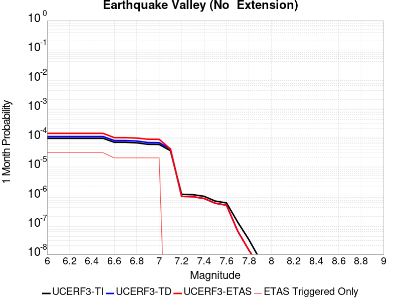 |  | 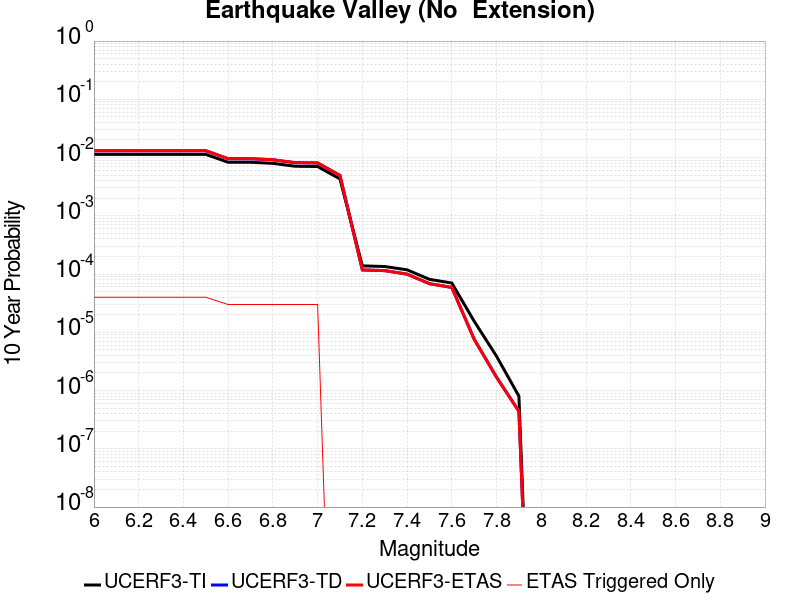 |

| Magnitude | 1 wk TI Prob | 1 wk TD Prob | 1 wk ETAS Prob | 1 wk ETAS/TD Gain | 1 wk ETAS Triggered Only | 1 mo TI Prob | 1 mo TD Prob | 1 mo ETAS Prob | 1 mo ETAS/TD Gain | 1 mo ETAS Triggered Only | 1 yr TI Prob | 1 yr TD Prob | 1 yr ETAS Prob | 1 yr ETAS/TD Gain | 1 yr ETAS Triggered Only | 10 yr TI Prob | 10 yr TD Prob | 10 yr ETAS Prob | 10 yr ETAS/TD Gain | 10 yr ETAS Triggered Only |
|-----|-----|-----|-----|-----|-----|-----|-----|-----|-----|-----|-----|-----|-----|-----|-----|-----|-----|-----|-----|-----|
| 6.0 | 2.1859703E-5 | 2.5198362E-5 | 4.5197856E-5 | 1.7936825 | 2.0E-5 | 9.3681076E-5 | 1.07989326E-4 | 1.3798609E-4 | 1.2777753 | 3.0E-5 | 0.0011399703 | 0.001314122 | 0.0013540694 | 1.0303986 | 4.0E-5 | 0.011341401 | 0.013077871 | 0.013117348 | 1.0030186 | 4.0E-5 |
| 6.1 | 2.1859703E-5 | 2.5198362E-5 | 4.5197856E-5 | 1.7936825 | 2.0E-5 | 9.3681076E-5 | 1.07989326E-4 | 1.3798609E-4 | 1.2777753 | 3.0E-5 | 0.0011399703 | 0.001314122 | 0.0013540694 | 1.0303986 | 4.0E-5 | 0.011341401 | 0.013077871 | 0.013117348 | 1.0030186 | 4.0E-5 |
| 6.2 | 2.1859703E-5 | 2.5198362E-5 | 4.5197856E-5 | 1.7936825 | 2.0E-5 | 9.3681076E-5 | 1.07989326E-4 | 1.3798609E-4 | 1.2777753 | 3.0E-5 | 0.0011399703 | 0.001314122 | 0.0013540694 | 1.0303986 | 4.0E-5 | 0.011341401 | 0.013077871 | 0.013117348 | 1.0030186 | 4.0E-5 |
| 6.3 | 2.1859703E-5 | 2.5198362E-5 | 4.5197856E-5 | 1.7936825 | 2.0E-5 | 9.3681076E-5 | 1.07989326E-4 | 1.3798609E-4 | 1.2777753 | 3.0E-5 | 0.0011399703 | 0.001314122 | 0.0013540694 | 1.0303986 | 4.0E-5 | 0.011341401 | 0.013077871 | 0.013117348 | 1.0030186 | 4.0E-5 |
| 6.4 | 2.1859703E-5 | 2.5198362E-5 | 4.5197856E-5 | 1.7936825 | 2.0E-5 | 9.3681076E-5 | 1.07989326E-4 | 1.3798609E-4 | 1.2777753 | 3.0E-5 | 0.0011399703 | 0.001314122 | 0.0013540694 | 1.0303986 | 4.0E-5 | 0.011341401 | 0.013077871 | 0.013117348 | 1.0030186 | 4.0E-5 |
| 6.5 | 2.1859703E-5 | 2.5198362E-5 | 4.5197856E-5 | 1.7936825 | 2.0E-5 | 9.3681076E-5 | 1.07989326E-4 | 1.3798609E-4 | 1.2777753 | 3.0E-5 | 0.0011399703 | 0.001314122 | 0.0013540694 | 1.0303986 | 4.0E-5 | 0.011341401 | 0.013077871 | 0.013117348 | 1.0030186 | 4.0E-5 |
| 6.6 | 1.597E-5 | 1.8356275E-5 | 3.835591E-5 | 2.0895257 | 2.0E-5 | 6.8441055E-5 | 7.866787E-5 | 9.86663E-5 | 1.2542133 | 2.0E-5 | 8.329513E-4 | 9.574478E-4 | 9.774286E-4 | 1.0208689 | 2.0E-5 | 0.008298361 | 0.009541836 | 0.0095715495 | 1.0031141 | 3.0E-5 |
| 6.7 | 1.597E-5 | 1.8356275E-5 | 3.835591E-5 | 2.0895257 | 2.0E-5 | 6.8441055E-5 | 7.866787E-5 | 9.86663E-5 | 1.2542133 | 2.0E-5 | 8.329513E-4 | 9.574478E-4 | 9.774286E-4 | 1.0208689 | 2.0E-5 | 0.008298361 | 0.009541836 | 0.0095715495 | 1.0031141 | 3.0E-5 |
| 6.8 | 1.5315149E-5 | 1.7602091E-5 | 3.760174E-5 | 2.1362085 | 2.0E-5 | 6.5634704E-5 | 7.543584E-5 | 9.5434334E-5 | 1.265106 | 2.0E-5 | 7.988095E-4 | 9.181311E-4 | 9.3811273E-4 | 1.0217633 | 2.0E-5 | 0.007959441 | 0.009151919 | 0.009181645 | 1.003248 | 3.0E-5 |
| 6.9 | 1.3634728E-5 | 1.5675821E-5 | 3.5675508E-5 | 2.2758303 | 2.0E-5 | 5.8433237E-5 | 6.718082E-5 | 8.7179484E-5 | 1.297684 | 2.0E-5 | 7.1119244E-4 | 8.177017E-4 | 8.3768537E-4 | 1.0244387 | 2.0E-5 | 0.007089207 | 0.008155 | 0.008184756 | 1.0036488 | 3.0E-5 |
| 7.0 | 1.3496271E-5 | 1.5517853E-5 | 3.5517543E-5 | 2.2888181 | 2.0E-5 | 5.783988E-5 | 6.650385E-5 | 8.650252E-5 | 1.3007145 | 2.0E-5 | 7.03973E-4 | 8.094657E-4 | 8.294495E-4 | 1.0246876 | 2.0E-5 | 0.007017471 | 0.0080732405 | 0.008102999 | 1.003686 | 3.0E-5 |
| 7.1 | 8.242798E-6 | 9.4726E-6 | 9.4726E-6 | 1.0 | 0.0 | 3.53258E-5 | 4.0596606E-5 | 4.0596606E-5 | 1.0 | 0.0 | 4.300067E-4 | 4.9421866E-4 | 4.9421866E-4 | 1.0 | 0.0 | 0.004291756 | 0.0049377717 | 0.0049377717 | 1.0 | 0.0 |
| 7.2 | 2.6506527E-7 | 2.2560312E-7 | 2.2560312E-7 | 1.0 | 0.0 | 1.1359936E-6 | 9.668702E-7 | 9.668702E-7 | 1.0 | 0.0 | 1.3830633E-5 | 1.17715845E-5 | 1.17715845E-5 | 1.0 | 0.0 | 1.3829772E-4 | 1.1771003E-4 | 1.1771003E-4 | 1.0 | 0.0 |
| 7.3 | 2.5810488E-7 | 2.1955442E-7 | 2.1955442E-7 | 1.0 | 0.0 | 1.1061633E-6 | 9.409472E-7 | 9.409472E-7 | 1.0 | 0.0 | 1.3467455E-5 | 1.1455976E-5 | 1.1455976E-5 | 1.0 | 0.0 | 1.3466639E-4 | 1.1455427E-4 | 1.1455427E-4 | 1.0 | 0.0 |
| 7.4 | 2.2676066E-7 | 1.9110601E-7 | 1.9110601E-7 | 1.0 | 0.0 | 9.71831E-7 | 8.190255E-7 | 8.190255E-7 | 1.0 | 0.0 | 1.1831979E-5 | 9.9715935E-6 | 9.9715935E-6 | 1.0 | 0.0 | 1.1831349E-4 | 9.9711855E-5 | 9.9711855E-5 | 1.0 | 0.0 |
| 7.5 | 1.5553917E-7 | 1.3112096E-7 | 1.3112096E-7 | 1.0 | 0.0 | 6.6659624E-7 | 5.619469E-7 | 5.619469E-7 | 1.0 | 0.0 | 8.115779E-6 | 6.8416834E-6 | 6.8416834E-6 | 1.0 | 0.0 | 8.115482E-5 | 6.841495E-5 | 6.841495E-5 | 1.0 | 0.0 |
| 7.6 | 1.3448629E-7 | 1.1288419E-7 | 1.1288419E-7 | 1.0 | 0.0 | 5.7636964E-7 | 4.837893E-7 | 4.837893E-7 | 1.0 | 0.0 | 7.017278E-6 | 5.890121E-6 | 5.890121E-6 | 1.0 | 0.0 | 7.0170565E-5 | 5.889986E-5 | 5.889986E-5 | 1.0 | 0.0 |
| 7.7 | 2.9719402E-8 | 1.458206E-8 | 1.458206E-8 | 1.0 | 0.0 | 1.2736886E-7 | 6.249454E-8 | 6.249454E-8 | 1.0 | 0.0 | 1.5507147E-6 | 7.608708E-7 | 7.608708E-7 | 1.0 | 0.0 | 1.550704E-5 | 7.6086876E-6 | 7.6086876E-6 | 1.0 | 0.0 |
| 7.8 | 7.4390196E-9 | 3.2502152E-9 | 3.2502152E-9 | 1.0 | 0.0 | 3.1881513E-8 | 1.3929493E-8 | 1.3929493E-8 | 1.0 | 0.0 | 3.8815733E-7 | 1.6959156E-7 | 1.6959156E-7 | 1.0 | 0.0 | 3.8815665E-6 | 1.6959145E-6 | 1.6959145E-6 | 1.0 | 0.0 |
| 7.9 | 1.5373532E-9 | 8.440161E-10 | 8.440161E-10 | 1.0 | 0.0 | 6.5886567E-9 | 3.6172119E-9 | 3.6172119E-9 | 1.0 | 0.0 | 8.021689E-8 | 4.4039556E-8 | 4.4039556E-8 | 1.0 | 0.0 | 8.0216864E-7 | 4.4039552E-7 | 4.4039552E-7 | 1.0 | 0.0 |

## Channel Islands Western Deep Ramp
*[(top)](#table-of-contents)*

| 1 Week | 1 Month | 1 Year | 10 Year |
|-----|-----|-----|-----|
|  | 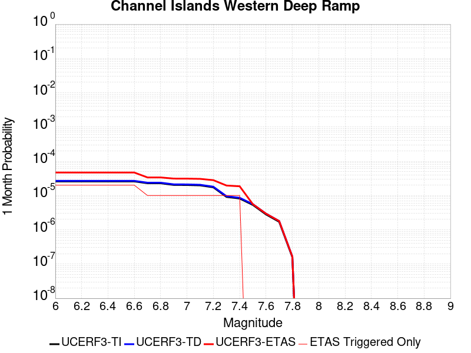 | 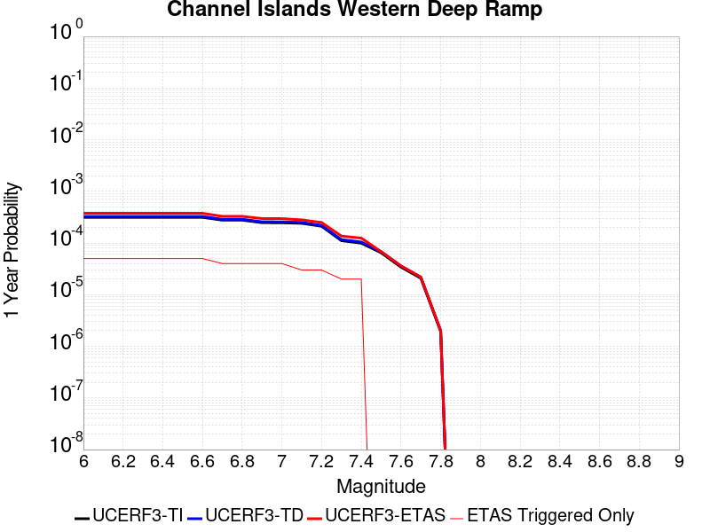 | 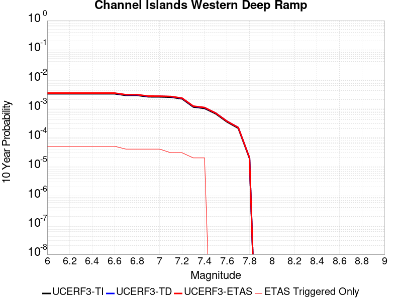 |

| Magnitude | 1 wk TI Prob | 1 wk TD Prob | 1 wk ETAS Prob | 1 wk ETAS/TD Gain | 1 wk ETAS Triggered Only | 1 mo TI Prob | 1 mo TD Prob | 1 mo ETAS Prob | 1 mo ETAS/TD Gain | 1 mo ETAS Triggered Only | 1 yr TI Prob | 1 yr TD Prob | 1 yr ETAS Prob | 1 yr ETAS/TD Gain | 1 yr ETAS Triggered Only | 10 yr TI Prob | 10 yr TD Prob | 10 yr ETAS Prob | 10 yr ETAS/TD Gain | 10 yr ETAS Triggered Only |
|-----|-----|-----|-----|-----|-----|-----|-----|-----|-----|-----|-----|-----|-----|-----|-----|-----|-----|-----|-----|-----|
| 6.0 | 6.0213506E-6 | 6.2548684E-6 | 6.2548684E-6 | 1.0 | 0.0 | 2.5805533E-5 | 2.6806329E-5 | 4.680579E-5 | 1.7460725 | 2.0E-5 | 3.1413708E-4 | 3.2632265E-4 | 3.7630633E-4 | 1.1531726 | 5.0E-5 | 0.0031369338 | 0.0032588763 | 0.0033087134 | 1.0152928 | 5.0E-5 |
| 6.1 | 6.0213506E-6 | 6.2548684E-6 | 6.2548684E-6 | 1.0 | 0.0 | 2.5805533E-5 | 2.6806329E-5 | 4.680579E-5 | 1.7460725 | 2.0E-5 | 3.1413708E-4 | 3.2632265E-4 | 3.7630633E-4 | 1.1531726 | 5.0E-5 | 0.0031369338 | 0.0032588763 | 0.0033087134 | 1.0152928 | 5.0E-5 |
| 6.2 | 6.0213506E-6 | 6.2548684E-6 | 6.2548684E-6 | 1.0 | 0.0 | 2.5805533E-5 | 2.6806329E-5 | 4.680579E-5 | 1.7460725 | 2.0E-5 | 3.1413708E-4 | 3.2632265E-4 | 3.7630633E-4 | 1.1531726 | 5.0E-5 | 0.0031369338 | 0.0032588763 | 0.0033087134 | 1.0152928 | 5.0E-5 |
| 6.3 | 6.0213506E-6 | 6.2548684E-6 | 6.2548684E-6 | 1.0 | 0.0 | 2.5805533E-5 | 2.6806329E-5 | 4.680579E-5 | 1.7460725 | 2.0E-5 | 3.1413708E-4 | 3.2632265E-4 | 3.7630633E-4 | 1.1531726 | 5.0E-5 | 0.0031369338 | 0.0032588763 | 0.0033087134 | 1.0152928 | 5.0E-5 |
| 6.4 | 6.0213506E-6 | 6.2548684E-6 | 6.2548684E-6 | 1.0 | 0.0 | 2.5805533E-5 | 2.6806329E-5 | 4.680579E-5 | 1.7460725 | 2.0E-5 | 3.1413708E-4 | 3.2632265E-4 | 3.7630633E-4 | 1.1531726 | 5.0E-5 | 0.0031369338 | 0.0032588763 | 0.0033087134 | 1.0152928 | 5.0E-5 |
| 6.5 | 6.0213506E-6 | 6.2548684E-6 | 6.2548684E-6 | 1.0 | 0.0 | 2.5805533E-5 | 2.6806329E-5 | 4.680579E-5 | 1.7460725 | 2.0E-5 | 3.1413708E-4 | 3.2632265E-4 | 3.7630633E-4 | 1.1531726 | 5.0E-5 | 0.0031369338 | 0.0032588763 | 0.0033087134 | 1.0152928 | 5.0E-5 |
| 6.6 | 6.0213506E-6 | 6.2548684E-6 | 6.2548684E-6 | 1.0 | 0.0 | 2.5805533E-5 | 2.6806329E-5 | 4.680579E-5 | 1.7460725 | 2.0E-5 | 3.1413708E-4 | 3.2632265E-4 | 3.7630633E-4 | 1.1531726 | 5.0E-5 | 0.0031369338 | 0.0032588763 | 0.0033087134 | 1.0152928 | 5.0E-5 |
| 6.7 | 5.313309E-6 | 5.5252403E-6 | 5.5252403E-6 | 1.0 | 0.0 | 2.2771126E-5 | 2.367941E-5 | 3.3679175E-5 | 1.4222978 | 1.0E-5 | 2.772032E-4 | 2.8826276E-4 | 3.2825125E-4 | 1.1387223 | 4.0E-5 | 0.0027685766 | 0.0028792918 | 0.0029191766 | 1.0138524 | 4.0E-5 |
| 6.8 | 5.313309E-6 | 5.5252403E-6 | 5.5252403E-6 | 1.0 | 0.0 | 2.2771126E-5 | 2.367941E-5 | 3.3679175E-5 | 1.4222978 | 1.0E-5 | 2.772032E-4 | 2.8826276E-4 | 3.2825125E-4 | 1.1387223 | 4.0E-5 | 0.0027685766 | 0.0028792918 | 0.0029191766 | 1.0138524 | 4.0E-5 |
| 6.9 | 4.744377E-6 | 4.9394303E-6 | 4.9394303E-6 | 1.0 | 0.0 | 2.0332885E-5 | 2.1168837E-5 | 3.1168624E-5 | 1.4723825 | 1.0E-5 | 2.4752476E-4 | 2.5770385E-4 | 2.9769354E-4 | 1.1551769 | 4.0E-5 | 0.0024724922 | 0.0025744175 | 0.0026143144 | 1.0154974 | 4.0E-5 |
| 7.0 | 4.722209E-6 | 4.9164732E-6 | 4.9164732E-6 | 1.0 | 0.0 | 2.0237881E-5 | 2.107045E-5 | 3.1070238E-5 | 1.4745883 | 1.0E-5 | 2.4636835E-4 | 2.5650626E-4 | 2.96496E-4 | 1.1559017 | 4.0E-5 | 0.002460954 | 0.0025624693 | 0.0026023667 | 1.0155699 | 4.0E-5 |
| 7.1 | 4.611174E-6 | 4.801409E-6 | 4.801409E-6 | 1.0 | 0.0 | 1.9762025E-5 | 2.0577325E-5 | 3.057712E-5 | 1.4859618 | 1.0E-5 | 2.4057609E-4 | 2.5050386E-4 | 2.8049634E-4 | 1.1197287 | 3.0E-5 | 0.002403158 | 0.002502582 | 0.0025325068 | 1.0119576 | 3.0E-5 |
| 7.2 | 4.043994E-6 | 4.2120264E-6 | 4.2120264E-6 | 1.0 | 0.0 | 1.7331287E-5 | 1.8051438E-5 | 2.8051258E-5 | 1.5539625 | 1.0E-5 | 2.10988E-4 | 2.1975765E-4 | 2.4975106E-4 | 1.136484 | 3.0E-5 | 0.002107878 | 0.0021957543 | 0.0022256884 | 1.0136328 | 3.0E-5 |
| 7.3 | 2.1233036E-6 | 2.2297875E-6 | 2.2297875E-6 | 1.0 | 0.0 | 9.099841E-6 | 9.556197E-6 | 1.9556102E-5 | 2.0464313 | 1.0E-5 | 1.1078493E-4 | 1.1634055E-4 | 1.3633822E-4 | 1.1718891 | 2.0E-5 | 0.0011072971 | 0.001162802 | 0.0011827787 | 1.0171798 | 2.0E-5 |
| 7.4 | 1.9051884E-6 | 2.0014973E-6 | 2.0014973E-6 | 1.0 | 0.0 | 8.165067E-6 | 8.577817E-6 | 1.8577732E-5 | 2.1657877 | 1.0E-5 | 9.940516E-5 | 1.0442998E-4 | 1.2442788E-4 | 1.1914959 | 2.0E-5 | 9.93607E-4 | 0.0010438144 | 0.0010637934 | 1.0191405 | 2.0E-5 |
| 7.5 | 1.2408497E-6 | 1.3038839E-6 | 1.3038839E-6 | 1.0 | 0.0 | 5.317916E-6 | 5.588062E-6 | 5.588062E-6 | 1.0 | 0.0 | 6.4743705E-5 | 6.8032554E-5 | 6.8032554E-5 | 1.0 | 0.0 | 6.4724847E-4 | 6.8011944E-4 | 6.8011944E-4 | 1.0 | 0.0 |
| 7.6 | 6.5440025E-7 | 6.886718E-7 | 6.886718E-7 | 1.0 | 0.0 | 2.8045695E-6 | 2.9514472E-6 | 2.9514472E-6 | 1.0 | 0.0 | 3.4145098E-5 | 3.593329E-5 | 3.593329E-5 | 1.0 | 0.0 | 3.4139853E-4 | 3.5927625E-4 | 3.5927625E-4 | 1.0 | 0.0 |
| 7.7 | 3.985963E-7 | 4.1930787E-7 | 4.1930787E-7 | 1.0 | 0.0 | 1.7082689E-6 | 1.7970326E-6 | 1.7970326E-6 | 1.0 | 0.0 | 2.0797976E-5 | 2.1878664E-5 | 2.1878664E-5 | 1.0 | 0.0 | 2.0796029E-4 | 2.1876628E-4 | 2.1876628E-4 | 1.0 | 0.0 |
| 7.8 | 3.706329E-8 | 3.8591796E-8 | 3.8591796E-8 | 1.0 | 0.0 | 1.5884267E-7 | 1.653934E-7 | 1.653934E-7 | 1.0 | 0.0 | 1.9339077E-6 | 2.0136629E-6 | 2.0136629E-6 | 1.0 | 0.0 | 1.933891E-5 | 2.0136458E-5 | 2.0136458E-5 | 1.0 | 0.0 |

## Calaveras (So) - Paicines extension 2011 CFM
*[(top)](#table-of-contents)*

| 1 Week | 1 Month | 1 Year | 10 Year |
|-----|-----|-----|-----|
|  |  |  | 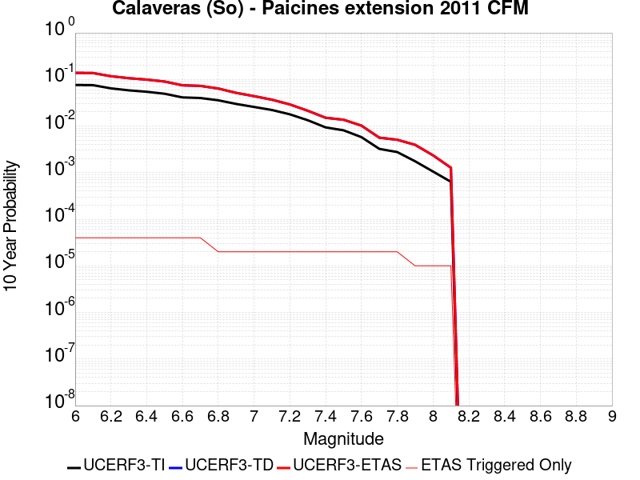 |

| Magnitude | 1 wk TI Prob | 1 wk TD Prob | 1 wk ETAS Prob | 1 wk ETAS/TD Gain | 1 wk ETAS Triggered Only | 1 mo TI Prob | 1 mo TD Prob | 1 mo ETAS Prob | 1 mo ETAS/TD Gain | 1 mo ETAS Triggered Only | 1 yr TI Prob | 1 yr TD Prob | 1 yr ETAS Prob | 1 yr ETAS/TD Gain | 1 yr ETAS Triggered Only | 10 yr TI Prob | 10 yr TD Prob | 10 yr ETAS Prob | 10 yr ETAS/TD Gain | 10 yr ETAS Triggered Only |
|-----|-----|-----|-----|-----|-----|-----|-----|-----|-----|-----|-----|-----|-----|-----|-----|-----|-----|-----|-----|-----|
| 6.0 | 1.5183659E-4 | 3.0533716E-4 | 3.0533716E-4 | 1.0 | 0.0 | 6.5056595E-4 | 0.0013069661 | 0.0013069661 | 1.0 | 0.0 | 0.007891912 | 0.01569571 | 0.015715396 | 1.0012542 | 2.0E-5 | 0.076174594 | 0.13848671 | 0.13852118 | 1.0002488 | 4.0E-5 |
| 6.1 | 1.5024997E-4 | 3.0227835E-4 | 3.0227835E-4 | 1.0 | 0.0 | 6.437695E-4 | 0.00129387 | 0.00129387 | 1.0 | 0.0 | 0.0078097614 | 0.015539104 | 0.015558793 | 1.0012671 | 2.0E-5 | 0.075409345 | 0.13715632 | 0.13719083 | 1.0002517 | 4.0E-5 |
| 6.2 | 1.2743923E-4 | 2.5306802E-4 | 2.5306802E-4 | 1.0 | 0.0 | 5.460538E-4 | 0.0010841049 | 0.0010841049 | 1.0 | 0.0 | 0.0066279583 | 0.013046704 | 0.013066443 | 1.001513 | 2.0E-5 | 0.064337276 | 0.11725405 | 0.11728936 | 1.0003011 | 4.0E-5 |
| 6.3 | 1.1525114E-4 | 2.2595265E-4 | 2.2595265E-4 | 1.0 | 0.0 | 4.9383997E-4 | 9.6799526E-4 | 9.6799526E-4 | 1.0 | 0.0 | 0.0059959386 | 0.011667927 | 0.011687693 | 1.0016941 | 2.0E-5 | 0.058367174 | 0.10637007 | 0.10640582 | 1.000336 | 4.0E-5 |
| 6.4 | 1.07200925E-4 | 2.0836305E-4 | 2.0836305E-4 | 1.0 | 0.0 | 4.5935164E-4 | 8.926636E-4 | 8.926636E-4 | 1.0 | 0.0 | 0.0055782744 | 0.010772766 | 0.01079255 | 1.0018365 | 2.0E-5 | 0.0544031 | 0.09919256 | 0.09922859 | 1.0003632 | 4.0E-5 |
| 6.5 | 9.69631E-5 | 1.8729115E-4 | 1.8729115E-4 | 1.0 | 0.0 | 4.1548995E-4 | 8.024135E-4 | 8.024135E-4 | 1.0 | 0.0 | 0.0050468626 | 0.009694662 | 0.009714468 | 1.002043 | 2.0E-5 | 0.04933773 | 0.090084255 | 0.09012065 | 1.000404 | 4.0E-5 |
| 6.6 | 8.0552316E-5 | 1.5070537E-4 | 1.5070537E-4 | 1.0 | 0.0 | 3.4517853E-4 | 6.456994E-4 | 6.456994E-4 | 1.0 | 0.0 | 0.0041944524 | 0.007826256 | 0.007846099 | 1.0025355 | 2.0E-5 | 0.04116161 | 0.074854024 | 0.07489103 | 1.0004944 | 4.0E-5 |
| 6.7 | 7.815757E-5 | 1.4610609E-4 | 1.4610609E-4 | 1.0 | 0.0 | 3.34918E-4 | 6.260017E-4 | 6.260017E-4 | 1.0 | 0.0 | 0.004070005 | 0.0075890915 | 0.00760894 | 1.0026153 | 2.0E-5 | 0.039962657 | 0.072703585 | 0.072740674 | 1.0005102 | 4.0E-5 |
| 6.8 | 6.965264E-5 | 1.2721405E-4 | 1.2721405E-4 | 1.0 | 0.0 | 2.9847719E-4 | 5.450839E-4 | 5.450839E-4 | 1.0 | 0.0 | 0.0036279052 | 0.00661342 | 0.0066233533 | 1.001502 | 1.0E-5 | 0.03569247 | 0.06379891 | 0.063817635 | 1.0002935 | 2.0E-5 |
| 6.9 | 5.8000453E-5 | 1.01435086E-4 | 1.01435086E-4 | 1.0 | 0.0 | 2.4854968E-4 | 4.3464993E-4 | 4.3464993E-4 | 1.0 | 0.0 | 0.0030218933 | 0.0052791284 | 0.005289076 | 1.0018842 | 1.0E-5 | 0.029811295 | 0.051501602 | 0.05152057 | 1.0003684 | 2.0E-5 |
| 7.0 | 4.9865852E-5 | 8.567692E-5 | 8.567692E-5 | 1.0 | 0.0 | 2.1369329E-4 | 3.671356E-4 | 3.671356E-4 | 1.0 | 0.0 | 0.0025986114 | 0.0044608037 | 0.004470759 | 1.0022317 | 1.0E-5 | 0.025684336 | 0.043781694 | 0.043800816 | 1.0004368 | 2.0E-5 |
| 7.1 | 4.283875E-5 | 7.112159E-5 | 7.112159E-5 | 1.0 | 0.0 | 1.8358172E-4 | 3.047715E-4 | 3.047715E-4 | 1.0 | 0.0 | 0.0022328163 | 0.003704336 | 0.003714299 | 1.0026895 | 1.0E-5 | 0.022105146 | 0.03673583 | 0.036755096 | 1.0005244 | 2.0E-5 |
| 7.2 | 3.450115E-5 | 5.5776054E-5 | 5.5776054E-5 | 1.0 | 0.0 | 1.478537E-4 | 2.390185E-4 | 2.390185E-4 | 1.0 | 0.0 | 0.0017986323 | 0.0029061958 | 0.0029161668 | 1.003431 | 1.0E-5 | 0.017841442 | 0.029079199 | 0.029098617 | 1.0006678 | 2.0E-5 |
| 7.3 | 2.5709045E-5 | 4.0588155E-5 | 4.0588155E-5 | 1.0 | 0.0 | 1.1017697E-4 | 1.7393773E-4 | 1.7393773E-4 | 1.0 | 0.0 | 0.0013405791 | 0.002115652 | 0.0021256309 | 1.0047166 | 1.0E-5 | 0.013325208 | 0.021297242 | 0.021316817 | 1.0009191 | 2.0E-5 |
| 7.4 | 1.8003093E-5 | 2.8509934E-5 | 2.8509934E-5 | 1.0 | 0.0 | 7.715383E-5 | 1.2217973E-4 | 1.2217973E-4 | 1.0 | 0.0 | 9.3894306E-4 | 0.0014865254 | 0.0014965106 | 1.0067171 | 1.0E-5 | 0.009349857 | 0.015052196 | 0.015071895 | 1.0013087 | 2.0E-5 |
| 7.5 | 1.5595824E-5 | 2.5822499E-5 | 2.5822499E-5 | 1.0 | 0.0 | 6.683753E-5 | 1.1066317E-4 | 1.1066317E-4 | 1.0 | 0.0 | 8.134431E-4 | 0.0013464936 | 0.0013564802 | 1.0074167 | 1.0E-5 | 0.008104719 | 0.01365213 | 0.013671857 | 1.0014449 | 2.0E-5 |
| 7.6 | 1.1110309E-5 | 1.9222098E-5 | 1.9222098E-5 | 1.0 | 0.0 | 4.761474E-5 | 8.2377825E-5 | 8.2377825E-5 | 1.0 | 0.0 | 5.795553E-4 | 0.0010024898 | 0.0010124799 | 1.0099652 | 1.0E-5 | 0.0057804612 | 0.010203943 | 0.010223739 | 1.00194 | 2.0E-5 |
| 7.7 | 6.2140443E-6 | 1.0437076E-5 | 1.0437076E-5 | 1.0 | 0.0 | 2.6631347E-5 | 4.4729557E-5 | 4.4729557E-5 | 1.0 | 0.0 | 3.241884E-4 | 5.444464E-4 | 5.5444095E-4 | 1.0183573 | 1.0E-5 | 0.0032371588 | 0.005619835 | 0.0056397226 | 1.0035388 | 2.0E-5 |
| 7.8 | 5.305533E-6 | 9.433038E-6 | 9.433038E-6 | 1.0 | 0.0 | 2.27378E-5 | 4.042668E-5 | 4.042668E-5 | 1.0 | 0.0 | 2.7679754E-4 | 4.920837E-4 | 5.020788E-4 | 1.0203117 | 1.0E-5 | 0.0027645302 | 0.005074324 | 0.0050942227 | 1.0039214 | 2.0E-5 |
| 7.9 | 3.363505E-6 | 7.3848937E-6 | 7.3848937E-6 | 1.0 | 0.0 | 1.4414942E-5 | 3.164916E-5 | 3.164916E-5 | 1.0 | 0.0 | 1.7548777E-4 | 3.8526047E-4 | 3.8526047E-4 | 1.0 | 0.0 | 0.0017534926 | 0.003948527 | 0.0039584874 | 1.0025226 | 1.0E-5 |
| 8.0 | 2.0271132E-6 | 4.413104E-6 | 4.413104E-6 | 1.0 | 0.0 | 8.687599E-6 | 1.8913164E-5 | 1.8913164E-5 | 1.0 | 0.0 | 1.05766376E-4 | 2.302435E-4 | 2.302435E-4 | 1.0 | 0.0 | 0.0010571606 | 0.002351099 | 0.0023610755 | 1.0042434 | 1.0E-5 |
| 8.1 | 1.2206116E-6 | 2.3751331E-6 | 2.3751331E-6 | 1.0 | 0.0 | 5.2311816E-6 | 1.0179103E-5 | 1.0179103E-5 | 1.0 | 0.0 | 6.3687774E-5 | 1.2392356E-4 | 1.2392356E-4 | 1.0 | 0.0 | 6.366953E-4 | 0.0012705477 | 0.001280535 | 1.0078607 | 1.0E-5 |

## San Diego Trough south
*[(top)](#table-of-contents)*

| 1 Week | 1 Month | 1 Year | 10 Year |
|-----|-----|-----|-----|
| 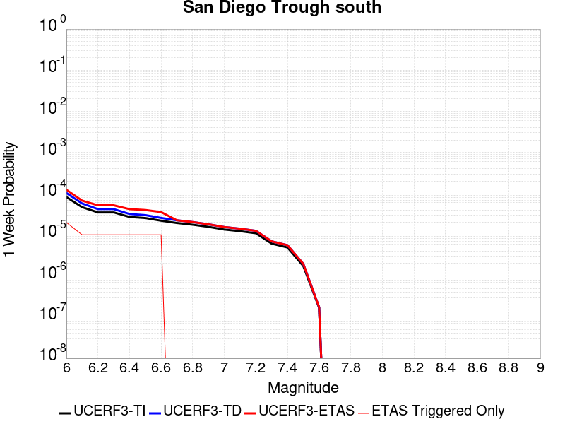 |  |  | 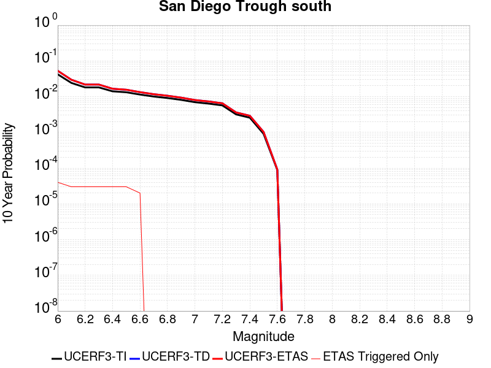 |

| Magnitude | 1 wk TI Prob | 1 wk TD Prob | 1 wk ETAS Prob | 1 wk ETAS/TD Gain | 1 wk ETAS Triggered Only | 1 mo TI Prob | 1 mo TD Prob | 1 mo ETAS Prob | 1 mo ETAS/TD Gain | 1 mo ETAS Triggered Only | 1 yr TI Prob | 1 yr TD Prob | 1 yr ETAS Prob | 1 yr ETAS/TD Gain | 1 yr ETAS Triggered Only | 10 yr TI Prob | 10 yr TD Prob | 10 yr ETAS Prob | 10 yr ETAS/TD Gain | 10 yr ETAS Triggered Only |
|-----|-----|-----|-----|-----|-----|-----|-----|-----|-----|-----|-----|-----|-----|-----|-----|-----|-----|-----|-----|-----|
| 6.0 | 8.279495E-5 | 1.04241306E-4 | 1.2423922E-4 | 1.1918426 | 2.0E-5 | 3.5478722E-4 | 4.4667677E-4 | 4.7666338E-4 | 1.0671327 | 3.0E-5 | 0.004310982 | 0.0054256152 | 0.0054554525 | 1.0054994 | 3.0E-5 | 0.042283054 | 0.05299221 | 0.05303009 | 1.0007148 | 4.0E-5 |
| 6.1 | 4.6961468E-5 | 5.772944E-5 | 6.772886E-5 | 1.1732118 | 1.0E-5 | 2.0124791E-4 | 2.473894E-4 | 2.6738446E-4 | 1.0808243 | 2.0E-5 | 0.00244744 | 0.0030079768 | 0.0030279167 | 1.006629 | 2.0E-5 | 0.024206603 | 0.029679462 | 0.029708572 | 1.0009809 | 3.0E-5 |
| 6.2 | 3.5079658E-5 | 4.214154E-5 | 5.2141117E-5 | 1.2372856 | 1.0E-5 | 1.5033272E-4 | 1.8059435E-4 | 2.0059074E-4 | 1.1107254 | 2.0E-5 | 0.0018287642 | 0.0021965632 | 0.002216519 | 1.0090852 | 2.0E-5 | 0.018137876 | 0.021751117 | 0.021780465 | 1.0013492 | 3.0E-5 |
| 6.3 | 3.5079658E-5 | 4.214154E-5 | 5.2141117E-5 | 1.2372856 | 1.0E-5 | 1.5033272E-4 | 1.8059435E-4 | 2.0059074E-4 | 1.1107254 | 2.0E-5 | 0.0018287642 | 0.0021965632 | 0.002216519 | 1.0090852 | 2.0E-5 | 0.018137876 | 0.021751117 | 0.021780465 | 1.0013492 | 3.0E-5 |
| 6.4 | 2.7196904E-5 | 3.2087162E-5 | 4.2086842E-5 | 1.3116411 | 1.0E-5 | 1.16552954E-4 | 1.3750927E-4 | 1.5750651E-4 | 1.1454247 | 2.0E-5 | 0.0014181085 | 0.0016729041 | 0.0016928706 | 1.0119352 | 2.0E-5 | 0.014090929 | 0.016604643 | 0.016634146 | 1.0017767 | 3.0E-5 |
| 6.5 | 2.5584688E-5 | 3.010164E-5 | 4.010134E-5 | 1.3321978 | 1.0E-5 | 1.0964406E-4 | 1.2900073E-4 | 1.4899815E-4 | 1.1550179 | 2.0E-5 | 0.0013340989 | 0.0015694655 | 0.0015894341 | 1.0127232 | 2.0E-5 | 0.013261181 | 0.015585314 | 0.015614847 | 1.0018948 | 3.0E-5 |
| 6.6 | 2.2034688E-5 | 2.5742738E-5 | 3.574248E-5 | 1.3884491 | 1.0E-5 | 9.443096E-5 | 1.1032141E-4 | 1.303192E-4 | 1.1812685 | 2.0E-5 | 0.0011490905 | 0.0013423424 | 0.0013623155 | 1.0148793 | 2.0E-5 | 0.011431668 | 0.013343317 | 0.013363051 | 1.0014789 | 2.0E-5 |
| 6.7 | 1.9394853E-5 | 2.254176E-5 | 2.254176E-5 | 1.0 | 0.0 | 8.311815E-5 | 9.6603995E-5 | 9.6603995E-5 | 1.0 | 0.0 | 0.0010114936 | 0.0011755243 | 0.0011755243 | 1.0 | 0.0 | 0.01006902 | 0.011693766 | 0.011693766 | 1.0 | 0.0 |
| 6.8 | 1.7615313E-5 | 2.0403182E-5 | 2.0403182E-5 | 1.0 | 0.0 | 7.549201E-5 | 8.74393E-5 | 8.74393E-5 | 1.0 | 0.0 | 9.1872766E-4 | 0.0010640579 | 0.0010640579 | 1.0 | 0.0 | 0.009149387 | 0.010590198 | 0.010590198 | 1.0 | 0.0 |
| 6.9 | 1.5621423E-5 | 1.8026114E-5 | 1.8026114E-5 | 1.0 | 0.0 | 6.6947236E-5 | 7.725251E-5 | 7.725251E-5 | 1.0 | 0.0 | 8.147778E-4 | 9.40147E-4 | 9.40147E-4 | 1.0 | 0.0 | 0.008117969 | 0.009362142 | 0.009362142 | 1.0 | 0.0 |
| 7.0 | 1.3444376E-5 | 1.544809E-5 | 1.544809E-5 | 1.0 | 0.0 | 5.7617483E-5 | 6.620443E-5 | 6.620443E-5 | 1.0 | 0.0 | 7.0126704E-4 | 8.057436E-4 | 8.057436E-4 | 1.0 | 0.0 | 0.006990582 | 0.008028555 | 0.008028555 | 1.0 | 0.0 |
| 7.1 | 1.2268361E-5 | 1.407303E-5 | 1.407303E-5 | 1.0 | 0.0 | 5.2577634E-5 | 6.0311606E-5 | 6.0311606E-5 | 1.0 | 0.0 | 6.399447E-4 | 7.3404907E-4 | 7.3404907E-4 | 1.0 | 0.0 | 0.0063810493 | 0.0073165493 | 0.0073165493 | 1.0 | 0.0 |
| 7.2 | 1.0922655E-5 | 1.2513563E-5 | 1.2513563E-5 | 1.0 | 0.0 | 4.681054E-5 | 5.3628468E-5 | 5.3628468E-5 | 1.0 | 0.0 | 5.697693E-4 | 6.5273355E-4 | 6.5273355E-4 | 1.0 | 0.0 | 0.0056831064 | 0.0065084435 | 0.0065084435 | 1.0 | 0.0 |
| 7.3 | 6.1106753E-6 | 6.928925E-6 | 6.928925E-6 | 1.0 | 0.0 | 2.6188345E-5 | 2.9695057E-5 | 2.9695057E-5 | 1.0 | 0.0 | 3.1879646E-4 | 3.6147775E-4 | 3.6147775E-4 | 1.0 | 0.0 | 0.0031833951 | 0.003608943 | 0.003608943 | 1.0 | 0.0 |
| 7.4 | 4.933187E-6 | 5.5895525E-6 | 5.5895525E-6 | 1.0 | 0.0 | 2.114206E-5 | 2.3955008E-5 | 2.3955008E-5 | 1.0 | 0.0 | 2.5737417E-4 | 2.9161357E-4 | 2.9161357E-4 | 1.0 | 0.0 | 0.002570763 | 0.0029123505 | 0.0029123505 | 1.0 | 0.0 |
| 7.5 | 1.7489613E-6 | 1.969678E-6 | 1.969678E-6 | 1.0 | 0.0 | 7.495527E-6 | 8.4414505E-6 | 8.4414505E-6 | 1.0 | 0.0 | 9.125422E-5 | 1.02770035E-4 | 1.02770035E-4 | 1.0 | 0.0 | 9.1216754E-4 | 0.0010272472 | 0.0010272472 | 1.0 | 0.0 |
| 7.6 | 1.6988751E-7 | 1.7533823E-7 | 1.7533823E-7 | 1.0 | 0.0 | 7.2808916E-7 | 7.5144936E-7 | 7.5144936E-7 | 1.0 | 0.0 | 8.864449E-6 | 9.14886E-6 | 9.14886E-6 | 1.0 | 0.0 | 8.8640954E-5 | 9.1485024E-5 | 9.1485024E-5 | 1.0 | 0.0 |

## Cucamonga
*[(top)](#table-of-contents)*

| 1 Week | 1 Month | 1 Year | 10 Year |
|-----|-----|-----|-----|
|  | 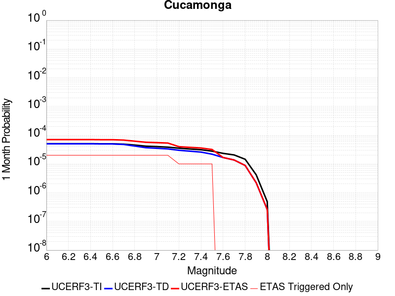 |  |  |

| Magnitude | 1 wk TI Prob | 1 wk TD Prob | 1 wk ETAS Prob | 1 wk ETAS/TD Gain | 1 wk ETAS Triggered Only | 1 mo TI Prob | 1 mo TD Prob | 1 mo ETAS Prob | 1 mo ETAS/TD Gain | 1 mo ETAS Triggered Only | 1 yr TI Prob | 1 yr TD Prob | 1 yr ETAS Prob | 1 yr ETAS/TD Gain | 1 yr ETAS Triggered Only | 10 yr TI Prob | 10 yr TD Prob | 10 yr ETAS Prob | 10 yr ETAS/TD Gain | 10 yr ETAS Triggered Only |
|-----|-----|-----|-----|-----|-----|-----|-----|-----|-----|-----|-----|-----|-----|-----|-----|-----|-----|-----|-----|-----|
| 6.0 | 1.1848348E-5 | 1.1737008E-5 | 3.1736774E-5 | 2.7039917 | 2.0E-5 | 5.0777642E-5 | 5.030051E-5 | 7.02995E-5 | 1.3975903 | 2.0E-5 | 6.180424E-4 | 6.1223935E-4 | 6.622087E-4 | 1.0816174 | 5.0E-5 | 0.0061632637 | 0.0061067017 | 0.0061563966 | 1.0081377 | 5.0E-5 |
| 6.1 | 1.1848348E-5 | 1.1737008E-5 | 3.1736774E-5 | 2.7039917 | 2.0E-5 | 5.0777642E-5 | 5.030051E-5 | 7.02995E-5 | 1.3975903 | 2.0E-5 | 6.180424E-4 | 6.1223935E-4 | 6.622087E-4 | 1.0816174 | 5.0E-5 | 0.0061632637 | 0.0061067017 | 0.0061563966 | 1.0081377 | 5.0E-5 |
| 6.2 | 1.1848348E-5 | 1.1737008E-5 | 3.1736774E-5 | 2.7039917 | 2.0E-5 | 5.0777642E-5 | 5.030051E-5 | 7.02995E-5 | 1.3975903 | 2.0E-5 | 6.180424E-4 | 6.1223935E-4 | 6.622087E-4 | 1.0816174 | 5.0E-5 | 0.0061632637 | 0.0061067017 | 0.0061563966 | 1.0081377 | 5.0E-5 |
| 6.3 | 1.1848348E-5 | 1.1737008E-5 | 3.1736774E-5 | 2.7039917 | 2.0E-5 | 5.0777642E-5 | 5.030051E-5 | 7.02995E-5 | 1.3975903 | 2.0E-5 | 6.180424E-4 | 6.1223935E-4 | 6.622087E-4 | 1.0816174 | 5.0E-5 | 0.0061632637 | 0.0061067017 | 0.0061563966 | 1.0081377 | 5.0E-5 |
| 6.4 | 1.1848348E-5 | 1.1737008E-5 | 3.1736774E-5 | 2.7039917 | 2.0E-5 | 5.0777642E-5 | 5.030051E-5 | 7.02995E-5 | 1.3975903 | 2.0E-5 | 6.180424E-4 | 6.1223935E-4 | 6.622087E-4 | 1.0816174 | 5.0E-5 | 0.0061632637 | 0.0061067017 | 0.0061563966 | 1.0081377 | 5.0E-5 |
| 6.5 | 1.16988695E-5 | 1.15760395E-5 | 3.1575808E-5 | 2.7276866 | 2.0E-5 | 5.013705E-5 | 4.9610666E-5 | 6.9609676E-5 | 1.4031191 | 2.0E-5 | 6.102476E-4 | 6.0384517E-4 | 6.53815E-4 | 1.0827527 | 5.0E-5 | 0.006085745 | 0.006023216 | 0.006072915 | 1.0082512 | 5.0E-5 |
| 6.6 | 1.16988695E-5 | 1.15760395E-5 | 3.1575808E-5 | 2.7276866 | 2.0E-5 | 5.013705E-5 | 4.9610666E-5 | 6.9609676E-5 | 1.4031191 | 2.0E-5 | 6.102476E-4 | 6.0384517E-4 | 6.53815E-4 | 1.0827527 | 5.0E-5 | 0.006085745 | 0.006023216 | 0.006072915 | 1.0082512 | 5.0E-5 |
| 6.7 | 1.1397107E-5 | 1.11149475E-5 | 3.1114727E-5 | 2.7993586 | 2.0E-5 | 4.884383E-5 | 4.7634636E-5 | 6.763368E-5 | 1.4198426 | 2.0E-5 | 5.9451134E-4 | 5.797998E-4 | 6.2977086E-4 | 1.0861866 | 5.0E-5 | 0.005929234 | 0.0057840226 | 0.005833734 | 1.0085945 | 5.0E-5 |
| 6.8 | 1.058387E-5 | 9.784992E-6 | 2.9784796E-5 | 3.0439267 | 2.0E-5 | 4.5358654E-5 | 4.193501E-5 | 6.193417E-5 | 1.4769084 | 2.0E-5 | 5.521017E-4 | 5.1044027E-4 | 5.6041474E-4 | 1.0979047 | 5.0E-5 | 0.00550732 | 0.0050936877 | 0.005143433 | 1.0097661 | 5.0E-5 |
| 6.9 | 9.690046E-6 | 8.57948E-6 | 2.8579308E-5 | 3.3311236 | 2.0E-5 | 4.1528107E-5 | 3.6768684E-5 | 5.676795E-5 | 1.5439211 | 2.0E-5 | 5.054874E-4 | 4.475672E-4 | 4.975448E-4 | 1.1116651 | 5.0E-5 | 0.005043391 | 0.004467594 | 0.004517371 | 1.0111417 | 5.0E-5 |
| 7.0 | 9.381461E-6 | 8.187101E-6 | 2.8186938E-5 | 3.442847 | 2.0E-5 | 4.020564E-5 | 3.5087105E-5 | 5.5086406E-5 | 1.5699899 | 2.0E-5 | 4.893937E-4 | 4.2710215E-4 | 4.770808E-4 | 1.117018 | 5.0E-5 | 0.0048831734 | 0.0042637475 | 0.004313534 | 1.0116768 | 5.0E-5 |
| 7.1 | 8.946492E-6 | 7.781886E-6 | 2.778173E-5 | 3.5700512 | 2.0E-5 | 3.8341543E-5 | 3.3350516E-5 | 5.334985E-5 | 1.5996709 | 2.0E-5 | 4.667083E-4 | 4.0596718E-4 | 4.559469E-4 | 1.1231127 | 5.0E-5 | 0.0046572937 | 0.004053192 | 0.0041029896 | 1.012286 | 5.0E-5 |
| 7.2 | 8.251016E-6 | 6.9752796E-6 | 1.697521E-5 | 2.4336243 | 1.0E-5 | 3.5361016E-5 | 2.9893714E-5 | 3.9893417E-5 | 1.3345085 | 1.0E-5 | 4.3043532E-4 | 3.6389544E-4 | 3.9388452E-4 | 1.0824113 | 3.0E-5 | 0.0042960253 | 0.0036339292 | 0.00366382 | 1.0082256 | 3.0E-5 |
| 7.3 | 7.717881E-6 | 6.4863502E-6 | 1.6486285E-5 | 2.541689 | 1.0E-5 | 3.3076216E-5 | 2.7798349E-5 | 3.7798072E-5 | 1.3597236 | 1.0E-5 | 4.026285E-4 | 3.3839257E-4 | 3.683824E-4 | 1.0886245 | 3.0E-5 | 0.004018998 | 0.00337971 | 0.0034096087 | 1.0088465 | 3.0E-5 |
| 7.4 | 7.275623E-6 | 6.031997E-6 | 1.6031938E-5 | 2.6578157 | 1.0E-5 | 3.118087E-5 | 2.585116E-5 | 3.5850902E-5 | 1.3868198 | 1.0E-5 | 3.7956095E-4 | 3.1469265E-4 | 3.446832E-4 | 1.0953012 | 3.0E-5 | 0.0037891332 | 0.0031434062 | 0.003173312 | 1.0095137 | 3.0E-5 |
| 7.5 | 6.5109502E-6 | 5.1006014E-6 | 1.5100551E-5 | 2.9605432 | 1.0E-5 | 2.7903774E-5 | 2.1859538E-5 | 3.185932E-5 | 1.4574562 | 1.0E-5 | 3.3967546E-4 | 2.661075E-4 | 2.9609952E-4 | 1.1127064 | 3.0E-5 | 0.0033915674 | 0.002658813 | 0.0026887334 | 1.0112532 | 3.0E-5 |
| 7.6 | 5.4495326E-6 | 3.90857E-6 | 3.90857E-6 | 1.0 | 0.0 | 2.335493E-5 | 1.6750908E-5 | 1.6750908E-5 | 1.0 | 0.0 | 2.8430918E-4 | 2.0392328E-4 | 2.239192E-4 | 1.0980561 | 2.0E-5 | 0.0028394572 | 0.002038282 | 0.0020582415 | 1.0097922 | 2.0E-5 |
| 7.7 | 4.7997164E-6 | 3.2002547E-6 | 3.2002547E-6 | 1.0 | 0.0 | 2.057005E-5 | 1.3715306E-5 | 1.3715306E-5 | 1.0 | 0.0 | 2.504116E-4 | 1.6697108E-4 | 1.769694E-4 | 1.0598806 | 1.0E-5 | 0.002501296 | 0.0016693877 | 0.001679371 | 1.0059803 | 1.0E-5 |
| 7.8 | 3.3941733E-6 | 2.0641899E-6 | 2.0641899E-6 | 1.0 | 0.0 | 1.4546376E-5 | 8.846498E-6 | 8.846498E-6 | 1.0 | 0.0 | 1.7708774E-4 | 1.07700806E-4 | 1.17699725E-4 | 1.0928398 | 1.0E-5 | 0.0017694668 | 0.001076723 | 0.0010867122 | 1.0092775 | 1.0E-5 |
| 7.9 | 9.750552E-7 | 5.155946E-7 | 5.155946E-7 | 1.0 | 0.0 | 4.178801E-6 | 2.2096892E-6 | 2.2096892E-6 | 1.0 | 0.0 | 5.0875715E-5 | 2.690264E-5 | 3.690237E-5 | 1.3717008 | 1.0E-5 | 5.086407E-4 | 2.6899425E-4 | 2.7899156E-4 | 1.0371655 | 1.0E-5 |
| 8.0 | 1.133857E-7 | 6.053707E-8 | 6.053707E-8 | 1.0 | 0.0 | 4.8593864E-7 | 2.5944456E-7 | 2.5944456E-7 | 1.0 | 0.0 | 5.9162867E-6 | 3.158733E-6 | 3.158733E-6 | 1.0 | 0.0 | 5.916129E-5 | 3.1586897E-5 | 3.1586897E-5 | 1.0 | 0.0 |

## North Frontal  (West)
*[(top)](#table-of-contents)*

| 1 Week | 1 Month | 1 Year | 10 Year |
|-----|-----|-----|-----|
|  | 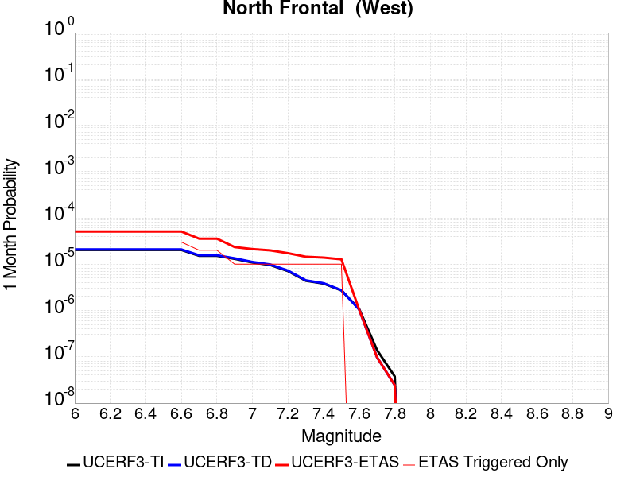 |  |  |

| Magnitude | 1 wk TI Prob | 1 wk TD Prob | 1 wk ETAS Prob | 1 wk ETAS/TD Gain | 1 wk ETAS Triggered Only | 1 mo TI Prob | 1 mo TD Prob | 1 mo ETAS Prob | 1 mo ETAS/TD Gain | 1 mo ETAS Triggered Only | 1 yr TI Prob | 1 yr TD Prob | 1 yr ETAS Prob | 1 yr ETAS/TD Gain | 1 yr ETAS Triggered Only | 10 yr TI Prob | 10 yr TD Prob | 10 yr ETAS Prob | 10 yr ETAS/TD Gain | 10 yr ETAS Triggered Only |
|-----|-----|-----|-----|-----|-----|-----|-----|-----|-----|-----|-----|-----|-----|-----|-----|-----|-----|-----|-----|-----|
| 6.0 | 4.7316266E-6 | 4.8526726E-6 | 2.4852576E-5 | 5.1214204 | 2.0E-5 | 2.0278241E-5 | 2.0797012E-5 | 5.079639E-5 | 2.442485 | 3.0E-5 | 2.4685962E-4 | 2.5317568E-4 | 3.0316302E-4 | 1.1974413 | 5.0E-5 | 0.0024658558 | 0.0025290183 | 0.002578892 | 1.0197206 | 5.0E-5 |
| 6.1 | 4.7316266E-6 | 4.8526726E-6 | 2.4852576E-5 | 5.1214204 | 2.0E-5 | 2.0278241E-5 | 2.0797012E-5 | 5.079639E-5 | 2.442485 | 3.0E-5 | 2.4685962E-4 | 2.5317568E-4 | 3.0316302E-4 | 1.1974413 | 5.0E-5 | 0.0024658558 | 0.0025290183 | 0.002578892 | 1.0197206 | 5.0E-5 |
| 6.2 | 4.7316266E-6 | 4.8526726E-6 | 2.4852576E-5 | 5.1214204 | 2.0E-5 | 2.0278241E-5 | 2.0797012E-5 | 5.079639E-5 | 2.442485 | 3.0E-5 | 2.4685962E-4 | 2.5317568E-4 | 3.0316302E-4 | 1.1974413 | 5.0E-5 | 0.0024658558 | 0.0025290183 | 0.002578892 | 1.0197206 | 5.0E-5 |
| 6.3 | 4.7316266E-6 | 4.8526726E-6 | 2.4852576E-5 | 5.1214204 | 2.0E-5 | 2.0278241E-5 | 2.0797012E-5 | 5.079639E-5 | 2.442485 | 3.0E-5 | 2.4685962E-4 | 2.5317568E-4 | 3.0316302E-4 | 1.1974413 | 5.0E-5 | 0.0024658558 | 0.0025290183 | 0.002578892 | 1.0197206 | 5.0E-5 |
| 6.4 | 4.7316266E-6 | 4.8526726E-6 | 2.4852576E-5 | 5.1214204 | 2.0E-5 | 2.0278241E-5 | 2.0797012E-5 | 5.079639E-5 | 2.442485 | 3.0E-5 | 2.4685962E-4 | 2.5317568E-4 | 3.0316302E-4 | 1.1974413 | 5.0E-5 | 0.0024658558 | 0.0025290183 | 0.002578892 | 1.0197206 | 5.0E-5 |
| 6.5 | 4.7316266E-6 | 4.8526726E-6 | 2.4852576E-5 | 5.1214204 | 2.0E-5 | 2.0278241E-5 | 2.0797012E-5 | 5.079639E-5 | 2.442485 | 3.0E-5 | 2.4685962E-4 | 2.5317568E-4 | 3.0316302E-4 | 1.1974413 | 5.0E-5 | 0.0024658558 | 0.0025290183 | 0.002578892 | 1.0197206 | 5.0E-5 |
| 6.6 | 4.7316266E-6 | 4.8526726E-6 | 2.4852576E-5 | 5.1214204 | 2.0E-5 | 2.0278241E-5 | 2.0797012E-5 | 5.079639E-5 | 2.442485 | 3.0E-5 | 2.4685962E-4 | 2.5317568E-4 | 3.0316302E-4 | 1.1974413 | 5.0E-5 | 0.0024658558 | 0.0025290183 | 0.002578892 | 1.0197206 | 5.0E-5 |
| 6.7 | 3.5382777E-6 | 3.6308859E-6 | 2.3630813E-5 | 6.5082774 | 2.0E-5 | 1.516396E-5 | 1.5560852E-5 | 3.556054E-5 | 2.2852566 | 2.0E-5 | 1.8460557E-4 | 1.8943768E-4 | 2.294301E-4 | 1.2111112 | 4.0E-5 | 0.0018445229 | 0.0018928389 | 0.0019327631 | 1.0210923 | 4.0E-5 |
| 6.8 | 3.5382777E-6 | 3.6308859E-6 | 2.3630813E-5 | 6.5082774 | 2.0E-5 | 1.516396E-5 | 1.5560852E-5 | 3.556054E-5 | 2.2852566 | 2.0E-5 | 1.8460557E-4 | 1.8943768E-4 | 2.294301E-4 | 1.2111112 | 4.0E-5 | 0.0018445229 | 0.0018928389 | 0.0019327631 | 1.0210923 | 4.0E-5 |
| 6.9 | 3.0428037E-6 | 3.1227605E-6 | 1.312273E-5 | 4.202285 | 1.0E-5 | 1.30405215E-5 | 1.33831945E-5 | 2.3383061E-5 | 1.7471957 | 1.0E-5 | 1.5875678E-4 | 1.6292889E-4 | 1.8292564E-4 | 1.1227329 | 2.0E-5 | 0.0015864341 | 0.0016281615 | 0.001648129 | 1.0122638 | 2.0E-5 |
| 7.0 | 2.538778E-6 | 2.6060904E-6 | 1.2606064E-5 | 4.8371553 | 1.0E-5 | 1.0880432E-5 | 1.1168913E-5 | 2.1168802E-5 | 1.8953322 | 1.0E-5 | 1.324612E-4 | 1.3597352E-4 | 1.5597079E-4 | 1.1470674 | 2.0E-5 | 0.0013238228 | 0.0013589499 | 0.0013789227 | 1.0146972 | 2.0E-5 |
| 7.1 | 2.2418935E-6 | 2.3012074E-6 | 1.2301184E-5 | 5.3455353 | 1.0E-5 | 9.60808E-6 | 9.862282E-6 | 1.9862184E-5 | 2.0139542 | 1.0E-5 | 1.1697209E-4 | 1.2006712E-4 | 1.4006472E-4 | 1.1665535 | 2.0E-5 | 0.0011691054 | 0.0012000664 | 0.0012200424 | 1.0166458 | 2.0E-5 |
| 7.2 | 1.6526745E-6 | 1.6924851E-6 | 1.1692468E-5 | 6.9084616 | 1.0E-5 | 7.082872E-6 | 7.253489E-6 | 1.7253416E-5 | 2.3786368 | 1.0E-5 | 8.623055E-5 | 8.8307905E-5 | 1.08306136E-4 | 1.2264603 | 2.0E-5 | 8.61971E-4 | 8.827532E-4 | 9.027355E-4 | 1.0226364 | 2.0E-5 |
| 7.3 | 1.0246019E-6 | 1.0442261E-6 | 1.1044215E-5 | 10.576461 | 1.0E-5 | 4.391144E-6 | 4.4752474E-6 | 1.4475203E-5 | 3.2345033 | 1.0E-5 | 5.3460866E-5 | 5.448489E-5 | 7.44838E-5 | 1.3670542 | 2.0E-5 | 5.344801E-4 | 5.4472685E-4 | 5.6471594E-4 | 1.0366956 | 2.0E-5 |
| 7.4 | 8.9045164E-7 | 9.0565584E-7 | 1.0905646E-5 | 12.041712 | 1.0E-5 | 3.8162157E-6 | 3.8813773E-6 | 1.3881338E-5 | 3.576395 | 1.0E-5 | 4.646144E-5 | 4.7254853E-5 | 6.725391E-5 | 1.4232169 | 2.0E-5 | 4.6451724E-4 | 4.7245892E-4 | 4.9244944E-4 | 1.0423117 | 2.0E-5 |
| 7.5 | 6.3357E-7 | 6.4027006E-7 | 1.0640264E-5 | 16.6184 | 1.0E-5 | 2.7152971E-6 | 2.744012E-6 | 1.2743984E-5 | 4.644289 | 1.0E-5 | 3.305824E-5 | 3.34079E-5 | 5.340723E-5 | 1.5986408 | 2.0E-5 | 3.3053322E-4 | 3.3403534E-4 | 3.5402869E-4 | 1.0598539 | 2.0E-5 |
| 7.6 | 2.5087024E-7 | 2.4361097E-7 | 2.4361097E-7 | 1.0 | 0.0 | 1.0751578E-6 | 1.0440467E-6 | 1.0440467E-6 | 1.0 | 0.0 | 1.3089967E-5 | 1.2711216E-5 | 2.2711089E-5 | 1.7866968 | 1.0E-5 | 1.3089196E-4 | 1.2710695E-4 | 1.3710569E-4 | 1.078664 | 1.0E-5 |
| 7.7 | 3.282987E-8 | 2.2874195E-8 | 2.2874195E-8 | 1.0 | 0.0 | 1.4069944E-7 | 9.803227E-8 | 9.803227E-8 | 1.0 | 0.0 | 1.7130144E-6 | 1.1935423E-6 | 1.1935423E-6 | 1.0 | 0.0 | 1.7130013E-5 | 1.1935367E-5 | 1.1935367E-5 | 1.0 | 0.0 |
| 7.8 | 8.77499E-9 | 5.6815956E-9 | 5.6815956E-9 | 1.0 | 0.0 | 3.7607098E-8 | 2.4349696E-8 | 2.4349696E-8 | 1.0 | 0.0 | 4.578663E-7 | 2.9645753E-7 | 2.9645753E-7 | 1.0 | 0.0 | 4.5786537E-6 | 2.9645726E-6 | 2.9645726E-6 | 1.0 | 0.0 |

## San Juan
*[(top)](#table-of-contents)*

| 1 Week | 1 Month | 1 Year | 10 Year |
|-----|-----|-----|-----|
|  |  |  |  |

| Magnitude | 1 wk TI Prob | 1 wk TD Prob | 1 wk ETAS Prob | 1 wk ETAS/TD Gain | 1 wk ETAS Triggered Only | 1 mo TI Prob | 1 mo TD Prob | 1 mo ETAS Prob | 1 mo ETAS/TD Gain | 1 mo ETAS Triggered Only | 1 yr TI Prob | 1 yr TD Prob | 1 yr ETAS Prob | 1 yr ETAS/TD Gain | 1 yr ETAS Triggered Only | 10 yr TI Prob | 10 yr TD Prob | 10 yr ETAS Prob | 10 yr ETAS/TD Gain | 10 yr ETAS Triggered Only |
|-----|-----|-----|-----|-----|-----|-----|-----|-----|-----|-----|-----|-----|-----|-----|-----|-----|-----|-----|-----|-----|
| 6.0 | 8.682808E-6 | 8.7491635E-6 | 8.7491635E-6 | 1.0 | 0.0 | 3.72115E-5 | 3.74959E-5 | 3.74959E-5 | 1.0 | 0.0 | 4.5295584E-4 | 4.564218E-4 | 4.7641268E-4 | 1.0437992 | 2.0E-5 | 0.004520337 | 0.004555385 | 0.0046051573 | 1.010926 | 5.0E-5 |
| 6.1 | 8.682808E-6 | 8.7491635E-6 | 8.7491635E-6 | 1.0 | 0.0 | 3.72115E-5 | 3.74959E-5 | 3.74959E-5 | 1.0 | 0.0 | 4.5295584E-4 | 4.564218E-4 | 4.7641268E-4 | 1.0437992 | 2.0E-5 | 0.004520337 | 0.004555385 | 0.0046051573 | 1.010926 | 5.0E-5 |
| 6.2 | 8.682808E-6 | 8.7491635E-6 | 8.7491635E-6 | 1.0 | 0.0 | 3.72115E-5 | 3.74959E-5 | 3.74959E-5 | 1.0 | 0.0 | 4.5295584E-4 | 4.564218E-4 | 4.7641268E-4 | 1.0437992 | 2.0E-5 | 0.004520337 | 0.004555385 | 0.0046051573 | 1.010926 | 5.0E-5 |
| 6.3 | 6.3054235E-6 | 6.2825848E-6 | 6.2825848E-6 | 1.0 | 0.0 | 2.7022963E-5 | 2.6925094E-5 | 2.6925094E-5 | 1.0 | 0.0 | 3.2895492E-4 | 3.2776513E-4 | 3.4775856E-4 | 1.0609993 | 2.0E-5 | 0.003284684 | 0.003273017 | 0.0033029187 | 1.0091358 | 3.0E-5 |
| 6.4 | 6.1490473E-6 | 6.1144656E-6 | 6.1144656E-6 | 1.0 | 0.0 | 2.6352795E-5 | 2.6204598E-5 | 2.6204598E-5 | 1.0 | 0.0 | 3.2079802E-4 | 3.1899565E-4 | 3.2899246E-4 | 1.0313383 | 1.0E-5 | 0.0032033534 | 0.0031855737 | 0.00320551 | 1.0062582 | 2.0E-5 |
| 6.5 | 5.204848E-6 | 5.137233E-6 | 5.137233E-6 | 1.0 | 0.0 | 2.23063E-5 | 2.2016533E-5 | 2.2016533E-5 | 1.0 | 0.0 | 2.7154534E-4 | 2.6801927E-4 | 2.780166E-4 | 1.0373007 | 1.0E-5 | 0.0027121378 | 0.0026771144 | 0.0026970608 | 1.0074507 | 2.0E-5 |
| 6.6 | 4.5179986E-6 | 4.4150297E-6 | 4.4150297E-6 | 1.0 | 0.0 | 1.9362706E-5 | 1.8921424E-5 | 1.8921424E-5 | 1.0 | 0.0 | 2.3571544E-4 | 2.3034477E-4 | 2.4034247E-4 | 1.0434031 | 1.0E-5 | 0.0023546559 | 0.0023011973 | 0.002321151 | 1.0086712 | 2.0E-5 |
| 6.7 | 3.9442616E-6 | 3.819828E-6 | 3.819828E-6 | 1.0 | 0.0 | 1.6903869E-5 | 1.6370592E-5 | 1.6370592E-5 | 1.0 | 0.0 | 2.0578515E-4 | 1.992944E-4 | 2.0929241E-4 | 1.050167 | 1.0E-5 | 0.002055947 | 0.0019912818 | 0.0020112419 | 1.0100238 | 2.0E-5 |
| 6.8 | 3.4536245E-6 | 3.3163353E-6 | 3.3163353E-6 | 1.0 | 0.0 | 1.4801163E-5 | 1.4212792E-5 | 1.4212792E-5 | 1.0 | 0.0 | 1.8018926E-4 | 1.7302761E-4 | 1.8302588E-4 | 1.0577842 | 1.0E-5 | 0.0018004322 | 0.0017290477 | 0.0017390305 | 1.0057735 | 1.0E-5 |
| 6.9 | 3.059865E-6 | 2.9120315E-6 | 2.9120315E-6 | 1.0 | 0.0 | 1.3113641E-5 | 1.2480078E-5 | 1.2480078E-5 | 1.0 | 0.0 | 1.596469E-4 | 1.5193493E-4 | 1.619334E-4 | 1.0658077 | 1.0E-5 | 0.0015953224 | 0.0015184252 | 0.00152841 | 1.0065758 | 1.0E-5 |
| 7.0 | 2.6504351E-6 | 2.4920002E-6 | 2.4920002E-6 | 1.0 | 0.0 | 1.1358958E-5 | 1.0679961E-5 | 1.0679961E-5 | 1.0 | 0.0 | 1.3828653E-4 | 1.300213E-4 | 1.4002E-4 | 1.0769005 | 1.0E-5 | 0.0013820052 | 0.0012995641 | 0.0013095512 | 1.007685 | 1.0E-5 |
| 7.1 | 2.2039317E-6 | 2.0338296E-6 | 2.0338296E-6 | 1.0 | 0.0 | 9.445387E-6 | 8.716386E-6 | 8.716386E-6 | 1.0 | 0.0 | 1.1499152E-4 | 1.0611736E-4 | 1.161163E-4 | 1.0942253 | 1.0E-5 | 0.0011493203 | 0.0010607769 | 0.0010707662 | 1.009417 | 1.0E-5 |
| 7.2 | 1.0786707E-6 | 8.7701903E-7 | 8.7701903E-7 | 1.0 | 0.0 | 4.622866E-6 | 3.7586476E-6 | 3.7586476E-6 | 1.0 | 0.0 | 5.628194E-5 | 4.5760586E-5 | 4.5760586E-5 | 1.0 | 0.0 | 5.6267687E-4 | 4.5757066E-4 | 4.5757066E-4 | 1.0 | 0.0 |
| 7.3 | 6.846433E-7 | 4.868805E-7 | 4.868805E-7 | 1.0 | 0.0 | 2.9341822E-6 | 2.086629E-6 | 2.086629E-6 | 1.0 | 0.0 | 3.5723086E-5 | 2.5404412E-5 | 2.5404412E-5 | 1.0 | 0.0 | 3.571734E-4 | 2.540486E-4 | 2.540486E-4 | 1.0 | 0.0 |
| 7.4 | 5.23043E-7 | 3.2628162E-7 | 3.2628162E-7 | 1.0 | 0.0 | 2.2416111E-6 | 1.398349E-6 | 1.398349E-6 | 1.0 | 0.0 | 2.7291273E-5 | 1.7024766E-5 | 1.7024766E-5 | 1.0 | 0.0 | 2.7287923E-4 | 1.7026656E-4 | 1.7026656E-4 | 1.0 | 0.0 |
| 7.5 | 4.648444E-7 | 2.7234944E-7 | 2.7234944E-7 | 1.0 | 0.0 | 1.9921886E-6 | 1.1672114E-6 | 1.1672114E-6 | 1.0 | 0.0 | 2.4254627E-5 | 1.42107065E-5 | 1.42107065E-5 | 1.0 | 0.0 | 2.425198E-4 | 1.421276E-4 | 1.421276E-4 | 1.0 | 0.0 |
| 7.6 | 3.9906567E-7 | 2.2083314E-7 | 2.2083314E-7 | 1.0 | 0.0 | 1.7102802E-6 | 9.464274E-7 | 9.464274E-7 | 1.0 | 0.0 | 2.0822463E-5 | 1.1522693E-5 | 1.1522693E-5 | 1.0 | 0.0 | 2.0820512E-4 | 1.15245566E-4 | 1.15245566E-4 | 1.0 | 0.0 |
| 7.7 | 1.8784601E-7 | 5.3666906E-8 | 5.3666906E-8 | 1.0 | 0.0 | 8.0505407E-7 | 2.30001E-7 | 2.30001E-7 | 1.0 | 0.0 | 9.80149E-6 | 2.8002585E-6 | 2.8002585E-6 | 1.0 | 0.0 | 9.801057E-5 | 2.8011282E-5 | 2.8011282E-5 | 1.0 | 0.0 |
| 7.8 | 1.00154914E-7 | 1.2415832E-8 | 1.2415832E-8 | 1.0 | 0.0 | 4.2923529E-7 | 5.3210716E-8 | 5.3210716E-8 | 1.0 | 0.0 | 5.225927E-6 | 6.4784024E-7 | 6.4784024E-7 | 1.0 | 0.0 | 5.225804E-5 | 6.484273E-6 | 6.484273E-6 | 1.0 | 0.0 |
| 7.9 | 6.171429E-8 | 4.2966155E-9 | 4.2966155E-9 | 1.0 | 0.0 | 2.6448978E-7 | 1.8414067E-8 | 1.8414067E-8 | 1.0 | 0.0 | 3.2201583E-6 | 2.2419121E-7 | 2.2419121E-7 | 1.0 | 0.0 | 3.2201115E-5 | 2.2472002E-6 | 2.2472002E-6 | 1.0 | 0.0 |
| 8.0 | 1.3974572E-8 | 3.3788217E-10 | 3.3788217E-10 | 1.0 | 0.0 | 5.989102E-8 | 1.448067E-9 | 1.448067E-9 | 1.0 | 0.0 | 7.2917294E-7 | 1.763022E-8 | 1.763022E-8 | 1.0 | 0.0 | 7.2917055E-6 | 1.8060365E-7 | 1.8060365E-7 | 1.0 | 0.0 |
| 8.1 | 1.8403477E-9 | 1.1302803E-10 | 1.1302803E-10 | 1.0 | 0.0 | 7.887204E-9 | 4.844063E-10 | 4.844063E-10 | 1.0 | 0.0 | 9.602671E-8 | 5.8976446E-9 | 5.8976446E-9 | 1.0 | 0.0 | 9.602667E-7 | 6.021993E-8 | 6.021993E-8 | 1.0 | 0.0 |

## Great Valley 07 (Orestimba)
*[(top)](#table-of-contents)*

| 1 Week | 1 Month | 1 Year | 10 Year |
|-----|-----|-----|-----|
|  |  | 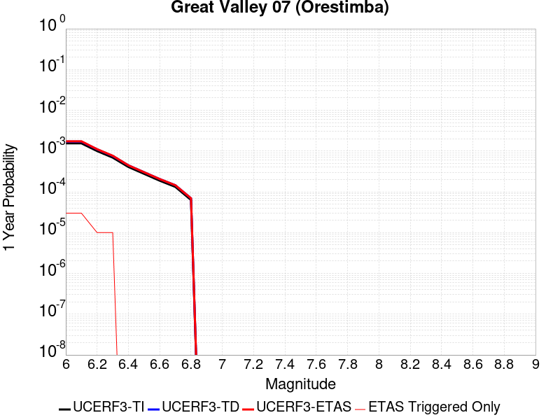 | 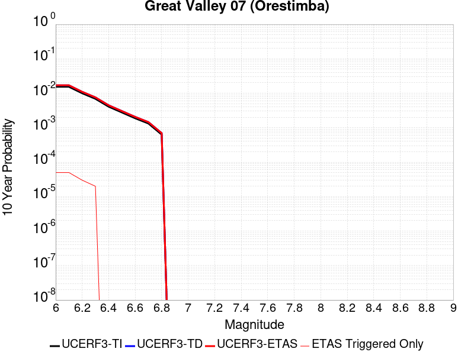 |

| Magnitude | 1 wk TI Prob | 1 wk TD Prob | 1 wk ETAS Prob | 1 wk ETAS/TD Gain | 1 wk ETAS Triggered Only | 1 mo TI Prob | 1 mo TD Prob | 1 mo ETAS Prob | 1 mo ETAS/TD Gain | 1 mo ETAS Triggered Only | 1 yr TI Prob | 1 yr TD Prob | 1 yr ETAS Prob | 1 yr ETAS/TD Gain | 1 yr ETAS Triggered Only | 10 yr TI Prob | 10 yr TD Prob | 10 yr ETAS Prob | 10 yr ETAS/TD Gain | 10 yr ETAS Triggered Only |
|-----|-----|-----|-----|-----|-----|-----|-----|-----|-----|-----|-----|-----|-----|-----|-----|-----|-----|-----|-----|-----|
| 6.0 | 2.9687902E-5 | 3.27575E-5 | 4.2757172E-5 | 1.3052636 | 1.0E-5 | 1.2722766E-4 | 1.4038214E-4 | 1.5038073E-4 | 1.0712241 | 1.0E-5 | 0.0015478961 | 0.0017078844 | 0.0017378331 | 1.0175356 | 3.0E-5 | 0.015371585 | 0.016955135 | 0.017004289 | 1.0028989 | 5.0E-5 |
| 6.1 | 2.9687902E-5 | 3.27575E-5 | 4.2757172E-5 | 1.3052636 | 1.0E-5 | 1.2722766E-4 | 1.4038214E-4 | 1.5038073E-4 | 1.0712241 | 1.0E-5 | 0.0015478961 | 0.0017078844 | 0.0017378331 | 1.0175356 | 3.0E-5 | 0.015371585 | 0.016955135 | 0.017004289 | 1.0028989 | 5.0E-5 |
| 6.2 | 1.9231524E-5 | 2.1159167E-5 | 2.1159167E-5 | 1.0 | 0.0 | 8.2418206E-5 | 9.067912E-5 | 9.067912E-5 | 1.0 | 0.0 | 0.0010029797 | 0.0011034822 | 0.0011134712 | 1.0090523 | 1.0E-5 | 0.00998465 | 0.01098244 | 0.011012111 | 1.0027016 | 3.0E-5 |
| 6.3 | 1.324766E-5 | 1.4548534E-5 | 1.4548534E-5 | 1.0 | 0.0 | 5.6774446E-5 | 6.234942E-5 | 6.234942E-5 | 1.0 | 0.0 | 6.910097E-4 | 7.5884897E-4 | 7.6884136E-4 | 1.0131679 | 1.0E-5 | 0.006888649 | 0.0075635235 | 0.0075833723 | 1.0026243 | 2.0E-5 |
| 6.4 | 7.818645E-6 | 8.57284E-6 | 8.57284E-6 | 1.0 | 0.0 | 3.3508048E-5 | 3.6740246E-5 | 3.6740246E-5 | 1.0 | 0.0 | 4.078841E-4 | 4.4722404E-4 | 4.4722404E-4 | 1.0 | 0.0 | 0.004071363 | 0.0044635804 | 0.0044635804 | 1.0 | 0.0 |
| 6.5 | 5.3076565E-6 | 5.8178007E-6 | 5.8178007E-6 | 1.0 | 0.0 | 2.27469E-5 | 2.4933206E-5 | 2.4933206E-5 | 1.0 | 0.0 | 2.7690834E-4 | 3.035216E-4 | 3.035216E-4 | 1.0 | 0.0 | 0.0027656353 | 0.00303128 | 0.00303128 | 1.0 | 0.0 |
| 6.6 | 3.6003578E-6 | 3.9484953E-6 | 3.9484953E-6 | 1.0 | 0.0 | 1.5430012E-5 | 1.6922022E-5 | 1.6922022E-5 | 1.0 | 0.0 | 1.8784421E-4 | 2.0600771E-4 | 2.0600771E-4 | 1.0 | 0.0 | 0.0018768552 | 0.0020583214 | 0.0020583214 | 1.0 | 0.0 |
| 6.7 | 2.5361826E-6 | 2.7834678E-6 | 2.7834678E-6 | 1.0 | 0.0 | 1.0869308E-5 | 1.1929101E-5 | 1.1929101E-5 | 1.0 | 0.0 | 1.3232579E-4 | 1.4522845E-4 | 1.4522845E-4 | 1.0 | 0.0 | 0.0013224703 | 0.0014514653 | 0.0014514653 | 1.0 | 0.0 |
| 6.8 | 1.2115831E-6 | 1.3313797E-6 | 1.3313797E-6 | 1.0 | 0.0 | 5.1924885E-6 | 5.7059065E-6 | 5.7059065E-6 | 1.0 | 0.0 | 6.3216714E-5 | 6.9468166E-5 | 6.9468166E-5 | 1.0 | 0.0 | 6.3198735E-4 | 6.945596E-4 | 6.945596E-4 | 1.0 | 0.0 |

## Monte Vista - Shannon 2011 CFM
*[(top)](#table-of-contents)*

| 1 Week | 1 Month | 1 Year | 10 Year |
|-----|-----|-----|-----|
|  |  | 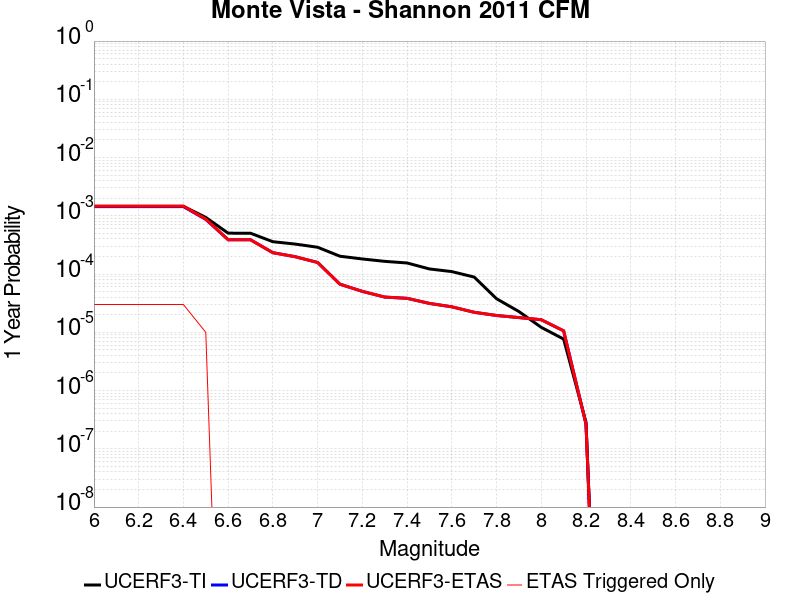 |  |

| Magnitude | 1 wk TI Prob | 1 wk TD Prob | 1 wk ETAS Prob | 1 wk ETAS/TD Gain | 1 wk ETAS Triggered Only | 1 mo TI Prob | 1 mo TD Prob | 1 mo ETAS Prob | 1 mo ETAS/TD Gain | 1 mo ETAS Triggered Only | 1 yr TI Prob | 1 yr TD Prob | 1 yr ETAS Prob | 1 yr ETAS/TD Gain | 1 yr ETAS Triggered Only | 10 yr TI Prob | 10 yr TD Prob | 10 yr ETAS Prob | 10 yr ETAS/TD Gain | 10 yr ETAS Triggered Only |
|-----|-----|-----|-----|-----|-----|-----|-----|-----|-----|-----|-----|-----|-----|-----|-----|-----|-----|-----|-----|-----|
| 6.0 | 2.7907707E-5 | 2.7584209E-5 | 2.7584209E-5 | 1.0 | 0.0 | 1.19598975E-4 | 1.1821338E-4 | 1.282122E-4 | 1.0845828 | 1.0E-5 | 0.0014551448 | 0.0014384214 | 0.0014683782 | 1.0208262 | 3.0E-5 | 0.014456532 | 0.014320195 | 0.014349765 | 1.002065 | 3.0E-5 |
| 6.1 | 2.7907707E-5 | 2.7584209E-5 | 2.7584209E-5 | 1.0 | 0.0 | 1.19598975E-4 | 1.1821338E-4 | 1.282122E-4 | 1.0845828 | 1.0E-5 | 0.0014551448 | 0.0014384214 | 0.0014683782 | 1.0208262 | 3.0E-5 | 0.014456532 | 0.014320195 | 0.014349765 | 1.002065 | 3.0E-5 |
| 6.2 | 2.7907707E-5 | 2.7584209E-5 | 2.7584209E-5 | 1.0 | 0.0 | 1.19598975E-4 | 1.1821338E-4 | 1.282122E-4 | 1.0845828 | 1.0E-5 | 0.0014551448 | 0.0014384214 | 0.0014683782 | 1.0208262 | 3.0E-5 | 0.014456532 | 0.014320195 | 0.014349765 | 1.002065 | 3.0E-5 |
| 6.3 | 2.7907707E-5 | 2.7584209E-5 | 2.7584209E-5 | 1.0 | 0.0 | 1.19598975E-4 | 1.1821338E-4 | 1.282122E-4 | 1.0845828 | 1.0E-5 | 0.0014551448 | 0.0014384214 | 0.0014683782 | 1.0208262 | 3.0E-5 | 0.014456532 | 0.014320195 | 0.014349765 | 1.002065 | 3.0E-5 |
| 6.4 | 2.7907707E-5 | 2.7584209E-5 | 2.7584209E-5 | 1.0 | 0.0 | 1.19598975E-4 | 1.1821338E-4 | 1.282122E-4 | 1.0845828 | 1.0E-5 | 0.0014551448 | 0.0014384214 | 0.0014683782 | 1.0208262 | 3.0E-5 | 0.014456532 | 0.014320195 | 0.014349765 | 1.002065 | 3.0E-5 |
| 6.5 | 1.7990213E-5 | 1.6639884E-5 | 1.6639884E-5 | 1.0 | 0.0 | 7.709863E-5 | 7.131221E-5 | 8.1311504E-5 | 1.1402184 | 1.0E-5 | 9.382716E-4 | 8.679467E-4 | 8.77938E-4 | 1.0115114 | 1.0E-5 | 0.0093431985 | 0.008668941 | 0.008688767 | 1.002287 | 2.0E-5 |
| 6.6 | 9.650407E-6 | 7.4571435E-6 | 7.4571435E-6 | 1.0 | 0.0 | 4.135823E-5 | 3.195884E-5 | 3.195884E-5 | 1.0 | 0.0 | 5.0342013E-4 | 3.8903722E-4 | 3.8903722E-4 | 1.0 | 0.0 | 0.005022812 | 0.0039012418 | 0.0039012418 | 1.0 | 0.0 |
| 6.7 | 9.62828E-6 | 7.4350583E-6 | 7.4350583E-6 | 1.0 | 0.0 | 4.1263404E-5 | 3.186419E-5 | 3.186419E-5 | 1.0 | 0.0 | 5.022661E-4 | 3.878853E-4 | 3.878853E-4 | 1.0 | 0.0 | 0.0050113243 | 0.003889763 | 0.003889763 | 1.0 | 0.0 |
| 6.8 | 6.887523E-6 | 4.4615676E-6 | 4.4615676E-6 | 1.0 | 0.0 | 2.9517621E-5 | 1.9120876E-5 | 1.9120876E-5 | 1.0 | 0.0 | 3.5931775E-4 | 2.3277402E-4 | 2.3277402E-4 | 1.0 | 0.0 | 0.0035873733 | 0.0023424553 | 0.0023424553 | 1.0 | 0.0 |
| 6.9 | 6.2722347E-6 | 3.8034377E-6 | 3.8034377E-6 | 1.0 | 0.0 | 2.6880729E-5 | 1.6300357E-5 | 1.6300357E-5 | 1.0 | 0.0 | 3.2722374E-4 | 1.984408E-4 | 1.984408E-4 | 1.0 | 0.0 | 0.003267423 | 0.0019997752 | 0.0019997752 | 1.0 | 0.0 |
| 7.0 | 5.5320347E-6 | 3.0305885E-6 | 3.0305885E-6 | 1.0 | 0.0 | 2.3708504E-5 | 1.2988182E-5 | 1.2988182E-5 | 1.0 | 0.0 | 2.8861282E-4 | 1.5812147E-4 | 1.5812147E-4 | 1.0 | 0.0 | 0.0028823826 | 0.001597215 | 0.001597215 | 1.0 | 0.0 |
| 7.1 | 3.8794055E-6 | 1.2837862E-6 | 1.2837862E-6 | 1.0 | 0.0 | 1.6625918E-5 | 5.5019295E-6 | 5.5019295E-6 | 1.0 | 0.0 | 2.0240174E-4 | 6.698394E-5 | 6.698394E-5 | 1.0 | 0.0 | 0.002022175 | 6.865884E-4 | 6.865884E-4 | 1.0 | 0.0 |
| 7.2 | 3.4813652E-6 | 9.671046E-7 | 9.671046E-7 | 1.0 | 0.0 | 1.49200505E-5 | 4.1447274E-6 | 4.1447274E-6 | 1.0 | 0.0 | 1.8163648E-4 | 5.0460894E-5 | 5.0460894E-5 | 1.0 | 0.0 | 0.0018148809 | 5.214329E-4 | 5.214329E-4 | 1.0 | 0.0 |
| 7.3 | 3.1682148E-6 | 7.719097E-7 | 7.719097E-7 | 1.0 | 0.0 | 1.3577992E-5 | 3.30818E-6 | 3.30818E-6 | 1.0 | 0.0 | 1.6529951E-4 | 4.027635E-5 | 4.027635E-5 | 1.0 | 0.0 | 0.0016517661 | 4.1960424E-4 | 4.1960424E-4 | 1.0 | 0.0 |
| 7.4 | 2.9707667E-6 | 7.3457204E-7 | 7.3457204E-7 | 1.0 | 0.0 | 1.2731795E-5 | 3.148162E-6 | 3.148162E-6 | 1.0 | 0.0 | 1.5499859E-4 | 3.8328202E-5 | 3.8328202E-5 | 1.0 | 0.0 | 0.0015489052 | 3.9992164E-4 | 3.9992164E-4 | 1.0 | 0.0 |
| 7.5 | 2.3462758E-6 | 6.007889E-7 | 6.007889E-7 | 1.0 | 0.0 | 1.0055429E-5 | 2.574807E-6 | 2.574807E-6 | 1.0 | 0.0 | 1.2241797E-4 | 3.1347827E-5 | 3.1347827E-5 | 1.0 | 0.0 | 0.0012235056 | 3.2839534E-4 | 3.2839534E-4 | 1.0 | 0.0 |
| 7.6 | 2.112783E-6 | 5.251582E-7 | 5.251582E-7 | 1.0 | 0.0 | 9.054753E-6 | 2.250676E-6 | 2.250676E-6 | 1.0 | 0.0 | 1.1023604E-4 | 2.7401638E-5 | 2.7401638E-5 | 1.0 | 0.0 | 0.0011018137 | 2.885138E-4 | 2.885138E-4 | 1.0 | 0.0 |
| 7.7 | 1.7022471E-6 | 4.231601E-7 | 4.231601E-7 | 1.0 | 0.0 | 7.2953244E-6 | 1.8135419E-6 | 1.8135419E-6 | 1.0 | 0.0 | 8.881695E-5 | 2.207965E-5 | 2.207965E-5 | 1.0 | 0.0 | 8.878146E-4 | 2.3398738E-4 | 2.3398738E-4 | 1.0 | 0.0 |
| 7.8 | 7.230914E-7 | 3.7285864E-7 | 3.7285864E-7 | 1.0 | 0.0 | 3.0989595E-6 | 1.5979647E-6 | 1.5979647E-6 | 1.0 | 0.0 | 3.772918E-5 | 1.9455047E-5 | 1.9455047E-5 | 1.0 | 0.0 | 3.7722773E-4 | 2.0726922E-4 | 2.0726922E-4 | 1.0 | 0.0 |
| 7.9 | 4.3588446E-7 | 3.4305793E-7 | 3.4305793E-7 | 1.0 | 0.0 | 1.868075E-6 | 1.4702474E-6 | 1.4702474E-6 | 1.0 | 0.0 | 2.2743576E-5 | 1.7900116E-5 | 1.7900116E-5 | 1.0 | 0.0 | 2.2741247E-4 | 1.8995286E-4 | 1.8995286E-4 | 1.0 | 0.0 |
| 8.0 | 2.3317523E-7 | 3.1513588E-7 | 3.1513588E-7 | 1.0 | 0.0 | 9.99322E-7 | 1.3505817E-6 | 1.3505817E-6 | 1.0 | 0.0 | 1.2166677E-5 | 1.644321E-5 | 1.644321E-5 | 1.0 | 0.0 | 1.21660116E-4 | 1.7399415E-4 | 1.7399415E-4 | 1.0 | 0.0 |
| 8.1 | 1.4662456E-7 | 2.030774E-7 | 2.030774E-7 | 1.0 | 0.0 | 6.283908E-7 | 8.703314E-7 | 8.703314E-7 | 1.0 | 0.0 | 7.650631E-6 | 1.05962345E-5 | 1.05962345E-5 | 1.0 | 0.0 | 7.650368E-5 | 1.113227E-4 | 1.113227E-4 | 1.0 | 0.0 |
| 8.2 | 5.4931775E-9 | 5.07573E-9 | 5.07573E-9 | 1.0 | 0.0 | 2.3542189E-8 | 2.1753127E-8 | 2.1753127E-8 | 1.0 | 0.0 | 2.8662612E-7 | 2.6484432E-7 | 2.6484432E-7 | 1.0 | 0.0 | 2.8662573E-6 | 2.7539324E-6 | 2.7539324E-6 | 1.0 | 0.0 |

## Ortigalita (North)
*[(top)](#table-of-contents)*

| 1 Week | 1 Month | 1 Year | 10 Year |
|-----|-----|-----|-----|
|  |  |  |  |

| Magnitude | 1 wk TI Prob | 1 wk TD Prob | 1 wk ETAS Prob | 1 wk ETAS/TD Gain | 1 wk ETAS Triggered Only | 1 mo TI Prob | 1 mo TD Prob | 1 mo ETAS Prob | 1 mo ETAS/TD Gain | 1 mo ETAS Triggered Only | 1 yr TI Prob | 1 yr TD Prob | 1 yr ETAS Prob | 1 yr ETAS/TD Gain | 1 yr ETAS Triggered Only | 10 yr TI Prob | 10 yr TD Prob | 10 yr ETAS Prob | 10 yr ETAS/TD Gain | 10 yr ETAS Triggered Only |
|-----|-----|-----|-----|-----|-----|-----|-----|-----|-----|-----|-----|-----|-----|-----|-----|-----|-----|-----|-----|-----|
| 6.0 | 7.711876E-5 | 1.05064966E-4 | 1.15063915E-4 | 1.0951692 | 1.0E-5 | 3.3046713E-4 | 4.502116E-4 | 4.702026E-4 | 1.0444036 | 2.0E-5 | 0.004016016 | 0.0054681194 | 0.00548801 | 1.0036376 | 2.0E-5 | 0.039442103 | 0.053454787 | 0.05349265 | 1.0007083 | 4.0E-5 |
| 6.1 | 4.607858E-5 | 6.0239203E-5 | 7.02386E-5 | 1.1659949 | 1.0E-5 | 1.9746469E-4 | 2.5814527E-4 | 2.6814267E-4 | 1.0387279 | 1.0E-5 | 0.0024014818 | 0.0031387596 | 0.0031487283 | 1.003176 | 1.0E-5 | 0.023756953 | 0.030975068 | 0.030994449 | 1.0006257 | 2.0E-5 |
| 6.2 | 4.607858E-5 | 6.0239203E-5 | 7.02386E-5 | 1.1659949 | 1.0E-5 | 1.9746469E-4 | 2.5814527E-4 | 2.6814267E-4 | 1.0387279 | 1.0E-5 | 0.0024014818 | 0.0031387596 | 0.0031487283 | 1.003176 | 1.0E-5 | 0.023756953 | 0.030975068 | 0.030994449 | 1.0006257 | 2.0E-5 |
| 6.3 | 3.327423E-5 | 4.2475127E-5 | 4.2475127E-5 | 1.0 | 0.0 | 1.4259605E-4 | 1.8202531E-4 | 1.8202531E-4 | 1.0 | 0.0 | 0.0017347244 | 0.002214197 | 0.002214197 | 1.0 | 0.0 | 0.017212452 | 0.021945644 | 0.021955425 | 1.0004457 | 1.0E-5 |
| 6.4 | 2.7732503E-5 | 3.4998593E-5 | 3.4998593E-5 | 1.0 | 0.0 | 1.1884817E-4 | 1.4998685E-4 | 1.4998685E-4 | 1.0 | 0.0 | 0.001446016 | 0.0018248095 | 0.0018248095 | 1.0 | 0.0 | 0.014366428 | 0.018121224 | 0.018131042 | 1.0005418 | 1.0E-5 |
| 6.5 | 2.7689714E-5 | 3.4948407E-5 | 3.4948407E-5 | 1.0 | 0.0 | 1.186648E-4 | 1.497718E-4 | 1.497718E-4 | 1.0 | 0.0 | 0.0014437864 | 0.0018221956 | 0.0018221956 | 1.0 | 0.0 | 0.014344421 | 0.01809551 | 0.01810533 | 1.0005426 | 1.0E-5 |
| 6.6 | 2.2976905E-5 | 2.8718265E-5 | 2.8718265E-5 | 1.0 | 0.0 | 9.846873E-5 | 1.230739E-4 | 1.230739E-4 | 1.0 | 0.0 | 0.0011981975 | 0.0014976363 | 0.0014976363 | 1.0 | 0.0 | 0.011917574 | 0.014898697 | 0.014898697 | 1.0 | 0.0 |
| 6.7 | 1.9871539E-5 | 2.4904411E-5 | 2.4904411E-5 | 1.0 | 0.0 | 8.516096E-5 | 1.0673023E-4 | 1.0673023E-4 | 1.0 | 0.0 | 0.0010363415 | 0.0012989145 | 0.0012989145 | 1.0 | 0.0 | 0.010315218 | 0.012936919 | 0.012936919 | 1.0 | 0.0 |
| 6.8 | 6.5640475E-6 | 7.6054926E-6 | 7.6054926E-6 | 1.0 | 0.0 | 2.813133E-5 | 3.2594577E-5 | 3.2594577E-5 | 1.0 | 0.0 | 3.424451E-4 | 3.9676955E-4 | 3.9676955E-4 | 1.0 | 0.0 | 0.0034191788 | 0.003960899 | 0.003960899 | 1.0 | 0.0 |
| 6.9 | 5.6219683E-6 | 6.5018376E-6 | 6.5018376E-6 | 1.0 | 0.0 | 2.4093928E-5 | 2.7864735E-5 | 2.7864735E-5 | 1.0 | 0.0 | 2.933041E-4 | 3.3920293E-4 | 3.3920293E-4 | 1.0 | 0.0 | 0.0029291727 | 0.003387109 | 0.003387109 | 1.0 | 0.0 |
| 7.0 | 3.875591E-6 | 4.4847548E-6 | 4.4847548E-6 | 1.0 | 0.0 | 1.6609569E-5 | 1.9220248E-5 | 1.9220248E-5 | 1.0 | 0.0 | 2.0220275E-4 | 2.339835E-4 | 2.339835E-4 | 1.0 | 0.0 | 0.0020201886 | 0.0023375798 | 0.0023375798 | 1.0 | 0.0 |
| 7.1 | 1.6017933E-6 | 1.8570418E-6 | 1.8570418E-6 | 1.0 | 0.0 | 6.8648105E-6 | 7.958732E-6 | 7.958732E-6 | 1.0 | 0.0 | 8.357586E-5 | 9.689432E-5 | 9.689432E-5 | 1.0 | 0.0 | 8.3544437E-4 | 9.686254E-4 | 9.686254E-4 | 1.0 | 0.0 |

## Mono Lake 2011 CFM
*[(top)](#table-of-contents)*

| 1 Week | 1 Month | 1 Year | 10 Year |
|-----|-----|-----|-----|
| 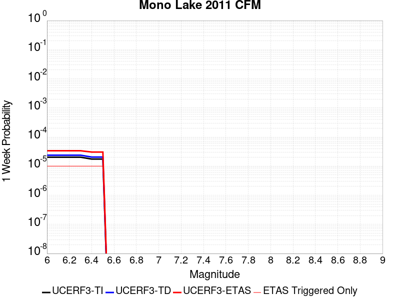 |  |  |  |

| Magnitude | 1 wk TI Prob | 1 wk TD Prob | 1 wk ETAS Prob | 1 wk ETAS/TD Gain | 1 wk ETAS Triggered Only | 1 mo TI Prob | 1 mo TD Prob | 1 mo ETAS Prob | 1 mo ETAS/TD Gain | 1 mo ETAS Triggered Only | 1 yr TI Prob | 1 yr TD Prob | 1 yr ETAS Prob | 1 yr ETAS/TD Gain | 1 yr ETAS Triggered Only | 10 yr TI Prob | 10 yr TD Prob | 10 yr ETAS Prob | 10 yr ETAS/TD Gain | 10 yr ETAS Triggered Only |
|-----|-----|-----|-----|-----|-----|-----|-----|-----|-----|-----|-----|-----|-----|-----|-----|-----|-----|-----|-----|-----|
| 6.0 | 2.0341662E-5 | 2.3828166E-5 | 3.3827928E-5 | 1.4196614 | 1.0E-5 | 8.717564E-5 | 1.0211971E-4 | 1.12118694E-4 | 1.0979143 | 1.0E-5 | 0.0010608466 | 0.0012431298 | 0.001263105 | 1.0160685 | 2.0E-5 | 0.010557966 | 0.012413835 | 0.012453338 | 1.0031822 | 4.0E-5 |
| 6.1 | 2.0341662E-5 | 2.3828166E-5 | 3.3827928E-5 | 1.4196614 | 1.0E-5 | 8.717564E-5 | 1.0211971E-4 | 1.12118694E-4 | 1.0979143 | 1.0E-5 | 0.0010608466 | 0.0012431298 | 0.001263105 | 1.0160685 | 2.0E-5 | 0.010557966 | 0.012413835 | 0.012453338 | 1.0031822 | 4.0E-5 |
| 6.2 | 2.0341662E-5 | 2.3828166E-5 | 3.3827928E-5 | 1.4196614 | 1.0E-5 | 8.717564E-5 | 1.0211971E-4 | 1.12118694E-4 | 1.0979143 | 1.0E-5 | 0.0010608466 | 0.0012431298 | 0.001263105 | 1.0160685 | 2.0E-5 | 0.010557966 | 0.012413835 | 0.012453338 | 1.0031822 | 4.0E-5 |
| 6.3 | 2.0341662E-5 | 2.3828166E-5 | 3.3827928E-5 | 1.4196614 | 1.0E-5 | 8.717564E-5 | 1.0211971E-4 | 1.12118694E-4 | 1.0979143 | 1.0E-5 | 0.0010608466 | 0.0012431298 | 0.001263105 | 1.0160685 | 2.0E-5 | 0.010557966 | 0.012413835 | 0.012453338 | 1.0031822 | 4.0E-5 |
| 6.4 | 1.749821E-5 | 2.0490985E-5 | 3.049078E-5 | 1.4880095 | 1.0E-5 | 7.499018E-5 | 8.781851E-5 | 9.781763E-5 | 1.1138612 | 1.0E-5 | 9.1262296E-4 | 0.0010691903 | 0.001089169 | 1.0186857 | 2.0E-5 | 0.009088841 | 0.010691865 | 0.010721544 | 1.0027759 | 3.0E-5 |
| 6.5 | 1.749821E-5 | 2.0490985E-5 | 3.049078E-5 | 1.4880095 | 1.0E-5 | 7.499018E-5 | 8.781851E-5 | 9.781763E-5 | 1.1138612 | 1.0E-5 | 9.1262296E-4 | 0.0010691903 | 0.001089169 | 1.0186857 | 2.0E-5 | 0.009088841 | 0.010691865 | 0.010721544 | 1.0027759 | 3.0E-5 |

## Santa Cruz Catalina Ridge alt1
*[(top)](#table-of-contents)*

| 1 Week | 1 Month | 1 Year | 10 Year |
|-----|-----|-----|-----|
|  |  | 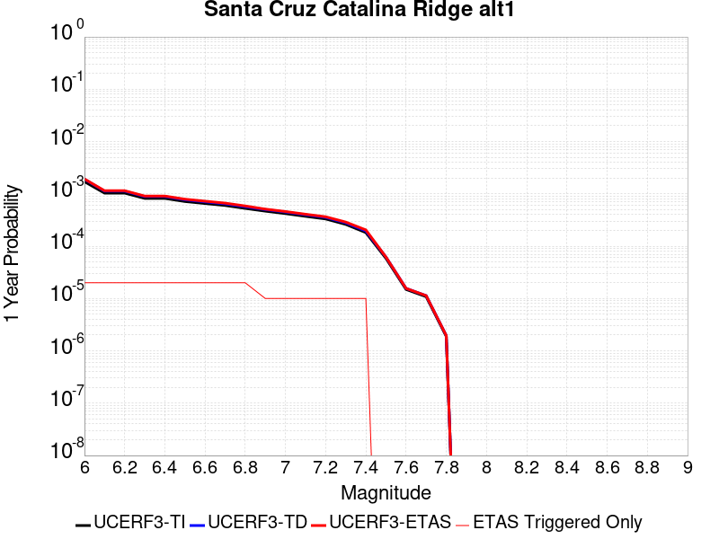 |  |

| Magnitude | 1 wk TI Prob | 1 wk TD Prob | 1 wk ETAS Prob | 1 wk ETAS/TD Gain | 1 wk ETAS Triggered Only | 1 mo TI Prob | 1 mo TD Prob | 1 mo ETAS Prob | 1 mo ETAS/TD Gain | 1 mo ETAS Triggered Only | 1 yr TI Prob | 1 yr TD Prob | 1 yr ETAS Prob | 1 yr ETAS/TD Gain | 1 yr ETAS Triggered Only | 10 yr TI Prob | 10 yr TD Prob | 10 yr ETAS Prob | 10 yr ETAS/TD Gain | 10 yr ETAS Triggered Only |
|-----|-----|-----|-----|-----|-----|-----|-----|-----|-----|-----|-----|-----|-----|-----|-----|-----|-----|-----|-----|-----|
| 6.0 | 3.2833184E-5 | 3.65584E-5 | 5.6557667E-5 | 1.5470499 | 2.0E-5 | 1.4070606E-4 | 1.5667039E-4 | 1.7666725E-4 | 1.1276366 | 2.0E-5 | 0.00171175 | 0.0019059596 | 0.0019259214 | 1.0104734 | 2.0E-5 | 0.016986247 | 0.018913029 | 0.018952273 | 1.002075 | 4.0E-5 |
| 6.1 | 1.9835548E-5 | 2.1659505E-5 | 4.165907E-5 | 1.9233621 | 2.0E-5 | 8.500672E-5 | 9.282326E-5 | 1.12821406E-4 | 1.2154433 | 2.0E-5 | 0.0010344655 | 0.0011295575 | 0.0011495348 | 1.017686 | 2.0E-5 | 0.010296632 | 0.011240295 | 0.011279846 | 1.0035186 | 4.0E-5 |
| 6.2 | 1.9835548E-5 | 2.1659505E-5 | 4.165907E-5 | 1.9233621 | 2.0E-5 | 8.500672E-5 | 9.282326E-5 | 1.12821406E-4 | 1.2154433 | 2.0E-5 | 0.0010344655 | 0.0011295575 | 0.0011495348 | 1.017686 | 2.0E-5 | 0.010296632 | 0.011240295 | 0.011279846 | 1.0035186 | 4.0E-5 |
| 6.3 | 1.5728183E-5 | 1.703395E-5 | 3.703361E-5 | 2.174106 | 2.0E-5 | 6.7404755E-5 | 7.300063E-5 | 9.299917E-5 | 1.2739502 | 2.0E-5 | 8.2034385E-4 | 8.884264E-4 | 9.084086E-4 | 1.0224917 | 2.0E-5 | 0.008173222 | 0.008849427 | 0.008889073 | 1.0044801 | 4.0E-5 |
| 6.4 | 1.5728183E-5 | 1.703395E-5 | 3.703361E-5 | 2.174106 | 2.0E-5 | 6.7404755E-5 | 7.300063E-5 | 9.299917E-5 | 1.2739502 | 2.0E-5 | 8.2034385E-4 | 8.884264E-4 | 9.084086E-4 | 1.0224917 | 2.0E-5 | 0.008173222 | 0.008849427 | 0.008889073 | 1.0044801 | 4.0E-5 |
| 6.5 | 1.3707734E-5 | 1.4794522E-5 | 3.4794226E-5 | 2.3518317 | 2.0E-5 | 5.8746107E-5 | 6.3403575E-5 | 8.34023E-5 | 1.3154197 | 2.0E-5 | 7.1499916E-4 | 7.716686E-4 | 7.916532E-4 | 1.0258979 | 2.0E-5 | 0.0071270303 | 0.0076902895 | 0.007729982 | 1.0051614 | 4.0E-5 |
| 6.6 | 1.2539813E-5 | 1.3510219E-5 | 3.350995E-5 | 2.480341 | 2.0E-5 | 5.3740947E-5 | 5.789967E-5 | 7.789851E-5 | 1.3454051 | 2.0E-5 | 6.540996E-4 | 7.0470315E-4 | 7.2468905E-4 | 1.0283607 | 2.0E-5 | 0.0065217763 | 0.0070249885 | 0.0070647076 | 1.005654 | 4.0E-5 |
| 6.7 | 1.1504083E-5 | 1.2377375E-5 | 3.2377127E-5 | 2.6158316 | 2.0E-5 | 4.930228E-5 | 5.3044827E-5 | 7.304377E-5 | 1.3770196 | 2.0E-5 | 6.0008996E-4 | 6.456314E-4 | 6.6561846E-4 | 1.0309575 | 2.0E-5 | 0.005984721 | 0.006437786 | 0.0064775283 | 1.0061734 | 4.0E-5 |
| 6.8 | 1.012739E-5 | 1.0877071E-5 | 3.0876854E-5 | 2.8387103 | 2.0E-5 | 4.340238E-5 | 4.6615194E-5 | 6.6614266E-5 | 1.4290247 | 2.0E-5 | 5.282958E-4 | 5.673937E-4 | 5.8738235E-4 | 1.0352288 | 2.0E-5 | 0.0052704164 | 0.0056596193 | 0.0056993933 | 1.0070276 | 4.0E-5 |
| 6.9 | 8.9607865E-6 | 9.609117E-6 | 1.960902E-5 | 2.0406682 | 1.0E-5 | 3.8402806E-5 | 4.1181287E-5 | 5.1180876E-5 | 1.2428187 | 1.0E-5 | 4.6745385E-4 | 5.012679E-4 | 5.1126286E-4 | 1.0199394 | 1.0E-5 | 0.0046647177 | 0.005001492 | 0.0050313417 | 1.0059682 | 3.0E-5 |
| 7.0 | 8.046829E-6 | 8.619746E-6 | 1.861966E-5 | 2.160117 | 1.0E-5 | 3.4485955E-5 | 3.694125E-5 | 4.694088E-5 | 1.2706901 | 1.0E-5 | 4.1978562E-4 | 4.496677E-4 | 4.5966322E-4 | 1.0222286 | 1.0E-5 | 0.004189935 | 0.0044876686 | 0.0045175343 | 1.006655 | 3.0E-5 |
| 7.1 | 7.136131E-6 | 7.637656E-6 | 1.763758E-5 | 2.3092923 | 1.0E-5 | 3.0583058E-5 | 3.2732405E-5 | 4.2732077E-5 | 1.3054976 | 1.0E-5 | 3.7228514E-4 | 3.9844486E-4 | 4.084409E-4 | 1.0250876 | 1.0E-5 | 0.0037166206 | 0.003977381 | 0.0040072617 | 1.0075127 | 3.0E-5 |
| 7.2 | 6.362014E-6 | 6.8049585E-6 | 1.680489E-5 | 2.4695067 | 1.0E-5 | 2.726549E-5 | 2.9163786E-5 | 3.9163493E-5 | 1.342881 | 1.0E-5 | 3.3190678E-4 | 3.550119E-4 | 3.6500834E-4 | 1.0281581 | 1.0E-5 | 0.0033141149 | 0.003544516 | 0.003564445 | 1.0056225 | 2.0E-5 |
| 7.3 | 5.004101E-6 | 5.351715E-6 | 1.5351661E-5 | 2.8685498 | 1.0E-5 | 2.1445969E-5 | 2.2935723E-5 | 3.293549E-5 | 1.435991 | 1.0E-5 | 2.6107338E-4 | 2.792072E-4 | 2.8920438E-4 | 1.0358057 | 1.0E-5 | 0.002607669 | 0.0027886187 | 0.0028085627 | 1.007152 | 2.0E-5 |
| 7.4 | 3.4901443E-6 | 3.7320526E-6 | 1.3732015E-5 | 3.6794808 | 1.0E-5 | 1.4957676E-5 | 1.5994416E-5 | 2.5994255E-5 | 1.6252083 | 1.0E-5 | 1.8209449E-4 | 1.9471499E-4 | 2.0471304E-4 | 1.0513471 | 1.0E-5 | 0.0018194534 | 0.0019454823 | 0.0019554629 | 1.0051302 | 1.0E-5 |
| 7.5 | 1.1215045E-6 | 1.189387E-6 | 1.189387E-6 | 1.0 | 0.0 | 4.806439E-6 | 5.097363E-6 | 5.097363E-6 | 1.0 | 0.0 | 5.851682E-5 | 6.205866E-5 | 6.205866E-5 | 1.0 | 0.0 | 5.850142E-4 | 6.2041637E-4 | 6.2041637E-4 | 1.0 | 0.0 |
| 7.6 | 2.8599047E-7 | 2.9951994E-7 | 2.9951994E-7 | 1.0 | 0.0 | 1.2256729E-6 | 1.2836562E-6 | 1.2836562E-6 | 1.0 | 0.0 | 1.4922465E-5 | 1.5628404E-5 | 1.5628404E-5 | 1.0 | 0.0 | 1.4921463E-4 | 1.5627318E-4 | 1.5627318E-4 | 1.0 | 0.0 |
| 7.7 | 2.0781519E-7 | 2.1744323E-7 | 2.1744323E-7 | 1.0 | 0.0 | 8.906362E-7 | 9.3189925E-7 | 9.3189925E-7 | 1.0 | 0.0 | 1.08434415E-5 | 1.13458145E-5 | 1.13458145E-5 | 1.0 | 0.0 | 1.0842913E-4 | 1.1345245E-4 | 1.1345245E-4 | 1.0 | 0.0 |
| 7.8 | 3.614776E-8 | 3.764102E-8 | 3.764102E-8 | 1.0 | 0.0 | 1.5491896E-7 | 1.6131864E-7 | 1.6131864E-7 | 1.0 | 0.0 | 1.8861368E-6 | 1.9640527E-6 | 1.9640527E-6 | 1.0 | 0.0 | 1.8861208E-5 | 1.9640367E-5 | 1.9640367E-5 | 1.0 | 0.0 |

## Elsinore (Temecula) rev
*[(top)](#table-of-contents)*

| 1 Week | 1 Month | 1 Year | 10 Year |
|-----|-----|-----|-----|
|  |  |  | 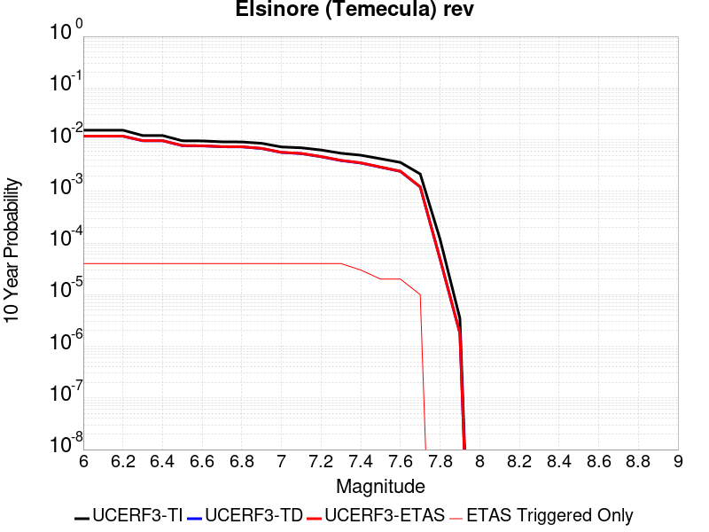 |

| Magnitude | 1 wk TI Prob | 1 wk TD Prob | 1 wk ETAS Prob | 1 wk ETAS/TD Gain | 1 wk ETAS Triggered Only | 1 mo TI Prob | 1 mo TD Prob | 1 mo ETAS Prob | 1 mo ETAS/TD Gain | 1 mo ETAS Triggered Only | 1 yr TI Prob | 1 yr TD Prob | 1 yr ETAS Prob | 1 yr ETAS/TD Gain | 1 yr ETAS Triggered Only | 10 yr TI Prob | 10 yr TD Prob | 10 yr ETAS Prob | 10 yr ETAS/TD Gain | 10 yr ETAS Triggered Only |
|-----|-----|-----|-----|-----|-----|-----|-----|-----|-----|-----|-----|-----|-----|-----|-----|-----|-----|-----|-----|-----|
| 6.0 | 2.9514995E-5 | 2.2517117E-5 | 3.251689E-5 | 1.4440966 | 1.0E-5 | 1.264867E-4 | 9.649849E-5 | 1.1649655E-4 | 1.2072371 | 2.0E-5 | 0.0015388876 | 0.0011742581 | 0.0012042228 | 1.0255181 | 3.0E-5 | 0.015282745 | 0.011696897 | 0.01173643 | 1.0033797 | 4.0E-5 |
| 6.1 | 2.9514995E-5 | 2.2517117E-5 | 3.251689E-5 | 1.4440966 | 1.0E-5 | 1.264867E-4 | 9.649849E-5 | 1.1649655E-4 | 1.2072371 | 2.0E-5 | 0.0015388876 | 0.0011742581 | 0.0012042228 | 1.0255181 | 3.0E-5 | 0.015282745 | 0.011696897 | 0.01173643 | 1.0033797 | 4.0E-5 |
| 6.2 | 2.9514995E-5 | 2.2517117E-5 | 3.251689E-5 | 1.4440966 | 1.0E-5 | 1.264867E-4 | 9.649849E-5 | 1.1649655E-4 | 1.2072371 | 2.0E-5 | 0.0015388876 | 0.0011742581 | 0.0012042228 | 1.0255181 | 3.0E-5 | 0.015282745 | 0.011696897 | 0.01173643 | 1.0033797 | 4.0E-5 |
| 6.3 | 2.3223649E-5 | 1.8406454E-5 | 2.840627E-5 | 1.5432777 | 1.0E-5 | 9.952613E-5 | 7.888251E-5 | 9.888094E-5 | 1.2535216 | 2.0E-5 | 0.001211057 | 9.599888E-4 | 9.899599E-4 | 1.0312203 | 3.0E-5 | 0.012044783 | 0.009569948 | 0.009609565 | 1.0041398 | 4.0E-5 |
| 6.4 | 2.3223649E-5 | 1.8406454E-5 | 2.840627E-5 | 1.5432777 | 1.0E-5 | 9.952613E-5 | 7.888251E-5 | 9.888094E-5 | 1.2535216 | 2.0E-5 | 0.001211057 | 9.599888E-4 | 9.899599E-4 | 1.0312203 | 3.0E-5 | 0.012044783 | 0.009569948 | 0.009609565 | 1.0041398 | 4.0E-5 |
| 6.5 | 1.8338875E-5 | 1.4750118E-5 | 2.474997E-5 | 1.6779507 | 1.0E-5 | 7.8592806E-5 | 6.321331E-5 | 8.321204E-5 | 1.316369 | 2.0E-5 | 9.5644733E-4 | 7.69359E-4 | 7.9933595E-4 | 1.0389636 | 3.0E-5 | 0.009523412 | 0.0076739118 | 0.0077136047 | 1.0051725 | 4.0E-5 |
| 6.6 | 1.8223333E-5 | 1.4612673E-5 | 2.4612527E-5 | 1.6843275 | 1.0E-5 | 7.809766E-5 | 6.262429E-5 | 8.262304E-5 | 1.3193449 | 2.0E-5 | 9.504242E-4 | 7.6219277E-4 | 7.921699E-4 | 1.0393301 | 3.0E-5 | 0.009463696 | 0.0076027405 | 0.0076424363 | 1.0052212 | 4.0E-5 |
| 6.7 | 1.7512752E-5 | 1.402721E-5 | 2.402707E-5 | 1.7128901 | 1.0E-5 | 7.505249E-5 | 6.011528E-5 | 8.011408E-5 | 1.3326741 | 2.0E-5 | 9.13381E-4 | 7.3166634E-4 | 7.616444E-4 | 1.0409724 | 3.0E-5 | 0.00909636 | 0.00729892 | 0.0073386277 | 1.0054402 | 4.0E-5 |
| 6.8 | 1.7417142E-5 | 1.3951195E-5 | 2.3951055E-5 | 1.7167745 | 1.0E-5 | 7.4642754E-5 | 5.9789512E-5 | 7.978832E-5 | 1.3344868 | 2.0E-5 | 9.083966E-4 | 7.277028E-4 | 7.57681E-4 | 1.0411956 | 3.0E-5 | 0.009046922 | 0.0072594886 | 0.0072991983 | 1.00547 | 4.0E-5 |
| 6.9 | 1.6402591E-5 | 1.2988613E-5 | 2.2988483E-5 | 1.7698951 | 1.0E-5 | 7.0294926E-5 | 5.5664343E-5 | 7.566323E-5 | 1.3592764 | 2.0E-5 | 8.5550465E-4 | 6.775103E-4 | 7.0748996E-4 | 1.0442498 | 3.0E-5 | 0.008522186 | 0.006760169 | 0.0067998986 | 1.005877 | 4.0E-5 |
| 7.0 | 1.3912486E-5 | 1.0878233E-5 | 2.0878124E-5 | 1.9192569 | 1.0E-5 | 5.9623577E-5 | 4.6620182E-5 | 6.661925E-5 | 1.4289788 | 2.0E-5 | 7.2567526E-4 | 5.674556E-4 | 5.974386E-4 | 1.0528376 | 3.0E-5 | 0.0072331014 | 0.005663986 | 0.0057037594 | 1.0070221 | 4.0E-5 |
| 7.1 | 1.3405147E-5 | 1.03274215E-5 | 2.0327318E-5 | 1.9682859 | 1.0E-5 | 5.7449364E-5 | 4.425964E-5 | 6.4258755E-5 | 1.451859 | 2.0E-5 | 6.9922156E-4 | 5.3873047E-4 | 5.687143E-4 | 1.0556564 | 3.0E-5 | 0.0069702556 | 0.005377577 | 0.005417362 | 1.0073982 | 4.0E-5 |
| 7.2 | 1.21402E-5 | 8.996737E-6 | 1.8996647E-5 | 2.111504 | 1.0E-5 | 5.202839E-5 | 3.8556886E-5 | 5.8556114E-5 | 1.5186942 | 2.0E-5 | 6.332616E-4 | 4.6933076E-4 | 4.9931667E-4 | 1.0638908 | 3.0E-5 | 0.0063146 | 0.004684821 | 0.0047246334 | 1.0084982 | 4.0E-5 |
| 7.3 | 1.05047775E-5 | 7.571771E-6 | 1.7571696E-5 | 2.320685 | 1.0E-5 | 4.5019697E-5 | 3.245005E-5 | 5.2449403E-5 | 1.6163118 | 2.0E-5 | 5.4797693E-4 | 3.950092E-4 | 4.2499736E-4 | 1.0759176 | 3.0E-5 | 0.005466277 | 0.00394346 | 0.0039833025 | 1.0101033 | 4.0E-5 |
| 7.4 | 9.624483E-6 | 6.7868696E-6 | 1.6786802E-5 | 2.4734235 | 1.0E-5 | 4.124713E-5 | 2.9086266E-5 | 4.9085684E-5 | 1.6875898 | 2.0E-5 | 5.0206814E-4 | 3.5406914E-4 | 3.840585E-4 | 1.0846993 | 3.0E-5 | 0.005009353 | 0.003535204 | 0.003565098 | 1.0084561 | 3.0E-5 |
| 7.5 | 8.215151E-6 | 5.635538E-6 | 5.635538E-6 | 1.0 | 0.0 | 3.5207315E-5 | 2.4152088E-5 | 3.4151846E-5 | 1.4140328 | 1.0E-5 | 4.2856473E-4 | 2.9401327E-4 | 3.140074E-4 | 1.0680041 | 2.0E-5 | 0.004277392 | 0.002936371 | 0.0029563121 | 1.0067911 | 2.0E-5 |
| 7.6 | 6.975058E-6 | 4.676045E-6 | 4.676045E-6 | 1.0 | 0.0 | 2.9892764E-5 | 2.0040046E-5 | 3.0039846E-5 | 1.4989909 | 1.0E-5 | 3.6388362E-4 | 2.439614E-4 | 2.6395652E-4 | 1.0819602 | 2.0E-5 | 0.0036328835 | 0.002437052 | 0.0024570033 | 1.0081866 | 2.0E-5 |
| 7.7 | 4.159604E-6 | 2.3269924E-6 | 2.3269924E-6 | 1.0 | 0.0 | 1.7826753E-5 | 9.97279E-6 | 1.9972691E-5 | 2.0027184 | 1.0E-5 | 2.1701909E-4 | 1.21412704E-4 | 1.3141149E-4 | 1.0823537 | 1.0E-5 | 0.0021680726 | 0.0012135367 | 0.0012235246 | 1.0082303 | 1.0E-5 |
| 7.8 | 2.2692414E-7 | 9.3854695E-8 | 9.3854695E-8 | 1.0 | 0.0 | 9.725317E-7 | 4.0223435E-7 | 4.0223435E-7 | 1.0 | 0.0 | 1.1840509E-5 | 4.8971956E-6 | 4.8971956E-6 | 1.0 | 0.0 | 1.1839878E-4 | 4.8971204E-5 | 4.8971204E-5 | 1.0 | 0.0 |
| 7.9 | 6.676829E-9 | 3.439853E-9 | 3.439853E-9 | 1.0 | 0.0 | 2.861498E-8 | 1.4742227E-8 | 1.4742227E-8 | 1.0 | 0.0 | 3.4838732E-7 | 1.7948659E-7 | 1.7948659E-7 | 1.0 | 0.0 | 3.4838679E-6 | 1.7948646E-6 | 1.7948646E-6 | 1.0 | 0.0 |

## Cedar Mtn-Mahogany Mtn
*[(top)](#table-of-contents)*

| 1 Week | 1 Month | 1 Year | 10 Year |
|-----|-----|-----|-----|
|  |  | 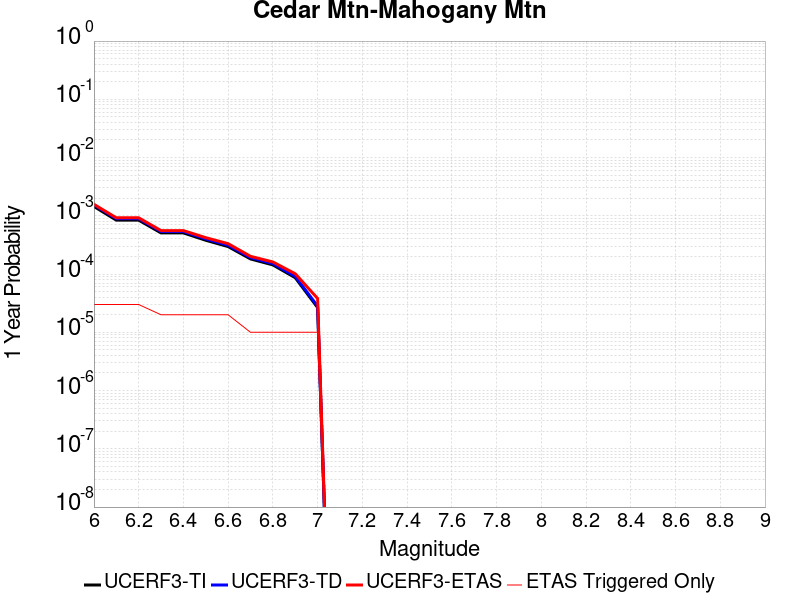 |  |

| Magnitude | 1 wk TI Prob | 1 wk TD Prob | 1 wk ETAS Prob | 1 wk ETAS/TD Gain | 1 wk ETAS Triggered Only | 1 mo TI Prob | 1 mo TD Prob | 1 mo ETAS Prob | 1 mo ETAS/TD Gain | 1 mo ETAS Triggered Only | 1 yr TI Prob | 1 yr TD Prob | 1 yr ETAS Prob | 1 yr ETAS/TD Gain | 1 yr ETAS Triggered Only | 10 yr TI Prob | 10 yr TD Prob | 10 yr ETAS Prob | 10 yr ETAS/TD Gain | 10 yr ETAS Triggered Only |
|-----|-----|-----|-----|-----|-----|-----|-----|-----|-----|-----|-----|-----|-----|-----|-----|-----|-----|-----|-----|-----|
| 6.0 | 2.7763876E-5 | 2.9588866E-5 | 2.9588866E-5 | 1.0 | 0.0 | 1.1898261E-4 | 1.2680366E-4 | 1.3680238E-4 | 1.078852 | 1.0E-5 | 0.0014476506 | 0.0015428112 | 0.001572765 | 1.019415 | 3.0E-5 | 0.0143825635 | 0.015328225 | 0.015367612 | 1.0025696 | 4.0E-5 |
| 6.1 | 1.6162443E-5 | 1.7142966E-5 | 1.7142966E-5 | 1.0 | 0.0 | 6.926578E-5 | 7.346788E-5 | 8.346715E-5 | 1.1361039 | 1.0E-5 | 8.4298453E-4 | 8.941221E-4 | 9.2409534E-4 | 1.0335225 | 3.0E-5 | 0.008397939 | 0.008907059 | 0.008936792 | 1.0033381 | 3.0E-5 |
| 6.2 | 1.6162443E-5 | 1.7142966E-5 | 1.7142966E-5 | 1.0 | 0.0 | 6.926578E-5 | 7.346788E-5 | 8.346715E-5 | 1.1361039 | 1.0E-5 | 8.4298453E-4 | 8.941221E-4 | 9.2409534E-4 | 1.0335225 | 3.0E-5 | 0.008397939 | 0.008907059 | 0.008936792 | 1.0033381 | 3.0E-5 |
| 6.3 | 9.746053E-6 | 1.0303152E-5 | 1.0303152E-5 | 1.0 | 0.0 | 4.1768133E-5 | 4.415564E-5 | 5.41552E-5 | 1.2264616 | 1.0E-5 | 5.0840835E-4 | 5.3746643E-4 | 5.5745564E-4 | 1.0371916 | 2.0E-5 | 0.0050724675 | 0.005362084 | 0.005381977 | 1.0037099 | 2.0E-5 |
| 6.4 | 9.746053E-6 | 1.0303152E-5 | 1.0303152E-5 | 1.0 | 0.0 | 4.1768133E-5 | 4.415564E-5 | 5.41552E-5 | 1.2264616 | 1.0E-5 | 5.0840835E-4 | 5.3746643E-4 | 5.5745564E-4 | 1.0371916 | 2.0E-5 | 0.0050724675 | 0.005362084 | 0.005381977 | 1.0037099 | 2.0E-5 |
| 6.5 | 7.290083E-6 | 7.695325E-6 | 7.695325E-6 | 1.0 | 0.0 | 3.124284E-5 | 3.297956E-5 | 4.2979227E-5 | 1.3032081 | 1.0E-5 | 3.8031515E-4 | 4.014543E-4 | 4.2144628E-4 | 1.0497988 | 2.0E-5 | 0.0037966494 | 0.004007511 | 0.004027431 | 1.0049707 | 2.0E-5 |
| 6.6 | 5.67907E-6 | 5.9891527E-6 | 5.9891527E-6 | 1.0 | 0.0 | 2.4338644E-5 | 2.5667552E-5 | 3.5667297E-5 | 1.3895869 | 1.0E-5 | 2.962827E-4 | 3.12459E-4 | 3.3245274E-4 | 1.0639884 | 2.0E-5 | 0.0029588798 | 0.003120333 | 0.0031402705 | 1.0063896 | 2.0E-5 |
| 6.7 | 3.4853963E-6 | 3.672631E-6 | 3.672631E-6 | 1.0 | 0.0 | 1.4937327E-5 | 1.5739755E-5 | 2.5739599E-5 | 1.6353239 | 1.0E-5 | 1.8184677E-4 | 1.916153E-4 | 2.0161338E-4 | 1.0521779 | 1.0E-5 | 0.0018169804 | 0.0019145629 | 0.0019245436 | 1.0052131 | 1.0E-5 |
| 6.8 | 2.7535168E-6 | 2.9015764E-6 | 2.9015764E-6 | 1.0 | 0.0 | 1.1800733E-5 | 1.2435271E-5 | 2.2435146E-5 | 1.8041543 | 1.0E-5 | 1.4366445E-4 | 1.5138938E-4 | 1.6138787E-4 | 1.0660448 | 1.0E-5 | 0.0014357162 | 0.0015129098 | 0.0015228946 | 1.0065998 | 1.0E-5 |
| 6.9 | 1.6594106E-6 | 1.7496985E-6 | 1.7496985E-6 | 1.0 | 0.0 | 7.1117406E-6 | 7.4986883E-6 | 1.7498613E-5 | 2.3335567 | 1.0E-5 | 8.6582E-5 | 9.129302E-5 | 1.01292106E-4 | 1.1095273 | 1.0E-5 | 8.654827E-4 | 9.125856E-4 | 9.2257647E-4 | 1.0109478 | 1.0E-5 |
| 7.0 | 5.10215E-7 | 5.389254E-7 | 5.389254E-7 | 1.0 | 0.0 | 2.186634E-6 | 2.3096788E-6 | 1.2309656E-5 | 5.329596 | 1.0E-5 | 2.6621943E-5 | 2.8120105E-5 | 3.8119826E-5 | 1.3556074 | 1.0E-5 | 2.6618753E-4 | 2.81178E-4 | 2.911752E-4 | 1.0355546 | 1.0E-5 |

## Elsinore (Coyote Mountains)
*[(top)](#table-of-contents)*

| 1 Week | 1 Month | 1 Year | 10 Year |
|-----|-----|-----|-----|
|  | 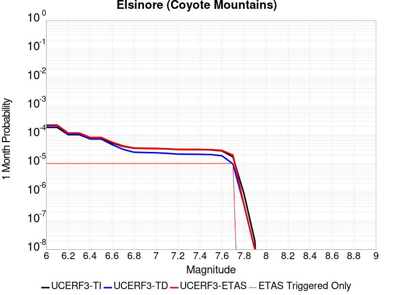 | 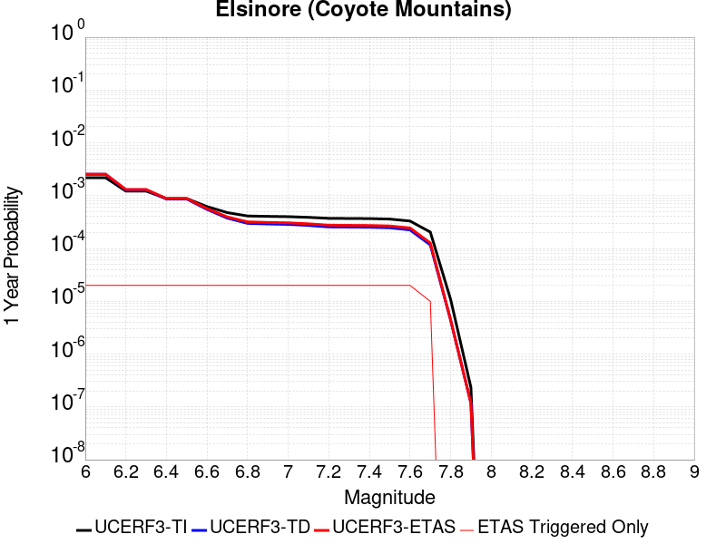 |  |

| Magnitude | 1 wk TI Prob | 1 wk TD Prob | 1 wk ETAS Prob | 1 wk ETAS/TD Gain | 1 wk ETAS Triggered Only | 1 mo TI Prob | 1 mo TD Prob | 1 mo ETAS Prob | 1 mo ETAS/TD Gain | 1 mo ETAS Triggered Only | 1 yr TI Prob | 1 yr TD Prob | 1 yr ETAS Prob | 1 yr ETAS/TD Gain | 1 yr ETAS Triggered Only | 10 yr TI Prob | 10 yr TD Prob | 10 yr ETAS Prob | 10 yr ETAS/TD Gain | 10 yr ETAS Triggered Only |
|-----|-----|-----|-----|-----|-----|-----|-----|-----|-----|-----|-----|-----|-----|-----|-----|-----|-----|-----|-----|-----|
| 6.0 | 4.20513E-5 | 4.8631882E-5 | 4.8631882E-5 | 1.0 | 0.0 | 1.8020741E-4 | 2.0840895E-4 | 2.1840687E-4 | 1.0479726 | 1.0E-5 | 0.0021918174 | 0.002535 | 0.0025549494 | 1.0078696 | 2.0E-5 | 0.021703249 | 0.025111282 | 0.025150279 | 1.0015529 | 4.0E-5 |
| 6.1 | 4.20513E-5 | 4.8631882E-5 | 4.8631882E-5 | 1.0 | 0.0 | 1.8020741E-4 | 2.0840895E-4 | 2.1840687E-4 | 1.0479726 | 1.0E-5 | 0.0021918174 | 0.002535 | 0.0025549494 | 1.0078696 | 2.0E-5 | 0.021703249 | 0.025111282 | 0.025150279 | 1.0015529 | 4.0E-5 |
| 6.2 | 2.3413893E-5 | 2.469566E-5 | 2.469566E-5 | 1.0 | 0.0 | 1.0034139E-4 | 1.0583479E-4 | 1.1583373E-4 | 1.0944769 | 1.0E-5 | 0.0012209718 | 0.0012878707 | 0.0013078449 | 1.0155095 | 2.0E-5 | 0.012142851 | 0.01281264 | 0.012832384 | 1.0015409 | 2.0E-5 |
| 6.3 | 2.3413893E-5 | 2.469566E-5 | 2.469566E-5 | 1.0 | 0.0 | 1.0034139E-4 | 1.0583479E-4 | 1.1583373E-4 | 1.0944769 | 1.0E-5 | 0.0012209718 | 0.0012878707 | 0.0013078449 | 1.0155095 | 2.0E-5 | 0.012142851 | 0.01281264 | 0.012832384 | 1.0015409 | 2.0E-5 |
| 6.4 | 1.6894814E-5 | 1.6568361E-5 | 1.6568361E-5 | 1.0 | 0.0 | 7.240433E-5 | 7.1005554E-5 | 8.100484E-5 | 1.1408241 | 1.0E-5 | 8.811662E-4 | 8.6418656E-4 | 8.841693E-4 | 1.0231231 | 2.0E-5 | 0.0087768035 | 0.00861194 | 0.008631768 | 1.0023024 | 2.0E-5 |
| 6.5 | 1.6894814E-5 | 1.6568361E-5 | 1.6568361E-5 | 1.0 | 0.0 | 7.240433E-5 | 7.1005554E-5 | 8.100484E-5 | 1.1408241 | 1.0E-5 | 8.811662E-4 | 8.6418656E-4 | 8.841693E-4 | 1.0231231 | 2.0E-5 | 0.0087768035 | 0.00861194 | 0.008631768 | 1.0023024 | 2.0E-5 |
| 6.6 | 1.1910969E-5 | 1.0530774E-5 | 1.0530774E-5 | 1.0 | 0.0 | 5.1046012E-5 | 4.5131183E-5 | 5.513073E-5 | 1.2215663 | 1.0E-5 | 6.21308E-4 | 5.4934516E-4 | 5.693342E-4 | 1.036387 | 2.0E-5 | 0.0061957375 | 0.005481174 | 0.005501065 | 1.0036288 | 2.0E-5 |
| 6.7 | 9.1486E-6 | 7.2028593E-6 | 7.2028593E-6 | 1.0 | 0.0 | 3.9207694E-5 | 3.0869054E-5 | 4.0868745E-5 | 1.3239391 | 1.0E-5 | 4.7724912E-4 | 3.757697E-4 | 3.957622E-4 | 1.053204 | 2.0E-5 | 0.0047622547 | 0.0037517229 | 0.0037716478 | 1.0053109 | 2.0E-5 |
| 6.8 | 7.90441E-6 | 5.7290276E-6 | 5.7290276E-6 | 1.0 | 0.0 | 3.3875604E-5 | 2.4552752E-5 | 3.4552504E-5 | 1.4072763 | 1.0E-5 | 4.1235742E-4 | 2.9889002E-4 | 3.1888403E-4 | 1.0668943 | 2.0E-5 | 0.0041159308 | 0.002985009 | 0.0030049493 | 1.0066801 | 2.0E-5 |
| 6.9 | 7.77015E-6 | 5.582982E-6 | 5.582982E-6 | 1.0 | 0.0 | 3.3300217E-5 | 2.3926852E-5 | 3.392661E-5 | 1.4179305 | 1.0E-5 | 4.0535472E-4 | 2.9127175E-4 | 3.1126593E-4 | 1.0686444 | 2.0E-5 | 0.004046161 | 0.002909027 | 0.0029289688 | 1.0068551 | 2.0E-5 |
| 7.0 | 7.675798E-6 | 5.47984E-6 | 5.47984E-6 | 1.0 | 0.0 | 3.289586E-5 | 2.3484827E-5 | 3.348459E-5 | 1.4257969 | 1.0E-5 | 4.004335E-4 | 2.858915E-4 | 3.058858E-4 | 1.0699366 | 2.0E-5 | 0.003997127 | 0.0028553635 | 0.0028753066 | 1.0069844 | 2.0E-5 |
| 7.1 | 7.447814E-6 | 5.238714E-6 | 5.238714E-6 | 1.0 | 0.0 | 3.191881E-5 | 2.2451446E-5 | 3.2451222E-5 | 1.4453956 | 1.0E-5 | 3.8854225E-4 | 2.7331332E-4 | 2.9330785E-4 | 1.0731561 | 2.0E-5 | 0.003878636 | 0.0027298962 | 0.0027498417 | 1.0073063 | 2.0E-5 |
| 7.2 | 7.128185E-6 | 4.905372E-6 | 4.905372E-6 | 1.0 | 0.0 | 3.0549007E-5 | 2.102286E-5 | 3.102265E-5 | 1.4756627 | 1.0E-5 | 3.7187067E-4 | 2.5592445E-4 | 2.7591933E-4 | 1.0781281 | 2.0E-5 | 0.00371249 | 0.0025564157 | 0.0025763644 | 1.0078034 | 2.0E-5 |
| 7.3 | 7.0913875E-6 | 4.874047E-6 | 4.874047E-6 | 1.0 | 0.0 | 3.0391306E-5 | 2.0888614E-5 | 3.0888405E-5 | 1.4787197 | 1.0E-5 | 3.6995133E-4 | 2.5429038E-4 | 2.742853E-4 | 1.0786302 | 2.0E-5 | 0.0036933604 | 0.0025401122 | 0.0025600616 | 1.0078536 | 2.0E-5 |
| 7.4 | 7.051521E-6 | 4.837899E-6 | 4.837899E-6 | 1.0 | 0.0 | 3.0220453E-5 | 2.0733693E-5 | 3.0733485E-5 | 1.4822967 | 1.0E-5 | 3.6787192E-4 | 2.5240466E-4 | 2.723996E-4 | 1.0792178 | 2.0E-5 | 0.0036726352 | 0.0025212981 | 0.0025412478 | 1.0079124 | 2.0E-5 |
| 7.5 | 6.910666E-6 | 4.733448E-6 | 4.733448E-6 | 1.0 | 0.0 | 2.9616802E-5 | 2.0286056E-5 | 3.0285852E-5 | 1.4929395 | 1.0E-5 | 3.605249E-4 | 2.4695593E-4 | 2.6695098E-4 | 1.0809661 | 2.0E-5 | 0.0035994058 | 0.0024669329 | 0.0024868834 | 1.0080873 | 2.0E-5 |
| 7.6 | 6.341753E-6 | 4.3065565E-6 | 4.3065565E-6 | 1.0 | 0.0 | 2.7178658E-5 | 1.8456547E-5 | 2.8456361E-5 | 1.5418032 | 1.0E-5 | 3.3084993E-4 | 2.2468645E-4 | 2.4468196E-4 | 1.088993 | 2.0E-5 | 0.0033035777 | 0.002244708 | 0.002264663 | 1.0088898 | 2.0E-5 |
| 7.7 | 3.9205916E-6 | 2.2439415E-6 | 2.2439415E-6 | 1.0 | 0.0 | 1.6802427E-5 | 9.616861E-6 | 1.9616764E-5 | 2.0398304 | 1.0E-5 | 2.0455034E-4 | 1.1707973E-4 | 1.2707856E-4 | 1.0854019 | 1.0E-5 | 0.0020436216 | 0.0011702535 | 0.0011802417 | 1.0085351 | 1.0E-5 |
| 7.8 | 2.0846227E-7 | 8.486417E-8 | 8.486417E-8 | 1.0 | 0.0 | 8.9340944E-7 | 3.6370355E-7 | 3.6370355E-7 | 1.0 | 0.0 | 1.0877206E-5 | 4.428085E-6 | 4.428085E-6 | 1.0 | 0.0 | 1.0876673E-4 | 4.4280296E-5 | 4.4280296E-5 | 1.0 | 0.0 |
| 7.9 | 4.4969806E-9 | 2.2691855E-9 | 2.2691855E-9 | 1.0 | 0.0 | 1.9272775E-8 | 9.72508E-9 | 9.72508E-9 | 1.0 | 0.0 | 2.3464601E-7 | 1.18402845E-7 | 1.18402845E-7 | 1.0 | 0.0 | 2.3464577E-6 | 1.184028E-6 | 1.184028E-6 | 1.0 | 0.0 |

## Santa Susana alt 1
*[(top)](#table-of-contents)*

| 1 Week | 1 Month | 1 Year | 10 Year |
|-----|-----|-----|-----|
|  |  |  |  |

| Magnitude | 1 wk TI Prob | 1 wk TD Prob | 1 wk ETAS Prob | 1 wk ETAS/TD Gain | 1 wk ETAS Triggered Only | 1 mo TI Prob | 1 mo TD Prob | 1 mo ETAS Prob | 1 mo ETAS/TD Gain | 1 mo ETAS Triggered Only | 1 yr TI Prob | 1 yr TD Prob | 1 yr ETAS Prob | 1 yr ETAS/TD Gain | 1 yr ETAS Triggered Only | 10 yr TI Prob | 10 yr TD Prob | 10 yr ETAS Prob | 10 yr ETAS/TD Gain | 10 yr ETAS Triggered Only |
|-----|-----|-----|-----|-----|-----|-----|-----|-----|-----|-----|-----|-----|-----|-----|-----|-----|-----|-----|-----|-----|
| 6.0 | 2.674877E-5 | 2.7198023E-5 | 3.719775E-5 | 1.3676637 | 1.0E-5 | 1.1463255E-4 | 1.1655839E-4 | 1.2655722E-4 | 1.085784 | 1.0E-5 | 0.0013947578 | 0.0014182882 | 0.0014382598 | 1.0140815 | 2.0E-5 | 0.013860362 | 0.014104128 | 0.014143564 | 1.002796 | 4.0E-5 |
| 6.1 | 2.674877E-5 | 2.7198023E-5 | 3.719775E-5 | 1.3676637 | 1.0E-5 | 1.1463255E-4 | 1.1655839E-4 | 1.2655722E-4 | 1.085784 | 1.0E-5 | 0.0013947578 | 0.0014182882 | 0.0014382598 | 1.0140815 | 2.0E-5 | 0.013860362 | 0.014104128 | 0.014143564 | 1.002796 | 4.0E-5 |
| 6.2 | 2.674877E-5 | 2.7198023E-5 | 3.719775E-5 | 1.3676637 | 1.0E-5 | 1.1463255E-4 | 1.1655839E-4 | 1.2655722E-4 | 1.085784 | 1.0E-5 | 0.0013947578 | 0.0014182882 | 0.0014382598 | 1.0140815 | 2.0E-5 | 0.013860362 | 0.014104128 | 0.014143564 | 1.002796 | 4.0E-5 |
| 6.3 | 2.674877E-5 | 2.7198023E-5 | 3.719775E-5 | 1.3676637 | 1.0E-5 | 1.1463255E-4 | 1.1655839E-4 | 1.2655722E-4 | 1.085784 | 1.0E-5 | 0.0013947578 | 0.0014182882 | 0.0014382598 | 1.0140815 | 2.0E-5 | 0.013860362 | 0.014104128 | 0.014143564 | 1.002796 | 4.0E-5 |
| 6.4 | 2.674877E-5 | 2.7198023E-5 | 3.719775E-5 | 1.3676637 | 1.0E-5 | 1.1463255E-4 | 1.1655839E-4 | 1.2655722E-4 | 1.085784 | 1.0E-5 | 0.0013947578 | 0.0014182882 | 0.0014382598 | 1.0140815 | 2.0E-5 | 0.013860362 | 0.014104128 | 0.014143564 | 1.002796 | 4.0E-5 |
| 6.5 | 2.674877E-5 | 2.7198023E-5 | 3.719775E-5 | 1.3676637 | 1.0E-5 | 1.1463255E-4 | 1.1655839E-4 | 1.2655722E-4 | 1.085784 | 1.0E-5 | 0.0013947578 | 0.0014182882 | 0.0014382598 | 1.0140815 | 2.0E-5 | 0.013860362 | 0.014104128 | 0.014143564 | 1.002796 | 4.0E-5 |
| 6.6 | 2.6647976E-5 | 2.7074359E-5 | 3.707409E-5 | 1.3693432 | 1.0E-5 | 1.14200615E-4 | 1.1602845E-4 | 1.2602728E-4 | 1.0861758 | 1.0E-5 | 0.0013895056 | 0.0014118447 | 0.0014318166 | 1.0141459 | 2.0E-5 | 0.013808494 | 0.014040513 | 0.014079952 | 1.0028089 | 4.0E-5 |
| 6.7 | 2.6647976E-5 | 2.7074359E-5 | 3.707409E-5 | 1.3693432 | 1.0E-5 | 1.14200615E-4 | 1.1602845E-4 | 1.2602728E-4 | 1.0861758 | 1.0E-5 | 0.0013895056 | 0.0014118447 | 0.0014318166 | 1.0141459 | 2.0E-5 | 0.013808494 | 0.014040513 | 0.014079952 | 1.0028089 | 4.0E-5 |
| 6.8 | 1.9073179E-5 | 1.7637283E-5 | 2.7637108E-5 | 1.5669707 | 1.0E-5 | 8.1739636E-5 | 7.558627E-5 | 8.558552E-5 | 1.1322892 | 1.0E-5 | 9.947256E-4 | 9.198925E-4 | 9.398741E-4 | 1.0217217 | 2.0E-5 | 0.009902848 | 0.009163101 | 0.009192826 | 1.003244 | 3.0E-5 |
| 6.9 | 1.9041876E-5 | 1.7619415E-5 | 2.7619239E-5 | 1.5675458 | 1.0E-5 | 8.160549E-5 | 7.55097E-5 | 8.550894E-5 | 1.1324233 | 1.0E-5 | 9.930939E-4 | 9.1896096E-4 | 9.389426E-4 | 1.0217437 | 2.0E-5 | 0.0098866755 | 0.0091538625 | 0.009183588 | 1.0032473 | 3.0E-5 |
| 7.0 | 1.5917482E-5 | 1.3863864E-5 | 2.3863726E-5 | 1.7212896 | 1.0E-5 | 6.8215995E-5 | 5.9415237E-5 | 6.9414644E-5 | 1.168297 | 1.0E-5 | 8.302132E-4 | 7.231451E-4 | 7.3313783E-4 | 1.0138185 | 1.0E-5 | 0.008271185 | 0.0072088144 | 0.00722867 | 1.0027543 | 2.0E-5 |
| 7.1 | 1.577788E-5 | 1.3743872E-5 | 2.3743734E-5 | 1.727587 | 1.0E-5 | 6.761774E-5 | 5.8901005E-5 | 6.8900415E-5 | 1.1697664 | 1.0E-5 | 8.2293496E-4 | 7.1688846E-4 | 7.2688126E-4 | 1.0139391 | 1.0E-5 | 0.008198941 | 0.007146652 | 0.007166509 | 1.0027785 | 2.0E-5 |
| 7.2 | 1.5416446E-5 | 1.3469944E-5 | 2.346981E-5 | 1.7423836 | 1.0E-5 | 6.606882E-5 | 5.772708E-5 | 6.7726505E-5 | 1.173219 | 1.0E-5 | 8.0409093E-4 | 7.026052E-4 | 7.1259815E-4 | 1.0142227 | 1.0E-5 | 0.008011877 | 0.0070047234 | 0.0070245834 | 1.0028353 | 2.0E-5 |
| 7.3 | 1.4534083E-5 | 1.2717879E-5 | 2.2717752E-5 | 1.7862847 | 1.0E-5 | 6.228744E-5 | 5.4504082E-5 | 6.450354E-5 | 1.1834625 | 1.0E-5 | 7.580857E-4 | 6.633896E-4 | 6.7338295E-4 | 1.0150641 | 1.0E-5 | 0.007555048 | 0.0066149444 | 0.006634812 | 1.0030035 | 2.0E-5 |
| 7.4 | 1.2858995E-5 | 1.1229652E-5 | 1.1229652E-5 | 1.0 | 0.0 | 5.5108816E-5 | 4.8126214E-5 | 4.8126214E-5 | 1.0 | 0.0 | 6.7074323E-4 | 5.857831E-4 | 5.857831E-4 | 1.0 | 0.0 | 0.0066872234 | 0.005843165 | 0.0058531063 | 1.0017014 | 1.0E-5 |
| 7.5 | 8.827668E-6 | 7.805457E-6 | 7.805457E-6 | 1.0 | 0.0 | 3.7832317E-5 | 3.3451546E-5 | 3.3451546E-5 | 1.0 | 0.0 | 4.605111E-4 | 4.071989E-4 | 4.071989E-4 | 1.0 | 0.0 | 0.0045955796 | 0.0040647765 | 0.004074736 | 1.0024501 | 1.0E-5 |
| 7.6 | 3.2533426E-6 | 2.871988E-6 | 2.871988E-6 | 1.0 | 0.0 | 1.3942822E-5 | 1.2308465E-5 | 1.2308465E-5 | 1.0 | 0.0 | 1.6974064E-4 | 1.4984563E-4 | 1.4984563E-4 | 1.0 | 0.0 | 0.0016961104 | 0.0014974826 | 0.0014974826 | 1.0 | 0.0 |
| 7.7 | 1.2751709E-6 | 1.1491089E-6 | 1.1491089E-6 | 1.0 | 0.0 | 5.4650063E-6 | 4.9247437E-6 | 4.9247437E-6 | 1.0 | 0.0 | 6.653442E-5 | 5.9957198E-5 | 5.9957198E-5 | 1.0 | 0.0 | 6.6514505E-4 | 5.994191E-4 | 5.994191E-4 | 1.0 | 0.0 |
| 7.8 | 3.067544E-7 | 3.2400436E-7 | 3.2400436E-7 | 1.0 | 0.0 | 1.3146611E-6 | 1.3885895E-6 | 1.3885895E-6 | 1.0 | 0.0 | 1.600588E-5 | 1.6905957E-5 | 1.6905957E-5 | 1.0 | 0.0 | 1.6004729E-4 | 1.6904772E-4 | 1.6904772E-4 | 1.0 | 0.0 |
| 7.9 | 7.622999E-8 | 8.087964E-8 | 8.087964E-8 | 1.0 | 0.0 | 3.2669993E-7 | 3.4662696E-7 | 3.4662696E-7 | 1.0 | 0.0 | 3.977564E-6 | 4.2201773E-6 | 4.2201773E-6 | 1.0 | 0.0 | 3.977493E-5 | 4.220118E-5 | 4.220118E-5 | 1.0 | 0.0 |

## Green Valley 2011 CFM
*[(top)](#table-of-contents)*

| 1 Week | 1 Month | 1 Year | 10 Year |
|-----|-----|-----|-----|
| 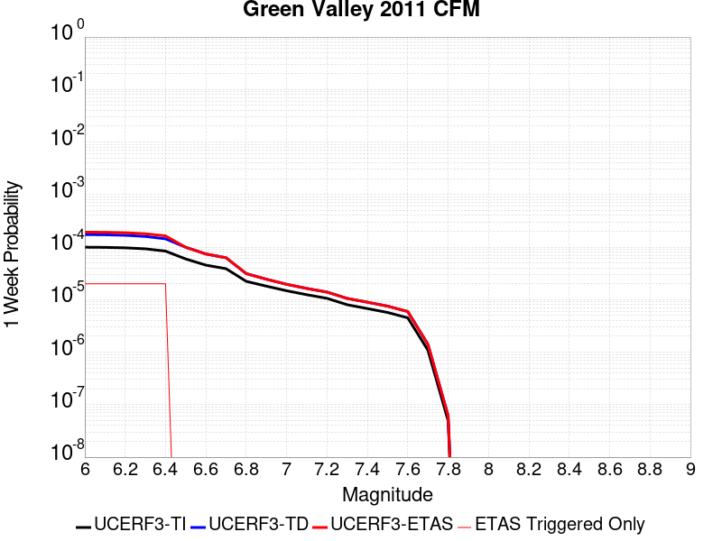 |  | 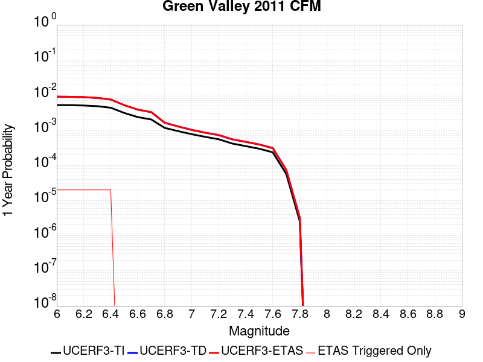 | 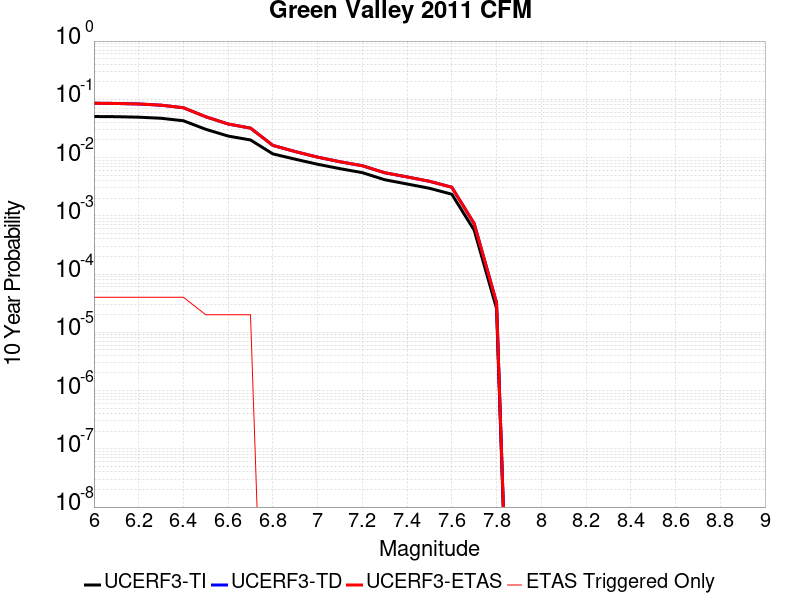 |

| Magnitude | 1 wk TI Prob | 1 wk TD Prob | 1 wk ETAS Prob | 1 wk ETAS/TD Gain | 1 wk ETAS Triggered Only | 1 mo TI Prob | 1 mo TD Prob | 1 mo ETAS Prob | 1 mo ETAS/TD Gain | 1 mo ETAS Triggered Only | 1 yr TI Prob | 1 yr TD Prob | 1 yr ETAS Prob | 1 yr ETAS/TD Gain | 1 yr ETAS Triggered Only | 10 yr TI Prob | 10 yr TD Prob | 10 yr ETAS Prob | 10 yr ETAS/TD Gain | 10 yr ETAS Triggered Only |
|-----|-----|-----|-----|-----|-----|-----|-----|-----|-----|-----|-----|-----|-----|-----|-----|-----|-----|-----|-----|-----|
| 6.0 | 9.9629346E-5 | 1.7305532E-4 | 1.9305186E-4 | 1.1155499 | 2.0E-5 | 4.2691303E-4 | 7.4143766E-4 | 7.6142285E-4 | 1.0269547 | 2.0E-5 | 0.0051852856 | 0.008986705 | 0.009006525 | 1.0022055 | 2.0E-5 | 0.050659515 | 0.085522056 | 0.08555864 | 1.0004277 | 4.0E-5 |
| 6.1 | 9.88615E-5 | 1.7152846E-4 | 1.9152503E-4 | 1.1165787 | 2.0E-5 | 4.2362334E-4 | 7.348976E-4 | 7.5488293E-4 | 1.0271946 | 2.0E-5 | 0.0051454236 | 0.0089077335 | 0.008927555 | 1.0022253 | 2.0E-5 | 0.050279044 | 0.084809676 | 0.08484628 | 1.0004317 | 4.0E-5 |
| 6.2 | 9.696895E-5 | 1.6791887E-4 | 1.8791552E-4 | 1.1190851 | 2.0E-5 | 4.15515E-4 | 7.194366E-4 | 7.394222E-4 | 1.0277796 | 2.0E-5 | 0.0050471667 | 0.008721114 | 0.008740939 | 1.0022733 | 2.0E-5 | 0.04934063 | 0.0831186 | 0.08315528 | 1.0004412 | 4.0E-5 |
| 6.3 | 9.275224E-5 | 1.5971228E-4 | 1.7970908E-4 | 1.1252052 | 2.0E-5 | 3.9744904E-4 | 6.842841E-4 | 7.042704E-4 | 1.0292076 | 2.0E-5 | 0.0048282105 | 0.008296439 | 0.008316273 | 1.0023906 | 2.0E-5 | 0.047246475 | 0.07925707 | 0.0792939 | 1.0004647 | 4.0E-5 |
| 6.4 | 8.391499E-5 | 1.4367796E-4 | 1.6367508E-4 | 1.1391802 | 2.0E-5 | 3.595861E-4 | 6.156248E-4 | 6.3561246E-4 | 1.0324674 | 2.0E-5 | 0.004369175 | 0.0074670846 | 0.0074869352 | 1.0026584 | 2.0E-5 | 0.04284265 | 0.071630865 | 0.071668 | 1.0005184 | 4.0E-5 |
| 6.5 | 5.9519385E-5 | 9.9340905E-5 | 9.9340905E-5 | 1.0 | 0.0 | 2.5505814E-4 | 4.2568138E-4 | 4.2568138E-4 | 1.0 | 0.0 | 0.0031009112 | 0.005168295 | 0.005168295 | 1.0 | 0.0 | 0.030579966 | 0.050145864 | 0.05016486 | 1.0003788 | 2.0E-5 |
| 6.6 | 4.5361558E-5 | 7.402609E-5 | 7.402609E-5 | 1.0 | 0.0 | 1.9439218E-4 | 3.1721895E-4 | 3.1721895E-4 | 1.0 | 0.0 | 0.0023641558 | 0.0038539418 | 0.0038539418 | 1.0 | 0.0 | 0.023391623 | 0.037665963 | 0.037685208 | 1.0005109 | 2.0E-5 |
| 6.7 | 3.8808106E-5 | 6.2651976E-5 | 6.2651976E-5 | 1.0 | 0.0 | 1.6630985E-4 | 2.6848342E-4 | 2.6848342E-4 | 1.0 | 0.0 | 0.0020229418 | 0.0032626586 | 0.0032626586 | 1.0 | 0.0 | 0.020046256 | 0.032005914 | 0.032025274 | 1.0006049 | 2.0E-5 |
| 6.8 | 2.2284667E-5 | 3.1285235E-5 | 3.1285235E-5 | 1.0 | 0.0 | 9.550222E-5 | 1.3407279E-4 | 1.3407279E-4 | 1.0 | 0.0 | 0.0011621192 | 0.0016311078 | 0.0016311078 | 1.0 | 0.0 | 0.011560607 | 0.016165998 | 0.016165998 | 1.0 | 0.0 |
| 6.9 | 1.8050168E-5 | 2.4448054E-5 | 2.4448054E-5 | 1.0 | 0.0 | 7.735557E-5 | 1.047732E-4 | 1.047732E-4 | 1.0 | 0.0 | 9.4139716E-4 | 0.0012748708 | 0.0012748708 | 1.0 | 0.0 | 0.009374191 | 0.012667833 | 0.012667833 | 1.0 | 0.0 |
| 7.0 | 1.4763166E-5 | 1.9582854E-5 | 1.9582854E-5 | 1.0 | 0.0 | 6.326917E-5 | 8.3923835E-5 | 8.3923835E-5 | 1.0 | 0.0 | 7.7002996E-4 | 0.0010212966 | 0.0010212966 | 1.0 | 0.0 | 0.007673672 | 0.010165343 | 0.010165343 | 1.0 | 0.0 |
| 7.1 | 1.2399713E-5 | 1.6303715E-5 | 1.6303715E-5 | 1.0 | 0.0 | 5.3140546E-5 | 6.98712E-5 | 6.98712E-5 | 1.0 | 0.0 | 6.467941E-4 | 8.503518E-4 | 8.503518E-4 | 1.0 | 0.0 | 0.006449148 | 0.008471259 | 0.008471259 | 1.0 | 0.0 |
| 7.2 | 1.0584195E-5 | 1.3921742E-5 | 1.3921742E-5 | 1.0 | 0.0 | 4.5360044E-5 | 5.9663253E-5 | 5.9663253E-5 | 1.0 | 0.0 | 5.521186E-4 | 7.261596E-4 | 7.261596E-4 | 1.0 | 0.0 | 0.0055074887 | 0.007238285 | 0.007238285 | 1.0 | 0.0 |
| 7.3 | 7.998173E-6 | 1.054402E-5 | 1.054402E-5 | 1.0 | 0.0 | 3.4277433E-5 | 4.518788E-5 | 4.518788E-5 | 1.0 | 0.0 | 4.1724785E-4 | 5.500247E-4 | 5.500247E-4 | 1.0 | 0.0 | 0.004164653 | 0.0054868995 | 0.0054868995 | 1.0 | 0.0 |
| 7.4 | 6.7571127E-6 | 8.932697E-6 | 8.932697E-6 | 1.0 | 0.0 | 2.8958733E-5 | 3.828243E-5 | 3.828243E-5 | 1.0 | 0.0 | 3.5251552E-4 | 4.6598984E-4 | 4.6598984E-4 | 1.0 | 0.0 | 0.0035195686 | 0.0046503306 | 0.0046503306 | 1.0 | 0.0 |
| 7.5 | 5.69878E-6 | 7.516314E-6 | 7.516314E-6 | 1.0 | 0.0 | 2.4423114E-5 | 3.221238E-5 | 3.221238E-5 | 1.0 | 0.0 | 2.9731085E-4 | 3.9211605E-4 | 3.9211605E-4 | 1.0 | 0.0 | 0.002969134 | 0.0039143935 | 0.0039143935 | 1.0 | 0.0 |
| 7.6 | 4.503664E-6 | 5.9356807E-6 | 5.9356807E-6 | 1.0 | 0.0 | 1.9301275E-5 | 2.5438389E-5 | 2.5438389E-5 | 1.0 | 0.0 | 2.3496768E-4 | 3.096692E-4 | 3.096692E-4 | 1.0 | 0.0 | 0.002347194 | 0.003092502 | 0.003092502 | 1.0 | 0.0 |
| 7.7 | 1.0873546E-6 | 1.4106979E-6 | 1.4106979E-6 | 1.0 | 0.0 | 4.6600826E-6 | 6.045834E-6 | 6.045834E-6 | 1.0 | 0.0 | 5.6735033E-5 | 7.360557E-5 | 7.360557E-5 | 1.0 | 0.0 | 5.672055E-4 | 7.35814E-4 | 7.35814E-4 | 1.0 | 0.0 |
| 7.8 | 4.9373917E-8 | 6.1777136E-8 | 6.1777136E-8 | 1.0 | 0.0 | 2.1160248E-7 | 2.6475914E-7 | 2.6475914E-7 | 1.0 | 0.0 | 2.5762572E-6 | 3.223439E-6 | 3.223439E-6 | 1.0 | 0.0 | 2.5762274E-5 | 3.2232296E-5 | 3.2232296E-5 | 1.0 | 0.0 |

## Owens Valley Keough Hot Springs
*[(top)](#table-of-contents)*

| 1 Week | 1 Month | 1 Year | 10 Year |
|-----|-----|-----|-----|
|  |  |  | 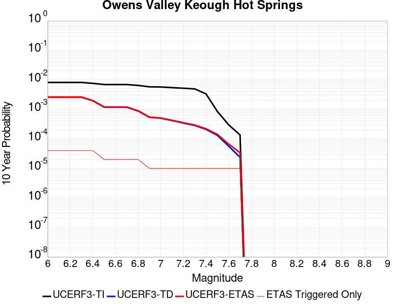 |

| Magnitude | 1 wk TI Prob | 1 wk TD Prob | 1 wk ETAS Prob | 1 wk ETAS/TD Gain | 1 wk ETAS Triggered Only | 1 mo TI Prob | 1 mo TD Prob | 1 mo ETAS Prob | 1 mo ETAS/TD Gain | 1 mo ETAS Triggered Only | 1 yr TI Prob | 1 yr TD Prob | 1 yr ETAS Prob | 1 yr ETAS/TD Gain | 1 yr ETAS Triggered Only | 10 yr TI Prob | 10 yr TD Prob | 10 yr ETAS Prob | 10 yr ETAS/TD Gain | 10 yr ETAS Triggered Only |
|-----|-----|-----|-----|-----|-----|-----|-----|-----|-----|-----|-----|-----|-----|-----|-----|-----|-----|-----|-----|-----|
| 6.0 | 1.5708529E-5 | 4.950656E-6 | 1.4950607E-5 | 3.0199244 | 1.0E-5 | 6.7320536E-5 | 2.1216953E-5 | 3.121674E-5 | 1.4713112 | 1.0E-5 | 8.193192E-4 | 2.582909E-4 | 2.8828316E-4 | 1.1161181 | 3.0E-5 | 0.008163051 | 0.0025805652 | 0.0026204619 | 1.0154605 | 4.0E-5 |
| 6.1 | 1.5708529E-5 | 4.950656E-6 | 1.4950607E-5 | 3.0199244 | 1.0E-5 | 6.7320536E-5 | 2.1216953E-5 | 3.121674E-5 | 1.4713112 | 1.0E-5 | 8.193192E-4 | 2.582909E-4 | 2.8828316E-4 | 1.1161181 | 3.0E-5 | 0.008163051 | 0.0025805652 | 0.0026204619 | 1.0154605 | 4.0E-5 |
| 6.2 | 1.5708529E-5 | 4.950656E-6 | 1.4950607E-5 | 3.0199244 | 1.0E-5 | 6.7320536E-5 | 2.1216953E-5 | 3.121674E-5 | 1.4713112 | 1.0E-5 | 8.193192E-4 | 2.582909E-4 | 2.8828316E-4 | 1.1161181 | 3.0E-5 | 0.008163051 | 0.0025805652 | 0.0026204619 | 1.0154605 | 4.0E-5 |
| 6.3 | 1.5708529E-5 | 4.950656E-6 | 1.4950607E-5 | 3.0199244 | 1.0E-5 | 6.7320536E-5 | 2.1216953E-5 | 3.121674E-5 | 1.4713112 | 1.0E-5 | 8.193192E-4 | 2.582909E-4 | 2.8828316E-4 | 1.1161181 | 3.0E-5 | 0.008163051 | 0.0025805652 | 0.0026204619 | 1.0154605 | 4.0E-5 |
| 6.4 | 1.4622509E-5 | 3.7265204E-6 | 1.3726483E-5 | 3.6834583 | 1.0E-5 | 6.266639E-5 | 1.5970723E-5 | 2.5970563E-5 | 1.6261357 | 1.0E-5 | 7.626962E-4 | 1.944295E-4 | 2.2442367E-4 | 1.1542675 | 3.0E-5 | 0.007600839 | 0.0019430731 | 0.0019829953 | 1.020546 | 4.0E-5 |
| 6.5 | 1.3335527E-5 | 2.2777172E-6 | 2.2777172E-6 | 1.0 | 0.0 | 5.7151006E-5 | 9.761612E-6 | 9.761612E-6 | 1.0 | 0.0 | 6.955913E-4 | 1.18841825E-4 | 1.2884063E-4 | 1.0841354 | 1.0E-5 | 0.0069341804 | 0.0011880046 | 0.0012079809 | 1.016815 | 2.0E-5 |
| 6.6 | 1.3332855E-5 | 2.2748663E-6 | 2.2748663E-6 | 1.0 | 0.0 | 5.7139558E-5 | 9.749395E-6 | 9.749395E-6 | 1.0 | 0.0 | 6.9545204E-4 | 1.186931E-4 | 1.2869191E-4 | 1.0842409 | 1.0E-5 | 0.0069327964 | 0.0011865189 | 0.0012064951 | 1.016836 | 2.0E-5 |
| 6.7 | 1.3318214E-5 | 2.2640966E-6 | 2.2640966E-6 | 1.0 | 0.0 | 5.707681E-5 | 9.703239E-6 | 9.703239E-6 | 1.0 | 0.0 | 6.946886E-4 | 1.1813121E-4 | 1.2813004E-4 | 1.0846416 | 1.0E-5 | 0.0069252094 | 0.001180906 | 0.0012008824 | 1.0169162 | 2.0E-5 |
| 6.8 | 1.2441338E-5 | 1.6777863E-6 | 1.6777863E-6 | 1.0 | 0.0 | 5.331893E-5 | 7.1904947E-6 | 7.1904947E-6 | 1.0 | 0.0 | 6.489646E-4 | 8.7541055E-5 | 9.754018E-5 | 1.1142222 | 1.0E-5 | 0.0064707273 | 8.752499E-4 | 8.9523237E-4 | 1.0228306 | 2.0E-5 |
| 6.9 | 1.1130476E-5 | 1.0303868E-6 | 1.0303868E-6 | 1.0 | 0.0 | 4.7701167E-5 | 4.415936E-6 | 4.415936E-6 | 1.0 | 0.0 | 5.806069E-4 | 5.3762706E-5 | 6.376217E-5 | 1.1859926 | 1.0E-5 | 0.0057909233 | 5.37651E-4 | 5.476456E-4 | 1.0185894 | 1.0E-5 |
| 7.0 | 1.0986073E-5 | 9.579413E-7 | 9.579413E-7 | 1.0 | 0.0 | 4.7082318E-5 | 4.1054564E-6 | 4.1054564E-6 | 1.0 | 0.0 | 5.730765E-4 | 4.99828E-5 | 5.9982296E-5 | 1.2000588 | 1.0E-5 | 0.0057160086 | 4.9986853E-4 | 5.0986354E-4 | 1.0199952 | 1.0E-5 |
| 7.1 | 1.0451338E-5 | 8.0002656E-7 | 8.0002656E-7 | 1.0 | 0.0 | 4.4790682E-5 | 3.4286807E-6 | 3.4286807E-6 | 1.0 | 0.0 | 5.451901E-4 | 4.1743395E-5 | 5.1742976E-5 | 1.2395489 | 1.0E-5 | 0.005438545 | 4.1750458E-4 | 4.275004E-4 | 1.0239419 | 1.0E-5 |
| 7.2 | 9.989061E-6 | 6.544956E-7 | 6.544956E-7 | 1.0 | 0.0 | 4.280956E-5 | 2.804978E-6 | 2.804978E-6 | 1.0 | 0.0 | 5.2108173E-4 | 3.4150078E-5 | 4.4149736E-5 | 1.2928151 | 1.0E-5 | 0.0051986156 | 3.415851E-4 | 3.515817E-4 | 1.0292653 | 1.0E-5 |
| 7.3 | 9.465365E-6 | 5.4600474E-7 | 5.4600474E-7 | 1.0 | 0.0 | 4.056522E-5 | 2.3400182E-6 | 2.3400182E-6 | 1.0 | 0.0 | 4.937696E-4 | 2.8489352E-5 | 3.8489066E-5 | 1.3509983 | 1.0E-5 | 0.0049267393 | 2.8498896E-4 | 2.949861E-4 | 1.0350791 | 1.0E-5 |
| 7.4 | 6.3824805E-6 | 4.016335E-7 | 4.016335E-7 | 1.0 | 0.0 | 2.73532E-5 | 1.7212853E-6 | 1.7212853E-6 | 1.0 | 0.0 | 3.3297433E-4 | 2.095645E-5 | 3.095624E-5 | 1.4771701 | 1.0E-5 | 0.0033247585 | 2.0963654E-4 | 2.1963443E-4 | 1.0476916 | 1.0E-5 |
| 7.5 | 1.6192645E-6 | 2.516124E-7 | 2.516124E-7 | 1.0 | 0.0 | 6.9396865E-6 | 1.0783383E-6 | 1.0783383E-6 | 1.0 | 0.0 | 8.448741E-5 | 1.31286915E-5 | 2.3128561E-5 | 1.7616805 | 1.0E-5 | 8.4455294E-4 | 1.3127929E-4 | 1.4127798E-4 | 1.0761635 | 1.0E-5 |
| 7.6 | 5.7062545E-7 | 1.07924045E-7 | 1.07924045E-7 | 1.0 | 0.0 | 2.4455355E-6 | 4.6253152E-7 | 4.6253152E-7 | 1.0 | 0.0 | 2.9773988E-5 | 5.6313074E-6 | 1.563125E-5 | 2.7757764 | 1.0E-5 | 2.977E-4 | 5.6311732E-5 | 6.631117E-5 | 1.1775728 | 1.0E-5 |
| 7.7 | 2.5988817E-7 | 4.5457977E-8 | 4.5457977E-8 | 1.0 | 0.0 | 1.113806E-6 | 1.9481989E-7 | 1.9481989E-7 | 1.0 | 0.0 | 1.3560503E-5 | 2.3719301E-6 | 1.2371906E-5 | 5.2159657 | 1.0E-5 | 1.3559677E-4 | 2.371909E-5 | 3.3718854E-5 | 1.4215913 | 1.0E-5 |

## Pitas Point (Lower West)
*[(top)](#table-of-contents)*

| 1 Week | 1 Month | 1 Year | 10 Year |
|-----|-----|-----|-----|
|  | 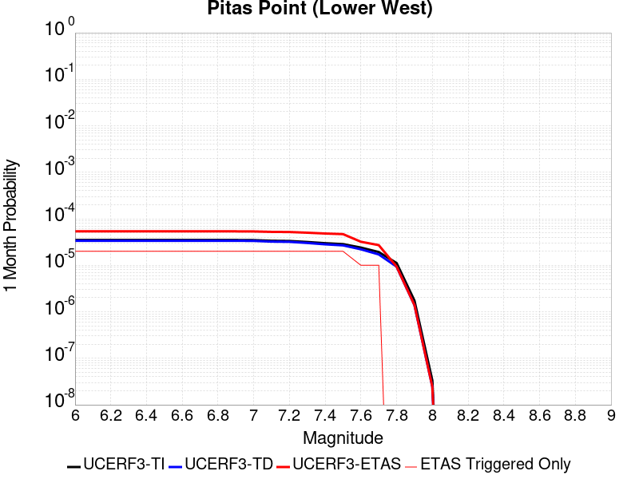 | 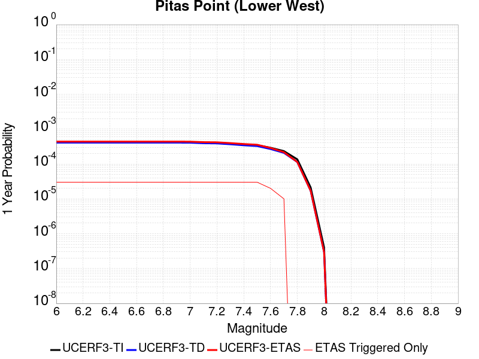 |  |

| Magnitude | 1 wk TI Prob | 1 wk TD Prob | 1 wk ETAS Prob | 1 wk ETAS/TD Gain | 1 wk ETAS Triggered Only | 1 mo TI Prob | 1 mo TD Prob | 1 mo ETAS Prob | 1 mo ETAS/TD Gain | 1 mo ETAS Triggered Only | 1 yr TI Prob | 1 yr TD Prob | 1 yr ETAS Prob | 1 yr ETAS/TD Gain | 1 yr ETAS Triggered Only | 10 yr TI Prob | 10 yr TD Prob | 10 yr ETAS Prob | 10 yr ETAS/TD Gain | 10 yr ETAS Triggered Only |
|-----|-----|-----|-----|-----|-----|-----|-----|-----|-----|-----|-----|-----|-----|-----|-----|-----|-----|-----|-----|-----|
| 6.0 | 8.151497E-6 | 7.855762E-6 | 2.7855605E-5 | 3.545882 | 2.0E-5 | 3.493452E-5 | 3.3667122E-5 | 5.366645E-5 | 1.5940313 | 2.0E-5 | 4.252448E-4 | 4.0982084E-4 | 4.3980856E-4 | 1.0731727 | 3.0E-5 | 0.0042443196 | 0.0040907315 | 0.004130568 | 1.0097382 | 4.0E-5 |
| 6.1 | 8.151497E-6 | 7.855762E-6 | 2.7855605E-5 | 3.545882 | 2.0E-5 | 3.493452E-5 | 3.3667122E-5 | 5.366645E-5 | 1.5940313 | 2.0E-5 | 4.252448E-4 | 4.0982084E-4 | 4.3980856E-4 | 1.0731727 | 3.0E-5 | 0.0042443196 | 0.0040907315 | 0.004130568 | 1.0097382 | 4.0E-5 |
| 6.2 | 8.151497E-6 | 7.855762E-6 | 2.7855605E-5 | 3.545882 | 2.0E-5 | 3.493452E-5 | 3.3667122E-5 | 5.366645E-5 | 1.5940313 | 2.0E-5 | 4.252448E-4 | 4.0982084E-4 | 4.3980856E-4 | 1.0731727 | 3.0E-5 | 0.0042443196 | 0.0040907315 | 0.004130568 | 1.0097382 | 4.0E-5 |
| 6.3 | 8.151497E-6 | 7.855762E-6 | 2.7855605E-5 | 3.545882 | 2.0E-5 | 3.493452E-5 | 3.3667122E-5 | 5.366645E-5 | 1.5940313 | 2.0E-5 | 4.252448E-4 | 4.0982084E-4 | 4.3980856E-4 | 1.0731727 | 3.0E-5 | 0.0042443196 | 0.0040907315 | 0.004130568 | 1.0097382 | 4.0E-5 |
| 6.4 | 8.151497E-6 | 7.855762E-6 | 2.7855605E-5 | 3.545882 | 2.0E-5 | 3.493452E-5 | 3.3667122E-5 | 5.366645E-5 | 1.5940313 | 2.0E-5 | 4.252448E-4 | 4.0982084E-4 | 4.3980856E-4 | 1.0731727 | 3.0E-5 | 0.0042443196 | 0.0040907315 | 0.004130568 | 1.0097382 | 4.0E-5 |
| 6.5 | 8.151497E-6 | 7.855762E-6 | 2.7855605E-5 | 3.545882 | 2.0E-5 | 3.493452E-5 | 3.3667122E-5 | 5.366645E-5 | 1.5940313 | 2.0E-5 | 4.252448E-4 | 4.0982084E-4 | 4.3980856E-4 | 1.0731727 | 3.0E-5 | 0.0042443196 | 0.0040907315 | 0.004130568 | 1.0097382 | 4.0E-5 |
| 6.6 | 8.151497E-6 | 7.855762E-6 | 2.7855605E-5 | 3.545882 | 2.0E-5 | 3.493452E-5 | 3.3667122E-5 | 5.366645E-5 | 1.5940313 | 2.0E-5 | 4.252448E-4 | 4.0982084E-4 | 4.3980856E-4 | 1.0731727 | 3.0E-5 | 0.0042443196 | 0.0040907315 | 0.004130568 | 1.0097382 | 4.0E-5 |
| 6.7 | 8.151497E-6 | 7.855762E-6 | 2.7855605E-5 | 3.545882 | 2.0E-5 | 3.493452E-5 | 3.3667122E-5 | 5.366645E-5 | 1.5940313 | 2.0E-5 | 4.252448E-4 | 4.0982084E-4 | 4.3980856E-4 | 1.0731727 | 3.0E-5 | 0.0042443196 | 0.0040907315 | 0.004130568 | 1.0097382 | 4.0E-5 |
| 6.8 | 8.151497E-6 | 7.855762E-6 | 2.7855605E-5 | 3.545882 | 2.0E-5 | 3.493452E-5 | 3.3667122E-5 | 5.366645E-5 | 1.5940313 | 2.0E-5 | 4.252448E-4 | 4.0982084E-4 | 4.3980856E-4 | 1.0731727 | 3.0E-5 | 0.0042443196 | 0.0040907315 | 0.004130568 | 1.0097382 | 4.0E-5 |
| 6.9 | 8.151497E-6 | 7.855762E-6 | 2.7855605E-5 | 3.545882 | 2.0E-5 | 3.493452E-5 | 3.3667122E-5 | 5.366645E-5 | 1.5940313 | 2.0E-5 | 4.252448E-4 | 4.0982084E-4 | 4.3980856E-4 | 1.0731727 | 3.0E-5 | 0.0042443196 | 0.0040907315 | 0.004130568 | 1.0097382 | 4.0E-5 |
| 7.0 | 8.103535E-6 | 7.805192E-6 | 2.7805036E-5 | 3.562377 | 2.0E-5 | 3.4728975E-5 | 3.3450397E-5 | 5.344973E-5 | 1.5978802 | 2.0E-5 | 4.2274324E-4 | 4.0718322E-4 | 4.3717102E-4 | 1.0736469 | 3.0E-5 | 0.0042193993 | 0.004064452 | 0.004104289 | 1.0098014 | 4.0E-5 |
| 7.1 | 7.853298E-6 | 7.540883E-6 | 2.7540733E-5 | 3.6521893 | 2.0E-5 | 3.3656554E-5 | 3.2317676E-5 | 5.2317027E-5 | 1.6188364 | 2.0E-5 | 4.096915E-4 | 3.9339735E-4 | 4.2338553E-4 | 1.0762287 | 3.0E-5 | 0.00408937 | 0.0039270855 | 0.0039669285 | 1.0101457 | 4.0E-5 |
| 7.2 | 7.771102E-6 | 7.453165E-6 | 2.7453016E-5 | 3.6834037 | 2.0E-5 | 3.33043E-5 | 3.194175E-5 | 5.1941108E-5 | 1.6261199 | 2.0E-5 | 4.0540437E-4 | 3.8882208E-4 | 4.1881044E-4 | 1.0771261 | 3.0E-5 | 0.0040466557 | 0.0038814936 | 0.0039213384 | 1.0102654 | 4.0E-5 |
| 7.3 | 7.3945344E-6 | 7.0492697E-6 | 2.704913E-5 | 3.8371534 | 2.0E-5 | 3.1690477E-5 | 3.021081E-5 | 5.0210205E-5 | 1.6619947 | 2.0E-5 | 3.8576324E-4 | 3.6775516E-4 | 3.9774412E-4 | 1.0815461 | 3.0E-5 | 0.0038509427 | 0.0036715334 | 0.0037113866 | 1.0108546 | 4.0E-5 |
| 7.4 | 6.964645E-6 | 6.5901186E-6 | 2.6589987E-5 | 4.0348268 | 2.0E-5 | 2.9848137E-5 | 2.8243063E-5 | 4.82425E-5 | 1.7081186 | 2.0E-5 | 3.6334046E-4 | 3.4380553E-4 | 3.7379522E-4 | 1.0872287 | 3.0E-5 | 0.0036274698 | 0.0034327896 | 0.0034726523 | 1.0116123 | 4.0E-5 |
| 7.5 | 6.6525035E-6 | 6.259157E-6 | 2.6259031E-5 | 4.195298 | 2.0E-5 | 2.851042E-5 | 2.6824686E-5 | 4.682415E-5 | 1.7455618 | 2.0E-5 | 3.4705905E-4 | 3.265421E-4 | 3.5653228E-4 | 1.0918418 | 3.0E-5 | 0.0034651754 | 0.0032606742 | 0.0033005439 | 1.0122274 | 4.0E-5 |
| 7.6 | 5.613338E-6 | 5.151386E-6 | 1.5151335E-5 | 2.941215 | 1.0E-5 | 2.405694E-5 | 2.2077185E-5 | 3.2076965E-5 | 1.4529463 | 1.0E-5 | 2.928539E-4 | 2.6875688E-4 | 2.887515E-4 | 1.0743967 | 2.0E-5 | 0.0029246826 | 0.0026843501 | 0.0027042963 | 1.0074306 | 2.0E-5 |
| 7.7 | 4.494704E-6 | 3.996911E-6 | 1.3996871E-5 | 3.5019221 | 1.0E-5 | 1.9262876E-5 | 1.7129507E-5 | 2.7129336E-5 | 1.5837779 | 1.0E-5 | 2.3450027E-4 | 2.0853203E-4 | 2.1852994E-4 | 1.0479443 | 1.0E-5 | 0.0023425296 | 0.0020833875 | 0.0020933668 | 1.0047898 | 1.0E-5 |
| 7.8 | 2.6075882E-6 | 2.1836374E-6 | 2.1836374E-6 | 1.0 | 0.0 | 1.117533E-5 | 9.358413E-6 | 9.358413E-6 | 1.0 | 0.0 | 1.3605114E-4 | 1.1393277E-4 | 1.1393277E-4 | 1.0 | 0.0 | 0.0013596788 | 0.0011387484 | 0.0011387484 | 1.0 | 0.0 |
| 7.9 | 4.045984E-7 | 3.242375E-7 | 3.242375E-7 | 1.0 | 0.0 | 1.733992E-6 | 1.3895885E-6 | 1.3895885E-6 | 1.0 | 0.0 | 2.1111147E-5 | 1.6918111E-5 | 1.6918111E-5 | 1.0 | 0.0 | 2.1109142E-4 | 1.6916855E-4 | 1.6916855E-4 | 1.0 | 0.0 |
| 8.0 | 7.791402E-9 | 5.683497E-9 | 5.683497E-9 | 1.0 | 0.0 | 3.3391725E-8 | 2.4357844E-8 | 2.4357844E-8 | 1.0 | 0.0 | 4.0654416E-7 | 2.9655675E-7 | 2.9655675E-7 | 1.0 | 0.0 | 4.065434E-6 | 2.9655655E-6 | 2.9655655E-6 | 1.0 | 0.0 |

## Puente Hills
*[(top)](#table-of-contents)*

| 1 Week | 1 Month | 1 Year | 10 Year |
|-----|-----|-----|-----|
|  |  | 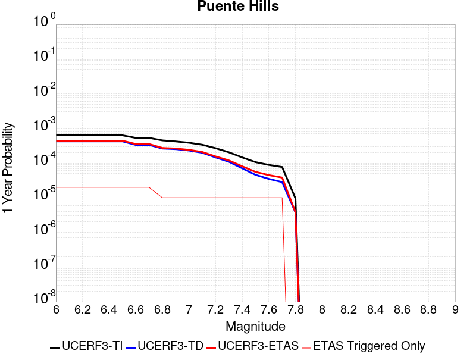 |  |

| Magnitude | 1 wk TI Prob | 1 wk TD Prob | 1 wk ETAS Prob | 1 wk ETAS/TD Gain | 1 wk ETAS Triggered Only | 1 mo TI Prob | 1 mo TD Prob | 1 mo ETAS Prob | 1 mo ETAS/TD Gain | 1 mo ETAS Triggered Only | 1 yr TI Prob | 1 yr TD Prob | 1 yr ETAS Prob | 1 yr ETAS/TD Gain | 1 yr ETAS Triggered Only | 10 yr TI Prob | 10 yr TD Prob | 10 yr ETAS Prob | 10 yr ETAS/TD Gain | 10 yr ETAS Triggered Only |
|-----|-----|-----|-----|-----|-----|-----|-----|-----|-----|-----|-----|-----|-----|-----|-----|-----|-----|-----|-----|-----|
| 6.0 | 1.2101656E-5 | 8.098625E-6 | 1.8098544E-5 | 2.2347674 | 1.0E-5 | 5.1863204E-5 | 3.4707962E-5 | 5.4707267E-5 | 1.5762167 | 2.0E-5 | 6.312516E-4 | 4.2249315E-4 | 4.4248468E-4 | 1.0473181 | 2.0E-5 | 0.0062946146 | 0.0042174594 | 0.0042572906 | 1.0094444 | 4.0E-5 |
| 6.1 | 1.2101656E-5 | 8.098625E-6 | 1.8098544E-5 | 2.2347674 | 1.0E-5 | 5.1863204E-5 | 3.4707962E-5 | 5.4707267E-5 | 1.5762167 | 2.0E-5 | 6.312516E-4 | 4.2249315E-4 | 4.4248468E-4 | 1.0473181 | 2.0E-5 | 0.0062946146 | 0.0042174594 | 0.0042572906 | 1.0094444 | 4.0E-5 |
| 6.2 | 1.2101656E-5 | 8.098625E-6 | 1.8098544E-5 | 2.2347674 | 1.0E-5 | 5.1863204E-5 | 3.4707962E-5 | 5.4707267E-5 | 1.5762167 | 2.0E-5 | 6.312516E-4 | 4.2249315E-4 | 4.4248468E-4 | 1.0473181 | 2.0E-5 | 0.0062946146 | 0.0042174594 | 0.0042572906 | 1.0094444 | 4.0E-5 |
| 6.3 | 1.2101656E-5 | 8.098625E-6 | 1.8098544E-5 | 2.2347674 | 1.0E-5 | 5.1863204E-5 | 3.4707962E-5 | 5.4707267E-5 | 1.5762167 | 2.0E-5 | 6.312516E-4 | 4.2249315E-4 | 4.4248468E-4 | 1.0473181 | 2.0E-5 | 0.0062946146 | 0.0042174594 | 0.0042572906 | 1.0094444 | 4.0E-5 |
| 6.4 | 1.2101656E-5 | 8.098625E-6 | 1.8098544E-5 | 2.2347674 | 1.0E-5 | 5.1863204E-5 | 3.4707962E-5 | 5.4707267E-5 | 1.5762167 | 2.0E-5 | 6.312516E-4 | 4.2249315E-4 | 4.4248468E-4 | 1.0473181 | 2.0E-5 | 0.0062946146 | 0.0042174594 | 0.0042572906 | 1.0094444 | 4.0E-5 |
| 6.5 | 1.2101656E-5 | 8.098625E-6 | 1.8098544E-5 | 2.2347674 | 1.0E-5 | 5.1863204E-5 | 3.4707962E-5 | 5.4707267E-5 | 1.5762167 | 2.0E-5 | 6.312516E-4 | 4.2249315E-4 | 4.4248468E-4 | 1.0473181 | 2.0E-5 | 0.0062946146 | 0.0042174594 | 0.0042572906 | 1.0094444 | 4.0E-5 |
| 6.6 | 1.0222488E-5 | 6.3991847E-6 | 1.639912E-5 | 2.562689 | 1.0E-5 | 4.3809923E-5 | 2.7424803E-5 | 4.7424255E-5 | 1.7292469 | 2.0E-5 | 5.332553E-4 | 3.3384826E-4 | 3.538416E-4 | 1.0598874 | 2.0E-5 | 0.0053197746 | 0.0033337125 | 0.0033735791 | 1.0119586 | 4.0E-5 |
| 6.7 | 1.0222488E-5 | 6.3991847E-6 | 1.639912E-5 | 2.562689 | 1.0E-5 | 4.3809923E-5 | 2.7424803E-5 | 4.7424255E-5 | 1.7292469 | 2.0E-5 | 5.332553E-4 | 3.3384826E-4 | 3.538416E-4 | 1.0598874 | 2.0E-5 | 0.0053197746 | 0.0033337125 | 0.0033735791 | 1.0119586 | 4.0E-5 |
| 6.8 | 8.6367845E-6 | 5.0282533E-6 | 5.0282533E-6 | 1.0 | 0.0 | 3.7014266E-5 | 2.1549482E-5 | 3.1549265E-5 | 1.4640383 | 1.0E-5 | 4.505555E-4 | 2.623339E-4 | 2.723313E-4 | 1.0381093 | 1.0E-5 | 0.004496431 | 0.0026202986 | 0.00265022 | 1.011419 | 3.0E-5 |
| 6.9 | 8.066481E-6 | 4.836117E-6 | 4.836117E-6 | 1.0 | 0.0 | 3.4570177E-5 | 2.0726053E-5 | 3.0725845E-5 | 1.4824746 | 1.0E-5 | 4.2081063E-4 | 2.52311E-4 | 2.623085E-4 | 1.0396236 | 1.0E-5 | 0.0042001465 | 0.0025202993 | 0.0025502236 | 1.0118734 | 3.0E-5 |
| 7.0 | 7.393828E-6 | 4.417296E-6 | 4.417296E-6 | 1.0 | 0.0 | 3.168745E-5 | 1.8931134E-5 | 2.8930945E-5 | 1.5282203 | 1.0E-5 | 3.857264E-4 | 2.3046264E-4 | 2.4046033E-4 | 1.043381 | 1.0E-5 | 0.0038505755 | 0.0023022818 | 0.0023322129 | 1.0130006 | 3.0E-5 |
| 7.1 | 6.4660953E-6 | 3.8044495E-6 | 3.8044495E-6 | 1.0 | 0.0 | 2.7711543E-5 | 1.6304684E-5 | 2.630452E-5 | 1.6133107 | 1.0E-5 | 3.373358E-4 | 1.984918E-4 | 2.0848982E-4 | 1.0503699 | 1.0E-5 | 0.0033682417 | 0.001983181 | 0.0020031414 | 1.0100648 | 2.0E-5 |
| 7.2 | 5.143232E-6 | 2.7865456E-6 | 2.7865456E-6 | 1.0 | 0.0 | 2.2042237E-5 | 1.1942284E-5 | 2.1942164E-5 | 1.8373507 | 1.0E-5 | 2.6833118E-4 | 1.453877E-4 | 1.5538624E-4 | 1.0687716 | 1.0E-5 | 0.002680074 | 0.0014529356 | 0.0014729066 | 1.0137452 | 2.0E-5 |
| 7.3 | 3.928255E-6 | 2.0913774E-6 | 2.0913774E-6 | 1.0 | 0.0 | 1.683527E-5 | 8.963015E-6 | 1.8962926E-5 | 2.115686 | 1.0E-5 | 2.0495013E-4 | 1.0911931E-4 | 1.1911822E-4 | 1.0916328 | 1.0E-5 | 0.002047612 | 0.001090664 | 0.0011106421 | 1.0183175 | 2.0E-5 |
| 7.4 | 2.7894434E-6 | 1.3546753E-6 | 1.3546753E-6 | 1.0 | 0.0 | 1.1954703E-5 | 5.8057385E-6 | 1.5805681E-5 | 2.7224238 | 1.0E-5 | 1.4553878E-4 | 7.068262E-5 | 8.0681915E-5 | 1.1414675 | 1.0E-5 | 0.001454435 | 7.066058E-4 | 7.265916E-4 | 1.0282843 | 2.0E-5 |
| 7.5 | 2.041735E-6 | 8.787305E-7 | 8.787305E-7 | 1.0 | 0.0 | 8.750263E-6 | 3.7659825E-6 | 1.37659445E-5 | 3.6553395 | 1.0E-5 | 1.06529245E-4 | 4.5849905E-5 | 5.5849447E-5 | 1.2180929 | 1.0E-5 | 0.0010647819 | 4.5840783E-4 | 4.7839867E-4 | 1.0436093 | 2.0E-5 |
| 7.6 | 1.6959062E-6 | 6.6986263E-7 | 6.6986263E-7 | 1.0 | 0.0 | 7.268149E-6 | 2.8708366E-6 | 1.2870808E-5 | 4.483295 | 1.0E-5 | 8.848612E-5 | 3.4951907E-5 | 4.4951557E-5 | 1.2860974 | 1.0E-5 | 8.84509E-4 | 3.4946698E-4 | 3.6945997E-4 | 1.05721 | 2.0E-5 |
| 7.7 | 1.4767965E-6 | 5.407607E-7 | 5.407607E-7 | 1.0 | 0.0 | 6.3291122E-6 | 2.317544E-6 | 1.23175205E-5 | 5.314903 | 1.0E-5 | 7.705422E-5 | 2.8215758E-5 | 3.8215476E-5 | 1.354402 | 1.0E-5 | 7.702751E-4 | 2.8212433E-4 | 2.921215E-4 | 1.0354353 | 1.0E-5 |
| 7.8 | 1.8432911E-7 | 7.28201E-8 | 7.28201E-8 | 1.0 | 0.0 | 7.8998164E-7 | 3.1208612E-7 | 3.1208612E-7 | 1.0 | 0.0 | 9.617985E-6 | 3.7996451E-6 | 3.7996451E-6 | 1.0 | 0.0 | 9.617568E-5 | 3.7996128E-5 | 3.7996128E-5 | 1.0 | 0.0 |

## Raymond
*[(top)](#table-of-contents)*

| 1 Week | 1 Month | 1 Year | 10 Year |
|-----|-----|-----|-----|
| 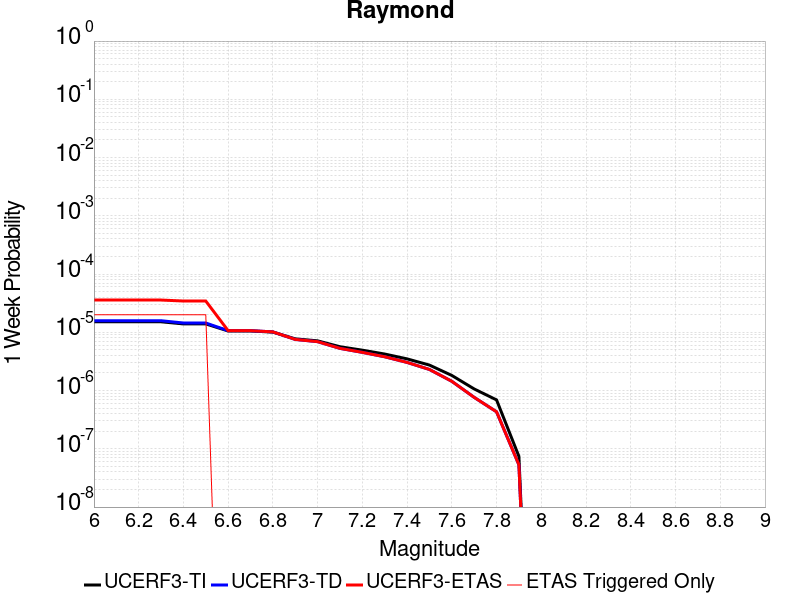 | 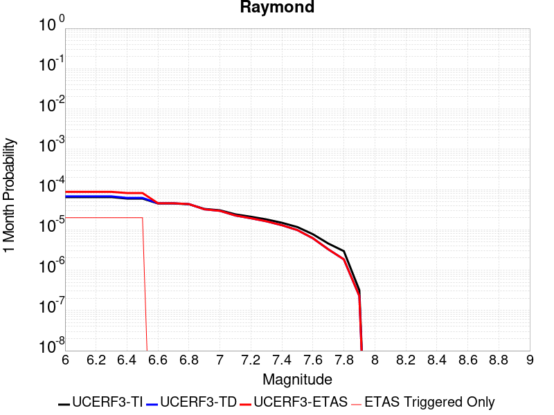 |  |  |

| Magnitude | 1 wk TI Prob | 1 wk TD Prob | 1 wk ETAS Prob | 1 wk ETAS/TD Gain | 1 wk ETAS Triggered Only | 1 mo TI Prob | 1 mo TD Prob | 1 mo ETAS Prob | 1 mo ETAS/TD Gain | 1 mo ETAS Triggered Only | 1 yr TI Prob | 1 yr TD Prob | 1 yr ETAS Prob | 1 yr ETAS/TD Gain | 1 yr ETAS Triggered Only | 10 yr TI Prob | 10 yr TD Prob | 10 yr ETAS Prob | 10 yr ETAS/TD Gain | 10 yr ETAS Triggered Only |
|-----|-----|-----|-----|-----|-----|-----|-----|-----|-----|-----|-----|-----|-----|-----|-----|-----|-----|-----|-----|-----|
| 6.0 | 1.5157413E-5 | 1.5810128E-5 | 3.580981E-5 | 2.264992 | 2.0E-5 | 6.4958724E-5 | 6.7756075E-5 | 8.775472E-5 | 1.2951565 | 2.0E-5 | 7.905855E-4 | 8.2464307E-4 | 8.646101E-4 | 1.0484658 | 4.0E-5 | 0.007877788 | 0.008218348 | 0.00825802 | 1.0048271 | 4.0E-5 |
| 6.1 | 1.5157413E-5 | 1.5810128E-5 | 3.580981E-5 | 2.264992 | 2.0E-5 | 6.4958724E-5 | 6.7756075E-5 | 8.775472E-5 | 1.2951565 | 2.0E-5 | 7.905855E-4 | 8.2464307E-4 | 8.646101E-4 | 1.0484658 | 4.0E-5 | 0.007877788 | 0.008218348 | 0.00825802 | 1.0048271 | 4.0E-5 |
| 6.2 | 1.5157413E-5 | 1.5810128E-5 | 3.580981E-5 | 2.264992 | 2.0E-5 | 6.4958724E-5 | 6.7756075E-5 | 8.775472E-5 | 1.2951565 | 2.0E-5 | 7.905855E-4 | 8.2464307E-4 | 8.646101E-4 | 1.0484658 | 4.0E-5 | 0.007877788 | 0.008218348 | 0.00825802 | 1.0048271 | 4.0E-5 |
| 6.3 | 1.5157413E-5 | 1.5810128E-5 | 3.580981E-5 | 2.264992 | 2.0E-5 | 6.4958724E-5 | 6.7756075E-5 | 8.775472E-5 | 1.2951565 | 2.0E-5 | 7.905855E-4 | 8.2464307E-4 | 8.646101E-4 | 1.0484658 | 4.0E-5 | 0.007877788 | 0.008218348 | 0.00825802 | 1.0048271 | 4.0E-5 |
| 6.4 | 1.3941944E-5 | 1.445469E-5 | 3.4454402E-5 | 2.3836138 | 2.0E-5 | 5.9749822E-5 | 6.1947336E-5 | 8.19461E-5 | 1.3228348 | 2.0E-5 | 7.2721124E-4 | 7.5397117E-4 | 7.9394097E-4 | 1.0530124 | 4.0E-5 | 0.007248361 | 0.0075164647 | 0.007556164 | 1.0052817 | 4.0E-5 |
| 6.5 | 1.3941944E-5 | 1.445469E-5 | 3.4454402E-5 | 2.3836138 | 2.0E-5 | 5.9749822E-5 | 6.1947336E-5 | 8.19461E-5 | 1.3228348 | 2.0E-5 | 7.2721124E-4 | 7.5397117E-4 | 7.9394097E-4 | 1.0530124 | 4.0E-5 | 0.007248361 | 0.0075164647 | 0.007556164 | 1.0052817 | 4.0E-5 |
| 6.6 | 1.0542609E-5 | 1.0671113E-5 | 1.0671113E-5 | 1.0 | 0.0 | 4.5181827E-5 | 4.573257E-5 | 4.573257E-5 | 1.0 | 0.0 | 5.499499E-4 | 5.5665727E-4 | 5.766461E-4 | 1.0359087 | 2.0E-5 | 0.005485909 | 0.00555319 | 0.005573079 | 1.0035815 | 2.0E-5 |
| 6.7 | 1.0542609E-5 | 1.0671113E-5 | 1.0671113E-5 | 1.0 | 0.0 | 4.5181827E-5 | 4.573257E-5 | 4.573257E-5 | 1.0 | 0.0 | 5.499499E-4 | 5.5665727E-4 | 5.766461E-4 | 1.0359087 | 2.0E-5 | 0.005485909 | 0.00555319 | 0.005573079 | 1.0035815 | 2.0E-5 |
| 6.8 | 1.0079132E-5 | 1.0176646E-5 | 1.0176646E-5 | 1.0 | 0.0 | 4.3195567E-5 | 4.3613498E-5 | 4.3613498E-5 | 1.0 | 0.0 | 5.257791E-4 | 5.3087034E-4 | 5.508597E-4 | 1.037654 | 2.0E-5 | 0.0052453685 | 0.005296571 | 0.005316465 | 1.003756 | 2.0E-5 |
| 6.9 | 7.721598E-6 | 7.5489047E-6 | 7.5489047E-6 | 1.0 | 0.0 | 3.3092143E-5 | 3.2352054E-5 | 3.2352054E-5 | 1.0 | 0.0 | 4.0282236E-4 | 3.9381627E-4 | 4.0381236E-4 | 1.0253825 | 1.0E-5 | 0.0040209293 | 0.0039313175 | 0.0039412784 | 1.0025337 | 1.0E-5 |
| 7.0 | 7.137566E-6 | 6.9113057E-6 | 6.9113057E-6 | 1.0 | 0.0 | 3.058921E-5 | 2.961955E-5 | 2.961955E-5 | 1.0 | 0.0 | 3.7236E-4 | 3.6055944E-4 | 3.7055582E-4 | 1.0277246 | 1.0E-5 | 0.0037173668 | 0.0035998628 | 0.0036098268 | 1.0027679 | 1.0E-5 |
| 7.1 | 5.654976E-6 | 5.29954E-6 | 5.29954E-6 | 1.0 | 0.0 | 2.4235387E-5 | 2.2712118E-5 | 2.2712118E-5 | 1.0 | 0.0 | 2.9502588E-4 | 2.7648517E-4 | 2.8648242E-4 | 1.0361583 | 1.0E-5 | 0.0029463451 | 0.002761443 | 0.0027714153 | 1.0036113 | 1.0E-5 |
| 7.2 | 4.9358455E-6 | 4.5266574E-6 | 4.5266574E-6 | 1.0 | 0.0 | 2.1153453E-5 | 1.9399817E-5 | 1.9399817E-5 | 1.0 | 0.0 | 2.5751285E-4 | 2.3616731E-4 | 2.4616494E-4 | 1.0423329 | 1.0E-5 | 0.0025721465 | 0.0023591854 | 0.002369162 | 1.0042287 | 1.0E-5 |
| 7.3 | 4.2368597E-6 | 3.8056164E-6 | 3.8056164E-6 | 1.0 | 0.0 | 1.8157843E-5 | 1.6309683E-5 | 1.6309683E-5 | 1.0 | 0.0 | 2.2104931E-4 | 1.9855241E-4 | 2.0855042E-4 | 1.0503545 | 1.0E-5 | 0.0022082955 | 0.0019837688 | 0.001993749 | 1.0050309 | 1.0E-5 |
| 7.4 | 3.4999923E-6 | 3.043744E-6 | 3.043744E-6 | 1.0 | 0.0 | 1.49998805E-5 | 1.3044552E-5 | 1.3044552E-5 | 1.0 | 0.0 | 1.8260824E-4 | 1.5880594E-4 | 1.5880594E-4 | 1.0 | 0.0 | 0.0018245826 | 0.0015869403 | 0.0015869403 | 1.0 | 0.0 |
| 7.5 | 2.738017E-6 | 2.3020468E-6 | 2.3020468E-6 | 1.0 | 0.0 | 1.1734306E-5 | 9.865878E-6 | 9.865878E-6 | 1.0 | 0.0 | 1.428558E-4 | 1.2011051E-4 | 1.2011051E-4 | 1.0 | 0.0 | 0.0014276401 | 0.0012004703 | 0.0012004703 | 1.0 | 0.0 |
| 7.6 | 1.8186392E-6 | 1.442312E-6 | 1.442312E-6 | 1.0 | 0.0 | 7.794145E-6 | 6.181323E-6 | 6.181323E-6 | 1.0 | 0.0 | 9.488958E-5 | 7.5255055E-5 | 7.5255055E-5 | 1.0 | 0.0 | 9.4849075E-4 | 7.523072E-4 | 7.523072E-4 | 1.0 | 0.0 |
| 7.7 | 1.0660348E-6 | 7.6438056E-7 | 7.6438056E-7 | 1.0 | 0.0 | 4.5687125E-6 | 3.2759126E-6 | 3.2759126E-6 | 1.0 | 0.0 | 5.5622655E-5 | 3.9883522E-5 | 3.9883522E-5 | 1.0 | 0.0 | 5.5608735E-4 | 3.9877277E-4 | 3.9877277E-4 | 1.0 | 0.0 |
| 7.8 | 6.913602E-7 | 4.3204133E-7 | 4.3204133E-7 | 1.0 | 0.0 | 2.962969E-6 | 1.8516045E-6 | 1.8516045E-6 | 1.0 | 0.0 | 3.607355E-5 | 2.2543056E-5 | 2.2543056E-5 | 1.0 | 0.0 | 3.6067693E-4 | 2.2541556E-4 | 2.2541556E-4 | 1.0 | 0.0 |
| 7.9 | 7.425201E-8 | 5.3222113E-8 | 5.3222113E-8 | 1.0 | 0.0 | 3.1822285E-7 | 2.2809476E-7 | 2.2809476E-7 | 1.0 | 0.0 | 3.874356E-6 | 2.7770516E-6 | 2.7770516E-6 | 1.0 | 0.0 | 3.8742884E-5 | 2.7770298E-5 | 2.7770298E-5 | 1.0 | 0.0 |

## Hosgri (Extension)
*[(top)](#table-of-contents)*

| 1 Week | 1 Month | 1 Year | 10 Year |
|-----|-----|-----|-----|
| 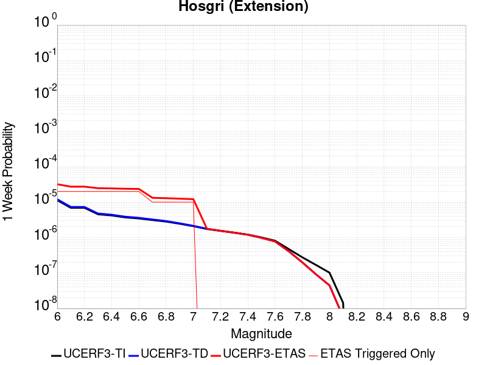 |  |  |  |

| Magnitude | 1 wk TI Prob | 1 wk TD Prob | 1 wk ETAS Prob | 1 wk ETAS/TD Gain | 1 wk ETAS Triggered Only | 1 mo TI Prob | 1 mo TD Prob | 1 mo ETAS Prob | 1 mo ETAS/TD Gain | 1 mo ETAS Triggered Only | 1 yr TI Prob | 1 yr TD Prob | 1 yr ETAS Prob | 1 yr ETAS/TD Gain | 1 yr ETAS Triggered Only | 10 yr TI Prob | 10 yr TD Prob | 10 yr ETAS Prob | 10 yr ETAS/TD Gain | 10 yr ETAS Triggered Only |
|-----|-----|-----|-----|-----|-----|-----|-----|-----|-----|-----|-----|-----|-----|-----|-----|-----|-----|-----|-----|-----|
| 6.0 | 1.1369135E-5 | 1.2083072E-5 | 3.208283E-5 | 2.6551883 | 2.0E-5 | 4.8723956E-5 | 5.1783692E-5 | 7.1782655E-5 | 1.386202 | 2.0E-5 | 5.9305265E-4 | 6.3030684E-4 | 6.5029424E-4 | 1.0317106 | 2.0E-5 | 0.005914725 | 0.0062874397 | 0.006327188 | 1.0063219 | 4.0E-5 |
| 6.1 | 6.934979E-6 | 7.324555E-6 | 2.7324408E-5 | 3.7305214 | 2.0E-5 | 2.9721E-5 | 3.1390595E-5 | 5.138997E-5 | 1.6371135 | 2.0E-5 | 3.617931E-4 | 3.8211764E-4 | 4.0211E-4 | 1.0523199 | 2.0E-5 | 0.0036120464 | 0.0038150186 | 0.003844904 | 1.0078336 | 3.0E-5 |
| 6.2 | 6.934979E-6 | 7.324555E-6 | 2.7324408E-5 | 3.7305214 | 2.0E-5 | 2.9721E-5 | 3.1390595E-5 | 5.138997E-5 | 1.6371135 | 2.0E-5 | 3.617931E-4 | 3.8211764E-4 | 4.0211E-4 | 1.0523199 | 2.0E-5 | 0.0036120464 | 0.0038150186 | 0.003844904 | 1.0078336 | 3.0E-5 |
| 6.3 | 4.5484676E-6 | 4.76933E-6 | 2.4769235E-5 | 5.193441 | 2.0E-5 | 1.9493287E-5 | 2.043983E-5 | 4.043942E-5 | 1.9784617 | 2.0E-5 | 2.3730492E-4 | 2.4882692E-4 | 2.6882192E-4 | 1.0803572 | 2.0E-5 | 0.0023705168 | 0.0024855258 | 0.002515451 | 1.0120399 | 3.0E-5 |
| 6.4 | 4.218095E-6 | 4.4168614E-6 | 2.4416773E-5 | 5.528082 | 2.0E-5 | 1.8077424E-5 | 1.8929271E-5 | 3.8928894E-5 | 2.0565448 | 2.0E-5 | 2.2007042E-4 | 2.3043984E-4 | 2.5043523E-4 | 1.0867705 | 2.0E-5 | 0.002198526 | 0.0023020422 | 0.0023319733 | 1.0130019 | 3.0E-5 |
| 6.5 | 3.717374E-6 | 3.8838775E-6 | 2.38838E-5 | 6.1494727 | 2.0E-5 | 1.5931506E-5 | 1.6645085E-5 | 3.6644753E-5 | 2.201536 | 2.0E-5 | 1.9394881E-4 | 2.0263524E-4 | 2.2263119E-4 | 1.0986795 | 2.0E-5 | 0.0019377962 | 0.0020245234 | 0.002054463 | 1.0147883 | 3.0E-5 |
| 6.6 | 3.4605036E-6 | 3.608306E-6 | 2.3608234E-5 | 6.542747 | 2.0E-5 | 1.4830645E-5 | 1.5464078E-5 | 3.546377E-5 | 2.2933 | 2.0E-5 | 1.8054814E-4 | 1.8825903E-4 | 2.0825525E-4 | 1.1062165 | 2.0E-5 | 0.0018040152 | 0.0018810101 | 0.0019109537 | 1.0159189 | 3.0E-5 |
| 6.7 | 3.123439E-6 | 3.2465687E-6 | 1.3246537E-5 | 4.080165 | 1.0E-5 | 1.33860985E-5 | 1.3913792E-5 | 2.3913653E-5 | 1.7187014 | 1.0E-5 | 1.6296357E-4 | 1.6938736E-4 | 1.7938566E-4 | 1.0590262 | 1.0E-5 | 0.001628441 | 0.0016925934 | 0.0017125596 | 1.0117962 | 2.0E-5 |
| 6.8 | 2.8290783E-6 | 2.9305404E-6 | 1.2930511E-5 | 4.41233 | 1.0E-5 | 1.2124565E-5 | 1.2559399E-5 | 2.2559274E-5 | 1.7962065 | 1.0E-5 | 1.4760658E-4 | 1.5290003E-4 | 1.628985E-4 | 1.0653923 | 1.0E-5 | 0.0014750857 | 0.001527957 | 0.0015479265 | 1.0130694 | 2.0E-5 |
| 6.9 | 2.454112E-6 | 2.5283196E-6 | 1.2528294E-5 | 4.9551864 | 1.0E-5 | 1.0517581E-5 | 1.0835611E-5 | 2.0835501E-5 | 1.9228729 | 1.0E-5 | 1.2804402E-4 | 1.3191563E-4 | 1.4191431E-4 | 1.075796 | 1.0E-5 | 0.0012797028 | 0.0013183793 | 0.001338353 | 1.0151502 | 2.0E-5 |
| 7.0 | 2.1008145E-6 | 2.1498704E-6 | 1.2149849E-5 | 5.6514335 | 1.0E-5 | 9.003459E-6 | 9.213698E-6 | 1.9213605E-5 | 2.0853305 | 1.0E-5 | 1.096116E-4 | 1.1217103E-4 | 1.221699E-4 | 1.0891396 | 1.0E-5 | 0.0010955755 | 0.0011211479 | 0.0011311367 | 1.0089095 | 1.0E-5 |
| 7.1 | 1.744384E-6 | 1.7686352E-6 | 1.7686352E-6 | 1.0 | 0.0 | 7.47591E-6 | 7.5798434E-6 | 7.5798434E-6 | 1.0 | 0.0 | 9.1015405E-5 | 9.22807E-5 | 9.22807E-5 | 1.0 | 0.0 | 9.097813E-4 | 9.2242553E-4 | 9.2242553E-4 | 1.0 | 0.0 |
| 7.2 | 1.5456587E-6 | 1.5562882E-6 | 1.5562882E-6 | 1.0 | 0.0 | 6.6242346E-6 | 6.66979E-6 | 6.66979E-6 | 1.0 | 0.0 | 8.064707E-5 | 8.120168E-5 | 8.120168E-5 | 1.0 | 0.0 | 8.0617814E-4 | 8.117213E-4 | 8.117213E-4 | 1.0 | 0.0 |
| 7.3 | 1.3775123E-6 | 1.3766082E-6 | 1.3766082E-6 | 1.0 | 0.0 | 5.9036106E-6 | 5.899736E-6 | 5.899736E-6 | 1.0 | 0.0 | 7.187409E-5 | 7.182693E-5 | 7.182693E-5 | 1.0 | 0.0 | 7.185085E-4 | 7.180382E-4 | 7.180382E-4 | 1.0 | 0.0 |
| 7.4 | 1.214491E-6 | 1.2023461E-6 | 1.2023461E-6 | 1.0 | 0.0 | 5.2049513E-6 | 5.1529014E-6 | 5.1529014E-6 | 1.0 | 0.0 | 6.336844E-5 | 6.2734776E-5 | 6.2734776E-5 | 1.0 | 0.0 | 6.335037E-4 | 6.271715E-4 | 6.271715E-4 | 1.0 | 0.0 |
| 7.5 | 1.0101123E-6 | 9.842246E-7 | 9.842246E-7 | 1.0 | 0.0 | 4.3290456E-6 | 4.2180986E-6 | 4.2180986E-6 | 1.0 | 0.0 | 5.2704854E-5 | 5.1354145E-5 | 5.1354145E-5 | 1.0 | 0.0 | 5.2692357E-4 | 5.1342335E-4 | 5.1342335E-4 | 1.0 | 0.0 |
| 7.6 | 8.1558215E-7 | 7.765966E-7 | 7.765966E-7 | 1.0 | 0.0 | 3.4953473E-6 | 3.328267E-6 | 3.328267E-6 | 1.0 | 0.0 | 4.255502E-5 | 4.0520903E-5 | 4.0520903E-5 | 1.0 | 0.0 | 4.2546875E-4 | 4.0513556E-4 | 4.0513556E-4 | 1.0 | 0.0 |
| 7.7 | 4.757816E-7 | 4.1308888E-7 | 4.1308888E-7 | 1.0 | 0.0 | 2.0390623E-6 | 1.7703798E-6 | 1.7703798E-6 | 1.0 | 0.0 | 2.4825302E-5 | 2.155416E-5 | 2.155416E-5 | 1.0 | 0.0 | 2.482253E-4 | 2.1552083E-4 | 2.1552083E-4 | 1.0 | 0.0 |
| 7.8 | 2.782787E-7 | 2.0047722E-7 | 2.0047722E-7 | 1.0 | 0.0 | 1.1926223E-6 | 8.5918776E-7 | 8.5918776E-7 | 1.0 | 0.0 | 1.452008E-5 | 1.04605615E-5 | 1.04605615E-5 | 1.0 | 0.0 | 1.4519131E-4 | 1.04600724E-4 | 1.04600724E-4 | 1.0 | 0.0 |
| 7.9 | 1.6948086E-7 | 9.244227E-8 | 9.244227E-8 | 1.0 | 0.0 | 7.2634634E-7 | 3.961811E-7 | 3.961811E-7 | 1.0 | 0.0 | 8.843231E-6 | 4.8234942E-6 | 4.8234942E-6 | 1.0 | 0.0 | 8.842879E-5 | 4.8233902E-5 | 4.8233902E-5 | 1.0 | 0.0 |
| 8.0 | 1.0225492E-7 | 4.4738776E-8 | 4.4738776E-8 | 1.0 | 0.0 | 4.382353E-7 | 1.917376E-7 | 1.917376E-7 | 1.0 | 0.0 | 5.335502E-6 | 2.3344028E-6 | 2.3344028E-6 | 1.0 | 0.0 | 5.335374E-5 | 2.3343786E-5 | 2.3343786E-5 | 1.0 | 0.0 |
| 8.1 | 1.43711345E-8 | 5.787707E-9 | 5.787707E-9 | 1.0 | 0.0 | 6.1590576E-8 | 2.480446E-8 | 2.480446E-8 | 1.0 | 0.0 | 7.4986497E-7 | 3.0199428E-7 | 3.0199428E-7 | 1.0 | 0.0 | 7.4986247E-6 | 3.0199392E-6 | 3.0199392E-6 | 1.0 | 0.0 |

## Elsinore (Stepovers Combined)
*[(top)](#table-of-contents)*

| 1 Week | 1 Month | 1 Year | 10 Year |
|-----|-----|-----|-----|
| 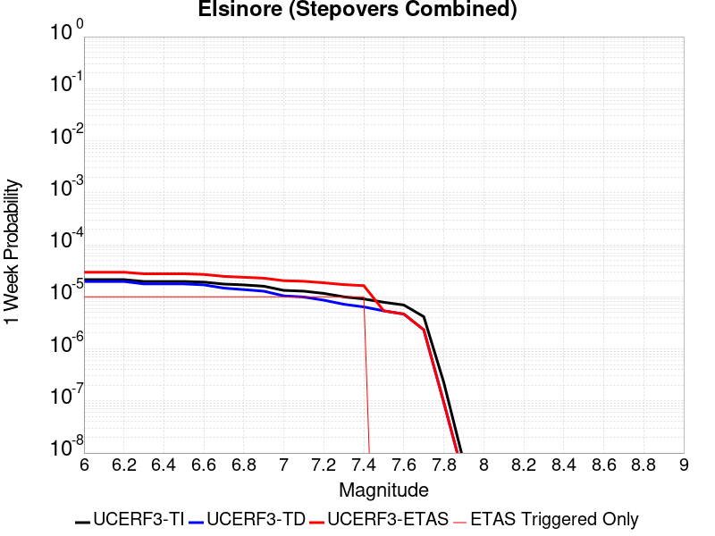 |  |  |  |

| Magnitude | 1 wk TI Prob | 1 wk TD Prob | 1 wk ETAS Prob | 1 wk ETAS/TD Gain | 1 wk ETAS Triggered Only | 1 mo TI Prob | 1 mo TD Prob | 1 mo ETAS Prob | 1 mo ETAS/TD Gain | 1 mo ETAS Triggered Only | 1 yr TI Prob | 1 yr TD Prob | 1 yr ETAS Prob | 1 yr ETAS/TD Gain | 1 yr ETAS Triggered Only | 10 yr TI Prob | 10 yr TD Prob | 10 yr ETAS Prob | 10 yr ETAS/TD Gain | 10 yr ETAS Triggered Only |
|-----|-----|-----|-----|-----|-----|-----|-----|-----|-----|-----|-----|-----|-----|-----|-----|-----|-----|-----|-----|-----|
| 6.0 | 2.144392E-5 | 1.9760193E-5 | 2.9759995E-5 | 1.506058 | 1.0E-5 | 9.189928E-5 | 8.468392E-5 | 1.0468222E-4 | 1.2361524 | 2.0E-5 | 0.0011182994 | 0.0010305607 | 0.0010605297 | 1.0290804 | 3.0E-5 | 0.011126885 | 0.010264917 | 0.010304507 | 1.0038568 | 4.0E-5 |
| 6.1 | 2.144392E-5 | 1.9760193E-5 | 2.9759995E-5 | 1.506058 | 1.0E-5 | 9.189928E-5 | 8.468392E-5 | 1.0468222E-4 | 1.2361524 | 2.0E-5 | 0.0011182994 | 0.0010305607 | 0.0010605297 | 1.0290804 | 3.0E-5 | 0.011126885 | 0.010264917 | 0.010304507 | 1.0038568 | 4.0E-5 |
| 6.2 | 2.144392E-5 | 1.9760193E-5 | 2.9759995E-5 | 1.506058 | 1.0E-5 | 9.189928E-5 | 8.468392E-5 | 1.0468222E-4 | 1.2361524 | 2.0E-5 | 0.0011182994 | 0.0010305607 | 0.0010605297 | 1.0290804 | 3.0E-5 | 0.011126885 | 0.010264917 | 0.010304507 | 1.0038568 | 4.0E-5 |
| 6.3 | 1.9751555E-5 | 1.7741453E-5 | 2.7741275E-5 | 1.5636417 | 1.0E-5 | 8.4646774E-5 | 7.603267E-5 | 9.603115E-5 | 1.2630248 | 2.0E-5 | 0.0010300872 | 9.253213E-4 | 9.5529354E-4 | 1.0323912 | 3.0E-5 | 0.010253254 | 0.009221276 | 0.009260908 | 1.0042979 | 4.0E-5 |
| 6.4 | 1.9751555E-5 | 1.7741453E-5 | 2.7741275E-5 | 1.5636417 | 1.0E-5 | 8.4646774E-5 | 7.603267E-5 | 9.603115E-5 | 1.2630248 | 2.0E-5 | 0.0010300872 | 9.253213E-4 | 9.5529354E-4 | 1.0323912 | 3.0E-5 | 0.010253254 | 0.009221276 | 0.009260908 | 1.0042979 | 4.0E-5 |
| 6.5 | 1.9751555E-5 | 1.7741453E-5 | 2.7741275E-5 | 1.5636417 | 1.0E-5 | 8.4646774E-5 | 7.603267E-5 | 9.603115E-5 | 1.2630248 | 2.0E-5 | 0.0010300872 | 9.253213E-4 | 9.5529354E-4 | 1.0323912 | 3.0E-5 | 0.010253254 | 0.009221276 | 0.009260908 | 1.0042979 | 4.0E-5 |
| 6.6 | 1.9188685E-5 | 1.7003393E-5 | 2.7003223E-5 | 1.588108 | 1.0E-5 | 8.2234634E-5 | 7.286974E-5 | 9.2868286E-5 | 1.2744423 | 2.0E-5 | 0.0010007467 | 8.868442E-4 | 9.168176E-4 | 1.0337979 | 3.0E-5 | 0.00996252 | 0.0088398475 | 0.008879494 | 1.004485 | 4.0E-5 |
| 6.7 | 1.7608272E-5 | 1.4732616E-5 | 2.473247E-5 | 1.678756 | 1.0E-5 | 7.546184E-5 | 6.3138315E-5 | 8.313705E-5 | 1.3167449 | 2.0E-5 | 9.183606E-4 | 7.684476E-4 | 7.9842453E-4 | 1.0390097 | 3.0E-5 | 0.009145746 | 0.00766491 | 0.0077046035 | 1.0051786 | 4.0E-5 |
| 6.8 | 1.697165E-5 | 1.3783365E-5 | 2.3783226E-5 | 1.7255023 | 1.0E-5 | 7.273361E-5 | 5.9070277E-5 | 7.90691E-5 | 1.3385597 | 2.0E-5 | 8.8517193E-4 | 7.18952E-4 | 7.489304E-4 | 1.0416974 | 3.0E-5 | 0.008816543 | 0.007172675 | 0.007212388 | 1.0055367 | 4.0E-5 |
| 6.9 | 1.600365E-5 | 1.2846671E-5 | 2.2846543E-5 | 1.7784017 | 1.0E-5 | 6.858527E-5 | 5.5056043E-5 | 7.5054944E-5 | 1.3632462 | 2.0E-5 | 8.347058E-4 | 6.7010894E-4 | 7.0008886E-4 | 1.0447389 | 3.0E-5 | 0.008315775 | 0.0066867657 | 0.0067264982 | 1.005942 | 4.0E-5 |
| 7.0 | 1.3314581E-5 | 1.0447548E-5 | 2.0447444E-5 | 1.9571524 | 1.0E-5 | 5.7061243E-5 | 4.4774453E-5 | 6.477356E-5 | 1.4466633 | 2.0E-5 | 6.944992E-4 | 5.449953E-4 | 5.74979E-4 | 1.0550164 | 3.0E-5 | 0.006923327 | 0.0054405155 | 0.005480298 | 1.0073123 | 4.0E-5 |
| 7.1 | 1.2865345E-5 | 9.937536E-6 | 1.9937437E-5 | 2.0062757 | 1.0E-5 | 5.5136024E-5 | 4.258876E-5 | 6.2587904E-5 | 1.4695874 | 2.0E-5 | 6.710743E-4 | 5.183973E-4 | 5.4838177E-4 | 1.0578407 | 3.0E-5 | 0.0066905143 | 0.0051752133 | 0.0052150064 | 1.0076891 | 4.0E-5 |
| 7.2 | 1.1650051E-5 | 8.633809E-6 | 1.8633722E-5 | 2.1582274 | 1.0E-5 | 4.9927836E-5 | 3.7001522E-5 | 5.7000783E-5 | 1.5404983 | 2.0E-5 | 6.0770183E-4 | 4.504022E-4 | 4.803887E-4 | 1.0665771 | 3.0E-5 | 0.0060604266 | 0.0044963174 | 0.0045361375 | 1.0088562 | 4.0E-5 |
| 7.3 | 1.0008533E-5 | 7.2010425E-6 | 1.7200971E-5 | 2.3886778 | 1.0E-5 | 4.2893007E-5 | 3.0861254E-5 | 5.0860635E-5 | 1.6480418 | 2.0E-5 | 5.220972E-4 | 3.7567242E-4 | 4.0566115E-4 | 1.0798268 | 3.0E-5 | 0.005208723 | 0.003750761 | 0.003790611 | 1.0106245 | 4.0E-5 |
| 7.4 | 9.116759E-6 | 6.410068E-6 | 1.6410004E-5 | 2.5600357 | 1.0E-5 | 3.907124E-5 | 2.747144E-5 | 4.747089E-5 | 1.7280089 | 2.0E-5 | 4.7558855E-4 | 3.3441483E-4 | 3.6440478E-4 | 1.0896789 | 3.0E-5 | 0.00474572 | 0.0033392678 | 0.0033691677 | 1.008954 | 3.0E-5 |
| 7.5 | 7.870524E-6 | 5.3825365E-6 | 5.3825365E-6 | 1.0 | 0.0 | 3.3730383E-5 | 2.3067816E-5 | 3.3067587E-5 | 1.4334944 | 1.0E-5 | 4.1059E-4 | 2.8081573E-4 | 3.0081012E-4 | 1.0712011 | 2.0E-5 | 0.0040983222 | 0.0028047354 | 0.0028246795 | 1.0071108 | 2.0E-5 |
| 7.6 | 6.9774537E-6 | 4.6776067E-6 | 4.6776067E-6 | 1.0 | 0.0 | 2.990303E-5 | 2.0046738E-5 | 3.0046538E-5 | 1.4988242 | 1.0E-5 | 3.640086E-4 | 2.4404288E-4 | 2.64038E-4 | 1.0819328 | 2.0E-5 | 0.003634129 | 0.0024378651 | 0.0024578164 | 1.008184 | 2.0E-5 |
| 7.7 | 4.1616954E-6 | 2.32834E-6 | 2.32834E-6 | 1.0 | 0.0 | 1.7835715E-5 | 9.978567E-6 | 1.9978466E-5 | 2.002138 | 1.0E-5 | 2.171282E-4 | 1.2148302E-4 | 1.3148181E-4 | 1.082306 | 1.0E-5 | 0.0021691616 | 0.0012142392 | 0.001224227 | 1.0082256 | 1.0E-5 |
| 7.8 | 2.2692414E-7 | 9.3854695E-8 | 9.3854695E-8 | 1.0 | 0.0 | 9.725317E-7 | 4.0223435E-7 | 4.0223435E-7 | 1.0 | 0.0 | 1.1840509E-5 | 4.8971956E-6 | 4.8971956E-6 | 1.0 | 0.0 | 1.1839878E-4 | 4.8971204E-5 | 4.8971204E-5 | 1.0 | 0.0 |
| 7.9 | 6.676829E-9 | 3.439853E-9 | 3.439853E-9 | 1.0 | 0.0 | 2.861498E-8 | 1.4742227E-8 | 1.4742227E-8 | 1.0 | 0.0 | 3.4838732E-7 | 1.7948659E-7 | 1.7948659E-7 | 1.0 | 0.0 | 3.4838679E-6 | 1.7948646E-6 | 1.7948646E-6 | 1.0 | 0.0 |

## Superstition Hills
*[(top)](#table-of-contents)*

| 1 Week | 1 Month | 1 Year | 10 Year |
|-----|-----|-----|-----|
|  |  |  |  |

| Magnitude | 1 wk TI Prob | 1 wk TD Prob | 1 wk ETAS Prob | 1 wk ETAS/TD Gain | 1 wk ETAS Triggered Only | 1 mo TI Prob | 1 mo TD Prob | 1 mo ETAS Prob | 1 mo ETAS/TD Gain | 1 mo ETAS Triggered Only | 1 yr TI Prob | 1 yr TD Prob | 1 yr ETAS Prob | 1 yr ETAS/TD Gain | 1 yr ETAS Triggered Only | 10 yr TI Prob | 10 yr TD Prob | 10 yr ETAS Prob | 10 yr ETAS/TD Gain | 10 yr ETAS Triggered Only |
|-----|-----|-----|-----|-----|-----|-----|-----|-----|-----|-----|-----|-----|-----|-----|-----|-----|-----|-----|-----|-----|
| 6.0 | 6.6865185E-5 | 1.41376995E-5 | 1.41376995E-5 | 1.0 | 0.0 | 2.8653358E-4 | 6.0588824E-5 | 7.058822E-5 | 1.1650369 | 1.0E-5 | 0.0034829667 | 7.374355E-4 | 7.474281E-4 | 1.0135505 | 1.0E-5 | 0.03428881 | 0.0075204074 | 0.0075601065 | 1.0052788 | 4.0E-5 |
| 6.1 | 6.544851E-5 | 1.41376995E-5 | 1.41376995E-5 | 1.0 | 0.0 | 2.8046346E-4 | 6.0588824E-5 | 7.058822E-5 | 1.1650369 | 1.0E-5 | 0.0034092965 | 7.374355E-4 | 7.474281E-4 | 1.0135505 | 1.0E-5 | 0.033574644 | 0.007520407 | 0.007560106 | 1.0052788 | 4.0E-5 |
| 6.2 | 6.544851E-5 | 1.41376995E-5 | 1.41376995E-5 | 1.0 | 0.0 | 2.8046346E-4 | 6.0588824E-5 | 7.058822E-5 | 1.1650369 | 1.0E-5 | 0.0034092965 | 7.374355E-4 | 7.474281E-4 | 1.0135505 | 1.0E-5 | 0.033574644 | 0.007520407 | 0.007560106 | 1.0052788 | 4.0E-5 |
| 6.3 | 5.2402065E-5 | 1.4137698E-5 | 1.4137698E-5 | 1.0 | 0.0 | 2.2456095E-4 | 6.058882E-5 | 7.058821E-5 | 1.1650369 | 1.0E-5 | 0.0027306017 | 7.374354E-4 | 7.4742804E-4 | 1.0135505 | 1.0E-5 | 0.02697292 | 0.007520402 | 0.007560101 | 1.0052788 | 4.0E-5 |
| 6.4 | 4.542238E-5 | 1.4137698E-5 | 1.4137698E-5 | 1.0 | 0.0 | 1.9465282E-4 | 6.0588816E-5 | 7.058821E-5 | 1.1650369 | 1.0E-5 | 0.0023673223 | 7.3743536E-4 | 7.47428E-4 | 1.0135505 | 1.0E-5 | 0.023422617 | 0.0075203986 | 0.007560098 | 1.0052788 | 4.0E-5 |
| 6.5 | 2.9672969E-5 | 1.4137696E-5 | 1.4137696E-5 | 1.0 | 0.0 | 1.2716366E-4 | 6.058881E-5 | 7.0588205E-5 | 1.1650369 | 1.0E-5 | 0.0015471181 | 7.374353E-4 | 7.474279E-4 | 1.0135505 | 1.0E-5 | 0.015363912 | 0.007520392 | 0.0075600916 | 1.0052788 | 4.0E-5 |
| 6.6 | 2.6056105E-5 | 1.3803458E-5 | 1.3803458E-5 | 1.0 | 0.0 | 1.1166424E-4 | 5.9156428E-5 | 6.915584E-5 | 1.1690333 | 1.0E-5 | 0.0013586642 | 7.200076E-4 | 7.300004E-4 | 1.0138787 | 1.0E-5 | 0.013503874 | 0.0073448285 | 0.0073746084 | 1.0040545 | 3.0E-5 |
| 6.7 | 1.4611248E-5 | 1.3383359E-5 | 1.3383359E-5 | 1.0 | 0.0 | 6.261813E-5 | 5.7356083E-5 | 6.735551E-5 | 1.1743394 | 1.0E-5 | 7.6210906E-4 | 6.981025E-4 | 7.0809555E-4 | 1.0143145 | 1.0E-5 | 0.0075950073 | 0.00712602 | 0.007155806 | 1.00418 | 3.0E-5 |
| 6.8 | 1.30607E-5 | 1.09787925E-5 | 1.09787925E-5 | 1.0 | 0.0 | 5.597323E-5 | 4.705117E-5 | 5.70507E-5 | 1.2125245 | 1.0E-5 | 6.8126095E-4 | 5.7270617E-4 | 5.827004E-4 | 1.0174509 | 1.0E-5 | 0.006791762 | 0.00587438 | 0.0059042037 | 1.0050769 | 3.0E-5 |
| 6.9 | 1.0443096E-5 | 8.195349E-6 | 8.195349E-6 | 1.0 | 0.0 | 4.4755358E-5 | 3.5122466E-5 | 4.5122117E-5 | 1.284708 | 1.0E-5 | 5.447602E-4 | 4.2753448E-4 | 4.375302E-4 | 1.0233799 | 1.0E-5 | 0.005434267 | 0.0044094524 | 0.00443932 | 1.0067736 | 3.0E-5 |
| 7.0 | 8.045912E-6 | 6.739692E-6 | 6.739692E-6 | 1.0 | 0.0 | 3.4482026E-5 | 2.888408E-5 | 3.888379E-5 | 1.3462014 | 1.0E-5 | 4.197378E-4 | 3.5160795E-4 | 3.6160444E-4 | 1.0284308 | 1.0E-5 | 0.0041894587 | 0.0036334093 | 0.0036633003 | 1.0082268 | 3.0E-5 |
| 7.1 | 8.045912E-6 | 6.739692E-6 | 6.739692E-6 | 1.0 | 0.0 | 3.4482026E-5 | 2.888408E-5 | 3.888379E-5 | 1.3462014 | 1.0E-5 | 4.197378E-4 | 3.5160795E-4 | 3.6160444E-4 | 1.0284308 | 1.0E-5 | 0.0041894587 | 0.0036334093 | 0.0036633003 | 1.0082268 | 3.0E-5 |
| 7.2 | 7.375506E-6 | 6.2466297E-6 | 6.2466297E-6 | 1.0 | 0.0 | 3.1608928E-5 | 2.6771E-5 | 3.6770733E-5 | 1.3735285 | 1.0E-5 | 3.8477074E-4 | 3.2588904E-4 | 3.358858E-4 | 1.0306753 | 1.0E-5 | 0.003841052 | 0.003373887 | 0.0034037856 | 1.0088618 | 3.0E-5 |
| 7.3 | 6.6063913E-6 | 5.7990574E-6 | 5.7990574E-6 | 1.0 | 0.0 | 2.8312797E-5 | 2.485287E-5 | 3.4852623E-5 | 1.402358 | 1.0E-5 | 3.446538E-4 | 3.025424E-4 | 3.1253937E-4 | 1.0330433 | 1.0E-5 | 0.0034411973 | 0.003138153 | 0.003168059 | 1.0095297 | 3.0E-5 |
| 7.4 | 6.4313126E-6 | 5.680481E-6 | 5.680481E-6 | 1.0 | 0.0 | 2.7562477E-5 | 2.4344696E-5 | 3.434445E-5 | 1.4107571 | 1.0E-5 | 3.355215E-4 | 2.9635706E-4 | 3.063541E-4 | 1.0337331 | 1.0E-5 | 0.0033501536 | 0.0030759154 | 0.003105823 | 1.0097232 | 3.0E-5 |
| 7.5 | 6.0742927E-6 | 5.4763104E-6 | 5.4763104E-6 | 1.0 | 0.0 | 2.6032423E-5 | 2.3469694E-5 | 3.346946E-5 | 1.4260714 | 1.0E-5 | 3.1689866E-4 | 2.8570674E-4 | 2.9570388E-4 | 1.0349909 | 1.0E-5 | 0.0031644711 | 0.002967756 | 0.002997667 | 1.0100787 | 3.0E-5 |
| 7.6 | 5.6987187E-6 | 5.294521E-6 | 5.294521E-6 | 1.0 | 0.0 | 2.4422852E-5 | 2.269061E-5 | 3.2690383E-5 | 1.4407009 | 1.0E-5 | 2.9730765E-4 | 2.7622381E-4 | 2.8622107E-4 | 1.0361925 | 1.0E-5 | 0.002969102 | 0.0028710118 | 0.0029009257 | 1.0104192 | 3.0E-5 |
| 7.7 | 5.1658035E-6 | 4.925535E-6 | 4.925535E-6 | 1.0 | 0.0 | 2.2138971E-5 | 2.1109268E-5 | 3.110906E-5 | 1.4737155 | 1.0E-5 | 2.6950863E-4 | 2.5697565E-4 | 2.6697307E-4 | 1.0389042 | 1.0E-5 | 0.00269182 | 0.0026760625 | 0.0027059822 | 1.0111805 | 3.0E-5 |
| 7.8 | 3.6864697E-6 | 4.1964995E-6 | 4.1964995E-6 | 1.0 | 0.0 | 1.579906E-5 | 1.7984876E-5 | 2.7984695E-5 | 1.5560127 | 1.0E-5 | 1.9233658E-4 | 2.1894433E-4 | 2.2894214E-4 | 1.0456637 | 1.0E-5 | 0.0019217018 | 0.0022892624 | 0.0023191937 | 1.0130746 | 3.0E-5 |
| 7.9 | 3.0265903E-6 | 3.5637288E-6 | 3.5637288E-6 | 1.0 | 0.0 | 1.2971037E-5 | 1.5273037E-5 | 2.5272884E-5 | 1.6547387 | 1.0E-5 | 1.5791094E-4 | 1.859338E-4 | 1.9593193E-4 | 1.0537726 | 1.0E-5 | 0.0015779877 | 0.0019534735 | 0.001983415 | 1.0153272 | 3.0E-5 |
| 8.0 | 2.5271493E-6 | 3.0867361E-6 | 3.0867361E-6 | 1.0 | 0.0 | 1.0830595E-5 | 1.3228804E-5 | 2.3228673E-5 | 1.7559162 | 1.0E-5 | 1.3185451E-4 | 1.610492E-4 | 1.7104759E-4 | 1.0620828 | 1.0E-5 | 0.0013177631 | 0.0016973554 | 0.0017273044 | 1.0176445 | 3.0E-5 |
| 8.1 | 2.3749135E-6 | 2.917377E-6 | 2.917377E-6 | 1.0 | 0.0 | 1.0178161E-5 | 1.25029865E-5 | 2.2502862E-5 | 1.7997988 | 1.0E-5 | 1.2391206E-4 | 1.5221364E-4 | 1.6221212E-4 | 1.0656872 | 1.0E-5 | 0.0012384299 | 0.001604949 | 0.0016349009 | 1.0186622 | 3.0E-5 |
| 8.2 | 1.7186406E-9 | 1.1440594E-9 | 1.1440594E-9 | 1.0 | 0.0 | 7.3656024E-9 | 4.9031117E-9 | 4.9031117E-9 | 1.0 | 0.0 | 8.9676206E-8 | 5.969538E-8 | 5.969538E-8 | 1.0 | 0.0 | 8.9676166E-7 | 6.389059E-7 | 6.389059E-7 | 1.0 | 0.0 |

## Hayward (So) 2011 CFM
*[(top)](#table-of-contents)*

| 1 Week | 1 Month | 1 Year | 10 Year |
|-----|-----|-----|-----|
|  |  |  |  |

| Magnitude | 1 wk TI Prob | 1 wk TD Prob | 1 wk ETAS Prob | 1 wk ETAS/TD Gain | 1 wk ETAS Triggered Only | 1 mo TI Prob | 1 mo TD Prob | 1 mo ETAS Prob | 1 mo ETAS/TD Gain | 1 mo ETAS Triggered Only | 1 yr TI Prob | 1 yr TD Prob | 1 yr ETAS Prob | 1 yr ETAS/TD Gain | 1 yr ETAS Triggered Only | 10 yr TI Prob | 10 yr TD Prob | 10 yr ETAS Prob | 10 yr ETAS/TD Gain | 10 yr ETAS Triggered Only |
|-----|-----|-----|-----|-----|-----|-----|-----|-----|-----|-----|-----|-----|-----|-----|-----|-----|-----|-----|-----|-----|
| 6.0 | 1.8091932E-4 | 3.570541E-4 | 3.6705052E-4 | 1.027997 | 1.0E-5 | 7.751381E-4 | 0.0015293444 | 0.0015393291 | 1.0065287 | 1.0E-5 | 0.00939654 | 0.018463207 | 0.01848284 | 1.0010632 | 2.0E-5 | 0.090090066 | 0.16673161 | 0.16675662 | 1.00015 | 3.0E-5 |
| 6.1 | 1.8091932E-4 | 3.570541E-4 | 3.6705052E-4 | 1.027997 | 1.0E-5 | 7.751381E-4 | 0.0015293444 | 0.0015393291 | 1.0065287 | 1.0E-5 | 0.00939654 | 0.018463207 | 0.01848284 | 1.0010632 | 2.0E-5 | 0.090090066 | 0.16673161 | 0.16675662 | 1.00015 | 3.0E-5 |
| 6.2 | 1.8091932E-4 | 3.570541E-4 | 3.6705052E-4 | 1.027997 | 1.0E-5 | 7.751381E-4 | 0.0015293444 | 0.0015393291 | 1.0065287 | 1.0E-5 | 0.00939654 | 0.018463207 | 0.01848284 | 1.0010632 | 2.0E-5 | 0.090090066 | 0.16673161 | 0.16675662 | 1.00015 | 3.0E-5 |
| 6.3 | 1.7322872E-4 | 3.426234E-4 | 3.5261997E-4 | 1.0291766 | 1.0E-5 | 7.4219756E-4 | 0.0014675693 | 0.0014775546 | 1.006804 | 1.0E-5 | 0.0089988755 | 0.017723544 | 0.01774319 | 1.0011084 | 2.0E-5 | 0.08643075 | 0.16066726 | 0.16069244 | 1.0001568 | 3.0E-5 |
| 6.4 | 1.6334097E-4 | 3.234411E-4 | 3.3343787E-4 | 1.0309075 | 1.0E-5 | 6.998449E-4 | 0.0013854484 | 0.0013954346 | 1.0072079 | 1.0E-5 | 0.008487372 | 0.016739385 | 0.016759051 | 1.0011748 | 2.0E-5 | 0.081704415 | 0.15255594 | 0.15258136 | 1.0001667 | 3.0E-5 |
| 6.5 | 1.5600289E-4 | 3.1018828E-4 | 3.2018515E-4 | 1.0322285 | 1.0E-5 | 6.684125E-4 | 0.0013287093 | 0.001338696 | 1.0075161 | 1.0E-5 | 0.008107598 | 0.016058935 | 0.016078614 | 1.0012255 | 2.0E-5 | 0.078181036 | 0.14683272 | 0.14684978 | 1.0001162 | 2.0E-5 |
| 6.6 | 1.4046066E-4 | 2.8032906E-4 | 2.9032625E-4 | 1.0356624 | 1.0E-5 | 6.018354E-4 | 0.0012008639 | 0.0012108518 | 1.0083174 | 1.0E-5 | 0.0073027555 | 0.014524006 | 0.014543716 | 1.0013571 | 2.0E-5 | 0.07067384 | 0.13391982 | 0.13393715 | 1.0001293 | 2.0E-5 |
| 6.7 | 1.14696966E-4 | 2.3271477E-4 | 2.4271243E-4 | 1.042961 | 1.0E-5 | 4.914658E-4 | 9.969729E-4 | 0.0010069628 | 1.0100204 | 1.0E-5 | 0.0059671924 | 0.012071652 | 0.012081532 | 1.0008184 | 1.0E-5 | 0.058094822 | 0.11274672 | 0.1127556 | 1.0000787 | 1.0E-5 |
| 6.8 | 9.3874296E-5 | 1.8861453E-4 | 1.9861264E-4 | 1.0530082 | 1.0E-5 | 4.0225635E-4 | 8.0810126E-4 | 8.180932E-4 | 1.0123647 | 1.0E-5 | 0.0048864787 | 0.009794984 | 0.009804886 | 1.0010109 | 1.0E-5 | 0.047804173 | 0.09259856 | 0.09260763 | 1.000098 | 1.0E-5 |
| 6.9 | 5.551852E-5 | 1.072948E-4 | 1.17293726E-4 | 1.0931911 | 1.0E-5 | 2.3791482E-4 | 4.5975443E-4 | 4.6974982E-4 | 1.0217408 | 1.0E-5 | 0.0028927654 | 0.0055832625 | 0.0055932067 | 1.0017811 | 1.0E-5 | 0.028553981 | 0.054245494 | 0.05425495 | 1.0001744 | 1.0E-5 |
| 7.0 | 4.2662363E-5 | 8.2464416E-5 | 8.2464416E-5 | 1.0 | 0.0 | 1.8282588E-4 | 3.5337146E-4 | 3.5337146E-4 | 1.0 | 0.0 | 0.0022236328 | 0.0042938837 | 0.0042938837 | 1.0 | 0.0 | 0.022015138 | 0.042064495 | 0.042064495 | 1.0 | 0.0 |
| 7.1 | 3.305886E-5 | 6.3019055E-5 | 6.3019055E-5 | 1.0 | 0.0 | 1.4167312E-4 | 2.700538E-4 | 2.700538E-4 | 1.0 | 0.0 | 0.0017235056 | 0.0032829668 | 0.0032829668 | 1.0 | 0.0 | 0.017101998 | 0.032452874 | 0.032452874 | 1.0 | 0.0 |
| 7.2 | 2.9856887E-5 | 5.7013647E-5 | 5.7013647E-5 | 1.0 | 0.0 | 1.2795182E-4 | 2.4432142E-4 | 2.4432142E-4 | 1.0 | 0.0 | 0.0015567001 | 0.0029705726 | 0.0029705726 | 1.0 | 0.0 | 0.015458403 | 0.029453589 | 0.029453589 | 1.0 | 0.0 |
| 7.3 | 2.4559737E-5 | 4.599088E-5 | 4.599088E-5 | 1.0 | 0.0 | 1.0525176E-4 | 1.9708896E-4 | 1.9708896E-4 | 1.0 | 0.0 | 0.0012806869 | 0.0023969305 | 0.0023969305 | 1.0 | 0.0 | 0.012733313 | 0.023857482 | 0.023857482 | 1.0 | 0.0 |
| 7.4 | 1.9002231E-5 | 3.5049303E-5 | 3.5049303E-5 | 1.0 | 0.0 | 8.143559E-5 | 1.502027E-4 | 1.502027E-4 | 1.0 | 0.0 | 9.910273E-4 | 0.0018271938 | 0.0018271938 | 1.0 | 0.0 | 0.009866194 | 0.018258283 | 0.018258283 | 1.0 | 0.0 |
| 7.5 | 1.2783333E-5 | 2.3330069E-5 | 2.3330069E-5 | 1.0 | 0.0 | 5.4784563E-5 | 9.998221E-5 | 9.998221E-5 | 1.0 | 0.0 | 6.667979E-4 | 0.0012166094 | 0.0012166094 | 1.0 | 0.0 | 0.006648007 | 0.012209582 | 0.012209582 | 1.0 | 0.0 |
| 7.6 | 4.8149627E-6 | 8.887544E-6 | 8.887544E-6 | 1.0 | 0.0 | 2.063539E-5 | 3.8088925E-5 | 3.8088925E-5 | 1.0 | 0.0 | 2.5120692E-4 | 4.636352E-4 | 4.636352E-4 | 1.0 | 0.0 | 0.0025092314 | 0.0046812436 | 0.0046812436 | 1.0 | 0.0 |
| 7.7 | 6.0838227E-7 | 1.2056693E-6 | 1.2056693E-6 | 1.0 | 0.0 | 2.6073499E-6 | 5.1671436E-6 | 5.1671436E-6 | 1.0 | 0.0 | 3.174402E-5 | 6.290816E-5 | 6.290816E-5 | 1.0 | 0.0 | 3.1739488E-4 | 6.5293367E-4 | 6.5293367E-4 | 1.0 | 0.0 |
| 7.8 | 4.5542808E-7 | 9.792182E-7 | 9.792182E-7 | 1.0 | 0.0 | 1.9518332E-6 | 4.1966427E-6 | 4.1966427E-6 | 1.0 | 0.0 | 2.376331E-5 | 5.1092928E-5 | 5.1092928E-5 | 1.0 | 0.0 | 2.3760769E-4 | 5.321372E-4 | 5.321372E-4 | 1.0 | 0.0 |
| 7.9 | 3.3016747E-7 | 7.386335E-7 | 7.386335E-7 | 1.0 | 0.0 | 1.4150027E-6 | 3.1655684E-6 | 3.1655684E-6 | 1.0 | 0.0 | 1.7227521E-5 | 3.8540114E-5 | 3.8540114E-5 | 1.0 | 0.0 | 1.7226185E-4 | 3.9930744E-4 | 3.9930744E-4 | 1.0 | 0.0 |
| 8.0 | 2.347038E-7 | 5.4714894E-7 | 5.4714894E-7 | 1.0 | 0.0 | 1.0058731E-6 | 2.344922E-6 | 2.344922E-6 | 1.0 | 0.0 | 1.2246436E-5 | 2.8549053E-5 | 2.8549053E-5 | 1.0 | 0.0 | 1.2245761E-4 | 2.9355253E-4 | 2.9355253E-4 | 1.0 | 0.0 |
| 8.1 | 1.18822804E-7 | 2.6058973E-7 | 2.6058973E-7 | 1.0 | 0.0 | 5.092405E-7 | 1.1168127E-6 | 1.1168127E-6 | 1.0 | 0.0 | 6.1999854E-6 | 1.359711E-5 | 1.359711E-5 | 1.0 | 0.0 | 6.199812E-5 | 1.3917852E-4 | 1.3917852E-4 | 1.0 | 0.0 |

## Emerson-Copper Mtn 2011
*[(top)](#table-of-contents)*

| 1 Week | 1 Month | 1 Year | 10 Year |
|-----|-----|-----|-----|
| 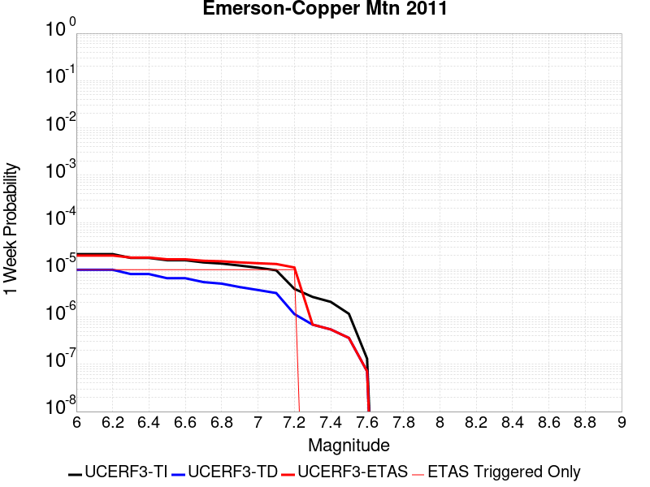 |  |  | 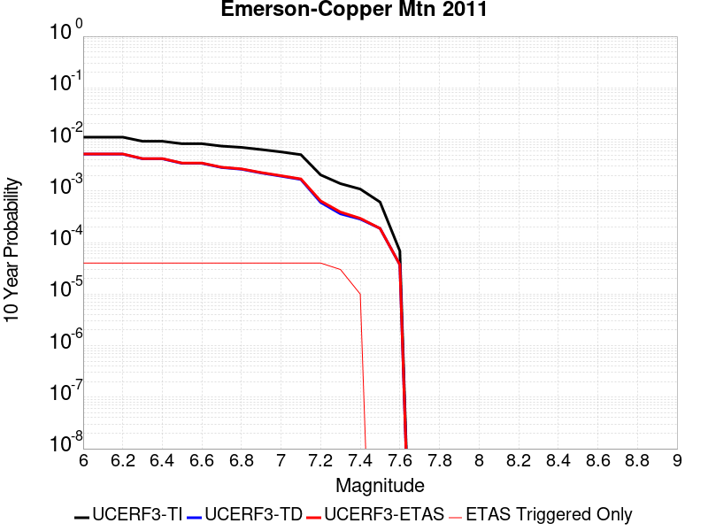 |

| Magnitude | 1 wk TI Prob | 1 wk TD Prob | 1 wk ETAS Prob | 1 wk ETAS/TD Gain | 1 wk ETAS Triggered Only | 1 mo TI Prob | 1 mo TD Prob | 1 mo ETAS Prob | 1 mo ETAS/TD Gain | 1 mo ETAS Triggered Only | 1 yr TI Prob | 1 yr TD Prob | 1 yr ETAS Prob | 1 yr ETAS/TD Gain | 1 yr ETAS Triggered Only | 10 yr TI Prob | 10 yr TD Prob | 10 yr ETAS Prob | 10 yr ETAS/TD Gain | 10 yr ETAS Triggered Only |
|-----|-----|-----|-----|-----|-----|-----|-----|-----|-----|-----|-----|-----|-----|-----|-----|-----|-----|-----|-----|-----|
| 6.0 | 2.1364202E-5 | 9.968114E-6 | 1.9968014E-5 | 2.0031888 | 1.0E-5 | 9.1557646E-5 | 4.2719836E-5 | 5.271941E-5 | 1.2340733 | 1.0E-5 | 0.0011141442 | 5.199986E-4 | 5.299934E-4 | 1.0192208 | 1.0E-5 | 0.011085749 | 0.005188688 | 0.0052284803 | 1.0076691 | 4.0E-5 |
| 6.1 | 2.1364202E-5 | 9.968114E-6 | 1.9968014E-5 | 2.0031888 | 1.0E-5 | 9.1557646E-5 | 4.2719836E-5 | 5.271941E-5 | 1.2340733 | 1.0E-5 | 0.0011141442 | 5.199986E-4 | 5.299934E-4 | 1.0192208 | 1.0E-5 | 0.011085749 | 0.005188688 | 0.0052284803 | 1.0076691 | 4.0E-5 |
| 6.2 | 2.1364202E-5 | 9.968114E-6 | 1.9968014E-5 | 2.0031888 | 1.0E-5 | 9.1557646E-5 | 4.2719836E-5 | 5.271941E-5 | 1.2340733 | 1.0E-5 | 0.0011141442 | 5.199986E-4 | 5.299934E-4 | 1.0192208 | 1.0E-5 | 0.011085749 | 0.005188688 | 0.0052284803 | 1.0076691 | 4.0E-5 |
| 6.3 | 1.7751237E-5 | 8.089227E-6 | 1.8089146E-5 | 2.236202 | 1.0E-5 | 7.607452E-5 | 3.466769E-5 | 4.4667344E-5 | 1.2884431 | 1.0E-5 | 9.258136E-4 | 4.2200365E-4 | 4.3199942E-4 | 1.0236865 | 1.0E-5 | 0.00921966 | 0.0042126453 | 0.004252477 | 1.0094552 | 4.0E-5 |
| 6.4 | 1.7751237E-5 | 8.089227E-6 | 1.8089146E-5 | 2.236202 | 1.0E-5 | 7.607452E-5 | 3.466769E-5 | 4.4667344E-5 | 1.2884431 | 1.0E-5 | 9.258136E-4 | 4.2200365E-4 | 4.3199942E-4 | 1.0236865 | 1.0E-5 | 0.00921966 | 0.0042126453 | 0.004252477 | 1.0094552 | 4.0E-5 |
| 6.5 | 1.5886664E-5 | 6.603819E-6 | 1.6603753E-5 | 2.5142653 | 1.0E-5 | 6.808392E-5 | 2.8301802E-5 | 3.8301518E-5 | 1.3533244 | 1.0E-5 | 8.286065E-4 | 3.4452465E-4 | 3.545212E-4 | 1.0290155 | 1.0E-5 | 0.008255237 | 0.0034403696 | 0.0034802319 | 1.0115867 | 4.0E-5 |
| 6.6 | 1.5886664E-5 | 6.603819E-6 | 1.6603753E-5 | 2.5142653 | 1.0E-5 | 6.808392E-5 | 2.8301802E-5 | 3.8301518E-5 | 1.3533244 | 1.0E-5 | 8.286065E-4 | 3.4452465E-4 | 3.545212E-4 | 1.0290155 | 1.0E-5 | 0.008255237 | 0.0034403696 | 0.0034802319 | 1.0115867 | 4.0E-5 |
| 6.7 | 1.428471E-5 | 5.470403E-6 | 1.5470348E-5 | 2.828009 | 1.0E-5 | 6.121875E-5 | 2.3444394E-5 | 3.344416E-5 | 1.4265312 | 1.0E-5 | 7.450834E-4 | 2.8540206E-4 | 2.953992E-4 | 1.0350283 | 1.0E-5 | 0.007425902 | 0.0028507432 | 0.0028906292 | 1.0139915 | 4.0E-5 |
| 6.8 | 1.3490684E-5 | 5.073699E-6 | 1.5073648E-5 | 2.9709387 | 1.0E-5 | 5.7815934E-5 | 2.1744265E-5 | 3.1744046E-5 | 1.4598814 | 1.0E-5 | 7.0368167E-4 | 2.6470813E-4 | 2.7470547E-4 | 1.0377674 | 1.0E-5 | 0.007014576 | 0.002644309 | 0.0026842032 | 1.0150868 | 4.0E-5 |
| 6.9 | 1.2235421E-5 | 4.289677E-6 | 1.4289634E-5 | 3.331168 | 1.0E-5 | 5.2436466E-5 | 1.838422E-5 | 2.8384036E-5 | 1.5439347 | 1.0E-5 | 6.38227E-4 | 2.238085E-4 | 2.3380626E-4 | 1.044671 | 1.0E-5 | 0.0063639707 | 0.0022361854 | 0.002276096 | 1.0178477 | 4.0E-5 |
| 7.0 | 1.1009851E-5 | 3.7189886E-6 | 1.3718952E-5 | 3.688893 | 1.0E-5 | 4.7184225E-5 | 1.5938444E-5 | 2.5938285E-5 | 1.6274039 | 1.0E-5 | 5.743165E-4 | 1.9403672E-4 | 2.0403478E-4 | 1.0515267 | 1.0E-5 | 0.005728345 | 0.0019390108 | 0.0019789333 | 1.0205891 | 4.0E-5 |
| 7.1 | 9.726373E-6 | 3.2117953E-6 | 1.3211763E-5 | 4.1135135 | 1.0E-5 | 4.168379E-5 | 1.3764783E-5 | 2.3764645E-5 | 1.7264817 | 1.0E-5 | 5.07382E-4 | 1.6757673E-4 | 1.7757504E-4 | 1.0596641 | 1.0E-5 | 0.0050622504 | 0.0016748349 | 0.0017147679 | 1.0238429 | 4.0E-5 |
| 7.2 | 3.9335127E-6 | 1.1524792E-6 | 1.1152468E-5 | 9.676936 | 1.0E-5 | 1.6857803E-5 | 4.9391874E-6 | 1.4939138E-5 | 3.0246146 | 1.0E-5 | 2.0522442E-4 | 6.0133007E-5 | 7.01324E-5 | 1.166288 | 1.0E-5 | 0.00205035 | 6.011733E-4 | 6.4114924E-4 | 1.0664966 | 4.0E-5 |
| 7.3 | 2.661632E-6 | 6.911505E-7 | 6.911505E-7 | 1.0 | 0.0 | 1.14069435E-5 | 2.9620703E-6 | 2.9620703E-6 | 1.0 | 0.0 | 1.3887069E-4 | 3.6062618E-5 | 3.6062618E-5 | 1.0 | 0.0 | 0.0013878393 | 3.605687E-4 | 3.905579E-4 | 1.0831718 | 3.0E-5 |
| 7.4 | 2.0893426E-6 | 5.4618386E-7 | 5.4618386E-7 | 1.0 | 0.0 | 8.954295E-6 | 2.3407858E-6 | 2.3407858E-6 | 1.0 | 0.0 | 1.0901308E-4 | 2.84987E-5 | 2.84987E-5 | 1.0 | 0.0 | 0.0010895962 | 2.84951E-4 | 2.9494814E-4 | 1.0350838 | 1.0E-5 |
| 7.5 | 1.1681728E-6 | 3.6030585E-7 | 3.6030585E-7 | 1.0 | 0.0 | 5.0064455E-6 | 1.544167E-6 | 1.544167E-6 | 1.0 | 0.0 | 6.0951766E-5 | 1.8800076E-5 | 1.8800076E-5 | 1.0 | 0.0 | 6.093505E-4 | 1.8798532E-4 | 1.8798532E-4 | 1.0 | 0.0 |
| 7.6 | 1.3154387E-7 | 7.1197384E-8 | 7.1197384E-8 | 1.0 | 0.0 | 5.6375933E-7 | 3.051316E-7 | 3.051316E-7 | 1.0 | 0.0 | 6.863748E-6 | 3.7149728E-6 | 3.7149728E-6 | 1.0 | 0.0 | 6.863536E-5 | 3.7149264E-5 | 3.7149264E-5 | 1.0 | 0.0 |

## Earthquake Valley
*[(top)](#table-of-contents)*

| 1 Week | 1 Month | 1 Year | 10 Year |
|-----|-----|-----|-----|
| 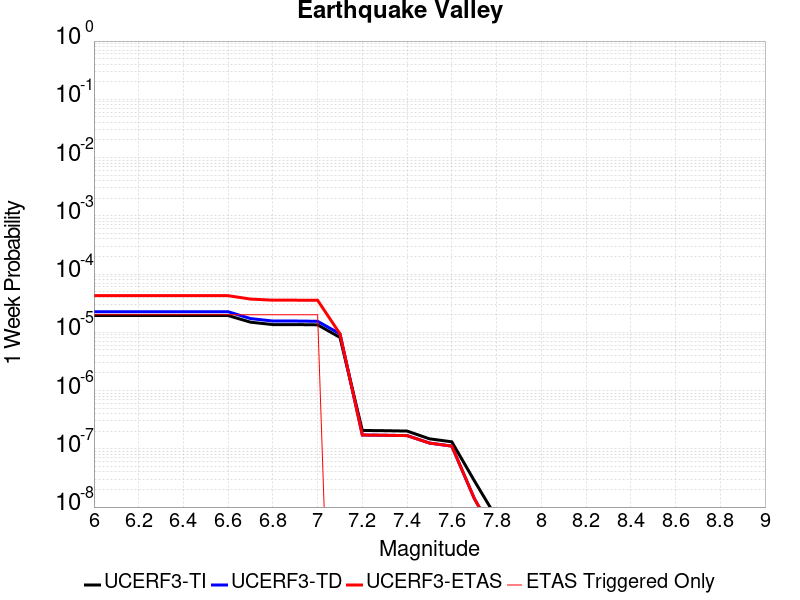 |  |  |  |

| Magnitude | 1 wk TI Prob | 1 wk TD Prob | 1 wk ETAS Prob | 1 wk ETAS/TD Gain | 1 wk ETAS Triggered Only | 1 mo TI Prob | 1 mo TD Prob | 1 mo ETAS Prob | 1 mo ETAS/TD Gain | 1 mo ETAS Triggered Only | 1 yr TI Prob | 1 yr TD Prob | 1 yr ETAS Prob | 1 yr ETAS/TD Gain | 1 yr ETAS Triggered Only | 10 yr TI Prob | 10 yr TD Prob | 10 yr ETAS Prob | 10 yr ETAS/TD Gain | 10 yr ETAS Triggered Only |
|-----|-----|-----|-----|-----|-----|-----|-----|-----|-----|-----|-----|-----|-----|-----|-----|-----|-----|-----|-----|-----|
| 6.0 | 1.9416384E-5 | 2.258408E-5 | 4.2583626E-5 | 1.8855596 | 2.0E-5 | 8.321042E-5 | 9.6785996E-5 | 1.1678406E-4 | 1.2066214 | 2.0E-5 | 0.001012616 | 0.0011778527 | 0.0012078173 | 1.0254401 | 3.0E-5 | 0.010080142 | 0.011727943 | 0.011767474 | 1.0033706 | 4.0E-5 |
| 6.1 | 1.9416384E-5 | 2.258408E-5 | 4.2583626E-5 | 1.8855596 | 2.0E-5 | 8.321042E-5 | 9.6785996E-5 | 1.1678406E-4 | 1.2066214 | 2.0E-5 | 0.001012616 | 0.0011778527 | 0.0012078173 | 1.0254401 | 3.0E-5 | 0.010080142 | 0.011727943 | 0.011767474 | 1.0033706 | 4.0E-5 |
| 6.2 | 1.9416384E-5 | 2.258408E-5 | 4.2583626E-5 | 1.8855596 | 2.0E-5 | 8.321042E-5 | 9.6785996E-5 | 1.1678406E-4 | 1.2066214 | 2.0E-5 | 0.001012616 | 0.0011778527 | 0.0012078173 | 1.0254401 | 3.0E-5 | 0.010080142 | 0.011727943 | 0.011767474 | 1.0033706 | 4.0E-5 |
| 6.3 | 1.9416384E-5 | 2.258408E-5 | 4.2583626E-5 | 1.8855596 | 2.0E-5 | 8.321042E-5 | 9.6785996E-5 | 1.1678406E-4 | 1.2066214 | 2.0E-5 | 0.001012616 | 0.0011778527 | 0.0012078173 | 1.0254401 | 3.0E-5 | 0.010080142 | 0.011727943 | 0.011767474 | 1.0033706 | 4.0E-5 |
| 6.4 | 1.9416384E-5 | 2.258408E-5 | 4.2583626E-5 | 1.8855596 | 2.0E-5 | 8.321042E-5 | 9.6785996E-5 | 1.1678406E-4 | 1.2066214 | 2.0E-5 | 0.001012616 | 0.0011778527 | 0.0012078173 | 1.0254401 | 3.0E-5 | 0.010080142 | 0.011727943 | 0.011767474 | 1.0033706 | 4.0E-5 |
| 6.5 | 1.9389157E-5 | 2.255267E-5 | 4.2552216E-5 | 1.886793 | 2.0E-5 | 8.309374E-5 | 9.665139E-5 | 1.16649455E-4 | 1.2069093 | 2.0E-5 | 0.0010111968 | 0.0011762156 | 0.0012061803 | 1.0254755 | 3.0E-5 | 0.010066078 | 0.011711745 | 0.011751276 | 1.0033754 | 4.0E-5 |
| 6.6 | 1.9389157E-5 | 2.255267E-5 | 4.2552216E-5 | 1.886793 | 2.0E-5 | 8.309374E-5 | 9.665139E-5 | 1.16649455E-4 | 1.2069093 | 2.0E-5 | 0.0010111968 | 0.0011762156 | 0.0012061803 | 1.0254755 | 3.0E-5 | 0.010066078 | 0.011711745 | 0.011751276 | 1.0033754 | 4.0E-5 |
| 6.7 | 1.4925434E-5 | 1.7208227E-5 | 3.7207883E-5 | 2.1622148 | 2.0E-5 | 6.396457E-5 | 7.374794E-5 | 9.3746465E-5 | 1.2711741 | 2.0E-5 | 7.7849044E-4 | 8.9759636E-4 | 9.275694E-4 | 1.0333925 | 3.0E-5 | 0.007757689 | 0.008948085 | 0.008987727 | 1.0044302 | 4.0E-5 |
| 6.8 | 1.3570335E-5 | 1.5616843E-5 | 3.561653E-5 | 2.2806485 | 2.0E-5 | 5.8157282E-5 | 6.692807E-5 | 8.692673E-5 | 1.2988082 | 2.0E-5 | 7.0783484E-4 | 8.1462675E-4 | 8.3461043E-4 | 1.0245311 | 2.0E-5 | 0.0070558446 | 0.008124476 | 0.008154233 | 1.0036626 | 3.0E-5 |
| 6.9 | 1.3570335E-5 | 1.5616843E-5 | 3.561653E-5 | 2.2806485 | 2.0E-5 | 5.8157282E-5 | 6.692807E-5 | 8.692673E-5 | 1.2988082 | 2.0E-5 | 7.0783484E-4 | 8.1462675E-4 | 8.3461043E-4 | 1.0245311 | 2.0E-5 | 0.0070558446 | 0.008124476 | 0.008154233 | 1.0036626 | 3.0E-5 |
| 7.0 | 1.3433392E-5 | 1.5460388E-5 | 3.5460078E-5 | 2.2936087 | 2.0E-5 | 5.757041E-5 | 6.6257584E-5 | 8.625625E-5 | 1.3018322 | 2.0E-5 | 7.0069433E-4 | 8.064695E-4 | 8.2645344E-4 | 1.0247794 | 2.0E-5 | 0.006984891 | 0.008043497 | 0.008073255 | 1.0036998 | 3.0E-5 |
| 7.1 | 8.181609E-6 | 9.416851E-6 | 9.416851E-6 | 1.0 | 0.0 | 3.5063567E-5 | 4.0357685E-5 | 4.0357685E-5 | 1.0 | 0.0 | 4.268153E-4 | 4.9131113E-4 | 4.9131113E-4 | 1.0 | 0.0 | 0.0042599645 | 0.0049088253 | 0.0049088253 | 1.0 | 0.0 |
| 7.2 | 2.0663983E-7 | 1.726294E-7 | 1.726294E-7 | 1.0 | 0.0 | 8.855989E-7 | 7.398401E-7 | 7.398401E-7 | 1.0 | 0.0 | 1.0782113E-5 | 9.00752E-6 | 9.00752E-6 | 1.0 | 0.0 | 1.07815904E-4 | 9.00719E-5 | 9.00719E-5 | 1.0 | 0.0 |
| 7.3 | 2.0462376E-7 | 1.7078433E-7 | 1.7078433E-7 | 1.0 | 0.0 | 8.7695867E-7 | 7.319327E-7 | 7.319327E-7 | 1.0 | 0.0 | 1.0676919E-5 | 8.911247E-6 | 8.911247E-6 | 1.0 | 0.0 | 1.0676406E-4 | 8.910926E-5 | 8.910926E-5 | 1.0 | 0.0 |
| 7.4 | 2.0171088E-7 | 1.6860913E-7 | 1.6860913E-7 | 1.0 | 0.0 | 8.644749E-7 | 7.2261037E-7 | 7.2261037E-7 | 1.0 | 0.0 | 1.0524931E-5 | 8.79775E-6 | 8.79775E-6 | 1.0 | 0.0 | 1.05244326E-4 | 8.7974375E-5 | 8.7974375E-5 | 1.0 | 0.0 |
| 7.5 | 1.4847944E-7 | 1.2559275E-7 | 1.2559275E-7 | 1.0 | 0.0 | 6.363403E-7 | 5.3825454E-7 | 5.3825454E-7 | 1.0 | 0.0 | 7.747416E-6 | 6.5532317E-6 | 6.5532317E-6 | 1.0 | 0.0 | 7.747146E-5 | 6.55306E-5 | 6.55306E-5 | 1.0 | 0.0 |
| 7.6 | 1.3185847E-7 | 1.1123213E-7 | 1.1123213E-7 | 1.0 | 0.0 | 5.6510765E-7 | 4.7670906E-7 | 4.7670906E-7 | 1.0 | 0.0 | 6.8801637E-6 | 5.8039195E-6 | 5.8039195E-6 | 1.0 | 0.0 | 6.8799505E-5 | 5.803789E-5 | 5.803789E-5 | 1.0 | 0.0 |
| 7.7 | 2.8609954E-8 | 1.4170958E-8 | 1.4170958E-8 | 1.0 | 0.0 | 1.2261408E-7 | 6.0732674E-8 | 6.0732674E-8 | 1.0 | 0.0 | 1.4928254E-6 | 7.394201E-7 | 7.394201E-7 | 1.0 | 0.0 | 1.4928154E-5 | 7.394182E-6 | 7.394182E-6 | 1.0 | 0.0 |
| 7.8 | 6.527266E-9 | 2.923417E-9 | 2.923417E-9 | 1.0 | 0.0 | 2.7973995E-8 | 1.2528931E-8 | 1.2528931E-8 | 1.0 | 0.0 | 3.4058334E-7 | 1.5253973E-7 | 1.5253973E-7 | 1.0 | 0.0 | 3.4058282E-6 | 1.5253964E-6 | 1.5253964E-6 | 1.0 | 0.0 |
| 7.9 | 1.2898267E-9 | 7.127684E-10 | 7.127684E-10 | 1.0 | 0.0 | 5.527829E-9 | 3.0547218E-9 | 3.0547218E-9 | 1.0 | 0.0 | 6.7301315E-8 | 3.719124E-8 | 3.719124E-8 | 1.0 | 0.0 | 6.7301295E-7 | 3.719124E-7 | 3.719124E-7 | 1.0 | 0.0 |

## San Gabriel (Extension)
*[(top)](#table-of-contents)*

| 1 Week | 1 Month | 1 Year | 10 Year |
|-----|-----|-----|-----|
|  |  | 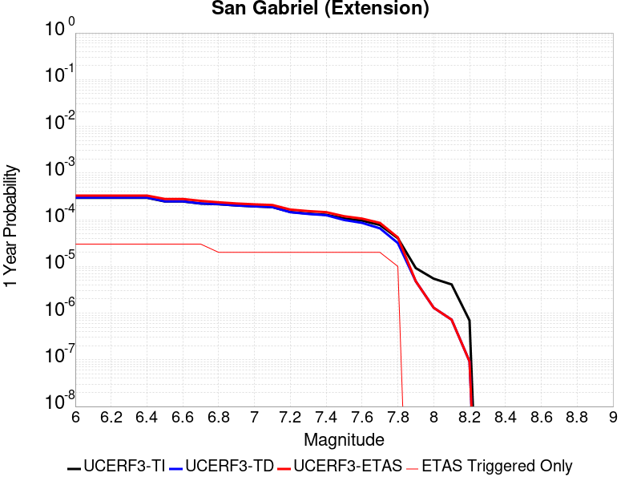 |  |

| Magnitude | 1 wk TI Prob | 1 wk TD Prob | 1 wk ETAS Prob | 1 wk ETAS/TD Gain | 1 wk ETAS Triggered Only | 1 mo TI Prob | 1 mo TD Prob | 1 mo ETAS Prob | 1 mo ETAS/TD Gain | 1 mo ETAS Triggered Only | 1 yr TI Prob | 1 yr TD Prob | 1 yr ETAS Prob | 1 yr ETAS/TD Gain | 1 yr ETAS Triggered Only | 10 yr TI Prob | 10 yr TD Prob | 10 yr ETAS Prob | 10 yr ETAS/TD Gain | 10 yr ETAS Triggered Only |
|-----|-----|-----|-----|-----|-----|-----|-----|-----|-----|-----|-----|-----|-----|-----|-----|-----|-----|-----|-----|-----|
| 6.0 | 5.6486106E-6 | 5.7168304E-6 | 1.5716772E-5 | 2.749211 | 1.0E-5 | 2.4208108E-5 | 2.450048E-5 | 3.4500234E-5 | 1.4081453 | 1.0E-5 | 2.9469383E-4 | 2.9825376E-4 | 3.2824482E-4 | 1.1005555 | 3.0E-5 | 0.0029430336 | 0.0029786653 | 0.0030085759 | 1.0100416 | 3.0E-5 |
| 6.1 | 5.6486106E-6 | 5.7168304E-6 | 1.5716772E-5 | 2.749211 | 1.0E-5 | 2.4208108E-5 | 2.450048E-5 | 3.4500234E-5 | 1.4081453 | 1.0E-5 | 2.9469383E-4 | 2.9825376E-4 | 3.2824482E-4 | 1.1005555 | 3.0E-5 | 0.0029430336 | 0.0029786653 | 0.0030085759 | 1.0100416 | 3.0E-5 |
| 6.2 | 5.6486106E-6 | 5.7168304E-6 | 1.5716772E-5 | 2.749211 | 1.0E-5 | 2.4208108E-5 | 2.450048E-5 | 3.4500234E-5 | 1.4081453 | 1.0E-5 | 2.9469383E-4 | 2.9825376E-4 | 3.2824482E-4 | 1.1005555 | 3.0E-5 | 0.0029430336 | 0.0029786653 | 0.0030085759 | 1.0100416 | 3.0E-5 |
| 6.3 | 5.6486106E-6 | 5.7168304E-6 | 1.5716772E-5 | 2.749211 | 1.0E-5 | 2.4208108E-5 | 2.450048E-5 | 3.4500234E-5 | 1.4081453 | 1.0E-5 | 2.9469383E-4 | 2.9825376E-4 | 3.2824482E-4 | 1.1005555 | 3.0E-5 | 0.0029430336 | 0.0029786653 | 0.0030085759 | 1.0100416 | 3.0E-5 |
| 6.4 | 5.6486106E-6 | 5.7168304E-6 | 1.5716772E-5 | 2.749211 | 1.0E-5 | 2.4208108E-5 | 2.450048E-5 | 3.4500234E-5 | 1.4081453 | 1.0E-5 | 2.9469383E-4 | 2.9825376E-4 | 3.2824482E-4 | 1.1005555 | 3.0E-5 | 0.0029430336 | 0.0029786653 | 0.0030085759 | 1.0100416 | 3.0E-5 |
| 6.5 | 4.7134554E-6 | 4.7542544E-6 | 1.4754207E-5 | 3.1033692 | 1.0E-5 | 2.0200367E-5 | 2.0375222E-5 | 3.0375018E-5 | 1.4907823 | 1.0E-5 | 2.459117E-4 | 2.4804095E-4 | 2.780335E-4 | 1.1209178 | 3.0E-5 | 0.0024563975 | 0.002477729 | 0.0025076547 | 1.0120778 | 3.0E-5 |
| 6.6 | 4.7134554E-6 | 4.7542544E-6 | 1.4754207E-5 | 3.1033692 | 1.0E-5 | 2.0200367E-5 | 2.0375222E-5 | 3.0375018E-5 | 1.4907823 | 1.0E-5 | 2.459117E-4 | 2.4804095E-4 | 2.780335E-4 | 1.1209178 | 3.0E-5 | 0.0024563975 | 0.002477729 | 0.0025076547 | 1.0120778 | 3.0E-5 |
| 6.7 | 4.2468837E-6 | 4.2740717E-6 | 1.4274029E-5 | 3.3396792 | 1.0E-5 | 1.8200803E-5 | 1.8317325E-5 | 2.8317143E-5 | 1.5459212 | 1.0E-5 | 2.2157225E-4 | 2.2299135E-4 | 2.5298467E-4 | 1.1345043 | 3.0E-5 | 0.0022135144 | 0.0022277518 | 0.002257685 | 1.0134364 | 3.0E-5 |
| 6.8 | 4.1180615E-6 | 4.1414614E-6 | 4.1414614E-6 | 1.0 | 0.0 | 1.7648716E-5 | 1.7749004E-5 | 1.7749004E-5 | 1.0 | 0.0 | 2.1485193E-4 | 2.160734E-4 | 2.3606909E-4 | 1.0925411 | 2.0E-5 | 0.0021464431 | 0.0021587082 | 0.002178665 | 1.0092448 | 2.0E-5 |
| 6.9 | 3.863861E-6 | 3.8797766E-6 | 3.8797766E-6 | 1.0 | 0.0 | 1.65593E-5 | 1.6627511E-5 | 1.6627511E-5 | 1.0 | 0.0 | 2.0159081E-4 | 2.0242184E-4 | 2.2241779E-4 | 1.0987836 | 2.0E-5 | 0.0020140803 | 0.002022446 | 0.0020424055 | 1.009869 | 2.0E-5 |
| 7.0 | 3.6947372E-6 | 3.705676E-6 | 3.705676E-6 | 1.0 | 0.0 | 1.5834492E-5 | 1.5881375E-5 | 1.5881375E-5 | 1.0 | 0.0 | 1.9276788E-4 | 1.9333926E-4 | 2.133354E-4 | 1.1034251 | 2.0E-5 | 0.0019260074 | 0.0019317807 | 0.0019517421 | 1.0103332 | 2.0E-5 |
| 7.1 | 3.5686835E-6 | 3.5728963E-6 | 3.5728963E-6 | 1.0 | 0.0 | 1.5294268E-5 | 1.5312327E-5 | 1.5312327E-5 | 1.0 | 0.0 | 1.861918E-4 | 1.8641229E-4 | 2.0640857E-4 | 1.107269 | 2.0E-5 | 0.0018603588 | 0.0018626289 | 0.0018825916 | 1.0107175 | 2.0E-5 |
| 7.2 | 2.8023446E-6 | 2.7767885E-6 | 2.7767885E-6 | 1.0 | 0.0 | 1.2009994E-5 | 1.1900468E-5 | 1.1900468E-5 | 1.0 | 0.0 | 1.4621185E-4 | 1.4487868E-4 | 1.6487578E-4 | 1.1380266 | 2.0E-5 | 0.001461157 | 0.0014478569 | 0.0014678279 | 1.0137935 | 2.0E-5 |
| 7.3 | 2.5843012E-6 | 2.5459642E-6 | 2.5459642E-6 | 1.0 | 0.0 | 1.1075529E-5 | 1.0911231E-5 | 1.0911231E-5 | 1.0 | 0.0 | 1.3483623E-4 | 1.3283623E-4 | 1.5283357E-4 | 1.1505413 | 2.0E-5 | 0.0013475444 | 0.0013275818 | 0.0013475553 | 1.0150449 | 2.0E-5 |
| 7.4 | 2.4464468E-6 | 2.396665E-6 | 2.396665E-6 | 1.0 | 0.0 | 1.04847295E-5 | 1.0271382E-5 | 1.0271382E-5 | 1.0 | 0.0 | 1.276441E-4 | 1.25047E-4 | 1.450445E-4 | 1.1599199 | 2.0E-5 | 0.0012757082 | 0.0012497796 | 0.0012697546 | 1.0159829 | 2.0E-5 |
| 7.5 | 2.0420266E-6 | 1.8910426E-6 | 1.8910426E-6 | 1.0 | 0.0 | 8.751514E-6 | 8.104444E-6 | 8.104444E-6 | 1.0 | 0.0 | 1.0654447E-4 | 9.8667166E-5 | 1.1866519E-4 | 1.2026817 | 2.0E-5 | 0.001064934 | 9.862408E-4 | 0.001006221 | 1.020259 | 2.0E-5 |
| 7.6 | 1.8326596E-6 | 1.6398341E-6 | 1.6398341E-6 | 1.0 | 0.0 | 7.854232E-6 | 7.0278415E-6 | 7.0278415E-6 | 1.0 | 0.0 | 9.562107E-5 | 8.5560634E-5 | 1.05558924E-4 | 1.2337323 | 2.0E-5 | 9.5579936E-4 | 8.5528276E-4 | 8.752657E-4 | 1.0233641 | 2.0E-5 |
| 7.7 | 1.4786998E-6 | 1.2523838E-6 | 1.2523838E-6 | 1.0 | 0.0 | 6.3372695E-6 | 5.367348E-6 | 5.367348E-6 | 1.0 | 0.0 | 7.715353E-5 | 6.534551E-5 | 8.53442E-5 | 1.3060454 | 2.0E-5 | 7.7126746E-4 | 6.532707E-4 | 6.7325763E-4 | 1.0305952 | 2.0E-5 |
| 7.8 | 7.6975533E-7 | 6.0693884E-7 | 6.0693884E-7 | 1.0 | 0.0 | 3.2989474E-6 | 2.601164E-6 | 2.601164E-6 | 1.0 | 0.0 | 4.0163945E-5 | 3.166871E-5 | 4.1668394E-5 | 1.3157591 | 1.0E-5 | 4.0156685E-4 | 3.1664805E-4 | 3.266449E-4 | 1.0315708 | 1.0E-5 |
| 7.9 | 1.7645915E-7 | 9.213256E-8 | 9.213256E-8 | 1.0 | 0.0 | 7.562533E-7 | 3.9485377E-7 | 3.9485377E-7 | 1.0 | 0.0 | 9.207345E-6 | 4.807334E-6 | 4.807334E-6 | 1.0 | 0.0 | 9.206964E-5 | 4.807699E-5 | 4.807699E-5 | 1.0 | 0.0 |
| 8.0 | 1.0463461E-7 | 2.4949307E-8 | 2.4949307E-8 | 1.0 | 0.0 | 4.4843398E-7 | 1.0692559E-7 | 1.0692559E-7 | 1.0 | 0.0 | 5.45967E-6 | 1.3018183E-6 | 1.3018183E-6 | 1.0 | 0.0 | 5.459536E-5 | 1.3022789E-5 | 1.3022789E-5 | 1.0 | 0.0 |
| 8.1 | 7.875717E-8 | 1.3866874E-8 | 1.3866874E-8 | 1.0 | 0.0 | 3.3753068E-7 | 5.942946E-8 | 5.942946E-8 | 1.0 | 0.0 | 4.109428E-6 | 7.235534E-7 | 7.235534E-7 | 1.0 | 0.0 | 4.109352E-5 | 7.2401926E-6 | 7.2401926E-6 | 1.0 | 0.0 |
| 8.2 | 1.33163E-8 | 1.7733891E-9 | 1.7733891E-9 | 1.0 | 0.0 | 5.7069855E-8 | 7.600239E-9 | 7.600239E-9 | 1.0 | 0.0 | 6.9482525E-7 | 9.25329E-8 | 9.25329E-8 | 1.0 | 0.0 | 6.9482307E-6 | 9.272953E-7 | 9.272953E-7 | 1.0 | 0.0 |

## Santa Monica alt 1
*[(top)](#table-of-contents)*

| 1 Week | 1 Month | 1 Year | 10 Year |
|-----|-----|-----|-----|
|  |  | 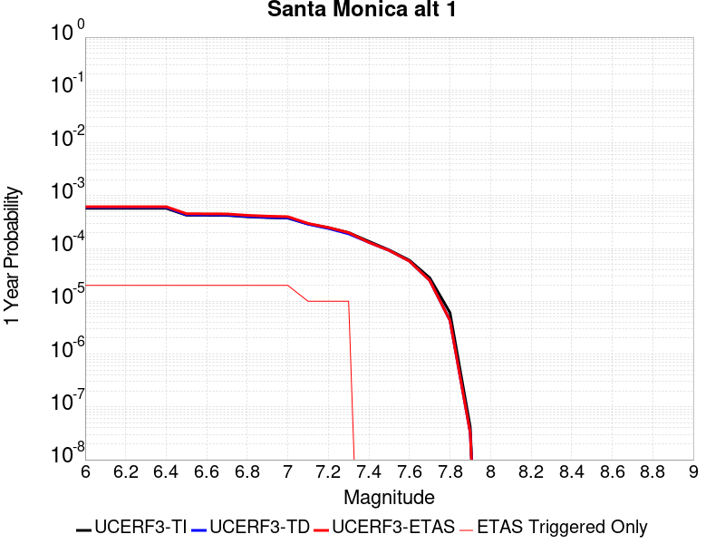 |  |

| Magnitude | 1 wk TI Prob | 1 wk TD Prob | 1 wk ETAS Prob | 1 wk ETAS/TD Gain | 1 wk ETAS Triggered Only | 1 mo TI Prob | 1 mo TD Prob | 1 mo ETAS Prob | 1 mo ETAS/TD Gain | 1 mo ETAS Triggered Only | 1 yr TI Prob | 1 yr TD Prob | 1 yr ETAS Prob | 1 yr ETAS/TD Gain | 1 yr ETAS Triggered Only | 10 yr TI Prob | 10 yr TD Prob | 10 yr ETAS Prob | 10 yr ETAS/TD Gain | 10 yr ETAS Triggered Only |
|-----|-----|-----|-----|-----|-----|-----|-----|-----|-----|-----|-----|-----|-----|-----|-----|-----|-----|-----|-----|-----|
| 6.0 | 1.1066008E-5 | 1.148031E-5 | 1.148031E-5 | 1.0 | 0.0 | 4.742488E-5 | 4.920048E-5 | 4.920048E-5 | 1.0 | 0.0 | 5.7724497E-4 | 5.9886515E-4 | 6.1885314E-4 | 1.0333765 | 2.0E-5 | 0.005757478 | 0.0059739 | 0.0060037207 | 1.0049919 | 3.0E-5 |
| 6.1 | 1.1066008E-5 | 1.148031E-5 | 1.148031E-5 | 1.0 | 0.0 | 4.742488E-5 | 4.920048E-5 | 4.920048E-5 | 1.0 | 0.0 | 5.7724497E-4 | 5.9886515E-4 | 6.1885314E-4 | 1.0333765 | 2.0E-5 | 0.005757478 | 0.0059739 | 0.0060037207 | 1.0049919 | 3.0E-5 |
| 6.2 | 1.1066008E-5 | 1.148031E-5 | 1.148031E-5 | 1.0 | 0.0 | 4.742488E-5 | 4.920048E-5 | 4.920048E-5 | 1.0 | 0.0 | 5.7724497E-4 | 5.9886515E-4 | 6.1885314E-4 | 1.0333765 | 2.0E-5 | 0.005757478 | 0.0059739 | 0.0060037207 | 1.0049919 | 3.0E-5 |
| 6.3 | 1.1066008E-5 | 1.148031E-5 | 1.148031E-5 | 1.0 | 0.0 | 4.742488E-5 | 4.920048E-5 | 4.920048E-5 | 1.0 | 0.0 | 5.7724497E-4 | 5.9886515E-4 | 6.1885314E-4 | 1.0333765 | 2.0E-5 | 0.005757478 | 0.0059739 | 0.0060037207 | 1.0049919 | 3.0E-5 |
| 6.4 | 1.1066008E-5 | 1.148031E-5 | 1.148031E-5 | 1.0 | 0.0 | 4.742488E-5 | 4.920048E-5 | 4.920048E-5 | 1.0 | 0.0 | 5.7724497E-4 | 5.9886515E-4 | 6.1885314E-4 | 1.0333765 | 2.0E-5 | 0.005757478 | 0.0059739 | 0.0060037207 | 1.0049919 | 3.0E-5 |
| 6.5 | 8.183544E-6 | 8.335432E-6 | 8.335432E-6 | 1.0 | 0.0 | 3.5071862E-5 | 3.57228E-5 | 3.57228E-5 | 1.0 | 0.0 | 4.2691626E-4 | 4.3483984E-4 | 4.5483114E-4 | 1.0459739 | 2.0E-5 | 0.0042609703 | 0.0043400554 | 0.0043699252 | 1.0068823 | 3.0E-5 |
| 6.6 | 8.1543285E-6 | 8.303646E-6 | 8.303646E-6 | 1.0 | 0.0 | 3.4946657E-5 | 3.5586578E-5 | 3.5586578E-5 | 1.0 | 0.0 | 4.2539247E-4 | 4.3318202E-4 | 4.5317336E-4 | 1.04615 | 2.0E-5 | 0.0042457907 | 0.004323542 | 0.004353412 | 1.0069088 | 3.0E-5 |
| 6.7 | 8.110878E-6 | 8.257042E-6 | 8.257042E-6 | 1.0 | 0.0 | 3.4760444E-5 | 3.5386853E-5 | 3.5386853E-5 | 1.0 | 0.0 | 4.231262E-4 | 4.3075136E-4 | 4.5074275E-4 | 1.0464104 | 2.0E-5 | 0.0042232145 | 0.0042993296 | 0.0043292004 | 1.0069479 | 3.0E-5 |
| 6.8 | 7.644036E-6 | 7.75106E-6 | 7.75106E-6 | 1.0 | 0.0 | 3.275974E-5 | 3.3218414E-5 | 3.3218414E-5 | 1.0 | 0.0 | 3.9877684E-4 | 4.0436056E-4 | 4.2435247E-4 | 1.0494409 | 2.0E-5 | 0.00398062 | 0.0040363944 | 0.004066273 | 1.0074024 | 3.0E-5 |
| 6.9 | 7.3698293E-6 | 7.455719E-6 | 7.455719E-6 | 1.0 | 0.0 | 3.15846E-5 | 3.19527E-5 | 3.19527E-5 | 1.0 | 0.0 | 3.8447464E-4 | 3.8895605E-4 | 4.0894828E-4 | 1.0513997 | 2.0E-5 | 0.0038381014 | 0.0038828964 | 0.00391278 | 1.0076962 | 3.0E-5 |
| 7.0 | 7.209872E-6 | 7.2856255E-6 | 7.2856255E-6 | 1.0 | 0.0 | 3.0899086E-5 | 3.1223743E-5 | 3.1223743E-5 | 1.0 | 0.0 | 3.7613141E-4 | 3.8008415E-4 | 4.0007656E-4 | 1.0525999 | 2.0E-5 | 0.0037549543 | 0.0037944836 | 0.0038243697 | 1.0078762 | 3.0E-5 |
| 7.1 | 5.603456E-6 | 5.5238925E-6 | 5.5238925E-6 | 1.0 | 0.0 | 2.4014591E-5 | 2.3673612E-5 | 2.3673612E-5 | 1.0 | 0.0 | 2.923384E-4 | 2.881885E-4 | 2.9818562E-4 | 1.0346895 | 1.0E-5 | 0.0029195412 | 0.0028781896 | 0.002898132 | 1.0069288 | 2.0E-5 |
| 7.2 | 4.7483613E-6 | 4.5911324E-6 | 4.5911324E-6 | 1.0 | 0.0 | 2.0349962E-5 | 1.9676136E-5 | 1.9676136E-5 | 1.0 | 0.0 | 2.4773262E-4 | 2.3953074E-4 | 2.4952833E-4 | 1.0417383 | 1.0E-5 | 0.0024745662 | 0.0023927398 | 0.002412692 | 1.0083386 | 2.0E-5 |
| 7.3 | 3.829015E-6 | 3.6342253E-6 | 3.6342253E-6 | 1.0 | 0.0 | 1.6409962E-5 | 1.5575159E-5 | 1.5575159E-5 | 1.0 | 0.0 | 1.9977297E-4 | 1.8961114E-4 | 1.9960925E-4 | 1.0527295 | 1.0E-5 | 0.0019959346 | 0.0018945024 | 0.0019144645 | 1.0105369 | 2.0E-5 |
| 7.4 | 2.610755E-6 | 2.4995716E-6 | 2.4995716E-6 | 1.0 | 0.0 | 1.1188902E-5 | 1.0712406E-5 | 1.0712406E-5 | 1.0 | 0.0 | 1.3621636E-4 | 1.3041578E-4 | 1.3041578E-4 | 1.0 | 0.0 | 0.001361329 | 0.0013033969 | 0.0013133838 | 1.0076623 | 1.0E-5 |
| 7.5 | 1.792146E-6 | 1.7584184E-6 | 1.7584184E-6 | 1.0 | 0.0 | 7.680603E-6 | 7.536057E-6 | 7.536057E-6 | 1.0 | 0.0 | 9.3507326E-5 | 9.1747665E-5 | 9.1747665E-5 | 1.0 | 0.0 | 9.3467993E-4 | 9.1710105E-4 | 9.2709187E-4 | 1.010894 | 1.0E-5 |
| 7.6 | 1.1473018E-6 | 1.1029152E-6 | 1.1029152E-6 | 1.0 | 0.0 | 4.9169985E-6 | 4.726771E-6 | 4.726771E-6 | 1.0 | 0.0 | 5.986281E-5 | 5.7546935E-5 | 5.7546935E-5 | 1.0 | 0.0 | 5.984669E-4 | 5.7532196E-4 | 5.853162E-4 | 1.0173715 | 1.0E-5 |
| 7.7 | 5.330919E-7 | 4.7452556E-7 | 4.7452556E-7 | 1.0 | 0.0 | 2.2846775E-6 | 2.0336795E-6 | 2.0336795E-6 | 1.0 | 0.0 | 2.7815593E-5 | 2.4759778E-5 | 2.4759778E-5 | 1.0 | 0.0 | 2.7812112E-4 | 2.4757133E-4 | 2.4757133E-4 | 1.0 | 0.0 |
| 7.8 | 1.1668574E-7 | 8.2966224E-8 | 8.2966224E-8 | 1.0 | 0.0 | 5.000816E-7 | 3.5556948E-7 | 3.5556948E-7 | 1.0 | 0.0 | 6.0884768E-6 | 4.32905E-6 | 4.32905E-6 | 1.0 | 0.0 | 6.08831E-5 | 4.3289692E-5 | 4.3289692E-5 | 1.0 | 0.0 |
| 7.9 | 8.007447E-10 | 6.1608785E-10 | 6.1608785E-10 | 1.0 | 0.0 | 3.4317629E-9 | 2.6403764E-9 | 2.6403764E-9 | 1.0 | 0.0 | 4.1781714E-8 | 3.2146584E-8 | 3.2146584E-8 | 1.0 | 0.0 | 4.1781706E-7 | 3.214658E-7 | 3.214658E-7 | 1.0 | 0.0 |

## Rinconada 2011 CFM
*[(top)](#table-of-contents)*

| 1 Week | 1 Month | 1 Year | 10 Year |
|-----|-----|-----|-----|
|  |  | 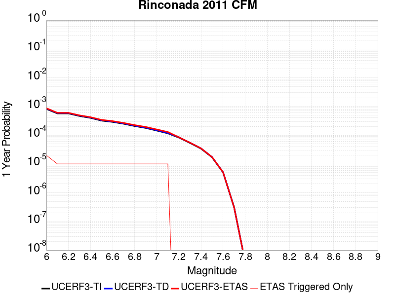 | 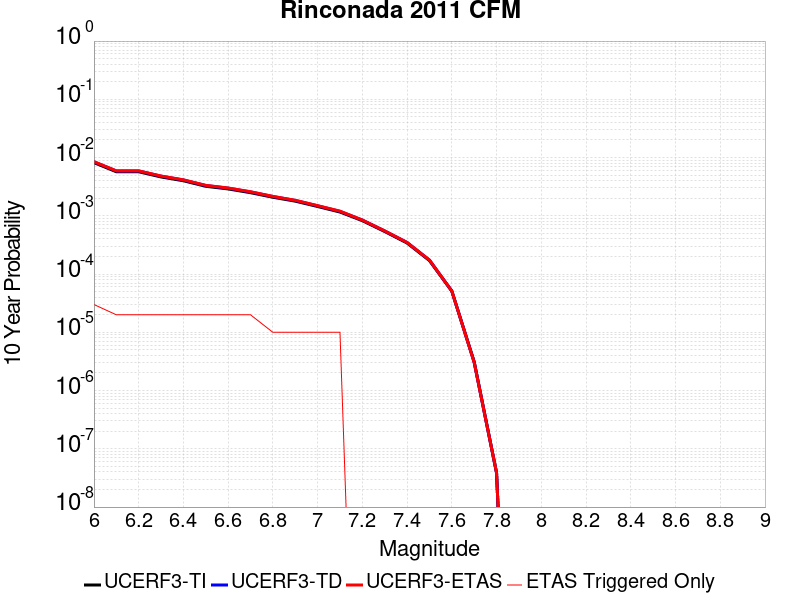 |

| Magnitude | 1 wk TI Prob | 1 wk TD Prob | 1 wk ETAS Prob | 1 wk ETAS/TD Gain | 1 wk ETAS Triggered Only | 1 mo TI Prob | 1 mo TD Prob | 1 mo ETAS Prob | 1 mo ETAS/TD Gain | 1 mo ETAS Triggered Only | 1 yr TI Prob | 1 yr TD Prob | 1 yr ETAS Prob | 1 yr ETAS/TD Gain | 1 yr ETAS Triggered Only | 10 yr TI Prob | 10 yr TD Prob | 10 yr ETAS Prob | 10 yr ETAS/TD Gain | 10 yr ETAS Triggered Only |
|-----|-----|-----|-----|-----|-----|-----|-----|-----|-----|-----|-----|-----|-----|-----|-----|-----|-----|-----|-----|-----|
| 6.0 | 1.5752368E-5 | 1.6274716E-5 | 2.6274553E-5 | 1.6144401 | 1.0E-5 | 6.75084E-5 | 6.974694E-5 | 7.9746234E-5 | 1.1433655 | 1.0E-5 | 8.2160486E-4 | 8.488412E-4 | 8.6882425E-4 | 1.0235416 | 2.0E-5 | 0.008185739 | 0.00845637 | 0.008486116 | 1.0035176 | 3.0E-5 |
| 6.1 | 1.0966133E-5 | 1.1323029E-5 | 1.1323029E-5 | 1.0 | 0.0 | 4.6996865E-5 | 4.852637E-5 | 4.852637E-5 | 1.0 | 0.0 | 5.720366E-4 | 5.906491E-4 | 6.006432E-4 | 1.0169206 | 1.0E-5 | 0.0057056635 | 0.0058908886 | 0.005910771 | 1.003375 | 2.0E-5 |
| 6.2 | 1.0966133E-5 | 1.1323029E-5 | 1.1323029E-5 | 1.0 | 0.0 | 4.6996865E-5 | 4.852637E-5 | 4.852637E-5 | 1.0 | 0.0 | 5.720366E-4 | 5.906491E-4 | 6.006432E-4 | 1.0169206 | 1.0E-5 | 0.0057056635 | 0.0058908886 | 0.005910771 | 1.003375 | 2.0E-5 |
| 6.3 | 8.926149E-6 | 9.212771E-6 | 9.212771E-6 | 1.0 | 0.0 | 3.8254362E-5 | 3.948271E-5 | 3.948271E-5 | 1.0 | 0.0 | 4.6564735E-4 | 4.805963E-4 | 4.905915E-4 | 1.0207975 | 1.0E-5 | 0.0046467283 | 0.0047956146 | 0.0048155184 | 1.0041505 | 2.0E-5 |
| 6.4 | 7.676955E-6 | 7.920191E-6 | 7.920191E-6 | 1.0 | 0.0 | 3.290082E-5 | 3.3943234E-5 | 3.3943234E-5 | 1.0 | 0.0 | 4.0049385E-4 | 4.1318068E-4 | 4.2317656E-4 | 1.0241925 | 1.0E-5 | 0.0039977287 | 0.004124151 | 0.004144069 | 1.0048295 | 2.0E-5 |
| 6.5 | 6.1671026E-6 | 6.3589546E-6 | 6.3589546E-6 | 1.0 | 0.0 | 2.6430173E-5 | 2.725238E-5 | 2.725238E-5 | 1.0 | 0.0 | 3.2173982E-4 | 3.317473E-4 | 3.4174396E-4 | 1.0301335 | 1.0E-5 | 0.003212744 | 0.0033125326 | 0.0033324661 | 1.0060177 | 2.0E-5 |
| 6.6 | 5.553456E-6 | 5.7248126E-6 | 5.7248126E-6 | 1.0 | 0.0 | 2.3800309E-5 | 2.453468E-5 | 2.453468E-5 | 1.0 | 0.0 | 2.897302E-4 | 2.9866883E-4 | 3.0866585E-4 | 1.033472 | 1.0E-5 | 0.0028935277 | 0.002982683 | 0.0030026236 | 1.0066854 | 2.0E-5 |
| 6.7 | 4.787857E-6 | 4.9333094E-6 | 4.9333094E-6 | 1.0 | 0.0 | 2.0519226E-5 | 2.1142583E-5 | 2.1142583E-5 | 1.0 | 0.0 | 2.4979294E-4 | 2.573806E-4 | 2.6737803E-4 | 1.0388429 | 1.0E-5 | 0.0024951235 | 0.0025708308 | 0.0025907794 | 1.0077596 | 2.0E-5 |
| 6.8 | 3.9955166E-6 | 4.1134763E-6 | 4.1134763E-6 | 1.0 | 0.0 | 1.7123532E-5 | 1.7629065E-5 | 1.7629065E-5 | 1.0 | 0.0 | 2.0845905E-4 | 2.1461274E-4 | 2.246106E-4 | 1.0465856 | 1.0E-5 | 0.002082636 | 0.0021440585 | 0.0021540371 | 1.004654 | 1.0E-5 |
| 6.9 | 3.4250072E-6 | 3.5224464E-6 | 3.5224464E-6 | 1.0 | 0.0 | 1.46785205E-5 | 1.5096111E-5 | 1.5096111E-5 | 1.0 | 0.0 | 1.7869633E-4 | 1.8377967E-4 | 1.9377783E-4 | 1.054403 | 1.0E-5 | 0.001785527 | 0.0018362794 | 0.001846261 | 1.0054358 | 1.0E-5 |
| 7.0 | 2.7712713E-6 | 2.8467E-6 | 2.8467E-6 | 1.0 | 0.0 | 1.1876823E-5 | 1.2200086E-5 | 1.2200086E-5 | 1.0 | 0.0 | 1.4459073E-4 | 1.4852593E-4 | 1.5852445E-4 | 1.0673183 | 1.0E-5 | 0.0014449668 | 0.0014842682 | 0.0014942534 | 1.0067273 | 1.0E-5 |
| 7.1 | 2.227358E-6 | 2.2856984E-6 | 2.2856984E-6 | 1.0 | 0.0 | 9.545785E-6 | 9.795814E-6 | 9.795814E-6 | 1.0 | 0.0 | 1.16213734E-4 | 1.19257515E-4 | 1.2925632E-4 | 1.0838422 | 1.0E-5 | 0.0011615298 | 0.0011919362 | 0.0012019243 | 1.0083797 | 1.0E-5 |
| 7.2 | 1.581796E-6 | 1.6209011E-6 | 1.6209011E-6 | 1.0 | 0.0 | 6.779108E-6 | 6.9467005E-6 | 6.9467005E-6 | 1.0 | 0.0 | 8.253252E-5 | 8.457281E-5 | 8.457281E-5 | 1.0 | 0.0 | 8.250187E-4 | 8.454067E-4 | 8.454067E-4 | 1.0 | 0.0 |
| 7.3 | 1.0306567E-6 | 1.0546477E-6 | 1.0546477E-6 | 1.0 | 0.0 | 4.4170924E-6 | 4.519911E-6 | 4.519911E-6 | 1.0 | 0.0 | 5.3776774E-5 | 5.5028526E-5 | 5.5028526E-5 | 1.0 | 0.0 | 5.376376E-4 | 5.5014924E-4 | 5.5014924E-4 | 1.0 | 0.0 |
| 7.4 | 6.535541E-7 | 6.682742E-7 | 6.682742E-7 | 1.0 | 0.0 | 2.800943E-6 | 2.864029E-6 | 2.864029E-6 | 1.0 | 0.0 | 3.4100947E-5 | 3.4868997E-5 | 3.4868997E-5 | 1.0 | 0.0 | 3.4095717E-4 | 3.4863537E-4 | 3.4863537E-4 | 1.0 | 0.0 |
| 7.5 | 3.2656962E-7 | 3.3316687E-7 | 3.3316687E-7 | 1.0 | 0.0 | 1.3995833E-6 | 1.4278572E-6 | 1.4278572E-6 | 1.0 | 0.0 | 1.7039794E-5 | 1.7384024E-5 | 1.7384024E-5 | 1.0 | 0.0 | 1.7038487E-4 | 1.7382667E-4 | 1.7382667E-4 | 1.0 | 0.0 |
| 7.6 | 9.754343E-8 | 9.82099E-8 | 9.82099E-8 | 1.0 | 0.0 | 4.180432E-7 | 4.208995E-7 | 4.208995E-7 | 1.0 | 0.0 | 5.089664E-6 | 5.1244397E-6 | 5.1244397E-6 | 1.0 | 0.0 | 5.0895473E-5 | 5.1243223E-5 | 5.1243223E-5 | 1.0 | 0.0 |
| 7.7 | 6.0001453E-9 | 5.8490435E-9 | 5.8490435E-9 | 1.0 | 0.0 | 2.5714908E-8 | 2.506733E-8 | 2.506733E-8 | 1.0 | 0.0 | 3.1307894E-7 | 3.051947E-7 | 3.051947E-7 | 1.0 | 0.0 | 3.1307852E-6 | 3.051943E-6 | 3.051943E-6 | 1.0 | 0.0 |
| 7.8 | 7.400003E-11 | 7.4654505E-11 | 7.4654505E-11 | 1.0 | 0.0 | 3.171432E-10 | 3.1994773E-10 | 3.1994773E-10 | 1.0 | 0.0 | 3.861218E-9 | 3.895363E-9 | 3.895363E-9 | 1.0 | 0.0 | 3.861218E-8 | 3.895363E-8 | 3.895363E-8 | 1.0 | 0.0 |

## North Frontal  (East)
*[(top)](#table-of-contents)*

| 1 Week | 1 Month | 1 Year | 10 Year |
|-----|-----|-----|-----|
|  |  |  |  |

| Magnitude | 1 wk TI Prob | 1 wk TD Prob | 1 wk ETAS Prob | 1 wk ETAS/TD Gain | 1 wk ETAS Triggered Only | 1 mo TI Prob | 1 mo TD Prob | 1 mo ETAS Prob | 1 mo ETAS/TD Gain | 1 mo ETAS Triggered Only | 1 yr TI Prob | 1 yr TD Prob | 1 yr ETAS Prob | 1 yr ETAS/TD Gain | 1 yr ETAS Triggered Only | 10 yr TI Prob | 10 yr TD Prob | 10 yr ETAS Prob | 10 yr ETAS/TD Gain | 10 yr ETAS Triggered Only |
|-----|-----|-----|-----|-----|-----|-----|-----|-----|-----|-----|-----|-----|-----|-----|-----|-----|-----|-----|-----|-----|
| 6.0 | 7.135738E-6 | 7.4771765E-6 | 2.7477026E-5 | 3.6747863 | 2.0E-5 | 3.0581377E-5 | 3.204476E-5 | 5.204412E-5 | 1.624107 | 2.0E-5 | 3.7226462E-4 | 3.9009505E-4 | 4.2008335E-4 | 1.0768744 | 3.0E-5 | 0.0037164164 | 0.0038960609 | 0.0039259437 | 1.00767 | 3.0E-5 |
| 6.1 | 7.135738E-6 | 7.4771765E-6 | 2.7477026E-5 | 3.6747863 | 2.0E-5 | 3.0581377E-5 | 3.204476E-5 | 5.204412E-5 | 1.624107 | 2.0E-5 | 3.7226462E-4 | 3.9009505E-4 | 4.2008335E-4 | 1.0768744 | 3.0E-5 | 0.0037164164 | 0.0038960609 | 0.0039259437 | 1.00767 | 3.0E-5 |
| 6.2 | 7.135738E-6 | 7.4771765E-6 | 2.7477026E-5 | 3.6747863 | 2.0E-5 | 3.0581377E-5 | 3.204476E-5 | 5.204412E-5 | 1.624107 | 2.0E-5 | 3.7226462E-4 | 3.9009505E-4 | 4.2008335E-4 | 1.0768744 | 3.0E-5 | 0.0037164164 | 0.0038960609 | 0.0039259437 | 1.00767 | 3.0E-5 |
| 6.3 | 7.135738E-6 | 7.4771765E-6 | 2.7477026E-5 | 3.6747863 | 2.0E-5 | 3.0581377E-5 | 3.204476E-5 | 5.204412E-5 | 1.624107 | 2.0E-5 | 3.7226462E-4 | 3.9009505E-4 | 4.2008335E-4 | 1.0768744 | 3.0E-5 | 0.0037164164 | 0.0038960609 | 0.0039259437 | 1.00767 | 3.0E-5 |
| 6.4 | 7.135738E-6 | 7.4771765E-6 | 2.7477026E-5 | 3.6747863 | 2.0E-5 | 3.0581377E-5 | 3.204476E-5 | 5.204412E-5 | 1.624107 | 2.0E-5 | 3.7226462E-4 | 3.9009505E-4 | 4.2008335E-4 | 1.0768744 | 3.0E-5 | 0.0037164164 | 0.0038960609 | 0.0039259437 | 1.00767 | 3.0E-5 |
| 6.5 | 7.135738E-6 | 7.4771765E-6 | 2.7477026E-5 | 3.6747863 | 2.0E-5 | 3.0581377E-5 | 3.204476E-5 | 5.204412E-5 | 1.624107 | 2.0E-5 | 3.7226462E-4 | 3.9009505E-4 | 4.2008335E-4 | 1.0768744 | 3.0E-5 | 0.0037164164 | 0.0038960609 | 0.0039259437 | 1.00767 | 3.0E-5 |
| 6.6 | 7.135738E-6 | 7.4771765E-6 | 2.7477026E-5 | 3.6747863 | 2.0E-5 | 3.0581377E-5 | 3.204476E-5 | 5.204412E-5 | 1.624107 | 2.0E-5 | 3.7226462E-4 | 3.9009505E-4 | 4.2008335E-4 | 1.0768744 | 3.0E-5 | 0.0037164164 | 0.0038960609 | 0.0039259437 | 1.00767 | 3.0E-5 |
| 6.7 | 7.135738E-6 | 7.4771765E-6 | 2.7477026E-5 | 3.6747863 | 2.0E-5 | 3.0581377E-5 | 3.204476E-5 | 5.204412E-5 | 1.624107 | 2.0E-5 | 3.7226462E-4 | 3.9009505E-4 | 4.2008335E-4 | 1.0768744 | 3.0E-5 | 0.0037164164 | 0.0038960609 | 0.0039259437 | 1.00767 | 3.0E-5 |
| 6.8 | 5.959142E-6 | 6.236683E-6 | 2.6236557E-5 | 4.206813 | 2.0E-5 | 2.553893E-5 | 2.6728469E-5 | 4.6727935E-5 | 1.7482458 | 2.0E-5 | 3.108921E-4 | 3.253886E-4 | 3.553788E-4 | 1.0921675 | 3.0E-5 | 0.0031045752 | 0.0032508948 | 0.0032807973 | 1.0091982 | 3.0E-5 |
| 6.9 | 2.2946929E-6 | 2.3824605E-6 | 1.2382437E-5 | 5.1973314 | 1.0E-5 | 9.834361E-6 | 1.0210508E-5 | 2.0210406E-5 | 1.9793732 | 1.0E-5 | 1.1972676E-4 | 1.2430632E-4 | 1.4430382E-4 | 1.1608728 | 2.0E-5 | 0.0011966228 | 0.0012424142 | 0.0012623895 | 1.0160776 | 2.0E-5 |
| 7.0 | 2.2468673E-6 | 2.3321538E-6 | 1.2332131E-5 | 5.287872 | 1.0E-5 | 9.629396E-6 | 9.994909E-6 | 1.999481E-5 | 2.0004992 | 1.0E-5 | 1.1723159E-4 | 1.21681696E-4 | 1.4167927E-4 | 1.1643432 | 2.0E-5 | 0.0011716976 | 0.0012161969 | 0.0012361726 | 1.0164247 | 2.0E-5 |
| 7.1 | 1.9921076E-6 | 2.0646032E-6 | 1.2064583E-5 | 5.843536 | 1.0E-5 | 8.537577E-6 | 8.848272E-6 | 1.8848183E-5 | 2.1301541 | 1.0E-5 | 1.0394004E-4 | 1.0772282E-4 | 1.2772066E-4 | 1.1856416 | 2.0E-5 | 0.0010389143 | 0.0010767487 | 0.0010967272 | 1.0185544 | 2.0E-5 |
| 7.2 | 1.4524545E-6 | 1.5045148E-6 | 1.15044995E-5 | 7.6466513 | 1.0E-5 | 6.2247905E-6 | 6.447906E-6 | 1.6447842E-5 | 2.5508811 | 1.0E-5 | 7.5784184E-5 | 7.850068E-5 | 9.8499106E-5 | 1.2547549 | 2.0E-5 | 7.575835E-4 | 7.8475394E-4 | 8.047382E-4 | 1.0254657 | 2.0E-5 |
| 7.3 | 8.9802575E-7 | 9.3087283E-7 | 1.0930864E-5 | 11.742597 | 1.0E-5 | 3.848676E-6 | 3.9894494E-6 | 1.3989409E-5 | 3.5066016 | 1.0E-5 | 4.685662E-5 | 4.857058E-5 | 6.856961E-5 | 1.4117519 | 2.0E-5 | 4.6846745E-4 | 4.8561094E-4 | 5.0560123E-4 | 1.0411652 | 2.0E-5 |
| 7.4 | 7.776139E-7 | 8.0604747E-7 | 1.0806039E-5 | 13.406207 | 1.0E-5 | 3.3326266E-6 | 3.4544853E-6 | 1.3454451E-5 | 3.8947773 | 1.0E-5 | 4.0573974E-5 | 4.2057654E-5 | 6.205682E-5 | 1.4755176 | 2.0E-5 | 4.0566566E-4 | 4.205077E-4 | 4.404993E-4 | 1.0475415 | 2.0E-5 |
| 7.5 | 5.244417E-7 | 5.441219E-7 | 1.0544117E-5 | 19.378223 | 1.0E-5 | 2.2476054E-6 | 2.3319494E-6 | 1.2331926E-5 | 5.2882476 | 1.0E-5 | 2.7364253E-5 | 2.839118E-5 | 4.839061E-5 | 1.7044241 | 2.0E-5 | 2.7360884E-4 | 2.8388205E-4 | 3.0387638E-4 | 1.0704318 | 2.0E-5 |
| 7.6 | 1.5489647E-7 | 1.6089504E-7 | 1.6089504E-7 | 1.0 | 0.0 | 6.6384183E-7 | 6.895501E-7 | 6.895501E-7 | 1.0 | 0.0 | 8.082245E-6 | 8.395261E-6 | 1.8395176E-5 | 2.1911383 | 1.0E-5 | 8.08195E-5 | 8.395143E-5 | 9.395059E-5 | 1.1191065 | 1.0E-5 |

## Sierra Madre
*[(top)](#table-of-contents)*

| 1 Week | 1 Month | 1 Year | 10 Year |
|-----|-----|-----|-----|
|  |  |  |  |

| Magnitude | 1 wk TI Prob | 1 wk TD Prob | 1 wk ETAS Prob | 1 wk ETAS/TD Gain | 1 wk ETAS Triggered Only | 1 mo TI Prob | 1 mo TD Prob | 1 mo ETAS Prob | 1 mo ETAS/TD Gain | 1 mo ETAS Triggered Only | 1 yr TI Prob | 1 yr TD Prob | 1 yr ETAS Prob | 1 yr ETAS/TD Gain | 1 yr ETAS Triggered Only | 10 yr TI Prob | 10 yr TD Prob | 10 yr ETAS Prob | 10 yr ETAS/TD Gain | 10 yr ETAS Triggered Only |
|-----|-----|-----|-----|-----|-----|-----|-----|-----|-----|-----|-----|-----|-----|-----|-----|-----|-----|-----|-----|-----|
| 6.0 | 1.3379373E-5 | 1.10007395E-5 | 1.10007395E-5 | 1.0 | 0.0 | 5.7338908E-5 | 4.7145186E-5 | 4.7145186E-5 | 1.0 | 0.0 | 6.978776E-4 | 5.738429E-4 | 6.038257E-4 | 1.0522491 | 3.0E-5 | 0.0069569005 | 0.0057239756 | 0.005753804 | 1.0052111 | 3.0E-5 |
| 6.1 | 1.3379373E-5 | 1.10007395E-5 | 1.10007395E-5 | 1.0 | 0.0 | 5.7338908E-5 | 4.7145186E-5 | 4.7145186E-5 | 1.0 | 0.0 | 6.978776E-4 | 5.738429E-4 | 6.038257E-4 | 1.0522491 | 3.0E-5 | 0.0069569005 | 0.0057239756 | 0.005753804 | 1.0052111 | 3.0E-5 |
| 6.2 | 1.3379373E-5 | 1.10007395E-5 | 1.10007395E-5 | 1.0 | 0.0 | 5.7338908E-5 | 4.7145186E-5 | 4.7145186E-5 | 1.0 | 0.0 | 6.978776E-4 | 5.738429E-4 | 6.038257E-4 | 1.0522491 | 3.0E-5 | 0.0069569005 | 0.0057239756 | 0.005753804 | 1.0052111 | 3.0E-5 |
| 6.3 | 1.3379373E-5 | 1.10007395E-5 | 1.10007395E-5 | 1.0 | 0.0 | 5.7338908E-5 | 4.7145186E-5 | 4.7145186E-5 | 1.0 | 0.0 | 6.978776E-4 | 5.738429E-4 | 6.038257E-4 | 1.0522491 | 3.0E-5 | 0.0069569005 | 0.0057239756 | 0.005753804 | 1.0052111 | 3.0E-5 |
| 6.4 | 1.3379373E-5 | 1.10007395E-5 | 1.10007395E-5 | 1.0 | 0.0 | 5.7338908E-5 | 4.7145186E-5 | 4.7145186E-5 | 1.0 | 0.0 | 6.978776E-4 | 5.738429E-4 | 6.038257E-4 | 1.0522491 | 3.0E-5 | 0.0069569005 | 0.0057239756 | 0.005753804 | 1.0052111 | 3.0E-5 |
| 6.5 | 1.26563245E-5 | 1.0230196E-5 | 1.0230196E-5 | 1.0 | 0.0 | 5.4240263E-5 | 4.3842967E-5 | 4.3842967E-5 | 1.0 | 0.0 | 6.601751E-4 | 5.336584E-4 | 5.636424E-4 | 1.0561857 | 3.0E-5 | 0.006582173 | 0.0053240913 | 0.0053539313 | 1.0056047 | 3.0E-5 |
| 6.6 | 1.26563245E-5 | 1.0230196E-5 | 1.0230196E-5 | 1.0 | 0.0 | 5.4240263E-5 | 4.3842967E-5 | 4.3842967E-5 | 1.0 | 0.0 | 6.601751E-4 | 5.336584E-4 | 5.636424E-4 | 1.0561857 | 3.0E-5 | 0.006582173 | 0.0053240913 | 0.0053539313 | 1.0056047 | 3.0E-5 |
| 6.7 | 1.2502474E-5 | 1.006634E-5 | 1.006634E-5 | 1.0 | 0.0 | 5.3580934E-5 | 4.314075E-5 | 4.314075E-5 | 1.0 | 0.0 | 6.521526E-4 | 5.251131E-4 | 5.5509736E-4 | 1.0571005 | 3.0E-5 | 0.0065024206 | 0.0052390425 | 0.0052688853 | 1.0056963 | 3.0E-5 |
| 6.8 | 1.2454966E-5 | 1.0018625E-5 | 1.0018625E-5 | 1.0 | 0.0 | 5.3377335E-5 | 4.2936266E-5 | 4.2936266E-5 | 1.0 | 0.0 | 6.4967526E-4 | 5.226247E-4 | 5.5260904E-4 | 1.0573726 | 3.0E-5 | 0.006477792 | 0.0052142753 | 0.005244119 | 1.0057235 | 3.0E-5 |
| 6.9 | 1.2225574E-5 | 9.792602E-6 | 9.792602E-6 | 1.0 | 0.0 | 5.2394265E-5 | 4.1967625E-5 | 4.1967625E-5 | 1.0 | 0.0 | 6.3771347E-4 | 5.108371E-4 | 5.4082175E-4 | 1.0586971 | 3.0E-5 | 0.006358865 | 0.0050969445 | 0.0051267915 | 1.0058559 | 3.0E-5 |
| 7.0 | 1.182946E-5 | 9.399144E-6 | 9.399144E-6 | 1.0 | 0.0 | 5.06967E-5 | 4.0281426E-5 | 4.0281426E-5 | 1.0 | 0.0 | 6.1705755E-4 | 4.9031706E-4 | 5.2030233E-4 | 1.0611548 | 3.0E-5 | 0.006153469 | 0.004892664 | 0.004922517 | 1.0061016 | 3.0E-5 |
| 7.1 | 1.14369095E-5 | 8.986159E-6 | 8.986159E-6 | 1.0 | 0.0 | 4.9014405E-5 | 3.8511545E-5 | 3.8511545E-5 | 1.0 | 0.0 | 5.9658696E-4 | 4.687782E-4 | 4.987641E-4 | 1.0639662 | 3.0E-5 | 0.005949879 | 0.004678199 | 0.0047080587 | 1.0063827 | 3.0E-5 |
| 7.2 | 1.0836419E-5 | 8.3995565E-6 | 8.3995565E-6 | 1.0 | 0.0 | 4.644097E-5 | 3.5997607E-5 | 3.5997607E-5 | 1.0 | 0.0 | 5.652721E-4 | 4.3818366E-4 | 4.581749E-4 | 1.045623 | 2.0E-5 | 0.0056383642 | 0.004373494 | 0.0043934067 | 1.004553 | 2.0E-5 |
| 7.3 | 1.0403439E-5 | 8.02082E-6 | 8.02082E-6 | 1.0 | 0.0 | 4.4585406E-5 | 3.4374494E-5 | 3.4374494E-5 | 1.0 | 0.0 | 5.426921E-4 | 4.1843E-4 | 4.3842164E-4 | 1.0477778 | 2.0E-5 | 0.005413687 | 0.004176717 | 0.0041966336 | 1.0047685 | 2.0E-5 |
| 7.4 | 9.768864E-6 | 7.414448E-6 | 7.414448E-6 | 1.0 | 0.0 | 4.186589E-5 | 3.1775824E-5 | 3.1775824E-5 | 1.0 | 0.0 | 5.09598E-4 | 3.868029E-4 | 4.0679515E-4 | 1.0516859 | 2.0E-5 | 0.0050843097 | 0.0038615882 | 0.003881511 | 1.0051593 | 2.0E-5 |
| 7.5 | 8.687089E-6 | 6.4501564E-6 | 6.4501564E-6 | 1.0 | 0.0 | 3.722985E-5 | 2.764324E-5 | 2.764324E-5 | 1.0 | 0.0 | 4.5317915E-4 | 3.3650533E-4 | 3.564986E-4 | 1.0594144 | 2.0E-5 | 0.004522561 | 0.0033602451 | 0.003380178 | 1.005932 | 2.0E-5 |
| 7.6 | 6.3506063E-6 | 4.4303215E-6 | 4.4303215E-6 | 1.0 | 0.0 | 2.72166E-5 | 1.8986955E-5 | 1.8986955E-5 | 1.0 | 0.0 | 3.3131172E-4 | 2.3114192E-4 | 2.511373E-4 | 1.086507 | 2.0E-5 | 0.003308182 | 0.0023092402 | 0.002329194 | 1.0086409 | 2.0E-5 |
| 7.7 | 4.62223E-6 | 2.932967E-6 | 2.932967E-6 | 1.0 | 0.0 | 1.9809406E-5 | 1.2569798E-5 | 1.2569798E-5 | 1.0 | 0.0 | 2.4115283E-4 | 1.5302657E-4 | 1.6302503E-4 | 1.0653381 | 1.0E-5 | 0.0024089129 | 0.001529413 | 0.0015393978 | 1.0065285 | 1.0E-5 |
| 7.8 | 3.2145008E-6 | 1.9494332E-6 | 1.9494332E-6 | 1.0 | 0.0 | 1.3776359E-5 | 8.3546865E-6 | 8.3546865E-6 | 1.0 | 0.0 | 1.6771426E-4 | 1.0171358E-4 | 1.1171256E-4 | 1.0983053 | 1.0E-5 | 0.0016758774 | 0.0010168145 | 0.0010268043 | 1.0098246 | 1.0E-5 |
| 7.9 | 1.0391769E-6 | 5.6026335E-7 | 5.6026335E-7 | 1.0 | 0.0 | 4.4536077E-6 | 2.4011265E-6 | 2.4011265E-6 | 1.0 | 0.0 | 5.4221324E-5 | 2.9233326E-5 | 3.9233033E-5 | 1.3420653 | 1.0E-5 | 5.4208096E-4 | 2.9229524E-4 | 3.0229232E-4 | 1.034202 | 1.0E-5 |
| 8.0 | 1.210983E-7 | 6.613821E-8 | 6.613821E-8 | 1.0 | 0.0 | 5.1899264E-7 | 2.8344945E-7 | 2.8344945E-7 | 1.0 | 0.0 | 6.3187167E-6 | 3.4509917E-6 | 3.4509917E-6 | 1.0 | 0.0 | 6.318537E-5 | 3.45094E-5 | 3.45094E-5 | 1.0 | 0.0 |

## San Andreas (Santa Cruz Mts) 2011 CFM
*[(top)](#table-of-contents)*

| 1 Week | 1 Month | 1 Year | 10 Year |
|-----|-----|-----|-----|
|  |  |  |  |

| Magnitude | 1 wk TI Prob | 1 wk TD Prob | 1 wk ETAS Prob | 1 wk ETAS/TD Gain | 1 wk ETAS Triggered Only | 1 mo TI Prob | 1 mo TD Prob | 1 mo ETAS Prob | 1 mo ETAS/TD Gain | 1 mo ETAS Triggered Only | 1 yr TI Prob | 1 yr TD Prob | 1 yr ETAS Prob | 1 yr ETAS/TD Gain | 1 yr ETAS Triggered Only | 10 yr TI Prob | 10 yr TD Prob | 10 yr ETAS Prob | 10 yr ETAS/TD Gain | 10 yr ETAS Triggered Only |
|-----|-----|-----|-----|-----|-----|-----|-----|-----|-----|-----|-----|-----|-----|-----|-----|-----|-----|-----|-----|-----|
| 6.0 | 1.7221631E-4 | 1.3793171E-4 | 1.3793171E-4 | 1.0 | 0.0 | 7.378611E-4 | 5.9100403E-4 | 6.009981E-4 | 1.0169103 | 1.0E-5 | 0.008946515 | 0.007172124 | 0.0072019086 | 1.0041529 | 3.0E-5 | 0.08594794 | 0.0705551 | 0.07058298 | 1.0003952 | 3.0E-5 |
| 6.1 | 1.7221631E-4 | 1.3793171E-4 | 1.3793171E-4 | 1.0 | 0.0 | 7.378611E-4 | 5.9100403E-4 | 6.009981E-4 | 1.0169103 | 1.0E-5 | 0.008946515 | 0.007172124 | 0.0072019086 | 1.0041529 | 3.0E-5 | 0.08594794 | 0.0705551 | 0.07058298 | 1.0003952 | 3.0E-5 |
| 6.2 | 1.7221631E-4 | 1.3793171E-4 | 1.3793171E-4 | 1.0 | 0.0 | 7.378611E-4 | 5.9100403E-4 | 6.009981E-4 | 1.0169103 | 1.0E-5 | 0.008946515 | 0.007172124 | 0.0072019086 | 1.0041529 | 3.0E-5 | 0.08594794 | 0.0705551 | 0.07058298 | 1.0003952 | 3.0E-5 |
| 6.3 | 1.716926E-4 | 1.3712609E-4 | 1.3712609E-4 | 1.0 | 0.0 | 7.3561794E-4 | 5.875529E-4 | 5.97547E-4 | 1.0170097 | 1.0E-5 | 0.008919428 | 0.0071303817 | 0.0071601677 | 1.0041773 | 3.0E-5 | 0.08569809 | 0.070167266 | 0.07019516 | 1.0003976 | 3.0E-5 |
| 6.4 | 1.6392978E-4 | 1.3588481E-4 | 1.3588481E-4 | 1.0 | 0.0 | 7.02367E-4 | 5.822355E-4 | 5.922297E-4 | 1.0171652 | 1.0E-5 | 0.008517839 | 0.007066063 | 0.007095851 | 1.0042156 | 3.0E-5 | 0.08198654 | 0.06940135 | 0.06942927 | 1.0004022 | 3.0E-5 |
| 6.5 | 1.5742714E-4 | 1.2648388E-4 | 1.2648388E-4 | 1.0 | 0.0 | 6.745133E-4 | 5.4196286E-4 | 5.519574E-4 | 1.0184414 | 1.0E-5 | 0.00818132 | 0.0065787593 | 0.0066085616 | 1.0045301 | 3.0E-5 | 0.078865945 | 0.06486309 | 0.06489115 | 1.0004325 | 3.0E-5 |
| 6.6 | 1.3038084E-4 | 1.1588213E-4 | 1.1588213E-4 | 1.0 | 0.0 | 5.5865536E-4 | 4.9654447E-4 | 5.065395E-4 | 1.0201292 | 1.0E-5 | 0.006780438 | 0.0060289134 | 0.0060587325 | 1.004946 | 3.0E-5 | 0.0657725 | 0.05932738 | 0.059355598 | 1.0004756 | 3.0E-5 |
| 6.7 | 1.2867592E-4 | 1.1314701E-4 | 1.1314701E-4 | 1.0 | 0.0 | 5.5135164E-4 | 4.8482692E-4 | 4.9482204E-4 | 1.0206159 | 1.0E-5 | 0.0066920654 | 0.00588703 | 0.005916854 | 1.0050659 | 3.0E-5 | 0.06494093 | 0.058038417 | 0.058066677 | 1.0004869 | 3.0E-5 |
| 6.8 | 1.2801298E-4 | 1.1252261E-4 | 1.1252261E-4 | 1.0 | 0.0 | 5.485117E-4 | 4.8215193E-4 | 4.921471E-4 | 1.0207304 | 1.0E-5 | 0.0066577005 | 0.0058546383 | 0.0058844625 | 1.0050942 | 3.0E-5 | 0.06461738 | 0.057752274 | 0.057780538 | 1.0004895 | 3.0E-5 |
| 6.9 | 1.269149E-4 | 1.1094465E-4 | 1.1094465E-4 | 1.0 | 0.0 | 5.4380763E-4 | 4.7539172E-4 | 4.8538696E-4 | 1.0210253 | 1.0E-5 | 0.006600777 | 0.005772772 | 0.005802599 | 1.0051668 | 3.0E-5 | 0.06408122 | 0.0570241 | 0.057052385 | 1.0004961 | 3.0E-5 |
| 7.0 | 1.2030331E-4 | 1.0824504E-4 | 1.0824504E-4 | 1.0 | 0.0 | 5.154837E-4 | 4.638261E-4 | 4.7382145E-4 | 1.0215498 | 1.0E-5 | 0.006257969 | 0.0056326967 | 0.0056625274 | 1.005296 | 3.0E-5 | 0.06084648 | 0.055696685 | 0.055725016 | 1.0005087 | 3.0E-5 |
| 7.1 | 8.049617E-5 | 5.3926604E-5 | 5.3926604E-5 | 1.0 | 0.0 | 3.4493793E-4 | 2.3109373E-4 | 2.4109142E-4 | 1.0432625 | 1.0E-5 | 0.0041915346 | 0.0028099709 | 0.0028398866 | 1.0106462 | 3.0E-5 | 0.041133516 | 0.029618956 | 0.029648067 | 1.0009829 | 3.0E-5 |
| 7.2 | 7.093979E-5 | 4.2937932E-5 | 4.2937932E-5 | 1.0 | 0.0 | 3.0399222E-4 | 1.8400686E-4 | 1.9400501E-4 | 1.0543358 | 1.0E-5 | 0.0036948253 | 0.0022380045 | 0.0022679374 | 1.0133748 | 3.0E-5 | 0.03633994 | 0.023941692 | 0.023970973 | 1.0012231 | 3.0E-5 |
| 7.3 | 6.193693E-5 | 2.8894141E-5 | 2.8894141E-5 | 1.0 | 0.0 | 2.6541698E-4 | 1.2382616E-4 | 1.3382493E-4 | 1.0807483 | 1.0E-5 | 0.0032266637 | 0.0015065427 | 0.0015364975 | 1.0198832 | 3.0E-5 | 0.031802133 | 0.016499156 | 0.01652866 | 1.0017883 | 3.0E-5 |
| 7.4 | 5.906492E-5 | 2.702346E-5 | 2.702346E-5 | 1.0 | 0.0 | 2.5311083E-4 | 1.1580969E-4 | 1.2580854E-4 | 1.0863385 | 1.0E-5 | 0.0030772698 | 0.0014090725 | 0.0014390303 | 1.0212606 | 3.0E-5 | 0.030350044 | 0.015471023 | 0.015500559 | 1.0019091 | 3.0E-5 |
| 7.5 | 5.424296E-5 | 2.4678277E-5 | 2.4678277E-5 | 1.0 | 0.0 | 2.324491E-4 | 1.05759755E-4 | 1.157587E-4 | 1.0945439 | 1.0E-5 | 0.002826395 | 0.0012868657 | 0.001316827 | 1.0232824 | 3.0E-5 | 0.027907165 | 0.014163188 | 0.014192763 | 1.0020882 | 3.0E-5 |
| 7.6 | 4.43084E-5 | 1.990431E-5 | 1.990431E-5 | 1.0 | 0.0 | 1.8987931E-4 | 8.53014E-5 | 9.5300544E-5 | 1.1172214 | 1.0E-5 | 0.0023093296 | 0.0010380499 | 0.0010680188 | 1.0288703 | 3.0E-5 | 0.022854783 | 0.011412679 | 0.011442337 | 1.0025986 | 3.0E-5 |
| 7.7 | 4.118098E-5 | 1.8936442E-5 | 1.8936442E-5 | 1.0 | 0.0 | 1.7647797E-4 | 8.115366E-5 | 9.115285E-5 | 1.123213 | 1.0E-5 | 0.002146502 | 9.875982E-4 | 0.0010175685 | 1.0303468 | 3.0E-5 | 0.021258866 | 0.010870468 | 0.010900142 | 1.0027298 | 3.0E-5 |
| 7.8 | 3.5408906E-5 | 1.856446E-5 | 1.856446E-5 | 1.0 | 0.0 | 1.5174363E-4 | 7.955955E-5 | 8.955875E-5 | 1.125682 | 1.0E-5 | 0.0018459131 | 9.682073E-4 | 9.981783E-4 | 1.0309551 | 3.0E-5 | 0.018306552 | 0.010652021 | 0.010681701 | 1.0027864 | 3.0E-5 |
| 7.9 | 2.5860836E-5 | 1.7315993E-5 | 1.7315993E-5 | 1.0 | 0.0 | 1.10827445E-4 | 7.420929E-5 | 8.420855E-5 | 1.134744 | 1.0E-5 | 0.001348489 | 9.031238E-4 | 9.3309674E-4 | 1.033188 | 3.0E-5 | 0.013403354 | 0.009907599 | 0.009937301 | 1.002998 | 3.0E-5 |
| 8.0 | 1.9777332E-5 | 1.4839596E-5 | 1.4839596E-5 | 1.0 | 0.0 | 8.4757245E-5 | 6.3596715E-5 | 7.3596086E-5 | 1.1572309 | 1.0E-5 | 0.0010314309 | 7.740152E-4 | 8.03992E-4 | 1.038729 | 3.0E-5 | 0.010266567 | 0.008508967 | 0.008538713 | 1.0034957 | 3.0E-5 |
| 8.1 | 1.468494E-5 | 1.2107374E-5 | 1.2107374E-5 | 1.0 | 0.0 | 6.293394E-5 | 5.1887713E-5 | 6.188719E-5 | 1.1927139 | 1.0E-5 | 7.6595135E-4 | 6.3155E-4 | 6.6153106E-4 | 1.0474721 | 3.0E-5 | 0.0076331664 | 0.006969149 | 0.00699894 | 1.0042747 | 3.0E-5 |
| 8.2 | 8.63836E-6 | 5.469061E-6 | 5.469061E-6 | 1.0 | 0.0 | 3.7021015E-5 | 2.3438623E-5 | 2.3438623E-5 | 1.0 | 0.0 | 4.5063766E-4 | 2.8532793E-4 | 2.953251E-4 | 1.0350374 | 1.0E-5 | 0.004497249 | 0.00324569 | 0.0032556574 | 1.003071 | 1.0E-5 |
| 8.3 | 1.983087E-6 | 7.6599065E-7 | 7.6599065E-7 | 1.0 | 0.0 | 8.498917E-6 | 3.282813E-6 | 3.282813E-6 | 1.0 | 0.0 | 1.034694E-4 | 3.9967534E-5 | 4.9967133E-5 | 1.2501931 | 1.0E-5 | 0.0010342124 | 4.719687E-4 | 4.8196397E-4 | 1.0211779 | 1.0E-5 |

## San Luis Range 2011 CFM
*[(top)](#table-of-contents)*

| 1 Week | 1 Month | 1 Year | 10 Year |
|-----|-----|-----|-----|
|  |  |  |  |

| Magnitude | 1 wk TI Prob | 1 wk TD Prob | 1 wk ETAS Prob | 1 wk ETAS/TD Gain | 1 wk ETAS Triggered Only | 1 mo TI Prob | 1 mo TD Prob | 1 mo ETAS Prob | 1 mo ETAS/TD Gain | 1 mo ETAS Triggered Only | 1 yr TI Prob | 1 yr TD Prob | 1 yr ETAS Prob | 1 yr ETAS/TD Gain | 1 yr ETAS Triggered Only | 10 yr TI Prob | 10 yr TD Prob | 10 yr ETAS Prob | 10 yr ETAS/TD Gain | 10 yr ETAS Triggered Only |
|-----|-----|-----|-----|-----|-----|-----|-----|-----|-----|-----|-----|-----|-----|-----|-----|-----|-----|-----|-----|-----|
| 6.0 | 8.8368415E-6 | 8.965454E-6 | 1.8965364E-5 | 2.1153824 | 1.0E-5 | 3.787163E-5 | 3.842285E-5 | 4.8422466E-5 | 1.2602518 | 1.0E-5 | 4.609895E-4 | 4.677057E-4 | 4.8769635E-4 | 1.0427419 | 2.0E-5 | 0.0046003438 | 0.0046679964 | 0.004697856 | 1.0063968 | 3.0E-5 |
| 6.1 | 8.8368415E-6 | 8.965454E-6 | 1.8965364E-5 | 2.1153824 | 1.0E-5 | 3.787163E-5 | 3.842285E-5 | 4.8422466E-5 | 1.2602518 | 1.0E-5 | 4.609895E-4 | 4.677057E-4 | 4.8769635E-4 | 1.0427419 | 2.0E-5 | 0.0046003438 | 0.0046679964 | 0.004697856 | 1.0063968 | 3.0E-5 |
| 6.2 | 8.8368415E-6 | 8.965454E-6 | 1.8965364E-5 | 2.1153824 | 1.0E-5 | 3.787163E-5 | 3.842285E-5 | 4.8422466E-5 | 1.2602518 | 1.0E-5 | 4.609895E-4 | 4.677057E-4 | 4.8769635E-4 | 1.0427419 | 2.0E-5 | 0.0046003438 | 0.0046679964 | 0.004697856 | 1.0063968 | 3.0E-5 |
| 6.3 | 8.8368415E-6 | 8.965454E-6 | 1.8965364E-5 | 2.1153824 | 1.0E-5 | 3.787163E-5 | 3.842285E-5 | 4.8422466E-5 | 1.2602518 | 1.0E-5 | 4.609895E-4 | 4.677057E-4 | 4.8769635E-4 | 1.0427419 | 2.0E-5 | 0.0046003438 | 0.0046679964 | 0.004697856 | 1.0063968 | 3.0E-5 |
| 6.4 | 3.9094193E-6 | 3.9412025E-6 | 3.9412025E-6 | 1.0 | 0.0 | 1.6754546E-5 | 1.689076E-5 | 1.689076E-5 | 1.0 | 0.0 | 2.039675E-4 | 2.056259E-4 | 2.056259E-4 | 1.0 | 0.0 | 0.0020378039 | 0.0020543851 | 0.0020543851 | 1.0 | 0.0 |
| 6.5 | 3.9094193E-6 | 3.9412025E-6 | 3.9412025E-6 | 1.0 | 0.0 | 1.6754546E-5 | 1.689076E-5 | 1.689076E-5 | 1.0 | 0.0 | 2.039675E-4 | 2.056259E-4 | 2.056259E-4 | 1.0 | 0.0 | 0.0020378039 | 0.0020543851 | 0.0020543851 | 1.0 | 0.0 |
| 6.6 | 3.0587726E-6 | 3.0753883E-6 | 3.0753883E-6 | 1.0 | 0.0 | 1.3108959E-5 | 1.318017E-5 | 1.318017E-5 | 1.0 | 0.0 | 1.595899E-4 | 1.6045687E-4 | 1.6045687E-4 | 1.0 | 0.0 | 0.0015947534 | 0.0016034221 | 0.0016034221 | 1.0 | 0.0 |
| 6.7 | 2.6160574E-6 | 2.6251273E-6 | 2.6251273E-6 | 1.0 | 0.0 | 1.1211626E-5 | 1.1250498E-5 | 1.1250498E-5 | 1.0 | 0.0 | 1.3649299E-4 | 1.3696625E-4 | 1.3696625E-4 | 1.0 | 0.0 | 0.0013640919 | 0.0013688246 | 0.0013688246 | 1.0 | 0.0 |
| 6.8 | 2.5110312E-6 | 2.51814E-6 | 2.51814E-6 | 1.0 | 0.0 | 1.0761518E-5 | 1.0791985E-5 | 1.0791985E-5 | 1.0 | 0.0 | 1.310136E-4 | 1.3138456E-4 | 1.3138456E-4 | 1.0 | 0.0 | 0.0013093639 | 0.0013130746 | 0.0013130746 | 1.0 | 0.0 |
| 6.9 | 1.8564405E-6 | 1.852487E-6 | 1.852487E-6 | 1.0 | 0.0 | 7.95615E-6 | 7.939206E-6 | 7.939206E-6 | 1.0 | 0.0 | 9.686181E-5 | 9.665557E-5 | 9.665557E-5 | 1.0 | 0.0 | 9.68196E-4 | 9.661373E-4 | 9.661373E-4 | 1.0 | 0.0 |
| 7.0 | 1.546127E-6 | 1.5369537E-6 | 1.5369537E-6 | 1.0 | 0.0 | 6.626242E-6 | 6.586928E-6 | 6.586928E-6 | 1.0 | 0.0 | 8.06715E-5 | 8.0192905E-5 | 8.0192905E-5 | 1.0 | 0.0 | 8.0642226E-4 | 8.016404E-4 | 8.016404E-4 | 1.0 | 0.0 |
| 7.1 | 1.3368208E-6 | 1.3235326E-6 | 1.3235326E-6 | 1.0 | 0.0 | 5.7292195E-6 | 5.67227E-6 | 5.67227E-6 | 1.0 | 0.0 | 6.975101E-5 | 6.905771E-5 | 6.905771E-5 | 1.0 | 0.0 | 6.972912E-4 | 6.9036294E-4 | 6.9036294E-4 | 1.0 | 0.0 |
| 7.2 | 1.0623363E-6 | 1.0454368E-6 | 1.0454368E-6 | 1.0 | 0.0 | 4.5528623E-6 | 4.4804356E-6 | 4.4804356E-6 | 1.0 | 0.0 | 5.5429686E-5 | 5.4547938E-5 | 5.4547938E-5 | 1.0 | 0.0 | 5.5415864E-4 | 5.4534577E-4 | 5.4534577E-4 | 1.0 | 0.0 |
| 7.3 | 7.831679E-7 | 7.7273904E-7 | 7.7273904E-7 | 1.0 | 0.0 | 3.3564295E-6 | 3.3117344E-6 | 3.3117344E-6 | 1.0 | 0.0 | 4.086376E-5 | 4.0319625E-5 | 4.0319625E-5 | 1.0 | 0.0 | 4.0856248E-4 | 4.031232E-4 | 4.031232E-4 | 1.0 | 0.0 |
| 7.4 | 5.9558846E-7 | 5.910636E-7 | 5.910636E-7 | 1.0 | 0.0 | 2.5525194E-6 | 2.5331274E-6 | 2.5331274E-6 | 1.0 | 0.0 | 3.107648E-5 | 3.084039E-5 | 3.084039E-5 | 1.0 | 0.0 | 3.1072134E-4 | 3.083612E-4 | 3.083612E-4 | 1.0 | 0.0 |
| 7.5 | 4.1616502E-7 | 4.119631E-7 | 4.119631E-7 | 1.0 | 0.0 | 1.7835631E-6 | 1.7655549E-6 | 1.7655549E-6 | 1.0 | 0.0 | 2.1714664E-5 | 2.149542E-5 | 2.149542E-5 | 1.0 | 0.0 | 2.1712543E-4 | 2.1493346E-4 | 2.1493346E-4 | 1.0 | 0.0 |
| 7.6 | 2.3816014E-7 | 2.3376548E-7 | 2.3376548E-7 | 1.0 | 0.0 | 1.0206859E-6 | 1.0018516E-6 | 1.0018516E-6 | 1.0 | 0.0 | 1.242678E-5 | 1.2197475E-5 | 1.2197475E-5 | 1.0 | 0.0 | 1.2426086E-4 | 1.2196808E-4 | 1.2196808E-4 | 1.0 | 0.0 |
| 7.7 | 9.918777E-8 | 9.3867584E-8 | 9.3867584E-8 | 1.0 | 0.0 | 4.2509038E-7 | 4.0228957E-7 | 4.0228957E-7 | 1.0 | 0.0 | 5.1754632E-6 | 4.8978645E-6 | 4.8978645E-6 | 1.0 | 0.0 | 5.1753424E-5 | 4.897757E-5 | 4.897757E-5 | 1.0 | 0.0 |
| 7.8 | 3.4982556E-8 | 2.968655E-8 | 2.968655E-8 | 1.0 | 0.0 | 1.4992524E-7 | 1.2722806E-7 | 1.2722806E-7 | 1.0 | 0.0 | 1.8253382E-6 | 1.5490006E-6 | 1.5490006E-6 | 1.0 | 0.0 | 1.8253233E-5 | 1.5489897E-5 | 1.5489897E-5 | 1.0 | 0.0 |
| 7.9 | 1.6624908E-8 | 1.1477036E-8 | 1.1477036E-8 | 1.0 | 0.0 | 7.12496E-8 | 4.91873E-8 | 4.91873E-8 | 1.0 | 0.0 | 8.6746354E-7 | 5.988552E-7 | 5.988552E-7 | 1.0 | 0.0 | 8.674601E-6 | 5.988536E-6 | 5.988536E-6 | 1.0 | 0.0 |
| 8.0 | 6.3352315E-9 | 3.0888412E-9 | 3.0888412E-9 | 1.0 | 0.0 | 2.715099E-8 | 1.3237893E-8 | 1.3237893E-8 | 1.0 | 0.0 | 3.3056327E-7 | 1.6117131E-7 | 1.6117131E-7 | 1.0 | 0.0 | 3.3056278E-6 | 1.611712E-6 | 1.611712E-6 | 1.0 | 0.0 |

## Newport-Inglewood alt 1
*[(top)](#table-of-contents)*

| 1 Week | 1 Month | 1 Year | 10 Year |
|-----|-----|-----|-----|
|  | 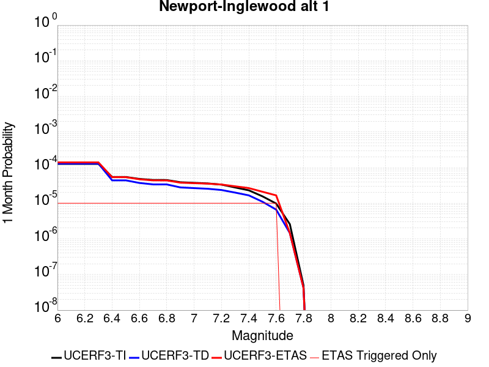 |  |  |

| Magnitude | 1 wk TI Prob | 1 wk TD Prob | 1 wk ETAS Prob | 1 wk ETAS/TD Gain | 1 wk ETAS Triggered Only | 1 mo TI Prob | 1 mo TD Prob | 1 mo ETAS Prob | 1 mo ETAS/TD Gain | 1 mo ETAS Triggered Only | 1 yr TI Prob | 1 yr TD Prob | 1 yr ETAS Prob | 1 yr ETAS/TD Gain | 1 yr ETAS Triggered Only | 10 yr TI Prob | 10 yr TD Prob | 10 yr ETAS Prob | 10 yr ETAS/TD Gain | 10 yr ETAS Triggered Only |
|-----|-----|-----|-----|-----|-----|-----|-----|-----|-----|-----|-----|-----|-----|-----|-----|-----|-----|-----|-----|-----|
| 6.0 | 2.9668912E-5 | 3.0404817E-5 | 3.0404817E-5 | 1.0 | 0.0 | 1.2714628E-4 | 1.303026E-4 | 1.4030129E-4 | 1.0767344 | 1.0E-5 | 0.0015469068 | 0.0015857625 | 0.0015957466 | 1.0062962 | 1.0E-5 | 0.015361829 | 0.015792042 | 0.015821569 | 1.0018697 | 3.0E-5 |
| 6.1 | 2.9668912E-5 | 3.0404817E-5 | 3.0404817E-5 | 1.0 | 0.0 | 1.2714628E-4 | 1.303026E-4 | 1.4030129E-4 | 1.0767344 | 1.0E-5 | 0.0015469068 | 0.0015857625 | 0.0015957466 | 1.0062962 | 1.0E-5 | 0.015361829 | 0.015792042 | 0.015821569 | 1.0018697 | 3.0E-5 |
| 6.2 | 2.9668912E-5 | 3.0404817E-5 | 3.0404817E-5 | 1.0 | 0.0 | 1.2714628E-4 | 1.303026E-4 | 1.4030129E-4 | 1.0767344 | 1.0E-5 | 0.0015469068 | 0.0015857625 | 0.0015957466 | 1.0062962 | 1.0E-5 | 0.015361829 | 0.015792042 | 0.015821569 | 1.0018697 | 3.0E-5 |
| 6.3 | 2.9668912E-5 | 3.0404817E-5 | 3.0404817E-5 | 1.0 | 0.0 | 1.2714628E-4 | 1.303026E-4 | 1.4030129E-4 | 1.0767344 | 1.0E-5 | 0.0015469068 | 0.0015857625 | 0.0015957466 | 1.0062962 | 1.0E-5 | 0.015361829 | 0.015792042 | 0.015821569 | 1.0018697 | 3.0E-5 |
| 6.4 | 1.275942E-5 | 1.0272503E-5 | 1.0272503E-5 | 1.0 | 0.0 | 5.4682085E-5 | 4.402429E-5 | 5.402385E-5 | 1.2271373 | 1.0E-5 | 6.65551E-4 | 5.358681E-4 | 5.458627E-4 | 1.0186514 | 1.0E-5 | 0.0066356123 | 0.005346184 | 0.005366077 | 1.003721 | 2.0E-5 |
| 6.5 | 1.275942E-5 | 1.0272503E-5 | 1.0272503E-5 | 1.0 | 0.0 | 5.4682085E-5 | 4.402429E-5 | 5.402385E-5 | 1.2271373 | 1.0E-5 | 6.65551E-4 | 5.358681E-4 | 5.458627E-4 | 1.0186514 | 1.0E-5 | 0.0066356123 | 0.005346184 | 0.005366077 | 1.003721 | 2.0E-5 |
| 6.6 | 1.1255358E-5 | 8.661884E-6 | 8.661884E-6 | 1.0 | 0.0 | 4.8236358E-5 | 3.712184E-5 | 4.712147E-5 | 1.2693732 | 1.0E-5 | 5.871194E-4 | 4.518664E-4 | 4.6186187E-4 | 1.0221205 | 1.0E-5 | 0.005855706 | 0.004509653 | 0.004529563 | 1.0044149 | 2.0E-5 |
| 6.7 | 1.0504745E-5 | 7.8997955E-6 | 7.8997955E-6 | 1.0 | 0.0 | 4.5019555E-5 | 3.3855835E-5 | 4.3855496E-5 | 1.2953601 | 1.0E-5 | 5.4797524E-4 | 4.1211807E-4 | 4.2211395E-4 | 1.0242549 | 1.0E-5 | 0.0054662596 | 0.004113668 | 0.004133586 | 1.0048418 | 2.0E-5 |
| 6.8 | 1.0476007E-5 | 7.881176E-6 | 7.881176E-6 | 1.0 | 0.0 | 4.4896402E-5 | 3.3776043E-5 | 4.3775704E-5 | 1.2960578 | 1.0E-5 | 5.464766E-4 | 4.1114696E-4 | 4.2114285E-4 | 1.0243123 | 1.0E-5 | 0.005451347 | 0.0041039926 | 0.004123911 | 1.0048532 | 2.0E-5 |
| 6.9 | 9.076797E-6 | 6.4896312E-6 | 6.4896312E-6 | 1.0 | 0.0 | 3.889998E-5 | 2.781241E-5 | 3.7812133E-5 | 1.3595418 | 1.0E-5 | 4.7350433E-4 | 3.385638E-4 | 3.4856042E-4 | 1.0295265 | 1.0E-5 | 0.004724967 | 0.0033805177 | 0.00340045 | 1.0058962 | 2.0E-5 |
| 7.0 | 8.73795E-6 | 6.2120125E-6 | 6.2120125E-6 | 1.0 | 0.0 | 3.7447822E-5 | 2.6622642E-5 | 3.6622376E-5 | 1.3756101 | 1.0E-5 | 4.5583185E-4 | 3.2408274E-4 | 3.340795E-4 | 1.0308464 | 1.0E-5 | 0.0045489795 | 0.0032361327 | 0.0032560679 | 1.0061603 | 2.0E-5 |
| 7.1 | 8.391299E-6 | 5.95579E-6 | 5.95579E-6 | 1.0 | 0.0 | 3.5962214E-5 | 2.5524565E-5 | 3.552431E-5 | 1.3917694 | 1.0E-5 | 4.37752E-4 | 3.1071753E-4 | 3.2071443E-4 | 1.0321735 | 1.0E-5 | 0.004368907 | 0.0031028606 | 0.0031227984 | 1.0064256 | 2.0E-5 |
| 7.2 | 7.796882E-6 | 5.4965344E-6 | 5.4965344E-6 | 1.0 | 0.0 | 3.341478E-5 | 2.3556364E-5 | 3.3556127E-5 | 1.4245037 | 1.0E-5 | 4.06749E-4 | 2.867612E-4 | 2.9675834E-4 | 1.0348623 | 1.0E-5 | 0.0040600533 | 0.0028639357 | 0.0028838783 | 1.0069634 | 2.0E-5 |
| 7.3 | 6.4738833E-6 | 4.6478162E-6 | 4.6478162E-6 | 1.0 | 0.0 | 2.774492E-5 | 1.9919062E-5 | 2.9918863E-5 | 1.5020217 | 1.0E-5 | 3.3774204E-4 | 2.4248775E-4 | 2.524853E-4 | 1.0412292 | 1.0E-5 | 0.0033722918 | 0.0024222482 | 0.0024421997 | 1.0082368 | 2.0E-5 |
| 7.4 | 5.382145E-6 | 3.8857597E-6 | 3.8857597E-6 | 1.0 | 0.0 | 2.3066134E-5 | 1.665315E-5 | 2.6652984E-5 | 1.600477 | 1.0E-5 | 2.8079396E-4 | 2.0273338E-4 | 2.1273135E-4 | 1.0493158 | 1.0E-5 | 0.0028043943 | 0.0020254988 | 0.0020354786 | 1.004927 | 1.0E-5 |
| 7.5 | 3.648244E-6 | 2.5737843E-6 | 2.5737843E-6 | 1.0 | 0.0 | 1.5635238E-5 | 1.1030458E-5 | 2.1030348E-5 | 1.9065707 | 1.0E-5 | 1.9034238E-4 | 1.3428765E-4 | 1.4428631E-4 | 1.074457 | 1.0E-5 | 0.0019017943 | 0.0013420755 | 0.0013520621 | 1.0074412 | 1.0E-5 |
| 7.6 | 2.2906888E-6 | 1.5479842E-6 | 1.5479842E-6 | 1.0 | 0.0 | 9.817201E-6 | 6.634202E-6 | 1.6634136E-5 | 2.5073304 | 1.0E-5 | 1.1951787E-4 | 8.076848E-5 | 9.076767E-5 | 1.1238006 | 1.0E-5 | 0.0011945361 | 8.07398E-4 | 8.173899E-4 | 1.0123755 | 1.0E-5 |
| 7.7 | 6.0479874E-7 | 3.397512E-7 | 3.397512E-7 | 1.0 | 0.0 | 2.5919921E-6 | 1.4560758E-6 | 1.4560758E-6 | 1.0 | 0.0 | 3.1557047E-5 | 1.7727592E-5 | 1.7727592E-5 | 1.0 | 0.0 | 3.1552566E-4 | 1.7726317E-4 | 1.7726317E-4 | 1.0 | 0.0 |
| 7.8 | 1.16056995E-8 | 9.782373E-9 | 9.782373E-9 | 1.0 | 0.0 | 4.9738713E-8 | 4.1924455E-8 | 4.1924455E-8 | 1.0 | 0.0 | 6.0556863E-7 | 5.1043025E-7 | 5.1043025E-7 | 1.0 | 0.0 | 6.05567E-6 | 5.1043025E-6 | 5.1043025E-6 | 1.0 | 0.0 |

## Robinson Creek
*[(top)](#table-of-contents)*

| 1 Week | 1 Month | 1 Year | 10 Year |
|-----|-----|-----|-----|
|  |  |  |  |

| Magnitude | 1 wk TI Prob | 1 wk TD Prob | 1 wk ETAS Prob | 1 wk ETAS/TD Gain | 1 wk ETAS Triggered Only | 1 mo TI Prob | 1 mo TD Prob | 1 mo ETAS Prob | 1 mo ETAS/TD Gain | 1 mo ETAS Triggered Only | 1 yr TI Prob | 1 yr TD Prob | 1 yr ETAS Prob | 1 yr ETAS/TD Gain | 1 yr ETAS Triggered Only | 10 yr TI Prob | 10 yr TD Prob | 10 yr ETAS Prob | 10 yr ETAS/TD Gain | 10 yr ETAS Triggered Only |
|-----|-----|-----|-----|-----|-----|-----|-----|-----|-----|-----|-----|-----|-----|-----|-----|-----|-----|-----|-----|-----|
| 6.0 | 1.3705327E-5 | 1.5285013E-5 | 1.5285013E-5 | 1.0 | 0.0 | 5.8735794E-5 | 6.55072E-5 | 7.550655E-5 | 1.152645 | 1.0E-5 | 7.1487366E-4 | 7.9755014E-4 | 8.275262E-4 | 1.0375851 | 3.0E-5 | 0.0071257832 | 0.007975501 | 0.008005262 | 1.0037315 | 3.0E-5 |
| 6.1 | 1.3705327E-5 | 1.5285013E-5 | 1.5285013E-5 | 1.0 | 0.0 | 5.8735794E-5 | 6.55072E-5 | 7.550655E-5 | 1.152645 | 1.0E-5 | 7.1487366E-4 | 7.9755014E-4 | 8.275262E-4 | 1.0375851 | 3.0E-5 | 0.0071257832 | 0.007975501 | 0.008005262 | 1.0037315 | 3.0E-5 |
| 6.2 | 1.3705327E-5 | 1.5285013E-5 | 1.5285013E-5 | 1.0 | 0.0 | 5.8735794E-5 | 6.55072E-5 | 7.550655E-5 | 1.152645 | 1.0E-5 | 7.1487366E-4 | 7.9755014E-4 | 8.275262E-4 | 1.0375851 | 3.0E-5 | 0.0071257832 | 0.007975501 | 0.008005262 | 1.0037315 | 3.0E-5 |
| 6.3 | 1.3705327E-5 | 1.5285013E-5 | 1.5285013E-5 | 1.0 | 0.0 | 5.8735794E-5 | 6.55072E-5 | 7.550655E-5 | 1.152645 | 1.0E-5 | 7.1487366E-4 | 7.9755014E-4 | 8.275262E-4 | 1.0375851 | 3.0E-5 | 0.0071257832 | 0.007975501 | 0.008005262 | 1.0037315 | 3.0E-5 |
| 6.4 | 1.3705327E-5 | 1.5285013E-5 | 1.5285013E-5 | 1.0 | 0.0 | 5.8735794E-5 | 6.55072E-5 | 7.550655E-5 | 1.152645 | 1.0E-5 | 7.1487366E-4 | 7.9755014E-4 | 8.275262E-4 | 1.0375851 | 3.0E-5 | 0.0071257832 | 0.007975501 | 0.008005262 | 1.0037315 | 3.0E-5 |

## San Jose
*[(top)](#table-of-contents)*

| 1 Week | 1 Month | 1 Year | 10 Year |
|-----|-----|-----|-----|
|  |  |  |  |

| Magnitude | 1 wk TI Prob | 1 wk TD Prob | 1 wk ETAS Prob | 1 wk ETAS/TD Gain | 1 wk ETAS Triggered Only | 1 mo TI Prob | 1 mo TD Prob | 1 mo ETAS Prob | 1 mo ETAS/TD Gain | 1 mo ETAS Triggered Only | 1 yr TI Prob | 1 yr TD Prob | 1 yr ETAS Prob | 1 yr ETAS/TD Gain | 1 yr ETAS Triggered Only | 10 yr TI Prob | 10 yr TD Prob | 10 yr ETAS Prob | 10 yr ETAS/TD Gain | 10 yr ETAS Triggered Only |
|-----|-----|-----|-----|-----|-----|-----|-----|-----|-----|-----|-----|-----|-----|-----|-----|-----|-----|-----|-----|-----|
| 6.0 | 5.0851277E-6 | 4.1256726E-6 | 1.4125631E-5 | 3.4238372 | 1.0E-5 | 2.1793223E-5 | 1.768135E-5 | 2.7681173E-5 | 1.5655577 | 1.0E-5 | 2.653002E-4 | 2.152518E-4 | 2.2524965E-4 | 1.0464473 | 1.0E-5 | 0.0026498367 | 0.0021507242 | 0.0021806597 | 1.0139188 | 3.0E-5 |
| 6.1 | 5.0851277E-6 | 4.1256726E-6 | 1.4125631E-5 | 3.4238372 | 1.0E-5 | 2.1793223E-5 | 1.768135E-5 | 2.7681173E-5 | 1.5655577 | 1.0E-5 | 2.653002E-4 | 2.152518E-4 | 2.2524965E-4 | 1.0464473 | 1.0E-5 | 0.0026498367 | 0.0021507242 | 0.0021806597 | 1.0139188 | 3.0E-5 |
| 6.2 | 5.0851277E-6 | 4.1256726E-6 | 1.4125631E-5 | 3.4238372 | 1.0E-5 | 2.1793223E-5 | 1.768135E-5 | 2.7681173E-5 | 1.5655577 | 1.0E-5 | 2.653002E-4 | 2.152518E-4 | 2.2524965E-4 | 1.0464473 | 1.0E-5 | 0.0026498367 | 0.0021507242 | 0.0021806597 | 1.0139188 | 3.0E-5 |
| 6.3 | 5.0851277E-6 | 4.1256726E-6 | 1.4125631E-5 | 3.4238372 | 1.0E-5 | 2.1793223E-5 | 1.768135E-5 | 2.7681173E-5 | 1.5655577 | 1.0E-5 | 2.653002E-4 | 2.152518E-4 | 2.2524965E-4 | 1.0464473 | 1.0E-5 | 0.0026498367 | 0.0021507242 | 0.0021806597 | 1.0139188 | 3.0E-5 |
| 6.4 | 4.3115124E-6 | 3.3237832E-6 | 1.332375E-5 | 4.00861 | 1.0E-5 | 1.8477778E-5 | 1.424472E-5 | 2.4244577E-5 | 1.7020046 | 1.0E-5 | 2.2494372E-4 | 1.7341787E-4 | 1.8341614E-4 | 1.0576541 | 1.0E-5 | 0.0022471617 | 0.0017330751 | 0.0017630232 | 1.0172802 | 3.0E-5 |
| 6.5 | 4.3115124E-6 | 3.3237832E-6 | 1.332375E-5 | 4.00861 | 1.0E-5 | 1.8477778E-5 | 1.424472E-5 | 2.4244577E-5 | 1.7020046 | 1.0E-5 | 2.2494372E-4 | 1.7341787E-4 | 1.8341614E-4 | 1.0576541 | 1.0E-5 | 0.0022471617 | 0.0017330751 | 0.0017630232 | 1.0172802 | 3.0E-5 |
| 6.6 | 3.110396E-6 | 2.0799866E-6 | 1.2079966E-5 | 5.807713 | 1.0E-5 | 1.33302E-5 | 8.9141995E-6 | 1.891411E-5 | 2.1217957 | 1.0E-5 | 1.622831E-4 | 1.0852526E-4 | 1.1852417E-4 | 1.0921345 | 1.0E-5 | 0.0016216465 | 0.0010847825 | 0.0011047609 | 1.0184169 | 2.0E-5 |
| 6.7 | 3.110396E-6 | 2.0799866E-6 | 1.2079966E-5 | 5.807713 | 1.0E-5 | 1.33302E-5 | 8.9141995E-6 | 1.891411E-5 | 2.1217957 | 1.0E-5 | 1.622831E-4 | 1.0852526E-4 | 1.1852417E-4 | 1.0921345 | 1.0E-5 | 0.0016216465 | 0.0010847825 | 0.0011047609 | 1.0184169 | 2.0E-5 |
| 6.8 | 2.856651E-6 | 1.902435E-6 | 1.1902416E-5 | 6.256411 | 1.0E-5 | 1.2242733E-5 | 8.153269E-6 | 1.8153187E-5 | 2.226492 | 1.0E-5 | 1.4904508E-4 | 9.926178E-5 | 1.09260785E-4 | 1.1007338 | 1.0E-5 | 0.0014894515 | 9.922314E-4 | 0.0010122115 | 1.0201366 | 2.0E-5 |
| 6.9 | 2.1618725E-6 | 1.4186642E-6 | 1.141865E-5 | 8.048875 | 1.0E-5 | 9.265135E-6 | 6.0799757E-6 | 1.6079915E-5 | 2.6447334 | 1.0E-5 | 1.12797185E-4 | 7.402128E-5 | 8.402054E-5 | 1.1350863 | 1.0E-5 | 0.0011273995 | 7.4000744E-4 | 7.5999263E-4 | 1.0270067 | 2.0E-5 |
| 7.0 | 1.9684312E-6 | 1.3256331E-6 | 1.132562E-5 | 8.543555 | 1.0E-5 | 8.436106E-6 | 5.681273E-6 | 1.5681217E-5 | 2.760159 | 1.0E-5 | 1.02704755E-4 | 6.9167385E-5 | 7.916669E-5 | 1.1445668 | 1.0E-5 | 0.001026573 | 6.914992E-4 | 7.114854E-4 | 1.0289026 | 2.0E-5 |
| 7.1 | 1.6070337E-6 | 1.1155087E-6 | 1.1115498E-5 | 9.964511 | 1.0E-5 | 6.887269E-6 | 4.780743E-6 | 1.4780695E-5 | 3.091715 | 1.0E-5 | 8.384928E-5 | 5.8204052E-5 | 6.820347E-5 | 1.1717993 | 1.0E-5 | 8.3817646E-4 | 5.819267E-4 | 5.919209E-4 | 1.0171742 | 1.0E-5 |
| 7.2 | 1.0631658E-6 | 6.4037624E-7 | 6.4037624E-7 | 1.0 | 0.0 | 4.556417E-6 | 2.7444669E-6 | 2.7444669E-6 | 1.0 | 0.0 | 5.5472963E-5 | 3.3413387E-5 | 3.3413387E-5 | 1.0 | 0.0 | 5.545912E-4 | 3.3411747E-4 | 3.3411747E-4 | 1.0 | 0.0 |
| 7.3 | 7.060711E-7 | 4.5824706E-7 | 4.5824706E-7 | 1.0 | 0.0 | 3.0260155E-6 | 1.9639147E-6 | 1.9639147E-6 | 1.0 | 0.0 | 3.6841117E-5 | 2.3910407E-5 | 2.3910407E-5 | 1.0 | 0.0 | 3.6835007E-4 | 2.3911172E-4 | 2.3911172E-4 | 1.0 | 0.0 |
| 7.4 | 3.3677085E-7 | 2.3233133E-7 | 2.3233133E-7 | 1.0 | 0.0 | 1.4433028E-6 | 9.957054E-7 | 9.957054E-7 | 1.0 | 0.0 | 1.757207E-5 | 1.21226485E-5 | 1.21226485E-5 | 1.0 | 0.0 | 1.7570681E-4 | 1.2125263E-4 | 1.2125263E-4 | 1.0 | 0.0 |
| 7.5 | 3.129161E-7 | 1.9530925E-7 | 1.9530925E-7 | 1.0 | 0.0 | 1.3410682E-6 | 8.370394E-7 | 8.370394E-7 | 1.0 | 0.0 | 1.6327383E-5 | 1.0190909E-5 | 1.0190909E-5 | 1.0 | 0.0 | 1.6326184E-4 | 1.0193714E-4 | 1.0193714E-4 | 1.0 | 0.0 |
| 7.6 | 2.8008668E-7 | 1.4242323E-7 | 1.4242323E-7 | 1.0 | 0.0 | 1.2003709E-6 | 6.1038514E-7 | 6.1038514E-7 | 1.0 | 0.0 | 1.46144175E-5 | 7.4314153E-6 | 7.4314153E-6 | 1.0 | 0.0 | 1.4613457E-4 | 7.434427E-5 | 7.434427E-5 | 1.0 | 0.0 |
| 7.7 | 2.7852005E-7 | 1.4016913E-7 | 1.4016913E-7 | 1.0 | 0.0 | 1.1936568E-6 | 6.007248E-7 | 6.007248E-7 | 1.0 | 0.0 | 1.4532674E-5 | 7.3138012E-6 | 7.3138012E-6 | 1.0 | 0.0 | 1.4531724E-4 | 7.316821E-5 | 7.316821E-5 | 1.0 | 0.0 |
| 7.8 | 1.1810797E-7 | 7.5190094E-8 | 7.5190094E-8 | 1.0 | 0.0 | 5.0617695E-7 | 3.222432E-7 | 3.222432E-7 | 1.0 | 0.0 | 6.1626865E-6 | 3.9233046E-6 | 3.9233046E-6 | 1.0 | 0.0 | 6.162516E-5 | 3.9250725E-5 | 3.9250725E-5 | 1.0 | 0.0 |

## Likely 2011 CFM
*[(top)](#table-of-contents)*

| 1 Week | 1 Month | 1 Year | 10 Year |
|-----|-----|-----|-----|
|  |  |  |  |

| Magnitude | 1 wk TI Prob | 1 wk TD Prob | 1 wk ETAS Prob | 1 wk ETAS/TD Gain | 1 wk ETAS Triggered Only | 1 mo TI Prob | 1 mo TD Prob | 1 mo ETAS Prob | 1 mo ETAS/TD Gain | 1 mo ETAS Triggered Only | 1 yr TI Prob | 1 yr TD Prob | 1 yr ETAS Prob | 1 yr ETAS/TD Gain | 1 yr ETAS Triggered Only | 10 yr TI Prob | 10 yr TD Prob | 10 yr ETAS Prob | 10 yr ETAS/TD Gain | 10 yr ETAS Triggered Only |
|-----|-----|-----|-----|-----|-----|-----|-----|-----|-----|-----|-----|-----|-----|-----|-----|-----|-----|-----|-----|-----|
| 6.0 | 2.5315949E-5 | 2.7104748E-5 | 2.7104748E-5 | 1.0 | 0.0 | 1.0849241E-4 | 1.16158284E-4 | 1.2615713E-4 | 1.0860795 | 1.0E-5 | 0.0013200947 | 0.0014133542 | 0.0014333259 | 1.0141307 | 2.0E-5 | 0.013122803 | 0.01404831 | 0.014077889 | 1.0021055 | 3.0E-5 |
| 6.1 | 2.5315949E-5 | 2.7104748E-5 | 2.7104748E-5 | 1.0 | 0.0 | 1.0849241E-4 | 1.16158284E-4 | 1.2615713E-4 | 1.0860795 | 1.0E-5 | 0.0013200947 | 0.0014133542 | 0.0014333259 | 1.0141307 | 2.0E-5 | 0.013122803 | 0.01404831 | 0.014077889 | 1.0021055 | 3.0E-5 |
| 6.2 | 1.6375941E-5 | 1.7465842E-5 | 1.7465842E-5 | 1.0 | 0.0 | 7.0180715E-5 | 7.485153E-5 | 8.4850784E-5 | 1.1335878 | 1.0E-5 | 8.5411523E-4 | 9.109487E-4 | 9.3093043E-4 | 1.0219351 | 2.0E-5 | 0.008508399 | 0.009073433 | 0.00910316 | 1.0032763 | 3.0E-5 |
| 6.3 | 1.1945543E-5 | 1.2712587E-5 | 1.2712587E-5 | 1.0 | 0.0 | 5.119418E-5 | 5.4481407E-5 | 6.448086E-5 | 1.1835389 | 1.0E-5 | 6.2311086E-4 | 6.631146E-4 | 6.73108E-4 | 1.0150703 | 1.0E-5 | 0.0062136655 | 0.0066119144 | 0.0066317823 | 1.0030048 | 2.0E-5 |
| 6.4 | 9.192729E-6 | 9.768488E-6 | 9.768488E-6 | 1.0 | 0.0 | 3.939681E-5 | 4.1864292E-5 | 4.1864292E-5 | 1.0 | 0.0 | 4.7955062E-4 | 5.0958124E-4 | 5.0958124E-4 | 1.0 | 0.0 | 0.004785171 | 0.0050844094 | 0.0050844094 | 1.0 | 0.0 |
| 6.5 | 7.67906E-6 | 8.152622E-6 | 8.152622E-6 | 1.0 | 0.0 | 3.2909844E-5 | 3.4939352E-5 | 3.4939352E-5 | 1.0 | 0.0 | 4.006037E-4 | 4.2530545E-4 | 4.2530545E-4 | 1.0 | 0.0 | 0.0039988225 | 0.004245108 | 0.004245108 | 1.0 | 0.0 |
| 6.6 | 6.4884057E-6 | 6.8847507E-6 | 6.8847507E-6 | 1.0 | 0.0 | 2.7807157E-5 | 2.9505749E-5 | 2.9505749E-5 | 1.0 | 0.0 | 3.3849955E-4 | 3.591747E-4 | 3.591747E-4 | 1.0 | 0.0 | 0.003379844 | 0.0035860867 | 0.0035860867 | 1.0 | 0.0 |
| 6.7 | 4.6060636E-6 | 4.884041E-6 | 4.884041E-6 | 1.0 | 0.0 | 1.9740122E-5 | 2.0931442E-5 | 2.0931442E-5 | 1.0 | 0.0 | 2.403095E-4 | 2.5481134E-4 | 2.5481134E-4 | 1.0 | 0.0 | 0.002400498 | 0.0025452746 | 0.0025452746 | 1.0 | 0.0 |
| 6.8 | 3.2795615E-6 | 3.4773732E-6 | 3.4773732E-6 | 1.0 | 0.0 | 1.4055187E-5 | 1.4902946E-5 | 1.4902946E-5 | 1.0 | 0.0 | 1.7110848E-4 | 1.8142881E-4 | 1.8142881E-4 | 1.0 | 0.0 | 0.0017097679 | 0.0018128622 | 0.0018128622 | 1.0 | 0.0 |
| 6.9 | 2.3289967E-6 | 2.4705569E-6 | 2.4705569E-6 | 1.0 | 0.0 | 9.981376E-6 | 1.058806E-5 | 1.058806E-5 | 1.0 | 0.0 | 1.2151648E-4 | 1.2890245E-4 | 1.2890245E-4 | 1.0 | 0.0 | 0.0012145005 | 0.0012883197 | 0.0012883197 | 1.0 | 0.0 |
| 7.0 | 1.211292E-6 | 1.2863958E-6 | 1.2863958E-6 | 1.0 | 0.0 | 5.1912407E-6 | 5.5131145E-6 | 5.5131145E-6 | 1.0 | 0.0 | 6.320152E-5 | 6.712041E-5 | 6.712041E-5 | 1.0 | 0.0 | 6.3183554E-4 | 6.710312E-4 | 6.710312E-4 | 1.0 | 0.0 |

## Newport-Inglewood (Offshore)
*[(top)](#table-of-contents)*

| 1 Week | 1 Month | 1 Year | 10 Year |
|-----|-----|-----|-----|
| 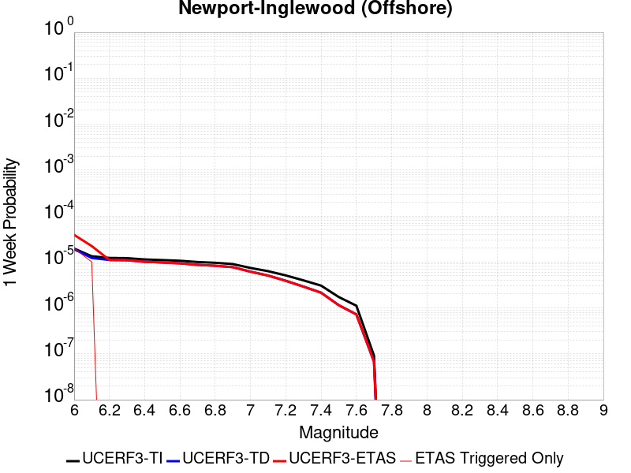 |  |  | 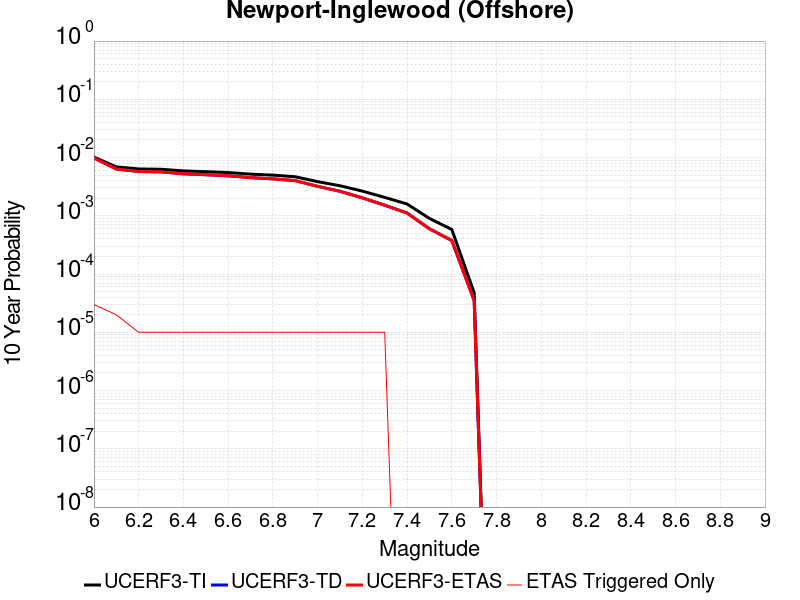 |

| Magnitude | 1 wk TI Prob | 1 wk TD Prob | 1 wk ETAS Prob | 1 wk ETAS/TD Gain | 1 wk ETAS Triggered Only | 1 mo TI Prob | 1 mo TD Prob | 1 mo ETAS Prob | 1 mo ETAS/TD Gain | 1 mo ETAS Triggered Only | 1 yr TI Prob | 1 yr TD Prob | 1 yr ETAS Prob | 1 yr ETAS/TD Gain | 1 yr ETAS Triggered Only | 10 yr TI Prob | 10 yr TD Prob | 10 yr ETAS Prob | 10 yr ETAS/TD Gain | 10 yr ETAS Triggered Only |
|-----|-----|-----|-----|-----|-----|-----|-----|-----|-----|-----|-----|-----|-----|-----|-----|-----|-----|-----|-----|-----|
| 6.0 | 1.9626508E-5 | 1.8965357E-5 | 3.8964976E-5 | 2.0545344 | 2.0E-5 | 8.411089E-5 | 8.1277634E-5 | 1.0127601E-4 | 1.2460501 | 2.0E-5 | 0.001023569 | 9.891186E-4 | 0.0010090988 | 1.0202 | 2.0E-5 | 0.010188672 | 0.009848503 | 0.009878208 | 1.0030161 | 3.0E-5 |
| 6.1 | 1.331886E-5 | 1.2218092E-5 | 2.221797E-5 | 1.8184484 | 1.0E-5 | 5.707958E-5 | 5.2362207E-5 | 6.236169E-5 | 1.1909674 | 1.0E-5 | 6.947222E-4 | 6.3732493E-4 | 6.4731855E-4 | 1.0156806 | 1.0E-5 | 0.006925544 | 0.006355149 | 0.0063750218 | 1.0031271 | 2.0E-5 |
| 6.2 | 1.2250852E-5 | 1.1076029E-5 | 1.1076029E-5 | 1.0 | 0.0 | 5.2502597E-5 | 4.7467838E-5 | 4.7467838E-5 | 1.0 | 0.0 | 6.3903164E-4 | 5.777687E-4 | 5.777687E-4 | 1.0 | 0.0 | 0.006371971 | 0.0057627866 | 0.005772729 | 1.0017253 | 1.0E-5 |
| 6.3 | 1.2106258E-5 | 1.0918891E-5 | 1.0918891E-5 | 1.0 | 0.0 | 5.1882926E-5 | 4.6794412E-5 | 4.6794412E-5 | 1.0 | 0.0 | 6.3149154E-4 | 5.69574E-4 | 5.69574E-4 | 1.0 | 0.0 | 0.0062970007 | 0.005681259 | 0.0056912024 | 1.0017502 | 1.0E-5 |
| 6.4 | 1.1348758E-5 | 1.0109362E-5 | 1.0109362E-5 | 1.0 | 0.0 | 4.8636626E-5 | 4.3325123E-5 | 4.3325123E-5 | 1.0 | 0.0 | 5.919901E-4 | 5.273565E-4 | 5.273565E-4 | 1.0 | 0.0 | 0.005904155 | 0.0052611465 | 0.005271094 | 1.0018908 | 1.0E-5 |
| 6.5 | 1.100837E-5 | 9.7433895E-6 | 9.7433895E-6 | 1.0 | 0.0 | 4.7177873E-5 | 4.1756717E-5 | 4.1756717E-5 | 1.0 | 0.0 | 5.7423924E-4 | 5.082702E-4 | 5.082702E-4 | 1.0 | 0.0 | 0.005727576 | 0.0050711688 | 0.005081118 | 1.001962 | 1.0E-5 |
| 6.6 | 1.0634696E-5 | 9.345544E-6 | 9.345544E-6 | 1.0 | 0.0 | 4.557647E-5 | 4.0051716E-5 | 4.0051716E-5 | 1.0 | 0.0 | 5.5475225E-4 | 4.8752132E-4 | 4.8752132E-4 | 1.0 | 0.0 | 0.0055336943 | 0.0048646047 | 0.004874556 | 1.0020456 | 1.0E-5 |
| 6.7 | 9.9780855E-6 | 8.667911E-6 | 8.667911E-6 | 1.0 | 0.0 | 4.276252E-5 | 3.7147664E-5 | 3.7147664E-5 | 1.0 | 0.0 | 5.205093E-4 | 4.5217964E-4 | 4.5217964E-4 | 1.0 | 0.0 | 0.0051929182 | 0.004512675 | 0.0045226295 | 1.002206 | 1.0E-5 |
| 6.8 | 9.59546E-6 | 8.27295E-6 | 8.27295E-6 | 1.0 | 0.0 | 4.1122752E-5 | 3.5455025E-5 | 3.5455025E-5 | 1.0 | 0.0 | 5.0055445E-4 | 4.315801E-4 | 4.315801E-4 | 1.0 | 0.0 | 0.004994285 | 0.004307495 | 0.004317452 | 1.0023116 | 1.0E-5 |
| 6.9 | 9.000614E-6 | 7.70684E-6 | 7.70684E-6 | 1.0 | 0.0 | 3.857349E-5 | 3.30289E-5 | 3.30289E-5 | 1.0 | 0.0 | 4.6953102E-4 | 4.0205332E-4 | 4.0205332E-4 | 1.0 | 0.0 | 0.004685402 | 0.0040133307 | 0.0040232907 | 1.0024817 | 1.0E-5 |
| 7.0 | 7.4070194E-6 | 6.148904E-6 | 6.148904E-6 | 1.0 | 0.0 | 3.1743984E-5 | 2.635218E-5 | 2.635218E-5 | 1.0 | 0.0 | 3.8641447E-4 | 3.207907E-4 | 3.207907E-4 | 1.0 | 0.0 | 0.0038574322 | 0.0032032963 | 0.0032132643 | 1.0031118 | 1.0E-5 |
| 7.1 | 6.299615E-6 | 5.0565927E-6 | 5.0565927E-6 | 1.0 | 0.0 | 2.699807E-5 | 2.1670932E-5 | 2.1670932E-5 | 1.0 | 0.0 | 3.2865192E-4 | 2.638118E-4 | 2.638118E-4 | 1.0 | 0.0 | 0.003281663 | 0.002635001 | 0.0026449745 | 1.003785 | 1.0E-5 |
| 7.2 | 5.096653E-6 | 3.892769E-6 | 3.892769E-6 | 1.0 | 0.0 | 2.1842614E-5 | 1.668319E-5 | 1.668319E-5 | 1.0 | 0.0 | 2.6590136E-4 | 2.0309901E-4 | 2.0309901E-4 | 1.0 | 0.0 | 0.0026558342 | 0.0020291451 | 0.0020391247 | 1.0049182 | 1.0E-5 |
| 7.3 | 3.9753018E-6 | 2.9099103E-6 | 2.9099103E-6 | 1.0 | 0.0 | 1.7036897E-5 | 1.2470985E-5 | 1.2470985E-5 | 1.0 | 0.0 | 2.0740448E-4 | 1.5182374E-4 | 1.5182374E-4 | 1.0 | 0.0 | 0.00207211 | 0.0015172083 | 0.0015271931 | 1.0065811 | 1.0E-5 |
| 7.4 | 3.0568392E-6 | 2.1449955E-6 | 2.1449955E-6 | 1.0 | 0.0 | 1.3100675E-5 | 9.192806E-6 | 9.192806E-6 | 1.0 | 0.0 | 1.5948903E-4 | 1.1191672E-4 | 1.1191672E-4 | 1.0 | 0.0 | 0.0015937461 | 0.0011186098 | 0.0011186098 | 1.0 | 0.0 |
| 7.5 | 1.7279019E-6 | 1.1469883E-6 | 1.1469883E-6 | 1.0 | 0.0 | 7.405273E-6 | 4.915655E-6 | 4.915655E-6 | 1.0 | 0.0 | 9.015547E-5 | 5.9846494E-5 | 5.9846494E-5 | 1.0 | 0.0 | 9.01189E-4 | 5.9830764E-4 | 5.9830764E-4 | 1.0 | 0.0 |
| 7.6 | 1.1156416E-6 | 7.223012E-7 | 7.223012E-7 | 1.0 | 0.0 | 4.7813123E-6 | 3.095573E-6 | 3.095573E-6 | 1.0 | 0.0 | 5.821092E-5 | 3.7687976E-5 | 3.7687976E-5 | 1.0 | 0.0 | 5.8195676E-4 | 3.7681818E-4 | 3.7681818E-4 | 1.0 | 0.0 |
| 7.7 | 9.117973E-8 | 6.734145E-8 | 6.734145E-8 | 1.0 | 0.0 | 3.907702E-7 | 2.886062E-7 | 2.886062E-7 | 1.0 | 0.0 | 4.757617E-6 | 3.513775E-6 | 3.513775E-6 | 1.0 | 0.0 | 4.7575148E-5 | 3.5137225E-5 | 3.5137225E-5 | 1.0 | 0.0 |

## Elmore Ranch
*[(top)](#table-of-contents)*

| 1 Week | 1 Month | 1 Year | 10 Year |
|-----|-----|-----|-----|
|  |  |  |  |

| Magnitude | 1 wk TI Prob | 1 wk TD Prob | 1 wk ETAS Prob | 1 wk ETAS/TD Gain | 1 wk ETAS Triggered Only | 1 mo TI Prob | 1 mo TD Prob | 1 mo ETAS Prob | 1 mo ETAS/TD Gain | 1 mo ETAS Triggered Only | 1 yr TI Prob | 1 yr TD Prob | 1 yr ETAS Prob | 1 yr ETAS/TD Gain | 1 yr ETAS Triggered Only | 10 yr TI Prob | 10 yr TD Prob | 10 yr ETAS Prob | 10 yr ETAS/TD Gain | 10 yr ETAS Triggered Only |
|-----|-----|-----|-----|-----|-----|-----|-----|-----|-----|-----|-----|-----|-----|-----|-----|-----|-----|-----|-----|-----|
| 6.0 | 9.102099E-5 | 8.952015E-5 | 8.952015E-5 | 1.0 | 0.0 | 3.9003167E-4 | 3.8361453E-4 | 3.8361453E-4 | 1.0 | 0.0 | 0.0047383 | 0.004662009 | 0.0046719625 | 1.002135 | 1.0E-5 | 0.046385348 | 0.045870975 | 0.0458996 | 1.0006241 | 3.0E-5 |
| 6.1 | 3.8306698E-5 | 4.1498504E-5 | 4.1498504E-5 | 1.0 | 0.0 | 1.6416123E-4 | 1.7784268E-4 | 1.7784268E-4 | 1.0 | 0.0 | 0.0019968306 | 0.0021631396 | 0.0021631396 | 1.0 | 0.0 | 0.019789828 | 0.021628205 | 0.021647772 | 1.0009047 | 2.0E-5 |
| 6.2 | 3.8306698E-5 | 4.1498504E-5 | 4.1498504E-5 | 1.0 | 0.0 | 1.6416123E-4 | 1.7784268E-4 | 1.7784268E-4 | 1.0 | 0.0 | 0.0019968306 | 0.0021631396 | 0.0021631396 | 1.0 | 0.0 | 0.019789828 | 0.021628205 | 0.021647772 | 1.0009047 | 2.0E-5 |
| 6.3 | 3.3197924E-5 | 3.6554302E-5 | 3.6554302E-5 | 1.0 | 0.0 | 1.4226905E-4 | 1.5665586E-4 | 1.5665586E-4 | 1.0 | 0.0 | 0.0017307495 | 0.001905917 | 0.001905917 | 1.0 | 0.0 | 0.017173318 | 0.01908996 | 0.019109577 | 1.0010277 | 2.0E-5 |
| 6.4 | 2.5148964E-5 | 2.7420487E-5 | 2.7420487E-5 | 1.0 | 0.0 | 1.0777682E-4 | 1.17514726E-4 | 1.17514726E-4 | 1.0 | 0.0 | 0.0013113929 | 0.0014304507 | 0.0014304507 | 1.0 | 0.0 | 0.01303681 | 0.014387194 | 0.014406906 | 1.0013701 | 2.0E-5 |
| 6.5 | 2.5148964E-5 | 2.7420487E-5 | 2.7420487E-5 | 1.0 | 0.0 | 1.0777682E-4 | 1.17514726E-4 | 1.17514726E-4 | 1.0 | 0.0 | 0.0013113929 | 0.0014304507 | 0.0014304507 | 1.0 | 0.0 | 0.01303681 | 0.014387194 | 0.014406906 | 1.0013701 | 2.0E-5 |

## San Andreas (Peninsula) 2011 CFM
*[(top)](#table-of-contents)*

| 1 Week | 1 Month | 1 Year | 10 Year |
|-----|-----|-----|-----|
|  |  | 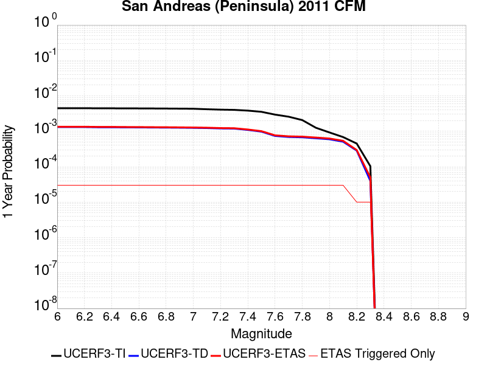 | 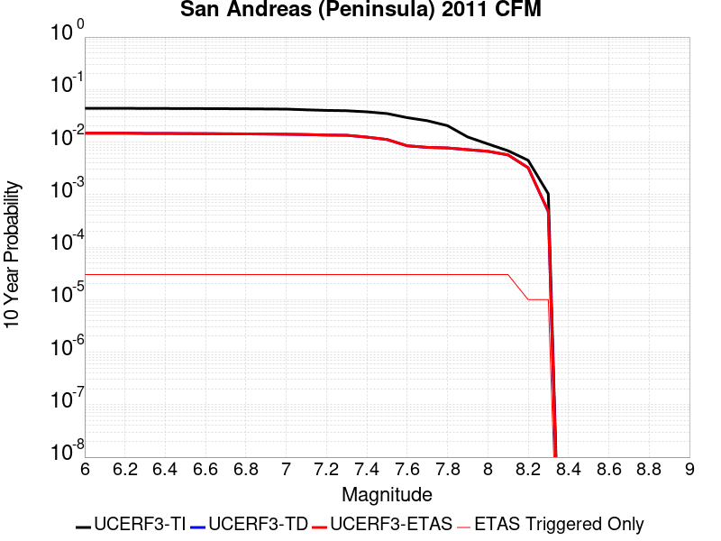 |

| Magnitude | 1 wk TI Prob | 1 wk TD Prob | 1 wk ETAS Prob | 1 wk ETAS/TD Gain | 1 wk ETAS Triggered Only | 1 mo TI Prob | 1 mo TD Prob | 1 mo ETAS Prob | 1 mo ETAS/TD Gain | 1 mo ETAS Triggered Only | 1 yr TI Prob | 1 yr TD Prob | 1 yr ETAS Prob | 1 yr ETAS/TD Gain | 1 yr ETAS Triggered Only | 10 yr TI Prob | 10 yr TD Prob | 10 yr ETAS Prob | 10 yr ETAS/TD Gain | 10 yr ETAS Triggered Only |
|-----|-----|-----|-----|-----|-----|-----|-----|-----|-----|-----|-----|-----|-----|-----|-----|-----|-----|-----|-----|-----|
| 6.0 | 8.6200685E-5 | 2.52136E-5 | 2.52136E-5 | 1.0 | 0.0 | 3.6937918E-4 | 1.0805382E-4 | 1.1805274E-4 | 1.0925364 | 1.0E-5 | 0.0044879215 | 0.001314763 | 0.0013447235 | 1.0227878 | 3.0E-5 | 0.043983612 | 0.014774441 | 0.014803997 | 1.0020006 | 3.0E-5 |
| 6.1 | 8.6200685E-5 | 2.52136E-5 | 2.52136E-5 | 1.0 | 0.0 | 3.6937918E-4 | 1.0805382E-4 | 1.1805274E-4 | 1.0925364 | 1.0E-5 | 0.0044879215 | 0.001314763 | 0.0013447235 | 1.0227878 | 3.0E-5 | 0.043983612 | 0.014774441 | 0.014803997 | 1.0020006 | 3.0E-5 |
| 6.2 | 8.6200685E-5 | 2.52136E-5 | 2.52136E-5 | 1.0 | 0.0 | 3.6937918E-4 | 1.0805382E-4 | 1.1805274E-4 | 1.0925364 | 1.0E-5 | 0.0044879215 | 0.001314763 | 0.0013447235 | 1.0227878 | 3.0E-5 | 0.043983612 | 0.014774441 | 0.014803997 | 1.0020006 | 3.0E-5 |
| 6.3 | 8.551163E-5 | 2.490552E-5 | 2.490552E-5 | 1.0 | 0.0 | 3.6642692E-4 | 1.06733576E-4 | 1.1673251E-4 | 1.0936812 | 1.0E-5 | 0.004452125 | 0.0012987083 | 0.0013286694 | 1.0230699 | 3.0E-5 | 0.043639794 | 0.014601416 | 0.014630978 | 1.0020247 | 3.0E-5 |
| 6.4 | 8.551163E-5 | 2.490552E-5 | 2.490552E-5 | 1.0 | 0.0 | 3.6642692E-4 | 1.06733576E-4 | 1.1673251E-4 | 1.0936812 | 1.0E-5 | 0.004452125 | 0.0012987083 | 0.0013286694 | 1.0230699 | 3.0E-5 | 0.043639794 | 0.014601416 | 0.014630978 | 1.0020247 | 3.0E-5 |
| 6.5 | 8.511146E-5 | 2.4726973E-5 | 2.4726973E-5 | 1.0 | 0.0 | 3.647124E-4 | 1.05968444E-4 | 1.1596738E-4 | 1.0943577 | 1.0E-5 | 0.004431336 | 0.0012894038 | 0.0013193651 | 1.0232365 | 3.0E-5 | 0.04344007 | 0.0145011945 | 0.014530759 | 1.0020388 | 3.0E-5 |
| 6.6 | 8.4985084E-5 | 2.4657606E-5 | 2.4657606E-5 | 1.0 | 0.0 | 3.6417096E-4 | 1.05671184E-4 | 1.15670126E-4 | 1.0946232 | 1.0E-5 | 0.0044247704 | 0.001285789 | 0.0013157504 | 1.023302 | 3.0E-5 | 0.043376986 | 0.014463263 | 0.014492828 | 1.0020442 | 3.0E-5 |
| 6.7 | 8.462618E-5 | 2.4486113E-5 | 2.4486113E-5 | 1.0 | 0.0 | 3.6263323E-4 | 1.0493627E-4 | 1.1493522E-4 | 1.0952859 | 1.0E-5 | 0.004406125 | 0.0012768519 | 0.0013068136 | 1.0234653 | 3.0E-5 | 0.043197807 | 0.01436807 | 0.01439764 | 1.0020579 | 3.0E-5 |
| 6.8 | 8.42337E-5 | 2.438192E-5 | 2.438192E-5 | 1.0 | 0.0 | 3.6095164E-4 | 1.04489765E-4 | 1.1448872E-4 | 1.0956931 | 1.0E-5 | 0.004385734 | 0.0012714221 | 0.001301384 | 1.0235656 | 3.0E-5 | 0.043001823 | 0.014308756 | 0.014338327 | 1.0020666 | 3.0E-5 |
| 6.9 | 8.365989E-5 | 2.4186513E-5 | 2.4186513E-5 | 1.0 | 0.0 | 3.5849313E-4 | 1.03652375E-4 | 1.1365134E-4 | 1.0964663 | 1.0E-5 | 0.004355922 | 0.0012612387 | 0.0012912009 | 1.0237561 | 3.0E-5 | 0.04271523 | 0.014201242 | 0.014230816 | 1.0020825 | 3.0E-5 |
| 7.0 | 8.30936E-5 | 2.3948E-5 | 2.3948E-5 | 1.0 | 0.0 | 3.560668E-4 | 1.02630256E-4 | 1.12629226E-4 | 1.0974271 | 1.0E-5 | 0.004326499 | 0.0012488087 | 0.0012787712 | 1.0239929 | 3.0E-5 | 0.042432297 | 0.014072227 | 0.014101805 | 1.0021019 | 3.0E-5 |
| 7.1 | 8.041264E-5 | 2.3634402E-5 | 2.3634402E-5 | 1.0 | 0.0 | 3.4458007E-4 | 1.0128637E-4 | 1.1128536E-4 | 1.09872 | 1.0E-5 | 0.0041871946 | 0.0012324656 | 0.0012624286 | 1.0243114 | 3.0E-5 | 0.041091725 | 0.013895032 | 0.013924615 | 1.0021291 | 3.0E-5 |
| 7.2 | 7.8427016E-5 | 2.3058019E-5 | 2.3058019E-5 | 1.0 | 0.0 | 3.3607247E-4 | 9.8816345E-5 | 1.0881535E-4 | 1.1011878 | 1.0E-5 | 0.004084008 | 0.0012024266 | 0.0012323905 | 1.0249195 | 3.0E-5 | 0.040097635 | 0.013579085 | 0.013608677 | 1.0021793 | 3.0E-5 |
| 7.3 | 7.721087E-5 | 2.2842805E-5 | 2.2842805E-5 | 1.0 | 0.0 | 3.3086175E-4 | 9.7894066E-5 | 1.0789309E-4 | 1.1021413 | 1.0E-5 | 0.004020803 | 0.0011912102 | 0.0012211745 | 1.0251545 | 3.0E-5 | 0.03948827 | 0.013462781 | 0.0134923775 | 1.0021983 | 3.0E-5 |
| 7.4 | 7.3536525E-5 | 2.0960428E-5 | 2.0960428E-5 | 1.0 | 0.0 | 3.1511846E-4 | 8.982732E-5 | 9.982642E-5 | 1.1113147 | 1.0E-5 | 0.0038298194 | 0.0010931002 | 0.0011230675 | 1.0274149 | 3.0E-5 | 0.037644852 | 0.012419564 | 0.012449191 | 1.0023855 | 3.0E-5 |
| 7.5 | 6.806207E-5 | 1.876674E-5 | 1.876674E-5 | 1.0 | 0.0 | 2.9166197E-4 | 8.042641E-5 | 9.042561E-5 | 1.1243273 | 1.0E-5 | 0.0035452035 | 9.787527E-4 | 0.0010087234 | 1.0306213 | 3.0E-5 | 0.034891766 | 0.01117254 | 0.011202204 | 1.0026551 | 3.0E-5 |
| 7.6 | 5.6731416E-5 | 1.4177827E-5 | 1.4177827E-5 | 1.0 | 0.0 | 2.43112E-4 | 6.07607E-5 | 7.076009E-5 | 1.1645701 | 1.0E-5 | 0.0029558712 | 7.395106E-4 | 7.694884E-4 | 1.0405374 | 3.0E-5 | 0.02916862 | 0.008485565 | 0.0085153105 | 1.0035055 | 3.0E-5 |
| 7.7 | 4.946994E-5 | 1.3246218E-5 | 1.3246218E-5 | 1.0 | 0.0 | 2.1199681E-4 | 5.6768273E-5 | 6.67677E-5 | 1.1761447 | 1.0E-5 | 0.002578006 | 6.9093466E-4 | 7.2091393E-4 | 1.0433894 | 3.0E-5 | 0.02548303 | 0.0079078935 | 0.007937657 | 1.0037637 | 3.0E-5 |
| 7.8 | 3.9718198E-5 | 1.2982541E-5 | 1.2982541E-5 | 1.0 | 0.0 | 1.7020974E-4 | 5.5638273E-5 | 6.5637716E-5 | 1.1797224 | 1.0E-5 | 0.0020703338 | 6.771856E-4 | 7.071653E-4 | 1.044271 | 3.0E-5 | 0.020511515 | 0.0077184658 | 0.0077482346 | 1.0038568 | 3.0E-5 |
| 7.9 | 2.4115114E-5 | 1.218559E-5 | 1.218559E-5 | 1.0 | 0.0 | 1.0334639E-4 | 5.2222913E-5 | 6.222239E-5 | 1.1914768 | 1.0E-5 | 0.001257516 | 6.3562865E-4 | 6.6560955E-4 | 1.0471674 | 3.0E-5 | 0.012504238 | 0.007159044 | 0.007188829 | 1.0041605 | 3.0E-5 |
| 8.0 | 1.7756569E-5 | 1.1410005E-5 | 1.1410005E-5 | 1.0 | 0.0 | 7.6097356E-5 | 4.8899106E-5 | 5.8898615E-5 | 1.2044927 | 1.0E-5 | 9.260915E-4 | 5.951841E-4 | 6.251663E-4 | 1.0503746 | 3.0E-5 | 0.009222416 | 0.006659493 | 0.006689293 | 1.0044749 | 3.0E-5 |
| 8.1 | 1.3159258E-5 | 9.746194E-6 | 9.746194E-6 | 1.0 | 0.0 | 5.6395602E-5 | 4.1768737E-5 | 5.176832E-5 | 1.2394035 | 1.0E-5 | 6.864001E-4 | 5.0841586E-4 | 5.384006E-4 | 1.0589768 | 3.0E-5 | 0.0068428386 | 0.005689538 | 0.0057193674 | 1.0052428 | 3.0E-5 |
| 8.2 | 8.635426E-6 | 5.466912E-6 | 5.466912E-6 | 1.0 | 0.0 | 3.700844E-5 | 2.3429413E-5 | 2.3429413E-5 | 1.0 | 0.0 | 4.5048463E-4 | 2.8521585E-4 | 2.95213E-4 | 1.0350511 | 1.0E-5 | 0.004495725 | 0.0032445018 | 0.0032544693 | 1.0030721 | 1.0E-5 |
| 8.3 | 1.983087E-6 | 7.6599065E-7 | 7.6599065E-7 | 1.0 | 0.0 | 8.498917E-6 | 3.282813E-6 | 3.282813E-6 | 1.0 | 0.0 | 1.034694E-4 | 3.9967534E-5 | 4.9967133E-5 | 1.2501931 | 1.0E-5 | 0.0010342124 | 4.719687E-4 | 4.8196397E-4 | 1.0211779 | 1.0E-5 |

## Pitas Point (Lower)-Montalvo
*[(top)](#table-of-contents)*

| 1 Week | 1 Month | 1 Year | 10 Year |
|-----|-----|-----|-----|
|  |  |  |  |

| Magnitude | 1 wk TI Prob | 1 wk TD Prob | 1 wk ETAS Prob | 1 wk ETAS/TD Gain | 1 wk ETAS Triggered Only | 1 mo TI Prob | 1 mo TD Prob | 1 mo ETAS Prob | 1 mo ETAS/TD Gain | 1 mo ETAS Triggered Only | 1 yr TI Prob | 1 yr TD Prob | 1 yr ETAS Prob | 1 yr ETAS/TD Gain | 1 yr ETAS Triggered Only | 10 yr TI Prob | 10 yr TD Prob | 10 yr ETAS Prob | 10 yr ETAS/TD Gain | 10 yr ETAS Triggered Only |
|-----|-----|-----|-----|-----|-----|-----|-----|-----|-----|-----|-----|-----|-----|-----|-----|-----|-----|-----|-----|-----|
| 6.0 | 5.2543637E-6 | 4.8378706E-6 | 1.4837822E-5 | 3.0670152 | 1.0E-5 | 2.2518509E-5 | 2.0733567E-5 | 3.073336E-5 | 1.4822997 | 1.0E-5 | 2.7412834E-4 | 2.5240227E-4 | 2.723972E-4 | 1.0792186 | 2.0E-5 | 0.0027379042 | 0.0025211885 | 0.0025511128 | 1.0118692 | 3.0E-5 |
| 6.1 | 5.2543637E-6 | 4.8378706E-6 | 1.4837822E-5 | 3.0670152 | 1.0E-5 | 2.2518509E-5 | 2.0733567E-5 | 3.073336E-5 | 1.4822997 | 1.0E-5 | 2.7412834E-4 | 2.5240227E-4 | 2.723972E-4 | 1.0792186 | 2.0E-5 | 0.0027379042 | 0.0025211885 | 0.0025511128 | 1.0118692 | 3.0E-5 |
| 6.2 | 5.2543637E-6 | 4.8378706E-6 | 1.4837822E-5 | 3.0670152 | 1.0E-5 | 2.2518509E-5 | 2.0733567E-5 | 3.073336E-5 | 1.4822997 | 1.0E-5 | 2.7412834E-4 | 2.5240227E-4 | 2.723972E-4 | 1.0792186 | 2.0E-5 | 0.0027379042 | 0.0025211885 | 0.0025511128 | 1.0118692 | 3.0E-5 |
| 6.3 | 5.2543637E-6 | 4.8378706E-6 | 1.4837822E-5 | 3.0670152 | 1.0E-5 | 2.2518509E-5 | 2.0733567E-5 | 3.073336E-5 | 1.4822997 | 1.0E-5 | 2.7412834E-4 | 2.5240227E-4 | 2.723972E-4 | 1.0792186 | 2.0E-5 | 0.0027379042 | 0.0025211885 | 0.0025511128 | 1.0118692 | 3.0E-5 |
| 6.4 | 5.2543637E-6 | 4.8378706E-6 | 1.4837822E-5 | 3.0670152 | 1.0E-5 | 2.2518509E-5 | 2.0733567E-5 | 3.073336E-5 | 1.4822997 | 1.0E-5 | 2.7412834E-4 | 2.5240227E-4 | 2.723972E-4 | 1.0792186 | 2.0E-5 | 0.0027379042 | 0.0025211885 | 0.0025511128 | 1.0118692 | 3.0E-5 |
| 6.5 | 5.2543637E-6 | 4.8378706E-6 | 1.4837822E-5 | 3.0670152 | 1.0E-5 | 2.2518509E-5 | 2.0733567E-5 | 3.073336E-5 | 1.4822997 | 1.0E-5 | 2.7412834E-4 | 2.5240227E-4 | 2.723972E-4 | 1.0792186 | 2.0E-5 | 0.0027379042 | 0.0025211885 | 0.0025511128 | 1.0118692 | 3.0E-5 |
| 6.6 | 5.2543637E-6 | 4.8378706E-6 | 1.4837822E-5 | 3.0670152 | 1.0E-5 | 2.2518509E-5 | 2.0733567E-5 | 3.073336E-5 | 1.4822997 | 1.0E-5 | 2.7412834E-4 | 2.5240227E-4 | 2.723972E-4 | 1.0792186 | 2.0E-5 | 0.0027379042 | 0.0025211885 | 0.0025511128 | 1.0118692 | 3.0E-5 |
| 6.7 | 5.2543637E-6 | 4.8378706E-6 | 1.4837822E-5 | 3.0670152 | 1.0E-5 | 2.2518509E-5 | 2.0733567E-5 | 3.073336E-5 | 1.4822997 | 1.0E-5 | 2.7412834E-4 | 2.5240227E-4 | 2.723972E-4 | 1.0792186 | 2.0E-5 | 0.0027379042 | 0.0025211885 | 0.0025511128 | 1.0118692 | 3.0E-5 |
| 6.8 | 5.2543637E-6 | 4.8378706E-6 | 1.4837822E-5 | 3.0670152 | 1.0E-5 | 2.2518509E-5 | 2.0733567E-5 | 3.073336E-5 | 1.4822997 | 1.0E-5 | 2.7412834E-4 | 2.5240227E-4 | 2.723972E-4 | 1.0792186 | 2.0E-5 | 0.0027379042 | 0.0025211885 | 0.0025511128 | 1.0118692 | 3.0E-5 |
| 6.9 | 5.2543637E-6 | 4.8378706E-6 | 1.4837822E-5 | 3.0670152 | 1.0E-5 | 2.2518509E-5 | 2.0733567E-5 | 3.073336E-5 | 1.4822997 | 1.0E-5 | 2.7412834E-4 | 2.5240227E-4 | 2.723972E-4 | 1.0792186 | 2.0E-5 | 0.0027379042 | 0.0025211885 | 0.0025511128 | 1.0118692 | 3.0E-5 |
| 7.0 | 5.2543637E-6 | 4.8378706E-6 | 1.4837822E-5 | 3.0670152 | 1.0E-5 | 2.2518509E-5 | 2.0733567E-5 | 3.073336E-5 | 1.4822997 | 1.0E-5 | 2.7412834E-4 | 2.5240227E-4 | 2.723972E-4 | 1.0792186 | 2.0E-5 | 0.0027379042 | 0.0025211885 | 0.0025511128 | 1.0118692 | 3.0E-5 |
| 7.1 | 5.2543637E-6 | 4.8378706E-6 | 1.4837822E-5 | 3.0670152 | 1.0E-5 | 2.2518509E-5 | 2.0733567E-5 | 3.073336E-5 | 1.4822997 | 1.0E-5 | 2.7412834E-4 | 2.5240227E-4 | 2.723972E-4 | 1.0792186 | 2.0E-5 | 0.0027379042 | 0.0025211885 | 0.0025511128 | 1.0118692 | 3.0E-5 |
| 7.2 | 5.2458695E-6 | 4.8290244E-6 | 1.48289755E-5 | 3.0708017 | 1.0E-5 | 2.2482105E-5 | 2.0695656E-5 | 3.069545E-5 | 1.4831831 | 1.0E-5 | 2.7368523E-4 | 2.519408E-4 | 2.7193574E-4 | 1.0793637 | 2.0E-5 | 0.0027334841 | 0.0025165842 | 0.0025465086 | 1.0118909 | 3.0E-5 |
| 7.3 | 5.22665E-6 | 4.8089414E-6 | 1.4808894E-5 | 3.0794497 | 1.0E-5 | 2.2399736E-5 | 2.0609588E-5 | 3.0609383E-5 | 1.485201 | 1.0E-5 | 2.7268266E-4 | 2.5089315E-4 | 2.7088815E-4 | 1.0796952 | 2.0E-5 | 0.002723483 | 0.0025061315 | 0.0025360563 | 1.0119406 | 3.0E-5 |
| 7.4 | 5.210642E-6 | 4.792154E-6 | 1.4792106E-5 | 3.0867343 | 1.0E-5 | 2.233113E-5 | 2.0537642E-5 | 3.0537438E-5 | 1.4869008 | 1.0E-5 | 2.718476E-4 | 2.5001742E-4 | 2.7001242E-4 | 1.0799744 | 2.0E-5 | 0.002715153 | 0.0024973939 | 0.002527319 | 1.0119826 | 3.0E-5 |
| 7.5 | 5.1226016E-6 | 4.7000403E-6 | 1.4699994E-5 | 3.1276312 | 1.0E-5 | 2.1953823E-5 | 2.0142877E-5 | 3.0142675E-5 | 1.4964434 | 1.0E-5 | 2.67255E-4 | 2.4521223E-4 | 2.6520735E-4 | 1.081542 | 2.0E-5 | 0.0026693381 | 0.0024494485 | 0.0024793749 | 1.0122176 | 3.0E-5 |
| 7.6 | 4.8796987E-6 | 4.4449403E-6 | 1.4444896E-5 | 3.249739 | 1.0E-5 | 2.0912828E-5 | 1.9049607E-5 | 2.9049417E-5 | 1.5249352 | 1.0E-5 | 2.5458392E-4 | 2.3190459E-4 | 2.5189994E-4 | 1.0862224 | 2.0E-5 | 0.0025429246 | 0.0023166565 | 0.00233661 | 1.0086131 | 2.0E-5 |
| 7.7 | 4.0834398E-6 | 3.6091124E-6 | 1.3609077E-5 | 3.7707543 | 1.0E-5 | 1.7500339E-5 | 1.5467534E-5 | 2.546738E-5 | 1.6465055 | 1.0E-5 | 2.1304579E-4 | 1.8830119E-4 | 1.982993E-4 | 1.0530964 | 1.0E-5 | 0.0021284167 | 0.00188144 | 0.0018914213 | 1.005305 | 1.0E-5 |
| 7.8 | 2.5445438E-6 | 2.121228E-6 | 2.121228E-6 | 1.0 | 0.0 | 1.0905142E-5 | 9.090945E-6 | 9.090945E-6 | 1.0 | 0.0 | 1.3276201E-4 | 1.1067669E-4 | 1.1067669E-4 | 1.0 | 0.0 | 0.0013268272 | 0.0011062203 | 0.0011062203 | 1.0 | 0.0 |
| 7.9 | 4.1677114E-7 | 3.3293693E-7 | 3.3293693E-7 | 1.0 | 0.0 | 1.7861609E-6 | 1.4268718E-6 | 1.4268718E-6 | 1.0 | 0.0 | 2.1746291E-5 | 1.737203E-5 | 1.737203E-5 | 1.0 | 0.0 | 2.1744163E-4 | 1.7370703E-4 | 1.7370703E-4 | 1.0 | 0.0 |
| 8.0 | 7.791402E-9 | 5.683497E-9 | 5.683497E-9 | 1.0 | 0.0 | 3.3391725E-8 | 2.4357844E-8 | 2.4357844E-8 | 1.0 | 0.0 | 4.0654416E-7 | 2.9655675E-7 | 2.9655675E-7 | 1.0 | 0.0 | 4.065434E-6 | 2.9655655E-6 | 2.9655655E-6 | 1.0 | 0.0 |

## Elsinore (Julian)
*[(top)](#table-of-contents)*

| 1 Week | 1 Month | 1 Year | 10 Year |
|-----|-----|-----|-----|
|  | 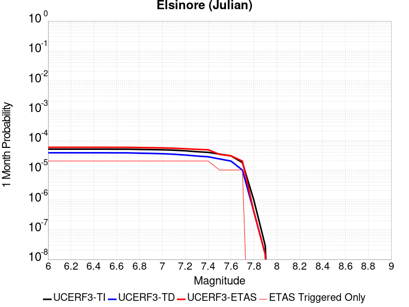 |  |  |

| Magnitude | 1 wk TI Prob | 1 wk TD Prob | 1 wk ETAS Prob | 1 wk ETAS/TD Gain | 1 wk ETAS Triggered Only | 1 mo TI Prob | 1 mo TD Prob | 1 mo ETAS Prob | 1 mo ETAS/TD Gain | 1 mo ETAS Triggered Only | 1 yr TI Prob | 1 yr TD Prob | 1 yr ETAS Prob | 1 yr ETAS/TD Gain | 1 yr ETAS Triggered Only | 10 yr TI Prob | 10 yr TD Prob | 10 yr ETAS Prob | 10 yr ETAS/TD Gain | 10 yr ETAS Triggered Only |
|-----|-----|-----|-----|-----|-----|-----|-----|-----|-----|-----|-----|-----|-----|-----|-----|-----|-----|-----|-----|-----|
| 6.0 | 1.1710231E-5 | 8.845509E-6 | 1.884542E-5 | 2.1305072 | 1.0E-5 | 5.0185736E-5 | 3.7908783E-5 | 5.7908022E-5 | 1.5275623 | 2.0E-5 | 6.1084004E-4 | 4.614434E-4 | 4.914295E-4 | 1.0649834 | 3.0E-5 | 0.006091637 | 0.0046050567 | 0.0046349186 | 1.0064846 | 3.0E-5 |
| 6.1 | 1.1710231E-5 | 8.845509E-6 | 1.884542E-5 | 2.1305072 | 1.0E-5 | 5.0185736E-5 | 3.7908783E-5 | 5.7908022E-5 | 1.5275623 | 2.0E-5 | 6.1084004E-4 | 4.614434E-4 | 4.914295E-4 | 1.0649834 | 3.0E-5 | 0.006091637 | 0.0046050567 | 0.0046349186 | 1.0064846 | 3.0E-5 |
| 6.2 | 1.1710231E-5 | 8.845509E-6 | 1.884542E-5 | 2.1305072 | 1.0E-5 | 5.0185736E-5 | 3.7908783E-5 | 5.7908022E-5 | 1.5275623 | 2.0E-5 | 6.1084004E-4 | 4.614434E-4 | 4.914295E-4 | 1.0649834 | 3.0E-5 | 0.006091637 | 0.0046050567 | 0.0046349186 | 1.0064846 | 3.0E-5 |
| 6.3 | 1.1710231E-5 | 8.845509E-6 | 1.884542E-5 | 2.1305072 | 1.0E-5 | 5.0185736E-5 | 3.7908783E-5 | 5.7908022E-5 | 1.5275623 | 2.0E-5 | 6.1084004E-4 | 4.614434E-4 | 4.914295E-4 | 1.0649834 | 3.0E-5 | 0.006091637 | 0.0046050567 | 0.0046349186 | 1.0064846 | 3.0E-5 |
| 6.4 | 1.1710231E-5 | 8.845509E-6 | 1.884542E-5 | 2.1305072 | 1.0E-5 | 5.0185736E-5 | 3.7908783E-5 | 5.7908022E-5 | 1.5275623 | 2.0E-5 | 6.1084004E-4 | 4.614434E-4 | 4.914295E-4 | 1.0649834 | 3.0E-5 | 0.006091637 | 0.0046050567 | 0.0046349186 | 1.0064846 | 3.0E-5 |
| 6.5 | 1.1710231E-5 | 8.845509E-6 | 1.884542E-5 | 2.1305072 | 1.0E-5 | 5.0185736E-5 | 3.7908783E-5 | 5.7908022E-5 | 1.5275623 | 2.0E-5 | 6.1084004E-4 | 4.614434E-4 | 4.914295E-4 | 1.0649834 | 3.0E-5 | 0.006091637 | 0.0046050567 | 0.0046349186 | 1.0064846 | 3.0E-5 |
| 6.6 | 1.1650619E-5 | 8.777881E-6 | 1.8777793E-5 | 2.1392171 | 1.0E-5 | 4.993027E-5 | 3.7618956E-5 | 5.7618203E-5 | 1.5316268 | 2.0E-5 | 6.0773146E-4 | 4.5791623E-4 | 4.879025E-4 | 1.0654842 | 3.0E-5 | 0.0060607214 | 0.004569931 | 0.004599794 | 1.0065347 | 3.0E-5 |
| 6.7 | 1.1650619E-5 | 8.777881E-6 | 1.8777793E-5 | 2.1392171 | 1.0E-5 | 4.993027E-5 | 3.7618956E-5 | 5.7618203E-5 | 1.5316268 | 2.0E-5 | 6.0773146E-4 | 4.5791623E-4 | 4.879025E-4 | 1.0654842 | 3.0E-5 | 0.0060607214 | 0.004569931 | 0.004599794 | 1.0065347 | 3.0E-5 |
| 6.8 | 1.1442698E-5 | 8.561041E-6 | 1.8560955E-5 | 2.1680722 | 1.0E-5 | 4.9039216E-5 | 3.6689667E-5 | 5.6688936E-5 | 1.5450926 | 2.0E-5 | 5.968889E-4 | 4.4660683E-4 | 4.7659344E-4 | 1.0671432 | 3.0E-5 | 0.0059528816 | 0.004457295 | 0.004487161 | 1.0067005 | 3.0E-5 |
| 6.9 | 1.1300589E-5 | 8.408907E-6 | 1.8408824E-5 | 2.1892052 | 1.0E-5 | 4.8430196E-5 | 3.6037683E-5 | 5.6036963E-5 | 1.5549546 | 2.0E-5 | 5.894781E-4 | 4.3867214E-4 | 4.6865898E-4 | 1.0683582 | 3.0E-5 | 0.005879169 | 0.0043782624 | 0.004408131 | 1.006822 | 3.0E-5 |
| 7.0 | 1.1117729E-5 | 8.226087E-6 | 1.8226005E-5 | 2.2156348 | 1.0E-5 | 4.764654E-5 | 3.525419E-5 | 5.5253488E-5 | 1.5672884 | 2.0E-5 | 5.799422E-4 | 4.291369E-4 | 4.5912404E-4 | 1.0698777 | 3.0E-5 | 0.0057843104 | 0.004283281 | 0.0043131523 | 1.006974 | 3.0E-5 |
| 7.1 | 1.08053955E-5 | 7.9117535E-6 | 1.7911674E-5 | 2.2639322 | 1.0E-5 | 4.6308014E-5 | 3.3907087E-5 | 5.3906406E-5 | 1.5898272 | 2.0E-5 | 5.6365423E-4 | 4.127422E-4 | 4.4272983E-4 | 1.0726546 | 3.0E-5 | 0.005622267 | 0.0041199517 | 0.004149828 | 1.0072516 | 3.0E-5 |
| 7.2 | 1.032804E-5 | 7.433021E-6 | 1.7432947E-5 | 2.345338 | 1.0E-5 | 4.4262277E-5 | 3.1855423E-5 | 5.1854786E-5 | 1.6278166 | 2.0E-5 | 5.387599E-4 | 3.8777234E-4 | 4.177607E-4 | 1.077335 | 3.0E-5 | 0.0053745564 | 0.0038711445 | 0.0039010283 | 1.0077196 | 3.0E-5 |
| 7.3 | 9.622426E-6 | 6.8978457E-6 | 1.6897777E-5 | 2.449718 | 1.0E-5 | 4.1238312E-5 | 2.9561868E-5 | 4.9561277E-5 | 1.6765273 | 2.0E-5 | 5.019608E-4 | 3.5985775E-4 | 3.8984694E-4 | 1.0833362 | 3.0E-5 | 0.005008285 | 0.0035929221 | 0.0036228143 | 1.0083197 | 3.0E-5 |
| 7.4 | 9.144434E-6 | 6.4963933E-6 | 1.6496328E-5 | 2.5393057 | 1.0E-5 | 3.9189843E-5 | 2.7841395E-5 | 4.784084E-5 | 1.7183348 | 2.0E-5 | 4.7703186E-4 | 3.3891766E-4 | 3.689075E-4 | 1.088487 | 3.0E-5 | 0.0047600917 | 0.0033841513 | 0.0034140497 | 1.0088348 | 3.0E-5 |
| 7.5 | 7.988981E-6 | 5.4983307E-6 | 5.4983307E-6 | 1.0 | 0.0 | 3.4238044E-5 | 2.356407E-5 | 3.3563832E-5 | 1.4243649 | 1.0E-5 | 4.1676845E-4 | 2.8685606E-4 | 3.068503E-4 | 1.0697014 | 2.0E-5 | 0.0041598766 | 0.002864985 | 0.0028849277 | 1.0069609 | 2.0E-5 |
| 7.6 | 6.9554876E-6 | 4.6625346E-6 | 4.6625346E-6 | 1.0 | 0.0 | 2.9808893E-5 | 1.9982144E-5 | 2.9981944E-5 | 1.5004368 | 1.0E-5 | 3.6286283E-4 | 2.4325661E-4 | 2.6325174E-4 | 1.0821977 | 2.0E-5 | 0.0036227088 | 0.0024300197 | 0.002449971 | 1.0082104 | 2.0E-5 |
| 7.7 | 4.1557314E-6 | 2.3246462E-6 | 2.3246462E-6 | 1.0 | 0.0 | 1.7810156E-5 | 9.962735E-6 | 1.9962636E-5 | 2.0037305 | 1.0E-5 | 2.1681708E-4 | 1.2129029E-4 | 1.3128908E-4 | 1.0824368 | 1.0E-5 | 0.0021660565 | 0.001212314 | 0.0012223019 | 1.0082387 | 1.0E-5 |
| 7.8 | 2.2597293E-7 | 9.332915E-8 | 9.332915E-8 | 1.0 | 0.0 | 9.684551E-7 | 3.99982E-7 | 3.99982E-7 | 1.0 | 0.0 | 1.1790877E-5 | 4.8697734E-6 | 4.8697734E-6 | 1.0 | 0.0 | 1.17902506E-4 | 4.8696995E-5 | 4.8696995E-5 | 1.0 | 0.0 |
| 7.9 | 6.676829E-9 | 3.439853E-9 | 3.439853E-9 | 1.0 | 0.0 | 2.861498E-8 | 1.4742227E-8 | 1.4742227E-8 | 1.0 | 0.0 | 3.4838732E-7 | 1.7948659E-7 | 1.7948659E-7 | 1.0 | 0.0 | 3.4838679E-6 | 1.7948646E-6 | 1.7948646E-6 | 1.0 | 0.0 |

## Clamshell-Sawpit
*[(top)](#table-of-contents)*

| 1 Week | 1 Month | 1 Year | 10 Year |
|-----|-----|-----|-----|
| 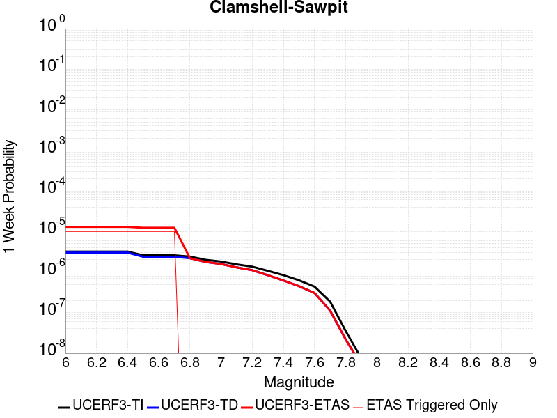 | 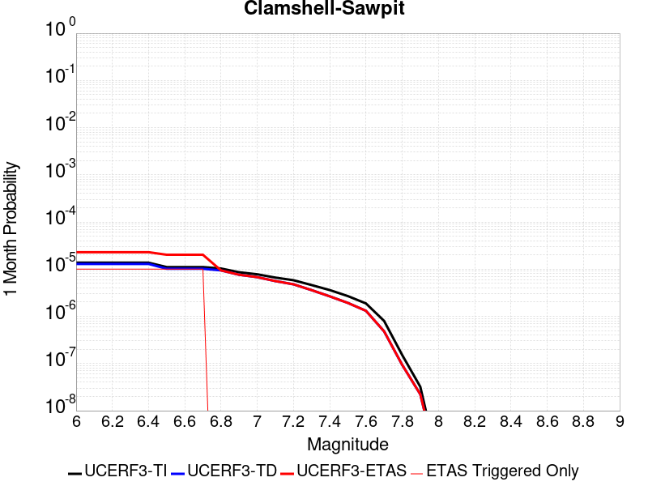 | 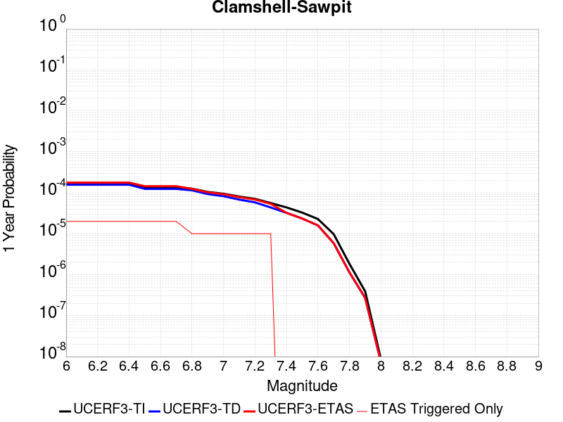 |  |

| Magnitude | 1 wk TI Prob | 1 wk TD Prob | 1 wk ETAS Prob | 1 wk ETAS/TD Gain | 1 wk ETAS Triggered Only | 1 mo TI Prob | 1 mo TD Prob | 1 mo ETAS Prob | 1 mo ETAS/TD Gain | 1 mo ETAS Triggered Only | 1 yr TI Prob | 1 yr TD Prob | 1 yr ETAS Prob | 1 yr ETAS/TD Gain | 1 yr ETAS Triggered Only | 10 yr TI Prob | 10 yr TD Prob | 10 yr ETAS Prob | 10 yr ETAS/TD Gain | 10 yr ETAS Triggered Only |
|-----|-----|-----|-----|-----|-----|-----|-----|-----|-----|-----|-----|-----|-----|-----|-----|-----|-----|-----|-----|-----|
| 6.0 | 3.202998E-6 | 3.0127644E-6 | 1.3012735E-5 | 4.319201 | 1.0E-5 | 1.3727062E-5 | 1.2911788E-5 | 2.2911658E-5 | 1.774476 | 1.0E-5 | 1.6711417E-4 | 1.5719049E-4 | 1.7718734E-4 | 1.1272142 | 2.0E-5 | 0.0016698855 | 0.0015708724 | 0.0016008252 | 1.0190676 | 3.0E-5 |
| 6.1 | 3.202998E-6 | 3.0127644E-6 | 1.3012735E-5 | 4.319201 | 1.0E-5 | 1.3727062E-5 | 1.2911788E-5 | 2.2911658E-5 | 1.774476 | 1.0E-5 | 1.6711417E-4 | 1.5719049E-4 | 1.7718734E-4 | 1.1272142 | 2.0E-5 | 0.0016698855 | 0.0015708724 | 0.0016008252 | 1.0190676 | 3.0E-5 |
| 6.2 | 3.202998E-6 | 3.0127644E-6 | 1.3012735E-5 | 4.319201 | 1.0E-5 | 1.3727062E-5 | 1.2911788E-5 | 2.2911658E-5 | 1.774476 | 1.0E-5 | 1.6711417E-4 | 1.5719049E-4 | 1.7718734E-4 | 1.1272142 | 2.0E-5 | 0.0016698855 | 0.0015708724 | 0.0016008252 | 1.0190676 | 3.0E-5 |
| 6.3 | 3.202998E-6 | 3.0127644E-6 | 1.3012735E-5 | 4.319201 | 1.0E-5 | 1.3727062E-5 | 1.2911788E-5 | 2.2911658E-5 | 1.774476 | 1.0E-5 | 1.6711417E-4 | 1.5719049E-4 | 1.7718734E-4 | 1.1272142 | 2.0E-5 | 0.0016698855 | 0.0015708724 | 0.0016008252 | 1.0190676 | 3.0E-5 |
| 6.4 | 3.202998E-6 | 3.0127644E-6 | 1.3012735E-5 | 4.319201 | 1.0E-5 | 1.3727062E-5 | 1.2911788E-5 | 2.2911658E-5 | 1.774476 | 1.0E-5 | 1.6711417E-4 | 1.5719049E-4 | 1.7718734E-4 | 1.1272142 | 2.0E-5 | 0.0016698855 | 0.0015708724 | 0.0016008252 | 1.0190676 | 3.0E-5 |
| 6.5 | 2.5862723E-6 | 2.380775E-6 | 1.2380751E-5 | 5.200303 | 1.0E-5 | 1.1083977E-5 | 1.0203283E-5 | 2.020318E-5 | 1.9800668 | 1.0E-5 | 1.3493907E-4 | 1.2421819E-4 | 1.4421571E-4 | 1.160987 | 2.0E-5 | 0.0013485716 | 0.0012415178 | 0.0012614931 | 1.0160893 | 2.0E-5 |
| 6.6 | 2.5862723E-6 | 2.380775E-6 | 1.2380751E-5 | 5.200303 | 1.0E-5 | 1.1083977E-5 | 1.0203283E-5 | 2.020318E-5 | 1.9800668 | 1.0E-5 | 1.3493907E-4 | 1.2421819E-4 | 1.4421571E-4 | 1.160987 | 2.0E-5 | 0.0013485716 | 0.0012415178 | 0.0012614931 | 1.0160893 | 2.0E-5 |
| 6.7 | 2.5862723E-6 | 2.380775E-6 | 1.2380751E-5 | 5.200303 | 1.0E-5 | 1.1083977E-5 | 1.0203283E-5 | 2.020318E-5 | 1.9800668 | 1.0E-5 | 1.3493907E-4 | 1.2421819E-4 | 1.4421571E-4 | 1.160987 | 2.0E-5 | 0.0013485716 | 0.0012415178 | 0.0012614931 | 1.0160893 | 2.0E-5 |
| 6.8 | 2.4098806E-6 | 2.1977307E-6 | 2.1977307E-6 | 1.0 | 0.0 | 1.0328019E-5 | 9.4188135E-6 | 9.4188135E-6 | 1.0 | 0.0 | 1.2573638E-4 | 1.1466829E-4 | 1.2466715E-4 | 1.087198 | 1.0E-5 | 0.0012566525 | 0.0011461178 | 0.0011561064 | 1.0087152 | 1.0E-5 |
| 6.9 | 2.0073985E-6 | 1.7784248E-6 | 1.7784248E-6 | 1.0 | 0.0 | 8.603109E-6 | 7.621799E-6 | 7.621799E-6 | 1.0 | 0.0 | 1.0473781E-4 | 9.279157E-5 | 1.0279064E-4 | 1.1077584 | 1.0E-5 | 0.0010468846 | 9.275401E-4 | 9.3753083E-4 | 1.0107712 | 1.0E-5 |
| 7.0 | 1.8166766E-6 | 1.5807095E-6 | 1.5807095E-6 | 1.0 | 0.0 | 7.785734E-6 | 6.7744522E-6 | 6.7744522E-6 | 1.0 | 0.0 | 9.478718E-5 | 8.247593E-5 | 9.2475115E-5 | 1.1212375 | 1.0E-5 | 9.4746763E-4 | 8.244633E-4 | 8.344551E-4 | 1.012119 | 1.0E-5 |
| 7.1 | 1.5471421E-6 | 1.3052961E-6 | 1.3052961E-6 | 1.0 | 0.0 | 6.6305925E-6 | 5.5941146E-6 | 5.5941146E-6 | 1.0 | 0.0 | 8.072447E-5 | 6.8106274E-5 | 7.810559E-5 | 1.1468194 | 1.0E-5 | 8.0695155E-4 | 6.808595E-4 | 6.908527E-4 | 1.0146773 | 1.0E-5 |
| 7.2 | 1.3608037E-6 | 1.1153443E-6 | 1.1153443E-6 | 1.0 | 0.0 | 5.8320024E-6 | 4.7800386E-6 | 4.7800386E-6 | 1.0 | 0.0 | 7.1002316E-5 | 5.8195463E-5 | 6.819488E-5 | 1.1718247 | 1.0E-5 | 7.097964E-4 | 5.818069E-4 | 5.91801E-4 | 1.0171778 | 1.0E-5 |
| 7.3 | 1.0749634E-6 | 8.384254E-7 | 8.384254E-7 | 1.0 | 0.0 | 4.6069777E-6 | 3.593247E-6 | 3.593247E-6 | 1.0 | 0.0 | 5.608851E-5 | 4.374693E-5 | 5.3746495E-5 | 1.2285775 | 1.0E-5 | 5.6074356E-4 | 4.37386E-4 | 4.4738164E-4 | 1.0228531 | 1.0E-5 |
| 7.4 | 8.416856E-7 | 6.200048E-7 | 6.200048E-7 | 1.0 | 0.0 | 3.607219E-6 | 2.6571608E-6 | 2.6571608E-6 | 1.0 | 0.0 | 4.3917007E-5 | 3.2350472E-5 | 3.2350472E-5 | 1.0 | 0.0 | 4.390833E-4 | 3.2345962E-4 | 3.2345962E-4 | 1.0 | 0.0 |
| 7.5 | 6.2779594E-7 | 4.496886E-7 | 4.496886E-7 | 1.0 | 0.0 | 2.6905511E-6 | 1.9272356E-6 | 1.9272356E-6 | 1.0 | 0.0 | 3.275697E-5 | 2.346386E-5 | 2.346386E-5 | 1.0 | 0.0 | 3.275214E-4 | 2.346157E-4 | 2.346157E-4 | 1.0 | 0.0 |
| 7.6 | 4.3822078E-7 | 3.0595405E-7 | 3.0595405E-7 | 1.0 | 0.0 | 1.8780877E-6 | 1.311231E-6 | 1.311231E-6 | 1.0 | 0.0 | 2.2865479E-5 | 1.5964137E-5 | 1.5964137E-5 | 1.0 | 0.0 | 2.2863125E-4 | 1.5963144E-4 | 1.5963144E-4 | 1.0 | 0.0 |
| 7.7 | 1.8704569E-7 | 1.12379205E-7 | 1.12379205E-7 | 1.0 | 0.0 | 8.0162414E-7 | 4.816251E-7 | 4.816251E-7 | 1.0 | 0.0 | 9.75973E-6 | 5.86377E-6 | 5.86377E-6 | 1.0 | 0.0 | 9.7593016E-5 | 5.863622E-5 | 5.863622E-5 | 1.0 | 0.0 |
| 7.8 | 3.5378733E-8 | 2.1838144E-8 | 2.1838144E-8 | 1.0 | 0.0 | 1.5162313E-7 | 9.359204E-8 | 9.359204E-8 | 1.0 | 0.0 | 1.84601E-6 | 1.1394826E-6 | 1.1394826E-6 | 1.0 | 0.0 | 1.8459947E-5 | 1.139477E-5 | 1.139477E-5 | 1.0 | 0.0 |
| 7.9 | 7.504945E-9 | 5.1920326E-9 | 5.1920326E-9 | 1.0 | 0.0 | 3.2164053E-8 | 2.225157E-8 | 2.225157E-8 | 1.0 | 0.0 | 3.9159727E-7 | 2.7091284E-7 | 2.7091284E-7 | 1.0 | 0.0 | 3.915966E-6 | 2.7091257E-6 | 2.7091257E-6 | 1.0 | 0.0 |
| 8.0 | 1.6554036E-10 | 1.4180768E-10 | 1.4180768E-10 | 1.0 | 0.0 | 7.0945894E-10 | 6.077475E-10 | 6.077475E-10 | 1.0 | 0.0 | 8.637662E-9 | 7.3993256E-9 | 7.3993256E-9 | 1.0 | 0.0 | 8.6376616E-8 | 7.3993256E-8 | 7.3993256E-8 | 1.0 | 0.0 |

## Surprise Valley 2011 CFM
*[(top)](#table-of-contents)*

| 1 Week | 1 Month | 1 Year | 10 Year |
|-----|-----|-----|-----|
|  |  |  |  |

| Magnitude | 1 wk TI Prob | 1 wk TD Prob | 1 wk ETAS Prob | 1 wk ETAS/TD Gain | 1 wk ETAS Triggered Only | 1 mo TI Prob | 1 mo TD Prob | 1 mo ETAS Prob | 1 mo ETAS/TD Gain | 1 mo ETAS Triggered Only | 1 yr TI Prob | 1 yr TD Prob | 1 yr ETAS Prob | 1 yr ETAS/TD Gain | 1 yr ETAS Triggered Only | 10 yr TI Prob | 10 yr TD Prob | 10 yr ETAS Prob | 10 yr ETAS/TD Gain | 10 yr ETAS Triggered Only |
|-----|-----|-----|-----|-----|-----|-----|-----|-----|-----|-----|-----|-----|-----|-----|-----|-----|-----|-----|-----|-----|
| 6.0 | 4.0396248E-5 | 4.485131E-5 | 4.485131E-5 | 1.0 | 0.0 | 1.7311527E-4 | 1.9220692E-4 | 1.9220692E-4 | 1.0 | 0.0 | 0.002105641 | 0.0023378176 | 0.0023378176 | 1.0 | 0.0 | 0.020858008 | 0.023153966 | 0.023173504 | 1.0008438 | 2.0E-5 |
| 6.1 | 4.0396248E-5 | 4.485131E-5 | 4.485131E-5 | 1.0 | 0.0 | 1.7311527E-4 | 1.9220692E-4 | 1.9220692E-4 | 1.0 | 0.0 | 0.002105641 | 0.0023378176 | 0.0023378176 | 1.0 | 0.0 | 0.020858008 | 0.023153966 | 0.023173504 | 1.0008438 | 2.0E-5 |
| 6.2 | 2.2295266E-5 | 2.440125E-5 | 2.440125E-5 | 1.0 | 0.0 | 9.554764E-5 | 1.0457276E-4 | 1.0457276E-4 | 1.0 | 0.0 | 0.0011626717 | 0.0012724606 | 0.0012724606 | 1.0 | 0.0 | 0.011566074 | 0.012654981 | 0.0126747275 | 1.0015604 | 2.0E-5 |
| 6.3 | 1.572643E-5 | 1.7096807E-5 | 1.7096807E-5 | 1.0 | 0.0 | 6.7397246E-5 | 7.327003E-5 | 7.327003E-5 | 1.0 | 0.0 | 8.202525E-4 | 8.91708E-4 | 8.91708E-4 | 1.0 | 0.0 | 0.008172315 | 0.008882407 | 0.008902229 | 1.0022316 | 2.0E-5 |
| 6.4 | 1.5714395E-5 | 1.7084629E-5 | 1.7084629E-5 | 1.0 | 0.0 | 6.734567E-5 | 7.3217845E-5 | 7.3217845E-5 | 1.0 | 0.0 | 8.1962504E-4 | 8.9107314E-4 | 8.9107314E-4 | 1.0 | 0.0 | 0.008166086 | 0.008876109 | 0.008895931 | 1.0022333 | 2.0E-5 |
| 6.5 | 1.2733495E-5 | 1.38016E-5 | 1.38016E-5 | 1.0 | 0.0 | 5.457098E-5 | 5.9148413E-5 | 5.9148413E-5 | 1.0 | 0.0 | 6.641992E-4 | 7.1990065E-4 | 7.1990065E-4 | 1.0 | 0.0 | 0.0066221743 | 0.0071763797 | 0.007186308 | 1.0013834 | 1.0E-5 |
| 6.6 | 1.0983784E-5 | 1.1886554E-5 | 1.1886554E-5 | 1.0 | 0.0 | 4.7072506E-5 | 5.094141E-5 | 5.094141E-5 | 1.0 | 0.0 | 5.7295704E-4 | 6.200405E-4 | 6.200405E-4 | 1.0 | 0.0 | 0.0057148207 | 0.0061836545 | 0.0061935927 | 1.0016072 | 1.0E-5 |
| 6.7 | 9.104806E-6 | 9.839491E-6 | 9.839491E-6 | 1.0 | 0.0 | 3.902001E-5 | 4.2168587E-5 | 4.2168587E-5 | 1.0 | 0.0 | 4.7496508E-4 | 5.132855E-4 | 5.132855E-4 | 1.0 | 0.0 | 0.004739512 | 0.005121397 | 0.0051313457 | 1.0019426 | 1.0E-5 |
| 6.8 | 6.2162403E-6 | 6.7041337E-6 | 6.7041337E-6 | 1.0 | 0.0 | 2.6640759E-5 | 2.8731698E-5 | 2.8731698E-5 | 1.0 | 0.0 | 3.2430296E-4 | 3.497545E-4 | 3.497545E-4 | 1.0 | 0.0 | 0.003238301 | 0.0034922638 | 0.0034922638 | 1.0 | 0.0 |
| 6.9 | 4.1792696E-6 | 4.50323E-6 | 4.50323E-6 | 1.0 | 0.0 | 1.7911032E-5 | 1.9299423E-5 | 1.9299423E-5 | 1.0 | 0.0 | 2.1804498E-4 | 2.3494668E-4 | 2.3494668E-4 | 1.0 | 0.0 | 0.0021783116 | 0.0023471361 | 0.0023471361 | 1.0 | 0.0 |
| 7.0 | 2.7478413E-6 | 2.9622424E-6 | 2.9622424E-6 | 1.0 | 0.0 | 1.177641E-5 | 1.269527E-5 | 1.269527E-5 | 1.0 | 0.0 | 1.4336836E-4 | 1.545552E-4 | 1.545552E-4 | 1.0 | 0.0 | 0.001432759 | 0.0015445995 | 0.0015445995 | 1.0 | 0.0 |
| 7.1 | 8.128648E-7 | 8.724922E-7 | 8.724922E-7 | 1.0 | 0.0 | 3.4837017E-6 | 3.7392501E-6 | 3.7392501E-6 | 1.0 | 0.0 | 4.2413245E-5 | 4.552502E-5 | 4.552502E-5 | 1.0 | 0.0 | 4.2405148E-4 | 4.5521575E-4 | 4.5521575E-4 | 1.0 | 0.0 |
| 7.2 | 4.8641045E-8 | 4.9402068E-8 | 4.9402068E-8 | 1.0 | 0.0 | 2.084616E-7 | 2.1172312E-7 | 2.1172312E-7 | 1.0 | 0.0 | 2.538017E-6 | 2.577726E-6 | 2.577726E-6 | 1.0 | 0.0 | 2.537988E-5 | 2.5776973E-5 | 2.5776973E-5 | 1.0 | 0.0 |
| 7.3 | 5.3911844E-9 | 5.4758145E-9 | 5.4758145E-9 | 1.0 | 0.0 | 2.3105075E-8 | 2.3467775E-8 | 2.3467775E-8 | 1.0 | 0.0 | 2.8130427E-7 | 2.8572015E-7 | 2.8572015E-7 | 1.0 | 0.0 | 2.8130391E-6 | 2.8571992E-6 | 2.8571992E-6 | 1.0 | 0.0 |

## Great Valley 04b Gordon Valley
*[(top)](#table-of-contents)*

| 1 Week | 1 Month | 1 Year | 10 Year |
|-----|-----|-----|-----|
|  |  | 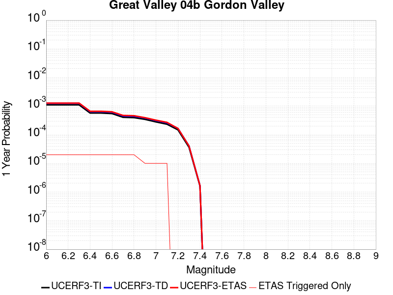 | 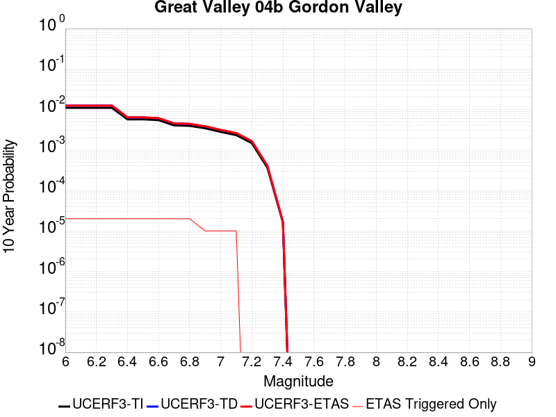 |

| Magnitude | 1 wk TI Prob | 1 wk TD Prob | 1 wk ETAS Prob | 1 wk ETAS/TD Gain | 1 wk ETAS Triggered Only | 1 mo TI Prob | 1 mo TD Prob | 1 mo ETAS Prob | 1 mo ETAS/TD Gain | 1 mo ETAS Triggered Only | 1 yr TI Prob | 1 yr TD Prob | 1 yr ETAS Prob | 1 yr ETAS/TD Gain | 1 yr ETAS Triggered Only | 10 yr TI Prob | 10 yr TD Prob | 10 yr ETAS Prob | 10 yr ETAS/TD Gain | 10 yr ETAS Triggered Only |
|-----|-----|-----|-----|-----|-----|-----|-----|-----|-----|-----|-----|-----|-----|-----|-----|-----|-----|-----|-----|-----|
| 6.0 | 2.1181217E-5 | 2.3981953E-5 | 3.3981712E-5 | 1.4169703 | 1.0E-5 | 9.077348E-5 | 1.0277669E-4 | 1.1277566E-4 | 1.0972884 | 1.0E-5 | 0.0011046068 | 0.0012507546 | 0.0012707296 | 1.0159703 | 2.0E-5 | 0.010991322 | 0.012453599 | 0.012473349 | 1.001586 | 2.0E-5 |
| 6.1 | 2.1181217E-5 | 2.3981953E-5 | 3.3981712E-5 | 1.4169703 | 1.0E-5 | 9.077348E-5 | 1.0277669E-4 | 1.1277566E-4 | 1.0972884 | 1.0E-5 | 0.0011046068 | 0.0012507546 | 0.0012707296 | 1.0159703 | 2.0E-5 | 0.010991322 | 0.012453599 | 0.012473349 | 1.001586 | 2.0E-5 |
| 6.2 | 2.1181217E-5 | 2.3981953E-5 | 3.3981712E-5 | 1.4169703 | 1.0E-5 | 9.077348E-5 | 1.0277669E-4 | 1.1277566E-4 | 1.0972884 | 1.0E-5 | 0.0011046068 | 0.0012507546 | 0.0012707296 | 1.0159703 | 2.0E-5 | 0.010991322 | 0.012453599 | 0.012473349 | 1.001586 | 2.0E-5 |
| 6.3 | 2.1181217E-5 | 2.3981953E-5 | 3.3981712E-5 | 1.4169703 | 1.0E-5 | 9.077348E-5 | 1.0277669E-4 | 1.1277566E-4 | 1.0972884 | 1.0E-5 | 0.0011046068 | 0.0012507546 | 0.0012707296 | 1.0159703 | 2.0E-5 | 0.010991322 | 0.012453599 | 0.012473349 | 1.001586 | 2.0E-5 |
| 6.4 | 1.0988268E-5 | 1.2254499E-5 | 2.2254377E-5 | 1.8160169 | 1.0E-5 | 4.7091726E-5 | 5.2518313E-5 | 6.2517785E-5 | 1.1903998 | 1.0E-5 | 5.731909E-4 | 6.392388E-4 | 6.5922603E-4 | 1.0312672 | 2.0E-5 | 0.005717147 | 0.0063755875 | 0.00639546 | 1.003117 | 2.0E-5 |
| 6.5 | 1.0988268E-5 | 1.2254499E-5 | 2.2254377E-5 | 1.8160169 | 1.0E-5 | 4.7091726E-5 | 5.2518313E-5 | 6.2517785E-5 | 1.1903998 | 1.0E-5 | 5.731909E-4 | 6.392388E-4 | 6.5922603E-4 | 1.0312672 | 2.0E-5 | 0.005717147 | 0.0063755875 | 0.00639546 | 1.003117 | 2.0E-5 |
| 6.6 | 1.0517822E-5 | 1.1724062E-5 | 2.1723945E-5 | 1.8529367 | 1.0E-5 | 4.5075605E-5 | 5.02451E-5 | 6.0244598E-5 | 1.1990144 | 1.0E-5 | 5.4865726E-4 | 6.11578E-4 | 6.315658E-4 | 1.0326823 | 2.0E-5 | 0.0054730466 | 0.0061005033 | 0.006120381 | 1.0032585 | 2.0E-5 |
| 6.7 | 7.789219E-6 | 8.6776445E-6 | 1.8677558E-5 | 2.1523764 | 1.0E-5 | 3.3381937E-5 | 3.7189402E-5 | 4.718903E-5 | 1.2688838 | 1.0E-5 | 4.063493E-4 | 4.526921E-4 | 4.7268305E-4 | 1.0441601 | 2.0E-5 | 0.004056071 | 0.0045182165 | 0.0045381263 | 1.0044066 | 2.0E-5 |
| 6.8 | 7.5850853E-6 | 8.452389E-6 | 1.8452305E-5 | 2.1830876 | 1.0E-5 | 3.2507105E-5 | 3.622405E-5 | 4.6223686E-5 | 1.2760497 | 1.0E-5 | 3.957021E-4 | 4.409437E-4 | 4.6093488E-4 | 1.0453373 | 2.0E-5 | 0.0039499826 | 0.0044012 | 0.004421112 | 1.0045242 | 2.0E-5 |
| 6.9 | 6.604105E-6 | 7.3585493E-6 | 7.3585493E-6 | 1.0 | 0.0 | 2.8303E-5 | 3.153628E-5 | 3.153628E-5 | 1.0 | 0.0 | 3.4453452E-4 | 3.8389044E-4 | 3.938866E-4 | 1.0260391 | 1.0E-5 | 0.0034400085 | 0.0038326595 | 0.003842621 | 1.0025991 | 1.0E-5 |
| 7.0 | 5.3701115E-6 | 5.9884183E-6 | 5.9884183E-6 | 1.0 | 0.0 | 2.301456E-5 | 2.5664414E-5 | 2.5664414E-5 | 1.0 | 0.0 | 2.8016625E-4 | 3.1242234E-4 | 3.2241922E-4 | 1.0319979 | 1.0E-5 | 0.0027981328 | 0.00312012 | 0.0031300886 | 1.003195 | 1.0E-5 |
| 7.1 | 4.4685607E-6 | 4.986478E-6 | 4.986478E-6 | 1.0 | 0.0 | 1.9150835E-5 | 2.1370459E-5 | 2.1370459E-5 | 1.0 | 0.0 | 2.3313647E-4 | 2.6015675E-4 | 2.7015415E-4 | 1.0384283 | 1.0E-5 | 0.0023289204 | 0.0025987667 | 0.002608741 | 1.003838 | 1.0E-5 |
| 7.2 | 2.833378E-6 | 3.164419E-6 | 3.164419E-6 | 1.0 | 0.0 | 1.2142991E-5 | 1.3561736E-5 | 1.3561736E-5 | 1.0 | 0.0 | 1.4783088E-4 | 1.6510337E-4 | 1.6510337E-4 | 1.0 | 0.0 | 0.0014773258 | 0.0016499789 | 0.0016499789 | 1.0 | 0.0 |
| 7.3 | 7.0087293E-7 | 7.7728157E-7 | 7.7728157E-7 | 1.0 | 0.0 | 3.0037377E-6 | 3.3312049E-6 | 3.3312049E-6 | 1.0 | 0.0 | 3.656989E-5 | 4.0557123E-5 | 4.0557123E-5 | 1.0 | 0.0 | 3.6563876E-4 | 4.055422E-4 | 4.055422E-4 | 1.0 | 0.0 |
| 7.4 | 3.112171E-8 | 3.2068368E-8 | 3.2068368E-8 | 1.0 | 0.0 | 1.3337875E-7 | 1.3743585E-7 | 1.3743585E-7 | 1.0 | 0.0 | 1.6238852E-6 | 1.6732803E-6 | 1.6732803E-6 | 1.0 | 0.0 | 1.6238733E-5 | 1.6732685E-5 | 1.6732685E-5 | 1.0 | 0.0 |

## San Gorgonio Pass
*[(top)](#table-of-contents)*

| 1 Week | 1 Month | 1 Year | 10 Year |
|-----|-----|-----|-----|
|  |  |  | 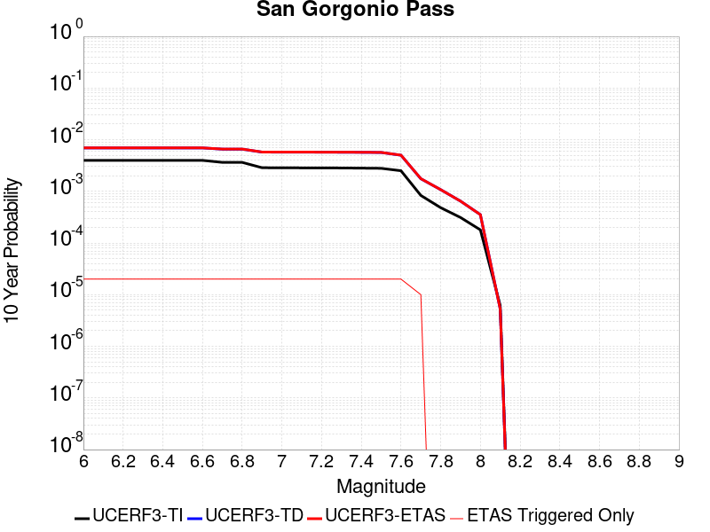 |

| Magnitude | 1 wk TI Prob | 1 wk TD Prob | 1 wk ETAS Prob | 1 wk ETAS/TD Gain | 1 wk ETAS Triggered Only | 1 mo TI Prob | 1 mo TD Prob | 1 mo ETAS Prob | 1 mo ETAS/TD Gain | 1 mo ETAS Triggered Only | 1 yr TI Prob | 1 yr TD Prob | 1 yr ETAS Prob | 1 yr ETAS/TD Gain | 1 yr ETAS Triggered Only | 10 yr TI Prob | 10 yr TD Prob | 10 yr ETAS Prob | 10 yr ETAS/TD Gain | 10 yr ETAS Triggered Only |
|-----|-----|-----|-----|-----|-----|-----|-----|-----|-----|-----|-----|-----|-----|-----|-----|-----|-----|-----|-----|-----|
| 6.0 | 7.644328E-6 | 1.3314231E-5 | 1.3314231E-5 | 1.0 | 0.0 | 3.2760996E-5 | 5.705979E-5 | 5.705979E-5 | 1.0 | 0.0 | 3.987921E-4 | 6.944901E-4 | 6.944901E-4 | 1.0 | 0.0 | 0.003980772 | 0.0069299806 | 0.006949842 | 1.002866 | 2.0E-5 |
| 6.1 | 7.644328E-6 | 1.3314231E-5 | 1.3314231E-5 | 1.0 | 0.0 | 3.2760996E-5 | 5.705979E-5 | 5.705979E-5 | 1.0 | 0.0 | 3.987921E-4 | 6.944901E-4 | 6.944901E-4 | 1.0 | 0.0 | 0.003980772 | 0.0069299806 | 0.006949842 | 1.002866 | 2.0E-5 |
| 6.2 | 7.644328E-6 | 1.3314231E-5 | 1.3314231E-5 | 1.0 | 0.0 | 3.2760996E-5 | 5.705979E-5 | 5.705979E-5 | 1.0 | 0.0 | 3.987921E-4 | 6.944901E-4 | 6.944901E-4 | 1.0 | 0.0 | 0.003980772 | 0.0069299806 | 0.006949842 | 1.002866 | 2.0E-5 |
| 6.3 | 7.644328E-6 | 1.3314231E-5 | 1.3314231E-5 | 1.0 | 0.0 | 3.2760996E-5 | 5.705979E-5 | 5.705979E-5 | 1.0 | 0.0 | 3.987921E-4 | 6.944901E-4 | 6.944901E-4 | 1.0 | 0.0 | 0.003980772 | 0.0069299806 | 0.006949842 | 1.002866 | 2.0E-5 |
| 6.4 | 7.644328E-6 | 1.3314231E-5 | 1.3314231E-5 | 1.0 | 0.0 | 3.2760996E-5 | 5.705979E-5 | 5.705979E-5 | 1.0 | 0.0 | 3.987921E-4 | 6.944901E-4 | 6.944901E-4 | 1.0 | 0.0 | 0.003980772 | 0.0069299806 | 0.006949842 | 1.002866 | 2.0E-5 |
| 6.5 | 7.644328E-6 | 1.3314231E-5 | 1.3314231E-5 | 1.0 | 0.0 | 3.2760996E-5 | 5.705979E-5 | 5.705979E-5 | 1.0 | 0.0 | 3.987921E-4 | 6.944901E-4 | 6.944901E-4 | 1.0 | 0.0 | 0.003980772 | 0.0069299806 | 0.006949842 | 1.002866 | 2.0E-5 |
| 6.6 | 7.644328E-6 | 1.3314231E-5 | 1.3314231E-5 | 1.0 | 0.0 | 3.2760996E-5 | 5.705979E-5 | 5.705979E-5 | 1.0 | 0.0 | 3.987921E-4 | 6.944901E-4 | 6.944901E-4 | 1.0 | 0.0 | 0.003980772 | 0.0069299806 | 0.006949842 | 1.002866 | 2.0E-5 |
| 6.7 | 6.987586E-6 | 1.2618505E-5 | 1.2618505E-5 | 1.0 | 0.0 | 2.9946454E-5 | 5.4078235E-5 | 5.4078235E-5 | 1.0 | 0.0 | 3.645371E-4 | 6.582117E-4 | 6.582117E-4 | 1.0 | 0.0 | 0.0036393967 | 0.0065693567 | 0.0065892255 | 1.0030245 | 2.0E-5 |
| 6.8 | 6.987586E-6 | 1.2618505E-5 | 1.2618505E-5 | 1.0 | 0.0 | 2.9946454E-5 | 5.4078235E-5 | 5.4078235E-5 | 1.0 | 0.0 | 3.645371E-4 | 6.582117E-4 | 6.582117E-4 | 1.0 | 0.0 | 0.0036393967 | 0.0065693567 | 0.0065892255 | 1.0030245 | 2.0E-5 |
| 6.9 | 5.504702E-6 | 1.1049368E-5 | 1.1049368E-5 | 1.0 | 0.0 | 2.3591367E-5 | 4.7353606E-5 | 4.7353606E-5 | 1.0 | 0.0 | 2.8718702E-4 | 5.7638274E-4 | 5.7638274E-4 | 1.0 | 0.0 | 0.0028681618 | 0.005755309 | 0.005775194 | 1.003455 | 2.0E-5 |
| 7.0 | 5.4825764E-6 | 1.102571E-5 | 1.102571E-5 | 1.0 | 0.0 | 2.3496545E-5 | 4.7252215E-5 | 4.7252215E-5 | 1.0 | 0.0 | 2.8603288E-4 | 5.751489E-4 | 5.751489E-4 | 1.0 | 0.0 | 0.00285665 | 0.005743035 | 0.0057629202 | 1.0034624 | 2.0E-5 |
| 7.1 | 5.4692787E-6 | 1.101142E-5 | 1.101142E-5 | 1.0 | 0.0 | 2.3439556E-5 | 4.7190973E-5 | 4.7190973E-5 | 1.0 | 0.0 | 2.8533922E-4 | 5.744037E-4 | 5.744037E-4 | 1.0 | 0.0 | 0.0028497311 | 0.0057356213 | 0.0057555065 | 1.003467 | 2.0E-5 |
| 7.2 | 5.453661E-6 | 1.0994446E-5 | 1.0994446E-5 | 1.0 | 0.0 | 2.3372622E-5 | 4.7118232E-5 | 4.7118232E-5 | 1.0 | 0.0 | 2.8452452E-4 | 5.7351857E-4 | 5.7351857E-4 | 1.0 | 0.0 | 0.002841605 | 0.0057268157 | 0.005746701 | 1.0034723 | 2.0E-5 |
| 7.3 | 5.4422303E-6 | 1.0981369E-5 | 1.0981369E-5 | 1.0 | 0.0 | 2.3323635E-5 | 4.706219E-5 | 4.706219E-5 | 1.0 | 0.0 | 2.8392827E-4 | 5.728366E-4 | 5.728366E-4 | 1.0 | 0.0 | 0.0028356577 | 0.005720031 | 0.0057399166 | 1.0034765 | 2.0E-5 |
| 7.4 | 5.398595E-6 | 1.0928734E-5 | 1.0928734E-5 | 1.0 | 0.0 | 2.313663E-5 | 4.683662E-5 | 4.683662E-5 | 1.0 | 0.0 | 2.8165206E-4 | 5.700917E-4 | 5.700917E-4 | 1.0 | 0.0 | 0.0028129534 | 0.005692723 | 0.0057126097 | 1.0034933 | 2.0E-5 |
| 7.5 | 5.3578788E-6 | 1.0855281E-5 | 1.0855281E-5 | 1.0 | 0.0 | 2.2962136E-5 | 4.6521833E-5 | 4.6521833E-5 | 1.0 | 0.0 | 2.7952815E-4 | 5.662612E-4 | 5.662612E-4 | 1.0 | 0.0 | 0.002791768 | 0.0056546377 | 0.0056745247 | 1.0035169 | 2.0E-5 |
| 7.6 | 4.8091474E-6 | 9.60368E-6 | 9.60368E-6 | 1.0 | 0.0 | 2.0610469E-5 | 4.1158008E-5 | 4.1158008E-5 | 1.0 | 0.0 | 2.5090357E-4 | 5.0098833E-4 | 5.0098833E-4 | 1.0 | 0.0 | 0.0025062046 | 0.0050053033 | 0.0050252033 | 1.0039757 | 2.0E-5 |
| 7.7 | 1.5991155E-6 | 3.352866E-6 | 3.352866E-6 | 1.0 | 0.0 | 6.853334E-6 | 1.4369349E-5 | 1.4369349E-5 | 1.0 | 0.0 | 8.343615E-5 | 1.7493303E-4 | 1.7493303E-4 | 1.0 | 0.0 | 8.340483E-4 | 0.0017534072 | 0.0017633897 | 1.0056932 | 1.0E-5 |
| 7.8 | 9.258398E-7 | 2.0579948E-6 | 2.0579948E-6 | 1.0 | 0.0 | 3.967879E-6 | 8.819949E-6 | 8.819949E-6 | 1.0 | 0.0 | 4.8307855E-5 | 1.073776E-4 | 1.073776E-4 | 1.0 | 0.0 | 4.8297356E-4 | 0.001078687 | 0.001078687 | 1.0 | 0.0 |
| 7.9 | 5.975575E-7 | 1.2291794E-6 | 1.2291794E-6 | 1.0 | 0.0 | 2.5609581E-6 | 5.2679006E-6 | 5.2679006E-6 | 1.0 | 0.0 | 3.117922E-5 | 6.4134816E-5 | 6.4134816E-5 | 1.0 | 0.0 | 3.1174847E-4 | 6.463092E-4 | 6.463092E-4 | 1.0 | 0.0 |
| 8.0 | 3.4413725E-7 | 6.7148494E-7 | 6.7148494E-7 | 1.0 | 0.0 | 1.4748731E-6 | 2.8777895E-6 | 2.8777895E-6 | 1.0 | 0.0 | 1.7956432E-5 | 3.503653E-5 | 3.503653E-5 | 1.0 | 0.0 | 1.7954981E-4 | 3.5373896E-4 | 3.5373896E-4 | 1.0 | 0.0 |
| 8.1 | 1.1787731E-8 | 9.634385E-9 | 9.634385E-9 | 1.0 | 0.0 | 5.0518846E-8 | 4.129022E-8 | 4.129022E-8 | 1.0 | 0.0 | 6.1506677E-7 | 5.027083E-7 | 5.027083E-7 | 1.0 | 0.0 | 6.1506507E-6 | 5.2424944E-6 | 5.2424944E-6 | 1.0 | 0.0 |

## Quien Sabe 2011 CFM
*[(top)](#table-of-contents)*

| 1 Week | 1 Month | 1 Year | 10 Year |
|-----|-----|-----|-----|
|  |  |  |  |

| Magnitude | 1 wk TI Prob | 1 wk TD Prob | 1 wk ETAS Prob | 1 wk ETAS/TD Gain | 1 wk ETAS Triggered Only | 1 mo TI Prob | 1 mo TD Prob | 1 mo ETAS Prob | 1 mo ETAS/TD Gain | 1 mo ETAS Triggered Only | 1 yr TI Prob | 1 yr TD Prob | 1 yr ETAS Prob | 1 yr ETAS/TD Gain | 1 yr ETAS Triggered Only | 10 yr TI Prob | 10 yr TD Prob | 10 yr ETAS Prob | 10 yr ETAS/TD Gain | 10 yr ETAS Triggered Only |
|-----|-----|-----|-----|-----|-----|-----|-----|-----|-----|-----|-----|-----|-----|-----|-----|-----|-----|-----|-----|-----|
| 6.0 | 3.729899E-5 | 7.087805E-5 | 8.087735E-5 | 1.1410774 | 1.0E-5 | 1.5984301E-4 | 3.037322E-4 | 3.1372916E-4 | 1.0329137 | 1.0E-5 | 0.0019443515 | 0.0036852323 | 0.0036951953 | 1.0027035 | 1.0E-5 | 0.019274272 | 0.035349756 | 0.03536905 | 1.0005457 | 2.0E-5 |
| 6.1 | 1.7825725E-5 | 3.31456E-5 | 4.3145268E-5 | 1.3016891 | 1.0E-5 | 7.639373E-5 | 1.4204586E-4 | 1.5204445E-4 | 1.0703897 | 1.0E-5 | 9.296967E-4 | 0.0017267246 | 0.0017367073 | 1.0057813 | 1.0E-5 | 0.009258169 | 0.016698597 | 0.01670843 | 1.0005889 | 1.0E-5 |
| 6.2 | 4.8865336E-6 | 7.804963E-6 | 7.804963E-6 | 1.0 | 0.0 | 2.0942118E-5 | 3.344947E-5 | 3.344947E-5 | 1.0 | 0.0 | 2.5494045E-4 | 4.0691497E-4 | 4.0691497E-4 | 1.0 | 0.0 | 0.0025464818 | 0.0040135453 | 0.0040135453 | 1.0 | 0.0 |
| 6.3 | 3.858491E-6 | 5.789573E-6 | 5.789573E-6 | 1.0 | 0.0 | 1.6536285E-5 | 2.4812247E-5 | 2.4812247E-5 | 1.0 | 0.0 | 2.0131067E-4 | 3.0205192E-4 | 3.0205192E-4 | 1.0 | 0.0 | 0.002011284 | 0.0030019816 | 0.0030019816 | 1.0 | 0.0 |
| 6.4 | 3.0771805E-6 | 4.384806E-6 | 4.384806E-6 | 1.0 | 0.0 | 1.318785E-5 | 1.8791905E-5 | 1.8791905E-5 | 1.0 | 0.0 | 1.6055023E-4 | 2.2876984E-4 | 2.2876984E-4 | 1.0 | 0.0 | 0.001604343 | 0.002286477 | 0.002286477 | 1.0 | 0.0 |
| 6.5 | 2.5081235E-6 | 3.463511E-6 | 3.463511E-6 | 1.0 | 0.0 | 1.0749056E-5 | 1.4843542E-5 | 1.4843542E-5 | 1.0 | 0.0 | 1.308619E-4 | 1.807066E-4 | 1.807066E-4 | 1.0 | 0.0 | 0.0013078486 | 0.0018123116 | 0.0018123116 | 1.0 | 0.0 |
| 6.6 | 1.7505364E-6 | 2.4023168E-6 | 2.4023168E-6 | 1.0 | 0.0 | 7.502277E-6 | 1.0295607E-5 | 1.0295607E-5 | 1.0 | 0.0 | 9.13364E-5 | 1.2534253E-4 | 1.2534253E-4 | 1.0 | 0.0 | 9.129886E-4 | 0.0012582915 | 0.0012582915 | 1.0 | 0.0 |
| 6.7 | 1.505737E-6 | 2.0637349E-6 | 2.0637349E-6 | 1.0 | 0.0 | 6.4531428E-6 | 8.844551E-6 | 8.844551E-6 | 1.0 | 0.0 | 7.8564175E-5 | 1.0767768E-4 | 1.0767768E-4 | 1.0 | 0.0 | 7.853641E-4 | 0.0010818138 | 0.0010818138 | 1.0 | 0.0 |
| 6.8 | 1.2924105E-6 | 1.7484025E-6 | 1.7484025E-6 | 1.0 | 0.0 | 5.5388905E-6 | 7.4931354E-6 | 7.4931354E-6 | 1.0 | 0.0 | 6.74339E-5 | 9.122565E-5 | 9.122565E-5 | 1.0 | 0.0 | 6.741344E-4 | 9.1609603E-4 | 9.1609603E-4 | 1.0 | 0.0 |
| 6.9 | 8.9075286E-7 | 1.1249955E-6 | 1.1249955E-6 | 1.0 | 0.0 | 3.8175067E-6 | 4.8214015E-6 | 4.8214015E-6 | 1.0 | 0.0 | 4.6477155E-5 | 5.8699206E-5 | 5.8699206E-5 | 1.0 | 0.0 | 4.6467435E-4 | 5.903947E-4 | 5.903947E-4 | 1.0 | 0.0 |
| 7.0 | 6.6891175E-7 | 8.51663E-7 | 8.51663E-7 | 1.0 | 0.0 | 2.8667614E-6 | 3.6499803E-6 | 3.6499803E-6 | 1.0 | 0.0 | 3.4902263E-5 | 4.44378E-5 | 4.44378E-5 | 1.0 | 0.0 | 3.4896782E-4 | 4.4678617E-4 | 4.4678617E-4 | 1.0 | 0.0 |
| 7.1 | 4.4205015E-7 | 5.3919683E-7 | 5.3919683E-7 | 1.0 | 0.0 | 1.8944993E-6 | 2.3108425E-6 | 2.3108425E-6 | 1.0 | 0.0 | 2.3065284E-5 | 2.8134315E-5 | 2.8134315E-5 | 1.0 | 0.0 | 2.3062891E-4 | 2.826926E-4 | 2.826926E-4 | 1.0 | 0.0 |
| 7.2 | 1.6620965E-7 | 1.5987598E-7 | 1.5987598E-7 | 1.0 | 0.0 | 7.123269E-7 | 6.851826E-7 | 6.851826E-7 | 1.0 | 0.0 | 8.672545E-6 | 8.34207E-6 | 8.34207E-6 | 1.0 | 0.0 | 8.6722066E-5 | 8.3573126E-5 | 8.3573126E-5 | 1.0 | 0.0 |
| 7.3 | 1.2142488E-7 | 1.1726492E-7 | 1.1726492E-7 | 1.0 | 0.0 | 5.2039223E-7 | 5.0256386E-7 | 5.0256386E-7 | 1.0 | 0.0 | 6.335757E-6 | 6.118701E-6 | 6.118701E-6 | 1.0 | 0.0 | 6.3355765E-5 | 6.124848E-5 | 6.124848E-5 | 1.0 | 0.0 |
| 7.4 | 2.4192937E-8 | 2.4543448E-8 | 2.4543448E-8 | 1.0 | 0.0 | 1.0368401E-7 | 1.051862E-7 | 1.051862E-7 | 1.0 | 0.0 | 1.2623522E-6 | 1.2806413E-6 | 1.2806413E-6 | 1.0 | 0.0 | 1.2623449E-5 | 1.2812683E-5 | 1.2812683E-5 | 1.0 | 0.0 |
| 7.5 | 1.4432802E-8 | 1.4506471E-8 | 1.4506471E-8 | 1.0 | 0.0 | 6.185486E-8 | 6.2170585E-8 | 6.2170585E-8 | 1.0 | 0.0 | 7.530827E-7 | 7.5692674E-7 | 7.5692674E-7 | 1.0 | 0.0 | 7.530801E-6 | 7.5735175E-6 | 7.5735175E-6 | 1.0 | 0.0 |

## Great Valley 03 Mysterious Ridge
*[(top)](#table-of-contents)*

| 1 Week | 1 Month | 1 Year | 10 Year |
|-----|-----|-----|-----|
|  |  |  |  |

| Magnitude | 1 wk TI Prob | 1 wk TD Prob | 1 wk ETAS Prob | 1 wk ETAS/TD Gain | 1 wk ETAS Triggered Only | 1 mo TI Prob | 1 mo TD Prob | 1 mo ETAS Prob | 1 mo ETAS/TD Gain | 1 mo ETAS Triggered Only | 1 yr TI Prob | 1 yr TD Prob | 1 yr ETAS Prob | 1 yr ETAS/TD Gain | 1 yr ETAS Triggered Only | 10 yr TI Prob | 10 yr TD Prob | 10 yr ETAS Prob | 10 yr ETAS/TD Gain | 10 yr ETAS Triggered Only |
|-----|-----|-----|-----|-----|-----|-----|-----|-----|-----|-----|-----|-----|-----|-----|-----|-----|-----|-----|-----|-----|
| 6.0 | 3.1182444E-5 | 3.603423E-5 | 4.603387E-5 | 1.277504 | 1.0E-5 | 1.336322E-4 | 1.544242E-4 | 1.6442266E-4 | 1.0647467 | 1.0E-5 | 0.0016257578 | 0.0018786696 | 0.001898632 | 1.0106258 | 2.0E-5 | 0.016139153 | 0.018646652 | 0.018666279 | 1.0010526 | 2.0E-5 |
| 6.1 | 3.1182444E-5 | 3.603423E-5 | 4.603387E-5 | 1.277504 | 1.0E-5 | 1.336322E-4 | 1.544242E-4 | 1.6442266E-4 | 1.0647467 | 1.0E-5 | 0.0016257578 | 0.0018786696 | 0.001898632 | 1.0106258 | 2.0E-5 | 0.016139153 | 0.018646652 | 0.018666279 | 1.0010526 | 2.0E-5 |
| 6.2 | 3.1182444E-5 | 3.603423E-5 | 4.603387E-5 | 1.277504 | 1.0E-5 | 1.336322E-4 | 1.544242E-4 | 1.6442266E-4 | 1.0647467 | 1.0E-5 | 0.0016257578 | 0.0018786696 | 0.001898632 | 1.0106258 | 2.0E-5 | 0.016139153 | 0.018646652 | 0.018666279 | 1.0010526 | 2.0E-5 |
| 6.3 | 2.106934E-5 | 2.3850307E-5 | 3.385007E-5 | 1.4192718 | 1.0E-5 | 9.0294045E-5 | 1.0221177E-4 | 1.1221076E-4 | 1.0978261 | 1.0E-5 | 0.0010987755 | 0.0012437489 | 0.001263724 | 1.0160605 | 2.0E-5 | 0.010933585 | 0.012371127 | 0.012390879 | 1.0015967 | 2.0E-5 |
| 6.4 | 2.106934E-5 | 2.3850307E-5 | 3.385007E-5 | 1.4192718 | 1.0E-5 | 9.0294045E-5 | 1.0221177E-4 | 1.1221076E-4 | 1.0978261 | 1.0E-5 | 0.0010987755 | 0.0012437489 | 0.001263724 | 1.0160605 | 2.0E-5 | 0.010933585 | 0.012371127 | 0.012390879 | 1.0015967 | 2.0E-5 |
| 6.5 | 1.9389783E-5 | 2.1884984E-5 | 3.1884763E-5 | 1.4569243 | 1.0E-5 | 8.309642E-5 | 9.3789575E-5 | 1.0378863E-4 | 1.1066116 | 1.0E-5 | 0.0010112294 | 0.0011413174 | 0.0011612946 | 1.0175036 | 2.0E-5 | 0.010066401 | 0.011357434 | 0.011377207 | 1.0017409 | 2.0E-5 |
| 6.6 | 1.9370193E-5 | 2.1864906E-5 | 3.1864685E-5 | 1.4573439 | 1.0E-5 | 8.301247E-5 | 9.370353E-5 | 1.0370259E-4 | 1.1067096 | 1.0E-5 | 0.0010102082 | 0.001140271 | 0.0011602481 | 1.0175197 | 2.0E-5 | 0.010056281 | 0.011347076 | 0.011366849 | 1.0017426 | 2.0E-5 |
| 6.7 | 1.6723505E-5 | 1.8799281E-5 | 2.8799093E-5 | 1.5319252 | 1.0E-5 | 7.16702E-5 | 8.056597E-5 | 9.056517E-5 | 1.1241119 | 1.0E-5 | 8.722353E-4 | 9.804688E-4 | 0.0010004492 | 1.0203784 | 2.0E-5 | 0.008688197 | 0.009763439 | 0.009783244 | 1.0020285 | 2.0E-5 |
| 6.8 | 1.426937E-5 | 1.599721E-5 | 2.599705E-5 | 1.6250991 | 1.0E-5 | 6.115301E-5 | 6.855775E-5 | 7.855707E-5 | 1.1458524 | 1.0E-5 | 7.4428355E-4 | 8.343854E-4 | 8.543687E-4 | 1.0239497 | 2.0E-5 | 0.007417957 | 0.008314005 | 0.008333839 | 1.0023856 | 2.0E-5 |
| 6.9 | 1.2469891E-5 | 1.3956928E-5 | 2.3956789E-5 | 1.71648 | 1.0E-5 | 5.3441294E-5 | 5.9814105E-5 | 6.9813505E-5 | 1.1671747 | 1.0E-5 | 6.504535E-4 | 7.280055E-4 | 7.479909E-4 | 1.0274523 | 2.0E-5 | 0.006485529 | 0.00725743 | 0.0072772847 | 1.0027359 | 2.0E-5 |
| 7.0 | 8.7746275E-6 | 9.791734E-6 | 1.9791636E-5 | 2.0212595 | 1.0E-5 | 3.7605005E-5 | 4.196394E-5 | 5.1963518E-5 | 1.2382898 | 1.0E-5 | 4.5774475E-4 | 5.1079853E-4 | 5.307883E-4 | 1.0391344 | 2.0E-5 | 0.00456803 | 0.005096977 | 0.0051168753 | 1.0039039 | 2.0E-5 |
| 7.1 | 6.1067153E-6 | 6.813725E-6 | 6.813725E-6 | 1.0 | 0.0 | 2.6171374E-5 | 2.9201385E-5 | 2.9201385E-5 | 1.0 | 0.0 | 3.1858988E-4 | 3.5547445E-4 | 3.6547089E-4 | 1.0281215 | 1.0E-5 | 0.0031813353 | 0.003549609 | 0.0035595736 | 1.0028073 | 1.0E-5 |
| 7.2 | 2.939283E-6 | 3.2741057E-6 | 3.2741057E-6 | 1.0 | 0.0 | 1.2596866E-5 | 1.4031816E-5 | 1.4031816E-5 | 1.0 | 0.0 | 1.5335606E-4 | 1.7082572E-4 | 1.7082572E-4 | 1.0 | 0.0 | 0.0015325027 | 0.001707116 | 0.001707116 | 1.0 | 0.0 |
| 7.3 | 7.2387763E-7 | 8.008505E-7 | 8.008505E-7 | 1.0 | 0.0 | 3.102329E-6 | 3.4322145E-6 | 3.4322145E-6 | 1.0 | 0.0 | 3.77702E-5 | 4.178687E-5 | 4.178687E-5 | 1.0 | 0.0 | 3.7763783E-4 | 4.1783508E-4 | 4.1783508E-4 | 1.0 | 0.0 |
| 7.4 | 3.112171E-8 | 3.2068368E-8 | 3.2068368E-8 | 1.0 | 0.0 | 1.3337875E-7 | 1.3743585E-7 | 1.3743585E-7 | 1.0 | 0.0 | 1.6238852E-6 | 1.6732803E-6 | 1.6732803E-6 | 1.0 | 0.0 | 1.6238733E-5 | 1.6732685E-5 | 1.6732685E-5 | 1.0 | 0.0 |

## Great Valley 03a Dunnigan Hills
*[(top)](#table-of-contents)*

| 1 Week | 1 Month | 1 Year | 10 Year |
|-----|-----|-----|-----|
|  |  | 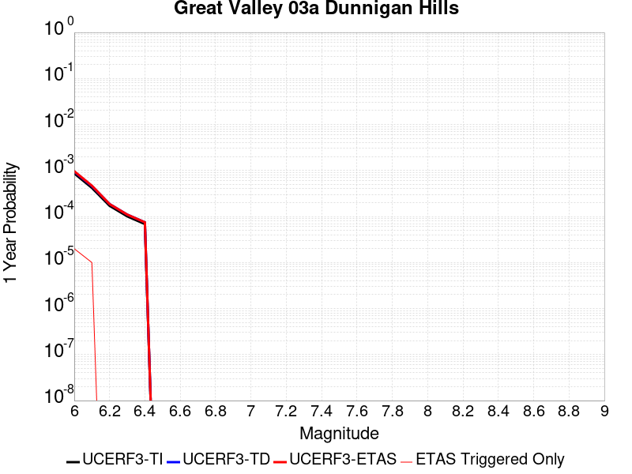 |  |

| Magnitude | 1 wk TI Prob | 1 wk TD Prob | 1 wk ETAS Prob | 1 wk ETAS/TD Gain | 1 wk ETAS Triggered Only | 1 mo TI Prob | 1 mo TD Prob | 1 mo ETAS Prob | 1 mo ETAS/TD Gain | 1 mo ETAS Triggered Only | 1 yr TI Prob | 1 yr TD Prob | 1 yr ETAS Prob | 1 yr ETAS/TD Gain | 1 yr ETAS Triggered Only | 10 yr TI Prob | 10 yr TD Prob | 10 yr ETAS Prob | 10 yr ETAS/TD Gain | 10 yr ETAS Triggered Only |
|-----|-----|-----|-----|-----|-----|-----|-----|-----|-----|-----|-----|-----|-----|-----|-----|-----|-----|-----|-----|-----|
| 6.0 | 1.6591328E-5 | 1.8107954E-5 | 2.8107774E-5 | 1.5522335 | 1.0E-5 | 7.110376E-5 | 7.7603596E-5 | 8.760282E-5 | 1.12885 | 1.0E-5 | 8.6534437E-4 | 9.444834E-4 | 9.644645E-4 | 1.0211556 | 2.0E-5 | 0.008619824 | 0.009411525 | 0.009431337 | 1.002105 | 2.0E-5 |
| 6.1 | 8.041125E-6 | 8.769726E-6 | 8.769726E-6 | 1.0 | 0.0 | 3.4461507E-5 | 3.7584115E-5 | 3.7584115E-5 | 1.0 | 0.0 | 4.194881E-4 | 4.5751085E-4 | 4.6750627E-4 | 1.0218474 | 1.0E-5 | 0.004186971 | 0.004567687 | 0.0045776414 | 1.0021793 | 1.0E-5 |
| 6.2 | 3.2807004E-6 | 3.5795688E-6 | 3.5795688E-6 | 1.0 | 0.0 | 1.4060069E-5 | 1.5340942E-5 | 1.5340942E-5 | 1.0 | 0.0 | 1.7116789E-4 | 1.8676413E-4 | 1.8676413E-4 | 1.0 | 0.0 | 0.0017103611 | 0.0018664796 | 0.0018664796 | 1.0 | 0.0 |
| 6.3 | 1.9339366E-6 | 2.1103806E-6 | 2.1103806E-6 | 1.0 | 0.0 | 8.288273E-6 | 9.044474E-6 | 9.044474E-6 | 1.0 | 0.0 | 1.00905054E-4 | 1.1011375E-4 | 1.1011375E-4 | 1.0 | 0.0 | 0.0010085925 | 0.0011008718 | 0.0011008718 | 1.0 | 0.0 |
| 6.4 | 1.3142635E-6 | 1.4339867E-6 | 1.4339867E-6 | 1.0 | 0.0 | 5.6325457E-6 | 6.145657E-6 | 6.145657E-6 | 1.0 | 0.0 | 6.857408E-5 | 7.482337E-5 | 7.482337E-5 | 1.0 | 0.0 | 6.8552926E-4 | 7.4823375E-4 | 7.4823375E-4 | 1.0 | 0.0 |

## Calaveras (Central) 2011 CFM
*[(top)](#table-of-contents)*

| 1 Week | 1 Month | 1 Year | 10 Year |
|-----|-----|-----|-----|
|  |  |  |  |

| Magnitude | 1 wk TI Prob | 1 wk TD Prob | 1 wk ETAS Prob | 1 wk ETAS/TD Gain | 1 wk ETAS Triggered Only | 1 mo TI Prob | 1 mo TD Prob | 1 mo ETAS Prob | 1 mo ETAS/TD Gain | 1 mo ETAS Triggered Only | 1 yr TI Prob | 1 yr TD Prob | 1 yr ETAS Prob | 1 yr ETAS/TD Gain | 1 yr ETAS Triggered Only | 10 yr TI Prob | 10 yr TD Prob | 10 yr ETAS Prob | 10 yr ETAS/TD Gain | 10 yr ETAS Triggered Only |
|-----|-----|-----|-----|-----|-----|-----|-----|-----|-----|-----|-----|-----|-----|-----|-----|-----|-----|-----|-----|-----|
| 6.0 | 1.5010907E-4 | 2.481574E-4 | 2.481574E-4 | 1.0 | 0.0 | 6.4316596E-4 | 0.0010621005 | 0.0010621005 | 1.0 | 0.0 | 0.0078024664 | 0.012850073 | 0.012859945 | 1.0007682 | 1.0E-5 | 0.07534136 | 0.120401435 | 0.120419025 | 1.0001462 | 2.0E-5 |
| 6.1 | 1.4521465E-4 | 2.397987E-4 | 2.397987E-4 | 1.0 | 0.0 | 6.222001E-4 | 0.0010263061 | 0.0010263061 | 1.0 | 0.0 | 0.0075490056 | 0.012419341 | 0.012429217 | 1.0007952 | 1.0E-5 | 0.07297657 | 0.11667323 | 0.1166909 | 1.0001514 | 2.0E-5 |
| 6.2 | 1.429998E-4 | 2.3911126E-4 | 2.3911126E-4 | 1.0 | 0.0 | 6.127123E-4 | 0.0010233623 | 0.0010233623 | 1.0 | 0.0 | 0.007434286 | 0.01238394 | 0.012393816 | 1.0007975 | 1.0E-5 | 0.07190444 | 0.1163272 | 0.11634487 | 1.0001519 | 2.0E-5 |
| 6.3 | 1.3536277E-4 | 2.3242626E-4 | 2.3242626E-4 | 1.0 | 0.0 | 5.799972E-4 | 9.947343E-4 | 9.947343E-4 | 1.0 | 0.0 | 0.0070386264 | 0.012040132 | 0.012050011 | 1.0008205 | 1.0E-5 | 0.0681982 | 0.11323977 | 0.11325751 | 1.0001566 | 2.0E-5 |
| 6.4 | 1.2993296E-4 | 2.2666177E-4 | 2.2666177E-4 | 1.0 | 0.0 | 5.5673666E-4 | 9.700479E-4 | 9.700479E-4 | 1.0 | 0.0 | 0.006757223 | 0.011742937 | 0.01175282 | 1.0008416 | 1.0E-5 | 0.06555412 | 0.11051771 | 0.1105355 | 1.0001609 | 2.0E-5 |
| 6.5 | 1.0498927E-4 | 1.7981697E-4 | 1.7981697E-4 | 1.0 | 0.0 | 4.498764E-4 | 7.704157E-4 | 7.704157E-4 | 1.0 | 0.0 | 0.005463498 | 0.00933924 | 0.009349148 | 1.0010607 | 1.0E-5 | 0.053311124 | 0.089199215 | 0.08921743 | 1.0002042 | 2.0E-5 |
| 6.6 | 1.0157505E-4 | 1.7469203E-4 | 1.7469203E-4 | 1.0 | 0.0 | 4.35249E-4 | 7.484645E-4 | 7.484645E-4 | 1.0 | 0.0 | 0.0052862884 | 0.009074297 | 0.009084206 | 1.001092 | 1.0E-5 | 0.05162293 | 0.08677671 | 0.08679497 | 1.0002105 | 2.0E-5 |
| 6.7 | 9.660386E-5 | 1.6728524E-4 | 1.6728524E-4 | 1.0 | 0.0 | 4.1395082E-4 | 7.1673887E-4 | 7.1673887E-4 | 1.0 | 0.0 | 0.0050282106 | 0.008691208 | 0.008701121 | 1.0011406 | 1.0E-5 | 0.049159497 | 0.083266065 | 0.0832844 | 1.0002202 | 2.0E-5 |
| 6.8 | 9.089927E-5 | 1.5643016E-4 | 1.5643016E-4 | 1.0 | 0.0 | 3.8951015E-4 | 6.702439E-4 | 6.702439E-4 | 1.0 | 0.0 | 0.0047319788 | 0.008129478 | 0.008139397 | 1.0012201 | 1.0E-5 | 0.046324775 | 0.078159414 | 0.078177854 | 1.0002359 | 2.0E-5 |
| 6.9 | 7.353187E-5 | 1.2295354E-4 | 1.2295354E-4 | 1.0 | 0.0 | 3.150985E-4 | 5.2683795E-4 | 5.2683795E-4 | 1.0 | 0.0 | 0.0038295772 | 0.006395508 | 0.006405444 | 1.0015537 | 1.0E-5 | 0.037642512 | 0.062187865 | 0.06220662 | 1.0003016 | 2.0E-5 |
| 7.0 | 5.746064E-5 | 9.3887444E-5 | 9.3887444E-5 | 1.0 | 0.0 | 2.4623662E-4 | 4.0231308E-4 | 4.0231308E-4 | 1.0 | 0.0 | 0.0029938098 | 0.004887232 | 0.0048971833 | 1.0020361 | 1.0E-5 | 0.02953797 | 0.04798685 | 0.04800589 | 1.0003967 | 2.0E-5 |
| 7.1 | 4.9557195E-5 | 8.052461E-5 | 8.052461E-5 | 1.0 | 0.0 | 2.123707E-4 | 3.4506017E-4 | 3.4506017E-4 | 1.0 | 0.0 | 0.0025825473 | 0.0041930773 | 0.0042030355 | 1.0023749 | 1.0E-5 | 0.0255274 | 0.041373078 | 0.04139225 | 1.0004634 | 2.0E-5 |
| 7.2 | 3.687595E-5 | 5.9524526E-5 | 5.9524526E-5 | 1.0 | 0.0 | 1.5803022E-4 | 2.5508032E-4 | 2.5508032E-4 | 1.0 | 0.0 | 0.0019223199 | 0.0031012094 | 0.0031111783 | 1.0032146 | 1.0E-5 | 0.01905776 | 0.030883716 | 0.0309031 | 1.0006276 | 2.0E-5 |
| 7.3 | 2.5846984E-5 | 4.247213E-5 | 4.247213E-5 | 1.0 | 0.0 | 1.1076809E-4 | 1.8201082E-4 | 1.8201082E-4 | 1.0 | 0.0 | 0.0013477671 | 0.002213747 | 0.002223725 | 1.0045072 | 1.0E-5 | 0.013396223 | 0.02217554 | 0.022195095 | 1.0008819 | 2.0E-5 |
| 7.4 | 1.7747854E-5 | 2.9936204E-5 | 2.9936204E-5 | 1.0 | 0.0 | 7.6060016E-5 | 1.2829172E-4 | 1.2829172E-4 | 1.0 | 0.0 | 9.2563726E-4 | 0.0015608355 | 0.0015708199 | 1.0063968 | 1.0E-5 | 0.009217911 | 0.015709236 | 0.015728923 | 1.0012531 | 2.0E-5 |
| 7.5 | 1.4883479E-5 | 2.6243379E-5 | 2.6243379E-5 | 1.0 | 0.0 | 6.378478E-5 | 1.1246678E-4 | 1.1246678E-4 | 1.0 | 0.0 | 7.76303E-4 | 0.0013684258 | 0.0013784121 | 1.0072976 | 1.0E-5 | 0.0077359667 | 0.013802425 | 0.013822149 | 1.001429 | 2.0E-5 |
| 7.6 | 8.166975E-6 | 1.4963478E-5 | 1.4963478E-5 | 1.0 | 0.0 | 3.5000852E-5 | 6.412763E-5 | 6.412763E-5 | 1.0 | 0.0 | 4.2605202E-4 | 7.804755E-4 | 7.9046766E-4 | 1.0128027 | 1.0E-5 | 0.004252361 | 0.00793984 | 0.007959681 | 1.002499 | 2.0E-5 |
| 7.7 | 3.3858064E-6 | 6.253914E-6 | 6.253914E-6 | 1.0 | 0.0 | 1.4510518E-5 | 2.6802214E-5 | 2.6802214E-5 | 1.0 | 0.0 | 1.7665124E-4 | 3.2626814E-4 | 3.3626487E-4 | 1.0306396 | 1.0E-5 | 0.0017651088 | 0.0033882293 | 0.0034081615 | 1.0058827 | 2.0E-5 |
| 7.8 | 2.7721615E-6 | 5.3663807E-6 | 5.3663807E-6 | 1.0 | 0.0 | 1.1880637E-5 | 2.2998573E-5 | 2.2998573E-5 | 1.0 | 0.0 | 1.4463716E-4 | 2.799717E-4 | 2.8996888E-4 | 1.035708 | 1.0E-5 | 0.0014454306 | 0.0029074624 | 0.0029274044 | 1.0068588 | 2.0E-5 |
| 7.9 | 1.9736292E-6 | 4.1284193E-6 | 4.1284193E-6 | 1.0 | 0.0 | 8.4583835E-6 | 1.7693106E-5 | 1.7693106E-5 | 1.0 | 0.0 | 1.0297595E-4 | 2.1539231E-4 | 2.1539231E-4 | 1.0 | 0.0 | 0.0010292825 | 0.0022236116 | 0.0022335893 | 1.0044872 | 1.0E-5 |
| 8.0 | 1.1767289E-6 | 2.5544743E-6 | 2.5544743E-6 | 1.0 | 0.0 | 5.0431145E-6 | 1.0947701E-5 | 1.0947701E-5 | 1.0 | 0.0 | 6.139818E-5 | 1.3328013E-4 | 1.3328013E-4 | 1.0 | 0.0 | 6.1381224E-4 | 0.0013660848 | 0.0013760711 | 1.0073102 | 1.0E-5 |
| 8.1 | 7.5112825E-7 | 1.5409794E-6 | 1.5409794E-6 | 1.0 | 0.0 | 3.2191172E-6 | 6.6041807E-6 | 6.6041807E-6 | 1.0 | 0.0 | 3.9192048E-5 | 8.0402955E-5 | 8.0402955E-5 | 1.0 | 0.0 | 3.9185135E-4 | 8.235564E-4 | 8.3354814E-4 | 1.0121324 | 1.0E-5 |

## San Andreas (North Coast) 2011 CFM
*[(top)](#table-of-contents)*

| 1 Week | 1 Month | 1 Year | 10 Year |
|-----|-----|-----|-----|
|  |  | 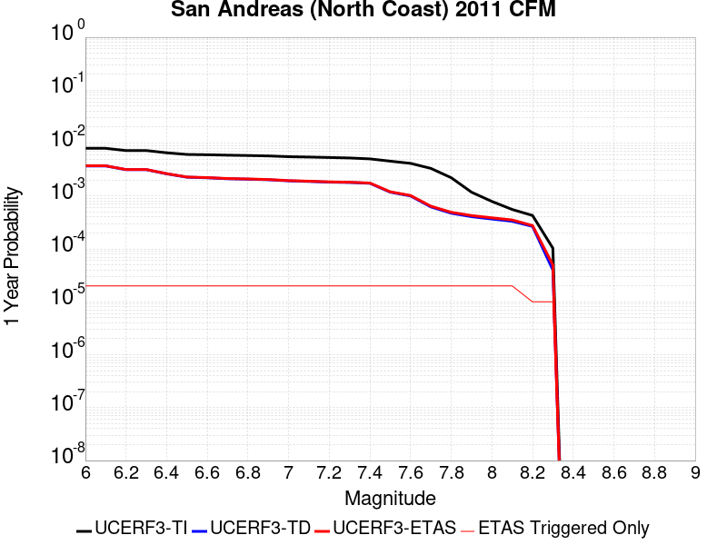 |  |

| Magnitude | 1 wk TI Prob | 1 wk TD Prob | 1 wk ETAS Prob | 1 wk ETAS/TD Gain | 1 wk ETAS Triggered Only | 1 mo TI Prob | 1 mo TD Prob | 1 mo ETAS Prob | 1 mo ETAS/TD Gain | 1 mo ETAS Triggered Only | 1 yr TI Prob | 1 yr TD Prob | 1 yr ETAS Prob | 1 yr ETAS/TD Gain | 1 yr ETAS Triggered Only | 10 yr TI Prob | 10 yr TD Prob | 10 yr ETAS Prob | 10 yr ETAS/TD Gain | 10 yr ETAS Triggered Only |
|-----|-----|-----|-----|-----|-----|-----|-----|-----|-----|-----|-----|-----|-----|-----|-----|-----|-----|-----|-----|-----|
| 6.0 | 1.5333705E-4 | 7.1106435E-5 | 7.1106435E-5 | 1.0 | 0.0 | 6.5699324E-4 | 3.0470645E-4 | 3.0470645E-4 | 1.0 | 0.0 | 0.007969595 | 0.0037035241 | 0.0037234502 | 1.0053803 | 2.0E-5 | 0.0768977 | 0.03935284 | 0.039372053 | 1.0004883 | 2.0E-5 |
| 6.1 | 1.5333705E-4 | 7.1106435E-5 | 7.1106435E-5 | 1.0 | 0.0 | 6.5699324E-4 | 3.0470645E-4 | 3.0470645E-4 | 1.0 | 0.0 | 0.007969595 | 0.0037035241 | 0.0037234502 | 1.0053803 | 2.0E-5 | 0.0768977 | 0.03935284 | 0.039372053 | 1.0004883 | 2.0E-5 |
| 6.2 | 1.3912938E-4 | 6.050204E-5 | 6.050204E-5 | 1.0 | 0.0 | 5.961325E-4 | 2.5926883E-4 | 2.5926883E-4 | 1.0 | 0.0 | 0.007233787 | 0.003152056 | 0.003171993 | 1.006325 | 2.0E-5 | 0.07002798 | 0.03369227 | 0.033711597 | 1.0005736 | 2.0E-5 |
| 6.3 | 1.3912938E-4 | 6.050204E-5 | 6.050204E-5 | 1.0 | 0.0 | 5.961325E-4 | 2.5926883E-4 | 2.5926883E-4 | 1.0 | 0.0 | 0.007233787 | 0.003152056 | 0.003171993 | 1.006325 | 2.0E-5 | 0.07002798 | 0.03369227 | 0.033711597 | 1.0005736 | 2.0E-5 |
| 6.4 | 1.2623647E-4 | 5.0442024E-5 | 5.0442024E-5 | 1.0 | 0.0 | 5.4090127E-4 | 2.161623E-4 | 2.161623E-4 | 1.0 | 0.0 | 0.0065656058 | 0.0026286195 | 0.002648567 | 1.0075885 | 2.0E-5 | 0.06374981 | 0.028303223 | 0.028322656 | 1.0006866 | 2.0E-5 |
| 6.5 | 1.1736096E-4 | 4.3523814E-5 | 4.3523814E-5 | 1.0 | 0.0 | 5.028786E-4 | 1.8651738E-4 | 1.8651738E-4 | 1.0 | 0.0 | 0.006105373 | 0.0022685004 | 0.002288455 | 1.0087965 | 2.0E-5 | 0.05940335 | 0.024579322 | 0.02459883 | 1.0007937 | 2.0E-5 |
| 6.6 | 1.1586959E-4 | 4.2423668E-5 | 4.2423668E-5 | 1.0 | 0.0 | 4.964894E-4 | 1.8180315E-4 | 1.8180315E-4 | 1.0 | 0.0 | 0.006028018 | 0.0022112224 | 0.002231178 | 1.0090247 | 2.0E-5 | 0.058671024 | 0.023984991 | 0.024004512 | 1.0008138 | 2.0E-5 |
| 6.7 | 1.13693764E-4 | 4.073593E-5 | 4.073593E-5 | 1.0 | 0.0 | 4.87168E-4 | 1.7457096E-4 | 1.7457096E-4 | 1.0 | 0.0 | 0.005915152 | 0.0021233456 | 0.0021433032 | 1.009399 | 2.0E-5 | 0.057601593 | 0.023076393 | 0.023095932 | 1.0008467 | 2.0E-5 |
| 6.8 | 1.1204889E-4 | 3.9953447E-5 | 3.9953447E-5 | 1.0 | 0.0 | 4.8012115E-4 | 1.7121792E-4 | 1.7121792E-4 | 1.0 | 0.0 | 0.005829819 | 0.002082601 | 0.0021025594 | 1.0095834 | 2.0E-5 | 0.05679232 | 0.022636656 | 0.022656202 | 1.0008636 | 2.0E-5 |
| 6.9 | 1.1005794E-4 | 3.900957E-5 | 3.900957E-5 | 1.0 | 0.0 | 4.7159163E-4 | 1.6717325E-4 | 1.6717325E-4 | 1.0 | 0.0 | 0.0057265228 | 0.0020334502 | 0.0020534096 | 1.0098155 | 2.0E-5 | 0.055811852 | 0.022102542 | 0.0221221 | 1.0008849 | 2.0E-5 |
| 7.0 | 1.0647948E-4 | 3.7166337E-5 | 3.7166337E-5 | 1.0 | 0.0 | 4.562608E-4 | 1.5927466E-4 | 1.5927466E-4 | 1.0 | 0.0 | 0.0055408357 | 0.0019374598 | 0.0019574212 | 1.0103028 | 2.0E-5 | 0.054047033 | 0.021062272 | 0.02108185 | 1.0009296 | 2.0E-5 |
| 7.1 | 1.04795035E-4 | 3.6215948E-5 | 3.6215948E-5 | 1.0 | 0.0 | 4.4904428E-4 | 1.5520205E-4 | 1.5520205E-4 | 1.0 | 0.0 | 0.0054534175 | 0.0018879628 | 0.0019079251 | 1.0105734 | 2.0E-5 | 0.053215165 | 0.020530313 | 0.020549903 | 1.0009542 | 2.0E-5 |
| 7.2 | 1.02724036E-4 | 3.5124547E-5 | 3.5124547E-5 | 1.0 | 0.0 | 4.401716E-4 | 1.5052517E-4 | 1.5052517E-4 | 1.0 | 0.0 | 0.0053459285 | 0.0018311188 | 0.0018510822 | 1.0109023 | 2.0E-5 | 0.052191395 | 0.019919246 | 0.019938849 | 1.0009841 | 2.0E-5 |
| 7.3 | 1.00650694E-4 | 3.4592013E-5 | 3.4592013E-5 | 1.0 | 0.0 | 4.312888E-4 | 1.4824314E-4 | 1.4824314E-4 | 1.0 | 0.0 | 0.005238306 | 0.0018033815 | 0.0018233454 | 1.0110703 | 2.0E-5 | 0.051165357 | 0.019596443 | 0.01961605 | 1.0010006 | 2.0E-5 |
| 7.4 | 9.672919E-5 | 3.338123E-5 | 3.338123E-5 | 1.0 | 0.0 | 4.144878E-4 | 1.4305465E-4 | 1.4305465E-4 | 1.0 | 0.0 | 0.005034718 | 0.0017403142 | 0.0017602794 | 1.0114722 | 2.0E-5 | 0.049221683 | 0.018869769 | 0.01888939 | 1.0010399 | 2.0E-5 |
| 7.5 | 8.7600405E-5 | 2.2700917E-5 | 2.2700917E-5 | 1.0 | 0.0 | 3.753763E-4 | 9.728602E-5 | 9.728602E-5 | 1.0 | 0.0 | 0.0045606326 | 0.0011838155 | 0.0012037918 | 1.0168746 | 2.0E-5 | 0.04468165 | 0.013130207 | 0.013149944 | 1.0015032 | 2.0E-5 |
| 7.6 | 7.9562284E-5 | 1.9226305E-5 | 1.9226305E-5 | 1.0 | 0.0 | 3.4093665E-4 | 8.239586E-5 | 8.239586E-5 | 1.0 | 0.0 | 0.0041430052 | 0.0010027094 | 0.0010226894 | 1.019926 | 2.0E-5 | 0.040666126 | 0.011221658 | 0.011241434 | 1.0017623 | 2.0E-5 |
| 7.7 | 6.3866544E-5 | 1.1941707E-5 | 1.1941707E-5 | 1.0 | 0.0 | 2.7368503E-4 | 5.117774E-5 | 5.117774E-5 | 1.0 | 0.0 | 0.0033270244 | 6.2291115E-4 | 6.4289867E-4 | 1.0320873 | 2.0E-5 | 0.032776527 | 0.007210334 | 0.0072301896 | 1.0027539 | 2.0E-5 |
| 7.8 | 4.2543215E-5 | 9.076524E-6 | 9.076524E-6 | 1.0 | 0.0 | 1.8231533E-4 | 3.8898812E-5 | 3.8898812E-5 | 1.0 | 0.0 | 0.0022174292 | 4.7349022E-4 | 4.934807E-4 | 1.0422195 | 2.0E-5 | 0.021954332 | 0.005490525 | 0.0055104154 | 1.0036227 | 2.0E-5 |
| 7.9 | 2.2636612E-5 | 7.81435E-6 | 7.81435E-6 | 1.0 | 0.0 | 9.7010445E-5 | 3.3489643E-5 | 3.3489643E-5 | 1.0 | 0.0 | 0.0011804621 | 4.076602E-4 | 4.2765203E-4 | 1.0490404 | 2.0E-5 | 0.011742111 | 0.0046832846 | 0.0047031906 | 1.0042505 | 2.0E-5 |
| 8.0 | 1.5167874E-5 | 7.0494675E-6 | 7.0494675E-6 | 1.0 | 0.0 | 6.500356E-5 | 3.0211655E-5 | 3.0211655E-5 | 1.0 | 0.0 | 7.9113094E-4 | 3.677649E-4 | 3.8775755E-4 | 1.0543625 | 2.0E-5 | 0.007883203 | 0.004215588 | 0.0042355033 | 1.0047243 | 2.0E-5 |
| 8.1 | 1.0681047E-5 | 6.386992E-6 | 6.386992E-6 | 1.0 | 0.0 | 4.5775112E-5 | 2.7372536E-5 | 2.7372536E-5 | 1.0 | 0.0 | 5.5716943E-4 | 3.3320975E-4 | 3.532031E-4 | 1.0600022 | 2.0E-5 | 0.0055577457 | 0.003817393 | 0.0038373165 | 1.0052192 | 2.0E-5 |
| 8.2 | 8.226114E-6 | 5.1150587E-6 | 5.1150587E-6 | 1.0 | 0.0 | 3.52543E-5 | 2.1921496E-5 | 2.1921496E-5 | 1.0 | 0.0 | 4.2913653E-4 | 2.668616E-4 | 2.7685892E-4 | 1.0374626 | 1.0E-5 | 0.004283088 | 0.0030450926 | 0.0030550621 | 1.003274 | 1.0E-5 |
| 8.3 | 1.983087E-6 | 7.6599065E-7 | 7.6599065E-7 | 1.0 | 0.0 | 8.498917E-6 | 3.282813E-6 | 3.282813E-6 | 1.0 | 0.0 | 1.034694E-4 | 3.9967534E-5 | 4.9967133E-5 | 1.2501931 | 1.0E-5 | 0.0010342124 | 4.719687E-4 | 4.8196397E-4 | 1.0211779 | 1.0E-5 |

## Pittville 2011 CFM
*[(top)](#table-of-contents)*

| 1 Week | 1 Month | 1 Year | 10 Year |
|-----|-----|-----|-----|
|  |  |  |  |

| Magnitude | 1 wk TI Prob | 1 wk TD Prob | 1 wk ETAS Prob | 1 wk ETAS/TD Gain | 1 wk ETAS Triggered Only | 1 mo TI Prob | 1 mo TD Prob | 1 mo ETAS Prob | 1 mo ETAS/TD Gain | 1 mo ETAS Triggered Only | 1 yr TI Prob | 1 yr TD Prob | 1 yr ETAS Prob | 1 yr ETAS/TD Gain | 1 yr ETAS Triggered Only | 10 yr TI Prob | 10 yr TD Prob | 10 yr ETAS Prob | 10 yr ETAS/TD Gain | 10 yr ETAS Triggered Only |
|-----|-----|-----|-----|-----|-----|-----|-----|-----|-----|-----|-----|-----|-----|-----|-----|-----|-----|-----|-----|-----|
| 6.0 | 2.5031832E-5 | 2.7056969E-5 | 3.70567E-5 | 1.3695805 | 1.0E-5 | 1.0727487E-4 | 1.1595384E-4 | 1.2595268E-4 | 1.0862312 | 1.0E-5 | 0.001305289 | 0.0014109211 | 0.001420907 | 1.0070776 | 1.0E-5 | 0.012976485 | 0.014029415 | 0.014049135 | 1.0014056 | 2.0E-5 |
| 6.1 | 1.2540113E-5 | 1.3513067E-5 | 1.3513067E-5 | 1.0 | 0.0 | 5.3742235E-5 | 5.7911984E-5 | 5.7911984E-5 | 1.0 | 0.0 | 6.541153E-4 | 7.048728E-4 | 7.048728E-4 | 1.0 | 0.0 | 0.0065219323 | 0.0070286044 | 0.0070286044 | 1.0 | 0.0 |
| 6.2 | 6.603218E-6 | 7.107189E-6 | 7.107189E-6 | 1.0 | 0.0 | 2.8299199E-5 | 3.0459063E-5 | 3.0459063E-5 | 1.0 | 0.0 | 3.4448825E-4 | 3.7078248E-4 | 3.7078248E-4 | 1.0 | 0.0 | 0.0034395473 | 0.0037022792 | 0.0037022792 | 1.0 | 0.0 |
| 6.3 | 6.603218E-6 | 7.107189E-6 | 7.107189E-6 | 1.0 | 0.0 | 2.8299199E-5 | 3.0459063E-5 | 3.0459063E-5 | 1.0 | 0.0 | 3.4448825E-4 | 3.7078248E-4 | 3.7078248E-4 | 1.0 | 0.0 | 0.0034395473 | 0.0037022792 | 0.0037022792 | 1.0 | 0.0 |
| 6.4 | 3.9389015E-6 | 4.239175E-6 | 4.239175E-6 | 1.0 | 0.0 | 1.6880897E-5 | 1.8167784E-5 | 1.8167784E-5 | 1.0 | 0.0 | 2.0550552E-4 | 2.2117342E-4 | 2.2117342E-4 | 1.0 | 0.0 | 0.0020531558 | 0.002209838 | 0.002209838 | 1.0 | 0.0 |
| 6.5 | 2.4533072E-6 | 2.6412686E-6 | 2.6412686E-6 | 1.0 | 0.0 | 1.0514132E-5 | 1.1319685E-5 | 1.1319685E-5 | 1.0 | 0.0 | 1.2800204E-4 | 1.3781038E-4 | 1.3781038E-4 | 1.0 | 0.0 | 0.0012792832 | 0.0013774394 | 0.0013774394 | 1.0 | 0.0 |
| 6.6 | 1.3482367E-6 | 1.452993E-6 | 1.452993E-6 | 1.0 | 0.0 | 5.778144E-6 | 6.2271047E-6 | 6.2271047E-6 | 1.0 | 0.0 | 7.0346636E-5 | 7.58135E-5 | 7.58135E-5 | 1.0 | 0.0 | 7.032437E-4 | 7.5798744E-4 | 7.5798744E-4 | 1.0 | 0.0 |

## Hollywood
*[(top)](#table-of-contents)*

| 1 Week | 1 Month | 1 Year | 10 Year |
|-----|-----|-----|-----|
|  |  |  |  |

| Magnitude | 1 wk TI Prob | 1 wk TD Prob | 1 wk ETAS Prob | 1 wk ETAS/TD Gain | 1 wk ETAS Triggered Only | 1 mo TI Prob | 1 mo TD Prob | 1 mo ETAS Prob | 1 mo ETAS/TD Gain | 1 mo ETAS Triggered Only | 1 yr TI Prob | 1 yr TD Prob | 1 yr ETAS Prob | 1 yr ETAS/TD Gain | 1 yr ETAS Triggered Only | 10 yr TI Prob | 10 yr TD Prob | 10 yr ETAS Prob | 10 yr ETAS/TD Gain | 10 yr ETAS Triggered Only |
|-----|-----|-----|-----|-----|-----|-----|-----|-----|-----|-----|-----|-----|-----|-----|-----|-----|-----|-----|-----|-----|
| 6.0 | 1.24487615E-5 | 1.2593226E-5 | 1.2593226E-5 | 1.0 | 0.0 | 5.3350745E-5 | 5.3969878E-5 | 5.3969878E-5 | 1.0 | 0.0 | 6.4935174E-4 | 6.568898E-4 | 6.768767E-4 | 1.0304265 | 2.0E-5 | 0.0064745755 | 0.006549969 | 0.006569838 | 1.0030334 | 2.0E-5 |
| 6.1 | 1.24487615E-5 | 1.2593226E-5 | 1.2593226E-5 | 1.0 | 0.0 | 5.3350745E-5 | 5.3969878E-5 | 5.3969878E-5 | 1.0 | 0.0 | 6.4935174E-4 | 6.568898E-4 | 6.768767E-4 | 1.0304265 | 2.0E-5 | 0.0064745755 | 0.006549969 | 0.006569838 | 1.0030334 | 2.0E-5 |
| 6.2 | 1.24487615E-5 | 1.2593226E-5 | 1.2593226E-5 | 1.0 | 0.0 | 5.3350745E-5 | 5.3969878E-5 | 5.3969878E-5 | 1.0 | 0.0 | 6.4935174E-4 | 6.568898E-4 | 6.768767E-4 | 1.0304265 | 2.0E-5 | 0.0064745755 | 0.006549969 | 0.006569838 | 1.0030334 | 2.0E-5 |
| 6.3 | 1.24487615E-5 | 1.2593226E-5 | 1.2593226E-5 | 1.0 | 0.0 | 5.3350745E-5 | 5.3969878E-5 | 5.3969878E-5 | 1.0 | 0.0 | 6.4935174E-4 | 6.568898E-4 | 6.768767E-4 | 1.0304265 | 2.0E-5 | 0.0064745755 | 0.006549969 | 0.006569838 | 1.0030334 | 2.0E-5 |
| 6.4 | 1.2431024E-5 | 1.2573839E-5 | 1.2573839E-5 | 1.0 | 0.0 | 5.327473E-5 | 5.3886797E-5 | 5.3886797E-5 | 1.0 | 0.0 | 6.4842677E-4 | 6.558789E-4 | 6.758658E-4 | 1.0304735 | 2.0E-5 | 0.0064653796 | 0.0065399194 | 0.0065597887 | 1.0030382 | 2.0E-5 |
| 6.5 | 1.1242222E-5 | 1.13178E-5 | 1.13178E-5 | 1.0 | 0.0 | 4.8180063E-5 | 4.850397E-5 | 4.850397E-5 | 1.0 | 0.0 | 5.864344E-4 | 5.9037853E-4 | 6.103667E-4 | 1.0338565 | 2.0E-5 | 0.0058488925 | 0.005888388 | 0.0059082704 | 1.0033765 | 2.0E-5 |
| 6.6 | 1.1234066E-5 | 1.13089145E-5 | 1.13089145E-5 | 1.0 | 0.0 | 4.8145106E-5 | 4.846589E-5 | 4.846589E-5 | 1.0 | 0.0 | 5.86009E-4 | 5.8991514E-4 | 6.099033E-4 | 1.0338832 | 2.0E-5 | 0.005844661 | 0.0058837784 | 0.005903661 | 1.0033792 | 2.0E-5 |
| 6.7 | 1.12294E-5 | 1.1303658E-5 | 1.1303658E-5 | 1.0 | 0.0 | 4.812511E-5 | 4.8443362E-5 | 4.8443362E-5 | 1.0 | 0.0 | 5.857657E-4 | 5.89641E-4 | 6.096292E-4 | 1.033899 | 2.0E-5 | 0.0058422405 | 0.005881052 | 0.0059009343 | 1.0033808 | 2.0E-5 |
| 6.8 | 1.0252819E-5 | 1.0218445E-5 | 1.0218445E-5 | 1.0 | 0.0 | 4.3939912E-5 | 4.379261E-5 | 4.379261E-5 | 1.0 | 0.0 | 5.3483713E-4 | 5.330467E-4 | 5.5303605E-4 | 1.0375001 | 2.0E-5 | 0.005335517 | 0.005317908 | 0.0053378013 | 1.0037409 | 2.0E-5 |
| 6.9 | 9.252289E-6 | 9.110306E-6 | 9.110306E-6 | 1.0 | 0.0 | 3.9652066E-5 | 3.9043593E-5 | 3.9043593E-5 | 1.0 | 0.0 | 4.8265693E-4 | 4.752537E-4 | 4.952442E-4 | 1.0420628 | 2.0E-5 | 0.0048161 | 0.004742547 | 0.004762452 | 1.0041971 | 2.0E-5 |
| 7.0 | 8.474604E-6 | 8.258257E-6 | 8.258257E-6 | 1.0 | 0.0 | 3.6319227E-5 | 3.539206E-5 | 3.539206E-5 | 1.0 | 0.0 | 4.4209688E-4 | 4.3081454E-4 | 4.5080594E-4 | 1.0464036 | 2.0E-5 | 0.004412184 | 0.004299944 | 0.004319858 | 1.0046313 | 2.0E-5 |
| 7.1 | 6.643643E-6 | 6.2683675E-6 | 6.2683675E-6 | 1.0 | 0.0 | 2.8472443E-5 | 2.6864158E-5 | 2.6864158E-5 | 1.0 | 0.0 | 3.4659685E-4 | 3.2702246E-4 | 3.3701918E-4 | 1.030569 | 1.0E-5 | 0.0034605677 | 0.0032654584 | 0.0032754256 | 1.0030524 | 1.0E-5 |
| 7.2 | 5.549002E-6 | 5.108709E-6 | 5.108709E-6 | 1.0 | 0.0 | 2.378122E-5 | 2.1894284E-5 | 2.1894284E-5 | 1.0 | 0.0 | 2.8949787E-4 | 2.6653046E-4 | 2.7652777E-4 | 1.0375092 | 1.0E-5 | 0.0028912104 | 0.0026621243 | 0.0026720979 | 1.0037464 | 1.0E-5 |
| 7.3 | 4.3059727E-6 | 3.9598885E-6 | 3.9598885E-6 | 1.0 | 0.0 | 1.8454039E-5 | 1.6970842E-5 | 1.6970842E-5 | 1.0 | 0.0 | 2.2465475E-4 | 2.066005E-4 | 2.1659843E-4 | 1.0483925 | 1.0E-5 | 0.0022442779 | 0.0020640944 | 0.0020740738 | 1.0048348 | 1.0E-5 |
| 7.4 | 2.8550733E-6 | 2.7012966E-6 | 2.7012966E-6 | 1.0 | 0.0 | 1.2235971E-5 | 1.1576934E-5 | 1.1576934E-5 | 1.0 | 0.0 | 1.4896276E-4 | 1.409401E-4 | 1.409401E-4 | 1.0 | 0.0 | 0.0014886294 | 0.0014085122 | 0.0014085122 | 1.0 | 0.0 |
| 7.5 | 1.9927045E-6 | 1.8976367E-6 | 1.8976367E-6 | 1.0 | 0.0 | 8.540134E-6 | 8.132703E-6 | 8.132703E-6 | 1.0 | 0.0 | 1.0397117E-4 | 9.90112E-5 | 9.90112E-5 | 1.0 | 0.0 | 0.0010392254 | 9.896745E-4 | 9.896745E-4 | 1.0 | 0.0 |
| 7.6 | 1.345084E-6 | 1.2216007E-6 | 1.2216007E-6 | 1.0 | 0.0 | 5.764633E-6 | 5.235421E-6 | 5.235421E-6 | 1.0 | 0.0 | 7.018215E-5 | 6.3739404E-5 | 6.3739404E-5 | 1.0 | 0.0 | 7.0159987E-4 | 6.3721323E-4 | 6.3721323E-4 | 1.0 | 0.0 |
| 7.7 | 7.6835164E-7 | 6.277697E-7 | 6.277697E-7 | 1.0 | 0.0 | 3.2929315E-6 | 2.6904388E-6 | 2.6904388E-6 | 1.0 | 0.0 | 4.00907E-5 | 3.2755615E-5 | 3.2755615E-5 | 1.0 | 0.0 | 4.0083472E-4 | 3.2750933E-4 | 3.2750933E-4 | 1.0 | 0.0 |
| 7.8 | 3.6562128E-7 | 2.453479E-7 | 2.453479E-7 | 1.0 | 0.0 | 1.5669474E-6 | 1.0514907E-6 | 1.0514907E-6 | 1.0 | 0.0 | 1.9077417E-5 | 1.2801827E-5 | 1.2801827E-5 | 1.0 | 0.0 | 1.907578E-4 | 1.2801126E-4 | 1.2801126E-4 | 1.0 | 0.0 |
| 7.9 | 7.5024424E-8 | 5.3816795E-8 | 5.3816795E-8 | 1.0 | 0.0 | 3.215332E-7 | 2.306434E-7 | 2.306434E-7 | 1.0 | 0.0 | 3.91466E-6 | 2.808081E-6 | 2.808081E-6 | 1.0 | 0.0 | 3.9145907E-5 | 2.8080585E-5 | 2.8080585E-5 | 1.0 | 0.0 |

## Del Valle
*[(top)](#table-of-contents)*

| 1 Week | 1 Month | 1 Year | 10 Year |
|-----|-----|-----|-----|
|  |  |  |  |

| Magnitude | 1 wk TI Prob | 1 wk TD Prob | 1 wk ETAS Prob | 1 wk ETAS/TD Gain | 1 wk ETAS Triggered Only | 1 mo TI Prob | 1 mo TD Prob | 1 mo ETAS Prob | 1 mo ETAS/TD Gain | 1 mo ETAS Triggered Only | 1 yr TI Prob | 1 yr TD Prob | 1 yr ETAS Prob | 1 yr ETAS/TD Gain | 1 yr ETAS Triggered Only | 10 yr TI Prob | 10 yr TD Prob | 10 yr ETAS Prob | 10 yr ETAS/TD Gain | 10 yr ETAS Triggered Only |
|-----|-----|-----|-----|-----|-----|-----|-----|-----|-----|-----|-----|-----|-----|-----|-----|-----|-----|-----|-----|-----|
| 6.0 | 1.0716125E-5 | 8.767882E-6 | 1.8767794E-5 | 2.1405163 | 1.0E-5 | 4.592544E-5 | 3.7576207E-5 | 4.757583E-5 | 1.2661159 | 1.0E-5 | 5.589988E-4 | 4.5741405E-4 | 4.6740947E-4 | 1.021852 | 1.0E-5 | 0.0055759475 | 0.00456668 | 0.004586589 | 1.0043596 | 2.0E-5 |
| 6.1 | 1.0716125E-5 | 8.767882E-6 | 1.8767794E-5 | 2.1405163 | 1.0E-5 | 4.592544E-5 | 3.7576207E-5 | 4.757583E-5 | 1.2661159 | 1.0E-5 | 5.589988E-4 | 4.5741405E-4 | 4.6740947E-4 | 1.021852 | 1.0E-5 | 0.0055759475 | 0.00456668 | 0.004586589 | 1.0043596 | 2.0E-5 |
| 6.2 | 1.0716125E-5 | 8.767882E-6 | 1.8767794E-5 | 2.1405163 | 1.0E-5 | 4.592544E-5 | 3.7576207E-5 | 4.757583E-5 | 1.2661159 | 1.0E-5 | 5.589988E-4 | 4.5741405E-4 | 4.6740947E-4 | 1.021852 | 1.0E-5 | 0.0055759475 | 0.00456668 | 0.004586589 | 1.0043596 | 2.0E-5 |
| 6.3 | 7.1293784E-6 | 4.865823E-6 | 1.4865775E-5 | 3.0551407 | 1.0E-5 | 3.055412E-5 | 2.0853364E-5 | 3.0853156E-5 | 1.4795289 | 1.0E-5 | 3.7193293E-4 | 2.5386087E-4 | 2.6385832E-4 | 1.0393816 | 1.0E-5 | 0.0037131102 | 0.0025357946 | 0.002555744 | 1.0078671 | 2.0E-5 |
| 6.4 | 7.1293784E-6 | 4.865823E-6 | 1.4865775E-5 | 3.0551407 | 1.0E-5 | 3.055412E-5 | 2.0853364E-5 | 3.0853156E-5 | 1.4795289 | 1.0E-5 | 3.7193293E-4 | 2.5386087E-4 | 2.6385832E-4 | 1.0393816 | 1.0E-5 | 0.0037131102 | 0.0025357946 | 0.002555744 | 1.0078671 | 2.0E-5 |
| 6.5 | 7.1293784E-6 | 4.865823E-6 | 1.4865775E-5 | 3.0551407 | 1.0E-5 | 3.055412E-5 | 2.0853364E-5 | 3.0853156E-5 | 1.4795289 | 1.0E-5 | 3.7193293E-4 | 2.5386087E-4 | 2.6385832E-4 | 1.0393816 | 1.0E-5 | 0.0037131102 | 0.0025357946 | 0.002555744 | 1.0078671 | 2.0E-5 |
| 6.6 | 7.1293784E-6 | 4.865823E-6 | 1.4865775E-5 | 3.0551407 | 1.0E-5 | 3.055412E-5 | 2.0853364E-5 | 3.0853156E-5 | 1.4795289 | 1.0E-5 | 3.7193293E-4 | 2.5386087E-4 | 2.6385832E-4 | 1.0393816 | 1.0E-5 | 0.0037131102 | 0.0025357946 | 0.002555744 | 1.0078671 | 2.0E-5 |
| 6.7 | 7.12272E-6 | 4.8631987E-6 | 1.486315E-5 | 3.0562499 | 1.0E-5 | 3.0525585E-5 | 2.0842117E-5 | 3.0841908E-5 | 1.4797877 | 1.0E-5 | 3.7158563E-4 | 2.5372396E-4 | 2.6372142E-4 | 1.039403 | 1.0E-5 | 0.003709649 | 0.0025344288 | 0.002554378 | 1.0078713 | 2.0E-5 |
| 6.8 | 6.7558703E-6 | 4.5594015E-6 | 1.4559356E-5 | 3.1932604 | 1.0E-5 | 2.895341E-5 | 1.9540148E-5 | 2.9539953E-5 | 1.5117568 | 1.0E-5 | 3.5245073E-4 | 2.3787597E-4 | 2.478736E-4 | 1.0420287 | 1.0E-5 | 0.0035189227 | 0.0023762889 | 0.0023962413 | 1.0083965 | 2.0E-5 |
| 6.9 | 6.6700386E-6 | 4.502539E-6 | 1.4502494E-5 | 3.2209592 | 1.0E-5 | 2.8585566E-5 | 1.9296456E-5 | 2.9296263E-5 | 1.5182198 | 1.0E-5 | 3.479737E-4 | 2.3490966E-4 | 2.449073E-4 | 1.0425595 | 1.0E-5 | 0.003474293 | 0.0023466884 | 0.0023666415 | 1.0085026 | 2.0E-5 |
| 7.0 | 6.3181424E-6 | 4.0987034E-6 | 1.4098662E-5 | 3.439786 | 1.0E-5 | 2.7077473E-5 | 1.7565755E-5 | 2.756558E-5 | 1.5692794 | 1.0E-5 | 3.2961834E-4 | 2.1384252E-4 | 2.2384037E-4 | 1.0467534 | 1.0E-5 | 0.0032912986 | 0.002136422 | 0.0021563794 | 1.0093415 | 2.0E-5 |
| 7.1 | 6.248759E-6 | 4.033895E-6 | 1.4033854E-5 | 3.4789836 | 1.0E-5 | 2.678012E-5 | 1.7288008E-5 | 2.7287835E-5 | 1.5784256 | 1.0E-5 | 3.2599916E-4 | 2.104616E-4 | 2.204595E-4 | 1.0475047 | 1.0E-5 | 0.0032552136 | 0.0021026772 | 0.0021226353 | 1.0094917 | 2.0E-5 |
| 7.2 | 6.0411944E-6 | 3.869888E-6 | 1.386985E-5 | 3.5840442 | 1.0E-5 | 2.5890577E-5 | 1.658513E-5 | 2.6584965E-5 | 1.6029397 | 1.0E-5 | 3.1517216E-4 | 2.0190567E-4 | 2.1190365E-4 | 1.0495181 | 1.0E-5 | 0.0031472554 | 0.0020172757 | 0.0020372353 | 1.0098944 | 2.0E-5 |
| 7.3 | 4.7691183E-6 | 3.0781202E-6 | 1.307809E-5 | 4.248726 | 1.0E-5 | 2.0438918E-5 | 1.3191879E-5 | 2.3191747E-5 | 1.7580321 | 1.0E-5 | 2.488154E-4 | 1.605995E-4 | 1.705979E-4 | 1.0622567 | 1.0E-5 | 0.00248537 | 0.0016048603 | 0.0016248282 | 1.0124421 | 2.0E-5 |
| 7.4 | 3.5524722E-6 | 2.1893363E-6 | 2.1893363E-6 | 1.0 | 0.0 | 1.5224792E-5 | 9.382837E-6 | 9.382837E-6 | 1.0 | 0.0 | 1.8534607E-4 | 1.1423013E-4 | 1.1423013E-4 | 1.0 | 0.0 | 0.0018519156 | 0.0011417224 | 0.001151711 | 1.0087487 | 1.0E-5 |
| 7.5 | 2.7133442E-6 | 1.5916097E-6 | 1.5916097E-6 | 1.0 | 0.0 | 1.1628566E-5 | 6.821167E-6 | 6.821167E-6 | 1.0 | 0.0 | 1.415686E-4 | 8.304456E-5 | 8.304456E-5 | 1.0 | 0.0 | 0.0014147845 | 8.301372E-4 | 8.401289E-4 | 1.0120362 | 1.0E-5 |
| 7.6 | 1.915338E-6 | 1.173914E-6 | 1.173914E-6 | 1.0 | 0.0 | 8.208566E-6 | 5.0310505E-6 | 5.0310505E-6 | 1.0 | 0.0 | 9.993471E-5 | 6.125133E-5 | 6.125133E-5 | 1.0 | 0.0 | 9.988978E-4 | 6.123454E-4 | 6.123454E-4 | 1.0 | 0.0 |
| 7.7 | 1.2120448E-6 | 7.180313E-7 | 7.180313E-7 | 1.0 | 0.0 | 5.194467E-6 | 3.0772733E-6 | 3.0772733E-6 | 1.0 | 0.0 | 6.3240805E-5 | 3.746516E-5 | 3.746516E-5 | 1.0 | 0.0 | 6.322281E-4 | 3.7458882E-4 | 3.7458882E-4 | 1.0 | 0.0 |
| 7.8 | 6.272381E-7 | 3.932549E-7 | 3.932549E-7 | 1.0 | 0.0 | 2.6881603E-6 | 1.6853771E-6 | 1.6853771E-6 | 1.0 | 0.0 | 3.272786E-5 | 2.0519275E-5 | 2.0519275E-5 | 1.0 | 0.0 | 3.272304E-4 | 2.0517396E-4 | 2.0517396E-4 | 1.0 | 0.0 |
| 7.9 | 2.0292627E-7 | 1.2004622E-7 | 1.2004622E-7 | 1.0 | 0.0 | 8.6968373E-7 | 5.1448376E-7 | 5.1448376E-7 | 1.0 | 0.0 | 1.0588348E-5 | 6.263822E-6 | 6.263822E-6 | 1.0 | 0.0 | 1.0587843E-4 | 6.263647E-5 | 6.263647E-5 | 1.0 | 0.0 |
| 8.0 | 4.374492E-8 | 2.189964E-8 | 2.189964E-8 | 1.0 | 0.0 | 1.8747821E-7 | 9.385559E-8 | 9.385559E-8 | 1.0 | 0.0 | 2.2825448E-6 | 1.1426913E-6 | 1.1426913E-6 | 1.0 | 0.0 | 2.2825214E-5 | 1.1426858E-5 | 1.1426858E-5 | 1.0 | 0.0 |

## Peralta Hills
*[(top)](#table-of-contents)*

| 1 Week | 1 Month | 1 Year | 10 Year |
|-----|-----|-----|-----|
|  |  |  |  |

| Magnitude | 1 wk TI Prob | 1 wk TD Prob | 1 wk ETAS Prob | 1 wk ETAS/TD Gain | 1 wk ETAS Triggered Only | 1 mo TI Prob | 1 mo TD Prob | 1 mo ETAS Prob | 1 mo ETAS/TD Gain | 1 mo ETAS Triggered Only | 1 yr TI Prob | 1 yr TD Prob | 1 yr ETAS Prob | 1 yr ETAS/TD Gain | 1 yr ETAS Triggered Only | 10 yr TI Prob | 10 yr TD Prob | 10 yr ETAS Prob | 10 yr ETAS/TD Gain | 10 yr ETAS Triggered Only |
|-----|-----|-----|-----|-----|-----|-----|-----|-----|-----|-----|-----|-----|-----|-----|-----|-----|-----|-----|-----|-----|
| 6.0 | 3.8850067E-6 | 3.839512E-6 | 3.839512E-6 | 1.0 | 0.0 | 1.6649923E-5 | 1.645499E-5 | 2.6454823E-5 | 1.6077085 | 1.0E-5 | 2.0269395E-4 | 2.0032849E-4 | 2.2032448E-4 | 1.0998161 | 2.0E-5 | 0.0020250916 | 0.0020022066 | 0.0020221665 | 1.009969 | 2.0E-5 |
| 6.1 | 3.8850067E-6 | 3.839512E-6 | 3.839512E-6 | 1.0 | 0.0 | 1.6649923E-5 | 1.645499E-5 | 2.6454823E-5 | 1.6077085 | 1.0E-5 | 2.0269395E-4 | 2.0032849E-4 | 2.2032448E-4 | 1.0998161 | 2.0E-5 | 0.0020250916 | 0.0020022066 | 0.0020221665 | 1.009969 | 2.0E-5 |
| 6.2 | 3.8850067E-6 | 3.839512E-6 | 3.839512E-6 | 1.0 | 0.0 | 1.6649923E-5 | 1.645499E-5 | 2.6454823E-5 | 1.6077085 | 1.0E-5 | 2.0269395E-4 | 2.0032849E-4 | 2.2032448E-4 | 1.0998161 | 2.0E-5 | 0.0020250916 | 0.0020022066 | 0.0020221665 | 1.009969 | 2.0E-5 |
| 6.3 | 3.8850067E-6 | 3.839512E-6 | 3.839512E-6 | 1.0 | 0.0 | 1.6649923E-5 | 1.645499E-5 | 2.6454823E-5 | 1.6077085 | 1.0E-5 | 2.0269395E-4 | 2.0032849E-4 | 2.2032448E-4 | 1.0998161 | 2.0E-5 | 0.0020250916 | 0.0020022066 | 0.0020221665 | 1.009969 | 2.0E-5 |
| 6.4 | 3.8850067E-6 | 3.839512E-6 | 3.839512E-6 | 1.0 | 0.0 | 1.6649923E-5 | 1.645499E-5 | 2.6454823E-5 | 1.6077085 | 1.0E-5 | 2.0269395E-4 | 2.0032849E-4 | 2.2032448E-4 | 1.0998161 | 2.0E-5 | 0.0020250916 | 0.0020022066 | 0.0020221665 | 1.009969 | 2.0E-5 |
| 6.5 | 1.5587785E-6 | 1.4430796E-6 | 1.4430796E-6 | 1.0 | 0.0 | 6.6804623E-6 | 6.184613E-6 | 6.184613E-6 | 1.0 | 0.0 | 8.133159E-5 | 7.529531E-5 | 7.529531E-5 | 1.0 | 0.0 | 8.1301836E-4 | 7.52722E-4 | 7.52722E-4 | 1.0 | 0.0 |
| 6.6 | 1.5587785E-6 | 1.4430796E-6 | 1.4430796E-6 | 1.0 | 0.0 | 6.6804623E-6 | 6.184613E-6 | 6.184613E-6 | 1.0 | 0.0 | 8.133159E-5 | 7.529531E-5 | 7.529531E-5 | 1.0 | 0.0 | 8.1301836E-4 | 7.52722E-4 | 7.52722E-4 | 1.0 | 0.0 |
| 6.7 | 1.5018579E-6 | 1.3837022E-6 | 1.3837022E-6 | 1.0 | 0.0 | 6.436518E-6 | 5.93014E-6 | 5.93014E-6 | 1.0 | 0.0 | 7.836179E-5 | 7.21973E-5 | 7.21973E-5 | 1.0 | 0.0 | 7.833416E-4 | 7.21762E-4 | 7.21762E-4 | 1.0 | 0.0 |
| 6.8 | 1.4584314E-6 | 1.3381342E-6 | 1.3381342E-6 | 1.0 | 0.0 | 6.250405E-6 | 5.7348498E-6 | 5.7348498E-6 | 1.0 | 0.0 | 7.6096025E-5 | 6.98198E-5 | 6.98198E-5 | 1.0 | 0.0 | 7.6069974E-4 | 6.98002E-4 | 6.98002E-4 | 1.0 | 0.0 |
| 6.9 | 1.1382393E-6 | 9.862285E-7 | 9.862285E-7 | 1.0 | 0.0 | 4.8781594E-6 | 4.226687E-6 | 4.226687E-6 | 1.0 | 0.0 | 5.9389975E-5 | 5.1458785E-5 | 5.1458785E-5 | 1.0 | 0.0 | 5.93741E-4 | 5.144769E-4 | 5.144769E-4 | 1.0 | 0.0 |
| 7.0 | 9.970413E-7 | 8.309642E-7 | 8.309642E-7 | 1.0 | 0.0 | 4.273027E-6 | 3.561271E-6 | 3.561271E-6 | 1.0 | 0.0 | 5.2022864E-5 | 4.335768E-5 | 4.335768E-5 | 1.0 | 0.0 | 5.2010687E-4 | 4.33499E-4 | 4.33499E-4 | 1.0 | 0.0 |
| 7.1 | 9.684443E-7 | 7.99408E-7 | 7.99408E-7 | 1.0 | 0.0 | 4.150469E-6 | 3.4260302E-6 | 3.4260302E-6 | 1.0 | 0.0 | 5.053079E-5 | 4.1711188E-5 | 4.1711188E-5 | 1.0 | 0.0 | 5.05193E-4 | 4.170403E-4 | 4.170403E-4 | 1.0 | 0.0 |
| 7.2 | 9.240811E-7 | 7.5031426E-7 | 7.5031426E-7 | 1.0 | 0.0 | 3.960342E-6 | 3.215629E-6 | 3.215629E-6 | 1.0 | 0.0 | 4.8216094E-5 | 3.9149647E-5 | 3.9149647E-5 | 1.0 | 0.0 | 4.8205635E-4 | 3.9143403E-4 | 3.9143403E-4 | 1.0 | 0.0 |
| 7.3 | 8.158643E-7 | 6.350017E-7 | 6.350017E-7 | 1.0 | 0.0 | 3.4965567E-6 | 2.7214332E-6 | 2.7214332E-6 | 1.0 | 0.0 | 4.2569747E-5 | 3.313301E-5 | 3.313301E-5 | 1.0 | 0.0 | 4.2561593E-4 | 3.3128684E-4 | 3.3128684E-4 | 1.0 | 0.0 |
| 7.4 | 6.3822824E-7 | 4.7957286E-7 | 4.7957286E-7 | 1.0 | 0.0 | 2.7352612E-6 | 2.0553111E-6 | 2.0553111E-6 | 1.0 | 0.0 | 3.3301294E-5 | 2.5023177E-5 | 2.5023177E-5 | 1.0 | 0.0 | 3.3296304E-4 | 2.5020874E-4 | 2.5020874E-4 | 1.0 | 0.0 |
| 7.5 | 4.0292628E-7 | 2.7846056E-7 | 2.7846056E-7 | 1.0 | 0.0 | 1.7268258E-6 | 1.193402E-6 | 1.193402E-6 | 1.0 | 0.0 | 2.1023901E-5 | 1.4529601E-5 | 1.4529601E-5 | 1.0 | 0.0 | 2.1021912E-4 | 1.452893E-4 | 1.452893E-4 | 1.0 | 0.0 |
| 7.6 | 3.672993E-7 | 2.485495E-7 | 2.485495E-7 | 1.0 | 0.0 | 1.5741389E-6 | 1.0652118E-6 | 1.0652118E-6 | 1.0 | 0.0 | 1.9164972E-5 | 1.2968904E-5 | 1.2968904E-5 | 1.0 | 0.0 | 1.916332E-4 | 1.296842E-4 | 1.296842E-4 | 1.0 | 0.0 |
| 7.7 | 2.8466823E-7 | 1.7859877E-7 | 1.7859877E-7 | 1.0 | 0.0 | 1.2200061E-6 | 7.6542324E-7 | 7.6542324E-7 | 1.0 | 0.0 | 1.4853474E-5 | 9.319015E-6 | 9.319015E-6 | 1.0 | 0.0 | 1.485248E-4 | 9.3188835E-5 | 9.3188835E-5 | 1.0 | 0.0 |

## South Klamath Lake East
*[(top)](#table-of-contents)*

| 1 Week | 1 Month | 1 Year | 10 Year |
|-----|-----|-----|-----|
|  | 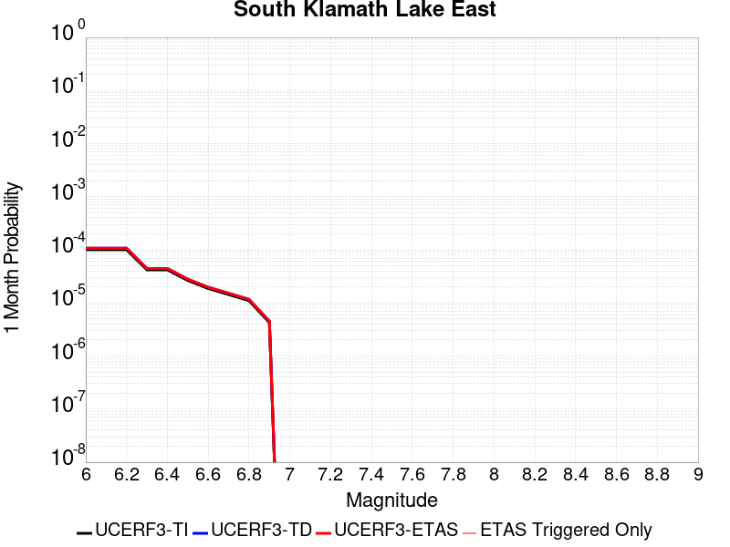 | 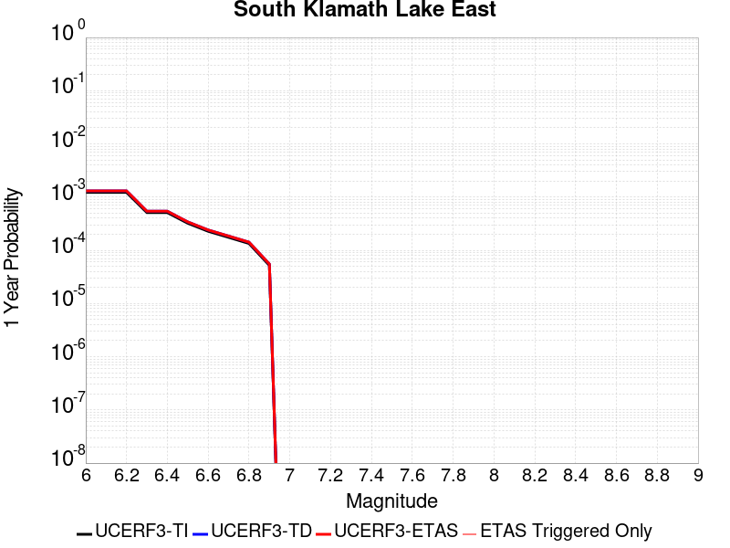 |  |

| Magnitude | 1 wk TI Prob | 1 wk TD Prob | 1 wk ETAS Prob | 1 wk ETAS/TD Gain | 1 wk ETAS Triggered Only | 1 mo TI Prob | 1 mo TD Prob | 1 mo ETAS Prob | 1 mo ETAS/TD Gain | 1 mo ETAS Triggered Only | 1 yr TI Prob | 1 yr TD Prob | 1 yr ETAS Prob | 1 yr ETAS/TD Gain | 1 yr ETAS Triggered Only | 10 yr TI Prob | 10 yr TD Prob | 10 yr ETAS Prob | 10 yr ETAS/TD Gain | 10 yr ETAS Triggered Only |
|-----|-----|-----|-----|-----|-----|-----|-----|-----|-----|-----|-----|-----|-----|-----|-----|-----|-----|-----|-----|-----|
| 6.0 | 2.3539369E-5 | 2.5047308E-5 | 2.5047308E-5 | 1.0 | 0.0 | 1.0087911E-4 | 1.0734166E-4 | 1.0734166E-4 | 1.0 | 0.0 | 0.0012275111 | 0.0013061843 | 0.0013061843 | 1.0 | 0.0 | 0.012207527 | 0.012993417 | 0.013003287 | 1.0007596 | 1.0E-5 |
| 6.1 | 2.3539369E-5 | 2.5047308E-5 | 2.5047308E-5 | 1.0 | 0.0 | 1.0087911E-4 | 1.0734166E-4 | 1.0734166E-4 | 1.0 | 0.0 | 0.0012275111 | 0.0013061843 | 0.0013061843 | 1.0 | 0.0 | 0.012207527 | 0.012993417 | 0.013003287 | 1.0007596 | 1.0E-5 |
| 6.2 | 2.3539369E-5 | 2.5047308E-5 | 2.5047308E-5 | 1.0 | 0.0 | 1.0087911E-4 | 1.0734166E-4 | 1.0734166E-4 | 1.0 | 0.0 | 0.0012275111 | 0.0013061843 | 0.0013061843 | 1.0 | 0.0 | 0.012207527 | 0.012993417 | 0.013003287 | 1.0007596 | 1.0E-5 |
| 6.3 | 9.807823E-6 | 1.0396044E-5 | 1.0396044E-5 | 1.0 | 0.0 | 4.2032847E-5 | 4.455376E-5 | 4.455376E-5 | 1.0 | 0.0 | 5.1162974E-4 | 5.4231536E-4 | 5.4231536E-4 | 1.0 | 0.0 | 0.005104534 | 0.005410756 | 0.005420702 | 1.0018382 | 1.0E-5 |
| 6.4 | 9.807823E-6 | 1.0396044E-5 | 1.0396044E-5 | 1.0 | 0.0 | 4.2032847E-5 | 4.455376E-5 | 4.455376E-5 | 1.0 | 0.0 | 5.1162974E-4 | 5.4231536E-4 | 5.4231536E-4 | 1.0 | 0.0 | 0.005104534 | 0.005410756 | 0.005420702 | 1.0018382 | 1.0E-5 |
| 6.5 | 6.191981E-6 | 6.5508398E-6 | 6.5508398E-6 | 1.0 | 0.0 | 2.653679E-5 | 2.8074743E-5 | 2.8074743E-5 | 1.0 | 0.0 | 3.2303753E-4 | 3.4175918E-4 | 3.4175918E-4 | 1.0 | 0.0 | 0.0032256835 | 0.003412614 | 0.00342258 | 1.0029203 | 1.0E-5 |
| 6.6 | 4.3693776E-6 | 4.6165574E-6 | 4.6165574E-6 | 1.0 | 0.0 | 1.8725768E-5 | 1.9785102E-5 | 1.9785102E-5 | 1.0 | 0.0 | 2.2796239E-4 | 2.4085813E-4 | 2.4085813E-4 | 1.0 | 0.0 | 0.0022772867 | 0.0024060833 | 0.0024160594 | 1.0041461 | 1.0E-5 |
| 6.7 | 3.360834E-6 | 3.5512403E-6 | 3.5512403E-6 | 1.0 | 0.0 | 1.4403494E-5 | 1.5219517E-5 | 1.5219517E-5 | 1.0 | 0.0 | 1.7534842E-4 | 1.8528267E-4 | 1.8528267E-4 | 1.0 | 0.0 | 0.0017521014 | 0.0018513618 | 0.0018513618 | 1.0 | 0.0 |
| 6.8 | 2.57873E-6 | 2.7251708E-6 | 2.7251708E-6 | 1.0 | 0.0 | 1.1051653E-5 | 1.1679254E-5 | 1.1679254E-5 | 1.0 | 0.0 | 1.3454557E-4 | 1.4218627E-4 | 1.4218627E-4 | 1.0 | 0.0 | 0.0013446413 | 0.0014210136 | 0.0014210136 | 1.0 | 0.0 |
| 6.9 | 9.987825E-7 | 1.0566213E-6 | 1.0566213E-6 | 1.0 | 0.0 | 4.2804895E-6 | 4.528371E-6 | 4.528371E-6 | 1.0 | 0.0 | 5.211371E-5 | 5.5131848E-5 | 5.5131848E-5 | 1.0 | 0.0 | 5.210149E-4 | 5.5121386E-4 | 5.5121386E-4 | 1.0 | 0.0 |

## San Andreas (Offshore) 2011 CFM
*[(top)](#table-of-contents)*

| 1 Week | 1 Month | 1 Year | 10 Year |
|-----|-----|-----|-----|
|  |  | 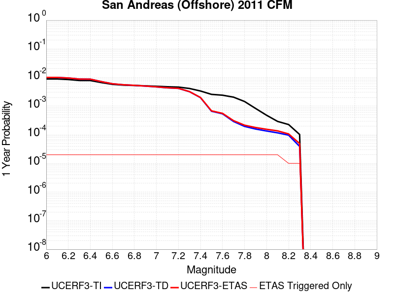 | 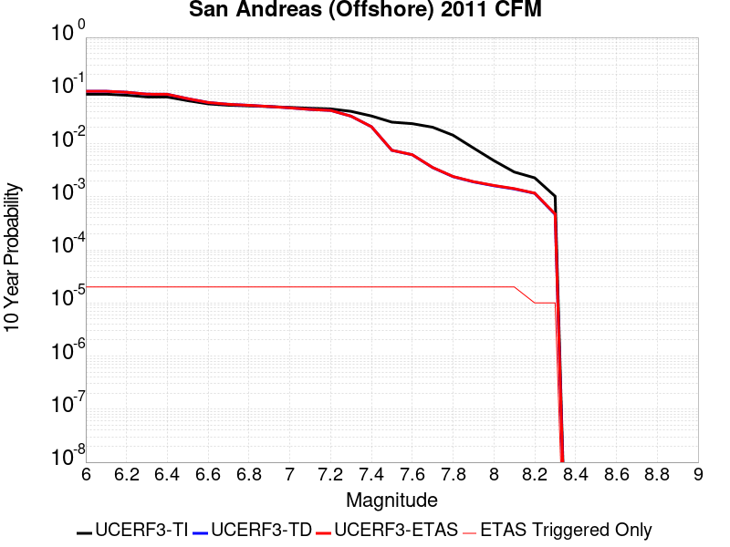 |

| Magnitude | 1 wk TI Prob | 1 wk TD Prob | 1 wk ETAS Prob | 1 wk ETAS/TD Gain | 1 wk ETAS Triggered Only | 1 mo TI Prob | 1 mo TD Prob | 1 mo ETAS Prob | 1 mo ETAS/TD Gain | 1 mo ETAS Triggered Only | 1 yr TI Prob | 1 yr TD Prob | 1 yr ETAS Prob | 1 yr ETAS/TD Gain | 1 yr ETAS Triggered Only | 10 yr TI Prob | 10 yr TD Prob | 10 yr ETAS Prob | 10 yr ETAS/TD Gain | 10 yr ETAS Triggered Only |
|-----|-----|-----|-----|-----|-----|-----|-----|-----|-----|-----|-----|-----|-----|-----|-----|-----|-----|-----|-----|-----|
| 6.0 | 1.7072787E-4 | 1.9226041E-4 | 1.9226041E-4 | 1.0 | 0.0 | 7.3148566E-4 | 8.237154E-4 | 8.237154E-4 | 1.0 | 0.0 | 0.008869528 | 0.0099831335 | 0.010002934 | 1.0019834 | 2.0E-5 | 0.085237645 | 0.09682738 | 0.09684545 | 1.0001866 | 2.0E-5 |
| 6.1 | 1.7072787E-4 | 1.9226041E-4 | 1.9226041E-4 | 1.0 | 0.0 | 7.3148566E-4 | 8.237154E-4 | 8.237154E-4 | 1.0 | 0.0 | 0.008869528 | 0.0099831335 | 0.010002934 | 1.0019834 | 2.0E-5 | 0.085237645 | 0.09682738 | 0.09684545 | 1.0001866 | 2.0E-5 |
| 6.2 | 1.6312556E-4 | 1.8407789E-4 | 1.8407789E-4 | 1.0 | 0.0 | 6.989222E-4 | 7.8866904E-4 | 7.8866904E-4 | 1.0 | 0.0 | 0.008476226 | 0.009560268 | 0.009580078 | 1.002072 | 2.0E-5 | 0.08160117 | 0.09284818 | 0.092866324 | 1.0001954 | 2.0E-5 |
| 6.3 | 1.5103363E-4 | 1.6880741E-4 | 1.6880741E-4 | 1.0 | 0.0 | 6.471264E-4 | 7.232619E-4 | 7.232619E-4 | 1.0 | 0.0 | 0.007850339 | 0.008770605 | 0.008790429 | 1.0022603 | 2.0E-5 | 0.075787395 | 0.085489064 | 0.085507356 | 1.000214 | 2.0E-5 |
| 6.4 | 1.5047993E-4 | 1.676667E-4 | 1.676667E-4 | 1.0 | 0.0 | 6.4475456E-4 | 7.1837584E-4 | 7.1837584E-4 | 1.0 | 0.0 | 0.007821669 | 0.008711592 | 0.008731418 | 1.0022758 | 2.0E-5 | 0.0755203 | 0.08496926 | 0.084987566 | 1.0002154 | 2.0E-5 |
| 6.5 | 1.2760791E-4 | 1.3735025E-4 | 1.3735025E-4 | 1.0 | 0.0 | 5.467764E-4 | 5.885125E-4 | 5.885125E-4 | 1.0 | 0.0 | 0.0066367025 | 0.0071418737 | 0.007161731 | 1.0027804 | 2.0E-5 | 0.064419635 | 0.07025001 | 0.07026861 | 1.0002646 | 2.0E-5 |
| 6.6 | 1.1063525E-4 | 1.15566356E-4 | 1.15566356E-4 | 1.0 | 0.0 | 4.740649E-4 | 4.9519143E-4 | 4.9519143E-4 | 1.0 | 0.0 | 0.0057564764 | 0.006012491 | 0.006032371 | 1.0033064 | 2.0E-5 | 0.05609626 | 0.05948894 | 0.05950775 | 1.0003161 | 2.0E-5 |
| 6.7 | 1.0391049E-4 | 1.0645922E-4 | 1.0645922E-4 | 1.0 | 0.0 | 4.4525467E-4 | 4.5617504E-4 | 4.5617504E-4 | 1.0 | 0.0 | 0.0054075094 | 0.005539975 | 0.0055598645 | 1.0035901 | 2.0E-5 | 0.052778035 | 0.05498876 | 0.05500766 | 1.0003437 | 2.0E-5 |
| 6.8 | 1.0096706E-4 | 1.01582686E-4 | 1.01582686E-4 | 1.0 | 0.0 | 4.3264418E-4 | 4.3528268E-4 | 4.3528268E-4 | 1.0 | 0.0 | 0.0052547283 | 0.005286866 | 0.0053067603 | 1.003763 | 2.0E-5 | 0.051321987 | 0.052687574 | 0.05270652 | 1.0003597 | 2.0E-5 |
| 6.9 | 9.800265E-5 | 9.588748E-5 | 9.588748E-5 | 1.0 | 0.0 | 4.1994374E-4 | 4.1088252E-4 | 4.1088252E-4 | 1.0 | 0.0 | 0.0051008356 | 0.0049911886 | 0.005011089 | 1.0039871 | 2.0E-5 | 0.049853306 | 0.05001504 | 0.050034042 | 1.0003799 | 2.0E-5 |
| 7.0 | 9.4642375E-5 | 9.002143E-5 | 9.002143E-5 | 1.0 | 0.0 | 4.0554712E-4 | 3.8574997E-4 | 3.8574997E-4 | 1.0 | 0.0 | 0.004926363 | 0.0046865544 | 0.0047064605 | 1.0042475 | 2.0E-5 | 0.048185747 | 0.047196057 | 0.04721511 | 1.0004038 | 2.0E-5 |
| 7.1 | 9.0996844E-5 | 8.354169E-5 | 8.354169E-5 | 1.0 | 0.0 | 3.8992817E-4 | 3.5798753E-4 | 3.5798753E-4 | 1.0 | 0.0 | 0.004737046 | 0.004349944 | 0.0043698573 | 1.0045778 | 2.0E-5 | 0.04637333 | 0.044047635 | 0.044066753 | 1.000434 | 2.0E-5 |
| 7.2 | 8.848287E-5 | 7.9818135E-5 | 7.9818135E-5 | 1.0 | 0.0 | 3.791572E-4 | 3.4203375E-4 | 3.4203375E-4 | 1.0 | 0.0 | 0.004606472 | 0.0041564633 | 0.00417638 | 1.0047917 | 2.0E-5 | 0.045121472 | 0.042191572 | 0.042210728 | 1.0004541 | 2.0E-5 |
| 7.3 | 7.9280784E-5 | 6.1276216E-5 | 6.1276216E-5 | 1.0 | 0.0 | 3.3973053E-4 | 2.625865E-4 | 2.625865E-4 | 1.0 | 0.0 | 0.004128377 | 0.0031924061 | 0.0032123423 | 1.0062449 | 2.0E-5 | 0.040525194 | 0.032904375 | 0.032923717 | 1.0005878 | 2.0E-5 |
| 7.4 | 6.468038E-5 | 3.7933212E-5 | 3.7933212E-5 | 1.0 | 0.0 | 2.771722E-4 | 1.625611E-4 | 1.625611E-4 | 1.0 | 0.0 | 0.0033693502 | 0.0019774425 | 0.001997403 | 1.010094 | 2.0E-5 | 0.0331872 | 0.02082181 | 0.020841394 | 1.0009406 | 2.0E-5 |
| 7.5 | 4.930574E-5 | 1.2703362E-5 | 1.2703362E-5 | 1.0 | 0.0 | 2.1129321E-4 | 5.444185E-5 | 5.444185E-5 | 1.0 | 0.0 | 0.0025694598 | 6.6262955E-4 | 6.826163E-4 | 1.0301628 | 2.0E-5 | 0.02539953 | 0.007481418 | 0.0075012688 | 1.0026532 | 2.0E-5 |
| 7.6 | 4.612566E-5 | 1.0336213E-5 | 1.0336213E-5 | 1.0 | 0.0 | 1.9766642E-4 | 4.429731E-5 | 4.429731E-5 | 1.0 | 0.0 | 0.0024039324 | 5.391877E-4 | 5.591769E-4 | 1.0370728 | 2.0E-5 | 0.023780935 | 0.006172099 | 0.0061919754 | 1.0032204 | 2.0E-5 |
| 7.7 | 3.9435414E-5 | 5.574925E-6 | 5.574925E-6 | 1.0 | 0.0 | 1.6899795E-4 | 2.3892318E-5 | 2.3892318E-5 | 1.0 | 0.0 | 0.0020556084 | 2.9085035E-4 | 3.108445E-4 | 1.068744 | 2.0E-5 | 0.020366974 | 0.0035420412 | 0.0035619703 | 1.0056264 | 2.0E-5 |
| 7.8 | 2.7787428E-5 | 3.7553348E-6 | 3.7553348E-6 | 1.0 | 0.0 | 1.1908354E-4 | 1.6094193E-5 | 1.6094193E-5 | 1.0 | 0.0 | 0.0014488777 | 1.9592921E-4 | 2.1592529E-4 | 1.1020577 | 2.0E-5 | 0.014394675 | 0.0023877125 | 0.0024076647 | 1.0083562 | 2.0E-5 |
| 7.9 | 1.590671E-5 | 3.04085E-6 | 3.04085E-6 | 1.0 | 0.0 | 6.816983E-5 | 1.303215E-5 | 1.303215E-5 | 1.0 | 0.0 | 8.2965166E-4 | 1.586549E-4 | 1.7865172E-4 | 1.1260397 | 2.0E-5 | 0.008265611 | 0.001904262 | 0.0019242238 | 1.0104828 | 2.0E-5 |
| 8.0 | 9.193638E-6 | 2.5920847E-6 | 2.5920847E-6 | 1.0 | 0.0 | 3.940071E-5 | 1.1108887E-5 | 1.1108887E-5 | 1.0 | 0.0 | 4.7959806E-4 | 1.3524233E-4 | 1.5523963E-4 | 1.1478627 | 2.0E-5 | 0.0047856434 | 0.0016115032 | 0.001631471 | 1.0123907 | 2.0E-5 |
| 8.1 | 5.601576E-6 | 2.2343472E-6 | 2.2343472E-6 | 1.0 | 0.0 | 2.4006533E-5 | 9.575739E-6 | 9.575739E-6 | 1.0 | 0.0 | 2.9224035E-4 | 1.16578405E-4 | 1.3657607E-4 | 1.1715384 | 2.0E-5 | 0.0029185633 | 0.0014020674 | 0.0014220393 | 1.0142447 | 2.0E-5 |
| 8.2 | 4.3508785E-6 | 1.857566E-6 | 1.857566E-6 | 1.0 | 0.0 | 1.864649E-5 | 7.960973E-6 | 7.960973E-6 | 1.0 | 0.0 | 2.2699735E-4 | 9.692056E-5 | 1.0691959E-4 | 1.1031673 | 1.0E-5 | 0.0022676561 | 0.0011594221 | 0.0011694105 | 1.008615 | 1.0E-5 |
| 8.3 | 1.9573292E-6 | 7.514906E-7 | 7.514906E-7 | 1.0 | 0.0 | 8.388526E-6 | 3.22067E-6 | 3.22067E-6 | 1.0 | 0.0 | 1.0212552E-4 | 3.921097E-5 | 4.9210576E-5 | 1.2550207 | 1.0E-5 | 0.001020786 | 4.640846E-4 | 4.7407995E-4 | 1.0215378 | 1.0E-5 |

## Carlsbad
*[(top)](#table-of-contents)*

| 1 Week | 1 Month | 1 Year | 10 Year |
|-----|-----|-----|-----|
|  | 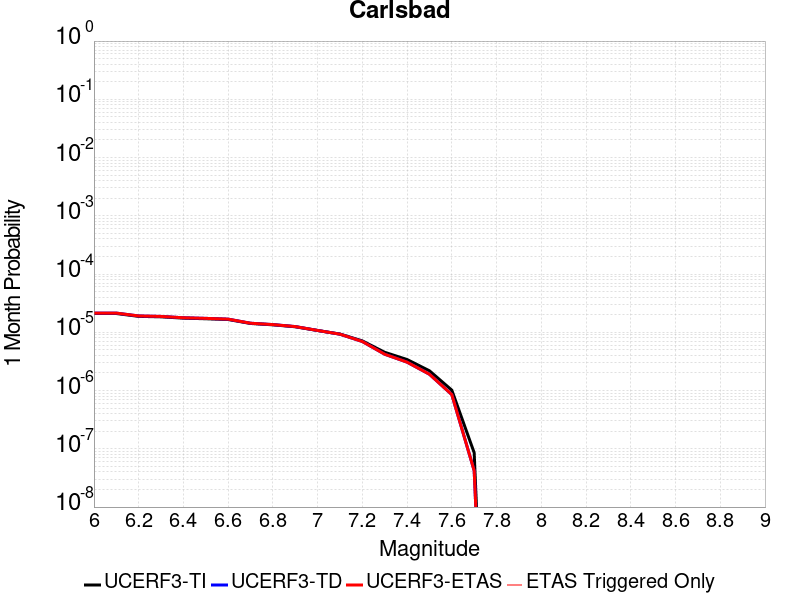 |  |  |

| Magnitude | 1 wk TI Prob | 1 wk TD Prob | 1 wk ETAS Prob | 1 wk ETAS/TD Gain | 1 wk ETAS Triggered Only | 1 mo TI Prob | 1 mo TD Prob | 1 mo ETAS Prob | 1 mo ETAS/TD Gain | 1 mo ETAS Triggered Only | 1 yr TI Prob | 1 yr TD Prob | 1 yr ETAS Prob | 1 yr ETAS/TD Gain | 1 yr ETAS Triggered Only | 10 yr TI Prob | 10 yr TD Prob | 10 yr ETAS Prob | 10 yr ETAS/TD Gain | 10 yr ETAS Triggered Only |
|-----|-----|-----|-----|-----|-----|-----|-----|-----|-----|-----|-----|-----|-----|-----|-----|-----|-----|-----|-----|-----|
| 6.0 | 4.9038536E-6 | 4.9872565E-6 | 4.9872565E-6 | 1.0 | 0.0 | 2.1016345E-5 | 2.1373784E-5 | 2.1373784E-5 | 1.0 | 0.0 | 2.5584397E-4 | 2.601952E-4 | 2.8019E-4 | 1.0768454 | 2.0E-5 | 0.002555496 | 0.0025989525 | 0.0026189005 | 1.0076754 | 2.0E-5 |
| 6.1 | 4.9038536E-6 | 4.9872565E-6 | 4.9872565E-6 | 1.0 | 0.0 | 2.1016345E-5 | 2.1373784E-5 | 2.1373784E-5 | 1.0 | 0.0 | 2.5584397E-4 | 2.601952E-4 | 2.8019E-4 | 1.0768454 | 2.0E-5 | 0.002555496 | 0.0025989525 | 0.0026189005 | 1.0076754 | 2.0E-5 |
| 6.2 | 4.3820614E-6 | 4.4547687E-6 | 4.4547687E-6 | 1.0 | 0.0 | 1.8780129E-5 | 1.9091729E-5 | 1.9091729E-5 | 1.0 | 0.0 | 2.2862408E-4 | 2.3241735E-4 | 2.524127E-4 | 1.0860322 | 2.0E-5 | 0.00228389 | 0.0023217786 | 0.0023417321 | 1.008594 | 2.0E-5 |
| 6.3 | 4.302872E-6 | 4.373006E-6 | 4.373006E-6 | 1.0 | 0.0 | 1.8440749E-5 | 1.8741322E-5 | 1.8741322E-5 | 1.0 | 0.0 | 2.24493E-4 | 2.2815206E-4 | 2.481475E-4 | 1.0876409 | 2.0E-5 | 0.0022426634 | 0.0022792136 | 0.002299168 | 1.008755 | 2.0E-5 |
| 6.4 | 4.0835243E-6 | 4.1476546E-6 | 4.1476546E-6 | 1.0 | 0.0 | 1.75007E-5 | 1.7775543E-5 | 1.7775543E-5 | 1.0 | 0.0 | 2.1305021E-4 | 2.1639607E-4 | 2.3639174E-4 | 1.0924032 | 2.0E-5 | 0.0021284607 | 0.0021618877 | 0.0021818443 | 1.0092312 | 2.0E-5 |
| 6.5 | 3.987806E-6 | 4.0488867E-6 | 4.0488867E-6 | 1.0 | 0.0 | 1.7090486E-5 | 1.7352257E-5 | 1.7352257E-5 | 1.0 | 0.0 | 2.080568E-4 | 2.1124359E-4 | 2.3123936E-4 | 1.0946574 | 2.0E-5 | 0.002078621 | 0.0021104617 | 0.0021304195 | 1.0094566 | 2.0E-5 |
| 6.6 | 3.8707576E-6 | 3.927488E-6 | 3.927488E-6 | 1.0 | 0.0 | 1.6588854E-5 | 1.6831984E-5 | 1.6831984E-5 | 1.0 | 0.0 | 2.0195059E-4 | 2.0491047E-4 | 2.2490637E-4 | 1.0975837 | 2.0E-5 | 0.0020176715 | 0.0020472489 | 0.0020672078 | 1.0097492 | 2.0E-5 |
| 6.7 | 3.3093434E-6 | 3.3423917E-6 | 3.3423917E-6 | 1.0 | 0.0 | 1.4182823E-5 | 1.4324457E-5 | 1.4324457E-5 | 1.0 | 0.0 | 1.7266218E-4 | 1.7438637E-4 | 1.8438463E-4 | 1.057334 | 1.0E-5 | 0.001725281 | 0.0017425013 | 0.0017524839 | 1.0057288 | 1.0E-5 |
| 6.8 | 3.136983E-6 | 3.1664536E-6 | 3.1664536E-6 | 1.0 | 0.0 | 1.3444143E-5 | 1.3570445E-5 | 1.3570445E-5 | 1.0 | 0.0 | 1.6367015E-4 | 1.6520769E-4 | 1.7520603E-4 | 1.0605198 | 1.0E-5 | 0.0016354966 | 0.0016508545 | 0.0016608379 | 1.0060475 | 1.0E-5 |
| 6.9 | 2.9056644E-6 | 2.9267585E-6 | 2.9267585E-6 | 1.0 | 0.0 | 1.2452788E-5 | 1.2543191E-5 | 1.2543191E-5 | 1.0 | 0.0 | 1.5160214E-4 | 1.5270269E-4 | 1.6270117E-4 | 1.0654768 | 1.0E-5 | 0.0015149876 | 0.001525983 | 0.0015359677 | 1.0065432 | 1.0E-5 |
| 7.0 | 2.5071035E-6 | 2.5113977E-6 | 2.5113977E-6 | 1.0 | 0.0 | 1.0744685E-5 | 1.07630885E-5 | 1.07630885E-5 | 1.0 | 0.0 | 1.308087E-4 | 1.3103275E-4 | 1.4103144E-4 | 1.0763068 | 1.0E-5 | 0.0013073172 | 0.0013095582 | 0.0013195451 | 1.0076262 | 1.0E-5 |
| 7.1 | 2.1786877E-6 | 2.1678832E-6 | 2.1678832E-6 | 1.0 | 0.0 | 9.3372E-6 | 9.290896E-6 | 9.290896E-6 | 1.0 | 0.0 | 1.13674476E-4 | 1.1311081E-4 | 1.2310968E-4 | 1.0883989 | 1.0E-5 | 0.0011361635 | 0.0011305353 | 0.0011405239 | 1.0088353 | 1.0E-5 |
| 7.2 | 1.6628418E-6 | 1.6213872E-6 | 1.6213872E-6 | 1.0 | 0.0 | 7.1264453E-6 | 6.948784E-6 | 6.948784E-6 | 1.0 | 0.0 | 8.676102E-5 | 8.4598185E-5 | 9.459734E-5 | 1.1181959 | 1.0E-5 | 8.672715E-4 | 8.45662E-4 | 8.5565355E-4 | 1.0118151 | 1.0E-5 |
| 7.3 | 1.0595926E-6 | 9.816804E-7 | 9.816804E-7 | 1.0 | 0.0 | 4.541103E-6 | 4.2071947E-6 | 4.2071947E-6 | 1.0 | 0.0 | 5.5286528E-5 | 5.1221403E-5 | 5.1221403E-5 | 1.0 | 0.0 | 5.527277E-4 | 5.1209686E-4 | 5.1209686E-4 | 1.0 | 0.0 |
| 7.4 | 7.956623E-7 | 7.1737975E-7 | 7.1737975E-7 | 1.0 | 0.0 | 3.4099767E-6 | 3.074481E-6 | 3.074481E-6 | 1.0 | 0.0 | 4.1515676E-5 | 3.743117E-5 | 3.743117E-5 | 1.0 | 0.0 | 4.150792E-4 | 3.7424936E-4 | 3.7424936E-4 | 1.0 | 0.0 |
| 7.5 | 5.1043804E-7 | 4.4483627E-7 | 4.4483627E-7 | 1.0 | 0.0 | 2.1875896E-6 | 1.9064398E-6 | 1.9064398E-6 | 1.0 | 0.0 | 2.663358E-5 | 2.3210663E-5 | 2.3210663E-5 | 1.0 | 0.0 | 2.6630386E-4 | 2.3208297E-4 | 2.3208297E-4 | 1.0 | 0.0 |
| 7.6 | 2.3723294E-7 | 1.989569E-7 | 1.989569E-7 | 1.0 | 0.0 | 1.0167122E-6 | 8.5267214E-7 | 8.5267214E-7 | 1.0 | 0.0 | 1.2378401E-5 | 1.0381237E-5 | 1.0381237E-5 | 1.0 | 0.0 | 1.237771E-4 | 1.038078E-4 | 1.038078E-4 | 1.0 | 0.0 |
| 7.7 | 1.9992152E-8 | 9.8601785E-9 | 9.8601785E-9 | 1.0 | 0.0 | 8.568065E-8 | 4.225791E-8 | 4.225791E-8 | 1.0 | 0.0 | 1.0431614E-6 | 5.1449E-7 | 5.1449E-7 | 1.0 | 0.0 | 1.0431565E-5 | 5.1449E-6 | 5.1449E-6 | 1.0 | 0.0 |

## Oak Ridge (Onshore)
*[(top)](#table-of-contents)*

| 1 Week | 1 Month | 1 Year | 10 Year |
|-----|-----|-----|-----|
|  |  |  |  |

| Magnitude | 1 wk TI Prob | 1 wk TD Prob | 1 wk ETAS Prob | 1 wk ETAS/TD Gain | 1 wk ETAS Triggered Only | 1 mo TI Prob | 1 mo TD Prob | 1 mo ETAS Prob | 1 mo ETAS/TD Gain | 1 mo ETAS Triggered Only | 1 yr TI Prob | 1 yr TD Prob | 1 yr ETAS Prob | 1 yr ETAS/TD Gain | 1 yr ETAS Triggered Only | 10 yr TI Prob | 10 yr TD Prob | 10 yr ETAS Prob | 10 yr ETAS/TD Gain | 10 yr ETAS Triggered Only |
|-----|-----|-----|-----|-----|-----|-----|-----|-----|-----|-----|-----|-----|-----|-----|-----|-----|-----|-----|-----|-----|
| 6.0 | 3.155064E-5 | 2.9525974E-5 | 2.9525974E-5 | 1.0 | 0.0 | 1.3521002E-4 | 1.2653397E-4 | 1.2653397E-4 | 1.0 | 0.0 | 0.001644939 | 0.0015395004 | 0.001549485 | 1.0064856 | 1.0E-5 | 0.01632816 | 0.015292859 | 0.015312553 | 1.0012878 | 2.0E-5 |
| 6.1 | 3.155064E-5 | 2.9525974E-5 | 2.9525974E-5 | 1.0 | 0.0 | 1.3521002E-4 | 1.2653397E-4 | 1.2653397E-4 | 1.0 | 0.0 | 0.001644939 | 0.0015395004 | 0.001549485 | 1.0064856 | 1.0E-5 | 0.01632816 | 0.015292859 | 0.015312553 | 1.0012878 | 2.0E-5 |
| 6.2 | 3.155064E-5 | 2.9525974E-5 | 2.9525974E-5 | 1.0 | 0.0 | 1.3521002E-4 | 1.2653397E-4 | 1.2653397E-4 | 1.0 | 0.0 | 0.001644939 | 0.0015395004 | 0.001549485 | 1.0064856 | 1.0E-5 | 0.01632816 | 0.015292859 | 0.015312553 | 1.0012878 | 2.0E-5 |
| 6.3 | 3.155064E-5 | 2.9525974E-5 | 2.9525974E-5 | 1.0 | 0.0 | 1.3521002E-4 | 1.2653397E-4 | 1.2653397E-4 | 1.0 | 0.0 | 0.001644939 | 0.0015395004 | 0.001549485 | 1.0064856 | 1.0E-5 | 0.01632816 | 0.015292859 | 0.015312553 | 1.0012878 | 2.0E-5 |
| 6.4 | 3.155064E-5 | 2.9525974E-5 | 2.9525974E-5 | 1.0 | 0.0 | 1.3521002E-4 | 1.2653397E-4 | 1.2653397E-4 | 1.0 | 0.0 | 0.001644939 | 0.0015395004 | 0.001549485 | 1.0064856 | 1.0E-5 | 0.01632816 | 0.015292859 | 0.015312553 | 1.0012878 | 2.0E-5 |
| 6.5 | 3.155064E-5 | 2.9525974E-5 | 2.9525974E-5 | 1.0 | 0.0 | 1.3521002E-4 | 1.2653397E-4 | 1.2653397E-4 | 1.0 | 0.0 | 0.001644939 | 0.0015395004 | 0.001549485 | 1.0064856 | 1.0E-5 | 0.01632816 | 0.015292859 | 0.015312553 | 1.0012878 | 2.0E-5 |
| 6.6 | 3.155064E-5 | 2.9525974E-5 | 2.9525974E-5 | 1.0 | 0.0 | 1.3521002E-4 | 1.2653397E-4 | 1.2653397E-4 | 1.0 | 0.0 | 0.001644939 | 0.0015395004 | 0.001549485 | 1.0064856 | 1.0E-5 | 0.01632816 | 0.015292859 | 0.015312553 | 1.0012878 | 2.0E-5 |
| 6.7 | 3.098897E-5 | 2.8864175E-5 | 2.8864175E-5 | 1.0 | 0.0 | 1.328031E-4 | 1.2369796E-4 | 1.2369796E-4 | 1.0 | 0.0 | 0.0016156785 | 0.0015050198 | 0.0015150048 | 1.0066345 | 1.0E-5 | 0.016039822 | 0.014952714 | 0.014972415 | 1.0013175 | 2.0E-5 |
| 6.8 | 3.0449872E-5 | 2.8239372E-5 | 2.8239372E-5 | 1.0 | 0.0 | 1.3049292E-4 | 1.2102048E-4 | 1.2102048E-4 | 1.0 | 0.0 | 0.0015875935 | 0.0014724657 | 0.0014824509 | 1.0067813 | 1.0E-5 | 0.015762992 | 0.014631462 | 0.014651169 | 1.001347 | 2.0E-5 |
| 6.9 | 2.697928E-5 | 2.4219773E-5 | 2.4219773E-5 | 1.0 | 0.0 | 1.15620365E-4 | 1.0379502E-4 | 1.0379502E-4 | 1.0 | 0.0 | 0.0014067689 | 0.0012629933 | 0.0012629933 | 1.0 | 0.0 | 0.0139789665 | 0.01256087 | 0.012570744 | 1.0007861 | 1.0E-5 |
| 7.0 | 2.4893961E-5 | 2.1862043E-5 | 2.1862043E-5 | 1.0 | 0.0 | 1.0668404E-4 | 9.3691204E-5 | 9.3691204E-5 | 1.0 | 0.0 | 0.0012981043 | 0.0011401111 | 0.0011401111 | 1.0 | 0.0 | 0.012905477 | 0.011344905 | 0.011354792 | 1.0008714 | 1.0E-5 |
| 7.1 | 2.0945363E-5 | 1.7354487E-5 | 1.7354487E-5 | 1.0 | 0.0 | 8.976275E-5 | 7.437428E-5 | 7.437428E-5 | 1.0 | 0.0 | 0.0010923136 | 9.051354E-4 | 9.051354E-4 | 1.0 | 0.0 | 0.0108696 | 0.009015423 | 0.0090253325 | 1.0010992 | 1.0E-5 |
| 7.2 | 2.0439404E-5 | 1.6809423E-5 | 1.6809423E-5 | 1.0 | 0.0 | 8.7594504E-5 | 7.203843E-5 | 7.203843E-5 | 1.0 | 0.0 | 0.0010659413 | 8.767196E-4 | 8.767196E-4 | 1.0 | 0.0 | 0.010608427 | 0.008733526 | 0.008743439 | 1.001135 | 1.0E-5 |
| 7.3 | 1.8463334E-5 | 1.5381811E-5 | 1.5381811E-5 | 1.0 | 0.0 | 7.912617E-5 | 6.59204E-5 | 6.59204E-5 | 1.0 | 0.0 | 9.6293533E-4 | 8.0228975E-4 | 8.0228975E-4 | 1.0 | 0.0 | 0.009587734 | 0.007994797 | 0.008004717 | 1.0012408 | 1.0E-5 |
| 7.4 | 1.763139E-5 | 1.451684E-5 | 1.451684E-5 | 1.0 | 0.0 | 7.556091E-5 | 6.221356E-5 | 6.221356E-5 | 1.0 | 0.0 | 9.1956573E-4 | 7.571909E-4 | 7.571909E-4 | 1.0 | 0.0 | 0.009157699 | 0.007546914 | 0.007556838 | 1.001315 | 1.0E-5 |
| 7.5 | 1.3594944E-5 | 1.1163356E-5 | 1.1163356E-5 | 1.0 | 0.0 | 5.8262744E-5 | 4.784209E-5 | 4.784209E-5 | 1.0 | 0.0 | 7.0911803E-4 | 5.8232434E-4 | 5.8232434E-4 | 1.0 | 0.0 | 0.007068595 | 0.0058082556 | 0.0058181975 | 1.0017117 | 1.0E-5 |
| 7.6 | 6.9889534E-6 | 5.6367144E-6 | 5.6367144E-6 | 1.0 | 0.0 | 2.9952313E-5 | 2.4157125E-5 | 2.4157125E-5 | 1.0 | 0.0 | 3.646084E-4 | 2.9407372E-4 | 2.9407372E-4 | 1.0 | 0.0 | 0.0036401073 | 0.0029368899 | 0.0029368899 | 1.0 | 0.0 |
| 7.7 | 4.0824193E-6 | 3.2832586E-6 | 3.2832586E-6 | 1.0 | 0.0 | 1.7495966E-5 | 1.4071033E-5 | 1.4071033E-5 | 1.0 | 0.0 | 2.1299256E-4 | 1.713015E-4 | 1.713015E-4 | 1.0 | 0.0 | 0.0021278851 | 0.0017117079 | 0.0017117079 | 1.0 | 0.0 |
| 7.8 | 1.7023609E-6 | 1.4370495E-6 | 1.4370495E-6 | 1.0 | 0.0 | 7.295812E-6 | 6.1587693E-6 | 6.1587693E-6 | 1.0 | 0.0 | 8.882289E-5 | 7.498047E-5 | 7.498047E-5 | 1.0 | 0.0 | 8.8787393E-4 | 7.495545E-4 | 7.495545E-4 | 1.0 | 0.0 |
| 7.9 | 2.721225E-7 | 2.2616497E-7 | 2.2616497E-7 | 1.0 | 0.0 | 1.1662388E-6 | 9.692781E-7 | 9.692781E-7 | 1.0 | 0.0 | 1.4198865E-5 | 1.1800899E-5 | 1.1800899E-5 | 1.0 | 0.0 | 1.4197957E-4 | 1.1800301E-4 | 1.1800301E-4 | 1.0 | 0.0 |
| 8.0 | 9.364255E-9 | 5.1206666E-9 | 5.1206666E-9 | 1.0 | 0.0 | 4.0132523E-8 | 2.1945715E-8 | 2.1945715E-8 | 1.0 | 0.0 | 4.8861335E-7 | 2.6718905E-7 | 2.6718905E-7 | 1.0 | 0.0 | 4.8861225E-6 | 2.6718876E-6 | 2.6718876E-6 | 1.0 | 0.0 |

## Monterey Bay-Tularcitos
*[(top)](#table-of-contents)*

| 1 Week | 1 Month | 1 Year | 10 Year |
|-----|-----|-----|-----|
|  |  |  | 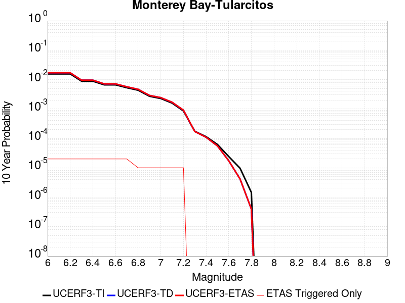 |

| Magnitude | 1 wk TI Prob | 1 wk TD Prob | 1 wk ETAS Prob | 1 wk ETAS/TD Gain | 1 wk ETAS Triggered Only | 1 mo TI Prob | 1 mo TD Prob | 1 mo ETAS Prob | 1 mo ETAS/TD Gain | 1 mo ETAS Triggered Only | 1 yr TI Prob | 1 yr TD Prob | 1 yr ETAS Prob | 1 yr ETAS/TD Gain | 1 yr ETAS Triggered Only | 10 yr TI Prob | 10 yr TD Prob | 10 yr ETAS Prob | 10 yr ETAS/TD Gain | 10 yr ETAS Triggered Only |
|-----|-----|-----|-----|-----|-----|-----|-----|-----|-----|-----|-----|-----|-----|-----|-----|-----|-----|-----|-----|-----|
| 6.0 | 3.0131365E-5 | 3.279877E-5 | 5.2798114E-5 | 1.609759 | 2.0E-5 | 1.2912804E-4 | 1.4055918E-4 | 1.6055637E-4 | 1.1422688 | 2.0E-5 | 0.001571 | 0.0017100703 | 0.001730036 | 1.0116755 | 2.0E-5 | 0.015599402 | 0.016979916 | 0.016999578 | 1.0011579 | 2.0E-5 |
| 6.1 | 3.0131365E-5 | 3.279877E-5 | 5.2798114E-5 | 1.609759 | 2.0E-5 | 1.2912804E-4 | 1.4055918E-4 | 1.6055637E-4 | 1.1422688 | 2.0E-5 | 0.001571 | 0.0017100703 | 0.001730036 | 1.0116755 | 2.0E-5 | 0.015599402 | 0.016979916 | 0.016999578 | 1.0011579 | 2.0E-5 |
| 6.2 | 3.0131365E-5 | 3.279877E-5 | 5.2798114E-5 | 1.609759 | 2.0E-5 | 1.2912804E-4 | 1.4055918E-4 | 1.6055637E-4 | 1.1422688 | 2.0E-5 | 0.001571 | 0.0017100703 | 0.001730036 | 1.0116755 | 2.0E-5 | 0.015599402 | 0.016979916 | 0.016999578 | 1.0011579 | 2.0E-5 |
| 6.3 | 1.6998249E-5 | 1.8330798E-5 | 3.8330432E-5 | 2.09104 | 2.0E-5 | 7.28476E-5 | 7.85583E-5 | 9.855673E-5 | 1.254568 | 2.0E-5 | 8.865586E-4 | 9.5604634E-4 | 9.760272E-4 | 1.0208995 | 2.0E-5 | 0.0088303005 | 0.009521258 | 0.009541067 | 1.0020806 | 2.0E-5 |
| 6.4 | 1.6998249E-5 | 1.8330798E-5 | 3.8330432E-5 | 2.09104 | 2.0E-5 | 7.28476E-5 | 7.85583E-5 | 9.855673E-5 | 1.254568 | 2.0E-5 | 8.865586E-4 | 9.5604634E-4 | 9.760272E-4 | 1.0208995 | 2.0E-5 | 0.0088303005 | 0.009521258 | 0.009541067 | 1.0020806 | 2.0E-5 |
| 6.5 | 1.27470785E-5 | 1.3693312E-5 | 3.369304E-5 | 2.460547 | 2.0E-5 | 5.4629192E-5 | 5.8684363E-5 | 7.868319E-5 | 1.3407863 | 2.0E-5 | 6.649074E-4 | 7.1425823E-4 | 7.3424395E-4 | 1.027981 | 2.0E-5 | 0.0066292146 | 0.007120678 | 0.007140536 | 1.0027887 | 2.0E-5 |
| 6.6 | 1.2739422E-5 | 1.36854E-5 | 3.3685126E-5 | 2.4613914 | 2.0E-5 | 5.4596385E-5 | 5.8650454E-5 | 7.864928E-5 | 1.3409834 | 2.0E-5 | 6.645082E-4 | 7.1384566E-4 | 7.338314E-4 | 1.0279973 | 2.0E-5 | 0.0066252467 | 0.007116579 | 0.0071364366 | 1.0027903 | 2.0E-5 |
| 6.7 | 1.0160109E-5 | 1.0885755E-5 | 3.0885538E-5 | 2.8372436 | 2.0E-5 | 4.35426E-5 | 4.665244E-5 | 6.6651504E-5 | 1.4286821 | 2.0E-5 | 5.300022E-4 | 5.6785246E-4 | 5.8784115E-4 | 1.0352004 | 2.0E-5 | 0.005287399 | 0.0056647263 | 0.005684613 | 1.0035106 | 2.0E-5 |
| 6.8 | 8.349859E-6 | 8.932587E-6 | 1.8932498E-5 | 2.1194866 | 1.0E-5 | 3.578462E-5 | 3.8281985E-5 | 4.8281603E-5 | 1.2612095 | 1.0E-5 | 4.3559066E-4 | 4.6598914E-4 | 4.759845E-4 | 1.0214497 | 1.0E-5 | 0.004347378 | 0.004650685 | 0.0046606385 | 1.0021402 | 1.0E-5 |
| 6.9 | 5.193639E-6 | 5.53643E-6 | 1.5536374E-5 | 2.8062081 | 1.0E-5 | 2.2258262E-5 | 2.372736E-5 | 3.3727123E-5 | 1.4214444 | 1.0E-5 | 2.7096065E-4 | 2.8884556E-4 | 2.9884267E-4 | 1.0346106 | 1.0E-5 | 0.0027063051 | 0.0028850222 | 0.0028949934 | 1.0034562 | 1.0E-5 |
| 7.0 | 4.359381E-6 | 4.643366E-6 | 1.4643319E-5 | 3.1536002 | 1.0E-5 | 1.8682927E-5 | 1.9900004E-5 | 2.9899806E-5 | 1.5025024 | 1.0E-5 | 2.274409E-4 | 2.422586E-4 | 2.5225617E-4 | 1.0412682 | 1.0E-5 | 0.0022720827 | 0.002420238 | 0.0024302138 | 1.0041218 | 1.0E-5 |
| 7.1 | 3.0398533E-6 | 3.2310427E-6 | 1.3231011E-5 | 4.0949664 | 1.0E-5 | 1.3027877E-5 | 1.3847267E-5 | 2.3847128E-5 | 1.7221541 | 1.0E-5 | 1.5860285E-4 | 1.6858005E-4 | 1.7857837E-4 | 1.059309 | 1.0E-5 | 0.001584897 | 0.0016847793 | 0.0016947625 | 1.0059255 | 1.0E-5 |
| 7.2 | 1.642335E-6 | 1.7333153E-6 | 1.1733298E-5 | 6.7692804 | 1.0E-5 | 7.0385595E-6 | 7.428485E-6 | 1.742841E-5 | 2.3461595 | 1.0E-5 | 8.569109E-5 | 9.044012E-5 | 1.0043921E-4 | 1.1105604 | 1.0E-5 | 8.5658056E-4 | 9.042358E-4 | 9.1422675E-4 | 1.011049 | 1.0E-5 |
| 7.3 | 3.356842E-7 | 3.2952389E-7 | 3.2952389E-7 | 1.0 | 0.0 | 1.4386458E-6 | 1.4122444E-6 | 1.4122444E-6 | 1.0 | 0.0 | 1.7515373E-5 | 1.7193941E-5 | 1.7193941E-5 | 1.0 | 0.0 | 1.7513991E-4 | 1.719262E-4 | 1.719262E-4 | 1.0 | 0.0 |
| 7.4 | 2.1973483E-7 | 2.1006413E-7 | 2.1006413E-7 | 1.0 | 0.0 | 9.417204E-7 | 9.0027453E-7 | 9.0027453E-7 | 1.0 | 0.0 | 1.1465385E-5 | 1.0960787E-5 | 1.0960787E-5 | 1.0 | 0.0 | 1.1464794E-4 | 1.096025E-4 | 1.096025E-4 | 1.0 | 0.0 |
| 7.5 | 1.1944135E-7 | 1.0696043E-7 | 1.0696043E-7 | 1.0 | 0.0 | 5.118914E-7 | 4.5840173E-7 | 4.5840173E-7 | 1.0 | 0.0 | 6.23226E-6 | 5.581027E-6 | 5.581027E-6 | 1.0 | 0.0 | 6.2320854E-5 | 5.5808883E-5 | 5.5808883E-5 | 1.0 | 0.0 |
| 7.6 | 4.636058E-8 | 3.336489E-8 | 3.336489E-8 | 1.0 | 0.0 | 1.9868818E-7 | 1.4299238E-7 | 1.4299238E-7 | 1.0 | 0.0 | 2.419026E-6 | 1.7409308E-6 | 1.7409308E-6 | 1.0 | 0.0 | 2.4189996E-5 | 1.7409173E-5 | 1.7409173E-5 | 1.0 | 0.0 |
| 7.7 | 1.8588572E-8 | 8.003744E-9 | 8.003744E-9 | 1.0 | 0.0 | 7.9665305E-8 | 3.430176E-8 | 3.430176E-8 | 1.0 | 0.0 | 9.699246E-7 | 4.1762385E-7 | 4.1762385E-7 | 1.0 | 0.0 | 9.699204E-6 | 4.176231E-6 | 4.176231E-6 | 1.0 | 0.0 |
| 7.8 | 2.7960154E-9 | 7.6099427E-10 | 7.6099427E-10 | 1.0 | 0.0 | 1.1982923E-8 | 3.2614043E-9 | 3.2614043E-9 | 1.0 | 0.0 | 1.4589209E-7 | 3.9707597E-8 | 3.9707597E-8 | 1.0 | 0.0 | 1.4589199E-6 | 3.9707595E-7 | 3.9707595E-7 | 1.0 | 0.0 |

## Anacapa-Dume alt 1
*[(top)](#table-of-contents)*

| 1 Week | 1 Month | 1 Year | 10 Year |
|-----|-----|-----|-----|
|  |  |  | 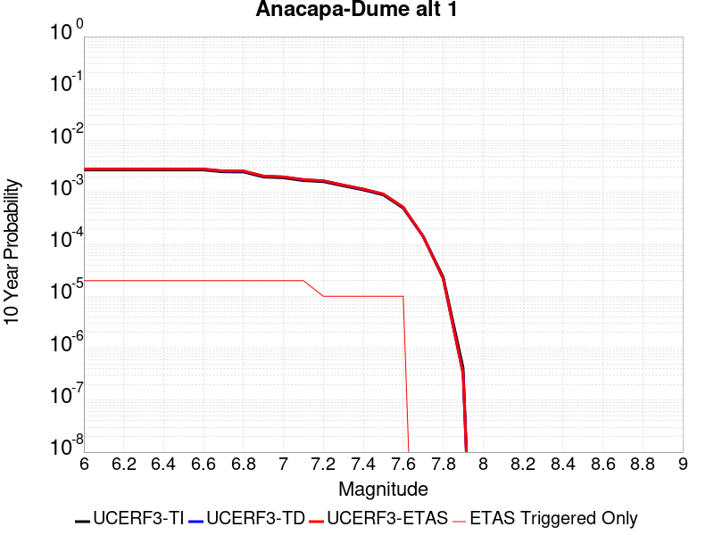 |

| Magnitude | 1 wk TI Prob | 1 wk TD Prob | 1 wk ETAS Prob | 1 wk ETAS/TD Gain | 1 wk ETAS Triggered Only | 1 mo TI Prob | 1 mo TD Prob | 1 mo ETAS Prob | 1 mo ETAS/TD Gain | 1 mo ETAS Triggered Only | 1 yr TI Prob | 1 yr TD Prob | 1 yr ETAS Prob | 1 yr ETAS/TD Gain | 1 yr ETAS Triggered Only | 10 yr TI Prob | 10 yr TD Prob | 10 yr ETAS Prob | 10 yr ETAS/TD Gain | 10 yr ETAS Triggered Only |
|-----|-----|-----|-----|-----|-----|-----|-----|-----|-----|-----|-----|-----|-----|-----|-----|-----|-----|-----|-----|-----|
| 6.0 | 5.1871802E-6 | 5.3673907E-6 | 5.3673907E-6 | 1.0 | 0.0 | 2.2230583E-5 | 2.3002905E-5 | 3.3002674E-5 | 1.4347177 | 1.0E-5 | 2.7062374E-4 | 2.8002524E-4 | 2.9002244E-4 | 1.035701 | 1.0E-5 | 0.002702944 | 0.0027968092 | 0.0028167532 | 1.007131 | 2.0E-5 |
| 6.1 | 5.1871802E-6 | 5.3673907E-6 | 5.3673907E-6 | 1.0 | 0.0 | 2.2230583E-5 | 2.3002905E-5 | 3.3002674E-5 | 1.4347177 | 1.0E-5 | 2.7062374E-4 | 2.8002524E-4 | 2.9002244E-4 | 1.035701 | 1.0E-5 | 0.002702944 | 0.0027968092 | 0.0028167532 | 1.007131 | 2.0E-5 |
| 6.2 | 5.1871802E-6 | 5.3673907E-6 | 5.3673907E-6 | 1.0 | 0.0 | 2.2230583E-5 | 2.3002905E-5 | 3.3002674E-5 | 1.4347177 | 1.0E-5 | 2.7062374E-4 | 2.8002524E-4 | 2.9002244E-4 | 1.035701 | 1.0E-5 | 0.002702944 | 0.0027968092 | 0.0028167532 | 1.007131 | 2.0E-5 |
| 6.3 | 5.1871802E-6 | 5.3673907E-6 | 5.3673907E-6 | 1.0 | 0.0 | 2.2230583E-5 | 2.3002905E-5 | 3.3002674E-5 | 1.4347177 | 1.0E-5 | 2.7062374E-4 | 2.8002524E-4 | 2.9002244E-4 | 1.035701 | 1.0E-5 | 0.002702944 | 0.0027968092 | 0.0028167532 | 1.007131 | 2.0E-5 |
| 6.4 | 5.1871802E-6 | 5.3673907E-6 | 5.3673907E-6 | 1.0 | 0.0 | 2.2230583E-5 | 2.3002905E-5 | 3.3002674E-5 | 1.4347177 | 1.0E-5 | 2.7062374E-4 | 2.8002524E-4 | 2.9002244E-4 | 1.035701 | 1.0E-5 | 0.002702944 | 0.0027968092 | 0.0028167532 | 1.007131 | 2.0E-5 |
| 6.5 | 5.1871802E-6 | 5.3673907E-6 | 5.3673907E-6 | 1.0 | 0.0 | 2.2230583E-5 | 2.3002905E-5 | 3.3002674E-5 | 1.4347177 | 1.0E-5 | 2.7062374E-4 | 2.8002524E-4 | 2.9002244E-4 | 1.035701 | 1.0E-5 | 0.002702944 | 0.0027968092 | 0.0028167532 | 1.007131 | 2.0E-5 |
| 6.6 | 5.1871802E-6 | 5.3673907E-6 | 5.3673907E-6 | 1.0 | 0.0 | 2.2230583E-5 | 2.3002905E-5 | 3.3002674E-5 | 1.4347177 | 1.0E-5 | 2.7062374E-4 | 2.8002524E-4 | 2.9002244E-4 | 1.035701 | 1.0E-5 | 0.002702944 | 0.0027968092 | 0.0028167532 | 1.007131 | 2.0E-5 |
| 6.7 | 4.7693475E-6 | 4.9366918E-6 | 4.9366918E-6 | 1.0 | 0.0 | 2.04399E-5 | 2.1157082E-5 | 3.115687E-5 | 1.4726449 | 1.0E-5 | 2.4882736E-4 | 2.5755778E-4 | 2.675552E-4 | 1.0388162 | 1.0E-5 | 0.0024854892 | 0.002572669 | 0.0025926174 | 1.0077541 | 2.0E-5 |
| 6.8 | 4.753408E-6 | 4.92024E-6 | 4.92024E-6 | 1.0 | 0.0 | 2.037159E-5 | 2.1086576E-5 | 3.1086365E-5 | 1.4742254 | 1.0E-5 | 2.4799586E-4 | 2.5669957E-4 | 2.66697E-4 | 1.038946 | 1.0E-5 | 0.002477193 | 0.0025641066 | 0.0025840553 | 1.00778 | 2.0E-5 |
| 6.9 | 3.800069E-6 | 3.937126E-6 | 3.937126E-6 | 1.0 | 0.0 | 1.6285909E-5 | 1.687329E-5 | 2.687312E-5 | 1.5926427 | 1.0E-5 | 1.9826289E-4 | 2.0541316E-4 | 2.1541111E-4 | 1.0486723 | 1.0E-5 | 0.001980861 | 0.0020522568 | 0.0020722158 | 1.0097253 | 2.0E-5 |
| 7.0 | 3.6671938E-6 | 3.7999182E-6 | 3.7999182E-6 | 1.0 | 0.0 | 1.571645E-5 | 1.6285263E-5 | 2.62851E-5 | 1.614042 | 1.0E-5 | 1.9133097E-4 | 1.9825528E-4 | 2.0825329E-4 | 1.05043 | 1.0E-5 | 0.0019116632 | 0.0019808074 | 0.0020007677 | 1.0100769 | 2.0E-5 |
| 7.1 | 3.2394885E-6 | 3.3587933E-6 | 3.3587933E-6 | 1.0 | 0.0 | 1.3883448E-5 | 1.4394749E-5 | 2.4394605E-5 | 1.6946877 | 1.0E-5 | 1.6901788E-4 | 1.7524208E-4 | 1.8524034E-4 | 1.0570539 | 1.0E-5 | 0.0016888938 | 0.0017510501 | 0.0017710151 | 1.0114018 | 2.0E-5 |
| 7.2 | 3.0935948E-6 | 3.2079258E-6 | 3.2079258E-6 | 1.0 | 0.0 | 1.3258196E-5 | 1.3748182E-5 | 1.3748182E-5 | 1.0 | 0.0 | 1.6140658E-4 | 1.6737137E-4 | 1.6737137E-4 | 1.0 | 0.0 | 0.001612894 | 0.0016724641 | 0.0016824474 | 1.0059692 | 1.0E-5 |
| 7.3 | 2.5604163E-6 | 2.647073E-6 | 2.647073E-6 | 1.0 | 0.0 | 1.0973167E-5 | 1.1344549E-5 | 1.1344549E-5 | 1.0 | 0.0 | 1.3359012E-4 | 1.3811118E-4 | 1.3811118E-4 | 1.0 | 0.0 | 0.0013350984 | 0.0013802581 | 0.0013902442 | 1.007235 | 1.0E-5 |
| 7.4 | 2.1429005E-6 | 2.2106028E-6 | 2.2106028E-6 | 1.0 | 0.0 | 9.1838265E-6 | 9.473977E-6 | 9.473977E-6 | 1.0 | 0.0 | 1.11807356E-4 | 1.1533959E-4 | 1.1533959E-4 | 1.0 | 0.0 | 0.0011175112 | 0.0011527999 | 0.0011627885 | 1.0086645 | 1.0E-5 |
| 7.5 | 1.7237151E-6 | 1.7761449E-6 | 1.7761449E-6 | 1.0 | 0.0 | 7.3873293E-6 | 7.6120277E-6 | 7.6120277E-6 | 1.0 | 0.0 | 8.993702E-5 | 9.267252E-5 | 9.267252E-5 | 1.0 | 0.0 | 8.990063E-4 | 9.2634105E-4 | 9.363318E-4 | 1.0107851 | 1.0E-5 |
| 7.6 | 9.541696E-7 | 9.823206E-7 | 9.823206E-7 | 1.0 | 0.0 | 4.089292E-6 | 4.2099387E-6 | 4.2099387E-6 | 1.0 | 0.0 | 4.9785995E-5 | 5.1254807E-5 | 5.1254807E-5 | 1.0 | 0.0 | 4.9774844E-4 | 5.1243114E-4 | 5.2242604E-4 | 1.0195048 | 1.0E-5 |
| 7.7 | 2.7226676E-7 | 2.7172416E-7 | 2.7172416E-7 | 1.0 | 0.0 | 1.166857E-6 | 1.1645316E-6 | 1.1645316E-6 | 1.0 | 0.0 | 1.4206392E-5 | 1.4178081E-5 | 1.4178081E-5 | 1.0 | 0.0 | 1.4205484E-4 | 1.4177183E-4 | 1.4177183E-4 | 1.0 | 0.0 |
| 7.8 | 4.5017995E-8 | 4.2157676E-8 | 4.2157676E-8 | 1.0 | 0.0 | 1.9293425E-7 | 1.8067574E-7 | 1.8067574E-7 | 1.0 | 0.0 | 2.348972E-6 | 2.1997253E-6 | 2.1997253E-6 | 1.0 | 0.0 | 2.348947E-5 | 2.1997055E-5 | 2.1997055E-5 | 1.0 | 0.0 |
| 7.9 | 8.007447E-10 | 6.1608785E-10 | 6.1608785E-10 | 1.0 | 0.0 | 3.4317629E-9 | 2.6403764E-9 | 2.6403764E-9 | 1.0 | 0.0 | 4.1781714E-8 | 3.2146584E-8 | 3.2146584E-8 | 1.0 | 0.0 | 4.1781706E-7 | 3.214658E-7 | 3.214658E-7 | 1.0 | 0.0 |

## Oceanside alt1
*[(top)](#table-of-contents)*

| 1 Week | 1 Month | 1 Year | 10 Year |
|-----|-----|-----|-----|
|  | 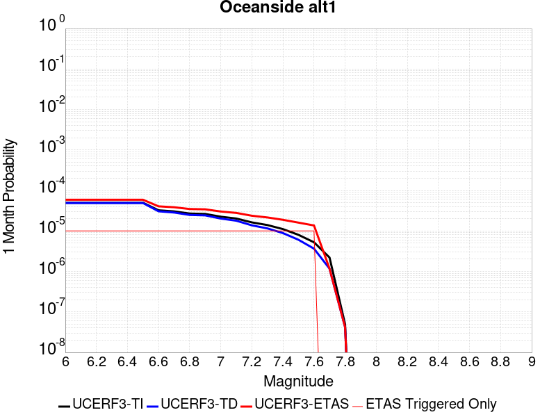 |  |  |

| Magnitude | 1 wk TI Prob | 1 wk TD Prob | 1 wk ETAS Prob | 1 wk ETAS/TD Gain | 1 wk ETAS Triggered Only | 1 mo TI Prob | 1 mo TD Prob | 1 mo ETAS Prob | 1 mo ETAS/TD Gain | 1 mo ETAS Triggered Only | 1 yr TI Prob | 1 yr TD Prob | 1 yr ETAS Prob | 1 yr ETAS/TD Gain | 1 yr ETAS Triggered Only | 10 yr TI Prob | 10 yr TD Prob | 10 yr ETAS Prob | 10 yr ETAS/TD Gain | 10 yr ETAS Triggered Only |
|-----|-----|-----|-----|-----|-----|-----|-----|-----|-----|-----|-----|-----|-----|-----|-----|-----|-----|-----|-----|-----|
| 6.0 | 1.1617542E-5 | 1.1423493E-5 | 1.1423493E-5 | 1.0 | 0.0 | 4.9788516E-5 | 4.8956997E-5 | 5.8956506E-5 | 1.2042509 | 1.0E-5 | 6.060066E-4 | 5.9590454E-4 | 6.158926E-4 | 1.0335424 | 2.0E-5 | 0.0060435664 | 0.005944664 | 0.0059645455 | 1.0033444 | 2.0E-5 |
| 6.1 | 1.1617542E-5 | 1.1423493E-5 | 1.1423493E-5 | 1.0 | 0.0 | 4.9788516E-5 | 4.8956997E-5 | 5.8956506E-5 | 1.2042509 | 1.0E-5 | 6.060066E-4 | 5.9590454E-4 | 6.158926E-4 | 1.0335424 | 2.0E-5 | 0.0060435664 | 0.005944664 | 0.0059645455 | 1.0033444 | 2.0E-5 |
| 6.2 | 1.1617542E-5 | 1.1423493E-5 | 1.1423493E-5 | 1.0 | 0.0 | 4.9788516E-5 | 4.8956997E-5 | 5.8956506E-5 | 1.2042509 | 1.0E-5 | 6.060066E-4 | 5.9590454E-4 | 6.158926E-4 | 1.0335424 | 2.0E-5 | 0.0060435664 | 0.005944664 | 0.0059645455 | 1.0033444 | 2.0E-5 |
| 6.3 | 1.1617542E-5 | 1.1423493E-5 | 1.1423493E-5 | 1.0 | 0.0 | 4.9788516E-5 | 4.8956997E-5 | 5.8956506E-5 | 1.2042509 | 1.0E-5 | 6.060066E-4 | 5.9590454E-4 | 6.158926E-4 | 1.0335424 | 2.0E-5 | 0.0060435664 | 0.005944664 | 0.0059645455 | 1.0033444 | 2.0E-5 |
| 6.4 | 1.1617542E-5 | 1.1423493E-5 | 1.1423493E-5 | 1.0 | 0.0 | 4.9788516E-5 | 4.8956997E-5 | 5.8956506E-5 | 1.2042509 | 1.0E-5 | 6.060066E-4 | 5.9590454E-4 | 6.158926E-4 | 1.0335424 | 2.0E-5 | 0.0060435664 | 0.005944664 | 0.0059645455 | 1.0033444 | 2.0E-5 |
| 6.5 | 1.1617542E-5 | 1.1423493E-5 | 1.1423493E-5 | 1.0 | 0.0 | 4.9788516E-5 | 4.8956997E-5 | 5.8956506E-5 | 1.2042509 | 1.0E-5 | 6.060066E-4 | 5.9590454E-4 | 6.158926E-4 | 1.0335424 | 2.0E-5 | 0.0060435664 | 0.005944664 | 0.0059645455 | 1.0033444 | 2.0E-5 |
| 6.6 | 7.561768E-6 | 7.1336153E-6 | 7.1336153E-6 | 1.0 | 0.0 | 3.2407173E-5 | 3.0572286E-5 | 4.057198E-5 | 1.3270836 | 1.0E-5 | 3.9448592E-4 | 3.7215507E-4 | 3.9214763E-4 | 1.0537211 | 2.0E-5 | 0.0039378637 | 0.00371543 | 0.0037353556 | 1.005363 | 2.0E-5 |
| 6.7 | 7.1042605E-6 | 6.6556854E-6 | 6.6556854E-6 | 1.0 | 0.0 | 3.0446476E-5 | 2.8524059E-5 | 3.8523773E-5 | 1.3505713 | 1.0E-5 | 3.706228E-4 | 3.472259E-4 | 3.5722242E-4 | 1.0287896 | 1.0E-5 | 0.0037000529 | 0.003466917 | 0.0034768824 | 1.0028744 | 1.0E-5 |
| 6.8 | 6.285554E-6 | 5.799706E-6 | 5.799706E-6 | 1.0 | 0.0 | 2.693781E-5 | 2.4855648E-5 | 3.48554E-5 | 1.402313 | 1.0E-5 | 3.2791847E-4 | 3.0257605E-4 | 3.12573E-4 | 1.0330396 | 1.0E-5 | 0.0032743502 | 0.0030216982 | 0.003031668 | 1.0032994 | 1.0E-5 |
| 6.9 | 6.148883E-6 | 5.6565445E-6 | 5.6565445E-6 | 1.0 | 0.0 | 2.635209E-5 | 2.424211E-5 | 3.4241868E-5 | 1.4124954 | 1.0E-5 | 3.2078946E-4 | 2.9510827E-4 | 3.0510532E-4 | 1.0338758 | 1.0E-5 | 0.003203268 | 0.0029472208 | 0.0029571913 | 1.003383 | 1.0E-5 |
| 7.0 | 5.253857E-6 | 4.722404E-6 | 4.722404E-6 | 1.0 | 0.0 | 2.2516335E-5 | 2.0238718E-5 | 3.0238516E-5 | 1.4940925 | 1.0E-5 | 2.7410188E-4 | 2.4637886E-4 | 2.5637637E-4 | 1.0405779 | 1.0E-5 | 0.0027376404 | 0.0024610884 | 0.0024710638 | 1.0040532 | 1.0E-5 |
| 7.1 | 4.730754E-6 | 4.17851E-6 | 4.17851E-6 | 1.0 | 0.0 | 2.0274503E-5 | 1.7907778E-5 | 2.79076E-5 | 1.5584066 | 1.0E-5 | 2.468141E-4 | 2.1800565E-4 | 2.2800347E-4 | 1.0458604 | 1.0E-5 | 0.0024654015 | 0.0021779444 | 0.0021879226 | 1.0045815 | 1.0E-5 |
| 7.2 | 3.7998386E-6 | 3.214026E-6 | 3.214026E-6 | 1.0 | 0.0 | 1.6284921E-5 | 1.37743245E-5 | 2.3774188E-5 | 1.7259784 | 1.0E-5 | 1.9825088E-4 | 1.6768962E-4 | 1.7768794E-4 | 1.059624 | 1.0E-5 | 0.001980741 | 0.001675643 | 0.0016856263 | 1.0059578 | 1.0E-5 |
| 7.3 | 3.2656465E-6 | 2.698376E-6 | 2.698376E-6 | 1.0 | 0.0 | 1.3995553E-5 | 1.1564418E-5 | 2.1564301E-5 | 1.8647114 | 1.0E-5 | 1.7038253E-4 | 1.407878E-4 | 1.5078639E-4 | 1.0710189 | 1.0E-5 | 0.0017025196 | 0.0014069972 | 0.0014169831 | 1.0070974 | 1.0E-5 |
| 7.4 | 2.593703E-6 | 2.0680277E-6 | 2.0680277E-6 | 1.0 | 0.0 | 1.1115822E-5 | 8.862946E-6 | 1.8862858E-5 | 2.128283 | 1.0E-5 | 1.3532673E-4 | 1.0790111E-4 | 1.1790004E-4 | 1.0926675 | 1.0E-5 | 0.0013524436 | 0.0010784961 | 0.0010884854 | 1.0092622 | 1.0E-5 |
| 7.5 | 1.8715585E-6 | 1.4137177E-6 | 1.4137177E-6 | 1.0 | 0.0 | 8.020941E-6 | 6.0587763E-6 | 1.6058715E-5 | 2.6504884 | 1.0E-5 | 9.7650576E-5 | 7.376316E-5 | 8.3762425E-5 | 1.135559 | 1.0E-5 | 9.7607676E-4 | 7.3739287E-4 | 7.473855E-4 | 1.0135512 | 1.0E-5 |
| 7.6 | 1.2246786E-6 | 8.5268175E-7 | 8.5268175E-7 | 1.0 | 0.0 | 5.248612E-6 | 3.6543456E-6 | 1.36543085E-5 | 3.736458 | 1.0E-5 | 6.389998E-5 | 4.4490793E-5 | 5.449035E-5 | 1.2247556 | 1.0E-5 | 6.3881604E-4 | 4.4482335E-4 | 4.5481892E-4 | 1.0224708 | 1.0E-5 |
| 7.7 | 5.140719E-7 | 2.734703E-7 | 2.734703E-7 | 1.0 | 0.0 | 2.2031636E-6 | 1.1720151E-6 | 1.1720151E-6 | 1.0 | 0.0 | 2.6823185E-5 | 1.4269205E-5 | 1.4269205E-5 | 1.0 | 0.0 | 2.6819948E-4 | 1.4268424E-4 | 1.4268424E-4 | 1.0 | 0.0 |
| 7.8 | 1.16056995E-8 | 9.782373E-9 | 9.782373E-9 | 1.0 | 0.0 | 4.9738713E-8 | 4.1924455E-8 | 4.1924455E-8 | 1.0 | 0.0 | 6.0556863E-7 | 5.1043025E-7 | 5.1043025E-7 | 1.0 | 0.0 | 6.05567E-6 | 5.1043025E-6 | 5.1043025E-6 | 1.0 | 0.0 |

## Hayward (So) extension 2011 CFM
*[(top)](#table-of-contents)*

| 1 Week | 1 Month | 1 Year | 10 Year |
|-----|-----|-----|-----|
|  |  |  |  |

| Magnitude | 1 wk TI Prob | 1 wk TD Prob | 1 wk ETAS Prob | 1 wk ETAS/TD Gain | 1 wk ETAS Triggered Only | 1 mo TI Prob | 1 mo TD Prob | 1 mo ETAS Prob | 1 mo ETAS/TD Gain | 1 mo ETAS Triggered Only | 1 yr TI Prob | 1 yr TD Prob | 1 yr ETAS Prob | 1 yr ETAS/TD Gain | 1 yr ETAS Triggered Only | 10 yr TI Prob | 10 yr TD Prob | 10 yr ETAS Prob | 10 yr ETAS/TD Gain | 10 yr ETAS Triggered Only |
|-----|-----|-----|-----|-----|-----|-----|-----|-----|-----|-----|-----|-----|-----|-----|-----|-----|-----|-----|-----|-----|
| 6.0 | 1.1721256E-4 | 2.3697627E-4 | 2.3697627E-4 | 1.0 | 0.0 | 5.022428E-4 | 0.0010129517 | 0.0010129517 | 1.0 | 0.0 | 0.0060976758 | 0.012248711 | 0.012258588 | 1.0008065 | 1.0E-5 | 0.0593305 | 0.112843215 | 0.112860955 | 1.0001572 | 2.0E-5 |
| 6.1 | 6.99169E-5 | 1.3822885E-4 | 1.3822885E-4 | 1.0 | 0.0 | 2.9960944E-4 | 5.9128006E-4 | 5.9128006E-4 | 1.0 | 0.0 | 0.0036416445 | 0.0071720886 | 0.007182017 | 1.0013843 | 1.0E-5 | 0.035825435 | 0.067803554 | 0.067812875 | 1.0001374 | 1.0E-5 |
| 6.2 | 6.99169E-5 | 1.3822885E-4 | 1.3822885E-4 | 1.0 | 0.0 | 2.9960944E-4 | 5.9128006E-4 | 5.9128006E-4 | 1.0 | 0.0 | 0.0036416445 | 0.0071720886 | 0.007182017 | 1.0013843 | 1.0E-5 | 0.035825435 | 0.067803554 | 0.067812875 | 1.0001374 | 1.0E-5 |
| 6.3 | 6.970908E-5 | 1.379104E-4 | 1.379104E-4 | 1.0 | 0.0 | 2.9871898E-4 | 5.899159E-4 | 5.899159E-4 | 1.0 | 0.0 | 0.0036308395 | 0.007155625 | 0.0071655535 | 1.0013875 | 1.0E-5 | 0.035720866 | 0.067652516 | 0.06766184 | 1.0001378 | 1.0E-5 |
| 6.4 | 6.9517155E-5 | 1.375792E-4 | 1.375792E-4 | 1.0 | 0.0 | 2.9789665E-4 | 5.884971E-4 | 5.884971E-4 | 1.0 | 0.0 | 0.0036208609 | 0.0071385372 | 0.007148466 | 1.0013908 | 1.0E-5 | 0.03562429 | 0.06749655 | 0.06750588 | 1.0001382 | 1.0E-5 |
| 6.5 | 4.786248E-5 | 9.41498E-5 | 9.41498E-5 | 1.0 | 0.0 | 2.0510878E-4 | 4.034394E-4 | 4.034394E-4 | 1.0 | 0.0 | 0.0024943394 | 0.004901227 | 0.0049111783 | 1.0020303 | 1.0E-5 | 0.02466527 | 0.046901822 | 0.04691135 | 1.0002033 | 1.0E-5 |
| 6.6 | 4.4662214E-5 | 8.881654E-5 | 8.881654E-5 | 1.0 | 0.0 | 1.9139545E-4 | 3.805894E-4 | 3.805894E-4 | 1.0 | 0.0 | 0.0023277493 | 0.0046242937 | 0.004634247 | 1.0021524 | 1.0E-5 | 0.02303517 | 0.044293344 | 0.044302903 | 1.0002158 | 1.0E-5 |
| 6.7 | 3.884542E-5 | 7.8648096E-5 | 7.8648096E-5 | 1.0 | 0.0 | 1.6646975E-4 | 3.370222E-4 | 3.370222E-4 | 1.0 | 0.0 | 0.002024885 | 0.0040959697 | 0.0040959697 | 1.0 | 0.0 | 0.020065336 | 0.039333146 | 0.039333146 | 1.0 | 0.0 |
| 6.8 | 3.4221863E-5 | 6.855653E-5 | 6.855653E-5 | 1.0 | 0.0 | 1.4665688E-4 | 2.93783E-4 | 2.93783E-4 | 1.0 | 0.0 | 0.0017840851 | 0.0035713627 | 0.0035713627 | 1.0 | 0.0 | 0.017698295 | 0.034421004 | 0.034421004 | 1.0 | 0.0 |
| 6.9 | 1.6927712E-5 | 3.0061563E-5 | 3.0061563E-5 | 1.0 | 0.0 | 7.2545314E-5 | 1.2882923E-4 | 1.2882923E-4 | 1.0 | 0.0 | 8.828813E-4 | 0.0015674243 | 0.0015674243 | 1.0 | 0.0 | 0.008793819 | 0.01546327 | 0.01546327 | 1.0 | 0.0 |
| 7.0 | 1.2509653E-5 | 2.2462571E-5 | 2.2462571E-5 | 1.0 | 0.0 | 5.3611697E-5 | 9.6264856E-5 | 9.6264856E-5 | 1.0 | 0.0 | 6.525269E-4 | 0.0011714385 | 0.0011714385 | 1.0 | 0.0 | 0.0065061417 | 0.01158231 | 0.01158231 | 1.0 | 0.0 |
| 7.1 | 8.751583E-6 | 1.4925648E-5 | 1.4925648E-5 | 1.0 | 0.0 | 3.750624E-5 | 6.3965526E-5 | 6.3965526E-5 | 1.0 | 0.0 | 4.5654282E-4 | 7.785079E-4 | 7.785079E-4 | 1.0 | 0.0 | 0.0045560603 | 0.007763496 | 0.007763496 | 1.0 | 0.0 |
| 7.2 | 6.354379E-6 | 1.1498636E-5 | 1.1498636E-5 | 1.0 | 0.0 | 2.7232769E-5 | 4.9278966E-5 | 4.9278966E-5 | 1.0 | 0.0 | 3.3150852E-4 | 5.99811E-4 | 5.99811E-4 | 1.0 | 0.0 | 0.0033101442 | 0.0060003046 | 0.0060003046 | 1.0 | 0.0 |
| 7.3 | 4.645554E-6 | 8.818172E-6 | 8.818172E-6 | 1.0 | 0.0 | 1.9909365E-5 | 3.779164E-5 | 3.779164E-5 | 1.0 | 0.0 | 2.4236954E-4 | 4.6002E-4 | 4.6002E-4 | 1.0 | 0.0 | 0.0024210536 | 0.004610708 | 0.004610708 | 1.0 | 0.0 |
| 7.4 | 4.23437E-6 | 7.992532E-6 | 7.992532E-6 | 1.0 | 0.0 | 1.8147173E-5 | 3.425328E-5 | 3.425328E-5 | 1.0 | 0.0 | 2.2091944E-4 | 4.1695772E-4 | 4.1695772E-4 | 1.0 | 0.0 | 0.0022069993 | 0.004181972 | 0.004181972 | 1.0 | 0.0 |
| 7.5 | 2.2187417E-6 | 3.9522306E-6 | 3.9522306E-6 | 1.0 | 0.0 | 9.508858E-6 | 1.6938036E-5 | 1.6938036E-5 | 1.0 | 0.0 | 1.157642E-4 | 2.0620368E-4 | 2.0620368E-4 | 1.0 | 0.0 | 0.0011570391 | 0.0020734754 | 0.0020734754 | 1.0 | 0.0 |
| 7.6 | 2.7952495E-8 | 3.878529E-8 | 3.878529E-8 | 1.0 | 0.0 | 1.1979641E-7 | 1.6622266E-7 | 1.6622266E-7 | 1.0 | 0.0 | 1.4585203E-6 | 2.0237592E-6 | 2.0237592E-6 | 1.0 | 0.0 | 1.4585107E-5 | 2.0328182E-5 | 2.0328182E-5 | 1.0 | 0.0 |
| 7.7 | 1.7192724E-8 | 2.3436517E-8 | 2.3436517E-8 | 1.0 | 0.0 | 7.36831E-8 | 1.0044221E-7 | 1.0044221E-7 | 1.0 | 0.0 | 8.9709135E-7 | 1.2228833E-6 | 1.2228833E-6 | 1.0 | 0.0 | 8.970877E-6 | 1.2296933E-5 | 1.2296933E-5 | 1.0 | 0.0 |

## Santa Susana East (connector)
*[(top)](#table-of-contents)*

| 1 Week | 1 Month | 1 Year | 10 Year |
|-----|-----|-----|-----|
|  |  |  | 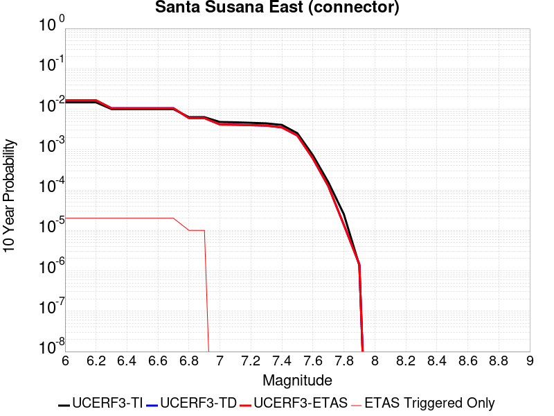 |

| Magnitude | 1 wk TI Prob | 1 wk TD Prob | 1 wk ETAS Prob | 1 wk ETAS/TD Gain | 1 wk ETAS Triggered Only | 1 mo TI Prob | 1 mo TD Prob | 1 mo ETAS Prob | 1 mo ETAS/TD Gain | 1 mo ETAS Triggered Only | 1 yr TI Prob | 1 yr TD Prob | 1 yr ETAS Prob | 1 yr ETAS/TD Gain | 1 yr ETAS Triggered Only | 10 yr TI Prob | 10 yr TD Prob | 10 yr ETAS Prob | 10 yr ETAS/TD Gain | 10 yr ETAS Triggered Only |
|-----|-----|-----|-----|-----|-----|-----|-----|-----|-----|-----|-----|-----|-----|-----|-----|-----|-----|-----|-----|-----|
| 6.0 | 2.858397E-5 | 3.202091E-5 | 3.202091E-5 | 1.0 | 0.0 | 1.2249697E-4 | 1.3722685E-4 | 1.3722685E-4 | 1.0 | 0.0 | 0.0014903803 | 0.0016697381 | 0.0016797214 | 1.005979 | 1.0E-5 | 0.014804244 | 0.016599052 | 0.01661872 | 1.0011849 | 2.0E-5 |
| 6.1 | 2.858397E-5 | 3.202091E-5 | 3.202091E-5 | 1.0 | 0.0 | 1.2249697E-4 | 1.3722685E-4 | 1.3722685E-4 | 1.0 | 0.0 | 0.0014903803 | 0.0016697381 | 0.0016797214 | 1.005979 | 1.0E-5 | 0.014804244 | 0.016599052 | 0.01661872 | 1.0011849 | 2.0E-5 |
| 6.2 | 2.858397E-5 | 3.202091E-5 | 3.202091E-5 | 1.0 | 0.0 | 1.2249697E-4 | 1.3722685E-4 | 1.3722685E-4 | 1.0 | 0.0 | 0.0014903803 | 0.0016697381 | 0.0016797214 | 1.005979 | 1.0E-5 | 0.014804244 | 0.016599052 | 0.01661872 | 1.0011849 | 2.0E-5 |
| 6.3 | 1.943582E-5 | 2.036718E-5 | 2.036718E-5 | 1.0 | 0.0 | 8.329371E-5 | 8.7285625E-5 | 8.7285625E-5 | 1.0 | 0.0 | 0.001013629 | 0.0010622967 | 0.001072286 | 1.0094036 | 1.0E-5 | 0.010090181 | 0.010583619 | 0.0106034065 | 1.0018697 | 2.0E-5 |
| 6.4 | 1.943582E-5 | 2.036718E-5 | 2.036718E-5 | 1.0 | 0.0 | 8.329371E-5 | 8.7285625E-5 | 8.7285625E-5 | 1.0 | 0.0 | 0.001013629 | 0.0010622967 | 0.001072286 | 1.0094036 | 1.0E-5 | 0.010090181 | 0.010583619 | 0.0106034065 | 1.0018697 | 2.0E-5 |
| 6.5 | 1.943582E-5 | 2.036718E-5 | 2.036718E-5 | 1.0 | 0.0 | 8.329371E-5 | 8.7285625E-5 | 8.7285625E-5 | 1.0 | 0.0 | 0.001013629 | 0.0010622967 | 0.001072286 | 1.0094036 | 1.0E-5 | 0.010090181 | 0.010583619 | 0.0106034065 | 1.0018697 | 2.0E-5 |
| 6.6 | 1.943582E-5 | 2.036718E-5 | 2.036718E-5 | 1.0 | 0.0 | 8.329371E-5 | 8.7285625E-5 | 8.7285625E-5 | 1.0 | 0.0 | 0.001013629 | 0.0010622967 | 0.001072286 | 1.0094036 | 1.0E-5 | 0.010090181 | 0.010583619 | 0.0106034065 | 1.0018697 | 2.0E-5 |
| 6.7 | 1.9404439E-5 | 2.03546E-5 | 2.03546E-5 | 1.0 | 0.0 | 8.3159226E-5 | 8.723172E-5 | 8.723172E-5 | 1.0 | 0.0 | 0.0010119933 | 0.0010616409 | 0.0010716304 | 1.0094094 | 1.0E-5 | 0.010073971 | 0.010577125 | 0.010596912 | 1.0018709 | 2.0E-5 |
| 6.8 | 1.2217526E-5 | 1.1592998E-5 | 1.1592998E-5 | 1.0 | 0.0 | 5.2359774E-5 | 4.9683425E-5 | 4.9683425E-5 | 1.0 | 0.0 | 6.372938E-4 | 6.0474465E-4 | 6.147386E-4 | 1.0165259 | 1.0E-5 | 0.0063546924 | 0.006033037 | 0.0060429764 | 1.0016476 | 1.0E-5 |
| 6.9 | 1.2217526E-5 | 1.1592998E-5 | 1.1592998E-5 | 1.0 | 0.0 | 5.2359774E-5 | 4.9683425E-5 | 4.9683425E-5 | 1.0 | 0.0 | 6.372938E-4 | 6.0474465E-4 | 6.147386E-4 | 1.0165259 | 1.0E-5 | 0.0063546924 | 0.006033037 | 0.0060429764 | 1.0016476 | 1.0E-5 |
| 7.0 | 9.276017E-6 | 8.059113E-6 | 8.059113E-6 | 1.0 | 0.0 | 3.9753755E-5 | 3.4538618E-5 | 3.4538618E-5 | 1.0 | 0.0 | 4.8389446E-4 | 4.2042998E-4 | 4.2042998E-4 | 1.0 | 0.0 | 0.0048284214 | 0.0041970722 | 0.0041970722 | 1.0 | 0.0 |
| 7.1 | 9.130355E-6 | 7.942286E-6 | 7.942286E-6 | 1.0 | 0.0 | 3.9129503E-5 | 3.4037945E-5 | 3.4037945E-5 | 1.0 | 0.0 | 4.7629757E-4 | 4.1433662E-4 | 4.1433662E-4 | 1.0 | 0.0 | 0.00475278 | 0.004136367 | 0.004136367 | 1.0 | 0.0 |
| 7.2 | 8.851015E-6 | 7.741445E-6 | 7.741445E-6 | 1.0 | 0.0 | 3.7932372E-5 | 3.317722E-5 | 3.317722E-5 | 1.0 | 0.0 | 4.6172875E-4 | 4.038612E-4 | 4.038612E-4 | 1.0 | 0.0 | 0.0046077054 | 0.0040319953 | 0.0040319953 | 1.0 | 0.0 |
| 7.3 | 8.573006E-6 | 7.550166E-6 | 7.550166E-6 | 1.0 | 0.0 | 3.6740938E-5 | 3.2357475E-5 | 3.2357475E-5 | 1.0 | 0.0 | 4.472291E-4 | 3.9388443E-4 | 3.9388443E-4 | 1.0 | 0.0 | 0.004463301 | 0.0039325804 | 0.0039325804 | 1.0 | 0.0 |
| 7.4 | 7.852282E-6 | 6.817687E-6 | 6.817687E-6 | 1.0 | 0.0 | 3.36522E-5 | 2.9218349E-5 | 2.9218349E-5 | 1.0 | 0.0 | 4.096385E-4 | 3.5567835E-4 | 3.5567835E-4 | 1.0 | 0.0 | 0.0040888423 | 0.0035517553 | 0.0035517553 | 1.0 | 0.0 |
| 7.5 | 4.8869324E-6 | 4.279055E-6 | 4.279055E-6 | 1.0 | 0.0 | 2.0943828E-5 | 1.8338687E-5 | 1.8338687E-5 | 1.0 | 0.0 | 2.5496128E-4 | 2.232523E-4 | 2.232523E-4 | 1.0 | 0.0 | 0.0025466895 | 0.0022304445 | 0.0022304445 | 1.0 | 0.0 |
| 7.6 | 1.3894544E-6 | 1.1568179E-6 | 1.1568179E-6 | 1.0 | 0.0 | 5.954791E-6 | 4.957783E-6 | 4.957783E-6 | 1.0 | 0.0 | 7.249717E-5 | 6.0359558E-5 | 6.0359558E-5 | 1.0 | 0.0 | 7.247352E-4 | 6.0345343E-4 | 6.0345343E-4 | 1.0 | 0.0 |
| 7.7 | 2.9924632E-7 | 2.371928E-7 | 2.371928E-7 | 1.0 | 0.0 | 1.2824837E-6 | 1.0165402E-6 | 1.0165402E-6 | 1.0 | 0.0 | 1.5614127E-5 | 1.2376314E-5 | 1.2376314E-5 | 1.0 | 0.0 | 1.5613029E-4 | 1.2375697E-4 | 1.2375697E-4 | 1.0 | 0.0 |
| 7.8 | 4.8188564E-8 | 2.6323061E-8 | 2.6323061E-8 | 1.0 | 0.0 | 2.065224E-7 | 1.1281311E-7 | 1.1281311E-7 | 1.0 | 0.0 | 2.5144072E-6 | 1.3734989E-6 | 1.3734989E-6 | 1.0 | 0.0 | 2.5143789E-5 | 1.3734912E-5 | 1.3734912E-5 | 1.0 | 0.0 |
| 7.9 | 2.6127251E-9 | 2.7681102E-9 | 2.7681102E-9 | 1.0 | 0.0 | 1.1197393E-8 | 1.186333E-8 | 1.186333E-8 | 1.0 | 0.0 | 1.3632825E-7 | 1.4443603E-7 | 1.4443603E-7 | 1.0 | 0.0 | 1.3632817E-6 | 1.4443604E-6 | 1.4443604E-6 | 1.0 | 0.0 |

## Earthquake Valley (So Extension)
*[(top)](#table-of-contents)*

| 1 Week | 1 Month | 1 Year | 10 Year |
|-----|-----|-----|-----|
|  |  |  | 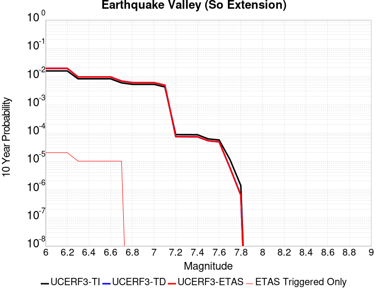 |

| Magnitude | 1 wk TI Prob | 1 wk TD Prob | 1 wk ETAS Prob | 1 wk ETAS/TD Gain | 1 wk ETAS Triggered Only | 1 mo TI Prob | 1 mo TD Prob | 1 mo ETAS Prob | 1 mo ETAS/TD Gain | 1 mo ETAS Triggered Only | 1 yr TI Prob | 1 yr TD Prob | 1 yr ETAS Prob | 1 yr ETAS/TD Gain | 1 yr ETAS Triggered Only | 10 yr TI Prob | 10 yr TD Prob | 10 yr ETAS Prob | 10 yr ETAS/TD Gain | 10 yr ETAS Triggered Only |
|-----|-----|-----|-----|-----|-----|-----|-----|-----|-----|-----|-----|-----|-----|-----|-----|-----|-----|-----|-----|-----|
| 6.0 | 3.0194888E-5 | 3.7072114E-5 | 3.7072114E-5 | 1.0 | 0.0 | 1.2940024E-4 | 1.5887388E-4 | 1.5887388E-4 | 1.0 | 0.0 | 0.0015743093 | 0.0019331174 | 0.0019530788 | 1.010326 | 2.0E-5 | 0.01563203 | 0.019213019 | 0.019232634 | 1.0010209 | 2.0E-5 |
| 6.1 | 3.0194888E-5 | 3.7072114E-5 | 3.7072114E-5 | 1.0 | 0.0 | 1.2940024E-4 | 1.5887388E-4 | 1.5887388E-4 | 1.0 | 0.0 | 0.0015743093 | 0.0019331174 | 0.0019530788 | 1.010326 | 2.0E-5 | 0.01563203 | 0.019213019 | 0.019232634 | 1.0010209 | 2.0E-5 |
| 6.2 | 3.0194888E-5 | 3.7072114E-5 | 3.7072114E-5 | 1.0 | 0.0 | 1.2940024E-4 | 1.5887388E-4 | 1.5887388E-4 | 1.0 | 0.0 | 0.0015743093 | 0.0019331174 | 0.0019530788 | 1.010326 | 2.0E-5 | 0.01563203 | 0.019213019 | 0.019232634 | 1.0010209 | 2.0E-5 |
| 6.3 | 1.5795305E-5 | 1.844658E-5 | 1.844658E-5 | 1.0 | 0.0 | 6.769241E-5 | 7.9055004E-5 | 7.9055004E-5 | 1.0 | 0.0 | 8.238434E-4 | 9.6218096E-4 | 9.721713E-4 | 1.010383 | 1.0E-5 | 0.008207959 | 0.009591061 | 0.009600965 | 1.0010326 | 1.0E-5 |
| 6.4 | 1.5795305E-5 | 1.844658E-5 | 1.844658E-5 | 1.0 | 0.0 | 6.769241E-5 | 7.9055004E-5 | 7.9055004E-5 | 1.0 | 0.0 | 8.238434E-4 | 9.6218096E-4 | 9.721713E-4 | 1.010383 | 1.0E-5 | 0.008207959 | 0.009591061 | 0.009600965 | 1.0010326 | 1.0E-5 |
| 6.5 | 1.5795305E-5 | 1.844658E-5 | 1.844658E-5 | 1.0 | 0.0 | 6.769241E-5 | 7.9055004E-5 | 7.9055004E-5 | 1.0 | 0.0 | 8.238434E-4 | 9.6218096E-4 | 9.721713E-4 | 1.010383 | 1.0E-5 | 0.008207959 | 0.009591061 | 0.009600965 | 1.0010326 | 1.0E-5 |
| 6.6 | 1.5795305E-5 | 1.844658E-5 | 1.844658E-5 | 1.0 | 0.0 | 6.769241E-5 | 7.9055004E-5 | 7.9055004E-5 | 1.0 | 0.0 | 8.238434E-4 | 9.6218096E-4 | 9.721713E-4 | 1.010383 | 1.0E-5 | 0.008207959 | 0.009591061 | 0.009600965 | 1.0010326 | 1.0E-5 |
| 6.7 | 1.1363076E-5 | 1.3138294E-5 | 1.3138294E-5 | 1.0 | 0.0 | 4.8697988E-5 | 5.6306188E-5 | 5.6306188E-5 | 1.0 | 0.0 | 5.927367E-4 | 6.8538834E-4 | 6.953815E-4 | 1.0145802 | 1.0E-5 | 0.0059115817 | 0.0068402183 | 0.00685015 | 1.001452 | 1.0E-5 |
| 6.8 | 1.0049611E-5 | 1.1594334E-5 | 1.1594334E-5 | 1.0 | 0.0 | 4.306905E-5 | 4.9689468E-5 | 4.9689468E-5 | 1.0 | 0.0 | 5.242395E-4 | 6.048745E-4 | 6.048745E-4 | 1.0 | 0.0 | 0.0052300454 | 0.006039458 | 0.006039458 | 1.0 | 0.0 |
| 6.9 | 1.0049611E-5 | 1.1594334E-5 | 1.1594334E-5 | 1.0 | 0.0 | 4.306905E-5 | 4.9689468E-5 | 4.9689468E-5 | 1.0 | 0.0 | 5.242395E-4 | 6.048745E-4 | 6.048745E-4 | 1.0 | 0.0 | 0.0052300454 | 0.006039458 | 0.006039458 | 1.0 | 0.0 |
| 7.0 | 1.0049611E-5 | 1.1594334E-5 | 1.1594334E-5 | 1.0 | 0.0 | 4.306905E-5 | 4.9689468E-5 | 4.9689468E-5 | 1.0 | 0.0 | 5.242395E-4 | 6.048745E-4 | 6.048745E-4 | 1.0 | 0.0 | 0.0052300454 | 0.006039458 | 0.006039458 | 1.0 | 0.0 |
| 7.1 | 8.140254E-6 | 9.383458E-6 | 9.383458E-6 | 1.0 | 0.0 | 3.4886336E-5 | 4.0214578E-5 | 4.0214578E-5 | 1.0 | 0.0 | 4.2465836E-4 | 4.8956956E-4 | 4.8956956E-4 | 1.0 | 0.0 | 0.0042384774 | 0.0048914864 | 0.0048914864 | 1.0 | 0.0 |
| 7.2 | 1.673835E-7 | 1.4154125E-7 | 1.4154125E-7 | 1.0 | 0.0 | 7.173577E-7 | 6.066052E-7 | 6.066052E-7 | 1.0 | 0.0 | 8.733795E-6 | 7.385397E-6 | 7.385397E-6 | 1.0 | 0.0 | 8.733451E-5 | 7.385187E-5 | 7.385187E-5 | 1.0 | 0.0 |
| 7.3 | 1.6632116E-7 | 1.4052354E-7 | 1.4052354E-7 | 1.0 | 0.0 | 7.1280476E-7 | 6.0224363E-7 | 6.0224363E-7 | 1.0 | 0.0 | 8.678364E-6 | 7.332295E-6 | 7.332295E-6 | 1.0 | 0.0 | 8.6780245E-5 | 7.332089E-5 | 7.332089E-5 | 1.0 | 0.0 |
| 7.4 | 1.6569169E-7 | 1.3996983E-7 | 1.3996983E-7 | 1.0 | 0.0 | 7.1010703E-7 | 5.9987053E-7 | 5.9987053E-7 | 1.0 | 0.0 | 8.645519E-6 | 7.303403E-6 | 7.303403E-6 | 1.0 | 0.0 | 8.645182E-5 | 7.303199E-5 | 7.303199E-5 | 1.0 | 0.0 |
| 7.5 | 1.1764555E-7 | 1.0095917E-7 | 1.0095917E-7 | 1.0 | 0.0 | 5.041951E-7 | 4.326821E-7 | 4.326821E-7 | 1.0 | 0.0 | 6.138558E-6 | 5.267894E-6 | 5.267894E-6 | 1.0 | 0.0 | 6.1383886E-5 | 5.2677904E-5 | 5.2677904E-5 | 1.0 | 0.0 |
| 7.6 | 1.07927605E-7 | 9.260736E-8 | 9.260736E-8 | 1.0 | 0.0 | 4.6254678E-7 | 3.9688865E-7 | 3.9688865E-7 | 1.0 | 0.0 | 5.6314925E-6 | 4.832111E-6 | 4.832111E-6 | 1.0 | 0.0 | 5.63135E-5 | 4.8320264E-5 | 4.8320264E-5 | 1.0 | 0.0 |
| 7.7 | 2.1826905E-8 | 1.1180516E-8 | 1.1180516E-8 | 1.0 | 0.0 | 9.3543875E-8 | 4.7916494E-8 | 4.7916494E-8 | 1.0 | 0.0 | 1.1388961E-6 | 5.833832E-7 | 5.833832E-7 | 1.0 | 0.0 | 1.1388902E-5 | 5.8338223E-6 | 5.8338223E-6 | 1.0 | 0.0 |
| 7.8 | 2.6169649E-9 | 1.1969472E-9 | 1.1969472E-9 | 1.0 | 0.0 | 1.1215564E-8 | 5.1297735E-9 | 5.1297735E-9 | 1.0 | 0.0 | 1.3654947E-7 | 6.2454994E-8 | 6.2454994E-8 | 1.0 | 0.0 | 1.365494E-6 | 6.245499E-7 | 6.245499E-7 | 1.0 | 0.0 |

## Redondo Canyon alt 1
*[(top)](#table-of-contents)*

| 1 Week | 1 Month | 1 Year | 10 Year |
|-----|-----|-----|-----|
| 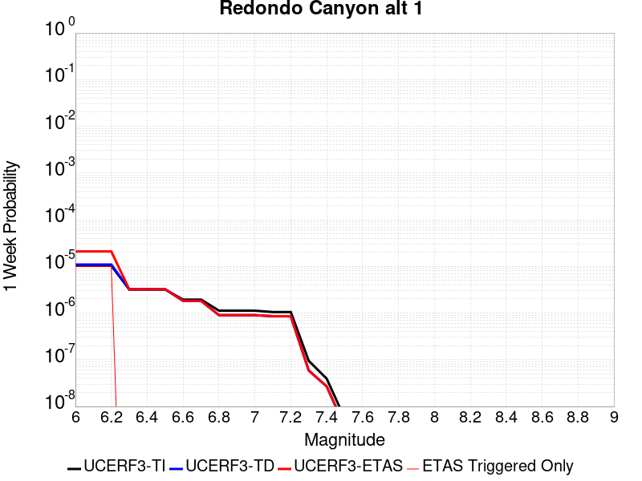 |  | 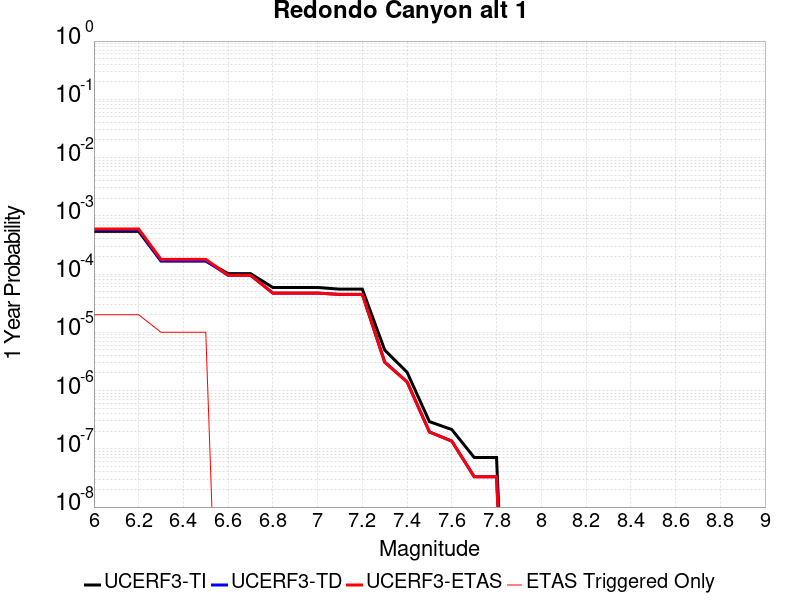 |  |

| Magnitude | 1 wk TI Prob | 1 wk TD Prob | 1 wk ETAS Prob | 1 wk ETAS/TD Gain | 1 wk ETAS Triggered Only | 1 mo TI Prob | 1 mo TD Prob | 1 mo ETAS Prob | 1 mo ETAS/TD Gain | 1 mo ETAS Triggered Only | 1 yr TI Prob | 1 yr TD Prob | 1 yr ETAS Prob | 1 yr ETAS/TD Gain | 1 yr ETAS Triggered Only | 10 yr TI Prob | 10 yr TD Prob | 10 yr ETAS Prob | 10 yr ETAS/TD Gain | 10 yr ETAS Triggered Only |
|-----|-----|-----|-----|-----|-----|-----|-----|-----|-----|-----|-----|-----|-----|-----|-----|-----|-----|-----|-----|-----|
| 6.0 | 1.0346246E-5 | 1.09813445E-5 | 2.0981235E-5 | 1.9106253 | 1.0E-5 | 4.43403E-5 | 4.7062502E-5 | 5.7062032E-5 | 1.2124734 | 1.0E-5 | 5.3970946E-4 | 5.729142E-4 | 5.9290277E-4 | 1.0348892 | 2.0E-5 | 0.0053840056 | 0.005722111 | 0.0057419967 | 1.0034752 | 2.0E-5 |
| 6.1 | 1.0346246E-5 | 1.09813445E-5 | 2.0981235E-5 | 1.9106253 | 1.0E-5 | 4.43403E-5 | 4.7062502E-5 | 5.7062032E-5 | 1.2124734 | 1.0E-5 | 5.3970946E-4 | 5.729142E-4 | 5.9290277E-4 | 1.0348892 | 2.0E-5 | 0.0053840056 | 0.005722111 | 0.0057419967 | 1.0034752 | 2.0E-5 |
| 6.2 | 1.0346246E-5 | 1.09813445E-5 | 2.0981235E-5 | 1.9106253 | 1.0E-5 | 4.43403E-5 | 4.7062502E-5 | 5.7062032E-5 | 1.2124734 | 1.0E-5 | 5.3970946E-4 | 5.729142E-4 | 5.9290277E-4 | 1.0348892 | 2.0E-5 | 0.0053840056 | 0.005722111 | 0.0057419967 | 1.0034752 | 2.0E-5 |
| 6.3 | 3.2052794E-6 | 3.2361174E-6 | 3.2361174E-6 | 1.0 | 0.0 | 1.373684E-5 | 1.3869023E-5 | 1.3869023E-5 | 1.0 | 0.0 | 1.6723319E-4 | 1.6884625E-4 | 1.7884455E-4 | 1.0592154 | 1.0E-5 | 0.001671074 | 0.0016875692 | 0.0016975524 | 1.0059156 | 1.0E-5 |
| 6.4 | 3.2052794E-6 | 3.2361174E-6 | 3.2361174E-6 | 1.0 | 0.0 | 1.373684E-5 | 1.3869023E-5 | 1.3869023E-5 | 1.0 | 0.0 | 1.6723319E-4 | 1.6884625E-4 | 1.7884455E-4 | 1.0592154 | 1.0E-5 | 0.001671074 | 0.0016875692 | 0.0016975524 | 1.0059156 | 1.0E-5 |
| 6.5 | 3.2052794E-6 | 3.2361174E-6 | 3.2361174E-6 | 1.0 | 0.0 | 1.373684E-5 | 1.3869023E-5 | 1.3869023E-5 | 1.0 | 0.0 | 1.6723319E-4 | 1.6884625E-4 | 1.7884455E-4 | 1.0592154 | 1.0E-5 | 0.001671074 | 0.0016875692 | 0.0016975524 | 1.0059156 | 1.0E-5 |
| 6.6 | 1.948328E-6 | 1.8288681E-6 | 1.8288681E-6 | 1.0 | 0.0 | 8.349951E-6 | 7.837991E-6 | 7.837991E-6 | 1.0 | 0.0 | 1.016559E-4 | 9.542486E-5 | 9.542486E-5 | 1.0 | 0.0 | 0.0010160941 | 9.539858E-4 | 9.539858E-4 | 1.0 | 0.0 |
| 6.7 | 1.948328E-6 | 1.8288681E-6 | 1.8288681E-6 | 1.0 | 0.0 | 8.349951E-6 | 7.837991E-6 | 7.837991E-6 | 1.0 | 0.0 | 1.016559E-4 | 9.542486E-5 | 9.542486E-5 | 1.0 | 0.0 | 0.0010160941 | 9.539858E-4 | 9.539858E-4 | 1.0 | 0.0 |
| 6.8 | 1.1278219E-6 | 9.033076E-7 | 9.033076E-7 | 1.0 | 0.0 | 4.8335132E-6 | 3.871315E-6 | 3.871315E-6 | 1.0 | 0.0 | 5.8846435E-5 | 4.7132668E-5 | 4.7132668E-5 | 1.0 | 0.0 | 5.8830855E-4 | 4.7126875E-4 | 4.7126875E-4 | 1.0 | 0.0 |
| 6.9 | 1.1278219E-6 | 9.033076E-7 | 9.033076E-7 | 1.0 | 0.0 | 4.8335132E-6 | 3.871315E-6 | 3.871315E-6 | 1.0 | 0.0 | 5.8846435E-5 | 4.7132668E-5 | 4.7132668E-5 | 1.0 | 0.0 | 5.8830855E-4 | 4.7126875E-4 | 4.7126875E-4 | 1.0 | 0.0 |
| 7.0 | 1.1278219E-6 | 9.033076E-7 | 9.033076E-7 | 1.0 | 0.0 | 4.8335132E-6 | 3.871315E-6 | 3.871315E-6 | 1.0 | 0.0 | 5.8846435E-5 | 4.7132668E-5 | 4.7132668E-5 | 1.0 | 0.0 | 5.8830855E-4 | 4.7126875E-4 | 4.7126875E-4 | 1.0 | 0.0 |
| 7.1 | 1.0545139E-6 | 8.5692716E-7 | 8.5692716E-7 | 1.0 | 0.0 | 4.5193374E-6 | 3.6725423E-6 | 3.6725423E-6 | 1.0 | 0.0 | 5.5021545E-5 | 4.471271E-5 | 4.471271E-5 | 1.0 | 0.0 | 5.500792E-4 | 4.470789E-4 | 4.470789E-4 | 1.0 | 0.0 |
| 7.2 | 1.0545139E-6 | 8.5692716E-7 | 8.5692716E-7 | 1.0 | 0.0 | 4.5193374E-6 | 3.6725423E-6 | 3.6725423E-6 | 1.0 | 0.0 | 5.5021545E-5 | 4.471271E-5 | 4.471271E-5 | 1.0 | 0.0 | 5.500792E-4 | 4.470789E-4 | 4.470789E-4 | 1.0 | 0.0 |
| 7.3 | 9.505161E-8 | 5.8957607E-8 | 5.8957607E-8 | 1.0 | 0.0 | 4.0736398E-7 | 2.5267545E-7 | 2.5267545E-7 | 1.0 | 0.0 | 4.959645E-6 | 3.0763204E-6 | 3.0763204E-6 | 1.0 | 0.0 | 4.9595343E-5 | 3.0762894E-5 | 3.0762894E-5 | 1.0 | 0.0 |
| 7.4 | 3.9520785E-8 | 2.6987191E-8 | 2.6987191E-8 | 1.0 | 0.0 | 1.6937479E-7 | 1.1565938E-7 | 1.1565938E-7 | 1.0 | 0.0 | 2.062136E-6 | 1.4081523E-6 | 1.4081523E-6 | 1.0 | 0.0 | 2.062117E-5 | 1.4081461E-5 | 1.4081461E-5 | 1.0 | 0.0 |
| 7.5 | 5.6133214E-9 | 3.7368215E-9 | 3.7368215E-9 | 1.0 | 0.0 | 2.4057092E-8 | 1.601495E-8 | 1.601495E-8 | 1.0 | 0.0 | 2.9289507E-7 | 1.9498201E-7 | 1.9498201E-7 | 1.0 | 0.0 | 2.9289467E-6 | 1.9498186E-6 | 1.9498186E-6 | 1.0 | 0.0 |
| 7.6 | 4.1064334E-9 | 2.5957634E-9 | 2.5957634E-9 | 1.0 | 0.0 | 1.7599E-8 | 1.11247E-8 | 1.11247E-8 | 1.0 | 0.0 | 2.142678E-7 | 1.3544322E-7 | 1.3544322E-7 | 1.0 | 0.0 | 2.1426758E-6 | 1.3544316E-6 | 1.3544316E-6 | 1.0 | 0.0 |
| 7.7 | 1.361975E-9 | 6.360824E-10 | 6.360824E-10 | 1.0 | 0.0 | 5.8370353E-9 | 2.7260674E-9 | 2.7260674E-9 | 1.0 | 0.0 | 7.1065905E-8 | 3.318987E-8 | 3.318987E-8 | 1.0 | 0.0 | 7.106588E-7 | 3.318987E-7 | 3.318987E-7 | 1.0 | 0.0 |
| 7.8 | 1.361975E-9 | 6.360824E-10 | 6.360824E-10 | 1.0 | 0.0 | 5.8370353E-9 | 2.7260674E-9 | 2.7260674E-9 | 1.0 | 0.0 | 7.1065905E-8 | 3.318987E-8 | 3.318987E-8 | 1.0 | 0.0 | 7.106588E-7 | 3.318987E-7 | 3.318987E-7 | 1.0 | 0.0 |

## Great Valley 04a Trout Creek
*[(top)](#table-of-contents)*

| 1 Week | 1 Month | 1 Year | 10 Year |
|-----|-----|-----|-----|
|  |  |  |  |

| Magnitude | 1 wk TI Prob | 1 wk TD Prob | 1 wk ETAS Prob | 1 wk ETAS/TD Gain | 1 wk ETAS Triggered Only | 1 mo TI Prob | 1 mo TD Prob | 1 mo ETAS Prob | 1 mo ETAS/TD Gain | 1 mo ETAS Triggered Only | 1 yr TI Prob | 1 yr TD Prob | 1 yr ETAS Prob | 1 yr ETAS/TD Gain | 1 yr ETAS Triggered Only | 10 yr TI Prob | 10 yr TD Prob | 10 yr ETAS Prob | 10 yr ETAS/TD Gain | 10 yr ETAS Triggered Only |
|-----|-----|-----|-----|-----|-----|-----|-----|-----|-----|-----|-----|-----|-----|-----|-----|-----|-----|-----|-----|-----|
| 6.0 | 1.4088538E-5 | 1.5719554E-5 | 2.5719397E-5 | 1.6361403 | 1.0E-5 | 6.037805E-5 | 6.7367844E-5 | 7.736717E-5 | 1.1484288 | 1.0E-5 | 7.3485484E-4 | 8.199074E-4 | 8.3989097E-4 | 1.024373 | 2.0E-5 | 0.007324295 | 0.008170108 | 0.008189945 | 1.0024279 | 2.0E-5 |
| 6.1 | 1.4088538E-5 | 1.5719554E-5 | 2.5719397E-5 | 1.6361403 | 1.0E-5 | 6.037805E-5 | 6.7367844E-5 | 7.736717E-5 | 1.1484288 | 1.0E-5 | 7.3485484E-4 | 8.199074E-4 | 8.3989097E-4 | 1.024373 | 2.0E-5 | 0.007324295 | 0.008170108 | 0.008189945 | 1.0024279 | 2.0E-5 |
| 6.2 | 1.4088538E-5 | 1.5719554E-5 | 2.5719397E-5 | 1.6361403 | 1.0E-5 | 6.037805E-5 | 6.7367844E-5 | 7.736717E-5 | 1.1484288 | 1.0E-5 | 7.3485484E-4 | 8.199074E-4 | 8.3989097E-4 | 1.024373 | 2.0E-5 | 0.007324295 | 0.008170108 | 0.008189945 | 1.0024279 | 2.0E-5 |
| 6.3 | 1.2882862E-5 | 1.4378603E-5 | 2.4378458E-5 | 1.6954678 | 1.0E-5 | 5.5211098E-5 | 6.1621184E-5 | 7.162057E-5 | 1.1622719 | 1.0E-5 | 6.7198783E-4 | 7.4999005E-4 | 7.699751E-4 | 1.026647 | 2.0E-5 | 0.0066995937 | 0.0074756527 | 0.0074955034 | 1.0026554 | 2.0E-5 |
| 6.4 | 1.2882862E-5 | 1.4378603E-5 | 2.4378458E-5 | 1.6954678 | 1.0E-5 | 5.5211098E-5 | 6.1621184E-5 | 7.162057E-5 | 1.1622719 | 1.0E-5 | 6.7198783E-4 | 7.4999005E-4 | 7.699751E-4 | 1.026647 | 2.0E-5 | 0.0066995937 | 0.0074756527 | 0.0074955034 | 1.0026554 | 2.0E-5 |
| 6.5 | 1.2762329E-5 | 1.424516E-5 | 2.4245017E-5 | 1.7019829 | 1.0E-5 | 5.469455E-5 | 6.1049315E-5 | 7.10487E-5 | 1.163792 | 1.0E-5 | 6.657027E-4 | 7.430323E-4 | 7.6301745E-4 | 1.0268967 | 2.0E-5 | 0.00663712 | 0.0074065393 | 0.007426391 | 1.0026803 | 2.0E-5 |
| 6.6 | 1.2762329E-5 | 1.424516E-5 | 2.4245017E-5 | 1.7019829 | 1.0E-5 | 5.469455E-5 | 6.1049315E-5 | 7.10487E-5 | 1.163792 | 1.0E-5 | 6.657027E-4 | 7.430323E-4 | 7.6301745E-4 | 1.0268967 | 2.0E-5 | 0.00663712 | 0.0074065393 | 0.007426391 | 1.0026803 | 2.0E-5 |
| 6.7 | 1.2557959E-5 | 1.4019395E-5 | 2.4019255E-5 | 1.7132876 | 1.0E-5 | 5.3818712E-5 | 6.0081795E-5 | 7.0081194E-5 | 1.1664298 | 1.0E-5 | 6.5504585E-4 | 7.312607E-4 | 7.5124606E-4 | 1.02733 | 2.0E-5 | 0.006531183 | 0.007289598 | 0.0073094526 | 1.0027237 | 2.0E-5 |
| 6.8 | 1.1871544E-5 | 1.3258823E-5 | 2.325869E-5 | 1.7542048 | 1.0E-5 | 5.0877054E-5 | 5.6822348E-5 | 6.6821776E-5 | 1.1759771 | 1.0E-5 | 6.1925204E-4 | 6.916025E-4 | 7.1158865E-4 | 1.0288984 | 2.0E-5 | 0.0061752927 | 0.0068955184 | 0.0069153807 | 1.0028805 | 2.0E-5 |
| 6.9 | 1.0500373E-5 | 1.1731261E-5 | 1.1731261E-5 | 1.0 | 0.0 | 4.5000823E-5 | 5.0275914E-5 | 5.0275914E-5 | 1.0 | 0.0 | 5.4774724E-4 | 6.119459E-4 | 6.219398E-4 | 1.0163313 | 1.0E-5 | 0.005463991 | 0.0061034737 | 0.006113413 | 1.0016284 | 1.0E-5 |
| 7.0 | 8.524332E-6 | 9.5334835E-6 | 9.5334835E-6 | 1.0 | 0.0 | 3.653234E-5 | 4.0857187E-5 | 4.0857187E-5 | 1.0 | 0.0 | 4.4469046E-4 | 4.9733004E-4 | 5.073251E-4 | 1.0200974 | 1.0E-5 | 0.0044380166 | 0.004962902 | 0.0049728523 | 1.002005 | 1.0E-5 |
| 7.1 | 6.006849E-6 | 6.711559E-6 | 6.711559E-6 | 1.0 | 0.0 | 2.5743384E-5 | 2.876354E-5 | 2.876354E-5 | 1.0 | 0.0 | 3.1338062E-4 | 3.501454E-4 | 3.601419E-4 | 1.0285496 | 1.0E-5 | 0.0031293905 | 0.0034964874 | 0.0035064525 | 1.00285 | 1.0E-5 |
| 7.2 | 2.9122193E-6 | 3.2465305E-6 | 3.2465305E-6 | 1.0 | 0.0 | 1.248088E-5 | 1.3913637E-5 | 1.3913637E-5 | 1.0 | 0.0 | 1.5194413E-4 | 1.6938712E-4 | 1.6938712E-4 | 1.0 | 0.0 | 0.0015184027 | 0.0016927521 | 0.0016927521 | 1.0 | 0.0 |
| 7.3 | 7.2194007E-7 | 7.988761E-7 | 7.988761E-7 | 1.0 | 0.0 | 3.0940253E-6 | 3.4237528E-6 | 3.4237528E-6 | 1.0 | 0.0 | 3.7669106E-5 | 4.1683852E-5 | 4.1683852E-5 | 1.0 | 0.0 | 3.766272E-4 | 4.168053E-4 | 4.168053E-4 | 1.0 | 0.0 |
| 7.4 | 3.112171E-8 | 3.2068368E-8 | 3.2068368E-8 | 1.0 | 0.0 | 1.3337875E-7 | 1.3743585E-7 | 1.3743585E-7 | 1.0 | 0.0 | 1.6238852E-6 | 1.6732803E-6 | 1.6732803E-6 | 1.0 | 0.0 | 1.6238733E-5 | 1.6732685E-5 | 1.6732685E-5 | 1.0 | 0.0 |

## South Klamath Lake West
*[(top)](#table-of-contents)*

| 1 Week | 1 Month | 1 Year | 10 Year |
|-----|-----|-----|-----|
|  |  |  |  |

| Magnitude | 1 wk TI Prob | 1 wk TD Prob | 1 wk ETAS Prob | 1 wk ETAS/TD Gain | 1 wk ETAS Triggered Only | 1 mo TI Prob | 1 mo TD Prob | 1 mo ETAS Prob | 1 mo ETAS/TD Gain | 1 mo ETAS Triggered Only | 1 yr TI Prob | 1 yr TD Prob | 1 yr ETAS Prob | 1 yr ETAS/TD Gain | 1 yr ETAS Triggered Only | 10 yr TI Prob | 10 yr TD Prob | 10 yr ETAS Prob | 10 yr ETAS/TD Gain | 10 yr ETAS Triggered Only |
|-----|-----|-----|-----|-----|-----|-----|-----|-----|-----|-----|-----|-----|-----|-----|-----|-----|-----|-----|-----|-----|
| 6.0 | 2.174025E-5 | 2.3042025E-5 | 2.3042025E-5 | 1.0 | 0.0 | 9.3169176E-5 | 9.874817E-5 | 9.874817E-5 | 1.0 | 0.0 | 0.0011337444 | 0.0012016617 | 0.0012116497 | 1.0083119 | 1.0E-5 | 0.011279777 | 0.0119582405 | 0.011968121 | 1.0008262 | 1.0E-5 |
| 6.1 | 2.174025E-5 | 2.3042025E-5 | 2.3042025E-5 | 1.0 | 0.0 | 9.3169176E-5 | 9.874817E-5 | 9.874817E-5 | 1.0 | 0.0 | 0.0011337444 | 0.0012016617 | 0.0012116497 | 1.0083119 | 1.0E-5 | 0.011279777 | 0.0119582405 | 0.011968121 | 1.0008262 | 1.0E-5 |
| 6.2 | 9.834929E-6 | 1.0393841E-5 | 1.0393841E-5 | 1.0 | 0.0 | 4.2149015E-5 | 4.4544326E-5 | 4.4544326E-5 | 1.0 | 0.0 | 5.1304343E-4 | 5.422012E-4 | 5.422012E-4 | 1.0 | 0.0 | 0.0051186057 | 0.0054096854 | 0.0054096854 | 1.0 | 0.0 |
| 6.3 | 9.834929E-6 | 1.0393841E-5 | 1.0393841E-5 | 1.0 | 0.0 | 4.2149015E-5 | 4.4544326E-5 | 4.4544326E-5 | 1.0 | 0.0 | 5.1304343E-4 | 5.422012E-4 | 5.422012E-4 | 1.0 | 0.0 | 0.0051186057 | 0.0054096854 | 0.0054096854 | 1.0 | 0.0 |
| 6.4 | 6.066321E-6 | 6.40043E-6 | 6.40043E-6 | 1.0 | 0.0 | 2.5998259E-5 | 2.743014E-5 | 2.743014E-5 | 1.0 | 0.0 | 3.1648282E-4 | 3.3391351E-4 | 3.3391351E-4 | 1.0 | 0.0 | 0.0031603249 | 0.0033343881 | 0.0033343881 | 1.0 | 0.0 |
| 6.5 | 6.066321E-6 | 6.40043E-6 | 6.40043E-6 | 1.0 | 0.0 | 2.5998259E-5 | 2.743014E-5 | 2.743014E-5 | 1.0 | 0.0 | 3.1648282E-4 | 3.3391351E-4 | 3.3391351E-4 | 1.0 | 0.0 | 0.0031603249 | 0.0033343881 | 0.0033343881 | 1.0 | 0.0 |
| 6.6 | 4.2321803E-6 | 4.461291E-6 | 4.461291E-6 | 1.0 | 0.0 | 1.8137789E-5 | 1.9119685E-5 | 1.9119685E-5 | 1.0 | 0.0 | 2.208052E-4 | 2.3275832E-4 | 2.3275832E-4 | 1.0 | 0.0 | 0.0022058594 | 0.0023252473 | 0.0023252473 | 1.0 | 0.0 |
| 6.7 | 3.186646E-6 | 3.360305E-6 | 3.360305E-6 | 1.0 | 0.0 | 1.3656982E-5 | 1.4401232E-5 | 1.4401232E-5 | 1.0 | 0.0 | 1.6626107E-4 | 1.7532158E-4 | 1.7532158E-4 | 1.0 | 0.0 | 0.0016613674 | 0.0017518997 | 0.0017518997 | 1.0 | 0.0 |
| 6.8 | 2.380121E-6 | 2.510907E-6 | 2.510907E-6 | 1.0 | 0.0 | 1.0200479E-5 | 1.07609885E-5 | 1.07609885E-5 | 1.0 | 0.0 | 1.2418375E-4 | 1.3100762E-4 | 1.3100762E-4 | 1.0 | 0.0 | 0.0012411437 | 0.0013093497 | 0.0013093497 | 1.0 | 0.0 |
| 6.9 | 8.928287E-7 | 9.4302504E-7 | 9.4302504E-7 | 1.0 | 0.0 | 3.826403E-6 | 4.0415307E-6 | 4.0415307E-6 | 1.0 | 0.0 | 4.658546E-5 | 4.9204747E-5 | 4.9204747E-5 | 1.0 | 0.0 | 4.6575698E-4 | 4.9196015E-4 | 4.9196015E-4 | 1.0 | 0.0 |

## Shoreline
*[(top)](#table-of-contents)*

| 1 Week | 1 Month | 1 Year | 10 Year |
|-----|-----|-----|-----|
|  |  |  |  |

| Magnitude | 1 wk TI Prob | 1 wk TD Prob | 1 wk ETAS Prob | 1 wk ETAS/TD Gain | 1 wk ETAS Triggered Only | 1 mo TI Prob | 1 mo TD Prob | 1 mo ETAS Prob | 1 mo ETAS/TD Gain | 1 mo ETAS Triggered Only | 1 yr TI Prob | 1 yr TD Prob | 1 yr ETAS Prob | 1 yr ETAS/TD Gain | 1 yr ETAS Triggered Only | 10 yr TI Prob | 10 yr TD Prob | 10 yr ETAS Prob | 10 yr ETAS/TD Gain | 10 yr ETAS Triggered Only |
|-----|-----|-----|-----|-----|-----|-----|-----|-----|-----|-----|-----|-----|-----|-----|-----|-----|-----|-----|-----|-----|
| 6.0 | 3.9888673E-6 | 4.047929E-6 | 2.4047848E-5 | 5.9407783 | 2.0E-5 | 1.7095033E-5 | 1.7348184E-5 | 3.7347836E-5 | 2.1528385 | 2.0E-5 | 2.0811215E-4 | 2.1119925E-4 | 2.3119502E-4 | 1.0946773 | 2.0E-5 | 0.0020791737 | 0.002110534 | 0.002130492 | 1.0094563 | 2.0E-5 |
| 6.1 | 3.9888673E-6 | 4.047929E-6 | 2.4047848E-5 | 5.9407783 | 2.0E-5 | 1.7095033E-5 | 1.7348184E-5 | 3.7347836E-5 | 2.1528385 | 2.0E-5 | 2.0811215E-4 | 2.1119925E-4 | 2.3119502E-4 | 1.0946773 | 2.0E-5 | 0.0020791737 | 0.002110534 | 0.002130492 | 1.0094563 | 2.0E-5 |
| 6.2 | 1.4039653E-6 | 1.4100891E-6 | 1.4100891E-6 | 1.0 | 0.0 | 6.0169805E-6 | 6.0432253E-6 | 6.0432253E-6 | 1.0 | 0.0 | 7.325427E-5 | 7.357384E-5 | 7.357384E-5 | 1.0 | 0.0 | 7.3230127E-4 | 7.355009E-4 | 7.355009E-4 | 1.0 | 0.0 |
| 6.3 | 1.4039653E-6 | 1.4100891E-6 | 1.4100891E-6 | 1.0 | 0.0 | 6.0169805E-6 | 6.0432253E-6 | 6.0432253E-6 | 1.0 | 0.0 | 7.325427E-5 | 7.357384E-5 | 7.357384E-5 | 1.0 | 0.0 | 7.3230127E-4 | 7.355009E-4 | 7.355009E-4 | 1.0 | 0.0 |
| 6.4 | 1.3314152E-6 | 1.3361605E-6 | 1.3361605E-6 | 1.0 | 0.0 | 5.7060524E-6 | 5.7263896E-6 | 5.7263896E-6 | 1.0 | 0.0 | 6.946897E-5 | 6.971662E-5 | 6.971662E-5 | 1.0 | 0.0 | 6.9447263E-4 | 6.9695286E-4 | 6.9695286E-4 | 1.0 | 0.0 |
| 6.5 | 1.1187026E-6 | 1.120364E-6 | 1.120364E-6 | 1.0 | 0.0 | 4.794431E-6 | 4.8015513E-6 | 4.8015513E-6 | 1.0 | 0.0 | 5.8370628E-5 | 5.8457343E-5 | 5.8457343E-5 | 1.0 | 0.0 | 5.83553E-4 | 5.844222E-4 | 5.844222E-4 | 1.0 | 0.0 |
| 6.6 | 9.793089E-7 | 9.784919E-7 | 9.784919E-7 | 1.0 | 0.0 | 4.1970316E-6 | 4.1935305E-6 | 4.1935305E-6 | 1.0 | 0.0 | 5.1097657E-5 | 5.105505E-5 | 5.105505E-5 | 1.0 | 0.0 | 5.108591E-4 | 5.1043445E-4 | 5.1043445E-4 | 1.0 | 0.0 |
| 6.7 | 8.995986E-7 | 8.9728E-7 | 8.9728E-7 | 1.0 | 0.0 | 3.8554167E-6 | 3.84548E-6 | 3.84548E-6 | 1.0 | 0.0 | 4.693869E-5 | 4.6817724E-5 | 4.6817724E-5 | 1.0 | 0.0 | 4.6928777E-4 | 4.6807955E-4 | 4.6807955E-4 | 1.0 | 0.0 |
| 6.8 | 7.931612E-7 | 7.8804027E-7 | 7.8804027E-7 | 1.0 | 0.0 | 3.3992578E-6 | 3.377311E-6 | 3.377311E-6 | 1.0 | 0.0 | 4.1385178E-5 | 4.1117994E-5 | 4.1117994E-5 | 1.0 | 0.0 | 4.1377472E-4 | 4.1110438E-4 | 4.1110438E-4 | 1.0 | 0.0 |
| 6.9 | 7.1465956E-7 | 7.078006E-7 | 7.078006E-7 | 1.0 | 0.0 | 3.062823E-6 | 3.0334277E-6 | 3.0334277E-6 | 1.0 | 0.0 | 3.7289232E-5 | 3.6931357E-5 | 3.6931357E-5 | 1.0 | 0.0 | 3.7282976E-4 | 3.6925258E-4 | 3.6925258E-4 | 1.0 | 0.0 |
| 7.0 | 6.389046E-7 | 6.299458E-7 | 6.299458E-7 | 1.0 | 0.0 | 2.7381598E-6 | 2.699765E-6 | 2.699765E-6 | 1.0 | 0.0 | 3.3336586E-5 | 3.2869146E-5 | 3.2869146E-5 | 1.0 | 0.0 | 3.3331584E-4 | 3.2864307E-4 | 3.2864307E-4 | 1.0 | 0.0 |
| 7.1 | 5.4300875E-7 | 5.3111313E-7 | 5.3111313E-7 | 1.0 | 0.0 | 2.3271782E-6 | 2.276197E-6 | 2.276197E-6 | 1.0 | 0.0 | 2.8333026E-5 | 2.7712347E-5 | 2.7712347E-5 | 1.0 | 0.0 | 2.8329415E-4 | 2.77089E-4 | 2.77089E-4 | 1.0 | 0.0 |
| 7.2 | 4.6768855E-7 | 4.5348952E-7 | 4.5348952E-7 | 1.0 | 0.0 | 2.0043778E-6 | 1.9435251E-6 | 1.9435251E-6 | 1.0 | 0.0 | 2.4403027E-5 | 2.3662162E-5 | 2.3662162E-5 | 1.0 | 0.0 | 2.4400349E-4 | 2.3659648E-4 | 2.3659648E-4 | 1.0 | 0.0 |
| 7.3 | 4.0966103E-7 | 3.9385662E-7 | 3.9385662E-7 | 1.0 | 0.0 | 1.7556889E-6 | 1.6879559E-6 | 1.6879559E-6 | 1.0 | 0.0 | 2.1375303E-5 | 2.055067E-5 | 2.055067E-5 | 1.0 | 0.0 | 2.1373246E-4 | 2.0548773E-4 | 2.0548773E-4 | 1.0 | 0.0 |
| 7.4 | 3.5105785E-7 | 3.3363975E-7 | 3.3363975E-7 | 1.0 | 0.0 | 1.5045327E-6 | 1.4298838E-6 | 1.4298838E-6 | 1.0 | 0.0 | 1.8317533E-5 | 1.7408696E-5 | 1.7408696E-5 | 1.0 | 0.0 | 1.8316023E-4 | 1.7407336E-4 | 1.7407336E-4 | 1.0 | 0.0 |
| 7.5 | 2.8737534E-7 | 2.6820038E-7 | 2.6820038E-7 | 1.0 | 0.0 | 1.2316079E-6 | 1.1494297E-6 | 1.1494297E-6 | 1.0 | 0.0 | 1.4994724E-5 | 1.3994217E-5 | 1.3994217E-5 | 1.0 | 0.0 | 1.4993713E-4 | 1.3993339E-4 | 1.3993339E-4 | 1.0 | 0.0 |
| 7.6 | 2.0924051E-7 | 1.8778988E-7 | 1.8778988E-7 | 1.0 | 0.0 | 8.967448E-7 | 8.048135E-7 | 8.048135E-7 | 1.0 | 0.0 | 1.0917813E-5 | 9.79856E-6 | 9.79856E-6 | 1.0 | 0.0 | 1.0917276E-4 | 9.798129E-5 | 9.798129E-5 | 1.0 | 0.0 |
| 7.7 | 1.392265E-7 | 1.15433906E-7 | 1.15433906E-7 | 1.0 | 0.0 | 5.9668486E-7 | 4.9471663E-7 | 4.9471663E-7 | 1.0 | 0.0 | 7.2646135E-6 | 6.023158E-6 | 6.023158E-6 | 1.0 | 0.0 | 7.2643765E-5 | 6.0229955E-5 | 6.0229955E-5 | 1.0 | 0.0 |
| 7.8 | 8.1080074E-8 | 5.586722E-8 | 5.586722E-8 | 1.0 | 0.0 | 3.4748598E-7 | 2.394309E-7 | 2.394309E-7 | 1.0 | 0.0 | 4.2306337E-6 | 2.9150672E-6 | 2.9150672E-6 | 1.0 | 0.0 | 4.230553E-5 | 2.9150291E-5 | 2.9150291E-5 | 1.0 | 0.0 |
| 7.9 | 5.0859036E-8 | 2.7244445E-8 | 2.7244445E-8 | 1.0 | 0.0 | 2.1796728E-7 | 1.16761896E-7 | 1.16761896E-7 | 1.0 | 0.0 | 2.6537484E-6 | 1.4215751E-6 | 1.4215751E-6 | 1.0 | 0.0 | 2.6537167E-5 | 1.4215661E-5 | 1.4215661E-5 | 1.0 | 0.0 |
| 8.0 | 3.1760536E-8 | 1.3577206E-8 | 1.3577206E-8 | 1.0 | 0.0 | 1.3611657E-7 | 5.8188025E-8 | 5.8188025E-8 | 1.0 | 0.0 | 1.6572179E-6 | 7.0843896E-7 | 7.0843896E-7 | 1.0 | 0.0 | 1.6572056E-5 | 7.084367E-6 | 7.084367E-6 | 1.0 | 0.0 |
| 8.1 | 1.2947896E-8 | 5.6628693E-9 | 5.6628693E-9 | 1.0 | 0.0 | 5.5490982E-8 | 2.426944E-8 | 2.426944E-8 | 1.0 | 0.0 | 6.756025E-7 | 2.954804E-7 | 2.954804E-7 | 1.0 | 0.0 | 6.7560045E-6 | 2.9548003E-6 | 2.9548003E-6 | 1.0 | 0.0 |

## Calaveras (No) 2011 CFM
*[(top)](#table-of-contents)*

| 1 Week | 1 Month | 1 Year | 10 Year |
|-----|-----|-----|-----|
|  |  |  | 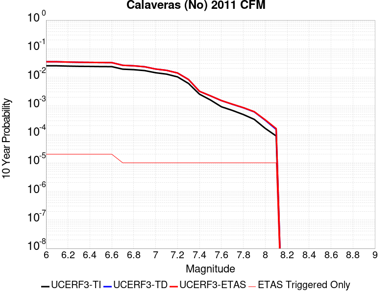 |

| Magnitude | 1 wk TI Prob | 1 wk TD Prob | 1 wk ETAS Prob | 1 wk ETAS/TD Gain | 1 wk ETAS Triggered Only | 1 mo TI Prob | 1 mo TD Prob | 1 mo ETAS Prob | 1 mo ETAS/TD Gain | 1 mo ETAS Triggered Only | 1 yr TI Prob | 1 yr TD Prob | 1 yr ETAS Prob | 1 yr ETAS/TD Gain | 1 yr ETAS Triggered Only | 10 yr TI Prob | 10 yr TD Prob | 10 yr ETAS Prob | 10 yr ETAS/TD Gain | 10 yr ETAS Triggered Only |
|-----|-----|-----|-----|-----|-----|-----|-----|-----|-----|-----|-----|-----|-----|-----|-----|-----|-----|-----|-----|-----|
| 6.0 | 4.8694856E-5 | 6.747121E-5 | 6.747121E-5 | 1.0 | 0.0 | 2.0867554E-4 | 2.8913133E-4 | 2.8913133E-4 | 1.0 | 0.0 | 0.0025376645 | 0.003514627 | 0.003524592 | 1.0028353 | 1.0E-5 | 0.02508881 | 0.034771245 | 0.03479055 | 1.0005552 | 2.0E-5 |
| 6.1 | 4.8694856E-5 | 6.747121E-5 | 6.747121E-5 | 1.0 | 0.0 | 2.0867554E-4 | 2.8913133E-4 | 2.8913133E-4 | 1.0 | 0.0 | 0.0025376645 | 0.003514627 | 0.003524592 | 1.0028353 | 1.0E-5 | 0.02508881 | 0.034771245 | 0.03479055 | 1.0005552 | 2.0E-5 |
| 6.2 | 4.7541962E-5 | 6.580218E-5 | 6.580218E-5 | 1.0 | 0.0 | 2.0373536E-4 | 2.8197994E-4 | 2.8197994E-4 | 1.0 | 0.0 | 0.0024776561 | 0.003427859 | 0.0034378245 | 1.0029073 | 1.0E-5 | 0.024502134 | 0.033932675 | 0.033951998 | 1.0005693 | 2.0E-5 |
| 6.3 | 4.6717287E-5 | 6.4635555E-5 | 6.4635555E-5 | 1.0 | 0.0 | 2.0020158E-4 | 2.7698115E-4 | 2.7698115E-4 | 1.0 | 0.0 | 0.0024347296 | 0.0033672103 | 0.0033771766 | 1.0029598 | 1.0E-5 | 0.024082264 | 0.033345193 | 0.033364523 | 1.0005798 | 2.0E-5 |
| 6.4 | 4.6276386E-5 | 6.399742E-5 | 6.399742E-5 | 1.0 | 0.0 | 1.983123E-4 | 2.7424688E-4 | 2.7424688E-4 | 1.0 | 0.0 | 0.0024117786 | 0.0033340224 | 0.0033439891 | 1.0029894 | 1.0E-5 | 0.02385771 | 0.033024073 | 0.03304341 | 1.0005857 | 2.0E-5 |
| 6.5 | 4.5720994E-5 | 6.319881E-5 | 6.319881E-5 | 1.0 | 0.0 | 1.9593239E-4 | 2.70825E-4 | 2.70825E-4 | 1.0 | 0.0 | 0.002382867 | 0.0032924965 | 0.0033024636 | 1.0030272 | 1.0E-5 | 0.023574775 | 0.032622032 | 0.03264138 | 1.0005931 | 2.0E-5 |
| 6.6 | 4.549134E-5 | 6.28519E-5 | 6.28519E-5 | 1.0 | 0.0 | 1.949483E-4 | 2.6933852E-4 | 2.6933852E-4 | 1.0 | 0.0 | 0.0023709119 | 0.0032744533 | 0.0032844206 | 1.0030439 | 1.0E-5 | 0.023457756 | 0.032447387 | 0.03246674 | 1.0005964 | 2.0E-5 |
| 6.7 | 3.701047E-5 | 5.0359427E-5 | 5.0359427E-5 | 1.0 | 0.0 | 1.5860666E-4 | 2.1580851E-4 | 2.1580851E-4 | 1.0 | 0.0 | 0.0019293258 | 0.002624346 | 0.002624346 | 1.0 | 0.0 | 0.019126613 | 0.026125323 | 0.026135063 | 1.0003728 | 1.0E-5 |
| 6.8 | 3.5523568E-5 | 4.8341022E-5 | 4.8341022E-5 | 1.0 | 0.0 | 1.5223498E-4 | 2.071596E-4 | 2.071596E-4 | 1.0 | 0.0 | 0.0018518851 | 0.0025192937 | 0.0025192937 | 1.0 | 0.0 | 0.018365284 | 0.025097553 | 0.025107302 | 1.0003885 | 1.0E-5 |
| 6.9 | 3.2946147E-5 | 4.466269E-5 | 4.466269E-5 | 1.0 | 0.0 | 1.4119013E-4 | 1.9139773E-4 | 1.9139773E-4 | 1.0 | 0.0 | 0.0017176344 | 0.0023278191 | 0.0023278191 | 1.0 | 0.0 | 0.017044188 | 0.023219598 | 0.023229366 | 1.0004207 | 1.0E-5 |
| 7.0 | 2.7682381E-5 | 3.702223E-5 | 3.702223E-5 | 1.0 | 0.0 | 1.1863338E-4 | 1.5865723E-4 | 1.5865723E-4 | 1.0 | 0.0 | 0.0014434044 | 0.0019299705 | 0.0019299705 | 1.0 | 0.0 | 0.01434065 | 0.01931092 | 0.019320726 | 1.0005078 | 1.0E-5 |
| 7.1 | 2.471967E-5 | 3.328669E-5 | 3.328669E-5 | 1.0 | 0.0 | 1.05937135E-4 | 1.4264962E-4 | 1.4264962E-4 | 1.0 | 0.0 | 0.0012890215 | 0.0017354045 | 0.0017354045 | 1.0 | 0.0 | 0.0128157 | 0.017385952 | 0.017395778 | 1.0005652 | 1.0E-5 |
| 7.2 | 1.9748062E-5 | 2.6774684E-5 | 2.6774684E-5 | 1.0 | 0.0 | 8.463181E-5 | 1.1474373E-4 | 1.1474373E-4 | 1.0 | 0.0 | 0.0010299052 | 0.0013961331 | 0.0013961331 | 1.0 | 0.0 | 0.01025145 | 0.014030739 | 0.014040599 | 1.0007027 | 1.0E-5 |
| 7.3 | 1.1603734E-5 | 1.5783844E-5 | 1.5783844E-5 | 1.0 | 0.0 | 4.9729337E-5 | 6.764337E-5 | 6.764337E-5 | 1.0 | 0.0 | 6.052865E-4 | 8.232611E-4 | 8.232611E-4 | 1.0 | 0.0 | 0.0060364045 | 0.008308666 | 0.008318583 | 1.0011935 | 1.0E-5 |
| 7.4 | 4.885381E-6 | 6.0349853E-6 | 6.0349853E-6 | 1.0 | 0.0 | 2.0937177E-5 | 2.5863968E-5 | 2.5863968E-5 | 1.0 | 0.0 | 2.5488032E-4 | 3.148485E-4 | 3.148485E-4 | 1.0 | 0.0 | 0.0025458818 | 0.0032010598 | 0.0032110277 | 1.003114 | 1.0E-5 |
| 7.5 | 3.0571264E-6 | 4.155299E-6 | 4.155299E-6 | 1.0 | 0.0 | 1.3101904E-5 | 1.7808303E-5 | 1.7808303E-5 | 1.0 | 0.0 | 1.5950401E-4 | 2.1679462E-4 | 2.1679462E-4 | 1.0 | 0.0 | 0.0015938957 | 0.002221121 | 0.0022310987 | 1.0044923 | 1.0E-5 |
| 7.6 | 1.764948E-6 | 2.7955498E-6 | 2.7955498E-6 | 1.0 | 0.0 | 7.564041E-6 | 1.1980874E-5 | 1.1980874E-5 | 1.0 | 0.0 | 9.208831E-5 | 1.4585744E-4 | 1.4585744E-4 | 1.0 | 0.0 | 9.205016E-4 | 0.0015123509 | 0.0015223358 | 1.0066022 | 1.0E-5 |
| 7.7 | 1.3173734E-6 | 2.058471E-6 | 2.058471E-6 | 1.0 | 0.0 | 5.645874E-6 | 8.8219895E-6 | 8.8219895E-6 | 1.0 | 0.0 | 6.873634E-5 | 1.0740245E-4 | 1.0740245E-4 | 1.0 | 0.0 | 6.8715087E-4 | 0.0011261401 | 0.0011361288 | 1.0088699 | 1.0E-5 |
| 7.8 | 9.4429885E-7 | 1.5489635E-6 | 1.5489635E-6 | 1.0 | 0.0 | 4.0469886E-6 | 6.638398E-6 | 6.638398E-6 | 1.0 | 0.0 | 4.9270973E-5 | 8.081952E-5 | 8.081952E-5 | 1.0 | 0.0 | 4.926005E-4 | 8.5014524E-4 | 8.6013676E-4 | 1.0117527 | 1.0E-5 |
| 7.9 | 6.388233E-7 | 1.1148749E-6 | 1.1148749E-6 | 1.0 | 0.0 | 2.7378112E-6 | 4.7780263E-6 | 4.7780263E-6 | 1.0 | 0.0 | 3.3332344E-5 | 5.817093E-5 | 5.817093E-5 | 1.0 | 0.0 | 3.3327343E-4 | 6.0963054E-4 | 6.1962445E-4 | 1.0163934 | 1.0E-5 |
| 8.0 | 3.087986E-7 | 5.7543696E-7 | 5.7543696E-7 | 1.0 | 0.0 | 1.323422E-6 | 2.466156E-6 | 2.466156E-6 | 1.0 | 0.0 | 1.6112543E-5 | 3.002504E-5 | 3.002504E-5 | 1.0 | 0.0 | 1.6111376E-4 | 3.110302E-4 | 3.210271E-4 | 1.0321412 | 1.0E-5 |
| 8.1 | 1.6725647E-7 | 2.7410047E-7 | 2.7410047E-7 | 1.0 | 0.0 | 7.168133E-7 | 1.1747159E-6 | 1.1747159E-6 | 1.0 | 0.0 | 8.7271665E-6 | 1.4302073E-5 | 1.4302073E-5 | 1.0 | 0.0 | 8.726824E-5 | 1.48486E-4 | 1.5848452E-4 | 1.0673364 | 1.0E-5 |

## Almanor 2011 CFM
*[(top)](#table-of-contents)*

| 1 Week | 1 Month | 1 Year | 10 Year |
|-----|-----|-----|-----|
|  |  |  |  |

| Magnitude | 1 wk TI Prob | 1 wk TD Prob | 1 wk ETAS Prob | 1 wk ETAS/TD Gain | 1 wk ETAS Triggered Only | 1 mo TI Prob | 1 mo TD Prob | 1 mo ETAS Prob | 1 mo ETAS/TD Gain | 1 mo ETAS Triggered Only | 1 yr TI Prob | 1 yr TD Prob | 1 yr ETAS Prob | 1 yr ETAS/TD Gain | 1 yr ETAS Triggered Only | 10 yr TI Prob | 10 yr TD Prob | 10 yr ETAS Prob | 10 yr ETAS/TD Gain | 10 yr ETAS Triggered Only |
|-----|-----|-----|-----|-----|-----|-----|-----|-----|-----|-----|-----|-----|-----|-----|-----|-----|-----|-----|-----|-----|
| 6.0 | 6.1479834E-5 | 8.32787E-5 | 8.32787E-5 | 1.0 | 0.0 | 2.6345838E-4 | 3.5686578E-4 | 3.5686578E-4 | 1.0 | 0.0 | 0.0032028882 | 0.0043366123 | 0.0043366123 | 1.0 | 0.0 | 0.031571172 | 0.04258577 | 0.042595346 | 1.0002248 | 1.0E-5 |
| 6.1 | 4.4387216E-5 | 5.9770442E-5 | 5.9770442E-5 | 1.0 | 0.0 | 1.9021705E-4 | 2.561381E-4 | 2.561381E-4 | 1.0 | 0.0 | 0.0023134327 | 0.003114426 | 0.003114426 | 1.0 | 0.0 | 0.022894967 | 0.030755036 | 0.030755036 | 1.0 | 0.0 |
| 6.2 | 4.4387216E-5 | 5.9770442E-5 | 5.9770442E-5 | 1.0 | 0.0 | 1.9021705E-4 | 2.561381E-4 | 2.561381E-4 | 1.0 | 0.0 | 0.0023134327 | 0.003114426 | 0.003114426 | 1.0 | 0.0 | 0.022894967 | 0.030755036 | 0.030755036 | 1.0 | 0.0 |
| 6.3 | 2.9523822E-5 | 3.954719E-5 | 3.954719E-5 | 1.0 | 0.0 | 1.2652454E-4 | 1.6947983E-4 | 1.6947983E-4 | 1.0 | 0.0 | 0.0015393476 | 0.0020618725 | 0.0020618725 | 1.0 | 0.0 | 0.015287281 | 0.020460794 | 0.020460794 | 1.0 | 0.0 |
| 6.4 | 2.0512744E-5 | 2.7431617E-5 | 2.7431617E-5 | 1.0 | 0.0 | 8.79088E-5 | 1.175612E-4 | 1.175612E-4 | 1.0 | 0.0 | 0.001069764 | 0.0014307408 | 0.0014307408 | 1.0 | 0.0 | 0.010646289 | 0.014244413 | 0.014244413 | 1.0 | 0.0 |
| 6.5 | 1.6750226E-5 | 2.23913E-5 | 2.23913E-5 | 1.0 | 0.0 | 7.178471E-5 | 9.596152E-5 | 9.596152E-5 | 1.0 | 0.0 | 8.7362836E-4 | 0.0011680633 | 0.0011680633 | 1.0 | 0.0 | 0.008702018 | 0.011649038 | 0.011649038 | 1.0 | 0.0 |
| 6.6 | 1.4745303E-5 | 1.9707952E-5 | 1.9707952E-5 | 1.0 | 0.0 | 6.319262E-5 | 8.446223E-5 | 8.446223E-5 | 1.0 | 0.0 | 7.690986E-4 | 0.0010281964 | 0.0010281964 | 1.0 | 0.0 | 0.0076644225 | 0.010264971 | 0.010264971 | 1.0 | 0.0 |
| 6.7 | 9.951145E-7 | 1.1616347E-6 | 1.1616347E-6 | 1.0 | 0.0 | 4.26477E-6 | 4.9784257E-6 | 4.9784257E-6 | 1.0 | 0.0 | 5.1922336E-5 | 6.0610826E-5 | 6.0610826E-5 | 1.0 | 0.0 | 5.1910203E-4 | 6.059602E-4 | 6.059602E-4 | 1.0 | 0.0 |
| 6.8 | 5.866312E-7 | 6.849384E-7 | 6.849384E-7 | 1.0 | 0.0 | 2.5141312E-6 | 2.9354478E-6 | 2.9354478E-6 | 1.0 | 0.0 | 3.0609117E-5 | 3.5738623E-5 | 3.5738623E-5 | 1.0 | 0.0 | 3.06049E-4 | 3.5734157E-4 | 3.5734157E-4 | 1.0 | 0.0 |

## Carson Range (Genoa)
*[(top)](#table-of-contents)*

| 1 Week | 1 Month | 1 Year | 10 Year |
|-----|-----|-----|-----|
|  |  |  |  |

| Magnitude | 1 wk TI Prob | 1 wk TD Prob | 1 wk ETAS Prob | 1 wk ETAS/TD Gain | 1 wk ETAS Triggered Only | 1 mo TI Prob | 1 mo TD Prob | 1 mo ETAS Prob | 1 mo ETAS/TD Gain | 1 mo ETAS Triggered Only | 1 yr TI Prob | 1 yr TD Prob | 1 yr ETAS Prob | 1 yr ETAS/TD Gain | 1 yr ETAS Triggered Only | 10 yr TI Prob | 10 yr TD Prob | 10 yr ETAS Prob | 10 yr ETAS/TD Gain | 10 yr ETAS Triggered Only |
|-----|-----|-----|-----|-----|-----|-----|-----|-----|-----|-----|-----|-----|-----|-----|-----|-----|-----|-----|-----|-----|
| 6.0 | 4.1268457E-5 | 5.0146893E-5 | 6.014639E-5 | 1.1994041 | 1.0E-5 | 1.7685282E-4 | 2.148998E-4 | 2.2489765E-4 | 1.0465233 | 1.0E-5 | 0.0021510567 | 0.0026136558 | 0.0026236295 | 1.003816 | 1.0E-5 | 0.02130354 | 0.025868816 | 0.025878558 | 1.0003766 | 1.0E-5 |
| 6.1 | 4.1268457E-5 | 5.0146893E-5 | 6.014639E-5 | 1.1994041 | 1.0E-5 | 1.7685282E-4 | 2.148998E-4 | 2.2489765E-4 | 1.0465233 | 1.0E-5 | 0.0021510567 | 0.0026136558 | 0.0026236295 | 1.003816 | 1.0E-5 | 0.02130354 | 0.025868816 | 0.025878558 | 1.0003766 | 1.0E-5 |
| 6.2 | 4.1268457E-5 | 5.0146893E-5 | 6.014639E-5 | 1.1994041 | 1.0E-5 | 1.7685282E-4 | 2.148998E-4 | 2.2489765E-4 | 1.0465233 | 1.0E-5 | 0.0021510567 | 0.0026136558 | 0.0026236295 | 1.003816 | 1.0E-5 | 0.02130354 | 0.025868816 | 0.025878558 | 1.0003766 | 1.0E-5 |
| 6.3 | 4.1268457E-5 | 5.0146893E-5 | 6.014639E-5 | 1.1994041 | 1.0E-5 | 1.7685282E-4 | 2.148998E-4 | 2.2489765E-4 | 1.0465233 | 1.0E-5 | 0.0021510567 | 0.0026136558 | 0.0026236295 | 1.003816 | 1.0E-5 | 0.02130354 | 0.025868816 | 0.025878558 | 1.0003766 | 1.0E-5 |
| 6.4 | 4.1268457E-5 | 5.0146893E-5 | 6.014639E-5 | 1.1994041 | 1.0E-5 | 1.7685282E-4 | 2.148998E-4 | 2.2489765E-4 | 1.0465233 | 1.0E-5 | 0.0021510567 | 0.0026136558 | 0.0026236295 | 1.003816 | 1.0E-5 | 0.02130354 | 0.025868816 | 0.025878558 | 1.0003766 | 1.0E-5 |
| 6.5 | 2.5677185E-5 | 3.0978295E-5 | 4.0977986E-5 | 1.3227967 | 1.0E-5 | 1.1004044E-4 | 1.3275839E-4 | 1.4275705E-4 | 1.0753148 | 1.0E-5 | 0.0013389189 | 0.0016153135 | 0.0016252974 | 1.0061808 | 1.0E-5 | 0.0133088045 | 0.016053649 | 0.016063489 | 1.0006129 | 1.0E-5 |
| 6.6 | 2.5677185E-5 | 3.0978295E-5 | 4.0977986E-5 | 1.3227967 | 1.0E-5 | 1.1004044E-4 | 1.3275839E-4 | 1.4275705E-4 | 1.0753148 | 1.0E-5 | 0.0013389189 | 0.0016153135 | 0.0016252974 | 1.0061808 | 1.0E-5 | 0.0133088045 | 0.016053649 | 0.016063489 | 1.0006129 | 1.0E-5 |
| 6.7 | 1.9969408E-5 | 2.406347E-5 | 3.4063232E-5 | 1.4155576 | 1.0E-5 | 8.558037E-5 | 1.0312595E-4 | 1.1312492E-4 | 1.0969588 | 1.0E-5 | 0.0010414429 | 0.0012549888 | 0.0012649763 | 1.0079582 | 1.0E-5 | 0.010365757 | 0.012494174 | 0.012504049 | 1.0007904 | 1.0E-5 |
| 6.8 | 1.4783156E-5 | 1.7817569E-5 | 1.7817569E-5 | 1.0 | 0.0 | 6.335485E-5 | 7.635951E-5 | 7.635951E-5 | 1.0 | 0.0 | 7.710722E-4 | 9.294106E-4 | 9.294106E-4 | 1.0 | 0.0 | 0.0076840227 | 0.009268024 | 0.009268024 | 1.0 | 0.0 |
| 6.9 | 1.06660555E-5 | 1.2877026E-5 | 1.2877026E-5 | 1.0 | 0.0 | 4.5710865E-5 | 5.5186738E-5 | 5.5186738E-5 | 1.0 | 0.0 | 5.5638765E-4 | 6.718066E-4 | 6.718066E-4 | 1.0 | 0.0 | 0.005549967 | 0.006709056 | 0.006709056 | 1.0 | 0.0 |
| 7.0 | 7.664838E-6 | 9.258307E-6 | 9.258307E-6 | 1.0 | 0.0 | 3.2848893E-5 | 3.9678456E-5 | 3.9678456E-5 | 1.0 | 0.0 | 3.998619E-4 | 4.830852E-4 | 4.830852E-4 | 1.0 | 0.0 | 0.0039914316 | 0.00483085 | 0.00483085 | 1.0 | 0.0 |

## Laguna Salada
*[(top)](#table-of-contents)*

| 1 Week | 1 Month | 1 Year | 10 Year |
|-----|-----|-----|-----|
|  |  |  |  |

| Magnitude | 1 wk TI Prob | 1 wk TD Prob | 1 wk ETAS Prob | 1 wk ETAS/TD Gain | 1 wk ETAS Triggered Only | 1 mo TI Prob | 1 mo TD Prob | 1 mo ETAS Prob | 1 mo ETAS/TD Gain | 1 mo ETAS Triggered Only | 1 yr TI Prob | 1 yr TD Prob | 1 yr ETAS Prob | 1 yr ETAS/TD Gain | 1 yr ETAS Triggered Only | 10 yr TI Prob | 10 yr TD Prob | 10 yr ETAS Prob | 10 yr ETAS/TD Gain | 10 yr ETAS Triggered Only |
|-----|-----|-----|-----|-----|-----|-----|-----|-----|-----|-----|-----|-----|-----|-----|-----|-----|-----|-----|-----|-----|
| 6.0 | 4.6465593E-5 | 4.634639E-5 | 4.634639E-5 | 1.0 | 0.0 | 1.9912305E-4 | 1.9861311E-4 | 1.9861311E-4 | 1.0 | 0.0 | 0.0024216278 | 0.002415429 | 0.002415429 | 1.0 | 0.0 | 0.02395408 | 0.023975259 | 0.023985019 | 1.0004071 | 1.0E-5 |
| 6.1 | 3.982297E-5 | 3.7246125E-5 | 3.7246125E-5 | 1.0 | 0.0 | 1.706587E-4 | 1.5961716E-4 | 1.5961716E-4 | 1.0 | 0.0 | 0.0020757897 | 0.0019417295 | 0.0019417295 | 1.0 | 0.0 | 0.020565065 | 0.019331863 | 0.019331863 | 1.0 | 0.0 |
| 6.2 | 3.6067784E-5 | 3.2602693E-5 | 3.2602693E-5 | 1.0 | 0.0 | 1.5456705E-4 | 1.3971896E-4 | 1.3971896E-4 | 1.0 | 0.0 | 0.0018802295 | 0.0016998611 | 0.0016998611 | 1.0 | 0.0 | 0.018644003 | 0.016949628 | 0.016949628 | 1.0 | 0.0 |
| 6.3 | 3.2859112E-5 | 2.8849448E-5 | 2.8849448E-5 | 1.0 | 0.0 | 1.4081717E-4 | 1.2363521E-4 | 1.2363521E-4 | 1.0 | 0.0 | 0.0017131006 | 0.0015043203 | 0.0015043203 | 1.0 | 0.0 | 0.016999546 | 0.015018767 | 0.015018767 | 1.0 | 0.0 |
| 6.4 | 2.9132116E-5 | 2.4852965E-5 | 2.4852965E-5 | 1.0 | 0.0 | 1.2484594E-4 | 1.0650887E-4 | 1.0650887E-4 | 1.0 | 0.0 | 0.0015189396 | 0.001296065 | 0.001296065 | 1.0 | 0.0 | 0.015085992 | 0.012956262 | 0.012956262 | 1.0 | 0.0 |
| 6.5 | 2.7075037E-5 | 2.2825836E-5 | 2.2825836E-5 | 1.0 | 0.0 | 1.1603071E-4 | 9.7821845E-5 | 9.7821845E-5 | 1.0 | 0.0 | 0.0014117584 | 0.0011904186 | 0.0011904186 | 1.0 | 0.0 | 0.014028233 | 0.011907749 | 0.011907749 | 1.0 | 0.0 |
| 6.6 | 2.2367465E-5 | 1.8573526E-5 | 1.8573526E-5 | 1.0 | 0.0 | 9.5857045E-5 | 7.959886E-5 | 7.959886E-5 | 1.0 | 0.0 | 0.0011664346 | 9.6876756E-4 | 9.6876756E-4 | 1.0 | 0.0 | 0.011603311 | 0.009702191 | 0.009702191 | 1.0 | 0.0 |
| 6.7 | 1.9458053E-5 | 1.5914242E-5 | 1.5914242E-5 | 1.0 | 0.0 | 8.338899E-5 | 6.8202564E-5 | 6.8202564E-5 | 1.0 | 0.0 | 0.001014788 | 8.3013024E-4 | 8.3013024E-4 | 1.0 | 0.0 | 0.010101665 | 0.0083209425 | 0.0083209425 | 1.0 | 0.0 |
| 6.8 | 1.0767866E-5 | 9.18435E-6 | 9.18435E-6 | 1.0 | 0.0 | 4.614718E-5 | 3.9361294E-5 | 3.9361294E-5 | 1.0 | 0.0 | 5.6169706E-4 | 4.7918706E-4 | 4.7918706E-4 | 1.0 | 0.0 | 0.0056027942 | 0.0048096925 | 0.0048096925 | 1.0 | 0.0 |
| 6.9 | 2.1384765E-6 | 1.7913675E-6 | 1.7913675E-6 | 1.0 | 0.0 | 9.164866E-6 | 7.677269E-6 | 7.677269E-6 | 1.0 | 0.0 | 1.1157654E-4 | 9.346713E-5 | 9.346713E-5 | 1.0 | 0.0 | 0.0011152053 | 9.343165E-4 | 9.343165E-4 | 1.0 | 0.0 |
| 7.0 | 2.0952946E-6 | 1.7493046E-6 | 1.7493046E-6 | 1.0 | 0.0 | 8.979802E-6 | 7.4970003E-6 | 7.4970003E-6 | 1.0 | 0.0 | 1.0932361E-4 | 9.1272545E-5 | 9.1272545E-5 | 1.0 | 0.0 | 0.0010926984 | 9.123888E-4 | 9.123888E-4 | 1.0 | 0.0 |
| 7.1 | 1.7887576E-6 | 1.4500254E-6 | 1.4500254E-6 | 1.0 | 0.0 | 7.666081E-6 | 6.2143813E-6 | 6.2143813E-6 | 1.0 | 0.0 | 9.333054E-5 | 7.565777E-5 | 7.565777E-5 | 1.0 | 0.0 | 9.329135E-4 | 7.563506E-4 | 7.563506E-4 | 1.0 | 0.0 |
| 7.2 | 9.723109E-7 | 7.135619E-7 | 7.135619E-7 | 1.0 | 0.0 | 4.16704E-6 | 3.0581198E-6 | 3.0581198E-6 | 1.0 | 0.0 | 5.073253E-5 | 3.7232137E-5 | 3.7232137E-5 | 1.0 | 0.0 | 5.072095E-4 | 3.7227524E-4 | 3.7227524E-4 | 1.0 | 0.0 |

## Point Reyes 2011 CFM
*[(top)](#table-of-contents)*

| 1 Week | 1 Month | 1 Year | 10 Year |
|-----|-----|-----|-----|
| 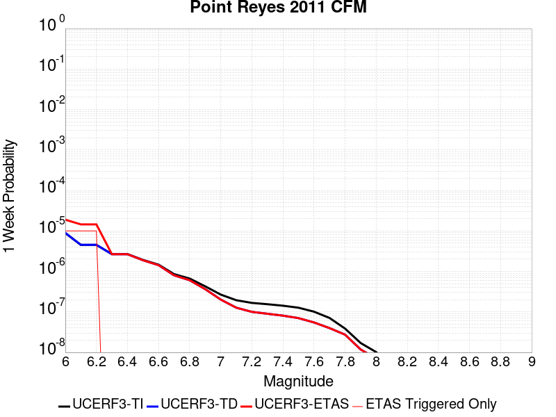 |  |  |  |

| Magnitude | 1 wk TI Prob | 1 wk TD Prob | 1 wk ETAS Prob | 1 wk ETAS/TD Gain | 1 wk ETAS Triggered Only | 1 mo TI Prob | 1 mo TD Prob | 1 mo ETAS Prob | 1 mo ETAS/TD Gain | 1 mo ETAS Triggered Only | 1 yr TI Prob | 1 yr TD Prob | 1 yr ETAS Prob | 1 yr ETAS/TD Gain | 1 yr ETAS Triggered Only | 10 yr TI Prob | 10 yr TD Prob | 10 yr ETAS Prob | 10 yr ETAS/TD Gain | 10 yr ETAS Triggered Only |
|-----|-----|-----|-----|-----|-----|-----|-----|-----|-----|-----|-----|-----|-----|-----|-----|-----|-----|-----|-----|-----|
| 6.0 | 8.8644965E-6 | 8.967163E-6 | 1.8967074E-5 | 2.1151698 | 1.0E-5 | 3.7990147E-5 | 3.843017E-5 | 4.8429785E-5 | 1.2602022 | 1.0E-5 | 4.624319E-4 | 4.6779314E-4 | 4.7778848E-4 | 1.021367 | 1.0E-5 | 0.0046147075 | 0.004668713 | 0.004678666 | 1.0021319 | 1.0E-5 |
| 6.1 | 4.526405E-6 | 4.5392185E-6 | 1.4539173E-5 | 3.2030125 | 1.0E-5 | 1.9398734E-5 | 1.9453653E-5 | 2.945346E-5 | 1.5140322 | 1.0E-5 | 2.36154E-4 | 2.3682354E-4 | 2.4682118E-4 | 1.0422156 | 1.0E-5 | 0.002359032 | 0.0023658178 | 0.002375794 | 1.0042169 | 1.0E-5 |
| 6.2 | 4.526405E-6 | 4.5392185E-6 | 1.4539173E-5 | 3.2030125 | 1.0E-5 | 1.9398734E-5 | 1.9453653E-5 | 2.945346E-5 | 1.5140322 | 1.0E-5 | 2.36154E-4 | 2.3682354E-4 | 2.4682118E-4 | 1.0422156 | 1.0E-5 | 0.002359032 | 0.0023658178 | 0.002375794 | 1.0042169 | 1.0E-5 |
| 6.3 | 2.6842322E-6 | 2.660676E-6 | 2.660676E-6 | 1.0 | 0.0 | 1.1503801E-5 | 1.1402849E-5 | 1.1402849E-5 | 1.0 | 0.0 | 1.4004979E-4 | 1.3882104E-4 | 1.3882104E-4 | 1.0 | 0.0 | 0.0013996155 | 0.0013873649 | 0.0013873649 | 1.0 | 0.0 |
| 6.4 | 2.6842322E-6 | 2.660676E-6 | 2.660676E-6 | 1.0 | 0.0 | 1.1503801E-5 | 1.1402849E-5 | 1.1402849E-5 | 1.0 | 0.0 | 1.4004979E-4 | 1.3882104E-4 | 1.3882104E-4 | 1.0 | 0.0 | 0.0013996155 | 0.0013873649 | 0.0013873649 | 1.0 | 0.0 |
| 6.5 | 1.9281833E-6 | 1.8906262E-6 | 1.8906262E-6 | 1.0 | 0.0 | 8.263617E-6 | 8.102659E-6 | 8.102659E-6 | 1.0 | 0.0 | 1.0060489E-4 | 9.86455E-5 | 9.86455E-5 | 1.0 | 0.0 | 0.0010055936 | 9.860279E-4 | 9.860279E-4 | 1.0 | 0.0 |
| 6.6 | 1.4726726E-6 | 1.4269577E-6 | 1.4269577E-6 | 1.0 | 0.0 | 6.3114385E-6 | 6.1155188E-6 | 6.1155188E-6 | 1.0 | 0.0 | 7.683905E-5 | 7.445395E-5 | 7.445395E-5 | 1.0 | 0.0 | 7.6812494E-4 | 7.4429717E-4 | 7.4429717E-4 | 1.0 | 0.0 |
| 6.7 | 8.572307E-7 | 8.007212E-7 | 8.007212E-7 | 1.0 | 0.0 | 3.6738406E-6 | 3.431658E-6 | 3.431658E-6 | 1.0 | 0.0 | 4.472809E-5 | 4.1779647E-5 | 4.1779647E-5 | 1.0 | 0.0 | 4.471909E-4 | 4.1772184E-4 | 4.1772184E-4 | 1.0 | 0.0 |
| 6.8 | 6.6745434E-7 | 6.0773E-7 | 6.0773E-7 | 1.0 | 0.0 | 2.8605155E-6 | 2.6045543E-6 | 2.6045543E-6 | 1.0 | 0.0 | 3.482622E-5 | 3.171E-5 | 3.171E-5 | 1.0 | 0.0 | 3.4820763E-4 | 3.1705803E-4 | 3.1705803E-4 | 1.0 | 0.0 |
| 6.9 | 4.291521E-7 | 3.6535937E-7 | 3.6535937E-7 | 1.0 | 0.0 | 1.839222E-6 | 1.565825E-6 | 1.565825E-6 | 1.0 | 0.0 | 2.2392298E-5 | 1.9063755E-5 | 1.9063755E-5 | 1.0 | 0.0 | 2.2390042E-4 | 1.9062385E-4 | 1.9062385E-4 | 1.0 | 0.0 |
| 7.0 | 2.6812808E-7 | 2.0187414E-7 | 2.0187414E-7 | 1.0 | 0.0 | 1.1491198E-6 | 8.651746E-7 | 8.651746E-7 | 1.0 | 0.0 | 1.3990444E-5 | 1.0533451E-5 | 1.0533451E-5 | 1.0 | 0.0 | 1.3989564E-4 | 1.0533186E-4 | 1.0533186E-4 | 1.0 | 0.0 |
| 7.1 | 1.9451231E-7 | 1.2725499E-7 | 1.2725499E-7 | 1.0 | 0.0 | 8.336239E-7 | 5.453784E-7 | 5.453784E-7 | 1.0 | 0.0 | 1.0149324E-5 | 6.6399616E-6 | 6.6399616E-6 | 1.0 | 0.0 | 1.014886E-4 | 6.639991E-5 | 6.639991E-5 | 1.0 | 0.0 |
| 7.2 | 1.6715143E-7 | 1.00428394E-7 | 1.00428394E-7 | 1.0 | 0.0 | 7.1636305E-7 | 4.3040734E-7 | 4.3040734E-7 | 1.0 | 0.0 | 8.721685E-6 | 5.2401965E-6 | 5.2401965E-6 | 1.0 | 0.0 | 8.721343E-5 | 5.2402997E-5 | 5.2402997E-5 | 1.0 | 0.0 |
| 7.3 | 1.5503173E-7 | 9.0131024E-8 | 9.0131024E-8 | 1.0 | 0.0 | 6.644215E-7 | 3.8627576E-7 | 3.8627576E-7 | 1.0 | 0.0 | 8.089301E-6 | 4.702897E-6 | 4.702897E-6 | 1.0 | 0.0 | 8.089007E-5 | 4.7030244E-5 | 4.7030244E-5 | 1.0 | 0.0 |
| 7.4 | 1.4251614E-7 | 8.097624E-8 | 8.097624E-8 | 1.0 | 0.0 | 6.1078333E-7 | 3.47041E-7 | 3.47041E-7 | 1.0 | 0.0 | 7.4362615E-6 | 4.225216E-6 | 4.225216E-6 | 1.0 | 0.0 | 7.436013E-5 | 4.2253625E-5 | 4.2253625E-5 | 1.0 | 0.0 |
| 7.5 | 1.2710186E-7 | 7.0296394E-8 | 7.0296394E-8 | 1.0 | 0.0 | 5.447221E-7 | 3.0127023E-7 | 3.0127023E-7 | 1.0 | 0.0 | 6.6319717E-6 | 3.667959E-6 | 3.667959E-6 | 1.0 | 0.0 | 6.6317734E-5 | 3.6681253E-5 | 3.6681253E-5 | 1.0 | 0.0 |
| 7.6 | 1.0144708E-7 | 5.4952274E-8 | 5.4952274E-8 | 1.0 | 0.0 | 4.347731E-7 | 2.3550973E-7 | 2.3550973E-7 | 1.0 | 0.0 | 5.2933497E-6 | 2.8673273E-6 | 2.8673273E-6 | 1.0 | 0.0 | 5.293224E-5 | 2.8675171E-5 | 2.8675171E-5 | 1.0 | 0.0 |
| 7.7 | 7.090527E-8 | 3.98231E-8 | 3.98231E-8 | 1.0 | 0.0 | 3.038797E-7 | 1.7067042E-7 | 1.7067042E-7 | 1.0 | 0.0 | 3.699729E-6 | 2.0779103E-6 | 2.0779103E-6 | 1.0 | 0.0 | 3.6996673E-5 | 2.0781177E-5 | 2.0781177E-5 | 1.0 | 0.0 |
| 7.8 | 3.8712045E-8 | 2.7440025E-8 | 2.7440025E-8 | 1.0 | 0.0 | 1.6590876E-7 | 1.176001E-7 | 1.176001E-7 | 1.0 | 0.0 | 2.0199373E-6 | 1.4317802E-6 | 1.4317802E-6 | 1.0 | 0.0 | 2.0199188E-5 | 1.4319979E-5 | 1.4319979E-5 | 1.0 | 0.0 |
| 7.9 | 1.7068782E-8 | 1.1833354E-8 | 1.1833354E-8 | 1.0 | 0.0 | 7.315192E-8 | 5.0714362E-8 | 5.0714362E-8 | 1.0 | 0.0 | 8.906242E-7 | 6.174472E-7 | 6.174472E-7 | 1.0 | 0.0 | 8.906207E-6 | 6.1767228E-6 | 6.1767228E-6 | 1.0 | 0.0 |
| 8.0 | 1.0172592E-8 | 7.0280843E-9 | 7.0280843E-9 | 1.0 | 0.0 | 4.359682E-8 | 3.0120354E-8 | 3.0120354E-8 | 1.0 | 0.0 | 5.3079117E-7 | 3.6671526E-7 | 3.6671526E-7 | 1.0 | 0.0 | 5.307899E-6 | 3.6694146E-6 | 3.6694146E-6 | 1.0 | 0.0 |
| 8.1 | 3.7861243E-9 | 3.5452439E-9 | 3.5452439E-9 | 1.0 | 0.0 | 1.6226247E-8 | 1.5193901E-8 | 1.5193901E-8 | 1.0 | 0.0 | 1.9755454E-7 | 1.8498575E-7 | 1.8498575E-7 | 1.0 | 0.0 | 1.9755437E-6 | 1.8518531E-6 | 1.8518531E-6 | 1.0 | 0.0 |

## Concord 2011 CFM
*[(top)](#table-of-contents)*

| 1 Week | 1 Month | 1 Year | 10 Year |
|-----|-----|-----|-----|
|  |  | 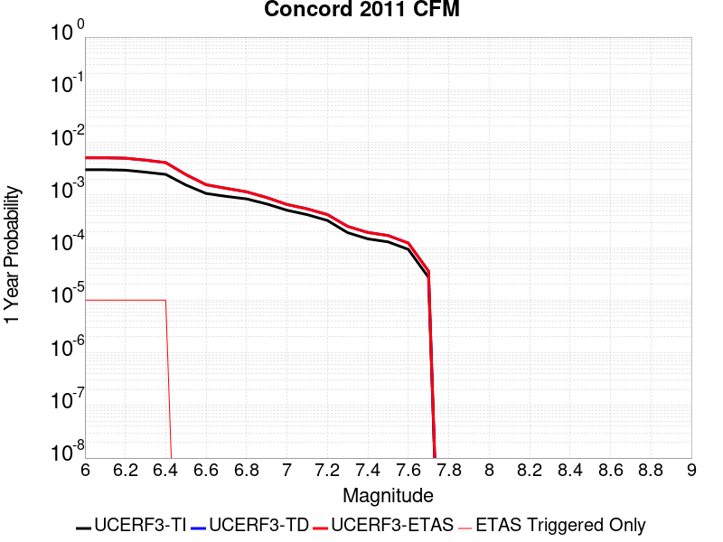 |  |

| Magnitude | 1 wk TI Prob | 1 wk TD Prob | 1 wk ETAS Prob | 1 wk ETAS/TD Gain | 1 wk ETAS Triggered Only | 1 mo TI Prob | 1 mo TD Prob | 1 mo ETAS Prob | 1 mo ETAS/TD Gain | 1 mo ETAS Triggered Only | 1 yr TI Prob | 1 yr TD Prob | 1 yr ETAS Prob | 1 yr ETAS/TD Gain | 1 yr ETAS Triggered Only | 10 yr TI Prob | 10 yr TD Prob | 10 yr ETAS Prob | 10 yr ETAS/TD Gain | 10 yr ETAS Triggered Only |
|-----|-----|-----|-----|-----|-----|-----|-----|-----|-----|-----|-----|-----|-----|-----|-----|-----|-----|-----|-----|-----|
| 6.0 | 5.7865112E-5 | 9.759152E-5 | 1.0759054E-4 | 1.1024579 | 1.0E-5 | 2.4796976E-4 | 4.1818706E-4 | 4.281829E-4 | 1.0239028 | 1.0E-5 | 0.0030148525 | 0.005079467 | 0.005089416 | 1.0019587 | 1.0E-5 | 0.029742775 | 0.049248982 | 0.04925849 | 1.000193 | 1.0E-5 |
| 6.1 | 5.7865112E-5 | 9.759152E-5 | 1.0759054E-4 | 1.1024579 | 1.0E-5 | 2.4796976E-4 | 4.1818706E-4 | 4.281829E-4 | 1.0239028 | 1.0E-5 | 0.0030148525 | 0.005079467 | 0.005089416 | 1.0019587 | 1.0E-5 | 0.029742775 | 0.049248982 | 0.04925849 | 1.000193 | 1.0E-5 |
| 6.2 | 5.6789337E-5 | 9.5795076E-5 | 1.0579412E-4 | 1.1043795 | 1.0E-5 | 2.4336016E-4 | 4.104905E-4 | 4.2048638E-4 | 1.0243511 | 1.0E-5 | 0.0029588845 | 0.0049861916 | 0.0049961414 | 1.0019956 | 1.0E-5 | 0.029197963 | 0.04836556 | 0.048375074 | 1.0001968 | 1.0E-5 |
| 6.3 | 5.203322E-5 | 8.803056E-5 | 9.8029675E-5 | 1.1135869 | 1.0E-5 | 2.2298045E-4 | 3.7722368E-4 | 3.872199E-4 | 1.0264995 | 1.0E-5 | 0.0027114071 | 0.0045838105 | 0.0045937644 | 1.0021716 | 1.0E-5 | 0.026785625 | 0.04453672 | 0.044546273 | 1.0002146 | 1.0E-5 |
| 6.4 | 4.7120942E-5 | 7.897404E-5 | 8.897325E-5 | 1.1266139 | 1.0E-5 | 2.0193127E-4 | 3.3842045E-4 | 3.4841706E-4 | 1.029539 | 1.0E-5 | 0.0024557412 | 0.00411323 | 0.0041231886 | 1.0024211 | 1.0E-5 | 0.024287801 | 0.040065527 | 0.040075127 | 1.0002396 | 1.0E-5 |
| 6.5 | 2.9598437E-5 | 4.667486E-5 | 4.667486E-5 | 1.0 | 0.0 | 1.2684427E-4 | 2.0002096E-4 | 2.0002096E-4 | 1.0 | 0.0 | 0.001543235 | 0.0024327459 | 0.0024327459 | 1.0 | 0.0 | 0.015325619 | 0.023909973 | 0.023909973 | 1.0 | 0.0 |
| 6.6 | 2.0443718E-5 | 2.998433E-5 | 2.998433E-5 | 1.0 | 0.0 | 8.7613E-5 | 1.2849816E-4 | 1.2849816E-4 | 1.0 | 0.0 | 0.0010661662 | 0.0015633785 | 0.0015633785 | 1.0 | 0.0 | 0.010610655 | 0.015466996 | 0.015466996 | 1.0 | 0.0 |
| 6.7 | 1.798539E-5 | 2.5557381E-5 | 2.5557381E-5 | 1.0 | 0.0 | 7.7077966E-5 | 1.0952716E-4 | 1.0952716E-4 | 1.0 | 0.0 | 9.380202E-4 | 0.001332699 | 0.001332699 | 1.0 | 0.0 | 0.009340706 | 0.013217433 | 0.013217433 | 1.0 | 0.0 |
| 6.8 | 1.613555E-5 | 2.1959211E-5 | 2.1959211E-5 | 1.0 | 0.0 | 6.915052E-5 | 9.4107585E-5 | 9.4107585E-5 | 1.0 | 0.0 | 8.4158237E-4 | 0.0011451716 | 0.0011451716 | 1.0 | 0.0 | 0.008384023 | 0.0113782035 | 0.0113782035 | 1.0 | 0.0 |
| 6.9 | 1.2916435E-5 | 1.7081054E-5 | 1.7081054E-5 | 1.0 | 0.0 | 5.5354973E-5 | 7.32025E-5 | 7.32025E-5 | 1.0 | 0.0 | 6.7373837E-4 | 8.908818E-4 | 8.908818E-4 | 1.0 | 0.0 | 0.006716994 | 0.008867139 | 0.008867139 | 1.0 | 0.0 |
| 7.0 | 9.81129E-6 | 1.2630829E-5 | 1.2630829E-5 | 1.0 | 0.0 | 4.2047708E-5 | 5.413101E-5 | 5.413101E-5 | 1.0 | 0.0 | 5.118106E-4 | 6.588474E-4 | 6.588474E-4 | 1.0 | 0.0 | 0.005106334 | 0.006569153 | 0.006569153 | 1.0 | 0.0 |
| 7.1 | 8.0889195E-6 | 1.0418261E-5 | 1.0418261E-5 | 1.0 | 0.0 | 3.4666336E-5 | 4.4648932E-5 | 4.4648932E-5 | 1.0 | 0.0 | 4.219809E-4 | 5.434662E-4 | 5.434662E-4 | 1.0 | 0.0 | 0.004211805 | 0.0054215975 | 0.0054215975 | 1.0 | 0.0 |
| 7.2 | 6.267438E-6 | 8.115699E-6 | 8.115699E-6 | 1.0 | 0.0 | 2.6860173E-5 | 3.4781104E-5 | 3.4781104E-5 | 1.0 | 0.0 | 3.2697353E-4 | 4.233784E-4 | 4.233784E-4 | 1.0 | 0.0 | 0.0032649285 | 0.004225969 | 0.004225969 | 1.0 | 0.0 |
| 7.3 | 3.6761196E-6 | 4.8401653E-6 | 4.8401653E-6 | 1.0 | 0.0 | 1.5754704E-5 | 2.0743402E-5 | 2.0743402E-5 | 1.0 | 0.0 | 1.9179663E-4 | 2.5252186E-4 | 2.5252186E-4 | 1.0 | 0.0 | 0.0019163118 | 0.002522487 | 0.002522487 | 1.0 | 0.0 |
| 7.4 | 2.8044356E-6 | 3.7096036E-6 | 3.7096036E-6 | 1.0 | 0.0 | 1.2018954E-5 | 1.5898204E-5 | 1.5898204E-5 | 1.0 | 0.0 | 1.4632095E-4 | 1.9354356E-4 | 1.9354356E-4 | 1.0 | 0.0 | 0.0014622464 | 0.0019338481 | 0.0019338481 | 1.0 | 0.0 |
| 7.5 | 2.4578699E-6 | 3.2447442E-6 | 3.2447442E-6 | 1.0 | 0.0 | 1.0533685E-5 | 1.3905973E-5 | 1.3905973E-5 | 1.0 | 0.0 | 1.2824008E-4 | 1.6929218E-4 | 1.6929218E-4 | 1.0 | 0.0 | 0.0012816609 | 0.001691713 | 0.001691713 | 1.0 | 0.0 |
| 7.6 | 1.7713267E-6 | 2.3351192E-6 | 2.3351192E-6 | 1.0 | 0.0 | 7.591378E-6 | 1.0007616E-5 | 1.0007616E-5 | 1.0 | 0.0 | 9.2421105E-5 | 1.21836E-4 | 1.21836E-4 | 1.0 | 0.0 | 9.2382677E-4 | 0.0012177454 | 0.0012177454 | 1.0 | 0.0 |
| 7.7 | 5.1912366E-7 | 6.8290143E-7 | 6.8290143E-7 | 1.0 | 0.0 | 2.2248137E-6 | 2.9267171E-6 | 2.9267171E-6 | 1.0 | 0.0 | 2.708677E-5 | 3.5632213E-5 | 3.5632213E-5 | 1.0 | 0.0 | 2.708347E-4 | 3.5627294E-4 | 3.5627294E-4 | 1.0 | 0.0 |

## West Tahoe
*[(top)](#table-of-contents)*

| 1 Week | 1 Month | 1 Year | 10 Year |
|-----|-----|-----|-----|
|  |  |  |  |

| Magnitude | 1 wk TI Prob | 1 wk TD Prob | 1 wk ETAS Prob | 1 wk ETAS/TD Gain | 1 wk ETAS Triggered Only | 1 mo TI Prob | 1 mo TD Prob | 1 mo ETAS Prob | 1 mo ETAS/TD Gain | 1 mo ETAS Triggered Only | 1 yr TI Prob | 1 yr TD Prob | 1 yr ETAS Prob | 1 yr ETAS/TD Gain | 1 yr ETAS Triggered Only | 10 yr TI Prob | 10 yr TD Prob | 10 yr ETAS Prob | 10 yr ETAS/TD Gain | 10 yr ETAS Triggered Only |
|-----|-----|-----|-----|-----|-----|-----|-----|-----|-----|-----|-----|-----|-----|-----|-----|-----|-----|-----|-----|-----|
| 6.0 | 1.952444E-5 | 2.118317E-5 | 2.118317E-5 | 1.0 | 0.0 | 8.367348E-5 | 9.078217E-5 | 9.078217E-5 | 1.0 | 0.0 | 0.0010182485 | 0.0011047672 | 0.0011047672 | 1.0 | 0.0 | 0.010135954 | 0.010998235 | 0.011008126 | 1.0008992 | 1.0E-5 |
| 6.1 | 1.952444E-5 | 2.118317E-5 | 2.118317E-5 | 1.0 | 0.0 | 8.367348E-5 | 9.078217E-5 | 9.078217E-5 | 1.0 | 0.0 | 0.0010182485 | 0.0011047672 | 0.0011047672 | 1.0 | 0.0 | 0.010135954 | 0.010998235 | 0.011008126 | 1.0008992 | 1.0E-5 |
| 6.2 | 1.952444E-5 | 2.118317E-5 | 2.118317E-5 | 1.0 | 0.0 | 8.367348E-5 | 9.078217E-5 | 9.078217E-5 | 1.0 | 0.0 | 0.0010182485 | 0.0011047672 | 0.0011047672 | 1.0 | 0.0 | 0.010135954 | 0.010998235 | 0.011008126 | 1.0008992 | 1.0E-5 |
| 6.3 | 1.952444E-5 | 2.118317E-5 | 2.118317E-5 | 1.0 | 0.0 | 8.367348E-5 | 9.078217E-5 | 9.078217E-5 | 1.0 | 0.0 | 0.0010182485 | 0.0011047672 | 0.0011047672 | 1.0 | 0.0 | 0.010135954 | 0.010998235 | 0.011008126 | 1.0008992 | 1.0E-5 |
| 6.4 | 1.952444E-5 | 2.118317E-5 | 2.118317E-5 | 1.0 | 0.0 | 8.367348E-5 | 9.078217E-5 | 9.078217E-5 | 1.0 | 0.0 | 0.0010182485 | 0.0011047672 | 0.0011047672 | 1.0 | 0.0 | 0.010135954 | 0.010998235 | 0.011008126 | 1.0008992 | 1.0E-5 |
| 6.5 | 1.2685271E-5 | 1.3690627E-5 | 1.3690627E-5 | 1.0 | 0.0 | 5.4364315E-5 | 5.8672893E-5 | 5.8672893E-5 | 1.0 | 0.0 | 6.616845E-4 | 7.141248E-4 | 7.141248E-4 | 1.0 | 0.0 | 0.0065971776 | 0.00711995 | 0.0071298787 | 1.0013945 | 1.0E-5 |
| 6.6 | 1.2685271E-5 | 1.3690627E-5 | 1.3690627E-5 | 1.0 | 0.0 | 5.4364315E-5 | 5.8672893E-5 | 5.8672893E-5 | 1.0 | 0.0 | 6.616845E-4 | 7.141248E-4 | 7.141248E-4 | 1.0 | 0.0 | 0.0065971776 | 0.00711995 | 0.0071298787 | 1.0013945 | 1.0E-5 |
| 6.7 | 9.117886E-6 | 9.809846E-6 | 9.809846E-6 | 1.0 | 0.0 | 3.9076072E-5 | 4.2041564E-5 | 4.2041564E-5 | 1.0 | 0.0 | 4.756473E-4 | 5.11743E-4 | 5.11743E-4 | 1.0 | 0.0 | 0.0047463053 | 0.0051063634 | 0.0051163123 | 1.0019484 | 1.0E-5 |
| 6.8 | 8.786828E-6 | 9.457863E-6 | 9.457863E-6 | 1.0 | 0.0 | 3.7657293E-5 | 4.053311E-5 | 4.053311E-5 | 1.0 | 0.0 | 4.5838108E-4 | 4.933859E-4 | 4.933859E-4 | 1.0 | 0.0 | 0.0045743673 | 0.0049236063 | 0.004933557 | 1.0020211 | 1.0E-5 |
| 6.9 | 6.7562123E-6 | 7.2638086E-6 | 7.2638086E-6 | 1.0 | 0.0 | 2.8954875E-5 | 3.1130265E-5 | 3.1130265E-5 | 1.0 | 0.0 | 3.5246857E-4 | 3.789498E-4 | 3.789498E-4 | 1.0 | 0.0 | 0.0035191004 | 0.0037835082 | 0.0037934703 | 1.0026331 | 1.0E-5 |
| 7.0 | 5.1792854E-6 | 5.567338E-6 | 5.567338E-6 | 1.0 | 0.0 | 2.2196748E-5 | 2.3859824E-5 | 2.3859824E-5 | 1.0 | 0.0 | 2.702119E-4 | 2.9045844E-4 | 2.9045844E-4 | 1.0 | 0.0 | 0.0026988357 | 0.0029011632 | 0.0029011632 | 1.0 | 0.0 |
| 7.1 | 4.090765E-6 | 4.3974223E-6 | 4.3974223E-6 | 1.0 | 0.0 | 1.7531731E-5 | 1.884598E-5 | 1.884598E-5 | 1.0 | 0.0 | 2.134279E-4 | 2.2942905E-4 | 2.2942905E-4 | 1.0 | 0.0 | 0.0021322304 | 0.0022922563 | 0.0022922563 | 1.0 | 0.0 |
| 7.2 | 2.2356758E-6 | 2.4023684E-6 | 2.4023684E-6 | 1.0 | 0.0 | 9.581432E-6 | 1.0295834E-5 | 1.0295834E-5 | 1.0 | 0.0 | 1.1664769E-4 | 1.2534647E-4 | 1.2534647E-4 | 1.0 | 0.0 | 0.0011658648 | 0.0012529434 | 0.0012529434 | 1.0 | 0.0 |

## Burnt Mtn
*[(top)](#table-of-contents)*

| 1 Week | 1 Month | 1 Year | 10 Year |
|-----|-----|-----|-----|
|  |  |  |  |

| Magnitude | 1 wk TI Prob | 1 wk TD Prob | 1 wk ETAS Prob | 1 wk ETAS/TD Gain | 1 wk ETAS Triggered Only | 1 mo TI Prob | 1 mo TD Prob | 1 mo ETAS Prob | 1 mo ETAS/TD Gain | 1 mo ETAS Triggered Only | 1 yr TI Prob | 1 yr TD Prob | 1 yr ETAS Prob | 1 yr ETAS/TD Gain | 1 yr ETAS Triggered Only | 10 yr TI Prob | 10 yr TD Prob | 10 yr ETAS Prob | 10 yr ETAS/TD Gain | 10 yr ETAS Triggered Only |
|-----|-----|-----|-----|-----|-----|-----|-----|-----|-----|-----|-----|-----|-----|-----|-----|-----|-----|-----|-----|-----|
| 6.0 | 1.5673151E-5 | 1.1749407E-5 | 2.1749289E-5 | 1.8510967 | 1.0E-5 | 6.716892E-5 | 5.0354356E-5 | 6.0353854E-5 | 1.1985825 | 1.0E-5 | 8.1747473E-4 | 6.1302073E-4 | 6.2301464E-4 | 1.0163027 | 1.0E-5 | 0.008144741 | 0.006125938 | 0.0061358768 | 1.0016224 | 1.0E-5 |
| 6.1 | 1.5673151E-5 | 1.1749407E-5 | 2.1749289E-5 | 1.8510967 | 1.0E-5 | 6.716892E-5 | 5.0354356E-5 | 6.0353854E-5 | 1.1985825 | 1.0E-5 | 8.1747473E-4 | 6.1302073E-4 | 6.2301464E-4 | 1.0163027 | 1.0E-5 | 0.008144741 | 0.006125938 | 0.0061358768 | 1.0016224 | 1.0E-5 |
| 6.2 | 1.5673151E-5 | 1.1749407E-5 | 2.1749289E-5 | 1.8510967 | 1.0E-5 | 6.716892E-5 | 5.0354356E-5 | 6.0353854E-5 | 1.1985825 | 1.0E-5 | 8.1747473E-4 | 6.1302073E-4 | 6.2301464E-4 | 1.0163027 | 1.0E-5 | 0.008144741 | 0.006125938 | 0.0061358768 | 1.0016224 | 1.0E-5 |
| 6.3 | 1.5673151E-5 | 1.1749407E-5 | 2.1749289E-5 | 1.8510967 | 1.0E-5 | 6.716892E-5 | 5.0354356E-5 | 6.0353854E-5 | 1.1985825 | 1.0E-5 | 8.1747473E-4 | 6.1302073E-4 | 6.2301464E-4 | 1.0163027 | 1.0E-5 | 0.008144741 | 0.006125938 | 0.0061358768 | 1.0016224 | 1.0E-5 |
| 6.4 | 1.5673151E-5 | 1.1749407E-5 | 2.1749289E-5 | 1.8510967 | 1.0E-5 | 6.716892E-5 | 5.0354356E-5 | 6.0353854E-5 | 1.1985825 | 1.0E-5 | 8.1747473E-4 | 6.1302073E-4 | 6.2301464E-4 | 1.0163027 | 1.0E-5 | 0.008144741 | 0.006125938 | 0.0061358768 | 1.0016224 | 1.0E-5 |
| 6.5 | 1.36191375E-5 | 1.0078299E-5 | 2.0078198E-5 | 1.992221 | 1.0E-5 | 5.8366426E-5 | 4.3192707E-5 | 5.3192278E-5 | 1.2315105 | 1.0E-5 | 7.103795E-4 | 5.2587123E-4 | 5.3586595E-4 | 1.019006 | 1.0E-5 | 0.0070811296 | 0.0052587125 | 0.0052686594 | 1.0018916 | 1.0E-5 |

## Northridge
*[(top)](#table-of-contents)*

| 1 Week | 1 Month | 1 Year | 10 Year |
|-----|-----|-----|-----|
|  |  |  |  |

| Magnitude | 1 wk TI Prob | 1 wk TD Prob | 1 wk ETAS Prob | 1 wk ETAS/TD Gain | 1 wk ETAS Triggered Only | 1 mo TI Prob | 1 mo TD Prob | 1 mo ETAS Prob | 1 mo ETAS/TD Gain | 1 mo ETAS Triggered Only | 1 yr TI Prob | 1 yr TD Prob | 1 yr ETAS Prob | 1 yr ETAS/TD Gain | 1 yr ETAS Triggered Only | 10 yr TI Prob | 10 yr TD Prob | 10 yr ETAS Prob | 10 yr ETAS/TD Gain | 10 yr ETAS Triggered Only |
|-----|-----|-----|-----|-----|-----|-----|-----|-----|-----|-----|-----|-----|-----|-----|-----|-----|-----|-----|-----|-----|
| 6.0 | 1.8340852E-5 | 7.5880193E-6 | 7.5880193E-6 | 1.0 | 0.0 | 7.860128E-5 | 3.251969E-5 | 3.251969E-5 | 1.0 | 0.0 | 9.565505E-4 | 3.958575E-4 | 3.958575E-4 | 1.0 | 0.0 | 0.009524435 | 0.003951746 | 0.0039617065 | 1.0025206 | 1.0E-5 |
| 6.1 | 1.8340852E-5 | 7.5880193E-6 | 7.5880193E-6 | 1.0 | 0.0 | 7.860128E-5 | 3.251969E-5 | 3.251969E-5 | 1.0 | 0.0 | 9.565505E-4 | 3.958575E-4 | 3.958575E-4 | 1.0 | 0.0 | 0.009524435 | 0.003951746 | 0.0039617065 | 1.0025206 | 1.0E-5 |
| 6.2 | 1.8340852E-5 | 7.5880193E-6 | 7.5880193E-6 | 1.0 | 0.0 | 7.860128E-5 | 3.251969E-5 | 3.251969E-5 | 1.0 | 0.0 | 9.565505E-4 | 3.958575E-4 | 3.958575E-4 | 1.0 | 0.0 | 0.009524435 | 0.003951746 | 0.0039617065 | 1.0025206 | 1.0E-5 |
| 6.3 | 1.8340852E-5 | 7.5880193E-6 | 7.5880193E-6 | 1.0 | 0.0 | 7.860128E-5 | 3.251969E-5 | 3.251969E-5 | 1.0 | 0.0 | 9.565505E-4 | 3.958575E-4 | 3.958575E-4 | 1.0 | 0.0 | 0.009524435 | 0.003951746 | 0.0039617065 | 1.0025206 | 1.0E-5 |
| 6.4 | 1.7361892E-5 | 7.5880193E-6 | 7.5880193E-6 | 1.0 | 0.0 | 7.440598E-5 | 3.251969E-5 | 3.251969E-5 | 1.0 | 0.0 | 9.055163E-4 | 3.958575E-4 | 3.958575E-4 | 1.0 | 0.0 | 0.009018354 | 0.003951746 | 0.0039617065 | 1.0025206 | 1.0E-5 |
| 6.5 | 1.7361892E-5 | 7.5880193E-6 | 7.5880193E-6 | 1.0 | 0.0 | 7.440598E-5 | 3.251969E-5 | 3.251969E-5 | 1.0 | 0.0 | 9.055163E-4 | 3.958575E-4 | 3.958575E-4 | 1.0 | 0.0 | 0.009018354 | 0.003951746 | 0.0039617065 | 1.0025206 | 1.0E-5 |
| 6.6 | 1.5458201E-5 | 7.5880193E-6 | 7.5880193E-6 | 1.0 | 0.0 | 6.624775E-5 | 3.251969E-5 | 3.251969E-5 | 1.0 | 0.0 | 8.0626784E-4 | 3.958575E-4 | 3.958575E-4 | 1.0 | 0.0 | 0.008033488 | 0.003951746 | 0.0039617065 | 1.0025206 | 1.0E-5 |
| 6.7 | 1.2538368E-5 | 6.381603E-6 | 6.381603E-6 | 1.0 | 0.0 | 5.3734755E-5 | 2.7349442E-5 | 2.7349442E-5 | 1.0 | 0.0 | 6.5402425E-4 | 3.3292902E-4 | 3.3292902E-4 | 1.0 | 0.0 | 0.0065210275 | 0.0033243506 | 0.0033343174 | 1.0029981 | 1.0E-5 |
| 6.8 | 1.1438097E-5 | 6.3502566E-6 | 6.3502566E-6 | 1.0 | 0.0 | 4.9019498E-5 | 2.7215105E-5 | 2.7215105E-5 | 1.0 | 0.0 | 5.9664896E-4 | 3.3129397E-4 | 3.3129397E-4 | 1.0 | 0.0 | 0.005950495 | 0.0033080487 | 0.0033180155 | 1.0030129 | 1.0E-5 |
| 6.9 | 1.1204891E-5 | 6.2867084E-6 | 6.2867084E-6 | 1.0 | 0.0 | 4.8020076E-5 | 2.694276E-5 | 2.694276E-5 | 1.0 | 0.0 | 5.8448757E-4 | 3.2797916E-4 | 3.2797916E-4 | 1.0 | 0.0 | 0.0058295266 | 0.0032749989 | 0.003284966 | 1.0030434 | 1.0E-5 |
| 7.0 | 1.061046E-5 | 6.115359E-6 | 6.115359E-6 | 1.0 | 0.0 | 4.5472607E-5 | 2.6208421E-5 | 2.6208421E-5 | 1.0 | 0.0 | 5.534883E-4 | 3.1904122E-4 | 3.1904122E-4 | 1.0 | 0.0 | 0.0055211177 | 0.0031858785 | 0.0031958467 | 1.0031289 | 1.0E-5 |
| 7.1 | 1.0266979E-5 | 6.004274E-6 | 6.004274E-6 | 1.0 | 0.0 | 4.40006E-5 | 2.5732352E-5 | 2.5732352E-5 | 1.0 | 0.0 | 5.355756E-4 | 3.1324677E-4 | 3.1324677E-4 | 1.0 | 0.0 | 0.0053428668 | 0.003128098 | 0.003138067 | 1.0031868 | 1.0E-5 |
| 7.2 | 9.91273E-6 | 5.819984E-6 | 5.819984E-6 | 1.0 | 0.0 | 4.248244E-5 | 2.4942554E-5 | 2.4942554E-5 | 1.0 | 0.0 | 5.171009E-4 | 3.036337E-4 | 3.036337E-4 | 1.0 | 0.0 | 0.0051589934 | 0.0030322333 | 0.0030422031 | 1.0032879 | 1.0E-5 |
| 7.3 | 8.4959265E-6 | 5.193062E-6 | 5.193062E-6 | 1.0 | 0.0 | 3.6410605E-5 | 2.225579E-5 | 2.225579E-5 | 1.0 | 0.0 | 4.4320893E-4 | 2.709308E-4 | 2.709308E-4 | 1.0 | 0.0 | 0.00442326 | 0.0027060313 | 0.0027160044 | 1.0036855 | 1.0E-5 |
| 7.4 | 8.0847185E-6 | 4.9819355E-6 | 4.9819355E-6 | 1.0 | 0.0 | 3.4648332E-5 | 2.135098E-5 | 2.135098E-5 | 1.0 | 0.0 | 4.2176177E-4 | 2.599174E-4 | 2.599174E-4 | 1.0 | 0.0 | 0.0042096223 | 0.00259616 | 0.002606134 | 1.0038419 | 1.0E-5 |
| 7.5 | 6.8220684E-6 | 4.2533075E-6 | 4.2533075E-6 | 1.0 | 0.0 | 2.9237108E-5 | 1.8228335E-5 | 1.8228335E-5 | 1.0 | 0.0 | 3.5590364E-4 | 2.2190758E-4 | 2.2190758E-4 | 1.0 | 0.0 | 0.0035533418 | 0.002216881 | 0.0022268586 | 1.0045009 | 1.0E-5 |
| 7.6 | 4.4224143E-6 | 2.8999582E-6 | 2.8999582E-6 | 1.0 | 0.0 | 1.8953066E-5 | 1.2428334E-5 | 1.2428334E-5 | 1.0 | 0.0 | 2.3072914E-4 | 1.5130457E-4 | 1.5130457E-4 | 1.0 | 0.0 | 0.0023048974 | 0.0015120271 | 0.0015120271 | 1.0 | 0.0 |
| 7.7 | 2.5297056E-6 | 1.6045905E-6 | 1.6045905E-6 | 1.0 | 0.0 | 1.0841551E-5 | 6.8767986E-6 | 6.8767986E-6 | 1.0 | 0.0 | 1.319879E-4 | 8.3721854E-5 | 8.3721854E-5 | 1.0 | 0.0 | 0.0013190953 | 8.369078E-4 | 8.369078E-4 | 1.0 | 0.0 |
| 7.8 | 1.2508156E-6 | 8.780076E-7 | 8.780076E-7 | 1.0 | 0.0 | 5.3606273E-6 | 3.7628845E-6 | 3.7628845E-6 | 1.0 | 0.0 | 6.526368E-5 | 4.581217E-5 | 4.581217E-5 | 1.0 | 0.0 | 6.524452E-4 | 4.5802852E-4 | 4.5802852E-4 | 1.0 | 0.0 |
| 7.9 | 2.262199E-7 | 1.4664671E-7 | 1.4664671E-7 | 1.0 | 0.0 | 9.695135E-7 | 6.284858E-7 | 6.284858E-7 | 1.0 | 0.0 | 1.1803763E-5 | 7.651788E-6 | 7.651788E-6 | 1.0 | 0.0 | 1.1803136E-4 | 7.651533E-5 | 7.651533E-5 | 1.0 | 0.0 |
| 8.0 | 2.865362E-9 | 1.2753101E-9 | 1.2753101E-9 | 1.0 | 0.0 | 1.2280123E-8 | 5.4656146E-9 | 5.4656146E-9 | 1.0 | 0.0 | 1.4951048E-7 | 6.654386E-8 | 6.654386E-8 | 1.0 | 0.0 | 1.4951038E-6 | 6.654386E-7 | 6.654386E-7 | 1.0 | 0.0 |

## Greenville (So) 2011 CFM
*[(top)](#table-of-contents)*

| 1 Week | 1 Month | 1 Year | 10 Year |
|-----|-----|-----|-----|
|  | 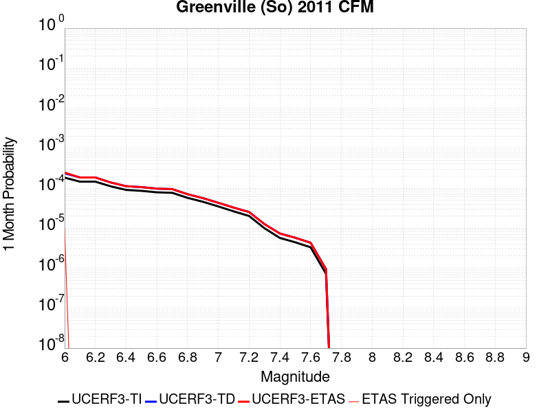 |  |  |

| Magnitude | 1 wk TI Prob | 1 wk TD Prob | 1 wk ETAS Prob | 1 wk ETAS/TD Gain | 1 wk ETAS Triggered Only | 1 mo TI Prob | 1 mo TD Prob | 1 mo ETAS Prob | 1 mo ETAS/TD Gain | 1 mo ETAS Triggered Only | 1 yr TI Prob | 1 yr TD Prob | 1 yr ETAS Prob | 1 yr ETAS/TD Gain | 1 yr ETAS Triggered Only | 10 yr TI Prob | 10 yr TD Prob | 10 yr ETAS Prob | 10 yr ETAS/TD Gain | 10 yr ETAS Triggered Only |
|-----|-----|-----|-----|-----|-----|-----|-----|-----|-----|-----|-----|-----|-----|-----|-----|-----|-----|-----|-----|-----|
| 6.0 | 4.279693E-5 | 5.5040087E-5 | 5.5040087E-5 | 1.0 | 0.0 | 1.8340252E-4 | 2.3586681E-4 | 2.4586444E-4 | 1.0423868 | 1.0E-5 | 0.0022306389 | 0.0028682416 | 0.0028782128 | 1.0034765 | 1.0E-5 | 0.022083808 | 0.028338138 | 0.028347854 | 1.0003428 | 1.0E-5 |
| 6.1 | 3.4037297E-5 | 4.3192387E-5 | 4.3192387E-5 | 1.0 | 0.0 | 1.4586597E-4 | 1.8509831E-4 | 1.8509831E-4 | 1.0 | 0.0 | 0.0017744715 | 0.0022514379 | 0.0022514379 | 1.0 | 0.0 | 0.01760369 | 0.022302566 | 0.022302566 | 1.0 | 0.0 |
| 6.2 | 3.4037297E-5 | 4.3192387E-5 | 4.3192387E-5 | 1.0 | 0.0 | 1.4586597E-4 | 1.8509831E-4 | 1.8509831E-4 | 1.0 | 0.0 | 0.0017744715 | 0.0022514379 | 0.0022514379 | 1.0 | 0.0 | 0.01760369 | 0.022302566 | 0.022302566 | 1.0 | 0.0 |
| 6.3 | 2.5956324E-5 | 3.2428903E-5 | 3.2428903E-5 | 1.0 | 0.0 | 1.11236644E-4 | 1.3897405E-4 | 1.3897405E-4 | 1.0 | 0.0 | 0.0013534647 | 0.0016907708 | 0.0016907708 | 1.0 | 0.0 | 0.013452509 | 0.016785882 | 0.016785882 | 1.0 | 0.0 |
| 6.4 | 2.1145053E-5 | 2.6197677E-5 | 2.6197677E-5 | 1.0 | 0.0 | 9.061851E-5 | 1.1227112E-4 | 1.1227112E-4 | 1.0 | 0.0 | 0.0011027219 | 0.0013660751 | 0.0013660751 | 1.0 | 0.0 | 0.01097266 | 0.01358018 | 0.01358018 | 1.0 | 0.0 |
| 6.5 | 2.0030959E-5 | 2.479578E-5 | 2.479578E-5 | 1.0 | 0.0 | 8.584414E-5 | 1.06263484E-4 | 1.06263484E-4 | 1.0 | 0.0 | 0.0010446513 | 0.0012930221 | 0.0012930221 | 1.0 | 0.0 | 0.010397541 | 0.012858339 | 0.012858339 | 1.0 | 0.0 |
| 6.6 | 1.8395405E-5 | 2.2754466E-5 | 2.2754466E-5 | 1.0 | 0.0 | 7.8835066E-5 | 9.751565E-5 | 9.751565E-5 | 1.0 | 0.0 | 9.5939427E-4 | 0.0011866348 | 0.0011866348 | 1.0 | 0.0 | 0.009552629 | 0.011806041 | 0.011806041 | 1.0 | 0.0 |
| 6.7 | 1.7883482E-5 | 2.212551E-5 | 2.212551E-5 | 1.0 | 0.0 | 7.664124E-5 | 9.482033E-5 | 9.482033E-5 | 1.0 | 0.0 | 9.3270757E-4 | 0.0011538545 | 0.0011538545 | 1.0 | 0.0 | 0.009288026 | 0.011481688 | 0.011481688 | 1.0 | 0.0 |
| 6.8 | 1.3373564E-5 | 1.6505966E-5 | 1.6505966E-5 | 1.0 | 0.0 | 5.7314013E-5 | 7.073802E-5 | 7.073802E-5 | 1.0 | 0.0 | 6.975747E-4 | 8.609098E-4 | 8.609098E-4 | 1.0 | 0.0 | 0.0069538904 | 0.008577357 | 0.008577357 | 1.0 | 0.0 |
| 6.9 | 1.06692905E-5 | 1.3152582E-5 | 1.3152582E-5 | 1.0 | 0.0 | 4.5724726E-5 | 5.6367055E-5 | 5.6367055E-5 | 1.0 | 0.0 | 5.5655633E-4 | 6.86064E-4 | 6.86064E-4 | 1.0 | 0.0 | 0.005551645 | 0.006840693 | 0.006840693 | 1.0 | 0.0 |
| 7.0 | 8.157512E-6 | 1.0062639E-5 | 1.0062639E-5 | 1.0 | 0.0 | 3.4960296E-5 | 4.3124903E-5 | 4.3124903E-5 | 1.0 | 0.0 | 4.2555845E-4 | 5.2492286E-4 | 5.2492286E-4 | 1.0 | 0.0 | 0.004247444 | 0.0052373074 | 0.0052373074 | 1.0 | 0.0 |
| 7.1 | 6.1467113E-6 | 7.6274314E-6 | 7.6274314E-6 | 1.0 | 0.0 | 2.6342783E-5 | 3.268859E-5 | 3.268859E-5 | 1.0 | 0.0 | 3.206762E-4 | 3.9791173E-4 | 3.9791173E-4 | 1.0 | 0.0 | 0.0032021382 | 0.0039721807 | 0.0039721807 | 1.0 | 0.0 |
| 7.2 | 4.713467E-6 | 5.9141557E-6 | 5.9141557E-6 | 1.0 | 0.0 | 2.0200418E-5 | 2.5346139E-5 | 2.5346139E-5 | 1.0 | 0.0 | 2.4591232E-4 | 3.0854615E-4 | 3.0854615E-4 | 1.0 | 0.0 | 0.0024564038 | 0.0030813308 | 0.0030813308 | 1.0 | 0.0 |
| 7.3 | 2.3266216E-6 | 2.954009E-6 | 2.954009E-6 | 1.0 | 0.0 | 9.971197E-6 | 1.2659978E-5 | 1.2659978E-5 | 1.0 | 0.0 | 1.2139256E-4 | 1.5412449E-4 | 1.5412449E-4 | 1.0 | 0.0 | 0.0012132627 | 0.0015402455 | 0.0015402455 | 1.0 | 0.0 |
| 7.4 | 1.3314E-6 | 1.7179472E-6 | 1.7179472E-6 | 1.0 | 0.0 | 5.7059874E-6 | 7.36261E-6 | 7.36261E-6 | 1.0 | 0.0 | 6.946818E-5 | 8.963614E-5 | 8.963614E-5 | 1.0 | 0.0 | 6.9446466E-4 | 8.9603866E-4 | 8.9603866E-4 | 1.0 | 0.0 |
| 7.5 | 1.0362941E-6 | 1.3468821E-6 | 1.3468821E-6 | 1.0 | 0.0 | 4.4412527E-6 | 5.772339E-6 | 5.772339E-6 | 1.0 | 0.0 | 5.407091E-5 | 7.027601E-5 | 7.027601E-5 | 1.0 | 0.0 | 5.405776E-4 | 7.025681E-4 | 7.025681E-4 | 1.0 | 0.0 |
| 7.6 | 7.764784E-7 | 1.0088593E-6 | 1.0088593E-6 | 1.0 | 0.0 | 3.3277602E-6 | 4.323676E-6 | 4.323676E-6 | 1.0 | 0.0 | 4.0514726E-5 | 5.263952E-5 | 5.263952E-5 | 1.0 | 0.0 | 4.050734E-4 | 5.262919E-4 | 5.262919E-4 | 1.0 | 0.0 |
| 7.7 | 1.6927763E-7 | 2.2139248E-7 | 2.2139248E-7 | 1.0 | 0.0 | 7.2547533E-7 | 9.4882455E-7 | 9.4882455E-7 | 1.0 | 0.0 | 8.832627E-6 | 1.15518815E-5 | 1.15518815E-5 | 1.0 | 0.0 | 8.8322755E-5 | 1.15515526E-4 | 1.15515526E-4 | 1.0 | 0.0 |

## Hartley Springs 2011 CFM
*[(top)](#table-of-contents)*

| 1 Week | 1 Month | 1 Year | 10 Year |
|-----|-----|-----|-----|
|  |  |  |  |

| Magnitude | 1 wk TI Prob | 1 wk TD Prob | 1 wk ETAS Prob | 1 wk ETAS/TD Gain | 1 wk ETAS Triggered Only | 1 mo TI Prob | 1 mo TD Prob | 1 mo ETAS Prob | 1 mo ETAS/TD Gain | 1 mo ETAS Triggered Only | 1 yr TI Prob | 1 yr TD Prob | 1 yr ETAS Prob | 1 yr ETAS/TD Gain | 1 yr ETAS Triggered Only | 10 yr TI Prob | 10 yr TD Prob | 10 yr ETAS Prob | 10 yr ETAS/TD Gain | 10 yr ETAS Triggered Only |
|-----|-----|-----|-----|-----|-----|-----|-----|-----|-----|-----|-----|-----|-----|-----|-----|-----|-----|-----|-----|-----|
| 6.0 | 1.4352418E-5 | 1.4434182E-5 | 2.4434037E-5 | 1.6927899 | 1.0E-5 | 6.1508916E-5 | 6.1860235E-5 | 7.185962E-5 | 1.1616447 | 1.0E-5 | 7.486137E-4 | 7.5305253E-4 | 7.63045E-4 | 1.0132693 | 1.0E-5 | 0.007460968 | 0.0075211283 | 0.0075310534 | 1.0013196 | 1.0E-5 |
| 6.1 | 1.4352418E-5 | 1.4434182E-5 | 2.4434037E-5 | 1.6927899 | 1.0E-5 | 6.1508916E-5 | 6.1860235E-5 | 7.185962E-5 | 1.1616447 | 1.0E-5 | 7.486137E-4 | 7.5305253E-4 | 7.63045E-4 | 1.0132693 | 1.0E-5 | 0.007460968 | 0.0075211283 | 0.0075310534 | 1.0013196 | 1.0E-5 |
| 6.2 | 1.4352418E-5 | 1.4434182E-5 | 2.4434037E-5 | 1.6927899 | 1.0E-5 | 6.1508916E-5 | 6.1860235E-5 | 7.185962E-5 | 1.1616447 | 1.0E-5 | 7.486137E-4 | 7.5305253E-4 | 7.63045E-4 | 1.0132693 | 1.0E-5 | 0.007460968 | 0.0075211283 | 0.0075310534 | 1.0013196 | 1.0E-5 |
| 6.3 | 1.4352418E-5 | 1.4434182E-5 | 2.4434037E-5 | 1.6927899 | 1.0E-5 | 6.1508916E-5 | 6.1860235E-5 | 7.185962E-5 | 1.1616447 | 1.0E-5 | 7.486137E-4 | 7.5305253E-4 | 7.63045E-4 | 1.0132693 | 1.0E-5 | 0.007460968 | 0.0075211283 | 0.0075310534 | 1.0013196 | 1.0E-5 |
| 6.4 | 1.4352418E-5 | 1.4434182E-5 | 2.4434037E-5 | 1.6927899 | 1.0E-5 | 6.1508916E-5 | 6.1860235E-5 | 7.185962E-5 | 1.1616447 | 1.0E-5 | 7.486137E-4 | 7.5305253E-4 | 7.63045E-4 | 1.0132693 | 1.0E-5 | 0.007460968 | 0.0075211283 | 0.0075310534 | 1.0013196 | 1.0E-5 |
| 6.5 | 1.2279858E-5 | 1.2133106E-5 | 2.2132985E-5 | 1.8241813 | 1.0E-5 | 5.26269E-5 | 5.1998883E-5 | 6.199836E-5 | 1.1923019 | 1.0E-5 | 6.4054417E-4 | 6.3306064E-4 | 6.430543E-4 | 1.0157863 | 1.0E-5 | 0.0063870098 | 0.006328085 | 0.0063380217 | 1.0015702 | 1.0E-5 |
| 6.6 | 1.2279858E-5 | 1.2133106E-5 | 2.2132985E-5 | 1.8241813 | 1.0E-5 | 5.26269E-5 | 5.1998883E-5 | 6.199836E-5 | 1.1923019 | 1.0E-5 | 6.4054417E-4 | 6.3306064E-4 | 6.430543E-4 | 1.0157863 | 1.0E-5 | 0.0063870098 | 0.006328085 | 0.0063380217 | 1.0015702 | 1.0E-5 |
| 6.7 | 2.1282601E-6 | 8.8948315E-7 | 8.8948315E-7 | 1.0 | 0.0 | 9.121083E-6 | 3.8120663E-6 | 3.8120663E-6 | 1.0 | 0.0 | 1.11043526E-4 | 4.641118E-5 | 4.641118E-5 | 1.0 | 0.0 | 0.0011098806 | 4.6404017E-4 | 4.6404017E-4 | 1.0 | 0.0 |
| 6.8 | 2.00516E-6 | 8.517597E-7 | 8.517597E-7 | 1.0 | 0.0 | 8.593515E-6 | 3.650395E-6 | 3.650395E-6 | 1.0 | 0.0 | 1.04621024E-4 | 4.444291E-5 | 4.444291E-5 | 1.0 | 0.0 | 0.0010457177 | 4.4436535E-4 | 4.4436535E-4 | 1.0 | 0.0 |
| 6.9 | 2.00516E-6 | 8.517597E-7 | 8.517597E-7 | 1.0 | 0.0 | 8.593515E-6 | 3.650395E-6 | 3.650395E-6 | 1.0 | 0.0 | 1.04621024E-4 | 4.444291E-5 | 4.444291E-5 | 1.0 | 0.0 | 0.0010457177 | 4.4436535E-4 | 4.4436535E-4 | 1.0 | 0.0 |
| 7.0 | 1.8366732E-6 | 8.237307E-7 | 8.237307E-7 | 1.0 | 0.0 | 7.871433E-6 | 3.5302712E-6 | 3.5302712E-6 | 1.0 | 0.0 | 9.583048E-5 | 4.298046E-5 | 4.298046E-5 | 1.0 | 0.0 | 9.5789164E-4 | 4.2974652E-4 | 4.2974652E-4 | 1.0 | 0.0 |
| 7.1 | 1.5097997E-6 | 7.1902616E-7 | 7.1902616E-7 | 1.0 | 0.0 | 6.470554E-6 | 3.0815384E-6 | 3.0815384E-6 | 1.0 | 0.0 | 7.877615E-5 | 3.7517326E-5 | 3.7517326E-5 | 1.0 | 0.0 | 7.874823E-4 | 3.7513362E-4 | 3.7513362E-4 | 1.0 | 0.0 |
| 7.2 | 1.3490993E-6 | 6.405254E-7 | 6.405254E-7 | 1.0 | 0.0 | 5.7818415E-6 | 2.7451074E-6 | 2.7451074E-6 | 1.0 | 0.0 | 7.0391645E-5 | 3.3421402E-5 | 3.3421402E-5 | 1.0 | 0.0 | 7.0369354E-4 | 3.341867E-4 | 3.341867E-4 | 1.0 | 0.0 |
| 7.3 | 7.900015E-7 | 4.0889498E-7 | 4.0889498E-7 | 1.0 | 0.0 | 3.3857161E-6 | 1.752407E-6 | 1.752407E-6 | 1.0 | 0.0 | 4.1220315E-5 | 2.1335554E-5 | 2.1335554E-5 | 1.0 | 0.0 | 4.121267E-4 | 2.1335555E-4 | 2.1335555E-4 | 1.0 | 0.0 |

## Reliz 2011 CFM
*[(top)](#table-of-contents)*

| 1 Week | 1 Month | 1 Year | 10 Year |
|-----|-----|-----|-----|
|  |  |  |  |

| Magnitude | 1 wk TI Prob | 1 wk TD Prob | 1 wk ETAS Prob | 1 wk ETAS/TD Gain | 1 wk ETAS Triggered Only | 1 mo TI Prob | 1 mo TD Prob | 1 mo ETAS Prob | 1 mo ETAS/TD Gain | 1 mo ETAS Triggered Only | 1 yr TI Prob | 1 yr TD Prob | 1 yr ETAS Prob | 1 yr ETAS/TD Gain | 1 yr ETAS Triggered Only | 10 yr TI Prob | 10 yr TD Prob | 10 yr ETAS Prob | 10 yr ETAS/TD Gain | 10 yr ETAS Triggered Only |
|-----|-----|-----|-----|-----|-----|-----|-----|-----|-----|-----|-----|-----|-----|-----|-----|-----|-----|-----|-----|-----|
| 6.0 | 1.6002472E-5 | 1.6282804E-5 | 1.6282804E-5 | 1.0 | 0.0 | 6.8580215E-5 | 6.9781694E-5 | 6.9781694E-5 | 1.0 | 0.0 | 8.3464425E-4 | 8.4928074E-4 | 8.4928074E-4 | 1.0 | 0.0 | 0.008315164 | 0.008462547 | 0.008472463 | 1.0011717 | 1.0E-5 |
| 6.1 | 1.6002472E-5 | 1.6282804E-5 | 1.6282804E-5 | 1.0 | 0.0 | 6.8580215E-5 | 6.9781694E-5 | 6.9781694E-5 | 1.0 | 0.0 | 8.3464425E-4 | 8.4928074E-4 | 8.4928074E-4 | 1.0 | 0.0 | 0.008315164 | 0.008462547 | 0.008472463 | 1.0011717 | 1.0E-5 |
| 6.2 | 1.6002472E-5 | 1.6282804E-5 | 1.6282804E-5 | 1.0 | 0.0 | 6.8580215E-5 | 6.9781694E-5 | 6.9781694E-5 | 1.0 | 0.0 | 8.3464425E-4 | 8.4928074E-4 | 8.4928074E-4 | 1.0 | 0.0 | 0.008315164 | 0.008462547 | 0.008472463 | 1.0011717 | 1.0E-5 |
| 6.3 | 7.792404E-6 | 7.803802E-6 | 7.803802E-6 | 1.0 | 0.0 | 3.339559E-5 | 3.344444E-5 | 3.344444E-5 | 1.0 | 0.0 | 4.0651546E-4 | 4.0711078E-4 | 4.0711078E-4 | 1.0 | 0.0 | 0.0040577264 | 0.004063926 | 0.004063926 | 1.0 | 0.0 |
| 6.4 | 7.792404E-6 | 7.803802E-6 | 7.803802E-6 | 1.0 | 0.0 | 3.339559E-5 | 3.344444E-5 | 3.344444E-5 | 1.0 | 0.0 | 4.0651546E-4 | 4.0711078E-4 | 4.0711078E-4 | 1.0 | 0.0 | 0.0040577264 | 0.004063926 | 0.004063926 | 1.0 | 0.0 |
| 6.5 | 5.9659374E-6 | 5.928738E-6 | 5.928738E-6 | 1.0 | 0.0 | 2.5568053E-5 | 2.5408632E-5 | 2.5408632E-5 | 1.0 | 0.0 | 3.1124658E-4 | 3.093064E-4 | 3.093064E-4 | 1.0 | 0.0 | 0.00310811 | 0.0030889767 | 0.0030889767 | 1.0 | 0.0 |
| 6.6 | 5.2350692E-6 | 5.178986E-6 | 5.178986E-6 | 1.0 | 0.0 | 2.2435817E-5 | 2.2195467E-5 | 2.2195467E-5 | 1.0 | 0.0 | 2.7312184E-4 | 2.7019644E-4 | 2.7019644E-4 | 1.0 | 0.0 | 0.002727864 | 0.0026988892 | 0.0026988892 | 1.0 | 0.0 |
| 6.7 | 4.580206E-6 | 4.5061206E-6 | 4.5061206E-6 | 1.0 | 0.0 | 1.9629308E-5 | 1.9311801E-5 | 1.9311801E-5 | 1.0 | 0.0 | 2.389606E-4 | 2.350959E-4 | 2.350959E-4 | 1.0 | 0.0 | 0.002387038 | 0.0023486738 | 0.0023486738 | 1.0 | 0.0 |
| 6.8 | 4.0765017E-6 | 3.9882384E-6 | 3.9882384E-6 | 1.0 | 0.0 | 1.7470604E-5 | 1.7092338E-5 | 1.7092338E-5 | 1.0 | 0.0 | 2.1268385E-4 | 2.0807938E-4 | 2.0807938E-4 | 1.0 | 0.0 | 0.002124804 | 0.0020790435 | 0.0020790435 | 1.0 | 0.0 |
| 6.9 | 3.5752896E-6 | 3.4725176E-6 | 3.4725176E-6 | 1.0 | 0.0 | 1.532258E-5 | 1.4882134E-5 | 1.4882134E-5 | 1.0 | 0.0 | 1.8653645E-4 | 1.8117494E-4 | 1.8117494E-4 | 1.0 | 0.0 | 0.0018637994 | 0.0018104686 | 0.0018104686 | 1.0 | 0.0 |
| 7.0 | 3.0259848E-6 | 2.9079417E-6 | 2.9079417E-6 | 1.0 | 0.0 | 1.2968442E-5 | 1.2462548E-5 | 1.2462548E-5 | 1.0 | 0.0 | 1.5787935E-4 | 1.5172097E-4 | 1.5172097E-4 | 1.0 | 0.0 | 0.0015776722 | 0.001516369 | 0.001516369 | 1.0 | 0.0 |
| 7.1 | 2.5861116E-6 | 2.455167E-6 | 2.455167E-6 | 1.0 | 0.0 | 1.1083288E-5 | 1.05221025E-5 | 1.05221025E-5 | 1.0 | 0.0 | 1.3493067E-4 | 1.2809907E-4 | 1.2809907E-4 | 1.0 | 0.0 | 0.0013484878 | 0.001280447 | 0.001280447 | 1.0 | 0.0 |
| 7.2 | 2.1482588E-6 | 2.003237E-6 | 2.003237E-6 | 1.0 | 0.0 | 9.20679E-6 | 8.585273E-6 | 8.585273E-6 | 1.0 | 0.0 | 1.12086906E-4 | 1.0452068E-4 | 1.0452068E-4 | 1.0 | 0.0 | 0.0011203039 | 0.0010449095 | 0.0010449095 | 1.0 | 0.0 |
| 7.3 | 1.7194744E-6 | 1.5611241E-6 | 1.5611241E-6 | 1.0 | 0.0 | 7.3691554E-6 | 6.690515E-6 | 6.690515E-6 | 1.0 | 0.0 | 8.971577E-5 | 8.1453974E-5 | 8.1453974E-5 | 1.0 | 0.0 | 8.967956E-4 | 8.1443513E-4 | 8.1443513E-4 | 1.0 | 0.0 |
| 7.4 | 1.2755178E-6 | 1.10563E-6 | 1.10563E-6 | 1.0 | 0.0 | 5.4664933E-6 | 4.7384056E-6 | 4.7384056E-6 | 1.0 | 0.0 | 6.655252E-5 | 5.768856E-5 | 5.768856E-5 | 1.0 | 0.0 | 6.6532596E-4 | 5.7692965E-4 | 5.7692965E-4 | 1.0 | 0.0 |
| 7.5 | 8.8463224E-7 | 7.0580273E-7 | 7.0580273E-7 | 1.0 | 0.0 | 3.7912755E-6 | 3.0248652E-6 | 3.0248652E-6 | 1.0 | 0.0 | 4.6157802E-5 | 3.6827114E-5 | 3.6827114E-5 | 1.0 | 0.0 | 4.6148215E-4 | 3.684038E-4 | 3.684038E-4 | 1.0 | 0.0 |
| 7.6 | 5.291355E-7 | 3.500777E-7 | 3.500777E-7 | 1.0 | 0.0 | 2.2677216E-6 | 1.5003321E-6 | 1.5003321E-6 | 1.0 | 0.0 | 2.760916E-5 | 1.8266392E-5 | 1.8266392E-5 | 1.0 | 0.0 | 2.760573E-4 | 1.8284164E-4 | 1.8284164E-4 | 1.0 | 0.0 |
| 7.7 | 2.9663357E-7 | 1.351113E-7 | 1.351113E-7 | 1.0 | 0.0 | 1.2712861E-6 | 5.7904833E-7 | 5.7904833E-7 | 1.0 | 0.0 | 1.5477797E-5 | 7.049891E-6 | 7.049891E-6 | 1.0 | 0.0 | 1.547672E-4 | 7.068132E-5 | 7.068132E-5 | 1.0 | 0.0 |
| 7.8 | 1.2509386E-7 | 2.7157126E-8 | 2.7157126E-8 | 1.0 | 0.0 | 5.3611643E-7 | 1.1638769E-7 | 1.1638769E-7 | 1.0 | 0.0 | 6.527198E-6 | 1.4170191E-6 | 1.4170191E-6 | 1.0 | 0.0 | 6.527006E-5 | 1.4326506E-5 | 1.4326506E-5 | 1.0 | 0.0 |
| 7.9 | 6.213493E-8 | 1.1482114E-8 | 1.1482114E-8 | 1.0 | 0.0 | 2.6629255E-7 | 4.920906E-8 | 4.920906E-8 | 1.0 | 0.0 | 3.242107E-6 | 5.9912014E-7 | 5.9912014E-7 | 1.0 | 0.0 | 3.2420594E-5 | 6.1224223E-6 | 6.1224223E-6 | 1.0 | 0.0 |
| 8.0 | 5.92383E-9 | 1.677887E-9 | 1.677887E-9 | 1.0 | 0.0 | 2.5387841E-8 | 7.190944E-9 | 7.190944E-9 | 1.0 | 0.0 | 3.0909692E-7 | 8.754974E-8 | 8.754974E-8 | 1.0 | 0.0 | 3.090965E-6 | 9.003061E-7 | 9.003061E-7 | 1.0 | 0.0 |

## Great Valley 01
*[(top)](#table-of-contents)*

| 1 Week | 1 Month | 1 Year | 10 Year |
|-----|-----|-----|-----|
|  |  |  |  |

| Magnitude | 1 wk TI Prob | 1 wk TD Prob | 1 wk ETAS Prob | 1 wk ETAS/TD Gain | 1 wk ETAS Triggered Only | 1 mo TI Prob | 1 mo TD Prob | 1 mo ETAS Prob | 1 mo ETAS/TD Gain | 1 mo ETAS Triggered Only | 1 yr TI Prob | 1 yr TD Prob | 1 yr ETAS Prob | 1 yr ETAS/TD Gain | 1 yr ETAS Triggered Only | 10 yr TI Prob | 10 yr TD Prob | 10 yr ETAS Prob | 10 yr ETAS/TD Gain | 10 yr ETAS Triggered Only |
|-----|-----|-----|-----|-----|-----|-----|-----|-----|-----|-----|-----|-----|-----|-----|-----|-----|-----|-----|-----|-----|
| 6.0 | 3.3398478E-6 | 3.3762976E-6 | 1.3376264E-5 | 3.9618142 | 1.0E-5 | 1.4313555E-5 | 1.4469774E-5 | 2.446963E-5 | 1.6910858 | 1.0E-5 | 1.742536E-4 | 1.7615648E-4 | 1.8615472E-4 | 1.0567577 | 1.0E-5 | 0.0017411702 | 0.0017602886 | 0.001770271 | 1.0056709 | 1.0E-5 |
| 6.1 | 1.7919616E-6 | 1.8120251E-6 | 1.1812007E-5 | 6.518677 | 1.0E-5 | 7.679812E-6 | 7.7658E-6 | 1.7765722E-5 | 2.2876873 | 1.0E-5 | 9.349771E-5 | 9.454471E-5 | 1.0454376E-4 | 1.1057601 | 1.0E-5 | 9.345838E-4 | 9.4506424E-4 | 9.550548E-4 | 1.0105712 | 1.0E-5 |
| 6.2 | 1.7919616E-6 | 1.8120251E-6 | 1.1812007E-5 | 6.518677 | 1.0E-5 | 7.679812E-6 | 7.7658E-6 | 1.7765722E-5 | 2.2876873 | 1.0E-5 | 9.349771E-5 | 9.454471E-5 | 1.0454376E-4 | 1.1057601 | 1.0E-5 | 9.345838E-4 | 9.4506424E-4 | 9.550548E-4 | 1.0105712 | 1.0E-5 |
| 6.3 | 1.1636545E-6 | 1.17745E-6 | 1.1177438E-5 | 9.492919 | 1.0E-5 | 4.9870814E-6 | 5.046205E-6 | 1.5046155E-5 | 2.9816773 | 1.0E-5 | 6.0716022E-5 | 6.143586E-5 | 7.143524E-5 | 1.1627613 | 1.0E-5 | 6.069944E-4 | 6.1419315E-4 | 6.24187E-4 | 1.0162715 | 1.0E-5 |
| 6.4 | 8.770928E-7 | 8.881815E-7 | 1.0888172E-5 | 12.25895 | 1.0E-5 | 3.7589639E-6 | 3.8064866E-6 | 1.3806449E-5 | 3.6270845 | 1.0E-5 | 4.5764424E-5 | 4.634301E-5 | 5.6342546E-5 | 1.2157723 | 1.0E-5 | 4.5755E-4 | 4.633356E-4 | 4.7333096E-4 | 1.0215726 | 1.0E-5 |
| 6.5 | 6.753308E-7 | 6.8452607E-7 | 1.0684519E-5 | 15.608638 | 1.0E-5 | 2.8942718E-6 | 2.93368E-6 | 1.293365E-5 | 4.408678 | 1.0E-5 | 3.523719E-5 | 3.5716977E-5 | 4.571662E-5 | 1.2799689 | 1.0E-5 | 3.52316E-4 | 3.5711337E-4 | 3.671098E-4 | 1.0279924 | 1.0E-5 |
| 6.6 | 5.2531993E-7 | 5.331276E-7 | 1.0533122E-5 | 19.757227 | 1.0E-5 | 2.251369E-6 | 2.2848305E-6 | 1.2284808E-5 | 5.3766823 | 1.0E-5 | 2.7410075E-5 | 2.7817463E-5 | 3.7817183E-5 | 1.3594764 | 1.0E-5 | 2.7406693E-4 | 2.7814036E-4 | 2.8813755E-4 | 1.035943 | 1.0E-5 |
| 6.7 | 4.1404678E-7 | 4.208609E-7 | 1.0420857E-5 | 24.760809 | 1.0E-5 | 1.774485E-6 | 1.8036884E-6 | 1.18036705E-5 | 6.544185 | 1.0E-5 | 2.160414E-5 | 2.1959688E-5 | 3.195947E-5 | 1.4553698 | 1.0E-5 | 2.160204E-4 | 2.1957551E-4 | 2.2957331E-4 | 1.0455325 | 1.0E-5 |
| 6.8 | 3.1713054E-7 | 3.2302975E-7 | 1.0323027E-5 | 31.956892 | 1.0E-5 | 1.3591301E-6 | 1.3844125E-6 | 1.1384399E-5 | 8.22327 | 1.0E-5 | 1.6547285E-5 | 1.6855092E-5 | 2.6854925E-5 | 1.5932825 | 1.0E-5 | 1.6546051E-4 | 1.6853833E-4 | 1.7853665E-4 | 1.0593237 | 1.0E-5 |
| 6.9 | 2.528054E-7 | 2.580374E-7 | 1.0258035E-5 | 39.754063 | 1.0E-5 | 1.0834511E-6 | 1.1058742E-6 | 1.1105863E-5 | 10.04261 | 1.0E-5 | 1.3190938E-5 | 1.3463935E-5 | 2.3463801E-5 | 1.7427149 | 1.0E-5 | 1.3190156E-4 | 1.3463132E-4 | 1.4462997E-4 | 1.0742669 | 1.0E-5 |
| 7.0 | 2.0667689E-7 | 2.1131233E-7 | 1.021131E-5 | 48.323307 | 1.0E-5 | 8.857578E-7 | 9.0562395E-7 | 1.09056145E-5 | 12.042101 | 1.0E-5 | 1.0784048E-5 | 1.1025917E-5 | 2.1025806E-5 | 1.906944 | 1.0E-5 | 1.0783524E-4 | 1.1025378E-4 | 1.2025268E-4 | 1.0906898 | 1.0E-5 |
| 7.1 | 1.5951586E-7 | 1.6338481E-7 | 1.6338481E-7 | 1.0 | 0.0 | 6.8363926E-7 | 7.002204E-7 | 7.002204E-7 | 1.0 | 0.0 | 8.323276E-6 | 8.525151E-6 | 8.525151E-6 | 1.0 | 0.0 | 8.322964E-5 | 8.5248306E-5 | 8.5248306E-5 | 1.0 | 0.0 |
| 7.2 | 1.02912296E-7 | 1.0566137E-7 | 1.0566137E-7 | 1.0 | 0.0 | 4.4105263E-7 | 4.5283437E-7 | 4.5283437E-7 | 1.0 | 0.0 | 5.3698027E-6 | 5.5132446E-6 | 5.5132446E-6 | 1.0 | 0.0 | 5.3696727E-5 | 5.5131113E-5 | 5.5131113E-5 | 1.0 | 0.0 |
| 7.3 | 6.581281E-8 | 6.77207E-8 | 6.77207E-8 | 1.0 | 0.0 | 2.8205488E-7 | 2.9023153E-7 | 2.9023153E-7 | 1.0 | 0.0 | 3.4340128E-6 | 3.5335634E-6 | 3.5335634E-6 | 1.0 | 0.0 | 3.4339595E-5 | 3.533509E-5 | 3.533509E-5 | 1.0 | 0.0 |
| 7.4 | 3.112171E-8 | 3.2068368E-8 | 3.2068368E-8 | 1.0 | 0.0 | 1.3337875E-7 | 1.3743585E-7 | 1.3743585E-7 | 1.0 | 0.0 | 1.6238852E-6 | 1.6732803E-6 | 1.6732803E-6 | 1.0 | 0.0 | 1.6238733E-5 | 1.6732685E-5 | 1.6732685E-5 | 1.0 | 0.0 |

## Davis Creek
*[(top)](#table-of-contents)*

| 1 Week | 1 Month | 1 Year | 10 Year |
|-----|-----|-----|-----|
|  |  |  |  |

| Magnitude | 1 wk TI Prob | 1 wk TD Prob | 1 wk ETAS Prob | 1 wk ETAS/TD Gain | 1 wk ETAS Triggered Only | 1 mo TI Prob | 1 mo TD Prob | 1 mo ETAS Prob | 1 mo ETAS/TD Gain | 1 mo ETAS Triggered Only | 1 yr TI Prob | 1 yr TD Prob | 1 yr ETAS Prob | 1 yr ETAS/TD Gain | 1 yr ETAS Triggered Only | 10 yr TI Prob | 10 yr TD Prob | 10 yr ETAS Prob | 10 yr ETAS/TD Gain | 10 yr ETAS Triggered Only |
|-----|-----|-----|-----|-----|-----|-----|-----|-----|-----|-----|-----|-----|-----|-----|-----|-----|-----|-----|-----|-----|
| 6.0 | 2.331472E-5 | 2.5417214E-5 | 3.541696E-5 | 1.3934242 | 1.0E-5 | 9.99164E-5 | 1.0892704E-4 | 1.1892595E-4 | 1.0917946 | 1.0E-5 | 0.0012158032 | 0.0013254983 | 0.0013354851 | 1.0075344 | 1.0E-5 | 0.01209173 | 0.013187704 | 0.013197572 | 1.0007483 | 1.0E-5 |
| 6.1 | 1.0407654E-5 | 1.1316986E-5 | 1.1316986E-5 | 1.0 | 0.0 | 4.4603472E-5 | 4.8500624E-5 | 4.8500624E-5 | 1.0 | 0.0 | 5.4291193E-4 | 5.9036224E-4 | 5.9036224E-4 | 1.0 | 0.0 | 0.0054158745 | 0.005890611 | 0.005890611 | 1.0 | 0.0 |
| 6.2 | 1.0407654E-5 | 1.1316986E-5 | 1.1316986E-5 | 1.0 | 0.0 | 4.4603472E-5 | 4.8500624E-5 | 4.8500624E-5 | 1.0 | 0.0 | 5.4291193E-4 | 5.9036224E-4 | 5.9036224E-4 | 1.0 | 0.0 | 0.0054158745 | 0.005890611 | 0.005890611 | 1.0 | 0.0 |
| 6.3 | 5.1323277E-6 | 5.568556E-6 | 5.568556E-6 | 1.0 | 0.0 | 2.1995505E-5 | 2.386507E-5 | 2.386507E-5 | 1.0 | 0.0 | 2.6776237E-4 | 2.905271E-4 | 2.905271E-4 | 1.0 | 0.0 | 0.0026743996 | 0.0029023192 | 0.0029023192 | 1.0 | 0.0 |
| 6.4 | 2.4985154E-6 | 2.704538E-6 | 2.704538E-6 | 1.0 | 0.0 | 1.07078795E-5 | 1.1590847E-5 | 1.1590847E-5 | 1.0 | 0.0 | 1.3036063E-4 | 1.4111304E-4 | 1.4111304E-4 | 1.0 | 0.0 | 0.0013028418 | 0.001410589 | 0.001410589 | 1.0 | 0.0 |
| 6.5 | 2.4846438E-6 | 2.6904722E-6 | 2.6904722E-6 | 1.0 | 0.0 | 1.064843E-5 | 1.1530565E-5 | 1.1530565E-5 | 1.0 | 0.0 | 1.2963692E-4 | 1.403792E-4 | 1.403792E-4 | 1.0 | 0.0 | 0.0012956132 | 0.0014032599 | 0.0014032599 | 1.0 | 0.0 |
| 6.6 | 2.072566E-7 | 2.1018087E-7 | 2.1018087E-7 | 1.0 | 0.0 | 8.882423E-7 | 9.0077486E-7 | 9.0077486E-7 | 1.0 | 0.0 | 1.0814296E-5 | 1.0966881E-5 | 1.0966881E-5 | 1.0 | 0.0 | 1.081377E-4 | 1.09663575E-4 | 1.09663575E-4 | 1.0 | 0.0 |
| 6.7 | 1.7544528E-7 | 1.7790826E-7 | 1.7790826E-7 | 1.0 | 0.0 | 7.5190815E-7 | 7.6246374E-7 | 7.6246374E-7 | 1.0 | 0.0 | 9.154443E-6 | 9.282958E-6 | 9.282958E-6 | 1.0 | 0.0 | 9.1540656E-5 | 9.282586E-5 | 9.282586E-5 | 1.0 | 0.0 |
| 6.8 | 1.2320395E-7 | 1.2481138E-7 | 1.2481138E-7 | 1.0 | 0.0 | 5.280168E-7 | 5.349058E-7 | 5.349058E-7 | 1.0 | 0.0 | 6.428586E-6 | 6.5124595E-6 | 6.5124595E-6 | 1.0 | 0.0 | 6.4284E-5 | 6.5122804E-5 | 6.5122804E-5 | 1.0 | 0.0 |
| 6.9 | 6.399997E-8 | 6.486058E-8 | 6.486058E-8 | 1.0 | 0.0 | 2.7428555E-7 | 2.7797387E-7 | 2.7797387E-7 | 1.0 | 0.0 | 3.3394215E-6 | 3.3843273E-6 | 3.3843273E-6 | 1.0 | 0.0 | 3.3393713E-5 | 3.384282E-5 | 3.384282E-5 | 1.0 | 0.0 |
| 7.0 | 6.4455685E-9 | 6.535264E-9 | 6.535264E-9 | 1.0 | 0.0 | 2.7623864E-8 | 2.8008275E-8 | 2.8008275E-8 | 1.0 | 0.0 | 3.3632048E-7 | 3.4100074E-7 | 3.4100074E-7 | 1.0 | 0.0 | 3.3631998E-6 | 3.4100074E-6 | 3.4100074E-6 | 1.0 | 0.0 |

## Elysian Park (Lower CFM)
*[(top)](#table-of-contents)*

| 1 Week | 1 Month | 1 Year | 10 Year |
|-----|-----|-----|-----|
|  |  |  | 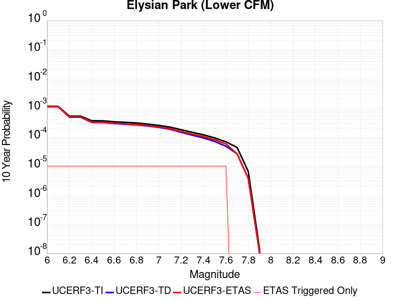 |

| Magnitude | 1 wk TI Prob | 1 wk TD Prob | 1 wk ETAS Prob | 1 wk ETAS/TD Gain | 1 wk ETAS Triggered Only | 1 mo TI Prob | 1 mo TD Prob | 1 mo ETAS Prob | 1 mo ETAS/TD Gain | 1 mo ETAS Triggered Only | 1 yr TI Prob | 1 yr TD Prob | 1 yr ETAS Prob | 1 yr ETAS/TD Gain | 1 yr ETAS Triggered Only | 10 yr TI Prob | 10 yr TD Prob | 10 yr ETAS Prob | 10 yr ETAS/TD Gain | 10 yr ETAS Triggered Only |
|-----|-----|-----|-----|-----|-----|-----|-----|-----|-----|-----|-----|-----|-----|-----|-----|-----|-----|-----|-----|-----|
| 6.0 | 2.1766498E-6 | 2.10379E-6 | 2.10379E-6 | 1.0 | 0.0 | 9.328466E-6 | 9.016219E-6 | 9.016219E-6 | 1.0 | 0.0 | 1.1356815E-4 | 1.09768385E-4 | 1.09768385E-4 | 1.0 | 0.0 | 0.0011351013 | 0.0010972836 | 0.0011072726 | 1.0091034 | 1.0E-5 |
| 6.1 | 2.1766498E-6 | 2.10379E-6 | 2.10379E-6 | 1.0 | 0.0 | 9.328466E-6 | 9.016219E-6 | 9.016219E-6 | 1.0 | 0.0 | 1.1356815E-4 | 1.09768385E-4 | 1.09768385E-4 | 1.0 | 0.0 | 0.0011351013 | 0.0010972836 | 0.0011072726 | 1.0091034 | 1.0E-5 |
| 6.2 | 1.0031182E-6 | 9.1862177E-7 | 9.1862177E-7 | 1.0 | 0.0 | 4.299071E-6 | 3.9369447E-6 | 3.9369447E-6 | 1.0 | 0.0 | 5.2339932E-5 | 4.793135E-5 | 4.793135E-5 | 1.0 | 0.0 | 5.2327604E-4 | 4.7921992E-4 | 4.8921513E-4 | 1.0208572 | 1.0E-5 |
| 6.3 | 1.0031182E-6 | 9.1862177E-7 | 9.1862177E-7 | 1.0 | 0.0 | 4.299071E-6 | 3.9369447E-6 | 3.9369447E-6 | 1.0 | 0.0 | 5.2339932E-5 | 4.793135E-5 | 4.793135E-5 | 1.0 | 0.0 | 5.2327604E-4 | 4.7921992E-4 | 4.8921513E-4 | 1.0208572 | 1.0E-5 |
| 6.4 | 6.9606244E-7 | 6.091946E-7 | 6.091946E-7 | 1.0 | 0.0 | 2.9831212E-6 | 2.6108314E-6 | 2.6108314E-6 | 1.0 | 0.0 | 3.6318896E-5 | 3.178641E-5 | 3.178641E-5 | 1.0 | 0.0 | 3.6312963E-4 | 3.178189E-4 | 3.278157E-4 | 1.0314544 | 1.0E-5 |
| 6.5 | 6.901879E-7 | 6.03263E-7 | 6.03263E-7 | 1.0 | 0.0 | 2.9579448E-6 | 2.5854101E-6 | 2.5854101E-6 | 1.0 | 0.0 | 3.6012385E-5 | 3.1476917E-5 | 3.1476917E-5 | 1.0 | 0.0 | 3.600655E-4 | 3.147248E-4 | 3.2472168E-4 | 1.0317638 | 1.0E-5 |
| 6.6 | 6.4198554E-7 | 5.5466126E-7 | 5.5466126E-7 | 1.0 | 0.0 | 2.7513638E-6 | 2.3771174E-6 | 2.3771174E-6 | 1.0 | 0.0 | 3.3497337E-5 | 2.8941022E-5 | 2.8941022E-5 | 1.0 | 0.0 | 3.349229E-4 | 2.893727E-4 | 2.993698E-4 | 1.0345476 | 1.0E-5 |
| 6.7 | 6.138733E-7 | 5.26342E-7 | 5.26342E-7 | 1.0 | 0.0 | 2.6308828E-6 | 2.2557495E-6 | 2.2557495E-6 | 1.0 | 0.0 | 3.203053E-5 | 2.7463404E-5 | 2.7463404E-5 | 1.0 | 0.0 | 3.2025913E-4 | 2.7460023E-4 | 2.8459748E-4 | 1.0364066 | 1.0E-5 |
| 6.8 | 5.84778E-7 | 5.00294E-7 | 5.00294E-7 | 1.0 | 0.0 | 2.506189E-6 | 2.1441151E-6 | 2.1441151E-6 | 1.0 | 0.0 | 3.0512423E-5 | 2.6104291E-5 | 2.6104291E-5 | 1.0 | 0.0 | 3.0508233E-4 | 2.6101235E-4 | 2.7100975E-4 | 1.0383023 | 1.0E-5 |
| 6.9 | 5.322785E-7 | 4.5800772E-7 | 4.5800772E-7 | 1.0 | 0.0 | 2.2811914E-6 | 1.9628887E-6 | 1.9628887E-6 | 1.0 | 0.0 | 2.7773152E-5 | 2.3897908E-5 | 2.3897908E-5 | 1.0 | 0.0 | 2.7769682E-4 | 2.389535E-4 | 2.489511E-4 | 1.0418391 | 1.0E-5 |
| 7.0 | 4.8147206E-7 | 4.1124116E-7 | 4.1124116E-7 | 1.0 | 0.0 | 2.06345E-6 | 1.7624608E-6 | 1.7624608E-6 | 1.0 | 0.0 | 2.5122214E-5 | 2.145775E-5 | 2.145775E-5 | 1.0 | 0.0 | 2.5119373E-4 | 2.1455686E-4 | 2.2455472E-4 | 1.0465977 | 1.0E-5 |
| 7.1 | 4.1932955E-7 | 3.5455713E-7 | 3.5455713E-7 | 1.0 | 0.0 | 1.7971255E-6 | 1.5195296E-6 | 1.5195296E-6 | 1.0 | 0.0 | 2.1879783E-5 | 1.8500115E-5 | 1.8500115E-5 | 1.0 | 0.0 | 2.1877629E-4 | 1.8498581E-4 | 1.9498396E-4 | 1.0540482 | 1.0E-5 |
| 7.2 | 3.426051E-7 | 2.7810324E-7 | 2.7810324E-7 | 1.0 | 0.0 | 1.4683067E-6 | 1.1918704E-6 | 1.1918704E-6 | 1.0 | 0.0 | 1.7876488E-5 | 1.4510925E-5 | 1.4510925E-5 | 1.0 | 0.0 | 1.787505E-4 | 1.4509981E-4 | 1.5509836E-4 | 1.0689081 | 1.0E-5 |
| 7.3 | 2.7771645E-7 | 2.209654E-7 | 2.209654E-7 | 1.0 | 0.0 | 1.1902127E-6 | 9.469942E-7 | 9.469942E-7 | 1.0 | 0.0 | 1.4490744E-5 | 1.1529593E-5 | 1.1529593E-5 | 1.0 | 0.0 | 1.4489799E-4 | 1.1528997E-4 | 1.2528882E-4 | 1.0867279 | 1.0E-5 |
| 7.4 | 2.2756493E-7 | 1.7839815E-7 | 1.7839815E-7 | 1.0 | 0.0 | 9.752779E-7 | 7.6456325E-7 | 7.6456325E-7 | 1.0 | 0.0 | 1.1873944E-5 | 9.308518E-6 | 9.308518E-6 | 1.0 | 0.0 | 1.18733085E-4 | 9.30813E-5 | 1.0308037E-4 | 1.107423 | 1.0E-5 |
| 7.5 | 1.7874558E-7 | 1.3542729E-7 | 1.3542729E-7 | 1.0 | 0.0 | 7.660522E-7 | 5.804025E-7 | 5.804025E-7 | 1.0 | 0.0 | 9.326646E-6 | 7.0663777E-6 | 7.0663777E-6 | 1.0 | 0.0 | 9.326255E-5 | 7.066155E-5 | 8.066084E-5 | 1.1415097 | 1.0E-5 |
| 7.6 | 1.3124549E-7 | 9.250854E-8 | 9.250854E-8 | 1.0 | 0.0 | 5.624805E-7 | 3.964651E-7 | 3.964651E-7 | 1.0 | 0.0 | 6.8481786E-6 | 4.826952E-6 | 4.826952E-6 | 1.0 | 0.0 | 6.8479676E-5 | 4.8268485E-5 | 5.8268004E-5 | 1.2071645 | 1.0E-5 |
| 7.7 | 8.439993E-8 | 5.090022E-8 | 5.090022E-8 | 1.0 | 0.0 | 3.6171392E-7 | 2.1814377E-7 | 2.1814377E-7 | 1.0 | 0.0 | 4.403858E-6 | 2.6558973E-6 | 2.6558973E-6 | 1.0 | 0.0 | 4.4037708E-5 | 2.655867E-5 | 2.655867E-5 | 1.0 | 0.0 |
| 7.8 | 1.2591407E-8 | 7.227629E-9 | 7.227629E-9 | 1.0 | 0.0 | 5.3963173E-8 | 3.0975556E-8 | 3.0975556E-8 | 1.0 | 0.0 | 6.570014E-7 | 3.7712732E-7 | 3.7712732E-7 | 1.0 | 0.0 | 6.5699946E-6 | 3.771267E-6 | 3.771267E-6 | 1.0 | 0.0 |
| 7.9 | 2.8324232E-11 | 2.1406099E-11 | 2.1406099E-11 | 1.0 | 0.0 | 1.2138957E-10 | 9.174017E-11 | 9.174017E-11 | 1.0 | 0.0 | 1.4779177E-9 | 1.1169362E-9 | 1.1169362E-9 | 1.0 | 0.0 | 1.4779177E-8 | 1.1169361E-8 | 1.1169361E-8 | 1.0 | 0.0 |

## Fontana (Seismicity)
*[(top)](#table-of-contents)*

| 1 Week | 1 Month | 1 Year | 10 Year |
|-----|-----|-----|-----|
|  |  |  |  |

| Magnitude | 1 wk TI Prob | 1 wk TD Prob | 1 wk ETAS Prob | 1 wk ETAS/TD Gain | 1 wk ETAS Triggered Only | 1 mo TI Prob | 1 mo TD Prob | 1 mo ETAS Prob | 1 mo ETAS/TD Gain | 1 mo ETAS Triggered Only | 1 yr TI Prob | 1 yr TD Prob | 1 yr ETAS Prob | 1 yr ETAS/TD Gain | 1 yr ETAS Triggered Only | 10 yr TI Prob | 10 yr TD Prob | 10 yr ETAS Prob | 10 yr ETAS/TD Gain | 10 yr ETAS Triggered Only |
|-----|-----|-----|-----|-----|-----|-----|-----|-----|-----|-----|-----|-----|-----|-----|-----|-----|-----|-----|-----|-----|
| 6.0 | 7.1789214E-6 | 7.5520006E-6 | 7.5520006E-6 | 1.0 | 0.0 | 3.076644E-5 | 3.2365548E-5 | 3.2365548E-5 | 1.0 | 0.0 | 3.7451705E-4 | 3.9402005E-4 | 4.0401611E-4 | 1.0253694 | 1.0E-5 | 0.003738865 | 0.003937214 | 0.0039471746 | 1.0025299 | 1.0E-5 |
| 6.1 | 7.1789214E-6 | 7.5520006E-6 | 7.5520006E-6 | 1.0 | 0.0 | 3.076644E-5 | 3.2365548E-5 | 3.2365548E-5 | 1.0 | 0.0 | 3.7451705E-4 | 3.9402005E-4 | 4.0401611E-4 | 1.0253694 | 1.0E-5 | 0.003738865 | 0.003937214 | 0.0039471746 | 1.0025299 | 1.0E-5 |
| 6.2 | 7.1789214E-6 | 7.5520006E-6 | 7.5520006E-6 | 1.0 | 0.0 | 3.076644E-5 | 3.2365548E-5 | 3.2365548E-5 | 1.0 | 0.0 | 3.7451705E-4 | 3.9402005E-4 | 4.0401611E-4 | 1.0253694 | 1.0E-5 | 0.003738865 | 0.003937214 | 0.0039471746 | 1.0025299 | 1.0E-5 |
| 6.3 | 7.1789214E-6 | 7.5520006E-6 | 7.5520006E-6 | 1.0 | 0.0 | 3.076644E-5 | 3.2365548E-5 | 3.2365548E-5 | 1.0 | 0.0 | 3.7451705E-4 | 3.9402005E-4 | 4.0401611E-4 | 1.0253694 | 1.0E-5 | 0.003738865 | 0.003937214 | 0.0039471746 | 1.0025299 | 1.0E-5 |
| 6.4 | 7.1789214E-6 | 7.5520006E-6 | 7.5520006E-6 | 1.0 | 0.0 | 3.076644E-5 | 3.2365548E-5 | 3.2365548E-5 | 1.0 | 0.0 | 3.7451705E-4 | 3.9402005E-4 | 4.0401611E-4 | 1.0253694 | 1.0E-5 | 0.003738865 | 0.003937214 | 0.0039471746 | 1.0025299 | 1.0E-5 |
| 6.5 | 5.2611317E-6 | 5.532726E-6 | 5.532726E-6 | 1.0 | 0.0 | 2.2547512E-5 | 2.3711682E-5 | 2.3711682E-5 | 1.0 | 0.0 | 2.744814E-4 | 2.8868974E-4 | 2.9868685E-4 | 1.0346292 | 1.0E-5 | 0.002741426 | 0.0028868972 | 0.0028968684 | 1.003454 | 1.0E-5 |
| 6.6 | 5.2611317E-6 | 5.532726E-6 | 5.532726E-6 | 1.0 | 0.0 | 2.2547512E-5 | 2.3711682E-5 | 2.3711682E-5 | 1.0 | 0.0 | 2.744814E-4 | 2.8868974E-4 | 2.9868685E-4 | 1.0346292 | 1.0E-5 | 0.002741426 | 0.0028868972 | 0.0028968684 | 1.003454 | 1.0E-5 |

## Los Osos 2011
*[(top)](#table-of-contents)*

| 1 Week | 1 Month | 1 Year | 10 Year |
|-----|-----|-----|-----|
|  |  |  |  |

| Magnitude | 1 wk TI Prob | 1 wk TD Prob | 1 wk ETAS Prob | 1 wk ETAS/TD Gain | 1 wk ETAS Triggered Only | 1 mo TI Prob | 1 mo TD Prob | 1 mo ETAS Prob | 1 mo ETAS/TD Gain | 1 mo ETAS Triggered Only | 1 yr TI Prob | 1 yr TD Prob | 1 yr ETAS Prob | 1 yr ETAS/TD Gain | 1 yr ETAS Triggered Only | 10 yr TI Prob | 10 yr TD Prob | 10 yr ETAS Prob | 10 yr ETAS/TD Gain | 10 yr ETAS Triggered Only |
|-----|-----|-----|-----|-----|-----|-----|-----|-----|-----|-----|-----|-----|-----|-----|-----|-----|-----|-----|-----|-----|
| 6.0 | 4.8871775E-6 | 4.9814835E-6 | 4.9814835E-6 | 1.0 | 0.0 | 2.0944879E-5 | 2.1349055E-5 | 2.1349055E-5 | 1.0 | 0.0 | 2.5497406E-4 | 2.5989654E-4 | 2.5989654E-4 | 1.0 | 0.0 | 0.002546817 | 0.0025962002 | 0.0026061744 | 1.0038418 | 1.0E-5 |
| 6.1 | 4.8871775E-6 | 4.9814835E-6 | 4.9814835E-6 | 1.0 | 0.0 | 2.0944879E-5 | 2.1349055E-5 | 2.1349055E-5 | 1.0 | 0.0 | 2.5497406E-4 | 2.5989654E-4 | 2.5989654E-4 | 1.0 | 0.0 | 0.002546817 | 0.0025962002 | 0.0026061744 | 1.0038418 | 1.0E-5 |
| 6.2 | 4.8871775E-6 | 4.9814835E-6 | 4.9814835E-6 | 1.0 | 0.0 | 2.0944879E-5 | 2.1349055E-5 | 2.1349055E-5 | 1.0 | 0.0 | 2.5497406E-4 | 2.5989654E-4 | 2.5989654E-4 | 1.0 | 0.0 | 0.002546817 | 0.0025962002 | 0.0026061744 | 1.0038418 | 1.0E-5 |
| 6.3 | 4.8871775E-6 | 4.9814835E-6 | 4.9814835E-6 | 1.0 | 0.0 | 2.0944879E-5 | 2.1349055E-5 | 2.1349055E-5 | 1.0 | 0.0 | 2.5497406E-4 | 2.5989654E-4 | 2.5989654E-4 | 1.0 | 0.0 | 0.002546817 | 0.0025962002 | 0.0026061744 | 1.0038418 | 1.0E-5 |
| 6.4 | 4.8871775E-6 | 4.9814835E-6 | 4.9814835E-6 | 1.0 | 0.0 | 2.0944879E-5 | 2.1349055E-5 | 2.1349055E-5 | 1.0 | 0.0 | 2.5497406E-4 | 2.5989654E-4 | 2.5989654E-4 | 1.0 | 0.0 | 0.002546817 | 0.0025962002 | 0.0026061744 | 1.0038418 | 1.0E-5 |
| 6.5 | 3.1724062E-6 | 3.223395E-6 | 3.223395E-6 | 1.0 | 0.0 | 1.3595956E-5 | 1.3814477E-5 | 1.3814477E-5 | 1.0 | 0.0 | 1.6551818E-4 | 1.681784E-4 | 1.681784E-4 | 1.0 | 0.0 | 0.0016539496 | 0.0016805249 | 0.0016905081 | 1.0059406 | 1.0E-5 |
| 6.6 | 3.1022591E-6 | 3.1511045E-6 | 3.1511045E-6 | 1.0 | 0.0 | 1.3295328E-5 | 1.3504664E-5 | 1.3504664E-5 | 1.0 | 0.0 | 1.618586E-4 | 1.64407E-4 | 1.64407E-4 | 1.0 | 0.0 | 0.0016174077 | 0.0016428665 | 0.0016528501 | 1.0060769 | 1.0E-5 |
| 6.7 | 2.611518E-6 | 2.6491832E-6 | 2.6491832E-6 | 1.0 | 0.0 | 1.1192172E-5 | 1.1353593E-5 | 1.1353593E-5 | 1.0 | 0.0 | 1.3625617E-4 | 1.3822126E-4 | 1.3822126E-4 | 1.0 | 0.0 | 0.0013617266 | 0.0013813575 | 0.0013813575 | 1.0 | 0.0 |
| 6.8 | 2.4780884E-6 | 2.5121592E-6 | 2.5121592E-6 | 1.0 | 0.0 | 1.0620336E-5 | 1.0766353E-5 | 1.0766353E-5 | 1.0 | 0.0 | 1.2929492E-4 | 1.3107249E-4 | 1.3107249E-4 | 1.0 | 0.0 | 0.0012921972 | 0.001309956 | 0.001309956 | 1.0 | 0.0 |
| 6.9 | 2.1376322E-6 | 2.1635055E-6 | 2.1635055E-6 | 1.0 | 0.0 | 9.161248E-6 | 9.272134E-6 | 9.272134E-6 | 1.0 | 0.0 | 1.1153249E-4 | 1.128824E-4 | 1.128824E-4 | 1.0 | 0.0 | 0.0011147653 | 0.0011282525 | 0.0011282525 | 1.0 | 0.0 |
| 7.0 | 1.9282882E-6 | 1.9494585E-6 | 1.9494585E-6 | 1.0 | 0.0 | 8.264066E-6 | 8.354796E-6 | 8.354796E-6 | 1.0 | 0.0 | 1.0061036E-4 | 1.017149E-4 | 1.017149E-4 | 1.0 | 0.0 | 0.0010056482 | 0.0010166848 | 0.0010166848 | 1.0 | 0.0 |
| 7.1 | 1.6353226E-6 | 1.6501118E-6 | 1.6501118E-6 | 1.0 | 0.0 | 7.0085066E-6 | 7.0718884E-6 | 7.0718884E-6 | 1.0 | 0.0 | 8.532523E-5 | 8.609685E-5 | 8.609685E-5 | 1.0 | 0.0 | 8.529247E-4 | 8.6063566E-4 | 8.6063566E-4 | 1.0 | 0.0 |
| 7.2 | 1.4446276E-6 | 1.4553341E-6 | 1.4553341E-6 | 1.0 | 0.0 | 6.191247E-6 | 6.237131E-6 | 6.237131E-6 | 1.0 | 0.0 | 7.537582E-5 | 7.593443E-5 | 7.593443E-5 | 1.0 | 0.0 | 7.535026E-4 | 7.590854E-4 | 7.590854E-4 | 1.0 | 0.0 |
| 7.3 | 1.2014582E-6 | 1.2069073E-6 | 1.2069073E-6 | 1.0 | 0.0 | 5.149096E-6 | 5.1724496E-6 | 5.1724496E-6 | 1.0 | 0.0 | 6.268844E-5 | 6.297276E-5 | 6.297276E-5 | 1.0 | 0.0 | 6.267076E-4 | 6.295495E-4 | 6.295495E-4 | 1.0 | 0.0 |
| 7.4 | 9.707733E-7 | 9.709773E-7 | 9.709773E-7 | 1.0 | 0.0 | 4.16045E-6 | 4.161325E-6 | 4.161325E-6 | 1.0 | 0.0 | 5.0652303E-5 | 5.066295E-5 | 5.066295E-5 | 1.0 | 0.0 | 5.064076E-4 | 5.065143E-4 | 5.065143E-4 | 1.0 | 0.0 |
| 7.5 | 7.174908E-7 | 7.1149134E-7 | 7.1149134E-7 | 1.0 | 0.0 | 3.074957E-6 | 3.0492452E-6 | 3.0492452E-6 | 1.0 | 0.0 | 3.743696E-5 | 3.712393E-5 | 3.712393E-5 | 1.0 | 0.0 | 3.7430652E-4 | 3.7117745E-4 | 3.7117745E-4 | 1.0 | 0.0 |
| 7.6 | 4.5535776E-7 | 4.420792E-7 | 4.420792E-7 | 1.0 | 0.0 | 1.9515319E-6 | 1.8946238E-6 | 1.8946238E-6 | 1.0 | 0.0 | 2.3759641E-5 | 2.3066801E-5 | 2.3066801E-5 | 1.0 | 0.0 | 2.37571E-4 | 2.3064416E-4 | 2.3064416E-4 | 1.0 | 0.0 |
| 7.7 | 2.1173553E-7 | 1.9060796E-7 | 1.9060796E-7 | 1.0 | 0.0 | 9.0743765E-7 | 8.1689103E-7 | 8.1689103E-7 | 1.0 | 0.0 | 1.1047998E-5 | 9.945603E-6 | 9.945603E-6 | 1.0 | 0.0 | 1.1047449E-4 | 9.945161E-5 | 9.945161E-5 | 1.0 | 0.0 |
| 7.8 | 9.873608E-8 | 7.3675665E-8 | 7.3675665E-8 | 1.0 | 0.0 | 4.2315455E-7 | 3.157528E-7 | 3.157528E-7 | 1.0 | 0.0 | 5.1518946E-6 | 3.8442836E-6 | 3.8442836E-6 | 1.0 | 0.0 | 5.1517753E-5 | 3.8442176E-5 | 3.8442176E-5 | 1.0 | 0.0 |
| 7.9 | 5.4399106E-8 | 3.1880155E-8 | 3.1880155E-8 | 1.0 | 0.0 | 2.33139E-7 | 1.3662923E-7 | 1.3662923E-7 | 1.0 | 0.0 | 2.8384638E-6 | 1.6634596E-6 | 1.6634596E-6 | 1.0 | 0.0 | 2.8384275E-5 | 1.6634473E-5 | 1.6634473E-5 | 1.0 | 0.0 |
| 8.0 | 1.817203E-8 | 8.420727E-9 | 8.420727E-9 | 1.0 | 0.0 | 7.7880124E-8 | 3.608883E-8 | 3.608883E-8 | 1.0 | 0.0 | 9.481901E-7 | 4.393814E-7 | 4.393814E-7 | 1.0 | 0.0 | 9.481861E-6 | 4.3938057E-6 | 4.3938057E-6 | 1.0 | 0.0 |

## Ozena
*[(top)](#table-of-contents)*

| 1 Week | 1 Month | 1 Year | 10 Year |
|-----|-----|-----|-----|
|  |  |  | 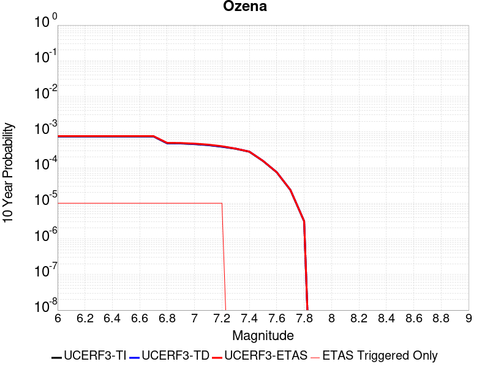 |

| Magnitude | 1 wk TI Prob | 1 wk TD Prob | 1 wk ETAS Prob | 1 wk ETAS/TD Gain | 1 wk ETAS Triggered Only | 1 mo TI Prob | 1 mo TD Prob | 1 mo ETAS Prob | 1 mo ETAS/TD Gain | 1 mo ETAS Triggered Only | 1 yr TI Prob | 1 yr TD Prob | 1 yr ETAS Prob | 1 yr ETAS/TD Gain | 1 yr ETAS Triggered Only | 10 yr TI Prob | 10 yr TD Prob | 10 yr ETAS Prob | 10 yr ETAS/TD Gain | 10 yr ETAS Triggered Only |
|-----|-----|-----|-----|-----|-----|-----|-----|-----|-----|-----|-----|-----|-----|-----|-----|-----|-----|-----|-----|-----|
| 6.0 | 1.4377547E-6 | 1.4513782E-6 | 1.4513782E-6 | 1.0 | 0.0 | 6.161791E-6 | 6.2201793E-6 | 6.2201793E-6 | 1.0 | 0.0 | 7.5017226E-5 | 7.572832E-5 | 8.5727566E-5 | 1.132041 | 1.0E-5 | 7.4991904E-4 | 7.570518E-4 | 7.670442E-4 | 1.0131991 | 1.0E-5 |
| 6.1 | 1.4377547E-6 | 1.4513782E-6 | 1.4513782E-6 | 1.0 | 0.0 | 6.161791E-6 | 6.2201793E-6 | 6.2201793E-6 | 1.0 | 0.0 | 7.5017226E-5 | 7.572832E-5 | 8.5727566E-5 | 1.132041 | 1.0E-5 | 7.4991904E-4 | 7.570518E-4 | 7.670442E-4 | 1.0131991 | 1.0E-5 |
| 6.2 | 1.4377547E-6 | 1.4513782E-6 | 1.4513782E-6 | 1.0 | 0.0 | 6.161791E-6 | 6.2201793E-6 | 6.2201793E-6 | 1.0 | 0.0 | 7.5017226E-5 | 7.572832E-5 | 8.5727566E-5 | 1.132041 | 1.0E-5 | 7.4991904E-4 | 7.570518E-4 | 7.670442E-4 | 1.0131991 | 1.0E-5 |
| 6.3 | 1.4377547E-6 | 1.4513782E-6 | 1.4513782E-6 | 1.0 | 0.0 | 6.161791E-6 | 6.2201793E-6 | 6.2201793E-6 | 1.0 | 0.0 | 7.5017226E-5 | 7.572832E-5 | 8.5727566E-5 | 1.132041 | 1.0E-5 | 7.4991904E-4 | 7.570518E-4 | 7.670442E-4 | 1.0131991 | 1.0E-5 |
| 6.4 | 1.4377547E-6 | 1.4513782E-6 | 1.4513782E-6 | 1.0 | 0.0 | 6.161791E-6 | 6.2201793E-6 | 6.2201793E-6 | 1.0 | 0.0 | 7.5017226E-5 | 7.572832E-5 | 8.5727566E-5 | 1.132041 | 1.0E-5 | 7.4991904E-4 | 7.570518E-4 | 7.670442E-4 | 1.0131991 | 1.0E-5 |
| 6.5 | 1.4377547E-6 | 1.4513782E-6 | 1.4513782E-6 | 1.0 | 0.0 | 6.161791E-6 | 6.2201793E-6 | 6.2201793E-6 | 1.0 | 0.0 | 7.5017226E-5 | 7.572832E-5 | 8.5727566E-5 | 1.132041 | 1.0E-5 | 7.4991904E-4 | 7.570518E-4 | 7.670442E-4 | 1.0131991 | 1.0E-5 |
| 6.6 | 1.4377547E-6 | 1.4513782E-6 | 1.4513782E-6 | 1.0 | 0.0 | 6.161791E-6 | 6.2201793E-6 | 6.2201793E-6 | 1.0 | 0.0 | 7.5017226E-5 | 7.572832E-5 | 8.5727566E-5 | 1.132041 | 1.0E-5 | 7.4991904E-4 | 7.570518E-4 | 7.670442E-4 | 1.0131991 | 1.0E-5 |
| 6.7 | 1.4377547E-6 | 1.4513782E-6 | 1.4513782E-6 | 1.0 | 0.0 | 6.161791E-6 | 6.2201793E-6 | 6.2201793E-6 | 1.0 | 0.0 | 7.5017226E-5 | 7.572832E-5 | 8.5727566E-5 | 1.132041 | 1.0E-5 | 7.4991904E-4 | 7.570518E-4 | 7.670442E-4 | 1.0131991 | 1.0E-5 |
| 6.8 | 9.223257E-7 | 9.317624E-7 | 9.317624E-7 | 1.0 | 0.0 | 3.9528186E-6 | 3.9932615E-6 | 3.9932615E-6 | 1.0 | 0.0 | 4.81245E-5 | 4.8616912E-5 | 5.8616428E-5 | 1.2056798 | 1.0E-5 | 4.811408E-4 | 4.860668E-4 | 4.960619E-4 | 1.0205632 | 1.0E-5 |
| 6.9 | 9.141515E-7 | 9.235371E-7 | 9.235371E-7 | 1.0 | 0.0 | 3.917786E-6 | 3.9580104E-6 | 3.9580104E-6 | 1.0 | 0.0 | 4.7698002E-5 | 4.818775E-5 | 5.818727E-5 | 1.2075117 | 1.0E-5 | 4.7687767E-4 | 4.8177704E-4 | 4.917722E-4 | 1.0207465 | 1.0E-5 |
| 7.0 | 8.767648E-7 | 8.8585773E-7 | 8.8585773E-7 | 1.0 | 0.0 | 3.757558E-6 | 3.7965276E-6 | 3.7965276E-6 | 1.0 | 0.0 | 4.5747307E-5 | 4.6221783E-5 | 5.622132E-5 | 1.2163382 | 1.0E-5 | 4.5737892E-4 | 4.6212564E-4 | 4.7212103E-4 | 1.0216291 | 1.0E-5 |
| 7.1 | 8.199402E-7 | 8.2853984E-7 | 8.2853984E-7 | 1.0 | 0.0 | 3.5140247E-6 | 3.5508804E-6 | 3.5508804E-6 | 1.0 | 0.0 | 4.2782412E-5 | 4.323115E-5 | 5.3230717E-5 | 1.2313046 | 1.0E-5 | 4.2774176E-4 | 4.322311E-4 | 4.422268E-4 | 1.0231258 | 1.0E-5 |
| 7.2 | 7.38705E-7 | 7.464262E-7 | 7.464262E-7 | 1.0 | 0.0 | 3.1658747E-6 | 3.198966E-6 | 3.198966E-6 | 1.0 | 0.0 | 3.8543843E-5 | 3.894675E-5 | 4.894636E-5 | 1.2567508 | 1.0E-5 | 3.853716E-4 | 3.8940276E-4 | 3.9939885E-4 | 1.0256704 | 1.0E-5 |
| 7.3 | 6.490017E-7 | 6.557802E-7 | 6.557802E-7 | 1.0 | 0.0 | 2.7814328E-6 | 2.8104837E-6 | 2.8104837E-6 | 1.0 | 0.0 | 3.386342E-5 | 3.4217133E-5 | 3.4217133E-5 | 1.0 | 0.0 | 3.3858258E-4 | 3.4212202E-4 | 3.4212202E-4 | 1.0 | 0.0 |
| 7.4 | 5.346736E-7 | 5.4022604E-7 | 5.4022604E-7 | 1.0 | 0.0 | 2.291456E-6 | 2.3152527E-6 | 2.3152527E-6 | 1.0 | 0.0 | 2.789812E-5 | 2.8187867E-5 | 2.8187867E-5 | 1.0 | 0.0 | 2.789462E-4 | 2.8184598E-4 | 2.8184598E-4 | 1.0 | 0.0 |
| 7.5 | 2.939325E-7 | 2.9666057E-7 | 2.9666057E-7 | 1.0 | 0.0 | 1.25971E-6 | 1.271402E-6 | 1.271402E-6 | 1.0 | 0.0 | 1.5336862E-5 | 1.5479225E-5 | 1.5479225E-5 | 1.0 | 0.0 | 1.5335804E-4 | 1.5478309E-4 | 1.5478309E-4 | 1.0 | 0.0 |
| 7.6 | 1.4151905E-7 | 1.4253266E-7 | 1.4253266E-7 | 1.0 | 0.0 | 6.065101E-7 | 6.108541E-7 | 6.108541E-7 | 1.0 | 0.0 | 7.3842357E-6 | 7.4371237E-6 | 7.4371237E-6 | 1.0 | 0.0 | 7.38399E-5 | 7.436883E-5 | 7.436883E-5 | 1.0 | 0.0 |
| 7.7 | 4.4957577E-8 | 4.5252243E-8 | 4.5252243E-8 | 1.0 | 0.0 | 1.9267533E-7 | 1.9393818E-7 | 1.9393818E-7 | 1.0 | 0.0 | 2.3458194E-6 | 2.3611947E-6 | 2.3611947E-6 | 1.0 | 0.0 | 2.3457947E-5 | 2.3611707E-5 | 2.3611707E-5 | 1.0 | 0.0 |
| 7.8 | 5.9993255E-9 | 6.0412972E-9 | 6.0412972E-9 | 1.0 | 0.0 | 2.5711394E-8 | 2.5891273E-8 | 2.5891273E-8 | 1.0 | 0.0 | 3.1303617E-7 | 3.1522623E-7 | 3.1522623E-7 | 1.0 | 0.0 | 3.1303573E-6 | 3.1522588E-6 | 3.1522588E-6 | 1.0 | 0.0 |

## Goose Lake 2011 CFM
*[(top)](#table-of-contents)*

| 1 Week | 1 Month | 1 Year | 10 Year |
|-----|-----|-----|-----|
|  |  | 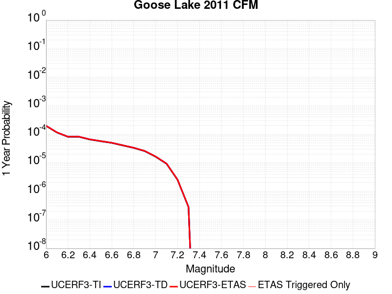 |  |

| Magnitude | 1 wk TI Prob | 1 wk TD Prob | 1 wk ETAS Prob | 1 wk ETAS/TD Gain | 1 wk ETAS Triggered Only | 1 mo TI Prob | 1 mo TD Prob | 1 mo ETAS Prob | 1 mo ETAS/TD Gain | 1 mo ETAS Triggered Only | 1 yr TI Prob | 1 yr TD Prob | 1 yr ETAS Prob | 1 yr ETAS/TD Gain | 1 yr ETAS Triggered Only | 10 yr TI Prob | 10 yr TD Prob | 10 yr ETAS Prob | 10 yr ETAS/TD Gain | 10 yr ETAS Triggered Only |
|-----|-----|-----|-----|-----|-----|-----|-----|-----|-----|-----|-----|-----|-----|-----|-----|-----|-----|-----|-----|-----|
| 6.0 | 3.780968E-6 | 3.8230223E-6 | 3.8230223E-6 | 1.0 | 0.0 | 1.6204049E-5 | 1.6384285E-5 | 1.6384285E-5 | 1.0 | 0.0 | 1.9726643E-4 | 1.994615E-4 | 1.994615E-4 | 1.0 | 0.0 | 0.001970914 | 0.001992933 | 0.002002913 | 1.0050077 | 1.0E-5 |
| 6.1 | 2.2035124E-6 | 2.229801E-6 | 2.229801E-6 | 1.0 | 0.0 | 9.443591E-6 | 9.556257E-6 | 9.556257E-6 | 1.0 | 0.0 | 1.1496965E-4 | 1.163414E-4 | 1.163414E-4 | 1.0 | 0.0 | 0.0011491019 | 0.0011628233 | 0.0011628233 | 1.0 | 0.0 |
| 6.2 | 1.5624689E-6 | 1.5826923E-6 | 1.5826923E-6 | 1.0 | 0.0 | 6.6962784E-6 | 6.7829496E-6 | 6.7829496E-6 | 1.0 | 0.0 | 8.152414E-5 | 8.2579325E-5 | 8.2579325E-5 | 1.0 | 0.0 | 8.1494235E-4 | 8.2549086E-4 | 8.2549086E-4 | 1.0 | 0.0 |
| 6.3 | 1.5624689E-6 | 1.5826923E-6 | 1.5826923E-6 | 1.0 | 0.0 | 6.6962784E-6 | 6.7829496E-6 | 6.7829496E-6 | 1.0 | 0.0 | 8.152414E-5 | 8.2579325E-5 | 8.2579325E-5 | 1.0 | 0.0 | 8.1494235E-4 | 8.2549086E-4 | 8.2549086E-4 | 1.0 | 0.0 |
| 6.4 | 1.256464E-6 | 1.2738695E-6 | 1.2738695E-6 | 1.0 | 0.0 | 5.3848344E-6 | 5.4594293E-6 | 5.4594293E-6 | 1.0 | 0.0 | 6.5558386E-5 | 6.646655E-5 | 6.646655E-5 | 1.0 | 0.0 | 6.553905E-4 | 6.644687E-4 | 6.644687E-4 | 1.0 | 0.0 |
| 6.5 | 1.0910911E-6 | 1.1069404E-6 | 1.1069404E-6 | 1.0 | 0.0 | 4.6760965E-6 | 4.7440217E-6 | 4.7440217E-6 | 1.0 | 0.0 | 5.692999E-5 | 5.7756948E-5 | 5.7756948E-5 | 1.0 | 0.0 | 5.6915404E-4 | 5.7742064E-4 | 5.7742064E-4 | 1.0 | 0.0 |
| 6.6 | 9.546601E-7 | 9.691246E-7 | 9.691246E-7 | 1.0 | 0.0 | 4.091394E-6 | 4.1533845E-6 | 4.1533845E-6 | 1.0 | 0.0 | 4.9811584E-5 | 5.056629E-5 | 5.056629E-5 | 1.0 | 0.0 | 4.980042E-4 | 5.055487E-4 | 5.055487E-4 | 1.0 | 0.0 |
| 6.7 | 7.790316E-7 | 7.9159634E-7 | 7.9159634E-7 | 1.0 | 0.0 | 3.3387028E-6 | 3.3925514E-6 | 3.3925514E-6 | 1.0 | 0.0 | 4.0647945E-5 | 4.1303538E-5 | 4.1303538E-5 | 1.0 | 0.0 | 4.0640513E-4 | 4.129592E-4 | 4.129592E-4 | 1.0 | 0.0 |
| 6.8 | 6.3714384E-7 | 6.4787395E-7 | 6.4787395E-7 | 1.0 | 0.0 | 2.7306137E-6 | 2.7765998E-6 | 2.7765998E-6 | 1.0 | 0.0 | 3.3244716E-5 | 3.3804583E-5 | 3.3804583E-5 | 1.0 | 0.0 | 3.323974E-4 | 3.379949E-4 | 3.379949E-4 | 1.0 | 0.0 |
| 6.9 | 4.92586E-7 | 5.0139147E-7 | 5.0139147E-7 | 1.0 | 0.0 | 2.1110811E-6 | 2.1488188E-6 | 2.1488188E-6 | 1.0 | 0.0 | 2.5702111E-5 | 2.616156E-5 | 2.616156E-5 | 1.0 | 0.0 | 2.569914E-4 | 2.6158517E-4 | 2.6158517E-4 | 1.0 | 0.0 |
| 7.0 | 3.130245E-7 | 3.190354E-7 | 3.190354E-7 | 1.0 | 0.0 | 1.3415328E-6 | 1.3672939E-6 | 1.3672939E-6 | 1.0 | 0.0 | 1.6333039E-5 | 1.6646678E-5 | 1.6646678E-5 | 1.0 | 0.0 | 1.6331839E-4 | 1.6645451E-4 | 1.6645451E-4 | 1.0 | 0.0 |
| 7.1 | 1.7680084E-7 | 1.8023923E-7 | 1.8023923E-7 | 1.0 | 0.0 | 7.5771766E-7 | 7.724536E-7 | 7.724536E-7 | 1.0 | 0.0 | 9.225173E-6 | 9.404583E-6 | 9.404583E-6 | 1.0 | 0.0 | 9.22479E-5 | 9.4041956E-5 | 9.4041956E-5 | 1.0 | 0.0 |
| 7.2 | 4.8641045E-8 | 4.9402068E-8 | 4.9402068E-8 | 1.0 | 0.0 | 2.084616E-7 | 2.1172312E-7 | 2.1172312E-7 | 1.0 | 0.0 | 2.538017E-6 | 2.577726E-6 | 2.577726E-6 | 1.0 | 0.0 | 2.537988E-5 | 2.5776973E-5 | 2.5776973E-5 | 1.0 | 0.0 |
| 7.3 | 5.3911844E-9 | 5.4758145E-9 | 5.4758145E-9 | 1.0 | 0.0 | 2.3105075E-8 | 2.3467775E-8 | 2.3467775E-8 | 1.0 | 0.0 | 2.8130427E-7 | 2.8572015E-7 | 2.8572015E-7 | 1.0 | 0.0 | 2.8130391E-6 | 2.8571992E-6 | 2.8571992E-6 | 1.0 | 0.0 |

## Mission Hills 2011
*[(top)](#table-of-contents)*

| 1 Week | 1 Month | 1 Year | 10 Year |
|-----|-----|-----|-----|
|  |  |  |  |

| Magnitude | 1 wk TI Prob | 1 wk TD Prob | 1 wk ETAS Prob | 1 wk ETAS/TD Gain | 1 wk ETAS Triggered Only | 1 mo TI Prob | 1 mo TD Prob | 1 mo ETAS Prob | 1 mo ETAS/TD Gain | 1 mo ETAS Triggered Only | 1 yr TI Prob | 1 yr TD Prob | 1 yr ETAS Prob | 1 yr ETAS/TD Gain | 1 yr ETAS Triggered Only | 10 yr TI Prob | 10 yr TD Prob | 10 yr ETAS Prob | 10 yr ETAS/TD Gain | 10 yr ETAS Triggered Only |
|-----|-----|-----|-----|-----|-----|-----|-----|-----|-----|-----|-----|-----|-----|-----|-----|-----|-----|-----|-----|-----|
| 6.0 | 1.8765717E-5 | 1.9054645E-5 | 1.9054645E-5 | 1.0 | 0.0 | 8.0422025E-5 | 8.166215E-5 | 8.166215E-5 | 1.0 | 0.0 | 9.786983E-4 | 9.941267E-4 | 9.941267E-4 | 1.0 | 0.0 | 0.009743992 | 0.009930461 | 0.009940362 | 1.000997 | 1.0E-5 |
| 6.1 | 1.8765717E-5 | 1.9054645E-5 | 1.9054645E-5 | 1.0 | 0.0 | 8.0422025E-5 | 8.166215E-5 | 8.166215E-5 | 1.0 | 0.0 | 9.786983E-4 | 9.941267E-4 | 9.941267E-4 | 1.0 | 0.0 | 0.009743992 | 0.009930461 | 0.009940362 | 1.000997 | 1.0E-5 |
| 6.2 | 1.8765717E-5 | 1.9054645E-5 | 1.9054645E-5 | 1.0 | 0.0 | 8.0422025E-5 | 8.166215E-5 | 8.166215E-5 | 1.0 | 0.0 | 9.786983E-4 | 9.941267E-4 | 9.941267E-4 | 1.0 | 0.0 | 0.009743992 | 0.009930461 | 0.009940362 | 1.000997 | 1.0E-5 |
| 6.3 | 1.8765717E-5 | 1.9054645E-5 | 1.9054645E-5 | 1.0 | 0.0 | 8.0422025E-5 | 8.166215E-5 | 8.166215E-5 | 1.0 | 0.0 | 9.786983E-4 | 9.941267E-4 | 9.941267E-4 | 1.0 | 0.0 | 0.009743992 | 0.009930461 | 0.009940362 | 1.000997 | 1.0E-5 |
| 6.4 | 4.566357E-6 | 2.5148488E-6 | 2.5148488E-6 | 1.0 | 0.0 | 1.9569954E-5 | 1.0777889E-5 | 1.0777889E-5 | 1.0 | 0.0 | 2.3823815E-4 | 1.3121472E-4 | 1.3121472E-4 | 1.0 | 0.0 | 0.002379829 | 0.0013115506 | 0.0013115506 | 1.0 | 0.0 |
| 6.5 | 4.566357E-6 | 2.5148488E-6 | 2.5148488E-6 | 1.0 | 0.0 | 1.9569954E-5 | 1.0777889E-5 | 1.0777889E-5 | 1.0 | 0.0 | 2.3823815E-4 | 1.3121472E-4 | 1.3121472E-4 | 1.0 | 0.0 | 0.002379829 | 0.0013115506 | 0.0013115506 | 1.0 | 0.0 |
| 6.6 | 4.566357E-6 | 2.5148488E-6 | 2.5148488E-6 | 1.0 | 0.0 | 1.9569954E-5 | 1.0777889E-5 | 1.0777889E-5 | 1.0 | 0.0 | 2.3823815E-4 | 1.3121472E-4 | 1.3121472E-4 | 1.0 | 0.0 | 0.002379829 | 0.0013115506 | 0.0013115506 | 1.0 | 0.0 |
| 6.7 | 2.3266773E-6 | 1.3296187E-6 | 1.3296187E-6 | 1.0 | 0.0 | 9.971435E-6 | 5.698354E-6 | 5.698354E-6 | 1.0 | 0.0 | 1.2139547E-4 | 6.937531E-5 | 6.937531E-5 | 1.0 | 0.0 | 0.0012132917 | 6.9354265E-4 | 6.9354265E-4 | 1.0 | 0.0 |
| 6.8 | 2.032735E-6 | 1.1894115E-6 | 1.1894115E-6 | 1.0 | 0.0 | 8.711692E-6 | 5.097468E-6 | 5.097468E-6 | 1.0 | 0.0 | 1.06059684E-4 | 6.205996E-5 | 6.205996E-5 | 1.0 | 0.0 | 0.0010600908 | 6.2043115E-4 | 6.2043115E-4 | 1.0 | 0.0 |
| 6.9 | 1.3186259E-6 | 1.0561778E-6 | 1.0561778E-6 | 1.0 | 0.0 | 5.6512413E-6 | 4.5264687E-6 | 4.5264687E-6 | 1.0 | 0.0 | 6.8801695E-5 | 5.5108394E-5 | 5.5108394E-5 | 1.0 | 0.0 | 6.8780396E-4 | 5.5095024E-4 | 5.5095024E-4 | 1.0 | 0.0 |
| 7.0 | 1.2726016E-6 | 1.0159088E-6 | 1.0159088E-6 | 1.0 | 0.0 | 5.4539955E-6 | 4.3538876E-6 | 4.3538876E-6 | 1.0 | 0.0 | 6.6400375E-5 | 5.300732E-5 | 5.300732E-5 | 1.0 | 0.0 | 6.6380535E-4 | 5.299496E-4 | 5.299496E-4 | 1.0 | 0.0 |
| 7.1 | 1.2063913E-6 | 9.570072E-7 | 9.570072E-7 | 1.0 | 0.0 | 5.170238E-6 | 4.101453E-6 | 4.101453E-6 | 1.0 | 0.0 | 6.294583E-5 | 4.9934075E-5 | 4.9934075E-5 | 1.0 | 0.0 | 6.2928005E-4 | 4.992311E-4 | 4.992311E-4 | 1.0 | 0.0 |
| 7.2 | 9.105806E-7 | 7.3765557E-7 | 7.3765557E-7 | 1.0 | 0.0 | 3.9024826E-6 | 3.1613772E-6 | 3.1613772E-6 | 1.0 | 0.0 | 4.7511687E-5 | 3.8489103E-5 | 3.8489103E-5 | 1.0 | 0.0 | 4.7501532E-4 | 3.8482592E-4 | 3.8482592E-4 | 1.0 | 0.0 |
| 7.3 | 7.020432E-7 | 5.710089E-7 | 5.710089E-7 | 1.0 | 0.0 | 3.0087533E-6 | 2.447179E-6 | 2.447179E-6 | 1.0 | 0.0 | 3.6630954E-5 | 2.979401E-5 | 2.979401E-5 | 1.0 | 0.0 | 3.6624918E-4 | 2.9790145E-4 | 2.9790145E-4 | 1.0 | 0.0 |
| 7.4 | 5.3900635E-7 | 4.4480825E-7 | 4.4480825E-7 | 1.0 | 0.0 | 2.3100251E-6 | 1.9063198E-6 | 1.9063198E-6 | 1.0 | 0.0 | 2.8124194E-5 | 2.3209208E-5 | 2.3209208E-5 | 1.0 | 0.0 | 2.8120633E-4 | 2.3206905E-4 | 2.3206905E-4 | 1.0 | 0.0 |
| 7.5 | 2.907075E-7 | 2.2875415E-7 | 2.2875415E-7 | 1.0 | 0.0 | 1.2458887E-6 | 9.803746E-7 | 9.803746E-7 | 1.0 | 0.0 | 1.5168589E-5 | 1.1935997E-5 | 1.1935997E-5 | 1.0 | 0.0 | 1.5167553E-4 | 1.1935373E-4 | 1.1935373E-4 | 1.0 | 0.0 |
| 7.6 | 1.6903675E-7 | 1.2353402E-7 | 1.2353402E-7 | 1.0 | 0.0 | 7.2444305E-7 | 5.294314E-7 | 5.294314E-7 | 1.0 | 0.0 | 8.820059E-6 | 6.4458095E-6 | 6.4458095E-6 | 1.0 | 0.0 | 8.8197085E-5 | 6.445635E-5 | 6.445635E-5 | 1.0 | 0.0 |
| 7.7 | 7.168073E-8 | 3.9135116E-8 | 3.9135116E-8 | 1.0 | 0.0 | 3.072031E-7 | 1.6772192E-7 | 1.6772192E-7 | 1.0 | 0.0 | 3.7401915E-6 | 2.0420127E-6 | 2.0420127E-6 | 1.0 | 0.0 | 3.7401285E-5 | 2.041995E-5 | 2.041995E-5 | 1.0 | 0.0 |
| 7.8 | 6.564101E-8 | 3.3835356E-8 | 3.3835356E-8 | 1.0 | 0.0 | 2.813186E-7 | 1.4500866E-7 | 1.4500866E-7 | 1.0 | 0.0 | 3.4250486E-6 | 1.7654792E-6 | 1.7654792E-6 | 1.0 | 0.0 | 3.424996E-5 | 1.7654662E-5 | 1.7654662E-5 | 1.0 | 0.0 |
| 7.9 | 1.0029074E-8 | 3.7292542E-9 | 3.7292542E-9 | 1.0 | 0.0 | 4.2981743E-8 | 1.5982518E-8 | 1.5982518E-8 | 1.0 | 0.0 | 5.2330256E-7 | 1.9458714E-7 | 1.9458714E-7 | 1.0 | 0.0 | 5.2330133E-6 | 1.945871E-6 | 1.945871E-6 | 1.0 | 0.0 |

## Sierra Madre (San Fernando)
*[(top)](#table-of-contents)*

| 1 Week | 1 Month | 1 Year | 10 Year |
|-----|-----|-----|-----|
|  |  |  |  |

| Magnitude | 1 wk TI Prob | 1 wk TD Prob | 1 wk ETAS Prob | 1 wk ETAS/TD Gain | 1 wk ETAS Triggered Only | 1 mo TI Prob | 1 mo TD Prob | 1 mo ETAS Prob | 1 mo ETAS/TD Gain | 1 mo ETAS Triggered Only | 1 yr TI Prob | 1 yr TD Prob | 1 yr ETAS Prob | 1 yr ETAS/TD Gain | 1 yr ETAS Triggered Only | 10 yr TI Prob | 10 yr TD Prob | 10 yr ETAS Prob | 10 yr ETAS/TD Gain | 10 yr ETAS Triggered Only |
|-----|-----|-----|-----|-----|-----|-----|-----|-----|-----|-----|-----|-----|-----|-----|-----|-----|-----|-----|-----|-----|
| 6.0 | 1.0346413E-5 | 6.2872605E-6 | 6.2872605E-6 | 1.0 | 0.0 | 4.4341014E-5 | 2.694513E-5 | 2.694513E-5 | 1.0 | 0.0 | 5.3971814E-4 | 3.280087E-4 | 3.380054E-4 | 1.030477 | 1.0E-5 | 0.0053840918 | 0.0032753581 | 0.0032853254 | 1.003043 | 1.0E-5 |
| 6.1 | 1.0346413E-5 | 6.2872605E-6 | 6.2872605E-6 | 1.0 | 0.0 | 4.4341014E-5 | 2.694513E-5 | 2.694513E-5 | 1.0 | 0.0 | 5.3971814E-4 | 3.280087E-4 | 3.380054E-4 | 1.030477 | 1.0E-5 | 0.0053840918 | 0.0032753581 | 0.0032853254 | 1.003043 | 1.0E-5 |
| 6.2 | 1.0346413E-5 | 6.2872605E-6 | 6.2872605E-6 | 1.0 | 0.0 | 4.4341014E-5 | 2.694513E-5 | 2.694513E-5 | 1.0 | 0.0 | 5.3971814E-4 | 3.280087E-4 | 3.380054E-4 | 1.030477 | 1.0E-5 | 0.0053840918 | 0.0032753581 | 0.0032853254 | 1.003043 | 1.0E-5 |
| 6.3 | 1.0346413E-5 | 6.2872605E-6 | 6.2872605E-6 | 1.0 | 0.0 | 4.4341014E-5 | 2.694513E-5 | 2.694513E-5 | 1.0 | 0.0 | 5.3971814E-4 | 3.280087E-4 | 3.380054E-4 | 1.030477 | 1.0E-5 | 0.0053840918 | 0.0032753581 | 0.0032853254 | 1.003043 | 1.0E-5 |
| 6.4 | 1.0249558E-5 | 6.2872605E-6 | 6.2872605E-6 | 1.0 | 0.0 | 4.392594E-5 | 2.694513E-5 | 2.694513E-5 | 1.0 | 0.0 | 5.3466705E-4 | 3.280087E-4 | 3.380054E-4 | 1.030477 | 1.0E-5 | 0.0053338245 | 0.0032753581 | 0.0032853254 | 1.003043 | 1.0E-5 |
| 6.5 | 1.0249558E-5 | 6.2872605E-6 | 6.2872605E-6 | 1.0 | 0.0 | 4.392594E-5 | 2.694513E-5 | 2.694513E-5 | 1.0 | 0.0 | 5.3466705E-4 | 3.280087E-4 | 3.380054E-4 | 1.030477 | 1.0E-5 | 0.0053338245 | 0.0032753581 | 0.0032853254 | 1.003043 | 1.0E-5 |
| 6.6 | 9.9035515E-6 | 6.2872605E-6 | 6.2872605E-6 | 1.0 | 0.0 | 4.2443102E-5 | 2.694513E-5 | 2.694513E-5 | 1.0 | 0.0 | 5.166222E-4 | 3.280087E-4 | 3.380054E-4 | 1.030477 | 1.0E-5 | 0.0051542283 | 0.0032753581 | 0.0032853254 | 1.003043 | 1.0E-5 |
| 6.7 | 9.87217E-6 | 6.2746817E-6 | 6.2746817E-6 | 1.0 | 0.0 | 4.2308613E-5 | 2.689122E-5 | 2.689122E-5 | 1.0 | 0.0 | 5.149856E-4 | 3.2735255E-4 | 3.3734928E-4 | 1.0305381 | 1.0E-5 | 0.005137938 | 0.0032688158 | 0.0032787833 | 1.0030493 | 1.0E-5 |
| 6.8 | 9.4359175E-6 | 6.1786586E-6 | 6.1786586E-6 | 1.0 | 0.0 | 4.043902E-5 | 2.6479704E-5 | 2.6479704E-5 | 1.0 | 0.0 | 4.9223384E-4 | 3.2234378E-4 | 3.3234057E-4 | 1.0310128 | 1.0E-5 | 0.0049114493 | 0.0032188739 | 0.0032288418 | 1.0030967 | 1.0E-5 |
| 6.9 | 8.700447E-6 | 6.039922E-6 | 6.039922E-6 | 1.0 | 0.0 | 3.72871E-5 | 2.5885129E-5 | 2.5885129E-5 | 1.0 | 0.0 | 4.5387587E-4 | 3.1510694E-4 | 3.2510379E-4 | 1.0317253 | 1.0E-5 | 0.0045295 | 0.003146711 | 0.0031566794 | 1.0031679 | 1.0E-5 |
| 7.0 | 8.648878E-6 | 6.0148373E-6 | 6.0148373E-6 | 1.0 | 0.0 | 3.7066096E-5 | 2.5777625E-5 | 2.5777625E-5 | 1.0 | 0.0 | 4.5118626E-4 | 3.1379846E-4 | 3.2379534E-4 | 1.0318576 | 1.0E-5 | 0.004502713 | 0.003133663 | 0.0031436319 | 1.0031811 | 1.0E-5 |
| 7.1 | 8.505786E-6 | 5.9244676E-6 | 5.9244676E-6 | 1.0 | 0.0 | 3.645286E-5 | 2.5390334E-5 | 2.5390334E-5 | 1.0 | 0.0 | 4.437232E-4 | 3.0908454E-4 | 3.1908145E-4 | 1.0323436 | 1.0E-5 | 0.0044283825 | 0.0030866556 | 0.0030966247 | 1.0032297 | 1.0E-5 |
| 7.2 | 8.139752E-6 | 5.6987624E-6 | 5.6987624E-6 | 1.0 | 0.0 | 3.4884186E-5 | 2.4423045E-5 | 2.4423045E-5 | 1.0 | 0.0 | 4.246322E-4 | 2.9731105E-4 | 3.0730807E-4 | 1.0336248 | 1.0E-5 | 0.004238217 | 0.0029692391 | 0.0029792094 | 1.0033579 | 1.0E-5 |
| 7.3 | 7.8816E-6 | 5.552077E-6 | 5.552077E-6 | 1.0 | 0.0 | 3.3777847E-5 | 2.3794404E-5 | 2.3794404E-5 | 1.0 | 0.0 | 4.111677E-4 | 2.896594E-4 | 2.996565E-4 | 1.0345134 | 1.0E-5 | 0.004104078 | 0.0028929242 | 0.0029028952 | 1.0034467 | 1.0E-5 |
| 7.4 | 7.5810603E-6 | 5.3563126E-6 | 5.3563126E-6 | 1.0 | 0.0 | 3.2489854E-5 | 2.2955428E-5 | 2.2955428E-5 | 1.0 | 0.0 | 3.9549218E-4 | 2.7944756E-4 | 2.8944475E-4 | 1.035775 | 1.0E-5 | 0.0039478904 | 0.0027910667 | 0.0028010388 | 1.0035728 | 1.0E-5 |
| 7.5 | 6.349153E-6 | 4.407576E-6 | 4.407576E-6 | 1.0 | 0.0 | 2.7210372E-5 | 1.888948E-5 | 1.888948E-5 | 1.0 | 0.0 | 3.312359E-4 | 2.2995596E-4 | 2.3995366E-4 | 1.0434766 | 1.0E-5 | 0.0033074263 | 0.0022972622 | 0.0023072392 | 1.004343 | 1.0E-5 |
| 7.6 | 4.430576E-6 | 2.8905868E-6 | 2.8905868E-6 | 1.0 | 0.0 | 1.8988047E-5 | 1.2388171E-5 | 1.2388171E-5 | 1.0 | 0.0 | 2.3115493E-4 | 1.5081577E-4 | 1.6081426E-4 | 1.0662961 | 1.0E-5 | 0.0023091463 | 0.0015071568 | 0.0015171417 | 1.006625 | 1.0E-5 |
| 7.7 | 3.005066E-6 | 1.7510115E-6 | 1.7510115E-6 | 1.0 | 0.0 | 1.2878791E-5 | 7.504313E-6 | 7.504313E-6 | 1.0 | 0.0 | 1.56788E-4 | 9.1361195E-5 | 1.0136028E-4 | 1.1094457 | 1.0E-5 | 0.0015667742 | 9.132375E-4 | 9.232284E-4 | 1.0109401 | 1.0E-5 |
| 7.8 | 1.8459098E-6 | 1.0582091E-6 | 1.0582091E-6 | 1.0 | 0.0 | 7.911018E-6 | 4.535174E-6 | 4.535174E-6 | 1.0 | 0.0 | 9.631238E-5 | 5.5214347E-5 | 6.52138E-5 | 1.1811024 | 1.0E-5 | 9.627065E-4 | 5.5200676E-4 | 5.6200125E-4 | 1.0181057 | 1.0E-5 |
| 7.9 | 9.839262E-7 | 5.23421E-7 | 5.23421E-7 | 1.0 | 0.0 | 4.2168194E-6 | 2.2432312E-6 | 2.2432312E-6 | 1.0 | 0.0 | 5.1338568E-5 | 2.7310998E-5 | 3.7310725E-5 | 1.3661429 | 1.0E-5 | 5.132671E-4 | 2.730767E-4 | 2.8307398E-4 | 1.0366098 | 1.0E-5 |
| 8.0 | 1.210983E-7 | 6.613821E-8 | 6.613821E-8 | 1.0 | 0.0 | 5.1899264E-7 | 2.8344945E-7 | 2.8344945E-7 | 1.0 | 0.0 | 6.3187167E-6 | 3.4509917E-6 | 3.4509917E-6 | 1.0 | 0.0 | 6.318537E-5 | 3.45094E-5 | 3.45094E-5 | 1.0 | 0.0 |

## San Joaquin Hills
*[(top)](#table-of-contents)*

| 1 Week | 1 Month | 1 Year | 10 Year |
|-----|-----|-----|-----|
|  |  |  | 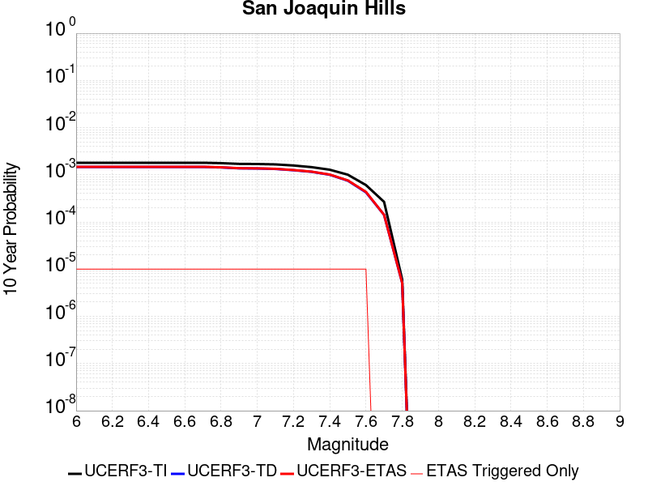 |

| Magnitude | 1 wk TI Prob | 1 wk TD Prob | 1 wk ETAS Prob | 1 wk ETAS/TD Gain | 1 wk ETAS Triggered Only | 1 mo TI Prob | 1 mo TD Prob | 1 mo ETAS Prob | 1 mo ETAS/TD Gain | 1 mo ETAS Triggered Only | 1 yr TI Prob | 1 yr TD Prob | 1 yr ETAS Prob | 1 yr ETAS/TD Gain | 1 yr ETAS Triggered Only | 10 yr TI Prob | 10 yr TD Prob | 10 yr ETAS Prob | 10 yr ETAS/TD Gain | 10 yr ETAS Triggered Only |
|-----|-----|-----|-----|-----|-----|-----|-----|-----|-----|-----|-----|-----|-----|-----|-----|-----|-----|-----|-----|-----|
| 6.0 | 3.4525704E-6 | 2.8139818E-6 | 2.8139818E-6 | 1.0 | 0.0 | 1.4796647E-5 | 1.2059867E-5 | 2.2059747E-5 | 1.8291866 | 1.0E-5 | 1.8013427E-4 | 1.4681912E-4 | 1.5681765E-4 | 1.068101 | 1.0E-5 | 0.0017998833 | 0.0014672345 | 0.0014772197 | 1.0068055 | 1.0E-5 |
| 6.1 | 3.4525704E-6 | 2.8139818E-6 | 2.8139818E-6 | 1.0 | 0.0 | 1.4796647E-5 | 1.2059867E-5 | 2.2059747E-5 | 1.8291866 | 1.0E-5 | 1.8013427E-4 | 1.4681912E-4 | 1.5681765E-4 | 1.068101 | 1.0E-5 | 0.0017998833 | 0.0014672345 | 0.0014772197 | 1.0068055 | 1.0E-5 |
| 6.2 | 3.4525704E-6 | 2.8139818E-6 | 2.8139818E-6 | 1.0 | 0.0 | 1.4796647E-5 | 1.2059867E-5 | 2.2059747E-5 | 1.8291866 | 1.0E-5 | 1.8013427E-4 | 1.4681912E-4 | 1.5681765E-4 | 1.068101 | 1.0E-5 | 0.0017998833 | 0.0014672345 | 0.0014772197 | 1.0068055 | 1.0E-5 |
| 6.3 | 3.4525704E-6 | 2.8139818E-6 | 2.8139818E-6 | 1.0 | 0.0 | 1.4796647E-5 | 1.2059867E-5 | 2.2059747E-5 | 1.8291866 | 1.0E-5 | 1.8013427E-4 | 1.4681912E-4 | 1.5681765E-4 | 1.068101 | 1.0E-5 | 0.0017998833 | 0.0014672345 | 0.0014772197 | 1.0068055 | 1.0E-5 |
| 6.4 | 3.4525704E-6 | 2.8139818E-6 | 2.8139818E-6 | 1.0 | 0.0 | 1.4796647E-5 | 1.2059867E-5 | 2.2059747E-5 | 1.8291866 | 1.0E-5 | 1.8013427E-4 | 1.4681912E-4 | 1.5681765E-4 | 1.068101 | 1.0E-5 | 0.0017998833 | 0.0014672345 | 0.0014772197 | 1.0068055 | 1.0E-5 |
| 6.5 | 3.4525704E-6 | 2.8139818E-6 | 2.8139818E-6 | 1.0 | 0.0 | 1.4796647E-5 | 1.2059867E-5 | 2.2059747E-5 | 1.8291866 | 1.0E-5 | 1.8013427E-4 | 1.4681912E-4 | 1.5681765E-4 | 1.068101 | 1.0E-5 | 0.0017998833 | 0.0014672345 | 0.0014772197 | 1.0068055 | 1.0E-5 |
| 6.6 | 3.4525704E-6 | 2.8139818E-6 | 2.8139818E-6 | 1.0 | 0.0 | 1.4796647E-5 | 1.2059867E-5 | 2.2059747E-5 | 1.8291866 | 1.0E-5 | 1.8013427E-4 | 1.4681912E-4 | 1.5681765E-4 | 1.068101 | 1.0E-5 | 0.0017998833 | 0.0014672345 | 0.0014772197 | 1.0068055 | 1.0E-5 |
| 6.7 | 3.4525704E-6 | 2.8139818E-6 | 2.8139818E-6 | 1.0 | 0.0 | 1.4796647E-5 | 1.2059867E-5 | 2.2059747E-5 | 1.8291866 | 1.0E-5 | 1.8013427E-4 | 1.4681912E-4 | 1.5681765E-4 | 1.068101 | 1.0E-5 | 0.0017998833 | 0.0014672345 | 0.0014772197 | 1.0068055 | 1.0E-5 |
| 6.8 | 3.388654E-6 | 2.7484202E-6 | 2.7484202E-6 | 1.0 | 0.0 | 1.4522722E-5 | 1.1778891E-5 | 2.1778773E-5 | 1.8489664 | 1.0E-5 | 1.767998E-4 | 1.4339869E-4 | 1.5339725E-4 | 1.0697256 | 1.0E-5 | 0.001766592 | 0.0014330745 | 0.0014430601 | 1.006968 | 1.0E-5 |
| 6.9 | 3.2694352E-6 | 2.6283346E-6 | 2.6283346E-6 | 1.0 | 0.0 | 1.401179E-5 | 1.1264243E-5 | 2.126413E-5 | 1.8877549 | 1.0E-5 | 1.7058018E-4 | 1.3713364E-4 | 1.4713226E-4 | 1.0729116 | 1.0E-5 | 0.0017044931 | 0.0013705015 | 0.0013804878 | 1.0072865 | 1.0E-5 |
| 7.0 | 3.246912E-6 | 2.6069915E-6 | 2.6069915E-6 | 1.0 | 0.0 | 1.39152635E-5 | 1.1172774E-5 | 2.1172662E-5 | 1.8950229 | 1.0E-5 | 1.6940516E-4 | 1.3602014E-4 | 1.4601878E-4 | 1.0735085 | 1.0E-5 | 0.0016927607 | 0.0013593802 | 0.0013693665 | 1.0073463 | 1.0E-5 |
| 7.1 | 3.1864927E-6 | 2.5523198E-6 | 2.5523198E-6 | 1.0 | 0.0 | 1.3656326E-5 | 1.0938467E-5 | 2.0938358E-5 | 1.9141948 | 1.0E-5 | 1.6625308E-4 | 1.3316782E-4 | 1.4316649E-4 | 1.0750833 | 1.0E-5 | 0.0016612876 | 0.0013308912 | 0.0013408778 | 1.0075037 | 1.0E-5 |
| 7.2 | 3.0220644E-6 | 2.3991677E-6 | 2.3991677E-6 | 1.0 | 0.0 | 1.295164E-5 | 1.0282108E-5 | 2.0282005E-5 | 1.9725533 | 1.0E-5 | 1.576748E-4 | 1.2517757E-4 | 1.3517632E-4 | 1.0798765 | 1.0E-5 | 0.0015756298 | 0.0012510809 | 0.0012610684 | 1.0079831 | 1.0E-5 |
| 7.3 | 2.787619E-6 | 2.2173858E-6 | 2.2173858E-6 | 1.0 | 0.0 | 1.1946884E-5 | 9.503048E-6 | 1.9502953E-5 | 2.052284 | 1.0E-5 | 1.454436E-4 | 1.1569356E-4 | 1.256924E-4 | 1.0864252 | 1.0E-5 | 0.0014534845 | 0.0011563431 | 0.0011663316 | 1.0086379 | 1.0E-5 |
| 7.4 | 2.4593792E-6 | 1.9226306E-6 | 1.9226306E-6 | 1.0 | 0.0 | 1.0540153E-5 | 8.23982E-6 | 1.8239738E-5 | 2.2136087 | 1.0E-5 | 1.2831882E-4 | 1.0031529E-4 | 1.1031428E-4 | 1.0996757 | 1.0E-5 | 0.0012824474 | 0.0010027088 | 0.0010126987 | 1.009963 | 1.0E-5 |
| 7.5 | 1.926764E-6 | 1.4383021E-6 | 1.4383021E-6 | 1.0 | 0.0 | 8.257534E-6 | 6.1641376E-6 | 1.6164076E-5 | 2.622277 | 1.0E-5 | 1.00530844E-4 | 7.504586E-5 | 8.50451E-5 | 1.1332419 | 1.0E-5 | 0.0010048538 | 7.502115E-4 | 7.60204E-4 | 1.0133196 | 1.0E-5 |
| 7.6 | 1.1609359E-6 | 8.14558E-7 | 8.14558E-7 | 1.0 | 0.0 | 4.97543E-6 | 3.4909585E-6 | 1.3490923E-5 | 3.864533 | 1.0E-5 | 6.0574173E-5 | 4.2501633E-5 | 5.2501207E-5 | 1.235275 | 1.0E-5 | 6.055767E-4 | 4.249394E-4 | 4.3493515E-4 | 1.0235227 | 1.0E-5 |
| 7.7 | 5.1168536E-7 | 2.7155914E-7 | 2.7155914E-7 | 1.0 | 0.0 | 2.1929354E-6 | 1.1638244E-6 | 1.1638244E-6 | 1.0 | 0.0 | 2.669866E-5 | 1.41694845E-5 | 1.41694845E-5 | 1.0 | 0.0 | 2.6695454E-4 | 1.4168715E-4 | 1.4168715E-4 | 1.0 | 0.0 |
| 7.8 | 1.16056995E-8 | 9.782373E-9 | 9.782373E-9 | 1.0 | 0.0 | 4.9738713E-8 | 4.1924455E-8 | 4.1924455E-8 | 1.0 | 0.0 | 6.0556863E-7 | 5.1043025E-7 | 5.1043025E-7 | 1.0 | 0.0 | 6.05567E-6 | 5.1043025E-6 | 5.1043025E-6 | 1.0 | 0.0 |

## Mission (connected) 2011 CFM
*[(top)](#table-of-contents)*

| 1 Week | 1 Month | 1 Year | 10 Year |
|-----|-----|-----|-----|
|  |  | 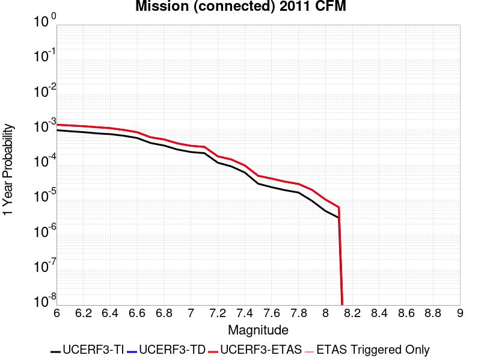 |  |

| Magnitude | 1 wk TI Prob | 1 wk TD Prob | 1 wk ETAS Prob | 1 wk ETAS/TD Gain | 1 wk ETAS Triggered Only | 1 mo TI Prob | 1 mo TD Prob | 1 mo ETAS Prob | 1 mo ETAS/TD Gain | 1 mo ETAS Triggered Only | 1 yr TI Prob | 1 yr TD Prob | 1 yr ETAS Prob | 1 yr ETAS/TD Gain | 1 yr ETAS Triggered Only | 10 yr TI Prob | 10 yr TD Prob | 10 yr ETAS Prob | 10 yr ETAS/TD Gain | 10 yr ETAS Triggered Only |
|-----|-----|-----|-----|-----|-----|-----|-----|-----|-----|-----|-----|-----|-----|-----|-----|-----|-----|-----|-----|-----|
| 6.0 | 1.8735573E-5 | 2.6882515E-5 | 2.6882515E-5 | 1.0 | 0.0 | 8.029284E-5 | 1.1520558E-4 | 1.1520558E-4 | 1.0 | 0.0 | 9.771269E-4 | 0.0014016571 | 0.0014016571 | 1.0 | 0.0 | 0.009728416 | 0.013937562 | 0.013947423 | 1.0007075 | 1.0E-5 |
| 6.1 | 1.7515964E-5 | 2.5523792E-5 | 2.5523792E-5 | 1.0 | 0.0 | 7.506625E-5 | 1.0938298E-4 | 1.0938298E-4 | 1.0 | 0.0 | 9.135484E-4 | 0.0013308554 | 0.0013308554 | 1.0 | 0.0 | 0.009098019 | 0.0132381655 | 0.0132381655 | 1.0 | 0.0 |
| 6.2 | 1.6486343E-5 | 2.4368448E-5 | 2.4368448E-5 | 1.0 | 0.0 | 7.065384E-5 | 1.0443191E-4 | 1.0443191E-4 | 1.0 | 0.0 | 8.5987104E-4 | 0.0012706495 | 0.0012706495 | 1.0 | 0.0 | 0.008565514 | 0.012643143 | 0.012643143 | 1.0 | 0.0 |
| 6.3 | 1.5229385E-5 | 2.2797909E-5 | 2.2797909E-5 | 1.0 | 0.0 | 6.526716E-5 | 9.7701544E-5 | 9.7701544E-5 | 1.0 | 0.0 | 7.9433795E-4 | 0.0011887997 | 0.0011887997 | 1.0 | 0.0 | 0.007915046 | 0.011836352 | 0.011836352 | 1.0 | 0.0 |
| 6.4 | 1.4435828E-5 | 2.1398E-5 | 2.1398E-5 | 1.0 | 0.0 | 6.186637E-5 | 9.1702364E-5 | 9.1702364E-5 | 1.0 | 0.0 | 7.529627E-4 | 0.0011158385 | 0.0011158385 | 1.0 | 0.0 | 0.007504165 | 0.011119362 | 0.011119362 | 1.0 | 0.0 |
| 6.5 | 1.30127955E-5 | 1.9037068E-5 | 1.9037068E-5 | 1.0 | 0.0 | 5.576793E-5 | 8.1584905E-5 | 8.1584905E-5 | 1.0 | 0.0 | 6.78763E-4 | 9.927875E-4 | 9.927875E-4 | 1.0 | 0.0 | 0.0067669353 | 0.009911527 | 0.009911527 | 1.0 | 0.0 |
| 6.6 | 1.1220718E-5 | 1.639339E-5 | 1.639339E-5 | 1.0 | 0.0 | 4.8087906E-5 | 7.0255504E-5 | 7.0255504E-5 | 1.0 | 0.0 | 5.8531296E-4 | 8.5502357E-4 | 8.5502357E-4 | 1.0 | 0.0 | 0.005837737 | 0.00854963 | 0.00854963 | 1.0 | 0.0 |
| 6.7 | 8.086152E-6 | 1.1750298E-5 | 1.1750298E-5 | 1.0 | 0.0 | 3.4654473E-5 | 5.035745E-5 | 5.035745E-5 | 1.0 | 0.0 | 4.2183654E-4 | 6.129302E-4 | 6.129302E-4 | 1.0 | 0.0 | 0.004210367 | 0.0061497535 | 0.0061497535 | 1.0 | 0.0 |
| 6.8 | 6.8361655E-6 | 1.0195406E-5 | 1.0195406E-5 | 1.0 | 0.0 | 2.9297524E-5 | 4.3693864E-5 | 4.3693864E-5 | 1.0 | 0.0 | 3.5663895E-4 | 5.3184363E-4 | 5.3184363E-4 | 1.0 | 0.0 | 0.0035606713 | 0.0053387266 | 0.0053387266 | 1.0 | 0.0 |
| 6.9 | 5.2517353E-6 | 7.8690955E-6 | 7.8690955E-6 | 1.0 | 0.0 | 2.2507242E-5 | 3.3724264E-5 | 3.3724264E-5 | 1.0 | 0.0 | 2.739912E-4 | 4.105158E-4 | 4.105158E-4 | 1.0 | 0.0 | 0.0027365363 | 0.004129868 | 0.004129868 | 1.0 | 0.0 |
| 7.0 | 4.4602784E-6 | 6.7016504E-6 | 6.7016504E-6 | 1.0 | 0.0 | 1.911534E-5 | 2.8721044E-5 | 2.8721044E-5 | 1.0 | 0.0 | 2.327044E-4 | 3.4962274E-4 | 3.4962274E-4 | 1.0 | 0.0 | 0.0023246086 | 0.0035221886 | 0.0035221886 | 1.0 | 0.0 |
| 7.1 | 4.1492594E-6 | 6.2504096E-6 | 6.2504096E-6 | 1.0 | 0.0 | 1.7782419E-5 | 2.6787196E-5 | 2.6787196E-5 | 1.0 | 0.0 | 2.1647944E-4 | 3.2608546E-4 | 3.2608546E-4 | 1.0 | 0.0 | 0.0021626868 | 0.0032870003 | 0.0032870003 | 1.0 | 0.0 |
| 7.2 | 2.213247E-6 | 3.3628444E-6 | 3.3628444E-6 | 1.0 | 0.0 | 9.485309E-6 | 1.441211E-5 | 1.441211E-5 | 1.0 | 0.0 | 1.15477524E-4 | 1.7545334E-4 | 1.7545334E-4 | 1.0 | 0.0 | 0.0011541754 | 0.0017818302 | 0.0017818302 | 1.0 | 0.0 |
| 7.3 | 1.7362703E-6 | 2.7384676E-6 | 2.7384676E-6 | 1.0 | 0.0 | 7.4411373E-6 | 1.1736238E-5 | 1.1736238E-5 | 1.0 | 0.0 | 9.0592075E-5 | 1.4287935E-4 | 1.4287935E-4 | 1.0 | 0.0 | 9.0555154E-4 | 0.0014532148 | 0.0014532148 | 1.0 | 0.0 |
| 7.4 | 1.1628409E-6 | 1.8493533E-6 | 1.8493533E-6 | 1.0 | 0.0 | 4.9835944E-6 | 7.925776E-6 | 7.925776E-6 | 1.0 | 0.0 | 6.0673574E-5 | 9.649206E-5 | 9.649206E-5 | 1.0 | 0.0 | 6.065701E-4 | 9.85306E-4 | 9.85306E-4 | 1.0 | 0.0 |
| 7.5 | 5.5610667E-7 | 9.343823E-7 | 9.343823E-7 | 1.0 | 0.0 | 2.3833122E-6 | 4.0044893E-6 | 4.0044893E-6 | 1.0 | 0.0 | 2.9016439E-5 | 4.8753573E-5 | 4.8753573E-5 | 1.0 | 0.0 | 2.901265E-4 | 5.0411286E-4 | 5.0411286E-4 | 1.0 | 0.0 |
| 7.6 | 4.4307663E-7 | 7.784628E-7 | 7.784628E-7 | 1.0 | 0.0 | 1.8988985E-6 | 3.3362649E-6 | 3.3362649E-6 | 1.0 | 0.0 | 2.3118844E-5 | 4.061827E-5 | 4.061827E-5 | 1.0 | 0.0 | 2.3116439E-4 | 4.2210697E-4 | 4.2210697E-4 | 1.0 | 0.0 |
| 7.7 | 3.639119E-7 | 6.3549425E-7 | 6.3549425E-7 | 1.0 | 0.0 | 1.5596215E-6 | 2.7235437E-6 | 2.7235437E-6 | 1.0 | 0.0 | 1.8988227E-5 | 3.315864E-5 | 3.315864E-5 | 1.0 | 0.0 | 1.8986604E-4 | 3.4690052E-4 | 3.4690052E-4 | 1.0 | 0.0 |
| 7.8 | 3.1152942E-7 | 5.474834E-7 | 5.474834E-7 | 1.0 | 0.0 | 1.3351254E-6 | 2.3463554E-6 | 2.3463554E-6 | 1.0 | 0.0 | 1.6255031E-5 | 2.8566503E-5 | 2.8566503E-5 | 1.0 | 0.0 | 1.6253842E-4 | 2.977112E-4 | 2.977112E-4 | 1.0 | 0.0 |
| 7.9 | 1.8035962E-7 | 3.7184682E-7 | 3.7184682E-7 | 1.0 | 0.0 | 7.729696E-7 | 1.5936282E-6 | 1.5936282E-6 | 1.0 | 0.0 | 9.410865E-6 | 1.9402252E-5 | 1.9402252E-5 | 1.0 | 0.0 | 9.410465E-5 | 2.0071324E-4 | 2.0071324E-4 | 1.0 | 0.0 |
| 8.0 | 9.279334E-8 | 1.9695527E-7 | 1.9695527E-7 | 1.0 | 0.0 | 3.976857E-7 | 8.4409373E-7 | 8.4409373E-7 | 1.0 | 0.0 | 4.841813E-6 | 1.0276794E-5 | 1.0276794E-5 | 1.0 | 0.0 | 4.841707E-5 | 1.05289524E-4 | 1.05289524E-4 | 1.0 | 0.0 |
| 8.1 | 5.9253985E-8 | 1.18509675E-7 | 1.18509675E-7 | 1.0 | 0.0 | 2.5394561E-7 | 5.078985E-7 | 5.078985E-7 | 1.0 | 0.0 | 3.0917836E-6 | 6.183647E-6 | 6.183647E-6 | 1.0 | 0.0 | 3.0917407E-5 | 6.322351E-5 | 6.322351E-5 | 1.0 | 0.0 |

## Great Valley 11
*[(top)](#table-of-contents)*

| 1 Week | 1 Month | 1 Year | 10 Year |
|-----|-----|-----|-----|
|  |  |  |  |

| Magnitude | 1 wk TI Prob | 1 wk TD Prob | 1 wk ETAS Prob | 1 wk ETAS/TD Gain | 1 wk ETAS Triggered Only | 1 mo TI Prob | 1 mo TD Prob | 1 mo ETAS Prob | 1 mo ETAS/TD Gain | 1 mo ETAS Triggered Only | 1 yr TI Prob | 1 yr TD Prob | 1 yr ETAS Prob | 1 yr ETAS/TD Gain | 1 yr ETAS Triggered Only | 10 yr TI Prob | 10 yr TD Prob | 10 yr ETAS Prob | 10 yr ETAS/TD Gain | 10 yr ETAS Triggered Only |
|-----|-----|-----|-----|-----|-----|-----|-----|-----|-----|-----|-----|-----|-----|-----|-----|-----|-----|-----|-----|-----|
| 6.0 | 2.8099583E-5 | 2.9832152E-5 | 2.9832152E-5 | 1.0 | 0.0 | 1.20421224E-4 | 1.278462E-4 | 1.278462E-4 | 1.0 | 0.0 | 0.0014651422 | 0.0015554909 | 0.0015554909 | 1.0 | 0.0 | 0.0145552 | 0.01545356 | 0.015463406 | 1.000637 | 1.0E-5 |
| 6.1 | 2.483194E-5 | 2.590715E-5 | 2.590715E-5 | 1.0 | 0.0 | 1.0641825E-4 | 1.11026246E-4 | 1.11026246E-4 | 1.0 | 0.0 | 0.0012948721 | 0.0013509706 | 0.0013509706 | 1.0 | 0.0 | 0.012873529 | 0.013433994 | 0.013443859 | 1.0007343 | 1.0E-5 |
| 6.2 | 2.483194E-5 | 2.590715E-5 | 2.590715E-5 | 1.0 | 0.0 | 1.0641825E-4 | 1.11026246E-4 | 1.11026246E-4 | 1.0 | 0.0 | 0.0012948721 | 0.0013509706 | 0.0013509706 | 1.0 | 0.0 | 0.012873529 | 0.013433994 | 0.013443859 | 1.0007343 | 1.0E-5 |
| 6.3 | 2.0257901E-5 | 2.0398922E-5 | 2.0398922E-5 | 1.0 | 0.0 | 8.681669E-5 | 8.742122E-5 | 8.742122E-5 | 1.0 | 0.0 | 0.0010564806 | 0.0010638756 | 0.0010638756 | 1.0 | 0.0 | 0.01051472 | 0.010592012 | 0.010601905 | 1.0009341 | 1.0E-5 |
| 6.4 | 1.8054898E-5 | 1.7780874E-5 | 1.7780874E-5 | 1.0 | 0.0 | 7.737584E-5 | 7.62017E-5 | 7.62017E-5 | 1.0 | 0.0 | 9.416436E-4 | 9.2739856E-4 | 9.2739856E-4 | 1.0 | 0.0 | 0.009376635 | 0.009239036 | 0.009248943 | 1.0010724 | 1.0E-5 |
| 6.5 | 1.34804895E-5 | 1.2321055E-5 | 1.2321055E-5 | 1.0 | 0.0 | 5.777225E-5 | 5.2803476E-5 | 5.2803476E-5 | 1.0 | 0.0 | 7.031501E-4 | 6.4269686E-4 | 6.4269686E-4 | 1.0 | 0.0 | 0.007009294 | 0.0064088185 | 0.0064088185 | 1.0 | 0.0 |
| 6.6 | 1.294883E-5 | 1.1732312E-5 | 1.1732312E-5 | 1.0 | 0.0 | 5.5493805E-5 | 5.028039E-5 | 5.028039E-5 | 1.0 | 0.0 | 6.754276E-4 | 6.1199587E-4 | 6.1199587E-4 | 1.0 | 0.0 | 0.006733784 | 0.0061035305 | 0.0061035305 | 1.0 | 0.0 |
| 6.7 | 1.1272237E-5 | 9.811886E-6 | 9.811886E-6 | 1.0 | 0.0 | 4.8308695E-5 | 4.2050277E-5 | 4.2050277E-5 | 1.0 | 0.0 | 5.879996E-4 | 5.118446E-4 | 5.118446E-4 | 1.0 | 0.0 | 0.005864462 | 0.0051069413 | 0.0051069413 | 1.0 | 0.0 |
| 6.8 | 9.8337505E-6 | 8.19377E-6 | 8.19377E-6 | 1.0 | 0.0 | 4.2143965E-5 | 3.5115696E-5 | 3.5115696E-5 | 1.0 | 0.0 | 5.1298196E-4 | 4.2745177E-4 | 4.2745177E-4 | 1.0 | 0.0 | 0.005117994 | 0.0042665056 | 0.0042665056 | 1.0 | 0.0 |
| 6.9 | 7.4224813E-6 | 5.4131347E-6 | 5.4131347E-6 | 1.0 | 0.0 | 3.1810247E-5 | 2.319895E-5 | 2.319895E-5 | 1.0 | 0.0 | 3.872209E-4 | 2.8241202E-4 | 2.8241202E-4 | 1.0 | 0.0 | 0.0038654688 | 0.0028206722 | 0.0028206722 | 1.0 | 0.0 |
| 7.0 | 4.4628923E-6 | 2.0110795E-6 | 2.0110795E-6 | 1.0 | 0.0 | 1.912654E-5 | 8.618884E-6 | 8.618884E-6 | 1.0 | 0.0 | 2.3284076E-4 | 1.04929975E-4 | 1.04929975E-4 | 1.0 | 0.0 | 0.0023259693 | 0.0010488159 | 0.0010488159 | 1.0 | 0.0 |
| 7.1 | 3.5546527E-6 | 1.1855836E-6 | 1.1855836E-6 | 1.0 | 0.0 | 1.5234136E-5 | 5.081063E-6 | 5.081063E-6 | 1.0 | 0.0 | 1.8545982E-4 | 6.186026E-5 | 6.186026E-5 | 1.0 | 0.0 | 0.0018530512 | 6.1843713E-4 | 6.1843713E-4 | 1.0 | 0.0 |
| 7.2 | 3.2039936E-6 | 1.1254128E-6 | 1.1254128E-6 | 1.0 | 0.0 | 1.3731329E-5 | 4.823189E-6 | 4.823189E-6 | 1.0 | 0.0 | 1.671661E-4 | 5.8720816E-5 | 5.8720816E-5 | 1.0 | 0.0 | 0.0016704041 | 5.870597E-4 | 5.870597E-4 | 1.0 | 0.0 |
| 7.3 | 2.8120473E-6 | 1.0305612E-6 | 1.0305612E-6 | 1.0 | 0.0 | 1.2051575E-5 | 4.4166836E-6 | 4.4166836E-6 | 1.0 | 0.0 | 1.4671806E-4 | 5.3771862E-5 | 5.3771862E-5 | 1.0 | 0.0 | 0.0014662122 | 5.3759513E-4 | 5.3759513E-4 | 1.0 | 0.0 |
| 7.4 | 2.4837766E-6 | 9.800582E-7 | 9.800582E-7 | 1.0 | 0.0 | 1.0644713E-5 | 4.200243E-6 | 4.200243E-6 | 1.0 | 0.0 | 1.2959167E-4 | 5.1136827E-5 | 5.1136827E-5 | 1.0 | 0.0 | 0.0012951613 | 5.112572E-4 | 5.112572E-4 | 1.0 | 0.0 |
| 7.5 | 1.5002679E-6 | 6.546144E-7 | 6.546144E-7 | 1.0 | 0.0 | 6.4297037E-6 | 2.8054874E-6 | 2.8054874E-6 | 1.0 | 0.0 | 7.827883E-5 | 3.4156317E-5 | 3.4156317E-5 | 1.0 | 0.0 | 7.825126E-4 | 3.4151482E-4 | 3.4151482E-4 | 1.0 | 0.0 |

## Swain Ravine - Spenceville
*[(top)](#table-of-contents)*

| 1 Week | 1 Month | 1 Year | 10 Year |
|-----|-----|-----|-----|
| 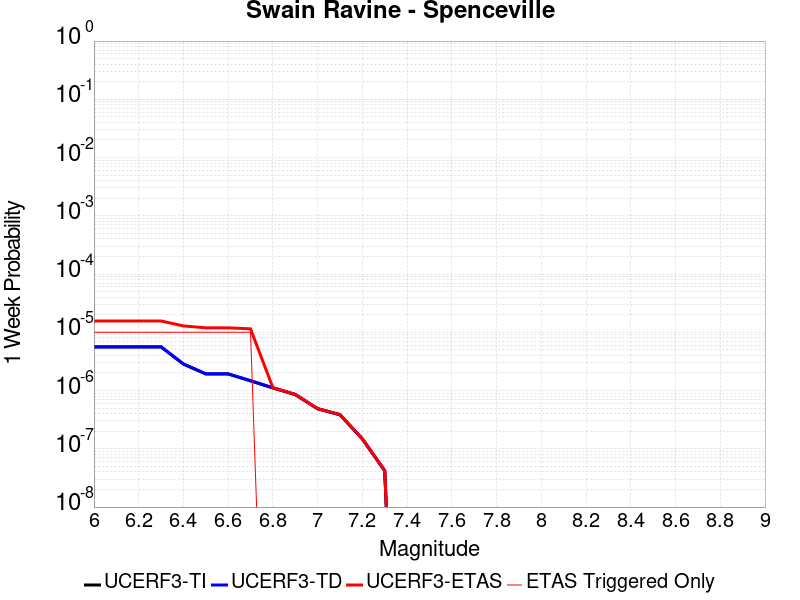 | 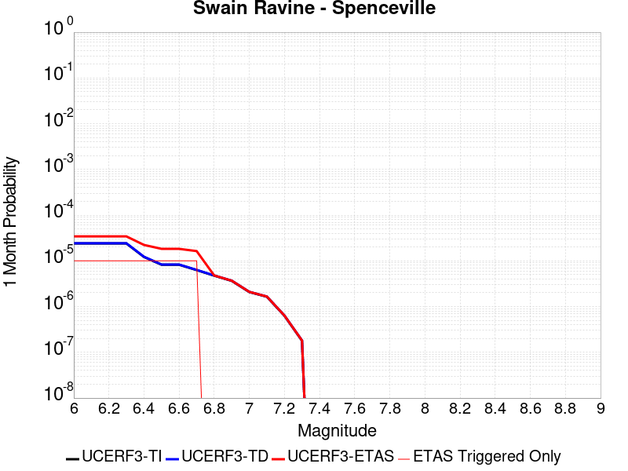 | 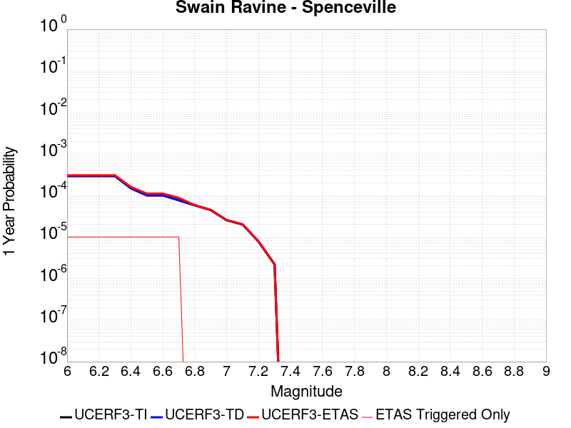 |  |

| Magnitude | 1 wk TI Prob | 1 wk TD Prob | 1 wk ETAS Prob | 1 wk ETAS/TD Gain | 1 wk ETAS Triggered Only | 1 mo TI Prob | 1 mo TD Prob | 1 mo ETAS Prob | 1 mo ETAS/TD Gain | 1 mo ETAS Triggered Only | 1 yr TI Prob | 1 yr TD Prob | 1 yr ETAS Prob | 1 yr ETAS/TD Gain | 1 yr ETAS Triggered Only | 10 yr TI Prob | 10 yr TD Prob | 10 yr ETAS Prob | 10 yr ETAS/TD Gain | 10 yr ETAS Triggered Only |
|-----|-----|-----|-----|-----|-----|-----|-----|-----|-----|-----|-----|-----|-----|-----|-----|-----|-----|-----|-----|-----|
| 6.0 | 5.596169E-6 | 5.663794E-6 | 1.5663738E-5 | 2.765591 | 1.0E-5 | 2.398336E-5 | 2.4273193E-5 | 3.427295E-5 | 1.4119672 | 1.0E-5 | 2.9195828E-4 | 2.9548878E-4 | 3.0548582E-4 | 1.0338322 | 1.0E-5 | 0.00291575 | 0.002951228 | 0.0029611986 | 1.0033784 | 1.0E-5 |
| 6.1 | 5.596169E-6 | 5.663794E-6 | 1.5663738E-5 | 2.765591 | 1.0E-5 | 2.398336E-5 | 2.4273193E-5 | 3.427295E-5 | 1.4119672 | 1.0E-5 | 2.9195828E-4 | 2.9548878E-4 | 3.0548582E-4 | 1.0338322 | 1.0E-5 | 0.00291575 | 0.002951228 | 0.0029611986 | 1.0033784 | 1.0E-5 |
| 6.2 | 5.596169E-6 | 5.663794E-6 | 1.5663738E-5 | 2.765591 | 1.0E-5 | 2.398336E-5 | 2.4273193E-5 | 3.427295E-5 | 1.4119672 | 1.0E-5 | 2.9195828E-4 | 2.9548878E-4 | 3.0548582E-4 | 1.0338322 | 1.0E-5 | 0.00291575 | 0.002951228 | 0.0029611986 | 1.0033784 | 1.0E-5 |
| 6.3 | 5.596169E-6 | 5.663794E-6 | 1.5663738E-5 | 2.765591 | 1.0E-5 | 2.398336E-5 | 2.4273193E-5 | 3.427295E-5 | 1.4119672 | 1.0E-5 | 2.9195828E-4 | 2.9548878E-4 | 3.0548582E-4 | 1.0338322 | 1.0E-5 | 0.00291575 | 0.002951228 | 0.0029611986 | 1.0033784 | 1.0E-5 |
| 6.4 | 2.8426775E-6 | 2.874144E-6 | 1.2874115E-5 | 4.4792867 | 1.0E-5 | 1.2182847E-5 | 1.2317704E-5 | 2.2317581E-5 | 1.8118296 | 1.0E-5 | 1.4831607E-4 | 1.4995811E-4 | 1.5995662E-4 | 1.0666753 | 1.0E-5 | 0.0014821711 | 0.0014986077 | 0.0015085926 | 1.0066628 | 1.0E-5 |
| 6.5 | 1.9210793E-6 | 1.9414147E-6 | 1.1941395E-5 | 6.150873 | 1.0E-5 | 8.233172E-6 | 8.320323E-6 | 1.832024E-5 | 2.2018664 | 1.0E-5 | 1.0023425E-4 | 1.0129536E-4 | 1.1129434E-4 | 1.0987113 | 1.0E-5 | 0.0010018905 | 0.0010125053 | 0.0010224952 | 1.0098665 | 1.0E-5 |
| 6.6 | 1.9210793E-6 | 1.9414147E-6 | 1.1941395E-5 | 6.150873 | 1.0E-5 | 8.233172E-6 | 8.320323E-6 | 1.832024E-5 | 2.2018664 | 1.0E-5 | 1.0023425E-4 | 1.0129536E-4 | 1.1129434E-4 | 1.0987113 | 1.0E-5 | 0.0010018905 | 0.0010125053 | 0.0010224952 | 1.0098665 | 1.0E-5 |
| 6.7 | 1.4667394E-6 | 1.4818934E-6 | 1.1481879E-5 | 7.748114 | 1.0E-5 | 6.286011E-6 | 6.3509565E-6 | 1.6350892E-5 | 2.5745559 | 1.0E-5 | 7.65295E-5 | 7.732023E-5 | 8.731946E-5 | 1.1293223 | 1.0E-5 | 7.6503144E-4 | 7.72941E-4 | 7.8293326E-4 | 1.0129277 | 1.0E-5 |
| 6.8 | 1.1076943E-6 | 1.1189535E-6 | 1.1189535E-6 | 1.0 | 0.0 | 4.747252E-6 | 4.7955064E-6 | 4.7955064E-6 | 1.0 | 0.0 | 5.7796264E-5 | 5.838377E-5 | 5.838377E-5 | 1.0 | 0.0 | 5.778124E-4 | 5.836887E-4 | 5.836887E-4 | 1.0 | 0.0 |
| 6.9 | 8.514296E-7 | 8.600095E-7 | 8.600095E-7 | 1.0 | 0.0 | 3.648979E-6 | 3.6857498E-6 | 3.6857498E-6 | 1.0 | 0.0 | 4.442541E-5 | 4.4873108E-5 | 4.4873108E-5 | 1.0 | 0.0 | 4.441653E-4 | 4.4864335E-4 | 4.4864335E-4 | 1.0 | 0.0 |
| 7.0 | 4.8544706E-7 | 4.9033E-7 | 4.9033E-7 | 1.0 | 0.0 | 2.0804857E-6 | 2.1014127E-6 | 2.1014127E-6 | 1.0 | 0.0 | 2.532962E-5 | 2.5584413E-5 | 2.5584413E-5 | 1.0 | 0.0 | 2.5326732E-4 | 2.5581598E-4 | 2.5581598E-4 | 1.0 | 0.0 |
| 7.1 | 3.829186E-7 | 3.8678783E-7 | 3.8678783E-7 | 1.0 | 0.0 | 1.6410787E-6 | 1.6576612E-6 | 1.6576612E-6 | 1.0 | 0.0 | 1.997995E-5 | 2.0181848E-5 | 2.0181848E-5 | 1.0 | 0.0 | 1.9978154E-4 | 2.0180122E-4 | 2.0180122E-4 | 1.0 | 0.0 |
| 7.2 | 1.4726595E-7 | 1.4879437E-7 | 1.4879437E-7 | 1.0 | 0.0 | 6.3113964E-7 | 6.3769005E-7 | 6.3769005E-7 | 1.0 | 0.0 | 7.684098E-6 | 7.763854E-6 | 7.763854E-6 | 1.0 | 0.0 | 7.6838325E-5 | 7.763636E-5 | 7.763636E-5 | 1.0 | 0.0 |
| 7.3 | 4.1880604E-8 | 4.2324306E-8 | 4.2324306E-8 | 1.0 | 0.0 | 1.7948828E-7 | 1.8138988E-7 | 1.8138988E-7 | 1.0 | 0.0 | 2.1852677E-6 | 2.2084218E-6 | 2.2084218E-6 | 1.0 | 0.0 | 2.1852462E-5 | 2.2084218E-5 | 2.2084218E-5 | 1.0 | 0.0 |

## Mendocino
*[(top)](#table-of-contents)*

| 1 Week | 1 Month | 1 Year | 10 Year |
|-----|-----|-----|-----|
|  |  |  |  |

| Magnitude | 1 wk TI Prob | 1 wk TD Prob | 1 wk ETAS Prob | 1 wk ETAS/TD Gain | 1 wk ETAS Triggered Only | 1 mo TI Prob | 1 mo TD Prob | 1 mo ETAS Prob | 1 mo ETAS/TD Gain | 1 mo ETAS Triggered Only | 1 yr TI Prob | 1 yr TD Prob | 1 yr ETAS Prob | 1 yr ETAS/TD Gain | 1 yr ETAS Triggered Only | 10 yr TI Prob | 10 yr TD Prob | 10 yr ETAS Prob | 10 yr ETAS/TD Gain | 10 yr ETAS Triggered Only |
|-----|-----|-----|-----|-----|-----|-----|-----|-----|-----|-----|-----|-----|-----|-----|-----|-----|-----|-----|-----|-----|
| 6.0 | 5.5409013E-4 | 0.0010850244 | 0.0010850244 | 1.0 | 0.0 | 0.0023725112 | 0.004636911 | 0.004636911 | 1.0 | 0.0 | 0.028505474 | 0.05467285 | 0.054682303 | 1.0001729 | 1.0E-5 | 0.25113493 | 0.411882 | 0.41188788 | 1.0000143 | 1.0E-5 |
| 6.1 | 4.2515888E-4 | 8.233315E-4 | 8.233315E-4 | 1.0 | 0.0 | 0.0018208373 | 0.0035215917 | 0.0035215917 | 1.0 | 0.0 | 0.021944538 | 0.041749846 | 0.041759428 | 1.0002295 | 1.0E-5 | 0.19899574 | 0.32995537 | 0.32996207 | 1.0000203 | 1.0E-5 |
| 6.2 | 4.2515888E-4 | 8.233315E-4 | 8.233315E-4 | 1.0 | 0.0 | 0.0018208373 | 0.0035215917 | 0.0035215917 | 1.0 | 0.0 | 0.021944538 | 0.041749846 | 0.041759428 | 1.0002295 | 1.0E-5 | 0.19899574 | 0.32995537 | 0.32996207 | 1.0000203 | 1.0E-5 |
| 6.3 | 3.2773745E-4 | 6.1941805E-4 | 6.1941805E-4 | 1.0 | 0.0 | 0.0014038329 | 0.0026506495 | 0.0026506495 | 1.0 | 0.0 | 0.016958237 | 0.031592727 | 0.031602412 | 1.0003065 | 1.0E-5 | 0.1572094 | 0.26077813 | 0.26078552 | 1.0000284 | 1.0E-5 |
| 6.4 | 2.7417165E-4 | 5.0483743E-4 | 5.0483743E-4 | 1.0 | 0.0 | 0.0011744922 | 0.0021604756 | 0.0021604756 | 1.0 | 0.0 | 0.014205975 | 0.025837418 | 0.02584716 | 1.000377 | 1.0E-5 | 0.13331394 | 0.21947995 | 0.21948774 | 1.0000355 | 1.0E-5 |
| 6.5 | 2.3984899E-4 | 4.322691E-4 | 4.322691E-4 | 1.0 | 0.0 | 0.0010275192 | 0.0018508129 | 0.0018508129 | 1.0 | 0.0 | 0.012438473 | 0.022180691 | 0.022190468 | 1.0004408 | 1.0E-5 | 0.11764851 | 0.19203661 | 0.19204469 | 1.0000421 | 1.0E-5 |
| 6.6 | 2.1023539E-4 | 3.6937738E-4 | 3.6937738E-4 | 1.0 | 0.0 | 9.0069766E-4 | 0.0015816262 | 0.0015816262 | 1.0 | 0.0 | 0.010910975 | 0.018990388 | 0.019000199 | 1.0005165 | 1.0E-5 | 0.10390546 | 0.16749348 | 0.1675018 | 1.0000497 | 1.0E-5 |
| 6.7 | 1.2592976E-4 | 1.8438937E-4 | 1.8438937E-4 | 1.0 | 0.0 | 5.395873E-4 | 7.8949484E-4 | 7.8949484E-4 | 1.0 | 0.0 | 0.006549705 | 0.009555929 | 0.009565833 | 1.0010365 | 1.0E-5 | 0.063599944 | 0.09096867 | 0.09097776 | 1.0000999 | 1.0E-5 |
| 6.8 | 1.13663555E-4 | 1.5403709E-4 | 1.5403709E-4 | 1.0 | 0.0 | 4.8703855E-4 | 6.599124E-4 | 6.599124E-4 | 1.0 | 0.0 | 0.0059135845 | 0.007999982 | 0.008009901 | 1.00124 | 1.0E-5 | 0.057586733 | 0.07739284 | 0.07740206 | 1.0001192 | 1.0E-5 |
| 6.9 | 9.926894E-5 | 1.229904E-4 | 1.229904E-4 | 1.0 | 0.0 | 4.2536893E-4 | 5.2698E-4 | 5.2698E-4 | 1.0 | 0.0 | 0.0051665753 | 0.006396752 | 0.006406688 | 1.0015533 | 1.0E-5 | 0.050480947 | 0.06286036 | 0.062869735 | 1.0001491 | 1.0E-5 |
| 7.0 | 9.168125E-5 | 1.0784077E-4 | 1.0784077E-4 | 1.0 | 0.0 | 3.9286047E-4 | 4.6207767E-4 | 4.6207767E-4 | 1.0 | 0.0 | 0.004772591 | 0.0056109587 | 0.005620903 | 1.0017723 | 1.0E-5 | 0.04671385 | 0.055621758 | 0.0556312 | 1.0001698 | 1.0E-5 |
| 7.1 | 8.2854116E-5 | 9.1050766E-5 | 9.1050766E-5 | 1.0 | 0.0 | 3.5504074E-4 | 3.9016004E-4 | 3.9016004E-4 | 1.0 | 0.0 | 0.004314056 | 0.0047398703 | 0.004749823 | 1.0020998 | 1.0E-5 | 0.042312626 | 0.047481373 | 0.0474909 | 1.0002006 | 1.0E-5 |
| 7.2 | 7.8255274E-5 | 8.300278E-5 | 8.300278E-5 | 1.0 | 0.0 | 3.3533663E-4 | 3.5567852E-4 | 3.5567852E-4 | 1.0 | 0.0 | 0.0040750825 | 0.0043219337 | 0.0043318905 | 1.0023038 | 1.0E-5 | 0.040011603 | 0.043525863 | 0.04353543 | 1.0002197 | 1.0E-5 |
| 7.3 | 6.887904E-5 | 6.2587686E-5 | 6.2587686E-5 | 1.0 | 0.0 | 2.9516246E-4 | 2.682059E-4 | 2.682059E-4 | 1.0 | 0.0 | 0.0035876823 | 0.0032606125 | 0.00327058 | 1.0030569 | 1.0E-5 | 0.035303112 | 0.033351965 | 0.03336163 | 1.0002898 | 1.0E-5 |
| 7.4 | 5.4898497E-5 | 3.7399142E-5 | 3.7399142E-5 | 1.0 | 0.0 | 2.3525805E-4 | 1.6027251E-4 | 1.6027251E-4 | 1.0 | 0.0 | 0.0028605047 | 0.0019496274 | 0.001959608 | 1.0051192 | 1.0E-5 | 0.02823963 | 0.020410953 | 0.020420749 | 1.0004799 | 1.0E-5 |
| 7.5 | 3.9103943E-5 | 1.1307368E-5 | 1.1307368E-5 | 1.0 | 0.0 | 1.6757756E-4 | 4.8459257E-5 | 4.8459257E-5 | 1.0 | 0.0 | 0.0020383475 | 5.8983336E-4 | 5.9982744E-4 | 1.0169439 | 1.0E-5 | 0.020197518 | 0.00662414 | 0.006634074 | 1.0014997 | 1.0E-5 |
| 7.6 | 3.641042E-5 | 8.984288E-6 | 8.984288E-6 | 1.0 | 0.0 | 1.5603533E-4 | 3.850353E-5 | 3.850353E-5 | 1.0 | 0.0 | 0.0018980748 | 4.68681E-4 | 4.7867632E-4 | 1.0213264 | 1.0E-5 | 0.018819444 | 0.005348026 | 0.0053579723 | 1.0018599 | 1.0E-5 |
| 7.7 | 3.1318774E-5 | 4.4553763E-6 | 4.4553763E-6 | 1.0 | 0.0 | 1.342164E-4 | 1.9094332E-5 | 1.9094332E-5 | 1.0 | 0.0 | 0.0016328598 | 2.3244887E-4 | 2.4244655E-4 | 1.0430102 | 1.0E-5 | 0.016209139 | 0.0028659757 | 0.002875947 | 1.0034792 | 1.0E-5 |
| 7.8 | 2.209241E-5 | 2.6815096E-6 | 2.6815096E-6 | 1.0 | 0.0 | 9.467832E-5 | 1.1492133E-5 | 1.1492133E-5 | 1.0 | 0.0 | 0.001152099 | 1.3990777E-4 | 1.4990637E-4 | 1.0714656 | 1.0E-5 | 0.011461443 | 0.0017378427 | 0.0017478253 | 1.0057442 | 1.0E-5 |
| 7.9 | 1.2640477E-5 | 2.0423045E-6 | 2.0423045E-6 | 1.0 | 0.0 | 5.4172346E-5 | 8.752703E-6 | 8.752703E-6 | 1.0 | 0.0 | 6.593487E-4 | 1.0655898E-4 | 1.16557916E-4 | 1.0938348 | 1.0E-5 | 0.006573958 | 0.0012980766 | 0.0013080636 | 1.0076936 | 1.0E-5 |
| 8.0 | 6.5548907E-6 | 1.638728E-6 | 1.638728E-6 | 1.0 | 0.0 | 2.8092087E-5 | 7.0231013E-6 | 7.0231013E-6 | 1.0 | 0.0 | 3.4196748E-4 | 8.550293E-5 | 9.550207E-5 | 1.116945 | 1.0E-5 | 0.0034144172 | 0.0010310268 | 0.0010410165 | 1.0096891 | 1.0E-5 |
| 8.1 | 3.1916707E-6 | 1.3582962E-6 | 1.3582962E-6 | 1.0 | 0.0 | 1.3678517E-5 | 5.8212563E-6 | 5.8212563E-6 | 1.0 | 0.0 | 1.6652321E-4 | 7.0871516E-5 | 8.087081E-5 | 1.1410904 | 1.0E-5 | 0.0016639848 | 8.627292E-4 | 8.7272056E-4 | 1.0115811 | 1.0E-5 |
| 8.2 | 2.1193785E-6 | 1.0301144E-6 | 1.0301144E-6 | 1.0 | 0.0 | 9.083019E-6 | 4.4147682E-6 | 4.4147682E-6 | 1.0 | 0.0 | 1.1058014E-4 | 5.37485E-5 | 5.37485E-5 | 1.0 | 0.0 | 0.0011052513 | 6.5027695E-4 | 6.5027695E-4 | 1.0 | 0.0 |
| 8.3 | 7.536878E-7 | 3.927364E-7 | 3.927364E-7 | 1.0 | 0.0 | 3.2300866E-6 | 1.683155E-6 | 1.683155E-6 | 1.0 | 0.0 | 3.9325594E-5 | 2.0492233E-5 | 2.0492233E-5 | 1.0 | 0.0 | 3.9318635E-4 | 2.4130501E-4 | 2.4130501E-4 | 1.0 | 0.0 |

## La Panza 2011
*[(top)](#table-of-contents)*

| 1 Week | 1 Month | 1 Year | 10 Year |
|-----|-----|-----|-----|
|  |  |  |  |

| Magnitude | 1 wk TI Prob | 1 wk TD Prob | 1 wk ETAS Prob | 1 wk ETAS/TD Gain | 1 wk ETAS Triggered Only | 1 mo TI Prob | 1 mo TD Prob | 1 mo ETAS Prob | 1 mo ETAS/TD Gain | 1 mo ETAS Triggered Only | 1 yr TI Prob | 1 yr TD Prob | 1 yr ETAS Prob | 1 yr ETAS/TD Gain | 1 yr ETAS Triggered Only | 10 yr TI Prob | 10 yr TD Prob | 10 yr ETAS Prob | 10 yr ETAS/TD Gain | 10 yr ETAS Triggered Only |
|-----|-----|-----|-----|-----|-----|-----|-----|-----|-----|-----|-----|-----|-----|-----|-----|-----|-----|-----|-----|-----|
| 6.0 | 4.6754544E-6 | 4.717587E-6 | 4.717587E-6 | 1.0 | 0.0 | 2.0037509E-5 | 2.0218084E-5 | 3.0217881E-5 | 1.4945967 | 1.0E-5 | 2.4392935E-4 | 2.4612935E-4 | 2.561269E-4 | 1.040619 | 1.0E-5 | 0.0024366176 | 0.002458762 | 0.0024687373 | 1.004057 | 1.0E-5 |
| 6.1 | 4.6754544E-6 | 4.717587E-6 | 4.717587E-6 | 1.0 | 0.0 | 2.0037509E-5 | 2.0218084E-5 | 3.0217881E-5 | 1.4945967 | 1.0E-5 | 2.4392935E-4 | 2.4612935E-4 | 2.561269E-4 | 1.040619 | 1.0E-5 | 0.0024366176 | 0.002458762 | 0.0024687373 | 1.004057 | 1.0E-5 |
| 6.2 | 4.6754544E-6 | 4.717587E-6 | 4.717587E-6 | 1.0 | 0.0 | 2.0037509E-5 | 2.0218084E-5 | 3.0217881E-5 | 1.4945967 | 1.0E-5 | 2.4392935E-4 | 2.4612935E-4 | 2.561269E-4 | 1.040619 | 1.0E-5 | 0.0024366176 | 0.002458762 | 0.0024687373 | 1.004057 | 1.0E-5 |
| 6.3 | 4.6754544E-6 | 4.717587E-6 | 4.717587E-6 | 1.0 | 0.0 | 2.0037509E-5 | 2.0218084E-5 | 3.0217881E-5 | 1.4945967 | 1.0E-5 | 2.4392935E-4 | 2.4612935E-4 | 2.561269E-4 | 1.040619 | 1.0E-5 | 0.0024366176 | 0.002458762 | 0.0024687373 | 1.004057 | 1.0E-5 |
| 6.4 | 4.6754544E-6 | 4.717587E-6 | 4.717587E-6 | 1.0 | 0.0 | 2.0037509E-5 | 2.0218084E-5 | 3.0217881E-5 | 1.4945967 | 1.0E-5 | 2.4392935E-4 | 2.4612935E-4 | 2.561269E-4 | 1.040619 | 1.0E-5 | 0.0024366176 | 0.002458762 | 0.0024687373 | 1.004057 | 1.0E-5 |
| 6.5 | 2.485343E-6 | 2.5005988E-6 | 2.5005988E-6 | 1.0 | 0.0 | 1.0651426E-5 | 1.0716811E-5 | 1.0716811E-5 | 1.0 | 0.0 | 1.296734E-4 | 1.3046975E-4 | 1.3046975E-4 | 1.0 | 0.0 | 0.0012959775 | 0.0013039699 | 0.0013039699 | 1.0 | 0.0 |
| 6.6 | 2.485343E-6 | 2.5005988E-6 | 2.5005988E-6 | 1.0 | 0.0 | 1.0651426E-5 | 1.0716811E-5 | 1.0716811E-5 | 1.0 | 0.0 | 1.296734E-4 | 1.3046975E-4 | 1.3046975E-4 | 1.0 | 0.0 | 0.0012959775 | 0.0013039699 | 0.0013039699 | 1.0 | 0.0 |
| 6.7 | 1.5108508E-6 | 1.5146375E-6 | 1.5146375E-6 | 1.0 | 0.0 | 6.4750584E-6 | 6.491288E-6 | 6.491288E-6 | 1.0 | 0.0 | 7.8830984E-5 | 7.902867E-5 | 7.902867E-5 | 1.0 | 0.0 | 7.880303E-4 | 7.900165E-4 | 7.900165E-4 | 1.0 | 0.0 |
| 6.8 | 1.3865837E-6 | 1.3885102E-6 | 1.3885102E-6 | 1.0 | 0.0 | 5.942488E-6 | 5.9507447E-6 | 5.9507447E-6 | 1.0 | 0.0 | 7.234739E-5 | 7.244801E-5 | 7.244801E-5 | 1.0 | 0.0 | 7.232384E-4 | 7.242537E-4 | 7.242537E-4 | 1.0 | 0.0 |
| 6.9 | 9.826583E-7 | 9.796287E-7 | 9.796287E-7 | 1.0 | 0.0 | 4.2113857E-6 | 4.198402E-6 | 4.198402E-6 | 1.0 | 0.0 | 5.1272415E-5 | 5.11144E-5 | 5.11144E-5 | 1.0 | 0.0 | 5.126059E-4 | 5.110318E-4 | 5.110318E-4 | 1.0 | 0.0 |
| 7.0 | 6.7797646E-7 | 6.7102144E-7 | 6.7102144E-7 | 1.0 | 0.0 | 2.9056102E-6 | 2.8758034E-6 | 2.8758034E-6 | 1.0 | 0.0 | 3.537523E-5 | 3.5012374E-5 | 3.5012374E-5 | 1.0 | 0.0 | 3.5369597E-4 | 3.5007167E-4 | 3.5007167E-4 | 1.0 | 0.0 |
| 7.1 | 3.4979826E-7 | 3.387388E-7 | 3.387388E-7 | 1.0 | 0.0 | 1.4991346E-6 | 1.4517369E-6 | 1.4517369E-6 | 1.0 | 0.0 | 1.825181E-5 | 1.7674765E-5 | 1.7674765E-5 | 1.0 | 0.0 | 1.825031E-4 | 1.7673477E-4 | 1.7673477E-4 | 1.0 | 0.0 |
| 7.2 | 2.5088332E-7 | 2.3831899E-7 | 2.3831899E-7 | 1.0 | 0.0 | 1.0752137E-6 | 1.0213668E-6 | 1.0213668E-6 | 1.0 | 0.0 | 1.3090649E-5 | 1.2435077E-5 | 1.2435077E-5 | 1.0 | 0.0 | 1.3089878E-4 | 1.2434467E-4 | 1.2434467E-4 | 1.0 | 0.0 |
| 7.3 | 1.0159086E-7 | 8.64462E-8 | 8.64462E-8 | 1.0 | 0.0 | 4.3538932E-7 | 3.7048366E-7 | 3.7048366E-7 | 1.0 | 0.0 | 5.300852E-6 | 4.5106294E-6 | 4.5106294E-6 | 1.0 | 0.0 | 5.3007258E-5 | 4.5105422E-5 | 4.5105422E-5 | 1.0 | 0.0 |
| 7.4 | 3.5006252E-8 | 1.9404325E-8 | 1.9404325E-8 | 1.0 | 0.0 | 1.5002678E-7 | 8.3161396E-8 | 8.3161396E-8 | 1.0 | 0.0 | 1.8265745E-6 | 1.0124895E-6 | 1.0124895E-6 | 1.0 | 0.0 | 1.8265595E-5 | 1.01248515E-5 | 1.01248515E-5 | 1.0 | 0.0 |
| 7.5 | 2.592274E-8 | 1.0239094E-8 | 1.0239094E-8 | 1.0 | 0.0 | 1.1109746E-7 | 4.388183E-8 | 4.388183E-8 | 1.0 | 0.0 | 1.3526106E-6 | 5.342612E-7 | 5.342612E-7 | 1.0 | 0.0 | 1.3526024E-5 | 5.3425997E-6 | 5.3425997E-6 | 1.0 | 0.0 |
| 7.6 | 1.9016717E-8 | 5.244801E-9 | 5.244801E-9 | 1.0 | 0.0 | 8.150022E-8 | 2.247772E-8 | 2.247772E-8 | 1.0 | 0.0 | 9.922647E-7 | 2.736662E-7 | 2.736662E-7 | 1.0 | 0.0 | 9.922603E-6 | 2.7366589E-6 | 2.7366589E-6 | 1.0 | 0.0 |
| 7.7 | 1.17738495E-8 | 1.2398075E-9 | 1.2398075E-9 | 1.0 | 0.0 | 5.0459356E-8 | 5.3134603E-9 | 5.3134603E-9 | 1.0 | 0.0 | 6.1434247E-7 | 6.469138E-8 | 6.469138E-8 | 1.0 | 0.0 | 6.143408E-6 | 6.469136E-7 | 6.469136E-7 | 1.0 | 0.0 |
| 7.8 | 5.489079E-9 | 2.0111768E-10 | 2.0111768E-10 | 1.0 | 0.0 | 2.3524624E-8 | 8.6193275E-10 | 8.6193275E-10 | 1.0 | 0.0 | 2.8641225E-7 | 1.04940305E-8 | 1.04940305E-8 | 1.0 | 0.0 | 2.8641189E-6 | 1.04940305E-7 | 1.04940305E-7 | 1.0 | 0.0 |
| 7.9 | 2.5081048E-9 | 6.683887E-11 | 6.683887E-11 | 1.0 | 0.0 | 1.0749021E-8 | 2.8645197E-10 | 2.8645197E-10 | 1.0 | 0.0 | 1.3086932E-7 | 3.487552E-9 | 3.487552E-9 | 1.0 | 0.0 | 1.3086925E-6 | 3.487552E-8 | 3.487552E-8 | 1.0 | 0.0 |

## Morales (East)
*[(top)](#table-of-contents)*

| 1 Week | 1 Month | 1 Year | 10 Year |
|-----|-----|-----|-----|
|  |  |  |  |

| Magnitude | 1 wk TI Prob | 1 wk TD Prob | 1 wk ETAS Prob | 1 wk ETAS/TD Gain | 1 wk ETAS Triggered Only | 1 mo TI Prob | 1 mo TD Prob | 1 mo ETAS Prob | 1 mo ETAS/TD Gain | 1 mo ETAS Triggered Only | 1 yr TI Prob | 1 yr TD Prob | 1 yr ETAS Prob | 1 yr ETAS/TD Gain | 1 yr ETAS Triggered Only | 10 yr TI Prob | 10 yr TD Prob | 10 yr ETAS Prob | 10 yr ETAS/TD Gain | 10 yr ETAS Triggered Only |
|-----|-----|-----|-----|-----|-----|-----|-----|-----|-----|-----|-----|-----|-----|-----|-----|-----|-----|-----|-----|-----|
| 6.0 | 1.4942771E-6 | 2.123479E-6 | 2.123479E-6 | 1.0 | 0.0 | 6.404029E-6 | 9.100596E-6 | 9.100596E-6 | 1.0 | 0.0 | 7.7966266E-5 | 1.107947E-4 | 1.2079359E-4 | 1.090247 | 1.0E-5 | 7.793892E-4 | 0.0011074544 | 0.0011174433 | 1.0090197 | 1.0E-5 |
| 6.1 | 1.4942771E-6 | 2.123479E-6 | 2.123479E-6 | 1.0 | 0.0 | 6.404029E-6 | 9.100596E-6 | 9.100596E-6 | 1.0 | 0.0 | 7.7966266E-5 | 1.107947E-4 | 1.2079359E-4 | 1.090247 | 1.0E-5 | 7.793892E-4 | 0.0011074544 | 0.0011174433 | 1.0090197 | 1.0E-5 |
| 6.2 | 1.4942771E-6 | 2.123479E-6 | 2.123479E-6 | 1.0 | 0.0 | 6.404029E-6 | 9.100596E-6 | 9.100596E-6 | 1.0 | 0.0 | 7.7966266E-5 | 1.107947E-4 | 1.2079359E-4 | 1.090247 | 1.0E-5 | 7.793892E-4 | 0.0011074544 | 0.0011174433 | 1.0090197 | 1.0E-5 |
| 6.3 | 1.4942771E-6 | 2.123479E-6 | 2.123479E-6 | 1.0 | 0.0 | 6.404029E-6 | 9.100596E-6 | 9.100596E-6 | 1.0 | 0.0 | 7.7966266E-5 | 1.107947E-4 | 1.2079359E-4 | 1.090247 | 1.0E-5 | 7.793892E-4 | 0.0011074544 | 0.0011174433 | 1.0090197 | 1.0E-5 |
| 6.4 | 8.798845E-7 | 1.5022731E-6 | 1.5022731E-6 | 1.0 | 0.0 | 3.7709283E-6 | 6.438298E-6 | 6.438298E-6 | 1.0 | 0.0 | 4.5910085E-5 | 7.8383564E-5 | 7.8383564E-5 | 1.0 | 0.0 | 4.59006E-4 | 7.835727E-4 | 7.835727E-4 | 1.0 | 0.0 |
| 6.5 | 7.1751725E-7 | 1.3384229E-6 | 1.3384229E-6 | 1.0 | 0.0 | 3.0750705E-6 | 5.7360858E-6 | 5.7360858E-6 | 1.0 | 0.0 | 3.7438338E-5 | 6.9834685E-5 | 6.9834685E-5 | 1.0 | 0.0 | 3.743203E-4 | 6.9813756E-4 | 6.9813756E-4 | 1.0 | 0.0 |
| 6.6 | 7.1751725E-7 | 1.3384229E-6 | 1.3384229E-6 | 1.0 | 0.0 | 3.0750705E-6 | 5.7360858E-6 | 5.7360858E-6 | 1.0 | 0.0 | 3.7438338E-5 | 6.9834685E-5 | 6.9834685E-5 | 1.0 | 0.0 | 3.743203E-4 | 6.9813756E-4 | 6.9813756E-4 | 1.0 | 0.0 |
| 6.7 | 7.159057E-7 | 1.3358889E-6 | 1.3358889E-6 | 1.0 | 0.0 | 3.0681638E-6 | 5.725226E-6 | 5.725226E-6 | 1.0 | 0.0 | 3.7354253E-5 | 6.970247E-5 | 6.970247E-5 | 1.0 | 0.0 | 3.7347974E-4 | 6.968163E-4 | 6.968163E-4 | 1.0 | 0.0 |
| 6.8 | 7.032203E-7 | 1.3174443E-6 | 1.3174443E-6 | 1.0 | 0.0 | 3.0137978E-6 | 5.646178E-6 | 5.646178E-6 | 1.0 | 0.0 | 3.669237E-5 | 6.8740126E-5 | 6.8740126E-5 | 1.0 | 0.0 | 3.6686313E-4 | 6.871988E-4 | 6.871988E-4 | 1.0 | 0.0 |
| 6.9 | 6.941549E-7 | 1.3025061E-6 | 1.3025061E-6 | 1.0 | 0.0 | 2.974946E-6 | 5.582158E-6 | 5.582158E-6 | 1.0 | 0.0 | 3.6219368E-5 | 6.7960726E-5 | 6.7960726E-5 | 1.0 | 0.0 | 3.6213463E-4 | 6.7940954E-4 | 6.7940954E-4 | 1.0 | 0.0 |
| 7.0 | 6.2932247E-7 | 1.18774E-6 | 1.18774E-6 | 1.0 | 0.0 | 2.6970936E-6 | 5.090305E-6 | 5.090305E-6 | 1.0 | 0.0 | 3.283662E-5 | 6.1972765E-5 | 6.1972765E-5 | 1.0 | 0.0 | 3.283177E-4 | 6.1956374E-4 | 6.1956374E-4 | 1.0 | 0.0 |
| 7.1 | 5.6200963E-7 | 1.0640374E-6 | 1.0640374E-6 | 1.0 | 0.0 | 2.4086105E-6 | 4.5601523E-6 | 4.5601523E-6 | 1.0 | 0.0 | 2.9324437E-5 | 5.551849E-5 | 5.551849E-5 | 1.0 | 0.0 | 2.9320567E-4 | 5.550534E-4 | 5.550534E-4 | 1.0 | 0.0 |
| 7.2 | 4.91044E-7 | 9.285713E-7 | 9.285713E-7 | 1.0 | 0.0 | 2.1044725E-6 | 3.9795855E-6 | 3.9795855E-6 | 1.0 | 0.0 | 2.5621652E-5 | 4.8450413E-5 | 4.8450413E-5 | 1.0 | 0.0 | 2.56187E-4 | 4.8440482E-4 | 4.8440482E-4 | 1.0 | 0.0 |
| 7.3 | 4.2978448E-7 | 7.9739846E-7 | 7.9739846E-7 | 1.0 | 0.0 | 1.8419321E-6 | 3.4174175E-6 | 3.4174175E-6 | 1.0 | 0.0 | 2.2425293E-5 | 4.1606294E-5 | 4.1606294E-5 | 1.0 | 0.0 | 2.242303E-4 | 4.1599068E-4 | 4.1599068E-4 | 1.0 | 0.0 |
| 7.4 | 3.774317E-7 | 6.806746E-7 | 6.806746E-7 | 1.0 | 0.0 | 1.6175634E-6 | 2.9171736E-6 | 2.9171736E-6 | 1.0 | 0.0 | 1.9693656E-5 | 3.5516037E-5 | 3.5516037E-5 | 1.0 | 0.0 | 1.969191E-4 | 3.551089E-4 | 3.551089E-4 | 1.0 | 0.0 |
| 7.5 | 1.0603232E-7 | 9.840901E-8 | 9.840901E-8 | 1.0 | 0.0 | 4.5442414E-7 | 4.2175284E-7 | 4.2175284E-7 | 1.0 | 0.0 | 5.5326E-6 | 5.134829E-6 | 5.134829E-6 | 1.0 | 0.0 | 5.532462E-5 | 5.134967E-5 | 5.134967E-5 | 1.0 | 0.0 |
| 7.6 | 9.960384E-8 | 8.755334E-8 | 8.755334E-8 | 1.0 | 0.0 | 4.2687353E-7 | 3.7522852E-7 | 3.7522852E-7 | 1.0 | 0.0 | 5.197173E-6 | 4.568398E-6 | 4.568398E-6 | 1.0 | 0.0 | 5.1970514E-5 | 4.5685607E-5 | 4.5685607E-5 | 1.0 | 0.0 |
| 7.7 | 6.499468E-8 | 4.1038682E-8 | 4.1038682E-8 | 1.0 | 0.0 | 2.785486E-7 | 1.7588006E-7 | 1.7588006E-7 | 1.0 | 0.0 | 3.3913238E-6 | 2.1413375E-6 | 2.1413375E-6 | 1.0 | 0.0 | 3.3912722E-5 | 2.1415728E-5 | 2.1415728E-5 | 1.0 | 0.0 |
| 7.8 | 2.2517119E-8 | 7.1312614E-9 | 7.1312614E-9 | 1.0 | 0.0 | 9.6501935E-8 | 3.0562546E-8 | 3.0562546E-8 | 1.0 | 0.0 | 1.1749105E-6 | 3.7209892E-7 | 3.7209892E-7 | 1.0 | 0.0 | 1.1749043E-5 | 3.7235213E-6 | 3.7235213E-6 | 1.0 | 0.0 |
| 7.9 | 8.493023E-9 | 9.970124E-10 | 9.970124E-10 | 1.0 | 0.0 | 3.639867E-8 | 4.2729082E-9 | 4.2729082E-9 | 1.0 | 0.0 | 4.4315374E-7 | 5.202266E-8 | 5.202266E-8 | 1.0 | 0.0 | 4.4315284E-6 | 5.2233156E-7 | 5.2233156E-7 | 1.0 | 0.0 |
| 8.0 | 1.4971842E-9 | 5.5458416E-11 | 5.5458416E-11 | 1.0 | 0.0 | 6.4165038E-9 | 2.376762E-10 | 2.376762E-10 | 1.0 | 0.0 | 7.812093E-8 | 2.8937068E-9 | 2.8937068E-9 | 1.0 | 0.0 | 7.81209E-7 | 3.019288E-8 | 3.019288E-8 | 1.0 | 0.0 |

## Round Valley
*[(top)](#table-of-contents)*

| 1 Week | 1 Month | 1 Year | 10 Year |
|-----|-----|-----|-----|
|  |  |  |  |

| Magnitude | 1 wk TI Prob | 1 wk TD Prob | 1 wk ETAS Prob | 1 wk ETAS/TD Gain | 1 wk ETAS Triggered Only | 1 mo TI Prob | 1 mo TD Prob | 1 mo ETAS Prob | 1 mo ETAS/TD Gain | 1 mo ETAS Triggered Only | 1 yr TI Prob | 1 yr TD Prob | 1 yr ETAS Prob | 1 yr ETAS/TD Gain | 1 yr ETAS Triggered Only | 10 yr TI Prob | 10 yr TD Prob | 10 yr ETAS Prob | 10 yr ETAS/TD Gain | 10 yr ETAS Triggered Only |
|-----|-----|-----|-----|-----|-----|-----|-----|-----|-----|-----|-----|-----|-----|-----|-----|-----|-----|-----|-----|-----|
| 6.0 | 1.588152E-5 | 1.3670716E-5 | 1.3670716E-5 | 1.0 | 0.0 | 6.806188E-5 | 5.8587688E-5 | 5.8587688E-5 | 1.0 | 0.0 | 8.283384E-4 | 7.13111E-4 | 7.231039E-4 | 1.014013 | 1.0E-5 | 0.008252576 | 0.0071121147 | 0.007122044 | 1.0013961 | 1.0E-5 |
| 6.1 | 1.588152E-5 | 1.3670716E-5 | 1.3670716E-5 | 1.0 | 0.0 | 6.806188E-5 | 5.8587688E-5 | 5.8587688E-5 | 1.0 | 0.0 | 8.283384E-4 | 7.13111E-4 | 7.231039E-4 | 1.014013 | 1.0E-5 | 0.008252576 | 0.0071121147 | 0.007122044 | 1.0013961 | 1.0E-5 |
| 6.2 | 1.588152E-5 | 1.3670716E-5 | 1.3670716E-5 | 1.0 | 0.0 | 6.806188E-5 | 5.8587688E-5 | 5.8587688E-5 | 1.0 | 0.0 | 8.283384E-4 | 7.13111E-4 | 7.231039E-4 | 1.014013 | 1.0E-5 | 0.008252576 | 0.0071121147 | 0.007122044 | 1.0013961 | 1.0E-5 |
| 6.3 | 1.588152E-5 | 1.3670716E-5 | 1.3670716E-5 | 1.0 | 0.0 | 6.806188E-5 | 5.8587688E-5 | 5.8587688E-5 | 1.0 | 0.0 | 8.283384E-4 | 7.13111E-4 | 7.231039E-4 | 1.014013 | 1.0E-5 | 0.008252576 | 0.0071121147 | 0.007122044 | 1.0013961 | 1.0E-5 |
| 6.4 | 1.588152E-5 | 1.3670716E-5 | 1.3670716E-5 | 1.0 | 0.0 | 6.806188E-5 | 5.8587688E-5 | 5.8587688E-5 | 1.0 | 0.0 | 8.283384E-4 | 7.13111E-4 | 7.231039E-4 | 1.014013 | 1.0E-5 | 0.008252576 | 0.0071121147 | 0.007122044 | 1.0013961 | 1.0E-5 |
| 6.5 | 1.0646776E-5 | 7.953037E-6 | 7.953037E-6 | 1.0 | 0.0 | 4.5628243E-5 | 3.408405E-5 | 3.408405E-5 | 1.0 | 0.0 | 5.553823E-4 | 4.1490266E-4 | 4.2489852E-4 | 1.0240921 | 1.0E-5 | 0.005539963 | 0.0041421093 | 0.004152068 | 1.0024042 | 1.0E-5 |
| 6.6 | 8.632956E-6 | 5.768742E-6 | 5.768742E-6 | 1.0 | 0.0 | 3.6997862E-5 | 2.4722967E-5 | 2.4722967E-5 | 1.0 | 0.0 | 4.5035584E-4 | 3.009644E-4 | 3.009644E-4 | 1.0 | 0.0 | 0.0044944426 | 0.003005946 | 0.003005946 | 1.0 | 0.0 |
| 6.7 | 8.632956E-6 | 5.768742E-6 | 5.768742E-6 | 1.0 | 0.0 | 3.6997862E-5 | 2.4722967E-5 | 2.4722967E-5 | 1.0 | 0.0 | 4.5035584E-4 | 3.009644E-4 | 3.009644E-4 | 1.0 | 0.0 | 0.0044944426 | 0.003005946 | 0.003005946 | 1.0 | 0.0 |
| 6.8 | 7.143895E-6 | 4.2018346E-6 | 4.2018346E-6 | 1.0 | 0.0 | 3.0616335E-5 | 1.8007748E-5 | 1.8007748E-5 | 1.0 | 0.0 | 3.726901E-4 | 2.1922393E-4 | 2.1922393E-4 | 1.0 | 0.0 | 0.0037206567 | 0.0021902416 | 0.0021902416 | 1.0 | 0.0 |
| 6.9 | 6.5120694E-6 | 3.6644687E-6 | 3.6644687E-6 | 1.0 | 0.0 | 2.790857E-5 | 1.570478E-5 | 1.570478E-5 | 1.0 | 0.0 | 3.3973387E-4 | 1.9119044E-4 | 1.9119044E-4 | 1.0 | 0.0 | 0.0033921495 | 0.0019104085 | 0.0019104085 | 1.0 | 0.0 |
| 7.0 | 5.0614435E-6 | 2.6836676E-6 | 2.6836676E-6 | 1.0 | 0.0 | 2.169172E-5 | 1.1501388E-5 | 1.1501388E-5 | 1.0 | 0.0 | 2.6406467E-4 | 1.4002144E-4 | 1.4002144E-4 | 1.0 | 0.0 | 0.0026375111 | 0.0013994334 | 0.0013994334 | 1.0 | 0.0 |
| 7.1 | 4.41728E-6 | 2.3575074E-6 | 2.3575074E-6 | 1.0 | 0.0 | 1.8931061E-5 | 1.0103569E-5 | 1.0103569E-5 | 1.0 | 0.0 | 2.304613E-4 | 1.23005E-4 | 1.23005E-4 | 1.0 | 0.0 | 0.0023022245 | 0.0012294657 | 0.0012294657 | 1.0 | 0.0 |
| 7.2 | 2.535495E-6 | 1.1208391E-6 | 1.1208391E-6 | 1.0 | 0.0 | 1.0866362E-5 | 4.8035904E-6 | 4.8035904E-6 | 1.0 | 0.0 | 1.3228992E-4 | 5.8482667E-5 | 5.8482667E-5 | 1.0 | 0.0 | 0.0013221119 | 5.84724E-4 | 5.84724E-4 | 1.0 | 0.0 |
| 7.3 | 7.900015E-7 | 4.0889498E-7 | 4.0889498E-7 | 1.0 | 0.0 | 3.3857161E-6 | 1.752407E-6 | 1.752407E-6 | 1.0 | 0.0 | 4.1220315E-5 | 2.1335554E-5 | 2.1335554E-5 | 1.0 | 0.0 | 4.121267E-4 | 2.1335555E-4 | 2.1335555E-4 | 1.0 | 0.0 |

## Great Valley 14 (Kettleman Hills)
*[(top)](#table-of-contents)*

| 1 Week | 1 Month | 1 Year | 10 Year |
|-----|-----|-----|-----|
| 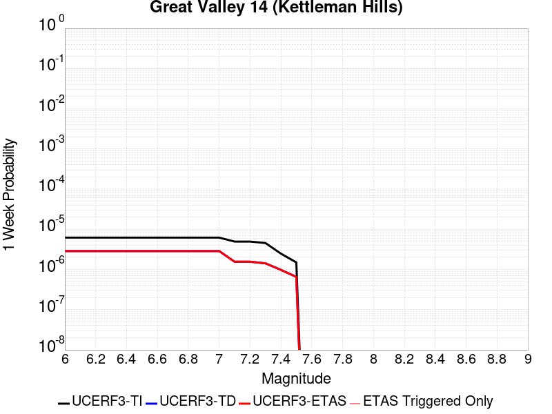 |  |  |  |

| Magnitude | 1 wk TI Prob | 1 wk TD Prob | 1 wk ETAS Prob | 1 wk ETAS/TD Gain | 1 wk ETAS Triggered Only | 1 mo TI Prob | 1 mo TD Prob | 1 mo ETAS Prob | 1 mo ETAS/TD Gain | 1 mo ETAS Triggered Only | 1 yr TI Prob | 1 yr TD Prob | 1 yr ETAS Prob | 1 yr ETAS/TD Gain | 1 yr ETAS Triggered Only | 10 yr TI Prob | 10 yr TD Prob | 10 yr ETAS Prob | 10 yr ETAS/TD Gain | 10 yr ETAS Triggered Only |
|-----|-----|-----|-----|-----|-----|-----|-----|-----|-----|-----|-----|-----|-----|-----|-----|-----|-----|-----|-----|-----|
| 6.0 | 6.2057843E-6 | 2.8768916E-6 | 2.8768916E-6 | 1.0 | 0.0 | 2.6595946E-5 | 1.232949E-5 | 1.232949E-5 | 1.0 | 0.0 | 3.2375753E-4 | 1.5010356E-4 | 1.5010356E-4 | 1.0 | 0.0 | 0.0032328626 | 0.0015002531 | 0.001510238 | 1.0066556 | 1.0E-5 |
| 6.1 | 6.2057843E-6 | 2.8768916E-6 | 2.8768916E-6 | 1.0 | 0.0 | 2.6595946E-5 | 1.232949E-5 | 1.232949E-5 | 1.0 | 0.0 | 3.2375753E-4 | 1.5010356E-4 | 1.5010356E-4 | 1.0 | 0.0 | 0.0032328626 | 0.0015002531 | 0.001510238 | 1.0066556 | 1.0E-5 |
| 6.2 | 6.2057843E-6 | 2.8768916E-6 | 2.8768916E-6 | 1.0 | 0.0 | 2.6595946E-5 | 1.232949E-5 | 1.232949E-5 | 1.0 | 0.0 | 3.2375753E-4 | 1.5010356E-4 | 1.5010356E-4 | 1.0 | 0.0 | 0.0032328626 | 0.0015002531 | 0.001510238 | 1.0066556 | 1.0E-5 |
| 6.3 | 6.2057843E-6 | 2.8768916E-6 | 2.8768916E-6 | 1.0 | 0.0 | 2.6595946E-5 | 1.232949E-5 | 1.232949E-5 | 1.0 | 0.0 | 3.2375753E-4 | 1.5010356E-4 | 1.5010356E-4 | 1.0 | 0.0 | 0.0032328626 | 0.0015002531 | 0.001510238 | 1.0066556 | 1.0E-5 |
| 6.4 | 6.2057843E-6 | 2.8768916E-6 | 2.8768916E-6 | 1.0 | 0.0 | 2.6595946E-5 | 1.232949E-5 | 1.232949E-5 | 1.0 | 0.0 | 3.2375753E-4 | 1.5010356E-4 | 1.5010356E-4 | 1.0 | 0.0 | 0.0032328626 | 0.0015002531 | 0.001510238 | 1.0066556 | 1.0E-5 |
| 6.5 | 6.2057843E-6 | 2.8768916E-6 | 2.8768916E-6 | 1.0 | 0.0 | 2.6595946E-5 | 1.232949E-5 | 1.232949E-5 | 1.0 | 0.0 | 3.2375753E-4 | 1.5010356E-4 | 1.5010356E-4 | 1.0 | 0.0 | 0.0032328626 | 0.0015002531 | 0.001510238 | 1.0066556 | 1.0E-5 |
| 6.6 | 6.2057843E-6 | 2.8768916E-6 | 2.8768916E-6 | 1.0 | 0.0 | 2.6595946E-5 | 1.232949E-5 | 1.232949E-5 | 1.0 | 0.0 | 3.2375753E-4 | 1.5010356E-4 | 1.5010356E-4 | 1.0 | 0.0 | 0.0032328626 | 0.0015002531 | 0.001510238 | 1.0066556 | 1.0E-5 |
| 6.7 | 6.2057843E-6 | 2.8768916E-6 | 2.8768916E-6 | 1.0 | 0.0 | 2.6595946E-5 | 1.232949E-5 | 1.232949E-5 | 1.0 | 0.0 | 3.2375753E-4 | 1.5010356E-4 | 1.5010356E-4 | 1.0 | 0.0 | 0.0032328626 | 0.0015002531 | 0.001510238 | 1.0066556 | 1.0E-5 |
| 6.8 | 6.2057843E-6 | 2.8768916E-6 | 2.8768916E-6 | 1.0 | 0.0 | 2.6595946E-5 | 1.232949E-5 | 1.232949E-5 | 1.0 | 0.0 | 3.2375753E-4 | 1.5010356E-4 | 1.5010356E-4 | 1.0 | 0.0 | 0.0032328626 | 0.0015002531 | 0.001510238 | 1.0066556 | 1.0E-5 |
| 6.9 | 6.2057843E-6 | 2.8768916E-6 | 2.8768916E-6 | 1.0 | 0.0 | 2.6595946E-5 | 1.232949E-5 | 1.232949E-5 | 1.0 | 0.0 | 3.2375753E-4 | 1.5010356E-4 | 1.5010356E-4 | 1.0 | 0.0 | 0.0032328626 | 0.0015002531 | 0.001510238 | 1.0066556 | 1.0E-5 |
| 7.0 | 6.2057843E-6 | 2.8768916E-6 | 2.8768916E-6 | 1.0 | 0.0 | 2.6595946E-5 | 1.232949E-5 | 1.232949E-5 | 1.0 | 0.0 | 3.2375753E-4 | 1.5010356E-4 | 1.5010356E-4 | 1.0 | 0.0 | 0.0032328626 | 0.0015002531 | 0.001510238 | 1.0066556 | 1.0E-5 |
| 7.1 | 4.95113E-6 | 1.5606404E-6 | 1.5606404E-6 | 1.0 | 0.0 | 2.1218955E-5 | 6.6884427E-6 | 6.6884427E-6 | 1.0 | 0.0 | 2.5831014E-4 | 8.1428945E-5 | 8.1428945E-5 | 1.0 | 0.0 | 0.0025801011 | 8.1401E-4 | 8.1401E-4 | 1.0 | 0.0 |
| 7.2 | 4.95113E-6 | 1.5606404E-6 | 1.5606404E-6 | 1.0 | 0.0 | 2.1218955E-5 | 6.6884427E-6 | 6.6884427E-6 | 1.0 | 0.0 | 2.5831014E-4 | 8.1428945E-5 | 8.1428945E-5 | 1.0 | 0.0 | 0.0025801011 | 8.1401E-4 | 8.1401E-4 | 1.0 | 0.0 |
| 7.3 | 4.5549086E-6 | 1.4226472E-6 | 1.4226472E-6 | 1.0 | 0.0 | 1.9520892E-5 | 6.097046E-6 | 6.097046E-6 | 1.0 | 0.0 | 2.3764092E-4 | 7.4229174E-5 | 7.4229174E-5 | 1.0 | 0.0 | 0.0023738695 | 7.420604E-4 | 7.420604E-4 | 1.0 | 0.0 |
| 7.4 | 2.4837766E-6 | 9.800582E-7 | 9.800582E-7 | 1.0 | 0.0 | 1.0644713E-5 | 4.200243E-6 | 4.200243E-6 | 1.0 | 0.0 | 1.2959167E-4 | 5.1136827E-5 | 5.1136827E-5 | 1.0 | 0.0 | 0.0012951613 | 5.112572E-4 | 5.112572E-4 | 1.0 | 0.0 |
| 7.5 | 1.5002679E-6 | 6.546144E-7 | 6.546144E-7 | 1.0 | 0.0 | 6.4297037E-6 | 2.8054874E-6 | 2.8054874E-6 | 1.0 | 0.0 | 7.827883E-5 | 3.4156317E-5 | 3.4156317E-5 | 1.0 | 0.0 | 7.825126E-4 | 3.4151482E-4 | 3.4151482E-4 | 1.0 | 0.0 |

## San Gregorio (North) 2011 CFM
*[(top)](#table-of-contents)*

| 1 Week | 1 Month | 1 Year | 10 Year |
|-----|-----|-----|-----|
| 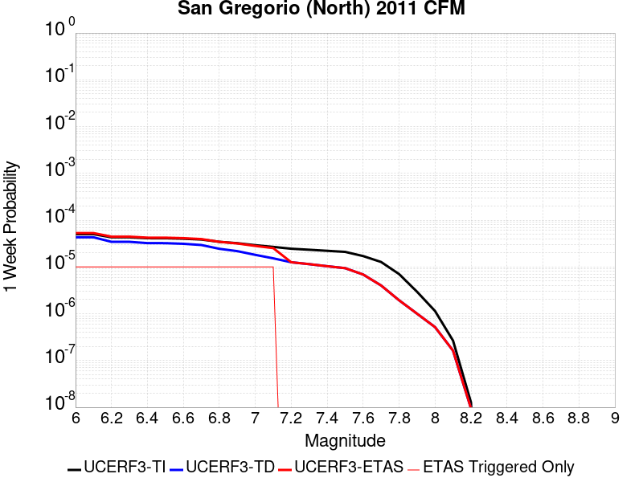 |  |  | 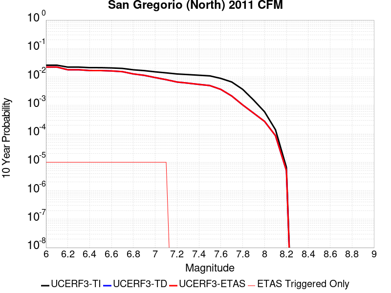 |

| Magnitude | 1 wk TI Prob | 1 wk TD Prob | 1 wk ETAS Prob | 1 wk ETAS/TD Gain | 1 wk ETAS Triggered Only | 1 mo TI Prob | 1 mo TD Prob | 1 mo ETAS Prob | 1 mo ETAS/TD Gain | 1 mo ETAS Triggered Only | 1 yr TI Prob | 1 yr TD Prob | 1 yr ETAS Prob | 1 yr ETAS/TD Gain | 1 yr ETAS Triggered Only | 10 yr TI Prob | 10 yr TD Prob | 10 yr ETAS Prob | 10 yr ETAS/TD Gain | 10 yr ETAS Triggered Only |
|-----|-----|-----|-----|-----|-----|-----|-----|-----|-----|-----|-----|-----|-----|-----|-----|-----|-----|-----|-----|-----|
| 6.0 | 5.0283932E-5 | 4.3057815E-5 | 5.305738E-5 | 1.2322359 | 1.0E-5 | 2.1548476E-4 | 1.8452053E-4 | 1.9451868E-4 | 1.0541846 | 1.0E-5 | 0.0026203706 | 0.002244237 | 0.0022542146 | 1.0044459 | 1.0E-5 | 0.02589687 | 0.022293162 | 0.022302939 | 1.0004386 | 1.0E-5 |
| 6.1 | 5.0283932E-5 | 4.3057815E-5 | 5.305738E-5 | 1.2322359 | 1.0E-5 | 2.1548476E-4 | 1.8452053E-4 | 1.9451868E-4 | 1.0541846 | 1.0E-5 | 0.0026203706 | 0.002244237 | 0.0022542146 | 1.0044459 | 1.0E-5 | 0.02589687 | 0.022293162 | 0.022302939 | 1.0004386 | 1.0E-5 |
| 6.2 | 4.2998647E-5 | 3.4441564E-5 | 4.4441218E-5 | 1.2903368 | 1.0E-5 | 1.842669E-4 | 1.475984E-4 | 1.5759692E-4 | 1.0677414 | 1.0E-5 | 0.0022411412 | 0.00179554 | 0.001805522 | 1.0055593 | 1.0E-5 | 0.022186736 | 0.017886506 | 0.017896328 | 1.0005491 | 1.0E-5 |
| 6.3 | 4.2998647E-5 | 3.4441564E-5 | 4.4441218E-5 | 1.2903368 | 1.0E-5 | 1.842669E-4 | 1.475984E-4 | 1.5759692E-4 | 1.0677414 | 1.0E-5 | 0.0022411412 | 0.00179554 | 0.001805522 | 1.0055593 | 1.0E-5 | 0.022186736 | 0.017886506 | 0.017896328 | 1.0005491 | 1.0E-5 |
| 6.4 | 4.1101295E-5 | 3.2326872E-5 | 4.232655E-5 | 1.3093302 | 1.0E-5 | 1.7613651E-4 | 1.3853642E-4 | 1.4853504E-4 | 1.0721732 | 1.0E-5 | 0.0021423528 | 0.0016853869 | 0.00169537 | 1.0059234 | 1.0E-5 | 0.02121817 | 0.016801886 | 0.016811717 | 1.0005852 | 1.0E-5 |
| 6.5 | 4.1032585E-5 | 3.2244905E-5 | 4.2244585E-5 | 1.3101165 | 1.0E-5 | 1.7584208E-4 | 1.3818518E-4 | 1.481838E-4 | 1.0723567 | 1.0E-5 | 0.0021387753 | 0.0016811171 | 0.0016911003 | 1.0059384 | 1.0E-5 | 0.021183075 | 0.016759839 | 0.016769672 | 1.0005866 | 1.0E-5 |
| 6.6 | 4.011629E-5 | 3.1266558E-5 | 4.1266245E-5 | 1.3198205 | 1.0E-5 | 1.7191563E-4 | 1.339927E-4 | 1.4399135E-4 | 1.074621 | 1.0E-5 | 0.0020910634 | 0.0016301516 | 0.0016401353 | 1.0061244 | 1.0E-5 | 0.020714961 | 0.01625741 | 0.016267247 | 1.0006051 | 1.0E-5 |
| 6.7 | 3.8583938E-5 | 2.9453593E-5 | 3.9453298E-5 | 1.3395071 | 1.0E-5 | 1.6534925E-4 | 1.2622366E-4 | 1.362224E-4 | 1.0792145 | 1.0E-5 | 0.0020112682 | 0.0015357039 | 0.0015456886 | 1.0065017 | 1.0E-5 | 0.019931622 | 0.015325955 | 0.015335802 | 1.0006425 | 1.0E-5 |
| 6.8 | 3.44341E-5 | 2.4450854E-5 | 3.445061E-5 | 1.4089737 | 1.0E-5 | 1.4756636E-4 | 1.0478523E-4 | 1.14784176E-4 | 1.0954233 | 1.0E-5 | 0.0017951399 | 0.0012750238 | 0.0012850111 | 1.007833 | 1.0E-5 | 0.017807078 | 0.012751131 | 0.012761004 | 1.0007743 | 1.0E-5 |
| 6.9 | 3.221199E-5 | 2.1778029E-5 | 3.177781E-5 | 1.4591683 | 1.0E-5 | 1.3804408E-4 | 9.333112E-5 | 1.0333019E-4 | 1.1071354 | 1.0E-5 | 0.0016793909 | 0.0011357224 | 0.0011457109 | 1.008795 | 1.0E-5 | 0.01666756 | 0.011372583 | 0.011382469 | 1.0008693 | 1.0E-5 |
| 7.0 | 2.9186718E-5 | 1.8146875E-5 | 2.8146693E-5 | 1.5510491 | 1.0E-5 | 1.2507994E-4 | 7.7770026E-5 | 8.7769244E-5 | 1.1285743 | 1.0E-5 | 0.0015217843 | 9.464431E-4 | 9.5643365E-4 | 1.0105559 | 1.0E-5 | 0.015114053 | 0.009496798 | 0.009506703 | 1.001043 | 1.0E-5 |
| 7.1 | 2.6840138E-5 | 1.5284508E-5 | 2.5284355E-5 | 1.6542472 | 1.0E-5 | 1.1502409E-4 | 6.55034E-5 | 7.550274E-5 | 1.1526538 | 1.0E-5 | 0.0013995186 | 7.9721404E-4 | 8.072061E-4 | 1.0125337 | 1.0E-5 | 0.013907375 | 0.008015723 | 0.0080256425 | 1.0012375 | 1.0E-5 |
| 7.2 | 2.453002E-5 | 1.2606672E-5 | 1.2606672E-5 | 1.0 | 0.0 | 1.05124425E-4 | 5.4027478E-5 | 5.4027478E-5 | 1.0 | 0.0 | 0.0012791384 | 6.575866E-4 | 6.575866E-4 | 1.0 | 0.0 | 0.012718005 | 0.00662763 | 0.00662763 | 1.0 | 0.0 |
| 7.3 | 2.3330727E-5 | 1.1488677E-5 | 1.1488677E-5 | 1.0 | 0.0 | 9.9985E-5 | 4.923626E-5 | 4.923626E-5 | 1.0 | 0.0 | 0.0012166376 | 5.9928704E-4 | 5.9928704E-4 | 1.0 | 0.0 | 0.012099981 | 0.006046564 | 0.006046564 | 1.0 | 0.0 |
| 7.4 | 2.2136466E-5 | 1.0368981E-5 | 1.0368981E-5 | 1.0 | 0.0 | 9.486712E-5 | 4.4437733E-5 | 4.4437733E-5 | 1.0 | 0.0 | 0.0011543952 | 5.4089533E-4 | 5.4089533E-4 | 1.0 | 0.0 | 0.011484168 | 0.005464249 | 0.005464249 | 1.0 | 0.0 |
| 7.5 | 2.0994974E-5 | 9.427217E-6 | 9.427217E-6 | 1.0 | 0.0 | 8.997535E-5 | 4.0401734E-5 | 4.0401734E-5 | 1.0 | 0.0 | 0.0010948994 | 4.9178035E-4 | 4.9178035E-4 | 1.0 | 0.0 | 0.010895205 | 0.004973358 | 0.004973358 | 1.0 | 0.0 |
| 7.6 | 1.7091823E-5 | 6.893766E-6 | 6.893766E-6 | 1.0 | 0.0 | 7.3248615E-5 | 2.9544377E-5 | 2.9544377E-5 | 1.0 | 0.0 | 8.9143694E-4 | 3.596435E-4 | 3.596435E-4 | 1.0 | 0.0 | 0.008878695 | 0.0036482841 | 0.0036482841 | 1.0 | 0.0 |
| 7.7 | 1.2772179E-5 | 4.0208706E-6 | 4.0208706E-6 | 1.0 | 0.0 | 5.473676E-5 | 1.7232189E-5 | 1.7232189E-5 | 1.0 | 0.0 | 6.6621625E-4 | 2.0978172E-4 | 2.0978172E-4 | 1.0 | 0.0 | 0.006642225 | 0.002136922 | 0.002136922 | 1.0 | 0.0 |
| 7.8 | 7.041923E-6 | 1.940626E-6 | 1.940626E-6 | 1.0 | 0.0 | 3.017932E-5 | 8.316942E-6 | 8.316942E-6 | 1.0 | 0.0 | 3.6737128E-4 | 1.0125406E-4 | 1.0125406E-4 | 1.0 | 0.0 | 0.0036676454 | 0.0010379003 | 0.0010379003 | 1.0 | 0.0 |
| 7.9 | 2.946768E-6 | 1.0033551E-6 | 1.0033551E-6 | 1.0 | 0.0 | 1.2628945E-5 | 4.300086E-6 | 4.300086E-6 | 1.0 | 0.0 | 1.5374656E-4 | 5.235229E-5 | 5.235229E-5 | 1.0 | 0.0 | 0.0015364023 | 5.3400313E-4 | 5.3400313E-4 | 1.0 | 0.0 |
| 8.0 | 1.1433375E-6 | 5.18146E-7 | 5.18146E-7 | 1.0 | 0.0 | 4.9000087E-6 | 2.2206239E-6 | 2.2206239E-6 | 1.0 | 0.0 | 5.965597E-5 | 2.703576E-5 | 2.703576E-5 | 1.0 | 0.0 | 5.963996E-4 | 2.7398416E-4 | 2.7398416E-4 | 1.0 | 0.0 |
| 8.1 | 2.6675295E-7 | 1.62899E-7 | 1.62899E-7 | 1.0 | 0.0 | 1.1432264E-6 | 6.9813836E-7 | 6.9813836E-7 | 1.0 | 0.0 | 1.3918692E-5 | 8.499802E-6 | 8.499802E-6 | 1.0 | 0.0 | 1.391782E-4 | 8.63795E-5 | 8.63795E-5 | 1.0 | 0.0 |
| 8.2 | 1.2704569E-8 | 9.431393E-9 | 9.431393E-9 | 1.0 | 0.0 | 5.444815E-8 | 4.042026E-8 | 4.042026E-8 | 1.0 | 0.0 | 6.629061E-7 | 4.9211656E-7 | 4.9211656E-7 | 1.0 | 0.0 | 6.629041E-6 | 5.1121438E-6 | 5.1121438E-6 | 1.0 | 0.0 |

## Fitzhugh Creek
*[(top)](#table-of-contents)*

| 1 Week | 1 Month | 1 Year | 10 Year |
|-----|-----|-----|-----|
|  |  |  | 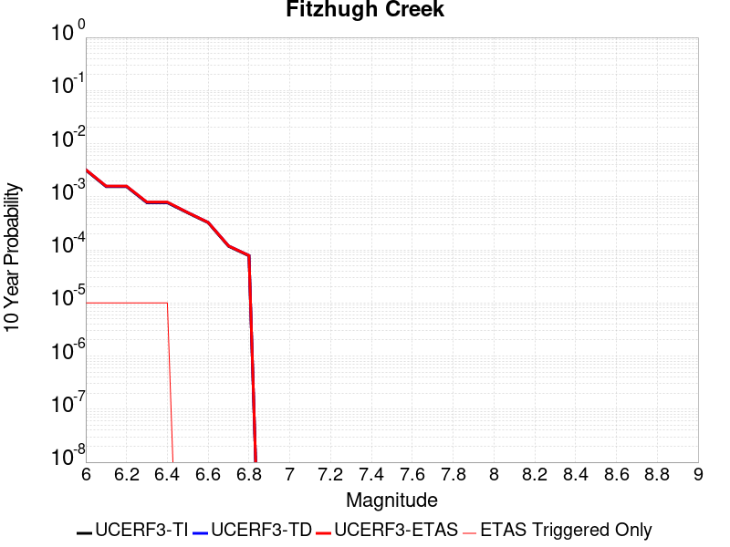 |

| Magnitude | 1 wk TI Prob | 1 wk TD Prob | 1 wk ETAS Prob | 1 wk ETAS/TD Gain | 1 wk ETAS Triggered Only | 1 mo TI Prob | 1 mo TD Prob | 1 mo ETAS Prob | 1 mo ETAS/TD Gain | 1 mo ETAS Triggered Only | 1 yr TI Prob | 1 yr TD Prob | 1 yr ETAS Prob | 1 yr ETAS/TD Gain | 1 yr ETAS Triggered Only | 10 yr TI Prob | 10 yr TD Prob | 10 yr ETAS Prob | 10 yr ETAS/TD Gain | 10 yr ETAS Triggered Only |
|-----|-----|-----|-----|-----|-----|-----|-----|-----|-----|-----|-----|-----|-----|-----|-----|-----|-----|-----|-----|-----|
| 6.0 | 6.1090436E-6 | 6.2101562E-6 | 6.2101562E-6 | 1.0 | 0.0 | 2.6181353E-5 | 2.6614709E-5 | 2.6614709E-5 | 1.0 | 0.0 | 3.1871133E-4 | 3.239904E-4 | 3.3398715E-4 | 1.0308551 | 1.0E-5 | 0.0031825465 | 0.0032356246 | 0.0032455921 | 1.0030806 | 1.0E-5 |
| 6.1 | 2.9741811E-6 | 3.021581E-6 | 3.021581E-6 | 1.0 | 0.0 | 1.2746428E-5 | 1.2949574E-5 | 1.2949574E-5 | 1.0 | 0.0 | 1.5517672E-4 | 1.576506E-4 | 1.6764902E-4 | 1.0634214 | 1.0E-5 | 0.001550684 | 0.0015754806 | 0.0015854648 | 1.0063373 | 1.0E-5 |
| 6.2 | 2.9741811E-6 | 3.021581E-6 | 3.021581E-6 | 1.0 | 0.0 | 1.2746428E-5 | 1.2949574E-5 | 1.2949574E-5 | 1.0 | 0.0 | 1.5517672E-4 | 1.576506E-4 | 1.6764902E-4 | 1.0634214 | 1.0E-5 | 0.001550684 | 0.0015754806 | 0.0015854648 | 1.0063373 | 1.0E-5 |
| 6.3 | 1.4781198E-6 | 1.5012708E-6 | 1.5012708E-6 | 1.0 | 0.0 | 6.3347834E-6 | 6.4340034E-6 | 6.4340034E-6 | 1.0 | 0.0 | 7.712326E-5 | 7.833137E-5 | 8.833059E-5 | 1.1276528 | 1.0E-5 | 7.70965E-4 | 7.830576E-4 | 7.9304975E-4 | 1.0127604 | 1.0E-5 |
| 6.4 | 1.4781198E-6 | 1.5012708E-6 | 1.5012708E-6 | 1.0 | 0.0 | 6.3347834E-6 | 6.4340034E-6 | 6.4340034E-6 | 1.0 | 0.0 | 7.712326E-5 | 7.833137E-5 | 8.833059E-5 | 1.1276528 | 1.0E-5 | 7.70965E-4 | 7.830576E-4 | 7.9304975E-4 | 1.0127604 | 1.0E-5 |
| 6.5 | 9.5176676E-7 | 9.66606E-7 | 9.66606E-7 | 1.0 | 0.0 | 4.078994E-6 | 4.142591E-6 | 4.142591E-6 | 1.0 | 0.0 | 4.9660623E-5 | 5.0434985E-5 | 5.0434985E-5 | 1.0 | 0.0 | 4.964952E-4 | 5.042458E-4 | 5.042458E-4 | 1.0 | 0.0 |
| 6.6 | 6.21145E-7 | 6.3085855E-7 | 6.3085855E-7 | 1.0 | 0.0 | 2.662047E-6 | 2.7036772E-6 | 2.7036772E-6 | 1.0 | 0.0 | 3.2409942E-5 | 3.291684E-5 | 3.291684E-5 | 1.0 | 0.0 | 3.2405215E-4 | 3.2912623E-4 | 3.2912623E-4 | 1.0 | 0.0 |
| 6.7 | 2.2377962E-7 | 2.2734636E-7 | 2.2734636E-7 | 1.0 | 0.0 | 9.590551E-7 | 9.743413E-7 | 9.743413E-7 | 1.0 | 0.0 | 1.1676434E-5 | 1.1862574E-5 | 1.1862574E-5 | 1.0 | 0.0 | 1.1675821E-4 | 1.1862254E-4 | 1.1862254E-4 | 1.0 | 0.0 |
| 6.8 | 1.4785022E-7 | 1.5021492E-7 | 1.5021492E-7 | 1.0 | 0.0 | 6.3364365E-7 | 6.4377826E-7 | 6.4377826E-7 | 1.0 | 0.0 | 7.714584E-6 | 7.838E-6 | 7.838E-6 | 1.0 | 0.0 | 7.714316E-5 | 7.838E-5 | 7.838E-5 | 1.0 | 0.0 |

## San Vicente
*[(top)](#table-of-contents)*

| 1 Week | 1 Month | 1 Year | 10 Year |
|-----|-----|-----|-----|
|  |  |  |  |

| Magnitude | 1 wk TI Prob | 1 wk TD Prob | 1 wk ETAS Prob | 1 wk ETAS/TD Gain | 1 wk ETAS Triggered Only | 1 mo TI Prob | 1 mo TD Prob | 1 mo ETAS Prob | 1 mo ETAS/TD Gain | 1 mo ETAS Triggered Only | 1 yr TI Prob | 1 yr TD Prob | 1 yr ETAS Prob | 1 yr ETAS/TD Gain | 1 yr ETAS Triggered Only | 10 yr TI Prob | 10 yr TD Prob | 10 yr ETAS Prob | 10 yr ETAS/TD Gain | 10 yr ETAS Triggered Only |
|-----|-----|-----|-----|-----|-----|-----|-----|-----|-----|-----|-----|-----|-----|-----|-----|-----|-----|-----|-----|-----|
| 6.0 | 4.0851268E-7 | 3.866531E-7 | 3.866531E-7 | 1.0 | 0.0 | 1.7507675E-6 | 1.6570838E-6 | 1.6570838E-6 | 1.0 | 0.0 | 2.1315385E-5 | 2.0174813E-5 | 2.0174813E-5 | 1.0 | 0.0 | 2.1313342E-4 | 2.0173051E-4 | 2.1172849E-4 | 1.0495611 | 1.0E-5 |
| 6.1 | 4.0851268E-7 | 3.866531E-7 | 3.866531E-7 | 1.0 | 0.0 | 1.7507675E-6 | 1.6570838E-6 | 1.6570838E-6 | 1.0 | 0.0 | 2.1315385E-5 | 2.0174813E-5 | 2.0174813E-5 | 1.0 | 0.0 | 2.1313342E-4 | 2.0173051E-4 | 2.1172849E-4 | 1.0495611 | 1.0E-5 |
| 6.2 | 3.9200887E-7 | 3.7009832E-7 | 3.7009832E-7 | 1.0 | 0.0 | 1.680037E-6 | 1.5861347E-6 | 1.5861347E-6 | 1.0 | 0.0 | 2.0454258E-5 | 1.9311025E-5 | 1.9311025E-5 | 1.0 | 0.0 | 2.0452376E-4 | 1.930941E-4 | 2.0309218E-4 | 1.0517782 | 1.0E-5 |
| 6.3 | 3.9200887E-7 | 3.7009832E-7 | 3.7009832E-7 | 1.0 | 0.0 | 1.680037E-6 | 1.5861347E-6 | 1.5861347E-6 | 1.0 | 0.0 | 2.0454258E-5 | 1.9311025E-5 | 1.9311025E-5 | 1.0 | 0.0 | 2.0452376E-4 | 1.930941E-4 | 2.0309218E-4 | 1.0517782 | 1.0E-5 |
| 6.4 | 3.2280067E-7 | 3.0059803E-7 | 3.0059803E-7 | 1.0 | 0.0 | 1.3834307E-6 | 1.2882765E-6 | 1.2882765E-6 | 1.0 | 0.0 | 1.684314E-5 | 1.5684654E-5 | 1.5684654E-5 | 1.0 | 0.0 | 1.6841863E-4 | 1.5683554E-4 | 1.6683397E-4 | 1.0637511 | 1.0E-5 |
| 6.5 | 3.2280067E-7 | 3.0059803E-7 | 3.0059803E-7 | 1.0 | 0.0 | 1.3834307E-6 | 1.2882765E-6 | 1.2882765E-6 | 1.0 | 0.0 | 1.684314E-5 | 1.5684654E-5 | 1.5684654E-5 | 1.0 | 0.0 | 1.6841863E-4 | 1.5683554E-4 | 1.6683397E-4 | 1.0637511 | 1.0E-5 |
| 6.6 | 3.1973437E-7 | 2.9752158E-7 | 2.9752158E-7 | 1.0 | 0.0 | 1.3702895E-6 | 1.2750919E-6 | 1.2750919E-6 | 1.0 | 0.0 | 1.6683147E-5 | 1.5524134E-5 | 1.5524134E-5 | 1.0 | 0.0 | 1.6681894E-4 | 1.5523055E-4 | 1.65229E-4 | 1.0644103 | 1.0E-5 |
| 6.7 | 3.0841164E-7 | 2.8612186E-7 | 2.8612186E-7 | 1.0 | 0.0 | 1.3217634E-6 | 1.2262359E-6 | 1.2262359E-6 | 1.0 | 0.0 | 1.6092352E-5 | 1.492932E-5 | 1.492932E-5 | 1.0 | 0.0 | 1.6091186E-4 | 1.4928321E-4 | 1.5928173E-4 | 1.0669768 | 1.0E-5 |
| 6.8 | 2.883202E-7 | 2.6584965E-7 | 2.6584965E-7 | 1.0 | 0.0 | 1.2356575E-6 | 1.1393552E-6 | 1.1393552E-6 | 1.0 | 0.0 | 1.50440255E-5 | 1.387156E-5 | 1.387156E-5 | 1.0 | 0.0 | 1.5043007E-4 | 1.3870698E-4 | 1.487056E-4 | 1.0720844 | 1.0E-5 |
| 6.9 | 2.66663E-7 | 2.4397363E-7 | 2.4397363E-7 | 1.0 | 0.0 | 1.1428409E-6 | 1.0456008E-6 | 1.0456008E-6 | 1.0 | 0.0 | 1.3914E-5 | 1.27301155E-5 | 1.27301155E-5 | 1.0 | 0.0 | 1.3913128E-4 | 1.2729388E-4 | 1.372926E-4 | 1.0785483 | 1.0E-5 |
| 7.0 | 2.3733546E-7 | 2.145124E-7 | 2.145124E-7 | 1.0 | 0.0 | 1.0171515E-6 | 9.193385E-7 | 9.193385E-7 | 1.0 | 0.0 | 1.238375E-5 | 1.1192888E-5 | 1.1192888E-5 | 1.0 | 0.0 | 1.238306E-4 | 1.1192326E-4 | 1.2192214E-4 | 1.089337 | 1.0E-5 |
| 7.1 | 2.123689E-7 | 1.8946521E-7 | 1.8946521E-7 | 1.0 | 0.0 | 9.1015215E-7 | 8.119935E-7 | 8.119935E-7 | 1.0 | 0.0 | 1.1081046E-5 | 9.8859755E-6 | 9.8859755E-6 | 1.0 | 0.0 | 1.1080493E-4 | 9.885537E-5 | 1.0885438E-4 | 1.1011479 | 1.0E-5 |
| 7.2 | 1.8244859E-7 | 1.5949334E-7 | 1.5949334E-7 | 1.0 | 0.0 | 7.8192227E-7 | 6.835427E-7 | 6.835427E-7 | 1.0 | 0.0 | 9.519862E-6 | 8.3221E-6 | 8.3221E-6 | 1.0 | 0.0 | 9.519454E-5 | 8.321789E-5 | 9.321706E-5 | 1.1201565 | 1.0E-5 |
| 7.3 | 1.611936E-7 | 1.4005617E-7 | 1.4005617E-7 | 1.0 | 0.0 | 6.9082955E-7 | 6.002406E-7 | 6.002406E-7 | 1.0 | 0.0 | 8.410817E-6 | 7.3079045E-6 | 7.3079045E-6 | 1.0 | 0.0 | 8.410499E-5 | 7.307665E-5 | 8.3075916E-5 | 1.1368326 | 1.0E-5 |
| 7.4 | 1.414892E-7 | 1.2290288E-7 | 1.2290288E-7 | 1.0 | 0.0 | 6.063821E-7 | 5.2672647E-7 | 5.2672647E-7 | 1.0 | 0.0 | 7.3826773E-6 | 6.412876E-6 | 6.412876E-6 | 1.0 | 0.0 | 7.382432E-5 | 6.4126914E-5 | 7.412627E-5 | 1.1559308 | 1.0E-5 |
| 7.5 | 1.0709291E-7 | 9.229652E-8 | 9.229652E-8 | 1.0 | 0.0 | 4.5896954E-7 | 3.9555644E-7 | 3.9555644E-7 | 1.0 | 0.0 | 5.5879395E-6 | 4.815889E-6 | 4.815889E-6 | 1.0 | 0.0 | 5.5877994E-5 | 4.815785E-5 | 5.8157366E-5 | 1.2076405 | 1.0E-5 |
| 7.6 | 6.746737E-8 | 5.4863655E-8 | 5.4863655E-8 | 1.0 | 0.0 | 2.8914585E-7 | 2.3512992E-7 | 2.3512992E-7 | 1.0 | 0.0 | 3.5203448E-6 | 2.862703E-6 | 2.862703E-6 | 1.0 | 0.0 | 3.520289E-5 | 2.8626662E-5 | 3.862638E-5 | 1.3493147 | 1.0E-5 |
| 7.7 | 2.8940264E-8 | 1.9262085E-8 | 1.9262085E-8 | 1.0 | 0.0 | 1.240297E-7 | 8.255179E-8 | 8.255179E-8 | 1.0 | 0.0 | 1.5100605E-6 | 1.0050676E-6 | 1.0050676E-6 | 1.0 | 0.0 | 1.5100502E-5 | 1.0050631E-5 | 1.0050631E-5 | 1.0 | 0.0 |
| 7.8 | 1.0151455E-8 | 6.3540004E-9 | 6.3540004E-9 | 1.0 | 0.0 | 4.3506233E-8 | 2.7231433E-8 | 2.7231433E-8 | 1.0 | 0.0 | 5.296883E-7 | 3.3154265E-7 | 3.3154265E-7 | 1.0 | 0.0 | 5.2968703E-6 | 3.3154215E-6 | 3.3154215E-6 | 1.0 | 0.0 |
| 7.9 | 2.8324232E-11 | 2.1406099E-11 | 2.1406099E-11 | 1.0 | 0.0 | 1.2138957E-10 | 9.174017E-11 | 9.174017E-11 | 1.0 | 0.0 | 1.4779177E-9 | 1.1169362E-9 | 1.1169362E-9 | 1.0 | 0.0 | 1.4779177E-8 | 1.1169361E-8 | 1.1169361E-8 | 1.0 | 0.0 |

## Great Valley 02
*[(top)](#table-of-contents)*

| 1 Week | 1 Month | 1 Year | 10 Year |
|-----|-----|-----|-----|
|  |  | 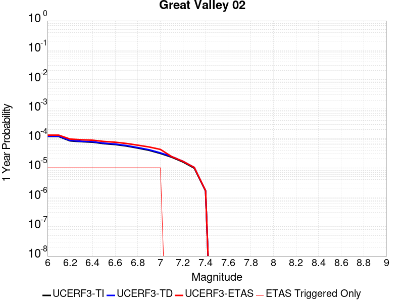 |  |

| Magnitude | 1 wk TI Prob | 1 wk TD Prob | 1 wk ETAS Prob | 1 wk ETAS/TD Gain | 1 wk ETAS Triggered Only | 1 mo TI Prob | 1 mo TD Prob | 1 mo ETAS Prob | 1 mo ETAS/TD Gain | 1 mo ETAS Triggered Only | 1 yr TI Prob | 1 yr TD Prob | 1 yr ETAS Prob | 1 yr ETAS/TD Gain | 1 yr ETAS Triggered Only | 10 yr TI Prob | 10 yr TD Prob | 10 yr ETAS Prob | 10 yr ETAS/TD Gain | 10 yr ETAS Triggered Only |
|-----|-----|-----|-----|-----|-----|-----|-----|-----|-----|-----|-----|-----|-----|-----|-----|-----|-----|-----|-----|-----|
| 6.0 | 2.2243487E-6 | 2.281768E-6 | 1.22817455E-5 | 5.3825564 | 1.0E-5 | 9.532888E-6 | 9.778972E-6 | 1.9778874E-5 | 2.0225923 | 1.0E-5 | 1.1605673E-4 | 1.1905298E-4 | 1.290518E-4 | 1.0839862 | 1.0E-5 | 0.0011599615 | 0.0011899419 | 0.0011999301 | 1.0083938 | 1.0E-5 |
| 6.1 | 2.2243487E-6 | 2.281768E-6 | 1.22817455E-5 | 5.3825564 | 1.0E-5 | 9.532888E-6 | 9.778972E-6 | 1.9778874E-5 | 2.0225923 | 1.0E-5 | 1.1605673E-4 | 1.1905298E-4 | 1.290518E-4 | 1.0839862 | 1.0E-5 | 0.0011599615 | 0.0011899419 | 0.0011999301 | 1.0083938 | 1.0E-5 |
| 6.2 | 1.5787732E-6 | 1.6272533E-6 | 1.1627237E-5 | 7.1453147 | 1.0E-5 | 6.7661535E-6 | 6.9739244E-6 | 1.6973854E-5 | 2.433903 | 1.0E-5 | 8.2374805E-5 | 8.490427E-5 | 9.4903415E-5 | 1.1177697 | 1.0E-5 | 8.2344277E-4 | 8.4872305E-4 | 8.587146E-4 | 1.0117724 | 1.0E-5 |
| 6.3 | 1.4850314E-6 | 1.5322953E-6 | 1.153228E-5 | 7.526147 | 1.0E-5 | 6.3644047E-6 | 6.5669637E-6 | 1.6566897E-5 | 2.5227637 | 1.0E-5 | 7.748387E-5 | 7.994989E-5 | 8.994909E-5 | 1.1250683 | 1.0E-5 | 7.745686E-4 | 7.992151E-4 | 8.092071E-4 | 1.0125023 | 1.0E-5 |
| 6.4 | 1.4266972E-6 | 1.4734348E-6 | 1.147342E-5 | 7.7868524 | 1.0E-5 | 6.114402E-6 | 6.314706E-6 | 1.6314643E-5 | 2.583595 | 1.0E-5 | 7.44403E-5 | 7.687887E-5 | 8.68781E-5 | 1.1300647 | 1.0E-5 | 7.441537E-4 | 7.685261E-4 | 7.7851844E-4 | 1.0130019 | 1.0E-5 |
| 6.5 | 1.2728015E-6 | 1.3171256E-6 | 1.1317113E-5 | 8.59228 | 1.0E-5 | 5.4548523E-6 | 5.6448116E-6 | 1.5644755E-5 | 2.7715282 | 1.0E-5 | 6.64108E-5 | 6.872344E-5 | 7.8722755E-5 | 1.1455008 | 1.0E-5 | 6.639096E-4 | 6.870245E-4 | 6.9701765E-4 | 1.0145456 | 1.0E-5 |
| 6.6 | 1.1857247E-6 | 1.2289391E-6 | 1.1228927E-5 | 9.13709 | 1.0E-5 | 5.0816675E-6 | 5.2668715E-6 | 1.5266818E-5 | 2.8986502 | 1.0E-5 | 6.186755E-5 | 6.41223E-5 | 7.412166E-5 | 1.155942 | 1.0E-5 | 6.1850325E-4 | 6.4104045E-4 | 6.51034E-4 | 1.0155896 | 1.0E-5 |
| 6.7 | 1.0550715E-6 | 1.0953329E-6 | 1.1095322E-5 | 10.129634 | 1.0E-5 | 4.521727E-6 | 4.6942755E-6 | 1.4694228E-5 | 3.130244 | 1.0E-5 | 5.5050637E-5 | 5.715133E-5 | 6.715076E-5 | 1.1749641 | 1.0E-5 | 5.5037E-4 | 5.7136844E-4 | 5.813627E-4 | 1.0174918 | 1.0E-5 |
| 6.8 | 8.9881183E-7 | 9.355551E-7 | 1.0935546E-5 | 11.688831 | 1.0E-5 | 3.8520448E-6 | 4.0095156E-6 | 1.4009475E-5 | 3.4940567 | 1.0E-5 | 4.689764E-5 | 4.8814778E-5 | 5.881429E-5 | 1.204846 | 1.0E-5 | 4.688774E-4 | 4.880423E-4 | 4.9803744E-4 | 1.02048 | 1.0E-5 |
| 6.9 | 7.5417256E-7 | 7.8710764E-7 | 1.07871E-5 | 13.704733 | 1.0E-5 | 3.232164E-6 | 3.373314E-6 | 1.337328E-5 | 3.9644337 | 1.0E-5 | 3.9350885E-5 | 4.106934E-5 | 5.1068928E-5 | 1.2434807 | 1.0E-5 | 3.934392E-4 | 4.1061893E-4 | 4.2061484E-4 | 1.0243435 | 1.0E-5 |
| 7.0 | 5.909726E-7 | 6.177937E-7 | 1.0617788E-5 | 17.186623 | 1.0E-5 | 2.5327372E-6 | 2.6476848E-6 | 1.2647658E-5 | 4.7768745 | 1.0E-5 | 3.083564E-5 | 3.2235093E-5 | 4.2234773E-5 | 1.310211 | 1.0E-5 | 3.083136E-4 | 3.223052E-4 | 3.3230198E-4 | 1.0310165 | 1.0E-5 |
| 7.1 | 4.4054178E-7 | 4.617082E-7 | 4.617082E-7 | 1.0 | 0.0 | 1.8880348E-6 | 1.978748E-6 | 1.978748E-6 | 1.0 | 0.0 | 2.2986582E-5 | 2.4090998E-5 | 2.4090998E-5 | 1.0 | 0.0 | 2.2984203E-4 | 2.4088458E-4 | 2.4088458E-4 | 1.0 | 0.0 |
| 7.2 | 3.029834E-7 | 3.1821946E-7 | 3.1821946E-7 | 1.0 | 0.0 | 1.2984997E-6 | 1.363797E-6 | 1.363797E-6 | 1.0 | 0.0 | 1.5809119E-5 | 1.6604106E-5 | 1.6604106E-5 | 1.0 | 0.0 | 1.5807994E-4 | 1.660291E-4 | 1.660291E-4 | 1.0 | 0.0 |
| 7.3 | 1.8700909E-7 | 1.9680154E-7 | 1.9680154E-7 | 1.0 | 0.0 | 8.0146725E-7 | 8.434349E-7 | 8.434349E-7 | 1.0 | 0.0 | 9.75782E-6 | 1.02687745E-5 | 1.02687745E-5 | 1.0 | 0.0 | 9.757392E-5 | 1.02683276E-4 | 1.02683276E-4 | 1.0 | 0.0 |
| 7.4 | 3.112171E-8 | 3.2068368E-8 | 3.2068368E-8 | 1.0 | 0.0 | 1.3337875E-7 | 1.3743585E-7 | 1.3743585E-7 | 1.0 | 0.0 | 1.6238852E-6 | 1.6732803E-6 | 1.6732803E-6 | 1.0 | 0.0 | 1.6238733E-5 | 1.6732685E-5 | 1.6732685E-5 | 1.0 | 0.0 |

## Gillem - Big Crack 2011 CFM
*[(top)](#table-of-contents)*

| 1 Week | 1 Month | 1 Year | 10 Year |
|-----|-----|-----|-----|
|  |  |  |  |

| Magnitude | 1 wk TI Prob | 1 wk TD Prob | 1 wk ETAS Prob | 1 wk ETAS/TD Gain | 1 wk ETAS Triggered Only | 1 mo TI Prob | 1 mo TD Prob | 1 mo ETAS Prob | 1 mo ETAS/TD Gain | 1 mo ETAS Triggered Only | 1 yr TI Prob | 1 yr TD Prob | 1 yr ETAS Prob | 1 yr ETAS/TD Gain | 1 yr ETAS Triggered Only | 10 yr TI Prob | 10 yr TD Prob | 10 yr ETAS Prob | 10 yr ETAS/TD Gain | 10 yr ETAS Triggered Only |
|-----|-----|-----|-----|-----|-----|-----|-----|-----|-----|-----|-----|-----|-----|-----|-----|-----|-----|-----|-----|-----|
| 6.0 | 2.196852E-5 | 2.3604485E-5 | 2.3604485E-5 | 1.0 | 0.0 | 9.4147406E-5 | 1.01158665E-4 | 1.1115765E-4 | 1.0988446 | 1.0E-5 | 0.0011456419 | 0.0012309998 | 0.0012409874 | 1.0081135 | 1.0E-5 | 0.011397537 | 0.012250669 | 0.012260547 | 1.0008063 | 1.0E-5 |
| 6.1 | 9.992795E-6 | 1.071189E-5 | 1.071189E-5 | 1.0 | 0.0 | 4.2825563E-5 | 4.5907396E-5 | 4.5907396E-5 | 1.0 | 0.0 | 5.2127644E-4 | 5.587975E-4 | 5.587975E-4 | 1.0 | 0.0 | 0.0052005537 | 0.0055757347 | 0.0055757347 | 1.0 | 0.0 |
| 6.2 | 9.992795E-6 | 1.071189E-5 | 1.071189E-5 | 1.0 | 0.0 | 4.2825563E-5 | 4.5907396E-5 | 4.5907396E-5 | 1.0 | 0.0 | 5.2127644E-4 | 5.587975E-4 | 5.587975E-4 | 1.0 | 0.0 | 0.0052005537 | 0.0055757347 | 0.0055757347 | 1.0 | 0.0 |
| 6.3 | 4.6127884E-6 | 4.942657E-6 | 4.942657E-6 | 1.0 | 0.0 | 1.9768944E-5 | 2.1182668E-5 | 2.1182668E-5 | 1.0 | 0.0 | 2.406603E-4 | 2.5787292E-4 | 2.5787292E-4 | 1.0 | 0.0 | 0.0024039985 | 0.0025761751 | 0.0025761751 | 1.0 | 0.0 |
| 6.4 | 4.6127884E-6 | 4.942657E-6 | 4.942657E-6 | 1.0 | 0.0 | 1.9768944E-5 | 2.1182668E-5 | 2.1182668E-5 | 1.0 | 0.0 | 2.406603E-4 | 2.5787292E-4 | 2.5787292E-4 | 1.0 | 0.0 | 0.0024039985 | 0.0025761751 | 0.0025761751 | 1.0 | 0.0 |
| 6.5 | 2.716712E-6 | 2.9111113E-6 | 2.9111113E-6 | 1.0 | 0.0 | 1.1643E-5 | 1.24761455E-5 | 1.24761455E-5 | 1.0 | 0.0 | 1.417443E-4 | 1.5188892E-4 | 1.5188892E-4 | 1.0 | 0.0 | 0.0014165393 | 0.001518089 | 0.001518089 | 1.0 | 0.0 |
| 6.6 | 1.3818255E-6 | 1.4820689E-6 | 1.4820689E-6 | 1.0 | 0.0 | 5.922096E-6 | 6.3517155E-6 | 6.3517155E-6 | 1.0 | 0.0 | 7.209913E-5 | 7.7330624E-5 | 7.7330624E-5 | 1.0 | 0.0 | 7.2075747E-4 | 7.7315804E-4 | 7.7315804E-4 | 1.0 | 0.0 |

