# Parent Section Magnitude-Probability Distributions

Only fault sections with at least one triggered aftershock are plotted. Sections are sorted by total supraseismogenic trigger rate (decreasing)

## Table Of Contents

* [Garlock (Central)](#garlock-central)
* [Tank Canyon](#tank-canyon)
* [Owl Lake](#owl-lake)
* [Little Lake](#little-lake)
* [Panamint Valley](#panamint-valley)
* [Garlock (East)](#garlock-east)
* [Airport Lake](#airport-lake)
* [Hunter Mountain-Saline Valley](#hunter-mountain-saline-valley)
* [Blackwater](#blackwater)
* [Ash Hill](#ash-hill)
* [Garlock (West)](#garlock-west)
* [McLean Lake](#mclean-lake)
* [Goldstone Lake](#goldstone-lake)
* [Gravel Hills-Harper Lk](#gravel-hills-harper-lk)
* [Coyote Canyon](#coyote-canyon)
* [San Andreas (Mojave S)](#san-andreas-mojave-s)
* [San Andreas (Mojave N)](#san-andreas-mojave-n)
* [So Sierra Nevada](#so-sierra-nevada)
* [Death Valley (So)](#death-valley-so)
* [Nelson Lake](#nelson-lake)
* [Towne Pass](#towne-pass)
* [Lenwood-Lockhart-Old Woman Springs](#lenwood-lockhart-old-woman-springs)
* [San Andreas (San Bernardino N)](#san-andreas-san-bernardino-n)
* [Bicycle Lake](#bicycle-lake)
* [Paradise](#paradise)
* [Garlic Springs](#garlic-springs)
* [San Andreas (San Bernardino S)](#san-andreas-san-bernardino-s)
* [Death Valley (Black Mtns Frontal)](#death-valley-black-mtns-frontal)
* [Coyote Lake](#coyote-lake)
* [San Andreas (Big Bend)](#san-andreas-big-bend)
* [Helendale-So Lockhart](#helendale-so-lockhart)
* [Death Valley (No)](#death-valley-no)
* [San Andreas (San Gorgonio Pass-Garnet HIll)](#san-andreas-san-gorgonio-pass-garnet-hill)
* [San Andreas (Parkfield)](#san-andreas-parkfield)
* [San Andreas (Carrizo) rev](#san-andreas-carrizo-rev)
* [San Andreas (Cholame) rev](#san-andreas-cholame-rev)
* [Death Valley (Fish Lake Valley)](#death-valley-fish-lake-valley)
* [Red Pass](#red-pass)
* [Elsinore (Glen Ivy) rev](#elsinore-glen-ivy-rev)
* [San Andreas (Coachella) rev](#san-andreas-coachella-rev)
* [Sierra Nevada  (No Extension)](#sierra-nevada--no-extension)
* [Calico-Hidalgo](#calico-hidalgo)
* [San Andreas (North Branch Mill Creek)](#san-andreas-north-branch-mill-creek)
* [Ludlow](#ludlow)
* [San Jacinto (San Bernardino)](#san-jacinto-san-bernardino)
* [Baker](#baker)
* [Scodie Lineament](#scodie-lineament)
* [Manix-Afton Hills](#manix-afton-hills)
* [Cady](#cady)
* [White Wolf (Extension)](#white-wolf-extension)
* [San Andreas (Creeping Section) 2011 CFM](#san-andreas-creeping-section-2011-cfm)
* [Cleghorn Lake](#cleghorn-lake)
* [Lake Isabella (Seismicity)](#lake-isabella-seismicity)
* [San Jacinto (San Jacinto Valley) rev](#san-jacinto-san-jacinto-valley-rev)
* [San Jacinto (Anza) rev](#san-jacinto-anza-rev)
* [San Jacinto (Stepovers Combined)](#san-jacinto-stepovers-combined)
* [Blue Cut](#blue-cut)
* [Brawley (Seismic Zone) alt 1](#brawley-seismic-zone-alt-1)
* [Santa Rosa Island](#santa-rosa-island)
* [Santa Ynez (East)](#santa-ynez-east)
* [Pinto Mtn](#pinto-mtn)
* [Imperial](#imperial)
* [Cleghorn Pass](#cleghorn-pass)
* [Deep Springs](#deep-springs)
* [Santa Ynez (West)](#santa-ynez-west)
* [Mission Creek](#mission-creek)
* [Oceanic - West Huasna](#oceanic---west-huasna)
* [Mission Ridge-Arroyo Parida-Santa Ana](#mission-ridge-arroyo-parida-santa-ana)
* [Big Pine (Central)](#big-pine-central)
* [Whittier alt 1](#whittier-alt-1)
* [Independence rev 2011](#independence-rev-2011)
* [Chino alt 1](#chino-alt-1)
* [Pleito](#pleito)
* [Pisgah-Bullion Mtn-Mesquite Lk](#pisgah-bullion-mtn-mesquite-lk)
* [Kern Canyon (North Kern) 2011](#kern-canyon-north-kern-2011)
* [Red Mountain](#red-mountain)
* [Rose Canyon](#rose-canyon)
* [Lost Hills](#lost-hills)
* [Santa Cruz Island](#santa-cruz-island)
* [Cleghorn](#cleghorn)
* [Camp Rock 2011](#camp-rock-2011)
* [Channel Islands Thrust](#channel-islands-thrust)
* [San Diego Trough north alt1](#san-diego-trough-north-alt1)
* [White Mountains](#white-mountains)
* [Big Pine (East)](#big-pine-east)
* [San Jacinto (Coyote Creek)](#san-jacinto-coyote-creek)
* [Coronado Bank alt1](#coronado-bank-alt1)
* [Owens Valley](#owens-valley)
* [San Jacinto (Lytle Creek connector)](#san-jacinto-lytle-creek-connector)
* [Ventura-Pitas Point](#ventura-pitas-point)
* [Great Valley 09 (Laguna Seca)](#great-valley-09-laguna-seca)
* [Palos Verdes](#palos-verdes)
* [San Gabriel](#san-gabriel)
* [Kern Canyon (South Kern) 2011](#kern-canyon-south-kern-2011)
* [Sheephole](#sheephole)
* [San Jacinto (Borrego)](#san-jacinto-borrego)
* [Bullion Mountains](#bullion-mountains)
* [Dry Mountain](#dry-mountain)
* [Tin Mountain](#tin-mountain)
* [San Jacinto (Clark) rev](#san-jacinto-clark-rev)
* [Santa Ynez River](#santa-ynez-river)
* [San Jacinto (Superstition Mtn)](#san-jacinto-superstition-mtn)
* [Kern Canyon (Lake Isabella) 2011](#kern-canyon-lake-isabella-2011)
* [San Clemente](#san-clemente)
* [Hosgri](#hosgri)
* [Pine Mtn](#pine-mtn)
* [Calaveras (So) 2011 CFM](#calaveras-so-2011-cfm)
* [Malibu Coast (Extension) alt 1](#malibu-coast-extension-alt-1)
* [Hunting Creek - Berryessa 2011 CFM](#hunting-creek---berryessa-2011-cfm)
* [White Wolf](#white-wolf)
* [Malibu Coast alt 1](#malibu-coast-alt-1)
* [San Cayetano](#san-cayetano)
* [San Pedro Basin](#san-pedro-basin)
* [Elysian Park (Upper)](#elysian-park-upper)
* [Channel Islands Western Deep Ramp](#channel-islands-western-deep-ramp)
* [Calaveras (So) - Paicines extension 2011 CFM](#calaveras-so---paicines-extension-2011-cfm)
* [North Frontal  (West)](#north-frontal--west)
* [San Juan](#san-juan)
* [Earthquake Valley (No  Extension)](#earthquake-valley-no--extension)
* [Cucamonga](#cucamonga)
* [San Diego Trough south](#san-diego-trough-south)
* [Great Valley 07 (Orestimba)](#great-valley-07-orestimba)
* [Monte Vista - Shannon 2011 CFM](#monte-vista---shannon-2011-cfm)
* [Owens Valley Keough Hot Springs](#owens-valley-keough-hot-springs)
* [Elsinore (Coyote Mountains)](#elsinore-coyote-mountains)
* [Cedar Mtn-Mahogany Mtn](#cedar-mtn-mahogany-mtn)
* [Raymond](#raymond)
* [Green Valley 2011 CFM](#green-valley-2011-cfm)
* [Earthquake Valley](#earthquake-valley)
* [Hosgri (Extension)](#hosgri-extension)
* [Santa Susana alt 1](#santa-susana-alt-1)
* [Puente Hills](#puente-hills)
* [Superstition Hills](#superstition-hills)
* [Santa Cruz Catalina Ridge alt1](#santa-cruz-catalina-ridge-alt1)
* [Ortigalita (North)](#ortigalita-north)
* [Hayward (So) 2011 CFM](#hayward-so-2011-cfm)
* [Pitas Point (Lower West)](#pitas-point-lower-west)
* [Elsinore (Temecula) rev](#elsinore-temecula-rev)
* [Emerson-Copper Mtn 2011](#emerson-copper-mtn-2011)
* [Mono Lake 2011 CFM](#mono-lake-2011-cfm)
* [Elsinore (Stepovers Combined)](#elsinore-stepovers-combined)
* [Newport-Inglewood alt 1](#newport-inglewood-alt-1)
* [San Andreas (Santa Cruz Mts) 2011 CFM](#san-andreas-santa-cruz-mts-2011-cfm)
* [San Jose](#san-jose)
* [San Luis Range 2011 CFM](#san-luis-range-2011-cfm)
* [Pitas Point (Lower)-Montalvo](#pitas-point-lower-montalvo)
* [Elmore Ranch](#elmore-ranch)
* [Clamshell-Sawpit](#clamshell-sawpit)
* [San Gabriel (Extension)](#san-gabriel-extension)
* [Rinconada 2011 CFM](#rinconada-2011-cfm)
* [Likely 2011 CFM](#likely-2011-cfm)
* [Sierra Madre](#sierra-madre)
* [Santa Monica alt 1](#santa-monica-alt-1)
* [Elsinore (Julian)](#elsinore-julian)
* [Newport-Inglewood (Offshore)](#newport-inglewood-offshore)
* [North Frontal  (East)](#north-frontal--east)
* [San Andreas (Peninsula) 2011 CFM](#san-andreas-peninsula-2011-cfm)
* [Robinson Creek](#robinson-creek)
* [South Klamath Lake East](#south-klamath-lake-east)
* [San Gorgonio Pass](#san-gorgonio-pass)
* [Surprise Valley 2011 CFM](#surprise-valley-2011-cfm)
* [Quien Sabe 2011 CFM](#quien-sabe-2011-cfm)
* [Great Valley 03 Mysterious Ridge](#great-valley-03-mysterious-ridge)
* [Peralta Hills](#peralta-hills)
* [Hayward (So) extension 2011 CFM](#hayward-so-extension-2011-cfm)
* [Calaveras (No) 2011 CFM](#calaveras-no-2011-cfm)
* [San Andreas (Offshore) 2011 CFM](#san-andreas-offshore-2011-cfm)
* [Monterey Bay-Tularcitos](#monterey-bay-tularcitos)
* [Calaveras (Central) 2011 CFM](#calaveras-central-2011-cfm)
* [Del Valle](#del-valle)
* [South Klamath Lake West](#south-klamath-lake-west)
* [Hollywood](#hollywood)
* [Great Valley 03a Dunnigan Hills](#great-valley-03a-dunnigan-hills)
* [Great Valley 04a Trout Creek](#great-valley-04a-trout-creek)
* [Great Valley 04b Gordon Valley](#great-valley-04b-gordon-valley)
* [Shoreline](#shoreline)
* [San Andreas (North Coast) 2011 CFM](#san-andreas-north-coast-2011-cfm)
* [Pittville 2011 CFM](#pittville-2011-cfm)
* [Santa Susana East (connector)](#santa-susana-east-connector)
* [Earthquake Valley (So Extension)](#earthquake-valley-so-extension)
* [Carlsbad](#carlsbad)
* [Oak Ridge (Onshore)](#oak-ridge-onshore)
* [Oceanside alt1](#oceanside-alt1)
* [Redondo Canyon alt 1](#redondo-canyon-alt-1)
* [Anacapa-Dume alt 1](#anacapa-dume-alt-1)
* [Fitzhugh Creek](#fitzhugh-creek)
* [Reliz 2011 CFM](#reliz-2011-cfm)
* [Elysian Park (Lower CFM)](#elysian-park-lower-cfm)
* [Almanor 2011 CFM](#almanor-2011-cfm)
* [Mission Hills 2011](#mission-hills-2011)
* [Mendocino](#mendocino)
* [San Gregorio (North) 2011 CFM](#san-gregorio-north-2011-cfm)
* [West Tahoe](#west-tahoe)
* [Laguna Salada](#laguna-salada)
* [Hartley Springs 2011 CFM](#hartley-springs-2011-cfm)
* [Los Osos 2011](#los-osos-2011)
* [Northridge](#northridge)
* [Morales (East)](#morales-east)
* [Point Reyes 2011 CFM](#point-reyes-2011-cfm)
* [Great Valley 14 (Kettleman Hills)](#great-valley-14-kettleman-hills)
* [Swain Ravine - Spenceville](#swain-ravine---spenceville)
* [San Vicente](#san-vicente)
* [Carson Range (Genoa)](#carson-range-genoa)
* [Sierra Madre (San Fernando)](#sierra-madre-san-fernando)
* [Ozena](#ozena)
* [Great Valley 11](#great-valley-11)
* [Mission (connected) 2011 CFM](#mission-connected-2011-cfm)
* [Goose Lake 2011 CFM](#goose-lake-2011-cfm)
* [Great Valley 01](#great-valley-01)
* [Round Valley](#round-valley)
* [Gillem - Big Crack 2011 CFM](#gillem---big-crack-2011-cfm)
* [Greenville (So) 2011 CFM](#greenville-so-2011-cfm)
* [La Panza 2011](#la-panza-2011)
* [San Joaquin Hills](#san-joaquin-hills)
* [Great Valley 02](#great-valley-02)
* [Concord 2011 CFM](#concord-2011-cfm)
* [Fontana (Seismicity)](#fontana-seismicity)
* [Davis Creek](#davis-creek)
* [Burnt Mtn](#burnt-mtn)

## Garlock (Central)
*[(top)](#table-of-contents)*

| 1 Week | 1 Month | 1 Year | 10 Year |
|-----|-----|-----|-----|
|  |  |  |  |

| Magnitude | 1 wk TI Prob | 1 wk TD Prob | 1 wk ETAS Prob | 1 wk ETAS/TD Gain | 1 wk ETAS Triggered Only | 1 mo TI Prob | 1 mo TD Prob | 1 mo ETAS Prob | 1 mo ETAS/TD Gain | 1 mo ETAS Triggered Only | 1 yr TI Prob | 1 yr TD Prob | 1 yr ETAS Prob | 1 yr ETAS/TD Gain | 1 yr ETAS Triggered Only | 10 yr TI Prob | 10 yr TD Prob | 10 yr ETAS Prob | 10 yr ETAS/TD Gain | 10 yr ETAS Triggered Only |
|-----|-----|-----|-----|-----|-----|-----|-----|-----|-----|-----|-----|-----|-----|-----|-----|-----|-----|-----|-----|-----|
| 6.0 | 5.5131142E-5 | 7.02476E-5 | 0.110272504 | 1569.769 | 0.11021 | 2.3625491E-4 | 3.0102677E-4 | 0.13398078 | 445.07928 | 0.13372 | 0.0028726095 | 0.003658906 | 0.1773909 | 48.481953 | 0.17437 | 0.028357591 | 0.036136657 | 0.23901062 | 6.6140766 | 0.21048 |
| 6.1 | 5.5131142E-5 | 7.02476E-5 | 0.110272504 | 1569.769 | 0.11021 | 2.3625491E-4 | 3.0102677E-4 | 0.13398078 | 445.07928 | 0.13372 | 0.0028726095 | 0.003658906 | 0.1773909 | 48.481953 | 0.17437 | 0.028357591 | 0.036136657 | 0.23901062 | 6.6140766 | 0.21048 |
| 6.2 | 4.216245E-5 | 5.1661802E-5 | 0.066148244 | 1280.4092 | 0.0661 | 1.806837E-4 | 2.213891E-4 | 0.08084354 | 365.16492 | 0.08064 | 0.0021976046 | 0.002692112 | 0.10822723 | 40.20161 | 0.10582 | 0.021759989 | 0.026701318 | 0.15246125 | 5.709877 | 0.12921 |
| 6.3 | 4.216245E-5 | 5.1661802E-5 | 0.066148244 | 1280.4092 | 0.0661 | 1.806837E-4 | 2.213891E-4 | 0.08084354 | 365.16492 | 0.08064 | 0.0021976046 | 0.002692112 | 0.10822723 | 40.20161 | 0.10582 | 0.021759989 | 0.026701318 | 0.15246125 | 5.709877 | 0.12921 |
| 6.4 | 3.6858168E-5 | 4.411026E-5 | 0.050911866 | 1154.1956 | 0.05087 | 1.5795401E-4 | 1.8903041E-4 | 0.062137317 | 328.71597 | 0.06196 | 0.0019213937 | 0.0022990413 | 0.08347199 | 36.307304 | 0.08136 | 0.019048655 | 0.022866098 | 0.12052086 | 5.2707224 | 0.09994 |
| 6.5 | 3.39199E-5 | 4.0018425E-5 | 0.04574819 | 1143.1781 | 0.04571 | 1.453629E-4 | 1.7149639E-4 | 0.055851948 | 325.6742 | 0.05569 | 0.0017683565 | 0.0020859907 | 0.07510336 | 36.003685 | 0.07317 | 0.017543508 | 0.020758783 | 0.108792566 | 5.240797 | 0.0899 |
| 6.6 | 3.3571985E-5 | 3.947258E-5 | 0.04569767 | 1157.7067 | 0.04566 | 1.4387199E-4 | 1.6915736E-4 | 0.05576975 | 329.69156 | 0.05561 | 0.0017502342 | 0.0020575672 | 0.07495726 | 36.430042 | 0.07305 | 0.017365133 | 0.020480042 | 0.10840175 | 5.2930436 | 0.08976 |
| 6.7 | 3.2580007E-5 | 3.808902E-5 | 0.043956418 | 1154.0443 | 0.04392 | 1.3962112E-4 | 1.6322857E-4 | 0.05368449 | 328.8915 | 0.05353 | 0.0016985617 | 0.0019855178 | 0.0720661 | 36.295868 | 0.07022 | 0.016856372 | 0.019770874 | 0.104443066 | 5.2826734 | 0.08638 |
| 6.8 | 3.2185937E-5 | 3.7516216E-5 | 0.043085903 | 1148.4608 | 0.04305 | 1.3793244E-4 | 1.60774E-4 | 0.052592345 | 327.11972 | 0.05244 | 0.0016780337 | 0.0019556875 | 0.07065108 | 36.125954 | 0.06883 | 0.016654192 | 0.019477878 | 0.10248888 | 5.2618093 | 0.08466 |
| 6.9 | 3.165394E-5 | 3.672075E-5 | 0.04201518 | 1144.1808 | 0.04198 | 1.3565269E-4 | 1.5736527E-4 | 0.051259324 | 325.73465 | 0.05111 | 0.0016503202 | 0.00191426 | 0.068786 | 35.93347 | 0.067 | 0.01638118 | 0.019071518 | 0.09990002 | 5.2381787 | 0.0824 |
| 7.0 | 3.0903822E-5 | 3.562591E-5 | 0.040744174 | 1143.667 | 0.04071 | 1.3243823E-4 | 1.5267366E-4 | 0.0497551 | 325.89185 | 0.04961 | 0.0016112428 | 0.0018572382 | 0.066856295 | 35.997696 | 0.06512 | 0.015996104 | 0.018513493 | 0.09714038 | 5.2470045 | 0.08011 |
| 7.1 | 3.0069863E-5 | 3.4392175E-5 | 0.038683064 | 1124.7635 | 0.03865 | 1.2886449E-4 | 1.4738683E-4 | 0.047310434 | 320.995 | 0.04717 | 0.0015677959 | 0.0017929787 | 0.06386149 | 35.61754 | 0.06218 | 0.01556781 | 0.01788099 | 0.09298363 | 5.200139 | 0.07647 |
| 7.2 | 2.7957109E-5 | 3.128141E-5 | 0.031960282 | 1021.70197 | 0.03193 | 1.1981068E-4 | 1.3405642E-4 | 0.039248813 | 292.77832 | 0.03912 | 0.0014577188 | 0.0016309345 | 0.053216666 | 32.62955 | 0.05167 | 0.014481937 | 0.016284352 | 0.07918313 | 4.862529 | 0.06394 |
| 7.3 | 2.4519275E-5 | 2.6714602E-5 | 0.022436116 | 839.84467 | 0.02241 | 1.0507837E-4 | 1.1448621E-4 | 0.02732137 | 238.64334 | 0.02721 | 0.0012785783 | 0.001392993 | 0.03728293 | 26.76462 | 0.03594 | 0.012712469 | 0.01392861 | 0.058262378 | 4.1829286 | 0.04496 |
| 7.4 | 2.3225532E-5 | 2.5199166E-5 | 0.02025469 | 803.7841 | 0.02023 | 9.95342E-5 | 1.0799204E-4 | 0.02476533 | 229.3255 | 0.02466 | 0.0012111551 | 0.0013140244 | 0.033791292 | 25.715878 | 0.03252 | 0.012045753 | 0.013146196 | 0.053390093 | 4.061258 | 0.04078 |
| 7.5 | 2.097765E-5 | 2.2483406E-5 | 0.015832128 | 704.16943 | 0.01581 | 8.9901114E-5 | 9.6353964E-5 | 0.019294504 | 200.24608 | 0.0192 | 0.0010939965 | 0.00117249 | 0.026522731 | 22.62086 | 0.02538 | 0.010886264 | 0.0117406575 | 0.043394603 | 3.6960967 | 0.03203 |
| 7.6 | 1.511254E-5 | 1.5990969E-5 | 0.008545854 | 534.41754 | 0.00853 | 6.476642E-5 | 6.8530964E-5 | 0.010457819 | 152.5999 | 0.01039 | 7.882459E-4 | 8.34053E-4 | 0.014372751 | 17.23242 | 0.01355 | 0.007854558 | 0.008383867 | 0.025320671 | 3.020166 | 0.01708 |
| 7.7 | 9.934069E-6 | 1.0678523E-5 | 0.0023906531 | 223.87488 | 0.00238 | 4.2573887E-5 | 4.5764296E-5 | 0.0030556265 | 66.76878 | 0.00301 | 5.182138E-4 | 5.570383E-4 | 0.0045148325 | 8.105067 | 0.00396 | 0.00517007 | 0.005627419 | 0.010589338 | 1.8817397 | 0.00499 |
| 7.8 | 6.7562896E-6 | 8.42837E-6 | 0.0013784168 | 163.54489 | 0.00137 | 2.8955206E-5 | 3.6121084E-5 | 0.0018460557 | 51.107426 | 0.00181 | 3.5247262E-4 | 4.3968562E-4 | 0.0028786128 | 6.5469794 | 0.00244 | 0.0035191406 | 0.004446416 | 0.0075127212 | 1.6896126 | 0.00308 |
| 7.9 | 3.975453E-6 | 5.3710532E-6 | 7.953668E-4 | 148.08395 | 7.9E-4 | 1.7037546E-5 | 2.3018596E-5 | 0.0010429951 | 45.310978 | 0.00102 | 2.0741238E-4 | 2.8021546E-4 | 0.0016598288 | 5.923402 | 0.00138 | 0.002072189 | 0.0028335669 | 0.0045885798 | 1.6193653 | 0.00176 |
| 8.0 | 1.6729537E-6 | 2.0775192E-6 | 2.2207707E-4 | 106.89531 | 2.2E-4 | 7.169782E-6 | 8.903624E-6 | 2.9890105E-4 | 33.570717 | 2.9E-4 | 8.7288594E-5 | 1.0839626E-4 | 5.183518E-4 | 4.782008 | 4.1E-4 | 8.7254314E-4 | 0.001096854 | 0.0015863165 | 1.4462422 | 4.9E-4 |
| 8.1 | 3.6733252E-7 | 3.1489736E-7 | 2.031489E-5 | 64.51273 | 2.0E-5 | 1.5742813E-6 | 1.3495595E-6 | 3.134952E-5 | 23.229445 | 3.0E-5 | 1.9166706E-5 | 1.643078E-5 | 4.6430287E-5 | 2.8258114 | 3.0E-5 | 1.9165053E-4 | 1.662928E-4 | 2.0628615E-4 | 1.2404996 | 4.0E-5 |

## Tank Canyon
*[(top)](#table-of-contents)*

| 1 Week | 1 Month | 1 Year | 10 Year |
|-----|-----|-----|-----|
|  |  |  |  |

| Magnitude | 1 wk TI Prob | 1 wk TD Prob | 1 wk ETAS Prob | 1 wk ETAS/TD Gain | 1 wk ETAS Triggered Only | 1 mo TI Prob | 1 mo TD Prob | 1 mo ETAS Prob | 1 mo ETAS/TD Gain | 1 mo ETAS Triggered Only | 1 yr TI Prob | 1 yr TD Prob | 1 yr ETAS Prob | 1 yr ETAS/TD Gain | 1 yr ETAS Triggered Only | 10 yr TI Prob | 10 yr TD Prob | 10 yr ETAS Prob | 10 yr ETAS/TD Gain | 10 yr ETAS Triggered Only |
|-----|-----|-----|-----|-----|-----|-----|-----|-----|-----|-----|-----|-----|-----|-----|-----|-----|-----|-----|-----|-----|
| 6.0 | 4.8284557E-5 | 5.796445E-5 | 0.04795519 | 827.3207 | 0.0479 | 2.0691741E-4 | 2.4839927E-4 | 0.064022556 | 257.7405 | 0.06379 | 0.0025163088 | 0.0030207336 | 0.09784343 | 32.390617 | 0.09511 | 0.02488006 | 0.029863616 | 0.15449704 | 5.1734204 | 0.12847 |
| 6.1 | 1.7796336E-5 | 2.0873378E-5 | 0.016160537 | 774.2176 | 0.01614 | 7.626778E-5 | 8.945448E-5 | 0.022107484 | 247.1367 | 0.02202 | 9.281647E-4 | 0.0010886024 | 0.03525137 | 32.382233 | 0.0342 | 0.009242975 | 0.010836642 | 0.057762552 | 5.3303 | 0.04744 |
| 6.2 | 1.7796336E-5 | 2.0873378E-5 | 0.016160537 | 774.2176 | 0.01614 | 7.626778E-5 | 8.945448E-5 | 0.022107484 | 247.1367 | 0.02202 | 9.281647E-4 | 0.0010886024 | 0.03525137 | 32.382233 | 0.0342 | 0.009242975 | 0.010836642 | 0.057762552 | 5.3303 | 0.04744 |
| 6.3 | 1.3515912E-5 | 1.5759651E-5 | 0.011325581 | 718.6441 | 0.01131 | 5.792405E-5 | 6.7539746E-5 | 0.015626488 | 231.3673 | 0.01556 | 7.049971E-4 | 8.2200987E-4 | 0.025032092 | 30.452303 | 0.02423 | 0.007027647 | 0.008192157 | 0.041804526 | 5.1029935 | 0.03389 |
| 6.4 | 1.0870146E-5 | 1.2618114E-5 | 0.008472512 | 671.45624 | 0.00846 | 4.658551E-5 | 5.4076605E-5 | 0.011803441 | 218.2726 | 0.01175 | 5.67031E-4 | 6.582015E-4 | 0.018836228 | 28.617723 | 0.01819 | 0.005655863 | 0.006564382 | 0.031996332 | 4.874234 | 0.0256 |
| 6.5 | 7.964826E-6 | 9.196184E-6 | 0.0053891465 | 586.0199 | 0.00538 | 3.4134522E-5 | 3.941168E-5 | 0.00743912 | 188.7542 | 0.0074 | 4.1550855E-4 | 4.797421E-4 | 0.011884268 | 24.772202 | 0.01141 | 0.0041473247 | 0.004788209 | 0.020562315 | 4.2943645 | 0.01585 |
| 6.6 | 6.6317E-6 | 7.612378E-6 | 0.0039475826 | 518.57416 | 0.00394 | 2.8421264E-5 | 3.262412E-5 | 0.0055024456 | 168.66188 | 0.00547 | 3.4597394E-4 | 3.9713533E-4 | 0.008883764 | 22.369612 | 0.00849 | 0.0034543579 | 0.0039652516 | 0.015768263 | 3.9766111 | 0.01185 |
| 6.7 | 4.793663E-6 | 5.4308593E-6 | 0.0022354187 | 411.6142 | 0.00223 | 2.0544108E-5 | 2.3274928E-5 | 0.003023205 | 129.89107 | 0.003 | 2.500958E-4 | 2.833398E-4 | 0.0050119995 | 17.689009 | 0.00473 | 0.0024981452 | 0.0028303189 | 0.009471469 | 3.3464317 | 0.00666 |
| 6.8 | 4.382823E-6 | 4.969325E-6 | 0.002094959 | 421.5782 | 0.00209 | 1.8783392E-5 | 2.1296957E-5 | 0.0028212373 | 132.47137 | 0.0028 | 2.286638E-4 | 2.5926388E-4 | 0.0046181334 | 17.812483 | 0.00436 | 0.0022842865 | 0.0025901233 | 0.008664349 | 3.3451493 | 0.00609 |
| 6.9 | 2.729601E-6 | 3.0735862E-6 | 9.430707E-4 | 306.83072 | 9.4E-4 | 1.1698237E-5 | 1.3172453E-5 | 0.001263156 | 95.89376 | 0.00125 | 1.4241673E-4 | 1.6036403E-4 | 0.0021100512 | 13.157884 | 0.00195 | 0.001423255 | 0.0016024808 | 0.00428817 | 2.6759572 | 0.00269 |
| 7.0 | 1.8987357E-6 | 2.126971E-6 | 4.121261E-4 | 193.76198 | 4.1E-4 | 8.137413E-6 | 9.115562E-6 | 5.4911064E-4 | 60.238815 | 5.4E-4 | 9.90685E-5 | 1.1097702E-4 | 9.908794E-4 | 8.92869 | 8.8E-4 | 9.902435E-4 | 0.0011092846 | 0.0022779868 | 2.0535638 | 0.00117 |
| 7.1 | 1.4928986E-6 | 1.6641525E-6 | 2.5166373E-4 | 151.22636 | 2.5E-4 | 6.398121E-6 | 7.132066E-6 | 3.0712993E-4 | 43.063248 | 3.0E-4 | 7.789434E-5 | 8.6830034E-5 | 5.3679093E-4 | 6.1820884 | 4.5E-4 | 7.786704E-4 | 8.6801895E-4 | 0.0014774895 | 1.7021396 | 6.1E-4 |
| 7.2 | 1.069082E-6 | 1.1828765E-6 | 1.01182755E-4 | 85.53957 | 1.0E-4 | 4.581772E-6 | 5.0694644E-6 | 1.3506881E-4 | 26.643606 | 1.3E-4 | 5.5781646E-5 | 6.171951E-5 | 2.417084E-4 | 3.9162397 | 1.8E-4 | 5.576765E-4 | 6.1707594E-4 | 8.669217E-4 | 1.4048865 | 2.5E-4 |
| 7.3 | 8.776551E-7 | 9.770151E-7 | 8.097693E-5 | 82.881966 | 8.0E-5 | 3.7613736E-6 | 4.187204E-6 | 1.0418679E-4 | 24.882185 | 1.0E-4 | 4.579376E-5 | 5.0978535E-5 | 1.8097191E-4 | 3.5499628 | 1.3E-4 | 4.5784327E-4 | 5.097194E-4 | 6.9962256E-4 | 1.3725641 | 1.9E-4 |
| 7.4 | 7.55721E-7 | 8.5103835E-7 | 6.0850987E-5 | 71.502045 | 6.0E-5 | 3.2388E-6 | 3.6473052E-6 | 8.364701E-5 | 22.933922 | 8.0E-5 | 3.9431678E-5 | 4.4405555E-5 | 1.5440067E-4 | 3.4770577 | 1.1E-4 | 3.942468E-4 | 4.4401767E-4 | 6.039466E-4 | 1.360186 | 1.6E-4 |
| 7.5 | 5.587665E-7 | 6.305732E-7 | 5.063054E-5 | 80.292885 | 5.0E-5 | 2.3947114E-6 | 2.7024564E-6 | 6.27023E-5 | 23.201963 | 6.0E-5 | 2.915522E-5 | 3.2902408E-5 | 1.0290011E-4 | 3.1274338 | 7.0E-5 | 2.9151395E-4 | 3.2902407E-4 | 4.389879E-4 | 1.3342121 | 1.1E-4 |

## Owl Lake
*[(top)](#table-of-contents)*

| 1 Week | 1 Month | 1 Year | 10 Year |
|-----|-----|-----|-----|
|  |  |  |  |

| Magnitude | 1 wk TI Prob | 1 wk TD Prob | 1 wk ETAS Prob | 1 wk ETAS/TD Gain | 1 wk ETAS Triggered Only | 1 mo TI Prob | 1 mo TD Prob | 1 mo ETAS Prob | 1 mo ETAS/TD Gain | 1 mo ETAS Triggered Only | 1 yr TI Prob | 1 yr TD Prob | 1 yr ETAS Prob | 1 yr ETAS/TD Gain | 1 yr ETAS Triggered Only | 10 yr TI Prob | 10 yr TD Prob | 10 yr ETAS Prob | 10 yr ETAS/TD Gain | 10 yr ETAS Triggered Only |
|-----|-----|-----|-----|-----|-----|-----|-----|-----|-----|-----|-----|-----|-----|-----|-----|-----|-----|-----|-----|-----|
| 6.0 | 5.0320643E-5 | 6.6358676E-5 | 0.025184691 | 379.5237 | 0.02512 | 2.1564208E-4 | 2.843643E-4 | 0.032775123 | 115.25751 | 0.0325 | 0.0026222812 | 0.003457547 | 0.04925864 | 14.246701 | 0.04596 | 0.02591553 | 0.034141295 | 0.092199065 | 2.7005146 | 0.06011 |
| 6.1 | 5.0320643E-5 | 6.6358676E-5 | 0.025184691 | 379.5237 | 0.02512 | 2.1564208E-4 | 2.843643E-4 | 0.032775123 | 115.25751 | 0.0325 | 0.0026222812 | 0.003457547 | 0.04925864 | 14.246701 | 0.04596 | 0.02591553 | 0.034141295 | 0.092199065 | 2.7005146 | 0.06011 |
| 6.2 | 2.4125871E-5 | 3.0980515E-5 | 0.020300353 | 655.26196 | 0.02027 | 1.0339249E-4 | 1.3276804E-4 | 0.02610932 | 196.65364 | 0.02598 | 0.0012580766 | 0.0016154252 | 0.037776913 | 23.38512 | 0.03622 | 0.012509781 | 0.016070755 | 0.062069446 | 3.8622608 | 0.04675 |
| 6.3 | 1.7433485E-5 | 2.2355545E-5 | 0.01865194 | 834.33167 | 0.01863 | 7.471279E-5 | 9.580685E-5 | 0.023713544 | 247.51408 | 0.02362 | 9.0924866E-4 | 0.001165962 | 0.033168603 | 28.447416 | 0.03204 | 0.009055373 | 0.0116291465 | 0.051954675 | 4.467626 | 0.0408 |
| 6.4 | 1.7433485E-5 | 2.2355545E-5 | 0.01865194 | 834.33167 | 0.01863 | 7.471279E-5 | 9.580685E-5 | 0.023713544 | 247.51408 | 0.02362 | 9.0924866E-4 | 0.001165962 | 0.033168603 | 28.447416 | 0.03204 | 0.009055373 | 0.0116291465 | 0.051954675 | 4.467626 | 0.0408 |
| 6.5 | 1.5182742E-5 | 1.9429277E-5 | 0.018159077 | 934.62445 | 0.01814 | 6.506727E-5 | 8.3266525E-5 | 0.022901366 | 275.0369 | 0.02282 | 7.919061E-4 | 0.0010134344 | 0.0318022 | 31.380621 | 0.03082 | 0.0078909 | 0.010118678 | 0.04862506 | 4.8054757 | 0.0389 |
| 6.6 | 6.7271576E-6 | 8.547518E-6 | 0.015108419 | 1767.5796 | 0.0151 | 2.8830356E-5 | 3.6631736E-5 | 0.018605951 | 507.9189 | 0.01857 | 3.5095305E-4 | 4.4590578E-4 | 0.024745066 | 55.493935 | 0.02431 | 0.0035039932 | 0.0044680187 | 0.03394572 | 7.5974884 | 0.02961 |
| 6.7 | 6.682835E-6 | 8.479961E-6 | 0.015108352 | 1781.6534 | 0.0151 | 2.8640408E-5 | 3.6342215E-5 | 0.018595668 | 511.68228 | 0.01856 | 3.4864116E-4 | 4.423823E-4 | 0.024731632 | 55.905567 | 0.0243 | 0.003480947 | 0.0044329325 | 0.033881806 | 7.6432037 | 0.02958 |
| 6.8 | 6.5774975E-6 | 8.326427E-6 | 0.015058201 | 1808.4829 | 0.01505 | 2.8188972E-5 | 3.5684232E-5 | 0.018545024 | 519.698 | 0.01851 | 3.4314668E-4 | 4.3437455E-4 | 0.02465385 | 56.757122 | 0.02423 | 0.0034261728 | 0.0043531056 | 0.033704776 | 7.742697 | 0.02948 |
| 6.9 | 6.363419E-6 | 7.999591E-6 | 0.015017879 | 1877.331 | 0.01501 | 2.727151E-5 | 3.428354E-5 | 0.018483652 | 539.1407 | 0.01845 | 3.3198006E-4 | 4.1732774E-4 | 0.024537258 | 58.79613 | 0.02413 | 0.0033148455 | 0.0041830647 | 0.03342025 | 7.989417 | 0.02936 |
| 7.0 | 6.1342453E-6 | 7.631779E-6 | 0.0148575185 | 1946.7961 | 0.01485 | 2.6289357E-5 | 3.2707245E-5 | 0.01830211 | 559.57355 | 0.01827 | 3.2002592E-4 | 3.9814346E-4 | 0.024288628 | 61.00471 | 0.0239 | 0.0031956544 | 0.003991739 | 0.0329457 | 8.25347 | 0.02907 |
| 7.1 | 5.842926E-6 | 7.142312E-6 | 0.013967043 | 1955.5352 | 0.01396 | 2.504087E-5 | 3.060958E-5 | 0.017260082 | 563.8784 | 0.01723 | 3.0482994E-4 | 3.7261334E-4 | 0.022984184 | 61.683743 | 0.02262 | 0.0030441214 | 0.0037371595 | 0.031054687 | 8.309703 | 0.02742 |
| 7.2 | 4.77173E-6 | 5.358478E-6 | 0.008905311 | 1661.9104 | 0.0089 | 2.045011E-5 | 2.2964727E-5 | 0.011072711 | 482.16165 | 0.01105 | 2.4895166E-4 | 2.7956374E-4 | 0.01484549 | 53.102345 | 0.01457 | 0.0024867293 | 0.0028086212 | 0.020488825 | 7.2949758 | 0.01773 |
| 7.3 | 3.0494948E-6 | 2.710356E-6 | 0.0022627043 | 834.8365 | 0.00226 | 1.3069198E-5 | 1.1615762E-5 | 0.0027715836 | 238.60542 | 0.00276 | 1.5910587E-4 | 1.4141288E-4 | 0.0036309194 | 25.676016 | 0.00349 | 0.0015899199 | 0.0014231089 | 0.005697018 | 4.00322 | 0.00428 |
| 7.4 | 2.7263884E-6 | 2.3055634E-6 | 0.001572302 | 681.96 | 0.00157 | 1.1684469E-5 | 9.880949E-6 | 0.001929862 | 195.3114 | 0.00192 | 1.4224913E-4 | 1.2029401E-4 | 0.0025200052 | 20.948717 | 0.0024 | 0.0014215811 | 0.0012110578 | 0.004147497 | 3.42469 | 0.00294 |
| 7.5 | 2.6090431E-6 | 2.1655019E-6 | 0.0013821626 | 638.2643 | 0.00138 | 1.1181565E-5 | 9.2806895E-6 | 0.0016592654 | 178.78687 | 0.00165 | 1.3612706E-4 | 1.1298663E-4 | 0.0021827528 | 19.318682 | 0.00207 | 0.001360437 | 0.0011378126 | 0.0037048885 | 3.2561498 | 0.00257 |
| 7.6 | 2.3008756E-6 | 1.8726826E-6 | 0.0010018708 | 534.9923 | 0.001 | 9.860858E-6 | 8.025758E-6 | 0.001228016 | 153.00934 | 0.00122 | 1.20049335E-4 | 9.770931E-5 | 0.0016175607 | 16.554829 | 0.00152 | 0.001199845 | 9.848307E-4 | 0.0028729693 | 2.9172218 | 0.00189 |
| 7.7 | 1.7184348E-6 | 1.341808E-6 | 5.413411E-4 | 403.44153 | 5.4E-4 | 7.3646997E-6 | 5.750593E-6 | 6.957466E-4 | 120.98693 | 6.9E-4 | 8.966153E-5 | 7.0011265E-5 | 9.1995177E-4 | 13.140054 | 8.5E-4 | 8.962536E-4 | 7.0769014E-4 | 0.0018169046 | 2.567373 | 0.00111 |
| 7.8 | 8.4612907E-7 | 8.4054994E-7 | 2.4084035E-4 | 286.5271 | 2.4E-4 | 3.6262625E-6 | 3.602352E-6 | 3.3360117E-4 | 92.60648 | 3.3E-4 | 4.4148852E-5 | 4.3857777E-5 | 4.538398E-4 | 10.347989 | 4.1E-4 | 4.414008E-4 | 4.4386165E-4 | 9.436397E-4 | 2.125977 | 5.0E-4 |
| 7.9 | 2.716738E-7 | 3.7681625E-7 | 1.00376776E-4 | 266.38123 | 1.0E-4 | 1.1643157E-6 | 1.6149258E-6 | 1.3161471E-4 | 81.498924 | 1.3E-4 | 1.4175452E-5 | 1.9661555E-5 | 1.7965841E-4 | 9.137548 | 1.6E-4 | 1.4174548E-4 | 1.9829652E-4 | 3.7826083E-4 | 1.9075515 | 1.8E-4 |
| 8.0 | 2.1995428E-8 | 3.3853325E-8 | 1.0033853E-5 | 296.39194 | 1.0E-5 | 9.426611E-8 | 1.4508568E-7 | 1.0145084E-5 | 69.92478 | 1.0E-5 | 1.1476893E-6 | 1.7664173E-6 | 1.1766399E-5 | 6.661166 | 1.0E-5 | 1.14768345E-5 | 1.7869768E-5 | 2.786959E-5 | 1.5595943 | 1.0E-5 |

## Little Lake
*[(top)](#table-of-contents)*

| 1 Week | 1 Month | 1 Year | 10 Year |
|-----|-----|-----|-----|
|  |  |  |  |

| Magnitude | 1 wk TI Prob | 1 wk TD Prob | 1 wk ETAS Prob | 1 wk ETAS/TD Gain | 1 wk ETAS Triggered Only | 1 mo TI Prob | 1 mo TD Prob | 1 mo ETAS Prob | 1 mo ETAS/TD Gain | 1 mo ETAS Triggered Only | 1 yr TI Prob | 1 yr TD Prob | 1 yr ETAS Prob | 1 yr ETAS/TD Gain | 1 yr ETAS Triggered Only | 10 yr TI Prob | 10 yr TD Prob | 10 yr ETAS Prob | 10 yr ETAS/TD Gain | 10 yr ETAS Triggered Only |
|-----|-----|-----|-----|-----|-----|-----|-----|-----|-----|-----|-----|-----|-----|-----|-----|-----|-----|-----|-----|-----|
| 6.0 | 2.8424427E-5 | 3.1205716E-5 | 0.023910461 | 766.2205 | 0.02388 | 1.2181328E-4 | 1.3373268E-4 | 0.030109724 | 225.14859 | 0.02998 | 0.0014820677 | 0.0016271125 | 0.042590354 | 26.17542 | 0.04103 | 0.014722223 | 0.016165398 | 0.06659676 | 4.1197104 | 0.05126 |
| 6.1 | 2.8424427E-5 | 3.1205716E-5 | 0.023910461 | 766.2205 | 0.02388 | 1.2181328E-4 | 1.3373268E-4 | 0.030109724 | 225.14859 | 0.02998 | 0.0014820677 | 0.0016271125 | 0.042590354 | 26.17542 | 0.04103 | 0.014722223 | 0.016165398 | 0.06659676 | 4.1197104 | 0.05126 |
| 6.2 | 2.8424427E-5 | 3.1205716E-5 | 0.023910461 | 766.2205 | 0.02388 | 1.2181328E-4 | 1.3373268E-4 | 0.030109724 | 225.14859 | 0.02998 | 0.0014820677 | 0.0016271125 | 0.042590354 | 26.17542 | 0.04103 | 0.014722223 | 0.016165398 | 0.06659676 | 4.1197104 | 0.05126 |
| 6.3 | 1.48860645E-5 | 1.6081383E-5 | 0.017305803 | 1076.1389 | 0.01729 | 6.379586E-5 | 6.8918554E-5 | 0.021447444 | 311.19986 | 0.02138 | 7.7643775E-4 | 8.387886E-4 | 0.029444775 | 35.103928 | 0.02863 | 0.007737305 | 0.008359045 | 0.04345322 | 5.198347 | 0.03539 |
| 6.4 | 1.48860645E-5 | 1.6081383E-5 | 0.017305803 | 1076.1389 | 0.01729 | 6.379586E-5 | 6.8918554E-5 | 0.021447444 | 311.19986 | 0.02138 | 7.7643775E-4 | 8.387886E-4 | 0.029444775 | 35.103928 | 0.02863 | 0.007737305 | 0.008359045 | 0.04345322 | 5.198347 | 0.03539 |
| 6.5 | 1.2797581E-5 | 1.376556E-5 | 0.015833547 | 1150.2291 | 0.01582 | 5.4845623E-5 | 5.8994065E-5 | 0.019597841 | 332.20023 | 0.01954 | 6.675408E-4 | 7.1804173E-4 | 0.026709365 | 37.19751 | 0.02601 | 0.006655392 | 0.007159767 | 0.03914908 | 5.4679265 | 0.03222 |
| 6.6 | 9.661896E-6 | 1.0289033E-5 | 0.013370152 | 1299.4567 | 0.01336 | 4.1407468E-5 | 4.40952E-5 | 0.016513368 | 374.4936 | 0.01647 | 5.040193E-4 | 5.36743E-4 | 0.022355026 | 41.6494 | 0.02183 | 0.005028777 | 0.0053560715 | 0.03207221 | 5.9880095 | 0.02686 |
| 6.7 | 7.767871E-6 | 8.199681E-6 | 0.011888103 | 1449.825 | 0.01188 | 3.329045E-5 | 3.5141096E-5 | 0.014664627 | 417.30707 | 0.01463 | 4.0523586E-4 | 4.2777258E-4 | 0.019589571 | 45.79436 | 0.01917 | 0.004044977 | 0.004270843 | 0.027720265 | 6.4905834 | 0.02355 |
| 6.8 | 6.4235196E-6 | 6.735739E-6 | 0.009346673 | 1387.6239 | 0.00934 | 2.752908E-5 | 2.8867207E-5 | 0.011678531 | 404.5605 | 0.01165 | 3.35115E-4 | 3.5141438E-4 | 0.015546073 | 44.23858 | 0.0152 | 0.003346101 | 0.0035098472 | 0.022164144 | 6.3148456 | 0.01872 |
| 6.9 | 3.1283696E-6 | 3.1121751E-6 | 0.005633095 | 1810.0186 | 0.00563 | 1.3407229E-5 | 1.33378335E-5 | 0.0071732425 | 537.81165 | 0.00716 | 1.6322079E-4 | 1.6237753E-4 | 0.009400877 | 57.895184 | 0.00924 | 0.0016310095 | 0.0016227372 | 0.012844497 | 7.9153285 | 0.01124 |
| 7.0 | 2.290603E-6 | 2.2286763E-6 | 0.0035022208 | 1571.4355 | 0.0035 | 9.816834E-6 | 9.551441E-6 | 0.004469509 | 467.94083 | 0.00446 | 1.19513395E-4 | 1.1628362E-4 | 0.0058256197 | 50.09837 | 0.00571 | 0.0011944914 | 0.0011623299 | 0.008074286 | 6.946639 | 0.00692 |
| 7.1 | 1.293693E-6 | 1.1776774E-6 | 0.0013711761 | 1164.3053 | 0.00137 | 5.5443866E-6 | 5.047183E-6 | 0.0017850382 | 353.6702 | 0.00178 | 6.750081E-5 | 6.1448416E-5 | 0.002491299 | 40.54293 | 0.00243 | 6.7480316E-4 | 6.1438273E-4 | 0.0036325273 | 5.9124827 | 0.00302 |
| 7.2 | 4.715842E-7 | 3.091732E-7 | 2.0309168E-5 | 65.68864 | 2.0E-5 | 2.0210737E-6 | 1.3250274E-6 | 2.1325E-5 | 16.094007 | 2.0E-5 | 2.4606294E-5 | 1.6132095E-5 | 6.613129E-5 | 4.0993614 | 5.0E-5 | 2.460357E-4 | 1.6130977E-4 | 2.5129525E-4 | 1.5578427 | 9.0E-5 |
| 7.3 | 3.9430947E-7 | 2.3096938E-7 | 2.0230964E-5 | 87.591545 | 2.0E-5 | 1.6898966E-6 | 9.898685E-7 | 2.0989848E-5 | 21.204685 | 2.0E-5 | 2.0574296E-5 | 1.2051582E-5 | 5.20511E-5 | 4.3190265 | 4.0E-5 | 2.0572392E-4 | 1.2050936E-4 | 1.9050093E-4 | 1.5807978 | 7.0E-5 |
| 7.4 | 3.547123E-7 | 1.9678579E-7 | 2.0196781E-5 | 102.63333 | 2.0E-5 | 1.5201948E-6 | 8.433674E-7 | 2.084335E-5 | 24.714437 | 2.0E-5 | 1.8508214E-5 | 1.02679505E-5 | 5.026754E-5 | 4.895577 | 4.0E-5 | 1.8506673E-4 | 1.0267482E-4 | 1.7266764E-4 | 1.681694 | 7.0E-5 |
| 7.5 | 2.6354266E-7 | 1.4422719E-7 | 2.0144224E-5 | 139.67009 | 2.0E-5 | 1.129468E-6 | 6.1811636E-7 | 2.0618105E-5 | 33.356346 | 2.0E-5 | 1.3751187E-5 | 7.525541E-6 | 4.7525242E-5 | 6.315192 | 4.0E-5 | 1.3750336E-4 | 7.5252916E-5 | 1.4524764E-4 | 1.9301265 | 7.0E-5 |
| 7.6 | 1.269913E-7 | 7.572344E-8 | 1.00757225E-5 | 133.0595 | 1.0E-5 | 5.4424834E-7 | 3.24529E-7 | 1.0324526E-5 | 31.813877 | 1.0E-5 | 6.6262032E-6 | 3.9511337E-6 | 1.3951094E-5 | 3.530909 | 1.0E-5 | 6.626006E-5 | 3.9510673E-5 | 7.950909E-5 | 2.0123448 | 4.0E-5 |

## Panamint Valley
*[(top)](#table-of-contents)*

| 1 Week | 1 Month | 1 Year | 10 Year |
|-----|-----|-----|-----|
|  |  |  |  |

| Magnitude | 1 wk TI Prob | 1 wk TD Prob | 1 wk ETAS Prob | 1 wk ETAS/TD Gain | 1 wk ETAS Triggered Only | 1 mo TI Prob | 1 mo TD Prob | 1 mo ETAS Prob | 1 mo ETAS/TD Gain | 1 mo ETAS Triggered Only | 1 yr TI Prob | 1 yr TD Prob | 1 yr ETAS Prob | 1 yr ETAS/TD Gain | 1 yr ETAS Triggered Only | 10 yr TI Prob | 10 yr TD Prob | 10 yr ETAS Prob | 10 yr ETAS/TD Gain | 10 yr ETAS Triggered Only |
|-----|-----|-----|-----|-----|-----|-----|-----|-----|-----|-----|-----|-----|-----|-----|-----|-----|-----|-----|-----|-----|
| 6.0 | 3.0211835E-5 | 3.3984263E-5 | 0.019213332 | 565.35974 | 0.01918 | 1.2947287E-4 | 1.4563887E-4 | 0.024442099 | 167.82675 | 0.0243 | 0.0015751923 | 0.0017717406 | 0.03657996 | 20.64634 | 0.03487 | 0.015640736 | 0.017583003 | 0.062754534 | 3.5690453 | 0.04598 |
| 6.1 | 3.0211835E-5 | 3.3984263E-5 | 0.019213332 | 565.35974 | 0.01918 | 1.2947287E-4 | 1.4563887E-4 | 0.024442099 | 167.82675 | 0.0243 | 0.0015751923 | 0.0017717406 | 0.03657996 | 20.64634 | 0.03487 | 0.015640736 | 0.017583003 | 0.062754534 | 3.5690453 | 0.04598 |
| 6.2 | 3.0211835E-5 | 3.3984263E-5 | 0.019213332 | 565.35974 | 0.01918 | 1.2947287E-4 | 1.4563887E-4 | 0.024442099 | 167.82675 | 0.0243 | 0.0015751923 | 0.0017717406 | 0.03657996 | 20.64634 | 0.03487 | 0.015640736 | 0.017583003 | 0.062754534 | 3.5690453 | 0.04598 |
| 6.3 | 2.8573924E-5 | 3.2102445E-5 | 0.018581508 | 578.8191 | 0.01855 | 1.2245393E-4 | 1.375748E-4 | 0.023394374 | 170.0484 | 0.02326 | 0.001489857 | 0.0016737141 | 0.03473828 | 20.755205 | 0.03312 | 0.01479908 | 0.016618038 | 0.05943449 | 3.5765047 | 0.04354 |
| 6.4 | 2.8573924E-5 | 3.2102445E-5 | 0.018581508 | 578.8191 | 0.01855 | 1.2245393E-4 | 1.375748E-4 | 0.023394374 | 170.0484 | 0.02326 | 0.001489857 | 0.0016737141 | 0.03473828 | 20.755205 | 0.03312 | 0.01479908 | 0.016618038 | 0.05943449 | 3.5765047 | 0.04354 |
| 6.5 | 2.7468774E-5 | 3.0828138E-5 | 0.018270265 | 592.649 | 0.01824 | 1.1771801E-4 | 1.3211406E-4 | 0.0229491 | 173.70671 | 0.02282 | 0.0014322745 | 0.0016073292 | 0.033955254 | 21.125261 | 0.0324 | 0.014230782 | 0.015963882 | 0.057706695 | 3.6148283 | 0.04242 |
| 6.6 | 2.6135967E-5 | 2.9252153E-5 | 0.017798733 | 608.4589 | 0.01777 | 1.1200648E-4 | 1.2536049E-4 | 0.022262584 | 177.58853 | 0.02214 | 0.0013628257 | 0.0015252219 | 0.03268762 | 21.431387 | 0.03121 | 0.013544982 | 0.015154343 | 0.055326197 | 3.6508477 | 0.04079 |
| 6.7 | 2.4498746E-5 | 2.7341044E-5 | 0.017336868 | 634.09674 | 0.01731 | 1.04990395E-4 | 1.17170785E-4 | 0.021594655 | 184.30067 | 0.02148 | 0.0012775084 | 0.0014256459 | 0.03142282 | 22.041111 | 0.03004 | 0.012701893 | 0.014171593 | 0.052599184 | 3.711593 | 0.03898 |
| 6.8 | 2.2244329E-5 | 2.4935374E-5 | 0.016654521 | 667.9074 | 0.01663 | 9.532935E-5 | 1.0686163E-4 | 0.02060467 | 192.81636 | 0.0205 | 0.0011600169 | 0.0013002857 | 0.029483592 | 22.674702 | 0.02822 | 0.011539802 | 0.012932955 | 0.048694395 | 3.7651405 | 0.03623 |
| 6.9 | 1.9902658E-5 | 2.2290182E-5 | 0.015381948 | 690.0773 | 0.01536 | 8.529431E-5 | 9.552596E-5 | 0.018883731 | 197.68167 | 0.01879 | 0.0010379635 | 0.0011624265 | 0.026582843 | 22.868406 | 0.02545 | 0.010331288 | 0.011569021 | 0.04355465 | 3.764765 | 0.03236 |
| 7.0 | 1.8353881E-5 | 2.056605E-5 | 0.0146302655 | 711.3794 | 0.01461 | 7.865712E-5 | 8.813734E-5 | 0.017836573 | 202.37248 | 0.01775 | 9.5722964E-4 | 0.0010725616 | 0.024946928 | 23.259203 | 0.0239 | 0.009531168 | 0.01067939 | 0.040537085 | 3.795824 | 0.03018 |
| 7.1 | 1.7667631E-5 | 1.9772435E-5 | 0.014139493 | 715.1114 | 0.01412 | 7.571623E-5 | 8.4736355E-5 | 0.017193286 | 202.9033 | 0.01711 | 9.2145515E-4 | 0.0010311945 | 0.023977509 | 23.25217 | 0.02297 | 0.009176437 | 0.0102695925 | 0.03899157 | 3.796798 | 0.02902 |
| 7.2 | 1.6381597E-5 | 1.8158042E-5 | 0.012487931 | 687.7356 | 0.01247 | 7.020495E-5 | 7.781795E-5 | 0.015306633 | 196.69795 | 0.01523 | 8.544101E-4 | 9.470391E-4 | 0.021267775 | 22.457127 | 0.02034 | 0.008511325 | 0.009435269 | 0.035001744 | 3.709671 | 0.02581 |
| 7.3 | 1.4520491E-5 | 1.596657E-5 | 0.010315802 | 646.0875 | 0.0103 | 6.222919E-5 | 6.842646E-5 | 0.012547572 | 183.37311 | 0.01248 | 7.57377E-4 | 8.327899E-4 | 0.017528875 | 21.048374 | 0.01671 | 0.0075480095 | 0.008300399 | 0.029453352 | 3.5484257 | 0.02133 |
| 7.4 | 1.2852287E-5 | 1.41454875E-5 | 0.009954005 | 703.6876 | 0.00994 | 5.5080065E-5 | 6.06222E-5 | 0.012089893 | 199.43013 | 0.01203 | 6.7039346E-4 | 7.378411E-4 | 0.01681597 | 22.790771 | 0.01609 | 0.0066837464 | 0.007357429 | 0.027696675 | 3.7644503 | 0.02049 |
| 7.5 | 1.1637851E-5 | 1.2836868E-5 | 0.009862711 | 768.3113 | 0.00985 | 4.987555E-5 | 5.5014076E-5 | 0.011964359 | 217.47813 | 0.01191 | 6.070656E-4 | 6.696062E-4 | 0.016528979 | 24.684628 | 0.01587 | 0.006054099 | 0.0066793845 | 0.026754394 | 4.005518 | 0.02021 |
| 7.6 | 3.0068115E-6 | 3.3330623E-6 | 0.0044133184 | 1324.1031 | 0.00441 | 1.2886271E-5 | 1.4284516E-5 | 0.005274209 | 369.22565 | 0.00526 | 1.5687906E-4 | 1.7390738E-4 | 0.006952728 | 39.97949 | 0.00678 | 0.0015676835 | 0.0017397973 | 0.010314853 | 5.9287667 | 0.00859 |

## Garlock (East)
*[(top)](#table-of-contents)*

| 1 Week | 1 Month | 1 Year | 10 Year |
|-----|-----|-----|-----|
|  |  | 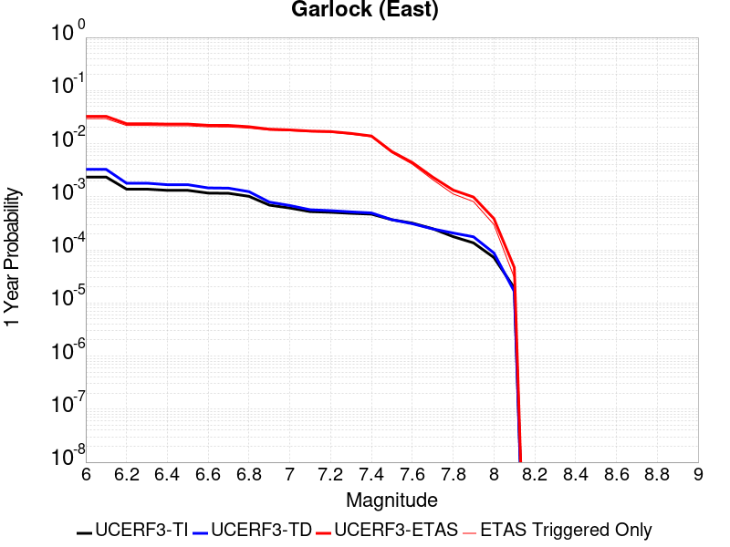 |  |

| Magnitude | 1 wk TI Prob | 1 wk TD Prob | 1 wk ETAS Prob | 1 wk ETAS/TD Gain | 1 wk ETAS Triggered Only | 1 mo TI Prob | 1 mo TD Prob | 1 mo ETAS Prob | 1 mo ETAS/TD Gain | 1 mo ETAS Triggered Only | 1 yr TI Prob | 1 yr TD Prob | 1 yr ETAS Prob | 1 yr ETAS/TD Gain | 1 yr ETAS Triggered Only | 10 yr TI Prob | 10 yr TD Prob | 10 yr ETAS Prob | 10 yr ETAS/TD Gain | 10 yr ETAS Triggered Only |
|-----|-----|-----|-----|-----|-----|-----|-----|-----|-----|-----|-----|-----|-----|-----|-----|-----|-----|-----|-----|-----|
| 6.0 | 4.5092507E-5 | 6.2904815E-5 | 0.0155719295 | 247.54749 | 0.01551 | 1.9323928E-4 | 2.6956675E-4 | 0.020684062 | 76.73077 | 0.02042 | 0.0023501497 | 0.003277482 | 0.032720666 | 9.983477 | 0.02954 | 0.023254504 | 0.03235377 | 0.07098221 | 2.1939392 | 0.03992 |
| 6.1 | 4.5092507E-5 | 6.2904815E-5 | 0.0155719295 | 247.54749 | 0.01551 | 1.9323928E-4 | 2.6956675E-4 | 0.020684062 | 76.73077 | 0.02042 | 0.0023501497 | 0.003277482 | 0.032720666 | 9.983477 | 0.02954 | 0.023254504 | 0.03235377 | 0.07098221 | 2.1939392 | 0.03992 |
| 6.2 | 2.6674514E-5 | 3.4511588E-5 | 0.012344087 | 357.67947 | 0.01231 | 1.1431433E-4 | 1.4789861E-4 | 0.015825579 | 107.0029 | 0.01568 | 0.0013908884 | 0.0017992114 | 0.023729682 | 13.188935 | 0.02197 | 0.01382215 | 0.017872788 | 0.04605002 | 2.5765436 | 0.02869 |
| 6.3 | 2.6674514E-5 | 3.4511588E-5 | 0.012344087 | 357.67947 | 0.01231 | 1.1431433E-4 | 1.4789861E-4 | 0.015825579 | 107.0029 | 0.01568 | 0.0013908884 | 0.0017992114 | 0.023729682 | 13.188935 | 0.02197 | 0.01382215 | 0.017872788 | 0.04605002 | 2.5765436 | 0.02869 |
| 6.4 | 2.5312667E-5 | 3.2340467E-5 | 0.012211947 | 377.60574 | 0.01218 | 1.0847834E-4 | 1.3859481E-4 | 0.015626447 | 112.74915 | 0.01549 | 0.0013199237 | 0.0016861152 | 0.02332956 | 13.836279 | 0.02168 | 0.013121112 | 0.016772287 | 0.04446981 | 2.6513863 | 0.02817 |
| 6.5 | 2.5312667E-5 | 3.2340467E-5 | 0.012211947 | 377.60574 | 0.01218 | 1.0847834E-4 | 1.3859481E-4 | 0.015626447 | 112.74915 | 0.01549 | 0.0013199237 | 0.0016861152 | 0.02332956 | 13.836279 | 0.02168 | 0.013121112 | 0.016772287 | 0.04446981 | 2.6513863 | 0.02817 |
| 6.6 | 2.246556E-5 | 2.8134691E-5 | 0.011847802 | 421.11008 | 0.01182 | 9.627742E-5 | 1.2057181E-4 | 0.015078768 | 125.06048 | 0.01496 | 0.0011715472 | 0.0014669969 | 0.022146616 | 15.096566 | 0.02071 | 0.011653901 | 0.014613169 | 0.040932853 | 2.8010933 | 0.02671 |
| 6.7 | 2.2241198E-5 | 2.7804432E-5 | 0.011827476 | 425.38098 | 0.0118 | 9.531594E-5 | 1.1915654E-4 | 0.01502738 | 126.11461 | 0.01491 | 0.0011598538 | 0.0014497889 | 0.022059865 | 15.215915 | 0.02064 | 0.011538187 | 0.014442829 | 0.040668506 | 2.8158267 | 0.02661 |
| 6.8 | 1.9528685E-5 | 2.3898969E-5 | 0.011423627 | 477.99664 | 0.0114 | 8.369167E-5 | 1.0242024E-4 | 0.014410955 | 140.70416 | 0.01431 | 0.0010184698 | 0.0012462728 | 0.020821845 | 16.707294 | 0.0196 | 0.010138147 | 0.012436723 | 0.03720481 | 2.9915283 | 0.02508 |
| 6.9 | 1.3318621E-5 | 1.5198818E-5 | 0.0107450355 | 706.9652 | 0.01073 | 5.7078556E-5 | 6.51362E-5 | 0.013354271 | 205.02072 | 0.01329 | 6.9470983E-4 | 7.927504E-4 | 0.018708536 | 23.59953 | 0.01793 | 0.0069254204 | 0.007940721 | 0.030311657 | 3.8172426 | 0.02255 |
| 7.0 | 1.1760853E-5 | 1.3107653E-5 | 0.0105829695 | 807.38855 | 0.01057 | 5.0402683E-5 | 5.6174475E-5 | 0.01312544 | 233.65489 | 0.01307 | 6.134799E-4 | 6.8371464E-4 | 0.018131778 | 26.51951 | 0.01746 | 0.0061178906 | 0.006857401 | 0.028617155 | 4.1731777 | 0.02191 |
| 7.1 | 1.0064758E-5 | 1.0902761E-5 | 0.010220791 | 937.4499 | 0.01021 | 4.3133965E-5 | 4.67253E-5 | 0.0125761395 | 269.15054 | 0.01253 | 5.2502943E-4 | 5.6873553E-4 | 0.017239248 | 30.311539 | 0.01668 | 0.005237907 | 0.0057133473 | 0.026374623 | 4.6163173 | 0.02078 |
| 7.2 | 9.768808E-6 | 1.0498628E-5 | 0.010010393 | 953.49536 | 0.01 | 4.186565E-5 | 4.499337E-5 | 0.012324441 | 273.91684 | 0.01228 | 5.095951E-4 | 5.4766005E-4 | 0.016868716 | 30.801437 | 0.01633 | 0.0050842804 | 0.005503584 | 0.02571175 | 4.6718197 | 0.02032 |
| 7.3 | 9.344516E-6 | 9.9442705E-6 | 0.009249852 | 930.169 | 0.00924 | 4.004731E-5 | 4.2617627E-5 | 0.011332137 | 265.9026 | 0.01129 | 4.8746695E-4 | 5.187495E-4 | 0.015570937 | 30.016293 | 0.01506 | 0.0048639905 | 0.005215269 | 0.02388738 | 4.5802774 | 0.01877 |
| 7.4 | 9.023491E-6 | 9.490441E-6 | 0.008189413 | 862.9117 | 0.00818 | 3.867153E-5 | 4.0672705E-5 | 0.010140262 | 249.31369 | 0.0101 | 4.7072413E-4 | 4.95081E-4 | 0.013928427 | 28.133633 | 0.01344 | 0.004697283 | 0.0049787266 | 0.021665234 | 4.351561 | 0.01677 |
| 7.5 | 7.081253E-6 | 7.0873994E-6 | 0.0040770588 | 575.2545 | 0.00407 | 3.0347876E-5 | 3.0374218E-5 | 0.0050802208 | 167.25436 | 0.00505 | 3.6942272E-4 | 3.697441E-4 | 0.007097256 | 19.195047 | 0.00673 | 0.003688092 | 0.0037244745 | 0.012172891 | 3.2683513 | 0.00848 |
| 7.6 | 6.116396E-6 | 5.9589424E-6 | 0.002505944 | 420.53503 | 0.0025 | 2.6212863E-5 | 2.5538076E-5 | 0.003125459 | 122.38427 | 0.0031 | 3.1909486E-4 | 3.1088197E-4 | 0.0044196043 | 14.216341 | 0.00411 | 0.0031863707 | 0.0031359126 | 0.0082797315 | 2.640294 | 0.00516 |
| 7.7 | 4.797145E-6 | 4.7571157E-6 | 0.001294751 | 272.17145 | 0.00129 | 2.055903E-5 | 2.0387479E-5 | 0.0016203548 | 79.47794 | 0.0016 | 2.5027743E-4 | 2.481894E-4 | 0.0023476682 | 9.45918 | 0.0021 | 0.0024999576 | 0.0025094065 | 0.005122832 | 2.0414515 | 0.00262 |
| 7.8 | 3.4028885E-6 | 3.978375E-6 | 6.639758E-4 | 166.89622 | 6.6E-4 | 1.4583726E-5 | 1.7050066E-5 | 8.670356E-4 | 50.85233 | 8.5E-4 | 1.775424E-4 | 2.0756487E-4 | 0.0013373303 | 6.442951 | 0.00113 | 0.0017740062 | 0.0021012141 | 0.0035781043 | 1.7028747 | 0.00148 |
| 7.9 | 2.5928412E-6 | 3.372436E-6 | 4.7337086E-4 | 140.36467 | 4.7E-4 | 1.1112129E-5 | 1.4453217E-5 | 6.244444E-4 | 43.204525 | 6.1E-4 | 1.3528178E-4 | 1.7595377E-4 | 9.858112E-4 | 5.602672 | 8.1E-4 | 0.0013519945 | 0.0017812426 | 0.0028293724 | 1.5884261 | 0.00105 |
| 8.0 | 1.3743648E-6 | 1.6734741E-6 | 1.8167317E-4 | 108.56049 | 1.8E-4 | 5.8901214E-6 | 7.1720124E-6 | 2.2717043E-4 | 31.674574 | 2.2E-4 | 7.1709874E-5 | 8.731578E-5 | 3.872896E-4 | 4.435505 | 3.0E-4 | 7.1686733E-4 | 8.837377E-4 | 0.0012534107 | 1.4183062 | 3.7E-4 |
| 8.1 | 3.6733252E-7 | 3.1489736E-7 | 2.031489E-5 | 64.51273 | 2.0E-5 | 1.5742813E-6 | 1.3495595E-6 | 3.134952E-5 | 23.229445 | 3.0E-5 | 1.9166706E-5 | 1.643078E-5 | 4.6430287E-5 | 2.8258114 | 3.0E-5 | 1.9165053E-4 | 1.662928E-4 | 2.0628615E-4 | 1.2404996 | 4.0E-5 |

## Airport Lake
*[(top)](#table-of-contents)*

| 1 Week | 1 Month | 1 Year | 10 Year |
|-----|-----|-----|-----|
|  |  |  |  |

| Magnitude | 1 wk TI Prob | 1 wk TD Prob | 1 wk ETAS Prob | 1 wk ETAS/TD Gain | 1 wk ETAS Triggered Only | 1 mo TI Prob | 1 mo TD Prob | 1 mo ETAS Prob | 1 mo ETAS/TD Gain | 1 mo ETAS Triggered Only | 1 yr TI Prob | 1 yr TD Prob | 1 yr ETAS Prob | 1 yr ETAS/TD Gain | 1 yr ETAS Triggered Only | 10 yr TI Prob | 10 yr TD Prob | 10 yr ETAS Prob | 10 yr ETAS/TD Gain | 10 yr ETAS Triggered Only |
|-----|-----|-----|-----|-----|-----|-----|-----|-----|-----|-----|-----|-----|-----|-----|-----|-----|-----|-----|-----|-----|
| 6.0 | 1.2387061E-5 | 1.3103157E-5 | 0.022872804 | 1745.5948 | 0.02286 | 5.3086325E-5 | 5.615534E-5 | 0.027834596 | 495.67142 | 0.02778 | 6.461343E-4 | 6.8350515E-4 | 0.036748838 | 53.765266 | 0.03609 | 0.0064425888 | 0.0068168393 | 0.05034806 | 7.385836 | 0.04383 |
| 6.1 | 1.2387061E-5 | 1.3103157E-5 | 0.022872804 | 1745.5948 | 0.02286 | 5.3086325E-5 | 5.615534E-5 | 0.027834596 | 495.67142 | 0.02778 | 6.461343E-4 | 6.8350515E-4 | 0.036748838 | 53.765266 | 0.03609 | 0.0064425888 | 0.0068168393 | 0.05034806 | 7.385836 | 0.04383 |
| 6.2 | 1.2387061E-5 | 1.3103157E-5 | 0.022872804 | 1745.5948 | 0.02286 | 5.3086325E-5 | 5.615534E-5 | 0.027834596 | 495.67142 | 0.02778 | 6.461343E-4 | 6.8350515E-4 | 0.036748838 | 53.765266 | 0.03609 | 0.0064425888 | 0.0068168393 | 0.05034806 | 7.385836 | 0.04383 |
| 6.3 | 1.2387061E-5 | 1.3103157E-5 | 0.022872804 | 1745.5948 | 0.02286 | 5.3086325E-5 | 5.615534E-5 | 0.027834596 | 495.67142 | 0.02778 | 6.461343E-4 | 6.8350515E-4 | 0.036748838 | 53.765266 | 0.03609 | 0.0064425888 | 0.0068168393 | 0.05034806 | 7.385836 | 0.04383 |
| 6.4 | 1.2387061E-5 | 1.3103157E-5 | 0.022872804 | 1745.5948 | 0.02286 | 5.3086325E-5 | 5.615534E-5 | 0.027834596 | 495.67142 | 0.02778 | 6.461343E-4 | 6.8350515E-4 | 0.036748838 | 53.765266 | 0.03609 | 0.0064425888 | 0.0068168393 | 0.05034806 | 7.385836 | 0.04383 |
| 6.5 | 6.9922594E-6 | 7.384925E-6 | 0.01687726 | 2285.3665 | 0.01687 | 2.996648E-5 | 3.1649324E-5 | 0.020700995 | 654.0738 | 0.02067 | 3.6478083E-4 | 3.8526783E-4 | 0.027005007 | 70.09412 | 0.02663 | 0.003641826 | 0.0038465366 | 0.035952564 | 9.346736 | 0.03223 |
| 6.6 | 6.9922594E-6 | 7.384925E-6 | 0.01687726 | 2285.3665 | 0.01687 | 2.996648E-5 | 3.1649324E-5 | 0.020700995 | 654.0738 | 0.02067 | 3.6478083E-4 | 3.8526783E-4 | 0.027005007 | 70.09412 | 0.02663 | 0.003641826 | 0.0038465366 | 0.035952564 | 9.346736 | 0.03223 |
| 6.7 | 5.477277E-6 | 5.7860684E-6 | 0.014365703 | 2482.809 | 0.01436 | 2.3473833E-5 | 2.4797222E-5 | 0.01761436 | 710.33606 | 0.01759 | 2.8575645E-4 | 3.0186825E-4 | 0.022885049 | 75.81138 | 0.02259 | 0.0028538927 | 0.003014966 | 0.030282507 | 10.044063 | 0.02735 |
| 6.8 | 3.9950432E-6 | 4.2190873E-6 | 0.010964173 | 2598.7075 | 0.01096 | 1.7121502E-5 | 1.8081691E-5 | 0.013487838 | 745.93896 | 0.01347 | 2.0843433E-4 | 2.2012512E-4 | 0.017326359 | 78.71141 | 0.01711 | 0.0020823893 | 0.0021993418 | 0.022913683 | 10.418427 | 0.02076 |
| 6.9 | 2.95695E-6 | 3.1230243E-6 | 0.0076230993 | 2440.935 | 0.00762 | 1.2672582E-5 | 1.3384334E-5 | 0.009513257 | 710.7755 | 0.0095 | 1.5427776E-4 | 1.6294434E-4 | 0.0123609565 | 75.85999 | 0.0122 | 0.001541707 | 0.0016284712 | 0.016394386 | 10.0673485 | 0.01479 |
| 7.0 | 1.456072E-6 | 1.540812E-6 | 0.0033115358 | 2149.2146 | 0.00331 | 6.2402937E-6 | 6.603469E-6 | 0.0042165755 | 638.5395 | 0.00421 | 7.597293E-5 | 8.039528E-5 | 0.0054099667 | 67.2921 | 0.00533 | 7.594696E-4 | 8.0376083E-4 | 0.0072385846 | 9.005894 | 0.00644 |
| 7.1 | 6.995192E-7 | 7.4089746E-7 | 0.00129074 | 1742.1304 | 0.00129 | 2.997936E-6 | 3.1752747E-6 | 0.0016931699 | 533.2357 | 0.00169 | 3.649926E-5 | 3.865897E-5 | 0.0023085712 | 59.716316 | 0.00227 | 3.6493264E-4 | 3.865897E-4 | 0.003175511 | 8.214164 | 0.00279 |

## Hunter Mountain-Saline Valley
*[(top)](#table-of-contents)*

| 1 Week | 1 Month | 1 Year | 10 Year |
|-----|-----|-----|-----|
|  |  |  |  |

| Magnitude | 1 wk TI Prob | 1 wk TD Prob | 1 wk ETAS Prob | 1 wk ETAS/TD Gain | 1 wk ETAS Triggered Only | 1 mo TI Prob | 1 mo TD Prob | 1 mo ETAS Prob | 1 mo ETAS/TD Gain | 1 mo ETAS Triggered Only | 1 yr TI Prob | 1 yr TD Prob | 1 yr ETAS Prob | 1 yr ETAS/TD Gain | 1 yr ETAS Triggered Only | 10 yr TI Prob | 10 yr TD Prob | 10 yr ETAS Prob | 10 yr ETAS/TD Gain | 10 yr ETAS Triggered Only |
|-----|-----|-----|-----|-----|-----|-----|-----|-----|-----|-----|-----|-----|-----|-----|-----|-----|-----|-----|-----|-----|
| 6.0 | 4.5103672E-5 | 5.456906E-5 | 0.0101740165 | 186.44295 | 0.01012 | 1.9328714E-4 | 2.3384714E-4 | 0.012470985 | 53.329647 | 0.01224 | 0.002350731 | 0.0028435462 | 0.019266713 | 6.7755938 | 0.01647 | 0.023260195 | 0.028092625 | 0.048677623 | 1.7327546 | 0.02118 |
| 6.1 | 4.5103672E-5 | 5.456906E-5 | 0.0101740165 | 186.44295 | 0.01012 | 1.9328714E-4 | 2.3384714E-4 | 0.012470985 | 53.329647 | 0.01224 | 0.002350731 | 0.0028435462 | 0.019266713 | 6.7755938 | 0.01647 | 0.023260195 | 0.028092625 | 0.048677623 | 1.7327546 | 0.02118 |
| 6.2 | 3.9363465E-5 | 4.706271E-5 | 0.010116588 | 214.95976 | 0.01007 | 1.6868966E-4 | 2.016826E-4 | 0.012389224 | 61.429314 | 0.01219 | 0.002051862 | 0.0024528534 | 0.018822601 | 7.6737576 | 0.01641 | 0.020330196 | 0.024274187 | 0.044852246 | 1.8477341 | 0.02109 |
| 6.3 | 3.9363465E-5 | 4.706271E-5 | 0.010116588 | 214.95976 | 0.01007 | 1.6868966E-4 | 2.016826E-4 | 0.012389224 | 61.429314 | 0.01219 | 0.002051862 | 0.0024528534 | 0.018822601 | 7.6737576 | 0.01641 | 0.020330196 | 0.024274187 | 0.044852246 | 1.8477341 | 0.02109 |
| 6.4 | 3.2311684E-5 | 3.795112E-5 | 0.01007757 | 265.5408 | 0.01004 | 1.384713E-4 | 1.6263791E-4 | 0.01232066 | 75.75516 | 0.01216 | 0.0016845843 | 0.001978387 | 0.01829604 | 9.247958 | 0.01635 | 0.016718714 | 0.019617118 | 0.040185552 | 2.048494 | 0.02098 |
| 6.5 | 3.2311684E-5 | 3.795112E-5 | 0.01007757 | 265.5408 | 0.01004 | 1.384713E-4 | 1.6263791E-4 | 0.01232066 | 75.75516 | 0.01216 | 0.0016845843 | 0.001978387 | 0.01829604 | 9.247958 | 0.01635 | 0.016718714 | 0.019617118 | 0.040185552 | 2.048494 | 0.02098 |
| 6.6 | 2.9305844E-5 | 3.418196E-5 | 0.01003384 | 293.54196 | 0.01 | 1.2559042E-4 | 1.4648624E-4 | 0.012264711 | 83.72602 | 0.01212 | 0.0015279909 | 0.0017820727 | 0.018043043 | 10.124751 | 0.01629 | 0.015175272 | 0.017686324 | 0.038206857 | 2.1602485 | 0.02089 |
| 6.7 | 2.7826512E-5 | 3.2344353E-5 | 0.0100320205 | 310.16296 | 0.01 | 1.19251024E-4 | 1.3861163E-4 | 0.0122569315 | 88.42643 | 0.01212 | 0.0014509142 | 0.0016863506 | 0.017938897 | 10.637704 | 0.01628 | 0.014414776 | 0.016743818 | 0.037264373 | 2.2255602 | 0.02087 |
| 6.8 | 2.3389874E-5 | 2.6866792E-5 | 0.009996599 | 372.0801 | 0.00997 | 1.0023846E-4 | 1.1513857E-4 | 0.0122037465 | 105.99181 | 0.01209 | 0.00121972 | 0.001400958 | 0.017588248 | 12.554443 | 0.01621 | 0.01213047 | 0.013928067 | 0.0343792 | 2.4683397 | 0.02074 |
| 6.9 | 2.069209E-5 | 2.357011E-5 | 0.009983336 | 423.55914 | 0.00996 | 8.867737E-5 | 1.0101105E-4 | 0.012169791 | 120.47981 | 0.01207 | 0.0010791123 | 0.0012291519 | 0.017379276 | 14.139243 | 0.01617 | 0.010738871 | 0.012229158 | 0.03265626 | 2.6703606 | 0.02068 |
| 7.0 | 1.7462342E-5 | 1.9633622E-5 | 0.009969438 | 507.77374 | 0.00995 | 7.483646E-5 | 8.414151E-5 | 0.012133128 | 144.19907 | 0.01205 | 9.1075303E-4 | 0.0010239641 | 0.017157428 | 16.755888 | 0.01615 | 0.009070295 | 0.010196688 | 0.030606432 | 3.0016053 | 0.02062 |
| 7.1 | 1.4807709E-5 | 1.6441827E-5 | 0.009956279 | 605.5458 | 0.00994 | 6.3460066E-5 | 7.046316E-5 | 0.012099615 | 171.71548 | 0.01203 | 7.723524E-4 | 8.575678E-4 | 0.01694376 | 19.757925 | 0.0161 | 0.007696735 | 0.008546168 | 0.028920544 | 3.3840365 | 0.02055 |
| 7.2 | 1.4180048E-5 | 1.5698413E-5 | 0.009945543 | 633.5381 | 0.00993 | 6.077022E-5 | 6.727727E-5 | 0.012086469 | 179.6516 | 0.01202 | 7.396263E-4 | 8.1880915E-4 | 0.01687565 | 20.609993 | 0.01607 | 0.0073716943 | 0.008161469 | 0.028504077 | 3.492518 | 0.02051 |
| 7.3 | 1.3730402E-5 | 1.5172151E-5 | 0.009935021 | 654.8196 | 0.00992 | 5.8843252E-5 | 6.502197E-5 | 0.012074241 | 185.69478 | 0.01201 | 7.161811E-4 | 7.9137104E-4 | 0.01682867 | 21.265207 | 0.01605 | 0.007138774 | 0.007889058 | 0.02820749 | 3.5755208 | 0.02048 |
| 7.4 | 1.2810095E-5 | 1.4109353E-5 | 0.00991397 | 702.65234 | 0.0099 | 5.489925E-5 | 6.0467344E-5 | 0.012049742 | 199.27686 | 0.01199 | 6.681934E-4 | 7.3595706E-4 | 0.01675416 | 22.765133 | 0.01603 | 0.006661878 | 0.0073386896 | 0.02758898 | 3.759388 | 0.0204 |
| 7.5 | 1.1595659E-5 | 1.2800734E-5 | 0.009822675 | 767.35254 | 0.00981 | 4.9694736E-5 | 5.485922E-5 | 0.011924208 | 217.36014 | 0.01187 | 6.0486543E-4 | 6.67722E-4 | 0.016467165 | 24.661707 | 0.01581 | 0.006032217 | 0.006660632 | 0.02664662 | 4.000614 | 0.02012 |
| 7.6 | 2.997694E-6 | 3.3251877E-6 | 0.0043933108 | 1321.2219 | 0.00439 | 1.28471975E-5 | 1.4250767E-5 | 0.005254176 | 368.69427 | 0.00524 | 1.564034E-4 | 1.7349655E-4 | 0.006932324 | 39.95655 | 0.00676 | 0.0015629337 | 0.0017356955 | 0.01029082 | 5.928932 | 0.00857 |

## Blackwater
*[(top)](#table-of-contents)*

| 1 Week | 1 Month | 1 Year | 10 Year |
|-----|-----|-----|-----|
|  | 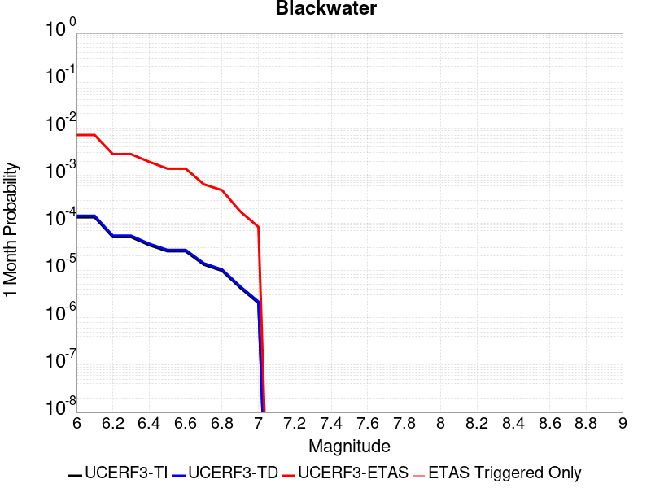 |  | 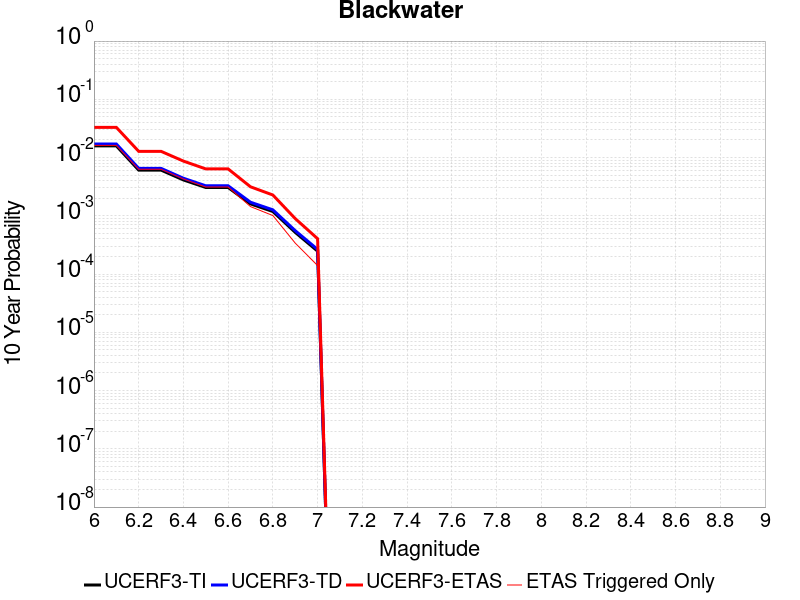 |

| Magnitude | 1 wk TI Prob | 1 wk TD Prob | 1 wk ETAS Prob | 1 wk ETAS/TD Gain | 1 wk ETAS Triggered Only | 1 mo TI Prob | 1 mo TD Prob | 1 mo ETAS Prob | 1 mo ETAS/TD Gain | 1 mo ETAS Triggered Only | 1 yr TI Prob | 1 yr TD Prob | 1 yr ETAS Prob | 1 yr ETAS/TD Gain | 1 yr ETAS Triggered Only | 10 yr TI Prob | 10 yr TD Prob | 10 yr ETAS Prob | 10 yr ETAS/TD Gain | 10 yr ETAS Triggered Only |
|-----|-----|-----|-----|-----|-----|-----|-----|-----|-----|-----|-----|-----|-----|-----|-----|-----|-----|-----|-----|-----|
| 6.0 | 3.0708583E-5 | 3.3095846E-5 | 0.0050529297 | 152.67564 | 0.00502 | 1.3160157E-4 | 1.4183241E-4 | 0.0071708355 | 50.55851 | 0.00703 | 0.0016010714 | 0.0017255784 | 0.012816408 | 7.4273105 | 0.01111 | 0.015895851 | 0.017135633 | 0.03304821 | 1.9286249 | 0.01619 |
| 6.1 | 3.0708583E-5 | 3.3095846E-5 | 0.0050529297 | 152.67564 | 0.00502 | 1.3160157E-4 | 1.4183241E-4 | 0.0071708355 | 50.55851 | 0.00703 | 0.0016010714 | 0.0017255784 | 0.012816408 | 7.4273105 | 0.01111 | 0.015895851 | 0.017135633 | 0.03304821 | 1.9286249 | 0.01619 |
| 6.2 | 1.1707779E-5 | 1.2545122E-5 | 0.0019725205 | 157.23407 | 0.00196 | 5.017523E-5 | 5.3763757E-5 | 0.0028236147 | 52.51893 | 0.00277 | 6.107122E-4 | 6.5438676E-4 | 0.0048816185 | 7.4598374 | 0.00423 | 0.006090366 | 0.0065255696 | 0.012794393 | 1.9606555 | 0.00631 |
| 6.3 | 1.1707779E-5 | 1.2545122E-5 | 0.0019725205 | 157.23407 | 0.00196 | 5.017523E-5 | 5.3763757E-5 | 0.0028236147 | 52.51893 | 0.00277 | 6.107122E-4 | 6.5438676E-4 | 0.0048816185 | 7.4598374 | 0.00423 | 0.006090366 | 0.0065255696 | 0.012794393 | 1.9606555 | 0.00631 |
| 6.4 | 7.929244E-6 | 8.480098E-6 | 0.0013584687 | 160.19492 | 0.00135 | 3.3982033E-5 | 3.6342793E-5 | 0.0019462734 | 53.553215 | 0.00191 | 4.136527E-4 | 4.423877E-4 | 0.0032711357 | 7.3942733 | 0.00283 | 0.0041288356 | 0.0044154758 | 0.008696489 | 1.9695474 | 0.0043 |
| 6.5 | 5.8832115E-6 | 6.285991E-6 | 9.862798E-4 | 156.90125 | 9.8E-4 | 2.521352E-5 | 2.6939697E-5 | 0.0013969028 | 51.85295 | 0.00137 | 3.0693135E-4 | 3.27944E-4 | 0.0023772717 | 7.2490172 | 0.00205 | 0.0030650778 | 0.0032748538 | 0.0063846363 | 1.9495943 | 0.00312 |
| 6.6 | 5.8832115E-6 | 6.285991E-6 | 9.862798E-4 | 156.90125 | 9.8E-4 | 2.521352E-5 | 2.6939697E-5 | 0.0013969028 | 51.85295 | 0.00137 | 3.0693135E-4 | 3.27944E-4 | 0.0023772717 | 7.2490172 | 0.00205 | 0.0030650778 | 0.0032748538 | 0.0063846363 | 1.9495943 | 0.00312 |
| 6.7 | 3.0715053E-6 | 3.2814662E-6 | 4.732799E-4 | 144.2282 | 4.7E-4 | 1.3163528E-5 | 1.4063357E-5 | 6.5405434E-4 | 46.507698 | 6.4E-4 | 1.6025416E-4 | 1.7120909E-4 | 0.0011610396 | 6.7814136 | 9.9E-4 | 0.0016013865 | 0.0017108864 | 0.0031484228 | 1.840229 | 0.00144 |
| 6.8 | 2.2722281E-6 | 2.4287538E-6 | 3.3242794E-4 | 136.87183 | 3.3E-4 | 9.738084E-6 | 1.0408908E-5 | 4.904039E-4 | 47.11387 | 4.8E-4 | 1.1855473E-4 | 1.26722E-4 | 8.3663204E-4 | 6.6021056 | 7.1E-4 | 0.001184915 | 0.0012665876 | 0.0022753084 | 1.7964082 | 0.00101 |
| 6.9 | 9.952399E-7 | 1.0653489E-6 | 9.106525E-5 | 85.47928 | 9.0E-5 | 4.265307E-6 | 4.5657757E-6 | 1.74565E-4 | 38.23337 | 1.7E-4 | 5.1928873E-5 | 5.5587418E-5 | 3.1557298E-4 | 5.6770573 | 2.6E-4 | 5.191674E-4 | 5.557858E-4 | 8.955968E-4 | 1.6114066 | 3.4E-4 |
| 7.0 | 4.7385504E-7 | 5.0755597E-7 | 5.050753E-5 | 99.51126 | 5.0E-5 | 2.0308057E-6 | 2.1752398E-6 | 8.2175065E-5 | 37.777473 | 8.0E-5 | 2.4724779E-5 | 2.6483543E-5 | 1.264809E-4 | 4.77583 | 1.0E-4 | 2.4722028E-4 | 2.6483546E-4 | 4.0479837E-4 | 1.5284902 | 1.4E-4 |

## Ash Hill
*[(top)](#table-of-contents)*

| 1 Week | 1 Month | 1 Year | 10 Year |
|-----|-----|-----|-----|
| 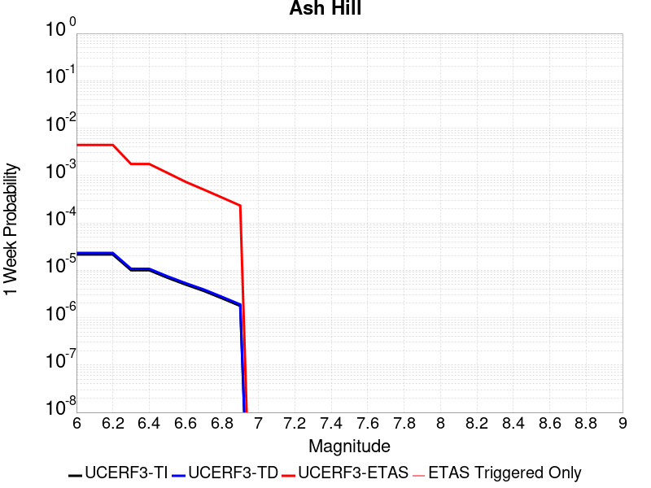 |  |  |  |

| Magnitude | 1 wk TI Prob | 1 wk TD Prob | 1 wk ETAS Prob | 1 wk ETAS/TD Gain | 1 wk ETAS Triggered Only | 1 mo TI Prob | 1 mo TD Prob | 1 mo ETAS Prob | 1 mo ETAS/TD Gain | 1 mo ETAS Triggered Only | 1 yr TI Prob | 1 yr TD Prob | 1 yr ETAS Prob | 1 yr ETAS/TD Gain | 1 yr ETAS Triggered Only | 10 yr TI Prob | 10 yr TD Prob | 10 yr ETAS Prob | 10 yr ETAS/TD Gain | 10 yr ETAS Triggered Only |
|-----|-----|-----|-----|-----|-----|-----|-----|-----|-----|-----|-----|-----|-----|-----|-----|-----|-----|-----|-----|-----|
| 6.0 | 2.1545662E-5 | 2.3194447E-5 | 0.0044130925 | 190.26505 | 0.00439 | 9.2335285E-5 | 9.940143E-5 | 0.006238791 | 62.76359 | 0.00614 | 0.0011236023 | 0.0012096206 | 0.011097645 | 9.174484 | 0.0099 | 0.011179381 | 0.012038348 | 0.026373671 | 2.1908047 | 0.01451 |
| 6.1 | 2.1545662E-5 | 2.3194447E-5 | 0.0044130925 | 190.26505 | 0.00439 | 9.2335285E-5 | 9.940143E-5 | 0.006238791 | 62.76359 | 0.00614 | 0.0011236023 | 0.0012096206 | 0.011097645 | 9.174484 | 0.0099 | 0.011179381 | 0.012038348 | 0.026373671 | 2.1908047 | 0.01451 |
| 6.2 | 2.1545662E-5 | 2.3194447E-5 | 0.0044130925 | 190.26505 | 0.00439 | 9.2335285E-5 | 9.940143E-5 | 0.006238791 | 62.76359 | 0.00614 | 0.0011236023 | 0.0012096206 | 0.011097645 | 9.174484 | 0.0099 | 0.011179381 | 0.012038348 | 0.026373671 | 2.1908047 | 0.01451 |
| 6.3 | 1.0025529E-5 | 1.0746934E-5 | 0.0017507282 | 162.90489 | 0.00174 | 4.2965847E-5 | 4.605755E-5 | 0.002405949 | 52.23788 | 0.00236 | 5.229836E-4 | 5.6061964E-4 | 0.0044884165 | 8.00617 | 0.00393 | 0.005217545 | 0.0055933665 | 0.011679135 | 2.0880332 | 0.00612 |
| 6.4 | 1.0025529E-5 | 1.0746934E-5 | 0.0017507282 | 162.90489 | 0.00174 | 4.2965847E-5 | 4.605755E-5 | 0.002405949 | 52.23788 | 0.00236 | 5.229836E-4 | 5.6061964E-4 | 0.0044884165 | 8.00617 | 0.00393 | 0.005217545 | 0.0055933665 | 0.011679135 | 2.0880332 | 0.00612 |
| 6.5 | 6.9617327E-6 | 7.456634E-6 | 0.0011374482 | 152.54178 | 0.00113 | 2.9835655E-5 | 3.195666E-5 | 0.0015919068 | 49.814556 | 0.00156 | 3.6318856E-4 | 3.8901155E-4 | 0.003087961 | 7.937968 | 0.0027 | 0.0036259557 | 0.0038841602 | 0.008018041 | 2.064292 | 0.00415 |
| 6.6 | 4.9919777E-6 | 5.3466883E-6 | 7.353428E-4 | 137.53238 | 7.3E-4 | 2.1394015E-5 | 2.2914215E-5 | 9.92892E-4 | 43.330833 | 9.7E-4 | 2.60441E-4 | 2.7895154E-4 | 0.0021184382 | 7.5942874 | 0.00184 | 0.0026013597 | 0.0027866727 | 0.005588842 | 2.005561 | 0.00281 |
| 6.7 | 3.6630722E-6 | 3.924624E-6 | 5.0392264E-4 | 128.40025 | 5.0E-4 | 1.5698786E-5 | 1.681974E-5 | 6.868085E-4 | 40.833477 | 6.7E-4 | 1.9111596E-4 | 2.0476682E-4 | 0.0015344945 | 7.4938626 | 0.00133 | 0.0019095168 | 0.0020463446 | 0.004022293 | 1.9655991 | 0.00198 |
| 6.8 | 2.5599613E-6 | 2.744925E-6 | 3.42744E-4 | 124.86461 | 3.4E-4 | 1.0971216E-5 | 1.1763939E-5 | 4.5175877E-4 | 38.401997 | 4.4E-4 | 1.3356637E-4 | 1.4322149E-4 | 9.930998E-4 | 6.9340134 | 8.5E-4 | 0.0013348613 | 0.0014317769 | 0.0027299155 | 1.9066627 | 0.0013 |
| 6.9 | 1.7684905E-6 | 1.8968707E-6 | 2.3189644E-4 | 122.252106 | 2.3E-4 | 7.579223E-6 | 8.129446E-6 | 2.8812716E-4 | 35.442413 | 2.8E-4 | 9.2273134E-5 | 9.8976E-5 | 7.189146E-4 | 7.2635245 | 6.2E-4 | 9.223483E-4 | 9.8976E-4 | 0.0019288297 | 1.9487852 | 9.4E-4 |

## Garlock (West)
*[(top)](#table-of-contents)*

| 1 Week | 1 Month | 1 Year | 10 Year |
|-----|-----|-----|-----|
| 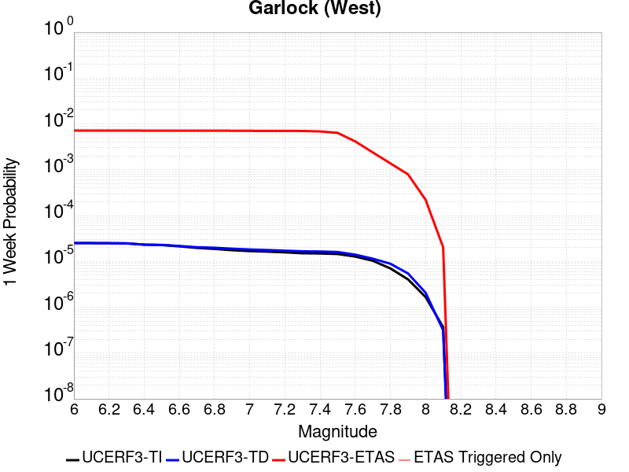 |  | 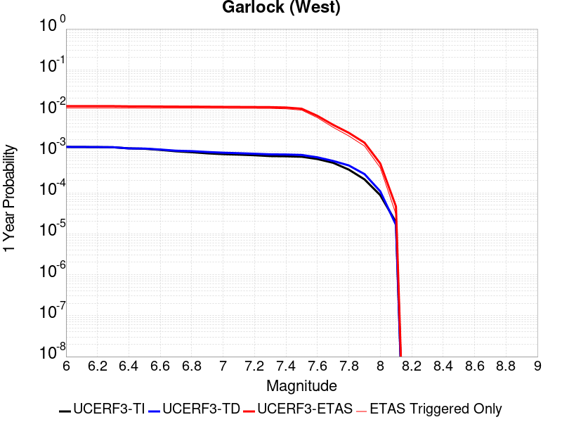 |  |

| Magnitude | 1 wk TI Prob | 1 wk TD Prob | 1 wk ETAS Prob | 1 wk ETAS/TD Gain | 1 wk ETAS Triggered Only | 1 mo TI Prob | 1 mo TD Prob | 1 mo ETAS Prob | 1 mo ETAS/TD Gain | 1 mo ETAS Triggered Only | 1 yr TI Prob | 1 yr TD Prob | 1 yr ETAS Prob | 1 yr ETAS/TD Gain | 1 yr ETAS Triggered Only | 10 yr TI Prob | 10 yr TD Prob | 10 yr ETAS Prob | 10 yr ETAS/TD Gain | 10 yr ETAS Triggered Only |
|-----|-----|-----|-----|-----|-----|-----|-----|-----|-----|-----|-----|-----|-----|-----|-----|-----|-----|-----|-----|-----|
| 6.0 | 2.5181727E-5 | 2.5197181E-5 | 0.007165017 | 284.35788 | 0.00714 | 1.0791722E-4 | 1.0798347E-4 | 0.00893703 | 82.76295 | 0.00883 | 0.0013131002 | 0.0013139093 | 0.013028497 | 9.915827 | 0.01173 | 0.013053683 | 0.013141794 | 0.02763874 | 2.1031177 | 0.01469 |
| 6.1 | 2.5077732E-5 | 2.5098223E-5 | 0.007164919 | 285.47516 | 0.00714 | 1.0747157E-4 | 1.075594E-4 | 0.00893661 | 83.08534 | 0.00883 | 0.001307681 | 0.0013087525 | 0.013023401 | 9.951004 | 0.01173 | 0.013000126 | 0.013090835 | 0.027588531 | 2.107469 | 0.01469 |
| 6.2 | 2.494612E-5 | 2.4979914E-5 | 0.0071648015 | 286.8225 | 0.00714 | 1.0690756E-4 | 1.070524E-4 | 0.008936107 | 83.47414 | 0.00883 | 0.0013008224 | 0.0013025872 | 0.013017308 | 9.993425 | 0.01173 | 0.012932341 | 0.013029906 | 0.027528496 | 2.1127164 | 0.01469 |
| 6.3 | 2.4733758E-5 | 2.4799276E-5 | 0.007164622 | 288.90448 | 0.00714 | 1.0599751E-4 | 1.06278305E-4 | 0.00893534 | 84.07492 | 0.00883 | 0.0012897556 | 0.0012931736 | 0.013008005 | 10.058977 | 0.01173 | 0.012822957 | 0.0129368715 | 0.02743683 | 2.120824 | 0.01469 |
| 6.4 | 2.3237335E-5 | 2.3178607E-5 | 0.0071430136 | 308.17267 | 0.00712 | 9.958477E-5 | 9.933313E-5 | 0.00888846 | 89.48133 | 0.00879 | 0.0012117702 | 0.0012087126 | 0.012854619 | 10.634967 | 0.01166 | 0.012051838 | 0.012101731 | 0.026525047 | 2.191839 | 0.0146 |
| 6.5 | 2.2732203E-5 | 2.2992977E-5 | 0.0071428292 | 310.65265 | 0.00712 | 9.742009E-5 | 9.8537625E-5 | 0.008887672 | 90.19572 | 0.00879 | 0.0011854442 | 0.0011990381 | 0.01283507 | 10.704472 | 0.01165 | 0.011791403 | 0.012006035 | 0.026420867 | 2.200632 | 0.01459 |
| 6.6 | 2.1319436E-5 | 2.1773201E-5 | 0.0071316184 | 327.5411 | 0.00711 | 9.136581E-5 | 9.3310395E-5 | 0.008872491 | 95.08577 | 0.00878 | 0.001111811 | 0.0011354643 | 0.012752259 | 11.230876 | 0.01163 | 0.011062649 | 0.011376952 | 0.025761416 | 2.2643514 | 0.01455 |
| 6.7 | 1.970802E-5 | 2.0393094E-5 | 0.007130248 | 349.64032 | 0.00711 | 8.446021E-5 | 8.739606E-5 | 0.008866629 | 101.453415 | 0.00878 | 0.001027818 | 0.0010635294 | 0.01268116 | 11.923658 | 0.01163 | 0.010230771 | 0.0106646875 | 0.025049623 | 2.3488379 | 0.01454 |
| 6.8 | 1.8744462E-5 | 1.9900775E-5 | 0.007129759 | 358.2654 | 0.00711 | 8.033094E-5 | 8.528626E-5 | 0.008864538 | 103.93864 | 0.00878 | 9.775903E-4 | 0.0010378672 | 0.0126557965 | 12.194042 | 0.01163 | 0.009733009 | 0.010410495 | 0.02478923 | 2.381177 | 0.01453 |
| 6.9 | 1.7559682E-5 | 1.8953151E-5 | 0.0071088187 | 375.07318 | 0.00709 | 7.5253614E-5 | 8.122527E-5 | 0.008840513 | 108.83945 | 0.00876 | 9.158276E-4 | 9.884704E-4 | 0.012567014 | 12.713596 | 0.01159 | 0.0091206245 | 0.009921073 | 0.024257416 | 2.4450395 | 0.01448 |
| 7.0 | 1.6794445E-5 | 1.8215967E-5 | 0.0070780874 | 388.565 | 0.00706 | 7.197421E-5 | 7.806611E-5 | 0.008797386 | 112.69148 | 0.00872 | 8.759337E-4 | 9.5004175E-4 | 0.012489069 | 13.14581 | 0.01155 | 0.008724891 | 0.009539958 | 0.0238422 | 2.4991934 | 0.01444 |
| 7.1 | 1.6337795E-5 | 1.771677E-5 | 0.007067592 | 398.92105 | 0.00705 | 7.0017246E-5 | 7.592681E-5 | 0.008775266 | 115.57533 | 0.0087 | 8.521265E-4 | 9.2401815E-4 | 0.012433373 | 13.455768 | 0.01152 | 0.008488664 | 0.009281721 | 0.023557972 | 2.5381038 | 0.01441 |
| 7.2 | 1.5780008E-5 | 1.71654E-5 | 0.0070570447 | 411.12033 | 0.00704 | 6.762685E-5 | 7.3563926E-5 | 0.008762925 | 119.11986 | 0.00869 | 8.2304585E-4 | 8.952741E-4 | 0.012374988 | 13.822568 | 0.01149 | 0.008200042 | 0.008996559 | 0.023237279 | 2.5829074 | 0.01437 |
| 7.3 | 1.5058865E-5 | 1.6618484E-5 | 0.007036502 | 423.4142 | 0.00702 | 6.45364E-5 | 7.122013E-5 | 0.008740603 | 122.72657 | 0.00867 | 7.854473E-4 | 8.667614E-4 | 0.012306837 | 14.198646 | 0.01145 | 0.00782677 | 0.008713263 | 0.022888664 | 2.626876 | 0.0143 |
| 7.4 | 1.4887923E-5 | 1.6454453E-5 | 0.006866342 | 417.29385 | 0.00685 | 6.380382E-5 | 7.0517184E-5 | 0.008529921 | 120.9623 | 0.00846 | 7.7653467E-4 | 8.5820974E-4 | 0.012048597 | 14.039223 | 0.0112 | 0.0077382675 | 0.008628101 | 0.022517221 | 2.6097538 | 0.01401 |
| 7.5 | 1.4509299E-5 | 1.6046468E-5 | 0.0063759442 | 397.34253 | 0.00636 | 6.218123E-5 | 6.876877E-5 | 0.007888231 | 114.70658 | 0.00782 | 7.567935E-4 | 8.369394E-4 | 0.011248219 | 13.439705 | 0.01042 | 0.0075422134 | 0.008416411 | 0.02139624 | 2.5422049 | 0.01309 |
| 7.6 | 1.2756717E-5 | 1.4050529E-5 | 0.004163992 | 296.3584 | 0.00415 | 5.4670498E-5 | 6.0215163E-5 | 0.0052199042 | 86.68754 | 0.00516 | 6.6541E-4 | 7.328737E-4 | 0.007537883 | 10.2853775 | 0.00681 | 0.006634211 | 0.007381374 | 0.015868263 | 2.149771 | 0.00855 |
| 7.7 | 1.0328985E-5 | 1.146033E-5 | 0.002391433 | 208.67052 | 0.00238 | 4.4266326E-5 | 4.9114777E-5 | 0.003058967 | 62.282005 | 0.00301 | 5.388092E-4 | 5.9780874E-4 | 0.0045554414 | 7.620232 | 0.00396 | 0.0053750467 | 0.006038286 | 0.010998155 | 1.8214035 | 0.00499 |
| 7.8 | 7.0306583E-6 | 8.899537E-6 | 0.0013788873 | 154.93922 | 0.00137 | 3.0131043E-5 | 3.8140315E-5 | 0.0018480712 | 48.454536 | 0.00181 | 3.667837E-4 | 4.6425956E-4 | 0.0029031266 | 6.2532406 | 0.00244 | 0.003661789 | 0.0046950667 | 0.007760606 | 1.6529278 | 0.00308 |
| 7.9 | 4.060633E-6 | 5.465412E-6 | 7.954611E-4 | 145.54457 | 7.9E-4 | 1.7402595E-5 | 2.3422985E-5 | 0.0010433991 | 44.545948 | 0.00102 | 2.11856E-4 | 2.8513762E-4 | 0.0016647441 | 5.838388 | 0.00138 | 0.0021165414 | 0.002884143 | 0.0046390668 | 1.6084733 | 0.00176 |
| 8.0 | 1.6729537E-6 | 2.0775192E-6 | 2.2207707E-4 | 106.89531 | 2.2E-4 | 7.169782E-6 | 8.903624E-6 | 2.9890105E-4 | 33.570717 | 2.9E-4 | 8.7288594E-5 | 1.0839626E-4 | 5.183518E-4 | 4.782008 | 4.1E-4 | 8.7254314E-4 | 0.001096854 | 0.0015863165 | 1.4462422 | 4.9E-4 |
| 8.1 | 3.6733252E-7 | 3.1489736E-7 | 2.031489E-5 | 64.51273 | 2.0E-5 | 1.5742813E-6 | 1.3495595E-6 | 3.134952E-5 | 23.229445 | 3.0E-5 | 1.9166706E-5 | 1.643078E-5 | 4.6430287E-5 | 2.8258114 | 3.0E-5 | 1.9165053E-4 | 1.662928E-4 | 2.0628615E-4 | 1.2404996 | 4.0E-5 |

## McLean Lake
*[(top)](#table-of-contents)*

| 1 Week | 1 Month | 1 Year | 10 Year |
|-----|-----|-----|-----|
| 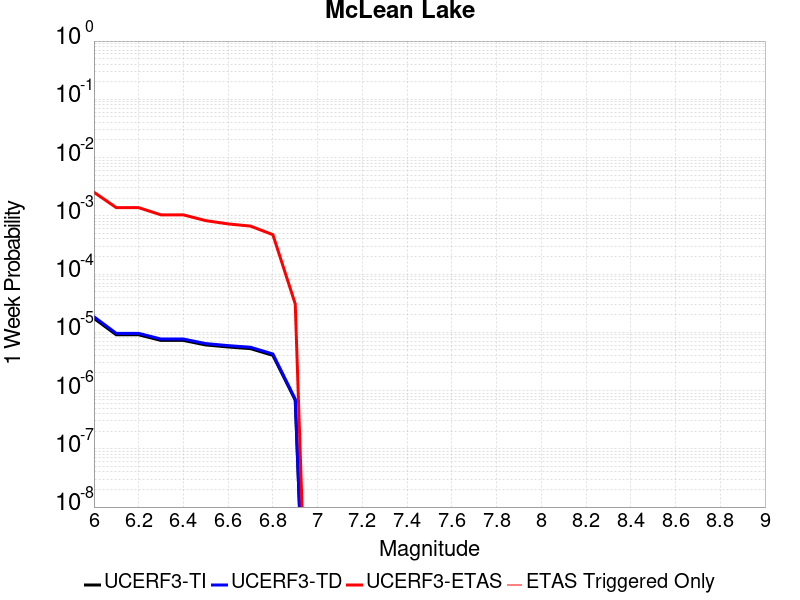 | 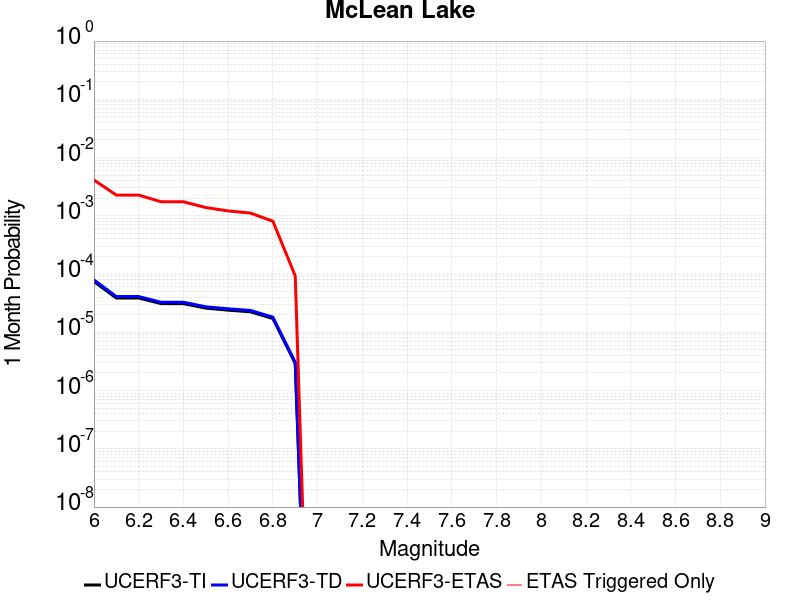 | 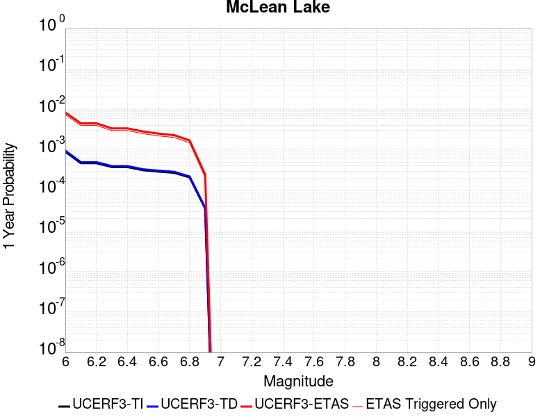 |  |

| Magnitude | 1 wk TI Prob | 1 wk TD Prob | 1 wk ETAS Prob | 1 wk ETAS/TD Gain | 1 wk ETAS Triggered Only | 1 mo TI Prob | 1 mo TD Prob | 1 mo ETAS Prob | 1 mo ETAS/TD Gain | 1 mo ETAS Triggered Only | 1 yr TI Prob | 1 yr TD Prob | 1 yr ETAS Prob | 1 yr ETAS/TD Gain | 1 yr ETAS Triggered Only | 10 yr TI Prob | 10 yr TD Prob | 10 yr ETAS Prob | 10 yr ETAS/TD Gain | 10 yr ETAS Triggered Only |
|-----|-----|-----|-----|-----|-----|-----|-----|-----|-----|-----|-----|-----|-----|-----|-----|-----|-----|-----|-----|-----|
| 6.0 | 1.7360222E-5 | 1.8501627E-5 | 0.002538455 | 137.20172 | 0.00252 | 7.439883E-5 | 7.9290556E-5 | 0.00411897 | 51.947803 | 0.00404 | 9.0542925E-4 | 9.6498354E-4 | 0.008437766 | 8.743947 | 0.00748 | 0.009017491 | 0.0096127745 | 0.020784343 | 2.1621585 | 0.01128 |
| 6.1 | 9.062689E-6 | 9.592193E-6 | 0.0013795791 | 143.8231 | 0.00137 | 3.8839516E-5 | 4.1108804E-5 | 0.002271017 | 55.24406 | 0.00223 | 4.727685E-4 | 5.003936E-4 | 0.004548367 | 9.089579 | 0.00405 | 0.0047176396 | 0.004993552 | 0.011132741 | 2.2294235 | 0.00617 |
| 6.2 | 9.062689E-6 | 9.592193E-6 | 0.0013795791 | 143.8231 | 0.00137 | 3.8839516E-5 | 4.1108804E-5 | 0.002271017 | 55.24406 | 0.00223 | 4.727685E-4 | 5.003936E-4 | 0.004548367 | 9.089579 | 0.00405 | 0.0047176396 | 0.004993552 | 0.011132741 | 2.2294235 | 0.00617 |
| 6.3 | 7.2575485E-6 | 7.66771E-6 | 0.0010376598 | 135.32852 | 0.00103 | 3.110341E-5 | 3.2861237E-5 | 0.001742805 | 53.035282 | 0.00171 | 3.786182E-4 | 4.0001926E-4 | 0.0034188111 | 8.546617 | 0.00302 | 0.0037797375 | 0.0039936965 | 0.008714766 | 2.1821303 | 0.00474 |
| 6.4 | 7.2575485E-6 | 7.66771E-6 | 0.0010376598 | 135.32852 | 0.00103 | 3.110341E-5 | 3.2861237E-5 | 0.001742805 | 53.035282 | 0.00171 | 3.786182E-4 | 4.0001926E-4 | 0.0034188111 | 8.546617 | 0.00302 | 0.0037797375 | 0.0039936965 | 0.008714766 | 2.1821303 | 0.00474 |
| 6.5 | 6.06582E-6 | 6.4038773E-6 | 8.263986E-4 | 129.04662 | 8.2E-4 | 2.5996113E-5 | 2.7444936E-5 | 0.0013874077 | 50.55241 | 0.00136 | 3.164567E-4 | 3.3409733E-4 | 0.002863252 | 8.570113 | 0.00253 | 0.0031600643 | 0.0033365893 | 0.0072833765 | 2.1828806 | 0.00396 |
| 6.6 | 5.598744E-6 | 5.910262E-6 | 7.25906E-4 | 122.82129 | 7.2E-4 | 2.3994397E-5 | 2.5329486E-5 | 0.0012152994 | 47.97963 | 0.00119 | 2.9209262E-4 | 3.0834923E-4 | 0.0025376617 | 8.22983 | 0.00223 | 0.0029170897 | 0.003079843 | 0.006668756 | 2.1652908 | 0.0036 |
| 6.7 | 5.246996E-6 | 5.539162E-6 | 6.655355E-4 | 120.15094 | 6.6E-4 | 2.2486933E-5 | 2.3739085E-5 | 0.0011137133 | 46.91475 | 0.00109 | 2.73744E-4 | 2.8899137E-4 | 0.002328402 | 8.056994 | 0.00204 | 0.0027340704 | 0.0028867796 | 0.0061971955 | 2.1467505 | 0.00332 |
| 6.8 | 4.02324E-6 | 4.2469046E-6 | 4.742449E-4 | 111.66837 | 4.7E-4 | 1.7242342E-5 | 1.8200926E-5 | 8.0818654E-4 | 44.403595 | 7.9E-4 | 2.099053E-4 | 2.2157968E-4 | 0.0017212473 | 7.7680736 | 0.0015 | 0.0020970714 | 0.002214172 | 0.0046886806 | 2.1175776 | 0.00248 |
| 6.9 | 6.835972E-7 | 7.1399285E-7 | 3.071397E-5 | 43.0172 | 3.0E-5 | 2.9296991E-6 | 3.0599674E-6 | 9.3059694E-5 | 30.411987 | 9.0E-5 | 3.56685E-5 | 3.7254784E-5 | 2.4724696E-4 | 6.6366496 | 2.1E-4 | 3.5662777E-4 | 3.7251666E-4 | 6.824012E-4 | 1.8318676 | 3.1E-4 |

## Goldstone Lake
*[(top)](#table-of-contents)*

| 1 Week | 1 Month | 1 Year | 10 Year |
|-----|-----|-----|-----|
|  |  | 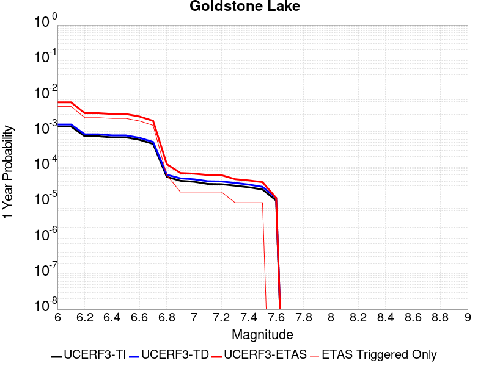 |  |

| Magnitude | 1 wk TI Prob | 1 wk TD Prob | 1 wk ETAS Prob | 1 wk ETAS/TD Gain | 1 wk ETAS Triggered Only | 1 mo TI Prob | 1 mo TD Prob | 1 mo ETAS Prob | 1 mo ETAS/TD Gain | 1 mo ETAS Triggered Only | 1 yr TI Prob | 1 yr TD Prob | 1 yr ETAS Prob | 1 yr ETAS/TD Gain | 1 yr ETAS Triggered Only | 10 yr TI Prob | 10 yr TD Prob | 10 yr ETAS Prob | 10 yr ETAS/TD Gain | 10 yr ETAS Triggered Only |
|-----|-----|-----|-----|-----|-----|-----|-----|-----|-----|-----|-----|-----|-----|-----|-----|-----|-----|-----|-----|-----|
| 6.0 | 2.671352E-5 | 3.0376103E-5 | 0.001680326 | 55.317364 | 0.00165 | 1.1448149E-4 | 1.3017791E-4 | 0.0028298264 | 21.738146 | 0.0027 | 0.001392921 | 0.0015839601 | 0.006675882 | 4.214678 | 0.0051 | 0.013842222 | 0.015746202 | 0.023935193 | 1.5200614 | 0.00832 |
| 6.1 | 2.671352E-5 | 3.0376103E-5 | 0.001680326 | 55.317364 | 0.00165 | 1.1448149E-4 | 1.3017791E-4 | 0.0028298264 | 21.738146 | 0.0027 | 0.001392921 | 0.0015839601 | 0.006675882 | 4.214678 | 0.0051 | 0.013842222 | 0.015746202 | 0.023935193 | 1.5200614 | 0.00832 |
| 6.2 | 1.4197047E-5 | 1.6096254E-5 | 7.260848E-4 | 45.108932 | 7.1E-4 | 6.0843064E-5 | 6.898268E-5 | 0.0013388951 | 19.40915 | 0.00127 | 7.4051257E-4 | 8.3963916E-4 | 0.0033175568 | 3.9511697 | 0.00248 | 0.007380498 | 0.008374364 | 0.012529275 | 1.4961464 | 0.00419 |
| 6.3 | 1.4197047E-5 | 1.6096254E-5 | 7.260848E-4 | 45.108932 | 7.1E-4 | 6.0843064E-5 | 6.898268E-5 | 0.0013388951 | 19.40915 | 0.00127 | 7.4051257E-4 | 8.3963916E-4 | 0.0033175568 | 3.9511697 | 0.00248 | 0.007380498 | 0.008374364 | 0.012529275 | 1.4961464 | 0.00419 |
| 6.4 | 1.3238931E-5 | 1.500847E-5 | 7.1499794E-4 | 47.639633 | 7.0E-4 | 5.6737044E-5 | 6.432098E-5 | 0.0012842425 | 19.966154 | 0.00122 | 6.9055456E-4 | 7.8292453E-4 | 0.0031410768 | 4.011979 | 0.00236 | 0.006884126 | 0.007811289 | 0.011770122 | 1.5068092 | 0.00399 |
| 6.5 | 1.3238931E-5 | 1.500847E-5 | 7.1499794E-4 | 47.639633 | 7.0E-4 | 5.6737044E-5 | 6.432098E-5 | 0.0012842425 | 19.966154 | 0.00122 | 6.9055456E-4 | 7.8292453E-4 | 0.0031410768 | 4.011979 | 0.00236 | 0.006884126 | 0.007811289 | 0.011770122 | 1.5068092 | 0.00399 |
| 6.6 | 1.1328278E-5 | 1.2855176E-5 | 5.628481E-4 | 43.783775 | 5.5E-4 | 4.8548856E-5 | 5.5092984E-5 | 0.0010450385 | 18.96863 | 9.9E-4 | 5.90922E-4 | 6.706464E-4 | 0.002669305 | 3.9801977 | 0.002 | 0.0058935313 | 0.0066956137 | 0.010162246 | 1.5177468 | 0.00349 |
| 6.7 | 8.651175E-6 | 9.824575E-6 | 4.6982005E-4 | 47.820908 | 4.6E-4 | 3.707594E-5 | 4.2105148E-5 | 8.120727E-4 | 19.28678 | 7.7E-4 | 4.5130608E-4 | 5.126002E-4 | 0.0020118312 | 3.9247575 | 0.0015 | 0.0045039062 | 0.0051230565 | 0.0077395826 | 1.5107354 | 0.00263 |
| 6.8 | 1.0215377E-6 | 1.1754802E-6 | 3.1175445E-5 | 26.521456 | 3.0E-5 | 4.378012E-6 | 5.037763E-6 | 5.503751E-5 | 10.92499 | 5.0E-5 | 5.3300988E-5 | 6.133315E-5 | 1.21329474E-4 | 1.9782038 | 6.0E-5 | 5.3288206E-4 | 6.131735E-4 | 6.831306E-4 | 1.1140902 | 7.0E-5 |
| 6.9 | 7.9360774E-7 | 9.283496E-7 | 9.283496E-7 | 1.0 | 0.0 | 3.4011714E-6 | 3.9786355E-6 | 2.3978555E-5 | 6.0268292 | 2.0E-5 | 4.1408475E-5 | 4.843888E-5 | 6.843791E-5 | 1.4128715 | 2.0E-5 | 4.140076E-4 | 4.842902E-4 | 5.0428056E-4 | 1.0412775 | 2.0E-5 |
| 7.0 | 7.4382757E-7 | 8.747428E-7 | 8.747428E-7 | 1.0 | 0.0 | 3.1878285E-6 | 3.7488926E-6 | 2.3748818E-5 | 6.3348885 | 2.0E-5 | 3.8811122E-5 | 4.564188E-5 | 6.564097E-5 | 1.438174 | 2.0E-5 | 3.8804344E-4 | 4.563317E-4 | 4.7632257E-4 | 1.0438077 | 2.0E-5 |
| 7.1 | 6.4709513E-7 | 7.711399E-7 | 7.711399E-7 | 1.0 | 0.0 | 2.773262E-6 | 3.3048816E-6 | 2.3304816E-5 | 7.0516343 | 2.0E-5 | 3.376394E-5 | 4.023625E-5 | 6.0235445E-5 | 1.4970442 | 2.0E-5 | 3.375881E-4 | 4.022956E-4 | 4.2228756E-4 | 1.0496947 | 2.0E-5 |
| 7.2 | 6.356704E-7 | 7.588459E-7 | 7.588459E-7 | 1.0 | 0.0 | 2.7242988E-6 | 3.252193E-6 | 2.3252129E-5 | 7.149677 | 2.0E-5 | 3.3167835E-5 | 3.959479E-5 | 5.9594E-5 | 1.5050969 | 2.0E-5 | 3.3162883E-4 | 3.9588328E-4 | 4.1587537E-4 | 1.0504999 | 2.0E-5 |
| 7.3 | 5.7695723E-7 | 6.896648E-7 | 6.896648E-7 | 1.0 | 0.0 | 2.4726714E-6 | 2.9557032E-6 | 1.2955674E-5 | 4.38328 | 1.0E-5 | 3.0104358E-5 | 3.598515E-5 | 4.598479E-5 | 1.2778825 | 1.0E-5 | 3.0100282E-4 | 3.5979896E-4 | 3.6979537E-4 | 1.0277833 | 1.0E-5 |
| 7.4 | 5.209647E-7 | 6.193583E-7 | 6.193583E-7 | 1.0 | 0.0 | 2.232704E-6 | 2.6543903E-6 | 1.2654364E-5 | 4.7673335 | 1.0E-5 | 2.718283E-5 | 3.2316777E-5 | 4.2316457E-5 | 1.3094268 | 1.0E-5 | 2.7179506E-4 | 3.2312635E-4 | 3.331231E-4 | 1.0309377 | 1.0E-5 |
| 7.5 | 4.512955E-7 | 5.3489487E-7 | 5.3489487E-7 | 1.0 | 0.0 | 1.934122E-6 | 2.2924048E-6 | 1.2292382E-5 | 5.3622212 | 1.0E-5 | 2.3547682E-5 | 2.7909726E-5 | 3.790945E-5 | 1.358288 | 1.0E-5 | 2.3545188E-4 | 2.7906752E-4 | 2.8906474E-4 | 1.0358236 | 1.0E-5 |
| 7.6 | 2.21172E-7 | 2.6040198E-7 | 2.6040198E-7 | 1.0 | 0.0 | 9.478797E-7 | 1.1160082E-6 | 1.1160082E-6 | 1.0 | 0.0 | 1.1540374E-5 | 1.3587343E-5 | 1.3587343E-5 | 1.0 | 0.0 | 1.1539775E-4 | 1.3586794E-4 | 1.3586794E-4 | 1.0 | 0.0 |

## Gravel Hills-Harper Lk
*[(top)](#table-of-contents)*

| 1 Week | 1 Month | 1 Year | 10 Year |
|-----|-----|-----|-----|
| 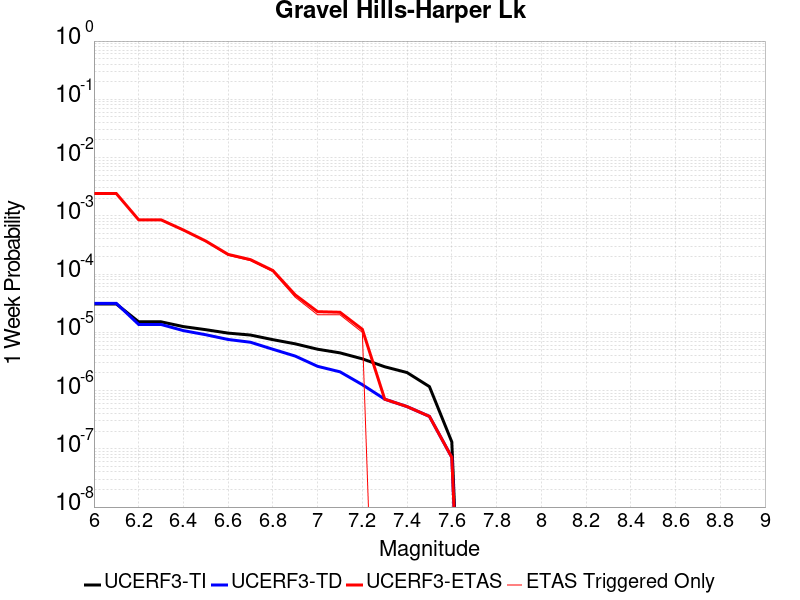 |  |  |  |

| Magnitude | 1 wk TI Prob | 1 wk TD Prob | 1 wk ETAS Prob | 1 wk ETAS/TD Gain | 1 wk ETAS Triggered Only | 1 mo TI Prob | 1 mo TD Prob | 1 mo ETAS Prob | 1 mo ETAS/TD Gain | 1 mo ETAS Triggered Only | 1 yr TI Prob | 1 yr TD Prob | 1 yr ETAS Prob | 1 yr ETAS/TD Gain | 1 yr ETAS Triggered Only | 10 yr TI Prob | 10 yr TD Prob | 10 yr ETAS Prob | 10 yr ETAS/TD Gain | 10 yr ETAS Triggered Only |
|-----|-----|-----|-----|-----|-----|-----|-----|-----|-----|-----|-----|-----|-----|-----|-----|-----|-----|-----|-----|-----|
| 6.0 | 3.0679566E-5 | 3.1464628E-5 | 0.0024113897 | 76.63812 | 0.00238 | 1.3147724E-4 | 1.3484266E-4 | 0.0035543814 | 26.359474 | 0.00342 | 0.0015995599 | 0.00164069 | 0.007161617 | 4.365003 | 0.00553 | 0.015880952 | 0.016307337 | 0.024255574 | 1.4874024 | 0.00808 |
| 6.1 | 3.0679566E-5 | 3.1464628E-5 | 0.0024113897 | 76.63812 | 0.00238 | 1.3147724E-4 | 1.3484266E-4 | 0.0035543814 | 26.359474 | 0.00342 | 0.0015995599 | 0.00164069 | 0.007161617 | 4.365003 | 0.00553 | 0.015880952 | 0.016307337 | 0.024255574 | 1.4874024 | 0.00808 |
| 6.2 | 1.514536E-5 | 1.36352E-5 | 8.5362373E-4 | 62.604416 | 8.4E-4 | 6.490707E-5 | 5.843533E-5 | 0.0012383664 | 21.192083 | 0.00118 | 7.8995706E-4 | 7.112298E-4 | 0.0025299354 | 3.557128 | 0.00182 | 0.007871548 | 0.007090737 | 0.009860954 | 1.390681 | 0.00279 |
| 6.3 | 1.514536E-5 | 1.36352E-5 | 8.5362373E-4 | 62.604416 | 8.4E-4 | 6.490707E-5 | 5.843533E-5 | 0.0012383664 | 21.192083 | 0.00118 | 7.8995706E-4 | 7.112298E-4 | 0.0025299354 | 3.557128 | 0.00182 | 0.007871548 | 0.007090737 | 0.009860954 | 1.390681 | 0.00279 |
| 6.4 | 1.2532521E-5 | 1.0689684E-5 | 5.706837E-4 | 53.386395 | 5.6E-4 | 5.37097E-5 | 4.581216E-5 | 8.4577553E-4 | 18.461813 | 8.0E-4 | 6.537194E-4 | 5.5762613E-4 | 0.0017669514 | 3.1687026 | 0.00121 | 0.0065179965 | 0.005562859 | 0.0073926235 | 1.3289251 | 0.00184 |
| 6.5 | 1.1094058E-5 | 9.083657E-6 | 3.690804E-4 | 40.631256 | 3.6E-4 | 4.7545094E-5 | 3.89294E-5 | 5.5890915E-4 | 14.356995 | 5.2E-4 | 5.787078E-4 | 4.7386638E-4 | 0.0012734873 | 2.6874397 | 8.0E-4 | 0.0057720304 | 0.004728967 | 0.006032772 | 1.275706 | 0.00131 |
| 6.6 | 9.688328E-6 | 7.531688E-6 | 2.175301E-4 | 28.881985 | 2.1E-4 | 4.1520743E-5 | 3.227828E-5 | 3.322686E-4 | 10.293876 | 3.0E-4 | 5.053978E-4 | 3.9291973E-4 | 8.3274685E-4 | 2.1193817 | 4.4E-4 | 0.0050424994 | 0.0039225067 | 0.0046894867 | 1.195533 | 7.7E-4 |
| 6.7 | 8.974824E-6 | 6.749406E-6 | 1.7674826E-4 | 26.187231 | 1.7E-4 | 3.8462964E-5 | 2.8925719E-5 | 2.4891936E-4 | 8.605469 | 2.2E-4 | 4.6818596E-4 | 3.5211592E-4 | 6.5201026E-4 | 1.8516922 | 3.0E-4 | 0.004672008 | 0.003515801 | 0.0040539023 | 1.1530523 | 5.4E-4 |
| 6.8 | 7.4780046E-6 | 5.1161865E-6 | 1.15115625E-4 | 22.50028 | 1.1E-4 | 3.20482E-5 | 2.1926337E-5 | 1.3192392E-4 | 6.016688 | 1.1E-4 | 3.9011694E-4 | 2.6692182E-4 | 3.9688713E-4 | 1.486904 | 1.3E-4 | 0.0038943281 | 0.0026661505 | 0.0029354307 | 1.1009996 | 2.7E-4 |
| 6.9 | 6.3409307E-6 | 3.907489E-6 | 4.3907334E-5 | 11.236713 | 4.0E-5 | 2.7175134E-5 | 1.674628E-5 | 5.6745608E-5 | 3.3885503 | 4.0E-5 | 3.3080703E-4 | 2.0386786E-4 | 2.6385565E-4 | 1.2942482 | 6.0E-5 | 0.0033031502 | 0.0020369065 | 0.0022065605 | 1.0832899 | 1.7E-4 |
| 7.0 | 5.1239335E-6 | 2.6058492E-6 | 2.2605796E-5 | 8.675021 | 2.0E-5 | 2.195953E-5 | 1.1167879E-5 | 3.1167656E-5 | 2.7908304 | 2.0E-5 | 2.6732447E-4 | 1.359607E-4 | 1.6595662E-4 | 1.220622 | 3.0E-5 | 0.0026700313 | 0.0013588005 | 0.001468651 | 1.0808438 | 1.1E-4 |
| 7.1 | 4.438899E-6 | 2.0984692E-6 | 2.2098428E-5 | 10.530737 | 2.0E-5 | 1.9023713E-5 | 8.99341E-6 | 2.899323E-5 | 3.2238305 | 2.0E-5 | 2.315891E-4 | 1.0948948E-4 | 1.394862E-4 | 1.2739689 | 3.0E-5 | 0.002313479 | 0.0010943774 | 0.0012042569 | 1.1004038 | 1.1E-4 |
| 7.2 | 3.50367E-6 | 1.2615715E-6 | 1.1261559E-5 | 8.926612 | 1.0E-5 | 1.5015643E-5 | 5.406724E-6 | 1.540667E-5 | 2.8495388 | 1.0E-5 | 1.8280011E-4 | 6.5824956E-5 | 8.5823645E-5 | 1.3038161 | 2.0E-5 | 0.0018264982 | 6.580628E-4 | 7.280168E-4 | 1.1063029 | 7.0E-5 |
| 7.3 | 2.561638E-6 | 7.118686E-7 | 7.118686E-7 | 1.0 | 0.0 | 1.0978401E-5 | 3.050862E-6 | 3.050862E-6 | 1.0 | 0.0 | 1.3365384E-4 | 3.7143633E-5 | 3.7143633E-5 | 1.0 | 0.0 | 0.0013357349 | 3.7137623E-4 | 4.0136508E-4 | 1.0807506 | 3.0E-5 |
| 7.4 | 2.0368864E-6 | 5.304471E-7 | 5.304471E-7 | 1.0 | 0.0 | 8.729483E-6 | 2.2733427E-6 | 2.2733427E-6 | 1.0 | 0.0 | 1.06276275E-4 | 2.76776E-5 | 2.76776E-5 | 1.0 | 0.0 | 0.0010622547 | 2.767421E-4 | 2.8673932E-4 | 1.0361247 | 1.0E-5 |
| 7.5 | 1.1681728E-6 | 3.6028484E-7 | 3.6028484E-7 | 1.0 | 0.0 | 5.0064455E-6 | 1.544077E-6 | 1.544077E-6 | 1.0 | 0.0 | 6.0951766E-5 | 1.879898E-5 | 1.879898E-5 | 1.0 | 0.0 | 6.093505E-4 | 1.8797436E-4 | 1.8797436E-4 | 1.0 | 0.0 |
| 7.6 | 1.3154387E-7 | 7.1196716E-8 | 7.1196716E-8 | 1.0 | 0.0 | 5.6375933E-7 | 3.0512876E-7 | 3.0512876E-7 | 1.0 | 0.0 | 6.863748E-6 | 3.714938E-6 | 3.714938E-6 | 1.0 | 0.0 | 6.863536E-5 | 3.7148915E-5 | 3.7148915E-5 | 1.0 | 0.0 |

## Coyote Canyon
*[(top)](#table-of-contents)*

| 1 Week | 1 Month | 1 Year | 10 Year |
|-----|-----|-----|-----|
|  | 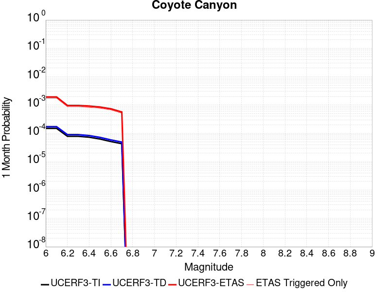 | 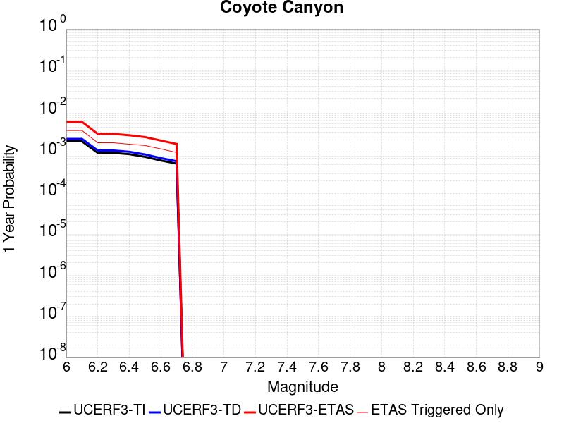 | 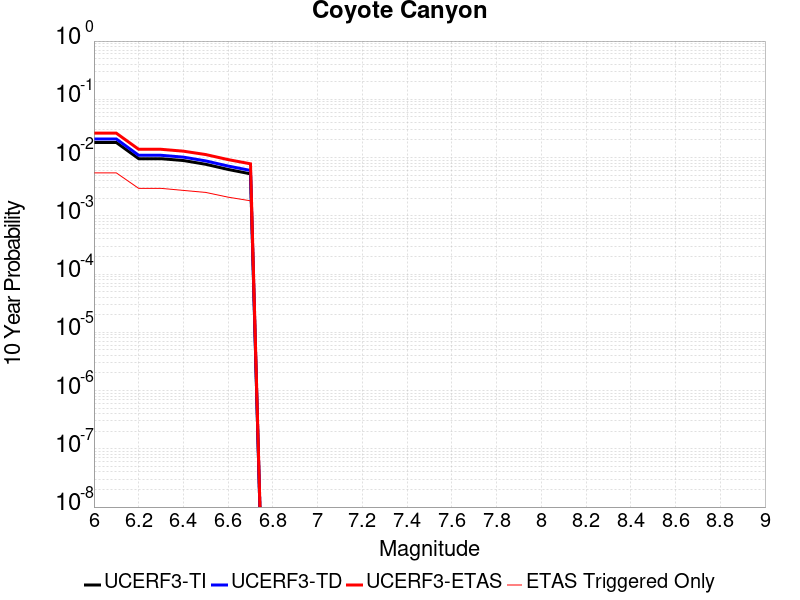 |

| Magnitude | 1 wk TI Prob | 1 wk TD Prob | 1 wk ETAS Prob | 1 wk ETAS/TD Gain | 1 wk ETAS Triggered Only | 1 mo TI Prob | 1 mo TD Prob | 1 mo ETAS Prob | 1 mo ETAS/TD Gain | 1 mo ETAS Triggered Only | 1 yr TI Prob | 1 yr TD Prob | 1 yr ETAS Prob | 1 yr ETAS/TD Gain | 1 yr ETAS Triggered Only | 10 yr TI Prob | 10 yr TD Prob | 10 yr ETAS Prob | 10 yr ETAS/TD Gain | 10 yr ETAS Triggered Only |
|-----|-----|-----|-----|-----|-----|-----|-----|-----|-----|-----|-----|-----|-----|-----|-----|-----|-----|-----|-----|-----|
| 6.0 | 3.5090034E-5 | 4.0364317E-5 | 0.0012103171 | 29.984829 | 0.00117 | 1.503772E-4 | 1.7297991E-4 | 0.0019326755 | 11.172832 | 0.00176 | 0.0018293047 | 0.0021042533 | 0.005467162 | 2.598148 | 0.00337 | 0.018143194 | 0.020869205 | 0.026215259 | 1.2561696 | 0.00546 |
| 6.1 | 3.5090034E-5 | 4.0364317E-5 | 0.0012103171 | 29.984829 | 0.00117 | 1.503772E-4 | 1.7297991E-4 | 0.0019326755 | 11.172832 | 0.00176 | 0.0018293047 | 0.0021042533 | 0.005467162 | 2.598148 | 0.00337 | 0.018143194 | 0.020869205 | 0.026215259 | 1.2561696 | 0.00546 |
| 6.2 | 1.841879E-5 | 2.1059794E-5 | 5.81048E-4 | 27.590395 | 5.6E-4 | 7.8935285E-5 | 9.025371E-5 | 9.7017427E-4 | 10.749412 | 8.8E-4 | 9.606133E-4 | 0.0010983871 | 0.0027865306 | 2.5369298 | 0.00169 | 0.0095647145 | 0.010939668 | 0.013867286 | 1.267615 | 0.00296 |
| 6.3 | 1.841879E-5 | 2.1059794E-5 | 5.81048E-4 | 27.590395 | 5.6E-4 | 7.8935285E-5 | 9.025371E-5 | 9.7017427E-4 | 10.749412 | 8.8E-4 | 9.606133E-4 | 0.0010983871 | 0.0027865306 | 2.5369298 | 0.00169 | 0.0095647145 | 0.010939668 | 0.013867286 | 1.267615 | 0.00296 |
| 6.4 | 1.712201E-5 | 1.9565212E-5 | 5.495548E-4 | 28.088367 | 5.3E-4 | 7.337798E-5 | 8.3848776E-5 | 9.2377834E-4 | 11.017195 | 8.4E-4 | 8.930107E-4 | 0.0010204813 | 0.0025788895 | 2.5271304 | 0.00156 | 0.008894307 | 0.010167871 | 0.012870112 | 1.2657628 | 0.00273 |
| 6.5 | 1.4744935E-5 | 1.6836972E-5 | 5.068287E-4 | 30.10213 | 4.9E-4 | 6.3191044E-5 | 7.215698E-5 | 8.521007E-4 | 11.808985 | 7.8E-4 | 7.6907943E-4 | 8.782507E-4 | 0.0023269772 | 2.6495593 | 0.00145 | 0.007664232 | 0.008756994 | 0.011254927 | 1.28525 | 0.00252 |
| 6.6 | 1.2017839E-5 | 1.3724089E-5 | 4.637179E-4 | 33.788612 | 4.5E-4 | 5.150401E-5 | 5.88167E-5 | 7.387767E-4 | 12.560662 | 6.8E-4 | 6.268809E-4 | 7.159466E-4 | 0.0019150875 | 2.6749027 | 0.0012 | 0.0062511545 | 0.0071450938 | 0.009220161 | 1.2904184 | 0.00209 |
| 6.7 | 1.00956095E-5 | 1.1533517E-5 | 3.415297E-4 | 29.611933 | 3.3E-4 | 4.326618E-5 | 4.942891E-5 | 5.6940323E-4 | 11.519639 | 5.2E-4 | 5.266384E-4 | 6.017178E-4 | 0.0015811281 | 2.6276906 | 9.8E-4 | 0.005253921 | 0.0060094125 | 0.0078085354 | 1.2993841 | 0.00181 |

## San Andreas (Mojave S)
*[(top)](#table-of-contents)*

| 1 Week | 1 Month | 1 Year | 10 Year |
|-----|-----|-----|-----|
|  |  |  | 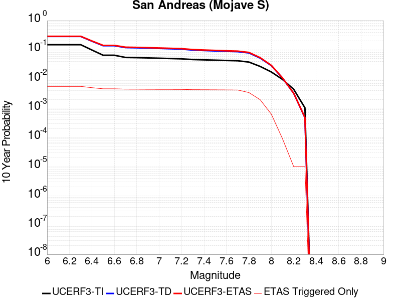 |

| Magnitude | 1 wk TI Prob | 1 wk TD Prob | 1 wk ETAS Prob | 1 wk ETAS/TD Gain | 1 wk ETAS Triggered Only | 1 mo TI Prob | 1 mo TD Prob | 1 mo ETAS Prob | 1 mo ETAS/TD Gain | 1 mo ETAS Triggered Only | 1 yr TI Prob | 1 yr TD Prob | 1 yr ETAS Prob | 1 yr ETAS/TD Gain | 1 yr ETAS Triggered Only | 10 yr TI Prob | 10 yr TD Prob | 10 yr ETAS Prob | 10 yr ETAS/TD Gain | 10 yr ETAS Triggered Only |
|-----|-----|-----|-----|-----|-----|-----|-----|-----|-----|-----|-----|-----|-----|-----|-----|-----|-----|-----|-----|-----|
| 6.0 | 3.1064058E-4 | 6.7462435E-4 | 0.0029330996 | 4.3477526 | 0.00226 | 0.0013306376 | 0.002888172 | 0.0058894786 | 2.0391717 | 0.00301 | 0.016080605 | 0.034565594 | 0.038581803 | 1.1161909 | 0.00416 | 0.1496549 | 0.28654557 | 0.29054093 | 1.0139432 | 0.0056 |
| 6.1 | 3.1064058E-4 | 6.7462435E-4 | 0.0029330996 | 4.3477526 | 0.00226 | 0.0013306376 | 0.002888172 | 0.0058894786 | 2.0391717 | 0.00301 | 0.016080605 | 0.034565594 | 0.038581803 | 1.1161909 | 0.00416 | 0.1496549 | 0.28654557 | 0.29054093 | 1.0139432 | 0.0056 |
| 6.2 | 3.1064058E-4 | 6.7462435E-4 | 0.0029330996 | 4.3477526 | 0.00226 | 0.0013306376 | 0.002888172 | 0.0058894786 | 2.0391717 | 0.00301 | 0.016080605 | 0.034565594 | 0.038581803 | 1.1161909 | 0.00416 | 0.1496549 | 0.28654557 | 0.29054093 | 1.0139432 | 0.0056 |
| 6.3 | 3.1064058E-4 | 6.7462435E-4 | 0.0029330996 | 4.3477526 | 0.00226 | 0.0013306376 | 0.002888172 | 0.0058894786 | 2.0391717 | 0.00301 | 0.016080605 | 0.034565594 | 0.038581803 | 1.1161909 | 0.00416 | 0.1496549 | 0.28654557 | 0.29054093 | 1.0139432 | 0.0056 |
| 6.4 | 1.9872203E-4 | 4.3181062E-4 | 0.0025009168 | 5.791698 | 0.00207 | 8.5138786E-4 | 0.0018493326 | 0.0045842654 | 2.4788756 | 0.00274 | 0.010316478 | 0.02228931 | 0.02597528 | 1.1653694 | 0.00377 | 0.098504856 | 0.19686839 | 0.20093223 | 1.0206424 | 0.00506 |
| 6.5 | 1.291105E-4 | 2.8754136E-4 | 0.0022269834 | 7.744915 | 0.00194 | 5.5321335E-4 | 0.0012317409 | 0.0037885876 | 3.075799 | 0.00256 | 0.006714592 | 0.014894155 | 0.018332174 | 1.2308301 | 0.00349 | 0.065152965 | 0.13800792 | 0.14200757 | 1.0289812 | 0.00464 |
| 6.6 | 1.291105E-4 | 2.8754136E-4 | 0.0022269834 | 7.744915 | 0.00194 | 5.5321335E-4 | 0.0012317409 | 0.0037885876 | 3.075799 | 0.00256 | 0.006714592 | 0.014894155 | 0.018332174 | 1.2308301 | 0.00349 | 0.065152965 | 0.13800792 | 0.14200757 | 1.0289812 | 0.00464 |
| 6.7 | 1.08001186E-4 | 2.4335351E-4 | 0.0021528888 | 8.846754 | 0.00191 | 4.6278012E-4 | 0.0010425274 | 0.0035499106 | 3.4051008 | 0.00251 | 0.0056198016 | 0.0126192 | 0.015956547 | 1.2644658 | 0.00338 | 0.054797906 | 0.11918431 | 0.12316559 | 1.0334045 | 0.00452 |
| 6.8 | 1.0624356E-4 | 2.3853009E-4 | 0.0021480746 | 9.0054655 | 0.00191 | 4.5525006E-4 | 0.0010218718 | 0.003529307 | 3.4537668 | 0.00251 | 0.0055285925 | 0.012370593 | 0.01570878 | 1.2698486 | 0.00338 | 0.053930566 | 0.11713308 | 0.121105984 | 1.0339178 | 0.0045 |
| 6.9 | 1.0393785E-4 | 2.3223337E-4 | 0.002131792 | 9.179525 | 0.0019 | 4.4537184E-4 | 9.949068E-4 | 0.0034924194 | 3.5102985 | 0.0025 | 0.0054089287 | 0.012045963 | 0.015365489 | 1.2755716 | 0.00336 | 0.05279156 | 0.114433445 | 0.11838307 | 1.0345147 | 0.00446 |
| 7.0 | 1.0155622E-4 | 2.2592908E-4 | 0.002115502 | 9.363567 | 0.00189 | 4.3516833E-4 | 9.6790853E-4 | 0.0034554985 | 3.5700672 | 0.00249 | 0.005285311 | 0.011720838 | 0.015031573 | 1.2824657 | 0.00335 | 0.05161361 | 0.11169745 | 0.11564152 | 1.0353103 | 0.00444 |
| 7.1 | 9.885595E-5 | 2.188132E-4 | 0.0020984018 | 9.589923 | 0.00188 | 4.2359953E-4 | 9.374342E-4 | 0.0034151094 | 3.643039 | 0.00248 | 0.0051451353 | 0.011353733 | 0.014655812 | 1.2908363 | 0.00334 | 0.05027629 | 0.10857607 | 0.112525076 | 1.0363709 | 0.00443 |
| 7.2 | 9.6411415E-5 | 2.1244297E-4 | 0.0020920436 | 9.847554 | 0.00188 | 4.1312634E-4 | 9.101525E-4 | 0.0033779044 | 3.711361 | 0.00247 | 0.005018219 | 0.011024987 | 0.014308384 | 1.2978141 | 0.00332 | 0.049064007 | 0.1057697 | 0.10971326 | 1.0372844 | 0.00441 |
| 7.3 | 9.1180635E-5 | 1.9472656E-4 | 0.0020443662 | 10.4986515 | 0.00185 | 3.907156E-4 | 8.342756E-4 | 0.00327224 | 3.9222531 | 0.00244 | 0.004746591 | 0.010110112 | 0.013347052 | 1.3201685 | 0.00327 | 0.046464786 | 0.09796176 | 0.10186759 | 1.039871 | 0.00433 |
| 7.4 | 8.887388E-5 | 1.872126E-4 | 0.0020368663 | 10.879963 | 0.00185 | 3.8083247E-4 | 8.020931E-4 | 0.003240136 | 4.039601 | 0.00244 | 0.0046267817 | 0.009721855 | 0.012960064 | 1.3330855 | 0.00327 | 0.045316286 | 0.094593845 | 0.09849615 | 1.0412532 | 0.00431 |
| 7.5 | 8.6750515E-5 | 1.80528E-4 | 0.0020201958 | 11.190485 | 0.00184 | 3.7173493E-4 | 7.734621E-4 | 0.0032015825 | 4.1392884 | 0.00243 | 0.004516484 | 0.009376327 | 0.012595853 | 1.3433676 | 0.00325 | 0.04425787 | 0.09155606 | 0.095444195 | 1.0424674 | 0.00428 |
| 7.6 | 8.453092E-5 | 1.7440386E-4 | 0.0020140829 | 11.548385 | 0.00184 | 3.6222505E-4 | 7.4723107E-4 | 0.0031754153 | 4.249576 | 0.00243 | 0.0044011753 | 0.009059664 | 0.012270311 | 1.3543892 | 0.00324 | 0.04315024 | 0.08871447 | 0.09258744 | 1.0436565 | 0.00425 |
| 7.7 | 8.259102E-5 | 1.6962511E-4 | 0.002009313 | 11.845611 | 0.00184 | 3.539135E-4 | 7.267622E-4 | 0.0031549963 | 4.341167 | 0.00243 | 0.004300386 | 0.0088125 | 0.012004124 | 1.3621701 | 0.00322 | 0.042181134 | 0.086465426 | 0.09032054 | 1.0445856 | 0.00422 |
| 7.8 | 7.444844E-5 | 1.528469E-4 | 0.0016226223 | 10.615996 | 0.00147 | 3.1902574E-4 | 6.5489375E-4 | 0.0026236037 | 4.0061517 | 0.00197 | 0.0038772223 | 0.007944231 | 0.01059302 | 1.3334229 | 0.00267 | 0.03810269 | 0.078293875 | 0.08147376 | 1.0406147 | 0.00345 |
| 7.9 | 5.2586525E-5 | 1.0007023E-4 | 9.199882E-4 | 9.193425 | 8.2E-4 | 2.2535135E-4 | 4.2880196E-4 | 0.0015183346 | 3.5408762 | 0.00109 | 0.0027402006 | 0.005208178 | 0.0067003653 | 1.2865086 | 0.0015 | 0.027066574 | 0.052201588 | 0.05406875 | 1.0357683 | 0.00197 |
| 8.0 | 3.379877E-5 | 5.4075565E-5 | 2.9406257E-4 | 5.437994 | 2.4E-4 | 1.4484383E-4 | 2.3173184E-4 | 5.616554E-4 | 2.42373 | 3.3E-4 | 0.0017620471 | 0.0028176866 | 0.003306306 | 1.1734115 | 4.9E-4 | 0.017481409 | 0.028835917 | 0.02944775 | 1.0212177 | 6.3E-4 |
| 8.1 | 1.8668277E-5 | 1.9308145E-5 | 3.9307757E-5 | 2.0358124 | 2.0E-5 | 8.000444E-5 | 8.274657E-5 | 1.2274327E-4 | 1.4833637 | 4.0E-5 | 9.736188E-4 | 0.0010069745 | 0.0010569241 | 1.0496037 | 5.0E-5 | 0.009693642 | 0.010798624 | 0.010887652 | 1.0082444 | 9.0E-5 |
| 8.2 | 8.541571E-6 | 5.4596358E-6 | 5.4596358E-6 | 1.0 | 0.0 | 3.660622E-5 | 2.339823E-5 | 2.339823E-5 | 1.0 | 0.0 | 4.455896E-4 | 2.848363E-4 | 2.9483344E-4 | 1.0350978 | 1.0E-5 | 0.0044469717 | 0.003240283 | 0.0032502508 | 1.0030762 | 1.0E-5 |
| 8.3 | 1.983087E-6 | 7.6564595E-7 | 7.6564595E-7 | 1.0 | 0.0 | 8.498917E-6 | 3.281336E-6 | 3.281336E-6 | 1.0 | 0.0 | 1.034694E-4 | 3.9949547E-5 | 4.9949147E-5 | 1.2503058 | 1.0E-5 | 0.0010342124 | 4.717979E-4 | 4.8179316E-4 | 1.0211855 | 1.0E-5 |

## San Andreas (Mojave N)
*[(top)](#table-of-contents)*

| 1 Week | 1 Month | 1 Year | 10 Year |
|-----|-----|-----|-----|
| 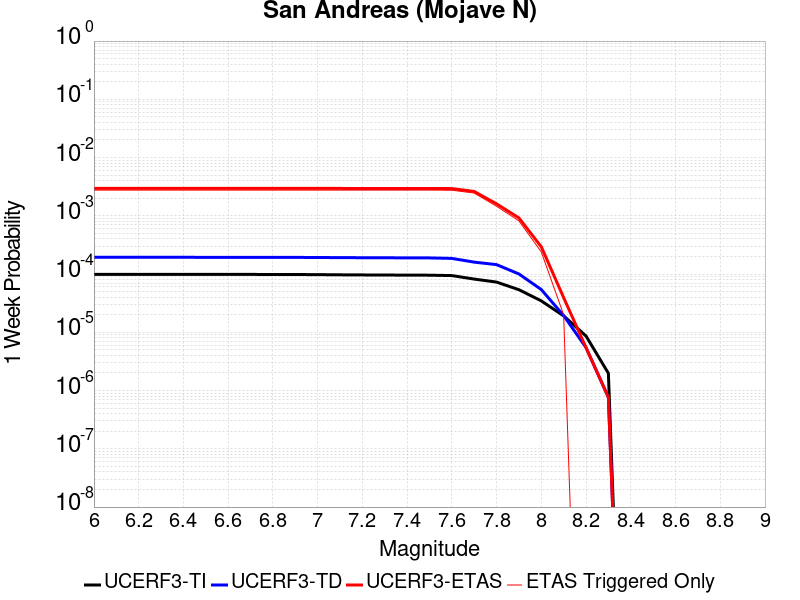 | 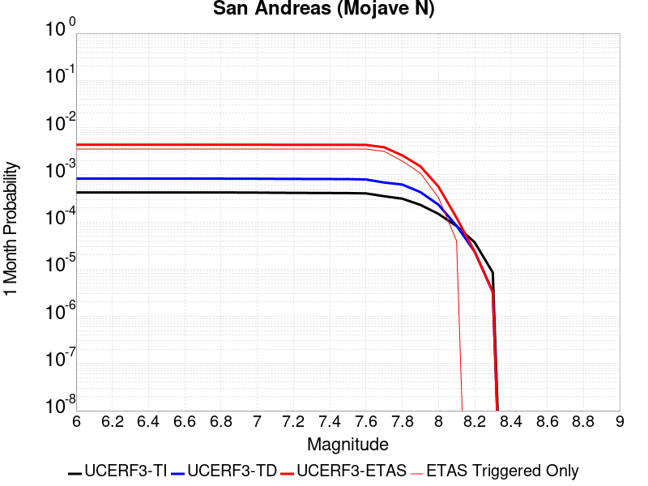 | 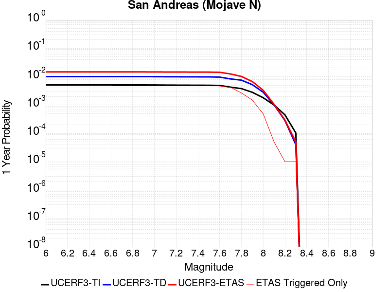 | 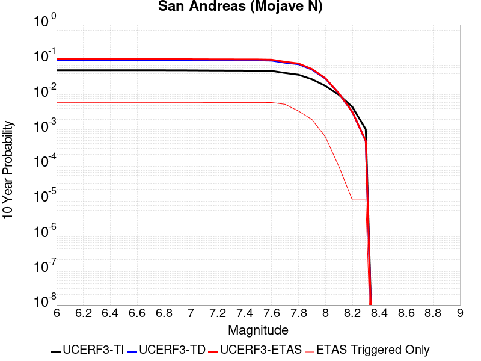 |

| Magnitude | 1 wk TI Prob | 1 wk TD Prob | 1 wk ETAS Prob | 1 wk ETAS/TD Gain | 1 wk ETAS Triggered Only | 1 mo TI Prob | 1 mo TD Prob | 1 mo ETAS Prob | 1 mo ETAS/TD Gain | 1 mo ETAS Triggered Only | 1 yr TI Prob | 1 yr TD Prob | 1 yr ETAS Prob | 1 yr ETAS/TD Gain | 1 yr ETAS Triggered Only | 10 yr TI Prob | 10 yr TD Prob | 10 yr ETAS Prob | 10 yr ETAS/TD Gain | 10 yr ETAS Triggered Only |
|-----|-----|-----|-----|-----|-----|-----|-----|-----|-----|-----|-----|-----|-----|-----|-----|-----|-----|-----|-----|-----|
| 6.0 | 9.877682E-5 | 1.9402112E-4 | 0.0029534856 | 15.222496 | 0.00276 | 4.2326056E-4 | 8.312543E-4 | 0.0043483283 | 5.231045 | 0.00352 | 0.0051410277 | 0.010073684 | 0.014756036 | 1.4648103 | 0.00473 | 0.05023708 | 0.09832245 | 0.10378662 | 1.0555739 | 0.00606 |
| 6.1 | 9.877682E-5 | 1.9402112E-4 | 0.0029534856 | 15.222496 | 0.00276 | 4.2326056E-4 | 8.312543E-4 | 0.0043483283 | 5.231045 | 0.00352 | 0.0051410277 | 0.010073684 | 0.014756036 | 1.4648103 | 0.00473 | 0.05023708 | 0.09832245 | 0.10378662 | 1.0555739 | 0.00606 |
| 6.2 | 9.877682E-5 | 1.9402112E-4 | 0.0029534856 | 15.222496 | 0.00276 | 4.2326056E-4 | 8.312543E-4 | 0.0043483283 | 5.231045 | 0.00352 | 0.0051410277 | 0.010073684 | 0.014756036 | 1.4648103 | 0.00473 | 0.05023708 | 0.09832245 | 0.10378662 | 1.0555739 | 0.00606 |
| 6.3 | 9.877682E-5 | 1.9402112E-4 | 0.0029534856 | 15.222496 | 0.00276 | 4.2326056E-4 | 8.312543E-4 | 0.0043483283 | 5.231045 | 0.00352 | 0.0051410277 | 0.010073684 | 0.014756036 | 1.4648103 | 0.00473 | 0.05023708 | 0.09832245 | 0.10378662 | 1.0555739 | 0.00606 |
| 6.4 | 9.877682E-5 | 1.9402112E-4 | 0.0029534856 | 15.222496 | 0.00276 | 4.2326056E-4 | 8.312543E-4 | 0.0043483283 | 5.231045 | 0.00352 | 0.0051410277 | 0.010073684 | 0.014756036 | 1.4648103 | 0.00473 | 0.05023708 | 0.09832245 | 0.10378662 | 1.0555739 | 0.00606 |
| 6.5 | 9.861474E-5 | 1.937588E-4 | 0.0029532241 | 15.241755 | 0.00276 | 4.2256617E-4 | 8.3013077E-4 | 0.004347209 | 5.236776 | 0.00352 | 0.0051326132 | 0.0100601325 | 0.014742548 | 1.4654428 | 0.00473 | 0.050156746 | 0.09820035 | 0.103665255 | 1.0556506 | 0.00606 |
| 6.6 | 9.861474E-5 | 1.937588E-4 | 0.0029532241 | 15.241755 | 0.00276 | 4.2256617E-4 | 8.3013077E-4 | 0.004347209 | 5.236776 | 0.00352 | 0.0051326132 | 0.0100601325 | 0.014742548 | 1.4654428 | 0.00473 | 0.050156746 | 0.09820035 | 0.103665255 | 1.0556506 | 0.00606 |
| 6.7 | 9.8552715E-5 | 1.9365833E-4 | 0.0029531238 | 15.249145 | 0.00276 | 4.223004E-4 | 8.2970044E-4 | 0.00434678 | 5.238975 | 0.00352 | 0.0051293927 | 0.010054941 | 0.014737382 | 1.4656855 | 0.00473 | 0.050125998 | 0.09815356 | 0.10361875 | 1.05568 | 0.00606 |
| 6.8 | 9.8464974E-5 | 1.9350994E-4 | 0.002952976 | 15.260073 | 0.00276 | 4.219245E-4 | 8.290649E-4 | 0.0043461467 | 5.242227 | 0.00352 | 0.0051248376 | 0.010047276 | 0.014729751 | 1.4660444 | 0.00473 | 0.05008251 | 0.09808378 | 0.10354939 | 1.0557239 | 0.00606 |
| 6.9 | 9.825824E-5 | 1.9319002E-4 | 0.0029526567 | 15.283692 | 0.00276 | 4.2103877E-4 | 8.276947E-4 | 0.0043447814 | 5.2492557 | 0.00352 | 0.0051141046 | 0.010030746 | 0.014713301 | 1.4668201 | 0.00473 | 0.049980022 | 0.097932965 | 0.10339949 | 1.055819 | 0.00606 |
| 7.0 | 9.781462E-5 | 1.9250368E-4 | 0.0029519724 | 15.334628 | 0.00276 | 4.1913814E-4 | 8.247551E-4 | 0.004341852 | 5.264414 | 0.00352 | 0.005091073 | 0.009995285 | 0.014668108 | 1.4675026 | 0.00472 | 0.04976007 | 0.09760912 | 0.10306858 | 1.0559319 | 0.00605 |
| 7.1 | 9.7121134E-5 | 1.9152075E-4 | 0.0029509922 | 15.408211 | 0.00276 | 4.1616702E-4 | 8.205452E-4 | 0.004337657 | 5.2863107 | 0.00352 | 0.005055068 | 0.0099444995 | 0.014617561 | 1.4699142 | 0.00472 | 0.04941613 | 0.09714571 | 0.10259895 | 1.0561347 | 0.00604 |
| 7.2 | 9.663819E-5 | 1.9082859E-4 | 0.0029503019 | 15.460482 | 0.00276 | 4.1409794E-4 | 8.175807E-4 | 0.0043347026 | 5.3018656 | 0.00352 | 0.0050299936 | 0.009908735 | 0.014581966 | 1.4716274 | 0.00472 | 0.049176537 | 0.09681883 | 0.10227404 | 1.0563445 | 0.00604 |
| 7.3 | 9.6277574E-5 | 1.9035369E-4 | 0.0029498283 | 15.496565 | 0.00276 | 4.125529E-4 | 8.1554666E-4 | 0.004332676 | 5.3126035 | 0.00352 | 0.0050112694 | 0.009884195 | 0.014557542 | 1.47281 | 0.00472 | 0.04899759 | 0.09659228 | 0.10204886 | 1.0564909 | 0.00604 |
| 7.4 | 9.593308E-5 | 1.8975153E-4 | 0.0029492278 | 15.542577 | 0.00276 | 4.1107697E-4 | 8.129676E-4 | 0.004330106 | 5.326296 | 0.00352 | 0.0049933824 | 0.009853081 | 0.014526574 | 1.474318 | 0.00472 | 0.04882661 | 0.09630986 | 0.10176815 | 1.0566742 | 0.00604 |
| 7.5 | 9.561707E-5 | 1.8921228E-4 | 0.00294869 | 15.584031 | 0.00276 | 4.0972308E-4 | 8.106579E-4 | 0.0043278043 | 5.338632 | 0.00352 | 0.0049769743 | 0.009825215 | 0.014498839 | 1.4756767 | 0.00472 | 0.048669744 | 0.096056245 | 0.10151607 | 1.0568398 | 0.00604 |
| 7.6 | 9.418194E-5 | 1.8573487E-4 | 0.0029352242 | 15.803301 | 0.00275 | 4.0357444E-4 | 7.95764E-4 | 0.0043029706 | 5.407346 | 0.00351 | 0.004902454 | 0.009645499 | 0.014300165 | 1.4825739 | 0.0047 | 0.047957025 | 0.094437465 | 0.099861786 | 1.0574383 | 0.00599 |
| 7.7 | 8.202141E-5 | 1.6022482E-4 | 0.0026198307 | 16.350967 | 0.00246 | 3.51473E-4 | 6.8649714E-4 | 0.0038343347 | 5.5853615 | 0.00315 | 0.00427079 | 0.008326128 | 0.012461409 | 1.496663 | 0.00417 | 0.04189639 | 0.082237914 | 0.08714794 | 1.0597051 | 0.00535 |
| 7.8 | 7.2859846E-5 | 1.4517571E-4 | 0.0016049638 | 11.055319 | 0.00146 | 3.1221908E-4 | 6.2203326E-4 | 0.002580814 | 4.148997 | 0.00196 | 0.003794643 | 0.0075469986 | 0.010186924 | 1.349798 | 0.00266 | 0.037304975 | 0.07472766 | 0.0779106 | 1.0425938 | 0.00344 |
| 7.9 | 5.3874453E-5 | 1.00462625E-4 | 9.2038023E-4 | 9.161419 | 8.2E-4 | 2.3087008E-4 | 4.3048308E-4 | 0.0015200139 | 3.530949 | 0.00109 | 0.0028072202 | 0.0052285474 | 0.006720705 | 1.2853866 | 0.0015 | 0.02772022 | 0.052425884 | 0.054292604 | 1.0356069 | 0.00197 |
| 8.0 | 3.468538E-5 | 5.4261534E-5 | 2.9424852E-4 | 5.4227824 | 2.4E-4 | 1.4864317E-4 | 2.3252872E-4 | 5.62452E-4 | 2.4188495 | 3.3E-4 | 0.0018082283 | 0.0028273636 | 0.0033159782 | 1.1728163 | 4.9E-4 | 0.017935853 | 0.028948462 | 0.029560225 | 1.0211328 | 6.3E-4 |
| 8.1 | 1.9152367E-5 | 1.9401303E-5 | 3.9400915E-5 | 2.0308387 | 2.0E-5 | 8.207899E-5 | 8.3145795E-5 | 1.2314247E-4 | 1.4810426 | 4.0E-5 | 9.988535E-4 | 0.0010118305 | 0.0010617799 | 1.0493654 | 5.0E-5 | 0.009943757 | 0.01085595 | 0.010944974 | 1.0082004 | 9.0E-5 |
| 8.2 | 8.643924E-6 | 5.473668E-6 | 5.473668E-6 | 1.0 | 0.0 | 3.704486E-5 | 2.3458366E-5 | 2.3458366E-5 | 1.0 | 0.0 | 4.5092785E-4 | 2.8556827E-4 | 2.955654E-4 | 1.035008 | 1.0E-5 | 0.0045001395 | 0.0032481793 | 0.003258147 | 1.0030687 | 1.0E-5 |
| 8.3 | 1.983087E-6 | 7.6564595E-7 | 7.6564595E-7 | 1.0 | 0.0 | 8.498917E-6 | 3.281336E-6 | 3.281336E-6 | 1.0 | 0.0 | 1.034694E-4 | 3.9949547E-5 | 4.9949147E-5 | 1.2503058 | 1.0E-5 | 0.0010342124 | 4.717979E-4 | 4.8179316E-4 | 1.0211855 | 1.0E-5 |

## So Sierra Nevada
*[(top)](#table-of-contents)*

| 1 Week | 1 Month | 1 Year | 10 Year |
|-----|-----|-----|-----|
|  |  |  |  |

| Magnitude | 1 wk TI Prob | 1 wk TD Prob | 1 wk ETAS Prob | 1 wk ETAS/TD Gain | 1 wk ETAS Triggered Only | 1 mo TI Prob | 1 mo TD Prob | 1 mo ETAS Prob | 1 mo ETAS/TD Gain | 1 mo ETAS Triggered Only | 1 yr TI Prob | 1 yr TD Prob | 1 yr ETAS Prob | 1 yr ETAS/TD Gain | 1 yr ETAS Triggered Only | 10 yr TI Prob | 10 yr TD Prob | 10 yr ETAS Prob | 10 yr ETAS/TD Gain | 10 yr ETAS Triggered Only |
|-----|-----|-----|-----|-----|-----|-----|-----|-----|-----|-----|-----|-----|-----|-----|-----|-----|-----|-----|-----|-----|
| 6.0 | 1.15488665E-5 | 1.1079612E-5 | 0.0019710578 | 177.89955 | 0.00196 | 4.9494203E-5 | 4.7483256E-5 | 0.0027373554 | 57.648857 | 0.00269 | 6.024253E-4 | 5.779681E-4 | 0.0050853617 | 8.798689 | 0.00451 | 0.006007948 | 0.005765918 | 0.011790977 | 2.0449436 | 0.00606 |
| 6.1 | 1.15488665E-5 | 1.1079612E-5 | 0.0019710578 | 177.89955 | 0.00196 | 4.9494203E-5 | 4.7483256E-5 | 0.0027373554 | 57.648857 | 0.00269 | 6.024253E-4 | 5.779681E-4 | 0.0050853617 | 8.798689 | 0.00451 | 0.006007948 | 0.005765918 | 0.011790977 | 2.0449436 | 0.00606 |
| 6.2 | 1.15488665E-5 | 1.1079612E-5 | 0.0019710578 | 177.89955 | 0.00196 | 4.9494203E-5 | 4.7483256E-5 | 0.0027373554 | 57.648857 | 0.00269 | 6.024253E-4 | 5.779681E-4 | 0.0050853617 | 8.798689 | 0.00451 | 0.006007948 | 0.005765918 | 0.011790977 | 2.0449436 | 0.00606 |
| 6.3 | 1.15488665E-5 | 1.1079612E-5 | 0.0019710578 | 177.89955 | 0.00196 | 4.9494203E-5 | 4.7483256E-5 | 0.0027373554 | 57.648857 | 0.00269 | 6.024253E-4 | 5.779681E-4 | 0.0050853617 | 8.798689 | 0.00451 | 0.006007948 | 0.005765918 | 0.011790977 | 2.0449436 | 0.00606 |
| 6.4 | 1.15488665E-5 | 1.1079612E-5 | 0.0019710578 | 177.89955 | 0.00196 | 4.9494203E-5 | 4.7483256E-5 | 0.0027373554 | 57.648857 | 0.00269 | 6.024253E-4 | 5.779681E-4 | 0.0050853617 | 8.798689 | 0.00451 | 0.006007948 | 0.005765918 | 0.011790977 | 2.0449436 | 0.00606 |
| 6.5 | 1.15488665E-5 | 1.1079612E-5 | 0.0019710578 | 177.89955 | 0.00196 | 4.9494203E-5 | 4.7483256E-5 | 0.0027373554 | 57.648857 | 0.00269 | 6.024253E-4 | 5.779681E-4 | 0.0050853617 | 8.798689 | 0.00451 | 0.006007948 | 0.005765918 | 0.011790977 | 2.0449436 | 0.00606 |
| 6.6 | 7.587044E-6 | 6.9356042E-6 | 9.169293E-4 | 132.20612 | 9.1E-4 | 3.2515498E-5 | 2.9723697E-5 | 0.0012796866 | 43.05274 | 0.00125 | 3.9580427E-4 | 3.6182883E-4 | 0.0025310437 | 6.995141 | 0.00217 | 0.003951 | 0.0036126887 | 0.0065520313 | 1.8136163 | 0.00295 |
| 6.7 | 7.587044E-6 | 6.9356042E-6 | 9.169293E-4 | 132.20612 | 9.1E-4 | 3.2515498E-5 | 2.9723697E-5 | 0.0012796866 | 43.05274 | 0.00125 | 3.9580427E-4 | 3.6182883E-4 | 0.0025310437 | 6.995141 | 0.00217 | 0.003951 | 0.0036126887 | 0.0065520313 | 1.8136163 | 0.00295 |
| 6.8 | 5.9026956E-6 | 5.179362E-6 | 6.951758E-4 | 134.22035 | 6.9E-4 | 2.5297022E-5 | 2.2197082E-5 | 9.221771E-4 | 41.544968 | 9.0E-4 | 3.0794772E-4 | 2.7021713E-4 | 0.0016998308 | 6.2906103 | 0.00143 | 0.0030752132 | 0.002699002 | 0.0046337657 | 1.7168442 | 0.00194 |
| 6.9 | 5.0118915E-6 | 4.2523943E-6 | 5.1425025E-4 | 120.931915 | 5.1E-4 | 2.1479358E-5 | 1.8224424E-5 | 6.882122E-4 | 37.76318 | 6.7E-4 | 2.614798E-4 | 2.2186051E-4 | 0.0013016209 | 5.8668437 | 0.00108 | 0.0026117235 | 0.0022164627 | 0.0036632488 | 1.6527455 | 0.00145 |
| 7.0 | 4.4924795E-6 | 3.7138868E-6 | 4.337123E-4 | 116.781235 | 4.3E-4 | 1.925334E-5 | 1.5916565E-5 | 5.859075E-4 | 36.81118 | 5.7E-4 | 2.3438422E-4 | 1.9376757E-4 | 0.0011335855 | 5.850233 | 9.4E-4 | 0.0023413717 | 0.0019360491 | 0.003153687 | 1.6289293 | 0.00122 |
| 7.1 | 3.9118436E-6 | 3.1119469E-6 | 2.6311114E-4 | 84.54872 | 2.6E-4 | 1.6764936E-5 | 1.333685E-5 | 3.5333232E-4 | 26.492935 | 3.4E-4 | 2.0409399E-4 | 1.6236462E-4 | 7.522688E-4 | 4.6332064 | 5.9E-4 | 0.0020390663 | 0.0016225161 | 0.0023812829 | 1.4676483 | 7.6E-4 |
| 7.2 | 3.4200818E-6 | 2.6054236E-6 | 1.7260498E-4 | 66.24834 | 1.7E-4 | 1.4657411E-5 | 1.11660565E-5 | 2.4116349E-4 | 21.59791 | 2.3E-4 | 1.7843937E-4 | 1.3593875E-4 | 5.158871E-4 | 3.7949965 | 3.8E-4 | 0.0017829615 | 0.0013586058 | 0.001867913 | 1.3748748 | 5.1E-4 |
| 7.3 | 2.6593618E-6 | 1.8283897E-6 | 8.182824E-5 | 44.75427 | 8.0E-5 | 1.13972155E-5 | 7.8359335E-6 | 1.1783507E-4 | 15.037783 | 1.1E-4 | 1.3875226E-4 | 9.539862E-5 | 3.0537858E-4 | 3.2010798 | 2.1E-4 | 0.0013866565 | 9.536055E-4 | 0.001243329 | 1.303819 | 2.9E-4 |
| 7.4 | 2.2577992E-6 | 1.4364078E-6 | 7.1436305E-5 | 49.73261 | 7.0E-5 | 9.676246E-6 | 6.1560204E-6 | 9.615547E-5 | 15.619745 | 9.0E-5 | 1.1780193E-4 | 7.4947224E-5 | 2.449345E-4 | 3.2680929 | 1.7E-4 | 0.001177395 | 7.4924453E-4 | 9.890647E-4 | 1.3200827 | 2.4E-4 |
| 7.5 | 1.489319E-6 | 7.353661E-7 | 4.0735336E-5 | 55.394638 | 4.0E-5 | 6.3827797E-6 | 3.1515651E-6 | 5.315141E-5 | 16.865084 | 5.0E-5 | 7.770758E-5 | 3.8369635E-5 | 1.4836542E-4 | 3.8667405 | 1.1E-4 | 7.7680405E-4 | 3.8363054E-4 | 5.33573E-4 | 1.3908513 | 1.5E-4 |
| 7.6 | 1.0680322E-6 | 4.65941E-7 | 1.0465937E-5 | 22.461935 | 1.0E-5 | 4.577273E-6 | 1.9968884E-6 | 1.1996868E-5 | 6.007781 | 1.0E-5 | 5.5726876E-5 | 2.4311848E-5 | 7.4310636E-5 | 3.0565603 | 5.0E-5 | 5.5712904E-4 | 2.4309216E-4 | 3.330703E-4 | 1.37014 | 9.0E-5 |
| 7.7 | 5.509146E-7 | 1.5578539E-7 | 1.5578539E-7 | 1.0 | 0.0 | 2.3610605E-6 | 6.676515E-7 | 6.676515E-7 | 1.0 | 0.0 | 2.8745531E-5 | 8.128628E-6 | 2.8128465E-5 | 3.46042 | 2.0E-5 | 2.8741814E-4 | 8.128342E-5 | 1.01281796E-4 | 1.2460326 | 2.0E-5 |

## Death Valley (So)
*[(top)](#table-of-contents)*

| 1 Week | 1 Month | 1 Year | 10 Year |
|-----|-----|-----|-----|
|  |  |  |  |

| Magnitude | 1 wk TI Prob | 1 wk TD Prob | 1 wk ETAS Prob | 1 wk ETAS/TD Gain | 1 wk ETAS Triggered Only | 1 mo TI Prob | 1 mo TD Prob | 1 mo ETAS Prob | 1 mo ETAS/TD Gain | 1 mo ETAS Triggered Only | 1 yr TI Prob | 1 yr TD Prob | 1 yr ETAS Prob | 1 yr ETAS/TD Gain | 1 yr ETAS Triggered Only | 10 yr TI Prob | 10 yr TD Prob | 10 yr ETAS Prob | 10 yr ETAS/TD Gain | 10 yr ETAS Triggered Only |
|-----|-----|-----|-----|-----|-----|-----|-----|-----|-----|-----|-----|-----|-----|-----|-----|-----|-----|-----|-----|-----|
| 6.0 | 2.0684236E-5 | 2.5618314E-5 | 0.0016455768 | 64.23439 | 0.00162 | 8.864371E-5 | 1.0978825E-4 | 0.0024295335 | 22.129267 | 0.00232 | 0.0010787029 | 0.0013358692 | 0.0053604855 | 4.0127325 | 0.00403 | 0.010734817 | 0.013279985 | 0.019121367 | 1.4398637 | 0.00592 |
| 6.1 | 2.0684236E-5 | 2.5618314E-5 | 0.0016455768 | 64.23439 | 0.00162 | 8.864371E-5 | 1.0978825E-4 | 0.0024295335 | 22.129267 | 0.00232 | 0.0010787029 | 0.0013358692 | 0.0053604855 | 4.0127325 | 0.00403 | 0.010734817 | 0.013279985 | 0.019121367 | 1.4398637 | 0.00592 |
| 6.2 | 2.0684236E-5 | 2.5618314E-5 | 0.0016455768 | 64.23439 | 0.00162 | 8.864371E-5 | 1.0978825E-4 | 0.0024295335 | 22.129267 | 0.00232 | 0.0010787029 | 0.0013358692 | 0.0053604855 | 4.0127325 | 0.00403 | 0.010734817 | 0.013279985 | 0.019121367 | 1.4398637 | 0.00592 |
| 6.3 | 2.0240292E-5 | 2.51184E-5 | 0.0015650797 | 62.3081 | 0.00154 | 8.6741224E-5 | 1.0764593E-4 | 0.0022874114 | 21.249397 | 0.00218 | 0.0010555626 | 0.001309818 | 0.0051547755 | 3.9354897 | 0.00385 | 0.010505628 | 0.013022543 | 0.018598966 | 1.428213 | 0.00565 |
| 6.4 | 2.0240292E-5 | 2.51184E-5 | 0.0015650797 | 62.3081 | 0.00154 | 8.6741224E-5 | 1.0764593E-4 | 0.0022874114 | 21.249397 | 0.00218 | 0.0010555626 | 0.001309818 | 0.0051547755 | 3.9354897 | 0.00385 | 0.010505628 | 0.013022543 | 0.018598966 | 1.428213 | 0.00565 |
| 6.5 | 1.9962767E-5 | 2.4807652E-5 | 0.0014947712 | 60.25444 | 0.00147 | 8.55519E-5 | 1.0631427E-4 | 0.002206091 | 20.750658 | 0.0021 | 0.0010410968 | 0.0012936244 | 0.005018799 | 3.8796418 | 0.00373 | 0.010362327 | 0.01286249 | 0.018281875 | 1.4213325 | 0.00549 |
| 6.6 | 1.8937297E-5 | 2.3311462E-5 | 0.0014132791 | 60.625927 | 0.00139 | 8.115732E-5 | 9.990252E-5 | 0.0020397087 | 20.416988 | 0.00194 | 9.876423E-4 | 0.0012156491 | 0.00459154 | 3.7770276 | 0.00338 | 0.009832645 | 0.0120915035 | 0.017021166 | 1.4076965 | 0.00499 |
| 6.7 | 1.8621096E-5 | 2.2912098E-5 | 0.0013728811 | 59.91949 | 0.00135 | 7.980225E-5 | 9.8191085E-5 | 0.0019680075 | 20.042627 | 0.00187 | 9.711593E-4 | 0.0011948354 | 0.0044609285 | 3.7335086 | 0.00327 | 0.009669261 | 0.011885625 | 0.01667798 | 1.403206 | 0.00485 |
| 6.8 | 1.7830353E-5 | 2.1806083E-5 | 0.0012917784 | 59.239357 | 0.00127 | 7.641356E-5 | 9.3451374E-5 | 0.0018332888 | 19.617569 | 0.00174 | 9.29938E-4 | 0.0011371907 | 0.004193711 | 3.6877816 | 0.00306 | 0.009260561 | 0.01131609 | 0.0158146 | 1.3975323 | 0.00455 |
| 6.9 | 1.3135183E-5 | 1.5304031E-5 | 8.952906E-4 | 58.500313 | 8.8E-4 | 5.6292425E-5 | 6.558709E-5 | 0.0012555091 | 19.142626 | 0.00119 | 6.8514474E-4 | 7.982367E-4 | 0.0028965604 | 3.6286986 | 0.0021 | 0.006830362 | 0.007955158 | 0.010970974 | 1.379102 | 0.00304 |
| 7.0 | 1.1507512E-5 | 1.3154237E-5 | 6.831454E-4 | 51.933487 | 6.7E-4 | 4.9316975E-5 | 5.637412E-5 | 9.6632284E-4 | 17.141249 | 9.1E-4 | 6.002687E-4 | 6.861445E-4 | 0.0021851154 | 3.1846282 | 0.0015 | 0.0059864987 | 0.0068414924 | 0.009036372 | 1.3208189 | 0.00221 |
| 7.1 | 9.715903E-6 | 1.0865287E-5 | 3.408617E-4 | 31.371626 | 3.3E-4 | 4.1638916E-5 | 4.6564706E-5 | 4.3654654E-4 | 9.3750515 | 3.9E-4 | 5.068359E-4 | 5.667821E-4 | 0.0012963683 | 2.287243 | 7.3E-4 | 0.0050568148 | 0.005653834 | 0.0066879536 | 1.182906 | 0.00104 |
| 7.2 | 9.233269E-6 | 1.0286314E-5 | 2.5028383E-4 | 24.331734 | 2.4E-4 | 3.9570554E-5 | 4.408348E-5 | 3.2407112E-4 | 7.3513055 | 2.8E-4 | 4.81665E-4 | 5.365884E-4 | 0.0010762986 | 2.005818 | 5.4E-4 | 0.0048062233 | 0.0053533595 | 0.0061192373 | 1.1430649 | 7.7E-4 |
| 7.3 | 8.8041315E-6 | 9.808164E-6 | 1.998063E-4 | 20.371428 | 1.9E-4 | 3.7731446E-5 | 4.2034335E-5 | 2.7202466E-4 | 6.4714875 | 2.3E-4 | 4.592835E-4 | 5.1165203E-4 | 9.614218E-4 | 1.879054 | 4.5E-4 | 0.0045833546 | 0.005105167 | 0.0057419 | 1.1247232 | 6.4E-4 |
| 7.4 | 8.708749E-6 | 9.707175E-6 | 1.8970543E-4 | 19.542805 | 1.8E-4 | 3.7322676E-5 | 4.160154E-5 | 2.615924E-4 | 6.288046 | 2.2E-4 | 4.5430884E-4 | 5.0638523E-4 | 9.4616244E-4 | 1.8684638 | 4.4E-4 | 0.004533812 | 0.0050527398 | 0.005669607 | 1.1220857 | 6.2E-4 |
| 7.5 | 8.612678E-6 | 9.604817E-6 | 1.7960319E-4 | 18.699282 | 1.7E-4 | 3.6910955E-5 | 4.1162875E-5 | 2.5115424E-4 | 6.1014743 | 2.1E-4 | 4.492982E-4 | 5.01047E-4 | 9.3083153E-4 | 1.857773 | 4.3E-4 | 0.004483909 | 0.0049995985 | 0.005596599 | 1.1194097 | 6.0E-4 |
| 7.6 | 8.319024E-6 | 9.283916E-6 | 1.4928261E-4 | 16.079702 | 1.4E-4 | 3.5652476E-5 | 3.978763E-5 | 2.0978086E-4 | 5.272515 | 1.7E-4 | 4.3398244E-4 | 4.8431093E-4 | 8.74122E-4 | 1.8048779 | 3.9E-4 | 0.0043313587 | 0.0048329784 | 0.0053703687 | 1.1111923 | 5.4E-4 |
| 7.7 | 7.4718328E-6 | 8.34517E-6 | 1.2834417E-4 | 15.379456 | 1.2E-4 | 3.2021748E-5 | 3.5764548E-5 | 1.8575919E-4 | 5.193948 | 1.5E-4 | 3.8979502E-4 | 4.353504E-4 | 7.7520235E-4 | 1.7806401 | 3.4E-4 | 0.00389112 | 0.0043453807 | 0.004803382 | 1.1053995 | 4.6E-4 |
| 7.8 | 3.4586725E-7 | 3.6482615E-7 | 3.6482615E-7 | 1.0 | 0.0 | 1.4822873E-6 | 1.5635396E-6 | 1.1563524E-5 | 7.3957343 | 1.0E-5 | 1.80467E-5 | 1.9035933E-5 | 3.9035553E-5 | 2.0506246 | 2.0E-5 | 1.8045233E-4 | 1.9034347E-4 | 2.2033777E-4 | 1.1575798 | 3.0E-5 |
| 7.9 | 2.5591178E-9 | 2.6696718E-9 | 2.6696718E-9 | 1.0 | 0.0 | 1.0967647E-8 | 1.14414505E-8 | 1.14414505E-8 | 1.0 | 0.0 | 1.335311E-7 | 1.3929966E-7 | 1.3929966E-7 | 1.0 | 0.0 | 1.3353102E-6 | 1.3929966E-6 | 1.3929966E-6 | 1.0 | 0.0 |

## Nelson Lake
*[(top)](#table-of-contents)*

| 1 Week | 1 Month | 1 Year | 10 Year |
|-----|-----|-----|-----|
| 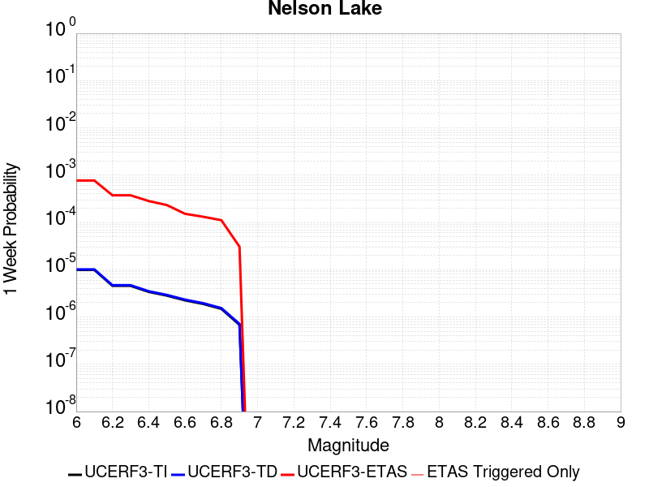 |  |  |  |

| Magnitude | 1 wk TI Prob | 1 wk TD Prob | 1 wk ETAS Prob | 1 wk ETAS/TD Gain | 1 wk ETAS Triggered Only | 1 mo TI Prob | 1 mo TD Prob | 1 mo ETAS Prob | 1 mo ETAS/TD Gain | 1 mo ETAS Triggered Only | 1 yr TI Prob | 1 yr TD Prob | 1 yr ETAS Prob | 1 yr ETAS/TD Gain | 1 yr ETAS Triggered Only | 10 yr TI Prob | 10 yr TD Prob | 10 yr ETAS Prob | 10 yr ETAS/TD Gain | 10 yr ETAS Triggered Only |
|-----|-----|-----|-----|-----|-----|-----|-----|-----|-----|-----|-----|-----|-----|-----|-----|-----|-----|-----|-----|-----|
| 6.0 | 9.913453E-6 | 1.0192255E-5 | 7.701845E-4 | 75.56566 | 7.6E-4 | 4.2485535E-5 | 4.3680422E-5 | 0.0013636227 | 31.218168 | 0.00132 | 5.1713863E-4 | 5.316897E-4 | 0.0033102117 | 6.2258334 | 0.00278 | 0.0051593683 | 0.005305204 | 0.010089686 | 1.9018469 | 0.00481 |
| 6.1 | 9.913453E-6 | 1.0192255E-5 | 7.701845E-4 | 75.56566 | 7.6E-4 | 4.2485535E-5 | 4.3680422E-5 | 0.0013636227 | 31.218168 | 0.00132 | 5.1713863E-4 | 5.316897E-4 | 0.0033102117 | 6.2258334 | 0.00278 | 0.0051593683 | 0.005305204 | 0.010089686 | 1.9018469 | 0.00481 |
| 6.2 | 4.5596407E-6 | 4.696313E-6 | 3.746946E-4 | 79.784836 | 3.7E-4 | 1.954117E-5 | 2.0126909E-5 | 6.6011405E-4 | 32.79759 | 6.4E-4 | 2.3788778E-4 | 2.4501883E-4 | 0.0015347027 | 6.263612 | 0.00129 | 0.0023763329 | 0.0024476128 | 0.004662179 | 1.9047862 | 0.00222 |
| 6.3 | 4.5596407E-6 | 4.696313E-6 | 3.746946E-4 | 79.784836 | 3.7E-4 | 1.954117E-5 | 2.0126909E-5 | 6.6011405E-4 | 32.79759 | 6.4E-4 | 2.3788778E-4 | 2.4501883E-4 | 0.0015347027 | 6.263612 | 0.00129 | 0.0023763329 | 0.0024476128 | 0.004662179 | 1.9047862 | 0.00222 |
| 6.4 | 3.4025713E-6 | 3.5098972E-6 | 2.835089E-4 | 80.77413 | 2.8E-4 | 1.4582367E-5 | 1.5042335E-5 | 5.1503483E-4 | 34.23902 | 5.0E-4 | 1.7752586E-4 | 1.8312587E-4 | 0.0011929409 | 6.514322 | 0.00101 | 0.001773841 | 0.0018298327 | 0.0035067585 | 1.9164368 | 0.00168 |
| 6.5 | 2.8352947E-6 | 2.927856E-6 | 2.3292718E-4 | 79.55554 | 2.3E-4 | 1.2151207E-5 | 1.2547898E-5 | 4.3254264E-4 | 34.47132 | 4.2E-4 | 1.479309E-4 | 1.5276071E-4 | 9.6263696E-4 | 6.301601 | 8.1E-4 | 0.0014783246 | 0.0015266308 | 0.0029145088 | 1.9091117 | 0.00139 |
| 6.6 | 2.251518E-6 | 2.3290677E-6 | 1.5232872E-4 | 65.403305 | 1.5E-4 | 9.649328E-6 | 9.981683E-6 | 3.099787E-4 | 31.05475 | 3.0E-4 | 1.1747423E-4 | 1.2152085E-4 | 6.914516E-4 | 5.6899834 | 5.7E-4 | 0.0011741214 | 0.0012146058 | 0.0022533424 | 1.8552049 | 0.00104 |
| 6.7 | 1.8911853E-6 | 1.9591396E-6 | 1.3195889E-4 | 67.35553 | 1.3E-4 | 8.105055E-6 | 8.39629E-6 | 2.683941E-4 | 31.965801 | 2.6E-4 | 9.867457E-5 | 1.0222061E-4 | 6.1216846E-4 | 5.988699 | 5.1E-4 | 9.863076E-4 | 0.0010217935 | 0.0019508431 | 1.9092344 | 9.3E-4 |
| 6.8 | 1.4874814E-6 | 1.5438305E-6 | 1.1154366E-4 | 72.251236 | 1.1E-4 | 6.374905E-6 | 6.6164025E-6 | 2.2661495E-4 | 34.250477 | 2.2E-4 | 7.76117E-5 | 8.055224E-5 | 5.105176E-4 | 6.3377204 | 4.3E-4 | 7.75846E-4 | 8.0528157E-4 | 0.0015446857 | 1.9181932 | 7.4E-4 |
| 6.9 | 6.835972E-7 | 7.1399285E-7 | 3.071397E-5 | 43.0172 | 3.0E-5 | 2.9296991E-6 | 3.0599674E-6 | 9.3059694E-5 | 30.411987 | 9.0E-5 | 3.56685E-5 | 3.7254784E-5 | 2.4724696E-4 | 6.6366496 | 2.1E-4 | 3.5662777E-4 | 3.7251666E-4 | 6.824012E-4 | 1.8318676 | 3.1E-4 |

## Towne Pass
*[(top)](#table-of-contents)*

| 1 Week | 1 Month | 1 Year | 10 Year |
|-----|-----|-----|-----|
| 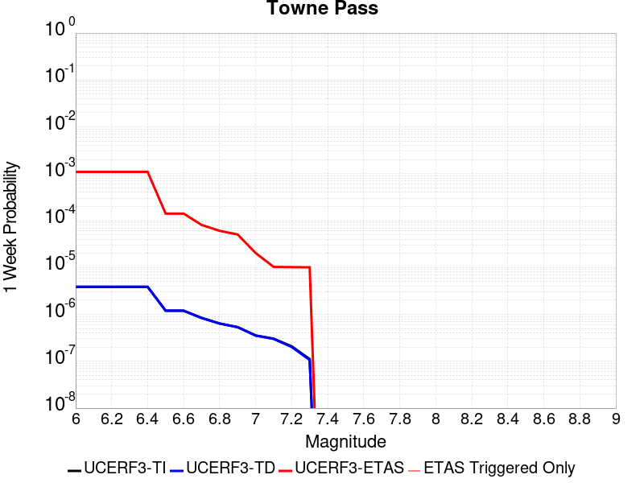 |  |  |  |

| Magnitude | 1 wk TI Prob | 1 wk TD Prob | 1 wk ETAS Prob | 1 wk ETAS/TD Gain | 1 wk ETAS Triggered Only | 1 mo TI Prob | 1 mo TD Prob | 1 mo ETAS Prob | 1 mo ETAS/TD Gain | 1 mo ETAS Triggered Only | 1 yr TI Prob | 1 yr TD Prob | 1 yr ETAS Prob | 1 yr ETAS/TD Gain | 1 yr ETAS Triggered Only | 10 yr TI Prob | 10 yr TD Prob | 10 yr ETAS Prob | 10 yr ETAS/TD Gain | 10 yr ETAS Triggered Only |
|-----|-----|-----|-----|-----|-----|-----|-----|-----|-----|-----|-----|-----|-----|-----|-----|-----|-----|-----|-----|-----|
| 6.0 | 3.849728E-6 | 3.894542E-6 | 0.0010938903 | 280.87778 | 0.00109 | 1.649873E-5 | 1.6690812E-5 | 0.0017066626 | 102.251625 | 0.00169 | 2.0085352E-4 | 2.0319606E-4 | 0.0031925885 | 15.711863 | 0.00299 | 0.0020067208 | 0.0020305319 | 0.0065413537 | 3.2214978 | 0.00452 |
| 6.1 | 3.849728E-6 | 3.894542E-6 | 0.0010938903 | 280.87778 | 0.00109 | 1.649873E-5 | 1.6690812E-5 | 0.0017066626 | 102.251625 | 0.00169 | 2.0085352E-4 | 2.0319606E-4 | 0.0031925885 | 15.711863 | 0.00299 | 0.0020067208 | 0.0020305319 | 0.0065413537 | 3.2214978 | 0.00452 |
| 6.2 | 3.849728E-6 | 3.894542E-6 | 0.0010938903 | 280.87778 | 0.00109 | 1.649873E-5 | 1.6690812E-5 | 0.0017066626 | 102.251625 | 0.00169 | 2.0085352E-4 | 2.0319606E-4 | 0.0031925885 | 15.711863 | 0.00299 | 0.0020067208 | 0.0020305319 | 0.0065413537 | 3.2214978 | 0.00452 |
| 6.3 | 3.849728E-6 | 3.894542E-6 | 0.0010938903 | 280.87778 | 0.00109 | 1.649873E-5 | 1.6690812E-5 | 0.0017066626 | 102.251625 | 0.00169 | 2.0085352E-4 | 2.0319606E-4 | 0.0031925885 | 15.711863 | 0.00299 | 0.0020067208 | 0.0020305319 | 0.0065413537 | 3.2214978 | 0.00452 |
| 6.4 | 3.849728E-6 | 3.894542E-6 | 0.0010938903 | 280.87778 | 0.00109 | 1.649873E-5 | 1.6690812E-5 | 0.0017066626 | 102.251625 | 0.00169 | 2.0085352E-4 | 2.0319606E-4 | 0.0031925885 | 15.711863 | 0.00299 | 0.0020067208 | 0.0020305319 | 0.0065413537 | 3.2214978 | 0.00452 |
| 6.5 | 1.1953545E-6 | 1.2030526E-6 | 1.4120288E-4 | 117.3705 | 1.4E-4 | 5.1229376E-6 | 5.15593E-6 | 2.851545E-4 | 55.306118 | 2.8E-4 | 6.236998E-5 | 6.277176E-5 | 5.427416E-4 | 8.646271 | 4.8E-4 | 6.235248E-4 | 6.2755204E-4 | 0.0013670876 | 2.178445 | 7.4E-4 |
| 6.6 | 1.1953545E-6 | 1.2030526E-6 | 1.4120288E-4 | 117.3705 | 1.4E-4 | 5.1229376E-6 | 5.15593E-6 | 2.851545E-4 | 55.306118 | 2.8E-4 | 6.236998E-5 | 6.277176E-5 | 5.427416E-4 | 8.646271 | 4.8E-4 | 6.235248E-4 | 6.2755204E-4 | 0.0013670876 | 2.178445 | 7.4E-4 |
| 6.7 | 8.375951E-7 | 8.410676E-7 | 8.0841E-5 | 96.11713 | 8.0E-5 | 3.5896885E-6 | 3.6045708E-6 | 1.8360392E-4 | 50.936417 | 1.8E-4 | 4.370358E-5 | 4.3884826E-5 | 3.1387297E-4 | 7.1521983 | 2.7E-4 | 4.3694986E-4 | 4.3876728E-4 | 8.485874E-4 | 1.9340261 | 4.1E-4 |
| 6.8 | 6.38041E-7 | 6.3921624E-7 | 6.0639177E-5 | 94.86489 | 6.0E-5 | 2.7344586E-6 | 2.7394954E-6 | 1.12739195E-4 | 41.15327 | 1.1E-4 | 3.3291526E-5 | 3.3352884E-5 | 1.9334754E-4 | 5.797026 | 1.6E-4 | 3.3286537E-4 | 3.334826E-4 | 5.7340256E-4 | 1.7194377 | 2.4E-4 |
| 6.9 | 5.3460053E-7 | 5.345339E-7 | 5.053451E-5 | 94.53939 | 5.0E-5 | 2.2911431E-6 | 2.2908578E-6 | 1.0229063E-4 | 44.651672 | 1.0E-4 | 2.789431E-5 | 2.7890868E-5 | 1.5788725E-4 | 5.6608934 | 1.3E-4 | 2.789081E-4 | 2.78877E-4 | 4.7882122E-4 | 1.716962 | 2.0E-4 |
| 7.0 | 3.557783E-7 | 3.5324283E-7 | 2.0353236E-5 | 57.618256 | 2.0E-5 | 1.5247632E-6 | 1.513897E-6 | 4.1513835E-5 | 27.421835 | 4.0E-5 | 1.8563835E-5 | 1.8431549E-5 | 8.843026E-5 | 4.7977657 | 7.0E-5 | 1.8562283E-4 | 1.8430105E-4 | 2.9428076E-4 | 1.5967395 | 1.1E-4 |
| 7.1 | 3.037942E-7 | 3.0002275E-7 | 1.0300019E-5 | 34.330795 | 1.0E-5 | 1.3019744E-6 | 1.2858112E-6 | 2.1285785E-5 | 16.554363 | 2.0E-5 | 1.5851423E-5 | 1.5654647E-5 | 5.565402E-5 | 3.555112 | 4.0E-5 | 1.5850292E-4 | 1.5653619E-4 | 2.3652367E-4 | 1.510984 | 8.0E-5 |
| 7.2 | 2.0808248E-7 | 2.0217735E-7 | 1.0202175E-5 | 50.461517 | 1.0E-5 | 8.917818E-7 | 8.6647407E-7 | 2.0866457E-5 | 24.082033 | 2.0E-5 | 1.0857389E-5 | 1.0549275E-5 | 5.0548853E-5 | 4.79169 | 4.0E-5 | 1.0856859E-4 | 1.0548821E-4 | 1.7548082E-4 | 1.6635113 | 7.0E-5 |
| 7.3 | 1.1162073E-7 | 1.0636902E-7 | 1.0106368E-5 | 95.01232 | 1.0E-5 | 4.7837443E-7 | 4.5586717E-7 | 1.0455863E-5 | 22.936205 | 1.0E-5 | 5.8241935E-6 | 5.5501705E-6 | 1.5550115E-5 | 2.8017364 | 1.0E-5 | 5.8240406E-5 | 5.550052E-5 | 7.549941E-5 | 1.360337 | 2.0E-5 |

## Lenwood-Lockhart-Old Woman Springs
*[(top)](#table-of-contents)*

| 1 Week | 1 Month | 1 Year | 10 Year |
|-----|-----|-----|-----|
|  | 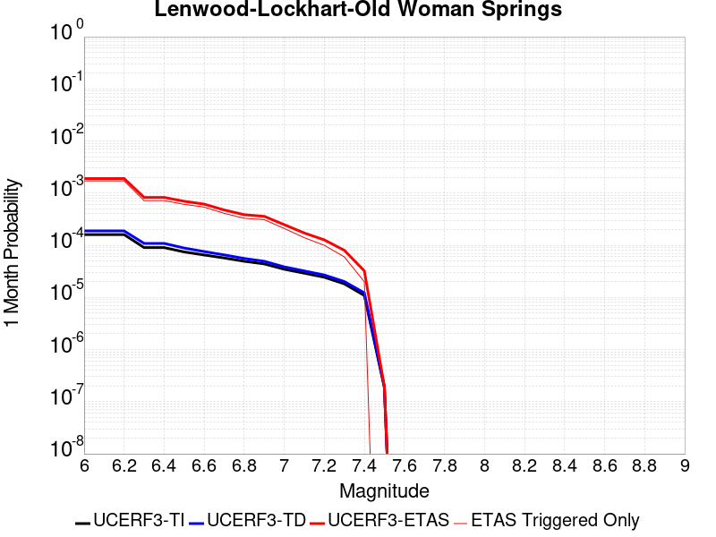 | 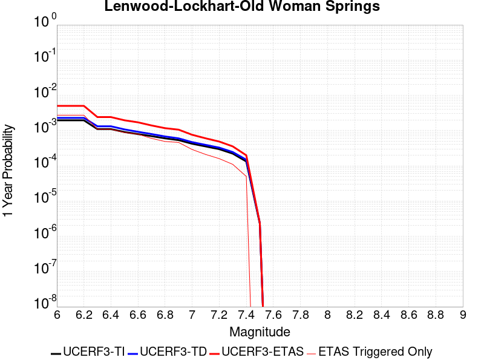 | 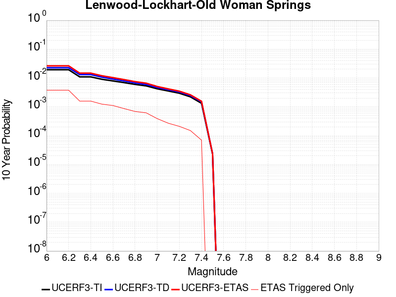 |

| Magnitude | 1 wk TI Prob | 1 wk TD Prob | 1 wk ETAS Prob | 1 wk ETAS/TD Gain | 1 wk ETAS Triggered Only | 1 mo TI Prob | 1 mo TD Prob | 1 mo ETAS Prob | 1 mo ETAS/TD Gain | 1 mo ETAS Triggered Only | 1 yr TI Prob | 1 yr TD Prob | 1 yr ETAS Prob | 1 yr ETAS/TD Gain | 1 yr ETAS Triggered Only | 10 yr TI Prob | 10 yr TD Prob | 10 yr ETAS Prob | 10 yr ETAS/TD Gain | 10 yr ETAS Triggered Only |
|-----|-----|-----|-----|-----|-----|-----|-----|-----|-----|-----|-----|-----|-----|-----|-----|-----|-----|-----|-----|-----|
| 6.0 | 3.744542E-5 | 4.396349E-5 | 0.001373905 | 31.251047 | 0.00133 | 1.604705E-4 | 1.8840231E-4 | 0.0019080782 | 10.12768 | 0.00172 | 0.0019519776 | 0.0022915571 | 0.005015301 | 2.1885996 | 0.00273 | 0.019349206 | 0.022697281 | 0.026381712 | 1.1623292 | 0.00377 |
| 6.1 | 3.744542E-5 | 4.396349E-5 | 0.001373905 | 31.251047 | 0.00133 | 1.604705E-4 | 1.8840231E-4 | 0.0019080782 | 10.12768 | 0.00172 | 0.0019519776 | 0.0022915571 | 0.005015301 | 2.1885996 | 0.00273 | 0.019349206 | 0.022697281 | 0.026381712 | 1.1623292 | 0.00377 |
| 6.2 | 3.744542E-5 | 4.396349E-5 | 0.001373905 | 31.251047 | 0.00133 | 1.604705E-4 | 1.8840231E-4 | 0.0019080782 | 10.12768 | 0.00172 | 0.0019519776 | 0.0022915571 | 0.005015301 | 2.1885996 | 0.00273 | 0.019349206 | 0.022697281 | 0.026381712 | 1.1623292 | 0.00377 |
| 6.3 | 2.1079984E-5 | 2.5354384E-5 | 5.953399E-4 | 23.48075 | 5.7E-4 | 9.0339665E-5 | 1.0865723E-4 | 8.28579E-4 | 7.6256223 | 7.2E-4 | 0.0010993304 | 0.0013221189 | 0.002410678 | 1.8233441 | 0.00109 | 0.010939079 | 0.013144747 | 0.014703979 | 1.1186202 | 0.00158 |
| 6.4 | 2.1079984E-5 | 2.5354384E-5 | 5.953399E-4 | 23.48075 | 5.7E-4 | 9.0339665E-5 | 1.0865723E-4 | 8.28579E-4 | 7.6256223 | 7.2E-4 | 0.0010993304 | 0.0013221189 | 0.002410678 | 1.8233441 | 0.00109 | 0.010939079 | 0.013144747 | 0.014703979 | 1.1186202 | 0.00158 |
| 6.5 | 1.7397282E-5 | 2.0663285E-5 | 4.9065356E-4 | 23.745188 | 4.7E-4 | 7.455765E-5 | 8.8554E-5 | 6.9849996E-4 | 7.8878427 | 6.1E-4 | 9.073613E-4 | 0.0010776235 | 0.0019566752 | 1.8157318 | 8.8E-4 | 0.009036654 | 0.010725273 | 0.011951974 | 1.1143748 | 0.00124 |
| 6.6 | 1.52050325E-5 | 1.7680086E-5 | 4.4767247E-4 | 25.32072 | 4.3E-4 | 6.51628E-5 | 7.576964E-5 | 6.157287E-4 | 8.126326 | 5.4E-4 | 7.9306826E-4 | 9.221128E-4 | 0.0017113843 | 1.8559382 | 7.9E-4 | 0.007902439 | 0.009183729 | 0.010283534 | 1.119756 | 0.00111 |
| 6.7 | 1.332523E-5 | 1.5264379E-5 | 3.352595E-4 | 21.96352 | 3.2E-4 | 5.7106878E-5 | 6.541716E-5 | 4.7539035E-4 | 7.2670584 | 4.1E-4 | 6.950544E-4 | 7.9616875E-4 | 0.0013956911 | 1.7530091 | 6.0E-4 | 0.006928845 | 0.0079337945 | 0.008796892 | 1.1087875 | 8.7E-4 |
| 6.8 | 1.1525329E-5 | 1.3031365E-5 | 2.7302798E-4 | 20.951603 | 2.6E-4 | 4.9393333E-5 | 5.5847537E-5 | 3.858291E-4 | 6.9086146 | 3.3E-4 | 6.011979E-4 | 6.7973585E-4 | 0.0011694027 | 1.7203783 | 4.9E-4 | 0.00599574 | 0.0067770192 | 0.007462343 | 1.1011246 | 6.9E-4 |
| 6.9 | 1.0253909E-5 | 1.1514835E-5 | 2.5151207E-4 | 21.84244 | 2.4E-4 | 4.3944583E-5 | 4.934838E-5 | 3.593331E-4 | 7.281558 | 3.1E-4 | 5.3489394E-4 | 6.006545E-4 | 0.0010603782 | 1.7653713 | 4.6E-4 | 0.0053360825 | 0.0059906896 | 0.0066069756 | 1.1028739 | 6.2E-4 |
| 7.0 | 8.104563E-6 | 8.99143E-6 | 1.5899008E-4 | 17.682402 | 1.5E-4 | 3.4733377E-5 | 3.853415E-5 | 2.4852605E-4 | 6.449502 | 2.1E-4 | 4.2279682E-4 | 4.6905465E-4 | 7.5891864E-4 | 1.6179749 | 2.9E-4 | 0.0042199334 | 0.0046808943 | 0.0050690686 | 1.0829275 | 3.9E-4 |
| 7.1 | 6.7986157E-6 | 7.5159796E-6 | 1.07515225E-4 | 14.304885 | 1.0E-4 | 2.91366E-5 | 3.2210955E-5 | 1.7220645E-4 | 5.346207 | 1.4E-4 | 3.5468035E-4 | 3.9209996E-4 | 6.020176E-4 | 1.5353677 | 2.1E-4 | 0.003541148 | 0.003914298 | 0.004183241 | 1.068708 | 2.7E-4 |
| 7.2 | 5.6893327E-6 | 6.280132E-6 | 7.627969E-5 | 12.146193 | 7.0E-5 | 2.4382627E-5 | 2.6914584E-5 | 1.269119E-4 | 4.715358 | 1.0E-4 | 2.9681803E-4 | 3.276378E-4 | 4.8758538E-4 | 1.4881842 | 1.6E-4 | 0.002964219 | 0.003271746 | 0.003481059 | 1.0639759 | 2.1E-4 |
| 7.3 | 4.253348E-6 | 4.707075E-6 | 6.470679E-5 | 13.746711 | 6.0E-5 | 1.8228506E-5 | 2.017303E-5 | 8.017182E-5 | 3.9742079 | 6.0E-5 | 2.2190946E-4 | 2.455808E-4 | 3.5555378E-4 | 1.4478078 | 1.1E-4 | 0.00221688 | 0.0024532753 | 0.0026029071 | 1.0609927 | 1.5E-4 |
| 7.4 | 2.5448119E-6 | 2.8520594E-6 | 2.2852002E-5 | 8.012457 | 2.0E-5 | 1.0906291E-5 | 1.2223064E-5 | 3.222282E-5 | 2.636231 | 2.0E-5 | 1.3277601E-4 | 1.4880729E-4 | 1.9879985E-4 | 1.335955 | 5.0E-5 | 0.001326967 | 0.0014872387 | 0.0015571346 | 1.0469971 | 7.0E-5 |
| 7.5 | 4.3706837E-8 | 4.562909E-8 | 4.562909E-8 | 1.0 | 0.0 | 1.8731501E-7 | 1.9555324E-7 | 1.9555324E-7 | 1.0 | 0.0 | 2.2805577E-6 | 2.3808586E-6 | 2.3808586E-6 | 1.0 | 0.0 | 2.2805343E-5 | 2.3808387E-5 | 2.3808387E-5 | 1.0 | 0.0 |

## San Andreas (San Bernardino N)
*[(top)](#table-of-contents)*

| 1 Week | 1 Month | 1 Year | 10 Year |
|-----|-----|-----|-----|
| 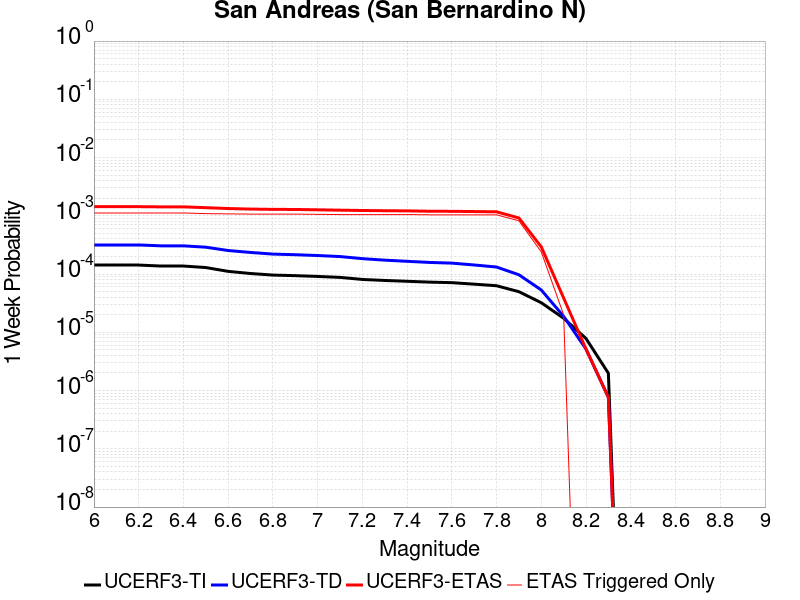 |  |  |  |

| Magnitude | 1 wk TI Prob | 1 wk TD Prob | 1 wk ETAS Prob | 1 wk ETAS/TD Gain | 1 wk ETAS Triggered Only | 1 mo TI Prob | 1 mo TD Prob | 1 mo ETAS Prob | 1 mo ETAS/TD Gain | 1 mo ETAS Triggered Only | 1 yr TI Prob | 1 yr TD Prob | 1 yr ETAS Prob | 1 yr ETAS/TD Gain | 1 yr ETAS Triggered Only | 10 yr TI Prob | 10 yr TD Prob | 10 yr ETAS Prob | 10 yr ETAS/TD Gain | 10 yr ETAS Triggered Only |
|-----|-----|-----|-----|-----|-----|-----|-----|-----|-----|-----|-----|-----|-----|-----|-----|-----|-----|-----|-----|-----|
| 6.0 | 1.4273766E-4 | 3.160784E-4 | 0.0014357244 | 4.5423045 | 0.00112 | 6.115894E-4 | 0.0013539245 | 0.0028518937 | 2.1063905 | 0.0015 | 0.0074207084 | 0.016360939 | 0.018505273 | 1.1310642 | 0.00218 | 0.07177748 | 0.15021163 | 0.15266751 | 1.0163496 | 0.00289 |
| 6.1 | 1.4273766E-4 | 3.160784E-4 | 0.0014357244 | 4.5423045 | 0.00112 | 6.115894E-4 | 0.0013539245 | 0.0028518937 | 2.1063905 | 0.0015 | 0.0074207084 | 0.016360939 | 0.018505273 | 1.1310642 | 0.00218 | 0.07177748 | 0.15021163 | 0.15266751 | 1.0163496 | 0.00289 |
| 6.2 | 1.4273766E-4 | 3.160784E-4 | 0.0014357244 | 4.5423045 | 0.00112 | 6.115894E-4 | 0.0013539245 | 0.0028518937 | 2.1063905 | 0.0015 | 0.0074207084 | 0.016360939 | 0.018505273 | 1.1310642 | 0.00218 | 0.07177748 | 0.15021163 | 0.15266751 | 1.0163496 | 0.00289 |
| 6.3 | 1.3730655E-4 | 3.0512668E-4 | 0.0014247849 | 4.6694865 | 0.00112 | 5.883239E-4 | 0.001307036 | 0.0028050756 | 2.1461349 | 0.0015 | 0.0071393442 | 0.015798455 | 0.017944016 | 1.1358082 | 0.00218 | 0.06914291 | 0.1455135 | 0.14796588 | 1.0168532 | 0.00287 |
| 6.4 | 1.3730655E-4 | 3.0512668E-4 | 0.0014247849 | 4.6694865 | 0.00112 | 5.883239E-4 | 0.001307036 | 0.0028050756 | 2.1461349 | 0.0015 | 0.0071393442 | 0.015798455 | 0.017944016 | 1.1358082 | 0.00218 | 0.06914291 | 0.1455135 | 0.14796588 | 1.0168532 | 0.00287 |
| 6.5 | 1.2942807E-4 | 2.8927144E-4 | 0.0013789561 | 4.7669973 | 0.00109 | 5.545738E-4 | 0.0012391509 | 0.0027073293 | 2.1848261 | 0.00147 | 0.0067310524 | 0.014983548 | 0.017071782 | 1.1393685 | 0.00212 | 0.06530788 | 0.13865088 | 0.14106266 | 1.0173947 | 0.0028 |
| 6.6 | 1.1125901E-4 | 2.5365927E-4 | 0.0013333854 | 5.2566004 | 0.00108 | 4.767372E-4 | 0.0010866605 | 0.0025450739 | 2.3421059 | 0.00146 | 0.005788839 | 0.0131504685 | 0.015222852 | 1.1575902 | 0.0021 | 0.056403454 | 0.12300496 | 0.12542546 | 1.0196781 | 0.00276 |
| 6.7 | 1.02209575E-4 | 2.3500937E-4 | 0.0013047579 | 5.55194 | 0.00107 | 4.3796748E-4 | 0.0010067957 | 0.0024553358 | 2.4387627 | 0.00145 | 0.0053192247 | 0.012189267 | 0.014224157 | 1.1669412 | 0.00206 | 0.051936906 | 0.114792764 | 0.11719168 | 1.0208977 | 0.00271 |
| 6.8 | 9.610582E-5 | 2.2026796E-4 | 0.0012900323 | 5.85665 | 0.00107 | 4.1181705E-4 | 9.436647E-4 | 0.0023922964 | 2.5351126 | 0.00145 | 0.0050023515 | 0.011428859 | 0.01345543 | 1.1773205 | 0.00205 | 0.048912346 | 0.10820469 | 0.110603616 | 1.0221703 | 0.00269 |
| 6.9 | 9.3877505E-5 | 2.1482339E-4 | 0.0012845935 | 5.9797654 | 0.00107 | 4.0227012E-4 | 9.203475E-4 | 0.002369013 | 2.5740418 | 0.00145 | 0.0048866454 | 0.011147907 | 0.0131750535 | 1.181841 | 0.00205 | 0.04780577 | 0.105798274 | 0.10818579 | 1.0225667 | 0.00267 |
| 7.0 | 9.1019785E-5 | 2.0809306E-4 | 0.0012678725 | 6.092815 | 0.00106 | 3.900265E-4 | 8.915232E-4 | 0.0023302394 | 2.613773 | 0.00144 | 0.0047382377 | 0.0108004995 | 0.012818467 | 1.1868402 | 0.00204 | 0.046384744 | 0.10276815 | 0.10515479 | 1.0232235 | 0.00266 |
| 7.1 | 8.771155E-5 | 1.9983841E-4 | 0.0012496286 | 6.2531953 | 0.00105 | 3.758525E-4 | 8.5616973E-4 | 0.0022849455 | 2.6687996 | 0.00143 | 0.0045664064 | 0.010374243 | 0.012383183 | 1.1936469 | 0.00203 | 0.044737056 | 0.09907644 | 0.101463884 | 1.024097 | 0.00265 |
| 7.2 | 8.0830236E-5 | 1.8389444E-4 | 0.0012337014 | 6.7087474 | 0.00105 | 3.4636928E-4 | 7.8788114E-4 | 0.0022067623 | 2.8008823 | 0.00142 | 0.0042088944 | 0.009550368 | 0.011531268 | 1.207416 | 0.002 | 0.041300658 | 0.09180518 | 0.09418466 | 1.0259187 | 0.00262 |
| 7.3 | 7.7668235E-5 | 1.7333007E-4 | 0.0012231481 | 7.056756 | 0.00105 | 3.328214E-4 | 7.426318E-4 | 0.0021615773 | 2.9106984 | 0.00142 | 0.0040445733 | 0.009004138 | 0.01096631 | 1.2179189 | 0.00198 | 0.03971748 | 0.08706761 | 0.08943211 | 1.027157 | 0.00259 |
| 7.4 | 7.520177E-5 | 1.655312E-4 | 0.0012153573 | 7.3421655 | 0.00105 | 3.2225347E-4 | 7.092266E-4 | 0.0021282195 | 3.000761 | 0.00142 | 0.0039163795 | 0.008600714 | 0.010563684 | 1.2282335 | 0.00198 | 0.038480744 | 0.08352157 | 0.08587691 | 1.0282005 | 0.00257 |
| 7.5 | 7.274697E-5 | 1.584075E-4 | 0.0011982428 | 7.564306 | 0.00104 | 3.1173544E-4 | 6.7871273E-4 | 0.0020877558 | 3.0760522 | 0.00141 | 0.003788775 | 0.008232076 | 0.010175941 | 1.2361331 | 0.00196 | 0.03724827 | 0.08023654 | 0.082572736 | 1.0291164 | 0.00254 |
| 7.6 | 7.1185845E-5 | 1.5410586E-4 | 0.0011939455 | 7.7475677 | 0.00104 | 3.0504653E-4 | 6.602866E-4 | 0.0020693555 | 3.1340265 | 0.00141 | 0.0037076178 | 0.0080094095 | 0.009943791 | 1.2415136 | 0.00195 | 0.036463667 | 0.07822661 | 0.08054948 | 1.0296941 | 0.00252 |
| 7.7 | 6.709961E-5 | 1.4319421E-4 | 0.0011830453 | 8.261824 | 0.00104 | 2.8753807E-4 | 6.135452E-4 | 0.0020226801 | 3.2967093 | 0.00141 | 0.003495157 | 0.0074443663 | 0.009369925 | 1.2586597 | 0.00194 | 0.034406938 | 0.07305558 | 0.07537294 | 1.0317205 | 0.0025 |
| 7.8 | 6.300812E-5 | 1.320343E-4 | 0.0011718969 | 8.875701 | 0.00104 | 2.7000686E-4 | 5.657386E-4 | 0.001974941 | 3.4909072 | 0.00141 | 0.0032823787 | 0.006866143 | 0.008782892 | 1.2791594 | 0.00193 | 0.032343175 | 0.06771385 | 0.07003524 | 1.0342824 | 0.00249 |
| 7.9 | 4.983037E-5 | 9.7241085E-5 | 9.1716135E-4 | 9.431829 | 8.2E-4 | 2.1354125E-4 | 4.1668097E-4 | 0.0015062267 | 3.6148202 | 0.00109 | 0.0025967648 | 0.0050613005 | 0.006553708 | 1.2948666 | 0.0015 | 0.025666296 | 0.050650507 | 0.052520726 | 1.036924 | 0.00197 |
| 8.0 | 3.2211527E-5 | 5.3306234E-5 | 2.9329344E-4 | 5.502048 | 2.4E-4 | 1.380421E-4 | 2.2843528E-4 | 5.583599E-4 | 2.4442804 | 3.3E-4 | 0.0016793669 | 0.0027776542 | 0.0032662933 | 1.1759179 | 4.9E-4 | 0.016667323 | 0.028362568 | 0.0289747 | 1.0215824 | 6.3E-4 |
| 8.1 | 1.743376E-5 | 1.8823403E-5 | 3.8823026E-5 | 2.0624871 | 2.0E-5 | 7.471398E-5 | 8.066923E-5 | 1.20666E-4 | 1.495812 | 4.0E-5 | 9.0926304E-4 | 9.81706E-4 | 0.0010316569 | 1.0508817 | 5.0E-5 | 0.009055517 | 0.010483979 | 0.010573036 | 1.0084945 | 9.0E-5 |
| 8.2 | 7.831616E-6 | 5.1540533E-6 | 5.1540533E-6 | 1.0 | 0.0 | 3.3563636E-5 | 2.2088612E-5 | 2.2088612E-5 | 1.0 | 0.0 | 4.0856065E-4 | 2.6889573E-4 | 2.7889304E-4 | 1.0371791 | 1.0E-5 | 0.004078103 | 0.0030413668 | 0.0030513364 | 1.003278 | 1.0E-5 |
| 8.3 | 1.983087E-6 | 7.6564595E-7 | 7.6564595E-7 | 1.0 | 0.0 | 8.498917E-6 | 3.281336E-6 | 3.281336E-6 | 1.0 | 0.0 | 1.034694E-4 | 3.9949547E-5 | 4.9949147E-5 | 1.2503058 | 1.0E-5 | 0.0010342124 | 4.717979E-4 | 4.8179316E-4 | 1.0211855 | 1.0E-5 |

## Bicycle Lake
*[(top)](#table-of-contents)*

| 1 Week | 1 Month | 1 Year | 10 Year |
|-----|-----|-----|-----|
|  |  |  |  |

| Magnitude | 1 wk TI Prob | 1 wk TD Prob | 1 wk ETAS Prob | 1 wk ETAS/TD Gain | 1 wk ETAS Triggered Only | 1 mo TI Prob | 1 mo TD Prob | 1 mo ETAS Prob | 1 mo ETAS/TD Gain | 1 mo ETAS Triggered Only | 1 yr TI Prob | 1 yr TD Prob | 1 yr ETAS Prob | 1 yr ETAS/TD Gain | 1 yr ETAS Triggered Only | 10 yr TI Prob | 10 yr TD Prob | 10 yr ETAS Prob | 10 yr ETAS/TD Gain | 10 yr ETAS Triggered Only |
|-----|-----|-----|-----|-----|-----|-----|-----|-----|-----|-----|-----|-----|-----|-----|-----|-----|-----|-----|-----|-----|
| 6.0 | 1.9621975E-5 | 2.2097078E-5 | 6.0208427E-4 | 27.247234 | 5.8E-4 | 8.4091465E-5 | 9.4699084E-5 | 8.8462426E-4 | 9.341424 | 7.9E-4 | 0.0010233327 | 0.0011524865 | 0.002720677 | 2.3607018 | 0.00157 | 0.01018633 | 0.011478408 | 0.014275924 | 1.2437198 | 0.00283 |
| 6.1 | 1.9621975E-5 | 2.2097078E-5 | 6.0208427E-4 | 27.247234 | 5.8E-4 | 8.4091465E-5 | 9.4699084E-5 | 8.8462426E-4 | 9.341424 | 7.9E-4 | 0.0010233327 | 0.0011524865 | 0.002720677 | 2.3607018 | 0.00157 | 0.01018633 | 0.011478408 | 0.014275924 | 1.2437198 | 0.00283 |
| 6.2 | 9.9971285E-6 | 1.125564E-5 | 3.512518E-4 | 31.20674 | 3.4E-4 | 4.2844134E-5 | 4.8237856E-5 | 5.282147E-4 | 10.950211 | 4.8E-4 | 5.2150246E-4 | 5.871897E-4 | 0.0014866611 | 2.5318246 | 9.0E-4 | 0.0052028033 | 0.005861487 | 0.0075415806 | 1.2866328 | 0.00169 |
| 6.3 | 9.589428E-6 | 1.0798346E-5 | 3.407948E-4 | 31.559906 | 3.3E-4 | 4.10969E-5 | 4.62781E-5 | 5.062568E-4 | 10.939447 | 4.6E-4 | 5.002399E-4 | 5.6334207E-4 | 0.0014128633 | 2.5080023 | 8.5E-4 | 0.0049911533 | 0.0056242296 | 0.007235118 | 1.2864194 | 0.00162 |
| 6.4 | 9.589428E-6 | 1.0798346E-5 | 3.407948E-4 | 31.559906 | 3.3E-4 | 4.10969E-5 | 4.62781E-5 | 5.062568E-4 | 10.939447 | 4.6E-4 | 5.002399E-4 | 5.6334207E-4 | 0.0014128633 | 2.5080023 | 8.5E-4 | 0.0049911533 | 0.0056242296 | 0.007235118 | 1.2864194 | 0.00162 |
| 6.5 | 5.557707E-6 | 6.2856016E-6 | 2.2628422E-4 | 36.00041 | 2.2E-4 | 2.3818526E-5 | 2.6938165E-5 | 3.369298E-4 | 12.507526 | 3.1E-4 | 2.8995197E-4 | 3.279497E-4 | 8.5777586E-4 | 2.6155715 | 5.3E-4 | 0.0028957394 | 0.0032772934 | 0.0042540818 | 1.2980472 | 9.8E-4 |
| 6.6 | 4.8742945E-6 | 5.5132896E-6 | 1.9551224E-4 | 35.461994 | 1.9E-4 | 2.0889667E-5 | 2.3628318E-5 | 2.8362218E-4 | 12.003486 | 2.6E-4 | 2.54302E-4 | 2.87663E-4 | 7.2753645E-4 | 2.5291276 | 4.4E-4 | 0.002540112 | 0.0028754752 | 0.0037030885 | 1.287818 | 8.3E-4 |
| 6.7 | 3.991108E-6 | 4.5159104E-6 | 1.4451527E-4 | 32.00136 | 1.4E-4 | 1.7104636E-5 | 1.9353902E-5 | 2.0935023E-4 | 10.816952 | 1.9E-4 | 2.0822904E-4 | 2.3563375E-4 | 5.8555126E-4 | 2.485006 | 3.5E-4 | 0.0020803404 | 0.0023563374 | 0.003034735 | 1.2879034 | 6.8E-4 |

## Paradise
*[(top)](#table-of-contents)*

| 1 Week | 1 Month | 1 Year | 10 Year |
|-----|-----|-----|-----|
|  |  | 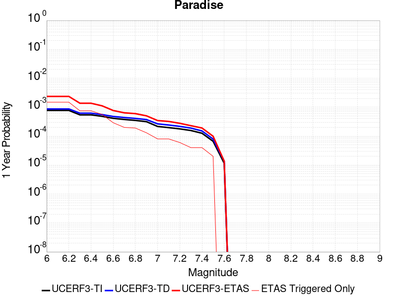 |  |

| Magnitude | 1 wk TI Prob | 1 wk TD Prob | 1 wk ETAS Prob | 1 wk ETAS/TD Gain | 1 wk ETAS Triggered Only | 1 mo TI Prob | 1 mo TD Prob | 1 mo ETAS Prob | 1 mo ETAS/TD Gain | 1 mo ETAS Triggered Only | 1 yr TI Prob | 1 yr TD Prob | 1 yr ETAS Prob | 1 yr ETAS/TD Gain | 1 yr ETAS Triggered Only | 10 yr TI Prob | 10 yr TD Prob | 10 yr ETAS Prob | 10 yr ETAS/TD Gain | 10 yr ETAS Triggered Only |
|-----|-----|-----|-----|-----|-----|-----|-----|-----|-----|-----|-----|-----|-----|-----|-----|-----|-----|-----|-----|-----|
| 6.0 | 1.4851273E-5 | 1.6694768E-5 | 5.8668526E-4 | 35.14186 | 5.7E-4 | 6.364676E-5 | 7.154718E-5 | 9.2148635E-4 | 12.879422 | 8.5E-4 | 7.7462377E-4 | 8.707624E-4 | 0.002359465 | 2.709654 | 0.00149 | 0.0077192914 | 0.008675884 | 0.011213674 | 1.2925107 | 0.00256 |
| 6.1 | 1.4851273E-5 | 1.6694768E-5 | 5.8668526E-4 | 35.14186 | 5.7E-4 | 6.364676E-5 | 7.154718E-5 | 9.2148635E-4 | 12.879422 | 8.5E-4 | 7.7462377E-4 | 8.707624E-4 | 0.002359465 | 2.709654 | 0.00149 | 0.0077192914 | 0.008675884 | 0.011213674 | 1.2925107 | 0.00256 |
| 6.2 | 1.4851273E-5 | 1.6694768E-5 | 5.8668526E-4 | 35.14186 | 5.7E-4 | 6.364676E-5 | 7.154718E-5 | 9.2148635E-4 | 12.879422 | 8.5E-4 | 7.7462377E-4 | 8.707624E-4 | 0.002359465 | 2.709654 | 0.00149 | 0.0077192914 | 0.008675884 | 0.011213674 | 1.2925107 | 0.00256 |
| 6.3 | 1.0426831E-5 | 1.1888697E-5 | 3.1188515E-4 | 26.233751 | 3.0E-4 | 4.4685654E-5 | 5.09506E-5 | 4.909282E-4 | 9.635376 | 4.4E-4 | 5.43912E-4 | 6.201529E-4 | 0.0013696878 | 2.2086291 | 7.5E-4 | 0.0054258266 | 0.0061848317 | 0.007466853 | 1.2072848 | 0.00129 |
| 6.4 | 1.0426831E-5 | 1.1888697E-5 | 3.1188515E-4 | 26.233751 | 3.0E-4 | 4.4685654E-5 | 5.09506E-5 | 4.909282E-4 | 9.635376 | 4.4E-4 | 5.43912E-4 | 6.201529E-4 | 0.0013696878 | 2.2086291 | 7.5E-4 | 0.0054258266 | 0.0061848317 | 0.007466853 | 1.2072848 | 0.00129 |
| 6.5 | 9.25027E-6 | 1.0620037E-5 | 2.306177E-4 | 21.715338 | 2.2E-4 | 3.964341E-5 | 4.551368E-5 | 3.854982E-4 | 8.469942 | 3.4E-4 | 4.8255164E-4 | 5.5399304E-4 | 0.0011136829 | 2.010283 | 5.6E-4 | 0.0048150513 | 0.0055266195 | 0.0064912587 | 1.1745442 | 9.7E-4 |
| 6.6 | 7.904275E-6 | 9.159602E-6 | 1.191586E-4 | 13.009145 | 1.1E-4 | 3.3875025E-5 | 3.925487E-5 | 2.2924741E-4 | 5.8399734 | 1.9E-4 | 4.1235037E-4 | 4.7782718E-4 | 7.676886E-4 | 1.606624 | 2.9E-4 | 0.0041158604 | 0.004768395 | 0.0052660103 | 1.1043571 | 5.0E-4 |
| 6.7 | 7.2061953E-6 | 8.407326E-6 | 6.840682E-5 | 8.136573 | 6.0E-5 | 3.088333E-5 | 3.603092E-5 | 1.7602587E-4 | 4.8854117 | 1.4E-4 | 3.7593965E-4 | 4.3859181E-4 | 6.385041E-4 | 1.4558048 | 2.0E-4 | 0.003753043 | 0.004377631 | 0.004686274 | 1.0705045 | 3.1E-4 |
| 6.8 | 6.6948724E-6 | 7.842242E-6 | 6.784177E-5 | 8.650813 | 6.0E-5 | 2.8691995E-5 | 3.3609194E-5 | 1.736045E-4 | 5.1653867 | 1.4E-4 | 3.4926904E-4 | 4.091187E-4 | 5.9904094E-4 | 1.4642229 | 1.9E-4 | 0.003487206 | 0.0040840125 | 0.004362869 | 1.06828 | 2.8E-4 |
| 6.9 | 6.0421025E-6 | 7.1306963E-6 | 3.713048E-5 | 5.207133 | 3.0E-5 | 2.5894467E-5 | 3.0559786E-5 | 1.3055673E-4 | 4.272174 | 1.0E-4 | 3.1521954E-4 | 3.7200528E-4 | 5.019569E-4 | 1.3493274 | 1.3E-4 | 0.0031477278 | 0.0037141638 | 0.003923384 | 1.0563303 | 2.1E-4 |
| 7.0 | 4.134091E-6 | 5.0803824E-6 | 2.508028E-5 | 4.9366913 | 2.0E-5 | 1.7717413E-5 | 2.1772896E-5 | 8.177159E-5 | 3.7556598 | 6.0E-5 | 2.1568815E-4 | 2.650543E-4 | 3.450331E-4 | 1.3017449 | 8.0E-5 | 0.0021547892 | 0.0026475347 | 0.0027572436 | 1.0414381 | 1.1E-4 |
| 7.1 | 3.7674888E-6 | 4.631936E-6 | 2.4631843E-5 | 5.317829 | 2.0E-5 | 1.6146281E-5 | 1.9851012E-5 | 7.984982E-5 | 4.022456 | 6.0E-5 | 1.9656324E-4 | 2.4166079E-4 | 3.2164145E-4 | 1.3309625 | 8.0E-5 | 0.0019638946 | 0.0024141306 | 0.002523865 | 1.0454551 | 1.1E-4 |
| 7.2 | 3.4065345E-6 | 4.156782E-6 | 2.41567E-5 | 5.811394 | 2.0E-5 | 1.4599351E-5 | 1.7814667E-5 | 6.781377E-5 | 3.806626 | 5.0E-5 | 1.777326E-4 | 2.168735E-4 | 2.7686046E-4 | 1.276599 | 6.0E-5 | 0.0017759053 | 0.0021667667 | 0.0022565715 | 1.0414466 | 9.0E-5 |
| 7.3 | 2.9934936E-6 | 3.6293673E-6 | 1.3629331E-5 | 3.7552912 | 1.0E-5 | 1.2829195E-5 | 1.5554348E-5 | 4.555388E-5 | 2.9286914 | 3.0E-5 | 1.5618425E-4 | 1.8935918E-4 | 2.2935162E-4 | 1.2111988 | 4.0E-5 | 0.0015607453 | 0.0018921237 | 0.0019619912 | 1.0369254 | 7.0E-5 |
| 7.4 | 2.4049796E-6 | 2.8890186E-6 | 1.288899E-5 | 4.4613733 | 1.0E-5 | 1.0307015E-5 | 1.2381457E-5 | 4.2381085E-5 | 3.4229481 | 3.0E-5 | 1.2548068E-4 | 1.5073526E-4 | 1.9072923E-4 | 1.2653259 | 4.0E-5 | 0.0012540985 | 0.0015064715 | 0.0015663812 | 1.0397682 | 6.0E-5 |
| 7.5 | 1.2710091E-6 | 1.5134859E-6 | 1.1513471E-5 | 7.6072536 | 1.0E-5 | 5.44717E-6 | 6.4863593E-6 | 2.648623E-5 | 4.083374 | 2.0E-5 | 6.631728E-5 | 7.896981E-5 | 9.896823E-5 | 1.2532413 | 2.0E-5 | 6.6297496E-4 | 7.895401E-4 | 8.095243E-4 | 1.0253112 | 2.0E-5 |
| 7.6 | 2.21172E-7 | 2.6040198E-7 | 2.6040198E-7 | 1.0 | 0.0 | 9.478797E-7 | 1.1160082E-6 | 1.1160082E-6 | 1.0 | 0.0 | 1.1540374E-5 | 1.3587343E-5 | 1.3587343E-5 | 1.0 | 0.0 | 1.1539775E-4 | 1.3586794E-4 | 1.3586794E-4 | 1.0 | 0.0 |

## Garlic Springs
*[(top)](#table-of-contents)*

| 1 Week | 1 Month | 1 Year | 10 Year |
|-----|-----|-----|-----|
| 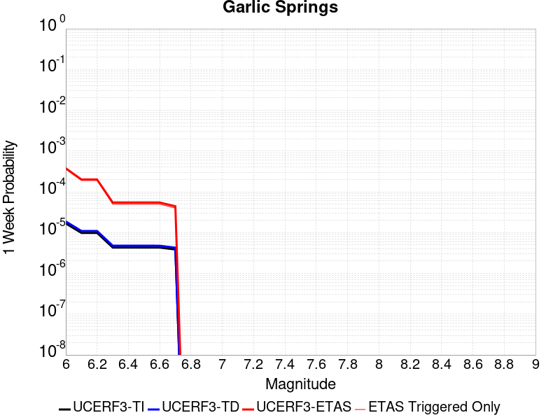 |  |  | 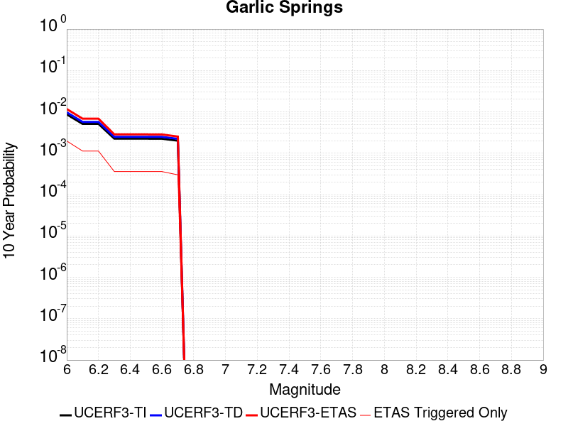 |

| Magnitude | 1 wk TI Prob | 1 wk TD Prob | 1 wk ETAS Prob | 1 wk ETAS/TD Gain | 1 wk ETAS Triggered Only | 1 mo TI Prob | 1 mo TD Prob | 1 mo ETAS Prob | 1 mo ETAS/TD Gain | 1 mo ETAS Triggered Only | 1 yr TI Prob | 1 yr TD Prob | 1 yr ETAS Prob | 1 yr ETAS/TD Gain | 1 yr ETAS Triggered Only | 10 yr TI Prob | 10 yr TD Prob | 10 yr ETAS Prob | 10 yr ETAS/TD Gain | 10 yr ETAS Triggered Only |
|-----|-----|-----|-----|-----|-----|-----|-----|-----|-----|-----|-----|-----|-----|-----|-----|-----|-----|-----|-----|-----|
| 6.0 | 1.6760017E-5 | 1.8776833E-5 | 3.7877008E-4 | 20.172203 | 3.6E-4 | 7.182667E-5 | 8.0470316E-5 | 6.7042286E-4 | 8.3313055 | 5.9E-4 | 8.7413884E-4 | 9.794032E-4 | 0.002138267 | 2.1832347 | 0.00116 | 0.008707083 | 0.009762413 | 0.011723083 | 1.2008387 | 0.00198 |
| 6.1 | 9.852767E-6 | 1.0973587E-5 | 2.009715E-4 | 18.314112 | 1.9E-4 | 4.222546E-5 | 4.702921E-5 | 3.8701322E-4 | 8.229209 | 3.4E-4 | 5.139737E-4 | 5.7250116E-4 | 0.0012721004 | 2.222005 | 7.0E-4 | 0.005127866 | 0.005717221 | 0.006840761 | 1.1965184 | 0.00113 |
| 6.2 | 9.852767E-6 | 1.0973587E-5 | 2.009715E-4 | 18.314112 | 1.9E-4 | 4.222546E-5 | 4.702921E-5 | 3.8701322E-4 | 8.229209 | 3.4E-4 | 5.139737E-4 | 5.7250116E-4 | 0.0012721004 | 2.222005 | 7.0E-4 | 0.005127866 | 0.005717221 | 0.006840761 | 1.1965184 | 0.00113 |
| 6.3 | 4.3167724E-6 | 4.7780286E-6 | 5.477779E-5 | 11.464517 | 5.0E-5 | 1.8500323E-5 | 2.0477235E-5 | 1.004756E-4 | 4.9066978 | 8.0E-5 | 2.2521814E-4 | 2.4930484E-4 | 4.6925E-4 | 1.8822337 | 2.2E-4 | 0.0022499003 | 0.00249251 | 0.0028516126 | 1.1440728 | 3.6E-4 |
| 6.4 | 4.3167724E-6 | 4.7780286E-6 | 5.477779E-5 | 11.464517 | 5.0E-5 | 1.8500323E-5 | 2.0477235E-5 | 1.004756E-4 | 4.9066978 | 8.0E-5 | 2.2521814E-4 | 2.4930484E-4 | 4.6925E-4 | 1.8822337 | 2.2E-4 | 0.0022499003 | 0.00249251 | 0.0028516126 | 1.1440728 | 3.6E-4 |
| 6.5 | 4.3167724E-6 | 4.7780286E-6 | 5.477779E-5 | 11.464517 | 5.0E-5 | 1.8500323E-5 | 2.0477235E-5 | 1.004756E-4 | 4.9066978 | 8.0E-5 | 2.2521814E-4 | 2.4930484E-4 | 4.6925E-4 | 1.8822337 | 2.2E-4 | 0.0022499003 | 0.00249251 | 0.0028516126 | 1.1440728 | 3.6E-4 |
| 6.6 | 4.301311E-6 | 4.760897E-6 | 5.4760658E-5 | 11.502172 | 5.0E-5 | 1.8434059E-5 | 2.0403815E-5 | 1.0040218E-4 | 4.9207554 | 8.0E-5 | 2.2441156E-4 | 2.4841115E-4 | 4.683565E-4 | 1.8854085 | 2.2E-4 | 0.0022418506 | 0.002483593 | 0.002842699 | 1.1445913 | 3.6E-4 |
| 6.7 | 3.8599724E-6 | 4.27106E-6 | 4.4270888E-5 | 10.365317 | 4.0E-5 | 1.6542634E-5 | 1.8304541E-5 | 8.830326E-5 | 4.8241177 | 7.0E-5 | 2.0138794E-4 | 2.228578E-4 | 4.1281545E-4 | 1.8523716 | 1.9E-4 | 0.0020120554 | 0.002228578 | 0.0025279094 | 1.134315 | 3.0E-4 |

## San Andreas (San Bernardino S)
*[(top)](#table-of-contents)*

| 1 Week | 1 Month | 1 Year | 10 Year |
|-----|-----|-----|-----|
| 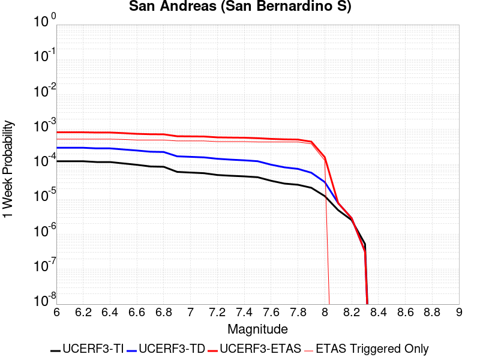 | 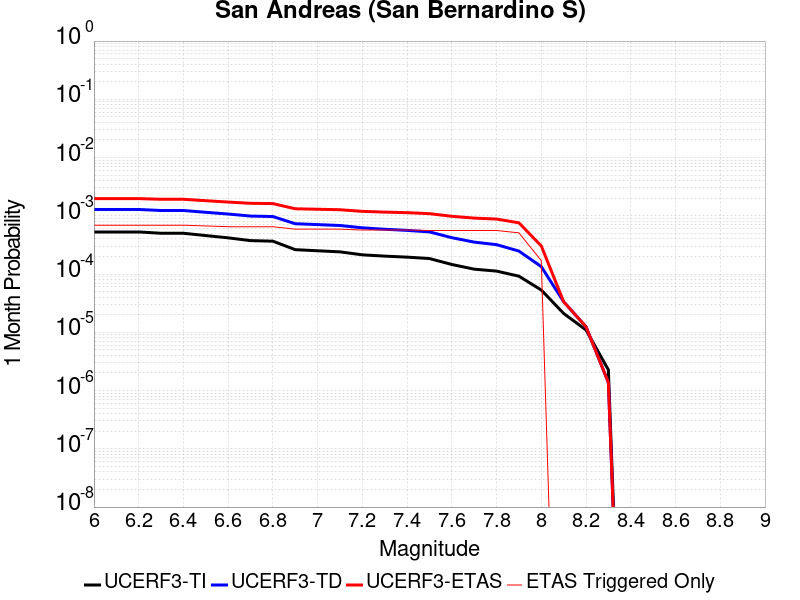 |  | 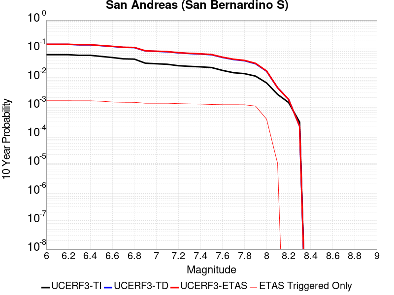 |

| Magnitude | 1 wk TI Prob | 1 wk TD Prob | 1 wk ETAS Prob | 1 wk ETAS/TD Gain | 1 wk ETAS Triggered Only | 1 mo TI Prob | 1 mo TD Prob | 1 mo ETAS Prob | 1 mo ETAS/TD Gain | 1 mo ETAS Triggered Only | 1 yr TI Prob | 1 yr TD Prob | 1 yr ETAS Prob | 1 yr ETAS/TD Gain | 1 yr ETAS Triggered Only | 10 yr TI Prob | 10 yr TD Prob | 10 yr ETAS Prob | 10 yr ETAS/TD Gain | 10 yr ETAS Triggered Only |
|-----|-----|-----|-----|-----|-----|-----|-----|-----|-----|-----|-----|-----|-----|-----|-----|-----|-----|-----|-----|-----|
| 6.0 | 1.2336002E-4 | 3.0005194E-4 | 8.2989293E-4 | 2.765831 | 5.3E-4 | 5.2857865E-4 | 0.0012853292 | 0.0019744423 | 1.5361375 | 6.9E-4 | 0.006416472 | 0.015541554 | 0.016673682 | 1.0728452 | 0.00115 | 0.06234337 | 0.14294699 | 0.14426686 | 1.0092332 | 0.00154 |
| 6.1 | 1.2336002E-4 | 3.0005194E-4 | 8.2989293E-4 | 2.765831 | 5.3E-4 | 5.2857865E-4 | 0.0012853292 | 0.0019744423 | 1.5361375 | 6.9E-4 | 0.006416472 | 0.015541554 | 0.016673682 | 1.0728452 | 0.00115 | 0.06234337 | 0.14294699 | 0.14426686 | 1.0092332 | 0.00154 |
| 6.2 | 1.2336002E-4 | 3.0005194E-4 | 8.2989293E-4 | 2.765831 | 5.3E-4 | 5.2857865E-4 | 0.0012853292 | 0.0019744423 | 1.5361375 | 6.9E-4 | 0.006416472 | 0.015541554 | 0.016673682 | 1.0728452 | 0.00115 | 0.06234337 | 0.14294699 | 0.14426686 | 1.0092332 | 0.00154 |
| 6.3 | 1.1712257E-4 | 2.8793467E-4 | 8.177821E-4 | 2.8401654 | 5.3E-4 | 5.018573E-4 | 0.0012334478 | 0.0019225967 | 1.5587176 | 6.9E-4 | 0.006093008 | 0.014918666 | 0.016041659 | 1.0752743 | 0.00114 | 0.059286322 | 0.13765779 | 0.13897717 | 1.0095845 | 0.00153 |
| 6.4 | 1.1712257E-4 | 2.8793467E-4 | 8.177821E-4 | 2.8401654 | 5.3E-4 | 5.018573E-4 | 0.0012334478 | 0.0019225967 | 1.5587176 | 6.9E-4 | 0.006093008 | 0.014918666 | 0.016041659 | 1.0752743 | 0.00114 | 0.059286322 | 0.13765779 | 0.13897717 | 1.0095845 | 0.00153 |
| 6.5 | 1.0689076E-4 | 2.6806415E-4 | 7.8792474E-4 | 2.9393141 | 5.2E-4 | 4.5802278E-4 | 0.0011483653 | 0.0018175959 | 1.582768 | 6.7E-4 | 0.0055621783 | 0.013896335 | 0.014971188 | 1.077348 | 0.00109 | 0.05425003 | 0.1288989 | 0.13018814 | 1.0100019 | 0.00148 |
| 6.6 | 9.7648895E-5 | 2.505129E-4 | 7.5038767E-4 | 2.9954052 | 5.0E-4 | 4.1842813E-4 | 0.0010732086 | 0.001722511 | 1.6050104 | 6.5E-4 | 0.005082469 | 0.012992399 | 0.014009017 | 1.0782471 | 0.00103 | 0.049677886 | 0.121077746 | 0.12229945 | 1.0100902 | 0.00139 |
| 6.7 | 8.757013E-5 | 2.3122175E-4 | 7.3110615E-4 | 3.1619263 | 5.0E-4 | 3.7524657E-4 | 9.905964E-4 | 0.0016399524 | 1.6555204 | 6.5E-4 | 0.00455906 | 0.011997902 | 0.013015544 | 1.0848184 | 0.00103 | 0.04466656 | 0.112373024 | 0.1135802 | 1.0107425 | 0.00136 |
| 6.8 | 8.562978E-5 | 2.2682057E-4 | 7.2670716E-4 | 3.2038856 | 5.0E-4 | 3.6693315E-4 | 9.7174826E-4 | 0.0016211167 | 1.6682476 | 6.5E-4 | 0.004458263 | 0.011770921 | 0.0127789145 | 1.0856342 | 0.00102 | 0.043698758 | 0.11037863 | 0.11157962 | 1.0108806 | 0.00135 |
| 6.9 | 6.124075E-5 | 1.7066885E-4 | 6.4058864E-4 | 3.753401 | 4.7E-4 | 2.6243398E-4 | 7.312337E-4 | 0.0013208023 | 1.8062656 | 5.9E-4 | 0.0031904527 | 0.008866636 | 0.00978839 | 1.1039575 | 9.3E-4 | 0.031450346 | 0.08420262 | 0.08535652 | 1.013704 | 0.00126 |
| 7.0 | 5.8598747E-5 | 1.6495936E-4 | 6.3488184E-4 | 3.8487167 | 4.7E-4 | 2.5111332E-4 | 7.067779E-4 | 0.001296361 | 1.8341843 | 5.9E-4 | 0.0030530186 | 0.008571265 | 0.009493294 | 1.1075721 | 9.3E-4 | 0.03011414 | 0.08151562 | 0.08267291 | 1.0141971 | 0.00126 |
| 7.1 | 5.613814E-5 | 1.5914452E-4 | 6.290697E-4 | 3.9528205 | 4.7E-4 | 2.4056983E-4 | 6.818704E-4 | 0.0012714681 | 1.8646771 | 5.9E-4 | 0.0029250039 | 0.008270353 | 0.009192661 | 1.1115198 | 9.3E-4 | 0.028868021 | 0.07881268 | 0.07997338 | 1.0147272 | 0.00126 |
| 7.2 | 4.991222E-5 | 1.4520933E-4 | 5.95144E-4 | 4.0985246 | 4.5E-4 | 2.1389198E-4 | 6.221777E-4 | 0.001191823 | 1.915567 | 5.7E-4 | 0.002601025 | 0.0075488063 | 0.0084320875 | 1.1170094 | 8.9E-4 | 0.025707912 | 0.07226191 | 0.07339375 | 1.015663 | 0.00122 |
| 7.3 | 4.7410045E-5 | 1.371513E-4 | 5.8708957E-4 | 4.2805977 | 4.5E-4 | 2.0317009E-4 | 5.8765925E-4 | 0.0011573243 | 1.9693799 | 5.7E-4 | 0.0024707897 | 0.0071313656 | 0.007995161 | 1.1211263 | 8.7E-4 | 0.024434982 | 0.068541944 | 0.069650374 | 1.0161716 | 0.00119 |
| 7.4 | 4.5556746E-5 | 1.3123035E-4 | 5.811713E-4 | 4.428635 | 4.5E-4 | 1.952286E-4 | 5.6229485E-4 | 0.0011319744 | 2.013133 | 5.7E-4 | 0.002374317 | 0.0068245293 | 0.007688592 | 1.1266114 | 8.7E-4 | 0.023491086 | 0.06579143 | 0.06689379 | 1.0167555 | 0.00118 |
| 7.5 | 4.3084514E-5 | 1.2358342E-4 | 5.63529E-4 | 4.559908 | 4.4E-4 | 1.8463485E-4 | 5.2953605E-4 | 0.0010892395 | 2.0569696 | 5.6E-4 | 0.0022456115 | 0.0064281146 | 0.0072726505 | 1.1313816 | 8.5E-4 | 0.022230545 | 0.062190283 | 0.063259386 | 1.0171908 | 0.00114 |
| 7.6 | 3.408608E-5 | 9.836477E-5 | 5.383215E-4 | 5.4727063 | 4.4E-4 | 1.4607502E-4 | 4.214953E-4 | 9.812593E-4 | 2.3280432 | 5.6E-4 | 0.0017770125 | 0.005119656 | 0.005965304 | 1.1651767 | 8.5E-4 | 0.017628696 | 0.05002244 | 0.05108641 | 1.0212699 | 0.00112 |
| 7.7 | 2.8315713E-5 | 8.2495724E-5 | 5.2245945E-4 | 6.33317 | 4.4E-4 | 1.2134742E-4 | 3.5350522E-4 | 9.1330725E-4 | 2.583575 | 5.6E-4 | 0.0014764034 | 0.004295442 | 0.0051417905 | 1.1970342 | 8.5E-4 | 0.01466633 | 0.042272415 | 0.04334507 | 1.0253748 | 0.00112 |
| 7.8 | 2.6222975E-5 | 7.463898E-5 | 5.1460613E-4 | 6.8946033 | 4.4E-4 | 1.1237934E-4 | 3.1984213E-4 | 8.7966304E-4 | 2.7503037 | 5.6E-4 | 0.0013673597 | 0.003887131 | 0.004723866 | 1.2152576 | 8.4E-4 | 0.013589768 | 0.038437475 | 0.039504807 | 1.027768 | 0.00111 |
| 7.9 | 2.1469694E-5 | 5.7884805E-5 | 4.4786223E-4 | 7.7371297 | 3.9E-4 | 9.200973E-5 | 2.4805416E-4 | 7.5792766E-4 | 3.0554926 | 5.1E-4 | 0.0011196428 | 0.00301588 | 0.003773588 | 1.2512394 | 7.6E-4 | 0.011140184 | 0.030153265 | 0.031123113 | 1.0321639 | 0.001 |
| 8.0 | 1.2420249E-5 | 3.1321662E-5 | 1.6131758E-4 | 5.150352 | 1.3E-4 | 5.322855E-5 | 1.342288E-4 | 3.0420598E-4 | 2.2663243 | 1.7E-4 | 6.478649E-4 | 0.0016330116 | 0.001922538 | 1.177296 | 2.9E-4 | 0.0064597935 | 0.01652369 | 0.016867908 | 1.0208317 | 3.5E-4 |
| 8.1 | 4.9197724E-6 | 7.822525E-6 | 7.822525E-6 | 1.0 | 0.0 | 2.1084568E-5 | 3.3524673E-5 | 3.3524673E-5 | 1.0 | 0.0 | 2.566744E-4 | 4.080866E-4 | 4.080866E-4 | 1.0 | 0.0 | 0.002563781 | 0.004384557 | 0.004394513 | 1.0022707 | 1.0E-5 |
| 8.2 | 2.5634774E-6 | 2.9065757E-6 | 2.9065757E-6 | 1.0 | 0.0 | 1.0986286E-5 | 1.2456694E-5 | 1.2456694E-5 | 1.0 | 0.0 | 1.3374983E-4 | 1.5164974E-4 | 1.5164974E-4 | 1.0 | 0.0 | 0.0013366934 | 0.001704941 | 0.001704941 | 1.0 | 0.0 |
| 8.3 | 5.2850464E-7 | 3.2080476E-7 | 3.2080476E-7 | 1.0 | 0.0 | 2.2650179E-6 | 1.3748769E-6 | 1.3748769E-6 | 1.0 | 0.0 | 2.7576245E-5 | 1.673901E-5 | 1.673901E-5 | 1.0 | 0.0 | 2.7572823E-4 | 1.986671E-4 | 1.986671E-4 | 1.0 | 0.0 |

## Death Valley (Black Mtns Frontal)
*[(top)](#table-of-contents)*

| 1 Week | 1 Month | 1 Year | 10 Year |
|-----|-----|-----|-----|
|  | 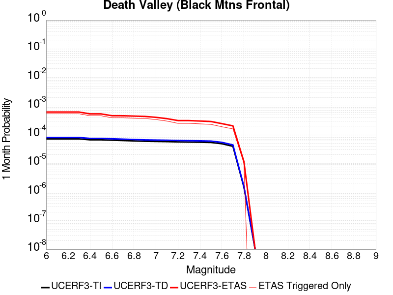 |  |  |

| Magnitude | 1 wk TI Prob | 1 wk TD Prob | 1 wk ETAS Prob | 1 wk ETAS/TD Gain | 1 wk ETAS Triggered Only | 1 mo TI Prob | 1 mo TD Prob | 1 mo ETAS Prob | 1 mo ETAS/TD Gain | 1 mo ETAS Triggered Only | 1 yr TI Prob | 1 yr TD Prob | 1 yr ETAS Prob | 1 yr ETAS/TD Gain | 1 yr ETAS Triggered Only | 10 yr TI Prob | 10 yr TD Prob | 10 yr ETAS Prob | 10 yr ETAS/TD Gain | 10 yr ETAS Triggered Only |
|-----|-----|-----|-----|-----|-----|-----|-----|-----|-----|-----|-----|-----|-----|-----|-----|-----|-----|-----|-----|-----|
| 6.0 | 1.6707214E-5 | 1.867027E-5 | 4.186628E-4 | 22.424038 | 4.0E-4 | 7.160038E-5 | 8.001303E-5 | 6.199698E-4 | 7.748361 | 5.4E-4 | 8.71386E-4 | 9.737309E-4 | 0.001892835 | 1.9438996 | 9.2E-4 | 0.00867977 | 0.009695496 | 0.0110918265 | 1.1440183 | 0.00141 |
| 6.1 | 1.6707214E-5 | 1.867027E-5 | 4.186628E-4 | 22.424038 | 4.0E-4 | 7.160038E-5 | 8.001303E-5 | 6.199698E-4 | 7.748361 | 5.4E-4 | 8.71386E-4 | 9.737309E-4 | 0.001892835 | 1.9438996 | 9.2E-4 | 0.00867977 | 0.009695496 | 0.0110918265 | 1.1440183 | 0.00141 |
| 6.2 | 1.6707214E-5 | 1.867027E-5 | 4.186628E-4 | 22.424038 | 4.0E-4 | 7.160038E-5 | 8.001303E-5 | 6.199698E-4 | 7.748361 | 5.4E-4 | 8.71386E-4 | 9.737309E-4 | 0.001892835 | 1.9438996 | 9.2E-4 | 0.00867977 | 0.009695496 | 0.0110918265 | 1.1440183 | 0.00141 |
| 6.3 | 1.6707214E-5 | 1.867027E-5 | 4.186628E-4 | 22.424038 | 4.0E-4 | 7.160038E-5 | 8.001303E-5 | 6.199698E-4 | 7.748361 | 5.4E-4 | 8.71386E-4 | 9.737309E-4 | 0.001892835 | 1.9438996 | 9.2E-4 | 0.00867977 | 0.009695496 | 0.0110918265 | 1.1440183 | 0.00141 |
| 6.4 | 1.5515609E-5 | 1.7338214E-5 | 3.5733232E-4 | 20.609524 | 3.4E-4 | 6.649377E-5 | 7.4304546E-5 | 5.3427037E-4 | 7.1902785 | 4.6E-4 | 8.0926094E-4 | 9.042885E-4 | 0.001713556 | 1.8949219 | 8.1E-4 | 0.008063202 | 0.009006773 | 0.010195965 | 1.1320331 | 0.0012 |
| 6.5 | 1.5515609E-5 | 1.7338214E-5 | 3.5733232E-4 | 20.609524 | 3.4E-4 | 6.649377E-5 | 7.4304546E-5 | 5.3427037E-4 | 7.1902785 | 4.6E-4 | 8.0926094E-4 | 9.042885E-4 | 0.001713556 | 1.8949219 | 8.1E-4 | 0.008063202 | 0.009006773 | 0.010195965 | 1.1320331 | 0.0012 |
| 6.6 | 1.5041828E-5 | 1.6809145E-5 | 3.0680426E-4 | 18.252224 | 2.9E-4 | 6.4463384E-5 | 7.203723E-5 | 4.6200913E-4 | 6.413477 | 3.9E-4 | 7.8455906E-4 | 8.767063E-4 | 0.0016060664 | 1.831932 | 7.3E-4 | 0.00781795 | 0.008733132 | 0.009823526 | 1.1248571 | 0.0011 |
| 6.7 | 1.4634985E-5 | 1.6356016E-5 | 3.0635128E-4 | 18.730188 | 2.9E-4 | 6.271985E-5 | 7.009536E-5 | 4.6006803E-4 | 6.563459 | 3.9E-4 | 7.6334673E-4 | 8.5308263E-4 | 0.0015824599 | 1.8549901 | 7.3E-4 | 0.007607299 | 0.008498715 | 0.009569537 | 1.125998 | 0.00108 |
| 6.8 | 1.4209158E-5 | 1.5882048E-5 | 2.958776E-4 | 18.629688 | 2.8E-4 | 6.089497E-5 | 6.8064175E-5 | 4.480383E-4 | 6.5825863 | 3.8E-4 | 7.4114406E-4 | 8.2837185E-4 | 0.0015178003 | 1.8322692 | 6.9E-4 | 0.007386771 | 0.008253456 | 0.0092551205 | 1.1213629 | 0.00101 |
| 6.9 | 1.3780098E-5 | 1.5404594E-5 | 2.8540043E-4 | 18.52697 | 2.7E-4 | 5.9056227E-5 | 6.6018045E-5 | 4.3599363E-4 | 6.6041584 | 3.7E-4 | 7.1877235E-4 | 8.0347876E-4 | 0.0014829324 | 1.8456398 | 6.8E-4 | 0.0071645193 | 0.008006332 | 0.008958647 | 1.1189451 | 9.6E-4 |
| 7.0 | 1.3585064E-5 | 1.5188155E-5 | 2.751842E-4 | 18.118343 | 2.6E-4 | 5.8220405E-5 | 6.50905E-5 | 4.0506836E-4 | 6.2231565 | 3.4E-4 | 7.086029E-4 | 7.9219416E-4 | 0.0014316872 | 1.8072428 | 6.4E-4 | 0.007063476 | 0.007894293 | 0.00879711 | 1.1143632 | 9.1E-4 |
| 7.1 | 1.3398601E-5 | 1.49813395E-5 | 2.4497788E-4 | 16.352201 | 2.3E-4 | 5.742131E-5 | 6.420419E-5 | 3.6418493E-4 | 5.672292 | 3.0E-4 | 6.9888023E-4 | 7.8141113E-4 | 0.0013709501 | 1.7544543 | 5.9E-4 | 0.0069668638 | 0.007787224 | 0.0086306045 | 1.1083032 | 8.5E-4 |
| 7.2 | 1.3126312E-5 | 1.4679561E-5 | 2.1467662E-4 | 14.624186 | 2.0E-4 | 5.6254412E-5 | 6.291092E-5 | 3.128952E-4 | 4.9736233 | 2.5E-4 | 6.846822E-4 | 7.6567667E-4 | 0.0012852785 | 1.6786178 | 5.2E-4 | 0.006825765 | 0.00763097 | 0.00838517 | 1.0988342 | 7.6E-4 |
| 7.3 | 1.2922429E-5 | 1.4453788E-5 | 2.1445089E-4 | 14.837003 | 2.0E-4 | 5.5380664E-5 | 6.194336E-5 | 3.1192787E-4 | 5.0356946 | 2.5E-4 | 6.74051E-4 | 7.53905E-4 | 0.0012635204 | 1.6759678 | 5.1E-4 | 0.006720101 | 0.007514055 | 0.008248494 | 1.0977421 | 7.4E-4 |
| 7.4 | 1.2768878E-5 | 1.4283772E-5 | 2.0428105E-4 | 14.30162 | 1.9E-4 | 5.4722615E-5 | 6.1214756E-5 | 3.0120005E-4 | 4.9203835 | 2.4E-4 | 6.660441E-4 | 7.4504025E-4 | 0.0012446677 | 1.6706047 | 5.0E-4 | 0.0066405144 | 0.0074260035 | 0.008140657 | 1.0962366 | 7.2E-4 |
| 7.5 | 1.2521929E-5 | 1.40120155E-5 | 1.940095E-4 | 13.845938 | 1.8E-4 | 5.366431E-5 | 6.005014E-5 | 2.9003632E-4 | 4.8299026 | 2.3E-4 | 6.531671E-4 | 7.3087064E-4 | 0.0012205126 | 1.6699432 | 4.9E-4 | 0.006512506 | 0.0072852457 | 0.007970219 | 1.0940219 | 6.9E-4 |
| 7.6 | 1.1301089E-5 | 1.2648149E-5 | 1.6264625E-4 | 12.859293 | 1.5E-4 | 4.8432343E-5 | 5.4205255E-5 | 2.4419496E-4 | 4.5050054 | 1.9E-4 | 5.895042E-4 | 6.5975444E-4 | 0.0010994641 | 1.6664748 | 4.4E-4 | 0.0058794282 | 0.00657851 | 0.007174563 | 1.0906061 | 6.0E-4 |
| 7.7 | 9.189108E-6 | 1.0283358E-5 | 1.4028202E-4 | 13.641654 | 1.3E-4 | 3.93813E-5 | 4.407082E-5 | 2.0406376E-4 | 4.63036 | 1.6E-4 | 4.7936183E-4 | 5.3643517E-4 | 9.162313E-4 | 1.7080001 | 3.8E-4 | 0.004783291 | 0.005351914 | 0.005849238 | 1.0929245 | 5.0E-4 |
| 7.8 | 3.4586725E-7 | 3.6482615E-7 | 3.6482615E-7 | 1.0 | 0.0 | 1.4822873E-6 | 1.5635396E-6 | 1.1563524E-5 | 7.3957343 | 1.0E-5 | 1.80467E-5 | 1.9035933E-5 | 3.9035553E-5 | 2.0506246 | 2.0E-5 | 1.8045233E-4 | 1.9034347E-4 | 2.2033777E-4 | 1.1575798 | 3.0E-5 |
| 7.9 | 2.5591178E-9 | 2.6696718E-9 | 2.6696718E-9 | 1.0 | 0.0 | 1.0967647E-8 | 1.14414505E-8 | 1.14414505E-8 | 1.0 | 0.0 | 1.335311E-7 | 1.3929966E-7 | 1.3929966E-7 | 1.0 | 0.0 | 1.3353102E-6 | 1.3929966E-6 | 1.3929966E-6 | 1.0 | 0.0 |

## Coyote Lake
*[(top)](#table-of-contents)*

| 1 Week | 1 Month | 1 Year | 10 Year |
|-----|-----|-----|-----|
|  |  |  |  |

| Magnitude | 1 wk TI Prob | 1 wk TD Prob | 1 wk ETAS Prob | 1 wk ETAS/TD Gain | 1 wk ETAS Triggered Only | 1 mo TI Prob | 1 mo TD Prob | 1 mo ETAS Prob | 1 mo ETAS/TD Gain | 1 mo ETAS Triggered Only | 1 yr TI Prob | 1 yr TD Prob | 1 yr ETAS Prob | 1 yr ETAS/TD Gain | 1 yr ETAS Triggered Only | 10 yr TI Prob | 10 yr TD Prob | 10 yr ETAS Prob | 10 yr ETAS/TD Gain | 10 yr ETAS Triggered Only |
|-----|-----|-----|-----|-----|-----|-----|-----|-----|-----|-----|-----|-----|-----|-----|-----|-----|-----|-----|-----|-----|
| 6.0 | 1.980352E-5 | 2.1706745E-5 | 3.3170002E-4 | 15.280966 | 3.1E-4 | 8.486947E-5 | 9.302599E-5 | 5.029879E-4 | 5.40696 | 4.1E-4 | 0.0010327959 | 0.0011320751 | 0.0018612486 | 1.6441035 | 7.3E-4 | 0.010280091 | 0.011270258 | 0.012496283 | 1.1087841 | 0.00124 |
| 6.1 | 1.980352E-5 | 2.1706745E-5 | 3.3170002E-4 | 15.280966 | 3.1E-4 | 8.486947E-5 | 9.302599E-5 | 5.029879E-4 | 5.40696 | 4.1E-4 | 0.0010327959 | 0.0011320751 | 0.0018612486 | 1.6441035 | 7.3E-4 | 0.010280091 | 0.011270258 | 0.012496283 | 1.1087841 | 0.00124 |
| 6.2 | 1.980352E-5 | 2.1706745E-5 | 3.3170002E-4 | 15.280966 | 3.1E-4 | 8.486947E-5 | 9.302599E-5 | 5.029879E-4 | 5.40696 | 4.1E-4 | 0.0010327959 | 0.0011320751 | 0.0018612486 | 1.6441035 | 7.3E-4 | 0.010280091 | 0.011270258 | 0.012496283 | 1.1087841 | 0.00124 |
| 6.3 | 1.5344787E-5 | 1.682067E-5 | 2.468168E-4 | 14.673424 | 2.3E-4 | 6.576172E-5 | 7.2086936E-5 | 3.8206458E-4 | 5.300053 | 3.1E-4 | 8.003548E-4 | 8.773662E-4 | 0.0014168925 | 1.6149384 | 5.4E-4 | 0.007974784 | 0.00874507 | 0.009597548 | 1.0974811 | 8.6E-4 |
| 6.4 | 1.5344787E-5 | 1.682067E-5 | 2.468168E-4 | 14.673424 | 2.3E-4 | 6.576172E-5 | 7.2086936E-5 | 3.8206458E-4 | 5.300053 | 3.1E-4 | 8.003548E-4 | 8.773662E-4 | 0.0014168925 | 1.6149384 | 5.4E-4 | 0.007974784 | 0.00874507 | 0.009597548 | 1.0974811 | 8.6E-4 |
| 6.5 | 1.4189697E-5 | 1.5557987E-5 | 2.3555456E-4 | 15.140427 | 2.2E-4 | 6.081157E-5 | 6.6675726E-5 | 3.6665573E-4 | 5.499089 | 3.0E-4 | 7.401293E-4 | 8.115349E-4 | 0.0013411047 | 1.6525534 | 5.3E-4 | 0.0073766913 | 0.008091656 | 0.008934778 | 1.1041964 | 8.5E-4 |
| 6.6 | 1.3469301E-5 | 1.4771577E-5 | 2.2476848E-4 | 15.216281 | 2.1E-4 | 5.7724297E-5 | 6.330556E-5 | 3.532872E-4 | 5.580666 | 2.9E-4 | 7.025667E-4 | 7.7053264E-4 | 0.001290132 | 1.6743379 | 5.2E-4 | 0.0070034964 | 0.0076845144 | 0.008518059 | 1.1084708 | 8.4E-4 |
| 6.7 | 1.3027966E-5 | 1.4281745E-5 | 2.1427889E-4 | 15.003691 | 2.0E-4 | 5.5832945E-5 | 6.120638E-5 | 3.4118924E-4 | 5.5744066 | 2.8E-4 | 6.7955407E-4 | 7.4499263E-4 | 0.0012446202 | 1.6706476 | 5.0E-4 | 0.006774798 | 0.0074308286 | 0.008224884 | 1.1068596 | 8.0E-4 |
| 6.8 | 5.695434E-6 | 6.2244176E-6 | 1.1622373E-4 | 18.672226 | 1.1E-4 | 2.4408775E-5 | 2.6675973E-5 | 1.7667197E-4 | 6.6228876 | 1.5E-4 | 2.971363E-4 | 3.2476155E-4 | 5.047031E-4 | 1.5540729 | 1.8E-4 | 0.0029673933 | 0.0032458105 | 0.0035448368 | 1.0921268 | 3.0E-4 |
| 6.9 | 4.385688E-6 | 4.7930553E-6 | 1.04792576E-4 | 21.863419 | 1.0E-4 | 1.879567E-5 | 2.0541665E-5 | 1.405392E-4 | 6.8416653 | 1.2E-4 | 2.2881327E-4 | 2.5009477E-4 | 3.9005978E-4 | 1.5596478 | 1.4E-4 | 0.002285778 | 0.0025009478 | 0.0027104227 | 1.0837581 | 2.1E-4 |

## San Andreas (Big Bend)
*[(top)](#table-of-contents)*

| 1 Week | 1 Month | 1 Year | 10 Year |
|-----|-----|-----|-----|
|  |  |  |  |

| Magnitude | 1 wk TI Prob | 1 wk TD Prob | 1 wk ETAS Prob | 1 wk ETAS/TD Gain | 1 wk ETAS Triggered Only | 1 mo TI Prob | 1 mo TD Prob | 1 mo ETAS Prob | 1 mo ETAS/TD Gain | 1 mo ETAS Triggered Only | 1 yr TI Prob | 1 yr TD Prob | 1 yr ETAS Prob | 1 yr ETAS/TD Gain | 1 yr ETAS Triggered Only | 10 yr TI Prob | 10 yr TD Prob | 10 yr ETAS Prob | 10 yr ETAS/TD Gain | 10 yr ETAS Triggered Only |
|-----|-----|-----|-----|-----|-----|-----|-----|-----|-----|-----|-----|-----|-----|-----|-----|-----|-----|-----|-----|-----|
| 6.0 | 1.0179969E-4 | 2.0073925E-4 | 4.4069107E-4 | 2.1953409 | 2.4E-4 | 4.362114E-4 | 8.6002843E-4 | 0.001249693 | 1.4530834 | 3.9E-4 | 0.0052979486 | 0.010420859 | 0.011182835 | 1.0731202 | 7.7E-4 | 0.051734097 | 0.101455905 | 0.102525175 | 1.0105392 | 0.00119 |
| 6.1 | 1.0179969E-4 | 2.0073925E-4 | 4.4069107E-4 | 2.1953409 | 2.4E-4 | 4.362114E-4 | 8.6002843E-4 | 0.001249693 | 1.4530834 | 3.9E-4 | 0.0052979486 | 0.010420859 | 0.011182835 | 1.0731202 | 7.7E-4 | 0.051734097 | 0.101455905 | 0.102525175 | 1.0105392 | 0.00119 |
| 6.2 | 1.0179969E-4 | 2.0073925E-4 | 4.4069107E-4 | 2.1953409 | 2.4E-4 | 4.362114E-4 | 8.6002843E-4 | 0.001249693 | 1.4530834 | 3.9E-4 | 0.0052979486 | 0.010420859 | 0.011182835 | 1.0731202 | 7.7E-4 | 0.051734097 | 0.101455905 | 0.102525175 | 1.0105392 | 0.00119 |
| 6.3 | 1.0179969E-4 | 2.0073925E-4 | 4.4069107E-4 | 2.1953409 | 2.4E-4 | 4.362114E-4 | 8.6002843E-4 | 0.001249693 | 1.4530834 | 3.9E-4 | 0.0052979486 | 0.010420859 | 0.011182835 | 1.0731202 | 7.7E-4 | 0.051734097 | 0.101455905 | 0.102525175 | 1.0105392 | 0.00119 |
| 6.4 | 9.1639464E-5 | 1.8430917E-4 | 3.64276E-4 | 1.9764398 | 1.8E-4 | 3.9268145E-4 | 7.896575E-4 | 0.0010794286 | 1.3669578 | 2.9E-4 | 0.0047704205 | 0.009571818 | 0.010106649 | 1.0558757 | 5.4E-4 | 0.046693064 | 0.09378695 | 0.09448473 | 1.0074401 | 7.7E-4 |
| 6.5 | 9.1639464E-5 | 1.8430917E-4 | 3.64276E-4 | 1.9764398 | 1.8E-4 | 3.9268145E-4 | 7.896575E-4 | 0.0010794286 | 1.3669578 | 2.9E-4 | 0.0047704205 | 0.009571818 | 0.010106649 | 1.0558757 | 5.4E-4 | 0.046693064 | 0.09378695 | 0.09448473 | 1.0074401 | 7.7E-4 |
| 6.6 | 9.042622E-5 | 1.8238011E-4 | 3.523491E-4 | 1.9319491 | 1.7E-4 | 3.8748336E-4 | 7.813951E-4 | 0.0010511841 | 1.3452659 | 2.7E-4 | 0.0047074095 | 0.0094721 | 0.009967364 | 1.0522866 | 5.0E-4 | 0.046089325 | 0.09287721 | 0.09353941 | 1.0071298 | 7.3E-4 |
| 6.7 | 8.9836685E-5 | 1.8152347E-4 | 3.4149442E-4 | 1.8812687 | 1.6E-4 | 3.8495753E-4 | 7.7772595E-4 | 0.0010375237 | 1.334048 | 2.6E-4 | 0.00467679 | 0.009427815 | 0.009913195 | 1.0514839 | 4.9E-4 | 0.045795817 | 0.09247148 | 0.093124904 | 1.0070661 | 7.2E-4 |
| 6.8 | 8.9471854E-5 | 1.8099119E-4 | 3.2096586E-4 | 1.7733783 | 1.4E-4 | 3.8339442E-4 | 7.754462E-4 | 0.0010152601 | 1.3092593 | 2.4E-4 | 0.004657841 | 0.009400298 | 0.00986588 | 1.0495284 | 4.7E-4 | 0.04561414 | 0.0922192 | 0.09285466 | 1.0068907 | 7.0E-4 |
| 6.9 | 8.858234E-5 | 1.7981093E-4 | 3.1978576E-4 | 1.7784556 | 1.4E-4 | 3.7958333E-4 | 7.7039085E-4 | 0.001010206 | 1.3112901 | 2.4E-4 | 0.004611638 | 0.009339278 | 0.009794982 | 1.0487944 | 4.6E-4 | 0.04517103 | 0.09165911 | 0.09228586 | 1.0068378 | 6.9E-4 |
| 7.0 | 8.7433385E-5 | 1.7819891E-4 | 3.0817575E-4 | 1.7293919 | 1.3E-4 | 3.746607E-4 | 7.6348626E-4 | 9.933107E-4 | 1.3010197 | 2.3E-4 | 0.004551957 | 0.009255932 | 0.00969186 | 1.0470971 | 4.4E-4 | 0.044598386 | 0.09089323 | 0.09150233 | 1.0067012 | 6.7E-4 |
| 7.1 | 8.684964E-5 | 1.7731842E-4 | 3.0729536E-4 | 1.7330143 | 1.3E-4 | 3.7215967E-4 | 7.597149E-4 | 9.895402E-4 | 1.3025151 | 2.3E-4 | 0.0045216335 | 0.009210405 | 0.009646352 | 1.047332 | 4.4E-4 | 0.04430731 | 0.09047475 | 0.09108413 | 1.0067353 | 6.7E-4 |
| 7.2 | 8.606521E-5 | 1.7622454E-4 | 2.962034E-4 | 1.6808294 | 1.2E-4 | 3.6879873E-4 | 7.550296E-4 | 9.748635E-4 | 1.2911593 | 2.2E-4 | 0.0044808835 | 0.009153842 | 0.009569997 | 1.0454624 | 4.2E-4 | 0.043916024 | 0.08995518 | 0.090519406 | 1.0062723 | 6.2E-4 |
| 7.3 | 8.568266E-5 | 1.7564454E-4 | 2.9562347E-4 | 1.6830779 | 1.2E-4 | 3.6715972E-4 | 7.5254537E-4 | 9.723798E-4 | 1.2921212 | 2.2E-4 | 0.0044610105 | 0.00912385 | 0.009530109 | 1.0445272 | 4.1E-4 | 0.043725148 | 0.08967623 | 0.09023153 | 1.0061922 | 6.1E-4 |
| 7.4 | 8.5432206E-5 | 1.752704E-4 | 2.9524937E-4 | 1.6845365 | 1.2E-4 | 3.6608664E-4 | 7.509428E-4 | 9.707776E-4 | 1.2927451 | 2.2E-4 | 0.004447999 | 0.009104501 | 0.009510769 | 1.0446227 | 4.1E-4 | 0.043600157 | 0.08949642 | 0.09005183 | 1.0062059 | 6.1E-4 |
| 7.5 | 8.4791965E-5 | 1.7396381E-4 | 2.9394293E-4 | 1.6896787 | 1.2E-4 | 3.633435E-4 | 7.4534636E-4 | 9.651824E-4 | 1.2949448 | 2.2E-4 | 0.0044147377 | 0.009036932 | 0.009443227 | 1.0449594 | 4.1E-4 | 0.043280575 | 0.08887209 | 0.08941877 | 1.0061513 | 6.0E-4 |
| 7.6 | 8.241105E-5 | 1.6841735E-4 | 2.8839713E-4 | 1.7123957 | 1.2E-4 | 3.531424E-4 | 7.2158914E-4 | 9.314376E-4 | 1.2908144 | 2.1E-4 | 0.0042910352 | 0.008750047 | 0.009146547 | 1.0453141 | 4.0E-4 | 0.042091176 | 0.08625032 | 0.08677116 | 1.0060387 | 5.7E-4 |
| 7.7 | 7.00432E-5 | 1.4205615E-4 | 2.3204336E-4 | 1.6334623 | 9.0E-5 | 3.001506E-4 | 6.0867006E-4 | 7.5857877E-4 | 1.2462889 | 1.5E-4 | 0.0036482112 | 0.0073854174 | 0.0076534236 | 1.0362885 | 2.7E-4 | 0.035888977 | 0.07352299 | 0.073912114 | 1.0052925 | 4.2E-4 |
| 7.8 | 6.415362E-5 | 1.2969968E-4 | 2.1968801E-4 | 1.6938207 | 9.0E-5 | 2.749151E-4 | 5.557374E-4 | 7.0565403E-4 | 1.2697617 | 1.5E-4 | 0.0033419547 | 0.0067451415 | 0.0069934553 | 1.0368137 | 2.5E-4 | 0.03292141 | 0.06725514 | 0.06760958 | 1.0052701 | 3.8E-4 |
| 7.9 | 4.939911E-5 | 9.341721E-5 | 1.2341441E-4 | 1.3211099 | 3.0E-5 | 2.116933E-4 | 4.0029807E-4 | 4.7027005E-4 | 1.1747997 | 7.0E-5 | 0.0025743195 | 0.004862747 | 0.0049921153 | 1.0266038 | 1.3E-4 | 0.025447013 | 0.048915803 | 0.04912504 | 1.0042775 | 2.2E-4 |
| 8.0 | 3.344983E-5 | 5.2228E-5 | 7.2226954E-5 | 1.3829163 | 2.0E-5 | 1.4334853E-4 | 2.2381509E-4 | 2.6380614E-4 | 1.178679 | 4.0E-5 | 0.0017438711 | 0.0027215453 | 0.0028113003 | 1.0329795 | 9.0E-5 | 0.017302496 | 0.027923161 | 0.028068973 | 1.0052218 | 1.5E-4 |
| 8.1 | 1.9104898E-5 | 1.9171663E-5 | 1.9171663E-5 | 1.0 | 0.0 | 8.1875565E-5 | 8.2161685E-5 | 9.216086E-5 | 1.1217012 | 1.0E-5 | 9.963791E-4 | 9.9986E-4 | 0.0010298301 | 1.0299742 | 3.0E-5 | 0.009919235 | 0.010749552 | 0.010808907 | 1.0055217 | 6.0E-5 |
| 8.2 | 8.643924E-6 | 5.473668E-6 | 5.473668E-6 | 1.0 | 0.0 | 3.704486E-5 | 2.3458366E-5 | 2.3458366E-5 | 1.0 | 0.0 | 4.5092785E-4 | 2.8556827E-4 | 2.955654E-4 | 1.035008 | 1.0E-5 | 0.0045001395 | 0.0032481793 | 0.003258147 | 1.0030687 | 1.0E-5 |
| 8.3 | 1.983087E-6 | 7.6564595E-7 | 7.6564595E-7 | 1.0 | 0.0 | 8.498917E-6 | 3.281336E-6 | 3.281336E-6 | 1.0 | 0.0 | 1.034694E-4 | 3.9949547E-5 | 4.9949147E-5 | 1.2503058 | 1.0E-5 | 0.0010342124 | 4.717979E-4 | 4.8179316E-4 | 1.0211855 | 1.0E-5 |

## Helendale-So Lockhart
*[(top)](#table-of-contents)*

| 1 Week | 1 Month | 1 Year | 10 Year |
|-----|-----|-----|-----|
| 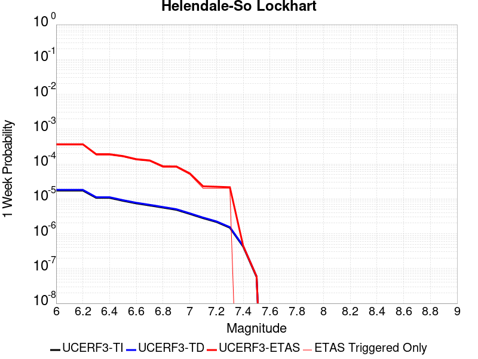 |  |  | 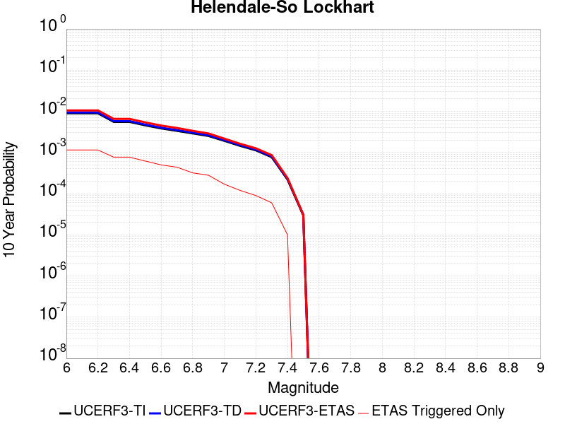 |

| Magnitude | 1 wk TI Prob | 1 wk TD Prob | 1 wk ETAS Prob | 1 wk ETAS/TD Gain | 1 wk ETAS Triggered Only | 1 mo TI Prob | 1 mo TD Prob | 1 mo ETAS Prob | 1 mo ETAS/TD Gain | 1 mo ETAS Triggered Only | 1 yr TI Prob | 1 yr TD Prob | 1 yr ETAS Prob | 1 yr ETAS/TD Gain | 1 yr ETAS Triggered Only | 10 yr TI Prob | 10 yr TD Prob | 10 yr ETAS Prob | 10 yr ETAS/TD Gain | 10 yr ETAS Triggered Only |
|-----|-----|-----|-----|-----|-----|-----|-----|-----|-----|-----|-----|-----|-----|-----|-----|-----|-----|-----|-----|-----|
| 6.0 | 1.7296055E-5 | 1.8103729E-5 | 3.680974E-4 | 20.332684 | 3.5E-4 | 7.412385E-5 | 7.7585224E-5 | 5.975449E-4 | 7.7017875 | 5.2E-4 | 9.0208417E-4 | 9.4421144E-4 | 0.0017634372 | 1.8676295 | 8.2E-4 | 0.008984311 | 0.009404116 | 0.010543302 | 1.1211369 | 0.00115 |
| 6.1 | 1.7296055E-5 | 1.8103729E-5 | 3.680974E-4 | 20.332684 | 3.5E-4 | 7.412385E-5 | 7.7585224E-5 | 5.975449E-4 | 7.7017875 | 5.2E-4 | 9.0208417E-4 | 9.4421144E-4 | 0.0017634372 | 1.8676295 | 8.2E-4 | 0.008984311 | 0.009404116 | 0.010543302 | 1.1211369 | 0.00115 |
| 6.2 | 1.7296055E-5 | 1.8103729E-5 | 3.680974E-4 | 20.332684 | 3.5E-4 | 7.412385E-5 | 7.7585224E-5 | 5.975449E-4 | 7.7017875 | 5.2E-4 | 9.0208417E-4 | 9.4421144E-4 | 0.0017634372 | 1.8676295 | 8.2E-4 | 0.008984311 | 0.009404116 | 0.010543302 | 1.1211369 | 0.00115 |
| 6.3 | 1.0669118E-5 | 1.1135425E-5 | 1.9113343E-4 | 17.164448 | 1.8E-4 | 4.5723988E-5 | 4.772239E-5 | 3.4770806E-4 | 7.2860575 | 3.0E-4 | 5.5654737E-4 | 5.80868E-4 | 0.0011105601 | 1.9118977 | 5.3E-4 | 0.0055515557 | 0.0057937936 | 0.0065593324 | 1.1321309 | 7.7E-4 |
| 6.4 | 1.0669118E-5 | 1.1135425E-5 | 1.9113343E-4 | 17.164448 | 1.8E-4 | 4.5723988E-5 | 4.772239E-5 | 3.4770806E-4 | 7.2860575 | 3.0E-4 | 5.5654737E-4 | 5.80868E-4 | 0.0011105601 | 1.9118977 | 5.3E-4 | 0.0055515557 | 0.0057937936 | 0.0065593324 | 1.1321309 | 7.7E-4 |
| 6.5 | 8.790038E-6 | 9.170197E-6 | 1.6916874E-4 | 18.447666 | 1.6E-4 | 3.767105E-5 | 3.930026E-5 | 2.7929083E-4 | 7.10659 | 2.4E-4 | 4.585485E-4 | 4.7837716E-4 | 8.8818104E-4 | 1.8566543 | 4.1E-4 | 0.0045760344 | 0.004773638 | 0.0053906785 | 1.12926 | 6.2E-4 |
| 6.6 | 7.396949E-6 | 7.715537E-6 | 1.3771454E-4 | 17.84899 | 1.3E-4 | 3.1700827E-5 | 3.3066175E-5 | 2.3305956E-4 | 7.0482774 | 2.0E-4 | 3.858892E-4 | 4.025073E-4 | 7.223785E-4 | 1.7946966 | 3.2E-4 | 0.003852198 | 0.00401789 | 0.0045158807 | 1.1239434 | 5.0E-4 |
| 6.7 | 6.4600285E-6 | 6.738031E-6 | 1.2673723E-4 | 18.809237 | 1.2E-4 | 2.7685543E-5 | 2.887696E-5 | 2.1887147E-4 | 7.5794497 | 1.9E-4 | 3.3701936E-4 | 3.5152107E-4 | 6.114297E-4 | 1.7393827 | 2.6E-4 | 0.0033650869 | 0.003509732 | 0.0039481875 | 1.1249257 | 4.4E-4 |
| 6.8 | 5.600104E-6 | 5.836009E-6 | 8.583554E-5 | 14.707917 | 8.0E-5 | 2.4000226E-5 | 2.5011232E-5 | 1.5500798E-4 | 6.1975346 | 1.3E-4 | 2.9216358E-4 | 3.044698E-4 | 4.94412E-4 | 1.6238456 | 1.9E-4 | 0.0029177975 | 0.003040588 | 0.003359615 | 1.1049228 | 3.2E-4 |
| 6.9 | 4.839122E-6 | 5.0395092E-6 | 8.503911E-5 | 16.874481 | 8.0E-5 | 2.0738931E-5 | 2.159772E-5 | 1.5159491E-4 | 7.019024 | 1.3E-4 | 2.5246723E-4 | 2.6292098E-4 | 4.5287103E-4 | 1.7224606 | 1.9E-4 | 0.002521806 | 0.002626147 | 0.0029054114 | 1.10634 | 2.8E-4 |
| 7.0 | 3.6937633E-6 | 3.845208E-6 | 5.3845015E-5 | 14.003148 | 5.0E-5 | 1.5830317E-5 | 1.647936E-5 | 9.647804E-5 | 5.8544774 | 8.0E-5 | 1.9271708E-4 | 2.0061806E-4 | 3.2059397E-4 | 1.5980315 | 1.2E-4 | 0.0019255003 | 0.002004401 | 0.00217406 | 1.0846434 | 1.7E-4 |
| 7.1 | 2.7858857E-6 | 2.8978538E-6 | 2.2897795E-5 | 7.9016395 | 2.0E-5 | 1.1939455E-5 | 1.2419316E-5 | 6.2418694E-5 | 5.0259366 | 5.0E-5 | 1.4535317E-4 | 1.511949E-4 | 2.4118129E-4 | 1.5951682 | 9.0E-5 | 0.0014525814 | 0.0015109418 | 0.0016307605 | 1.0793006 | 1.2E-4 |
| 7.2 | 2.1672065E-6 | 2.2540128E-6 | 2.2253967E-5 | 9.873044 | 2.0E-5 | 9.2879945E-6 | 9.66002E-6 | 5.965954E-5 | 6.175923 | 5.0E-5 | 1.1307546E-4 | 1.1760458E-4 | 1.8759635E-4 | 1.5951449 | 7.0E-5 | 0.0011301794 | 0.0011754417 | 0.0012653358 | 1.0764769 | 9.0E-5 |
| 7.3 | 1.4823496E-6 | 1.5422102E-6 | 2.1542179E-5 | 13.968381 | 2.0E-5 | 6.3529114E-6 | 6.6094562E-6 | 2.6609325E-5 | 4.0259476 | 2.0E-5 | 7.734395E-5 | 8.046731E-5 | 1.20464094E-4 | 1.4970562 | 4.0E-5 | 7.731704E-4 | 8.0439687E-4 | 8.643486E-4 | 1.07453 | 6.0E-5 |
| 7.4 | 4.2321457E-7 | 4.4108765E-7 | 4.4108765E-7 | 1.0 | 0.0 | 1.8137755E-6 | 1.8903745E-6 | 1.8903745E-6 | 1.0 | 0.0 | 2.2082493E-5 | 2.3015113E-5 | 2.3015113E-5 | 1.0 | 0.0 | 2.2080299E-4 | 2.3013182E-4 | 2.4012952E-4 | 1.0434433 | 1.0E-5 |
| 7.5 | 5.6942316E-8 | 5.9415648E-8 | 5.9415648E-8 | 1.0 | 0.0 | 2.440385E-7 | 2.5463845E-7 | 2.5463845E-7 | 1.0 | 0.0 | 2.9711643E-6 | 3.1002196E-6 | 3.1002196E-6 | 1.0 | 0.0 | 2.9711247E-5 | 3.1001844E-5 | 3.1001844E-5 | 1.0 | 0.0 |

## Death Valley (No)
*[(top)](#table-of-contents)*

| 1 Week | 1 Month | 1 Year | 10 Year |
|-----|-----|-----|-----|
|  |  |  |  |

| Magnitude | 1 wk TI Prob | 1 wk TD Prob | 1 wk ETAS Prob | 1 wk ETAS/TD Gain | 1 wk ETAS Triggered Only | 1 mo TI Prob | 1 mo TD Prob | 1 mo ETAS Prob | 1 mo ETAS/TD Gain | 1 mo ETAS Triggered Only | 1 yr TI Prob | 1 yr TD Prob | 1 yr ETAS Prob | 1 yr ETAS/TD Gain | 1 yr ETAS Triggered Only | 10 yr TI Prob | 10 yr TD Prob | 10 yr ETAS Prob | 10 yr ETAS/TD Gain | 10 yr ETAS Triggered Only |
|-----|-----|-----|-----|-----|-----|-----|-----|-----|-----|-----|-----|-----|-----|-----|-----|-----|-----|-----|-----|-----|
| 6.0 | 2.0074807E-5 | 2.2500084E-5 | 2.1249581E-4 | 9.444223 | 1.9E-4 | 8.603206E-5 | 9.642541E-5 | 3.3640227E-4 | 3.4887307 | 2.4E-4 | 0.001046937 | 0.0011733545 | 0.0016927443 | 1.4426538 | 5.2E-4 | 0.010420183 | 0.011672506 | 0.012463168 | 1.0677371 | 8.0E-4 |
| 6.1 | 2.0074807E-5 | 2.2500084E-5 | 2.1249581E-4 | 9.444223 | 1.9E-4 | 8.603206E-5 | 9.642541E-5 | 3.3640227E-4 | 3.4887307 | 2.4E-4 | 0.001046937 | 0.0011733545 | 0.0016927443 | 1.4426538 | 5.2E-4 | 0.010420183 | 0.011672506 | 0.012463168 | 1.0677371 | 8.0E-4 |
| 6.2 | 2.0074807E-5 | 2.2500084E-5 | 2.1249581E-4 | 9.444223 | 1.9E-4 | 8.603206E-5 | 9.642541E-5 | 3.3640227E-4 | 3.4887307 | 2.4E-4 | 0.001046937 | 0.0011733545 | 0.0016927443 | 1.4426538 | 5.2E-4 | 0.010420183 | 0.011672506 | 0.012463168 | 1.0677371 | 8.0E-4 |
| 6.3 | 1.9050609E-5 | 2.1336948E-5 | 2.113329E-4 | 9.9045515 | 1.9E-4 | 8.164292E-5 | 9.1440896E-5 | 3.3141894E-4 | 3.6244063 | 2.4E-4 | 9.935491E-4 | 0.001112731 | 0.0016321525 | 1.4667987 | 5.2E-4 | 0.009891188 | 0.011072419 | 0.01186356 | 1.0714515 | 8.0E-4 |
| 6.4 | 1.9050609E-5 | 2.1336948E-5 | 2.113329E-4 | 9.9045515 | 1.9E-4 | 8.164292E-5 | 9.1440896E-5 | 3.3141894E-4 | 3.6244063 | 2.4E-4 | 9.935491E-4 | 0.001112731 | 0.0016321525 | 1.4667987 | 5.2E-4 | 0.009891188 | 0.011072419 | 0.01186356 | 1.0714515 | 8.0E-4 |
| 6.5 | 1.8367004E-5 | 2.0561009E-5 | 2.005573E-4 | 9.754254 | 1.8E-4 | 7.8713354E-5 | 8.811567E-5 | 3.180954E-4 | 3.6099756 | 2.3E-4 | 9.5791375E-4 | 0.0010722869 | 0.00158174 | 1.475109 | 5.1E-4 | 0.009537951 | 0.0106719155 | 0.011443592 | 1.072309 | 7.8E-4 |
| 6.6 | 1.779439E-5 | 1.9910927E-5 | 1.9990734E-4 | 10.040082 | 1.8E-4 | 7.625944E-5 | 8.53298E-5 | 3.1531017E-4 | 3.6951942 | 2.3E-4 | 9.280632E-4 | 0.0010384015 | 0.001547872 | 1.4906296 | 5.1E-4 | 0.009241969 | 0.010336253 | 0.011098294 | 1.0737251 | 7.7E-4 |
| 6.7 | 1.7025437E-5 | 1.9043426E-5 | 1.9903999E-4 | 10.451901 | 1.8E-4 | 7.296412E-5 | 8.161216E-5 | 3.015942E-4 | 3.6954567 | 2.2E-4 | 8.87976E-4 | 9.931813E-4 | 0.0014926847 | 1.5029328 | 5.0E-4 | 0.008844362 | 0.009888145 | 0.0106406305 | 1.0760998 | 7.6E-4 |
| 6.8 | 1.6545107E-5 | 1.8512545E-5 | 1.9850921E-4 | 10.722956 | 1.8E-4 | 7.090568E-5 | 7.93371E-5 | 2.9931965E-4 | 3.7727575 | 2.2E-4 | 8.629347E-4 | 9.655073E-4 | 0.0014650245 | 1.5173625 | 5.0E-4 | 0.008595915 | 0.009613829 | 0.010366523 | 1.0782928 | 7.6E-4 |
| 6.9 | 1.615478E-5 | 1.8087594E-5 | 1.9808434E-4 | 10.951392 | 1.8E-4 | 6.9232934E-5 | 7.751599E-5 | 2.9749895E-4 | 3.837904 | 2.2E-4 | 8.4258494E-4 | 9.433546E-4 | 0.0014428829 | 1.5295234 | 5.0E-4 | 0.008393973 | 0.009394196 | 0.010147056 | 1.0801411 | 7.6E-4 |
| 7.0 | 1.5894311E-5 | 1.780555E-5 | 1.9780235E-4 | 11.109028 | 1.8E-4 | 6.81167E-5 | 7.6307304E-5 | 2.9629053E-4 | 3.8828592 | 2.2E-4 | 8.2900526E-4 | 9.286515E-4 | 0.0014281871 | 1.5379151 | 5.0E-4 | 0.008259195 | 0.009248397 | 0.009981554 | 1.0792738 | 7.4E-4 |
| 7.1 | 1.5602263E-5 | 1.7483504E-5 | 1.8748053E-4 | 10.723282 | 1.7E-4 | 6.6865134E-5 | 7.492718E-5 | 2.8491145E-4 | 3.8025112 | 2.1E-4 | 8.137789E-4 | 9.118627E-4 | 0.0014014159 | 1.5368716 | 4.9E-4 | 0.008108052 | 0.009081894 | 0.009805264 | 1.0796497 | 7.3E-4 |
| 7.2 | 1.5323829E-5 | 1.717063E-5 | 1.8716771E-4 | 10.900456 | 1.7E-4 | 6.56719E-5 | 7.358637E-5 | 2.8357093E-4 | 3.8535793 | 2.1E-4 | 7.99262E-4 | 8.9555193E-4 | 0.0013851131 | 1.5466586 | 4.9E-4 | 0.007963934 | 0.008920107 | 0.009643595 | 1.0811076 | 7.3E-4 |
| 7.3 | 1.4556212E-5 | 1.6302456E-5 | 1.8629969E-4 | 11.427707 | 1.7E-4 | 6.238227E-5 | 6.9865826E-5 | 2.7985114E-4 | 4.0055513 | 2.1E-4 | 7.592395E-4 | 8.5029035E-4 | 0.0013198907 | 1.5522823 | 4.7E-4 | 0.0075665074 | 0.008471014 | 0.009155169 | 1.0807643 | 6.9E-4 |
| 7.4 | 1.411725E-5 | 1.580796E-5 | 1.8580527E-4 | 11.753906 | 1.7E-4 | 6.0501097E-5 | 6.7746674E-5 | 2.7773244E-4 | 4.099573 | 2.1E-4 | 7.363519E-4 | 8.245094E-4 | 0.001294122 | 1.5695659 | 4.7E-4 | 0.0073391674 | 0.008215138 | 0.00889947 | 1.0833013 | 6.9E-4 |
| 7.5 | 1.3503312E-5 | 1.5126289E-5 | 1.8512372E-4 | 12.238542 | 1.7E-4 | 5.7870053E-5 | 6.482538E-5 | 2.7481175E-4 | 4.239262 | 2.1E-4 | 7.043401E-4 | 7.8896893E-4 | 0.0012585982 | 1.5952442 | 4.7E-4 | 0.007021119 | 0.007862304 | 0.008536958 | 1.0858086 | 6.8E-4 |
| 7.6 | 1.1279839E-5 | 1.2626327E-5 | 1.6262443E-4 | 12.879789 | 1.5E-4 | 4.834127E-5 | 5.4111737E-5 | 2.4410145E-4 | 4.511063 | 1.9E-4 | 5.88396E-4 | 6.5861654E-4 | 0.0010983268 | 1.667627 | 4.4E-4 | 0.005868405 | 0.006567199 | 0.0071632583 | 1.0907632 | 6.0E-4 |
| 7.7 | 9.189108E-6 | 1.0283358E-5 | 1.4028202E-4 | 13.641654 | 1.3E-4 | 3.93813E-5 | 4.407082E-5 | 2.0406376E-4 | 4.63036 | 1.6E-4 | 4.7936183E-4 | 5.3643517E-4 | 9.162313E-4 | 1.7080001 | 3.8E-4 | 0.004783291 | 0.005351914 | 0.005849238 | 1.0929245 | 5.0E-4 |
| 7.8 | 3.4586725E-7 | 3.6482615E-7 | 3.6482615E-7 | 1.0 | 0.0 | 1.4822873E-6 | 1.5635396E-6 | 1.1563524E-5 | 7.3957343 | 1.0E-5 | 1.80467E-5 | 1.9035933E-5 | 3.9035553E-5 | 2.0506246 | 2.0E-5 | 1.8045233E-4 | 1.9034347E-4 | 2.2033777E-4 | 1.1575798 | 3.0E-5 |
| 7.9 | 2.5591178E-9 | 2.6696718E-9 | 2.6696718E-9 | 1.0 | 0.0 | 1.0967647E-8 | 1.14414505E-8 | 1.14414505E-8 | 1.0 | 0.0 | 1.335311E-7 | 1.3929966E-7 | 1.3929966E-7 | 1.0 | 0.0 | 1.3353102E-6 | 1.3929966E-6 | 1.3929966E-6 | 1.0 | 0.0 |

## San Andreas (San Gorgonio Pass-Garnet HIll)
*[(top)](#table-of-contents)*

| 1 Week | 1 Month | 1 Year | 10 Year |
|-----|-----|-----|-----|
|  |  |  |  |

| Magnitude | 1 wk TI Prob | 1 wk TD Prob | 1 wk ETAS Prob | 1 wk ETAS/TD Gain | 1 wk ETAS Triggered Only | 1 mo TI Prob | 1 mo TD Prob | 1 mo ETAS Prob | 1 mo ETAS/TD Gain | 1 mo ETAS Triggered Only | 1 yr TI Prob | 1 yr TD Prob | 1 yr ETAS Prob | 1 yr ETAS/TD Gain | 1 yr ETAS Triggered Only | 10 yr TI Prob | 10 yr TD Prob | 10 yr ETAS Prob | 10 yr ETAS/TD Gain | 10 yr ETAS Triggered Only |
|-----|-----|-----|-----|-----|-----|-----|-----|-----|-----|-----|-----|-----|-----|-----|-----|-----|-----|-----|-----|-----|
| 6.0 | 8.31567E-5 | 2.3384395E-4 | 4.6379017E-4 | 1.9833319 | 2.3E-4 | 3.5633717E-4 | 0.0010018025 | 0.001301502 | 1.2991602 | 3.0E-4 | 0.004329778 | 0.012128622 | 0.012622558 | 1.0407248 | 5.0E-4 | 0.042463828 | 0.11258187 | 0.11316757 | 1.0052024 | 6.6E-4 |
| 6.1 | 8.31567E-5 | 2.3384395E-4 | 4.6379017E-4 | 1.9833319 | 2.3E-4 | 3.5633717E-4 | 0.0010018025 | 0.001301502 | 1.2991602 | 3.0E-4 | 0.004329778 | 0.012128622 | 0.012622558 | 1.0407248 | 5.0E-4 | 0.042463828 | 0.11258187 | 0.11316757 | 1.0052024 | 6.6E-4 |
| 6.2 | 8.31567E-5 | 2.3384395E-4 | 4.6379017E-4 | 1.9833319 | 2.3E-4 | 3.5633717E-4 | 0.0010018025 | 0.001301502 | 1.2991602 | 3.0E-4 | 0.004329778 | 0.012128622 | 0.012622558 | 1.0407248 | 5.0E-4 | 0.042463828 | 0.11258187 | 0.11316757 | 1.0052024 | 6.6E-4 |
| 6.3 | 8.31567E-5 | 2.3384395E-4 | 4.6379017E-4 | 1.9833319 | 2.3E-4 | 3.5633717E-4 | 0.0010018025 | 0.001301502 | 1.2991602 | 3.0E-4 | 0.004329778 | 0.012128622 | 0.012622558 | 1.0407248 | 5.0E-4 | 0.042463828 | 0.11258187 | 0.11316757 | 1.0052024 | 6.6E-4 |
| 6.4 | 8.059055E-5 | 2.2941893E-4 | 4.5936616E-4 | 2.002303 | 2.3E-4 | 3.4534236E-4 | 9.828559E-4 | 0.0012825611 | 1.304933 | 3.0E-4 | 0.0041964394 | 0.011900819 | 0.012394869 | 1.0415139 | 5.0E-4 | 0.041180745 | 0.110562965 | 0.11114999 | 1.0053095 | 6.6E-4 |
| 6.5 | 8.059055E-5 | 2.2941893E-4 | 4.5936616E-4 | 2.002303 | 2.3E-4 | 3.4534236E-4 | 9.828559E-4 | 0.0012825611 | 1.304933 | 3.0E-4 | 0.0041964394 | 0.011900819 | 0.012394869 | 1.0415139 | 5.0E-4 | 0.041180745 | 0.110562965 | 0.11114999 | 1.0053095 | 6.6E-4 |
| 6.6 | 7.619237E-5 | 2.2186468E-4 | 4.5181366E-4 | 2.036438 | 2.3E-4 | 3.2649786E-4 | 9.5050444E-4 | 0.0012502193 | 1.3153219 | 3.0E-4 | 0.0039678677 | 0.0115115335 | 0.011995893 | 1.042076 | 4.9E-4 | 0.03897764 | 0.10709954 | 0.107679926 | 1.0054191 | 6.5E-4 |
| 6.7 | 7.440636E-5 | 2.1862281E-4 | 4.4857254E-4 | 2.0518103 | 2.3E-4 | 3.188454E-4 | 9.3662075E-4 | 0.0012363398 | 1.3200004 | 3.0E-4 | 0.0038750346 | 0.011344268 | 0.011828709 | 1.0427036 | 4.9E-4 | 0.038081564 | 0.1056081 | 0.10618946 | 1.0055048 | 6.5E-4 |
| 6.8 | 7.3735864E-5 | 2.1709445E-4 | 4.4704453E-4 | 2.0592167 | 2.3E-4 | 3.1597257E-4 | 9.300753E-4 | 0.0012297963 | 1.3222545 | 3.0E-4 | 0.0038401815 | 0.011265406 | 0.011749887 | 1.043006 | 4.9E-4 | 0.03774495 | 0.104909696 | 0.105491504 | 1.0055459 | 6.5E-4 |
| 6.9 | 7.27575E-5 | 2.1478413E-4 | 4.4473473E-4 | 2.0706127 | 2.3E-4 | 3.117806E-4 | 9.20181E-4 | 0.0012199049 | 1.3257228 | 3.0E-4 | 0.003789323 | 0.011146182 | 0.01163072 | 1.0434712 | 4.9E-4 | 0.037253562 | 0.10385753 | 0.10443106 | 1.0055223 | 6.4E-4 |
| 7.0 | 7.102591E-5 | 2.1062451E-4 | 4.4057606E-4 | 2.0917606 | 2.3E-4 | 3.0436125E-4 | 9.023664E-4 | 0.0012020958 | 1.3321592 | 3.0E-4 | 0.003699303 | 0.010931484 | 0.011416128 | 1.0443347 | 4.9E-4 | 0.03638325 | 0.101959534 | 0.10253428 | 1.005637 | 6.4E-4 |
| 7.1 | 7.028513E-5 | 2.0898094E-4 | 4.3893288E-4 | 2.100349 | 2.3E-4 | 3.0118722E-4 | 8.953274E-4 | 0.0011950588 | 1.334773 | 3.0E-4 | 0.0036607897 | 0.010846641 | 0.011331326 | 1.0446852 | 4.9E-4 | 0.036010686 | 0.10120243 | 0.101777665 | 1.005684 | 6.4E-4 |
| 7.2 | 6.8498244E-5 | 2.050596E-4 | 4.250145E-4 | 2.0726388 | 2.2E-4 | 2.9353087E-4 | 8.7853306E-4 | 0.0011682783 | 1.3298057 | 2.9E-4 | 0.003567883 | 0.0106441835 | 0.011109181 | 1.0436856 | 4.7E-4 | 0.035111405 | 0.09939449 | 0.09995287 | 1.0056177 | 6.2E-4 |
| 7.3 | 6.622592E-5 | 1.9733235E-4 | 4.1728895E-4 | 2.1146505 | 2.2E-4 | 2.8379448E-4 | 8.4543816E-4 | 0.0011351929 | 1.3427274 | 2.9E-4 | 0.0034497243 | 0.010245111 | 0.010710295 | 1.0454055 | 4.7E-4 | 0.033966612 | 0.095891245 | 0.0964518 | 1.0058457 | 6.2E-4 |
| 7.4 | 5.1050705E-5 | 1.4690042E-4 | 3.5686957E-4 | 2.4293299 | 2.1E-4 | 2.1877038E-4 | 6.294222E-4 | 9.09246E-4 | 1.4445724 | 2.8E-4 | 0.002660276 | 0.007636482 | 0.00809297 | 1.0597771 | 4.6E-4 | 0.02628654 | 0.07286554 | 0.07343109 | 1.0077616 | 6.1E-4 |
| 7.5 | 3.9302922E-5 | 1.11307076E-4 | 3.1128482E-4 | 2.796631 | 2.0E-4 | 1.6843023E-4 | 4.7694342E-4 | 7.368194E-4 | 1.544878 | 2.6E-4 | 0.0020487092 | 0.0057913954 | 0.006218905 | 1.0738181 | 4.3E-4 | 0.020299247 | 0.05601151 | 0.056540143 | 1.0094379 | 5.6E-4 |
| 7.6 | 2.9851626E-5 | 8.4956984E-5 | 2.8494E-4 | 3.3539324 | 2.0E-4 | 1.2792926E-4 | 3.6405068E-4 | 6.2395603E-4 | 1.7139263 | 2.6E-4 | 0.0015564259 | 0.0044233347 | 0.004851433 | 1.0967817 | 4.3E-4 | 0.0154556995 | 0.043196145 | 0.043722387 | 1.0121826 | 5.5E-4 |
| 7.7 | 2.1135214E-5 | 6.353527E-5 | 2.6352255E-4 | 4.147658 | 2.0E-4 | 9.0576345E-5 | 2.722656E-4 | 5.3219486E-4 | 1.9546899 | 2.6E-4 | 0.0011022091 | 0.0033098008 | 0.0037383775 | 1.1294872 | 4.3E-4 | 0.010967582 | 0.03258456 | 0.03311664 | 1.0163292 | 5.5E-4 |
| 7.8 | 1.883379E-5 | 5.564576E-5 | 2.5563463E-4 | 4.593964 | 2.0E-4 | 8.0713755E-5 | 2.3846005E-4 | 4.9839803E-4 | 2.0900693 | 2.6E-4 | 9.822468E-4 | 0.002899389 | 0.0033181712 | 1.1444381 | 4.2E-4 | 0.0097791655 | 0.028696978 | 0.029211769 | 1.0179389 | 5.3E-4 |
| 7.9 | 1.5156185E-5 | 4.1662403E-5 | 2.3165449E-4 | 5.5602765 | 1.9E-4 | 6.495346E-5 | 1.7854095E-4 | 4.284963E-4 | 2.399989 | 2.5E-4 | 7.9052144E-4 | 0.0021715704 | 0.00258068 | 1.1883935 | 4.1E-4 | 0.007877152 | 0.021760946 | 0.022250066 | 1.0224769 | 5.0E-4 |
| 8.0 | 1.1405907E-5 | 2.9976925E-5 | 1.4997333E-4 | 5.002959 | 1.2E-4 | 4.8881542E-5 | 1.2846621E-4 | 2.8844568E-4 | 2.2453036 | 1.6E-4 | 5.9497025E-4 | 0.0015629551 | 0.0018225487 | 1.1660916 | 2.6E-4 | 0.005933798 | 0.015774013 | 0.016088964 | 1.0199665 | 3.2E-4 |
| 8.1 | 4.3511436E-6 | 7.369465E-6 | 7.369465E-6 | 1.0 | 0.0 | 1.8647626E-5 | 3.158304E-5 | 3.158304E-5 | 1.0 | 0.0 | 2.2701119E-4 | 3.844558E-4 | 3.844558E-4 | 1.0 | 0.0 | 0.0022677942 | 0.0041165445 | 0.004126503 | 1.0024192 | 1.0E-5 |
| 8.2 | 2.3042528E-6 | 2.7328301E-6 | 2.7328301E-6 | 1.0 | 0.0 | 9.875332E-6 | 1.1712076E-5 | 1.1712076E-5 | 1.0 | 0.0 | 1.2022553E-4 | 1.4258524E-4 | 1.4258524E-4 | 1.0 | 0.0 | 0.0012016051 | 0.0015979637 | 0.0015979637 | 1.0 | 0.0 |
| 8.3 | 5.202968E-7 | 3.1590292E-7 | 3.1590292E-7 | 1.0 | 0.0 | 2.2298414E-6 | 1.353869E-6 | 1.353869E-6 | 1.0 | 0.0 | 2.714798E-5 | 1.6483244E-5 | 1.6483244E-5 | 1.0 | 0.0 | 2.7144665E-4 | 1.955901E-4 | 1.955901E-4 | 1.0 | 0.0 |

## San Andreas (Parkfield)
*[(top)](#table-of-contents)*

| 1 Week | 1 Month | 1 Year | 10 Year |
|-----|-----|-----|-----|
|  |  |  | 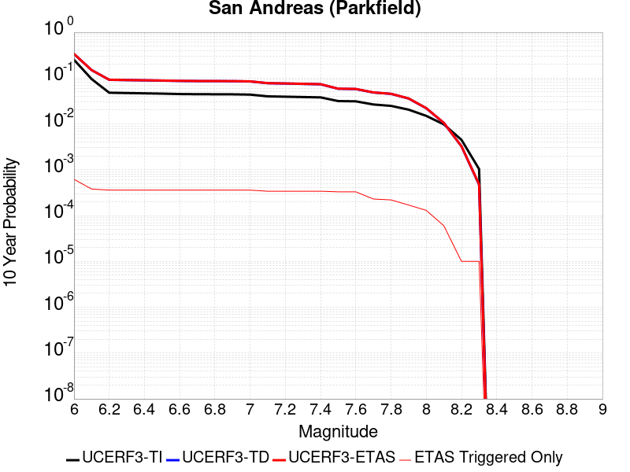 |

| Magnitude | 1 wk TI Prob | 1 wk TD Prob | 1 wk ETAS Prob | 1 wk ETAS/TD Gain | 1 wk ETAS Triggered Only | 1 mo TI Prob | 1 mo TD Prob | 1 mo ETAS Prob | 1 mo ETAS/TD Gain | 1 mo ETAS Triggered Only | 1 yr TI Prob | 1 yr TD Prob | 1 yr ETAS Prob | 1 yr ETAS/TD Gain | 1 yr ETAS Triggered Only | 10 yr TI Prob | 10 yr TD Prob | 10 yr ETAS Prob | 10 yr ETAS/TD Gain | 10 yr ETAS Triggered Only |
|-----|-----|-----|-----|-----|-----|-----|-----|-----|-----|-----|-----|-----|-----|-----|-----|-----|-----|-----|-----|-----|
| 6.0 | 5.556969E-4 | 7.778562E-4 | 9.177473E-4 | 1.1798419 | 1.4E-4 | 0.0023793848 | 0.0033299583 | 0.0035791257 | 1.074826 | 2.5E-4 | 0.028586963 | 0.040235043 | 0.04061895 | 1.0095416 | 4.0E-4 | 0.25176284 | 0.3371973 | 0.33760822 | 1.0012187 | 6.2E-4 |
| 6.1 | 1.925858E-4 | 3.0278185E-4 | 4.0275158E-4 | 1.3301708 | 1.0E-4 | 8.2510663E-4 | 0.001297085 | 0.0014768514 | 1.1385927 | 1.8E-4 | 0.0099994885 | 0.01577393 | 0.016049514 | 1.0174708 | 2.8E-4 | 0.095613256 | 0.14975825 | 0.15008134 | 1.0021574 | 3.8E-4 |
| 6.2 | 9.4306815E-5 | 1.8243887E-4 | 2.7242245E-4 | 1.4932259 | 9.0E-5 | 4.0410945E-4 | 7.8164786E-4 | 9.515149E-4 | 1.2173193 | 1.7E-4 | 0.0049089384 | 0.009475246 | 0.009732783 | 1.02718 | 2.6E-4 | 0.048019063 | 0.0918565 | 0.09218343 | 1.0035591 | 3.6E-4 |
| 6.3 | 9.283051E-5 | 1.794041E-4 | 2.6938797E-4 | 1.5015708 | 9.0E-5 | 3.9778434E-4 | 7.686494E-4 | 9.3851873E-4 | 1.2209972 | 1.7E-4 | 0.0048322747 | 0.009318355 | 0.009575931 | 1.0276419 | 2.6E-4 | 0.047285385 | 0.090509474 | 0.09083689 | 1.0036175 | 3.6E-4 |
| 6.4 | 9.138826E-5 | 1.7702584E-4 | 2.670099E-4 | 1.5083103 | 9.0E-5 | 3.916052E-4 | 7.5846276E-4 | 9.283338E-4 | 1.2239676 | 1.7E-4 | 0.0047573745 | 0.009195387 | 0.009452997 | 1.028015 | 2.6E-4 | 0.046568092 | 0.0894136 | 0.08974141 | 1.0036663 | 3.6E-4 |
| 6.5 | 9.000255E-5 | 1.746064E-4 | 2.6459066E-4 | 1.5153551 | 9.0E-5 | 3.8566816E-4 | 7.4809964E-4 | 9.179725E-4 | 1.2270725 | 1.7E-4 | 0.0046854047 | 0.009070284 | 0.009327926 | 1.0284051 | 2.6E-4 | 0.045878403 | 0.08829608 | 0.08862429 | 1.0037172 | 3.6E-4 |
| 6.6 | 8.8109264E-5 | 1.7141816E-4 | 2.6140272E-4 | 1.5249419 | 9.0E-5 | 3.7755648E-4 | 7.3444354E-4 | 9.043187E-4 | 1.2312977 | 1.7E-4 | 0.0045870654 | 0.008905404 | 0.009163089 | 1.0289358 | 2.6E-4 | 0.04493529 | 0.08682707 | 0.08715581 | 1.0037862 | 3.6E-4 |
| 6.7 | 8.738073E-5 | 1.7008898E-4 | 2.600737E-4 | 1.5290447 | 9.0E-5 | 3.7443507E-4 | 7.287503E-4 | 8.9862646E-4 | 1.233106 | 1.7E-4 | 0.0045492216 | 0.008836695 | 0.009094398 | 1.0291628 | 2.6E-4 | 0.04457213 | 0.0862268 | 0.08655576 | 1.003815 | 3.6E-4 |
| 6.8 | 8.710195E-5 | 1.6954402E-4 | 2.5952875E-4 | 1.5307456 | 9.0E-5 | 3.7324068E-4 | 7.26416E-4 | 8.962925E-4 | 1.2338557 | 1.7E-4 | 0.0045347405 | 0.008808513 | 0.009066223 | 1.0292569 | 2.6E-4 | 0.04443313 | 0.08597436 | 0.08630341 | 1.0038273 | 3.6E-4 |
| 6.9 | 8.6801556E-5 | 1.6895356E-4 | 2.5893835E-4 | 1.5326008 | 9.0E-5 | 3.7195362E-4 | 7.238869E-4 | 8.9376385E-4 | 1.2346733 | 1.7E-4 | 0.0045191357 | 0.0087779695 | 0.009035687 | 1.0293596 | 2.6E-4 | 0.044283327 | 0.08570042 | 0.08602957 | 1.0038407 | 3.6E-4 |
| 7.0 | 8.5571606E-5 | 1.664819E-4 | 2.564669E-4 | 1.5405093 | 9.0E-5 | 3.6668387E-4 | 7.132999E-4 | 8.831786E-4 | 1.238159 | 1.7E-4 | 0.004455241 | 0.008650103 | 0.008907854 | 1.0297974 | 2.6E-4 | 0.043669727 | 0.08454836 | 0.08487793 | 1.0038979 | 3.6E-4 |
| 7.1 | 7.82589E-5 | 1.5128969E-4 | 2.3127758E-4 | 1.5287069 | 8.0E-5 | 3.3535215E-4 | 6.4822397E-4 | 7.9812674E-4 | 1.2312515 | 1.5E-4 | 0.0040752706 | 0.007863738 | 0.008101851 | 1.0302799 | 2.4E-4 | 0.040013418 | 0.077460445 | 0.07777411 | 1.0040493 | 3.4E-4 |
| 7.2 | 7.690929E-5 | 1.4866212E-4 | 2.2865023E-4 | 1.538053 | 8.0E-5 | 3.2956956E-4 | 6.369685E-4 | 7.86873E-4 | 1.2353405 | 1.5E-4 | 0.004005129 | 0.0077276826 | 0.007965828 | 1.0308172 | 2.4E-4 | 0.0393371 | 0.07623341 | 0.07654749 | 1.00412 | 3.4E-4 |
| 7.3 | 7.5543794E-5 | 1.4562748E-4 | 2.2561583E-4 | 1.5492669 | 8.0E-5 | 3.2371894E-4 | 6.239692E-4 | 7.738756E-4 | 1.2402465 | 1.5E-4 | 0.003934157 | 0.0075705256 | 0.007808709 | 1.0314618 | 2.4E-4 | 0.038652334 | 0.07479777 | 0.07511234 | 1.0042056 | 3.4E-4 |
| 7.4 | 7.4214564E-5 | 1.4263717E-4 | 2.2262576E-4 | 1.5607836 | 8.0E-5 | 3.1802364E-4 | 6.1115966E-4 | 7.61068E-4 | 1.245285 | 1.5E-4 | 0.003865065 | 0.0074156416 | 0.007653862 | 1.032124 | 2.4E-4 | 0.03798529 | 0.07337152 | 0.07368658 | 1.0042939 | 3.4E-4 |
| 7.5 | 6.149578E-5 | 1.1191443E-4 | 1.9190548E-4 | 1.7147518 | 8.0E-5 | 2.6352672E-4 | 4.795452E-4 | 6.294733E-4 | 1.3126464 | 1.5E-4 | 0.0032037178 | 0.005822865 | 0.0060614673 | 1.0409769 | 2.4E-4 | 0.03157923 | 0.058559462 | 0.05887014 | 1.0053053 | 3.3E-4 |
| 7.6 | 6.0643448E-5 | 1.102009E-4 | 1.9019208E-4 | 1.7258669 | 8.0E-5 | 2.598746E-4 | 4.7220418E-4 | 6.221334E-4 | 1.3175092 | 1.5E-4 | 0.0031593828 | 0.005733962 | 0.0059725856 | 1.0416158 | 2.4E-4 | 0.031148417 | 0.05772042 | 0.05803137 | 1.0053872 | 3.3E-4 |
| 7.7 | 5.1652263E-5 | 9.175265E-5 | 1.4174805E-4 | 1.5448934 | 5.0E-5 | 2.2134806E-4 | 3.9316638E-4 | 4.83131E-4 | 1.2288207 | 9.0E-5 | 0.002691582 | 0.0047763046 | 0.004925588 | 1.031255 | 1.5E-4 | 0.026592141 | 0.04853641 | 0.048755243 | 1.0045087 | 2.3E-4 |
| 7.8 | 4.8090482E-5 | 8.560165E-5 | 1.3559737E-4 | 1.5840509 | 5.0E-5 | 2.060858E-4 | 3.6681266E-4 | 4.5677964E-4 | 1.2452668 | 9.0E-5 | 0.0025062072 | 0.004456807 | 0.0046061384 | 1.0335064 | 1.5E-4 | 0.024781305 | 0.045302264 | 0.0455123 | 1.0046363 | 2.2E-4 |
| 7.9 | 3.970278E-5 | 6.7507375E-5 | 8.750602E-5 | 1.2962439 | 2.0E-5 | 1.7014367E-4 | 2.8928524E-4 | 3.4926788E-4 | 1.2073478 | 6.0E-5 | 0.002069531 | 0.0035163634 | 0.0036259766 | 1.0311723 | 1.1E-4 | 0.020503636 | 0.03588176 | 0.03604566 | 1.0045677 | 1.7E-4 |
| 8.0 | 2.8982335E-5 | 4.0698153E-5 | 5.069775E-5 | 1.2457014 | 1.0E-5 | 1.2420409E-4 | 1.7440901E-4 | 2.0440377E-4 | 1.1719794 | 3.0E-5 | 0.0015111357 | 0.0021213628 | 0.0022011932 | 1.0376316 | 8.0E-5 | 0.015009012 | 0.02201118 | 0.022138318 | 1.005776 | 1.3E-4 |
| 8.1 | 1.8836186E-5 | 1.867974E-5 | 1.867974E-5 | 1.0 | 0.0 | 8.0724014E-5 | 8.005358E-5 | 9.0052774E-5 | 1.1249063 | 1.0E-5 | 9.823717E-4 | 9.742171E-4 | 0.0010041879 | 1.030764 | 3.0E-5 | 0.009780403 | 0.010487711 | 0.010547081 | 1.005661 | 6.0E-5 |
| 8.2 | 8.643924E-6 | 5.473668E-6 | 5.473668E-6 | 1.0 | 0.0 | 3.704486E-5 | 2.3458366E-5 | 2.3458366E-5 | 1.0 | 0.0 | 4.5092785E-4 | 2.8556827E-4 | 2.955654E-4 | 1.035008 | 1.0E-5 | 0.0045001395 | 0.0032481793 | 0.003258147 | 1.0030687 | 1.0E-5 |
| 8.3 | 1.983087E-6 | 7.6564595E-7 | 7.6564595E-7 | 1.0 | 0.0 | 8.498917E-6 | 3.281336E-6 | 3.281336E-6 | 1.0 | 0.0 | 1.034694E-4 | 3.9949547E-5 | 4.9949147E-5 | 1.2503058 | 1.0E-5 | 0.0010342124 | 4.717979E-4 | 4.8179316E-4 | 1.0211855 | 1.0E-5 |

## San Andreas (Carrizo) rev
*[(top)](#table-of-contents)*

| 1 Week | 1 Month | 1 Year | 10 Year |
|-----|-----|-----|-----|
|  | 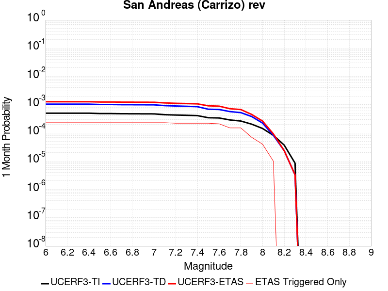 |  |  |

| Magnitude | 1 wk TI Prob | 1 wk TD Prob | 1 wk ETAS Prob | 1 wk ETAS/TD Gain | 1 wk ETAS Triggered Only | 1 mo TI Prob | 1 mo TD Prob | 1 mo ETAS Prob | 1 mo ETAS/TD Gain | 1 mo ETAS Triggered Only | 1 yr TI Prob | 1 yr TD Prob | 1 yr ETAS Prob | 1 yr ETAS/TD Gain | 1 yr ETAS Triggered Only | 10 yr TI Prob | 10 yr TD Prob | 10 yr ETAS Prob | 10 yr ETAS/TD Gain | 10 yr ETAS Triggered Only |
|-----|-----|-----|-----|-----|-----|-----|-----|-----|-----|-----|-----|-----|-----|-----|-----|-----|-----|-----|-----|-----|
| 6.0 | 1.1674632E-4 | 2.4324407E-4 | 3.7321245E-4 | 1.5343126 | 1.3E-4 | 5.002454E-4 | 0.0010420597 | 0.00127182 | 1.2204868 | 2.3E-4 | 0.006073493 | 0.012613757 | 0.012998837 | 1.0305287 | 3.9E-4 | 0.0591016 | 0.120640226 | 0.12116784 | 1.0043734 | 6.0E-4 |
| 6.1 | 1.1674632E-4 | 2.4324407E-4 | 3.7321245E-4 | 1.5343126 | 1.3E-4 | 5.002454E-4 | 0.0010420597 | 0.00127182 | 1.2204868 | 2.3E-4 | 0.006073493 | 0.012613757 | 0.012998837 | 1.0305287 | 3.9E-4 | 0.0591016 | 0.120640226 | 0.12116784 | 1.0043734 | 6.0E-4 |
| 6.2 | 1.1674632E-4 | 2.4324407E-4 | 3.7321245E-4 | 1.5343126 | 1.3E-4 | 5.002454E-4 | 0.0010420597 | 0.00127182 | 1.2204868 | 2.3E-4 | 0.006073493 | 0.012613757 | 0.012998837 | 1.0305287 | 3.9E-4 | 0.0591016 | 0.120640226 | 0.12116784 | 1.0043734 | 6.0E-4 |
| 6.3 | 1.1674632E-4 | 2.4324407E-4 | 3.7321245E-4 | 1.5343126 | 1.3E-4 | 5.002454E-4 | 0.0010420597 | 0.00127182 | 1.2204868 | 2.3E-4 | 0.006073493 | 0.012613757 | 0.012998837 | 1.0305287 | 3.9E-4 | 0.0591016 | 0.120640226 | 0.12116784 | 1.0043734 | 6.0E-4 |
| 6.4 | 1.1674632E-4 | 2.4324407E-4 | 3.7321245E-4 | 1.5343126 | 1.3E-4 | 5.002454E-4 | 0.0010420597 | 0.00127182 | 1.2204868 | 2.3E-4 | 0.006073493 | 0.012613757 | 0.012998837 | 1.0305287 | 3.9E-4 | 0.0591016 | 0.120640226 | 0.12116784 | 1.0043734 | 6.0E-4 |
| 6.5 | 1.13136164E-4 | 2.3644442E-4 | 3.6641367E-4 | 1.5496821 | 1.3E-4 | 4.847792E-4 | 0.0010129412 | 0.0012427083 | 1.2268316 | 2.3E-4 | 0.0058862255 | 0.012263271 | 0.012648488 | 1.0314122 | 3.9E-4 | 0.057327334 | 0.11761008 | 0.11813951 | 1.0045016 | 6.0E-4 |
| 6.6 | 1.13136164E-4 | 2.3644442E-4 | 3.6641367E-4 | 1.5496821 | 1.3E-4 | 4.847792E-4 | 0.0010129412 | 0.0012427083 | 1.2268316 | 2.3E-4 | 0.0058862255 | 0.012263271 | 0.012648488 | 1.0314122 | 3.9E-4 | 0.057327334 | 0.11761008 | 0.11813951 | 1.0045016 | 6.0E-4 |
| 6.7 | 1.1149675E-4 | 2.3335687E-4 | 3.6332654E-4 | 1.5569566 | 1.3E-4 | 4.777557E-4 | 9.997191E-4 | 0.0012294891 | 1.2298347 | 2.3E-4 | 0.0058011734 | 0.012104088 | 0.012489367 | 1.0318305 | 3.9E-4 | 0.05652051 | 0.1162291 | 0.11675937 | 1.0045623 | 6.0E-4 |
| 6.8 | 1.1103589E-4 | 2.3237852E-4 | 3.623483E-4 | 1.5593021 | 1.3E-4 | 4.7578133E-4 | 9.955293E-4 | 0.0012253004 | 1.2308029 | 2.3E-4 | 0.005777263 | 0.012053643 | 0.012438943 | 1.0319654 | 3.9E-4 | 0.056293584 | 0.11578894 | 0.11631946 | 1.0045818 | 6.0E-4 |
| 6.9 | 1.1053259E-4 | 2.3130233E-4 | 3.6127228E-4 | 1.5619049 | 1.3E-4 | 4.7362508E-4 | 9.909206E-4 | 0.0012206928 | 1.2318774 | 2.3E-4 | 0.0057511497 | 0.011998152 | 0.012383473 | 1.032115 | 3.9E-4 | 0.05604569 | 0.11530445 | 0.11582642 | 1.0045269 | 5.9E-4 |
| 7.0 | 1.1005377E-4 | 2.3031076E-4 | 3.6028083E-4 | 1.5643247 | 1.3E-4 | 4.7157376E-4 | 9.866742E-4 | 0.0012164473 | 1.2328763 | 2.3E-4 | 0.0057263062 | 0.011947021 | 0.012332361 | 1.0322541 | 3.9E-4 | 0.055809796 | 0.11485658 | 0.11537882 | 1.0045469 | 5.9E-4 |
| 7.1 | 1.0308142E-4 | 2.1540876E-4 | 3.4538077E-4 | 1.6033738 | 1.3E-4 | 4.417027E-4 | 9.228548E-4 | 0.0011526425 | 1.2489966 | 2.3E-4 | 0.0053644776 | 0.011178188 | 0.011563829 | 1.0344994 | 3.9E-4 | 0.052368138 | 0.10809042 | 0.10860773 | 1.0047859 | 5.8E-4 |
| 7.2 | 1.0027479E-4 | 2.094876E-4 | 3.2946246E-4 | 1.5727062 | 1.2E-4 | 4.296783E-4 | 8.9749607E-4 | 0.0011172986 | 1.2449064 | 2.2E-4 | 0.0052187922 | 0.010872566 | 0.011248435 | 1.0345703 | 3.8E-4 | 0.050979212 | 0.10539086 | 0.10589184 | 1.0047536 | 5.6E-4 |
| 7.3 | 9.816942E-5 | 2.0423878E-4 | 3.2421426E-4 | 1.5874276 | 1.2E-4 | 4.2065824E-4 | 8.7501644E-4 | 0.0010948239 | 1.2512039 | 2.2E-4 | 0.005109493 | 0.010601572 | 0.010977543 | 1.0354637 | 3.8E-4 | 0.049935985 | 0.10297546 | 0.10347779 | 1.0048782 | 5.6E-4 |
| 7.4 | 9.5634205E-5 | 1.9793298E-4 | 3.1790923E-4 | 1.6061457 | 1.2E-4 | 4.0979648E-4 | 8.4800937E-4 | 0.0010678228 | 1.2592111 | 2.2E-4 | 0.0049778637 | 0.010275901 | 0.010651996 | 1.0365998 | 3.8E-4 | 0.048678253 | 0.100067884 | 0.10056285 | 1.0049462 | 5.5E-4 |
| 7.5 | 8.052417E-5 | 1.6113915E-4 | 2.811198E-4 | 1.744578 | 1.2E-4 | 3.4505792E-4 | 6.9041376E-4 | 9.102619E-4 | 1.3184295 | 2.2E-4 | 0.0041929903 | 0.008373471 | 0.00875029 | 1.0450014 | 3.8E-4 | 0.04114753 | 0.082815245 | 0.08331052 | 1.0059805 | 5.4E-4 |
| 7.6 | 7.897024E-5 | 1.5767086E-4 | 2.7765194E-4 | 1.7609591 | 1.2E-4 | 3.384E-4 | 6.755574E-4 | 8.854156E-4 | 1.3106444 | 2.1E-4 | 0.0041122385 | 0.00819397 | 0.008560938 | 1.0447851 | 3.7E-4 | 0.040369697 | 0.08115866 | 0.08163646 | 1.0058872 | 5.2E-4 |
| 7.7 | 6.707427E-5 | 1.3277122E-4 | 2.2275928E-4 | 1.6777678 | 9.0E-5 | 2.8742946E-4 | 5.688955E-4 | 7.1881013E-4 | 1.2635188 | 1.5E-4 | 0.003493839 | 0.0069043385 | 0.0071625435 | 1.0373975 | 2.6E-4 | 0.034394164 | 0.06905339 | 0.06942577 | 1.0053927 | 4.0E-4 |
| 7.8 | 6.147705E-5 | 1.2198445E-4 | 2.1197347E-4 | 1.7377089 | 9.0E-5 | 2.6344648E-4 | 5.226858E-4 | 6.726074E-4 | 1.2868292 | 1.5E-4 | 0.0032027436 | 0.006345156 | 0.00659357 | 1.0391501 | 2.5E-4 | 0.031569764 | 0.0635172 | 0.063863695 | 1.0054551 | 3.7E-4 |
| 7.9 | 4.7636717E-5 | 8.8802946E-5 | 1.18800286E-4 | 1.3377966 | 3.0E-5 | 2.0414138E-4 | 3.8052857E-4 | 4.5050192E-4 | 1.1838846 | 7.0E-5 | 0.0024825884 | 0.004623101 | 0.0047525004 | 1.0279896 | 1.3E-4 | 0.024550365 | 0.046629366 | 0.046839107 | 1.004498 | 2.2E-4 |
| 8.0 | 3.3554235E-5 | 5.2138024E-5 | 7.213698E-5 | 1.3835772 | 2.0E-5 | 1.4379594E-4 | 2.2342955E-4 | 2.634206E-4 | 1.1789874 | 4.0E-5 | 0.0017493097 | 0.002716863 | 0.0028066186 | 1.0330365 | 9.0E-5 | 0.017356034 | 0.027881905 | 0.028027723 | 1.0052298 | 1.5E-4 |
| 8.1 | 1.9175432E-5 | 1.9183564E-5 | 1.9183564E-5 | 1.0 | 0.0 | 8.217783E-5 | 8.221269E-5 | 9.221186E-5 | 1.1216258 | 1.0E-5 | 0.0010000558 | 0.0010004805 | 0.0010304505 | 1.0299556 | 3.0E-5 | 0.009955673 | 0.010757771 | 0.010817125 | 1.0055174 | 6.0E-5 |
| 8.2 | 8.643924E-6 | 5.473668E-6 | 5.473668E-6 | 1.0 | 0.0 | 3.704486E-5 | 2.3458366E-5 | 2.3458366E-5 | 1.0 | 0.0 | 4.5092785E-4 | 2.8556827E-4 | 2.955654E-4 | 1.035008 | 1.0E-5 | 0.0045001395 | 0.0032481793 | 0.003258147 | 1.0030687 | 1.0E-5 |
| 8.3 | 1.983087E-6 | 7.6564595E-7 | 7.6564595E-7 | 1.0 | 0.0 | 8.498917E-6 | 3.281336E-6 | 3.281336E-6 | 1.0 | 0.0 | 1.034694E-4 | 3.9949547E-5 | 4.9949147E-5 | 1.2503058 | 1.0E-5 | 0.0010342124 | 4.717979E-4 | 4.8179316E-4 | 1.0211855 | 1.0E-5 |

## San Andreas (Cholame) rev
*[(top)](#table-of-contents)*

| 1 Week | 1 Month | 1 Year | 10 Year |
|-----|-----|-----|-----|
| 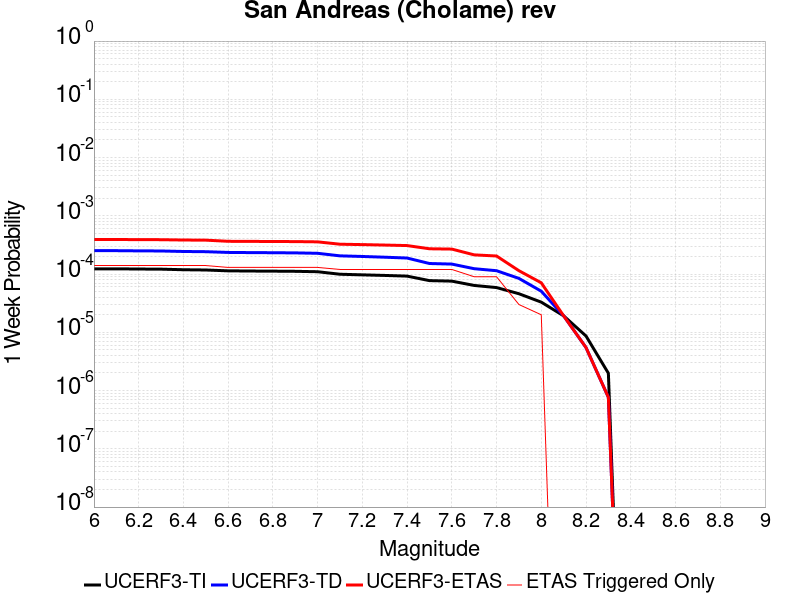 |  |  | 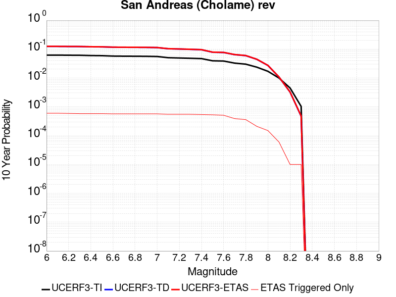 |

| Magnitude | 1 wk TI Prob | 1 wk TD Prob | 1 wk ETAS Prob | 1 wk ETAS/TD Gain | 1 wk ETAS Triggered Only | 1 mo TI Prob | 1 mo TD Prob | 1 mo ETAS Prob | 1 mo ETAS/TD Gain | 1 mo ETAS Triggered Only | 1 yr TI Prob | 1 yr TD Prob | 1 yr ETAS Prob | 1 yr ETAS/TD Gain | 1 yr ETAS Triggered Only | 10 yr TI Prob | 10 yr TD Prob | 10 yr ETAS Prob | 10 yr ETAS/TD Gain | 10 yr ETAS Triggered Only |
|-----|-----|-----|-----|-----|-----|-----|-----|-----|-----|-----|-----|-----|-----|-----|-----|-----|-----|-----|-----|-----|
| 6.0 | 1.2302514E-4 | 2.5205986E-4 | 3.9202458E-4 | 1.5552837 | 1.4E-4 | 5.27144E-4 | 0.0010798109 | 0.001329541 | 1.231272 | 2.5E-4 | 0.0063991086 | 0.013067958 | 0.0134726 | 1.0309645 | 4.1E-4 | 0.06217949 | 0.12438412 | 0.12490949 | 1.0042238 | 6.0E-4 |
| 6.1 | 1.2302514E-4 | 2.5205986E-4 | 3.9202458E-4 | 1.5552837 | 1.4E-4 | 5.27144E-4 | 0.0010798109 | 0.001329541 | 1.231272 | 2.5E-4 | 0.0063991086 | 0.013067958 | 0.0134726 | 1.0309645 | 4.1E-4 | 0.06217949 | 0.12438412 | 0.12490949 | 1.0042238 | 6.0E-4 |
| 6.2 | 1.2203569E-4 | 2.502277E-4 | 3.9019267E-4 | 1.5593504 | 1.4E-4 | 5.2290526E-4 | 0.0010719653 | 0.0013216973 | 1.2329665 | 2.5E-4 | 0.006347804 | 0.012973578 | 0.013378259 | 1.0311927 | 4.1E-4 | 0.061695136 | 0.123571314 | 0.12408841 | 1.0041846 | 5.9E-4 |
| 6.3 | 1.2142645E-4 | 2.4908737E-4 | 3.890525E-4 | 1.5619117 | 1.4E-4 | 5.202953E-4 | 0.0010670823 | 0.0013168155 | 1.2340337 | 2.5E-4 | 0.006316212 | 0.012914834 | 0.013309668 | 1.0305722 | 4.0E-4 | 0.06139677 | 0.12306532 | 0.123573944 | 1.004133 | 5.8E-4 |
| 6.4 | 1.1865206E-4 | 2.4414246E-4 | 3.8410828E-4 | 1.5732957 | 1.4E-4 | 5.0840975E-4 | 0.0010459068 | 0.0012956454 | 1.238777 | 2.5E-4 | 0.006172335 | 0.012660044 | 0.01305498 | 1.0311955 | 4.0E-4 | 0.060036868 | 0.12085904 | 0.121368945 | 1.0042189 | 5.8E-4 |
| 6.5 | 1.17443946E-4 | 2.4207575E-4 | 3.8204185E-4 | 1.5781914 | 1.4E-4 | 5.032341E-4 | 0.0010370566 | 0.0012867973 | 1.2408168 | 2.5E-4 | 0.006109677 | 0.012553536 | 0.012948515 | 1.0314635 | 4.0E-4 | 0.059444077 | 0.11993008 | 0.12044052 | 1.0042561 | 5.8E-4 |
| 6.6 | 1.13579066E-4 | 2.3516564E-4 | 3.6513506E-4 | 1.5526719 | 1.3E-4 | 4.866766E-4 | 0.001007465 | 0.0012472231 | 1.2379817 | 2.4E-4 | 0.0059092017 | 0.012197345 | 0.012582587 | 1.0315841 | 3.9E-4 | 0.057545185 | 0.1168492 | 0.1173526 | 1.0043081 | 5.7E-4 |
| 6.7 | 1.1271412E-4 | 2.336088E-4 | 3.6357844E-4 | 1.5563558 | 1.3E-4 | 4.829711E-4 | 0.001000798 | 0.0012405578 | 1.2395686 | 2.4E-4 | 0.005864331 | 0.012117079 | 0.012502354 | 1.031796 | 3.9E-4 | 0.057119697 | 0.11615275 | 0.11665654 | 1.0043373 | 5.7E-4 |
| 6.8 | 1.1217975E-4 | 2.3249313E-4 | 3.624629E-4 | 1.5590264 | 1.3E-4 | 4.8068175E-4 | 9.960202E-4 | 0.0012357811 | 1.240719 | 2.4E-4 | 0.005836608 | 0.012059555 | 0.012444852 | 1.0319495 | 3.9E-4 | 0.056856725 | 0.11565061 | 0.11615469 | 1.0043586 | 5.7E-4 |
| 6.9 | 1.1146753E-4 | 2.3098059E-4 | 3.6095057E-4 | 1.5626879 | 1.3E-4 | 4.7763053E-4 | 9.895428E-4 | 0.0012293053 | 1.2422962 | 2.4E-4 | 0.0057996577 | 0.011981564 | 0.012366891 | 1.03216 | 3.9E-4 | 0.056506127 | 0.11497027 | 0.11547473 | 1.0043879 | 5.7E-4 |
| 7.0 | 1.0965793E-4 | 2.2721413E-4 | 3.571846E-4 | 1.5720176 | 1.3E-4 | 4.698779E-4 | 9.734129E-4 | 0.0012131793 | 1.2463152 | 2.4E-4 | 0.005705768 | 0.011787324 | 0.012172727 | 1.0326964 | 3.9E-4 | 0.055614736 | 0.11327011 | 0.11377555 | 1.0044622 | 5.7E-4 |
| 7.1 | 9.927982E-5 | 2.0540332E-4 | 3.2537867E-4 | 1.5840964 | 1.2E-4 | 4.2541555E-4 | 8.8000396E-4 | 0.0010998104 | 1.2497789 | 2.2E-4 | 0.0051671406 | 0.010661708 | 0.011027764 | 1.0343336 | 3.7E-4 | 0.05048634 | 0.10336573 | 0.10385888 | 1.0047709 | 5.5E-4 |
| 7.2 | 9.696786E-5 | 2.0044584E-4 | 3.204218E-4 | 1.5985454 | 1.2E-4 | 4.1551032E-4 | 8.587718E-4 | 0.0010785828 | 1.2559599 | 2.2E-4 | 0.00504711 | 0.010405703 | 0.010771853 | 1.0351874 | 3.7E-4 | 0.04934009 | 0.10110233 | 0.10159673 | 1.0048901 | 5.5E-4 |
| 7.3 | 9.4727984E-5 | 1.9473763E-4 | 3.1471427E-4 | 1.6160938 | 1.2E-4 | 4.0591392E-4 | 8.343239E-4 | 0.0010541403 | 1.2634666 | 2.2E-4 | 0.0049308087 | 0.010110851 | 0.01047711 | 1.0362244 | 3.7E-4 | 0.048228268 | 0.09847412 | 0.09896996 | 1.0050353 | 5.5E-4 |
| 7.4 | 9.220358E-5 | 1.8844259E-4 | 3.0841996E-4 | 1.6366787 | 1.2E-4 | 3.9509835E-4 | 8.07362E-4 | 0.0010271844 | 1.2722723 | 2.2E-4 | 0.004799717 | 0.009785578 | 0.010151957 | 1.0374408 | 3.7E-4 | 0.046973653 | 0.09555831 | 0.09604671 | 1.005111 | 5.4E-4 |
| 7.5 | 7.71631E-5 | 1.5179155E-4 | 2.7177334E-4 | 1.7904378 | 1.2E-4 | 3.306571E-4 | 6.5037323E-4 | 8.7023014E-4 | 1.3380473 | 2.2E-4 | 0.0040183207 | 0.007889617 | 0.008256698 | 1.046527 | 3.7E-4 | 0.03946433 | 0.078289196 | 0.07877771 | 1.0062398 | 5.3E-4 |
| 7.6 | 7.5634416E-5 | 1.4838556E-4 | 2.6836776E-4 | 1.808584 | 1.2E-4 | 3.241072E-4 | 6.357833E-4 | 8.456498E-4 | 1.3300912 | 2.1E-4 | 0.0039388672 | 0.007713256 | 0.008070479 | 1.0463129 | 3.6E-4 | 0.038697794 | 0.076654874 | 0.07712578 | 1.0061432 | 5.1E-4 |
| 7.7 | 6.3783E-5 | 1.2359623E-4 | 2.1358511E-4 | 1.7280875 | 9.0E-5 | 2.7332708E-4 | 5.2959064E-4 | 6.795112E-4 | 1.2830876 | 1.5E-4 | 0.0033226798 | 0.0064287307 | 0.0066771233 | 1.0386379 | 2.5E-4 | 0.032734364 | 0.06454488 | 0.064909704 | 1.0056523 | 3.9E-4 |
| 7.8 | 5.863422E-5 | 1.14169685E-4 | 2.0415941E-4 | 1.7882103 | 9.0E-5 | 2.512653E-4 | 4.892069E-4 | 6.3913356E-4 | 1.3064687 | 1.5E-4 | 0.003054864 | 0.0059398497 | 0.0061784238 | 1.0401651 | 2.4E-4 | 0.030132094 | 0.05966162 | 0.06000014 | 1.005674 | 3.6E-4 |
| 7.9 | 4.595283E-5 | 8.426815E-5 | 1.14265626E-4 | 1.3559763 | 3.0E-5 | 1.9692584E-4 | 3.6109926E-4 | 4.3107398E-4 | 1.1937826 | 7.0E-5 | 0.0023949358 | 0.0043875277 | 0.004507001 | 1.0272303 | 1.2E-4 | 0.023692891 | 0.044363137 | 0.044563822 | 1.0045236 | 2.1E-4 |
| 8.0 | 3.2950178E-5 | 5.077396E-5 | 7.077295E-5 | 1.3938826 | 2.0E-5 | 1.412074E-4 | 2.1758456E-4 | 2.5757586E-4 | 1.1837965 | 4.0E-5 | 0.0017178444 | 0.0026458753 | 0.0027356374 | 1.0339252 | 9.0E-5 | 0.017046256 | 0.027181072 | 0.027326996 | 1.0053686 | 1.5E-4 |
| 8.1 | 1.9177472E-5 | 1.9183733E-5 | 1.9183733E-5 | 1.0 | 0.0 | 8.218658E-5 | 8.221342E-5 | 9.221259E-5 | 1.1216247 | 1.0E-5 | 0.0010001622 | 0.0010004893 | 0.0010304593 | 1.0299553 | 3.0E-5 | 0.009956728 | 0.010757887 | 0.010817241 | 1.0055172 | 6.0E-5 |
| 8.2 | 8.643924E-6 | 5.473668E-6 | 5.473668E-6 | 1.0 | 0.0 | 3.704486E-5 | 2.3458366E-5 | 2.3458366E-5 | 1.0 | 0.0 | 4.5092785E-4 | 2.8556827E-4 | 2.955654E-4 | 1.035008 | 1.0E-5 | 0.0045001395 | 0.0032481793 | 0.003258147 | 1.0030687 | 1.0E-5 |
| 8.3 | 1.983087E-6 | 7.6564595E-7 | 7.6564595E-7 | 1.0 | 0.0 | 8.498917E-6 | 3.281336E-6 | 3.281336E-6 | 1.0 | 0.0 | 1.034694E-4 | 3.9949547E-5 | 4.9949147E-5 | 1.2503058 | 1.0E-5 | 0.0010342124 | 4.717979E-4 | 4.8179316E-4 | 1.0211855 | 1.0E-5 |

## Death Valley (Fish Lake Valley)
*[(top)](#table-of-contents)*

| 1 Week | 1 Month | 1 Year | 10 Year |
|-----|-----|-----|-----|
|  |  | 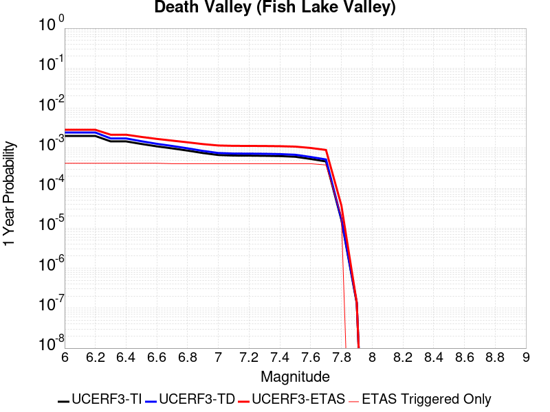 |  |

| Magnitude | 1 wk TI Prob | 1 wk TD Prob | 1 wk ETAS Prob | 1 wk ETAS/TD Gain | 1 wk ETAS Triggered Only | 1 mo TI Prob | 1 mo TD Prob | 1 mo ETAS Prob | 1 mo ETAS/TD Gain | 1 mo ETAS Triggered Only | 1 yr TI Prob | 1 yr TD Prob | 1 yr ETAS Prob | 1 yr ETAS/TD Gain | 1 yr ETAS Triggered Only | 10 yr TI Prob | 10 yr TD Prob | 10 yr ETAS Prob | 10 yr ETAS/TD Gain | 10 yr ETAS Triggered Only |
|-----|-----|-----|-----|-----|-----|-----|-----|-----|-----|-----|-----|-----|-----|-----|-----|-----|-----|-----|-----|-----|
| 6.0 | 3.872328E-5 | 4.7265705E-5 | 1.8725908E-4 | 3.9618385 | 1.4E-4 | 1.6594635E-4 | 2.0255324E-4 | 3.825168E-4 | 1.8884752 | 1.8E-4 | 0.0020185246 | 0.0024635606 | 0.002882526 | 1.1700649 | 4.2E-4 | 0.02000288 | 0.024388338 | 0.024954192 | 1.0232018 | 5.8E-4 |
| 6.1 | 3.872328E-5 | 4.7265705E-5 | 1.8725908E-4 | 3.9618385 | 1.4E-4 | 1.6594635E-4 | 2.0255324E-4 | 3.825168E-4 | 1.8884752 | 1.8E-4 | 0.0020185246 | 0.0024635606 | 0.002882526 | 1.1700649 | 4.2E-4 | 0.02000288 | 0.024388338 | 0.024954192 | 1.0232018 | 5.8E-4 |
| 6.2 | 3.872328E-5 | 4.7265705E-5 | 1.8725908E-4 | 3.9618385 | 1.4E-4 | 1.6594635E-4 | 2.0255324E-4 | 3.825168E-4 | 1.8884752 | 1.8E-4 | 0.0020185246 | 0.0024635606 | 0.002882526 | 1.1700649 | 4.2E-4 | 0.02000288 | 0.024388338 | 0.024954192 | 1.0232018 | 5.8E-4 |
| 6.3 | 2.8356371E-5 | 3.360979E-5 | 1.7360509E-4 | 5.165313 | 1.4E-4 | 1.2152165E-4 | 1.4403443E-4 | 3.2400852E-4 | 2.2495213 | 1.8E-4 | 0.0014785219 | 0.0017522788 | 0.0021715427 | 1.239268 | 4.2E-4 | 0.014687235 | 0.017391816 | 0.017951902 | 1.032204 | 5.7E-4 |
| 6.4 | 2.8356371E-5 | 3.360979E-5 | 1.7360509E-4 | 5.165313 | 1.4E-4 | 1.2152165E-4 | 1.4403443E-4 | 3.2400852E-4 | 2.2495213 | 1.8E-4 | 0.0014785219 | 0.0017522788 | 0.0021715427 | 1.239268 | 4.2E-4 | 0.014687235 | 0.017391816 | 0.017951902 | 1.032204 | 5.7E-4 |
| 6.5 | 2.4448687E-5 | 2.8607585E-5 | 1.6860358E-4 | 5.893667 | 1.4E-4 | 1.0477588E-4 | 1.2259845E-4 | 3.0257637E-4 | 2.4680278 | 1.8E-4 | 0.0012748998 | 0.0014916616 | 0.0019110352 | 1.2811452 | 4.2E-4 | 0.012676105 | 0.014821392 | 0.015382944 | 1.0378879 | 5.7E-4 |
| 6.6 | 2.1298161E-5 | 2.4660083E-5 | 1.6465664E-4 | 6.6770506 | 1.4E-4 | 9.127464E-5 | 1.0568197E-4 | 2.8566294E-4 | 2.7030435 | 1.8E-4 | 0.0011107022 | 0.0012859512 | 0.0017054111 | 1.3261864 | 4.2E-4 | 0.011051672 | 0.01278853 | 0.013341369 | 1.0432292 | 5.6E-4 |
| 6.7 | 1.8959729E-5 | 2.1781027E-5 | 1.6177798E-4 | 7.4274726 | 1.4E-4 | 8.125345E-5 | 9.334406E-5 | 2.7332726E-4 | 2.9281697 | 1.8E-4 | 9.888117E-4 | 0.001135897 | 0.0015454312 | 1.3605382 | 4.1E-4 | 0.009844234 | 0.01130357 | 0.011847354 | 1.0481071 | 5.5E-4 |
| 6.8 | 1.6691629E-5 | 1.9018351E-5 | 1.5901569E-4 | 8.361171 | 1.4E-4 | 7.153359E-5 | 8.150477E-5 | 2.614901E-4 | 3.2082796 | 1.8E-4 | 8.7057345E-4 | 9.918857E-4 | 0.001401479 | 1.4129441 | 4.1E-4 | 0.008671708 | 0.009876343 | 0.010420912 | 1.0551386 | 5.5E-4 |
| 6.9 | 1.450505E-5 | 1.638954E-5 | 1.5638725E-4 | 9.541894 | 1.4E-4 | 6.216302E-5 | 7.0239046E-5 | 2.502264E-4 | 3.5624974 | 1.8E-4 | 7.5657194E-4 | 8.5483363E-4 | 0.0012644832 | 1.4792155 | 4.1E-4 | 0.007540013 | 0.008516386 | 0.009061702 | 1.0640314 | 5.5E-4 |
| 7.0 | 1.2940855E-5 | 1.4537972E-5 | 1.5453594E-4 | 10.629814 | 1.4E-4 | 5.545963E-5 | 6.230414E-5 | 2.4229292E-4 | 3.8888736 | 1.8E-4 | 6.750118E-4 | 7.5829466E-4 | 0.0011679837 | 1.5402769 | 4.1E-4 | 0.006729651 | 0.0075576897 | 0.008103533 | 1.0722235 | 5.5E-4 |
| 7.1 | 1.2544658E-5 | 1.4078208E-5 | 1.5407623E-4 | 10.944307 | 1.4E-4 | 5.3761712E-5 | 6.0333812E-5 | 2.4032294E-4 | 3.9832218 | 1.8E-4 | 6.5435225E-4 | 7.343222E-4 | 0.0011440212 | 1.557928 | 4.1E-4 | 0.006524288 | 0.007319551 | 0.007865525 | 1.0745913 | 5.5E-4 |
| 7.2 | 1.2489416E-5 | 1.4015674E-5 | 1.5401372E-4 | 10.988677 | 1.4E-4 | 5.3524967E-5 | 6.0065824E-5 | 2.4005501E-4 | 3.9965324 | 1.8E-4 | 6.514716E-4 | 7.310616E-4 | 0.0011407619 | 1.5604182 | 4.1E-4 | 0.006495651 | 0.0072871596 | 0.007833152 | 1.0749252 | 5.5E-4 |
| 7.3 | 1.2368307E-5 | 1.3879812E-5 | 1.5387787E-4 | 11.086452 | 1.4E-4 | 5.3005948E-5 | 5.9483587E-5 | 2.3947288E-4 | 4.025865 | 1.8E-4 | 6.451563E-4 | 7.2397763E-4 | 0.0011336808 | 1.5659058 | 4.1E-4 | 0.0064328653 | 0.007216782 | 0.0077628125 | 1.0756613 | 5.5E-4 |
| 7.4 | 1.2161707E-5 | 1.36478675E-5 | 1.5364596E-4 | 11.257873 | 1.4E-4 | 5.212056E-5 | 5.8489582E-5 | 2.3847906E-4 | 4.077291 | 1.8E-4 | 6.3438306E-4 | 7.118836E-4 | 0.0011215918 | 1.5755268 | 4.1E-4 | 0.006325751 | 0.0070966207 | 0.0076427176 | 1.0769516 | 5.5E-4 |
| 7.5 | 1.1707948E-5 | 1.3145515E-5 | 1.5314367E-4 | 11.64988 | 1.4E-4 | 5.0175953E-5 | 5.6336736E-5 | 2.363266E-4 | 4.1948934 | 1.8E-4 | 6.10721E-4 | 6.856895E-4 | 0.0010954083 | 1.5975283 | 4.1E-4 | 0.0060904534 | 0.006836321 | 0.0073825615 | 1.0799026 | 5.5E-4 |
| 7.6 | 1.0319538E-5 | 1.1579622E-5 | 1.51578E-4 | 13.090064 | 1.4E-4 | 4.4225842E-5 | 4.9626036E-5 | 2.296171E-4 | 4.6269484 | 1.8E-4 | 5.383166E-4 | 6.040347E-4 | 0.001013787 | 1.6783589 | 4.1E-4 | 0.0053701443 | 0.0060244603 | 0.006561207 | 1.0890946 | 5.4E-4 |
| 7.7 | 8.937764E-6 | 1.0022779E-5 | 1.4002148E-4 | 13.9703245 | 1.3E-4 | 3.830414E-5 | 4.295409E-5 | 2.0294722E-4 | 4.724747 | 1.6E-4 | 4.6625308E-4 | 5.228456E-4 | 9.026469E-4 | 1.726412 | 3.8E-4 | 0.0046527605 | 0.005216664 | 0.005714056 | 1.0953467 | 5.0E-4 |
| 7.8 | 3.108007E-7 | 3.284654E-7 | 3.284654E-7 | 1.0 | 0.0 | 1.3320023E-6 | 1.407708E-6 | 1.1407694E-5 | 8.103736 | 1.0E-5 | 1.6217007E-5 | 1.7138715E-5 | 3.7138372E-5 | 2.1669285 | 2.0E-5 | 1.6215823E-4 | 1.7137431E-4 | 2.0136917E-4 | 1.1750255 | 3.0E-5 |
| 7.9 | 2.5591178E-9 | 2.6696718E-9 | 2.6696718E-9 | 1.0 | 0.0 | 1.0967647E-8 | 1.14414505E-8 | 1.14414505E-8 | 1.0 | 0.0 | 1.335311E-7 | 1.3929966E-7 | 1.3929966E-7 | 1.0 | 0.0 | 1.3353102E-6 | 1.3929966E-6 | 1.3929966E-6 | 1.0 | 0.0 |

## Red Pass
*[(top)](#table-of-contents)*

| 1 Week | 1 Month | 1 Year | 10 Year |
|-----|-----|-----|-----|
|  |  | 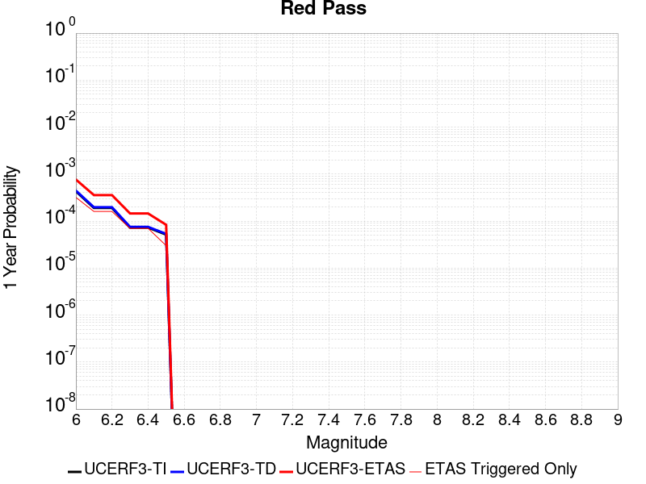 |  |

| Magnitude | 1 wk TI Prob | 1 wk TD Prob | 1 wk ETAS Prob | 1 wk ETAS/TD Gain | 1 wk ETAS Triggered Only | 1 mo TI Prob | 1 mo TD Prob | 1 mo ETAS Prob | 1 mo ETAS/TD Gain | 1 mo ETAS Triggered Only | 1 yr TI Prob | 1 yr TD Prob | 1 yr ETAS Prob | 1 yr ETAS/TD Gain | 1 yr ETAS Triggered Only | 10 yr TI Prob | 10 yr TD Prob | 10 yr ETAS Prob | 10 yr ETAS/TD Gain | 10 yr ETAS Triggered Only |
|-----|-----|-----|-----|-----|-----|-----|-----|-----|-----|-----|-----|-----|-----|-----|-----|-----|-----|-----|-----|-----|
| 6.0 | 8.258278E-6 | 8.551265E-6 | 8.855058E-5 | 10.355261 | 8.0E-5 | 3.539214E-5 | 3.6647863E-5 | 1.7664273E-4 | 4.8200006 | 1.4E-4 | 4.308141E-4 | 4.4611428E-4 | 7.659715E-4 | 1.716985 | 3.2E-4 | 0.0042997985 | 0.004453945 | 0.005001495 | 1.122936 | 5.5E-4 |
| 6.1 | 3.649988E-6 | 3.7753161E-6 | 3.3775203E-5 | 8.946324 | 3.0E-5 | 1.5642712E-5 | 1.6179853E-5 | 8.617872E-5 | 5.326298 | 7.0E-5 | 1.9043336E-4 | 1.9697666E-4 | 3.5694515E-4 | 1.812119 | 1.6E-4 | 0.0019027026 | 0.001968488 | 0.002217996 | 1.1267511 | 2.5E-4 |
| 6.2 | 3.649988E-6 | 3.7753161E-6 | 3.3775203E-5 | 8.946324 | 3.0E-5 | 1.5642712E-5 | 1.6179853E-5 | 8.617872E-5 | 5.326298 | 7.0E-5 | 1.9043336E-4 | 1.9697666E-4 | 3.5694515E-4 | 1.812119 | 1.6E-4 | 0.0019027026 | 0.001968488 | 0.002217996 | 1.1267511 | 2.5E-4 |
| 6.3 | 1.3924937E-6 | 1.4411166E-6 | 2.1441088E-5 | 14.878107 | 2.0E-5 | 5.9678164E-6 | 6.1762075E-6 | 4.617596E-5 | 7.476426 | 4.0E-5 | 7.265574E-5 | 7.519415E-5 | 1.4518888E-4 | 1.9308535 | 7.0E-5 | 7.263199E-4 | 7.518258E-4 | 8.517506E-4 | 1.1329095 | 1.0E-4 |
| 6.4 | 1.3924937E-6 | 1.4411166E-6 | 2.1441088E-5 | 14.878107 | 2.0E-5 | 5.9678164E-6 | 6.1762075E-6 | 4.617596E-5 | 7.476426 | 4.0E-5 | 7.265574E-5 | 7.519415E-5 | 1.4518888E-4 | 1.9308535 | 7.0E-5 | 7.263199E-4 | 7.518258E-4 | 8.517506E-4 | 1.1329095 | 1.0E-4 |
| 6.5 | 9.876812E-7 | 1.0221912E-6 | 1.1022181E-5 | 10.782895 | 1.0E-5 | 4.2329125E-6 | 4.3808195E-6 | 2.4380732E-5 | 5.5653358 | 2.0E-5 | 5.153449E-5 | 5.3336476E-5 | 8.3334875E-5 | 1.5624368 | 3.0E-5 | 5.1522546E-4 | 5.333648E-4 | 5.9333275E-4 | 1.1124333 | 6.0E-5 |

## Elsinore (Glen Ivy) rev
*[(top)](#table-of-contents)*

| 1 Week | 1 Month | 1 Year | 10 Year |
|-----|-----|-----|-----|
|  |  | 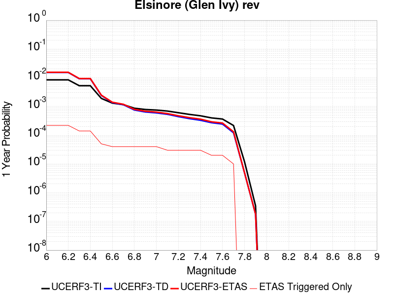 |  |

| Magnitude | 1 wk TI Prob | 1 wk TD Prob | 1 wk ETAS Prob | 1 wk ETAS/TD Gain | 1 wk ETAS Triggered Only | 1 mo TI Prob | 1 mo TD Prob | 1 mo ETAS Prob | 1 mo ETAS/TD Gain | 1 mo ETAS Triggered Only | 1 yr TI Prob | 1 yr TD Prob | 1 yr ETAS Prob | 1 yr ETAS/TD Gain | 1 yr ETAS Triggered Only | 10 yr TI Prob | 10 yr TD Prob | 10 yr ETAS Prob | 10 yr ETAS/TD Gain | 10 yr ETAS Triggered Only |
|-----|-----|-----|-----|-----|-----|-----|-----|-----|-----|-----|-----|-----|-----|-----|-----|-----|-----|-----|-----|-----|
| 6.0 | 1.6204086E-4 | 2.937271E-4 | 4.1369183E-4 | 1.4084225 | 1.2E-4 | 6.94276E-4 | 0.0012583778 | 0.0013982017 | 1.1111144 | 1.4E-4 | 0.008420097 | 0.0152346175 | 0.015451266 | 1.0142208 | 2.2E-4 | 0.081081145 | 0.13962454 | 0.1399859 | 1.002588 | 4.2E-4 |
| 6.1 | 1.6204086E-4 | 2.937271E-4 | 4.1369183E-4 | 1.4084225 | 1.2E-4 | 6.94276E-4 | 0.0012583778 | 0.0013982017 | 1.1111144 | 1.4E-4 | 0.008420097 | 0.0152346175 | 0.015451266 | 1.0142208 | 2.2E-4 | 0.081081145 | 0.13962454 | 0.1399859 | 1.002588 | 4.2E-4 |
| 6.2 | 1.6204086E-4 | 2.937271E-4 | 4.1369183E-4 | 1.4084225 | 1.2E-4 | 6.94276E-4 | 0.0012583778 | 0.0013982017 | 1.1111144 | 1.4E-4 | 0.008420097 | 0.0152346175 | 0.015451266 | 1.0142208 | 2.2E-4 | 0.081081145 | 0.13962454 | 0.1399859 | 1.002588 | 4.2E-4 |
| 6.3 | 1.0111737E-4 | 1.7703463E-4 | 2.37024E-4 | 1.3388568 | 6.0E-5 | 4.332882E-4 | 7.5861585E-4 | 8.2856277E-4 | 1.0922033 | 7.0E-5 | 0.005262531 | 0.0092177205 | 0.009356431 | 1.0150481 | 1.4E-4 | 0.0513964 | 0.08707393 | 0.087320425 | 1.0028309 | 2.7E-4 |
| 6.4 | 1.0111737E-4 | 1.7703463E-4 | 2.37024E-4 | 1.3388568 | 6.0E-5 | 4.332882E-4 | 7.5861585E-4 | 8.2856277E-4 | 1.0922033 | 7.0E-5 | 0.005262531 | 0.0092177205 | 0.009356431 | 1.0150481 | 1.4E-4 | 0.0513964 | 0.08707393 | 0.087320425 | 1.0028309 | 2.7E-4 |
| 6.5 | 3.6624708E-5 | 4.6391986E-5 | 6.6391054E-5 | 1.4310889 | 2.0E-5 | 1.569536E-4 | 1.9880968E-4 | 2.288037E-4 | 1.150868 | 3.0E-5 | 0.001909235 | 0.0024181814 | 0.0024680605 | 1.0206267 | 5.0E-5 | 0.01892915 | 0.023697061 | 0.023794692 | 1.0041199 | 1.0E-4 |
| 6.6 | 2.5051324E-5 | 2.6147465E-5 | 3.61472E-5 | 1.3824363 | 1.0E-5 | 1.073584E-4 | 1.12056E-4 | 1.3205376E-4 | 1.1784621 | 2.0E-5 | 0.0013063047 | 0.0013634725 | 0.0014034179 | 1.0292969 | 4.0E-5 | 0.012986525 | 0.013565759 | 0.013624946 | 1.004363 | 6.0E-5 |
| 6.7 | 2.2189772E-5 | 2.2072489E-5 | 3.207227E-5 | 1.4530426 | 1.0E-5 | 9.509556E-5 | 9.459316E-5 | 1.1459127E-4 | 1.2114118 | 2.0E-5 | 0.0011571734 | 0.0011510996 | 0.0011910535 | 1.0347093 | 4.0E-5 | 0.011511663 | 0.0114663225 | 0.011525635 | 1.0051727 | 6.0E-5 |
| 6.8 | 1.6654378E-5 | 1.44376E-5 | 2.4437455E-5 | 1.6926259 | 1.0E-5 | 7.137396E-5 | 6.187399E-5 | 8.187275E-5 | 1.3232176 | 2.0E-5 | 8.686314E-4 | 7.5306057E-4 | 7.930305E-4 | 1.0530766 | 4.0E-5 | 0.008652439 | 0.0075100763 | 0.007559701 | 1.0066078 | 5.0E-5 |
| 6.9 | 1.5042909E-5 | 1.2331886E-5 | 2.2331762E-5 | 1.810896 | 1.0E-5 | 6.446802E-5 | 5.2849886E-5 | 7.284883E-5 | 1.3784103 | 2.0E-5 | 7.8461546E-4 | 6.4326054E-4 | 6.8323483E-4 | 1.0621432 | 4.0E-5 | 0.007818509 | 0.006417925 | 0.006467604 | 1.0077407 | 5.0E-5 |
| 7.0 | 1.4361385E-5 | 1.1451172E-5 | 2.1451058E-5 | 1.8732631 | 1.0E-5 | 6.154734E-5 | 4.9075545E-5 | 6.9074566E-5 | 1.4075149 | 2.0E-5 | 7.490812E-4 | 5.973339E-4 | 6.3731E-4 | 1.0669242 | 4.0E-5 | 0.007465612 | 0.005960982 | 0.0060106837 | 1.0083379 | 5.0E-5 |
| 7.1 | 1.3265571E-5 | 1.0244736E-5 | 2.0244634E-5 | 1.9761012 | 1.0E-5 | 5.6851208E-5 | 4.3905282E-5 | 6.390441E-5 | 1.4555061 | 2.0E-5 | 6.919436E-4 | 5.344183E-4 | 5.644022E-4 | 1.0561059 | 3.0E-5 | 0.006897931 | 0.0053346003 | 0.005374387 | 1.0074582 | 4.0E-5 |
| 7.2 | 1.1596403E-5 | 8.504847E-6 | 1.8504763E-5 | 2.17579 | 1.0E-5 | 4.9697923E-5 | 3.6448844E-5 | 5.6448116E-5 | 1.5486943 | 2.0E-5 | 6.049042E-4 | 4.4367602E-4 | 4.7366272E-4 | 1.0675869 | 3.0E-5 | 0.006032603 | 0.004429357 | 0.00446918 | 1.0089906 | 4.0E-5 |
| 7.3 | 1.0150827E-5 | 7.238537E-6 | 1.7238464E-5 | 2.3814845 | 1.0E-5 | 4.3502816E-5 | 3.102194E-5 | 5.102132E-5 | 1.644685 | 2.0E-5 | 5.2951806E-4 | 3.776281E-4 | 4.0761678E-4 | 1.0794133 | 3.0E-5 | 0.005282581 | 0.003770271 | 0.0038101203 | 1.0105693 | 4.0E-5 |
| 7.4 | 9.080705E-6 | 6.352307E-6 | 1.6352244E-5 | 2.5742211 | 1.0E-5 | 3.8916725E-5 | 2.7223898E-5 | 4.7223355E-5 | 1.7346287 | 2.0E-5 | 4.7370812E-4 | 3.314019E-4 | 3.6139195E-4 | 1.0904945 | 3.0E-5 | 0.004726996 | 0.0033092257 | 0.0033391262 | 1.0090356 | 3.0E-5 |
| 7.5 | 7.671649E-6 | 5.225419E-6 | 5.225419E-6 | 1.0 | 0.0 | 3.287808E-5 | 2.2394468E-5 | 3.2394244E-5 | 1.4465289 | 1.0E-5 | 4.0021708E-4 | 2.7261977E-4 | 2.9261434E-4 | 1.0733422 | 2.0E-5 | 0.0039949706 | 0.0027229784 | 0.002742924 | 1.0073249 | 2.0E-5 |
| 7.6 | 6.990086E-6 | 4.687336E-6 | 4.687336E-6 | 1.0 | 0.0 | 2.9957167E-5 | 2.0088435E-5 | 3.0088233E-5 | 1.4977889 | 1.0E-5 | 3.6466747E-4 | 2.445504E-4 | 2.6454552E-4 | 1.0817627 | 2.0E-5 | 0.0036406964 | 0.0024429292 | 0.0024628802 | 1.0081669 | 2.0E-5 |
| 7.7 | 4.163505E-6 | 2.329331E-6 | 2.329331E-6 | 1.0 | 0.0 | 1.7843471E-5 | 9.982813E-6 | 1.9982714E-5 | 2.0017116 | 1.0E-5 | 2.172226E-4 | 1.2153471E-4 | 1.315335E-4 | 1.082271 | 1.0E-5 | 0.0021701038 | 0.0012147555 | 0.0012247433 | 1.0082221 | 1.0E-5 |
| 7.8 | 2.2692414E-7 | 9.384417E-8 | 9.384417E-8 | 1.0 | 0.0 | 9.725317E-7 | 4.0218927E-7 | 4.0218927E-7 | 1.0 | 0.0 | 1.1840509E-5 | 4.8966467E-6 | 4.8966467E-6 | 1.0 | 0.0 | 1.1839878E-4 | 4.8965718E-5 | 4.8965718E-5 | 1.0 | 0.0 |
| 7.9 | 6.676829E-9 | 3.4397174E-9 | 3.4397174E-9 | 1.0 | 0.0 | 2.861498E-8 | 1.4741646E-8 | 1.4741646E-8 | 1.0 | 0.0 | 3.4838732E-7 | 1.7947953E-7 | 1.7947953E-7 | 1.0 | 0.0 | 3.4838679E-6 | 1.794794E-6 | 1.794794E-6 | 1.0 | 0.0 |

## San Andreas (Coachella) rev
*[(top)](#table-of-contents)*

| 1 Week | 1 Month | 1 Year | 10 Year |
|-----|-----|-----|-----|
|  |  | 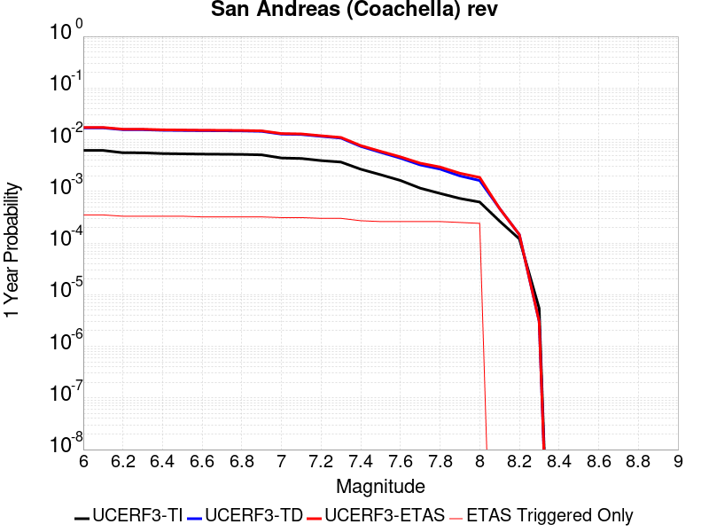 |  |

| Magnitude | 1 wk TI Prob | 1 wk TD Prob | 1 wk ETAS Prob | 1 wk ETAS/TD Gain | 1 wk ETAS Triggered Only | 1 mo TI Prob | 1 mo TD Prob | 1 mo ETAS Prob | 1 mo ETAS/TD Gain | 1 mo ETAS Triggered Only | 1 yr TI Prob | 1 yr TD Prob | 1 yr ETAS Prob | 1 yr ETAS/TD Gain | 1 yr ETAS Triggered Only | 10 yr TI Prob | 10 yr TD Prob | 10 yr ETAS Prob | 10 yr ETAS/TD Gain | 10 yr ETAS Triggered Only |
|-----|-----|-----|-----|-----|-----|-----|-----|-----|-----|-----|-----|-----|-----|-----|-----|-----|-----|-----|-----|-----|
| 6.0 | 1.1925945E-4 | 3.273077E-4 | 4.5726515E-4 | 1.3970498 | 1.3E-4 | 5.110118E-4 | 0.001401998 | 0.0016216895 | 1.156699 | 2.2E-4 | 0.0062038354 | 0.016937068 | 0.01728114 | 1.0203147 | 3.5E-4 | 0.060334753 | 0.15267672 | 0.15308343 | 1.0026639 | 4.8E-4 |
| 6.1 | 1.1925945E-4 | 3.273077E-4 | 4.5726515E-4 | 1.3970498 | 1.3E-4 | 5.110118E-4 | 0.001401998 | 0.0016216895 | 1.156699 | 2.2E-4 | 0.0062038354 | 0.016937068 | 0.01728114 | 1.0203147 | 3.5E-4 | 0.060334753 | 0.15267672 | 0.15308343 | 1.0026639 | 4.8E-4 |
| 6.2 | 1.07432395E-4 | 3.0231563E-4 | 4.322763E-4 | 1.4298842 | 1.3E-4 | 4.603433E-4 | 0.001294999 | 0.001504727 | 1.1619523 | 2.1E-4 | 0.005590286 | 0.015653731 | 0.015978565 | 1.0207512 | 3.3E-4 | 0.05451731 | 0.14182784 | 0.1422226 | 1.0027834 | 4.6E-4 |
| 6.3 | 1.0718766E-4 | 3.0176868E-4 | 4.3172945E-4 | 1.4306636 | 1.3E-4 | 4.592948E-4 | 0.0012926573 | 0.0015023858 | 1.162246 | 2.1E-4 | 0.005577586 | 0.01562563 | 0.015950473 | 1.0207891 | 3.3E-4 | 0.054396555 | 0.14159605 | 0.14199091 | 1.0027887 | 4.6E-4 |
| 6.4 | 1.0355944E-4 | 2.9384956E-4 | 4.2381135E-4 | 1.4422733 | 1.3E-4 | 4.4375064E-4 | 0.0012587514 | 0.001468487 | 1.166622 | 2.1E-4 | 0.0053892885 | 0.015218662 | 0.015543641 | 1.021354 | 3.3E-4 | 0.052604496 | 0.13815795 | 0.1385544 | 1.0028695 | 4.6E-4 |
| 6.5 | 1.0227914E-4 | 2.9104383E-4 | 4.21006E-4 | 1.4465381 | 1.3E-4 | 4.382655E-4 | 0.0012467385 | 0.0014564766 | 1.1682295 | 2.1E-4 | 0.0053228354 | 0.015074439 | 0.015399464 | 1.0215614 | 3.3E-4 | 0.051971316 | 0.13694239 | 0.13733938 | 1.002899 | 4.6E-4 |
| 6.6 | 1.0116757E-4 | 2.8870135E-4 | 4.186638E-4 | 1.4501623 | 1.3E-4 | 4.3350324E-4 | 0.0012367087 | 0.0014364613 | 1.1615195 | 2.0E-4 | 0.0052651367 | 0.014954008 | 0.015269224 | 1.021079 | 3.2E-4 | 0.051421247 | 0.13591973 | 0.13630858 | 1.0028608 | 4.5E-4 |
| 6.7 | 1.0050676E-4 | 2.8728697E-4 | 4.1724963E-4 | 1.4523792 | 1.3E-4 | 4.3067214E-4 | 0.0012306528 | 0.0014304067 | 1.1623154 | 2.0E-4 | 0.005230834 | 0.014881288 | 0.0151965255 | 1.0211835 | 3.2E-4 | 0.051094085 | 0.13530464 | 0.13569376 | 1.0028758 | 4.5E-4 |
| 6.8 | 9.976819E-5 | 2.8532353E-4 | 4.1528643E-4 | 1.4554931 | 1.3E-4 | 4.2750788E-4 | 0.001222246 | 0.0014220015 | 1.1634332 | 2.0E-4 | 0.0051924936 | 0.014780328 | 0.015095598 | 1.0213304 | 3.2E-4 | 0.050728295 | 0.13445628 | 0.13484576 | 1.0028968 | 4.5E-4 |
| 6.9 | 9.77719E-5 | 2.802926E-4 | 4.1025615E-4 | 1.4636711 | 1.3E-4 | 4.1895514E-4 | 0.0012007048 | 0.0014004647 | 1.1663688 | 2.0E-4 | 0.0050888555 | 0.0145215895 | 0.014836943 | 1.0217161 | 3.2E-4 | 0.049738888 | 0.13228476 | 0.13267523 | 1.0029517 | 4.5E-4 |
| 7.0 | 8.500761E-5 | 2.4763815E-4 | 3.7760596E-4 | 1.5248295 | 1.3E-4 | 3.6426744E-4 | 0.0010608779 | 0.0012506763 | 1.1789069 | 1.9E-4 | 0.0044259406 | 0.01284047 | 0.01314649 | 1.0238324 | 3.1E-4 | 0.04338823 | 0.11813616 | 0.11852418 | 1.0032846 | 4.4E-4 |
| 7.1 | 8.319876E-5 | 2.4366553E-4 | 3.7363384E-4 | 1.5333883 | 1.3E-4 | 3.5651738E-4 | 0.0010438662 | 0.0012336678 | 1.1818256 | 1.9E-4 | 0.004331963 | 0.012635773 | 0.012941856 | 1.0242236 | 3.1E-4 | 0.042484846 | 0.11635632 | 0.11674512 | 1.0033414 | 4.4E-4 |
| 7.2 | 7.563917E-5 | 2.2414974E-4 | 3.4412285E-4 | 1.5352364 | 1.2E-4 | 3.2412758E-4 | 9.602912E-4 | 0.0011401183 | 1.1872631 | 1.8E-4 | 0.0039391145 | 0.011629559 | 0.011926071 | 1.0254964 | 3.0E-4 | 0.03870018 | 0.10776202 | 0.10814568 | 1.0035603 | 4.3E-4 |
| 7.3 | 7.082985E-5 | 2.07311E-4 | 3.272861E-4 | 1.5787205 | 1.2E-4 | 3.0352117E-4 | 8.881761E-4 | 0.0010680162 | 1.2024825 | 1.8E-4 | 0.0036891096 | 0.010760553 | 0.011057326 | 1.0275797 | 3.0E-4 | 0.03628465 | 0.10028403 | 0.10066191 | 1.0037681 | 4.2E-4 |
| 7.4 | 5.146215E-5 | 1.4274761E-4 | 2.4273334E-4 | 1.7004371 | 1.0E-4 | 2.2053342E-4 | 6.1163295E-4 | 7.7153504E-4 | 1.2614348 | 1.6E-4 | 0.0026816884 | 0.0074213943 | 0.0076893903 | 1.0361114 | 2.7E-4 | 0.02649557 | 0.07085049 | 0.07121286 | 1.0051146 | 3.9E-4 |
| 7.5 | 4.0285166E-5 | 1.0942422E-4 | 2.0941328E-4 | 1.9137745 | 1.0E-4 | 1.7263928E-4 | 4.6887697E-4 | 6.1880663E-4 | 1.3197633 | 1.5E-4 | 0.002099857 | 0.0056937044 | 0.005952224 | 1.0454044 | 2.6E-4 | 0.020801254 | 0.055013083 | 0.055362727 | 1.0063556 | 3.7E-4 |
| 7.6 | 3.1168736E-5 | 8.439599E-5 | 1.8438755E-4 | 2.1847904 | 1.0E-4 | 1.3357346E-4 | 3.616471E-4 | 5.1159284E-4 | 1.414619 | 1.5E-4 | 0.0016250437 | 0.004394191 | 0.0046530482 | 1.058909 | 2.6E-4 | 0.016132116 | 0.042812478 | 0.043157063 | 1.0080488 | 3.6E-4 |
| 7.7 | 2.2100989E-5 | 6.239345E-5 | 1.6238721E-4 | 2.6026323 | 1.0E-4 | 9.4715084E-5 | 2.6737314E-4 | 4.17333E-4 | 1.5608637 | 1.5E-4 | 0.001152546 | 0.0032504152 | 0.00350957 | 1.0797298 | 2.6E-4 | 0.011465867 | 0.031902168 | 0.032241005 | 1.0106211 | 3.5E-4 |
| 7.8 | 1.7484861E-5 | 5.180078E-5 | 1.517956E-4 | 2.9303727 | 1.0E-4 | 7.493296E-5 | 2.2198448E-4 | 3.7195117E-4 | 1.675573 | 1.5E-4 | 9.1192697E-4 | 0.0026993142 | 0.0029586123 | 1.0960608 | 2.6E-4 | 0.009081938 | 0.026641788 | 0.026962996 | 1.0120566 | 3.3E-4 |
| 7.9 | 1.3967285E-5 | 3.8226146E-5 | 1.282227E-4 | 3.3543193 | 9.0E-5 | 5.985842E-5 | 1.6381606E-4 | 3.0379312E-4 | 1.854477 | 1.4E-4 | 7.2853256E-4 | 0.0019926373 | 0.002242139 | 1.1252118 | 2.5E-4 | 0.0072614877 | 0.019911002 | 0.02020503 | 1.014767 | 3.0E-4 |
| 8.0 | 1.1887396E-5 | 3.106798E-5 | 1.2106518E-4 | 3.896783 | 9.0E-5 | 5.094499E-5 | 1.331417E-4 | 2.7312306E-4 | 2.0513713 | 1.4E-4 | 6.200787E-4 | 0.0016197958 | 0.001859407 | 1.1479268 | 2.4E-4 | 0.006183513 | 0.016280567 | 0.016565844 | 1.0175227 | 2.9E-4 |
| 8.1 | 5.100864E-6 | 8.973766E-6 | 8.973766E-6 | 1.0 | 0.0 | 2.1860664E-5 | 3.845843E-5 | 3.845843E-5 | 1.0 | 0.0 | 2.6612106E-4 | 4.6813092E-4 | 4.6813092E-4 | 1.0 | 0.0 | 0.002658026 | 0.004918092 | 0.0049280426 | 1.0020233 | 1.0E-5 |
| 8.2 | 2.3004484E-6 | 2.7863473E-6 | 2.7863473E-6 | 1.0 | 0.0 | 9.859027E-6 | 1.19414335E-5 | 1.19414335E-5 | 1.0 | 0.0 | 1.2002704E-4 | 1.4537729E-4 | 1.4537729E-4 | 1.0 | 0.0 | 0.0011996223 | 0.0015973782 | 0.0015973782 | 1.0 | 0.0 |
| 8.3 | 1.0424446E-7 | 5.814421E-8 | 5.814421E-8 | 1.0 | 0.0 | 4.4676187E-7 | 2.4918944E-7 | 2.4918944E-7 | 1.0 | 0.0 | 5.439312E-6 | 3.0338776E-6 | 3.0338776E-6 | 1.0 | 0.0 | 5.4391792E-5 | 3.189592E-5 | 3.189592E-5 | 1.0 | 0.0 |

## Sierra Nevada  (No Extension)
*[(top)](#table-of-contents)*

| 1 Week | 1 Month | 1 Year | 10 Year |
|-----|-----|-----|-----|
|  |  |  |  |

| Magnitude | 1 wk TI Prob | 1 wk TD Prob | 1 wk ETAS Prob | 1 wk ETAS/TD Gain | 1 wk ETAS Triggered Only | 1 mo TI Prob | 1 mo TD Prob | 1 mo ETAS Prob | 1 mo ETAS/TD Gain | 1 mo ETAS Triggered Only | 1 yr TI Prob | 1 yr TD Prob | 1 yr ETAS Prob | 1 yr ETAS/TD Gain | 1 yr ETAS Triggered Only | 10 yr TI Prob | 10 yr TD Prob | 10 yr ETAS Prob | 10 yr ETAS/TD Gain | 10 yr ETAS Triggered Only |
|-----|-----|-----|-----|-----|-----|-----|-----|-----|-----|-----|-----|-----|-----|-----|-----|-----|-----|-----|-----|-----|
| 6.0 | 7.7690465E-6 | 6.9762887E-6 | 1.6697517E-4 | 23.934671 | 1.6E-4 | 3.329549E-5 | 2.989824E-5 | 2.3989196E-4 | 8.023615 | 2.1E-4 | 4.0529718E-4 | 3.6398612E-4 | 6.93866E-4 | 1.906298 | 3.3E-4 | 0.004045588 | 0.0036374154 | 0.004065851 | 1.1177858 | 4.3E-4 |
| 6.1 | 7.7690465E-6 | 6.9762887E-6 | 1.6697517E-4 | 23.934671 | 1.6E-4 | 3.329549E-5 | 2.989824E-5 | 2.3989196E-4 | 8.023615 | 2.1E-4 | 4.0529718E-4 | 3.6398612E-4 | 6.93866E-4 | 1.906298 | 3.3E-4 | 0.004045588 | 0.0036374154 | 0.004065851 | 1.1177858 | 4.3E-4 |
| 6.2 | 7.7690465E-6 | 6.9762887E-6 | 1.6697517E-4 | 23.934671 | 1.6E-4 | 3.329549E-5 | 2.989824E-5 | 2.3989196E-4 | 8.023615 | 2.1E-4 | 4.0529718E-4 | 3.6398612E-4 | 6.93866E-4 | 1.906298 | 3.3E-4 | 0.004045588 | 0.0036374154 | 0.004065851 | 1.1177858 | 4.3E-4 |
| 6.3 | 7.7690465E-6 | 6.9762887E-6 | 1.6697517E-4 | 23.934671 | 1.6E-4 | 3.329549E-5 | 2.989824E-5 | 2.3989196E-4 | 8.023615 | 2.1E-4 | 4.0529718E-4 | 3.6398612E-4 | 6.93866E-4 | 1.906298 | 3.3E-4 | 0.004045588 | 0.0036374154 | 0.004065851 | 1.1177858 | 4.3E-4 |
| 6.4 | 7.7690465E-6 | 6.9762887E-6 | 1.6697517E-4 | 23.934671 | 1.6E-4 | 3.329549E-5 | 2.989824E-5 | 2.3989196E-4 | 8.023615 | 2.1E-4 | 4.0529718E-4 | 3.6398612E-4 | 6.93866E-4 | 1.906298 | 3.3E-4 | 0.004045588 | 0.0036374154 | 0.004065851 | 1.1177858 | 4.3E-4 |
| 6.5 | 7.7690465E-6 | 6.9762887E-6 | 1.6697517E-4 | 23.934671 | 1.6E-4 | 3.329549E-5 | 2.989824E-5 | 2.3989196E-4 | 8.023615 | 2.1E-4 | 4.0529718E-4 | 3.6398612E-4 | 6.93866E-4 | 1.906298 | 3.3E-4 | 0.004045588 | 0.0036374154 | 0.004065851 | 1.1177858 | 4.3E-4 |
| 6.6 | 2.653E-6 | 1.6148208E-6 | 6.161472E-5 | 38.155766 | 6.0E-5 | 1.136995E-5 | 6.9206426E-6 | 8.692009E-5 | 12.55954 | 8.0E-5 | 1.3842035E-4 | 8.42556E-5 | 2.3424297E-4 | 2.780147 | 1.5E-4 | 0.0013833415 | 8.4224E-4 | 0.0010420715 | 1.237262 | 2.0E-4 |
| 6.7 | 2.5902466E-6 | 1.5501544E-6 | 6.155006E-5 | 39.70576 | 6.0E-5 | 1.11010095E-5 | 6.643502E-6 | 8.664297E-5 | 13.041761 | 8.0E-5 | 1.351464E-4 | 8.088166E-5 | 2.3086953E-4 | 2.8544111 | 1.5E-4 | 0.0013506424 | 8.0852525E-4 | 0.0010083636 | 1.2471639 | 2.0E-4 |
| 6.8 | 2.5853892E-6 | 1.5469546E-6 | 6.154686E-5 | 39.78582 | 6.0E-5 | 1.1080193E-5 | 6.629789E-6 | 8.662926E-5 | 13.066669 | 8.0E-5 | 1.34893E-4 | 8.071472E-5 | 2.3070262E-4 | 2.858247 | 1.5E-4 | 0.0013481114 | 8.06857E-4 | 0.0010066957 | 1.2476754 | 2.0E-4 |
| 6.9 | 2.458257E-6 | 1.422029E-6 | 6.1421946E-5 | 43.193176 | 6.0E-5 | 1.0535345E-5 | 6.0943958E-6 | 8.609391E-5 | 14.126735 | 8.0E-5 | 1.2826028E-4 | 7.419676E-5 | 2.2418563E-4 | 3.0215015 | 1.5E-4 | 0.0012818627 | 7.4172183E-4 | 9.4157347E-4 | 1.2694429 | 2.0E-4 |
| 7.0 | 2.4341468E-6 | 1.3989927E-6 | 5.139892E-5 | 36.73995 | 5.0E-5 | 1.0432016E-5 | 5.9956697E-6 | 7.599525E-5 | 12.675023 | 7.0E-5 | 1.270024E-4 | 7.299485E-5 | 2.1298463E-4 | 2.9178035 | 1.4E-4 | 0.0012692984 | 7.297107E-4 | 9.19572E-4 | 1.2601871 | 1.9E-4 |
| 7.1 | 2.3652476E-6 | 1.3339427E-6 | 5.1333875E-5 | 38.48282 | 5.0E-5 | 1.0136736E-5 | 5.716885E-6 | 7.571648E-5 | 13.244361 | 7.0E-5 | 1.2340778E-4 | 6.9600865E-5 | 2.0959112E-4 | 3.0113292 | 1.4E-4 | 0.0012333926 | 6.957924E-4 | 8.856602E-4 | 1.27288 | 1.9E-4 |
| 7.2 | 2.272158E-6 | 1.2502497E-6 | 5.1250187E-5 | 40.991962 | 5.0E-5 | 9.737784E-6 | 5.358202E-6 | 7.535783E-5 | 14.0640135 | 7.0E-5 | 1.1855107E-4 | 6.523417E-5 | 2.0522503E-4 | 3.1459744 | 1.4E-4 | 0.0011848784 | 6.5215176E-4 | 8.4202783E-4 | 1.2911532 | 1.9E-4 |
| 7.3 | 2.1382127E-6 | 1.1419382E-6 | 5.114188E-5 | 44.785156 | 5.0E-5 | 9.163737E-6 | 4.894012E-6 | 7.489367E-5 | 15.303123 | 7.0E-5 | 1.1156279E-4 | 5.9582977E-5 | 1.8957524E-4 | 3.1817012 | 1.3E-4 | 0.001115068 | 5.956712E-4 | 7.75564E-4 | 1.3020002 | 1.8E-4 |
| 7.4 | 1.9048055E-6 | 9.574928E-7 | 5.0957446E-5 | 53.21966 | 5.0E-5 | 8.163426E-6 | 4.103534E-6 | 7.410325E-5 | 18.058395 | 7.0E-5 | 9.9385186E-5 | 4.995939E-5 | 1.799529E-4 | 3.6019833 | 1.3E-4 | 9.934074E-4 | 4.9948227E-4 | 6.6939736E-4 | 1.3401824 | 1.7E-4 |
| 7.5 | 1.5373403E-6 | 7.559763E-7 | 4.0755946E-5 | 53.91167 | 4.0E-5 | 6.5885843E-6 | 3.2398946E-6 | 5.323973E-5 | 16.43255 | 5.0E-5 | 8.021306E-5 | 3.9445007E-5 | 1.4944066E-4 | 3.7885826 | 1.1E-4 | 8.0184115E-4 | 3.9438053E-4 | 5.443214E-4 | 1.3801934 | 1.5E-4 |
| 7.6 | 1.0680322E-6 | 4.65941E-7 | 1.0465937E-5 | 22.461935 | 1.0E-5 | 4.577273E-6 | 1.9968884E-6 | 1.1996868E-5 | 6.007781 | 1.0E-5 | 5.5726876E-5 | 2.4311848E-5 | 7.4310636E-5 | 3.0565603 | 5.0E-5 | 5.5712904E-4 | 2.4309216E-4 | 3.330703E-4 | 1.37014 | 9.0E-5 |
| 7.7 | 5.509146E-7 | 1.5578539E-7 | 1.5578539E-7 | 1.0 | 0.0 | 2.3610605E-6 | 6.676515E-7 | 6.676515E-7 | 1.0 | 0.0 | 2.8745531E-5 | 8.128628E-6 | 2.8128465E-5 | 3.46042 | 2.0E-5 | 2.8741814E-4 | 8.128342E-5 | 1.01281796E-4 | 1.2460326 | 2.0E-5 |

## Calico-Hidalgo
*[(top)](#table-of-contents)*

| 1 Week | 1 Month | 1 Year | 10 Year |
|-----|-----|-----|-----|
|  |  | 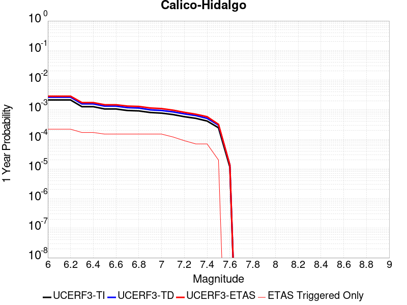 |  |

| Magnitude | 1 wk TI Prob | 1 wk TD Prob | 1 wk ETAS Prob | 1 wk ETAS/TD Gain | 1 wk ETAS Triggered Only | 1 mo TI Prob | 1 mo TD Prob | 1 mo ETAS Prob | 1 mo ETAS/TD Gain | 1 mo ETAS Triggered Only | 1 yr TI Prob | 1 yr TD Prob | 1 yr ETAS Prob | 1 yr ETAS/TD Gain | 1 yr ETAS Triggered Only | 10 yr TI Prob | 10 yr TD Prob | 10 yr ETAS Prob | 10 yr ETAS/TD Gain | 10 yr ETAS Triggered Only |
|-----|-----|-----|-----|-----|-----|-----|-----|-----|-----|-----|-----|-----|-----|-----|-----|-----|-----|-----|-----|-----|
| 6.0 | 4.0906612E-5 | 5.0704355E-5 | 1.5069928E-4 | 2.9721172 | 1.0E-4 | 1.7530227E-4 | 2.1728857E-4 | 3.9724945E-4 | 1.8282114 | 1.8E-4 | 0.0021322158 | 0.002642678 | 0.0028620968 | 1.0830289 | 2.2E-4 | 0.02111873 | 0.026152814 | 0.026532615 | 1.0145223 | 3.9E-4 |
| 6.1 | 4.0906612E-5 | 5.0704355E-5 | 1.5069928E-4 | 2.9721172 | 1.0E-4 | 1.7530227E-4 | 2.1728857E-4 | 3.9724945E-4 | 1.8282114 | 1.8E-4 | 0.0021322158 | 0.002642678 | 0.0028620968 | 1.0830289 | 2.2E-4 | 0.02111873 | 0.026152814 | 0.026532615 | 1.0145223 | 3.9E-4 |
| 6.2 | 4.0906612E-5 | 5.0704355E-5 | 1.5069928E-4 | 2.9721172 | 1.0E-4 | 1.7530227E-4 | 2.1728857E-4 | 3.9724945E-4 | 1.8282114 | 1.8E-4 | 0.0021322158 | 0.002642678 | 0.0028620968 | 1.0830289 | 2.2E-4 | 0.02111873 | 0.026152814 | 0.026532615 | 1.0145223 | 3.9E-4 |
| 6.3 | 2.4242801E-5 | 3.0090967E-5 | 1.0008886E-4 | 3.3262095 | 7.0E-5 | 1.0389358E-4 | 1.289551E-4 | 2.6893706E-4 | 2.085509 | 1.4E-4 | 0.0012641704 | 0.0015689312 | 0.0017386645 | 1.108184 | 1.7E-4 | 0.01257003 | 0.015582229 | 0.015877554 | 1.0189527 | 3.0E-4 |
| 6.4 | 2.4242801E-5 | 3.0090967E-5 | 1.0008886E-4 | 3.3262095 | 7.0E-5 | 1.0389358E-4 | 1.289551E-4 | 2.6893706E-4 | 2.085509 | 1.4E-4 | 0.0012641704 | 0.0015689312 | 0.0017386645 | 1.108184 | 1.7E-4 | 0.01257003 | 0.015582229 | 0.015877554 | 1.0189527 | 3.0E-4 |
| 6.5 | 2.0286952E-5 | 2.5316054E-5 | 8.531454E-5 | 3.3699775 | 6.0E-5 | 8.694118E-5 | 1.0849296E-4 | 2.2847994E-4 | 2.1059425 | 1.2E-4 | 0.0010579949 | 0.0013201186 | 0.0014699205 | 1.1134762 | 1.5E-4 | 0.010529719 | 0.013124701 | 0.013391157 | 1.0203019 | 2.7E-4 |
| 6.6 | 2.0269223E-5 | 2.5297004E-5 | 8.529548E-5 | 3.3717623 | 6.0E-5 | 8.6865206E-5 | 1.08411325E-4 | 2.2839832E-4 | 2.1067755 | 1.2E-4 | 0.0010570707 | 0.0013191258 | 0.001468928 | 1.1135616 | 1.5E-4 | 0.010520565 | 0.01311489 | 0.013381349 | 1.0203173 | 2.7E-4 |
| 6.7 | 1.799852E-5 | 2.2540933E-5 | 8.2539584E-5 | 3.6617641 | 6.0E-5 | 7.713423E-5 | 9.660051E-5 | 2.1658892E-4 | 2.2421095 | 1.2E-4 | 9.3870464E-4 | 0.0011754911 | 0.0013253149 | 1.1274562 | 1.5E-4 | 0.009347493 | 0.011694346 | 0.011951305 | 1.021973 | 2.6E-4 |
| 6.8 | 1.7458793E-5 | 2.184258E-5 | 8.184127E-5 | 3.7468684 | 6.0E-5 | 7.4821255E-5 | 9.360778E-5 | 2.1359655E-4 | 2.2818248 | 1.2E-4 | 9.10568E-4 | 0.0011390933 | 0.0012889225 | 1.1315336 | 1.5E-4 | 0.009068459 | 0.011334131 | 0.011591184 | 1.0226796 | 2.6E-4 |
| 6.9 | 1.542884E-5 | 1.9026285E-5 | 7.902514E-5 | 4.153472 | 6.0E-5 | 6.612192E-5 | 8.153875E-5 | 2.0152896E-4 | 2.4715729 | 1.2E-4 | 8.04737E-4 | 9.922953E-4 | 0.0011421464 | 1.1510147 | 1.5E-4 | 0.008018291 | 0.009880043 | 0.010127572 | 1.0250535 | 2.5E-4 |
| 7.0 | 1.468253E-5 | 1.803109E-5 | 7.803001E-5 | 4.3275256 | 6.0E-5 | 6.292361E-5 | 7.727389E-5 | 1.9726461E-4 | 2.5527978 | 1.2E-4 | 7.658257E-4 | 9.4041653E-4 | 0.0010902755 | 1.1593537 | 1.5E-4 | 0.0076319184 | 0.009365736 | 0.009613395 | 1.026443 | 2.5E-4 |
| 7.1 | 1.3139281E-5 | 1.620139E-5 | 5.620074E-5 | 3.468884 | 4.0E-5 | 5.6309986E-5 | 6.943275E-5 | 1.594265E-4 | 2.2961283 | 9.0E-5 | 6.853584E-4 | 8.4502844E-4 | 9.64927E-4 | 1.1418871 | 1.2E-4 | 0.0068324856 | 0.008419449 | 0.008627682 | 1.0247322 | 2.1E-4 |
| 7.2 | 1.1127404E-5 | 1.3867038E-5 | 5.3866483E-5 | 3.8844981 | 4.0E-5 | 4.7688E-5 | 5.9428872E-5 | 1.3942411E-4 | 2.346067 | 8.0E-5 | 5.8044674E-4 | 7.233172E-4 | 8.132521E-4 | 1.1243367 | 9.0E-5 | 0.0057893298 | 0.007210737 | 0.0073695835 | 1.0220292 | 1.6E-4 |
| 7.3 | 9.808154E-6 | 1.2176586E-5 | 4.217622E-5 | 3.4637148 | 3.0E-5 | 4.2034266E-5 | 5.2184383E-5 | 1.1218125E-4 | 2.1497092 | 6.0E-5 | 5.11647E-4 | 6.351704E-4 | 7.051259E-4 | 1.1101366 | 7.0E-5 | 0.0051047057 | 0.006334625 | 0.0064737387 | 1.0219607 | 1.4E-4 |
| 7.4 | 7.942452E-6 | 9.792348E-6 | 3.9792056E-5 | 4.0635867 | 3.0E-5 | 3.4038632E-5 | 4.1966585E-5 | 1.0196406E-4 | 2.4296489 | 6.0E-5 | 4.1434157E-4 | 5.108328E-4 | 5.807971E-4 | 1.1369611 | 7.0E-5 | 0.0041356985 | 0.005097527 | 0.0052268645 | 1.0253725 | 1.3E-4 |
| 7.5 | 4.7121216E-6 | 5.7729717E-6 | 1.5772914E-5 | 2.7322001 | 1.0E-5 | 2.019465E-5 | 2.4741115E-5 | 4.474062E-5 | 1.808351 | 2.0E-5 | 2.4584212E-4 | 3.011891E-4 | 3.211831E-4 | 1.0663835 | 2.0E-5 | 0.0024557032 | 0.0030085614 | 0.0030584112 | 1.0165693 | 5.0E-5 |
| 7.6 | 2.21172E-7 | 2.6040198E-7 | 2.6040198E-7 | 1.0 | 0.0 | 9.478797E-7 | 1.1160082E-6 | 1.1160082E-6 | 1.0 | 0.0 | 1.1540374E-5 | 1.3587343E-5 | 1.3587343E-5 | 1.0 | 0.0 | 1.1539775E-4 | 1.3586794E-4 | 1.3586794E-4 | 1.0 | 0.0 |

## San Andreas (North Branch Mill Creek)
*[(top)](#table-of-contents)*

| 1 Week | 1 Month | 1 Year | 10 Year |
|-----|-----|-----|-----|
| 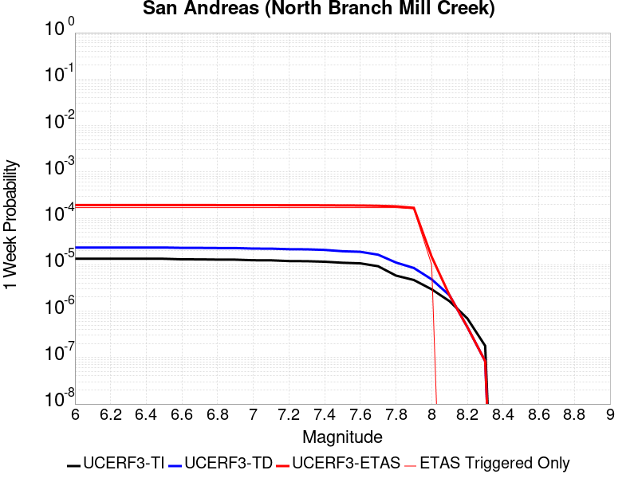 |  | 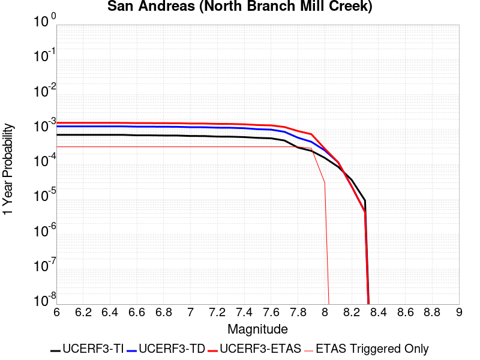 | 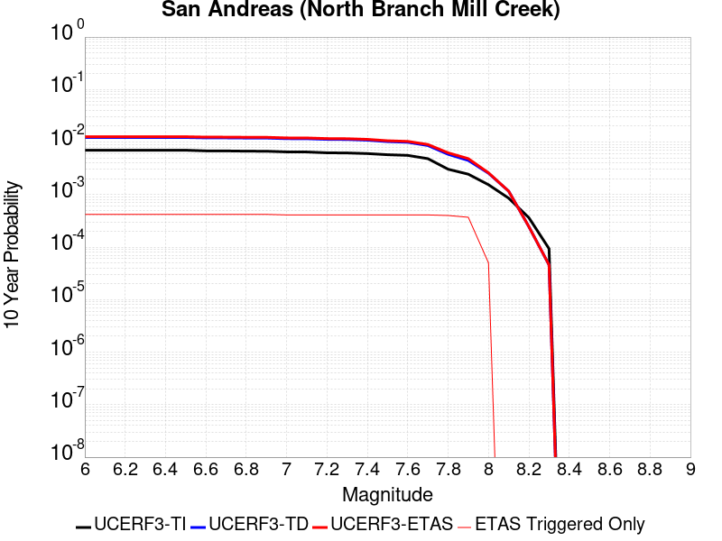 |

| Magnitude | 1 wk TI Prob | 1 wk TD Prob | 1 wk ETAS Prob | 1 wk ETAS/TD Gain | 1 wk ETAS Triggered Only | 1 mo TI Prob | 1 mo TD Prob | 1 mo ETAS Prob | 1 mo ETAS/TD Gain | 1 mo ETAS Triggered Only | 1 yr TI Prob | 1 yr TD Prob | 1 yr ETAS Prob | 1 yr ETAS/TD Gain | 1 yr ETAS Triggered Only | 10 yr TI Prob | 10 yr TD Prob | 10 yr ETAS Prob | 10 yr ETAS/TD Gain | 10 yr ETAS Triggered Only |
|-----|-----|-----|-----|-----|-----|-----|-----|-----|-----|-----|-----|-----|-----|-----|-----|-----|-----|-----|-----|-----|
| 6.0 | 1.3461156E-5 | 2.3500992E-5 | 1.9349699E-4 | 8.233567 | 1.7E-4 | 5.7689394E-5 | 1.00714664E-4 | 3.306915E-4 | 3.2834494 | 2.3E-4 | 7.02142E-4 | 0.0012255146 | 0.0015451225 | 1.2607948 | 3.2E-4 | 0.0069992766 | 0.012228744 | 0.012643608 | 1.0339253 | 4.2E-4 |
| 6.1 | 1.3461156E-5 | 2.3500992E-5 | 1.9349699E-4 | 8.233567 | 1.7E-4 | 5.7689394E-5 | 1.00714664E-4 | 3.306915E-4 | 3.2834494 | 2.3E-4 | 7.02142E-4 | 0.0012255146 | 0.0015451225 | 1.2607948 | 3.2E-4 | 0.0069992766 | 0.012228744 | 0.012643608 | 1.0339253 | 4.2E-4 |
| 6.2 | 1.3461156E-5 | 2.3500992E-5 | 1.9349699E-4 | 8.233567 | 1.7E-4 | 5.7689394E-5 | 1.00714664E-4 | 3.306915E-4 | 3.2834494 | 2.3E-4 | 7.02142E-4 | 0.0012255146 | 0.0015451225 | 1.2607948 | 3.2E-4 | 0.0069992766 | 0.012228744 | 0.012643608 | 1.0339253 | 4.2E-4 |
| 6.3 | 1.3461156E-5 | 2.3500992E-5 | 1.9349699E-4 | 8.233567 | 1.7E-4 | 5.7689394E-5 | 1.00714664E-4 | 3.306915E-4 | 3.2834494 | 2.3E-4 | 7.02142E-4 | 0.0012255146 | 0.0015451225 | 1.2607948 | 3.2E-4 | 0.0069992766 | 0.012228744 | 0.012643608 | 1.0339253 | 4.2E-4 |
| 6.4 | 1.3461156E-5 | 2.3500992E-5 | 1.9349699E-4 | 8.233567 | 1.7E-4 | 5.7689394E-5 | 1.00714664E-4 | 3.306915E-4 | 3.2834494 | 2.3E-4 | 7.02142E-4 | 0.0012255146 | 0.0015451225 | 1.2607948 | 3.2E-4 | 0.0069992766 | 0.012228744 | 0.012643608 | 1.0339253 | 4.2E-4 |
| 6.5 | 1.3450706E-5 | 2.348995E-5 | 1.9348596E-4 | 8.236967 | 1.7E-4 | 5.764461E-5 | 1.00667356E-4 | 3.306442E-4 | 3.2845225 | 2.3E-4 | 7.0159714E-4 | 0.0012249392 | 0.0015445473 | 1.2609174 | 3.2E-4 | 0.006993862 | 0.012223054 | 0.01263792 | 1.0339413 | 4.2E-4 |
| 6.6 | 1.3074523E-5 | 2.3104236E-5 | 1.931003E-4 | 8.357788 | 1.7E-4 | 5.6032466E-5 | 9.901441E-5 | 3.2899165E-4 | 3.3226643 | 2.3E-4 | 6.8198174E-4 | 0.001204837 | 0.0015244515 | 1.2652761 | 3.2E-4 | 0.006798926 | 0.012024219 | 0.012439169 | 1.0345095 | 4.2E-4 |
| 6.7 | 1.3050216E-5 | 2.3079532E-5 | 1.9307561E-4 | 8.365664 | 1.7E-4 | 5.59283E-5 | 9.890855E-5 | 3.288858E-4 | 3.3251503 | 2.3E-4 | 6.8071426E-4 | 0.0012035496 | 0.0015231645 | 1.2655602 | 3.2E-4 | 0.0067863287 | 0.012011484 | 0.01242644 | 1.0345465 | 4.2E-4 |
| 6.8 | 1.29049395E-5 | 2.2927941E-5 | 1.9292404E-4 | 8.414364 | 1.7E-4 | 5.530571E-5 | 9.825892E-5 | 3.2823632E-4 | 3.3405244 | 2.3E-4 | 6.73139E-4 | 0.001195649 | 0.0015152664 | 1.267317 | 3.2E-4 | 0.0067110364 | 0.011933329 | 0.012348317 | 1.0347755 | 4.2E-4 |
| 6.9 | 1.2867369E-5 | 2.2887343E-5 | 1.9288345E-4 | 8.427516 | 1.7E-4 | 5.51447E-5 | 9.808494E-5 | 3.280624E-4 | 3.3446763 | 2.3E-4 | 6.711799E-4 | 0.0011935332 | 0.0015131512 | 1.2677915 | 3.2E-4 | 0.006691564 | 0.011912397 | 0.012327394 | 1.0348374 | 4.2E-4 |
| 7.0 | 1.2495996E-5 | 2.2287419E-5 | 1.9228362E-4 | 8.627452 | 1.7E-4 | 5.3553173E-5 | 9.551403E-5 | 3.2549206E-4 | 3.4077933 | 2.3E-4 | 6.518148E-4 | 0.0011622658 | 0.0014818939 | 1.2750043 | 3.2E-4 | 0.0064990623 | 0.011603 | 0.012008242 | 1.0349257 | 4.1E-4 |
| 7.1 | 1.2452067E-5 | 2.2232492E-5 | 1.9222872E-4 | 8.6462965 | 1.7E-4 | 5.3364907E-5 | 9.527864E-5 | 3.2525673E-4 | 3.4137423 | 2.3E-4 | 6.4952404E-4 | 0.001159403 | 0.001479032 | 1.2756841 | 3.2E-4 | 0.0064762887 | 0.011574671 | 0.011979925 | 1.0350121 | 4.1E-4 |
| 7.2 | 1.2002777E-5 | 2.1611015E-5 | 1.9160734E-4 | 8.866189 | 1.7E-4 | 5.143946E-5 | 9.261536E-5 | 3.2259405E-4 | 3.4831593 | 2.3E-4 | 6.2609545E-4 | 0.0011270114 | 0.0014466507 | 1.2836168 | 3.2E-4 | 0.006243344 | 0.011254058 | 0.011659443 | 1.0360214 | 4.1E-4 |
| 7.3 | 1.1923425E-5 | 2.1480853E-5 | 1.914772E-4 | 8.913855 | 1.7E-4 | 5.109939E-5 | 9.205757E-5 | 3.220364E-4 | 3.4982066 | 2.3E-4 | 6.219575E-4 | 0.0011202273 | 0.0014398688 | 1.2853364 | 3.2E-4 | 0.0062021962 | 0.011186945 | 0.011592358 | 1.0362399 | 4.1E-4 |
| 7.4 | 1.16105175E-5 | 2.0854808E-5 | 1.9085126E-4 | 9.151427 | 1.7E-4 | 4.975841E-5 | 8.93747E-5 | 3.1935415E-4 | 3.5732052 | 2.3E-4 | 6.0564023E-4 | 0.0010875963 | 0.0014072483 | 1.2939068 | 3.2E-4 | 0.006039923 | 0.010864409 | 0.011269955 | 1.0373279 | 4.1E-4 |
| 7.5 | 1.1037265E-5 | 1.9554842E-5 | 1.8955152E-4 | 9.693329 | 1.7E-4 | 4.7301706E-5 | 8.380379E-5 | 3.1378452E-4 | 3.744276 | 2.3E-4 | 5.757461E-4 | 0.0010198357 | 0.0013395094 | 1.313456 | 3.2E-4 | 0.005742567 | 0.010195527 | 0.010601347 | 1.0398037 | 4.1E-4 |
| 7.6 | 1.0720915E-5 | 1.8996727E-5 | 1.889935E-4 | 9.94874 | 1.7E-4 | 4.5945973E-5 | 8.141202E-5 | 3.113933E-4 | 3.8249056 | 2.3E-4 | 5.592486E-4 | 9.907428E-4 | 0.0013104257 | 1.32267 | 3.2E-4 | 0.005578433 | 0.009907238 | 0.010313177 | 1.0409739 | 4.1E-4 |
| 7.7 | 9.276279E-6 | 1.6442464E-5 | 1.8643966E-4 | 11.338913 | 1.7E-4 | 3.9754876E-5 | 7.046581E-5 | 3.004496E-4 | 4.2637644 | 2.3E-4 | 4.839081E-4 | 8.5758517E-4 | 0.0011773107 | 1.3728207 | 3.2E-4 | 0.0048285574 | 0.008586576 | 0.008993056 | 1.047339 | 4.1E-4 |
| 7.8 | 5.8346777E-6 | 1.11555855E-5 | 1.811537E-4 | 16.238832 | 1.7E-4 | 2.5005522E-5 | 4.7808775E-5 | 2.7779778E-4 | 5.810602 | 2.3E-4 | 3.043997E-4 | 5.819165E-4 | 9.0173027E-4 | 1.549587 | 3.2E-4 | 0.0030398308 | 0.0058473335 | 0.0062449942 | 1.0680072 | 4.0E-4 |
| 7.9 | 4.690204E-6 | 8.509473E-6 | 1.6850811E-4 | 19.802412 | 1.6E-4 | 2.0100719E-5 | 3.6468664E-5 | 2.5646065E-4 | 7.0323563 | 2.2E-4 | 2.4469878E-4 | 4.439156E-4 | 7.337869E-4 | 1.6529874 | 2.9E-4 | 0.002444295 | 0.004471165 | 0.0048395107 | 1.0823824 | 3.7E-4 |
| 8.0 | 2.9570454E-6 | 4.8470656E-6 | 1.4847017E-5 | 3.063094 | 1.0E-5 | 1.267299E-5 | 2.0772974E-5 | 4.0772557E-5 | 1.9627695 | 2.0E-5 | 1.5428272E-4 | 2.5288164E-4 | 2.8287404E-4 | 1.1186026 | 3.0E-5 | 0.0015417566 | 0.002549932 | 0.0025998047 | 1.0195583 | 5.0E-5 |
| 8.1 | 1.6376824E-6 | 2.1968672E-6 | 2.1968672E-6 | 1.0 | 0.0 | 7.01862E-6 | 9.415111E-6 | 9.415111E-6 | 1.0 | 0.0 | 8.544835E-5 | 1.1462297E-4 | 1.1462297E-4 | 1.0 | 0.0 | 8.54155E-4 | 0.0011607445 | 0.0011607445 | 1.0 | 0.0 |
| 8.2 | 6.9631557E-7 | 4.535001E-7 | 4.535001E-7 | 1.0 | 0.0 | 2.984206E-6 | 1.9435704E-6 | 1.9435704E-6 | 1.0 | 0.0 | 3.63321E-5 | 2.3662713E-5 | 2.3662713E-5 | 1.0 | 0.0 | 3.6326164E-4 | 2.4510184E-4 | 2.4510184E-4 | 1.0 | 0.0 |
| 8.3 | 1.7876137E-7 | 8.357368E-8 | 8.357368E-8 | 1.0 | 0.0 | 7.661199E-7 | 3.5817288E-7 | 3.5817288E-7 | 1.0 | 0.0 | 9.32747E-6 | 4.3607465E-6 | 4.3607465E-6 | 1.0 | 0.0 | 9.3270784E-5 | 4.5800018E-5 | 4.5800018E-5 | 1.0 | 0.0 |

## Ludlow
*[(top)](#table-of-contents)*

| 1 Week | 1 Month | 1 Year | 10 Year |
|-----|-----|-----|-----|
|  | 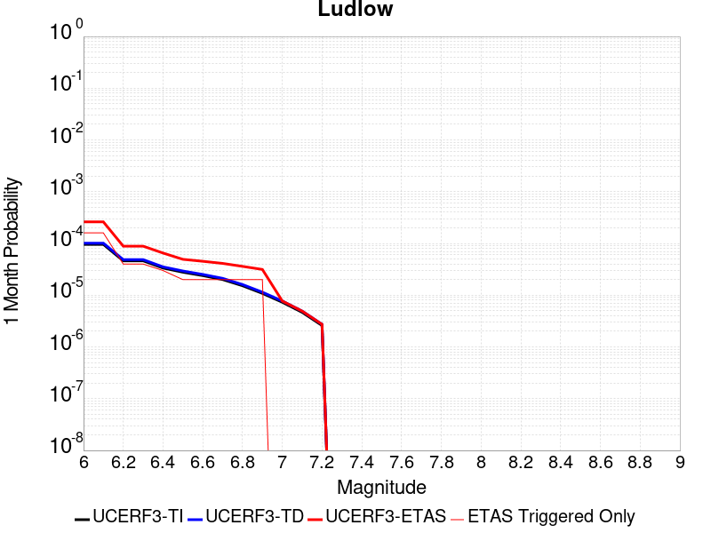 |  |  |

| Magnitude | 1 wk TI Prob | 1 wk TD Prob | 1 wk ETAS Prob | 1 wk ETAS/TD Gain | 1 wk ETAS Triggered Only | 1 mo TI Prob | 1 mo TD Prob | 1 mo ETAS Prob | 1 mo ETAS/TD Gain | 1 mo ETAS Triggered Only | 1 yr TI Prob | 1 yr TD Prob | 1 yr ETAS Prob | 1 yr ETAS/TD Gain | 1 yr ETAS Triggered Only | 10 yr TI Prob | 10 yr TD Prob | 10 yr ETAS Prob | 10 yr ETAS/TD Gain | 10 yr ETAS Triggered Only |
|-----|-----|-----|-----|-----|-----|-----|-----|-----|-----|-----|-----|-----|-----|-----|-----|-----|-----|-----|-----|-----|
| 6.0 | 2.2407607E-5 | 2.3657254E-5 | 1.3365466E-4 | 5.6496267 | 1.1E-4 | 9.602906E-5 | 1.0138454E-4 | 2.6136832E-4 | 2.5779898 | 1.6E-4 | 0.0011685267 | 0.001233702 | 0.0014933812 | 1.2104878 | 2.6E-4 | 0.011624013 | 0.012273042 | 0.0126483785 | 1.0305822 | 3.8E-4 |
| 6.1 | 2.2407607E-5 | 2.3657254E-5 | 1.3365466E-4 | 5.6496267 | 1.1E-4 | 9.602906E-5 | 1.0138454E-4 | 2.6136832E-4 | 2.5779898 | 1.6E-4 | 0.0011685267 | 0.001233702 | 0.0014933812 | 1.2104878 | 2.6E-4 | 0.011624013 | 0.012273042 | 0.0126483785 | 1.0305822 | 3.8E-4 |
| 6.2 | 1.0781252E-5 | 1.1365663E-5 | 4.136532E-5 | 3.6394992 | 3.0E-5 | 4.620455E-5 | 4.8709102E-5 | 8.870715E-5 | 1.8211617 | 4.0E-5 | 5.623952E-4 | 5.9287593E-4 | 6.6283444E-4 | 1.1179986 | 7.0E-5 | 0.00560974 | 0.0059133614 | 0.006052533 | 1.0235353 | 1.4E-4 |
| 6.3 | 1.0781252E-5 | 1.1365663E-5 | 4.136532E-5 | 3.6394992 | 3.0E-5 | 4.620455E-5 | 4.8709102E-5 | 8.870715E-5 | 1.8211617 | 4.0E-5 | 5.623952E-4 | 5.9287593E-4 | 6.6283444E-4 | 1.1179986 | 7.0E-5 | 0.00560974 | 0.0059133614 | 0.006052533 | 1.0235353 | 1.4E-4 |
| 6.4 | 7.814439E-6 | 8.237729E-6 | 2.8237564E-5 | 3.4278336 | 2.0E-5 | 3.3490025E-5 | 3.530408E-5 | 6.530302E-5 | 1.8497301 | 3.0E-5 | 4.0766477E-4 | 4.2974384E-4 | 4.8971805E-4 | 1.1395581 | 6.0E-5 | 0.0040691774 | 0.0042892746 | 0.0043988028 | 1.0255353 | 1.1E-4 |
| 6.5 | 6.4986366E-6 | 6.85092E-6 | 2.6850783E-5 | 3.919296 | 2.0E-5 | 2.7851002E-5 | 2.9360759E-5 | 4.9360173E-5 | 1.6811613 | 2.0E-5 | 3.390332E-4 | 3.5740953E-4 | 4.0739166E-4 | 1.1398455 | 5.0E-5 | 0.003385164 | 0.0035684432 | 0.0036581222 | 1.0251311 | 9.0E-5 |
| 6.6 | 5.582177E-6 | 5.8860055E-6 | 2.5885887E-5 | 4.39787 | 2.0E-5 | 2.3923398E-5 | 2.5225498E-5 | 4.5224995E-5 | 1.7928286 | 2.0E-5 | 2.9122844E-4 | 3.0707786E-4 | 3.470656E-4 | 1.1302202 | 4.0E-5 | 0.0029084706 | 0.003066609 | 0.0031463634 | 1.0260074 | 8.0E-5 |
| 6.7 | 4.6858763E-6 | 4.940427E-6 | 2.494033E-5 | 5.048213 | 2.0E-5 | 2.0082172E-5 | 2.1173091E-5 | 4.117267E-5 | 1.9445752 | 2.0E-5 | 2.4447302E-4 | 2.5775246E-4 | 2.9774214E-4 | 1.1551477 | 4.0E-5 | 0.0024420423 | 0.0025745912 | 0.0026543853 | 1.0309929 | 8.0E-5 |
| 6.8 | 3.5584908E-6 | 3.7520183E-6 | 2.3751943E-5 | 6.3304443 | 2.0E-5 | 1.5250586E-5 | 1.6079981E-5 | 3.607966E-5 | 2.2437625 | 2.0E-5 | 1.8566006E-4 | 1.957566E-4 | 2.3574877E-4 | 1.2042954 | 4.0E-5 | 0.0018550502 | 0.0019558826 | 0.0020257458 | 1.0357195 | 7.0E-5 |
| 6.9 | 2.532834E-6 | 2.6710034E-6 | 2.267095E-5 | 8.4878025 | 2.0E-5 | 1.0854958E-5 | 1.1447109E-5 | 3.144688E-5 | 2.7471461 | 2.0E-5 | 1.3215111E-4 | 1.3935992E-4 | 1.7935435E-4 | 1.2869866 | 4.0E-5 | 0.0013207254 | 0.0013927529 | 0.0014626554 | 1.0501902 | 7.0E-5 |
| 7.0 | 1.7083285E-6 | 1.8019439E-6 | 1.8019439E-6 | 1.0 | 0.0 | 7.3213873E-6 | 7.722595E-6 | 7.722595E-6 | 1.0 | 0.0 | 8.913424E-5 | 9.40187E-5 | 1.0401776E-4 | 1.1063519 | 1.0E-5 | 8.9098496E-4 | 9.3980576E-4 | 9.697775E-4 | 1.0318915 | 3.0E-5 |
| 7.1 | 1.0905424E-6 | 1.1497619E-6 | 1.1497619E-6 | 1.0 | 0.0 | 4.6737446E-6 | 4.9275427E-6 | 4.9275427E-6 | 1.0 | 0.0 | 5.6901354E-5 | 5.999128E-5 | 6.999068E-5 | 1.1666809 | 1.0E-5 | 5.6886784E-4 | 5.997606E-4 | 6.197486E-4 | 1.0333266 | 2.0E-5 |
| 7.2 | 6.06668E-7 | 6.387277E-7 | 6.387277E-7 | 1.0 | 0.0 | 2.600003E-6 | 2.7374022E-6 | 2.7374022E-6 | 1.0 | 0.0 | 3.1654577E-5 | 3.3327433E-5 | 4.3327098E-5 | 1.3000431 | 1.0E-5 | 3.1650066E-4 | 3.3323118E-4 | 3.5322452E-4 | 1.0599984 | 2.0E-5 |

## San Jacinto (San Bernardino)
*[(top)](#table-of-contents)*

| 1 Week | 1 Month | 1 Year | 10 Year |
|-----|-----|-----|-----|
|  |  | 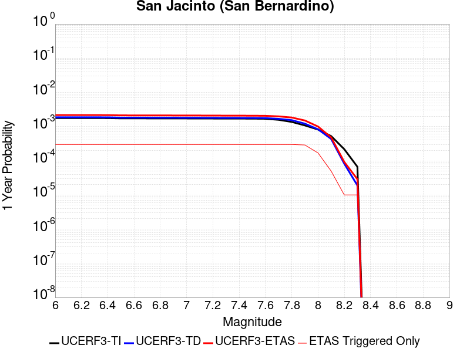 |  |

| Magnitude | 1 wk TI Prob | 1 wk TD Prob | 1 wk ETAS Prob | 1 wk ETAS/TD Gain | 1 wk ETAS Triggered Only | 1 mo TI Prob | 1 mo TD Prob | 1 mo ETAS Prob | 1 mo ETAS/TD Gain | 1 mo ETAS Triggered Only | 1 yr TI Prob | 1 yr TD Prob | 1 yr ETAS Prob | 1 yr ETAS/TD Gain | 1 yr ETAS Triggered Only | 10 yr TI Prob | 10 yr TD Prob | 10 yr ETAS Prob | 10 yr ETAS/TD Gain | 10 yr ETAS Triggered Only |
|-----|-----|-----|-----|-----|-----|-----|-----|-----|-----|-----|-----|-----|-----|-----|-----|-----|-----|-----|-----|-----|
| 6.0 | 3.409352E-5 | 3.598562E-5 | 2.3597843E-4 | 6.5575757 | 2.0E-4 | 1.461069E-4 | 1.5421498E-4 | 3.9417797E-4 | 2.556029 | 2.4E-4 | 0.0017774 | 0.0018759521 | 0.0021753893 | 1.1596189 | 3.0E-4 | 0.01763251 | 0.019349992 | 0.019742252 | 1.0202719 | 4.0E-4 |
| 6.1 | 3.409352E-5 | 3.598562E-5 | 2.3597843E-4 | 6.5575757 | 2.0E-4 | 1.461069E-4 | 1.5421498E-4 | 3.9417797E-4 | 2.556029 | 2.4E-4 | 0.0017774 | 0.0018759521 | 0.0021753893 | 1.1596189 | 3.0E-4 | 0.01763251 | 0.019349992 | 0.019742252 | 1.0202719 | 4.0E-4 |
| 6.2 | 3.409352E-5 | 3.598562E-5 | 2.3597843E-4 | 6.5575757 | 2.0E-4 | 1.461069E-4 | 1.5421498E-4 | 3.9417797E-4 | 2.556029 | 2.4E-4 | 0.0017774 | 0.0018759521 | 0.0021753893 | 1.1596189 | 3.0E-4 | 0.01763251 | 0.019349992 | 0.019742252 | 1.0202719 | 4.0E-4 |
| 6.3 | 3.409352E-5 | 3.598562E-5 | 2.3597843E-4 | 6.5575757 | 2.0E-4 | 1.461069E-4 | 1.5421498E-4 | 3.9417797E-4 | 2.556029 | 2.4E-4 | 0.0017774 | 0.0018759521 | 0.0021753893 | 1.1596189 | 3.0E-4 | 0.01763251 | 0.019349992 | 0.019742252 | 1.0202719 | 4.0E-4 |
| 6.4 | 3.400795E-5 | 3.5878285E-5 | 2.358711E-4 | 6.5742025 | 2.0E-4 | 1.4574021E-4 | 1.5375503E-4 | 3.9371813E-4 | 2.5606847 | 2.4E-4 | 0.0017729428 | 0.0018703619 | 0.0021698007 | 1.1600968 | 3.0E-4 | 0.017588645 | 0.019295074 | 0.019687356 | 1.0203307 | 4.0E-4 |
| 6.5 | 3.341482E-5 | 3.5138914E-5 | 2.3513188E-4 | 6.6914954 | 2.0E-4 | 1.4319851E-4 | 1.5058667E-4 | 3.9055053E-4 | 2.5935266 | 2.4E-4 | 0.0017420477 | 0.0018318522 | 0.0021313026 | 1.1634687 | 3.0E-4 | 0.017284546 | 0.018916616 | 0.019299239 | 1.0202268 | 3.9E-4 |
| 6.6 | 3.3364955E-5 | 3.5076133E-5 | 2.3506912E-4 | 6.701683 | 2.0E-4 | 1.4298483E-4 | 1.5031763E-4 | 3.9028155E-4 | 2.596379 | 2.4E-4 | 0.0017394501 | 0.0018285823 | 0.0021280337 | 1.1637615 | 3.0E-4 | 0.017258976 | 0.01888448 | 0.019267116 | 1.0202619 | 3.9E-4 |
| 6.7 | 3.335922E-5 | 3.5065907E-5 | 2.3505889E-4 | 6.703346 | 2.0E-4 | 1.4296026E-4 | 1.5027382E-4 | 3.9023775E-4 | 2.5968447 | 2.4E-4 | 0.0017391514 | 0.0018280497 | 0.0021275012 | 1.1638093 | 3.0E-4 | 0.017256035 | 0.018879272 | 0.01926191 | 1.0202676 | 3.9E-4 |
| 6.8 | 3.327683E-5 | 3.4959972E-5 | 2.3495298E-4 | 6.7206283 | 2.0E-4 | 1.4260718E-4 | 1.4981985E-4 | 3.897839E-4 | 2.6016839 | 2.4E-4 | 0.0017348597 | 0.001822532 | 0.0021219854 | 1.1643062 | 3.0E-4 | 0.017213784 | 0.018825045 | 0.019207703 | 1.0203271 | 3.9E-4 |
| 6.9 | 3.3235785E-5 | 3.4900928E-5 | 2.3489395E-4 | 6.730307 | 2.0E-4 | 1.4243131E-4 | 1.4956683E-4 | 3.8953093E-4 | 2.604394 | 2.4E-4 | 0.0017327217 | 0.0018194567 | 0.002118911 | 1.1645844 | 3.0E-4 | 0.017192734 | 0.018794911 | 0.01917758 | 1.0203604 | 3.9E-4 |
| 7.0 | 3.3197095E-5 | 3.4840854E-5 | 2.3483389E-4 | 6.740187 | 2.0E-4 | 1.422655E-4 | 1.4930942E-4 | 3.8927357E-4 | 2.6071603 | 2.4E-4 | 0.0017307063 | 0.0018163278 | 0.002115783 | 1.1648685 | 3.0E-4 | 0.017172894 | 0.01876429 | 0.019146971 | 1.0203942 | 3.9E-4 |
| 7.1 | 3.3129716E-5 | 3.4721066E-5 | 2.3471413E-4 | 6.759992 | 2.0E-4 | 1.4197677E-4 | 1.4879608E-4 | 3.8876038E-4 | 2.6127057 | 2.4E-4 | 0.0017271966 | 0.0018100884 | 0.0021095455 | 1.1654378 | 3.0E-4 | 0.017138338 | 0.018703366 | 0.019086072 | 1.0204619 | 3.9E-4 |
| 7.2 | 3.3034008E-5 | 3.4588513E-5 | 2.3458159E-4 | 6.782067 | 2.0E-4 | 1.4156665E-4 | 1.4822806E-4 | 3.8819248E-4 | 2.6188867 | 2.4E-4 | 0.0017222111 | 0.0018031843 | 0.0021026433 | 1.1660724 | 3.0E-4 | 0.017089253 | 0.01863575 | 0.019018482 | 1.0205375 | 3.9E-4 |
| 7.3 | 3.2956614E-5 | 3.4456265E-5 | 2.3444937E-4 | 6.8042593 | 2.0E-4 | 1.4123498E-4 | 1.4766137E-4 | 3.876259E-4 | 2.6251006 | 2.4E-4 | 0.0017181796 | 0.0017962961 | 0.0020957573 | 1.1667104 | 3.0E-4 | 0.017049557 | 0.018568495 | 0.018951254 | 1.0206133 | 3.9E-4 |
| 7.4 | 3.2915937E-5 | 3.4377957E-5 | 2.3437108E-4 | 6.817481 | 2.0E-4 | 1.4106068E-4 | 1.473258E-4 | 3.8729043E-4 | 2.6288025 | 2.4E-4 | 0.0017160608 | 0.0017922173 | 0.0020916797 | 1.1670904 | 3.0E-4 | 0.017028693 | 0.018528769 | 0.018911542 | 1.0206584 | 3.9E-4 |
| 7.5 | 3.281791E-5 | 3.424287E-5 | 2.3423602E-4 | 6.840432 | 2.0E-4 | 1.406406E-4 | 1.4674691E-4 | 3.867117E-4 | 2.6352289 | 2.4E-4 | 0.0017109542 | 0.0017851809 | 0.0020846454 | 1.1677502 | 3.0E-4 | 0.016978411 | 0.018459652 | 0.018842453 | 1.0207372 | 3.9E-4 |
| 7.6 | 3.2521442E-5 | 3.396782E-5 | 2.3396102E-4 | 6.887726 | 2.0E-4 | 1.3937015E-4 | 1.4556825E-4 | 3.8553332E-4 | 2.648471 | 2.4E-4 | 0.0016955109 | 0.0017708542 | 0.0020703229 | 1.1691098 | 3.0E-4 | 0.016826328 | 0.018317295 | 0.018690335 | 1.0203655 | 3.8E-4 |
| 7.7 | 3.0287873E-5 | 3.245191E-5 | 2.3244543E-4 | 7.162765 | 2.0E-4 | 1.297987E-4 | 1.3907222E-4 | 3.7903883E-4 | 2.7254822 | 2.4E-4 | 0.0015791537 | 0.0016918903 | 0.0019913828 | 1.1770165 | 3.0E-4 | 0.01567979 | 0.017528199 | 0.017901538 | 1.0212994 | 3.8E-4 |
| 7.8 | 2.6316151E-5 | 2.9662837E-5 | 2.296569E-4 | 7.742244 | 2.0E-4 | 1.1277862E-4 | 1.2712025E-4 | 3.6708976E-4 | 2.887736 | 2.4E-4 | 0.0013722149 | 0.0015465913 | 0.0018461273 | 1.1936749 | 3.0E-4 | 0.013637724 | 0.016069878 | 0.01644377 | 1.0232667 | 3.8E-4 |
| 7.9 | 2.0761147E-5 | 2.3417291E-5 | 2.234126E-4 | 9.540498 | 2.0E-4 | 8.897331E-5 | 1.0035596E-4 | 3.4033187E-4 | 3.3912473 | 2.4E-4 | 0.0010827117 | 0.0012211498 | 0.0015107957 | 1.2371911 | 2.9E-4 | 0.010774517 | 0.012793272 | 0.013148666 | 1.0277798 | 3.6E-4 |
| 8.0 | 1.5738568E-5 | 1.6032505E-5 | 1.16030904E-4 | 7.2372284 | 1.0E-4 | 6.744926E-5 | 6.8708934E-5 | 2.0869932E-4 | 3.0374408 | 1.4E-4 | 8.2088535E-4 | 8.3621085E-4 | 0.0010060687 | 1.203128 | 1.7E-4 | 0.008178596 | 0.008865741 | 0.009093702 | 1.0257126 | 2.3E-4 |
| 8.1 | 1.0105832E-5 | 8.329479E-6 | 2.8329312E-5 | 3.4010906 | 2.0E-5 | 4.3309992E-5 | 3.569728E-5 | 7.5695854E-5 | 2.1204937 | 4.0E-5 | 5.2717153E-4 | 4.3452822E-4 | 4.8450648E-4 | 1.1150173 | 5.0E-5 | 0.005259227 | 0.0046768794 | 0.004756505 | 1.0170255 | 8.0E-5 |
| 8.2 | 4.189207E-6 | 1.577699E-6 | 1.577699E-6 | 1.0 | 0.0 | 1.7953622E-5 | 6.7615497E-6 | 6.7615497E-6 | 1.0 | 0.0 | 2.1856341E-4 | 8.231879E-5 | 9.231796E-5 | 1.1214689 | 1.0E-5 | 0.0021834858 | 9.562628E-4 | 9.662532E-4 | 1.0104474 | 1.0E-5 |
| 8.3 | 1.2758221E-6 | 3.612677E-7 | 3.612677E-7 | 1.0 | 0.0 | 5.4677976E-6 | 1.5482892E-6 | 1.5482892E-6 | 1.0 | 0.0 | 6.65684E-5 | 1.8850264E-5 | 2.8850074E-5 | 1.5304866 | 1.0E-5 | 6.6548464E-4 | 2.2739546E-4 | 2.373932E-4 | 1.0439663 | 1.0E-5 |

## Baker
*[(top)](#table-of-contents)*

| 1 Week | 1 Month | 1 Year | 10 Year |
|-----|-----|-----|-----|
|  |  | 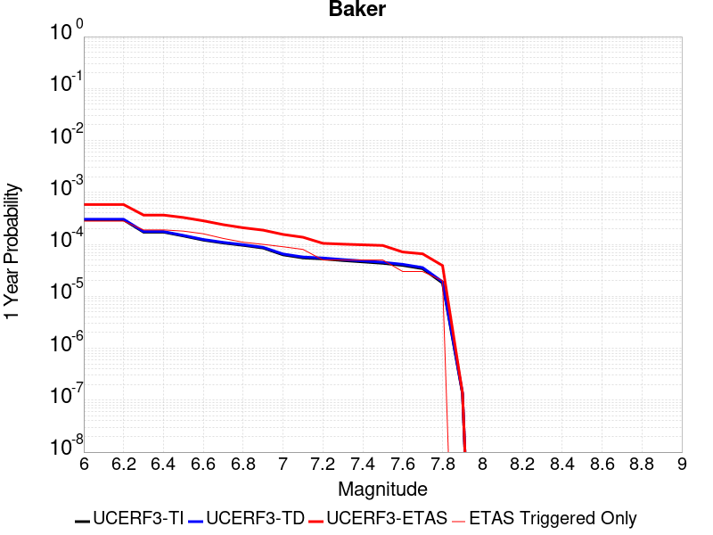 |  |

| Magnitude | 1 wk TI Prob | 1 wk TD Prob | 1 wk ETAS Prob | 1 wk ETAS/TD Gain | 1 wk ETAS Triggered Only | 1 mo TI Prob | 1 mo TD Prob | 1 mo ETAS Prob | 1 mo ETAS/TD Gain | 1 mo ETAS Triggered Only | 1 yr TI Prob | 1 yr TD Prob | 1 yr ETAS Prob | 1 yr ETAS/TD Gain | 1 yr ETAS Triggered Only | 10 yr TI Prob | 10 yr TD Prob | 10 yr ETAS Prob | 10 yr ETAS/TD Gain | 10 yr ETAS Triggered Only |
|-----|-----|-----|-----|-----|-----|-----|-----|-----|-----|-----|-----|-----|-----|-----|-----|-----|-----|-----|-----|-----|
| 6.0 | 5.695525E-6 | 5.8348373E-6 | 1.4583403E-4 | 24.993675 | 1.4E-4 | 2.4409164E-5 | 2.5006228E-5 | 2.0500172E-4 | 8.198027 | 1.8E-4 | 2.9714106E-4 | 3.044123E-4 | 5.8432703E-4 | 1.9195251 | 2.8E-4 | 0.0029674405 | 0.0030403486 | 0.003429163 | 1.1278847 | 3.9E-4 |
| 6.1 | 5.695525E-6 | 5.8348373E-6 | 1.4583403E-4 | 24.993675 | 1.4E-4 | 2.4409164E-5 | 2.5006228E-5 | 2.0500172E-4 | 8.198027 | 1.8E-4 | 2.9714106E-4 | 3.044123E-4 | 5.8432703E-4 | 1.9195251 | 2.8E-4 | 0.0029674405 | 0.0030403486 | 0.003429163 | 1.1278847 | 3.9E-4 |
| 6.2 | 5.695525E-6 | 5.8348373E-6 | 1.4583403E-4 | 24.993675 | 1.4E-4 | 2.4409164E-5 | 2.5006228E-5 | 2.0500172E-4 | 8.198027 | 1.8E-4 | 2.9714106E-4 | 3.044123E-4 | 5.8432703E-4 | 1.9195251 | 2.8E-4 | 0.0029674405 | 0.0030403486 | 0.003429163 | 1.1278847 | 3.9E-4 |
| 6.3 | 3.2995713E-6 | 3.383667E-6 | 8.33834E-5 | 24.642908 | 8.0E-5 | 1.4140943E-5 | 1.4501353E-5 | 1.2449975E-4 | 8.585389 | 1.1E-4 | 1.7215237E-4 | 1.7654014E-4 | 3.665066E-4 | 2.0760524 | 1.9E-4 | 0.0017201907 | 0.001764046 | 0.0020335696 | 1.1527872 | 2.7E-4 |
| 6.4 | 3.2995713E-6 | 3.383667E-6 | 8.33834E-5 | 24.642908 | 8.0E-5 | 1.4140943E-5 | 1.4501353E-5 | 1.2449975E-4 | 8.585389 | 1.1E-4 | 1.7215237E-4 | 1.7654014E-4 | 3.665066E-4 | 2.0760524 | 1.9E-4 | 0.0017201907 | 0.001764046 | 0.0020335696 | 1.1527872 | 2.7E-4 |
| 6.5 | 2.782202E-6 | 2.8558404E-6 | 7.285564E-5 | 25.511103 | 7.0E-5 | 1.1923668E-5 | 1.223926E-5 | 1.12238034E-4 | 9.170328 | 1.0E-4 | 1.4516099E-4 | 1.4900314E-4 | 3.289763E-4 | 2.2078483 | 1.8E-4 | 0.001450662 | 0.0014890651 | 0.0017386929 | 1.1676406 | 2.5E-4 |
| 6.6 | 2.3163404E-6 | 2.38092E-6 | 7.238075E-5 | 30.40033 | 7.0E-5 | 9.927136E-6 | 1.0203904E-5 | 1.0020298E-4 | 9.820064 | 9.0E-5 | 1.20856166E-4 | 1.2422565E-4 | 2.8420577E-4 | 2.2878187 | 1.6E-4 | 0.0012079047 | 0.0012415823 | 0.0014712968 | 1.1850175 | 2.3E-4 |
| 6.7 | 2.037056E-6 | 2.0965003E-6 | 6.209638E-5 | 29.61906 | 6.0E-5 | 8.7302105E-6 | 8.984972E-6 | 8.8984256E-5 | 9.903676 | 8.0E-5 | 1.0628513E-4 | 1.093867E-4 | 2.3937249E-4 | 2.1883142 | 1.3E-4 | 0.0010623431 | 0.0010933448 | 0.001273148 | 1.1644524 | 1.8E-4 |
| 6.8 | 1.8356744E-6 | 1.8915287E-6 | 4.1891453E-5 | 22.146877 | 4.0E-5 | 7.867153E-6 | 8.106527E-6 | 6.810604E-5 | 8.401383 | 6.0E-5 | 9.577837E-5 | 9.869264E-5 | 2.0868178E-4 | 2.1144614 | 1.1E-4 | 9.57371E-4 | 9.86502E-4 | 0.0011463442 | 1.1620293 | 1.6E-4 |
| 6.9 | 1.6310546E-6 | 1.6832072E-6 | 4.168314E-5 | 24.764116 | 4.0E-5 | 6.9902153E-6 | 7.213726E-6 | 6.7213296E-5 | 9.317417 | 6.0E-5 | 8.510255E-5 | 8.782368E-5 | 1.878149E-4 | 2.138545 | 1.0E-4 | 8.5069967E-4 | 8.7790104E-4 | 0.0010277694 | 1.1707121 | 1.5E-4 |
| 7.0 | 1.2058036E-6 | 1.2508665E-6 | 4.1250816E-5 | 32.97779 | 4.0E-5 | 5.1677193E-6 | 5.3608455E-6 | 6.5360524E-5 | 12.1922035 | 6.0E-5 | 6.291517E-5 | 6.5266366E-5 | 1.552605E-4 | 2.3788745 | 9.0E-5 | 6.289736E-4 | 6.524743E-4 | 7.72396E-4 | 1.1837953 | 1.2E-4 |
| 7.1 | 1.052382E-6 | 1.0951609E-6 | 3.109513E-5 | 28.393206 | 3.0E-5 | 4.5102006E-6 | 4.693538E-6 | 5.4693304E-5 | 11.652894 | 5.0E-5 | 5.491031E-5 | 5.7142337E-5 | 1.3713776E-4 | 2.3999329 | 8.0E-5 | 5.4896745E-4 | 5.7127734E-4 | 6.812145E-4 | 1.192441 | 1.1E-4 |
| 7.2 | 1.0067454E-6 | 1.0487711E-6 | 1.1048761E-5 | 10.53496 | 1.0E-5 | 4.3146156E-6 | 4.4947255E-6 | 3.449459E-5 | 7.67446 | 3.0E-5 | 5.252918E-5 | 5.4721917E-5 | 1.0471918E-4 | 1.9136606 | 5.0E-5 | 5.251676E-4 | 5.470853E-4 | 6.270415E-4 | 1.1461495 | 8.0E-5 |
| 7.3 | 9.3596316E-7 | 9.767723E-7 | 1.09767625E-5 | 11.23779 | 1.0E-5 | 4.0112645E-6 | 4.1861604E-6 | 3.4186036E-5 | 8.166442 | 3.0E-5 | 4.8836053E-5 | 5.096532E-5 | 1.00962774E-4 | 1.9810092 | 5.0E-5 | 4.8825322E-4 | 5.095371E-4 | 5.7950144E-4 | 1.1373096 | 7.0E-5 |
| 7.4 | 8.8117395E-7 | 9.2076635E-7 | 1.0920757E-5 | 11.860509 | 1.0E-5 | 3.7764542E-6 | 3.9461356E-6 | 3.3946017E-5 | 8.6023445 | 3.0E-5 | 4.5977362E-5 | 4.8043148E-5 | 9.804075E-5 | 2.0406811 | 5.0E-5 | 4.596785E-4 | 4.8032837E-4 | 5.5029476E-4 | 1.1456636 | 7.0E-5 |
| 7.5 | 8.292386E-7 | 8.6745956E-7 | 1.0867451E-5 | 12.5279045 | 1.0E-5 | 3.5538749E-6 | 3.7176785E-6 | 3.3717566E-5 | 9.069522 | 3.0E-5 | 4.326757E-5 | 4.5261804E-5 | 9.5259544E-5 | 2.1046343 | 5.0E-5 | 4.3259145E-4 | 4.5252658E-4 | 5.124994E-4 | 1.1325289 | 6.0E-5 |
| 7.6 | 7.553842E-7 | 7.9144706E-7 | 7.9144706E-7 | 1.0 | 0.0 | 3.2373566E-6 | 3.3919116E-6 | 1.33918775E-5 | 3.94818 | 1.0E-5 | 3.9414106E-5 | 4.129575E-5 | 7.129451E-5 | 1.7264371 | 3.0E-5 | 3.9407116E-4 | 4.1288146E-4 | 4.5286494E-4 | 1.0968401 | 4.0E-5 |
| 7.7 | 6.5285366E-7 | 6.852797E-7 | 6.852797E-7 | 1.0 | 0.0 | 2.797941E-6 | 2.9369096E-6 | 1.293688E-5 | 4.4049296 | 1.0E-5 | 3.40644E-5 | 3.5756293E-5 | 6.575522E-5 | 1.838983 | 3.0E-5 | 3.405918E-4 | 3.5750607E-4 | 3.9749176E-4 | 1.1118462 | 4.0E-5 |
| 7.8 | 3.4586725E-7 | 3.6482615E-7 | 3.6482615E-7 | 1.0 | 0.0 | 1.4822873E-6 | 1.5635396E-6 | 1.1563524E-5 | 7.3957343 | 1.0E-5 | 1.80467E-5 | 1.9035933E-5 | 3.9035553E-5 | 2.0506246 | 2.0E-5 | 1.8045233E-4 | 1.9034347E-4 | 2.2033777E-4 | 1.1575798 | 3.0E-5 |
| 7.9 | 2.5591178E-9 | 2.6696718E-9 | 2.6696718E-9 | 1.0 | 0.0 | 1.0967647E-8 | 1.14414505E-8 | 1.14414505E-8 | 1.0 | 0.0 | 1.335311E-7 | 1.3929966E-7 | 1.3929966E-7 | 1.0 | 0.0 | 1.3353102E-6 | 1.3929966E-6 | 1.3929966E-6 | 1.0 | 0.0 |

## Scodie Lineament
*[(top)](#table-of-contents)*

| 1 Week | 1 Month | 1 Year | 10 Year |
|-----|-----|-----|-----|
| 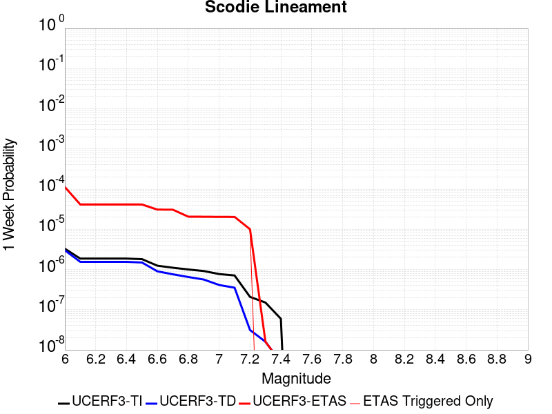 |  | 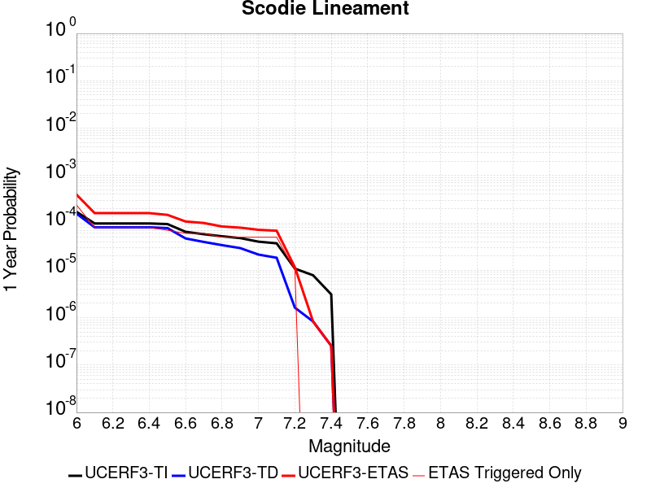 | 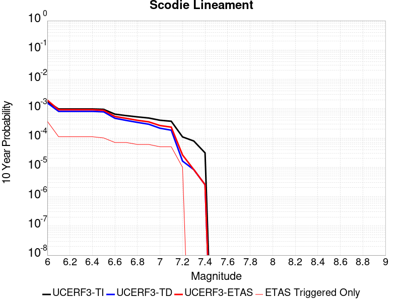 |

| Magnitude | 1 wk TI Prob | 1 wk TD Prob | 1 wk ETAS Prob | 1 wk ETAS/TD Gain | 1 wk ETAS Triggered Only | 1 mo TI Prob | 1 mo TD Prob | 1 mo ETAS Prob | 1 mo ETAS/TD Gain | 1 mo ETAS Triggered Only | 1 yr TI Prob | 1 yr TD Prob | 1 yr ETAS Prob | 1 yr ETAS/TD Gain | 1 yr ETAS Triggered Only | 10 yr TI Prob | 10 yr TD Prob | 10 yr ETAS Prob | 10 yr ETAS/TD Gain | 10 yr ETAS Triggered Only |
|-----|-----|-----|-----|-----|-----|-----|-----|-----|-----|-----|-----|-----|-----|-----|-----|-----|-----|-----|-----|-----|
| 6.0 | 3.2919327E-6 | 3.0133303E-6 | 1.13013E-4 | 37.50435 | 1.1E-4 | 1.4108206E-5 | 1.2914227E-5 | 1.6291229E-4 | 12.614946 | 1.5E-4 | 1.7175387E-4 | 1.5722254E-4 | 3.971848E-4 | 2.5262587 | 2.4E-4 | 0.0017162118 | 0.0015714248 | 0.0019408433 | 1.2350851 | 3.7E-4 |
| 6.1 | 1.8663811E-6 | 1.5490382E-6 | 4.1548978E-5 | 26.822435 | 4.0E-5 | 7.998751E-6 | 6.6387206E-6 | 6.663832E-5 | 10.037826 | 6.0E-5 | 9.738045E-5 | 8.082393E-5 | 1.6081746E-4 | 1.989726 | 8.0E-5 | 9.7337784E-4 | 8.079941E-4 | 9.1790524E-4 | 1.1360296 | 1.1E-4 |
| 6.2 | 1.8663811E-6 | 1.5490382E-6 | 4.1548978E-5 | 26.822435 | 4.0E-5 | 7.998751E-6 | 6.6387206E-6 | 6.663832E-5 | 10.037826 | 6.0E-5 | 9.738045E-5 | 8.082393E-5 | 1.6081746E-4 | 1.989726 | 8.0E-5 | 9.7337784E-4 | 8.079941E-4 | 9.1790524E-4 | 1.1360296 | 1.1E-4 |
| 6.3 | 1.8663811E-6 | 1.5490382E-6 | 4.1548978E-5 | 26.822435 | 4.0E-5 | 7.998751E-6 | 6.6387206E-6 | 6.663832E-5 | 10.037826 | 6.0E-5 | 9.738045E-5 | 8.082393E-5 | 1.6081746E-4 | 1.989726 | 8.0E-5 | 9.7337784E-4 | 8.079941E-4 | 9.1790524E-4 | 1.1360296 | 1.1E-4 |
| 6.4 | 1.8663811E-6 | 1.5490382E-6 | 4.1548978E-5 | 26.822435 | 4.0E-5 | 7.998751E-6 | 6.6387206E-6 | 6.663832E-5 | 10.037826 | 6.0E-5 | 9.738045E-5 | 8.082393E-5 | 1.6081746E-4 | 1.989726 | 8.0E-5 | 9.7337784E-4 | 8.079941E-4 | 9.1790524E-4 | 1.1360296 | 1.1E-4 |
| 6.5 | 1.8106311E-6 | 1.4909722E-6 | 4.1490912E-5 | 27.828094 | 4.0E-5 | 7.759824E-6 | 6.389868E-6 | 5.638955E-5 | 8.824838 | 5.0E-5 | 9.447177E-5 | 7.779436E-5 | 1.4778892E-4 | 1.8997382 | 7.0E-5 | 9.4431615E-4 | 7.7771995E-4 | 8.7764213E-4 | 1.128481 | 1.0E-4 |
| 6.6 | 1.2414679E-6 | 8.9974395E-7 | 3.089972E-5 | 34.34279 | 3.0E-5 | 5.320566E-6 | 3.85604E-6 | 4.3855885E-5 | 11.373296 | 4.0E-5 | 6.477596E-5 | 4.6946367E-5 | 1.0694355E-4 | 2.2779942 | 6.0E-5 | 6.475708E-4 | 4.6937316E-4 | 5.393403E-4 | 1.149065 | 7.0E-5 |
| 6.7 | 1.1062215E-6 | 7.594193E-7 | 3.07594E-5 | 40.503838 | 3.0E-5 | 4.7409408E-6 | 3.2546504E-6 | 4.325452E-5 | 13.290066 | 4.0E-5 | 5.7719422E-5 | 3.962472E-5 | 9.9622346E-5 | 2.5141463 | 6.0E-5 | 5.770443E-4 | 3.9618355E-4 | 4.6615582E-4 | 1.1766158 | 7.0E-5 |
| 6.8 | 1.0006736E-6 | 6.5002786E-7 | 2.0650015E-5 | 31.76789 | 2.0E-5 | 4.288594E-6 | 2.7858312E-6 | 3.278575E-5 | 11.768749 | 3.0E-5 | 5.221238E-5 | 3.391703E-5 | 8.391533E-5 | 2.4741359 | 5.0E-5 | 5.220012E-4 | 3.3912458E-4 | 3.9910423E-4 | 1.1768662 | 6.0E-5 |
| 6.9 | 9.167364E-7 | 5.6315065E-7 | 2.0563139E-5 | 36.514454 | 2.0E-5 | 3.9288643E-6 | 2.413501E-6 | 3.2413427E-5 | 13.430046 | 3.0E-5 | 4.7832873E-5 | 2.9384037E-5 | 7.938257E-5 | 2.7015543 | 5.0E-5 | 4.782258E-4 | 2.9380718E-4 | 3.5378954E-4 | 1.2041556 | 6.0E-5 |
| 7.0 | 7.6987664E-7 | 4.113265E-7 | 2.0411318E-5 | 49.623154 | 2.0E-5 | 3.2994672E-6 | 1.7628269E-6 | 3.1762775E-5 | 18.01809 | 3.0E-5 | 4.0170275E-5 | 2.1462245E-5 | 7.1461174E-5 | 3.3296223 | 5.0E-5 | 4.0163012E-4 | 2.1460558E-4 | 2.6459486E-4 | 1.2329355 | 5.0E-5 |
| 7.1 | 7.1038727E-7 | 3.5210306E-7 | 2.0352096E-5 | 57.801533 | 2.0E-5 | 3.0445133E-6 | 1.5090123E-6 | 3.1508967E-5 | 20.880522 | 3.0E-5 | 3.706632E-5 | 1.8372106E-5 | 6.837119E-5 | 3.721467 | 5.0E-5 | 3.7060137E-4 | 1.8370937E-4 | 2.3370018E-4 | 1.272119 | 5.0E-5 |
| 7.2 | 2.0799602E-7 | 3.1178534E-8 | 1.0031178E-5 | 321.7335 | 1.0E-5 | 8.914113E-7 | 1.3362228E-7 | 1.0133621E-5 | 75.83781 | 1.0E-5 | 1.0852878E-5 | 1.6268501E-6 | 1.1626834E-5 | 7.1468377 | 1.0E-5 | 1.08523476E-4 | 1.626839E-5 | 2.6268226E-5 | 1.614679 | 1.0E-5 |
| 7.3 | 1.5048182E-7 | 1.5939106E-8 | 1.5939106E-8 | 1.0 | 0.0 | 6.449219E-7 | 6.8310456E-8 | 6.8310456E-8 | 1.0 | 0.0 | 7.851896E-6 | 8.316795E-7 | 8.316795E-7 | 1.0 | 0.0 | 7.851618E-5 | 8.316767E-6 | 8.316767E-6 | 1.0 | 0.0 |
| 7.4 | 5.9334678E-8 | 4.8638475E-9 | 4.8638475E-9 | 1.0 | 0.0 | 2.5429145E-7 | 2.084506E-8 | 2.084506E-8 | 1.0 | 0.0 | 3.095994E-6 | 2.5378858E-7 | 2.5378858E-7 | 1.0 | 0.0 | 3.095951E-5 | 2.5378843E-6 | 2.5378843E-6 | 1.0 | 0.0 |

## Manix-Afton Hills
*[(top)](#table-of-contents)*

| 1 Week | 1 Month | 1 Year | 10 Year |
|-----|-----|-----|-----|
|  | 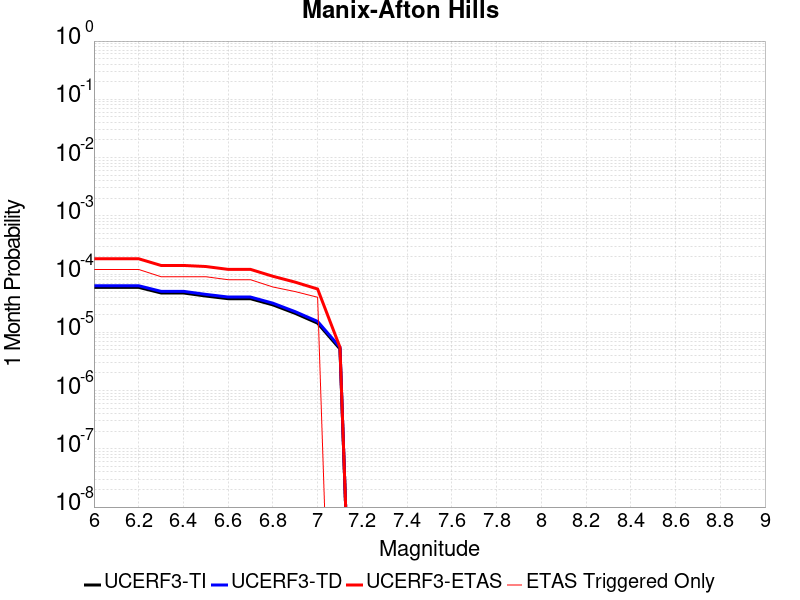 |  |  |

| Magnitude | 1 wk TI Prob | 1 wk TD Prob | 1 wk ETAS Prob | 1 wk ETAS/TD Gain | 1 wk ETAS Triggered Only | 1 mo TI Prob | 1 mo TD Prob | 1 mo ETAS Prob | 1 mo ETAS/TD Gain | 1 mo ETAS Triggered Only | 1 yr TI Prob | 1 yr TD Prob | 1 yr ETAS Prob | 1 yr ETAS/TD Gain | 1 yr ETAS Triggered Only | 10 yr TI Prob | 10 yr TD Prob | 10 yr ETAS Prob | 10 yr ETAS/TD Gain | 10 yr ETAS Triggered Only |
|-----|-----|-----|-----|-----|-----|-----|-----|-----|-----|-----|-----|-----|-----|-----|-----|-----|-----|-----|-----|-----|
| 6.0 | 1.3783202E-5 | 1.47110895E-5 | 1.0470977E-4 | 7.1177435 | 9.0E-5 | 5.906953E-5 | 6.30461E-5 | 1.8303854E-4 | 2.903249 | 1.2E-4 | 7.189342E-4 | 7.6733343E-4 | 0.0010071493 | 1.3125315 | 2.4E-4 | 0.0071661277 | 0.007648596 | 0.007985995 | 1.0441126 | 3.4E-4 |
| 6.1 | 1.3783202E-5 | 1.47110895E-5 | 1.0470977E-4 | 7.1177435 | 9.0E-5 | 5.906953E-5 | 6.30461E-5 | 1.8303854E-4 | 2.903249 | 1.2E-4 | 7.189342E-4 | 7.6733343E-4 | 0.0010071493 | 1.3125315 | 2.4E-4 | 0.0071661277 | 0.007648596 | 0.007985995 | 1.0441126 | 3.4E-4 |
| 6.2 | 1.3783202E-5 | 1.47110895E-5 | 1.0470977E-4 | 7.1177435 | 9.0E-5 | 5.906953E-5 | 6.30461E-5 | 1.8303854E-4 | 2.903249 | 1.2E-4 | 7.189342E-4 | 7.6733343E-4 | 0.0010071493 | 1.3125315 | 2.4E-4 | 0.0071661277 | 0.007648596 | 0.007985995 | 1.0441126 | 3.4E-4 |
| 6.3 | 1.10494875E-5 | 1.1793136E-5 | 8.1792314E-5 | 6.9355865 | 7.0E-5 | 4.7354086E-5 | 5.054109E-5 | 1.4053655E-4 | 2.7806394 | 9.0E-5 | 5.763835E-4 | 6.151744E-4 | 7.8506983E-4 | 1.2761744 | 1.7E-4 | 0.005748908 | 0.0061357557 | 0.00639416 | 1.0421146 | 2.6E-4 |
| 6.4 | 1.10494875E-5 | 1.1793136E-5 | 8.1792314E-5 | 6.9355865 | 7.0E-5 | 4.7354086E-5 | 5.054109E-5 | 1.4053655E-4 | 2.7806394 | 9.0E-5 | 5.763835E-4 | 6.151744E-4 | 7.8506983E-4 | 1.2761744 | 1.7E-4 | 0.005748908 | 0.0061357557 | 0.00639416 | 1.0421146 | 2.6E-4 |
| 6.5 | 9.788949E-6 | 1.045432E-5 | 8.045359E-5 | 7.695727 | 7.0E-5 | 4.1951964E-5 | 4.480351E-5 | 1.3479948E-4 | 3.0086813 | 9.0E-5 | 5.1064545E-4 | 5.453555E-4 | 7.0526823E-4 | 1.2932266 | 1.6E-4 | 0.0050947363 | 0.0054410985 | 0.005669847 | 1.0420408 | 2.3E-4 |
| 6.6 | 8.810006E-6 | 9.4136285E-6 | 6.9413065E-5 | 7.373678 | 6.0E-5 | 3.775662E-5 | 4.0343548E-5 | 1.2034032E-4 | 2.982889 | 8.0E-5 | 4.5958988E-4 | 4.9108086E-4 | 6.3101214E-4 | 1.2849455 | 1.4E-4 | 0.0045864056 | 0.004900839 | 0.005099859 | 1.0406094 | 2.0E-4 |
| 6.7 | 8.80128E-6 | 9.404108E-6 | 6.940354E-5 | 7.3801303 | 6.0E-5 | 3.7719226E-5 | 4.0302748E-5 | 1.20299526E-4 | 2.9848964 | 8.0E-5 | 4.591348E-4 | 4.9058435E-4 | 6.305157E-4 | 1.285234 | 1.4E-4 | 0.004581874 | 0.0048958957 | 0.0050949166 | 1.0406505 | 2.0E-4 |
| 6.8 | 6.8994877E-6 | 7.380076E-6 | 4.737978E-5 | 6.4199586 | 4.0E-5 | 2.9568899E-5 | 3.162856E-5 | 9.1626665E-5 | 2.8969598 | 6.0E-5 | 3.5994186E-4 | 3.8501783E-4 | 5.0497166E-4 | 1.3115538 | 1.2E-4 | 0.003593594 | 0.0038443129 | 0.004003698 | 1.0414599 | 1.6E-4 |
| 6.9 | 4.9328037E-6 | 5.2709615E-6 | 4.527075E-5 | 8.588708 | 4.0E-5 | 2.1140417E-5 | 2.2589675E-5 | 7.258855E-5 | 3.2133508 | 5.0E-5 | 2.5735417E-4 | 2.7500073E-4 | 3.6497597E-4 | 1.3271818 | 9.0E-5 | 0.0025705635 | 0.0027472095 | 0.0028668798 | 1.0435607 | 1.2E-4 |
| 7.0 | 3.347973E-6 | 3.59003E-6 | 3.3589924E-5 | 9.356446 | 3.0E-5 | 1.4348378E-5 | 1.5385775E-5 | 5.538516E-5 | 3.599764 | 4.0E-5 | 1.746775E-4 | 1.8730981E-4 | 2.572967E-4 | 1.3736424 | 7.0E-5 | 0.0017454025 | 0.0018719219 | 0.0019717347 | 1.053321 | 1.0E-4 |
| 7.1 | 1.2073567E-6 | 1.293482E-6 | 1.293482E-6 | 1.0 | 0.0 | 5.1743755E-6 | 5.543492E-6 | 5.543492E-6 | 1.0 | 0.0 | 6.29962E-5 | 6.749156E-5 | 7.7490884E-5 | 1.1481566 | 1.0E-5 | 6.297835E-4 | 6.7487074E-4 | 7.048505E-4 | 1.044423 | 3.0E-5 |

## Cady
*[(top)](#table-of-contents)*

| 1 Week | 1 Month | 1 Year | 10 Year |
|-----|-----|-----|-----|
|  |  |  |  |

| Magnitude | 1 wk TI Prob | 1 wk TD Prob | 1 wk ETAS Prob | 1 wk ETAS/TD Gain | 1 wk ETAS Triggered Only | 1 mo TI Prob | 1 mo TD Prob | 1 mo ETAS Prob | 1 mo ETAS/TD Gain | 1 mo ETAS Triggered Only | 1 yr TI Prob | 1 yr TD Prob | 1 yr ETAS Prob | 1 yr ETAS/TD Gain | 1 yr ETAS Triggered Only | 10 yr TI Prob | 10 yr TD Prob | 10 yr ETAS Prob | 10 yr ETAS/TD Gain | 10 yr ETAS Triggered Only |
|-----|-----|-----|-----|-----|-----|-----|-----|-----|-----|-----|-----|-----|-----|-----|-----|-----|-----|-----|-----|-----|
| 6.0 | 1.9892565E-5 | 2.1858728E-5 | 1.7185546E-4 | 7.8620973 | 1.5E-4 | 8.525106E-5 | 9.3677416E-5 | 2.836596E-4 | 3.028047 | 1.9E-4 | 0.0010374374 | 0.0011400167 | 0.0013897317 | 1.219045 | 2.5E-4 | 0.010326075 | 0.011350701 | 0.011686841 | 1.0296141 | 3.4E-4 |
| 6.1 | 1.9892565E-5 | 2.1858728E-5 | 1.7185546E-4 | 7.8620973 | 1.5E-4 | 8.525106E-5 | 9.3677416E-5 | 2.836596E-4 | 3.028047 | 1.9E-4 | 0.0010374374 | 0.0011400167 | 0.0013897317 | 1.219045 | 2.5E-4 | 0.010326075 | 0.011350701 | 0.011686841 | 1.0296141 | 3.4E-4 |
| 6.2 | 1.9892565E-5 | 2.1858728E-5 | 1.7185546E-4 | 7.8620973 | 1.5E-4 | 8.525106E-5 | 9.3677416E-5 | 2.836596E-4 | 3.028047 | 1.9E-4 | 0.0010374374 | 0.0011400167 | 0.0013897317 | 1.219045 | 2.5E-4 | 0.010326075 | 0.011350701 | 0.011686841 | 1.0296141 | 3.4E-4 |
| 6.3 | 1.1117327E-5 | 1.2176583E-5 | 6.2175975E-5 | 5.106192 | 5.0E-5 | 4.764482E-5 | 5.2184492E-5 | 1.3218031E-4 | 2.5329425 | 8.0E-5 | 5.7992124E-4 | 6.351925E-4 | 7.451226E-4 | 1.1730659 | 1.1E-4 | 0.0057841022 | 0.0063368753 | 0.006485925 | 1.023521 | 1.5E-4 |
| 6.4 | 1.1117327E-5 | 1.2176583E-5 | 6.2175975E-5 | 5.106192 | 5.0E-5 | 4.764482E-5 | 5.2184492E-5 | 1.3218031E-4 | 2.5329425 | 8.0E-5 | 5.7992124E-4 | 6.351925E-4 | 7.451226E-4 | 1.1730659 | 1.1E-4 | 0.0057841022 | 0.0063368753 | 0.006485925 | 1.023521 | 1.5E-4 |
| 6.5 | 6.103093E-6 | 6.672021E-6 | 3.667182E-5 | 5.496359 | 3.0E-5 | 2.615585E-5 | 2.8594131E-5 | 8.859242E-5 | 3.0982726 | 6.0E-5 | 3.1840094E-4 | 3.480905E-4 | 4.1806613E-4 | 1.2010272 | 7.0E-5 | 0.0031794512 | 0.0034766865 | 0.0035663738 | 1.0257968 | 9.0E-5 |
| 6.6 | 5.817237E-6 | 6.3656585E-6 | 3.636547E-5 | 5.712758 | 3.0E-5 | 2.4930776E-5 | 2.728118E-5 | 8.727954E-5 | 3.1992586 | 6.0E-5 | 3.034899E-4 | 3.3211018E-4 | 4.020869E-4 | 1.2107034 | 7.0E-5 | 0.0030307577 | 0.0033173605 | 0.0033970952 | 1.0240356 | 8.0E-5 |
| 6.7 | 4.8846314E-6 | 5.3405684E-6 | 3.5340407E-5 | 6.6173496 | 3.0E-5 | 2.0933967E-5 | 2.2888014E-5 | 7.288687E-5 | 3.1844995 | 5.0E-5 | 2.5484123E-4 | 2.7863772E-4 | 3.38621E-4 | 1.2152734 | 6.0E-5 | 0.0025454918 | 0.0027840391 | 0.0028538443 | 1.0250733 | 7.0E-5 |
| 6.8 | 1.7788773E-6 | 1.9399079E-6 | 2.193987E-5 | 11.309748 | 2.0E-5 | 7.6237375E-6 | 8.313874E-6 | 4.831354E-5 | 5.811195 | 4.0E-5 | 9.281505E-5 | 1.01218284E-4 | 1.4121424E-4 | 1.3951455 | 4.0E-5 | 9.2776294E-4 | 0.0010118765 | 0.0010618259 | 1.0493631 | 5.0E-5 |
| 6.9 | 7.5455404E-7 | 8.297092E-7 | 2.0829693E-5 | 25.10481 | 2.0E-5 | 3.233799E-6 | 3.5558937E-6 | 3.3555785E-5 | 9.436667 | 3.0E-5 | 3.937079E-5 | 4.3292483E-5 | 7.329118E-5 | 1.6929309 | 3.0E-5 | 3.9363815E-4 | 4.3287344E-4 | 4.728561E-4 | 1.0923657 | 4.0E-5 |
| 7.0 | 6.8578805E-7 | 7.541816E-7 | 2.0754167E-5 | 27.518791 | 2.0E-5 | 2.9390883E-6 | 3.2322048E-6 | 3.3232107E-5 | 10.28156 | 3.0E-5 | 3.578281E-5 | 3.9351715E-5 | 6.9350535E-5 | 1.7623256 | 3.0E-5 | 3.577705E-4 | 3.9347992E-4 | 4.3346419E-4 | 1.101617 | 4.0E-5 |

## White Wolf (Extension)
*[(top)](#table-of-contents)*

| 1 Week | 1 Month | 1 Year | 10 Year |
|-----|-----|-----|-----|
|  |  | 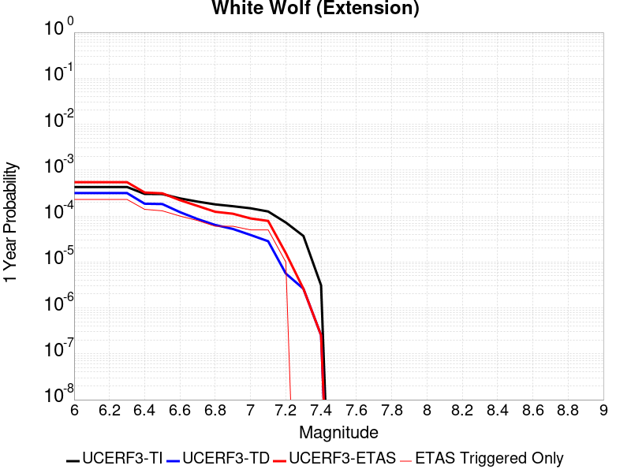 | 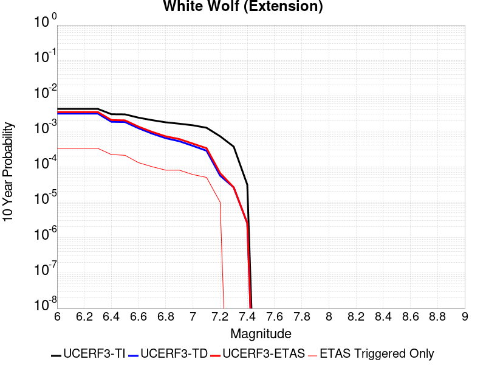 |

| Magnitude | 1 wk TI Prob | 1 wk TD Prob | 1 wk ETAS Prob | 1 wk ETAS/TD Gain | 1 wk ETAS Triggered Only | 1 mo TI Prob | 1 mo TD Prob | 1 mo ETAS Prob | 1 mo ETAS/TD Gain | 1 mo ETAS Triggered Only | 1 yr TI Prob | 1 yr TD Prob | 1 yr ETAS Prob | 1 yr ETAS/TD Gain | 1 yr ETAS Triggered Only | 10 yr TI Prob | 10 yr TD Prob | 10 yr ETAS Prob | 10 yr ETAS/TD Gain | 10 yr ETAS Triggered Only |
|-----|-----|-----|-----|-----|-----|-----|-----|-----|-----|-----|-----|-----|-----|-----|-----|-----|-----|-----|-----|-----|
| 6.0 | 8.222555E-6 | 6.066615E-6 | 1.2606589E-4 | 20.78027 | 1.2E-4 | 3.5239045E-5 | 2.5999556E-5 | 1.7599565E-4 | 6.7691793 | 1.5E-4 | 4.289509E-4 | 3.1650523E-4 | 5.4643245E-4 | 1.7264563 | 2.3E-4 | 0.0042812387 | 0.0031611966 | 0.0034901535 | 1.1040609 | 3.3E-4 |
| 6.1 | 8.222555E-6 | 6.066615E-6 | 1.2606589E-4 | 20.78027 | 1.2E-4 | 3.5239045E-5 | 2.5999556E-5 | 1.7599565E-4 | 6.7691793 | 1.5E-4 | 4.289509E-4 | 3.1650523E-4 | 5.4643245E-4 | 1.7264563 | 2.3E-4 | 0.0042812387 | 0.0031611966 | 0.0034901535 | 1.1040609 | 3.3E-4 |
| 6.2 | 8.222555E-6 | 6.066615E-6 | 1.2606589E-4 | 20.78027 | 1.2E-4 | 3.5239045E-5 | 2.5999556E-5 | 1.7599565E-4 | 6.7691793 | 1.5E-4 | 4.289509E-4 | 3.1650523E-4 | 5.4643245E-4 | 1.7264563 | 2.3E-4 | 0.0042812387 | 0.0031611966 | 0.0034901535 | 1.1040609 | 3.3E-4 |
| 6.3 | 8.222555E-6 | 6.066615E-6 | 1.2606589E-4 | 20.78027 | 1.2E-4 | 3.5239045E-5 | 2.5999556E-5 | 1.7599565E-4 | 6.7691793 | 1.5E-4 | 4.289509E-4 | 3.1650523E-4 | 5.4643245E-4 | 1.7264563 | 2.3E-4 | 0.0042812387 | 0.0031611966 | 0.0034901535 | 1.1040609 | 3.3E-4 |
| 6.4 | 5.821773E-6 | 3.5571256E-6 | 7.3556876E-5 | 20.67874 | 7.0E-5 | 2.4950215E-5 | 1.5244741E-5 | 1.15243216E-4 | 7.559539 | 1.0E-4 | 3.0372653E-4 | 1.8559002E-4 | 3.2556403E-4 | 1.754211 | 1.4E-4 | 0.0030331176 | 0.0018544586 | 0.0020740507 | 1.118413 | 2.2E-4 |
| 6.5 | 5.766023E-6 | 3.4990599E-6 | 7.349881E-5 | 21.005304 | 7.0E-5 | 2.4711293E-5 | 1.49958905E-5 | 1.0499454E-4 | 7.0015545 | 9.0E-5 | 3.0081844E-4 | 1.8256076E-4 | 3.1253704E-4 | 1.7119616 | 1.3E-4 | 0.0030041158 | 0.0018242161 | 0.002033833 | 1.114908 | 2.1E-4 |
| 6.6 | 4.643576E-6 | 2.3325733E-6 | 5.2332456E-5 | 22.435505 | 5.0E-5 | 1.9900888E-5 | 9.9967065E-6 | 7.9996E-5 | 8.002236 | 7.0E-5 | 2.4226638E-4 | 1.2170354E-4 | 2.2169137E-4 | 1.8215688 | 1.0E-4 | 0.0024200242 | 0.0012164112 | 0.0013462531 | 1.1067418 | 1.3E-4 |
| 6.7 | 3.9529173E-6 | 1.6482975E-6 | 4.1648233E-5 | 25.267424 | 4.0E-5 | 1.6940963E-5 | 7.064114E-6 | 6.706369E-5 | 9.493574 | 6.0E-5 | 2.0623671E-4 | 8.600239E-5 | 1.659955E-4 | 1.9301268 | 8.0E-5 | 0.002060454 | 8.597095E-4 | 9.5962355E-4 | 1.1162183 | 1.0E-4 |
| 6.8 | 3.4377522E-6 | 1.2244764E-6 | 2.1224452E-5 | 17.333492 | 2.0E-5 | 1.473314E-5 | 5.247746E-6 | 4.5247536E-5 | 8.62228 | 4.0E-5 | 1.7936122E-4 | 6.388952E-5 | 1.238857E-4 | 1.9390612 | 6.0E-5 | 0.0017921652 | 6.3872064E-4 | 7.1866956E-4 | 1.1251704 | 8.0E-5 |
| 6.9 | 3.1367306E-6 | 1.0033316E-6 | 2.1003312E-5 | 20.93357 | 2.0E-5 | 1.3443062E-5 | 4.299986E-6 | 4.4299813E-5 | 10.302317 | 4.0E-5 | 1.63657E-4 | 5.2351144E-5 | 1.12348E-4 | 2.1460466 | 6.0E-5 | 0.0016353652 | 5.233958E-4 | 6.033539E-4 | 1.152768 | 8.0E-5 |
| 7.0 | 2.8298145E-6 | 7.4282326E-7 | 2.074281E-5 | 27.924284 | 2.0E-5 | 1.2127721E-5 | 3.1835248E-6 | 3.318343E-5 | 10.423488 | 3.0E-5 | 1.47645E-4 | 3.8758775E-5 | 8.875684E-5 | 2.2899804 | 5.0E-5 | 0.0014754693 | 3.8752513E-4 | 4.475019E-4 | 1.1547687 | 6.0E-5 |
| 7.1 | 2.4091064E-6 | 5.4223835E-7 | 2.0542228E-5 | 37.88413 | 2.0E-5 | 1.03247E-5 | 2.3238767E-6 | 3.2323805E-5 | 13.909432 | 3.0E-5 | 1.2569598E-4 | 2.8292874E-5 | 7.829146E-5 | 2.7671795 | 5.0E-5 | 0.001256249 | 2.8289677E-4 | 3.328826E-4 | 1.176693 | 5.0E-5 |
| 7.2 | 1.3875518E-6 | 1.0740268E-7 | 1.0107402E-5 | 94.10754 | 1.0E-5 | 5.9466374E-6 | 4.6029712E-7 | 1.0460292E-5 | 22.725088 | 1.0E-5 | 7.23979E-5 | 5.604104E-6 | 1.5604048E-5 | 2.7843966 | 1.0E-5 | 7.2374323E-4 | 5.6039742E-5 | 6.603918E-5 | 1.1784348 | 1.0E-5 |
| 7.3 | 7.056077E-7 | 5.0002956E-8 | 5.0002956E-8 | 1.0 | 0.0 | 3.0240296E-6 | 2.1429837E-7 | 2.1429837E-7 | 1.0 | 0.0 | 3.681694E-5 | 2.60908E-6 | 2.60908E-6 | 1.0 | 0.0 | 3.681084E-4 | 2.609054E-5 | 2.609054E-5 | 1.0 | 0.0 |
| 7.4 | 5.9334678E-8 | 4.8638475E-9 | 4.8638475E-9 | 1.0 | 0.0 | 2.5429145E-7 | 2.084506E-8 | 2.084506E-8 | 1.0 | 0.0 | 3.095994E-6 | 2.5378858E-7 | 2.5378858E-7 | 1.0 | 0.0 | 3.095951E-5 | 2.5378843E-6 | 2.5378843E-6 | 1.0 | 0.0 |

## San Andreas (Creeping Section) 2011 CFM
*[(top)](#table-of-contents)*

| 1 Week | 1 Month | 1 Year | 10 Year |
|-----|-----|-----|-----|
|  |  |  |  |

| Magnitude | 1 wk TI Prob | 1 wk TD Prob | 1 wk ETAS Prob | 1 wk ETAS/TD Gain | 1 wk ETAS Triggered Only | 1 mo TI Prob | 1 mo TD Prob | 1 mo ETAS Prob | 1 mo ETAS/TD Gain | 1 mo ETAS Triggered Only | 1 yr TI Prob | 1 yr TD Prob | 1 yr ETAS Prob | 1 yr ETAS/TD Gain | 1 yr ETAS Triggered Only | 10 yr TI Prob | 10 yr TD Prob | 10 yr ETAS Prob | 10 yr ETAS/TD Gain | 10 yr ETAS Triggered Only |
|-----|-----|-----|-----|-----|-----|-----|-----|-----|-----|-----|-----|-----|-----|-----|-----|-----|-----|-----|-----|-----|
| 6.0 | 5.986481E-4 | 0.0012275929 | 0.001297507 | 1.0569521 | 7.0E-5 | 0.0025631124 | 0.005245547 | 0.0053748647 | 1.024653 | 1.3E-4 | 0.030762846 | 0.06120491 | 0.06138328 | 1.0029143 | 1.9E-4 | 0.26835477 | 0.42593494 | 0.42609566 | 1.0003774 | 2.8E-4 |
| 6.1 | 5.015945E-4 | 0.0010217986 | 0.0010717475 | 1.0488833 | 5.0E-5 | 0.00214792 | 0.0043678596 | 0.0044674226 | 1.0227945 | 1.0E-4 | 0.025839351 | 0.05124837 | 0.05140017 | 1.002962 | 1.6E-4 | 0.23032776 | 0.37285668 | 0.37300092 | 1.0003868 | 2.3E-4 |
| 6.2 | 4.073338E-4 | 8.1073755E-4 | 8.507051E-4 | 1.0492978 | 4.0E-5 | 0.0017445484 | 0.0034671477 | 0.0035568357 | 1.0258679 | 9.0E-5 | 0.021034058 | 0.04093317 | 0.04107703 | 1.0035145 | 1.5E-4 | 0.19150782 | 0.31303346 | 0.3131846 | 1.0004828 | 2.2E-4 |
| 6.3 | 3.464099E-4 | 6.7391695E-4 | 7.1389E-4 | 1.0593145 | 4.0E-5 | 0.0014837692 | 0.0028829593 | 0.0029727 | 1.0311279 | 9.0E-5 | 0.017915873 | 0.034189582 | 0.034334455 | 1.0042373 | 1.5E-4 | 0.16538359 | 0.2713166 | 0.2714769 | 1.0005909 | 2.2E-4 |
| 6.4 | 2.935057E-4 | 5.5442745E-4 | 5.944053E-4 | 1.0721065 | 4.0E-5 | 0.0012572751 | 0.0023725363 | 0.0024623228 | 1.0378441 | 9.0E-5 | 0.015200248 | 0.02826451 | 0.02841027 | 1.005157 | 1.5E-4 | 0.14201577 | 0.23298529 | 0.23315403 | 1.0007243 | 2.2E-4 |
| 6.5 | 2.3409708E-4 | 4.2093755E-4 | 4.609207E-4 | 1.094986 | 4.0E-5 | 0.0010028875 | 0.0018019684 | 0.0018918063 | 1.0498554 | 9.0E-5 | 0.012141965 | 0.021587461 | 0.02172444 | 1.0063453 | 1.4E-4 | 0.11499573 | 0.18682368 | 0.18698631 | 1.0008706 | 2.0E-4 |
| 6.6 | 1.5842178E-4 | 2.506933E-4 | 2.8068578E-4 | 1.1196381 | 3.0E-5 | 6.7877385E-4 | 0.0010739497 | 0.0011538639 | 1.0744114 | 8.0E-5 | 0.0082328 | 0.012995575 | 0.013123885 | 1.0098734 | 1.3E-4 | 0.07934396 | 0.12314638 | 0.12330421 | 1.0012816 | 1.8E-4 |
| 6.7 | 1.5616413E-4 | 2.4605883E-4 | 2.7605143E-4 | 1.1218921 | 3.0E-5 | 6.691031E-4 | 0.0010541069 | 0.0011340225 | 1.0758137 | 8.0E-5 | 0.0081159435 | 0.01275744 | 0.012885782 | 1.0100602 | 1.3E-4 | 0.0782586 | 0.12117351 | 0.1213317 | 1.0013055 | 1.8E-4 |
| 6.8 | 1.5538467E-4 | 2.4429744E-4 | 2.7429013E-4 | 1.1227711 | 3.0E-5 | 6.6576427E-4 | 0.0010465645 | 0.0011264808 | 1.0763606 | 8.0E-5 | 0.008075596 | 0.012666838 | 0.012795192 | 1.010133 | 1.3E-4 | 0.07788358 | 0.120404355 | 0.12056268 | 1.001315 | 1.8E-4 |
| 6.9 | 1.5153569E-4 | 2.3539034E-4 | 2.6538328E-4 | 1.1274179 | 3.0E-5 | 6.49277E-4 | 0.0010084276 | 0.0010883469 | 1.0792514 | 8.0E-5 | 0.007876333 | 0.01220901 | 0.012337424 | 1.0105178 | 1.3E-4 | 0.07602952 | 0.11647445 | 0.11663348 | 1.0013654 | 1.8E-4 |
| 7.0 | 1.4588932E-4 | 2.2396253E-4 | 2.539558E-4 | 1.133921 | 3.0E-5 | 6.250901E-4 | 9.5948833E-4 | 0.0010394115 | 1.0832977 | 8.0E-5 | 0.0075839474 | 0.011619697 | 0.011748186 | 1.0110579 | 1.3E-4 | 0.073302895 | 0.11132046 | 0.11148042 | 1.001437 | 1.8E-4 |
| 7.1 | 1.1565079E-4 | 1.6281738E-4 | 1.928125E-4 | 1.1842256 | 3.0E-5 | 4.955521E-4 | 6.9760304E-4 | 7.775472E-4 | 1.1145984 | 8.0E-5 | 0.006016669 | 0.0084604435 | 0.008589343 | 1.0152357 | 1.3E-4 | 0.058563538 | 0.08367046 | 0.0838354 | 1.0019712 | 1.8E-4 |
| 7.2 | 1.0393792E-4 | 1.4615769E-4 | 1.761533E-4 | 1.2052277 | 3.0E-5 | 4.4537216E-4 | 6.2624045E-4 | 7.0619036E-4 | 1.1276665 | 8.0E-5 | 0.005408933 | 0.0075979927 | 0.007727005 | 1.0169798 | 1.3E-4 | 0.052791595 | 0.07561969 | 0.07578608 | 1.0022004 | 1.8E-4 |
| 7.3 | 9.332884E-5 | 1.2780898E-4 | 1.5780515E-4 | 1.2346953 | 3.0E-5 | 3.999194E-4 | 5.4763845E-4 | 6.275946E-4 | 1.1460018 | 8.0E-5 | 0.0048581534 | 0.006647249 | 0.006776385 | 1.019427 | 1.3E-4 | 0.047533102 | 0.06648326 | 0.06665129 | 1.0025275 | 1.8E-4 |
| 7.4 | 8.670252E-5 | 1.17032345E-4 | 1.4702883E-4 | 1.2563094 | 3.0E-5 | 3.715293E-4 | 5.0147134E-4 | 5.8143126E-4 | 1.1594505 | 8.0E-5 | 0.004513991 | 0.006088443 | 0.0062176515 | 1.0212219 | 1.3E-4 | 0.044233937 | 0.061151642 | 0.061320636 | 1.0027635 | 1.8E-4 |
| 7.5 | 7.3036405E-5 | 9.005856E-5 | 1.2005586E-4 | 1.3330866 | 3.0E-5 | 3.129756E-4 | 3.8590826E-4 | 4.6587738E-4 | 1.2072232 | 8.0E-5 | 0.0038038217 | 0.0046883323 | 0.004817723 | 1.0275984 | 1.3E-4 | 0.03739367 | 0.047877792 | 0.048049174 | 1.0035796 | 1.8E-4 |
| 7.6 | 6.3935775E-5 | 8.280385E-5 | 1.1280136E-4 | 1.362272 | 3.0E-5 | 2.7398168E-4 | 3.5482543E-4 | 4.3479705E-4 | 1.2253829 | 8.0E-5 | 0.0033306254 | 0.004311461 | 0.004440901 | 1.0300221 | 1.3E-4 | 0.032811474 | 0.04399201 | 0.044164088 | 1.0039116 | 1.8E-4 |
| 7.7 | 5.5050095E-5 | 6.6618326E-5 | 7.661766E-5 | 1.1500988 | 1.0E-5 | 2.3590765E-4 | 2.854759E-4 | 3.2546447E-4 | 1.1400769 | 4.0E-5 | 0.0028683927 | 0.003470134 | 0.003539891 | 1.0201021 | 7.0E-5 | 0.0283165 | 0.035796214 | 0.035902277 | 1.002963 | 1.1E-4 |
| 7.8 | 5.027131E-5 | 6.162871E-5 | 7.162809E-5 | 1.1622521 | 1.0E-5 | 2.1543067E-4 | 2.640963E-4 | 3.0408573E-4 | 1.1514199 | 4.0E-5 | 0.0026197135 | 0.003210635 | 0.0032804103 | 1.0217326 | 7.0E-5 | 0.025890453 | 0.03312666 | 0.033233017 | 1.0032105 | 1.1E-4 |
| 7.9 | 3.7271806E-5 | 5.022507E-5 | 6.0224567E-5 | 1.1990938 | 1.0E-5 | 1.5972654E-4 | 2.1523255E-4 | 2.5522395E-4 | 1.1858056 | 4.0E-5 | 0.0019429359 | 0.002617309 | 0.0026771522 | 1.0228643 | 6.0E-5 | 0.019260362 | 0.027067466 | 0.027155029 | 1.003235 | 9.0E-5 |
| 8.0 | 2.7310243E-5 | 3.1427757E-5 | 4.1427444E-5 | 1.3181801 | 1.0E-5 | 1.17038646E-4 | 1.3468343E-4 | 1.646794E-4 | 1.2227145 | 3.0E-5 | 0.0014240141 | 0.0016385383 | 0.0016884564 | 1.030465 | 5.0E-5 | 0.014149235 | 0.01721386 | 0.017292483 | 1.0045674 | 8.0E-5 |
| 8.1 | 1.7940547E-5 | 1.7399378E-5 | 1.7399378E-5 | 1.0 | 0.0 | 7.688579E-5 | 7.456663E-5 | 8.456589E-5 | 1.1340983 | 1.0E-5 | 9.3568244E-4 | 9.074711E-4 | 9.374439E-4 | 1.033029 | 3.0E-5 | 0.009317525 | 0.009798636 | 0.009848146 | 1.0050528 | 5.0E-5 |
| 8.2 | 8.643924E-6 | 5.473668E-6 | 5.473668E-6 | 1.0 | 0.0 | 3.704486E-5 | 2.3458366E-5 | 2.3458366E-5 | 1.0 | 0.0 | 4.5092785E-4 | 2.8556827E-4 | 2.955654E-4 | 1.035008 | 1.0E-5 | 0.0045001395 | 0.0032481793 | 0.003258147 | 1.0030687 | 1.0E-5 |
| 8.3 | 1.983087E-6 | 7.6564595E-7 | 7.6564595E-7 | 1.0 | 0.0 | 8.498917E-6 | 3.281336E-6 | 3.281336E-6 | 1.0 | 0.0 | 1.034694E-4 | 3.9949547E-5 | 4.9949147E-5 | 1.2503058 | 1.0E-5 | 0.0010342124 | 4.717979E-4 | 4.8179316E-4 | 1.0211855 | 1.0E-5 |

## Cleghorn Lake
*[(top)](#table-of-contents)*

| 1 Week | 1 Month | 1 Year | 10 Year |
|-----|-----|-----|-----|
|  | 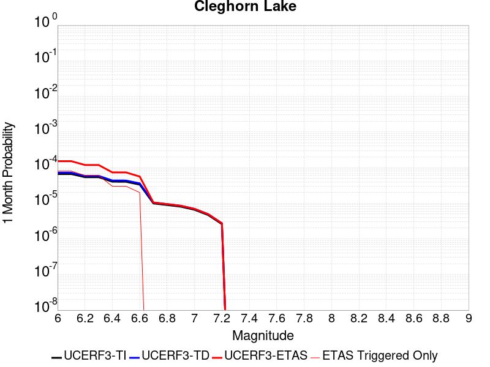 |  | 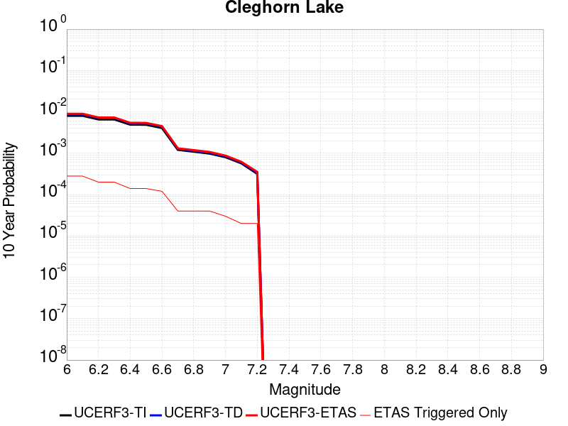 |

| Magnitude | 1 wk TI Prob | 1 wk TD Prob | 1 wk ETAS Prob | 1 wk ETAS/TD Gain | 1 wk ETAS Triggered Only | 1 mo TI Prob | 1 mo TD Prob | 1 mo ETAS Prob | 1 mo ETAS/TD Gain | 1 mo ETAS Triggered Only | 1 yr TI Prob | 1 yr TD Prob | 1 yr ETAS Prob | 1 yr ETAS/TD Gain | 1 yr ETAS Triggered Only | 10 yr TI Prob | 10 yr TD Prob | 10 yr ETAS Prob | 10 yr ETAS/TD Gain | 10 yr ETAS Triggered Only |
|-----|-----|-----|-----|-----|-----|-----|-----|-----|-----|-----|-----|-----|-----|-----|-----|-----|-----|-----|-----|-----|
| 6.0 | 1.5467183E-5 | 1.6794203E-5 | 7.67932E-5 | 4.5726013 | 6.0E-5 | 6.6286244E-5 | 7.197348E-5 | 1.5196773E-4 | 2.1114404 | 8.0E-5 | 8.067362E-4 | 8.759797E-4 | 0.0010158571 | 1.1596811 | 1.4E-4 | 0.008038137 | 0.008730696 | 0.009008251 | 1.0317907 | 2.8E-4 |
| 6.1 | 1.5467183E-5 | 1.6794203E-5 | 7.67932E-5 | 4.5726013 | 6.0E-5 | 6.6286244E-5 | 7.197348E-5 | 1.5196773E-4 | 2.1114404 | 8.0E-5 | 8.067362E-4 | 8.759797E-4 | 0.0010158571 | 1.1596811 | 1.4E-4 | 0.008038137 | 0.008730696 | 0.009008251 | 1.0317907 | 2.8E-4 |
| 6.2 | 1.2624631E-5 | 1.3681544E-5 | 5.3680997E-5 | 3.9236064 | 4.0E-5 | 5.410444E-5 | 5.863415E-5 | 1.1863063E-4 | 2.0232346 | 6.0E-5 | 6.585225E-4 | 7.1368564E-4 | 8.236071E-4 | 1.1540195 | 1.1E-4 | 0.0065657445 | 0.0071187317 | 0.007317308 | 1.0278949 | 2.0E-4 |
| 6.3 | 1.2624631E-5 | 1.3681544E-5 | 5.3680997E-5 | 3.9236064 | 4.0E-5 | 5.410444E-5 | 5.863415E-5 | 1.1863063E-4 | 2.0232346 | 6.0E-5 | 6.585225E-4 | 7.1368564E-4 | 8.236071E-4 | 1.1540195 | 1.1E-4 | 0.0065657445 | 0.0071187317 | 0.007317308 | 1.0278949 | 2.0E-4 |
| 6.4 | 9.417684E-6 | 1.0170118E-5 | 3.0169915E-5 | 2.9665256 | 2.0E-5 | 4.036088E-5 | 4.3585722E-5 | 7.3584415E-5 | 1.6882688 | 3.0E-5 | 4.912829E-4 | 5.3056807E-4 | 5.905362E-4 | 1.1130264 | 6.0E-5 | 0.004901982 | 0.005297049 | 0.0054363073 | 1.0262898 | 1.4E-4 |
| 6.5 | 9.368219E-6 | 1.0117545E-5 | 3.0117342E-5 | 2.9767442 | 2.0E-5 | 4.014889E-5 | 4.3360415E-5 | 7.3359115E-5 | 1.6918453 | 3.0E-5 | 4.8870314E-4 | 5.2782625E-4 | 5.877946E-4 | 1.1136137 | 6.0E-5 | 0.004876298 | 0.0052697617 | 0.0054090237 | 1.0264267 | 1.4E-4 |
| 6.6 | 7.803798E-6 | 8.441831E-6 | 2.8441662E-5 | 3.3691342 | 2.0E-5 | 3.3444423E-5 | 3.6179E-5 | 5.6178276E-5 | 1.552787 | 2.0E-5 | 4.0710976E-4 | 4.4043022E-4 | 4.804126E-4 | 1.0907803 | 4.0E-5 | 0.0040636472 | 0.0043994905 | 0.0045189625 | 1.0271559 | 1.2E-4 |
| 6.7 | 2.3108669E-6 | 2.4438336E-6 | 2.4438336E-6 | 1.0 | 0.0 | 9.903678E-6 | 1.0473532E-5 | 1.0473532E-5 | 1.0 | 0.0 | 1.205706E-4 | 1.2750797E-4 | 1.375067E-4 | 1.0784165 | 1.0E-5 | 0.001205052 | 0.0012743667 | 0.0013143158 | 1.0313481 | 4.0E-5 |
| 6.8 | 2.0882828E-6 | 2.2062823E-6 | 2.2062823E-6 | 1.0 | 0.0 | 8.949753E-6 | 9.455462E-6 | 9.455462E-6 | 1.0 | 0.0 | 1.08957785E-4 | 1.1511434E-4 | 1.2511319E-4 | 1.0868602 | 1.0E-5 | 0.0010890438 | 0.0011505639 | 0.0011905179 | 1.0347255 | 4.0E-5 |
| 6.9 | 1.876935E-6 | 1.981051E-6 | 1.981051E-6 | 1.0 | 0.0 | 8.043982E-6 | 8.490192E-6 | 8.490192E-6 | 1.0 | 0.0 | 9.7931086E-5 | 1.03363345E-4 | 1.1336231E-4 | 1.0967361 | 1.0E-5 | 9.788794E-4 | 0.0010331686 | 0.0010731274 | 1.0386759 | 4.0E-5 |
| 7.0 | 1.5357559E-6 | 1.6202807E-6 | 1.6202807E-6 | 1.0 | 0.0 | 6.5817944E-6 | 6.9440425E-6 | 6.9440425E-6 | 1.0 | 0.0 | 8.01304E-5 | 8.454057E-5 | 9.453972E-5 | 1.1182764 | 1.0E-5 | 8.010151E-4 | 8.450965E-4 | 8.750711E-4 | 1.0354689 | 3.0E-5 |
| 7.1 | 1.0905424E-6 | 1.1497619E-6 | 1.1497619E-6 | 1.0 | 0.0 | 4.6737446E-6 | 4.9275427E-6 | 4.9275427E-6 | 1.0 | 0.0 | 5.6901354E-5 | 5.999128E-5 | 6.999068E-5 | 1.1666809 | 1.0E-5 | 5.6886784E-4 | 5.997606E-4 | 6.197486E-4 | 1.0333266 | 2.0E-5 |
| 7.2 | 6.06668E-7 | 6.387277E-7 | 6.387277E-7 | 1.0 | 0.0 | 2.600003E-6 | 2.7374022E-6 | 2.7374022E-6 | 1.0 | 0.0 | 3.1654577E-5 | 3.3327433E-5 | 4.3327098E-5 | 1.3000431 | 1.0E-5 | 3.1650066E-4 | 3.3323118E-4 | 3.5322452E-4 | 1.0599984 | 2.0E-5 |

## Lake Isabella (Seismicity)
*[(top)](#table-of-contents)*

| 1 Week | 1 Month | 1 Year | 10 Year |
|-----|-----|-----|-----|
|  |  |  |  |

| Magnitude | 1 wk TI Prob | 1 wk TD Prob | 1 wk ETAS Prob | 1 wk ETAS/TD Gain | 1 wk ETAS Triggered Only | 1 mo TI Prob | 1 mo TD Prob | 1 mo ETAS Prob | 1 mo ETAS/TD Gain | 1 mo ETAS Triggered Only | 1 yr TI Prob | 1 yr TD Prob | 1 yr ETAS Prob | 1 yr ETAS/TD Gain | 1 yr ETAS Triggered Only | 10 yr TI Prob | 10 yr TD Prob | 10 yr ETAS Prob | 10 yr ETAS/TD Gain | 10 yr ETAS Triggered Only |
|-----|-----|-----|-----|-----|-----|-----|-----|-----|-----|-----|-----|-----|-----|-----|-----|-----|-----|-----|-----|-----|
| 6.0 | 9.431637E-6 | 9.741651E-6 | 7.974097E-5 | 8.18557 | 7.0E-5 | 4.0420677E-5 | 4.1749343E-5 | 1.817435E-4 | 4.353206 | 1.4E-4 | 4.920106E-4 | 5.0819275E-4 | 7.18086E-4 | 1.4130191 | 2.1E-4 | 0.004909227 | 0.005071599 | 0.005360128 | 1.0568912 | 2.9E-4 |
| 6.1 | 9.431637E-6 | 9.741651E-6 | 7.974097E-5 | 8.18557 | 7.0E-5 | 4.0420677E-5 | 4.1749343E-5 | 1.817435E-4 | 4.353206 | 1.4E-4 | 4.920106E-4 | 5.0819275E-4 | 7.18086E-4 | 1.4130191 | 2.1E-4 | 0.004909227 | 0.005071599 | 0.005360128 | 1.0568912 | 2.9E-4 |
| 6.2 | 9.431637E-6 | 9.741651E-6 | 7.974097E-5 | 8.18557 | 7.0E-5 | 4.0420677E-5 | 4.1749343E-5 | 1.817435E-4 | 4.353206 | 1.4E-4 | 4.920106E-4 | 5.0819275E-4 | 7.18086E-4 | 1.4130191 | 2.1E-4 | 0.004909227 | 0.005071599 | 0.005360128 | 1.0568912 | 2.9E-4 |
| 6.3 | 9.431637E-6 | 9.741651E-6 | 7.974097E-5 | 8.18557 | 7.0E-5 | 4.0420677E-5 | 4.1749343E-5 | 1.817435E-4 | 4.353206 | 1.4E-4 | 4.920106E-4 | 5.0819275E-4 | 7.18086E-4 | 1.4130191 | 2.1E-4 | 0.004909227 | 0.005071599 | 0.005360128 | 1.0568912 | 2.9E-4 |
| 6.4 | 5.144063E-6 | 5.3000763E-6 | 4.5299865E-5 | 8.547022 | 4.0E-5 | 2.2045799E-5 | 2.2714434E-5 | 9.271284E-5 | 4.0816708 | 7.0E-5 | 2.6837454E-4 | 2.765166E-4 | 3.664917E-4 | 1.3253877 | 9.0E-5 | 0.0026805066 | 0.0027620657 | 0.002901679 | 1.0505466 | 1.4E-4 |
| 6.5 | 5.144063E-6 | 5.3000763E-6 | 4.5299865E-5 | 8.547022 | 4.0E-5 | 2.2045799E-5 | 2.2714434E-5 | 9.271284E-5 | 4.0816708 | 7.0E-5 | 2.6837454E-4 | 2.765166E-4 | 3.664917E-4 | 1.3253877 | 9.0E-5 | 0.0026805066 | 0.0027620657 | 0.002901679 | 1.0505466 | 1.4E-4 |
| 6.6 | 3.4009804E-6 | 3.498786E-6 | 3.349868E-5 | 9.574372 | 3.0E-5 | 1.4575549E-5 | 1.4994721E-5 | 6.499397E-5 | 4.334457 | 5.0E-5 | 1.7744285E-4 | 1.8254704E-4 | 2.325379E-4 | 1.273852 | 5.0E-5 | 0.0017730123 | 0.0018241286 | 0.0019139644 | 1.0492486 | 9.0E-5 |
| 6.7 | 3.3880428E-6 | 3.4856528E-6 | 3.3485547E-5 | 9.606679 | 3.0E-5 | 1.4520103E-5 | 1.4938435E-5 | 6.493769E-5 | 4.3470206 | 5.0E-5 | 1.767679E-4 | 1.8186188E-4 | 2.3185278E-4 | 1.274884 | 5.0E-5 | 0.0017662736 | 0.0018172882 | 0.0019071246 | 1.0494343 | 9.0E-5 |
| 6.8 | 2.6582E-6 | 2.7337003E-6 | 3.2733617E-5 | 11.974107 | 3.0E-5 | 1.1392236E-5 | 1.1715813E-5 | 6.1715225E-5 | 5.2676864 | 5.0E-5 | 1.3869164E-4 | 1.4263204E-4 | 1.926249E-4 | 1.3505024 | 5.0E-5 | 0.0013860512 | 0.0014255369 | 0.0015154086 | 1.0630441 | 9.0E-5 |
| 6.9 | 2.406011E-6 | 2.4743288E-6 | 3.2474254E-5 | 13.12447 | 3.0E-5 | 1.0311434E-5 | 1.0604231E-5 | 6.06037E-5 | 5.7150493 | 5.0E-5 | 1.2553448E-4 | 1.2910018E-4 | 1.7909372E-4 | 1.3872461 | 5.0E-5 | 0.0012546359 | 0.0012903814 | 0.0013802653 | 1.0696568 | 9.0E-5 |
| 7.0 | 1.6953097E-6 | 1.7429371E-6 | 2.1742902E-5 | 12.474863 | 2.0E-5 | 7.265593E-6 | 7.469715E-6 | 3.746949E-5 | 5.016187 | 3.0E-5 | 8.8455E-5 | 9.094104E-5 | 1.20938304E-4 | 1.3298541 | 3.0E-5 | 8.84198E-4 | 9.09141E-4 | 9.790773E-4 | 1.0769258 | 7.0E-5 |
| 7.1 | 3.5013824E-7 | 3.5714822E-7 | 3.5714822E-7 | 1.0 | 0.0 | 1.5005916E-6 | 1.5306344E-6 | 1.5306344E-6 | 1.0 | 0.0 | 1.826955E-5 | 1.8635317E-5 | 1.8635317E-5 | 1.0 | 0.0 | 1.8268047E-4 | 1.863378E-4 | 1.863378E-4 | 1.0 | 0.0 |
| 7.2 | 2.2321095E-7 | 2.2750574E-7 | 2.2750574E-7 | 1.0 | 0.0 | 9.56618E-7 | 9.750242E-7 | 9.750242E-7 | 1.0 | 0.0 | 1.1646762E-5 | 1.1870856E-5 | 1.1870856E-5 | 1.0 | 0.0 | 1.1646151E-4 | 1.1870232E-4 | 1.1870232E-4 | 1.0 | 0.0 |
| 7.3 | 1.5760406E-7 | 1.6060922E-7 | 1.6060922E-7 | 1.0 | 0.0 | 6.7544585E-7 | 6.8832503E-7 | 6.8832503E-7 | 1.0 | 0.0 | 8.223522E-6 | 8.380326E-6 | 8.380326E-6 | 1.0 | 0.0 | 8.2232174E-5 | 8.3800165E-5 | 8.3800165E-5 | 1.0 | 0.0 |
| 7.4 | 1.1216497E-7 | 1.1431706E-7 | 1.1431706E-7 | 1.0 | 0.0 | 4.8070694E-7 | 4.899302E-7 | 4.899302E-7 | 1.0 | 0.0 | 5.852591E-6 | 5.964884E-6 | 5.964884E-6 | 1.0 | 0.0 | 5.8524372E-5 | 5.9647282E-5 | 5.9647282E-5 | 1.0 | 0.0 |
| 7.5 | 4.885185E-8 | 4.9787737E-8 | 4.9787737E-8 | 1.0 | 0.0 | 2.0936506E-7 | 2.13376E-7 | 2.13376E-7 | 1.0 | 0.0 | 2.5490165E-6 | 2.59785E-6 | 2.59785E-6 | 1.0 | 0.0 | 2.5489873E-5 | 2.5978214E-5 | 2.5978214E-5 | 1.0 | 0.0 |
| 7.6 | 1.504641E-9 | 1.5317903E-9 | 1.5317903E-9 | 1.0 | 0.0 | 6.4484613E-9 | 6.5648154E-9 | 6.5648154E-9 | 1.0 | 0.0 | 7.851001E-8 | 7.992663E-8 | 7.992663E-8 | 1.0 | 0.0 | 7.8509987E-7 | 7.992663E-7 | 7.992663E-7 | 1.0 | 0.0 |

## San Jacinto (San Jacinto Valley) rev
*[(top)](#table-of-contents)*

| 1 Week | 1 Month | 1 Year | 10 Year |
|-----|-----|-----|-----|
| 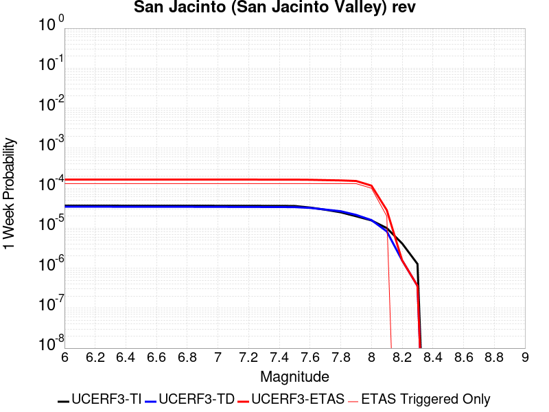 |  | 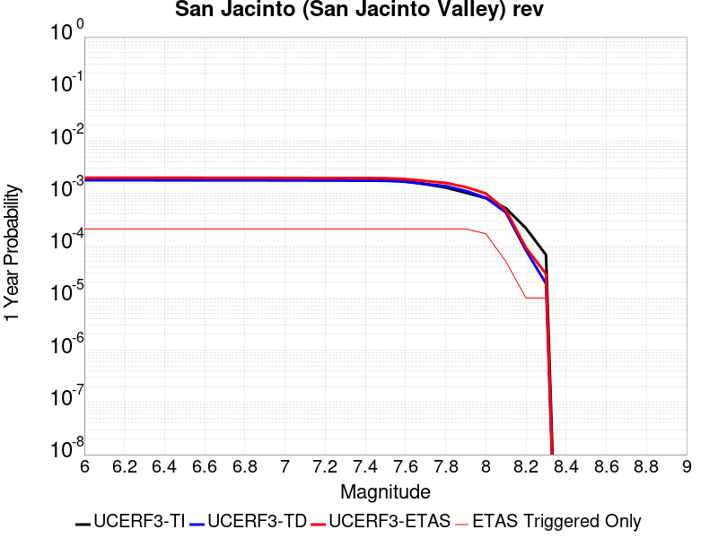 |  |

| Magnitude | 1 wk TI Prob | 1 wk TD Prob | 1 wk ETAS Prob | 1 wk ETAS/TD Gain | 1 wk ETAS Triggered Only | 1 mo TI Prob | 1 mo TD Prob | 1 mo ETAS Prob | 1 mo ETAS/TD Gain | 1 mo ETAS Triggered Only | 1 yr TI Prob | 1 yr TD Prob | 1 yr ETAS Prob | 1 yr ETAS/TD Gain | 1 yr ETAS Triggered Only | 10 yr TI Prob | 10 yr TD Prob | 10 yr ETAS Prob | 10 yr ETAS/TD Gain | 10 yr ETAS Triggered Only |
|-----|-----|-----|-----|-----|-----|-----|-----|-----|-----|-----|-----|-----|-----|-----|-----|-----|-----|-----|-----|-----|
| 6.0 | 3.652694E-5 | 3.4401106E-5 | 1.6439664E-4 | 4.778818 | 1.3E-4 | 1.5653463E-4 | 1.4742499E-4 | 3.173999E-4 | 2.1529589 | 1.7E-4 | 0.0019041431 | 0.0017934233 | 0.0020030467 | 1.1168845 | 2.1E-4 | 0.018879099 | 0.018526303 | 0.018801114 | 1.0148337 | 2.8E-4 |
| 6.1 | 3.652694E-5 | 3.4401106E-5 | 1.6439664E-4 | 4.778818 | 1.3E-4 | 1.5653463E-4 | 1.4742499E-4 | 3.173999E-4 | 2.1529589 | 1.7E-4 | 0.0019041431 | 0.0017934233 | 0.0020030467 | 1.1168845 | 2.1E-4 | 0.018879099 | 0.018526303 | 0.018801114 | 1.0148337 | 2.8E-4 |
| 6.2 | 3.652694E-5 | 3.4401106E-5 | 1.6439664E-4 | 4.778818 | 1.3E-4 | 1.5653463E-4 | 1.4742499E-4 | 3.173999E-4 | 2.1529589 | 1.7E-4 | 0.0019041431 | 0.0017934233 | 0.0020030467 | 1.1168845 | 2.1E-4 | 0.018879099 | 0.018526303 | 0.018801114 | 1.0148337 | 2.8E-4 |
| 6.3 | 3.652694E-5 | 3.4401106E-5 | 1.6439664E-4 | 4.778818 | 1.3E-4 | 1.5653463E-4 | 1.4742499E-4 | 3.173999E-4 | 2.1529589 | 1.7E-4 | 0.0019041431 | 0.0017934233 | 0.0020030467 | 1.1168845 | 2.1E-4 | 0.018879099 | 0.018526303 | 0.018801114 | 1.0148337 | 2.8E-4 |
| 6.4 | 3.646941E-5 | 3.432268E-5 | 1.6431822E-4 | 4.787453 | 1.3E-4 | 1.5628811E-4 | 1.4708891E-4 | 3.170639E-4 | 2.1555934 | 1.7E-4 | 0.0019011468 | 0.0017893389 | 0.001998963 | 1.1171517 | 2.1E-4 | 0.018849645 | 0.018486181 | 0.018761005 | 1.0148665 | 2.8E-4 |
| 6.5 | 3.646941E-5 | 3.432268E-5 | 1.6431822E-4 | 4.787453 | 1.3E-4 | 1.5628811E-4 | 1.4708891E-4 | 3.170639E-4 | 2.1555934 | 1.7E-4 | 0.0019011468 | 0.0017893389 | 0.001998963 | 1.1171517 | 2.1E-4 | 0.018849645 | 0.018486181 | 0.018761005 | 1.0148665 | 2.8E-4 |
| 6.6 | 3.6442503E-5 | 3.4286066E-5 | 1.642816E-4 | 4.7914977 | 1.3E-4 | 1.561728E-4 | 1.4693203E-4 | 3.1690704E-4 | 2.1568277 | 1.7E-4 | 0.0018997455 | 0.001787432 | 0.0019970566 | 1.117277 | 2.1E-4 | 0.018835869 | 0.01846745 | 0.01874228 | 1.0148818 | 2.8E-4 |
| 6.7 | 3.6432113E-5 | 3.427164E-5 | 1.6426719E-4 | 4.7930937 | 1.3E-4 | 1.5612828E-4 | 1.4687021E-4 | 3.1684525E-4 | 2.1573145 | 1.7E-4 | 0.0018992044 | 0.0017866807 | 0.0019963055 | 1.1173264 | 2.1E-4 | 0.018830549 | 0.018460074 | 0.018734906 | 1.0148879 | 2.8E-4 |
| 6.8 | 3.6409598E-5 | 3.4240697E-5 | 1.6423625E-4 | 4.7965217 | 1.3E-4 | 1.560318E-4 | 1.4673761E-4 | 3.1671266E-4 | 2.1583605 | 1.7E-4 | 0.0018980318 | 0.0017850689 | 0.0019946941 | 1.1174325 | 2.1E-4 | 0.018819023 | 0.018444229 | 0.018719064 | 1.0149009 | 2.8E-4 |
| 6.9 | 3.638078E-5 | 3.4201123E-5 | 1.6419668E-4 | 4.800915 | 1.3E-4 | 1.5590832E-4 | 1.4656801E-4 | 3.165431E-4 | 2.159701 | 1.7E-4 | 0.0018965311 | 0.0017830075 | 0.001992633 | 1.1175685 | 2.1E-4 | 0.018804269 | 0.018423963 | 0.018698804 | 1.0149176 | 2.8E-4 |
| 7.0 | 3.6294874E-5 | 3.408314E-5 | 1.6407871E-4 | 4.8140726 | 1.3E-4 | 1.5554018E-4 | 1.4606243E-4 | 3.160376E-4 | 2.1637158 | 1.7E-4 | 0.0018920569 | 0.0017768623 | 0.0019864892 | 1.1179758 | 2.1E-4 | 0.018760284 | 0.018363545 | 0.018638402 | 1.0149676 | 2.8E-4 |
| 7.1 | 3.6260717E-5 | 3.403942E-5 | 1.64035E-4 | 4.818971 | 1.3E-4 | 1.5539382E-4 | 1.4587509E-4 | 3.158503E-4 | 2.1652105 | 1.7E-4 | 0.001890278 | 0.0017745851 | 0.0019842125 | 1.1181275 | 2.1E-4 | 0.018742796 | 0.018341139 | 0.018616004 | 1.0149863 | 2.8E-4 |
| 7.2 | 3.6210204E-5 | 3.397364E-5 | 1.6396922E-4 | 4.826366 | 1.3E-4 | 1.5517735E-4 | 1.455932E-4 | 3.1556847E-4 | 2.1674669 | 1.7E-4 | 0.001887647 | 0.0017711588 | 0.001980787 | 1.1183565 | 2.1E-4 | 0.01871693 | 0.018307408 | 0.018582283 | 1.0150144 | 2.8E-4 |
| 7.3 | 3.6119454E-5 | 3.386193E-5 | 1.6385752E-4 | 4.8389897 | 1.3E-4 | 1.5478847E-4 | 1.4511449E-4 | 3.1508983E-4 | 2.1713188 | 1.7E-4 | 0.0018829206 | 0.0017653398 | 0.0019749692 | 1.1187472 | 2.1E-4 | 0.018670462 | 0.01824996 | 0.01852485 | 1.0150625 | 2.8E-4 |
| 7.4 | 3.607848E-5 | 3.380943E-5 | 1.6380503E-4 | 4.844951 | 1.3E-4 | 1.5461289E-4 | 1.4488952E-4 | 3.1486488E-4 | 2.173138 | 1.7E-4 | 0.0018807866 | 0.0017626052 | 0.001972235 | 1.1189318 | 2.1E-4 | 0.018649481 | 0.018222956 | 0.018497853 | 1.0150852 | 2.8E-4 |
| 7.5 | 3.5856774E-5 | 3.3619202E-5 | 1.6361484E-4 | 4.866708 | 1.3E-4 | 1.5366284E-4 | 1.4407437E-4 | 3.1404986E-4 | 2.1797762 | 1.7E-4 | 0.0018692396 | 0.0017526967 | 0.0019623286 | 1.1196054 | 2.1E-4 | 0.018535944 | 0.018124057 | 0.018398982 | 1.015169 | 2.8E-4 |
| 7.6 | 3.286655E-5 | 3.2142278E-5 | 1.621381E-4 | 5.0443873 | 1.3E-4 | 1.4084904E-4 | 1.3774536E-4 | 3.0772193E-4 | 2.2339914 | 1.7E-4 | 0.001713488 | 0.0016757617 | 0.0018854098 | 1.1251061 | 2.1E-4 | 0.017003361 | 0.017343804 | 0.017609121 | 1.0152975 | 2.7E-4 |
| 7.7 | 2.8882527E-5 | 2.9235205E-5 | 1.5923141E-4 | 5.4465637 | 1.3E-4 | 1.237764E-4 | 1.2528773E-4 | 2.9526642E-4 | 2.3567069 | 1.7E-4 | 0.0015059357 | 0.0015243118 | 0.0017339917 | 1.1375571 | 2.1E-4 | 0.014957713 | 0.015830338 | 0.016096063 | 1.0167859 | 2.7E-4 |
| 7.8 | 2.4950225E-5 | 2.6526219E-5 | 1.5652277E-4 | 5.9006815 | 1.3E-4 | 1.0692515E-4 | 1.1367885E-4 | 2.8365952E-4 | 2.495271 | 1.7E-4 | 0.0013010362 | 0.0013831621 | 0.0015928717 | 1.151616 | 2.1E-4 | 0.012934455 | 0.01441176 | 0.014677868 | 1.0184647 | 2.7E-4 |
| 7.9 | 1.9881603E-5 | 2.150649E-5 | 1.515037E-4 | 7.0445566 | 1.3E-4 | 8.520408E-5 | 9.216742E-5 | 2.6215176E-4 | 2.8442996 | 1.7E-4 | 0.001036866 | 0.0011215615 | 0.001331326 | 1.187029 | 2.1E-4 | 0.010320415 | 0.011776998 | 0.012043818 | 1.0226561 | 2.7E-4 |
| 8.0 | 1.563292E-5 | 1.5936288E-5 | 1.15934694E-4 | 7.274887 | 1.0E-4 | 6.6996516E-5 | 6.829659E-5 | 2.0828703E-4 | 3.0497427 | 1.4E-4 | 8.153773E-4 | 8.3119445E-4 | 0.0010010531 | 1.204355 | 1.7E-4 | 0.00812392 | 0.008810331 | 0.009038305 | 1.0258757 | 2.3E-4 |
| 8.1 | 1.0045313E-5 | 8.300794E-6 | 2.8300628E-5 | 3.409388 | 2.0E-5 | 4.305063E-5 | 3.557435E-5 | 7.557293E-5 | 2.1243656 | 4.0E-5 | 5.2401534E-4 | 4.3303217E-4 | 4.8301052E-4 | 1.1154149 | 5.0E-5 | 0.0052278144 | 0.0046587666 | 0.004738394 | 1.0170919 | 8.0E-5 |
| 8.2 | 4.1554413E-6 | 1.5648296E-6 | 1.5648296E-6 | 1.0 | 0.0 | 1.7808914E-5 | 6.7063957E-6 | 6.7063957E-6 | 1.0 | 0.0 | 2.1680194E-4 | 8.164734E-5 | 9.164652E-5 | 1.122468 | 1.0E-5 | 0.0021659054 | 9.479703E-4 | 9.5796084E-4 | 1.0105388 | 1.0E-5 |
| 8.3 | 1.2758221E-6 | 3.612677E-7 | 3.612677E-7 | 1.0 | 0.0 | 5.4677976E-6 | 1.5482892E-6 | 1.5482892E-6 | 1.0 | 0.0 | 6.65684E-5 | 1.8850264E-5 | 2.8850074E-5 | 1.5304866 | 1.0E-5 | 6.6548464E-4 | 2.2739546E-4 | 2.373932E-4 | 1.0439663 | 1.0E-5 |

## San Jacinto (Anza) rev
*[(top)](#table-of-contents)*

| 1 Week | 1 Month | 1 Year | 10 Year |
|-----|-----|-----|-----|
| 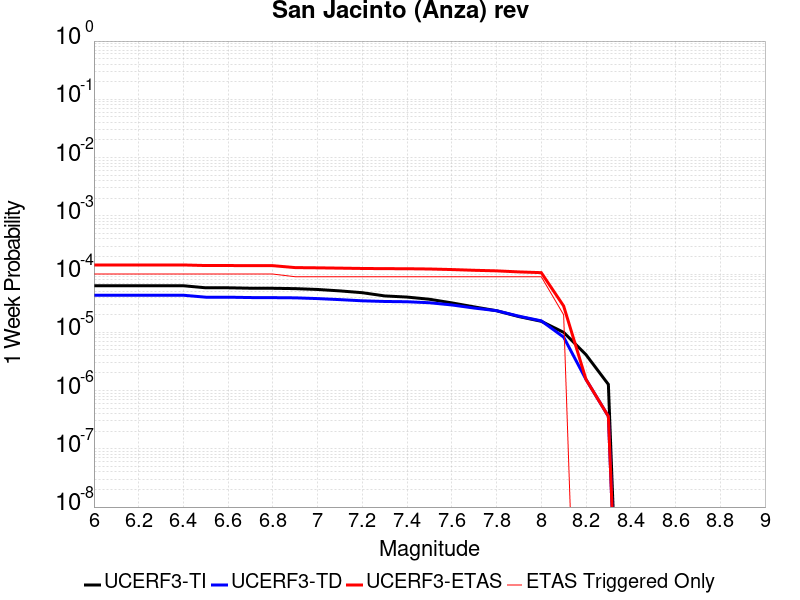 | 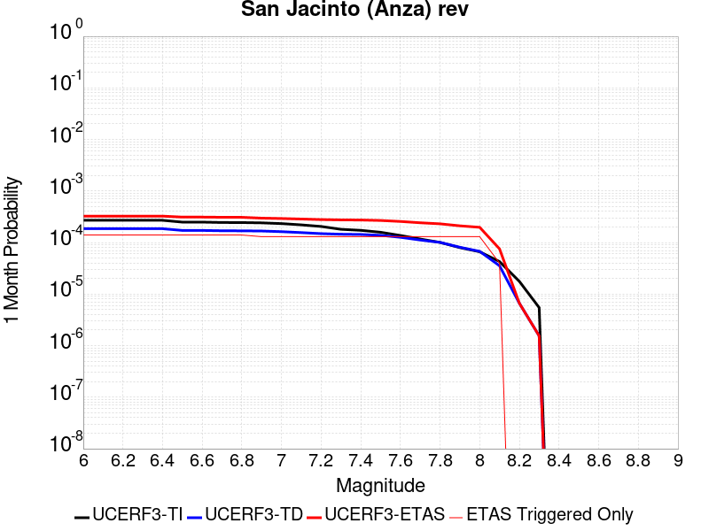 |  |  |

| Magnitude | 1 wk TI Prob | 1 wk TD Prob | 1 wk ETAS Prob | 1 wk ETAS/TD Gain | 1 wk ETAS Triggered Only | 1 mo TI Prob | 1 mo TD Prob | 1 mo ETAS Prob | 1 mo ETAS/TD Gain | 1 mo ETAS Triggered Only | 1 yr TI Prob | 1 yr TD Prob | 1 yr ETAS Prob | 1 yr ETAS/TD Gain | 1 yr ETAS Triggered Only | 10 yr TI Prob | 10 yr TD Prob | 10 yr ETAS Prob | 10 yr ETAS/TD Gain | 10 yr ETAS Triggered Only |
|-----|-----|-----|-----|-----|-----|-----|-----|-----|-----|-----|-----|-----|-----|-----|-----|-----|-----|-----|-----|-----|
| 6.0 | 6.3015636E-5 | 4.3298347E-5 | 1.4329402E-4 | 3.309457 | 1.0E-4 | 2.7003905E-4 | 1.8555121E-4 | 3.2552524E-4 | 1.7543687 | 1.4E-4 | 0.0032827691 | 0.0022567573 | 0.0024463285 | 1.0840015 | 1.9E-4 | 0.032346968 | 0.02329361 | 0.023547554 | 1.0109018 | 2.6E-4 |
| 6.1 | 6.3015636E-5 | 4.3298347E-5 | 1.4329402E-4 | 3.309457 | 1.0E-4 | 2.7003905E-4 | 1.8555121E-4 | 3.2552524E-4 | 1.7543687 | 1.4E-4 | 0.0032827691 | 0.0022567573 | 0.0024463285 | 1.0840015 | 1.9E-4 | 0.032346968 | 0.02329361 | 0.023547554 | 1.0109018 | 2.6E-4 |
| 6.2 | 6.3015636E-5 | 4.3298347E-5 | 1.4329402E-4 | 3.309457 | 1.0E-4 | 2.7003905E-4 | 1.8555121E-4 | 3.2552524E-4 | 1.7543687 | 1.4E-4 | 0.0032827691 | 0.0022567573 | 0.0024463285 | 1.0840015 | 1.9E-4 | 0.032346968 | 0.02329361 | 0.023547554 | 1.0109018 | 2.6E-4 |
| 6.3 | 6.3015636E-5 | 4.3298347E-5 | 1.4329402E-4 | 3.309457 | 1.0E-4 | 2.7003905E-4 | 1.8555121E-4 | 3.2552524E-4 | 1.7543687 | 1.4E-4 | 0.0032827691 | 0.0022567573 | 0.0024463285 | 1.0840015 | 1.9E-4 | 0.032346968 | 0.02329361 | 0.023547554 | 1.0109018 | 2.6E-4 |
| 6.4 | 6.3015636E-5 | 4.3298347E-5 | 1.4329402E-4 | 3.309457 | 1.0E-4 | 2.7003905E-4 | 1.8555121E-4 | 3.2552524E-4 | 1.7543687 | 1.4E-4 | 0.0032827691 | 0.0022567573 | 0.0024463285 | 1.0840015 | 1.9E-4 | 0.032346968 | 0.02329361 | 0.023547554 | 1.0109018 | 2.6E-4 |
| 6.5 | 5.811017E-5 | 4.0080286E-5 | 1.4007627E-4 | 3.4948921 | 1.0E-4 | 2.4901982E-4 | 1.7176138E-4 | 3.1173733E-4 | 1.8149443 | 1.4E-4 | 0.0030276014 | 0.0020891947 | 0.0022787978 | 1.0907542 | 1.9E-4 | 0.02986684 | 0.021590833 | 0.02184522 | 1.0117822 | 2.6E-4 |
| 6.6 | 5.811017E-5 | 4.0080286E-5 | 1.4007627E-4 | 3.4948921 | 1.0E-4 | 2.4901982E-4 | 1.7176138E-4 | 3.1173733E-4 | 1.8149443 | 1.4E-4 | 0.0030276014 | 0.0020891947 | 0.0022787978 | 1.0907542 | 1.9E-4 | 0.02986684 | 0.021590833 | 0.02184522 | 1.0117822 | 2.6E-4 |
| 6.7 | 5.712442E-5 | 3.950301E-5 | 1.3949907E-4 | 3.5313525 | 1.0E-4 | 2.4479596E-4 | 1.6928767E-4 | 3.0926397E-4 | 1.8268547 | 1.4E-4 | 0.0029763177 | 0.0020591344 | 0.002238764 | 1.0872353 | 1.8E-4 | 0.029367693 | 0.021282919 | 0.021527598 | 1.0114965 | 2.5E-4 |
| 6.8 | 5.6967532E-5 | 3.93593E-5 | 1.3935537E-4 | 3.5405958 | 1.0E-4 | 2.4412372E-4 | 1.6867183E-4 | 3.0864822E-4 | 1.829874 | 1.4E-4 | 0.0029681553 | 0.0020516508 | 0.0022312815 | 1.0875542 | 1.8E-4 | 0.029288229 | 0.02120852 | 0.021453217 | 1.0115377 | 2.5E-4 |
| 6.9 | 5.6211324E-5 | 3.9064216E-5 | 1.290607E-4 | 3.3038087 | 9.0E-5 | 2.4088343E-4 | 1.6740736E-4 | 2.973856E-4 | 1.7764189 | 1.3E-4 | 0.0029288116 | 0.0020362847 | 0.0022059386 | 1.0833154 | 1.7E-4 | 0.028905109 | 0.021047527 | 0.021282475 | 1.0111628 | 2.4E-4 |
| 7.0 | 5.4383527E-5 | 3.7925012E-5 | 1.279216E-4 | 3.3730142 | 9.0E-5 | 2.3305144E-4 | 1.6252567E-4 | 2.9250453E-4 | 1.7997437 | 1.3E-4 | 0.0028337094 | 0.001976959 | 0.0021466229 | 1.0858207 | 1.7E-4 | 0.027978465 | 0.02044095 | 0.020676045 | 1.0115012 | 2.4E-4 |
| 7.1 | 5.1393665E-5 | 3.638787E-5 | 1.2638459E-4 | 3.4732616 | 9.0E-5 | 2.2023996E-4 | 1.5593872E-4 | 2.8591845E-4 | 1.8335308 | 1.3E-4 | 0.0026781242 | 0.0018969048 | 0.0020665824 | 1.0894496 | 1.7E-4 | 0.026460782 | 0.019616077 | 0.01985137 | 1.0119948 | 2.4E-4 |
| 7.2 | 4.785222E-5 | 3.4738845E-5 | 1.2473571E-4 | 3.5906699 | 9.0E-5 | 2.0506482E-4 | 1.4887229E-4 | 2.7885294E-4 | 1.8731017 | 1.3E-4 | 0.0024938055 | 0.0018110167 | 0.001980709 | 1.0936999 | 1.7E-4 | 0.024660049 | 0.018728783 | 0.018964289 | 1.0125746 | 2.4E-4 |
| 7.3 | 4.2143256E-5 | 3.3834414E-5 | 1.2383137E-4 | 3.6599236 | 9.0E-5 | 1.8060145E-4 | 1.449966E-4 | 2.7497773E-4 | 1.8964428 | 1.3E-4 | 0.002196605 | 0.0017639075 | 0.0019336076 | 1.0962069 | 1.7E-4 | 0.02175019 | 0.018236695 | 0.01847232 | 1.0129203 | 2.4E-4 |
| 7.4 | 4.0264713E-5 | 3.3472694E-5 | 1.2346968E-4 | 3.6886687 | 9.0E-5 | 1.7255165E-4 | 1.4344654E-4 | 2.734279E-4 | 1.906131 | 1.3E-4 | 0.002098792 | 0.0017450659 | 0.0019147693 | 1.0972475 | 1.7E-4 | 0.020790804 | 0.018041389 | 0.018277058 | 1.0130627 | 2.4E-4 |
| 7.5 | 3.694492E-5 | 3.2186905E-5 | 1.22184E-4 | 3.7960782 | 9.0E-5 | 1.5832575E-4 | 1.379366E-4 | 2.679187E-4 | 1.9423319 | 1.3E-4 | 0.0019259118 | 0.0016780876 | 0.0018478023 | 1.1011358 | 1.7E-4 | 0.01909306 | 0.017357888 | 0.017593723 | 1.0135865 | 2.4E-4 |
| 7.6 | 3.200565E-5 | 2.9502702E-5 | 1.19500044E-4 | 4.050478 | 9.0E-5 | 1.3715986E-4 | 1.2643404E-4 | 2.564176E-4 | 2.028074 | 1.3E-4 | 0.001668642 | 0.0015382497 | 0.0017079882 | 1.1103452 | 1.7E-4 | 0.01656168 | 0.015946016 | 0.01617235 | 1.0141937 | 2.3E-4 |
| 7.7 | 2.731642E-5 | 2.6091477E-5 | 1.16089126E-4 | 4.449312 | 9.0E-5 | 1.1706512E-4 | 1.11815825E-4 | 2.4180129E-4 | 2.162496 | 1.3E-4 | 0.001424336 | 0.0013605085 | 0.0015302772 | 1.1247833 | 1.7E-4 | 0.014152412 | 0.0141668 | 0.014393542 | 1.0160052 | 2.3E-4 |
| 7.8 | 2.3466424E-5 | 2.3503619E-5 | 1.13501505E-4 | 4.8291073 | 9.0E-5 | 1.0056651E-4 | 1.0072591E-4 | 2.3071282E-4 | 2.290501 | 1.3E-4 | 0.0012237094 | 0.0012256489 | 0.0013954405 | 1.138532 | 1.7E-4 | 0.012169928 | 0.012808796 | 0.013035851 | 1.0177264 | 2.3E-4 |
| 7.9 | 1.8611925E-5 | 1.890698E-5 | 1.08905275E-4 | 5.760057 | 9.0E-5 | 7.9762955E-5 | 8.10274E-5 | 2.1101687E-4 | 2.6042655 | 1.3E-4 | 9.7068126E-4 | 9.860628E-4 | 0.0011558952 | 1.1722327 | 1.7E-4 | 0.0096645225 | 0.010393705 | 0.010621315 | 1.0218987 | 2.3E-4 |
| 8.0 | 1.5460775E-5 | 1.5739915E-5 | 1.057385E-4 | 6.717857 | 9.0E-5 | 6.6258784E-5 | 6.745504E-5 | 1.9744626E-4 | 2.9270797 | 1.3E-4 | 8.0640207E-4 | 8.2095637E-4 | 9.80825E-4 | 1.1947347 | 1.6E-4 | 0.008034821 | 0.008702706 | 0.008920791 | 1.0250595 | 2.2E-4 |
| 8.1 | 9.983884E-6 | 8.268954E-6 | 2.8268789E-5 | 3.4186654 | 2.0E-5 | 4.2787375E-5 | 3.5437897E-5 | 7.543648E-5 | 2.1286952 | 4.0E-5 | 5.2081177E-4 | 4.313715E-4 | 4.813499E-4 | 1.1158594 | 5.0E-5 | 0.0051959283 | 0.00463968 | 0.004719309 | 1.0171626 | 8.0E-5 |
| 8.2 | 4.1226E-6 | 1.5522551E-6 | 1.5522551E-6 | 1.0 | 0.0 | 1.7668166E-5 | 6.6525045E-6 | 6.6525045E-6 | 1.0 | 0.0 | 2.1508869E-4 | 8.099126E-5 | 9.099045E-5 | 1.12346 | 1.0E-5 | 0.0021488064 | 9.401847E-4 | 9.501753E-4 | 1.0106262 | 1.0E-5 |
| 8.3 | 1.2750878E-6 | 3.609817E-7 | 3.609817E-7 | 1.0 | 0.0 | 5.4646503E-6 | 1.5470634E-6 | 1.5470634E-6 | 1.0 | 0.0 | 6.653009E-5 | 1.8835339E-5 | 2.8835151E-5 | 1.5309069 | 1.0E-5 | 6.6510175E-4 | 2.272251E-4 | 2.3722283E-4 | 1.0439992 | 1.0E-5 |

## San Jacinto (Stepovers Combined)
*[(top)](#table-of-contents)*

| 1 Week | 1 Month | 1 Year | 10 Year |
|-----|-----|-----|-----|
| 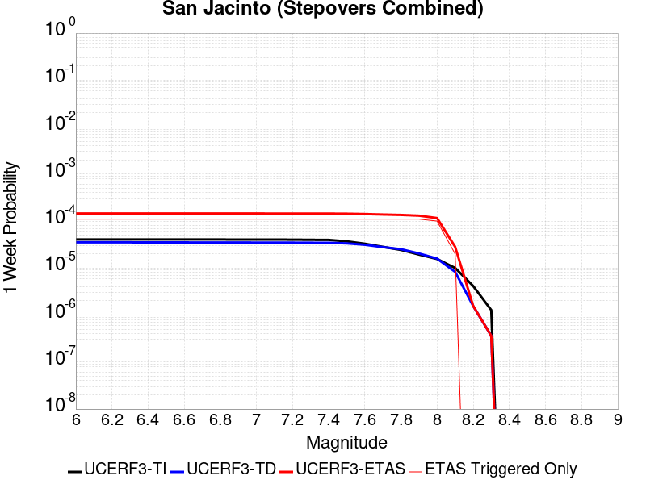 |  | 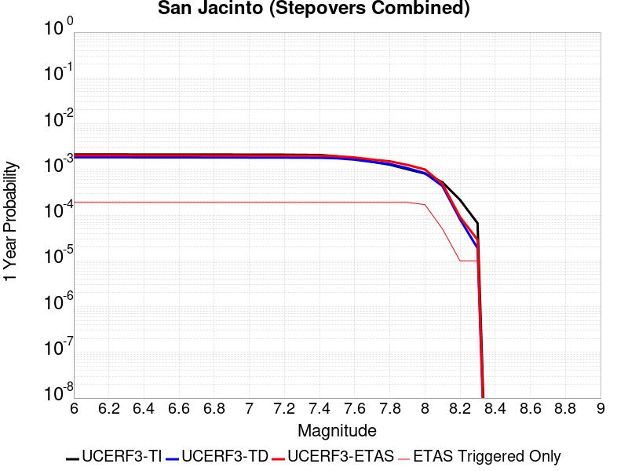 |  |

| Magnitude | 1 wk TI Prob | 1 wk TD Prob | 1 wk ETAS Prob | 1 wk ETAS/TD Gain | 1 wk ETAS Triggered Only | 1 mo TI Prob | 1 mo TD Prob | 1 mo ETAS Prob | 1 mo ETAS/TD Gain | 1 mo ETAS Triggered Only | 1 yr TI Prob | 1 yr TD Prob | 1 yr ETAS Prob | 1 yr ETAS/TD Gain | 1 yr ETAS Triggered Only | 10 yr TI Prob | 10 yr TD Prob | 10 yr ETAS Prob | 10 yr ETAS/TD Gain | 10 yr ETAS Triggered Only |
|-----|-----|-----|-----|-----|-----|-----|-----|-----|-----|-----|-----|-----|-----|-----|-----|-----|-----|-----|-----|-----|
| 6.0 | 4.0667746E-5 | 3.5271103E-5 | 1.4526723E-4 | 4.1185904 | 1.1E-4 | 1.742787E-4 | 1.5115313E-4 | 3.0113047E-4 | 1.9922211 | 1.5E-4 | 0.0021197782 | 0.0018387372 | 0.0020283877 | 1.1031418 | 1.9E-4 | 0.020996714 | 0.018986495 | 0.019241558 | 1.0134339 | 2.6E-4 |
| 6.1 | 4.0667746E-5 | 3.5271103E-5 | 1.4526723E-4 | 4.1185904 | 1.1E-4 | 1.742787E-4 | 1.5115313E-4 | 3.0113047E-4 | 1.9922211 | 1.5E-4 | 0.0021197782 | 0.0018387372 | 0.0020283877 | 1.1031418 | 1.9E-4 | 0.020996714 | 0.018986495 | 0.019241558 | 1.0134339 | 2.6E-4 |
| 6.2 | 4.0667746E-5 | 3.5271103E-5 | 1.4526723E-4 | 4.1185904 | 1.1E-4 | 1.742787E-4 | 1.5115313E-4 | 3.0113047E-4 | 1.9922211 | 1.5E-4 | 0.0021197782 | 0.0018387372 | 0.0020283877 | 1.1031418 | 1.9E-4 | 0.020996714 | 0.018986495 | 0.019241558 | 1.0134339 | 2.6E-4 |
| 6.3 | 4.0667746E-5 | 3.5271103E-5 | 1.4526723E-4 | 4.1185904 | 1.1E-4 | 1.742787E-4 | 1.5115313E-4 | 3.0113047E-4 | 1.9922211 | 1.5E-4 | 0.0021197782 | 0.0018387372 | 0.0020283877 | 1.1031418 | 1.9E-4 | 0.020996714 | 0.018986495 | 0.019241558 | 1.0134339 | 2.6E-4 |
| 6.4 | 4.0577226E-5 | 3.5143014E-5 | 1.4513914E-4 | 4.129957 | 1.1E-4 | 1.738908E-4 | 1.5060425E-4 | 3.0058165E-4 | 1.9958379 | 1.5E-4 | 0.0021150648 | 0.0018320669 | 0.0020217188 | 1.103518 | 1.9E-4 | 0.020950472 | 0.018921062 | 0.019176142 | 1.0134813 | 2.6E-4 |
| 6.5 | 4.0577226E-5 | 3.5143014E-5 | 1.4513914E-4 | 4.129957 | 1.1E-4 | 1.738908E-4 | 1.5060425E-4 | 3.0058165E-4 | 1.9958379 | 1.5E-4 | 0.0021150648 | 0.0018320669 | 0.0020217188 | 1.103518 | 1.9E-4 | 0.020950472 | 0.018921062 | 0.019176142 | 1.0134813 | 2.6E-4 |
| 6.6 | 4.053861E-5 | 3.5088357E-5 | 1.450845E-4 | 4.134833 | 1.1E-4 | 1.7372532E-4 | 1.5037002E-4 | 3.0034746E-4 | 1.9973892 | 1.5E-4 | 0.0021130538 | 0.0018292206 | 0.002018873 | 1.1036794 | 1.9E-4 | 0.020930743 | 0.01889314 | 0.019148229 | 1.0135016 | 2.6E-4 |
| 6.7 | 4.0516545E-5 | 3.505743E-5 | 1.4505358E-4 | 4.1375985 | 1.1E-4 | 1.7363077E-4 | 1.502375E-4 | 3.0021498E-4 | 1.9982692 | 1.5E-4 | 0.002111905 | 0.0018276101 | 0.0020172629 | 1.1037709 | 1.9E-4 | 0.020919468 | 0.018877337 | 0.019132428 | 1.0135131 | 2.6E-4 |
| 6.8 | 4.049434E-5 | 3.5028992E-5 | 1.4502514E-4 | 4.140146 | 1.1E-4 | 1.7353562E-4 | 1.5011564E-4 | 3.0009312E-4 | 1.9990797 | 1.5E-4 | 0.0021107488 | 0.0018261289 | 0.0020157818 | 1.1038553 | 1.9E-4 | 0.020908125 | 0.018862749 | 0.019117845 | 1.0135238 | 2.6E-4 |
| 6.9 | 4.046386E-5 | 3.4991554E-5 | 1.449877E-4 | 4.1435056 | 1.1E-4 | 1.73405E-4 | 1.499552E-4 | 2.999327E-4 | 2.0001488 | 1.5E-4 | 0.0021091616 | 0.0018241788 | 0.0020138323 | 1.1039665 | 1.9E-4 | 0.020892553 | 0.018843522 | 0.019098623 | 1.0135379 | 2.6E-4 |
| 7.0 | 4.036382E-5 | 3.4872126E-5 | 1.4486829E-4 | 4.154272 | 1.1E-4 | 1.7297632E-4 | 1.4944343E-4 | 2.99421E-4 | 2.0035744 | 1.5E-4 | 0.0021039525 | 0.0018179584 | 0.002007613 | 1.1043228 | 1.9E-4 | 0.02084144 | 0.018782137 | 0.019037252 | 1.013583 | 2.6E-4 |
| 7.1 | 4.0343282E-5 | 3.485059E-5 | 1.4484675E-4 | 4.1562214 | 1.1E-4 | 1.7288832E-4 | 1.4935112E-4 | 2.9932873E-4 | 2.0041945 | 1.5E-4 | 0.002102883 | 0.0018168368 | 0.0020064914 | 1.1043874 | 1.9E-4 | 0.020830948 | 0.018771008 | 0.019026127 | 1.0135912 | 2.6E-4 |
| 7.2 | 4.0257353E-5 | 3.475509E-5 | 1.4475126E-4 | 4.164894 | 1.1E-4 | 1.725201E-4 | 1.489419E-4 | 2.9891953E-4 | 2.0069542 | 1.5E-4 | 0.0020984085 | 0.0018118626 | 0.0020015184 | 1.1046745 | 1.9E-4 | 0.020787042 | 0.018721746 | 0.018976878 | 1.0136276 | 2.6E-4 |
| 7.3 | 3.9940667E-5 | 3.458276E-5 | 1.4457895E-4 | 4.1806655 | 1.1E-4 | 1.7116306E-4 | 1.4820343E-4 | 2.981812E-4 | 2.0119724 | 1.5E-4 | 0.0020819185 | 0.0018028866 | 0.0019925442 | 1.1051966 | 1.9E-4 | 0.020625217 | 0.018630387 | 0.018885544 | 1.0136957 | 2.6E-4 |
| 7.4 | 3.9721202E-5 | 3.4468165E-5 | 1.4446437E-4 | 4.191241 | 1.1E-4 | 1.7022261E-4 | 1.4771236E-4 | 2.9769022E-4 | 2.015337 | 1.5E-4 | 0.0020704903 | 0.0017969179 | 0.0019865765 | 1.1055466 | 1.9E-4 | 0.020513052 | 0.018569522 | 0.018824693 | 1.0137415 | 2.6E-4 |
| 7.5 | 3.7036873E-5 | 3.3535776E-5 | 1.4353209E-4 | 4.279969 | 1.1E-4 | 1.5871979E-4 | 1.4371685E-4 | 2.9369528E-4 | 2.0435688 | 1.5E-4 | 0.0019307006 | 0.0017483513 | 0.0019380191 | 1.1084838 | 1.9E-4 | 0.019140124 | 0.018071128 | 0.01832643 | 1.0141276 | 2.6E-4 |
| 7.6 | 3.2940967E-5 | 3.13167E-5 | 1.4131326E-4 | 4.5123925 | 1.1E-4 | 1.4116794E-4 | 1.3420754E-4 | 2.841874E-4 | 2.117522 | 1.5E-4 | 0.0017173645 | 0.0016327545 | 0.0018224443 | 1.1161778 | 1.9E-4 | 0.01704153 | 0.016904091 | 0.017149866 | 1.0145394 | 2.5E-4 |
| 7.7 | 2.8236149E-5 | 2.7882697E-5 | 1.3787963E-4 | 4.944989 | 1.1E-4 | 1.2100645E-4 | 1.1949181E-4 | 2.6947388E-4 | 2.2551663 | 1.5E-4 | 0.0014722579 | 0.0014538429 | 0.0016435666 | 1.1304982 | 1.9E-4 | 0.014625421 | 0.015114912 | 0.015361133 | 1.01629 | 2.5E-4 |
| 7.8 | 2.4329287E-5 | 2.5206451E-5 | 1.3520368E-4 | 5.3638525 | 1.1E-4 | 1.042642E-4 | 1.08023174E-4 | 2.5800697E-4 | 2.3884408 | 1.5E-4 | 0.0012686774 | 0.0013143895 | 0.0015041399 | 1.1443638 | 1.9E-4 | 0.012614589 | 0.013712341 | 0.013958912 | 1.0179818 | 2.5E-4 |
| 7.9 | 1.9370926E-5 | 2.0420413E-5 | 1.3041816E-4 | 6.3866568 | 1.1E-4 | 8.301561E-5 | 8.751312E-5 | 2.375E-4 | 2.7138786 | 1.5E-4 | 0.0010102465 | 0.0010649522 | 0.00125475 | 1.1782217 | 1.9E-4 | 0.0100566605 | 0.011199402 | 0.011446602 | 1.0220727 | 2.5E-4 |
| 8.0 | 1.5583017E-5 | 1.5885415E-5 | 1.1588383E-4 | 7.2949824 | 1.0E-4 | 6.6782646E-5 | 6.807858E-5 | 2.0806905E-4 | 3.056307 | 1.4E-4 | 8.127754E-4 | 8.2854216E-4 | 9.984013E-4 | 1.2050097 | 1.7E-4 | 0.008098091 | 0.008781636 | 0.009009616 | 1.025961 | 2.3E-4 |
| 8.1 | 1.0024873E-5 | 8.291399E-6 | 2.8291233E-5 | 3.412118 | 2.0E-5 | 4.2963035E-5 | 3.553409E-5 | 7.553267E-5 | 2.1256397 | 4.0E-5 | 5.229494E-4 | 4.3254215E-4 | 4.8252053E-4 | 1.1155456 | 5.0E-5 | 0.0052172043 | 0.0046530655 | 0.0047326935 | 1.017113 | 8.0E-5 |
| 8.2 | 4.142796E-6 | 1.5602761E-6 | 1.5602761E-6 | 1.0 | 0.0 | 1.775472E-5 | 6.6868806E-6 | 6.6868806E-6 | 1.0 | 0.0 | 2.1614227E-4 | 8.140976E-5 | 9.140895E-5 | 1.1228254 | 1.0E-5 | 0.0021593217 | 9.4514614E-4 | 9.5513667E-4 | 1.0105704 | 1.0E-5 |
| 8.3 | 1.2750878E-6 | 3.609817E-7 | 3.609817E-7 | 1.0 | 0.0 | 5.4646503E-6 | 1.5470634E-6 | 1.5470634E-6 | 1.0 | 0.0 | 6.653009E-5 | 1.8835339E-5 | 2.8835151E-5 | 1.5309069 | 1.0E-5 | 6.6510175E-4 | 2.272251E-4 | 2.3722283E-4 | 1.0439992 | 1.0E-5 |

## Blue Cut
*[(top)](#table-of-contents)*

| 1 Week | 1 Month | 1 Year | 10 Year |
|-----|-----|-----|-----|
| 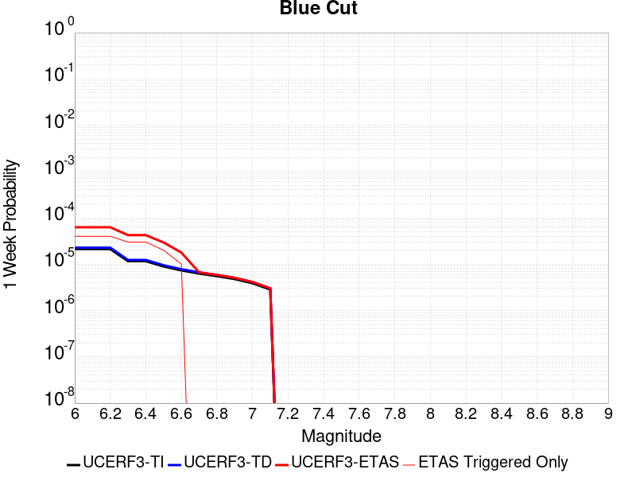 |  |  | 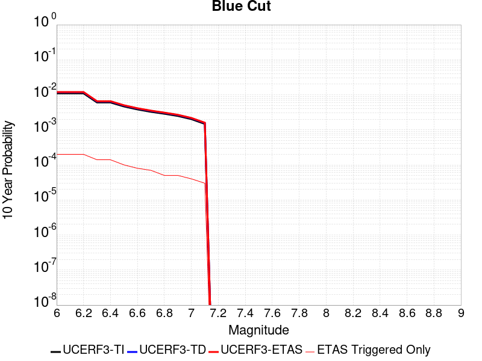 |

| Magnitude | 1 wk TI Prob | 1 wk TD Prob | 1 wk ETAS Prob | 1 wk ETAS/TD Gain | 1 wk ETAS Triggered Only | 1 mo TI Prob | 1 mo TD Prob | 1 mo ETAS Prob | 1 mo ETAS/TD Gain | 1 mo ETAS Triggered Only | 1 yr TI Prob | 1 yr TD Prob | 1 yr ETAS Prob | 1 yr ETAS/TD Gain | 1 yr ETAS Triggered Only | 10 yr TI Prob | 10 yr TD Prob | 10 yr ETAS Prob | 10 yr ETAS/TD Gain | 10 yr ETAS Triggered Only |
|-----|-----|-----|-----|-----|-----|-----|-----|-----|-----|-----|-----|-----|-----|-----|-----|-----|-----|-----|-----|-----|
| 6.0 | 2.1227985E-5 | 2.2719574E-5 | 6.271867E-5 | 2.7605565 | 4.0E-5 | 9.097391E-5 | 9.73663E-5 | 1.6735948E-4 | 1.7188646 | 7.0E-5 | 0.0011070445 | 0.0011848481 | 0.001304706 | 1.1011589 | 1.2E-4 | 0.011015458 | 0.011791152 | 0.0119887935 | 1.0167619 | 2.0E-4 |
| 6.1 | 2.1227985E-5 | 2.2719574E-5 | 6.271867E-5 | 2.7605565 | 4.0E-5 | 9.097391E-5 | 9.73663E-5 | 1.6735948E-4 | 1.7188646 | 7.0E-5 | 0.0011070445 | 0.0011848481 | 0.001304706 | 1.1011589 | 1.2E-4 | 0.011015458 | 0.011791152 | 0.0119887935 | 1.0167619 | 2.0E-4 |
| 6.2 | 2.1227985E-5 | 2.2719574E-5 | 6.271867E-5 | 2.7605565 | 4.0E-5 | 9.097391E-5 | 9.73663E-5 | 1.6735948E-4 | 1.7188646 | 7.0E-5 | 0.0011070445 | 0.0011848481 | 0.001304706 | 1.1011589 | 1.2E-4 | 0.011015458 | 0.011791152 | 0.0119887935 | 1.0167619 | 2.0E-4 |
| 6.3 | 1.1613981E-5 | 1.2353542E-5 | 4.235317E-5 | 3.4284234 | 3.0E-5 | 4.9773254E-5 | 5.2942745E-5 | 1.1293957E-4 | 2.1332397 | 6.0E-5 | 6.0582085E-4 | 6.443998E-4 | 7.2434824E-4 | 1.1240666 | 8.0E-5 | 0.0060417196 | 0.0064265593 | 0.0065656593 | 1.0216446 | 1.4E-4 |
| 6.4 | 1.1613981E-5 | 1.2353542E-5 | 4.235317E-5 | 3.4284234 | 3.0E-5 | 4.9773254E-5 | 5.2942745E-5 | 1.1293957E-4 | 2.1332397 | 6.0E-5 | 6.0582085E-4 | 6.443998E-4 | 7.2434824E-4 | 1.1240666 | 8.0E-5 | 0.0060417196 | 0.0064265593 | 0.0065656593 | 1.0216446 | 1.4E-4 |
| 6.5 | 8.931326E-6 | 9.4816E-6 | 2.948141E-5 | 3.1093287 | 2.0E-5 | 3.8276554E-5 | 4.0634844E-5 | 8.063322E-5 | 1.9843369 | 4.0E-5 | 4.6591737E-4 | 4.946261E-4 | 5.545964E-4 | 1.1212437 | 6.0E-5 | 0.0046494175 | 0.004936161 | 0.0050356677 | 1.0201586 | 1.0E-4 |
| 6.6 | 7.345353E-6 | 7.79028E-6 | 1.7790202E-5 | 2.283641 | 1.0E-5 | 3.1479703E-5 | 3.338653E-5 | 6.338553E-5 | 1.898536 | 3.0E-5 | 3.83198E-4 | 4.064132E-4 | 4.5639285E-4 | 1.1229775 | 5.0E-5 | 0.0038253788 | 0.0040574907 | 0.0041371663 | 1.0196366 | 8.0E-5 |
| 6.7 | 6.2775666E-6 | 6.655149E-6 | 6.655149E-6 | 1.0 | 0.0 | 2.690358E-5 | 2.8521798E-5 | 4.8521226E-5 | 1.7011981 | 2.0E-5 | 3.2750185E-4 | 3.472051E-4 | 3.871912E-4 | 1.1151657 | 4.0E-5 | 0.0032701963 | 0.003467367 | 0.0035371245 | 1.0201182 | 7.0E-5 |
| 6.8 | 5.5234095E-6 | 5.8551113E-6 | 5.8551113E-6 | 1.0 | 0.0 | 2.367154E-5 | 2.5093133E-5 | 4.509263E-5 | 1.7970108 | 2.0E-5 | 2.8816288E-4 | 3.0547334E-4 | 3.4546113E-4 | 1.1309043 | 4.0E-5 | 0.002877895 | 0.0030512505 | 0.003101098 | 1.0163367 | 5.0E-5 |
| 6.9 | 4.7780054E-6 | 5.0654203E-6 | 5.0654203E-6 | 1.0 | 0.0 | 2.0477004E-5 | 2.1708804E-5 | 4.170837E-5 | 1.9212652 | 2.0E-5 | 2.4927902E-4 | 2.642797E-4 | 3.042691E-4 | 1.1513149 | 4.0E-5 | 0.0024899957 | 0.002640346 | 0.0026902142 | 1.0188869 | 5.0E-5 |
| 7.0 | 3.883171E-6 | 4.118487E-6 | 4.118487E-6 | 1.0 | 0.0 | 1.6642054E-5 | 1.7650578E-5 | 2.7650402E-5 | 1.5665437 | 1.0E-5 | 2.0259817E-4 | 2.1488148E-4 | 2.4487503E-4 | 1.1395818 | 3.0E-5 | 0.0020241356 | 0.0021474129 | 0.002187327 | 1.0185871 | 4.0E-5 |
| 7.1 | 2.8358215E-6 | 3.0097158E-6 | 3.0097158E-6 | 1.0 | 0.0 | 1.2153464E-5 | 1.2898756E-5 | 1.2898756E-5 | 1.0 | 0.0 | 1.4795837E-4 | 1.5703762E-4 | 1.7703447E-4 | 1.127338 | 2.0E-5 | 0.001478599 | 0.0015699116 | 0.0015998646 | 1.0190793 | 3.0E-5 |

## Brawley (Seismic Zone) alt 1
*[(top)](#table-of-contents)*

| 1 Week | 1 Month | 1 Year | 10 Year |
|-----|-----|-----|-----|
| 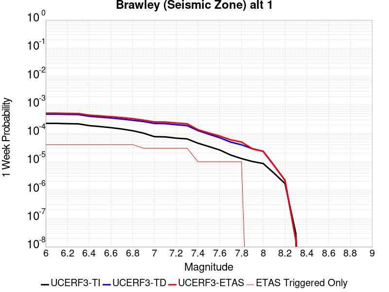 | 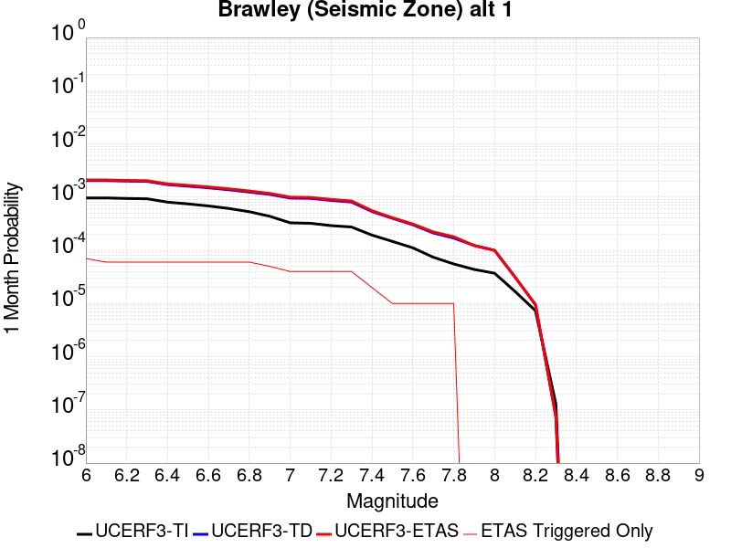 |  |  |

| Magnitude | 1 wk TI Prob | 1 wk TD Prob | 1 wk ETAS Prob | 1 wk ETAS/TD Gain | 1 wk ETAS Triggered Only | 1 mo TI Prob | 1 mo TD Prob | 1 mo ETAS Prob | 1 mo ETAS/TD Gain | 1 mo ETAS Triggered Only | 1 yr TI Prob | 1 yr TD Prob | 1 yr ETAS Prob | 1 yr ETAS/TD Gain | 1 yr ETAS Triggered Only | 10 yr TI Prob | 10 yr TD Prob | 10 yr ETAS Prob | 10 yr ETAS/TD Gain | 10 yr ETAS Triggered Only |
|-----|-----|-----|-----|-----|-----|-----|-----|-----|-----|-----|-----|-----|-----|-----|-----|-----|-----|-----|-----|-----|
| 6.0 | 2.2521618E-4 | 4.763429E-4 | 5.1632384E-4 | 1.0839331 | 4.0E-5 | 9.6485513E-4 | 0.0020399094 | 0.0021097667 | 1.0342453 | 7.0E-5 | 0.011683988 | 0.024544531 | 0.024651831 | 1.0043716 | 1.1E-4 | 0.11088423 | 0.21349923 | 0.2136644 | 1.0007737 | 2.1E-4 |
| 6.1 | 2.2521618E-4 | 4.763429E-4 | 5.1632384E-4 | 1.0839331 | 4.0E-5 | 9.6485513E-4 | 0.0020399094 | 0.0020997871 | 1.029353 | 6.0E-5 | 0.011683988 | 0.024544531 | 0.024642076 | 1.0039742 | 1.0E-4 | 0.11088423 | 0.21349923 | 0.21365653 | 1.0007367 | 2.0E-4 |
| 6.2 | 2.198148E-4 | 4.6718874E-4 | 5.0717004E-4 | 1.0855786 | 4.0E-5 | 9.417233E-4 | 0.0020007377 | 0.0020606178 | 1.0299289 | 6.0E-5 | 0.011405343 | 0.024078513 | 0.024176106 | 1.0040531 | 1.0E-4 | 0.10837428 | 0.20993572 | 0.21009374 | 1.0007527 | 2.0E-4 |
| 6.3 | 2.1704129E-4 | 4.615455E-4 | 5.0152704E-4 | 1.0866253 | 4.0E-5 | 9.298453E-4 | 0.0019765892 | 0.0020364707 | 1.0302954 | 6.0E-5 | 0.011262234 | 0.023792034 | 0.023889655 | 1.0041031 | 1.0E-4 | 0.107082725 | 0.20782684 | 0.20798527 | 1.0007623 | 2.0E-4 |
| 6.4 | 1.876142E-4 | 4.004663E-4 | 4.4045027E-4 | 1.0998436 | 4.0E-5 | 8.038131E-4 | 0.0017151695 | 0.0017750666 | 1.034922 | 6.0E-5 | 0.00974259 | 0.020678662 | 0.020776594 | 1.004736 | 1.0E-4 | 0.093263686 | 0.18457787 | 0.1847328 | 1.0008394 | 1.9E-4 |
| 6.5 | 1.7390939E-4 | 3.7478763E-4 | 4.1477266E-4 | 1.1066871 | 4.0E-5 | 7.45113E-4 | 0.0016052561 | 0.0016651598 | 1.0373172 | 6.0E-5 | 0.009034078 | 0.019367293 | 0.019465357 | 1.0050633 | 1.0E-4 | 0.086755216 | 0.17440015 | 0.17455702 | 1.0008994 | 1.9E-4 |
| 6.6 | 1.591791E-4 | 3.4893592E-4 | 3.8892197E-4 | 1.1145942 | 4.0E-5 | 6.8201777E-4 | 0.0014945926 | 0.001554503 | 1.0400847 | 6.0E-5 | 0.008271996 | 0.018045008 | 0.018143203 | 1.0054417 | 1.0E-4 | 0.07970774 | 0.16380787 | 0.16396675 | 1.0009699 | 1.9E-4 |
| 6.7 | 1.4268003E-4 | 3.2059717E-4 | 3.6058435E-4 | 1.1247271 | 4.0E-5 | 6.1134255E-4 | 0.0013732726 | 0.0014331902 | 1.0436312 | 6.0E-5 | 0.007417723 | 0.01659171 | 0.01669005 | 1.0059271 | 1.0E-4 | 0.07174956 | 0.15193594 | 0.15209706 | 1.0010605 | 1.9E-4 |
| 6.8 | 1.239713E-4 | 2.9055026E-4 | 3.3053863E-4 | 1.1376299 | 4.0E-5 | 5.3119735E-4 | 0.0012446274 | 0.0013045527 | 1.0481472 | 6.0E-5 | 0.0064481674 | 0.015049482 | 0.0151479775 | 1.0065447 | 1.0E-4 | 0.06264243 | 0.13838051 | 0.13854422 | 1.001183 | 1.9E-4 |
| 6.9 | 1.0180238E-4 | 2.6255674E-4 | 2.9254888E-4 | 1.114231 | 3.0E-5 | 4.3622297E-4 | 0.0011247622 | 0.001174706 | 1.0444038 | 5.0E-5 | 0.005298089 | 0.013608998 | 0.013697772 | 1.0065233 | 9.0E-5 | 0.05173543 | 0.12496473 | 0.12512223 | 1.0012604 | 1.8E-4 |
| 7.0 | 7.6619996E-5 | 2.2400476E-4 | 2.5399803E-4 | 1.1338958 | 3.0E-5 | 3.283301E-4 | 9.596704E-4 | 9.996321E-4 | 1.041641 | 4.0E-5 | 0.0039900932 | 0.011622103 | 0.011701173 | 1.0068034 | 8.0E-5 | 0.039192066 | 0.10726982 | 0.10742159 | 1.0014148 | 1.7E-4 |
| 7.1 | 7.5127435E-5 | 2.2083633E-4 | 2.508297E-4 | 1.1358172 | 3.0E-5 | 3.2193496E-4 | 9.461013E-4 | 9.860635E-4 | 1.0422387 | 4.0E-5 | 0.0039125155 | 0.011458648 | 0.011537732 | 1.0069016 | 8.0E-5 | 0.038443442 | 0.10583378 | 0.10598578 | 1.0014362 | 1.7E-4 |
| 7.2 | 6.788582E-5 | 2.0211334E-4 | 2.3210728E-4 | 1.1484016 | 3.0E-5 | 2.9090676E-4 | 8.6591556E-4 | 9.058809E-4 | 1.0461539 | 4.0E-5 | 0.0035360386 | 0.0104922 | 0.010571361 | 1.0075448 | 8.0E-5 | 0.034803 | 0.097503684 | 0.09765711 | 1.0015736 | 1.7E-4 |
| 7.3 | 6.399602E-5 | 1.8842232E-4 | 2.1841667E-4 | 1.1591868 | 3.0E-5 | 2.7423984E-4 | 8.0727716E-4 | 8.4724487E-4 | 1.0495093 | 4.0E-5 | 0.0033337586 | 0.009784897 | 0.009864113 | 1.0080959 | 8.0E-5 | 0.03284188 | 0.091397986 | 0.09154336 | 1.0015906 | 1.6E-4 |
| 7.4 | 4.506759E-5 | 1.2530042E-4 | 1.3529917E-4 | 1.0797982 | 1.0E-5 | 1.9313251E-4 | 5.3689216E-4 | 5.568814E-4 | 1.0372314 | 2.0E-5 | 0.0023488526 | 0.006517245 | 0.0065669194 | 1.007622 | 5.0E-5 | 0.023241805 | 0.062364522 | 0.062486414 | 1.0019546 | 1.3E-4 |
| 7.5 | 3.43289E-5 | 9.336103E-5 | 1.0336009E-4 | 1.1071011 | 1.0E-5 | 1.4711556E-4 | 4.0005764E-4 | 4.1005365E-4 | 1.0249864 | 1.0E-5 | 0.0017896603 | 0.004859886 | 0.004899692 | 1.0081906 | 4.0E-5 | 0.01775316 | 0.047057066 | 0.04717142 | 1.0024301 | 1.2E-4 |
| 7.6 | 2.5980507E-5 | 7.053672E-5 | 8.053602E-5 | 1.1417601 | 1.0E-5 | 1.1134028E-4 | 3.0226534E-4 | 3.1226233E-4 | 1.0330735 | 1.0E-5 | 0.001354725 | 0.0036738948 | 0.003713748 | 1.0108476 | 4.0E-5 | 0.013464959 | 0.03584298 | 0.035949036 | 1.0029589 | 1.1E-4 |
| 7.7 | 1.7292105E-5 | 4.9412036E-5 | 5.9411544E-5 | 1.2023698 | 1.0E-5 | 7.4106916E-5 | 2.1174872E-4 | 2.217466E-4 | 1.0472158 | 1.0E-5 | 9.018782E-4 | 0.0025749984 | 0.0026148953 | 1.015494 | 4.0E-5 | 0.008982267 | 0.025292097 | 0.025389567 | 1.0038538 | 1.0E-4 |
| 7.8 | 1.2927471E-5 | 3.9697254E-5 | 4.9696857E-5 | 1.2518966 | 1.0E-5 | 5.5402274E-5 | 1.7012001E-4 | 1.8011831E-4 | 1.0587721 | 1.0E-5 | 6.743139E-4 | 0.0020692463 | 0.0021091634 | 1.0192907 | 4.0E-5 | 0.0067227143 | 0.020433145 | 0.02051151 | 1.0038352 | 8.0E-5 |
| 7.9 | 1.0200774E-5 | 2.8748475E-5 | 2.8748475E-5 | 1.0 | 0.0 | 4.371687E-5 | 1.2320194E-4 | 1.2320194E-4 | 1.0 | 0.0 | 5.321229E-4 | 0.0014989526 | 0.0015289077 | 1.019984 | 3.0E-5 | 0.005308505 | 0.014992895 | 0.015042145 | 1.0032849 | 5.0E-5 |
| 8.0 | 8.650396E-6 | 2.3279512E-5 | 2.3279512E-5 | 1.0 | 0.0 | 3.70726E-5 | 9.976552E-5 | 9.976552E-5 | 1.0 | 0.0 | 4.5126543E-4 | 0.0012139693 | 0.001233945 | 1.0164549 | 2.0E-5 | 0.0045035016 | 0.012212164 | 0.012251675 | 1.0032355 | 4.0E-5 |
| 8.1 | 3.9368224E-6 | 7.3283345E-6 | 7.3283345E-6 | 1.0 | 0.0 | 1.6871985E-5 | 3.1406773E-5 | 3.1406773E-5 | 1.0 | 0.0 | 2.0539707E-4 | 3.8231048E-4 | 3.8231048E-4 | 1.0 | 0.0 | 0.0020520731 | 0.0040015313 | 0.0040015313 | 1.0 | 0.0 |
| 8.2 | 1.7101195E-6 | 2.2178374E-6 | 2.2178374E-6 | 1.0 | 0.0 | 7.329063E-6 | 9.504983E-6 | 9.504983E-6 | 1.0 | 0.0 | 8.922769E-5 | 1.15717055E-4 | 1.15717055E-4 | 1.0 | 0.0 | 8.9191867E-4 | 0.00126669 | 0.00126669 | 1.0 | 0.0 |
| 8.3 | 3.0346666E-8 | 1.721086E-8 | 1.721086E-8 | 1.0 | 0.0 | 1.3005713E-7 | 7.376083E-8 | 7.376083E-8 | 1.0 | 0.0 | 1.5834444E-6 | 8.98038E-7 | 8.98038E-7 | 1.0 | 0.0 | 1.5834332E-5 | 9.36379E-6 | 9.36379E-6 | 1.0 | 0.0 |

## Santa Rosa Island
*[(top)](#table-of-contents)*

| 1 Week | 1 Month | 1 Year | 10 Year |
|-----|-----|-----|-----|
|  |  | 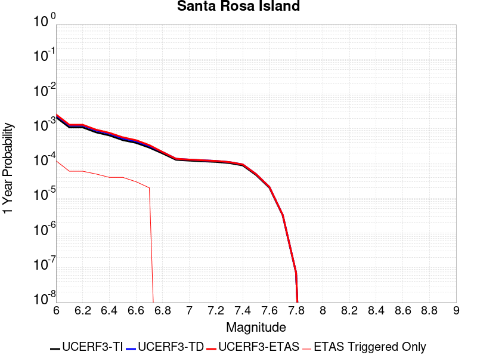 |  |

| Magnitude | 1 wk TI Prob | 1 wk TD Prob | 1 wk ETAS Prob | 1 wk ETAS/TD Gain | 1 wk ETAS Triggered Only | 1 mo TI Prob | 1 mo TD Prob | 1 mo ETAS Prob | 1 mo ETAS/TD Gain | 1 mo ETAS Triggered Only | 1 yr TI Prob | 1 yr TD Prob | 1 yr ETAS Prob | 1 yr ETAS/TD Gain | 1 yr ETAS Triggered Only | 10 yr TI Prob | 10 yr TD Prob | 10 yr ETAS Prob | 10 yr ETAS/TD Gain | 10 yr ETAS Triggered Only |
|-----|-----|-----|-----|-----|-----|-----|-----|-----|-----|-----|-----|-----|-----|-----|-----|-----|-----|-----|-----|-----|
| 6.0 | 4.1143165E-5 | 4.709113E-5 | 1.1708783E-4 | 2.4864097 | 7.0E-5 | 1.7631594E-4 | 2.0180462E-4 | 2.9178645E-4 | 1.4458859 | 9.0E-5 | 0.002144533 | 0.0024543991 | 0.0025741046 | 1.0487719 | 1.2E-4 | 0.021239553 | 0.024293557 | 0.024459427 | 1.0068277 | 1.7E-4 |
| 6.1 | 2.1061249E-5 | 2.3864959E-5 | 6.3864005E-5 | 2.6760576 | 4.0E-5 | 9.0259375E-5 | 1.0227455E-4 | 1.4227047E-4 | 1.3910642 | 4.0E-5 | 0.0010983539 | 0.0012445103 | 0.0013044357 | 1.0481517 | 6.0E-5 | 0.01092941 | 0.01237845 | 0.012457459 | 1.0063828 | 8.0E-5 |
| 6.2 | 2.1061249E-5 | 2.3864959E-5 | 6.3864005E-5 | 2.6760576 | 4.0E-5 | 9.0259375E-5 | 1.0227455E-4 | 1.4227047E-4 | 1.3910642 | 4.0E-5 | 0.0010983539 | 0.0012445103 | 0.0013044357 | 1.0481517 | 6.0E-5 | 0.01092941 | 0.01237845 | 0.012457459 | 1.0063828 | 8.0E-5 |
| 6.3 | 1.5158236E-5 | 1.7074419E-5 | 4.7073907E-5 | 2.7569845 | 3.0E-5 | 6.496225E-5 | 7.3174095E-5 | 1.031719E-4 | 1.4099512 | 3.0E-5 | 7.906284E-4 | 8.9054246E-4 | 9.4049796E-4 | 1.0560956 | 5.0E-5 | 0.007878214 | 0.00887099 | 0.008940369 | 1.0078208 | 7.0E-5 |
| 6.4 | 1.2341918E-5 | 1.3852917E-5 | 4.3852502E-5 | 3.1655788 | 3.0E-5 | 5.2892858E-5 | 5.9368336E-5 | 8.936656E-5 | 1.5052899 | 3.0E-5 | 6.437803E-4 | 7.225779E-4 | 7.62549E-4 | 1.0553174 | 4.0E-5 | 0.006419184 | 0.0072031217 | 0.0072527616 | 1.0068915 | 5.0E-5 |
| 6.5 | 9.061158E-6 | 1.0117032E-5 | 4.0116727E-5 | 3.9652667 | 3.0E-5 | 3.883296E-5 | 4.3358017E-5 | 7.3356714E-5 | 1.6918836 | 3.0E-5 | 4.726887E-4 | 5.277613E-4 | 5.677402E-4 | 1.0757518 | 4.0E-5 | 0.004716845 | 0.0052656177 | 0.005315354 | 1.0094455 | 5.0E-5 |
| 6.6 | 7.5461685E-6 | 8.400734E-6 | 2.8400565E-5 | 3.3807244 | 2.0E-5 | 3.2340322E-5 | 3.600267E-5 | 5.600195E-5 | 1.5554943 | 2.0E-5 | 3.936723E-4 | 4.3824868E-4 | 4.6823552E-4 | 1.0684243 | 3.0E-5 | 0.003929756 | 0.0043742736 | 0.004414099 | 1.0091044 | 4.0E-5 |
| 6.7 | 5.5023775E-6 | 6.087381E-6 | 1.608732E-5 | 2.6427326 | 1.0E-5 | 2.3581404E-5 | 2.6088532E-5 | 3.6088273E-5 | 1.3833002 | 1.0E-5 | 2.8706578E-4 | 3.1758484E-4 | 3.3757847E-4 | 1.0629553 | 2.0E-5 | 0.0028669522 | 0.0031716316 | 0.0032015364 | 1.0094289 | 3.0E-5 |
| 6.8 | 3.7351679E-6 | 4.0831405E-6 | 4.0831405E-6 | 1.0 | 0.0 | 1.6007763E-5 | 1.7499071E-5 | 1.7499071E-5 | 1.0 | 0.0 | 1.948771E-4 | 2.1303285E-4 | 2.1303285E-4 | 1.0 | 0.0 | 0.0019470629 | 0.0021285315 | 0.00213851 | 1.004688 | 1.0E-5 |
| 6.9 | 2.456366E-6 | 2.6292707E-6 | 2.6292707E-6 | 1.0 | 0.0 | 1.0527241E-5 | 1.1268255E-5 | 1.1268255E-5 | 1.0 | 0.0 | 1.2816161E-4 | 1.3718239E-4 | 1.3718239E-4 | 1.0 | 0.0 | 0.0012808773 | 0.0013709799 | 0.0013809663 | 1.007284 | 1.0E-5 |
| 7.0 | 2.3245157E-6 | 2.4827784E-6 | 2.4827784E-6 | 1.0 | 0.0 | 9.962172E-6 | 1.0640436E-5 | 1.0640436E-5 | 1.0 | 0.0 | 1.2128269E-4 | 1.2953962E-4 | 1.2953962E-4 | 1.0 | 0.0 | 0.0012121652 | 0.0012946434 | 0.0013046304 | 1.0077142 | 1.0E-5 |
| 7.1 | 2.2248344E-6 | 2.37325E-6 | 2.37325E-6 | 1.0 | 0.0 | 9.53497E-6 | 1.0171032E-5 | 1.0171032E-5 | 1.0 | 0.0 | 1.1608207E-4 | 1.238253E-4 | 1.238253E-4 | 1.0 | 0.0 | 0.0011602144 | 0.0012375651 | 0.0012475527 | 1.0080703 | 1.0E-5 |
| 7.2 | 2.1350402E-6 | 2.2761542E-6 | 2.2761542E-6 | 1.0 | 0.0 | 9.150141E-6 | 9.75491E-6 | 9.75491E-6 | 1.0 | 0.0 | 1.1139726E-4 | 1.1875957E-4 | 1.1875957E-4 | 1.0 | 0.0 | 0.0011134144 | 0.0011869629 | 0.0011969511 | 1.0084149 | 1.0E-5 |
| 7.3 | 1.9793572E-6 | 2.1087192E-6 | 2.1087192E-6 | 1.0 | 0.0 | 8.482932E-6 | 9.037337E-6 | 9.037337E-6 | 1.0 | 0.0 | 1.032748E-4 | 1.1002403E-4 | 1.1002403E-4 | 1.0 | 0.0 | 0.0010322682 | 0.0010996974 | 0.0011096864 | 1.0090834 | 1.0E-5 |
| 7.4 | 1.6951194E-6 | 1.8045735E-6 | 1.8045735E-6 | 1.0 | 0.0 | 7.264777E-6 | 7.733864E-6 | 7.733864E-6 | 1.0 | 0.0 | 8.844508E-5 | 9.415574E-5 | 9.415574E-5 | 1.0 | 0.0 | 8.840988E-4 | 9.411601E-4 | 9.5115067E-4 | 1.0106152 | 1.0E-5 |
| 7.5 | 8.987207E-7 | 9.512216E-7 | 9.512216E-7 | 1.0 | 0.0 | 3.8516546E-6 | 4.0766577E-6 | 4.0766577E-6 | 1.0 | 0.0 | 4.6892885E-5 | 4.9632188E-5 | 4.9632188E-5 | 1.0 | 0.0 | 4.688299E-4 | 4.962122E-4 | 5.0620723E-4 | 1.0201427 | 1.0E-5 |
| 7.6 | 3.8783037E-7 | 4.0529335E-7 | 4.0529335E-7 | 1.0 | 0.0 | 1.6621291E-6 | 1.7369704E-6 | 1.7369704E-6 | 1.0 | 0.0 | 2.0236233E-5 | 2.1147416E-5 | 2.1147416E-5 | 1.0 | 0.0 | 2.023439E-4 | 2.114547E-4 | 2.2145257E-4 | 1.0472815 | 1.0E-5 |
| 7.7 | 6.181804E-8 | 6.339047E-8 | 6.339047E-8 | 1.0 | 0.0 | 2.6493444E-7 | 2.7167343E-7 | 2.7167343E-7 | 1.0 | 0.0 | 3.225572E-6 | 3.307619E-6 | 3.307619E-6 | 1.0 | 0.0 | 3.225525E-5 | 3.3075703E-5 | 3.3075703E-5 | 1.0 | 0.0 |
| 7.8 | 1.3704449E-9 | 1.3964153E-9 | 1.3964153E-9 | 1.0 | 0.0 | 5.873335E-9 | 5.984637E-9 | 5.984637E-9 | 1.0 | 0.0 | 7.1507856E-8 | 7.286295E-8 | 7.286295E-8 | 1.0 | 0.0 | 7.1507833E-7 | 7.286294E-7 | 7.286294E-7 | 1.0 | 0.0 |

## Santa Ynez (East)
*[(top)](#table-of-contents)*

| 1 Week | 1 Month | 1 Year | 10 Year |
|-----|-----|-----|-----|
| 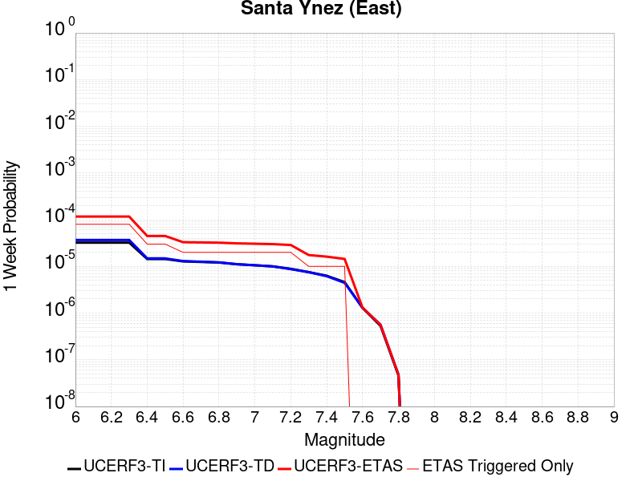 |  |  |  |

| Magnitude | 1 wk TI Prob | 1 wk TD Prob | 1 wk ETAS Prob | 1 wk ETAS/TD Gain | 1 wk ETAS Triggered Only | 1 mo TI Prob | 1 mo TD Prob | 1 mo ETAS Prob | 1 mo ETAS/TD Gain | 1 mo ETAS Triggered Only | 1 yr TI Prob | 1 yr TD Prob | 1 yr ETAS Prob | 1 yr ETAS/TD Gain | 1 yr ETAS Triggered Only | 10 yr TI Prob | 10 yr TD Prob | 10 yr ETAS Prob | 10 yr ETAS/TD Gain | 10 yr ETAS Triggered Only |
|-----|-----|-----|-----|-----|-----|-----|-----|-----|-----|-----|-----|-----|-----|-----|-----|-----|-----|-----|-----|-----|
| 6.0 | 3.2269712E-5 | 3.6750775E-5 | 1.1674783E-4 | 3.176745 | 8.0E-5 | 1.3829143E-4 | 1.5749714E-4 | 2.5748138E-4 | 1.6348321 | 1.0E-4 | 0.0016823979 | 0.0019164253 | 0.0020461762 | 1.0677047 | 1.3E-4 | 0.016697178 | 0.019056438 | 0.019223198 | 1.0087509 | 1.7E-4 |
| 6.1 | 3.2269712E-5 | 3.6750775E-5 | 1.1674783E-4 | 3.176745 | 8.0E-5 | 1.3829143E-4 | 1.5749714E-4 | 2.5748138E-4 | 1.6348321 | 1.0E-4 | 0.0016823979 | 0.0019164253 | 0.0020461762 | 1.0677047 | 1.3E-4 | 0.016697178 | 0.019056438 | 0.019223198 | 1.0087509 | 1.7E-4 |
| 6.2 | 3.2269712E-5 | 3.6750775E-5 | 1.1674783E-4 | 3.176745 | 8.0E-5 | 1.3829143E-4 | 1.5749714E-4 | 2.5748138E-4 | 1.6348321 | 1.0E-4 | 0.0016823979 | 0.0019164253 | 0.0020461762 | 1.0677047 | 1.3E-4 | 0.016697178 | 0.019056438 | 0.019223198 | 1.0087509 | 1.7E-4 |
| 6.3 | 3.2269712E-5 | 3.6750775E-5 | 1.1674783E-4 | 3.176745 | 8.0E-5 | 1.3829143E-4 | 1.5749714E-4 | 2.5748138E-4 | 1.6348321 | 1.0E-4 | 0.0016823979 | 0.0019164253 | 0.0020461762 | 1.0677047 | 1.3E-4 | 0.016697178 | 0.019056438 | 0.019223198 | 1.0087509 | 1.7E-4 |
| 6.4 | 1.4404779E-5 | 1.48492945E-5 | 4.484885E-5 | 3.020268 | 3.0E-5 | 6.1733306E-5 | 6.363831E-5 | 1.03635764E-4 | 1.6285123 | 4.0E-5 | 7.513438E-4 | 7.7452604E-4 | 8.344796E-4 | 1.0774068 | 6.0E-5 | 0.0074880854 | 0.007718817 | 0.0077783535 | 1.0077132 | 6.0E-5 |
| 6.5 | 1.4404779E-5 | 1.48492945E-5 | 4.484885E-5 | 3.020268 | 3.0E-5 | 6.1733306E-5 | 6.363831E-5 | 1.03635764E-4 | 1.6285123 | 4.0E-5 | 7.513438E-4 | 7.7452604E-4 | 8.344796E-4 | 1.0774068 | 6.0E-5 | 0.0074880854 | 0.007718817 | 0.0077783535 | 1.0077132 | 6.0E-5 |
| 6.6 | 1.280208E-5 | 1.301186E-5 | 3.3011598E-5 | 2.5370393 | 2.0E-5 | 5.4864904E-5 | 5.5763932E-5 | 8.576226E-5 | 1.5379522 | 3.0E-5 | 6.6777546E-4 | 6.7871617E-4 | 7.286822E-4 | 1.0736185 | 5.0E-5 | 0.006657724 | 0.0067666434 | 0.0068163048 | 1.0073392 | 5.0E-5 |
| 6.7 | 1.2457027E-5 | 1.262838E-5 | 3.2628126E-5 | 2.5837145 | 2.0E-5 | 5.3386164E-5 | 5.4120515E-5 | 8.4118896E-5 | 1.5542884 | 3.0E-5 | 6.497827E-4 | 6.5871974E-4 | 7.086868E-4 | 1.0758548 | 5.0E-5 | 0.00647886 | 0.00656787 | 0.0066175414 | 1.0075629 | 5.0E-5 |
| 6.8 | 1.2095134E-5 | 1.2230827E-5 | 3.2230582E-5 | 2.6351924 | 2.0E-5 | 5.1835254E-5 | 5.2416784E-5 | 8.2415216E-5 | 1.5723057 | 3.0E-5 | 6.309115E-4 | 6.3798914E-4 | 6.879572E-4 | 1.0783212 | 5.0E-5 | 0.0062912325 | 0.006361764 | 0.006411446 | 1.0078094 | 5.0E-5 |
| 6.9 | 1.1104036E-5 | 1.115726E-5 | 3.1157037E-5 | 2.7925348 | 2.0E-5 | 4.758786E-5 | 4.781596E-5 | 7.7814526E-5 | 1.6273756 | 3.0E-5 | 5.7922816E-4 | 5.82005E-4 | 6.3197594E-4 | 1.0858599 | 5.0E-5 | 0.005777207 | 0.0058049536 | 0.0058546634 | 1.0085633 | 5.0E-5 |
| 7.0 | 1.0577444E-5 | 1.05815925E-5 | 3.058138E-5 | 2.8900547 | 2.0E-5 | 4.5331115E-5 | 4.53489E-5 | 7.534754E-5 | 1.6615075 | 3.0E-5 | 5.5176654E-4 | 5.5198424E-4 | 6.019566E-4 | 1.0905323 | 5.0E-5 | 0.0055039856 | 0.00550627 | 0.005555995 | 1.0090306 | 5.0E-5 |
| 7.1 | 1.0021775E-5 | 9.9809E-6 | 2.99807E-5 | 3.0038073 | 2.0E-5 | 4.294976E-5 | 4.277459E-5 | 7.2773306E-5 | 1.7013209 | 3.0E-5 | 5.2278786E-4 | 5.206574E-4 | 5.7063135E-4 | 1.0959824 | 5.0E-5 | 0.0052155964 | 0.005194508 | 0.0052442485 | 1.0095756 | 5.0E-5 |
| 7.2 | 8.874109E-6 | 8.748706E-6 | 2.874853E-5 | 3.2860322 | 2.0E-5 | 3.8031343E-5 | 3.7493923E-5 | 5.7493173E-5 | 1.5333998 | 2.0E-5 | 4.629332E-4 | 4.56394E-4 | 4.963757E-4 | 1.0876036 | 4.0E-5 | 0.0046197 | 0.0045546847 | 0.004594503 | 1.0087422 | 4.0E-5 |
| 7.3 | 7.5504267E-6 | 7.5050243E-6 | 1.750495E-5 | 2.3324308 | 1.0E-5 | 3.235857E-5 | 3.2164E-5 | 4.2163676E-5 | 1.3108966 | 1.0E-5 | 3.9389438E-4 | 3.9152734E-4 | 4.2151558E-4 | 1.076593 | 3.0E-5 | 0.0039319694 | 0.0039084824 | 0.0039383653 | 1.0076456 | 3.0E-5 |
| 7.4 | 6.309394E-6 | 6.183062E-6 | 1.6183E-5 | 2.6173117 | 1.0E-5 | 2.703998E-5 | 2.6498574E-5 | 3.649831E-5 | 1.3773688 | 1.0E-5 | 3.2916202E-4 | 3.2257332E-4 | 3.5256366E-4 | 1.0929722 | 3.0E-5 | 0.003286749 | 0.0032211484 | 0.0032510518 | 1.0092834 | 3.0E-5 |
| 7.5 | 4.6103073E-6 | 4.4408016E-6 | 1.4440757E-5 | 3.2518356 | 1.0E-5 | 1.975831E-5 | 1.9031871E-5 | 2.9031682E-5 | 1.5254244 | 1.0E-5 | 2.4053088E-4 | 2.316891E-4 | 2.6168214E-4 | 1.1294539 | 3.0E-5 | 0.002402707 | 0.002314545 | 0.0023444756 | 1.0129315 | 3.0E-5 |
| 7.6 | 1.2858658E-6 | 1.3008196E-6 | 1.3008196E-6 | 1.0 | 0.0 | 5.5108417E-6 | 5.574929E-6 | 5.574929E-6 | 1.0 | 0.0 | 6.7092435E-5 | 6.787272E-5 | 7.787204E-5 | 1.1473246 | 1.0E-5 | 6.707218E-4 | 6.7852676E-4 | 6.8852E-4 | 1.0147278 | 1.0E-5 |
| 7.7 | 5.3302307E-7 | 5.612138E-7 | 5.612138E-7 | 1.0 | 0.0 | 2.2843826E-6 | 2.4052001E-6 | 2.4052001E-6 | 1.0 | 0.0 | 2.7812002E-5 | 2.9282955E-5 | 2.9282955E-5 | 1.0 | 0.0 | 2.7808524E-4 | 2.9279455E-4 | 2.9279455E-4 | 1.0 | 0.0 |
| 7.8 | 4.613933E-8 | 4.80301E-8 | 4.80301E-8 | 1.0 | 0.0 | 1.9773998E-7 | 2.0584326E-7 | 2.0584326E-7 | 1.0 | 0.0 | 2.4074816E-6 | 2.5061388E-6 | 2.5061388E-6 | 1.0 | 0.0 | 2.4074554E-5 | 2.5061116E-5 | 2.5061116E-5 | 1.0 | 0.0 |

## Pinto Mtn
*[(top)](#table-of-contents)*

| 1 Week | 1 Month | 1 Year | 10 Year |
|-----|-----|-----|-----|
|  |  |  |  |

| Magnitude | 1 wk TI Prob | 1 wk TD Prob | 1 wk ETAS Prob | 1 wk ETAS/TD Gain | 1 wk ETAS Triggered Only | 1 mo TI Prob | 1 mo TD Prob | 1 mo ETAS Prob | 1 mo ETAS/TD Gain | 1 mo ETAS Triggered Only | 1 yr TI Prob | 1 yr TD Prob | 1 yr ETAS Prob | 1 yr ETAS/TD Gain | 1 yr ETAS Triggered Only | 10 yr TI Prob | 10 yr TD Prob | 10 yr ETAS Prob | 10 yr ETAS/TD Gain | 10 yr ETAS Triggered Only |
|-----|-----|-----|-----|-----|-----|-----|-----|-----|-----|-----|-----|-----|-----|-----|-----|-----|-----|-----|-----|-----|
| 6.0 | 4.4194956E-5 | 4.7853926E-5 | 9.785153E-5 | 2.0447965 | 5.0E-5 | 1.893932E-4 | 2.0507304E-4 | 2.750587E-4 | 1.3412718 | 7.0E-5 | 0.0023034236 | 0.0024940688 | 0.0025938193 | 1.0399951 | 1.0E-4 | 0.022796938 | 0.024678305 | 0.024853863 | 1.0071138 | 1.8E-4 |
| 6.1 | 4.4194956E-5 | 4.7853926E-5 | 9.785153E-5 | 2.0447965 | 5.0E-5 | 1.893932E-4 | 2.0507304E-4 | 2.750587E-4 | 1.3412718 | 7.0E-5 | 0.0023034236 | 0.0024940688 | 0.0025938193 | 1.0399951 | 1.0E-4 | 0.022796938 | 0.024678305 | 0.024853863 | 1.0071138 | 1.8E-4 |
| 6.2 | 4.4194956E-5 | 4.7853926E-5 | 9.785153E-5 | 2.0447965 | 5.0E-5 | 1.893932E-4 | 2.0507304E-4 | 2.750587E-4 | 1.3412718 | 7.0E-5 | 0.0023034236 | 0.0024940688 | 0.0025938193 | 1.0399951 | 1.0E-4 | 0.022796938 | 0.024678305 | 0.024853863 | 1.0071138 | 1.8E-4 |
| 6.3 | 4.4194956E-5 | 4.7853926E-5 | 9.785153E-5 | 2.0447965 | 5.0E-5 | 1.893932E-4 | 2.0507304E-4 | 2.750587E-4 | 1.3412718 | 7.0E-5 | 0.0023034236 | 0.0024940688 | 0.0025938193 | 1.0399951 | 1.0E-4 | 0.022796938 | 0.024678305 | 0.024853863 | 1.0071138 | 1.8E-4 |
| 6.4 | 3.729929E-5 | 3.960349E-5 | 7.960191E-5 | 2.009972 | 4.0E-5 | 1.5984432E-4 | 1.6971873E-4 | 2.2970854E-4 | 1.3534662 | 6.0E-5 | 0.0019443673 | 0.0020644604 | 0.0021442953 | 1.038671 | 8.0E-5 | 0.019274427 | 0.020462848 | 0.02060978 | 1.0071803 | 1.5E-4 |
| 6.5 | 3.729929E-5 | 3.960349E-5 | 7.960191E-5 | 2.009972 | 4.0E-5 | 1.5984432E-4 | 1.6971873E-4 | 2.2970854E-4 | 1.3534662 | 6.0E-5 | 0.0019443673 | 0.0020644604 | 0.0021442953 | 1.038671 | 8.0E-5 | 0.019274427 | 0.020462848 | 0.02060978 | 1.0071803 | 1.5E-4 |
| 6.6 | 3.0204548E-5 | 3.12056E-5 | 6.1204664E-5 | 1.9613359 | 3.0E-5 | 1.2944164E-4 | 1.3373162E-4 | 1.7372628E-4 | 1.2990665 | 4.0E-5 | 0.0015748127 | 0.0016270012 | 0.0016769199 | 1.0306814 | 5.0E-5 | 0.015636992 | 0.016154764 | 0.016262988 | 1.0066991 | 1.1E-4 |
| 6.7 | 2.9857754E-5 | 3.0814987E-5 | 6.081406E-5 | 1.9735223 | 3.0E-5 | 1.2795553E-4 | 1.3205773E-4 | 1.7205245E-4 | 1.3028579 | 4.0E-5 | 0.0015567453 | 0.0016066517 | 0.0016565714 | 1.0310706 | 5.0E-5 | 0.015458848 | 0.015954204 | 0.01606245 | 1.0067847 | 1.1E-4 |
| 6.8 | 2.4819734E-5 | 2.5009665E-5 | 5.5008917E-5 | 2.1995063 | 3.0E-5 | 1.0636595E-4 | 1.0718E-4 | 1.4717571E-4 | 1.3731639 | 4.0E-5 | 0.0012942362 | 0.001304157 | 0.0013441049 | 1.0306312 | 4.0E-5 | 0.012867244 | 0.012967403 | 0.0130661065 | 1.0076116 | 1.0E-4 |
| 6.9 | 2.331124E-5 | 2.3337945E-5 | 4.3337477E-5 | 1.8569535 | 2.0E-5 | 9.990149E-5 | 1.0001605E-4 | 1.3001304E-4 | 1.2999219 | 3.0E-5 | 0.001215622 | 0.0012170355 | 0.001246999 | 1.02462 | 3.0E-5 | 0.012089936 | 0.012105897 | 0.012194808 | 1.0073444 | 9.0E-5 |
| 7.0 | 2.1818534E-5 | 2.1761074E-5 | 4.176064E-5 | 1.9190522 | 2.0E-5 | 9.3504656E-5 | 9.3258524E-5 | 1.2325573E-4 | 1.3216565 | 3.0E-5 | 0.0011378246 | 0.0011348509 | 0.0011648169 | 1.0264052 | 3.0E-5 | 0.011320163 | 0.01129266 | 0.011381643 | 1.0078797 | 9.0E-5 |
| 7.1 | 2.066081E-5 | 2.0540718E-5 | 4.0540308E-5 | 1.9736558 | 2.0E-5 | 8.854332E-5 | 8.8028784E-5 | 1.18026146E-4 | 1.3407676 | 3.0E-5 | 0.0010774818 | 0.0010712431 | 0.001101211 | 1.0279748 | 3.0E-5 | 0.010722724 | 0.0106628435 | 0.0107518835 | 1.0083505 | 9.0E-5 |
| 7.2 | 1.8990233E-5 | 1.9054001E-5 | 3.9053622E-5 | 2.0496283 | 2.0E-5 | 8.138417E-5 | 8.165756E-5 | 1.11655114E-4 | 1.3673579 | 3.0E-5 | 9.904018E-4 | 9.937467E-4 | 0.0010237169 | 1.0301588 | 3.0E-5 | 0.009859995 | 0.009895029 | 0.0099742375 | 1.0080049 | 8.0E-5 |
| 7.3 | 1.3335872E-5 | 1.4906713E-5 | 3.4906414E-5 | 2.3416574 | 2.0E-5 | 5.7152483E-5 | 6.388442E-5 | 9.38825E-5 | 1.4695681 | 3.0E-5 | 6.956093E-4 | 7.77528E-4 | 8.0750464E-4 | 1.0385538 | 3.0E-5 | 0.006934359 | 0.007749376 | 0.007828756 | 1.0102434 | 8.0E-5 |
| 7.4 | 9.414066E-6 | 1.186096E-5 | 3.1860724E-5 | 2.6861842 | 2.0E-5 | 4.0345374E-5 | 5.083175E-5 | 8.083022E-5 | 1.5901524 | 3.0E-5 | 4.910942E-4 | 6.1871024E-4 | 6.4869167E-4 | 1.048458 | 3.0E-5 | 0.0049001034 | 0.0061708256 | 0.0062503316 | 1.0128843 | 8.0E-5 |
| 7.5 | 7.2101157E-6 | 9.158192E-6 | 9.158192E-6 | 1.0 | 0.0 | 3.090013E-5 | 3.9248847E-5 | 3.9248847E-5 | 1.0 | 0.0 | 3.7614413E-4 | 4.7775774E-4 | 4.7775774E-4 | 1.0 | 0.0 | 0.0037550807 | 0.004768082 | 0.0048078913 | 1.0083491 | 4.0E-5 |
| 7.6 | 3.296375E-6 | 4.5455017E-6 | 4.5455017E-6 | 1.0 | 0.0 | 1.4127245E-5 | 1.9480583E-5 | 1.9480583E-5 | 1.0 | 0.0 | 1.7198564E-4 | 2.3715167E-4 | 2.3715167E-4 | 1.0 | 0.0 | 0.0017185259 | 0.0023691233 | 0.0023790996 | 1.004211 | 1.0E-5 |
| 7.7 | 2.5741092E-6 | 3.5844084E-6 | 3.5844084E-6 | 1.0 | 0.0 | 1.103185E-5 | 1.5361667E-5 | 1.5361667E-5 | 1.0 | 0.0 | 1.3430449E-4 | 1.8701357E-4 | 1.8701357E-4 | 1.0 | 0.0 | 0.0013422335 | 0.0018686918 | 0.0018786731 | 1.0053413 | 1.0E-5 |

## Imperial
*[(top)](#table-of-contents)*

| 1 Week | 1 Month | 1 Year | 10 Year |
|-----|-----|-----|-----|
| 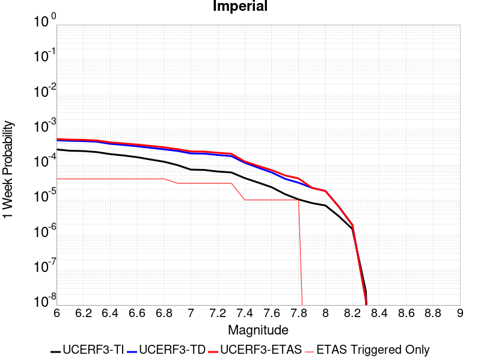 |  |  |  |

| Magnitude | 1 wk TI Prob | 1 wk TD Prob | 1 wk ETAS Prob | 1 wk ETAS/TD Gain | 1 wk ETAS Triggered Only | 1 mo TI Prob | 1 mo TD Prob | 1 mo ETAS Prob | 1 mo ETAS/TD Gain | 1 mo ETAS Triggered Only | 1 yr TI Prob | 1 yr TD Prob | 1 yr ETAS Prob | 1 yr ETAS/TD Gain | 1 yr ETAS Triggered Only | 10 yr TI Prob | 10 yr TD Prob | 10 yr ETAS Prob | 10 yr ETAS/TD Gain | 10 yr ETAS Triggered Only |
|-----|-----|-----|-----|-----|-----|-----|-----|-----|-----|-----|-----|-----|-----|-----|-----|-----|-----|-----|-----|-----|
| 6.0 | 2.7496446E-4 | 5.055345E-4 | 5.4551434E-4 | 1.0790842 | 4.0E-5 | 0.0011778869 | 0.002164817 | 0.002224687 | 1.027656 | 6.0E-5 | 0.0142467655 | 0.026048409 | 0.026145805 | 1.003739 | 1.0E-4 | 0.13367249 | 0.22807029 | 0.22821696 | 1.0006431 | 1.9E-4 |
| 6.1 | 2.5356023E-4 | 4.8657708E-4 | 5.265576E-4 | 1.0821669 | 4.0E-5 | 0.001086234 | 0.002083702 | 0.002143577 | 1.0287349 | 6.0E-5 | 0.013144928 | 0.02507094 | 0.025168432 | 1.0038887 | 1.0E-4 | 0.123940155 | 0.21949561 | 0.2196439 | 1.0006757 | 1.9E-4 |
| 6.2 | 2.4820742E-4 | 4.775311E-4 | 5.1751203E-4 | 1.0837241 | 4.0E-5 | 0.0010633124 | 0.0020449946 | 0.002104872 | 1.02928 | 6.0E-5 | 0.01286919 | 0.024610676 | 0.024708215 | 1.0039632 | 1.0E-4 | 0.12148927 | 0.21600136 | 0.21615033 | 1.0006896 | 1.9E-4 |
| 6.3 | 2.3205351E-4 | 4.5892023E-4 | 4.989019E-4 | 1.0871211 | 4.0E-5 | 9.94136E-4 | 0.0019653554 | 0.0020252375 | 1.0304688 | 6.0E-5 | 0.012036599 | 0.023661187 | 0.02375882 | 1.0041263 | 1.0E-4 | 0.11405133 | 0.20793827 | 0.20808876 | 1.0007237 | 1.9E-4 |
| 6.4 | 2.0304754E-4 | 3.9878016E-4 | 4.387642E-4 | 1.1002659 | 4.0E-5 | 8.6991355E-4 | 0.0017079529 | 0.0017678505 | 1.0350698 | 6.0E-5 | 0.010539869 | 0.020595418 | 0.020693358 | 1.0047555 | 1.0E-4 | 0.100537635 | 0.18507113 | 0.18521781 | 1.0007926 | 1.8E-4 |
| 6.5 | 1.854992E-4 | 3.6990462E-4 | 4.0988985E-4 | 1.108096 | 4.0E-5 | 7.9475436E-4 | 0.0015843548 | 0.0016442597 | 1.0378103 | 6.0E-5 | 0.009633281 | 0.01911443 | 0.019212518 | 1.0051316 | 1.0E-4 | 0.0922623 | 0.1733039 | 0.1734527 | 1.0008587 | 1.8E-4 |
| 6.6 | 1.6586106E-4 | 3.4036173E-4 | 3.8034812E-4 | 1.1174821 | 4.0E-5 | 7.106394E-4 | 0.0014578878 | 0.0015178004 | 1.0410954 | 6.0E-5 | 0.008617763 | 0.017607626 | 0.017705863 | 1.0055794 | 1.0E-4 | 0.08291132 | 0.16078055 | 0.1609316 | 1.0009395 | 1.8E-4 |
| 6.7 | 1.4224656E-4 | 3.076812E-4 | 3.476689E-4 | 1.1299647 | 4.0E-5 | 6.094856E-4 | 0.0013179756 | 0.0013778964 | 1.0454644 | 6.0E-5 | 0.0073952693 | 0.015928522 | 0.016026929 | 1.006178 | 1.0E-4 | 0.07153955 | 0.14648798 | 0.14664161 | 1.0010488 | 1.8E-4 |
| 6.8 | 1.2317259E-4 | 2.779231E-4 | 3.1791197E-4 | 1.1438847 | 4.0E-5 | 5.2777573E-4 | 0.0011905615 | 0.00125049 | 1.0503364 | 6.0E-5 | 0.0064067547 | 0.014400131 | 0.014498691 | 1.0068444 | 1.0E-4 | 0.06225166 | 0.13294089 | 0.13309695 | 1.001174 | 1.8E-4 |
| 6.9 | 9.859898E-5 | 2.5015484E-4 | 2.8014733E-4 | 1.1198957 | 3.0E-5 | 4.2249862E-4 | 0.0010716559 | 0.0011216024 | 1.0466068 | 5.0E-5 | 0.0051317946 | 0.012970319 | 0.013059151 | 1.0068489 | 9.0E-5 | 0.05014893 | 0.119408876 | 0.11955857 | 1.0012537 | 1.7E-4 |
| 7.0 | 7.3191884E-5 | 2.1267848E-4 | 2.426721E-4 | 1.141028 | 3.0E-5 | 3.136418E-4 | 9.11164E-4 | 9.5112756E-4 | 1.0438598 | 4.0E-5 | 0.003811904 | 0.011037681 | 0.011116798 | 1.0071679 | 8.0E-5 | 0.037471764 | 0.10206756 | 0.10221123 | 1.0014076 | 1.6E-4 |
| 7.1 | 7.1760296E-5 | 2.0969207E-4 | 2.3968577E-4 | 1.143037 | 3.0E-5 | 3.0750787E-4 | 8.9837395E-4 | 9.3833805E-4 | 1.0444849 | 4.0E-5 | 0.003737482 | 0.010883528 | 0.010962658 | 1.0072706 | 8.0E-5 | 0.03675245 | 0.10070406 | 0.10084795 | 1.0014288 | 1.6E-4 |
| 7.2 | 6.46614E-5 | 1.9137723E-4 | 2.2137149E-4 | 1.1567285 | 3.0E-5 | 2.7709085E-4 | 8.199333E-4 | 8.5990055E-4 | 1.0487444 | 4.0E-5 | 0.0033683628 | 0.009937617 | 0.010016822 | 1.0079702 | 8.0E-5 | 0.033177625 | 0.092511006 | 0.0926562 | 1.0015695 | 1.6E-4 |
| 7.3 | 6.088115E-5 | 1.780939E-4 | 2.0808856E-4 | 1.1684204 | 3.0E-5 | 2.6089314E-4 | 7.6303916E-4 | 8.030087E-4 | 1.052382 | 4.0E-5 | 0.0031717476 | 0.009251006 | 0.009330266 | 1.0085677 | 8.0E-5 | 0.031268585 | 0.08656135 | 0.08669837 | 1.0015829 | 1.5E-4 |
| 7.4 | 4.199346E-5 | 1.1511097E-4 | 1.2510981E-4 | 1.0868627 | 1.0E-5 | 1.7995955E-4 | 4.932403E-4 | 5.1323045E-4 | 1.0405282 | 2.0E-5 | 0.0021888057 | 0.005988835 | 0.006038536 | 1.0082989 | 5.0E-5 | 0.02167372 | 0.05744024 | 0.057553347 | 1.0019691 | 1.2E-4 |
| 7.5 | 3.130448E-5 | 8.333871E-5 | 9.3337876E-5 | 1.1199822 | 1.0E-5 | 1.3415517E-4 | 3.5711733E-4 | 3.6711377E-4 | 1.027992 | 1.0E-5 | 0.0016321153 | 0.0043392954 | 0.0043791216 | 1.009178 | 4.0E-5 | 0.016201803 | 0.042133506 | 0.042238872 | 1.0025008 | 1.1E-4 |
| 7.6 | 2.3074248E-5 | 6.0849357E-5 | 7.084875E-5 | 1.1643302 | 1.0E-5 | 9.888588E-5 | 2.6075702E-4 | 2.7075442E-4 | 1.0383399 | 1.0E-5 | 0.0012032706 | 0.0031701182 | 0.0032099916 | 1.0125778 | 4.0E-5 | 0.011967761 | 0.03102816 | 0.031125057 | 1.0031229 | 1.0E-4 |
| 7.7 | 1.45864815E-5 | 4.0128452E-5 | 5.0128052E-5 | 1.2491897 | 1.0E-5 | 6.2511994E-5 | 1.7196777E-4 | 1.8196605E-4 | 1.0581404 | 1.0E-5 | 7.608177E-4 | 0.0020917025 | 0.0021316188 | 1.0190831 | 4.0E-5 | 0.007582182 | 0.02062909 | 0.020717233 | 1.0042728 | 9.0E-5 |
| 7.8 | 1.0352979E-5 | 3.096395E-5 | 4.096364E-5 | 1.3229462 | 1.0E-5 | 4.4369157E-5 | 1.326959E-4 | 1.4269458E-4 | 1.0753503 | 1.0E-5 | 5.400606E-4 | 0.0016143778 | 0.0016543132 | 1.0247374 | 4.0E-5 | 0.0053875 | 0.016017893 | 0.016086772 | 1.0043001 | 7.0E-5 |
| 7.9 | 8.137906E-6 | 2.2151205E-5 | 2.2151205E-5 | 1.0 | 0.0 | 3.4876273E-5 | 9.493029E-5 | 9.493029E-5 | 1.0 | 0.0 | 4.2453592E-4 | 0.0011551644 | 0.0011851297 | 1.0259403 | 3.0E-5 | 0.004237258 | 0.011618842 | 0.011668261 | 1.0042534 | 5.0E-5 |
| 8.0 | 6.93792E-6 | 1.8010365E-5 | 1.8010365E-5 | 1.0 | 0.0 | 2.9733603E-5 | 7.7185E-5 | 7.7185E-5 | 1.0 | 0.0 | 3.6194647E-4 | 9.3932304E-4 | 9.593042E-4 | 1.021272 | 2.0E-5 | 0.0036135751 | 0.009502415 | 0.009542035 | 1.0041695 | 4.0E-5 |
| 8.1 | 3.4286315E-6 | 6.380179E-6 | 6.380179E-6 | 1.0 | 0.0 | 1.4694053E-5 | 2.734334E-5 | 2.734334E-5 | 1.0 | 0.0 | 1.7888541E-4 | 3.3285443E-4 | 3.3285443E-4 | 1.0 | 0.0 | 0.0017874148 | 0.0034863674 | 0.0034863674 | 1.0 | 0.0 |
| 8.2 | 1.4906886E-6 | 1.936633E-6 | 1.936633E-6 | 1.0 | 0.0 | 6.3886496E-6 | 8.2998295E-6 | 8.2998295E-6 | 1.0 | 0.0 | 7.7779034E-5 | 1.0104576E-4 | 1.0104576E-4 | 1.0 | 0.0 | 7.775182E-4 | 0.0011075423 | 0.0011075423 | 1.0 | 0.0 |
| 8.3 | 2.5758007E-8 | 1.4495866E-8 | 1.4495866E-8 | 1.0 | 0.0 | 1.10391454E-7 | 6.212514E-8 | 6.212514E-8 | 1.0 | 0.0 | 1.3440151E-6 | 7.563736E-7 | 7.563736E-7 | 1.0 | 0.0 | 1.344007E-5 | 7.884359E-6 | 7.884359E-6 | 1.0 | 0.0 |

## Cleghorn Pass
*[(top)](#table-of-contents)*

| 1 Week | 1 Month | 1 Year | 10 Year |
|-----|-----|-----|-----|
|  |  |  |  |

| Magnitude | 1 wk TI Prob | 1 wk TD Prob | 1 wk ETAS Prob | 1 wk ETAS/TD Gain | 1 wk ETAS Triggered Only | 1 mo TI Prob | 1 mo TD Prob | 1 mo ETAS Prob | 1 mo ETAS/TD Gain | 1 mo ETAS Triggered Only | 1 yr TI Prob | 1 yr TD Prob | 1 yr ETAS Prob | 1 yr ETAS/TD Gain | 1 yr ETAS Triggered Only | 10 yr TI Prob | 10 yr TD Prob | 10 yr ETAS Prob | 10 yr ETAS/TD Gain | 10 yr ETAS Triggered Only |
|-----|-----|-----|-----|-----|-----|-----|-----|-----|-----|-----|-----|-----|-----|-----|-----|-----|-----|-----|-----|-----|
| 6.0 | 1.0522846E-5 | 1.1040642E-5 | 5.10402E-5 | 4.6229377 | 4.0E-5 | 4.509713E-5 | 4.7316473E-5 | 9.731411E-5 | 2.0566645 | 5.0E-5 | 5.4891926E-4 | 5.759784E-4 | 6.659266E-4 | 1.1561658 | 9.0E-5 | 0.0054756533 | 0.005750022 | 0.0058991592 | 1.0259368 | 1.5E-4 |
| 6.1 | 1.0522846E-5 | 1.1040642E-5 | 5.10402E-5 | 4.6229377 | 4.0E-5 | 4.509713E-5 | 4.7316473E-5 | 9.731411E-5 | 2.0566645 | 5.0E-5 | 5.4891926E-4 | 5.759784E-4 | 6.659266E-4 | 1.1561658 | 9.0E-5 | 0.0054756533 | 0.005750022 | 0.0058991592 | 1.0259368 | 1.5E-4 |
| 6.2 | 2.1045846E-6 | 2.2082024E-6 | 2.2082024E-6 | 1.0 | 0.0 | 9.019617E-6 | 9.463714E-6 | 9.463714E-6 | 1.0 | 0.0 | 1.098083E-4 | 1.1521882E-4 | 1.1521882E-4 | 1.0 | 0.0 | 0.0010975406 | 0.0011520023 | 0.0011819677 | 1.0260116 | 3.0E-5 |
| 6.3 | 2.1045846E-6 | 2.2082024E-6 | 2.2082024E-6 | 1.0 | 0.0 | 9.019617E-6 | 9.463714E-6 | 9.463714E-6 | 1.0 | 0.0 | 1.098083E-4 | 1.1521882E-4 | 1.1521882E-4 | 1.0 | 0.0 | 0.0010975406 | 0.0011520023 | 0.0011819677 | 1.0260116 | 3.0E-5 |
| 6.4 | 1.7259927E-6 | 1.810877E-6 | 1.810877E-6 | 1.0 | 0.0 | 7.3970905E-6 | 7.760902E-6 | 7.760902E-6 | 1.0 | 0.0 | 9.005586E-5 | 9.4488976E-5 | 9.4488976E-5 | 1.0 | 0.0 | 9.001937E-4 | 9.448898E-4 | 9.7486144E-4 | 1.0317197 | 3.0E-5 |

## Deep Springs
*[(top)](#table-of-contents)*

| 1 Week | 1 Month | 1 Year | 10 Year |
|-----|-----|-----|-----|
| 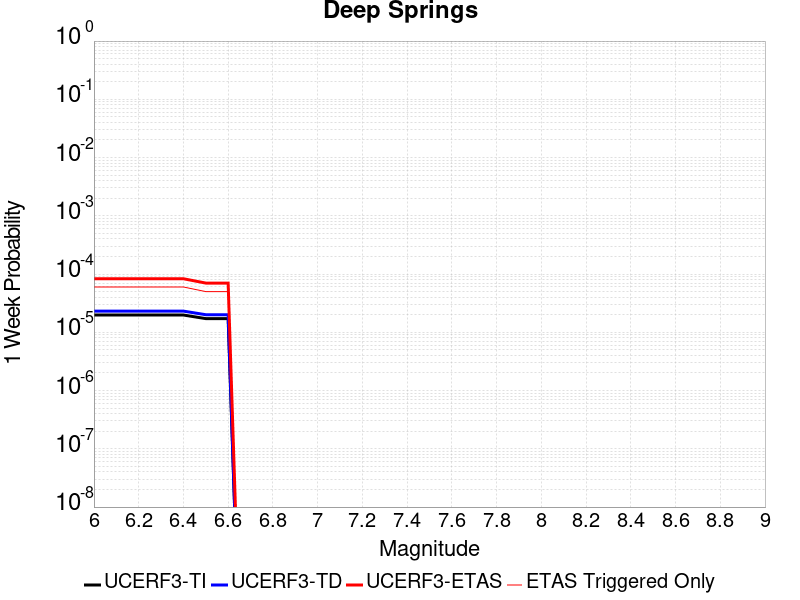 | 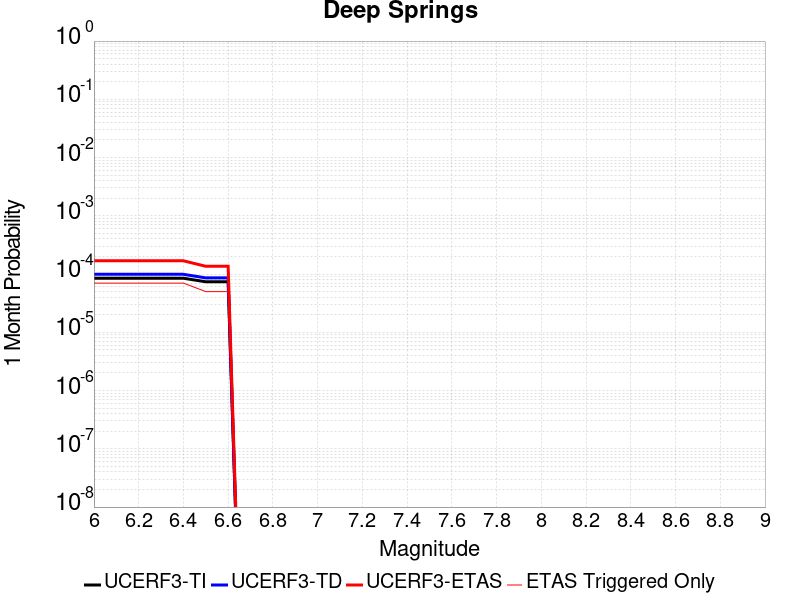 | 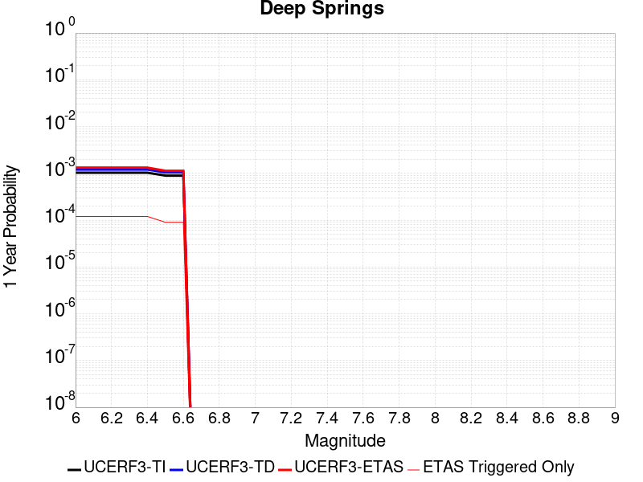 |  |

| Magnitude | 1 wk TI Prob | 1 wk TD Prob | 1 wk ETAS Prob | 1 wk ETAS/TD Gain | 1 wk ETAS Triggered Only | 1 mo TI Prob | 1 mo TD Prob | 1 mo ETAS Prob | 1 mo ETAS/TD Gain | 1 mo ETAS Triggered Only | 1 yr TI Prob | 1 yr TD Prob | 1 yr ETAS Prob | 1 yr ETAS/TD Gain | 1 yr ETAS Triggered Only | 10 yr TI Prob | 10 yr TD Prob | 10 yr ETAS Prob | 10 yr ETAS/TD Gain | 10 yr ETAS Triggered Only |
|-----|-----|-----|-----|-----|-----|-----|-----|-----|-----|-----|-----|-----|-----|-----|-----|-----|-----|-----|-----|-----|
| 6.0 | 1.9810619E-5 | 2.311252E-5 | 8.311113E-5 | 3.5959356 | 6.0E-5 | 8.489989E-5 | 9.9052755E-5 | 1.6904583E-4 | 1.7066242 | 7.0E-5 | 0.001033166 | 0.0012058078 | 0.0013256631 | 1.0993984 | 1.2E-4 | 0.010283757 | 0.01204243 | 0.012220263 | 1.0147672 | 1.8E-4 |
| 6.1 | 1.9810619E-5 | 2.311252E-5 | 8.311113E-5 | 3.5959356 | 6.0E-5 | 8.489989E-5 | 9.9052755E-5 | 1.6904583E-4 | 1.7066242 | 7.0E-5 | 0.001033166 | 0.0012058078 | 0.0013256631 | 1.0993984 | 1.2E-4 | 0.010283757 | 0.01204243 | 0.012220263 | 1.0147672 | 1.8E-4 |
| 6.2 | 1.9810619E-5 | 2.311252E-5 | 8.311113E-5 | 3.5959356 | 6.0E-5 | 8.489989E-5 | 9.9052755E-5 | 1.6904583E-4 | 1.7066242 | 7.0E-5 | 0.001033166 | 0.0012058078 | 0.0013256631 | 1.0993984 | 1.2E-4 | 0.010283757 | 0.01204243 | 0.012220263 | 1.0147672 | 1.8E-4 |
| 6.3 | 1.9810619E-5 | 2.311252E-5 | 8.311113E-5 | 3.5959356 | 6.0E-5 | 8.489989E-5 | 9.9052755E-5 | 1.6904583E-4 | 1.7066242 | 7.0E-5 | 0.001033166 | 0.0012058078 | 0.0013256631 | 1.0993984 | 1.2E-4 | 0.010283757 | 0.01204243 | 0.012220263 | 1.0147672 | 1.8E-4 |
| 6.4 | 1.9810619E-5 | 2.311252E-5 | 8.311113E-5 | 3.5959356 | 6.0E-5 | 8.489989E-5 | 9.9052755E-5 | 1.6904583E-4 | 1.7066242 | 7.0E-5 | 0.001033166 | 0.0012058078 | 0.0013256631 | 1.0993984 | 1.2E-4 | 0.010283757 | 0.01204243 | 0.012220263 | 1.0147672 | 1.8E-4 |
| 6.5 | 1.7190405E-5 | 2.0050558E-5 | 7.004956E-5 | 3.4936461 | 5.0E-5 | 7.367108E-5 | 8.593096E-5 | 1.3592666E-4 | 1.5818125 | 5.0E-5 | 8.9657627E-4 | 0.0010462092 | 0.001136115 | 1.0859349 | 9.0E-5 | 0.008929676 | 0.010462061 | 0.010610492 | 1.0141876 | 1.5E-4 |
| 6.6 | 1.7190405E-5 | 2.0050558E-5 | 7.004956E-5 | 3.4936461 | 5.0E-5 | 7.367108E-5 | 8.593096E-5 | 1.3592666E-4 | 1.5818125 | 5.0E-5 | 8.9657627E-4 | 0.0010462092 | 0.001136115 | 1.0859349 | 9.0E-5 | 0.008929676 | 0.010462061 | 0.010610492 | 1.0141876 | 1.5E-4 |

## Santa Ynez (West)
*[(top)](#table-of-contents)*

| 1 Week | 1 Month | 1 Year | 10 Year |
|-----|-----|-----|-----|
| 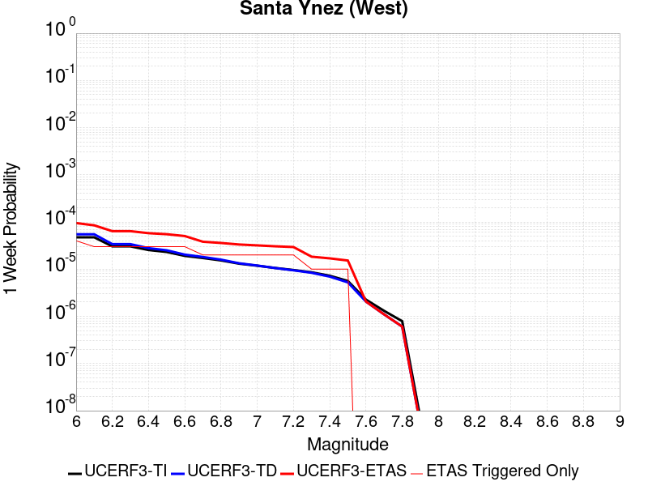 |  |  |  |

| Magnitude | 1 wk TI Prob | 1 wk TD Prob | 1 wk ETAS Prob | 1 wk ETAS/TD Gain | 1 wk ETAS Triggered Only | 1 mo TI Prob | 1 mo TD Prob | 1 mo ETAS Prob | 1 mo ETAS/TD Gain | 1 mo ETAS Triggered Only | 1 yr TI Prob | 1 yr TD Prob | 1 yr ETAS Prob | 1 yr ETAS/TD Gain | 1 yr ETAS Triggered Only | 10 yr TI Prob | 10 yr TD Prob | 10 yr ETAS Prob | 10 yr ETAS/TD Gain | 10 yr ETAS Triggered Only |
|-----|-----|-----|-----|-----|-----|-----|-----|-----|-----|-----|-----|-----|-----|-----|-----|-----|-----|-----|-----|-----|
| 6.0 | 4.7352758E-5 | 5.497084E-5 | 9.4968644E-5 | 1.7276186 | 4.0E-5 | 2.0292461E-4 | 2.3556968E-4 | 2.855579E-4 | 1.2122015 | 5.0E-5 | 0.0024678076 | 0.002864558 | 0.0029642715 | 1.0348094 | 1.0E-4 | 0.024405818 | 0.028304456 | 0.028459927 | 1.0054928 | 1.6E-4 |
| 6.1 | 4.7352758E-5 | 5.497084E-5 | 8.496919E-5 | 1.5457139 | 3.0E-5 | 2.0292461E-4 | 2.3556968E-4 | 2.7556025E-4 | 1.1697612 | 4.0E-5 | 0.0024678076 | 0.002864558 | 0.0029543 | 1.0313284 | 9.0E-5 | 0.024405818 | 0.028304456 | 0.028430777 | 1.004463 | 1.3E-4 |
| 6.2 | 3.0415853E-5 | 3.3925004E-5 | 6.392399E-5 | 1.8842735 | 3.0E-5 | 1.3034715E-4 | 1.4538495E-4 | 1.8537915E-4 | 1.2750916 | 4.0E-5 | 0.0015858212 | 0.0017686592 | 0.0018385354 | 1.039508 | 7.0E-5 | 0.015745522 | 0.01754978 | 0.017638199 | 1.0050383 | 9.0E-5 |
| 6.3 | 3.0415853E-5 | 3.3925004E-5 | 6.392399E-5 | 1.8842735 | 3.0E-5 | 1.3034715E-4 | 1.4538495E-4 | 1.8537915E-4 | 1.2750916 | 4.0E-5 | 0.0015858212 | 0.0017686592 | 0.0018385354 | 1.039508 | 7.0E-5 | 0.015745522 | 0.01754978 | 0.017638199 | 1.0050383 | 9.0E-5 |
| 6.4 | 2.5452082E-5 | 2.7912318E-5 | 5.7911482E-5 | 2.0747643 | 3.0E-5 | 1.09075794E-4 | 1.1961885E-4 | 1.5961406E-4 | 1.3343555 | 4.0E-5 | 0.0013271887 | 0.0014554056 | 0.0015253037 | 1.0480266 | 7.0E-5 | 0.013192902 | 0.01446091 | 0.014549608 | 1.0061337 | 9.0E-5 |
| 6.5 | 2.3143784E-5 | 2.5128133E-5 | 5.5127377E-5 | 2.193851 | 3.0E-5 | 9.9183875E-5 | 1.07687636E-4 | 1.4768333E-4 | 1.3714046 | 4.0E-5 | 0.0012068948 | 0.001310323 | 0.0013802312 | 1.053352 | 7.0E-5 | 0.012003611 | 0.013027638 | 0.013106596 | 1.0060608 | 8.0E-5 |
| 6.6 | 1.9118515E-5 | 2.0354244E-5 | 5.0353636E-5 | 2.473864 | 3.0E-5 | 8.193392E-5 | 8.722961E-5 | 1.1722699E-4 | 1.34389 | 3.0E-5 | 9.97089E-4 | 0.001061511 | 0.0011114579 | 1.0470526 | 5.0E-5 | 0.00992627 | 0.010565317 | 0.0106246825 | 1.0056189 | 6.0E-5 |
| 6.7 | 1.722807E-5 | 1.8146253E-5 | 3.814589E-5 | 2.102136 | 2.0E-5 | 7.3832496E-5 | 7.776737E-5 | 9.776581E-5 | 1.2571573 | 2.0E-5 | 8.985399E-4 | 9.4641204E-4 | 9.863742E-4 | 1.0422249 | 4.0E-5 | 0.008949154 | 0.009424461 | 0.00947399 | 1.0052553 | 5.0E-5 |
| 6.8 | 1.5317364E-5 | 1.5926391E-5 | 3.5926074E-5 | 2.2557573 | 2.0E-5 | 6.56442E-5 | 6.82542E-5 | 8.825283E-5 | 1.2930022 | 2.0E-5 | 7.98925E-4 | 8.3068234E-4 | 8.706491E-4 | 1.0481132 | 4.0E-5 | 0.007960589 | 0.008276261 | 0.008325847 | 1.0059913 | 5.0E-5 |
| 6.9 | 1.3071226E-5 | 1.332953E-5 | 3.3329263E-5 | 2.500408 | 2.0E-5 | 5.6018336E-5 | 5.712532E-5 | 7.7124176E-5 | 1.3500874 | 2.0E-5 | 6.8180985E-4 | 6.952811E-4 | 7.3525327E-4 | 1.0574907 | 4.0E-5 | 0.0067972173 | 0.0069313184 | 0.006971041 | 1.0057309 | 4.0E-5 |
| 7.0 | 1.1836986E-5 | 1.1932688E-5 | 3.193245E-5 | 2.6760483 | 2.0E-5 | 5.0728955E-5 | 5.1139097E-5 | 7.113807E-5 | 1.3910702 | 2.0E-5 | 6.1745E-4 | 6.2244234E-4 | 6.6241744E-4 | 1.0642229 | 4.0E-5 | 0.006157372 | 0.0062071825 | 0.006246934 | 1.0064042 | 4.0E-5 |
| 7.1 | 1.0597169E-5 | 1.0542107E-5 | 3.0541898E-5 | 2.8971338 | 2.0E-5 | 4.541565E-5 | 4.5179684E-5 | 6.517878E-5 | 1.4426569 | 2.0E-5 | 5.5279525E-4 | 5.4992497E-4 | 5.899029E-4 | 1.0726972 | 4.0E-5 | 0.0055142213 | 0.005485772 | 0.0055255527 | 1.0072516 | 4.0E-5 |
| 7.2 | 9.59113E-6 | 9.45905E-6 | 2.945886E-5 | 3.1143572 | 2.0E-5 | 4.11042E-5 | 4.053816E-5 | 6.053735E-5 | 1.4933423 | 2.0E-5 | 5.0032866E-4 | 4.934414E-4 | 5.334217E-4 | 1.0810233 | 4.0E-5 | 0.004992037 | 0.0049235765 | 0.0049633794 | 1.0080842 | 4.0E-5 |
| 7.3 | 8.586084E-6 | 8.379489E-6 | 1.8379405E-5 | 2.19338 | 1.0E-5 | 3.679698E-5 | 3.591161E-5 | 4.591125E-5 | 1.2784514 | 1.0E-5 | 4.4791115E-4 | 4.3713715E-4 | 4.6712405E-4 | 1.0685984 | 3.0E-5 | 0.004470094 | 0.004362884 | 0.0043927534 | 1.0068462 | 3.0E-5 |
| 7.4 | 7.2622997E-6 | 6.9514485E-6 | 1.6951379E-5 | 2.438539 | 1.0E-5 | 3.112377E-5 | 2.9791589E-5 | 3.9791288E-5 | 1.3356552 | 1.0E-5 | 3.78866E-4 | 3.6265317E-4 | 3.926423E-4 | 1.0826937 | 3.0E-5 | 0.0037822074 | 0.003620714 | 0.0036506054 | 1.0082556 | 3.0E-5 |
| 7.5 | 5.627296E-6 | 5.2514984E-6 | 1.5251446E-5 | 2.9042084 | 1.0E-5 | 2.411676E-5 | 2.2506232E-5 | 3.2506006E-5 | 1.4443114 | 1.0E-5 | 2.9358198E-4 | 2.7397962E-4 | 3.039714E-4 | 1.1094671 | 3.0E-5 | 0.0029319443 | 0.0027364905 | 0.0027664085 | 1.0109329 | 3.0E-5 |
| 7.6 | 2.265244E-6 | 2.0608632E-6 | 2.0608632E-6 | 1.0 | 0.0 | 9.708152E-6 | 8.832241E-6 | 8.832241E-6 | 1.0 | 0.0 | 1.18190335E-4 | 1.0752732E-4 | 1.0752732E-4 | 1.0 | 0.0 | 0.001181275 | 0.0010747615 | 0.0010747615 | 1.0 | 0.0 |
| 7.7 | 1.3099874E-6 | 1.1016228E-6 | 1.1016228E-6 | 1.0 | 0.0 | 5.61422E-6 | 4.7212325E-6 | 4.7212325E-6 | 1.0 | 0.0 | 6.8350986E-5 | 5.7479516E-5 | 5.7479516E-5 | 1.0 | 0.0 | 6.832996E-4 | 5.7464885E-4 | 5.7464885E-4 | 1.0 | 0.0 |
| 7.8 | 7.903951E-7 | 6.0710704E-7 | 6.0710704E-7 | 1.0 | 0.0 | 3.3874032E-6 | 2.601885E-6 | 2.601885E-6 | 1.0 | 0.0 | 4.1240855E-5 | 3.16775E-5 | 3.16775E-5 | 1.0 | 0.0 | 4.12332E-4 | 3.167312E-4 | 3.167312E-4 | 1.0 | 0.0 |
| 7.9 | 7.0753297E-9 | 5.090092E-9 | 5.090092E-9 | 1.0 | 0.0 | 3.032284E-8 | 2.181468E-8 | 2.181468E-8 | 1.0 | 0.0 | 3.6918053E-7 | 2.655937E-7 | 2.655937E-7 | 1.0 | 0.0 | 3.691799E-6 | 2.6559348E-6 | 2.6559348E-6 | 1.0 | 0.0 |

## Mission Creek
*[(top)](#table-of-contents)*

| 1 Week | 1 Month | 1 Year | 10 Year |
|-----|-----|-----|-----|
|  |  | 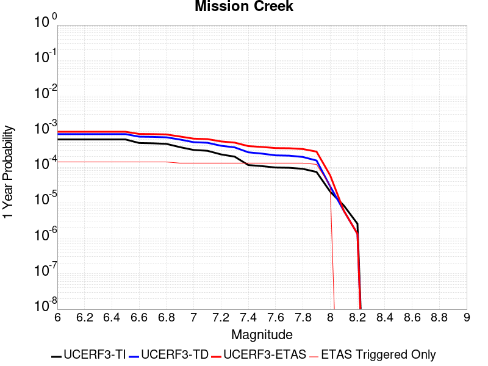 |  |

| Magnitude | 1 wk TI Prob | 1 wk TD Prob | 1 wk ETAS Prob | 1 wk ETAS/TD Gain | 1 wk ETAS Triggered Only | 1 mo TI Prob | 1 mo TD Prob | 1 mo ETAS Prob | 1 mo ETAS/TD Gain | 1 mo ETAS Triggered Only | 1 yr TI Prob | 1 yr TD Prob | 1 yr ETAS Prob | 1 yr ETAS/TD Gain | 1 yr ETAS Triggered Only | 10 yr TI Prob | 10 yr TD Prob | 10 yr ETAS Prob | 10 yr ETAS/TD Gain | 10 yr ETAS Triggered Only |
|-----|-----|-----|-----|-----|-----|-----|-----|-----|-----|-----|-----|-----|-----|-----|-----|-----|-----|-----|-----|-----|
| 6.0 | 1.1549387E-5 | 1.6322783E-5 | 9.632148E-5 | 5.9010453 | 8.0E-5 | 4.9496433E-5 | 6.995299E-5 | 1.5994669E-4 | 2.2864883 | 9.0E-5 | 6.0245243E-4 | 8.5135986E-4 | 9.912407E-4 | 1.1643028 | 1.4E-4 | 0.006008218 | 0.008510157 | 0.008668795 | 1.0186411 | 1.6E-4 |
| 6.1 | 1.1549387E-5 | 1.6322783E-5 | 9.632148E-5 | 5.9010453 | 8.0E-5 | 4.9496433E-5 | 6.995299E-5 | 1.5994669E-4 | 2.2864883 | 9.0E-5 | 6.0245243E-4 | 8.5135986E-4 | 9.912407E-4 | 1.1643028 | 1.4E-4 | 0.006008218 | 0.008510157 | 0.008668795 | 1.0186411 | 1.6E-4 |
| 6.2 | 1.1549387E-5 | 1.6322783E-5 | 9.632148E-5 | 5.9010453 | 8.0E-5 | 4.9496433E-5 | 6.995299E-5 | 1.5994669E-4 | 2.2864883 | 9.0E-5 | 6.0245243E-4 | 8.5135986E-4 | 9.912407E-4 | 1.1643028 | 1.4E-4 | 0.006008218 | 0.008510157 | 0.008668795 | 1.0186411 | 1.6E-4 |
| 6.3 | 1.1549387E-5 | 1.6322783E-5 | 9.632148E-5 | 5.9010453 | 8.0E-5 | 4.9496433E-5 | 6.995299E-5 | 1.5994669E-4 | 2.2864883 | 9.0E-5 | 6.0245243E-4 | 8.5135986E-4 | 9.912407E-4 | 1.1643028 | 1.4E-4 | 0.006008218 | 0.008510157 | 0.008668795 | 1.0186411 | 1.6E-4 |
| 6.4 | 1.1549387E-5 | 1.6322783E-5 | 9.632148E-5 | 5.9010453 | 8.0E-5 | 4.9496433E-5 | 6.995299E-5 | 1.5994669E-4 | 2.2864883 | 9.0E-5 | 6.0245243E-4 | 8.5135986E-4 | 9.912407E-4 | 1.1643028 | 1.4E-4 | 0.006008218 | 0.008510157 | 0.008668795 | 1.0186411 | 1.6E-4 |
| 6.5 | 1.1549387E-5 | 1.6322783E-5 | 9.632148E-5 | 5.9010453 | 8.0E-5 | 4.9496433E-5 | 6.995299E-5 | 1.5994669E-4 | 2.2864883 | 9.0E-5 | 6.0245243E-4 | 8.5135986E-4 | 9.912407E-4 | 1.1643028 | 1.4E-4 | 0.006008218 | 0.008510157 | 0.008668795 | 1.0186411 | 1.6E-4 |
| 6.6 | 9.202681E-6 | 1.3846059E-5 | 9.384495E-5 | 6.777737 | 8.0E-5 | 3.9439463E-5 | 5.9338956E-5 | 1.4933362E-4 | 2.5166202 | 9.0E-5 | 4.800697E-4 | 7.2222133E-4 | 8.6212024E-4 | 1.1937064 | 1.4E-4 | 0.004790339 | 0.0072273402 | 0.007386184 | 1.0219781 | 1.6E-4 |
| 6.7 | 9.019164E-6 | 1.3651728E-5 | 9.365063E-5 | 6.859984 | 8.0E-5 | 3.8652986E-5 | 5.8506146E-5 | 1.4850088E-4 | 2.53821 | 9.0E-5 | 4.7049852E-4 | 7.1208854E-4 | 8.5198885E-4 | 1.1964648 | 1.4E-4 | 0.004695036 | 0.0071266647 | 0.007285524 | 1.022291 | 1.6E-4 |
| 6.8 | 8.673558E-6 | 1.3273839E-5 | 9.327278E-5 | 7.0268126 | 8.0E-5 | 3.717186E-5 | 5.688669E-5 | 1.4688158E-4 | 2.5820024 | 9.0E-5 | 4.524734E-4 | 6.923842E-4 | 8.3228725E-4 | 1.2020599 | 1.4E-4 | 0.0045155324 | 0.0069308523 | 0.0070897434 | 1.0229251 | 1.6E-4 |
| 6.9 | 7.002255E-6 | 1.1478069E-5 | 8.1477265E-5 | 7.0985174 | 7.0E-5 | 3.000932E-5 | 4.9190832E-5 | 1.291869E-4 | 2.6262393 | 8.0E-5 | 3.653022E-4 | 5.9874065E-4 | 7.286628E-4 | 1.2169924 | 1.3E-4 | 0.0036470229 | 0.005999676 | 0.0061388356 | 1.0231946 | 1.4E-4 |
| 7.0 | 5.84644E-6 | 9.675359E-6 | 7.967468E-5 | 8.234803 | 7.0E-5 | 2.5055931E-5 | 4.146519E-5 | 1.21461875E-4 | 2.929249 | 8.0E-5 | 3.0501327E-4 | 5.047263E-4 | 6.346607E-4 | 1.2574353 | 1.3E-4 | 0.0030459496 | 0.005063994 | 0.0052032853 | 1.0275061 | 1.4E-4 |
| 7.1 | 5.54703E-6 | 9.329834E-6 | 7.9329184E-5 | 8.502743 | 7.0E-5 | 2.377277E-5 | 3.9984414E-5 | 1.1998122E-4 | 3.0006995 | 8.0E-5 | 2.8939504E-4 | 4.8670598E-4 | 6.166427E-4 | 1.2669717 | 1.3E-4 | 0.0028901845 | 0.0048845876 | 0.0050239037 | 1.0285215 | 1.4E-4 |
| 7.2 | 4.384709E-6 | 7.681918E-6 | 7.768138E-5 | 10.112238 | 7.0E-5 | 1.8791474E-5 | 3.292211E-5 | 1.1291948E-4 | 3.4298978 | 8.0E-5 | 2.2876218E-4 | 4.0075663E-4 | 5.307045E-4 | 1.3242564 | 1.3E-4 | 0.0022852682 | 0.004028542 | 0.0041679777 | 1.034612 | 1.4E-4 |
| 7.3 | 3.7888456E-6 | 6.915788E-6 | 7.6915305E-5 | 11.121697 | 7.0E-5 | 1.623781E-5 | 2.9638775E-5 | 1.0963641E-4 | 3.699087 | 8.0E-5 | 1.9767738E-4 | 3.6079568E-4 | 4.907488E-4 | 1.3601848 | 1.3E-4 | 0.0019750162 | 0.00363027 | 0.0037697616 | 1.0384246 | 1.4E-4 |
| 7.4 | 2.1982462E-6 | 5.0241033E-6 | 7.502375E-5 | 14.932765 | 7.0E-5 | 9.421021E-6 | 2.1531694E-5 | 1.0152997E-4 | 4.715373 | 8.0E-5 | 1.1469489E-4 | 2.6211704E-4 | 3.9208296E-4 | 1.4958317 | 1.3E-4 | 0.0011463572 | 0.0026460327 | 0.0027856622 | 1.0527694 | 1.4E-4 |
| 7.5 | 2.051923E-6 | 4.6153277E-6 | 7.4615E-5 | 16.166784 | 7.0E-5 | 8.793926E-6 | 1.9779825E-5 | 9.977824E-5 | 5.044445 | 8.0E-5 | 1.0706078E-4 | 2.4079291E-4 | 3.707616E-4 | 1.539753 | 1.3E-4 | 0.0010700922 | 0.0024335932 | 0.0025732524 | 1.0573881 | 1.4E-4 |
| 7.6 | 1.8733427E-6 | 4.1236603E-6 | 7.4123374E-5 | 17.97514 | 7.0E-5 | 8.028587E-6 | 1.7672712E-5 | 9.76713E-5 | 5.526673 | 8.0E-5 | 9.774366E-5 | 2.151441E-4 | 3.4511613E-4 | 1.6041162 | 1.3E-4 | 9.770069E-4 | 0.0021782513 | 0.0023179462 | 1.0641317 | 1.4E-4 |
| 7.7 | 1.8411953E-6 | 4.0433315E-6 | 7.404305E-5 | 18.312386 | 7.0E-5 | 7.890813E-6 | 1.732845E-5 | 9.7327065E-5 | 5.6166053 | 8.0E-5 | 9.606641E-5 | 2.1095353E-4 | 3.409261E-4 | 1.6161195 | 1.3E-4 | 9.6024893E-4 | 0.0021365292 | 0.00227623 | 1.0653869 | 1.4E-4 |
| 7.8 | 1.7194251E-6 | 3.71068E-6 | 7.371042E-5 | 19.864397 | 7.0E-5 | 7.368944E-6 | 1.5902819E-5 | 9.5901545E-5 | 6.030475 | 8.0E-5 | 8.97132E-5 | 1.9359968E-4 | 3.2357452E-4 | 1.6713587 | 1.3E-4 | 8.967699E-4 | 0.0019624757 | 0.0021022009 | 1.0711985 | 1.4E-4 |
| 7.9 | 1.4035052E-6 | 2.9502596E-6 | 7.295005E-5 | 24.726654 | 7.0E-5 | 6.0150082E-6 | 1.2643909E-5 | 9.26429E-5 | 7.327077 | 8.0E-5 | 7.3230265E-5 | 1.5392878E-4 | 2.7391032E-4 | 1.7794613 | 1.2E-4 | 7.3206134E-4 | 0.0015631174 | 0.0016929142 | 1.0830371 | 1.3E-4 |
| 8.0 | 3.9318823E-7 | 5.528477E-7 | 1.05528425E-5 | 19.088152 | 1.0E-5 | 1.6850913E-6 | 2.3693453E-6 | 1.2369322E-5 | 5.220565 | 1.0E-5 | 2.0515794E-5 | 2.8846403E-5 | 5.8845537E-5 | 2.039961 | 3.0E-5 | 2.0513899E-4 | 2.990952E-4 | 3.2908624E-4 | 1.1002725 | 3.0E-5 |
| 8.1 | 1.596793E-7 | 1.13775044E-7 | 1.13775044E-7 | 1.0 | 0.0 | 6.8433974E-7 | 4.876072E-7 | 4.876072E-7 | 1.0 | 0.0 | 8.331805E-6 | 5.936602E-6 | 5.936602E-6 | 1.0 | 0.0 | 8.331492E-5 | 6.5494125E-5 | 6.5494125E-5 | 1.0 | 0.0 |
| 8.2 | 4.9003038E-8 | 2.5435753E-8 | 2.5435753E-8 | 1.0 | 0.0 | 2.10013E-7 | 1.09010365E-7 | 1.09010365E-7 | 1.0 | 0.0 | 2.5569052E-6 | 1.3272004E-6 | 1.3272004E-6 | 1.0 | 0.0 | 2.556876E-5 | 1.4952613E-5 | 1.4952613E-5 | 1.0 | 0.0 |

## Oceanic - West Huasna
*[(top)](#table-of-contents)*

| 1 Week | 1 Month | 1 Year | 10 Year |
|-----|-----|-----|-----|
|  |  |  | 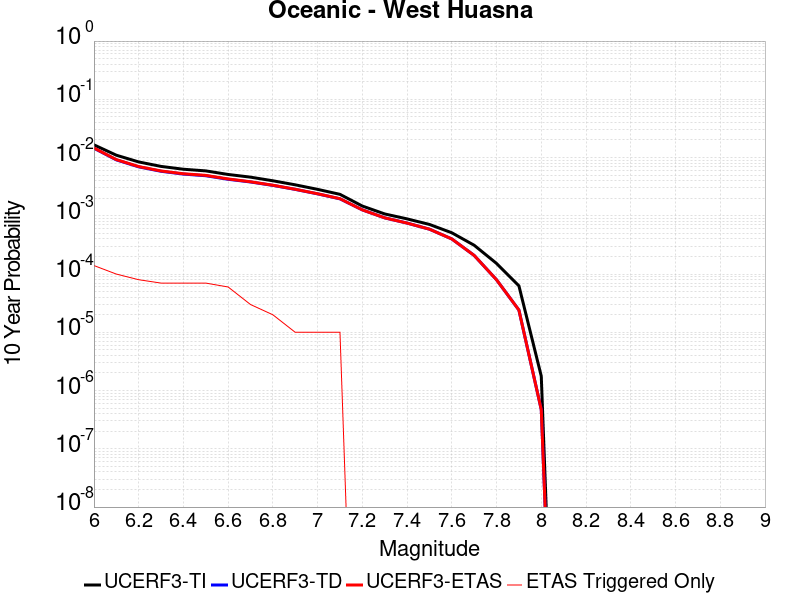 |

| Magnitude | 1 wk TI Prob | 1 wk TD Prob | 1 wk ETAS Prob | 1 wk ETAS/TD Gain | 1 wk ETAS Triggered Only | 1 mo TI Prob | 1 mo TD Prob | 1 mo ETAS Prob | 1 mo ETAS/TD Gain | 1 mo ETAS Triggered Only | 1 yr TI Prob | 1 yr TD Prob | 1 yr ETAS Prob | 1 yr ETAS/TD Gain | 1 yr ETAS Triggered Only | 10 yr TI Prob | 10 yr TD Prob | 10 yr ETAS Prob | 10 yr ETAS/TD Gain | 10 yr ETAS Triggered Only |
|-----|-----|-----|-----|-----|-----|-----|-----|-----|-----|-----|-----|-----|-----|-----|-----|-----|-----|-----|-----|-----|
| 6.0 | 3.195567E-5 | 2.7926368E-5 | 7.7924975E-5 | 2.7903726 | 5.0E-5 | 1.3694567E-4 | 1.19679185E-4 | 1.79672E-4 | 1.5012803 | 6.0E-5 | 0.0016660384 | 0.0014561634 | 0.0015660031 | 1.075431 | 1.1E-4 | 0.016536033 | 0.01447077 | 0.0146087445 | 1.0095347 | 1.4E-4 |
| 6.1 | 2.1156782E-5 | 1.7573117E-5 | 5.7572415E-5 | 3.276164 | 4.0E-5 | 9.066878E-5 | 7.531123E-5 | 1.1530823E-4 | 1.5310892 | 4.0E-5 | 0.0011033333 | 9.1653795E-4 | 9.964646E-4 | 1.0872049 | 8.0E-5 | 0.010978713 | 0.009128587 | 0.009227674 | 1.0108546 | 1.0E-4 |
| 6.2 | 1.6195117E-5 | 1.3327227E-5 | 5.3326694E-5 | 4.0013347 | 4.0E-5 | 6.9405796E-5 | 5.7115452E-5 | 9.711317E-5 | 1.7002959 | 4.0E-5 | 8.44688E-4 | 6.9516135E-4 | 7.5511966E-4 | 1.0862509 | 6.0E-5 | 0.008414844 | 0.0069301617 | 0.0070096073 | 1.0114638 | 8.0E-5 |
| 6.3 | 1.3559345E-5 | 1.1179013E-5 | 4.117868E-5 | 3.68357 | 3.0E-5 | 5.811018E-5 | 4.7909183E-5 | 7.7907745E-5 | 1.6261548 | 3.0E-5 | 7.072618E-4 | 5.8313913E-4 | 6.3311E-4 | 1.0856929 | 5.0E-5 | 0.0070501505 | 0.005816208 | 0.005885801 | 1.0119653 | 7.0E-5 |
| 6.4 | 1.2120619E-5 | 1.0000874E-5 | 4.0000574E-5 | 3.999708 | 3.0E-5 | 5.1944477E-5 | 4.2860185E-5 | 7.28589E-5 | 1.6999203 | 3.0E-5 | 6.322405E-4 | 5.216983E-4 | 5.716722E-4 | 1.0957909 | 5.0E-5 | 0.006304447 | 0.005204804 | 0.005274439 | 1.0133791 | 7.0E-5 |
| 6.5 | 1.13511915E-5 | 9.367378E-6 | 3.9367096E-5 | 4.202574 | 3.0E-5 | 4.8647056E-5 | 4.0145293E-5 | 7.014409E-5 | 1.7472557 | 3.0E-5 | 5.9211696E-4 | 4.886598E-4 | 5.386353E-4 | 1.1022707 | 5.0E-5 | 0.0059054173 | 0.0048759114 | 0.00494557 | 1.0142863 | 7.0E-5 |
| 6.6 | 9.850605E-6 | 8.1353155E-6 | 2.8135153E-5 | 3.4583972 | 2.0E-5 | 4.2216197E-5 | 3.4865174E-5 | 5.4864475E-5 | 1.5736183 | 2.0E-5 | 5.1386096E-4 | 4.2440102E-4 | 4.6438404E-4 | 1.0942105 | 4.0E-5 | 0.0051267436 | 0.0042359377 | 0.0042956835 | 1.0141045 | 6.0E-5 |
| 6.7 | 8.8558645E-6 | 7.318341E-6 | 1.7318267E-5 | 2.36642 | 1.0E-5 | 3.7953152E-5 | 3.1363943E-5 | 4.136363E-5 | 1.3188275 | 1.0E-5 | 4.6198163E-4 | 3.8178926E-4 | 4.0178164E-4 | 1.052365 | 2.0E-5 | 0.004610224 | 0.0038113592 | 0.0038412448 | 1.0078412 | 3.0E-5 |
| 6.8 | 7.67136E-6 | 6.39169E-6 | 1.6391627E-5 | 2.5645216 | 1.0E-5 | 3.2876844E-5 | 2.739267E-5 | 3.7392398E-5 | 1.3650512 | 1.0E-5 | 4.0020206E-4 | 3.3345487E-4 | 3.534482E-4 | 1.0599581 | 2.0E-5 | 0.003994821 | 0.0033295664 | 0.0033494998 | 1.0059868 | 2.0E-5 |
| 6.9 | 6.534529E-6 | 5.458261E-6 | 5.458261E-6 | 1.0 | 0.0 | 2.8004823E-5 | 2.3392338E-5 | 2.3392338E-5 | 1.0 | 0.0 | 3.4090536E-4 | 2.8476462E-4 | 2.9476176E-4 | 1.0351068 | 1.0E-5 | 0.0034038287 | 0.002844014 | 0.0028539856 | 1.0035062 | 1.0E-5 |
| 7.0 | 5.460525E-6 | 4.5699203E-6 | 4.5699203E-6 | 1.0 | 0.0 | 2.3402039E-5 | 1.9585226E-5 | 1.9585226E-5 | 1.0 | 0.0 | 2.8488258E-4 | 2.3842414E-4 | 2.4842177E-4 | 1.0419321 | 1.0E-5 | 0.0028451765 | 0.0023816973 | 0.0023916736 | 1.0041887 | 1.0E-5 |
| 7.1 | 4.4825083E-6 | 3.7524153E-6 | 3.7524153E-6 | 1.0 | 0.0 | 1.9210609E-5 | 1.6081682E-5 | 1.6081682E-5 | 1.0 | 0.0 | 2.3386406E-4 | 1.9577699E-4 | 2.0577502E-4 | 1.0510685 | 1.0E-5 | 0.002336181 | 0.001956057 | 0.0019660376 | 1.0051023 | 1.0E-5 |
| 7.2 | 2.821708E-6 | 2.424941E-6 | 2.424941E-6 | 1.0 | 0.0 | 1.2092979E-5 | 1.0392562E-5 | 1.0392562E-5 | 1.0 | 0.0 | 1.4722206E-4 | 1.265221E-4 | 1.265221E-4 | 1.0 | 0.0 | 0.0014712457 | 0.0012645032 | 0.0012645032 | 1.0 | 0.0 |
| 7.3 | 2.0644757E-6 | 1.7687502E-6 | 1.7687502E-6 | 1.0 | 0.0 | 8.847723E-6 | 7.580336E-6 | 7.580336E-6 | 1.0 | 0.0 | 1.0771569E-4 | 9.228668E-5 | 9.228668E-5 | 1.0 | 0.0 | 0.001076635 | 9.224854E-4 | 9.224854E-4 | 1.0 | 0.0 |
| 7.4 | 1.6980367E-6 | 1.4379966E-6 | 1.4379966E-6 | 1.0 | 0.0 | 7.27728E-6 | 6.1628284E-6 | 6.1628284E-6 | 1.0 | 0.0 | 8.8597284E-5 | 7.502986E-5 | 7.502986E-5 | 1.0 | 0.0 | 8.8561967E-4 | 7.5004686E-4 | 7.5004686E-4 | 1.0 | 0.0 |
| 7.5 | 1.3637683E-6 | 1.1302697E-6 | 1.1302697E-6 | 1.0 | 0.0 | 5.844708E-6 | 4.844004E-6 | 4.844004E-6 | 1.0 | 0.0 | 7.1156996E-5 | 5.897415E-5 | 5.897415E-5 | 1.0 | 0.0 | 7.1134215E-4 | 5.8958656E-4 | 5.8958656E-4 | 1.0 | 0.0 |
| 7.6 | 9.802994E-7 | 7.6772847E-7 | 7.6772847E-7 | 1.0 | 0.0 | 4.2012766E-6 | 3.2902608E-6 | 3.2902608E-6 | 1.0 | 0.0 | 5.1149345E-5 | 4.005819E-5 | 4.005819E-5 | 1.0 | 0.0 | 5.113757E-4 | 4.0051117E-4 | 4.0051117E-4 | 1.0 | 0.0 |
| 7.7 | 5.986191E-7 | 4.0050708E-7 | 4.0050708E-7 | 1.0 | 0.0 | 2.5655079E-6 | 1.7164577E-6 | 1.7164577E-6 | 1.0 | 0.0 | 3.1234613E-5 | 2.0897673E-5 | 2.0897673E-5 | 1.0 | 0.0 | 3.123022E-4 | 2.0895849E-4 | 2.0895849E-4 | 1.0 | 0.0 |
| 7.8 | 2.9189815E-7 | 1.5285202E-7 | 1.5285202E-7 | 1.0 | 0.0 | 1.2509914E-6 | 6.5507993E-7 | 6.5507993E-7 | 1.0 | 0.0 | 1.5230714E-5 | 7.975569E-6 | 7.975569E-6 | 1.0 | 0.0 | 1.522967E-4 | 7.97542E-5 | 7.97542E-5 | 1.0 | 0.0 |
| 7.9 | 1.2057845E-7 | 4.6208047E-8 | 4.6208047E-8 | 1.0 | 0.0 | 5.1676466E-7 | 1.9803447E-7 | 1.9803447E-7 | 1.0 | 0.0 | 6.2915915E-6 | 2.411067E-6 | 2.411067E-6 | 1.0 | 0.0 | 6.2914136E-5 | 2.4111772E-5 | 2.4111772E-5 | 1.0 | 0.0 |
| 8.0 | 3.3806387E-9 | 9.0093144E-10 | 9.0093144E-10 | 1.0 | 0.0 | 1.4488451E-8 | 3.8611354E-9 | 3.8611354E-9 | 1.0 | 0.0 | 1.7639688E-7 | 4.7009323E-8 | 4.7009323E-8 | 1.0 | 0.0 | 1.7639674E-6 | 4.712806E-7 | 4.712806E-7 | 1.0 | 0.0 |

## Mission Ridge-Arroyo Parida-Santa Ana
*[(top)](#table-of-contents)*

| 1 Week | 1 Month | 1 Year | 10 Year |
|-----|-----|-----|-----|
|  |  |  | 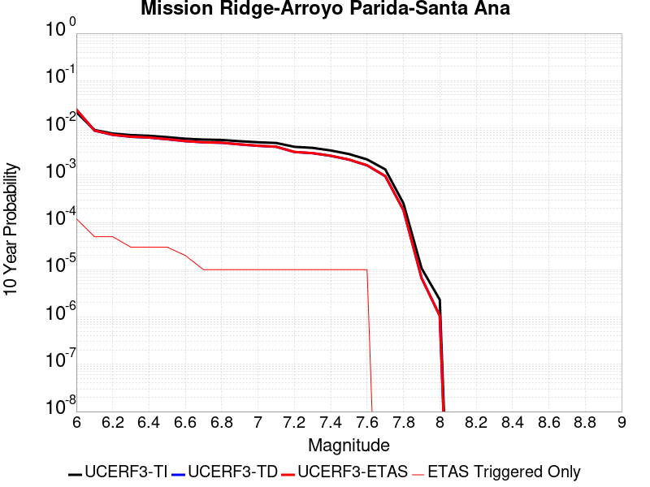 |

| Magnitude | 1 wk TI Prob | 1 wk TD Prob | 1 wk ETAS Prob | 1 wk ETAS/TD Gain | 1 wk ETAS Triggered Only | 1 mo TI Prob | 1 mo TD Prob | 1 mo ETAS Prob | 1 mo ETAS/TD Gain | 1 mo ETAS Triggered Only | 1 yr TI Prob | 1 yr TD Prob | 1 yr ETAS Prob | 1 yr ETAS/TD Gain | 1 yr ETAS Triggered Only | 10 yr TI Prob | 10 yr TD Prob | 10 yr ETAS Prob | 10 yr ETAS/TD Gain | 10 yr ETAS Triggered Only |
|-----|-----|-----|-----|-----|-----|-----|-----|-----|-----|-----|-----|-----|-----|-----|-----|-----|-----|-----|-----|-----|
| 6.0 | 4.169034E-5 | 4.7137048E-5 | 7.7135635E-5 | 1.636412 | 3.0E-5 | 1.7866064E-4 | 2.0200513E-4 | 2.4199706E-4 | 1.1979748 | 4.0E-5 | 0.0021730233 | 0.0024574657 | 0.0025472445 | 1.0365331 | 9.0E-5 | 0.021518968 | 0.02438483 | 0.024501903 | 1.004801 | 1.2E-4 |
| 6.1 | 1.73813E-5 | 1.6854203E-5 | 2.6854035E-5 | 1.5933138 | 1.0E-5 | 7.4489166E-5 | 7.223036E-5 | 9.222892E-5 | 1.2768719 | 2.0E-5 | 9.065282E-4 | 8.790605E-4 | 9.090341E-4 | 1.0340973 | 3.0E-5 | 0.009028391 | 0.008757128 | 0.008806691 | 1.0056596 | 5.0E-5 |
| 6.2 | 1.4622182E-5 | 1.3673262E-5 | 2.3673127E-5 | 1.7313443 | 1.0E-5 | 6.2664985E-5 | 5.85984E-5 | 7.859723E-5 | 1.3412862 | 2.0E-5 | 7.6267915E-4 | 7.132059E-4 | 7.431845E-4 | 1.0420336 | 3.0E-5 | 0.007600669 | 0.007109767 | 0.0071594114 | 1.0069826 | 5.0E-5 |
| 6.3 | 1.3552434E-5 | 1.2482174E-5 | 2.2482049E-5 | 1.8011326 | 1.0E-5 | 5.8080568E-5 | 5.349395E-5 | 6.349342E-5 | 1.1869271 | 1.0E-5 | 7.069015E-4 | 6.510974E-4 | 6.7108433E-4 | 1.0306973 | 2.0E-5 | 0.00704657 | 0.006492415 | 0.00652222 | 1.0045907 | 3.0E-5 |
| 6.4 | 1.30977305E-5 | 1.1979128E-5 | 2.1979009E-5 | 1.8347752 | 1.0E-5 | 5.613192E-5 | 5.133813E-5 | 6.133762E-5 | 1.194777 | 1.0E-5 | 6.831918E-4 | 6.2486547E-4 | 6.44853E-4 | 1.0319868 | 2.0E-5 | 0.006810953 | 0.006231584 | 0.006261397 | 1.0047842 | 3.0E-5 |
| 6.5 | 1.225205E-5 | 1.1048776E-5 | 2.1048665E-5 | 1.9050677 | 1.0E-5 | 5.2507727E-5 | 4.735105E-5 | 5.735058E-5 | 1.2111785 | 1.0E-5 | 6.3909404E-4 | 5.7634927E-4 | 5.963377E-4 | 1.0346812 | 2.0E-5 | 0.006372592 | 0.005749009 | 0.0057788366 | 1.0051883 | 3.0E-5 |
| 6.6 | 1.1352241E-5 | 1.0063508E-5 | 2.0063408E-5 | 1.9936793 | 1.0E-5 | 4.8651553E-5 | 4.3128617E-5 | 5.3128188E-5 | 1.2318546 | 1.0E-5 | 5.921717E-4 | 5.249665E-4 | 5.44956E-4 | 1.0380777 | 2.0E-5 | 0.0059059616 | 0.0052376646 | 0.0052575595 | 1.0037985 | 2.0E-5 |
| 6.7 | 1.0864116E-5 | 9.517E-6 | 9.517E-6 | 1.0 | 0.0 | 4.6559664E-5 | 4.0786515E-5 | 4.0786515E-5 | 1.0 | 0.0 | 5.667165E-4 | 4.964647E-4 | 5.0645974E-4 | 1.0201324 | 1.0E-5 | 0.005652734 | 0.0049539437 | 0.0049638944 | 1.0020086 | 1.0E-5 |
| 6.8 | 1.0666365E-5 | 9.299752E-6 | 9.299752E-6 | 1.0 | 0.0 | 4.571219E-5 | 3.985548E-5 | 3.985548E-5 | 1.0 | 0.0 | 5.564038E-4 | 4.8513446E-4 | 4.951296E-4 | 1.0206028 | 1.0E-5 | 0.005550127 | 0.00484114 | 0.0048510917 | 1.0020556 | 1.0E-5 |
| 6.9 | 1.0038665E-5 | 8.592018E-6 | 8.592018E-6 | 1.0 | 0.0 | 4.302214E-5 | 3.682243E-5 | 3.682243E-5 | 1.0 | 0.0 | 5.236687E-4 | 4.4822265E-4 | 4.5821816E-4 | 1.0223004 | 1.0E-5 | 0.005224364 | 0.0044735507 | 0.004483506 | 1.0022254 | 1.0E-5 |
| 7.0 | 9.5379955E-6 | 8.025047E-6 | 8.025047E-6 | 1.0 | 0.0 | 4.0876483E-5 | 3.439261E-5 | 3.439261E-5 | 1.0 | 0.0 | 4.975576E-4 | 4.1865133E-4 | 4.2864712E-4 | 1.0238762 | 1.0E-5 | 0.00496445 | 0.00417898 | 0.004188938 | 1.0023829 | 1.0E-5 |
| 7.1 | 9.207389E-6 | 7.652347E-6 | 7.652347E-6 | 1.0 | 0.0 | 3.945964E-5 | 3.2795375E-5 | 3.2795375E-5 | 1.0 | 0.0 | 4.803152E-4 | 3.992122E-4 | 4.092082E-4 | 1.0250393 | 1.0E-5 | 0.004792784 | 0.003985301 | 0.003995261 | 1.0024992 | 1.0E-5 |
| 7.2 | 7.638091E-6 | 5.9310923E-6 | 5.9310923E-6 | 1.0 | 0.0 | 3.2734264E-5 | 2.5418722E-5 | 2.5418722E-5 | 1.0 | 0.0 | 3.984668E-4 | 3.094293E-4 | 3.194262E-4 | 1.0323075 | 1.0E-5 | 0.0039775306 | 0.0030901956 | 0.0031001647 | 1.003226 | 1.0E-5 |
| 7.3 | 7.2500147E-6 | 5.596131E-6 | 5.596131E-6 | 1.0 | 0.0 | 3.1071122E-5 | 2.3983199E-5 | 2.3983199E-5 | 1.0 | 0.0 | 3.7822526E-4 | 2.9195662E-4 | 3.019537E-4 | 1.0342417 | 1.0E-5 | 0.0037758215 | 0.0029159402 | 0.0029259112 | 1.0034194 | 1.0E-5 |
| 7.4 | 6.3899715E-6 | 4.9184864E-6 | 4.9184864E-6 | 1.0 | 0.0 | 2.7385306E-5 | 2.1079059E-5 | 2.1079059E-5 | 1.0 | 0.0 | 3.3336508E-4 | 2.566075E-4 | 2.6660494E-4 | 1.03896 | 1.0E-5 | 0.0033286542 | 0.002563311 | 0.0025732853 | 1.0038912 | 1.0E-5 |
| 7.5 | 5.379025E-6 | 4.0838477E-6 | 4.0838477E-6 | 1.0 | 0.0 | 2.305276E-5 | 1.7502087E-5 | 1.7502087E-5 | 1.0 | 0.0 | 2.806312E-4 | 2.1306718E-4 | 2.2306504E-4 | 1.0469235 | 1.0E-5 | 0.0028027708 | 0.0021286402 | 0.0021386188 | 1.0046878 | 1.0E-5 |
| 7.6 | 4.1270696E-6 | 3.0883373E-6 | 3.0883373E-6 | 1.0 | 0.0 | 1.768732E-5 | 1.32356645E-5 | 1.32356645E-5 | 1.0 | 0.0 | 2.1532185E-4 | 1.6113237E-4 | 1.7113076E-4 | 1.0620508 | 1.0E-5 | 0.0021511333 | 0.0016101635 | 0.0016201474 | 1.0062006 | 1.0E-5 |
| 7.7 | 2.5406805E-6 | 1.8282044E-6 | 1.8282044E-6 | 1.0 | 0.0 | 1.0888585E-5 | 7.835139E-6 | 7.835139E-6 | 1.0 | 0.0 | 1.3256045E-4 | 9.53887E-5 | 9.53887E-5 | 1.0 | 0.0 | 0.0013248142 | 9.534837E-4 | 9.534837E-4 | 1.0 | 0.0 |
| 7.8 | 4.8608285E-7 | 3.509864E-7 | 3.509864E-7 | 1.0 | 0.0 | 2.0832106E-6 | 1.5042266E-6 | 1.5042266E-6 | 1.0 | 0.0 | 2.5362791E-5 | 1.8313805E-5 | 1.8313805E-5 | 1.0 | 0.0 | 2.5359896E-4 | 1.8312308E-4 | 1.8312308E-4 | 1.0 | 0.0 |
| 7.9 | 2.0472514E-8 | 1.2688718E-8 | 1.2688718E-8 | 1.0 | 0.0 | 8.7739345E-8 | 5.438022E-8 | 5.438022E-8 | 1.0 | 0.0 | 1.068226E-6 | 6.6207895E-7 | 6.6207895E-7 | 1.0 | 0.0 | 1.0682209E-5 | 6.620771E-6 | 6.620771E-6 | 1.0 | 0.0 |
| 8.0 | 4.443582E-9 | 2.032067E-9 | 2.032067E-9 | 1.0 | 0.0 | 1.9043922E-8 | 8.7088585E-9 | 8.7088585E-9 | 1.0 | 0.0 | 2.3185973E-7 | 1.0603035E-7 | 1.0603035E-7 | 1.0 | 0.0 | 2.3185949E-6 | 1.0603031E-6 | 1.0603031E-6 | 1.0 | 0.0 |

## Big Pine (Central)
*[(top)](#table-of-contents)*

| 1 Week | 1 Month | 1 Year | 10 Year |
|-----|-----|-----|-----|
| 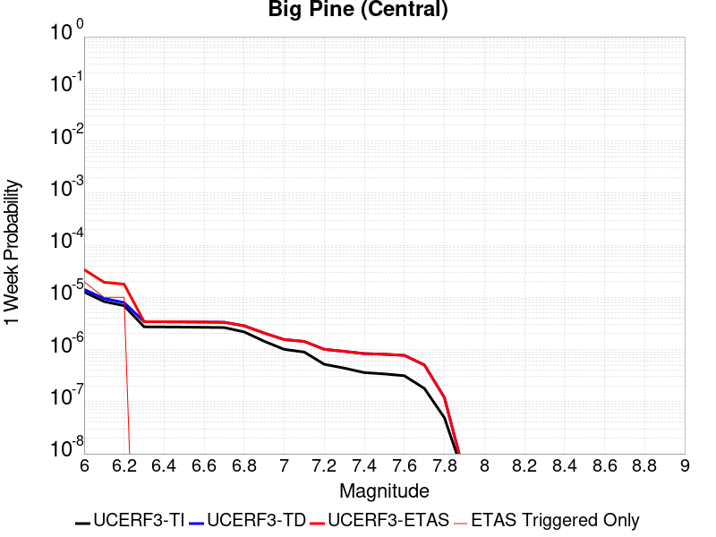 | 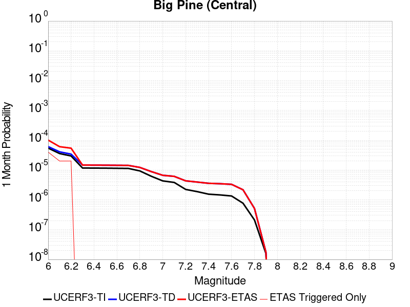 | 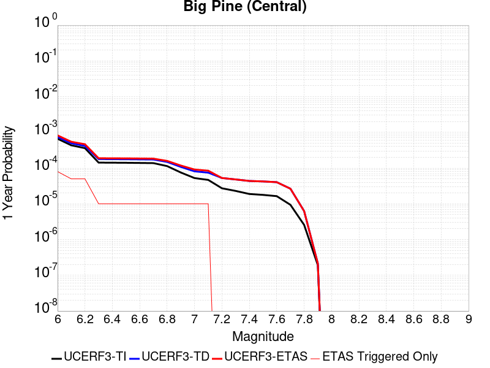 |  |

| Magnitude | 1 wk TI Prob | 1 wk TD Prob | 1 wk ETAS Prob | 1 wk ETAS/TD Gain | 1 wk ETAS Triggered Only | 1 mo TI Prob | 1 mo TD Prob | 1 mo ETAS Prob | 1 mo ETAS/TD Gain | 1 mo ETAS Triggered Only | 1 yr TI Prob | 1 yr TD Prob | 1 yr ETAS Prob | 1 yr ETAS/TD Gain | 1 yr ETAS Triggered Only | 10 yr TI Prob | 10 yr TD Prob | 10 yr ETAS Prob | 10 yr ETAS/TD Gain | 10 yr ETAS Triggered Only |
|-----|-----|-----|-----|-----|-----|-----|-----|-----|-----|-----|-----|-----|-----|-----|-----|-----|-----|-----|-----|-----|
| 6.0 | 1.2706755E-5 | 1.4250602E-5 | 3.425032E-5 | 2.4034295 | 2.0E-5 | 5.4456385E-5 | 6.107279E-5 | 1.0107034E-4 | 1.6549162 | 4.0E-5 | 6.628048E-4 | 7.433441E-4 | 8.232846E-4 | 1.1075418 | 8.0E-5 | 0.006608314 | 0.007413639 | 0.007562527 | 1.020083 | 1.5E-4 |
| 6.1 | 8.342579E-6 | 9.510835E-6 | 1.951074E-5 | 2.0514224 | 1.0E-5 | 3.5753423E-5 | 4.076021E-5 | 6.0759394E-5 | 1.4906546 | 2.0E-5 | 4.3521097E-4 | 4.9616426E-4 | 5.461395E-4 | 1.100723 | 5.0E-5 | 0.0043435963 | 0.004954155 | 0.005023808 | 1.0140595 | 7.0E-5 |
| 6.2 | 6.923899E-6 | 7.967221E-6 | 1.7967142E-5 | 2.2551327 | 1.0E-5 | 2.9673516E-5 | 3.4144894E-5 | 5.4144213E-5 | 1.5857191 | 2.0E-5 | 3.6121515E-4 | 4.1565404E-4 | 4.6563326E-4 | 1.1202424 | 5.0E-5 | 0.003606286 | 0.0041521094 | 0.004221819 | 1.016789 | 7.0E-5 |
| 6.3 | 2.728396E-6 | 3.4243646E-6 | 3.4243646E-6 | 1.0 | 0.0 | 1.1693074E-5 | 1.4675771E-5 | 1.4675771E-5 | 1.0 | 0.0 | 1.4235388E-4 | 1.7866373E-4 | 1.8866194E-4 | 1.055961 | 1.0E-5 | 0.0014226272 | 0.0017867433 | 0.0018166897 | 1.0167603 | 3.0E-5 |
| 6.4 | 2.7136944E-6 | 3.4086581E-6 | 3.4086581E-6 | 1.0 | 0.0 | 1.1630066E-5 | 1.4608458E-5 | 1.4608458E-5 | 1.0 | 0.0 | 1.4158686E-4 | 1.7784433E-4 | 1.8784255E-4 | 1.056219 | 1.0E-5 | 0.0014149669 | 0.0017785623 | 0.001808509 | 1.0168376 | 3.0E-5 |
| 6.5 | 2.6971882E-6 | 3.3910032E-6 | 3.3910032E-6 | 1.0 | 0.0 | 1.1559327E-5 | 1.4532795E-5 | 1.4532795E-5 | 1.0 | 0.0 | 1.4072572E-4 | 1.7692328E-4 | 1.869215E-4 | 1.0565116 | 1.0E-5 | 0.0014063664 | 0.0017693666 | 0.0017993135 | 1.0169252 | 3.0E-5 |
| 6.6 | 2.669092E-6 | 3.3610236E-6 | 3.3610236E-6 | 1.0 | 0.0 | 1.1438916E-5 | 1.4404312E-5 | 1.4404312E-5 | 1.0 | 0.0 | 1.3925991E-4 | 1.7535927E-4 | 1.8535751E-4 | 1.0570158 | 1.0E-5 | 0.0013917267 | 0.0017537511 | 0.0017836984 | 1.0170761 | 3.0E-5 |
| 6.7 | 2.6408059E-6 | 3.3310494E-6 | 3.3310494E-6 | 1.0 | 0.0 | 1.1317691E-5 | 1.4275853E-5 | 1.4275853E-5 | 1.0 | 0.0 | 1.3778417E-4 | 1.737955E-4 | 1.8379377E-4 | 1.0575289 | 1.0E-5 | 0.0013769877 | 0.0017381381 | 0.001768086 | 1.0172298 | 3.0E-5 |
| 6.8 | 2.1786943E-6 | 2.8545066E-6 | 2.8545066E-6 | 1.0 | 0.0 | 9.337228E-6 | 1.2233547E-5 | 1.2233547E-5 | 1.0 | 0.0 | 1.1367482E-4 | 1.4893398E-4 | 1.5893248E-4 | 1.0671339 | 1.0E-5 | 0.0011361669 | 0.0014898704 | 0.0015198257 | 1.020106 | 3.0E-5 |
| 6.9 | 1.4411696E-6 | 2.0685677E-6 | 2.0685677E-6 | 1.0 | 0.0 | 6.1764263E-6 | 8.865261E-6 | 8.865261E-6 | 1.0 | 0.0 | 7.51954E-5 | 1.0792949E-4 | 1.1792841E-4 | 1.0926431 | 1.0E-5 | 7.5169955E-4 | 0.0010802548 | 0.0011102224 | 1.0277412 | 3.0E-5 |
| 7.0 | 1.0073411E-6 | 1.5543274E-6 | 1.5543274E-6 | 1.0 | 0.0 | 4.317169E-6 | 6.661387E-6 | 6.661387E-6 | 1.0 | 0.0 | 5.2560266E-5 | 8.109952E-5 | 9.109871E-5 | 1.1232953 | 1.0E-5 | 5.2547833E-4 | 8.1217213E-4 | 8.421478E-4 | 1.036908 | 3.0E-5 |
| 7.1 | 8.947104E-7 | 1.430316E-6 | 1.430316E-6 | 1.0 | 0.0 | 3.834468E-6 | 6.1299124E-6 | 6.1299124E-6 | 1.0 | 0.0 | 4.6683643E-5 | 7.462928E-5 | 8.462853E-5 | 1.1339856 | 1.0E-5 | 4.6673836E-4 | 7.4751483E-4 | 7.774924E-4 | 1.040103 | 3.0E-5 |
| 7.2 | 5.215166E-7 | 1.0112277E-6 | 1.0112277E-6 | 1.0 | 0.0 | 2.2350691E-6 | 4.333826E-6 | 4.333826E-6 | 1.0 | 0.0 | 2.7211627E-5 | 5.27631E-5 | 5.27631E-5 | 1.0 | 0.0 | 2.7208295E-4 | 5.289683E-4 | 5.289683E-4 | 1.0 | 0.0 |
| 7.3 | 4.4024807E-7 | 9.220183E-7 | 9.220183E-7 | 1.0 | 0.0 | 1.8867761E-6 | 3.951501E-6 | 3.951501E-6 | 1.0 | 0.0 | 2.2971257E-5 | 4.8108504E-5 | 4.8108504E-5 | 1.0 | 0.0 | 2.2968883E-4 | 4.824433E-4 | 4.824433E-4 | 1.0 | 0.0 |
| 7.4 | 3.6130905E-7 | 8.359109E-7 | 8.359109E-7 | 1.0 | 0.0 | 1.5484665E-6 | 3.5824705E-6 | 3.5824705E-6 | 1.0 | 0.0 | 1.8852415E-5 | 4.3615746E-5 | 4.3615746E-5 | 1.0 | 0.0 | 1.8850817E-4 | 4.3752496E-4 | 4.3752496E-4 | 1.0 | 0.0 |
| 7.5 | 3.408184E-7 | 8.1087245E-7 | 8.1087245E-7 | 1.0 | 0.0 | 1.4606494E-6 | 3.475163E-6 | 3.475163E-6 | 1.0 | 0.0 | 1.7783263E-5 | 4.230933E-5 | 4.230933E-5 | 1.0 | 0.0 | 1.778184E-4 | 4.2444657E-4 | 4.2444657E-4 | 1.0 | 0.0 |
| 7.6 | 3.1428627E-7 | 7.732167E-7 | 7.732167E-7 | 1.0 | 0.0 | 1.3469405E-6 | 3.313782E-6 | 3.313782E-6 | 1.0 | 0.0 | 1.6398877E-5 | 4.0344585E-5 | 4.0344585E-5 | 1.0 | 0.0 | 1.6397667E-4 | 4.0477706E-4 | 4.0477706E-4 | 1.0 | 0.0 |
| 7.7 | 1.7972785E-7 | 5.0782415E-7 | 5.0782415E-7 | 1.0 | 0.0 | 7.70262E-7 | 2.1763874E-6 | 2.1763874E-6 | 1.0 | 0.0 | 9.377899E-6 | 2.6497206E-5 | 2.6497206E-5 | 1.0 | 0.0 | 9.377503E-5 | 2.6633305E-4 | 2.6633305E-4 | 1.0 | 0.0 |
| 7.8 | 4.9230927E-8 | 1.1981747E-7 | 1.1981747E-7 | 1.0 | 0.0 | 2.1098968E-7 | 5.135033E-7 | 5.135033E-7 | 1.0 | 0.0 | 2.5687964E-6 | 6.2518866E-6 | 6.2518866E-6 | 1.0 | 0.0 | 2.5687666E-5 | 6.2971965E-5 | 6.2971965E-5 | 1.0 | 0.0 |
| 7.9 | 3.6805972E-9 | 4.1051638E-9 | 4.1051638E-9 | 1.0 | 0.0 | 1.5773987E-8 | 1.7593557E-8 | 1.7593557E-8 | 1.0 | 0.0 | 1.9204828E-7 | 2.1420155E-7 | 2.1420155E-7 | 1.0 | 0.0 | 1.920481E-6 | 2.1898923E-6 | 2.1898923E-6 | 1.0 | 0.0 |

## Whittier alt 1
*[(top)](#table-of-contents)*

| 1 Week | 1 Month | 1 Year | 10 Year |
|-----|-----|-----|-----|
| 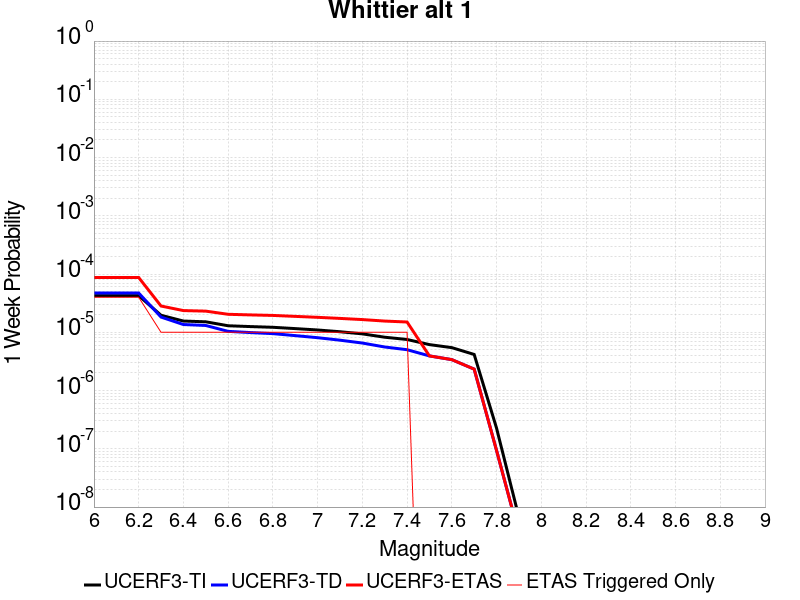 |  | 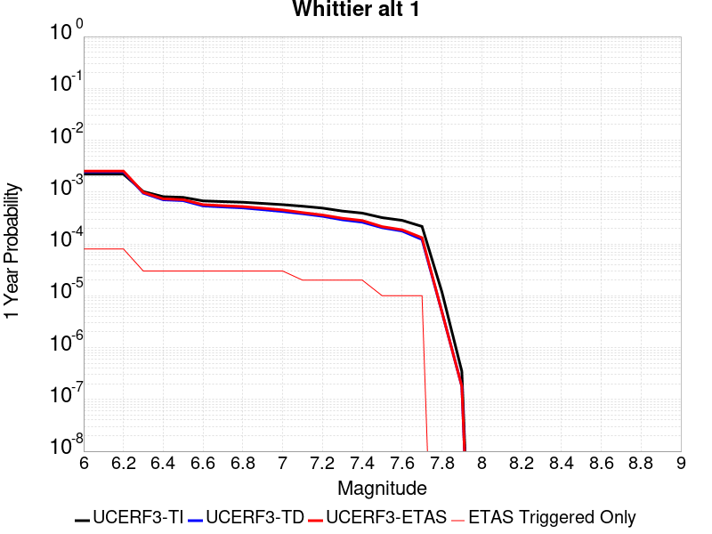 |  |

| Magnitude | 1 wk TI Prob | 1 wk TD Prob | 1 wk ETAS Prob | 1 wk ETAS/TD Gain | 1 wk ETAS Triggered Only | 1 mo TI Prob | 1 mo TD Prob | 1 mo ETAS Prob | 1 mo ETAS/TD Gain | 1 mo ETAS Triggered Only | 1 yr TI Prob | 1 yr TD Prob | 1 yr ETAS Prob | 1 yr ETAS/TD Gain | 1 yr ETAS Triggered Only | 10 yr TI Prob | 10 yr TD Prob | 10 yr ETAS Prob | 10 yr ETAS/TD Gain | 10 yr ETAS Triggered Only |
|-----|-----|-----|-----|-----|-----|-----|-----|-----|-----|-----|-----|-----|-----|-----|-----|-----|-----|-----|-----|-----|
| 6.0 | 4.2554693E-5 | 4.7252182E-5 | 8.725029E-5 | 1.8464817 | 4.0E-5 | 1.8236451E-4 | 2.0249544E-4 | 2.7248127E-4 | 1.3456168 | 7.0E-5 | 0.002218027 | 0.0024629163 | 0.0025427195 | 1.0324018 | 8.0E-5 | 0.02196019 | 0.024390263 | 0.024517093 | 1.0052 | 1.3E-4 |
| 6.1 | 4.2554693E-5 | 4.7252182E-5 | 8.725029E-5 | 1.8464817 | 4.0E-5 | 1.8236451E-4 | 2.0249544E-4 | 2.7248127E-4 | 1.3456168 | 7.0E-5 | 0.002218027 | 0.0024629163 | 0.0025427195 | 1.0324018 | 8.0E-5 | 0.02196019 | 0.024390263 | 0.024517093 | 1.0052 | 1.3E-4 |
| 6.2 | 4.2554693E-5 | 4.7252182E-5 | 8.725029E-5 | 1.8464817 | 4.0E-5 | 1.8236451E-4 | 2.0249544E-4 | 2.7248127E-4 | 1.3456168 | 7.0E-5 | 0.002218027 | 0.0024629163 | 0.0025427195 | 1.0324018 | 8.0E-5 | 0.02196019 | 0.024390263 | 0.024517093 | 1.0052 | 1.3E-4 |
| 6.3 | 1.9617712E-5 | 1.826841E-5 | 2.8268229E-5 | 1.547383 | 1.0E-5 | 8.40732E-5 | 7.829095E-5 | 9.8289376E-5 | 1.2554374 | 2.0E-5 | 0.0010231105 | 9.527944E-4 | 9.827658E-4 | 1.0314564 | 3.0E-5 | 0.01018413 | 0.0094904 | 0.00954983 | 1.0062622 | 6.0E-5 |
| 6.4 | 1.5611336E-5 | 1.3604089E-5 | 2.3603954E-5 | 1.7350631 | 1.0E-5 | 6.690401E-5 | 5.8301972E-5 | 7.830081E-5 | 1.3430216 | 2.0E-5 | 8.142519E-4 | 7.096013E-4 | 7.3958E-4 | 1.0422473 | 3.0E-5 | 0.008112748 | 0.0070753377 | 0.0071150544 | 1.0056134 | 4.0E-5 |
| 6.5 | 1.5150166E-5 | 1.3100744E-5 | 2.3100612E-5 | 1.7633054 | 1.0E-5 | 6.492767E-5 | 5.614487E-5 | 7.614375E-5 | 1.3562013 | 2.0E-5 | 7.9020765E-4 | 6.8335526E-4 | 7.1333477E-4 | 1.043871 | 3.0E-5 | 0.007874036 | 0.006814508 | 0.006854235 | 1.0058298 | 4.0E-5 |
| 6.6 | 1.295588E-5 | 1.0380544E-5 | 2.0380441E-5 | 1.9633306 | 1.0E-5 | 5.552402E-5 | 4.44873E-5 | 6.448641E-5 | 1.4495465 | 2.0E-5 | 6.7579525E-4 | 5.415002E-4 | 5.71484E-4 | 1.0553716 | 3.0E-5 | 0.006737438 | 0.005403343 | 0.005443127 | 1.0073628 | 4.0E-5 |
| 6.7 | 1.2542085E-5 | 9.899189E-6 | 1.989909E-5 | 2.0101738 | 1.0E-5 | 5.3750682E-5 | 4.2424414E-5 | 6.242357E-5 | 1.4714067 | 2.0E-5 | 6.542181E-4 | 5.163967E-4 | 5.463812E-4 | 1.0580648 | 3.0E-5 | 0.006522954 | 0.005153464 | 0.005193258 | 1.0077218 | 4.0E-5 |
| 6.8 | 1.2195878E-5 | 9.49523E-6 | 1.9495135E-5 | 2.0531504 | 1.0E-5 | 5.2267E-5 | 4.069322E-5 | 6.0692408E-5 | 1.4914623 | 2.0E-5 | 6.36165E-4 | 4.9532915E-4 | 5.253143E-4 | 1.0605358 | 3.0E-5 | 0.0063434686 | 0.0049436963 | 0.0049834987 | 1.0080512 | 4.0E-5 |
| 6.9 | 1.1580298E-5 | 8.772739E-6 | 1.8772653E-5 | 2.1398847 | 1.0E-5 | 4.9628903E-5 | 3.759692E-5 | 5.759617E-5 | 1.5319384 | 2.0E-5 | 6.040644E-4 | 4.5764804E-4 | 4.8763433E-4 | 1.0655226 | 3.0E-5 | 0.00602425 | 0.0045684646 | 0.0046082814 | 1.0087156 | 4.0E-5 |
| 7.0 | 1.0964795E-5 | 8.083794E-6 | 1.8083712E-5 | 2.237033 | 1.0E-5 | 4.6991136E-5 | 3.4644378E-5 | 5.4643686E-5 | 1.5772742 | 2.0E-5 | 5.7196687E-4 | 4.217152E-4 | 4.5170254E-4 | 1.0711081 | 3.0E-5 | 0.0057049696 | 0.004210459 | 0.0042502903 | 1.0094602 | 4.0E-5 |
| 7.1 | 1.0230601E-5 | 7.32646E-6 | 1.7326387E-5 | 2.3649056 | 1.0E-5 | 4.3844695E-5 | 3.1398744E-5 | 5.1398114E-5 | 1.6369481 | 2.0E-5 | 5.336784E-4 | 3.8221394E-4 | 4.022063E-4 | 1.0523068 | 2.0E-5 | 0.005323986 | 0.0038167592 | 0.0038466447 | 1.00783 | 3.0E-5 |
| 7.2 | 9.40865E-6 | 6.5430822E-6 | 1.6543017E-5 | 2.5283217 | 1.0E-5 | 4.032216E-5 | 2.8041486E-5 | 4.8040925E-5 | 1.7132089 | 2.0E-5 | 4.908117E-4 | 3.4135283E-4 | 3.61346E-4 | 1.0585704 | 2.0E-5 | 0.0048972913 | 0.0034094024 | 0.0034393002 | 1.0087692 | 3.0E-5 |
| 7.3 | 8.237384E-6 | 5.5975433E-6 | 1.5597487E-5 | 2.786488 | 1.0E-5 | 3.5302593E-5 | 2.3989258E-5 | 4.3988777E-5 | 1.8336865 | 2.0E-5 | 4.2972428E-4 | 2.920311E-4 | 3.1202528E-4 | 1.0684658 | 2.0E-5 | 0.0042889426 | 0.0029167992 | 0.0029467116 | 1.0102552 | 3.0E-5 |
| 7.4 | 7.5316966E-6 | 5.0276153E-6 | 1.5027565E-5 | 2.9890046 | 1.0E-5 | 3.2278298E-5 | 2.154675E-5 | 4.154632E-5 | 1.9281943 | 2.0E-5 | 3.9291743E-4 | 2.623011E-4 | 2.8229586E-4 | 1.0762283 | 2.0E-5 | 0.0039222343 | 0.0026200267 | 0.0026399742 | 1.0076135 | 2.0E-5 |
| 7.5 | 6.149649E-6 | 3.9336355E-6 | 3.9336355E-6 | 1.0 | 0.0 | 2.6355372E-5 | 1.6858336E-5 | 2.6858166E-5 | 1.5931684 | 1.0E-5 | 3.208294E-4 | 2.052318E-4 | 2.1522974E-4 | 1.0487154 | 1.0E-5 | 0.003203666 | 0.0020505118 | 0.0020604914 | 1.0048668 | 1.0E-5 |
| 7.6 | 5.457711E-6 | 3.3951796E-6 | 3.3951796E-6 | 1.0 | 0.0 | 2.338998E-5 | 1.4550694E-5 | 2.4550549E-5 | 1.6872425 | 1.0E-5 | 2.8473578E-4 | 1.771411E-4 | 1.8713933E-4 | 1.0564421 | 1.0E-5 | 0.0028437122 | 0.0017700798 | 0.0017800621 | 1.0056394 | 1.0E-5 |
| 7.7 | 4.1676276E-6 | 2.3329922E-6 | 2.3329922E-6 | 1.0 | 0.0 | 1.7861139E-5 | 9.998504E-6 | 1.9998404E-5 | 2.0001397 | 1.0E-5 | 2.1743766E-4 | 1.2172572E-4 | 1.317245E-4 | 1.0821419 | 1.0E-5 | 0.0021722503 | 0.0012166635 | 0.0012266514 | 1.0082092 | 1.0E-5 |
| 7.8 | 2.2692414E-7 | 9.384417E-8 | 9.384417E-8 | 1.0 | 0.0 | 9.725317E-7 | 4.0218927E-7 | 4.0218927E-7 | 1.0 | 0.0 | 1.1840509E-5 | 4.8966467E-6 | 4.8966467E-6 | 1.0 | 0.0 | 1.1839878E-4 | 4.8965718E-5 | 4.8965718E-5 | 1.0 | 0.0 |
| 7.9 | 6.676829E-9 | 3.4397174E-9 | 3.4397174E-9 | 1.0 | 0.0 | 2.861498E-8 | 1.4741646E-8 | 1.4741646E-8 | 1.0 | 0.0 | 3.4838732E-7 | 1.7947953E-7 | 1.7947953E-7 | 1.0 | 0.0 | 3.4838679E-6 | 1.794794E-6 | 1.794794E-6 | 1.0 | 0.0 |

## Independence rev 2011
*[(top)](#table-of-contents)*

| 1 Week | 1 Month | 1 Year | 10 Year |
|-----|-----|-----|-----|
|  | 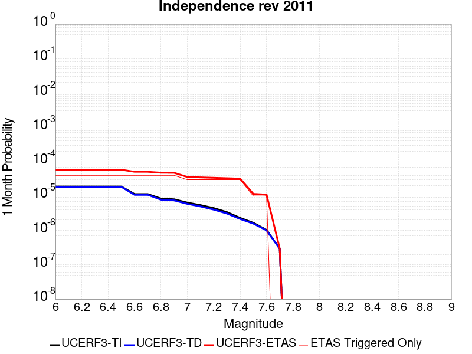 | 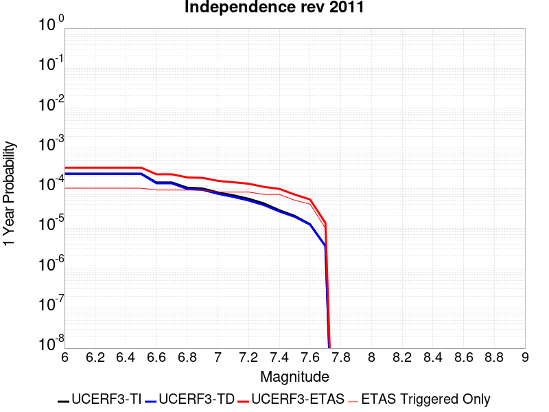 |  |

| Magnitude | 1 wk TI Prob | 1 wk TD Prob | 1 wk ETAS Prob | 1 wk ETAS/TD Gain | 1 wk ETAS Triggered Only | 1 mo TI Prob | 1 mo TD Prob | 1 mo ETAS Prob | 1 mo ETAS/TD Gain | 1 mo ETAS Triggered Only | 1 yr TI Prob | 1 yr TD Prob | 1 yr ETAS Prob | 1 yr ETAS/TD Gain | 1 yr ETAS Triggered Only | 10 yr TI Prob | 10 yr TD Prob | 10 yr ETAS Prob | 10 yr ETAS/TD Gain | 10 yr ETAS Triggered Only |
|-----|-----|-----|-----|-----|-----|-----|-----|-----|-----|-----|-----|-----|-----|-----|-----|-----|-----|-----|-----|-----|
| 6.0 | 4.422171E-6 | 4.3262253E-6 | 3.4326094E-5 | 7.9344215 | 3.0E-5 | 1.8952025E-5 | 1.8540852E-5 | 5.854011E-5 | 3.1573584 | 4.0E-5 | 2.3071647E-4 | 2.2571447E-4 | 3.256919E-4 | 1.4429376 | 1.0E-4 | 0.0023047708 | 0.0022551457 | 0.0024048074 | 1.0663645 | 1.5E-4 |
| 6.1 | 4.422171E-6 | 4.3262253E-6 | 3.4326094E-5 | 7.9344215 | 3.0E-5 | 1.8952025E-5 | 1.8540852E-5 | 5.854011E-5 | 3.1573584 | 4.0E-5 | 2.3071647E-4 | 2.2571447E-4 | 3.256919E-4 | 1.4429376 | 1.0E-4 | 0.0023047708 | 0.0022551457 | 0.0024048074 | 1.0663645 | 1.5E-4 |
| 6.2 | 4.422171E-6 | 4.3262253E-6 | 3.4326094E-5 | 7.9344215 | 3.0E-5 | 1.8952025E-5 | 1.8540852E-5 | 5.854011E-5 | 3.1573584 | 4.0E-5 | 2.3071647E-4 | 2.2571447E-4 | 3.256919E-4 | 1.4429376 | 1.0E-4 | 0.0023047708 | 0.0022551457 | 0.0024048074 | 1.0663645 | 1.5E-4 |
| 6.3 | 4.422171E-6 | 4.3262253E-6 | 3.4326094E-5 | 7.9344215 | 3.0E-5 | 1.8952025E-5 | 1.8540852E-5 | 5.854011E-5 | 3.1573584 | 4.0E-5 | 2.3071647E-4 | 2.2571447E-4 | 3.256919E-4 | 1.4429376 | 1.0E-4 | 0.0023047708 | 0.0022551457 | 0.0024048074 | 1.0663645 | 1.5E-4 |
| 6.4 | 4.422171E-6 | 4.3262253E-6 | 3.4326094E-5 | 7.9344215 | 3.0E-5 | 1.8952025E-5 | 1.8540852E-5 | 5.854011E-5 | 3.1573584 | 4.0E-5 | 2.3071647E-4 | 2.2571447E-4 | 3.256919E-4 | 1.4429376 | 1.0E-4 | 0.0023047708 | 0.0022551457 | 0.0024048074 | 1.0663645 | 1.5E-4 |
| 6.5 | 4.422171E-6 | 4.3262253E-6 | 3.4326094E-5 | 7.9344215 | 3.0E-5 | 1.8952025E-5 | 1.8540852E-5 | 5.854011E-5 | 3.1573584 | 4.0E-5 | 2.3071647E-4 | 2.2571447E-4 | 3.256919E-4 | 1.4429376 | 1.0E-4 | 0.0023047708 | 0.0022551457 | 0.0024048074 | 1.0663645 | 1.5E-4 |
| 6.6 | 2.663744E-6 | 2.5319846E-6 | 3.253191E-5 | 12.848384 | 3.0E-5 | 1.1415996E-5 | 1.08513195E-5 | 5.0850886E-5 | 4.6861477 | 4.0E-5 | 1.3898089E-4 | 1.321073E-4 | 2.220954E-4 | 1.6811744 | 9.0E-5 | 0.0013889399 | 0.0013203359 | 0.001460151 | 1.1058936 | 1.4E-4 |
| 6.7 | 2.663744E-6 | 2.5319846E-6 | 3.253191E-5 | 12.848384 | 3.0E-5 | 1.1415996E-5 | 1.08513195E-5 | 5.0850886E-5 | 4.6861477 | 4.0E-5 | 1.3898089E-4 | 1.321073E-4 | 2.220954E-4 | 1.6811744 | 9.0E-5 | 0.0013889399 | 0.0013203359 | 0.001460151 | 1.1058936 | 1.4E-4 |
| 6.8 | 1.9716529E-6 | 1.8322567E-6 | 3.18322E-5 | 17.373222 | 3.0E-5 | 8.449913E-6 | 7.852505E-6 | 4.785219E-5 | 6.0938754 | 4.0E-5 | 1.0287284E-4 | 9.560019E-5 | 1.8559159E-4 | 1.9413307 | 9.0E-5 | 0.0010282523 | 9.5560355E-4 | 0.0010954698 | 1.1463643 | 1.4E-4 |
| 6.9 | 1.8788617E-6 | 1.7429976E-6 | 3.1742944E-5 | 18.211699 | 3.0E-5 | 8.0522395E-6 | 7.4699688E-6 | 4.746967E-5 | 6.354735 | 4.0E-5 | 9.80316E-5 | 9.09432E-5 | 1.80935E-4 | 1.9895387 | 9.0E-5 | 9.798837E-4 | 9.090718E-4 | 0.0010489445 | 1.1538632 | 1.4E-4 |
| 7.0 | 1.5045488E-6 | 1.3849498E-6 | 2.1384922E-5 | 15.440937 | 2.0E-5 | 6.44805E-6 | 5.9354857E-6 | 3.5935307E-5 | 6.0543165 | 3.0E-5 | 7.8502184E-5 | 7.226219E-5 | 1.5225641E-4 | 2.1069996 | 8.0E-5 | 7.8474457E-4 | 7.223921E-4 | 8.5229817E-4 | 1.1798277 | 1.3E-4 |
| 7.1 | 1.272341E-6 | 1.1625089E-6 | 2.1162487E-5 | 18.20415 | 2.0E-5 | 5.4528787E-6 | 4.9821715E-6 | 3.4982022E-5 | 7.0214405 | 3.0E-5 | 6.6386776E-5 | 6.0656283E-5 | 1.4065143E-4 | 2.3188272 | 8.0E-5 | 6.636695E-4 | 6.064005E-4 | 7.363216E-4 | 1.2142497 | 1.3E-4 |
| 7.2 | 1.0416892E-6 | 9.409871E-7 | 2.0940968E-5 | 22.254257 | 2.0E-5 | 4.464375E-6 | 4.032796E-6 | 3.4032673E-5 | 8.438978 | 3.0E-5 | 5.4352407E-5 | 4.9098202E-5 | 1.2909427E-4 | 2.6293075 | 8.0E-5 | 5.4339116E-4 | 4.908754E-4 | 6.208116E-4 | 1.264703 | 1.3E-4 |
| 7.3 | 7.9450155E-7 | 7.2350036E-7 | 2.0723486E-5 | 28.643366 | 2.0E-5 | 3.4050022E-6 | 3.1007123E-6 | 3.310062E-5 | 10.675166 | 3.0E-5 | 4.1455114E-5 | 3.7750528E-5 | 1.0774789E-4 | 2.8542087 | 7.0E-5 | 4.144738E-4 | 3.7744228E-4 | 4.97397E-4 | 1.3178095 | 1.2E-4 |
| 7.4 | 5.3893444E-7 | 5.0195166E-7 | 2.0501942E-5 | 40.844456 | 2.0E-5 | 2.309717E-6 | 2.1512196E-6 | 3.2151154E-5 | 14.945548 | 3.0E-5 | 2.8120441E-5 | 2.6190788E-5 | 9.618895E-5 | 3.6726253 | 7.0E-5 | 2.8116882E-4 | 2.6187746E-4 | 3.7184867E-4 | 1.4199338 | 1.1E-4 |
| 7.5 | 3.8852085E-7 | 3.6825622E-7 | 1.0368252E-5 | 28.154995 | 1.0E-5 | 1.6650882E-6 | 1.57824E-6 | 1.1578224E-5 | 7.3361616 | 1.0E-5 | 2.027226E-5 | 1.9214905E-5 | 6.9213944E-5 | 3.6020966 | 5.0E-5 | 2.0270412E-4 | 1.9213265E-4 | 2.8211536E-4 | 1.4683363 | 9.0E-5 |
| 7.6 | 2.414929E-7 | 2.3457605E-7 | 1.0234574E-5 | 43.63009 | 1.0E-5 | 1.0349692E-6 | 1.0053255E-6 | 1.1005315E-5 | 10.947017 | 1.0E-5 | 1.2600677E-5 | 1.2239771E-5 | 5.223928E-5 | 4.267995 | 4.0E-5 | 1.2599962E-4 | 1.223911E-4 | 2.023813E-4 | 1.6535623 | 8.0E-5 |
| 7.7 | 6.8298014E-8 | 6.8589785E-8 | 6.8589785E-8 | 1.0 | 0.0 | 2.9270575E-7 | 2.939562E-7 | 2.939562E-7 | 1.0 | 0.0 | 3.5636867E-6 | 3.5789112E-6 | 1.3578875E-5 | 3.7941358 | 1.0E-5 | 3.5636294E-5 | 3.5788584E-5 | 4.5788227E-5 | 1.2794087 | 1.0E-5 |

## Chino alt 1
*[(top)](#table-of-contents)*

| 1 Week | 1 Month | 1 Year | 10 Year |
|-----|-----|-----|-----|
|  |  |  | 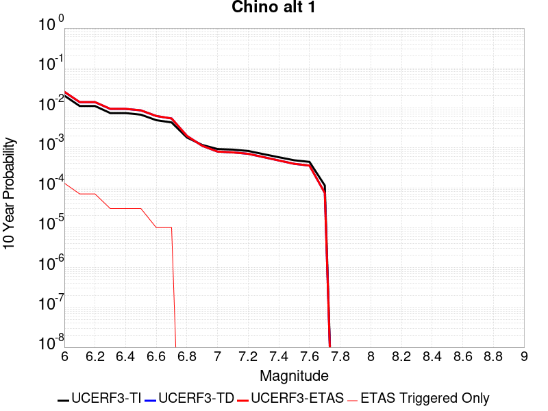 |

| Magnitude | 1 wk TI Prob | 1 wk TD Prob | 1 wk ETAS Prob | 1 wk ETAS/TD Gain | 1 wk ETAS Triggered Only | 1 mo TI Prob | 1 mo TD Prob | 1 mo ETAS Prob | 1 mo ETAS/TD Gain | 1 mo ETAS Triggered Only | 1 yr TI Prob | 1 yr TD Prob | 1 yr ETAS Prob | 1 yr ETAS/TD Gain | 1 yr ETAS Triggered Only | 10 yr TI Prob | 10 yr TD Prob | 10 yr ETAS Prob | 10 yr ETAS/TD Gain | 10 yr ETAS Triggered Only |
|-----|-----|-----|-----|-----|-----|-----|-----|-----|-----|-----|-----|-----|-----|-----|-----|-----|-----|-----|-----|-----|
| 6.0 | 3.939946E-5 | 4.894798E-5 | 7.894651E-5 | 1.6128656 | 3.0E-5 | 1.6884391E-4 | 2.0976314E-4 | 2.6975054E-4 | 1.2859769 | 6.0E-5 | 0.0020537362 | 0.002551385 | 0.0026411554 | 1.035185 | 9.0E-5 | 0.020348595 | 0.025280168 | 0.025406882 | 1.0050124 | 1.3E-4 |
| 6.1 | 2.1505624E-5 | 2.6878823E-5 | 3.6878555E-5 | 1.3720301 | 1.0E-5 | 9.2163704E-5 | 1.15190494E-4 | 1.5518589E-4 | 1.3472109 | 4.0E-5 | 0.0011215154 | 0.0014016517 | 0.0014615675 | 1.0427467 | 6.0E-5 | 0.011158722 | 0.013947425 | 0.0140164485 | 1.0049489 | 7.0E-5 |
| 6.2 | 2.1505624E-5 | 2.6878823E-5 | 3.6878555E-5 | 1.3720301 | 1.0E-5 | 9.2163704E-5 | 1.15190494E-4 | 1.5518589E-4 | 1.3472109 | 4.0E-5 | 0.0011215154 | 0.0014016517 | 0.0014615675 | 1.0427467 | 6.0E-5 | 0.011158722 | 0.013947425 | 0.0140164485 | 1.0049489 | 7.0E-5 |
| 6.3 | 1.4290785E-5 | 1.8164832E-5 | 2.816465E-5 | 1.5505043 | 1.0E-5 | 6.1244784E-5 | 7.784722E-5 | 9.784566E-5 | 1.2568935 | 2.0E-5 | 7.454001E-4 | 9.4742293E-4 | 9.67404E-4 | 1.0210899 | 2.0E-5 | 0.007429048 | 0.00944674 | 0.009476457 | 1.0031457 | 3.0E-5 |
| 6.4 | 1.4290785E-5 | 1.8164832E-5 | 2.816465E-5 | 1.5505043 | 1.0E-5 | 6.1244784E-5 | 7.784722E-5 | 9.784566E-5 | 1.2568935 | 2.0E-5 | 7.454001E-4 | 9.4742293E-4 | 9.67404E-4 | 1.0210899 | 2.0E-5 | 0.007429048 | 0.00944674 | 0.009476457 | 1.0031457 | 3.0E-5 |
| 6.5 | 1.3017944E-5 | 1.6651793E-5 | 2.6651625E-5 | 1.600526 | 1.0E-5 | 5.5789995E-5 | 7.1363116E-5 | 9.136169E-5 | 1.2802368 | 2.0E-5 | 6.790315E-4 | 8.6854334E-4 | 8.88526E-4 | 1.023007 | 2.0E-5 | 0.0067696036 | 0.008664233 | 0.008693973 | 1.0034325 | 3.0E-5 |
| 6.6 | 9.470016E-6 | 1.2039209E-5 | 1.2039209E-5 | 1.0 | 0.0 | 4.058515E-5 | 5.159578E-5 | 5.159578E-5 | 1.0 | 0.0 | 4.940122E-4 | 6.280315E-4 | 6.280315E-4 | 1.0 | 0.0 | 0.004929154 | 0.006273248 | 0.006283185 | 1.001584 | 1.0E-5 |
| 6.7 | 8.314155E-6 | 1.040749E-5 | 1.040749E-5 | 1.0 | 0.0 | 3.5631605E-5 | 4.4602948E-5 | 4.4602948E-5 | 1.0 | 0.0 | 4.3372845E-4 | 5.4293784E-4 | 5.4293784E-4 | 1.0 | 0.0 | 0.004328829 | 0.0054270807 | 0.0054370263 | 1.0018326 | 1.0E-5 |
| 6.8 | 3.4856364E-6 | 3.8134033E-6 | 3.8134033E-6 | 1.0 | 0.0 | 1.4938357E-5 | 1.6343065E-5 | 1.6343065E-5 | 1.0 | 0.0 | 1.8185932E-4 | 1.9896074E-4 | 1.9896074E-4 | 1.0 | 0.0 | 0.0018171056 | 0.0019894529 | 0.0019894529 | 1.0 | 0.0 |
| 6.9 | 2.2645952E-6 | 2.152909E-6 | 2.152909E-6 | 1.0 | 0.0 | 9.705372E-6 | 9.226722E-6 | 9.226722E-6 | 1.0 | 0.0 | 1.18156495E-4 | 1.12329755E-4 | 1.12329755E-4 | 1.0 | 0.0 | 0.0011809369 | 0.0011233138 | 0.0011233138 | 1.0 | 0.0 |
| 7.0 | 1.7864003E-6 | 1.5430741E-6 | 1.5430741E-6 | 1.0 | 0.0 | 7.655979E-6 | 6.613158E-6 | 6.613158E-6 | 1.0 | 0.0 | 9.3207556E-5 | 8.051228E-5 | 8.051228E-5 | 1.0 | 0.0 | 9.316847E-4 | 8.052856E-4 | 8.052856E-4 | 1.0 | 0.0 |
| 7.1 | 1.7315456E-6 | 1.4733466E-6 | 1.4733466E-6 | 1.0 | 0.0 | 7.420889E-6 | 6.314328E-6 | 6.314328E-6 | 1.0 | 0.0 | 9.034557E-5 | 7.687428E-5 | 7.687428E-5 | 1.0 | 0.0 | 9.0308854E-4 | 7.68921E-4 | 7.68921E-4 | 1.0 | 0.0 |
| 7.2 | 1.6008337E-6 | 1.3574178E-6 | 1.3574178E-6 | 1.0 | 0.0 | 6.860698E-6 | 5.817492E-6 | 5.817492E-6 | 1.0 | 0.0 | 8.352579E-5 | 7.082572E-5 | 7.082572E-5 | 1.0 | 0.0 | 8.34944E-4 | 7.0846075E-4 | 7.0846075E-4 | 1.0 | 0.0 |
| 7.3 | 1.3320939E-6 | 1.1217794E-6 | 1.1217794E-6 | 1.0 | 0.0 | 5.7089615E-6 | 4.8076176E-6 | 4.8076176E-6 | 1.0 | 0.0 | 6.9504385E-5 | 5.853122E-5 | 5.853122E-5 | 1.0 | 0.0 | 6.9482654E-4 | 5.8530655E-4 | 5.8530655E-4 | 1.0 | 0.0 |
| 7.4 | 1.114294E-6 | 9.237087E-7 | 9.237087E-7 | 1.0 | 0.0 | 4.775537E-6 | 3.9587458E-6 | 3.9587458E-6 | 1.0 | 0.0 | 5.8140613E-5 | 4.81967E-5 | 4.81967E-5 | 1.0 | 0.0 | 5.81254E-4 | 4.8187698E-4 | 4.8187698E-4 | 1.0 | 0.0 |
| 7.5 | 9.354081E-7 | 7.6233886E-7 | 7.6233886E-7 | 1.0 | 0.0 | 4.0088858E-6 | 3.2671626E-6 | 3.2671626E-6 | 1.0 | 0.0 | 4.8807087E-5 | 3.9777013E-5 | 3.9777013E-5 | 1.0 | 0.0 | 4.879637E-4 | 3.9770233E-4 | 3.9770233E-4 | 1.0 | 0.0 |
| 7.6 | 8.521771E-7 | 6.880688E-7 | 6.880688E-7 | 1.0 | 0.0 | 3.6521824E-6 | 2.948863E-6 | 2.948863E-6 | 1.0 | 0.0 | 4.4464414E-5 | 3.590185E-5 | 3.590185E-5 | 1.0 | 0.0 | 4.4455516E-4 | 3.5896365E-4 | 3.5896365E-4 | 1.0 | 0.0 |
| 7.7 | 2.1803626E-7 | 1.4186368E-7 | 1.4186368E-7 | 1.0 | 0.0 | 9.344408E-7 | 6.0798715E-7 | 6.0798715E-7 | 1.0 | 0.0 | 1.1376757E-5 | 7.4022278E-6 | 7.4022278E-6 | 1.0 | 0.0 | 1.13761744E-4 | 7.402077E-5 | 7.402077E-5 | 1.0 | 0.0 |

## Pleito
*[(top)](#table-of-contents)*

| 1 Week | 1 Month | 1 Year | 10 Year |
|-----|-----|-----|-----|
| 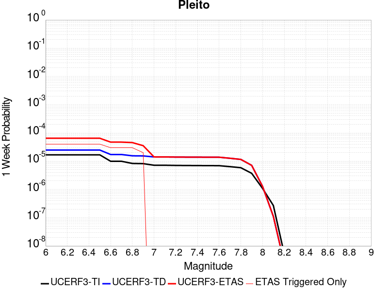 |  |  | 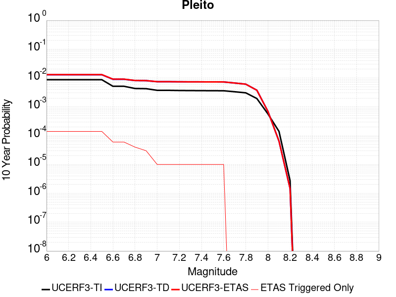 |

| Magnitude | 1 wk TI Prob | 1 wk TD Prob | 1 wk ETAS Prob | 1 wk ETAS/TD Gain | 1 wk ETAS Triggered Only | 1 mo TI Prob | 1 mo TD Prob | 1 mo ETAS Prob | 1 mo ETAS/TD Gain | 1 mo ETAS Triggered Only | 1 yr TI Prob | 1 yr TD Prob | 1 yr ETAS Prob | 1 yr ETAS/TD Gain | 1 yr ETAS Triggered Only | 10 yr TI Prob | 10 yr TD Prob | 10 yr ETAS Prob | 10 yr ETAS/TD Gain | 10 yr ETAS Triggered Only |
|-----|-----|-----|-----|-----|-----|-----|-----|-----|-----|-----|-----|-----|-----|-----|-----|-----|-----|-----|-----|-----|
| 6.0 | 1.6763008E-5 | 2.4764735E-5 | 6.476374E-5 | 2.61516 | 4.0E-5 | 7.183948E-5 | 1.0613067E-4 | 1.5612536E-4 | 1.4710673 | 5.0E-5 | 8.742947E-4 | 0.001291447 | 0.0013613566 | 1.0541328 | 7.0E-5 | 0.00870863 | 0.012954412 | 0.013092598 | 1.0106671 | 1.4E-4 |
| 6.1 | 1.6763008E-5 | 2.4764735E-5 | 6.476374E-5 | 2.61516 | 4.0E-5 | 7.183948E-5 | 1.0613067E-4 | 1.5612536E-4 | 1.4710673 | 5.0E-5 | 8.742947E-4 | 0.001291447 | 0.0013613566 | 1.0541328 | 7.0E-5 | 0.00870863 | 0.012954412 | 0.013092598 | 1.0106671 | 1.4E-4 |
| 6.2 | 1.6763008E-5 | 2.4764735E-5 | 6.476374E-5 | 2.61516 | 4.0E-5 | 7.183948E-5 | 1.0613067E-4 | 1.5612536E-4 | 1.4710673 | 5.0E-5 | 8.742947E-4 | 0.001291447 | 0.0013613566 | 1.0541328 | 7.0E-5 | 0.00870863 | 0.012954412 | 0.013092598 | 1.0106671 | 1.4E-4 |
| 6.3 | 1.6763008E-5 | 2.4764735E-5 | 6.476374E-5 | 2.61516 | 4.0E-5 | 7.183948E-5 | 1.0613067E-4 | 1.5612536E-4 | 1.4710673 | 5.0E-5 | 8.742947E-4 | 0.001291447 | 0.0013613566 | 1.0541328 | 7.0E-5 | 0.00870863 | 0.012954412 | 0.013092598 | 1.0106671 | 1.4E-4 |
| 6.4 | 1.6763008E-5 | 2.4764735E-5 | 6.476374E-5 | 2.61516 | 4.0E-5 | 7.183948E-5 | 1.0613067E-4 | 1.5612536E-4 | 1.4710673 | 5.0E-5 | 8.742947E-4 | 0.001291447 | 0.0013613566 | 1.0541328 | 7.0E-5 | 0.00870863 | 0.012954412 | 0.013092598 | 1.0106671 | 1.4E-4 |
| 6.5 | 1.6763008E-5 | 2.4764735E-5 | 6.476374E-5 | 2.61516 | 4.0E-5 | 7.183948E-5 | 1.0613067E-4 | 1.5612536E-4 | 1.4710673 | 5.0E-5 | 8.742947E-4 | 0.001291447 | 0.0013613566 | 1.0541328 | 7.0E-5 | 0.00870863 | 0.012954412 | 0.013092598 | 1.0106671 | 1.4E-4 |
| 6.6 | 9.910213E-6 | 1.721552E-5 | 4.7215002E-5 | 2.7425835 | 3.0E-5 | 4.247165E-5 | 7.3778734E-5 | 1.03776525E-4 | 1.4065912 | 3.0E-5 | 5.169696E-4 | 8.9788967E-4 | 9.378537E-4 | 1.0445089 | 4.0E-5 | 0.0051576863 | 0.009051226 | 0.009110683 | 1.0065689 | 6.0E-5 |
| 6.7 | 9.910213E-6 | 1.721552E-5 | 4.7215002E-5 | 2.7425835 | 3.0E-5 | 4.247165E-5 | 7.3778734E-5 | 1.03776525E-4 | 1.4065912 | 3.0E-5 | 5.169696E-4 | 8.9788967E-4 | 9.378537E-4 | 1.0445089 | 4.0E-5 | 0.0051576863 | 0.009051226 | 0.009110683 | 1.0065689 | 6.0E-5 |
| 6.8 | 8.300162E-6 | 1.5475129E-5 | 4.5474666E-5 | 2.9385645 | 3.0E-5 | 3.557164E-5 | 6.63203E-5 | 9.631831E-5 | 1.4523202 | 3.0E-5 | 4.3299864E-4 | 8.07152E-4 | 8.471197E-4 | 1.0495169 | 4.0E-5 | 0.004321559 | 0.008150663 | 0.008190337 | 1.0048676 | 4.0E-5 |
| 6.9 | 8.183114E-6 | 1.5346344E-5 | 3.534604E-5 | 2.303222 | 2.0E-5 | 3.5070017E-5 | 6.57684E-5 | 8.576708E-5 | 1.3040774 | 2.0E-5 | 4.2689382E-4 | 8.0043747E-4 | 8.304135E-4 | 1.0374495 | 3.0E-5 | 0.0042607468 | 0.008084008 | 0.008113765 | 1.0036811 | 3.0E-5 |
| 7.0 | 7.1748823E-6 | 1.4133306E-5 | 1.4133306E-5 | 1.0 | 0.0 | 3.0749135E-5 | 6.0569906E-5 | 6.0569906E-5 | 1.0 | 0.0 | 3.743064E-4 | 7.3718966E-4 | 7.471823E-4 | 1.013555 | 1.0E-5 | 0.0037367654 | 0.0074553755 | 0.007465301 | 1.0013313 | 1.0E-5 |
| 7.1 | 7.1671807E-6 | 1.4123676E-5 | 1.4123676E-5 | 1.0 | 0.0 | 3.0716128E-5 | 6.0528637E-5 | 6.0528637E-5 | 1.0 | 0.0 | 3.7390468E-4 | 7.366875E-4 | 7.4668013E-4 | 1.0135642 | 1.0E-5 | 0.0037327618 | 0.0074503883 | 0.0074603134 | 1.0013322 | 1.0E-5 |
| 7.2 | 7.0649667E-6 | 1.3970962E-5 | 1.3970962E-5 | 1.0 | 0.0 | 3.0278077E-5 | 5.987418E-5 | 5.987418E-5 | 1.0 | 0.0 | 3.6857324E-4 | 7.287248E-4 | 7.3871756E-4 | 1.0137126 | 1.0E-5 | 0.0036796255 | 0.0073711374 | 0.007381064 | 1.0013466 | 1.0E-5 |
| 7.3 | 7.02082E-6 | 1.3914415E-5 | 1.3914415E-5 | 1.0 | 0.0 | 3.008888E-5 | 5.9631846E-5 | 5.9631846E-5 | 1.0 | 0.0 | 3.6627054E-4 | 7.257764E-4 | 7.3576916E-4 | 1.0137683 | 1.0E-5 | 0.0036566744 | 0.0073416373 | 0.0073515642 | 1.0013521 | 1.0E-5 |
| 7.4 | 6.987146E-6 | 1.3873975E-5 | 1.3873975E-5 | 1.0 | 0.0 | 2.9944567E-5 | 5.9458544E-5 | 5.9458544E-5 | 1.0 | 0.0 | 3.6451413E-4 | 7.2366785E-4 | 7.336606E-4 | 1.0138085 | 1.0E-5 | 0.0036391679 | 0.007320571 | 0.007330498 | 1.001356 | 1.0E-5 |
| 7.5 | 6.9494554E-6 | 1.383088E-5 | 1.383088E-5 | 1.0 | 0.0 | 2.9783041E-5 | 5.9273858E-5 | 5.9273858E-5 | 1.0 | 0.0 | 3.625482E-4 | 7.2142074E-4 | 7.3141354E-4 | 1.0138515 | 1.0E-5 | 0.0036195726 | 0.007298199 | 0.007308126 | 1.0013602 | 1.0E-5 |
| 7.6 | 6.92694E-6 | 1.3789992E-5 | 1.3789992E-5 | 1.0 | 0.0 | 2.9686547E-5 | 5.909863E-5 | 5.909863E-5 | 1.0 | 0.0 | 3.6137376E-4 | 7.192888E-4 | 7.292816E-4 | 1.0138927 | 1.0E-5 | 0.0036078666 | 0.007276951 | 0.0072868783 | 1.0013642 | 1.0E-5 |
| 7.7 | 6.395867E-6 | 1.26690065E-5 | 1.26690065E-5 | 1.0 | 0.0 | 2.741057E-5 | 5.4294615E-5 | 5.4294615E-5 | 1.0 | 0.0 | 3.336726E-4 | 6.6083675E-4 | 6.6083675E-4 | 1.0 | 0.0 | 0.0033317201 | 0.0066955453 | 0.0066955453 | 1.0 | 0.0 |
| 7.8 | 5.8664327E-6 | 1.1536581E-5 | 1.1536581E-5 | 1.0 | 0.0 | 2.5141611E-5 | 4.9441554E-5 | 4.9441554E-5 | 1.0 | 0.0 | 3.060561E-4 | 6.0178485E-4 | 6.0178485E-4 | 1.0 | 0.0 | 0.0030563495 | 0.0061010164 | 0.0061010164 | 1.0 | 0.0 |
| 7.9 | 3.7167474E-6 | 7.1145205E-6 | 7.1145205E-6 | 1.0 | 0.0 | 1.592882E-5 | 3.0490448E-5 | 3.0490448E-5 | 1.0 | 0.0 | 1.9391612E-4 | 3.7115812E-4 | 3.7115812E-4 | 1.0 | 0.0 | 0.0019374699 | 0.0037676243 | 0.0037676243 | 1.0 | 0.0 |
| 8.0 | 1.0903841E-6 | 1.2879104E-6 | 1.2879104E-6 | 1.0 | 0.0 | 4.6730665E-6 | 5.5196047E-6 | 5.5196047E-6 | 1.0 | 0.0 | 5.68931E-5 | 6.719913E-5 | 6.719913E-5 | 1.0 | 0.0 | 5.6878536E-4 | 6.942094E-4 | 6.942094E-4 | 1.0 | 0.0 |
| 8.1 | 2.6894583E-7 | 1.1056095E-7 | 1.1056095E-7 | 1.0 | 0.0 | 1.1526245E-6 | 4.7383253E-7 | 4.7383253E-7 | 1.0 | 0.0 | 1.4033113E-5 | 5.768896E-6 | 5.768896E-6 | 1.0 | 0.0 | 1.4032227E-4 | 6.454915E-5 | 6.454915E-5 | 1.0 | 0.0 |
| 8.2 | 5.2967013E-9 | 2.4567874E-9 | 2.4567874E-9 | 1.0 | 0.0 | 2.2700148E-8 | 1.0529089E-8 | 1.0529089E-8 | 1.0 | 0.0 | 2.7637427E-7 | 1.2819166E-7 | 1.2819166E-7 | 1.0 | 0.0 | 2.7637393E-6 | 1.4588004E-6 | 1.4588004E-6 | 1.0 | 0.0 |

## Pisgah-Bullion Mtn-Mesquite Lk
*[(top)](#table-of-contents)*

| 1 Week | 1 Month | 1 Year | 10 Year |
|-----|-----|-----|-----|
|  | 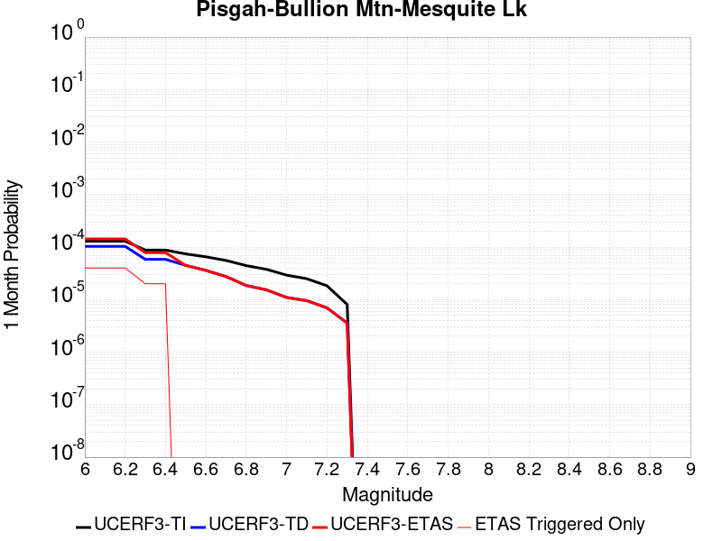 |  |  |

| Magnitude | 1 wk TI Prob | 1 wk TD Prob | 1 wk ETAS Prob | 1 wk ETAS/TD Gain | 1 wk ETAS Triggered Only | 1 mo TI Prob | 1 mo TD Prob | 1 mo ETAS Prob | 1 mo ETAS/TD Gain | 1 mo ETAS Triggered Only | 1 yr TI Prob | 1 yr TD Prob | 1 yr ETAS Prob | 1 yr ETAS/TD Gain | 1 yr ETAS Triggered Only | 10 yr TI Prob | 10 yr TD Prob | 10 yr ETAS Prob | 10 yr ETAS/TD Gain | 10 yr ETAS Triggered Only |
|-----|-----|-----|-----|-----|-----|-----|-----|-----|-----|-----|-----|-----|-----|-----|-----|-----|-----|-----|-----|-----|
| 6.0 | 3.0240792E-5 | 2.40909E-5 | 4.409042E-5 | 1.830169 | 2.0E-5 | 1.2959696E-4 | 1.032432E-4 | 1.4323907E-4 | 1.3873948 | 4.0E-5 | 0.0015767008 | 0.0012563618 | 0.0013362613 | 1.0635959 | 8.0E-5 | 0.015655609 | 0.012502613 | 0.012640863 | 1.0110576 | 1.4E-4 |
| 6.1 | 3.0240792E-5 | 2.40909E-5 | 4.409042E-5 | 1.830169 | 2.0E-5 | 1.2959696E-4 | 1.032432E-4 | 1.4323907E-4 | 1.3873948 | 4.0E-5 | 0.0015767008 | 0.0012563618 | 0.0013362613 | 1.0635959 | 8.0E-5 | 0.015655609 | 0.012502613 | 0.012640863 | 1.0110576 | 1.4E-4 |
| 6.2 | 3.0240792E-5 | 2.40909E-5 | 4.409042E-5 | 1.830169 | 2.0E-5 | 1.2959696E-4 | 1.032432E-4 | 1.4323907E-4 | 1.3873948 | 4.0E-5 | 0.0015767008 | 0.0012563618 | 0.0013362613 | 1.0635959 | 8.0E-5 | 0.015655609 | 0.012502613 | 0.012640863 | 1.0110576 | 1.4E-4 |
| 6.3 | 2.0498217E-5 | 1.3638054E-5 | 1.3638054E-5 | 1.0 | 0.0 | 8.784654E-5 | 5.8447586E-5 | 7.8446414E-5 | 1.3421669 | 2.0E-5 | 0.0010690069 | 7.1138324E-4 | 7.7134056E-4 | 1.0842828 | 6.0E-5 | 0.01063879 | 0.0070926864 | 0.00716219 | 1.0097994 | 7.0E-5 |
| 6.4 | 2.0498217E-5 | 1.3638054E-5 | 1.3638054E-5 | 1.0 | 0.0 | 8.784654E-5 | 5.8447586E-5 | 7.8446414E-5 | 1.3421669 | 2.0E-5 | 0.0010690069 | 7.1138324E-4 | 7.7134056E-4 | 1.0842828 | 6.0E-5 | 0.01063879 | 0.0070926864 | 0.00716219 | 1.0097994 | 7.0E-5 |
| 6.5 | 1.7316182E-5 | 1.04769715E-5 | 1.04769715E-5 | 1.0 | 0.0 | 7.42101E-5 | 4.490059E-5 | 4.490059E-5 | 1.0 | 0.0 | 9.0313336E-4 | 5.465376E-4 | 5.565321E-4 | 1.0182871 | 1.0E-5 | 0.008994718 | 0.00545293 | 0.005472821 | 1.0036478 | 2.0E-5 |
| 6.6 | 1.5251077E-5 | 8.414133E-6 | 8.414133E-6 | 1.0 | 0.0 | 6.536012E-5 | 3.606011E-5 | 3.606011E-5 | 1.0 | 0.0 | 7.9546886E-4 | 4.3895066E-4 | 4.4894626E-4 | 1.0227716 | 1.0E-5 | 0.007926274 | 0.0043815537 | 0.004401466 | 1.0045446 | 2.0E-5 |
| 6.7 | 1.2997425E-5 | 6.4112146E-6 | 6.4112146E-6 | 1.0 | 0.0 | 5.570206E-5 | 2.7476372E-5 | 2.7476372E-5 | 1.0 | 0.0 | 6.7796157E-4 | 3.3447813E-4 | 3.4447477E-4 | 1.0298873 | 1.0E-5 | 0.0067589693 | 0.003340207 | 0.0033601404 | 1.0059676 | 2.0E-5 |
| 6.8 | 1.035386E-5 | 4.333145E-6 | 4.333145E-6 | 1.0 | 0.0 | 4.437293E-5 | 1.8570496E-5 | 1.8570496E-5 | 1.0 | 0.0 | 5.401065E-4 | 2.260732E-4 | 2.260732E-4 | 1.0 | 0.0 | 0.0053879567 | 0.002258519 | 0.0022684964 | 1.0044177 | 1.0E-5 |
| 6.9 | 8.816252E-6 | 3.5805879E-6 | 3.5805879E-6 | 1.0 | 0.0 | 3.778339E-5 | 1.534529E-5 | 1.534529E-5 | 1.0 | 0.0 | 4.5991567E-4 | 1.8681347E-4 | 1.8681347E-4 | 1.0 | 0.0 | 0.00458965 | 0.0018666228 | 0.0018766042 | 1.0053473 | 1.0E-5 |
| 7.0 | 6.8232207E-6 | 2.5674399E-6 | 2.5674399E-6 | 1.0 | 0.0 | 2.9242048E-5 | 1.100327E-5 | 1.100327E-5 | 1.0 | 0.0 | 3.5596377E-4 | 1.3395688E-4 | 1.3395688E-4 | 1.0 | 0.0 | 0.0035539411 | 0.0013387925 | 0.0013487791 | 1.0074594 | 1.0E-5 |
| 7.1 | 5.837013E-6 | 2.2273143E-6 | 2.2273143E-6 | 1.0 | 0.0 | 2.501553E-5 | 9.5456E-6 | 9.5456E-6 | 1.0 | 0.0 | 3.045215E-4 | 1.1621177E-4 | 1.1621177E-4 | 1.0 | 0.0 | 0.0030410455 | 0.001161539 | 0.0011715274 | 1.0085993 | 1.0E-5 |
| 7.2 | 4.278052E-6 | 1.6275065E-6 | 1.6275065E-6 | 1.0 | 0.0 | 1.833438E-5 | 6.975011E-6 | 6.975011E-6 | 1.0 | 0.0 | 2.231982E-4 | 8.491768E-5 | 8.491768E-5 | 1.0 | 0.0 | 0.0022297418 | 8.4887556E-4 | 8.588671E-4 | 1.0117702 | 1.0E-5 |
| 7.3 | 1.8803692E-6 | 8.344788E-7 | 8.344788E-7 | 1.0 | 0.0 | 8.0587E-6 | 3.5763337E-6 | 3.5763337E-6 | 1.0 | 0.0 | 9.811026E-5 | 4.354114E-5 | 4.354114E-5 | 1.0 | 0.0 | 9.806695E-4 | 4.3534054E-4 | 4.3534054E-4 | 1.0 | 0.0 |

## Kern Canyon (North Kern) 2011
*[(top)](#table-of-contents)*

| 1 Week | 1 Month | 1 Year | 10 Year |
|-----|-----|-----|-----|
|  |  |  | 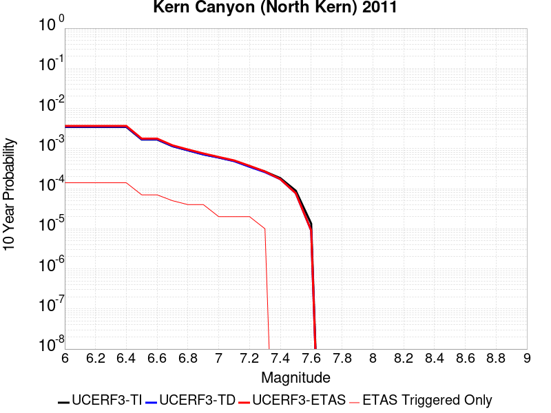 |

| Magnitude | 1 wk TI Prob | 1 wk TD Prob | 1 wk ETAS Prob | 1 wk ETAS/TD Gain | 1 wk ETAS Triggered Only | 1 mo TI Prob | 1 mo TD Prob | 1 mo ETAS Prob | 1 mo ETAS/TD Gain | 1 mo ETAS Triggered Only | 1 yr TI Prob | 1 yr TD Prob | 1 yr ETAS Prob | 1 yr ETAS/TD Gain | 1 yr ETAS Triggered Only | 10 yr TI Prob | 10 yr TD Prob | 10 yr ETAS Prob | 10 yr ETAS/TD Gain | 10 yr ETAS Triggered Only |
|-----|-----|-----|-----|-----|-----|-----|-----|-----|-----|-----|-----|-----|-----|-----|-----|-----|-----|-----|-----|-----|
| 6.0 | 6.6264497E-6 | 6.75733E-6 | 5.675699E-5 | 8.3993225 | 5.0E-5 | 2.8398761E-5 | 2.895971E-5 | 1.3895653E-4 | 4.7982707 | 1.1E-4 | 3.4570007E-4 | 3.5253543E-4 | 4.824896E-4 | 1.3686273 | 1.3E-4 | 0.0034516277 | 0.0035205502 | 0.0036600574 | 1.0396265 | 1.4E-4 |
| 6.1 | 6.6264497E-6 | 6.75733E-6 | 5.675699E-5 | 8.3993225 | 5.0E-5 | 2.8398761E-5 | 2.895971E-5 | 1.3895653E-4 | 4.7982707 | 1.1E-4 | 3.4570007E-4 | 3.5253543E-4 | 4.824896E-4 | 1.3686273 | 1.3E-4 | 0.0034516277 | 0.0035205502 | 0.0036600574 | 1.0396265 | 1.4E-4 |
| 6.2 | 6.6264497E-6 | 6.75733E-6 | 5.675699E-5 | 8.3993225 | 5.0E-5 | 2.8398761E-5 | 2.895971E-5 | 1.3895653E-4 | 4.7982707 | 1.1E-4 | 3.4570007E-4 | 3.5253543E-4 | 4.824896E-4 | 1.3686273 | 1.3E-4 | 0.0034516277 | 0.0035205502 | 0.0036600574 | 1.0396265 | 1.4E-4 |
| 6.3 | 6.6264497E-6 | 6.75733E-6 | 5.675699E-5 | 8.3993225 | 5.0E-5 | 2.8398761E-5 | 2.895971E-5 | 1.3895653E-4 | 4.7982707 | 1.1E-4 | 3.4570007E-4 | 3.5253543E-4 | 4.824896E-4 | 1.3686273 | 1.3E-4 | 0.0034516277 | 0.0035205502 | 0.0036600574 | 1.0396265 | 1.4E-4 |
| 6.4 | 6.6264497E-6 | 6.75733E-6 | 5.675699E-5 | 8.3993225 | 5.0E-5 | 2.8398761E-5 | 2.895971E-5 | 1.3895653E-4 | 4.7982707 | 1.1E-4 | 3.4570007E-4 | 3.5253543E-4 | 4.824896E-4 | 1.3686273 | 1.3E-4 | 0.0034516277 | 0.0035205502 | 0.0036600574 | 1.0396265 | 1.4E-4 |
| 6.5 | 3.2162225E-6 | 3.2570915E-6 | 2.3257026E-5 | 7.1404276 | 2.0E-5 | 1.3783738E-5 | 1.3958894E-5 | 7.395806E-5 | 5.298275 | 6.0E-5 | 1.6780409E-4 | 1.6993708E-4 | 2.2992688E-4 | 1.3530118 | 6.0E-5 | 0.0016767744 | 0.001698151 | 0.0017680322 | 1.0411513 | 7.0E-5 |
| 6.6 | 3.2162225E-6 | 3.2570915E-6 | 2.3257026E-5 | 7.1404276 | 2.0E-5 | 1.3783738E-5 | 1.3958894E-5 | 7.395806E-5 | 5.298275 | 6.0E-5 | 1.6780409E-4 | 1.6993708E-4 | 2.2992688E-4 | 1.3530118 | 6.0E-5 | 0.0016767744 | 0.001698151 | 0.0017680322 | 1.0411513 | 7.0E-5 |
| 6.7 | 2.1908265E-6 | 2.2071222E-6 | 1.2207101E-5 | 5.5307765 | 1.0E-5 | 9.389223E-6 | 9.459062E-6 | 4.9458682E-5 | 5.228709 | 4.0E-5 | 1.1430779E-4 | 1.1515819E-4 | 1.5515358E-4 | 1.3473083 | 4.0E-5 | 0.0011424901 | 0.0011510046 | 0.001200947 | 1.0433903 | 5.0E-5 |
| 6.8 | 1.7303895E-6 | 1.736553E-6 | 1.736553E-6 | 1.0 | 0.0 | 7.415934E-6 | 7.442349E-6 | 3.7442125E-5 | 5.0309553 | 3.0E-5 | 9.028525E-5 | 9.060693E-5 | 1.20604214E-4 | 1.3310705 | 3.0E-5 | 9.024858E-4 | 9.0570963E-4 | 9.456734E-4 | 1.0441242 | 4.0E-5 |
| 6.9 | 1.3700314E-6 | 1.3688623E-6 | 1.3688623E-6 | 1.0 | 0.0 | 5.87155E-6 | 5.86654E-6 | 3.5866364E-5 | 6.113717 | 3.0E-5 | 7.148377E-5 | 7.142283E-5 | 1.0142069E-4 | 1.4200038 | 3.0E-5 | 7.146078E-4 | 7.140033E-4 | 7.539747E-4 | 1.0559821 | 4.0E-5 |
| 7.0 | 1.1467797E-6 | 1.1413805E-6 | 1.1413805E-6 | 1.0 | 0.0 | 4.9147607E-6 | 4.8916218E-6 | 1.4891573E-5 | 3.0443017 | 1.0E-5 | 5.983557E-5 | 5.95539E-5 | 6.95533E-5 | 1.1679051 | 1.0E-5 | 5.981946E-4 | 5.9538253E-4 | 6.1537063E-4 | 1.0335718 | 2.0E-5 |
| 7.1 | 9.3952065E-7 | 9.3026915E-7 | 9.3026915E-7 | 1.0 | 0.0 | 4.026511E-6 | 3.986862E-6 | 1.3986822E-5 | 3.5082285 | 1.0E-5 | 4.9021666E-5 | 4.853898E-5 | 5.853849E-5 | 1.20601 | 1.0E-5 | 4.901085E-4 | 4.8528553E-4 | 5.0527585E-4 | 1.0411929 | 2.0E-5 |
| 7.2 | 6.858055E-7 | 6.7193014E-7 | 6.7193014E-7 | 1.0 | 0.0 | 2.939163E-6 | 2.8796974E-6 | 1.2879668E-5 | 4.472577 | 1.0E-5 | 3.5783723E-5 | 3.5059762E-5 | 4.5059413E-5 | 1.2852173 | 1.0E-5 | 3.5777962E-4 | 3.5054318E-4 | 3.7053617E-4 | 1.0570343 | 2.0E-5 |
| 7.3 | 5.1101983E-7 | 4.939301E-7 | 4.939301E-7 | 1.0 | 0.0 | 2.1900833E-6 | 2.1168414E-6 | 1.21168205E-5 | 5.7240095 | 1.0E-5 | 2.6663936E-5 | 2.5772246E-5 | 3.5771987E-5 | 1.3880043 | 1.0E-5 | 2.6660739E-4 | 2.5769303E-4 | 2.6769046E-4 | 1.0387958 | 1.0E-5 |
| 7.4 | 3.4999414E-7 | 3.2995916E-7 | 3.2995916E-7 | 1.0 | 0.0 | 1.499974E-6 | 1.4141099E-6 | 1.4141099E-6 | 1.0 | 0.0 | 1.8262032E-5 | 1.7216655E-5 | 1.7216655E-5 | 1.0 | 0.0 | 1.826053E-4 | 1.7215345E-4 | 1.7215345E-4 | 1.0 | 0.0 |
| 7.5 | 1.7021522E-7 | 1.4750053E-7 | 1.4750053E-7 | 1.0 | 0.0 | 7.2949354E-7 | 6.32145E-7 | 6.32145E-7 | 1.0 | 0.0 | 8.881548E-6 | 7.696339E-6 | 7.696339E-6 | 1.0 | 0.0 | 8.8811925E-5 | 7.696081E-5 | 7.696081E-5 | 1.0 | 0.0 |
| 7.6 | 2.572245E-8 | 1.735264E-8 | 1.735264E-8 | 1.0 | 0.0 | 1.10239064E-7 | 7.436845E-8 | 7.436845E-8 | 1.0 | 0.0 | 1.3421597E-6 | 9.0543557E-7 | 9.0543557E-7 | 1.0 | 0.0 | 1.3421517E-5 | 9.054324E-6 | 9.054324E-6 | 1.0 | 0.0 |

## Red Mountain
*[(top)](#table-of-contents)*

| 1 Week | 1 Month | 1 Year | 10 Year |
|-----|-----|-----|-----|
| 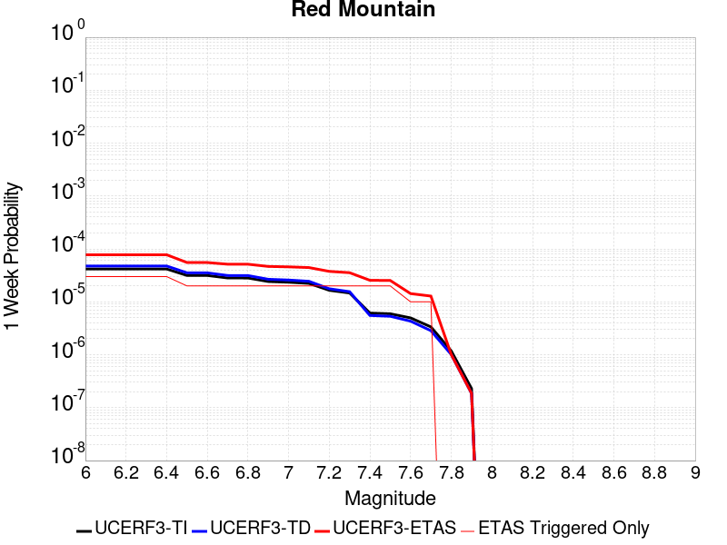 |  | 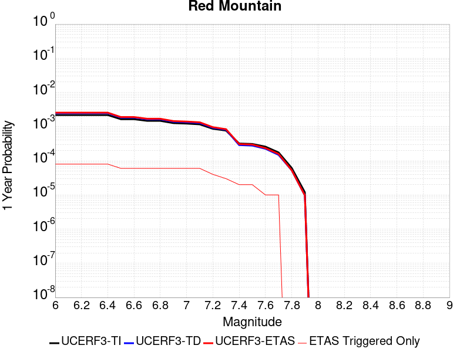 |  |

| Magnitude | 1 wk TI Prob | 1 wk TD Prob | 1 wk ETAS Prob | 1 wk ETAS/TD Gain | 1 wk ETAS Triggered Only | 1 mo TI Prob | 1 mo TD Prob | 1 mo ETAS Prob | 1 mo ETAS/TD Gain | 1 mo ETAS Triggered Only | 1 yr TI Prob | 1 yr TD Prob | 1 yr ETAS Prob | 1 yr ETAS/TD Gain | 1 yr ETAS Triggered Only | 10 yr TI Prob | 10 yr TD Prob | 10 yr ETAS Prob | 10 yr ETAS/TD Gain | 10 yr ETAS Triggered Only |
|-----|-----|-----|-----|-----|-----|-----|-----|-----|-----|-----|-----|-----|-----|-----|-----|-----|-----|-----|-----|-----|
| 6.0 | 4.1810763E-5 | 4.7590016E-5 | 7.7588586E-5 | 1.6303543 | 3.0E-5 | 1.7917668E-4 | 2.039422E-4 | 2.4393405E-4 | 1.196094 | 4.0E-5 | 0.0021792934 | 0.0024803334 | 0.002560135 | 1.0321738 | 8.0E-5 | 0.021580452 | 0.02454411 | 0.024661165 | 1.0047692 | 1.2E-4 |
| 6.1 | 4.1810763E-5 | 4.7590016E-5 | 7.7588586E-5 | 1.6303543 | 3.0E-5 | 1.7917668E-4 | 2.039422E-4 | 2.4393405E-4 | 1.196094 | 4.0E-5 | 0.0021792934 | 0.0024803334 | 0.002560135 | 1.0321738 | 8.0E-5 | 0.021580452 | 0.02454411 | 0.024661165 | 1.0047692 | 1.2E-4 |
| 6.2 | 4.1810763E-5 | 4.7590016E-5 | 7.7588586E-5 | 1.6303543 | 3.0E-5 | 1.7917668E-4 | 2.039422E-4 | 2.4393405E-4 | 1.196094 | 4.0E-5 | 0.0021792934 | 0.0024803334 | 0.002560135 | 1.0321738 | 8.0E-5 | 0.021580452 | 0.02454411 | 0.024661165 | 1.0047692 | 1.2E-4 |
| 6.3 | 4.1810763E-5 | 4.7590016E-5 | 7.7588586E-5 | 1.6303543 | 3.0E-5 | 1.7917668E-4 | 2.039422E-4 | 2.4393405E-4 | 1.196094 | 4.0E-5 | 0.0021792934 | 0.0024803334 | 0.002560135 | 1.0321738 | 8.0E-5 | 0.021580452 | 0.02454411 | 0.024661165 | 1.0047692 | 1.2E-4 |
| 6.4 | 4.1810763E-5 | 4.7590016E-5 | 7.7588586E-5 | 1.6303543 | 3.0E-5 | 1.7917668E-4 | 2.039422E-4 | 2.4393405E-4 | 1.196094 | 4.0E-5 | 0.0021792934 | 0.0024803334 | 0.002560135 | 1.0321738 | 8.0E-5 | 0.021580452 | 0.02454411 | 0.024661165 | 1.0047692 | 1.2E-4 |
| 6.5 | 3.154503E-5 | 3.5359757E-5 | 5.535905E-5 | 1.5655948 | 2.0E-5 | 1.3518598E-4 | 1.5153353E-4 | 1.8152899E-4 | 1.197946 | 3.0E-5 | 0.0016446467 | 0.0018434518 | 0.0019033412 | 1.0324876 | 6.0E-5 | 0.01632528 | 0.018291244 | 0.018379599 | 1.0048304 | 9.0E-5 |
| 6.6 | 3.1535834E-5 | 3.5349138E-5 | 5.534843E-5 | 1.5657647 | 2.0E-5 | 1.3514658E-4 | 1.5148803E-4 | 1.8148348E-4 | 1.1980054 | 3.0E-5 | 0.0016441676 | 0.0018428987 | 0.0019027882 | 1.0324974 | 6.0E-5 | 0.01632056 | 0.018285805 | 0.01837416 | 1.0048318 | 9.0E-5 |
| 6.7 | 2.8267326E-5 | 3.1469353E-5 | 5.1468727E-5 | 1.6355189 | 2.0E-5 | 1.2114006E-4 | 1.3486217E-4 | 1.6485812E-4 | 1.2224194 | 3.0E-5 | 0.0014738824 | 0.0016407954 | 0.0017006969 | 1.0365076 | 6.0E-5 | 0.014641452 | 0.01629557 | 0.016374268 | 1.0048293 | 8.0E-5 |
| 6.8 | 2.8212884E-5 | 3.1407242E-5 | 5.1406612E-5 | 1.6367759 | 2.0E-5 | 1.20906756E-4 | 1.3459599E-4 | 1.6459195E-4 | 1.2228593 | 3.0E-5 | 0.0014710457 | 0.0016375595 | 0.0016974612 | 1.0365798 | 6.0E-5 | 0.014613459 | 0.016263688 | 0.016342387 | 1.004839 | 8.0E-5 |
| 6.9 | 2.4227871E-5 | 2.6706994E-5 | 4.670646E-5 | 1.7488475 | 2.0E-5 | 1.03829596E-4 | 1.1445395E-4 | 1.4445052E-4 | 1.2620841 | 3.0E-5 | 0.0012633923 | 0.0013926621 | 0.0014525785 | 1.043023 | 6.0E-5 | 0.012562336 | 0.0138470335 | 0.013916064 | 1.0049852 | 7.0E-5 |
| 7.0 | 2.348524E-5 | 2.5835778E-5 | 4.5835262E-5 | 1.7741003 | 2.0E-5 | 1.0064714E-4 | 1.10720495E-4 | 1.4071717E-4 | 1.2709225 | 3.0E-5 | 0.0012246901 | 0.001347264 | 0.0014071832 | 1.0444747 | 6.0E-5 | 0.012179627 | 0.013398598 | 0.01346766 | 1.0051544 | 7.0E-5 |
| 7.1 | 2.2311642E-5 | 2.4462845E-5 | 4.4462355E-5 | 1.8175464 | 2.0E-5 | 9.561782E-5 | 1.04836974E-4 | 1.3483383E-4 | 1.2861286 | 3.0E-5 | 0.0011635252 | 0.0012757176 | 0.001335641 | 1.0469724 | 6.0E-5 | 0.01157452 | 0.01269146 | 0.012760571 | 1.0054455 | 7.0E-5 |
| 7.2 | 1.6533986E-5 | 1.7670362E-5 | 3.7670008E-5 | 2.1318188 | 2.0E-5 | 7.085802E-5 | 7.572828E-5 | 1.0572601E-4 | 1.3961232 | 3.0E-5 | 8.623549E-4 | 9.2166534E-4 | 9.6162845E-4 | 1.0433598 | 4.0E-5 | 0.008590161 | 0.009184707 | 0.009234248 | 1.0053939 | 5.0E-5 |
| 7.3 | 1.4703092E-5 | 1.5559537E-5 | 3.5559224E-5 | 2.2853653 | 2.0E-5 | 6.301173E-5 | 6.668237E-5 | 9.668037E-5 | 1.449864 | 3.0E-5 | 7.668978E-4 | 8.1161706E-4 | 8.4159273E-4 | 1.0369333 | 3.0E-5 | 0.0076425658 | 0.008092604 | 0.00813228 | 1.0049028 | 4.0E-5 |
| 7.4 | 6.1331984E-6 | 5.5288874E-6 | 2.5528776E-5 | 4.6173444 | 2.0E-5 | 2.6284872E-5 | 2.3695018E-5 | 4.3694545E-5 | 1.8440393 | 2.0E-5 | 3.199713E-4 | 2.884492E-4 | 3.084434E-4 | 1.0693163 | 2.0E-5 | 0.0031951098 | 0.0028808024 | 0.002910716 | 1.0103837 | 3.0E-5 |
| 7.5 | 5.954766E-6 | 5.338517E-6 | 2.533841E-5 | 4.746339 | 2.0E-5 | 2.5520176E-5 | 2.2879161E-5 | 4.2878703E-5 | 1.874138 | 2.0E-5 | 3.1066386E-4 | 2.785187E-4 | 2.9851313E-4 | 1.0717884 | 2.0E-5 | 0.003102299 | 0.0027817504 | 0.0028116668 | 1.0107546 | 3.0E-5 |
| 7.6 | 4.9726646E-6 | 4.315309E-6 | 1.4315266E-5 | 3.317321 | 1.0E-5 | 2.1311245E-5 | 1.8494053E-5 | 2.8493867E-5 | 1.5407044 | 1.0E-5 | 2.5943352E-4 | 2.2514217E-4 | 2.3513992E-4 | 1.0444064 | 1.0E-5 | 0.0025913084 | 0.0022491754 | 0.002259153 | 1.004436 | 1.0E-5 |
| 7.7 | 3.3613894E-6 | 2.8526886E-6 | 1.285266E-5 | 4.505455 | 1.0E-5 | 1.4405875E-5 | 1.22257525E-5 | 2.2225631E-5 | 1.8179356 | 1.0E-5 | 1.7537741E-4 | 1.4883863E-4 | 1.5883715E-4 | 1.0671768 | 1.0E-5 | 0.0017523908 | 0.0014874157 | 0.0014974009 | 1.006713 | 1.0E-5 |
| 7.8 | 1.1828961E-6 | 1.0122935E-6 | 1.0122935E-6 | 1.0 | 0.0 | 5.069545E-6 | 4.338394E-6 | 4.338394E-6 | 1.0 | 0.0 | 6.171996E-5 | 5.281869E-5 | 5.281869E-5 | 1.0 | 0.0 | 6.170282E-4 | 5.280643E-4 | 5.280643E-4 | 1.0 | 0.0 |
| 7.9 | 2.2967266E-7 | 1.861919E-7 | 1.861919E-7 | 1.0 | 0.0 | 9.843111E-7 | 7.97965E-7 | 7.97965E-7 | 1.0 | 0.0 | 1.19839215E-5 | 9.715184E-6 | 9.715184E-6 | 1.0 | 0.0 | 1.1983275E-4 | 9.714788E-5 | 9.714788E-5 | 1.0 | 0.0 |

## Rose Canyon
*[(top)](#table-of-contents)*

| 1 Week | 1 Month | 1 Year | 10 Year |
|-----|-----|-----|-----|
|  |  |  |  |

| Magnitude | 1 wk TI Prob | 1 wk TD Prob | 1 wk ETAS Prob | 1 wk ETAS/TD Gain | 1 wk ETAS Triggered Only | 1 mo TI Prob | 1 mo TD Prob | 1 mo ETAS Prob | 1 mo ETAS/TD Gain | 1 mo ETAS Triggered Only | 1 yr TI Prob | 1 yr TD Prob | 1 yr ETAS Prob | 1 yr ETAS/TD Gain | 1 yr ETAS Triggered Only | 10 yr TI Prob | 10 yr TD Prob | 10 yr ETAS Prob | 10 yr ETAS/TD Gain | 10 yr ETAS Triggered Only |
|-----|-----|-----|-----|-----|-----|-----|-----|-----|-----|-----|-----|-----|-----|-----|-----|-----|-----|-----|-----|-----|
| 6.0 | 4.5923203E-5 | 4.9714607E-5 | 9.9712124E-5 | 2.0056906 | 5.0E-5 | 1.9679888E-4 | 2.1304654E-4 | 2.7303377E-4 | 1.2815686 | 6.0E-5 | 0.0023933933 | 0.0025909478 | 0.0026707405 | 1.0307968 | 8.0E-5 | 0.023677798 | 0.025618518 | 0.025735443 | 1.0045642 | 1.2E-4 |
| 6.1 | 4.5923203E-5 | 4.9714607E-5 | 8.9712616E-5 | 1.8045526 | 4.0E-5 | 1.9679888E-4 | 2.1304654E-4 | 2.5303802E-4 | 1.1877124 | 4.0E-5 | 0.0023933933 | 0.0025909478 | 0.0026507925 | 1.0230975 | 6.0E-5 | 0.023677798 | 0.025618518 | 0.025706213 | 1.0034231 | 9.0E-5 |
| 6.2 | 2.8844734E-5 | 2.9669678E-5 | 5.966879E-5 | 2.0111034 | 3.0E-5 | 1.2361443E-4 | 1.2714976E-4 | 1.5714594E-4 | 1.2359122 | 3.0E-5 | 0.0015039665 | 0.001546976 | 0.0015968988 | 1.0322711 | 5.0E-5 | 0.0149382865 | 0.015364873 | 0.015433798 | 1.0044858 | 7.0E-5 |
| 6.3 | 2.3171577E-5 | 2.3162425E-5 | 5.316173E-5 | 2.2951713 | 3.0E-5 | 9.9302975E-5 | 9.926383E-5 | 1.2926085E-4 | 1.3021948 | 3.0E-5 | 0.0012083431 | 0.0012078804 | 0.00125782 | 1.0413449 | 5.0E-5 | 0.012017938 | 0.012012152 | 0.012071432 | 1.0049349 | 6.0E-5 |
| 6.4 | 2.0066604E-5 | 1.9668067E-5 | 4.9667477E-5 | 2.5252852 | 3.0E-5 | 8.599689E-5 | 8.428905E-5 | 1.1428652E-4 | 1.3558881 | 3.0E-5 | 0.0010465092 | 0.001025746 | 0.0010756948 | 1.048695 | 5.0E-5 | 0.010415946 | 0.010211479 | 0.010270866 | 1.0058157 | 6.0E-5 |
| 6.5 | 1.776989E-5 | 1.7115402E-5 | 4.711489E-5 | 2.7527773 | 3.0E-5 | 7.615444E-5 | 7.33497E-5 | 1.033475E-4 | 1.4089696 | 3.0E-5 | 9.267859E-4 | 8.926737E-4 | 9.3263795E-4 | 1.0447692 | 4.0E-5 | 0.009229303 | 0.008874663 | 0.00892422 | 1.005584 | 5.0E-5 |
| 6.6 | 1.5227364E-5 | 1.4340872E-5 | 3.4340585E-5 | 2.3945951 | 2.0E-5 | 6.52585E-5 | 6.145947E-5 | 8.145824E-5 | 1.3253977 | 2.0E-5 | 7.942326E-4 | 7.480173E-4 | 7.7799486E-4 | 1.040076 | 3.0E-5 | 0.007914 | 0.0074410336 | 0.007480736 | 1.0053356 | 4.0E-5 |
| 6.7 | 1.2703898E-5 | 1.1674277E-5 | 3.1674044E-5 | 2.713148 | 2.0E-5 | 5.4444143E-5 | 5.0031682E-5 | 7.003068E-5 | 1.3997267 | 2.0E-5 | 6.626558E-4 | 6.089697E-4 | 6.289575E-4 | 1.0328224 | 2.0E-5 | 0.006606833 | 0.0060623093 | 0.0060921274 | 1.0049186 | 3.0E-5 |
| 6.8 | 1.1554917E-5 | 1.0610384E-5 | 2.0610278E-5 | 1.9424629 | 1.0E-5 | 4.9520135E-5 | 4.547231E-5 | 5.5471854E-5 | 1.2199041 | 1.0E-5 | 6.0274085E-4 | 5.5348873E-4 | 5.634832E-4 | 1.0180572 | 1.0E-5 | 0.0060110865 | 0.005504414 | 0.0055243038 | 1.0036135 | 2.0E-5 |
| 6.9 | 8.732078E-6 | 7.882285E-6 | 7.882285E-6 | 1.0 | 0.0 | 3.7422655E-5 | 3.37808E-5 | 3.37808E-5 | 1.0 | 0.0 | 4.5552556E-4 | 4.112066E-4 | 4.112066E-4 | 1.0 | 0.0 | 0.0045459294 | 0.004089515 | 0.0040994743 | 1.0024353 | 1.0E-5 |
| 7.0 | 5.9337494E-6 | 5.107436E-6 | 5.107436E-6 | 1.0 | 0.0 | 2.5430107E-5 | 2.1888829E-5 | 2.1888829E-5 | 1.0 | 0.0 | 3.0956755E-4 | 2.6646405E-4 | 2.6646405E-4 | 1.0 | 0.0 | 0.0030913667 | 0.002661461 | 0.0026714345 | 1.0037473 | 1.0E-5 |
| 7.1 | 5.013409E-6 | 4.17734E-6 | 4.17734E-6 | 1.0 | 0.0 | 2.1485863E-5 | 1.7902763E-5 | 1.7902763E-5 | 1.0 | 0.0 | 2.6155898E-4 | 2.1794444E-4 | 2.1794444E-4 | 1.0 | 0.0 | 0.0026125133 | 0.0021773188 | 0.002187297 | 1.0045828 | 1.0E-5 |
| 7.2 | 4.120763E-6 | 3.2820917E-6 | 3.2820917E-6 | 1.0 | 0.0 | 1.7660293E-5 | 1.4066032E-5 | 1.4066032E-5 | 1.0 | 0.0 | 2.1499286E-4 | 1.7124058E-4 | 1.7124058E-4 | 1.0 | 0.0 | 0.0021478499 | 0.0017110958 | 0.0017210786 | 1.0058342 | 1.0E-5 |
| 7.3 | 3.2081239E-6 | 2.4404965E-6 | 2.4404965E-6 | 1.0 | 0.0 | 1.374903E-5 | 1.0459229E-5 | 1.0459229E-5 | 1.0 | 0.0 | 1.6738157E-4 | 1.2733374E-4 | 1.2733374E-4 | 1.0 | 0.0 | 0.0016725556 | 0.0012726148 | 0.0012826021 | 1.0078478 | 1.0E-5 |
| 7.4 | 2.4194755E-6 | 1.7680321E-6 | 1.7680321E-6 | 1.0 | 0.0 | 1.0369139E-5 | 7.5772587E-6 | 7.5772587E-6 | 1.0 | 0.0 | 1.2623696E-4 | 9.224927E-5 | 9.224927E-5 | 1.0 | 0.0 | 0.0012616527 | 9.221151E-4 | 9.221151E-4 | 1.0 | 0.0 |
| 7.5 | 1.3842889E-6 | 9.3782967E-7 | 9.3782967E-7 | 1.0 | 0.0 | 5.9326535E-6 | 4.019264E-6 | 4.019264E-6 | 1.0 | 0.0 | 7.222766E-5 | 4.8933474E-5 | 4.8933474E-5 | 1.0 | 0.0 | 7.220419E-4 | 4.8923056E-4 | 4.8923056E-4 | 1.0 | 0.0 |
| 7.6 | 1.0021575E-6 | 6.4113493E-7 | 6.4113493E-7 | 1.0 | 0.0 | 4.2949537E-6 | 2.7477186E-6 | 2.7477186E-6 | 1.0 | 0.0 | 5.2289808E-5 | 3.345298E-5 | 3.345298E-5 | 1.0 | 0.0 | 5.2277505E-4 | 3.344816E-4 | 3.344816E-4 | 1.0 | 0.0 |
| 7.7 | 8.7620116E-8 | 6.449304E-8 | 6.449304E-8 | 1.0 | 0.0 | 3.7551473E-7 | 2.763987E-7 | 2.763987E-7 | 1.0 | 0.0 | 4.5718825E-6 | 3.3651493E-6 | 3.3651493E-6 | 1.0 | 0.0 | 4.5717883E-5 | 3.3651013E-5 | 3.3651013E-5 | 1.0 | 0.0 |

## Lost Hills
*[(top)](#table-of-contents)*

| 1 Week | 1 Month | 1 Year | 10 Year |
|-----|-----|-----|-----|
|  |  |  |  |

| Magnitude | 1 wk TI Prob | 1 wk TD Prob | 1 wk ETAS Prob | 1 wk ETAS/TD Gain | 1 wk ETAS Triggered Only | 1 mo TI Prob | 1 mo TD Prob | 1 mo ETAS Prob | 1 mo ETAS/TD Gain | 1 mo ETAS Triggered Only | 1 yr TI Prob | 1 yr TD Prob | 1 yr ETAS Prob | 1 yr ETAS/TD Gain | 1 yr ETAS Triggered Only | 10 yr TI Prob | 10 yr TD Prob | 10 yr ETAS Prob | 10 yr ETAS/TD Gain | 10 yr ETAS Triggered Only |
|-----|-----|-----|-----|-----|-----|-----|-----|-----|-----|-----|-----|-----|-----|-----|-----|-----|-----|-----|-----|-----|
| 6.0 | 2.233523E-5 | 2.5106583E-5 | 7.510533E-5 | 2.9914596 | 5.0E-5 | 9.571891E-5 | 1.0759615E-4 | 1.5759077E-4 | 1.4646506 | 5.0E-5 | 0.0011647546 | 0.001309364 | 0.0013692854 | 1.0457637 | 6.0E-5 | 0.011586686 | 0.013033091 | 0.013151527 | 1.0090873 | 1.2E-4 |
| 6.1 | 2.233523E-5 | 2.5106583E-5 | 7.510533E-5 | 2.9914596 | 5.0E-5 | 9.571891E-5 | 1.0759615E-4 | 1.5759077E-4 | 1.4646506 | 5.0E-5 | 0.0011647546 | 0.001309364 | 0.0013692854 | 1.0457637 | 6.0E-5 | 0.011586686 | 0.013033091 | 0.013151527 | 1.0090873 | 1.2E-4 |
| 6.2 | 2.233523E-5 | 2.5106583E-5 | 7.510533E-5 | 2.9914596 | 5.0E-5 | 9.571891E-5 | 1.0759615E-4 | 1.5759077E-4 | 1.4646506 | 5.0E-5 | 0.0011647546 | 0.001309364 | 0.0013692854 | 1.0457637 | 6.0E-5 | 0.011586686 | 0.013033091 | 0.013151527 | 1.0090873 | 1.2E-4 |
| 6.3 | 2.233523E-5 | 2.5106583E-5 | 7.510533E-5 | 2.9914596 | 5.0E-5 | 9.571891E-5 | 1.0759615E-4 | 1.5759077E-4 | 1.4646506 | 5.0E-5 | 0.0011647546 | 0.001309364 | 0.0013692854 | 1.0457637 | 6.0E-5 | 0.011586686 | 0.013033091 | 0.013151527 | 1.0090873 | 1.2E-4 |
| 6.4 | 1.2288092E-5 | 1.3781108E-5 | 4.3780696E-5 | 3.1768632 | 3.0E-5 | 5.2662188E-5 | 5.906108E-5 | 8.905931E-5 | 1.5079187 | 3.0E-5 | 6.409735E-4 | 7.189252E-4 | 7.5889647E-4 | 1.0555986 | 4.0E-5 | 0.006391279 | 0.0071752006 | 0.0072347703 | 1.0083021 | 6.0E-5 |
| 6.5 | 1.2288092E-5 | 1.3781108E-5 | 4.3780696E-5 | 3.1768632 | 3.0E-5 | 5.2662188E-5 | 5.906108E-5 | 8.905931E-5 | 1.5079187 | 3.0E-5 | 6.409735E-4 | 7.189252E-4 | 7.5889647E-4 | 1.0555986 | 4.0E-5 | 0.006391279 | 0.0071752006 | 0.0072347703 | 1.0083021 | 6.0E-5 |
| 6.6 | 8.58281E-6 | 9.63377E-6 | 2.9633577E-5 | 3.0760105 | 2.0E-5 | 3.6782953E-5 | 4.12874E-5 | 6.128658E-5 | 1.4843893 | 2.0E-5 | 4.4774043E-4 | 5.026414E-4 | 5.2263134E-4 | 1.0397698 | 2.0E-5 | 0.0044683935 | 0.005023205 | 0.0050630043 | 1.007923 | 4.0E-5 |
| 6.7 | 7.205685E-6 | 8.088302E-6 | 2.808814E-5 | 3.472687 | 2.0E-5 | 3.088114E-5 | 3.466415E-5 | 5.466346E-5 | 1.576945 | 2.0E-5 | 3.7591302E-4 | 4.2203604E-4 | 4.4202758E-4 | 1.0473694 | 2.0E-5 | 0.0037527776 | 0.0042203604 | 0.0042502335 | 1.0070784 | 3.0E-5 |

## Santa Cruz Island
*[(top)](#table-of-contents)*

| 1 Week | 1 Month | 1 Year | 10 Year |
|-----|-----|-----|-----|
| 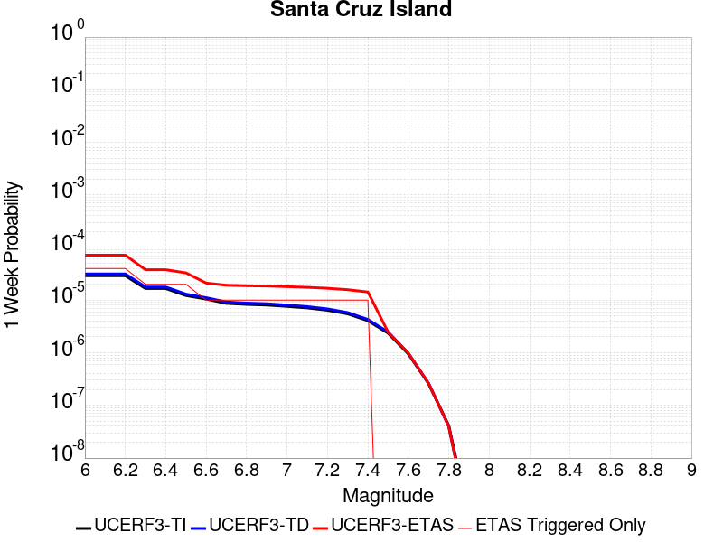 | 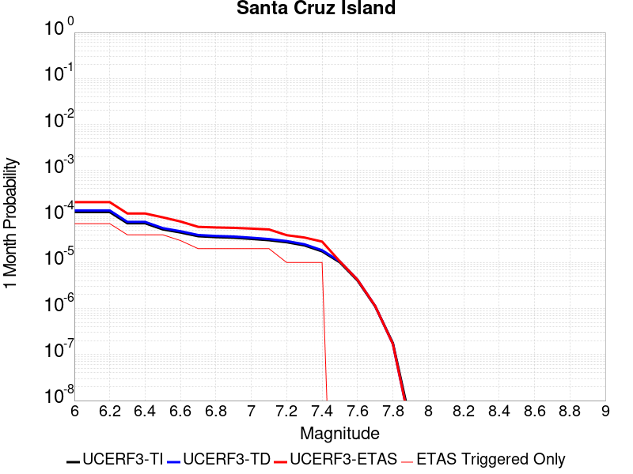 |  |  |

| Magnitude | 1 wk TI Prob | 1 wk TD Prob | 1 wk ETAS Prob | 1 wk ETAS/TD Gain | 1 wk ETAS Triggered Only | 1 mo TI Prob | 1 mo TD Prob | 1 mo ETAS Prob | 1 mo ETAS/TD Gain | 1 mo ETAS Triggered Only | 1 yr TI Prob | 1 yr TD Prob | 1 yr ETAS Prob | 1 yr ETAS/TD Gain | 1 yr ETAS Triggered Only | 10 yr TI Prob | 10 yr TD Prob | 10 yr ETAS Prob | 10 yr ETAS/TD Gain | 10 yr ETAS Triggered Only |
|-----|-----|-----|-----|-----|-----|-----|-----|-----|-----|-----|-----|-----|-----|-----|-----|-----|-----|-----|-----|-----|
| 6.0 | 2.9164563E-5 | 3.1599742E-5 | 7.159848E-5 | 2.265793 | 4.0E-5 | 1.2498499E-4 | 1.3542121E-4 | 2.0541174E-4 | 1.5168357 | 7.0E-5 | 0.0015206301 | 0.0016476426 | 0.0017275107 | 1.0484742 | 8.0E-5 | 0.015102667 | 0.016368 | 0.016476199 | 1.0066104 | 1.1E-4 |
| 6.1 | 2.9164563E-5 | 3.1599742E-5 | 7.159848E-5 | 2.265793 | 4.0E-5 | 1.2498499E-4 | 1.3542121E-4 | 2.0541174E-4 | 1.5168357 | 7.0E-5 | 0.0015206301 | 0.0016476426 | 0.0017275107 | 1.0484742 | 8.0E-5 | 0.015102667 | 0.016368 | 0.016476199 | 1.0066104 | 1.1E-4 |
| 6.2 | 2.9164563E-5 | 3.1599742E-5 | 7.159848E-5 | 2.265793 | 4.0E-5 | 1.2498499E-4 | 1.3542121E-4 | 2.0541174E-4 | 1.5168357 | 7.0E-5 | 0.0015206301 | 0.0016476426 | 0.0017275107 | 1.0484742 | 8.0E-5 | 0.015102667 | 0.016368 | 0.016476199 | 1.0066104 | 1.1E-4 |
| 6.3 | 1.6635553E-5 | 1.780436E-5 | 3.7804002E-5 | 2.1233003 | 2.0E-5 | 7.1293274E-5 | 7.630227E-5 | 1.1629921E-4 | 1.5241908 | 4.0E-5 | 8.6765E-4 | 9.286024E-4 | 9.6856523E-4 | 1.0430355 | 4.0E-5 | 0.008642701 | 0.009249094 | 0.009308538 | 1.0064272 | 6.0E-5 |
| 6.4 | 1.6635553E-5 | 1.780436E-5 | 3.7804002E-5 | 2.1233003 | 2.0E-5 | 7.1293274E-5 | 7.630227E-5 | 1.1629921E-4 | 1.5241908 | 4.0E-5 | 8.6765E-4 | 9.286024E-4 | 9.6856523E-4 | 1.0430355 | 4.0E-5 | 0.008642701 | 0.009249094 | 0.009308538 | 1.0064272 | 6.0E-5 |
| 6.5 | 1.2238748E-5 | 1.3042996E-5 | 3.3042736E-5 | 2.53337 | 2.0E-5 | 5.2450723E-5 | 5.5897377E-5 | 9.589514E-5 | 1.7155571 | 4.0E-5 | 6.3840044E-4 | 6.8034173E-4 | 7.2031457E-4 | 1.058754 | 4.0E-5 | 0.0063656955 | 0.006782988 | 0.006842581 | 1.0087856 | 6.0E-5 |
| 6.6 | 1.0489767E-5 | 1.1156636E-5 | 2.1156524E-5 | 1.8963175 | 1.0E-5 | 4.495537E-5 | 4.781329E-5 | 7.7811856E-5 | 1.6274107 | 3.0E-5 | 5.4719415E-4 | 5.819736E-4 | 6.119561E-4 | 1.0515187 | 3.0E-5 | 0.005458487 | 0.005804736 | 0.0058544455 | 1.0085636 | 5.0E-5 |
| 6.7 | 8.699222E-6 | 9.236783E-6 | 1.923669E-5 | 2.082618 | 1.0E-5 | 3.7281847E-5 | 3.958561E-5 | 5.958482E-5 | 1.5052141 | 2.0E-5 | 4.5381195E-4 | 4.818488E-4 | 5.0183915E-4 | 1.0414867 | 2.0E-5 | 0.0045288634 | 0.004808108 | 0.004847916 | 1.0082793 | 4.0E-5 |
| 6.8 | 8.307732E-6 | 8.8169045E-6 | 1.8816816E-5 | 2.1341748 | 1.0E-5 | 3.560408E-5 | 3.7786187E-5 | 5.7785433E-5 | 1.5292739 | 2.0E-5 | 4.3339343E-4 | 4.5995016E-4 | 4.7994097E-4 | 1.043463 | 2.0E-5 | 0.004325492 | 0.0045900354 | 0.004629852 | 1.0086745 | 4.0E-5 |
| 6.9 | 8.073121E-6 | 8.564939E-6 | 1.8564853E-5 | 2.1675406 | 1.0E-5 | 3.459863E-5 | 3.670637E-5 | 5.6705634E-5 | 1.5448446 | 2.0E-5 | 4.2115687E-4 | 4.4680882E-4 | 4.667999E-4 | 1.0447419 | 2.0E-5 | 0.004203596 | 0.004459156 | 0.0044989777 | 1.0089303 | 4.0E-5 |
| 7.0 | 7.617019E-6 | 8.074665E-6 | 1.8074585E-5 | 2.2384315 | 1.0E-5 | 3.264396E-5 | 3.4605247E-5 | 5.4604556E-5 | 1.577927 | 2.0E-5 | 3.9736772E-4 | 4.2123784E-4 | 4.412294E-4 | 1.0474591 | 2.0E-5 | 0.003966579 | 0.0042044413 | 0.004244273 | 1.0094738 | 4.0E-5 |
| 7.1 | 7.1224836E-6 | 7.5457883E-6 | 1.7545713E-5 | 2.3252325 | 1.0E-5 | 3.052457E-5 | 3.2338692E-5 | 5.2338048E-5 | 1.6184342 | 2.0E-5 | 3.715733E-4 | 3.9365282E-4 | 4.1364494E-4 | 1.0507861 | 2.0E-5 | 0.003709526 | 0.0039295983 | 0.0039694407 | 1.0101391 | 4.0E-5 |
| 7.2 | 6.441115E-6 | 6.8273835E-6 | 1.6827315E-5 | 2.46468 | 1.0E-5 | 2.7604487E-5 | 2.9259889E-5 | 3.9259598E-5 | 1.3417548 | 1.0E-5 | 3.360328E-4 | 3.5618115E-4 | 3.6617758E-4 | 1.0280656 | 1.0E-5 | 0.0033552512 | 0.0035561312 | 0.0035860245 | 1.0084062 | 3.0E-5 |
| 7.3 | 5.494274E-6 | 5.8199944E-6 | 1.5819936E-5 | 2.7182047 | 1.0E-5 | 2.3546674E-5 | 2.4942596E-5 | 3.4942346E-5 | 1.4009106 | 1.0E-5 | 2.8664304E-4 | 3.03634E-4 | 3.1363097E-4 | 1.0329244 | 1.0E-5 | 0.002862736 | 0.0030322145 | 0.0030621234 | 1.0098637 | 3.0E-5 |
| 7.4 | 4.0802624E-6 | 4.3122564E-6 | 1.4312213E-5 | 3.3189616 | 1.0E-5 | 1.7486722E-5 | 1.8480969E-5 | 2.8480783E-5 | 1.5410872 | 1.0E-5 | 2.1288003E-4 | 2.2498264E-4 | 2.3498038E-4 | 1.0444379 | 1.0E-5 | 0.0021267622 | 0.0022475577 | 0.0022675127 | 1.0088786 | 2.0E-5 |
| 7.5 | 2.3584746E-6 | 2.4753099E-6 | 2.4753099E-6 | 1.0 | 0.0 | 1.0107709E-5 | 1.0608428E-5 | 1.0608428E-5 | 1.0 | 0.0 | 1.2305441E-4 | 1.2915001E-4 | 1.2915001E-4 | 1.0 | 0.0 | 0.0012298629 | 0.0012907545 | 0.0013007416 | 1.0077374 | 1.0E-5 |
| 7.6 | 9.4981914E-7 | 9.860934E-7 | 9.860934E-7 | 1.0 | 0.0 | 4.0706473E-6 | 4.2261076E-6 | 4.2261076E-6 | 1.0 | 0.0 | 4.9559E-5 | 5.1451658E-5 | 5.1451658E-5 | 1.0 | 0.0 | 4.954795E-4 | 5.1439874E-4 | 5.243936E-4 | 1.0194302 | 1.0E-5 |
| 7.7 | 2.6013532E-7 | 2.6416632E-7 | 2.6416632E-7 | 1.0 | 0.0 | 1.1148652E-6 | 1.1321408E-6 | 1.1321408E-6 | 1.0 | 0.0 | 1.3573399E-5 | 1.3783729E-5 | 1.3783729E-5 | 1.0 | 0.0 | 1.357257E-4 | 1.378288E-4 | 1.378288E-4 | 1.0 | 0.0 |
| 7.8 | 4.1522263E-8 | 3.965698E-8 | 3.965698E-8 | 1.0 | 0.0 | 1.7795254E-7 | 1.6995848E-7 | 1.6995848E-7 | 1.0 | 0.0 | 2.16657E-6 | 2.0692428E-6 | 2.0692428E-6 | 1.0 | 0.0 | 2.1665488E-5 | 2.0692256E-5 | 2.0692256E-5 | 1.0 | 0.0 |
| 7.9 | 7.7242046E-10 | 5.9475225E-10 | 5.9475225E-10 | 1.0 | 0.0 | 3.3103735E-9 | 2.5489382E-9 | 2.5489382E-9 | 1.0 | 0.0 | 4.0303796E-8 | 3.1033323E-8 | 3.1033323E-8 | 1.0 | 0.0 | 4.030379E-7 | 3.103332E-7 | 3.103332E-7 | 1.0 | 0.0 |

## Cleghorn
*[(top)](#table-of-contents)*

| 1 Week | 1 Month | 1 Year | 10 Year |
|-----|-----|-----|-----|
| 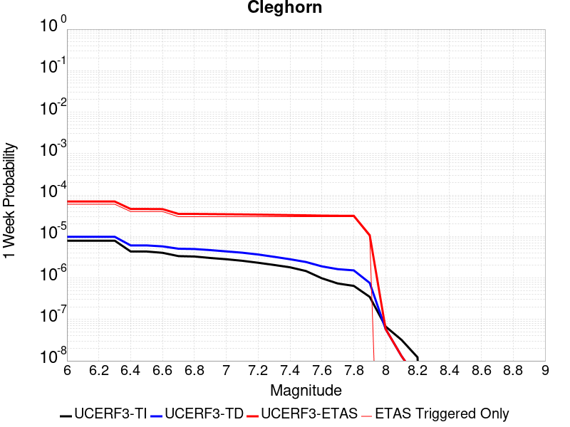 |  | 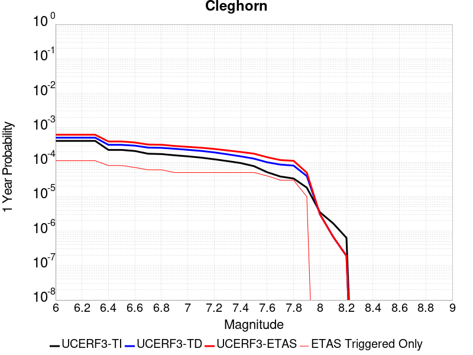 | 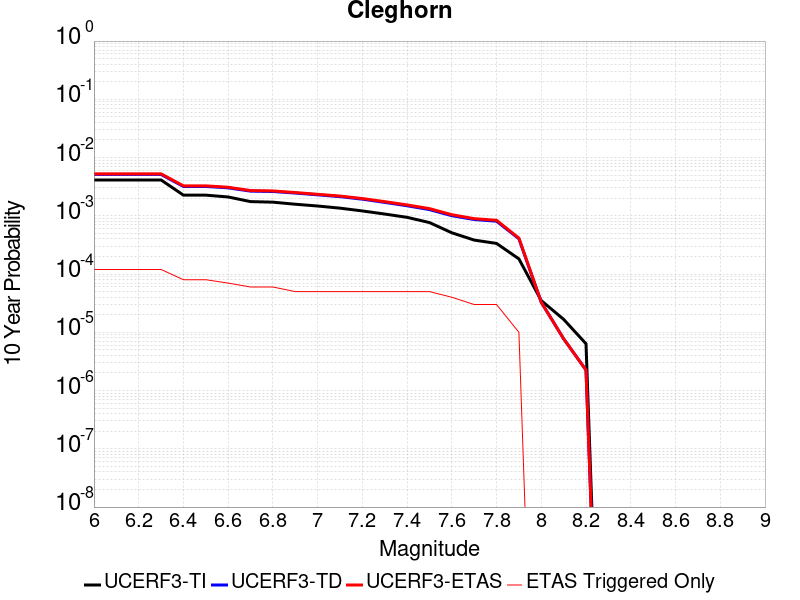 |

| Magnitude | 1 wk TI Prob | 1 wk TD Prob | 1 wk ETAS Prob | 1 wk ETAS/TD Gain | 1 wk ETAS Triggered Only | 1 mo TI Prob | 1 mo TD Prob | 1 mo ETAS Prob | 1 mo ETAS/TD Gain | 1 mo ETAS Triggered Only | 1 yr TI Prob | 1 yr TD Prob | 1 yr ETAS Prob | 1 yr ETAS/TD Gain | 1 yr ETAS Triggered Only | 10 yr TI Prob | 10 yr TD Prob | 10 yr ETAS Prob | 10 yr ETAS/TD Gain | 10 yr ETAS Triggered Only |
|-----|-----|-----|-----|-----|-----|-----|-----|-----|-----|-----|-----|-----|-----|-----|-----|-----|-----|-----|-----|-----|
| 6.0 | 7.9267165E-6 | 9.831764E-6 | 6.983118E-5 | 7.1026087 | 6.0E-5 | 3.39712E-5 | 4.2135514E-5 | 1.1213256E-4 | 2.6612365 | 7.0E-5 | 4.1352084E-4 | 5.1288976E-4 | 6.228333E-4 | 1.2143611 | 1.1E-4 | 0.004127522 | 0.005132214 | 0.0052515985 | 1.0232617 | 1.2E-4 |
| 6.1 | 7.9267165E-6 | 9.831764E-6 | 6.983118E-5 | 7.1026087 | 6.0E-5 | 3.39712E-5 | 4.2135514E-5 | 1.1213256E-4 | 2.6612365 | 7.0E-5 | 4.1352084E-4 | 5.1288976E-4 | 6.228333E-4 | 1.2143611 | 1.1E-4 | 0.004127522 | 0.005132214 | 0.0052515985 | 1.0232617 | 1.2E-4 |
| 6.2 | 7.9267165E-6 | 9.831764E-6 | 6.983118E-5 | 7.1026087 | 6.0E-5 | 3.39712E-5 | 4.2135514E-5 | 1.1213256E-4 | 2.6612365 | 7.0E-5 | 4.1352084E-4 | 5.1288976E-4 | 6.228333E-4 | 1.2143611 | 1.1E-4 | 0.004127522 | 0.005132214 | 0.0052515985 | 1.0232617 | 1.2E-4 |
| 6.3 | 7.9267165E-6 | 9.831764E-6 | 6.983118E-5 | 7.1026087 | 6.0E-5 | 3.39712E-5 | 4.2135514E-5 | 1.1213256E-4 | 2.6612365 | 7.0E-5 | 4.1352084E-4 | 5.1288976E-4 | 6.228333E-4 | 1.2143611 | 1.1E-4 | 0.004127522 | 0.005132214 | 0.0052515985 | 1.0232617 | 1.2E-4 |
| 6.4 | 4.3445207E-6 | 6.0916254E-6 | 4.609138E-5 | 7.566352 | 4.0E-5 | 1.8619241E-5 | 2.6106709E-5 | 6.610566E-5 | 2.532133 | 4.0E-5 | 2.2666567E-4 | 3.1780385E-4 | 3.9777844E-4 | 1.2516476 | 8.0E-5 | 0.0022643462 | 0.0031877246 | 0.0032674696 | 1.0250163 | 8.0E-5 |
| 6.5 | 4.3445207E-6 | 6.0916254E-6 | 4.609138E-5 | 7.566352 | 4.0E-5 | 1.8619241E-5 | 2.6106709E-5 | 6.610566E-5 | 2.532133 | 4.0E-5 | 2.2666567E-4 | 3.1780385E-4 | 3.9777844E-4 | 1.2516476 | 8.0E-5 | 0.0022643462 | 0.0031877246 | 0.0032674696 | 1.0250163 | 8.0E-5 |
| 6.6 | 4.040109E-6 | 5.774033E-6 | 4.5773802E-5 | 7.927527 | 4.0E-5 | 1.7314638E-5 | 2.4745626E-5 | 6.4744636E-5 | 2.6164072 | 4.0E-5 | 2.1078532E-4 | 3.0123728E-4 | 3.7121619E-4 | 1.2323049 | 7.0E-5 | 0.002105855 | 0.0030225143 | 0.0030923027 | 1.0230895 | 7.0E-5 |
| 6.7 | 3.3632055E-6 | 5.06753E-6 | 3.5067376E-5 | 6.920014 | 3.0E-5 | 1.4413658E-5 | 2.1717806E-5 | 5.1717154E-5 | 2.381325 | 3.0E-5 | 1.7547216E-4 | 2.643825E-4 | 3.2436667E-4 | 1.2268839 | 6.0E-5 | 0.0017533366 | 0.0026548486 | 0.0027146894 | 1.0225402 | 6.0E-5 |
| 6.8 | 3.2902772E-6 | 4.9894375E-6 | 3.4989287E-5 | 7.012672 | 3.0E-5 | 1.4101111E-5 | 2.138313E-5 | 5.138249E-5 | 2.402945 | 3.0E-5 | 1.716675E-4 | 2.6030882E-4 | 3.2029318E-4 | 1.2304355 | 6.0E-5 | 0.0017153495 | 0.0026142076 | 0.0026740506 | 1.0228915 | 6.0E-5 |
| 6.9 | 3.031547E-6 | 4.6911987E-6 | 3.4691056E-5 | 7.394924 | 3.0E-5 | 1.299228E-5 | 2.0104984E-5 | 5.010438E-5 | 2.4921372 | 3.0E-5 | 1.5816953E-4 | 2.4475096E-4 | 2.947387E-4 | 1.2042392 | 5.0E-5 | 0.00158057 | 0.0024589805 | 0.0025088575 | 1.0202836 | 5.0E-5 |
| 7.0 | 2.8259715E-6 | 4.3707637E-6 | 3.4370634E-5 | 7.863759 | 3.0E-5 | 1.211125E-5 | 1.8731711E-5 | 4.8731148E-5 | 2.6015322 | 3.0E-5 | 1.4744449E-4 | 2.2803496E-4 | 2.7802357E-4 | 1.2192147 | 5.0E-5 | 0.001473467 | 0.0022921748 | 0.0023420602 | 1.0217633 | 5.0E-5 |
| 7.1 | 2.5962665E-6 | 4.065983E-6 | 3.4065863E-5 | 8.37826 | 3.0E-5 | 1.1126809E-5 | 1.7425526E-5 | 4.7425005E-5 | 2.7215824 | 3.0E-5 | 1.3546048E-4 | 2.1213535E-4 | 2.6212473E-4 | 1.2356486 | 5.0E-5 | 0.0013537793 | 0.0021334959 | 0.0021833892 | 1.0233858 | 5.0E-5 |
| 7.2 | 2.3247253E-6 | 3.6765352E-6 | 3.3676424E-5 | 9.159826 | 3.0E-5 | 9.96307E-6 | 1.5756486E-5 | 4.5756013E-5 | 2.9039478 | 3.0E-5 | 1.21293626E-4 | 1.9181852E-4 | 2.4180893E-4 | 1.2606131 | 5.0E-5 | 0.0012122744 | 0.0019307166 | 0.00198062 | 1.0258471 | 5.0E-5 |
| 7.3 | 2.056928E-6 | 3.235253E-6 | 3.3235156E-5 | 10.272816 | 3.0E-5 | 8.815376E-6 | 1.3865297E-5 | 4.3864882E-5 | 3.1636453 | 3.0E-5 | 1.0732192E-4 | 1.6879707E-4 | 2.1878863E-4 | 1.2961637 | 5.0E-5 | 0.001072701 | 0.0017009423 | 0.0017508572 | 1.0293455 | 5.0E-5 |
| 7.4 | 1.8055999E-6 | 2.8256538E-6 | 3.282557E-5 | 11.6169815 | 3.0E-5 | 7.738263E-6 | 1.210989E-5 | 4.2109525E-5 | 3.477284 | 3.0E-5 | 9.4209274E-5 | 1.4742807E-4 | 1.974207E-4 | 1.3390985 | 5.0E-5 | 9.4169343E-4 | 0.0014876705 | 0.0015375961 | 1.0335596 | 5.0E-5 |
| 7.5 | 1.4683443E-6 | 2.4248943E-6 | 3.242482E-5 | 13.371643 | 3.0E-5 | 6.292889E-6 | 1.0392363E-5 | 4.0392053E-5 | 3.8867052 | 3.0E-5 | 7.661323E-5 | 1.2651978E-4 | 1.7651345E-4 | 1.3951452 | 5.0E-5 | 7.658682E-4 | 0.0012788812 | 0.0013288173 | 1.0390466 | 5.0E-5 |
| 7.6 | 9.804088E-7 | 1.9004091E-6 | 3.1900352E-5 | 16.786045 | 3.0E-5 | 4.201745E-6 | 8.144585E-6 | 3.8144342E-5 | 4.6833987 | 3.0E-5 | 5.1155046E-5 | 9.915586E-5 | 1.3915189E-4 | 1.4033653 | 4.0E-5 | 5.114327E-4 | 0.0010055583 | 0.0010455181 | 1.0397389 | 4.0E-5 |
| 7.7 | 7.3434086E-7 | 1.6285549E-6 | 3.1628508E-5 | 19.42121 | 3.0E-5 | 3.1471714E-6 | 6.9795024E-6 | 3.6979294E-5 | 5.2982707 | 3.0E-5 | 3.831614E-5 | 8.4972155E-5 | 1.149696E-4 | 1.3530269 | 3.0E-5 | 3.8309532E-4 | 8.6387293E-4 | 8.93847E-4 | 1.0346973 | 3.0E-5 |
| 7.8 | 6.434184E-7 | 1.5221389E-6 | 3.1522093E-5 | 20.70908 | 3.0E-5 | 2.7575045E-6 | 6.523436E-6 | 3.652324E-5 | 5.5987735 | 3.0E-5 | 3.35721E-5 | 7.9419966E-5 | 1.0941758E-4 | 1.3777088 | 3.0E-5 | 3.3567028E-4 | 8.080443E-4 | 8.3802006E-4 | 1.0370966 | 3.0E-5 |
| 7.9 | 3.4943926E-7 | 7.5750586E-7 | 1.0757498E-5 | 14.201208 | 1.0E-5 | 1.497596E-6 | 3.2464498E-6 | 1.3246417E-5 | 4.080278 | 1.0E-5 | 1.8233079E-5 | 3.9524817E-5 | 4.9524424E-5 | 1.2529956 | 1.0E-5 | 1.8231584E-4 | 4.0401975E-4 | 4.140157E-4 | 1.0247413 | 1.0E-5 |
| 8.0 | 6.717524E-8 | 5.837515E-8 | 5.837515E-8 | 1.0 | 0.0 | 2.8789387E-7 | 2.501792E-7 | 2.501792E-7 | 1.0 | 0.0 | 3.505102E-6 | 3.0459275E-6 | 3.0459275E-6 | 1.0 | 0.0 | 3.5050467E-5 | 3.2751934E-5 | 3.2751934E-5 | 1.0 | 0.0 |
| 8.1 | 3.1984914E-8 | 1.2949885E-8 | 1.2949885E-8 | 1.0 | 0.0 | 1.370782E-7 | 5.549951E-8 | 5.549951E-8 | 1.0 | 0.0 | 1.6689258E-6 | 6.757063E-7 | 6.757063E-7 | 1.0 | 0.0 | 1.6689133E-5 | 7.741151E-6 | 7.741151E-6 | 1.0 | 0.0 |
| 8.2 | 1.21887656E-8 | 3.6471115E-9 | 3.6471115E-9 | 1.0 | 0.0 | 5.2237567E-8 | 1.563048E-8 | 1.563048E-8 | 1.0 | 0.0 | 6.359922E-7 | 1.9030107E-7 | 1.9030107E-7 | 1.0 | 0.0 | 6.3599036E-6 | 2.245849E-6 | 2.245849E-6 | 1.0 | 0.0 |

## Camp Rock 2011
*[(top)](#table-of-contents)*

| 1 Week | 1 Month | 1 Year | 10 Year |
|-----|-----|-----|-----|
|  |  | 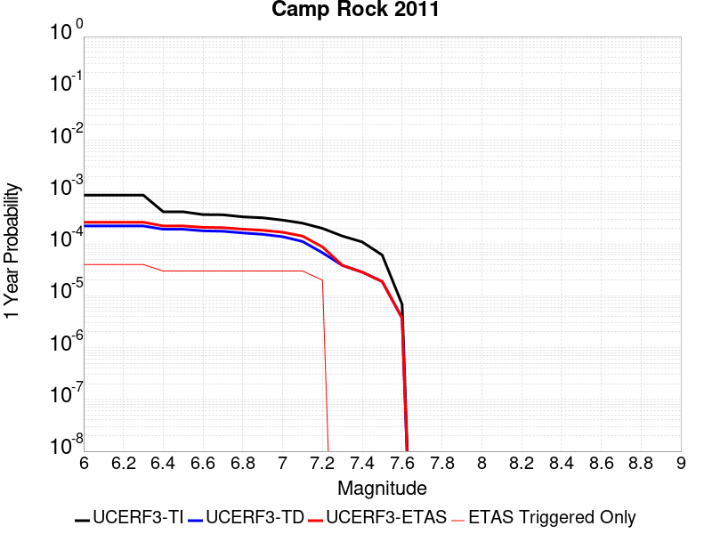 |  |

| Magnitude | 1 wk TI Prob | 1 wk TD Prob | 1 wk ETAS Prob | 1 wk ETAS/TD Gain | 1 wk ETAS Triggered Only | 1 mo TI Prob | 1 mo TD Prob | 1 mo ETAS Prob | 1 mo ETAS/TD Gain | 1 mo ETAS Triggered Only | 1 yr TI Prob | 1 yr TD Prob | 1 yr ETAS Prob | 1 yr ETAS/TD Gain | 1 yr ETAS Triggered Only | 10 yr TI Prob | 10 yr TD Prob | 10 yr ETAS Prob | 10 yr ETAS/TD Gain | 10 yr ETAS Triggered Only |
|-----|-----|-----|-----|-----|-----|-----|-----|-----|-----|-----|-----|-----|-----|-----|-----|-----|-----|-----|-----|-----|
| 6.0 | 1.6710783E-5 | 4.249999E-6 | 3.424987E-5 | 8.058795 | 3.0E-5 | 7.161568E-5 | 1.8214158E-5 | 4.8213613E-5 | 2.6470404 | 3.0E-5 | 8.7157206E-4 | 2.2173533E-4 | 2.6172647E-4 | 1.1803552 | 4.0E-5 | 0.008681616 | 0.0022151938 | 0.0023449059 | 1.0585556 | 1.3E-4 |
| 6.1 | 1.6710783E-5 | 4.249999E-6 | 3.424987E-5 | 8.058795 | 3.0E-5 | 7.161568E-5 | 1.8214158E-5 | 4.8213613E-5 | 2.6470404 | 3.0E-5 | 8.7157206E-4 | 2.2173533E-4 | 2.6172647E-4 | 1.1803552 | 4.0E-5 | 0.008681616 | 0.0022151938 | 0.0023449059 | 1.0585556 | 1.3E-4 |
| 6.2 | 1.6710783E-5 | 4.249999E-6 | 3.424987E-5 | 8.058795 | 3.0E-5 | 7.161568E-5 | 1.8214158E-5 | 4.8213613E-5 | 2.6470404 | 3.0E-5 | 8.7157206E-4 | 2.2173533E-4 | 2.6172647E-4 | 1.1803552 | 4.0E-5 | 0.008681616 | 0.0022151938 | 0.0023449059 | 1.0585556 | 1.3E-4 |
| 6.3 | 1.6710783E-5 | 4.249999E-6 | 3.424987E-5 | 8.058795 | 3.0E-5 | 7.161568E-5 | 1.8214158E-5 | 4.8213613E-5 | 2.6470404 | 3.0E-5 | 8.7157206E-4 | 2.2173533E-4 | 2.6172647E-4 | 1.1803552 | 4.0E-5 | 0.008681616 | 0.0022151938 | 0.0023449059 | 1.0585556 | 1.3E-4 |
| 6.4 | 7.982846E-6 | 3.6820359E-6 | 2.3681961E-5 | 6.4317575 | 2.0E-5 | 3.421175E-5 | 1.578006E-5 | 3.5779743E-5 | 2.2674022 | 2.0E-5 | 4.1644843E-4 | 1.9210564E-4 | 2.2209987E-4 | 1.1561341 | 3.0E-5 | 0.0041566887 | 0.0019194306 | 0.0020392004 | 1.0623986 | 1.2E-4 |
| 6.5 | 7.982846E-6 | 3.6820359E-6 | 2.3681961E-5 | 6.4317575 | 2.0E-5 | 3.421175E-5 | 1.578006E-5 | 3.5779743E-5 | 2.2674022 | 2.0E-5 | 4.1644843E-4 | 1.9210564E-4 | 2.2209987E-4 | 1.1561341 | 3.0E-5 | 0.0041566887 | 0.0019194306 | 0.0020392004 | 1.0623986 | 1.2E-4 |
| 6.6 | 7.048869E-6 | 3.4242998E-6 | 2.342423E-5 | 6.84059 | 2.0E-5 | 3.0209088E-5 | 1.467549E-5 | 3.4675195E-5 | 2.3627965 | 2.0E-5 | 3.677336E-4 | 1.7865976E-4 | 2.086544E-4 | 1.167887 | 3.0E-5 | 0.0036712566 | 0.0017851929 | 0.0019049786 | 1.0670996 | 1.2E-4 |
| 6.7 | 6.987307E-6 | 3.3622775E-6 | 2.336221E-5 | 6.948329 | 2.0E-5 | 2.9945259E-5 | 1.4409683E-5 | 3.4409393E-5 | 2.3879356 | 2.0E-5 | 3.6452254E-4 | 1.7542407E-4 | 2.0541881E-4 | 1.1709841 | 3.0E-5 | 0.0036392517 | 0.0017528872 | 0.0018726768 | 1.0683385 | 1.2E-4 |
| 6.8 | 6.3737602E-6 | 3.1178672E-6 | 2.3117806E-5 | 7.4146214 | 2.0E-5 | 2.731583E-5 | 1.3362222E-5 | 3.3361954E-5 | 2.496737 | 2.0E-5 | 3.3251947E-4 | 1.6267318E-4 | 1.926683E-4 | 1.1843889 | 3.0E-5 | 0.0033202237 | 0.0016255698 | 0.0017453746 | 1.0737003 | 1.2E-4 |
| 6.9 | 6.112211E-6 | 2.933078E-6 | 2.293302E-5 | 7.818755 | 2.0E-5 | 2.6194928E-5 | 1.2570275E-5 | 3.2570024E-5 | 2.5910351 | 2.0E-5 | 3.1887658E-4 | 1.5303263E-4 | 1.8302804E-4 | 1.1960067 | 3.0E-5 | 0.003184194 | 0.0015293002 | 0.0016491167 | 1.0783472 | 1.2E-4 |
| 7.0 | 5.5140117E-6 | 2.64191E-6 | 2.2641858E-5 | 8.570261 | 2.0E-5 | 2.3631264E-5 | 1.1322423E-5 | 3.1322197E-5 | 2.7663863 | 2.0E-5 | 2.8767265E-4 | 1.3784204E-4 | 1.678379E-4 | 1.2176105 | 3.0E-5 | 0.0028730053 | 0.0013775907 | 0.0014874391 | 1.0797396 | 1.1E-4 |
| 7.1 | 4.8151105E-6 | 2.1342612E-6 | 2.2134218E-5 | 10.370905 | 2.0E-5 | 2.0636026E-5 | 9.146803E-6 | 2.914662E-5 | 3.1865366 | 2.0E-5 | 2.5121463E-4 | 1.1135685E-4 | 1.413535E-4 | 1.2693741 | 3.0E-5 | 0.0025093083 | 0.0011130325 | 0.00122291 | 1.0987191 | 1.1E-4 |
| 7.2 | 3.818335E-6 | 1.2937372E-6 | 1.1293724E-5 | 8.729535 | 1.0E-5 | 1.6364189E-5 | 5.5445767E-6 | 1.5544521E-5 | 2.803554 | 1.0E-5 | 1.9921579E-4 | 6.750321E-5 | 8.750187E-5 | 1.2962621 | 2.0E-5 | 0.0019903728 | 6.7483535E-4 | 7.447881E-4 | 1.103659 | 7.0E-5 |
| 7.3 | 2.7166698E-6 | 7.383078E-7 | 7.383078E-7 | 1.0 | 0.0 | 1.1642818E-5 | 3.1641725E-6 | 3.1641725E-6 | 1.0 | 0.0 | 1.4174209E-4 | 3.852314E-5 | 3.852314E-5 | 1.0 | 0.0 | 0.0014165172 | 3.8516664E-4 | 4.1515508E-4 | 1.0778583 | 3.0E-5 |
| 7.4 | 2.0893426E-6 | 5.4614605E-7 | 5.4614605E-7 | 1.0 | 0.0 | 8.954295E-6 | 2.340624E-6 | 2.340624E-6 | 1.0 | 0.0 | 1.0901308E-4 | 2.8496728E-5 | 2.8496728E-5 | 1.0 | 0.0 | 0.0010895962 | 2.849313E-4 | 2.9492844E-4 | 1.0350862 | 1.0E-5 |
| 7.5 | 1.1681728E-6 | 3.6028484E-7 | 3.6028484E-7 | 1.0 | 0.0 | 5.0064455E-6 | 1.544077E-6 | 1.544077E-6 | 1.0 | 0.0 | 6.0951766E-5 | 1.879898E-5 | 1.879898E-5 | 1.0 | 0.0 | 6.093505E-4 | 1.8797436E-4 | 1.8797436E-4 | 1.0 | 0.0 |
| 7.6 | 1.3154387E-7 | 7.1196716E-8 | 7.1196716E-8 | 1.0 | 0.0 | 5.6375933E-7 | 3.0512876E-7 | 3.0512876E-7 | 1.0 | 0.0 | 6.863748E-6 | 3.714938E-6 | 3.714938E-6 | 1.0 | 0.0 | 6.863536E-5 | 3.7148915E-5 | 3.7148915E-5 | 1.0 | 0.0 |

## Channel Islands Thrust
*[(top)](#table-of-contents)*

| 1 Week | 1 Month | 1 Year | 10 Year |
|-----|-----|-----|-----|
|  |  |  |  |

| Magnitude | 1 wk TI Prob | 1 wk TD Prob | 1 wk ETAS Prob | 1 wk ETAS/TD Gain | 1 wk ETAS Triggered Only | 1 mo TI Prob | 1 mo TD Prob | 1 mo ETAS Prob | 1 mo ETAS/TD Gain | 1 mo ETAS Triggered Only | 1 yr TI Prob | 1 yr TD Prob | 1 yr ETAS Prob | 1 yr ETAS/TD Gain | 1 yr ETAS Triggered Only | 10 yr TI Prob | 10 yr TD Prob | 10 yr ETAS Prob | 10 yr ETAS/TD Gain | 10 yr ETAS Triggered Only |
|-----|-----|-----|-----|-----|-----|-----|-----|-----|-----|-----|-----|-----|-----|-----|-----|-----|-----|-----|-----|-----|
| 6.0 | 2.2156251E-5 | 2.4092022E-5 | 4.409154E-5 | 1.8301303 | 2.0E-5 | 9.495191E-5 | 1.03248036E-4 | 1.3324495E-4 | 1.2905325 | 3.0E-5 | 0.0011554264 | 0.0012564266 | 0.0013063637 | 1.0397455 | 5.0E-5 | 0.011494373 | 0.0125038205 | 0.012612445 | 1.0086873 | 1.1E-4 |
| 6.1 | 2.2156251E-5 | 2.4092022E-5 | 4.409154E-5 | 1.8301303 | 2.0E-5 | 9.495191E-5 | 1.03248036E-4 | 1.3324495E-4 | 1.2905325 | 3.0E-5 | 0.0011554264 | 0.0012564266 | 0.0013063637 | 1.0397455 | 5.0E-5 | 0.011494373 | 0.0125038205 | 0.012612445 | 1.0086873 | 1.1E-4 |
| 6.2 | 2.2156251E-5 | 2.4092022E-5 | 4.409154E-5 | 1.8301303 | 2.0E-5 | 9.495191E-5 | 1.03248036E-4 | 1.3324495E-4 | 1.2905325 | 3.0E-5 | 0.0011554264 | 0.0012564266 | 0.0013063637 | 1.0397455 | 5.0E-5 | 0.011494373 | 0.0125038205 | 0.012612445 | 1.0086873 | 1.1E-4 |
| 6.3 | 2.2156251E-5 | 2.4092022E-5 | 4.409154E-5 | 1.8301303 | 2.0E-5 | 9.495191E-5 | 1.03248036E-4 | 1.3324495E-4 | 1.2905325 | 3.0E-5 | 0.0011554264 | 0.0012564266 | 0.0013063637 | 1.0397455 | 5.0E-5 | 0.011494373 | 0.0125038205 | 0.012612445 | 1.0086873 | 1.1E-4 |
| 6.4 | 2.2156251E-5 | 2.4092022E-5 | 4.409154E-5 | 1.8301303 | 2.0E-5 | 9.495191E-5 | 1.03248036E-4 | 1.3324495E-4 | 1.2905325 | 3.0E-5 | 0.0011554264 | 0.0012564266 | 0.0013063637 | 1.0397455 | 5.0E-5 | 0.011494373 | 0.0125038205 | 0.012612445 | 1.0086873 | 1.1E-4 |
| 6.5 | 2.2156251E-5 | 2.4092022E-5 | 4.409154E-5 | 1.8301303 | 2.0E-5 | 9.495191E-5 | 1.03248036E-4 | 1.3324495E-4 | 1.2905325 | 3.0E-5 | 0.0011554264 | 0.0012564266 | 0.0013063637 | 1.0397455 | 5.0E-5 | 0.011494373 | 0.0125038205 | 0.012612445 | 1.0086873 | 1.1E-4 |
| 6.6 | 2.2156251E-5 | 2.4092022E-5 | 4.409154E-5 | 1.8301303 | 2.0E-5 | 9.495191E-5 | 1.03248036E-4 | 1.3324495E-4 | 1.2905325 | 3.0E-5 | 0.0011554264 | 0.0012564266 | 0.0013063637 | 1.0397455 | 5.0E-5 | 0.011494373 | 0.0125038205 | 0.012612445 | 1.0086873 | 1.1E-4 |
| 6.7 | 1.0601296E-5 | 1.1379544E-5 | 2.137943E-5 | 1.8787599 | 1.0E-5 | 4.5433335E-5 | 4.876859E-5 | 6.8767615E-5 | 1.4100801 | 2.0E-5 | 5.5301044E-4 | 5.936007E-4 | 6.3357694E-4 | 1.0673454 | 4.0E-5 | 0.005516363 | 0.005920653 | 0.005990239 | 1.011753 | 7.0E-5 |
| 6.8 | 1.0246747E-5 | 1.0996669E-5 | 2.0996558E-5 | 1.9093562 | 1.0E-5 | 4.391389E-5 | 4.7127756E-5 | 6.712681E-5 | 1.4243584 | 2.0E-5 | 5.345204E-4 | 5.7363417E-4 | 6.1361125E-4 | 1.0696908 | 4.0E-5 | 0.0053323656 | 0.005722025 | 0.0057916245 | 1.0121634 | 7.0E-5 |
| 6.9 | 9.049551E-6 | 9.699645E-6 | 1.9699548E-5 | 2.0309556 | 1.0E-5 | 3.878322E-5 | 4.1569267E-5 | 6.156843E-5 | 1.4811047 | 2.0E-5 | 4.7208337E-4 | 5.059924E-4 | 5.4597214E-4 | 1.0790125 | 4.0E-5 | 0.0047108172 | 0.0050488203 | 0.005118467 | 1.0137947 | 7.0E-5 |
| 7.0 | 8.6542195E-6 | 9.274603E-6 | 1.927451E-5 | 2.0782032 | 1.0E-5 | 3.7088983E-5 | 3.9747716E-5 | 5.9746922E-5 | 1.5031536 | 2.0E-5 | 4.5146482E-4 | 4.8382508E-4 | 5.2380573E-4 | 1.0826344 | 4.0E-5 | 0.004505487 | 0.0048281294 | 0.0048977914 | 1.0144284 | 7.0E-5 |
| 7.1 | 8.391028E-6 | 8.992925E-6 | 1.8992836E-5 | 2.1119752 | 1.0E-5 | 3.5961057E-5 | 3.8540562E-5 | 5.853979E-5 | 1.5189139 | 2.0E-5 | 4.3773788E-4 | 4.6913436E-4 | 5.0911563E-4 | 1.0852234 | 4.0E-5 | 0.004368766 | 0.0046818503 | 0.0047515226 | 1.0148814 | 7.0E-5 |
| 7.2 | 5.965188E-6 | 6.3716957E-6 | 1.6371632E-5 | 2.569431 | 1.0E-5 | 2.556484E-5 | 2.7306984E-5 | 4.730644E-5 | 1.7323934 | 2.0E-5 | 3.1120746E-4 | 3.3241237E-4 | 3.6240238E-4 | 1.0902194 | 3.0E-5 | 0.00310772 | 0.0033192094 | 0.0033491098 | 1.0090083 | 3.0E-5 |
| 7.3 | 4.877518E-6 | 5.206007E-6 | 1.5205955E-5 | 2.9208481 | 1.0E-5 | 2.0903482E-5 | 2.231127E-5 | 4.231082E-5 | 1.896388 | 2.0E-5 | 2.5447016E-4 | 2.716063E-4 | 3.0159813E-4 | 1.110424 | 3.0E-5 | 0.0025417898 | 0.0027127897 | 0.0027427082 | 1.0110288 | 3.0E-5 |
| 7.4 | 3.8829853E-6 | 4.141863E-6 | 1.4141821E-5 | 3.4143624 | 1.0E-5 | 1.664126E-5 | 1.7750723E-5 | 3.7750367E-5 | 2.1266947 | 2.0E-5 | 2.0258849E-4 | 2.1609403E-4 | 2.4608755E-4 | 1.1387985 | 3.0E-5 | 0.002024039 | 0.002158881 | 0.002188816 | 1.0138661 | 3.0E-5 |
| 7.5 | 1.3489616E-6 | 1.4277905E-6 | 1.4277905E-6 | 1.0 | 0.0 | 5.7812517E-6 | 6.119088E-6 | 6.119088E-6 | 1.0 | 0.0 | 7.038446E-5 | 7.449739E-5 | 7.449739E-5 | 1.0 | 0.0 | 7.036218E-4 | 7.4472814E-4 | 7.4472814E-4 | 1.0 | 0.0 |
| 7.6 | 6.058192E-7 | 6.35378E-7 | 6.35378E-7 | 1.0 | 0.0 | 2.5963652E-6 | 2.7230458E-6 | 2.7230458E-6 | 1.0 | 0.0 | 3.161029E-5 | 3.3152595E-5 | 3.3152595E-5 | 1.0 | 0.0 | 3.1605794E-4 | 3.314781E-4 | 3.314781E-4 | 1.0 | 0.0 |
| 7.7 | 2.2170494E-7 | 2.2607924E-7 | 2.2607924E-7 | 1.0 | 0.0 | 9.5016367E-7 | 9.689107E-7 | 9.689107E-7 | 1.0 | 0.0 | 1.1568181E-5 | 1.17964355E-5 | 1.17964355E-5 | 1.0 | 0.0 | 1.1567579E-4 | 1.179592E-4 | 1.179592E-4 | 1.0 | 0.0 |
| 7.8 | 2.1613102E-8 | 1.5466837E-8 | 1.5466837E-8 | 1.0 | 0.0 | 9.262757E-8 | 6.628645E-8 | 6.628645E-8 | 1.0 | 0.0 | 1.1277401E-6 | 8.070372E-7 | 8.070372E-7 | 1.0 | 0.0 | 1.1277344E-5 | 8.07035E-6 | 8.07035E-6 | 1.0 | 0.0 |

## San Diego Trough north alt1
*[(top)](#table-of-contents)*

| 1 Week | 1 Month | 1 Year | 10 Year |
|-----|-----|-----|-----|
| 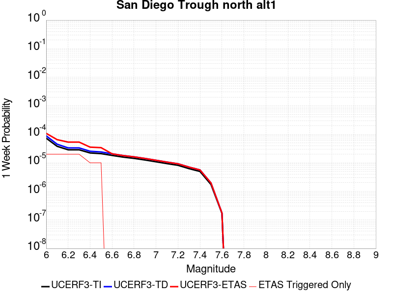 |  |  |  |

| Magnitude | 1 wk TI Prob | 1 wk TD Prob | 1 wk ETAS Prob | 1 wk ETAS/TD Gain | 1 wk ETAS Triggered Only | 1 mo TI Prob | 1 mo TD Prob | 1 mo ETAS Prob | 1 mo ETAS/TD Gain | 1 mo ETAS Triggered Only | 1 yr TI Prob | 1 yr TD Prob | 1 yr ETAS Prob | 1 yr ETAS/TD Gain | 1 yr ETAS Triggered Only | 10 yr TI Prob | 10 yr TD Prob | 10 yr ETAS Prob | 10 yr ETAS/TD Gain | 10 yr ETAS Triggered Only |
|-----|-----|-----|-----|-----|-----|-----|-----|-----|-----|-----|-----|-----|-----|-----|-----|-----|-----|-----|-----|-----|
| 6.0 | 7.329252E-5 | 8.821269E-5 | 1.0821093E-4 | 1.2267047 | 2.0E-5 | 3.14073E-4 | 3.7800326E-4 | 4.0799193E-4 | 1.0793344 | 3.0E-5 | 0.0038171355 | 0.0045930487 | 0.004662727 | 1.0151705 | 7.0E-5 | 0.03752231 | 0.045045137 | 0.045150183 | 1.002332 | 1.1E-4 |
| 6.1 | 3.7940346E-5 | 4.4884906E-5 | 6.488401E-5 | 1.445564 | 2.0E-5 | 1.6259136E-4 | 1.9235026E-4 | 2.1234641E-4 | 1.1039569 | 2.0E-5 | 0.0019777524 | 0.002339431 | 0.0023693608 | 1.0127937 | 3.0E-5 | 0.019602431 | 0.023156732 | 0.023195807 | 1.0016874 | 4.0E-5 |
| 6.2 | 2.8645263E-5 | 3.329672E-5 | 5.3296055E-5 | 1.6006397 | 2.0E-5 | 1.2275964E-4 | 1.4269259E-4 | 1.6268973E-4 | 1.1401415 | 2.0E-5 | 0.0014935739 | 0.0017359206 | 0.0017658685 | 1.0172518 | 3.0E-5 | 0.0148357535 | 0.017226268 | 0.017265579 | 1.002282 | 4.0E-5 |
| 6.3 | 2.8645263E-5 | 3.329672E-5 | 5.3296055E-5 | 1.6006397 | 2.0E-5 | 1.2275964E-4 | 1.4269259E-4 | 1.6268973E-4 | 1.1401415 | 2.0E-5 | 0.0014935739 | 0.0017359206 | 0.0017658685 | 1.0172518 | 3.0E-5 | 0.0148357535 | 0.017226268 | 0.017265579 | 1.002282 | 4.0E-5 |
| 6.4 | 2.2204576E-5 | 2.544832E-5 | 3.5448065E-5 | 1.3929433 | 1.0E-5 | 9.5159E-5 | 1.0905972E-4 | 1.1905863E-4 | 1.0916829 | 1.0E-5 | 0.001157945 | 0.0013270028 | 0.0013469763 | 1.0150516 | 2.0E-5 | 0.011519298 | 0.013191959 | 0.013221563 | 1.0022441 | 3.0E-5 |
| 6.5 | 2.1004838E-5 | 2.4024695E-5 | 3.4024455E-5 | 1.4162284 | 1.0E-5 | 9.0017624E-5 | 1.0295897E-4 | 1.1295794E-4 | 1.0971161 | 1.0E-5 | 0.0010954136 | 0.0012528135 | 0.001262801 | 1.007972 | 1.0E-5 | 0.010900296 | 0.012458592 | 0.0124684675 | 1.0007926 | 1.0E-5 |
| 6.6 | 1.820557E-5 | 2.070479E-5 | 2.070479E-5 | 1.0 | 0.0 | 7.802154E-5 | 8.8731824E-5 | 8.8731824E-5 | 1.0 | 0.0 | 9.4949827E-4 | 0.0010797799 | 0.0010797799 | 1.0 | 0.0 | 0.009454516 | 0.010746005 | 0.010746005 | 1.0 | 0.0 |
| 6.7 | 1.5884485E-5 | 1.7983646E-5 | 1.7983646E-5 | 1.0 | 0.0 | 6.807459E-5 | 7.707051E-5 | 7.707051E-5 | 1.0 | 0.0 | 8.284929E-4 | 9.3793223E-4 | 9.3793223E-4 | 1.0 | 0.0 | 0.008254109 | 0.009340104 | 0.009340104 | 1.0 | 0.0 |
| 6.8 | 1.4331171E-5 | 1.6201066E-5 | 1.6201066E-5 | 1.0 | 0.0 | 6.141786E-5 | 6.94313E-5 | 6.94313E-5 | 1.0 | 0.0 | 7.4750587E-4 | 8.450002E-4 | 8.450002E-4 | 1.0 | 0.0 | 0.0074499645 | 0.008418139 | 0.008418139 | 1.0 | 0.0 |
| 6.9 | 1.2574203E-5 | 1.4205835E-5 | 1.4205835E-5 | 1.0 | 0.0 | 5.3888325E-5 | 6.0880735E-5 | 6.0880735E-5 | 1.0 | 0.0 | 6.558929E-4 | 7.409723E-4 | 7.409723E-4 | 1.0 | 0.0 | 0.0065396037 | 0.007385203 | 0.007385203 | 1.0 | 0.0 |
| 7.0 | 1.0883844E-5 | 1.2289262E-5 | 1.2289262E-5 | 1.0 | 0.0 | 4.664421E-5 | 5.2667205E-5 | 5.2667205E-5 | 1.0 | 0.0 | 5.677453E-4 | 6.4103556E-4 | 6.4103556E-4 | 1.0 | 0.0 | 0.00566297 | 0.006391993 | 0.006391993 | 1.0 | 0.0 |
| 7.1 | 9.393088E-6 | 1.060702E-5 | 1.060702E-5 | 1.0 | 0.0 | 4.025547E-5 | 4.545787E-5 | 4.545787E-5 | 1.0 | 0.0 | 4.900001E-4 | 5.533098E-4 | 5.533098E-4 | 1.0 | 0.0 | 0.0048892107 | 0.005519418 | 0.005519418 | 1.0 | 0.0 |
| 7.2 | 8.190791E-6 | 9.258625E-6 | 9.258625E-6 | 1.0 | 0.0 | 3.510292E-5 | 3.9679224E-5 | 3.9679224E-5 | 1.0 | 0.0 | 4.2729423E-4 | 4.8298817E-4 | 4.8298817E-4 | 1.0 | 0.0 | 0.0042647356 | 0.004819465 | 0.004819465 | 1.0 | 0.0 |
| 7.3 | 6.268162E-6 | 7.089716E-6 | 7.089716E-6 | 1.0 | 0.0 | 2.6863276E-5 | 3.0384144E-5 | 3.0384144E-5 | 1.0 | 0.0 | 3.2701128E-4 | 3.6986457E-4 | 3.6986457E-4 | 1.0 | 0.0 | 0.003265305 | 0.003692536 | 0.003692536 | 1.0 | 0.0 |
| 7.4 | 4.985186E-6 | 5.6426816E-6 | 5.6426816E-6 | 1.0 | 0.0 | 2.1364907E-5 | 2.4182698E-5 | 2.4182698E-5 | 1.0 | 0.0 | 2.600867E-4 | 2.9438498E-4 | 2.9438498E-4 | 1.0 | 0.0 | 0.002597825 | 0.0029399914 | 0.0029399914 | 1.0 | 0.0 |
| 7.5 | 1.7489613E-6 | 1.969678E-6 | 1.969678E-6 | 1.0 | 0.0 | 7.495527E-6 | 8.4414505E-6 | 8.4414505E-6 | 1.0 | 0.0 | 9.125422E-5 | 1.02770035E-4 | 1.02770035E-4 | 1.0 | 0.0 | 9.1216754E-4 | 0.0010272472 | 0.0010272472 | 1.0 | 0.0 |
| 7.6 | 1.6988751E-7 | 1.7533823E-7 | 1.7533823E-7 | 1.0 | 0.0 | 7.2808916E-7 | 7.5144936E-7 | 7.5144936E-7 | 1.0 | 0.0 | 8.864449E-6 | 9.14886E-6 | 9.14886E-6 | 1.0 | 0.0 | 8.8640954E-5 | 9.1485024E-5 | 9.1485024E-5 | 1.0 | 0.0 |

## White Mountains
*[(top)](#table-of-contents)*

| 1 Week | 1 Month | 1 Year | 10 Year |
|-----|-----|-----|-----|
| 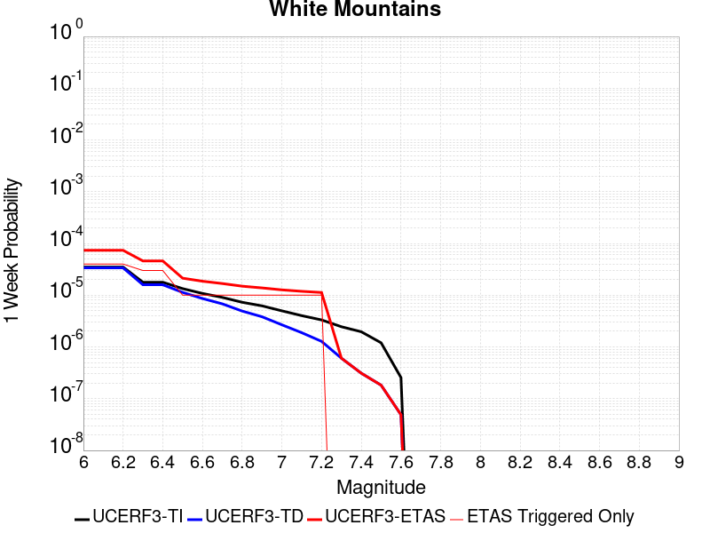 |  | 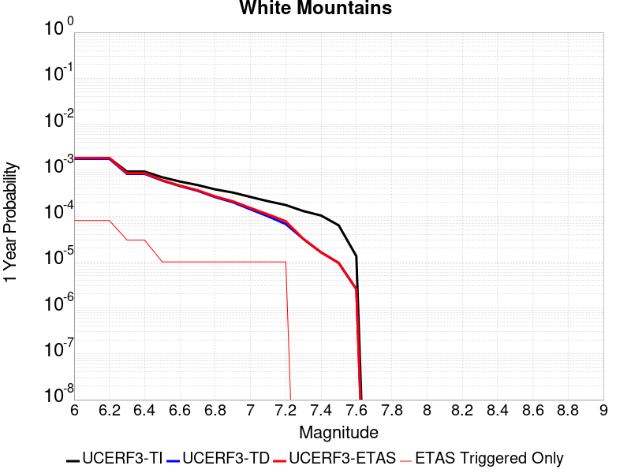 | 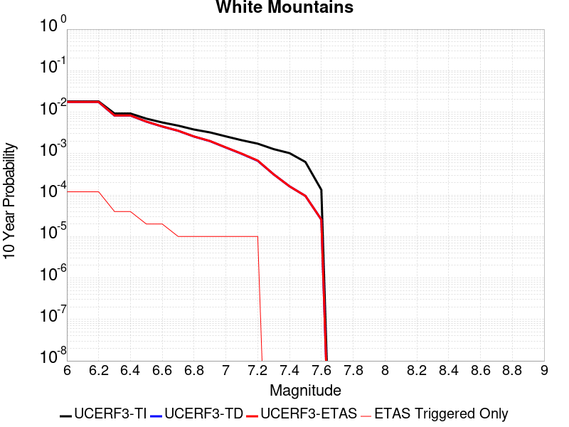 |

| Magnitude | 1 wk TI Prob | 1 wk TD Prob | 1 wk ETAS Prob | 1 wk ETAS/TD Gain | 1 wk ETAS Triggered Only | 1 mo TI Prob | 1 mo TD Prob | 1 mo ETAS Prob | 1 mo ETAS/TD Gain | 1 mo ETAS Triggered Only | 1 yr TI Prob | 1 yr TD Prob | 1 yr ETAS Prob | 1 yr ETAS/TD Gain | 1 yr ETAS Triggered Only | 10 yr TI Prob | 10 yr TD Prob | 10 yr ETAS Prob | 10 yr ETAS/TD Gain | 10 yr ETAS Triggered Only |
|-----|-----|-----|-----|-----|-----|-----|-----|-----|-----|-----|-----|-----|-----|-----|-----|-----|-----|-----|-----|-----|
| 6.0 | 3.503579E-5 | 3.3784127E-5 | 7.378277E-5 | 2.183948 | 4.0E-5 | 1.5014476E-4 | 1.4478175E-4 | 2.0477307E-4 | 1.4143568 | 6.0E-5 | 0.0018264796 | 0.0017614134 | 0.0018412725 | 1.045338 | 8.0E-5 | 0.018115403 | 0.017486857 | 0.017604759 | 1.0067422 | 1.2E-4 |
| 6.1 | 3.503579E-5 | 3.3784127E-5 | 7.378277E-5 | 2.183948 | 4.0E-5 | 1.5014476E-4 | 1.4478175E-4 | 2.0477307E-4 | 1.4143568 | 6.0E-5 | 0.0018264796 | 0.0017614134 | 0.0018412725 | 1.045338 | 8.0E-5 | 0.018115403 | 0.017486857 | 0.017604759 | 1.0067422 | 1.2E-4 |
| 6.2 | 3.503579E-5 | 3.3784127E-5 | 7.378277E-5 | 2.183948 | 4.0E-5 | 1.5014476E-4 | 1.4478175E-4 | 2.0477307E-4 | 1.4143568 | 6.0E-5 | 0.0018264796 | 0.0017614134 | 0.0018412725 | 1.045338 | 8.0E-5 | 0.018115403 | 0.017486857 | 0.017604759 | 1.0067422 | 1.2E-4 |
| 6.3 | 1.7818425E-5 | 1.591616E-5 | 4.591568E-5 | 2.884847 | 3.0E-5 | 7.636245E-5 | 6.821041E-5 | 9.820836E-5 | 1.4397856 | 3.0E-5 | 9.293162E-4 | 8.301596E-4 | 8.6013466E-4 | 1.0361077 | 3.0E-5 | 0.009254395 | 0.0082720425 | 0.008311712 | 1.0047956 | 4.0E-5 |
| 6.4 | 1.7818425E-5 | 1.591616E-5 | 4.591568E-5 | 2.884847 | 3.0E-5 | 7.636245E-5 | 6.821041E-5 | 9.820836E-5 | 1.4397856 | 3.0E-5 | 9.293162E-4 | 8.301596E-4 | 8.6013466E-4 | 1.0361077 | 3.0E-5 | 0.009254395 | 0.0082720425 | 0.008311712 | 1.0047956 | 4.0E-5 |
| 6.5 | 1.3397557E-5 | 1.1336374E-5 | 2.133626E-5 | 1.8821063 | 1.0E-5 | 5.741684E-5 | 4.8583595E-5 | 5.8583108E-5 | 1.2058208 | 1.0E-5 | 6.988258E-4 | 5.913517E-4 | 6.013458E-4 | 1.0169004 | 1.0E-5 | 0.006966323 | 0.005898487 | 0.0059183687 | 1.0033706 | 2.0E-5 |
| 6.6 | 1.0818695E-5 | 8.625434E-6 | 1.8625347E-5 | 2.1593518 | 1.0E-5 | 4.6365014E-5 | 3.6965648E-5 | 4.6965277E-5 | 1.2705114 | 1.0E-5 | 5.6434784E-4 | 4.4996818E-4 | 4.5996366E-4 | 1.0222138 | 1.0E-5 | 0.005629168 | 0.0044910074 | 0.0045109177 | 1.0044334 | 2.0E-5 |
| 6.7 | 9.067908E-6 | 6.802476E-6 | 1.6802407E-5 | 2.470043 | 1.0E-5 | 3.8861883E-5 | 2.915316E-5 | 3.915287E-5 | 1.343006 | 1.0E-5 | 4.7304068E-4 | 3.548851E-4 | 3.6488156E-4 | 1.0281681 | 1.0E-5 | 0.00472035 | 0.003543501 | 0.0035534655 | 1.002812 | 1.0E-5 |
| 6.8 | 7.295947E-6 | 4.9364285E-6 | 1.4936379E-5 | 3.025746 | 1.0E-5 | 3.126797E-5 | 2.1155956E-5 | 3.1155745E-5 | 1.4726701 | 1.0E-5 | 3.8062103E-4 | 2.5754445E-4 | 2.6754188E-4 | 1.0388182 | 1.0E-5 | 0.0037996976 | 0.0025725728 | 0.002582547 | 1.0038772 | 1.0E-5 |
| 6.9 | 6.2243444E-6 | 3.8322546E-6 | 1.3832216E-5 | 3.60942 | 1.0E-5 | 2.6675489E-5 | 1.6423846E-5 | 2.6423682E-5 | 1.6088607 | 1.0E-5 | 3.2472567E-4 | 1.9994251E-4 | 2.0994052E-4 | 1.0500044 | 1.0E-5 | 0.0032425157 | 0.001997679 | 0.002007659 | 1.0049958 | 1.0E-5 |
| 7.0 | 4.9878413E-6 | 2.679564E-6 | 1.2679538E-5 | 4.7319403 | 1.0E-5 | 2.1376287E-5 | 1.1483797E-5 | 2.1483682E-5 | 1.8707821 | 1.0E-5 | 2.602252E-4 | 1.3980652E-4 | 1.4980511E-4 | 1.0715175 | 1.0E-5 | 0.002599207 | 0.0013972119 | 0.0014071979 | 1.0071471 | 1.0E-5 |
| 7.1 | 4.0252844E-6 | 1.885702E-6 | 1.1885683E-5 | 6.303055 | 1.0E-5 | 1.7251105E-5 | 8.081555E-6 | 1.8081475E-5 | 2.2373755 | 1.0E-5 | 2.1001195E-4 | 9.838863E-5 | 1.0838764E-4 | 1.1016277 | 1.0E-5 | 0.0020981359 | 9.834635E-4 | 9.934537E-4 | 1.0101582 | 1.0E-5 |
| 7.2 | 3.3284066E-6 | 1.2818929E-6 | 1.128188E-5 | 8.800954 | 1.0E-5 | 1.4264522E-5 | 5.4938155E-6 | 1.549376E-5 | 2.8202186 | 1.0E-5 | 1.736567E-4 | 6.688525E-5 | 7.6884586E-5 | 1.1494998 | 1.0E-5 | 0.0017352107 | 6.6866126E-4 | 6.786546E-4 | 1.0149453 | 1.0E-5 |
| 7.3 | 2.458226E-6 | 6.056684E-7 | 6.056684E-7 | 1.0 | 0.0 | 1.0535211E-5 | 2.5957193E-6 | 2.5957193E-6 | 1.0 | 0.0 | 1.2825865E-4 | 3.160246E-5 | 3.160246E-5 | 1.0 | 0.0 | 0.0012818464 | 3.1598343E-4 | 3.1598343E-4 | 1.0 | 0.0 |
| 7.4 | 1.965953E-6 | 3.1084684E-7 | 3.1084684E-7 | 1.0 | 0.0 | 8.425486E-6 | 1.3322001E-6 | 1.3322001E-6 | 1.0 | 0.0 | 1.0257547E-4 | 1.6219417E-5 | 1.6219417E-5 | 1.0 | 0.0 | 0.0010252813 | 1.6218246E-4 | 1.6218246E-4 | 1.0 | 0.0 |
| 7.5 | 1.2014192E-6 | 1.8241002E-7 | 1.8241002E-7 | 1.0 | 0.0 | 5.148929E-6 | 7.8175697E-7 | 7.8175697E-7 | 1.0 | 0.0 | 6.2686406E-5 | 9.51785E-6 | 9.51785E-6 | 1.0 | 0.0 | 6.266873E-4 | 9.517451E-5 | 9.517451E-5 | 1.0 | 0.0 |
| 7.6 | 2.5612175E-7 | 4.893784E-8 | 4.893784E-8 | 1.0 | 0.0 | 1.0976642E-6 | 2.0973359E-7 | 2.0973359E-7 | 1.0 | 0.0 | 1.3363979E-5 | 2.5535037E-6 | 2.5535037E-6 | 1.0 | 0.0 | 1.3363175E-4 | 2.553478E-5 | 2.553478E-5 | 1.0 | 0.0 |

## Big Pine (East)
*[(top)](#table-of-contents)*

| 1 Week | 1 Month | 1 Year | 10 Year |
|-----|-----|-----|-----|
| 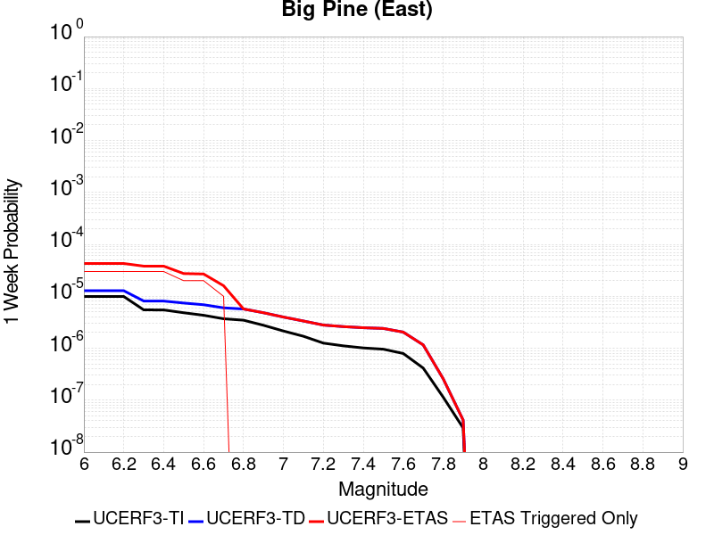 |  | 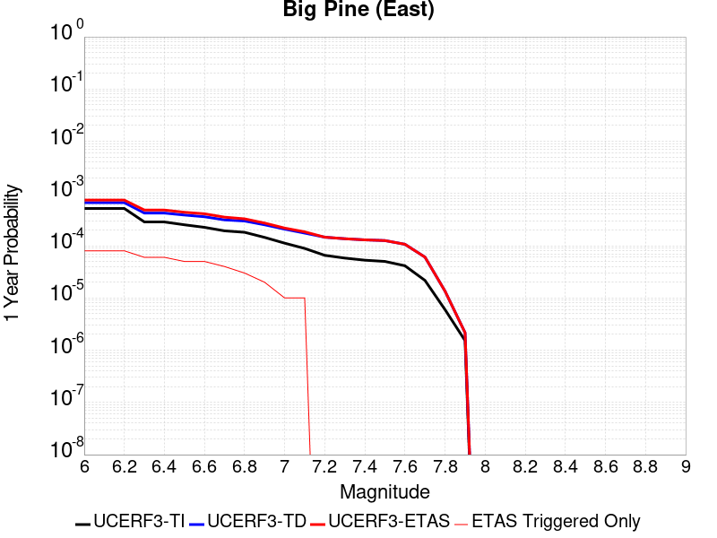 |  |

| Magnitude | 1 wk TI Prob | 1 wk TD Prob | 1 wk ETAS Prob | 1 wk ETAS/TD Gain | 1 wk ETAS Triggered Only | 1 mo TI Prob | 1 mo TD Prob | 1 mo ETAS Prob | 1 mo ETAS/TD Gain | 1 mo ETAS Triggered Only | 1 yr TI Prob | 1 yr TD Prob | 1 yr ETAS Prob | 1 yr ETAS/TD Gain | 1 yr ETAS Triggered Only | 10 yr TI Prob | 10 yr TD Prob | 10 yr ETAS Prob | 10 yr ETAS/TD Gain | 10 yr ETAS Triggered Only |
|-----|-----|-----|-----|-----|-----|-----|-----|-----|-----|-----|-----|-----|-----|-----|-----|-----|-----|-----|-----|-----|
| 6.0 | 9.916913E-6 | 1.28172705E-5 | 4.2816886E-5 | 3.3405619 | 3.0E-5 | 4.250036E-5 | 5.493013E-5 | 8.492848E-5 | 1.5461184 | 3.0E-5 | 5.173191E-4 | 6.685912E-4 | 7.485377E-4 | 1.1195745 | 8.0E-5 | 0.0051611643 | 0.006670449 | 0.0067896484 | 1.0178698 | 1.2E-4 |
| 6.1 | 9.916913E-6 | 1.28172705E-5 | 4.2816886E-5 | 3.3405619 | 3.0E-5 | 4.250036E-5 | 5.493013E-5 | 8.492848E-5 | 1.5461184 | 3.0E-5 | 5.173191E-4 | 6.685912E-4 | 7.485377E-4 | 1.1195745 | 8.0E-5 | 0.0051611643 | 0.006670449 | 0.0067896484 | 1.0178698 | 1.2E-4 |
| 6.2 | 9.916913E-6 | 1.28172705E-5 | 4.2816886E-5 | 3.3405619 | 3.0E-5 | 4.250036E-5 | 5.493013E-5 | 8.492848E-5 | 1.5461184 | 3.0E-5 | 5.173191E-4 | 6.685912E-4 | 7.485377E-4 | 1.1195745 | 8.0E-5 | 0.0051611643 | 0.006670449 | 0.0067896484 | 1.0178698 | 1.2E-4 |
| 6.3 | 5.479711E-6 | 8.1132375E-6 | 3.8112994E-5 | 4.6976304 | 3.0E-5 | 2.3484265E-5 | 3.4770575E-5 | 6.4769534E-5 | 1.8627685 | 3.0E-5 | 2.858834E-4 | 4.232527E-4 | 4.832273E-4 | 1.1416993 | 6.0E-5 | 0.0028551589 | 0.0042272513 | 0.0043268288 | 1.023556 | 1.0E-4 |
| 6.4 | 5.465009E-6 | 8.0975315E-6 | 3.809729E-5 | 4.704803 | 3.0E-5 | 2.3421257E-5 | 3.4703262E-5 | 6.470222E-5 | 1.8644421 | 3.0E-5 | 2.851165E-4 | 4.2243348E-4 | 4.8240816E-4 | 1.1419742 | 6.0E-5 | 0.0028475097 | 0.00421909 | 0.0043186685 | 1.0236018 | 1.0E-4 |
| 6.5 | 4.826767E-6 | 7.4225877E-6 | 2.7422439E-5 | 3.6944582 | 2.0E-5 | 2.068598E-5 | 3.1810716E-5 | 5.1810082E-5 | 1.628699 | 2.0E-5 | 2.518227E-4 | 3.8722943E-4 | 4.3721008E-4 | 1.1290724 | 5.0E-5 | 0.0025153751 | 0.0038682907 | 0.0039579426 | 1.0231761 | 9.0E-5 |
| 6.6 | 4.3146847E-6 | 6.8825234E-6 | 2.6882386E-5 | 3.905891 | 2.0E-5 | 1.8491375E-5 | 2.949621E-5 | 4.949562E-5 | 1.6780332 | 2.0E-5 | 2.2510924E-4 | 3.5905963E-4 | 4.0904168E-4 | 1.1392026 | 5.0E-5 | 0.0022488134 | 0.0035875062 | 0.003667219 | 1.0222197 | 8.0E-5 |
| 6.7 | 3.6968106E-6 | 5.9957474E-6 | 1.5995687E-5 | 2.6678388 | 1.0E-5 | 1.5843378E-5 | 2.5695816E-5 | 3.569556E-5 | 1.3891584 | 1.0E-5 | 1.9287605E-4 | 3.128032E-4 | 3.5279067E-4 | 1.127836 | 4.0E-5 | 0.0019270873 | 0.0031262499 | 0.003196031 | 1.022321 | 7.0E-5 |
| 6.8 | 3.4671132E-6 | 5.7024477E-6 | 5.7024477E-6 | 1.0 | 0.0 | 1.4858972E-5 | 2.4438841E-5 | 2.4438841E-5 | 1.0 | 0.0 | 1.8089297E-4 | 2.9750372E-4 | 3.2749478E-4 | 1.1008091 | 3.0E-5 | 0.0018074579 | 0.0029736666 | 0.0030334883 | 1.0201172 | 6.0E-5 |
| 6.9 | 2.7686972E-6 | 4.8254797E-6 | 4.8254797E-6 | 1.0 | 0.0 | 1.1865792E-5 | 2.0680467E-5 | 2.0680467E-5 | 1.0 | 0.0 | 1.4445644E-4 | 2.5175634E-4 | 2.717513E-4 | 1.0794219 | 2.0E-5 | 0.0014436257 | 0.002517256 | 0.00256713 | 1.019813 | 5.0E-5 |
| 7.0 | 2.1472624E-6 | 3.985277E-6 | 3.985277E-6 | 1.0 | 0.0 | 9.20252E-6 | 1.707965E-5 | 1.707965E-5 | 1.0 | 0.0 | 1.12034926E-4 | 2.0792543E-4 | 2.1792336E-4 | 1.0480841 | 1.0E-5 | 0.0011197845 | 0.0020798238 | 0.0021197407 | 1.0191925 | 4.0E-5 |
| 7.1 | 1.7018335E-6 | 3.3450835E-6 | 3.3450835E-6 | 1.0 | 0.0 | 7.293552E-6 | 1.4335996E-5 | 1.4335996E-5 | 1.0 | 0.0 | 8.879537E-5 | 1.7452713E-4 | 1.8452539E-4 | 1.0572877 | 1.0E-5 | 8.87599E-4 | 0.0017463792 | 0.0017863093 | 1.0228646 | 4.0E-5 |
| 7.2 | 1.25603E-6 | 2.794679E-6 | 2.794679E-6 | 1.0 | 0.0 | 5.3829745E-6 | 1.1977142E-5 | 1.1977142E-5 | 1.0 | 0.0 | 6.553574E-5 | 1.4581217E-4 | 1.4581217E-4 | 1.0 | 0.0 | 6.551642E-4 | 0.0014596173 | 0.0014696027 | 1.0068411 | 1.0E-5 |
| 7.3 | 1.112297E-6 | 2.610519E-6 | 2.610519E-6 | 1.0 | 0.0 | 4.7669787E-6 | 1.1187892E-5 | 1.1187892E-5 | 1.0 | 0.0 | 5.803642E-5 | 1.3620428E-4 | 1.3620428E-4 | 1.0 | 0.0 | 5.802127E-4 | 0.001363502 | 0.0013734883 | 1.0073241 | 1.0E-5 |
| 7.4 | 1.0137181E-6 | 2.4836752E-6 | 2.4836752E-6 | 1.0 | 0.0 | 4.3444993E-6 | 1.064428E-5 | 1.064428E-5 | 1.0 | 0.0 | 5.2892992E-5 | 1.2958662E-4 | 1.2958662E-4 | 1.0 | 0.0 | 5.288041E-4 | 0.0012971918 | 0.0013071789 | 1.007699 | 1.0E-5 |
| 7.5 | 9.598608E-7 | 2.407328E-6 | 2.407328E-6 | 1.0 | 0.0 | 4.1136827E-6 | 1.03170805E-5 | 1.03170805E-5 | 1.0 | 0.0 | 5.0082934E-5 | 1.2560343E-4 | 1.2560343E-4 | 1.0 | 0.0 | 5.007165E-4 | 0.0012572132 | 0.0012672007 | 1.0079441 | 1.0E-5 |
| 7.6 | 7.929459E-7 | 2.0450152E-6 | 2.0450152E-6 | 1.0 | 0.0 | 3.3983351E-6 | 8.764322E-6 | 8.764322E-6 | 1.0 | 0.0 | 4.1373947E-5 | 1.0670057E-4 | 1.0670057E-4 | 1.0 | 0.0 | 4.1366243E-4 | 0.0010685825 | 0.0010785719 | 1.0093482 | 1.0E-5 |
| 7.7 | 4.155788E-7 | 1.1606729E-6 | 1.1606729E-6 | 1.0 | 0.0 | 1.7810507E-6 | 4.974303E-6 | 4.974303E-6 | 1.0 | 0.0 | 2.1684076E-5 | 6.05605E-5 | 6.05605E-5 | 1.0 | 0.0 | 2.1681961E-4 | 6.085995E-4 | 6.085995E-4 | 1.0 | 0.0 |
| 7.8 | 1.14666925E-7 | 2.592197E-7 | 2.592197E-7 | 1.0 | 0.0 | 4.914296E-7 | 1.1109411E-6 | 1.1109411E-6 | 1.0 | 0.0 | 5.9831386E-6 | 1.3525627E-5 | 1.3525627E-5 | 1.0 | 0.0 | 5.9829777E-5 | 1.3636416E-4 | 1.3636416E-4 | 1.0 | 0.0 |
| 7.9 | 2.9231824E-8 | 4.1462318E-8 | 4.1462318E-8 | 1.0 | 0.0 | 1.2527924E-7 | 1.7769564E-7 | 1.7769564E-7 | 1.0 | 0.0 | 1.5252737E-6 | 2.1634426E-6 | 2.1634426E-6 | 1.0 | 0.0 | 1.5252632E-5 | 2.197062E-5 | 2.197062E-5 | 1.0 | 0.0 |

## San Jacinto (Coyote Creek)
*[(top)](#table-of-contents)*

| 1 Week | 1 Month | 1 Year | 10 Year |
|-----|-----|-----|-----|
|  |  | 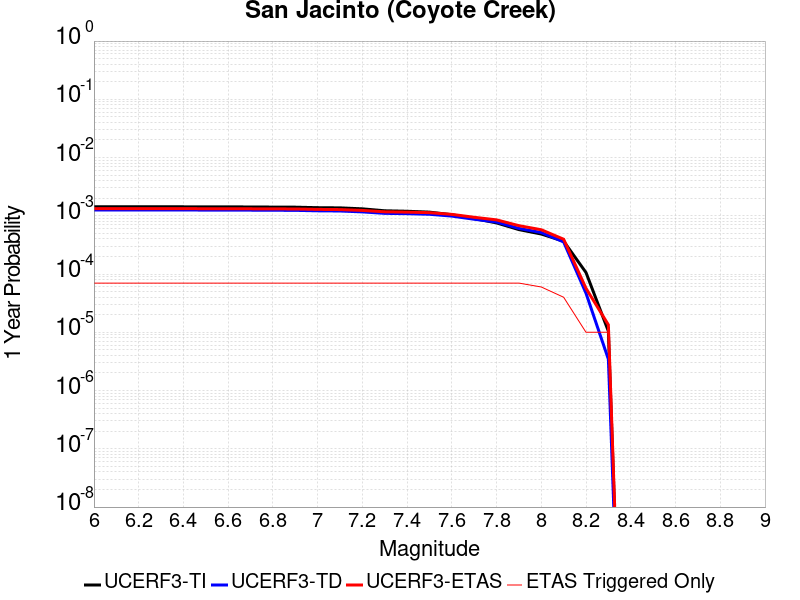 | 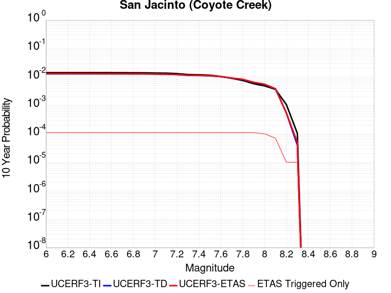 |

| Magnitude | 1 wk TI Prob | 1 wk TD Prob | 1 wk ETAS Prob | 1 wk ETAS/TD Gain | 1 wk ETAS Triggered Only | 1 mo TI Prob | 1 mo TD Prob | 1 mo ETAS Prob | 1 mo ETAS/TD Gain | 1 mo ETAS Triggered Only | 1 yr TI Prob | 1 yr TD Prob | 1 yr ETAS Prob | 1 yr ETAS/TD Gain | 1 yr ETAS Triggered Only | 10 yr TI Prob | 10 yr TD Prob | 10 yr ETAS Prob | 10 yr ETAS/TD Gain | 10 yr ETAS Triggered Only |
|-----|-----|-----|-----|-----|-----|-----|-----|-----|-----|-----|-----|-----|-----|-----|-----|-----|-----|-----|-----|-----|
| 6.0 | 2.7374346E-5 | 2.41444E-5 | 5.4143675E-5 | 2.242494 | 3.0E-5 | 1.1731335E-4 | 1.034719E-4 | 1.5346672E-4 | 1.483173 | 5.0E-5 | 0.0014273542 | 0.001259045 | 0.0013289569 | 1.0555277 | 7.0E-5 | 0.01418221 | 0.012928195 | 0.013036773 | 1.0083985 | 1.1E-4 |
| 6.1 | 2.7374346E-5 | 2.41444E-5 | 5.4143675E-5 | 2.242494 | 3.0E-5 | 1.1731335E-4 | 1.034719E-4 | 1.5346672E-4 | 1.483173 | 5.0E-5 | 0.0014273542 | 0.001259045 | 0.0013289569 | 1.0555277 | 7.0E-5 | 0.01418221 | 0.012928195 | 0.013036773 | 1.0083985 | 1.1E-4 |
| 6.2 | 2.7374346E-5 | 2.41444E-5 | 5.4143675E-5 | 2.242494 | 3.0E-5 | 1.1731335E-4 | 1.034719E-4 | 1.5346672E-4 | 1.483173 | 5.0E-5 | 0.0014273542 | 0.001259045 | 0.0013289569 | 1.0555277 | 7.0E-5 | 0.01418221 | 0.012928195 | 0.013036773 | 1.0083985 | 1.1E-4 |
| 6.3 | 2.7374346E-5 | 2.41444E-5 | 5.4143675E-5 | 2.242494 | 3.0E-5 | 1.1731335E-4 | 1.034719E-4 | 1.5346672E-4 | 1.483173 | 5.0E-5 | 0.0014273542 | 0.001259045 | 0.0013289569 | 1.0555277 | 7.0E-5 | 0.01418221 | 0.012928195 | 0.013036773 | 1.0083985 | 1.1E-4 |
| 6.4 | 2.7374346E-5 | 2.41444E-5 | 5.4143675E-5 | 2.242494 | 3.0E-5 | 1.1731335E-4 | 1.034719E-4 | 1.5346672E-4 | 1.483173 | 5.0E-5 | 0.0014273542 | 0.001259045 | 0.0013289569 | 1.0555277 | 7.0E-5 | 0.01418221 | 0.012928195 | 0.013036773 | 1.0083985 | 1.1E-4 |
| 6.5 | 2.7282445E-5 | 2.4030476E-5 | 5.4029755E-5 | 2.2483847 | 3.0E-5 | 1.16919524E-4 | 1.0298371E-4 | 1.5297855E-4 | 1.4854637 | 5.0E-5 | 0.0014225657 | 0.001253108 | 0.0013230203 | 1.0557911 | 7.0E-5 | 0.014134934 | 0.012869522 | 0.012978107 | 1.0084373 | 1.1E-4 |
| 6.6 | 2.7282445E-5 | 2.4030476E-5 | 5.4029755E-5 | 2.2483847 | 3.0E-5 | 1.16919524E-4 | 1.0298371E-4 | 1.5297855E-4 | 1.4854637 | 5.0E-5 | 0.0014225657 | 0.001253108 | 0.0013230203 | 1.0557911 | 7.0E-5 | 0.014134934 | 0.012869522 | 0.012978107 | 1.0084373 | 1.1E-4 |
| 6.7 | 2.7216198E-5 | 2.3955597E-5 | 5.395488E-5 | 2.252287 | 3.0E-5 | 1.1663563E-4 | 1.02662816E-4 | 1.5265768E-4 | 1.4869813 | 5.0E-5 | 0.0014191137 | 0.0012492058 | 0.0013191183 | 1.0559657 | 7.0E-5 | 0.014100855 | 0.012830934 | 0.012939523 | 1.008463 | 1.1E-4 |
| 6.8 | 2.7078617E-5 | 2.3872815E-5 | 5.38721E-5 | 2.2566295 | 3.0E-5 | 1.1604605E-4 | 1.0230807E-4 | 1.5230295E-4 | 1.48867 | 5.0E-5 | 0.001411945 | 0.0012448917 | 0.0013148045 | 1.0561597 | 7.0E-5 | 0.014030075 | 0.0127880825 | 0.012896676 | 1.0084918 | 1.1E-4 |
| 6.9 | 2.6982952E-5 | 2.3792329E-5 | 5.3791617E-5 | 2.2608807 | 3.0E-5 | 1.15636096E-4 | 1.0196315E-4 | 1.5195805E-4 | 1.4903232 | 5.0E-5 | 0.0014069602 | 0.0012406971 | 0.0013106102 | 1.0563499 | 7.0E-5 | 0.013980856 | 0.012746378 | 0.012854976 | 1.0085199 | 1.1E-4 |
| 7.0 | 2.6449972E-5 | 2.3369357E-5 | 5.3368654E-5 | 2.2837024 | 3.0E-5 | 1.1335209E-4 | 1.0015055E-4 | 1.5014554E-4 | 1.4991983 | 5.0E-5 | 0.001379188 | 0.0012186535 | 0.0012885683 | 1.0573704 | 7.0E-5 | 0.0137065975 | 0.012527733 | 0.012636355 | 1.0086706 | 1.1E-4 |
| 7.1 | 2.6257849E-5 | 2.3195396E-5 | 5.31947E-5 | 2.2933302 | 3.0E-5 | 1.1252879E-4 | 9.940507E-5 | 1.494001E-4 | 1.5029424 | 5.0E-5 | 0.0013691769 | 0.0012095873 | 0.0012795026 | 1.057801 | 7.0E-5 | 0.013607717 | 0.012437661 | 0.0125462925 | 1.0087341 | 1.1E-4 |
| 7.2 | 2.5270041E-5 | 2.2390155E-5 | 5.2389485E-5 | 2.3398445 | 3.0E-5 | 1.0829568E-4 | 9.5954296E-5 | 1.459495E-4 | 1.5210314 | 5.0E-5 | 0.0013177024 | 0.0011676198 | 0.0012375381 | 1.059881 | 7.0E-5 | 0.013099162 | 0.0120187905 | 0.012127468 | 1.0090424 | 1.1E-4 |
| 7.3 | 2.339701E-5 | 2.1122027E-5 | 5.1121395E-5 | 2.4202883 | 3.0E-5 | 1.0026905E-4 | 9.051985E-5 | 1.4051532E-4 | 1.5523151 | 5.0E-5 | 0.001220092 | 0.001101524 | 0.0011714469 | 1.0634784 | 7.0E-5 | 0.012134149 | 0.011357642 | 0.011466392 | 1.0095751 | 1.1E-4 |
| 7.4 | 2.296333E-5 | 2.0852396E-5 | 5.085177E-5 | 2.4386537 | 3.0E-5 | 9.841056E-5 | 8.936436E-5 | 1.393599E-4 | 1.5594572 | 5.0E-5 | 0.0011974899 | 0.0010874701 | 0.0011573939 | 1.0642996 | 7.0E-5 | 0.011910575 | 0.011216754 | 0.0113255195 | 1.0096967 | 1.1E-4 |
| 7.5 | 2.2188895E-5 | 2.037534E-5 | 5.037473E-5 | 2.472338 | 3.0E-5 | 9.50918E-5 | 8.731998E-5 | 1.3731561E-4 | 1.5725566 | 5.0E-5 | 0.0011571277 | 0.0010626042 | 0.0011325299 | 1.0658059 | 7.0E-5 | 0.011511209 | 0.010966369 | 0.011075163 | 1.0099207 | 1.1E-4 |
| 7.6 | 2.0013189E-5 | 1.8961666E-5 | 4.8961097E-5 | 2.5821095 | 3.0E-5 | 8.5767984E-5 | 8.126176E-5 | 1.312577E-4 | 1.6152456 | 5.0E-5 | 0.001043725 | 9.889146E-4 | 0.0010588454 | 1.0707147 | 7.0E-5 | 0.010388365 | 0.010224371 | 0.010333247 | 1.0106486 | 1.1E-4 |
| 7.7 | 1.7230794E-5 | 1.6743043E-5 | 4.674254E-5 | 2.791759 | 3.0E-5 | 7.384417E-5 | 7.175393E-5 | 1.2175034E-4 | 1.6967759 | 5.0E-5 | 8.986819E-4 | 8.732547E-4 | 9.431936E-4 | 1.0800899 | 7.0E-5 | 0.008950562 | 0.00906292 | 0.009171924 | 1.0120274 | 1.1E-4 |
| 7.8 | 1.4478809E-5 | 1.499039E-5 | 4.498994E-5 | 3.0012522 | 3.0E-5 | 6.205057E-5 | 6.424295E-5 | 1.1423974E-4 | 1.7782456 | 5.0E-5 | 7.552038E-4 | 7.8187784E-4 | 8.5182313E-4 | 1.0894581 | 7.0E-5 | 0.0075264242 | 0.008141388 | 0.008250493 | 1.0134012 | 1.1E-4 |
| 7.9 | 1.1114467E-5 | 1.1644517E-5 | 4.164417E-5 | 3.57629 | 3.0E-5 | 4.7632562E-5 | 4.990412E-5 | 9.990163E-5 | 2.0018713 | 5.0E-5 | 5.797721E-4 | 6.074139E-4 | 6.7737134E-4 | 1.1151726 | 7.0E-5 | 0.0057826187 | 0.0063803545 | 0.0064896527 | 1.0171304 | 1.1E-4 |
| 8.0 | 9.327402E-6 | 9.8986575E-6 | 3.989836E-5 | 4.030684 | 3.0E-5 | 3.9973966E-5 | 4.2422133E-5 | 9.2420014E-5 | 2.17858 | 5.0E-5 | 4.8657437E-4 | 5.163676E-4 | 5.7633664E-4 | 1.1161363 | 6.0E-5 | 0.0048551033 | 0.00544994 | 0.005549395 | 1.0182488 | 1.0E-4 |
| 8.1 | 7.0235833E-6 | 6.826985E-6 | 1.6826916E-5 | 2.4647655 | 1.0E-5 | 3.0100724E-5 | 2.9258183E-5 | 5.9257305E-5 | 2.025324 | 3.0E-5 | 3.664147E-4 | 3.5616063E-4 | 3.961464E-4 | 1.1122689 | 4.0E-5 | 0.003658111 | 0.0037874572 | 0.0038571921 | 1.0184121 | 7.0E-5 |
| 8.2 | 2.0358202E-6 | 8.9912584E-7 | 8.9912584E-7 | 1.0 | 0.0 | 8.724915E-6 | 3.853391E-6 | 3.853391E-6 | 1.0 | 0.0 | 1.06220665E-4 | 4.6914047E-5 | 5.6913577E-5 | 1.2131457 | 1.0E-5 | 0.001061699 | 5.3239096E-4 | 5.423856E-4 | 1.0187732 | 1.0E-5 |
| 8.3 | 2.0051264E-7 | 6.61379E-8 | 6.61379E-8 | 1.0 | 0.0 | 8.5933965E-7 | 2.8344812E-7 | 2.8344812E-7 | 1.0 | 0.0 | 1.046241E-5 | 3.450976E-6 | 1.3450942E-5 | 3.897721 | 1.0E-5 | 1.0461917E-4 | 4.0120205E-5 | 5.0119805E-5 | 1.249241 | 1.0E-5 |

## Coronado Bank alt1
*[(top)](#table-of-contents)*

| 1 Week | 1 Month | 1 Year | 10 Year |
|-----|-----|-----|-----|
| 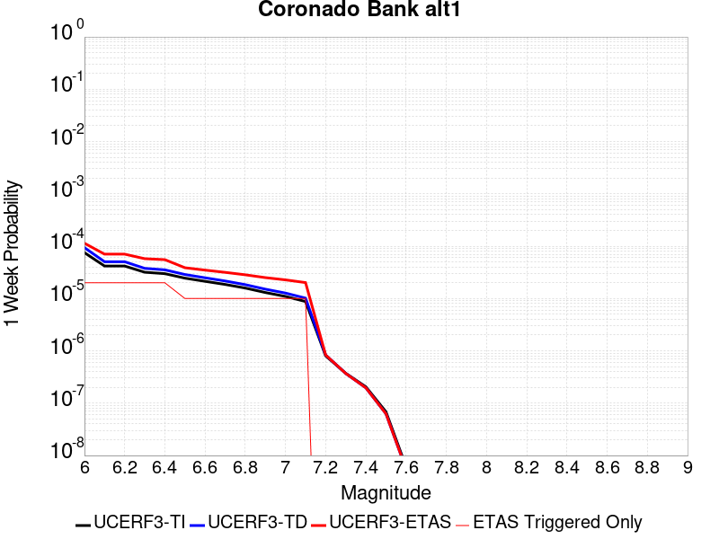 |  |  | 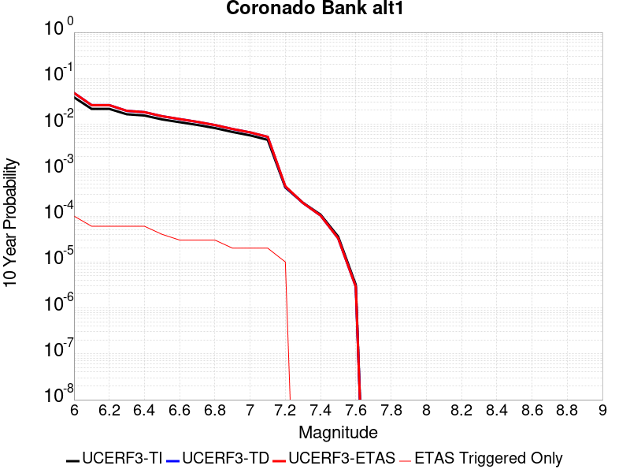 |

| Magnitude | 1 wk TI Prob | 1 wk TD Prob | 1 wk ETAS Prob | 1 wk ETAS/TD Gain | 1 wk ETAS Triggered Only | 1 mo TI Prob | 1 mo TD Prob | 1 mo ETAS Prob | 1 mo ETAS/TD Gain | 1 mo ETAS Triggered Only | 1 yr TI Prob | 1 yr TD Prob | 1 yr ETAS Prob | 1 yr ETAS/TD Gain | 1 yr ETAS Triggered Only | 10 yr TI Prob | 10 yr TD Prob | 10 yr ETAS Prob | 10 yr ETAS/TD Gain | 10 yr ETAS Triggered Only |
|-----|-----|-----|-----|-----|-----|-----|-----|-----|-----|-----|-----|-----|-----|-----|-----|-----|-----|-----|-----|-----|
| 6.0 | 7.533492E-5 | 9.3951705E-5 | 1.1394983E-4 | 1.2128553 | 2.0E-5 | 3.22824E-4 | 4.025903E-4 | 4.325782E-4 | 1.0744874 | 3.0E-5 | 0.0039233007 | 0.004891121 | 0.0049607786 | 1.0142417 | 7.0E-5 | 0.03854755 | 0.047904 | 0.04799921 | 1.0019875 | 1.0E-4 |
| 6.1 | 4.1807285E-5 | 5.0493105E-5 | 7.04921E-5 | 1.3960737 | 2.0E-5 | 1.7916178E-4 | 2.1638138E-4 | 2.463749E-4 | 1.138614 | 3.0E-5 | 0.0021791123 | 0.0026313365 | 0.002681205 | 1.0189518 | 5.0E-5 | 0.021578677 | 0.026011124 | 0.026069563 | 1.0022467 | 6.0E-5 |
| 6.2 | 4.1807285E-5 | 5.0493105E-5 | 7.04921E-5 | 1.3960737 | 2.0E-5 | 1.7916178E-4 | 2.1638138E-4 | 2.463749E-4 | 1.138614 | 3.0E-5 | 0.0021791123 | 0.0026313365 | 0.002681205 | 1.0189518 | 5.0E-5 | 0.021578677 | 0.026011124 | 0.026069563 | 1.0022467 | 6.0E-5 |
| 6.3 | 3.1793104E-5 | 3.7711125E-5 | 5.771037E-5 | 1.5303274 | 2.0E-5 | 1.3624904E-4 | 1.6160926E-4 | 1.9160441E-4 | 1.1856029 | 3.0E-5 | 0.0016575698 | 0.001965849 | 0.0020157506 | 1.0253843 | 5.0E-5 | 0.016452603 | 0.019488495 | 0.019547326 | 1.0030187 | 6.0E-5 |
| 6.4 | 2.9878007E-5 | 3.5335797E-5 | 5.533509E-5 | 1.5659783 | 2.0E-5 | 1.2804232E-4 | 1.5143053E-4 | 1.8142599E-4 | 1.1980807 | 3.0E-5 | 0.0015578003 | 0.0018421395 | 0.0018920474 | 1.0270923 | 5.0E-5 | 0.015469253 | 0.018272463 | 0.018331368 | 1.0032237 | 6.0E-5 |
| 6.5 | 2.4512565E-5 | 2.8764101E-5 | 3.8763814E-5 | 1.3476455 | 1.0E-5 | 1.0504962E-4 | 1.2326906E-4 | 1.4326659E-4 | 1.1622267 | 2.0E-5 | 0.0012782287 | 0.0014997943 | 0.0015297494 | 1.0199728 | 3.0E-5 | 0.012709012 | 0.0148996925 | 0.014939097 | 1.0026447 | 4.0E-5 |
| 6.6 | 2.1317413E-5 | 2.490667E-5 | 3.490642E-5 | 1.4014889 | 1.0E-5 | 9.135714E-5 | 1.0673863E-4 | 1.1673757E-4 | 1.0936768 | 1.0E-5 | 0.0011117056 | 0.0012987903 | 0.0013187644 | 1.015379 | 2.0E-5 | 0.011061605 | 0.012914407 | 0.01294402 | 1.002293 | 3.0E-5 |
| 6.7 | 1.8585655E-5 | 2.1634882E-5 | 3.1634663E-5 | 1.4622066 | 1.0E-5 | 7.9650374E-5 | 9.271774E-5 | 1.0271681E-4 | 1.1078442 | 1.0E-5 | 9.6931186E-4 | 0.0011282744 | 0.0011482518 | 1.0177062 | 2.0E-5 | 0.0096509475 | 0.011227623 | 0.011257286 | 1.002642 | 3.0E-5 |
| 6.8 | 1.5862879E-5 | 1.8419476E-5 | 2.8419292E-5 | 1.5428936 | 1.0E-5 | 6.798199E-5 | 7.8938334E-5 | 8.8937544E-5 | 1.1266712 | 1.0E-5 | 8.273665E-4 | 9.606697E-4 | 9.806505E-4 | 1.0207988 | 2.0E-5 | 0.008242928 | 0.009567151 | 0.009596864 | 1.0031058 | 3.0E-5 |
| 6.9 | 1.3021509E-5 | 1.5095266E-5 | 2.5095114E-5 | 1.6624494 | 1.0E-5 | 5.5805274E-5 | 6.46925E-5 | 7.4691845E-5 | 1.1545675 | 1.0E-5 | 6.792174E-4 | 7.873646E-4 | 8.073488E-4 | 1.0253812 | 2.0E-5 | 0.006771452 | 0.007847573 | 0.007867416 | 1.0025285 | 2.0E-5 |
| 7.0 | 1.0974371E-5 | 1.2720105E-5 | 2.2719978E-5 | 1.786147 | 1.0E-5 | 4.7032172E-5 | 5.4513697E-5 | 6.451315E-5 | 1.1834302 | 1.0E-5 | 5.7246623E-4 | 6.635197E-4 | 6.835064E-4 | 1.0301223 | 2.0E-5 | 0.0057099373 | 0.0066171354 | 0.006637003 | 1.0030024 | 2.0E-5 |
| 7.1 | 8.766221E-6 | 1.0163833E-5 | 2.0163732E-5 | 1.9838707 | 1.0E-5 | 3.7568978E-5 | 4.3558655E-5 | 5.355822E-5 | 1.2295655 | 1.0E-5 | 4.573063E-4 | 5.302148E-4 | 5.502042E-4 | 1.0377005 | 2.0E-5 | 0.0045636636 | 0.005291197 | 0.0053110914 | 1.0037599 | 2.0E-5 |
| 7.2 | 8.026024E-7 | 8.331776E-7 | 8.331776E-7 | 1.0 | 0.0 | 3.43972E-6 | 3.5707562E-6 | 3.5707562E-6 | 1.0 | 0.0 | 4.1877785E-5 | 4.34731E-5 | 5.3472668E-5 | 1.2300173 | 1.0E-5 | 4.1869894E-4 | 4.3464705E-4 | 4.446427E-4 | 1.0229971 | 1.0E-5 |
| 7.3 | 3.7293114E-7 | 3.700106E-7 | 3.700106E-7 | 1.0 | 0.0 | 1.5982754E-6 | 1.5857588E-6 | 1.5857588E-6 | 1.0 | 0.0 | 1.9458828E-5 | 1.9306442E-5 | 1.9306442E-5 | 1.0 | 0.0 | 1.9457124E-4 | 1.9304773E-4 | 1.9304773E-4 | 1.0 | 0.0 |
| 7.4 | 2.0557036E-7 | 1.9674441E-7 | 1.9674441E-7 | 1.0 | 0.0 | 8.810155E-7 | 8.4319004E-7 | 8.4319004E-7 | 1.0 | 0.0 | 1.0726311E-5 | 1.02657905E-5 | 1.02657905E-5 | 1.0 | 0.0 | 1.0725793E-4 | 1.026532E-4 | 1.026532E-4 | 1.0 | 0.0 |
| 7.5 | 6.845446E-8 | 6.2794086E-8 | 6.2794086E-8 | 1.0 | 0.0 | 2.9337625E-7 | 2.6911746E-7 | 2.6911746E-7 | 1.0 | 0.0 | 3.5718497E-6 | 3.2765004E-6 | 3.2765004E-6 | 1.0 | 0.0 | 3.5717923E-5 | 3.276453E-5 | 3.276453E-5 | 1.0 | 0.0 |
| 7.6 | 6.0975145E-9 | 5.531901E-9 | 5.531901E-9 | 1.0 | 0.0 | 2.6132206E-8 | 2.3708148E-8 | 2.3708148E-8 | 1.0 | 0.0 | 3.1815955E-7 | 2.8864667E-7 | 2.8864667E-7 | 1.0 | 0.0 | 3.181591E-6 | 2.886464E-6 | 2.886464E-6 | 1.0 | 0.0 |

## Owens Valley
*[(top)](#table-of-contents)*

| 1 Week | 1 Month | 1 Year | 10 Year |
|-----|-----|-----|-----|
|  |  |  |  |

| Magnitude | 1 wk TI Prob | 1 wk TD Prob | 1 wk ETAS Prob | 1 wk ETAS/TD Gain | 1 wk ETAS Triggered Only | 1 mo TI Prob | 1 mo TD Prob | 1 mo ETAS Prob | 1 mo ETAS/TD Gain | 1 mo ETAS Triggered Only | 1 yr TI Prob | 1 yr TD Prob | 1 yr ETAS Prob | 1 yr ETAS/TD Gain | 1 yr ETAS Triggered Only | 10 yr TI Prob | 10 yr TD Prob | 10 yr ETAS Prob | 10 yr ETAS/TD Gain | 10 yr ETAS Triggered Only |
|-----|-----|-----|-----|-----|-----|-----|-----|-----|-----|-----|-----|-----|-----|-----|-----|-----|-----|-----|-----|-----|
| 6.0 | 4.83821E-5 | 3.6210524E-6 | 3.3620945E-5 | 9.284854 | 3.0E-5 | 2.0733538E-4 | 1.551871E-5 | 7.5517775E-5 | 4.866241 | 6.0E-5 | 0.002521386 | 1.889249E-4 | 2.689098E-4 | 1.4233687 | 8.0E-5 | 0.024929691 | 0.0019297141 | 0.002039502 | 1.0568932 | 1.1E-4 |
| 6.1 | 4.83821E-5 | 3.6210524E-6 | 3.3620945E-5 | 9.284854 | 3.0E-5 | 2.0733538E-4 | 1.551871E-5 | 7.5517775E-5 | 4.866241 | 6.0E-5 | 0.002521386 | 1.889249E-4 | 2.689098E-4 | 1.4233687 | 8.0E-5 | 0.024929691 | 0.0019297141 | 0.002039502 | 1.0568932 | 1.1E-4 |
| 6.2 | 4.83821E-5 | 3.6210524E-6 | 3.3620945E-5 | 9.284854 | 3.0E-5 | 2.0733538E-4 | 1.551871E-5 | 7.5517775E-5 | 4.866241 | 6.0E-5 | 0.002521386 | 1.889249E-4 | 2.689098E-4 | 1.4233687 | 8.0E-5 | 0.024929691 | 0.0019297141 | 0.002039502 | 1.0568932 | 1.1E-4 |
| 6.3 | 3.953008E-5 | 3.1530958E-6 | 3.3153003E-5 | 10.514428 | 3.0E-5 | 1.6940363E-4 | 1.3513202E-5 | 7.351239E-5 | 5.4400425 | 6.0E-5 | 0.002060538 | 1.6451156E-4 | 2.444984E-4 | 1.4862081 | 8.0E-5 | 0.020415364 | 0.0016621627 | 0.0017719798 | 1.0660689 | 1.1E-4 |
| 6.4 | 3.953008E-5 | 3.1530958E-6 | 3.3153003E-5 | 10.514428 | 3.0E-5 | 1.6940363E-4 | 1.3513202E-5 | 7.351239E-5 | 5.4400425 | 6.0E-5 | 0.002060538 | 1.6451156E-4 | 2.444984E-4 | 1.4862081 | 8.0E-5 | 0.020415364 | 0.0016621627 | 0.0017719798 | 1.0660689 | 1.1E-4 |
| 6.5 | 3.457342E-5 | 2.9707387E-6 | 2.297068E-5 | 7.732312 | 2.0E-5 | 1.4816338E-4 | 1.273168E-5 | 6.2731044E-5 | 4.9271617 | 5.0E-5 | 0.0018023965 | 1.5499788E-4 | 2.2498702E-4 | 1.451549 | 7.0E-5 | 0.017878477 | 0.0015563119 | 0.0016361873 | 1.0513235 | 8.0E-5 |
| 6.6 | 3.1127765E-5 | 2.8737306E-6 | 1.2873702E-5 | 4.4797873 | 1.0E-5 | 1.3339789E-4 | 1.2315934E-5 | 5.231544E-5 | 4.247785 | 4.0E-5 | 0.0016229092 | 1.4993687E-4 | 2.0992788E-4 | 1.4001085 | 6.0E-5 | 0.016111081 | 0.0015013438 | 0.0015712386 | 1.0465549 | 7.0E-5 |
| 6.7 | 2.806885E-5 | 2.8101606E-6 | 1.2810133E-5 | 4.5585055 | 1.0E-5 | 1.2028952E-4 | 1.2043493E-5 | 5.204301E-5 | 4.3212557 | 4.0E-5 | 0.001463541 | 1.4662035E-4 | 2.0661156E-4 | 1.4091601 | 6.0E-5 | 0.014539397 | 0.0014656087 | 0.0015355061 | 1.0476917 | 7.0E-5 |
| 6.8 | 2.524524E-5 | 2.2351392E-6 | 1.2235117E-5 | 5.4739842 | 1.0E-5 | 1.0818939E-4 | 9.579134E-6 | 4.957875E-5 | 5.1757026 | 4.0E-5 | 0.0013164099 | 1.16620016E-4 | 1.7661302E-4 | 1.5144315 | 6.0E-5 | 0.01308639 | 0.001165827 | 0.0012357455 | 1.0599732 | 7.0E-5 |
| 6.9 | 2.2704568E-5 | 1.6079711E-6 | 1.1607955E-5 | 7.2190075 | 1.0E-5 | 9.730166E-5 | 6.8912864E-6 | 4.689101E-5 | 6.8043914 | 4.0E-5 | 0.0011840039 | 8.38982E-5 | 1.4389316E-4 | 1.7150924 | 6.0E-5 | 0.011777153 | 8.38853E-4 | 8.988027E-4 | 1.0714662 | 6.0E-5 |
| 7.0 | 2.0871712E-5 | 1.5393621E-6 | 1.1539347E-5 | 7.496187 | 1.0E-5 | 8.944713E-5 | 6.5972495E-6 | 4.6596986E-5 | 7.0630927 | 4.0E-5 | 0.0010884746 | 8.031857E-5 | 1.4031376E-4 | 1.7469653 | 6.0E-5 | 0.010831586 | 8.030395E-4 | 8.629914E-4 | 1.0746561 | 6.0E-5 |
| 7.1 | 1.944928E-5 | 1.3862556E-6 | 1.1386242E-5 | 8.213667 | 1.0E-5 | 8.335139E-5 | 5.941082E-6 | 4.5940844E-5 | 7.7327404 | 4.0E-5 | 0.0010143308 | 7.233028E-5 | 1.3232593E-4 | 1.8294681 | 6.0E-5 | 0.010097133 | 7.2319806E-4 | 7.831547E-4 | 1.0829048 | 6.0E-5 |
| 7.2 | 1.7876306E-5 | 1.2487686E-6 | 1.1248756E-5 | 9.007879 | 1.0E-5 | 7.6610486E-5 | 5.3518543E-6 | 4.535164E-5 | 8.474005 | 4.0E-5 | 9.3233347E-4 | 6.515689E-5 | 1.2515298E-4 | 1.9207942 | 6.0E-5 | 0.009284316 | 6.5148395E-4 | 7.114449E-4 | 1.0920374 | 6.0E-5 |
| 7.3 | 1.2618672E-5 | 1.1113839E-6 | 1.1111373E-5 | 9.997781 | 1.0E-5 | 5.40789E-5 | 4.763065E-6 | 4.4762874E-5 | 9.397913 | 4.0E-5 | 6.582117E-4 | 5.7988782E-5 | 1.17985306E-4 | 2.034623 | 6.0E-5 | 0.0065626553 | 5.7983754E-4 | 6.398028E-4 | 1.1034173 | 6.0E-5 |
| 7.4 | 7.4874442E-6 | 8.547518E-7 | 1.0854743E-5 | 12.699293 | 1.0E-5 | 3.208865E-5 | 3.6632168E-6 | 4.366307E-5 | 11.919325 | 4.0E-5 | 3.906093E-4 | 4.4598757E-5 | 1.0459608E-4 | 2.345269 | 6.0E-5 | 0.003899234 | 4.459579E-4 | 5.0593115E-4 | 1.1344818 | 6.0E-5 |
| 7.5 | 2.4734156E-6 | 6.0679935E-7 | 1.0606794E-5 | 17.479902 | 1.0E-5 | 1.060031E-5 | 2.6005662E-6 | 2.2600514E-5 | 8.690613 | 2.0E-5 | 1.2905113E-4 | 3.1661435E-5 | 7.166017E-5 | 2.2633266 | 4.0E-5 | 0.0012897621 | 3.1656958E-4 | 3.565569E-4 | 1.1263145 | 4.0E-5 |
| 7.6 | 1.1328841E-6 | 3.1961991E-7 | 3.1961991E-7 | 1.0 | 0.0 | 4.8552088E-6 | 1.369799E-6 | 1.369799E-6 | 1.0 | 0.0 | 5.9110564E-5 | 1.6677177E-5 | 2.667701E-5 | 1.5996119 | 1.0E-5 | 5.9094845E-4 | 1.6675945E-4 | 1.7675778E-4 | 1.0599567 | 1.0E-5 |
| 7.7 | 4.8613185E-7 | 8.962742E-8 | 8.962742E-8 | 1.0 | 0.0 | 2.0834207E-6 | 3.8411747E-7 | 3.8411747E-7 | 1.0 | 0.0 | 2.536535E-5 | 4.676621E-6 | 1.4676574E-5 | 3.138286 | 1.0E-5 | 2.5362454E-4 | 4.676529E-5 | 5.6764824E-5 | 1.2138238 | 1.0E-5 |

## San Jacinto (Lytle Creek connector)
*[(top)](#table-of-contents)*

| 1 Week | 1 Month | 1 Year | 10 Year |
|-----|-----|-----|-----|
| 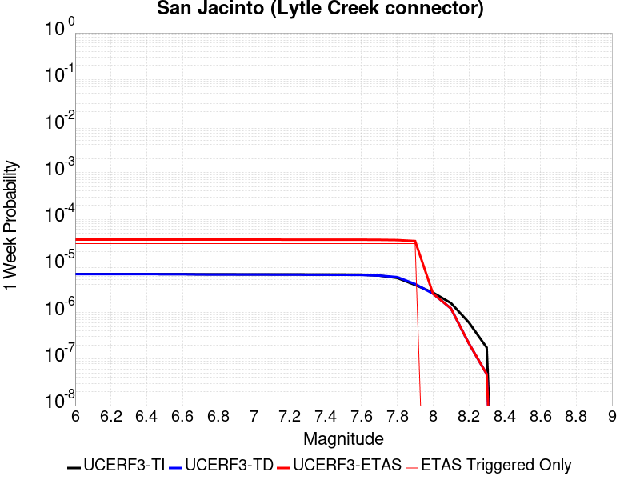 |  | 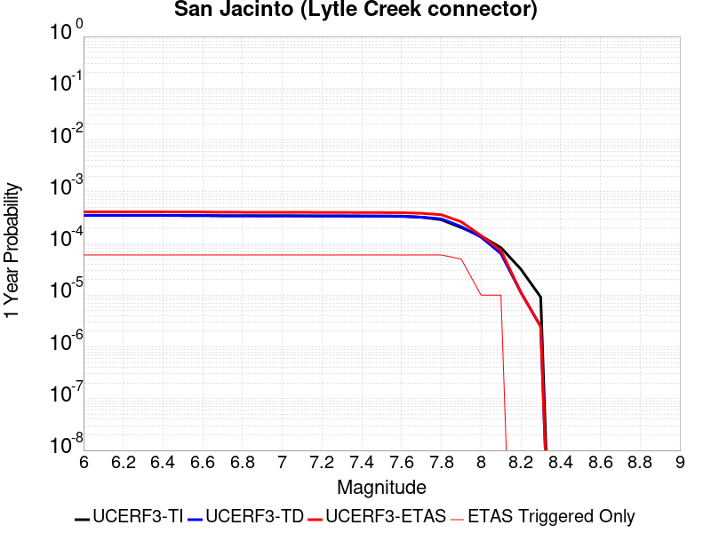 |  |

| Magnitude | 1 wk TI Prob | 1 wk TD Prob | 1 wk ETAS Prob | 1 wk ETAS/TD Gain | 1 wk ETAS Triggered Only | 1 mo TI Prob | 1 mo TD Prob | 1 mo ETAS Prob | 1 mo ETAS/TD Gain | 1 mo ETAS Triggered Only | 1 yr TI Prob | 1 yr TD Prob | 1 yr ETAS Prob | 1 yr ETAS/TD Gain | 1 yr ETAS Triggered Only | 10 yr TI Prob | 10 yr TD Prob | 10 yr ETAS Prob | 10 yr ETAS/TD Gain | 10 yr ETAS Triggered Only |
|-----|-----|-----|-----|-----|-----|-----|-----|-----|-----|-----|-----|-----|-----|-----|-----|-----|-----|-----|-----|-----|
| 6.0 | 6.693995E-6 | 6.660123E-6 | 3.6659923E-5 | 5.504391 | 3.0E-5 | 2.8688235E-5 | 2.8543072E-5 | 7.854164E-5 | 2.7516885 | 5.0E-5 | 3.492233E-4 | 3.4745657E-4 | 4.0743573E-4 | 1.1726234 | 6.0E-5 | 0.00348675 | 0.0035491167 | 0.003648762 | 1.028076 | 1.0E-4 |
| 6.1 | 6.693995E-6 | 6.660123E-6 | 3.6659923E-5 | 5.504391 | 3.0E-5 | 2.8688235E-5 | 2.8543072E-5 | 7.854164E-5 | 2.7516885 | 5.0E-5 | 3.492233E-4 | 3.4745657E-4 | 4.0743573E-4 | 1.1726234 | 6.0E-5 | 0.00348675 | 0.0035491167 | 0.003648762 | 1.028076 | 1.0E-4 |
| 6.2 | 6.693995E-6 | 6.660123E-6 | 3.6659923E-5 | 5.504391 | 3.0E-5 | 2.8688235E-5 | 2.8543072E-5 | 7.854164E-5 | 2.7516885 | 5.0E-5 | 3.492233E-4 | 3.4745657E-4 | 4.0743573E-4 | 1.1726234 | 6.0E-5 | 0.00348675 | 0.0035491167 | 0.003648762 | 1.028076 | 1.0E-4 |
| 6.3 | 6.693995E-6 | 6.660123E-6 | 3.6659923E-5 | 5.504391 | 3.0E-5 | 2.8688235E-5 | 2.8543072E-5 | 7.854164E-5 | 2.7516885 | 5.0E-5 | 3.492233E-4 | 3.4745657E-4 | 4.0743573E-4 | 1.1726234 | 6.0E-5 | 0.00348675 | 0.0035491167 | 0.003648762 | 1.028076 | 1.0E-4 |
| 6.4 | 6.693995E-6 | 6.660123E-6 | 3.6659923E-5 | 5.504391 | 3.0E-5 | 2.8688235E-5 | 2.8543072E-5 | 7.854164E-5 | 2.7516885 | 5.0E-5 | 3.492233E-4 | 3.4745657E-4 | 4.0743573E-4 | 1.1726234 | 6.0E-5 | 0.00348675 | 0.0035491167 | 0.003648762 | 1.028076 | 1.0E-4 |
| 6.5 | 6.6561875E-6 | 6.620341E-6 | 3.6620142E-5 | 5.531459 | 3.0E-5 | 2.8526205E-5 | 2.8372582E-5 | 7.8371166E-5 | 2.7622147 | 5.0E-5 | 3.472512E-4 | 3.453815E-4 | 4.053608E-4 | 1.173661 | 6.0E-5 | 0.0034670907 | 0.0035284322 | 0.0036280793 | 1.0282412 | 1.0E-4 |
| 6.6 | 6.6561875E-6 | 6.620341E-6 | 3.6620142E-5 | 5.531459 | 3.0E-5 | 2.8526205E-5 | 2.8372582E-5 | 7.8371166E-5 | 2.7622147 | 5.0E-5 | 3.472512E-4 | 3.453815E-4 | 4.053608E-4 | 1.173661 | 6.0E-5 | 0.0034670907 | 0.0035284322 | 0.0036280793 | 1.0282412 | 1.0E-4 |
| 6.7 | 6.5802237E-6 | 6.539518E-6 | 3.653932E-5 | 5.5874643 | 3.0E-5 | 2.8200653E-5 | 2.8026205E-5 | 7.80248E-5 | 2.7839947 | 5.0E-5 | 3.4328885E-4 | 3.4116567E-4 | 4.011452E-4 | 1.1758076 | 6.0E-5 | 0.0034275902 | 0.0034864065 | 0.003586058 | 1.0285828 | 1.0E-4 |
| 6.8 | 6.575632E-6 | 6.5340073E-6 | 3.6533813E-5 | 5.591333 | 3.0E-5 | 2.8180975E-5 | 2.8002589E-5 | 7.800119E-5 | 2.7854993 | 5.0E-5 | 3.4304935E-4 | 3.4087826E-4 | 4.008578E-4 | 1.1759559 | 6.0E-5 | 0.0034252026 | 0.0034835413 | 0.003583193 | 1.0286064 | 1.0E-4 |
| 6.9 | 6.570433E-6 | 6.525401E-6 | 3.6525205E-5 | 5.5973883 | 3.0E-5 | 2.8158694E-5 | 2.7965707E-5 | 7.796431E-5 | 2.787854 | 5.0E-5 | 3.4277816E-4 | 3.4042934E-4 | 4.0040893E-4 | 1.176188 | 6.0E-5 | 0.0034224992 | 0.0034790665 | 0.0035787185 | 1.0286434 | 1.0E-4 |
| 7.0 | 6.5643826E-6 | 6.5155223E-6 | 3.651533E-5 | 5.604359 | 3.0E-5 | 2.8132765E-5 | 2.7923368E-5 | 7.792197E-5 | 2.790565 | 5.0E-5 | 3.424626E-4 | 3.3991406E-4 | 3.9989364E-4 | 1.1764553 | 6.0E-5 | 0.0034193532 | 0.0034739296 | 0.0035735823 | 1.0286858 | 1.0E-4 |
| 7.1 | 6.557402E-6 | 6.504234E-6 | 3.650404E-5 | 5.61235 | 3.0E-5 | 2.8102848E-5 | 2.7874992E-5 | 7.78736E-5 | 2.7936726 | 5.0E-5 | 3.4209844E-4 | 3.3932526E-4 | 3.9930487E-4 | 1.1767615 | 6.0E-5 | 0.0034157229 | 0.0034680606 | 0.0035677138 | 1.0287346 | 1.0E-4 |
| 7.2 | 6.546394E-6 | 6.4862006E-6 | 3.6486006E-5 | 5.625174 | 3.0E-5 | 2.8055672E-5 | 2.7797707E-5 | 7.7796314E-5 | 2.7986596 | 5.0E-5 | 3.4152428E-4 | 3.383846E-4 | 3.983643E-4 | 1.177253 | 6.0E-5 | 0.0034099987 | 0.0034586883 | 0.0035583423 | 1.0288126 | 1.0E-4 |
| 7.3 | 6.5364216E-6 | 6.4669857E-6 | 3.646679E-5 | 5.6389165 | 3.0E-5 | 2.8012933E-5 | 2.771536E-5 | 7.771397E-5 | 2.804004 | 5.0E-5 | 3.4100408E-4 | 3.373823E-4 | 3.9736208E-4 | 1.1777798 | 6.0E-5 | 0.003404813 | 0.0034487103 | 0.0035483656 | 1.0288963 | 1.0E-4 |
| 7.4 | 6.5269523E-6 | 6.4480723E-6 | 3.644788E-5 | 5.6525235 | 3.0E-5 | 2.7972354E-5 | 2.7634303E-5 | 7.763292E-5 | 2.8092954 | 5.0E-5 | 3.4051016E-4 | 3.3639578E-4 | 3.9637557E-4 | 1.1783013 | 6.0E-5 | 0.0033998888 | 0.0034388923 | 0.0035385482 | 1.0289792 | 1.0E-4 |
| 7.5 | 6.5111835E-6 | 6.424346E-6 | 3.6424153E-5 | 5.6697063 | 3.0E-5 | 2.7904773E-5 | 2.753262E-5 | 7.7531244E-5 | 2.8159776 | 5.0E-5 | 3.3968766E-4 | 3.3515817E-4 | 3.9513805E-4 | 1.17896 | 6.0E-5 | 0.0033916887 | 0.0034265644 | 0.0035262217 | 1.0290837 | 1.0E-4 |
| 7.6 | 6.4768806E-6 | 6.383454E-6 | 3.6383262E-5 | 5.69962 | 3.0E-5 | 2.7757764E-5 | 2.7357375E-5 | 7.735601E-5 | 2.8276107 | 5.0E-5 | 3.3789838E-4 | 3.330252E-4 | 3.9300523E-4 | 1.1801065 | 6.0E-5 | 0.0033738504 | 0.0034052972 | 0.0035049566 | 1.029266 | 1.0E-4 |
| 7.7 | 6.1655364E-6 | 6.1759456E-6 | 3.617576E-5 | 5.857526 | 3.0E-5 | 2.642346E-5 | 2.646807E-5 | 7.646675E-5 | 2.8890185 | 5.0E-5 | 3.2165812E-4 | 3.2220117E-4 | 3.8218184E-4 | 1.186159 | 6.0E-5 | 0.0032119295 | 0.0032969362 | 0.0033966065 | 1.0302312 | 1.0E-4 |
| 7.8 | 5.5043524E-6 | 5.7370175E-6 | 3.5736844E-5 | 6.229168 | 3.0E-5 | 2.3589868E-5 | 2.4586987E-5 | 7.4585754E-5 | 3.033546 | 5.0E-5 | 2.871688E-4 | 2.993055E-4 | 3.5928754E-4 | 1.200404 | 6.0E-5 | 0.0028679797 | 0.0030670585 | 0.003166752 | 1.0325046 | 1.0E-4 |
| 7.9 | 3.889249E-6 | 4.0766436E-6 | 3.4076522E-5 | 8.358965 | 3.0E-5 | 1.6668104E-5 | 1.7471213E-5 | 5.7470515E-5 | 3.2894404 | 4.0E-5 | 2.0291525E-4 | 2.126913E-4 | 2.6268067E-4 | 1.2350324 | 5.0E-5 | 0.0020273007 | 0.0021941073 | 0.0022839098 | 1.040929 | 9.0E-5 |
| 8.0 | 2.668535E-6 | 2.5313454E-6 | 2.5313454E-6 | 1.0 | 0.0 | 1.1436528E-5 | 1.0848577E-5 | 2.0848469E-5 | 1.9217699 | 1.0E-5 | 1.3923083E-4 | 1.3207346E-4 | 1.4207214E-4 | 1.0757054 | 1.0E-5 | 0.0013914363 | 0.0013755665 | 0.0014055253 | 1.0217792 | 3.0E-5 |
| 8.1 | 1.5911459E-6 | 1.2185134E-6 | 1.2185134E-6 | 1.0 | 0.0 | 6.8191785E-6 | 5.2221894E-6 | 1.5222137E-5 | 2.9148955 | 1.0E-5 | 8.3020335E-5 | 6.357832E-5 | 7.357769E-5 | 1.1572763 | 1.0E-5 | 8.298933E-4 | 6.6911156E-4 | 6.8909815E-4 | 1.0298704 | 2.0E-5 |
| 8.2 | 6.1294963E-7 | 2.1802066E-7 | 2.1802066E-7 | 1.0 | 0.0 | 2.6269242E-6 | 9.3437393E-7 | 9.3437393E-7 | 1.0 | 0.0 | 3.1982334E-5 | 1.1375943E-5 | 1.1375943E-5 | 1.0 | 0.0 | 3.1977732E-4 | 1.2778955E-4 | 1.2778955E-4 | 1.0 | 0.0 |
| 8.3 | 1.762871E-7 | 4.7516316E-8 | 4.7516316E-8 | 1.0 | 0.0 | 7.5551594E-7 | 2.0364133E-7 | 2.0364133E-7 | 1.0 | 0.0 | 9.1983675E-6 | 2.4793305E-6 | 2.4793305E-6 | 1.0 | 0.0 | 9.197987E-5 | 2.8671833E-5 | 2.8671833E-5 | 1.0 | 0.0 |

## Ventura-Pitas Point
*[(top)](#table-of-contents)*

| 1 Week | 1 Month | 1 Year | 10 Year |
|-----|-----|-----|-----|
|  |  |  |  |

| Magnitude | 1 wk TI Prob | 1 wk TD Prob | 1 wk ETAS Prob | 1 wk ETAS/TD Gain | 1 wk ETAS Triggered Only | 1 mo TI Prob | 1 mo TD Prob | 1 mo ETAS Prob | 1 mo ETAS/TD Gain | 1 mo ETAS Triggered Only | 1 yr TI Prob | 1 yr TD Prob | 1 yr ETAS Prob | 1 yr ETAS/TD Gain | 1 yr ETAS Triggered Only | 10 yr TI Prob | 10 yr TD Prob | 10 yr ETAS Prob | 10 yr ETAS/TD Gain | 10 yr ETAS Triggered Only |
|-----|-----|-----|-----|-----|-----|-----|-----|-----|-----|-----|-----|-----|-----|-----|-----|-----|-----|-----|-----|-----|
| 6.0 | 3.3179622E-5 | 3.373519E-5 | 6.373417E-5 | 1.8892492 | 3.0E-5 | 1.4219063E-4 | 1.4457281E-4 | 1.7456847E-4 | 1.2074779 | 3.0E-5 | 0.0017297962 | 0.0017590097 | 0.0018089217 | 1.028375 | 5.0E-5 | 0.017163932 | 0.017476497 | 0.01757475 | 1.005622 | 1.0E-4 |
| 6.1 | 3.3179622E-5 | 3.373519E-5 | 6.373417E-5 | 1.8892492 | 3.0E-5 | 1.4219063E-4 | 1.4457281E-4 | 1.7456847E-4 | 1.2074779 | 3.0E-5 | 0.0017297962 | 0.0017590097 | 0.0018089217 | 1.028375 | 5.0E-5 | 0.017163932 | 0.017476497 | 0.01757475 | 1.005622 | 1.0E-4 |
| 6.2 | 3.3179622E-5 | 3.373519E-5 | 6.373417E-5 | 1.8892492 | 3.0E-5 | 1.4219063E-4 | 1.4457281E-4 | 1.7456847E-4 | 1.2074779 | 3.0E-5 | 0.0017297962 | 0.0017590097 | 0.0018089217 | 1.028375 | 5.0E-5 | 0.017163932 | 0.017476497 | 0.01757475 | 1.005622 | 1.0E-4 |
| 6.3 | 3.3179622E-5 | 3.373519E-5 | 6.373417E-5 | 1.8892492 | 3.0E-5 | 1.4219063E-4 | 1.4457281E-4 | 1.7456847E-4 | 1.2074779 | 3.0E-5 | 0.0017297962 | 0.0017590097 | 0.0018089217 | 1.028375 | 5.0E-5 | 0.017163932 | 0.017476497 | 0.01757475 | 1.005622 | 1.0E-4 |
| 6.4 | 1.8754668E-5 | 1.7019594E-5 | 2.7019423E-5 | 1.5875481 | 1.0E-5 | 8.037467E-5 | 7.2939205E-5 | 8.293848E-5 | 1.1370904 | 1.0E-5 | 9.781223E-4 | 8.8769617E-4 | 9.076784E-4 | 1.0225103 | 2.0E-5 | 0.009738282 | 0.008843943 | 0.008913323 | 1.007845 | 7.0E-5 |
| 6.5 | 1.8754668E-5 | 1.7019594E-5 | 2.7019423E-5 | 1.5875481 | 1.0E-5 | 8.037467E-5 | 7.2939205E-5 | 8.293848E-5 | 1.1370904 | 1.0E-5 | 9.781223E-4 | 8.8769617E-4 | 9.076784E-4 | 1.0225103 | 2.0E-5 | 0.009738282 | 0.008843943 | 0.008913323 | 1.007845 | 7.0E-5 |
| 6.6 | 1.4361558E-5 | 1.2122258E-5 | 2.2122136E-5 | 1.8249189 | 1.0E-5 | 6.154808E-5 | 5.1951512E-5 | 6.1950996E-5 | 1.1924772 | 1.0E-5 | 7.490902E-4 | 6.323284E-4 | 6.4232206E-4 | 1.0158045 | 1.0E-5 | 0.0074657016 | 0.006305652 | 0.006355337 | 1.0078794 | 5.0E-5 |
| 6.7 | 1.4361558E-5 | 1.2122258E-5 | 2.2122136E-5 | 1.8249189 | 1.0E-5 | 6.154808E-5 | 5.1951512E-5 | 6.1950996E-5 | 1.1924772 | 1.0E-5 | 7.490902E-4 | 6.323284E-4 | 6.4232206E-4 | 1.0158045 | 1.0E-5 | 0.0074657016 | 0.006305652 | 0.006355337 | 1.0078794 | 5.0E-5 |
| 6.8 | 1.3663846E-5 | 1.1344401E-5 | 2.1344287E-5 | 1.8814821 | 1.0E-5 | 5.8558027E-5 | 4.8617967E-5 | 5.861748E-5 | 1.2056752 | 1.0E-5 | 7.127108E-4 | 5.917649E-4 | 6.01759E-4 | 1.0168886 | 1.0E-5 | 0.007104293 | 0.0059022107 | 0.005932034 | 1.0050528 | 3.0E-5 |
| 6.9 | 1.3644157E-5 | 1.1322501E-5 | 2.1322388E-5 | 1.883187 | 1.0E-5 | 5.8473648E-5 | 4.8524114E-5 | 5.852363E-5 | 1.206073 | 1.0E-5 | 7.116841E-4 | 5.906229E-4 | 6.00617E-4 | 1.0169213 | 1.0E-5 | 0.007094092 | 0.0058908514 | 0.0059206747 | 1.0050627 | 3.0E-5 |
| 7.0 | 1.3568845E-5 | 1.12420685E-5 | 2.1241956E-5 | 1.889506 | 1.0E-5 | 5.8150898E-5 | 4.8179416E-5 | 5.817893E-5 | 1.2075475 | 1.0E-5 | 7.077572E-4 | 5.8642845E-4 | 5.964226E-4 | 1.0170424 | 1.0E-5 | 0.007055073 | 0.005849128 | 0.005878953 | 1.0050989 | 3.0E-5 |
| 7.1 | 1.306572E-5 | 1.0720521E-5 | 2.0720414E-5 | 1.9327805 | 1.0E-5 | 5.599474E-5 | 4.594429E-5 | 5.594383E-5 | 1.2176449 | 1.0E-5 | 6.815227E-4 | 5.5923004E-4 | 5.692244E-4 | 1.0178717 | 1.0E-5 | 0.0067943637 | 0.005578536 | 0.0056083687 | 1.0053477 | 3.0E-5 |
| 7.2 | 1.232604E-5 | 9.995121E-6 | 1.9995021E-5 | 2.000478 | 1.0E-5 | 5.2824813E-5 | 4.283554E-5 | 5.2835112E-5 | 1.233441 | 1.0E-5 | 6.429523E-4 | 5.2139966E-4 | 5.3139444E-4 | 1.0191691 | 1.0E-5 | 0.0064109527 | 0.005202059 | 0.005231903 | 1.005737 | 3.0E-5 |
| 7.3 | 1.0917261E-5 | 8.843812E-6 | 1.8843724E-5 | 2.1307242 | 1.0E-5 | 4.678742E-5 | 3.7901507E-5 | 4.790113E-5 | 1.2638317 | 1.0E-5 | 5.69488E-4 | 4.6135474E-4 | 4.713501E-4 | 1.0216653 | 1.0E-5 | 0.0056803077 | 0.004604239 | 0.0046341005 | 1.0064857 | 3.0E-5 |
| 7.4 | 1.039959E-5 | 8.42354E-6 | 8.42354E-6 | 1.0 | 0.0 | 4.456891E-5 | 3.6100395E-5 | 3.6100395E-5 | 1.0 | 0.0 | 5.424914E-4 | 4.394352E-4 | 4.394352E-4 | 1.0 | 0.0 | 0.0054116896 | 0.0043859277 | 0.0044058403 | 1.0045401 | 2.0E-5 |
| 7.5 | 9.015877E-6 | 7.29752E-6 | 7.29752E-6 | 1.0 | 0.0 | 3.86389E-5 | 3.1274718E-5 | 3.1274718E-5 | 1.0 | 0.0 | 4.7032707E-4 | 3.8070456E-4 | 3.8070456E-4 | 1.0 | 0.0 | 0.004693329 | 0.003800772 | 0.003820696 | 1.0052421 | 2.0E-5 |
| 7.6 | 4.900162E-6 | 3.874119E-6 | 3.874119E-6 | 1.0 | 0.0 | 2.1000526E-5 | 1.6603262E-5 | 1.6603262E-5 | 1.0 | 0.0 | 2.556514E-4 | 2.0212609E-4 | 2.0212609E-4 | 1.0 | 0.0 | 0.0025535747 | 0.002019436 | 0.002019436 | 1.0 | 0.0 |
| 7.7 | 3.8850626E-6 | 3.12676E-6 | 3.12676E-6 | 1.0 | 0.0 | 1.6650163E-5 | 1.3400332E-5 | 1.3400332E-5 | 1.0 | 0.0 | 2.0269687E-4 | 1.6313691E-4 | 1.6313691E-4 | 1.0 | 0.0 | 0.002025121 | 0.0016301809 | 0.0016301809 | 1.0 | 0.0 |
| 7.8 | 2.4654719E-6 | 2.029902E-6 | 2.029902E-6 | 1.0 | 0.0 | 1.0566265E-5 | 8.699551E-6 | 8.699551E-6 | 1.0 | 0.0 | 1.2863669E-4 | 1.0591193E-4 | 1.0591193E-4 | 1.0 | 0.0 | 0.0012856225 | 0.0010586192 | 0.0010586192 | 1.0 | 0.0 |
| 7.9 | 4.095894E-7 | 3.2765078E-7 | 3.2765078E-7 | 1.0 | 0.0 | 1.7553821E-6 | 1.4042168E-6 | 1.4042168E-6 | 1.0 | 0.0 | 2.1371567E-5 | 1.709621E-5 | 1.709621E-5 | 1.0 | 0.0 | 2.1369511E-4 | 1.7094925E-4 | 1.7094925E-4 | 1.0 | 0.0 |
| 8.0 | 7.791402E-9 | 5.6836056E-9 | 5.6836056E-9 | 1.0 | 0.0 | 3.3391725E-8 | 2.4358311E-8 | 2.4358311E-8 | 1.0 | 0.0 | 4.0654416E-7 | 2.965624E-7 | 2.965624E-7 | 1.0 | 0.0 | 4.065434E-6 | 2.9656223E-6 | 2.9656223E-6 | 1.0 | 0.0 |

## Great Valley 09 (Laguna Seca)
*[(top)](#table-of-contents)*

| 1 Week | 1 Month | 1 Year | 10 Year |
|-----|-----|-----|-----|
|  | 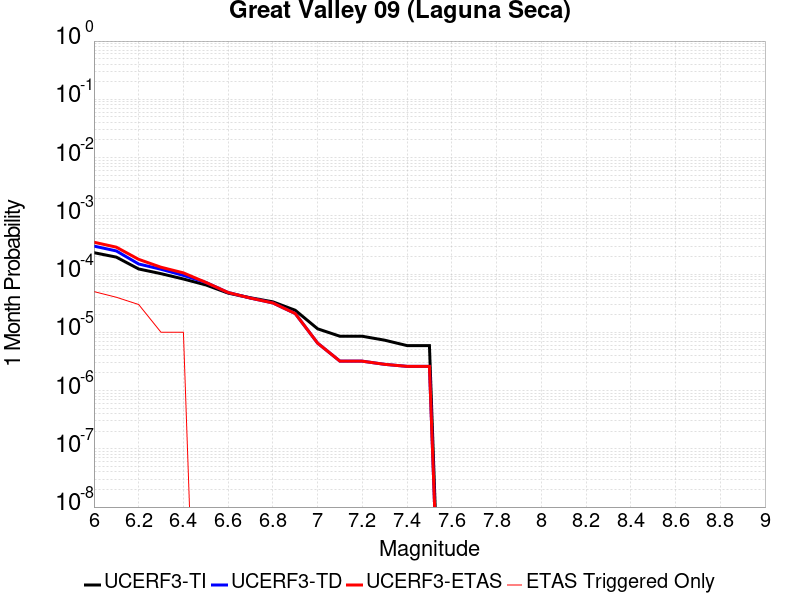 |  | 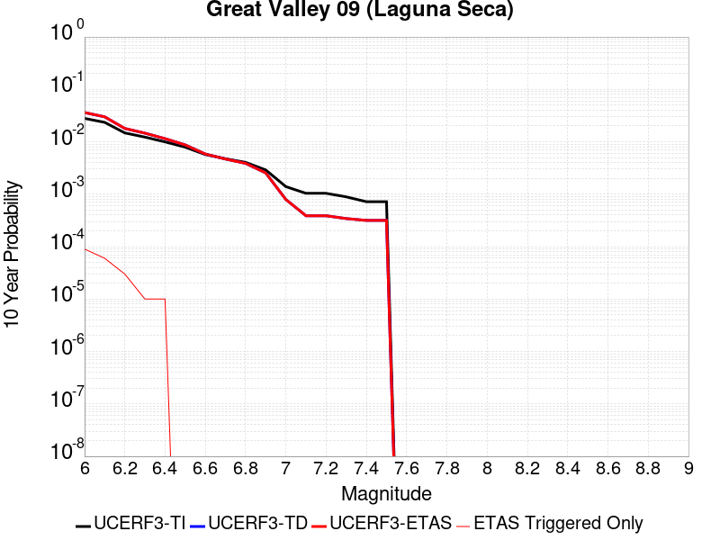 |

| Magnitude | 1 wk TI Prob | 1 wk TD Prob | 1 wk ETAS Prob | 1 wk ETAS/TD Gain | 1 wk ETAS Triggered Only | 1 mo TI Prob | 1 mo TD Prob | 1 mo ETAS Prob | 1 mo ETAS/TD Gain | 1 mo ETAS Triggered Only | 1 yr TI Prob | 1 yr TD Prob | 1 yr ETAS Prob | 1 yr ETAS/TD Gain | 1 yr ETAS Triggered Only | 10 yr TI Prob | 10 yr TD Prob | 10 yr ETAS Prob | 10 yr ETAS/TD Gain | 10 yr ETAS Triggered Only |
|-----|-----|-----|-----|-----|-----|-----|-----|-----|-----|-----|-----|-----|-----|-----|-----|-----|-----|-----|-----|-----|
| 6.0 | 5.4353277E-5 | 7.050019E-5 | 1.1049736E-4 | 1.5673344 | 4.0E-5 | 2.3292181E-4 | 3.0211007E-4 | 3.5209497E-4 | 1.1654526 | 5.0E-5 | 0.0028321352 | 0.0036720056 | 0.0037616752 | 1.0244198 | 9.0E-5 | 0.02796312 | 0.036115844 | 0.036202595 | 1.002402 | 9.0E-5 |
| 6.1 | 4.5578287E-5 | 5.822054E-5 | 8.8218796E-5 | 1.5152521 | 3.0E-5 | 1.953209E-4 | 2.4949352E-4 | 2.8948355E-4 | 1.1602848 | 4.0E-5 | 0.0023754383 | 0.0030333549 | 0.003093173 | 1.0197201 | 6.0E-5 | 0.023502063 | 0.029919893 | 0.029978096 | 1.0019454 | 6.0E-5 |
| 6.2 | 2.8536782E-5 | 3.4736422E-5 | 6.473538E-5 | 1.8636168 | 3.0E-5 | 1.2229476E-4 | 1.4886161E-4 | 1.7885714E-4 | 1.2014995 | 3.0E-5 | 0.0014879217 | 0.0018108576 | 0.0018408033 | 1.0165367 | 3.0E-5 | 0.014779986 | 0.017958276 | 0.017987737 | 1.0016406 | 3.0E-5 |
| 6.3 | 2.3698774E-5 | 2.8213344E-5 | 3.8213064E-5 | 1.3544322 | 1.0E-5 | 1.01562226E-4 | 1.2090833E-4 | 1.3090711E-4 | 1.0826973 | 1.0E-5 | 0.0012358186 | 0.001471051 | 0.0014810363 | 1.0067879 | 1.0E-5 | 0.012289686 | 0.014611455 | 0.014621308 | 1.0006744 | 1.0E-5 |
| 6.4 | 1.9191197E-5 | 2.212289E-5 | 3.212267E-5 | 1.4520105 | 1.0E-5 | 8.2245395E-5 | 9.4808805E-5 | 1.04807856E-4 | 1.1054654 | 1.0E-5 | 0.0010008777 | 0.0011536906 | 0.0011636791 | 1.0086578 | 1.0E-5 | 0.009963818 | 0.011477022 | 0.0114869075 | 1.0008613 | 1.0E-5 |
| 6.5 | 1.5203241E-5 | 1.6801298E-5 | 1.6801298E-5 | 1.0 | 0.0 | 6.5155116E-5 | 7.200338E-5 | 7.200338E-5 | 1.0 | 0.0 | 7.9297484E-4 | 8.76301E-4 | 8.76301E-4 | 1.0 | 0.0 | 0.007901512 | 0.008729581 | 0.008729581 | 1.0 | 0.0 |
| 6.6 | 1.0984925E-5 | 1.12425605E-5 | 1.12425605E-5 | 1.0 | 0.0 | 4.70774E-5 | 4.8181533E-5 | 4.8181533E-5 | 1.0 | 0.0 | 5.730166E-4 | 5.8645604E-4 | 5.8645604E-4 | 1.0 | 0.0 | 0.005715413 | 0.0058494755 | 0.0058494755 | 1.0 | 0.0 |
| 6.7 | 9.134616E-6 | 9.019868E-6 | 9.019868E-6 | 1.0 | 0.0 | 3.9147766E-5 | 3.865602E-5 | 3.865602E-5 | 1.0 | 0.0 | 4.7651984E-4 | 4.7053778E-4 | 4.7053778E-4 | 1.0 | 0.0 | 0.004754993 | 0.00469566 | 0.00469566 | 1.0 | 0.0 |
| 6.8 | 7.785589E-6 | 7.4519185E-6 | 7.4519185E-6 | 1.0 | 0.0 | 3.3366385E-5 | 3.1936415E-5 | 3.1936415E-5 | 1.0 | 0.0 | 4.0616E-4 | 3.887585E-4 | 3.887585E-4 | 1.0 | 0.0 | 0.0040541845 | 0.003880988 | 0.003880988 | 1.0 | 0.0 |
| 6.9 | 5.579095E-6 | 4.8984666E-6 | 4.8984666E-6 | 1.0 | 0.0 | 2.3910188E-5 | 2.0993268E-5 | 2.0993268E-5 | 1.0 | 0.0 | 2.9106764E-4 | 2.5556443E-4 | 2.5556443E-4 | 1.0 | 0.0 | 0.002906867 | 0.0025528427 | 0.0025528427 | 1.0 | 0.0 |
| 7.0 | 2.6816688E-6 | 1.521587E-6 | 1.521587E-6 | 1.0 | 0.0 | 1.1492816E-5 | 6.521071E-6 | 6.521071E-6 | 1.0 | 0.0 | 1.3991605E-4 | 7.939124E-5 | 7.939124E-5 | 1.0 | 0.0 | 0.0013982799 | 7.936375E-4 | 7.936375E-4 | 1.0 | 0.0 |
| 7.1 | 1.9951021E-6 | 7.45357E-7 | 7.45357E-7 | 1.0 | 0.0 | 8.55041E-6 | 3.1943835E-6 | 3.1943835E-6 | 1.0 | 0.0 | 1.0409627E-4 | 3.889097E-5 | 3.889097E-5 | 1.0 | 0.0 | 0.0010404752 | 3.8884574E-4 | 3.8884574E-4 | 1.0 | 0.0 |
| 7.2 | 1.9951021E-6 | 7.45357E-7 | 7.45357E-7 | 1.0 | 0.0 | 8.55041E-6 | 3.1943835E-6 | 3.1943835E-6 | 1.0 | 0.0 | 1.0409627E-4 | 3.889097E-5 | 3.889097E-5 | 1.0 | 0.0 | 0.0010404752 | 3.8884574E-4 | 3.8884574E-4 | 1.0 | 0.0 |
| 7.3 | 1.7087556E-6 | 6.578663E-7 | 6.578663E-7 | 1.0 | 0.0 | 7.3232177E-6 | 2.819424E-6 | 2.819424E-6 | 1.0 | 0.0 | 8.915652E-5 | 3.432599E-5 | 3.432599E-5 | 1.0 | 0.0 | 8.9120766E-4 | 3.432109E-4 | 3.432109E-4 | 1.0 | 0.0 |
| 7.4 | 1.3804846E-6 | 6.0737113E-7 | 6.0737113E-7 | 1.0 | 0.0 | 5.916349E-6 | 2.6030168E-6 | 2.6030168E-6 | 1.0 | 0.0 | 7.2029165E-5 | 3.169131E-5 | 3.169131E-5 | 1.0 | 0.0 | 7.200583E-4 | 3.168719E-4 | 3.168719E-4 | 1.0 | 0.0 |
| 7.5 | 1.3804846E-6 | 6.0737113E-7 | 6.0737113E-7 | 1.0 | 0.0 | 5.916349E-6 | 2.6030168E-6 | 2.6030168E-6 | 1.0 | 0.0 | 7.2029165E-5 | 3.169131E-5 | 3.169131E-5 | 1.0 | 0.0 | 7.200583E-4 | 3.168719E-4 | 3.168719E-4 | 1.0 | 0.0 |

## Palos Verdes
*[(top)](#table-of-contents)*

| 1 Week | 1 Month | 1 Year | 10 Year |
|-----|-----|-----|-----|
| 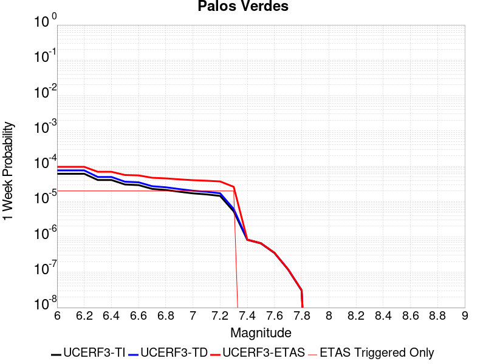 |  | 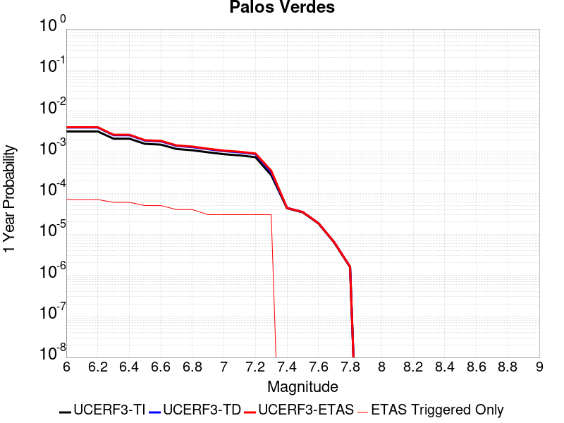 | 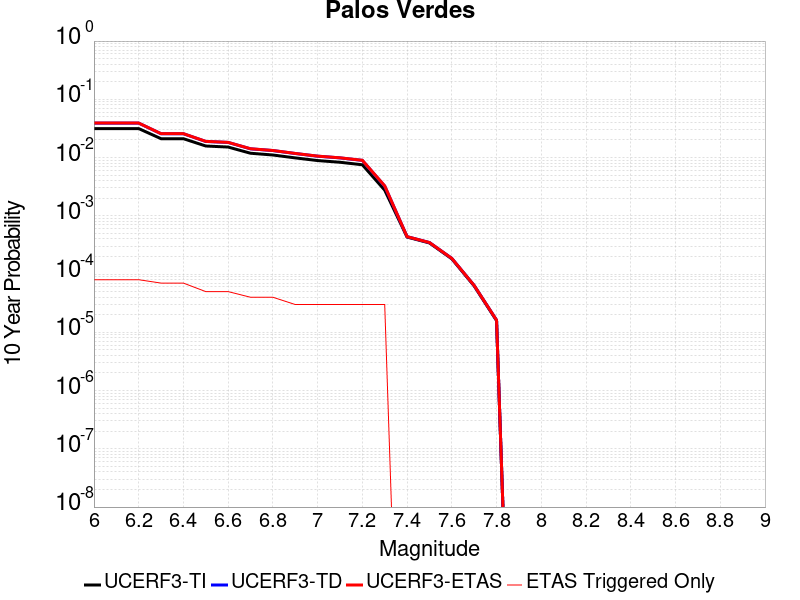 |

| Magnitude | 1 wk TI Prob | 1 wk TD Prob | 1 wk ETAS Prob | 1 wk ETAS/TD Gain | 1 wk ETAS Triggered Only | 1 mo TI Prob | 1 mo TD Prob | 1 mo ETAS Prob | 1 mo ETAS/TD Gain | 1 mo ETAS Triggered Only | 1 yr TI Prob | 1 yr TD Prob | 1 yr ETAS Prob | 1 yr ETAS/TD Gain | 1 yr ETAS Triggered Only | 10 yr TI Prob | 10 yr TD Prob | 10 yr ETAS Prob | 10 yr ETAS/TD Gain | 10 yr ETAS Triggered Only |
|-----|-----|-----|-----|-----|-----|-----|-----|-----|-----|-----|-----|-----|-----|-----|-----|-----|-----|-----|-----|-----|
| 6.0 | 6.126063E-5 | 7.622572E-5 | 9.62242E-5 | 1.2623587 | 2.0E-5 | 2.6251914E-4 | 3.266441E-4 | 3.7662778E-4 | 1.1530218 | 5.0E-5 | 0.0031914865 | 0.0039701737 | 0.0040398957 | 1.0175614 | 7.0E-5 | 0.031460393 | 0.03904909 | 0.039125964 | 1.0019687 | 8.0E-5 |
| 6.1 | 6.126063E-5 | 7.622572E-5 | 9.62242E-5 | 1.2623587 | 2.0E-5 | 2.6251914E-4 | 3.266441E-4 | 3.7662778E-4 | 1.1530218 | 5.0E-5 | 0.0031914865 | 0.0039701737 | 0.0040398957 | 1.0175614 | 7.0E-5 | 0.031460393 | 0.03904909 | 0.039125964 | 1.0019687 | 8.0E-5 |
| 6.2 | 6.126063E-5 | 7.622572E-5 | 9.62242E-5 | 1.2623587 | 2.0E-5 | 2.6251914E-4 | 3.266441E-4 | 3.7662778E-4 | 1.1530218 | 5.0E-5 | 0.0031914865 | 0.0039701737 | 0.0040398957 | 1.0175614 | 7.0E-5 | 0.031460393 | 0.03904909 | 0.039125964 | 1.0019687 | 8.0E-5 |
| 6.3 | 4.0838047E-5 | 4.9749007E-5 | 6.974801E-5 | 1.401998 | 2.0E-5 | 1.7500846E-4 | 2.1319388E-4 | 2.631832E-4 | 1.2344784 | 5.0E-5 | 0.0021286458 | 0.002592754 | 0.0026525985 | 1.0230814 | 6.0E-5 | 0.021083709 | 0.025646746 | 0.025714952 | 1.0026594 | 7.0E-5 |
| 6.4 | 4.0838047E-5 | 4.9749007E-5 | 6.974801E-5 | 1.401998 | 2.0E-5 | 1.7500846E-4 | 2.1319388E-4 | 2.631832E-4 | 1.2344784 | 5.0E-5 | 0.0021286458 | 0.002592754 | 0.0026525985 | 1.0230814 | 6.0E-5 | 0.021083709 | 0.025646746 | 0.025714952 | 1.0026594 | 7.0E-5 |
| 6.5 | 3.0512005E-5 | 3.6561592E-5 | 5.6560864E-5 | 1.5470021 | 2.0E-5 | 1.3075917E-4 | 1.566838E-4 | 1.9667755E-4 | 1.2552512 | 4.0E-5 | 0.0015908304 | 0.001906072 | 0.0019559767 | 1.0261819 | 5.0E-5 | 0.015794903 | 0.018909173 | 0.018958228 | 1.0025942 | 5.0E-5 |
| 6.6 | 2.9255087E-5 | 3.5154393E-5 | 5.5153687E-5 | 1.5688989 | 2.0E-5 | 1.2537291E-4 | 1.5065364E-4 | 1.9064761E-4 | 1.2654697 | 4.0E-5 | 0.0015253464 | 0.0018327782 | 0.0018826865 | 1.027231 | 5.0E-5 | 0.015149189 | 0.018188244 | 0.018237334 | 1.002699 | 5.0E-5 |
| 6.7 | 2.287198E-5 | 2.724828E-5 | 4.7247733E-5 | 1.7339714 | 2.0E-5 | 9.801909E-5 | 1.16773626E-4 | 1.5676896E-4 | 1.3425031 | 4.0E-5 | 0.001192729 | 0.0014208833 | 0.0014608265 | 1.0281115 | 4.0E-5 | 0.011863477 | 0.014127217 | 0.014166652 | 1.0027914 | 4.0E-5 |
| 6.8 | 2.1325764E-5 | 2.5431878E-5 | 4.543137E-5 | 1.7863946 | 2.0E-5 | 9.139293E-5 | 1.0898972E-4 | 1.4898536E-4 | 1.3669671 | 4.0E-5 | 0.001112141 | 0.0013262323 | 0.0013661792 | 1.0301206 | 4.0E-5 | 0.011065915 | 0.013192211 | 0.0132316835 | 1.002992 | 4.0E-5 |
| 6.9 | 1.9009392E-5 | 2.2613547E-5 | 4.2613097E-5 | 1.8844056 | 2.0E-5 | 8.1466285E-5 | 9.6912096E-5 | 1.2690919E-4 | 1.3095288 | 3.0E-5 | 9.914007E-4 | 0.0011793535 | 0.001209318 | 1.0254077 | 3.0E-5 | 0.009869894 | 0.011739633 | 0.011769281 | 1.0025254 | 3.0E-5 |
| 7.0 | 1.7098473E-5 | 2.0319356E-5 | 4.0318948E-5 | 1.9842632 | 2.0E-5 | 7.3277115E-5 | 8.708052E-5 | 1.17077914E-4 | 1.3444787 | 3.0E-5 | 8.917837E-4 | 0.001059775 | 0.0010897432 | 1.0282779 | 3.0E-5 | 0.008882134 | 0.010555646 | 0.0105853295 | 1.002812 | 3.0E-5 |
| 7.1 | 1.5982785E-5 | 1.899476E-5 | 3.899438E-5 | 2.052902 | 2.0E-5 | 6.849585E-5 | 8.1404054E-5 | 1.1140161E-4 | 1.368502 | 3.0E-5 | 8.336179E-4 | 9.907284E-4 | 0.0010206987 | 1.0302508 | 3.0E-5 | 0.008304977 | 0.009871479 | 0.009901184 | 1.0030091 | 3.0E-5 |
| 7.2 | 1.4468002E-5 | 1.7197237E-5 | 3.7196893E-5 | 2.1629577 | 2.0E-5 | 6.200425E-5 | 7.370083E-5 | 1.0369862E-4 | 1.407021 | 3.0E-5 | 7.546402E-4 | 8.970222E-4 | 9.269953E-4 | 1.033414 | 3.0E-5 | 0.007520827 | 0.008942284 | 0.008972015 | 1.0033249 | 3.0E-5 |
| 7.3 | 5.288233E-6 | 6.2036747E-6 | 2.620355E-5 | 4.2238755 | 2.0E-5 | 2.2663658E-5 | 2.6587102E-5 | 5.6586305E-5 | 2.1283367 | 3.0E-5 | 2.7589512E-4 | 3.236848E-4 | 3.536751E-4 | 1.0926528 | 3.0E-5 | 0.0027555283 | 0.0032355562 | 0.003265459 | 1.0092419 | 3.0E-5 |
| 7.4 | 8.279556E-7 | 8.408347E-7 | 8.408347E-7 | 1.0 | 0.0 | 3.5483763E-6 | 3.6035726E-6 | 3.6035726E-6 | 1.0 | 0.0 | 4.3200624E-5 | 4.3872686E-5 | 4.3872686E-5 | 1.0 | 0.0 | 4.3192226E-4 | 4.3864746E-4 | 4.3864746E-4 | 1.0 | 0.0 |
| 7.5 | 6.559831E-7 | 6.667229E-7 | 6.667229E-7 | 1.0 | 0.0 | 2.8113532E-6 | 2.857381E-6 | 2.857381E-6 | 1.0 | 0.0 | 3.4227687E-5 | 3.4788125E-5 | 3.4788125E-5 | 1.0 | 0.0 | 3.4222414E-4 | 3.4783344E-4 | 3.4783344E-4 | 1.0 | 0.0 |
| 7.6 | 3.5018968E-7 | 3.5620027E-7 | 3.5620027E-7 | 1.0 | 0.0 | 1.500812E-6 | 1.526572E-6 | 1.526572E-6 | 1.0 | 0.0 | 1.8272232E-5 | 1.8585903E-5 | 1.8585903E-5 | 1.0 | 0.0 | 1.8270731E-4 | 1.8584808E-4 | 1.8584808E-4 | 1.0 | 0.0 |
| 7.7 | 1.1986104E-7 | 1.2198376E-7 | 1.2198376E-7 | 1.0 | 0.0 | 5.1369005E-7 | 5.2278745E-7 | 5.2278745E-7 | 1.0 | 0.0 | 6.2541585E-6 | 6.364919E-6 | 6.364919E-6 | 1.0 | 0.0 | 6.2539824E-5 | 6.364741E-5 | 6.364741E-5 | 1.0 | 0.0 |
| 7.8 | 3.0445005E-8 | 3.1027582E-8 | 3.1027582E-8 | 1.0 | 0.0 | 1.3047858E-7 | 1.3297536E-7 | 1.3297536E-7 | 1.0 | 0.0 | 1.5885756E-6 | 1.6189739E-6 | 1.6189739E-6 | 1.0 | 0.0 | 1.5885644E-5 | 1.6189642E-5 | 1.6189642E-5 | 1.0 | 0.0 |

## San Gabriel
*[(top)](#table-of-contents)*

| 1 Week | 1 Month | 1 Year | 10 Year |
|-----|-----|-----|-----|
|  |  | 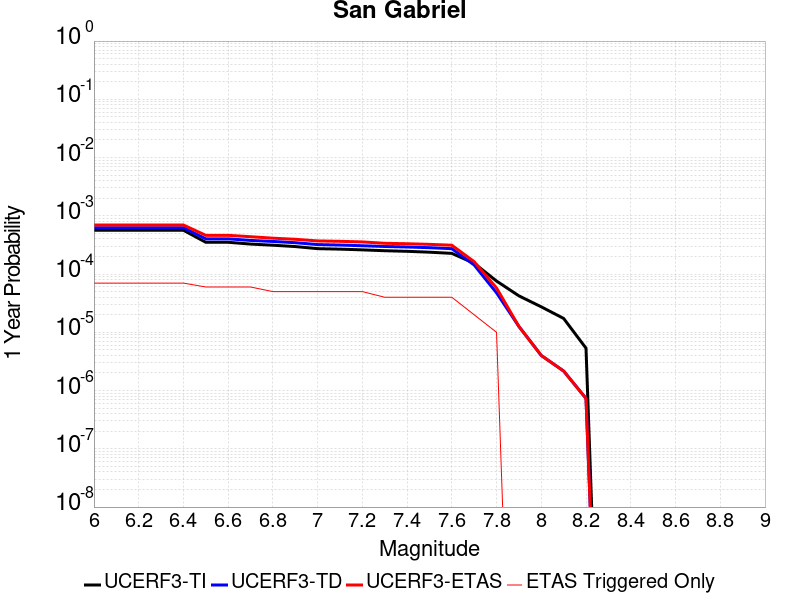 |  |

| Magnitude | 1 wk TI Prob | 1 wk TD Prob | 1 wk ETAS Prob | 1 wk ETAS/TD Gain | 1 wk ETAS Triggered Only | 1 mo TI Prob | 1 mo TD Prob | 1 mo ETAS Prob | 1 mo ETAS/TD Gain | 1 mo ETAS Triggered Only | 1 yr TI Prob | 1 yr TD Prob | 1 yr ETAS Prob | 1 yr ETAS/TD Gain | 1 yr ETAS Triggered Only | 10 yr TI Prob | 10 yr TD Prob | 10 yr ETAS Prob | 10 yr ETAS/TD Gain | 10 yr ETAS Triggered Only |
|-----|-----|-----|-----|-----|-----|-----|-----|-----|-----|-----|-----|-----|-----|-----|-----|-----|-----|-----|-----|-----|
| 6.0 | 1.083775E-5 | 1.198525E-5 | 1.198525E-5 | 1.0 | 0.0 | 4.6446676E-5 | 5.1364408E-5 | 8.1362865E-5 | 1.584032 | 3.0E-5 | 5.653415E-4 | 6.251936E-4 | 6.951498E-4 | 1.1118953 | 7.0E-5 | 0.0056390543 | 0.0062463325 | 0.0063357702 | 1.0143185 | 9.0E-5 |
| 6.1 | 1.083775E-5 | 1.198525E-5 | 1.198525E-5 | 1.0 | 0.0 | 4.6446676E-5 | 5.1364408E-5 | 8.1362865E-5 | 1.584032 | 3.0E-5 | 5.653415E-4 | 6.251936E-4 | 6.951498E-4 | 1.1118953 | 7.0E-5 | 0.0056390543 | 0.0062463325 | 0.0063357702 | 1.0143185 | 9.0E-5 |
| 6.2 | 1.083775E-5 | 1.198525E-5 | 1.198525E-5 | 1.0 | 0.0 | 4.6446676E-5 | 5.1364408E-5 | 8.1362865E-5 | 1.584032 | 3.0E-5 | 5.653415E-4 | 6.251936E-4 | 6.951498E-4 | 1.1118953 | 7.0E-5 | 0.0056390543 | 0.0062463325 | 0.0063357702 | 1.0143185 | 9.0E-5 |
| 6.3 | 1.083775E-5 | 1.198525E-5 | 1.198525E-5 | 1.0 | 0.0 | 4.6446676E-5 | 5.1364408E-5 | 8.1362865E-5 | 1.584032 | 3.0E-5 | 5.653415E-4 | 6.251936E-4 | 6.951498E-4 | 1.1118953 | 7.0E-5 | 0.0056390543 | 0.0062463325 | 0.0063357702 | 1.0143185 | 9.0E-5 |
| 6.4 | 1.083775E-5 | 1.198525E-5 | 1.198525E-5 | 1.0 | 0.0 | 4.6446676E-5 | 5.1364408E-5 | 8.1362865E-5 | 1.584032 | 3.0E-5 | 5.653415E-4 | 6.251936E-4 | 6.951498E-4 | 1.1118953 | 7.0E-5 | 0.0056390543 | 0.0062463325 | 0.0063357702 | 1.0143185 | 9.0E-5 |
| 6.5 | 6.7317824E-6 | 7.717007E-6 | 7.717007E-6 | 1.0 | 0.0 | 2.8850178E-5 | 3.3072472E-5 | 5.3071813E-5 | 1.6047125 | 2.0E-5 | 3.511943E-4 | 4.0258403E-4 | 4.6255987E-4 | 1.1489772 | 6.0E-5 | 0.003506398 | 0.004029533 | 0.004099251 | 1.0173018 | 7.0E-5 |
| 6.6 | 6.7317824E-6 | 7.717007E-6 | 7.717007E-6 | 1.0 | 0.0 | 2.8850178E-5 | 3.3072472E-5 | 5.3071813E-5 | 1.6047125 | 2.0E-5 | 3.511943E-4 | 4.0258403E-4 | 4.6255987E-4 | 1.1489772 | 6.0E-5 | 0.003506398 | 0.004029533 | 0.004099251 | 1.0173018 | 7.0E-5 |
| 6.7 | 6.274881E-6 | 7.2459275E-6 | 7.2459275E-6 | 1.0 | 0.0 | 2.6892068E-5 | 3.105361E-5 | 5.105299E-5 | 1.6440275 | 2.0E-5 | 3.2736175E-4 | 3.7801306E-4 | 4.3799038E-4 | 1.1586647 | 6.0E-5 | 0.0032687993 | 0.0037846796 | 0.0038544147 | 1.0184256 | 7.0E-5 |
| 6.8 | 5.996209E-6 | 6.958647E-6 | 6.958647E-6 | 1.0 | 0.0 | 2.5697784E-5 | 2.9822439E-5 | 4.9821843E-5 | 1.6706159 | 2.0E-5 | 3.128256E-4 | 3.6302864E-4 | 4.1301048E-4 | 1.1376802 | 5.0E-5 | 0.003123856 | 0.0036353325 | 0.0036951145 | 1.0164447 | 6.0E-5 |
| 6.9 | 5.686331E-6 | 6.6236917E-6 | 6.6236917E-6 | 1.0 | 0.0 | 2.4369761E-5 | 2.8386947E-5 | 4.838638E-5 | 1.7045292 | 2.0E-5 | 2.9666146E-4 | 3.4555717E-4 | 3.955399E-4 | 1.1446439 | 5.0E-5 | 0.0029626573 | 0.0034611735 | 0.0035209658 | 1.0172752 | 6.0E-5 |
| 7.0 | 5.2329838E-6 | 6.1475757E-6 | 6.1475757E-6 | 1.0 | 0.0 | 2.242688E-5 | 2.6346492E-5 | 4.6345966E-5 | 1.7590944 | 2.0E-5 | 2.7301308E-4 | 3.207221E-4 | 3.7070605E-4 | 1.1558483 | 5.0E-5 | 0.002726779 | 0.0032135549 | 0.003273362 | 1.018611 | 6.0E-5 |
| 7.1 | 5.135671E-6 | 6.0377E-6 | 6.0377E-6 | 1.0 | 0.0 | 2.2009834E-5 | 2.5875606E-5 | 4.5875087E-5 | 1.7729088 | 2.0E-5 | 2.6793676E-4 | 3.1499073E-4 | 3.6497496E-4 | 1.1586848 | 5.0E-5 | 0.0026761394 | 0.0031564054 | 0.0032162159 | 1.0189489 | 6.0E-5 |
| 7.2 | 4.989062E-6 | 5.8710784E-6 | 5.8710784E-6 | 1.0 | 0.0 | 2.1381518E-5 | 2.5161527E-5 | 4.5161025E-5 | 1.7948443 | 2.0E-5 | 2.6028889E-4 | 3.0629928E-4 | 3.5628397E-4 | 1.163189 | 5.0E-5 | 0.0025998424 | 0.003069734 | 0.0031295498 | 1.0194857 | 6.0E-5 |
| 7.3 | 4.8219395E-6 | 5.7026323E-6 | 5.7026323E-6 | 1.0 | 0.0 | 2.0665291E-5 | 2.4439627E-5 | 4.4439137E-5 | 1.8183231 | 2.0E-5 | 2.5157086E-4 | 2.975126E-4 | 3.3750068E-4 | 1.1344081 | 4.0E-5 | 0.0025128627 | 0.002982106 | 0.003031957 | 1.0167167 | 5.0E-5 |
| 7.4 | 4.7118383E-6 | 5.5911896E-6 | 5.5911896E-6 | 1.0 | 0.0 | 2.0193436E-5 | 2.3962024E-5 | 4.3961547E-5 | 1.8346341 | 2.0E-5 | 2.4582737E-4 | 2.9169934E-4 | 3.3168768E-4 | 1.1370875 | 4.0E-5 | 0.002455556 | 0.0029241266 | 0.0029739803 | 1.0170491 | 5.0E-5 |
| 7.5 | 4.5506545E-6 | 5.4365555E-6 | 5.4365555E-6 | 1.0 | 0.0 | 1.9502659E-5 | 2.329932E-5 | 4.3298853E-5 | 1.8583741 | 2.0E-5 | 2.37419E-4 | 2.8363304E-4 | 3.236217E-4 | 1.1409873 | 4.0E-5 | 0.002371655 | 0.0028436715 | 0.0028935294 | 1.017533 | 5.0E-5 |
| 7.6 | 4.343636E-6 | 5.2294336E-6 | 5.2294336E-6 | 1.0 | 0.0 | 1.861545E-5 | 2.241167E-5 | 4.2411222E-5 | 1.8923723 | 2.0E-5 | 2.2661954E-4 | 2.7282868E-4 | 3.1281775E-4 | 1.1465721 | 4.0E-5 | 0.0022638857 | 0.0027358893 | 0.0027857525 | 1.0182256 | 5.0E-5 |
| 7.7 | 2.936235E-6 | 2.743946E-6 | 2.743946E-6 | 1.0 | 0.0 | 1.2583803E-5 | 1.1759716E-5 | 1.1759716E-5 | 1.0 | 0.0 | 1.5319703E-4 | 1.4316518E-4 | 1.631623E-4 | 1.1396788 | 2.0E-5 | 0.0015309147 | 0.0014379849 | 0.0014679418 | 1.0208325 | 3.0E-5 |
| 7.8 | 1.4541639E-6 | 9.122518E-7 | 9.122518E-7 | 1.0 | 0.0 | 6.232116E-6 | 3.9096444E-6 | 3.9096444E-6 | 1.0 | 0.0 | 7.587337E-5 | 4.7598885E-5 | 5.759841E-5 | 1.210079 | 1.0E-5 | 7.584747E-4 | 4.8078224E-4 | 4.907774E-4 | 1.0207894 | 1.0E-5 |
| 7.9 | 8.098958E-7 | 2.4165956E-7 | 2.4165956E-7 | 1.0 | 0.0 | 3.4709774E-6 | 1.0356835E-6 | 1.0356835E-6 | 1.0 | 0.0 | 4.225833E-5 | 1.2609373E-5 | 1.2609373E-5 | 1.0 | 0.0 | 4.2250296E-4 | 1.2917137E-4 | 1.2917137E-4 | 1.0 | 0.0 |
| 8.0 | 5.2473234E-7 | 7.672734E-8 | 7.672734E-8 | 1.0 | 0.0 | 2.248851E-6 | 3.2883142E-7 | 3.2883142E-7 | 1.0 | 0.0 | 2.7379416E-5 | 4.003515E-6 | 4.003515E-6 | 1.0 | 0.0 | 2.7376044E-4 | 4.215796E-5 | 4.215796E-5 | 1.0 | 0.0 |
| 8.1 | 3.3162388E-7 | 4.1457096E-8 | 4.1457096E-8 | 1.0 | 0.0 | 1.4212444E-6 | 1.7767324E-7 | 1.7767324E-7 | 1.0 | 0.0 | 1.7303513E-5 | 2.1631695E-6 | 2.1631695E-6 | 1.0 | 0.0 | 1.7302166E-4 | 2.294416E-5 | 2.294416E-5 | 1.0 | 0.0 |
| 8.2 | 1.0235345E-7 | 1.4032201E-8 | 1.4032201E-8 | 1.0 | 0.0 | 4.3865757E-7 | 6.013801E-8 | 6.013801E-8 | 1.0 | 0.0 | 5.340643E-6 | 7.3217996E-7 | 7.3217996E-7 | 1.0 | 0.0 | 5.3405143E-5 | 7.921925E-6 | 7.921925E-6 | 1.0 | 0.0 |

## Kern Canyon (South Kern) 2011
*[(top)](#table-of-contents)*

| 1 Week | 1 Month | 1 Year | 10 Year |
|-----|-----|-----|-----|
|  |  | 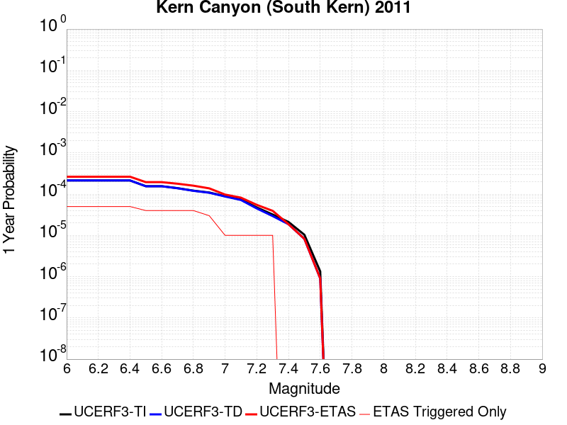 |  |

| Magnitude | 1 wk TI Prob | 1 wk TD Prob | 1 wk ETAS Prob | 1 wk ETAS/TD Gain | 1 wk ETAS Triggered Only | 1 mo TI Prob | 1 mo TD Prob | 1 mo ETAS Prob | 1 mo ETAS/TD Gain | 1 mo ETAS Triggered Only | 1 yr TI Prob | 1 yr TD Prob | 1 yr ETAS Prob | 1 yr ETAS/TD Gain | 1 yr ETAS Triggered Only | 10 yr TI Prob | 10 yr TD Prob | 10 yr ETAS Prob | 10 yr ETAS/TD Gain | 10 yr ETAS Triggered Only |
|-----|-----|-----|-----|-----|-----|-----|-----|-----|-----|-----|-----|-----|-----|-----|-----|-----|-----|-----|-----|-----|
| 6.0 | 4.105075E-6 | 4.113726E-6 | 2.4113644E-5 | 5.8617525 | 2.0E-5 | 1.7593058E-5 | 1.7630138E-5 | 6.7629255E-5 | 3.8360026 | 5.0E-5 | 2.1417443E-4 | 2.1462643E-4 | 2.646157E-4 | 1.2329129 | 5.0E-5 | 0.0021396813 | 0.0021442554 | 0.0022340624 | 1.0418826 | 9.0E-5 |
| 6.1 | 4.105075E-6 | 4.113726E-6 | 2.4113644E-5 | 5.8617525 | 2.0E-5 | 1.7593058E-5 | 1.7630138E-5 | 6.7629255E-5 | 3.8360026 | 5.0E-5 | 2.1417443E-4 | 2.1462643E-4 | 2.646157E-4 | 1.2329129 | 5.0E-5 | 0.0021396813 | 0.0021442554 | 0.0022340624 | 1.0418826 | 9.0E-5 |
| 6.2 | 4.105075E-6 | 4.113726E-6 | 2.4113644E-5 | 5.8617525 | 2.0E-5 | 1.7593058E-5 | 1.7630138E-5 | 6.7629255E-5 | 3.8360026 | 5.0E-5 | 2.1417443E-4 | 2.1462643E-4 | 2.646157E-4 | 1.2329129 | 5.0E-5 | 0.0021396813 | 0.0021442554 | 0.0022340624 | 1.0418826 | 9.0E-5 |
| 6.3 | 4.105075E-6 | 4.113726E-6 | 2.4113644E-5 | 5.8617525 | 2.0E-5 | 1.7593058E-5 | 1.7630138E-5 | 6.7629255E-5 | 3.8360026 | 5.0E-5 | 2.1417443E-4 | 2.1462643E-4 | 2.646157E-4 | 1.2329129 | 5.0E-5 | 0.0021396813 | 0.0021442554 | 0.0022340624 | 1.0418826 | 9.0E-5 |
| 6.4 | 4.105075E-6 | 4.113726E-6 | 2.4113644E-5 | 5.8617525 | 2.0E-5 | 1.7593058E-5 | 1.7630138E-5 | 6.7629255E-5 | 3.8360026 | 5.0E-5 | 2.1417443E-4 | 2.1462643E-4 | 2.646157E-4 | 1.2329129 | 5.0E-5 | 0.0021396813 | 0.0021442554 | 0.0022340624 | 1.0418826 | 9.0E-5 |
| 6.5 | 2.9849807E-6 | 2.973154E-6 | 1.2973124E-5 | 4.3634214 | 1.0E-5 | 1.2792712E-5 | 1.2742028E-5 | 5.2741518E-5 | 4.139178 | 4.0E-5 | 1.5574014E-4 | 1.551233E-4 | 1.9511709E-4 | 1.2578194 | 4.0E-5 | 0.0015563103 | 0.0015501654 | 0.0016200568 | 1.0450865 | 7.0E-5 |
| 6.6 | 2.9849807E-6 | 2.973154E-6 | 1.2973124E-5 | 4.3634214 | 1.0E-5 | 1.2792712E-5 | 1.2742028E-5 | 5.2741518E-5 | 4.139178 | 4.0E-5 | 1.5574014E-4 | 1.551233E-4 | 1.9511709E-4 | 1.2578194 | 4.0E-5 | 0.0015563103 | 0.0015501654 | 0.0016200568 | 1.0450865 | 7.0E-5 |
| 6.7 | 2.6756725E-6 | 2.6582202E-6 | 1.2658194E-5 | 4.7619057 | 1.0E-5 | 1.1467117E-5 | 1.1392323E-5 | 5.1391868E-5 | 4.5110965 | 4.0E-5 | 1.396032E-4 | 1.386928E-4 | 1.7868726E-4 | 1.2883672 | 4.0E-5 | 0.0013951553 | 0.0013860734 | 0.0014559764 | 1.0504323 | 7.0E-5 |
| 6.8 | 2.3283721E-6 | 2.3047783E-6 | 1.2304755E-5 | 5.3388023 | 1.0E-5 | 9.9787E-6 | 9.877584E-6 | 4.9877188E-5 | 5.0495334 | 4.0E-5 | 1.214839E-4 | 1.2025302E-4 | 1.6024821E-4 | 1.332592 | 4.0E-5 | 0.001214175 | 0.001201887 | 0.0012718028 | 1.0581717 | 7.0E-5 |
| 6.9 | 2.0972677E-6 | 2.0696405E-6 | 2.0696405E-6 | 1.0 | 0.0 | 8.988259E-6 | 8.869858E-6 | 3.886959E-5 | 4.382211 | 3.0E-5 | 1.0942656E-4 | 1.0798523E-4 | 1.3798199E-4 | 1.2777858 | 3.0E-5 | 0.0010937268 | 0.0010793334 | 0.0011392686 | 1.0555298 | 6.0E-5 |
| 7.0 | 1.7132242E-6 | 1.6787029E-6 | 1.6787029E-6 | 1.0 | 0.0 | 7.3423685E-6 | 7.1944214E-6 | 1.719435E-5 | 2.3899558 | 1.0E-5 | 8.938967E-5 | 8.75886E-5 | 9.758773E-5 | 1.1141601 | 1.0E-5 | 8.935372E-4 | 8.755446E-4 | 9.155096E-4 | 1.0456458 | 4.0E-5 |
| 7.1 | 1.4215541E-6 | 1.3815746E-6 | 1.3815746E-6 | 1.0 | 0.0 | 6.0923603E-6 | 5.9210206E-6 | 1.5920961E-5 | 2.688888 | 1.0E-5 | 7.417196E-5 | 7.208607E-5 | 8.2085346E-5 | 1.138713 | 1.0E-5 | 7.414721E-4 | 7.206296E-4 | 7.506079E-4 | 1.0416002 | 3.0E-5 |
| 7.2 | 9.097853E-7 | 8.60377E-7 | 8.60377E-7 | 1.0 | 0.0 | 3.899074E-6 | 3.6873246E-6 | 1.3687288E-5 | 3.7119834 | 1.0E-5 | 4.7470192E-5 | 4.4892266E-5 | 5.4891814E-5 | 1.2227455 | 1.0E-5 | 4.7460053E-4 | 4.4883305E-4 | 4.7881957E-4 | 1.06681 | 3.0E-5 |
| 7.3 | 6.144169E-7 | 5.628199E-7 | 5.628199E-7 | 1.0 | 0.0 | 2.6332125E-6 | 2.4120832E-6 | 1.2412059E-5 | 5.1457844 | 1.0E-5 | 3.205889E-5 | 2.9366722E-5 | 3.9366427E-5 | 1.3405116 | 1.0E-5 | 3.2054266E-4 | 2.9362892E-4 | 3.0362597E-4 | 1.0340466 | 1.0E-5 |
| 7.4 | 4.049844E-7 | 3.5728252E-7 | 3.5728252E-7 | 1.0 | 0.0 | 1.7356463E-6 | 1.5312098E-6 | 1.5312098E-6 | 1.0 | 0.0 | 2.1131287E-5 | 1.8642324E-5 | 1.8642324E-5 | 1.0 | 0.0 | 2.1129279E-4 | 1.8640784E-4 | 1.8640784E-4 | 1.0 | 0.0 |
| 7.5 | 1.9871162E-7 | 1.5830383E-7 | 1.5830383E-7 | 1.0 | 0.0 | 8.5162094E-7 | 6.784448E-7 | 6.784448E-7 | 1.0 | 0.0 | 1.0368436E-5 | 8.260035E-6 | 8.260035E-6 | 1.0 | 0.0 | 1.0367952E-4 | 8.259736E-5 | 8.259736E-5 | 1.0 | 0.0 |
| 7.6 | 2.572245E-8 | 1.735264E-8 | 1.735264E-8 | 1.0 | 0.0 | 1.10239064E-7 | 7.436845E-8 | 7.436845E-8 | 1.0 | 0.0 | 1.3421597E-6 | 9.0543557E-7 | 9.0543557E-7 | 1.0 | 0.0 | 1.3421517E-5 | 9.054324E-6 | 9.054324E-6 | 1.0 | 0.0 |

## Sheephole
*[(top)](#table-of-contents)*

| 1 Week | 1 Month | 1 Year | 10 Year |
|-----|-----|-----|-----|
|  |  | 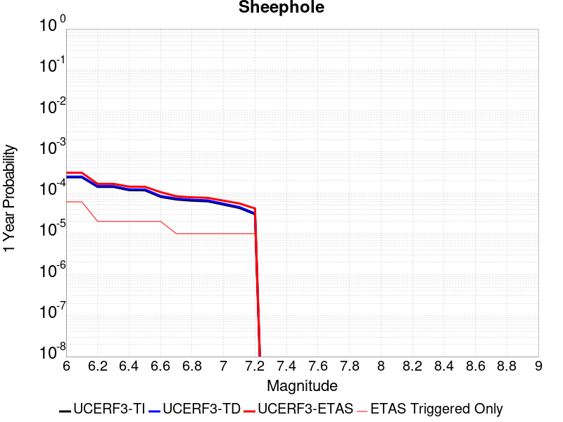 | 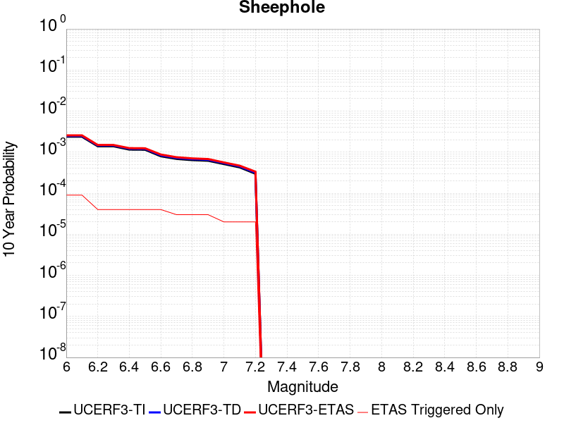 |

| Magnitude | 1 wk TI Prob | 1 wk TD Prob | 1 wk ETAS Prob | 1 wk ETAS/TD Gain | 1 wk ETAS Triggered Only | 1 mo TI Prob | 1 mo TD Prob | 1 mo ETAS Prob | 1 mo ETAS/TD Gain | 1 mo ETAS Triggered Only | 1 yr TI Prob | 1 yr TD Prob | 1 yr ETAS Prob | 1 yr ETAS/TD Gain | 1 yr ETAS Triggered Only | 10 yr TI Prob | 10 yr TD Prob | 10 yr ETAS Prob | 10 yr ETAS/TD Gain | 10 yr ETAS Triggered Only |
|-----|-----|-----|-----|-----|-----|-----|-----|-----|-----|-----|-----|-----|-----|-----|-----|-----|-----|-----|-----|-----|
| 6.0 | 4.5579695E-6 | 4.7412627E-6 | 4.7412627E-6 | 1.0 | 0.0 | 1.9534009E-5 | 2.031957E-5 | 3.0319366E-5 | 1.4921265 | 1.0E-5 | 2.3780059E-4 | 2.473682E-4 | 3.073534E-4 | 1.2424934 | 6.0E-5 | 0.0023754628 | 0.002471473 | 0.0025612507 | 1.0363256 | 9.0E-5 |
| 6.1 | 4.5579695E-6 | 4.7412627E-6 | 4.7412627E-6 | 1.0 | 0.0 | 1.9534009E-5 | 2.031957E-5 | 3.0319366E-5 | 1.4921265 | 1.0E-5 | 2.3780059E-4 | 2.473682E-4 | 3.073534E-4 | 1.2424934 | 6.0E-5 | 0.0023754628 | 0.002471473 | 0.0025612507 | 1.0363256 | 9.0E-5 |
| 6.2 | 2.6677674E-6 | 2.7873941E-6 | 2.7873941E-6 | 1.0 | 0.0 | 1.1433239E-5 | 1.1945926E-5 | 1.1945926E-5 | 1.0 | 0.0 | 1.3919079E-4 | 1.4543302E-4 | 1.6543012E-4 | 1.1375003 | 2.0E-5 | 0.0013910364 | 0.0014534844 | 0.0014934263 | 1.0274801 | 4.0E-5 |
| 6.3 | 2.6677674E-6 | 2.7873941E-6 | 2.7873941E-6 | 1.0 | 0.0 | 1.1433239E-5 | 1.1945926E-5 | 1.1945926E-5 | 1.0 | 0.0 | 1.3919079E-4 | 1.4543302E-4 | 1.6543012E-4 | 1.1375003 | 2.0E-5 | 0.0013910364 | 0.0014534844 | 0.0014934263 | 1.0274801 | 4.0E-5 |
| 6.4 | 2.2159759E-6 | 2.3228788E-6 | 2.3228788E-6 | 1.0 | 0.0 | 9.497005E-6 | 9.955161E-6 | 9.955161E-6 | 1.0 | 0.0 | 1.156199E-4 | 1.2119815E-4 | 1.4119573E-4 | 1.164999 | 2.0E-5 | 0.0011555976 | 0.0012113999 | 0.0012513514 | 1.0329796 | 4.0E-5 |
| 6.5 | 2.1986082E-6 | 2.304759E-6 | 2.304759E-6 | 1.0 | 0.0 | 9.4225725E-6 | 9.877506E-6 | 9.877506E-6 | 1.0 | 0.0 | 1.1471378E-4 | 1.2025281E-4 | 1.402504E-4 | 1.1662962 | 2.0E-5 | 0.0011465458 | 0.0012019566 | 0.0012419085 | 1.0332391 | 4.0E-5 |
| 6.6 | 1.5232331E-6 | 1.6018919E-6 | 1.6018919E-6 | 1.0 | 0.0 | 6.5281256E-6 | 6.865234E-6 | 6.865234E-6 | 1.0 | 0.0 | 7.947703E-5 | 8.35812E-5 | 1.03579536E-4 | 1.2392683 | 2.0E-5 | 7.9448614E-4 | 8.3551643E-4 | 8.75483E-4 | 1.0478346 | 4.0E-5 |
| 6.7 | 1.3137362E-6 | 1.382819E-6 | 1.382819E-6 | 1.0 | 0.0 | 5.6302856E-6 | 5.926355E-6 | 5.926355E-6 | 1.0 | 0.0 | 6.854657E-5 | 7.215112E-5 | 8.21504E-5 | 1.138588 | 1.0E-5 | 6.8525434E-4 | 7.212908E-4 | 7.512692E-4 | 1.0415621 | 3.0E-5 |
| 6.8 | 1.2275751E-6 | 1.2922847E-6 | 1.2922847E-6 | 1.0 | 0.0 | 5.2610258E-6 | 5.5383516E-6 | 5.5383516E-6 | 1.0 | 0.0 | 6.4051106E-5 | 6.7427485E-5 | 7.7426805E-5 | 1.1482974 | 1.0E-5 | 6.4032647E-4 | 6.740836E-4 | 7.040634E-4 | 1.0444748 | 3.0E-5 |
| 6.9 | 1.1837088E-6 | 1.246102E-6 | 1.246102E-6 | 1.0 | 0.0 | 5.0730278E-6 | 5.340427E-6 | 5.340427E-6 | 1.0 | 0.0 | 6.176237E-5 | 6.501789E-5 | 7.501724E-5 | 1.1537938 | 1.0E-5 | 6.17452E-4 | 6.5000186E-4 | 6.7998236E-4 | 1.0461237 | 3.0E-5 |
| 7.0 | 9.849371E-7 | 1.0366288E-6 | 1.0366288E-6 | 1.0 | 0.0 | 4.2211523E-6 | 4.442688E-6 | 4.442688E-6 | 1.0 | 0.0 | 5.1391315E-5 | 5.4088487E-5 | 6.4087944E-5 | 1.1848723 | 1.0E-5 | 5.137943E-4 | 5.407633E-4 | 5.6075247E-4 | 1.0369648 | 2.0E-5 |
| 7.1 | 8.1643645E-7 | 8.591669E-7 | 8.591669E-7 | 1.0 | 0.0 | 3.4990085E-6 | 3.682139E-6 | 3.682139E-6 | 1.0 | 0.0 | 4.2599597E-5 | 4.482921E-5 | 5.482876E-5 | 1.2230588 | 1.0E-5 | 4.259143E-4 | 4.4821028E-4 | 4.6820132E-4 | 1.0446019 | 2.0E-5 |
| 7.2 | 5.7295756E-7 | 6.029502E-7 | 6.029502E-7 | 1.0 | 0.0 | 2.45553E-6 | 2.58407E-6 | 2.58407E-6 | 1.0 | 0.0 | 2.9895667E-5 | 3.1460666E-5 | 4.1460353E-5 | 1.3178473 | 1.0E-5 | 2.9891645E-4 | 3.145688E-4 | 3.3456253E-4 | 1.063559 | 2.0E-5 |

## San Jacinto (Borrego)
*[(top)](#table-of-contents)*

| 1 Week | 1 Month | 1 Year | 10 Year |
|-----|-----|-----|-----|
| 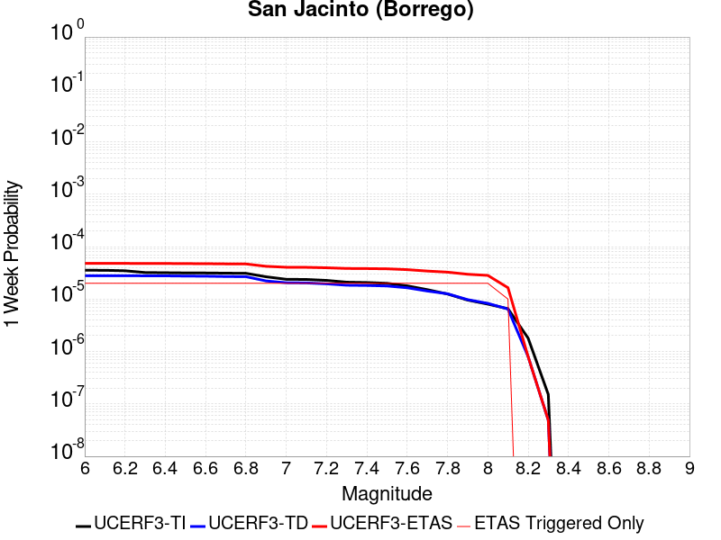 |  | 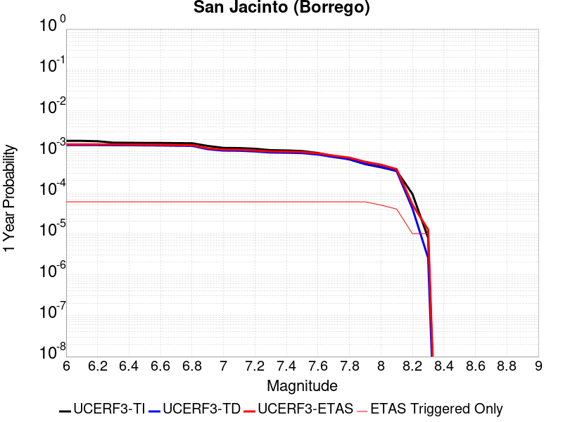 |  |

| Magnitude | 1 wk TI Prob | 1 wk TD Prob | 1 wk ETAS Prob | 1 wk ETAS/TD Gain | 1 wk ETAS Triggered Only | 1 mo TI Prob | 1 mo TD Prob | 1 mo ETAS Prob | 1 mo ETAS/TD Gain | 1 mo ETAS Triggered Only | 1 yr TI Prob | 1 yr TD Prob | 1 yr ETAS Prob | 1 yr ETAS/TD Gain | 1 yr ETAS Triggered Only | 10 yr TI Prob | 10 yr TD Prob | 10 yr ETAS Prob | 10 yr ETAS/TD Gain | 10 yr ETAS Triggered Only |
|-----|-----|-----|-----|-----|-----|-----|-----|-----|-----|-----|-----|-----|-----|-----|-----|-----|-----|-----|-----|-----|
| 6.0 | 3.543992E-5 | 2.7925962E-5 | 4.7925405E-5 | 1.7161595 | 2.0E-5 | 1.5187653E-4 | 1.1967727E-4 | 1.5967249E-4 | 1.3341922 | 4.0E-5 | 0.0018475284 | 0.0014561092 | 0.0015160218 | 1.0411457 | 6.0E-5 | 0.018322436 | 0.01486815 | 0.014956812 | 1.0059632 | 9.0E-5 |
| 6.1 | 3.542281E-5 | 2.7925962E-5 | 4.7925405E-5 | 1.7161595 | 2.0E-5 | 1.5180321E-4 | 1.1967727E-4 | 1.5967249E-4 | 1.3341922 | 4.0E-5 | 0.0018466372 | 0.0014561092 | 0.0015160218 | 1.0411457 | 6.0E-5 | 0.018313672 | 0.01486815 | 0.014956812 | 1.0059632 | 9.0E-5 |
| 6.2 | 3.4688688E-5 | 2.7925962E-5 | 4.7925405E-5 | 1.7161595 | 2.0E-5 | 1.4865733E-4 | 1.1967727E-4 | 1.5967249E-4 | 1.3341923 | 4.0E-5 | 0.0018084005 | 0.0014561091 | 0.0015160218 | 1.0411457 | 6.0E-5 | 0.017937548 | 0.01486815 | 0.014956812 | 1.0059632 | 9.0E-5 |
| 6.3 | 3.2087122E-5 | 2.7771312E-5 | 4.7770758E-5 | 1.7201476 | 2.0E-5 | 1.3750899E-4 | 1.1901455E-4 | 1.5900978E-4 | 1.3360534 | 4.0E-5 | 0.0016728862 | 0.0014480512 | 0.0015079643 | 1.041375 | 6.0E-5 | 0.016603488 | 0.014789308 | 0.014877977 | 1.0059955 | 9.0E-5 |
| 6.4 | 3.1828724E-5 | 2.773829E-5 | 4.7737733E-5 | 1.721005 | 2.0E-5 | 1.364017E-4 | 1.1887303E-4 | 1.5886828E-4 | 1.3364534 | 4.0E-5 | 0.0016594254 | 0.0014463306 | 0.0015062437 | 1.0414243 | 6.0E-5 | 0.016470885 | 0.014772502 | 0.014861172 | 1.0060024 | 9.0E-5 |
| 6.5 | 3.1563577E-5 | 2.7477974E-5 | 4.7477424E-5 | 1.7278357 | 2.0E-5 | 1.3526545E-4 | 1.17757496E-4 | 1.5775279E-4 | 1.3396411 | 4.0E-5 | 0.0016456128 | 0.0014327668 | 0.0014926809 | 1.0418171 | 6.0E-5 | 0.0163348 | 0.01463991 | 0.014728593 | 1.0060576 | 9.0E-5 |
| 6.6 | 3.1467625E-5 | 2.7322194E-5 | 4.7321646E-5 | 1.7319857 | 2.0E-5 | 1.3485427E-4 | 1.17089934E-4 | 1.5708525E-4 | 1.3415778 | 4.0E-5 | 0.0016406142 | 0.0014246498 | 0.0014845644 | 1.0420556 | 6.0E-5 | 0.016285548 | 0.014560228 | 0.014648917 | 1.0060912 | 9.0E-5 |
| 6.7 | 3.1223695E-5 | 2.6940217E-5 | 4.693968E-5 | 1.7423645 | 2.0E-5 | 1.3380898E-4 | 1.1545303E-4 | 1.5544842E-4 | 1.3464212 | 4.0E-5 | 0.0016279068 | 0.0014047464 | 0.0014646621 | 1.0426524 | 6.0E-5 | 0.01616033 | 0.01436451 | 0.014453216 | 1.0061754 | 9.0E-5 |
| 6.8 | 3.1015585E-5 | 2.6761221E-5 | 4.6760684E-5 | 1.7473301 | 2.0E-5 | 1.3291716E-4 | 1.1468597E-4 | 1.5468139E-4 | 1.3487384 | 4.0E-5 | 0.001617065 | 0.0013954195 | 0.0014553358 | 1.0429379 | 6.0E-5 | 0.016053487 | 0.014271772 | 0.014360487 | 1.0062162 | 9.0E-5 |
| 6.9 | 2.6641965E-5 | 2.2183434E-5 | 4.218299E-5 | 1.9015536 | 2.0E-5 | 1.1417485E-4 | 9.506842E-5 | 1.3506462E-4 | 1.4207096 | 4.0E-5 | 0.0013891924 | 0.0011568473 | 0.001216778 | 1.0518051 | 6.0E-5 | 0.0138054015 | 0.011882191 | 0.011971122 | 1.0074843 | 9.0E-5 |
| 7.0 | 2.3854353E-5 | 2.047825E-5 | 4.047784E-5 | 1.9766259 | 2.0E-5 | 1.02228936E-4 | 8.776099E-5 | 1.2775748E-4 | 1.4557433 | 4.0E-5 | 0.0012439266 | 0.0010679689 | 0.0011279049 | 1.0561215 | 6.0E-5 | 0.012369866 | 0.0109826205 | 0.011071632 | 1.0081048 | 9.0E-5 |
| 7.1 | 2.3672901E-5 | 2.0314741E-5 | 4.0314335E-5 | 1.9844868 | 2.0E-5 | 1.0145135E-4 | 8.706028E-5 | 1.270568E-4 | 1.4594117 | 4.0E-5 | 0.0012344702 | 0.0010594461 | 0.0011193826 | 1.0565734 | 6.0E-5 | 0.0122763505 | 0.010897858 | 0.010986878 | 1.0081685 | 9.0E-5 |
| 7.2 | 2.2717244E-5 | 1.9542116E-5 | 3.9541726E-5 | 2.0234106 | 2.0E-5 | 9.735599E-5 | 8.3749255E-5 | 1.2374591E-4 | 1.4775763 | 4.0E-5 | 0.0011846646 | 0.0010191725 | 0.0010791114 | 1.0588113 | 6.0E-5 | 0.01178369 | 0.010495322 | 0.010584377 | 1.0084852 | 9.0E-5 |
| 7.3 | 2.1016205E-5 | 1.8383771E-5 | 3.8383405E-5 | 2.087896 | 2.0E-5 | 9.006634E-5 | 7.878522E-5 | 1.1878207E-4 | 1.5076694 | 4.0E-5 | 0.001096006 | 9.5879E-4 | 0.0010187326 | 1.0625188 | 6.0E-5 | 0.010906163 | 0.009890901 | 0.009980011 | 1.0090092 | 9.0E-5 |
| 7.4 | 2.0683625E-5 | 1.8186302E-5 | 3.818594E-5 | 2.0997088 | 2.0E-5 | 8.86411E-5 | 7.7938974E-5 | 1.1793586E-4 | 1.513182 | 4.0E-5 | 0.001078671 | 9.48496E-4 | 0.0010084391 | 1.0631981 | 6.0E-5 | 0.010734501 | 0.0097876275 | 0.009876747 | 1.0091053 | 9.0E-5 |
| 7.5 | 1.9993966E-5 | 1.7781347E-5 | 3.7780992E-5 | 2.1247542 | 2.0E-5 | 8.568561E-5 | 7.6203556E-5 | 1.16200514E-4 | 1.5248699 | 4.0E-5 | 0.001042723 | 9.2738547E-4 | 9.873298E-4 | 1.064638 | 6.0E-5 | 0.010378438 | 0.009574548 | 0.009663687 | 1.0093099 | 9.0E-5 |
| 7.6 | 1.788966E-5 | 1.6434618E-5 | 3.643429E-5 | 2.2169235 | 2.0E-5 | 7.666772E-5 | 7.043219E-5 | 1.1042937E-4 | 1.5678822 | 4.0E-5 | 9.3302975E-4 | 8.5717626E-4 | 9.171248E-4 | 1.0699372 | 6.0E-5 | 0.00929122 | 0.008866415 | 0.008955617 | 1.0100607 | 9.0E-5 |
| 7.7 | 1.5125781E-5 | 1.4236738E-5 | 3.4236455E-5 | 2.4047961 | 2.0E-5 | 6.4823165E-5 | 6.101317E-5 | 1.0101073E-4 | 1.6555562 | 4.0E-5 | 7.889362E-4 | 7.4258295E-4 | 8.025384E-4 | 1.080739 | 6.0E-5 | 0.007861412 | 0.007714161 | 0.0078034666 | 1.0115769 | 9.0E-5 |
| 7.8 | 1.250089E-5 | 1.262994E-5 | 3.2629687E-5 | 2.5835187 | 2.0E-5 | 5.3574146E-5 | 5.4127195E-5 | 9.412503E-5 | 1.73896 | 4.0E-5 | 6.5207E-4 | 6.588E-4 | 7.187605E-4 | 1.0910147 | 6.0E-5 | 0.006501599 | 0.006867759 | 0.0069571408 | 1.0130147 | 9.0E-5 |
| 7.9 | 9.561E-6 | 9.754065E-6 | 2.975387E-5 | 3.0504072 | 2.0E-5 | 4.0975072E-5 | 4.180247E-5 | 8.18008E-5 | 1.9568412 | 4.0E-5 | 4.987573E-4 | 5.0882675E-4 | 5.6879624E-4 | 1.1178583 | 6.0E-5 | 0.0049763937 | 0.0053523607 | 0.005441879 | 1.0167251 | 9.0E-5 |
| 8.0 | 8.01699E-6 | 8.292994E-6 | 2.8292829E-5 | 3.4116542 | 2.0E-5 | 3.4358076E-5 | 3.554092E-5 | 7.55395E-5 | 2.1254232 | 4.0E-5 | 4.1822926E-4 | 4.3262533E-4 | 4.8260367E-4 | 1.1155235 | 5.0E-5 | 0.0041744304 | 0.0045733186 | 0.004652953 | 1.0174128 | 8.0E-5 |
| 8.1 | 6.541947E-6 | 6.461784E-6 | 1.646172E-5 | 2.5475502 | 1.0E-5 | 2.8036617E-5 | 2.7693068E-5 | 5.769224E-5 | 2.0832736 | 3.0E-5 | 3.4129233E-4 | 3.3711144E-4 | 3.7709795E-4 | 1.1186152 | 4.0E-5 | 0.0034076865 | 0.0035805756 | 0.003650325 | 1.0194799 | 7.0E-5 |
| 8.2 | 1.7968189E-6 | 7.9684827E-7 | 7.9684827E-7 | 1.0 | 0.0 | 7.70063E-6 | 3.4150596E-6 | 3.4150596E-6 | 1.0 | 0.0 | 9.3751136E-5 | 4.157758E-5 | 5.1577164E-5 | 1.2405043 | 1.0E-5 | 9.371159E-4 | 4.7107413E-4 | 4.8106944E-4 | 1.0212181 | 1.0E-5 |
| 8.3 | 1.5167889E-7 | 4.8951257E-8 | 4.8951257E-8 | 1.0 | 0.0 | 6.500522E-7 | 2.0979108E-7 | 2.0979108E-7 | 1.0 | 0.0 | 7.9143565E-6 | 2.5542038E-6 | 1.2554178E-5 | 4.9151044 | 1.0E-5 | 7.914075E-5 | 2.9679897E-5 | 3.9679602E-5 | 1.3369184 | 1.0E-5 |

## Bullion Mountains
*[(top)](#table-of-contents)*

| 1 Week | 1 Month | 1 Year | 10 Year |
|-----|-----|-----|-----|
|  |  |  |  |

| Magnitude | 1 wk TI Prob | 1 wk TD Prob | 1 wk ETAS Prob | 1 wk ETAS/TD Gain | 1 wk ETAS Triggered Only | 1 mo TI Prob | 1 mo TD Prob | 1 mo ETAS Prob | 1 mo ETAS/TD Gain | 1 mo ETAS Triggered Only | 1 yr TI Prob | 1 yr TD Prob | 1 yr ETAS Prob | 1 yr ETAS/TD Gain | 1 yr ETAS Triggered Only | 10 yr TI Prob | 10 yr TD Prob | 10 yr ETAS Prob | 10 yr ETAS/TD Gain | 10 yr ETAS Triggered Only |
|-----|-----|-----|-----|-----|-----|-----|-----|-----|-----|-----|-----|-----|-----|-----|-----|-----|-----|-----|-----|-----|
| 6.0 | 1.6420427E-5 | 1.4692009E-5 | 4.469157E-5 | 3.0418963 | 3.0E-5 | 7.037136E-5 | 6.296445E-5 | 1.0296193E-4 | 1.6352391 | 4.0E-5 | 8.5643446E-4 | 7.6636096E-4 | 8.063303E-4 | 1.0521548 | 4.0E-5 | 0.008531413 | 0.0076409746 | 0.0077203633 | 1.0103899 | 8.0E-5 |
| 6.1 | 1.6420427E-5 | 1.4692009E-5 | 4.469157E-5 | 3.0418963 | 3.0E-5 | 7.037136E-5 | 6.296445E-5 | 1.0296193E-4 | 1.6352391 | 4.0E-5 | 8.5643446E-4 | 7.6636096E-4 | 8.063303E-4 | 1.0521548 | 4.0E-5 | 0.008531413 | 0.0076409746 | 0.0077203633 | 1.0103899 | 8.0E-5 |
| 6.2 | 1.6420427E-5 | 1.4692009E-5 | 4.469157E-5 | 3.0418963 | 3.0E-5 | 7.037136E-5 | 6.296445E-5 | 1.0296193E-4 | 1.6352391 | 4.0E-5 | 8.5643446E-4 | 7.6636096E-4 | 8.063303E-4 | 1.0521548 | 4.0E-5 | 0.008531413 | 0.0076409746 | 0.0077203633 | 1.0103899 | 8.0E-5 |
| 6.3 | 1.2046778E-5 | 9.862255E-6 | 1.9862156E-5 | 2.0139568 | 1.0E-5 | 5.1628023E-5 | 4.2266256E-5 | 5.226583E-5 | 1.2365854 | 1.0E-5 | 6.283899E-4 | 5.144933E-4 | 5.2448816E-4 | 1.0194266 | 1.0E-5 | 0.0062661595 | 0.0051353034 | 0.0051552006 | 1.0038747 | 2.0E-5 |
| 6.4 | 1.2046778E-5 | 9.862255E-6 | 1.9862156E-5 | 2.0139568 | 1.0E-5 | 5.1628023E-5 | 4.2266256E-5 | 5.226583E-5 | 1.2365854 | 1.0E-5 | 6.283899E-4 | 5.144933E-4 | 5.2448816E-4 | 1.0194266 | 1.0E-5 | 0.0062661595 | 0.0051353034 | 0.0051552006 | 1.0038747 | 2.0E-5 |
| 6.5 | 1.0244343E-5 | 7.879378E-6 | 1.78793E-5 | 2.2691257 | 1.0E-5 | 4.390359E-5 | 3.3768443E-5 | 4.376811E-5 | 1.2961245 | 1.0E-5 | 5.343951E-4 | 4.1107394E-4 | 4.2106982E-4 | 1.0243165 | 1.0E-5 | 0.005331118 | 0.0041051665 | 0.0041250843 | 1.0048519 | 2.0E-5 |
| 6.6 | 9.605408E-6 | 7.1774166E-6 | 1.7177344E-5 | 2.393249 | 1.0E-5 | 4.1165385E-5 | 3.0760108E-5 | 4.07598E-5 | 1.3250864 | 1.0E-5 | 5.010733E-4 | 3.7446033E-4 | 3.8445657E-4 | 1.0266951 | 1.0E-5 | 0.00499945 | 0.0037402906 | 0.0037602158 | 1.0053272 | 2.0E-5 |
| 6.7 | 8.60418E-6 | 6.123926E-6 | 1.6123866E-5 | 2.6329293 | 1.0E-5 | 3.687454E-5 | 2.6245243E-5 | 3.6244983E-5 | 1.3810114 | 1.0E-5 | 4.48855E-4 | 3.195085E-4 | 3.295053E-4 | 1.031288 | 1.0E-5 | 0.004479495 | 0.0031924031 | 0.003202371 | 1.0031224 | 1.0E-5 |
| 6.8 | 5.187994E-6 | 2.563117E-6 | 2.563117E-6 | 1.0 | 0.0 | 2.223407E-5 | 1.0984763E-5 | 1.0984763E-5 | 1.0 | 0.0 | 2.7066618E-4 | 1.3373529E-4 | 1.3373529E-4 | 1.0 | 0.0 | 0.0027033675 | 0.0013369396 | 0.0013369396 | 1.0 | 0.0 |
| 6.9 | 4.5302368E-6 | 2.3442778E-6 | 2.3442778E-6 | 1.0 | 0.0 | 1.9415156E-5 | 1.0046889E-5 | 1.0046889E-5 | 1.0 | 0.0 | 2.3635388E-4 | 1.2231797E-4 | 1.2231797E-4 | 1.0 | 0.0 | 0.0023610266 | 0.0012228956 | 0.0012228956 | 1.0 | 0.0 |
| 7.0 | 3.431668E-6 | 1.6882177E-6 | 1.6882177E-6 | 1.0 | 0.0 | 1.4707065E-5 | 7.2352186E-6 | 7.2352186E-6 | 1.0 | 0.0 | 1.7904381E-4 | 8.808879E-5 | 8.808879E-5 | 1.0 | 0.0 | 0.0017889962 | 8.8088785E-4 | 8.8088785E-4 | 1.0 | 0.0 |

## Dry Mountain
*[(top)](#table-of-contents)*

| 1 Week | 1 Month | 1 Year | 10 Year |
|-----|-----|-----|-----|
|  |  |  |  |

| Magnitude | 1 wk TI Prob | 1 wk TD Prob | 1 wk ETAS Prob | 1 wk ETAS/TD Gain | 1 wk ETAS Triggered Only | 1 mo TI Prob | 1 mo TD Prob | 1 mo ETAS Prob | 1 mo ETAS/TD Gain | 1 mo ETAS Triggered Only | 1 yr TI Prob | 1 yr TD Prob | 1 yr ETAS Prob | 1 yr ETAS/TD Gain | 1 yr ETAS Triggered Only | 10 yr TI Prob | 10 yr TD Prob | 10 yr ETAS Prob | 10 yr ETAS/TD Gain | 10 yr ETAS Triggered Only |
|-----|-----|-----|-----|-----|-----|-----|-----|-----|-----|-----|-----|-----|-----|-----|-----|-----|-----|-----|-----|-----|
| 6.0 | 6.222801E-6 | 6.439381E-6 | 2.6439253E-5 | 4.1058683 | 2.0E-5 | 2.6668875E-5 | 2.7597147E-5 | 6.759604E-5 | 2.4493852 | 4.0E-5 | 3.2464517E-4 | 3.3595937E-4 | 3.8594258E-4 | 1.1487775 | 5.0E-5 | 0.0032417132 | 0.0033560768 | 0.0034358085 | 1.0237573 | 8.0E-5 |
| 6.1 | 6.222801E-6 | 6.439381E-6 | 2.6439253E-5 | 4.1058683 | 2.0E-5 | 2.6668875E-5 | 2.7597147E-5 | 6.759604E-5 | 2.4493852 | 4.0E-5 | 3.2464517E-4 | 3.3595937E-4 | 3.8594258E-4 | 1.1487775 | 5.0E-5 | 0.0032417132 | 0.0033560768 | 0.0034358085 | 1.0237573 | 8.0E-5 |
| 6.2 | 6.222801E-6 | 6.439381E-6 | 2.6439253E-5 | 4.1058683 | 2.0E-5 | 2.6668875E-5 | 2.7597147E-5 | 6.759604E-5 | 2.4493852 | 4.0E-5 | 3.2464517E-4 | 3.3595937E-4 | 3.8594258E-4 | 1.1487775 | 5.0E-5 | 0.0032417132 | 0.0033560768 | 0.0034358085 | 1.0237573 | 8.0E-5 |
| 6.3 | 6.222801E-6 | 6.439381E-6 | 2.6439253E-5 | 4.1058683 | 2.0E-5 | 2.6668875E-5 | 2.7597147E-5 | 6.759604E-5 | 2.4493852 | 4.0E-5 | 3.2464517E-4 | 3.3595937E-4 | 3.8594258E-4 | 1.1487775 | 5.0E-5 | 0.0032417132 | 0.0033560768 | 0.0034358085 | 1.0237573 | 8.0E-5 |
| 6.4 | 6.222801E-6 | 6.439381E-6 | 2.6439253E-5 | 4.1058683 | 2.0E-5 | 2.6668875E-5 | 2.7597147E-5 | 6.759604E-5 | 2.4493852 | 4.0E-5 | 3.2464517E-4 | 3.3595937E-4 | 3.8594258E-4 | 1.1487775 | 5.0E-5 | 0.0032417132 | 0.0033560768 | 0.0034358085 | 1.0237573 | 8.0E-5 |
| 6.5 | 2.8528623E-6 | 2.9521684E-6 | 1.2952139E-5 | 4.3873305 | 1.0E-5 | 1.22264955E-5 | 1.2652138E-5 | 4.2651758E-5 | 3.3711107 | 3.0E-5 | 1.4884741E-4 | 1.540376E-4 | 1.9403143E-4 | 1.2596369 | 4.0E-5 | 0.0014874774 | 0.0015401616 | 0.0015900846 | 1.0324141 | 5.0E-5 |
| 6.6 | 2.8528623E-6 | 2.9521684E-6 | 1.2952139E-5 | 4.3873305 | 1.0E-5 | 1.22264955E-5 | 1.2652138E-5 | 4.2651758E-5 | 3.3711107 | 3.0E-5 | 1.4884741E-4 | 1.540376E-4 | 1.9403143E-4 | 1.2596369 | 4.0E-5 | 0.0014874774 | 0.0015401616 | 0.0015900846 | 1.0324141 | 5.0E-5 |
| 6.7 | 2.541E-6 | 2.6293578E-6 | 1.2629332E-5 | 4.8032 | 1.0E-5 | 1.0889954E-5 | 1.1268677E-5 | 4.126834E-5 | 3.662217 | 3.0E-5 | 1.3257713E-4 | 1.3719614E-4 | 1.7719065E-4 | 1.2915134 | 4.0E-5 | 0.0013249806 | 0.0013719613 | 0.0014218928 | 1.0363941 | 5.0E-5 |

## Tin Mountain
*[(top)](#table-of-contents)*

| 1 Week | 1 Month | 1 Year | 10 Year |
|-----|-----|-----|-----|
|  |  |  |  |

| Magnitude | 1 wk TI Prob | 1 wk TD Prob | 1 wk ETAS Prob | 1 wk ETAS/TD Gain | 1 wk ETAS Triggered Only | 1 mo TI Prob | 1 mo TD Prob | 1 mo ETAS Prob | 1 mo ETAS/TD Gain | 1 mo ETAS Triggered Only | 1 yr TI Prob | 1 yr TD Prob | 1 yr ETAS Prob | 1 yr ETAS/TD Gain | 1 yr ETAS Triggered Only | 10 yr TI Prob | 10 yr TD Prob | 10 yr ETAS Prob | 10 yr ETAS/TD Gain | 10 yr ETAS Triggered Only |
|-----|-----|-----|-----|-----|-----|-----|-----|-----|-----|-----|-----|-----|-----|-----|-----|-----|-----|-----|-----|-----|
| 6.0 | 4.083776E-6 | 4.1815365E-6 | 1.4181494E-5 | 3.3914554 | 1.0E-5 | 1.750178E-5 | 1.792077E-5 | 5.7920053E-5 | 3.232007 | 4.0E-5 | 2.1306332E-4 | 2.1816725E-4 | 2.6815635E-4 | 1.2291319 | 5.0E-5 | 0.0021285915 | 0.0021798965 | 0.002259722 | 1.036619 | 8.0E-5 |
| 6.1 | 4.083776E-6 | 4.1815365E-6 | 1.4181494E-5 | 3.3914554 | 1.0E-5 | 1.750178E-5 | 1.792077E-5 | 5.7920053E-5 | 3.232007 | 4.0E-5 | 2.1306332E-4 | 2.1816725E-4 | 2.6815635E-4 | 1.2291319 | 5.0E-5 | 0.0021285915 | 0.0021798965 | 0.002259722 | 1.036619 | 8.0E-5 |
| 6.2 | 4.083776E-6 | 4.1815365E-6 | 1.4181494E-5 | 3.3914554 | 1.0E-5 | 1.750178E-5 | 1.792077E-5 | 5.7920053E-5 | 3.232007 | 4.0E-5 | 2.1306332E-4 | 2.1816725E-4 | 2.6815635E-4 | 1.2291319 | 5.0E-5 | 0.0021285915 | 0.0021798965 | 0.002259722 | 1.036619 | 8.0E-5 |
| 6.3 | 4.083776E-6 | 4.1815365E-6 | 1.4181494E-5 | 3.3914554 | 1.0E-5 | 1.750178E-5 | 1.792077E-5 | 5.7920053E-5 | 3.232007 | 4.0E-5 | 2.1306332E-4 | 2.1816725E-4 | 2.6815635E-4 | 1.2291319 | 5.0E-5 | 0.0021285915 | 0.0021798965 | 0.002259722 | 1.036619 | 8.0E-5 |
| 6.4 | 4.083776E-6 | 4.1815365E-6 | 1.4181494E-5 | 3.3914554 | 1.0E-5 | 1.750178E-5 | 1.792077E-5 | 5.7920053E-5 | 3.232007 | 4.0E-5 | 2.1306332E-4 | 2.1816725E-4 | 2.6815635E-4 | 1.2291319 | 5.0E-5 | 0.0021285915 | 0.0021798965 | 0.002259722 | 1.036619 | 8.0E-5 |
| 6.5 | 2.3143427E-6 | 2.3731573E-6 | 2.3731573E-6 | 1.0 | 0.0 | 9.9185745E-6 | 1.0170638E-5 | 1.0170638E-5 | 1.0 | 0.0 | 1.2075195E-4 | 1.2382126E-4 | 1.3382002E-4 | 1.0807515 | 1.0E-5 | 0.0012068636 | 0.0012375986 | 0.0012675615 | 1.0242105 | 3.0E-5 |
| 6.6 | 2.3143427E-6 | 2.3731573E-6 | 2.3731573E-6 | 1.0 | 0.0 | 9.9185745E-6 | 1.0170638E-5 | 1.0170638E-5 | 1.0 | 0.0 | 1.2075195E-4 | 1.2382126E-4 | 1.3382002E-4 | 1.0807515 | 1.0E-5 | 0.0012068636 | 0.0012375986 | 0.0012675615 | 1.0242105 | 3.0E-5 |
| 6.7 | 1.7029532E-6 | 1.7497915E-6 | 1.7497915E-6 | 1.0 | 0.0 | 7.2983503E-6 | 7.499088E-6 | 7.499088E-6 | 1.0 | 0.0 | 8.885379E-5 | 9.1298105E-5 | 9.1298105E-5 | 1.0 | 0.0 | 8.881827E-4 | 9.1265864E-4 | 9.3264034E-4 | 1.021894 | 2.0E-5 |
| 6.8 | 1.2914646E-6 | 1.3299378E-6 | 1.3299378E-6 | 1.0 | 0.0 | 5.534837E-6 | 5.6997237E-6 | 5.6997237E-6 | 1.0 | 0.0 | 6.738455E-5 | 6.939237E-5 | 6.939237E-5 | 1.0 | 0.0 | 6.736412E-4 | 6.9375033E-4 | 7.1373646E-4 | 1.0288088 | 2.0E-5 |
| 6.9 | 5.8708974E-7 | 6.1169936E-7 | 6.1169936E-7 | 1.0 | 0.0 | 2.5160964E-6 | 2.6215664E-6 | 2.6215664E-6 | 1.0 | 0.0 | 3.0633044E-5 | 3.1917145E-5 | 3.1917145E-5 | 1.0 | 0.0 | 3.0628822E-4 | 3.191297E-4 | 3.2912652E-4 | 1.0313252 | 1.0E-5 |
| 7.0 | 4.6248786E-7 | 4.832015E-7 | 4.832015E-7 | 1.0 | 0.0 | 1.9820893E-6 | 2.0708624E-6 | 2.0708624E-6 | 1.0 | 0.0 | 2.413167E-5 | 2.5212494E-5 | 2.5212494E-5 | 1.0 | 0.0 | 2.412905E-4 | 2.5210003E-4 | 2.5210003E-4 | 1.0 | 0.0 |
| 7.1 | 3.804606E-7 | 3.987147E-7 | 3.987147E-7 | 1.0 | 0.0 | 1.6305444E-6 | 1.7087764E-6 | 1.7087764E-6 | 1.0 | 0.0 | 1.9851697E-5 | 2.0804187E-5 | 2.0804187E-5 | 1.0 | 0.0 | 1.9849923E-4 | 2.0802575E-4 | 2.0802575E-4 | 1.0 | 0.0 |
| 7.2 | 3.5864858E-7 | 3.7616863E-7 | 3.7616863E-7 | 1.0 | 0.0 | 1.5370645E-6 | 1.6121504E-6 | 1.6121504E-6 | 1.0 | 0.0 | 1.87136E-5 | 1.9627789E-5 | 1.9627789E-5 | 1.0 | 0.0 | 1.8712023E-4 | 1.9626386E-4 | 1.9626386E-4 | 1.0 | 0.0 |
| 7.3 | 3.342063E-7 | 3.506347E-7 | 3.506347E-7 | 1.0 | 0.0 | 1.4323119E-6 | 1.5027196E-6 | 1.5027196E-6 | 1.0 | 0.0 | 1.7438259E-5 | 1.829549E-5 | 1.829549E-5 | 1.0 | 0.0 | 1.743689E-4 | 1.8294314E-4 | 1.8294314E-4 | 1.0 | 0.0 |
| 7.4 | 2.971242E-7 | 3.1165817E-7 | 3.1165817E-7 | 1.0 | 0.0 | 1.2733886E-6 | 1.3356774E-6 | 1.3356774E-6 | 1.0 | 0.0 | 1.5503398E-5 | 1.6261785E-5 | 1.6261785E-5 | 1.0 | 0.0 | 1.5502315E-4 | 1.6260923E-4 | 1.6260923E-4 | 1.0 | 0.0 |
| 7.5 | 1.4326713E-7 | 1.5012525E-7 | 1.5012525E-7 | 1.0 | 0.0 | 6.140018E-7 | 6.433939E-7 | 6.433939E-7 | 1.0 | 0.0 | 7.4754466E-6 | 7.8333205E-6 | 7.8333205E-6 | 1.0 | 0.0 | 7.475195E-5 | 7.833321E-5 | 7.833321E-5 | 1.0 | 0.0 |

## San Jacinto (Clark) rev
*[(top)](#table-of-contents)*

| 1 Week | 1 Month | 1 Year | 10 Year |
|-----|-----|-----|-----|
|  |  |  | 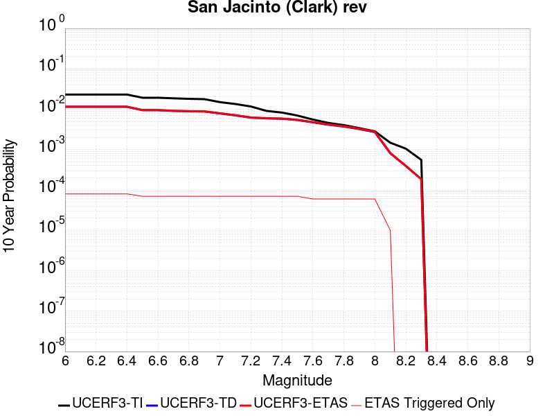 |

| Magnitude | 1 wk TI Prob | 1 wk TD Prob | 1 wk ETAS Prob | 1 wk ETAS/TD Gain | 1 wk ETAS Triggered Only | 1 mo TI Prob | 1 mo TD Prob | 1 mo ETAS Prob | 1 mo ETAS/TD Gain | 1 mo ETAS Triggered Only | 1 yr TI Prob | 1 yr TD Prob | 1 yr ETAS Prob | 1 yr ETAS/TD Gain | 1 yr ETAS Triggered Only | 10 yr TI Prob | 10 yr TD Prob | 10 yr ETAS Prob | 10 yr ETAS/TD Gain | 10 yr ETAS Triggered Only |
|-----|-----|-----|-----|-----|-----|-----|-----|-----|-----|-----|-----|-----|-----|-----|-----|-----|-----|-----|-----|-----|
| 6.0 | 4.482615E-5 | 2.1153059E-5 | 4.1152634E-5 | 1.9454697 | 2.0E-5 | 1.9209793E-4 | 9.065287E-5 | 1.2065015E-4 | 1.3309027 | 3.0E-5 | 0.0023362834 | 0.0011031491 | 0.001143105 | 1.0362198 | 4.0E-5 | 0.02311874 | 0.011485709 | 0.01156479 | 1.0068852 | 8.0E-5 |
| 6.1 | 4.482615E-5 | 2.1153059E-5 | 4.1152634E-5 | 1.9454697 | 2.0E-5 | 1.9209793E-4 | 9.065287E-5 | 1.2065015E-4 | 1.3309027 | 3.0E-5 | 0.0023362834 | 0.0011031491 | 0.001143105 | 1.0362198 | 4.0E-5 | 0.02311874 | 0.011485709 | 0.01156479 | 1.0068852 | 8.0E-5 |
| 6.2 | 4.482615E-5 | 2.1153059E-5 | 4.1152634E-5 | 1.9454697 | 2.0E-5 | 1.9209793E-4 | 9.065287E-5 | 1.2065015E-4 | 1.3309027 | 3.0E-5 | 0.0023362834 | 0.0011031491 | 0.001143105 | 1.0362198 | 4.0E-5 | 0.02311874 | 0.011485709 | 0.01156479 | 1.0068852 | 8.0E-5 |
| 6.3 | 4.482615E-5 | 2.1153059E-5 | 4.1152634E-5 | 1.9454697 | 2.0E-5 | 1.9209793E-4 | 9.065287E-5 | 1.2065015E-4 | 1.3309027 | 3.0E-5 | 0.0023362834 | 0.0011031491 | 0.001143105 | 1.0362198 | 4.0E-5 | 0.02311874 | 0.011485709 | 0.01156479 | 1.0068852 | 8.0E-5 |
| 6.4 | 4.482615E-5 | 2.1153059E-5 | 4.1152634E-5 | 1.9454697 | 2.0E-5 | 1.9209793E-4 | 9.065287E-5 | 1.2065015E-4 | 1.3309027 | 3.0E-5 | 0.0023362834 | 0.0011031491 | 0.001143105 | 1.0362198 | 4.0E-5 | 0.02311874 | 0.011485709 | 0.01156479 | 1.0068852 | 8.0E-5 |
| 6.5 | 3.7294863E-5 | 1.7354667E-5 | 3.735432E-5 | 2.152408 | 2.0E-5 | 1.5982533E-4 | 7.437504E-5 | 1.0437281E-4 | 1.403331 | 3.0E-5 | 0.0019441366 | 9.051445E-4 | 9.4510824E-4 | 1.0441518 | 4.0E-5 | 0.01927216 | 0.009485902 | 0.009555238 | 1.0073093 | 7.0E-5 |
| 6.6 | 3.7294863E-5 | 1.7354667E-5 | 3.735432E-5 | 2.152408 | 2.0E-5 | 1.5982533E-4 | 7.437504E-5 | 1.0437281E-4 | 1.403331 | 3.0E-5 | 0.0019441366 | 9.051445E-4 | 9.4510824E-4 | 1.0441518 | 4.0E-5 | 0.01927216 | 0.009485902 | 0.009555238 | 1.0073093 | 7.0E-5 |
| 6.7 | 3.6039248E-5 | 1.6602684E-5 | 3.6602352E-5 | 2.2046046 | 2.0E-5 | 1.5444479E-4 | 7.115244E-5 | 1.01150305E-4 | 1.4216 | 3.0E-5 | 0.0018787434 | 8.659408E-4 | 9.059062E-4 | 1.0461526 | 4.0E-5 | 0.01862939 | 0.009088189 | 0.009157553 | 1.0076323 | 7.0E-5 |
| 6.8 | 3.5031844E-5 | 1.6231123E-5 | 3.62308E-5 | 2.2321806 | 2.0E-5 | 1.5012783E-4 | 6.956012E-5 | 9.9558034E-5 | 1.4312515 | 3.0E-5 | 0.0018262739 | 8.4656954E-4 | 8.865357E-4 | 1.0472095 | 4.0E-5 | 0.01811338 | 0.008888788 | 0.0089581655 | 1.0078051 | 7.0E-5 |
| 6.9 | 3.435112E-5 | 1.6061658E-5 | 3.6061338E-5 | 2.2451813 | 2.0E-5 | 1.4721078E-4 | 6.8833884E-5 | 9.883182E-5 | 1.4358019 | 3.0E-5 | 0.0017908178 | 8.377344E-4 | 8.777009E-4 | 1.0477078 | 4.0E-5 | 0.017764548 | 0.008796512 | 0.008865896 | 1.0078877 | 7.0E-5 |
| 7.0 | 2.8959772E-5 | 1.43355255E-5 | 3.4335237E-5 | 2.3951156 | 2.0E-5 | 1.241074E-4 | 6.1436534E-5 | 9.143469E-5 | 1.4882787 | 3.0E-5 | 0.0015099603 | 7.477359E-4 | 7.87706E-4 | 1.0534549 | 4.0E-5 | 0.014997416 | 0.007868331 | 0.007937781 | 1.0088264 | 7.0E-5 |
| 7.1 | 2.6002877E-5 | 1.2827699E-5 | 3.2827444E-5 | 2.559106 | 2.0E-5 | 1.11436144E-4 | 5.4974706E-5 | 8.497306E-5 | 1.5456755 | 3.0E-5 | 0.0013558907 | 6.6911365E-4 | 7.0908683E-4 | 1.0597405 | 4.0E-5 | 0.013476475 | 0.0070483433 | 0.0071178502 | 1.0098615 | 7.0E-5 |
| 7.2 | 2.2544838E-5 | 1.1260331E-5 | 3.1260108E-5 | 2.7761266 | 2.0E-5 | 9.661716E-5 | 4.825768E-5 | 7.8256235E-5 | 1.6216327 | 3.0E-5 | 0.001175679 | 5.873803E-4 | 6.273568E-4 | 1.068059 | 4.0E-5 | 0.011694785 | 0.00619256 | 0.0062621264 | 1.0112339 | 7.0E-5 |
| 7.3 | 1.75334E-5 | 1.0810585E-5 | 3.081037E-5 | 2.8500187 | 2.0E-5 | 7.514098E-5 | 4.6330264E-5 | 7.632888E-5 | 1.6474949 | 3.0E-5 | 9.144575E-4 | 5.6392635E-4 | 6.039038E-4 | 1.0708913 | 4.0E-5 | 0.009107036 | 0.0059332196 | 0.0060028043 | 1.0117279 | 7.0E-5 |
| 7.4 | 1.5924552E-5 | 1.0610475E-5 | 3.0610263E-5 | 2.8849096 | 2.0E-5 | 6.82463E-5 | 4.547268E-5 | 7.547132E-5 | 1.6597068 | 3.0E-5 | 8.305819E-4 | 5.534906E-4 | 5.934685E-4 | 1.0722287 | 4.0E-5 | 0.008274844 | 0.0058205863 | 0.005890179 | 1.0119563 | 7.0E-5 |
| 7.5 | 1.3428931E-5 | 9.851045E-6 | 2.9850848E-5 | 3.0302215 | 2.0E-5 | 5.7551293E-5 | 4.221809E-5 | 7.221682E-5 | 1.7105659 | 3.0E-5 | 7.004617E-4 | 5.1388505E-4 | 5.538645E-4 | 1.0777984 | 4.0E-5 | 0.006982579 | 0.005406209 | 0.0054758303 | 1.0128781 | 7.0E-5 |
| 7.6 | 1.0688787E-5 | 8.614091E-6 | 2.8613918E-5 | 3.3217573 | 2.0E-5 | 4.5808283E-5 | 3.6917012E-5 | 6.6915905E-5 | 1.8126035 | 3.0E-5 | 5.5757316E-4 | 4.4937237E-4 | 4.893544E-4 | 1.088973 | 4.0E-5 | 0.005561762 | 0.0047413614 | 0.004801077 | 1.0125946 | 6.0E-5 |
| 7.7 | 8.81236E-6 | 7.4673385E-6 | 2.746719E-5 | 3.6783104 | 2.0E-5 | 3.776671E-5 | 3.200249E-5 | 6.200153E-5 | 1.9373971 | 3.0E-5 | 4.597127E-4 | 3.8956082E-4 | 4.2954527E-4 | 1.1026397 | 4.0E-5 | 0.0045876284 | 0.0041344194 | 0.004194171 | 1.0144523 | 6.0E-5 |
| 7.8 | 7.780431E-6 | 6.695928E-6 | 2.6695794E-5 | 3.98687 | 2.0E-5 | 3.3344273E-5 | 2.8696519E-5 | 5.8695656E-5 | 2.045393 | 3.0E-5 | 4.0589093E-4 | 3.4932428E-4 | 3.893103E-4 | 1.1144668 | 4.0E-5 | 0.0040515037 | 0.0037226272 | 0.003782404 | 1.0160576 | 6.0E-5 |
| 7.9 | 6.5437994E-6 | 5.7797783E-6 | 2.5779662E-5 | 4.4603205 | 2.0E-5 | 2.8044553E-5 | 2.4770245E-5 | 5.47695E-5 | 2.2111006 | 3.0E-5 | 3.4138895E-4 | 3.0153614E-4 | 3.415241E-4 | 1.132614 | 4.0E-5 | 0.0034086495 | 0.0032343294 | 0.0032941352 | 1.018491 | 6.0E-5 |
| 8.0 | 5.4488164E-6 | 4.812793E-6 | 2.4812696E-5 | 5.155571 | 2.0E-5 | 2.3351862E-5 | 2.0626094E-5 | 5.0625476E-5 | 2.4544384 | 3.0E-5 | 2.8427184E-4 | 2.510939E-4 | 2.9108385E-4 | 1.159263 | 4.0E-5 | 0.0028390845 | 0.0027107038 | 0.002770541 | 1.0220745 | 6.0E-5 |
| 8.1 | 2.8397242E-6 | 1.3665673E-6 | 1.1366554E-5 | 8.3175955 | 1.0E-5 | 1.217019E-5 | 5.856704E-6 | 1.5856645E-5 | 2.7074351 | 1.0E-5 | 1.4816198E-4 | 7.1303046E-5 | 8.1302336E-5 | 1.1402365 | 1.0E-5 | 0.0014806325 | 8.113543E-4 | 8.213462E-4 | 1.012315 | 1.0E-5 |
| 8.2 | 2.030244E-6 | 6.3151083E-7 | 6.3151083E-7 | 1.0 | 0.0 | 8.701017E-6 | 2.7064723E-6 | 2.7064723E-6 | 1.0 | 0.0 | 1.05929736E-4 | 3.2950808E-5 | 3.2950808E-5 | 1.0 | 0.0 | 0.0010587925 | 3.9470522E-4 | 3.9470522E-4 | 1.0 | 0.0 |
| 8.3 | 1.0659804E-6 | 2.9230563E-7 | 2.9230563E-7 | 1.0 | 0.0 | 4.568479E-6 | 1.2527379E-6 | 1.2527379E-6 | 1.0 | 0.0 | 5.5619817E-5 | 1.5251981E-5 | 1.5251981E-5 | 1.0 | 0.0 | 5.5605895E-4 | 1.8556409E-4 | 1.8556409E-4 | 1.0 | 0.0 |

## Santa Ynez River
*[(top)](#table-of-contents)*

| 1 Week | 1 Month | 1 Year | 10 Year |
|-----|-----|-----|-----|
|  |  | 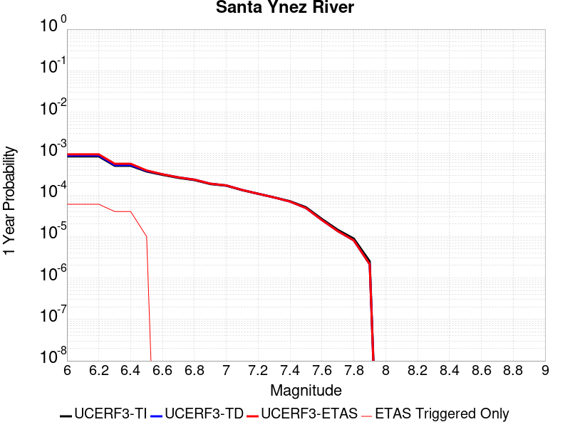 | 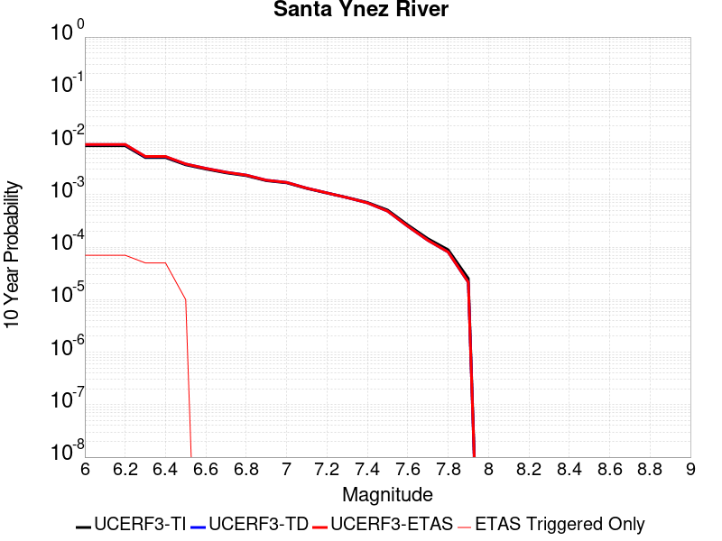 |

| Magnitude | 1 wk TI Prob | 1 wk TD Prob | 1 wk ETAS Prob | 1 wk ETAS/TD Gain | 1 wk ETAS Triggered Only | 1 mo TI Prob | 1 mo TD Prob | 1 mo ETAS Prob | 1 mo ETAS/TD Gain | 1 mo ETAS Triggered Only | 1 yr TI Prob | 1 yr TD Prob | 1 yr ETAS Prob | 1 yr ETAS/TD Gain | 1 yr ETAS Triggered Only | 10 yr TI Prob | 10 yr TD Prob | 10 yr ETAS Prob | 10 yr ETAS/TD Gain | 10 yr ETAS Triggered Only |
|-----|-----|-----|-----|-----|-----|-----|-----|-----|-----|-----|-----|-----|-----|-----|-----|-----|-----|-----|-----|-----|
| 6.0 | 1.6396456E-5 | 1.7209444E-5 | 4.7208927E-5 | 2.7431989 | 3.0E-5 | 7.026863E-5 | 7.3752875E-5 | 1.03750666E-4 | 1.4067338 | 3.0E-5 | 8.551848E-4 | 8.976069E-4 | 9.5755304E-4 | 1.0667844 | 6.0E-5 | 0.0085190125 | 0.008943363 | 0.009012736 | 1.0077571 | 7.0E-5 |
| 6.1 | 1.6396456E-5 | 1.7209444E-5 | 4.7208927E-5 | 2.7431989 | 3.0E-5 | 7.026863E-5 | 7.3752875E-5 | 1.03750666E-4 | 1.4067338 | 3.0E-5 | 8.551848E-4 | 8.976069E-4 | 9.5755304E-4 | 1.0667844 | 6.0E-5 | 0.0085190125 | 0.008943363 | 0.009012736 | 1.0077571 | 7.0E-5 |
| 6.2 | 1.6396456E-5 | 1.7209444E-5 | 4.7208927E-5 | 2.7431989 | 3.0E-5 | 7.026863E-5 | 7.3752875E-5 | 1.03750666E-4 | 1.4067338 | 3.0E-5 | 8.551848E-4 | 8.976069E-4 | 9.5755304E-4 | 1.0667844 | 6.0E-5 | 0.0085190125 | 0.008943363 | 0.009012736 | 1.0077571 | 7.0E-5 |
| 6.3 | 9.736976E-6 | 1.01223395E-5 | 2.0122237E-5 | 1.987904 | 1.0E-5 | 4.172923E-5 | 4.338076E-5 | 5.3380325E-5 | 1.2305069 | 1.0E-5 | 5.0793495E-4 | 5.280378E-4 | 5.680166E-4 | 1.0757122 | 4.0E-5 | 0.005067755 | 0.0052683367 | 0.005318073 | 1.0094407 | 5.0E-5 |
| 6.4 | 9.736976E-6 | 1.01223395E-5 | 2.0122237E-5 | 1.987904 | 1.0E-5 | 4.172923E-5 | 4.338076E-5 | 5.3380325E-5 | 1.2305069 | 1.0E-5 | 5.0793495E-4 | 5.280378E-4 | 5.680166E-4 | 1.0757122 | 4.0E-5 | 0.005067755 | 0.0052683367 | 0.005318073 | 1.0094407 | 5.0E-5 |
| 6.5 | 7.081964E-6 | 7.329905E-6 | 1.7329832E-5 | 2.364264 | 1.0E-5 | 3.035092E-5 | 3.141351E-5 | 4.1413197E-5 | 1.3183243 | 1.0E-5 | 3.694598E-4 | 3.8239395E-4 | 3.9239012E-4 | 1.026141 | 1.0E-5 | 0.0036884616 | 0.0038175215 | 0.0038274832 | 1.0026095 | 1.0E-5 |
| 6.6 | 5.873247E-6 | 6.0597517E-6 | 6.0597517E-6 | 1.0 | 0.0 | 2.5170815E-5 | 2.5970112E-5 | 2.5970112E-5 | 1.0 | 0.0 | 3.064116E-4 | 3.161411E-4 | 3.161411E-4 | 1.0 | 0.0 | 0.0030598943 | 0.003157001 | 0.003157001 | 1.0 | 0.0 |
| 6.7 | 4.973277E-6 | 5.11591E-6 | 5.11591E-6 | 1.0 | 0.0 | 2.1313872E-5 | 2.1925147E-5 | 2.1925147E-5 | 1.0 | 0.0 | 2.5946548E-4 | 2.6690646E-4 | 2.6690646E-4 | 1.0 | 0.0 | 0.0025916274 | 0.0026659078 | 0.0026659078 | 1.0 | 0.0 |
| 6.8 | 4.396492E-6 | 4.510987E-6 | 4.510987E-6 | 1.0 | 0.0 | 1.884197E-5 | 1.933266E-5 | 1.933266E-5 | 1.0 | 0.0 | 2.2937685E-4 | 2.3535005E-4 | 2.3535005E-4 | 1.0 | 0.0 | 0.0022914023 | 0.0023510433 | 0.0023510433 | 1.0 | 0.0 |
| 6.9 | 3.5255632E-6 | 3.6013423E-6 | 3.6013423E-6 | 1.0 | 0.0 | 1.5109469E-5 | 1.5434234E-5 | 1.5434234E-5 | 1.0 | 0.0 | 1.8394225E-4 | 1.8789574E-4 | 1.8789574E-4 | 1.0 | 0.0 | 0.0018379007 | 0.001877385 | 0.001877385 | 1.0 | 0.0 |
| 7.0 | 3.211603E-6 | 3.273663E-6 | 3.273663E-6 | 1.0 | 0.0 | 1.376394E-5 | 1.402991E-5 | 1.402991E-5 | 1.0 | 0.0 | 1.6756308E-4 | 1.708009E-4 | 1.708009E-4 | 1.0 | 0.0 | 0.0016743679 | 0.0017067104 | 0.0017067104 | 1.0 | 0.0 |
| 7.1 | 2.5094619E-6 | 2.5409295E-6 | 2.5409295E-6 | 1.0 | 0.0 | 1.0754793E-5 | 1.0889652E-5 | 1.0889652E-5 | 1.0 | 0.0 | 1.3093173E-4 | 1.325735E-4 | 1.325735E-4 | 1.0 | 0.0 | 0.0013085462 | 0.0013249503 | 0.0013249503 | 1.0 | 0.0 |
| 7.2 | 2.0515774E-6 | 2.0619466E-6 | 2.0619466E-6 | 1.0 | 0.0 | 8.792445E-6 | 8.836884E-6 | 8.836884E-6 | 1.0 | 0.0 | 1.0704277E-4 | 1.0758379E-4 | 1.0758379E-4 | 1.0 | 0.0 | 0.0010699122 | 0.0010753215 | 0.0010753215 | 1.0 | 0.0 |
| 7.3 | 1.6845745E-6 | 1.6773996E-6 | 1.6773996E-6 | 1.0 | 0.0 | 7.219585E-6 | 7.1888358E-6 | 7.1888358E-6 | 1.0 | 0.0 | 8.78949E-5 | 8.752059E-5 | 8.752059E-5 | 1.0 | 0.0 | 8.7860145E-4 | 8.7486405E-4 | 8.7486405E-4 | 1.0 | 0.0 |
| 7.4 | 1.3600285E-6 | 1.3333447E-6 | 1.3333447E-6 | 1.0 | 0.0 | 5.82868E-6 | 5.714322E-6 | 5.714322E-6 | 1.0 | 0.0 | 7.096187E-5 | 6.956967E-5 | 6.956967E-5 | 1.0 | 0.0 | 7.0939213E-4 | 6.9548114E-4 | 6.9548114E-4 | 1.0 | 0.0 |
| 7.5 | 9.735342E-7 | 9.2901894E-7 | 9.2901894E-7 | 1.0 | 0.0 | 4.172283E-6 | 3.9815036E-6 | 3.9815036E-6 | 1.0 | 0.0 | 5.079636E-5 | 4.8473747E-5 | 4.8473747E-5 | 1.0 | 0.0 | 5.0784746E-4 | 4.8463346E-4 | 4.8463346E-4 | 1.0 | 0.0 |
| 7.6 | 5.067187E-7 | 4.778609E-7 | 4.778609E-7 | 1.0 | 0.0 | 2.1716498E-6 | 2.0479738E-6 | 2.0479738E-6 | 1.0 | 0.0 | 2.6439517E-5 | 2.4933803E-5 | 2.4933803E-5 | 1.0 | 0.0 | 2.643637E-4 | 2.493108E-4 | 2.493108E-4 | 1.0 | 0.0 |
| 7.7 | 2.769089E-7 | 2.5759346E-7 | 2.5759346E-7 | 1.0 | 0.0 | 1.1867519E-6 | 1.1039714E-6 | 1.1039714E-6 | 1.0 | 0.0 | 1.4448608E-5 | 1.344077E-5 | 1.344077E-5 | 1.0 | 0.0 | 1.444767E-4 | 1.343996E-4 | 1.343996E-4 | 1.0 | 0.0 |
| 7.8 | 1.7044663E-7 | 1.5449208E-7 | 1.5449208E-7 | 1.0 | 0.0 | 7.3048534E-7 | 6.6210873E-7 | 6.6210873E-7 | 1.0 | 0.0 | 8.893623E-6 | 8.061144E-6 | 8.061144E-6 | 1.0 | 0.0 | 8.893267E-5 | 8.060854E-5 | 8.060854E-5 | 1.0 | 0.0 |
| 7.9 | 4.8344287E-8 | 4.0911143E-8 | 4.0911143E-8 | 1.0 | 0.0 | 2.0718979E-7 | 1.7533345E-7 | 1.7533345E-7 | 1.0 | 0.0 | 2.5225327E-6 | 2.1346827E-6 | 2.1346827E-6 | 1.0 | 0.0 | 2.5225041E-5 | 2.1346626E-5 | 2.1346626E-5 | 1.0 | 0.0 |

## San Jacinto (Superstition Mtn)
*[(top)](#table-of-contents)*

| 1 Week | 1 Month | 1 Year | 10 Year |
|-----|-----|-----|-----|
|  |  |  |  |

| Magnitude | 1 wk TI Prob | 1 wk TD Prob | 1 wk ETAS Prob | 1 wk ETAS/TD Gain | 1 wk ETAS Triggered Only | 1 mo TI Prob | 1 mo TD Prob | 1 mo ETAS Prob | 1 mo ETAS/TD Gain | 1 mo ETAS Triggered Only | 1 yr TI Prob | 1 yr TD Prob | 1 yr ETAS Prob | 1 yr ETAS/TD Gain | 1 yr ETAS Triggered Only | 10 yr TI Prob | 10 yr TD Prob | 10 yr ETAS Prob | 10 yr ETAS/TD Gain | 10 yr ETAS Triggered Only |
|-----|-----|-----|-----|-----|-----|-----|-----|-----|-----|-----|-----|-----|-----|-----|-----|-----|-----|-----|-----|-----|
| 6.0 | 6.4193904E-5 | 9.599558E-5 | 9.599558E-5 | 1.0 | 0.0 | 2.7508775E-4 | 4.1135435E-4 | 4.2135024E-4 | 1.0243 | 1.0E-5 | 0.0033440501 | 0.0049981694 | 0.005028019 | 1.0059721 | 3.0E-5 | 0.03294174 | 0.048820045 | 0.048886627 | 1.0013639 | 7.0E-5 |
| 6.1 | 6.4193904E-5 | 9.599558E-5 | 9.599558E-5 | 1.0 | 0.0 | 2.7508775E-4 | 4.1135435E-4 | 4.2135024E-4 | 1.0243 | 1.0E-5 | 0.0033440501 | 0.0049981694 | 0.005028019 | 1.0059721 | 3.0E-5 | 0.03294174 | 0.048820045 | 0.048886627 | 1.0013639 | 7.0E-5 |
| 6.2 | 5.7023593E-5 | 8.3144616E-5 | 8.3144616E-5 | 1.0 | 0.0 | 2.4436394E-4 | 3.5629462E-4 | 3.6629106E-4 | 1.0280566 | 1.0E-5 | 0.002971072 | 0.0043309047 | 0.004360775 | 1.006897 | 3.0E-5 | 0.029316625 | 0.042502448 | 0.042569473 | 1.001577 | 7.0E-5 |
| 6.3 | 5.6940098E-5 | 8.298998E-5 | 8.298998E-5 | 1.0 | 0.0 | 2.4400617E-4 | 3.5563204E-4 | 3.656285E-4 | 1.028109 | 1.0E-5 | 0.002966728 | 0.00432287 | 0.0043527405 | 1.0069098 | 3.0E-5 | 0.029274331 | 0.04242582 | 0.04249285 | 1.0015799 | 7.0E-5 |
| 6.4 | 5.4171585E-5 | 7.748391E-5 | 7.748391E-5 | 1.0 | 0.0 | 2.3214328E-4 | 3.3204095E-4 | 3.4203762E-4 | 1.0301068 | 1.0E-5 | 0.0028226813 | 0.0040367534 | 0.004066632 | 1.0074017 | 3.0E-5 | 0.02787096 | 0.039715026 | 0.039782245 | 1.0016925 | 7.0E-5 |
| 6.5 | 4.375144E-5 | 5.6421442E-5 | 5.6421442E-5 | 1.0 | 0.0 | 1.874927E-4 | 2.417904E-4 | 2.5178798E-4 | 1.0413481 | 1.0E-5 | 0.0022803338 | 0.002941 | 0.0029709118 | 1.0101706 | 3.0E-5 | 0.022570757 | 0.029235592 | 0.029293839 | 1.0019923 | 6.0E-5 |
| 6.6 | 2.772192E-5 | 2.5488029E-5 | 2.5488029E-5 | 1.0 | 0.0 | 1.1880282E-4 | 1.0922994E-4 | 1.1922885E-4 | 1.09154 | 1.0E-5 | 0.0014454646 | 0.0013290826 | 0.001349056 | 1.015028 | 2.0E-5 | 0.014360986 | 0.013540891 | 0.013580349 | 1.0029141 | 4.0E-5 |
| 6.7 | 2.7124124E-5 | 2.4699055E-5 | 2.4699055E-5 | 1.0 | 0.0 | 1.1624106E-4 | 1.0584891E-4 | 1.1584785E-4 | 1.0944643 | 1.0E-5 | 0.0014143161 | 0.0012879678 | 0.001307942 | 1.0155083 | 2.0E-5 | 0.014053487 | 0.013134248 | 0.013173723 | 1.0030055 | 4.0E-5 |
| 6.8 | 2.5475807E-5 | 2.2164071E-5 | 2.2164071E-5 | 1.0 | 0.0 | 1.0917746E-4 | 9.498548E-5 | 1.0498453E-4 | 1.1052692 | 1.0E-5 | 0.001328425 | 0.0011558468 | 0.0011758236 | 1.0172833 | 2.0E-5 | 0.0132051185 | 0.011821818 | 0.011861345 | 1.0033436 | 4.0E-5 |
| 6.9 | 2.1162023E-5 | 1.762564E-5 | 1.762564E-5 | 1.0 | 0.0 | 9.069123E-5 | 7.553629E-5 | 8.553554E-5 | 1.1323767 | 1.0E-5 | 0.0011036064 | 9.1927015E-4 | 9.3925174E-4 | 1.0217364 | 2.0E-5 | 0.010981417 | 0.009446762 | 0.009486384 | 1.0041943 | 4.0E-5 |
| 7.0 | 1.8754288E-5 | 1.616099E-5 | 1.616099E-5 | 1.0 | 0.0 | 8.037304E-5 | 6.9259564E-5 | 7.925887E-5 | 1.1443744 | 1.0E-5 | 9.781026E-4 | 8.429114E-4 | 8.628945E-4 | 1.0237073 | 2.0E-5 | 0.009738087 | 0.008669995 | 0.008709648 | 1.0045736 | 4.0E-5 |
| 7.1 | 1.8678527E-5 | 1.6086136E-5 | 1.6086136E-5 | 1.0 | 0.0 | 8.0048376E-5 | 6.8938774E-5 | 7.893809E-5 | 1.1450462 | 1.0E-5 | 9.7415317E-4 | 8.3900883E-4 | 8.5899205E-4 | 1.0238177 | 2.0E-5 | 0.009698939 | 0.008631011 | 0.008670665 | 1.0045944 | 4.0E-5 |
| 7.2 | 1.7804578E-5 | 1.5380709E-5 | 1.5380709E-5 | 1.0 | 0.0 | 7.6303106E-5 | 6.591567E-5 | 7.591501E-5 | 1.151699 | 1.0E-5 | 9.285943E-4 | 8.022301E-4 | 8.2221406E-4 | 1.0249104 | 2.0E-5 | 0.009247236 | 0.008262424 | 0.0083020935 | 1.0048012 | 4.0E-5 |
| 7.3 | 1.6583685E-5 | 1.4529837E-5 | 1.4529837E-5 | 1.0 | 0.0 | 7.1070994E-5 | 6.226926E-5 | 7.226864E-5 | 1.1605829 | 1.0E-5 | 8.649459E-4 | 7.5786654E-4 | 7.778514E-4 | 1.0263699 | 2.0E-5 | 0.00861587 | 0.007817646 | 0.007857333 | 1.0050766 | 4.0E-5 |
| 7.4 | 1.6387552E-5 | 1.4394727E-5 | 1.4394727E-5 | 1.0 | 0.0 | 7.023047E-5 | 6.169024E-5 | 7.1689625E-5 | 1.1620902 | 1.0E-5 | 8.5472054E-4 | 7.508219E-4 | 7.7080686E-4 | 1.0266175 | 2.0E-5 | 0.008514405 | 0.0077470187 | 0.0077867084 | 1.0051233 | 4.0E-5 |
| 7.5 | 1.5790754E-5 | 1.40354305E-5 | 1.40354305E-5 | 1.0 | 0.0 | 6.767291E-5 | 6.015047E-5 | 7.0149865E-5 | 1.1662397 | 1.0E-5 | 8.236062E-4 | 7.320879E-4 | 7.5207325E-4 | 1.0272992 | 2.0E-5 | 0.008205604 | 0.007557581 | 0.007597279 | 1.0052527 | 4.0E-5 |
| 7.6 | 1.4248672E-5 | 1.3054444E-5 | 1.3054444E-5 | 1.0 | 0.0 | 6.106431E-5 | 5.5946428E-5 | 6.594587E-5 | 1.1787324 | 1.0E-5 | 7.432043E-4 | 6.809366E-4 | 7.00923E-4 | 1.0293514 | 2.0E-5 | 0.007407237 | 0.007040175 | 0.0070798937 | 1.0056417 | 4.0E-5 |
| 7.7 | 1.15449975E-5 | 1.0903222E-5 | 1.0903222E-5 | 1.0 | 0.0 | 4.947762E-5 | 4.672726E-5 | 5.6726793E-5 | 1.2139978 | 1.0E-5 | 6.022235E-4 | 5.6875666E-4 | 5.887453E-4 | 1.0351444 | 2.0E-5 | 0.006005941 | 0.0059102564 | 0.0059500197 | 1.0067279 | 4.0E-5 |
| 7.8 | 9.1391985E-6 | 9.5139185E-6 | 9.5139185E-6 | 1.0 | 0.0 | 3.9167408E-5 | 4.0773306E-5 | 5.07729E-5 | 1.2452486 | 1.0E-5 | 4.767588E-4 | 4.963025E-4 | 5.162926E-4 | 1.040278 | 2.0E-5 | 0.0047573727 | 0.005176809 | 0.0052166022 | 1.0076867 | 4.0E-5 |
| 7.9 | 6.973017E-6 | 7.3817937E-6 | 7.3817937E-6 | 1.0 | 0.0 | 2.9884017E-5 | 3.163588E-5 | 4.163556E-5 | 1.3160868 | 1.0E-5 | 3.6377716E-4 | 3.8509927E-4 | 4.050916E-4 | 1.0519147 | 2.0E-5 | 0.0036318225 | 0.004051976 | 0.0040918137 | 1.0098318 | 4.0E-5 |
| 8.0 | 5.7638235E-6 | 6.259641E-6 | 6.259641E-6 | 1.0 | 0.0 | 2.4701867E-5 | 2.682676E-5 | 3.6826492E-5 | 1.3727521 | 1.0E-5 | 3.0070372E-4 | 3.2656736E-4 | 3.365641E-4 | 1.0306115 | 1.0E-5 | 0.0030029714 | 0.0034535413 | 0.0034834377 | 1.0086567 | 3.0E-5 |
| 8.1 | 5.1124434E-6 | 5.4953657E-6 | 5.4953657E-6 | 1.0 | 0.0 | 2.1910288E-5 | 2.3551356E-5 | 3.355112E-5 | 1.424594 | 1.0E-5 | 2.6672508E-4 | 2.8670052E-4 | 2.9669766E-4 | 1.0348696 | 1.0E-5 | 0.0026640517 | 0.0030403896 | 0.0030702986 | 1.0098372 | 3.0E-5 |
| 8.2 | 1.1075938E-6 | 5.3348367E-7 | 5.3348367E-7 | 1.0 | 0.0 | 4.7468216E-6 | 2.2863567E-6 | 2.2863567E-6 | 1.0 | 0.0 | 5.779102E-5 | 2.7836059E-5 | 2.7836059E-5 | 1.0 | 0.0 | 5.777599E-4 | 3.133962E-4 | 3.133962E-4 | 1.0 | 0.0 |
| 8.3 | 1.3584393E-8 | 4.4718784E-9 | 4.4718784E-9 | 1.0 | 0.0 | 5.8218827E-8 | 1.9165192E-8 | 1.9165192E-8 | 1.0 | 0.0 | 7.0881396E-7 | 2.3333622E-7 | 2.3333622E-7 | 1.0 | 0.0 | 7.0881174E-6 | 2.6140672E-6 | 2.6140672E-6 | 1.0 | 0.0 |

## Kern Canyon (Lake Isabella) 2011
*[(top)](#table-of-contents)*

| 1 Week | 1 Month | 1 Year | 10 Year |
|-----|-----|-----|-----|
|  |  |  | 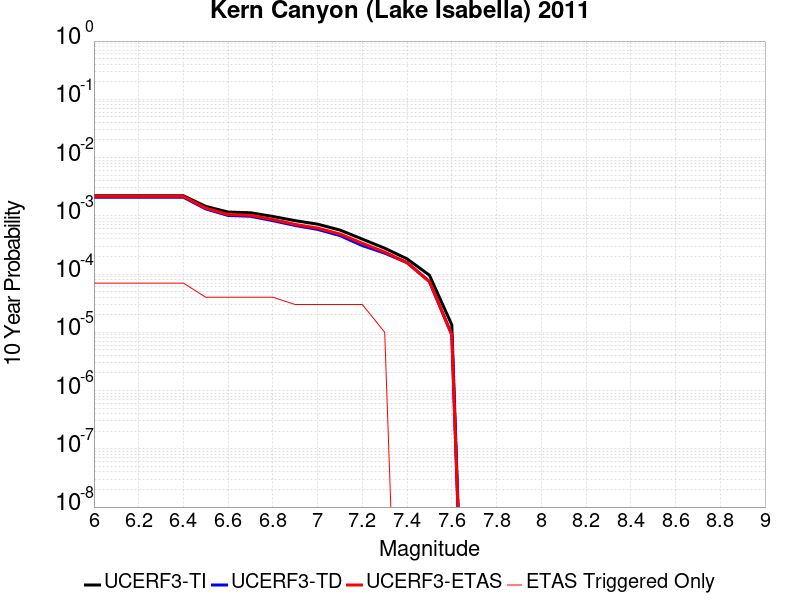 |

| Magnitude | 1 wk TI Prob | 1 wk TD Prob | 1 wk ETAS Prob | 1 wk ETAS/TD Gain | 1 wk ETAS Triggered Only | 1 mo TI Prob | 1 mo TD Prob | 1 mo ETAS Prob | 1 mo ETAS/TD Gain | 1 mo ETAS Triggered Only | 1 yr TI Prob | 1 yr TD Prob | 1 yr ETAS Prob | 1 yr ETAS/TD Gain | 1 yr ETAS Triggered Only | 10 yr TI Prob | 10 yr TD Prob | 10 yr ETAS Prob | 10 yr ETAS/TD Gain | 10 yr ETAS Triggered Only |
|-----|-----|-----|-----|-----|-----|-----|-----|-----|-----|-----|-----|-----|-----|-----|-----|-----|-----|-----|-----|-----|
| 6.0 | 4.2387383E-6 | 4.0016344E-6 | 1.40015945E-5 | 3.498969 | 1.0E-5 | 1.8165894E-5 | 1.7149758E-5 | 3.7149417E-5 | 2.1661773 | 2.0E-5 | 2.2114732E-4 | 2.0878017E-4 | 2.4877183E-4 | 1.1915491 | 4.0E-5 | 0.0022092736 | 0.002086024 | 0.002155878 | 1.0334866 | 7.0E-5 |
| 6.1 | 4.2387383E-6 | 4.0016344E-6 | 1.40015945E-5 | 3.498969 | 1.0E-5 | 1.8165894E-5 | 1.7149758E-5 | 3.7149417E-5 | 2.1661773 | 2.0E-5 | 2.2114732E-4 | 2.0878017E-4 | 2.4877183E-4 | 1.1915491 | 4.0E-5 | 0.0022092736 | 0.002086024 | 0.002155878 | 1.0334866 | 7.0E-5 |
| 6.2 | 4.2387383E-6 | 4.0016344E-6 | 1.40015945E-5 | 3.498969 | 1.0E-5 | 1.8165894E-5 | 1.7149758E-5 | 3.7149417E-5 | 2.1661773 | 2.0E-5 | 2.2114732E-4 | 2.0878017E-4 | 2.4877183E-4 | 1.1915491 | 4.0E-5 | 0.0022092736 | 0.002086024 | 0.002155878 | 1.0334866 | 7.0E-5 |
| 6.3 | 4.2387383E-6 | 4.0016344E-6 | 1.40015945E-5 | 3.498969 | 1.0E-5 | 1.8165894E-5 | 1.7149758E-5 | 3.7149417E-5 | 2.1661773 | 2.0E-5 | 2.2114732E-4 | 2.0878017E-4 | 2.4877183E-4 | 1.1915491 | 4.0E-5 | 0.0022092736 | 0.002086024 | 0.002155878 | 1.0334866 | 7.0E-5 |
| 6.4 | 4.2387383E-6 | 4.0016344E-6 | 1.40015945E-5 | 3.498969 | 1.0E-5 | 1.8165894E-5 | 1.7149758E-5 | 3.7149417E-5 | 2.1661773 | 2.0E-5 | 2.2114732E-4 | 2.0878017E-4 | 2.4877183E-4 | 1.1915491 | 4.0E-5 | 0.0022092736 | 0.002086024 | 0.002155878 | 1.0334866 | 7.0E-5 |
| 6.5 | 2.7857532E-6 | 2.5178624E-6 | 1.2517838E-5 | 4.971613 | 1.0E-5 | 1.1938888E-5 | 1.0790796E-5 | 3.079058E-5 | 2.8534114 | 2.0E-5 | 1.4534626E-4 | 1.3137035E-4 | 1.5136773E-4 | 1.1522213 | 2.0E-5 | 0.0014525123 | 0.0013129596 | 0.0013529072 | 1.0304255 | 4.0E-5 |
| 6.6 | 2.2233348E-6 | 1.944119E-6 | 1.1944099E-5 | 6.1437078 | 1.0E-5 | 9.528543E-6 | 8.331913E-6 | 2.8331746E-5 | 3.4003892 | 2.0E-5 | 1.1600384E-4 | 1.014364E-4 | 1.2143437E-4 | 1.1971478 | 2.0E-5 | 0.001159433 | 0.0010139096 | 0.001053869 | 1.0394113 | 4.0E-5 |
| 6.7 | 2.1635126E-6 | 1.8834991E-6 | 1.18834805E-5 | 6.3092575 | 1.0E-5 | 9.272164E-6 | 8.072114E-6 | 2.8071952E-5 | 3.4776456 | 2.0E-5 | 1.1288274E-4 | 9.827364E-5 | 1.1827167E-4 | 1.2034934 | 2.0E-5 | 0.0011282542 | 9.8231E-4 | 0.0010222706 | 1.0406803 | 4.0E-5 |
| 6.8 | 1.8685711E-6 | 1.583138E-6 | 1.1583122E-5 | 7.316559 | 1.0E-5 | 8.008137E-6 | 6.7848596E-6 | 2.6784724E-5 | 3.9477196 | 2.0E-5 | 9.74947E-5 | 8.2602586E-5 | 1.02600934E-4 | 1.2421032 | 2.0E-5 | 9.745194E-4 | 8.2572375E-4 | 8.656907E-4 | 1.0484023 | 4.0E-5 |
| 6.9 | 1.5815071E-6 | 1.3064887E-6 | 1.3064887E-6 | 1.0 | 0.0 | 6.77787E-6 | 5.5992255E-6 | 1.559917E-5 | 2.7859514 | 1.0E-5 | 8.251744E-5 | 6.816846E-5 | 7.816778E-5 | 1.1466854 | 1.0E-5 | 8.248681E-4 | 6.8147824E-4 | 7.114578E-4 | 1.0439919 | 3.0E-5 |
| 7.0 | 1.3772564E-6 | 1.1210681E-6 | 1.1210681E-6 | 1.0 | 0.0 | 5.9025137E-6 | 4.8045686E-6 | 1.4804521E-5 | 3.0813422 | 1.0E-5 | 7.186073E-5 | 5.8494075E-5 | 6.849349E-5 | 1.1709474 | 1.0E-5 | 7.18375E-4 | 5.8478885E-4 | 6.1477127E-4 | 1.0512706 | 3.0E-5 |
| 7.1 | 1.0916998E-6 | 8.7637505E-7 | 8.7637505E-7 | 1.0 | 0.0 | 4.678705E-6 | 3.7558877E-6 | 1.375585E-5 | 3.6624763 | 1.0E-5 | 5.6961744E-5 | 4.5726985E-5 | 5.572653E-5 | 1.2186792 | 1.0E-5 | 5.6947145E-4 | 4.571771E-4 | 4.871634E-4 | 1.06559 | 3.0E-5 |
| 7.2 | 7.6277024E-7 | 5.901439E-7 | 5.901439E-7 | 1.0 | 0.0 | 3.2690114E-6 | 2.5291856E-6 | 1.252916E-5 | 4.9538317 | 1.0E-5 | 3.9799485E-5 | 3.0792406E-5 | 4.07921E-5 | 1.3247454 | 1.0E-5 | 3.9792358E-4 | 3.07882E-4 | 3.3787277E-4 | 1.09741 | 3.0E-5 |
| 7.3 | 5.3265916E-7 | 4.3824264E-7 | 4.3824264E-7 | 1.0 | 0.0 | 2.282823E-6 | 1.8781814E-6 | 1.1878163E-5 | 6.3242893 | 1.0E-5 | 2.7793016E-5 | 2.2866623E-5 | 3.2866392E-5 | 1.4373087 | 1.0E-5 | 2.778954E-4 | 2.2864307E-4 | 2.3864079E-4 | 1.0437263 | 1.0E-5 |
| 7.4 | 3.4946007E-7 | 3.0065647E-7 | 3.0065647E-7 | 1.0 | 0.0 | 1.497685E-6 | 1.2885271E-6 | 1.2885271E-6 | 1.0 | 0.0 | 1.8234163E-5 | 1.5687707E-5 | 1.5687707E-5 | 1.0 | 0.0 | 1.8232666E-4 | 1.5686621E-4 | 1.5686621E-4 | 1.0 | 0.0 |
| 7.5 | 1.8317026E-7 | 1.4244755E-7 | 1.4244755E-7 | 1.0 | 0.0 | 7.850152E-7 | 6.1048934E-7 | 6.1048934E-7 | 1.0 | 0.0 | 9.557518E-6 | 7.432683E-6 | 7.432683E-6 | 1.0 | 0.0 | 9.5571064E-5 | 7.432442E-5 | 7.432442E-5 | 1.0 | 0.0 |
| 7.6 | 2.572245E-8 | 1.735264E-8 | 1.735264E-8 | 1.0 | 0.0 | 1.10239064E-7 | 7.436845E-8 | 7.436845E-8 | 1.0 | 0.0 | 1.3421597E-6 | 9.0543557E-7 | 9.0543557E-7 | 1.0 | 0.0 | 1.3421517E-5 | 9.054324E-6 | 9.054324E-6 | 1.0 | 0.0 |

## San Clemente
*[(top)](#table-of-contents)*

| 1 Week | 1 Month | 1 Year | 10 Year |
|-----|-----|-----|-----|
|  |  | 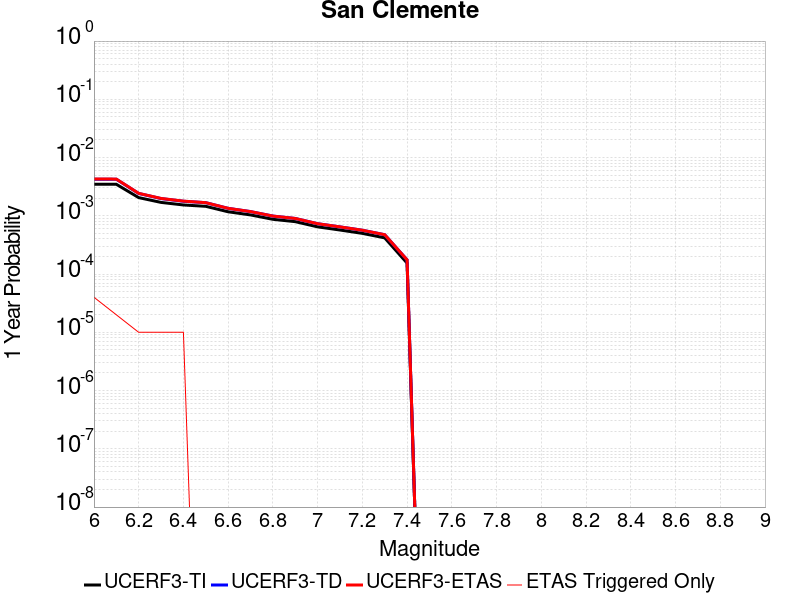 |  |

| Magnitude | 1 wk TI Prob | 1 wk TD Prob | 1 wk ETAS Prob | 1 wk ETAS/TD Gain | 1 wk ETAS Triggered Only | 1 mo TI Prob | 1 mo TD Prob | 1 mo ETAS Prob | 1 mo ETAS/TD Gain | 1 mo ETAS Triggered Only | 1 yr TI Prob | 1 yr TD Prob | 1 yr ETAS Prob | 1 yr ETAS/TD Gain | 1 yr ETAS Triggered Only | 10 yr TI Prob | 10 yr TD Prob | 10 yr ETAS Prob | 10 yr ETAS/TD Gain | 10 yr ETAS Triggered Only |
|-----|-----|-----|-----|-----|-----|-----|-----|-----|-----|-----|-----|-----|-----|-----|-----|-----|-----|-----|-----|-----|
| 6.0 | 6.681379E-5 | 8.163834E-5 | 1.016367E-4 | 1.2449629 | 2.0E-5 | 2.8631336E-4 | 3.4983488E-4 | 3.698279E-4 | 1.0571498 | 2.0E-5 | 0.003480294 | 0.00425141 | 0.00429124 | 1.0093687 | 4.0E-5 | 0.03426291 | 0.04175603 | 0.041823108 | 1.0016063 | 7.0E-5 |
| 6.1 | 6.681379E-5 | 8.163834E-5 | 9.163752E-5 | 1.1224815 | 1.0E-5 | 2.8631336E-4 | 3.4983488E-4 | 3.598314E-4 | 1.028575 | 1.0E-5 | 0.003480294 | 0.00425141 | 0.0042713247 | 1.0046843 | 2.0E-5 | 0.03426291 | 0.04175603 | 0.04179436 | 1.0009179 | 4.0E-5 |
| 6.2 | 3.9400576E-5 | 4.6452373E-5 | 4.6452373E-5 | 1.0 | 0.0 | 1.6884868E-4 | 1.9906677E-4 | 1.9906677E-4 | 1.0 | 0.0 | 0.0020537945 | 0.0024209984 | 0.0024309743 | 1.0041205 | 1.0E-5 | 0.020349167 | 0.023952903 | 0.023982184 | 1.0012225 | 3.0E-5 |
| 6.3 | 3.2590255E-5 | 3.792912E-5 | 3.792912E-5 | 1.0 | 0.0 | 1.3966505E-4 | 1.6254342E-4 | 1.6254342E-4 | 1.0 | 0.0 | 0.0016990956 | 0.0019772002 | 0.0019871802 | 1.0050477 | 1.0E-5 | 0.01686163 | 0.019599883 | 0.019629294 | 1.0015006 | 3.0E-5 |
| 6.4 | 2.9454652E-5 | 3.4097764E-5 | 3.4097764E-5 | 1.0 | 0.0 | 1.2622811E-4 | 1.4612524E-4 | 1.4612524E-4 | 1.0 | 0.0 | 0.0015357438 | 0.0017776493 | 0.0017876315 | 1.0056154 | 1.0E-5 | 0.015251739 | 0.01763747 | 0.017666942 | 1.001671 | 3.0E-5 |
| 6.5 | 2.790836E-5 | 3.2247463E-5 | 3.2247463E-5 | 1.0 | 0.0 | 1.1960178E-4 | 1.3819624E-4 | 1.3819624E-4 | 1.0 | 0.0 | 0.001455179 | 0.0016812662 | 0.0016812662 | 1.0 | 0.0 | 0.014456868 | 0.016688485 | 0.01670815 | 1.0011784 | 2.0E-5 |
| 6.6 | 2.2492153E-5 | 2.5762702E-5 | 2.5762702E-5 | 1.0 | 0.0 | 9.639138E-5 | 1.1040699E-4 | 1.1040699E-4 | 1.0 | 0.0 | 0.0011729331 | 0.0013433909 | 0.0013433909 | 1.0 | 0.0 | 0.011667615 | 0.013354417 | 0.013364283 | 1.0007389 | 1.0E-5 |
| 6.7 | 1.9862755E-5 | 2.2666423E-5 | 2.2666423E-5 | 1.0 | 0.0 | 8.512331E-5 | 9.713826E-5 | 9.713826E-5 | 1.0 | 0.0 | 0.0010358836 | 0.0011820279 | 0.0011820279 | 1.0 | 0.0 | 0.010310682 | 0.011758701 | 0.011758701 | 1.0 | 0.0 |
| 6.8 | 1.6697575E-5 | 1.897771E-5 | 1.897771E-5 | 1.0 | 0.0 | 7.155907E-5 | 8.133056E-5 | 8.133056E-5 | 1.0 | 0.0 | 8.7088346E-4 | 9.897591E-4 | 9.897591E-4 | 1.0 | 0.0 | 0.008674784 | 0.0098545365 | 0.0098545365 | 1.0 | 0.0 |
| 6.9 | 1.5218415E-5 | 1.72694E-5 | 1.72694E-5 | 1.0 | 0.0 | 6.522015E-5 | 7.4009666E-5 | 7.4009666E-5 | 1.0 | 0.0 | 7.93766E-4 | 9.00704E-4 | 9.00704E-4 | 1.0 | 0.0 | 0.007909367 | 0.008971481 | 0.008971481 | 1.0 | 0.0 |
| 7.0 | 1.2392958E-5 | 1.4033016E-5 | 1.4033016E-5 | 1.0 | 0.0 | 5.3111595E-5 | 6.014015E-5 | 6.014015E-5 | 1.0 | 0.0 | 6.4644177E-4 | 7.319679E-4 | 7.319679E-4 | 1.0 | 0.0 | 0.0064456454 | 0.0072963564 | 0.0072963564 | 1.0 | 0.0 |
| 7.1 | 1.0934128E-5 | 1.2375138E-5 | 1.2375138E-5 | 1.0 | 0.0 | 4.6859706E-5 | 5.303527E-5 | 5.303527E-5 | 1.0 | 0.0 | 5.7036756E-4 | 6.455204E-4 | 6.455204E-4 | 1.0 | 0.0 | 0.0056890585 | 0.0064371997 | 0.0064371997 | 1.0 | 0.0 |
| 7.2 | 9.5798805E-6 | 1.0844935E-5 | 1.0844935E-5 | 1.0 | 0.0 | 4.1055984E-5 | 4.6477508E-5 | 4.6477508E-5 | 1.0 | 0.0 | 4.9974193E-4 | 5.657239E-4 | 5.657239E-4 | 1.0 | 0.0 | 0.0049861963 | 0.0056435615 | 0.0056435615 | 1.0 | 0.0 |
| 7.3 | 8.0167365E-6 | 9.083918E-6 | 9.083918E-6 | 1.0 | 0.0 | 3.4356988E-5 | 3.8930535E-5 | 3.8930535E-5 | 1.0 | 0.0 | 4.1821605E-4 | 4.7388324E-4 | 4.7388324E-4 | 1.0 | 0.0 | 0.0041742986 | 0.0047294297 | 0.0047294297 | 1.0 | 0.0 |
| 7.4 | 2.9581017E-6 | 3.3623792E-6 | 3.3623792E-6 | 1.0 | 0.0 | 1.2677518E-5 | 1.4410146E-5 | 1.4410146E-5 | 1.0 | 0.0 | 1.5433785E-4 | 1.7543444E-4 | 1.7543444E-4 | 1.0 | 0.0 | 0.001542307 | 0.0017534546 | 0.0017534546 | 1.0 | 0.0 |

## Hosgri
*[(top)](#table-of-contents)*

| 1 Week | 1 Month | 1 Year | 10 Year |
|-----|-----|-----|-----|
|  |  | 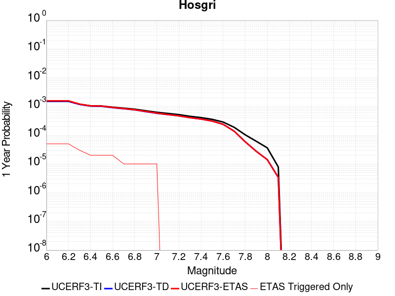 | 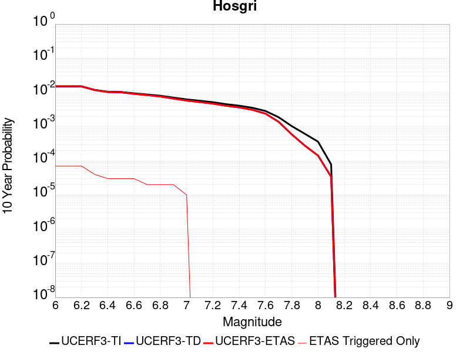 |

| Magnitude | 1 wk TI Prob | 1 wk TD Prob | 1 wk ETAS Prob | 1 wk ETAS/TD Gain | 1 wk ETAS Triggered Only | 1 mo TI Prob | 1 mo TD Prob | 1 mo ETAS Prob | 1 mo ETAS/TD Gain | 1 mo ETAS Triggered Only | 1 yr TI Prob | 1 yr TD Prob | 1 yr ETAS Prob | 1 yr ETAS/TD Gain | 1 yr ETAS Triggered Only | 10 yr TI Prob | 10 yr TD Prob | 10 yr ETAS Prob | 10 yr ETAS/TD Gain | 10 yr ETAS Triggered Only |
|-----|-----|-----|-----|-----|-----|-----|-----|-----|-----|-----|-----|-----|-----|-----|-----|-----|-----|-----|-----|-----|
| 6.0 | 2.883978E-5 | 2.9128403E-5 | 5.9127527E-5 | 2.0298927 | 3.0E-5 | 1.235932E-4 | 1.248302E-4 | 1.648252E-4 | 1.3203954 | 4.0E-5 | 0.0015037085 | 0.0015187752 | 0.0015686994 | 1.0328712 | 5.0E-5 | 0.01493574 | 0.01508773 | 0.015156673 | 1.0045695 | 7.0E-5 |
| 6.1 | 2.883978E-5 | 2.9128403E-5 | 5.9127527E-5 | 2.0298927 | 3.0E-5 | 1.235932E-4 | 1.248302E-4 | 1.648252E-4 | 1.3203954 | 4.0E-5 | 0.0015037085 | 0.0015187752 | 0.0015686994 | 1.0328712 | 5.0E-5 | 0.01493574 | 0.01508773 | 0.015156673 | 1.0045695 | 7.0E-5 |
| 6.2 | 2.883978E-5 | 2.9128403E-5 | 5.9127527E-5 | 2.0298927 | 3.0E-5 | 1.235932E-4 | 1.248302E-4 | 1.648252E-4 | 1.3203954 | 4.0E-5 | 0.0015037085 | 0.0015187752 | 0.0015686994 | 1.0328712 | 5.0E-5 | 0.01493574 | 0.01508773 | 0.015156673 | 1.0045695 | 7.0E-5 |
| 6.3 | 2.2914428E-5 | 2.2641956E-5 | 4.2641503E-5 | 1.8832959 | 2.0E-5 | 9.8200995E-5 | 9.703337E-5 | 1.2703046E-4 | 1.309142 | 3.0E-5 | 0.0011949413 | 0.001180746 | 0.0012107106 | 1.0253776 | 3.0E-5 | 0.011885363 | 0.011746123 | 0.011785653 | 1.0033654 | 4.0E-5 |
| 6.4 | 2.0195741E-5 | 1.9696547E-5 | 3.9696155E-5 | 2.0153863 | 2.0E-5 | 8.65503E-5 | 8.4411055E-5 | 1.04409366E-4 | 1.2369158 | 2.0E-5 | 0.0010532405 | 0.001027222 | 0.0010472015 | 1.01945 | 2.0E-5 | 0.010482626 | 0.010225783 | 0.010255476 | 1.0029038 | 3.0E-5 |
| 6.5 | 1.9924333E-5 | 1.9408968E-5 | 3.940858E-5 | 2.0304315 | 2.0E-5 | 8.53872E-5 | 8.317865E-5 | 1.03176986E-4 | 1.2404263 | 2.0E-5 | 0.0010390934 | 0.0010122315 | 0.0010322112 | 1.0197383 | 2.0E-5 | 0.010342481 | 0.010077244 | 0.010106941 | 1.002947 | 3.0E-5 |
| 6.6 | 1.809694E-5 | 1.7458287E-5 | 3.745794E-5 | 2.1455677 | 2.0E-5 | 7.7556004E-5 | 7.4819094E-5 | 9.4817595E-5 | 1.2672914 | 2.0E-5 | 9.438353E-4 | 9.105431E-4 | 9.3052484E-4 | 1.0219449 | 2.0E-5 | 0.009398366 | 0.009069063 | 0.009098791 | 1.0032779 | 3.0E-5 |
| 6.7 | 1.675989E-5 | 1.6042752E-5 | 2.6042591E-5 | 1.6233245 | 1.0E-5 | 7.182612E-5 | 6.8752845E-5 | 7.875216E-5 | 1.1454386 | 1.0E-5 | 8.7413215E-4 | 8.3674554E-4 | 8.467372E-4 | 1.0119411 | 1.0E-5 | 0.008707017 | 0.008336853 | 0.008356687 | 1.002379 | 2.0E-5 |
| 6.8 | 1.5401129E-5 | 1.4614069E-5 | 2.4613923E-5 | 1.6842622 | 1.0E-5 | 6.6003166E-5 | 6.263023E-5 | 7.26296E-5 | 1.1596574 | 1.0E-5 | 8.032922E-4 | 7.6225714E-4 | 7.722495E-4 | 1.013109 | 1.0E-5 | 0.008003947 | 0.0075972863 | 0.0076171346 | 1.0026125 | 2.0E-5 |
| 6.9 | 1.356559E-5 | 1.2689955E-5 | 2.2689828E-5 | 1.7880149 | 1.0E-5 | 5.8136946E-5 | 5.438439E-5 | 6.438384E-5 | 1.1838663 | 1.0E-5 | 7.0758746E-4 | 6.6192925E-4 | 6.7192264E-4 | 1.0150974 | 1.0E-5 | 0.007053386 | 0.006600378 | 0.006620246 | 1.0030102 | 2.0E-5 |
| 7.0 | 1.2030819E-5 | 1.1095949E-5 | 2.1095839E-5 | 1.9012198 | 1.0E-5 | 5.155963E-5 | 4.75532E-5 | 5.7552727E-5 | 1.2102808 | 1.0E-5 | 6.275577E-4 | 5.788065E-4 | 5.8880076E-4 | 1.017267 | 1.0E-5 | 0.006257884 | 0.0057737473 | 0.0057836897 | 1.001722 | 1.0E-5 |
| 7.1 | 1.0972698E-5 | 1.0022167E-5 | 1.0022167E-5 | 1.0 | 0.0 | 4.7025E-5 | 4.2951437E-5 | 4.2951437E-5 | 1.0 | 0.0 | 5.72379E-4 | 5.2280835E-4 | 5.2280835E-4 | 1.0 | 0.0 | 0.0057090693 | 0.005216533 | 0.005216533 | 1.0 | 0.0 |
| 7.2 | 9.961926E-6 | 9.034732E-6 | 9.034732E-6 | 1.0 | 0.0 | 4.2693267E-5 | 3.8719707E-5 | 3.8719707E-5 | 1.0 | 0.0 | 5.1966653E-4 | 4.7131052E-4 | 4.7131052E-4 | 1.0 | 0.0 | 0.00518453 | 0.0047038523 | 0.0047038523 | 1.0 | 0.0 |
| 7.3 | 8.700929E-6 | 7.828089E-6 | 7.828089E-6 | 1.0 | 0.0 | 3.7289166E-5 | 3.354852E-5 | 3.354852E-5 | 1.0 | 0.0 | 4.53901E-4 | 4.083767E-4 | 4.083767E-4 | 1.0 | 0.0 | 0.00452975 | 0.004076999 | 0.004076999 | 1.0 | 0.0 |
| 7.4 | 7.866285E-6 | 6.9987263E-6 | 6.9987263E-6 | 1.0 | 0.0 | 3.3712215E-5 | 2.9994197E-5 | 2.9994197E-5 | 1.0 | 0.0 | 4.103689E-4 | 3.6511818E-4 | 3.6511818E-4 | 1.0 | 0.0 | 0.004096119 | 0.0036459167 | 0.0036459167 | 1.0 | 0.0 |
| 7.5 | 6.8381305E-6 | 5.9596814E-6 | 5.9596814E-6 | 1.0 | 0.0 | 2.9305946E-5 | 2.5541241E-5 | 2.5541241E-5 | 1.0 | 0.0 | 3.5674145E-4 | 3.1092027E-4 | 3.1092027E-4 | 1.0 | 0.0 | 0.0035616932 | 0.003105584 | 0.003105584 | 1.0 | 0.0 |
| 7.6 | 5.503376E-6 | 4.595227E-6 | 4.595227E-6 | 1.0 | 0.0 | 2.3585684E-5 | 1.9693682E-5 | 1.9693682E-5 | 1.0 | 0.0 | 2.8711787E-4 | 2.397442E-4 | 2.397442E-4 | 1.0 | 0.0 | 0.002867472 | 0.0023955852 | 0.0023955852 | 1.0 | 0.0 |
| 7.7 | 3.6144982E-6 | 2.6521896E-6 | 2.6521896E-6 | 1.0 | 0.0 | 1.5490614E-5 | 1.1366477E-5 | 1.1366477E-5 | 1.0 | 0.0 | 1.8858191E-4 | 1.3837808E-4 | 1.3837808E-4 | 1.0 | 0.0 | 0.0018842196 | 0.001383647 | 0.001383647 | 1.0 | 0.0 |
| 7.8 | 1.9853494E-6 | 1.1360784E-6 | 1.1360784E-6 | 1.0 | 0.0 | 8.508612E-6 | 4.8688985E-6 | 4.8688985E-6 | 1.0 | 0.0 | 1.0358743E-4 | 5.9277223E-5 | 5.9277223E-5 | 1.0 | 0.0 | 0.0010353916 | 5.933389E-4 | 5.933389E-4 | 1.0 | 0.0 |
| 7.9 | 1.1818757E-6 | 5.29477E-7 | 5.29477E-7 | 1.0 | 0.0 | 5.0651715E-6 | 2.269185E-6 | 2.269185E-6 | 1.0 | 0.0 | 6.1666724E-5 | 2.7626977E-5 | 2.7626977E-5 | 1.0 | 0.0 | 6.1649614E-4 | 2.7691363E-4 | 2.7691363E-4 | 1.0 | 0.0 |
| 8.0 | 6.962958E-7 | 2.71365E-7 | 2.71365E-7 | 1.0 | 0.0 | 2.9841215E-6 | 1.1629924E-6 | 1.1629924E-6 | 1.0 | 0.0 | 3.6331072E-5 | 1.415934E-5 | 1.415934E-5 | 1.0 | 0.0 | 3.6325134E-4 | 1.4215276E-4 | 1.4215276E-4 | 1.0 | 0.0 |
| 8.1 | 1.5033264E-7 | 6.52693E-8 | 6.52693E-8 | 1.0 | 0.0 | 6.442826E-7 | 2.7972553E-7 | 2.7972553E-7 | 1.0 | 0.0 | 7.844113E-6 | 3.4056532E-6 | 3.4056532E-6 | 1.0 | 0.0 | 7.843835E-5 | 3.4072833E-5 | 3.4072833E-5 | 1.0 | 0.0 |

## Pine Mtn
*[(top)](#table-of-contents)*

| 1 Week | 1 Month | 1 Year | 10 Year |
|-----|-----|-----|-----|
|  | 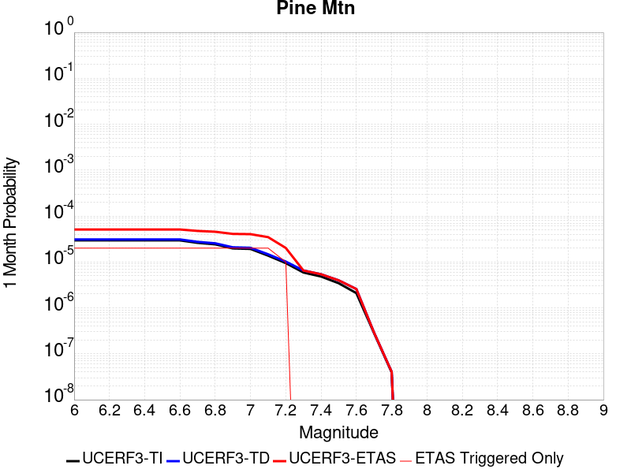 | 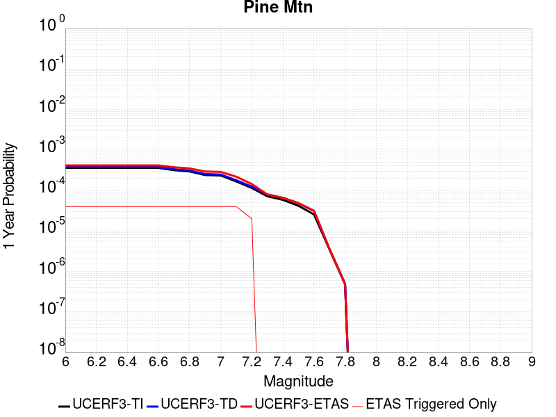 |  |

| Magnitude | 1 wk TI Prob | 1 wk TD Prob | 1 wk ETAS Prob | 1 wk ETAS/TD Gain | 1 wk ETAS Triggered Only | 1 mo TI Prob | 1 mo TD Prob | 1 mo ETAS Prob | 1 mo ETAS/TD Gain | 1 mo ETAS Triggered Only | 1 yr TI Prob | 1 yr TD Prob | 1 yr ETAS Prob | 1 yr ETAS/TD Gain | 1 yr ETAS Triggered Only | 10 yr TI Prob | 10 yr TD Prob | 10 yr ETAS Prob | 10 yr ETAS/TD Gain | 10 yr ETAS Triggered Only |
|-----|-----|-----|-----|-----|-----|-----|-----|-----|-----|-----|-----|-----|-----|-----|-----|-----|-----|-----|-----|-----|
| 6.0 | 6.894797E-6 | 7.2254716E-6 | 1.72254E-5 | 2.3839827 | 1.0E-5 | 2.9548795E-5 | 3.0965955E-5 | 5.0965336E-5 | 1.6458505 | 2.0E-5 | 3.596972E-4 | 3.7694827E-4 | 4.169332E-4 | 1.1060754 | 4.0E-5 | 0.0035911554 | 0.0037633865 | 0.003833123 | 1.0185302 | 7.0E-5 |
| 6.1 | 6.894797E-6 | 7.2254716E-6 | 1.72254E-5 | 2.3839827 | 1.0E-5 | 2.9548795E-5 | 3.0965955E-5 | 5.0965336E-5 | 1.6458505 | 2.0E-5 | 3.596972E-4 | 3.7694827E-4 | 4.169332E-4 | 1.1060754 | 4.0E-5 | 0.0035911554 | 0.0037633865 | 0.003833123 | 1.0185302 | 7.0E-5 |
| 6.2 | 6.894797E-6 | 7.2254716E-6 | 1.72254E-5 | 2.3839827 | 1.0E-5 | 2.9548795E-5 | 3.0965955E-5 | 5.0965336E-5 | 1.6458505 | 2.0E-5 | 3.596972E-4 | 3.7694827E-4 | 4.169332E-4 | 1.1060754 | 4.0E-5 | 0.0035911554 | 0.0037633865 | 0.003833123 | 1.0185302 | 7.0E-5 |
| 6.3 | 6.894797E-6 | 7.2254716E-6 | 1.72254E-5 | 2.3839827 | 1.0E-5 | 2.9548795E-5 | 3.0965955E-5 | 5.0965336E-5 | 1.6458505 | 2.0E-5 | 3.596972E-4 | 3.7694827E-4 | 4.169332E-4 | 1.1060754 | 4.0E-5 | 0.0035911554 | 0.0037633865 | 0.003833123 | 1.0185302 | 7.0E-5 |
| 6.4 | 6.894797E-6 | 7.2254716E-6 | 1.72254E-5 | 2.3839827 | 1.0E-5 | 2.9548795E-5 | 3.0965955E-5 | 5.0965336E-5 | 1.6458505 | 2.0E-5 | 3.596972E-4 | 3.7694827E-4 | 4.169332E-4 | 1.1060754 | 4.0E-5 | 0.0035911554 | 0.0037633865 | 0.003833123 | 1.0185302 | 7.0E-5 |
| 6.5 | 6.894797E-6 | 7.2254716E-6 | 1.72254E-5 | 2.3839827 | 1.0E-5 | 2.9548795E-5 | 3.0965955E-5 | 5.0965336E-5 | 1.6458505 | 2.0E-5 | 3.596972E-4 | 3.7694827E-4 | 4.169332E-4 | 1.1060754 | 4.0E-5 | 0.0035911554 | 0.0037633865 | 0.003833123 | 1.0185302 | 7.0E-5 |
| 6.6 | 6.894797E-6 | 7.2254716E-6 | 1.72254E-5 | 2.3839827 | 1.0E-5 | 2.9548795E-5 | 3.0965955E-5 | 5.0965336E-5 | 1.6458505 | 2.0E-5 | 3.596972E-4 | 3.7694827E-4 | 4.169332E-4 | 1.1060754 | 4.0E-5 | 0.0035911554 | 0.0037633865 | 0.003833123 | 1.0185302 | 7.0E-5 |
| 6.7 | 6.0867933E-6 | 6.397124E-6 | 1.639706E-5 | 2.5631926 | 1.0E-5 | 2.6085996E-5 | 2.7415968E-5 | 4.741542E-5 | 1.7294818 | 2.0E-5 | 3.1755073E-4 | 3.337405E-4 | 3.7372715E-4 | 1.1198136 | 4.0E-5 | 0.0031709734 | 0.0033326119 | 0.0034023786 | 1.0209346 | 7.0E-5 |
| 6.8 | 5.6530425E-6 | 5.950606E-6 | 1.5950547E-5 | 2.6804912 | 1.0E-5 | 2.42271E-5 | 2.5502359E-5 | 4.550185E-5 | 1.7842212 | 2.0E-5 | 2.94925E-4 | 3.1044905E-4 | 3.5043663E-4 | 1.1288056 | 4.0E-5 | 0.002945339 | 0.0031003582 | 0.0031701413 | 1.022508 | 7.0E-5 |
| 6.9 | 4.6015225E-6 | 4.8638444E-6 | 1.48637955E-5 | 3.0559769 | 1.0E-5 | 1.9720663E-5 | 2.084489E-5 | 4.0844472E-5 | 1.9594477 | 2.0E-5 | 2.4007261E-4 | 2.5375842E-4 | 2.9374828E-4 | 1.1575903 | 4.0E-5 | 0.0023981342 | 0.002534831 | 0.0026046534 | 1.0275452 | 7.0E-5 |
| 7.0 | 4.4875965E-6 | 4.7474837E-6 | 1.4747436E-5 | 3.106369 | 1.0E-5 | 1.9232413E-5 | 2.0346208E-5 | 4.03458E-5 | 1.9829642 | 2.0E-5 | 2.3412947E-4 | 2.4768838E-4 | 2.8767847E-4 | 1.1614532 | 4.0E-5 | 0.0023388295 | 0.0024742668 | 0.0025440936 | 1.0282212 | 7.0E-5 |
| 7.1 | 3.203907E-6 | 3.42942E-6 | 1.3429386E-5 | 3.915935 | 1.0E-5 | 1.3730958E-5 | 1.4697435E-5 | 3.4697143E-5 | 2.3607616 | 2.0E-5 | 1.6716159E-4 | 1.7892725E-4 | 2.1892009E-4 | 1.2235146 | 4.0E-5 | 0.0016703589 | 0.001787898 | 0.0018477907 | 1.033499 | 6.0E-5 |
| 7.2 | 2.2060601E-6 | 2.3784874E-6 | 1.2378464E-5 | 5.204343 | 1.0E-5 | 9.4545085E-6 | 1.019348E-5 | 2.0193378E-5 | 1.9810092 | 1.0E-5 | 1.15102564E-4 | 1.2409901E-4 | 1.4409653E-4 | 1.1611416 | 2.0E-5 | 0.0011504296 | 0.0012403419 | 0.0012603172 | 1.0161046 | 2.0E-5 |
| 7.3 | 1.3765207E-6 | 1.5216535E-6 | 1.5216535E-6 | 1.0 | 0.0 | 5.899361E-6 | 6.5213567E-6 | 6.5213567E-6 | 1.0 | 0.0 | 7.182235E-5 | 7.939472E-5 | 7.939472E-5 | 1.0 | 0.0 | 7.1799144E-4 | 7.9367263E-4 | 7.9367263E-4 | 1.0 | 0.0 |
| 7.4 | 1.1245983E-6 | 1.2587126E-6 | 1.2587126E-6 | 1.0 | 0.0 | 4.819698E-6 | 5.394472E-6 | 5.394472E-6 | 1.0 | 0.0 | 5.8678244E-5 | 6.56758E-5 | 6.56758E-5 | 1.0 | 0.0 | 5.866275E-4 | 6.565722E-4 | 6.565722E-4 | 1.0 | 0.0 |
| 7.5 | 8.031682E-7 | 9.276999E-7 | 9.276999E-7 | 1.0 | 0.0 | 3.4421448E-6 | 3.975851E-6 | 3.975851E-6 | 1.0 | 0.0 | 4.1907308E-5 | 4.840498E-5 | 4.840498E-5 | 1.0 | 0.0 | 4.1899405E-4 | 4.8395112E-4 | 4.8395112E-4 | 1.0 | 0.0 |
| 7.6 | 4.8953444E-7 | 6.0030544E-7 | 6.0030544E-7 | 1.0 | 0.0 | 2.098003E-6 | 2.5727354E-6 | 2.5727354E-6 | 1.0 | 0.0 | 2.5542888E-5 | 3.1322652E-5 | 3.1322652E-5 | 1.0 | 0.0 | 2.5539953E-4 | 3.1318725E-4 | 3.1318725E-4 | 1.0 | 0.0 |
| 7.7 | 6.634529E-8 | 6.788826E-8 | 6.788826E-8 | 1.0 | 0.0 | 2.843369E-7 | 2.9094966E-7 | 2.9094966E-7 | 1.0 | 0.0 | 3.4617963E-6 | 3.5423066E-6 | 3.5423066E-6 | 1.0 | 0.0 | 3.4617424E-5 | 3.542255E-5 | 3.542255E-5 | 1.0 | 0.0 |
| 7.8 | 9.235578E-9 | 9.488566E-9 | 9.488566E-9 | 1.0 | 0.0 | 3.9581046E-8 | 4.0665284E-8 | 4.0665284E-8 | 1.0 | 0.0 | 4.818991E-7 | 4.950997E-7 | 4.950997E-7 | 1.0 | 0.0 | 4.8189804E-6 | 4.950988E-6 | 4.950988E-6 | 1.0 | 0.0 |

## Calaveras (So) 2011 CFM
*[(top)](#table-of-contents)*

| 1 Week | 1 Month | 1 Year | 10 Year |
|-----|-----|-----|-----|
|  |  |  |  |

| Magnitude | 1 wk TI Prob | 1 wk TD Prob | 1 wk ETAS Prob | 1 wk ETAS/TD Gain | 1 wk ETAS Triggered Only | 1 mo TI Prob | 1 mo TD Prob | 1 mo ETAS Prob | 1 mo ETAS/TD Gain | 1 mo ETAS Triggered Only | 1 yr TI Prob | 1 yr TD Prob | 1 yr ETAS Prob | 1 yr ETAS/TD Gain | 1 yr ETAS Triggered Only | 10 yr TI Prob | 10 yr TD Prob | 10 yr ETAS Prob | 10 yr ETAS/TD Gain | 10 yr ETAS Triggered Only |
|-----|-----|-----|-----|-----|-----|-----|-----|-----|-----|-----|-----|-----|-----|-----|-----|-----|-----|-----|-----|-----|
| 6.0 | 1.5950744E-4 | 3.0713255E-4 | 3.1712948E-4 | 1.0325493 | 1.0E-5 | 6.834242E-4 | 0.001315409 | 0.0013253958 | 1.0075922 | 1.0E-5 | 0.00828899 | 0.015858326 | 0.01588785 | 1.0018617 | 3.0E-5 | 0.079865426 | 0.14440185 | 0.14445318 | 1.0003555 | 6.0E-5 |
| 6.1 | 1.3584697E-4 | 2.603514E-4 | 2.7034877E-4 | 1.0383996 | 1.0E-5 | 5.8207137E-4 | 0.0011151754 | 0.0011251643 | 1.0089571 | 1.0E-5 | 0.007063716 | 0.013461385 | 0.013490981 | 1.0021986 | 3.0E-5 | 0.06843361 | 0.124029994 | 0.124073796 | 1.0003531 | 5.0E-5 |
| 6.2 | 1.14676266E-4 | 2.1714384E-4 | 2.1714384E-4 | 1.0 | 0.0 | 4.9137714E-4 | 9.30223E-4 | 9.30223E-4 | 1.0 | 0.0 | 0.0059661185 | 0.011245058 | 0.011264834 | 1.0017586 | 2.0E-5 | 0.058084648 | 0.10502057 | 0.10505637 | 1.0003408 | 4.0E-5 |
| 6.3 | 8.691518E-5 | 1.5987935E-4 | 1.5987935E-4 | 1.0 | 0.0 | 3.7244044E-4 | 6.849807E-4 | 6.849807E-4 | 1.0 | 0.0 | 0.004525038 | 0.008301122 | 0.0083209565 | 1.0023893 | 2.0E-5 | 0.044339992 | 0.0793365 | 0.07937333 | 1.0004642 | 4.0E-5 |
| 6.4 | 8.50982E-5 | 1.5694331E-4 | 1.5694331E-4 | 1.0 | 0.0 | 3.646556E-4 | 6.724042E-4 | 6.724042E-4 | 1.0 | 0.0 | 0.0044306475 | 0.008149155 | 0.008168993 | 1.0024343 | 2.0E-5 | 0.04343345 | 0.07794268 | 0.07797956 | 1.0004731 | 4.0E-5 |
| 6.5 | 8.4062965E-5 | 1.5518743E-4 | 1.5518743E-4 | 1.0 | 0.0 | 3.602201E-4 | 6.6488347E-4 | 6.6488347E-4 | 1.0 | 0.0 | 0.004376863 | 0.008058365 | 0.0080782045 | 1.0024619 | 2.0E-5 | 0.042916555 | 0.07711388 | 0.0771508 | 1.0004787 | 4.0E-5 |
| 6.6 | 8.194716E-5 | 1.5154552E-4 | 1.5154552E-4 | 1.0 | 0.0 | 3.5115483E-4 | 6.492843E-4 | 6.492843E-4 | 1.0 | 0.0 | 0.0042669317 | 0.007870209 | 0.007890052 | 1.0025213 | 2.0E-5 | 0.04185927 | 0.07539919 | 0.075436175 | 1.0004905 | 4.0E-5 |
| 6.7 | 8.012326E-5 | 1.4822475E-4 | 1.4822475E-4 | 1.0 | 0.0 | 3.433402E-4 | 6.350612E-4 | 6.350612E-4 | 1.0 | 0.0 | 0.004172157 | 0.007698701 | 0.0077185472 | 1.0025778 | 2.0E-5 | 0.040946912 | 0.07384132 | 0.07387836 | 1.0005018 | 4.0E-5 |
| 6.8 | 7.119773E-5 | 1.2881879E-4 | 1.2881879E-4 | 1.0 | 0.0 | 3.0509746E-4 | 5.519494E-4 | 5.519494E-4 | 1.0 | 0.0 | 0.0037082357 | 0.006696066 | 0.006705999 | 1.0014834 | 1.0E-5 | 0.036469642 | 0.06468575 | 0.064704455 | 1.0002892 | 2.0E-5 |
| 6.9 | 5.7343088E-5 | 9.919277E-5 | 9.919277E-5 | 1.0 | 0.0 | 2.4573295E-4 | 4.25043E-4 | 4.25043E-4 | 1.0 | 0.0 | 0.0029876942 | 0.005162694 | 0.0051726424 | 1.001927 | 1.0E-5 | 0.02947844 | 0.05051036 | 0.050529353 | 1.000376 | 2.0E-5 |
| 7.0 | 4.8746577E-5 | 8.2850725E-5 | 8.2850725E-5 | 1.0 | 0.0 | 2.0889717E-4 | 3.5502657E-4 | 3.5502657E-4 | 1.0 | 0.0 | 0.0025403565 | 0.004313948 | 0.004323905 | 1.002308 | 1.0E-5 | 0.025115121 | 0.042485245 | 0.042504396 | 1.0004507 | 2.0E-5 |
| 7.1 | 4.2998014E-5 | 7.265203E-5 | 7.265203E-5 | 1.0 | 0.0 | 1.8426418E-4 | 3.1132903E-4 | 3.1132903E-4 | 1.0 | 0.0 | 0.002241108 | 0.003783903 | 0.0037938652 | 1.0026327 | 1.0E-5 | 0.022186412 | 0.037423562 | 0.037442815 | 1.0005144 | 2.0E-5 |
| 7.2 | 3.221292E-5 | 5.390791E-5 | 5.390791E-5 | 1.0 | 0.0 | 1.3804805E-4 | 2.3101359E-4 | 2.3101359E-4 | 1.0 | 0.0 | 0.0016794393 | 0.0028089907 | 0.0028189626 | 1.00355 | 1.0E-5 | 0.016668037 | 0.02803602 | 0.028055461 | 1.0006933 | 2.0E-5 |
| 7.3 | 2.3756531E-5 | 3.9473416E-5 | 3.9473416E-5 | 1.0 | 0.0 | 1.0180973E-4 | 1.6916092E-4 | 1.6916092E-4 | 1.0 | 0.0 | 0.0012388286 | 0.0020576057 | 0.0020675852 | 1.00485 | 1.0E-5 | 0.012319452 | 0.020643145 | 0.020662732 | 1.0009488 | 2.0E-5 |
| 7.4 | 1.5997684E-5 | 2.7342163E-5 | 2.7342163E-5 | 1.0 | 0.0 | 6.8559704E-5 | 1.1717545E-4 | 1.1717545E-4 | 1.0 | 0.0 | 8.343947E-4 | 0.00142568 | 0.0014356658 | 1.0070041 | 1.0E-5 | 0.008312687 | 0.014376011 | 0.014395723 | 1.0013713 | 2.0E-5 |
| 7.5 | 1.3814293E-5 | 2.4783874E-5 | 2.4783874E-5 | 1.0 | 0.0 | 5.9202768E-5 | 1.062123E-4 | 1.062123E-4 | 1.0 | 0.0 | 7.205553E-4 | 0.00129237 | 0.0013023571 | 1.0077277 | 1.0E-5 | 0.007182234 | 0.013055085 | 0.013074824 | 1.0015119 | 2.0E-5 |
| 7.6 | 8.817309E-6 | 1.6430757E-5 | 1.6430757E-5 | 1.0 | 0.0 | 3.7787922E-5 | 7.0415634E-5 | 7.0415634E-5 | 1.0 | 0.0 | 4.5997082E-4 | 8.569745E-4 | 8.669659E-4 | 1.0116589 | 1.0E-5 | 0.004590199 | 0.008719284 | 0.008739109 | 1.0022738 | 2.0E-5 |
| 7.7 | 4.0352206E-6 | 7.707318E-6 | 7.707318E-6 | 1.0 | 0.0 | 1.7293689E-5 | 3.3030945E-5 | 3.3030945E-5 | 1.0 | 0.0 | 2.1053031E-4 | 4.0207763E-4 | 4.1207363E-4 | 1.0248609 | 1.0E-5 | 0.0021033096 | 0.004165172 | 0.004185089 | 1.0047817 | 2.0E-5 |
| 7.8 | 3.413169E-6 | 6.787282E-6 | 6.787282E-6 | 1.0 | 0.0 | 1.4627784E-5 | 2.9088029E-5 | 2.9088029E-5 | 1.0 | 0.0 | 1.7807873E-4 | 3.5408925E-4 | 3.6408572E-4 | 1.0282315 | 1.0E-5 | 0.0017793609 | 0.0036665166 | 0.0036864432 | 1.0054348 | 2.0E-5 |
| 7.9 | 2.4740732E-6 | 5.2791843E-6 | 5.2791843E-6 | 1.0 | 0.0 | 1.06031275E-5 | 2.262488E-5 | 2.262488E-5 | 1.0 | 0.0 | 1.2908543E-4 | 2.7542314E-4 | 2.7542314E-4 | 1.0 | 0.0 | 0.0012901047 | 0.0028347955 | 0.0028447672 | 1.0035176 | 1.0E-5 |
| 8.0 | 1.5231818E-6 | 3.2889548E-6 | 3.2889548E-6 | 1.0 | 0.0 | 6.527906E-6 | 1.40954435E-5 | 1.40954435E-5 | 1.0 | 0.0 | 7.9474354E-5 | 1.7159856E-4 | 1.7159856E-4 | 1.0 | 0.0 | 7.944594E-4 | 0.0017564303 | 0.0017664128 | 1.0056834 | 1.0E-5 |
| 8.1 | 1.0104524E-6 | 2.045782E-6 | 2.045782E-6 | 1.0 | 0.0 | 4.330503E-6 | 8.767608E-6 | 8.767608E-6 | 1.0 | 0.0 | 5.2722597E-5 | 1.0674043E-4 | 1.0674043E-4 | 1.0 | 0.0 | 5.271009E-4 | 0.001092934 | 0.0011029232 | 1.0091397 | 1.0E-5 |

## Malibu Coast (Extension) alt 1
*[(top)](#table-of-contents)*

| 1 Week | 1 Month | 1 Year | 10 Year |
|-----|-----|-----|-----|
|  |  |  |  |

| Magnitude | 1 wk TI Prob | 1 wk TD Prob | 1 wk ETAS Prob | 1 wk ETAS/TD Gain | 1 wk ETAS Triggered Only | 1 mo TI Prob | 1 mo TD Prob | 1 mo ETAS Prob | 1 mo ETAS/TD Gain | 1 mo ETAS Triggered Only | 1 yr TI Prob | 1 yr TD Prob | 1 yr ETAS Prob | 1 yr ETAS/TD Gain | 1 yr ETAS Triggered Only | 10 yr TI Prob | 10 yr TD Prob | 10 yr ETAS Prob | 10 yr ETAS/TD Gain | 10 yr ETAS Triggered Only |
|-----|-----|-----|-----|-----|-----|-----|-----|-----|-----|-----|-----|-----|-----|-----|-----|-----|-----|-----|-----|-----|
| 6.0 | 8.930738E-6 | 9.3292765E-6 | 9.3292765E-6 | 1.0 | 0.0 | 3.827403E-5 | 3.998201E-5 | 5.9981212E-5 | 1.5002049 | 2.0E-5 | 4.6588664E-4 | 4.86674E-4 | 5.2665453E-4 | 1.0821506 | 4.0E-5 | 0.0046491115 | 0.004856264 | 0.004915973 | 1.0122951 | 6.0E-5 |
| 6.1 | 7.199952E-6 | 7.5302974E-6 | 7.5302974E-6 | 1.0 | 0.0 | 3.0856572E-5 | 3.2272306E-5 | 5.2271662E-5 | 1.6197064 | 2.0E-5 | 3.75614E-4 | 3.928451E-4 | 4.3282937E-4 | 1.1017812 | 4.0E-5 | 0.0037497976 | 0.0039215726 | 0.0039813374 | 1.01524 | 6.0E-5 |
| 6.2 | 6.3721413E-6 | 6.666792E-6 | 6.666792E-6 | 1.0 | 0.0 | 2.7308892E-5 | 2.8571656E-5 | 4.8571084E-5 | 1.6999744 | 2.0E-5 | 3.3243504E-4 | 3.4780474E-4 | 3.8779085E-4 | 1.1149671 | 4.0E-5 | 0.0033193815 | 0.0034726441 | 0.0035324357 | 1.0172179 | 6.0E-5 |
| 6.3 | 6.016345E-6 | 6.295159E-6 | 6.295159E-6 | 1.0 | 0.0 | 2.578408E-5 | 2.6978976E-5 | 4.6978435E-5 | 1.741298 | 2.0E-5 | 3.1387596E-4 | 3.2841985E-4 | 3.5841E-4 | 1.0913165 | 3.0E-5 | 0.00313433 | 0.0032793812 | 0.0033292172 | 1.0151968 | 5.0E-5 |
| 6.4 | 5.8104883E-6 | 6.0795455E-6 | 6.0795455E-6 | 1.0 | 0.0 | 2.4901856E-5 | 2.6054937E-5 | 4.6054414E-5 | 1.7675889 | 2.0E-5 | 3.031379E-4 | 3.17173E-4 | 3.4716347E-4 | 1.0945556 | 3.0E-5 | 0.0030272473 | 0.0031672379 | 0.0032170794 | 1.0157366 | 5.0E-5 |
| 6.5 | 5.476925E-6 | 5.727514E-6 | 5.727514E-6 | 1.0 | 0.0 | 2.3472323E-5 | 2.454626E-5 | 3.4546014E-5 | 1.407384 | 1.0E-5 | 2.8573806E-4 | 2.9881002E-4 | 3.1880403E-4 | 1.0669122 | 2.0E-5 | 0.0028537093 | 0.0029841145 | 0.003023995 | 1.0133643 | 4.0E-5 |
| 6.6 | 5.222387E-6 | 5.4585807E-6 | 5.4585807E-6 | 1.0 | 0.0 | 2.2381464E-5 | 2.3393708E-5 | 3.3393473E-5 | 1.4274553 | 1.0E-5 | 2.7246025E-4 | 2.8478145E-4 | 3.0477578E-4 | 1.0702093 | 2.0E-5 | 0.0027212645 | 0.002844196 | 0.0028840823 | 1.0140238 | 4.0E-5 |
| 6.7 | 5.0337076E-6 | 5.259104E-6 | 5.259104E-6 | 1.0 | 0.0 | 2.1572854E-5 | 2.2538823E-5 | 3.25386E-5 | 1.4436688 | 1.0E-5 | 2.6261783E-4 | 2.743759E-4 | 2.9437043E-4 | 1.0728726 | 2.0E-5 | 0.002623077 | 0.0027404015 | 0.002780292 | 1.0145564 | 4.0E-5 |
| 6.8 | 4.5675624E-6 | 4.7587173E-6 | 4.7587173E-6 | 1.0 | 0.0 | 1.9575122E-5 | 2.0394344E-5 | 3.039414E-5 | 1.490322 | 1.0E-5 | 2.3830103E-4 | 2.4827302E-4 | 2.6826808E-4 | 1.0805365 | 2.0E-5 | 0.0023804565 | 0.0024799763 | 0.0025198772 | 1.0160892 | 4.0E-5 |
| 6.9 | 4.2802412E-6 | 4.4520216E-6 | 4.4520216E-6 | 1.0 | 0.0 | 1.8343762E-5 | 1.9079953E-5 | 2.9079762E-5 | 1.5241003 | 1.0E-5 | 2.2331243E-4 | 2.3227383E-4 | 2.5226918E-4 | 1.0860853 | 2.0E-5 | 0.0022308815 | 0.0023203273 | 0.0023602345 | 1.0171989 | 4.0E-5 |
| 7.0 | 3.9794063E-6 | 4.1301E-6 | 4.1301E-6 | 1.0 | 0.0 | 1.7054486E-5 | 1.770031E-5 | 2.7700133E-5 | 1.5649519 | 1.0E-5 | 2.0761859E-4 | 2.1548007E-4 | 2.3547576E-4 | 1.092796 | 2.0E-5 | 0.0020742472 | 0.002152725 | 0.0021926388 | 1.0185411 | 4.0E-5 |
| 7.1 | 3.7730424E-6 | 3.911218E-6 | 3.911218E-6 | 1.0 | 0.0 | 1.6170083E-5 | 1.6762255E-5 | 2.6762087E-5 | 1.5965685 | 1.0E-5 | 1.9685295E-4 | 2.0406146E-4 | 2.2405738E-4 | 1.0979897 | 2.0E-5 | 0.0019667868 | 0.0020387538 | 0.0020786722 | 1.0195799 | 4.0E-5 |
| 7.2 | 3.424985E-6 | 3.541338E-6 | 3.541338E-6 | 1.0 | 0.0 | 1.4678424E-5 | 1.5177075E-5 | 2.5176923E-5 | 1.6588784 | 1.0E-5 | 1.7869516E-4 | 1.8476533E-4 | 2.0476164E-4 | 1.1082255 | 2.0E-5 | 0.0017855153 | 0.0018461292 | 0.0018760738 | 1.0162202 | 3.0E-5 |
| 7.3 | 2.6966375E-6 | 2.759654E-6 | 2.759654E-6 | 1.0 | 0.0 | 1.15569665E-5 | 1.1827035E-5 | 2.1826918E-5 | 1.8455104 | 1.0E-5 | 1.4069698E-4 | 1.4398468E-4 | 1.6398181E-4 | 1.1388837 | 2.0E-5 | 0.0014060794 | 0.001438918 | 0.0014688749 | 1.020819 | 3.0E-5 |
| 7.4 | 2.215957E-6 | 2.249379E-6 | 2.249379E-6 | 1.0 | 0.0 | 9.496924E-6 | 9.64016E-6 | 1.9640063E-5 | 2.0373173 | 1.0E-5 | 1.1561892E-4 | 1.1736266E-4 | 1.3736032E-4 | 1.1703919 | 2.0E-5 | 0.0011555878 | 0.0011730106 | 0.0012029753 | 1.0255452 | 3.0E-5 |
| 7.5 | 1.2040218E-6 | 1.2219067E-6 | 1.2219067E-6 | 1.0 | 0.0 | 5.160083E-6 | 5.2367327E-6 | 5.2367327E-6 | 1.0 | 0.0 | 6.2822204E-5 | 6.3755375E-5 | 6.3755375E-5 | 1.0 | 0.0 | 6.280445E-4 | 6.3737266E-4 | 6.4736634E-4 | 1.0156794 | 1.0E-5 |
| 7.6 | 6.6157446E-7 | 6.6789755E-7 | 6.6789755E-7 | 1.0 | 0.0 | 2.835316E-6 | 2.8624152E-6 | 2.8624152E-6 | 1.0 | 0.0 | 3.4519428E-5 | 3.4849363E-5 | 3.4849363E-5 | 1.0 | 0.0 | 3.4514067E-4 | 3.484405E-4 | 3.58437E-4 | 1.0286893 | 1.0E-5 |
| 7.7 | 2.6012302E-7 | 2.4357584E-7 | 2.4357584E-7 | 1.0 | 0.0 | 1.1148124E-6 | 1.0438962E-6 | 1.0438962E-6 | 1.0 | 0.0 | 1.3572758E-5 | 1.2709373E-5 | 1.2709373E-5 | 1.0 | 0.0 | 1.3571928E-4 | 1.2708752E-4 | 1.2708752E-4 | 1.0 | 0.0 |
| 7.8 | 2.8323132E-8 | 2.0266642E-8 | 2.0266642E-8 | 1.0 | 0.0 | 1.2138484E-7 | 8.685703E-8 | 8.685703E-8 | 1.0 | 0.0 | 1.4778595E-6 | 1.0574839E-6 | 1.0574839E-6 | 1.0 | 0.0 | 1.4778497E-5 | 1.0574797E-5 | 1.0574797E-5 | 1.0 | 0.0 |

## Hunting Creek - Berryessa 2011 CFM
*[(top)](#table-of-contents)*

| 1 Week | 1 Month | 1 Year | 10 Year |
|-----|-----|-----|-----|
|  |  |  |  |

| Magnitude | 1 wk TI Prob | 1 wk TD Prob | 1 wk ETAS Prob | 1 wk ETAS/TD Gain | 1 wk ETAS Triggered Only | 1 mo TI Prob | 1 mo TD Prob | 1 mo ETAS Prob | 1 mo ETAS/TD Gain | 1 mo ETAS Triggered Only | 1 yr TI Prob | 1 yr TD Prob | 1 yr ETAS Prob | 1 yr ETAS/TD Gain | 1 yr ETAS Triggered Only | 10 yr TI Prob | 10 yr TD Prob | 10 yr ETAS Prob | 10 yr ETAS/TD Gain | 10 yr ETAS Triggered Only |
|-----|-----|-----|-----|-----|-----|-----|-----|-----|-----|-----|-----|-----|-----|-----|-----|-----|-----|-----|-----|-----|
| 6.0 | 1.1270982E-4 | 2.0028367E-4 | 2.2027966E-4 | 1.0998384 | 2.0E-5 | 4.8295266E-4 | 8.579912E-4 | 8.879655E-4 | 1.0349354 | 3.0E-5 | 0.0058641075 | 0.010386173 | 0.01041586 | 1.0028584 | 3.0E-5 | 0.057117578 | 0.09804048 | 0.098085575 | 1.00046 | 5.0E-5 |
| 6.1 | 1.1239393E-4 | 1.9976508E-4 | 2.097631E-4 | 1.0500488 | 1.0E-5 | 4.8159933E-4 | 8.557703E-4 | 8.757532E-4 | 1.0233507 | 2.0E-5 | 0.0058477195 | 0.010359417 | 0.010379209 | 1.0019106 | 2.0E-5 | 0.056962132 | 0.09779895 | 0.097835034 | 1.000369 | 4.0E-5 |
| 6.2 | 7.596265E-5 | 1.2933646E-4 | 1.3933517E-4 | 1.0773077 | 1.0E-5 | 3.2551357E-4 | 5.5415573E-4 | 5.7414465E-4 | 1.036071 | 2.0E-5 | 0.0039559277 | 0.0067213587 | 0.0067412243 | 1.0029556 | 2.0E-5 | 0.038862433 | 0.06459229 | 0.064629704 | 1.0005792 | 4.0E-5 |
| 6.3 | 6.78794E-5 | 1.1448377E-4 | 1.2448263E-4 | 1.0873386 | 1.0E-5 | 2.9087928E-4 | 4.9052597E-4 | 5.0052104E-4 | 1.0203763 | 1.0E-5 | 0.003535705 | 0.005952661 | 0.0059626014 | 1.0016699 | 1.0E-5 | 0.034799766 | 0.057466213 | 0.057494488 | 1.0004921 | 3.0E-5 |
| 6.4 | 6.2165134E-5 | 1.0434825E-4 | 1.143472E-4 | 1.0958229 | 1.0E-5 | 2.6639478E-4 | 4.4711027E-4 | 4.5710578E-4 | 1.0223558 | 1.0E-5 | 0.0032385332 | 0.0054274183 | 0.005437364 | 1.0018325 | 1.0E-5 | 0.03191742 | 0.05255138 | 0.052579805 | 1.0005409 | 3.0E-5 |
| 6.5 | 5.4368087E-5 | 9.070258E-5 | 9.070258E-5 | 1.0 | 0.0 | 2.3298527E-4 | 3.886537E-4 | 3.886537E-4 | 1.0 | 0.0 | 0.0028329059 | 0.0047197016 | 0.0047197016 | 1.0 | 0.0 | 0.027970633 | 0.045881182 | 0.045900263 | 1.0004159 | 2.0E-5 |
| 6.6 | 4.729947E-5 | 7.847101E-5 | 7.847101E-5 | 1.0 | 0.0 | 2.0269625E-4 | 3.3624718E-4 | 3.3624718E-4 | 1.0 | 0.0 | 0.002465034 | 0.004084746 | 0.004084746 | 1.0 | 0.0 | 0.02437869 | 0.03985269 | 0.03987189 | 1.0004818 | 2.0E-5 |
| 6.7 | 3.6875328E-5 | 6.0443555E-5 | 6.0443555E-5 | 1.0 | 0.0 | 1.5802756E-4 | 2.5900968E-4 | 2.5900968E-4 | 1.0 | 0.0 | 0.0019222875 | 0.0031482724 | 0.0031482724 | 1.0 | 0.0 | 0.019057442 | 0.03089371 | 0.030913092 | 1.0006274 | 2.0E-5 |
| 6.8 | 2.0292036E-5 | 2.8976721E-5 | 2.8976721E-5 | 1.0 | 0.0 | 8.6962966E-5 | 1.2417998E-4 | 1.2417998E-4 | 1.0 | 0.0 | 0.0010582599 | 0.0015108302 | 0.0015108302 | 1.0 | 0.0 | 0.010532344 | 0.0149790775 | 0.0149790775 | 1.0 | 0.0 |
| 6.9 | 1.7871042E-5 | 2.4472653E-5 | 2.4472653E-5 | 1.0 | 0.0 | 7.658793E-5 | 1.04878585E-4 | 1.04878585E-4 | 1.0 | 0.0 | 9.320591E-4 | 0.0012761486 | 0.0012761486 | 1.0 | 0.0 | 0.009281595 | 0.012680395 | 0.012680395 | 1.0 | 0.0 |
| 7.0 | 1.6415532E-5 | 2.1906566E-5 | 2.1906566E-5 | 1.0 | 0.0 | 7.035038E-5 | 9.388191E-5 | 9.388191E-5 | 1.0 | 0.0 | 8.561793E-4 | 0.0011424144 | 0.0011424144 | 1.0 | 0.0 | 0.008528882 | 0.011365017 | 0.011365017 | 1.0 | 0.0 |
| 7.1 | 1.5409885E-5 | 2.0346588E-5 | 2.0346588E-5 | 1.0 | 0.0 | 6.6040695E-5 | 8.719676E-5 | 8.719676E-5 | 1.0 | 0.0 | 8.0374884E-4 | 0.0010611062 | 0.0010611062 | 1.0 | 0.0 | 0.00800848 | 0.010560924 | 0.010560924 | 1.0 | 0.0 |
| 7.2 | 1.4497423E-5 | 1.905519E-5 | 1.905519E-5 | 1.0 | 0.0 | 6.213033E-5 | 8.166256E-5 | 8.166256E-5 | 1.0 | 0.0 | 7.5617427E-4 | 9.937913E-4 | 9.937913E-4 | 1.0 | 0.0 | 0.0075360634 | 0.00989425 | 0.00989425 | 1.0 | 0.0 |
| 7.3 | 1.3615175E-5 | 1.7826347E-5 | 1.7826347E-5 | 1.0 | 0.0 | 5.8349444E-5 | 7.6396405E-5 | 7.6396405E-5 | 1.0 | 0.0 | 7.101729E-4 | 9.297323E-4 | 9.297323E-4 | 1.0 | 0.0 | 0.0070790765 | 0.009259124 | 0.009259124 | 1.0 | 0.0 |
| 7.4 | 1.2252825E-5 | 1.6026455E-5 | 1.6026455E-5 | 1.0 | 0.0 | 5.251105E-5 | 6.868302E-5 | 6.868302E-5 | 1.0 | 0.0 | 6.391345E-4 | 8.3589775E-4 | 8.3589775E-4 | 1.0 | 0.0 | 0.0063729943 | 0.008328172 | 0.008328172 | 1.0 | 0.0 |
| 7.5 | 1.0913301E-5 | 1.4241286E-5 | 1.4241286E-5 | 1.0 | 0.0 | 4.6770452E-5 | 6.103267E-5 | 6.103267E-5 | 1.0 | 0.0 | 5.6928146E-4 | 7.428222E-4 | 7.428222E-4 | 1.0 | 0.0 | 0.0056782532 | 0.0074039865 | 0.0074039865 | 1.0 | 0.0 |
| 7.6 | 8.623192E-6 | 1.12347825E-5 | 1.12347825E-5 | 1.0 | 0.0 | 3.6956015E-5 | 4.8148195E-5 | 4.8148195E-5 | 1.0 | 0.0 | 4.4984656E-4 | 5.8604917E-4 | 5.8604917E-4 | 1.0 | 0.0 | 0.00448937 | 0.005845504 | 0.005845504 | 1.0 | 0.0 |
| 7.7 | 2.0993634E-6 | 2.66264E-6 | 2.66264E-6 | 1.0 | 0.0 | 8.997241E-6 | 1.1411265E-5 | 1.1411265E-5 | 1.0 | 0.0 | 1.09535904E-4 | 1.3892337E-4 | 1.3892337E-4 | 1.0 | 0.0 | 0.0010948193 | 0.0013883994 | 0.0013883994 | 1.0 | 0.0 |
| 7.8 | 1.8428308E-7 | 2.1674624E-7 | 2.1674624E-7 | 1.0 | 0.0 | 7.897844E-7 | 9.289122E-7 | 9.289122E-7 | 1.0 | 0.0 | 9.615583E-6 | 1.130945E-5 | 1.130945E-5 | 1.0 | 0.0 | 9.615166E-5 | 1.1308173E-4 | 1.1308173E-4 | 1.0 | 0.0 |

## White Wolf
*[(top)](#table-of-contents)*

| 1 Week | 1 Month | 1 Year | 10 Year |
|-----|-----|-----|-----|
|  |  |  |  |

| Magnitude | 1 wk TI Prob | 1 wk TD Prob | 1 wk ETAS Prob | 1 wk ETAS/TD Gain | 1 wk ETAS Triggered Only | 1 mo TI Prob | 1 mo TD Prob | 1 mo ETAS Prob | 1 mo ETAS/TD Gain | 1 mo ETAS Triggered Only | 1 yr TI Prob | 1 yr TD Prob | 1 yr ETAS Prob | 1 yr ETAS/TD Gain | 1 yr ETAS Triggered Only | 10 yr TI Prob | 10 yr TD Prob | 10 yr ETAS Prob | 10 yr ETAS/TD Gain | 10 yr ETAS Triggered Only |
|-----|-----|-----|-----|-----|-----|-----|-----|-----|-----|-----|-----|-----|-----|-----|-----|-----|-----|-----|-----|-----|
| 6.0 | 2.0037822E-5 | 1.0468583E-6 | 2.1046837E-5 | 20.104763 | 2.0E-5 | 8.587355E-5 | 4.4865283E-6 | 3.4486395E-5 | 7.686655 | 3.0E-5 | 0.001045009 | 5.4622164E-5 | 1.0461943E-4 | 1.9153293 | 5.0E-5 | 0.010401085 | 5.4609246E-4 | 6.060597E-4 | 1.1098115 | 6.0E-5 |
| 6.1 | 2.0037822E-5 | 1.0468583E-6 | 2.1046837E-5 | 20.104763 | 2.0E-5 | 8.587355E-5 | 4.4865283E-6 | 3.4486395E-5 | 7.686655 | 3.0E-5 | 0.001045009 | 5.4622164E-5 | 1.0461943E-4 | 1.9153293 | 5.0E-5 | 0.010401085 | 5.4609246E-4 | 6.060597E-4 | 1.1098115 | 6.0E-5 |
| 6.2 | 2.0037822E-5 | 1.0468583E-6 | 2.1046837E-5 | 20.104763 | 2.0E-5 | 8.587355E-5 | 4.4865283E-6 | 3.4486395E-5 | 7.686655 | 3.0E-5 | 0.001045009 | 5.4622164E-5 | 1.0461943E-4 | 1.9153293 | 5.0E-5 | 0.010401085 | 5.4609246E-4 | 6.060597E-4 | 1.1098115 | 6.0E-5 |
| 6.3 | 2.0037822E-5 | 1.0468583E-6 | 2.1046837E-5 | 20.104763 | 2.0E-5 | 8.587355E-5 | 4.4865283E-6 | 3.4486395E-5 | 7.686655 | 3.0E-5 | 0.001045009 | 5.4622164E-5 | 1.0461943E-4 | 1.9153293 | 5.0E-5 | 0.010401085 | 5.4609246E-4 | 6.060597E-4 | 1.1098115 | 6.0E-5 |
| 6.4 | 1.132487E-5 | 1.0468583E-6 | 2.1046837E-5 | 20.104763 | 2.0E-5 | 4.8534253E-5 | 4.4865283E-6 | 3.4486395E-5 | 7.686655 | 3.0E-5 | 5.907443E-4 | 5.4622164E-5 | 1.0461943E-4 | 1.9153293 | 5.0E-5 | 0.005891764 | 5.4609246E-4 | 6.060597E-4 | 1.1098115 | 6.0E-5 |
| 6.5 | 1.132487E-5 | 1.0468583E-6 | 2.1046837E-5 | 20.104763 | 2.0E-5 | 4.8534253E-5 | 4.4865283E-6 | 3.4486395E-5 | 7.686655 | 3.0E-5 | 5.907443E-4 | 5.4622164E-5 | 1.0461943E-4 | 1.9153293 | 5.0E-5 | 0.005891764 | 5.4609246E-4 | 6.060597E-4 | 1.1098115 | 6.0E-5 |
| 6.6 | 9.347473E-6 | 1.0468583E-6 | 2.1046837E-5 | 20.104763 | 2.0E-5 | 4.0059982E-5 | 4.4865283E-6 | 3.4486395E-5 | 7.686655 | 3.0E-5 | 4.8762115E-4 | 5.4622164E-5 | 1.0461943E-4 | 1.9153293 | 5.0E-5 | 0.0048655253 | 5.4609246E-4 | 6.060597E-4 | 1.1098115 | 6.0E-5 |
| 6.7 | 7.842647E-6 | 1.0047773E-6 | 2.1004756E-5 | 20.904888 | 2.0E-5 | 3.361091E-5 | 4.306182E-6 | 3.4306053E-5 | 7.9666986 | 3.0E-5 | 4.0913603E-4 | 5.2426552E-5 | 1.0242393E-4 | 1.9536653 | 5.0E-5 | 0.004083836 | 5.241468E-4 | 5.8411533E-4 | 1.1144117 | 6.0E-5 |
| 6.8 | 6.26597E-6 | 9.734289E-7 | 2.097341E-5 | 21.54591 | 2.0E-5 | 2.685388E-5 | 4.1718313E-6 | 3.4171706E-5 | 8.191056 | 3.0E-5 | 3.2689696E-4 | 5.0790914E-5 | 1.0078838E-4 | 1.984378 | 5.0E-5 | 0.003264165 | 5.07798E-4 | 5.677675E-4 | 1.1180972 | 6.0E-5 |
| 6.9 | 5.258436E-6 | 9.1827343E-7 | 2.0918254E-5 | 22.779985 | 2.0E-5 | 2.2535958E-5 | 3.935452E-6 | 3.3935336E-5 | 8.622983 | 3.0E-5 | 2.7434074E-4 | 4.7913123E-5 | 9.791073E-5 | 2.0435054 | 5.0E-5 | 0.0027400232 | 4.7903272E-4 | 5.39004E-4 | 1.1251924 | 6.0E-5 |
| 7.0 | 4.675028E-6 | 8.660704E-7 | 2.0866053E-5 | 24.09279 | 2.0E-5 | 2.003568E-5 | 3.7117254E-6 | 3.3711614E-5 | 9.082464 | 3.0E-5 | 2.4390711E-4 | 4.518937E-5 | 9.5187104E-5 | 2.106405 | 5.0E-5 | 0.0024363957 | 4.518065E-4 | 5.117794E-4 | 1.1327403 | 6.0E-5 |
| 7.1 | 2.8270078E-6 | 6.8737717E-7 | 2.0687363E-5 | 30.096088 | 2.0E-5 | 1.2115692E-5 | 2.945899E-6 | 3.294581E-5 | 11.183619 | 3.0E-5 | 1.4749856E-4 | 3.586577E-5 | 8.5863976E-5 | 2.3940368 | 5.0E-5 | 0.001474007 | 3.5860392E-4 | 4.08586E-4 | 1.1393796 | 5.0E-5 |
| 7.2 | 1.6881406E-6 | 2.2703432E-7 | 1.0227032E-5 | 45.046196 | 1.0E-5 | 7.2348685E-6 | 9.730038E-7 | 1.09729945E-5 | 11.277441 | 1.0E-5 | 8.808096E-5 | 1.1846259E-5 | 2.1846141E-5 | 1.8441384 | 1.0E-5 | 8.8046055E-4 | 1.1845643E-4 | 1.2845524E-4 | 1.0844092 | 1.0E-5 |
| 7.3 | 9.086107E-7 | 1.5264496E-7 | 1.5264496E-7 | 1.0 | 0.0 | 3.8940398E-6 | 6.5419255E-7 | 6.5419255E-7 | 1.0 | 0.0 | 4.7408903E-5 | 7.964766E-6 | 7.964766E-6 | 1.0 | 0.0 | 4.739879E-4 | 7.964489E-5 | 7.964489E-5 | 1.0 | 0.0 |
| 7.4 | 1.9717383E-7 | 9.003399E-8 | 9.003399E-8 | 1.0 | 0.0 | 8.450304E-7 | 3.8585992E-7 | 3.8585992E-7 | 1.0 | 0.0 | 1.0288197E-5 | 4.697835E-6 | 4.697835E-6 | 1.0 | 0.0 | 1.028772E-4 | 4.6977384E-5 | 4.6977384E-5 | 1.0 | 0.0 |
| 7.5 | 1.086975E-7 | 6.659662E-8 | 6.659662E-8 | 1.0 | 0.0 | 4.6584634E-7 | 2.8541407E-7 | 2.8541407E-7 | 1.0 | 0.0 | 5.6716644E-6 | 3.474911E-6 | 3.474911E-6 | 1.0 | 0.0 | 5.6715195E-5 | 3.474859E-5 | 3.474859E-5 | 1.0 | 0.0 |
| 7.6 | 2.4217808E-8 | 1.5820849E-8 | 1.5820849E-8 | 1.0 | 0.0 | 1.03790605E-7 | 6.780364E-8 | 6.780364E-8 | 1.0 | 0.0 | 1.2636499E-6 | 8.25509E-7 | 8.25509E-7 | 1.0 | 0.0 | 1.2636427E-5 | 8.255064E-6 | 8.255064E-6 | 1.0 | 0.0 |

## Malibu Coast alt 1
*[(top)](#table-of-contents)*

| 1 Week | 1 Month | 1 Year | 10 Year |
|-----|-----|-----|-----|
| 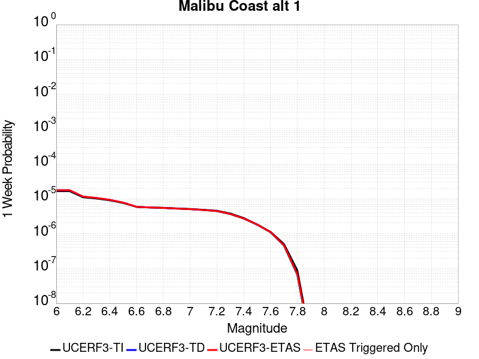 |  | 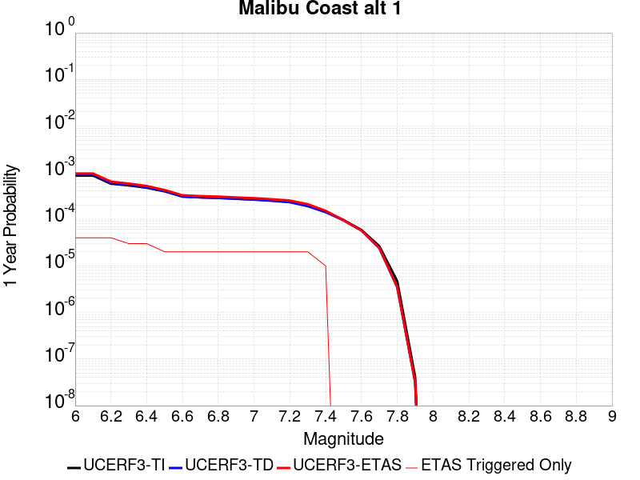 |  |

| Magnitude | 1 wk TI Prob | 1 wk TD Prob | 1 wk ETAS Prob | 1 wk ETAS/TD Gain | 1 wk ETAS Triggered Only | 1 mo TI Prob | 1 mo TD Prob | 1 mo ETAS Prob | 1 mo ETAS/TD Gain | 1 mo ETAS Triggered Only | 1 yr TI Prob | 1 yr TD Prob | 1 yr ETAS Prob | 1 yr ETAS/TD Gain | 1 yr ETAS Triggered Only | 10 yr TI Prob | 10 yr TD Prob | 10 yr ETAS Prob | 10 yr ETAS/TD Gain | 10 yr ETAS Triggered Only |
|-----|-----|-----|-----|-----|-----|-----|-----|-----|-----|-----|-----|-----|-----|-----|-----|-----|-----|-----|-----|-----|
| 6.0 | 1.6572556E-5 | 1.759807E-5 | 1.759807E-5 | 1.0 | 0.0 | 7.102331E-5 | 7.5418226E-5 | 9.541671E-5 | 1.265168 | 2.0E-5 | 8.6436566E-4 | 9.1784896E-4 | 9.5781224E-4 | 1.0435401 | 4.0E-5 | 0.0086101135 | 0.009142514 | 0.009201965 | 1.0065027 | 6.0E-5 |
| 6.1 | 1.6572556E-5 | 1.759807E-5 | 1.759807E-5 | 1.0 | 0.0 | 7.102331E-5 | 7.5418226E-5 | 9.541671E-5 | 1.265168 | 2.0E-5 | 8.6436566E-4 | 9.1784896E-4 | 9.5781224E-4 | 1.0435401 | 4.0E-5 | 0.0086101135 | 0.009142514 | 0.009201965 | 1.0065027 | 6.0E-5 |
| 6.2 | 1.1085717E-5 | 1.155715E-5 | 1.155715E-5 | 1.0 | 0.0 | 4.750935E-5 | 4.9529724E-5 | 6.952873E-5 | 1.403778 | 2.0E-5 | 5.782728E-4 | 6.0286105E-4 | 6.4283697E-4 | 1.0663103 | 4.0E-5 | 0.0057677035 | 0.0060126274 | 0.0060623265 | 1.0082659 | 5.0E-5 |
| 6.3 | 1.0208568E-5 | 1.0592241E-5 | 1.0592241E-5 | 1.0 | 0.0 | 4.375027E-5 | 4.5394543E-5 | 6.539364E-5 | 1.4405615 | 2.0E-5 | 5.325294E-4 | 5.5254134E-4 | 5.8252475E-4 | 1.0542645 | 3.0E-5 | 0.0053125503 | 0.0055119833 | 0.005551763 | 1.0072169 | 4.0E-5 |
| 6.4 | 9.0682315E-6 | 9.342641E-6 | 9.342641E-6 | 1.0 | 0.0 | 3.8863272E-5 | 4.0039286E-5 | 6.0038485E-5 | 1.4994894 | 2.0E-5 | 4.730576E-4 | 4.873713E-4 | 5.173567E-4 | 1.0615247 | 3.0E-5 | 0.0047205184 | 0.004863238 | 0.004903043 | 1.008185 | 4.0E-5 |
| 6.5 | 7.605796E-6 | 7.74859E-6 | 7.74859E-6 | 1.0 | 0.0 | 3.259586E-5 | 3.320783E-5 | 4.3207496E-5 | 1.3011239 | 1.0E-5 | 3.9678233E-4 | 4.0423166E-4 | 4.2422357E-4 | 1.0494566 | 2.0E-5 | 0.0039607463 | 0.0040351013 | 0.0040649804 | 1.0074048 | 3.0E-5 |
| 6.6 | 5.889873E-6 | 5.8795417E-6 | 5.8795417E-6 | 1.0 | 0.0 | 2.5242069E-5 | 2.5197793E-5 | 3.519754E-5 | 1.3968501 | 1.0E-5 | 3.0727885E-4 | 3.0674002E-4 | 3.267339E-4 | 1.0651819 | 2.0E-5 | 0.003068543 | 0.0030631793 | 0.0030930873 | 1.0097637 | 3.0E-5 |
| 6.7 | 5.66586E-6 | 5.6416443E-6 | 5.6416443E-6 | 1.0 | 0.0 | 2.428203E-5 | 2.4178253E-5 | 3.417801E-5 | 1.4135848 | 1.0E-5 | 2.955936E-4 | 2.9433056E-4 | 3.1432466E-4 | 1.0679308 | 2.0E-5 | 0.0029520073 | 0.0029394194 | 0.002969331 | 1.0101761 | 3.0E-5 |
| 6.8 | 5.521556E-6 | 5.48943E-6 | 5.48943E-6 | 1.0 | 0.0 | 2.3663597E-5 | 2.3525918E-5 | 3.352568E-5 | 1.4250531 | 1.0E-5 | 2.880662E-4 | 2.8639048E-4 | 3.0638475E-4 | 1.0698147 | 2.0E-5 | 0.0028769306 | 0.0028602257 | 0.0028901398 | 1.0104587 | 3.0E-5 |
| 6.9 | 5.29752E-6 | 5.2499345E-6 | 5.2499345E-6 | 1.0 | 0.0 | 2.270346E-5 | 2.2499526E-5 | 3.24993E-5 | 1.4444438 | 1.0E-5 | 2.7637955E-4 | 2.7389737E-4 | 2.938919E-4 | 1.0730001 | 2.0E-5 | 0.0027603607 | 0.0027356083 | 0.0027655263 | 1.0109365 | 3.0E-5 |
| 7.0 | 5.106743E-6 | 5.0476815E-6 | 5.0476815E-6 | 1.0 | 0.0 | 2.1885859E-5 | 2.1632743E-5 | 3.1632528E-5 | 1.4622523 | 1.0E-5 | 2.6642776E-4 | 2.6334688E-4 | 2.8334162E-4 | 1.0759255 | 2.0E-5 | 0.0026610855 | 0.0026303576 | 0.002660279 | 1.0113753 | 3.0E-5 |
| 7.1 | 4.8469647E-6 | 4.770376E-6 | 4.770376E-6 | 1.0 | 0.0 | 2.0772539E-5 | 2.044431E-5 | 3.0444104E-5 | 1.4891237 | 1.0E-5 | 2.528763E-4 | 2.488811E-4 | 2.6887612E-4 | 1.0803397 | 2.0E-5 | 0.0025258875 | 0.0024860317 | 0.0025159572 | 1.0120374 | 3.0E-5 |
| 7.2 | 4.545514E-6 | 4.4481967E-6 | 4.4481967E-6 | 1.0 | 0.0 | 1.9480629E-5 | 1.906356E-5 | 2.906337E-5 | 1.524551 | 1.0E-5 | 2.3715083E-4 | 2.3207419E-4 | 2.5206956E-4 | 1.0861593 | 2.0E-5 | 0.0023689792 | 0.002318326 | 0.0023482563 | 1.0129104 | 3.0E-5 |
| 7.3 | 3.794097E-6 | 3.6519373E-6 | 3.6519373E-6 | 1.0 | 0.0 | 1.6260314E-5 | 1.5651065E-5 | 2.565091E-5 | 1.6389241 | 1.0E-5 | 1.9795135E-4 | 1.9053511E-4 | 2.1053129E-4 | 1.1049476 | 2.0E-5 | 0.001977751 | 0.0019037221 | 0.001933665 | 1.0157286 | 3.0E-5 |
| 7.4 | 2.808217E-6 | 2.7190777E-6 | 2.7190777E-6 | 1.0 | 0.0 | 1.203516E-5 | 1.1653137E-5 | 2.165302E-5 | 1.858128 | 1.0E-5 | 1.4651821E-4 | 1.4186774E-4 | 1.5186632E-4 | 1.0704782 | 1.0E-5 | 0.0014642165 | 0.0014177744 | 0.001437746 | 1.0140866 | 2.0E-5 |
| 7.5 | 1.83809E-6 | 1.8190703E-6 | 1.8190703E-6 | 1.0 | 0.0 | 7.877505E-6 | 7.795992E-6 | 7.795992E-6 | 1.0 | 0.0 | 9.59044E-5 | 9.4912095E-5 | 9.4912095E-5 | 1.0 | 0.0 | 9.5863023E-4 | 9.487176E-4 | 9.587081E-4 | 1.0105306 | 1.0E-5 |
| 7.6 | 1.1292672E-6 | 1.1001456E-6 | 1.1001456E-6 | 1.0 | 0.0 | 4.839708E-6 | 4.7149015E-6 | 4.7149015E-6 | 1.0 | 0.0 | 5.8921847E-5 | 5.7402427E-5 | 5.7402427E-5 | 1.0 | 0.0 | 5.890623E-4 | 5.7387765E-4 | 5.838719E-4 | 1.0174153 | 1.0E-5 |
| 7.7 | 5.065272E-7 | 4.6091537E-7 | 4.6091537E-7 | 1.0 | 0.0 | 2.170829E-6 | 1.9753502E-6 | 1.9753502E-6 | 1.0 | 0.0 | 2.6429525E-5 | 2.4049634E-5 | 2.4049634E-5 | 1.0 | 0.0 | 2.642638E-4 | 2.4047145E-4 | 2.4047145E-4 | 1.0 | 0.0 |
| 7.8 | 8.952991E-8 | 6.707853E-8 | 6.707853E-8 | 1.0 | 0.0 | 3.8369956E-7 | 2.874794E-7 | 2.874794E-7 | 1.0 | 0.0 | 4.671532E-6 | 3.5000562E-6 | 3.5000562E-6 | 1.0 | 0.0 | 4.671434E-5 | 3.500003E-5 | 3.500003E-5 | 1.0 | 0.0 |
| 7.9 | 8.007447E-10 | 6.161581E-10 | 6.161581E-10 | 1.0 | 0.0 | 3.4317629E-9 | 2.640678E-9 | 2.640678E-9 | 1.0 | 0.0 | 4.1781714E-8 | 3.2150254E-8 | 3.2150254E-8 | 1.0 | 0.0 | 4.1781706E-7 | 3.2150248E-7 | 3.2150248E-7 | 1.0 | 0.0 |

## San Cayetano
*[(top)](#table-of-contents)*

| 1 Week | 1 Month | 1 Year | 10 Year |
|-----|-----|-----|-----|
|  |  | 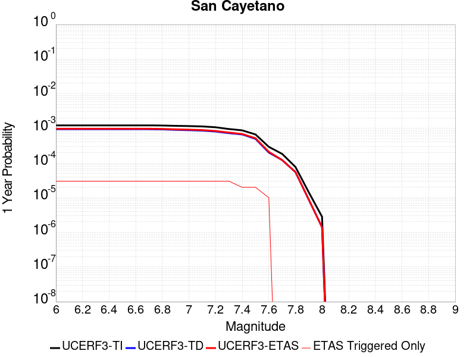 | 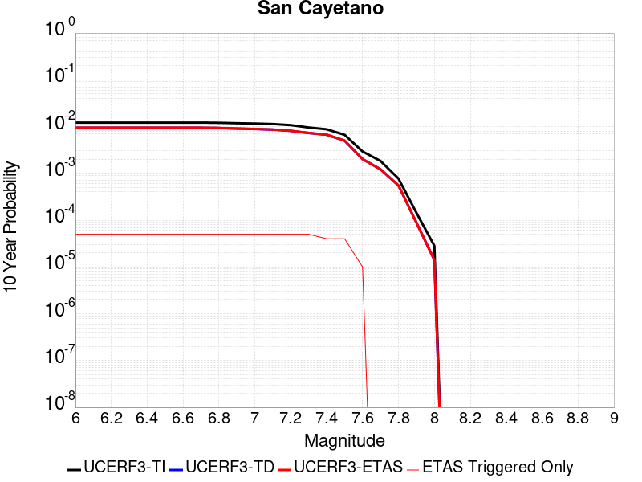 |

| Magnitude | 1 wk TI Prob | 1 wk TD Prob | 1 wk ETAS Prob | 1 wk ETAS/TD Gain | 1 wk ETAS Triggered Only | 1 mo TI Prob | 1 mo TD Prob | 1 mo ETAS Prob | 1 mo ETAS/TD Gain | 1 mo ETAS Triggered Only | 1 yr TI Prob | 1 yr TD Prob | 1 yr ETAS Prob | 1 yr ETAS/TD Gain | 1 yr ETAS Triggered Only | 10 yr TI Prob | 10 yr TD Prob | 10 yr ETAS Prob | 10 yr ETAS/TD Gain | 10 yr ETAS Triggered Only |
|-----|-----|-----|-----|-----|-----|-----|-----|-----|-----|-----|-----|-----|-----|-----|-----|-----|-----|-----|-----|-----|
| 6.0 | 2.3476267E-5 | 1.8169216E-5 | 2.8169034E-5 | 1.5503715 | 1.0E-5 | 1.0060869E-4 | 7.786576E-5 | 8.786499E-5 | 1.1284162 | 1.0E-5 | 0.0012242225 | 9.4760704E-4 | 9.775786E-4 | 1.0316287 | 3.0E-5 | 0.012175002 | 0.00943675 | 0.009486278 | 1.0052484 | 5.0E-5 |
| 6.1 | 2.3476267E-5 | 1.8169216E-5 | 2.8169034E-5 | 1.5503715 | 1.0E-5 | 1.0060869E-4 | 7.786576E-5 | 8.786499E-5 | 1.1284162 | 1.0E-5 | 0.0012242225 | 9.4760704E-4 | 9.775786E-4 | 1.0316287 | 3.0E-5 | 0.012175002 | 0.00943675 | 0.009486278 | 1.0052484 | 5.0E-5 |
| 6.2 | 2.3476267E-5 | 1.8169216E-5 | 2.8169034E-5 | 1.5503715 | 1.0E-5 | 1.0060869E-4 | 7.786576E-5 | 8.786499E-5 | 1.1284162 | 1.0E-5 | 0.0012242225 | 9.4760704E-4 | 9.775786E-4 | 1.0316287 | 3.0E-5 | 0.012175002 | 0.00943675 | 0.009486278 | 1.0052484 | 5.0E-5 |
| 6.3 | 2.3476267E-5 | 1.8169216E-5 | 2.8169034E-5 | 1.5503715 | 1.0E-5 | 1.0060869E-4 | 7.786576E-5 | 8.786499E-5 | 1.1284162 | 1.0E-5 | 0.0012242225 | 9.4760704E-4 | 9.775786E-4 | 1.0316287 | 3.0E-5 | 0.012175002 | 0.00943675 | 0.009486278 | 1.0052484 | 5.0E-5 |
| 6.4 | 2.3476267E-5 | 1.8169216E-5 | 2.8169034E-5 | 1.5503715 | 1.0E-5 | 1.0060869E-4 | 7.786576E-5 | 8.786499E-5 | 1.1284162 | 1.0E-5 | 0.0012242225 | 9.4760704E-4 | 9.775786E-4 | 1.0316287 | 3.0E-5 | 0.012175002 | 0.00943675 | 0.009486278 | 1.0052484 | 5.0E-5 |
| 6.5 | 2.3476267E-5 | 1.8169216E-5 | 2.8169034E-5 | 1.5503715 | 1.0E-5 | 1.0060869E-4 | 7.786576E-5 | 8.786499E-5 | 1.1284162 | 1.0E-5 | 0.0012242225 | 9.4760704E-4 | 9.775786E-4 | 1.0316287 | 3.0E-5 | 0.012175002 | 0.00943675 | 0.009486278 | 1.0052484 | 5.0E-5 |
| 6.6 | 2.3476267E-5 | 1.8169216E-5 | 2.8169034E-5 | 1.5503715 | 1.0E-5 | 1.0060869E-4 | 7.786576E-5 | 8.786499E-5 | 1.1284162 | 1.0E-5 | 0.0012242225 | 9.4760704E-4 | 9.775786E-4 | 1.0316287 | 3.0E-5 | 0.012175002 | 0.00943675 | 0.009486278 | 1.0052484 | 5.0E-5 |
| 6.7 | 2.3476267E-5 | 1.8169216E-5 | 2.8169034E-5 | 1.5503715 | 1.0E-5 | 1.0060869E-4 | 7.786576E-5 | 8.786499E-5 | 1.1284162 | 1.0E-5 | 0.0012242225 | 9.4760704E-4 | 9.775786E-4 | 1.0316287 | 3.0E-5 | 0.012175002 | 0.00943675 | 0.009486278 | 1.0052484 | 5.0E-5 |
| 6.8 | 2.3241924E-5 | 1.7936945E-5 | 2.7936767E-5 | 1.5574985 | 1.0E-5 | 9.960445E-5 | 7.687038E-5 | 8.6869615E-5 | 1.1300792 | 1.0E-5 | 0.0012120095 | 9.354987E-4 | 9.654706E-4 | 1.0320385 | 3.0E-5 | 0.012054204 | 0.0093166195 | 0.009366154 | 1.0053167 | 5.0E-5 |
| 6.9 | 2.2761007E-5 | 1.7432383E-5 | 2.743221E-5 | 1.573635 | 1.0E-5 | 9.7543525E-5 | 7.47081E-5 | 8.470735E-5 | 1.1338443 | 1.0E-5 | 0.0011869454 | 9.09195E-4 | 9.391677E-4 | 1.0329663 | 3.0E-5 | 0.011806256 | 0.009055741 | 0.009105288 | 1.0054713 | 5.0E-5 |
| 7.0 | 2.240283E-5 | 1.7066137E-5 | 2.7065966E-5 | 1.5859457 | 1.0E-5 | 9.600859E-5 | 7.313856E-5 | 8.313783E-5 | 1.1367168 | 1.0E-5 | 0.0011682777 | 8.9010154E-4 | 9.200749E-4 | 1.033674 | 3.0E-5 | 0.011621549 | 0.008866336 | 0.008915893 | 1.0055894 | 5.0E-5 |
| 7.1 | 2.1871154E-5 | 1.658602E-5 | 2.6585854E-5 | 1.6029074 | 1.0E-5 | 9.373015E-5 | 7.108103E-5 | 8.108031E-5 | 1.1406745 | 1.0E-5 | 0.0011405671 | 8.6507126E-4 | 8.950453E-4 | 1.0346493 | 3.0E-5 | 0.011347309 | 0.008617996 | 0.008667566 | 1.0057518 | 5.0E-5 |
| 7.2 | 2.0714133E-5 | 1.5564563E-5 | 2.5564406E-5 | 1.6424751 | 1.0E-5 | 8.8771834E-5 | 6.670358E-5 | 7.670291E-5 | 1.149907 | 1.0E-5 | 0.0010802611 | 8.118168E-4 | 8.417924E-4 | 1.0369241 | 3.0E-5 | 0.010750249 | 0.008089443 | 0.008139038 | 1.0061309 | 5.0E-5 |
| 7.3 | 1.8408395E-5 | 1.3996829E-5 | 2.3996688E-5 | 1.7144376 | 1.0E-5 | 7.8890735E-5 | 5.9985046E-5 | 6.9984446E-5 | 1.1666982 | 1.0E-5 | 9.600714E-4 | 7.300762E-4 | 7.600543E-4 | 1.0410616 | 3.0E-5 | 0.009559342 | 0.0072776447 | 0.007327281 | 1.0068203 | 5.0E-5 |
| 7.4 | 1.6856795E-5 | 1.285006E-5 | 1.285006E-5 | 1.0 | 0.0 | 7.2241404E-5 | 5.5070537E-5 | 5.5070537E-5 | 1.0 | 0.0 | 8.7918417E-4 | 6.7028037E-4 | 6.9026696E-4 | 1.0298183 | 2.0E-5 | 0.00875714 | 0.0066834087 | 0.0067231413 | 1.005945 | 4.0E-5 |
| 7.5 | 1.2822778E-5 | 9.577415E-6 | 9.577415E-6 | 1.0 | 0.0 | 5.495361E-5 | 4.1045427E-5 | 4.1045427E-5 | 1.0 | 0.0 | 6.688548E-4 | 4.9961504E-4 | 5.1960506E-4 | 1.0400108 | 2.0E-5 | 0.006668452 | 0.0049851923 | 0.005024993 | 1.0079838 | 4.0E-5 |
| 7.6 | 5.6272684E-6 | 3.854899E-6 | 3.854899E-6 | 1.0 | 0.0 | 2.4116642E-5 | 1.6520893E-5 | 1.6520893E-5 | 1.0 | 0.0 | 2.9358055E-4 | 2.0112342E-4 | 2.111214E-4 | 1.0497108 | 1.0E-5 | 0.0029319301 | 0.0020094248 | 0.0020194047 | 1.0049665 | 1.0E-5 |
| 7.7 | 3.5261346E-6 | 2.3407094E-6 | 2.3407094E-6 | 1.0 | 0.0 | 1.5111918E-5 | 1.0031574E-5 | 1.0031574E-5 | 1.0 | 0.0 | 1.8397206E-4 | 1.2212765E-4 | 1.2212765E-4 | 1.0 | 0.0 | 0.0018381984 | 0.0012206127 | 0.0012206127 | 1.0 | 0.0 |
| 7.8 | 1.4826929E-6 | 1.0564395E-6 | 1.0564395E-6 | 1.0 | 0.0 | 6.354383E-6 | 4.52759E-6 | 4.52759E-6 | 1.0 | 0.0 | 7.736187E-5 | 5.5122033E-5 | 5.5122033E-5 | 1.0 | 0.0 | 7.733494E-4 | 5.510856E-4 | 5.510856E-4 | 1.0 | 0.0 |
| 7.9 | 2.7568166E-7 | 1.6977887E-7 | 1.6977887E-7 | 1.0 | 0.0 | 1.1814923E-6 | 7.276235E-7 | 7.276235E-7 | 1.0 | 0.0 | 1.4384574E-5 | 8.85878E-6 | 8.85878E-6 | 1.0 | 0.0 | 1.4383643E-4 | 8.858431E-5 | 8.858431E-5 | 1.0 | 0.0 |
| 8.0 | 5.407832E-8 | 2.688677E-8 | 2.688677E-8 | 1.0 | 0.0 | 2.3176422E-7 | 1.15229014E-7 | 1.15229014E-7 | 1.0 | 0.0 | 2.8217257E-6 | 1.4029123E-6 | 1.4029123E-6 | 1.0 | 0.0 | 2.8216898E-5 | 1.40290385E-5 | 1.40290385E-5 | 1.0 | 0.0 |

## San Pedro Basin
*[(top)](#table-of-contents)*

| 1 Week | 1 Month | 1 Year | 10 Year |
|-----|-----|-----|-----|
|  | 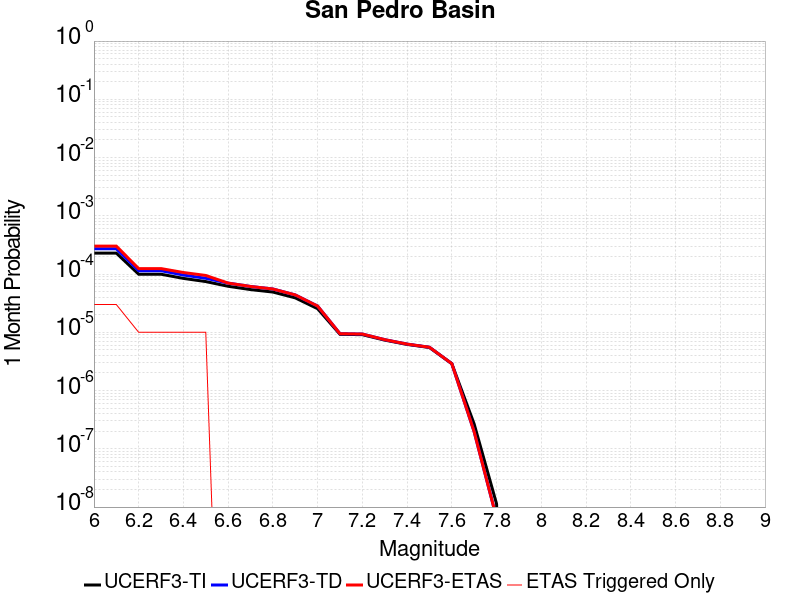 |  |  |

| Magnitude | 1 wk TI Prob | 1 wk TD Prob | 1 wk ETAS Prob | 1 wk ETAS/TD Gain | 1 wk ETAS Triggered Only | 1 mo TI Prob | 1 mo TD Prob | 1 mo ETAS Prob | 1 mo ETAS/TD Gain | 1 mo ETAS Triggered Only | 1 yr TI Prob | 1 yr TD Prob | 1 yr ETAS Prob | 1 yr ETAS/TD Gain | 1 yr ETAS Triggered Only | 10 yr TI Prob | 10 yr TD Prob | 10 yr ETAS Prob | 10 yr ETAS/TD Gain | 10 yr ETAS Triggered Only |
|-----|-----|-----|-----|-----|-----|-----|-----|-----|-----|-----|-----|-----|-----|-----|-----|-----|-----|-----|-----|-----|
| 6.0 | 5.3449043E-5 | 6.337018E-5 | 8.336891E-5 | 1.3155859 | 2.0E-5 | 2.2904722E-4 | 2.7156167E-4 | 3.0155352E-4 | 1.1104422 | 3.0E-5 | 0.0027850836 | 0.0033018515 | 0.0033417193 | 1.0120745 | 4.0E-5 | 0.027504366 | 0.03258948 | 0.032647528 | 1.0017811 | 6.0E-5 |
| 6.1 | 5.3449043E-5 | 6.337018E-5 | 8.336891E-5 | 1.3155859 | 2.0E-5 | 2.2904722E-4 | 2.7156167E-4 | 3.0155352E-4 | 1.1104422 | 3.0E-5 | 0.0027850836 | 0.0033018515 | 0.0033417193 | 1.0120745 | 4.0E-5 | 0.027504366 | 0.03258948 | 0.032647528 | 1.0017811 | 6.0E-5 |
| 6.2 | 2.3189454E-5 | 2.6642829E-5 | 2.6642829E-5 | 1.0 | 0.0 | 9.9379584E-5 | 1.1417881E-4 | 1.2417766E-4 | 1.087572 | 1.0E-5 | 0.0012092749 | 0.0013892875 | 0.0013992736 | 1.007188 | 1.0E-5 | 0.012027155 | 0.01381089 | 0.013820752 | 1.0007141 | 1.0E-5 |
| 6.3 | 2.3189454E-5 | 2.6642829E-5 | 2.6642829E-5 | 1.0 | 0.0 | 9.9379584E-5 | 1.1417881E-4 | 1.2417766E-4 | 1.087572 | 1.0E-5 | 0.0012092749 | 0.0013892875 | 0.0013992736 | 1.007188 | 1.0E-5 | 0.012027155 | 0.01381089 | 0.013820752 | 1.0007141 | 1.0E-5 |
| 6.4 | 1.966056E-5 | 2.246342E-5 | 2.246342E-5 | 1.0 | 0.0 | 8.425682E-5 | 9.626848E-5 | 1.06267515E-4 | 1.1038662 | 1.0E-5 | 0.001025344 | 0.0011714787 | 0.001181467 | 1.0085262 | 1.0E-5 | 0.010206259 | 0.011657119 | 0.011667003 | 1.0008478 | 1.0E-5 |
| 6.5 | 1.7342953E-5 | 1.9745152E-5 | 1.9745152E-5 | 1.0 | 0.0 | 7.4324824E-5 | 8.461954E-5 | 9.46187E-5 | 1.118166 | 1.0E-5 | 9.04529E-4 | 0.0010297929 | 0.0010397827 | 1.0097007 | 1.0E-5 | 0.009008561 | 0.010253932 | 0.01026383 | 1.0009652 | 1.0E-5 |
| 6.6 | 1.439804E-5 | 1.6322716E-5 | 1.6322716E-5 | 1.0 | 0.0 | 6.170443E-5 | 6.99528E-5 | 6.99528E-5 | 1.0 | 0.0 | 7.509924E-4 | 8.513747E-4 | 8.513747E-4 | 1.0 | 0.0 | 0.0074845953 | 0.008484333 | 0.008484333 | 1.0 | 0.0 |
| 6.7 | 1.2634884E-5 | 1.4285298E-5 | 1.4285298E-5 | 1.0 | 0.0 | 5.414838E-5 | 6.122144E-5 | 6.122144E-5 | 1.0 | 0.0 | 6.590571E-4 | 7.451466E-4 | 7.451466E-4 | 1.0 | 0.0 | 0.006571059 | 0.007429502 | 0.007429502 | 1.0 | 0.0 |
| 6.8 | 1.146091E-5 | 1.2933193E-5 | 1.2933193E-5 | 1.0 | 0.0 | 4.911726E-5 | 5.542696E-5 | 5.542696E-5 | 1.0 | 0.0 | 5.9783855E-4 | 6.74644E-4 | 6.74644E-4 | 1.0 | 0.0 | 0.0059623276 | 0.0067288997 | 0.0067288997 | 1.0 | 0.0 |
| 6.9 | 9.109035E-6 | 1.0235013E-5 | 1.0235013E-5 | 1.0 | 0.0 | 3.9038136E-5 | 4.386376E-5 | 4.386376E-5 | 1.0 | 0.0 | 4.7518566E-4 | 5.339384E-4 | 5.339384E-4 | 1.0 | 0.0 | 0.0047417083 | 0.0053293095 | 0.0053293095 | 1.0 | 0.0 |
| 7.0 | 5.9351028E-6 | 6.583965E-6 | 6.583965E-6 | 1.0 | 0.0 | 2.5435906E-5 | 2.821682E-5 | 2.821682E-5 | 1.0 | 0.0 | 3.0963816E-4 | 3.4350925E-4 | 3.4350925E-4 | 1.0 | 0.0 | 0.0030920706 | 0.0034320997 | 0.0034320997 | 1.0 | 0.0 |
| 7.1 | 2.1557585E-6 | 2.2096492E-6 | 2.2096492E-6 | 1.0 | 0.0 | 9.238933E-6 | 9.469892E-6 | 9.469892E-6 | 1.0 | 0.0 | 1.1247819E-4 | 1.15289986E-4 | 1.15289986E-4 | 1.0 | 0.0 | 0.0011242128 | 0.0011523172 | 0.0011523172 | 1.0 | 0.0 |
| 7.2 | 2.1251979E-6 | 2.1779954E-6 | 2.1779954E-6 | 1.0 | 0.0 | 9.107958E-6 | 9.334234E-6 | 9.334234E-6 | 1.0 | 0.0 | 1.1088375E-4 | 1.13638525E-4 | 1.13638525E-4 | 1.0 | 0.0 | 0.0011082845 | 0.0011358195 | 0.0011358195 | 1.0 | 0.0 |
| 7.3 | 1.7145798E-6 | 1.7442885E-6 | 1.7442885E-6 | 1.0 | 0.0 | 7.3481783E-6 | 7.475501E-6 | 7.475501E-6 | 1.0 | 0.0 | 8.94604E-5 | 9.1010515E-5 | 9.1010515E-5 | 1.0 | 0.0 | 8.9424395E-4 | 9.0974156E-4 | 9.0974156E-4 | 1.0 | 0.0 |
| 7.4 | 1.4467993E-6 | 1.4641878E-6 | 1.4641878E-6 | 1.0 | 0.0 | 6.200554E-6 | 6.275076E-6 | 6.275076E-6 | 1.0 | 0.0 | 7.548913E-5 | 7.639644E-5 | 7.639644E-5 | 1.0 | 0.0 | 7.546349E-4 | 7.6370913E-4 | 7.6370913E-4 | 1.0 | 0.0 |
| 7.5 | 1.2803735E-6 | 1.2931506E-6 | 1.2931506E-6 | 1.0 | 0.0 | 5.487303E-6 | 5.5420624E-6 | 5.5420624E-6 | 1.0 | 0.0 | 6.680587E-5 | 6.747259E-5 | 6.747259E-5 | 1.0 | 0.0 | 6.678579E-4 | 6.745281E-4 | 6.745281E-4 | 1.0 | 0.0 |
| 7.6 | 6.755009E-7 | 6.76947E-7 | 6.76947E-7 | 1.0 | 0.0 | 2.8950008E-6 | 2.9011985E-6 | 2.9011985E-6 | 1.0 | 0.0 | 3.5246063E-5 | 3.532158E-5 | 3.532158E-5 | 1.0 | 0.0 | 3.5240475E-4 | 3.5316538E-4 | 3.5316538E-4 | 1.0 | 0.0 |
| 7.7 | 6.211885E-8 | 4.5699714E-8 | 4.5699714E-8 | 1.0 | 0.0 | 2.6622362E-7 | 1.9585592E-7 | 1.9585592E-7 | 1.0 | 0.0 | 3.2412677E-6 | 2.3845432E-6 | 2.3845432E-6 | 1.0 | 0.0 | 3.2412205E-5 | 2.3845198E-5 | 2.3845198E-5 | 1.0 | 0.0 |
| 7.8 | 2.6580573E-9 | 1.5138054E-9 | 1.5138054E-9 | 1.0 | 0.0 | 1.1391674E-8 | 6.4877375E-9 | 6.4877375E-9 | 1.0 | 0.0 | 1.3869362E-7 | 7.89882E-8 | 7.89882E-8 | 1.0 | 0.0 | 1.3869354E-6 | 7.89882E-7 | 7.89882E-7 | 1.0 | 0.0 |

## Elysian Park (Upper)
*[(top)](#table-of-contents)*

| 1 Week | 1 Month | 1 Year | 10 Year |
|-----|-----|-----|-----|
|  | 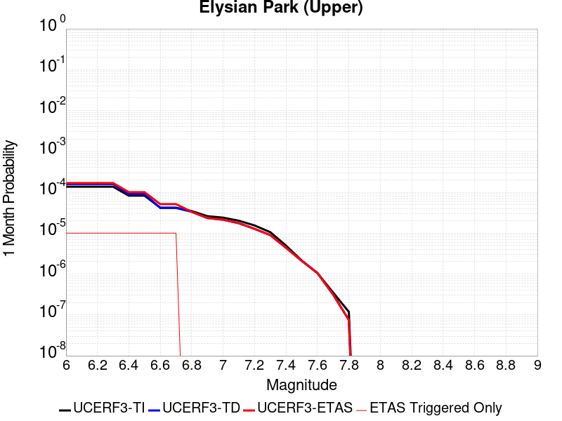 |  |  |

| Magnitude | 1 wk TI Prob | 1 wk TD Prob | 1 wk ETAS Prob | 1 wk ETAS/TD Gain | 1 wk ETAS Triggered Only | 1 mo TI Prob | 1 mo TD Prob | 1 mo ETAS Prob | 1 mo ETAS/TD Gain | 1 mo ETAS Triggered Only | 1 yr TI Prob | 1 yr TD Prob | 1 yr ETAS Prob | 1 yr ETAS/TD Gain | 1 yr ETAS Triggered Only | 10 yr TI Prob | 10 yr TD Prob | 10 yr ETAS Prob | 10 yr ETAS/TD Gain | 10 yr ETAS Triggered Only |
|-----|-----|-----|-----|-----|-----|-----|-----|-----|-----|-----|-----|-----|-----|-----|-----|-----|-----|-----|-----|-----|
| 6.0 | 3.1876025E-5 | 3.7035275E-5 | 4.7034904E-5 | 1.2700028 | 1.0E-5 | 1.3660437E-4 | 1.5871569E-4 | 1.687141E-4 | 1.0629958 | 1.0E-5 | 0.0016618895 | 0.001931122 | 0.0019810256 | 1.0258417 | 5.0E-5 | 0.016495159 | 0.019189863 | 0.019238902 | 1.0025555 | 5.0E-5 |
| 6.1 | 3.1876025E-5 | 3.7035275E-5 | 4.7034904E-5 | 1.2700028 | 1.0E-5 | 1.3660437E-4 | 1.5871569E-4 | 1.687141E-4 | 1.0629958 | 1.0E-5 | 0.0016618895 | 0.001931122 | 0.0019810256 | 1.0258417 | 5.0E-5 | 0.016495159 | 0.019189863 | 0.019238902 | 1.0025555 | 5.0E-5 |
| 6.2 | 3.1876025E-5 | 3.7035275E-5 | 4.7034904E-5 | 1.2700028 | 1.0E-5 | 1.3660437E-4 | 1.5871569E-4 | 1.687141E-4 | 1.0629958 | 1.0E-5 | 0.0016618895 | 0.001931122 | 0.0019810256 | 1.0258417 | 5.0E-5 | 0.016495159 | 0.019189863 | 0.019238902 | 1.0025555 | 5.0E-5 |
| 6.3 | 3.1876025E-5 | 3.7035275E-5 | 4.7034904E-5 | 1.2700028 | 1.0E-5 | 1.3660437E-4 | 1.5871569E-4 | 1.687141E-4 | 1.0629958 | 1.0E-5 | 0.0016618895 | 0.001931122 | 0.0019810256 | 1.0258417 | 5.0E-5 | 0.016495159 | 0.019189863 | 0.019238902 | 1.0025555 | 5.0E-5 |
| 6.4 | 1.9273462E-5 | 2.120244E-5 | 3.1202228E-5 | 1.4716338 | 1.0E-5 | 8.259794E-5 | 9.086542E-5 | 1.0086451E-4 | 1.1100428 | 1.0E-5 | 0.001005166 | 0.0011058967 | 0.0011458525 | 1.0361297 | 4.0E-5 | 0.010006315 | 0.011020744 | 0.011060303 | 1.0035895 | 4.0E-5 |
| 6.5 | 1.9273462E-5 | 2.120244E-5 | 3.1202228E-5 | 1.4716338 | 1.0E-5 | 8.259794E-5 | 9.086542E-5 | 1.0086451E-4 | 1.1100428 | 1.0E-5 | 0.001005166 | 0.0011058967 | 0.0011458525 | 1.0361297 | 4.0E-5 | 0.010006315 | 0.011020744 | 0.011060303 | 1.0035895 | 4.0E-5 |
| 6.6 | 9.813258E-6 | 9.665589E-6 | 1.9665491E-5 | 2.034588 | 1.0E-5 | 4.205614E-5 | 4.1423333E-5 | 5.1422918E-5 | 1.2413999 | 1.0E-5 | 5.119132E-4 | 5.042196E-4 | 5.242095E-4 | 1.0396453 | 2.0E-5 | 0.005107356 | 0.0050314795 | 0.005051379 | 1.003955 | 2.0E-5 |
| 6.7 | 9.801478E-6 | 9.653158E-6 | 1.9653062E-5 | 2.0359204 | 1.0E-5 | 4.2005657E-5 | 4.137006E-5 | 5.1369647E-5 | 1.2417107 | 1.0E-5 | 5.112989E-4 | 5.0357135E-4 | 5.2356126E-4 | 1.0396963 | 2.0E-5 | 0.0051012407 | 0.005025026 | 0.0050449255 | 1.0039601 | 2.0E-5 |
| 6.8 | 8.102489E-6 | 7.772994E-6 | 7.772994E-6 | 1.0 | 0.0 | 3.4724493E-5 | 3.3312434E-5 | 3.3312434E-5 | 1.0 | 0.0 | 4.2268867E-4 | 4.0550836E-4 | 4.1550433E-4 | 1.0246505 | 1.0E-5 | 0.004218856 | 0.0040481784 | 0.0040581375 | 1.0024602 | 1.0E-5 |
| 6.9 | 6.08275E-6 | 5.481441E-6 | 5.481441E-6 | 1.0 | 0.0 | 2.6068668E-5 | 2.3491682E-5 | 2.3491682E-5 | 1.0 | 0.0 | 3.173398E-4 | 2.8597447E-4 | 2.959716E-4 | 1.0349581 | 1.0E-5 | 0.0031688702 | 0.0028561424 | 0.0028661138 | 1.0034913 | 1.0E-5 |
| 7.0 | 5.5995934E-6 | 4.9827686E-6 | 4.9827686E-6 | 1.0 | 0.0 | 2.3998036E-5 | 2.1354552E-5 | 2.1354552E-5 | 1.0 | 0.0 | 2.9213692E-4 | 2.5996132E-4 | 2.6995872E-4 | 1.0384573 | 1.0E-5 | 0.0029175316 | 0.0025966396 | 0.0026066136 | 1.0038412 | 1.0E-5 |
| 7.1 | 4.709881E-6 | 4.0873906E-6 | 4.0873906E-6 | 1.0 | 0.0 | 2.0185047E-5 | 1.7517272E-5 | 1.7517272E-5 | 1.0 | 0.0 | 2.4572524E-4 | 2.1325232E-4 | 2.1325232E-4 | 1.0 | 0.0 | 0.002454537 | 0.0021305184 | 0.0021305184 | 1.0 | 0.0 |
| 7.2 | 3.6063436E-6 | 2.9779412E-6 | 2.9779412E-6 | 1.0 | 0.0 | 1.5455667E-5 | 1.27625435E-5 | 1.27625435E-5 | 1.0 | 0.0 | 1.881565E-4 | 1.55373E-4 | 1.55373E-4 | 1.0 | 0.0 | 0.0018799726 | 0.0015526549 | 0.0015526549 | 1.0 | 0.0 |
| 7.3 | 2.471135E-6 | 2.0954562E-6 | 2.0954562E-6 | 1.0 | 0.0 | 1.0590536E-5 | 8.980496E-6 | 8.980496E-6 | 1.0 | 0.0 | 1.2893214E-4 | 1.0933213E-4 | 1.0933213E-4 | 1.0 | 0.0 | 0.0012885736 | 0.0010927906 | 0.0010927906 | 1.0 | 0.0 |
| 7.4 | 1.163943E-6 | 1.0275061E-6 | 1.0275061E-6 | 1.0 | 0.0 | 4.988318E-6 | 4.40359E-6 | 4.40359E-6 | 1.0 | 0.0 | 6.0731076E-5 | 5.361242E-5 | 5.361242E-5 | 1.0 | 0.0 | 6.071448E-4 | 5.3599785E-4 | 5.3599785E-4 | 1.0 | 0.0 |
| 7.5 | 4.99459E-7 | 4.917601E-7 | 4.917601E-7 | 1.0 | 0.0 | 2.140537E-6 | 2.1075416E-6 | 2.1075416E-6 | 1.0 | 0.0 | 2.6060725E-5 | 2.5659032E-5 | 2.5659032E-5 | 1.0 | 0.0 | 2.605767E-4 | 2.5656226E-4 | 2.5656226E-4 | 1.0 | 0.0 |
| 7.6 | 2.4667852E-7 | 2.4778313E-7 | 2.4778313E-7 | 1.0 | 0.0 | 1.0571932E-6 | 1.0619274E-6 | 1.0619274E-6 | 1.0 | 0.0 | 1.2871251E-5 | 1.2928893E-5 | 1.2928893E-5 | 1.0 | 0.0 | 1.2870505E-4 | 1.2928178E-4 | 1.2928178E-4 | 1.0 | 0.0 |
| 7.7 | 8.2312795E-8 | 7.3864214E-8 | 7.3864214E-8 | 1.0 | 0.0 | 3.527691E-7 | 3.165609E-7 | 3.165609E-7 | 1.0 | 0.0 | 4.294955E-6 | 3.854123E-6 | 3.854123E-6 | 1.0 | 0.0 | 4.2948723E-5 | 3.854068E-5 | 3.854068E-5 | 1.0 | 0.0 |
| 7.8 | 2.7819295E-8 | 1.7565618E-8 | 1.7565618E-8 | 1.0 | 0.0 | 1.1922555E-7 | 7.528122E-8 | 7.528122E-8 | 1.0 | 0.0 | 1.45157E-6 | 9.1654863E-7 | 9.1654863E-7 | 1.0 | 0.0 | 1.45156055E-5 | 9.165463E-6 | 9.165463E-6 | 1.0 | 0.0 |

## Channel Islands Western Deep Ramp
*[(top)](#table-of-contents)*

| 1 Week | 1 Month | 1 Year | 10 Year |
|-----|-----|-----|-----|
|  |  |  |  |

| Magnitude | 1 wk TI Prob | 1 wk TD Prob | 1 wk ETAS Prob | 1 wk ETAS/TD Gain | 1 wk ETAS Triggered Only | 1 mo TI Prob | 1 mo TD Prob | 1 mo ETAS Prob | 1 mo ETAS/TD Gain | 1 mo ETAS Triggered Only | 1 yr TI Prob | 1 yr TD Prob | 1 yr ETAS Prob | 1 yr ETAS/TD Gain | 1 yr ETAS Triggered Only | 10 yr TI Prob | 10 yr TD Prob | 10 yr ETAS Prob | 10 yr ETAS/TD Gain | 10 yr ETAS Triggered Only |
|-----|-----|-----|-----|-----|-----|-----|-----|-----|-----|-----|-----|-----|-----|-----|-----|-----|-----|-----|-----|-----|
| 6.0 | 6.0213506E-6 | 6.2548684E-6 | 6.2548684E-6 | 1.0 | 0.0 | 2.5805533E-5 | 2.6806329E-5 | 4.680579E-5 | 1.7460725 | 2.0E-5 | 3.1413708E-4 | 3.2632265E-4 | 3.7630633E-4 | 1.1531726 | 5.0E-5 | 0.0031369338 | 0.0032588763 | 0.0033087134 | 1.0152928 | 5.0E-5 |
| 6.1 | 6.0213506E-6 | 6.2548684E-6 | 6.2548684E-6 | 1.0 | 0.0 | 2.5805533E-5 | 2.6806329E-5 | 4.680579E-5 | 1.7460725 | 2.0E-5 | 3.1413708E-4 | 3.2632265E-4 | 3.7630633E-4 | 1.1531726 | 5.0E-5 | 0.0031369338 | 0.0032588763 | 0.0033087134 | 1.0152928 | 5.0E-5 |
| 6.2 | 6.0213506E-6 | 6.2548684E-6 | 6.2548684E-6 | 1.0 | 0.0 | 2.5805533E-5 | 2.6806329E-5 | 4.680579E-5 | 1.7460725 | 2.0E-5 | 3.1413708E-4 | 3.2632265E-4 | 3.7630633E-4 | 1.1531726 | 5.0E-5 | 0.0031369338 | 0.0032588763 | 0.0033087134 | 1.0152928 | 5.0E-5 |
| 6.3 | 6.0213506E-6 | 6.2548684E-6 | 6.2548684E-6 | 1.0 | 0.0 | 2.5805533E-5 | 2.6806329E-5 | 4.680579E-5 | 1.7460725 | 2.0E-5 | 3.1413708E-4 | 3.2632265E-4 | 3.7630633E-4 | 1.1531726 | 5.0E-5 | 0.0031369338 | 0.0032588763 | 0.0033087134 | 1.0152928 | 5.0E-5 |
| 6.4 | 6.0213506E-6 | 6.2548684E-6 | 6.2548684E-6 | 1.0 | 0.0 | 2.5805533E-5 | 2.6806329E-5 | 4.680579E-5 | 1.7460725 | 2.0E-5 | 3.1413708E-4 | 3.2632265E-4 | 3.7630633E-4 | 1.1531726 | 5.0E-5 | 0.0031369338 | 0.0032588763 | 0.0033087134 | 1.0152928 | 5.0E-5 |
| 6.5 | 6.0213506E-6 | 6.2548684E-6 | 6.2548684E-6 | 1.0 | 0.0 | 2.5805533E-5 | 2.6806329E-5 | 4.680579E-5 | 1.7460725 | 2.0E-5 | 3.1413708E-4 | 3.2632265E-4 | 3.7630633E-4 | 1.1531726 | 5.0E-5 | 0.0031369338 | 0.0032588763 | 0.0033087134 | 1.0152928 | 5.0E-5 |
| 6.6 | 6.0213506E-6 | 6.2548684E-6 | 6.2548684E-6 | 1.0 | 0.0 | 2.5805533E-5 | 2.6806329E-5 | 4.680579E-5 | 1.7460725 | 2.0E-5 | 3.1413708E-4 | 3.2632265E-4 | 3.7630633E-4 | 1.1531726 | 5.0E-5 | 0.0031369338 | 0.0032588763 | 0.0033087134 | 1.0152928 | 5.0E-5 |
| 6.7 | 5.313309E-6 | 5.5252403E-6 | 5.5252403E-6 | 1.0 | 0.0 | 2.2771126E-5 | 2.367941E-5 | 3.3679175E-5 | 1.4222978 | 1.0E-5 | 2.772032E-4 | 2.8826276E-4 | 3.2825125E-4 | 1.1387223 | 4.0E-5 | 0.0027685766 | 0.0028792918 | 0.0029191766 | 1.0138524 | 4.0E-5 |
| 6.8 | 5.313309E-6 | 5.5252403E-6 | 5.5252403E-6 | 1.0 | 0.0 | 2.2771126E-5 | 2.367941E-5 | 3.3679175E-5 | 1.4222978 | 1.0E-5 | 2.772032E-4 | 2.8826276E-4 | 3.2825125E-4 | 1.1387223 | 4.0E-5 | 0.0027685766 | 0.0028792918 | 0.0029191766 | 1.0138524 | 4.0E-5 |
| 6.9 | 4.744377E-6 | 4.9394303E-6 | 4.9394303E-6 | 1.0 | 0.0 | 2.0332885E-5 | 2.1168837E-5 | 3.1168624E-5 | 1.4723825 | 1.0E-5 | 2.4752476E-4 | 2.5770385E-4 | 2.9769354E-4 | 1.1551769 | 4.0E-5 | 0.0024724922 | 0.0025744175 | 0.0026143144 | 1.0154974 | 4.0E-5 |
| 7.0 | 4.722209E-6 | 4.9164732E-6 | 4.9164732E-6 | 1.0 | 0.0 | 2.0237881E-5 | 2.107045E-5 | 3.1070238E-5 | 1.4745883 | 1.0E-5 | 2.4636835E-4 | 2.5650626E-4 | 2.96496E-4 | 1.1559017 | 4.0E-5 | 0.002460954 | 0.0025624693 | 0.0026023667 | 1.0155699 | 4.0E-5 |
| 7.1 | 4.611174E-6 | 4.801409E-6 | 4.801409E-6 | 1.0 | 0.0 | 1.9762025E-5 | 2.0577325E-5 | 3.057712E-5 | 1.4859618 | 1.0E-5 | 2.4057609E-4 | 2.5050386E-4 | 2.8049634E-4 | 1.1197287 | 3.0E-5 | 0.002403158 | 0.002502582 | 0.0025325068 | 1.0119576 | 3.0E-5 |
| 7.2 | 4.043994E-6 | 4.2120264E-6 | 4.2120264E-6 | 1.0 | 0.0 | 1.7331287E-5 | 1.8051438E-5 | 2.8051258E-5 | 1.5539625 | 1.0E-5 | 2.10988E-4 | 2.1975765E-4 | 2.4975106E-4 | 1.136484 | 3.0E-5 | 0.002107878 | 0.0021957543 | 0.0022256884 | 1.0136328 | 3.0E-5 |
| 7.3 | 2.1233036E-6 | 2.2297875E-6 | 2.2297875E-6 | 1.0 | 0.0 | 9.099841E-6 | 9.556197E-6 | 1.9556102E-5 | 2.0464313 | 1.0E-5 | 1.1078493E-4 | 1.1634055E-4 | 1.3633822E-4 | 1.1718891 | 2.0E-5 | 0.0011072971 | 0.001162802 | 0.0011827787 | 1.0171798 | 2.0E-5 |
| 7.4 | 1.9051884E-6 | 2.0014973E-6 | 2.0014973E-6 | 1.0 | 0.0 | 8.165067E-6 | 8.577817E-6 | 1.8577732E-5 | 2.1657877 | 1.0E-5 | 9.940516E-5 | 1.0442998E-4 | 1.2442788E-4 | 1.1914959 | 2.0E-5 | 9.93607E-4 | 0.0010438144 | 0.0010637934 | 1.0191405 | 2.0E-5 |
| 7.5 | 1.2408497E-6 | 1.3038839E-6 | 1.3038839E-6 | 1.0 | 0.0 | 5.317916E-6 | 5.588062E-6 | 5.588062E-6 | 1.0 | 0.0 | 6.4743705E-5 | 6.8032554E-5 | 6.8032554E-5 | 1.0 | 0.0 | 6.4724847E-4 | 6.8011944E-4 | 6.8011944E-4 | 1.0 | 0.0 |
| 7.6 | 6.5440025E-7 | 6.886718E-7 | 6.886718E-7 | 1.0 | 0.0 | 2.8045695E-6 | 2.9514472E-6 | 2.9514472E-6 | 1.0 | 0.0 | 3.4145098E-5 | 3.593329E-5 | 3.593329E-5 | 1.0 | 0.0 | 3.4139853E-4 | 3.5927625E-4 | 3.5927625E-4 | 1.0 | 0.0 |
| 7.7 | 3.985963E-7 | 4.1930787E-7 | 4.1930787E-7 | 1.0 | 0.0 | 1.7082689E-6 | 1.7970326E-6 | 1.7970326E-6 | 1.0 | 0.0 | 2.0797976E-5 | 2.1878664E-5 | 2.1878664E-5 | 1.0 | 0.0 | 2.0796029E-4 | 2.1876628E-4 | 2.1876628E-4 | 1.0 | 0.0 |
| 7.8 | 3.706329E-8 | 3.8591796E-8 | 3.8591796E-8 | 1.0 | 0.0 | 1.5884267E-7 | 1.653934E-7 | 1.653934E-7 | 1.0 | 0.0 | 1.9339077E-6 | 2.0136629E-6 | 2.0136629E-6 | 1.0 | 0.0 | 1.933891E-5 | 2.0136458E-5 | 2.0136458E-5 | 1.0 | 0.0 |

## Calaveras (So) - Paicines extension 2011 CFM
*[(top)](#table-of-contents)*

| 1 Week | 1 Month | 1 Year | 10 Year |
|-----|-----|-----|-----|
|  |  |  |  |

| Magnitude | 1 wk TI Prob | 1 wk TD Prob | 1 wk ETAS Prob | 1 wk ETAS/TD Gain | 1 wk ETAS Triggered Only | 1 mo TI Prob | 1 mo TD Prob | 1 mo ETAS Prob | 1 mo ETAS/TD Gain | 1 mo ETAS Triggered Only | 1 yr TI Prob | 1 yr TD Prob | 1 yr ETAS Prob | 1 yr ETAS/TD Gain | 1 yr ETAS Triggered Only | 10 yr TI Prob | 10 yr TD Prob | 10 yr ETAS Prob | 10 yr ETAS/TD Gain | 10 yr ETAS Triggered Only |
|-----|-----|-----|-----|-----|-----|-----|-----|-----|-----|-----|-----|-----|-----|-----|-----|-----|-----|-----|-----|-----|
| 6.0 | 1.5183659E-4 | 3.0520977E-4 | 3.0520977E-4 | 1.0 | 0.0 | 6.5056595E-4 | 0.0013068188 | 0.0013068188 | 1.0 | 0.0 | 0.007891912 | 0.015696203 | 0.01571589 | 1.0012542 | 2.0E-5 | 0.076174594 | 0.13848905 | 0.1385235 | 1.0002488 | 4.0E-5 |
| 6.1 | 1.5024997E-4 | 3.021517E-4 | 3.021517E-4 | 1.0 | 0.0 | 6.437695E-4 | 0.0012937278 | 0.0012937278 | 1.0 | 0.0 | 0.0078097614 | 0.015539596 | 0.015559285 | 1.0012671 | 2.0E-5 | 0.075409345 | 0.13715863 | 0.13719314 | 1.0002517 | 4.0E-5 |
| 6.2 | 1.2743923E-4 | 2.5313982E-4 | 2.5313982E-4 | 1.0 | 0.0 | 5.460538E-4 | 0.0010839999 | 0.0010839999 | 1.0 | 0.0 | 0.0066279583 | 0.013046881 | 0.013066621 | 1.0015129 | 2.0E-5 | 0.064337276 | 0.117256075 | 0.11729138 | 1.0003011 | 4.0E-5 |
| 6.3 | 1.1525114E-4 | 2.2599236E-4 | 2.2599236E-4 | 1.0 | 0.0 | 4.9383997E-4 | 9.678718E-4 | 9.678718E-4 | 1.0 | 0.0 | 0.0059959386 | 0.011668079 | 0.011687845 | 1.0016941 | 2.0E-5 | 0.058367174 | 0.106372125 | 0.106407866 | 1.000336 | 4.0E-5 |
| 6.4 | 1.07200925E-4 | 2.0840544E-4 | 2.0840544E-4 | 1.0 | 0.0 | 4.5935164E-4 | 8.926123E-4 | 8.926123E-4 | 1.0 | 0.0 | 0.0055782744 | 0.010772959 | 0.010792743 | 1.0018365 | 2.0E-5 | 0.0544031 | 0.099194765 | 0.0992308 | 1.0003632 | 4.0E-5 |
| 6.5 | 9.69631E-5 | 1.8734725E-4 | 1.8734725E-4 | 1.0 | 0.0 | 4.1548995E-4 | 8.024631E-4 | 8.024631E-4 | 1.0 | 0.0 | 0.0050468626 | 0.009694842 | 0.009714647 | 1.002043 | 2.0E-5 | 0.04933773 | 0.090086564 | 0.09012296 | 1.000404 | 4.0E-5 |
| 6.6 | 8.0552316E-5 | 1.507068E-4 | 1.507068E-4 | 1.0 | 0.0 | 3.4517853E-4 | 6.4569083E-4 | 6.4569083E-4 | 1.0 | 0.0 | 0.0041944524 | 0.007826508 | 0.007846352 | 1.0025355 | 2.0E-5 | 0.04116161 | 0.0748563 | 0.07489331 | 1.0004944 | 4.0E-5 |
| 6.7 | 7.815757E-5 | 1.4611272E-4 | 1.4611272E-4 | 1.0 | 0.0 | 3.34918E-4 | 6.26014E-4 | 6.26014E-4 | 1.0 | 0.0 | 0.004070005 | 0.007589312 | 0.0076091597 | 1.0026153 | 2.0E-5 | 0.039962657 | 0.07270582 | 0.07274291 | 1.0005102 | 4.0E-5 |
| 6.8 | 6.965264E-5 | 1.2722758E-4 | 1.2722758E-4 | 1.0 | 0.0 | 2.9847719E-4 | 5.4513285E-4 | 5.4513285E-4 | 1.0 | 0.0 | 0.0036279052 | 0.0066135945 | 0.0066235284 | 1.001502 | 1.0E-5 | 0.03569247 | 0.063801065 | 0.06381979 | 1.0002935 | 2.0E-5 |
| 6.9 | 5.8000453E-5 | 1.01439E-4 | 1.01439E-4 | 1.0 | 0.0 | 2.4854968E-4 | 4.346666E-4 | 4.346666E-4 | 1.0 | 0.0 | 0.0030218933 | 0.005279322 | 0.0052892696 | 1.0018842 | 1.0E-5 | 0.029811295 | 0.051502965 | 0.051521935 | 1.0003684 | 2.0E-5 |
| 7.0 | 4.9865852E-5 | 8.568029E-5 | 8.568029E-5 | 1.0 | 0.0 | 2.1369329E-4 | 3.6715003E-4 | 3.6715003E-4 | 1.0 | 0.0 | 0.0025986114 | 0.004460979 | 0.004470934 | 1.0022317 | 1.0E-5 | 0.025684336 | 0.043782018 | 0.04380114 | 1.0004368 | 2.0E-5 |
| 7.1 | 4.283875E-5 | 7.1124625E-5 | 7.1124625E-5 | 1.0 | 0.0 | 1.8358172E-4 | 3.0478454E-4 | 3.0478454E-4 | 1.0 | 0.0 | 0.0022328163 | 0.003704494 | 0.0037144572 | 1.0026895 | 1.0E-5 | 0.022105146 | 0.03673582 | 0.03675509 | 1.0005244 | 2.0E-5 |
| 7.2 | 3.450115E-5 | 5.5778568E-5 | 5.5778568E-5 | 1.0 | 0.0 | 1.478537E-4 | 2.3902925E-4 | 2.3902925E-4 | 1.0 | 0.0 | 0.0017986323 | 0.0029063264 | 0.0029162974 | 1.0034307 | 1.0E-5 | 0.017841442 | 0.029079042 | 0.02909846 | 1.0006678 | 2.0E-5 |
| 7.3 | 2.5709045E-5 | 4.059001E-5 | 4.059001E-5 | 1.0 | 0.0 | 1.1017697E-4 | 1.7394568E-4 | 1.7394568E-4 | 1.0 | 0.0 | 0.0013405791 | 0.0021157486 | 0.0021257275 | 1.0047165 | 1.0E-5 | 0.013325208 | 0.02129686 | 0.021316435 | 1.0009191 | 2.0E-5 |
| 7.4 | 1.8003093E-5 | 2.8511378E-5 | 2.8511378E-5 | 1.0 | 0.0 | 7.715383E-5 | 1.2218591E-4 | 1.2218591E-4 | 1.0 | 0.0 | 9.3894306E-4 | 0.0014866006 | 0.0014965858 | 1.0067167 | 1.0E-5 | 0.009349857 | 0.015051589 | 0.015071289 | 1.0013088 | 2.0E-5 |
| 7.5 | 1.5595824E-5 | 2.5823752E-5 | 2.5823752E-5 | 1.0 | 0.0 | 6.683753E-5 | 1.10668545E-4 | 1.10668545E-4 | 1.0 | 0.0 | 8.134431E-4 | 0.0013465589 | 0.0013565455 | 1.0074164 | 1.0E-5 | 0.008104719 | 0.013651571 | 0.0136712985 | 1.001445 | 2.0E-5 |
| 7.6 | 1.1110309E-5 | 1.9223195E-5 | 1.9223195E-5 | 1.0 | 0.0 | 4.761474E-5 | 8.2382525E-5 | 8.2382525E-5 | 1.0 | 0.0 | 5.795553E-4 | 0.0010025471 | 0.001012537 | 1.0099646 | 1.0E-5 | 0.0057804612 | 0.01020344 | 0.010223236 | 1.0019401 | 2.0E-5 |
| 7.7 | 6.2140443E-6 | 1.04376995E-5 | 1.04376995E-5 | 1.0 | 0.0 | 2.6631347E-5 | 4.4732235E-5 | 4.4732235E-5 | 1.0 | 0.0 | 3.241884E-4 | 5.4447894E-4 | 5.544735E-4 | 1.0183562 | 1.0E-5 | 0.0032371588 | 0.005620102 | 0.00563999 | 1.0035386 | 2.0E-5 |
| 7.8 | 5.305533E-6 | 9.433651E-6 | 9.433651E-6 | 1.0 | 0.0 | 2.27378E-5 | 4.0429306E-5 | 4.0429306E-5 | 1.0 | 0.0 | 2.7679754E-4 | 4.9211574E-4 | 5.021108E-4 | 1.0203104 | 1.0E-5 | 0.0027645302 | 0.005074622 | 0.0050945207 | 1.0039212 | 2.0E-5 |
| 7.9 | 3.363505E-6 | 7.3854467E-6 | 7.3854467E-6 | 1.0 | 0.0 | 1.4414942E-5 | 3.1651532E-5 | 3.1651532E-5 | 1.0 | 0.0 | 1.7548777E-4 | 3.8528934E-4 | 3.8528934E-4 | 1.0 | 0.0 | 0.0017534926 | 0.003948784 | 0.0039587445 | 1.0025225 | 1.0E-5 |
| 8.0 | 2.0271132E-6 | 4.4134235E-6 | 4.4134235E-6 | 1.0 | 0.0 | 8.687599E-6 | 1.8914534E-5 | 1.8914534E-5 | 1.0 | 0.0 | 1.05766376E-4 | 2.3026018E-4 | 2.3026018E-4 | 1.0 | 0.0 | 0.0010571606 | 0.002351194 | 0.0023611705 | 1.0042431 | 1.0E-5 |
| 8.1 | 1.2206116E-6 | 2.3752666E-6 | 2.3752666E-6 | 1.0 | 0.0 | 5.2311816E-6 | 1.0179674E-5 | 1.0179674E-5 | 1.0 | 0.0 | 6.3687774E-5 | 1.2393051E-4 | 1.2393051E-4 | 1.0 | 0.0 | 6.366953E-4 | 0.0012705618 | 0.0012805491 | 1.0078605 | 1.0E-5 |

## North Frontal  (West)
*[(top)](#table-of-contents)*

| 1 Week | 1 Month | 1 Year | 10 Year |
|-----|-----|-----|-----|
| 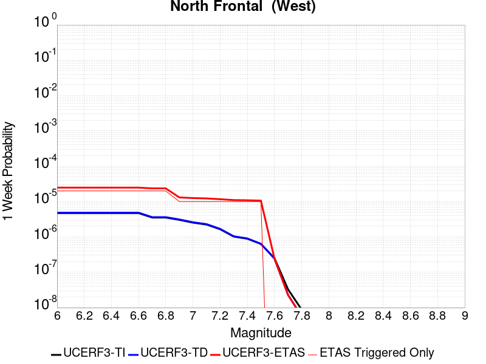 |  |  | 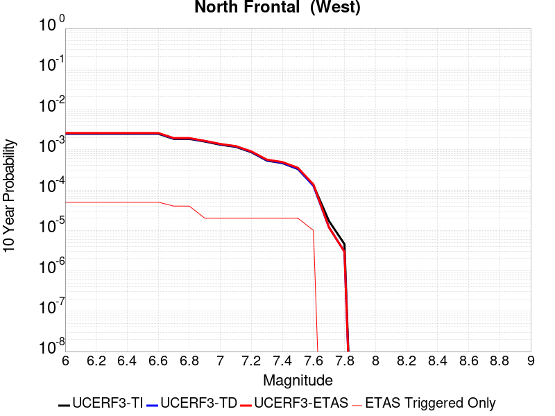 |

| Magnitude | 1 wk TI Prob | 1 wk TD Prob | 1 wk ETAS Prob | 1 wk ETAS/TD Gain | 1 wk ETAS Triggered Only | 1 mo TI Prob | 1 mo TD Prob | 1 mo ETAS Prob | 1 mo ETAS/TD Gain | 1 mo ETAS Triggered Only | 1 yr TI Prob | 1 yr TD Prob | 1 yr ETAS Prob | 1 yr ETAS/TD Gain | 1 yr ETAS Triggered Only | 10 yr TI Prob | 10 yr TD Prob | 10 yr ETAS Prob | 10 yr ETAS/TD Gain | 10 yr ETAS Triggered Only |
|-----|-----|-----|-----|-----|-----|-----|-----|-----|-----|-----|-----|-----|-----|-----|-----|-----|-----|-----|-----|-----|
| 6.0 | 4.7316266E-6 | 4.852674E-6 | 2.4852578E-5 | 5.121419 | 2.0E-5 | 2.0278241E-5 | 2.0797017E-5 | 5.0796392E-5 | 2.4424846 | 3.0E-5 | 2.4685962E-4 | 2.5317573E-4 | 3.0316308E-4 | 1.1974413 | 5.0E-5 | 0.0024658558 | 0.002529019 | 0.0025788927 | 1.0197206 | 5.0E-5 |
| 6.1 | 4.7316266E-6 | 4.852674E-6 | 2.4852578E-5 | 5.121419 | 2.0E-5 | 2.0278241E-5 | 2.0797017E-5 | 5.0796392E-5 | 2.4424846 | 3.0E-5 | 2.4685962E-4 | 2.5317573E-4 | 3.0316308E-4 | 1.1974413 | 5.0E-5 | 0.0024658558 | 0.002529019 | 0.0025788927 | 1.0197206 | 5.0E-5 |
| 6.2 | 4.7316266E-6 | 4.852674E-6 | 2.4852578E-5 | 5.121419 | 2.0E-5 | 2.0278241E-5 | 2.0797017E-5 | 5.0796392E-5 | 2.4424846 | 3.0E-5 | 2.4685962E-4 | 2.5317573E-4 | 3.0316308E-4 | 1.1974413 | 5.0E-5 | 0.0024658558 | 0.002529019 | 0.0025788927 | 1.0197206 | 5.0E-5 |
| 6.3 | 4.7316266E-6 | 4.852674E-6 | 2.4852578E-5 | 5.121419 | 2.0E-5 | 2.0278241E-5 | 2.0797017E-5 | 5.0796392E-5 | 2.4424846 | 3.0E-5 | 2.4685962E-4 | 2.5317573E-4 | 3.0316308E-4 | 1.1974413 | 5.0E-5 | 0.0024658558 | 0.002529019 | 0.0025788927 | 1.0197206 | 5.0E-5 |
| 6.4 | 4.7316266E-6 | 4.852674E-6 | 2.4852578E-5 | 5.121419 | 2.0E-5 | 2.0278241E-5 | 2.0797017E-5 | 5.0796392E-5 | 2.4424846 | 3.0E-5 | 2.4685962E-4 | 2.5317573E-4 | 3.0316308E-4 | 1.1974413 | 5.0E-5 | 0.0024658558 | 0.002529019 | 0.0025788927 | 1.0197206 | 5.0E-5 |
| 6.5 | 4.7316266E-6 | 4.852674E-6 | 2.4852578E-5 | 5.121419 | 2.0E-5 | 2.0278241E-5 | 2.0797017E-5 | 5.0796392E-5 | 2.4424846 | 3.0E-5 | 2.4685962E-4 | 2.5317573E-4 | 3.0316308E-4 | 1.1974413 | 5.0E-5 | 0.0024658558 | 0.002529019 | 0.0025788927 | 1.0197206 | 5.0E-5 |
| 6.6 | 4.7316266E-6 | 4.852674E-6 | 2.4852578E-5 | 5.121419 | 2.0E-5 | 2.0278241E-5 | 2.0797017E-5 | 5.0796392E-5 | 2.4424846 | 3.0E-5 | 2.4685962E-4 | 2.5317573E-4 | 3.0316308E-4 | 1.1974413 | 5.0E-5 | 0.0024658558 | 0.002529019 | 0.0025788927 | 1.0197206 | 5.0E-5 |
| 6.7 | 3.5382777E-6 | 3.6308872E-6 | 2.3630815E-5 | 6.5082755 | 2.0E-5 | 1.516396E-5 | 1.5560858E-5 | 3.5560544E-5 | 2.2852561 | 2.0E-5 | 1.8460557E-4 | 1.8943775E-4 | 2.2943017E-4 | 1.2111112 | 4.0E-5 | 0.0018445229 | 0.0018928396 | 0.0019327638 | 1.0210923 | 4.0E-5 |
| 6.8 | 3.5382777E-6 | 3.6308872E-6 | 2.3630815E-5 | 6.5082755 | 2.0E-5 | 1.516396E-5 | 1.5560858E-5 | 3.5560544E-5 | 2.2852561 | 2.0E-5 | 1.8460557E-4 | 1.8943775E-4 | 2.2943017E-4 | 1.2111112 | 4.0E-5 | 0.0018445229 | 0.0018928396 | 0.0019327638 | 1.0210923 | 4.0E-5 |
| 6.9 | 3.0428037E-6 | 3.1227619E-6 | 1.3122731E-5 | 4.2022834 | 1.0E-5 | 1.30405215E-5 | 1.3383201E-5 | 2.3383067E-5 | 1.7471954 | 1.0E-5 | 1.5875678E-4 | 1.6292896E-4 | 1.8292571E-4 | 1.1227329 | 2.0E-5 | 0.0015864341 | 0.0016281622 | 0.0016481297 | 1.0122638 | 2.0E-5 |
| 7.0 | 2.538778E-6 | 2.6060916E-6 | 1.2606066E-5 | 4.8371534 | 1.0E-5 | 1.0880432E-5 | 1.116892E-5 | 2.1168808E-5 | 1.8953317 | 1.0E-5 | 1.324612E-4 | 1.3597358E-4 | 1.5597086E-4 | 1.1470674 | 2.0E-5 | 0.0013238228 | 0.0013589506 | 0.0013789234 | 1.0146972 | 2.0E-5 |
| 7.1 | 2.2418935E-6 | 2.3012087E-6 | 1.2301186E-5 | 5.3455324 | 1.0E-5 | 9.60808E-6 | 9.862288E-6 | 1.986219E-5 | 2.0139534 | 1.0E-5 | 1.1697209E-4 | 1.2006718E-4 | 1.4006479E-4 | 1.1665534 | 2.0E-5 | 0.0011691054 | 0.0012000671 | 0.001220043 | 1.0166458 | 2.0E-5 |
| 7.2 | 1.6526745E-6 | 1.6924864E-6 | 1.1692469E-5 | 6.908457 | 1.0E-5 | 7.082872E-6 | 7.2534945E-6 | 1.7253422E-5 | 2.378636 | 1.0E-5 | 8.623055E-5 | 8.830797E-5 | 1.0830621E-4 | 1.2264601 | 2.0E-5 | 8.61971E-4 | 8.8275387E-4 | 9.027362E-4 | 1.0226364 | 2.0E-5 |
| 7.3 | 1.0246019E-6 | 1.0442274E-6 | 1.1044217E-5 | 10.576448 | 1.0E-5 | 4.391144E-6 | 4.4752533E-6 | 1.4475208E-5 | 3.2345004 | 1.0E-5 | 5.3460866E-5 | 5.4484964E-5 | 7.4483876E-5 | 1.3670537 | 2.0E-5 | 5.344801E-4 | 5.4472755E-4 | 5.6471664E-4 | 1.0366956 | 2.0E-5 |
| 7.4 | 8.9045164E-7 | 9.056572E-7 | 1.0905648E-5 | 12.041696 | 1.0E-5 | 3.8162157E-6 | 3.881383E-6 | 1.3881344E-5 | 3.5763915 | 1.0E-5 | 4.646144E-5 | 4.725492E-5 | 6.7253975E-5 | 1.4232163 | 2.0E-5 | 4.6451724E-4 | 4.7245962E-4 | 4.9245014E-4 | 1.0423117 | 2.0E-5 |
| 7.5 | 6.3357E-7 | 6.4027137E-7 | 1.0640265E-5 | 16.618368 | 1.0E-5 | 2.7152971E-6 | 2.7440176E-6 | 1.274399E-5 | 4.6442814 | 1.0E-5 | 3.305824E-5 | 3.340797E-5 | 5.34073E-5 | 1.5986395 | 2.0E-5 | 3.3053322E-4 | 3.3403604E-4 | 3.5402938E-4 | 1.0598538 | 2.0E-5 |
| 7.6 | 2.5087024E-7 | 2.436123E-7 | 2.436123E-7 | 1.0 | 0.0 | 1.0751578E-6 | 1.0440525E-6 | 1.0440525E-6 | 1.0 | 0.0 | 1.3089967E-5 | 1.2711286E-5 | 2.271116E-5 | 1.7866925 | 1.0E-5 | 1.3089196E-4 | 1.2710765E-4 | 1.3710637E-4 | 1.0786635 | 1.0E-5 |
| 7.7 | 3.282987E-8 | 2.2875435E-8 | 2.2875435E-8 | 1.0 | 0.0 | 1.4069944E-7 | 9.8037575E-8 | 9.8037575E-8 | 1.0 | 0.0 | 1.7130144E-6 | 1.193607E-6 | 1.193607E-6 | 1.0 | 0.0 | 1.7130013E-5 | 1.1936014E-5 | 1.1936014E-5 | 1.0 | 0.0 |
| 7.8 | 8.77499E-9 | 5.6817466E-9 | 5.6817466E-9 | 1.0 | 0.0 | 3.7607098E-8 | 2.4350342E-8 | 2.4350342E-8 | 1.0 | 0.0 | 4.578663E-7 | 2.964654E-7 | 2.964654E-7 | 1.0 | 0.0 | 4.5786537E-6 | 2.9646512E-6 | 2.9646512E-6 | 1.0 | 0.0 |

## San Juan
*[(top)](#table-of-contents)*

| 1 Week | 1 Month | 1 Year | 10 Year |
|-----|-----|-----|-----|
|  |  | 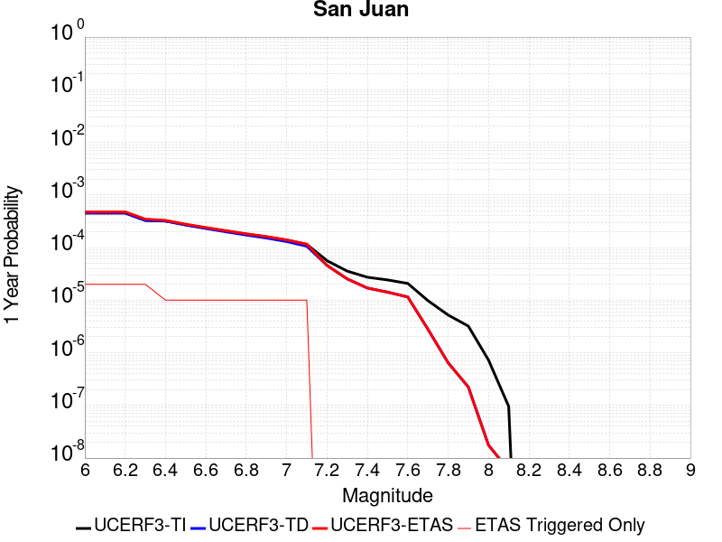 |  |

| Magnitude | 1 wk TI Prob | 1 wk TD Prob | 1 wk ETAS Prob | 1 wk ETAS/TD Gain | 1 wk ETAS Triggered Only | 1 mo TI Prob | 1 mo TD Prob | 1 mo ETAS Prob | 1 mo ETAS/TD Gain | 1 mo ETAS Triggered Only | 1 yr TI Prob | 1 yr TD Prob | 1 yr ETAS Prob | 1 yr ETAS/TD Gain | 1 yr ETAS Triggered Only | 10 yr TI Prob | 10 yr TD Prob | 10 yr ETAS Prob | 10 yr ETAS/TD Gain | 10 yr ETAS Triggered Only |
|-----|-----|-----|-----|-----|-----|-----|-----|-----|-----|-----|-----|-----|-----|-----|-----|-----|-----|-----|-----|-----|
| 6.0 | 8.682808E-6 | 8.74917E-6 | 8.74917E-6 | 1.0 | 0.0 | 3.72115E-5 | 3.749593E-5 | 3.749593E-5 | 1.0 | 0.0 | 4.5295584E-4 | 4.5642213E-4 | 4.76413E-4 | 1.043799 | 2.0E-5 | 0.004520337 | 0.004555389 | 0.004605161 | 1.010926 | 5.0E-5 |
| 6.1 | 8.682808E-6 | 8.74917E-6 | 8.74917E-6 | 1.0 | 0.0 | 3.72115E-5 | 3.749593E-5 | 3.749593E-5 | 1.0 | 0.0 | 4.5295584E-4 | 4.5642213E-4 | 4.76413E-4 | 1.043799 | 2.0E-5 | 0.004520337 | 0.004555389 | 0.004605161 | 1.010926 | 5.0E-5 |
| 6.2 | 8.682808E-6 | 8.74917E-6 | 8.74917E-6 | 1.0 | 0.0 | 3.72115E-5 | 3.749593E-5 | 3.749593E-5 | 1.0 | 0.0 | 4.5295584E-4 | 4.5642213E-4 | 4.76413E-4 | 1.043799 | 2.0E-5 | 0.004520337 | 0.004555389 | 0.004605161 | 1.010926 | 5.0E-5 |
| 6.3 | 6.3054235E-6 | 6.282591E-6 | 6.282591E-6 | 1.0 | 0.0 | 2.7022963E-5 | 2.692512E-5 | 2.692512E-5 | 1.0 | 0.0 | 3.2895492E-4 | 3.2776545E-4 | 3.4775888E-4 | 1.0609993 | 2.0E-5 | 0.003284684 | 0.0032730205 | 0.0033029222 | 1.0091358 | 3.0E-5 |
| 6.4 | 6.1490473E-6 | 6.1144706E-6 | 6.1144706E-6 | 1.0 | 0.0 | 2.6352795E-5 | 2.6204618E-5 | 2.6204618E-5 | 1.0 | 0.0 | 3.2079802E-4 | 3.189959E-4 | 3.289927E-4 | 1.0313383 | 1.0E-5 | 0.0032033534 | 0.0031855768 | 0.003205513 | 1.0062582 | 2.0E-5 |
| 6.5 | 5.204848E-6 | 5.137238E-6 | 5.137238E-6 | 1.0 | 0.0 | 2.23063E-5 | 2.2016555E-5 | 2.2016555E-5 | 1.0 | 0.0 | 2.7154534E-4 | 2.6801953E-4 | 2.7801684E-4 | 1.0373007 | 1.0E-5 | 0.0027121378 | 0.0026771172 | 0.0026970638 | 1.0074507 | 2.0E-5 |
| 6.6 | 4.5179986E-6 | 4.415036E-6 | 4.415036E-6 | 1.0 | 0.0 | 1.9362706E-5 | 1.892145E-5 | 1.892145E-5 | 1.0 | 0.0 | 2.3571544E-4 | 2.303451E-4 | 2.403428E-4 | 1.0434031 | 1.0E-5 | 0.0023546559 | 0.0023012008 | 0.0023211548 | 1.0086712 | 2.0E-5 |
| 6.7 | 3.9442616E-6 | 3.8198336E-6 | 3.8198336E-6 | 1.0 | 0.0 | 1.6903869E-5 | 1.6370615E-5 | 1.6370615E-5 | 1.0 | 0.0 | 2.0578515E-4 | 1.9929469E-4 | 2.092927E-4 | 1.050167 | 1.0E-5 | 0.002055947 | 0.001991285 | 0.0020112451 | 1.0100237 | 2.0E-5 |
| 6.8 | 3.4536245E-6 | 3.3163408E-6 | 3.3163408E-6 | 1.0 | 0.0 | 1.4801163E-5 | 1.4212815E-5 | 1.4212815E-5 | 1.0 | 0.0 | 1.8018926E-4 | 1.7302789E-4 | 1.8302616E-4 | 1.0577842 | 1.0E-5 | 0.0018004322 | 0.001729051 | 0.0017390337 | 1.0057735 | 1.0E-5 |
| 6.9 | 3.059865E-6 | 2.9120363E-6 | 2.9120363E-6 | 1.0 | 0.0 | 1.3113641E-5 | 1.2480099E-5 | 1.2480099E-5 | 1.0 | 0.0 | 1.596469E-4 | 1.5193518E-4 | 1.6193367E-4 | 1.0658076 | 1.0E-5 | 0.0015953224 | 0.0015184281 | 0.0015284129 | 1.0065757 | 1.0E-5 |
| 7.0 | 2.6504351E-6 | 2.492005E-6 | 2.492005E-6 | 1.0 | 0.0 | 1.1358958E-5 | 1.0679981E-5 | 1.0679981E-5 | 1.0 | 0.0 | 1.3828653E-4 | 1.3002155E-4 | 1.4002025E-4 | 1.0769004 | 1.0E-5 | 0.0013820052 | 0.001299567 | 0.0013095541 | 1.0076848 | 1.0E-5 |
| 7.1 | 2.2039317E-6 | 2.0338366E-6 | 2.0338366E-6 | 1.0 | 0.0 | 9.445387E-6 | 8.716416E-6 | 8.716416E-6 | 1.0 | 0.0 | 1.1499152E-4 | 1.0611773E-4 | 1.1611667E-4 | 1.0942249 | 1.0E-5 | 0.0011493203 | 0.0010607811 | 0.0010707704 | 1.009417 | 1.0E-5 |
| 7.2 | 1.0786707E-6 | 8.770239E-7 | 8.770239E-7 | 1.0 | 0.0 | 4.622866E-6 | 3.7586685E-6 | 3.7586685E-6 | 1.0 | 0.0 | 5.628194E-5 | 4.576084E-5 | 4.576084E-5 | 1.0 | 0.0 | 5.6267687E-4 | 4.5757365E-4 | 4.5757365E-4 | 1.0 | 0.0 |
| 7.3 | 6.846433E-7 | 4.868812E-7 | 4.868812E-7 | 1.0 | 0.0 | 2.9341822E-6 | 2.086632E-6 | 2.086632E-6 | 1.0 | 0.0 | 3.5723086E-5 | 2.5404452E-5 | 2.5404452E-5 | 1.0 | 0.0 | 3.571734E-4 | 2.5405022E-4 | 2.5405022E-4 | 1.0 | 0.0 |
| 7.4 | 5.23043E-7 | 3.2627884E-7 | 3.2627884E-7 | 1.0 | 0.0 | 2.2416111E-6 | 1.3983371E-6 | 1.3983371E-6 | 1.0 | 0.0 | 2.7291273E-5 | 1.7024622E-5 | 1.7024622E-5 | 1.0 | 0.0 | 2.7287923E-4 | 1.7026608E-4 | 1.7026608E-4 | 1.0 | 0.0 |
| 7.5 | 4.648444E-7 | 2.723464E-7 | 2.723464E-7 | 1.0 | 0.0 | 1.9921886E-6 | 1.1671983E-6 | 1.1671983E-6 | 1.0 | 0.0 | 2.4254627E-5 | 1.4210547E-5 | 1.4210547E-5 | 1.0 | 0.0 | 2.425198E-4 | 1.4212691E-4 | 1.4212691E-4 | 1.0 | 0.0 |
| 7.6 | 3.9906567E-7 | 2.2083036E-7 | 2.2083036E-7 | 1.0 | 0.0 | 1.7102802E-6 | 9.4641547E-7 | 9.4641547E-7 | 1.0 | 0.0 | 2.0822463E-5 | 1.1522548E-5 | 1.1522548E-5 | 1.0 | 0.0 | 2.0820512E-4 | 1.15244526E-4 | 1.15244526E-4 | 1.0 | 0.0 |
| 7.7 | 1.8784601E-7 | 5.366277E-8 | 5.366277E-8 | 1.0 | 0.0 | 8.0505407E-7 | 2.2998329E-7 | 2.2998329E-7 | 1.0 | 0.0 | 9.80149E-6 | 2.800043E-6 | 2.800043E-6 | 1.0 | 0.0 | 9.801057E-5 | 2.8008939E-5 | 2.8008939E-5 | 1.0 | 0.0 |
| 7.8 | 1.00154914E-7 | 1.2412917E-8 | 1.2412917E-8 | 1.0 | 0.0 | 4.2923529E-7 | 5.3198217E-8 | 5.3198217E-8 | 1.0 | 0.0 | 5.225927E-6 | 6.476881E-7 | 6.476881E-7 | 1.0 | 0.0 | 5.225804E-5 | 6.4827886E-6 | 6.4827886E-6 | 1.0 | 0.0 |
| 7.9 | 6.171429E-8 | 4.2946513E-9 | 4.2946513E-9 | 1.0 | 0.0 | 2.6448978E-7 | 1.8405647E-8 | 1.8405647E-8 | 1.0 | 0.0 | 3.2201583E-6 | 2.2408874E-7 | 2.2408874E-7 | 1.0 | 0.0 | 3.2201115E-5 | 2.2462114E-6 | 2.2462114E-6 | 1.0 | 0.0 |
| 8.0 | 1.3974572E-8 | 3.3737857E-10 | 3.3737857E-10 | 1.0 | 0.0 | 5.989102E-8 | 1.4459075E-9 | 1.4459075E-9 | 1.0 | 0.0 | 7.2917294E-7 | 1.760392E-8 | 1.760392E-8 | 1.0 | 0.0 | 7.2917055E-6 | 1.8038004E-7 | 1.8038004E-7 | 1.0 | 0.0 |
| 8.1 | 1.8403477E-9 | 1.1291601E-10 | 1.1291601E-10 | 1.0 | 0.0 | 7.887204E-9 | 4.839261E-10 | 4.839261E-10 | 1.0 | 0.0 | 9.602671E-8 | 5.8917977E-9 | 5.8917977E-9 | 1.0 | 0.0 | 9.602667E-7 | 6.0206084E-8 | 6.0206084E-8 | 1.0 | 0.0 |

## Earthquake Valley (No  Extension)
*[(top)](#table-of-contents)*

| 1 Week | 1 Month | 1 Year | 10 Year |
|-----|-----|-----|-----|
|  |  | 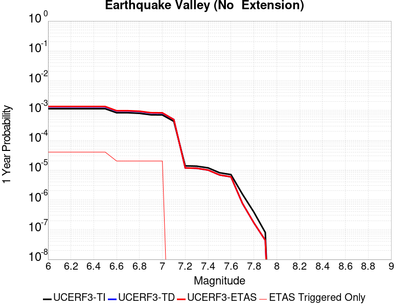 |  |

| Magnitude | 1 wk TI Prob | 1 wk TD Prob | 1 wk ETAS Prob | 1 wk ETAS/TD Gain | 1 wk ETAS Triggered Only | 1 mo TI Prob | 1 mo TD Prob | 1 mo ETAS Prob | 1 mo ETAS/TD Gain | 1 mo ETAS Triggered Only | 1 yr TI Prob | 1 yr TD Prob | 1 yr ETAS Prob | 1 yr ETAS/TD Gain | 1 yr ETAS Triggered Only | 10 yr TI Prob | 10 yr TD Prob | 10 yr ETAS Prob | 10 yr ETAS/TD Gain | 10 yr ETAS Triggered Only |
|-----|-----|-----|-----|-----|-----|-----|-----|-----|-----|-----|-----|-----|-----|-----|-----|-----|-----|-----|-----|-----|
| 6.0 | 2.1859703E-5 | 2.5198351E-5 | 4.519785E-5 | 1.7936827 | 2.0E-5 | 9.3681076E-5 | 1.0798928E-4 | 1.3798605E-4 | 1.2777753 | 3.0E-5 | 0.0011399703 | 0.0013141216 | 0.0013540691 | 1.0303986 | 4.0E-5 | 0.011341401 | 0.013077869 | 0.013117346 | 1.0030186 | 4.0E-5 |
| 6.1 | 2.1859703E-5 | 2.5198351E-5 | 4.519785E-5 | 1.7936827 | 2.0E-5 | 9.3681076E-5 | 1.0798928E-4 | 1.3798605E-4 | 1.2777753 | 3.0E-5 | 0.0011399703 | 0.0013141216 | 0.0013540691 | 1.0303986 | 4.0E-5 | 0.011341401 | 0.013077869 | 0.013117346 | 1.0030186 | 4.0E-5 |
| 6.2 | 2.1859703E-5 | 2.5198351E-5 | 4.519785E-5 | 1.7936827 | 2.0E-5 | 9.3681076E-5 | 1.0798928E-4 | 1.3798605E-4 | 1.2777753 | 3.0E-5 | 0.0011399703 | 0.0013141216 | 0.0013540691 | 1.0303986 | 4.0E-5 | 0.011341401 | 0.013077869 | 0.013117346 | 1.0030186 | 4.0E-5 |
| 6.3 | 2.1859703E-5 | 2.5198351E-5 | 4.519785E-5 | 1.7936827 | 2.0E-5 | 9.3681076E-5 | 1.0798928E-4 | 1.3798605E-4 | 1.2777753 | 3.0E-5 | 0.0011399703 | 0.0013141216 | 0.0013540691 | 1.0303986 | 4.0E-5 | 0.011341401 | 0.013077869 | 0.013117346 | 1.0030186 | 4.0E-5 |
| 6.4 | 2.1859703E-5 | 2.5198351E-5 | 4.519785E-5 | 1.7936827 | 2.0E-5 | 9.3681076E-5 | 1.0798928E-4 | 1.3798605E-4 | 1.2777753 | 3.0E-5 | 0.0011399703 | 0.0013141216 | 0.0013540691 | 1.0303986 | 4.0E-5 | 0.011341401 | 0.013077869 | 0.013117346 | 1.0030186 | 4.0E-5 |
| 6.5 | 2.1859703E-5 | 2.5198351E-5 | 4.519785E-5 | 1.7936827 | 2.0E-5 | 9.3681076E-5 | 1.0798928E-4 | 1.3798605E-4 | 1.2777753 | 3.0E-5 | 0.0011399703 | 0.0013141216 | 0.0013540691 | 1.0303986 | 4.0E-5 | 0.011341401 | 0.013077869 | 0.013117346 | 1.0030186 | 4.0E-5 |
| 6.6 | 1.597E-5 | 1.835627E-5 | 3.83559E-5 | 2.089526 | 2.0E-5 | 6.8441055E-5 | 7.866784E-5 | 9.866627E-5 | 1.2542135 | 2.0E-5 | 8.329513E-4 | 9.5744745E-4 | 9.774283E-4 | 1.0208689 | 2.0E-5 | 0.008298361 | 0.009541833 | 0.009571546 | 1.0031141 | 3.0E-5 |
| 6.7 | 1.597E-5 | 1.835627E-5 | 3.83559E-5 | 2.089526 | 2.0E-5 | 6.8441055E-5 | 7.866784E-5 | 9.866627E-5 | 1.2542135 | 2.0E-5 | 8.329513E-4 | 9.5744745E-4 | 9.774283E-4 | 1.0208689 | 2.0E-5 | 0.008298361 | 0.009541833 | 0.009571546 | 1.0031141 | 3.0E-5 |
| 6.8 | 1.5315149E-5 | 1.7602086E-5 | 3.7601734E-5 | 2.136209 | 2.0E-5 | 6.5634704E-5 | 7.543582E-5 | 9.5434305E-5 | 1.2651061 | 2.0E-5 | 7.988095E-4 | 9.1813074E-4 | 9.381124E-4 | 1.0217634 | 2.0E-5 | 0.007959441 | 0.009151915 | 0.009181641 | 1.003248 | 3.0E-5 |
| 6.9 | 1.3634728E-5 | 1.5675814E-5 | 3.56755E-5 | 2.2758307 | 2.0E-5 | 5.8433237E-5 | 6.7180794E-5 | 8.7179455E-5 | 1.2976841 | 2.0E-5 | 7.1119244E-4 | 8.1770134E-4 | 8.3768496E-4 | 1.0244389 | 2.0E-5 | 0.007089207 | 0.008154998 | 0.008184752 | 1.0036488 | 3.0E-5 |
| 7.0 | 1.3496271E-5 | 1.5517848E-5 | 3.5517536E-5 | 2.2888186 | 2.0E-5 | 5.783988E-5 | 6.6503824E-5 | 8.650249E-5 | 1.3007146 | 2.0E-5 | 7.03973E-4 | 8.0946536E-4 | 8.2944916E-4 | 1.0246876 | 2.0E-5 | 0.007017471 | 0.008073238 | 0.008102995 | 1.003686 | 3.0E-5 |
| 7.1 | 8.242798E-6 | 9.472594E-6 | 9.472594E-6 | 1.0 | 0.0 | 3.53258E-5 | 4.0596577E-5 | 4.0596577E-5 | 1.0 | 0.0 | 4.300067E-4 | 4.9421826E-4 | 4.9421826E-4 | 1.0 | 0.0 | 0.004291756 | 0.0049377684 | 0.0049377684 | 1.0 | 0.0 |
| 7.2 | 2.6506527E-7 | 2.2559628E-7 | 2.2559628E-7 | 1.0 | 0.0 | 1.1359936E-6 | 9.668408E-7 | 9.668408E-7 | 1.0 | 0.0 | 1.3830633E-5 | 1.1771229E-5 | 1.1771229E-5 | 1.0 | 0.0 | 1.3829772E-4 | 1.1770646E-4 | 1.1770646E-4 | 1.0 | 0.0 |
| 7.3 | 2.5810488E-7 | 2.1954757E-7 | 2.1954757E-7 | 1.0 | 0.0 | 1.1061633E-6 | 9.4091786E-7 | 9.4091786E-7 | 1.0 | 0.0 | 1.3467455E-5 | 1.1455619E-5 | 1.1455619E-5 | 1.0 | 0.0 | 1.3466639E-4 | 1.145507E-4 | 1.145507E-4 | 1.0 | 0.0 |
| 7.4 | 2.2676066E-7 | 1.9109943E-7 | 1.9109943E-7 | 1.0 | 0.0 | 9.71831E-7 | 8.189973E-7 | 8.189973E-7 | 1.0 | 0.0 | 1.1831979E-5 | 9.971251E-6 | 9.971251E-6 | 1.0 | 0.0 | 1.1831349E-4 | 9.970842E-5 | 9.970842E-5 | 1.0 | 0.0 |
| 7.5 | 1.5553917E-7 | 1.311138E-7 | 1.311138E-7 | 1.0 | 0.0 | 6.6659624E-7 | 5.619162E-7 | 5.619162E-7 | 1.0 | 0.0 | 8.115779E-6 | 6.84131E-6 | 6.84131E-6 | 1.0 | 0.0 | 8.115482E-5 | 6.841121E-5 | 6.841121E-5 | 1.0 | 0.0 |
| 7.6 | 1.3448629E-7 | 1.1287708E-7 | 1.1287708E-7 | 1.0 | 0.0 | 5.7636964E-7 | 4.8375887E-7 | 4.8375887E-7 | 1.0 | 0.0 | 7.017278E-6 | 5.8897504E-6 | 5.8897504E-6 | 1.0 | 0.0 | 7.0170565E-5 | 5.8896156E-5 | 5.8896156E-5 | 1.0 | 0.0 |
| 7.7 | 2.9719402E-8 | 1.4581234E-8 | 1.4581234E-8 | 1.0 | 0.0 | 1.2736886E-7 | 6.2491004E-8 | 6.2491004E-8 | 1.0 | 0.0 | 1.5507147E-6 | 7.6082773E-7 | 7.6082773E-7 | 1.0 | 0.0 | 1.550704E-5 | 7.608257E-6 | 7.608257E-6 | 1.0 | 0.0 |
| 7.8 | 7.4390196E-9 | 3.249962E-9 | 3.249962E-9 | 1.0 | 0.0 | 3.1881513E-8 | 1.39284095E-8 | 1.39284095E-8 | 1.0 | 0.0 | 3.8815733E-7 | 1.6957837E-7 | 1.6957837E-7 | 1.0 | 0.0 | 3.8815665E-6 | 1.6957828E-6 | 1.6957828E-6 | 1.0 | 0.0 |
| 7.9 | 1.5373532E-9 | 8.4400953E-10 | 8.4400953E-10 | 1.0 | 0.0 | 6.5886567E-9 | 3.6171839E-9 | 3.6171839E-9 | 1.0 | 0.0 | 8.021689E-8 | 4.403921E-8 | 4.403921E-8 | 1.0 | 0.0 | 8.0216864E-7 | 4.403921E-7 | 4.403921E-7 | 1.0 | 0.0 |

## Cucamonga
*[(top)](#table-of-contents)*

| 1 Week | 1 Month | 1 Year | 10 Year |
|-----|-----|-----|-----|
|  |  |  | 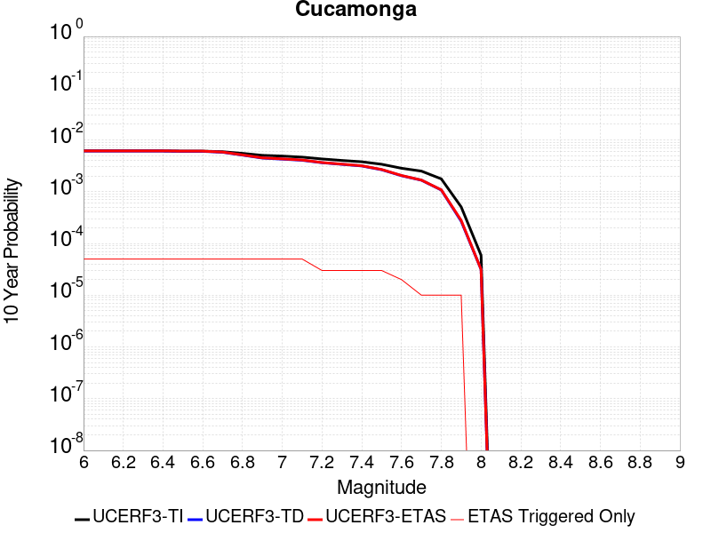 |

| Magnitude | 1 wk TI Prob | 1 wk TD Prob | 1 wk ETAS Prob | 1 wk ETAS/TD Gain | 1 wk ETAS Triggered Only | 1 mo TI Prob | 1 mo TD Prob | 1 mo ETAS Prob | 1 mo ETAS/TD Gain | 1 mo ETAS Triggered Only | 1 yr TI Prob | 1 yr TD Prob | 1 yr ETAS Prob | 1 yr ETAS/TD Gain | 1 yr ETAS Triggered Only | 10 yr TI Prob | 10 yr TD Prob | 10 yr ETAS Prob | 10 yr ETAS/TD Gain | 10 yr ETAS Triggered Only |
|-----|-----|-----|-----|-----|-----|-----|-----|-----|-----|-----|-----|-----|-----|-----|-----|-----|-----|-----|-----|-----|
| 6.0 | 1.1848348E-5 | 1.1737109E-5 | 3.1736876E-5 | 2.703977 | 2.0E-5 | 5.0777642E-5 | 5.0300943E-5 | 7.029994E-5 | 1.3975868 | 2.0E-5 | 6.180424E-4 | 6.122446E-4 | 6.62214E-4 | 1.0816168 | 5.0E-5 | 0.0061632637 | 0.006106745 | 0.0061564394 | 1.0081377 | 5.0E-5 |
| 6.1 | 1.1848348E-5 | 1.1737109E-5 | 3.1736876E-5 | 2.703977 | 2.0E-5 | 5.0777642E-5 | 5.0300943E-5 | 7.029994E-5 | 1.3975868 | 2.0E-5 | 6.180424E-4 | 6.122446E-4 | 6.62214E-4 | 1.0816168 | 5.0E-5 | 0.0061632637 | 0.006106745 | 0.0061564394 | 1.0081377 | 5.0E-5 |
| 6.2 | 1.1848348E-5 | 1.1737109E-5 | 3.1736876E-5 | 2.703977 | 2.0E-5 | 5.0777642E-5 | 5.0300943E-5 | 7.029994E-5 | 1.3975868 | 2.0E-5 | 6.180424E-4 | 6.122446E-4 | 6.62214E-4 | 1.0816168 | 5.0E-5 | 0.0061632637 | 0.006106745 | 0.0061564394 | 1.0081377 | 5.0E-5 |
| 6.3 | 1.1848348E-5 | 1.1737109E-5 | 3.1736876E-5 | 2.703977 | 2.0E-5 | 5.0777642E-5 | 5.0300943E-5 | 7.029994E-5 | 1.3975868 | 2.0E-5 | 6.180424E-4 | 6.122446E-4 | 6.62214E-4 | 1.0816168 | 5.0E-5 | 0.0061632637 | 0.006106745 | 0.0061564394 | 1.0081377 | 5.0E-5 |
| 6.4 | 1.1848348E-5 | 1.1737109E-5 | 3.1736876E-5 | 2.703977 | 2.0E-5 | 5.0777642E-5 | 5.0300943E-5 | 7.029994E-5 | 1.3975868 | 2.0E-5 | 6.180424E-4 | 6.122446E-4 | 6.62214E-4 | 1.0816168 | 5.0E-5 | 0.0061632637 | 0.006106745 | 0.0061564394 | 1.0081377 | 5.0E-5 |
| 6.5 | 1.16988695E-5 | 1.157614E-5 | 3.157591E-5 | 2.7276716 | 2.0E-5 | 5.013705E-5 | 4.9611102E-5 | 6.9610105E-5 | 1.4031156 | 2.0E-5 | 6.102476E-4 | 6.0385047E-4 | 6.538202E-4 | 1.082752 | 5.0E-5 | 0.006085745 | 0.0060232594 | 0.006072958 | 1.0082512 | 5.0E-5 |
| 6.6 | 1.16988695E-5 | 1.157614E-5 | 3.157591E-5 | 2.7276716 | 2.0E-5 | 5.013705E-5 | 4.9611102E-5 | 6.9610105E-5 | 1.4031156 | 2.0E-5 | 6.102476E-4 | 6.0385047E-4 | 6.538202E-4 | 1.082752 | 5.0E-5 | 0.006085745 | 0.0060232594 | 0.006072958 | 1.0082512 | 5.0E-5 |
| 6.7 | 1.1397107E-5 | 1.1115039E-5 | 3.1114818E-5 | 2.7993438 | 2.0E-5 | 4.884383E-5 | 4.7635025E-5 | 6.763407E-5 | 1.4198391 | 2.0E-5 | 5.9451134E-4 | 5.798046E-4 | 6.2977563E-4 | 1.0861859 | 5.0E-5 | 0.005929234 | 0.005784061 | 0.0058337715 | 1.0085944 | 5.0E-5 |
| 6.8 | 1.058387E-5 | 9.785037E-6 | 2.9784842E-5 | 3.043917 | 2.0E-5 | 4.5358654E-5 | 4.1935207E-5 | 6.193437E-5 | 1.4769062 | 2.0E-5 | 5.521017E-4 | 5.1044265E-4 | 5.6041713E-4 | 1.0979042 | 5.0E-5 | 0.00550732 | 0.005093702 | 0.0051434473 | 1.0097661 | 5.0E-5 |
| 6.9 | 9.690046E-6 | 8.579504E-6 | 2.8579332E-5 | 3.3311172 | 2.0E-5 | 4.1528107E-5 | 3.6768783E-5 | 5.6768047E-5 | 1.5439197 | 2.0E-5 | 5.054874E-4 | 4.475684E-4 | 4.97546E-4 | 1.1116648 | 5.0E-5 | 0.005043391 | 0.0044675954 | 0.004517372 | 1.0111417 | 5.0E-5 |
| 7.0 | 9.381461E-6 | 8.18712E-6 | 2.8186956E-5 | 3.4428415 | 2.0E-5 | 4.020564E-5 | 3.508719E-5 | 5.5086486E-5 | 1.5699886 | 2.0E-5 | 4.893937E-4 | 4.2710314E-4 | 4.7708178E-4 | 1.1170177 | 5.0E-5 | 0.0048831734 | 0.004263747 | 0.004313534 | 1.0116768 | 5.0E-5 |
| 7.1 | 8.946492E-6 | 7.781904E-6 | 2.7781749E-5 | 3.570045 | 2.0E-5 | 3.8341543E-5 | 3.3350592E-5 | 5.3349926E-5 | 1.5996695 | 2.0E-5 | 4.667083E-4 | 4.0596814E-4 | 4.5594783E-4 | 1.1231123 | 5.0E-5 | 0.0046572937 | 0.0040531927 | 0.00410299 | 1.012286 | 5.0E-5 |
| 7.2 | 8.251016E-6 | 6.9752878E-6 | 1.6975218E-5 | 2.4336226 | 1.0E-5 | 3.5361016E-5 | 2.9893748E-5 | 3.989345E-5 | 1.3345081 | 1.0E-5 | 4.3043532E-4 | 3.6389584E-4 | 3.9388493E-4 | 1.0824112 | 3.0E-5 | 0.0042960253 | 0.0036339252 | 0.003663816 | 1.0082256 | 3.0E-5 |
| 7.3 | 7.717881E-6 | 6.4863584E-6 | 1.6486294E-5 | 2.541687 | 1.0E-5 | 3.3076216E-5 | 2.7798384E-5 | 3.7798105E-5 | 1.3597231 | 1.0E-5 | 4.026285E-4 | 3.38393E-4 | 3.6838284E-4 | 1.0886244 | 3.0E-5 | 0.004018998 | 0.0033797103 | 0.003409609 | 1.0088465 | 3.0E-5 |
| 7.4 | 7.275623E-6 | 6.032004E-6 | 1.6031943E-5 | 2.6578138 | 1.0E-5 | 3.118087E-5 | 2.5851192E-5 | 3.585093E-5 | 1.3868194 | 1.0E-5 | 3.7956095E-4 | 3.1469302E-4 | 3.4468356E-4 | 1.095301 | 3.0E-5 | 0.0037891332 | 0.0031434046 | 0.0031733103 | 1.0095137 | 3.0E-5 |
| 7.5 | 6.5109502E-6 | 5.100593E-6 | 1.5100542E-5 | 2.9605463 | 1.0E-5 | 2.7903774E-5 | 2.1859503E-5 | 3.1859283E-5 | 1.457457 | 1.0E-5 | 3.3967546E-4 | 2.661071E-4 | 2.960991E-4 | 1.1127065 | 3.0E-5 | 0.0033915674 | 0.0026588016 | 0.002688722 | 1.0112532 | 3.0E-5 |
| 7.6 | 5.4495326E-6 | 3.908547E-6 | 3.908547E-6 | 1.0 | 0.0 | 2.335493E-5 | 1.6750808E-5 | 1.6750808E-5 | 1.0 | 0.0 | 2.8430918E-4 | 2.0392207E-4 | 2.2391799E-4 | 1.0980567 | 2.0E-5 | 0.0028394572 | 0.0020382616 | 0.0020582208 | 1.0097923 | 2.0E-5 |
| 7.7 | 4.7997164E-6 | 3.2002263E-6 | 3.2002263E-6 | 1.0 | 0.0 | 2.057005E-5 | 1.3715184E-5 | 1.3715184E-5 | 1.0 | 0.0 | 2.504116E-4 | 1.6696959E-4 | 1.7696794E-4 | 1.0598811 | 1.0E-5 | 0.002501296 | 0.0016693701 | 0.0016793534 | 1.0059803 | 1.0E-5 |
| 7.8 | 3.3941733E-6 | 2.0641678E-6 | 2.0641678E-6 | 1.0 | 0.0 | 1.4546376E-5 | 8.846404E-6 | 8.846404E-6 | 1.0 | 0.0 | 1.7708774E-4 | 1.07699656E-4 | 1.17698575E-4 | 1.0928408 | 1.0E-5 | 0.0017694668 | 0.0010766032 | 0.0010865924 | 1.0092784 | 1.0E-5 |
| 7.9 | 9.750552E-7 | 5.155798E-7 | 5.155798E-7 | 1.0 | 0.0 | 4.178801E-6 | 2.2096258E-6 | 2.2096258E-6 | 1.0 | 0.0 | 5.0875715E-5 | 2.6901867E-5 | 3.6901598E-5 | 1.3717114 | 1.0E-5 | 5.086407E-4 | 2.689865E-4 | 2.7898382E-4 | 1.0371666 | 1.0E-5 |
| 8.0 | 1.133857E-7 | 6.053372E-8 | 6.053372E-8 | 1.0 | 0.0 | 4.8593864E-7 | 2.594302E-7 | 2.594302E-7 | 1.0 | 0.0 | 5.9162867E-6 | 3.1585582E-6 | 3.1585582E-6 | 1.0 | 0.0 | 5.916129E-5 | 3.158515E-5 | 3.158515E-5 | 1.0 | 0.0 |

## San Diego Trough south
*[(top)](#table-of-contents)*

| 1 Week | 1 Month | 1 Year | 10 Year |
|-----|-----|-----|-----|
|  |  |  |  |

| Magnitude | 1 wk TI Prob | 1 wk TD Prob | 1 wk ETAS Prob | 1 wk ETAS/TD Gain | 1 wk ETAS Triggered Only | 1 mo TI Prob | 1 mo TD Prob | 1 mo ETAS Prob | 1 mo ETAS/TD Gain | 1 mo ETAS Triggered Only | 1 yr TI Prob | 1 yr TD Prob | 1 yr ETAS Prob | 1 yr ETAS/TD Gain | 1 yr ETAS Triggered Only | 10 yr TI Prob | 10 yr TD Prob | 10 yr ETAS Prob | 10 yr ETAS/TD Gain | 10 yr ETAS Triggered Only |
|-----|-----|-----|-----|-----|-----|-----|-----|-----|-----|-----|-----|-----|-----|-----|-----|-----|-----|-----|-----|-----|
| 6.0 | 8.279495E-5 | 1.0425541E-4 | 1.2425332E-4 | 1.1918166 | 2.0E-5 | 3.5478722E-4 | 4.4673498E-4 | 4.7672156E-4 | 1.0671239 | 3.0E-5 | 0.004310982 | 0.0054259133 | 0.0054557505 | 1.005499 | 3.0E-5 | 0.042283054 | 0.05299303 | 0.05303091 | 1.0007148 | 4.0E-5 |
| 6.1 | 4.6961468E-5 | 5.773024E-5 | 6.772966E-5 | 1.1732094 | 1.0E-5 | 2.0124791E-4 | 2.473905E-4 | 2.6738556E-4 | 1.0808239 | 2.0E-5 | 0.00244744 | 0.003007886 | 0.0030278258 | 1.0066292 | 2.0E-5 | 0.024206603 | 0.029679636 | 0.029708745 | 1.0009807 | 3.0E-5 |
| 6.2 | 3.5079658E-5 | 4.214258E-5 | 5.2142157E-5 | 1.2372797 | 1.0E-5 | 1.5033272E-4 | 1.8059829E-4 | 2.0059469E-4 | 1.110723 | 2.0E-5 | 0.0018287642 | 0.002196587 | 0.002216543 | 1.009085 | 2.0E-5 | 0.018137876 | 0.021751188 | 0.021780536 | 1.0013492 | 3.0E-5 |
| 6.3 | 3.5079658E-5 | 4.214258E-5 | 5.2142157E-5 | 1.2372797 | 1.0E-5 | 1.5033272E-4 | 1.8059829E-4 | 2.0059469E-4 | 1.110723 | 2.0E-5 | 0.0018287642 | 0.002196587 | 0.002216543 | 1.009085 | 2.0E-5 | 0.018137876 | 0.021751188 | 0.021780536 | 1.0013492 | 3.0E-5 |
| 6.4 | 2.7196904E-5 | 3.208715E-5 | 4.208683E-5 | 1.3116412 | 1.0E-5 | 1.16552954E-4 | 1.3750911E-4 | 1.5750635E-4 | 1.145425 | 2.0E-5 | 0.0014181085 | 0.0016728995 | 0.001692866 | 1.0119352 | 2.0E-5 | 0.014090929 | 0.016604666 | 0.016634168 | 1.0017767 | 3.0E-5 |
| 6.5 | 2.5584688E-5 | 3.0101632E-5 | 4.010133E-5 | 1.3321979 | 1.0E-5 | 1.0964406E-4 | 1.2900059E-4 | 1.4899802E-4 | 1.1550181 | 2.0E-5 | 0.0013340989 | 0.0015694627 | 0.0015894313 | 1.0127232 | 2.0E-5 | 0.013261181 | 0.015585332 | 0.015614864 | 1.0018948 | 3.0E-5 |
| 6.6 | 2.2034688E-5 | 2.574271E-5 | 3.5742454E-5 | 1.3884495 | 1.0E-5 | 9.443096E-5 | 1.1032127E-4 | 1.3031907E-4 | 1.1812687 | 2.0E-5 | 0.0011490905 | 0.0013423412 | 0.0013623143 | 1.0148793 | 2.0E-5 | 0.011431668 | 0.013343325 | 0.013363058 | 1.0014789 | 2.0E-5 |
| 6.7 | 1.9394853E-5 | 2.254176E-5 | 2.254176E-5 | 1.0 | 0.0 | 8.311815E-5 | 9.6604E-5 | 9.6604E-5 | 1.0 | 0.0 | 0.0010114936 | 0.0011755243 | 0.0011755243 | 1.0 | 0.0 | 0.01006902 | 0.011693766 | 0.011693766 | 1.0 | 0.0 |
| 6.8 | 1.7615313E-5 | 2.0403182E-5 | 2.0403182E-5 | 1.0 | 0.0 | 7.549201E-5 | 8.743931E-5 | 8.743931E-5 | 1.0 | 0.0 | 9.1872766E-4 | 0.0010640579 | 0.0010640579 | 1.0 | 0.0 | 0.009149387 | 0.010590198 | 0.010590198 | 1.0 | 0.0 |
| 6.9 | 1.5621423E-5 | 1.8026114E-5 | 1.8026114E-5 | 1.0 | 0.0 | 6.6947236E-5 | 7.725251E-5 | 7.725251E-5 | 1.0 | 0.0 | 8.147778E-4 | 9.40147E-4 | 9.40147E-4 | 1.0 | 0.0 | 0.008117969 | 0.009362142 | 0.009362142 | 1.0 | 0.0 |
| 7.0 | 1.3444376E-5 | 1.544809E-5 | 1.544809E-5 | 1.0 | 0.0 | 5.7617483E-5 | 6.620443E-5 | 6.620443E-5 | 1.0 | 0.0 | 7.0126704E-4 | 8.057436E-4 | 8.057436E-4 | 1.0 | 0.0 | 0.006990582 | 0.008028555 | 0.008028555 | 1.0 | 0.0 |
| 7.1 | 1.2268361E-5 | 1.407303E-5 | 1.407303E-5 | 1.0 | 0.0 | 5.2577634E-5 | 6.0311606E-5 | 6.0311606E-5 | 1.0 | 0.0 | 6.399447E-4 | 7.3404907E-4 | 7.3404907E-4 | 1.0 | 0.0 | 0.0063810493 | 0.0073165493 | 0.0073165493 | 1.0 | 0.0 |
| 7.2 | 1.0922655E-5 | 1.2513563E-5 | 1.2513563E-5 | 1.0 | 0.0 | 4.681054E-5 | 5.3628468E-5 | 5.3628468E-5 | 1.0 | 0.0 | 5.697693E-4 | 6.5273355E-4 | 6.5273355E-4 | 1.0 | 0.0 | 0.0056831064 | 0.0065084435 | 0.0065084435 | 1.0 | 0.0 |
| 7.3 | 6.1106753E-6 | 6.928925E-6 | 6.928925E-6 | 1.0 | 0.0 | 2.6188345E-5 | 2.9695057E-5 | 2.9695057E-5 | 1.0 | 0.0 | 3.1879646E-4 | 3.6147775E-4 | 3.6147775E-4 | 1.0 | 0.0 | 0.0031833951 | 0.003608943 | 0.003608943 | 1.0 | 0.0 |
| 7.4 | 4.933187E-6 | 5.5895525E-6 | 5.5895525E-6 | 1.0 | 0.0 | 2.114206E-5 | 2.3955008E-5 | 2.3955008E-5 | 1.0 | 0.0 | 2.5737417E-4 | 2.9161357E-4 | 2.9161357E-4 | 1.0 | 0.0 | 0.002570763 | 0.0029123505 | 0.0029123505 | 1.0 | 0.0 |
| 7.5 | 1.7489613E-6 | 1.969678E-6 | 1.969678E-6 | 1.0 | 0.0 | 7.495527E-6 | 8.4414505E-6 | 8.4414505E-6 | 1.0 | 0.0 | 9.125422E-5 | 1.02770035E-4 | 1.02770035E-4 | 1.0 | 0.0 | 9.1216754E-4 | 0.0010272472 | 0.0010272472 | 1.0 | 0.0 |
| 7.6 | 1.6988751E-7 | 1.7533823E-7 | 1.7533823E-7 | 1.0 | 0.0 | 7.2808916E-7 | 7.5144936E-7 | 7.5144936E-7 | 1.0 | 0.0 | 8.864449E-6 | 9.14886E-6 | 9.14886E-6 | 1.0 | 0.0 | 8.8640954E-5 | 9.1485024E-5 | 9.1485024E-5 | 1.0 | 0.0 |

## Great Valley 07 (Orestimba)
*[(top)](#table-of-contents)*

| 1 Week | 1 Month | 1 Year | 10 Year |
|-----|-----|-----|-----|
| 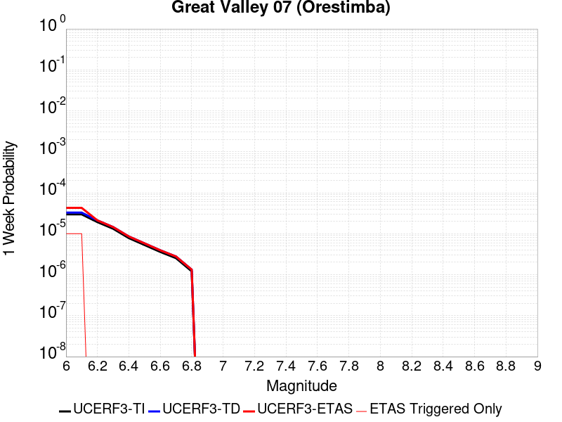 |  |  |  |

| Magnitude | 1 wk TI Prob | 1 wk TD Prob | 1 wk ETAS Prob | 1 wk ETAS/TD Gain | 1 wk ETAS Triggered Only | 1 mo TI Prob | 1 mo TD Prob | 1 mo ETAS Prob | 1 mo ETAS/TD Gain | 1 mo ETAS Triggered Only | 1 yr TI Prob | 1 yr TD Prob | 1 yr ETAS Prob | 1 yr ETAS/TD Gain | 1 yr ETAS Triggered Only | 10 yr TI Prob | 10 yr TD Prob | 10 yr ETAS Prob | 10 yr ETAS/TD Gain | 10 yr ETAS Triggered Only |
|-----|-----|-----|-----|-----|-----|-----|-----|-----|-----|-----|-----|-----|-----|-----|-----|-----|-----|-----|-----|-----|
| 6.0 | 2.9687902E-5 | 3.27575E-5 | 4.2757172E-5 | 1.3052636 | 1.0E-5 | 1.2722766E-4 | 1.4038214E-4 | 1.5038073E-4 | 1.0712241 | 1.0E-5 | 0.0015478961 | 0.0017078844 | 0.0017378331 | 1.0175356 | 3.0E-5 | 0.015371585 | 0.016955135 | 0.017004289 | 1.0028989 | 5.0E-5 |
| 6.1 | 2.9687902E-5 | 3.27575E-5 | 4.2757172E-5 | 1.3052636 | 1.0E-5 | 1.2722766E-4 | 1.4038214E-4 | 1.5038073E-4 | 1.0712241 | 1.0E-5 | 0.0015478961 | 0.0017078844 | 0.0017378331 | 1.0175356 | 3.0E-5 | 0.015371585 | 0.016955135 | 0.017004289 | 1.0028989 | 5.0E-5 |
| 6.2 | 1.9231524E-5 | 2.1159167E-5 | 2.1159167E-5 | 1.0 | 0.0 | 8.2418206E-5 | 9.067912E-5 | 9.067912E-5 | 1.0 | 0.0 | 0.0010029797 | 0.0011034822 | 0.0011134712 | 1.0090523 | 1.0E-5 | 0.00998465 | 0.010982441 | 0.011012111 | 1.0027016 | 3.0E-5 |
| 6.3 | 1.324766E-5 | 1.4548534E-5 | 1.4548534E-5 | 1.0 | 0.0 | 5.6774446E-5 | 6.234942E-5 | 6.234942E-5 | 1.0 | 0.0 | 6.910097E-4 | 7.5884897E-4 | 7.6884136E-4 | 1.0131679 | 1.0E-5 | 0.006888649 | 0.0075635235 | 0.0075833723 | 1.0026243 | 2.0E-5 |
| 6.4 | 7.818645E-6 | 8.57284E-6 | 8.57284E-6 | 1.0 | 0.0 | 3.3508048E-5 | 3.6740246E-5 | 3.6740246E-5 | 1.0 | 0.0 | 4.078841E-4 | 4.4722404E-4 | 4.4722404E-4 | 1.0 | 0.0 | 0.004071363 | 0.0044635804 | 0.0044635804 | 1.0 | 0.0 |
| 6.5 | 5.3076565E-6 | 5.8178007E-6 | 5.8178007E-6 | 1.0 | 0.0 | 2.27469E-5 | 2.4933206E-5 | 2.4933206E-5 | 1.0 | 0.0 | 2.7690834E-4 | 3.035216E-4 | 3.035216E-4 | 1.0 | 0.0 | 0.0027656353 | 0.00303128 | 0.00303128 | 1.0 | 0.0 |
| 6.6 | 3.6003578E-6 | 3.9484953E-6 | 3.9484953E-6 | 1.0 | 0.0 | 1.5430012E-5 | 1.6922022E-5 | 1.6922022E-5 | 1.0 | 0.0 | 1.8784421E-4 | 2.0600771E-4 | 2.0600771E-4 | 1.0 | 0.0 | 0.0018768552 | 0.0020583214 | 0.0020583214 | 1.0 | 0.0 |
| 6.7 | 2.5361826E-6 | 2.7834678E-6 | 2.7834678E-6 | 1.0 | 0.0 | 1.0869308E-5 | 1.1929101E-5 | 1.1929101E-5 | 1.0 | 0.0 | 1.3232579E-4 | 1.4522845E-4 | 1.4522845E-4 | 1.0 | 0.0 | 0.0013224703 | 0.0014514653 | 0.0014514653 | 1.0 | 0.0 |
| 6.8 | 1.2115831E-6 | 1.3313797E-6 | 1.3313797E-6 | 1.0 | 0.0 | 5.1924885E-6 | 5.7059065E-6 | 5.7059065E-6 | 1.0 | 0.0 | 6.3216714E-5 | 6.9468166E-5 | 6.9468166E-5 | 1.0 | 0.0 | 6.3198735E-4 | 6.945596E-4 | 6.945596E-4 | 1.0 | 0.0 |

## Monte Vista - Shannon 2011 CFM
*[(top)](#table-of-contents)*

| 1 Week | 1 Month | 1 Year | 10 Year |
|-----|-----|-----|-----|
|  |  |  |  |

| Magnitude | 1 wk TI Prob | 1 wk TD Prob | 1 wk ETAS Prob | 1 wk ETAS/TD Gain | 1 wk ETAS Triggered Only | 1 mo TI Prob | 1 mo TD Prob | 1 mo ETAS Prob | 1 mo ETAS/TD Gain | 1 mo ETAS Triggered Only | 1 yr TI Prob | 1 yr TD Prob | 1 yr ETAS Prob | 1 yr ETAS/TD Gain | 1 yr ETAS Triggered Only | 10 yr TI Prob | 10 yr TD Prob | 10 yr ETAS Prob | 10 yr ETAS/TD Gain | 10 yr ETAS Triggered Only |
|-----|-----|-----|-----|-----|-----|-----|-----|-----|-----|-----|-----|-----|-----|-----|-----|-----|-----|-----|-----|-----|
| 6.0 | 2.7907707E-5 | 2.7584067E-5 | 2.7584067E-5 | 1.0 | 0.0 | 1.19598975E-4 | 1.1821277E-4 | 1.2821158E-4 | 1.0845833 | 1.0E-5 | 0.0014551448 | 0.001438414 | 0.0014683708 | 1.0208263 | 3.0E-5 | 0.014456532 | 0.014320111 | 0.014349681 | 1.002065 | 3.0E-5 |
| 6.1 | 2.7907707E-5 | 2.7584067E-5 | 2.7584067E-5 | 1.0 | 0.0 | 1.19598975E-4 | 1.1821277E-4 | 1.2821158E-4 | 1.0845833 | 1.0E-5 | 0.0014551448 | 0.001438414 | 0.0014683708 | 1.0208263 | 3.0E-5 | 0.014456532 | 0.014320111 | 0.014349681 | 1.002065 | 3.0E-5 |
| 6.2 | 2.7907707E-5 | 2.7584067E-5 | 2.7584067E-5 | 1.0 | 0.0 | 1.19598975E-4 | 1.1821277E-4 | 1.2821158E-4 | 1.0845833 | 1.0E-5 | 0.0014551448 | 0.001438414 | 0.0014683708 | 1.0208263 | 3.0E-5 | 0.014456532 | 0.014320111 | 0.014349681 | 1.002065 | 3.0E-5 |
| 6.3 | 2.7907707E-5 | 2.7584067E-5 | 2.7584067E-5 | 1.0 | 0.0 | 1.19598975E-4 | 1.1821277E-4 | 1.2821158E-4 | 1.0845833 | 1.0E-5 | 0.0014551448 | 0.001438414 | 0.0014683708 | 1.0208263 | 3.0E-5 | 0.014456532 | 0.014320111 | 0.014349681 | 1.002065 | 3.0E-5 |
| 6.4 | 2.7907707E-5 | 2.7584067E-5 | 2.7584067E-5 | 1.0 | 0.0 | 1.19598975E-4 | 1.1821277E-4 | 1.2821158E-4 | 1.0845833 | 1.0E-5 | 0.0014551448 | 0.001438414 | 0.0014683708 | 1.0208263 | 3.0E-5 | 0.014456532 | 0.014320111 | 0.014349681 | 1.002065 | 3.0E-5 |
| 6.5 | 1.7990213E-5 | 1.6639742E-5 | 1.6639742E-5 | 1.0 | 0.0 | 7.709863E-5 | 7.13116E-5 | 8.131089E-5 | 1.1402197 | 1.0E-5 | 9.382716E-4 | 8.679393E-4 | 8.779306E-4 | 1.0115116 | 1.0E-5 | 0.0093431985 | 0.008668857 | 0.008688684 | 1.0022871 | 2.0E-5 |
| 6.6 | 9.650407E-6 | 7.457001E-6 | 7.457001E-6 | 1.0 | 0.0 | 4.135823E-5 | 3.195823E-5 | 3.195823E-5 | 1.0 | 0.0 | 5.0342013E-4 | 3.890298E-4 | 3.890298E-4 | 1.0 | 0.0 | 0.005022812 | 0.0039011573 | 0.0039011573 | 1.0 | 0.0 |
| 6.7 | 9.62828E-6 | 7.434916E-6 | 7.434916E-6 | 1.0 | 0.0 | 4.1263404E-5 | 3.186358E-5 | 3.186358E-5 | 1.0 | 0.0 | 5.022661E-4 | 3.8787787E-4 | 3.8787787E-4 | 1.0 | 0.0 | 0.0050113243 | 0.003889678 | 0.003889678 | 1.0 | 0.0 |
| 6.8 | 6.887523E-6 | 4.461425E-6 | 4.461425E-6 | 1.0 | 0.0 | 2.9517621E-5 | 1.9120265E-5 | 1.9120265E-5 | 1.0 | 0.0 | 3.5931775E-4 | 2.3276659E-4 | 2.3276659E-4 | 1.0 | 0.0 | 0.0035873733 | 0.0023423703 | 0.0023423703 | 1.0 | 0.0 |
| 6.9 | 6.2722347E-6 | 3.8032956E-6 | 3.8032956E-6 | 1.0 | 0.0 | 2.6880729E-5 | 1.6299748E-5 | 1.6299748E-5 | 1.0 | 0.0 | 3.2722374E-4 | 1.9843338E-4 | 1.9843338E-4 | 1.0 | 0.0 | 0.003267423 | 0.0019996904 | 0.0019996904 | 1.0 | 0.0 |
| 7.0 | 5.5320347E-6 | 3.0304461E-6 | 3.0304461E-6 | 1.0 | 0.0 | 2.3708504E-5 | 1.2987572E-5 | 1.2987572E-5 | 1.0 | 0.0 | 2.8861282E-4 | 1.5811404E-4 | 1.5811404E-4 | 1.0 | 0.0 | 0.0028823826 | 0.0015971304 | 0.0015971304 | 1.0 | 0.0 |
| 7.1 | 3.8794055E-6 | 1.283645E-6 | 1.283645E-6 | 1.0 | 0.0 | 1.6625918E-5 | 5.5013243E-6 | 5.5013243E-6 | 1.0 | 0.0 | 2.0240174E-4 | 6.697658E-5 | 6.697658E-5 | 1.0 | 0.0 | 0.002022175 | 6.86504E-4 | 6.86504E-4 | 1.0 | 0.0 |
| 7.2 | 3.4813652E-6 | 9.669686E-7 | 9.669686E-7 | 1.0 | 0.0 | 1.49200505E-5 | 4.144145E-6 | 4.144145E-6 | 1.0 | 0.0 | 1.8163648E-4 | 5.0453804E-5 | 5.0453804E-5 | 1.0 | 0.0 | 0.0018148809 | 5.213506E-4 | 5.213506E-4 | 1.0 | 0.0 |
| 7.3 | 3.1682148E-6 | 7.7177793E-7 | 7.7177793E-7 | 1.0 | 0.0 | 1.3577992E-5 | 3.3076153E-6 | 3.3076153E-6 | 1.0 | 0.0 | 1.6529951E-4 | 4.0269475E-5 | 4.0269475E-5 | 1.0 | 0.0 | 0.0016517661 | 4.195245E-4 | 4.195245E-4 | 1.0 | 0.0 |
| 7.4 | 2.9707667E-6 | 7.344474E-7 | 7.344474E-7 | 1.0 | 0.0 | 1.2731795E-5 | 3.147628E-6 | 3.147628E-6 | 1.0 | 0.0 | 1.5499859E-4 | 3.8321698E-5 | 3.8321698E-5 | 1.0 | 0.0 | 0.0015489052 | 3.998471E-4 | 3.998471E-4 | 1.0 | 0.0 |
| 7.5 | 2.3462758E-6 | 6.0069135E-7 | 6.0069135E-7 | 1.0 | 0.0 | 1.0055429E-5 | 2.5743889E-6 | 2.5743889E-6 | 1.0 | 0.0 | 1.2241797E-4 | 3.1342737E-5 | 3.1342737E-5 | 1.0 | 0.0 | 0.0012235056 | 3.2833643E-4 | 3.2833643E-4 | 1.0 | 0.0 |
| 7.6 | 2.112783E-6 | 5.250731E-7 | 5.250731E-7 | 1.0 | 0.0 | 9.054753E-6 | 2.2503114E-6 | 2.2503114E-6 | 1.0 | 0.0 | 1.1023604E-4 | 2.7397198E-5 | 2.7397198E-5 | 1.0 | 0.0 | 0.0011018137 | 2.8845918E-4 | 2.8845918E-4 | 1.0 | 0.0 |
| 7.7 | 1.7022471E-6 | 4.23102E-7 | 4.23102E-7 | 1.0 | 0.0 | 7.2953244E-6 | 1.8132929E-6 | 1.8132929E-6 | 1.0 | 0.0 | 8.881695E-5 | 2.207662E-5 | 2.207662E-5 | 1.0 | 0.0 | 8.878146E-4 | 2.3394964E-4 | 2.3394964E-4 | 1.0 | 0.0 |
| 7.8 | 7.230914E-7 | 3.728293E-7 | 3.728293E-7 | 1.0 | 0.0 | 3.0989595E-6 | 1.597839E-6 | 1.597839E-6 | 1.0 | 0.0 | 3.772918E-5 | 1.9453517E-5 | 1.9453517E-5 | 1.0 | 0.0 | 3.7722773E-4 | 2.072548E-4 | 2.072548E-4 | 1.0 | 0.0 |
| 7.9 | 4.3588446E-7 | 3.4304335E-7 | 3.4304335E-7 | 1.0 | 0.0 | 1.868075E-6 | 1.4701849E-6 | 1.4701849E-6 | 1.0 | 0.0 | 2.2743576E-5 | 1.7899356E-5 | 1.7899356E-5 | 1.0 | 0.0 | 2.2741247E-4 | 1.899464E-4 | 1.899464E-4 | 1.0 | 0.0 |
| 8.0 | 2.3317523E-7 | 3.1513432E-7 | 3.1513432E-7 | 1.0 | 0.0 | 9.99322E-7 | 1.350575E-6 | 1.350575E-6 | 1.0 | 0.0 | 1.2166677E-5 | 1.6443128E-5 | 1.6443128E-5 | 1.0 | 0.0 | 1.21660116E-4 | 1.7399403E-4 | 1.7399403E-4 | 1.0 | 0.0 |
| 8.1 | 1.4662456E-7 | 2.03077E-7 | 2.03077E-7 | 1.0 | 0.0 | 6.283908E-7 | 8.703297E-7 | 8.703297E-7 | 1.0 | 0.0 | 7.650631E-6 | 1.05962135E-5 | 1.05962135E-5 | 1.0 | 0.0 | 7.650368E-5 | 1.1132272E-4 | 1.1132272E-4 | 1.0 | 0.0 |
| 8.2 | 5.4931775E-9 | 5.0752176E-9 | 5.0752176E-9 | 1.0 | 0.0 | 2.3542189E-8 | 2.1750932E-8 | 2.1750932E-8 | 1.0 | 0.0 | 2.8662612E-7 | 2.6481757E-7 | 2.6481757E-7 | 1.0 | 0.0 | 2.8662573E-6 | 2.754138E-6 | 2.754138E-6 | 1.0 | 0.0 |

## Owens Valley Keough Hot Springs
*[(top)](#table-of-contents)*

| 1 Week | 1 Month | 1 Year | 10 Year |
|-----|-----|-----|-----|
|  |  | 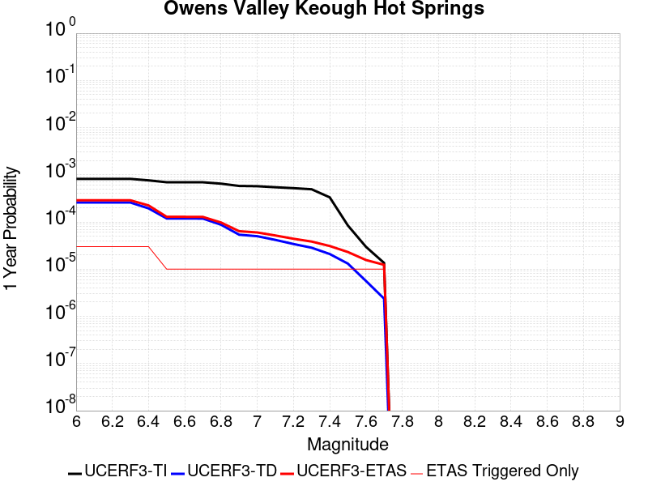 |  |

| Magnitude | 1 wk TI Prob | 1 wk TD Prob | 1 wk ETAS Prob | 1 wk ETAS/TD Gain | 1 wk ETAS Triggered Only | 1 mo TI Prob | 1 mo TD Prob | 1 mo ETAS Prob | 1 mo ETAS/TD Gain | 1 mo ETAS Triggered Only | 1 yr TI Prob | 1 yr TD Prob | 1 yr ETAS Prob | 1 yr ETAS/TD Gain | 1 yr ETAS Triggered Only | 10 yr TI Prob | 10 yr TD Prob | 10 yr ETAS Prob | 10 yr ETAS/TD Gain | 10 yr ETAS Triggered Only |
|-----|-----|-----|-----|-----|-----|-----|-----|-----|-----|-----|-----|-----|-----|-----|-----|-----|-----|-----|-----|-----|
| 6.0 | 1.5708529E-5 | 4.950463E-6 | 1.4950414E-5 | 3.020003 | 1.0E-5 | 6.7320536E-5 | 2.1216127E-5 | 3.1215914E-5 | 1.4713296 | 1.0E-5 | 8.193192E-4 | 2.5828084E-4 | 2.882731E-4 | 1.1161226 | 3.0E-5 | 0.008163051 | 0.0025804387 | 0.0026203354 | 1.0154612 | 4.0E-5 |
| 6.1 | 1.5708529E-5 | 4.950463E-6 | 1.4950414E-5 | 3.020003 | 1.0E-5 | 6.7320536E-5 | 2.1216127E-5 | 3.1215914E-5 | 1.4713296 | 1.0E-5 | 8.193192E-4 | 2.5828084E-4 | 2.882731E-4 | 1.1161226 | 3.0E-5 | 0.008163051 | 0.0025804387 | 0.0026203354 | 1.0154612 | 4.0E-5 |
| 6.2 | 1.5708529E-5 | 4.950463E-6 | 1.4950414E-5 | 3.020003 | 1.0E-5 | 6.7320536E-5 | 2.1216127E-5 | 3.1215914E-5 | 1.4713296 | 1.0E-5 | 8.193192E-4 | 2.5828084E-4 | 2.882731E-4 | 1.1161226 | 3.0E-5 | 0.008163051 | 0.0025804387 | 0.0026203354 | 1.0154612 | 4.0E-5 |
| 6.3 | 1.5708529E-5 | 4.950463E-6 | 1.4950414E-5 | 3.020003 | 1.0E-5 | 6.7320536E-5 | 2.1216127E-5 | 3.1215914E-5 | 1.4713296 | 1.0E-5 | 8.193192E-4 | 2.5828084E-4 | 2.882731E-4 | 1.1161226 | 3.0E-5 | 0.008163051 | 0.0025804387 | 0.0026203354 | 1.0154612 | 4.0E-5 |
| 6.4 | 1.4622509E-5 | 3.7263276E-6 | 1.37262905E-5 | 3.6835973 | 1.0E-5 | 6.266639E-5 | 1.5969896E-5 | 2.5969737E-5 | 1.6261681 | 1.0E-5 | 7.626962E-4 | 1.9441944E-4 | 2.2441361E-4 | 1.1542755 | 3.0E-5 | 0.007600839 | 0.0019429466 | 0.0019828689 | 1.0205473 | 4.0E-5 |
| 6.5 | 1.3335527E-5 | 2.2775241E-6 | 2.2775241E-6 | 1.0 | 0.0 | 5.7151006E-5 | 9.760785E-6 | 9.760785E-6 | 1.0 | 0.0 | 6.955913E-4 | 1.1883176E-4 | 1.2883058E-4 | 1.0841426 | 1.0E-5 | 0.0069341804 | 0.001187878 | 0.0012078542 | 1.0168167 | 2.0E-5 |
| 6.6 | 1.3332855E-5 | 2.2746733E-6 | 2.2746733E-6 | 1.0 | 0.0 | 5.7139558E-5 | 9.748568E-6 | 9.748568E-6 | 1.0 | 0.0 | 6.9545204E-4 | 1.1868303E-4 | 1.2868184E-4 | 1.0842481 | 1.0E-5 | 0.0069327964 | 0.0011863923 | 0.0012063686 | 1.0168378 | 2.0E-5 |
| 6.7 | 1.3318214E-5 | 2.2639038E-6 | 2.2639038E-6 | 1.0 | 0.0 | 5.707681E-5 | 9.702413E-6 | 9.702413E-6 | 1.0 | 0.0 | 6.946886E-4 | 1.18121156E-4 | 1.2811998E-4 | 1.0846488 | 1.0E-5 | 0.0069252094 | 0.0011807795 | 0.0012007558 | 1.016918 | 2.0E-5 |
| 6.8 | 1.2441338E-5 | 1.677594E-6 | 1.677594E-6 | 1.0 | 0.0 | 5.331893E-5 | 7.1896707E-6 | 7.1896707E-6 | 1.0 | 0.0 | 6.489646E-4 | 8.753102E-5 | 9.7530145E-5 | 1.1142352 | 1.0E-5 | 0.0064707273 | 8.751236E-4 | 8.951061E-4 | 1.022834 | 2.0E-5 |
| 6.9 | 1.1130476E-5 | 1.0302234E-6 | 1.0302234E-6 | 1.0 | 0.0 | 4.7701167E-5 | 4.4152357E-6 | 4.4152357E-6 | 1.0 | 0.0 | 5.806069E-4 | 5.3754186E-5 | 6.375365E-5 | 1.186022 | 1.0E-5 | 0.0057909233 | 5.375404E-4 | 5.47535E-4 | 1.0185933 | 1.0E-5 |
| 7.0 | 1.0986073E-5 | 9.577824E-7 | 9.577824E-7 | 1.0 | 0.0 | 4.7082318E-5 | 4.1047756E-6 | 4.1047756E-6 | 1.0 | 0.0 | 5.730765E-4 | 4.9974507E-5 | 5.997401E-5 | 1.2000921 | 1.0E-5 | 0.0057160086 | 4.997603E-4 | 5.0975534E-4 | 1.0199996 | 1.0E-5 |
| 7.1 | 1.0451338E-5 | 7.9988575E-7 | 7.9988575E-7 | 1.0 | 0.0 | 4.4790682E-5 | 3.4280772E-6 | 3.4280772E-6 | 1.0 | 0.0 | 5.451901E-4 | 4.1736046E-5 | 5.1735627E-5 | 1.239591 | 1.0E-5 | 0.005438545 | 4.1740583E-4 | 4.2740165E-4 | 1.0239475 | 1.0E-5 |
| 7.2 | 9.989061E-6 | 6.543693E-7 | 6.543693E-7 | 1.0 | 0.0 | 4.280956E-5 | 2.8044367E-6 | 2.8044367E-6 | 1.0 | 0.0 | 5.2108173E-4 | 3.4143486E-5 | 4.4143144E-5 | 1.2928716 | 1.0E-5 | 0.0051986156 | 3.41488E-4 | 3.5148457E-4 | 1.0292736 | 1.0E-5 |
| 7.3 | 9.465365E-6 | 5.458855E-7 | 5.458855E-7 | 1.0 | 0.0 | 4.056522E-5 | 2.3395073E-6 | 2.3395073E-6 | 1.0 | 0.0 | 4.937696E-4 | 2.8483131E-5 | 3.8482845E-5 | 1.351075 | 1.0E-5 | 0.0049267393 | 2.8489542E-4 | 2.9489255E-4 | 1.0350906 | 1.0E-5 |
| 7.4 | 6.3824805E-6 | 4.0153776E-7 | 4.0153776E-7 | 1.0 | 0.0 | 2.73532E-5 | 1.7208749E-6 | 1.7208749E-6 | 1.0 | 0.0 | 3.3297433E-4 | 2.0951453E-5 | 3.0951243E-5 | 1.4772838 | 1.0E-5 | 0.0033247585 | 2.0955436E-4 | 2.1955227E-4 | 1.0477103 | 1.0E-5 |
| 7.5 | 1.6192645E-6 | 2.5156373E-7 | 2.5156373E-7 | 1.0 | 0.0 | 6.9396865E-6 | 1.0781299E-6 | 1.0781299E-6 | 1.0 | 0.0 | 8.448741E-5 | 1.3126153E-5 | 2.3126022E-5 | 1.7618278 | 1.0E-5 | 8.4455294E-4 | 1.3125391E-4 | 1.412526E-4 | 1.0761782 | 1.0E-5 |
| 7.6 | 5.7062545E-7 | 1.0790214E-7 | 1.0790214E-7 | 1.0 | 0.0 | 2.4455355E-6 | 4.6243767E-7 | 4.6243767E-7 | 1.0 | 0.0 | 2.9773988E-5 | 5.630165E-6 | 1.5630108E-5 | 2.7761369 | 1.0E-5 | 2.977E-4 | 5.6300305E-5 | 6.629974E-5 | 1.177609 | 1.0E-5 |
| 7.7 | 2.5988817E-7 | 4.5445965E-8 | 4.5445965E-8 | 1.0 | 0.0 | 1.113806E-6 | 1.9476842E-7 | 1.9476842E-7 | 1.0 | 0.0 | 1.3560503E-5 | 2.3713033E-6 | 1.237128E-5 | 5.21708 | 1.0E-5 | 1.3559677E-4 | 2.3712824E-5 | 3.3712586E-5 | 1.4217027 | 1.0E-5 |

## Elsinore (Coyote Mountains)
*[(top)](#table-of-contents)*

| 1 Week | 1 Month | 1 Year | 10 Year |
|-----|-----|-----|-----|
|  |  |  | 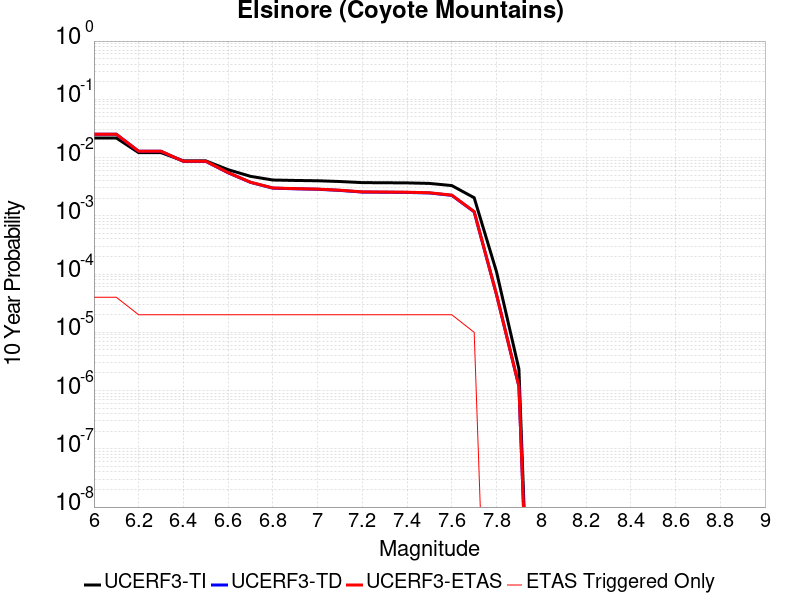 |

| Magnitude | 1 wk TI Prob | 1 wk TD Prob | 1 wk ETAS Prob | 1 wk ETAS/TD Gain | 1 wk ETAS Triggered Only | 1 mo TI Prob | 1 mo TD Prob | 1 mo ETAS Prob | 1 mo ETAS/TD Gain | 1 mo ETAS Triggered Only | 1 yr TI Prob | 1 yr TD Prob | 1 yr ETAS Prob | 1 yr ETAS/TD Gain | 1 yr ETAS Triggered Only | 10 yr TI Prob | 10 yr TD Prob | 10 yr ETAS Prob | 10 yr ETAS/TD Gain | 10 yr ETAS Triggered Only |
|-----|-----|-----|-----|-----|-----|-----|-----|-----|-----|-----|-----|-----|-----|-----|-----|-----|-----|-----|-----|-----|
| 6.0 | 4.20513E-5 | 4.8630944E-5 | 4.8630944E-5 | 1.0 | 0.0 | 1.8020741E-4 | 2.0840492E-4 | 2.1840284E-4 | 1.0479735 | 1.0E-5 | 0.0021918174 | 0.0025349057 | 0.002554855 | 1.0078698 | 2.0E-5 | 0.021703249 | 0.025111204 | 0.025150198 | 1.0015529 | 4.0E-5 |
| 6.1 | 4.20513E-5 | 4.8630944E-5 | 4.8630944E-5 | 1.0 | 0.0 | 1.8020741E-4 | 2.0840492E-4 | 2.1840284E-4 | 1.0479735 | 1.0E-5 | 0.0021918174 | 0.0025349057 | 0.002554855 | 1.0078698 | 2.0E-5 | 0.021703249 | 0.025111204 | 0.025150198 | 1.0015529 | 4.0E-5 |
| 6.2 | 2.3413893E-5 | 2.4695422E-5 | 2.4695422E-5 | 1.0 | 0.0 | 1.0034139E-4 | 1.0583377E-4 | 1.15832714E-4 | 1.0944778 | 1.0E-5 | 0.0012209718 | 0.0012878523 | 0.0013078265 | 1.0155097 | 2.0E-5 | 0.012142851 | 0.012812569 | 0.012832313 | 1.001541 | 2.0E-5 |
| 6.3 | 2.3413893E-5 | 2.4695422E-5 | 2.4695422E-5 | 1.0 | 0.0 | 1.0034139E-4 | 1.0583377E-4 | 1.15832714E-4 | 1.0944778 | 1.0E-5 | 0.0012209718 | 0.0012878523 | 0.0013078265 | 1.0155097 | 2.0E-5 | 0.012142851 | 0.012812569 | 0.012832313 | 1.001541 | 2.0E-5 |
| 6.4 | 1.6894814E-5 | 1.6568214E-5 | 1.6568214E-5 | 1.0 | 0.0 | 7.240433E-5 | 7.100491E-5 | 8.1004204E-5 | 1.1408253 | 1.0E-5 | 8.811662E-4 | 8.641788E-4 | 8.841615E-4 | 1.0231234 | 2.0E-5 | 0.0087768035 | 0.008611842 | 0.00863167 | 1.0023024 | 2.0E-5 |
| 6.5 | 1.6894814E-5 | 1.6568214E-5 | 1.6568214E-5 | 1.0 | 0.0 | 7.240433E-5 | 7.100491E-5 | 8.1004204E-5 | 1.1408253 | 1.0E-5 | 8.811662E-4 | 8.641788E-4 | 8.841615E-4 | 1.0231234 | 2.0E-5 | 0.0087768035 | 0.008611842 | 0.00863167 | 1.0023024 | 2.0E-5 |
| 6.6 | 1.1910969E-5 | 1.0530538E-5 | 1.0530538E-5 | 1.0 | 0.0 | 5.1046012E-5 | 4.513017E-5 | 5.512972E-5 | 1.2215712 | 1.0E-5 | 6.21308E-4 | 5.493346E-4 | 5.6932366E-4 | 1.0363877 | 2.0E-5 | 0.0061957375 | 0.0054810685 | 0.0055009588 | 1.003629 | 2.0E-5 |
| 6.7 | 9.1486E-6 | 7.2026473E-6 | 7.2026473E-6 | 1.0 | 0.0 | 3.9207694E-5 | 3.0868145E-5 | 4.0867835E-5 | 1.3239486 | 1.0E-5 | 4.7724912E-4 | 3.7575865E-4 | 3.9575115E-4 | 1.0532056 | 2.0E-5 | 0.0047622547 | 0.0037516125 | 0.0037715374 | 1.005311 | 2.0E-5 |
| 6.8 | 7.90441E-6 | 5.7288153E-6 | 5.7288153E-6 | 1.0 | 0.0 | 3.3875604E-5 | 2.4551842E-5 | 3.45516E-5 | 1.4072914 | 1.0E-5 | 4.1235742E-4 | 2.9887896E-4 | 3.1887298E-4 | 1.0668967 | 2.0E-5 | 0.0041159308 | 0.0029848986 | 0.003004839 | 1.0066804 | 2.0E-5 |
| 6.9 | 7.77015E-6 | 5.5827695E-6 | 5.5827695E-6 | 1.0 | 0.0 | 3.3300217E-5 | 2.3925944E-5 | 3.3925706E-5 | 1.4179463 | 1.0E-5 | 4.0535472E-4 | 2.912607E-4 | 3.1125487E-4 | 1.068647 | 2.0E-5 | 0.004046161 | 0.0029089167 | 0.0029288584 | 1.0068554 | 2.0E-5 |
| 7.0 | 7.675798E-6 | 5.4796283E-6 | 5.4796283E-6 | 1.0 | 0.0 | 3.289586E-5 | 2.3483917E-5 | 3.348368E-5 | 1.4258133 | 1.0E-5 | 4.004335E-4 | 2.8588044E-4 | 3.058747E-4 | 1.0699394 | 2.0E-5 | 0.003997127 | 0.0028552532 | 0.002875196 | 1.0069846 | 2.0E-5 |
| 7.1 | 7.447814E-6 | 5.2385003E-6 | 5.2385003E-6 | 1.0 | 0.0 | 3.191881E-5 | 2.245053E-5 | 3.2450305E-5 | 1.4454138 | 1.0E-5 | 3.8854225E-4 | 2.7330214E-4 | 2.9329667E-4 | 1.0731591 | 2.0E-5 | 0.003878636 | 0.0027297847 | 0.0027497301 | 1.0073066 | 2.0E-5 |
| 7.2 | 7.128185E-6 | 4.905146E-6 | 4.905146E-6 | 1.0 | 0.0 | 3.0549007E-5 | 2.1021891E-5 | 3.1021682E-5 | 1.4756845 | 1.0E-5 | 3.7187067E-4 | 2.5591266E-4 | 2.7590754E-4 | 1.0781317 | 2.0E-5 | 0.00371249 | 0.002556298 | 0.0025762469 | 1.0078038 | 2.0E-5 |
| 7.3 | 7.0913875E-6 | 4.873821E-6 | 4.873821E-6 | 1.0 | 0.0 | 3.0391306E-5 | 2.0887644E-5 | 3.0887437E-5 | 1.4787419 | 1.0E-5 | 3.6995133E-4 | 2.542786E-4 | 2.742735E-4 | 1.0786339 | 2.0E-5 | 0.0036933604 | 0.0025399947 | 0.0025599438 | 1.007854 | 2.0E-5 |
| 7.4 | 7.051521E-6 | 4.837673E-6 | 4.837673E-6 | 1.0 | 0.0 | 3.0220453E-5 | 2.0732725E-5 | 3.0732517E-5 | 1.4823192 | 1.0E-5 | 3.6787192E-4 | 2.5239287E-4 | 2.7238784E-4 | 1.0792215 | 2.0E-5 | 0.0036726352 | 0.0025211805 | 0.0025411302 | 1.0079128 | 2.0E-5 |
| 7.5 | 6.910666E-6 | 4.7332255E-6 | 4.7332255E-6 | 1.0 | 0.0 | 2.9616802E-5 | 2.02851E-5 | 3.0284898E-5 | 1.4929627 | 1.0E-5 | 3.605249E-4 | 2.4694428E-4 | 2.6693937E-4 | 1.0809699 | 2.0E-5 | 0.0035994058 | 0.002466817 | 0.0024867675 | 1.0080876 | 2.0E-5 |
| 7.6 | 6.341753E-6 | 4.306345E-6 | 4.306345E-6 | 1.0 | 0.0 | 2.7178658E-5 | 1.8455641E-5 | 2.8455457E-5 | 1.5418297 | 1.0E-5 | 3.3084993E-4 | 2.2467543E-4 | 2.4467093E-4 | 1.0889972 | 2.0E-5 | 0.0033035777 | 0.002244598 | 0.0022645532 | 1.0088903 | 2.0E-5 |
| 7.7 | 3.9205916E-6 | 2.2437468E-6 | 2.2437468E-6 | 1.0 | 0.0 | 1.6802427E-5 | 9.616027E-6 | 1.961593E-5 | 2.0399206 | 1.0E-5 | 2.0455034E-4 | 1.17069576E-4 | 1.270684E-4 | 1.0854093 | 1.0E-5 | 0.0020436216 | 0.001170152 | 0.0011801403 | 1.0085359 | 1.0E-5 |
| 7.8 | 2.0846227E-7 | 8.4853966E-8 | 8.4853966E-8 | 1.0 | 0.0 | 8.9340944E-7 | 3.6365984E-7 | 3.6365984E-7 | 1.0 | 0.0 | 1.0877206E-5 | 4.427553E-6 | 4.427553E-6 | 1.0 | 0.0 | 1.0876673E-4 | 4.4274973E-5 | 4.4274973E-5 | 1.0 | 0.0 |
| 7.9 | 4.4969806E-9 | 2.269088E-9 | 2.269088E-9 | 1.0 | 0.0 | 1.9272775E-8 | 9.724664E-9 | 9.724664E-9 | 1.0 | 0.0 | 2.3464601E-7 | 1.1839777E-7 | 1.1839777E-7 | 1.0 | 0.0 | 2.3464577E-6 | 1.1839772E-6 | 1.1839772E-6 | 1.0 | 0.0 |

## Cedar Mtn-Mahogany Mtn
*[(top)](#table-of-contents)*

| 1 Week | 1 Month | 1 Year | 10 Year |
|-----|-----|-----|-----|
|  | 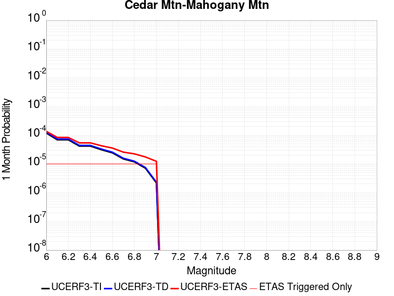 |  | 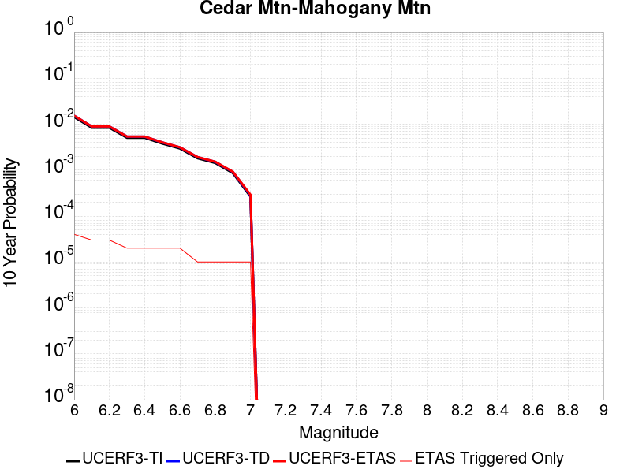 |

| Magnitude | 1 wk TI Prob | 1 wk TD Prob | 1 wk ETAS Prob | 1 wk ETAS/TD Gain | 1 wk ETAS Triggered Only | 1 mo TI Prob | 1 mo TD Prob | 1 mo ETAS Prob | 1 mo ETAS/TD Gain | 1 mo ETAS Triggered Only | 1 yr TI Prob | 1 yr TD Prob | 1 yr ETAS Prob | 1 yr ETAS/TD Gain | 1 yr ETAS Triggered Only | 10 yr TI Prob | 10 yr TD Prob | 10 yr ETAS Prob | 10 yr ETAS/TD Gain | 10 yr ETAS Triggered Only |
|-----|-----|-----|-----|-----|-----|-----|-----|-----|-----|-----|-----|-----|-----|-----|-----|-----|-----|-----|-----|-----|
| 6.0 | 2.7763876E-5 | 2.9588866E-5 | 2.9588866E-5 | 1.0 | 0.0 | 1.1898261E-4 | 1.2680366E-4 | 1.3680238E-4 | 1.078852 | 1.0E-5 | 0.0014476506 | 0.0015428112 | 0.001572765 | 1.019415 | 3.0E-5 | 0.0143825635 | 0.015328225 | 0.015367612 | 1.0025696 | 4.0E-5 |
| 6.1 | 1.6162443E-5 | 1.7142966E-5 | 1.7142966E-5 | 1.0 | 0.0 | 6.926578E-5 | 7.346788E-5 | 8.346715E-5 | 1.1361039 | 1.0E-5 | 8.4298453E-4 | 8.941221E-4 | 9.2409534E-4 | 1.0335225 | 3.0E-5 | 0.008397939 | 0.008907059 | 0.008936792 | 1.0033381 | 3.0E-5 |
| 6.2 | 1.6162443E-5 | 1.7142966E-5 | 1.7142966E-5 | 1.0 | 0.0 | 6.926578E-5 | 7.346788E-5 | 8.346715E-5 | 1.1361039 | 1.0E-5 | 8.4298453E-4 | 8.941221E-4 | 9.2409534E-4 | 1.0335225 | 3.0E-5 | 0.008397939 | 0.008907059 | 0.008936792 | 1.0033381 | 3.0E-5 |
| 6.3 | 9.746053E-6 | 1.0303152E-5 | 1.0303152E-5 | 1.0 | 0.0 | 4.1768133E-5 | 4.415564E-5 | 5.41552E-5 | 1.2264616 | 1.0E-5 | 5.0840835E-4 | 5.3746643E-4 | 5.5745564E-4 | 1.0371916 | 2.0E-5 | 0.0050724675 | 0.005362084 | 0.005381977 | 1.0037099 | 2.0E-5 |
| 6.4 | 9.746053E-6 | 1.0303152E-5 | 1.0303152E-5 | 1.0 | 0.0 | 4.1768133E-5 | 4.415564E-5 | 5.41552E-5 | 1.2264616 | 1.0E-5 | 5.0840835E-4 | 5.3746643E-4 | 5.5745564E-4 | 1.0371916 | 2.0E-5 | 0.0050724675 | 0.005362084 | 0.005381977 | 1.0037099 | 2.0E-5 |
| 6.5 | 7.290083E-6 | 7.695325E-6 | 7.695325E-6 | 1.0 | 0.0 | 3.124284E-5 | 3.297956E-5 | 4.2979227E-5 | 1.3032081 | 1.0E-5 | 3.8031515E-4 | 4.014543E-4 | 4.2144628E-4 | 1.0497988 | 2.0E-5 | 0.0037966494 | 0.004007511 | 0.004027431 | 1.0049707 | 2.0E-5 |
| 6.6 | 5.67907E-6 | 5.9891527E-6 | 5.9891527E-6 | 1.0 | 0.0 | 2.4338644E-5 | 2.5667552E-5 | 3.5667297E-5 | 1.3895869 | 1.0E-5 | 2.962827E-4 | 3.12459E-4 | 3.3245274E-4 | 1.0639884 | 2.0E-5 | 0.0029588798 | 0.003120333 | 0.0031402705 | 1.0063896 | 2.0E-5 |
| 6.7 | 3.4853963E-6 | 3.672631E-6 | 3.672631E-6 | 1.0 | 0.0 | 1.4937327E-5 | 1.5739755E-5 | 2.5739599E-5 | 1.6353239 | 1.0E-5 | 1.8184677E-4 | 1.916153E-4 | 2.0161338E-4 | 1.0521779 | 1.0E-5 | 0.0018169804 | 0.0019145629 | 0.0019245436 | 1.0052131 | 1.0E-5 |
| 6.8 | 2.7535168E-6 | 2.9015764E-6 | 2.9015764E-6 | 1.0 | 0.0 | 1.1800733E-5 | 1.2435271E-5 | 2.2435146E-5 | 1.8041543 | 1.0E-5 | 1.4366445E-4 | 1.5138938E-4 | 1.6138787E-4 | 1.0660448 | 1.0E-5 | 0.0014357162 | 0.0015129098 | 0.0015228946 | 1.0065998 | 1.0E-5 |
| 6.9 | 1.6594106E-6 | 1.7496985E-6 | 1.7496985E-6 | 1.0 | 0.0 | 7.1117406E-6 | 7.4986883E-6 | 1.7498613E-5 | 2.3335567 | 1.0E-5 | 8.6582E-5 | 9.129302E-5 | 1.01292106E-4 | 1.1095273 | 1.0E-5 | 8.654827E-4 | 9.125856E-4 | 9.2257647E-4 | 1.0109478 | 1.0E-5 |
| 7.0 | 5.10215E-7 | 5.389254E-7 | 5.389254E-7 | 1.0 | 0.0 | 2.186634E-6 | 2.3096788E-6 | 1.2309656E-5 | 5.329596 | 1.0E-5 | 2.6621943E-5 | 2.8120105E-5 | 3.8119826E-5 | 1.3556074 | 1.0E-5 | 2.6618753E-4 | 2.81178E-4 | 2.911752E-4 | 1.0355546 | 1.0E-5 |

## Raymond
*[(top)](#table-of-contents)*

| 1 Week | 1 Month | 1 Year | 10 Year |
|-----|-----|-----|-----|
|  |  |  | 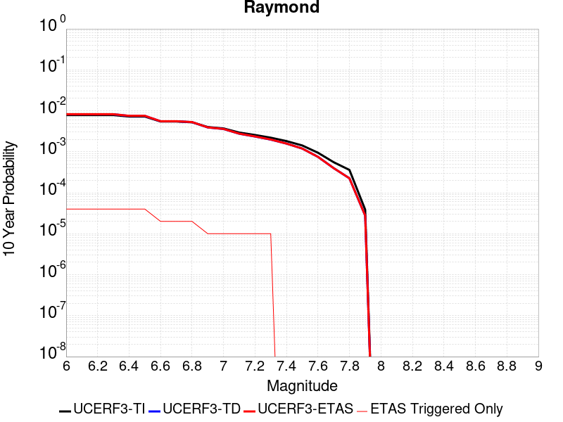 |

| Magnitude | 1 wk TI Prob | 1 wk TD Prob | 1 wk ETAS Prob | 1 wk ETAS/TD Gain | 1 wk ETAS Triggered Only | 1 mo TI Prob | 1 mo TD Prob | 1 mo ETAS Prob | 1 mo ETAS/TD Gain | 1 mo ETAS Triggered Only | 1 yr TI Prob | 1 yr TD Prob | 1 yr ETAS Prob | 1 yr ETAS/TD Gain | 1 yr ETAS Triggered Only | 10 yr TI Prob | 10 yr TD Prob | 10 yr ETAS Prob | 10 yr ETAS/TD Gain | 10 yr ETAS Triggered Only |
|-----|-----|-----|-----|-----|-----|-----|-----|-----|-----|-----|-----|-----|-----|-----|-----|-----|-----|-----|-----|-----|
| 6.0 | 1.5157413E-5 | 1.5810125E-5 | 3.5809808E-5 | 2.264992 | 2.0E-5 | 6.4958724E-5 | 6.775606E-5 | 8.7754706E-5 | 1.2951566 | 2.0E-5 | 7.905855E-4 | 8.246429E-4 | 8.646099E-4 | 1.0484658 | 4.0E-5 | 0.007877788 | 0.008218355 | 0.008258026 | 1.0048271 | 4.0E-5 |
| 6.1 | 1.5157413E-5 | 1.5810125E-5 | 3.5809808E-5 | 2.264992 | 2.0E-5 | 6.4958724E-5 | 6.775606E-5 | 8.7754706E-5 | 1.2951566 | 2.0E-5 | 7.905855E-4 | 8.246429E-4 | 8.646099E-4 | 1.0484658 | 4.0E-5 | 0.007877788 | 0.008218355 | 0.008258026 | 1.0048271 | 4.0E-5 |
| 6.2 | 1.5157413E-5 | 1.5810125E-5 | 3.5809808E-5 | 2.264992 | 2.0E-5 | 6.4958724E-5 | 6.775606E-5 | 8.7754706E-5 | 1.2951566 | 2.0E-5 | 7.905855E-4 | 8.246429E-4 | 8.646099E-4 | 1.0484658 | 4.0E-5 | 0.007877788 | 0.008218355 | 0.008258026 | 1.0048271 | 4.0E-5 |
| 6.3 | 1.5157413E-5 | 1.5810125E-5 | 3.5809808E-5 | 2.264992 | 2.0E-5 | 6.4958724E-5 | 6.775606E-5 | 8.7754706E-5 | 1.2951566 | 2.0E-5 | 7.905855E-4 | 8.246429E-4 | 8.646099E-4 | 1.0484658 | 4.0E-5 | 0.007877788 | 0.008218355 | 0.008258026 | 1.0048271 | 4.0E-5 |
| 6.4 | 1.3941944E-5 | 1.4454688E-5 | 3.44544E-5 | 2.383614 | 2.0E-5 | 5.9749822E-5 | 6.194732E-5 | 8.1946084E-5 | 1.322835 | 2.0E-5 | 7.2721124E-4 | 7.53971E-4 | 7.9394085E-4 | 1.0530125 | 4.0E-5 | 0.007248361 | 0.007516471 | 0.00755617 | 1.0052817 | 4.0E-5 |
| 6.5 | 1.3941944E-5 | 1.4454688E-5 | 3.44544E-5 | 2.383614 | 2.0E-5 | 5.9749822E-5 | 6.194732E-5 | 8.1946084E-5 | 1.322835 | 2.0E-5 | 7.2721124E-4 | 7.53971E-4 | 7.9394085E-4 | 1.0530125 | 4.0E-5 | 0.007248361 | 0.007516471 | 0.00755617 | 1.0052817 | 4.0E-5 |
| 6.6 | 1.0542609E-5 | 1.067111E-5 | 1.067111E-5 | 1.0 | 0.0 | 4.5181827E-5 | 4.573256E-5 | 4.573256E-5 | 1.0 | 0.0 | 5.499499E-4 | 5.566571E-4 | 5.76646E-4 | 1.0359088 | 2.0E-5 | 0.005485909 | 0.0055531966 | 0.0055730855 | 1.0035815 | 2.0E-5 |
| 6.7 | 1.0542609E-5 | 1.067111E-5 | 1.067111E-5 | 1.0 | 0.0 | 4.5181827E-5 | 4.573256E-5 | 4.573256E-5 | 1.0 | 0.0 | 5.499499E-4 | 5.566571E-4 | 5.76646E-4 | 1.0359088 | 2.0E-5 | 0.005485909 | 0.0055531966 | 0.0055730855 | 1.0035815 | 2.0E-5 |
| 6.8 | 1.0079132E-5 | 1.0176644E-5 | 1.0176644E-5 | 1.0 | 0.0 | 4.3195567E-5 | 4.3613487E-5 | 4.3613487E-5 | 1.0 | 0.0 | 5.257791E-4 | 5.308702E-4 | 5.508596E-4 | 1.037654 | 2.0E-5 | 0.0052453685 | 0.0052965777 | 0.0053164717 | 1.003756 | 2.0E-5 |
| 6.9 | 7.721598E-6 | 7.548902E-6 | 7.548902E-6 | 1.0 | 0.0 | 3.3092143E-5 | 3.2352043E-5 | 3.2352043E-5 | 1.0 | 0.0 | 4.0282236E-4 | 3.9381615E-4 | 4.038122E-4 | 1.0253825 | 1.0E-5 | 0.0040209293 | 0.003931324 | 0.0039412845 | 1.0025337 | 1.0E-5 |
| 7.0 | 7.137566E-6 | 6.911303E-6 | 6.911303E-6 | 1.0 | 0.0 | 3.058921E-5 | 2.961954E-5 | 2.961954E-5 | 1.0 | 0.0 | 3.7236E-4 | 3.605593E-4 | 3.705557E-4 | 1.0277247 | 1.0E-5 | 0.0037173668 | 0.003599869 | 0.003609833 | 1.0027679 | 1.0E-5 |
| 7.1 | 5.654976E-6 | 5.299538E-6 | 5.299538E-6 | 1.0 | 0.0 | 2.4235387E-5 | 2.2712107E-5 | 2.2712107E-5 | 1.0 | 0.0 | 2.9502588E-4 | 2.7648505E-4 | 2.8648227E-4 | 1.0361583 | 1.0E-5 | 0.0029463451 | 0.0027614492 | 0.0027714216 | 1.0036113 | 1.0E-5 |
| 7.2 | 4.9358455E-6 | 4.526655E-6 | 4.526655E-6 | 1.0 | 0.0 | 2.1153453E-5 | 1.9399806E-5 | 1.9399806E-5 | 1.0 | 0.0 | 2.5751285E-4 | 2.3616718E-4 | 2.4616483E-4 | 1.0423329 | 1.0E-5 | 0.0025721465 | 0.002359192 | 0.0023691682 | 1.0042287 | 1.0E-5 |
| 7.3 | 4.2368597E-6 | 3.8056128E-6 | 3.8056128E-6 | 1.0 | 0.0 | 1.8157843E-5 | 1.6309668E-5 | 1.6309668E-5 | 1.0 | 0.0 | 2.2104931E-4 | 1.9855222E-4 | 2.0855023E-4 | 1.0503546 | 1.0E-5 | 0.0022082955 | 0.0019837746 | 0.0019937549 | 1.0050309 | 1.0E-5 |
| 7.4 | 3.4999923E-6 | 3.0437407E-6 | 3.0437407E-6 | 1.0 | 0.0 | 1.49998805E-5 | 1.3044538E-5 | 1.3044538E-5 | 1.0 | 0.0 | 1.8260824E-4 | 1.5880575E-4 | 1.5880575E-4 | 1.0 | 0.0 | 0.0018245826 | 0.0015869461 | 0.0015869461 | 1.0 | 0.0 |
| 7.5 | 2.738017E-6 | 2.3020405E-6 | 2.3020405E-6 | 1.0 | 0.0 | 1.1734306E-5 | 9.865851E-6 | 9.865851E-6 | 1.0 | 0.0 | 1.428558E-4 | 1.20110184E-4 | 1.20110184E-4 | 1.0 | 0.0 | 0.0014276401 | 0.0012004747 | 0.0012004747 | 1.0 | 0.0 |
| 7.6 | 1.8186392E-6 | 1.442302E-6 | 1.442302E-6 | 1.0 | 0.0 | 7.794145E-6 | 6.1812802E-6 | 6.1812802E-6 | 1.0 | 0.0 | 9.488958E-5 | 7.5254524E-5 | 7.5254524E-5 | 1.0 | 0.0 | 9.4849075E-4 | 7.5230957E-4 | 7.5230957E-4 | 1.0 | 0.0 |
| 7.7 | 1.0660348E-6 | 7.6437E-7 | 7.6437E-7 | 1.0 | 0.0 | 4.5687125E-6 | 3.2758674E-6 | 3.2758674E-6 | 1.0 | 0.0 | 5.5622655E-5 | 3.988297E-5 | 3.988297E-5 | 1.0 | 0.0 | 5.5608735E-4 | 3.9877492E-4 | 3.9877492E-4 | 1.0 | 0.0 |
| 7.8 | 6.913602E-7 | 4.3202903E-7 | 4.3202903E-7 | 1.0 | 0.0 | 2.962969E-6 | 1.8515517E-6 | 1.8515517E-6 | 1.0 | 0.0 | 3.607355E-5 | 2.2542416E-5 | 2.2542416E-5 | 1.0 | 0.0 | 3.6067693E-4 | 2.2541684E-4 | 2.2541684E-4 | 1.0 | 0.0 |
| 7.9 | 7.425201E-8 | 5.322267E-8 | 5.322267E-8 | 1.0 | 0.0 | 3.1822285E-7 | 2.2809714E-7 | 2.2809714E-7 | 1.0 | 0.0 | 3.874356E-6 | 2.7770805E-6 | 2.7770805E-6 | 1.0 | 0.0 | 3.8742884E-5 | 2.7770588E-5 | 2.7770588E-5 | 1.0 | 0.0 |

## Green Valley 2011 CFM
*[(top)](#table-of-contents)*

| 1 Week | 1 Month | 1 Year | 10 Year |
|-----|-----|-----|-----|
|  |  |  |  |

| Magnitude | 1 wk TI Prob | 1 wk TD Prob | 1 wk ETAS Prob | 1 wk ETAS/TD Gain | 1 wk ETAS Triggered Only | 1 mo TI Prob | 1 mo TD Prob | 1 mo ETAS Prob | 1 mo ETAS/TD Gain | 1 mo ETAS Triggered Only | 1 yr TI Prob | 1 yr TD Prob | 1 yr ETAS Prob | 1 yr ETAS/TD Gain | 1 yr ETAS Triggered Only | 10 yr TI Prob | 10 yr TD Prob | 10 yr ETAS Prob | 10 yr ETAS/TD Gain | 10 yr ETAS Triggered Only |
|-----|-----|-----|-----|-----|-----|-----|-----|-----|-----|-----|-----|-----|-----|-----|-----|-----|-----|-----|-----|-----|
| 6.0 | 9.9629346E-5 | 1.7302863E-4 | 1.9302516E-4 | 1.1155678 | 2.0E-5 | 4.2691303E-4 | 7.41326E-4 | 7.6131115E-4 | 1.0269587 | 2.0E-5 | 0.0051852856 | 0.00898692 | 0.00900674 | 1.0022055 | 2.0E-5 | 0.050659515 | 0.08553951 | 0.08557609 | 1.0004276 | 4.0E-5 |
| 6.1 | 9.88615E-5 | 1.7150163E-4 | 1.914982E-4 | 1.1165969 | 2.0E-5 | 4.2362334E-4 | 7.347854E-4 | 7.547707E-4 | 1.0271988 | 2.0E-5 | 0.0051454236 | 0.008907947 | 0.008927769 | 1.0022252 | 2.0E-5 | 0.050279044 | 0.08482712 | 0.08486372 | 1.0004315 | 4.0E-5 |
| 6.2 | 9.696895E-5 | 1.6789208E-4 | 1.8788873E-4 | 1.1191041 | 2.0E-5 | 4.15515E-4 | 7.1932544E-4 | 7.3931104E-4 | 1.0277839 | 2.0E-5 | 0.0050471667 | 0.00872133 | 0.008741155 | 1.0022732 | 2.0E-5 | 0.04934063 | 0.08313578 | 0.08317246 | 1.0004412 | 4.0E-5 |
| 6.3 | 9.275224E-5 | 1.5968543E-4 | 1.7968223E-4 | 1.1252263 | 2.0E-5 | 3.9744904E-4 | 6.841728E-4 | 7.041591E-4 | 1.0292124 | 2.0E-5 | 0.0048282105 | 0.008296652 | 0.008316485 | 1.0023906 | 2.0E-5 | 0.047246475 | 0.07927481 | 0.07931164 | 1.0004646 | 4.0E-5 |
| 6.4 | 8.391499E-5 | 1.4365884E-4 | 1.6365596E-4 | 1.1391988 | 2.0E-5 | 3.595861E-4 | 6.155238E-4 | 6.355115E-4 | 1.0324726 | 2.0E-5 | 0.004369175 | 0.007467181 | 0.0074870316 | 1.0026584 | 2.0E-5 | 0.04284265 | 0.07164672 | 0.071683854 | 1.0005183 | 4.0E-5 |
| 6.5 | 5.9519385E-5 | 9.932622E-5 | 9.932622E-5 | 1.0 | 0.0 | 2.5505814E-4 | 4.2560388E-4 | 4.2560388E-4 | 1.0 | 0.0 | 0.0031009112 | 0.005168341 | 0.005168341 | 1.0 | 0.0 | 0.030579966 | 0.05014692 | 0.050165918 | 1.0003788 | 2.0E-5 |
| 6.6 | 4.5361558E-5 | 7.4019794E-5 | 7.4019794E-5 | 1.0 | 0.0 | 1.9439218E-4 | 3.1717744E-4 | 3.1717744E-4 | 1.0 | 0.0 | 0.0023641558 | 0.0038538678 | 0.0038538678 | 1.0 | 0.0 | 0.023391623 | 0.03766727 | 0.037686516 | 1.0005109 | 2.0E-5 |
| 6.7 | 3.8808106E-5 | 6.264382E-5 | 6.264382E-5 | 1.0 | 0.0 | 1.6630985E-4 | 2.6843755E-4 | 2.6843755E-4 | 1.0 | 0.0 | 0.0020229418 | 0.0032627317 | 0.0032627317 | 1.0 | 0.0 | 0.020046256 | 0.032007415 | 0.032026775 | 1.0006049 | 2.0E-5 |
| 6.8 | 2.2284667E-5 | 3.128574E-5 | 3.128574E-5 | 1.0 | 0.0 | 9.550222E-5 | 1.3407487E-4 | 1.3407487E-4 | 1.0 | 0.0 | 0.0011621192 | 0.0016311383 | 0.0016311383 | 1.0 | 0.0 | 0.011560607 | 0.01616672 | 0.01616672 | 1.0 | 0.0 |
| 6.9 | 1.8050168E-5 | 2.4448536E-5 | 2.4448536E-5 | 1.0 | 0.0 | 7.735557E-5 | 1.0477527E-4 | 1.0477527E-4 | 1.0 | 0.0 | 9.4139716E-4 | 0.0012748954 | 0.0012748954 | 1.0 | 0.0 | 0.009374191 | 0.012669067 | 0.012669067 | 1.0 | 0.0 |
| 7.0 | 1.4763166E-5 | 1.9583236E-5 | 1.9583236E-5 | 1.0 | 0.0 | 6.326917E-5 | 8.3925464E-5 | 8.3925464E-5 | 1.0 | 0.0 | 7.7002996E-4 | 0.001021315 | 0.001021315 | 1.0 | 0.0 | 0.007673672 | 0.01016625 | 0.01016625 | 1.0 | 0.0 |
| 7.1 | 1.2399713E-5 | 1.6304042E-5 | 1.6304042E-5 | 1.0 | 0.0 | 5.3140546E-5 | 6.987261E-5 | 6.987261E-5 | 1.0 | 0.0 | 6.467941E-4 | 8.5036893E-4 | 8.5036893E-4 | 1.0 | 0.0 | 0.006449148 | 0.008471781 | 0.008471781 | 1.0 | 0.0 |
| 7.2 | 1.0584195E-5 | 1.39220465E-5 | 1.39220465E-5 | 1.0 | 0.0 | 4.5360044E-5 | 5.966456E-5 | 5.966456E-5 | 1.0 | 0.0 | 5.521186E-4 | 7.2617555E-4 | 7.2617555E-4 | 1.0 | 0.0 | 0.0055074887 | 0.0072386027 | 0.0072386027 | 1.0 | 0.0 |
| 7.3 | 7.998173E-6 | 1.0544255E-5 | 1.0544255E-5 | 1.0 | 0.0 | 3.4277433E-5 | 4.5188888E-5 | 4.5188888E-5 | 1.0 | 0.0 | 4.1724785E-4 | 5.500369E-4 | 5.500369E-4 | 1.0 | 0.0 | 0.004164653 | 0.005487135 | 0.005487135 | 1.0 | 0.0 |
| 7.4 | 6.7571127E-6 | 8.932903E-6 | 8.932903E-6 | 1.0 | 0.0 | 2.8958733E-5 | 3.8283313E-5 | 3.8283313E-5 | 1.0 | 0.0 | 3.5251552E-4 | 4.660006E-4 | 4.660006E-4 | 1.0 | 0.0 | 0.0035195686 | 0.004650633 | 0.004650633 | 1.0 | 0.0 |
| 7.5 | 5.69878E-6 | 7.516483E-6 | 7.516483E-6 | 1.0 | 0.0 | 2.4423114E-5 | 3.2213105E-5 | 3.2213105E-5 | 1.0 | 0.0 | 2.9731085E-4 | 3.9212484E-4 | 3.9212484E-4 | 1.0 | 0.0 | 0.002969134 | 0.0039147018 | 0.0039147018 | 1.0 | 0.0 |
| 7.6 | 4.503664E-6 | 5.9358217E-6 | 5.9358217E-6 | 1.0 | 0.0 | 1.9301275E-5 | 2.5438992E-5 | 2.5438992E-5 | 1.0 | 0.0 | 2.3496768E-4 | 3.0967654E-4 | 3.0967654E-4 | 1.0 | 0.0 | 0.002347194 | 0.0030927279 | 0.0030927279 | 1.0 | 0.0 |
| 7.7 | 1.0873546E-6 | 1.410754E-6 | 1.410754E-6 | 1.0 | 0.0 | 4.6600826E-6 | 6.0460743E-6 | 6.0460743E-6 | 1.0 | 0.0 | 5.6735033E-5 | 7.36085E-5 | 7.36085E-5 | 1.0 | 0.0 | 5.672055E-4 | 7.3587085E-4 | 7.3587085E-4 | 1.0 | 0.0 |
| 7.8 | 4.9373917E-8 | 6.177967E-8 | 6.177967E-8 | 1.0 | 0.0 | 2.1160248E-7 | 2.6477002E-7 | 2.6477002E-7 | 1.0 | 0.0 | 2.5762572E-6 | 3.2235714E-6 | 3.2235714E-6 | 1.0 | 0.0 | 2.5762274E-5 | 3.2228E-5 | 3.2228E-5 | 1.0 | 0.0 |

## Earthquake Valley
*[(top)](#table-of-contents)*

| 1 Week | 1 Month | 1 Year | 10 Year |
|-----|-----|-----|-----|
|  |  |  |  |

| Magnitude | 1 wk TI Prob | 1 wk TD Prob | 1 wk ETAS Prob | 1 wk ETAS/TD Gain | 1 wk ETAS Triggered Only | 1 mo TI Prob | 1 mo TD Prob | 1 mo ETAS Prob | 1 mo ETAS/TD Gain | 1 mo ETAS Triggered Only | 1 yr TI Prob | 1 yr TD Prob | 1 yr ETAS Prob | 1 yr ETAS/TD Gain | 1 yr ETAS Triggered Only | 10 yr TI Prob | 10 yr TD Prob | 10 yr ETAS Prob | 10 yr ETAS/TD Gain | 10 yr ETAS Triggered Only |
|-----|-----|-----|-----|-----|-----|-----|-----|-----|-----|-----|-----|-----|-----|-----|-----|-----|-----|-----|-----|-----|
| 6.0 | 1.9416384E-5 | 2.258411E-5 | 4.258366E-5 | 1.8855584 | 2.0E-5 | 8.321042E-5 | 9.6786134E-5 | 1.167842E-4 | 1.2066212 | 2.0E-5 | 0.001012616 | 0.001177854 | 0.0012078187 | 1.0254401 | 3.0E-5 | 0.010080142 | 0.011727945 | 0.011767476 | 1.0033706 | 4.0E-5 |
| 6.1 | 1.9416384E-5 | 2.258411E-5 | 4.258366E-5 | 1.8855584 | 2.0E-5 | 8.321042E-5 | 9.6786134E-5 | 1.167842E-4 | 1.2066212 | 2.0E-5 | 0.001012616 | 0.001177854 | 0.0012078187 | 1.0254401 | 3.0E-5 | 0.010080142 | 0.011727945 | 0.011767476 | 1.0033706 | 4.0E-5 |
| 6.2 | 1.9416384E-5 | 2.258411E-5 | 4.258366E-5 | 1.8855584 | 2.0E-5 | 8.321042E-5 | 9.6786134E-5 | 1.167842E-4 | 1.2066212 | 2.0E-5 | 0.001012616 | 0.001177854 | 0.0012078187 | 1.0254401 | 3.0E-5 | 0.010080142 | 0.011727945 | 0.011767476 | 1.0033706 | 4.0E-5 |
| 6.3 | 1.9416384E-5 | 2.258411E-5 | 4.258366E-5 | 1.8855584 | 2.0E-5 | 8.321042E-5 | 9.6786134E-5 | 1.167842E-4 | 1.2066212 | 2.0E-5 | 0.001012616 | 0.001177854 | 0.0012078187 | 1.0254401 | 3.0E-5 | 0.010080142 | 0.011727945 | 0.011767476 | 1.0033706 | 4.0E-5 |
| 6.4 | 1.9416384E-5 | 2.258411E-5 | 4.258366E-5 | 1.8855584 | 2.0E-5 | 8.321042E-5 | 9.6786134E-5 | 1.167842E-4 | 1.2066212 | 2.0E-5 | 0.001012616 | 0.001177854 | 0.0012078187 | 1.0254401 | 3.0E-5 | 0.010080142 | 0.011727945 | 0.011767476 | 1.0033706 | 4.0E-5 |
| 6.5 | 1.9389157E-5 | 2.25527E-5 | 4.255225E-5 | 1.8867918 | 2.0E-5 | 8.309374E-5 | 9.665152E-5 | 1.1664959E-4 | 1.206909 | 2.0E-5 | 0.0010111968 | 0.001176217 | 0.0012061817 | 1.0254755 | 3.0E-5 | 0.010066078 | 0.011711747 | 0.011751278 | 1.0033754 | 4.0E-5 |
| 6.6 | 1.9389157E-5 | 2.25527E-5 | 4.255225E-5 | 1.8867918 | 2.0E-5 | 8.309374E-5 | 9.665152E-5 | 1.1664959E-4 | 1.206909 | 2.0E-5 | 0.0010111968 | 0.001176217 | 0.0012061817 | 1.0254755 | 3.0E-5 | 0.010066078 | 0.011711747 | 0.011751278 | 1.0033754 | 4.0E-5 |
| 6.7 | 1.4925434E-5 | 1.720822E-5 | 3.7207876E-5 | 2.1622152 | 2.0E-5 | 6.396457E-5 | 7.374791E-5 | 9.3746436E-5 | 1.2711741 | 2.0E-5 | 7.7849044E-4 | 8.97596E-4 | 9.2756905E-4 | 1.0333927 | 3.0E-5 | 0.007757689 | 0.008948081 | 0.008987724 | 1.0044302 | 4.0E-5 |
| 6.8 | 1.3570335E-5 | 1.5616837E-5 | 3.5616526E-5 | 2.2806492 | 2.0E-5 | 5.8157282E-5 | 6.692804E-5 | 8.692671E-5 | 1.2988083 | 2.0E-5 | 7.0783484E-4 | 8.146264E-4 | 8.346101E-4 | 1.0245311 | 2.0E-5 | 0.0070558446 | 0.008124473 | 0.008154229 | 1.0036626 | 3.0E-5 |
| 6.9 | 1.3570335E-5 | 1.5616837E-5 | 3.5616526E-5 | 2.2806492 | 2.0E-5 | 5.8157282E-5 | 6.692804E-5 | 8.692671E-5 | 1.2988083 | 2.0E-5 | 7.0783484E-4 | 8.146264E-4 | 8.346101E-4 | 1.0245311 | 2.0E-5 | 0.0070558446 | 0.008124473 | 0.008154229 | 1.0036626 | 3.0E-5 |
| 7.0 | 1.3433392E-5 | 1.546038E-5 | 3.546007E-5 | 2.2936091 | 2.0E-5 | 5.757041E-5 | 6.6257555E-5 | 8.625623E-5 | 1.3018324 | 2.0E-5 | 7.0069433E-4 | 8.064692E-4 | 8.264531E-4 | 1.0247794 | 2.0E-5 | 0.006984891 | 0.008043493 | 0.008073252 | 1.0036998 | 3.0E-5 |
| 7.1 | 8.181609E-6 | 9.4168445E-6 | 9.4168445E-6 | 1.0 | 0.0 | 3.5063567E-5 | 4.0357656E-5 | 4.0357656E-5 | 1.0 | 0.0 | 4.268153E-4 | 4.913108E-4 | 4.913108E-4 | 1.0 | 0.0 | 0.0042599645 | 0.004908822 | 0.004908822 | 1.0 | 0.0 |
| 7.2 | 2.0663983E-7 | 1.7262263E-7 | 1.7262263E-7 | 1.0 | 0.0 | 8.855989E-7 | 7.398111E-7 | 7.398111E-7 | 1.0 | 0.0 | 1.0782113E-5 | 9.007167E-6 | 9.007167E-6 | 1.0 | 0.0 | 1.07815904E-4 | 9.006837E-5 | 9.006837E-5 | 1.0 | 0.0 |
| 7.3 | 2.0462376E-7 | 1.7077758E-7 | 1.7077758E-7 | 1.0 | 0.0 | 8.7695867E-7 | 7.319037E-7 | 7.319037E-7 | 1.0 | 0.0 | 1.0676919E-5 | 8.910895E-6 | 8.910895E-6 | 1.0 | 0.0 | 1.0676406E-4 | 8.9105735E-5 | 8.9105735E-5 | 1.0 | 0.0 |
| 7.4 | 2.0171088E-7 | 1.6860244E-7 | 1.6860244E-7 | 1.0 | 0.0 | 8.644749E-7 | 7.2258166E-7 | 7.2258166E-7 | 1.0 | 0.0 | 1.0524931E-5 | 8.7974E-6 | 8.7974E-6 | 1.0 | 0.0 | 1.05244326E-4 | 8.7970875E-5 | 8.7970875E-5 | 1.0 | 0.0 |
| 7.5 | 1.4847944E-7 | 1.2558573E-7 | 1.2558573E-7 | 1.0 | 0.0 | 6.363403E-7 | 5.382244E-7 | 5.382244E-7 | 1.0 | 0.0 | 7.747416E-6 | 6.5528648E-6 | 6.5528648E-6 | 1.0 | 0.0 | 7.747146E-5 | 6.552693E-5 | 6.552693E-5 | 1.0 | 0.0 |
| 7.6 | 1.3185847E-7 | 1.1122516E-7 | 1.1122516E-7 | 1.0 | 0.0 | 5.6510765E-7 | 4.766792E-7 | 4.766792E-7 | 1.0 | 0.0 | 6.8801637E-6 | 5.803556E-6 | 5.803556E-6 | 1.0 | 0.0 | 6.8799505E-5 | 5.8034257E-5 | 5.8034257E-5 | 1.0 | 0.0 |
| 7.7 | 2.8609954E-8 | 1.4170218E-8 | 1.4170218E-8 | 1.0 | 0.0 | 1.2261408E-7 | 6.0729505E-8 | 6.0729505E-8 | 1.0 | 0.0 | 1.4928254E-6 | 7.393815E-7 | 7.393815E-7 | 1.0 | 0.0 | 1.4928154E-5 | 7.393796E-6 | 7.393796E-6 | 1.0 | 0.0 |
| 7.8 | 6.527266E-9 | 2.9232412E-9 | 2.9232412E-9 | 1.0 | 0.0 | 2.7973995E-8 | 1.2528178E-8 | 1.2528178E-8 | 1.0 | 0.0 | 3.4058334E-7 | 1.5253055E-7 | 1.5253055E-7 | 1.0 | 0.0 | 3.4058282E-6 | 1.5253047E-6 | 1.5253047E-6 | 1.0 | 0.0 |
| 7.9 | 1.2898267E-9 | 7.127704E-10 | 7.127704E-10 | 1.0 | 0.0 | 5.527829E-9 | 3.0547302E-9 | 3.0547302E-9 | 1.0 | 0.0 | 6.7301315E-8 | 3.719134E-8 | 3.719134E-8 | 1.0 | 0.0 | 6.7301295E-7 | 3.7191342E-7 | 3.7191342E-7 | 1.0 | 0.0 |

## Hosgri (Extension)
*[(top)](#table-of-contents)*

| 1 Week | 1 Month | 1 Year | 10 Year |
|-----|-----|-----|-----|
|  |  |  |  |

| Magnitude | 1 wk TI Prob | 1 wk TD Prob | 1 wk ETAS Prob | 1 wk ETAS/TD Gain | 1 wk ETAS Triggered Only | 1 mo TI Prob | 1 mo TD Prob | 1 mo ETAS Prob | 1 mo ETAS/TD Gain | 1 mo ETAS Triggered Only | 1 yr TI Prob | 1 yr TD Prob | 1 yr ETAS Prob | 1 yr ETAS/TD Gain | 1 yr ETAS Triggered Only | 10 yr TI Prob | 10 yr TD Prob | 10 yr ETAS Prob | 10 yr ETAS/TD Gain | 10 yr ETAS Triggered Only |
|-----|-----|-----|-----|-----|-----|-----|-----|-----|-----|-----|-----|-----|-----|-----|-----|-----|-----|-----|-----|-----|
| 6.0 | 1.1369135E-5 | 1.2083073E-5 | 3.2082833E-5 | 2.655188 | 2.0E-5 | 4.8723956E-5 | 5.17837E-5 | 7.178266E-5 | 1.386202 | 2.0E-5 | 5.9305265E-4 | 6.303069E-4 | 6.502943E-4 | 1.0317106 | 2.0E-5 | 0.005914725 | 0.00628744 | 0.006327189 | 1.0063219 | 4.0E-5 |
| 6.1 | 6.934979E-6 | 7.324556E-6 | 2.732441E-5 | 3.730521 | 2.0E-5 | 2.9721E-5 | 3.13906E-5 | 5.1389972E-5 | 1.6371135 | 2.0E-5 | 3.617931E-4 | 3.821177E-4 | 4.0211005E-4 | 1.0523199 | 2.0E-5 | 0.0036120464 | 0.003815019 | 0.0038449047 | 1.0078336 | 3.0E-5 |
| 6.2 | 6.934979E-6 | 7.324556E-6 | 2.732441E-5 | 3.730521 | 2.0E-5 | 2.9721E-5 | 3.13906E-5 | 5.1389972E-5 | 1.6371135 | 2.0E-5 | 3.617931E-4 | 3.821177E-4 | 4.0211005E-4 | 1.0523199 | 2.0E-5 | 0.0036120464 | 0.003815019 | 0.0038449047 | 1.0078336 | 3.0E-5 |
| 6.3 | 4.5484676E-6 | 4.769331E-6 | 2.4769235E-5 | 5.19344 | 2.0E-5 | 1.9493287E-5 | 2.0439833E-5 | 4.0439423E-5 | 1.9784615 | 2.0E-5 | 2.3730492E-4 | 2.4882698E-4 | 2.6882198E-4 | 1.0803572 | 2.0E-5 | 0.0023705168 | 0.0024855263 | 0.0025154517 | 1.0120399 | 3.0E-5 |
| 6.4 | 4.218095E-6 | 4.416863E-6 | 2.4416775E-5 | 5.528081 | 2.0E-5 | 1.8077424E-5 | 1.8929275E-5 | 3.8928898E-5 | 2.0565445 | 2.0E-5 | 2.2007042E-4 | 2.3043988E-4 | 2.504353E-4 | 1.0867705 | 2.0E-5 | 0.002198526 | 0.002302043 | 0.0023319738 | 1.0130019 | 3.0E-5 |
| 6.5 | 3.717374E-6 | 3.883879E-6 | 2.38838E-5 | 6.1494713 | 2.0E-5 | 1.5931506E-5 | 1.664509E-5 | 3.6644757E-5 | 2.2015357 | 2.0E-5 | 1.9394881E-4 | 2.026353E-4 | 2.2263125E-4 | 1.0986795 | 2.0E-5 | 0.0019377962 | 0.0020245241 | 0.0020544634 | 1.0147883 | 3.0E-5 |
| 6.6 | 3.4605036E-6 | 3.6083072E-6 | 2.3608234E-5 | 6.5427456 | 2.0E-5 | 1.4830645E-5 | 1.5464082E-5 | 3.5463774E-5 | 2.2932994 | 2.0E-5 | 1.8054814E-4 | 1.8825909E-4 | 2.0825531E-4 | 1.1062165 | 2.0E-5 | 0.0018040152 | 0.0018810107 | 0.0019109542 | 1.0159189 | 3.0E-5 |
| 6.7 | 3.123439E-6 | 3.2465698E-6 | 1.32465375E-5 | 4.080164 | 1.0E-5 | 1.33860985E-5 | 1.39137965E-5 | 2.3913657E-5 | 1.7187011 | 1.0E-5 | 1.6296357E-4 | 1.6938741E-4 | 1.7938572E-4 | 1.0590262 | 1.0E-5 | 0.001628441 | 0.001692594 | 0.0017125601 | 1.0117962 | 2.0E-5 |
| 6.8 | 2.8290783E-6 | 2.9305413E-6 | 1.2930512E-5 | 4.4123287 | 1.0E-5 | 1.2124565E-5 | 1.2559403E-5 | 2.2559278E-5 | 1.7962061 | 1.0E-5 | 1.4760658E-4 | 1.5290009E-4 | 1.6289856E-4 | 1.0653921 | 1.0E-5 | 0.0014750857 | 0.0015279576 | 0.001547927 | 1.0130694 | 2.0E-5 |
| 6.9 | 2.454112E-6 | 2.5283207E-6 | 1.2528295E-5 | 4.9551845 | 1.0E-5 | 1.0517581E-5 | 1.0835615E-5 | 2.0835507E-5 | 1.9228725 | 1.0E-5 | 1.2804402E-4 | 1.3191569E-4 | 1.4191437E-4 | 1.075796 | 1.0E-5 | 0.0012797028 | 0.0013183799 | 0.0013383535 | 1.0151502 | 2.0E-5 |
| 7.0 | 2.1008145E-6 | 2.1498715E-6 | 1.214985E-5 | 5.651431 | 1.0E-5 | 9.003459E-6 | 9.2137025E-6 | 1.921361E-5 | 2.08533 | 1.0E-5 | 1.096116E-4 | 1.1217109E-4 | 1.2216996E-4 | 1.0891396 | 1.0E-5 | 0.0010955755 | 0.0011211485 | 0.0011311373 | 1.0089095 | 1.0E-5 |
| 7.1 | 1.744384E-6 | 1.7686364E-6 | 1.7686364E-6 | 1.0 | 0.0 | 7.47591E-6 | 7.579848E-6 | 7.579848E-6 | 1.0 | 0.0 | 9.1015405E-5 | 9.228076E-5 | 9.228076E-5 | 1.0 | 0.0 | 9.097813E-4 | 9.224261E-4 | 9.224261E-4 | 1.0 | 0.0 |
| 7.2 | 1.5456587E-6 | 1.5562894E-6 | 1.5562894E-6 | 1.0 | 0.0 | 6.6242346E-6 | 6.6697944E-6 | 6.6697944E-6 | 1.0 | 0.0 | 8.064707E-5 | 8.120173E-5 | 8.120173E-5 | 1.0 | 0.0 | 8.0617814E-4 | 8.117219E-4 | 8.117219E-4 | 1.0 | 0.0 |
| 7.3 | 1.3775123E-6 | 1.3766092E-6 | 1.3766092E-6 | 1.0 | 0.0 | 5.9036106E-6 | 5.8997407E-6 | 5.8997407E-6 | 1.0 | 0.0 | 7.187409E-5 | 7.182699E-5 | 7.182699E-5 | 1.0 | 0.0 | 7.185085E-4 | 7.180387E-4 | 7.180387E-4 | 1.0 | 0.0 |
| 7.4 | 1.214491E-6 | 1.2023471E-6 | 1.2023471E-6 | 1.0 | 0.0 | 5.2049513E-6 | 5.152906E-6 | 5.152906E-6 | 1.0 | 0.0 | 6.336844E-5 | 6.2734835E-5 | 6.2734835E-5 | 1.0 | 0.0 | 6.335037E-4 | 6.2717206E-4 | 6.2717206E-4 | 1.0 | 0.0 |
| 7.5 | 1.0101123E-6 | 9.842256E-7 | 9.842256E-7 | 1.0 | 0.0 | 4.3290456E-6 | 4.218103E-6 | 4.218103E-6 | 1.0 | 0.0 | 5.2704854E-5 | 5.13542E-5 | 5.13542E-5 | 1.0 | 0.0 | 5.2692357E-4 | 5.1342393E-4 | 5.1342393E-4 | 1.0 | 0.0 |
| 7.6 | 8.1558215E-7 | 7.765977E-7 | 7.765977E-7 | 1.0 | 0.0 | 3.4953473E-6 | 3.3282718E-6 | 3.3282718E-6 | 1.0 | 0.0 | 4.255502E-5 | 4.0520958E-5 | 4.0520958E-5 | 1.0 | 0.0 | 4.2546875E-4 | 4.0513615E-4 | 4.0513615E-4 | 1.0 | 0.0 |
| 7.7 | 4.757816E-7 | 4.1308996E-7 | 4.1308996E-7 | 1.0 | 0.0 | 2.0390623E-6 | 1.7703843E-6 | 1.7703843E-6 | 1.0 | 0.0 | 2.4825302E-5 | 2.1554217E-5 | 2.1554217E-5 | 1.0 | 0.0 | 2.482253E-4 | 2.1552139E-4 | 2.1552139E-4 | 1.0 | 0.0 |
| 7.8 | 2.782787E-7 | 2.004783E-7 | 2.004783E-7 | 1.0 | 0.0 | 1.1926223E-6 | 8.591924E-7 | 8.591924E-7 | 1.0 | 0.0 | 1.452008E-5 | 1.0460618E-5 | 1.0460618E-5 | 1.0 | 0.0 | 1.4519131E-4 | 1.04601284E-4 | 1.04601284E-4 | 1.0 | 0.0 |
| 7.9 | 1.6948086E-7 | 9.243938E-8 | 9.243938E-8 | 1.0 | 0.0 | 7.2634634E-7 | 3.961687E-7 | 3.961687E-7 | 1.0 | 0.0 | 8.843231E-6 | 4.8233433E-6 | 4.8233433E-6 | 1.0 | 0.0 | 8.842879E-5 | 4.8232392E-5 | 4.8232392E-5 | 1.0 | 0.0 |
| 8.0 | 1.0225492E-7 | 4.473497E-8 | 4.473497E-8 | 1.0 | 0.0 | 4.382353E-7 | 1.917213E-7 | 1.917213E-7 | 1.0 | 0.0 | 5.335502E-6 | 2.3342043E-6 | 2.3342043E-6 | 1.0 | 0.0 | 5.335374E-5 | 2.33418E-5 | 2.33418E-5 | 1.0 | 0.0 |
| 8.1 | 1.43711345E-8 | 5.78716E-9 | 5.78716E-9 | 1.0 | 0.0 | 6.1590576E-8 | 2.4802116E-8 | 2.4802116E-8 | 1.0 | 0.0 | 7.4986497E-7 | 3.019657E-7 | 3.019657E-7 | 1.0 | 0.0 | 7.4986247E-6 | 3.0196536E-6 | 3.0196536E-6 | 1.0 | 0.0 |

## Santa Susana alt 1
*[(top)](#table-of-contents)*

| 1 Week | 1 Month | 1 Year | 10 Year |
|-----|-----|-----|-----|
|  |  | 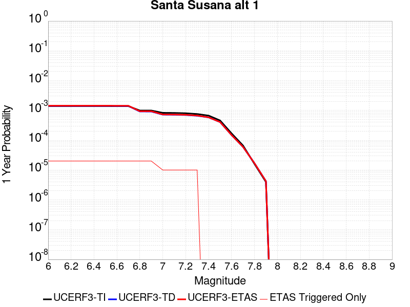 |  |

| Magnitude | 1 wk TI Prob | 1 wk TD Prob | 1 wk ETAS Prob | 1 wk ETAS/TD Gain | 1 wk ETAS Triggered Only | 1 mo TI Prob | 1 mo TD Prob | 1 mo ETAS Prob | 1 mo ETAS/TD Gain | 1 mo ETAS Triggered Only | 1 yr TI Prob | 1 yr TD Prob | 1 yr ETAS Prob | 1 yr ETAS/TD Gain | 1 yr ETAS Triggered Only | 10 yr TI Prob | 10 yr TD Prob | 10 yr ETAS Prob | 10 yr ETAS/TD Gain | 10 yr ETAS Triggered Only |
|-----|-----|-----|-----|-----|-----|-----|-----|-----|-----|-----|-----|-----|-----|-----|-----|-----|-----|-----|-----|-----|
| 6.0 | 2.674877E-5 | 2.7198214E-5 | 3.719794E-5 | 1.3676612 | 1.0E-5 | 1.1463255E-4 | 1.16559204E-4 | 1.2655804E-4 | 1.0857834 | 1.0E-5 | 0.0013947578 | 0.0014182981 | 0.0014382697 | 1.0140814 | 2.0E-5 | 0.013860362 | 0.014104388 | 0.014143824 | 1.002796 | 4.0E-5 |
| 6.1 | 2.674877E-5 | 2.7198214E-5 | 3.719794E-5 | 1.3676612 | 1.0E-5 | 1.1463255E-4 | 1.16559204E-4 | 1.2655804E-4 | 1.0857834 | 1.0E-5 | 0.0013947578 | 0.0014182981 | 0.0014382697 | 1.0140814 | 2.0E-5 | 0.013860362 | 0.014104388 | 0.014143824 | 1.002796 | 4.0E-5 |
| 6.2 | 2.674877E-5 | 2.7198214E-5 | 3.719794E-5 | 1.3676612 | 1.0E-5 | 1.1463255E-4 | 1.16559204E-4 | 1.2655804E-4 | 1.0857834 | 1.0E-5 | 0.0013947578 | 0.0014182981 | 0.0014382697 | 1.0140814 | 2.0E-5 | 0.013860362 | 0.014104388 | 0.014143824 | 1.002796 | 4.0E-5 |
| 6.3 | 2.674877E-5 | 2.7198214E-5 | 3.719794E-5 | 1.3676612 | 1.0E-5 | 1.1463255E-4 | 1.16559204E-4 | 1.2655804E-4 | 1.0857834 | 1.0E-5 | 0.0013947578 | 0.0014182981 | 0.0014382697 | 1.0140814 | 2.0E-5 | 0.013860362 | 0.014104388 | 0.014143824 | 1.002796 | 4.0E-5 |
| 6.4 | 2.674877E-5 | 2.7198214E-5 | 3.719794E-5 | 1.3676612 | 1.0E-5 | 1.1463255E-4 | 1.16559204E-4 | 1.2655804E-4 | 1.0857834 | 1.0E-5 | 0.0013947578 | 0.0014182981 | 0.0014382697 | 1.0140814 | 2.0E-5 | 0.013860362 | 0.014104388 | 0.014143824 | 1.002796 | 4.0E-5 |
| 6.5 | 2.674877E-5 | 2.7198214E-5 | 3.719794E-5 | 1.3676612 | 1.0E-5 | 1.1463255E-4 | 1.16559204E-4 | 1.2655804E-4 | 1.0857834 | 1.0E-5 | 0.0013947578 | 0.0014182981 | 0.0014382697 | 1.0140814 | 2.0E-5 | 0.013860362 | 0.014104388 | 0.014143824 | 1.002796 | 4.0E-5 |
| 6.6 | 2.6647976E-5 | 2.7074553E-5 | 3.7074282E-5 | 1.3693405 | 1.0E-5 | 1.14200615E-4 | 1.16029274E-4 | 1.2602811E-4 | 1.0861752 | 1.0E-5 | 0.0013895056 | 0.0014118546 | 0.0014318264 | 1.0141457 | 2.0E-5 | 0.013808494 | 0.014040773 | 0.0140802115 | 1.0028088 | 4.0E-5 |
| 6.7 | 2.6647976E-5 | 2.7074553E-5 | 3.7074282E-5 | 1.3693405 | 1.0E-5 | 1.14200615E-4 | 1.16029274E-4 | 1.2602811E-4 | 1.0861752 | 1.0E-5 | 0.0013895056 | 0.0014118546 | 0.0014318264 | 1.0141457 | 2.0E-5 | 0.013808494 | 0.014040773 | 0.0140802115 | 1.0028088 | 4.0E-5 |
| 6.8 | 1.9073179E-5 | 1.7637467E-5 | 2.763729E-5 | 1.5669649 | 1.0E-5 | 8.1739636E-5 | 7.558706E-5 | 8.5586296E-5 | 1.1322877 | 1.0E-5 | 9.947256E-4 | 9.19902E-4 | 9.398836E-4 | 1.0217215 | 2.0E-5 | 0.009902848 | 0.009163361 | 0.009193086 | 1.0032439 | 3.0E-5 |
| 6.9 | 1.9041876E-5 | 1.7619597E-5 | 2.7619422E-5 | 1.5675398 | 1.0E-5 | 8.160549E-5 | 7.551048E-5 | 8.5509724E-5 | 1.132422 | 1.0E-5 | 9.930939E-4 | 9.189705E-4 | 9.389521E-4 | 1.0217435 | 2.0E-5 | 0.0098866755 | 0.009154123 | 0.009183848 | 1.0032473 | 3.0E-5 |
| 7.0 | 1.5917482E-5 | 1.3864049E-5 | 2.386391E-5 | 1.72128 | 1.0E-5 | 6.8215995E-5 | 5.9416023E-5 | 6.941543E-5 | 1.1682948 | 1.0E-5 | 8.302132E-4 | 7.2315463E-4 | 7.3314743E-4 | 1.0138183 | 1.0E-5 | 0.008271185 | 0.0072090672 | 0.007228923 | 1.0027543 | 2.0E-5 |
| 7.1 | 1.577788E-5 | 1.3744056E-5 | 2.3743918E-5 | 1.7275773 | 1.0E-5 | 6.761774E-5 | 5.890179E-5 | 6.89012E-5 | 1.1697642 | 1.0E-5 | 8.2293496E-4 | 7.16898E-4 | 7.2689087E-4 | 1.013939 | 1.0E-5 | 0.008198941 | 0.0071469042 | 0.0071667614 | 1.0027784 | 2.0E-5 |
| 7.2 | 1.5416446E-5 | 1.34701295E-5 | 2.3469995E-5 | 1.7423733 | 1.0E-5 | 6.606882E-5 | 5.7727877E-5 | 6.77273E-5 | 1.1732166 | 1.0E-5 | 8.0409093E-4 | 7.026149E-4 | 7.1260787E-4 | 1.0142225 | 1.0E-5 | 0.008011877 | 0.0070049763 | 0.0070248363 | 1.0028352 | 2.0E-5 |
| 7.3 | 1.4534083E-5 | 1.2718032E-5 | 2.2717904E-5 | 1.7862751 | 1.0E-5 | 6.228744E-5 | 5.4504737E-5 | 6.450419E-5 | 1.1834604 | 1.0E-5 | 7.580857E-4 | 6.633976E-4 | 6.733909E-4 | 1.0150639 | 1.0E-5 | 0.007555048 | 0.0066151717 | 0.006635039 | 1.0030034 | 2.0E-5 |
| 7.4 | 1.2858995E-5 | 1.1229814E-5 | 1.1229814E-5 | 1.0 | 0.0 | 5.5108816E-5 | 4.812691E-5 | 4.812691E-5 | 1.0 | 0.0 | 6.7074323E-4 | 5.8579154E-4 | 5.8579154E-4 | 1.0 | 0.0 | 0.0066872234 | 0.0058433902 | 0.005853332 | 1.0017014 | 1.0E-5 |
| 7.5 | 8.827668E-6 | 7.805494E-6 | 7.805494E-6 | 1.0 | 0.0 | 3.7832317E-5 | 3.3451703E-5 | 3.3451703E-5 | 1.0 | 0.0 | 4.605111E-4 | 4.072008E-4 | 4.072008E-4 | 1.0 | 0.0 | 0.0045955796 | 0.0040648985 | 0.004074858 | 1.0024501 | 1.0E-5 |
| 7.6 | 3.2533426E-6 | 2.8720106E-6 | 2.8720106E-6 | 1.0 | 0.0 | 1.3942822E-5 | 1.230856E-5 | 1.230856E-5 | 1.0 | 0.0 | 1.6974064E-4 | 1.4984679E-4 | 1.4984679E-4 | 1.0 | 0.0 | 0.0016961104 | 0.0014974943 | 0.0014974943 | 1.0 | 0.0 |
| 7.7 | 1.2751709E-6 | 1.1491339E-6 | 1.1491339E-6 | 1.0 | 0.0 | 5.4650063E-6 | 4.9248506E-6 | 4.9248506E-6 | 1.0 | 0.0 | 6.653442E-5 | 5.99585E-5 | 5.99585E-5 | 1.0 | 0.0 | 6.6514505E-4 | 5.9943215E-4 | 5.9943215E-4 | 1.0 | 0.0 |
| 7.8 | 3.067544E-7 | 3.240052E-7 | 3.240052E-7 | 1.0 | 0.0 | 1.3146611E-6 | 1.3885931E-6 | 1.3885931E-6 | 1.0 | 0.0 | 1.600588E-5 | 1.6906E-5 | 1.6906E-5 | 1.0 | 0.0 | 1.6004729E-4 | 1.6904817E-4 | 1.6904817E-4 | 1.0 | 0.0 |
| 7.9 | 7.622999E-8 | 8.0879715E-8 | 8.0879715E-8 | 1.0 | 0.0 | 3.2669993E-7 | 3.4662733E-7 | 3.4662733E-7 | 1.0 | 0.0 | 3.977564E-6 | 4.220182E-6 | 4.220182E-6 | 1.0 | 0.0 | 3.977493E-5 | 4.2201224E-5 | 4.2201224E-5 | 1.0 | 0.0 |

## Puente Hills
*[(top)](#table-of-contents)*

| 1 Week | 1 Month | 1 Year | 10 Year |
|-----|-----|-----|-----|
|  |  |  |  |

| Magnitude | 1 wk TI Prob | 1 wk TD Prob | 1 wk ETAS Prob | 1 wk ETAS/TD Gain | 1 wk ETAS Triggered Only | 1 mo TI Prob | 1 mo TD Prob | 1 mo ETAS Prob | 1 mo ETAS/TD Gain | 1 mo ETAS Triggered Only | 1 yr TI Prob | 1 yr TD Prob | 1 yr ETAS Prob | 1 yr ETAS/TD Gain | 1 yr ETAS Triggered Only | 10 yr TI Prob | 10 yr TD Prob | 10 yr ETAS Prob | 10 yr ETAS/TD Gain | 10 yr ETAS Triggered Only |
|-----|-----|-----|-----|-----|-----|-----|-----|-----|-----|-----|-----|-----|-----|-----|-----|-----|-----|-----|-----|-----|
| 6.0 | 1.2101656E-5 | 8.098448E-6 | 1.8098368E-5 | 2.2347944 | 1.0E-5 | 5.1863204E-5 | 3.4707205E-5 | 5.470651E-5 | 1.5762292 | 2.0E-5 | 6.312516E-4 | 4.2248392E-4 | 4.424755E-4 | 1.047319 | 2.0E-5 | 0.0062946146 | 0.0042173676 | 0.004257199 | 1.0094446 | 4.0E-5 |
| 6.1 | 1.2101656E-5 | 8.098448E-6 | 1.8098368E-5 | 2.2347944 | 1.0E-5 | 5.1863204E-5 | 3.4707205E-5 | 5.470651E-5 | 1.5762292 | 2.0E-5 | 6.312516E-4 | 4.2248392E-4 | 4.424755E-4 | 1.047319 | 2.0E-5 | 0.0062946146 | 0.0042173676 | 0.004257199 | 1.0094446 | 4.0E-5 |
| 6.2 | 1.2101656E-5 | 8.098448E-6 | 1.8098368E-5 | 2.2347944 | 1.0E-5 | 5.1863204E-5 | 3.4707205E-5 | 5.470651E-5 | 1.5762292 | 2.0E-5 | 6.312516E-4 | 4.2248392E-4 | 4.424755E-4 | 1.047319 | 2.0E-5 | 0.0062946146 | 0.0042173676 | 0.004257199 | 1.0094446 | 4.0E-5 |
| 6.3 | 1.2101656E-5 | 8.098448E-6 | 1.8098368E-5 | 2.2347944 | 1.0E-5 | 5.1863204E-5 | 3.4707205E-5 | 5.470651E-5 | 1.5762292 | 2.0E-5 | 6.312516E-4 | 4.2248392E-4 | 4.424755E-4 | 1.047319 | 2.0E-5 | 0.0062946146 | 0.0042173676 | 0.004257199 | 1.0094446 | 4.0E-5 |
| 6.4 | 1.2101656E-5 | 8.098448E-6 | 1.8098368E-5 | 2.2347944 | 1.0E-5 | 5.1863204E-5 | 3.4707205E-5 | 5.470651E-5 | 1.5762292 | 2.0E-5 | 6.312516E-4 | 4.2248392E-4 | 4.424755E-4 | 1.047319 | 2.0E-5 | 0.0062946146 | 0.0042173676 | 0.004257199 | 1.0094446 | 4.0E-5 |
| 6.5 | 1.2101656E-5 | 8.098448E-6 | 1.8098368E-5 | 2.2347944 | 1.0E-5 | 5.1863204E-5 | 3.4707205E-5 | 5.470651E-5 | 1.5762292 | 2.0E-5 | 6.312516E-4 | 4.2248392E-4 | 4.424755E-4 | 1.047319 | 2.0E-5 | 0.0062946146 | 0.0042173676 | 0.004257199 | 1.0094446 | 4.0E-5 |
| 6.6 | 1.0222488E-5 | 6.399079E-6 | 1.6399015E-5 | 2.5627148 | 1.0E-5 | 4.3809923E-5 | 2.742435E-5 | 4.74238E-5 | 1.7292589 | 2.0E-5 | 5.332553E-4 | 3.3384276E-4 | 3.538361E-4 | 1.0598885 | 2.0E-5 | 0.0053197746 | 0.0033336577 | 0.0033735244 | 1.0119588 | 4.0E-5 |
| 6.7 | 1.0222488E-5 | 6.399079E-6 | 1.6399015E-5 | 2.5627148 | 1.0E-5 | 4.3809923E-5 | 2.742435E-5 | 4.74238E-5 | 1.7292589 | 2.0E-5 | 5.332553E-4 | 3.3384276E-4 | 3.538361E-4 | 1.0598885 | 2.0E-5 | 0.0053197746 | 0.0033336577 | 0.0033735244 | 1.0119588 | 4.0E-5 |
| 6.8 | 8.6367845E-6 | 5.028129E-6 | 5.028129E-6 | 1.0 | 0.0 | 3.7014266E-5 | 2.1548949E-5 | 3.1548734E-5 | 1.4640497 | 1.0E-5 | 4.505555E-4 | 2.6232743E-4 | 2.723248E-4 | 1.0381103 | 1.0E-5 | 0.004496431 | 0.002620234 | 0.0026501555 | 1.0114194 | 3.0E-5 |
| 6.9 | 8.066481E-6 | 4.8360116E-6 | 4.8360116E-6 | 1.0 | 0.0 | 3.4570177E-5 | 2.0725602E-5 | 3.0725394E-5 | 1.482485 | 1.0E-5 | 4.2081063E-4 | 2.523055E-4 | 2.62303E-4 | 1.0396245 | 1.0E-5 | 0.0042001465 | 0.0025202443 | 0.002550169 | 1.0118736 | 3.0E-5 |
| 7.0 | 7.393828E-6 | 4.4172275E-6 | 4.4172275E-6 | 1.0 | 0.0 | 3.168745E-5 | 1.8930841E-5 | 2.8930652E-5 | 1.5282285 | 1.0E-5 | 3.857264E-4 | 2.3045906E-4 | 2.4045675E-4 | 1.0433817 | 1.0E-5 | 0.0038505755 | 0.0023022462 | 0.002332177 | 1.0130007 | 3.0E-5 |
| 7.1 | 6.4660953E-6 | 3.8043859E-6 | 3.8043859E-6 | 1.0 | 0.0 | 2.7711543E-5 | 1.630441E-5 | 2.6304248E-5 | 1.613321 | 1.0E-5 | 3.373358E-4 | 1.9848847E-4 | 2.0848648E-4 | 1.0503708 | 1.0E-5 | 0.0033682417 | 0.0019831478 | 0.0020031082 | 1.010065 | 2.0E-5 |
| 7.2 | 5.143232E-6 | 2.7864896E-6 | 2.7864896E-6 | 1.0 | 0.0 | 2.2042237E-5 | 1.1942045E-5 | 2.1941925E-5 | 1.8373675 | 1.0E-5 | 2.6833118E-4 | 1.453848E-4 | 1.5538334E-4 | 1.068773 | 1.0E-5 | 0.002680074 | 0.0014529065 | 0.0014728775 | 1.0137455 | 2.0E-5 |
| 7.3 | 3.928255E-6 | 2.091338E-6 | 2.091338E-6 | 1.0 | 0.0 | 1.683527E-5 | 8.962847E-6 | 1.8962757E-5 | 2.115707 | 1.0E-5 | 2.0495013E-4 | 1.0911726E-4 | 1.1911617E-4 | 1.0916345 | 1.0E-5 | 0.002047612 | 0.0010906435 | 0.0011106217 | 1.0183178 | 2.0E-5 |
| 7.4 | 2.7894434E-6 | 1.3546429E-6 | 1.3546429E-6 | 1.0 | 0.0 | 1.1954703E-5 | 5.8056E-6 | 1.580554E-5 | 2.722465 | 1.0E-5 | 1.4553878E-4 | 7.068093E-5 | 8.068022E-5 | 1.1414709 | 1.0E-5 | 0.001454435 | 7.0658885E-4 | 7.2657474E-4 | 1.028285 | 2.0E-5 |
| 7.5 | 2.041735E-6 | 8.786996E-7 | 8.786996E-7 | 1.0 | 0.0 | 8.750263E-6 | 3.7658504E-6 | 1.3765813E-5 | 3.6554327 | 1.0E-5 | 1.06529245E-4 | 4.5848297E-5 | 5.584784E-5 | 1.2181007 | 1.0E-5 | 0.0010647819 | 4.5839173E-4 | 4.7838257E-4 | 1.0436108 | 2.0E-5 |
| 7.6 | 1.6959062E-6 | 6.698339E-7 | 6.698339E-7 | 1.0 | 0.0 | 7.268149E-6 | 2.8707138E-6 | 1.2870685E-5 | 4.483444 | 1.0E-5 | 8.848612E-5 | 3.4950408E-5 | 4.495006E-5 | 1.2861097 | 1.0E-5 | 8.84509E-4 | 3.4945202E-4 | 3.69445E-4 | 1.0572125 | 2.0E-5 |
| 7.7 | 1.4767965E-6 | 5.407146E-7 | 5.407146E-7 | 1.0 | 0.0 | 6.3291122E-6 | 2.3173466E-6 | 1.2317323E-5 | 5.3152704 | 1.0E-5 | 7.705422E-5 | 2.8213353E-5 | 3.821307E-5 | 1.3544321 | 1.0E-5 | 7.702751E-4 | 2.8210029E-4 | 2.9209748E-4 | 1.0354384 | 1.0E-5 |
| 7.8 | 1.8432911E-7 | 7.2811105E-8 | 7.2811105E-8 | 1.0 | 0.0 | 7.8998164E-7 | 3.1204758E-7 | 3.1204758E-7 | 1.0 | 0.0 | 9.617985E-6 | 3.799176E-6 | 3.799176E-6 | 1.0 | 0.0 | 9.617568E-5 | 3.7991435E-5 | 3.7991435E-5 | 1.0 | 0.0 |

## Superstition Hills
*[(top)](#table-of-contents)*

| 1 Week | 1 Month | 1 Year | 10 Year |
|-----|-----|-----|-----|
|  |  |  | 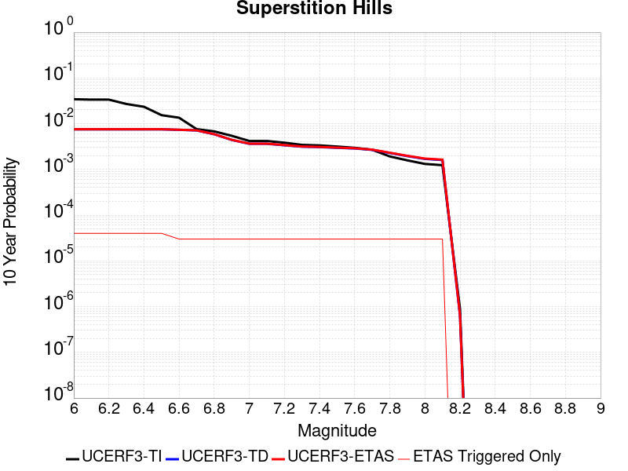 |

| Magnitude | 1 wk TI Prob | 1 wk TD Prob | 1 wk ETAS Prob | 1 wk ETAS/TD Gain | 1 wk ETAS Triggered Only | 1 mo TI Prob | 1 mo TD Prob | 1 mo ETAS Prob | 1 mo ETAS/TD Gain | 1 mo ETAS Triggered Only | 1 yr TI Prob | 1 yr TD Prob | 1 yr ETAS Prob | 1 yr ETAS/TD Gain | 1 yr ETAS Triggered Only | 10 yr TI Prob | 10 yr TD Prob | 10 yr ETAS Prob | 10 yr ETAS/TD Gain | 10 yr ETAS Triggered Only |
|-----|-----|-----|-----|-----|-----|-----|-----|-----|-----|-----|-----|-----|-----|-----|-----|-----|-----|-----|-----|-----|
| 6.0 | 6.6865185E-5 | 1.4137668E-5 | 1.4137668E-5 | 1.0 | 0.0 | 2.8653358E-4 | 6.058869E-5 | 7.058808E-5 | 1.1650373 | 1.0E-5 | 0.0034829667 | 7.374338E-4 | 7.474264E-4 | 1.0135505 | 1.0E-5 | 0.03428881 | 0.007520696 | 0.007560395 | 1.0052787 | 4.0E-5 |
| 6.1 | 6.544851E-5 | 1.4137668E-5 | 1.4137668E-5 | 1.0 | 0.0 | 2.8046346E-4 | 6.058869E-5 | 7.058808E-5 | 1.1650373 | 1.0E-5 | 0.0034092965 | 7.374338E-4 | 7.474264E-4 | 1.0135505 | 1.0E-5 | 0.033574644 | 0.0075206957 | 0.0075603947 | 1.0052787 | 4.0E-5 |
| 6.2 | 6.544851E-5 | 1.4137668E-5 | 1.4137668E-5 | 1.0 | 0.0 | 2.8046346E-4 | 6.058869E-5 | 7.058808E-5 | 1.1650373 | 1.0E-5 | 0.0034092965 | 7.374338E-4 | 7.474264E-4 | 1.0135505 | 1.0E-5 | 0.033574644 | 0.0075206957 | 0.0075603947 | 1.0052787 | 4.0E-5 |
| 6.3 | 5.2402065E-5 | 1.4137667E-5 | 1.4137667E-5 | 1.0 | 0.0 | 2.2456095E-4 | 6.0588685E-5 | 7.058808E-5 | 1.1650373 | 1.0E-5 | 0.0027306017 | 7.374338E-4 | 7.474264E-4 | 1.0135505 | 1.0E-5 | 0.02697292 | 0.0075206906 | 0.0075603896 | 1.0052787 | 4.0E-5 |
| 6.4 | 4.542238E-5 | 1.4137666E-5 | 1.4137666E-5 | 1.0 | 0.0 | 1.9465282E-4 | 6.058868E-5 | 7.0588074E-5 | 1.1650373 | 1.0E-5 | 0.0023673223 | 7.3743373E-4 | 7.4742635E-4 | 1.0135505 | 1.0E-5 | 0.023422617 | 0.007520688 | 0.0075603873 | 1.0052787 | 4.0E-5 |
| 6.5 | 2.9672969E-5 | 1.4137665E-5 | 1.4137665E-5 | 1.0 | 0.0 | 1.2716366E-4 | 6.0588678E-5 | 7.0588074E-5 | 1.1650374 | 1.0E-5 | 0.0015471181 | 7.374337E-4 | 7.474263E-4 | 1.0135505 | 1.0E-5 | 0.015363912 | 0.0075206826 | 0.007560382 | 1.0052787 | 4.0E-5 |
| 6.6 | 2.6056105E-5 | 1.3803436E-5 | 1.3803436E-5 | 1.0 | 0.0 | 1.1166424E-4 | 5.915633E-5 | 6.9155736E-5 | 1.1690336 | 1.0E-5 | 0.0013586642 | 7.200064E-4 | 7.299992E-4 | 1.0138788 | 1.0E-5 | 0.013503874 | 0.0073450673 | 0.0073748473 | 1.0040544 | 3.0E-5 |
| 6.7 | 1.4611248E-5 | 1.338333E-5 | 1.338333E-5 | 1.0 | 0.0 | 6.261813E-5 | 5.7355956E-5 | 6.735538E-5 | 1.1743398 | 1.0E-5 | 7.6210906E-4 | 6.9810095E-4 | 7.08094E-4 | 1.0143145 | 1.0E-5 | 0.0075950073 | 0.0071262526 | 0.007156039 | 1.0041798 | 3.0E-5 |
| 6.8 | 1.30607E-5 | 1.09787115E-5 | 1.09787115E-5 | 1.0 | 0.0 | 5.597323E-5 | 4.705082E-5 | 5.705035E-5 | 1.2125262 | 1.0E-5 | 6.8126095E-4 | 5.727019E-4 | 5.826962E-4 | 1.017451 | 1.0E-5 | 0.006791762 | 0.005873964 | 0.005903788 | 1.0050772 | 3.0E-5 |
| 6.9 | 1.0443096E-5 | 8.19507E-6 | 8.19507E-6 | 1.0 | 0.0 | 4.4755358E-5 | 3.512127E-5 | 4.512092E-5 | 1.2847178 | 1.0E-5 | 5.447602E-4 | 4.2751993E-4 | 4.3751564E-4 | 1.0233808 | 1.0E-5 | 0.005434267 | 0.004409497 | 0.0044393647 | 1.0067735 | 3.0E-5 |
| 7.0 | 8.045912E-6 | 6.739447E-6 | 6.739447E-6 | 1.0 | 0.0 | 3.4482026E-5 | 2.888303E-5 | 3.8882743E-5 | 1.346214 | 1.0E-5 | 4.197378E-4 | 3.5159517E-4 | 3.6159166E-4 | 1.0284318 | 1.0E-5 | 0.0041894587 | 0.0036335257 | 0.0036634167 | 1.0082264 | 3.0E-5 |
| 7.1 | 8.045912E-6 | 6.739447E-6 | 6.739447E-6 | 1.0 | 0.0 | 3.4482026E-5 | 2.888303E-5 | 3.8882743E-5 | 1.346214 | 1.0E-5 | 4.197378E-4 | 3.5159517E-4 | 3.6159166E-4 | 1.0284318 | 1.0E-5 | 0.0041894587 | 0.0036335257 | 0.0036634167 | 1.0082264 | 3.0E-5 |
| 7.2 | 7.375506E-6 | 6.2463805E-6 | 6.2463805E-6 | 1.0 | 0.0 | 3.1608928E-5 | 2.6769932E-5 | 3.6769663E-5 | 1.3735434 | 1.0E-5 | 3.8477074E-4 | 3.2587603E-4 | 3.3587278E-4 | 1.0306765 | 1.0E-5 | 0.003841052 | 0.0033741172 | 0.0034040161 | 1.0088612 | 3.0E-5 |
| 7.3 | 6.6063913E-6 | 5.798824E-6 | 5.798824E-6 | 1.0 | 0.0 | 2.8312797E-5 | 2.4851872E-5 | 3.4851622E-5 | 1.4023741 | 1.0E-5 | 3.446538E-4 | 3.0253024E-4 | 3.125272E-4 | 1.0330446 | 1.0E-5 | 0.0034411973 | 0.0031383524 | 0.0031682584 | 1.0095291 | 3.0E-5 |
| 7.4 | 6.4313126E-6 | 5.6802523E-6 | 5.6802523E-6 | 1.0 | 0.0 | 2.7562477E-5 | 2.4343715E-5 | 3.434347E-5 | 1.4107736 | 1.0E-5 | 3.355215E-4 | 2.963451E-4 | 3.0634215E-4 | 1.0337344 | 1.0E-5 | 0.0033501536 | 0.003076105 | 0.0031060125 | 1.0097226 | 3.0E-5 |
| 7.5 | 6.0742927E-6 | 5.476088E-6 | 5.476088E-6 | 1.0 | 0.0 | 2.6032423E-5 | 2.3468741E-5 | 3.3468506E-5 | 1.4260887 | 1.0E-5 | 3.1689866E-4 | 2.8569513E-4 | 2.956923E-4 | 1.0349923 | 1.0E-5 | 0.0031644711 | 0.0029679502 | 0.0029978612 | 1.010078 | 3.0E-5 |
| 7.6 | 5.6987187E-6 | 5.2943155E-6 | 5.2943155E-6 | 1.0 | 0.0 | 2.4422852E-5 | 2.268973E-5 | 3.2689502E-5 | 1.440718 | 1.0E-5 | 2.9730765E-4 | 2.762131E-4 | 2.8621033E-4 | 1.036194 | 1.0E-5 | 0.002969102 | 0.0028712032 | 0.002901117 | 1.0104185 | 3.0E-5 |
| 7.7 | 5.1658035E-6 | 4.925336E-6 | 4.925336E-6 | 1.0 | 0.0 | 2.2138971E-5 | 2.1108413E-5 | 3.1108204E-5 | 1.4737347 | 1.0E-5 | 2.6950863E-4 | 2.5696523E-4 | 2.6696266E-4 | 1.0389057 | 1.0E-5 | 0.00269182 | 0.0026763005 | 0.0027062201 | 1.0111794 | 3.0E-5 |
| 7.8 | 3.6864697E-6 | 4.1963563E-6 | 4.1963563E-6 | 1.0 | 0.0 | 1.579906E-5 | 1.7984263E-5 | 2.7984082E-5 | 1.5560317 | 1.0E-5 | 1.9233658E-4 | 2.1893687E-4 | 2.2893467E-4 | 1.0456653 | 1.0E-5 | 0.0019217018 | 0.0022895595 | 0.0023194908 | 1.013073 | 3.0E-5 |
| 7.9 | 3.0265903E-6 | 3.5636078E-6 | 3.5636078E-6 | 1.0 | 0.0 | 1.2971037E-5 | 1.5272519E-5 | 2.5272366E-5 | 1.6547608 | 1.0E-5 | 1.5791094E-4 | 1.8592748E-4 | 1.9592562E-4 | 1.0537744 | 1.0E-5 | 0.0015779877 | 0.0019537222 | 0.0019836635 | 1.0153253 | 3.0E-5 |
| 8.0 | 2.5271493E-6 | 3.0866524E-6 | 3.0866524E-6 | 1.0 | 0.0 | 1.0830595E-5 | 1.3228446E-5 | 2.3228313E-5 | 1.7559367 | 1.0E-5 | 1.3185451E-4 | 1.6104484E-4 | 1.7104323E-4 | 1.0620846 | 1.0E-5 | 0.0013177631 | 0.0016975543 | 0.0017275034 | 1.0176425 | 3.0E-5 |
| 8.1 | 2.3749135E-6 | 2.9172957E-6 | 2.9172957E-6 | 1.0 | 0.0 | 1.0178161E-5 | 1.2502638E-5 | 2.2502512E-5 | 1.7998213 | 1.0E-5 | 1.2391206E-4 | 1.522094E-4 | 1.6220787E-4 | 1.065689 | 1.0E-5 | 0.0012384299 | 0.0016051348 | 0.0016350866 | 1.0186601 | 3.0E-5 |
| 8.2 | 1.7186406E-9 | 1.1438838E-9 | 1.1438838E-9 | 1.0 | 0.0 | 7.3656024E-9 | 4.902359E-9 | 4.902359E-9 | 1.0 | 0.0 | 8.9676206E-8 | 5.968622E-8 | 5.968622E-8 | 1.0 | 0.0 | 8.9676166E-7 | 6.386644E-7 | 6.386644E-7 | 1.0 | 0.0 |

## Santa Cruz Catalina Ridge alt1
*[(top)](#table-of-contents)*

| 1 Week | 1 Month | 1 Year | 10 Year |
|-----|-----|-----|-----|
|  |  |  |  |

| Magnitude | 1 wk TI Prob | 1 wk TD Prob | 1 wk ETAS Prob | 1 wk ETAS/TD Gain | 1 wk ETAS Triggered Only | 1 mo TI Prob | 1 mo TD Prob | 1 mo ETAS Prob | 1 mo ETAS/TD Gain | 1 mo ETAS Triggered Only | 1 yr TI Prob | 1 yr TD Prob | 1 yr ETAS Prob | 1 yr ETAS/TD Gain | 1 yr ETAS Triggered Only | 10 yr TI Prob | 10 yr TD Prob | 10 yr ETAS Prob | 10 yr ETAS/TD Gain | 10 yr ETAS Triggered Only |
|-----|-----|-----|-----|-----|-----|-----|-----|-----|-----|-----|-----|-----|-----|-----|-----|-----|-----|-----|-----|-----|
| 6.0 | 3.2833184E-5 | 3.6558402E-5 | 5.655767E-5 | 1.5470499 | 2.0E-5 | 1.4070606E-4 | 1.5667039E-4 | 1.7666725E-4 | 1.1276366 | 2.0E-5 | 0.00171175 | 0.0019059594 | 0.0019259213 | 1.0104734 | 2.0E-5 | 0.016986247 | 0.018913032 | 0.018952277 | 1.002075 | 4.0E-5 |
| 6.1 | 1.9835548E-5 | 2.1659505E-5 | 4.1659074E-5 | 1.9233621 | 2.0E-5 | 8.500672E-5 | 9.282326E-5 | 1.12821406E-4 | 1.2154433 | 2.0E-5 | 0.0010344655 | 0.0011295575 | 0.001149535 | 1.017686 | 2.0E-5 | 0.010296632 | 0.011240296 | 0.011279846 | 1.0035186 | 4.0E-5 |
| 6.2 | 1.9835548E-5 | 2.1659505E-5 | 4.1659074E-5 | 1.9233621 | 2.0E-5 | 8.500672E-5 | 9.282326E-5 | 1.12821406E-4 | 1.2154433 | 2.0E-5 | 0.0010344655 | 0.0011295575 | 0.001149535 | 1.017686 | 2.0E-5 | 0.010296632 | 0.011240296 | 0.011279846 | 1.0035186 | 4.0E-5 |
| 6.3 | 1.5728183E-5 | 1.703395E-5 | 3.703361E-5 | 2.174106 | 2.0E-5 | 6.7404755E-5 | 7.300063E-5 | 9.299917E-5 | 1.2739502 | 2.0E-5 | 8.2034385E-4 | 8.884264E-4 | 9.084086E-4 | 1.0224917 | 2.0E-5 | 0.008173222 | 0.008849427 | 0.008889073 | 1.0044801 | 4.0E-5 |
| 6.4 | 1.5728183E-5 | 1.703395E-5 | 3.703361E-5 | 2.174106 | 2.0E-5 | 6.7404755E-5 | 7.300063E-5 | 9.299917E-5 | 1.2739502 | 2.0E-5 | 8.2034385E-4 | 8.884264E-4 | 9.084086E-4 | 1.0224917 | 2.0E-5 | 0.008173222 | 0.008849427 | 0.008889073 | 1.0044801 | 4.0E-5 |
| 6.5 | 1.3707734E-5 | 1.4794522E-5 | 3.4794226E-5 | 2.3518317 | 2.0E-5 | 5.8746107E-5 | 6.3403575E-5 | 8.34023E-5 | 1.3154197 | 2.0E-5 | 7.1499916E-4 | 7.716686E-4 | 7.916532E-4 | 1.0258979 | 2.0E-5 | 0.0071270303 | 0.0076902895 | 0.007729982 | 1.0051614 | 4.0E-5 |
| 6.6 | 1.2539813E-5 | 1.3510219E-5 | 3.350995E-5 | 2.480341 | 2.0E-5 | 5.3740947E-5 | 5.789967E-5 | 7.789851E-5 | 1.3454051 | 2.0E-5 | 6.540996E-4 | 7.0470315E-4 | 7.2468905E-4 | 1.0283607 | 2.0E-5 | 0.0065217763 | 0.0070249885 | 0.0070647076 | 1.005654 | 4.0E-5 |
| 6.7 | 1.1504083E-5 | 1.2377375E-5 | 3.2377127E-5 | 2.6158316 | 2.0E-5 | 4.930228E-5 | 5.3044827E-5 | 7.304377E-5 | 1.3770196 | 2.0E-5 | 6.0008996E-4 | 6.456314E-4 | 6.6561846E-4 | 1.0309575 | 2.0E-5 | 0.005984721 | 0.006437786 | 0.0064775283 | 1.0061734 | 4.0E-5 |
| 6.8 | 1.012739E-5 | 1.0877071E-5 | 3.0876854E-5 | 2.8387103 | 2.0E-5 | 4.340238E-5 | 4.6615194E-5 | 6.6614266E-5 | 1.4290247 | 2.0E-5 | 5.282958E-4 | 5.673937E-4 | 5.8738235E-4 | 1.0352288 | 2.0E-5 | 0.0052704164 | 0.0056596193 | 0.0056993933 | 1.0070276 | 4.0E-5 |
| 6.9 | 8.9607865E-6 | 9.609117E-6 | 1.960902E-5 | 2.0406682 | 1.0E-5 | 3.8402806E-5 | 4.1181287E-5 | 5.1180876E-5 | 1.2428187 | 1.0E-5 | 4.6745385E-4 | 5.012679E-4 | 5.1126286E-4 | 1.0199394 | 1.0E-5 | 0.0046647177 | 0.005001492 | 0.0050313417 | 1.0059682 | 3.0E-5 |
| 7.0 | 8.046829E-6 | 8.619746E-6 | 1.861966E-5 | 2.160117 | 1.0E-5 | 3.4485955E-5 | 3.694125E-5 | 4.694088E-5 | 1.2706901 | 1.0E-5 | 4.1978562E-4 | 4.496677E-4 | 4.5966322E-4 | 1.0222286 | 1.0E-5 | 0.004189935 | 0.0044876686 | 0.0045175343 | 1.006655 | 3.0E-5 |
| 7.1 | 7.136131E-6 | 7.637656E-6 | 1.763758E-5 | 2.3092923 | 1.0E-5 | 3.0583058E-5 | 3.2732405E-5 | 4.2732077E-5 | 1.3054976 | 1.0E-5 | 3.7228514E-4 | 3.9844486E-4 | 4.084409E-4 | 1.0250876 | 1.0E-5 | 0.0037166206 | 0.003977381 | 0.0040072617 | 1.0075127 | 3.0E-5 |
| 7.2 | 6.362014E-6 | 6.8049585E-6 | 1.680489E-5 | 2.4695067 | 1.0E-5 | 2.726549E-5 | 2.9163786E-5 | 3.9163493E-5 | 1.342881 | 1.0E-5 | 3.3190678E-4 | 3.550119E-4 | 3.6500834E-4 | 1.0281581 | 1.0E-5 | 0.0033141149 | 0.003544516 | 0.003564445 | 1.0056225 | 2.0E-5 |
| 7.3 | 5.004101E-6 | 5.351715E-6 | 1.5351661E-5 | 2.8685498 | 1.0E-5 | 2.1445969E-5 | 2.2935723E-5 | 3.293549E-5 | 1.435991 | 1.0E-5 | 2.6107338E-4 | 2.792072E-4 | 2.8920438E-4 | 1.0358057 | 1.0E-5 | 0.002607669 | 0.0027886187 | 0.0028085627 | 1.007152 | 2.0E-5 |
| 7.4 | 3.4901443E-6 | 3.7320526E-6 | 1.3732015E-5 | 3.6794808 | 1.0E-5 | 1.4957676E-5 | 1.5994416E-5 | 2.5994255E-5 | 1.6252083 | 1.0E-5 | 1.8209449E-4 | 1.9471499E-4 | 2.0471304E-4 | 1.0513471 | 1.0E-5 | 0.0018194534 | 0.0019454823 | 0.0019554629 | 1.0051302 | 1.0E-5 |
| 7.5 | 1.1215045E-6 | 1.189387E-6 | 1.189387E-6 | 1.0 | 0.0 | 4.806439E-6 | 5.097363E-6 | 5.097363E-6 | 1.0 | 0.0 | 5.851682E-5 | 6.205866E-5 | 6.205866E-5 | 1.0 | 0.0 | 5.850142E-4 | 6.2041637E-4 | 6.2041637E-4 | 1.0 | 0.0 |
| 7.6 | 2.8599047E-7 | 2.9951994E-7 | 2.9951994E-7 | 1.0 | 0.0 | 1.2256729E-6 | 1.2836562E-6 | 1.2836562E-6 | 1.0 | 0.0 | 1.4922465E-5 | 1.5628404E-5 | 1.5628404E-5 | 1.0 | 0.0 | 1.4921463E-4 | 1.5627318E-4 | 1.5627318E-4 | 1.0 | 0.0 |
| 7.7 | 2.0781519E-7 | 2.1744323E-7 | 2.1744323E-7 | 1.0 | 0.0 | 8.906362E-7 | 9.3189925E-7 | 9.3189925E-7 | 1.0 | 0.0 | 1.08434415E-5 | 1.13458145E-5 | 1.13458145E-5 | 1.0 | 0.0 | 1.0842913E-4 | 1.1345245E-4 | 1.1345245E-4 | 1.0 | 0.0 |
| 7.8 | 3.614776E-8 | 3.764102E-8 | 3.764102E-8 | 1.0 | 0.0 | 1.5491896E-7 | 1.6131864E-7 | 1.6131864E-7 | 1.0 | 0.0 | 1.8861368E-6 | 1.9640527E-6 | 1.9640527E-6 | 1.0 | 0.0 | 1.8861208E-5 | 1.9640367E-5 | 1.9640367E-5 | 1.0 | 0.0 |

## Ortigalita (North)
*[(top)](#table-of-contents)*

| 1 Week | 1 Month | 1 Year | 10 Year |
|-----|-----|-----|-----|
|  |  | 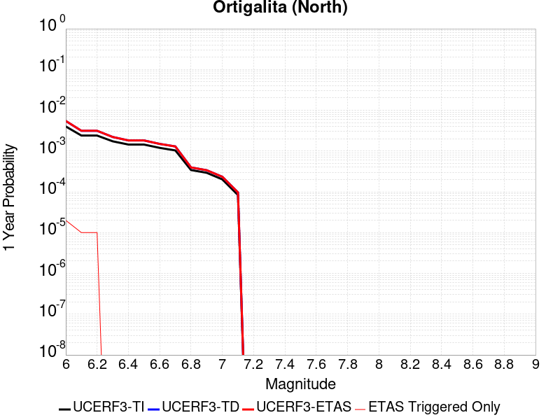 |  |

| Magnitude | 1 wk TI Prob | 1 wk TD Prob | 1 wk ETAS Prob | 1 wk ETAS/TD Gain | 1 wk ETAS Triggered Only | 1 mo TI Prob | 1 mo TD Prob | 1 mo ETAS Prob | 1 mo ETAS/TD Gain | 1 mo ETAS Triggered Only | 1 yr TI Prob | 1 yr TD Prob | 1 yr ETAS Prob | 1 yr ETAS/TD Gain | 1 yr ETAS Triggered Only | 10 yr TI Prob | 10 yr TD Prob | 10 yr ETAS Prob | 10 yr ETAS/TD Gain | 10 yr ETAS Triggered Only |
|-----|-----|-----|-----|-----|-----|-----|-----|-----|-----|-----|-----|-----|-----|-----|-----|-----|-----|-----|-----|-----|
| 6.0 | 7.711876E-5 | 1.0505308E-4 | 1.15052026E-4 | 1.09518 | 1.0E-5 | 3.3046713E-4 | 4.501601E-4 | 4.7015108E-4 | 1.0444087 | 2.0E-5 | 0.004016016 | 0.0054680547 | 0.0054879454 | 1.0036376 | 2.0E-5 | 0.039442103 | 0.053455614 | 0.053493474 | 1.0007083 | 4.0E-5 |
| 6.1 | 4.607858E-5 | 6.0239887E-5 | 7.0239286E-5 | 1.165993 | 1.0E-5 | 1.9746469E-4 | 2.5814763E-4 | 2.6814506E-4 | 1.0387275 | 1.0E-5 | 0.0024014818 | 0.0031387366 | 0.0031487052 | 1.003176 | 1.0E-5 | 0.023756953 | 0.030975312 | 0.030994693 | 1.0006257 | 2.0E-5 |
| 6.2 | 4.607858E-5 | 6.0239887E-5 | 7.0239286E-5 | 1.165993 | 1.0E-5 | 1.9746469E-4 | 2.5814763E-4 | 2.6814506E-4 | 1.0387275 | 1.0E-5 | 0.0024014818 | 0.0031387366 | 0.0031487052 | 1.003176 | 1.0E-5 | 0.023756953 | 0.030975312 | 0.030994693 | 1.0006257 | 2.0E-5 |
| 6.3 | 3.327423E-5 | 4.2476124E-5 | 4.2476124E-5 | 1.0 | 0.0 | 1.4259605E-4 | 1.8202956E-4 | 1.8202956E-4 | 1.0 | 0.0 | 0.0017347244 | 0.002214206 | 0.002214206 | 1.0 | 0.0 | 0.017212452 | 0.02194574 | 0.02195552 | 1.0004457 | 1.0E-5 |
| 6.4 | 2.7732503E-5 | 3.4999008E-5 | 3.4999008E-5 | 1.0 | 0.0 | 1.1884817E-4 | 1.499886E-4 | 1.499886E-4 | 1.0 | 0.0 | 0.001446016 | 0.0018248158 | 0.0018248158 | 1.0 | 0.0 | 0.014366428 | 0.018121297 | 0.018131116 | 1.0005418 | 1.0E-5 |
| 6.5 | 2.7689714E-5 | 3.4948822E-5 | 3.4948822E-5 | 1.0 | 0.0 | 1.186648E-4 | 1.4977354E-4 | 1.4977354E-4 | 1.0 | 0.0 | 0.0014437864 | 0.0018222018 | 0.0018222018 | 1.0 | 0.0 | 0.014344421 | 0.018095585 | 0.018105403 | 1.0005426 | 1.0E-5 |
| 6.6 | 2.2976905E-5 | 2.871829E-5 | 2.871829E-5 | 1.0 | 0.0 | 9.846873E-5 | 1.23074E-4 | 1.23074E-4 | 1.0 | 0.0 | 0.0011981975 | 0.0014976348 | 0.0014976348 | 1.0 | 0.0 | 0.011917574 | 0.014898733 | 0.014898733 | 1.0 | 0.0 |
| 6.7 | 1.9871539E-5 | 2.4904637E-5 | 2.4904637E-5 | 1.0 | 0.0 | 8.516096E-5 | 1.067312E-4 | 1.067312E-4 | 1.0 | 0.0 | 0.0010363415 | 0.0012989199 | 0.0012989199 | 1.0 | 0.0 | 0.010315218 | 0.012936938 | 0.012936938 | 1.0 | 0.0 |
| 6.8 | 6.5640475E-6 | 7.6054926E-6 | 7.6054926E-6 | 1.0 | 0.0 | 2.813133E-5 | 3.2594577E-5 | 3.2594577E-5 | 1.0 | 0.0 | 3.424451E-4 | 3.9676955E-4 | 3.9676955E-4 | 1.0 | 0.0 | 0.0034191788 | 0.003960899 | 0.003960899 | 1.0 | 0.0 |
| 6.9 | 5.6219683E-6 | 6.5018376E-6 | 6.5018376E-6 | 1.0 | 0.0 | 2.4093928E-5 | 2.7864735E-5 | 2.7864735E-5 | 1.0 | 0.0 | 2.933041E-4 | 3.3920293E-4 | 3.3920293E-4 | 1.0 | 0.0 | 0.0029291727 | 0.003387109 | 0.003387109 | 1.0 | 0.0 |
| 7.0 | 3.875591E-6 | 4.4847548E-6 | 4.4847548E-6 | 1.0 | 0.0 | 1.6609569E-5 | 1.9220248E-5 | 1.9220248E-5 | 1.0 | 0.0 | 2.0220275E-4 | 2.339835E-4 | 2.339835E-4 | 1.0 | 0.0 | 0.0020201886 | 0.0023375798 | 0.0023375798 | 1.0 | 0.0 |
| 7.1 | 1.6017933E-6 | 1.8570418E-6 | 1.8570418E-6 | 1.0 | 0.0 | 6.8648105E-6 | 7.958732E-6 | 7.958732E-6 | 1.0 | 0.0 | 8.357586E-5 | 9.689432E-5 | 9.689432E-5 | 1.0 | 0.0 | 8.3544437E-4 | 9.686254E-4 | 9.686254E-4 | 1.0 | 0.0 |

## Hayward (So) 2011 CFM
*[(top)](#table-of-contents)*

| 1 Week | 1 Month | 1 Year | 10 Year |
|-----|-----|-----|-----|
|  |  |  |  |

| Magnitude | 1 wk TI Prob | 1 wk TD Prob | 1 wk ETAS Prob | 1 wk ETAS/TD Gain | 1 wk ETAS Triggered Only | 1 mo TI Prob | 1 mo TD Prob | 1 mo ETAS Prob | 1 mo ETAS/TD Gain | 1 mo ETAS Triggered Only | 1 yr TI Prob | 1 yr TD Prob | 1 yr ETAS Prob | 1 yr ETAS/TD Gain | 1 yr ETAS Triggered Only | 10 yr TI Prob | 10 yr TD Prob | 10 yr ETAS Prob | 10 yr ETAS/TD Gain | 10 yr ETAS Triggered Only |
|-----|-----|-----|-----|-----|-----|-----|-----|-----|-----|-----|-----|-----|-----|-----|-----|-----|-----|-----|-----|-----|
| 6.0 | 1.8091932E-4 | 3.570673E-4 | 3.670637E-4 | 1.027996 | 1.0E-5 | 7.751381E-4 | 0.0015294008 | 0.0015393855 | 1.0065285 | 1.0E-5 | 0.00939654 | 0.018463885 | 0.018483516 | 1.0010632 | 2.0E-5 | 0.090090066 | 0.1667085 | 0.16673349 | 1.00015 | 3.0E-5 |
| 6.1 | 1.8091932E-4 | 3.570673E-4 | 3.670637E-4 | 1.027996 | 1.0E-5 | 7.751381E-4 | 0.0015294008 | 0.0015393855 | 1.0065285 | 1.0E-5 | 0.00939654 | 0.018463885 | 0.018483516 | 1.0010632 | 2.0E-5 | 0.090090066 | 0.1667085 | 0.16673349 | 1.00015 | 3.0E-5 |
| 6.2 | 1.8091932E-4 | 3.570673E-4 | 3.670637E-4 | 1.027996 | 1.0E-5 | 7.751381E-4 | 0.0015294008 | 0.0015393855 | 1.0065285 | 1.0E-5 | 0.00939654 | 0.018463885 | 0.018483516 | 1.0010632 | 2.0E-5 | 0.090090066 | 0.1667085 | 0.16673349 | 1.00015 | 3.0E-5 |
| 6.3 | 1.7322872E-4 | 3.4263515E-4 | 3.5263173E-4 | 1.0291755 | 1.0E-5 | 7.4219756E-4 | 0.0014676197 | 0.001477605 | 1.0068038 | 1.0E-5 | 0.0089988755 | 0.017724147 | 0.017743792 | 1.0011084 | 2.0E-5 | 0.08643075 | 0.16065954 | 0.16068472 | 1.0001568 | 3.0E-5 |
| 6.4 | 1.6334097E-4 | 3.2345165E-4 | 3.334484E-4 | 1.0309066 | 1.0E-5 | 6.998449E-4 | 0.0013854936 | 0.0013954798 | 1.0072076 | 1.0E-5 | 0.008487372 | 0.016739927 | 0.016759591 | 1.0011748 | 2.0E-5 | 0.081704415 | 0.15256606 | 0.15259148 | 1.0001667 | 3.0E-5 |
| 6.5 | 1.5600289E-4 | 3.101982E-4 | 3.2019507E-4 | 1.0322274 | 1.0E-5 | 6.684125E-4 | 0.0013287518 | 0.0013387385 | 1.0075159 | 1.0E-5 | 0.008107598 | 0.016059443 | 0.016079122 | 1.0012254 | 2.0E-5 | 0.078181036 | 0.14684291 | 0.14685997 | 1.0001162 | 2.0E-5 |
| 6.6 | 1.4046066E-4 | 2.8034003E-4 | 2.9033722E-4 | 1.035661 | 1.0E-5 | 6.018354E-4 | 0.0012009109 | 0.0012108989 | 1.008317 | 1.0E-5 | 0.0073027555 | 0.014524571 | 0.01454428 | 1.001357 | 2.0E-5 | 0.07067384 | 0.13393044 | 0.13394777 | 1.0001293 | 2.0E-5 |
| 6.7 | 1.14696966E-4 | 2.3272466E-4 | 2.4272234E-4 | 1.0429592 | 1.0E-5 | 4.914658E-4 | 9.970153E-4 | 0.0010070052 | 1.0100199 | 1.0E-5 | 0.0059671924 | 0.012072163 | 0.012082042 | 1.0008184 | 1.0E-5 | 0.058094822 | 0.11274141 | 0.112750284 | 1.0000787 | 1.0E-5 |
| 6.8 | 9.3874296E-5 | 1.8862431E-4 | 1.9862242E-4 | 1.0530055 | 1.0E-5 | 4.0225635E-4 | 8.081431E-4 | 8.1813504E-4 | 1.012364 | 1.0E-5 | 0.0048864787 | 0.009795489 | 0.009805392 | 1.0010109 | 1.0E-5 | 0.047804173 | 0.092592984 | 0.09260206 | 1.000098 | 1.0E-5 |
| 6.9 | 5.551852E-5 | 1.0729875E-4 | 1.1729768E-4 | 1.0931877 | 1.0E-5 | 2.3791482E-4 | 4.5977137E-4 | 4.6976676E-4 | 1.02174 | 1.0E-5 | 0.0028927654 | 0.005583468 | 0.0055934116 | 1.001781 | 1.0E-5 | 0.028553981 | 0.054246075 | 0.05425553 | 1.0001744 | 1.0E-5 |
| 7.0 | 4.2662363E-5 | 8.246792E-5 | 8.246792E-5 | 1.0 | 0.0 | 1.8282588E-4 | 3.5338648E-4 | 3.5338648E-4 | 1.0 | 0.0 | 0.0022236328 | 0.0042940658 | 0.0042940658 | 1.0 | 0.0 | 0.022015138 | 0.04206509 | 0.04206509 | 1.0 | 0.0 |
| 7.1 | 3.305886E-5 | 6.302183E-5 | 6.302183E-5 | 1.0 | 0.0 | 1.4167312E-4 | 2.7006568E-4 | 2.7006568E-4 | 1.0 | 0.0 | 0.0017235056 | 0.003283111 | 0.003283111 | 1.0 | 0.0 | 0.017101998 | 0.032453902 | 0.032453902 | 1.0 | 0.0 |
| 7.2 | 2.9856887E-5 | 5.701622E-5 | 5.701622E-5 | 1.0 | 0.0 | 1.2795182E-4 | 2.4433242E-4 | 2.4433242E-4 | 1.0 | 0.0 | 0.0015567001 | 0.0029707062 | 0.0029707062 | 1.0 | 0.0 | 0.015458403 | 0.029454801 | 0.029454801 | 1.0 | 0.0 |
| 7.3 | 2.4559737E-5 | 4.599286E-5 | 4.599286E-5 | 1.0 | 0.0 | 1.0525176E-4 | 1.9709744E-4 | 1.9709744E-4 | 1.0 | 0.0 | 0.0012806869 | 0.0023970334 | 0.0023970334 | 1.0 | 0.0 | 0.012733313 | 0.023858516 | 0.023858516 | 1.0 | 0.0 |
| 7.4 | 1.9002231E-5 | 3.505084E-5 | 3.505084E-5 | 1.0 | 0.0 | 8.143559E-5 | 1.502093E-4 | 1.502093E-4 | 1.0 | 0.0 | 9.910273E-4 | 0.001827274 | 0.001827274 | 1.0 | 0.0 | 0.009866194 | 0.018258808 | 0.018258808 | 1.0 | 0.0 |
| 7.5 | 1.2783333E-5 | 2.3331182E-5 | 2.3331182E-5 | 1.0 | 0.0 | 5.4784563E-5 | 9.998698E-5 | 9.998698E-5 | 1.0 | 0.0 | 6.667979E-4 | 0.0012166675 | 0.0012166675 | 1.0 | 0.0 | 0.006648007 | 0.012209443 | 0.012209443 | 1.0 | 0.0 |
| 7.6 | 4.8149627E-6 | 8.888056E-6 | 8.888056E-6 | 1.0 | 0.0 | 2.063539E-5 | 3.8091122E-5 | 3.8091122E-5 | 1.0 | 0.0 | 2.5120692E-4 | 4.6366194E-4 | 4.6366194E-4 | 1.0 | 0.0 | 0.0025092314 | 0.0046805087 | 0.0046805087 | 1.0 | 0.0 |
| 7.7 | 6.0838227E-7 | 1.205754E-6 | 1.205754E-6 | 1.0 | 0.0 | 2.6073499E-6 | 5.1675065E-6 | 5.1675065E-6 | 1.0 | 0.0 | 3.174402E-5 | 6.291258E-5 | 6.291258E-5 | 1.0 | 0.0 | 3.1739488E-4 | 6.5296254E-4 | 6.5296254E-4 | 1.0 | 0.0 |
| 7.8 | 4.5542808E-7 | 9.792941E-7 | 9.792941E-7 | 1.0 | 0.0 | 1.9518332E-6 | 4.196968E-6 | 4.196968E-6 | 1.0 | 0.0 | 2.376331E-5 | 5.109689E-5 | 5.109689E-5 | 1.0 | 0.0 | 2.3760769E-4 | 5.321693E-4 | 5.321693E-4 | 1.0 | 0.0 |
| 7.9 | 3.3016747E-7 | 7.3869535E-7 | 7.3869535E-7 | 1.0 | 0.0 | 1.4150027E-6 | 3.1658333E-6 | 3.1658333E-6 | 1.0 | 0.0 | 1.7227521E-5 | 3.854334E-5 | 3.854334E-5 | 1.0 | 0.0 | 1.7226185E-4 | 3.9932923E-4 | 3.9932923E-4 | 1.0 | 0.0 |
| 8.0 | 2.347038E-7 | 5.471963E-7 | 5.471963E-7 | 1.0 | 0.0 | 1.0058731E-6 | 2.3451248E-6 | 2.3451248E-6 | 1.0 | 0.0 | 1.2246436E-5 | 2.8551523E-5 | 2.8551523E-5 | 1.0 | 0.0 | 1.2245761E-4 | 2.9357258E-4 | 2.9357258E-4 | 1.0 | 0.0 |
| 8.1 | 1.18822804E-7 | 2.6060948E-7 | 2.6060948E-7 | 1.0 | 0.0 | 5.092405E-7 | 1.1168972E-6 | 1.1168972E-6 | 1.0 | 0.0 | 6.1999854E-6 | 1.359814E-5 | 1.359814E-5 | 1.0 | 0.0 | 6.199812E-5 | 1.3918082E-4 | 1.3918082E-4 | 1.0 | 0.0 |

## Pitas Point (Lower West)
*[(top)](#table-of-contents)*

| 1 Week | 1 Month | 1 Year | 10 Year |
|-----|-----|-----|-----|
| 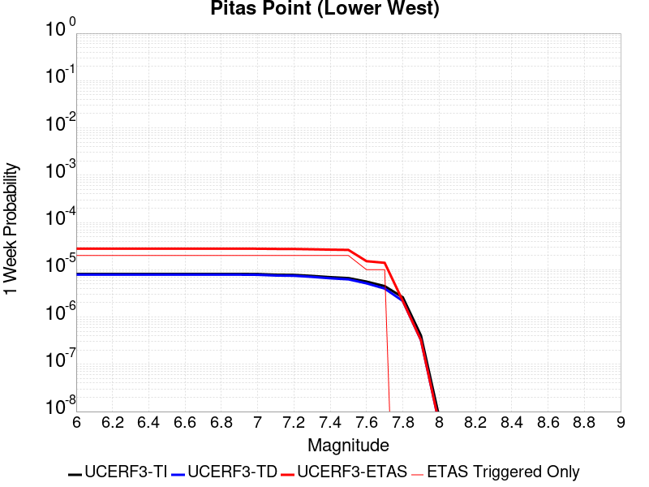 |  |  |  |

| Magnitude | 1 wk TI Prob | 1 wk TD Prob | 1 wk ETAS Prob | 1 wk ETAS/TD Gain | 1 wk ETAS Triggered Only | 1 mo TI Prob | 1 mo TD Prob | 1 mo ETAS Prob | 1 mo ETAS/TD Gain | 1 mo ETAS Triggered Only | 1 yr TI Prob | 1 yr TD Prob | 1 yr ETAS Prob | 1 yr ETAS/TD Gain | 1 yr ETAS Triggered Only | 10 yr TI Prob | 10 yr TD Prob | 10 yr ETAS Prob | 10 yr ETAS/TD Gain | 10 yr ETAS Triggered Only |
|-----|-----|-----|-----|-----|-----|-----|-----|-----|-----|-----|-----|-----|-----|-----|-----|-----|-----|-----|-----|-----|
| 6.0 | 8.151497E-6 | 7.855796E-6 | 2.785564E-5 | 3.545871 | 2.0E-5 | 3.493452E-5 | 3.3667267E-5 | 5.3666594E-5 | 1.5940288 | 2.0E-5 | 4.252448E-4 | 4.0982262E-4 | 4.3981033E-4 | 1.0731725 | 3.0E-5 | 0.0042443196 | 0.004090749 | 0.0041305856 | 1.0097382 | 4.0E-5 |
| 6.1 | 8.151497E-6 | 7.855796E-6 | 2.785564E-5 | 3.545871 | 2.0E-5 | 3.493452E-5 | 3.3667267E-5 | 5.3666594E-5 | 1.5940288 | 2.0E-5 | 4.252448E-4 | 4.0982262E-4 | 4.3981033E-4 | 1.0731725 | 3.0E-5 | 0.0042443196 | 0.004090749 | 0.0041305856 | 1.0097382 | 4.0E-5 |
| 6.2 | 8.151497E-6 | 7.855796E-6 | 2.785564E-5 | 3.545871 | 2.0E-5 | 3.493452E-5 | 3.3667267E-5 | 5.3666594E-5 | 1.5940288 | 2.0E-5 | 4.252448E-4 | 4.0982262E-4 | 4.3981033E-4 | 1.0731725 | 3.0E-5 | 0.0042443196 | 0.004090749 | 0.0041305856 | 1.0097382 | 4.0E-5 |
| 6.3 | 8.151497E-6 | 7.855796E-6 | 2.785564E-5 | 3.545871 | 2.0E-5 | 3.493452E-5 | 3.3667267E-5 | 5.3666594E-5 | 1.5940288 | 2.0E-5 | 4.252448E-4 | 4.0982262E-4 | 4.3981033E-4 | 1.0731725 | 3.0E-5 | 0.0042443196 | 0.004090749 | 0.0041305856 | 1.0097382 | 4.0E-5 |
| 6.4 | 8.151497E-6 | 7.855796E-6 | 2.785564E-5 | 3.545871 | 2.0E-5 | 3.493452E-5 | 3.3667267E-5 | 5.3666594E-5 | 1.5940288 | 2.0E-5 | 4.252448E-4 | 4.0982262E-4 | 4.3981033E-4 | 1.0731725 | 3.0E-5 | 0.0042443196 | 0.004090749 | 0.0041305856 | 1.0097382 | 4.0E-5 |
| 6.5 | 8.151497E-6 | 7.855796E-6 | 2.785564E-5 | 3.545871 | 2.0E-5 | 3.493452E-5 | 3.3667267E-5 | 5.3666594E-5 | 1.5940288 | 2.0E-5 | 4.252448E-4 | 4.0982262E-4 | 4.3981033E-4 | 1.0731725 | 3.0E-5 | 0.0042443196 | 0.004090749 | 0.0041305856 | 1.0097382 | 4.0E-5 |
| 6.6 | 8.151497E-6 | 7.855796E-6 | 2.785564E-5 | 3.545871 | 2.0E-5 | 3.493452E-5 | 3.3667267E-5 | 5.3666594E-5 | 1.5940288 | 2.0E-5 | 4.252448E-4 | 4.0982262E-4 | 4.3981033E-4 | 1.0731725 | 3.0E-5 | 0.0042443196 | 0.004090749 | 0.0041305856 | 1.0097382 | 4.0E-5 |
| 6.7 | 8.151497E-6 | 7.855796E-6 | 2.785564E-5 | 3.545871 | 2.0E-5 | 3.493452E-5 | 3.3667267E-5 | 5.3666594E-5 | 1.5940288 | 2.0E-5 | 4.252448E-4 | 4.0982262E-4 | 4.3981033E-4 | 1.0731725 | 3.0E-5 | 0.0042443196 | 0.004090749 | 0.0041305856 | 1.0097382 | 4.0E-5 |
| 6.8 | 8.151497E-6 | 7.855796E-6 | 2.785564E-5 | 3.545871 | 2.0E-5 | 3.493452E-5 | 3.3667267E-5 | 5.3666594E-5 | 1.5940288 | 2.0E-5 | 4.252448E-4 | 4.0982262E-4 | 4.3981033E-4 | 1.0731725 | 3.0E-5 | 0.0042443196 | 0.004090749 | 0.0041305856 | 1.0097382 | 4.0E-5 |
| 6.9 | 8.151497E-6 | 7.855796E-6 | 2.785564E-5 | 3.545871 | 2.0E-5 | 3.493452E-5 | 3.3667267E-5 | 5.3666594E-5 | 1.5940288 | 2.0E-5 | 4.252448E-4 | 4.0982262E-4 | 4.3981033E-4 | 1.0731725 | 3.0E-5 | 0.0042443196 | 0.004090749 | 0.0041305856 | 1.0097382 | 4.0E-5 |
| 7.0 | 8.103535E-6 | 7.805226E-6 | 2.780507E-5 | 3.5623658 | 2.0E-5 | 3.4728975E-5 | 3.3450542E-5 | 5.3449876E-5 | 1.5978776 | 2.0E-5 | 4.2274324E-4 | 4.07185E-4 | 4.3717277E-4 | 1.0736465 | 3.0E-5 | 0.0042193993 | 0.0040644696 | 0.004104307 | 1.0098014 | 4.0E-5 |
| 7.1 | 7.853298E-6 | 7.540917E-6 | 2.7540766E-5 | 3.6521773 | 2.0E-5 | 3.3656554E-5 | 3.2317817E-5 | 5.2317173E-5 | 1.6188337 | 2.0E-5 | 4.096915E-4 | 3.9339912E-4 | 4.233873E-4 | 1.0762284 | 3.0E-5 | 0.00408937 | 0.0039271032 | 0.003966946 | 1.0101457 | 4.0E-5 |
| 7.2 | 7.771102E-6 | 7.453199E-6 | 2.745305E-5 | 3.6833916 | 2.0E-5 | 3.33043E-5 | 3.1941894E-5 | 5.1941253E-5 | 1.626117 | 2.0E-5 | 4.0540437E-4 | 3.8882386E-4 | 4.1881218E-4 | 1.0771258 | 3.0E-5 | 0.0040466557 | 0.003881511 | 0.003921356 | 1.0102652 | 4.0E-5 |
| 7.3 | 7.3945344E-6 | 7.0493033E-6 | 2.7049162E-5 | 3.8371398 | 2.0E-5 | 3.1690477E-5 | 3.0210955E-5 | 5.021035E-5 | 1.6619915 | 2.0E-5 | 3.8576324E-4 | 3.677569E-4 | 3.9774587E-4 | 1.0815456 | 3.0E-5 | 0.0038509427 | 0.003671551 | 0.003711404 | 1.0108546 | 4.0E-5 |
| 7.4 | 6.964645E-6 | 6.5901527E-6 | 2.659002E-5 | 4.034811 | 2.0E-5 | 2.9848137E-5 | 2.8243208E-5 | 4.8242644E-5 | 1.7081149 | 2.0E-5 | 3.6334046E-4 | 3.438073E-4 | 3.7379697E-4 | 1.0872282 | 3.0E-5 | 0.0036274698 | 0.0034328073 | 0.00347267 | 1.0116123 | 4.0E-5 |
| 7.5 | 6.6525035E-6 | 6.259191E-6 | 2.6259066E-5 | 4.195281 | 2.0E-5 | 2.851042E-5 | 2.6824831E-5 | 4.6824294E-5 | 1.7455579 | 2.0E-5 | 3.4705905E-4 | 3.2654387E-4 | 3.5653406E-4 | 1.0918412 | 3.0E-5 | 0.0034651754 | 0.0032606919 | 0.0033005613 | 1.0122273 | 4.0E-5 |
| 7.6 | 5.613338E-6 | 5.15142E-6 | 1.5151369E-5 | 2.9412024 | 1.0E-5 | 2.405694E-5 | 2.2077327E-5 | 3.2077107E-5 | 1.4529433 | 1.0E-5 | 2.928539E-4 | 2.6875862E-4 | 2.8875325E-4 | 1.0743963 | 2.0E-5 | 0.0029246826 | 0.0026843674 | 0.0027043137 | 1.0074306 | 2.0E-5 |
| 7.7 | 4.494704E-6 | 3.996945E-6 | 1.3996905E-5 | 3.501901 | 1.0E-5 | 1.9262876E-5 | 1.7129652E-5 | 2.7129481E-5 | 1.583773 | 1.0E-5 | 2.3450027E-4 | 2.0853379E-4 | 2.185317E-4 | 1.0479438 | 1.0E-5 | 0.0023425296 | 0.0020834052 | 0.0020933843 | 1.0047898 | 1.0E-5 |
| 7.8 | 2.6075882E-6 | 2.1836663E-6 | 2.1836663E-6 | 1.0 | 0.0 | 1.117533E-5 | 9.358537E-6 | 9.358537E-6 | 1.0 | 0.0 | 1.3605114E-4 | 1.1393427E-4 | 1.1393427E-4 | 1.0 | 0.0 | 0.0013596788 | 0.0011387634 | 0.0011387634 | 1.0 | 0.0 |
| 7.9 | 4.045984E-7 | 3.2424057E-7 | 3.2424057E-7 | 1.0 | 0.0 | 1.733992E-6 | 1.3896017E-6 | 1.3896017E-6 | 1.0 | 0.0 | 2.1111147E-5 | 1.6918271E-5 | 1.6918271E-5 | 1.0 | 0.0 | 2.1109142E-4 | 1.6917015E-4 | 1.6917015E-4 | 1.0 | 0.0 |
| 8.0 | 7.791402E-9 | 5.6836056E-9 | 5.6836056E-9 | 1.0 | 0.0 | 3.3391725E-8 | 2.4358311E-8 | 2.4358311E-8 | 1.0 | 0.0 | 4.0654416E-7 | 2.965624E-7 | 2.965624E-7 | 1.0 | 0.0 | 4.065434E-6 | 2.9656223E-6 | 2.9656223E-6 | 1.0 | 0.0 |

## Elsinore (Temecula) rev
*[(top)](#table-of-contents)*

| 1 Week | 1 Month | 1 Year | 10 Year |
|-----|-----|-----|-----|
| 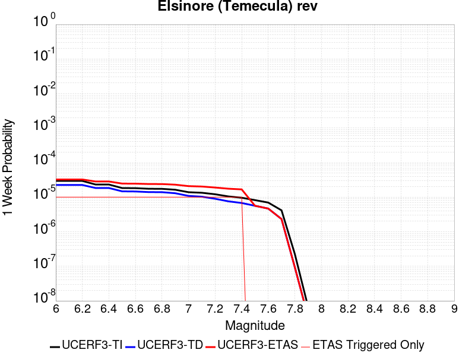 | 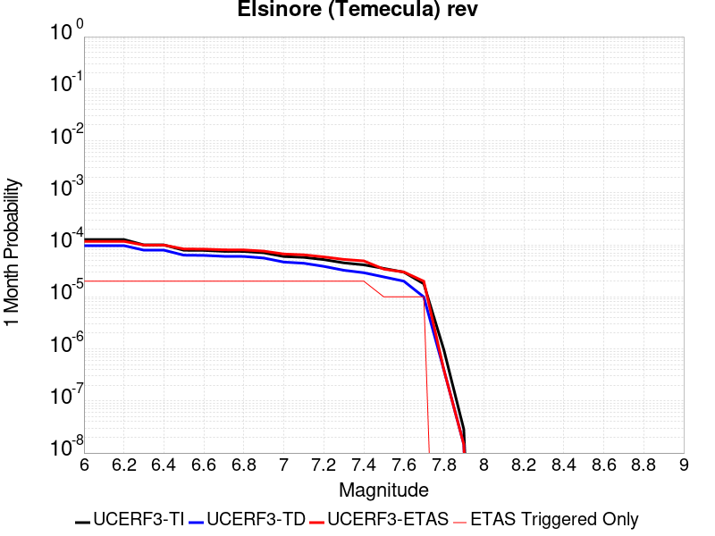 | 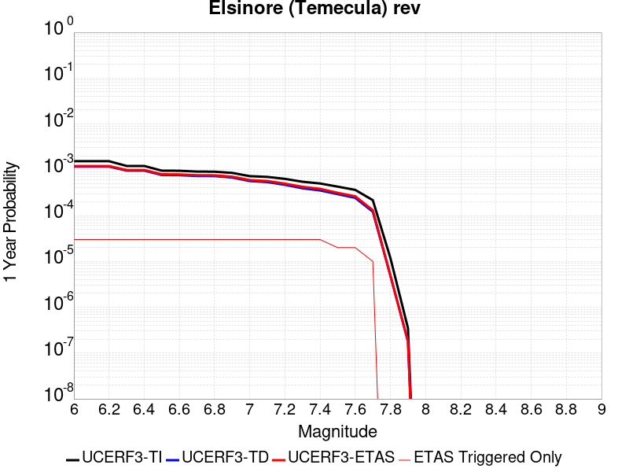 |  |

| Magnitude | 1 wk TI Prob | 1 wk TD Prob | 1 wk ETAS Prob | 1 wk ETAS/TD Gain | 1 wk ETAS Triggered Only | 1 mo TI Prob | 1 mo TD Prob | 1 mo ETAS Prob | 1 mo ETAS/TD Gain | 1 mo ETAS Triggered Only | 1 yr TI Prob | 1 yr TD Prob | 1 yr ETAS Prob | 1 yr ETAS/TD Gain | 1 yr ETAS Triggered Only | 10 yr TI Prob | 10 yr TD Prob | 10 yr ETAS Prob | 10 yr ETAS/TD Gain | 10 yr ETAS Triggered Only |
|-----|-----|-----|-----|-----|-----|-----|-----|-----|-----|-----|-----|-----|-----|-----|-----|-----|-----|-----|-----|-----|
| 6.0 | 2.9514995E-5 | 2.251887E-5 | 3.2518645E-5 | 1.444062 | 1.0E-5 | 1.264867E-4 | 9.6505995E-5 | 1.1650407E-4 | 1.207221 | 2.0E-5 | 0.0015388876 | 0.0011743492 | 0.001204314 | 1.025516 | 3.0E-5 | 0.015282745 | 0.011688135 | 0.011727667 | 1.0033823 | 4.0E-5 |
| 6.1 | 2.9514995E-5 | 2.251887E-5 | 3.2518645E-5 | 1.444062 | 1.0E-5 | 1.264867E-4 | 9.6505995E-5 | 1.1650407E-4 | 1.207221 | 2.0E-5 | 0.0015388876 | 0.0011743492 | 0.001204314 | 1.025516 | 3.0E-5 | 0.015282745 | 0.011688135 | 0.011727667 | 1.0033823 | 4.0E-5 |
| 6.2 | 2.9514995E-5 | 2.251887E-5 | 3.2518645E-5 | 1.444062 | 1.0E-5 | 1.264867E-4 | 9.6505995E-5 | 1.1650407E-4 | 1.207221 | 2.0E-5 | 0.0015388876 | 0.0011743492 | 0.001204314 | 1.025516 | 3.0E-5 | 0.015282745 | 0.011688135 | 0.011727667 | 1.0033823 | 4.0E-5 |
| 6.3 | 2.3223649E-5 | 1.840822E-5 | 2.8408034E-5 | 1.5432256 | 1.0E-5 | 9.952613E-5 | 7.889008E-5 | 9.88885E-5 | 1.2534972 | 2.0E-5 | 0.001211057 | 9.600807E-4 | 9.900519E-4 | 1.0312173 | 3.0E-5 | 0.012044783 | 0.009551284 | 0.009590901 | 1.0041479 | 4.0E-5 |
| 6.4 | 2.3223649E-5 | 1.840822E-5 | 2.8408034E-5 | 1.5432256 | 1.0E-5 | 9.952613E-5 | 7.889008E-5 | 9.88885E-5 | 1.2534972 | 2.0E-5 | 0.001211057 | 9.600807E-4 | 9.900519E-4 | 1.0312173 | 3.0E-5 | 0.012044783 | 0.009551284 | 0.009590901 | 1.0041479 | 4.0E-5 |
| 6.5 | 1.8338875E-5 | 1.4750074E-5 | 2.4749927E-5 | 1.6779526 | 1.0E-5 | 7.8592806E-5 | 6.321312E-5 | 8.321185E-5 | 1.31637 | 2.0E-5 | 9.5644733E-4 | 7.6935673E-4 | 7.993337E-4 | 1.0389636 | 3.0E-5 | 0.009523412 | 0.0076699676 | 0.0077096606 | 1.0051751 | 4.0E-5 |
| 6.6 | 1.8223333E-5 | 1.461263E-5 | 2.4612484E-5 | 1.6843295 | 1.0E-5 | 7.809766E-5 | 6.26241E-5 | 8.262285E-5 | 1.3193458 | 2.0E-5 | 9.504242E-4 | 7.621905E-4 | 7.921676E-4 | 1.0393302 | 3.0E-5 | 0.009463696 | 0.007598796 | 0.007638492 | 1.005224 | 4.0E-5 |
| 6.7 | 1.7512752E-5 | 1.4026963E-5 | 2.4026822E-5 | 1.7129027 | 1.0E-5 | 7.505249E-5 | 6.0114216E-5 | 8.0113015E-5 | 1.33268 | 2.0E-5 | 9.13381E-4 | 7.316534E-4 | 7.6163147E-4 | 1.0409731 | 3.0E-5 | 0.00909636 | 0.0072983317 | 0.0073380396 | 1.0054407 | 4.0E-5 |
| 6.8 | 1.7417142E-5 | 1.395093E-5 | 2.395079E-5 | 1.716788 | 1.0E-5 | 7.4642754E-5 | 5.978838E-5 | 7.978718E-5 | 1.3344932 | 2.0E-5 | 9.083966E-4 | 7.27689E-4 | 7.576672E-4 | 1.0411963 | 3.0E-5 | 0.009046922 | 0.007259359 | 0.007299069 | 1.0054702 | 4.0E-5 |
| 6.9 | 1.6402591E-5 | 1.29883665E-5 | 2.2988237E-5 | 1.7699097 | 1.0E-5 | 7.0294926E-5 | 5.5663284E-5 | 7.5662174E-5 | 1.3592833 | 2.0E-5 | 8.5550465E-4 | 6.774974E-4 | 7.074771E-4 | 1.0442506 | 3.0E-5 | 0.008522186 | 0.0067598647 | 0.006799594 | 1.0058773 | 4.0E-5 |
| 7.0 | 1.3912486E-5 | 1.0878067E-5 | 2.0877958E-5 | 1.919271 | 1.0E-5 | 5.9623577E-5 | 4.661947E-5 | 6.661854E-5 | 1.4289854 | 2.0E-5 | 7.2567526E-4 | 5.674469E-4 | 5.974299E-4 | 1.0528383 | 3.0E-5 | 0.0072331014 | 0.0056635314 | 0.005703305 | 1.0070227 | 4.0E-5 |
| 7.1 | 1.3405147E-5 | 1.0327192E-5 | 2.0327088E-5 | 1.9683074 | 1.0E-5 | 5.7449364E-5 | 4.4258657E-5 | 6.425777E-5 | 1.451869 | 2.0E-5 | 6.9922156E-4 | 5.3871854E-4 | 5.6870235E-4 | 1.0556577 | 3.0E-5 | 0.0069702556 | 0.005377366 | 0.005417151 | 1.0073986 | 4.0E-5 |
| 7.2 | 1.21402E-5 | 8.996479E-6 | 1.8996388E-5 | 2.111536 | 1.0E-5 | 5.202839E-5 | 3.8555776E-5 | 5.8555004E-5 | 1.5187091 | 2.0E-5 | 6.332616E-4 | 4.6931725E-4 | 4.9930316E-4 | 1.0638926 | 3.0E-5 | 0.0063146 | 0.0046847262 | 0.004724539 | 1.0084984 | 4.0E-5 |
| 7.3 | 1.05047775E-5 | 7.571515E-6 | 1.757144E-5 | 2.3207295 | 1.0E-5 | 4.5019697E-5 | 3.2448956E-5 | 5.2448308E-5 | 1.6163327 | 2.0E-5 | 5.4797693E-4 | 3.9499588E-4 | 4.2498403E-4 | 1.0759201 | 3.0E-5 | 0.005466277 | 0.003943348 | 0.00398319 | 1.0101037 | 4.0E-5 |
| 7.4 | 9.624483E-6 | 6.786621E-6 | 1.6786553E-5 | 2.4734774 | 1.0E-5 | 4.124713E-5 | 2.90852E-5 | 4.9084618E-5 | 1.6876149 | 2.0E-5 | 5.0206814E-4 | 3.5405616E-4 | 3.8404553E-4 | 1.0847024 | 3.0E-5 | 0.005009353 | 0.0035350726 | 0.0035649664 | 1.0084563 | 3.0E-5 |
| 7.5 | 8.215151E-6 | 5.6353133E-6 | 5.6353133E-6 | 1.0 | 0.0 | 3.5207315E-5 | 2.4151126E-5 | 3.4150886E-5 | 1.4140494 | 1.0E-5 | 4.2856473E-4 | 2.9400157E-4 | 3.1399567E-4 | 1.0680069 | 2.0E-5 | 0.004277392 | 0.002936254 | 0.0029561953 | 1.0067914 | 2.0E-5 |
| 7.6 | 6.975058E-6 | 4.675836E-6 | 4.675836E-6 | 1.0 | 0.0 | 2.9892764E-5 | 2.003915E-5 | 3.003895E-5 | 1.4990132 | 1.0E-5 | 3.6388362E-4 | 2.439505E-4 | 2.6394564E-4 | 1.0819639 | 2.0E-5 | 0.0036328835 | 0.0024369434 | 0.0024568946 | 1.008187 | 2.0E-5 |
| 7.7 | 4.159604E-6 | 2.326789E-6 | 2.326789E-6 | 1.0 | 0.0 | 1.7826753E-5 | 9.971919E-6 | 1.997182E-5 | 2.002806 | 1.0E-5 | 2.1701909E-4 | 1.2140209E-4 | 1.3140087E-4 | 1.0823609 | 1.0E-5 | 0.0021680726 | 0.0012134308 | 0.0012234186 | 1.008231 | 1.0E-5 |
| 7.8 | 2.2692414E-7 | 9.384417E-8 | 9.384417E-8 | 1.0 | 0.0 | 9.725317E-7 | 4.0218927E-7 | 4.0218927E-7 | 1.0 | 0.0 | 1.1840509E-5 | 4.8966467E-6 | 4.8966467E-6 | 1.0 | 0.0 | 1.1839878E-4 | 4.8965718E-5 | 4.8965718E-5 | 1.0 | 0.0 |
| 7.9 | 6.676829E-9 | 3.4397174E-9 | 3.4397174E-9 | 1.0 | 0.0 | 2.861498E-8 | 1.4741646E-8 | 1.4741646E-8 | 1.0 | 0.0 | 3.4838732E-7 | 1.7947953E-7 | 1.7947953E-7 | 1.0 | 0.0 | 3.4838679E-6 | 1.794794E-6 | 1.794794E-6 | 1.0 | 0.0 |

## Emerson-Copper Mtn 2011
*[(top)](#table-of-contents)*

| 1 Week | 1 Month | 1 Year | 10 Year |
|-----|-----|-----|-----|
|  |  |  |  |

| Magnitude | 1 wk TI Prob | 1 wk TD Prob | 1 wk ETAS Prob | 1 wk ETAS/TD Gain | 1 wk ETAS Triggered Only | 1 mo TI Prob | 1 mo TD Prob | 1 mo ETAS Prob | 1 mo ETAS/TD Gain | 1 mo ETAS Triggered Only | 1 yr TI Prob | 1 yr TD Prob | 1 yr ETAS Prob | 1 yr ETAS/TD Gain | 1 yr ETAS Triggered Only | 10 yr TI Prob | 10 yr TD Prob | 10 yr ETAS Prob | 10 yr ETAS/TD Gain | 10 yr ETAS Triggered Only |
|-----|-----|-----|-----|-----|-----|-----|-----|-----|-----|-----|-----|-----|-----|-----|-----|-----|-----|-----|-----|-----|
| 6.0 | 2.1364202E-5 | 9.967999E-6 | 1.99679E-5 | 2.0032003 | 1.0E-5 | 9.1557646E-5 | 4.2719344E-5 | 5.271892E-5 | 1.234076 | 1.0E-5 | 0.0011141442 | 5.1999267E-4 | 5.2998745E-4 | 1.0192211 | 1.0E-5 | 0.011085749 | 0.0051886286 | 0.005228421 | 1.0076692 | 4.0E-5 |
| 6.1 | 2.1364202E-5 | 9.967999E-6 | 1.99679E-5 | 2.0032003 | 1.0E-5 | 9.1557646E-5 | 4.2719344E-5 | 5.271892E-5 | 1.234076 | 1.0E-5 | 0.0011141442 | 5.1999267E-4 | 5.2998745E-4 | 1.0192211 | 1.0E-5 | 0.011085749 | 0.0051886286 | 0.005228421 | 1.0076692 | 4.0E-5 |
| 6.2 | 2.1364202E-5 | 9.967999E-6 | 1.99679E-5 | 2.0032003 | 1.0E-5 | 9.1557646E-5 | 4.2719344E-5 | 5.271892E-5 | 1.234076 | 1.0E-5 | 0.0011141442 | 5.1999267E-4 | 5.2998745E-4 | 1.0192211 | 1.0E-5 | 0.011085749 | 0.0051886286 | 0.005228421 | 1.0076692 | 4.0E-5 |
| 6.3 | 1.7751237E-5 | 8.089109E-6 | 1.8089027E-5 | 2.2362201 | 1.0E-5 | 7.607452E-5 | 3.4667184E-5 | 4.4666835E-5 | 1.2884473 | 1.0E-5 | 9.258136E-4 | 4.2199748E-4 | 4.3199325E-4 | 1.0236868 | 1.0E-5 | 0.00921966 | 0.004212584 | 0.004252415 | 1.0094553 | 4.0E-5 |
| 6.4 | 1.7751237E-5 | 8.089109E-6 | 1.8089027E-5 | 2.2362201 | 1.0E-5 | 7.607452E-5 | 3.4667184E-5 | 4.4666835E-5 | 1.2884473 | 1.0E-5 | 9.258136E-4 | 4.2199748E-4 | 4.3199325E-4 | 1.0236868 | 1.0E-5 | 0.00921966 | 0.004212584 | 0.004252415 | 1.0094553 | 4.0E-5 |
| 6.5 | 1.5886664E-5 | 6.6037437E-6 | 1.6603677E-5 | 2.5142825 | 1.0E-5 | 6.808392E-5 | 2.830148E-5 | 3.8301197E-5 | 1.3533285 | 1.0E-5 | 8.286065E-4 | 3.4452073E-4 | 3.5451728E-4 | 1.0290158 | 1.0E-5 | 0.008255237 | 0.0034403303 | 0.0034801927 | 1.0115868 | 4.0E-5 |
| 6.6 | 1.5886664E-5 | 6.6037437E-6 | 1.6603677E-5 | 2.5142825 | 1.0E-5 | 6.808392E-5 | 2.830148E-5 | 3.8301197E-5 | 1.3533285 | 1.0E-5 | 8.286065E-4 | 3.4452073E-4 | 3.5451728E-4 | 1.0290158 | 1.0E-5 | 0.008255237 | 0.0034403303 | 0.0034801927 | 1.0115868 | 4.0E-5 |
| 6.7 | 1.428471E-5 | 5.4703055E-6 | 1.547025E-5 | 2.8280416 | 1.0E-5 | 6.121875E-5 | 2.3443978E-5 | 3.3443743E-5 | 1.4265388 | 1.0E-5 | 7.450834E-4 | 2.8539696E-4 | 2.9539413E-4 | 1.0350289 | 1.0E-5 | 0.007425902 | 0.0028506925 | 0.0028905785 | 1.0139917 | 4.0E-5 |
| 6.8 | 1.3490684E-5 | 5.0735894E-6 | 1.5073539E-5 | 2.9709811 | 1.0E-5 | 5.7815934E-5 | 2.1743796E-5 | 3.1743577E-5 | 1.4598913 | 1.0E-5 | 7.0368167E-4 | 2.6470242E-4 | 2.7469976E-4 | 1.0377682 | 1.0E-5 | 0.007014576 | 0.002644252 | 0.0026841464 | 1.0150871 | 4.0E-5 |
| 6.9 | 1.2235421E-5 | 4.289545E-6 | 1.4289501E-5 | 3.3312397 | 1.0E-5 | 5.2436466E-5 | 1.8383655E-5 | 2.838347E-5 | 1.5439515 | 1.0E-5 | 6.38227E-4 | 2.238016E-4 | 2.3379936E-4 | 1.0446725 | 1.0E-5 | 0.0063639707 | 0.0022361164 | 0.002276027 | 1.0178481 | 4.0E-5 |
| 7.0 | 1.1009851E-5 | 3.7188345E-6 | 1.3718797E-5 | 3.6890047 | 1.0E-5 | 4.7184225E-5 | 1.5937783E-5 | 2.5937625E-5 | 1.6274298 | 1.0E-5 | 5.743165E-4 | 1.9402867E-4 | 2.0402674E-4 | 1.0515288 | 1.0E-5 | 0.005728345 | 0.0019389305 | 0.001978853 | 1.02059 | 4.0E-5 |
| 7.1 | 9.726373E-6 | 3.2115693E-6 | 1.3211537E-5 | 4.1137323 | 1.0E-5 | 4.168379E-5 | 1.3763814E-5 | 2.3763678E-5 | 1.7265328 | 1.0E-5 | 5.07382E-4 | 1.6756494E-4 | 1.7756326E-4 | 1.0596683 | 1.0E-5 | 0.0050622504 | 0.0016747171 | 0.0017146501 | 1.0238446 | 4.0E-5 |
| 7.2 | 3.9335127E-6 | 1.1524114E-6 | 1.11524E-5 | 9.677446 | 1.0E-5 | 1.6857803E-5 | 4.9388973E-6 | 1.4938848E-5 | 3.0247335 | 1.0E-5 | 2.0522442E-4 | 6.0129474E-5 | 7.012887E-5 | 1.1662978 | 1.0E-5 | 0.00205035 | 6.01138E-4 | 6.4111396E-4 | 1.0665004 | 4.0E-5 |
| 7.3 | 2.661632E-6 | 6.91098E-7 | 6.91098E-7 | 1.0 | 0.0 | 1.14069435E-5 | 2.9618452E-6 | 2.9618452E-6 | 1.0 | 0.0 | 1.3887069E-4 | 3.605988E-5 | 3.605988E-5 | 1.0 | 0.0 | 0.0013878393 | 3.6054134E-4 | 3.905305E-4 | 1.0831782 | 3.0E-5 |
| 7.4 | 2.0893426E-6 | 5.4614605E-7 | 5.4614605E-7 | 1.0 | 0.0 | 8.954295E-6 | 2.340624E-6 | 2.340624E-6 | 1.0 | 0.0 | 1.0901308E-4 | 2.8496728E-5 | 2.8496728E-5 | 1.0 | 0.0 | 0.0010895962 | 2.849313E-4 | 2.9492844E-4 | 1.0350862 | 1.0E-5 |
| 7.5 | 1.1681728E-6 | 3.6028484E-7 | 3.6028484E-7 | 1.0 | 0.0 | 5.0064455E-6 | 1.544077E-6 | 1.544077E-6 | 1.0 | 0.0 | 6.0951766E-5 | 1.879898E-5 | 1.879898E-5 | 1.0 | 0.0 | 6.093505E-4 | 1.8797436E-4 | 1.8797436E-4 | 1.0 | 0.0 |
| 7.6 | 1.3154387E-7 | 7.1196716E-8 | 7.1196716E-8 | 1.0 | 0.0 | 5.6375933E-7 | 3.0512876E-7 | 3.0512876E-7 | 1.0 | 0.0 | 6.863748E-6 | 3.714938E-6 | 3.714938E-6 | 1.0 | 0.0 | 6.863536E-5 | 3.7148915E-5 | 3.7148915E-5 | 1.0 | 0.0 |

## Mono Lake 2011 CFM
*[(top)](#table-of-contents)*

| 1 Week | 1 Month | 1 Year | 10 Year |
|-----|-----|-----|-----|
|  |  |  |  |

| Magnitude | 1 wk TI Prob | 1 wk TD Prob | 1 wk ETAS Prob | 1 wk ETAS/TD Gain | 1 wk ETAS Triggered Only | 1 mo TI Prob | 1 mo TD Prob | 1 mo ETAS Prob | 1 mo ETAS/TD Gain | 1 mo ETAS Triggered Only | 1 yr TI Prob | 1 yr TD Prob | 1 yr ETAS Prob | 1 yr ETAS/TD Gain | 1 yr ETAS Triggered Only | 10 yr TI Prob | 10 yr TD Prob | 10 yr ETAS Prob | 10 yr ETAS/TD Gain | 10 yr ETAS Triggered Only |
|-----|-----|-----|-----|-----|-----|-----|-----|-----|-----|-----|-----|-----|-----|-----|-----|-----|-----|-----|-----|-----|
| 6.0 | 2.0341662E-5 | 2.3828192E-5 | 3.3827953E-5 | 1.4196609 | 1.0E-5 | 8.717564E-5 | 1.0211982E-4 | 1.12118796E-4 | 1.0979142 | 1.0E-5 | 0.0010608466 | 0.0012431308 | 0.0012631059 | 1.0160685 | 2.0E-5 | 0.010557966 | 0.012413842 | 0.012453345 | 1.0031822 | 4.0E-5 |
| 6.1 | 2.0341662E-5 | 2.3828192E-5 | 3.3827953E-5 | 1.4196609 | 1.0E-5 | 8.717564E-5 | 1.0211982E-4 | 1.12118796E-4 | 1.0979142 | 1.0E-5 | 0.0010608466 | 0.0012431308 | 0.0012631059 | 1.0160685 | 2.0E-5 | 0.010557966 | 0.012413842 | 0.012453345 | 1.0031822 | 4.0E-5 |
| 6.2 | 2.0341662E-5 | 2.3828192E-5 | 3.3827953E-5 | 1.4196609 | 1.0E-5 | 8.717564E-5 | 1.0211982E-4 | 1.12118796E-4 | 1.0979142 | 1.0E-5 | 0.0010608466 | 0.0012431308 | 0.0012631059 | 1.0160685 | 2.0E-5 | 0.010557966 | 0.012413842 | 0.012453345 | 1.0031822 | 4.0E-5 |
| 6.3 | 2.0341662E-5 | 2.3828192E-5 | 3.3827953E-5 | 1.4196609 | 1.0E-5 | 8.717564E-5 | 1.0211982E-4 | 1.12118796E-4 | 1.0979142 | 1.0E-5 | 0.0010608466 | 0.0012431308 | 0.0012631059 | 1.0160685 | 2.0E-5 | 0.010557966 | 0.012413842 | 0.012453345 | 1.0031822 | 4.0E-5 |
| 6.4 | 1.749821E-5 | 2.049101E-5 | 3.0490804E-5 | 1.4880089 | 1.0E-5 | 7.499018E-5 | 8.781861E-5 | 9.7817734E-5 | 1.1138611 | 1.0E-5 | 9.1262296E-4 | 0.0010691914 | 0.00108917 | 1.0186857 | 2.0E-5 | 0.009088841 | 0.01069187 | 0.010721549 | 1.0027759 | 3.0E-5 |
| 6.5 | 1.749821E-5 | 2.049101E-5 | 3.0490804E-5 | 1.4880089 | 1.0E-5 | 7.499018E-5 | 8.781861E-5 | 9.7817734E-5 | 1.1138611 | 1.0E-5 | 9.1262296E-4 | 0.0010691914 | 0.00108917 | 1.0186857 | 2.0E-5 | 0.009088841 | 0.01069187 | 0.010721549 | 1.0027759 | 3.0E-5 |

## Elsinore (Stepovers Combined)
*[(top)](#table-of-contents)*

| 1 Week | 1 Month | 1 Year | 10 Year |
|-----|-----|-----|-----|
|  |  | 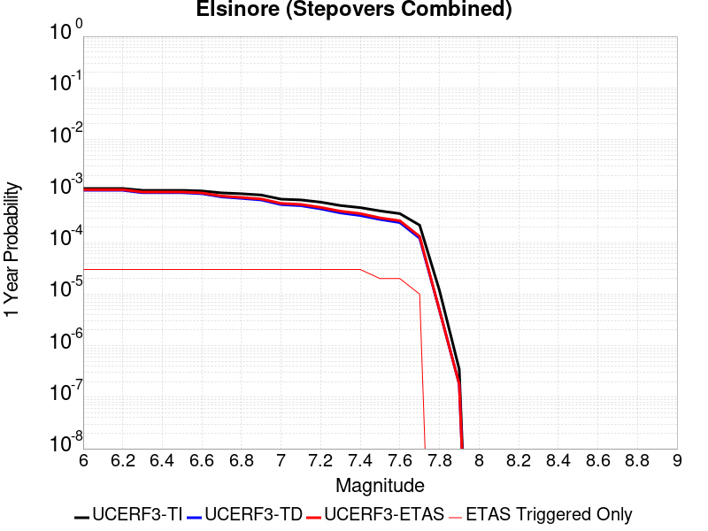 | 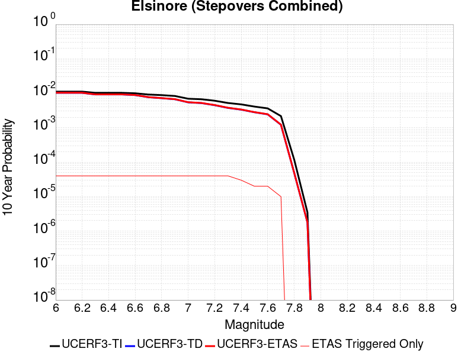 |

| Magnitude | 1 wk TI Prob | 1 wk TD Prob | 1 wk ETAS Prob | 1 wk ETAS/TD Gain | 1 wk ETAS Triggered Only | 1 mo TI Prob | 1 mo TD Prob | 1 mo ETAS Prob | 1 mo ETAS/TD Gain | 1 mo ETAS Triggered Only | 1 yr TI Prob | 1 yr TD Prob | 1 yr ETAS Prob | 1 yr ETAS/TD Gain | 1 yr ETAS Triggered Only | 10 yr TI Prob | 10 yr TD Prob | 10 yr ETAS Prob | 10 yr ETAS/TD Gain | 10 yr ETAS Triggered Only |
|-----|-----|-----|-----|-----|-----|-----|-----|-----|-----|-----|-----|-----|-----|-----|-----|-----|-----|-----|-----|-----|
| 6.0 | 2.144392E-5 | 1.976007E-5 | 2.9759873E-5 | 1.5060611 | 1.0E-5 | 9.189928E-5 | 8.468338E-5 | 1.0468168E-4 | 1.2361538 | 2.0E-5 | 0.0011182994 | 0.0010305515 | 0.0010605205 | 1.0290806 | 3.0E-5 | 0.011126885 | 0.010264617 | 0.010304207 | 1.0038569 | 4.0E-5 |
| 6.1 | 2.144392E-5 | 1.976007E-5 | 2.9759873E-5 | 1.5060611 | 1.0E-5 | 9.189928E-5 | 8.468338E-5 | 1.0468168E-4 | 1.2361538 | 2.0E-5 | 0.0011182994 | 0.0010305515 | 0.0010605205 | 1.0290806 | 3.0E-5 | 0.011126885 | 0.010264617 | 0.010304207 | 1.0038569 | 4.0E-5 |
| 6.2 | 2.144392E-5 | 1.976007E-5 | 2.9759873E-5 | 1.5060611 | 1.0E-5 | 9.189928E-5 | 8.468338E-5 | 1.0468168E-4 | 1.2361538 | 2.0E-5 | 0.0011182994 | 0.0010305515 | 0.0010605205 | 1.0290806 | 3.0E-5 | 0.011126885 | 0.010264617 | 0.010304207 | 1.0038569 | 4.0E-5 |
| 6.3 | 1.9751555E-5 | 1.7741326E-5 | 2.7741147E-5 | 1.5636457 | 1.0E-5 | 8.4646774E-5 | 7.603211E-5 | 9.603059E-5 | 1.2630267 | 2.0E-5 | 0.0010300872 | 9.25312E-4 | 9.552842E-4 | 1.0323915 | 3.0E-5 | 0.010253254 | 0.0092209745 | 0.009260606 | 1.004298 | 4.0E-5 |
| 6.4 | 1.9751555E-5 | 1.7741326E-5 | 2.7741147E-5 | 1.5636457 | 1.0E-5 | 8.4646774E-5 | 7.603211E-5 | 9.603059E-5 | 1.2630267 | 2.0E-5 | 0.0010300872 | 9.25312E-4 | 9.552842E-4 | 1.0323915 | 3.0E-5 | 0.010253254 | 0.0092209745 | 0.009260606 | 1.004298 | 4.0E-5 |
| 6.5 | 1.9751555E-5 | 1.7741326E-5 | 2.7741147E-5 | 1.5636457 | 1.0E-5 | 8.4646774E-5 | 7.603211E-5 | 9.603059E-5 | 1.2630267 | 2.0E-5 | 0.0010300872 | 9.25312E-4 | 9.552842E-4 | 1.0323915 | 3.0E-5 | 0.010253254 | 0.0092209745 | 0.009260606 | 1.004298 | 4.0E-5 |
| 6.6 | 1.9188685E-5 | 1.7003247E-5 | 2.7003076E-5 | 1.588113 | 1.0E-5 | 8.2234634E-5 | 7.2869116E-5 | 9.286765E-5 | 1.2744447 | 2.0E-5 | 0.0010007467 | 8.8683655E-4 | 9.1680995E-4 | 1.0337981 | 3.0E-5 | 0.00996252 | 0.008839546 | 0.008879192 | 1.0044851 | 4.0E-5 |
| 6.7 | 1.7608272E-5 | 1.4732402E-5 | 2.4732255E-5 | 1.6787659 | 1.0E-5 | 7.546184E-5 | 6.313739E-5 | 8.313613E-5 | 1.3167495 | 2.0E-5 | 9.183606E-4 | 7.684364E-4 | 7.9841336E-4 | 1.0390103 | 3.0E-5 | 0.009145746 | 0.007664441 | 0.0077041346 | 1.0051789 | 4.0E-5 |
| 6.8 | 1.697165E-5 | 1.3783126E-5 | 2.3782988E-5 | 1.7255148 | 1.0E-5 | 7.273361E-5 | 5.906925E-5 | 7.906807E-5 | 1.3385656 | 2.0E-5 | 8.8517193E-4 | 7.189395E-4 | 7.489179E-4 | 1.0416981 | 3.0E-5 | 0.008816543 | 0.0071722106 | 0.007211924 | 1.005537 | 4.0E-5 |
| 6.9 | 1.600365E-5 | 1.2846429E-5 | 2.2846301E-5 | 1.7784164 | 1.0E-5 | 6.858527E-5 | 5.5055007E-5 | 7.5053904E-5 | 1.363253 | 2.0E-5 | 8.347058E-4 | 6.700963E-4 | 7.000762E-4 | 1.0447397 | 3.0E-5 | 0.008315775 | 0.006686422 | 0.0067261546 | 1.0059422 | 4.0E-5 |
| 7.0 | 1.3314581E-5 | 1.044738E-5 | 2.0447276E-5 | 1.9571677 | 1.0E-5 | 5.7061243E-5 | 4.4773733E-5 | 6.477284E-5 | 1.4466705 | 2.0E-5 | 6.944992E-4 | 5.449866E-4 | 5.749702E-4 | 1.0550172 | 3.0E-5 | 0.006923327 | 0.005440055 | 0.005479838 | 1.0073129 | 4.0E-5 |
| 7.1 | 1.2865345E-5 | 9.937339E-6 | 1.993724E-5 | 2.0062954 | 1.0E-5 | 5.5136024E-5 | 4.258792E-5 | 6.258707E-5 | 1.4695967 | 2.0E-5 | 6.710743E-4 | 5.1838707E-4 | 5.483715E-4 | 1.0578418 | 3.0E-5 | 0.0066905143 | 0.005175021 | 0.005214814 | 1.0076895 | 4.0E-5 |
| 7.2 | 1.1650051E-5 | 8.633585E-6 | 1.8633498E-5 | 2.1582575 | 1.0E-5 | 4.9927836E-5 | 3.7000562E-5 | 5.6999823E-5 | 1.5405123 | 2.0E-5 | 6.0770183E-4 | 4.503905E-4 | 4.80377E-4 | 1.0665789 | 3.0E-5 | 0.0060604266 | 0.00449624 | 0.0045360606 | 1.0088563 | 4.0E-5 |
| 7.3 | 1.0008533E-5 | 7.2008215E-6 | 1.720075E-5 | 2.3887205 | 1.0E-5 | 4.2893007E-5 | 3.0860305E-5 | 5.085969E-5 | 1.6480618 | 2.0E-5 | 5.220972E-4 | 3.756609E-4 | 4.0564963E-4 | 1.0798292 | 3.0E-5 | 0.005208723 | 0.0037506663 | 0.0037905162 | 1.0106248 | 4.0E-5 |
| 7.4 | 9.116759E-6 | 6.409854E-6 | 1.640979E-5 | 2.560088 | 1.0E-5 | 3.907124E-5 | 2.7470522E-5 | 4.746997E-5 | 1.7280332 | 2.0E-5 | 4.7558855E-4 | 3.3440365E-4 | 3.643936E-4 | 1.089682 | 3.0E-5 | 0.00474572 | 0.0033391542 | 0.003369054 | 1.0089543 | 3.0E-5 |
| 7.5 | 7.870524E-6 | 5.382316E-6 | 5.382316E-6 | 1.0 | 0.0 | 3.3730383E-5 | 2.306687E-5 | 3.306664E-5 | 1.4335122 | 1.0E-5 | 4.1059E-4 | 2.8080423E-4 | 3.0079862E-4 | 1.071204 | 2.0E-5 | 0.0040983222 | 0.0028046207 | 0.0028245647 | 1.0071111 | 2.0E-5 |
| 7.6 | 6.9774537E-6 | 4.677398E-6 | 4.677398E-6 | 1.0 | 0.0 | 2.990303E-5 | 2.0045845E-5 | 3.0045645E-5 | 1.4988465 | 1.0E-5 | 3.640086E-4 | 2.44032E-4 | 2.6402713E-4 | 1.0819365 | 2.0E-5 | 0.003634129 | 0.0024377564 | 0.0024577077 | 1.0081843 | 2.0E-5 |
| 7.7 | 4.1616954E-6 | 2.3281368E-6 | 2.3281368E-6 | 1.0 | 0.0 | 1.7835715E-5 | 9.977695E-6 | 1.9977595E-5 | 2.0022254 | 1.0E-5 | 2.171282E-4 | 1.2147242E-4 | 1.314712E-4 | 1.0823132 | 1.0E-5 | 0.0021691616 | 0.0012141332 | 0.0012241211 | 1.0082263 | 1.0E-5 |
| 7.8 | 2.2692414E-7 | 9.384417E-8 | 9.384417E-8 | 1.0 | 0.0 | 9.725317E-7 | 4.0218927E-7 | 4.0218927E-7 | 1.0 | 0.0 | 1.1840509E-5 | 4.8966467E-6 | 4.8966467E-6 | 1.0 | 0.0 | 1.1839878E-4 | 4.8965718E-5 | 4.8965718E-5 | 1.0 | 0.0 |
| 7.9 | 6.676829E-9 | 3.4397174E-9 | 3.4397174E-9 | 1.0 | 0.0 | 2.861498E-8 | 1.4741646E-8 | 1.4741646E-8 | 1.0 | 0.0 | 3.4838732E-7 | 1.7947953E-7 | 1.7947953E-7 | 1.0 | 0.0 | 3.4838679E-6 | 1.794794E-6 | 1.794794E-6 | 1.0 | 0.0 |

## Newport-Inglewood alt 1
*[(top)](#table-of-contents)*

| 1 Week | 1 Month | 1 Year | 10 Year |
|-----|-----|-----|-----|
|  |  |  |  |

| Magnitude | 1 wk TI Prob | 1 wk TD Prob | 1 wk ETAS Prob | 1 wk ETAS/TD Gain | 1 wk ETAS Triggered Only | 1 mo TI Prob | 1 mo TD Prob | 1 mo ETAS Prob | 1 mo ETAS/TD Gain | 1 mo ETAS Triggered Only | 1 yr TI Prob | 1 yr TD Prob | 1 yr ETAS Prob | 1 yr ETAS/TD Gain | 1 yr ETAS Triggered Only | 10 yr TI Prob | 10 yr TD Prob | 10 yr ETAS Prob | 10 yr ETAS/TD Gain | 10 yr ETAS Triggered Only |
|-----|-----|-----|-----|-----|-----|-----|-----|-----|-----|-----|-----|-----|-----|-----|-----|-----|-----|-----|-----|-----|
| 6.0 | 2.9668912E-5 | 3.0404828E-5 | 3.0404828E-5 | 1.0 | 0.0 | 1.2714628E-4 | 1.3030265E-4 | 1.4030134E-4 | 1.0767344 | 1.0E-5 | 0.0015469068 | 0.0015857654 | 0.0015957495 | 1.0062962 | 1.0E-5 | 0.015361829 | 0.01579211 | 0.015821636 | 1.0018697 | 3.0E-5 |
| 6.1 | 2.9668912E-5 | 3.0404828E-5 | 3.0404828E-5 | 1.0 | 0.0 | 1.2714628E-4 | 1.3030265E-4 | 1.4030134E-4 | 1.0767344 | 1.0E-5 | 0.0015469068 | 0.0015857654 | 0.0015957495 | 1.0062962 | 1.0E-5 | 0.015361829 | 0.01579211 | 0.015821636 | 1.0018697 | 3.0E-5 |
| 6.2 | 2.9668912E-5 | 3.0404828E-5 | 3.0404828E-5 | 1.0 | 0.0 | 1.2714628E-4 | 1.3030265E-4 | 1.4030134E-4 | 1.0767344 | 1.0E-5 | 0.0015469068 | 0.0015857654 | 0.0015957495 | 1.0062962 | 1.0E-5 | 0.015361829 | 0.01579211 | 0.015821636 | 1.0018697 | 3.0E-5 |
| 6.3 | 2.9668912E-5 | 3.0404828E-5 | 3.0404828E-5 | 1.0 | 0.0 | 1.2714628E-4 | 1.3030265E-4 | 1.4030134E-4 | 1.0767344 | 1.0E-5 | 0.0015469068 | 0.0015857654 | 0.0015957495 | 1.0062962 | 1.0E-5 | 0.015361829 | 0.01579211 | 0.015821636 | 1.0018697 | 3.0E-5 |
| 6.4 | 1.275942E-5 | 1.02725335E-5 | 1.02725335E-5 | 1.0 | 0.0 | 5.4682085E-5 | 4.4024422E-5 | 5.402398E-5 | 1.2271366 | 1.0E-5 | 6.65551E-4 | 5.358697E-4 | 5.4586434E-4 | 1.0186512 | 1.0E-5 | 0.0066356123 | 0.0053462 | 0.005366093 | 1.003721 | 2.0E-5 |
| 6.5 | 1.275942E-5 | 1.02725335E-5 | 1.02725335E-5 | 1.0 | 0.0 | 5.4682085E-5 | 4.4024422E-5 | 5.402398E-5 | 1.2271366 | 1.0E-5 | 6.65551E-4 | 5.358697E-4 | 5.4586434E-4 | 1.0186512 | 1.0E-5 | 0.0066356123 | 0.0053462 | 0.005366093 | 1.003721 | 2.0E-5 |
| 6.6 | 1.1255358E-5 | 8.661911E-6 | 8.661911E-6 | 1.0 | 0.0 | 4.8236358E-5 | 3.7121958E-5 | 4.7121586E-5 | 1.2693723 | 1.0E-5 | 5.871194E-4 | 4.5186782E-4 | 4.618633E-4 | 1.0221204 | 1.0E-5 | 0.005855706 | 0.0045096674 | 0.004529577 | 1.0044149 | 2.0E-5 |
| 6.7 | 1.0504745E-5 | 7.8998455E-6 | 7.8998455E-6 | 1.0 | 0.0 | 4.5019555E-5 | 3.385605E-5 | 4.385571E-5 | 1.2953582 | 1.0E-5 | 5.4797524E-4 | 4.121207E-4 | 4.2211654E-4 | 1.0242547 | 1.0E-5 | 0.0054662596 | 0.004113694 | 0.004133612 | 1.0048418 | 2.0E-5 |
| 6.8 | 1.0476007E-5 | 7.881227E-6 | 7.881227E-6 | 1.0 | 0.0 | 4.4896402E-5 | 3.3776258E-5 | 4.377592E-5 | 1.2960559 | 1.0E-5 | 5.464766E-4 | 4.1114958E-4 | 4.2114547E-4 | 1.024312 | 1.0E-5 | 0.005451347 | 0.004104019 | 0.004123937 | 1.0048532 | 2.0E-5 |
| 6.9 | 9.076797E-6 | 6.4896567E-6 | 6.4896567E-6 | 1.0 | 0.0 | 3.889998E-5 | 2.7812519E-5 | 3.7812242E-5 | 1.3595403 | 1.0E-5 | 4.7350433E-4 | 3.3856515E-4 | 3.4856176E-4 | 1.0295265 | 1.0E-5 | 0.004724967 | 0.003380531 | 0.0034004634 | 1.0058962 | 2.0E-5 |
| 7.0 | 8.73795E-6 | 6.2120503E-6 | 6.2120503E-6 | 1.0 | 0.0 | 3.7447822E-5 | 2.6622802E-5 | 3.6622536E-5 | 1.3756078 | 1.0E-5 | 4.5583185E-4 | 3.2408469E-4 | 3.3408144E-4 | 1.0308461 | 1.0E-5 | 0.0045489795 | 0.0032361522 | 0.0032560877 | 1.0061601 | 2.0E-5 |
| 7.1 | 8.391299E-6 | 5.9557533E-6 | 5.9557533E-6 | 1.0 | 0.0 | 3.5962214E-5 | 2.5524409E-5 | 3.5524154E-5 | 1.3917718 | 1.0E-5 | 4.37752E-4 | 3.1071564E-4 | 3.207125E-4 | 1.0321738 | 1.0E-5 | 0.004368907 | 0.0031028416 | 0.0031227795 | 1.0064257 | 2.0E-5 |
| 7.2 | 7.796882E-6 | 5.4964826E-6 | 5.4964826E-6 | 1.0 | 0.0 | 3.341478E-5 | 2.3556144E-5 | 3.355591E-5 | 1.4245077 | 1.0E-5 | 4.06749E-4 | 2.867585E-4 | 2.9675564E-4 | 1.0348625 | 1.0E-5 | 0.0040600533 | 0.002863909 | 0.0028838515 | 1.0069635 | 2.0E-5 |
| 7.3 | 6.4738833E-6 | 4.6477753E-6 | 4.6477753E-6 | 1.0 | 0.0 | 2.774492E-5 | 1.9918885E-5 | 2.9918687E-5 | 1.5020261 | 1.0E-5 | 3.3774204E-4 | 2.424856E-4 | 2.5248318E-4 | 1.0412296 | 1.0E-5 | 0.0033722918 | 0.0024222268 | 0.0024421783 | 1.0082369 | 2.0E-5 |
| 7.4 | 5.382145E-6 | 3.8857215E-6 | 3.8857215E-6 | 1.0 | 0.0 | 2.3066134E-5 | 1.6652988E-5 | 2.665282E-5 | 1.6004828 | 1.0E-5 | 2.8079396E-4 | 2.0273139E-4 | 2.1272937E-4 | 1.0493164 | 1.0E-5 | 0.0028043943 | 0.002025479 | 0.0020354588 | 1.0049272 | 1.0E-5 |
| 7.5 | 3.648244E-6 | 2.5737634E-6 | 2.5737634E-6 | 1.0 | 0.0 | 1.5635238E-5 | 1.1030369E-5 | 2.1030259E-5 | 1.906578 | 1.0E-5 | 1.9034238E-4 | 1.3428657E-4 | 1.4428522E-4 | 1.0744576 | 1.0E-5 | 0.0019017943 | 0.0013420646 | 0.0013520513 | 1.0074412 | 1.0E-5 |
| 7.6 | 2.2906888E-6 | 1.547986E-6 | 1.547986E-6 | 1.0 | 0.0 | 9.817201E-6 | 6.634209E-6 | 1.6634143E-5 | 2.5073287 | 1.0E-5 | 1.1951787E-4 | 8.076857E-5 | 9.076776E-5 | 1.1238005 | 1.0E-5 | 0.0011945361 | 8.073989E-4 | 8.173908E-4 | 1.0123755 | 1.0E-5 |
| 7.7 | 6.0479874E-7 | 3.397468E-7 | 3.397468E-7 | 1.0 | 0.0 | 2.5919921E-6 | 1.456057E-6 | 1.456057E-6 | 1.0 | 0.0 | 3.1557047E-5 | 1.7727363E-5 | 1.7727363E-5 | 1.0 | 0.0 | 3.1552566E-4 | 1.7726087E-4 | 1.7726087E-4 | 1.0 | 0.0 |
| 7.8 | 1.16056995E-8 | 9.782997E-9 | 9.782997E-9 | 1.0 | 0.0 | 4.9738713E-8 | 4.1927127E-8 | 4.1927127E-8 | 1.0 | 0.0 | 6.0556863E-7 | 5.1046277E-7 | 5.1046277E-7 | 1.0 | 0.0 | 6.05567E-6 | 5.1046277E-6 | 5.1046277E-6 | 1.0 | 0.0 |

## San Andreas (Santa Cruz Mts) 2011 CFM
*[(top)](#table-of-contents)*

| 1 Week | 1 Month | 1 Year | 10 Year |
|-----|-----|-----|-----|
|  |  |  | 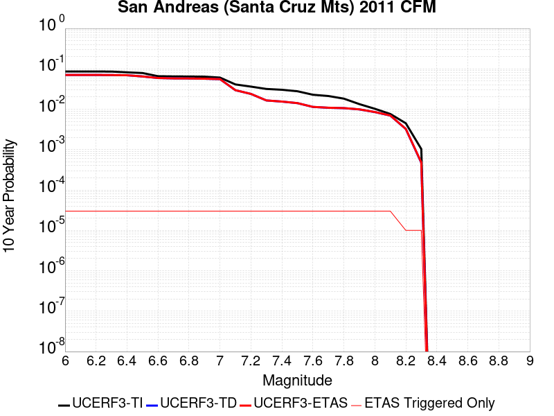 |

| Magnitude | 1 wk TI Prob | 1 wk TD Prob | 1 wk ETAS Prob | 1 wk ETAS/TD Gain | 1 wk ETAS Triggered Only | 1 mo TI Prob | 1 mo TD Prob | 1 mo ETAS Prob | 1 mo ETAS/TD Gain | 1 mo ETAS Triggered Only | 1 yr TI Prob | 1 yr TD Prob | 1 yr ETAS Prob | 1 yr ETAS/TD Gain | 1 yr ETAS Triggered Only | 10 yr TI Prob | 10 yr TD Prob | 10 yr ETAS Prob | 10 yr ETAS/TD Gain | 10 yr ETAS Triggered Only |
|-----|-----|-----|-----|-----|-----|-----|-----|-----|-----|-----|-----|-----|-----|-----|-----|-----|-----|-----|-----|-----|
| 6.0 | 1.7221631E-4 | 1.3792426E-4 | 1.3792426E-4 | 1.0 | 0.0 | 7.378611E-4 | 5.9097214E-4 | 6.009662E-4 | 1.0169113 | 1.0E-5 | 0.008946515 | 0.0071717235 | 0.0072015086 | 1.0041531 | 3.0E-5 | 0.08594794 | 0.07054796 | 0.07057585 | 1.0003953 | 3.0E-5 |
| 6.1 | 1.7221631E-4 | 1.3792426E-4 | 1.3792426E-4 | 1.0 | 0.0 | 7.378611E-4 | 5.9097214E-4 | 6.009662E-4 | 1.0169113 | 1.0E-5 | 0.008946515 | 0.0071717235 | 0.0072015086 | 1.0041531 | 3.0E-5 | 0.08594794 | 0.07054796 | 0.07057585 | 1.0003953 | 3.0E-5 |
| 6.2 | 1.7221631E-4 | 1.3792426E-4 | 1.3792426E-4 | 1.0 | 0.0 | 7.378611E-4 | 5.9097214E-4 | 6.009662E-4 | 1.0169113 | 1.0E-5 | 0.008946515 | 0.0071717235 | 0.0072015086 | 1.0041531 | 3.0E-5 | 0.08594794 | 0.07054796 | 0.07057585 | 1.0003953 | 3.0E-5 |
| 6.3 | 1.716926E-4 | 1.3711878E-4 | 1.3711878E-4 | 1.0 | 0.0 | 7.3561794E-4 | 5.8752164E-4 | 5.975158E-4 | 1.0170107 | 1.0E-5 | 0.008919428 | 0.007129989 | 0.0071597756 | 1.0041776 | 3.0E-5 | 0.08569809 | 0.07015993 | 0.07018782 | 1.0003976 | 3.0E-5 |
| 6.4 | 1.6392978E-4 | 1.3587909E-4 | 1.3587909E-4 | 1.0 | 0.0 | 7.02367E-4 | 5.82211E-4 | 5.922052E-4 | 1.0171659 | 1.0E-5 | 0.008517839 | 0.0070657525 | 0.0070955404 | 1.0042158 | 3.0E-5 | 0.08198654 | 0.069394976 | 0.06942289 | 1.0004023 | 3.0E-5 |
| 6.5 | 1.5742714E-4 | 1.2647794E-4 | 1.2647794E-4 | 1.0 | 0.0 | 6.745133E-4 | 5.419374E-4 | 5.51932E-4 | 1.0184423 | 1.0E-5 | 0.00818132 | 0.0065784375 | 0.0066082403 | 1.0045303 | 3.0E-5 | 0.078865945 | 0.06486093 | 0.064888984 | 1.0004325 | 3.0E-5 |
| 6.6 | 1.3038084E-4 | 1.1587992E-4 | 1.1587992E-4 | 1.0 | 0.0 | 5.5865536E-4 | 4.96535E-4 | 5.0653005E-4 | 1.0201296 | 1.0E-5 | 0.006780438 | 0.006028784 | 0.0060586035 | 1.0049461 | 3.0E-5 | 0.0657725 | 0.059330538 | 0.059358757 | 1.0004756 | 3.0E-5 |
| 6.7 | 1.2867592E-4 | 1.1314491E-4 | 1.1314491E-4 | 1.0 | 0.0 | 5.5135164E-4 | 4.8481792E-4 | 4.948131E-4 | 1.0206163 | 1.0E-5 | 0.0066920654 | 0.005886907 | 0.0059167305 | 1.005066 | 3.0E-5 | 0.06494093 | 0.058041416 | 0.058069672 | 1.0004869 | 3.0E-5 |
| 6.8 | 1.2801298E-4 | 1.12520516E-4 | 1.12520516E-4 | 1.0 | 0.0 | 5.485117E-4 | 4.8214293E-4 | 4.921381E-4 | 1.0207307 | 1.0E-5 | 0.0066577005 | 0.0058545293 | 0.005884354 | 1.0050943 | 3.0E-5 | 0.06461738 | 0.05775524 | 0.057783507 | 1.0004895 | 3.0E-5 |
| 6.9 | 1.269149E-4 | 1.1094256E-4 | 1.1094256E-4 | 1.0 | 0.0 | 5.4380763E-4 | 4.7538272E-4 | 4.8537797E-4 | 1.0210257 | 1.0E-5 | 0.006600777 | 0.005772663 | 0.00580249 | 1.0051669 | 3.0E-5 | 0.06408122 | 0.057027116 | 0.057055406 | 1.000496 | 3.0E-5 |
| 7.0 | 1.2030331E-4 | 1.0824356E-4 | 1.0824356E-4 | 1.0 | 0.0 | 5.154837E-4 | 4.638198E-4 | 4.7381516E-4 | 1.02155 | 1.0E-5 | 0.006257969 | 0.0056326203 | 0.005662451 | 1.0052961 | 3.0E-5 | 0.06084648 | 0.055699922 | 0.055728253 | 1.0005085 | 3.0E-5 |
| 7.1 | 8.049617E-5 | 5.392429E-5 | 5.392429E-5 | 1.0 | 0.0 | 3.4493793E-4 | 2.3108382E-4 | 2.410815E-4 | 1.0432644 | 1.0E-5 | 0.0041915346 | 0.0028098505 | 0.0028397662 | 1.0106467 | 3.0E-5 | 0.041133516 | 0.029618833 | 0.029647944 | 1.0009829 | 3.0E-5 |
| 7.2 | 7.093979E-5 | 4.2935415E-5 | 4.2935415E-5 | 1.0 | 0.0 | 3.0399222E-4 | 1.8399608E-4 | 1.9399423E-4 | 1.0543389 | 1.0E-5 | 0.0036948253 | 0.0022378736 | 0.0022678063 | 1.0133756 | 3.0E-5 | 0.03633994 | 0.023941126 | 0.023970408 | 1.0012231 | 3.0E-5 |
| 7.3 | 6.193693E-5 | 2.8891074E-5 | 2.8891074E-5 | 1.0 | 0.0 | 2.6541698E-4 | 1.2381302E-4 | 1.3381179E-4 | 1.0807569 | 1.0E-5 | 0.0032266637 | 0.001506383 | 0.0015363378 | 1.0198853 | 3.0E-5 | 0.031802133 | 0.016497677 | 0.016527183 | 1.0017885 | 3.0E-5 |
| 7.4 | 5.906492E-5 | 2.7020369E-5 | 2.7020369E-5 | 1.0 | 0.0 | 2.5311083E-4 | 1.1579645E-4 | 1.2579528E-4 | 1.0863484 | 1.0E-5 | 0.0030772698 | 0.0014089114 | 0.0014388692 | 1.021263 | 3.0E-5 | 0.030350044 | 0.0154695045 | 0.0154990405 | 1.0019093 | 3.0E-5 |
| 7.5 | 5.424296E-5 | 2.4675093E-5 | 2.4675093E-5 | 1.0 | 0.0 | 2.324491E-4 | 1.0574612E-4 | 1.1574506E-4 | 1.0945561 | 1.0E-5 | 0.002826395 | 0.0012866998 | 0.0013166612 | 1.0232855 | 3.0E-5 | 0.027907165 | 0.014161854 | 0.014191429 | 1.0020883 | 3.0E-5 |
| 7.6 | 4.43084E-5 | 1.990151E-5 | 1.990151E-5 | 1.0 | 0.0 | 1.8987931E-4 | 8.528939E-5 | 9.5288546E-5 | 1.1172379 | 1.0E-5 | 0.0023093296 | 0.001037904 | 0.0010678729 | 1.0288744 | 3.0E-5 | 0.022854783 | 0.011411123 | 0.011440781 | 1.002599 | 3.0E-5 |
| 7.7 | 4.118098E-5 | 1.8933848E-5 | 1.8933848E-5 | 1.0 | 0.0 | 1.7647797E-4 | 8.1142534E-5 | 9.114172E-5 | 1.12323 | 1.0E-5 | 0.002146502 | 9.874629E-4 | 0.0010174332 | 1.0303509 | 3.0E-5 | 0.021258866 | 0.010868995 | 0.010898669 | 1.0027301 | 3.0E-5 |
| 7.8 | 3.5408906E-5 | 1.856201E-5 | 1.856201E-5 | 1.0 | 0.0 | 1.5174363E-4 | 7.954905E-5 | 8.954825E-5 | 1.1256986 | 1.0E-5 | 0.0018459131 | 9.6807955E-4 | 9.980506E-4 | 1.0309591 | 3.0E-5 | 0.018306552 | 0.0106506655 | 0.010680346 | 1.0027868 | 3.0E-5 |
| 7.9 | 2.5860836E-5 | 1.7313954E-5 | 1.7313954E-5 | 1.0 | 0.0 | 1.10827445E-4 | 7.420055E-5 | 8.419981E-5 | 1.1347599 | 1.0E-5 | 0.001348489 | 9.030175E-4 | 9.3299046E-4 | 1.0331919 | 3.0E-5 | 0.013403354 | 0.009906601 | 0.009936304 | 1.0029982 | 3.0E-5 |
| 8.0 | 1.9777332E-5 | 1.4837888E-5 | 1.4837888E-5 | 1.0 | 0.0 | 8.4757245E-5 | 6.3589396E-5 | 7.358876E-5 | 1.157249 | 1.0E-5 | 0.0010314309 | 7.739261E-4 | 8.0390286E-4 | 1.0387334 | 3.0E-5 | 0.010266567 | 0.008508087 | 0.008537832 | 1.003496 | 3.0E-5 |
| 8.1 | 1.468494E-5 | 1.2105831E-5 | 1.2105831E-5 | 1.0 | 0.0 | 6.293394E-5 | 5.1881103E-5 | 6.1880586E-5 | 1.1927384 | 1.0E-5 | 7.6595135E-4 | 6.3146953E-4 | 6.614506E-4 | 1.0474782 | 3.0E-5 | 0.0076331664 | 0.0069684954 | 0.0069982866 | 1.0042751 | 3.0E-5 |
| 8.2 | 8.63836E-6 | 5.4678667E-6 | 5.4678667E-6 | 1.0 | 0.0 | 3.7021015E-5 | 2.3433504E-5 | 2.3433504E-5 | 1.0 | 0.0 | 4.5063766E-4 | 2.8526565E-4 | 2.9526278E-4 | 1.035045 | 1.0E-5 | 0.004497249 | 0.003245162 | 0.0032551298 | 1.0030715 | 1.0E-5 |
| 8.3 | 1.983087E-6 | 7.6564595E-7 | 7.6564595E-7 | 1.0 | 0.0 | 8.498917E-6 | 3.281336E-6 | 3.281336E-6 | 1.0 | 0.0 | 1.034694E-4 | 3.9949547E-5 | 4.9949147E-5 | 1.2503058 | 1.0E-5 | 0.0010342124 | 4.717979E-4 | 4.8179316E-4 | 1.0211855 | 1.0E-5 |

## San Jose
*[(top)](#table-of-contents)*

| 1 Week | 1 Month | 1 Year | 10 Year |
|-----|-----|-----|-----|
| 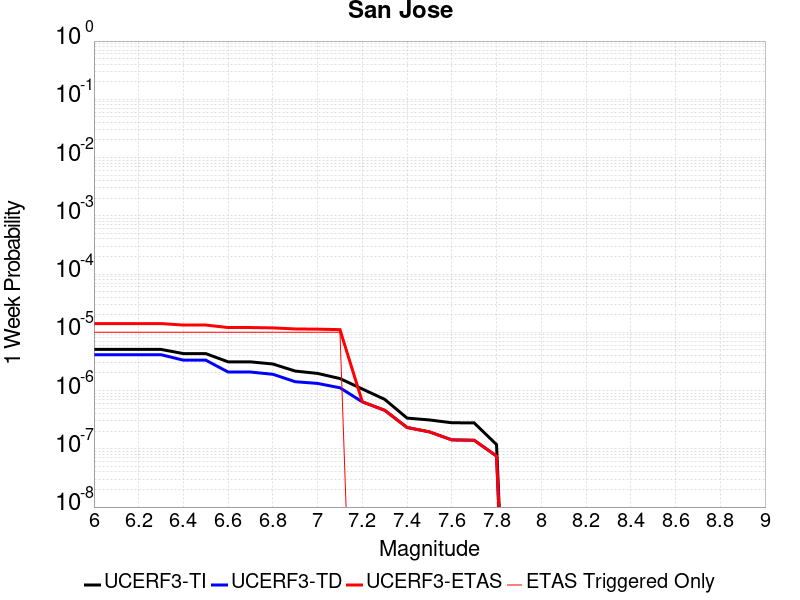 |  |  | 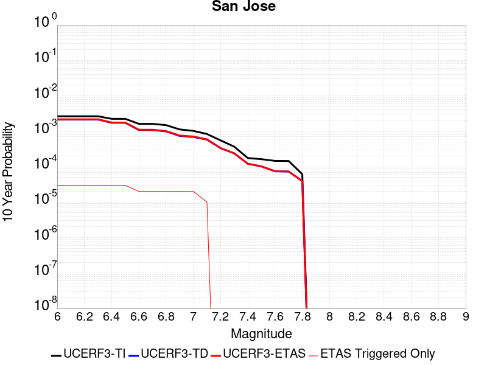 |

| Magnitude | 1 wk TI Prob | 1 wk TD Prob | 1 wk ETAS Prob | 1 wk ETAS/TD Gain | 1 wk ETAS Triggered Only | 1 mo TI Prob | 1 mo TD Prob | 1 mo ETAS Prob | 1 mo ETAS/TD Gain | 1 mo ETAS Triggered Only | 1 yr TI Prob | 1 yr TD Prob | 1 yr ETAS Prob | 1 yr ETAS/TD Gain | 1 yr ETAS Triggered Only | 10 yr TI Prob | 10 yr TD Prob | 10 yr ETAS Prob | 10 yr ETAS/TD Gain | 10 yr ETAS Triggered Only |
|-----|-----|-----|-----|-----|-----|-----|-----|-----|-----|-----|-----|-----|-----|-----|-----|-----|-----|-----|-----|-----|
| 6.0 | 5.0851277E-6 | 4.125642E-6 | 1.41256005E-5 | 3.423855 | 1.0E-5 | 2.1793223E-5 | 1.768122E-5 | 2.7681042E-5 | 1.5655619 | 1.0E-5 | 2.653002E-4 | 2.152502E-4 | 2.2524805E-4 | 1.0464475 | 1.0E-5 | 0.0026498367 | 0.0021507454 | 0.0021806809 | 1.0139186 | 3.0E-5 |
| 6.1 | 5.0851277E-6 | 4.125642E-6 | 1.41256005E-5 | 3.423855 | 1.0E-5 | 2.1793223E-5 | 1.768122E-5 | 2.7681042E-5 | 1.5655619 | 1.0E-5 | 2.653002E-4 | 2.152502E-4 | 2.2524805E-4 | 1.0464475 | 1.0E-5 | 0.0026498367 | 0.0021507454 | 0.0021806809 | 1.0139186 | 3.0E-5 |
| 6.2 | 5.0851277E-6 | 4.125642E-6 | 1.41256005E-5 | 3.423855 | 1.0E-5 | 2.1793223E-5 | 1.768122E-5 | 2.7681042E-5 | 1.5655619 | 1.0E-5 | 2.653002E-4 | 2.152502E-4 | 2.2524805E-4 | 1.0464475 | 1.0E-5 | 0.0026498367 | 0.0021507454 | 0.0021806809 | 1.0139186 | 3.0E-5 |
| 6.3 | 5.0851277E-6 | 4.125642E-6 | 1.41256005E-5 | 3.423855 | 1.0E-5 | 2.1793223E-5 | 1.768122E-5 | 2.7681042E-5 | 1.5655619 | 1.0E-5 | 2.653002E-4 | 2.152502E-4 | 2.2524805E-4 | 1.0464475 | 1.0E-5 | 0.0026498367 | 0.0021507454 | 0.0021806809 | 1.0139186 | 3.0E-5 |
| 6.4 | 4.3115124E-6 | 3.3237525E-6 | 1.3323719E-5 | 4.0086374 | 1.0E-5 | 1.8477778E-5 | 1.4244589E-5 | 2.4244446E-5 | 1.702011 | 1.0E-5 | 2.2494372E-4 | 1.7341628E-4 | 1.8341454E-4 | 1.0576547 | 1.0E-5 | 0.0022471617 | 0.0017330965 | 0.0017630445 | 1.0172801 | 3.0E-5 |
| 6.5 | 4.3115124E-6 | 3.3237525E-6 | 1.3323719E-5 | 4.0086374 | 1.0E-5 | 1.8477778E-5 | 1.4244589E-5 | 2.4244446E-5 | 1.702011 | 1.0E-5 | 2.2494372E-4 | 1.7341628E-4 | 1.8341454E-4 | 1.0576547 | 1.0E-5 | 0.0022471617 | 0.0017330965 | 0.0017630445 | 1.0172801 | 3.0E-5 |
| 6.6 | 3.110396E-6 | 2.0799562E-6 | 1.2079935E-5 | 5.807784 | 1.0E-5 | 1.33302E-5 | 8.9140685E-6 | 1.891398E-5 | 2.121812 | 1.0E-5 | 1.622831E-4 | 1.0852366E-4 | 1.1852258E-4 | 1.0921358 | 1.0E-5 | 0.0016216465 | 0.001084804 | 0.0011047822 | 1.0184165 | 2.0E-5 |
| 6.7 | 3.110396E-6 | 2.0799562E-6 | 1.2079935E-5 | 5.807784 | 1.0E-5 | 1.33302E-5 | 8.9140685E-6 | 1.891398E-5 | 2.121812 | 1.0E-5 | 1.622831E-4 | 1.0852366E-4 | 1.1852258E-4 | 1.0921358 | 1.0E-5 | 0.0016216465 | 0.001084804 | 0.0011047822 | 1.0184165 | 2.0E-5 |
| 6.8 | 2.856651E-6 | 1.9024077E-6 | 1.1902389E-5 | 6.256487 | 1.0E-5 | 1.2242733E-5 | 8.153152E-6 | 1.815307E-5 | 2.2265096 | 1.0E-5 | 1.4904508E-4 | 9.926035E-5 | 1.0925936E-4 | 1.1007352 | 1.0E-5 | 0.0014894515 | 9.922545E-4 | 0.0010122346 | 1.0201361 | 2.0E-5 |
| 6.9 | 2.1618725E-6 | 1.4186406E-6 | 1.1418627E-5 | 8.048992 | 1.0E-5 | 9.265135E-6 | 6.0798748E-6 | 1.6079814E-5 | 2.6447608 | 1.0E-5 | 1.12797185E-4 | 7.402005E-5 | 8.401931E-5 | 1.1350886 | 1.0E-5 | 0.0011273995 | 7.4003247E-4 | 7.6001766E-4 | 1.0270058 | 2.0E-5 |
| 7.0 | 1.9684312E-6 | 1.3256082E-6 | 1.1325595E-5 | 8.543697 | 1.0E-5 | 8.436106E-6 | 5.681166E-6 | 1.568111E-5 | 2.7601922 | 1.0E-5 | 1.02704755E-4 | 6.916608E-5 | 7.9165395E-5 | 1.1445695 | 1.0E-5 | 0.001026573 | 6.9152354E-4 | 7.115097E-4 | 1.0289017 | 2.0E-5 |
| 7.1 | 1.6070337E-6 | 1.1154867E-6 | 1.1115476E-5 | 9.964686 | 1.0E-5 | 6.887269E-6 | 4.7806493E-6 | 1.4780601E-5 | 3.091756 | 1.0E-5 | 8.384928E-5 | 5.8202913E-5 | 6.820233E-5 | 1.1718028 | 1.0E-5 | 8.3817646E-4 | 5.819527E-4 | 5.919469E-4 | 1.0171735 | 1.0E-5 |
| 7.2 | 1.0631658E-6 | 6.403567E-7 | 6.403567E-7 | 1.0 | 0.0 | 4.556417E-6 | 2.744383E-6 | 2.744383E-6 | 1.0 | 0.0 | 5.5472963E-5 | 3.3412365E-5 | 3.3412365E-5 | 1.0 | 0.0 | 5.545912E-4 | 3.3414463E-4 | 3.3414463E-4 | 1.0 | 0.0 |
| 7.3 | 7.060711E-7 | 4.5823228E-7 | 4.5823228E-7 | 1.0 | 0.0 | 3.0260155E-6 | 1.9638512E-6 | 1.9638512E-6 | 1.0 | 0.0 | 3.6841117E-5 | 2.3909635E-5 | 2.3909635E-5 | 1.0 | 0.0 | 3.6835007E-4 | 2.3914136E-4 | 2.3914136E-4 | 1.0 | 0.0 |
| 7.4 | 3.3677085E-7 | 2.3231999E-7 | 2.3231999E-7 | 1.0 | 0.0 | 1.4433028E-6 | 9.956567E-7 | 9.956567E-7 | 1.0 | 0.0 | 1.757207E-5 | 1.2122056E-5 | 1.2122056E-5 | 1.0 | 0.0 | 1.7570681E-4 | 1.2128407E-4 | 1.2128407E-4 | 1.0 | 0.0 |
| 7.5 | 3.129161E-7 | 1.9529637E-7 | 1.9529637E-7 | 1.0 | 0.0 | 1.3410682E-6 | 8.3698416E-7 | 8.3698416E-7 | 1.0 | 0.0 | 1.6327383E-5 | 1.0190237E-5 | 1.0190237E-5 | 1.0 | 0.0 | 1.6326184E-4 | 1.0196777E-4 | 1.0196777E-4 | 1.0 | 0.0 |
| 7.6 | 2.8008668E-7 | 1.4240818E-7 | 1.4240818E-7 | 1.0 | 0.0 | 1.2003709E-6 | 6.103206E-7 | 6.103206E-7 | 1.0 | 0.0 | 1.46144175E-5 | 7.43063E-6 | 7.43063E-6 | 1.0 | 0.0 | 1.4613457E-4 | 7.43735E-5 | 7.43735E-5 | 1.0 | 0.0 |
| 7.7 | 2.7852005E-7 | 1.4015403E-7 | 1.4015403E-7 | 1.0 | 0.0 | 1.1936568E-6 | 6.0066003E-7 | 6.0066003E-7 | 1.0 | 0.0 | 1.4532674E-5 | 7.3130127E-6 | 7.3130127E-6 | 1.0 | 0.0 | 1.4531724E-4 | 7.31974E-5 | 7.31974E-5 | 1.0 | 0.0 |
| 7.8 | 1.1810797E-7 | 7.5187074E-8 | 7.5187074E-8 | 1.0 | 0.0 | 5.0617695E-7 | 3.2223028E-7 | 3.2223028E-7 | 1.0 | 0.0 | 6.1626865E-6 | 3.9231472E-6 | 3.9231472E-6 | 1.0 | 0.0 | 6.162516E-5 | 3.9271265E-5 | 3.9271265E-5 | 1.0 | 0.0 |

## San Luis Range 2011 CFM
*[(top)](#table-of-contents)*

| 1 Week | 1 Month | 1 Year | 10 Year |
|-----|-----|-----|-----|
|  |  |  |  |

| Magnitude | 1 wk TI Prob | 1 wk TD Prob | 1 wk ETAS Prob | 1 wk ETAS/TD Gain | 1 wk ETAS Triggered Only | 1 mo TI Prob | 1 mo TD Prob | 1 mo ETAS Prob | 1 mo ETAS/TD Gain | 1 mo ETAS Triggered Only | 1 yr TI Prob | 1 yr TD Prob | 1 yr ETAS Prob | 1 yr ETAS/TD Gain | 1 yr ETAS Triggered Only | 10 yr TI Prob | 10 yr TD Prob | 10 yr ETAS Prob | 10 yr ETAS/TD Gain | 10 yr ETAS Triggered Only |
|-----|-----|-----|-----|-----|-----|-----|-----|-----|-----|-----|-----|-----|-----|-----|-----|-----|-----|-----|-----|-----|
| 6.0 | 8.8368415E-6 | 8.965455E-6 | 1.8965366E-5 | 2.1153824 | 1.0E-5 | 3.787163E-5 | 3.8422855E-5 | 4.8422473E-5 | 1.2602518 | 1.0E-5 | 4.609895E-4 | 4.6770574E-4 | 4.8769638E-4 | 1.0427419 | 2.0E-5 | 0.0046003438 | 0.004667997 | 0.004697857 | 1.0063968 | 3.0E-5 |
| 6.1 | 8.8368415E-6 | 8.965455E-6 | 1.8965366E-5 | 2.1153824 | 1.0E-5 | 3.787163E-5 | 3.8422855E-5 | 4.8422473E-5 | 1.2602518 | 1.0E-5 | 4.609895E-4 | 4.6770574E-4 | 4.8769638E-4 | 1.0427419 | 2.0E-5 | 0.0046003438 | 0.004667997 | 0.004697857 | 1.0063968 | 3.0E-5 |
| 6.2 | 8.8368415E-6 | 8.965455E-6 | 1.8965366E-5 | 2.1153824 | 1.0E-5 | 3.787163E-5 | 3.8422855E-5 | 4.8422473E-5 | 1.2602518 | 1.0E-5 | 4.609895E-4 | 4.6770574E-4 | 4.8769638E-4 | 1.0427419 | 2.0E-5 | 0.0046003438 | 0.004667997 | 0.004697857 | 1.0063968 | 3.0E-5 |
| 6.3 | 8.8368415E-6 | 8.965455E-6 | 1.8965366E-5 | 2.1153824 | 1.0E-5 | 3.787163E-5 | 3.8422855E-5 | 4.8422473E-5 | 1.2602518 | 1.0E-5 | 4.609895E-4 | 4.6770574E-4 | 4.8769638E-4 | 1.0427419 | 2.0E-5 | 0.0046003438 | 0.004667997 | 0.004697857 | 1.0063968 | 3.0E-5 |
| 6.4 | 3.9094193E-6 | 3.941204E-6 | 3.941204E-6 | 1.0 | 0.0 | 1.6754546E-5 | 1.6890766E-5 | 1.6890766E-5 | 1.0 | 0.0 | 2.039675E-4 | 2.0562594E-4 | 2.0562594E-4 | 1.0 | 0.0 | 0.0020378039 | 0.0020543856 | 0.0020543856 | 1.0 | 0.0 |
| 6.5 | 3.9094193E-6 | 3.941204E-6 | 3.941204E-6 | 1.0 | 0.0 | 1.6754546E-5 | 1.6890766E-5 | 1.6890766E-5 | 1.0 | 0.0 | 2.039675E-4 | 2.0562594E-4 | 2.0562594E-4 | 1.0 | 0.0 | 0.0020378039 | 0.0020543856 | 0.0020543856 | 1.0 | 0.0 |
| 6.6 | 3.0587726E-6 | 3.0753893E-6 | 3.0753893E-6 | 1.0 | 0.0 | 1.3108959E-5 | 1.3180174E-5 | 1.3180174E-5 | 1.0 | 0.0 | 1.595899E-4 | 1.6045693E-4 | 1.6045693E-4 | 1.0 | 0.0 | 0.0015947534 | 0.0016034227 | 0.0016034227 | 1.0 | 0.0 |
| 6.7 | 2.6160574E-6 | 2.6251284E-6 | 2.6251284E-6 | 1.0 | 0.0 | 1.1211626E-5 | 1.1250502E-5 | 1.1250502E-5 | 1.0 | 0.0 | 1.3649299E-4 | 1.3696631E-4 | 1.3696631E-4 | 1.0 | 0.0 | 0.0013640919 | 0.0013688251 | 0.0013688251 | 1.0 | 0.0 |
| 6.8 | 2.5110312E-6 | 2.5181412E-6 | 2.5181412E-6 | 1.0 | 0.0 | 1.0761518E-5 | 1.079199E-5 | 1.079199E-5 | 1.0 | 0.0 | 1.310136E-4 | 1.313846E-4 | 1.313846E-4 | 1.0 | 0.0 | 0.0013093639 | 0.0013130752 | 0.0013130752 | 1.0 | 0.0 |
| 6.9 | 1.8564405E-6 | 1.852488E-6 | 1.852488E-6 | 1.0 | 0.0 | 7.95615E-6 | 7.93921E-6 | 7.93921E-6 | 1.0 | 0.0 | 9.686181E-5 | 9.665562E-5 | 9.665562E-5 | 1.0 | 0.0 | 9.68196E-4 | 9.6613786E-4 | 9.6613786E-4 | 1.0 | 0.0 |
| 7.0 | 1.546127E-6 | 1.5369549E-6 | 1.5369549E-6 | 1.0 | 0.0 | 6.626242E-6 | 6.5869326E-6 | 6.5869326E-6 | 1.0 | 0.0 | 8.06715E-5 | 8.019296E-5 | 8.019296E-5 | 1.0 | 0.0 | 8.0642226E-4 | 8.016409E-4 | 8.016409E-4 | 1.0 | 0.0 |
| 7.1 | 1.3368208E-6 | 1.3235336E-6 | 1.3235336E-6 | 1.0 | 0.0 | 5.7292195E-6 | 5.6722747E-6 | 5.6722747E-6 | 1.0 | 0.0 | 6.975101E-5 | 6.905776E-5 | 6.905776E-5 | 1.0 | 0.0 | 6.972912E-4 | 6.903635E-4 | 6.903635E-4 | 1.0 | 0.0 |
| 7.2 | 1.0623363E-6 | 1.0454378E-6 | 1.0454378E-6 | 1.0 | 0.0 | 4.5528623E-6 | 4.4804397E-6 | 4.4804397E-6 | 1.0 | 0.0 | 5.5429686E-5 | 5.4547992E-5 | 5.4547992E-5 | 1.0 | 0.0 | 5.5415864E-4 | 5.453463E-4 | 5.453463E-4 | 1.0 | 0.0 |
| 7.3 | 7.831679E-7 | 7.727399E-7 | 7.727399E-7 | 1.0 | 0.0 | 3.3564295E-6 | 3.3117383E-6 | 3.3117383E-6 | 1.0 | 0.0 | 4.086376E-5 | 4.031967E-5 | 4.031967E-5 | 1.0 | 0.0 | 4.0856248E-4 | 4.0312367E-4 | 4.0312367E-4 | 1.0 | 0.0 |
| 7.4 | 5.9558846E-7 | 5.910646E-7 | 5.910646E-7 | 1.0 | 0.0 | 2.5525194E-6 | 2.5331315E-6 | 2.5331315E-6 | 1.0 | 0.0 | 3.107648E-5 | 3.084044E-5 | 3.084044E-5 | 1.0 | 0.0 | 3.1072134E-4 | 3.083617E-4 | 3.083617E-4 | 1.0 | 0.0 |
| 7.5 | 4.1616502E-7 | 4.1196404E-7 | 4.1196404E-7 | 1.0 | 0.0 | 1.7835631E-6 | 1.765559E-6 | 1.765559E-6 | 1.0 | 0.0 | 2.1714664E-5 | 2.1495469E-5 | 2.1495469E-5 | 1.0 | 0.0 | 2.1712543E-4 | 2.1493394E-4 | 2.1493394E-4 | 1.0 | 0.0 |
| 7.6 | 2.3816014E-7 | 2.3376614E-7 | 2.3376614E-7 | 1.0 | 0.0 | 1.0206859E-6 | 1.0018545E-6 | 1.0018545E-6 | 1.0 | 0.0 | 1.242678E-5 | 1.219751E-5 | 1.219751E-5 | 1.0 | 0.0 | 1.2426086E-4 | 1.2196843E-4 | 1.2196843E-4 | 1.0 | 0.0 |
| 7.7 | 9.918777E-8 | 9.3868096E-8 | 9.3868096E-8 | 1.0 | 0.0 | 4.2509038E-7 | 4.022918E-7 | 4.022918E-7 | 1.0 | 0.0 | 5.1754632E-6 | 4.8978914E-6 | 4.8978914E-6 | 1.0 | 0.0 | 5.1753424E-5 | 4.897784E-5 | 4.897784E-5 | 1.0 | 0.0 |
| 7.8 | 3.4982556E-8 | 2.968672E-8 | 2.968672E-8 | 1.0 | 0.0 | 1.4992524E-7 | 1.272288E-7 | 1.272288E-7 | 1.0 | 0.0 | 1.8253382E-6 | 1.5490094E-6 | 1.5490094E-6 | 1.0 | 0.0 | 1.8253233E-5 | 1.5489988E-5 | 1.5489988E-5 | 1.0 | 0.0 |
| 7.9 | 1.6624908E-8 | 1.1476994E-8 | 1.1476994E-8 | 1.0 | 0.0 | 7.12496E-8 | 4.9187115E-8 | 4.9187115E-8 | 1.0 | 0.0 | 8.6746354E-7 | 5.988529E-7 | 5.988529E-7 | 1.0 | 0.0 | 8.674601E-6 | 5.9885133E-6 | 5.9885133E-6 | 1.0 | 0.0 |
| 8.0 | 6.3352315E-9 | 3.0886564E-9 | 3.0886564E-9 | 1.0 | 0.0 | 2.715099E-8 | 1.32370985E-8 | 1.32370985E-8 | 1.0 | 0.0 | 3.3056327E-7 | 1.6116167E-7 | 1.6116167E-7 | 1.0 | 0.0 | 3.3056278E-6 | 1.6116155E-6 | 1.6116155E-6 | 1.0 | 0.0 |

## Pitas Point (Lower)-Montalvo
*[(top)](#table-of-contents)*

| 1 Week | 1 Month | 1 Year | 10 Year |
|-----|-----|-----|-----|
|  |  |  | 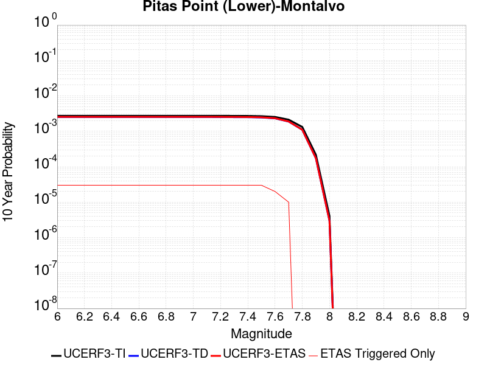 |

| Magnitude | 1 wk TI Prob | 1 wk TD Prob | 1 wk ETAS Prob | 1 wk ETAS/TD Gain | 1 wk ETAS Triggered Only | 1 mo TI Prob | 1 mo TD Prob | 1 mo ETAS Prob | 1 mo ETAS/TD Gain | 1 mo ETAS Triggered Only | 1 yr TI Prob | 1 yr TD Prob | 1 yr ETAS Prob | 1 yr ETAS/TD Gain | 1 yr ETAS Triggered Only | 10 yr TI Prob | 10 yr TD Prob | 10 yr ETAS Prob | 10 yr ETAS/TD Gain | 10 yr ETAS Triggered Only |
|-----|-----|-----|-----|-----|-----|-----|-----|-----|-----|-----|-----|-----|-----|-----|-----|-----|-----|-----|-----|-----|
| 6.0 | 5.2543637E-6 | 4.8379025E-6 | 1.4837854E-5 | 3.0670013 | 1.0E-5 | 2.2518509E-5 | 2.0733705E-5 | 3.07335E-5 | 1.4822965 | 1.0E-5 | 2.7412834E-4 | 2.5240393E-4 | 2.723989E-4 | 1.079218 | 2.0E-5 | 0.0027379042 | 0.0025212052 | 0.0025511296 | 1.0118691 | 3.0E-5 |
| 6.1 | 5.2543637E-6 | 4.8379025E-6 | 1.4837854E-5 | 3.0670013 | 1.0E-5 | 2.2518509E-5 | 2.0733705E-5 | 3.07335E-5 | 1.4822965 | 1.0E-5 | 2.7412834E-4 | 2.5240393E-4 | 2.723989E-4 | 1.079218 | 2.0E-5 | 0.0027379042 | 0.0025212052 | 0.0025511296 | 1.0118691 | 3.0E-5 |
| 6.2 | 5.2543637E-6 | 4.8379025E-6 | 1.4837854E-5 | 3.0670013 | 1.0E-5 | 2.2518509E-5 | 2.0733705E-5 | 3.07335E-5 | 1.4822965 | 1.0E-5 | 2.7412834E-4 | 2.5240393E-4 | 2.723989E-4 | 1.079218 | 2.0E-5 | 0.0027379042 | 0.0025212052 | 0.0025511296 | 1.0118691 | 3.0E-5 |
| 6.3 | 5.2543637E-6 | 4.8379025E-6 | 1.4837854E-5 | 3.0670013 | 1.0E-5 | 2.2518509E-5 | 2.0733705E-5 | 3.07335E-5 | 1.4822965 | 1.0E-5 | 2.7412834E-4 | 2.5240393E-4 | 2.723989E-4 | 1.079218 | 2.0E-5 | 0.0027379042 | 0.0025212052 | 0.0025511296 | 1.0118691 | 3.0E-5 |
| 6.4 | 5.2543637E-6 | 4.8379025E-6 | 1.4837854E-5 | 3.0670013 | 1.0E-5 | 2.2518509E-5 | 2.0733705E-5 | 3.07335E-5 | 1.4822965 | 1.0E-5 | 2.7412834E-4 | 2.5240393E-4 | 2.723989E-4 | 1.079218 | 2.0E-5 | 0.0027379042 | 0.0025212052 | 0.0025511296 | 1.0118691 | 3.0E-5 |
| 6.5 | 5.2543637E-6 | 4.8379025E-6 | 1.4837854E-5 | 3.0670013 | 1.0E-5 | 2.2518509E-5 | 2.0733705E-5 | 3.07335E-5 | 1.4822965 | 1.0E-5 | 2.7412834E-4 | 2.5240393E-4 | 2.723989E-4 | 1.079218 | 2.0E-5 | 0.0027379042 | 0.0025212052 | 0.0025511296 | 1.0118691 | 3.0E-5 |
| 6.6 | 5.2543637E-6 | 4.8379025E-6 | 1.4837854E-5 | 3.0670013 | 1.0E-5 | 2.2518509E-5 | 2.0733705E-5 | 3.07335E-5 | 1.4822965 | 1.0E-5 | 2.7412834E-4 | 2.5240393E-4 | 2.723989E-4 | 1.079218 | 2.0E-5 | 0.0027379042 | 0.0025212052 | 0.0025511296 | 1.0118691 | 3.0E-5 |
| 6.7 | 5.2543637E-6 | 4.8379025E-6 | 1.4837854E-5 | 3.0670013 | 1.0E-5 | 2.2518509E-5 | 2.0733705E-5 | 3.07335E-5 | 1.4822965 | 1.0E-5 | 2.7412834E-4 | 2.5240393E-4 | 2.723989E-4 | 1.079218 | 2.0E-5 | 0.0027379042 | 0.0025212052 | 0.0025511296 | 1.0118691 | 3.0E-5 |
| 6.8 | 5.2543637E-6 | 4.8379025E-6 | 1.4837854E-5 | 3.0670013 | 1.0E-5 | 2.2518509E-5 | 2.0733705E-5 | 3.07335E-5 | 1.4822965 | 1.0E-5 | 2.7412834E-4 | 2.5240393E-4 | 2.723989E-4 | 1.079218 | 2.0E-5 | 0.0027379042 | 0.0025212052 | 0.0025511296 | 1.0118691 | 3.0E-5 |
| 6.9 | 5.2543637E-6 | 4.8379025E-6 | 1.4837854E-5 | 3.0670013 | 1.0E-5 | 2.2518509E-5 | 2.0733705E-5 | 3.07335E-5 | 1.4822965 | 1.0E-5 | 2.7412834E-4 | 2.5240393E-4 | 2.723989E-4 | 1.079218 | 2.0E-5 | 0.0027379042 | 0.0025212052 | 0.0025511296 | 1.0118691 | 3.0E-5 |
| 7.0 | 5.2543637E-6 | 4.8379025E-6 | 1.4837854E-5 | 3.0670013 | 1.0E-5 | 2.2518509E-5 | 2.0733705E-5 | 3.07335E-5 | 1.4822965 | 1.0E-5 | 2.7412834E-4 | 2.5240393E-4 | 2.723989E-4 | 1.079218 | 2.0E-5 | 0.0027379042 | 0.0025212052 | 0.0025511296 | 1.0118691 | 3.0E-5 |
| 7.1 | 5.2543637E-6 | 4.8379025E-6 | 1.4837854E-5 | 3.0670013 | 1.0E-5 | 2.2518509E-5 | 2.0733705E-5 | 3.07335E-5 | 1.4822965 | 1.0E-5 | 2.7412834E-4 | 2.5240393E-4 | 2.723989E-4 | 1.079218 | 2.0E-5 | 0.0027379042 | 0.0025212052 | 0.0025511296 | 1.0118691 | 3.0E-5 |
| 7.2 | 5.2458695E-6 | 4.8290563E-6 | 1.4829008E-5 | 3.070788 | 1.0E-5 | 2.2482105E-5 | 2.0695794E-5 | 3.0695588E-5 | 1.4831799 | 1.0E-5 | 2.7368523E-4 | 2.5194246E-4 | 2.7193743E-4 | 1.0793632 | 2.0E-5 | 0.0027334841 | 0.002516601 | 0.0025465253 | 1.0118909 | 3.0E-5 |
| 7.3 | 5.22665E-6 | 4.8089737E-6 | 1.4808926E-5 | 3.0794358 | 1.0E-5 | 2.2399736E-5 | 2.0609727E-5 | 3.060952E-5 | 1.4851978 | 1.0E-5 | 2.7268266E-4 | 2.5089484E-4 | 2.708898E-4 | 1.0796946 | 2.0E-5 | 0.002723483 | 0.0025061483 | 0.002536073 | 1.0119406 | 3.0E-5 |
| 7.4 | 5.210642E-6 | 4.7921862E-6 | 1.4792138E-5 | 3.0867202 | 1.0E-5 | 2.233113E-5 | 2.053778E-5 | 3.0537576E-5 | 1.4868976 | 1.0E-5 | 2.718476E-4 | 2.500191E-4 | 2.700141E-4 | 1.0799739 | 2.0E-5 | 0.002715153 | 0.0024974106 | 0.0025273357 | 1.0119824 | 3.0E-5 |
| 7.5 | 5.1226016E-6 | 4.7000726E-6 | 1.47000255E-5 | 3.1276166 | 1.0E-5 | 2.1953823E-5 | 2.0143016E-5 | 3.0142814E-5 | 1.49644 | 1.0E-5 | 2.67255E-4 | 2.4521392E-4 | 2.65209E-4 | 1.0815414 | 2.0E-5 | 0.0026693381 | 0.002449465 | 0.0024793916 | 1.0122175 | 3.0E-5 |
| 7.6 | 4.8796987E-6 | 4.4449725E-6 | 1.4444928E-5 | 3.2497227 | 1.0E-5 | 2.0912828E-5 | 1.9049745E-5 | 2.9049555E-5 | 1.5249314 | 1.0E-5 | 2.5458392E-4 | 2.3190626E-4 | 2.5190163E-4 | 1.0862217 | 2.0E-5 | 0.0025429246 | 0.0023166733 | 0.0023366269 | 1.0086131 | 2.0E-5 |
| 7.7 | 4.0834398E-6 | 3.6091444E-6 | 1.36091085E-5 | 3.7707298 | 1.0E-5 | 1.7500339E-5 | 1.546767E-5 | 2.5467516E-5 | 1.6464998 | 1.0E-5 | 2.1304579E-4 | 1.8830286E-4 | 1.9830097E-4 | 1.0530959 | 1.0E-5 | 0.0021284167 | 0.0018814567 | 0.0018914379 | 1.005305 | 1.0E-5 |
| 7.8 | 2.5445438E-6 | 2.1212566E-6 | 2.1212566E-6 | 1.0 | 0.0 | 1.0905142E-5 | 9.091068E-6 | 9.091068E-6 | 1.0 | 0.0 | 1.3276201E-4 | 1.1067818E-4 | 1.1067818E-4 | 1.0 | 0.0 | 0.0013268272 | 0.0011062352 | 0.0011062352 | 1.0 | 0.0 |
| 7.9 | 4.1677114E-7 | 3.3294015E-7 | 3.3294015E-7 | 1.0 | 0.0 | 1.7861609E-6 | 1.4268857E-6 | 1.4268857E-6 | 1.0 | 0.0 | 2.1746291E-5 | 1.7372196E-5 | 1.7372196E-5 | 1.0 | 0.0 | 2.1744163E-4 | 1.737087E-4 | 1.737087E-4 | 1.0 | 0.0 |
| 8.0 | 7.791402E-9 | 5.6836056E-9 | 5.6836056E-9 | 1.0 | 0.0 | 3.3391725E-8 | 2.4358311E-8 | 2.4358311E-8 | 1.0 | 0.0 | 4.0654416E-7 | 2.965624E-7 | 2.965624E-7 | 1.0 | 0.0 | 4.065434E-6 | 2.9656223E-6 | 2.9656223E-6 | 1.0 | 0.0 |

## Elmore Ranch
*[(top)](#table-of-contents)*

| 1 Week | 1 Month | 1 Year | 10 Year |
|-----|-----|-----|-----|
|  |  |  |  |

| Magnitude | 1 wk TI Prob | 1 wk TD Prob | 1 wk ETAS Prob | 1 wk ETAS/TD Gain | 1 wk ETAS Triggered Only | 1 mo TI Prob | 1 mo TD Prob | 1 mo ETAS Prob | 1 mo ETAS/TD Gain | 1 mo ETAS Triggered Only | 1 yr TI Prob | 1 yr TD Prob | 1 yr ETAS Prob | 1 yr ETAS/TD Gain | 1 yr ETAS Triggered Only | 10 yr TI Prob | 10 yr TD Prob | 10 yr ETAS Prob | 10 yr ETAS/TD Gain | 10 yr ETAS Triggered Only |
|-----|-----|-----|-----|-----|-----|-----|-----|-----|-----|-----|-----|-----|-----|-----|-----|-----|-----|-----|-----|-----|
| 6.0 | 9.102099E-5 | 8.953848E-5 | 8.953848E-5 | 1.0 | 0.0 | 3.9003167E-4 | 3.836898E-4 | 3.836898E-4 | 1.0 | 0.0 | 0.0047383 | 0.004662132 | 0.0046720854 | 1.0021349 | 1.0E-5 | 0.046385348 | 0.04583787 | 0.045866497 | 1.0006245 | 3.0E-5 |
| 6.1 | 3.8306698E-5 | 4.14921E-5 | 4.14921E-5 | 1.0 | 0.0 | 1.6416123E-4 | 1.7781362E-4 | 1.7781362E-4 | 1.0 | 0.0 | 0.0019968306 | 0.0021632186 | 0.0021632186 | 1.0 | 0.0 | 0.019789828 | 0.021595007 | 0.021614576 | 1.0009061 | 2.0E-5 |
| 6.2 | 3.8306698E-5 | 4.14921E-5 | 4.14921E-5 | 1.0 | 0.0 | 1.6416123E-4 | 1.7781362E-4 | 1.7781362E-4 | 1.0 | 0.0 | 0.0019968306 | 0.0021632186 | 0.0021632186 | 1.0 | 0.0 | 0.019789828 | 0.021595007 | 0.021614576 | 1.0009061 | 2.0E-5 |
| 6.3 | 3.3197924E-5 | 3.6550366E-5 | 3.6550366E-5 | 1.0 | 0.0 | 1.4226905E-4 | 1.56639E-4 | 1.56639E-4 | 1.0 | 0.0 | 0.0017307495 | 0.0019059771 | 0.0019059771 | 1.0 | 0.0 | 0.017173318 | 0.019057386 | 0.019077003 | 1.0010295 | 2.0E-5 |
| 6.4 | 2.5148964E-5 | 2.7420736E-5 | 2.7420736E-5 | 1.0 | 0.0 | 1.0777682E-4 | 1.17515796E-4 | 1.17515796E-4 | 1.0 | 0.0 | 0.0013113929 | 0.0014304637 | 0.0014304637 | 1.0 | 0.0 | 0.01303681 | 0.014365338 | 0.01438505 | 1.0013722 | 2.0E-5 |
| 6.5 | 2.5148964E-5 | 2.7420736E-5 | 2.7420736E-5 | 1.0 | 0.0 | 1.0777682E-4 | 1.17515796E-4 | 1.17515796E-4 | 1.0 | 0.0 | 0.0013113929 | 0.0014304637 | 0.0014304637 | 1.0 | 0.0 | 0.01303681 | 0.014365338 | 0.01438505 | 1.0013722 | 2.0E-5 |

## Clamshell-Sawpit
*[(top)](#table-of-contents)*

| 1 Week | 1 Month | 1 Year | 10 Year |
|-----|-----|-----|-----|
|  |  |  |  |

| Magnitude | 1 wk TI Prob | 1 wk TD Prob | 1 wk ETAS Prob | 1 wk ETAS/TD Gain | 1 wk ETAS Triggered Only | 1 mo TI Prob | 1 mo TD Prob | 1 mo ETAS Prob | 1 mo ETAS/TD Gain | 1 mo ETAS Triggered Only | 1 yr TI Prob | 1 yr TD Prob | 1 yr ETAS Prob | 1 yr ETAS/TD Gain | 1 yr ETAS Triggered Only | 10 yr TI Prob | 10 yr TD Prob | 10 yr ETAS Prob | 10 yr ETAS/TD Gain | 10 yr ETAS Triggered Only |
|-----|-----|-----|-----|-----|-----|-----|-----|-----|-----|-----|-----|-----|-----|-----|-----|-----|-----|-----|-----|-----|
| 6.0 | 3.202998E-6 | 3.0127642E-6 | 1.3012734E-5 | 4.319201 | 1.0E-5 | 1.3727062E-5 | 1.2911787E-5 | 2.2911658E-5 | 1.7744762 | 1.0E-5 | 1.6711417E-4 | 1.5719047E-4 | 1.7718734E-4 | 1.1272142 | 2.0E-5 | 0.0016698855 | 0.0015708723 | 0.0016008251 | 1.0190676 | 3.0E-5 |
| 6.1 | 3.202998E-6 | 3.0127642E-6 | 1.3012734E-5 | 4.319201 | 1.0E-5 | 1.3727062E-5 | 1.2911787E-5 | 2.2911658E-5 | 1.7744762 | 1.0E-5 | 1.6711417E-4 | 1.5719047E-4 | 1.7718734E-4 | 1.1272142 | 2.0E-5 | 0.0016698855 | 0.0015708723 | 0.0016008251 | 1.0190676 | 3.0E-5 |
| 6.2 | 3.202998E-6 | 3.0127642E-6 | 1.3012734E-5 | 4.319201 | 1.0E-5 | 1.3727062E-5 | 1.2911787E-5 | 2.2911658E-5 | 1.7744762 | 1.0E-5 | 1.6711417E-4 | 1.5719047E-4 | 1.7718734E-4 | 1.1272142 | 2.0E-5 | 0.0016698855 | 0.0015708723 | 0.0016008251 | 1.0190676 | 3.0E-5 |
| 6.3 | 3.202998E-6 | 3.0127642E-6 | 1.3012734E-5 | 4.319201 | 1.0E-5 | 1.3727062E-5 | 1.2911787E-5 | 2.2911658E-5 | 1.7744762 | 1.0E-5 | 1.6711417E-4 | 1.5719047E-4 | 1.7718734E-4 | 1.1272142 | 2.0E-5 | 0.0016698855 | 0.0015708723 | 0.0016008251 | 1.0190676 | 3.0E-5 |
| 6.4 | 3.202998E-6 | 3.0127642E-6 | 1.3012734E-5 | 4.319201 | 1.0E-5 | 1.3727062E-5 | 1.2911787E-5 | 2.2911658E-5 | 1.7744762 | 1.0E-5 | 1.6711417E-4 | 1.5719047E-4 | 1.7718734E-4 | 1.1272142 | 2.0E-5 | 0.0016698855 | 0.0015708723 | 0.0016008251 | 1.0190676 | 3.0E-5 |
| 6.5 | 2.5862723E-6 | 2.3807747E-6 | 1.2380751E-5 | 5.200303 | 1.0E-5 | 1.1083977E-5 | 1.0203283E-5 | 2.020318E-5 | 1.9800668 | 1.0E-5 | 1.3493907E-4 | 1.2421819E-4 | 1.4421571E-4 | 1.160987 | 2.0E-5 | 0.0013485716 | 0.0012415178 | 0.001261493 | 1.0160893 | 2.0E-5 |
| 6.6 | 2.5862723E-6 | 2.3807747E-6 | 1.2380751E-5 | 5.200303 | 1.0E-5 | 1.1083977E-5 | 1.0203283E-5 | 2.020318E-5 | 1.9800668 | 1.0E-5 | 1.3493907E-4 | 1.2421819E-4 | 1.4421571E-4 | 1.160987 | 2.0E-5 | 0.0013485716 | 0.0012415178 | 0.001261493 | 1.0160893 | 2.0E-5 |
| 6.7 | 2.5862723E-6 | 2.3807747E-6 | 1.2380751E-5 | 5.200303 | 1.0E-5 | 1.1083977E-5 | 1.0203283E-5 | 2.020318E-5 | 1.9800668 | 1.0E-5 | 1.3493907E-4 | 1.2421819E-4 | 1.4421571E-4 | 1.160987 | 2.0E-5 | 0.0013485716 | 0.0012415178 | 0.001261493 | 1.0160893 | 2.0E-5 |
| 6.8 | 2.4098806E-6 | 2.1977307E-6 | 2.1977307E-6 | 1.0 | 0.0 | 1.0328019E-5 | 9.4188135E-6 | 9.4188135E-6 | 1.0 | 0.0 | 1.2573638E-4 | 1.14668284E-4 | 1.2466715E-4 | 1.087198 | 1.0E-5 | 0.0012566525 | 0.0011461178 | 0.0011561064 | 1.0087152 | 1.0E-5 |
| 6.9 | 2.0073985E-6 | 1.7784247E-6 | 1.7784247E-6 | 1.0 | 0.0 | 8.603109E-6 | 7.6217984E-6 | 7.6217984E-6 | 1.0 | 0.0 | 1.0473781E-4 | 9.279157E-5 | 1.0279064E-4 | 1.1077584 | 1.0E-5 | 0.0010468846 | 9.2754007E-4 | 9.3753083E-4 | 1.0107712 | 1.0E-5 |
| 7.0 | 1.8166766E-6 | 1.5807094E-6 | 1.5807094E-6 | 1.0 | 0.0 | 7.785734E-6 | 6.774452E-6 | 6.774452E-6 | 1.0 | 0.0 | 9.478718E-5 | 8.247593E-5 | 9.247511E-5 | 1.1212375 | 1.0E-5 | 9.4746763E-4 | 8.244633E-4 | 8.344551E-4 | 1.012119 | 1.0E-5 |
| 7.1 | 1.5471421E-6 | 1.3052961E-6 | 1.3052961E-6 | 1.0 | 0.0 | 6.6305925E-6 | 5.5941146E-6 | 5.5941146E-6 | 1.0 | 0.0 | 8.072447E-5 | 6.810627E-5 | 7.8105586E-5 | 1.1468194 | 1.0E-5 | 8.0695155E-4 | 6.8085943E-4 | 6.9085264E-4 | 1.0146773 | 1.0E-5 |
| 7.2 | 1.3608037E-6 | 1.1153442E-6 | 1.1153442E-6 | 1.0 | 0.0 | 5.8320024E-6 | 4.780038E-6 | 4.780038E-6 | 1.0 | 0.0 | 7.1002316E-5 | 5.8195455E-5 | 6.819487E-5 | 1.1718247 | 1.0E-5 | 7.097964E-4 | 5.818068E-4 | 5.9180096E-4 | 1.0171778 | 1.0E-5 |
| 7.3 | 1.0749634E-6 | 8.384255E-7 | 8.384255E-7 | 1.0 | 0.0 | 4.6069777E-6 | 3.5932474E-6 | 3.5932474E-6 | 1.0 | 0.0 | 5.608851E-5 | 4.3746935E-5 | 5.37465E-5 | 1.2285775 | 1.0E-5 | 5.6074356E-4 | 4.3738607E-4 | 4.473817E-4 | 1.0228531 | 1.0E-5 |
| 7.4 | 8.416856E-7 | 6.2000527E-7 | 6.2000527E-7 | 1.0 | 0.0 | 3.607219E-6 | 2.657163E-6 | 2.657163E-6 | 1.0 | 0.0 | 4.3917007E-5 | 3.2350497E-5 | 3.2350497E-5 | 1.0 | 0.0 | 4.390833E-4 | 3.2345986E-4 | 3.2345986E-4 | 1.0 | 0.0 |
| 7.5 | 6.2779594E-7 | 4.4968908E-7 | 4.4968908E-7 | 1.0 | 0.0 | 2.6905511E-6 | 1.9272377E-6 | 1.9272377E-6 | 1.0 | 0.0 | 3.275697E-5 | 2.3463885E-5 | 2.3463885E-5 | 1.0 | 0.0 | 3.275214E-4 | 2.3461595E-4 | 2.3461595E-4 | 1.0 | 0.0 |
| 7.6 | 4.3822078E-7 | 3.059551E-7 | 3.059551E-7 | 1.0 | 0.0 | 1.8780877E-6 | 1.3112356E-6 | 1.3112356E-6 | 1.0 | 0.0 | 2.2865479E-5 | 1.5964191E-5 | 1.5964191E-5 | 1.0 | 0.0 | 2.2863125E-4 | 1.5963199E-4 | 1.5963199E-4 | 1.0 | 0.0 |
| 7.7 | 1.8704569E-7 | 1.12379E-7 | 1.12379E-7 | 1.0 | 0.0 | 8.0162414E-7 | 4.8162417E-7 | 4.8162417E-7 | 1.0 | 0.0 | 9.75973E-6 | 5.8637593E-6 | 5.8637593E-6 | 1.0 | 0.0 | 9.7593016E-5 | 5.863611E-5 | 5.863611E-5 | 1.0 | 0.0 |
| 7.8 | 3.5378733E-8 | 2.1838002E-8 | 2.1838002E-8 | 1.0 | 0.0 | 1.5162313E-7 | 9.359143E-8 | 9.359143E-8 | 1.0 | 0.0 | 1.84601E-6 | 1.1394751E-6 | 1.1394751E-6 | 1.0 | 0.0 | 1.8459947E-5 | 1.1394695E-5 | 1.1394695E-5 | 1.0 | 0.0 |
| 7.9 | 7.504945E-9 | 5.1921663E-9 | 5.1921663E-9 | 1.0 | 0.0 | 3.2164053E-8 | 2.2252141E-8 | 2.2252141E-8 | 1.0 | 0.0 | 3.9159727E-7 | 2.709198E-7 | 2.709198E-7 | 1.0 | 0.0 | 3.915966E-6 | 2.7091953E-6 | 2.7091953E-6 | 1.0 | 0.0 |
| 8.0 | 1.6554036E-10 | 1.418149E-10 | 1.418149E-10 | 1.0 | 0.0 | 7.0945894E-10 | 6.0777794E-10 | 6.0777794E-10 | 1.0 | 0.0 | 8.637662E-9 | 7.3996964E-9 | 7.3996964E-9 | 1.0 | 0.0 | 8.6376616E-8 | 7.3996965E-8 | 7.3996965E-8 | 1.0 | 0.0 |

## San Gabriel (Extension)
*[(top)](#table-of-contents)*

| 1 Week | 1 Month | 1 Year | 10 Year |
|-----|-----|-----|-----|
|  |  |  |  |

| Magnitude | 1 wk TI Prob | 1 wk TD Prob | 1 wk ETAS Prob | 1 wk ETAS/TD Gain | 1 wk ETAS Triggered Only | 1 mo TI Prob | 1 mo TD Prob | 1 mo ETAS Prob | 1 mo ETAS/TD Gain | 1 mo ETAS Triggered Only | 1 yr TI Prob | 1 yr TD Prob | 1 yr ETAS Prob | 1 yr ETAS/TD Gain | 1 yr ETAS Triggered Only | 10 yr TI Prob | 10 yr TD Prob | 10 yr ETAS Prob | 10 yr ETAS/TD Gain | 10 yr ETAS Triggered Only |
|-----|-----|-----|-----|-----|-----|-----|-----|-----|-----|-----|-----|-----|-----|-----|-----|-----|-----|-----|-----|-----|
| 6.0 | 5.6486106E-6 | 5.7168368E-6 | 1.571678E-5 | 2.7492092 | 1.0E-5 | 2.4208108E-5 | 2.4500505E-5 | 3.450026E-5 | 1.4081448 | 1.0E-5 | 2.9469383E-4 | 2.9825408E-4 | 3.2824514E-4 | 1.1005554 | 3.0E-5 | 0.0029430336 | 0.0029786646 | 0.0030085754 | 1.0100416 | 3.0E-5 |
| 6.1 | 5.6486106E-6 | 5.7168368E-6 | 1.571678E-5 | 2.7492092 | 1.0E-5 | 2.4208108E-5 | 2.4500505E-5 | 3.450026E-5 | 1.4081448 | 1.0E-5 | 2.9469383E-4 | 2.9825408E-4 | 3.2824514E-4 | 1.1005554 | 3.0E-5 | 0.0029430336 | 0.0029786646 | 0.0030085754 | 1.0100416 | 3.0E-5 |
| 6.2 | 5.6486106E-6 | 5.7168368E-6 | 1.571678E-5 | 2.7492092 | 1.0E-5 | 2.4208108E-5 | 2.4500505E-5 | 3.450026E-5 | 1.4081448 | 1.0E-5 | 2.9469383E-4 | 2.9825408E-4 | 3.2824514E-4 | 1.1005554 | 3.0E-5 | 0.0029430336 | 0.0029786646 | 0.0030085754 | 1.0100416 | 3.0E-5 |
| 6.3 | 5.6486106E-6 | 5.7168368E-6 | 1.571678E-5 | 2.7492092 | 1.0E-5 | 2.4208108E-5 | 2.4500505E-5 | 3.450026E-5 | 1.4081448 | 1.0E-5 | 2.9469383E-4 | 2.9825408E-4 | 3.2824514E-4 | 1.1005554 | 3.0E-5 | 0.0029430336 | 0.0029786646 | 0.0030085754 | 1.0100416 | 3.0E-5 |
| 6.4 | 5.6486106E-6 | 5.7168368E-6 | 1.571678E-5 | 2.7492092 | 1.0E-5 | 2.4208108E-5 | 2.4500505E-5 | 3.450026E-5 | 1.4081448 | 1.0E-5 | 2.9469383E-4 | 2.9825408E-4 | 3.2824514E-4 | 1.1005554 | 3.0E-5 | 0.0029430336 | 0.0029786646 | 0.0030085754 | 1.0100416 | 3.0E-5 |
| 6.5 | 4.7134554E-6 | 4.7542608E-6 | 1.4754213E-5 | 3.1033664 | 1.0E-5 | 2.0200367E-5 | 2.0375248E-5 | 3.0375044E-5 | 1.4907815 | 1.0E-5 | 2.459117E-4 | 2.4804127E-4 | 2.780338E-4 | 1.1209177 | 3.0E-5 | 0.0024563975 | 0.0024777285 | 0.0025076543 | 1.0120778 | 3.0E-5 |
| 6.6 | 4.7134554E-6 | 4.7542608E-6 | 1.4754213E-5 | 3.1033664 | 1.0E-5 | 2.0200367E-5 | 2.0375248E-5 | 3.0375044E-5 | 1.4907815 | 1.0E-5 | 2.459117E-4 | 2.4804127E-4 | 2.780338E-4 | 1.1209177 | 3.0E-5 | 0.0024563975 | 0.0024777285 | 0.0025076543 | 1.0120778 | 3.0E-5 |
| 6.7 | 4.2468837E-6 | 4.274078E-6 | 1.42740355E-5 | 3.339676 | 1.0E-5 | 1.8200803E-5 | 1.8317352E-5 | 2.8317168E-5 | 1.5459204 | 1.0E-5 | 2.2157225E-4 | 2.2299167E-4 | 2.52985E-4 | 1.1345042 | 3.0E-5 | 0.0022135144 | 0.0022277513 | 0.0022576845 | 1.0134364 | 3.0E-5 |
| 6.8 | 4.1180615E-6 | 4.1414673E-6 | 4.1414673E-6 | 1.0 | 0.0 | 1.7648716E-5 | 1.774903E-5 | 1.774903E-5 | 1.0 | 0.0 | 2.1485193E-4 | 2.1607373E-4 | 2.360694E-4 | 1.092541 | 2.0E-5 | 0.0021464431 | 0.0021587077 | 0.0021786646 | 1.0092448 | 2.0E-5 |
| 6.9 | 3.863861E-6 | 3.879783E-6 | 3.879783E-6 | 1.0 | 0.0 | 1.65593E-5 | 1.6627539E-5 | 1.6627539E-5 | 1.0 | 0.0 | 2.0159081E-4 | 2.0242216E-4 | 2.2241811E-4 | 1.0987834 | 2.0E-5 | 0.0020140803 | 0.0020224454 | 0.002042405 | 1.009869 | 2.0E-5 |
| 7.0 | 3.6947372E-6 | 3.705682E-6 | 3.705682E-6 | 1.0 | 0.0 | 1.5834492E-5 | 1.5881402E-5 | 1.5881402E-5 | 1.0 | 0.0 | 1.9276788E-4 | 1.9333958E-4 | 2.1333572E-4 | 1.1034249 | 2.0E-5 | 0.0019260074 | 0.0019317803 | 0.0019517416 | 1.0103332 | 2.0E-5 |
| 7.1 | 3.5686835E-6 | 3.5729024E-6 | 3.5729024E-6 | 1.0 | 0.0 | 1.5294268E-5 | 1.5312353E-5 | 1.5312353E-5 | 1.0 | 0.0 | 1.861918E-4 | 1.8641262E-4 | 2.0640889E-4 | 1.1072689 | 2.0E-5 | 0.0018603588 | 0.0018626284 | 0.001882591 | 1.0107175 | 2.0E-5 |
| 7.2 | 2.8023446E-6 | 2.776794E-6 | 2.776794E-6 | 1.0 | 0.0 | 1.2009994E-5 | 1.1900492E-5 | 1.1900492E-5 | 1.0 | 0.0 | 1.4621185E-4 | 1.4487897E-4 | 1.6487607E-4 | 1.1380262 | 2.0E-5 | 0.001461157 | 0.001447856 | 0.001467827 | 1.0137936 | 2.0E-5 |
| 7.3 | 2.5843012E-6 | 2.5459692E-6 | 2.5459692E-6 | 1.0 | 0.0 | 1.1075529E-5 | 1.0911252E-5 | 1.0911252E-5 | 1.0 | 0.0 | 1.3483623E-4 | 1.3283649E-4 | 1.5283383E-4 | 1.1505411 | 2.0E-5 | 0.0013475444 | 0.0013275805 | 0.001347554 | 1.015045 | 2.0E-5 |
| 7.4 | 2.4464468E-6 | 2.396669E-6 | 2.396669E-6 | 1.0 | 0.0 | 1.04847295E-5 | 1.0271398E-5 | 1.0271398E-5 | 1.0 | 0.0 | 1.276441E-4 | 1.250472E-4 | 1.450447E-4 | 1.1599196 | 2.0E-5 | 0.0012757082 | 0.001249778 | 0.001269753 | 1.0159829 | 2.0E-5 |
| 7.5 | 2.0420266E-6 | 1.8910376E-6 | 1.8910376E-6 | 1.0 | 0.0 | 8.751514E-6 | 8.104422E-6 | 8.104422E-6 | 1.0 | 0.0 | 1.0654447E-4 | 9.866691E-5 | 1.1866493E-4 | 1.2026823 | 2.0E-5 | 0.001064934 | 9.862344E-4 | 0.0010062146 | 1.0202591 | 2.0E-5 |
| 7.6 | 1.8326596E-6 | 1.6398233E-6 | 1.6398233E-6 | 1.0 | 0.0 | 7.854232E-6 | 7.027795E-6 | 7.027795E-6 | 1.0 | 0.0 | 9.562107E-5 | 8.556007E-5 | 1.05558356E-4 | 1.2337339 | 2.0E-5 | 9.5579936E-4 | 8.552735E-4 | 8.7525643E-4 | 1.0233643 | 2.0E-5 |
| 7.7 | 1.4786998E-6 | 1.2523672E-6 | 1.2523672E-6 | 1.0 | 0.0 | 6.3372695E-6 | 5.3672766E-6 | 5.3672766E-6 | 1.0 | 0.0 | 7.715353E-5 | 6.534465E-5 | 8.534334E-5 | 1.3060495 | 2.0E-5 | 7.7126746E-4 | 6.5325975E-4 | 6.732467E-4 | 1.0305957 | 2.0E-5 |
| 7.8 | 7.6975533E-7 | 6.069207E-7 | 6.069207E-7 | 1.0 | 0.0 | 3.2989474E-6 | 2.6010862E-6 | 2.6010862E-6 | 1.0 | 0.0 | 4.0163945E-5 | 3.1667765E-5 | 4.166745E-5 | 1.3157685 | 1.0E-5 | 4.0156685E-4 | 3.166365E-4 | 3.266333E-4 | 1.031572 | 1.0E-5 |
| 7.9 | 1.7645915E-7 | 9.211899E-8 | 9.211899E-8 | 1.0 | 0.0 | 7.562533E-7 | 3.947956E-7 | 3.947956E-7 | 1.0 | 0.0 | 9.207345E-6 | 4.806626E-6 | 4.806626E-6 | 1.0 | 0.0 | 9.206964E-5 | 4.8069025E-5 | 4.8069025E-5 | 1.0 | 0.0 |
| 8.0 | 1.0463461E-7 | 2.4937416E-8 | 2.4937416E-8 | 1.0 | 0.0 | 4.4843398E-7 | 1.0687464E-7 | 1.0687464E-7 | 1.0 | 0.0 | 5.45967E-6 | 1.3011979E-6 | 1.3011979E-6 | 1.0 | 0.0 | 5.459536E-5 | 1.3015701E-5 | 1.3015701E-5 | 1.0 | 0.0 |
| 8.1 | 7.875717E-8 | 1.3857542E-8 | 1.3857542E-8 | 1.0 | 0.0 | 3.3753068E-7 | 5.9389468E-8 | 5.9389468E-8 | 1.0 | 0.0 | 4.109428E-6 | 7.2306653E-7 | 7.2306653E-7 | 1.0 | 0.0 | 4.109352E-5 | 7.234439E-6 | 7.234439E-6 | 1.0 | 0.0 |
| 8.2 | 1.33163E-8 | 1.7720816E-9 | 1.7720816E-9 | 1.0 | 0.0 | 5.7069855E-8 | 7.594638E-9 | 7.594638E-9 | 1.0 | 0.0 | 6.9482525E-7 | 9.246471E-8 | 9.246471E-8 | 1.0 | 0.0 | 6.9482307E-6 | 9.2664203E-7 | 9.2664203E-7 | 1.0 | 0.0 |

## Rinconada 2011 CFM
*[(top)](#table-of-contents)*

| 1 Week | 1 Month | 1 Year | 10 Year |
|-----|-----|-----|-----|
|  |  |  |  |

| Magnitude | 1 wk TI Prob | 1 wk TD Prob | 1 wk ETAS Prob | 1 wk ETAS/TD Gain | 1 wk ETAS Triggered Only | 1 mo TI Prob | 1 mo TD Prob | 1 mo ETAS Prob | 1 mo ETAS/TD Gain | 1 mo ETAS Triggered Only | 1 yr TI Prob | 1 yr TD Prob | 1 yr ETAS Prob | 1 yr ETAS/TD Gain | 1 yr ETAS Triggered Only | 10 yr TI Prob | 10 yr TD Prob | 10 yr ETAS Prob | 10 yr ETAS/TD Gain | 10 yr ETAS Triggered Only |
|-----|-----|-----|-----|-----|-----|-----|-----|-----|-----|-----|-----|-----|-----|-----|-----|-----|-----|-----|-----|-----|
| 6.0 | 1.5752368E-5 | 1.6274716E-5 | 2.6274553E-5 | 1.6144401 | 1.0E-5 | 6.75084E-5 | 6.974694E-5 | 7.9746234E-5 | 1.1433655 | 1.0E-5 | 8.2160486E-4 | 8.488413E-4 | 8.6882425E-4 | 1.0235416 | 2.0E-5 | 0.008185739 | 0.00845637 | 0.008486116 | 1.0035176 | 3.0E-5 |
| 6.1 | 1.0966133E-5 | 1.1323029E-5 | 1.1323029E-5 | 1.0 | 0.0 | 4.6996865E-5 | 4.852637E-5 | 4.852637E-5 | 1.0 | 0.0 | 5.720366E-4 | 5.9064914E-4 | 6.006432E-4 | 1.0169206 | 1.0E-5 | 0.0057056635 | 0.005890889 | 0.005910771 | 1.003375 | 2.0E-5 |
| 6.2 | 1.0966133E-5 | 1.1323029E-5 | 1.1323029E-5 | 1.0 | 0.0 | 4.6996865E-5 | 4.852637E-5 | 4.852637E-5 | 1.0 | 0.0 | 5.720366E-4 | 5.9064914E-4 | 6.006432E-4 | 1.0169206 | 1.0E-5 | 0.0057056635 | 0.005890889 | 0.005910771 | 1.003375 | 2.0E-5 |
| 6.3 | 8.926149E-6 | 9.212772E-6 | 9.212772E-6 | 1.0 | 0.0 | 3.8254362E-5 | 3.948271E-5 | 3.948271E-5 | 1.0 | 0.0 | 4.6564735E-4 | 4.8059633E-4 | 4.905915E-4 | 1.0207975 | 1.0E-5 | 0.0046467283 | 0.0047956146 | 0.004815519 | 1.0041505 | 2.0E-5 |
| 6.4 | 7.676955E-6 | 7.920191E-6 | 7.920191E-6 | 1.0 | 0.0 | 3.290082E-5 | 3.3943234E-5 | 3.3943234E-5 | 1.0 | 0.0 | 4.0049385E-4 | 4.131807E-4 | 4.2317656E-4 | 1.0241925 | 1.0E-5 | 0.0039977287 | 0.004124151 | 0.004144069 | 1.0048295 | 2.0E-5 |
| 6.5 | 6.1671026E-6 | 6.358955E-6 | 6.358955E-6 | 1.0 | 0.0 | 2.6430173E-5 | 2.725238E-5 | 2.725238E-5 | 1.0 | 0.0 | 3.2173982E-4 | 3.317473E-4 | 3.4174396E-4 | 1.0301335 | 1.0E-5 | 0.003212744 | 0.0033125326 | 0.0033324664 | 1.0060177 | 2.0E-5 |
| 6.6 | 5.553456E-6 | 5.7248126E-6 | 5.7248126E-6 | 1.0 | 0.0 | 2.3800309E-5 | 2.4534682E-5 | 2.4534682E-5 | 1.0 | 0.0 | 2.897302E-4 | 2.9866886E-4 | 3.0866588E-4 | 1.033472 | 1.0E-5 | 0.0028935277 | 0.0029826832 | 0.0030026236 | 1.0066854 | 2.0E-5 |
| 6.7 | 4.787857E-6 | 4.93331E-6 | 4.93331E-6 | 1.0 | 0.0 | 2.0519226E-5 | 2.1142585E-5 | 2.1142585E-5 | 1.0 | 0.0 | 2.4979294E-4 | 2.573806E-4 | 2.6737803E-4 | 1.0388429 | 1.0E-5 | 0.0024951235 | 0.002570831 | 0.0025907794 | 1.0077596 | 2.0E-5 |
| 6.8 | 3.9955166E-6 | 4.1134763E-6 | 4.1134763E-6 | 1.0 | 0.0 | 1.7123532E-5 | 1.7629065E-5 | 1.7629065E-5 | 1.0 | 0.0 | 2.0845905E-4 | 2.1461275E-4 | 2.2461062E-4 | 1.0465856 | 1.0E-5 | 0.002082636 | 0.0021440587 | 0.0021540371 | 1.004654 | 1.0E-5 |
| 6.9 | 3.4250072E-6 | 3.5224466E-6 | 3.5224466E-6 | 1.0 | 0.0 | 1.46785205E-5 | 1.5096112E-5 | 1.5096112E-5 | 1.0 | 0.0 | 1.7869633E-4 | 1.8377969E-4 | 1.9377784E-4 | 1.054403 | 1.0E-5 | 0.001785527 | 0.0018362795 | 0.0018462611 | 1.0054358 | 1.0E-5 |
| 7.0 | 2.7712713E-6 | 2.8467002E-6 | 2.8467002E-6 | 1.0 | 0.0 | 1.1876823E-5 | 1.22000865E-5 | 1.22000865E-5 | 1.0 | 0.0 | 1.4459073E-4 | 1.4852594E-4 | 1.5852446E-4 | 1.0673183 | 1.0E-5 | 0.0014449668 | 0.0014842683 | 0.0014942535 | 1.0067273 | 1.0E-5 |
| 7.1 | 2.227358E-6 | 2.2856987E-6 | 2.2856987E-6 | 1.0 | 0.0 | 9.545785E-6 | 9.795815E-6 | 9.795815E-6 | 1.0 | 0.0 | 1.16213734E-4 | 1.1925753E-4 | 1.2925634E-4 | 1.0838422 | 1.0E-5 | 0.0011615298 | 0.0011919363 | 0.0012019244 | 1.0083797 | 1.0E-5 |
| 7.2 | 1.581796E-6 | 1.6209015E-6 | 1.6209015E-6 | 1.0 | 0.0 | 6.779108E-6 | 6.946702E-6 | 6.946702E-6 | 1.0 | 0.0 | 8.253252E-5 | 8.4572814E-5 | 8.4572814E-5 | 1.0 | 0.0 | 8.250187E-4 | 8.4540684E-4 | 8.4540684E-4 | 1.0 | 0.0 |
| 7.3 | 1.0306567E-6 | 1.054648E-6 | 1.054648E-6 | 1.0 | 0.0 | 4.4170924E-6 | 4.519912E-6 | 4.519912E-6 | 1.0 | 0.0 | 5.3776774E-5 | 5.502854E-5 | 5.502854E-5 | 1.0 | 0.0 | 5.376376E-4 | 5.501494E-4 | 5.501494E-4 | 1.0 | 0.0 |
| 7.4 | 6.535541E-7 | 6.682744E-7 | 6.682744E-7 | 1.0 | 0.0 | 2.800943E-6 | 2.8640302E-6 | 2.8640302E-6 | 1.0 | 0.0 | 3.4100947E-5 | 3.4869012E-5 | 3.4869012E-5 | 1.0 | 0.0 | 3.4095717E-4 | 3.486355E-4 | 3.486355E-4 | 1.0 | 0.0 |
| 7.5 | 3.2656962E-7 | 3.3316712E-7 | 3.3316712E-7 | 1.0 | 0.0 | 1.3995833E-6 | 1.4278584E-6 | 1.4278584E-6 | 1.0 | 0.0 | 1.7039794E-5 | 1.7384036E-5 | 1.7384036E-5 | 1.0 | 0.0 | 1.7038487E-4 | 1.738268E-4 | 1.738268E-4 | 1.0 | 0.0 |
| 7.6 | 9.754343E-8 | 9.821017E-8 | 9.821017E-8 | 1.0 | 0.0 | 4.180432E-7 | 4.2090065E-7 | 4.2090065E-7 | 1.0 | 0.0 | 5.089664E-6 | 5.1244533E-6 | 5.1244533E-6 | 1.0 | 0.0 | 5.0895473E-5 | 5.124336E-5 | 5.124336E-5 | 1.0 | 0.0 |
| 7.7 | 6.0001453E-9 | 5.8491207E-9 | 5.8491207E-9 | 1.0 | 0.0 | 2.5714908E-8 | 2.506766E-8 | 2.506766E-8 | 1.0 | 0.0 | 3.1307894E-7 | 3.051987E-7 | 3.051987E-7 | 1.0 | 0.0 | 3.1307852E-6 | 3.0519832E-6 | 3.0519832E-6 | 1.0 | 0.0 |
| 7.8 | 7.400003E-11 | 7.4654505E-11 | 7.4654505E-11 | 1.0 | 0.0 | 3.171432E-10 | 3.1994773E-10 | 3.1994773E-10 | 1.0 | 0.0 | 3.861218E-9 | 3.895363E-9 | 3.895363E-9 | 1.0 | 0.0 | 3.861218E-8 | 3.895363E-8 | 3.895363E-8 | 1.0 | 0.0 |

## Likely 2011 CFM
*[(top)](#table-of-contents)*

| 1 Week | 1 Month | 1 Year | 10 Year |
|-----|-----|-----|-----|
|  |  |  | 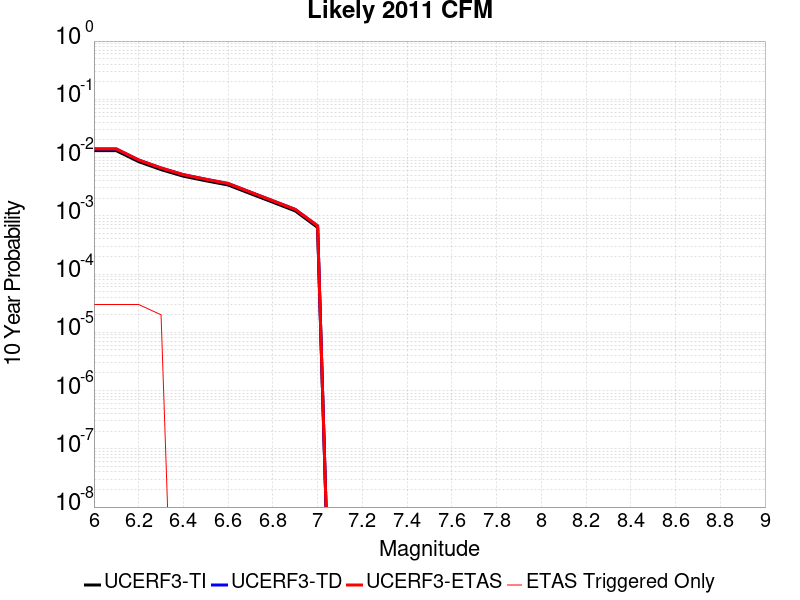 |

| Magnitude | 1 wk TI Prob | 1 wk TD Prob | 1 wk ETAS Prob | 1 wk ETAS/TD Gain | 1 wk ETAS Triggered Only | 1 mo TI Prob | 1 mo TD Prob | 1 mo ETAS Prob | 1 mo ETAS/TD Gain | 1 mo ETAS Triggered Only | 1 yr TI Prob | 1 yr TD Prob | 1 yr ETAS Prob | 1 yr ETAS/TD Gain | 1 yr ETAS Triggered Only | 10 yr TI Prob | 10 yr TD Prob | 10 yr ETAS Prob | 10 yr ETAS/TD Gain | 10 yr ETAS Triggered Only |
|-----|-----|-----|-----|-----|-----|-----|-----|-----|-----|-----|-----|-----|-----|-----|-----|-----|-----|-----|-----|-----|
| 6.0 | 2.5315949E-5 | 2.7104748E-5 | 2.7104748E-5 | 1.0 | 0.0 | 1.0849241E-4 | 1.16158284E-4 | 1.2615713E-4 | 1.0860795 | 1.0E-5 | 0.0013200947 | 0.0014133542 | 0.0014333259 | 1.0141307 | 2.0E-5 | 0.013122803 | 0.01404831 | 0.014077889 | 1.0021055 | 3.0E-5 |
| 6.1 | 2.5315949E-5 | 2.7104748E-5 | 2.7104748E-5 | 1.0 | 0.0 | 1.0849241E-4 | 1.16158284E-4 | 1.2615713E-4 | 1.0860795 | 1.0E-5 | 0.0013200947 | 0.0014133542 | 0.0014333259 | 1.0141307 | 2.0E-5 | 0.013122803 | 0.01404831 | 0.014077889 | 1.0021055 | 3.0E-5 |
| 6.2 | 1.6375941E-5 | 1.7465842E-5 | 1.7465842E-5 | 1.0 | 0.0 | 7.0180715E-5 | 7.485153E-5 | 8.4850784E-5 | 1.1335878 | 1.0E-5 | 8.5411523E-4 | 9.109487E-4 | 9.3093043E-4 | 1.0219351 | 2.0E-5 | 0.008508399 | 0.009073433 | 0.00910316 | 1.0032763 | 3.0E-5 |
| 6.3 | 1.1945543E-5 | 1.2712587E-5 | 1.2712587E-5 | 1.0 | 0.0 | 5.119418E-5 | 5.4481407E-5 | 6.448086E-5 | 1.1835389 | 1.0E-5 | 6.2311086E-4 | 6.631146E-4 | 6.73108E-4 | 1.0150703 | 1.0E-5 | 0.0062136655 | 0.0066119144 | 0.0066317823 | 1.0030048 | 2.0E-5 |
| 6.4 | 9.192729E-6 | 9.768488E-6 | 9.768488E-6 | 1.0 | 0.0 | 3.939681E-5 | 4.1864292E-5 | 4.1864292E-5 | 1.0 | 0.0 | 4.7955062E-4 | 5.0958124E-4 | 5.0958124E-4 | 1.0 | 0.0 | 0.004785171 | 0.0050844094 | 0.0050844094 | 1.0 | 0.0 |
| 6.5 | 7.67906E-6 | 8.152622E-6 | 8.152622E-6 | 1.0 | 0.0 | 3.2909844E-5 | 3.4939352E-5 | 3.4939352E-5 | 1.0 | 0.0 | 4.006037E-4 | 4.2530545E-4 | 4.2530545E-4 | 1.0 | 0.0 | 0.0039988225 | 0.004245108 | 0.004245108 | 1.0 | 0.0 |
| 6.6 | 6.4884057E-6 | 6.8847507E-6 | 6.8847507E-6 | 1.0 | 0.0 | 2.7807157E-5 | 2.9505749E-5 | 2.9505749E-5 | 1.0 | 0.0 | 3.3849955E-4 | 3.591747E-4 | 3.591747E-4 | 1.0 | 0.0 | 0.003379844 | 0.0035860867 | 0.0035860867 | 1.0 | 0.0 |
| 6.7 | 4.6060636E-6 | 4.884041E-6 | 4.884041E-6 | 1.0 | 0.0 | 1.9740122E-5 | 2.0931442E-5 | 2.0931442E-5 | 1.0 | 0.0 | 2.403095E-4 | 2.5481134E-4 | 2.5481134E-4 | 1.0 | 0.0 | 0.002400498 | 0.0025452746 | 0.0025452746 | 1.0 | 0.0 |
| 6.8 | 3.2795615E-6 | 3.4773732E-6 | 3.4773732E-6 | 1.0 | 0.0 | 1.4055187E-5 | 1.4902946E-5 | 1.4902946E-5 | 1.0 | 0.0 | 1.7110848E-4 | 1.8142881E-4 | 1.8142881E-4 | 1.0 | 0.0 | 0.0017097679 | 0.0018128622 | 0.0018128622 | 1.0 | 0.0 |
| 6.9 | 2.3289967E-6 | 2.4705569E-6 | 2.4705569E-6 | 1.0 | 0.0 | 9.981376E-6 | 1.058806E-5 | 1.058806E-5 | 1.0 | 0.0 | 1.2151648E-4 | 1.2890245E-4 | 1.2890245E-4 | 1.0 | 0.0 | 0.0012145005 | 0.0012883197 | 0.0012883197 | 1.0 | 0.0 |
| 7.0 | 1.211292E-6 | 1.2863958E-6 | 1.2863958E-6 | 1.0 | 0.0 | 5.1912407E-6 | 5.5131145E-6 | 5.5131145E-6 | 1.0 | 0.0 | 6.320152E-5 | 6.712041E-5 | 6.712041E-5 | 1.0 | 0.0 | 6.3183554E-4 | 6.710312E-4 | 6.710312E-4 | 1.0 | 0.0 |

## Sierra Madre
*[(top)](#table-of-contents)*

| 1 Week | 1 Month | 1 Year | 10 Year |
|-----|-----|-----|-----|
|  |  |  |  |

| Magnitude | 1 wk TI Prob | 1 wk TD Prob | 1 wk ETAS Prob | 1 wk ETAS/TD Gain | 1 wk ETAS Triggered Only | 1 mo TI Prob | 1 mo TD Prob | 1 mo ETAS Prob | 1 mo ETAS/TD Gain | 1 mo ETAS Triggered Only | 1 yr TI Prob | 1 yr TD Prob | 1 yr ETAS Prob | 1 yr ETAS/TD Gain | 1 yr ETAS Triggered Only | 10 yr TI Prob | 10 yr TD Prob | 10 yr ETAS Prob | 10 yr ETAS/TD Gain | 10 yr ETAS Triggered Only |
|-----|-----|-----|-----|-----|-----|-----|-----|-----|-----|-----|-----|-----|-----|-----|-----|-----|-----|-----|-----|-----|
| 6.0 | 1.3379373E-5 | 1.1000776E-5 | 1.1000776E-5 | 1.0 | 0.0 | 5.7338908E-5 | 4.714534E-5 | 4.714534E-5 | 1.0 | 0.0 | 6.978776E-4 | 5.738448E-4 | 6.038276E-4 | 1.052249 | 3.0E-5 | 0.0069569005 | 0.0057238447 | 0.005753673 | 1.0052112 | 3.0E-5 |
| 6.1 | 1.3379373E-5 | 1.1000776E-5 | 1.1000776E-5 | 1.0 | 0.0 | 5.7338908E-5 | 4.714534E-5 | 4.714534E-5 | 1.0 | 0.0 | 6.978776E-4 | 5.738448E-4 | 6.038276E-4 | 1.052249 | 3.0E-5 | 0.0069569005 | 0.0057238447 | 0.005753673 | 1.0052112 | 3.0E-5 |
| 6.2 | 1.3379373E-5 | 1.1000776E-5 | 1.1000776E-5 | 1.0 | 0.0 | 5.7338908E-5 | 4.714534E-5 | 4.714534E-5 | 1.0 | 0.0 | 6.978776E-4 | 5.738448E-4 | 6.038276E-4 | 1.052249 | 3.0E-5 | 0.0069569005 | 0.0057238447 | 0.005753673 | 1.0052112 | 3.0E-5 |
| 6.3 | 1.3379373E-5 | 1.1000776E-5 | 1.1000776E-5 | 1.0 | 0.0 | 5.7338908E-5 | 4.714534E-5 | 4.714534E-5 | 1.0 | 0.0 | 6.978776E-4 | 5.738448E-4 | 6.038276E-4 | 1.052249 | 3.0E-5 | 0.0069569005 | 0.0057238447 | 0.005753673 | 1.0052112 | 3.0E-5 |
| 6.4 | 1.3379373E-5 | 1.1000776E-5 | 1.1000776E-5 | 1.0 | 0.0 | 5.7338908E-5 | 4.714534E-5 | 4.714534E-5 | 1.0 | 0.0 | 6.978776E-4 | 5.738448E-4 | 6.038276E-4 | 1.052249 | 3.0E-5 | 0.0069569005 | 0.0057238447 | 0.005753673 | 1.0052112 | 3.0E-5 |
| 6.5 | 1.26563245E-5 | 1.0230232E-5 | 1.0230232E-5 | 1.0 | 0.0 | 5.4240263E-5 | 4.384312E-5 | 4.384312E-5 | 1.0 | 0.0 | 6.601751E-4 | 5.3366035E-4 | 5.6364434E-4 | 1.0561855 | 3.0E-5 | 0.006582173 | 0.0053239604 | 0.0053538005 | 1.0056049 | 3.0E-5 |
| 6.6 | 1.26563245E-5 | 1.0230232E-5 | 1.0230232E-5 | 1.0 | 0.0 | 5.4240263E-5 | 4.384312E-5 | 4.384312E-5 | 1.0 | 0.0 | 6.601751E-4 | 5.3366035E-4 | 5.6364434E-4 | 1.0561855 | 3.0E-5 | 0.006582173 | 0.0053239604 | 0.0053538005 | 1.0056049 | 3.0E-5 |
| 6.7 | 1.2502474E-5 | 1.00663765E-5 | 1.00663765E-5 | 1.0 | 0.0 | 5.3580934E-5 | 4.3140906E-5 | 4.3140906E-5 | 1.0 | 0.0 | 6.521526E-4 | 5.25115E-4 | 5.550992E-4 | 1.0571003 | 3.0E-5 | 0.0065024206 | 0.0052389116 | 0.0052687544 | 1.0056964 | 3.0E-5 |
| 6.8 | 1.2454966E-5 | 1.0018662E-5 | 1.0018662E-5 | 1.0 | 0.0 | 5.3377335E-5 | 4.293642E-5 | 4.293642E-5 | 1.0 | 0.0 | 6.4967526E-4 | 5.226266E-4 | 5.526109E-4 | 1.0573723 | 3.0E-5 | 0.006477792 | 0.0052141445 | 0.005243988 | 1.0057236 | 3.0E-5 |
| 6.9 | 1.2225574E-5 | 9.792639E-6 | 9.792639E-6 | 1.0 | 0.0 | 5.2394265E-5 | 4.196778E-5 | 4.196778E-5 | 1.0 | 0.0 | 6.3771347E-4 | 5.10839E-4 | 5.408237E-4 | 1.0586969 | 3.0E-5 | 0.006358865 | 0.0050968137 | 0.0051266607 | 1.005856 | 3.0E-5 |
| 7.0 | 1.182946E-5 | 9.399179E-6 | 9.399179E-6 | 1.0 | 0.0 | 5.06967E-5 | 4.0281582E-5 | 4.0281582E-5 | 1.0 | 0.0 | 6.1705755E-4 | 4.903189E-4 | 5.203042E-4 | 1.0611547 | 3.0E-5 | 0.006153469 | 0.004892533 | 0.0049223863 | 1.0061018 | 3.0E-5 |
| 7.1 | 1.14369095E-5 | 8.986194E-6 | 8.986194E-6 | 1.0 | 0.0 | 4.9014405E-5 | 3.85117E-5 | 3.85117E-5 | 1.0 | 0.0 | 5.9658696E-4 | 4.6878002E-4 | 4.9876596E-4 | 1.0639659 | 3.0E-5 | 0.005949879 | 0.0046780678 | 0.0047079273 | 1.006383 | 3.0E-5 |
| 7.2 | 1.0836419E-5 | 8.39959E-6 | 8.39959E-6 | 1.0 | 0.0 | 4.644097E-5 | 3.599775E-5 | 3.599775E-5 | 1.0 | 0.0 | 5.652721E-4 | 4.3818538E-4 | 4.5817663E-4 | 1.0456228 | 2.0E-5 | 0.0056383642 | 0.0043733614 | 0.004393274 | 1.0045532 | 2.0E-5 |
| 7.3 | 1.0403439E-5 | 8.020854E-6 | 8.020854E-6 | 1.0 | 0.0 | 4.4585406E-5 | 3.437464E-5 | 3.437464E-5 | 1.0 | 0.0 | 5.426921E-4 | 4.184318E-4 | 4.3842342E-4 | 1.0477775 | 2.0E-5 | 0.005413687 | 0.004176585 | 0.0041965013 | 1.0047686 | 2.0E-5 |
| 7.4 | 9.768864E-6 | 7.4144855E-6 | 7.4144855E-6 | 1.0 | 0.0 | 4.186589E-5 | 3.1775984E-5 | 3.1775984E-5 | 1.0 | 0.0 | 5.09598E-4 | 3.868048E-4 | 4.0679707E-4 | 1.0516857 | 2.0E-5 | 0.0050843097 | 0.0038614576 | 0.0038813804 | 1.0051594 | 2.0E-5 |
| 7.5 | 8.687089E-6 | 6.450183E-6 | 6.450183E-6 | 1.0 | 0.0 | 3.722985E-5 | 2.7643353E-5 | 2.7643353E-5 | 1.0 | 0.0 | 4.5317915E-4 | 3.3650672E-4 | 3.5649998E-4 | 1.0594141 | 2.0E-5 | 0.004522561 | 0.003360109 | 0.0033800418 | 1.0059322 | 2.0E-5 |
| 7.6 | 6.3506063E-6 | 4.430329E-6 | 4.430329E-6 | 1.0 | 0.0 | 2.72166E-5 | 1.8986988E-5 | 1.8986988E-5 | 1.0 | 0.0 | 3.3131172E-4 | 2.3114232E-4 | 2.511377E-4 | 1.0865067 | 2.0E-5 | 0.003308182 | 0.0023090935 | 0.0023290473 | 1.0086414 | 2.0E-5 |
| 7.7 | 4.62223E-6 | 2.9329542E-6 | 2.9329542E-6 | 1.0 | 0.0 | 1.9809406E-5 | 1.2569743E-5 | 1.2569743E-5 | 1.0 | 0.0 | 2.4115283E-4 | 1.5302589E-4 | 1.6302436E-4 | 1.0653384 | 1.0E-5 | 0.0024089129 | 0.0015292577 | 0.0015392425 | 1.0065291 | 1.0E-5 |
| 7.8 | 3.2145008E-6 | 1.949411E-6 | 1.949411E-6 | 1.0 | 0.0 | 1.3776359E-5 | 8.354592E-6 | 8.354592E-6 | 1.0 | 0.0 | 1.6771426E-4 | 1.01712416E-4 | 1.117114E-4 | 1.0983064 | 1.0E-5 | 0.0016758774 | 0.0010166786 | 0.0010266685 | 1.009826 | 1.0E-5 |
| 7.9 | 1.0391769E-6 | 5.602482E-7 | 5.602482E-7 | 1.0 | 0.0 | 4.4536077E-6 | 2.4010617E-6 | 2.4010617E-6 | 1.0 | 0.0 | 5.4221324E-5 | 2.9232539E-5 | 3.9232247E-5 | 1.3420745 | 1.0E-5 | 5.4208096E-4 | 2.9228735E-4 | 3.0228443E-4 | 1.0342029 | 1.0E-5 |
| 8.0 | 1.210983E-7 | 6.613497E-8 | 6.613497E-8 | 1.0 | 0.0 | 5.1899264E-7 | 2.8343558E-7 | 2.8343558E-7 | 1.0 | 0.0 | 6.3187167E-6 | 3.4508228E-6 | 3.4508228E-6 | 1.0 | 0.0 | 6.318537E-5 | 3.450771E-5 | 3.450771E-5 | 1.0 | 0.0 |

## Santa Monica alt 1
*[(top)](#table-of-contents)*

| 1 Week | 1 Month | 1 Year | 10 Year |
|-----|-----|-----|-----|
|  |  |  | 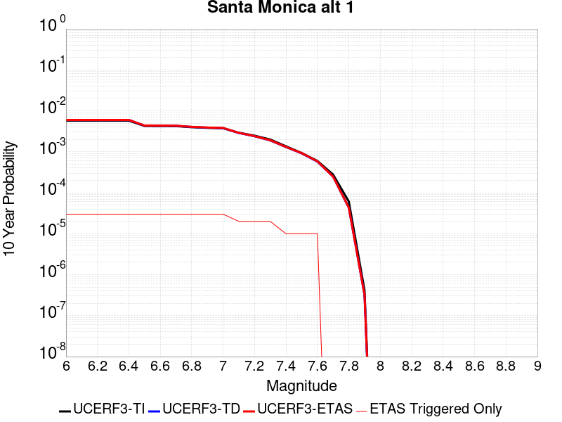 |

| Magnitude | 1 wk TI Prob | 1 wk TD Prob | 1 wk ETAS Prob | 1 wk ETAS/TD Gain | 1 wk ETAS Triggered Only | 1 mo TI Prob | 1 mo TD Prob | 1 mo ETAS Prob | 1 mo ETAS/TD Gain | 1 mo ETAS Triggered Only | 1 yr TI Prob | 1 yr TD Prob | 1 yr ETAS Prob | 1 yr ETAS/TD Gain | 1 yr ETAS Triggered Only | 10 yr TI Prob | 10 yr TD Prob | 10 yr ETAS Prob | 10 yr ETAS/TD Gain | 10 yr ETAS Triggered Only |
|-----|-----|-----|-----|-----|-----|-----|-----|-----|-----|-----|-----|-----|-----|-----|-----|-----|-----|-----|-----|-----|
| 6.0 | 1.1066008E-5 | 1.1480312E-5 | 1.1480312E-5 | 1.0 | 0.0 | 4.742488E-5 | 4.920049E-5 | 4.920049E-5 | 1.0 | 0.0 | 5.7724497E-4 | 5.9886527E-4 | 6.188533E-4 | 1.0333765 | 2.0E-5 | 0.005757478 | 0.0059739016 | 0.006003722 | 1.0049919 | 3.0E-5 |
| 6.1 | 1.1066008E-5 | 1.1480312E-5 | 1.1480312E-5 | 1.0 | 0.0 | 4.742488E-5 | 4.920049E-5 | 4.920049E-5 | 1.0 | 0.0 | 5.7724497E-4 | 5.9886527E-4 | 6.188533E-4 | 1.0333765 | 2.0E-5 | 0.005757478 | 0.0059739016 | 0.006003722 | 1.0049919 | 3.0E-5 |
| 6.2 | 1.1066008E-5 | 1.1480312E-5 | 1.1480312E-5 | 1.0 | 0.0 | 4.742488E-5 | 4.920049E-5 | 4.920049E-5 | 1.0 | 0.0 | 5.7724497E-4 | 5.9886527E-4 | 6.188533E-4 | 1.0333765 | 2.0E-5 | 0.005757478 | 0.0059739016 | 0.006003722 | 1.0049919 | 3.0E-5 |
| 6.3 | 1.1066008E-5 | 1.1480312E-5 | 1.1480312E-5 | 1.0 | 0.0 | 4.742488E-5 | 4.920049E-5 | 4.920049E-5 | 1.0 | 0.0 | 5.7724497E-4 | 5.9886527E-4 | 6.188533E-4 | 1.0333765 | 2.0E-5 | 0.005757478 | 0.0059739016 | 0.006003722 | 1.0049919 | 3.0E-5 |
| 6.4 | 1.1066008E-5 | 1.1480312E-5 | 1.1480312E-5 | 1.0 | 0.0 | 4.742488E-5 | 4.920049E-5 | 4.920049E-5 | 1.0 | 0.0 | 5.7724497E-4 | 5.9886527E-4 | 6.188533E-4 | 1.0333765 | 2.0E-5 | 0.005757478 | 0.0059739016 | 0.006003722 | 1.0049919 | 3.0E-5 |
| 6.5 | 8.183544E-6 | 8.335434E-6 | 8.335434E-6 | 1.0 | 0.0 | 3.5071862E-5 | 3.572281E-5 | 3.572281E-5 | 1.0 | 0.0 | 4.2691626E-4 | 4.3483998E-4 | 4.548313E-4 | 1.0459739 | 2.0E-5 | 0.0042609703 | 0.004340057 | 0.0043699266 | 1.0068823 | 3.0E-5 |
| 6.6 | 8.1543285E-6 | 8.303648E-6 | 8.303648E-6 | 1.0 | 0.0 | 3.4946657E-5 | 3.558659E-5 | 3.558659E-5 | 1.0 | 0.0 | 4.2539247E-4 | 4.3318217E-4 | 4.531735E-4 | 1.04615 | 2.0E-5 | 0.0042457907 | 0.004323543 | 0.0043534134 | 1.0069088 | 3.0E-5 |
| 6.7 | 8.110878E-6 | 8.257045E-6 | 8.257045E-6 | 1.0 | 0.0 | 3.4760444E-5 | 3.5386864E-5 | 3.5386864E-5 | 1.0 | 0.0 | 4.231262E-4 | 4.3075148E-4 | 4.5074287E-4 | 1.0464104 | 2.0E-5 | 0.0042232145 | 0.004299331 | 0.0043292018 | 1.0069479 | 3.0E-5 |
| 6.8 | 7.644036E-6 | 7.751063E-6 | 7.751063E-6 | 1.0 | 0.0 | 3.275974E-5 | 3.3218425E-5 | 3.3218425E-5 | 1.0 | 0.0 | 3.9877684E-4 | 4.043607E-4 | 4.2435262E-4 | 1.0494407 | 2.0E-5 | 0.00398062 | 0.004036396 | 0.0040662745 | 1.0074024 | 3.0E-5 |
| 6.9 | 7.3698293E-6 | 7.4557215E-6 | 7.4557215E-6 | 1.0 | 0.0 | 3.15846E-5 | 3.195271E-5 | 3.195271E-5 | 1.0 | 0.0 | 3.8447464E-4 | 3.889562E-4 | 4.089484E-4 | 1.0513997 | 2.0E-5 | 0.0038381014 | 0.0038828978 | 0.0039127814 | 1.0076962 | 3.0E-5 |
| 7.0 | 7.209872E-6 | 7.2856283E-6 | 7.2856283E-6 | 1.0 | 0.0 | 3.0899086E-5 | 3.1223753E-5 | 3.1223753E-5 | 1.0 | 0.0 | 3.7613141E-4 | 3.800843E-4 | 4.0007668E-4 | 1.0525999 | 2.0E-5 | 0.0037549543 | 0.003794485 | 0.0038243711 | 1.0078762 | 3.0E-5 |
| 7.1 | 5.603456E-6 | 5.5238947E-6 | 5.5238947E-6 | 1.0 | 0.0 | 2.4014591E-5 | 2.3673623E-5 | 2.3673623E-5 | 1.0 | 0.0 | 2.923384E-4 | 2.8818863E-4 | 2.9818574E-4 | 1.0346895 | 1.0E-5 | 0.0029195412 | 0.002878191 | 0.0028981334 | 1.0069288 | 2.0E-5 |
| 7.2 | 4.7483613E-6 | 4.591135E-6 | 4.591135E-6 | 1.0 | 0.0 | 2.0349962E-5 | 1.9676147E-5 | 1.9676147E-5 | 1.0 | 0.0 | 2.4773262E-4 | 2.3953087E-4 | 2.4952847E-4 | 1.0417383 | 1.0E-5 | 0.0024745662 | 0.0023927412 | 0.0024126933 | 1.0083386 | 2.0E-5 |
| 7.3 | 3.829015E-6 | 3.6342271E-6 | 3.6342271E-6 | 1.0 | 0.0 | 1.6409962E-5 | 1.5575166E-5 | 1.5575166E-5 | 1.0 | 0.0 | 1.9977297E-4 | 1.8961124E-4 | 1.9960933E-4 | 1.0527295 | 1.0E-5 | 0.0019959346 | 0.0018945034 | 0.0019144656 | 1.0105369 | 2.0E-5 |
| 7.4 | 2.610755E-6 | 2.4995722E-6 | 2.4995722E-6 | 1.0 | 0.0 | 1.1188902E-5 | 1.0712408E-5 | 1.0712408E-5 | 1.0 | 0.0 | 1.3621636E-4 | 1.304158E-4 | 1.304158E-4 | 1.0 | 0.0 | 0.001361329 | 0.0013033971 | 0.0013133842 | 1.0076623 | 1.0E-5 |
| 7.5 | 1.792146E-6 | 1.7584194E-6 | 1.7584194E-6 | 1.0 | 0.0 | 7.680603E-6 | 7.5360617E-6 | 7.5360617E-6 | 1.0 | 0.0 | 9.3507326E-5 | 9.174772E-5 | 9.174772E-5 | 1.0 | 0.0 | 9.3467993E-4 | 9.1710157E-4 | 9.270924E-4 | 1.010894 | 1.0E-5 |
| 7.6 | 1.1473018E-6 | 1.102916E-6 | 1.102916E-6 | 1.0 | 0.0 | 4.9169985E-6 | 4.7267745E-6 | 4.7267745E-6 | 1.0 | 0.0 | 5.986281E-5 | 5.7546975E-5 | 5.7546975E-5 | 1.0 | 0.0 | 5.984669E-4 | 5.753224E-4 | 5.853166E-4 | 1.0173715 | 1.0E-5 |
| 7.7 | 5.330919E-7 | 4.7452562E-7 | 4.7452562E-7 | 1.0 | 0.0 | 2.2846775E-6 | 2.0336797E-6 | 2.0336797E-6 | 1.0 | 0.0 | 2.7815593E-5 | 2.4759782E-5 | 2.4759782E-5 | 1.0 | 0.0 | 2.7812112E-4 | 2.4757136E-4 | 2.4757136E-4 | 1.0 | 0.0 |
| 7.8 | 1.1668574E-7 | 8.296564E-8 | 8.296564E-8 | 1.0 | 0.0 | 5.000816E-7 | 3.5556698E-7 | 3.5556698E-7 | 1.0 | 0.0 | 6.0884768E-6 | 4.3290197E-6 | 4.3290197E-6 | 1.0 | 0.0 | 6.08831E-5 | 4.3289383E-5 | 4.3289383E-5 | 1.0 | 0.0 |
| 7.9 | 8.007447E-10 | 6.161581E-10 | 6.161581E-10 | 1.0 | 0.0 | 3.4317629E-9 | 2.640678E-9 | 2.640678E-9 | 1.0 | 0.0 | 4.1781714E-8 | 3.2150254E-8 | 3.2150254E-8 | 1.0 | 0.0 | 4.1781706E-7 | 3.2150248E-7 | 3.2150248E-7 | 1.0 | 0.0 |

## Elsinore (Julian)
*[(top)](#table-of-contents)*

| 1 Week | 1 Month | 1 Year | 10 Year |
|-----|-----|-----|-----|
| 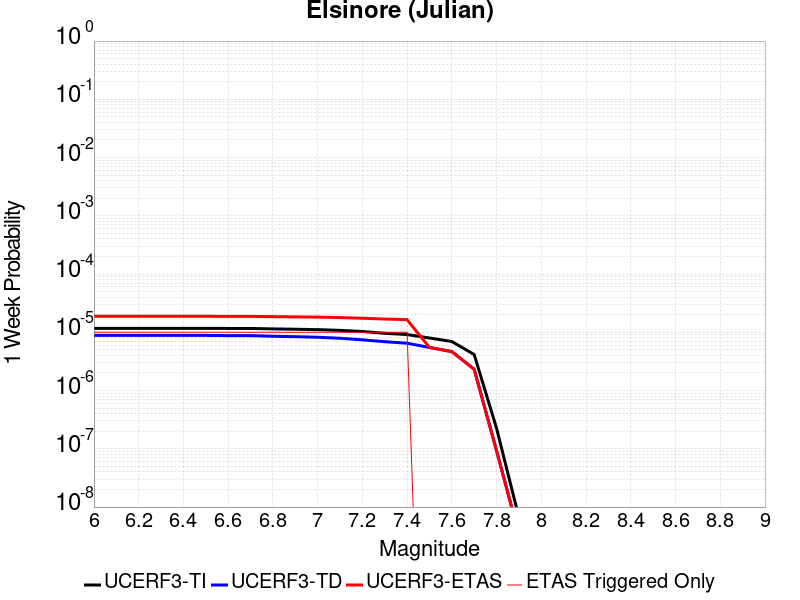 |  | 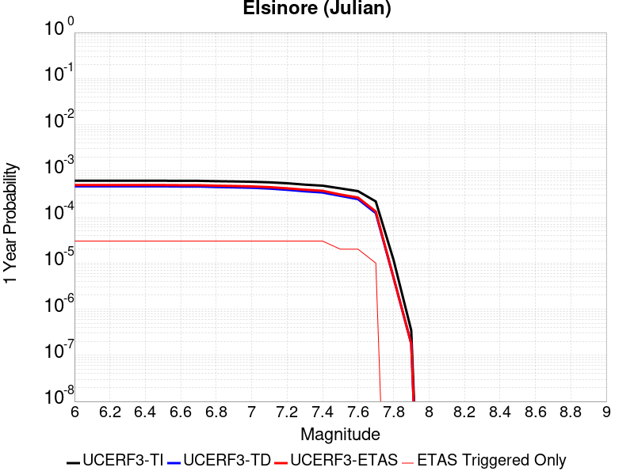 | 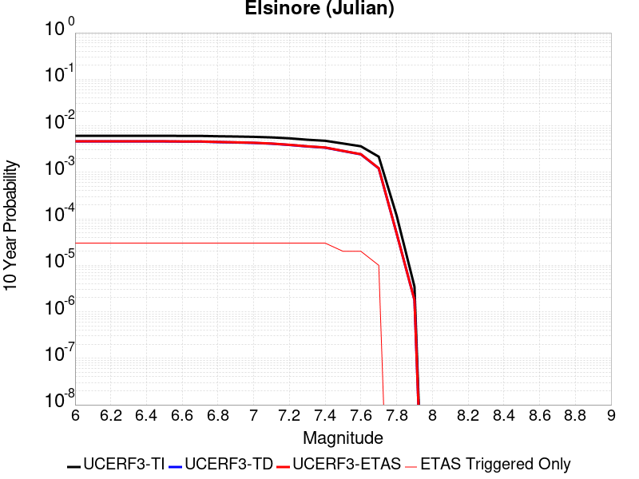 |

| Magnitude | 1 wk TI Prob | 1 wk TD Prob | 1 wk ETAS Prob | 1 wk ETAS/TD Gain | 1 wk ETAS Triggered Only | 1 mo TI Prob | 1 mo TD Prob | 1 mo ETAS Prob | 1 mo ETAS/TD Gain | 1 mo ETAS Triggered Only | 1 yr TI Prob | 1 yr TD Prob | 1 yr ETAS Prob | 1 yr ETAS/TD Gain | 1 yr ETAS Triggered Only | 10 yr TI Prob | 10 yr TD Prob | 10 yr ETAS Prob | 10 yr ETAS/TD Gain | 10 yr ETAS Triggered Only |
|-----|-----|-----|-----|-----|-----|-----|-----|-----|-----|-----|-----|-----|-----|-----|-----|-----|-----|-----|-----|-----|
| 6.0 | 1.1710231E-5 | 8.845315E-6 | 1.8845227E-5 | 2.130532 | 1.0E-5 | 5.0185736E-5 | 3.7907954E-5 | 5.7907197E-5 | 1.5275737 | 2.0E-5 | 6.1084004E-4 | 4.614333E-4 | 4.9141946E-4 | 1.0649848 | 3.0E-5 | 0.006091637 | 0.0046049724 | 0.004634834 | 1.0064847 | 3.0E-5 |
| 6.1 | 1.1710231E-5 | 8.845315E-6 | 1.8845227E-5 | 2.130532 | 1.0E-5 | 5.0185736E-5 | 3.7907954E-5 | 5.7907197E-5 | 1.5275737 | 2.0E-5 | 6.1084004E-4 | 4.614333E-4 | 4.9141946E-4 | 1.0649848 | 3.0E-5 | 0.006091637 | 0.0046049724 | 0.004634834 | 1.0064847 | 3.0E-5 |
| 6.2 | 1.1710231E-5 | 8.845315E-6 | 1.8845227E-5 | 2.130532 | 1.0E-5 | 5.0185736E-5 | 3.7907954E-5 | 5.7907197E-5 | 1.5275737 | 2.0E-5 | 6.1084004E-4 | 4.614333E-4 | 4.9141946E-4 | 1.0649848 | 3.0E-5 | 0.006091637 | 0.0046049724 | 0.004634834 | 1.0064847 | 3.0E-5 |
| 6.3 | 1.1710231E-5 | 8.845315E-6 | 1.8845227E-5 | 2.130532 | 1.0E-5 | 5.0185736E-5 | 3.7907954E-5 | 5.7907197E-5 | 1.5275737 | 2.0E-5 | 6.1084004E-4 | 4.614333E-4 | 4.9141946E-4 | 1.0649848 | 3.0E-5 | 0.006091637 | 0.0046049724 | 0.004634834 | 1.0064847 | 3.0E-5 |
| 6.4 | 1.1710231E-5 | 8.845315E-6 | 1.8845227E-5 | 2.130532 | 1.0E-5 | 5.0185736E-5 | 3.7907954E-5 | 5.7907197E-5 | 1.5275737 | 2.0E-5 | 6.1084004E-4 | 4.614333E-4 | 4.9141946E-4 | 1.0649848 | 3.0E-5 | 0.006091637 | 0.0046049724 | 0.004634834 | 1.0064847 | 3.0E-5 |
| 6.5 | 1.1710231E-5 | 8.845315E-6 | 1.8845227E-5 | 2.130532 | 1.0E-5 | 5.0185736E-5 | 3.7907954E-5 | 5.7907197E-5 | 1.5275737 | 2.0E-5 | 6.1084004E-4 | 4.614333E-4 | 4.9141946E-4 | 1.0649848 | 3.0E-5 | 0.006091637 | 0.0046049724 | 0.004634834 | 1.0064847 | 3.0E-5 |
| 6.6 | 1.1650619E-5 | 8.777691E-6 | 1.8777604E-5 | 2.1392417 | 1.0E-5 | 4.993027E-5 | 3.761814E-5 | 5.761739E-5 | 1.5316384 | 2.0E-5 | 6.0773146E-4 | 4.5790634E-4 | 4.878926E-4 | 1.0654856 | 3.0E-5 | 0.0060607214 | 0.004569848 | 0.004599711 | 1.0065348 | 3.0E-5 |
| 6.7 | 1.1650619E-5 | 8.777691E-6 | 1.8777604E-5 | 2.1392417 | 1.0E-5 | 4.993027E-5 | 3.761814E-5 | 5.761739E-5 | 1.5316384 | 2.0E-5 | 6.0773146E-4 | 4.5790634E-4 | 4.878926E-4 | 1.0654856 | 3.0E-5 | 0.0060607214 | 0.004569848 | 0.004599711 | 1.0065348 | 3.0E-5 |
| 6.8 | 1.1442698E-5 | 8.560841E-6 | 1.8560755E-5 | 2.1680994 | 1.0E-5 | 4.9039216E-5 | 3.6688813E-5 | 5.668808E-5 | 1.5451053 | 2.0E-5 | 5.968889E-4 | 4.4659642E-4 | 4.7658302E-4 | 1.0671448 | 3.0E-5 | 0.0059528816 | 0.004457207 | 0.0044870735 | 1.0067006 | 3.0E-5 |
| 6.9 | 1.1300589E-5 | 8.408708E-6 | 1.8408624E-5 | 2.1892333 | 1.0E-5 | 4.8430196E-5 | 3.603683E-5 | 5.6036108E-5 | 1.5549678 | 2.0E-5 | 5.894781E-4 | 4.3866172E-4 | 4.6864856E-4 | 1.0683599 | 3.0E-5 | 0.005879169 | 0.0043781744 | 0.0044080433 | 1.0068222 | 3.0E-5 |
| 7.0 | 1.1117729E-5 | 8.225868E-6 | 1.8225786E-5 | 2.215667 | 1.0E-5 | 4.764654E-5 | 3.5253255E-5 | 5.525255E-5 | 1.5673035 | 2.0E-5 | 5.799422E-4 | 4.291255E-4 | 4.5911263E-4 | 1.0698797 | 3.0E-5 | 0.0057843104 | 0.0042831833 | 0.004313055 | 1.0069741 | 3.0E-5 |
| 7.1 | 1.08053955E-5 | 7.911498E-6 | 1.791142E-5 | 2.263973 | 1.0E-5 | 4.6308014E-5 | 3.3905988E-5 | 5.390531E-5 | 1.5898463 | 2.0E-5 | 5.6365423E-4 | 4.1272887E-4 | 4.427165E-4 | 1.072657 | 3.0E-5 | 0.005622267 | 0.004119835 | 0.004149711 | 1.0072519 | 3.0E-5 |
| 7.2 | 1.032804E-5 | 7.432751E-6 | 1.7432676E-5 | 2.345387 | 1.0E-5 | 4.4262277E-5 | 3.1854266E-5 | 5.185363E-5 | 1.6278394 | 2.0E-5 | 5.387599E-4 | 3.8775822E-4 | 4.177466E-4 | 1.0773377 | 3.0E-5 | 0.0053745564 | 0.00387102 | 0.0039009037 | 1.0077199 | 3.0E-5 |
| 7.3 | 9.622426E-6 | 6.897587E-6 | 1.6897518E-5 | 2.4497724 | 1.0E-5 | 4.1238312E-5 | 2.956076E-5 | 4.956017E-5 | 1.6765525 | 2.0E-5 | 5.019608E-4 | 3.5984424E-4 | 3.8983344E-4 | 1.0833395 | 3.0E-5 | 0.005008285 | 0.0035928036 | 0.0036226958 | 1.00832 | 3.0E-5 |
| 7.4 | 9.144434E-6 | 6.496142E-6 | 1.6496077E-5 | 2.5393653 | 1.0E-5 | 3.9189843E-5 | 2.7840319E-5 | 4.7839763E-5 | 1.7183626 | 2.0E-5 | 4.7703186E-4 | 3.3890453E-4 | 3.6889437E-4 | 1.0884905 | 3.0E-5 | 0.0047600917 | 0.0033840172 | 0.0034139156 | 1.0088352 | 3.0E-5 |
| 7.5 | 7.988981E-6 | 5.498105E-6 | 5.498105E-6 | 1.0 | 0.0 | 3.4238044E-5 | 2.3563101E-5 | 3.3562865E-5 | 1.4243823 | 1.0E-5 | 4.1676845E-4 | 2.8684427E-4 | 3.0683854E-4 | 1.0697043 | 2.0E-5 | 0.0041598766 | 0.0028648674 | 0.0028848103 | 1.0069611 | 2.0E-5 |
| 7.6 | 6.9554876E-6 | 4.6623254E-6 | 4.6623254E-6 | 1.0 | 0.0 | 2.9808893E-5 | 1.998125E-5 | 2.9981049E-5 | 1.5004592 | 1.0E-5 | 3.6286283E-4 | 2.4324573E-4 | 2.6324086E-4 | 1.0822014 | 2.0E-5 | 0.0036227088 | 0.002429911 | 0.0024498622 | 1.0082108 | 2.0E-5 |
| 7.7 | 4.1557314E-6 | 2.3244427E-6 | 2.3244427E-6 | 1.0 | 0.0 | 1.7810156E-5 | 9.961864E-6 | 1.9961764E-5 | 2.0038183 | 1.0E-5 | 2.1681708E-4 | 1.2127968E-4 | 1.3127847E-4 | 1.0824441 | 1.0E-5 | 0.0021660565 | 0.001212208 | 0.0012221958 | 1.0082394 | 1.0E-5 |
| 7.8 | 2.2597293E-7 | 9.331864E-8 | 9.331864E-8 | 1.0 | 0.0 | 9.684551E-7 | 3.99937E-7 | 3.99937E-7 | 1.0 | 0.0 | 1.1790877E-5 | 4.8692254E-6 | 4.8692254E-6 | 1.0 | 0.0 | 1.17902506E-4 | 4.8691512E-5 | 4.8691512E-5 | 1.0 | 0.0 |
| 7.9 | 6.676829E-9 | 3.4397174E-9 | 3.4397174E-9 | 1.0 | 0.0 | 2.861498E-8 | 1.4741646E-8 | 1.4741646E-8 | 1.0 | 0.0 | 3.4838732E-7 | 1.7947953E-7 | 1.7947953E-7 | 1.0 | 0.0 | 3.4838679E-6 | 1.794794E-6 | 1.794794E-6 | 1.0 | 0.0 |

## Newport-Inglewood (Offshore)
*[(top)](#table-of-contents)*

| 1 Week | 1 Month | 1 Year | 10 Year |
|-----|-----|-----|-----|
|  |  | 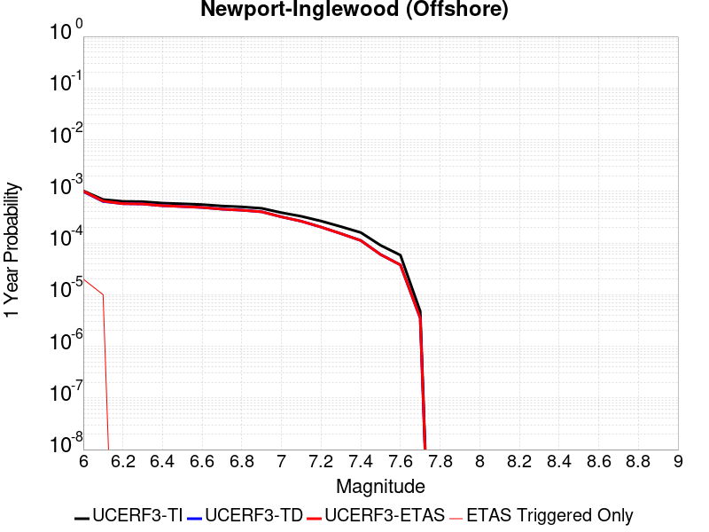 |  |

| Magnitude | 1 wk TI Prob | 1 wk TD Prob | 1 wk ETAS Prob | 1 wk ETAS/TD Gain | 1 wk ETAS Triggered Only | 1 mo TI Prob | 1 mo TD Prob | 1 mo ETAS Prob | 1 mo ETAS/TD Gain | 1 mo ETAS Triggered Only | 1 yr TI Prob | 1 yr TD Prob | 1 yr ETAS Prob | 1 yr ETAS/TD Gain | 1 yr ETAS Triggered Only | 10 yr TI Prob | 10 yr TD Prob | 10 yr ETAS Prob | 10 yr ETAS/TD Gain | 10 yr ETAS Triggered Only |
|-----|-----|-----|-----|-----|-----|-----|-----|-----|-----|-----|-----|-----|-----|-----|-----|-----|-----|-----|-----|-----|
| 6.0 | 1.9626508E-5 | 1.8965342E-5 | 3.8964965E-5 | 2.0545352 | 2.0E-5 | 8.411089E-5 | 8.1277576E-5 | 1.0127595E-4 | 1.2460504 | 2.0E-5 | 0.001023569 | 9.891179E-4 | 0.0010090981 | 1.0202 | 2.0E-5 | 0.010188672 | 0.009848497 | 0.009878201 | 1.0030161 | 3.0E-5 |
| 6.1 | 1.331886E-5 | 1.2218078E-5 | 2.2217957E-5 | 1.8184493 | 1.0E-5 | 5.707958E-5 | 5.2362153E-5 | 6.236163E-5 | 1.1909677 | 1.0E-5 | 6.947222E-4 | 6.3732424E-4 | 6.4731785E-4 | 1.0156806 | 1.0E-5 | 0.006925544 | 0.006355142 | 0.006375015 | 1.0031271 | 2.0E-5 |
| 6.2 | 1.2250852E-5 | 1.1076016E-5 | 1.1076016E-5 | 1.0 | 0.0 | 5.2502597E-5 | 4.746778E-5 | 4.746778E-5 | 1.0 | 0.0 | 6.3903164E-4 | 5.7776796E-4 | 5.7776796E-4 | 1.0 | 0.0 | 0.006371971 | 0.0057627796 | 0.005772722 | 1.0017253 | 1.0E-5 |
| 6.3 | 1.2106258E-5 | 1.0918878E-5 | 1.0918878E-5 | 1.0 | 0.0 | 5.1882926E-5 | 4.6794354E-5 | 4.6794354E-5 | 1.0 | 0.0 | 6.3149154E-4 | 5.695733E-4 | 5.695733E-4 | 1.0 | 0.0 | 0.0062970007 | 0.005681252 | 0.0056911954 | 1.0017502 | 1.0E-5 |
| 6.4 | 1.1348758E-5 | 1.0109348E-5 | 1.0109348E-5 | 1.0 | 0.0 | 4.8636626E-5 | 4.3325064E-5 | 4.3325064E-5 | 1.0 | 0.0 | 5.919901E-4 | 5.2735576E-4 | 5.2735576E-4 | 1.0 | 0.0 | 0.005904155 | 0.0052611395 | 0.005271087 | 1.0018908 | 1.0E-5 |
| 6.5 | 1.100837E-5 | 9.743376E-6 | 9.743376E-6 | 1.0 | 0.0 | 4.7177873E-5 | 4.175666E-5 | 4.175666E-5 | 1.0 | 0.0 | 5.7423924E-4 | 5.082695E-4 | 5.082695E-4 | 1.0 | 0.0 | 0.005727576 | 0.005071162 | 0.005081111 | 1.001962 | 1.0E-5 |
| 6.6 | 1.0634696E-5 | 9.34553E-6 | 9.34553E-6 | 1.0 | 0.0 | 4.557647E-5 | 4.0051662E-5 | 4.0051662E-5 | 1.0 | 0.0 | 5.5475225E-4 | 4.875206E-4 | 4.875206E-4 | 1.0 | 0.0 | 0.0055336943 | 0.0048645977 | 0.004874549 | 1.0020456 | 1.0E-5 |
| 6.7 | 9.9780855E-6 | 8.667898E-6 | 8.667898E-6 | 1.0 | 0.0 | 4.276252E-5 | 3.7147613E-5 | 3.7147613E-5 | 1.0 | 0.0 | 5.205093E-4 | 4.5217903E-4 | 4.5217903E-4 | 1.0 | 0.0 | 0.0051929182 | 0.0045126686 | 0.0045226235 | 1.002206 | 1.0E-5 |
| 6.8 | 9.59546E-6 | 8.272933E-6 | 8.272933E-6 | 1.0 | 0.0 | 4.1122752E-5 | 3.545495E-5 | 3.545495E-5 | 1.0 | 0.0 | 5.0055445E-4 | 4.3157916E-4 | 4.3157916E-4 | 1.0 | 0.0 | 0.004994285 | 0.004307486 | 0.004317443 | 1.0023116 | 1.0E-5 |
| 6.9 | 9.000614E-6 | 7.706823E-6 | 7.706823E-6 | 1.0 | 0.0 | 3.857349E-5 | 3.3028828E-5 | 3.3028828E-5 | 1.0 | 0.0 | 4.6953102E-4 | 4.0205245E-4 | 4.0205245E-4 | 1.0 | 0.0 | 0.004685402 | 0.0040133223 | 0.004023282 | 1.0024817 | 1.0E-5 |
| 7.0 | 7.4070194E-6 | 6.148865E-6 | 6.148865E-6 | 1.0 | 0.0 | 3.1743984E-5 | 2.6352012E-5 | 2.6352012E-5 | 1.0 | 0.0 | 3.8641447E-4 | 3.2078868E-4 | 3.2078868E-4 | 1.0 | 0.0 | 0.0038574322 | 0.0032032758 | 0.0032132438 | 1.0031118 | 1.0E-5 |
| 7.1 | 6.299615E-6 | 5.0565613E-6 | 5.0565613E-6 | 1.0 | 0.0 | 2.699807E-5 | 2.1670798E-5 | 2.1670798E-5 | 1.0 | 0.0 | 3.2865192E-4 | 2.6381016E-4 | 2.6381016E-4 | 1.0 | 0.0 | 0.003281663 | 0.0026349847 | 0.0026449582 | 1.0037851 | 1.0E-5 |
| 7.2 | 5.096653E-6 | 3.892733E-6 | 3.892733E-6 | 1.0 | 0.0 | 2.1842614E-5 | 1.6683034E-5 | 1.6683034E-5 | 1.0 | 0.0 | 2.6590136E-4 | 2.0309711E-4 | 2.0309711E-4 | 1.0 | 0.0 | 0.0026558342 | 0.0020291263 | 0.0020391059 | 1.0049182 | 1.0E-5 |
| 7.3 | 3.9753018E-6 | 2.9098787E-6 | 2.9098787E-6 | 1.0 | 0.0 | 1.7036897E-5 | 1.24708495E-5 | 1.24708495E-5 | 1.0 | 0.0 | 2.0740448E-4 | 1.518221E-4 | 1.518221E-4 | 1.0 | 0.0 | 0.00207211 | 0.0015171919 | 0.0015271767 | 1.0065811 | 1.0E-5 |
| 7.4 | 3.0568392E-6 | 2.1449732E-6 | 2.1449732E-6 | 1.0 | 0.0 | 1.3100675E-5 | 9.19271E-6 | 9.19271E-6 | 1.0 | 0.0 | 1.5948903E-4 | 1.11915564E-4 | 1.11915564E-4 | 1.0 | 0.0 | 0.0015937461 | 0.0011185983 | 0.0011185983 | 1.0 | 0.0 |
| 7.5 | 1.7279019E-6 | 1.1469651E-6 | 1.1469651E-6 | 1.0 | 0.0 | 7.405273E-6 | 4.9155556E-6 | 4.9155556E-6 | 1.0 | 0.0 | 9.015547E-5 | 5.9845286E-5 | 5.9845286E-5 | 1.0 | 0.0 | 9.01189E-4 | 5.982956E-4 | 5.982956E-4 | 1.0 | 0.0 |
| 7.6 | 1.1156416E-6 | 7.222962E-7 | 7.222962E-7 | 1.0 | 0.0 | 4.7813123E-6 | 3.0955514E-6 | 3.0955514E-6 | 1.0 | 0.0 | 5.821092E-5 | 3.768771E-5 | 3.768771E-5 | 1.0 | 0.0 | 5.8195676E-4 | 3.7681553E-4 | 3.7681553E-4 | 1.0 | 0.0 |
| 7.7 | 9.117973E-8 | 6.7342256E-8 | 6.7342256E-8 | 1.0 | 0.0 | 3.907702E-7 | 2.8860964E-7 | 2.8860964E-7 | 1.0 | 0.0 | 4.757617E-6 | 3.5138169E-6 | 3.5138169E-6 | 1.0 | 0.0 | 4.7575148E-5 | 3.5137644E-5 | 3.5137644E-5 | 1.0 | 0.0 |

## North Frontal  (East)
*[(top)](#table-of-contents)*

| 1 Week | 1 Month | 1 Year | 10 Year |
|-----|-----|-----|-----|
|  |  |  |  |

| Magnitude | 1 wk TI Prob | 1 wk TD Prob | 1 wk ETAS Prob | 1 wk ETAS/TD Gain | 1 wk ETAS Triggered Only | 1 mo TI Prob | 1 mo TD Prob | 1 mo ETAS Prob | 1 mo ETAS/TD Gain | 1 mo ETAS Triggered Only | 1 yr TI Prob | 1 yr TD Prob | 1 yr ETAS Prob | 1 yr ETAS/TD Gain | 1 yr ETAS Triggered Only | 10 yr TI Prob | 10 yr TD Prob | 10 yr ETAS Prob | 10 yr ETAS/TD Gain | 10 yr ETAS Triggered Only |
|-----|-----|-----|-----|-----|-----|-----|-----|-----|-----|-----|-----|-----|-----|-----|-----|-----|-----|-----|-----|-----|
| 6.0 | 7.135738E-6 | 7.4771765E-6 | 2.7477026E-5 | 3.6747863 | 2.0E-5 | 3.0581377E-5 | 3.204476E-5 | 5.204412E-5 | 1.624107 | 2.0E-5 | 3.7226462E-4 | 3.9009505E-4 | 4.2008335E-4 | 1.0768744 | 3.0E-5 | 0.0037164164 | 0.0038960609 | 0.0039259437 | 1.00767 | 3.0E-5 |
| 6.1 | 7.135738E-6 | 7.4771765E-6 | 2.7477026E-5 | 3.6747863 | 2.0E-5 | 3.0581377E-5 | 3.204476E-5 | 5.204412E-5 | 1.624107 | 2.0E-5 | 3.7226462E-4 | 3.9009505E-4 | 4.2008335E-4 | 1.0768744 | 3.0E-5 | 0.0037164164 | 0.0038960609 | 0.0039259437 | 1.00767 | 3.0E-5 |
| 6.2 | 7.135738E-6 | 7.4771765E-6 | 2.7477026E-5 | 3.6747863 | 2.0E-5 | 3.0581377E-5 | 3.204476E-5 | 5.204412E-5 | 1.624107 | 2.0E-5 | 3.7226462E-4 | 3.9009505E-4 | 4.2008335E-4 | 1.0768744 | 3.0E-5 | 0.0037164164 | 0.0038960609 | 0.0039259437 | 1.00767 | 3.0E-5 |
| 6.3 | 7.135738E-6 | 7.4771765E-6 | 2.7477026E-5 | 3.6747863 | 2.0E-5 | 3.0581377E-5 | 3.204476E-5 | 5.204412E-5 | 1.624107 | 2.0E-5 | 3.7226462E-4 | 3.9009505E-4 | 4.2008335E-4 | 1.0768744 | 3.0E-5 | 0.0037164164 | 0.0038960609 | 0.0039259437 | 1.00767 | 3.0E-5 |
| 6.4 | 7.135738E-6 | 7.4771765E-6 | 2.7477026E-5 | 3.6747863 | 2.0E-5 | 3.0581377E-5 | 3.204476E-5 | 5.204412E-5 | 1.624107 | 2.0E-5 | 3.7226462E-4 | 3.9009505E-4 | 4.2008335E-4 | 1.0768744 | 3.0E-5 | 0.0037164164 | 0.0038960609 | 0.0039259437 | 1.00767 | 3.0E-5 |
| 6.5 | 7.135738E-6 | 7.4771765E-6 | 2.7477026E-5 | 3.6747863 | 2.0E-5 | 3.0581377E-5 | 3.204476E-5 | 5.204412E-5 | 1.624107 | 2.0E-5 | 3.7226462E-4 | 3.9009505E-4 | 4.2008335E-4 | 1.0768744 | 3.0E-5 | 0.0037164164 | 0.0038960609 | 0.0039259437 | 1.00767 | 3.0E-5 |
| 6.6 | 7.135738E-6 | 7.4771765E-6 | 2.7477026E-5 | 3.6747863 | 2.0E-5 | 3.0581377E-5 | 3.204476E-5 | 5.204412E-5 | 1.624107 | 2.0E-5 | 3.7226462E-4 | 3.9009505E-4 | 4.2008335E-4 | 1.0768744 | 3.0E-5 | 0.0037164164 | 0.0038960609 | 0.0039259437 | 1.00767 | 3.0E-5 |
| 6.7 | 7.135738E-6 | 7.4771765E-6 | 2.7477026E-5 | 3.6747863 | 2.0E-5 | 3.0581377E-5 | 3.204476E-5 | 5.204412E-5 | 1.624107 | 2.0E-5 | 3.7226462E-4 | 3.9009505E-4 | 4.2008335E-4 | 1.0768744 | 3.0E-5 | 0.0037164164 | 0.0038960609 | 0.0039259437 | 1.00767 | 3.0E-5 |
| 6.8 | 5.959142E-6 | 6.236683E-6 | 2.6236557E-5 | 4.206813 | 2.0E-5 | 2.553893E-5 | 2.6728469E-5 | 4.6727935E-5 | 1.7482458 | 2.0E-5 | 3.108921E-4 | 3.253886E-4 | 3.553788E-4 | 1.0921675 | 3.0E-5 | 0.0031045752 | 0.0032508948 | 0.0032807973 | 1.0091982 | 3.0E-5 |
| 6.9 | 2.2946929E-6 | 2.3824605E-6 | 1.2382437E-5 | 5.1973314 | 1.0E-5 | 9.834361E-6 | 1.0210508E-5 | 2.0210406E-5 | 1.9793732 | 1.0E-5 | 1.1972676E-4 | 1.2430632E-4 | 1.4430382E-4 | 1.1608728 | 2.0E-5 | 0.0011966228 | 0.0012424142 | 0.0012623895 | 1.0160776 | 2.0E-5 |
| 7.0 | 2.2468673E-6 | 2.3321538E-6 | 1.2332131E-5 | 5.287872 | 1.0E-5 | 9.629396E-6 | 9.994909E-6 | 1.999481E-5 | 2.0004992 | 1.0E-5 | 1.1723159E-4 | 1.21681696E-4 | 1.4167927E-4 | 1.1643432 | 2.0E-5 | 0.0011716976 | 0.0012161969 | 0.0012361726 | 1.0164247 | 2.0E-5 |
| 7.1 | 1.9921076E-6 | 2.0646032E-6 | 1.2064583E-5 | 5.843536 | 1.0E-5 | 8.537577E-6 | 8.848272E-6 | 1.8848183E-5 | 2.1301541 | 1.0E-5 | 1.0394004E-4 | 1.0772282E-4 | 1.2772066E-4 | 1.1856416 | 2.0E-5 | 0.0010389143 | 0.0010767487 | 0.0010967272 | 1.0185544 | 2.0E-5 |
| 7.2 | 1.4524545E-6 | 1.5045148E-6 | 1.15044995E-5 | 7.6466513 | 1.0E-5 | 6.2247905E-6 | 6.447906E-6 | 1.6447842E-5 | 2.5508811 | 1.0E-5 | 7.5784184E-5 | 7.850068E-5 | 9.8499106E-5 | 1.2547549 | 2.0E-5 | 7.575835E-4 | 7.8475394E-4 | 8.047382E-4 | 1.0254657 | 2.0E-5 |
| 7.3 | 8.9802575E-7 | 9.3087283E-7 | 1.0930864E-5 | 11.742597 | 1.0E-5 | 3.848676E-6 | 3.9894494E-6 | 1.3989409E-5 | 3.5066016 | 1.0E-5 | 4.685662E-5 | 4.857058E-5 | 6.856961E-5 | 1.4117519 | 2.0E-5 | 4.6846745E-4 | 4.8561094E-4 | 5.0560123E-4 | 1.0411652 | 2.0E-5 |
| 7.4 | 7.776139E-7 | 8.0604747E-7 | 1.0806039E-5 | 13.406207 | 1.0E-5 | 3.3326266E-6 | 3.4544853E-6 | 1.3454451E-5 | 3.8947773 | 1.0E-5 | 4.0573974E-5 | 4.2057654E-5 | 6.205682E-5 | 1.4755176 | 2.0E-5 | 4.0566566E-4 | 4.205077E-4 | 4.404993E-4 | 1.0475415 | 2.0E-5 |
| 7.5 | 5.244417E-7 | 5.441219E-7 | 1.0544117E-5 | 19.378223 | 1.0E-5 | 2.2476054E-6 | 2.3319494E-6 | 1.2331926E-5 | 5.2882476 | 1.0E-5 | 2.7364253E-5 | 2.839118E-5 | 4.839061E-5 | 1.7044241 | 2.0E-5 | 2.7360884E-4 | 2.8388205E-4 | 3.0387638E-4 | 1.0704318 | 2.0E-5 |
| 7.6 | 1.5489647E-7 | 1.6089504E-7 | 1.6089504E-7 | 1.0 | 0.0 | 6.6384183E-7 | 6.895501E-7 | 6.895501E-7 | 1.0 | 0.0 | 8.082245E-6 | 8.395261E-6 | 1.8395176E-5 | 2.1911383 | 1.0E-5 | 8.08195E-5 | 8.395143E-5 | 9.395059E-5 | 1.1191065 | 1.0E-5 |

## San Andreas (Peninsula) 2011 CFM
*[(top)](#table-of-contents)*

| 1 Week | 1 Month | 1 Year | 10 Year |
|-----|-----|-----|-----|
|  |  |  |  |

| Magnitude | 1 wk TI Prob | 1 wk TD Prob | 1 wk ETAS Prob | 1 wk ETAS/TD Gain | 1 wk ETAS Triggered Only | 1 mo TI Prob | 1 mo TD Prob | 1 mo ETAS Prob | 1 mo ETAS/TD Gain | 1 mo ETAS Triggered Only | 1 yr TI Prob | 1 yr TD Prob | 1 yr ETAS Prob | 1 yr ETAS/TD Gain | 1 yr ETAS Triggered Only | 10 yr TI Prob | 10 yr TD Prob | 10 yr ETAS Prob | 10 yr ETAS/TD Gain | 10 yr ETAS Triggered Only |
|-----|-----|-----|-----|-----|-----|-----|-----|-----|-----|-----|-----|-----|-----|-----|-----|-----|-----|-----|-----|-----|
| 6.0 | 8.6200685E-5 | 2.5207937E-5 | 2.5207937E-5 | 1.0 | 0.0 | 3.6937918E-4 | 1.0802955E-4 | 1.1802847E-4 | 1.0925573 | 1.0E-5 | 0.0044879215 | 0.0013144679 | 0.0013444284 | 1.0227929 | 3.0E-5 | 0.043983612 | 0.01477218 | 0.014801736 | 1.0020008 | 3.0E-5 |
| 6.1 | 8.6200685E-5 | 2.5207937E-5 | 2.5207937E-5 | 1.0 | 0.0 | 3.6937918E-4 | 1.0802955E-4 | 1.1802847E-4 | 1.0925573 | 1.0E-5 | 0.0044879215 | 0.0013144679 | 0.0013444284 | 1.0227929 | 3.0E-5 | 0.043983612 | 0.01477218 | 0.014801736 | 1.0020008 | 3.0E-5 |
| 6.2 | 8.6200685E-5 | 2.5207937E-5 | 2.5207937E-5 | 1.0 | 0.0 | 3.6937918E-4 | 1.0802955E-4 | 1.1802847E-4 | 1.0925573 | 1.0E-5 | 0.0044879215 | 0.0013144679 | 0.0013444284 | 1.0227929 | 3.0E-5 | 0.043983612 | 0.01477218 | 0.014801736 | 1.0020008 | 3.0E-5 |
| 6.3 | 8.551163E-5 | 2.4899866E-5 | 2.4899866E-5 | 1.0 | 0.0 | 3.6642692E-4 | 1.06709354E-4 | 1.1670828E-4 | 1.0937026 | 1.0E-5 | 0.004452125 | 0.0012984137 | 0.0013283747 | 1.0230751 | 3.0E-5 | 0.043639794 | 0.01459892 | 0.014628482 | 1.0020249 | 3.0E-5 |
| 6.4 | 8.551163E-5 | 2.4899866E-5 | 2.4899866E-5 | 1.0 | 0.0 | 3.6642692E-4 | 1.06709354E-4 | 1.1670828E-4 | 1.0937026 | 1.0E-5 | 0.004452125 | 0.0012984137 | 0.0013283747 | 1.0230751 | 3.0E-5 | 0.043639794 | 0.01459892 | 0.014628482 | 1.0020249 | 3.0E-5 |
| 6.5 | 8.511146E-5 | 2.4721267E-5 | 2.4721267E-5 | 1.0 | 0.0 | 3.647124E-4 | 1.0594399E-4 | 1.1594293E-4 | 1.0943795 | 1.0E-5 | 0.004431336 | 0.0012891064 | 0.0013190678 | 1.0232419 | 3.0E-5 | 0.04344007 | 0.014498963 | 0.014528529 | 1.0020391 | 3.0E-5 |
| 6.6 | 8.4985084E-5 | 2.4651948E-5 | 2.4651948E-5 | 1.0 | 0.0 | 3.6417096E-4 | 1.0564694E-4 | 1.1564588E-4 | 1.0946449 | 1.0E-5 | 0.0044247704 | 0.0012854942 | 0.0013154555 | 1.0233073 | 3.0E-5 | 0.043376986 | 0.0144609315 | 0.014490498 | 1.0020446 | 3.0E-5 |
| 6.7 | 8.462618E-5 | 2.4480485E-5 | 2.4480485E-5 | 1.0 | 0.0 | 3.6263323E-4 | 1.0491216E-4 | 1.14911105E-4 | 1.0953078 | 1.0E-5 | 0.004406125 | 0.0012765586 | 0.0013065203 | 1.0234706 | 3.0E-5 | 0.043197807 | 0.014365727 | 0.014395296 | 1.0020583 | 3.0E-5 |
| 6.8 | 8.42337E-5 | 2.4376272E-5 | 2.4376272E-5 | 1.0 | 0.0 | 3.6095164E-4 | 1.04465566E-4 | 1.14464514E-4 | 1.0957153 | 1.0E-5 | 0.004385734 | 0.0012711277 | 0.0013010897 | 1.0235711 | 3.0E-5 | 0.043001823 | 0.014306363 | 0.014335934 | 1.002067 | 3.0E-5 |
| 6.9 | 8.365989E-5 | 2.4180892E-5 | 2.4180892E-5 | 1.0 | 0.0 | 3.5849313E-4 | 1.0362829E-4 | 1.13627255E-4 | 1.0964887 | 1.0E-5 | 0.004355922 | 0.0012609458 | 0.001290908 | 1.0237616 | 3.0E-5 | 0.04271523 | 0.014198911 | 0.014228485 | 1.0020828 | 3.0E-5 |
| 7.0 | 8.30936E-5 | 2.3942457E-5 | 2.3942457E-5 | 1.0 | 0.0 | 3.560668E-4 | 1.026065E-4 | 1.1260548E-4 | 1.0974497 | 1.0E-5 | 0.004326499 | 0.0012485199 | 0.0012784824 | 1.0239985 | 3.0E-5 | 0.042432297 | 0.014069902 | 0.01409948 | 1.0021023 | 3.0E-5 |
| 7.1 | 8.041264E-5 | 2.3628894E-5 | 2.3628894E-5 | 1.0 | 0.0 | 3.4458007E-4 | 1.0126277E-4 | 1.1126176E-4 | 1.098743 | 1.0E-5 | 0.0041871946 | 0.0012321785 | 0.0012621416 | 1.0243171 | 3.0E-5 | 0.041091725 | 0.013892905 | 0.013922488 | 1.0021293 | 3.0E-5 |
| 7.2 | 7.8427016E-5 | 2.3052688E-5 | 2.3052688E-5 | 1.0 | 0.0 | 3.3607247E-4 | 9.87935E-5 | 1.08792505E-4 | 1.1012112 | 1.0E-5 | 0.004084008 | 0.0012021487 | 0.0012321126 | 1.0249254 | 3.0E-5 | 0.040097635 | 0.013576745 | 0.013606338 | 1.0021796 | 3.0E-5 |
| 7.3 | 7.721087E-5 | 2.2837554E-5 | 2.2837554E-5 | 1.0 | 0.0 | 3.3086175E-4 | 9.787157E-5 | 1.0787059E-4 | 1.1021647 | 1.0E-5 | 0.004020803 | 0.0011909365 | 0.0012209008 | 1.0251603 | 3.0E-5 | 0.03948827 | 0.013460464 | 0.01349006 | 1.0021987 | 3.0E-5 |
| 7.4 | 7.3536525E-5 | 2.095521E-5 | 2.095521E-5 | 1.0 | 0.0 | 3.1511846E-4 | 8.980496E-5 | 9.980406E-5 | 1.1113424 | 1.0E-5 | 0.0038298194 | 0.0010928282 | 0.0011227954 | 1.0274217 | 3.0E-5 | 0.037644852 | 0.0124172745 | 0.012446902 | 1.002386 | 3.0E-5 |
| 7.5 | 6.806207E-5 | 1.876151E-5 | 1.876151E-5 | 1.0 | 0.0 | 2.9166197E-4 | 8.0404E-5 | 9.04032E-5 | 1.1243619 | 1.0E-5 | 0.0035452035 | 9.784801E-4 | 0.0010084508 | 1.0306298 | 3.0E-5 | 0.034891766 | 0.011170478 | 0.011200142 | 1.0026556 | 3.0E-5 |
| 7.6 | 5.6731416E-5 | 1.4173155E-5 | 1.4173155E-5 | 1.0 | 0.0 | 2.43112E-4 | 6.074068E-5 | 7.0740076E-5 | 1.1646243 | 1.0E-5 | 0.0029558712 | 7.3926704E-4 | 7.6924486E-4 | 1.0405507 | 3.0E-5 | 0.02916862 | 0.00848332 | 0.008513065 | 1.0035063 | 3.0E-5 |
| 7.7 | 4.946994E-5 | 1.3242368E-5 | 1.3242368E-5 | 1.0 | 0.0 | 2.1199681E-4 | 5.675177E-5 | 6.675121E-5 | 1.176196 | 1.0E-5 | 0.002578006 | 6.907339E-4 | 7.207132E-4 | 1.0434021 | 3.0E-5 | 0.02548303 | 0.007905742 | 0.007935504 | 1.0037647 | 3.0E-5 |
| 7.8 | 3.9718198E-5 | 1.2979126E-5 | 1.2979126E-5 | 1.0 | 0.0 | 1.7020974E-4 | 5.562364E-5 | 6.5623084E-5 | 1.1797696 | 1.0E-5 | 0.0020703338 | 6.7700754E-4 | 7.069872E-4 | 1.0442827 | 3.0E-5 | 0.020511515 | 0.007716547 | 0.0077463156 | 1.0038577 | 3.0E-5 |
| 7.9 | 2.4115114E-5 | 1.2183215E-5 | 1.2183215E-5 | 1.0 | 0.0 | 1.0334639E-4 | 5.2212738E-5 | 6.221222E-5 | 1.1915141 | 1.0E-5 | 0.001257516 | 6.355048E-4 | 6.6548574E-4 | 1.0471766 | 3.0E-5 | 0.012504238 | 0.0071578487 | 0.007187634 | 1.0041612 | 3.0E-5 |
| 8.0 | 1.7756569E-5 | 1.1408184E-5 | 1.1408184E-5 | 1.0 | 0.0 | 7.6097356E-5 | 4.8891303E-5 | 5.8890815E-5 | 1.2045254 | 1.0E-5 | 9.260915E-4 | 5.9508916E-4 | 6.250713E-4 | 1.0503826 | 3.0E-5 | 0.009222416 | 0.006658535 | 0.006688335 | 1.0044755 | 3.0E-5 |
| 8.1 | 1.3159258E-5 | 9.744603E-6 | 9.744603E-6 | 1.0 | 0.0 | 5.6395602E-5 | 4.1761916E-5 | 5.1761497E-5 | 1.2394426 | 1.0E-5 | 6.864001E-4 | 5.083328E-4 | 5.3831754E-4 | 1.0589864 | 3.0E-5 | 0.0068428386 | 0.005688865 | 0.0057186945 | 1.0052434 | 3.0E-5 |
| 8.2 | 8.635426E-6 | 5.465718E-6 | 5.465718E-6 | 1.0 | 0.0 | 3.700844E-5 | 2.3424296E-5 | 2.3424296E-5 | 1.0 | 0.0 | 4.5048463E-4 | 2.8515357E-4 | 2.951507E-4 | 1.0350589 | 1.0E-5 | 0.004495725 | 0.0032439749 | 0.0032539424 | 1.0030726 | 1.0E-5 |
| 8.3 | 1.983087E-6 | 7.6564595E-7 | 7.6564595E-7 | 1.0 | 0.0 | 8.498917E-6 | 3.281336E-6 | 3.281336E-6 | 1.0 | 0.0 | 1.034694E-4 | 3.9949547E-5 | 4.9949147E-5 | 1.2503058 | 1.0E-5 | 0.0010342124 | 4.717979E-4 | 4.8179316E-4 | 1.0211855 | 1.0E-5 |

## Robinson Creek
*[(top)](#table-of-contents)*

| 1 Week | 1 Month | 1 Year | 10 Year |
|-----|-----|-----|-----|
|  |  |  |  |

| Magnitude | 1 wk TI Prob | 1 wk TD Prob | 1 wk ETAS Prob | 1 wk ETAS/TD Gain | 1 wk ETAS Triggered Only | 1 mo TI Prob | 1 mo TD Prob | 1 mo ETAS Prob | 1 mo ETAS/TD Gain | 1 mo ETAS Triggered Only | 1 yr TI Prob | 1 yr TD Prob | 1 yr ETAS Prob | 1 yr ETAS/TD Gain | 1 yr ETAS Triggered Only | 10 yr TI Prob | 10 yr TD Prob | 10 yr ETAS Prob | 10 yr ETAS/TD Gain | 10 yr ETAS Triggered Only |
|-----|-----|-----|-----|-----|-----|-----|-----|-----|-----|-----|-----|-----|-----|-----|-----|-----|-----|-----|-----|-----|
| 6.0 | 1.3705327E-5 | 1.5285013E-5 | 1.5285013E-5 | 1.0 | 0.0 | 5.8735794E-5 | 6.55072E-5 | 7.550655E-5 | 1.152645 | 1.0E-5 | 7.1487366E-4 | 7.9755014E-4 | 8.275262E-4 | 1.0375851 | 3.0E-5 | 0.0071257832 | 0.007975501 | 0.008005262 | 1.0037315 | 3.0E-5 |
| 6.1 | 1.3705327E-5 | 1.5285013E-5 | 1.5285013E-5 | 1.0 | 0.0 | 5.8735794E-5 | 6.55072E-5 | 7.550655E-5 | 1.152645 | 1.0E-5 | 7.1487366E-4 | 7.9755014E-4 | 8.275262E-4 | 1.0375851 | 3.0E-5 | 0.0071257832 | 0.007975501 | 0.008005262 | 1.0037315 | 3.0E-5 |
| 6.2 | 1.3705327E-5 | 1.5285013E-5 | 1.5285013E-5 | 1.0 | 0.0 | 5.8735794E-5 | 6.55072E-5 | 7.550655E-5 | 1.152645 | 1.0E-5 | 7.1487366E-4 | 7.9755014E-4 | 8.275262E-4 | 1.0375851 | 3.0E-5 | 0.0071257832 | 0.007975501 | 0.008005262 | 1.0037315 | 3.0E-5 |
| 6.3 | 1.3705327E-5 | 1.5285013E-5 | 1.5285013E-5 | 1.0 | 0.0 | 5.8735794E-5 | 6.55072E-5 | 7.550655E-5 | 1.152645 | 1.0E-5 | 7.1487366E-4 | 7.9755014E-4 | 8.275262E-4 | 1.0375851 | 3.0E-5 | 0.0071257832 | 0.007975501 | 0.008005262 | 1.0037315 | 3.0E-5 |
| 6.4 | 1.3705327E-5 | 1.5285013E-5 | 1.5285013E-5 | 1.0 | 0.0 | 5.8735794E-5 | 6.55072E-5 | 7.550655E-5 | 1.152645 | 1.0E-5 | 7.1487366E-4 | 7.9755014E-4 | 8.275262E-4 | 1.0375851 | 3.0E-5 | 0.0071257832 | 0.007975501 | 0.008005262 | 1.0037315 | 3.0E-5 |

## South Klamath Lake East
*[(top)](#table-of-contents)*

| 1 Week | 1 Month | 1 Year | 10 Year |
|-----|-----|-----|-----|
|  |  |  |  |

| Magnitude | 1 wk TI Prob | 1 wk TD Prob | 1 wk ETAS Prob | 1 wk ETAS/TD Gain | 1 wk ETAS Triggered Only | 1 mo TI Prob | 1 mo TD Prob | 1 mo ETAS Prob | 1 mo ETAS/TD Gain | 1 mo ETAS Triggered Only | 1 yr TI Prob | 1 yr TD Prob | 1 yr ETAS Prob | 1 yr ETAS/TD Gain | 1 yr ETAS Triggered Only | 10 yr TI Prob | 10 yr TD Prob | 10 yr ETAS Prob | 10 yr ETAS/TD Gain | 10 yr ETAS Triggered Only |
|-----|-----|-----|-----|-----|-----|-----|-----|-----|-----|-----|-----|-----|-----|-----|-----|-----|-----|-----|-----|-----|
| 6.0 | 2.3539369E-5 | 2.5047308E-5 | 2.5047308E-5 | 1.0 | 0.0 | 1.0087911E-4 | 1.0734166E-4 | 1.0734166E-4 | 1.0 | 0.0 | 0.0012275111 | 0.0013061843 | 0.0013061843 | 1.0 | 0.0 | 0.012207527 | 0.012993417 | 0.013003287 | 1.0007596 | 1.0E-5 |
| 6.1 | 2.3539369E-5 | 2.5047308E-5 | 2.5047308E-5 | 1.0 | 0.0 | 1.0087911E-4 | 1.0734166E-4 | 1.0734166E-4 | 1.0 | 0.0 | 0.0012275111 | 0.0013061843 | 0.0013061843 | 1.0 | 0.0 | 0.012207527 | 0.012993417 | 0.013003287 | 1.0007596 | 1.0E-5 |
| 6.2 | 2.3539369E-5 | 2.5047308E-5 | 2.5047308E-5 | 1.0 | 0.0 | 1.0087911E-4 | 1.0734166E-4 | 1.0734166E-4 | 1.0 | 0.0 | 0.0012275111 | 0.0013061843 | 0.0013061843 | 1.0 | 0.0 | 0.012207527 | 0.012993417 | 0.013003287 | 1.0007596 | 1.0E-5 |
| 6.3 | 9.807823E-6 | 1.0396044E-5 | 1.0396044E-5 | 1.0 | 0.0 | 4.2032847E-5 | 4.455376E-5 | 4.455376E-5 | 1.0 | 0.0 | 5.1162974E-4 | 5.4231536E-4 | 5.4231536E-4 | 1.0 | 0.0 | 0.005104534 | 0.005410756 | 0.005420702 | 1.0018382 | 1.0E-5 |
| 6.4 | 9.807823E-6 | 1.0396044E-5 | 1.0396044E-5 | 1.0 | 0.0 | 4.2032847E-5 | 4.455376E-5 | 4.455376E-5 | 1.0 | 0.0 | 5.1162974E-4 | 5.4231536E-4 | 5.4231536E-4 | 1.0 | 0.0 | 0.005104534 | 0.005410756 | 0.005420702 | 1.0018382 | 1.0E-5 |
| 6.5 | 6.191981E-6 | 6.5508398E-6 | 6.5508398E-6 | 1.0 | 0.0 | 2.653679E-5 | 2.8074743E-5 | 2.8074743E-5 | 1.0 | 0.0 | 3.2303753E-4 | 3.4175918E-4 | 3.4175918E-4 | 1.0 | 0.0 | 0.0032256835 | 0.003412614 | 0.00342258 | 1.0029203 | 1.0E-5 |
| 6.6 | 4.3693776E-6 | 4.6165574E-6 | 4.6165574E-6 | 1.0 | 0.0 | 1.8725768E-5 | 1.9785102E-5 | 1.9785102E-5 | 1.0 | 0.0 | 2.2796239E-4 | 2.4085813E-4 | 2.4085813E-4 | 1.0 | 0.0 | 0.0022772867 | 0.0024060833 | 0.0024160594 | 1.0041461 | 1.0E-5 |
| 6.7 | 3.360834E-6 | 3.5512403E-6 | 3.5512403E-6 | 1.0 | 0.0 | 1.4403494E-5 | 1.5219517E-5 | 1.5219517E-5 | 1.0 | 0.0 | 1.7534842E-4 | 1.8528267E-4 | 1.8528267E-4 | 1.0 | 0.0 | 0.0017521014 | 0.0018513618 | 0.0018513618 | 1.0 | 0.0 |
| 6.8 | 2.57873E-6 | 2.7251708E-6 | 2.7251708E-6 | 1.0 | 0.0 | 1.1051653E-5 | 1.1679254E-5 | 1.1679254E-5 | 1.0 | 0.0 | 1.3454557E-4 | 1.4218627E-4 | 1.4218627E-4 | 1.0 | 0.0 | 0.0013446413 | 0.0014210136 | 0.0014210136 | 1.0 | 0.0 |
| 6.9 | 9.987825E-7 | 1.0566213E-6 | 1.0566213E-6 | 1.0 | 0.0 | 4.2804895E-6 | 4.528371E-6 | 4.528371E-6 | 1.0 | 0.0 | 5.211371E-5 | 5.5131848E-5 | 5.5131848E-5 | 1.0 | 0.0 | 5.210149E-4 | 5.5121386E-4 | 5.5121386E-4 | 1.0 | 0.0 |

## San Gorgonio Pass
*[(top)](#table-of-contents)*

| 1 Week | 1 Month | 1 Year | 10 Year |
|-----|-----|-----|-----|
|  |  |  |  |

| Magnitude | 1 wk TI Prob | 1 wk TD Prob | 1 wk ETAS Prob | 1 wk ETAS/TD Gain | 1 wk ETAS Triggered Only | 1 mo TI Prob | 1 mo TD Prob | 1 mo ETAS Prob | 1 mo ETAS/TD Gain | 1 mo ETAS Triggered Only | 1 yr TI Prob | 1 yr TD Prob | 1 yr ETAS Prob | 1 yr ETAS/TD Gain | 1 yr ETAS Triggered Only | 10 yr TI Prob | 10 yr TD Prob | 10 yr ETAS Prob | 10 yr ETAS/TD Gain | 10 yr ETAS Triggered Only |
|-----|-----|-----|-----|-----|-----|-----|-----|-----|-----|-----|-----|-----|-----|-----|-----|-----|-----|-----|-----|-----|
| 6.0 | 7.644328E-6 | 1.331474E-5 | 1.331474E-5 | 1.0 | 0.0 | 3.2760996E-5 | 5.706197E-5 | 5.706197E-5 | 1.0 | 0.0 | 3.987921E-4 | 6.945166E-4 | 6.945166E-4 | 1.0 | 0.0 | 0.003980772 | 0.006930024 | 0.0069498853 | 1.002866 | 2.0E-5 |
| 6.1 | 7.644328E-6 | 1.331474E-5 | 1.331474E-5 | 1.0 | 0.0 | 3.2760996E-5 | 5.706197E-5 | 5.706197E-5 | 1.0 | 0.0 | 3.987921E-4 | 6.945166E-4 | 6.945166E-4 | 1.0 | 0.0 | 0.003980772 | 0.006930024 | 0.0069498853 | 1.002866 | 2.0E-5 |
| 6.2 | 7.644328E-6 | 1.331474E-5 | 1.331474E-5 | 1.0 | 0.0 | 3.2760996E-5 | 5.706197E-5 | 5.706197E-5 | 1.0 | 0.0 | 3.987921E-4 | 6.945166E-4 | 6.945166E-4 | 1.0 | 0.0 | 0.003980772 | 0.006930024 | 0.0069498853 | 1.002866 | 2.0E-5 |
| 6.3 | 7.644328E-6 | 1.331474E-5 | 1.331474E-5 | 1.0 | 0.0 | 3.2760996E-5 | 5.706197E-5 | 5.706197E-5 | 1.0 | 0.0 | 3.987921E-4 | 6.945166E-4 | 6.945166E-4 | 1.0 | 0.0 | 0.003980772 | 0.006930024 | 0.0069498853 | 1.002866 | 2.0E-5 |
| 6.4 | 7.644328E-6 | 1.331474E-5 | 1.331474E-5 | 1.0 | 0.0 | 3.2760996E-5 | 5.706197E-5 | 5.706197E-5 | 1.0 | 0.0 | 3.987921E-4 | 6.945166E-4 | 6.945166E-4 | 1.0 | 0.0 | 0.003980772 | 0.006930024 | 0.0069498853 | 1.002866 | 2.0E-5 |
| 6.5 | 7.644328E-6 | 1.331474E-5 | 1.331474E-5 | 1.0 | 0.0 | 3.2760996E-5 | 5.706197E-5 | 5.706197E-5 | 1.0 | 0.0 | 3.987921E-4 | 6.945166E-4 | 6.945166E-4 | 1.0 | 0.0 | 0.003980772 | 0.006930024 | 0.0069498853 | 1.002866 | 2.0E-5 |
| 6.6 | 7.644328E-6 | 1.331474E-5 | 1.331474E-5 | 1.0 | 0.0 | 3.2760996E-5 | 5.706197E-5 | 5.706197E-5 | 1.0 | 0.0 | 3.987921E-4 | 6.945166E-4 | 6.945166E-4 | 1.0 | 0.0 | 0.003980772 | 0.006930024 | 0.0069498853 | 1.002866 | 2.0E-5 |
| 6.7 | 6.987586E-6 | 1.2619013E-5 | 1.2619013E-5 | 1.0 | 0.0 | 2.9946454E-5 | 5.408041E-5 | 5.408041E-5 | 1.0 | 0.0 | 3.645371E-4 | 6.582382E-4 | 6.582382E-4 | 1.0 | 0.0 | 0.0036393967 | 0.0065694 | 0.006589269 | 1.0030245 | 2.0E-5 |
| 6.8 | 6.987586E-6 | 1.2619013E-5 | 1.2619013E-5 | 1.0 | 0.0 | 2.9946454E-5 | 5.408041E-5 | 5.408041E-5 | 1.0 | 0.0 | 3.645371E-4 | 6.582382E-4 | 6.582382E-4 | 1.0 | 0.0 | 0.0036393967 | 0.0065694 | 0.006589269 | 1.0030245 | 2.0E-5 |
| 6.9 | 5.504702E-6 | 1.1049877E-5 | 1.1049877E-5 | 1.0 | 0.0 | 2.3591367E-5 | 4.7355785E-5 | 4.7355785E-5 | 1.0 | 0.0 | 2.8718702E-4 | 5.764092E-4 | 5.764092E-4 | 1.0 | 0.0 | 0.0028681618 | 0.0057553523 | 0.0057752375 | 1.003455 | 2.0E-5 |
| 7.0 | 5.4825764E-6 | 1.1026218E-5 | 1.1026218E-5 | 1.0 | 0.0 | 2.3496545E-5 | 4.725439E-5 | 4.725439E-5 | 1.0 | 0.0 | 2.8603288E-4 | 5.751754E-4 | 5.751754E-4 | 1.0 | 0.0 | 0.00285665 | 0.0057430784 | 0.0057629636 | 1.0034624 | 2.0E-5 |
| 7.1 | 5.4692787E-6 | 1.1011928E-5 | 1.1011928E-5 | 1.0 | 0.0 | 2.3439556E-5 | 4.719315E-5 | 4.719315E-5 | 1.0 | 0.0 | 2.8533922E-4 | 5.744302E-4 | 5.744302E-4 | 1.0 | 0.0 | 0.0028497311 | 0.0057356646 | 0.0057555498 | 1.003467 | 2.0E-5 |
| 7.2 | 5.453661E-6 | 1.0994954E-5 | 1.0994954E-5 | 1.0 | 0.0 | 2.3372622E-5 | 4.712041E-5 | 4.712041E-5 | 1.0 | 0.0 | 2.8452452E-4 | 5.7354505E-4 | 5.7354505E-4 | 1.0 | 0.0 | 0.002841605 | 0.005726859 | 0.005746744 | 1.0034723 | 2.0E-5 |
| 7.3 | 5.4422303E-6 | 1.09818775E-5 | 1.09818775E-5 | 1.0 | 0.0 | 2.3323635E-5 | 4.7064368E-5 | 4.7064368E-5 | 1.0 | 0.0 | 2.8392827E-4 | 5.728631E-4 | 5.728631E-4 | 1.0 | 0.0 | 0.0028356577 | 0.0057200743 | 0.00573996 | 1.0034765 | 2.0E-5 |
| 7.4 | 5.398595E-6 | 1.0929241E-5 | 1.0929241E-5 | 1.0 | 0.0 | 2.313663E-5 | 4.6838795E-5 | 4.6838795E-5 | 1.0 | 0.0 | 2.8165206E-4 | 5.701182E-4 | 5.701182E-4 | 1.0 | 0.0 | 0.0028129534 | 0.0056927665 | 0.0057126526 | 1.0034932 | 2.0E-5 |
| 7.5 | 5.3578788E-6 | 1.0855785E-5 | 1.0855785E-5 | 1.0 | 0.0 | 2.2962136E-5 | 4.6523994E-5 | 4.6523994E-5 | 1.0 | 0.0 | 2.7952815E-4 | 5.662875E-4 | 5.662875E-4 | 1.0 | 0.0 | 0.002791768 | 0.0056546913 | 0.0056745782 | 1.0035169 | 2.0E-5 |
| 7.6 | 4.8091474E-6 | 9.604131E-6 | 9.604131E-6 | 1.0 | 0.0 | 2.0610469E-5 | 4.1159943E-5 | 4.1159943E-5 | 1.0 | 0.0 | 2.5090357E-4 | 5.010119E-4 | 5.010119E-4 | 1.0 | 0.0 | 0.0025062046 | 0.0050054584 | 0.0050253584 | 1.0039756 | 2.0E-5 |
| 7.7 | 1.5991155E-6 | 3.353035E-6 | 3.353035E-6 | 1.0 | 0.0 | 6.853334E-6 | 1.4370073E-5 | 1.4370073E-5 | 1.0 | 0.0 | 8.343615E-5 | 1.7494184E-4 | 1.7494184E-4 | 1.0 | 0.0 | 8.340483E-4 | 0.0017535852 | 0.0017635676 | 1.0056926 | 1.0E-5 |
| 7.8 | 9.258398E-7 | 2.0581049E-6 | 2.0581049E-6 | 1.0 | 0.0 | 3.967879E-6 | 8.82042E-6 | 8.82042E-6 | 1.0 | 0.0 | 4.8307855E-5 | 1.0738334E-4 | 1.0738334E-4 | 1.0 | 0.0 | 4.8297356E-4 | 0.0010788103 | 0.0010788103 | 1.0 | 0.0 |
| 7.9 | 5.975575E-7 | 1.2292295E-6 | 1.2292295E-6 | 1.0 | 0.0 | 2.5609581E-6 | 5.2681157E-6 | 5.2681157E-6 | 1.0 | 0.0 | 3.117922E-5 | 6.413743E-5 | 6.413743E-5 | 1.0 | 0.0 | 3.1174847E-4 | 6.464778E-4 | 6.464778E-4 | 1.0 | 0.0 |
| 8.0 | 3.4413725E-7 | 6.714992E-7 | 6.714992E-7 | 1.0 | 0.0 | 1.4748731E-6 | 2.8778506E-6 | 2.8778506E-6 | 1.0 | 0.0 | 1.7956432E-5 | 3.5037272E-5 | 3.5037272E-5 | 1.0 | 0.0 | 1.7954981E-4 | 3.5392298E-4 | 3.5392298E-4 | 1.0 | 0.0 |
| 8.1 | 1.1787731E-8 | 9.6332045E-9 | 9.6332045E-9 | 1.0 | 0.0 | 5.0518846E-8 | 4.1285162E-8 | 4.1285162E-8 | 1.0 | 0.0 | 6.1506677E-7 | 5.0264674E-7 | 5.0264674E-7 | 1.0 | 0.0 | 6.1506507E-6 | 5.2417968E-6 | 5.2417968E-6 | 1.0 | 0.0 |

## Surprise Valley 2011 CFM
*[(top)](#table-of-contents)*

| 1 Week | 1 Month | 1 Year | 10 Year |
|-----|-----|-----|-----|
|  |  |  |  |

| Magnitude | 1 wk TI Prob | 1 wk TD Prob | 1 wk ETAS Prob | 1 wk ETAS/TD Gain | 1 wk ETAS Triggered Only | 1 mo TI Prob | 1 mo TD Prob | 1 mo ETAS Prob | 1 mo ETAS/TD Gain | 1 mo ETAS Triggered Only | 1 yr TI Prob | 1 yr TD Prob | 1 yr ETAS Prob | 1 yr ETAS/TD Gain | 1 yr ETAS Triggered Only | 10 yr TI Prob | 10 yr TD Prob | 10 yr ETAS Prob | 10 yr ETAS/TD Gain | 10 yr ETAS Triggered Only |
|-----|-----|-----|-----|-----|-----|-----|-----|-----|-----|-----|-----|-----|-----|-----|-----|-----|-----|-----|-----|-----|
| 6.0 | 4.0396248E-5 | 4.485131E-5 | 4.485131E-5 | 1.0 | 0.0 | 1.7311527E-4 | 1.9220692E-4 | 1.9220692E-4 | 1.0 | 0.0 | 0.002105641 | 0.0023378176 | 0.0023378176 | 1.0 | 0.0 | 0.020858008 | 0.023153966 | 0.023173504 | 1.0008438 | 2.0E-5 |
| 6.1 | 4.0396248E-5 | 4.485131E-5 | 4.485131E-5 | 1.0 | 0.0 | 1.7311527E-4 | 1.9220692E-4 | 1.9220692E-4 | 1.0 | 0.0 | 0.002105641 | 0.0023378176 | 0.0023378176 | 1.0 | 0.0 | 0.020858008 | 0.023153966 | 0.023173504 | 1.0008438 | 2.0E-5 |
| 6.2 | 2.2295266E-5 | 2.440125E-5 | 2.440125E-5 | 1.0 | 0.0 | 9.554764E-5 | 1.0457276E-4 | 1.0457276E-4 | 1.0 | 0.0 | 0.0011626717 | 0.0012724606 | 0.0012724606 | 1.0 | 0.0 | 0.011566074 | 0.012654981 | 0.0126747275 | 1.0015604 | 2.0E-5 |
| 6.3 | 1.572643E-5 | 1.7096807E-5 | 1.7096807E-5 | 1.0 | 0.0 | 6.7397246E-5 | 7.327003E-5 | 7.327003E-5 | 1.0 | 0.0 | 8.202525E-4 | 8.91708E-4 | 8.91708E-4 | 1.0 | 0.0 | 0.008172315 | 0.008882407 | 0.008902229 | 1.0022316 | 2.0E-5 |
| 6.4 | 1.5714395E-5 | 1.7084629E-5 | 1.7084629E-5 | 1.0 | 0.0 | 6.734567E-5 | 7.3217845E-5 | 7.3217845E-5 | 1.0 | 0.0 | 8.1962504E-4 | 8.9107314E-4 | 8.9107314E-4 | 1.0 | 0.0 | 0.008166086 | 0.008876109 | 0.008895931 | 1.0022333 | 2.0E-5 |
| 6.5 | 1.2733495E-5 | 1.38016E-5 | 1.38016E-5 | 1.0 | 0.0 | 5.457098E-5 | 5.9148413E-5 | 5.9148413E-5 | 1.0 | 0.0 | 6.641992E-4 | 7.1990065E-4 | 7.1990065E-4 | 1.0 | 0.0 | 0.0066221743 | 0.0071763797 | 0.007186308 | 1.0013834 | 1.0E-5 |
| 6.6 | 1.0983784E-5 | 1.1886554E-5 | 1.1886554E-5 | 1.0 | 0.0 | 4.7072506E-5 | 5.094141E-5 | 5.094141E-5 | 1.0 | 0.0 | 5.7295704E-4 | 6.200405E-4 | 6.200405E-4 | 1.0 | 0.0 | 0.0057148207 | 0.0061836545 | 0.0061935927 | 1.0016072 | 1.0E-5 |
| 6.7 | 9.104806E-6 | 9.839491E-6 | 9.839491E-6 | 1.0 | 0.0 | 3.902001E-5 | 4.2168587E-5 | 4.2168587E-5 | 1.0 | 0.0 | 4.7496508E-4 | 5.132855E-4 | 5.132855E-4 | 1.0 | 0.0 | 0.004739512 | 0.005121397 | 0.0051313457 | 1.0019426 | 1.0E-5 |
| 6.8 | 6.2162403E-6 | 6.7041337E-6 | 6.7041337E-6 | 1.0 | 0.0 | 2.6640759E-5 | 2.8731698E-5 | 2.8731698E-5 | 1.0 | 0.0 | 3.2430296E-4 | 3.497545E-4 | 3.497545E-4 | 1.0 | 0.0 | 0.003238301 | 0.0034922638 | 0.0034922638 | 1.0 | 0.0 |
| 6.9 | 4.1792696E-6 | 4.50323E-6 | 4.50323E-6 | 1.0 | 0.0 | 1.7911032E-5 | 1.9299423E-5 | 1.9299423E-5 | 1.0 | 0.0 | 2.1804498E-4 | 2.3494668E-4 | 2.3494668E-4 | 1.0 | 0.0 | 0.0021783116 | 0.0023471361 | 0.0023471361 | 1.0 | 0.0 |
| 7.0 | 2.7478413E-6 | 2.9622424E-6 | 2.9622424E-6 | 1.0 | 0.0 | 1.177641E-5 | 1.269527E-5 | 1.269527E-5 | 1.0 | 0.0 | 1.4336836E-4 | 1.545552E-4 | 1.545552E-4 | 1.0 | 0.0 | 0.001432759 | 0.0015445995 | 0.0015445995 | 1.0 | 0.0 |
| 7.1 | 8.128648E-7 | 8.724922E-7 | 8.724922E-7 | 1.0 | 0.0 | 3.4837017E-6 | 3.7392501E-6 | 3.7392501E-6 | 1.0 | 0.0 | 4.2413245E-5 | 4.552502E-5 | 4.552502E-5 | 1.0 | 0.0 | 4.2405148E-4 | 4.5521575E-4 | 4.5521575E-4 | 1.0 | 0.0 |
| 7.2 | 4.8641045E-8 | 4.9402068E-8 | 4.9402068E-8 | 1.0 | 0.0 | 2.084616E-7 | 2.1172312E-7 | 2.1172312E-7 | 1.0 | 0.0 | 2.538017E-6 | 2.577726E-6 | 2.577726E-6 | 1.0 | 0.0 | 2.537988E-5 | 2.5776973E-5 | 2.5776973E-5 | 1.0 | 0.0 |
| 7.3 | 5.3911844E-9 | 5.4758145E-9 | 5.4758145E-9 | 1.0 | 0.0 | 2.3105075E-8 | 2.3467775E-8 | 2.3467775E-8 | 1.0 | 0.0 | 2.8130427E-7 | 2.8572015E-7 | 2.8572015E-7 | 1.0 | 0.0 | 2.8130391E-6 | 2.8571992E-6 | 2.8571992E-6 | 1.0 | 0.0 |

## Quien Sabe 2011 CFM
*[(top)](#table-of-contents)*

| 1 Week | 1 Month | 1 Year | 10 Year |
|-----|-----|-----|-----|
|  |  |  |  |

| Magnitude | 1 wk TI Prob | 1 wk TD Prob | 1 wk ETAS Prob | 1 wk ETAS/TD Gain | 1 wk ETAS Triggered Only | 1 mo TI Prob | 1 mo TD Prob | 1 mo ETAS Prob | 1 mo ETAS/TD Gain | 1 mo ETAS Triggered Only | 1 yr TI Prob | 1 yr TD Prob | 1 yr ETAS Prob | 1 yr ETAS/TD Gain | 1 yr ETAS Triggered Only | 10 yr TI Prob | 10 yr TD Prob | 10 yr ETAS Prob | 10 yr ETAS/TD Gain | 10 yr ETAS Triggered Only |
|-----|-----|-----|-----|-----|-----|-----|-----|-----|-----|-----|-----|-----|-----|-----|-----|-----|-----|-----|-----|-----|
| 6.0 | 3.729899E-5 | 7.094885E-5 | 8.094814E-5 | 1.1409366 | 1.0E-5 | 1.5984301E-4 | 3.0394195E-4 | 3.1393892E-4 | 1.032891 | 1.0E-5 | 0.0019443515 | 0.0036850597 | 0.0036950228 | 1.0027037 | 1.0E-5 | 0.019274272 | 0.035349693 | 0.035368986 | 1.0005457 | 2.0E-5 |
| 6.1 | 1.7825725E-5 | 3.3210796E-5 | 4.321046E-5 | 1.3010969 | 1.0E-5 | 7.639373E-5 | 1.4227985E-4 | 1.5227843E-4 | 1.070274 | 1.0E-5 | 9.296967E-4 | 0.0017266083 | 0.001736591 | 1.0057817 | 1.0E-5 | 0.009258169 | 0.016698873 | 0.016708706 | 1.0005889 | 1.0E-5 |
| 6.2 | 4.8865336E-6 | 7.807397E-6 | 7.807397E-6 | 1.0 | 0.0 | 2.0942118E-5 | 3.3456672E-5 | 3.3456672E-5 | 1.0 | 0.0 | 2.5494045E-4 | 4.0691794E-4 | 4.0691794E-4 | 1.0 | 0.0 | 0.0025464818 | 0.0040135398 | 0.0040135398 | 1.0 | 0.0 |
| 6.3 | 3.858491E-6 | 5.7896764E-6 | 5.7896764E-6 | 1.0 | 0.0 | 1.6536285E-5 | 2.4812689E-5 | 2.4812689E-5 | 1.0 | 0.0 | 2.0131067E-4 | 3.020573E-4 | 3.020573E-4 | 1.0 | 0.0 | 0.002011284 | 0.0030020247 | 0.0030020247 | 1.0 | 0.0 |
| 6.4 | 3.0771805E-6 | 4.3848822E-6 | 4.3848822E-6 | 1.0 | 0.0 | 1.318785E-5 | 1.879223E-5 | 1.879223E-5 | 1.0 | 0.0 | 1.6055023E-4 | 2.287738E-4 | 2.287738E-4 | 1.0 | 0.0 | 0.001604343 | 0.0022864633 | 0.0022864633 | 1.0 | 0.0 |
| 6.5 | 2.5081235E-6 | 3.4635768E-6 | 3.4635768E-6 | 1.0 | 0.0 | 1.0749056E-5 | 1.4843825E-5 | 1.4843825E-5 | 1.0 | 0.0 | 1.308619E-4 | 1.8071005E-4 | 1.8071005E-4 | 1.0 | 0.0 | 0.0013078486 | 0.0018122483 | 0.0018122483 | 1.0 | 0.0 |
| 6.6 | 1.7505364E-6 | 2.4023664E-6 | 2.4023664E-6 | 1.0 | 0.0 | 7.502277E-6 | 1.0295819E-5 | 1.0295819E-5 | 1.0 | 0.0 | 9.13364E-5 | 1.253451E-4 | 1.253451E-4 | 1.0 | 0.0 | 9.129886E-4 | 0.0012582706 | 0.0012582706 | 1.0 | 0.0 |
| 6.7 | 1.505737E-6 | 2.063768E-6 | 2.063768E-6 | 1.0 | 0.0 | 6.4531428E-6 | 8.844693E-6 | 8.844693E-6 | 1.0 | 0.0 | 7.8564175E-5 | 1.0767942E-4 | 1.0767942E-4 | 1.0 | 0.0 | 7.853641E-4 | 0.0010818074 | 0.0010818074 | 1.0 | 0.0 |
| 6.8 | 1.2924105E-6 | 1.7484224E-6 | 1.7484224E-6 | 1.0 | 0.0 | 5.5388905E-6 | 7.4932204E-6 | 7.4932204E-6 | 1.0 | 0.0 | 6.74339E-5 | 9.1226684E-5 | 9.1226684E-5 | 1.0 | 0.0 | 6.741344E-4 | 9.1608387E-4 | 9.1608387E-4 | 1.0 | 0.0 |
| 6.9 | 8.9075286E-7 | 1.1249912E-6 | 1.1249912E-6 | 1.0 | 0.0 | 3.8175067E-6 | 4.8213833E-6 | 4.8213833E-6 | 1.0 | 0.0 | 4.6477155E-5 | 5.869898E-5 | 5.869898E-5 | 1.0 | 0.0 | 4.6467435E-4 | 5.903731E-4 | 5.903731E-4 | 1.0 | 0.0 |
| 7.0 | 6.6891175E-7 | 8.516645E-7 | 8.516645E-7 | 1.0 | 0.0 | 2.8667614E-6 | 3.6499866E-6 | 3.6499866E-6 | 1.0 | 0.0 | 3.4902263E-5 | 4.443788E-5 | 4.443788E-5 | 1.0 | 0.0 | 3.4896782E-4 | 4.4676356E-4 | 4.4676356E-4 | 1.0 | 0.0 |
| 7.1 | 4.4205015E-7 | 5.391929E-7 | 5.391929E-7 | 1.0 | 0.0 | 1.8944993E-6 | 2.3108257E-6 | 2.3108257E-6 | 1.0 | 0.0 | 2.3065284E-5 | 2.8134109E-5 | 2.8134109E-5 | 1.0 | 0.0 | 2.3062891E-4 | 2.826615E-4 | 2.826615E-4 | 1.0 | 0.0 |
| 7.2 | 1.6620965E-7 | 1.5987632E-7 | 1.5987632E-7 | 1.0 | 0.0 | 7.123269E-7 | 6.851841E-7 | 6.851841E-7 | 1.0 | 0.0 | 8.672545E-6 | 8.342088E-6 | 8.342088E-6 | 1.0 | 0.0 | 8.6722066E-5 | 8.354316E-5 | 8.354316E-5 | 1.0 | 0.0 |
| 7.3 | 1.2142488E-7 | 1.1726676E-7 | 1.1726676E-7 | 1.0 | 0.0 | 5.2039223E-7 | 5.025717E-7 | 5.025717E-7 | 1.0 | 0.0 | 6.335757E-6 | 6.118797E-6 | 6.118797E-6 | 1.0 | 0.0 | 6.3355765E-5 | 6.120608E-5 | 6.120608E-5 | 1.0 | 0.0 |
| 7.4 | 2.4192937E-8 | 2.4545901E-8 | 2.4545901E-8 | 1.0 | 0.0 | 1.0368401E-7 | 1.0519671E-7 | 1.0519671E-7 | 1.0 | 0.0 | 1.2623522E-6 | 1.2807693E-6 | 1.2807693E-6 | 1.0 | 0.0 | 1.2623449E-5 | 1.2768185E-5 | 1.2768185E-5 | 1.0 | 0.0 |
| 7.5 | 1.4432802E-8 | 1.4508743E-8 | 1.4508743E-8 | 1.0 | 0.0 | 6.185486E-8 | 6.218033E-8 | 6.218033E-8 | 1.0 | 0.0 | 7.530827E-7 | 7.5704526E-7 | 7.5704526E-7 | 1.0 | 0.0 | 7.530801E-6 | 7.528889E-6 | 7.528889E-6 | 1.0 | 0.0 |

## Great Valley 03 Mysterious Ridge
*[(top)](#table-of-contents)*

| 1 Week | 1 Month | 1 Year | 10 Year |
|-----|-----|-----|-----|
| 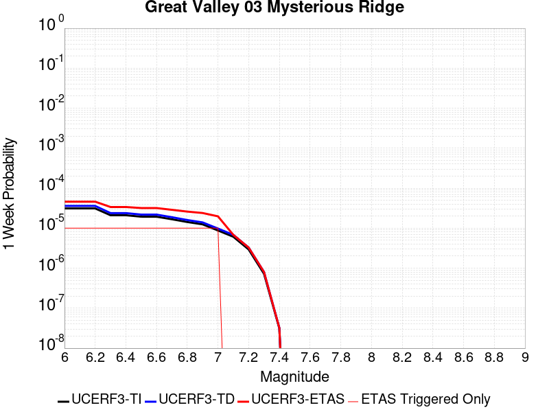 | 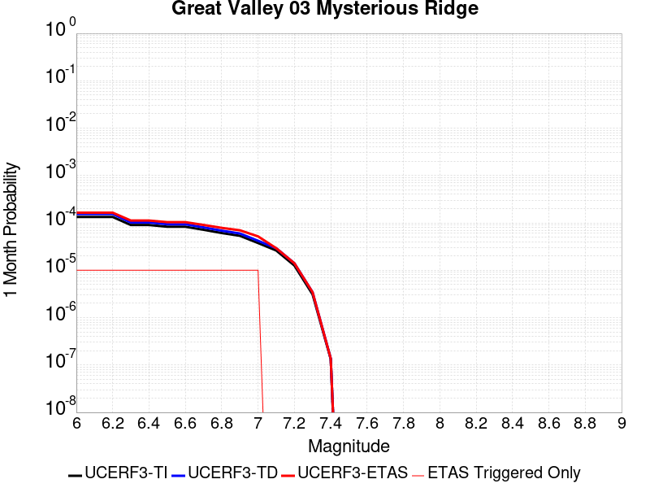 |  | 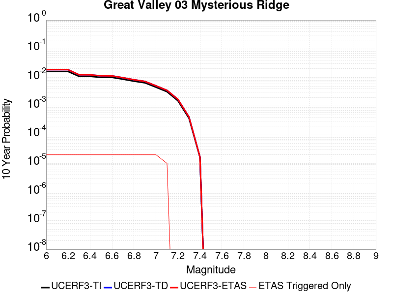 |

| Magnitude | 1 wk TI Prob | 1 wk TD Prob | 1 wk ETAS Prob | 1 wk ETAS/TD Gain | 1 wk ETAS Triggered Only | 1 mo TI Prob | 1 mo TD Prob | 1 mo ETAS Prob | 1 mo ETAS/TD Gain | 1 mo ETAS Triggered Only | 1 yr TI Prob | 1 yr TD Prob | 1 yr ETAS Prob | 1 yr ETAS/TD Gain | 1 yr ETAS Triggered Only | 10 yr TI Prob | 10 yr TD Prob | 10 yr ETAS Prob | 10 yr ETAS/TD Gain | 10 yr ETAS Triggered Only |
|-----|-----|-----|-----|-----|-----|-----|-----|-----|-----|-----|-----|-----|-----|-----|-----|-----|-----|-----|-----|-----|
| 6.0 | 3.1182444E-5 | 3.6034133E-5 | 4.6033772E-5 | 1.2775047 | 1.0E-5 | 1.336322E-4 | 1.5442389E-4 | 1.6442235E-4 | 1.0647469 | 1.0E-5 | 0.0016257578 | 0.0018786751 | 0.0018986375 | 1.0106258 | 2.0E-5 | 0.016139153 | 0.018646672 | 0.018666299 | 1.0010526 | 2.0E-5 |
| 6.1 | 3.1182444E-5 | 3.6034133E-5 | 4.6033772E-5 | 1.2775047 | 1.0E-5 | 1.336322E-4 | 1.5442389E-4 | 1.6442235E-4 | 1.0647469 | 1.0E-5 | 0.0016257578 | 0.0018786751 | 0.0018986375 | 1.0106258 | 2.0E-5 | 0.016139153 | 0.018646672 | 0.018666299 | 1.0010526 | 2.0E-5 |
| 6.2 | 3.1182444E-5 | 3.6034133E-5 | 4.6033772E-5 | 1.2775047 | 1.0E-5 | 1.336322E-4 | 1.5442389E-4 | 1.6442235E-4 | 1.0647469 | 1.0E-5 | 0.0016257578 | 0.0018786751 | 0.0018986375 | 1.0106258 | 2.0E-5 | 0.016139153 | 0.018646672 | 0.018666299 | 1.0010526 | 2.0E-5 |
| 6.3 | 2.106934E-5 | 2.3850303E-5 | 3.3850065E-5 | 1.4192718 | 1.0E-5 | 9.0294045E-5 | 1.0221176E-4 | 1.12210735E-4 | 1.0978261 | 1.0E-5 | 0.0010987755 | 0.0012437488 | 0.0012637239 | 1.0160605 | 2.0E-5 | 0.010933585 | 0.0123711275 | 0.01239088 | 1.0015967 | 2.0E-5 |
| 6.4 | 2.106934E-5 | 2.3850303E-5 | 3.3850065E-5 | 1.4192718 | 1.0E-5 | 9.0294045E-5 | 1.0221176E-4 | 1.12210735E-4 | 1.0978261 | 1.0E-5 | 0.0010987755 | 0.0012437488 | 0.0012637239 | 1.0160605 | 2.0E-5 | 0.010933585 | 0.0123711275 | 0.01239088 | 1.0015967 | 2.0E-5 |
| 6.5 | 1.9389783E-5 | 2.1884982E-5 | 3.1884763E-5 | 1.4569243 | 1.0E-5 | 8.309642E-5 | 9.378956E-5 | 1.03788625E-4 | 1.1066117 | 1.0E-5 | 0.0010112294 | 0.0011413175 | 0.0011612946 | 1.0175036 | 2.0E-5 | 0.010066401 | 0.011357434 | 0.011377207 | 1.0017409 | 2.0E-5 |
| 6.6 | 1.9370193E-5 | 2.1864902E-5 | 3.1864685E-5 | 1.4573439 | 1.0E-5 | 8.301247E-5 | 9.3703515E-5 | 1.0370258E-4 | 1.1067096 | 1.0E-5 | 0.0010102082 | 0.001140271 | 0.0011602482 | 1.0175197 | 2.0E-5 | 0.010056281 | 0.011347076 | 0.011366849 | 1.0017426 | 2.0E-5 |
| 6.7 | 1.6723505E-5 | 1.8799281E-5 | 2.8799093E-5 | 1.5319252 | 1.0E-5 | 7.16702E-5 | 8.056597E-5 | 9.056517E-5 | 1.1241119 | 1.0E-5 | 8.722353E-4 | 9.804688E-4 | 0.0010004492 | 1.0203784 | 2.0E-5 | 0.008688197 | 0.009763439 | 0.009783244 | 1.0020285 | 2.0E-5 |
| 6.8 | 1.426937E-5 | 1.599721E-5 | 2.599705E-5 | 1.6250991 | 1.0E-5 | 6.115301E-5 | 6.855775E-5 | 7.855707E-5 | 1.1458524 | 1.0E-5 | 7.4428355E-4 | 8.343854E-4 | 8.543687E-4 | 1.0239497 | 2.0E-5 | 0.007417957 | 0.008314005 | 0.008333839 | 1.0023856 | 2.0E-5 |
| 6.9 | 1.2469891E-5 | 1.3956928E-5 | 2.3956789E-5 | 1.71648 | 1.0E-5 | 5.3441294E-5 | 5.9814105E-5 | 6.9813505E-5 | 1.1671747 | 1.0E-5 | 6.504535E-4 | 7.280055E-4 | 7.479909E-4 | 1.0274523 | 2.0E-5 | 0.006485529 | 0.00725743 | 0.0072772847 | 1.0027359 | 2.0E-5 |
| 7.0 | 8.7746275E-6 | 9.791734E-6 | 1.9791636E-5 | 2.0212595 | 1.0E-5 | 3.7605005E-5 | 4.196394E-5 | 5.1963518E-5 | 1.2382898 | 1.0E-5 | 4.5774475E-4 | 5.1079853E-4 | 5.307883E-4 | 1.0391344 | 2.0E-5 | 0.00456803 | 0.005096977 | 0.0051168753 | 1.0039039 | 2.0E-5 |
| 7.1 | 6.1067153E-6 | 6.813725E-6 | 6.813725E-6 | 1.0 | 0.0 | 2.6171374E-5 | 2.9201385E-5 | 2.9201385E-5 | 1.0 | 0.0 | 3.1858988E-4 | 3.5547445E-4 | 3.6547089E-4 | 1.0281215 | 1.0E-5 | 0.0031813353 | 0.003549609 | 0.0035595736 | 1.0028073 | 1.0E-5 |
| 7.2 | 2.939283E-6 | 3.2741057E-6 | 3.2741057E-6 | 1.0 | 0.0 | 1.2596866E-5 | 1.4031816E-5 | 1.4031816E-5 | 1.0 | 0.0 | 1.5335606E-4 | 1.7082572E-4 | 1.7082572E-4 | 1.0 | 0.0 | 0.0015325027 | 0.001707116 | 0.001707116 | 1.0 | 0.0 |
| 7.3 | 7.2387763E-7 | 8.008505E-7 | 8.008505E-7 | 1.0 | 0.0 | 3.102329E-6 | 3.4322145E-6 | 3.4322145E-6 | 1.0 | 0.0 | 3.77702E-5 | 4.178687E-5 | 4.178687E-5 | 1.0 | 0.0 | 3.7763783E-4 | 4.1783508E-4 | 4.1783508E-4 | 1.0 | 0.0 |
| 7.4 | 3.112171E-8 | 3.2068368E-8 | 3.2068368E-8 | 1.0 | 0.0 | 1.3337875E-7 | 1.3743585E-7 | 1.3743585E-7 | 1.0 | 0.0 | 1.6238852E-6 | 1.6732803E-6 | 1.6732803E-6 | 1.0 | 0.0 | 1.6238733E-5 | 1.6732685E-5 | 1.6732685E-5 | 1.0 | 0.0 |

## Peralta Hills
*[(top)](#table-of-contents)*

| 1 Week | 1 Month | 1 Year | 10 Year |
|-----|-----|-----|-----|
|  |  |  | 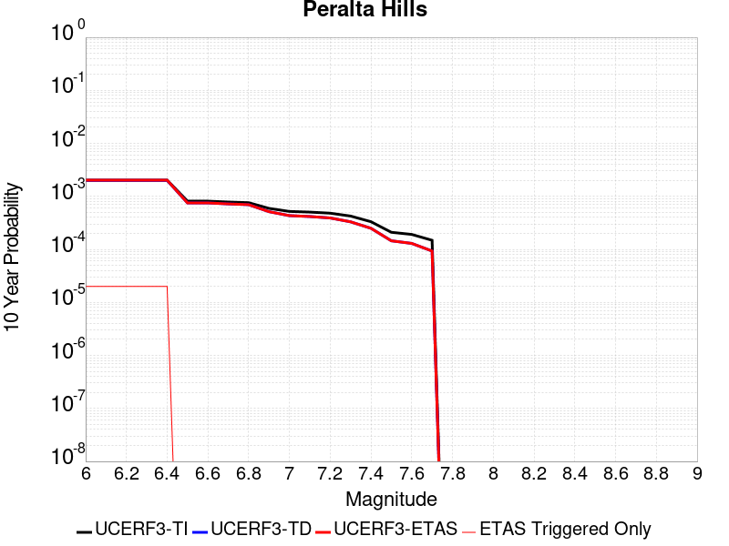 |

| Magnitude | 1 wk TI Prob | 1 wk TD Prob | 1 wk ETAS Prob | 1 wk ETAS/TD Gain | 1 wk ETAS Triggered Only | 1 mo TI Prob | 1 mo TD Prob | 1 mo ETAS Prob | 1 mo ETAS/TD Gain | 1 mo ETAS Triggered Only | 1 yr TI Prob | 1 yr TD Prob | 1 yr ETAS Prob | 1 yr ETAS/TD Gain | 1 yr ETAS Triggered Only | 10 yr TI Prob | 10 yr TD Prob | 10 yr ETAS Prob | 10 yr ETAS/TD Gain | 10 yr ETAS Triggered Only |
|-----|-----|-----|-----|-----|-----|-----|-----|-----|-----|-----|-----|-----|-----|-----|-----|-----|-----|-----|-----|-----|
| 6.0 | 3.8850067E-6 | 3.8395046E-6 | 3.8395046E-6 | 1.0 | 0.0 | 1.6649923E-5 | 1.6454958E-5 | 2.6454794E-5 | 1.6077095 | 1.0E-5 | 2.0269395E-4 | 2.0032811E-4 | 2.2032412E-4 | 1.0998162 | 2.0E-5 | 0.0020250916 | 0.002002203 | 0.002022163 | 1.009969 | 2.0E-5 |
| 6.1 | 3.8850067E-6 | 3.8395046E-6 | 3.8395046E-6 | 1.0 | 0.0 | 1.6649923E-5 | 1.6454958E-5 | 2.6454794E-5 | 1.6077095 | 1.0E-5 | 2.0269395E-4 | 2.0032811E-4 | 2.2032412E-4 | 1.0998162 | 2.0E-5 | 0.0020250916 | 0.002002203 | 0.002022163 | 1.009969 | 2.0E-5 |
| 6.2 | 3.8850067E-6 | 3.8395046E-6 | 3.8395046E-6 | 1.0 | 0.0 | 1.6649923E-5 | 1.6454958E-5 | 2.6454794E-5 | 1.6077095 | 1.0E-5 | 2.0269395E-4 | 2.0032811E-4 | 2.2032412E-4 | 1.0998162 | 2.0E-5 | 0.0020250916 | 0.002002203 | 0.002022163 | 1.009969 | 2.0E-5 |
| 6.3 | 3.8850067E-6 | 3.8395046E-6 | 3.8395046E-6 | 1.0 | 0.0 | 1.6649923E-5 | 1.6454958E-5 | 2.6454794E-5 | 1.6077095 | 1.0E-5 | 2.0269395E-4 | 2.0032811E-4 | 2.2032412E-4 | 1.0998162 | 2.0E-5 | 0.0020250916 | 0.002002203 | 0.002022163 | 1.009969 | 2.0E-5 |
| 6.4 | 3.8850067E-6 | 3.8395046E-6 | 3.8395046E-6 | 1.0 | 0.0 | 1.6649923E-5 | 1.6454958E-5 | 2.6454794E-5 | 1.6077095 | 1.0E-5 | 2.0269395E-4 | 2.0032811E-4 | 2.2032412E-4 | 1.0998162 | 2.0E-5 | 0.0020250916 | 0.002002203 | 0.002022163 | 1.009969 | 2.0E-5 |
| 6.5 | 1.5587785E-6 | 1.4430725E-6 | 1.4430725E-6 | 1.0 | 0.0 | 6.6804623E-6 | 6.184583E-6 | 6.184583E-6 | 1.0 | 0.0 | 8.133159E-5 | 7.529494E-5 | 7.529494E-5 | 1.0 | 0.0 | 8.1301836E-4 | 7.527183E-4 | 7.527183E-4 | 1.0 | 0.0 |
| 6.6 | 1.5587785E-6 | 1.4430725E-6 | 1.4430725E-6 | 1.0 | 0.0 | 6.6804623E-6 | 6.184583E-6 | 6.184583E-6 | 1.0 | 0.0 | 8.133159E-5 | 7.529494E-5 | 7.529494E-5 | 1.0 | 0.0 | 8.1301836E-4 | 7.527183E-4 | 7.527183E-4 | 1.0 | 0.0 |
| 6.7 | 1.5018579E-6 | 1.3836951E-6 | 1.3836951E-6 | 1.0 | 0.0 | 6.436518E-6 | 5.9301096E-6 | 5.9301096E-6 | 1.0 | 0.0 | 7.836179E-5 | 7.219693E-5 | 7.219693E-5 | 1.0 | 0.0 | 7.833416E-4 | 7.2175835E-4 | 7.2175835E-4 | 1.0 | 0.0 |
| 6.8 | 1.4584314E-6 | 1.3381272E-6 | 1.3381272E-6 | 1.0 | 0.0 | 6.250405E-6 | 5.7348193E-6 | 5.7348193E-6 | 1.0 | 0.0 | 7.6096025E-5 | 6.981943E-5 | 6.981943E-5 | 1.0 | 0.0 | 7.6069974E-4 | 6.9799833E-4 | 6.9799833E-4 | 1.0 | 0.0 |
| 6.9 | 1.1382393E-6 | 9.862176E-7 | 9.862176E-7 | 1.0 | 0.0 | 4.8781594E-6 | 4.2266406E-6 | 4.2266406E-6 | 1.0 | 0.0 | 5.9389975E-5 | 5.145822E-5 | 5.145822E-5 | 1.0 | 0.0 | 5.93741E-4 | 5.1447126E-4 | 5.1447126E-4 | 1.0 | 0.0 |
| 7.0 | 9.970413E-7 | 8.3095136E-7 | 8.3095136E-7 | 1.0 | 0.0 | 4.273027E-6 | 3.5612156E-6 | 3.5612156E-6 | 1.0 | 0.0 | 5.2022864E-5 | 4.3357006E-5 | 4.3357006E-5 | 1.0 | 0.0 | 5.2010687E-4 | 4.3349227E-4 | 4.3349227E-4 | 1.0 | 0.0 |
| 7.1 | 9.684443E-7 | 7.993957E-7 | 7.993957E-7 | 1.0 | 0.0 | 4.150469E-6 | 3.4259774E-6 | 3.4259774E-6 | 1.0 | 0.0 | 5.053079E-5 | 4.1710548E-5 | 4.1710548E-5 | 1.0 | 0.0 | 5.05193E-4 | 4.170339E-4 | 4.170339E-4 | 1.0 | 0.0 |
| 7.2 | 9.240811E-7 | 7.503015E-7 | 7.503015E-7 | 1.0 | 0.0 | 3.960342E-6 | 3.2155742E-6 | 3.2155742E-6 | 1.0 | 0.0 | 4.8216094E-5 | 3.914898E-5 | 3.914898E-5 | 1.0 | 0.0 | 4.8205635E-4 | 3.9142737E-4 | 3.9142737E-4 | 1.0 | 0.0 |
| 7.3 | 8.158643E-7 | 6.34986E-7 | 6.34986E-7 | 1.0 | 0.0 | 3.4965567E-6 | 2.7213662E-6 | 2.7213662E-6 | 1.0 | 0.0 | 4.2569747E-5 | 3.3132193E-5 | 3.3132193E-5 | 1.0 | 0.0 | 4.2561593E-4 | 3.3127866E-4 | 3.3127866E-4 | 1.0 | 0.0 |
| 7.4 | 6.3822824E-7 | 4.79557E-7 | 4.79557E-7 | 1.0 | 0.0 | 2.7352612E-6 | 2.0552432E-6 | 2.0552432E-6 | 1.0 | 0.0 | 3.3301294E-5 | 2.502235E-5 | 2.502235E-5 | 1.0 | 0.0 | 3.3296304E-4 | 2.5020045E-4 | 2.5020045E-4 | 1.0 | 0.0 |
| 7.5 | 4.0292628E-7 | 2.7844956E-7 | 2.7844956E-7 | 1.0 | 0.0 | 1.7268258E-6 | 1.1933548E-6 | 1.1933548E-6 | 1.0 | 0.0 | 2.1023901E-5 | 1.4529027E-5 | 1.4529027E-5 | 1.0 | 0.0 | 2.1021912E-4 | 1.4528356E-4 | 1.4528356E-4 | 1.0 | 0.0 |
| 7.6 | 3.672993E-7 | 2.4854202E-7 | 2.4854202E-7 | 1.0 | 0.0 | 1.5741389E-6 | 1.0651798E-6 | 1.0651798E-6 | 1.0 | 0.0 | 1.9164972E-5 | 1.2968516E-5 | 1.2968516E-5 | 1.0 | 0.0 | 1.916332E-4 | 1.2968031E-4 | 1.2968031E-4 | 1.0 | 0.0 |
| 7.7 | 2.8466823E-7 | 1.7858805E-7 | 1.7858805E-7 | 1.0 | 0.0 | 1.2200061E-6 | 7.653773E-7 | 7.653773E-7 | 1.0 | 0.0 | 1.4853474E-5 | 9.318455E-6 | 9.318455E-6 | 1.0 | 0.0 | 1.485248E-4 | 9.318324E-5 | 9.318324E-5 | 1.0 | 0.0 |

## Hayward (So) extension 2011 CFM
*[(top)](#table-of-contents)*

| 1 Week | 1 Month | 1 Year | 10 Year |
|-----|-----|-----|-----|
|  |  | 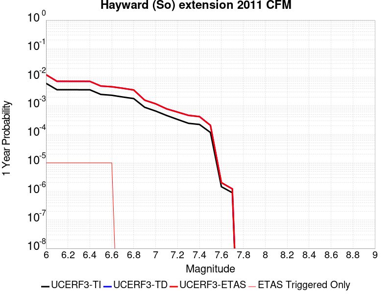 | 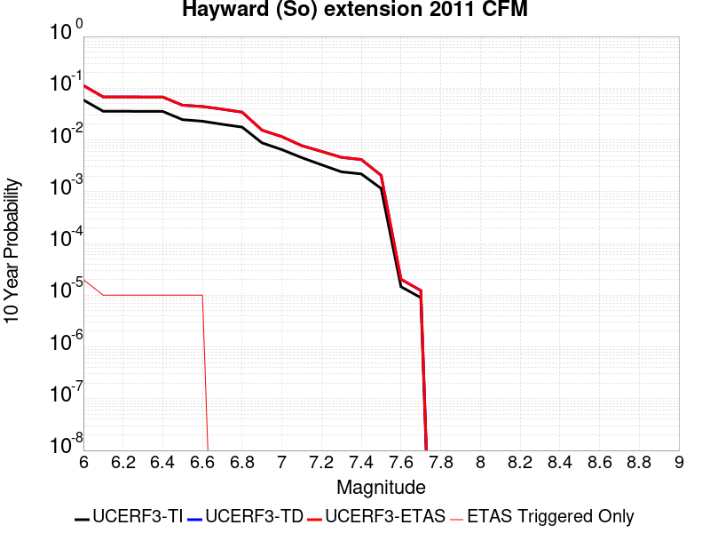 |

| Magnitude | 1 wk TI Prob | 1 wk TD Prob | 1 wk ETAS Prob | 1 wk ETAS/TD Gain | 1 wk ETAS Triggered Only | 1 mo TI Prob | 1 mo TD Prob | 1 mo ETAS Prob | 1 mo ETAS/TD Gain | 1 mo ETAS Triggered Only | 1 yr TI Prob | 1 yr TD Prob | 1 yr ETAS Prob | 1 yr ETAS/TD Gain | 1 yr ETAS Triggered Only | 10 yr TI Prob | 10 yr TD Prob | 10 yr ETAS Prob | 10 yr ETAS/TD Gain | 10 yr ETAS Triggered Only |
|-----|-----|-----|-----|-----|-----|-----|-----|-----|-----|-----|-----|-----|-----|-----|-----|-----|-----|-----|-----|-----|
| 6.0 | 1.1721256E-4 | 2.3671088E-4 | 2.3671088E-4 | 1.0 | 0.0 | 5.022428E-4 | 0.0010138806 | 0.0010138806 | 1.0 | 0.0 | 0.0060976758 | 0.012250609 | 0.012260486 | 1.0008063 | 1.0E-5 | 0.0593305 | 0.11284437 | 0.11286212 | 1.0001572 | 2.0E-5 |
| 6.1 | 6.99169E-5 | 1.3808164E-4 | 1.3808164E-4 | 1.0 | 0.0 | 2.9960944E-4 | 5.9155683E-4 | 5.9155683E-4 | 1.0 | 0.0 | 0.0036416445 | 0.0071723475 | 0.007182276 | 1.0013843 | 1.0E-5 | 0.035825435 | 0.067804344 | 0.067813665 | 1.0001374 | 1.0E-5 |
| 6.2 | 6.99169E-5 | 1.3808164E-4 | 1.3808164E-4 | 1.0 | 0.0 | 2.9960944E-4 | 5.9155683E-4 | 5.9155683E-4 | 1.0 | 0.0 | 0.0036416445 | 0.0071723475 | 0.007182276 | 1.0013843 | 1.0E-5 | 0.035825435 | 0.067804344 | 0.067813665 | 1.0001374 | 1.0E-5 |
| 6.3 | 6.970908E-5 | 1.3776305E-4 | 1.3776305E-4 | 1.0 | 0.0 | 2.9871898E-4 | 5.9019245E-4 | 5.9019245E-4 | 1.0 | 0.0 | 0.0036308395 | 0.007155884 | 0.007165813 | 1.0013875 | 1.0E-5 | 0.035720866 | 0.0676533 | 0.06766263 | 1.0001378 | 1.0E-5 |
| 6.4 | 6.9517155E-5 | 1.3743227E-4 | 1.3743227E-4 | 1.0 | 0.0 | 2.9789665E-4 | 5.8877567E-4 | 5.8877567E-4 | 1.0 | 0.0 | 0.0036208609 | 0.0071387975 | 0.0071487264 | 1.0013908 | 1.0E-5 | 0.03562429 | 0.06749734 | 0.06750666 | 1.0001382 | 1.0E-5 |
| 6.5 | 4.786248E-5 | 9.415232E-5 | 9.415232E-5 | 1.0 | 0.0 | 2.0510878E-4 | 4.0344993E-4 | 4.0344993E-4 | 1.0 | 0.0 | 0.0024943394 | 0.0049013784 | 0.0049113296 | 1.0020303 | 1.0E-5 | 0.02466527 | 0.046900697 | 0.046910226 | 1.0002033 | 1.0E-5 |
| 6.6 | 4.4662214E-5 | 8.8819244E-5 | 8.8819244E-5 | 1.0 | 0.0 | 1.9139545E-4 | 3.80601E-4 | 3.80601E-4 | 1.0 | 0.0 | 0.0023277493 | 0.0046244357 | 0.004634389 | 1.0021524 | 1.0E-5 | 0.02303517 | 0.04429206 | 0.044301614 | 1.0002158 | 1.0E-5 |
| 6.7 | 3.884542E-5 | 7.8650686E-5 | 7.8650686E-5 | 1.0 | 0.0 | 1.6646975E-4 | 3.3703333E-4 | 3.3703333E-4 | 1.0 | 0.0 | 0.002024885 | 0.0040961048 | 0.0040961048 | 1.0 | 0.0 | 0.020065336 | 0.039332055 | 0.039332055 | 1.0 | 0.0 |
| 6.8 | 3.4221863E-5 | 6.855886E-5 | 6.855886E-5 | 1.0 | 0.0 | 1.4665688E-4 | 2.9379298E-4 | 2.9379298E-4 | 1.0 | 0.0 | 0.0017840851 | 0.0035714838 | 0.0035714838 | 1.0 | 0.0 | 0.017698295 | 0.034419462 | 0.034419462 | 1.0 | 0.0 |
| 6.9 | 1.6927712E-5 | 3.006262E-5 | 3.006262E-5 | 1.0 | 0.0 | 7.2545314E-5 | 1.2883375E-4 | 1.2883375E-4 | 1.0 | 0.0 | 8.828813E-4 | 0.0015674793 | 0.0015674793 | 1.0 | 0.0 | 0.008793819 | 0.015463544 | 0.015463544 | 1.0 | 0.0 |
| 7.0 | 1.2509653E-5 | 2.246337E-5 | 2.246337E-5 | 1.0 | 0.0 | 5.3611697E-5 | 9.626828E-5 | 9.626828E-5 | 1.0 | 0.0 | 6.525269E-4 | 0.0011714802 | 0.0011714802 | 1.0 | 0.0 | 0.0065061417 | 0.011583166 | 0.011583166 | 1.0 | 0.0 |
| 7.1 | 8.751583E-6 | 1.4926157E-5 | 1.4926157E-5 | 1.0 | 0.0 | 3.750624E-5 | 6.396771E-5 | 6.396771E-5 | 1.0 | 0.0 | 4.5654282E-4 | 7.785344E-4 | 7.785344E-4 | 1.0 | 0.0 | 0.0045560603 | 0.007764457 | 0.007764457 | 1.0 | 0.0 |
| 7.2 | 6.354379E-6 | 1.1499087E-5 | 1.1499087E-5 | 1.0 | 0.0 | 2.7232769E-5 | 4.9280898E-5 | 4.9280898E-5 | 1.0 | 0.0 | 3.3150852E-4 | 5.9983454E-4 | 5.9983454E-4 | 1.0 | 0.0 | 0.0033101442 | 0.006001243 | 0.006001243 | 1.0 | 0.0 |
| 7.3 | 4.645554E-6 | 8.818441E-6 | 8.818441E-6 | 1.0 | 0.0 | 1.9909365E-5 | 3.7792794E-5 | 3.7792794E-5 | 1.0 | 0.0 | 2.4236954E-4 | 4.6003403E-4 | 4.6003403E-4 | 1.0 | 0.0 | 0.0024210536 | 0.004611421 | 0.004611421 | 1.0 | 0.0 |
| 7.4 | 4.23437E-6 | 7.992759E-6 | 7.992759E-6 | 1.0 | 0.0 | 1.8147173E-5 | 3.425425E-5 | 3.425425E-5 | 1.0 | 0.0 | 2.2091944E-4 | 4.1696956E-4 | 4.1696956E-4 | 1.0 | 0.0 | 0.0022069993 | 0.0041826614 | 0.0041826614 | 1.0 | 0.0 |
| 7.5 | 2.2187417E-6 | 3.952336E-6 | 3.952336E-6 | 1.0 | 0.0 | 9.508858E-6 | 1.6938488E-5 | 1.6938488E-5 | 1.0 | 0.0 | 1.157642E-4 | 2.0620918E-4 | 2.0620918E-4 | 1.0 | 0.0 | 0.0011570391 | 0.0020739497 | 0.0020739497 | 1.0 | 0.0 |
| 7.6 | 2.7952495E-8 | 3.8785874E-8 | 3.8785874E-8 | 1.0 | 0.0 | 1.1979641E-7 | 1.6622516E-7 | 1.6622516E-7 | 1.0 | 0.0 | 1.4585203E-6 | 2.0237894E-6 | 2.0237894E-6 | 1.0 | 0.0 | 1.4585107E-5 | 2.0317146E-5 | 2.0317146E-5 | 1.0 | 0.0 |
| 7.7 | 1.7192724E-8 | 2.3436652E-8 | 2.3436652E-8 | 1.0 | 0.0 | 7.36831E-8 | 1.0044278E-7 | 1.0044278E-7 | 1.0 | 0.0 | 8.9709135E-7 | 1.2228902E-6 | 1.2228902E-6 | 1.0 | 0.0 | 8.970877E-6 | 1.2285953E-5 | 1.2285953E-5 | 1.0 | 0.0 |

## Calaveras (No) 2011 CFM
*[(top)](#table-of-contents)*

| 1 Week | 1 Month | 1 Year | 10 Year |
|-----|-----|-----|-----|
|  |  |  |  |

| Magnitude | 1 wk TI Prob | 1 wk TD Prob | 1 wk ETAS Prob | 1 wk ETAS/TD Gain | 1 wk ETAS Triggered Only | 1 mo TI Prob | 1 mo TD Prob | 1 mo ETAS Prob | 1 mo ETAS/TD Gain | 1 mo ETAS Triggered Only | 1 yr TI Prob | 1 yr TD Prob | 1 yr ETAS Prob | 1 yr ETAS/TD Gain | 1 yr ETAS Triggered Only | 10 yr TI Prob | 10 yr TD Prob | 10 yr ETAS Prob | 10 yr ETAS/TD Gain | 10 yr ETAS Triggered Only |
|-----|-----|-----|-----|-----|-----|-----|-----|-----|-----|-----|-----|-----|-----|-----|-----|-----|-----|-----|-----|-----|
| 6.0 | 4.8694856E-5 | 6.747457E-5 | 6.747457E-5 | 1.0 | 0.0 | 2.0867554E-4 | 2.891453E-4 | 2.891453E-4 | 1.0 | 0.0 | 0.0025376645 | 0.0035146773 | 0.0035246422 | 1.0028352 | 1.0E-5 | 0.02508881 | 0.034771074 | 0.034790378 | 1.0005552 | 2.0E-5 |
| 6.1 | 4.8694856E-5 | 6.747457E-5 | 6.747457E-5 | 1.0 | 0.0 | 2.0867554E-4 | 2.891453E-4 | 2.891453E-4 | 1.0 | 0.0 | 0.0025376645 | 0.0035146773 | 0.0035246422 | 1.0028352 | 1.0E-5 | 0.02508881 | 0.034771074 | 0.034790378 | 1.0005552 | 2.0E-5 |
| 6.2 | 4.7541962E-5 | 6.5805805E-5 | 6.5805805E-5 | 1.0 | 0.0 | 2.0373536E-4 | 2.8199502E-4 | 2.8199502E-4 | 1.0 | 0.0 | 0.0024776561 | 0.003427919 | 0.0034378846 | 1.0029073 | 1.0E-5 | 0.024502134 | 0.0339325 | 0.03395182 | 1.0005695 | 2.0E-5 |
| 6.3 | 4.6717287E-5 | 6.463939E-5 | 6.463939E-5 | 1.0 | 0.0 | 2.0020158E-4 | 2.7699716E-4 | 2.7699716E-4 | 1.0 | 0.0 | 0.0024347296 | 0.0033672696 | 0.003377236 | 1.0029597 | 1.0E-5 | 0.024082264 | 0.033345006 | 0.03336434 | 1.0005798 | 2.0E-5 |
| 6.4 | 4.6276386E-5 | 6.400103E-5 | 6.400103E-5 | 1.0 | 0.0 | 1.983123E-4 | 2.7426204E-4 | 2.7426204E-4 | 1.0 | 0.0 | 0.0024117786 | 0.00333408 | 0.0033440467 | 1.0029893 | 1.0E-5 | 0.02385771 | 0.03302388 | 0.03304322 | 1.0005857 | 2.0E-5 |
| 6.5 | 4.5720994E-5 | 6.32025E-5 | 6.32025E-5 | 1.0 | 0.0 | 1.9593239E-4 | 2.7084045E-4 | 2.7084045E-4 | 1.0 | 0.0 | 0.002382867 | 0.0032925585 | 0.0033025257 | 1.0030272 | 1.0E-5 | 0.023574775 | 0.032621842 | 0.03264119 | 1.0005931 | 2.0E-5 |
| 6.6 | 4.549134E-5 | 6.285557E-5 | 6.285557E-5 | 1.0 | 0.0 | 1.949483E-4 | 2.693539E-4 | 2.693539E-4 | 1.0 | 0.0 | 0.0023709119 | 0.0032745146 | 0.0032844818 | 1.0030439 | 1.0E-5 | 0.023457756 | 0.03244731 | 0.03246666 | 1.0005964 | 2.0E-5 |
| 6.7 | 3.701047E-5 | 5.03607E-5 | 5.03607E-5 | 1.0 | 0.0 | 1.5860666E-4 | 2.1581395E-4 | 2.1581395E-4 | 1.0 | 0.0 | 0.0019293258 | 0.002624412 | 0.002624412 | 1.0 | 0.0 | 0.019126613 | 0.026125198 | 0.026134938 | 1.0003728 | 1.0E-5 |
| 6.8 | 3.5523568E-5 | 4.834225E-5 | 4.834225E-5 | 1.0 | 0.0 | 1.5223498E-4 | 2.0716486E-4 | 2.0716486E-4 | 1.0 | 0.0 | 0.0018518851 | 0.0025193577 | 0.0025193577 | 1.0 | 0.0 | 0.018365284 | 0.025097623 | 0.025107373 | 1.0003885 | 1.0E-5 |
| 6.9 | 3.2946147E-5 | 4.4663826E-5 | 4.4663826E-5 | 1.0 | 0.0 | 1.4119013E-4 | 1.9140259E-4 | 1.9140259E-4 | 1.0 | 0.0 | 0.0017176344 | 0.0023278783 | 0.0023278783 | 1.0 | 0.0 | 0.017044188 | 0.023219762 | 0.02322953 | 1.0004207 | 1.0E-5 |
| 7.0 | 2.7682381E-5 | 3.7023216E-5 | 3.7023216E-5 | 1.0 | 0.0 | 1.1863338E-4 | 1.5866144E-4 | 1.5866144E-4 | 1.0 | 0.0 | 0.0014434044 | 0.0019300217 | 0.0019300217 | 1.0 | 0.0 | 0.01434065 | 0.019311164 | 0.01932097 | 1.0005078 | 1.0E-5 |
| 7.1 | 2.471967E-5 | 3.328756E-5 | 3.328756E-5 | 1.0 | 0.0 | 1.05937135E-4 | 1.4265333E-4 | 1.4265333E-4 | 1.0 | 0.0 | 0.0012890215 | 0.0017354497 | 0.0017354497 | 1.0 | 0.0 | 0.0128157 | 0.017386293 | 0.017396118 | 1.0005652 | 1.0E-5 |
| 7.2 | 1.9748062E-5 | 2.6775411E-5 | 2.6775411E-5 | 1.0 | 0.0 | 8.463181E-5 | 1.1474685E-4 | 1.1474685E-4 | 1.0 | 0.0 | 0.0010299052 | 0.001396171 | 0.001396171 | 1.0 | 0.0 | 0.01025145 | 0.014031046 | 0.014040906 | 1.0007027 | 1.0E-5 |
| 7.3 | 1.1603734E-5 | 1.5784257E-5 | 1.5784257E-5 | 1.0 | 0.0 | 4.9729337E-5 | 6.7645145E-5 | 6.7645145E-5 | 1.0 | 0.0 | 6.052865E-4 | 8.232826E-4 | 8.232826E-4 | 1.0 | 0.0 | 0.0060364045 | 0.008308739 | 0.008318657 | 1.0011935 | 1.0E-5 |
| 7.4 | 4.885381E-6 | 6.035117E-6 | 6.035117E-6 | 1.0 | 0.0 | 2.0937177E-5 | 2.5864532E-5 | 2.5864532E-5 | 1.0 | 0.0 | 2.5488032E-4 | 3.1485534E-4 | 3.1485534E-4 | 1.0 | 0.0 | 0.0025458818 | 0.0032009764 | 0.0032109444 | 1.0031141 | 1.0E-5 |
| 7.5 | 3.0571264E-6 | 4.1554085E-6 | 4.1554085E-6 | 1.0 | 0.0 | 1.3101904E-5 | 1.7808772E-5 | 1.7808772E-5 | 1.0 | 0.0 | 1.5950401E-4 | 2.1680034E-4 | 2.1680034E-4 | 1.0 | 0.0 | 0.0015938957 | 0.0022209007 | 0.0022308785 | 1.0044926 | 1.0E-5 |
| 7.6 | 1.764948E-6 | 2.795641E-6 | 2.795641E-6 | 1.0 | 0.0 | 7.564041E-6 | 1.1981264E-5 | 1.1981264E-5 | 1.0 | 0.0 | 9.208831E-5 | 1.458622E-4 | 1.458622E-4 | 1.0 | 0.0 | 9.205016E-4 | 0.0015124046 | 0.0015223895 | 1.0066019 | 1.0E-5 |
| 7.7 | 1.3173734E-6 | 2.0585271E-6 | 2.0585271E-6 | 1.0 | 0.0 | 5.645874E-6 | 8.82223E-6 | 8.82223E-6 | 1.0 | 0.0 | 6.873634E-5 | 1.0740537E-4 | 1.0740537E-4 | 1.0 | 0.0 | 6.8715087E-4 | 0.0011261607 | 0.0011361494 | 1.0088698 | 1.0E-5 |
| 7.8 | 9.4429885E-7 | 1.5490102E-6 | 1.5490102E-6 | 1.0 | 0.0 | 4.0469886E-6 | 6.6385983E-6 | 6.6385983E-6 | 1.0 | 0.0 | 4.9270973E-5 | 8.082195E-5 | 8.082195E-5 | 1.0 | 0.0 | 4.926005E-4 | 8.501931E-4 | 8.6018455E-4 | 1.011752 | 1.0E-5 |
| 7.9 | 6.388233E-7 | 1.11492E-6 | 1.11492E-6 | 1.0 | 0.0 | 2.7378112E-6 | 4.7782196E-6 | 4.7782196E-6 | 1.0 | 0.0 | 3.3332344E-5 | 5.8173282E-5 | 5.8173282E-5 | 1.0 | 0.0 | 3.3327343E-4 | 6.096674E-4 | 6.196613E-4 | 1.0163924 | 1.0E-5 |
| 8.0 | 3.087986E-7 | 5.754721E-7 | 5.754721E-7 | 1.0 | 0.0 | 1.323422E-6 | 2.4663066E-6 | 2.4663066E-6 | 1.0 | 0.0 | 1.6112543E-5 | 3.0026871E-5 | 3.0026871E-5 | 1.0 | 0.0 | 1.6111376E-4 | 3.110238E-4 | 3.2102066E-4 | 1.0321419 | 1.0E-5 |
| 8.1 | 1.6725647E-7 | 2.7410795E-7 | 2.7410795E-7 | 1.0 | 0.0 | 7.168133E-7 | 1.1747478E-6 | 1.1747478E-6 | 1.0 | 0.0 | 8.7271665E-6 | 1.4302462E-5 | 1.4302462E-5 | 1.0 | 0.0 | 8.726824E-5 | 1.4847395E-4 | 1.5847247E-4 | 1.0673419 | 1.0E-5 |

## San Andreas (Offshore) 2011 CFM
*[(top)](#table-of-contents)*

| 1 Week | 1 Month | 1 Year | 10 Year |
|-----|-----|-----|-----|
|  |  |  |  |

| Magnitude | 1 wk TI Prob | 1 wk TD Prob | 1 wk ETAS Prob | 1 wk ETAS/TD Gain | 1 wk ETAS Triggered Only | 1 mo TI Prob | 1 mo TD Prob | 1 mo ETAS Prob | 1 mo ETAS/TD Gain | 1 mo ETAS Triggered Only | 1 yr TI Prob | 1 yr TD Prob | 1 yr ETAS Prob | 1 yr ETAS/TD Gain | 1 yr ETAS Triggered Only | 10 yr TI Prob | 10 yr TD Prob | 10 yr ETAS Prob | 10 yr ETAS/TD Gain | 10 yr ETAS Triggered Only |
|-----|-----|-----|-----|-----|-----|-----|-----|-----|-----|-----|-----|-----|-----|-----|-----|-----|-----|-----|-----|-----|
| 6.0 | 1.7072787E-4 | 1.9226626E-4 | 1.9226626E-4 | 1.0 | 0.0 | 7.3148566E-4 | 8.237405E-4 | 8.237405E-4 | 1.0 | 0.0 | 0.008869528 | 0.009983436 | 0.010003237 | 1.0019833 | 2.0E-5 | 0.085237645 | 0.09681613 | 0.0968342 | 1.0001866 | 2.0E-5 |
| 6.1 | 1.7072787E-4 | 1.9226626E-4 | 1.9226626E-4 | 1.0 | 0.0 | 7.3148566E-4 | 8.237405E-4 | 8.237405E-4 | 1.0 | 0.0 | 0.008869528 | 0.009983436 | 0.010003237 | 1.0019833 | 2.0E-5 | 0.085237645 | 0.09681613 | 0.0968342 | 1.0001866 | 2.0E-5 |
| 6.2 | 1.6312556E-4 | 1.8408237E-4 | 1.8408237E-4 | 1.0 | 0.0 | 6.989222E-4 | 7.8868825E-4 | 7.8868825E-4 | 1.0 | 0.0 | 0.008476226 | 0.0095605 | 0.0095803095 | 1.002072 | 2.0E-5 | 0.08160117 | 0.092837214 | 0.09285536 | 1.0001954 | 2.0E-5 |
| 6.3 | 1.5103363E-4 | 1.6881147E-4 | 1.6881147E-4 | 1.0 | 0.0 | 6.471264E-4 | 7.232793E-4 | 7.232793E-4 | 1.0 | 0.0 | 0.007850339 | 0.008770814 | 0.008790639 | 1.0022603 | 2.0E-5 | 0.075787395 | 0.08546859 | 0.08548688 | 1.000214 | 2.0E-5 |
| 6.4 | 1.5047993E-4 | 1.6767075E-4 | 1.6767075E-4 | 1.0 | 0.0 | 6.4475456E-4 | 7.183932E-4 | 7.183932E-4 | 1.0 | 0.0 | 0.007821669 | 0.008711802 | 0.008731628 | 1.0022757 | 2.0E-5 | 0.0755203 | 0.08494888 | 0.08496718 | 1.0002154 | 2.0E-5 |
| 6.5 | 1.2760791E-4 | 1.3734949E-4 | 1.3734949E-4 | 1.0 | 0.0 | 5.467764E-4 | 5.8850925E-4 | 5.8850925E-4 | 1.0 | 0.0 | 0.0066367025 | 0.007141834 | 0.0071616913 | 1.0027804 | 2.0E-5 | 0.064419635 | 0.07024954 | 0.07026814 | 1.0002646 | 2.0E-5 |
| 6.6 | 1.1063525E-4 | 1.15565475E-4 | 1.15565475E-4 | 1.0 | 0.0 | 4.740649E-4 | 4.9518765E-4 | 4.9518765E-4 | 1.0 | 0.0 | 0.0057564764 | 0.006012446 | 0.0060323253 | 1.0033064 | 2.0E-5 | 0.05609626 | 0.059496127 | 0.059514936 | 1.0003161 | 2.0E-5 |
| 6.7 | 1.0391049E-4 | 1.0645875E-4 | 1.0645875E-4 | 1.0 | 0.0 | 4.4525467E-4 | 4.56173E-4 | 4.56173E-4 | 1.0 | 0.0 | 0.0054075094 | 0.0055399504 | 0.00555984 | 1.0035901 | 2.0E-5 | 0.052778035 | 0.05498844 | 0.05500734 | 1.0003437 | 2.0E-5 |
| 6.8 | 1.0096706E-4 | 1.01582154E-4 | 1.01582154E-4 | 1.0 | 0.0 | 4.3264418E-4 | 4.3528038E-4 | 4.3528038E-4 | 1.0 | 0.0 | 0.0052547283 | 0.0052868384 | 0.0053067324 | 1.003763 | 2.0E-5 | 0.051321987 | 0.052686825 | 0.052705772 | 1.0003597 | 2.0E-5 |
| 6.9 | 9.800265E-5 | 9.588697E-5 | 9.588697E-5 | 1.0 | 0.0 | 4.1994374E-4 | 4.1088034E-4 | 4.1088034E-4 | 1.0 | 0.0 | 0.0051008356 | 0.004991162 | 0.0050110626 | 1.0039871 | 2.0E-5 | 0.049853306 | 0.05001508 | 0.05003408 | 1.0003799 | 2.0E-5 |
| 7.0 | 9.4642375E-5 | 9.002096E-5 | 9.002096E-5 | 1.0 | 0.0 | 4.0554712E-4 | 3.8574796E-4 | 3.8574796E-4 | 1.0 | 0.0 | 0.004926363 | 0.00468653 | 0.0047064363 | 1.0042475 | 2.0E-5 | 0.048185747 | 0.047194667 | 0.047213722 | 1.0004038 | 2.0E-5 |
| 7.1 | 9.0996844E-5 | 8.354119E-5 | 8.354119E-5 | 1.0 | 0.0 | 3.8992817E-4 | 3.579854E-4 | 3.579854E-4 | 1.0 | 0.0 | 0.004737046 | 0.0043499186 | 0.0043698316 | 1.0045778 | 2.0E-5 | 0.04637333 | 0.04404688 | 0.044065997 | 1.000434 | 2.0E-5 |
| 7.2 | 8.848287E-5 | 7.981761E-5 | 7.981761E-5 | 1.0 | 0.0 | 3.791572E-4 | 3.420315E-4 | 3.420315E-4 | 1.0 | 0.0 | 0.004606472 | 0.0041564363 | 0.004176353 | 1.0047919 | 2.0E-5 | 0.045121472 | 0.042189904 | 0.04220906 | 1.0004541 | 2.0E-5 |
| 7.3 | 7.9280784E-5 | 6.1274885E-5 | 6.1274885E-5 | 1.0 | 0.0 | 3.3973053E-4 | 2.6258078E-4 | 2.6258078E-4 | 1.0 | 0.0 | 0.004128377 | 0.003192337 | 0.0032122731 | 1.006245 | 2.0E-5 | 0.040525194 | 0.03290183 | 0.032921173 | 1.0005878 | 2.0E-5 |
| 7.4 | 6.468038E-5 | 3.7930724E-5 | 3.7930724E-5 | 1.0 | 0.0 | 2.771722E-4 | 1.6255044E-4 | 1.6255044E-4 | 1.0 | 0.0 | 0.0033693502 | 0.0019773128 | 0.0019972734 | 1.0100948 | 2.0E-5 | 0.0331872 | 0.02081734 | 0.020836923 | 1.0009407 | 2.0E-5 |
| 7.5 | 4.930574E-5 | 1.2699263E-5 | 1.2699263E-5 | 1.0 | 0.0 | 2.1129321E-4 | 5.4424287E-5 | 5.4424287E-5 | 1.0 | 0.0 | 0.0025694598 | 6.6241587E-4 | 6.824026E-4 | 1.0301725 | 2.0E-5 | 0.02539953 | 0.0074798525 | 0.0074997027 | 1.0026538 | 2.0E-5 |
| 7.6 | 4.612566E-5 | 1.0332297E-5 | 1.0332297E-5 | 1.0 | 0.0 | 1.9766642E-4 | 4.428053E-5 | 4.428053E-5 | 1.0 | 0.0 | 0.0024039324 | 5.3898344E-4 | 5.5897265E-4 | 1.0370868 | 2.0E-5 | 0.023780935 | 0.006170428 | 0.006190304 | 1.0032213 | 2.0E-5 |
| 7.7 | 3.9435414E-5 | 5.5710498E-6 | 5.5710498E-6 | 1.0 | 0.0 | 1.6899795E-4 | 2.3875711E-5 | 2.3875711E-5 | 1.0 | 0.0 | 0.0020556084 | 2.906482E-4 | 3.1064238E-4 | 1.0687917 | 2.0E-5 | 0.020366974 | 0.0035397834 | 0.0035597126 | 1.00563 | 2.0E-5 |
| 7.8 | 2.7787428E-5 | 3.7526645E-6 | 3.7526645E-6 | 1.0 | 0.0 | 1.1908354E-4 | 1.6082748E-5 | 1.6082748E-5 | 1.0 | 0.0 | 0.0014488777 | 1.9578991E-4 | 2.1578599E-4 | 1.1021303 | 2.0E-5 | 0.014394675 | 0.0023862 | 0.0024061522 | 1.0083616 | 2.0E-5 |
| 7.9 | 1.590671E-5 | 3.0391298E-6 | 3.0391298E-6 | 1.0 | 0.0 | 6.816983E-5 | 1.3024777E-5 | 1.3024777E-5 | 1.0 | 0.0 | 8.2965166E-4 | 1.5856515E-4 | 1.7856198E-4 | 1.1261111 | 2.0E-5 | 0.008265611 | 0.0019033558 | 0.0019233177 | 1.0104878 | 2.0E-5 |
| 8.0 | 9.193638E-6 | 2.5908973E-6 | 2.5908973E-6 | 1.0 | 0.0 | 3.940071E-5 | 1.1103798E-5 | 1.1103798E-5 | 1.0 | 0.0 | 4.7959806E-4 | 1.3518038E-4 | 1.5517768E-4 | 1.1479305 | 2.0E-5 | 0.0047856434 | 0.0016108477 | 0.0016308154 | 1.0123959 | 2.0E-5 |
| 8.1 | 5.601576E-6 | 2.2333788E-6 | 2.2333788E-6 | 1.0 | 0.0 | 2.4006533E-5 | 9.571589E-6 | 9.571589E-6 | 1.0 | 0.0 | 2.9224035E-4 | 1.1652788E-4 | 1.3652556E-4 | 1.1716127 | 2.0E-5 | 0.0029185633 | 0.0014015464 | 0.0014215184 | 1.0142499 | 2.0E-5 |
| 8.2 | 4.3508785E-6 | 1.8568232E-6 | 1.8568232E-6 | 1.0 | 0.0 | 1.864649E-5 | 7.957789E-6 | 7.957789E-6 | 1.0 | 0.0 | 2.2699735E-4 | 9.6881806E-5 | 1.0688084E-4 | 1.1032085 | 1.0E-5 | 0.0022676561 | 0.0011590312 | 0.0011690195 | 1.0086179 | 1.0E-5 |
| 8.3 | 1.9573292E-6 | 7.511501E-7 | 7.511501E-7 | 1.0 | 0.0 | 8.388526E-6 | 3.2192108E-6 | 3.2192108E-6 | 1.0 | 0.0 | 1.0212552E-4 | 3.9193204E-5 | 4.919281E-5 | 1.2551363 | 1.0E-5 | 0.001020786 | 4.6391718E-4 | 4.7391254E-4 | 1.0215455 | 1.0E-5 |

## Monterey Bay-Tularcitos
*[(top)](#table-of-contents)*

| 1 Week | 1 Month | 1 Year | 10 Year |
|-----|-----|-----|-----|
|  | 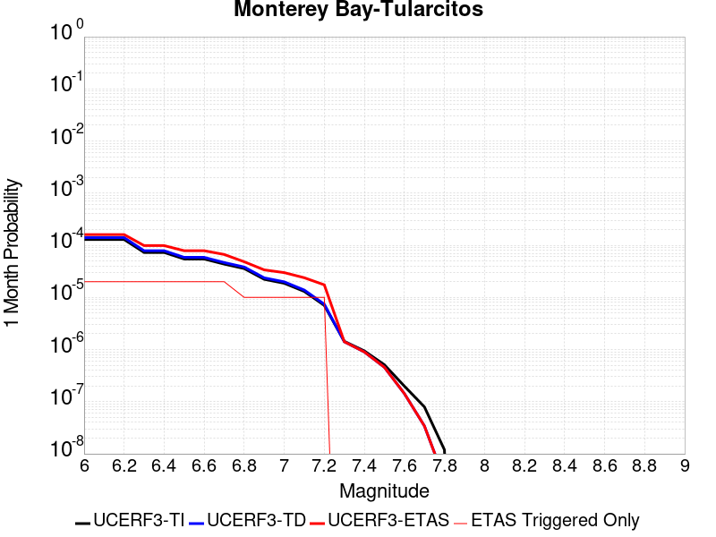 | 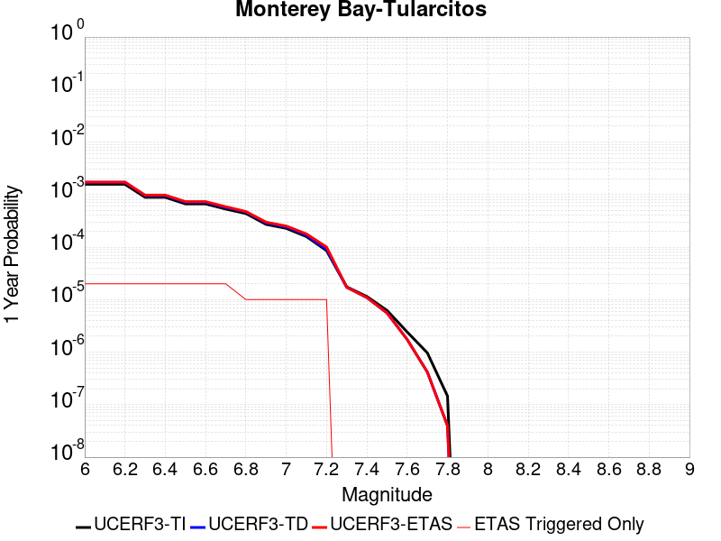 |  |

| Magnitude | 1 wk TI Prob | 1 wk TD Prob | 1 wk ETAS Prob | 1 wk ETAS/TD Gain | 1 wk ETAS Triggered Only | 1 mo TI Prob | 1 mo TD Prob | 1 mo ETAS Prob | 1 mo ETAS/TD Gain | 1 mo ETAS Triggered Only | 1 yr TI Prob | 1 yr TD Prob | 1 yr ETAS Prob | 1 yr ETAS/TD Gain | 1 yr ETAS Triggered Only | 10 yr TI Prob | 10 yr TD Prob | 10 yr ETAS Prob | 10 yr ETAS/TD Gain | 10 yr ETAS Triggered Only |
|-----|-----|-----|-----|-----|-----|-----|-----|-----|-----|-----|-----|-----|-----|-----|-----|-----|-----|-----|-----|-----|
| 6.0 | 3.0131365E-5 | 3.279877E-5 | 5.2798114E-5 | 1.609759 | 2.0E-5 | 1.2912804E-4 | 1.4055918E-4 | 1.6055637E-4 | 1.1422688 | 2.0E-5 | 0.001571 | 0.0017100703 | 0.001730036 | 1.0116755 | 2.0E-5 | 0.015599402 | 0.016979916 | 0.016999578 | 1.0011579 | 2.0E-5 |
| 6.1 | 3.0131365E-5 | 3.279877E-5 | 5.2798114E-5 | 1.609759 | 2.0E-5 | 1.2912804E-4 | 1.4055918E-4 | 1.6055637E-4 | 1.1422688 | 2.0E-5 | 0.001571 | 0.0017100703 | 0.001730036 | 1.0116755 | 2.0E-5 | 0.015599402 | 0.016979916 | 0.016999578 | 1.0011579 | 2.0E-5 |
| 6.2 | 3.0131365E-5 | 3.279877E-5 | 5.2798114E-5 | 1.609759 | 2.0E-5 | 1.2912804E-4 | 1.4055918E-4 | 1.6055637E-4 | 1.1422688 | 2.0E-5 | 0.001571 | 0.0017100703 | 0.001730036 | 1.0116755 | 2.0E-5 | 0.015599402 | 0.016979916 | 0.016999578 | 1.0011579 | 2.0E-5 |
| 6.3 | 1.6998249E-5 | 1.8330798E-5 | 3.8330432E-5 | 2.09104 | 2.0E-5 | 7.28476E-5 | 7.85583E-5 | 9.855673E-5 | 1.254568 | 2.0E-5 | 8.865586E-4 | 9.5604634E-4 | 9.760272E-4 | 1.0208995 | 2.0E-5 | 0.0088303005 | 0.009521258 | 0.009541067 | 1.0020806 | 2.0E-5 |
| 6.4 | 1.6998249E-5 | 1.8330798E-5 | 3.8330432E-5 | 2.09104 | 2.0E-5 | 7.28476E-5 | 7.85583E-5 | 9.855673E-5 | 1.254568 | 2.0E-5 | 8.865586E-4 | 9.5604634E-4 | 9.760272E-4 | 1.0208995 | 2.0E-5 | 0.0088303005 | 0.009521258 | 0.009541067 | 1.0020806 | 2.0E-5 |
| 6.5 | 1.27470785E-5 | 1.3693312E-5 | 3.369304E-5 | 2.460547 | 2.0E-5 | 5.4629192E-5 | 5.8684363E-5 | 7.868319E-5 | 1.3407863 | 2.0E-5 | 6.649074E-4 | 7.1425823E-4 | 7.3424395E-4 | 1.027981 | 2.0E-5 | 0.0066292146 | 0.007120678 | 0.007140536 | 1.0027887 | 2.0E-5 |
| 6.6 | 1.2739422E-5 | 1.36854E-5 | 3.3685126E-5 | 2.4613914 | 2.0E-5 | 5.4596385E-5 | 5.8650454E-5 | 7.864928E-5 | 1.3409834 | 2.0E-5 | 6.645082E-4 | 7.1384566E-4 | 7.338314E-4 | 1.0279973 | 2.0E-5 | 0.0066252467 | 0.007116579 | 0.0071364366 | 1.0027903 | 2.0E-5 |
| 6.7 | 1.0160109E-5 | 1.0885755E-5 | 3.0885538E-5 | 2.8372436 | 2.0E-5 | 4.35426E-5 | 4.665244E-5 | 6.6651504E-5 | 1.4286821 | 2.0E-5 | 5.300022E-4 | 5.6785246E-4 | 5.8784115E-4 | 1.0352004 | 2.0E-5 | 0.005287399 | 0.0056647263 | 0.005684613 | 1.0035106 | 2.0E-5 |
| 6.8 | 8.349859E-6 | 8.932587E-6 | 1.8932498E-5 | 2.1194866 | 1.0E-5 | 3.578462E-5 | 3.8281985E-5 | 4.8281603E-5 | 1.2612095 | 1.0E-5 | 4.3559066E-4 | 4.6598914E-4 | 4.759845E-4 | 1.0214497 | 1.0E-5 | 0.004347378 | 0.004650685 | 0.0046606385 | 1.0021402 | 1.0E-5 |
| 6.9 | 5.193639E-6 | 5.53643E-6 | 1.5536374E-5 | 2.8062081 | 1.0E-5 | 2.2258262E-5 | 2.372736E-5 | 3.3727123E-5 | 1.4214444 | 1.0E-5 | 2.7096065E-4 | 2.8884556E-4 | 2.9884267E-4 | 1.0346106 | 1.0E-5 | 0.0027063051 | 0.0028850224 | 0.0028949934 | 1.0034562 | 1.0E-5 |
| 7.0 | 4.359381E-6 | 4.643366E-6 | 1.4643319E-5 | 3.1536002 | 1.0E-5 | 1.8682927E-5 | 1.9900004E-5 | 2.9899806E-5 | 1.5025024 | 1.0E-5 | 2.274409E-4 | 2.422586E-4 | 2.5225617E-4 | 1.0412682 | 1.0E-5 | 0.0022720827 | 0.002420238 | 0.0024302138 | 1.0041218 | 1.0E-5 |
| 7.1 | 3.0398533E-6 | 3.2310427E-6 | 1.3231011E-5 | 4.0949664 | 1.0E-5 | 1.3027877E-5 | 1.3847267E-5 | 2.3847128E-5 | 1.7221541 | 1.0E-5 | 1.5860285E-4 | 1.6858005E-4 | 1.7857837E-4 | 1.059309 | 1.0E-5 | 0.001584897 | 0.0016847793 | 0.0016947625 | 1.0059255 | 1.0E-5 |
| 7.2 | 1.642335E-6 | 1.7333153E-6 | 1.1733298E-5 | 6.7692804 | 1.0E-5 | 7.0385595E-6 | 7.428485E-6 | 1.742841E-5 | 2.3461595 | 1.0E-5 | 8.569109E-5 | 9.044012E-5 | 1.0043921E-4 | 1.1105604 | 1.0E-5 | 8.5658056E-4 | 9.042358E-4 | 9.1422675E-4 | 1.011049 | 1.0E-5 |
| 7.3 | 3.356842E-7 | 3.2952389E-7 | 3.2952389E-7 | 1.0 | 0.0 | 1.4386458E-6 | 1.4122445E-6 | 1.4122445E-6 | 1.0 | 0.0 | 1.7515373E-5 | 1.7193941E-5 | 1.7193941E-5 | 1.0 | 0.0 | 1.7513991E-4 | 1.719262E-4 | 1.719262E-4 | 1.0 | 0.0 |
| 7.4 | 2.1973483E-7 | 2.1006414E-7 | 2.1006414E-7 | 1.0 | 0.0 | 9.417204E-7 | 9.002746E-7 | 9.002746E-7 | 1.0 | 0.0 | 1.1465385E-5 | 1.0960788E-5 | 1.0960788E-5 | 1.0 | 0.0 | 1.1464794E-4 | 1.0960251E-4 | 1.0960251E-4 | 1.0 | 0.0 |
| 7.5 | 1.1944135E-7 | 1.0696035E-7 | 1.0696035E-7 | 1.0 | 0.0 | 5.118914E-7 | 4.5840142E-7 | 4.5840142E-7 | 1.0 | 0.0 | 6.23226E-6 | 5.581023E-6 | 5.581023E-6 | 1.0 | 0.0 | 6.2320854E-5 | 5.5808843E-5 | 5.5808843E-5 | 1.0 | 0.0 |
| 7.6 | 4.636058E-8 | 3.3364433E-8 | 3.3364433E-8 | 1.0 | 0.0 | 1.9868818E-7 | 1.4299042E-7 | 1.4299042E-7 | 1.0 | 0.0 | 2.419026E-6 | 1.740907E-6 | 1.740907E-6 | 1.0 | 0.0 | 2.4189996E-5 | 1.7408936E-5 | 1.7408936E-5 | 1.0 | 0.0 |
| 7.7 | 1.8588572E-8 | 8.003168E-9 | 8.003168E-9 | 1.0 | 0.0 | 7.9665305E-8 | 3.429929E-8 | 3.429929E-8 | 1.0 | 0.0 | 9.699246E-7 | 4.1759378E-7 | 4.1759378E-7 | 1.0 | 0.0 | 9.699204E-6 | 4.1759304E-6 | 4.1759304E-6 | 1.0 | 0.0 |
| 7.8 | 2.7960154E-9 | 7.608624E-10 | 7.608624E-10 | 1.0 | 0.0 | 1.1982923E-8 | 3.2608392E-9 | 3.2608392E-9 | 1.0 | 0.0 | 1.4589209E-7 | 3.9700716E-8 | 3.9700716E-8 | 1.0 | 0.0 | 1.4589199E-6 | 3.970071E-7 | 3.970071E-7 | 1.0 | 0.0 |

## Calaveras (Central) 2011 CFM
*[(top)](#table-of-contents)*

| 1 Week | 1 Month | 1 Year | 10 Year |
|-----|-----|-----|-----|
|  |  | 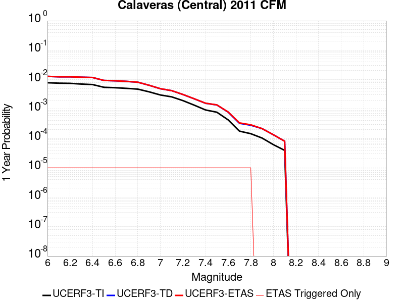 | 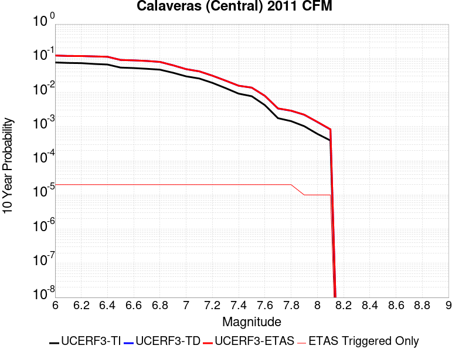 |

| Magnitude | 1 wk TI Prob | 1 wk TD Prob | 1 wk ETAS Prob | 1 wk ETAS/TD Gain | 1 wk ETAS Triggered Only | 1 mo TI Prob | 1 mo TD Prob | 1 mo ETAS Prob | 1 mo ETAS/TD Gain | 1 mo ETAS Triggered Only | 1 yr TI Prob | 1 yr TD Prob | 1 yr ETAS Prob | 1 yr ETAS/TD Gain | 1 yr ETAS Triggered Only | 10 yr TI Prob | 10 yr TD Prob | 10 yr ETAS Prob | 10 yr ETAS/TD Gain | 10 yr ETAS Triggered Only |
|-----|-----|-----|-----|-----|-----|-----|-----|-----|-----|-----|-----|-----|-----|-----|-----|-----|-----|-----|-----|-----|
| 6.0 | 1.5010907E-4 | 2.4804124E-4 | 2.4804124E-4 | 1.0 | 0.0 | 6.4316596E-4 | 0.001062498 | 0.001062498 | 1.0 | 0.0 | 0.0078024664 | 0.012850443 | 0.012860315 | 1.0007682 | 1.0E-5 | 0.07534136 | 0.120411225 | 0.120428815 | 1.0001462 | 2.0E-5 |
| 6.1 | 1.4521465E-4 | 2.3965565E-4 | 2.3965565E-4 | 1.0 | 0.0 | 6.222001E-4 | 0.0010265942 | 0.0010265942 | 1.0 | 0.0 | 0.0075490056 | 0.012419763 | 0.012429639 | 1.0007951 | 1.0E-5 | 0.07297657 | 0.11668273 | 0.116700396 | 1.0001514 | 2.0E-5 |
| 6.2 | 1.429998E-4 | 2.3896809E-4 | 2.3896809E-4 | 1.0 | 0.0 | 6.127123E-4 | 0.0010236499 | 0.0010236499 | 1.0 | 0.0 | 0.007434286 | 0.012384372 | 0.012394248 | 1.0007975 | 1.0E-5 | 0.07190444 | 0.11633677 | 0.11635444 | 1.0001519 | 2.0E-5 |
| 6.3 | 1.3536277E-4 | 2.3227946E-4 | 2.3227946E-4 | 1.0 | 0.0 | 5.799972E-4 | 9.950127E-4 | 9.950127E-4 | 1.0 | 0.0 | 0.0070386264 | 0.012040534 | 0.0120504135 | 1.0008205 | 1.0E-5 | 0.0681982 | 0.113249525 | 0.11326726 | 1.0001566 | 2.0E-5 |
| 6.4 | 1.2993296E-4 | 2.2651516E-4 | 2.2651516E-4 | 1.0 | 0.0 | 5.5673666E-4 | 9.703276E-4 | 9.703276E-4 | 1.0 | 0.0 | 0.006757223 | 0.011743338 | 0.01175322 | 1.0008415 | 1.0E-5 | 0.06555412 | 0.11052752 | 0.110545315 | 1.0001609 | 2.0E-5 |
| 6.5 | 1.0498927E-4 | 1.7981966E-4 | 1.7981966E-4 | 1.0 | 0.0 | 4.498764E-4 | 7.7042676E-4 | 7.7042676E-4 | 1.0 | 0.0 | 0.005463498 | 0.00933952 | 0.009349426 | 1.0010607 | 1.0E-5 | 0.053311124 | 0.08920739 | 0.089225605 | 1.0002042 | 2.0E-5 |
| 6.6 | 1.0157505E-4 | 1.7469494E-4 | 1.7469494E-4 | 1.0 | 0.0 | 4.35249E-4 | 7.4847665E-4 | 7.4847665E-4 | 1.0 | 0.0 | 0.0052862884 | 0.009074567 | 0.009084476 | 1.001092 | 1.0E-5 | 0.05162293 | 0.08678487 | 0.08680314 | 1.0002104 | 2.0E-5 |
| 6.7 | 9.660386E-5 | 1.6728783E-4 | 1.6728783E-4 | 1.0 | 0.0 | 4.1395082E-4 | 7.167497E-4 | 7.167497E-4 | 1.0 | 0.0 | 0.0050282106 | 0.008691474 | 0.008701387 | 1.0011406 | 1.0E-5 | 0.049159497 | 0.08327401 | 0.08329234 | 1.0002202 | 2.0E-5 |
| 6.8 | 9.089927E-5 | 1.5643238E-4 | 1.5643238E-4 | 1.0 | 0.0 | 3.8951015E-4 | 6.702511E-4 | 6.702511E-4 | 1.0 | 0.0 | 0.0047319788 | 0.008129742 | 0.008139661 | 1.0012201 | 1.0E-5 | 0.046324775 | 0.078163 | 0.07818144 | 1.0002359 | 2.0E-5 |
| 6.9 | 7.353187E-5 | 1.2295779E-4 | 1.2295779E-4 | 1.0 | 0.0 | 3.150985E-4 | 5.2685605E-4 | 5.2685605E-4 | 1.0 | 0.0 | 0.0038295772 | 0.006395728 | 0.0064056637 | 1.0015535 | 1.0E-5 | 0.037642512 | 0.06218928 | 0.062208038 | 1.0003016 | 2.0E-5 |
| 7.0 | 5.746064E-5 | 9.3890936E-5 | 9.3890936E-5 | 1.0 | 0.0 | 2.4623662E-4 | 4.0232803E-4 | 4.0232803E-4 | 1.0 | 0.0 | 0.0029938098 | 0.0048874132 | 0.0048973644 | 1.0020361 | 1.0E-5 | 0.02953797 | 0.04798713 | 0.04800617 | 1.0003967 | 2.0E-5 |
| 7.1 | 4.9557195E-5 | 8.052768E-5 | 8.052768E-5 | 1.0 | 0.0 | 2.123707E-4 | 3.4507332E-4 | 3.4507332E-4 | 1.0 | 0.0 | 0.0025825473 | 0.004193237 | 0.004203195 | 1.0023748 | 1.0E-5 | 0.0255274 | 0.041373473 | 0.041392643 | 1.0004634 | 2.0E-5 |
| 7.2 | 3.687595E-5 | 5.952694E-5 | 5.952694E-5 | 1.0 | 0.0 | 1.5803022E-4 | 2.5509068E-4 | 2.5509068E-4 | 1.0 | 0.0 | 0.0019223199 | 0.003101335 | 0.0031113038 | 1.0032144 | 1.0E-5 | 0.01905776 | 0.030883823 | 0.030903203 | 1.0006276 | 2.0E-5 |
| 7.3 | 2.5846984E-5 | 4.2473923E-5 | 4.2473923E-5 | 1.0 | 0.0 | 1.1076809E-4 | 1.820185E-4 | 1.820185E-4 | 1.0 | 0.0 | 0.0013477671 | 0.0022138404 | 0.002223818 | 1.0045071 | 1.0E-5 | 0.013396223 | 0.022175217 | 0.022194775 | 1.0008819 | 2.0E-5 |
| 7.4 | 1.7747854E-5 | 2.993759E-5 | 2.993759E-5 | 1.0 | 0.0 | 7.6060016E-5 | 1.2829766E-4 | 1.2829766E-4 | 1.0 | 0.0 | 9.2563726E-4 | 0.0015609078 | 0.0015708922 | 1.0063965 | 1.0E-5 | 0.009217911 | 0.015708687 | 0.015728373 | 1.0012531 | 2.0E-5 |
| 7.5 | 1.4883479E-5 | 2.6244672E-5 | 2.6244672E-5 | 1.0 | 0.0 | 6.378478E-5 | 1.12472335E-4 | 1.12472335E-4 | 1.0 | 0.0 | 7.76303E-4 | 0.0013684932 | 0.0013784795 | 1.0072973 | 1.0E-5 | 0.0077359667 | 0.013801667 | 0.01382139 | 1.0014291 | 2.0E-5 |
| 7.6 | 8.166975E-6 | 1.4964299E-5 | 1.4964299E-5 | 1.0 | 0.0 | 3.5000852E-5 | 6.413114E-5 | 6.413114E-5 | 1.0 | 0.0 | 4.2605202E-4 | 7.805183E-4 | 7.905105E-4 | 1.012802 | 1.0E-5 | 0.004252361 | 0.007939203 | 0.007959045 | 1.0024991 | 2.0E-5 |
| 7.7 | 3.3858064E-6 | 6.254251E-6 | 6.254251E-6 | 1.0 | 0.0 | 1.4510518E-5 | 2.6803657E-5 | 2.6803657E-5 | 1.0 | 0.0 | 1.7665124E-4 | 3.2628572E-4 | 3.3628245E-4 | 1.030638 | 1.0E-5 | 0.0017651088 | 0.003388363 | 0.003408295 | 1.0058825 | 2.0E-5 |
| 7.8 | 2.7721615E-6 | 5.366695E-6 | 5.366695E-6 | 1.0 | 0.0 | 1.1880637E-5 | 2.2999919E-5 | 2.2999919E-5 | 1.0 | 0.0 | 1.4463716E-4 | 2.7998807E-4 | 2.8998527E-4 | 1.0357058 | 1.0E-5 | 0.0014454306 | 0.002907615 | 0.0029275566 | 1.0068585 | 2.0E-5 |
| 7.9 | 1.9736292E-6 | 4.128705E-6 | 4.128705E-6 | 1.0 | 0.0 | 8.4583835E-6 | 1.769433E-5 | 1.769433E-5 | 1.0 | 0.0 | 1.0297595E-4 | 2.1540721E-4 | 2.1540721E-4 | 1.0 | 0.0 | 0.0010292825 | 0.0022237299 | 0.0022337078 | 1.0044869 | 1.0E-5 |
| 8.0 | 1.1767289E-6 | 2.5546633E-6 | 2.5546633E-6 | 1.0 | 0.0 | 5.0431145E-6 | 1.0948511E-5 | 1.0948511E-5 | 1.0 | 0.0 | 6.139818E-5 | 1.3329E-4 | 1.3329E-4 | 1.0 | 0.0 | 6.1381224E-4 | 0.001366126 | 0.0013761123 | 1.0073099 | 1.0E-5 |
| 8.1 | 7.5112825E-7 | 1.541076E-6 | 1.541076E-6 | 1.0 | 0.0 | 3.2191172E-6 | 6.604595E-6 | 6.604595E-6 | 1.0 | 0.0 | 3.9192048E-5 | 8.0408E-5 | 8.0408E-5 | 1.0 | 0.0 | 3.9185135E-4 | 8.2356273E-4 | 8.335545E-4 | 1.0121324 | 1.0E-5 |

## Del Valle
*[(top)](#table-of-contents)*

| 1 Week | 1 Month | 1 Year | 10 Year |
|-----|-----|-----|-----|
|  |  | 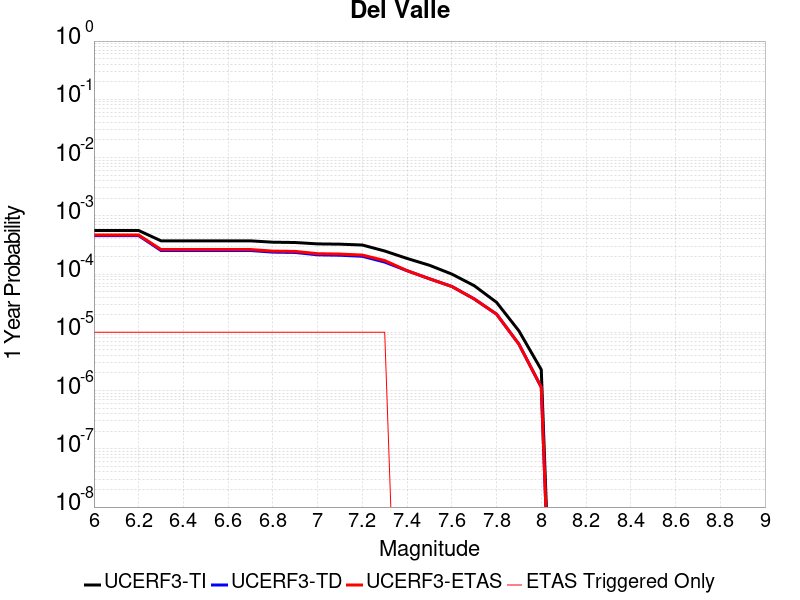 |  |

| Magnitude | 1 wk TI Prob | 1 wk TD Prob | 1 wk ETAS Prob | 1 wk ETAS/TD Gain | 1 wk ETAS Triggered Only | 1 mo TI Prob | 1 mo TD Prob | 1 mo ETAS Prob | 1 mo ETAS/TD Gain | 1 mo ETAS Triggered Only | 1 yr TI Prob | 1 yr TD Prob | 1 yr ETAS Prob | 1 yr ETAS/TD Gain | 1 yr ETAS Triggered Only | 10 yr TI Prob | 10 yr TD Prob | 10 yr ETAS Prob | 10 yr ETAS/TD Gain | 10 yr ETAS Triggered Only |
|-----|-----|-----|-----|-----|-----|-----|-----|-----|-----|-----|-----|-----|-----|-----|-----|-----|-----|-----|-----|-----|
| 6.0 | 1.0716125E-5 | 8.767882E-6 | 1.8767794E-5 | 2.1405163 | 1.0E-5 | 4.592544E-5 | 3.7576207E-5 | 4.7575828E-5 | 1.2661159 | 1.0E-5 | 5.589988E-4 | 4.5741402E-4 | 4.6740944E-4 | 1.021852 | 1.0E-5 | 0.0055759475 | 0.004566694 | 0.004586603 | 1.0043595 | 2.0E-5 |
| 6.1 | 1.0716125E-5 | 8.767882E-6 | 1.8767794E-5 | 2.1405163 | 1.0E-5 | 4.592544E-5 | 3.7576207E-5 | 4.7575828E-5 | 1.2661159 | 1.0E-5 | 5.589988E-4 | 4.5741402E-4 | 4.6740944E-4 | 1.021852 | 1.0E-5 | 0.0055759475 | 0.004566694 | 0.004586603 | 1.0043595 | 2.0E-5 |
| 6.2 | 1.0716125E-5 | 8.767882E-6 | 1.8767794E-5 | 2.1405163 | 1.0E-5 | 4.592544E-5 | 3.7576207E-5 | 4.7575828E-5 | 1.2661159 | 1.0E-5 | 5.589988E-4 | 4.5741402E-4 | 4.6740944E-4 | 1.021852 | 1.0E-5 | 0.0055759475 | 0.004566694 | 0.004586603 | 1.0043595 | 2.0E-5 |
| 6.3 | 7.1293784E-6 | 4.8658226E-6 | 1.4865774E-5 | 3.055141 | 1.0E-5 | 3.055412E-5 | 2.0853362E-5 | 3.0853153E-5 | 1.479529 | 1.0E-5 | 3.7193293E-4 | 2.5386084E-4 | 2.638583E-4 | 1.0393816 | 1.0E-5 | 0.0037131102 | 0.0025358086 | 0.002555758 | 1.007867 | 2.0E-5 |
| 6.4 | 7.1293784E-6 | 4.8658226E-6 | 1.4865774E-5 | 3.055141 | 1.0E-5 | 3.055412E-5 | 2.0853362E-5 | 3.0853153E-5 | 1.479529 | 1.0E-5 | 3.7193293E-4 | 2.5386084E-4 | 2.638583E-4 | 1.0393816 | 1.0E-5 | 0.0037131102 | 0.0025358086 | 0.002555758 | 1.007867 | 2.0E-5 |
| 6.5 | 7.1293784E-6 | 4.8658226E-6 | 1.4865774E-5 | 3.055141 | 1.0E-5 | 3.055412E-5 | 2.0853362E-5 | 3.0853153E-5 | 1.479529 | 1.0E-5 | 3.7193293E-4 | 2.5386084E-4 | 2.638583E-4 | 1.0393816 | 1.0E-5 | 0.0037131102 | 0.0025358086 | 0.002555758 | 1.007867 | 2.0E-5 |
| 6.6 | 7.1293784E-6 | 4.8658226E-6 | 1.4865774E-5 | 3.055141 | 1.0E-5 | 3.055412E-5 | 2.0853362E-5 | 3.0853153E-5 | 1.479529 | 1.0E-5 | 3.7193293E-4 | 2.5386084E-4 | 2.638583E-4 | 1.0393816 | 1.0E-5 | 0.0037131102 | 0.0025358086 | 0.002555758 | 1.007867 | 2.0E-5 |
| 6.7 | 7.12272E-6 | 4.8631982E-6 | 1.486315E-5 | 3.05625 | 1.0E-5 | 3.0525585E-5 | 2.0842115E-5 | 3.0841908E-5 | 1.4797877 | 1.0E-5 | 3.7158563E-4 | 2.5372393E-4 | 2.6372142E-4 | 1.039403 | 1.0E-5 | 0.003709649 | 0.0025344428 | 0.0025543922 | 1.0078713 | 2.0E-5 |
| 6.8 | 6.7558703E-6 | 4.559404E-6 | 1.45593585E-5 | 3.1932592 | 1.0E-5 | 2.895341E-5 | 1.954016E-5 | 2.9539964E-5 | 1.5117565 | 1.0E-5 | 3.5245073E-4 | 2.3787611E-4 | 2.4787372E-4 | 1.0420287 | 1.0E-5 | 0.0035189227 | 0.0023763045 | 0.002396257 | 1.0083964 | 2.0E-5 |
| 6.9 | 6.6700386E-6 | 4.5025436E-6 | 1.4502499E-5 | 3.220957 | 1.0E-5 | 2.8585566E-5 | 1.9296476E-5 | 2.9296283E-5 | 1.5182194 | 1.0E-5 | 3.479737E-4 | 2.349099E-4 | 2.4490754E-4 | 1.0425595 | 1.0E-5 | 0.003474293 | 0.0023467052 | 0.002366658 | 1.0085026 | 2.0E-5 |
| 7.0 | 6.3181424E-6 | 4.098708E-6 | 1.4098667E-5 | 3.4397833 | 1.0E-5 | 2.7077473E-5 | 1.7565775E-5 | 2.7565598E-5 | 1.5692788 | 1.0E-5 | 3.2961834E-4 | 2.1384275E-4 | 2.238406E-4 | 1.0467533 | 1.0E-5 | 0.0032912986 | 0.0021364389 | 0.0021563962 | 1.0093414 | 2.0E-5 |
| 7.1 | 6.248759E-6 | 4.033899E-6 | 1.4033859E-5 | 3.478981 | 1.0E-5 | 2.678012E-5 | 1.7288028E-5 | 2.7287855E-5 | 1.5784249 | 1.0E-5 | 3.2599916E-4 | 2.1046183E-4 | 2.2045973E-4 | 1.0475045 | 1.0E-5 | 0.0032552136 | 0.0021026938 | 0.0021226518 | 1.0094916 | 2.0E-5 |
| 7.2 | 6.0411944E-6 | 3.869892E-6 | 1.3869853E-5 | 3.584041 | 1.0E-5 | 2.5890577E-5 | 1.658515E-5 | 2.6584985E-5 | 1.602939 | 1.0E-5 | 3.1517216E-4 | 2.019059E-4 | 2.1190388E-4 | 1.049518 | 1.0E-5 | 0.0031472554 | 0.0020172922 | 0.0020372518 | 1.0098943 | 2.0E-5 |
| 7.3 | 4.7691183E-6 | 3.0780905E-6 | 1.307806E-5 | 4.2487574 | 1.0E-5 | 2.0438918E-5 | 1.3191751E-5 | 2.3191618E-5 | 1.7580395 | 1.0E-5 | 2.488154E-4 | 1.6059795E-4 | 1.7059634E-4 | 1.0622573 | 1.0E-5 | 0.00248537 | 0.0016048512 | 0.0016248191 | 1.0124422 | 2.0E-5 |
| 7.4 | 3.5524722E-6 | 2.1893159E-6 | 2.1893159E-6 | 1.0 | 0.0 | 1.5224792E-5 | 9.382749E-6 | 9.382749E-6 | 1.0 | 0.0 | 1.8534607E-4 | 1.14229064E-4 | 1.14229064E-4 | 1.0 | 0.0 | 0.0018519156 | 0.0011417117 | 0.0011517003 | 1.0087488 | 1.0E-5 |
| 7.5 | 2.7133442E-6 | 1.5915855E-6 | 1.5915855E-6 | 1.0 | 0.0 | 1.1628566E-5 | 6.821063E-6 | 6.821063E-6 | 1.0 | 0.0 | 1.415686E-4 | 8.30433E-5 | 8.30433E-5 | 1.0 | 0.0 | 0.0014147845 | 8.301246E-4 | 8.401163E-4 | 1.0120364 | 1.0E-5 |
| 7.6 | 1.915338E-6 | 1.1738952E-6 | 1.1738952E-6 | 1.0 | 0.0 | 8.208566E-6 | 5.0309695E-6 | 5.0309695E-6 | 1.0 | 0.0 | 9.993471E-5 | 6.125034E-5 | 6.125034E-5 | 1.0 | 0.0 | 9.988978E-4 | 6.123355E-4 | 6.123355E-4 | 1.0 | 0.0 |
| 7.7 | 1.2120448E-6 | 7.1801645E-7 | 7.1801645E-7 | 1.0 | 0.0 | 5.194467E-6 | 3.0772098E-6 | 3.0772098E-6 | 1.0 | 0.0 | 6.3240805E-5 | 3.746439E-5 | 3.746439E-5 | 1.0 | 0.0 | 6.322281E-4 | 3.745811E-4 | 3.745811E-4 | 1.0 | 0.0 |
| 7.8 | 6.272381E-7 | 3.93245E-7 | 3.93245E-7 | 1.0 | 0.0 | 2.6881603E-6 | 1.6853346E-6 | 1.6853346E-6 | 1.0 | 0.0 | 3.272786E-5 | 2.0518757E-5 | 2.0518757E-5 | 1.0 | 0.0 | 3.272304E-4 | 2.0516879E-4 | 2.0516879E-4 | 1.0 | 0.0 |
| 7.9 | 2.0292627E-7 | 1.2004223E-7 | 1.2004223E-7 | 1.0 | 0.0 | 8.6968373E-7 | 5.144666E-7 | 5.144666E-7 | 1.0 | 0.0 | 1.0588348E-5 | 6.2636127E-6 | 6.2636127E-6 | 1.0 | 0.0 | 1.0587843E-4 | 6.263438E-5 | 6.263438E-5 | 1.0 | 0.0 |
| 8.0 | 4.374492E-8 | 2.1898856E-8 | 2.1898856E-8 | 1.0 | 0.0 | 1.8747821E-7 | 9.3852236E-8 | 9.3852236E-8 | 1.0 | 0.0 | 2.2825448E-6 | 1.1426505E-6 | 1.1426505E-6 | 1.0 | 0.0 | 2.2825214E-5 | 1.1426449E-5 | 1.1426449E-5 | 1.0 | 0.0 |

## South Klamath Lake West
*[(top)](#table-of-contents)*

| 1 Week | 1 Month | 1 Year | 10 Year |
|-----|-----|-----|-----|
|  |  |  |  |

| Magnitude | 1 wk TI Prob | 1 wk TD Prob | 1 wk ETAS Prob | 1 wk ETAS/TD Gain | 1 wk ETAS Triggered Only | 1 mo TI Prob | 1 mo TD Prob | 1 mo ETAS Prob | 1 mo ETAS/TD Gain | 1 mo ETAS Triggered Only | 1 yr TI Prob | 1 yr TD Prob | 1 yr ETAS Prob | 1 yr ETAS/TD Gain | 1 yr ETAS Triggered Only | 10 yr TI Prob | 10 yr TD Prob | 10 yr ETAS Prob | 10 yr ETAS/TD Gain | 10 yr ETAS Triggered Only |
|-----|-----|-----|-----|-----|-----|-----|-----|-----|-----|-----|-----|-----|-----|-----|-----|-----|-----|-----|-----|-----|
| 6.0 | 2.174025E-5 | 2.3042025E-5 | 2.3042025E-5 | 1.0 | 0.0 | 9.3169176E-5 | 9.874817E-5 | 9.874817E-5 | 1.0 | 0.0 | 0.0011337444 | 0.0012016617 | 0.0012116497 | 1.0083119 | 1.0E-5 | 0.011279777 | 0.0119582405 | 0.011968121 | 1.0008262 | 1.0E-5 |
| 6.1 | 2.174025E-5 | 2.3042025E-5 | 2.3042025E-5 | 1.0 | 0.0 | 9.3169176E-5 | 9.874817E-5 | 9.874817E-5 | 1.0 | 0.0 | 0.0011337444 | 0.0012016617 | 0.0012116497 | 1.0083119 | 1.0E-5 | 0.011279777 | 0.0119582405 | 0.011968121 | 1.0008262 | 1.0E-5 |
| 6.2 | 9.834929E-6 | 1.0393841E-5 | 1.0393841E-5 | 1.0 | 0.0 | 4.2149015E-5 | 4.4544326E-5 | 4.4544326E-5 | 1.0 | 0.0 | 5.1304343E-4 | 5.422012E-4 | 5.422012E-4 | 1.0 | 0.0 | 0.0051186057 | 0.0054096854 | 0.0054096854 | 1.0 | 0.0 |
| 6.3 | 9.834929E-6 | 1.0393841E-5 | 1.0393841E-5 | 1.0 | 0.0 | 4.2149015E-5 | 4.4544326E-5 | 4.4544326E-5 | 1.0 | 0.0 | 5.1304343E-4 | 5.422012E-4 | 5.422012E-4 | 1.0 | 0.0 | 0.0051186057 | 0.0054096854 | 0.0054096854 | 1.0 | 0.0 |
| 6.4 | 6.066321E-6 | 6.40043E-6 | 6.40043E-6 | 1.0 | 0.0 | 2.5998259E-5 | 2.743014E-5 | 2.743014E-5 | 1.0 | 0.0 | 3.1648282E-4 | 3.3391351E-4 | 3.3391351E-4 | 1.0 | 0.0 | 0.0031603249 | 0.0033343881 | 0.0033343881 | 1.0 | 0.0 |
| 6.5 | 6.066321E-6 | 6.40043E-6 | 6.40043E-6 | 1.0 | 0.0 | 2.5998259E-5 | 2.743014E-5 | 2.743014E-5 | 1.0 | 0.0 | 3.1648282E-4 | 3.3391351E-4 | 3.3391351E-4 | 1.0 | 0.0 | 0.0031603249 | 0.0033343881 | 0.0033343881 | 1.0 | 0.0 |
| 6.6 | 4.2321803E-6 | 4.461291E-6 | 4.461291E-6 | 1.0 | 0.0 | 1.8137789E-5 | 1.9119685E-5 | 1.9119685E-5 | 1.0 | 0.0 | 2.208052E-4 | 2.3275832E-4 | 2.3275832E-4 | 1.0 | 0.0 | 0.0022058594 | 0.0023252473 | 0.0023252473 | 1.0 | 0.0 |
| 6.7 | 3.186646E-6 | 3.360305E-6 | 3.360305E-6 | 1.0 | 0.0 | 1.3656982E-5 | 1.4401232E-5 | 1.4401232E-5 | 1.0 | 0.0 | 1.6626107E-4 | 1.7532158E-4 | 1.7532158E-4 | 1.0 | 0.0 | 0.0016613674 | 0.0017518997 | 0.0017518997 | 1.0 | 0.0 |
| 6.8 | 2.380121E-6 | 2.510907E-6 | 2.510907E-6 | 1.0 | 0.0 | 1.0200479E-5 | 1.07609885E-5 | 1.07609885E-5 | 1.0 | 0.0 | 1.2418375E-4 | 1.3100762E-4 | 1.3100762E-4 | 1.0 | 0.0 | 0.0012411437 | 0.0013093497 | 0.0013093497 | 1.0 | 0.0 |
| 6.9 | 8.928287E-7 | 9.4302504E-7 | 9.4302504E-7 | 1.0 | 0.0 | 3.826403E-6 | 4.0415307E-6 | 4.0415307E-6 | 1.0 | 0.0 | 4.658546E-5 | 4.9204747E-5 | 4.9204747E-5 | 1.0 | 0.0 | 4.6575698E-4 | 4.9196015E-4 | 4.9196015E-4 | 1.0 | 0.0 |

## Hollywood
*[(top)](#table-of-contents)*

| 1 Week | 1 Month | 1 Year | 10 Year |
|-----|-----|-----|-----|
|  |  |  |  |

| Magnitude | 1 wk TI Prob | 1 wk TD Prob | 1 wk ETAS Prob | 1 wk ETAS/TD Gain | 1 wk ETAS Triggered Only | 1 mo TI Prob | 1 mo TD Prob | 1 mo ETAS Prob | 1 mo ETAS/TD Gain | 1 mo ETAS Triggered Only | 1 yr TI Prob | 1 yr TD Prob | 1 yr ETAS Prob | 1 yr ETAS/TD Gain | 1 yr ETAS Triggered Only | 10 yr TI Prob | 10 yr TD Prob | 10 yr ETAS Prob | 10 yr ETAS/TD Gain | 10 yr ETAS Triggered Only |
|-----|-----|-----|-----|-----|-----|-----|-----|-----|-----|-----|-----|-----|-----|-----|-----|-----|-----|-----|-----|-----|
| 6.0 | 1.24487615E-5 | 1.2593229E-5 | 1.2593229E-5 | 1.0 | 0.0 | 5.3350745E-5 | 5.3969892E-5 | 5.3969892E-5 | 1.0 | 0.0 | 6.4935174E-4 | 6.5689E-4 | 6.7687687E-4 | 1.0304265 | 2.0E-5 | 0.0064745755 | 0.0065499707 | 0.00656984 | 1.0030334 | 2.0E-5 |
| 6.1 | 1.24487615E-5 | 1.2593229E-5 | 1.2593229E-5 | 1.0 | 0.0 | 5.3350745E-5 | 5.3969892E-5 | 5.3969892E-5 | 1.0 | 0.0 | 6.4935174E-4 | 6.5689E-4 | 6.7687687E-4 | 1.0304265 | 2.0E-5 | 0.0064745755 | 0.0065499707 | 0.00656984 | 1.0030334 | 2.0E-5 |
| 6.2 | 1.24487615E-5 | 1.2593229E-5 | 1.2593229E-5 | 1.0 | 0.0 | 5.3350745E-5 | 5.3969892E-5 | 5.3969892E-5 | 1.0 | 0.0 | 6.4935174E-4 | 6.5689E-4 | 6.7687687E-4 | 1.0304265 | 2.0E-5 | 0.0064745755 | 0.0065499707 | 0.00656984 | 1.0030334 | 2.0E-5 |
| 6.3 | 1.24487615E-5 | 1.2593229E-5 | 1.2593229E-5 | 1.0 | 0.0 | 5.3350745E-5 | 5.3969892E-5 | 5.3969892E-5 | 1.0 | 0.0 | 6.4935174E-4 | 6.5689E-4 | 6.7687687E-4 | 1.0304265 | 2.0E-5 | 0.0064745755 | 0.0065499707 | 0.00656984 | 1.0030334 | 2.0E-5 |
| 6.4 | 1.2431024E-5 | 1.25738425E-5 | 1.25738425E-5 | 1.0 | 0.0 | 5.327473E-5 | 5.388681E-5 | 5.388681E-5 | 1.0 | 0.0 | 6.4842677E-4 | 6.558791E-4 | 6.75866E-4 | 1.0304735 | 2.0E-5 | 0.0064653796 | 0.0065399213 | 0.0065597906 | 1.0030382 | 2.0E-5 |
| 6.5 | 1.1242222E-5 | 1.1317804E-5 | 1.1317804E-5 | 1.0 | 0.0 | 4.8180063E-5 | 4.8503985E-5 | 4.8503985E-5 | 1.0 | 0.0 | 5.864344E-4 | 5.903787E-4 | 6.1036693E-4 | 1.0338565 | 2.0E-5 | 0.0058488925 | 0.00588839 | 0.005908272 | 1.0033765 | 2.0E-5 |
| 6.6 | 1.1234066E-5 | 1.1308918E-5 | 1.1308918E-5 | 1.0 | 0.0 | 4.8145106E-5 | 4.8465907E-5 | 4.8465907E-5 | 1.0 | 0.0 | 5.86009E-4 | 5.899153E-4 | 6.0990354E-4 | 1.0338832 | 2.0E-5 | 0.005844661 | 0.0058837803 | 0.0059036626 | 1.0033792 | 2.0E-5 |
| 6.7 | 1.12294E-5 | 1.1303661E-5 | 1.1303661E-5 | 1.0 | 0.0 | 4.812511E-5 | 4.8443377E-5 | 4.8443377E-5 | 1.0 | 0.0 | 5.857657E-4 | 5.896412E-4 | 6.096294E-4 | 1.033899 | 2.0E-5 | 0.0058422405 | 0.005881054 | 0.005900936 | 1.0033808 | 2.0E-5 |
| 6.8 | 1.0252819E-5 | 1.0218449E-5 | 1.0218449E-5 | 1.0 | 0.0 | 4.3939912E-5 | 4.3792625E-5 | 4.3792625E-5 | 1.0 | 0.0 | 5.3483713E-4 | 5.330469E-4 | 5.530362E-4 | 1.0375001 | 2.0E-5 | 0.005335517 | 0.0053179096 | 0.005337803 | 1.0037409 | 2.0E-5 |
| 6.9 | 9.252289E-6 | 9.110309E-6 | 9.110309E-6 | 1.0 | 0.0 | 3.9652066E-5 | 3.9043607E-5 | 3.9043607E-5 | 1.0 | 0.0 | 4.8265693E-4 | 4.752539E-4 | 4.952444E-4 | 1.0420628 | 2.0E-5 | 0.0048161 | 0.004742549 | 0.004762454 | 1.0041971 | 2.0E-5 |
| 7.0 | 8.474604E-6 | 8.25826E-6 | 8.25826E-6 | 1.0 | 0.0 | 3.6319227E-5 | 3.5392073E-5 | 3.5392073E-5 | 1.0 | 0.0 | 4.4209688E-4 | 4.3081472E-4 | 4.508061E-4 | 1.0464036 | 2.0E-5 | 0.004412184 | 0.0042999457 | 0.0043198597 | 1.0046313 | 2.0E-5 |
| 7.1 | 6.643643E-6 | 6.2683707E-6 | 6.2683707E-6 | 1.0 | 0.0 | 2.8472443E-5 | 2.686417E-5 | 2.686417E-5 | 1.0 | 0.0 | 3.4659685E-4 | 3.2702263E-4 | 3.3701936E-4 | 1.030569 | 1.0E-5 | 0.0034605677 | 0.0032654598 | 0.0032754273 | 1.0030524 | 1.0E-5 |
| 7.2 | 5.549002E-6 | 5.1087086E-6 | 5.1087086E-6 | 1.0 | 0.0 | 2.378122E-5 | 2.1894282E-5 | 2.1894282E-5 | 1.0 | 0.0 | 2.8949787E-4 | 2.665304E-4 | 2.7652775E-4 | 1.0375092 | 1.0E-5 | 0.0028912104 | 0.002662124 | 0.0026720974 | 1.0037464 | 1.0E-5 |
| 7.3 | 4.3059727E-6 | 3.9598913E-6 | 3.9598913E-6 | 1.0 | 0.0 | 1.8454039E-5 | 1.6970853E-5 | 1.6970853E-5 | 1.0 | 0.0 | 2.2465475E-4 | 2.0660064E-4 | 2.1659858E-4 | 1.0483925 | 1.0E-5 | 0.0022442779 | 0.0020640958 | 0.0020740752 | 1.0048348 | 1.0E-5 |
| 7.4 | 2.8550733E-6 | 2.7013002E-6 | 2.7013002E-6 | 1.0 | 0.0 | 1.2235971E-5 | 1.1576949E-5 | 1.1576949E-5 | 1.0 | 0.0 | 1.4896276E-4 | 1.4094029E-4 | 1.4094029E-4 | 1.0 | 0.0 | 0.0014886294 | 0.0014085141 | 0.0014085141 | 1.0 | 0.0 |
| 7.5 | 1.9927045E-6 | 1.8976393E-6 | 1.8976393E-6 | 1.0 | 0.0 | 8.540134E-6 | 8.132714E-6 | 8.132714E-6 | 1.0 | 0.0 | 1.0397117E-4 | 9.901134E-5 | 9.901134E-5 | 1.0 | 0.0 | 0.0010392254 | 9.896759E-4 | 9.896759E-4 | 1.0 | 0.0 |
| 7.6 | 1.345084E-6 | 1.2216018E-6 | 1.2216018E-6 | 1.0 | 0.0 | 5.764633E-6 | 5.2354258E-6 | 5.2354258E-6 | 1.0 | 0.0 | 7.018215E-5 | 6.373946E-5 | 6.373946E-5 | 1.0 | 0.0 | 7.0159987E-4 | 6.372138E-4 | 6.372138E-4 | 1.0 | 0.0 |
| 7.7 | 7.6835164E-7 | 6.2777013E-7 | 6.2777013E-7 | 1.0 | 0.0 | 3.2929315E-6 | 2.6904406E-6 | 2.6904406E-6 | 1.0 | 0.0 | 4.00907E-5 | 3.2755637E-5 | 3.2755637E-5 | 1.0 | 0.0 | 4.0083472E-4 | 3.2750957E-4 | 3.2750957E-4 | 1.0 | 0.0 |
| 7.8 | 3.6562128E-7 | 2.4534745E-7 | 2.4534745E-7 | 1.0 | 0.0 | 1.5669474E-6 | 1.0514887E-6 | 1.0514887E-6 | 1.0 | 0.0 | 1.9077417E-5 | 1.2801803E-5 | 1.2801803E-5 | 1.0 | 0.0 | 1.907578E-4 | 1.2801103E-4 | 1.2801103E-4 | 1.0 | 0.0 |
| 7.9 | 7.5024424E-8 | 5.381742E-8 | 5.381742E-8 | 1.0 | 0.0 | 3.215332E-7 | 2.3064608E-7 | 2.3064608E-7 | 1.0 | 0.0 | 3.91466E-6 | 2.8081138E-6 | 2.8081138E-6 | 1.0 | 0.0 | 3.9145907E-5 | 2.8080913E-5 | 2.8080913E-5 | 1.0 | 0.0 |

## Great Valley 03a Dunnigan Hills
*[(top)](#table-of-contents)*

| 1 Week | 1 Month | 1 Year | 10 Year |
|-----|-----|-----|-----|
|  |  |  |  |

| Magnitude | 1 wk TI Prob | 1 wk TD Prob | 1 wk ETAS Prob | 1 wk ETAS/TD Gain | 1 wk ETAS Triggered Only | 1 mo TI Prob | 1 mo TD Prob | 1 mo ETAS Prob | 1 mo ETAS/TD Gain | 1 mo ETAS Triggered Only | 1 yr TI Prob | 1 yr TD Prob | 1 yr ETAS Prob | 1 yr ETAS/TD Gain | 1 yr ETAS Triggered Only | 10 yr TI Prob | 10 yr TD Prob | 10 yr ETAS Prob | 10 yr ETAS/TD Gain | 10 yr ETAS Triggered Only |
|-----|-----|-----|-----|-----|-----|-----|-----|-----|-----|-----|-----|-----|-----|-----|-----|-----|-----|-----|-----|-----|
| 6.0 | 1.6591328E-5 | 1.8107954E-5 | 2.8107774E-5 | 1.5522335 | 1.0E-5 | 7.110376E-5 | 7.7603596E-5 | 8.760282E-5 | 1.12885 | 1.0E-5 | 8.6534437E-4 | 9.444834E-4 | 9.644645E-4 | 1.0211556 | 2.0E-5 | 0.008619824 | 0.009411525 | 0.009431337 | 1.002105 | 2.0E-5 |
| 6.1 | 8.041125E-6 | 8.769726E-6 | 8.769726E-6 | 1.0 | 0.0 | 3.4461507E-5 | 3.7584115E-5 | 3.7584115E-5 | 1.0 | 0.0 | 4.194881E-4 | 4.5751085E-4 | 4.6750627E-4 | 1.0218474 | 1.0E-5 | 0.004186971 | 0.004567687 | 0.0045776414 | 1.0021793 | 1.0E-5 |
| 6.2 | 3.2807004E-6 | 3.5795688E-6 | 3.5795688E-6 | 1.0 | 0.0 | 1.4060069E-5 | 1.5340942E-5 | 1.5340942E-5 | 1.0 | 0.0 | 1.7116789E-4 | 1.8676413E-4 | 1.8676413E-4 | 1.0 | 0.0 | 0.0017103611 | 0.0018664796 | 0.0018664796 | 1.0 | 0.0 |
| 6.3 | 1.9339366E-6 | 2.1103806E-6 | 2.1103806E-6 | 1.0 | 0.0 | 8.288273E-6 | 9.044474E-6 | 9.044474E-6 | 1.0 | 0.0 | 1.00905054E-4 | 1.1011375E-4 | 1.1011375E-4 | 1.0 | 0.0 | 0.0010085925 | 0.0011008718 | 0.0011008718 | 1.0 | 0.0 |
| 6.4 | 1.3142635E-6 | 1.4339867E-6 | 1.4339867E-6 | 1.0 | 0.0 | 5.6325457E-6 | 6.145657E-6 | 6.145657E-6 | 1.0 | 0.0 | 6.857408E-5 | 7.482337E-5 | 7.482337E-5 | 1.0 | 0.0 | 6.8552926E-4 | 7.4823375E-4 | 7.4823375E-4 | 1.0 | 0.0 |

## Great Valley 04a Trout Creek
*[(top)](#table-of-contents)*

| 1 Week | 1 Month | 1 Year | 10 Year |
|-----|-----|-----|-----|
|  |  | 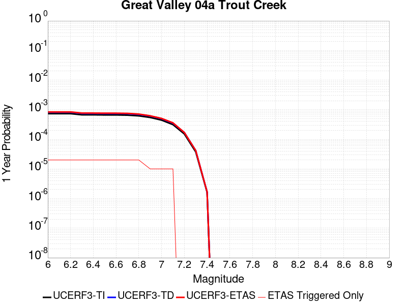 |  |

| Magnitude | 1 wk TI Prob | 1 wk TD Prob | 1 wk ETAS Prob | 1 wk ETAS/TD Gain | 1 wk ETAS Triggered Only | 1 mo TI Prob | 1 mo TD Prob | 1 mo ETAS Prob | 1 mo ETAS/TD Gain | 1 mo ETAS Triggered Only | 1 yr TI Prob | 1 yr TD Prob | 1 yr ETAS Prob | 1 yr ETAS/TD Gain | 1 yr ETAS Triggered Only | 10 yr TI Prob | 10 yr TD Prob | 10 yr ETAS Prob | 10 yr ETAS/TD Gain | 10 yr ETAS Triggered Only |
|-----|-----|-----|-----|-----|-----|-----|-----|-----|-----|-----|-----|-----|-----|-----|-----|-----|-----|-----|-----|-----|
| 6.0 | 1.4088538E-5 | 1.5719554E-5 | 2.5719397E-5 | 1.6361403 | 1.0E-5 | 6.037805E-5 | 6.7367844E-5 | 7.736717E-5 | 1.1484288 | 1.0E-5 | 7.3485484E-4 | 8.199074E-4 | 8.3989097E-4 | 1.024373 | 2.0E-5 | 0.007324295 | 0.008170108 | 0.008189945 | 1.0024279 | 2.0E-5 |
| 6.1 | 1.4088538E-5 | 1.5719554E-5 | 2.5719397E-5 | 1.6361403 | 1.0E-5 | 6.037805E-5 | 6.7367844E-5 | 7.736717E-5 | 1.1484288 | 1.0E-5 | 7.3485484E-4 | 8.199074E-4 | 8.3989097E-4 | 1.024373 | 2.0E-5 | 0.007324295 | 0.008170108 | 0.008189945 | 1.0024279 | 2.0E-5 |
| 6.2 | 1.4088538E-5 | 1.5719554E-5 | 2.5719397E-5 | 1.6361403 | 1.0E-5 | 6.037805E-5 | 6.7367844E-5 | 7.736717E-5 | 1.1484288 | 1.0E-5 | 7.3485484E-4 | 8.199074E-4 | 8.3989097E-4 | 1.024373 | 2.0E-5 | 0.007324295 | 0.008170108 | 0.008189945 | 1.0024279 | 2.0E-5 |
| 6.3 | 1.2882862E-5 | 1.4378603E-5 | 2.4378458E-5 | 1.6954678 | 1.0E-5 | 5.5211098E-5 | 6.1621184E-5 | 7.162057E-5 | 1.1622719 | 1.0E-5 | 6.7198783E-4 | 7.4999005E-4 | 7.699751E-4 | 1.026647 | 2.0E-5 | 0.0066995937 | 0.0074756527 | 0.0074955034 | 1.0026554 | 2.0E-5 |
| 6.4 | 1.2882862E-5 | 1.4378603E-5 | 2.4378458E-5 | 1.6954678 | 1.0E-5 | 5.5211098E-5 | 6.1621184E-5 | 7.162057E-5 | 1.1622719 | 1.0E-5 | 6.7198783E-4 | 7.4999005E-4 | 7.699751E-4 | 1.026647 | 2.0E-5 | 0.0066995937 | 0.0074756527 | 0.0074955034 | 1.0026554 | 2.0E-5 |
| 6.5 | 1.2762329E-5 | 1.424516E-5 | 2.4245017E-5 | 1.7019829 | 1.0E-5 | 5.469455E-5 | 6.1049315E-5 | 7.10487E-5 | 1.163792 | 1.0E-5 | 6.657027E-4 | 7.430323E-4 | 7.6301745E-4 | 1.0268967 | 2.0E-5 | 0.00663712 | 0.0074065393 | 0.007426391 | 1.0026803 | 2.0E-5 |
| 6.6 | 1.2762329E-5 | 1.424516E-5 | 2.4245017E-5 | 1.7019829 | 1.0E-5 | 5.469455E-5 | 6.1049315E-5 | 7.10487E-5 | 1.163792 | 1.0E-5 | 6.657027E-4 | 7.430323E-4 | 7.6301745E-4 | 1.0268967 | 2.0E-5 | 0.00663712 | 0.0074065393 | 0.007426391 | 1.0026803 | 2.0E-5 |
| 6.7 | 1.2557959E-5 | 1.4019395E-5 | 2.4019255E-5 | 1.7132876 | 1.0E-5 | 5.3818712E-5 | 6.0081795E-5 | 7.0081194E-5 | 1.1664298 | 1.0E-5 | 6.5504585E-4 | 7.312607E-4 | 7.5124606E-4 | 1.02733 | 2.0E-5 | 0.006531183 | 0.007289598 | 0.0073094526 | 1.0027237 | 2.0E-5 |
| 6.8 | 1.1871544E-5 | 1.3258823E-5 | 2.325869E-5 | 1.7542048 | 1.0E-5 | 5.0877054E-5 | 5.6822348E-5 | 6.6821776E-5 | 1.1759771 | 1.0E-5 | 6.1925204E-4 | 6.916025E-4 | 7.1158865E-4 | 1.0288984 | 2.0E-5 | 0.0061752927 | 0.0068955184 | 0.0069153807 | 1.0028805 | 2.0E-5 |
| 6.9 | 1.0500373E-5 | 1.1731261E-5 | 1.1731261E-5 | 1.0 | 0.0 | 4.5000823E-5 | 5.0275914E-5 | 5.0275914E-5 | 1.0 | 0.0 | 5.4774724E-4 | 6.119459E-4 | 6.219398E-4 | 1.0163313 | 1.0E-5 | 0.005463991 | 0.0061034737 | 0.006113413 | 1.0016284 | 1.0E-5 |
| 7.0 | 8.524332E-6 | 9.5334835E-6 | 9.5334835E-6 | 1.0 | 0.0 | 3.653234E-5 | 4.0857187E-5 | 4.0857187E-5 | 1.0 | 0.0 | 4.4469046E-4 | 4.9733004E-4 | 5.073251E-4 | 1.0200974 | 1.0E-5 | 0.0044380166 | 0.004962902 | 0.0049728523 | 1.002005 | 1.0E-5 |
| 7.1 | 6.006849E-6 | 6.711559E-6 | 6.711559E-6 | 1.0 | 0.0 | 2.5743384E-5 | 2.876354E-5 | 2.876354E-5 | 1.0 | 0.0 | 3.1338062E-4 | 3.501454E-4 | 3.601419E-4 | 1.0285496 | 1.0E-5 | 0.0031293905 | 0.0034964874 | 0.0035064525 | 1.00285 | 1.0E-5 |
| 7.2 | 2.9122193E-6 | 3.2465305E-6 | 3.2465305E-6 | 1.0 | 0.0 | 1.248088E-5 | 1.3913637E-5 | 1.3913637E-5 | 1.0 | 0.0 | 1.5194413E-4 | 1.6938712E-4 | 1.6938712E-4 | 1.0 | 0.0 | 0.0015184027 | 0.0016927521 | 0.0016927521 | 1.0 | 0.0 |
| 7.3 | 7.2194007E-7 | 7.988761E-7 | 7.988761E-7 | 1.0 | 0.0 | 3.0940253E-6 | 3.4237528E-6 | 3.4237528E-6 | 1.0 | 0.0 | 3.7669106E-5 | 4.1683852E-5 | 4.1683852E-5 | 1.0 | 0.0 | 3.766272E-4 | 4.168053E-4 | 4.168053E-4 | 1.0 | 0.0 |
| 7.4 | 3.112171E-8 | 3.2068368E-8 | 3.2068368E-8 | 1.0 | 0.0 | 1.3337875E-7 | 1.3743585E-7 | 1.3743585E-7 | 1.0 | 0.0 | 1.6238852E-6 | 1.6732803E-6 | 1.6732803E-6 | 1.0 | 0.0 | 1.6238733E-5 | 1.6732685E-5 | 1.6732685E-5 | 1.0 | 0.0 |

## Great Valley 04b Gordon Valley
*[(top)](#table-of-contents)*

| 1 Week | 1 Month | 1 Year | 10 Year |
|-----|-----|-----|-----|
|  | 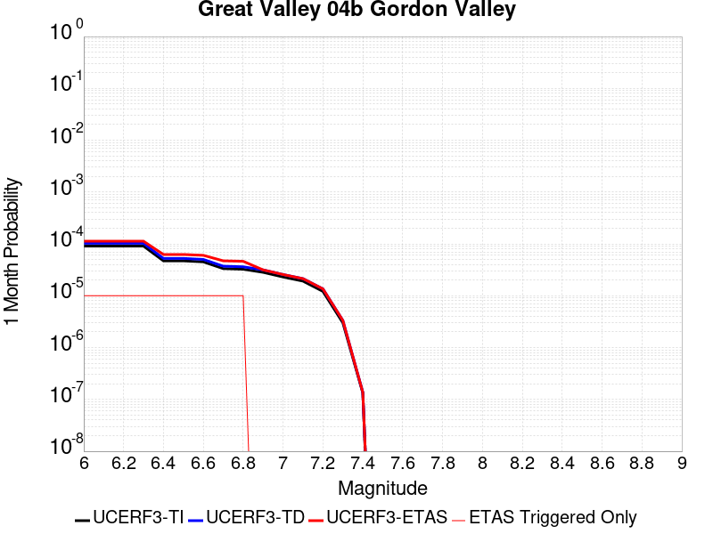 |  |  |

| Magnitude | 1 wk TI Prob | 1 wk TD Prob | 1 wk ETAS Prob | 1 wk ETAS/TD Gain | 1 wk ETAS Triggered Only | 1 mo TI Prob | 1 mo TD Prob | 1 mo ETAS Prob | 1 mo ETAS/TD Gain | 1 mo ETAS Triggered Only | 1 yr TI Prob | 1 yr TD Prob | 1 yr ETAS Prob | 1 yr ETAS/TD Gain | 1 yr ETAS Triggered Only | 10 yr TI Prob | 10 yr TD Prob | 10 yr ETAS Prob | 10 yr ETAS/TD Gain | 10 yr ETAS Triggered Only |
|-----|-----|-----|-----|-----|-----|-----|-----|-----|-----|-----|-----|-----|-----|-----|-----|-----|-----|-----|-----|-----|
| 6.0 | 2.1181217E-5 | 2.3981951E-5 | 3.3981712E-5 | 1.4169703 | 1.0E-5 | 9.077348E-5 | 1.02776685E-4 | 1.12775655E-4 | 1.0972884 | 1.0E-5 | 0.0011046068 | 0.0012507545 | 0.0012707295 | 1.0159703 | 2.0E-5 | 0.010991322 | 0.0124536 | 0.012473351 | 1.001586 | 2.0E-5 |
| 6.1 | 2.1181217E-5 | 2.3981951E-5 | 3.3981712E-5 | 1.4169703 | 1.0E-5 | 9.077348E-5 | 1.02776685E-4 | 1.12775655E-4 | 1.0972884 | 1.0E-5 | 0.0011046068 | 0.0012507545 | 0.0012707295 | 1.0159703 | 2.0E-5 | 0.010991322 | 0.0124536 | 0.012473351 | 1.001586 | 2.0E-5 |
| 6.2 | 2.1181217E-5 | 2.3981951E-5 | 3.3981712E-5 | 1.4169703 | 1.0E-5 | 9.077348E-5 | 1.02776685E-4 | 1.12775655E-4 | 1.0972884 | 1.0E-5 | 0.0011046068 | 0.0012507545 | 0.0012707295 | 1.0159703 | 2.0E-5 | 0.010991322 | 0.0124536 | 0.012473351 | 1.001586 | 2.0E-5 |
| 6.3 | 2.1181217E-5 | 2.3981951E-5 | 3.3981712E-5 | 1.4169703 | 1.0E-5 | 9.077348E-5 | 1.02776685E-4 | 1.12775655E-4 | 1.0972884 | 1.0E-5 | 0.0011046068 | 0.0012507545 | 0.0012707295 | 1.0159703 | 2.0E-5 | 0.010991322 | 0.0124536 | 0.012473351 | 1.001586 | 2.0E-5 |
| 6.4 | 1.0988268E-5 | 1.2254499E-5 | 2.2254377E-5 | 1.8160169 | 1.0E-5 | 4.7091726E-5 | 5.2518313E-5 | 6.2517785E-5 | 1.1903998 | 1.0E-5 | 5.731909E-4 | 6.392388E-4 | 6.5922603E-4 | 1.0312672 | 2.0E-5 | 0.005717147 | 0.0063755875 | 0.00639546 | 1.003117 | 2.0E-5 |
| 6.5 | 1.0988268E-5 | 1.2254499E-5 | 2.2254377E-5 | 1.8160169 | 1.0E-5 | 4.7091726E-5 | 5.2518313E-5 | 6.2517785E-5 | 1.1903998 | 1.0E-5 | 5.731909E-4 | 6.392388E-4 | 6.5922603E-4 | 1.0312672 | 2.0E-5 | 0.005717147 | 0.0063755875 | 0.00639546 | 1.003117 | 2.0E-5 |
| 6.6 | 1.0517822E-5 | 1.1724062E-5 | 2.1723945E-5 | 1.8529367 | 1.0E-5 | 4.5075605E-5 | 5.02451E-5 | 6.0244598E-5 | 1.1990144 | 1.0E-5 | 5.4865726E-4 | 6.11578E-4 | 6.315658E-4 | 1.0326823 | 2.0E-5 | 0.0054730466 | 0.0061005033 | 0.006120381 | 1.0032585 | 2.0E-5 |
| 6.7 | 7.789219E-6 | 8.6776445E-6 | 1.8677558E-5 | 2.1523764 | 1.0E-5 | 3.3381937E-5 | 3.7189402E-5 | 4.718903E-5 | 1.2688838 | 1.0E-5 | 4.063493E-4 | 4.526921E-4 | 4.7268305E-4 | 1.0441601 | 2.0E-5 | 0.004056071 | 0.0045182165 | 0.0045381263 | 1.0044066 | 2.0E-5 |
| 6.8 | 7.5850853E-6 | 8.452389E-6 | 1.8452305E-5 | 2.1830876 | 1.0E-5 | 3.2507105E-5 | 3.622405E-5 | 4.6223686E-5 | 1.2760497 | 1.0E-5 | 3.957021E-4 | 4.409437E-4 | 4.6093488E-4 | 1.0453373 | 2.0E-5 | 0.0039499826 | 0.0044012 | 0.004421112 | 1.0045242 | 2.0E-5 |
| 6.9 | 6.604105E-6 | 7.3585493E-6 | 7.3585493E-6 | 1.0 | 0.0 | 2.8303E-5 | 3.153628E-5 | 3.153628E-5 | 1.0 | 0.0 | 3.4453452E-4 | 3.8389044E-4 | 3.938866E-4 | 1.0260391 | 1.0E-5 | 0.0034400085 | 0.0038326595 | 0.003842621 | 1.0025991 | 1.0E-5 |
| 7.0 | 5.3701115E-6 | 5.9884183E-6 | 5.9884183E-6 | 1.0 | 0.0 | 2.301456E-5 | 2.5664414E-5 | 2.5664414E-5 | 1.0 | 0.0 | 2.8016625E-4 | 3.1242234E-4 | 3.2241922E-4 | 1.0319979 | 1.0E-5 | 0.0027981328 | 0.00312012 | 0.0031300886 | 1.003195 | 1.0E-5 |
| 7.1 | 4.4685607E-6 | 4.986478E-6 | 4.986478E-6 | 1.0 | 0.0 | 1.9150835E-5 | 2.1370459E-5 | 2.1370459E-5 | 1.0 | 0.0 | 2.3313647E-4 | 2.6015675E-4 | 2.7015415E-4 | 1.0384283 | 1.0E-5 | 0.0023289204 | 0.0025987667 | 0.002608741 | 1.003838 | 1.0E-5 |
| 7.2 | 2.833378E-6 | 3.164419E-6 | 3.164419E-6 | 1.0 | 0.0 | 1.2142991E-5 | 1.3561736E-5 | 1.3561736E-5 | 1.0 | 0.0 | 1.4783088E-4 | 1.6510337E-4 | 1.6510337E-4 | 1.0 | 0.0 | 0.0014773258 | 0.0016499789 | 0.0016499789 | 1.0 | 0.0 |
| 7.3 | 7.0087293E-7 | 7.7728157E-7 | 7.7728157E-7 | 1.0 | 0.0 | 3.0037377E-6 | 3.3312049E-6 | 3.3312049E-6 | 1.0 | 0.0 | 3.656989E-5 | 4.0557123E-5 | 4.0557123E-5 | 1.0 | 0.0 | 3.6563876E-4 | 4.055422E-4 | 4.055422E-4 | 1.0 | 0.0 |
| 7.4 | 3.112171E-8 | 3.2068368E-8 | 3.2068368E-8 | 1.0 | 0.0 | 1.3337875E-7 | 1.3743585E-7 | 1.3743585E-7 | 1.0 | 0.0 | 1.6238852E-6 | 1.6732803E-6 | 1.6732803E-6 | 1.0 | 0.0 | 1.6238733E-5 | 1.6732685E-5 | 1.6732685E-5 | 1.0 | 0.0 |

## Shoreline
*[(top)](#table-of-contents)*

| 1 Week | 1 Month | 1 Year | 10 Year |
|-----|-----|-----|-----|
|  | 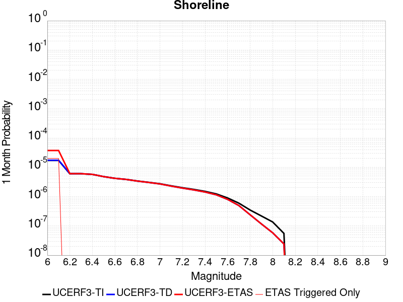 |  |  |

| Magnitude | 1 wk TI Prob | 1 wk TD Prob | 1 wk ETAS Prob | 1 wk ETAS/TD Gain | 1 wk ETAS Triggered Only | 1 mo TI Prob | 1 mo TD Prob | 1 mo ETAS Prob | 1 mo ETAS/TD Gain | 1 mo ETAS Triggered Only | 1 yr TI Prob | 1 yr TD Prob | 1 yr ETAS Prob | 1 yr ETAS/TD Gain | 1 yr ETAS Triggered Only | 10 yr TI Prob | 10 yr TD Prob | 10 yr ETAS Prob | 10 yr ETAS/TD Gain | 10 yr ETAS Triggered Only |
|-----|-----|-----|-----|-----|-----|-----|-----|-----|-----|-----|-----|-----|-----|-----|-----|-----|-----|-----|-----|-----|
| 6.0 | 3.9888673E-6 | 4.0479285E-6 | 2.4047848E-5 | 5.9407787 | 2.0E-5 | 1.7095033E-5 | 1.7348182E-5 | 3.7347836E-5 | 2.1528387 | 2.0E-5 | 2.0811215E-4 | 2.1119922E-4 | 2.3119501E-4 | 1.0946773 | 2.0E-5 | 0.0020791737 | 0.0021105339 | 0.0021304917 | 1.0094563 | 2.0E-5 |
| 6.1 | 3.9888673E-6 | 4.0479285E-6 | 2.4047848E-5 | 5.9407787 | 2.0E-5 | 1.7095033E-5 | 1.7348182E-5 | 3.7347836E-5 | 2.1528387 | 2.0E-5 | 2.0811215E-4 | 2.1119922E-4 | 2.3119501E-4 | 1.0946773 | 2.0E-5 | 0.0020791737 | 0.0021105339 | 0.0021304917 | 1.0094563 | 2.0E-5 |
| 6.2 | 1.4039653E-6 | 1.4100885E-6 | 1.4100885E-6 | 1.0 | 0.0 | 6.0169805E-6 | 6.043223E-6 | 6.043223E-6 | 1.0 | 0.0 | 7.325427E-5 | 7.357382E-5 | 7.357382E-5 | 1.0 | 0.0 | 7.3230127E-4 | 7.355006E-4 | 7.355006E-4 | 1.0 | 0.0 |
| 6.3 | 1.4039653E-6 | 1.4100885E-6 | 1.4100885E-6 | 1.0 | 0.0 | 6.0169805E-6 | 6.043223E-6 | 6.043223E-6 | 1.0 | 0.0 | 7.325427E-5 | 7.357382E-5 | 7.357382E-5 | 1.0 | 0.0 | 7.3230127E-4 | 7.355006E-4 | 7.355006E-4 | 1.0 | 0.0 |
| 6.4 | 1.3314152E-6 | 1.33616E-6 | 1.33616E-6 | 1.0 | 0.0 | 5.7060524E-6 | 5.726388E-6 | 5.726388E-6 | 1.0 | 0.0 | 6.946897E-5 | 6.9716596E-5 | 6.9716596E-5 | 1.0 | 0.0 | 6.9447263E-4 | 6.9695263E-4 | 6.9695263E-4 | 1.0 | 0.0 |
| 6.5 | 1.1187026E-6 | 1.1203634E-6 | 1.1203634E-6 | 1.0 | 0.0 | 4.794431E-6 | 4.801549E-6 | 4.801549E-6 | 1.0 | 0.0 | 5.8370628E-5 | 5.8457317E-5 | 5.8457317E-5 | 1.0 | 0.0 | 5.83553E-4 | 5.844219E-4 | 5.844219E-4 | 1.0 | 0.0 |
| 6.6 | 9.793089E-7 | 9.784915E-7 | 9.784915E-7 | 1.0 | 0.0 | 4.1970316E-6 | 4.193528E-6 | 4.193528E-6 | 1.0 | 0.0 | 5.1097657E-5 | 5.1055024E-5 | 5.1055024E-5 | 1.0 | 0.0 | 5.108591E-4 | 5.104342E-4 | 5.104342E-4 | 1.0 | 0.0 |
| 6.7 | 8.995986E-7 | 8.972795E-7 | 8.972795E-7 | 1.0 | 0.0 | 3.8554167E-6 | 3.8454777E-6 | 3.8454777E-6 | 1.0 | 0.0 | 4.693869E-5 | 4.68177E-5 | 4.68177E-5 | 1.0 | 0.0 | 4.6928777E-4 | 4.680793E-4 | 4.680793E-4 | 1.0 | 0.0 |
| 6.8 | 7.931612E-7 | 7.8803976E-7 | 7.8803976E-7 | 1.0 | 0.0 | 3.3992578E-6 | 3.377309E-6 | 3.377309E-6 | 1.0 | 0.0 | 4.1385178E-5 | 4.1117964E-5 | 4.1117964E-5 | 1.0 | 0.0 | 4.1377472E-4 | 4.1110412E-4 | 4.1110412E-4 | 1.0 | 0.0 |
| 6.9 | 7.1465956E-7 | 7.078001E-7 | 7.078001E-7 | 1.0 | 0.0 | 3.062823E-6 | 3.0334254E-6 | 3.0334254E-6 | 1.0 | 0.0 | 3.7289232E-5 | 3.693133E-5 | 3.693133E-5 | 1.0 | 0.0 | 3.7282976E-4 | 3.6925232E-4 | 3.6925232E-4 | 1.0 | 0.0 |
| 7.0 | 6.389046E-7 | 6.299453E-7 | 6.299453E-7 | 1.0 | 0.0 | 2.7381598E-6 | 2.699763E-6 | 2.699763E-6 | 1.0 | 0.0 | 3.3336586E-5 | 3.286912E-5 | 3.286912E-5 | 1.0 | 0.0 | 3.3331584E-4 | 3.286428E-4 | 3.286428E-4 | 1.0 | 0.0 |
| 7.1 | 5.4300875E-7 | 5.311126E-7 | 5.311126E-7 | 1.0 | 0.0 | 2.3271782E-6 | 2.276195E-6 | 2.276195E-6 | 1.0 | 0.0 | 2.8333026E-5 | 2.7712322E-5 | 2.7712322E-5 | 1.0 | 0.0 | 2.8329415E-4 | 2.7708875E-4 | 2.7708875E-4 | 1.0 | 0.0 |
| 7.2 | 4.6768855E-7 | 4.5348904E-7 | 4.5348904E-7 | 1.0 | 0.0 | 2.0043778E-6 | 1.9435229E-6 | 1.9435229E-6 | 1.0 | 0.0 | 2.4403027E-5 | 2.3662134E-5 | 2.3662134E-5 | 1.0 | 0.0 | 2.4400349E-4 | 2.3659621E-4 | 2.3659621E-4 | 1.0 | 0.0 |
| 7.3 | 4.0966103E-7 | 3.9385614E-7 | 3.9385614E-7 | 1.0 | 0.0 | 1.7556889E-6 | 1.6879537E-6 | 1.6879537E-6 | 1.0 | 0.0 | 2.1375303E-5 | 2.0550642E-5 | 2.0550642E-5 | 1.0 | 0.0 | 2.1373246E-4 | 2.0548746E-4 | 2.0548746E-4 | 1.0 | 0.0 |
| 7.4 | 3.5105785E-7 | 3.3363924E-7 | 3.3363924E-7 | 1.0 | 0.0 | 1.5045327E-6 | 1.4298816E-6 | 1.4298816E-6 | 1.0 | 0.0 | 1.8317533E-5 | 1.7408669E-5 | 1.7408669E-5 | 1.0 | 0.0 | 1.8316023E-4 | 1.740731E-4 | 1.740731E-4 | 1.0 | 0.0 |
| 7.5 | 2.8737534E-7 | 2.681999E-7 | 2.681999E-7 | 1.0 | 0.0 | 1.2316079E-6 | 1.1494276E-6 | 1.1494276E-6 | 1.0 | 0.0 | 1.4994724E-5 | 1.399419E-5 | 1.399419E-5 | 1.0 | 0.0 | 1.4993713E-4 | 1.3993312E-4 | 1.3993312E-4 | 1.0 | 0.0 |
| 7.6 | 2.0924051E-7 | 1.8778938E-7 | 1.8778938E-7 | 1.0 | 0.0 | 8.967448E-7 | 8.0481135E-7 | 8.0481135E-7 | 1.0 | 0.0 | 1.0917813E-5 | 9.798534E-6 | 9.798534E-6 | 1.0 | 0.0 | 1.0917276E-4 | 9.798103E-5 | 9.798103E-5 | 1.0 | 0.0 |
| 7.7 | 1.392265E-7 | 1.1543341E-7 | 1.1543341E-7 | 1.0 | 0.0 | 5.9668486E-7 | 4.9471447E-7 | 4.9471447E-7 | 1.0 | 0.0 | 7.2646135E-6 | 6.0231323E-6 | 6.0231323E-6 | 1.0 | 0.0 | 7.2643765E-5 | 6.0229693E-5 | 6.0229693E-5 | 1.0 | 0.0 |
| 7.8 | 8.1080074E-8 | 5.5866355E-8 | 5.5866355E-8 | 1.0 | 0.0 | 3.4748598E-7 | 2.394272E-7 | 2.394272E-7 | 1.0 | 0.0 | 4.2306337E-6 | 2.9150222E-6 | 2.9150222E-6 | 1.0 | 0.0 | 4.230553E-5 | 2.9149842E-5 | 2.9149842E-5 | 1.0 | 0.0 |
| 7.9 | 5.0859036E-8 | 2.7243395E-8 | 2.7243395E-8 | 1.0 | 0.0 | 2.1796728E-7 | 1.16757406E-7 | 1.16757406E-7 | 1.0 | 0.0 | 2.6537484E-6 | 1.4215204E-6 | 1.4215204E-6 | 1.0 | 0.0 | 2.6537167E-5 | 1.4215115E-5 | 1.4215115E-5 | 1.0 | 0.0 |
| 8.0 | 3.1760536E-8 | 1.3575991E-8 | 1.3575991E-8 | 1.0 | 0.0 | 1.3611657E-7 | 5.8182817E-8 | 5.8182817E-8 | 1.0 | 0.0 | 1.6572179E-6 | 7.083755E-7 | 7.083755E-7 | 1.0 | 0.0 | 1.6572056E-5 | 7.083733E-6 | 7.083733E-6 | 1.0 | 0.0 |
| 8.1 | 1.2947896E-8 | 5.6625185E-9 | 5.6625185E-9 | 1.0 | 0.0 | 5.5490982E-8 | 2.4267937E-8 | 2.4267937E-8 | 1.0 | 0.0 | 6.756025E-7 | 2.954621E-7 | 2.954621E-7 | 1.0 | 0.0 | 6.7560045E-6 | 2.9546172E-6 | 2.9546172E-6 | 1.0 | 0.0 |

## San Andreas (North Coast) 2011 CFM
*[(top)](#table-of-contents)*

| 1 Week | 1 Month | 1 Year | 10 Year |
|-----|-----|-----|-----|
|  |  |  | 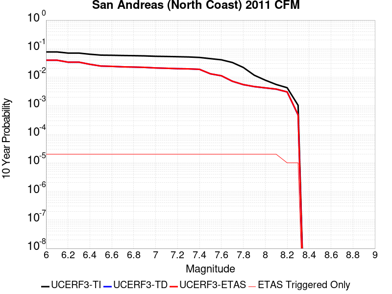 |

| Magnitude | 1 wk TI Prob | 1 wk TD Prob | 1 wk ETAS Prob | 1 wk ETAS/TD Gain | 1 wk ETAS Triggered Only | 1 mo TI Prob | 1 mo TD Prob | 1 mo ETAS Prob | 1 mo ETAS/TD Gain | 1 mo ETAS Triggered Only | 1 yr TI Prob | 1 yr TD Prob | 1 yr ETAS Prob | 1 yr ETAS/TD Gain | 1 yr ETAS Triggered Only | 10 yr TI Prob | 10 yr TD Prob | 10 yr ETAS Prob | 10 yr ETAS/TD Gain | 10 yr ETAS Triggered Only |
|-----|-----|-----|-----|-----|-----|-----|-----|-----|-----|-----|-----|-----|-----|-----|-----|-----|-----|-----|-----|-----|
| 6.0 | 1.5333705E-4 | 7.109695E-5 | 7.109695E-5 | 1.0 | 0.0 | 6.5699324E-4 | 3.046658E-4 | 3.046658E-4 | 1.0 | 0.0 | 0.007969595 | 0.0037030308 | 0.0037229569 | 1.005381 | 2.0E-5 | 0.0768977 | 0.039364267 | 0.039383482 | 1.000488 | 2.0E-5 |
| 6.1 | 1.5333705E-4 | 7.109695E-5 | 7.109695E-5 | 1.0 | 0.0 | 6.5699324E-4 | 3.046658E-4 | 3.046658E-4 | 1.0 | 0.0 | 0.007969595 | 0.0037030308 | 0.0037229569 | 1.005381 | 2.0E-5 | 0.0768977 | 0.039364267 | 0.039383482 | 1.000488 | 2.0E-5 |
| 6.2 | 1.3912938E-4 | 6.049243E-5 | 6.049243E-5 | 1.0 | 0.0 | 5.961325E-4 | 2.5922767E-4 | 2.5922767E-4 | 1.0 | 0.0 | 0.007233787 | 0.0031515562 | 0.0031714933 | 1.0063261 | 2.0E-5 | 0.07002798 | 0.03369792 | 0.03371725 | 1.0005735 | 2.0E-5 |
| 6.3 | 1.3912938E-4 | 6.049243E-5 | 6.049243E-5 | 1.0 | 0.0 | 5.961325E-4 | 2.5922767E-4 | 2.5922767E-4 | 1.0 | 0.0 | 0.007233787 | 0.0031515562 | 0.0031714933 | 1.0063261 | 2.0E-5 | 0.07002798 | 0.03369792 | 0.03371725 | 1.0005735 | 2.0E-5 |
| 6.4 | 1.2623647E-4 | 5.0433562E-5 | 5.0433562E-5 | 1.0 | 0.0 | 5.4090127E-4 | 2.1612605E-4 | 2.1612605E-4 | 1.0 | 0.0 | 0.0065656058 | 0.0026281793 | 0.0026481268 | 1.0075898 | 2.0E-5 | 0.06374981 | 0.02830552 | 0.028324952 | 1.0006865 | 2.0E-5 |
| 6.5 | 1.1736096E-4 | 4.3516375E-5 | 4.3516375E-5 | 1.0 | 0.0 | 5.028786E-4 | 1.8648551E-4 | 1.8648551E-4 | 1.0 | 0.0 | 0.006105373 | 0.0022681132 | 0.0022880677 | 1.0087979 | 2.0E-5 | 0.05940335 | 0.024576947 | 0.024596455 | 1.0007938 | 2.0E-5 |
| 6.6 | 1.1586959E-4 | 4.2416294E-5 | 4.2416294E-5 | 1.0 | 0.0 | 4.964894E-4 | 1.8177154E-4 | 1.8177154E-4 | 1.0 | 0.0 | 0.006028018 | 0.0022108385 | 0.0022307942 | 1.0090263 | 2.0E-5 | 0.058671024 | 0.023982164 | 0.024001684 | 1.000814 | 2.0E-5 |
| 6.7 | 1.13693764E-4 | 4.0728228E-5 | 4.0728228E-5 | 1.0 | 0.0 | 4.87168E-4 | 1.7453796E-4 | 1.7453796E-4 | 1.0 | 0.0 | 0.005915152 | 0.0021229447 | 0.0021429022 | 1.0094008 | 2.0E-5 | 0.057601593 | 0.023075242 | 0.02309478 | 1.0008467 | 2.0E-5 |
| 6.8 | 1.1204889E-4 | 3.9945848E-5 | 3.9945848E-5 | 1.0 | 0.0 | 4.8012115E-4 | 1.7118535E-4 | 1.7118535E-4 | 1.0 | 0.0 | 0.005829819 | 0.0020822054 | 0.0021021636 | 1.0095851 | 2.0E-5 | 0.05679232 | 0.022635331 | 0.02265488 | 1.0008636 | 2.0E-5 |
| 6.9 | 1.1005794E-4 | 3.9001738E-5 | 3.9001738E-5 | 1.0 | 0.0 | 4.7159163E-4 | 1.6713967E-4 | 1.6713967E-4 | 1.0 | 0.0 | 0.0057265228 | 0.0020330423 | 0.0020530017 | 1.0098175 | 2.0E-5 | 0.055811852 | 0.02210134 | 0.022120899 | 1.0008849 | 2.0E-5 |
| 7.0 | 1.0647948E-4 | 3.7159174E-5 | 3.7159174E-5 | 1.0 | 0.0 | 4.562608E-4 | 1.5924397E-4 | 1.5924397E-4 | 1.0 | 0.0 | 0.0055408357 | 0.0019370868 | 0.001957048 | 1.0103048 | 2.0E-5 | 0.054047033 | 0.02105931 | 0.02107889 | 1.0009297 | 2.0E-5 |
| 7.1 | 1.04795035E-4 | 3.620866E-5 | 3.620866E-5 | 1.0 | 0.0 | 4.4904428E-4 | 1.5517084E-4 | 1.5517084E-4 | 1.0 | 0.0 | 0.0054534175 | 0.0018875834 | 0.0019075456 | 1.0105755 | 2.0E-5 | 0.053215165 | 0.02052821 | 0.0205478 | 1.0009543 | 2.0E-5 |
| 7.2 | 1.02724036E-4 | 3.5117457E-5 | 3.5117457E-5 | 1.0 | 0.0 | 4.401716E-4 | 1.5049479E-4 | 1.5049479E-4 | 1.0 | 0.0 | 0.0053459285 | 0.0018307496 | 0.0018507129 | 1.0109044 | 2.0E-5 | 0.052191395 | 0.01991573 | 0.01993533 | 1.0009842 | 2.0E-5 |
| 7.3 | 1.00650694E-4 | 3.45853E-5 | 3.45853E-5 | 1.0 | 0.0 | 4.312888E-4 | 1.4821437E-4 | 1.4821437E-4 | 1.0 | 0.0 | 0.005238306 | 0.0018030318 | 0.0018229957 | 1.0110724 | 2.0E-5 | 0.051165357 | 0.01959264 | 0.019612249 | 1.0010008 | 2.0E-5 |
| 7.4 | 9.672919E-5 | 3.3374814E-5 | 3.3374814E-5 | 1.0 | 0.0 | 4.144878E-4 | 1.4302715E-4 | 1.4302715E-4 | 1.0 | 0.0 | 0.005034718 | 0.00173998 | 0.0017599452 | 1.0114744 | 2.0E-5 | 0.049221683 | 0.01886682 | 0.018886443 | 1.0010401 | 2.0E-5 |
| 7.5 | 8.7600405E-5 | 2.2694192E-5 | 2.2694192E-5 | 1.0 | 0.0 | 3.753763E-4 | 9.725721E-5 | 9.725721E-5 | 1.0 | 0.0 | 0.0045606326 | 0.0011834651 | 0.0012034414 | 1.0168796 | 2.0E-5 | 0.04468165 | 0.013127938 | 0.0131476745 | 1.0015035 | 2.0E-5 |
| 7.6 | 7.9562284E-5 | 1.922004E-5 | 1.922004E-5 | 1.0 | 0.0 | 3.4093665E-4 | 8.236901E-5 | 8.236901E-5 | 1.0 | 0.0 | 0.0041430052 | 0.0010023828 | 0.0010223628 | 1.0199325 | 2.0E-5 | 0.040666126 | 0.0112194 | 0.011239175 | 1.0017626 | 2.0E-5 |
| 7.7 | 6.3866544E-5 | 1.1936281E-5 | 1.1936281E-5 | 1.0 | 0.0 | 2.7368503E-4 | 5.115449E-5 | 5.115449E-5 | 1.0 | 0.0 | 0.0033270244 | 6.226282E-4 | 6.426157E-4 | 1.0321019 | 2.0E-5 | 0.032776527 | 0.0072073294 | 0.007227185 | 1.0027549 | 2.0E-5 |
| 7.8 | 4.2543215E-5 | 9.0726735E-6 | 9.0726735E-6 | 1.0 | 0.0 | 1.8231533E-4 | 3.888231E-5 | 3.888231E-5 | 1.0 | 0.0 | 0.0022174292 | 4.7328937E-4 | 4.932799E-4 | 1.0422374 | 2.0E-5 | 0.021954332 | 0.0054884683 | 0.0055083586 | 1.003624 | 2.0E-5 |
| 7.9 | 2.2636612E-5 | 7.811842E-6 | 7.811842E-6 | 1.0 | 0.0 | 9.7010445E-5 | 3.3478893E-5 | 3.3478893E-5 | 1.0 | 0.0 | 0.0011804621 | 4.0752938E-4 | 4.2752124E-4 | 1.0490562 | 2.0E-5 | 0.011742111 | 0.0046821116 | 0.004702018 | 1.0042516 | 2.0E-5 |
| 8.0 | 1.5167874E-5 | 7.0475517E-6 | 7.0475517E-6 | 1.0 | 0.0 | 6.500356E-5 | 3.0203442E-5 | 3.0203442E-5 | 1.0 | 0.0 | 7.9113094E-4 | 3.6766496E-4 | 3.876576E-4 | 1.0543773 | 2.0E-5 | 0.007883203 | 0.004214701 | 0.0042346166 | 1.0047253 | 2.0E-5 |
| 8.1 | 1.0681047E-5 | 6.3854363E-6 | 6.3854363E-6 | 1.0 | 0.0 | 4.5775112E-5 | 2.7365868E-5 | 2.7365868E-5 | 1.0 | 0.0 | 5.5716943E-4 | 3.331286E-4 | 3.5312193E-4 | 1.0600169 | 2.0E-5 | 0.0055577457 | 0.003816698 | 0.0038366215 | 1.0052202 | 2.0E-5 |
| 8.2 | 8.226114E-6 | 5.1139064E-6 | 5.1139064E-6 | 1.0 | 0.0 | 3.52543E-5 | 2.1916558E-5 | 2.1916558E-5 | 1.0 | 0.0 | 4.2913653E-4 | 2.6680148E-4 | 2.7679882E-4 | 1.037471 | 1.0E-5 | 0.004283088 | 0.0030445685 | 0.003054538 | 1.0032746 | 1.0E-5 |
| 8.3 | 1.983087E-6 | 7.6564595E-7 | 7.6564595E-7 | 1.0 | 0.0 | 8.498917E-6 | 3.281336E-6 | 3.281336E-6 | 1.0 | 0.0 | 1.034694E-4 | 3.9949547E-5 | 4.9949147E-5 | 1.2503058 | 1.0E-5 | 0.0010342124 | 4.717979E-4 | 4.8179316E-4 | 1.0211855 | 1.0E-5 |

## Pittville 2011 CFM
*[(top)](#table-of-contents)*

| 1 Week | 1 Month | 1 Year | 10 Year |
|-----|-----|-----|-----|
|  |  |  |  |

| Magnitude | 1 wk TI Prob | 1 wk TD Prob | 1 wk ETAS Prob | 1 wk ETAS/TD Gain | 1 wk ETAS Triggered Only | 1 mo TI Prob | 1 mo TD Prob | 1 mo ETAS Prob | 1 mo ETAS/TD Gain | 1 mo ETAS Triggered Only | 1 yr TI Prob | 1 yr TD Prob | 1 yr ETAS Prob | 1 yr ETAS/TD Gain | 1 yr ETAS Triggered Only | 10 yr TI Prob | 10 yr TD Prob | 10 yr ETAS Prob | 10 yr ETAS/TD Gain | 10 yr ETAS Triggered Only |
|-----|-----|-----|-----|-----|-----|-----|-----|-----|-----|-----|-----|-----|-----|-----|-----|-----|-----|-----|-----|-----|
| 6.0 | 2.5031832E-5 | 2.7056969E-5 | 3.70567E-5 | 1.3695805 | 1.0E-5 | 1.0727487E-4 | 1.1595384E-4 | 1.2595268E-4 | 1.0862312 | 1.0E-5 | 0.001305289 | 0.0014109211 | 0.001420907 | 1.0070776 | 1.0E-5 | 0.012976485 | 0.014029415 | 0.014049135 | 1.0014056 | 2.0E-5 |
| 6.1 | 1.2540113E-5 | 1.3513067E-5 | 1.3513067E-5 | 1.0 | 0.0 | 5.3742235E-5 | 5.7911984E-5 | 5.7911984E-5 | 1.0 | 0.0 | 6.541153E-4 | 7.048728E-4 | 7.048728E-4 | 1.0 | 0.0 | 0.0065219323 | 0.0070286044 | 0.0070286044 | 1.0 | 0.0 |
| 6.2 | 6.603218E-6 | 7.107189E-6 | 7.107189E-6 | 1.0 | 0.0 | 2.8299199E-5 | 3.0459063E-5 | 3.0459063E-5 | 1.0 | 0.0 | 3.4448825E-4 | 3.7078248E-4 | 3.7078248E-4 | 1.0 | 0.0 | 0.0034395473 | 0.0037022792 | 0.0037022792 | 1.0 | 0.0 |
| 6.3 | 6.603218E-6 | 7.107189E-6 | 7.107189E-6 | 1.0 | 0.0 | 2.8299199E-5 | 3.0459063E-5 | 3.0459063E-5 | 1.0 | 0.0 | 3.4448825E-4 | 3.7078248E-4 | 3.7078248E-4 | 1.0 | 0.0 | 0.0034395473 | 0.0037022792 | 0.0037022792 | 1.0 | 0.0 |
| 6.4 | 3.9389015E-6 | 4.239175E-6 | 4.239175E-6 | 1.0 | 0.0 | 1.6880897E-5 | 1.8167784E-5 | 1.8167784E-5 | 1.0 | 0.0 | 2.0550552E-4 | 2.2117342E-4 | 2.2117342E-4 | 1.0 | 0.0 | 0.0020531558 | 0.002209838 | 0.002209838 | 1.0 | 0.0 |
| 6.5 | 2.4533072E-6 | 2.6412686E-6 | 2.6412686E-6 | 1.0 | 0.0 | 1.0514132E-5 | 1.1319685E-5 | 1.1319685E-5 | 1.0 | 0.0 | 1.2800204E-4 | 1.3781038E-4 | 1.3781038E-4 | 1.0 | 0.0 | 0.0012792832 | 0.0013774394 | 0.0013774394 | 1.0 | 0.0 |
| 6.6 | 1.3482367E-6 | 1.452993E-6 | 1.452993E-6 | 1.0 | 0.0 | 5.778144E-6 | 6.2271047E-6 | 6.2271047E-6 | 1.0 | 0.0 | 7.0346636E-5 | 7.58135E-5 | 7.58135E-5 | 1.0 | 0.0 | 7.032437E-4 | 7.5798744E-4 | 7.5798744E-4 | 1.0 | 0.0 |

## Santa Susana East (connector)
*[(top)](#table-of-contents)*

| 1 Week | 1 Month | 1 Year | 10 Year |
|-----|-----|-----|-----|
|  |  |  |  |

| Magnitude | 1 wk TI Prob | 1 wk TD Prob | 1 wk ETAS Prob | 1 wk ETAS/TD Gain | 1 wk ETAS Triggered Only | 1 mo TI Prob | 1 mo TD Prob | 1 mo ETAS Prob | 1 mo ETAS/TD Gain | 1 mo ETAS Triggered Only | 1 yr TI Prob | 1 yr TD Prob | 1 yr ETAS Prob | 1 yr ETAS/TD Gain | 1 yr ETAS Triggered Only | 10 yr TI Prob | 10 yr TD Prob | 10 yr ETAS Prob | 10 yr ETAS/TD Gain | 10 yr ETAS Triggered Only |
|-----|-----|-----|-----|-----|-----|-----|-----|-----|-----|-----|-----|-----|-----|-----|-----|-----|-----|-----|-----|-----|
| 6.0 | 2.858397E-5 | 3.2021693E-5 | 3.2021693E-5 | 1.0 | 0.0 | 1.2249697E-4 | 1.3723019E-4 | 1.3723019E-4 | 1.0 | 0.0 | 0.0014903803 | 0.00166977 | 0.0016797533 | 1.0059788 | 1.0E-5 | 0.014804244 | 0.016599316 | 0.016618984 | 1.0011848 | 2.0E-5 |
| 6.1 | 2.858397E-5 | 3.2021693E-5 | 3.2021693E-5 | 1.0 | 0.0 | 1.2249697E-4 | 1.3723019E-4 | 1.3723019E-4 | 1.0 | 0.0 | 0.0014903803 | 0.00166977 | 0.0016797533 | 1.0059788 | 1.0E-5 | 0.014804244 | 0.016599316 | 0.016618984 | 1.0011848 | 2.0E-5 |
| 6.2 | 2.858397E-5 | 3.2021693E-5 | 3.2021693E-5 | 1.0 | 0.0 | 1.2249697E-4 | 1.3723019E-4 | 1.3723019E-4 | 1.0 | 0.0 | 0.0014903803 | 0.00166977 | 0.0016797533 | 1.0059788 | 1.0E-5 | 0.014804244 | 0.016599316 | 0.016618984 | 1.0011848 | 2.0E-5 |
| 6.3 | 1.943582E-5 | 2.0367343E-5 | 2.0367343E-5 | 1.0 | 0.0 | 8.329371E-5 | 8.7286324E-5 | 8.7286324E-5 | 1.0 | 0.0 | 0.001013629 | 0.001062305 | 0.0010722943 | 1.0094035 | 1.0E-5 | 0.010090181 | 0.010583852 | 0.01060364 | 1.0018697 | 2.0E-5 |
| 6.4 | 1.943582E-5 | 2.0367343E-5 | 2.0367343E-5 | 1.0 | 0.0 | 8.329371E-5 | 8.7286324E-5 | 8.7286324E-5 | 1.0 | 0.0 | 0.001013629 | 0.001062305 | 0.0010722943 | 1.0094035 | 1.0E-5 | 0.010090181 | 0.010583852 | 0.01060364 | 1.0018697 | 2.0E-5 |
| 6.5 | 1.943582E-5 | 2.0367343E-5 | 2.0367343E-5 | 1.0 | 0.0 | 8.329371E-5 | 8.7286324E-5 | 8.7286324E-5 | 1.0 | 0.0 | 0.001013629 | 0.001062305 | 0.0010722943 | 1.0094035 | 1.0E-5 | 0.010090181 | 0.010583852 | 0.01060364 | 1.0018697 | 2.0E-5 |
| 6.6 | 1.943582E-5 | 2.0367343E-5 | 2.0367343E-5 | 1.0 | 0.0 | 8.329371E-5 | 8.7286324E-5 | 8.7286324E-5 | 1.0 | 0.0 | 0.001013629 | 0.001062305 | 0.0010722943 | 1.0094035 | 1.0E-5 | 0.010090181 | 0.010583852 | 0.01060364 | 1.0018697 | 2.0E-5 |
| 6.7 | 1.9404439E-5 | 2.0354766E-5 | 2.0354766E-5 | 1.0 | 0.0 | 8.3159226E-5 | 8.723242E-5 | 8.723242E-5 | 1.0 | 0.0 | 0.0010119933 | 0.0010616493 | 0.0010716388 | 1.0094093 | 1.0E-5 | 0.010073971 | 0.010577358 | 0.010597147 | 1.0018709 | 2.0E-5 |
| 6.8 | 1.2217526E-5 | 1.1593157E-5 | 1.1593157E-5 | 1.0 | 0.0 | 5.2359774E-5 | 4.9684106E-5 | 4.9684106E-5 | 1.0 | 0.0 | 6.372938E-4 | 6.047529E-4 | 6.147469E-4 | 1.0165256 | 1.0E-5 | 0.0063546924 | 0.006033274 | 0.006043214 | 1.0016475 | 1.0E-5 |
| 6.9 | 1.2217526E-5 | 1.1593157E-5 | 1.1593157E-5 | 1.0 | 0.0 | 5.2359774E-5 | 4.9684106E-5 | 4.9684106E-5 | 1.0 | 0.0 | 6.372938E-4 | 6.047529E-4 | 6.147469E-4 | 1.0165256 | 1.0E-5 | 0.0063546924 | 0.006033274 | 0.006043214 | 1.0016475 | 1.0E-5 |
| 7.0 | 9.276017E-6 | 8.059273E-6 | 8.059273E-6 | 1.0 | 0.0 | 3.9753755E-5 | 3.4539302E-5 | 3.4539302E-5 | 1.0 | 0.0 | 4.8389446E-4 | 4.2043833E-4 | 4.2043833E-4 | 1.0 | 0.0 | 0.0048284214 | 0.0041973097 | 0.0041973097 | 1.0 | 0.0 |
| 7.1 | 9.130355E-6 | 7.942446E-6 | 7.942446E-6 | 1.0 | 0.0 | 3.9129503E-5 | 3.4038632E-5 | 3.4038632E-5 | 1.0 | 0.0 | 4.7629757E-4 | 4.1434498E-4 | 4.1434498E-4 | 1.0 | 0.0 | 0.00475278 | 0.0041366047 | 0.0041366047 | 1.0 | 0.0 |
| 7.2 | 8.851015E-6 | 7.741608E-6 | 7.741608E-6 | 1.0 | 0.0 | 3.7932372E-5 | 3.317792E-5 | 3.317792E-5 | 1.0 | 0.0 | 4.6172875E-4 | 4.038697E-4 | 4.038697E-4 | 1.0 | 0.0 | 0.0046077054 | 0.0040322347 | 0.0040322347 | 1.0 | 0.0 |
| 7.3 | 8.573006E-6 | 7.5503312E-6 | 7.5503312E-6 | 1.0 | 0.0 | 3.6740938E-5 | 3.235818E-5 | 3.235818E-5 | 1.0 | 0.0 | 4.472291E-4 | 3.9389305E-4 | 3.9389305E-4 | 1.0 | 0.0 | 0.004463301 | 0.003932817 | 0.003932817 | 1.0 | 0.0 |
| 7.4 | 7.852282E-6 | 6.8178556E-6 | 6.8178556E-6 | 1.0 | 0.0 | 3.36522E-5 | 2.921907E-5 | 2.921907E-5 | 1.0 | 0.0 | 4.096385E-4 | 3.5568717E-4 | 3.5568717E-4 | 1.0 | 0.0 | 0.0040888423 | 0.0035519868 | 0.0035519868 | 1.0 | 0.0 |
| 7.5 | 4.8869324E-6 | 4.2790975E-6 | 4.2790975E-6 | 1.0 | 0.0 | 2.0943828E-5 | 1.833887E-5 | 1.833887E-5 | 1.0 | 0.0 | 2.5496128E-4 | 2.2325452E-4 | 2.2325452E-4 | 1.0 | 0.0 | 0.0025466895 | 0.00223057 | 0.00223057 | 1.0 | 0.0 |
| 7.6 | 1.3894544E-6 | 1.1568394E-6 | 1.1568394E-6 | 1.0 | 0.0 | 5.954791E-6 | 4.957875E-6 | 4.957875E-6 | 1.0 | 0.0 | 7.249717E-5 | 6.036068E-5 | 6.036068E-5 | 1.0 | 0.0 | 7.247352E-4 | 6.0346466E-4 | 6.0346466E-4 | 1.0 | 0.0 |
| 7.7 | 2.9924632E-7 | 2.3719332E-7 | 2.3719332E-7 | 1.0 | 0.0 | 1.2824837E-6 | 1.0165425E-6 | 1.0165425E-6 | 1.0 | 0.0 | 1.5614127E-5 | 1.2376341E-5 | 1.2376341E-5 | 1.0 | 0.0 | 1.5613029E-4 | 1.2375724E-4 | 1.2375724E-4 | 1.0 | 0.0 |
| 7.8 | 4.8188564E-8 | 2.6321862E-8 | 2.6321862E-8 | 1.0 | 0.0 | 2.065224E-7 | 1.12807975E-7 | 1.12807975E-7 | 1.0 | 0.0 | 2.5144072E-6 | 1.3734362E-6 | 1.3734362E-6 | 1.0 | 0.0 | 2.5143789E-5 | 1.3734286E-5 | 1.3734286E-5 | 1.0 | 0.0 |
| 7.9 | 2.6127251E-9 | 2.7681102E-9 | 2.7681102E-9 | 1.0 | 0.0 | 1.1197393E-8 | 1.186333E-8 | 1.186333E-8 | 1.0 | 0.0 | 1.3632825E-7 | 1.4443603E-7 | 1.4443603E-7 | 1.0 | 0.0 | 1.3632817E-6 | 1.4443604E-6 | 1.4443604E-6 | 1.0 | 0.0 |

## Earthquake Valley (So Extension)
*[(top)](#table-of-contents)*

| 1 Week | 1 Month | 1 Year | 10 Year |
|-----|-----|-----|-----|
|  |  |  |  |

| Magnitude | 1 wk TI Prob | 1 wk TD Prob | 1 wk ETAS Prob | 1 wk ETAS/TD Gain | 1 wk ETAS Triggered Only | 1 mo TI Prob | 1 mo TD Prob | 1 mo ETAS Prob | 1 mo ETAS/TD Gain | 1 mo ETAS Triggered Only | 1 yr TI Prob | 1 yr TD Prob | 1 yr ETAS Prob | 1 yr ETAS/TD Gain | 1 yr ETAS Triggered Only | 10 yr TI Prob | 10 yr TD Prob | 10 yr ETAS Prob | 10 yr ETAS/TD Gain | 10 yr ETAS Triggered Only |
|-----|-----|-----|-----|-----|-----|-----|-----|-----|-----|-----|-----|-----|-----|-----|-----|-----|-----|-----|-----|-----|
| 6.0 | 3.0194888E-5 | 3.707208E-5 | 3.707208E-5 | 1.0 | 0.0 | 1.2940024E-4 | 1.5887374E-4 | 1.5887374E-4 | 1.0 | 0.0 | 0.0015743093 | 0.0019330877 | 0.0019530491 | 1.0103261 | 2.0E-5 | 0.01563203 | 0.0192131 | 0.019232718 | 1.0010209 | 2.0E-5 |
| 6.1 | 3.0194888E-5 | 3.707208E-5 | 3.707208E-5 | 1.0 | 0.0 | 1.2940024E-4 | 1.5887374E-4 | 1.5887374E-4 | 1.0 | 0.0 | 0.0015743093 | 0.0019330877 | 0.0019530491 | 1.0103261 | 2.0E-5 | 0.01563203 | 0.0192131 | 0.019232718 | 1.0010209 | 2.0E-5 |
| 6.2 | 3.0194888E-5 | 3.707208E-5 | 3.707208E-5 | 1.0 | 0.0 | 1.2940024E-4 | 1.5887374E-4 | 1.5887374E-4 | 1.0 | 0.0 | 0.0015743093 | 0.0019330877 | 0.0019530491 | 1.0103261 | 2.0E-5 | 0.01563203 | 0.0192131 | 0.019232718 | 1.0010209 | 2.0E-5 |
| 6.3 | 1.5795305E-5 | 1.8446612E-5 | 1.8446612E-5 | 1.0 | 0.0 | 6.769241E-5 | 7.905514E-5 | 7.905514E-5 | 1.0 | 0.0 | 8.238434E-4 | 9.621823E-4 | 9.721727E-4 | 1.010383 | 1.0E-5 | 0.008207959 | 0.0095910635 | 0.009600967 | 1.0010326 | 1.0E-5 |
| 6.4 | 1.5795305E-5 | 1.8446612E-5 | 1.8446612E-5 | 1.0 | 0.0 | 6.769241E-5 | 7.905514E-5 | 7.905514E-5 | 1.0 | 0.0 | 8.238434E-4 | 9.621823E-4 | 9.721727E-4 | 1.010383 | 1.0E-5 | 0.008207959 | 0.0095910635 | 0.009600967 | 1.0010326 | 1.0E-5 |
| 6.5 | 1.5795305E-5 | 1.8446612E-5 | 1.8446612E-5 | 1.0 | 0.0 | 6.769241E-5 | 7.905514E-5 | 7.905514E-5 | 1.0 | 0.0 | 8.238434E-4 | 9.621823E-4 | 9.721727E-4 | 1.010383 | 1.0E-5 | 0.008207959 | 0.0095910635 | 0.009600967 | 1.0010326 | 1.0E-5 |
| 6.6 | 1.5795305E-5 | 1.8446612E-5 | 1.8446612E-5 | 1.0 | 0.0 | 6.769241E-5 | 7.905514E-5 | 7.905514E-5 | 1.0 | 0.0 | 8.238434E-4 | 9.621823E-4 | 9.721727E-4 | 1.010383 | 1.0E-5 | 0.008207959 | 0.0095910635 | 0.009600967 | 1.0010326 | 1.0E-5 |
| 6.7 | 1.1363076E-5 | 1.3138288E-5 | 1.3138288E-5 | 1.0 | 0.0 | 4.8697988E-5 | 5.6306162E-5 | 5.6306162E-5 | 1.0 | 0.0 | 5.927367E-4 | 6.8538805E-4 | 6.953812E-4 | 1.0145802 | 1.0E-5 | 0.0059115817 | 0.006840215 | 0.0068501467 | 1.001452 | 1.0E-5 |
| 6.8 | 1.0049611E-5 | 1.1594328E-5 | 1.1594328E-5 | 1.0 | 0.0 | 4.306905E-5 | 4.968944E-5 | 4.968944E-5 | 1.0 | 0.0 | 5.242395E-4 | 6.0487416E-4 | 6.0487416E-4 | 1.0 | 0.0 | 0.0052300454 | 0.0060394546 | 0.0060394546 | 1.0 | 0.0 |
| 6.9 | 1.0049611E-5 | 1.1594328E-5 | 1.1594328E-5 | 1.0 | 0.0 | 4.306905E-5 | 4.968944E-5 | 4.968944E-5 | 1.0 | 0.0 | 5.242395E-4 | 6.0487416E-4 | 6.0487416E-4 | 1.0 | 0.0 | 0.0052300454 | 0.0060394546 | 0.0060394546 | 1.0 | 0.0 |
| 7.0 | 1.0049611E-5 | 1.1594328E-5 | 1.1594328E-5 | 1.0 | 0.0 | 4.306905E-5 | 4.968944E-5 | 4.968944E-5 | 1.0 | 0.0 | 5.242395E-4 | 6.0487416E-4 | 6.0487416E-4 | 1.0 | 0.0 | 0.0052300454 | 0.0060394546 | 0.0060394546 | 1.0 | 0.0 |
| 7.1 | 8.140254E-6 | 9.3834515E-6 | 9.3834515E-6 | 1.0 | 0.0 | 3.4886336E-5 | 4.021455E-5 | 4.021455E-5 | 1.0 | 0.0 | 4.2465836E-4 | 4.895692E-4 | 4.895692E-4 | 1.0 | 0.0 | 0.0042384774 | 0.004891483 | 0.004891483 | 1.0 | 0.0 |
| 7.2 | 1.673835E-7 | 1.4153493E-7 | 1.4153493E-7 | 1.0 | 0.0 | 7.173577E-7 | 6.065781E-7 | 6.065781E-7 | 1.0 | 0.0 | 8.733795E-6 | 7.3850674E-6 | 7.3850674E-6 | 1.0 | 0.0 | 8.733451E-5 | 7.3848576E-5 | 7.3848576E-5 | 1.0 | 0.0 |
| 7.3 | 1.6632116E-7 | 1.4051723E-7 | 1.4051723E-7 | 1.0 | 0.0 | 7.1280476E-7 | 6.022166E-7 | 6.022166E-7 | 1.0 | 0.0 | 8.678364E-6 | 7.331966E-6 | 7.331966E-6 | 1.0 | 0.0 | 8.6780245E-5 | 7.33176E-5 | 7.33176E-5 | 1.0 | 0.0 |
| 7.4 | 1.6569169E-7 | 1.3996352E-7 | 1.3996352E-7 | 1.0 | 0.0 | 7.1010703E-7 | 5.9984353E-7 | 5.9984353E-7 | 1.0 | 0.0 | 8.645519E-6 | 7.303074E-6 | 7.303074E-6 | 1.0 | 0.0 | 8.645182E-5 | 7.30287E-5 | 7.30287E-5 | 1.0 | 0.0 |
| 7.5 | 1.1764555E-7 | 1.0095245E-7 | 1.0095245E-7 | 1.0 | 0.0 | 5.041951E-7 | 4.3265328E-7 | 4.3265328E-7 | 1.0 | 0.0 | 6.138558E-6 | 5.267543E-6 | 5.267543E-6 | 1.0 | 0.0 | 6.1383886E-5 | 5.2674397E-5 | 5.2674397E-5 | 1.0 | 0.0 |
| 7.6 | 1.07927605E-7 | 9.2600665E-8 | 9.2600665E-8 | 1.0 | 0.0 | 4.6254678E-7 | 3.9685995E-7 | 3.9685995E-7 | 1.0 | 0.0 | 5.6314925E-6 | 4.8317615E-6 | 4.8317615E-6 | 1.0 | 0.0 | 5.63135E-5 | 4.831677E-5 | 4.831677E-5 | 1.0 | 0.0 |
| 7.7 | 2.1826905E-8 | 1.1179958E-8 | 1.1179958E-8 | 1.0 | 0.0 | 9.3543875E-8 | 4.791411E-8 | 4.791411E-8 | 1.0 | 0.0 | 1.1388961E-6 | 5.8335416E-7 | 5.8335416E-7 | 1.0 | 0.0 | 1.1388902E-5 | 5.8335318E-6 | 5.8335318E-6 | 1.0 | 0.0 |
| 7.8 | 2.6169649E-9 | 1.1968753E-9 | 1.1968753E-9 | 1.0 | 0.0 | 1.1215564E-8 | 5.1294657E-9 | 5.1294657E-9 | 1.0 | 0.0 | 1.3654947E-7 | 6.245124E-8 | 6.245124E-8 | 1.0 | 0.0 | 1.365494E-6 | 6.2451244E-7 | 6.2451244E-7 | 1.0 | 0.0 |

## Carlsbad
*[(top)](#table-of-contents)*

| 1 Week | 1 Month | 1 Year | 10 Year |
|-----|-----|-----|-----|
|  |  |  | 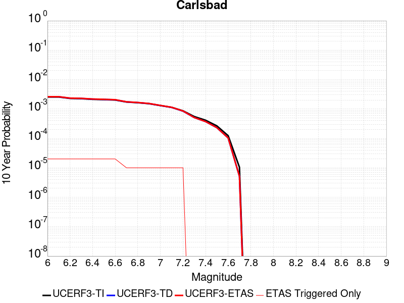 |

| Magnitude | 1 wk TI Prob | 1 wk TD Prob | 1 wk ETAS Prob | 1 wk ETAS/TD Gain | 1 wk ETAS Triggered Only | 1 mo TI Prob | 1 mo TD Prob | 1 mo ETAS Prob | 1 mo ETAS/TD Gain | 1 mo ETAS Triggered Only | 1 yr TI Prob | 1 yr TD Prob | 1 yr ETAS Prob | 1 yr ETAS/TD Gain | 1 yr ETAS Triggered Only | 10 yr TI Prob | 10 yr TD Prob | 10 yr ETAS Prob | 10 yr ETAS/TD Gain | 10 yr ETAS Triggered Only |
|-----|-----|-----|-----|-----|-----|-----|-----|-----|-----|-----|-----|-----|-----|-----|-----|-----|-----|-----|-----|-----|
| 6.0 | 4.9038536E-6 | 4.9872688E-6 | 4.9872688E-6 | 1.0 | 0.0 | 2.1016345E-5 | 2.1373837E-5 | 2.1373837E-5 | 1.0 | 0.0 | 2.5584397E-4 | 2.6019584E-4 | 2.8019064E-4 | 1.0768452 | 2.0E-5 | 0.002555496 | 0.002598959 | 0.002618907 | 1.0076754 | 2.0E-5 |
| 6.1 | 4.9038536E-6 | 4.9872688E-6 | 4.9872688E-6 | 1.0 | 0.0 | 2.1016345E-5 | 2.1373837E-5 | 2.1373837E-5 | 1.0 | 0.0 | 2.5584397E-4 | 2.6019584E-4 | 2.8019064E-4 | 1.0768452 | 2.0E-5 | 0.002555496 | 0.002598959 | 0.002618907 | 1.0076754 | 2.0E-5 |
| 6.2 | 4.3820614E-6 | 4.4547814E-6 | 4.4547814E-6 | 1.0 | 0.0 | 1.8780129E-5 | 1.9091782E-5 | 1.9091782E-5 | 1.0 | 0.0 | 2.2862408E-4 | 2.3241801E-4 | 2.5241336E-4 | 1.0860318 | 2.0E-5 | 0.00228389 | 0.002321785 | 0.0023417387 | 1.008594 | 2.0E-5 |
| 6.3 | 4.302872E-6 | 4.373019E-6 | 4.373019E-6 | 1.0 | 0.0 | 1.8440749E-5 | 1.8741377E-5 | 1.8741377E-5 | 1.0 | 0.0 | 2.24493E-4 | 2.2815271E-4 | 2.4814816E-4 | 1.0876406 | 2.0E-5 | 0.0022426634 | 0.0022792201 | 0.0022991744 | 1.008755 | 2.0E-5 |
| 6.4 | 4.0835243E-6 | 4.147667E-6 | 4.147667E-6 | 1.0 | 0.0 | 1.75007E-5 | 1.7775597E-5 | 1.7775597E-5 | 1.0 | 0.0 | 2.1305021E-4 | 2.1639673E-4 | 2.363924E-4 | 1.0924028 | 2.0E-5 | 0.0021284607 | 0.0021618942 | 0.002181851 | 1.0092311 | 2.0E-5 |
| 6.5 | 3.987806E-6 | 4.048899E-6 | 4.048899E-6 | 1.0 | 0.0 | 1.7090486E-5 | 1.7352311E-5 | 1.7352311E-5 | 1.0 | 0.0 | 2.080568E-4 | 2.1124425E-4 | 2.3124002E-4 | 1.0946572 | 2.0E-5 | 0.002078621 | 0.0021104682 | 0.002130426 | 1.0094565 | 2.0E-5 |
| 6.6 | 3.8707576E-6 | 3.927501E-6 | 3.927501E-6 | 1.0 | 0.0 | 1.6588854E-5 | 1.683204E-5 | 1.683204E-5 | 1.0 | 0.0 | 2.0195059E-4 | 2.0491115E-4 | 2.2490705E-4 | 1.0975833 | 2.0E-5 | 0.0020176715 | 0.0020472556 | 0.0020672146 | 1.0097492 | 2.0E-5 |
| 6.7 | 3.3093434E-6 | 3.3424044E-6 | 3.3424044E-6 | 1.0 | 0.0 | 1.4182823E-5 | 1.4324512E-5 | 1.4324512E-5 | 1.0 | 0.0 | 1.7266218E-4 | 1.7438704E-4 | 1.843853E-4 | 1.0573337 | 1.0E-5 | 0.001725281 | 0.001742508 | 0.0017524905 | 1.0057288 | 1.0E-5 |
| 6.8 | 3.136983E-6 | 3.1664663E-6 | 3.1664663E-6 | 1.0 | 0.0 | 1.3444143E-5 | 1.35704995E-5 | 1.35704995E-5 | 1.0 | 0.0 | 1.6367015E-4 | 1.6520836E-4 | 1.752067E-4 | 1.0605196 | 1.0E-5 | 0.0016354966 | 0.0016508611 | 0.0016608447 | 1.0060475 | 1.0E-5 |
| 6.9 | 2.9056644E-6 | 2.9267715E-6 | 2.9267715E-6 | 1.0 | 0.0 | 1.2452788E-5 | 1.2543246E-5 | 1.2543246E-5 | 1.0 | 0.0 | 1.5160214E-4 | 1.5270336E-4 | 1.6270184E-4 | 1.0654764 | 1.0E-5 | 0.0015149876 | 0.0015259896 | 0.0015359744 | 1.0065432 | 1.0E-5 |
| 7.0 | 2.5071035E-6 | 2.51141E-6 | 2.51141E-6 | 1.0 | 0.0 | 1.0744685E-5 | 1.0763142E-5 | 1.0763142E-5 | 1.0 | 0.0 | 1.308087E-4 | 1.310334E-4 | 1.4103208E-4 | 1.0763065 | 1.0E-5 | 0.0013073172 | 0.0013095647 | 0.0013195515 | 1.0076262 | 1.0E-5 |
| 7.1 | 2.1786877E-6 | 2.1678952E-6 | 2.1678952E-6 | 1.0 | 0.0 | 9.3372E-6 | 9.290947E-6 | 9.290947E-6 | 1.0 | 0.0 | 1.13674476E-4 | 1.13111426E-4 | 1.231103E-4 | 1.0883983 | 1.0E-5 | 0.0011361635 | 0.0011305414 | 0.0011405301 | 1.0088353 | 1.0E-5 |
| 7.2 | 1.6628418E-6 | 1.6213987E-6 | 1.6213987E-6 | 1.0 | 0.0 | 7.1264453E-6 | 6.9488333E-6 | 6.9488333E-6 | 1.0 | 0.0 | 8.676102E-5 | 8.459878E-5 | 9.4597934E-5 | 1.118195 | 1.0E-5 | 8.672715E-4 | 8.4566796E-4 | 8.556595E-4 | 1.011815 | 1.0E-5 |
| 7.3 | 1.0595926E-6 | 9.816912E-7 | 9.816912E-7 | 1.0 | 0.0 | 4.541103E-6 | 4.207241E-6 | 4.207241E-6 | 1.0 | 0.0 | 5.5286528E-5 | 5.1221967E-5 | 5.1221967E-5 | 1.0 | 0.0 | 5.527277E-4 | 5.121025E-4 | 5.121025E-4 | 1.0 | 0.0 |
| 7.4 | 7.956623E-7 | 7.173889E-7 | 7.173889E-7 | 1.0 | 0.0 | 3.4099767E-6 | 3.0745202E-6 | 3.0745202E-6 | 1.0 | 0.0 | 4.1515676E-5 | 3.7431648E-5 | 3.7431648E-5 | 1.0 | 0.0 | 4.150792E-4 | 3.7425413E-4 | 3.7425413E-4 | 1.0 | 0.0 |
| 7.5 | 5.1043804E-7 | 4.448447E-7 | 4.448447E-7 | 1.0 | 0.0 | 2.1875896E-6 | 1.9064759E-6 | 1.9064759E-6 | 1.0 | 0.0 | 2.663358E-5 | 2.3211102E-5 | 2.3211102E-5 | 1.0 | 0.0 | 2.6630386E-4 | 2.3208735E-4 | 2.3208735E-4 | 1.0 | 0.0 |
| 7.6 | 2.3723294E-7 | 1.9896439E-7 | 1.9896439E-7 | 1.0 | 0.0 | 1.0167122E-6 | 8.527042E-7 | 8.527042E-7 | 1.0 | 0.0 | 1.2378401E-5 | 1.0381627E-5 | 1.0381627E-5 | 1.0 | 0.0 | 1.237771E-4 | 1.038117E-4 | 1.038117E-4 | 1.0 | 0.0 |
| 7.7 | 1.9992152E-8 | 9.860285E-9 | 9.860285E-9 | 1.0 | 0.0 | 8.568065E-8 | 4.2258364E-8 | 4.2258364E-8 | 1.0 | 0.0 | 1.0431614E-6 | 5.144956E-7 | 5.144956E-7 | 1.0 | 0.0 | 1.0431565E-5 | 5.144956E-6 | 5.144956E-6 | 1.0 | 0.0 |

## Oak Ridge (Onshore)
*[(top)](#table-of-contents)*

| 1 Week | 1 Month | 1 Year | 10 Year |
|-----|-----|-----|-----|
|  |  |  |  |

| Magnitude | 1 wk TI Prob | 1 wk TD Prob | 1 wk ETAS Prob | 1 wk ETAS/TD Gain | 1 wk ETAS Triggered Only | 1 mo TI Prob | 1 mo TD Prob | 1 mo ETAS Prob | 1 mo ETAS/TD Gain | 1 mo ETAS Triggered Only | 1 yr TI Prob | 1 yr TD Prob | 1 yr ETAS Prob | 1 yr ETAS/TD Gain | 1 yr ETAS Triggered Only | 10 yr TI Prob | 10 yr TD Prob | 10 yr ETAS Prob | 10 yr ETAS/TD Gain | 10 yr ETAS Triggered Only |
|-----|-----|-----|-----|-----|-----|-----|-----|-----|-----|-----|-----|-----|-----|-----|-----|-----|-----|-----|-----|-----|
| 6.0 | 3.155064E-5 | 2.9526076E-5 | 2.9526076E-5 | 1.0 | 0.0 | 1.3521002E-4 | 1.265344E-4 | 1.265344E-4 | 1.0 | 0.0 | 0.001644939 | 0.0015395058 | 0.0015494904 | 1.0064856 | 1.0E-5 | 0.01632816 | 0.015293054 | 0.015312749 | 1.0012878 | 2.0E-5 |
| 6.1 | 3.155064E-5 | 2.9526076E-5 | 2.9526076E-5 | 1.0 | 0.0 | 1.3521002E-4 | 1.265344E-4 | 1.265344E-4 | 1.0 | 0.0 | 0.001644939 | 0.0015395058 | 0.0015494904 | 1.0064856 | 1.0E-5 | 0.01632816 | 0.015293054 | 0.015312749 | 1.0012878 | 2.0E-5 |
| 6.2 | 3.155064E-5 | 2.9526076E-5 | 2.9526076E-5 | 1.0 | 0.0 | 1.3521002E-4 | 1.265344E-4 | 1.265344E-4 | 1.0 | 0.0 | 0.001644939 | 0.0015395058 | 0.0015494904 | 1.0064856 | 1.0E-5 | 0.01632816 | 0.015293054 | 0.015312749 | 1.0012878 | 2.0E-5 |
| 6.3 | 3.155064E-5 | 2.9526076E-5 | 2.9526076E-5 | 1.0 | 0.0 | 1.3521002E-4 | 1.265344E-4 | 1.265344E-4 | 1.0 | 0.0 | 0.001644939 | 0.0015395058 | 0.0015494904 | 1.0064856 | 1.0E-5 | 0.01632816 | 0.015293054 | 0.015312749 | 1.0012878 | 2.0E-5 |
| 6.4 | 3.155064E-5 | 2.9526076E-5 | 2.9526076E-5 | 1.0 | 0.0 | 1.3521002E-4 | 1.265344E-4 | 1.265344E-4 | 1.0 | 0.0 | 0.001644939 | 0.0015395058 | 0.0015494904 | 1.0064856 | 1.0E-5 | 0.01632816 | 0.015293054 | 0.015312749 | 1.0012878 | 2.0E-5 |
| 6.5 | 3.155064E-5 | 2.9526076E-5 | 2.9526076E-5 | 1.0 | 0.0 | 1.3521002E-4 | 1.265344E-4 | 1.265344E-4 | 1.0 | 0.0 | 0.001644939 | 0.0015395058 | 0.0015494904 | 1.0064856 | 1.0E-5 | 0.01632816 | 0.015293054 | 0.015312749 | 1.0012878 | 2.0E-5 |
| 6.6 | 3.155064E-5 | 2.9526076E-5 | 2.9526076E-5 | 1.0 | 0.0 | 1.3521002E-4 | 1.265344E-4 | 1.265344E-4 | 1.0 | 0.0 | 0.001644939 | 0.0015395058 | 0.0015494904 | 1.0064856 | 1.0E-5 | 0.01632816 | 0.015293054 | 0.015312749 | 1.0012878 | 2.0E-5 |
| 6.7 | 3.098897E-5 | 2.8864279E-5 | 2.8864279E-5 | 1.0 | 0.0 | 1.328031E-4 | 1.236984E-4 | 1.236984E-4 | 1.0 | 0.0 | 0.0016156785 | 0.0015050253 | 0.0015150103 | 1.0066344 | 1.0E-5 | 0.016039822 | 0.014952909 | 0.01497261 | 1.0013175 | 2.0E-5 |
| 6.8 | 3.0449872E-5 | 2.8239476E-5 | 2.8239476E-5 | 1.0 | 0.0 | 1.3049292E-4 | 1.2102092E-4 | 1.2102092E-4 | 1.0 | 0.0 | 0.0015875935 | 0.001472471 | 0.0014824563 | 1.0067813 | 1.0E-5 | 0.015762992 | 0.014631658 | 0.014651365 | 1.001347 | 2.0E-5 |
| 6.9 | 2.697928E-5 | 2.4219877E-5 | 2.4219877E-5 | 1.0 | 0.0 | 1.15620365E-4 | 1.03795464E-4 | 1.03795464E-4 | 1.0 | 0.0 | 0.0014067689 | 0.0012629988 | 0.0012629988 | 1.0 | 0.0 | 0.0139789665 | 0.012561066 | 0.01257094 | 1.0007861 | 1.0E-5 |
| 7.0 | 2.4893961E-5 | 2.1862146E-5 | 2.1862146E-5 | 1.0 | 0.0 | 1.0668404E-4 | 9.369165E-5 | 9.369165E-5 | 1.0 | 0.0 | 0.0012981043 | 0.0011401166 | 0.0011401166 | 1.0 | 0.0 | 0.012905477 | 0.011345102 | 0.011354988 | 1.0008714 | 1.0E-5 |
| 7.1 | 2.0945363E-5 | 1.7354592E-5 | 1.7354592E-5 | 1.0 | 0.0 | 8.976275E-5 | 7.437473E-5 | 7.437473E-5 | 1.0 | 0.0 | 0.0010923136 | 9.0514094E-4 | 9.0514094E-4 | 1.0 | 0.0 | 0.0108696 | 0.009015621 | 0.00902553 | 1.0010992 | 1.0E-5 |
| 7.2 | 2.0439404E-5 | 1.680953E-5 | 1.680953E-5 | 1.0 | 0.0 | 8.7594504E-5 | 7.203888E-5 | 7.203888E-5 | 1.0 | 0.0 | 0.0010659413 | 8.767251E-4 | 8.767251E-4 | 1.0 | 0.0 | 0.010608427 | 0.008733723 | 0.008743636 | 1.001135 | 1.0E-5 |
| 7.3 | 1.8463334E-5 | 1.5381947E-5 | 1.5381947E-5 | 1.0 | 0.0 | 7.912617E-5 | 6.592098E-5 | 6.592098E-5 | 1.0 | 0.0 | 9.6293533E-4 | 8.0229685E-4 | 8.0229685E-4 | 1.0 | 0.0 | 0.009587734 | 0.0079950085 | 0.008004929 | 1.0012407 | 1.0E-5 |
| 7.4 | 1.763139E-5 | 1.4516977E-5 | 1.4516977E-5 | 1.0 | 0.0 | 7.556091E-5 | 6.221415E-5 | 6.221415E-5 | 1.0 | 0.0 | 9.1956573E-4 | 7.57198E-4 | 7.57198E-4 | 1.0 | 0.0 | 0.009157699 | 0.007547126 | 0.0075570503 | 1.001315 | 1.0E-5 |
| 7.5 | 1.3594944E-5 | 1.1163363E-5 | 1.1163363E-5 | 1.0 | 0.0 | 5.8262744E-5 | 4.7842117E-5 | 4.7842117E-5 | 1.0 | 0.0 | 7.0911803E-4 | 5.8232463E-4 | 5.8232463E-4 | 1.0 | 0.0 | 0.007068595 | 0.005808362 | 0.0058183037 | 1.0017116 | 1.0E-5 |
| 7.6 | 6.9889534E-6 | 5.6367194E-6 | 5.6367194E-6 | 1.0 | 0.0 | 2.9952313E-5 | 2.4157147E-5 | 2.4157147E-5 | 1.0 | 0.0 | 3.646084E-4 | 2.94074E-4 | 2.94074E-4 | 1.0 | 0.0 | 0.0036401073 | 0.0029368924 | 0.0029368924 | 1.0 | 0.0 |
| 7.7 | 4.0824193E-6 | 3.2832731E-6 | 3.2832731E-6 | 1.0 | 0.0 | 1.7495966E-5 | 1.4071096E-5 | 1.4071096E-5 | 1.0 | 0.0 | 2.1299256E-4 | 1.7130225E-4 | 1.7130225E-4 | 1.0 | 0.0 | 0.0021278851 | 0.0017117155 | 0.0017117155 | 1.0 | 0.0 |
| 7.8 | 1.7023609E-6 | 1.43706E-6 | 1.43706E-6 | 1.0 | 0.0 | 7.295812E-6 | 6.158814E-6 | 6.158814E-6 | 1.0 | 0.0 | 8.882289E-5 | 7.4981006E-5 | 7.4981006E-5 | 1.0 | 0.0 | 8.8787393E-4 | 7.4955984E-4 | 7.4955984E-4 | 1.0 | 0.0 |
| 7.9 | 2.721225E-7 | 2.261692E-7 | 2.261692E-7 | 1.0 | 0.0 | 1.1662388E-6 | 9.692963E-7 | 9.692963E-7 | 1.0 | 0.0 | 1.4198865E-5 | 1.1801121E-5 | 1.1801121E-5 | 1.0 | 0.0 | 1.4197957E-4 | 1.1800523E-4 | 1.1800523E-4 | 1.0 | 0.0 |
| 8.0 | 9.364255E-9 | 5.1204916E-9 | 5.1204916E-9 | 1.0 | 0.0 | 4.0132523E-8 | 2.1944963E-8 | 2.1944963E-8 | 1.0 | 0.0 | 4.8861335E-7 | 2.671799E-7 | 2.671799E-7 | 1.0 | 0.0 | 4.8861225E-6 | 2.6717962E-6 | 2.6717962E-6 | 1.0 | 0.0 |

## Oceanside alt1
*[(top)](#table-of-contents)*

| 1 Week | 1 Month | 1 Year | 10 Year |
|-----|-----|-----|-----|
|  |  |  |  |

| Magnitude | 1 wk TI Prob | 1 wk TD Prob | 1 wk ETAS Prob | 1 wk ETAS/TD Gain | 1 wk ETAS Triggered Only | 1 mo TI Prob | 1 mo TD Prob | 1 mo ETAS Prob | 1 mo ETAS/TD Gain | 1 mo ETAS Triggered Only | 1 yr TI Prob | 1 yr TD Prob | 1 yr ETAS Prob | 1 yr ETAS/TD Gain | 1 yr ETAS Triggered Only | 10 yr TI Prob | 10 yr TD Prob | 10 yr ETAS Prob | 10 yr ETAS/TD Gain | 10 yr ETAS Triggered Only |
|-----|-----|-----|-----|-----|-----|-----|-----|-----|-----|-----|-----|-----|-----|-----|-----|-----|-----|-----|-----|-----|
| 6.0 | 1.1617542E-5 | 1.1423485E-5 | 1.1423485E-5 | 1.0 | 0.0 | 4.9788516E-5 | 4.8956965E-5 | 5.8956477E-5 | 1.204251 | 1.0E-5 | 6.060066E-4 | 5.9590413E-4 | 6.1589223E-4 | 1.0335424 | 2.0E-5 | 0.0060435664 | 0.0059446604 | 0.005964542 | 1.0033444 | 2.0E-5 |
| 6.1 | 1.1617542E-5 | 1.1423485E-5 | 1.1423485E-5 | 1.0 | 0.0 | 4.9788516E-5 | 4.8956965E-5 | 5.8956477E-5 | 1.204251 | 1.0E-5 | 6.060066E-4 | 5.9590413E-4 | 6.1589223E-4 | 1.0335424 | 2.0E-5 | 0.0060435664 | 0.0059446604 | 0.005964542 | 1.0033444 | 2.0E-5 |
| 6.2 | 1.1617542E-5 | 1.1423485E-5 | 1.1423485E-5 | 1.0 | 0.0 | 4.9788516E-5 | 4.8956965E-5 | 5.8956477E-5 | 1.204251 | 1.0E-5 | 6.060066E-4 | 5.9590413E-4 | 6.1589223E-4 | 1.0335424 | 2.0E-5 | 0.0060435664 | 0.0059446604 | 0.005964542 | 1.0033444 | 2.0E-5 |
| 6.3 | 1.1617542E-5 | 1.1423485E-5 | 1.1423485E-5 | 1.0 | 0.0 | 4.9788516E-5 | 4.8956965E-5 | 5.8956477E-5 | 1.204251 | 1.0E-5 | 6.060066E-4 | 5.9590413E-4 | 6.1589223E-4 | 1.0335424 | 2.0E-5 | 0.0060435664 | 0.0059446604 | 0.005964542 | 1.0033444 | 2.0E-5 |
| 6.4 | 1.1617542E-5 | 1.1423485E-5 | 1.1423485E-5 | 1.0 | 0.0 | 4.9788516E-5 | 4.8956965E-5 | 5.8956477E-5 | 1.204251 | 1.0E-5 | 6.060066E-4 | 5.9590413E-4 | 6.1589223E-4 | 1.0335424 | 2.0E-5 | 0.0060435664 | 0.0059446604 | 0.005964542 | 1.0033444 | 2.0E-5 |
| 6.5 | 1.1617542E-5 | 1.1423485E-5 | 1.1423485E-5 | 1.0 | 0.0 | 4.9788516E-5 | 4.8956965E-5 | 5.8956477E-5 | 1.204251 | 1.0E-5 | 6.060066E-4 | 5.9590413E-4 | 6.1589223E-4 | 1.0335424 | 2.0E-5 | 0.0060435664 | 0.0059446604 | 0.005964542 | 1.0033444 | 2.0E-5 |
| 6.6 | 7.561768E-6 | 7.1336085E-6 | 7.1336085E-6 | 1.0 | 0.0 | 3.2407173E-5 | 3.0572253E-5 | 4.0571947E-5 | 1.327084 | 1.0E-5 | 3.9448592E-4 | 3.721547E-4 | 3.9214725E-4 | 1.0537211 | 2.0E-5 | 0.0039378637 | 0.0037154262 | 0.003735352 | 1.005363 | 2.0E-5 |
| 6.7 | 7.1042605E-6 | 6.6556786E-6 | 6.6556786E-6 | 1.0 | 0.0 | 3.0446476E-5 | 2.852403E-5 | 3.8523744E-5 | 1.3505716 | 1.0E-5 | 3.706228E-4 | 3.4722552E-4 | 3.5722204E-4 | 1.0287898 | 1.0E-5 | 0.0037000529 | 0.0034669132 | 0.0034768786 | 1.0028744 | 1.0E-5 |
| 6.8 | 6.285554E-6 | 5.7996986E-6 | 5.7996986E-6 | 1.0 | 0.0 | 2.693781E-5 | 2.4855617E-5 | 3.485537E-5 | 1.4023136 | 1.0E-5 | 3.2791847E-4 | 3.0257567E-4 | 3.1257264E-4 | 1.0330396 | 1.0E-5 | 0.0032743502 | 0.0030216945 | 0.0030316643 | 1.0032994 | 1.0E-5 |
| 6.9 | 6.148883E-6 | 5.6565373E-6 | 5.6565373E-6 | 1.0 | 0.0 | 2.635209E-5 | 2.4242081E-5 | 3.424184E-5 | 1.4124959 | 1.0E-5 | 3.2078946E-4 | 2.951079E-4 | 3.0510494E-4 | 1.033876 | 1.0E-5 | 0.003203268 | 0.002947217 | 0.0029571876 | 1.003383 | 1.0E-5 |
| 7.0 | 5.253857E-6 | 4.7223966E-6 | 4.7223966E-6 | 1.0 | 0.0 | 2.2516335E-5 | 2.0238687E-5 | 3.0238485E-5 | 1.4940932 | 1.0E-5 | 2.7410188E-4 | 2.4637848E-4 | 2.56376E-4 | 1.040578 | 1.0E-5 | 0.0027376404 | 0.0024610846 | 0.00247106 | 1.0040532 | 1.0E-5 |
| 7.1 | 4.730754E-6 | 4.1785024E-6 | 4.1785024E-6 | 1.0 | 0.0 | 2.0274503E-5 | 1.7907745E-5 | 2.7907567E-5 | 1.5584075 | 1.0E-5 | 2.468141E-4 | 2.1800524E-4 | 2.2800306E-4 | 1.0458604 | 1.0E-5 | 0.0024654015 | 0.0021779404 | 0.0021879186 | 1.0045815 | 1.0E-5 |
| 7.2 | 3.7998386E-6 | 3.2140165E-6 | 3.2140165E-6 | 1.0 | 0.0 | 1.6284921E-5 | 1.37742845E-5 | 2.3774146E-5 | 1.7259805 | 1.0E-5 | 1.9825088E-4 | 1.6768913E-4 | 1.7768744E-4 | 1.0596242 | 1.0E-5 | 0.001980741 | 0.0016756381 | 0.0016856213 | 1.0059578 | 1.0E-5 |
| 7.3 | 3.2656465E-6 | 2.6983669E-6 | 2.6983669E-6 | 1.0 | 0.0 | 1.3995553E-5 | 1.1564379E-5 | 2.1564263E-5 | 1.8647144 | 1.0E-5 | 1.7038253E-4 | 1.4078732E-4 | 1.5078591E-4 | 1.0710192 | 1.0E-5 | 0.0017025196 | 0.0014069924 | 0.0014169783 | 1.0070974 | 1.0E-5 |
| 7.4 | 2.593703E-6 | 2.0680227E-6 | 2.0680227E-6 | 1.0 | 0.0 | 1.1115822E-5 | 8.862925E-6 | 1.8862836E-5 | 2.1282856 | 1.0E-5 | 1.3532673E-4 | 1.0790086E-4 | 1.1789978E-4 | 1.0926677 | 1.0E-5 | 0.0013524436 | 0.0010784935 | 0.0010884828 | 1.0092622 | 1.0E-5 |
| 7.5 | 1.8715585E-6 | 1.4137277E-6 | 1.4137277E-6 | 1.0 | 0.0 | 8.020941E-6 | 6.058819E-6 | 1.6058759E-5 | 2.6504767 | 1.0E-5 | 9.7650576E-5 | 7.376369E-5 | 8.376295E-5 | 1.135558 | 1.0E-5 | 9.7607676E-4 | 7.373981E-4 | 7.4739073E-4 | 1.0135512 | 1.0E-5 |
| 7.6 | 1.2246786E-6 | 8.526946E-7 | 8.526946E-7 | 1.0 | 0.0 | 5.248612E-6 | 3.6544006E-6 | 1.3654364E-5 | 3.7364168 | 1.0E-5 | 6.389998E-5 | 4.4491466E-5 | 5.449102E-5 | 1.2247522 | 1.0E-5 | 6.3881604E-4 | 4.4483008E-4 | 4.548256E-4 | 1.0224705 | 1.0E-5 |
| 7.7 | 5.140719E-7 | 2.7346528E-7 | 2.7346528E-7 | 1.0 | 0.0 | 2.2031636E-6 | 1.1719936E-6 | 1.1719936E-6 | 1.0 | 0.0 | 2.6823185E-5 | 1.4268943E-5 | 1.4268943E-5 | 1.0 | 0.0 | 2.6819948E-4 | 1.4268162E-4 | 1.4268162E-4 | 1.0 | 0.0 |
| 7.8 | 1.16056995E-8 | 9.782997E-9 | 9.782997E-9 | 1.0 | 0.0 | 4.9738713E-8 | 4.1927127E-8 | 4.1927127E-8 | 1.0 | 0.0 | 6.0556863E-7 | 5.1046277E-7 | 5.1046277E-7 | 1.0 | 0.0 | 6.05567E-6 | 5.1046277E-6 | 5.1046277E-6 | 1.0 | 0.0 |

## Redondo Canyon alt 1
*[(top)](#table-of-contents)*

| 1 Week | 1 Month | 1 Year | 10 Year |
|-----|-----|-----|-----|
|  |  |  | 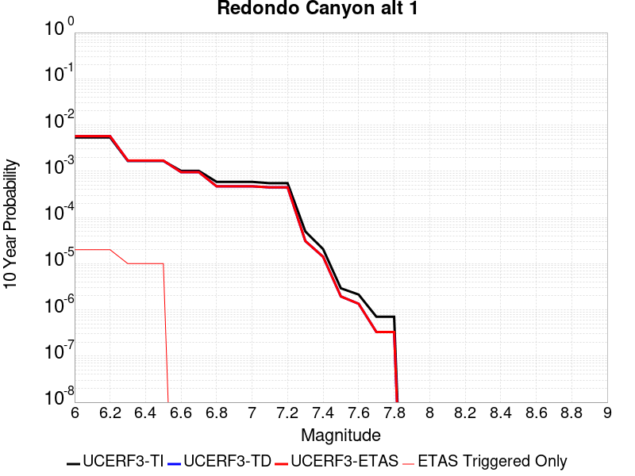 |

| Magnitude | 1 wk TI Prob | 1 wk TD Prob | 1 wk ETAS Prob | 1 wk ETAS/TD Gain | 1 wk ETAS Triggered Only | 1 mo TI Prob | 1 mo TD Prob | 1 mo ETAS Prob | 1 mo ETAS/TD Gain | 1 mo ETAS Triggered Only | 1 yr TI Prob | 1 yr TD Prob | 1 yr ETAS Prob | 1 yr ETAS/TD Gain | 1 yr ETAS Triggered Only | 10 yr TI Prob | 10 yr TD Prob | 10 yr ETAS Prob | 10 yr ETAS/TD Gain | 10 yr ETAS Triggered Only |
|-----|-----|-----|-----|-----|-----|-----|-----|-----|-----|-----|-----|-----|-----|-----|-----|-----|-----|-----|-----|-----|
| 6.0 | 1.0346246E-5 | 1.0981325E-5 | 2.0981215E-5 | 1.9106269 | 1.0E-5 | 4.43403E-5 | 4.7062418E-5 | 5.706195E-5 | 1.2124738 | 1.0E-5 | 5.3970946E-4 | 5.729132E-4 | 5.929018E-4 | 1.0348893 | 2.0E-5 | 0.0053840056 | 0.0057221013 | 0.005741987 | 1.0034752 | 2.0E-5 |
| 6.1 | 1.0346246E-5 | 1.0981325E-5 | 2.0981215E-5 | 1.9106269 | 1.0E-5 | 4.43403E-5 | 4.7062418E-5 | 5.706195E-5 | 1.2124738 | 1.0E-5 | 5.3970946E-4 | 5.729132E-4 | 5.929018E-4 | 1.0348893 | 2.0E-5 | 0.0053840056 | 0.0057221013 | 0.005741987 | 1.0034752 | 2.0E-5 |
| 6.2 | 1.0346246E-5 | 1.0981325E-5 | 2.0981215E-5 | 1.9106269 | 1.0E-5 | 4.43403E-5 | 4.7062418E-5 | 5.706195E-5 | 1.2124738 | 1.0E-5 | 5.3970946E-4 | 5.729132E-4 | 5.929018E-4 | 1.0348893 | 2.0E-5 | 0.0053840056 | 0.0057221013 | 0.005741987 | 1.0034752 | 2.0E-5 |
| 6.3 | 3.2052794E-6 | 3.2360983E-6 | 3.2360983E-6 | 1.0 | 0.0 | 1.373684E-5 | 1.3868941E-5 | 1.3868941E-5 | 1.0 | 0.0 | 1.6723319E-4 | 1.6884525E-4 | 1.7884356E-4 | 1.0592158 | 1.0E-5 | 0.001671074 | 0.0016875593 | 0.0016975424 | 1.0059158 | 1.0E-5 |
| 6.4 | 3.2052794E-6 | 3.2360983E-6 | 3.2360983E-6 | 1.0 | 0.0 | 1.373684E-5 | 1.3868941E-5 | 1.3868941E-5 | 1.0 | 0.0 | 1.6723319E-4 | 1.6884525E-4 | 1.7884356E-4 | 1.0592158 | 1.0E-5 | 0.001671074 | 0.0016875593 | 0.0016975424 | 1.0059158 | 1.0E-5 |
| 6.5 | 3.2052794E-6 | 3.2360983E-6 | 3.2360983E-6 | 1.0 | 0.0 | 1.373684E-5 | 1.3868941E-5 | 1.3868941E-5 | 1.0 | 0.0 | 1.6723319E-4 | 1.6884525E-4 | 1.7884356E-4 | 1.0592158 | 1.0E-5 | 0.001671074 | 0.0016875593 | 0.0016975424 | 1.0059158 | 1.0E-5 |
| 6.6 | 1.948328E-6 | 1.8288489E-6 | 1.8288489E-6 | 1.0 | 0.0 | 8.349951E-6 | 7.837909E-6 | 7.837909E-6 | 1.0 | 0.0 | 1.016559E-4 | 9.5423864E-5 | 9.5423864E-5 | 1.0 | 0.0 | 0.0010160941 | 9.5397583E-4 | 9.5397583E-4 | 1.0 | 0.0 |
| 6.7 | 1.948328E-6 | 1.8288489E-6 | 1.8288489E-6 | 1.0 | 0.0 | 8.349951E-6 | 7.837909E-6 | 7.837909E-6 | 1.0 | 0.0 | 1.016559E-4 | 9.5423864E-5 | 9.5423864E-5 | 1.0 | 0.0 | 0.0010160941 | 9.5397583E-4 | 9.5397583E-4 | 1.0 | 0.0 |
| 6.8 | 1.1278219E-6 | 9.032885E-7 | 9.032885E-7 | 1.0 | 0.0 | 4.8335132E-6 | 3.871233E-6 | 3.871233E-6 | 1.0 | 0.0 | 5.8846435E-5 | 4.713167E-5 | 4.713167E-5 | 1.0 | 0.0 | 5.8830855E-4 | 4.7125877E-4 | 4.7125877E-4 | 1.0 | 0.0 |
| 6.9 | 1.1278219E-6 | 9.032885E-7 | 9.032885E-7 | 1.0 | 0.0 | 4.8335132E-6 | 3.871233E-6 | 3.871233E-6 | 1.0 | 0.0 | 5.8846435E-5 | 4.713167E-5 | 4.713167E-5 | 1.0 | 0.0 | 5.8830855E-4 | 4.7125877E-4 | 4.7125877E-4 | 1.0 | 0.0 |
| 7.0 | 1.1278219E-6 | 9.032885E-7 | 9.032885E-7 | 1.0 | 0.0 | 4.8335132E-6 | 3.871233E-6 | 3.871233E-6 | 1.0 | 0.0 | 5.8846435E-5 | 4.713167E-5 | 4.713167E-5 | 1.0 | 0.0 | 5.8830855E-4 | 4.7125877E-4 | 4.7125877E-4 | 1.0 | 0.0 |
| 7.1 | 1.0545139E-6 | 8.5690925E-7 | 8.5690925E-7 | 1.0 | 0.0 | 4.5193374E-6 | 3.6724655E-6 | 3.6724655E-6 | 1.0 | 0.0 | 5.5021545E-5 | 4.4711775E-5 | 4.4711775E-5 | 1.0 | 0.0 | 5.500792E-4 | 4.4706953E-4 | 4.4706953E-4 | 1.0 | 0.0 |
| 7.2 | 1.0545139E-6 | 8.5690925E-7 | 8.5690925E-7 | 1.0 | 0.0 | 4.5193374E-6 | 3.6724655E-6 | 3.6724655E-6 | 1.0 | 0.0 | 5.5021545E-5 | 4.4711775E-5 | 4.4711775E-5 | 1.0 | 0.0 | 5.500792E-4 | 4.4706953E-4 | 4.4706953E-4 | 1.0 | 0.0 |
| 7.3 | 9.505161E-8 | 5.8955752E-8 | 5.8955752E-8 | 1.0 | 0.0 | 4.0736398E-7 | 2.526675E-7 | 2.526675E-7 | 1.0 | 0.0 | 4.959645E-6 | 3.0762235E-6 | 3.0762235E-6 | 1.0 | 0.0 | 4.9595343E-5 | 3.076193E-5 | 3.076193E-5 | 1.0 | 0.0 |
| 7.4 | 3.9520785E-8 | 2.6987088E-8 | 2.6987088E-8 | 1.0 | 0.0 | 1.6937479E-7 | 1.1565894E-7 | 1.1565894E-7 | 1.0 | 0.0 | 2.062136E-6 | 1.408147E-6 | 1.408147E-6 | 1.0 | 0.0 | 2.062117E-5 | 1.4081407E-5 | 1.4081407E-5 | 1.0 | 0.0 |
| 7.5 | 5.6133214E-9 | 3.7367687E-9 | 3.7367687E-9 | 1.0 | 0.0 | 2.4057092E-8 | 1.6014722E-8 | 1.6014722E-8 | 1.0 | 0.0 | 2.9289507E-7 | 1.9497922E-7 | 1.9497922E-7 | 1.0 | 0.0 | 2.9289467E-6 | 1.9497909E-6 | 1.9497909E-6 | 1.0 | 0.0 |
| 7.6 | 4.1064334E-9 | 2.5957205E-9 | 2.5957205E-9 | 1.0 | 0.0 | 1.7599E-8 | 1.1124517E-8 | 1.1124517E-8 | 1.0 | 0.0 | 2.142678E-7 | 1.3544098E-7 | 1.3544098E-7 | 1.0 | 0.0 | 2.1426758E-6 | 1.3544093E-6 | 1.3544093E-6 | 1.0 | 0.0 |
| 7.7 | 1.361975E-9 | 6.360521E-10 | 6.360521E-10 | 1.0 | 0.0 | 5.8370353E-9 | 2.7259377E-9 | 2.7259377E-9 | 1.0 | 0.0 | 7.1065905E-8 | 3.318829E-8 | 3.318829E-8 | 1.0 | 0.0 | 7.106588E-7 | 3.3188286E-7 | 3.3188286E-7 | 1.0 | 0.0 |
| 7.8 | 1.361975E-9 | 6.360521E-10 | 6.360521E-10 | 1.0 | 0.0 | 5.8370353E-9 | 2.7259377E-9 | 2.7259377E-9 | 1.0 | 0.0 | 7.1065905E-8 | 3.318829E-8 | 3.318829E-8 | 1.0 | 0.0 | 7.106588E-7 | 3.3188286E-7 | 3.3188286E-7 | 1.0 | 0.0 |

## Anacapa-Dume alt 1
*[(top)](#table-of-contents)*

| 1 Week | 1 Month | 1 Year | 10 Year |
|-----|-----|-----|-----|
|  | 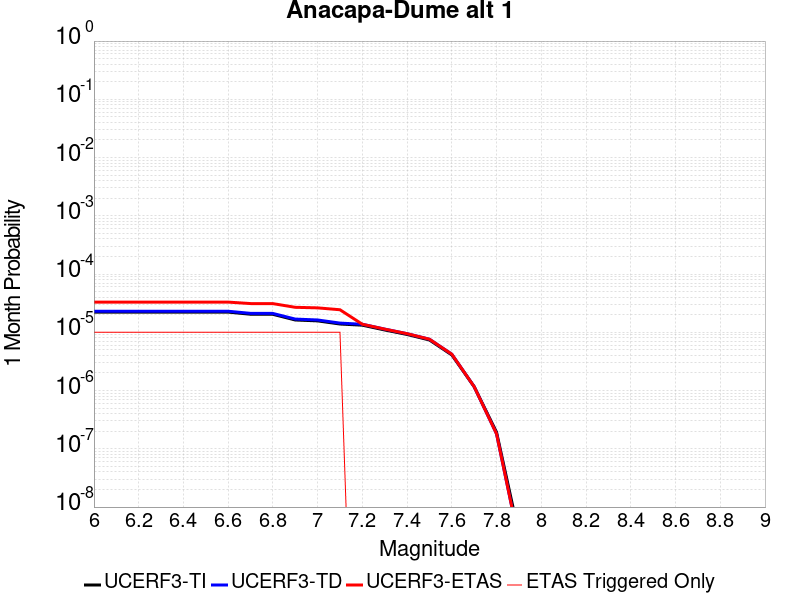 | 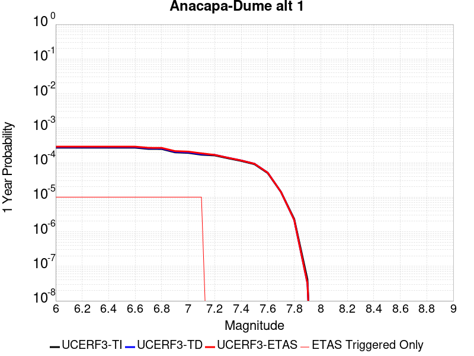 |  |

| Magnitude | 1 wk TI Prob | 1 wk TD Prob | 1 wk ETAS Prob | 1 wk ETAS/TD Gain | 1 wk ETAS Triggered Only | 1 mo TI Prob | 1 mo TD Prob | 1 mo ETAS Prob | 1 mo ETAS/TD Gain | 1 mo ETAS Triggered Only | 1 yr TI Prob | 1 yr TD Prob | 1 yr ETAS Prob | 1 yr ETAS/TD Gain | 1 yr ETAS Triggered Only | 10 yr TI Prob | 10 yr TD Prob | 10 yr ETAS Prob | 10 yr ETAS/TD Gain | 10 yr ETAS Triggered Only |
|-----|-----|-----|-----|-----|-----|-----|-----|-----|-----|-----|-----|-----|-----|-----|-----|-----|-----|-----|-----|-----|
| 6.0 | 5.1871802E-6 | 5.3673916E-6 | 5.3673916E-6 | 1.0 | 0.0 | 2.2230583E-5 | 2.3002909E-5 | 3.3002678E-5 | 1.4347177 | 1.0E-5 | 2.7062374E-4 | 2.8002527E-4 | 2.9002246E-4 | 1.035701 | 1.0E-5 | 0.002702944 | 0.0027968097 | 0.0028167537 | 1.007131 | 2.0E-5 |
| 6.1 | 5.1871802E-6 | 5.3673916E-6 | 5.3673916E-6 | 1.0 | 0.0 | 2.2230583E-5 | 2.3002909E-5 | 3.3002678E-5 | 1.4347177 | 1.0E-5 | 2.7062374E-4 | 2.8002527E-4 | 2.9002246E-4 | 1.035701 | 1.0E-5 | 0.002702944 | 0.0027968097 | 0.0028167537 | 1.007131 | 2.0E-5 |
| 6.2 | 5.1871802E-6 | 5.3673916E-6 | 5.3673916E-6 | 1.0 | 0.0 | 2.2230583E-5 | 2.3002909E-5 | 3.3002678E-5 | 1.4347177 | 1.0E-5 | 2.7062374E-4 | 2.8002527E-4 | 2.9002246E-4 | 1.035701 | 1.0E-5 | 0.002702944 | 0.0027968097 | 0.0028167537 | 1.007131 | 2.0E-5 |
| 6.3 | 5.1871802E-6 | 5.3673916E-6 | 5.3673916E-6 | 1.0 | 0.0 | 2.2230583E-5 | 2.3002909E-5 | 3.3002678E-5 | 1.4347177 | 1.0E-5 | 2.7062374E-4 | 2.8002527E-4 | 2.9002246E-4 | 1.035701 | 1.0E-5 | 0.002702944 | 0.0027968097 | 0.0028167537 | 1.007131 | 2.0E-5 |
| 6.4 | 5.1871802E-6 | 5.3673916E-6 | 5.3673916E-6 | 1.0 | 0.0 | 2.2230583E-5 | 2.3002909E-5 | 3.3002678E-5 | 1.4347177 | 1.0E-5 | 2.7062374E-4 | 2.8002527E-4 | 2.9002246E-4 | 1.035701 | 1.0E-5 | 0.002702944 | 0.0027968097 | 0.0028167537 | 1.007131 | 2.0E-5 |
| 6.5 | 5.1871802E-6 | 5.3673916E-6 | 5.3673916E-6 | 1.0 | 0.0 | 2.2230583E-5 | 2.3002909E-5 | 3.3002678E-5 | 1.4347177 | 1.0E-5 | 2.7062374E-4 | 2.8002527E-4 | 2.9002246E-4 | 1.035701 | 1.0E-5 | 0.002702944 | 0.0027968097 | 0.0028167537 | 1.007131 | 2.0E-5 |
| 6.6 | 5.1871802E-6 | 5.3673916E-6 | 5.3673916E-6 | 1.0 | 0.0 | 2.2230583E-5 | 2.3002909E-5 | 3.3002678E-5 | 1.4347177 | 1.0E-5 | 2.7062374E-4 | 2.8002527E-4 | 2.9002246E-4 | 1.035701 | 1.0E-5 | 0.002702944 | 0.0027968097 | 0.0028167537 | 1.007131 | 2.0E-5 |
| 6.7 | 4.7693475E-6 | 4.9366927E-6 | 4.9366927E-6 | 1.0 | 0.0 | 2.04399E-5 | 2.1157086E-5 | 3.1156873E-5 | 1.4726449 | 1.0E-5 | 2.4882736E-4 | 2.5755784E-4 | 2.6755527E-4 | 1.0388162 | 1.0E-5 | 0.0024854892 | 0.0025726694 | 0.0025926179 | 1.007754 | 2.0E-5 |
| 6.8 | 4.753408E-6 | 4.920241E-6 | 4.920241E-6 | 1.0 | 0.0 | 2.037159E-5 | 2.108658E-5 | 3.108637E-5 | 1.4742253 | 1.0E-5 | 2.4799586E-4 | 2.5669963E-4 | 2.6669705E-4 | 1.038946 | 1.0E-5 | 0.002477193 | 0.002564107 | 0.0025840558 | 1.00778 | 2.0E-5 |
| 6.9 | 3.800069E-6 | 3.937127E-6 | 3.937127E-6 | 1.0 | 0.0 | 1.6285909E-5 | 1.6873293E-5 | 2.6873124E-5 | 1.5926425 | 1.0E-5 | 1.9826289E-4 | 2.054132E-4 | 2.1541116E-4 | 1.0486723 | 1.0E-5 | 0.001980861 | 0.0020522573 | 0.0020722162 | 1.0097253 | 2.0E-5 |
| 7.0 | 3.6671938E-6 | 3.799919E-6 | 3.799919E-6 | 1.0 | 0.0 | 1.571645E-5 | 1.6285267E-5 | 2.6285104E-5 | 1.6140419 | 1.0E-5 | 1.9133097E-4 | 1.9825532E-4 | 2.0825333E-4 | 1.05043 | 1.0E-5 | 0.0019116632 | 0.0019808079 | 0.0020007682 | 1.0100769 | 2.0E-5 |
| 7.1 | 3.2394885E-6 | 3.3587942E-6 | 3.3587942E-6 | 1.0 | 0.0 | 1.3883448E-5 | 1.4394753E-5 | 2.4394609E-5 | 1.6946876 | 1.0E-5 | 1.6901788E-4 | 1.7524212E-4 | 1.8524038E-4 | 1.0570539 | 1.0E-5 | 0.0016888938 | 0.0017510506 | 0.0017710156 | 1.0114018 | 2.0E-5 |
| 7.2 | 3.0935948E-6 | 3.2079267E-6 | 3.2079267E-6 | 1.0 | 0.0 | 1.3258196E-5 | 1.3748186E-5 | 1.3748186E-5 | 1.0 | 0.0 | 1.6140658E-4 | 1.6737141E-4 | 1.6737141E-4 | 1.0 | 0.0 | 0.001612894 | 0.0016724645 | 0.0016824479 | 1.0059692 | 1.0E-5 |
| 7.3 | 2.5604163E-6 | 2.6470739E-6 | 2.6470739E-6 | 1.0 | 0.0 | 1.0973167E-5 | 1.1344553E-5 | 1.1344553E-5 | 1.0 | 0.0 | 1.3359012E-4 | 1.3811122E-4 | 1.3811122E-4 | 1.0 | 0.0 | 0.0013350984 | 0.0013802585 | 0.0013902447 | 1.007235 | 1.0E-5 |
| 7.4 | 2.1429005E-6 | 2.2106035E-6 | 2.2106035E-6 | 1.0 | 0.0 | 9.1838265E-6 | 9.473981E-6 | 9.473981E-6 | 1.0 | 0.0 | 1.11807356E-4 | 1.1533964E-4 | 1.1533964E-4 | 1.0 | 0.0 | 0.0011175112 | 0.0011528004 | 0.0011627888 | 1.0086645 | 1.0E-5 |
| 7.5 | 1.7237151E-6 | 1.7761457E-6 | 1.7761457E-6 | 1.0 | 0.0 | 7.3873293E-6 | 7.6120314E-6 | 7.6120314E-6 | 1.0 | 0.0 | 8.993702E-5 | 9.267256E-5 | 9.267256E-5 | 1.0 | 0.0 | 8.990063E-4 | 9.263415E-4 | 9.363322E-4 | 1.0107851 | 1.0E-5 |
| 7.6 | 9.541696E-7 | 9.823211E-7 | 9.823211E-7 | 1.0 | 0.0 | 4.089292E-6 | 4.2099414E-6 | 4.2099414E-6 | 1.0 | 0.0 | 4.9785995E-5 | 5.125484E-5 | 5.125484E-5 | 1.0 | 0.0 | 4.9774844E-4 | 5.124315E-4 | 5.2242633E-4 | 1.0195048 | 1.0E-5 |
| 7.7 | 2.7226676E-7 | 2.7172473E-7 | 2.7172473E-7 | 1.0 | 0.0 | 1.166857E-6 | 1.1645341E-6 | 1.1645341E-6 | 1.0 | 0.0 | 1.4206392E-5 | 1.4178111E-5 | 1.4178111E-5 | 1.0 | 0.0 | 1.4205484E-4 | 1.4177214E-4 | 1.4177214E-4 | 1.0 | 0.0 |
| 7.8 | 4.5017995E-8 | 4.215797E-8 | 4.215797E-8 | 1.0 | 0.0 | 1.9293425E-7 | 1.80677E-7 | 1.80677E-7 | 1.0 | 0.0 | 2.348972E-6 | 2.1997405E-6 | 2.1997405E-6 | 1.0 | 0.0 | 2.348947E-5 | 2.1997208E-5 | 2.1997208E-5 | 1.0 | 0.0 |
| 7.9 | 8.007447E-10 | 6.161581E-10 | 6.161581E-10 | 1.0 | 0.0 | 3.4317629E-9 | 2.640678E-9 | 2.640678E-9 | 1.0 | 0.0 | 4.1781714E-8 | 3.2150254E-8 | 3.2150254E-8 | 1.0 | 0.0 | 4.1781706E-7 | 3.2150248E-7 | 3.2150248E-7 | 1.0 | 0.0 |

## Fitzhugh Creek
*[(top)](#table-of-contents)*

| 1 Week | 1 Month | 1 Year | 10 Year |
|-----|-----|-----|-----|
|  |  |  |  |

| Magnitude | 1 wk TI Prob | 1 wk TD Prob | 1 wk ETAS Prob | 1 wk ETAS/TD Gain | 1 wk ETAS Triggered Only | 1 mo TI Prob | 1 mo TD Prob | 1 mo ETAS Prob | 1 mo ETAS/TD Gain | 1 mo ETAS Triggered Only | 1 yr TI Prob | 1 yr TD Prob | 1 yr ETAS Prob | 1 yr ETAS/TD Gain | 1 yr ETAS Triggered Only | 10 yr TI Prob | 10 yr TD Prob | 10 yr ETAS Prob | 10 yr ETAS/TD Gain | 10 yr ETAS Triggered Only |
|-----|-----|-----|-----|-----|-----|-----|-----|-----|-----|-----|-----|-----|-----|-----|-----|-----|-----|-----|-----|-----|
| 6.0 | 6.1090436E-6 | 6.2101562E-6 | 6.2101562E-6 | 1.0 | 0.0 | 2.6181353E-5 | 2.6614709E-5 | 2.6614709E-5 | 1.0 | 0.0 | 3.1871133E-4 | 3.239904E-4 | 3.3398715E-4 | 1.0308551 | 1.0E-5 | 0.0031825465 | 0.0032356246 | 0.0032455921 | 1.0030806 | 1.0E-5 |
| 6.1 | 2.9741811E-6 | 3.021581E-6 | 3.021581E-6 | 1.0 | 0.0 | 1.2746428E-5 | 1.2949574E-5 | 1.2949574E-5 | 1.0 | 0.0 | 1.5517672E-4 | 1.576506E-4 | 1.6764902E-4 | 1.0634214 | 1.0E-5 | 0.001550684 | 0.0015754806 | 0.0015854648 | 1.0063373 | 1.0E-5 |
| 6.2 | 2.9741811E-6 | 3.021581E-6 | 3.021581E-6 | 1.0 | 0.0 | 1.2746428E-5 | 1.2949574E-5 | 1.2949574E-5 | 1.0 | 0.0 | 1.5517672E-4 | 1.576506E-4 | 1.6764902E-4 | 1.0634214 | 1.0E-5 | 0.001550684 | 0.0015754806 | 0.0015854648 | 1.0063373 | 1.0E-5 |
| 6.3 | 1.4781198E-6 | 1.5012708E-6 | 1.5012708E-6 | 1.0 | 0.0 | 6.3347834E-6 | 6.4340034E-6 | 6.4340034E-6 | 1.0 | 0.0 | 7.712326E-5 | 7.833137E-5 | 8.833059E-5 | 1.1276528 | 1.0E-5 | 7.70965E-4 | 7.830576E-4 | 7.9304975E-4 | 1.0127604 | 1.0E-5 |
| 6.4 | 1.4781198E-6 | 1.5012708E-6 | 1.5012708E-6 | 1.0 | 0.0 | 6.3347834E-6 | 6.4340034E-6 | 6.4340034E-6 | 1.0 | 0.0 | 7.712326E-5 | 7.833137E-5 | 8.833059E-5 | 1.1276528 | 1.0E-5 | 7.70965E-4 | 7.830576E-4 | 7.9304975E-4 | 1.0127604 | 1.0E-5 |
| 6.5 | 9.5176676E-7 | 9.66606E-7 | 9.66606E-7 | 1.0 | 0.0 | 4.078994E-6 | 4.142591E-6 | 4.142591E-6 | 1.0 | 0.0 | 4.9660623E-5 | 5.0434985E-5 | 5.0434985E-5 | 1.0 | 0.0 | 4.964952E-4 | 5.042458E-4 | 5.042458E-4 | 1.0 | 0.0 |
| 6.6 | 6.21145E-7 | 6.3085855E-7 | 6.3085855E-7 | 1.0 | 0.0 | 2.662047E-6 | 2.7036772E-6 | 2.7036772E-6 | 1.0 | 0.0 | 3.2409942E-5 | 3.291684E-5 | 3.291684E-5 | 1.0 | 0.0 | 3.2405215E-4 | 3.2912623E-4 | 3.2912623E-4 | 1.0 | 0.0 |
| 6.7 | 2.2377962E-7 | 2.2734636E-7 | 2.2734636E-7 | 1.0 | 0.0 | 9.590551E-7 | 9.743413E-7 | 9.743413E-7 | 1.0 | 0.0 | 1.1676434E-5 | 1.1862574E-5 | 1.1862574E-5 | 1.0 | 0.0 | 1.1675821E-4 | 1.1862254E-4 | 1.1862254E-4 | 1.0 | 0.0 |
| 6.8 | 1.4785022E-7 | 1.5021492E-7 | 1.5021492E-7 | 1.0 | 0.0 | 6.3364365E-7 | 6.4377826E-7 | 6.4377826E-7 | 1.0 | 0.0 | 7.714584E-6 | 7.838E-6 | 7.838E-6 | 1.0 | 0.0 | 7.714316E-5 | 7.838E-5 | 7.838E-5 | 1.0 | 0.0 |

## Reliz 2011 CFM
*[(top)](#table-of-contents)*

| 1 Week | 1 Month | 1 Year | 10 Year |
|-----|-----|-----|-----|
|  |  |  |  |

| Magnitude | 1 wk TI Prob | 1 wk TD Prob | 1 wk ETAS Prob | 1 wk ETAS/TD Gain | 1 wk ETAS Triggered Only | 1 mo TI Prob | 1 mo TD Prob | 1 mo ETAS Prob | 1 mo ETAS/TD Gain | 1 mo ETAS Triggered Only | 1 yr TI Prob | 1 yr TD Prob | 1 yr ETAS Prob | 1 yr ETAS/TD Gain | 1 yr ETAS Triggered Only | 10 yr TI Prob | 10 yr TD Prob | 10 yr ETAS Prob | 10 yr ETAS/TD Gain | 10 yr ETAS Triggered Only |
|-----|-----|-----|-----|-----|-----|-----|-----|-----|-----|-----|-----|-----|-----|-----|-----|-----|-----|-----|-----|-----|
| 6.0 | 1.6002472E-5 | 1.6282795E-5 | 1.6282795E-5 | 1.0 | 0.0 | 6.8580215E-5 | 6.978165E-5 | 6.978165E-5 | 1.0 | 0.0 | 8.3464425E-4 | 8.492802E-4 | 8.492802E-4 | 1.0 | 0.0 | 0.008315164 | 0.008462543 | 0.008472458 | 1.0011717 | 1.0E-5 |
| 6.1 | 1.6002472E-5 | 1.6282795E-5 | 1.6282795E-5 | 1.0 | 0.0 | 6.8580215E-5 | 6.978165E-5 | 6.978165E-5 | 1.0 | 0.0 | 8.3464425E-4 | 8.492802E-4 | 8.492802E-4 | 1.0 | 0.0 | 0.008315164 | 0.008462543 | 0.008472458 | 1.0011717 | 1.0E-5 |
| 6.2 | 1.6002472E-5 | 1.6282795E-5 | 1.6282795E-5 | 1.0 | 0.0 | 6.8580215E-5 | 6.978165E-5 | 6.978165E-5 | 1.0 | 0.0 | 8.3464425E-4 | 8.492802E-4 | 8.492802E-4 | 1.0 | 0.0 | 0.008315164 | 0.008462543 | 0.008472458 | 1.0011717 | 1.0E-5 |
| 6.3 | 7.792404E-6 | 7.803792E-6 | 7.803792E-6 | 1.0 | 0.0 | 3.339559E-5 | 3.3444398E-5 | 3.3444398E-5 | 1.0 | 0.0 | 4.0651546E-4 | 4.0711026E-4 | 4.0711026E-4 | 1.0 | 0.0 | 0.0040577264 | 0.0040639215 | 0.0040639215 | 1.0 | 0.0 |
| 6.4 | 7.792404E-6 | 7.803792E-6 | 7.803792E-6 | 1.0 | 0.0 | 3.339559E-5 | 3.3444398E-5 | 3.3444398E-5 | 1.0 | 0.0 | 4.0651546E-4 | 4.0711026E-4 | 4.0711026E-4 | 1.0 | 0.0 | 0.0040577264 | 0.0040639215 | 0.0040639215 | 1.0 | 0.0 |
| 6.5 | 5.9659374E-6 | 5.928728E-6 | 5.928728E-6 | 1.0 | 0.0 | 2.5568053E-5 | 2.5408588E-5 | 2.5408588E-5 | 1.0 | 0.0 | 3.1124658E-4 | 3.0930588E-4 | 3.0930588E-4 | 1.0 | 0.0 | 0.00310811 | 0.003088972 | 0.003088972 | 1.0 | 0.0 |
| 6.6 | 5.2350692E-6 | 5.178976E-6 | 5.178976E-6 | 1.0 | 0.0 | 2.2435817E-5 | 2.2195423E-5 | 2.2195423E-5 | 1.0 | 0.0 | 2.7312184E-4 | 2.7019592E-4 | 2.7019592E-4 | 1.0 | 0.0 | 0.002727864 | 0.0026988846 | 0.0026988846 | 1.0 | 0.0 |
| 6.7 | 4.580206E-6 | 4.50611E-6 | 4.50611E-6 | 1.0 | 0.0 | 1.9629308E-5 | 1.931176E-5 | 1.931176E-5 | 1.0 | 0.0 | 2.389606E-4 | 2.3509537E-4 | 2.3509537E-4 | 1.0 | 0.0 | 0.002387038 | 0.002348669 | 0.002348669 | 1.0 | 0.0 |
| 6.8 | 4.0765017E-6 | 3.988228E-6 | 3.988228E-6 | 1.0 | 0.0 | 1.7470604E-5 | 1.7092294E-5 | 1.7092294E-5 | 1.0 | 0.0 | 2.1268385E-4 | 2.0807884E-4 | 2.0807884E-4 | 1.0 | 0.0 | 0.002124804 | 0.0020790389 | 0.0020790389 | 1.0 | 0.0 |
| 6.9 | 3.5752896E-6 | 3.4725074E-6 | 3.4725074E-6 | 1.0 | 0.0 | 1.532258E-5 | 1.488209E-5 | 1.488209E-5 | 1.0 | 0.0 | 1.8653645E-4 | 1.811744E-4 | 1.811744E-4 | 1.0 | 0.0 | 0.0018637994 | 0.001810464 | 0.001810464 | 1.0 | 0.0 |
| 7.0 | 3.0259848E-6 | 2.9079317E-6 | 2.9079317E-6 | 1.0 | 0.0 | 1.2968442E-5 | 1.2462505E-5 | 1.2462505E-5 | 1.0 | 0.0 | 1.5787935E-4 | 1.5172044E-4 | 1.5172044E-4 | 1.0 | 0.0 | 0.0015776722 | 0.0015163644 | 0.0015163644 | 1.0 | 0.0 |
| 7.1 | 2.5861116E-6 | 2.455157E-6 | 2.455157E-6 | 1.0 | 0.0 | 1.1083288E-5 | 1.0522059E-5 | 1.0522059E-5 | 1.0 | 0.0 | 1.3493067E-4 | 1.2809855E-4 | 1.2809855E-4 | 1.0 | 0.0 | 0.0013484878 | 0.0012804423 | 0.0012804423 | 1.0 | 0.0 |
| 7.2 | 2.1482588E-6 | 2.0032267E-6 | 2.0032267E-6 | 1.0 | 0.0 | 9.20679E-6 | 8.585229E-6 | 8.585229E-6 | 1.0 | 0.0 | 1.12086906E-4 | 1.0452016E-4 | 1.0452016E-4 | 1.0 | 0.0 | 0.0011203039 | 0.0010449048 | 0.0010449048 | 1.0 | 0.0 |
| 7.3 | 1.7194744E-6 | 1.561114E-6 | 1.561114E-6 | 1.0 | 0.0 | 7.3691554E-6 | 6.6904713E-6 | 6.6904713E-6 | 1.0 | 0.0 | 8.971577E-5 | 8.145344E-5 | 8.145344E-5 | 1.0 | 0.0 | 8.967956E-4 | 8.144305E-4 | 8.144305E-4 | 1.0 | 0.0 |
| 7.4 | 1.2755178E-6 | 1.1056196E-6 | 1.1056196E-6 | 1.0 | 0.0 | 5.4664933E-6 | 4.738361E-6 | 4.738361E-6 | 1.0 | 0.0 | 6.655252E-5 | 5.768802E-5 | 5.768802E-5 | 1.0 | 0.0 | 6.6532596E-4 | 5.769249E-4 | 5.769249E-4 | 1.0 | 0.0 |
| 7.5 | 8.8463224E-7 | 7.0579193E-7 | 7.0579193E-7 | 1.0 | 0.0 | 3.7912755E-6 | 3.0248189E-6 | 3.0248189E-6 | 1.0 | 0.0 | 4.6157802E-5 | 3.682655E-5 | 3.682655E-5 | 1.0 | 0.0 | 4.6148215E-4 | 3.683988E-4 | 3.683988E-4 | 1.0 | 0.0 |
| 7.6 | 5.291355E-7 | 3.5006548E-7 | 3.5006548E-7 | 1.0 | 0.0 | 2.2677216E-6 | 1.5002796E-6 | 1.5002796E-6 | 1.0 | 0.0 | 2.760916E-5 | 1.8265751E-5 | 1.8265751E-5 | 1.0 | 0.0 | 2.760573E-4 | 1.8283579E-4 | 1.8283579E-4 | 1.0 | 0.0 |
| 7.7 | 2.9663357E-7 | 1.3509886E-7 | 1.3509886E-7 | 1.0 | 0.0 | 1.2712861E-6 | 5.7899496E-7 | 5.7899496E-7 | 1.0 | 0.0 | 1.5477797E-5 | 7.0492406E-6 | 7.0492406E-6 | 1.0 | 0.0 | 1.547672E-4 | 7.0675895E-5 | 7.0675895E-5 | 1.0 | 0.0 |
| 7.8 | 1.2509386E-7 | 2.7148959E-8 | 2.7148959E-8 | 1.0 | 0.0 | 5.3611643E-7 | 1.1635268E-7 | 1.1635268E-7 | 1.0 | 0.0 | 6.527198E-6 | 1.4165929E-6 | 1.4165929E-6 | 1.0 | 0.0 | 6.527006E-5 | 1.4322827E-5 | 1.4322827E-5 | 1.0 | 0.0 |
| 7.9 | 6.213493E-8 | 1.1477568E-8 | 1.1477568E-8 | 1.0 | 0.0 | 2.6629255E-7 | 4.9189577E-8 | 4.9189577E-8 | 1.0 | 0.0 | 3.242107E-6 | 5.9888293E-7 | 5.9888293E-7 | 1.0 | 0.0 | 3.2420594E-5 | 6.1203536E-6 | 6.1203536E-6 | 1.0 | 0.0 |
| 8.0 | 5.92383E-9 | 1.6775827E-9 | 1.6775827E-9 | 1.0 | 0.0 | 2.5387841E-8 | 7.18964E-9 | 7.18964E-9 | 1.0 | 0.0 | 3.0909692E-7 | 8.753386E-8 | 8.753386E-8 | 1.0 | 0.0 | 3.090965E-6 | 8.992677E-7 | 8.992677E-7 | 1.0 | 0.0 |

## Elysian Park (Lower CFM)
*[(top)](#table-of-contents)*

| 1 Week | 1 Month | 1 Year | 10 Year |
|-----|-----|-----|-----|
|  |  |  |  |

| Magnitude | 1 wk TI Prob | 1 wk TD Prob | 1 wk ETAS Prob | 1 wk ETAS/TD Gain | 1 wk ETAS Triggered Only | 1 mo TI Prob | 1 mo TD Prob | 1 mo ETAS Prob | 1 mo ETAS/TD Gain | 1 mo ETAS Triggered Only | 1 yr TI Prob | 1 yr TD Prob | 1 yr ETAS Prob | 1 yr ETAS/TD Gain | 1 yr ETAS Triggered Only | 10 yr TI Prob | 10 yr TD Prob | 10 yr ETAS Prob | 10 yr ETAS/TD Gain | 10 yr ETAS Triggered Only |
|-----|-----|-----|-----|-----|-----|-----|-----|-----|-----|-----|-----|-----|-----|-----|-----|-----|-----|-----|-----|-----|
| 6.0 | 2.1766498E-6 | 2.1037895E-6 | 2.1037895E-6 | 1.0 | 0.0 | 9.328466E-6 | 9.0162175E-6 | 9.0162175E-6 | 1.0 | 0.0 | 1.1356815E-4 | 1.0976836E-4 | 1.0976836E-4 | 1.0 | 0.0 | 0.0011351013 | 0.0010972833 | 0.0011072723 | 1.0091034 | 1.0E-5 |
| 6.1 | 2.1766498E-6 | 2.1037895E-6 | 2.1037895E-6 | 1.0 | 0.0 | 9.328466E-6 | 9.0162175E-6 | 9.0162175E-6 | 1.0 | 0.0 | 1.1356815E-4 | 1.0976836E-4 | 1.0976836E-4 | 1.0 | 0.0 | 0.0011351013 | 0.0010972833 | 0.0011072723 | 1.0091034 | 1.0E-5 |
| 6.2 | 1.0031182E-6 | 9.186213E-7 | 9.186213E-7 | 1.0 | 0.0 | 4.299071E-6 | 3.936943E-6 | 3.936943E-6 | 1.0 | 0.0 | 5.2339932E-5 | 4.7931328E-5 | 4.7931328E-5 | 1.0 | 0.0 | 5.2327604E-4 | 4.7921969E-4 | 4.892149E-4 | 1.0208572 | 1.0E-5 |
| 6.3 | 1.0031182E-6 | 9.186213E-7 | 9.186213E-7 | 1.0 | 0.0 | 4.299071E-6 | 3.936943E-6 | 3.936943E-6 | 1.0 | 0.0 | 5.2339932E-5 | 4.7931328E-5 | 4.7931328E-5 | 1.0 | 0.0 | 5.2327604E-4 | 4.7921969E-4 | 4.892149E-4 | 1.0208572 | 1.0E-5 |
| 6.4 | 6.9606244E-7 | 6.091942E-7 | 6.091942E-7 | 1.0 | 0.0 | 2.9831212E-6 | 2.6108296E-6 | 2.6108296E-6 | 1.0 | 0.0 | 3.6318896E-5 | 3.178639E-5 | 3.178639E-5 | 1.0 | 0.0 | 3.6312963E-4 | 3.1781866E-4 | 3.2781548E-4 | 1.0314544 | 1.0E-5 |
| 6.5 | 6.901879E-7 | 6.0326255E-7 | 6.0326255E-7 | 1.0 | 0.0 | 2.9579448E-6 | 2.5854083E-6 | 2.5854083E-6 | 1.0 | 0.0 | 3.6012385E-5 | 3.1476895E-5 | 3.1476895E-5 | 1.0 | 0.0 | 3.600655E-4 | 3.147246E-4 | 3.2472145E-4 | 1.0317638 | 1.0E-5 |
| 6.6 | 6.4198554E-7 | 5.5466086E-7 | 5.5466086E-7 | 1.0 | 0.0 | 2.7513638E-6 | 2.3771156E-6 | 2.3771156E-6 | 1.0 | 0.0 | 3.3497337E-5 | 2.8941E-5 | 2.8941E-5 | 1.0 | 0.0 | 3.349229E-4 | 2.8937246E-4 | 2.9936957E-4 | 1.0345476 | 1.0E-5 |
| 6.7 | 6.138733E-7 | 5.263416E-7 | 5.263416E-7 | 1.0 | 0.0 | 2.6308828E-6 | 2.2557474E-6 | 2.2557474E-6 | 1.0 | 0.0 | 3.203053E-5 | 2.746338E-5 | 2.746338E-5 | 1.0 | 0.0 | 3.2025913E-4 | 2.746E-4 | 2.8459725E-4 | 1.0364066 | 1.0E-5 |
| 6.8 | 5.84778E-7 | 5.0029365E-7 | 5.0029365E-7 | 1.0 | 0.0 | 2.506189E-6 | 2.1441138E-6 | 2.1441138E-6 | 1.0 | 0.0 | 3.0512423E-5 | 2.6104273E-5 | 2.6104273E-5 | 1.0 | 0.0 | 3.0508233E-4 | 2.6101217E-4 | 2.7100957E-4 | 1.0383024 | 1.0E-5 |
| 6.9 | 5.322785E-7 | 4.5800792E-7 | 4.5800792E-7 | 1.0 | 0.0 | 2.2811914E-6 | 1.9628894E-6 | 1.9628894E-6 | 1.0 | 0.0 | 2.7773152E-5 | 2.389792E-5 | 2.389792E-5 | 1.0 | 0.0 | 2.7769682E-4 | 2.3895358E-4 | 2.489512E-4 | 1.0418391 | 1.0E-5 |
| 7.0 | 4.8147206E-7 | 4.1124093E-7 | 4.1124093E-7 | 1.0 | 0.0 | 2.06345E-6 | 1.7624599E-6 | 1.7624599E-6 | 1.0 | 0.0 | 2.5122214E-5 | 2.1457738E-5 | 2.1457738E-5 | 1.0 | 0.0 | 2.5119373E-4 | 2.1455674E-4 | 2.245546E-4 | 1.0465977 | 1.0E-5 |
| 7.1 | 4.1932955E-7 | 3.5455687E-7 | 3.5455687E-7 | 1.0 | 0.0 | 1.7971255E-6 | 1.5195285E-6 | 1.5195285E-6 | 1.0 | 0.0 | 2.1879783E-5 | 1.8500103E-5 | 1.8500103E-5 | 1.0 | 0.0 | 2.1877629E-4 | 1.8498568E-4 | 1.9498383E-4 | 1.0540482 | 1.0E-5 |
| 7.2 | 3.426051E-7 | 2.7810242E-7 | 2.7810242E-7 | 1.0 | 0.0 | 1.4683067E-6 | 1.1918669E-6 | 1.1918669E-6 | 1.0 | 0.0 | 1.7876488E-5 | 1.45108825E-5 | 1.45108825E-5 | 1.0 | 0.0 | 1.787505E-4 | 1.4509937E-4 | 1.5509792E-4 | 1.0689083 | 1.0E-5 |
| 7.3 | 2.7771645E-7 | 2.2096455E-7 | 2.2096455E-7 | 1.0 | 0.0 | 1.1902127E-6 | 9.4699055E-7 | 9.4699055E-7 | 1.0 | 0.0 | 1.4490744E-5 | 1.1529549E-5 | 1.1529549E-5 | 1.0 | 0.0 | 1.4489799E-4 | 1.1528953E-4 | 1.2528838E-4 | 1.0867281 | 1.0E-5 |
| 7.4 | 2.2756493E-7 | 1.7839739E-7 | 1.7839739E-7 | 1.0 | 0.0 | 9.752779E-7 | 7.6455996E-7 | 7.6455996E-7 | 1.0 | 0.0 | 1.1873944E-5 | 9.308478E-6 | 9.308478E-6 | 1.0 | 0.0 | 1.18733085E-4 | 9.30809E-5 | 1.0307997E-4 | 1.1074234 | 1.0E-5 |
| 7.5 | 1.7874558E-7 | 1.354262E-7 | 1.354262E-7 | 1.0 | 0.0 | 7.660522E-7 | 5.803979E-7 | 5.803979E-7 | 1.0 | 0.0 | 9.326646E-6 | 7.0663214E-6 | 7.0663214E-6 | 1.0 | 0.0 | 9.326255E-5 | 7.0660986E-5 | 8.066028E-5 | 1.1415108 | 1.0E-5 |
| 7.6 | 1.3124549E-7 | 9.250717E-8 | 9.250717E-8 | 1.0 | 0.0 | 5.624805E-7 | 3.9645926E-7 | 3.9645926E-7 | 1.0 | 0.0 | 6.8481786E-6 | 4.8268807E-6 | 4.8268807E-6 | 1.0 | 0.0 | 6.8479676E-5 | 4.8267775E-5 | 5.826729E-5 | 1.2071675 | 1.0E-5 |
| 7.7 | 8.439993E-8 | 5.0898713E-8 | 5.0898713E-8 | 1.0 | 0.0 | 3.6171392E-7 | 2.1813733E-7 | 2.1813733E-7 | 1.0 | 0.0 | 4.403858E-6 | 2.655819E-6 | 2.655819E-6 | 1.0 | 0.0 | 4.4037708E-5 | 2.6557884E-5 | 2.6557884E-5 | 1.0 | 0.0 |
| 7.8 | 1.2591407E-8 | 7.2273507E-9 | 7.2273507E-9 | 1.0 | 0.0 | 5.3963173E-8 | 3.0974363E-8 | 3.0974363E-8 | 1.0 | 0.0 | 6.570014E-7 | 3.7711277E-7 | 3.7711277E-7 | 1.0 | 0.0 | 6.5699946E-6 | 3.7711216E-6 | 3.7711216E-6 | 1.0 | 0.0 |
| 7.9 | 2.8324232E-11 | 2.1405877E-11 | 2.1405877E-11 | 1.0 | 0.0 | 1.2138957E-10 | 9.1739616E-11 | 9.1739616E-11 | 1.0 | 0.0 | 1.4779177E-9 | 1.1169302E-9 | 1.1169302E-9 | 1.0 | 0.0 | 1.4779177E-8 | 1.1169303E-8 | 1.1169303E-8 | 1.0 | 0.0 |

## Almanor 2011 CFM
*[(top)](#table-of-contents)*

| 1 Week | 1 Month | 1 Year | 10 Year |
|-----|-----|-----|-----|
|  |  |  |  |

| Magnitude | 1 wk TI Prob | 1 wk TD Prob | 1 wk ETAS Prob | 1 wk ETAS/TD Gain | 1 wk ETAS Triggered Only | 1 mo TI Prob | 1 mo TD Prob | 1 mo ETAS Prob | 1 mo ETAS/TD Gain | 1 mo ETAS Triggered Only | 1 yr TI Prob | 1 yr TD Prob | 1 yr ETAS Prob | 1 yr ETAS/TD Gain | 1 yr ETAS Triggered Only | 10 yr TI Prob | 10 yr TD Prob | 10 yr ETAS Prob | 10 yr ETAS/TD Gain | 10 yr ETAS Triggered Only |
|-----|-----|-----|-----|-----|-----|-----|-----|-----|-----|-----|-----|-----|-----|-----|-----|-----|-----|-----|-----|-----|
| 6.0 | 6.1479834E-5 | 8.327245E-5 | 8.327245E-5 | 1.0 | 0.0 | 2.6345838E-4 | 3.5683523E-4 | 3.5683523E-4 | 1.0 | 0.0 | 0.0032028882 | 0.004336495 | 0.004336495 | 1.0 | 0.0 | 0.031571172 | 0.04258658 | 0.042596154 | 1.0002248 | 1.0E-5 |
| 6.1 | 4.4387216E-5 | 5.9767433E-5 | 5.9767433E-5 | 1.0 | 0.0 | 1.9021705E-4 | 2.561236E-4 | 2.561236E-4 | 1.0 | 0.0 | 0.0023134327 | 0.003114351 | 0.003114351 | 1.0 | 0.0 | 0.022894967 | 0.030755581 | 0.030755581 | 1.0 | 0.0 |
| 6.2 | 4.4387216E-5 | 5.9767433E-5 | 5.9767433E-5 | 1.0 | 0.0 | 1.9021705E-4 | 2.561236E-4 | 2.561236E-4 | 1.0 | 0.0 | 0.0023134327 | 0.003114351 | 0.003114351 | 1.0 | 0.0 | 0.022894967 | 0.030755581 | 0.030755581 | 1.0 | 0.0 |
| 6.3 | 2.9523822E-5 | 3.9546965E-5 | 3.9546965E-5 | 1.0 | 0.0 | 1.2652454E-4 | 1.6947731E-4 | 1.6947731E-4 | 1.0 | 0.0 | 0.0015393476 | 0.0020617929 | 0.0020617929 | 1.0 | 0.0 | 0.015287281 | 0.020461112 | 0.020461112 | 1.0 | 0.0 |
| 6.4 | 2.0512744E-5 | 2.7430639E-5 | 2.7430639E-5 | 1.0 | 0.0 | 8.79088E-5 | 1.17555675E-4 | 1.17555675E-4 | 1.0 | 0.0 | 0.001069764 | 0.0014306171 | 0.0014306171 | 1.0 | 0.0 | 0.010646289 | 0.01424458 | 0.01424458 | 1.0 | 0.0 |
| 6.5 | 1.6750226E-5 | 2.2390364E-5 | 2.2390364E-5 | 1.0 | 0.0 | 7.178471E-5 | 9.595619E-5 | 9.595619E-5 | 1.0 | 0.0 | 8.7362836E-4 | 0.0011679606 | 0.0011679606 | 1.0 | 0.0 | 0.008702018 | 0.011649196 | 0.011649196 | 1.0 | 0.0 |
| 6.6 | 1.4745303E-5 | 1.970686E-5 | 1.970686E-5 | 1.0 | 0.0 | 6.319262E-5 | 8.445639E-5 | 8.445639E-5 | 1.0 | 0.0 | 7.690986E-4 | 0.0010280984 | 0.0010280984 | 1.0 | 0.0 | 0.0076644225 | 0.01026513 | 0.01026513 | 1.0 | 0.0 |
| 6.7 | 9.951145E-7 | 1.1616347E-6 | 1.1616347E-6 | 1.0 | 0.0 | 4.26477E-6 | 4.9784257E-6 | 4.9784257E-6 | 1.0 | 0.0 | 5.1922336E-5 | 6.0610826E-5 | 6.0610826E-5 | 1.0 | 0.0 | 5.1910203E-4 | 6.059602E-4 | 6.059602E-4 | 1.0 | 0.0 |
| 6.8 | 5.866312E-7 | 6.849384E-7 | 6.849384E-7 | 1.0 | 0.0 | 2.5141312E-6 | 2.9354478E-6 | 2.9354478E-6 | 1.0 | 0.0 | 3.0609117E-5 | 3.5738623E-5 | 3.5738623E-5 | 1.0 | 0.0 | 3.06049E-4 | 3.5734157E-4 | 3.5734157E-4 | 1.0 | 0.0 |

## Mission Hills 2011
*[(top)](#table-of-contents)*

| 1 Week | 1 Month | 1 Year | 10 Year |
|-----|-----|-----|-----|
|  |  |  |  |

| Magnitude | 1 wk TI Prob | 1 wk TD Prob | 1 wk ETAS Prob | 1 wk ETAS/TD Gain | 1 wk ETAS Triggered Only | 1 mo TI Prob | 1 mo TD Prob | 1 mo ETAS Prob | 1 mo ETAS/TD Gain | 1 mo ETAS Triggered Only | 1 yr TI Prob | 1 yr TD Prob | 1 yr ETAS Prob | 1 yr ETAS/TD Gain | 1 yr ETAS Triggered Only | 10 yr TI Prob | 10 yr TD Prob | 10 yr ETAS Prob | 10 yr ETAS/TD Gain | 10 yr ETAS Triggered Only |
|-----|-----|-----|-----|-----|-----|-----|-----|-----|-----|-----|-----|-----|-----|-----|-----|-----|-----|-----|-----|-----|
| 6.0 | 1.8765717E-5 | 1.9054629E-5 | 1.9054629E-5 | 1.0 | 0.0 | 8.0422025E-5 | 8.1662074E-5 | 8.1662074E-5 | 1.0 | 0.0 | 9.786983E-4 | 9.941256E-4 | 9.941256E-4 | 1.0 | 0.0 | 0.009743992 | 0.00993045 | 0.00994035 | 1.000997 | 1.0E-5 |
| 6.1 | 1.8765717E-5 | 1.9054629E-5 | 1.9054629E-5 | 1.0 | 0.0 | 8.0422025E-5 | 8.1662074E-5 | 8.1662074E-5 | 1.0 | 0.0 | 9.786983E-4 | 9.941256E-4 | 9.941256E-4 | 1.0 | 0.0 | 0.009743992 | 0.00993045 | 0.00994035 | 1.000997 | 1.0E-5 |
| 6.2 | 1.8765717E-5 | 1.9054629E-5 | 1.9054629E-5 | 1.0 | 0.0 | 8.0422025E-5 | 8.1662074E-5 | 8.1662074E-5 | 1.0 | 0.0 | 9.786983E-4 | 9.941256E-4 | 9.941256E-4 | 1.0 | 0.0 | 0.009743992 | 0.00993045 | 0.00994035 | 1.000997 | 1.0E-5 |
| 6.3 | 1.8765717E-5 | 1.9054629E-5 | 1.9054629E-5 | 1.0 | 0.0 | 8.0422025E-5 | 8.1662074E-5 | 8.1662074E-5 | 1.0 | 0.0 | 9.786983E-4 | 9.941256E-4 | 9.941256E-4 | 1.0 | 0.0 | 0.009743992 | 0.00993045 | 0.00994035 | 1.000997 | 1.0E-5 |
| 6.4 | 4.566357E-6 | 2.5148213E-6 | 2.5148213E-6 | 1.0 | 0.0 | 1.9569954E-5 | 1.0777771E-5 | 1.0777771E-5 | 1.0 | 0.0 | 2.3823815E-4 | 1.3121328E-4 | 1.3121328E-4 | 1.0 | 0.0 | 0.002379829 | 0.0013115364 | 0.0013115364 | 1.0 | 0.0 |
| 6.5 | 4.566357E-6 | 2.5148213E-6 | 2.5148213E-6 | 1.0 | 0.0 | 1.9569954E-5 | 1.0777771E-5 | 1.0777771E-5 | 1.0 | 0.0 | 2.3823815E-4 | 1.3121328E-4 | 1.3121328E-4 | 1.0 | 0.0 | 0.002379829 | 0.0013115364 | 0.0013115364 | 1.0 | 0.0 |
| 6.6 | 4.566357E-6 | 2.5148213E-6 | 2.5148213E-6 | 1.0 | 0.0 | 1.9569954E-5 | 1.0777771E-5 | 1.0777771E-5 | 1.0 | 0.0 | 2.3823815E-4 | 1.3121328E-4 | 1.3121328E-4 | 1.0 | 0.0 | 0.002379829 | 0.0013115364 | 0.0013115364 | 1.0 | 0.0 |
| 6.7 | 2.3266773E-6 | 1.3296132E-6 | 1.3296132E-6 | 1.0 | 0.0 | 9.971435E-6 | 5.69833E-6 | 5.69833E-6 | 1.0 | 0.0 | 1.2139547E-4 | 6.937502E-5 | 6.937502E-5 | 1.0 | 0.0 | 0.0012132917 | 6.935397E-4 | 6.935397E-4 | 1.0 | 0.0 |
| 6.8 | 2.032735E-6 | 1.1894101E-6 | 1.1894101E-6 | 1.0 | 0.0 | 8.711692E-6 | 5.0974622E-6 | 5.0974622E-6 | 1.0 | 0.0 | 1.06059684E-4 | 6.205988E-5 | 6.205988E-5 | 1.0 | 0.0 | 0.0010600908 | 6.204304E-4 | 6.204304E-4 | 1.0 | 0.0 |
| 6.9 | 1.3186259E-6 | 1.0561989E-6 | 1.0561989E-6 | 1.0 | 0.0 | 5.6512413E-6 | 4.526559E-6 | 4.526559E-6 | 1.0 | 0.0 | 6.8801695E-5 | 5.5109493E-5 | 5.5109493E-5 | 1.0 | 0.0 | 6.8780396E-4 | 5.5096124E-4 | 5.5096124E-4 | 1.0 | 0.0 |
| 7.0 | 1.2726016E-6 | 1.0159295E-6 | 1.0159295E-6 | 1.0 | 0.0 | 5.4539955E-6 | 4.3539762E-6 | 4.3539762E-6 | 1.0 | 0.0 | 6.6400375E-5 | 5.30084E-5 | 5.30084E-5 | 1.0 | 0.0 | 6.6380535E-4 | 5.299604E-4 | 5.299604E-4 | 1.0 | 0.0 |
| 7.1 | 1.2063913E-6 | 9.570282E-7 | 9.570282E-7 | 1.0 | 0.0 | 5.170238E-6 | 4.101543E-6 | 4.101543E-6 | 1.0 | 0.0 | 6.294583E-5 | 4.9935166E-5 | 4.9935166E-5 | 1.0 | 0.0 | 6.2928005E-4 | 4.9924204E-4 | 4.9924204E-4 | 1.0 | 0.0 |
| 7.2 | 9.105806E-7 | 7.3767757E-7 | 7.3767757E-7 | 1.0 | 0.0 | 3.9024826E-6 | 3.1614716E-6 | 3.1614716E-6 | 1.0 | 0.0 | 4.7511687E-5 | 3.8490252E-5 | 3.8490252E-5 | 1.0 | 0.0 | 4.7501532E-4 | 3.8483742E-4 | 3.8483742E-4 | 1.0 | 0.0 |
| 7.3 | 7.020432E-7 | 5.7103375E-7 | 5.7103375E-7 | 1.0 | 0.0 | 3.0087533E-6 | 2.4472852E-6 | 2.4472852E-6 | 1.0 | 0.0 | 3.6630954E-5 | 2.9795303E-5 | 2.9795303E-5 | 1.0 | 0.0 | 3.6624918E-4 | 2.979144E-4 | 2.979144E-4 | 1.0 | 0.0 |
| 7.4 | 5.3900635E-7 | 4.4483278E-7 | 4.4483278E-7 | 1.0 | 0.0 | 2.3100251E-6 | 1.9064248E-6 | 1.9064248E-6 | 1.0 | 0.0 | 2.8124194E-5 | 2.3210489E-5 | 2.3210489E-5 | 1.0 | 0.0 | 2.8120633E-4 | 2.3208185E-4 | 2.3208185E-4 | 1.0 | 0.0 |
| 7.5 | 2.907075E-7 | 2.2875324E-7 | 2.2875324E-7 | 1.0 | 0.0 | 1.2458887E-6 | 9.803706E-7 | 9.803706E-7 | 1.0 | 0.0 | 1.5168589E-5 | 1.1935949E-5 | 1.1935949E-5 | 1.0 | 0.0 | 1.5167553E-4 | 1.1935326E-4 | 1.1935326E-4 | 1.0 | 0.0 |
| 7.6 | 1.6903675E-7 | 1.2353401E-7 | 1.2353401E-7 | 1.0 | 0.0 | 7.2444305E-7 | 5.2943136E-7 | 5.2943136E-7 | 1.0 | 0.0 | 8.820059E-6 | 6.4458086E-6 | 6.4458086E-6 | 1.0 | 0.0 | 8.8197085E-5 | 6.445634E-5 | 6.445634E-5 | 1.0 | 0.0 |
| 7.7 | 7.168073E-8 | 3.9134374E-8 | 3.9134374E-8 | 1.0 | 0.0 | 3.072031E-7 | 1.6771872E-7 | 1.6771872E-7 | 1.0 | 0.0 | 3.7401915E-6 | 2.0419736E-6 | 2.0419736E-6 | 1.0 | 0.0 | 3.7401285E-5 | 2.041956E-5 | 2.041956E-5 | 1.0 | 0.0 |
| 7.8 | 6.564101E-8 | 3.3834656E-8 | 3.3834656E-8 | 1.0 | 0.0 | 2.813186E-7 | 1.4500566E-7 | 1.4500566E-7 | 1.0 | 0.0 | 3.4250486E-6 | 1.7654426E-6 | 1.7654426E-6 | 1.0 | 0.0 | 3.424996E-5 | 1.7654296E-5 | 1.7654296E-5 | 1.0 | 0.0 |
| 7.9 | 1.0029074E-8 | 3.728858E-9 | 3.728858E-9 | 1.0 | 0.0 | 4.2981743E-8 | 1.598082E-8 | 1.598082E-8 | 1.0 | 0.0 | 5.2330256E-7 | 1.945665E-7 | 1.945665E-7 | 1.0 | 0.0 | 5.2330133E-6 | 1.9456643E-6 | 1.9456643E-6 | 1.0 | 0.0 |

## Mendocino
*[(top)](#table-of-contents)*

| 1 Week | 1 Month | 1 Year | 10 Year |
|-----|-----|-----|-----|
|  |  |  |  |

| Magnitude | 1 wk TI Prob | 1 wk TD Prob | 1 wk ETAS Prob | 1 wk ETAS/TD Gain | 1 wk ETAS Triggered Only | 1 mo TI Prob | 1 mo TD Prob | 1 mo ETAS Prob | 1 mo ETAS/TD Gain | 1 mo ETAS Triggered Only | 1 yr TI Prob | 1 yr TD Prob | 1 yr ETAS Prob | 1 yr ETAS/TD Gain | 1 yr ETAS Triggered Only | 10 yr TI Prob | 10 yr TD Prob | 10 yr ETAS Prob | 10 yr ETAS/TD Gain | 10 yr ETAS Triggered Only |
|-----|-----|-----|-----|-----|-----|-----|-----|-----|-----|-----|-----|-----|-----|-----|-----|-----|-----|-----|-----|-----|
| 6.0 | 5.5409013E-4 | 0.0010840978 | 0.0010840978 | 1.0 | 0.0 | 0.0023725112 | 0.0046357135 | 0.0046357135 | 1.0 | 0.0 | 0.028505474 | 0.054677837 | 0.054687288 | 1.0001729 | 1.0E-5 | 0.25113493 | 0.41188422 | 0.4118901 | 1.0000143 | 1.0E-5 |
| 6.1 | 4.2515888E-4 | 8.229105E-4 | 8.229105E-4 | 1.0 | 0.0 | 0.0018208373 | 0.003520157 | 0.003520157 | 1.0 | 0.0 | 0.021944538 | 0.041751582 | 0.041761164 | 1.0002295 | 1.0E-5 | 0.19899574 | 0.32995522 | 0.3299619 | 1.0000203 | 1.0E-5 |
| 6.2 | 4.2515888E-4 | 8.229105E-4 | 8.229105E-4 | 1.0 | 0.0 | 0.0018208373 | 0.003520157 | 0.003520157 | 1.0 | 0.0 | 0.021944538 | 0.041751582 | 0.041761164 | 1.0002295 | 1.0E-5 | 0.19899574 | 0.32995522 | 0.3299619 | 1.0000203 | 1.0E-5 |
| 6.3 | 3.2773745E-4 | 6.193633E-4 | 6.193633E-4 | 1.0 | 0.0 | 0.0014038329 | 0.0026503794 | 0.0026503794 | 1.0 | 0.0 | 0.016958237 | 0.031593565 | 0.03160325 | 1.0003065 | 1.0E-5 | 0.1572094 | 0.26077798 | 0.26078537 | 1.0000284 | 1.0E-5 |
| 6.4 | 2.7417165E-4 | 5.04789E-4 | 5.04789E-4 | 1.0 | 0.0 | 0.0011744922 | 0.002160561 | 0.002160561 | 1.0 | 0.0 | 0.014205975 | 0.02583886 | 0.025848601 | 1.000377 | 1.0E-5 | 0.13331394 | 0.21948014 | 0.21948795 | 1.0000355 | 1.0E-5 |
| 6.5 | 2.3984899E-4 | 4.323638E-4 | 4.323638E-4 | 1.0 | 0.0 | 0.0010275192 | 0.0018508366 | 0.0018508366 | 1.0 | 0.0 | 0.012438473 | 0.02218166 | 0.022191437 | 1.0004408 | 1.0E-5 | 0.11764851 | 0.19203737 | 0.19204545 | 1.0000421 | 1.0E-5 |
| 6.6 | 2.1023539E-4 | 3.6936256E-4 | 3.6936256E-4 | 1.0 | 0.0 | 9.0069766E-4 | 0.0015813457 | 0.0015813457 | 1.0 | 0.0 | 0.010910975 | 0.018990727 | 0.019000536 | 1.0005165 | 1.0E-5 | 0.10390546 | 0.16749373 | 0.16750205 | 1.0000497 | 1.0E-5 |
| 6.7 | 1.2592976E-4 | 1.8425964E-4 | 1.8425964E-4 | 1.0 | 0.0 | 5.395873E-4 | 7.8937394E-4 | 7.8937394E-4 | 1.0 | 0.0 | 0.006549705 | 0.009556835 | 0.009566738 | 1.0010364 | 1.0E-5 | 0.063599944 | 0.09096922 | 0.09097831 | 1.0000999 | 1.0E-5 |
| 6.8 | 1.13663555E-4 | 1.5401552E-4 | 1.5401552E-4 | 1.0 | 0.0 | 4.8703855E-4 | 6.5987057E-4 | 6.5987057E-4 | 1.0 | 0.0 | 0.0059135845 | 0.008000202 | 0.008010122 | 1.00124 | 1.0E-5 | 0.057586733 | 0.07739247 | 0.0774017 | 1.0001192 | 1.0E-5 |
| 6.9 | 9.926894E-5 | 1.2300287E-4 | 1.2300287E-4 | 1.0 | 0.0 | 4.2536893E-4 | 5.2704377E-4 | 5.2704377E-4 | 1.0 | 0.0 | 0.0051665753 | 0.006396927 | 0.0064068628 | 1.0015533 | 1.0E-5 | 0.050480947 | 0.06285957 | 0.062868945 | 1.0001491 | 1.0E-5 |
| 7.0 | 9.168125E-5 | 1.0784103E-4 | 1.0784103E-4 | 1.0 | 0.0 | 3.9286047E-4 | 4.6208999E-4 | 4.6208999E-4 | 1.0 | 0.0 | 0.004772591 | 0.005611076 | 0.00562102 | 1.0017722 | 1.0E-5 | 0.04671385 | 0.0556208 | 0.055630244 | 1.0001698 | 1.0E-5 |
| 7.1 | 8.2854116E-5 | 9.1051006E-5 | 9.1051006E-5 | 1.0 | 0.0 | 3.5504074E-4 | 3.9016042E-4 | 3.9016042E-4 | 1.0 | 0.0 | 0.004314056 | 0.0047399225 | 0.004749875 | 1.0020998 | 1.0E-5 | 0.042312626 | 0.047480468 | 0.047489993 | 1.0002006 | 1.0E-5 |
| 7.2 | 7.8255274E-5 | 8.300352E-5 | 8.300352E-5 | 1.0 | 0.0 | 3.3533663E-4 | 3.556817E-4 | 3.556817E-4 | 1.0 | 0.0 | 0.0040750825 | 0.004321974 | 0.0043319305 | 1.0023037 | 1.0E-5 | 0.040011603 | 0.043524873 | 0.04353444 | 1.0002197 | 1.0E-5 |
| 7.3 | 6.887904E-5 | 6.258733E-5 | 6.258733E-5 | 1.0 | 0.0 | 2.9516246E-4 | 2.6820437E-4 | 2.6820437E-4 | 1.0 | 0.0 | 0.0035876823 | 0.0032605957 | 0.0032705632 | 1.0030569 | 1.0E-5 | 0.035303112 | 0.03335046 | 0.033360127 | 1.0002898 | 1.0E-5 |
| 7.4 | 5.4898497E-5 | 3.7397505E-5 | 3.7397505E-5 | 1.0 | 0.0 | 2.3525805E-4 | 1.6026547E-4 | 1.6026547E-4 | 1.0 | 0.0 | 0.0028605047 | 0.0019495422 | 0.0019595227 | 1.0051194 | 1.0E-5 | 0.02823963 | 0.020406872 | 0.020416668 | 1.00048 | 1.0E-5 |
| 7.5 | 3.9103943E-5 | 1.1304096E-5 | 1.1304096E-5 | 1.0 | 0.0 | 1.6757756E-4 | 4.8445232E-5 | 4.8445232E-5 | 1.0 | 0.0 | 0.0020383475 | 5.896627E-4 | 5.996568E-4 | 1.0169488 | 1.0E-5 | 0.020197518 | 0.0066229533 | 0.006632887 | 1.0014999 | 1.0E-5 |
| 7.6 | 3.641042E-5 | 8.981182E-6 | 8.981182E-6 | 1.0 | 0.0 | 1.5603533E-4 | 3.849022E-5 | 3.849022E-5 | 1.0 | 0.0 | 0.0018980748 | 4.6851902E-4 | 4.7851432E-4 | 1.0213338 | 1.0E-5 | 0.018819444 | 0.0053467555 | 0.005356702 | 1.0018603 | 1.0E-5 |
| 7.7 | 3.1318774E-5 | 4.452091E-6 | 4.452091E-6 | 1.0 | 0.0 | 1.342164E-4 | 1.9080253E-5 | 1.9080253E-5 | 1.0 | 0.0 | 0.0016328598 | 2.322775E-4 | 2.4227517E-4 | 1.043042 | 1.0E-5 | 0.016209139 | 0.0028640495 | 0.002874021 | 1.0034815 | 1.0E-5 |
| 7.8 | 2.209241E-5 | 2.679371E-6 | 2.679371E-6 | 1.0 | 0.0 | 9.467832E-5 | 1.1482968E-5 | 1.1482968E-5 | 1.0 | 0.0 | 0.001152099 | 1.397962E-4 | 1.497948E-4 | 1.0715227 | 1.0E-5 | 0.011461443 | 0.001736627 | 0.0017466096 | 1.0057483 | 1.0E-5 |
| 7.9 | 1.2640477E-5 | 2.041037E-6 | 2.041037E-6 | 1.0 | 0.0 | 5.4172346E-5 | 8.747273E-6 | 8.747273E-6 | 1.0 | 0.0 | 6.593487E-4 | 1.06492866E-4 | 1.164918E-4 | 1.093893 | 1.0E-5 | 0.006573958 | 0.0012974226 | 0.0013074096 | 1.0076976 | 1.0E-5 |
| 8.0 | 6.5548907E-6 | 1.6379622E-6 | 1.6379622E-6 | 1.0 | 0.0 | 2.8092087E-5 | 7.019819E-6 | 7.019819E-6 | 1.0 | 0.0 | 3.4196748E-4 | 8.546297E-5 | 9.5462114E-5 | 1.1169997 | 1.0E-5 | 0.0034144172 | 0.0010306032 | 0.0010405929 | 1.009693 | 1.0E-5 |
| 8.1 | 3.1916707E-6 | 1.357735E-6 | 1.357735E-6 | 1.0 | 0.0 | 1.3678517E-5 | 5.818851E-6 | 5.818851E-6 | 1.0 | 0.0 | 1.6652321E-4 | 7.084223E-5 | 8.084153E-5 | 1.1411487 | 1.0E-5 | 0.0016639848 | 8.624329E-4 | 8.724242E-4 | 1.0115851 | 1.0E-5 |
| 8.2 | 2.1193785E-6 | 1.0297509E-6 | 1.0297509E-6 | 1.0 | 0.0 | 9.083019E-6 | 4.413211E-6 | 4.413211E-6 | 1.0 | 0.0 | 1.1058014E-4 | 5.372954E-5 | 5.372954E-5 | 1.0 | 0.0 | 0.0011052513 | 6.500931E-4 | 6.500931E-4 | 1.0 | 0.0 |
| 8.3 | 7.536878E-7 | 3.9261332E-7 | 3.9261332E-7 | 1.0 | 0.0 | 3.2300866E-6 | 1.6826275E-6 | 1.6826275E-6 | 1.0 | 0.0 | 3.9325594E-5 | 2.048581E-5 | 2.048581E-5 | 1.0 | 0.0 | 3.9318635E-4 | 2.4124846E-4 | 2.4124846E-4 | 1.0 | 0.0 |

## San Gregorio (North) 2011 CFM
*[(top)](#table-of-contents)*

| 1 Week | 1 Month | 1 Year | 10 Year |
|-----|-----|-----|-----|
|  |  |  |  |

| Magnitude | 1 wk TI Prob | 1 wk TD Prob | 1 wk ETAS Prob | 1 wk ETAS/TD Gain | 1 wk ETAS Triggered Only | 1 mo TI Prob | 1 mo TD Prob | 1 mo ETAS Prob | 1 mo ETAS/TD Gain | 1 mo ETAS Triggered Only | 1 yr TI Prob | 1 yr TD Prob | 1 yr ETAS Prob | 1 yr ETAS/TD Gain | 1 yr ETAS Triggered Only | 10 yr TI Prob | 10 yr TD Prob | 10 yr ETAS Prob | 10 yr ETAS/TD Gain | 10 yr ETAS Triggered Only |
|-----|-----|-----|-----|-----|-----|-----|-----|-----|-----|-----|-----|-----|-----|-----|-----|-----|-----|-----|-----|-----|
| 6.0 | 5.0283932E-5 | 4.3057098E-5 | 5.305667E-5 | 1.2322397 | 1.0E-5 | 2.1548476E-4 | 1.8451746E-4 | 1.9451561E-4 | 1.0541854 | 1.0E-5 | 0.0026203706 | 0.002244199 | 0.0022541767 | 1.0044459 | 1.0E-5 | 0.02589687 | 0.022295918 | 0.022305695 | 1.0004386 | 1.0E-5 |
| 6.1 | 5.0283932E-5 | 4.3057098E-5 | 5.305667E-5 | 1.2322397 | 1.0E-5 | 2.1548476E-4 | 1.8451746E-4 | 1.9451561E-4 | 1.0541854 | 1.0E-5 | 0.0026203706 | 0.002244199 | 0.0022541767 | 1.0044459 | 1.0E-5 | 0.02589687 | 0.022295918 | 0.022305695 | 1.0004386 | 1.0E-5 |
| 6.2 | 4.2998647E-5 | 3.4440873E-5 | 4.4440527E-5 | 1.2903427 | 1.0E-5 | 1.842669E-4 | 1.4759546E-4 | 1.5759398E-4 | 1.0677427 | 1.0E-5 | 0.0022411412 | 0.001795506 | 0.001805488 | 1.0055594 | 1.0E-5 | 0.022186736 | 0.017884884 | 0.017894706 | 1.0005491 | 1.0E-5 |
| 6.3 | 4.2998647E-5 | 3.4440873E-5 | 4.4440527E-5 | 1.2903427 | 1.0E-5 | 1.842669E-4 | 1.4759546E-4 | 1.5759398E-4 | 1.0677427 | 1.0E-5 | 0.0022411412 | 0.001795506 | 0.001805488 | 1.0055594 | 1.0E-5 | 0.022186736 | 0.017884884 | 0.017894706 | 1.0005491 | 1.0E-5 |
| 6.4 | 4.1101295E-5 | 3.2326076E-5 | 4.232575E-5 | 1.3093379 | 1.0E-5 | 1.7613651E-4 | 1.3853304E-4 | 1.4853165E-4 | 1.0721749 | 1.0E-5 | 0.0021423528 | 0.0016853481 | 0.0016953313 | 1.0059235 | 1.0E-5 | 0.02121817 | 0.016800618 | 0.01681045 | 1.0005852 | 1.0E-5 |
| 6.5 | 4.1032585E-5 | 3.224411E-5 | 4.2243788E-5 | 1.3101242 | 1.0E-5 | 1.7584208E-4 | 1.381818E-4 | 1.4818042E-4 | 1.0723585 | 1.0E-5 | 0.0021387753 | 0.0016810785 | 0.0016910617 | 1.0059385 | 1.0E-5 | 0.021183075 | 0.01675857 | 0.016768403 | 1.0005867 | 1.0E-5 |
| 6.6 | 4.011629E-5 | 3.1265718E-5 | 4.1265404E-5 | 1.3198291 | 1.0E-5 | 1.7191563E-4 | 1.3398913E-4 | 1.4398778E-4 | 1.0746229 | 1.0E-5 | 0.0020910634 | 0.0016301107 | 0.0016400943 | 1.0061245 | 1.0E-5 | 0.020714961 | 0.016257357 | 0.016267195 | 1.0006051 | 1.0E-5 |
| 6.7 | 3.8583938E-5 | 2.9452754E-5 | 3.945246E-5 | 1.3395168 | 1.0E-5 | 1.6534925E-4 | 1.2622007E-4 | 1.362188E-4 | 1.0792167 | 1.0E-5 | 0.0020112682 | 0.0015356604 | 0.001545645 | 1.0065019 | 1.0E-5 | 0.019931622 | 0.015326062 | 0.015335909 | 1.0006425 | 1.0E-5 |
| 6.8 | 3.44341E-5 | 2.4450024E-5 | 3.444978E-5 | 1.4089875 | 1.0E-5 | 1.4756636E-4 | 1.0478167E-4 | 1.1478062E-4 | 1.0954266 | 1.0E-5 | 0.0017951399 | 0.0012749807 | 0.001284968 | 1.0078332 | 1.0E-5 | 0.017807078 | 0.012751525 | 0.012761398 | 1.0007743 | 1.0E-5 |
| 6.9 | 3.221199E-5 | 2.1777196E-5 | 3.1776977E-5 | 1.459186 | 1.0E-5 | 1.3804408E-4 | 9.3327544E-5 | 1.0332661E-4 | 1.1071395 | 1.0E-5 | 0.0016793909 | 0.0011356788 | 0.0011456675 | 1.0087953 | 1.0E-5 | 0.01666756 | 0.011372544 | 0.01138243 | 1.0008693 | 1.0E-5 |
| 7.0 | 2.9186718E-5 | 1.814604E-5 | 2.814586E-5 | 1.5510744 | 1.0E-5 | 1.2507994E-4 | 7.776645E-5 | 8.776567E-5 | 1.1285802 | 1.0E-5 | 0.0015217843 | 9.463997E-4 | 9.563902E-4 | 1.0105563 | 1.0E-5 | 0.015114053 | 0.0094966395 | 0.009506545 | 1.001043 | 1.0E-5 |
| 7.1 | 2.6840138E-5 | 1.5283675E-5 | 2.5283522E-5 | 1.6542829 | 1.0E-5 | 1.1502409E-4 | 6.549983E-5 | 7.549918E-5 | 1.1526622 | 1.0E-5 | 0.0013995186 | 7.971706E-4 | 8.0716267E-4 | 1.0125344 | 1.0E-5 | 0.013907375 | 0.0080155255 | 0.008025446 | 1.0012376 | 1.0E-5 |
| 7.2 | 2.453002E-5 | 1.2605825E-5 | 1.2605825E-5 | 1.0 | 0.0 | 1.05124425E-4 | 5.4023847E-5 | 5.4023847E-5 | 1.0 | 0.0 | 0.0012791384 | 6.5754243E-4 | 6.5754243E-4 | 1.0 | 0.0 | 0.012718005 | 0.006627395 | 0.006627395 | 1.0 | 0.0 |
| 7.3 | 2.3330727E-5 | 1.1487833E-5 | 1.1487833E-5 | 1.0 | 0.0 | 9.9985E-5 | 4.923264E-5 | 4.923264E-5 | 1.0 | 0.0 | 0.0012166376 | 5.99243E-4 | 5.99243E-4 | 1.0 | 0.0 | 0.012099981 | 0.0060462817 | 0.0060462817 | 1.0 | 0.0 |
| 7.4 | 2.2136466E-5 | 1.0368137E-5 | 1.0368137E-5 | 1.0 | 0.0 | 9.486712E-5 | 4.4434113E-5 | 4.4434113E-5 | 1.0 | 0.0 | 0.0011543952 | 5.408513E-4 | 5.408513E-4 | 1.0 | 0.0 | 0.011484168 | 0.0054640025 | 0.0054640025 | 1.0 | 0.0 |
| 7.5 | 2.0994974E-5 | 9.426374E-6 | 9.426374E-6 | 1.0 | 0.0 | 8.997535E-5 | 4.0398125E-5 | 4.0398125E-5 | 1.0 | 0.0 | 0.0010948994 | 4.917364E-4 | 4.917364E-4 | 1.0 | 0.0 | 0.010895205 | 0.004973108 | 0.004973108 | 1.0 | 0.0 |
| 7.6 | 1.7091823E-5 | 6.892992E-6 | 6.892992E-6 | 1.0 | 0.0 | 7.3248615E-5 | 2.9541061E-5 | 2.9541061E-5 | 1.0 | 0.0 | 8.9143694E-4 | 3.5960317E-4 | 3.5960317E-4 | 1.0 | 0.0 | 0.008878695 | 0.0036480771 | 0.0036480771 | 1.0 | 0.0 |
| 7.7 | 1.2772179E-5 | 4.0202267E-6 | 4.0202267E-6 | 1.0 | 0.0 | 5.473676E-5 | 1.722943E-5 | 1.722943E-5 | 1.0 | 0.0 | 6.6621625E-4 | 2.0974813E-4 | 2.0974813E-4 | 1.0 | 0.0 | 0.006642225 | 0.0021365841 | 0.0021365841 | 1.0 | 0.0 |
| 7.8 | 7.041923E-6 | 1.9402341E-6 | 1.9402341E-6 | 1.0 | 0.0 | 3.017932E-5 | 8.315263E-6 | 8.315263E-6 | 1.0 | 0.0 | 3.6737128E-4 | 1.01233614E-4 | 1.01233614E-4 | 1.0 | 0.0 | 0.0036676454 | 0.0010376878 | 0.0010376878 | 1.0 | 0.0 |
| 7.9 | 2.946768E-6 | 1.0031822E-6 | 1.0031822E-6 | 1.0 | 0.0 | 1.2628945E-5 | 4.299345E-6 | 4.299345E-6 | 1.0 | 0.0 | 1.5374656E-4 | 5.2343268E-5 | 5.2343268E-5 | 1.0 | 0.0 | 0.0015364023 | 5.339059E-4 | 5.339059E-4 | 1.0 | 0.0 |
| 8.0 | 1.1433375E-6 | 5.180804E-7 | 5.180804E-7 | 1.0 | 0.0 | 4.9000087E-6 | 2.2203426E-6 | 2.2203426E-6 | 1.0 | 0.0 | 5.965597E-5 | 2.7032334E-5 | 2.7032334E-5 | 1.0 | 0.0 | 5.963996E-4 | 2.7394458E-4 | 2.7394458E-4 | 1.0 | 0.0 |
| 8.1 | 2.6675295E-7 | 1.6288074E-7 | 1.6288074E-7 | 1.0 | 0.0 | 1.1432264E-6 | 6.9806015E-7 | 6.9806015E-7 | 1.0 | 0.0 | 1.3918692E-5 | 8.498849E-6 | 8.498849E-6 | 1.0 | 0.0 | 1.391782E-4 | 8.6366665E-5 | 8.6366665E-5 | 1.0 | 0.0 |
| 8.2 | 1.2704569E-8 | 9.429871E-9 | 9.429871E-9 | 1.0 | 0.0 | 5.444815E-8 | 4.041373E-8 | 4.041373E-8 | 1.0 | 0.0 | 6.629061E-7 | 4.920371E-7 | 4.920371E-7 | 1.0 | 0.0 | 6.629041E-6 | 5.1106863E-6 | 5.1106863E-6 | 1.0 | 0.0 |

## West Tahoe
*[(top)](#table-of-contents)*

| 1 Week | 1 Month | 1 Year | 10 Year |
|-----|-----|-----|-----|
|  |  | 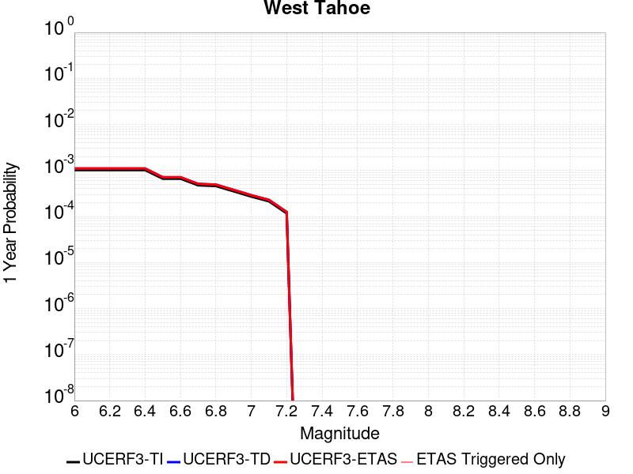 |  |

| Magnitude | 1 wk TI Prob | 1 wk TD Prob | 1 wk ETAS Prob | 1 wk ETAS/TD Gain | 1 wk ETAS Triggered Only | 1 mo TI Prob | 1 mo TD Prob | 1 mo ETAS Prob | 1 mo ETAS/TD Gain | 1 mo ETAS Triggered Only | 1 yr TI Prob | 1 yr TD Prob | 1 yr ETAS Prob | 1 yr ETAS/TD Gain | 1 yr ETAS Triggered Only | 10 yr TI Prob | 10 yr TD Prob | 10 yr ETAS Prob | 10 yr ETAS/TD Gain | 10 yr ETAS Triggered Only |
|-----|-----|-----|-----|-----|-----|-----|-----|-----|-----|-----|-----|-----|-----|-----|-----|-----|-----|-----|-----|-----|
| 6.0 | 1.952444E-5 | 2.118317E-5 | 2.118317E-5 | 1.0 | 0.0 | 8.367348E-5 | 9.078217E-5 | 9.078217E-5 | 1.0 | 0.0 | 0.0010182485 | 0.0011047672 | 0.0011047672 | 1.0 | 0.0 | 0.010135954 | 0.010998235 | 0.011008126 | 1.0008992 | 1.0E-5 |
| 6.1 | 1.952444E-5 | 2.118317E-5 | 2.118317E-5 | 1.0 | 0.0 | 8.367348E-5 | 9.078217E-5 | 9.078217E-5 | 1.0 | 0.0 | 0.0010182485 | 0.0011047672 | 0.0011047672 | 1.0 | 0.0 | 0.010135954 | 0.010998235 | 0.011008126 | 1.0008992 | 1.0E-5 |
| 6.2 | 1.952444E-5 | 2.118317E-5 | 2.118317E-5 | 1.0 | 0.0 | 8.367348E-5 | 9.078217E-5 | 9.078217E-5 | 1.0 | 0.0 | 0.0010182485 | 0.0011047672 | 0.0011047672 | 1.0 | 0.0 | 0.010135954 | 0.010998235 | 0.011008126 | 1.0008992 | 1.0E-5 |
| 6.3 | 1.952444E-5 | 2.118317E-5 | 2.118317E-5 | 1.0 | 0.0 | 8.367348E-5 | 9.078217E-5 | 9.078217E-5 | 1.0 | 0.0 | 0.0010182485 | 0.0011047672 | 0.0011047672 | 1.0 | 0.0 | 0.010135954 | 0.010998235 | 0.011008126 | 1.0008992 | 1.0E-5 |
| 6.4 | 1.952444E-5 | 2.118317E-5 | 2.118317E-5 | 1.0 | 0.0 | 8.367348E-5 | 9.078217E-5 | 9.078217E-5 | 1.0 | 0.0 | 0.0010182485 | 0.0011047672 | 0.0011047672 | 1.0 | 0.0 | 0.010135954 | 0.010998235 | 0.011008126 | 1.0008992 | 1.0E-5 |
| 6.5 | 1.2685271E-5 | 1.3690627E-5 | 1.3690627E-5 | 1.0 | 0.0 | 5.4364315E-5 | 5.8672893E-5 | 5.8672893E-5 | 1.0 | 0.0 | 6.616845E-4 | 7.141248E-4 | 7.141248E-4 | 1.0 | 0.0 | 0.0065971776 | 0.00711995 | 0.0071298787 | 1.0013945 | 1.0E-5 |
| 6.6 | 1.2685271E-5 | 1.3690627E-5 | 1.3690627E-5 | 1.0 | 0.0 | 5.4364315E-5 | 5.8672893E-5 | 5.8672893E-5 | 1.0 | 0.0 | 6.616845E-4 | 7.141248E-4 | 7.141248E-4 | 1.0 | 0.0 | 0.0065971776 | 0.00711995 | 0.0071298787 | 1.0013945 | 1.0E-5 |
| 6.7 | 9.117886E-6 | 9.809846E-6 | 9.809846E-6 | 1.0 | 0.0 | 3.9076072E-5 | 4.2041564E-5 | 4.2041564E-5 | 1.0 | 0.0 | 4.756473E-4 | 5.11743E-4 | 5.11743E-4 | 1.0 | 0.0 | 0.0047463053 | 0.0051063634 | 0.0051163123 | 1.0019484 | 1.0E-5 |
| 6.8 | 8.786828E-6 | 9.457863E-6 | 9.457863E-6 | 1.0 | 0.0 | 3.7657293E-5 | 4.053311E-5 | 4.053311E-5 | 1.0 | 0.0 | 4.5838108E-4 | 4.933859E-4 | 4.933859E-4 | 1.0 | 0.0 | 0.0045743673 | 0.0049236063 | 0.004933557 | 1.0020211 | 1.0E-5 |
| 6.9 | 6.7562123E-6 | 7.2638086E-6 | 7.2638086E-6 | 1.0 | 0.0 | 2.8954875E-5 | 3.1130265E-5 | 3.1130265E-5 | 1.0 | 0.0 | 3.5246857E-4 | 3.789498E-4 | 3.789498E-4 | 1.0 | 0.0 | 0.0035191004 | 0.0037835082 | 0.0037934703 | 1.0026331 | 1.0E-5 |
| 7.0 | 5.1792854E-6 | 5.567338E-6 | 5.567338E-6 | 1.0 | 0.0 | 2.2196748E-5 | 2.3859824E-5 | 2.3859824E-5 | 1.0 | 0.0 | 2.702119E-4 | 2.9045844E-4 | 2.9045844E-4 | 1.0 | 0.0 | 0.0026988357 | 0.0029011632 | 0.0029011632 | 1.0 | 0.0 |
| 7.1 | 4.090765E-6 | 4.3974223E-6 | 4.3974223E-6 | 1.0 | 0.0 | 1.7531731E-5 | 1.884598E-5 | 1.884598E-5 | 1.0 | 0.0 | 2.134279E-4 | 2.2942905E-4 | 2.2942905E-4 | 1.0 | 0.0 | 0.0021322304 | 0.0022922563 | 0.0022922563 | 1.0 | 0.0 |
| 7.2 | 2.2356758E-6 | 2.4023684E-6 | 2.4023684E-6 | 1.0 | 0.0 | 9.581432E-6 | 1.0295834E-5 | 1.0295834E-5 | 1.0 | 0.0 | 1.1664769E-4 | 1.2534647E-4 | 1.2534647E-4 | 1.0 | 0.0 | 0.0011658648 | 0.0012529434 | 0.0012529434 | 1.0 | 0.0 |

## Laguna Salada
*[(top)](#table-of-contents)*

| 1 Week | 1 Month | 1 Year | 10 Year |
|-----|-----|-----|-----|
|  | 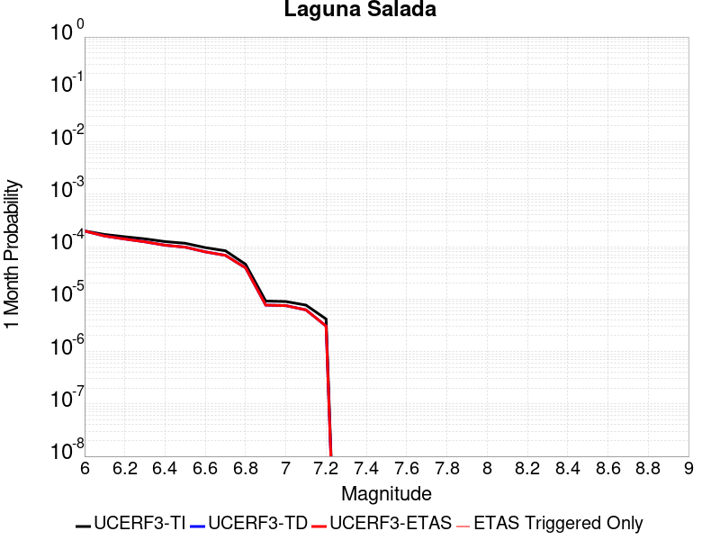 |  |  |

| Magnitude | 1 wk TI Prob | 1 wk TD Prob | 1 wk ETAS Prob | 1 wk ETAS/TD Gain | 1 wk ETAS Triggered Only | 1 mo TI Prob | 1 mo TD Prob | 1 mo ETAS Prob | 1 mo ETAS/TD Gain | 1 mo ETAS Triggered Only | 1 yr TI Prob | 1 yr TD Prob | 1 yr ETAS Prob | 1 yr ETAS/TD Gain | 1 yr ETAS Triggered Only | 10 yr TI Prob | 10 yr TD Prob | 10 yr ETAS Prob | 10 yr ETAS/TD Gain | 10 yr ETAS Triggered Only |
|-----|-----|-----|-----|-----|-----|-----|-----|-----|-----|-----|-----|-----|-----|-----|-----|-----|-----|-----|-----|-----|
| 6.0 | 4.6465593E-5 | 4.634507E-5 | 4.634507E-5 | 1.0 | 0.0 | 1.9912305E-4 | 1.9860751E-4 | 1.9860751E-4 | 1.0 | 0.0 | 0.0024216278 | 0.0024154421 | 0.0024154421 | 1.0 | 0.0 | 0.02395408 | 0.023965387 | 0.023975147 | 1.0004072 | 1.0E-5 |
| 6.1 | 3.982297E-5 | 3.7244878E-5 | 3.7244878E-5 | 1.0 | 0.0 | 1.706587E-4 | 1.5961178E-4 | 1.5961178E-4 | 1.0 | 0.0 | 0.0020757897 | 0.0019416384 | 0.0019416384 | 1.0 | 0.0 | 0.020565065 | 0.019322045 | 0.019322045 | 1.0 | 0.0 |
| 6.2 | 3.6067784E-5 | 3.2600165E-5 | 3.2600165E-5 | 1.0 | 0.0 | 1.5456705E-4 | 1.3970808E-4 | 1.3970808E-4 | 1.0 | 0.0 | 0.0018802295 | 0.0016997134 | 0.0016997134 | 1.0 | 0.0 | 0.018644003 | 0.016963193 | 0.016963193 | 1.0 | 0.0 |
| 6.3 | 3.2859112E-5 | 2.8847233E-5 | 2.8847233E-5 | 1.0 | 0.0 | 1.4081717E-4 | 1.2362566E-4 | 1.2362566E-4 | 1.0 | 0.0 | 0.0017131006 | 0.0015041964 | 0.0015041964 | 1.0 | 0.0 | 0.016999546 | 0.015031838 | 0.015031838 | 1.0 | 0.0 |
| 6.4 | 2.9132116E-5 | 2.4851877E-5 | 2.4851877E-5 | 1.0 | 0.0 | 1.2484594E-4 | 1.0650421E-4 | 1.0650421E-4 | 1.0 | 0.0 | 0.0015189396 | 0.001296006 | 0.001296006 | 1.0 | 0.0 | 0.015085992 | 0.012965128 | 0.012965128 | 1.0 | 0.0 |
| 6.5 | 2.7075037E-5 | 2.2824677E-5 | 2.2824677E-5 | 1.0 | 0.0 | 1.1603071E-4 | 9.7816875E-5 | 9.7816875E-5 | 1.0 | 0.0 | 0.0014117584 | 0.0011903581 | 0.0011903581 | 1.0 | 0.0 | 0.014028233 | 0.011916272 | 0.011916272 | 1.0 | 0.0 |
| 6.6 | 2.2367465E-5 | 1.8572848E-5 | 1.8572848E-5 | 1.0 | 0.0 | 9.5857045E-5 | 7.959595E-5 | 7.959595E-5 | 1.0 | 0.0 | 0.0011664346 | 9.687322E-4 | 9.687322E-4 | 1.0 | 0.0 | 0.011603311 | 0.009708806 | 0.009708806 | 1.0 | 0.0 |
| 6.7 | 1.9458053E-5 | 1.5913607E-5 | 1.5913607E-5 | 1.0 | 0.0 | 8.338899E-5 | 6.819984E-5 | 6.819984E-5 | 1.0 | 0.0 | 0.001014788 | 8.300971E-4 | 8.300971E-4 | 1.0 | 0.0 | 0.010101665 | 0.008315945 | 0.008315945 | 1.0 | 0.0 |
| 6.8 | 1.0767866E-5 | 9.183346E-6 | 9.183346E-6 | 1.0 | 0.0 | 4.614718E-5 | 3.9356994E-5 | 3.9356994E-5 | 1.0 | 0.0 | 5.6169706E-4 | 4.7913467E-4 | 4.7913467E-4 | 1.0 | 0.0 | 0.0056027942 | 0.0048085325 | 0.0048085325 | 1.0 | 0.0 |
| 6.9 | 2.1384765E-6 | 1.7913964E-6 | 1.7913964E-6 | 1.0 | 0.0 | 9.164866E-6 | 7.677392E-6 | 7.677392E-6 | 1.0 | 0.0 | 1.1157654E-4 | 9.346863E-5 | 9.346863E-5 | 1.0 | 0.0 | 0.0011152053 | 9.343315E-4 | 9.343315E-4 | 1.0 | 0.0 |
| 7.0 | 2.0952946E-6 | 1.7493335E-6 | 1.7493335E-6 | 1.0 | 0.0 | 8.979802E-6 | 7.497124E-6 | 7.497124E-6 | 1.0 | 0.0 | 1.0932361E-4 | 9.127405E-5 | 9.127405E-5 | 1.0 | 0.0 | 0.0010926984 | 9.124038E-4 | 9.124038E-4 | 1.0 | 0.0 |
| 7.1 | 1.7887576E-6 | 1.4500541E-6 | 1.4500541E-6 | 1.0 | 0.0 | 7.666081E-6 | 6.2145045E-6 | 6.2145045E-6 | 1.0 | 0.0 | 9.333054E-5 | 7.565928E-5 | 7.565928E-5 | 1.0 | 0.0 | 9.329135E-4 | 7.5636554E-4 | 7.5636554E-4 | 1.0 | 0.0 |
| 7.2 | 9.723109E-7 | 7.135829E-7 | 7.135829E-7 | 1.0 | 0.0 | 4.16704E-6 | 3.0582096E-6 | 3.0582096E-6 | 1.0 | 0.0 | 5.073253E-5 | 3.7233232E-5 | 3.7233232E-5 | 1.0 | 0.0 | 5.072095E-4 | 3.722862E-4 | 3.722862E-4 | 1.0 | 0.0 |

## Hartley Springs 2011 CFM
*[(top)](#table-of-contents)*

| 1 Week | 1 Month | 1 Year | 10 Year |
|-----|-----|-----|-----|
|  |  |  | 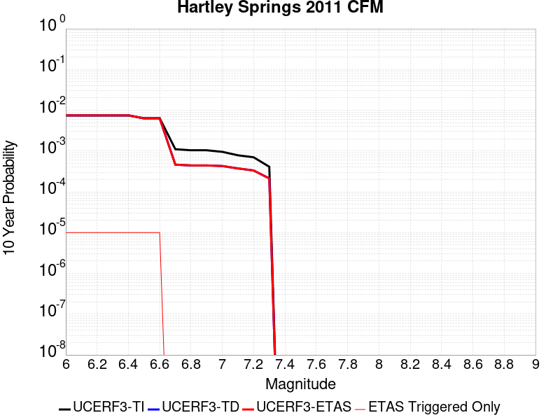 |

| Magnitude | 1 wk TI Prob | 1 wk TD Prob | 1 wk ETAS Prob | 1 wk ETAS/TD Gain | 1 wk ETAS Triggered Only | 1 mo TI Prob | 1 mo TD Prob | 1 mo ETAS Prob | 1 mo ETAS/TD Gain | 1 mo ETAS Triggered Only | 1 yr TI Prob | 1 yr TD Prob | 1 yr ETAS Prob | 1 yr ETAS/TD Gain | 1 yr ETAS Triggered Only | 10 yr TI Prob | 10 yr TD Prob | 10 yr ETAS Prob | 10 yr ETAS/TD Gain | 10 yr ETAS Triggered Only |
|-----|-----|-----|-----|-----|-----|-----|-----|-----|-----|-----|-----|-----|-----|-----|-----|-----|-----|-----|-----|-----|
| 6.0 | 1.4352418E-5 | 1.4434111E-5 | 2.4433966E-5 | 1.6927933 | 1.0E-5 | 6.1508916E-5 | 6.185994E-5 | 7.185932E-5 | 1.1616455 | 1.0E-5 | 7.486137E-4 | 7.5304887E-4 | 7.630413E-4 | 1.0132693 | 1.0E-5 | 0.007460968 | 0.007521092 | 0.0075310166 | 1.0013196 | 1.0E-5 |
| 6.1 | 1.4352418E-5 | 1.4434111E-5 | 2.4433966E-5 | 1.6927933 | 1.0E-5 | 6.1508916E-5 | 6.185994E-5 | 7.185932E-5 | 1.1616455 | 1.0E-5 | 7.486137E-4 | 7.5304887E-4 | 7.630413E-4 | 1.0132693 | 1.0E-5 | 0.007460968 | 0.007521092 | 0.0075310166 | 1.0013196 | 1.0E-5 |
| 6.2 | 1.4352418E-5 | 1.4434111E-5 | 2.4433966E-5 | 1.6927933 | 1.0E-5 | 6.1508916E-5 | 6.185994E-5 | 7.185932E-5 | 1.1616455 | 1.0E-5 | 7.486137E-4 | 7.5304887E-4 | 7.630413E-4 | 1.0132693 | 1.0E-5 | 0.007460968 | 0.007521092 | 0.0075310166 | 1.0013196 | 1.0E-5 |
| 6.3 | 1.4352418E-5 | 1.4434111E-5 | 2.4433966E-5 | 1.6927933 | 1.0E-5 | 6.1508916E-5 | 6.185994E-5 | 7.185932E-5 | 1.1616455 | 1.0E-5 | 7.486137E-4 | 7.5304887E-4 | 7.630413E-4 | 1.0132693 | 1.0E-5 | 0.007460968 | 0.007521092 | 0.0075310166 | 1.0013196 | 1.0E-5 |
| 6.4 | 1.4352418E-5 | 1.4434111E-5 | 2.4433966E-5 | 1.6927933 | 1.0E-5 | 6.1508916E-5 | 6.185994E-5 | 7.185932E-5 | 1.1616455 | 1.0E-5 | 7.486137E-4 | 7.5304887E-4 | 7.630413E-4 | 1.0132693 | 1.0E-5 | 0.007460968 | 0.007521092 | 0.0075310166 | 1.0013196 | 1.0E-5 |
| 6.5 | 1.2279858E-5 | 1.2133036E-5 | 2.2132914E-5 | 1.8241861 | 1.0E-5 | 5.26269E-5 | 5.199858E-5 | 6.199806E-5 | 1.192303 | 1.0E-5 | 6.4054417E-4 | 6.33057E-4 | 6.4305065E-4 | 1.0157864 | 1.0E-5 | 0.0063870098 | 0.006328048 | 0.006337985 | 1.0015702 | 1.0E-5 |
| 6.6 | 1.2279858E-5 | 1.2133036E-5 | 2.2132914E-5 | 1.8241861 | 1.0E-5 | 5.26269E-5 | 5.199858E-5 | 6.199806E-5 | 1.192303 | 1.0E-5 | 6.4054417E-4 | 6.33057E-4 | 6.4305065E-4 | 1.0157864 | 1.0E-5 | 0.0063870098 | 0.006328048 | 0.006337985 | 1.0015702 | 1.0E-5 |
| 6.7 | 2.1282601E-6 | 8.894127E-7 | 8.894127E-7 | 1.0 | 0.0 | 9.121083E-6 | 3.8117648E-6 | 3.8117648E-6 | 1.0 | 0.0 | 1.11043526E-4 | 4.6407506E-5 | 4.6407506E-5 | 1.0 | 0.0 | 0.0011098806 | 4.6400347E-4 | 4.6400347E-4 | 1.0 | 0.0 |
| 6.8 | 2.00516E-6 | 8.516916E-7 | 8.516916E-7 | 1.0 | 0.0 | 8.593515E-6 | 3.6501033E-6 | 3.6501033E-6 | 1.0 | 0.0 | 1.04621024E-4 | 4.443936E-5 | 4.443936E-5 | 1.0 | 0.0 | 0.0010457177 | 4.4432987E-4 | 4.4432987E-4 | 1.0 | 0.0 |
| 6.9 | 2.00516E-6 | 8.516916E-7 | 8.516916E-7 | 1.0 | 0.0 | 8.593515E-6 | 3.6501033E-6 | 3.6501033E-6 | 1.0 | 0.0 | 1.04621024E-4 | 4.443936E-5 | 4.443936E-5 | 1.0 | 0.0 | 0.0010457177 | 4.4432987E-4 | 4.4432987E-4 | 1.0 | 0.0 |
| 7.0 | 1.8366732E-6 | 8.2366813E-7 | 8.2366813E-7 | 1.0 | 0.0 | 7.871433E-6 | 3.5300031E-6 | 3.5300031E-6 | 1.0 | 0.0 | 9.583048E-5 | 4.2977194E-5 | 4.2977194E-5 | 1.0 | 0.0 | 9.5789164E-4 | 4.297139E-4 | 4.297139E-4 | 1.0 | 0.0 |
| 7.1 | 1.5097997E-6 | 7.1897E-7 | 7.1897E-7 | 1.0 | 0.0 | 6.470554E-6 | 3.0812978E-6 | 3.0812978E-6 | 1.0 | 0.0 | 7.877615E-5 | 3.7514397E-5 | 3.7514397E-5 | 1.0 | 0.0 | 7.874823E-4 | 3.7510434E-4 | 3.7510434E-4 | 1.0 | 0.0 |
| 7.2 | 1.3490993E-6 | 6.404769E-7 | 6.404769E-7 | 1.0 | 0.0 | 5.7818415E-6 | 2.7448996E-6 | 2.7448996E-6 | 1.0 | 0.0 | 7.0391645E-5 | 3.3418873E-5 | 3.3418873E-5 | 1.0 | 0.0 | 7.0369354E-4 | 3.3416142E-4 | 3.3416142E-4 | 1.0 | 0.0 |
| 7.3 | 7.900015E-7 | 4.0888176E-7 | 4.0888176E-7 | 1.0 | 0.0 | 3.3857161E-6 | 1.7523504E-6 | 1.7523504E-6 | 1.0 | 0.0 | 4.1220315E-5 | 2.1334865E-5 | 2.1334865E-5 | 1.0 | 0.0 | 4.121267E-4 | 2.1334866E-4 | 2.1334866E-4 | 1.0 | 0.0 |

## Los Osos 2011
*[(top)](#table-of-contents)*

| 1 Week | 1 Month | 1 Year | 10 Year |
|-----|-----|-----|-----|
|  |  |  | 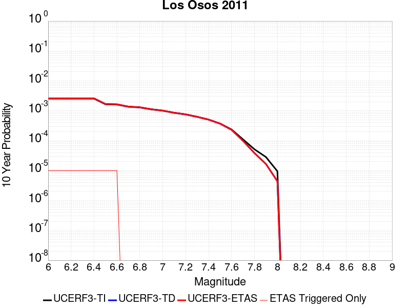 |

| Magnitude | 1 wk TI Prob | 1 wk TD Prob | 1 wk ETAS Prob | 1 wk ETAS/TD Gain | 1 wk ETAS Triggered Only | 1 mo TI Prob | 1 mo TD Prob | 1 mo ETAS Prob | 1 mo ETAS/TD Gain | 1 mo ETAS Triggered Only | 1 yr TI Prob | 1 yr TD Prob | 1 yr ETAS Prob | 1 yr ETAS/TD Gain | 1 yr ETAS Triggered Only | 10 yr TI Prob | 10 yr TD Prob | 10 yr ETAS Prob | 10 yr ETAS/TD Gain | 10 yr ETAS Triggered Only |
|-----|-----|-----|-----|-----|-----|-----|-----|-----|-----|-----|-----|-----|-----|-----|-----|-----|-----|-----|-----|-----|
| 6.0 | 4.8871775E-6 | 4.9814826E-6 | 4.9814826E-6 | 1.0 | 0.0 | 2.0944879E-5 | 2.1349053E-5 | 2.1349053E-5 | 1.0 | 0.0 | 2.5497406E-4 | 2.598965E-4 | 2.598965E-4 | 1.0 | 0.0 | 0.002546817 | 0.0025962 | 0.002606174 | 1.0038418 | 1.0E-5 |
| 6.1 | 4.8871775E-6 | 4.9814826E-6 | 4.9814826E-6 | 1.0 | 0.0 | 2.0944879E-5 | 2.1349053E-5 | 2.1349053E-5 | 1.0 | 0.0 | 2.5497406E-4 | 2.598965E-4 | 2.598965E-4 | 1.0 | 0.0 | 0.002546817 | 0.0025962 | 0.002606174 | 1.0038418 | 1.0E-5 |
| 6.2 | 4.8871775E-6 | 4.9814826E-6 | 4.9814826E-6 | 1.0 | 0.0 | 2.0944879E-5 | 2.1349053E-5 | 2.1349053E-5 | 1.0 | 0.0 | 2.5497406E-4 | 2.598965E-4 | 2.598965E-4 | 1.0 | 0.0 | 0.002546817 | 0.0025962 | 0.002606174 | 1.0038418 | 1.0E-5 |
| 6.3 | 4.8871775E-6 | 4.9814826E-6 | 4.9814826E-6 | 1.0 | 0.0 | 2.0944879E-5 | 2.1349053E-5 | 2.1349053E-5 | 1.0 | 0.0 | 2.5497406E-4 | 2.598965E-4 | 2.598965E-4 | 1.0 | 0.0 | 0.002546817 | 0.0025962 | 0.002606174 | 1.0038418 | 1.0E-5 |
| 6.4 | 4.8871775E-6 | 4.9814826E-6 | 4.9814826E-6 | 1.0 | 0.0 | 2.0944879E-5 | 2.1349053E-5 | 2.1349053E-5 | 1.0 | 0.0 | 2.5497406E-4 | 2.598965E-4 | 2.598965E-4 | 1.0 | 0.0 | 0.002546817 | 0.0025962 | 0.002606174 | 1.0038418 | 1.0E-5 |
| 6.5 | 3.1724062E-6 | 3.2233943E-6 | 3.2233943E-6 | 1.0 | 0.0 | 1.3595956E-5 | 1.3814474E-5 | 1.3814474E-5 | 1.0 | 0.0 | 1.6551818E-4 | 1.6817838E-4 | 1.6817838E-4 | 1.0 | 0.0 | 0.0016539496 | 0.0016805246 | 0.0016905078 | 1.0059406 | 1.0E-5 |
| 6.6 | 3.1022591E-6 | 3.1511038E-6 | 3.1511038E-6 | 1.0 | 0.0 | 1.3295328E-5 | 1.3504661E-5 | 1.3504661E-5 | 1.0 | 0.0 | 1.618586E-4 | 1.6440697E-4 | 1.6440697E-4 | 1.0 | 0.0 | 0.0016174077 | 0.0016428662 | 0.0016528498 | 1.0060769 | 1.0E-5 |
| 6.7 | 2.611518E-6 | 2.6491825E-6 | 2.6491825E-6 | 1.0 | 0.0 | 1.1192172E-5 | 1.1353591E-5 | 1.1353591E-5 | 1.0 | 0.0 | 1.3625617E-4 | 1.3822124E-4 | 1.3822124E-4 | 1.0 | 0.0 | 0.0013617266 | 0.0013813572 | 0.0013813572 | 1.0 | 0.0 |
| 6.8 | 2.4780884E-6 | 2.5121587E-6 | 2.5121587E-6 | 1.0 | 0.0 | 1.0620336E-5 | 1.076635E-5 | 1.076635E-5 | 1.0 | 0.0 | 1.2929492E-4 | 1.3107246E-4 | 1.3107246E-4 | 1.0 | 0.0 | 0.0012921972 | 0.0013099556 | 0.0013099556 | 1.0 | 0.0 |
| 6.9 | 2.1376322E-6 | 2.1635049E-6 | 2.1635049E-6 | 1.0 | 0.0 | 9.161248E-6 | 9.272131E-6 | 9.272131E-6 | 1.0 | 0.0 | 1.1153249E-4 | 1.1288237E-4 | 1.1288237E-4 | 1.0 | 0.0 | 0.0011147653 | 0.0011282521 | 0.0011282521 | 1.0 | 0.0 |
| 7.0 | 1.9282882E-6 | 1.949458E-6 | 1.949458E-6 | 1.0 | 0.0 | 8.264066E-6 | 8.354793E-6 | 8.354793E-6 | 1.0 | 0.0 | 1.0061036E-4 | 1.0171487E-4 | 1.0171487E-4 | 1.0 | 0.0 | 0.0010056482 | 0.0010166845 | 0.0010166845 | 1.0 | 0.0 |
| 7.1 | 1.6353226E-6 | 1.6501111E-6 | 1.6501111E-6 | 1.0 | 0.0 | 7.0085066E-6 | 7.0718856E-6 | 7.0718856E-6 | 1.0 | 0.0 | 8.532523E-5 | 8.6096814E-5 | 8.6096814E-5 | 1.0 | 0.0 | 8.529247E-4 | 8.6063537E-4 | 8.6063537E-4 | 1.0 | 0.0 |
| 7.2 | 1.4446276E-6 | 1.4553335E-6 | 1.4553335E-6 | 1.0 | 0.0 | 6.191247E-6 | 6.2371287E-6 | 6.2371287E-6 | 1.0 | 0.0 | 7.537582E-5 | 7.59344E-5 | 7.59344E-5 | 1.0 | 0.0 | 7.535026E-4 | 7.590851E-4 | 7.590851E-4 | 1.0 | 0.0 |
| 7.3 | 1.2014582E-6 | 1.2069066E-6 | 1.2069066E-6 | 1.0 | 0.0 | 5.149096E-6 | 5.172447E-6 | 5.172447E-6 | 1.0 | 0.0 | 6.268844E-5 | 6.297272E-5 | 6.297272E-5 | 1.0 | 0.0 | 6.267076E-4 | 6.295492E-4 | 6.295492E-4 | 1.0 | 0.0 |
| 7.4 | 9.707733E-7 | 9.709767E-7 | 9.709767E-7 | 1.0 | 0.0 | 4.16045E-6 | 4.161322E-6 | 4.161322E-6 | 1.0 | 0.0 | 5.0652303E-5 | 5.066292E-5 | 5.066292E-5 | 1.0 | 0.0 | 5.064076E-4 | 5.065139E-4 | 5.065139E-4 | 1.0 | 0.0 |
| 7.5 | 7.174908E-7 | 7.114907E-7 | 7.114907E-7 | 1.0 | 0.0 | 3.074957E-6 | 3.0492424E-6 | 3.0492424E-6 | 1.0 | 0.0 | 3.743696E-5 | 3.7123897E-5 | 3.7123897E-5 | 1.0 | 0.0 | 3.7430652E-4 | 3.7117713E-4 | 3.7117713E-4 | 1.0 | 0.0 |
| 7.6 | 4.5535776E-7 | 4.4207857E-7 | 4.4207857E-7 | 1.0 | 0.0 | 1.9515319E-6 | 1.8946212E-6 | 1.8946212E-6 | 1.0 | 0.0 | 2.3759641E-5 | 2.3066768E-5 | 2.3066768E-5 | 1.0 | 0.0 | 2.37571E-4 | 2.3064384E-4 | 2.3064384E-4 | 1.0 | 0.0 |
| 7.7 | 2.1173553E-7 | 1.9060734E-7 | 1.9060734E-7 | 1.0 | 0.0 | 9.0743765E-7 | 8.1688836E-7 | 8.1688836E-7 | 1.0 | 0.0 | 1.1047998E-5 | 9.94557E-6 | 9.94557E-6 | 1.0 | 0.0 | 1.1047449E-4 | 9.945128E-5 | 9.945128E-5 | 1.0 | 0.0 |
| 7.8 | 9.873608E-8 | 7.367457E-8 | 7.367457E-8 | 1.0 | 0.0 | 4.2315455E-7 | 3.1574814E-7 | 3.1574814E-7 | 1.0 | 0.0 | 5.1518946E-6 | 3.8442267E-6 | 3.8442267E-6 | 1.0 | 0.0 | 5.1517753E-5 | 3.844161E-5 | 3.844161E-5 | 1.0 | 0.0 |
| 7.9 | 5.4399106E-8 | 3.187941E-8 | 3.187941E-8 | 1.0 | 0.0 | 2.33139E-7 | 1.3662603E-7 | 1.3662603E-7 | 1.0 | 0.0 | 2.8384638E-6 | 1.6634207E-6 | 1.6634207E-6 | 1.0 | 0.0 | 2.8384275E-5 | 1.6634083E-5 | 1.6634083E-5 | 1.0 | 0.0 |
| 8.0 | 1.817203E-8 | 8.420079E-9 | 8.420079E-9 | 1.0 | 0.0 | 7.7880124E-8 | 3.6086053E-8 | 3.6086053E-8 | 1.0 | 0.0 | 9.481901E-7 | 4.393476E-7 | 4.393476E-7 | 1.0 | 0.0 | 9.481861E-6 | 4.393468E-6 | 4.393468E-6 | 1.0 | 0.0 |

## Northridge
*[(top)](#table-of-contents)*

| 1 Week | 1 Month | 1 Year | 10 Year |
|-----|-----|-----|-----|
|  |  |  | 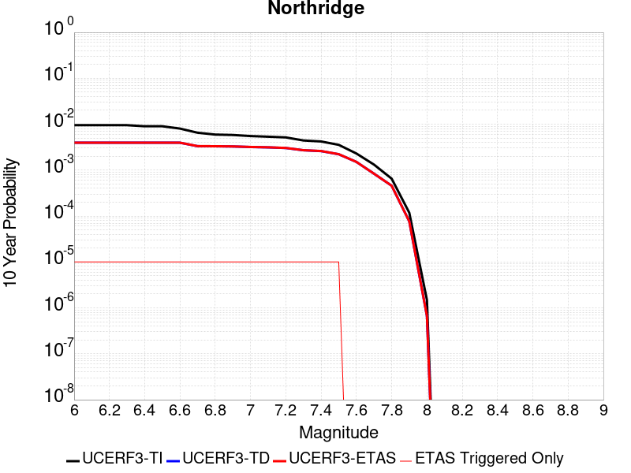 |

| Magnitude | 1 wk TI Prob | 1 wk TD Prob | 1 wk ETAS Prob | 1 wk ETAS/TD Gain | 1 wk ETAS Triggered Only | 1 mo TI Prob | 1 mo TD Prob | 1 mo ETAS Prob | 1 mo ETAS/TD Gain | 1 mo ETAS Triggered Only | 1 yr TI Prob | 1 yr TD Prob | 1 yr ETAS Prob | 1 yr ETAS/TD Gain | 1 yr ETAS Triggered Only | 10 yr TI Prob | 10 yr TD Prob | 10 yr ETAS Prob | 10 yr ETAS/TD Gain | 10 yr ETAS Triggered Only |
|-----|-----|-----|-----|-----|-----|-----|-----|-----|-----|-----|-----|-----|-----|-----|-----|-----|-----|-----|-----|-----|
| 6.0 | 1.8340852E-5 | 7.5878907E-6 | 7.5878907E-6 | 1.0 | 0.0 | 7.860128E-5 | 3.251914E-5 | 3.251914E-5 | 1.0 | 0.0 | 9.565505E-4 | 3.9585077E-4 | 3.9585077E-4 | 1.0 | 0.0 | 0.009524435 | 0.0039516874 | 0.003961648 | 1.0025206 | 1.0E-5 |
| 6.1 | 1.8340852E-5 | 7.5878907E-6 | 7.5878907E-6 | 1.0 | 0.0 | 7.860128E-5 | 3.251914E-5 | 3.251914E-5 | 1.0 | 0.0 | 9.565505E-4 | 3.9585077E-4 | 3.9585077E-4 | 1.0 | 0.0 | 0.009524435 | 0.0039516874 | 0.003961648 | 1.0025206 | 1.0E-5 |
| 6.2 | 1.8340852E-5 | 7.5878907E-6 | 7.5878907E-6 | 1.0 | 0.0 | 7.860128E-5 | 3.251914E-5 | 3.251914E-5 | 1.0 | 0.0 | 9.565505E-4 | 3.9585077E-4 | 3.9585077E-4 | 1.0 | 0.0 | 0.009524435 | 0.0039516874 | 0.003961648 | 1.0025206 | 1.0E-5 |
| 6.3 | 1.8340852E-5 | 7.5878907E-6 | 7.5878907E-6 | 1.0 | 0.0 | 7.860128E-5 | 3.251914E-5 | 3.251914E-5 | 1.0 | 0.0 | 9.565505E-4 | 3.9585077E-4 | 3.9585077E-4 | 1.0 | 0.0 | 0.009524435 | 0.0039516874 | 0.003961648 | 1.0025206 | 1.0E-5 |
| 6.4 | 1.7361892E-5 | 7.5878907E-6 | 7.5878907E-6 | 1.0 | 0.0 | 7.440598E-5 | 3.251914E-5 | 3.251914E-5 | 1.0 | 0.0 | 9.055163E-4 | 3.9585077E-4 | 3.9585077E-4 | 1.0 | 0.0 | 0.009018354 | 0.0039516874 | 0.003961648 | 1.0025206 | 1.0E-5 |
| 6.5 | 1.7361892E-5 | 7.5878907E-6 | 7.5878907E-6 | 1.0 | 0.0 | 7.440598E-5 | 3.251914E-5 | 3.251914E-5 | 1.0 | 0.0 | 9.055163E-4 | 3.9585077E-4 | 3.9585077E-4 | 1.0 | 0.0 | 0.009018354 | 0.0039516874 | 0.003961648 | 1.0025206 | 1.0E-5 |
| 6.6 | 1.5458201E-5 | 7.5878907E-6 | 7.5878907E-6 | 1.0 | 0.0 | 6.624775E-5 | 3.251914E-5 | 3.251914E-5 | 1.0 | 0.0 | 8.0626784E-4 | 3.9585077E-4 | 3.9585077E-4 | 1.0 | 0.0 | 0.008033488 | 0.0039516874 | 0.003961648 | 1.0025206 | 1.0E-5 |
| 6.7 | 1.2538368E-5 | 6.381497E-6 | 6.381497E-6 | 1.0 | 0.0 | 5.3734755E-5 | 2.7348988E-5 | 2.7348988E-5 | 1.0 | 0.0 | 6.5402425E-4 | 3.329235E-4 | 3.329235E-4 | 1.0 | 0.0 | 0.0065210275 | 0.0033243035 | 0.0033342703 | 1.0029981 | 1.0E-5 |
| 6.8 | 1.1438097E-5 | 6.350156E-6 | 6.350156E-6 | 1.0 | 0.0 | 4.9019498E-5 | 2.7214674E-5 | 2.7214674E-5 | 1.0 | 0.0 | 5.9664896E-4 | 3.3128873E-4 | 3.3128873E-4 | 1.0 | 0.0 | 0.005950495 | 0.0033080047 | 0.0033179715 | 1.003013 | 1.0E-5 |
| 6.9 | 1.1204891E-5 | 6.2866116E-6 | 6.2866116E-6 | 1.0 | 0.0 | 4.8020076E-5 | 2.6942345E-5 | 2.6942345E-5 | 1.0 | 0.0 | 5.8448757E-4 | 3.2797412E-4 | 3.2797412E-4 | 1.0 | 0.0 | 0.0058295266 | 0.0032749567 | 0.003284924 | 1.0030435 | 1.0E-5 |
| 7.0 | 1.061046E-5 | 6.1152687E-6 | 6.1152687E-6 | 1.0 | 0.0 | 4.5472607E-5 | 2.6208034E-5 | 2.6208034E-5 | 1.0 | 0.0 | 5.534883E-4 | 3.190365E-4 | 3.190365E-4 | 1.0 | 0.0 | 0.0055211177 | 0.0031858315 | 0.0031957994 | 1.0031289 | 1.0E-5 |
| 7.1 | 1.0266979E-5 | 6.0041907E-6 | 6.0041907E-6 | 1.0 | 0.0 | 4.40006E-5 | 2.5731995E-5 | 2.5731995E-5 | 1.0 | 0.0 | 5.355756E-4 | 3.1324243E-4 | 3.1324243E-4 | 1.0 | 0.0 | 0.0053428668 | 0.0031280548 | 0.0031380234 | 1.0031868 | 1.0E-5 |
| 7.2 | 9.91273E-6 | 5.819906E-6 | 5.819906E-6 | 1.0 | 0.0 | 4.248244E-5 | 2.4942217E-5 | 2.4942217E-5 | 1.0 | 0.0 | 5.171009E-4 | 3.036296E-4 | 3.036296E-4 | 1.0 | 0.0 | 0.0051589934 | 0.0030321924 | 0.0030421622 | 1.0032879 | 1.0E-5 |
| 7.3 | 8.4959265E-6 | 5.1930183E-6 | 5.1930183E-6 | 1.0 | 0.0 | 3.6410605E-5 | 2.2255605E-5 | 2.2255605E-5 | 1.0 | 0.0 | 4.4320893E-4 | 2.7092852E-4 | 2.7092852E-4 | 1.0 | 0.0 | 0.00442326 | 0.0027060085 | 0.0027159813 | 1.0036855 | 1.0E-5 |
| 7.4 | 8.0847185E-6 | 4.9818977E-6 | 4.9818977E-6 | 1.0 | 0.0 | 3.4648332E-5 | 2.1350817E-5 | 2.1350817E-5 | 1.0 | 0.0 | 4.2176177E-4 | 2.5991542E-4 | 2.5991542E-4 | 1.0 | 0.0 | 0.0042096223 | 0.0025961401 | 0.0026061141 | 1.0038419 | 1.0E-5 |
| 7.5 | 6.8220684E-6 | 4.2532647E-6 | 4.2532647E-6 | 1.0 | 0.0 | 2.9237108E-5 | 1.8228153E-5 | 1.8228153E-5 | 1.0 | 0.0 | 3.5590364E-4 | 2.2190536E-4 | 2.2190536E-4 | 1.0 | 0.0 | 0.0035533418 | 0.0022168586 | 0.0022268365 | 1.0045009 | 1.0E-5 |
| 7.6 | 4.4224143E-6 | 2.8999295E-6 | 2.8999295E-6 | 1.0 | 0.0 | 1.8953066E-5 | 1.24282105E-5 | 1.24282105E-5 | 1.0 | 0.0 | 2.3072914E-4 | 1.5130307E-4 | 1.5130307E-4 | 1.0 | 0.0 | 0.0023048974 | 0.0015120122 | 0.0015120122 | 1.0 | 0.0 |
| 7.7 | 2.5297056E-6 | 1.6045943E-6 | 1.6045943E-6 | 1.0 | 0.0 | 1.0841551E-5 | 6.876815E-6 | 6.876815E-6 | 1.0 | 0.0 | 1.319879E-4 | 8.372205E-5 | 8.372205E-5 | 1.0 | 0.0 | 0.0013190953 | 8.369098E-4 | 8.369098E-4 | 1.0 | 0.0 |
| 7.8 | 1.2508156E-6 | 8.780148E-7 | 8.780148E-7 | 1.0 | 0.0 | 5.3606273E-6 | 3.7629154E-6 | 3.7629154E-6 | 1.0 | 0.0 | 6.526368E-5 | 4.5812543E-5 | 4.5812543E-5 | 1.0 | 0.0 | 6.524452E-4 | 4.580323E-4 | 4.580323E-4 | 1.0 | 0.0 |
| 7.9 | 2.262199E-7 | 1.466491E-7 | 1.466491E-7 | 1.0 | 0.0 | 9.695135E-7 | 6.2849597E-7 | 6.2849597E-7 | 1.0 | 0.0 | 1.1803763E-5 | 7.651913E-6 | 7.651913E-6 | 1.0 | 0.0 | 1.1803136E-4 | 7.651657E-5 | 7.651657E-5 | 1.0 | 0.0 |
| 8.0 | 2.865362E-9 | 1.27525E-9 | 1.27525E-9 | 1.0 | 0.0 | 1.2280123E-8 | 5.465357E-9 | 5.465357E-9 | 1.0 | 0.0 | 1.4951048E-7 | 6.654073E-8 | 6.654073E-8 | 1.0 | 0.0 | 1.4951038E-6 | 6.6540724E-7 | 6.6540724E-7 | 1.0 | 0.0 |

## Morales (East)
*[(top)](#table-of-contents)*

| 1 Week | 1 Month | 1 Year | 10 Year |
|-----|-----|-----|-----|
|  |  |  |  |

| Magnitude | 1 wk TI Prob | 1 wk TD Prob | 1 wk ETAS Prob | 1 wk ETAS/TD Gain | 1 wk ETAS Triggered Only | 1 mo TI Prob | 1 mo TD Prob | 1 mo ETAS Prob | 1 mo ETAS/TD Gain | 1 mo ETAS Triggered Only | 1 yr TI Prob | 1 yr TD Prob | 1 yr ETAS Prob | 1 yr ETAS/TD Gain | 1 yr ETAS Triggered Only | 10 yr TI Prob | 10 yr TD Prob | 10 yr ETAS Prob | 10 yr ETAS/TD Gain | 10 yr ETAS Triggered Only |
|-----|-----|-----|-----|-----|-----|-----|-----|-----|-----|-----|-----|-----|-----|-----|-----|-----|-----|-----|-----|-----|
| 6.0 | 1.4942771E-6 | 2.123544E-6 | 2.123544E-6 | 1.0 | 0.0 | 6.404029E-6 | 9.100874E-6 | 9.100874E-6 | 1.0 | 0.0 | 7.7966266E-5 | 1.1079809E-4 | 1.2079698E-4 | 1.0902443 | 1.0E-5 | 7.793892E-4 | 0.0011074883 | 0.0011174772 | 1.0090195 | 1.0E-5 |
| 6.1 | 1.4942771E-6 | 2.123544E-6 | 2.123544E-6 | 1.0 | 0.0 | 6.404029E-6 | 9.100874E-6 | 9.100874E-6 | 1.0 | 0.0 | 7.7966266E-5 | 1.1079809E-4 | 1.2079698E-4 | 1.0902443 | 1.0E-5 | 7.793892E-4 | 0.0011074883 | 0.0011174772 | 1.0090195 | 1.0E-5 |
| 6.2 | 1.4942771E-6 | 2.123544E-6 | 2.123544E-6 | 1.0 | 0.0 | 6.404029E-6 | 9.100874E-6 | 9.100874E-6 | 1.0 | 0.0 | 7.7966266E-5 | 1.1079809E-4 | 1.2079698E-4 | 1.0902443 | 1.0E-5 | 7.793892E-4 | 0.0011074883 | 0.0011174772 | 1.0090195 | 1.0E-5 |
| 6.3 | 1.4942771E-6 | 2.123544E-6 | 2.123544E-6 | 1.0 | 0.0 | 6.404029E-6 | 9.100874E-6 | 9.100874E-6 | 1.0 | 0.0 | 7.7966266E-5 | 1.1079809E-4 | 1.2079698E-4 | 1.0902443 | 1.0E-5 | 7.793892E-4 | 0.0011074883 | 0.0011174772 | 1.0090195 | 1.0E-5 |
| 6.4 | 8.798845E-7 | 1.5023381E-6 | 1.5023381E-6 | 1.0 | 0.0 | 3.7709283E-6 | 6.4385767E-6 | 6.4385767E-6 | 1.0 | 0.0 | 4.5910085E-5 | 7.838696E-5 | 7.838696E-5 | 1.0 | 0.0 | 4.59006E-4 | 7.836066E-4 | 7.836066E-4 | 1.0 | 0.0 |
| 6.5 | 7.1751725E-7 | 1.3384879E-6 | 1.3384879E-6 | 1.0 | 0.0 | 3.0750705E-6 | 5.7363645E-6 | 5.7363645E-6 | 1.0 | 0.0 | 3.7438338E-5 | 6.9838075E-5 | 6.9838075E-5 | 1.0 | 0.0 | 3.743203E-4 | 6.981715E-4 | 6.981715E-4 | 1.0 | 0.0 |
| 6.6 | 7.1751725E-7 | 1.3384879E-6 | 1.3384879E-6 | 1.0 | 0.0 | 3.0750705E-6 | 5.7363645E-6 | 5.7363645E-6 | 1.0 | 0.0 | 3.7438338E-5 | 6.9838075E-5 | 6.9838075E-5 | 1.0 | 0.0 | 3.743203E-4 | 6.981715E-4 | 6.981715E-4 | 1.0 | 0.0 |
| 6.7 | 7.159057E-7 | 1.3359539E-6 | 1.3359539E-6 | 1.0 | 0.0 | 3.0681638E-6 | 5.7255043E-6 | 5.7255043E-6 | 1.0 | 0.0 | 3.7354253E-5 | 6.9705864E-5 | 6.9705864E-5 | 1.0 | 0.0 | 3.7347974E-4 | 6.968502E-4 | 6.968502E-4 | 1.0 | 0.0 |
| 6.8 | 7.032203E-7 | 1.3175089E-6 | 1.3175089E-6 | 1.0 | 0.0 | 3.0137978E-6 | 5.646455E-6 | 5.646455E-6 | 1.0 | 0.0 | 3.669237E-5 | 6.87435E-5 | 6.87435E-5 | 1.0 | 0.0 | 3.6686313E-4 | 6.872325E-4 | 6.872325E-4 | 1.0 | 0.0 |
| 6.9 | 6.941549E-7 | 1.3025701E-6 | 1.3025701E-6 | 1.0 | 0.0 | 2.974946E-6 | 5.5824316E-6 | 5.5824316E-6 | 1.0 | 0.0 | 3.6219368E-5 | 6.7964065E-5 | 6.7964065E-5 | 1.0 | 0.0 | 3.6213463E-4 | 6.794429E-4 | 6.794429E-4 | 1.0 | 0.0 |
| 7.0 | 6.2932247E-7 | 1.1877994E-6 | 1.1877994E-6 | 1.0 | 0.0 | 2.6970936E-6 | 5.090559E-6 | 5.090559E-6 | 1.0 | 0.0 | 3.283662E-5 | 6.197586E-5 | 6.197586E-5 | 1.0 | 0.0 | 3.283177E-4 | 6.1959465E-4 | 6.1959465E-4 | 1.0 | 0.0 |
| 7.1 | 5.6200963E-7 | 1.064093E-6 | 1.064093E-6 | 1.0 | 0.0 | 2.4086105E-6 | 4.560391E-6 | 4.560391E-6 | 1.0 | 0.0 | 2.9324437E-5 | 5.5521392E-5 | 5.5521392E-5 | 1.0 | 0.0 | 2.9320567E-4 | 5.5508246E-4 | 5.5508246E-4 | 1.0 | 0.0 |
| 7.2 | 4.91044E-7 | 9.2862194E-7 | 9.2862194E-7 | 1.0 | 0.0 | 2.1044725E-6 | 3.9798024E-6 | 3.9798024E-6 | 1.0 | 0.0 | 2.5621652E-5 | 4.8453054E-5 | 4.8453054E-5 | 1.0 | 0.0 | 2.56187E-4 | 4.8443122E-4 | 4.8443122E-4 | 1.0 | 0.0 |
| 7.3 | 4.2978448E-7 | 7.974413E-7 | 7.974413E-7 | 1.0 | 0.0 | 1.8419321E-6 | 3.4176012E-6 | 3.4176012E-6 | 1.0 | 0.0 | 2.2425293E-5 | 4.160853E-5 | 4.160853E-5 | 1.0 | 0.0 | 2.242303E-4 | 4.1601306E-4 | 4.1601306E-4 | 1.0 | 0.0 |
| 7.4 | 3.774317E-7 | 6.807105E-7 | 6.807105E-7 | 1.0 | 0.0 | 1.6175634E-6 | 2.9173275E-6 | 2.9173275E-6 | 1.0 | 0.0 | 1.9693656E-5 | 3.551791E-5 | 3.551791E-5 | 1.0 | 0.0 | 1.969191E-4 | 3.5512767E-4 | 3.5512767E-4 | 1.0 | 0.0 |
| 7.5 | 1.0603232E-7 | 9.8406424E-8 | 9.8406424E-8 | 1.0 | 0.0 | 4.5442414E-7 | 4.2174173E-7 | 4.2174173E-7 | 1.0 | 0.0 | 5.5326E-6 | 5.1346938E-6 | 5.1346938E-6 | 1.0 | 0.0 | 5.532462E-5 | 5.1348336E-5 | 5.1348336E-5 | 1.0 | 0.0 |
| 7.6 | 9.960384E-8 | 8.755028E-8 | 8.755028E-8 | 1.0 | 0.0 | 4.2687353E-7 | 3.7521542E-7 | 3.7521542E-7 | 1.0 | 0.0 | 5.197173E-6 | 4.568238E-6 | 4.568238E-6 | 1.0 | 0.0 | 5.1970514E-5 | 4.5684028E-5 | 4.5684028E-5 | 1.0 | 0.0 |
| 7.7 | 6.499468E-8 | 4.103351E-8 | 4.103351E-8 | 1.0 | 0.0 | 2.785486E-7 | 1.7585788E-7 | 1.7585788E-7 | 1.0 | 0.0 | 3.3913238E-6 | 2.1410676E-6 | 2.1410676E-6 | 1.0 | 0.0 | 3.3912722E-5 | 2.1413045E-5 | 2.1413045E-5 | 1.0 | 0.0 |
| 7.8 | 2.2517119E-8 | 7.1293824E-9 | 7.1293824E-9 | 1.0 | 0.0 | 9.6501935E-8 | 3.0554492E-8 | 3.0554492E-8 | 1.0 | 0.0 | 1.1749105E-6 | 3.720009E-7 | 3.720009E-7 | 1.0 | 0.0 | 1.1749043E-5 | 3.7225666E-6 | 3.7225666E-6 | 1.0 | 0.0 |
| 7.9 | 8.493023E-9 | 9.962774E-10 | 9.962774E-10 | 1.0 | 0.0 | 3.639867E-8 | 4.2697574E-9 | 4.2697574E-9 | 1.0 | 0.0 | 4.4315374E-7 | 5.19843E-8 | 5.19843E-8 | 1.0 | 0.0 | 4.4315284E-6 | 5.2196486E-7 | 5.2196486E-7 | 1.0 | 0.0 |
| 8.0 | 1.4971842E-9 | 5.5340177E-11 | 5.5340177E-11 | 1.0 | 0.0 | 6.4165038E-9 | 2.3717173E-10 | 2.3717173E-10 | 1.0 | 0.0 | 7.812093E-8 | 2.887568E-9 | 2.887568E-9 | 1.0 | 0.0 | 7.81209E-7 | 3.0142694E-8 | 3.0142694E-8 | 1.0 | 0.0 |

## Point Reyes 2011 CFM
*[(top)](#table-of-contents)*

| 1 Week | 1 Month | 1 Year | 10 Year |
|-----|-----|-----|-----|
|  |  |  | 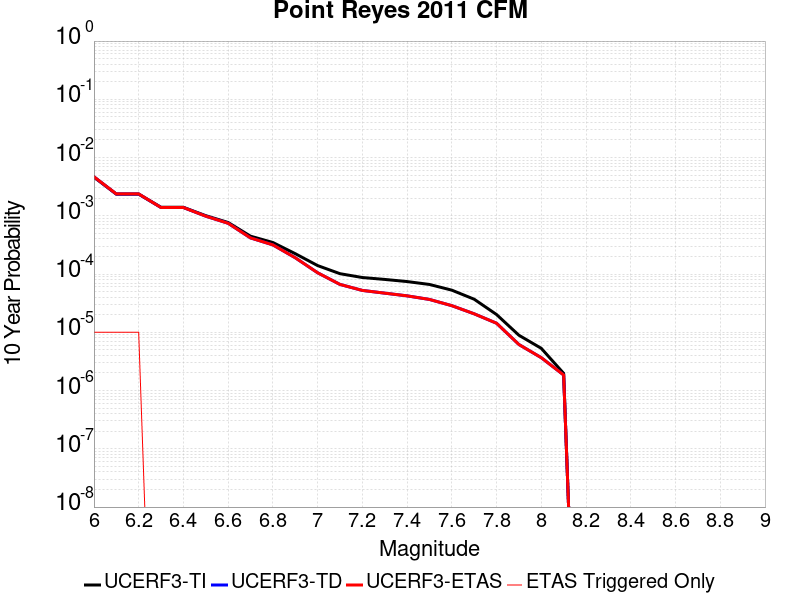 |

| Magnitude | 1 wk TI Prob | 1 wk TD Prob | 1 wk ETAS Prob | 1 wk ETAS/TD Gain | 1 wk ETAS Triggered Only | 1 mo TI Prob | 1 mo TD Prob | 1 mo ETAS Prob | 1 mo ETAS/TD Gain | 1 mo ETAS Triggered Only | 1 yr TI Prob | 1 yr TD Prob | 1 yr ETAS Prob | 1 yr ETAS/TD Gain | 1 yr ETAS Triggered Only | 10 yr TI Prob | 10 yr TD Prob | 10 yr ETAS Prob | 10 yr ETAS/TD Gain | 10 yr ETAS Triggered Only |
|-----|-----|-----|-----|-----|-----|-----|-----|-----|-----|-----|-----|-----|-----|-----|-----|-----|-----|-----|-----|-----|
| 6.0 | 8.8644965E-6 | 8.96716E-6 | 1.896707E-5 | 2.1151702 | 1.0E-5 | 3.7990147E-5 | 3.8430157E-5 | 4.842977E-5 | 1.2602023 | 1.0E-5 | 4.624319E-4 | 4.67793E-4 | 4.777883E-4 | 1.021367 | 1.0E-5 | 0.0046147075 | 0.004668711 | 0.0046786647 | 1.0021319 | 1.0E-5 |
| 6.1 | 4.526405E-6 | 4.5392153E-6 | 1.45391705E-5 | 3.203014 | 1.0E-5 | 1.9398734E-5 | 1.945364E-5 | 2.9453447E-5 | 1.5140326 | 1.0E-5 | 2.36154E-4 | 2.3682338E-4 | 2.4682103E-4 | 1.0422156 | 1.0E-5 | 0.002359032 | 0.0023658164 | 0.0023757927 | 1.0042169 | 1.0E-5 |
| 6.2 | 4.526405E-6 | 4.5392153E-6 | 1.45391705E-5 | 3.203014 | 1.0E-5 | 1.9398734E-5 | 1.945364E-5 | 2.9453447E-5 | 1.5140326 | 1.0E-5 | 2.36154E-4 | 2.3682338E-4 | 2.4682103E-4 | 1.0422156 | 1.0E-5 | 0.002359032 | 0.0023658164 | 0.0023757927 | 1.0042169 | 1.0E-5 |
| 6.3 | 2.6842322E-6 | 2.660673E-6 | 2.660673E-6 | 1.0 | 0.0 | 1.1503801E-5 | 1.1402836E-5 | 1.1402836E-5 | 1.0 | 0.0 | 1.4004979E-4 | 1.3882088E-4 | 1.3882088E-4 | 1.0 | 0.0 | 0.0013996155 | 0.0013873635 | 0.0013873635 | 1.0 | 0.0 |
| 6.4 | 2.6842322E-6 | 2.660673E-6 | 2.660673E-6 | 1.0 | 0.0 | 1.1503801E-5 | 1.1402836E-5 | 1.1402836E-5 | 1.0 | 0.0 | 1.4004979E-4 | 1.3882088E-4 | 1.3882088E-4 | 1.0 | 0.0 | 0.0013996155 | 0.0013873635 | 0.0013873635 | 1.0 | 0.0 |
| 6.5 | 1.9281833E-6 | 1.8906233E-6 | 1.8906233E-6 | 1.0 | 0.0 | 8.263617E-6 | 8.1026465E-6 | 8.1026465E-6 | 1.0 | 0.0 | 1.0060489E-4 | 9.864534E-5 | 9.864534E-5 | 1.0 | 0.0 | 0.0010055936 | 9.860265E-4 | 9.860265E-4 | 1.0 | 0.0 |
| 6.6 | 1.4726726E-6 | 1.4269547E-6 | 1.4269547E-6 | 1.0 | 0.0 | 6.3114385E-6 | 6.115506E-6 | 6.115506E-6 | 1.0 | 0.0 | 7.683905E-5 | 7.445379E-5 | 7.445379E-5 | 1.0 | 0.0 | 7.6812494E-4 | 7.442957E-4 | 7.442957E-4 | 1.0 | 0.0 |
| 6.7 | 8.572307E-7 | 8.007182E-7 | 8.007182E-7 | 1.0 | 0.0 | 3.6738406E-6 | 3.431645E-6 | 3.431645E-6 | 1.0 | 0.0 | 4.472809E-5 | 4.1779494E-5 | 4.1779494E-5 | 1.0 | 0.0 | 4.471909E-4 | 4.177204E-4 | 4.177204E-4 | 1.0 | 0.0 |
| 6.8 | 6.6745434E-7 | 6.07727E-7 | 6.07727E-7 | 1.0 | 0.0 | 2.8605155E-6 | 2.6045416E-6 | 2.6045416E-6 | 1.0 | 0.0 | 3.482622E-5 | 3.1709842E-5 | 3.1709842E-5 | 1.0 | 0.0 | 3.4820763E-4 | 3.170566E-4 | 3.170566E-4 | 1.0 | 0.0 |
| 6.9 | 4.291521E-7 | 3.6535639E-7 | 3.6535639E-7 | 1.0 | 0.0 | 1.839222E-6 | 1.5658121E-6 | 1.5658121E-6 | 1.0 | 0.0 | 2.2392298E-5 | 1.90636E-5 | 1.90636E-5 | 1.0 | 0.0 | 2.2390042E-4 | 1.906224E-4 | 1.906224E-4 | 1.0 | 0.0 |
| 7.0 | 2.6812808E-7 | 2.0187117E-7 | 2.0187117E-7 | 1.0 | 0.0 | 1.1491198E-6 | 8.6516184E-7 | 8.6516184E-7 | 1.0 | 0.0 | 1.3990444E-5 | 1.0533295E-5 | 1.0533295E-5 | 1.0 | 0.0 | 1.3989564E-4 | 1.05330415E-4 | 1.05330415E-4 | 1.0 | 0.0 |
| 7.1 | 1.9451231E-7 | 1.2725201E-7 | 1.2725201E-7 | 1.0 | 0.0 | 8.336239E-7 | 5.4536565E-7 | 5.4536565E-7 | 1.0 | 0.0 | 1.0149324E-5 | 6.639806E-6 | 6.639806E-6 | 1.0 | 0.0 | 1.014886E-4 | 6.639846E-5 | 6.639846E-5 | 1.0 | 0.0 |
| 7.2 | 1.6715143E-7 | 1.0042555E-7 | 1.0042555E-7 | 1.0 | 0.0 | 7.1636305E-7 | 4.3039515E-7 | 4.3039515E-7 | 1.0 | 0.0 | 8.721685E-6 | 5.2400483E-6 | 5.2400483E-6 | 1.0 | 0.0 | 8.721343E-5 | 5.240162E-5 | 5.240162E-5 | 1.0 | 0.0 |
| 7.3 | 1.5503173E-7 | 9.012816E-8 | 9.012816E-8 | 1.0 | 0.0 | 6.644215E-7 | 3.8626348E-7 | 3.8626348E-7 | 1.0 | 0.0 | 8.089301E-6 | 4.7027474E-6 | 4.7027474E-6 | 1.0 | 0.0 | 8.089007E-5 | 4.7028854E-5 | 4.7028854E-5 | 1.0 | 0.0 |
| 7.4 | 1.4251614E-7 | 8.097342E-8 | 8.097342E-8 | 1.0 | 0.0 | 6.1078333E-7 | 3.4702887E-7 | 3.4702887E-7 | 1.0 | 0.0 | 7.4362615E-6 | 4.225068E-6 | 4.225068E-6 | 1.0 | 0.0 | 7.436013E-5 | 4.2252257E-5 | 4.2252257E-5 | 1.0 | 0.0 |
| 7.5 | 1.2710186E-7 | 7.029377E-8 | 7.029377E-8 | 1.0 | 0.0 | 5.447221E-7 | 3.0125898E-7 | 3.0125898E-7 | 1.0 | 0.0 | 6.6319717E-6 | 3.6678218E-6 | 3.6678218E-6 | 1.0 | 0.0 | 6.6317734E-5 | 3.667999E-5 | 3.667999E-5 | 1.0 | 0.0 |
| 7.6 | 1.0144708E-7 | 5.494996E-8 | 5.494996E-8 | 1.0 | 0.0 | 4.347731E-7 | 2.354998E-7 | 2.354998E-7 | 1.0 | 0.0 | 5.2933497E-6 | 2.8672061E-6 | 2.8672061E-6 | 1.0 | 0.0 | 5.293224E-5 | 2.8674069E-5 | 2.8674069E-5 | 1.0 | 0.0 |
| 7.7 | 7.090527E-8 | 3.9821334E-8 | 3.9821334E-8 | 1.0 | 0.0 | 3.038797E-7 | 1.7066284E-7 | 1.7066284E-7 | 1.0 | 0.0 | 3.699729E-6 | 2.0778182E-6 | 2.0778182E-6 | 1.0 | 0.0 | 3.6996673E-5 | 2.0780362E-5 | 2.0780362E-5 | 1.0 | 0.0 |
| 7.8 | 3.8712045E-8 | 2.7438638E-8 | 2.7438638E-8 | 1.0 | 0.0 | 1.6590876E-7 | 1.1759416E-7 | 1.1759416E-7 | 1.0 | 0.0 | 2.0199373E-6 | 1.4317079E-6 | 1.4317079E-6 | 1.0 | 0.0 | 2.0199188E-5 | 1.4319363E-5 | 1.4319363E-5 | 1.0 | 0.0 |
| 7.9 | 1.7068782E-8 | 1.183186E-8 | 1.183186E-8 | 1.0 | 0.0 | 7.315192E-8 | 5.0707975E-8 | 5.0707975E-8 | 1.0 | 0.0 | 8.906242E-7 | 6.173694E-7 | 6.173694E-7 | 1.0 | 0.0 | 8.906207E-6 | 6.1760525E-6 | 6.1760525E-6 | 1.0 | 0.0 |
| 8.0 | 1.0172592E-8 | 7.0268076E-9 | 7.0268076E-9 | 1.0 | 0.0 | 4.359682E-8 | 3.011489E-8 | 3.011489E-8 | 1.0 | 0.0 | 5.3079117E-7 | 3.6664872E-7 | 3.6664872E-7 | 1.0 | 0.0 | 5.307899E-6 | 3.6688568E-6 | 3.6688568E-6 | 1.0 | 0.0 |
| 8.1 | 3.7861243E-9 | 3.5448604E-9 | 3.5448604E-9 | 1.0 | 0.0 | 1.6226247E-8 | 1.5192258E-8 | 1.5192258E-8 | 1.0 | 0.0 | 1.9755454E-7 | 1.8496571E-7 | 1.8496571E-7 | 1.0 | 0.0 | 1.9755437E-6 | 1.8514592E-6 | 1.8514592E-6 | 1.0 | 0.0 |

## Great Valley 14 (Kettleman Hills)
*[(top)](#table-of-contents)*

| 1 Week | 1 Month | 1 Year | 10 Year |
|-----|-----|-----|-----|
|  |  | 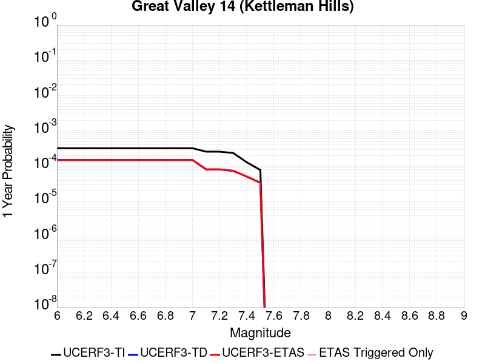 |  |

| Magnitude | 1 wk TI Prob | 1 wk TD Prob | 1 wk ETAS Prob | 1 wk ETAS/TD Gain | 1 wk ETAS Triggered Only | 1 mo TI Prob | 1 mo TD Prob | 1 mo ETAS Prob | 1 mo ETAS/TD Gain | 1 mo ETAS Triggered Only | 1 yr TI Prob | 1 yr TD Prob | 1 yr ETAS Prob | 1 yr ETAS/TD Gain | 1 yr ETAS Triggered Only | 10 yr TI Prob | 10 yr TD Prob | 10 yr ETAS Prob | 10 yr ETAS/TD Gain | 10 yr ETAS Triggered Only |
|-----|-----|-----|-----|-----|-----|-----|-----|-----|-----|-----|-----|-----|-----|-----|-----|-----|-----|-----|-----|-----|
| 6.0 | 6.2057843E-6 | 2.8768522E-6 | 2.8768522E-6 | 1.0 | 0.0 | 2.6595946E-5 | 1.2329322E-5 | 1.2329322E-5 | 1.0 | 0.0 | 3.2375753E-4 | 1.501015E-4 | 1.501015E-4 | 1.0 | 0.0 | 0.0032328626 | 0.0015002326 | 0.0015102176 | 1.0066556 | 1.0E-5 |
| 6.1 | 6.2057843E-6 | 2.8768522E-6 | 2.8768522E-6 | 1.0 | 0.0 | 2.6595946E-5 | 1.2329322E-5 | 1.2329322E-5 | 1.0 | 0.0 | 3.2375753E-4 | 1.501015E-4 | 1.501015E-4 | 1.0 | 0.0 | 0.0032328626 | 0.0015002326 | 0.0015102176 | 1.0066556 | 1.0E-5 |
| 6.2 | 6.2057843E-6 | 2.8768522E-6 | 2.8768522E-6 | 1.0 | 0.0 | 2.6595946E-5 | 1.2329322E-5 | 1.2329322E-5 | 1.0 | 0.0 | 3.2375753E-4 | 1.501015E-4 | 1.501015E-4 | 1.0 | 0.0 | 0.0032328626 | 0.0015002326 | 0.0015102176 | 1.0066556 | 1.0E-5 |
| 6.3 | 6.2057843E-6 | 2.8768522E-6 | 2.8768522E-6 | 1.0 | 0.0 | 2.6595946E-5 | 1.2329322E-5 | 1.2329322E-5 | 1.0 | 0.0 | 3.2375753E-4 | 1.501015E-4 | 1.501015E-4 | 1.0 | 0.0 | 0.0032328626 | 0.0015002326 | 0.0015102176 | 1.0066556 | 1.0E-5 |
| 6.4 | 6.2057843E-6 | 2.8768522E-6 | 2.8768522E-6 | 1.0 | 0.0 | 2.6595946E-5 | 1.2329322E-5 | 1.2329322E-5 | 1.0 | 0.0 | 3.2375753E-4 | 1.501015E-4 | 1.501015E-4 | 1.0 | 0.0 | 0.0032328626 | 0.0015002326 | 0.0015102176 | 1.0066556 | 1.0E-5 |
| 6.5 | 6.2057843E-6 | 2.8768522E-6 | 2.8768522E-6 | 1.0 | 0.0 | 2.6595946E-5 | 1.2329322E-5 | 1.2329322E-5 | 1.0 | 0.0 | 3.2375753E-4 | 1.501015E-4 | 1.501015E-4 | 1.0 | 0.0 | 0.0032328626 | 0.0015002326 | 0.0015102176 | 1.0066556 | 1.0E-5 |
| 6.6 | 6.2057843E-6 | 2.8768522E-6 | 2.8768522E-6 | 1.0 | 0.0 | 2.6595946E-5 | 1.2329322E-5 | 1.2329322E-5 | 1.0 | 0.0 | 3.2375753E-4 | 1.501015E-4 | 1.501015E-4 | 1.0 | 0.0 | 0.0032328626 | 0.0015002326 | 0.0015102176 | 1.0066556 | 1.0E-5 |
| 6.7 | 6.2057843E-6 | 2.8768522E-6 | 2.8768522E-6 | 1.0 | 0.0 | 2.6595946E-5 | 1.2329322E-5 | 1.2329322E-5 | 1.0 | 0.0 | 3.2375753E-4 | 1.501015E-4 | 1.501015E-4 | 1.0 | 0.0 | 0.0032328626 | 0.0015002326 | 0.0015102176 | 1.0066556 | 1.0E-5 |
| 6.8 | 6.2057843E-6 | 2.8768522E-6 | 2.8768522E-6 | 1.0 | 0.0 | 2.6595946E-5 | 1.2329322E-5 | 1.2329322E-5 | 1.0 | 0.0 | 3.2375753E-4 | 1.501015E-4 | 1.501015E-4 | 1.0 | 0.0 | 0.0032328626 | 0.0015002326 | 0.0015102176 | 1.0066556 | 1.0E-5 |
| 6.9 | 6.2057843E-6 | 2.8768522E-6 | 2.8768522E-6 | 1.0 | 0.0 | 2.6595946E-5 | 1.2329322E-5 | 1.2329322E-5 | 1.0 | 0.0 | 3.2375753E-4 | 1.501015E-4 | 1.501015E-4 | 1.0 | 0.0 | 0.0032328626 | 0.0015002326 | 0.0015102176 | 1.0066556 | 1.0E-5 |
| 7.0 | 6.2057843E-6 | 2.8768522E-6 | 2.8768522E-6 | 1.0 | 0.0 | 2.6595946E-5 | 1.2329322E-5 | 1.2329322E-5 | 1.0 | 0.0 | 3.2375753E-4 | 1.501015E-4 | 1.501015E-4 | 1.0 | 0.0 | 0.0032328626 | 0.0015002326 | 0.0015102176 | 1.0066556 | 1.0E-5 |
| 7.1 | 4.95113E-6 | 1.560601E-6 | 1.560601E-6 | 1.0 | 0.0 | 2.1218955E-5 | 6.6882744E-6 | 6.6882744E-6 | 1.0 | 0.0 | 2.5831014E-4 | 8.1426886E-5 | 8.1426886E-5 | 1.0 | 0.0 | 0.0025801011 | 8.139895E-4 | 8.139895E-4 | 1.0 | 0.0 |
| 7.2 | 4.95113E-6 | 1.560601E-6 | 1.560601E-6 | 1.0 | 0.0 | 2.1218955E-5 | 6.6882744E-6 | 6.6882744E-6 | 1.0 | 0.0 | 2.5831014E-4 | 8.1426886E-5 | 8.1426886E-5 | 1.0 | 0.0 | 0.0025801011 | 8.139895E-4 | 8.139895E-4 | 1.0 | 0.0 |
| 7.3 | 4.5549086E-6 | 1.4225644E-6 | 1.4225644E-6 | 1.0 | 0.0 | 1.9520892E-5 | 6.0966913E-6 | 6.0966913E-6 | 1.0 | 0.0 | 2.3764092E-4 | 7.422486E-5 | 7.422486E-5 | 1.0 | 0.0 | 0.0023738695 | 7.420173E-4 | 7.420173E-4 | 1.0 | 0.0 |
| 7.4 | 2.4837766E-6 | 9.80032E-7 | 9.80032E-7 | 1.0 | 0.0 | 1.0644713E-5 | 4.2001307E-6 | 4.2001307E-6 | 1.0 | 0.0 | 1.2959167E-4 | 5.113546E-5 | 5.113546E-5 | 1.0 | 0.0 | 0.0012951613 | 5.1124353E-4 | 5.1124353E-4 | 1.0 | 0.0 |
| 7.5 | 1.5002679E-6 | 6.545985E-7 | 6.545985E-7 | 1.0 | 0.0 | 6.4297037E-6 | 2.8054194E-6 | 2.8054194E-6 | 1.0 | 0.0 | 7.827883E-5 | 3.4155488E-5 | 3.4155488E-5 | 1.0 | 0.0 | 7.825126E-4 | 3.4150656E-4 | 3.4150656E-4 | 1.0 | 0.0 |

## Swain Ravine - Spenceville
*[(top)](#table-of-contents)*

| 1 Week | 1 Month | 1 Year | 10 Year |
|-----|-----|-----|-----|
|  |  |  |  |

| Magnitude | 1 wk TI Prob | 1 wk TD Prob | 1 wk ETAS Prob | 1 wk ETAS/TD Gain | 1 wk ETAS Triggered Only | 1 mo TI Prob | 1 mo TD Prob | 1 mo ETAS Prob | 1 mo ETAS/TD Gain | 1 mo ETAS Triggered Only | 1 yr TI Prob | 1 yr TD Prob | 1 yr ETAS Prob | 1 yr ETAS/TD Gain | 1 yr ETAS Triggered Only | 10 yr TI Prob | 10 yr TD Prob | 10 yr ETAS Prob | 10 yr ETAS/TD Gain | 10 yr ETAS Triggered Only |
|-----|-----|-----|-----|-----|-----|-----|-----|-----|-----|-----|-----|-----|-----|-----|-----|-----|-----|-----|-----|-----|
| 6.0 | 5.596169E-6 | 5.663794E-6 | 1.5663738E-5 | 2.765591 | 1.0E-5 | 2.398336E-5 | 2.4273193E-5 | 3.427295E-5 | 1.4119672 | 1.0E-5 | 2.9195828E-4 | 2.9548878E-4 | 3.0548582E-4 | 1.0338322 | 1.0E-5 | 0.00291575 | 0.002951228 | 0.0029611986 | 1.0033784 | 1.0E-5 |
| 6.1 | 5.596169E-6 | 5.663794E-6 | 1.5663738E-5 | 2.765591 | 1.0E-5 | 2.398336E-5 | 2.4273193E-5 | 3.427295E-5 | 1.4119672 | 1.0E-5 | 2.9195828E-4 | 2.9548878E-4 | 3.0548582E-4 | 1.0338322 | 1.0E-5 | 0.00291575 | 0.002951228 | 0.0029611986 | 1.0033784 | 1.0E-5 |
| 6.2 | 5.596169E-6 | 5.663794E-6 | 1.5663738E-5 | 2.765591 | 1.0E-5 | 2.398336E-5 | 2.4273193E-5 | 3.427295E-5 | 1.4119672 | 1.0E-5 | 2.9195828E-4 | 2.9548878E-4 | 3.0548582E-4 | 1.0338322 | 1.0E-5 | 0.00291575 | 0.002951228 | 0.0029611986 | 1.0033784 | 1.0E-5 |
| 6.3 | 5.596169E-6 | 5.663794E-6 | 1.5663738E-5 | 2.765591 | 1.0E-5 | 2.398336E-5 | 2.4273193E-5 | 3.427295E-5 | 1.4119672 | 1.0E-5 | 2.9195828E-4 | 2.9548878E-4 | 3.0548582E-4 | 1.0338322 | 1.0E-5 | 0.00291575 | 0.002951228 | 0.0029611986 | 1.0033784 | 1.0E-5 |
| 6.4 | 2.8426775E-6 | 2.874144E-6 | 1.2874115E-5 | 4.4792867 | 1.0E-5 | 1.2182847E-5 | 1.2317704E-5 | 2.2317581E-5 | 1.8118296 | 1.0E-5 | 1.4831607E-4 | 1.4995811E-4 | 1.5995662E-4 | 1.0666753 | 1.0E-5 | 0.0014821711 | 0.0014986077 | 0.0015085926 | 1.0066628 | 1.0E-5 |
| 6.5 | 1.9210793E-6 | 1.9414147E-6 | 1.1941395E-5 | 6.150873 | 1.0E-5 | 8.233172E-6 | 8.320323E-6 | 1.832024E-5 | 2.2018664 | 1.0E-5 | 1.0023425E-4 | 1.0129536E-4 | 1.1129434E-4 | 1.0987113 | 1.0E-5 | 0.0010018905 | 0.0010125053 | 0.0010224952 | 1.0098665 | 1.0E-5 |
| 6.6 | 1.9210793E-6 | 1.9414147E-6 | 1.1941395E-5 | 6.150873 | 1.0E-5 | 8.233172E-6 | 8.320323E-6 | 1.832024E-5 | 2.2018664 | 1.0E-5 | 1.0023425E-4 | 1.0129536E-4 | 1.1129434E-4 | 1.0987113 | 1.0E-5 | 0.0010018905 | 0.0010125053 | 0.0010224952 | 1.0098665 | 1.0E-5 |
| 6.7 | 1.4667394E-6 | 1.4818934E-6 | 1.1481879E-5 | 7.748114 | 1.0E-5 | 6.286011E-6 | 6.3509565E-6 | 1.6350892E-5 | 2.5745559 | 1.0E-5 | 7.65295E-5 | 7.732023E-5 | 8.731946E-5 | 1.1293223 | 1.0E-5 | 7.6503144E-4 | 7.72941E-4 | 7.8293326E-4 | 1.0129277 | 1.0E-5 |
| 6.8 | 1.1076943E-6 | 1.1189535E-6 | 1.1189535E-6 | 1.0 | 0.0 | 4.747252E-6 | 4.7955064E-6 | 4.7955064E-6 | 1.0 | 0.0 | 5.7796264E-5 | 5.838377E-5 | 5.838377E-5 | 1.0 | 0.0 | 5.778124E-4 | 5.836887E-4 | 5.836887E-4 | 1.0 | 0.0 |
| 6.9 | 8.514296E-7 | 8.600095E-7 | 8.600095E-7 | 1.0 | 0.0 | 3.648979E-6 | 3.6857498E-6 | 3.6857498E-6 | 1.0 | 0.0 | 4.442541E-5 | 4.4873108E-5 | 4.4873108E-5 | 1.0 | 0.0 | 4.441653E-4 | 4.4864335E-4 | 4.4864335E-4 | 1.0 | 0.0 |
| 7.0 | 4.8544706E-7 | 4.9033E-7 | 4.9033E-7 | 1.0 | 0.0 | 2.0804857E-6 | 2.1014127E-6 | 2.1014127E-6 | 1.0 | 0.0 | 2.532962E-5 | 2.5584413E-5 | 2.5584413E-5 | 1.0 | 0.0 | 2.5326732E-4 | 2.5581598E-4 | 2.5581598E-4 | 1.0 | 0.0 |
| 7.1 | 3.829186E-7 | 3.8678783E-7 | 3.8678783E-7 | 1.0 | 0.0 | 1.6410787E-6 | 1.6576612E-6 | 1.6576612E-6 | 1.0 | 0.0 | 1.997995E-5 | 2.0181848E-5 | 2.0181848E-5 | 1.0 | 0.0 | 1.9978154E-4 | 2.0180122E-4 | 2.0180122E-4 | 1.0 | 0.0 |
| 7.2 | 1.4726595E-7 | 1.4879437E-7 | 1.4879437E-7 | 1.0 | 0.0 | 6.3113964E-7 | 6.3769005E-7 | 6.3769005E-7 | 1.0 | 0.0 | 7.684098E-6 | 7.763854E-6 | 7.763854E-6 | 1.0 | 0.0 | 7.6838325E-5 | 7.763636E-5 | 7.763636E-5 | 1.0 | 0.0 |
| 7.3 | 4.1880604E-8 | 4.2324306E-8 | 4.2324306E-8 | 1.0 | 0.0 | 1.7948828E-7 | 1.8138988E-7 | 1.8138988E-7 | 1.0 | 0.0 | 2.1852677E-6 | 2.2084218E-6 | 2.2084218E-6 | 1.0 | 0.0 | 2.1852462E-5 | 2.2084218E-5 | 2.2084218E-5 | 1.0 | 0.0 |

## San Vicente
*[(top)](#table-of-contents)*

| 1 Week | 1 Month | 1 Year | 10 Year |
|-----|-----|-----|-----|
|  |  | 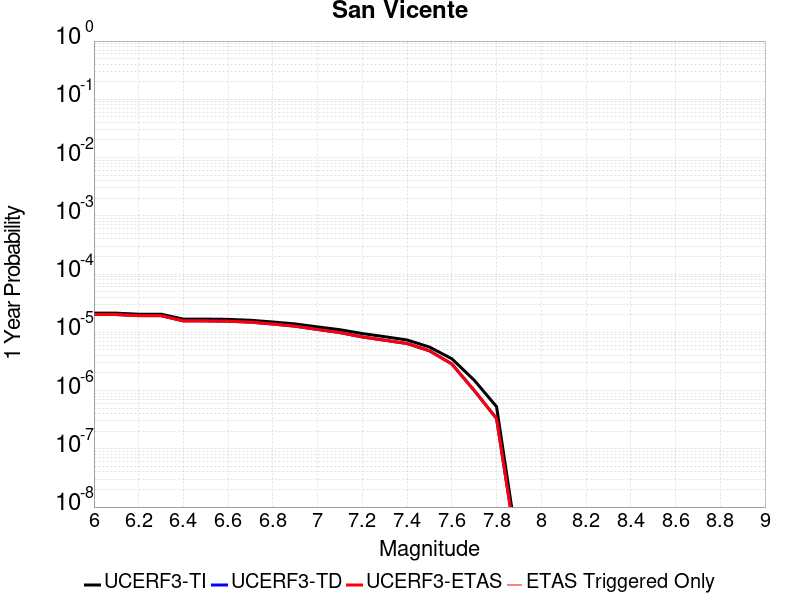 | 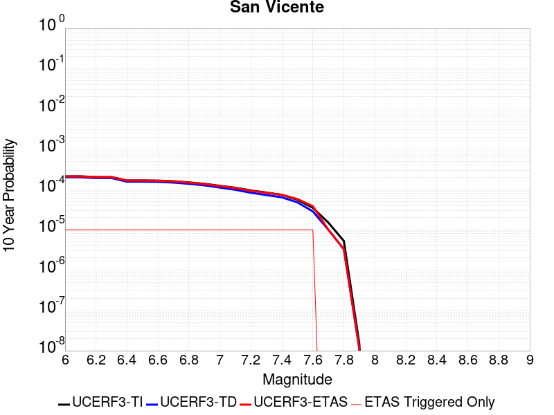 |

| Magnitude | 1 wk TI Prob | 1 wk TD Prob | 1 wk ETAS Prob | 1 wk ETAS/TD Gain | 1 wk ETAS Triggered Only | 1 mo TI Prob | 1 mo TD Prob | 1 mo ETAS Prob | 1 mo ETAS/TD Gain | 1 mo ETAS Triggered Only | 1 yr TI Prob | 1 yr TD Prob | 1 yr ETAS Prob | 1 yr ETAS/TD Gain | 1 yr ETAS Triggered Only | 10 yr TI Prob | 10 yr TD Prob | 10 yr ETAS Prob | 10 yr ETAS/TD Gain | 10 yr ETAS Triggered Only |
|-----|-----|-----|-----|-----|-----|-----|-----|-----|-----|-----|-----|-----|-----|-----|-----|-----|-----|-----|-----|-----|
| 6.0 | 4.0851268E-7 | 3.8665297E-7 | 3.8665297E-7 | 1.0 | 0.0 | 1.7507675E-6 | 1.6570831E-6 | 1.6570831E-6 | 1.0 | 0.0 | 2.1315385E-5 | 2.0174806E-5 | 2.0174806E-5 | 1.0 | 0.0 | 2.1313342E-4 | 2.0173044E-4 | 2.1172842E-4 | 1.0495611 | 1.0E-5 |
| 6.1 | 4.0851268E-7 | 3.8665297E-7 | 3.8665297E-7 | 1.0 | 0.0 | 1.7507675E-6 | 1.6570831E-6 | 1.6570831E-6 | 1.0 | 0.0 | 2.1315385E-5 | 2.0174806E-5 | 2.0174806E-5 | 1.0 | 0.0 | 2.1313342E-4 | 2.0173044E-4 | 2.1172842E-4 | 1.0495611 | 1.0E-5 |
| 6.2 | 3.9200887E-7 | 3.7009818E-7 | 3.7009818E-7 | 1.0 | 0.0 | 1.680037E-6 | 1.5861341E-6 | 1.5861341E-6 | 1.0 | 0.0 | 2.0454258E-5 | 1.9311017E-5 | 1.9311017E-5 | 1.0 | 0.0 | 2.0452376E-4 | 1.9309403E-4 | 2.030921E-4 | 1.0517782 | 1.0E-5 |
| 6.3 | 3.9200887E-7 | 3.7009818E-7 | 3.7009818E-7 | 1.0 | 0.0 | 1.680037E-6 | 1.5861341E-6 | 1.5861341E-6 | 1.0 | 0.0 | 2.0454258E-5 | 1.9311017E-5 | 1.9311017E-5 | 1.0 | 0.0 | 2.0452376E-4 | 1.9309403E-4 | 2.030921E-4 | 1.0517782 | 1.0E-5 |
| 6.4 | 3.2280067E-7 | 3.005979E-7 | 3.005979E-7 | 1.0 | 0.0 | 1.3834307E-6 | 1.2882759E-6 | 1.2882759E-6 | 1.0 | 0.0 | 1.684314E-5 | 1.5684647E-5 | 1.5684647E-5 | 1.0 | 0.0 | 1.6841863E-4 | 1.5683546E-4 | 1.668339E-4 | 1.0637511 | 1.0E-5 |
| 6.5 | 3.2280067E-7 | 3.005979E-7 | 3.005979E-7 | 1.0 | 0.0 | 1.3834307E-6 | 1.2882759E-6 | 1.2882759E-6 | 1.0 | 0.0 | 1.684314E-5 | 1.5684647E-5 | 1.5684647E-5 | 1.0 | 0.0 | 1.6841863E-4 | 1.5683546E-4 | 1.668339E-4 | 1.0637511 | 1.0E-5 |
| 6.6 | 3.1973437E-7 | 2.9752144E-7 | 2.9752144E-7 | 1.0 | 0.0 | 1.3702895E-6 | 1.2750912E-6 | 1.2750912E-6 | 1.0 | 0.0 | 1.6683147E-5 | 1.5524125E-5 | 1.5524125E-5 | 1.0 | 0.0 | 1.6681894E-4 | 1.5523047E-4 | 1.6522892E-4 | 1.0644103 | 1.0E-5 |
| 6.7 | 3.0841164E-7 | 2.8612172E-7 | 2.8612172E-7 | 1.0 | 0.0 | 1.3217634E-6 | 1.2262353E-6 | 1.2262353E-6 | 1.0 | 0.0 | 1.6092352E-5 | 1.4929313E-5 | 1.4929313E-5 | 1.0 | 0.0 | 1.6091186E-4 | 1.4928314E-4 | 1.5928164E-4 | 1.0669768 | 1.0E-5 |
| 6.8 | 2.883202E-7 | 2.658495E-7 | 2.658495E-7 | 1.0 | 0.0 | 1.2356575E-6 | 1.1393546E-6 | 1.1393546E-6 | 1.0 | 0.0 | 1.50440255E-5 | 1.3871553E-5 | 1.3871553E-5 | 1.0 | 0.0 | 1.5043007E-4 | 1.387069E-4 | 1.4870553E-4 | 1.0720844 | 1.0E-5 |
| 6.9 | 2.66663E-7 | 2.439735E-7 | 2.439735E-7 | 1.0 | 0.0 | 1.1428409E-6 | 1.0456002E-6 | 1.0456002E-6 | 1.0 | 0.0 | 1.3914E-5 | 1.2730108E-5 | 1.2730108E-5 | 1.0 | 0.0 | 1.3913128E-4 | 1.2729381E-4 | 1.3729253E-4 | 1.0785484 | 1.0E-5 |
| 7.0 | 2.3733546E-7 | 2.1451226E-7 | 2.1451226E-7 | 1.0 | 0.0 | 1.0171515E-6 | 9.193379E-7 | 9.193379E-7 | 1.0 | 0.0 | 1.238375E-5 | 1.1192881E-5 | 1.1192881E-5 | 1.0 | 0.0 | 1.238306E-4 | 1.1192319E-4 | 1.21922065E-4 | 1.089337 | 1.0E-5 |
| 7.1 | 2.123689E-7 | 1.8946507E-7 | 1.8946507E-7 | 1.0 | 0.0 | 9.1015215E-7 | 8.119929E-7 | 8.119929E-7 | 1.0 | 0.0 | 1.1081046E-5 | 9.885968E-6 | 9.885968E-6 | 1.0 | 0.0 | 1.1080493E-4 | 9.885529E-5 | 1.0885431E-4 | 1.101148 | 1.0E-5 |
| 7.2 | 1.8244859E-7 | 1.594932E-7 | 1.594932E-7 | 1.0 | 0.0 | 7.8192227E-7 | 6.835421E-7 | 6.835421E-7 | 1.0 | 0.0 | 9.519862E-6 | 8.322093E-6 | 8.322093E-6 | 1.0 | 0.0 | 9.519454E-5 | 8.321782E-5 | 9.3216986E-5 | 1.1201565 | 1.0E-5 |
| 7.3 | 1.611936E-7 | 1.4005612E-7 | 1.4005612E-7 | 1.0 | 0.0 | 6.9082955E-7 | 6.0024036E-7 | 6.0024036E-7 | 1.0 | 0.0 | 8.410817E-6 | 7.3079013E-6 | 7.3079013E-6 | 1.0 | 0.0 | 8.410499E-5 | 7.307662E-5 | 8.307589E-5 | 1.1368327 | 1.0E-5 |
| 7.4 | 1.414892E-7 | 1.2290288E-7 | 1.2290288E-7 | 1.0 | 0.0 | 6.063821E-7 | 5.2672647E-7 | 5.2672647E-7 | 1.0 | 0.0 | 7.3826773E-6 | 6.412876E-6 | 6.412876E-6 | 1.0 | 0.0 | 7.382432E-5 | 6.4126914E-5 | 7.412627E-5 | 1.1559308 | 1.0E-5 |
| 7.5 | 1.0709291E-7 | 9.229651E-8 | 9.229651E-8 | 1.0 | 0.0 | 4.5896954E-7 | 3.955564E-7 | 3.955564E-7 | 1.0 | 0.0 | 5.5879395E-6 | 4.8158886E-6 | 4.8158886E-6 | 1.0 | 0.0 | 5.5877994E-5 | 4.8157843E-5 | 5.8157362E-5 | 1.2076405 | 1.0E-5 |
| 7.6 | 6.746737E-8 | 5.4863424E-8 | 5.4863424E-8 | 1.0 | 0.0 | 2.8914585E-7 | 2.3512895E-7 | 2.3512895E-7 | 1.0 | 0.0 | 3.5203448E-6 | 2.8626912E-6 | 2.8626912E-6 | 1.0 | 0.0 | 3.520289E-5 | 2.8626544E-5 | 3.8626258E-5 | 1.3493161 | 1.0E-5 |
| 7.7 | 2.8940264E-8 | 1.9261737E-8 | 1.9261737E-8 | 1.0 | 0.0 | 1.240297E-7 | 8.25503E-8 | 8.25503E-8 | 1.0 | 0.0 | 1.5100605E-6 | 1.0050494E-6 | 1.0050494E-6 | 1.0 | 0.0 | 1.5100502E-5 | 1.0050449E-5 | 1.0050449E-5 | 1.0 | 0.0 |
| 7.8 | 1.0151455E-8 | 6.3538255E-9 | 6.3538255E-9 | 1.0 | 0.0 | 4.3506233E-8 | 2.7230682E-8 | 2.7230682E-8 | 1.0 | 0.0 | 5.296883E-7 | 3.315335E-7 | 3.315335E-7 | 1.0 | 0.0 | 5.2968703E-6 | 3.31533E-6 | 3.31533E-6 | 1.0 | 0.0 |
| 7.9 | 2.8324232E-11 | 2.1405877E-11 | 2.1405877E-11 | 1.0 | 0.0 | 1.2138957E-10 | 9.1739616E-11 | 9.1739616E-11 | 1.0 | 0.0 | 1.4779177E-9 | 1.1169302E-9 | 1.1169302E-9 | 1.0 | 0.0 | 1.4779177E-8 | 1.1169303E-8 | 1.1169303E-8 | 1.0 | 0.0 |

## Carson Range (Genoa)
*[(top)](#table-of-contents)*

| 1 Week | 1 Month | 1 Year | 10 Year |
|-----|-----|-----|-----|
|  | 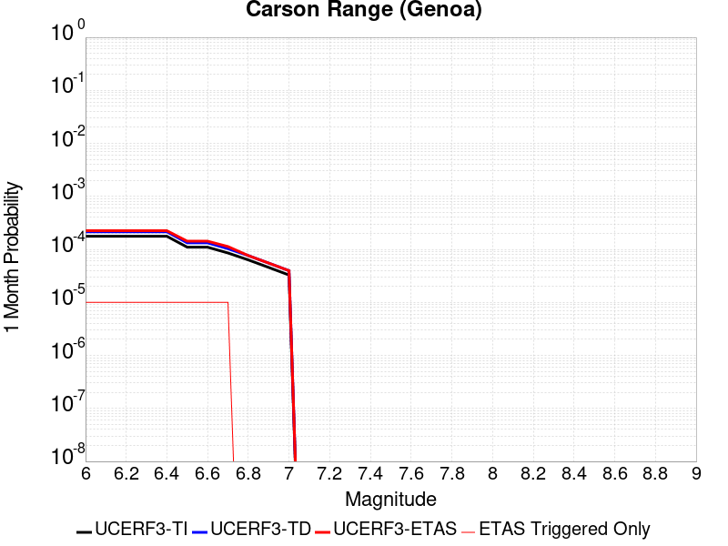 |  |  |

| Magnitude | 1 wk TI Prob | 1 wk TD Prob | 1 wk ETAS Prob | 1 wk ETAS/TD Gain | 1 wk ETAS Triggered Only | 1 mo TI Prob | 1 mo TD Prob | 1 mo ETAS Prob | 1 mo ETAS/TD Gain | 1 mo ETAS Triggered Only | 1 yr TI Prob | 1 yr TD Prob | 1 yr ETAS Prob | 1 yr ETAS/TD Gain | 1 yr ETAS Triggered Only | 10 yr TI Prob | 10 yr TD Prob | 10 yr ETAS Prob | 10 yr ETAS/TD Gain | 10 yr ETAS Triggered Only |
|-----|-----|-----|-----|-----|-----|-----|-----|-----|-----|-----|-----|-----|-----|-----|-----|-----|-----|-----|-----|-----|
| 6.0 | 4.1268457E-5 | 5.014691E-5 | 6.014641E-5 | 1.1994041 | 1.0E-5 | 1.7685282E-4 | 2.1489977E-4 | 2.2489764E-4 | 1.0465233 | 1.0E-5 | 0.0021510567 | 0.002613659 | 0.002623633 | 1.003816 | 1.0E-5 | 0.02130354 | 0.025868865 | 0.025878605 | 1.0003766 | 1.0E-5 |
| 6.1 | 4.1268457E-5 | 5.014691E-5 | 6.014641E-5 | 1.1994041 | 1.0E-5 | 1.7685282E-4 | 2.1489977E-4 | 2.2489764E-4 | 1.0465233 | 1.0E-5 | 0.0021510567 | 0.002613659 | 0.002623633 | 1.003816 | 1.0E-5 | 0.02130354 | 0.025868865 | 0.025878605 | 1.0003766 | 1.0E-5 |
| 6.2 | 4.1268457E-5 | 5.014691E-5 | 6.014641E-5 | 1.1994041 | 1.0E-5 | 1.7685282E-4 | 2.1489977E-4 | 2.2489764E-4 | 1.0465233 | 1.0E-5 | 0.0021510567 | 0.002613659 | 0.002623633 | 1.003816 | 1.0E-5 | 0.02130354 | 0.025868865 | 0.025878605 | 1.0003766 | 1.0E-5 |
| 6.3 | 4.1268457E-5 | 5.014691E-5 | 6.014641E-5 | 1.1994041 | 1.0E-5 | 1.7685282E-4 | 2.1489977E-4 | 2.2489764E-4 | 1.0465233 | 1.0E-5 | 0.0021510567 | 0.002613659 | 0.002623633 | 1.003816 | 1.0E-5 | 0.02130354 | 0.025868865 | 0.025878605 | 1.0003766 | 1.0E-5 |
| 6.4 | 4.1268457E-5 | 5.014691E-5 | 6.014641E-5 | 1.1994041 | 1.0E-5 | 1.7685282E-4 | 2.1489977E-4 | 2.2489764E-4 | 1.0465233 | 1.0E-5 | 0.0021510567 | 0.002613659 | 0.002623633 | 1.003816 | 1.0E-5 | 0.02130354 | 0.025868865 | 0.025878605 | 1.0003766 | 1.0E-5 |
| 6.5 | 2.5677185E-5 | 3.0978295E-5 | 4.0977986E-5 | 1.3227967 | 1.0E-5 | 1.1004044E-4 | 1.3275839E-4 | 1.4275707E-4 | 1.0753148 | 1.0E-5 | 0.0013389189 | 0.0016153152 | 0.0016252991 | 1.0061808 | 1.0E-5 | 0.0133088045 | 0.01605366 | 0.016063498 | 1.0006129 | 1.0E-5 |
| 6.6 | 2.5677185E-5 | 3.0978295E-5 | 4.0977986E-5 | 1.3227967 | 1.0E-5 | 1.1004044E-4 | 1.3275839E-4 | 1.4275707E-4 | 1.0753148 | 1.0E-5 | 0.0013389189 | 0.0016153152 | 0.0016252991 | 1.0061808 | 1.0E-5 | 0.0133088045 | 0.01605366 | 0.016063498 | 1.0006129 | 1.0E-5 |
| 6.7 | 1.9969408E-5 | 2.4063473E-5 | 3.4063232E-5 | 1.4155576 | 1.0E-5 | 8.558037E-5 | 1.0312596E-4 | 1.1312493E-4 | 1.0969588 | 1.0E-5 | 0.0010414429 | 0.0012549888 | 0.0012649763 | 1.0079582 | 1.0E-5 | 0.010365757 | 0.012494174 | 0.01250405 | 1.0007904 | 1.0E-5 |
| 6.8 | 1.4783156E-5 | 1.7817569E-5 | 1.7817569E-5 | 1.0 | 0.0 | 6.335485E-5 | 7.635951E-5 | 7.635951E-5 | 1.0 | 0.0 | 7.710722E-4 | 9.294107E-4 | 9.294107E-4 | 1.0 | 0.0 | 0.0076840227 | 0.009268024 | 0.009268024 | 1.0 | 0.0 |
| 6.9 | 1.06660555E-5 | 1.2877027E-5 | 1.2877027E-5 | 1.0 | 0.0 | 4.5710865E-5 | 5.518674E-5 | 5.518674E-5 | 1.0 | 0.0 | 5.5638765E-4 | 6.718067E-4 | 6.718067E-4 | 1.0 | 0.0 | 0.005549967 | 0.0067090564 | 0.0067090564 | 1.0 | 0.0 |
| 7.0 | 7.664838E-6 | 9.258307E-6 | 9.258307E-6 | 1.0 | 0.0 | 3.2848893E-5 | 3.9678456E-5 | 3.9678456E-5 | 1.0 | 0.0 | 3.998619E-4 | 4.830852E-4 | 4.830852E-4 | 1.0 | 0.0 | 0.0039914316 | 0.00483085 | 0.00483085 | 1.0 | 0.0 |

## Sierra Madre (San Fernando)
*[(top)](#table-of-contents)*

| 1 Week | 1 Month | 1 Year | 10 Year |
|-----|-----|-----|-----|
|  |  |  |  |

| Magnitude | 1 wk TI Prob | 1 wk TD Prob | 1 wk ETAS Prob | 1 wk ETAS/TD Gain | 1 wk ETAS Triggered Only | 1 mo TI Prob | 1 mo TD Prob | 1 mo ETAS Prob | 1 mo ETAS/TD Gain | 1 mo ETAS Triggered Only | 1 yr TI Prob | 1 yr TD Prob | 1 yr ETAS Prob | 1 yr ETAS/TD Gain | 1 yr ETAS Triggered Only | 10 yr TI Prob | 10 yr TD Prob | 10 yr ETAS Prob | 10 yr ETAS/TD Gain | 10 yr ETAS Triggered Only |
|-----|-----|-----|-----|-----|-----|-----|-----|-----|-----|-----|-----|-----|-----|-----|-----|-----|-----|-----|-----|-----|
| 6.0 | 1.0346413E-5 | 6.2872386E-6 | 6.2872386E-6 | 1.0 | 0.0 | 4.4341014E-5 | 2.6945036E-5 | 2.6945036E-5 | 1.0 | 0.0 | 5.3971814E-4 | 3.2800753E-4 | 3.3800426E-4 | 1.030477 | 1.0E-5 | 0.0053840918 | 0.0032753467 | 0.003285314 | 1.003043 | 1.0E-5 |
| 6.1 | 1.0346413E-5 | 6.2872386E-6 | 6.2872386E-6 | 1.0 | 0.0 | 4.4341014E-5 | 2.6945036E-5 | 2.6945036E-5 | 1.0 | 0.0 | 5.3971814E-4 | 3.2800753E-4 | 3.3800426E-4 | 1.030477 | 1.0E-5 | 0.0053840918 | 0.0032753467 | 0.003285314 | 1.003043 | 1.0E-5 |
| 6.2 | 1.0346413E-5 | 6.2872386E-6 | 6.2872386E-6 | 1.0 | 0.0 | 4.4341014E-5 | 2.6945036E-5 | 2.6945036E-5 | 1.0 | 0.0 | 5.3971814E-4 | 3.2800753E-4 | 3.3800426E-4 | 1.030477 | 1.0E-5 | 0.0053840918 | 0.0032753467 | 0.003285314 | 1.003043 | 1.0E-5 |
| 6.3 | 1.0346413E-5 | 6.2872386E-6 | 6.2872386E-6 | 1.0 | 0.0 | 4.4341014E-5 | 2.6945036E-5 | 2.6945036E-5 | 1.0 | 0.0 | 5.3971814E-4 | 3.2800753E-4 | 3.3800426E-4 | 1.030477 | 1.0E-5 | 0.0053840918 | 0.0032753467 | 0.003285314 | 1.003043 | 1.0E-5 |
| 6.4 | 1.0249558E-5 | 6.2872386E-6 | 6.2872386E-6 | 1.0 | 0.0 | 4.392594E-5 | 2.6945036E-5 | 2.6945036E-5 | 1.0 | 0.0 | 5.3466705E-4 | 3.2800753E-4 | 3.3800426E-4 | 1.030477 | 1.0E-5 | 0.0053338245 | 0.0032753467 | 0.003285314 | 1.003043 | 1.0E-5 |
| 6.5 | 1.0249558E-5 | 6.2872386E-6 | 6.2872386E-6 | 1.0 | 0.0 | 4.392594E-5 | 2.6945036E-5 | 2.6945036E-5 | 1.0 | 0.0 | 5.3466705E-4 | 3.2800753E-4 | 3.3800426E-4 | 1.030477 | 1.0E-5 | 0.0053338245 | 0.0032753467 | 0.003285314 | 1.003043 | 1.0E-5 |
| 6.6 | 9.9035515E-6 | 6.2872386E-6 | 6.2872386E-6 | 1.0 | 0.0 | 4.2443102E-5 | 2.6945036E-5 | 2.6945036E-5 | 1.0 | 0.0 | 5.166222E-4 | 3.2800753E-4 | 3.3800426E-4 | 1.030477 | 1.0E-5 | 0.0051542283 | 0.0032753467 | 0.003285314 | 1.003043 | 1.0E-5 |
| 6.7 | 9.87217E-6 | 6.274661E-6 | 6.274661E-6 | 1.0 | 0.0 | 4.2308613E-5 | 2.6891132E-5 | 2.6891132E-5 | 1.0 | 0.0 | 5.149856E-4 | 3.2735144E-4 | 3.3734817E-4 | 1.0305382 | 1.0E-5 | 0.005137938 | 0.003268805 | 0.0032787723 | 1.0030493 | 1.0E-5 |
| 6.8 | 9.4359175E-6 | 6.1786473E-6 | 6.1786473E-6 | 1.0 | 0.0 | 4.043902E-5 | 2.6479653E-5 | 2.6479653E-5 | 1.0 | 0.0 | 4.9223384E-4 | 3.223432E-4 | 3.3233996E-4 | 1.0310129 | 1.0E-5 | 0.0049114493 | 0.0032188678 | 0.0032288358 | 1.0030967 | 1.0E-5 |
| 6.9 | 8.700447E-6 | 6.0399334E-6 | 6.0399334E-6 | 1.0 | 0.0 | 3.72871E-5 | 2.5885178E-5 | 2.5885178E-5 | 1.0 | 0.0 | 4.5387587E-4 | 3.1510755E-4 | 3.251044E-4 | 1.0317252 | 1.0E-5 | 0.0045295 | 0.0031467169 | 0.0031566853 | 1.0031679 | 1.0E-5 |
| 7.0 | 8.648878E-6 | 6.014848E-6 | 6.014848E-6 | 1.0 | 0.0 | 3.7066096E-5 | 2.5777672E-5 | 2.5777672E-5 | 1.0 | 0.0 | 4.5118626E-4 | 3.1379904E-4 | 3.2379592E-4 | 1.0318575 | 1.0E-5 | 0.004502713 | 0.0031336688 | 0.0031436374 | 1.0031811 | 1.0E-5 |
| 7.1 | 8.505786E-6 | 5.9244794E-6 | 5.9244794E-6 | 1.0 | 0.0 | 3.645286E-5 | 2.5390384E-5 | 2.5390384E-5 | 1.0 | 0.0 | 4.437232E-4 | 3.0908515E-4 | 3.1908206E-4 | 1.0323435 | 1.0E-5 | 0.0044283825 | 0.0030866617 | 0.0030966308 | 1.0032297 | 1.0E-5 |
| 7.2 | 8.139752E-6 | 5.698777E-6 | 5.698777E-6 | 1.0 | 0.0 | 3.4884186E-5 | 2.4423107E-5 | 2.4423107E-5 | 1.0 | 0.0 | 4.246322E-4 | 2.973118E-4 | 3.0730883E-4 | 1.0336248 | 1.0E-5 | 0.004238217 | 0.0029692466 | 0.0029792169 | 1.0033579 | 1.0E-5 |
| 7.3 | 7.8816E-6 | 5.5520936E-6 | 5.5520936E-6 | 1.0 | 0.0 | 3.3777847E-5 | 2.3794475E-5 | 2.3794475E-5 | 1.0 | 0.0 | 4.111677E-4 | 2.8966027E-4 | 2.9965737E-4 | 1.0345132 | 1.0E-5 | 0.004104078 | 0.0028929329 | 0.0029029038 | 1.0034467 | 1.0E-5 |
| 7.4 | 7.5810603E-6 | 5.356333E-6 | 5.356333E-6 | 1.0 | 0.0 | 3.2489854E-5 | 2.2955517E-5 | 2.2955517E-5 | 1.0 | 0.0 | 3.9549218E-4 | 2.7944864E-4 | 2.8944583E-4 | 1.0357747 | 1.0E-5 | 0.0039478904 | 0.0027910774 | 0.0028010495 | 1.0035728 | 1.0E-5 |
| 7.5 | 6.349153E-6 | 4.4075887E-6 | 4.4075887E-6 | 1.0 | 0.0 | 2.7210372E-5 | 1.8889532E-5 | 1.8889532E-5 | 1.0 | 0.0 | 3.312359E-4 | 2.2995661E-4 | 2.3995432E-4 | 1.0434765 | 1.0E-5 | 0.0033074263 | 0.0022972687 | 0.0023072457 | 1.004343 | 1.0E-5 |
| 7.6 | 4.430576E-6 | 2.8905786E-6 | 2.8905786E-6 | 1.0 | 0.0 | 1.8988047E-5 | 1.23881355E-5 | 1.23881355E-5 | 1.0 | 0.0 | 2.3115493E-4 | 1.5081534E-4 | 1.6081383E-4 | 1.0662962 | 1.0E-5 | 0.0023091463 | 0.0015071525 | 0.0015171374 | 1.006625 | 1.0E-5 |
| 7.7 | 3.005066E-6 | 1.7509823E-6 | 1.7509823E-6 | 1.0 | 0.0 | 1.2878791E-5 | 7.504188E-6 | 7.504188E-6 | 1.0 | 0.0 | 1.56788E-4 | 9.135967E-5 | 1.0135875E-4 | 1.1094475 | 1.0E-5 | 0.0015667742 | 9.1322226E-4 | 9.2321314E-4 | 1.0109402 | 1.0E-5 |
| 7.8 | 1.8459098E-6 | 1.0581826E-6 | 1.0581826E-6 | 1.0 | 0.0 | 7.911018E-6 | 4.5350607E-6 | 4.5350607E-6 | 1.0 | 0.0 | 9.631238E-5 | 5.5212968E-5 | 6.5212414E-5 | 1.1811069 | 1.0E-5 | 9.627065E-4 | 5.5199297E-4 | 5.6198746E-4 | 1.0181062 | 1.0E-5 |
| 7.9 | 9.839262E-7 | 5.2340516E-7 | 5.2340516E-7 | 1.0 | 0.0 | 4.2168194E-6 | 2.243163E-6 | 2.243163E-6 | 1.0 | 0.0 | 5.1338568E-5 | 2.731017E-5 | 3.7309896E-5 | 1.366154 | 1.0E-5 | 5.132671E-4 | 2.7306844E-4 | 2.830657E-4 | 1.0366108 | 1.0E-5 |
| 8.0 | 1.210983E-7 | 6.613497E-8 | 6.613497E-8 | 1.0 | 0.0 | 5.1899264E-7 | 2.8343558E-7 | 2.8343558E-7 | 1.0 | 0.0 | 6.3187167E-6 | 3.4508228E-6 | 3.4508228E-6 | 1.0 | 0.0 | 6.318537E-5 | 3.450771E-5 | 3.450771E-5 | 1.0 | 0.0 |

## Ozena
*[(top)](#table-of-contents)*

| 1 Week | 1 Month | 1 Year | 10 Year |
|-----|-----|-----|-----|
|  |  | 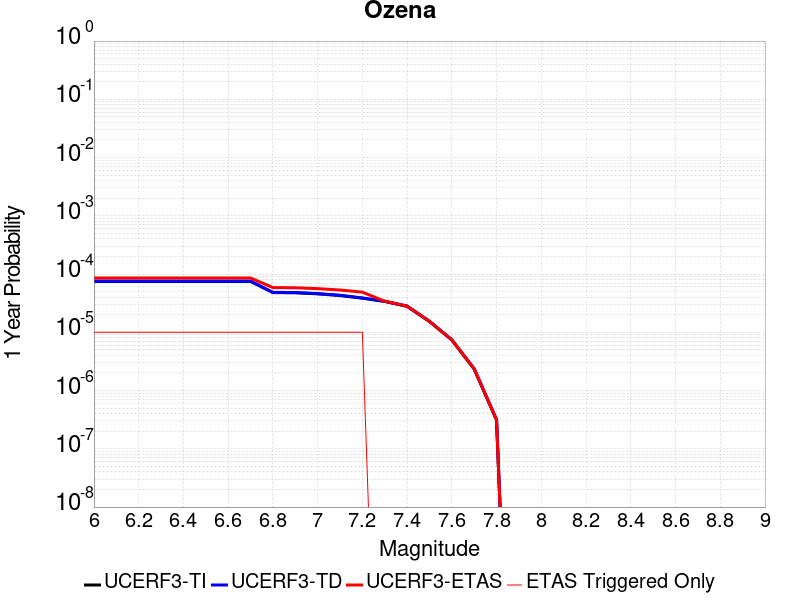 |  |

| Magnitude | 1 wk TI Prob | 1 wk TD Prob | 1 wk ETAS Prob | 1 wk ETAS/TD Gain | 1 wk ETAS Triggered Only | 1 mo TI Prob | 1 mo TD Prob | 1 mo ETAS Prob | 1 mo ETAS/TD Gain | 1 mo ETAS Triggered Only | 1 yr TI Prob | 1 yr TD Prob | 1 yr ETAS Prob | 1 yr ETAS/TD Gain | 1 yr ETAS Triggered Only | 10 yr TI Prob | 10 yr TD Prob | 10 yr ETAS Prob | 10 yr ETAS/TD Gain | 10 yr ETAS Triggered Only |
|-----|-----|-----|-----|-----|-----|-----|-----|-----|-----|-----|-----|-----|-----|-----|-----|-----|-----|-----|-----|-----|
| 6.0 | 1.4377547E-6 | 1.4513782E-6 | 1.4513782E-6 | 1.0 | 0.0 | 6.161791E-6 | 6.2201793E-6 | 6.2201793E-6 | 1.0 | 0.0 | 7.5017226E-5 | 7.572832E-5 | 8.5727566E-5 | 1.132041 | 1.0E-5 | 7.4991904E-4 | 7.570518E-4 | 7.670442E-4 | 1.0131991 | 1.0E-5 |
| 6.1 | 1.4377547E-6 | 1.4513782E-6 | 1.4513782E-6 | 1.0 | 0.0 | 6.161791E-6 | 6.2201793E-6 | 6.2201793E-6 | 1.0 | 0.0 | 7.5017226E-5 | 7.572832E-5 | 8.5727566E-5 | 1.132041 | 1.0E-5 | 7.4991904E-4 | 7.570518E-4 | 7.670442E-4 | 1.0131991 | 1.0E-5 |
| 6.2 | 1.4377547E-6 | 1.4513782E-6 | 1.4513782E-6 | 1.0 | 0.0 | 6.161791E-6 | 6.2201793E-6 | 6.2201793E-6 | 1.0 | 0.0 | 7.5017226E-5 | 7.572832E-5 | 8.5727566E-5 | 1.132041 | 1.0E-5 | 7.4991904E-4 | 7.570518E-4 | 7.670442E-4 | 1.0131991 | 1.0E-5 |
| 6.3 | 1.4377547E-6 | 1.4513782E-6 | 1.4513782E-6 | 1.0 | 0.0 | 6.161791E-6 | 6.2201793E-6 | 6.2201793E-6 | 1.0 | 0.0 | 7.5017226E-5 | 7.572832E-5 | 8.5727566E-5 | 1.132041 | 1.0E-5 | 7.4991904E-4 | 7.570518E-4 | 7.670442E-4 | 1.0131991 | 1.0E-5 |
| 6.4 | 1.4377547E-6 | 1.4513782E-6 | 1.4513782E-6 | 1.0 | 0.0 | 6.161791E-6 | 6.2201793E-6 | 6.2201793E-6 | 1.0 | 0.0 | 7.5017226E-5 | 7.572832E-5 | 8.5727566E-5 | 1.132041 | 1.0E-5 | 7.4991904E-4 | 7.570518E-4 | 7.670442E-4 | 1.0131991 | 1.0E-5 |
| 6.5 | 1.4377547E-6 | 1.4513782E-6 | 1.4513782E-6 | 1.0 | 0.0 | 6.161791E-6 | 6.2201793E-6 | 6.2201793E-6 | 1.0 | 0.0 | 7.5017226E-5 | 7.572832E-5 | 8.5727566E-5 | 1.132041 | 1.0E-5 | 7.4991904E-4 | 7.570518E-4 | 7.670442E-4 | 1.0131991 | 1.0E-5 |
| 6.6 | 1.4377547E-6 | 1.4513782E-6 | 1.4513782E-6 | 1.0 | 0.0 | 6.161791E-6 | 6.2201793E-6 | 6.2201793E-6 | 1.0 | 0.0 | 7.5017226E-5 | 7.572832E-5 | 8.5727566E-5 | 1.132041 | 1.0E-5 | 7.4991904E-4 | 7.570518E-4 | 7.670442E-4 | 1.0131991 | 1.0E-5 |
| 6.7 | 1.4377547E-6 | 1.4513782E-6 | 1.4513782E-6 | 1.0 | 0.0 | 6.161791E-6 | 6.2201793E-6 | 6.2201793E-6 | 1.0 | 0.0 | 7.5017226E-5 | 7.572832E-5 | 8.5727566E-5 | 1.132041 | 1.0E-5 | 7.4991904E-4 | 7.570518E-4 | 7.670442E-4 | 1.0131991 | 1.0E-5 |
| 6.8 | 9.223257E-7 | 9.317624E-7 | 9.317624E-7 | 1.0 | 0.0 | 3.9528186E-6 | 3.9932615E-6 | 3.9932615E-6 | 1.0 | 0.0 | 4.81245E-5 | 4.8616912E-5 | 5.8616428E-5 | 1.2056798 | 1.0E-5 | 4.811408E-4 | 4.860668E-4 | 4.960619E-4 | 1.0205632 | 1.0E-5 |
| 6.9 | 9.141515E-7 | 9.235371E-7 | 9.235371E-7 | 1.0 | 0.0 | 3.917786E-6 | 3.9580104E-6 | 3.9580104E-6 | 1.0 | 0.0 | 4.7698002E-5 | 4.818775E-5 | 5.818727E-5 | 1.2075117 | 1.0E-5 | 4.7687767E-4 | 4.8177704E-4 | 4.917722E-4 | 1.0207465 | 1.0E-5 |
| 7.0 | 8.767648E-7 | 8.8585773E-7 | 8.8585773E-7 | 1.0 | 0.0 | 3.757558E-6 | 3.7965276E-6 | 3.7965276E-6 | 1.0 | 0.0 | 4.5747307E-5 | 4.6221783E-5 | 5.622132E-5 | 1.2163382 | 1.0E-5 | 4.5737892E-4 | 4.6212564E-4 | 4.7212103E-4 | 1.0216291 | 1.0E-5 |
| 7.1 | 8.199402E-7 | 8.2853984E-7 | 8.2853984E-7 | 1.0 | 0.0 | 3.5140247E-6 | 3.5508804E-6 | 3.5508804E-6 | 1.0 | 0.0 | 4.2782412E-5 | 4.323115E-5 | 5.3230717E-5 | 1.2313046 | 1.0E-5 | 4.2774176E-4 | 4.322311E-4 | 4.422268E-4 | 1.0231258 | 1.0E-5 |
| 7.2 | 7.38705E-7 | 7.464262E-7 | 7.464262E-7 | 1.0 | 0.0 | 3.1658747E-6 | 3.198966E-6 | 3.198966E-6 | 1.0 | 0.0 | 3.8543843E-5 | 3.894675E-5 | 4.894636E-5 | 1.2567508 | 1.0E-5 | 3.853716E-4 | 3.8940276E-4 | 3.9939885E-4 | 1.0256704 | 1.0E-5 |
| 7.3 | 6.490017E-7 | 6.557802E-7 | 6.557802E-7 | 1.0 | 0.0 | 2.7814328E-6 | 2.8104837E-6 | 2.8104837E-6 | 1.0 | 0.0 | 3.386342E-5 | 3.4217133E-5 | 3.4217133E-5 | 1.0 | 0.0 | 3.3858258E-4 | 3.4212202E-4 | 3.4212202E-4 | 1.0 | 0.0 |
| 7.4 | 5.346736E-7 | 5.4022604E-7 | 5.4022604E-7 | 1.0 | 0.0 | 2.291456E-6 | 2.3152527E-6 | 2.3152527E-6 | 1.0 | 0.0 | 2.789812E-5 | 2.8187867E-5 | 2.8187867E-5 | 1.0 | 0.0 | 2.789462E-4 | 2.8184598E-4 | 2.8184598E-4 | 1.0 | 0.0 |
| 7.5 | 2.939325E-7 | 2.9666057E-7 | 2.9666057E-7 | 1.0 | 0.0 | 1.25971E-6 | 1.271402E-6 | 1.271402E-6 | 1.0 | 0.0 | 1.5336862E-5 | 1.5479225E-5 | 1.5479225E-5 | 1.0 | 0.0 | 1.5335804E-4 | 1.5478309E-4 | 1.5478309E-4 | 1.0 | 0.0 |
| 7.6 | 1.4151905E-7 | 1.4253266E-7 | 1.4253266E-7 | 1.0 | 0.0 | 6.065101E-7 | 6.108541E-7 | 6.108541E-7 | 1.0 | 0.0 | 7.3842357E-6 | 7.4371237E-6 | 7.4371237E-6 | 1.0 | 0.0 | 7.38399E-5 | 7.436883E-5 | 7.436883E-5 | 1.0 | 0.0 |
| 7.7 | 4.4957577E-8 | 4.5252243E-8 | 4.5252243E-8 | 1.0 | 0.0 | 1.9267533E-7 | 1.9393818E-7 | 1.9393818E-7 | 1.0 | 0.0 | 2.3458194E-6 | 2.3611947E-6 | 2.3611947E-6 | 1.0 | 0.0 | 2.3457947E-5 | 2.3611707E-5 | 2.3611707E-5 | 1.0 | 0.0 |
| 7.8 | 5.9993255E-9 | 6.0412972E-9 | 6.0412972E-9 | 1.0 | 0.0 | 2.5711394E-8 | 2.5891273E-8 | 2.5891273E-8 | 1.0 | 0.0 | 3.1303617E-7 | 3.1522623E-7 | 3.1522623E-7 | 1.0 | 0.0 | 3.1303573E-6 | 3.1522588E-6 | 3.1522588E-6 | 1.0 | 0.0 |

## Great Valley 11
*[(top)](#table-of-contents)*

| 1 Week | 1 Month | 1 Year | 10 Year |
|-----|-----|-----|-----|
|  |  |  | 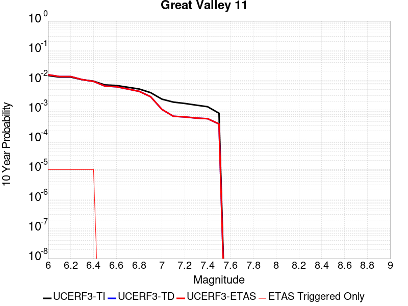 |

| Magnitude | 1 wk TI Prob | 1 wk TD Prob | 1 wk ETAS Prob | 1 wk ETAS/TD Gain | 1 wk ETAS Triggered Only | 1 mo TI Prob | 1 mo TD Prob | 1 mo ETAS Prob | 1 mo ETAS/TD Gain | 1 mo ETAS Triggered Only | 1 yr TI Prob | 1 yr TD Prob | 1 yr ETAS Prob | 1 yr ETAS/TD Gain | 1 yr ETAS Triggered Only | 10 yr TI Prob | 10 yr TD Prob | 10 yr ETAS Prob | 10 yr ETAS/TD Gain | 10 yr ETAS Triggered Only |
|-----|-----|-----|-----|-----|-----|-----|-----|-----|-----|-----|-----|-----|-----|-----|-----|-----|-----|-----|-----|-----|
| 6.0 | 2.8099583E-5 | 2.983214E-5 | 2.983214E-5 | 1.0 | 0.0 | 1.20421224E-4 | 1.2784619E-4 | 1.2784619E-4 | 1.0 | 0.0 | 0.0014651422 | 0.0015554894 | 0.0015554894 | 1.0 | 0.0 | 0.0145552 | 0.015453546 | 0.015463391 | 1.000637 | 1.0E-5 |
| 6.1 | 2.483194E-5 | 2.5907144E-5 | 2.5907144E-5 | 1.0 | 0.0 | 1.0641825E-4 | 1.11026246E-4 | 1.11026246E-4 | 1.0 | 0.0 | 0.0012948721 | 0.0013509697 | 0.0013509697 | 1.0 | 0.0 | 0.012873529 | 0.013433979 | 0.013443844 | 1.0007343 | 1.0E-5 |
| 6.2 | 2.483194E-5 | 2.5907144E-5 | 2.5907144E-5 | 1.0 | 0.0 | 1.0641825E-4 | 1.11026246E-4 | 1.11026246E-4 | 1.0 | 0.0 | 0.0012948721 | 0.0013509697 | 0.0013509697 | 1.0 | 0.0 | 0.012873529 | 0.013433979 | 0.013443844 | 1.0007343 | 1.0E-5 |
| 6.3 | 2.0257901E-5 | 2.0398915E-5 | 2.0398915E-5 | 1.0 | 0.0 | 8.681669E-5 | 8.742122E-5 | 8.742122E-5 | 1.0 | 0.0 | 0.0010564806 | 0.0010638753 | 0.0010638753 | 1.0 | 0.0 | 0.01051472 | 0.010591993 | 0.0106018875 | 1.0009341 | 1.0E-5 |
| 6.4 | 1.8054898E-5 | 1.7780852E-5 | 1.7780852E-5 | 1.0 | 0.0 | 7.737584E-5 | 7.6201635E-5 | 7.6201635E-5 | 1.0 | 0.0 | 9.416436E-4 | 9.2739763E-4 | 9.2739763E-4 | 1.0 | 0.0 | 0.009376635 | 0.009239015 | 0.009248923 | 1.0010724 | 1.0E-5 |
| 6.5 | 1.34804895E-5 | 1.2321004E-5 | 1.2321004E-5 | 1.0 | 0.0 | 5.777225E-5 | 5.2803258E-5 | 5.2803258E-5 | 1.0 | 0.0 | 7.031501E-4 | 6.426942E-4 | 6.426942E-4 | 1.0 | 0.0 | 0.007009294 | 0.006408792 | 0.006408792 | 1.0 | 0.0 |
| 6.6 | 1.294883E-5 | 1.1732261E-5 | 1.1732261E-5 | 1.0 | 0.0 | 5.5493805E-5 | 5.028017E-5 | 5.028017E-5 | 1.0 | 0.0 | 6.754276E-4 | 6.1199325E-4 | 6.1199325E-4 | 1.0 | 0.0 | 0.006733784 | 0.0061035044 | 0.0061035044 | 1.0 | 0.0 |
| 6.7 | 1.1272237E-5 | 9.811834E-6 | 9.811834E-6 | 1.0 | 0.0 | 4.8308695E-5 | 4.205006E-5 | 4.205006E-5 | 1.0 | 0.0 | 5.879996E-4 | 5.1184196E-4 | 5.1184196E-4 | 1.0 | 0.0 | 0.005864462 | 0.005106915 | 0.005106915 | 1.0 | 0.0 |
| 6.8 | 9.8337505E-6 | 8.193719E-6 | 8.193719E-6 | 1.0 | 0.0 | 4.2143965E-5 | 3.5115478E-5 | 3.5115478E-5 | 1.0 | 0.0 | 5.1298196E-4 | 4.2744912E-4 | 4.2744912E-4 | 1.0 | 0.0 | 0.005117994 | 0.0042664795 | 0.0042664795 | 1.0 | 0.0 |
| 6.9 | 7.4224813E-6 | 5.4130837E-6 | 5.4130837E-6 | 1.0 | 0.0 | 3.1810247E-5 | 2.3198732E-5 | 2.3198732E-5 | 1.0 | 0.0 | 3.872209E-4 | 2.8240937E-4 | 2.8240937E-4 | 1.0 | 0.0 | 0.0038654688 | 0.0028206457 | 0.0028206457 | 1.0 | 0.0 |
| 7.0 | 4.4628923E-6 | 2.0110294E-6 | 2.0110294E-6 | 1.0 | 0.0 | 1.912654E-5 | 8.61867E-6 | 8.61867E-6 | 1.0 | 0.0 | 2.3284076E-4 | 1.0492737E-4 | 1.0492737E-4 | 1.0 | 0.0 | 0.0023259693 | 0.0010487898 | 0.0010487898 | 1.0 | 0.0 |
| 7.1 | 3.5546527E-6 | 1.1855383E-6 | 1.1855383E-6 | 1.0 | 0.0 | 1.5234136E-5 | 5.080869E-6 | 5.080869E-6 | 1.0 | 0.0 | 1.8545982E-4 | 6.185789E-5 | 6.185789E-5 | 1.0 | 0.0 | 0.0018530512 | 6.1841356E-4 | 6.1841356E-4 | 1.0 | 0.0 |
| 7.2 | 3.2039936E-6 | 1.1253728E-6 | 1.1253728E-6 | 1.0 | 0.0 | 1.3731329E-5 | 4.8230177E-6 | 4.8230177E-6 | 1.0 | 0.0 | 1.671661E-4 | 5.8718724E-5 | 5.8718724E-5 | 1.0 | 0.0 | 0.0016704041 | 5.870388E-4 | 5.870388E-4 | 1.0 | 0.0 |
| 7.3 | 2.8120473E-6 | 1.0305271E-6 | 1.0305271E-6 | 1.0 | 0.0 | 1.2051575E-5 | 4.4165376E-6 | 4.4165376E-6 | 1.0 | 0.0 | 1.4671806E-4 | 5.3770087E-5 | 5.3770087E-5 | 1.0 | 0.0 | 0.0014662122 | 5.375774E-4 | 5.375774E-4 | 1.0 | 0.0 |
| 7.4 | 2.4837766E-6 | 9.80032E-7 | 9.80032E-7 | 1.0 | 0.0 | 1.0644713E-5 | 4.2001307E-6 | 4.2001307E-6 | 1.0 | 0.0 | 1.2959167E-4 | 5.113546E-5 | 5.113546E-5 | 1.0 | 0.0 | 0.0012951613 | 5.1124353E-4 | 5.1124353E-4 | 1.0 | 0.0 |
| 7.5 | 1.5002679E-6 | 6.545985E-7 | 6.545985E-7 | 1.0 | 0.0 | 6.4297037E-6 | 2.8054194E-6 | 2.8054194E-6 | 1.0 | 0.0 | 7.827883E-5 | 3.4155488E-5 | 3.4155488E-5 | 1.0 | 0.0 | 7.825126E-4 | 3.4150656E-4 | 3.4150656E-4 | 1.0 | 0.0 |

## Mission (connected) 2011 CFM
*[(top)](#table-of-contents)*

| 1 Week | 1 Month | 1 Year | 10 Year |
|-----|-----|-----|-----|
|  |  |  | 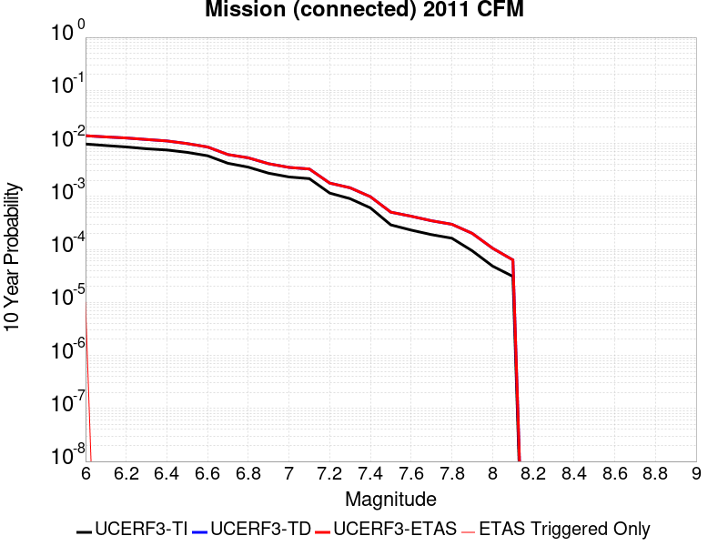 |

| Magnitude | 1 wk TI Prob | 1 wk TD Prob | 1 wk ETAS Prob | 1 wk ETAS/TD Gain | 1 wk ETAS Triggered Only | 1 mo TI Prob | 1 mo TD Prob | 1 mo ETAS Prob | 1 mo ETAS/TD Gain | 1 mo ETAS Triggered Only | 1 yr TI Prob | 1 yr TD Prob | 1 yr ETAS Prob | 1 yr ETAS/TD Gain | 1 yr ETAS Triggered Only | 10 yr TI Prob | 10 yr TD Prob | 10 yr ETAS Prob | 10 yr ETAS/TD Gain | 10 yr ETAS Triggered Only |
|-----|-----|-----|-----|-----|-----|-----|-----|-----|-----|-----|-----|-----|-----|-----|-----|-----|-----|-----|-----|-----|
| 6.0 | 1.8735573E-5 | 2.688439E-5 | 2.688439E-5 | 1.0 | 0.0 | 8.029284E-5 | 1.1521349E-4 | 1.1521349E-4 | 1.0 | 0.0 | 9.771269E-4 | 0.0014017284 | 0.0014017284 | 1.0 | 0.0 | 0.009728416 | 0.013937845 | 0.013947706 | 1.0007075 | 1.0E-5 |
| 6.1 | 1.7515964E-5 | 2.5525667E-5 | 2.5525667E-5 | 1.0 | 0.0 | 7.506625E-5 | 1.0939089E-4 | 1.0939089E-4 | 1.0 | 0.0 | 9.135484E-4 | 0.0013309267 | 0.0013309267 | 1.0 | 0.0 | 0.009098019 | 0.01323845 | 0.01323845 | 1.0 | 0.0 |
| 6.2 | 1.6486343E-5 | 2.437034E-5 | 2.437034E-5 | 1.0 | 0.0 | 7.065384E-5 | 1.0443989E-4 | 1.0443989E-4 | 1.0 | 0.0 | 8.5987104E-4 | 0.0012707205 | 0.0012707205 | 1.0 | 0.0 | 0.008565514 | 0.012643425 | 0.012643425 | 1.0 | 0.0 |
| 6.3 | 1.5229385E-5 | 2.27998E-5 | 2.27998E-5 | 1.0 | 0.0 | 6.526716E-5 | 9.7709526E-5 | 9.7709526E-5 | 1.0 | 0.0 | 7.9433795E-4 | 0.0011888708 | 0.0011888708 | 1.0 | 0.0 | 0.007915046 | 0.011836656 | 0.011836656 | 1.0 | 0.0 |
| 6.4 | 1.4435828E-5 | 2.1399865E-5 | 2.1399865E-5 | 1.0 | 0.0 | 6.186637E-5 | 9.1710244E-5 | 9.1710244E-5 | 1.0 | 0.0 | 7.529627E-4 | 0.0011159078 | 0.0011159078 | 1.0 | 0.0 | 0.007504165 | 0.011119671 | 0.011119671 | 1.0 | 0.0 |
| 6.5 | 1.30127955E-5 | 1.9037165E-5 | 1.9037165E-5 | 1.0 | 0.0 | 5.576793E-5 | 8.1585065E-5 | 8.1585065E-5 | 1.0 | 0.0 | 6.78763E-4 | 9.928137E-4 | 9.928137E-4 | 1.0 | 0.0 | 0.0067669353 | 0.0099117085 | 0.0099117085 | 1.0 | 0.0 |
| 6.6 | 1.1220718E-5 | 1.6393737E-5 | 1.6393737E-5 | 1.0 | 0.0 | 4.8087906E-5 | 7.025699E-5 | 7.025699E-5 | 1.0 | 0.0 | 5.8531296E-4 | 8.5504283E-4 | 8.5504283E-4 | 1.0 | 0.0 | 0.005837737 | 0.008549754 | 0.008549754 | 1.0 | 0.0 |
| 6.7 | 8.086152E-6 | 1.1750606E-5 | 1.1750606E-5 | 1.0 | 0.0 | 3.4654473E-5 | 5.0358773E-5 | 5.0358773E-5 | 1.0 | 0.0 | 4.2183654E-4 | 6.1294634E-4 | 6.1294634E-4 | 1.0 | 0.0 | 0.004210367 | 0.006149825 | 0.006149825 | 1.0 | 0.0 |
| 6.8 | 6.8361655E-6 | 1.0195686E-5 | 1.0195686E-5 | 1.0 | 0.0 | 2.9297524E-5 | 4.369507E-5 | 4.369507E-5 | 1.0 | 0.0 | 3.5663895E-4 | 5.3185824E-4 | 5.3185824E-4 | 1.0 | 0.0 | 0.0035606713 | 0.0053387634 | 0.0053387634 | 1.0 | 0.0 |
| 6.9 | 5.2517353E-6 | 7.869309E-6 | 7.869309E-6 | 1.0 | 0.0 | 2.2507242E-5 | 3.3725177E-5 | 3.3725177E-5 | 1.0 | 0.0 | 2.739912E-4 | 4.1052693E-4 | 4.1052693E-4 | 1.0 | 0.0 | 0.0027365363 | 0.0041298596 | 0.0041298596 | 1.0 | 0.0 |
| 7.0 | 4.4602784E-6 | 6.7018273E-6 | 6.7018273E-6 | 1.0 | 0.0 | 1.911534E-5 | 2.8721803E-5 | 2.8721803E-5 | 1.0 | 0.0 | 2.327044E-4 | 3.49632E-4 | 3.49632E-4 | 1.0 | 0.0 | 0.0023246086 | 0.0035221954 | 0.0035221954 | 1.0 | 0.0 |
| 7.1 | 4.1492594E-6 | 6.250573E-6 | 6.250573E-6 | 1.0 | 0.0 | 1.7782419E-5 | 2.6787895E-5 | 2.6787895E-5 | 1.0 | 0.0 | 2.1647944E-4 | 3.2609396E-4 | 3.2609396E-4 | 1.0 | 0.0 | 0.0021626868 | 0.0032869952 | 0.0032869952 | 1.0 | 0.0 |
| 7.2 | 2.213247E-6 | 3.362939E-6 | 3.362939E-6 | 1.0 | 0.0 | 9.485309E-6 | 1.4412516E-5 | 1.4412516E-5 | 1.0 | 0.0 | 1.15477524E-4 | 1.7545828E-4 | 1.7545828E-4 | 1.0 | 0.0 | 0.0011541754 | 0.0017818378 | 0.0017818378 | 1.0 | 0.0 |
| 7.3 | 1.7362703E-6 | 2.738553E-6 | 2.738553E-6 | 1.0 | 0.0 | 7.4411373E-6 | 1.1736603E-5 | 1.1736603E-5 | 1.0 | 0.0 | 9.0592075E-5 | 1.4288379E-4 | 1.4288379E-4 | 1.0 | 0.0 | 9.0555154E-4 | 0.0014532298 | 0.0014532298 | 1.0 | 0.0 |
| 7.4 | 1.1628409E-6 | 1.8494098E-6 | 1.8494098E-6 | 1.0 | 0.0 | 4.9835944E-6 | 7.926018E-6 | 7.926018E-6 | 1.0 | 0.0 | 6.0673574E-5 | 9.649501E-5 | 9.649501E-5 | 1.0 | 0.0 | 6.065701E-4 | 9.853557E-4 | 9.853557E-4 | 1.0 | 0.0 |
| 7.5 | 5.5610667E-7 | 9.3442156E-7 | 9.3442156E-7 | 1.0 | 0.0 | 2.3833122E-6 | 4.0046575E-6 | 4.0046575E-6 | 1.0 | 0.0 | 2.9016439E-5 | 4.875562E-5 | 4.875562E-5 | 1.0 | 0.0 | 2.901265E-4 | 5.0411985E-4 | 5.0411985E-4 | 1.0 | 0.0 |
| 7.6 | 4.4307663E-7 | 7.7849705E-7 | 7.7849705E-7 | 1.0 | 0.0 | 1.8988985E-6 | 3.3364117E-6 | 3.3364117E-6 | 1.0 | 0.0 | 2.3118844E-5 | 4.0620056E-5 | 4.0620056E-5 | 1.0 | 0.0 | 2.3116439E-4 | 4.2211605E-4 | 4.2211605E-4 | 1.0 | 0.0 |
| 7.7 | 3.639119E-7 | 6.3552113E-7 | 6.3552113E-7 | 1.0 | 0.0 | 1.5596215E-6 | 2.7236592E-6 | 2.7236592E-6 | 1.0 | 0.0 | 1.8988227E-5 | 3.316005E-5 | 3.316005E-5 | 1.0 | 0.0 | 1.8986604E-4 | 3.469058E-4 | 3.469058E-4 | 1.0 | 0.0 |
| 7.8 | 3.1152942E-7 | 5.475073E-7 | 5.475073E-7 | 1.0 | 0.0 | 1.3351254E-6 | 2.3464577E-6 | 2.3464577E-6 | 1.0 | 0.0 | 1.6255031E-5 | 2.856775E-5 | 2.856775E-5 | 1.0 | 0.0 | 1.6253842E-4 | 2.977156E-4 | 2.977156E-4 | 1.0 | 0.0 |
| 7.9 | 1.8035962E-7 | 3.7187047E-7 | 3.7187047E-7 | 1.0 | 0.0 | 7.729696E-7 | 1.5937296E-6 | 1.5937296E-6 | 1.0 | 0.0 | 9.410865E-6 | 1.9403486E-5 | 1.9403486E-5 | 1.0 | 0.0 | 9.410465E-5 | 2.0072333E-4 | 2.0072333E-4 | 1.0 | 0.0 |
| 8.0 | 9.279334E-8 | 1.9696856E-7 | 1.9696856E-7 | 1.0 | 0.0 | 3.976857E-7 | 8.4415063E-7 | 8.4415063E-7 | 1.0 | 0.0 | 4.841813E-6 | 1.0277487E-5 | 1.0277487E-5 | 1.0 | 0.0 | 4.841707E-5 | 1.0529156E-4 | 1.0529156E-4 | 1.0 | 0.0 |
| 8.1 | 5.9253985E-8 | 1.1851607E-7 | 1.1851607E-7 | 1.0 | 0.0 | 2.5394561E-7 | 5.079259E-7 | 5.079259E-7 | 1.0 | 0.0 | 3.0917836E-6 | 6.183981E-6 | 6.183981E-6 | 1.0 | 0.0 | 3.0917407E-5 | 6.322424E-5 | 6.322424E-5 | 1.0 | 0.0 |

## Goose Lake 2011 CFM
*[(top)](#table-of-contents)*

| 1 Week | 1 Month | 1 Year | 10 Year |
|-----|-----|-----|-----|
|  |  |  |  |

| Magnitude | 1 wk TI Prob | 1 wk TD Prob | 1 wk ETAS Prob | 1 wk ETAS/TD Gain | 1 wk ETAS Triggered Only | 1 mo TI Prob | 1 mo TD Prob | 1 mo ETAS Prob | 1 mo ETAS/TD Gain | 1 mo ETAS Triggered Only | 1 yr TI Prob | 1 yr TD Prob | 1 yr ETAS Prob | 1 yr ETAS/TD Gain | 1 yr ETAS Triggered Only | 10 yr TI Prob | 10 yr TD Prob | 10 yr ETAS Prob | 10 yr ETAS/TD Gain | 10 yr ETAS Triggered Only |
|-----|-----|-----|-----|-----|-----|-----|-----|-----|-----|-----|-----|-----|-----|-----|-----|-----|-----|-----|-----|-----|
| 6.0 | 3.780968E-6 | 3.8230223E-6 | 3.8230223E-6 | 1.0 | 0.0 | 1.6204049E-5 | 1.6384285E-5 | 1.6384285E-5 | 1.0 | 0.0 | 1.9726643E-4 | 1.994615E-4 | 1.994615E-4 | 1.0 | 0.0 | 0.001970914 | 0.001992933 | 0.002002913 | 1.0050077 | 1.0E-5 |
| 6.1 | 2.2035124E-6 | 2.229801E-6 | 2.229801E-6 | 1.0 | 0.0 | 9.443591E-6 | 9.556257E-6 | 9.556257E-6 | 1.0 | 0.0 | 1.1496965E-4 | 1.163414E-4 | 1.163414E-4 | 1.0 | 0.0 | 0.0011491019 | 0.0011628233 | 0.0011628233 | 1.0 | 0.0 |
| 6.2 | 1.5624689E-6 | 1.5826923E-6 | 1.5826923E-6 | 1.0 | 0.0 | 6.6962784E-6 | 6.7829496E-6 | 6.7829496E-6 | 1.0 | 0.0 | 8.152414E-5 | 8.2579325E-5 | 8.2579325E-5 | 1.0 | 0.0 | 8.1494235E-4 | 8.2549086E-4 | 8.2549086E-4 | 1.0 | 0.0 |
| 6.3 | 1.5624689E-6 | 1.5826923E-6 | 1.5826923E-6 | 1.0 | 0.0 | 6.6962784E-6 | 6.7829496E-6 | 6.7829496E-6 | 1.0 | 0.0 | 8.152414E-5 | 8.2579325E-5 | 8.2579325E-5 | 1.0 | 0.0 | 8.1494235E-4 | 8.2549086E-4 | 8.2549086E-4 | 1.0 | 0.0 |
| 6.4 | 1.256464E-6 | 1.2738695E-6 | 1.2738695E-6 | 1.0 | 0.0 | 5.3848344E-6 | 5.4594293E-6 | 5.4594293E-6 | 1.0 | 0.0 | 6.5558386E-5 | 6.646655E-5 | 6.646655E-5 | 1.0 | 0.0 | 6.553905E-4 | 6.644687E-4 | 6.644687E-4 | 1.0 | 0.0 |
| 6.5 | 1.0910911E-6 | 1.1069404E-6 | 1.1069404E-6 | 1.0 | 0.0 | 4.6760965E-6 | 4.7440217E-6 | 4.7440217E-6 | 1.0 | 0.0 | 5.692999E-5 | 5.7756948E-5 | 5.7756948E-5 | 1.0 | 0.0 | 5.6915404E-4 | 5.7742064E-4 | 5.7742064E-4 | 1.0 | 0.0 |
| 6.6 | 9.546601E-7 | 9.691246E-7 | 9.691246E-7 | 1.0 | 0.0 | 4.091394E-6 | 4.1533845E-6 | 4.1533845E-6 | 1.0 | 0.0 | 4.9811584E-5 | 5.056629E-5 | 5.056629E-5 | 1.0 | 0.0 | 4.980042E-4 | 5.055487E-4 | 5.055487E-4 | 1.0 | 0.0 |
| 6.7 | 7.790316E-7 | 7.9159634E-7 | 7.9159634E-7 | 1.0 | 0.0 | 3.3387028E-6 | 3.3925514E-6 | 3.3925514E-6 | 1.0 | 0.0 | 4.0647945E-5 | 4.1303538E-5 | 4.1303538E-5 | 1.0 | 0.0 | 4.0640513E-4 | 4.129592E-4 | 4.129592E-4 | 1.0 | 0.0 |
| 6.8 | 6.3714384E-7 | 6.4787395E-7 | 6.4787395E-7 | 1.0 | 0.0 | 2.7306137E-6 | 2.7765998E-6 | 2.7765998E-6 | 1.0 | 0.0 | 3.3244716E-5 | 3.3804583E-5 | 3.3804583E-5 | 1.0 | 0.0 | 3.323974E-4 | 3.379949E-4 | 3.379949E-4 | 1.0 | 0.0 |
| 6.9 | 4.92586E-7 | 5.0139147E-7 | 5.0139147E-7 | 1.0 | 0.0 | 2.1110811E-6 | 2.1488188E-6 | 2.1488188E-6 | 1.0 | 0.0 | 2.5702111E-5 | 2.616156E-5 | 2.616156E-5 | 1.0 | 0.0 | 2.569914E-4 | 2.6158517E-4 | 2.6158517E-4 | 1.0 | 0.0 |
| 7.0 | 3.130245E-7 | 3.190354E-7 | 3.190354E-7 | 1.0 | 0.0 | 1.3415328E-6 | 1.3672939E-6 | 1.3672939E-6 | 1.0 | 0.0 | 1.6333039E-5 | 1.6646678E-5 | 1.6646678E-5 | 1.0 | 0.0 | 1.6331839E-4 | 1.6645451E-4 | 1.6645451E-4 | 1.0 | 0.0 |
| 7.1 | 1.7680084E-7 | 1.8023923E-7 | 1.8023923E-7 | 1.0 | 0.0 | 7.5771766E-7 | 7.724536E-7 | 7.724536E-7 | 1.0 | 0.0 | 9.225173E-6 | 9.404583E-6 | 9.404583E-6 | 1.0 | 0.0 | 9.22479E-5 | 9.4041956E-5 | 9.4041956E-5 | 1.0 | 0.0 |
| 7.2 | 4.8641045E-8 | 4.9402068E-8 | 4.9402068E-8 | 1.0 | 0.0 | 2.084616E-7 | 2.1172312E-7 | 2.1172312E-7 | 1.0 | 0.0 | 2.538017E-6 | 2.577726E-6 | 2.577726E-6 | 1.0 | 0.0 | 2.537988E-5 | 2.5776973E-5 | 2.5776973E-5 | 1.0 | 0.0 |
| 7.3 | 5.3911844E-9 | 5.4758145E-9 | 5.4758145E-9 | 1.0 | 0.0 | 2.3105075E-8 | 2.3467775E-8 | 2.3467775E-8 | 1.0 | 0.0 | 2.8130427E-7 | 2.8572015E-7 | 2.8572015E-7 | 1.0 | 0.0 | 2.8130391E-6 | 2.8571992E-6 | 2.8571992E-6 | 1.0 | 0.0 |

## Great Valley 01
*[(top)](#table-of-contents)*

| 1 Week | 1 Month | 1 Year | 10 Year |
|-----|-----|-----|-----|
|  |  |  |  |

| Magnitude | 1 wk TI Prob | 1 wk TD Prob | 1 wk ETAS Prob | 1 wk ETAS/TD Gain | 1 wk ETAS Triggered Only | 1 mo TI Prob | 1 mo TD Prob | 1 mo ETAS Prob | 1 mo ETAS/TD Gain | 1 mo ETAS Triggered Only | 1 yr TI Prob | 1 yr TD Prob | 1 yr ETAS Prob | 1 yr ETAS/TD Gain | 1 yr ETAS Triggered Only | 10 yr TI Prob | 10 yr TD Prob | 10 yr ETAS Prob | 10 yr ETAS/TD Gain | 10 yr ETAS Triggered Only |
|-----|-----|-----|-----|-----|-----|-----|-----|-----|-----|-----|-----|-----|-----|-----|-----|-----|-----|-----|-----|-----|
| 6.0 | 3.3398478E-6 | 3.3762976E-6 | 1.3376264E-5 | 3.9618142 | 1.0E-5 | 1.4313555E-5 | 1.4469774E-5 | 2.446963E-5 | 1.6910858 | 1.0E-5 | 1.742536E-4 | 1.7615648E-4 | 1.8615472E-4 | 1.0567577 | 1.0E-5 | 0.0017411702 | 0.0017602886 | 0.001770271 | 1.0056709 | 1.0E-5 |
| 6.1 | 1.7919616E-6 | 1.8120251E-6 | 1.1812007E-5 | 6.518677 | 1.0E-5 | 7.679812E-6 | 7.7658E-6 | 1.7765722E-5 | 2.2876873 | 1.0E-5 | 9.349771E-5 | 9.454471E-5 | 1.0454376E-4 | 1.1057601 | 1.0E-5 | 9.345838E-4 | 9.4506424E-4 | 9.550548E-4 | 1.0105712 | 1.0E-5 |
| 6.2 | 1.7919616E-6 | 1.8120251E-6 | 1.1812007E-5 | 6.518677 | 1.0E-5 | 7.679812E-6 | 7.7658E-6 | 1.7765722E-5 | 2.2876873 | 1.0E-5 | 9.349771E-5 | 9.454471E-5 | 1.0454376E-4 | 1.1057601 | 1.0E-5 | 9.345838E-4 | 9.4506424E-4 | 9.550548E-4 | 1.0105712 | 1.0E-5 |
| 6.3 | 1.1636545E-6 | 1.17745E-6 | 1.1177438E-5 | 9.492919 | 1.0E-5 | 4.9870814E-6 | 5.046205E-6 | 1.5046155E-5 | 2.9816773 | 1.0E-5 | 6.0716022E-5 | 6.143586E-5 | 7.143524E-5 | 1.1627613 | 1.0E-5 | 6.069944E-4 | 6.1419315E-4 | 6.24187E-4 | 1.0162715 | 1.0E-5 |
| 6.4 | 8.770928E-7 | 8.881815E-7 | 1.0888172E-5 | 12.25895 | 1.0E-5 | 3.7589639E-6 | 3.8064866E-6 | 1.3806449E-5 | 3.6270845 | 1.0E-5 | 4.5764424E-5 | 4.634301E-5 | 5.6342546E-5 | 1.2157723 | 1.0E-5 | 4.5755E-4 | 4.633356E-4 | 4.7333096E-4 | 1.0215726 | 1.0E-5 |
| 6.5 | 6.753308E-7 | 6.8452607E-7 | 1.0684519E-5 | 15.608638 | 1.0E-5 | 2.8942718E-6 | 2.93368E-6 | 1.293365E-5 | 4.408678 | 1.0E-5 | 3.523719E-5 | 3.5716977E-5 | 4.571662E-5 | 1.2799689 | 1.0E-5 | 3.52316E-4 | 3.5711337E-4 | 3.671098E-4 | 1.0279924 | 1.0E-5 |
| 6.6 | 5.2531993E-7 | 5.331276E-7 | 1.0533122E-5 | 19.757227 | 1.0E-5 | 2.251369E-6 | 2.2848305E-6 | 1.2284808E-5 | 5.3766823 | 1.0E-5 | 2.7410075E-5 | 2.7817463E-5 | 3.7817183E-5 | 1.3594764 | 1.0E-5 | 2.7406693E-4 | 2.7814036E-4 | 2.8813755E-4 | 1.035943 | 1.0E-5 |
| 6.7 | 4.1404678E-7 | 4.208609E-7 | 1.0420857E-5 | 24.760809 | 1.0E-5 | 1.774485E-6 | 1.8036884E-6 | 1.18036705E-5 | 6.544185 | 1.0E-5 | 2.160414E-5 | 2.1959688E-5 | 3.195947E-5 | 1.4553698 | 1.0E-5 | 2.160204E-4 | 2.1957551E-4 | 2.2957331E-4 | 1.0455325 | 1.0E-5 |
| 6.8 | 3.1713054E-7 | 3.2302975E-7 | 1.0323027E-5 | 31.956892 | 1.0E-5 | 1.3591301E-6 | 1.3844125E-6 | 1.1384399E-5 | 8.22327 | 1.0E-5 | 1.6547285E-5 | 1.6855092E-5 | 2.6854925E-5 | 1.5932825 | 1.0E-5 | 1.6546051E-4 | 1.6853833E-4 | 1.7853665E-4 | 1.0593237 | 1.0E-5 |
| 6.9 | 2.528054E-7 | 2.580374E-7 | 1.0258035E-5 | 39.754063 | 1.0E-5 | 1.0834511E-6 | 1.1058742E-6 | 1.1105863E-5 | 10.04261 | 1.0E-5 | 1.3190938E-5 | 1.3463935E-5 | 2.3463801E-5 | 1.7427149 | 1.0E-5 | 1.3190156E-4 | 1.3463132E-4 | 1.4462997E-4 | 1.0742669 | 1.0E-5 |
| 7.0 | 2.0667689E-7 | 2.1131233E-7 | 1.021131E-5 | 48.323307 | 1.0E-5 | 8.857578E-7 | 9.0562395E-7 | 1.09056145E-5 | 12.042101 | 1.0E-5 | 1.0784048E-5 | 1.1025917E-5 | 2.1025806E-5 | 1.906944 | 1.0E-5 | 1.0783524E-4 | 1.1025378E-4 | 1.2025268E-4 | 1.0906898 | 1.0E-5 |
| 7.1 | 1.5951586E-7 | 1.6338481E-7 | 1.6338481E-7 | 1.0 | 0.0 | 6.8363926E-7 | 7.002204E-7 | 7.002204E-7 | 1.0 | 0.0 | 8.323276E-6 | 8.525151E-6 | 8.525151E-6 | 1.0 | 0.0 | 8.322964E-5 | 8.5248306E-5 | 8.5248306E-5 | 1.0 | 0.0 |
| 7.2 | 1.02912296E-7 | 1.0566137E-7 | 1.0566137E-7 | 1.0 | 0.0 | 4.4105263E-7 | 4.5283437E-7 | 4.5283437E-7 | 1.0 | 0.0 | 5.3698027E-6 | 5.5132446E-6 | 5.5132446E-6 | 1.0 | 0.0 | 5.3696727E-5 | 5.5131113E-5 | 5.5131113E-5 | 1.0 | 0.0 |
| 7.3 | 6.581281E-8 | 6.77207E-8 | 6.77207E-8 | 1.0 | 0.0 | 2.8205488E-7 | 2.9023153E-7 | 2.9023153E-7 | 1.0 | 0.0 | 3.4340128E-6 | 3.5335634E-6 | 3.5335634E-6 | 1.0 | 0.0 | 3.4339595E-5 | 3.533509E-5 | 3.533509E-5 | 1.0 | 0.0 |
| 7.4 | 3.112171E-8 | 3.2068368E-8 | 3.2068368E-8 | 1.0 | 0.0 | 1.3337875E-7 | 1.3743585E-7 | 1.3743585E-7 | 1.0 | 0.0 | 1.6238852E-6 | 1.6732803E-6 | 1.6732803E-6 | 1.0 | 0.0 | 1.6238733E-5 | 1.6732685E-5 | 1.6732685E-5 | 1.0 | 0.0 |

## Round Valley
*[(top)](#table-of-contents)*

| 1 Week | 1 Month | 1 Year | 10 Year |
|-----|-----|-----|-----|
|  |  |  |  |

| Magnitude | 1 wk TI Prob | 1 wk TD Prob | 1 wk ETAS Prob | 1 wk ETAS/TD Gain | 1 wk ETAS Triggered Only | 1 mo TI Prob | 1 mo TD Prob | 1 mo ETAS Prob | 1 mo ETAS/TD Gain | 1 mo ETAS Triggered Only | 1 yr TI Prob | 1 yr TD Prob | 1 yr ETAS Prob | 1 yr ETAS/TD Gain | 1 yr ETAS Triggered Only | 10 yr TI Prob | 10 yr TD Prob | 10 yr ETAS Prob | 10 yr ETAS/TD Gain | 10 yr ETAS Triggered Only |
|-----|-----|-----|-----|-----|-----|-----|-----|-----|-----|-----|-----|-----|-----|-----|-----|-----|-----|-----|-----|-----|
| 6.0 | 1.588152E-5 | 1.3670525E-5 | 1.3670525E-5 | 1.0 | 0.0 | 6.806188E-5 | 5.8586873E-5 | 5.8586873E-5 | 1.0 | 0.0 | 8.283384E-4 | 7.131011E-4 | 7.23094E-4 | 1.0140133 | 1.0E-5 | 0.008252576 | 0.0071120164 | 0.0071219453 | 1.0013961 | 1.0E-5 |
| 6.1 | 1.588152E-5 | 1.3670525E-5 | 1.3670525E-5 | 1.0 | 0.0 | 6.806188E-5 | 5.8586873E-5 | 5.8586873E-5 | 1.0 | 0.0 | 8.283384E-4 | 7.131011E-4 | 7.23094E-4 | 1.0140133 | 1.0E-5 | 0.008252576 | 0.0071120164 | 0.0071219453 | 1.0013961 | 1.0E-5 |
| 6.2 | 1.588152E-5 | 1.3670525E-5 | 1.3670525E-5 | 1.0 | 0.0 | 6.806188E-5 | 5.8586873E-5 | 5.8586873E-5 | 1.0 | 0.0 | 8.283384E-4 | 7.131011E-4 | 7.23094E-4 | 1.0140133 | 1.0E-5 | 0.008252576 | 0.0071120164 | 0.0071219453 | 1.0013961 | 1.0E-5 |
| 6.3 | 1.588152E-5 | 1.3670525E-5 | 1.3670525E-5 | 1.0 | 0.0 | 6.806188E-5 | 5.8586873E-5 | 5.8586873E-5 | 1.0 | 0.0 | 8.283384E-4 | 7.131011E-4 | 7.23094E-4 | 1.0140133 | 1.0E-5 | 0.008252576 | 0.0071120164 | 0.0071219453 | 1.0013961 | 1.0E-5 |
| 6.4 | 1.588152E-5 | 1.3670525E-5 | 1.3670525E-5 | 1.0 | 0.0 | 6.806188E-5 | 5.8586873E-5 | 5.8586873E-5 | 1.0 | 0.0 | 8.283384E-4 | 7.131011E-4 | 7.23094E-4 | 1.0140133 | 1.0E-5 | 0.008252576 | 0.0071120164 | 0.0071219453 | 1.0013961 | 1.0E-5 |
| 6.5 | 1.0646776E-5 | 7.952847E-6 | 7.952847E-6 | 1.0 | 0.0 | 4.5628243E-5 | 3.4083234E-5 | 3.4083234E-5 | 1.0 | 0.0 | 5.553823E-4 | 4.1489274E-4 | 4.248886E-4 | 1.0240927 | 1.0E-5 | 0.005539963 | 0.00414201 | 0.0041519688 | 1.0024043 | 1.0E-5 |
| 6.6 | 8.632956E-6 | 5.768552E-6 | 5.768552E-6 | 1.0 | 0.0 | 3.6997862E-5 | 2.4722152E-5 | 2.4722152E-5 | 1.0 | 0.0 | 4.5035584E-4 | 3.0095447E-4 | 3.0095447E-4 | 1.0 | 0.0 | 0.0044944426 | 0.0030058469 | 0.0030058469 | 1.0 | 0.0 |
| 6.7 | 8.632956E-6 | 5.768552E-6 | 5.768552E-6 | 1.0 | 0.0 | 3.6997862E-5 | 2.4722152E-5 | 2.4722152E-5 | 1.0 | 0.0 | 4.5035584E-4 | 3.0095447E-4 | 3.0095447E-4 | 1.0 | 0.0 | 0.0044944426 | 0.0030058469 | 0.0030058469 | 1.0 | 0.0 |
| 6.8 | 7.143895E-6 | 4.201644E-6 | 4.201644E-6 | 1.0 | 0.0 | 3.0616335E-5 | 1.8006931E-5 | 1.8006931E-5 | 1.0 | 0.0 | 3.726901E-4 | 2.19214E-4 | 2.19214E-4 | 1.0 | 0.0 | 0.0037206567 | 0.0021901424 | 0.0021901424 | 1.0 | 0.0 |
| 6.9 | 6.5120694E-6 | 3.6642807E-6 | 3.6642807E-6 | 1.0 | 0.0 | 2.790857E-5 | 1.5703974E-5 | 1.5703974E-5 | 1.0 | 0.0 | 3.3973387E-4 | 1.9118062E-4 | 1.9118062E-4 | 1.0 | 0.0 | 0.0033921495 | 0.0019103106 | 0.0019103106 | 1.0 | 0.0 |
| 7.0 | 5.0614435E-6 | 2.6834869E-6 | 2.6834869E-6 | 1.0 | 0.0 | 2.169172E-5 | 1.1500612E-5 | 1.1500612E-5 | 1.0 | 0.0 | 2.6406467E-4 | 1.40012E-4 | 1.40012E-4 | 1.0 | 0.0 | 0.0026375111 | 0.0013993392 | 0.0013993392 | 1.0 | 0.0 |
| 7.1 | 4.41728E-6 | 2.3573243E-6 | 2.3573243E-6 | 1.0 | 0.0 | 1.8931061E-5 | 1.01027845E-5 | 1.01027845E-5 | 1.0 | 0.0 | 2.304613E-4 | 1.2299545E-4 | 1.2299545E-4 | 1.0 | 0.0 | 0.0023022245 | 0.0012293702 | 0.0012293702 | 1.0 | 0.0 |
| 7.2 | 2.535495E-6 | 1.120784E-6 | 1.120784E-6 | 1.0 | 0.0 | 1.0866362E-5 | 4.803354E-6 | 4.803354E-6 | 1.0 | 0.0 | 1.3228992E-4 | 5.8479785E-5 | 5.8479785E-5 | 1.0 | 0.0 | 0.0013221119 | 5.846952E-4 | 5.846952E-4 | 1.0 | 0.0 |
| 7.3 | 7.900015E-7 | 4.0888176E-7 | 4.0888176E-7 | 1.0 | 0.0 | 3.3857161E-6 | 1.7523504E-6 | 1.7523504E-6 | 1.0 | 0.0 | 4.1220315E-5 | 2.1334865E-5 | 2.1334865E-5 | 1.0 | 0.0 | 4.121267E-4 | 2.1334866E-4 | 2.1334866E-4 | 1.0 | 0.0 |

## Gillem - Big Crack 2011 CFM
*[(top)](#table-of-contents)*

| 1 Week | 1 Month | 1 Year | 10 Year |
|-----|-----|-----|-----|
|  |  |  |  |

| Magnitude | 1 wk TI Prob | 1 wk TD Prob | 1 wk ETAS Prob | 1 wk ETAS/TD Gain | 1 wk ETAS Triggered Only | 1 mo TI Prob | 1 mo TD Prob | 1 mo ETAS Prob | 1 mo ETAS/TD Gain | 1 mo ETAS Triggered Only | 1 yr TI Prob | 1 yr TD Prob | 1 yr ETAS Prob | 1 yr ETAS/TD Gain | 1 yr ETAS Triggered Only | 10 yr TI Prob | 10 yr TD Prob | 10 yr ETAS Prob | 10 yr ETAS/TD Gain | 10 yr ETAS Triggered Only |
|-----|-----|-----|-----|-----|-----|-----|-----|-----|-----|-----|-----|-----|-----|-----|-----|-----|-----|-----|-----|-----|
| 6.0 | 2.196852E-5 | 2.3604485E-5 | 2.3604485E-5 | 1.0 | 0.0 | 9.4147406E-5 | 1.01158665E-4 | 1.1115765E-4 | 1.0988446 | 1.0E-5 | 0.0011456419 | 0.0012309998 | 0.0012409874 | 1.0081135 | 1.0E-5 | 0.011397537 | 0.012250669 | 0.012260547 | 1.0008063 | 1.0E-5 |
| 6.1 | 9.992795E-6 | 1.071189E-5 | 1.071189E-5 | 1.0 | 0.0 | 4.2825563E-5 | 4.5907396E-5 | 4.5907396E-5 | 1.0 | 0.0 | 5.2127644E-4 | 5.587975E-4 | 5.587975E-4 | 1.0 | 0.0 | 0.0052005537 | 0.0055757347 | 0.0055757347 | 1.0 | 0.0 |
| 6.2 | 9.992795E-6 | 1.071189E-5 | 1.071189E-5 | 1.0 | 0.0 | 4.2825563E-5 | 4.5907396E-5 | 4.5907396E-5 | 1.0 | 0.0 | 5.2127644E-4 | 5.587975E-4 | 5.587975E-4 | 1.0 | 0.0 | 0.0052005537 | 0.0055757347 | 0.0055757347 | 1.0 | 0.0 |
| 6.3 | 4.6127884E-6 | 4.942657E-6 | 4.942657E-6 | 1.0 | 0.0 | 1.9768944E-5 | 2.1182668E-5 | 2.1182668E-5 | 1.0 | 0.0 | 2.406603E-4 | 2.5787292E-4 | 2.5787292E-4 | 1.0 | 0.0 | 0.0024039985 | 0.0025761751 | 0.0025761751 | 1.0 | 0.0 |
| 6.4 | 4.6127884E-6 | 4.942657E-6 | 4.942657E-6 | 1.0 | 0.0 | 1.9768944E-5 | 2.1182668E-5 | 2.1182668E-5 | 1.0 | 0.0 | 2.406603E-4 | 2.5787292E-4 | 2.5787292E-4 | 1.0 | 0.0 | 0.0024039985 | 0.0025761751 | 0.0025761751 | 1.0 | 0.0 |
| 6.5 | 2.716712E-6 | 2.9111113E-6 | 2.9111113E-6 | 1.0 | 0.0 | 1.1643E-5 | 1.24761455E-5 | 1.24761455E-5 | 1.0 | 0.0 | 1.417443E-4 | 1.5188892E-4 | 1.5188892E-4 | 1.0 | 0.0 | 0.0014165393 | 0.001518089 | 0.001518089 | 1.0 | 0.0 |
| 6.6 | 1.3818255E-6 | 1.4820689E-6 | 1.4820689E-6 | 1.0 | 0.0 | 5.922096E-6 | 6.3517155E-6 | 6.3517155E-6 | 1.0 | 0.0 | 7.209913E-5 | 7.7330624E-5 | 7.7330624E-5 | 1.0 | 0.0 | 7.2075747E-4 | 7.7315804E-4 | 7.7315804E-4 | 1.0 | 0.0 |

## Greenville (So) 2011 CFM
*[(top)](#table-of-contents)*

| 1 Week | 1 Month | 1 Year | 10 Year |
|-----|-----|-----|-----|
|  |  | 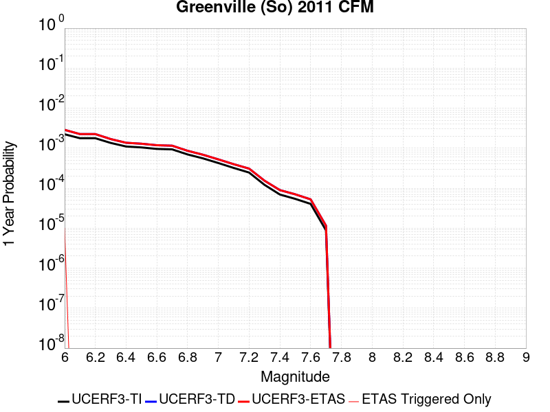 | 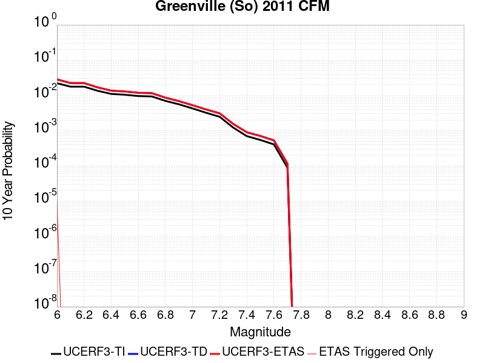 |

| Magnitude | 1 wk TI Prob | 1 wk TD Prob | 1 wk ETAS Prob | 1 wk ETAS/TD Gain | 1 wk ETAS Triggered Only | 1 mo TI Prob | 1 mo TD Prob | 1 mo ETAS Prob | 1 mo ETAS/TD Gain | 1 mo ETAS Triggered Only | 1 yr TI Prob | 1 yr TD Prob | 1 yr ETAS Prob | 1 yr ETAS/TD Gain | 1 yr ETAS Triggered Only | 10 yr TI Prob | 10 yr TD Prob | 10 yr ETAS Prob | 10 yr ETAS/TD Gain | 10 yr ETAS Triggered Only |
|-----|-----|-----|-----|-----|-----|-----|-----|-----|-----|-----|-----|-----|-----|-----|-----|-----|-----|-----|-----|-----|
| 6.0 | 4.279693E-5 | 5.5040568E-5 | 5.5040568E-5 | 1.0 | 0.0 | 1.8340252E-4 | 2.3586866E-4 | 2.458663E-4 | 1.0423865 | 1.0E-5 | 0.0022306389 | 0.0028681692 | 0.0028781404 | 1.0034765 | 1.0E-5 | 0.022083808 | 0.028338658 | 0.028348375 | 1.0003428 | 1.0E-5 |
| 6.1 | 3.4037297E-5 | 4.319238E-5 | 4.319238E-5 | 1.0 | 0.0 | 1.4586597E-4 | 1.8509808E-4 | 1.8509808E-4 | 1.0 | 0.0 | 0.0017744715 | 0.0022513992 | 0.0022513992 | 1.0 | 0.0 | 0.01760369 | 0.022303047 | 0.022303047 | 1.0 | 0.0 |
| 6.2 | 3.4037297E-5 | 4.319238E-5 | 4.319238E-5 | 1.0 | 0.0 | 1.4586597E-4 | 1.8509808E-4 | 1.8509808E-4 | 1.0 | 0.0 | 0.0017744715 | 0.0022513992 | 0.0022513992 | 1.0 | 0.0 | 0.01760369 | 0.022303047 | 0.022303047 | 1.0 | 0.0 |
| 6.3 | 2.5956324E-5 | 3.242939E-5 | 3.242939E-5 | 1.0 | 0.0 | 1.11236644E-4 | 1.3897609E-4 | 1.3897609E-4 | 1.0 | 0.0 | 0.0013534647 | 0.0016907848 | 0.0016907848 | 1.0 | 0.0 | 0.013452509 | 0.016786316 | 0.016786316 | 1.0 | 0.0 |
| 6.4 | 2.1145053E-5 | 2.6197793E-5 | 2.6197793E-5 | 1.0 | 0.0 | 9.061851E-5 | 1.1227157E-4 | 1.1227157E-4 | 1.0 | 0.0 | 0.0011027219 | 0.0013660807 | 0.0013660807 | 1.0 | 0.0 | 0.01097266 | 0.013580576 | 0.013580576 | 1.0 | 0.0 |
| 6.5 | 2.0030959E-5 | 2.4795921E-5 | 2.4795921E-5 | 1.0 | 0.0 | 8.584414E-5 | 1.0626408E-4 | 1.0626408E-4 | 1.0 | 0.0 | 0.0010446513 | 0.0012930284 | 0.0012930284 | 1.0 | 0.0 | 0.010397541 | 0.01285873 | 0.01285873 | 1.0 | 0.0 |
| 6.6 | 1.8395405E-5 | 2.275458E-5 | 2.275458E-5 | 1.0 | 0.0 | 7.8835066E-5 | 9.7516146E-5 | 9.7516146E-5 | 1.0 | 0.0 | 9.5939427E-4 | 0.0011866409 | 0.0011866409 | 1.0 | 0.0 | 0.009552629 | 0.01180643 | 0.01180643 | 1.0 | 0.0 |
| 6.7 | 1.7883482E-5 | 2.2125625E-5 | 2.2125625E-5 | 1.0 | 0.0 | 7.664124E-5 | 9.482082E-5 | 9.482082E-5 | 1.0 | 0.0 | 9.3270757E-4 | 0.0011538607 | 0.0011538607 | 1.0 | 0.0 | 0.009288026 | 0.011482077 | 0.011482077 | 1.0 | 0.0 |
| 6.8 | 1.3373564E-5 | 1.650608E-5 | 1.650608E-5 | 1.0 | 0.0 | 5.7314013E-5 | 7.0738504E-5 | 7.0738504E-5 | 1.0 | 0.0 | 6.975747E-4 | 8.609158E-4 | 8.609158E-4 | 1.0 | 0.0 | 0.0069538904 | 0.008577745 | 0.008577745 | 1.0 | 0.0 |
| 6.9 | 1.06692905E-5 | 1.3152695E-5 | 1.3152695E-5 | 1.0 | 0.0 | 4.5724726E-5 | 5.636754E-5 | 5.636754E-5 | 1.0 | 0.0 | 5.5655633E-4 | 6.8606995E-4 | 6.8606995E-4 | 1.0 | 0.0 | 0.005551645 | 0.006841082 | 0.006841082 | 1.0 | 0.0 |
| 7.0 | 8.157512E-6 | 1.0062752E-5 | 1.0062752E-5 | 1.0 | 0.0 | 3.4960296E-5 | 4.312539E-5 | 4.312539E-5 | 1.0 | 0.0 | 4.2555845E-4 | 5.2492885E-4 | 5.2492885E-4 | 1.0 | 0.0 | 0.004247444 | 0.0052376967 | 0.0052376967 | 1.0 | 0.0 |
| 7.1 | 6.1467113E-6 | 7.627545E-6 | 7.627545E-6 | 1.0 | 0.0 | 2.6342783E-5 | 3.2689073E-5 | 3.2689073E-5 | 1.0 | 0.0 | 3.206762E-4 | 3.9791764E-4 | 3.9791764E-4 | 1.0 | 0.0 | 0.0032021382 | 0.0039725704 | 0.0039725704 | 1.0 | 0.0 |
| 7.2 | 4.713467E-6 | 5.9142685E-6 | 5.9142685E-6 | 1.0 | 0.0 | 2.0200418E-5 | 2.5346622E-5 | 2.5346622E-5 | 1.0 | 0.0 | 2.4591232E-4 | 3.0855203E-4 | 3.0855203E-4 | 1.0 | 0.0 | 0.0024564038 | 0.0030816782 | 0.0030816782 | 1.0 | 0.0 |
| 7.3 | 2.3266216E-6 | 2.954067E-6 | 2.954067E-6 | 1.0 | 0.0 | 9.971197E-6 | 1.2660226E-5 | 1.2660226E-5 | 1.0 | 0.0 | 1.2139256E-4 | 1.541275E-4 | 1.541275E-4 | 1.0 | 0.0 | 0.0012132627 | 0.0015404817 | 0.0015404817 | 1.0 | 0.0 |
| 7.4 | 1.3314E-6 | 1.7179866E-6 | 1.7179866E-6 | 1.0 | 0.0 | 5.7059874E-6 | 7.362779E-6 | 7.362779E-6 | 1.0 | 0.0 | 6.946818E-5 | 8.96382E-5 | 8.96382E-5 | 1.0 | 0.0 | 6.9446466E-4 | 8.963211E-4 | 8.963211E-4 | 1.0 | 0.0 |
| 7.5 | 1.0362941E-6 | 1.3469155E-6 | 1.3469155E-6 | 1.0 | 0.0 | 4.4412527E-6 | 5.7724824E-6 | 5.7724824E-6 | 1.0 | 0.0 | 5.407091E-5 | 7.0277754E-5 | 7.0277754E-5 | 1.0 | 0.0 | 5.405776E-4 | 7.028451E-4 | 7.028451E-4 | 1.0 | 0.0 |
| 7.6 | 7.764784E-7 | 1.0088881E-6 | 1.0088881E-6 | 1.0 | 0.0 | 3.3277602E-6 | 4.3237997E-6 | 4.3237997E-6 | 1.0 | 0.0 | 4.0514726E-5 | 5.264103E-5 | 5.264103E-5 | 1.0 | 0.0 | 4.050734E-4 | 5.265317E-4 | 5.265317E-4 | 1.0 | 0.0 |
| 7.7 | 1.6927763E-7 | 2.2140186E-7 | 2.2140186E-7 | 1.0 | 0.0 | 7.2547533E-7 | 9.488648E-7 | 9.488648E-7 | 1.0 | 0.0 | 8.832627E-6 | 1.1552371E-5 | 1.1552371E-5 | 1.0 | 0.0 | 8.8322755E-5 | 1.1554653E-4 | 1.1554653E-4 | 1.0 | 0.0 |

## La Panza 2011
*[(top)](#table-of-contents)*

| 1 Week | 1 Month | 1 Year | 10 Year |
|-----|-----|-----|-----|
|  |  |  |  |

| Magnitude | 1 wk TI Prob | 1 wk TD Prob | 1 wk ETAS Prob | 1 wk ETAS/TD Gain | 1 wk ETAS Triggered Only | 1 mo TI Prob | 1 mo TD Prob | 1 mo ETAS Prob | 1 mo ETAS/TD Gain | 1 mo ETAS Triggered Only | 1 yr TI Prob | 1 yr TD Prob | 1 yr ETAS Prob | 1 yr ETAS/TD Gain | 1 yr ETAS Triggered Only | 10 yr TI Prob | 10 yr TD Prob | 10 yr ETAS Prob | 10 yr ETAS/TD Gain | 10 yr ETAS Triggered Only |
|-----|-----|-----|-----|-----|-----|-----|-----|-----|-----|-----|-----|-----|-----|-----|-----|-----|-----|-----|-----|-----|
| 6.0 | 4.6754544E-6 | 4.7175886E-6 | 4.7175886E-6 | 1.0 | 0.0 | 2.0037509E-5 | 2.021809E-5 | 3.0217889E-5 | 1.4945965 | 1.0E-5 | 2.4392935E-4 | 2.4612944E-4 | 2.5612698E-4 | 1.040619 | 1.0E-5 | 0.0024366176 | 0.0024587628 | 0.0024687382 | 1.004057 | 1.0E-5 |
| 6.1 | 4.6754544E-6 | 4.7175886E-6 | 4.7175886E-6 | 1.0 | 0.0 | 2.0037509E-5 | 2.021809E-5 | 3.0217889E-5 | 1.4945965 | 1.0E-5 | 2.4392935E-4 | 2.4612944E-4 | 2.5612698E-4 | 1.040619 | 1.0E-5 | 0.0024366176 | 0.0024587628 | 0.0024687382 | 1.004057 | 1.0E-5 |
| 6.2 | 4.6754544E-6 | 4.7175886E-6 | 4.7175886E-6 | 1.0 | 0.0 | 2.0037509E-5 | 2.021809E-5 | 3.0217889E-5 | 1.4945965 | 1.0E-5 | 2.4392935E-4 | 2.4612944E-4 | 2.5612698E-4 | 1.040619 | 1.0E-5 | 0.0024366176 | 0.0024587628 | 0.0024687382 | 1.004057 | 1.0E-5 |
| 6.3 | 4.6754544E-6 | 4.7175886E-6 | 4.7175886E-6 | 1.0 | 0.0 | 2.0037509E-5 | 2.021809E-5 | 3.0217889E-5 | 1.4945965 | 1.0E-5 | 2.4392935E-4 | 2.4612944E-4 | 2.5612698E-4 | 1.040619 | 1.0E-5 | 0.0024366176 | 0.0024587628 | 0.0024687382 | 1.004057 | 1.0E-5 |
| 6.4 | 4.6754544E-6 | 4.7175886E-6 | 4.7175886E-6 | 1.0 | 0.0 | 2.0037509E-5 | 2.021809E-5 | 3.0217889E-5 | 1.4945965 | 1.0E-5 | 2.4392935E-4 | 2.4612944E-4 | 2.5612698E-4 | 1.040619 | 1.0E-5 | 0.0024366176 | 0.0024587628 | 0.0024687382 | 1.004057 | 1.0E-5 |
| 6.5 | 2.485343E-6 | 2.5006007E-6 | 2.5006007E-6 | 1.0 | 0.0 | 1.0651426E-5 | 1.0716818E-5 | 1.0716818E-5 | 1.0 | 0.0 | 1.296734E-4 | 1.3046984E-4 | 1.3046984E-4 | 1.0 | 0.0 | 0.0012959775 | 0.0013039707 | 0.0013039707 | 1.0 | 0.0 |
| 6.6 | 2.485343E-6 | 2.5006007E-6 | 2.5006007E-6 | 1.0 | 0.0 | 1.0651426E-5 | 1.0716818E-5 | 1.0716818E-5 | 1.0 | 0.0 | 1.296734E-4 | 1.3046984E-4 | 1.3046984E-4 | 1.0 | 0.0 | 0.0012959775 | 0.0013039707 | 0.0013039707 | 1.0 | 0.0 |
| 6.7 | 1.5108508E-6 | 1.514639E-6 | 1.514639E-6 | 1.0 | 0.0 | 6.4750584E-6 | 6.4912947E-6 | 6.4912947E-6 | 1.0 | 0.0 | 7.8830984E-5 | 7.902876E-5 | 7.902876E-5 | 1.0 | 0.0 | 7.880303E-4 | 7.9001737E-4 | 7.9001737E-4 | 1.0 | 0.0 |
| 6.8 | 1.3865837E-6 | 1.3885118E-6 | 1.3885118E-6 | 1.0 | 0.0 | 5.942488E-6 | 5.950752E-6 | 5.950752E-6 | 1.0 | 0.0 | 7.234739E-5 | 7.244809E-5 | 7.244809E-5 | 1.0 | 0.0 | 7.232384E-4 | 7.242546E-4 | 7.242546E-4 | 1.0 | 0.0 |
| 6.9 | 9.826583E-7 | 9.796303E-7 | 9.796303E-7 | 1.0 | 0.0 | 4.2113857E-6 | 4.198409E-6 | 4.198409E-6 | 1.0 | 0.0 | 5.1272415E-5 | 5.1114486E-5 | 5.1114486E-5 | 1.0 | 0.0 | 5.126059E-4 | 5.1103265E-4 | 5.1103265E-4 | 1.0 | 0.0 |
| 7.0 | 6.7797646E-7 | 6.710231E-7 | 6.710231E-7 | 1.0 | 0.0 | 2.9056102E-6 | 2.8758104E-6 | 2.8758104E-6 | 1.0 | 0.0 | 3.537523E-5 | 3.501246E-5 | 3.501246E-5 | 1.0 | 0.0 | 3.5369597E-4 | 3.5007254E-4 | 3.5007254E-4 | 1.0 | 0.0 |
| 7.1 | 3.4979826E-7 | 3.3874045E-7 | 3.3874045E-7 | 1.0 | 0.0 | 1.4991346E-6 | 1.4517441E-6 | 1.4517441E-6 | 1.0 | 0.0 | 1.825181E-5 | 1.7674853E-5 | 1.7674853E-5 | 1.0 | 0.0 | 1.825031E-4 | 1.7673563E-4 | 1.7673563E-4 | 1.0 | 0.0 |
| 7.2 | 2.5088332E-7 | 2.3832064E-7 | 2.3832064E-7 | 1.0 | 0.0 | 1.0752137E-6 | 1.0213738E-6 | 1.0213738E-6 | 1.0 | 0.0 | 1.3090649E-5 | 1.2435164E-5 | 1.2435164E-5 | 1.0 | 0.0 | 1.3089878E-4 | 1.2434553E-4 | 1.2434553E-4 | 1.0 | 0.0 |
| 7.3 | 1.0159086E-7 | 8.644785E-8 | 8.644785E-8 | 1.0 | 0.0 | 4.3538932E-7 | 3.704907E-7 | 3.704907E-7 | 1.0 | 0.0 | 5.300852E-6 | 4.510716E-6 | 4.510716E-6 | 1.0 | 0.0 | 5.3007258E-5 | 4.510628E-5 | 4.510628E-5 | 1.0 | 0.0 |
| 7.4 | 3.5006252E-8 | 1.9403883E-8 | 1.9403883E-8 | 1.0 | 0.0 | 1.5002678E-7 | 8.315949E-8 | 8.315949E-8 | 1.0 | 0.0 | 1.8265745E-6 | 1.0124663E-6 | 1.0124663E-6 | 1.0 | 0.0 | 1.8265595E-5 | 1.012462E-5 | 1.012462E-5 | 1.0 | 0.0 |
| 7.5 | 2.592274E-8 | 1.0238468E-8 | 1.0238468E-8 | 1.0 | 0.0 | 1.1109746E-7 | 4.3879147E-8 | 4.3879147E-8 | 1.0 | 0.0 | 1.3526106E-6 | 5.342285E-7 | 5.342285E-7 | 1.0 | 0.0 | 1.3526024E-5 | 5.342273E-6 | 5.342273E-6 | 1.0 | 0.0 |
| 7.6 | 1.9016717E-8 | 5.2442264E-9 | 5.2442264E-9 | 1.0 | 0.0 | 8.150022E-8 | 2.2475257E-8 | 2.2475257E-8 | 1.0 | 0.0 | 9.922647E-7 | 2.736362E-7 | 2.736362E-7 | 1.0 | 0.0 | 9.922603E-6 | 2.736359E-6 | 2.736359E-6 | 1.0 | 0.0 |
| 7.7 | 1.17738495E-8 | 1.2393437E-9 | 1.2393437E-9 | 1.0 | 0.0 | 5.0459356E-8 | 5.3114735E-9 | 5.3114735E-9 | 1.0 | 0.0 | 6.1434247E-7 | 6.466719E-8 | 6.466719E-8 | 1.0 | 0.0 | 6.143408E-6 | 6.466717E-7 | 6.466717E-7 | 1.0 | 0.0 |
| 7.8 | 5.489079E-9 | 2.009185E-10 | 2.009185E-10 | 1.0 | 0.0 | 2.3524624E-8 | 8.61079E-10 | 8.61079E-10 | 1.0 | 0.0 | 2.8641225E-7 | 1.0483639E-8 | 1.0483639E-8 | 1.0 | 0.0 | 2.8641189E-6 | 1.0483638E-7 | 1.0483638E-7 | 1.0 | 0.0 |
| 7.9 | 2.5081048E-9 | 6.675449E-11 | 6.675449E-11 | 1.0 | 0.0 | 1.0749021E-8 | 2.8609015E-10 | 2.8609015E-10 | 1.0 | 0.0 | 1.3086932E-7 | 3.483148E-9 | 3.483148E-9 | 1.0 | 0.0 | 1.3086925E-6 | 3.483148E-8 | 3.483148E-8 | 1.0 | 0.0 |

## San Joaquin Hills
*[(top)](#table-of-contents)*

| 1 Week | 1 Month | 1 Year | 10 Year |
|-----|-----|-----|-----|
|  |  | 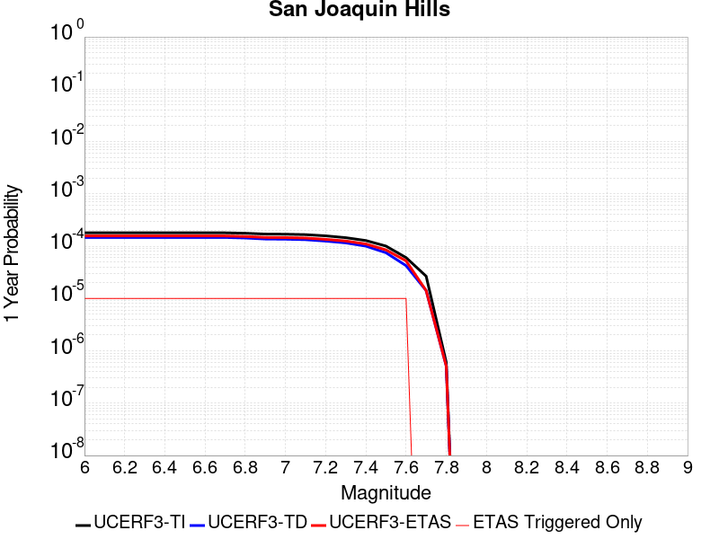 |  |

| Magnitude | 1 wk TI Prob | 1 wk TD Prob | 1 wk ETAS Prob | 1 wk ETAS/TD Gain | 1 wk ETAS Triggered Only | 1 mo TI Prob | 1 mo TD Prob | 1 mo ETAS Prob | 1 mo ETAS/TD Gain | 1 mo ETAS Triggered Only | 1 yr TI Prob | 1 yr TD Prob | 1 yr ETAS Prob | 1 yr ETAS/TD Gain | 1 yr ETAS Triggered Only | 10 yr TI Prob | 10 yr TD Prob | 10 yr ETAS Prob | 10 yr ETAS/TD Gain | 10 yr ETAS Triggered Only |
|-----|-----|-----|-----|-----|-----|-----|-----|-----|-----|-----|-----|-----|-----|-----|-----|-----|-----|-----|-----|-----|
| 6.0 | 3.4525704E-6 | 2.8139727E-6 | 2.8139727E-6 | 1.0 | 0.0 | 1.4796647E-5 | 1.2059828E-5 | 2.2059707E-5 | 1.8291892 | 1.0E-5 | 1.8013427E-4 | 1.4681864E-4 | 1.5681717E-4 | 1.0681013 | 1.0E-5 | 0.0017998833 | 0.0014672297 | 0.0014772151 | 1.0068055 | 1.0E-5 |
| 6.1 | 3.4525704E-6 | 2.8139727E-6 | 2.8139727E-6 | 1.0 | 0.0 | 1.4796647E-5 | 1.2059828E-5 | 2.2059707E-5 | 1.8291892 | 1.0E-5 | 1.8013427E-4 | 1.4681864E-4 | 1.5681717E-4 | 1.0681013 | 1.0E-5 | 0.0017998833 | 0.0014672297 | 0.0014772151 | 1.0068055 | 1.0E-5 |
| 6.2 | 3.4525704E-6 | 2.8139727E-6 | 2.8139727E-6 | 1.0 | 0.0 | 1.4796647E-5 | 1.2059828E-5 | 2.2059707E-5 | 1.8291892 | 1.0E-5 | 1.8013427E-4 | 1.4681864E-4 | 1.5681717E-4 | 1.0681013 | 1.0E-5 | 0.0017998833 | 0.0014672297 | 0.0014772151 | 1.0068055 | 1.0E-5 |
| 6.3 | 3.4525704E-6 | 2.8139727E-6 | 2.8139727E-6 | 1.0 | 0.0 | 1.4796647E-5 | 1.2059828E-5 | 2.2059707E-5 | 1.8291892 | 1.0E-5 | 1.8013427E-4 | 1.4681864E-4 | 1.5681717E-4 | 1.0681013 | 1.0E-5 | 0.0017998833 | 0.0014672297 | 0.0014772151 | 1.0068055 | 1.0E-5 |
| 6.4 | 3.4525704E-6 | 2.8139727E-6 | 2.8139727E-6 | 1.0 | 0.0 | 1.4796647E-5 | 1.2059828E-5 | 2.2059707E-5 | 1.8291892 | 1.0E-5 | 1.8013427E-4 | 1.4681864E-4 | 1.5681717E-4 | 1.0681013 | 1.0E-5 | 0.0017998833 | 0.0014672297 | 0.0014772151 | 1.0068055 | 1.0E-5 |
| 6.5 | 3.4525704E-6 | 2.8139727E-6 | 2.8139727E-6 | 1.0 | 0.0 | 1.4796647E-5 | 1.2059828E-5 | 2.2059707E-5 | 1.8291892 | 1.0E-5 | 1.8013427E-4 | 1.4681864E-4 | 1.5681717E-4 | 1.0681013 | 1.0E-5 | 0.0017998833 | 0.0014672297 | 0.0014772151 | 1.0068055 | 1.0E-5 |
| 6.6 | 3.4525704E-6 | 2.8139727E-6 | 2.8139727E-6 | 1.0 | 0.0 | 1.4796647E-5 | 1.2059828E-5 | 2.2059707E-5 | 1.8291892 | 1.0E-5 | 1.8013427E-4 | 1.4681864E-4 | 1.5681717E-4 | 1.0681013 | 1.0E-5 | 0.0017998833 | 0.0014672297 | 0.0014772151 | 1.0068055 | 1.0E-5 |
| 6.7 | 3.4525704E-6 | 2.8139727E-6 | 2.8139727E-6 | 1.0 | 0.0 | 1.4796647E-5 | 1.2059828E-5 | 2.2059707E-5 | 1.8291892 | 1.0E-5 | 1.8013427E-4 | 1.4681864E-4 | 1.5681717E-4 | 1.0681013 | 1.0E-5 | 0.0017998833 | 0.0014672297 | 0.0014772151 | 1.0068055 | 1.0E-5 |
| 6.8 | 3.388654E-6 | 2.7484111E-6 | 2.7484111E-6 | 1.0 | 0.0 | 1.4522722E-5 | 1.1778852E-5 | 2.1778735E-5 | 1.8489691 | 1.0E-5 | 1.767998E-4 | 1.4339821E-4 | 1.5339679E-4 | 1.0697259 | 1.0E-5 | 0.001766592 | 0.0014330697 | 0.0014430553 | 1.006968 | 1.0E-5 |
| 6.9 | 3.2694352E-6 | 2.6283255E-6 | 2.6283255E-6 | 1.0 | 0.0 | 1.401179E-5 | 1.1264204E-5 | 2.1264092E-5 | 1.887758 | 1.0E-5 | 1.7058018E-4 | 1.3713316E-4 | 1.471318E-4 | 1.0729119 | 1.0E-5 | 0.0017044931 | 0.0013704967 | 0.001380483 | 1.0072867 | 1.0E-5 |
| 7.0 | 3.246912E-6 | 2.6069824E-6 | 2.6069824E-6 | 1.0 | 0.0 | 1.39152635E-5 | 1.1172735E-5 | 2.1172624E-5 | 1.895026 | 1.0E-5 | 1.6940516E-4 | 1.3601968E-4 | 1.4601831E-4 | 1.0735087 | 1.0E-5 | 0.0016927607 | 0.0013593754 | 0.0013693619 | 1.0073463 | 1.0E-5 |
| 7.1 | 3.1864927E-6 | 2.5523102E-6 | 2.5523102E-6 | 1.0 | 0.0 | 1.3656326E-5 | 1.0938427E-5 | 2.0938318E-5 | 1.9141982 | 1.0E-5 | 1.6625308E-4 | 1.3316733E-4 | 1.4316599E-4 | 1.0750835 | 1.0E-5 | 0.0016612876 | 0.0013308863 | 0.001340873 | 1.0075037 | 1.0E-5 |
| 7.2 | 3.0220644E-6 | 2.3991581E-6 | 2.3991581E-6 | 1.0 | 0.0 | 1.295164E-5 | 1.0282067E-5 | 2.0281963E-5 | 1.9725572 | 1.0E-5 | 1.576748E-4 | 1.2517707E-4 | 1.3517581E-4 | 1.0798768 | 1.0E-5 | 0.0015756298 | 0.001251076 | 0.0012610634 | 1.0079831 | 1.0E-5 |
| 7.3 | 2.787619E-6 | 2.2173751E-6 | 2.2173751E-6 | 1.0 | 0.0 | 1.1946884E-5 | 9.503003E-6 | 1.9502908E-5 | 2.052289 | 1.0E-5 | 1.454436E-4 | 1.1569301E-4 | 1.2569185E-4 | 1.0864257 | 1.0E-5 | 0.0014534845 | 0.0011563377 | 0.0011663261 | 1.008638 | 1.0E-5 |
| 7.4 | 2.4593792E-6 | 1.9226163E-6 | 1.9226163E-6 | 1.0 | 0.0 | 1.0540153E-5 | 8.239759E-6 | 1.8239676E-5 | 2.2136178 | 1.0E-5 | 1.2831882E-4 | 1.0031454E-4 | 1.1031354E-4 | 1.0996765 | 1.0E-5 | 0.0012824474 | 0.0010027013 | 0.0010126913 | 1.009963 | 1.0E-5 |
| 7.5 | 1.926764E-6 | 1.4383043E-6 | 1.4383043E-6 | 1.0 | 0.0 | 8.257534E-6 | 6.1641467E-6 | 1.6164086E-5 | 2.6222746 | 1.0E-5 | 1.00530844E-4 | 7.5045966E-5 | 8.504521E-5 | 1.1332417 | 1.0E-5 | 0.0010048538 | 7.502126E-4 | 7.602051E-4 | 1.0133196 | 1.0E-5 |
| 7.6 | 1.1609359E-6 | 8.145649E-7 | 8.145649E-7 | 1.0 | 0.0 | 4.97543E-6 | 3.4909879E-6 | 1.3490953E-5 | 3.8645086 | 1.0E-5 | 6.0574173E-5 | 4.2501993E-5 | 5.2501568E-5 | 1.2352731 | 1.0E-5 | 6.055767E-4 | 4.24943E-4 | 4.3493873E-4 | 1.0235226 | 1.0E-5 |
| 7.7 | 5.1168536E-7 | 2.7155397E-7 | 2.7155397E-7 | 1.0 | 0.0 | 2.1929354E-6 | 1.1638023E-6 | 1.1638023E-6 | 1.0 | 0.0 | 2.669866E-5 | 1.4169214E-5 | 1.4169214E-5 | 1.0 | 0.0 | 2.6695454E-4 | 1.4168446E-4 | 1.4168446E-4 | 1.0 | 0.0 |
| 7.8 | 1.16056995E-8 | 9.782997E-9 | 9.782997E-9 | 1.0 | 0.0 | 4.9738713E-8 | 4.1927127E-8 | 4.1927127E-8 | 1.0 | 0.0 | 6.0556863E-7 | 5.1046277E-7 | 5.1046277E-7 | 1.0 | 0.0 | 6.05567E-6 | 5.1046277E-6 | 5.1046277E-6 | 1.0 | 0.0 |

## Great Valley 02
*[(top)](#table-of-contents)*

| 1 Week | 1 Month | 1 Year | 10 Year |
|-----|-----|-----|-----|
| 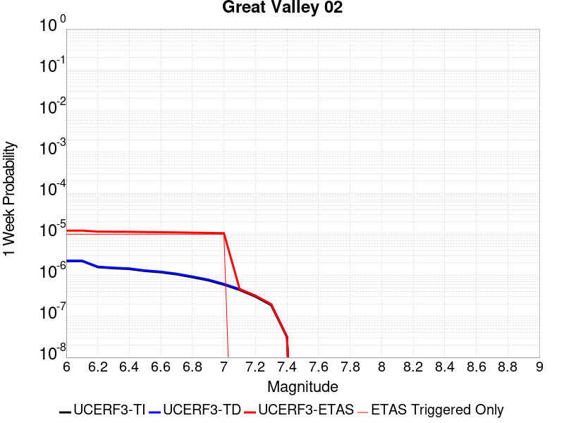 | 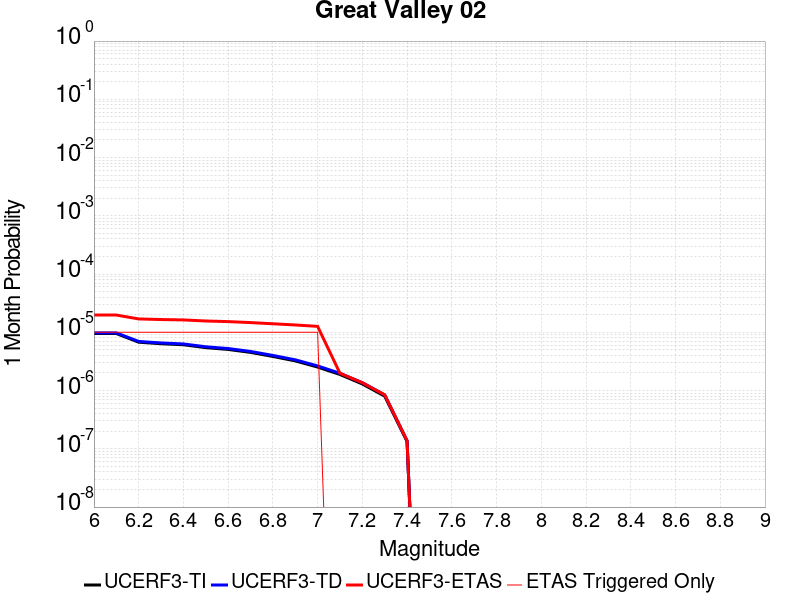 |  | 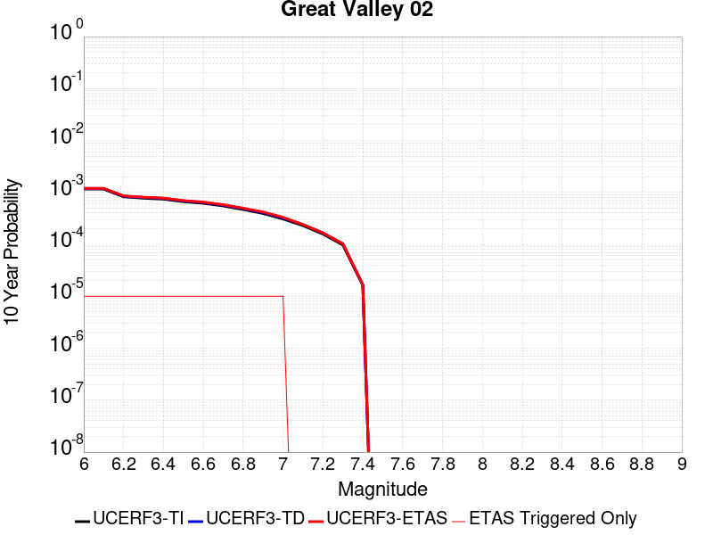 |

| Magnitude | 1 wk TI Prob | 1 wk TD Prob | 1 wk ETAS Prob | 1 wk ETAS/TD Gain | 1 wk ETAS Triggered Only | 1 mo TI Prob | 1 mo TD Prob | 1 mo ETAS Prob | 1 mo ETAS/TD Gain | 1 mo ETAS Triggered Only | 1 yr TI Prob | 1 yr TD Prob | 1 yr ETAS Prob | 1 yr ETAS/TD Gain | 1 yr ETAS Triggered Only | 10 yr TI Prob | 10 yr TD Prob | 10 yr ETAS Prob | 10 yr ETAS/TD Gain | 10 yr ETAS Triggered Only |
|-----|-----|-----|-----|-----|-----|-----|-----|-----|-----|-----|-----|-----|-----|-----|-----|-----|-----|-----|-----|-----|
| 6.0 | 2.2243487E-6 | 2.281768E-6 | 1.22817455E-5 | 5.3825564 | 1.0E-5 | 9.532888E-6 | 9.778972E-6 | 1.9778874E-5 | 2.0225923 | 1.0E-5 | 1.1605673E-4 | 1.1905298E-4 | 1.290518E-4 | 1.0839862 | 1.0E-5 | 0.0011599615 | 0.0011899419 | 0.0011999301 | 1.0083938 | 1.0E-5 |
| 6.1 | 2.2243487E-6 | 2.281768E-6 | 1.22817455E-5 | 5.3825564 | 1.0E-5 | 9.532888E-6 | 9.778972E-6 | 1.9778874E-5 | 2.0225923 | 1.0E-5 | 1.1605673E-4 | 1.1905298E-4 | 1.290518E-4 | 1.0839862 | 1.0E-5 | 0.0011599615 | 0.0011899419 | 0.0011999301 | 1.0083938 | 1.0E-5 |
| 6.2 | 1.5787732E-6 | 1.6272533E-6 | 1.1627237E-5 | 7.1453147 | 1.0E-5 | 6.7661535E-6 | 6.9739244E-6 | 1.6973854E-5 | 2.433903 | 1.0E-5 | 8.2374805E-5 | 8.490427E-5 | 9.4903415E-5 | 1.1177697 | 1.0E-5 | 8.2344277E-4 | 8.4872305E-4 | 8.587146E-4 | 1.0117724 | 1.0E-5 |
| 6.3 | 1.4850314E-6 | 1.5322953E-6 | 1.153228E-5 | 7.526147 | 1.0E-5 | 6.3644047E-6 | 6.5669637E-6 | 1.6566897E-5 | 2.5227637 | 1.0E-5 | 7.748387E-5 | 7.994989E-5 | 8.994909E-5 | 1.1250683 | 1.0E-5 | 7.745686E-4 | 7.992151E-4 | 8.092071E-4 | 1.0125023 | 1.0E-5 |
| 6.4 | 1.4266972E-6 | 1.4734348E-6 | 1.147342E-5 | 7.7868524 | 1.0E-5 | 6.114402E-6 | 6.314706E-6 | 1.6314643E-5 | 2.583595 | 1.0E-5 | 7.44403E-5 | 7.687887E-5 | 8.68781E-5 | 1.1300647 | 1.0E-5 | 7.441537E-4 | 7.685261E-4 | 7.7851844E-4 | 1.0130019 | 1.0E-5 |
| 6.5 | 1.2728015E-6 | 1.3171256E-6 | 1.1317113E-5 | 8.59228 | 1.0E-5 | 5.4548523E-6 | 5.6448116E-6 | 1.5644755E-5 | 2.7715282 | 1.0E-5 | 6.64108E-5 | 6.872344E-5 | 7.8722755E-5 | 1.1455008 | 1.0E-5 | 6.639096E-4 | 6.870245E-4 | 6.9701765E-4 | 1.0145456 | 1.0E-5 |
| 6.6 | 1.1857247E-6 | 1.2289391E-6 | 1.1228927E-5 | 9.13709 | 1.0E-5 | 5.0816675E-6 | 5.2668715E-6 | 1.5266818E-5 | 2.8986502 | 1.0E-5 | 6.186755E-5 | 6.41223E-5 | 7.412166E-5 | 1.155942 | 1.0E-5 | 6.1850325E-4 | 6.4104045E-4 | 6.51034E-4 | 1.0155896 | 1.0E-5 |
| 6.7 | 1.0550715E-6 | 1.0953329E-6 | 1.1095322E-5 | 10.129634 | 1.0E-5 | 4.521727E-6 | 4.6942755E-6 | 1.4694228E-5 | 3.130244 | 1.0E-5 | 5.5050637E-5 | 5.715133E-5 | 6.715076E-5 | 1.1749641 | 1.0E-5 | 5.5037E-4 | 5.7136844E-4 | 5.813627E-4 | 1.0174918 | 1.0E-5 |
| 6.8 | 8.9881183E-7 | 9.355551E-7 | 1.0935546E-5 | 11.688831 | 1.0E-5 | 3.8520448E-6 | 4.0095156E-6 | 1.4009475E-5 | 3.4940567 | 1.0E-5 | 4.689764E-5 | 4.8814778E-5 | 5.881429E-5 | 1.204846 | 1.0E-5 | 4.688774E-4 | 4.880423E-4 | 4.9803744E-4 | 1.02048 | 1.0E-5 |
| 6.9 | 7.5417256E-7 | 7.8710764E-7 | 1.07871E-5 | 13.704733 | 1.0E-5 | 3.232164E-6 | 3.373314E-6 | 1.337328E-5 | 3.9644337 | 1.0E-5 | 3.9350885E-5 | 4.106934E-5 | 5.1068928E-5 | 1.2434807 | 1.0E-5 | 3.934392E-4 | 4.1061893E-4 | 4.2061484E-4 | 1.0243435 | 1.0E-5 |
| 7.0 | 5.909726E-7 | 6.177937E-7 | 1.0617788E-5 | 17.186623 | 1.0E-5 | 2.5327372E-6 | 2.6476848E-6 | 1.2647658E-5 | 4.7768745 | 1.0E-5 | 3.083564E-5 | 3.2235093E-5 | 4.2234773E-5 | 1.310211 | 1.0E-5 | 3.083136E-4 | 3.223052E-4 | 3.3230198E-4 | 1.0310165 | 1.0E-5 |
| 7.1 | 4.4054178E-7 | 4.617082E-7 | 4.617082E-7 | 1.0 | 0.0 | 1.8880348E-6 | 1.978748E-6 | 1.978748E-6 | 1.0 | 0.0 | 2.2986582E-5 | 2.4090998E-5 | 2.4090998E-5 | 1.0 | 0.0 | 2.2984203E-4 | 2.4088458E-4 | 2.4088458E-4 | 1.0 | 0.0 |
| 7.2 | 3.029834E-7 | 3.1821946E-7 | 3.1821946E-7 | 1.0 | 0.0 | 1.2984997E-6 | 1.363797E-6 | 1.363797E-6 | 1.0 | 0.0 | 1.5809119E-5 | 1.6604106E-5 | 1.6604106E-5 | 1.0 | 0.0 | 1.5807994E-4 | 1.660291E-4 | 1.660291E-4 | 1.0 | 0.0 |
| 7.3 | 1.8700909E-7 | 1.9680154E-7 | 1.9680154E-7 | 1.0 | 0.0 | 8.0146725E-7 | 8.434349E-7 | 8.434349E-7 | 1.0 | 0.0 | 9.75782E-6 | 1.02687745E-5 | 1.02687745E-5 | 1.0 | 0.0 | 9.757392E-5 | 1.02683276E-4 | 1.02683276E-4 | 1.0 | 0.0 |
| 7.4 | 3.112171E-8 | 3.2068368E-8 | 3.2068368E-8 | 1.0 | 0.0 | 1.3337875E-7 | 1.3743585E-7 | 1.3743585E-7 | 1.0 | 0.0 | 1.6238852E-6 | 1.6732803E-6 | 1.6732803E-6 | 1.0 | 0.0 | 1.6238733E-5 | 1.6732685E-5 | 1.6732685E-5 | 1.0 | 0.0 |

## Concord 2011 CFM
*[(top)](#table-of-contents)*

| 1 Week | 1 Month | 1 Year | 10 Year |
|-----|-----|-----|-----|
| 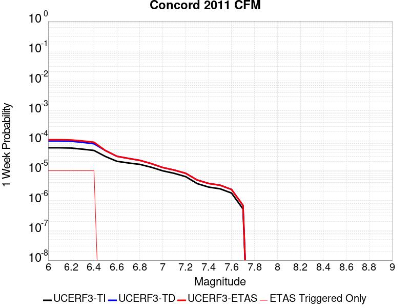 |  |  |  |

| Magnitude | 1 wk TI Prob | 1 wk TD Prob | 1 wk ETAS Prob | 1 wk ETAS/TD Gain | 1 wk ETAS Triggered Only | 1 mo TI Prob | 1 mo TD Prob | 1 mo ETAS Prob | 1 mo ETAS/TD Gain | 1 mo ETAS Triggered Only | 1 yr TI Prob | 1 yr TD Prob | 1 yr ETAS Prob | 1 yr ETAS/TD Gain | 1 yr ETAS Triggered Only | 10 yr TI Prob | 10 yr TD Prob | 10 yr ETAS Prob | 10 yr ETAS/TD Gain | 10 yr ETAS Triggered Only |
|-----|-----|-----|-----|-----|-----|-----|-----|-----|-----|-----|-----|-----|-----|-----|-----|-----|-----|-----|-----|-----|
| 6.0 | 5.7865112E-5 | 9.7585355E-5 | 1.0758438E-4 | 1.1024644 | 1.0E-5 | 2.4796976E-4 | 4.181607E-4 | 4.281565E-4 | 1.0239042 | 1.0E-5 | 0.0030148525 | 0.005079743 | 0.0050896923 | 1.0019586 | 1.0E-5 | 0.029742775 | 0.049266078 | 0.049275585 | 1.000193 | 1.0E-5 |
| 6.1 | 5.7865112E-5 | 9.7585355E-5 | 1.0758438E-4 | 1.1024644 | 1.0E-5 | 2.4796976E-4 | 4.181607E-4 | 4.281565E-4 | 1.0239042 | 1.0E-5 | 0.0030148525 | 0.005079743 | 0.0050896923 | 1.0019586 | 1.0E-5 | 0.029742775 | 0.049266078 | 0.049275585 | 1.000193 | 1.0E-5 |
| 6.2 | 5.6789337E-5 | 9.578793E-5 | 1.0578697E-4 | 1.1043873 | 1.0E-5 | 2.4336016E-4 | 4.1045985E-4 | 4.2045576E-4 | 1.0243529 | 1.0E-5 | 0.0029588845 | 0.0049864696 | 0.0049964194 | 1.0019954 | 1.0E-5 | 0.029197963 | 0.04838257 | 0.048392083 | 1.0001967 | 1.0E-5 |
| 6.3 | 5.203322E-5 | 8.803241E-5 | 9.803152E-5 | 1.1135845 | 1.0E-5 | 2.2298045E-4 | 3.772316E-4 | 3.872278E-4 | 1.0264989 | 1.0E-5 | 0.0027114071 | 0.0045839064 | 0.0045938604 | 1.0021715 | 1.0E-5 | 0.026785625 | 0.04455397 | 0.044563524 | 1.0002145 | 1.0E-5 |
| 6.4 | 4.7120942E-5 | 7.897583E-5 | 8.897504E-5 | 1.126611 | 1.0E-5 | 2.0193127E-4 | 3.3842813E-4 | 3.4842474E-4 | 1.0295384 | 1.0E-5 | 0.0024557412 | 0.004113323 | 0.0041232817 | 1.0024211 | 1.0E-5 | 0.024287801 | 0.040080756 | 0.040090356 | 1.0002395 | 1.0E-5 |
| 6.5 | 2.9598437E-5 | 4.6675777E-5 | 4.6675777E-5 | 1.0 | 0.0 | 1.2684427E-4 | 2.000249E-4 | 2.000249E-4 | 1.0 | 0.0 | 0.001543235 | 0.0024327936 | 0.0024327936 | 1.0 | 0.0 | 0.015325619 | 0.023909668 | 0.023909668 | 1.0 | 0.0 |
| 6.6 | 2.0443718E-5 | 2.9984873E-5 | 2.9984873E-5 | 1.0 | 0.0 | 8.7613E-5 | 1.2850047E-4 | 1.2850047E-4 | 1.0 | 0.0 | 0.0010661662 | 0.0015634067 | 0.0015634067 | 1.0 | 0.0 | 0.010610655 | 0.0154669015 | 0.0154669015 | 1.0 | 0.0 |
| 6.7 | 1.798539E-5 | 2.5557883E-5 | 2.5557883E-5 | 1.0 | 0.0 | 7.7077966E-5 | 1.0952931E-4 | 1.0952931E-4 | 1.0 | 0.0 | 9.380202E-4 | 0.0013327252 | 0.0013327252 | 1.0 | 0.0 | 0.009340706 | 0.013217516 | 0.013217516 | 1.0 | 0.0 |
| 6.8 | 1.613555E-5 | 2.1959608E-5 | 2.1959608E-5 | 1.0 | 0.0 | 6.915052E-5 | 9.4109295E-5 | 9.4109295E-5 | 1.0 | 0.0 | 8.4158237E-4 | 0.0011451923 | 0.0011451923 | 1.0 | 0.0 | 0.008384023 | 0.011378321 | 0.011378321 | 1.0 | 0.0 |
| 6.9 | 1.2916435E-5 | 1.708134E-5 | 1.708134E-5 | 1.0 | 0.0 | 5.5354973E-5 | 7.320372E-5 | 7.320372E-5 | 1.0 | 0.0 | 6.7373837E-4 | 8.908967E-4 | 8.908967E-4 | 1.0 | 0.0 | 0.006716994 | 0.008867833 | 0.008867833 | 1.0 | 0.0 |
| 7.0 | 9.81129E-6 | 1.2631038E-5 | 1.2631038E-5 | 1.0 | 0.0 | 4.2047708E-5 | 5.4131906E-5 | 5.4131906E-5 | 1.0 | 0.0 | 5.118106E-4 | 6.588583E-4 | 6.588583E-4 | 1.0 | 0.0 | 0.005106334 | 0.0065697595 | 0.0065697595 | 1.0 | 0.0 |
| 7.1 | 8.0889195E-6 | 1.04184555E-5 | 1.04184555E-5 | 1.0 | 0.0 | 3.4666336E-5 | 4.4649765E-5 | 4.4649765E-5 | 1.0 | 0.0 | 4.219809E-4 | 5.434764E-4 | 5.434764E-4 | 1.0 | 0.0 | 0.004211805 | 0.0054219896 | 0.0054219896 | 1.0 | 0.0 |
| 7.2 | 6.267438E-6 | 8.115879E-6 | 8.115879E-6 | 1.0 | 0.0 | 2.6860173E-5 | 3.478188E-5 | 3.478188E-5 | 1.0 | 0.0 | 3.2697353E-4 | 4.2338783E-4 | 4.2338783E-4 | 1.0 | 0.0 | 0.0032649285 | 0.004226169 | 0.004226169 | 1.0 | 0.0 |
| 7.3 | 3.6761196E-6 | 4.840281E-6 | 4.840281E-6 | 1.0 | 0.0 | 1.5754704E-5 | 2.0743897E-5 | 2.0743897E-5 | 1.0 | 0.0 | 1.9179663E-4 | 2.5252788E-4 | 2.5252788E-4 | 1.0 | 0.0 | 0.0019163118 | 0.0025226264 | 0.0025226264 | 1.0 | 0.0 |
| 7.4 | 2.8044356E-6 | 3.7096993E-6 | 3.7096993E-6 | 1.0 | 0.0 | 1.2018954E-5 | 1.5898615E-5 | 1.5898615E-5 | 1.0 | 0.0 | 1.4632095E-4 | 1.9354856E-4 | 1.9354856E-4 | 1.0 | 0.0 | 0.0014622464 | 0.0019340349 | 0.0019340349 | 1.0 | 0.0 |
| 7.5 | 2.4578699E-6 | 3.2448306E-6 | 3.2448306E-6 | 1.0 | 0.0 | 1.0533685E-5 | 1.3906343E-5 | 1.3906343E-5 | 1.0 | 0.0 | 1.2824008E-4 | 1.6929668E-4 | 1.6929668E-4 | 1.0 | 0.0 | 0.0012816609 | 0.0016918926 | 0.0016918926 | 1.0 | 0.0 |
| 7.6 | 1.7713267E-6 | 2.335189E-6 | 2.335189E-6 | 1.0 | 0.0 | 7.591378E-6 | 1.0007916E-5 | 1.0007916E-5 | 1.0 | 0.0 | 9.2421105E-5 | 1.2183965E-4 | 1.2183965E-4 | 1.0 | 0.0 | 9.2382677E-4 | 0.0012178655 | 0.0012178655 | 1.0 | 0.0 |
| 7.7 | 5.1912366E-7 | 6.829346E-7 | 6.829346E-7 | 1.0 | 0.0 | 2.2248137E-6 | 2.9268595E-6 | 2.9268595E-6 | 1.0 | 0.0 | 2.708677E-5 | 3.5633944E-5 | 3.5633944E-5 | 1.0 | 0.0 | 2.708347E-4 | 3.5630353E-4 | 3.5630353E-4 | 1.0 | 0.0 |

## Fontana (Seismicity)
*[(top)](#table-of-contents)*

| 1 Week | 1 Month | 1 Year | 10 Year |
|-----|-----|-----|-----|
|  |  |  |  |

| Magnitude | 1 wk TI Prob | 1 wk TD Prob | 1 wk ETAS Prob | 1 wk ETAS/TD Gain | 1 wk ETAS Triggered Only | 1 mo TI Prob | 1 mo TD Prob | 1 mo ETAS Prob | 1 mo ETAS/TD Gain | 1 mo ETAS Triggered Only | 1 yr TI Prob | 1 yr TD Prob | 1 yr ETAS Prob | 1 yr ETAS/TD Gain | 1 yr ETAS Triggered Only | 10 yr TI Prob | 10 yr TD Prob | 10 yr ETAS Prob | 10 yr ETAS/TD Gain | 10 yr ETAS Triggered Only |
|-----|-----|-----|-----|-----|-----|-----|-----|-----|-----|-----|-----|-----|-----|-----|-----|-----|-----|-----|-----|-----|
| 6.0 | 7.1789214E-6 | 7.5520006E-6 | 7.5520006E-6 | 1.0 | 0.0 | 3.076644E-5 | 3.2365548E-5 | 3.2365548E-5 | 1.0 | 0.0 | 3.7451705E-4 | 3.9402005E-4 | 4.0401611E-4 | 1.0253694 | 1.0E-5 | 0.003738865 | 0.003937214 | 0.0039471746 | 1.0025299 | 1.0E-5 |
| 6.1 | 7.1789214E-6 | 7.5520006E-6 | 7.5520006E-6 | 1.0 | 0.0 | 3.076644E-5 | 3.2365548E-5 | 3.2365548E-5 | 1.0 | 0.0 | 3.7451705E-4 | 3.9402005E-4 | 4.0401611E-4 | 1.0253694 | 1.0E-5 | 0.003738865 | 0.003937214 | 0.0039471746 | 1.0025299 | 1.0E-5 |
| 6.2 | 7.1789214E-6 | 7.5520006E-6 | 7.5520006E-6 | 1.0 | 0.0 | 3.076644E-5 | 3.2365548E-5 | 3.2365548E-5 | 1.0 | 0.0 | 3.7451705E-4 | 3.9402005E-4 | 4.0401611E-4 | 1.0253694 | 1.0E-5 | 0.003738865 | 0.003937214 | 0.0039471746 | 1.0025299 | 1.0E-5 |
| 6.3 | 7.1789214E-6 | 7.5520006E-6 | 7.5520006E-6 | 1.0 | 0.0 | 3.076644E-5 | 3.2365548E-5 | 3.2365548E-5 | 1.0 | 0.0 | 3.7451705E-4 | 3.9402005E-4 | 4.0401611E-4 | 1.0253694 | 1.0E-5 | 0.003738865 | 0.003937214 | 0.0039471746 | 1.0025299 | 1.0E-5 |
| 6.4 | 7.1789214E-6 | 7.5520006E-6 | 7.5520006E-6 | 1.0 | 0.0 | 3.076644E-5 | 3.2365548E-5 | 3.2365548E-5 | 1.0 | 0.0 | 3.7451705E-4 | 3.9402005E-4 | 4.0401611E-4 | 1.0253694 | 1.0E-5 | 0.003738865 | 0.003937214 | 0.0039471746 | 1.0025299 | 1.0E-5 |
| 6.5 | 5.2611317E-6 | 5.532726E-6 | 5.532726E-6 | 1.0 | 0.0 | 2.2547512E-5 | 2.3711682E-5 | 2.3711682E-5 | 1.0 | 0.0 | 2.744814E-4 | 2.8868974E-4 | 2.9868685E-4 | 1.0346292 | 1.0E-5 | 0.002741426 | 0.0028868972 | 0.0028968684 | 1.003454 | 1.0E-5 |
| 6.6 | 5.2611317E-6 | 5.532726E-6 | 5.532726E-6 | 1.0 | 0.0 | 2.2547512E-5 | 2.3711682E-5 | 2.3711682E-5 | 1.0 | 0.0 | 2.744814E-4 | 2.8868974E-4 | 2.9868685E-4 | 1.0346292 | 1.0E-5 | 0.002741426 | 0.0028868972 | 0.0028968684 | 1.003454 | 1.0E-5 |

## Davis Creek
*[(top)](#table-of-contents)*

| 1 Week | 1 Month | 1 Year | 10 Year |
|-----|-----|-----|-----|
|  |  |  |  |

| Magnitude | 1 wk TI Prob | 1 wk TD Prob | 1 wk ETAS Prob | 1 wk ETAS/TD Gain | 1 wk ETAS Triggered Only | 1 mo TI Prob | 1 mo TD Prob | 1 mo ETAS Prob | 1 mo ETAS/TD Gain | 1 mo ETAS Triggered Only | 1 yr TI Prob | 1 yr TD Prob | 1 yr ETAS Prob | 1 yr ETAS/TD Gain | 1 yr ETAS Triggered Only | 10 yr TI Prob | 10 yr TD Prob | 10 yr ETAS Prob | 10 yr ETAS/TD Gain | 10 yr ETAS Triggered Only |
|-----|-----|-----|-----|-----|-----|-----|-----|-----|-----|-----|-----|-----|-----|-----|-----|-----|-----|-----|-----|-----|
| 6.0 | 2.331472E-5 | 2.5417214E-5 | 3.541696E-5 | 1.3934242 | 1.0E-5 | 9.99164E-5 | 1.0892704E-4 | 1.1892595E-4 | 1.0917946 | 1.0E-5 | 0.0012158032 | 0.0013254983 | 0.0013354851 | 1.0075344 | 1.0E-5 | 0.01209173 | 0.013187704 | 0.013197572 | 1.0007483 | 1.0E-5 |
| 6.1 | 1.0407654E-5 | 1.1316986E-5 | 1.1316986E-5 | 1.0 | 0.0 | 4.4603472E-5 | 4.8500624E-5 | 4.8500624E-5 | 1.0 | 0.0 | 5.4291193E-4 | 5.9036224E-4 | 5.9036224E-4 | 1.0 | 0.0 | 0.0054158745 | 0.005890611 | 0.005890611 | 1.0 | 0.0 |
| 6.2 | 1.0407654E-5 | 1.1316986E-5 | 1.1316986E-5 | 1.0 | 0.0 | 4.4603472E-5 | 4.8500624E-5 | 4.8500624E-5 | 1.0 | 0.0 | 5.4291193E-4 | 5.9036224E-4 | 5.9036224E-4 | 1.0 | 0.0 | 0.0054158745 | 0.005890611 | 0.005890611 | 1.0 | 0.0 |
| 6.3 | 5.1323277E-6 | 5.568556E-6 | 5.568556E-6 | 1.0 | 0.0 | 2.1995505E-5 | 2.386507E-5 | 2.386507E-5 | 1.0 | 0.0 | 2.6776237E-4 | 2.905271E-4 | 2.905271E-4 | 1.0 | 0.0 | 0.0026743996 | 0.0029023192 | 0.0029023192 | 1.0 | 0.0 |
| 6.4 | 2.4985154E-6 | 2.704538E-6 | 2.704538E-6 | 1.0 | 0.0 | 1.07078795E-5 | 1.1590847E-5 | 1.1590847E-5 | 1.0 | 0.0 | 1.3036063E-4 | 1.4111304E-4 | 1.4111304E-4 | 1.0 | 0.0 | 0.0013028418 | 0.001410589 | 0.001410589 | 1.0 | 0.0 |
| 6.5 | 2.4846438E-6 | 2.6904722E-6 | 2.6904722E-6 | 1.0 | 0.0 | 1.064843E-5 | 1.1530565E-5 | 1.1530565E-5 | 1.0 | 0.0 | 1.2963692E-4 | 1.403792E-4 | 1.403792E-4 | 1.0 | 0.0 | 0.0012956132 | 0.0014032599 | 0.0014032599 | 1.0 | 0.0 |
| 6.6 | 2.072566E-7 | 2.1018087E-7 | 2.1018087E-7 | 1.0 | 0.0 | 8.882423E-7 | 9.0077486E-7 | 9.0077486E-7 | 1.0 | 0.0 | 1.0814296E-5 | 1.0966881E-5 | 1.0966881E-5 | 1.0 | 0.0 | 1.081377E-4 | 1.09663575E-4 | 1.09663575E-4 | 1.0 | 0.0 |
| 6.7 | 1.7544528E-7 | 1.7790826E-7 | 1.7790826E-7 | 1.0 | 0.0 | 7.5190815E-7 | 7.6246374E-7 | 7.6246374E-7 | 1.0 | 0.0 | 9.154443E-6 | 9.282958E-6 | 9.282958E-6 | 1.0 | 0.0 | 9.1540656E-5 | 9.282586E-5 | 9.282586E-5 | 1.0 | 0.0 |
| 6.8 | 1.2320395E-7 | 1.2481138E-7 | 1.2481138E-7 | 1.0 | 0.0 | 5.280168E-7 | 5.349058E-7 | 5.349058E-7 | 1.0 | 0.0 | 6.428586E-6 | 6.5124595E-6 | 6.5124595E-6 | 1.0 | 0.0 | 6.4284E-5 | 6.5122804E-5 | 6.5122804E-5 | 1.0 | 0.0 |
| 6.9 | 6.399997E-8 | 6.486058E-8 | 6.486058E-8 | 1.0 | 0.0 | 2.7428555E-7 | 2.7797387E-7 | 2.7797387E-7 | 1.0 | 0.0 | 3.3394215E-6 | 3.3843273E-6 | 3.3843273E-6 | 1.0 | 0.0 | 3.3393713E-5 | 3.384282E-5 | 3.384282E-5 | 1.0 | 0.0 |
| 7.0 | 6.4455685E-9 | 6.535264E-9 | 6.535264E-9 | 1.0 | 0.0 | 2.7623864E-8 | 2.8008275E-8 | 2.8008275E-8 | 1.0 | 0.0 | 3.3632048E-7 | 3.4100074E-7 | 3.4100074E-7 | 1.0 | 0.0 | 3.3631998E-6 | 3.4100074E-6 | 3.4100074E-6 | 1.0 | 0.0 |

## Burnt Mtn
*[(top)](#table-of-contents)*

| 1 Week | 1 Month | 1 Year | 10 Year |
|-----|-----|-----|-----|
|  |  |  |  |

| Magnitude | 1 wk TI Prob | 1 wk TD Prob | 1 wk ETAS Prob | 1 wk ETAS/TD Gain | 1 wk ETAS Triggered Only | 1 mo TI Prob | 1 mo TD Prob | 1 mo ETAS Prob | 1 mo ETAS/TD Gain | 1 mo ETAS Triggered Only | 1 yr TI Prob | 1 yr TD Prob | 1 yr ETAS Prob | 1 yr ETAS/TD Gain | 1 yr ETAS Triggered Only | 10 yr TI Prob | 10 yr TD Prob | 10 yr ETAS Prob | 10 yr ETAS/TD Gain | 10 yr ETAS Triggered Only |
|-----|-----|-----|-----|-----|-----|-----|-----|-----|-----|-----|-----|-----|-----|-----|-----|-----|-----|-----|-----|-----|
| 6.0 | 1.5673151E-5 | 1.1749247E-5 | 2.1749129E-5 | 1.8511083 | 1.0E-5 | 6.716892E-5 | 5.0353672E-5 | 6.0353166E-5 | 1.1985853 | 1.0E-5 | 8.1747473E-4 | 6.130124E-4 | 6.2300626E-4 | 1.016303 | 1.0E-5 | 0.008144741 | 0.006125855 | 0.0061357934 | 1.0016224 | 1.0E-5 |
| 6.1 | 1.5673151E-5 | 1.1749247E-5 | 2.1749129E-5 | 1.8511083 | 1.0E-5 | 6.716892E-5 | 5.0353672E-5 | 6.0353166E-5 | 1.1985853 | 1.0E-5 | 8.1747473E-4 | 6.130124E-4 | 6.2300626E-4 | 1.016303 | 1.0E-5 | 0.008144741 | 0.006125855 | 0.0061357934 | 1.0016224 | 1.0E-5 |
| 6.2 | 1.5673151E-5 | 1.1749247E-5 | 2.1749129E-5 | 1.8511083 | 1.0E-5 | 6.716892E-5 | 5.0353672E-5 | 6.0353166E-5 | 1.1985853 | 1.0E-5 | 8.1747473E-4 | 6.130124E-4 | 6.2300626E-4 | 1.016303 | 1.0E-5 | 0.008144741 | 0.006125855 | 0.0061357934 | 1.0016224 | 1.0E-5 |
| 6.3 | 1.5673151E-5 | 1.1749247E-5 | 2.1749129E-5 | 1.8511083 | 1.0E-5 | 6.716892E-5 | 5.0353672E-5 | 6.0353166E-5 | 1.1985853 | 1.0E-5 | 8.1747473E-4 | 6.130124E-4 | 6.2300626E-4 | 1.016303 | 1.0E-5 | 0.008144741 | 0.006125855 | 0.0061357934 | 1.0016224 | 1.0E-5 |
| 6.4 | 1.5673151E-5 | 1.1749247E-5 | 2.1749129E-5 | 1.8511083 | 1.0E-5 | 6.716892E-5 | 5.0353672E-5 | 6.0353166E-5 | 1.1985853 | 1.0E-5 | 8.1747473E-4 | 6.130124E-4 | 6.2300626E-4 | 1.016303 | 1.0E-5 | 0.008144741 | 0.006125855 | 0.0061357934 | 1.0016224 | 1.0E-5 |
| 6.5 | 1.36191375E-5 | 1.007816E-5 | 2.007806E-5 | 1.9922347 | 1.0E-5 | 5.8366426E-5 | 4.319211E-5 | 5.319168E-5 | 1.2315137 | 1.0E-5 | 7.103795E-4 | 5.2586396E-4 | 5.358587E-4 | 1.0190064 | 1.0E-5 | 0.0070811296 | 0.00525864 | 0.0052685873 | 1.0018916 | 1.0E-5 |

