# ComCat M7.1 (ci38457511), ShakeMap Surfaces Results

|   | ComCat M7.1 (ci38457511), ShakeMap Surfaces |
|-----|-----|
| Num Simulations | 55100 (incomplete) |
| Start Time | 2019/07/06 03:19:54 UTC |
| Start Time Epoch Milliseconds | 1562383194040 |
| Duration | 10 Years |
| Includes Spontaneous? | false |
| Trigger Ruptures | 269 Trigger Ruptures |
|   | First: M3.98 at 2019/07/04 17:02:55 UTC |
|   | Last: M7.1 at 2019/07/06 03:19:53 UTC |
|   | Largest: M7.1 at 2019/07/06 03:19:53 UTC |
| Historical Ruptures | *(none)* |
| Config Generated With | u3etas_comcat_event_config_builder.sh --event-id ci38457511 --num-simulations 100000 --days-before 7 --mag-complete 3.5 --finite-surf-shakemap --finite-surf-shakemap-min-mag 5 --hpc-site USC_HPC --nodes 36 --hours 24 --queue scec |

## Table Of Contents

* [Probabilities Summary Table](#probabilities-summary-table)
* [Magnitude Number Distribution](#magnitude-number-distribution)
  * [10 Year Magnitude Number Distribution](#10-year-magnitude-number-distribution)
  * [1 Year Magnitude Number Distribution](#1-year-magnitude-number-distribution)
  * [1 Month Magnitude Number Distribution](#1-month-magnitude-number-distribution)
  * [1 Week Magnitude Number Distribution](#1-week-magnitude-number-distribution)
  * [1 Day Magnitude Number Distribution](#1-day-magnitude-number-distribution)
  * [1 Hour Magnitude Number Distribution](#1-hour-magnitude-number-distribution)
* [Hazard Change Over Time](#hazard-change-over-time)
  * [M&ge;5.0 Hazard Change Over Time](#m50-hazard-change-over-time)
  * [M&ge;6.0 Hazard Change Over Time](#m60-hazard-change-over-time)
  * [M&ge;7.0 Hazard Change Over Time](#m70-hazard-change-over-time)
  * [M&ge;8.0 Hazard Change Over Time](#m80-hazard-change-over-time)
* [Trigger Rupture Fault Map](#trigger-rupture-fault-map)
* [Trigger Rupture Depth Map](#trigger-rupture-depth-map)
* [Fault Distances To Triggers](#fault-distances-to-triggers)
* [Individual Simulated Catalog Maps](#individual-simulated-catalog-maps)
* [ComCat Data Comparisons](#comcat-data-comparisons)
  * [ComCat Magnitude-Number Distributions](#comcat-magnitude-number-distributions)
  * [ComCat Cumulative Number Vs Time](#comcat-cumulative-number-vs-time)
  * [ComCat Cumulative Number Simulation Percentiles](#comcat-cumulative-number-simulation-percentiles)
  * [ComCat Mean Spatial Distribution](#comcat-mean-spatial-distribution)
  * [ComCat Depth Distribution](#comcat-depth-distribution)
* [Section Participation](#section-participation)
  * [Section Participation Plots](#section-participation-plots)
  * [Supra-Seismogenic Parent Sections Table](#supra-seismogenic-parent-sections-table)
  * [M≥6.5 Parent Sections Table](#m65-parent-sections-table)
  * [M≥7 Parent Sections Table](#m7-parent-sections-table)
  * [M≥7.5 Parent Sections Table](#m75-parent-sections-table)
  * [M≥8 Parent Sections Table](#m8-parent-sections-table)
  * [Fault Magnitude-Probability Distributions](#fault-magnitude-probability-distributions)
* [Gridded Nucleation](#gridded-nucleation)
* [JSON Input File](#json-input-file)

## Probabilities Summary Table
*[(top)](#table-of-contents)*

| Magnitude | 1 Hour Prob | 1 Day Prob | 1 Week Prob | 1 Month Prob | 1 Year Prob | 10 Year Prob |
|-----|-----|-----|-----|-----|-----|-----|
| **M&ge;4** | 1.000 (100.00%) | 1.000 (100.00%) | 1.000 (100.00%) | 1.000 (100.00%) | 1.000 (100.00%) | 1.000 (100.00%) |
| **M&ge;4.5** | 0.991 (99.10%) | 1.000 (100.00%) | 1.000 (100.00%) | 1.000 (100.00%) | 1.000 (100.00%) | 1.000 (100.00%) |
| **M&ge;5** | 0.774 (77.38%) | 0.977 (97.73%) | 0.996 (99.60%) | 0.999 (99.88%) | 1.000 (99.99%) | 1.000 (100.00%) |
| **M&ge;5.5** | 0.359 (35.87%) | 0.691 (69.14%) | 0.818 (81.83%) | 0.877 (87.75%) | 0.941 (94.08%) | 0.968 (96.78%) |
| **M&ge;6** | 0.110 (10.97%) | 0.272 (27.16%) | 0.373 (37.28%) | 0.443 (44.33%) | 0.553 (55.28%) | 0.636 (63.58%) |
| **M&ge;6.5** | 0.024 (2.44%) | 0.066 (6.57%) | 0.097 (9.66%) | 0.121 (12.13%) | 0.166 (16.63%) | 0.206 (20.64%) |
| **M&ge;7** | 9.36E-3 (0.94%) | 0.025 (2.50%) | 0.037 (3.68%) | 0.045 (4.55%) | 0.063 (6.27%) | 0.078 (7.83%) |
| **M&ge;7.1** | 8.00E-3 (0.80%) | 0.021 (2.10%) | 0.031 (3.05%) | 0.038 (3.76%) | 0.052 (5.23%) | 0.065 (6.51%) |
| **M&ge;7.5** | 2.85E-3 (0.28%) | 7.15E-3 (0.72%) | 0.011 (1.06%) | 0.013 (1.32%) | 0.019 (1.89%) | 0.024 (2.38%) |
| **M&ge;8** | 7.26E-5 (0.01%) | 1.45E-4 (0.01%) | 2.72E-4 (0.03%) | 3.09E-4 (0.03%) | 3.99E-4 (0.04%) | 5.63E-4 (0.06%) |

## Magnitude Number Distribution
*[(top)](#table-of-contents)*

### 10 Year Magnitude Number Distribution
*[(top)](#table-of-contents)*

**Legend**
* **Mean** (thick black line): mean expected number across all 55100 catalogs
* **2.5%,97.5%** (thin black lines): expected number percentiles across all 55100 catalogs
* **Median** (thin blue line): median expected number across all 55100 catalogs
* **Mode** (thin cyan line): modal expected number across all 55100 catalogs
* **10 yr Probability** (thin red line): 10 year probability calculated as the fraction of catalogs with at least 1 occurrence
* **10 yr Supraseismogenic Probability** (thin dashed red line): same as above, but only for supraseismogenic ruptures on explicitly modeled UCERF3 faults
* **95% Conf** (light red shaded region): binomial 95% confidence bounds on probability
* **Primary** (thin green line): mean expected number from primary triggered aftershocks only (no secondary, tertiary, etc...) across all 55100 catalogs


| Mag | Mean | 2.5 %ile | 97.5 %ile | Median | Mode | 10 yr Probability | 10 yr Supra-Seis Prob | Primary Aftershocks Mean |
|-----|-----|-----|-----|-----|-----|-----|-----|-----|
| **M&ge;2.5** | 5480.737 | 3663.000 | 15361.000 | 4598.000 | 4214.000 | 1.000 (100.00%) | 0.314 (31.43%) | 2393.729 |
| **M&ge;2.6** | 4353.489 | 2904.000 | 12187.000 | 3652.000 | 3280.000 | 1.000 (100.00%) | 0.314 (31.43%) | 1901.410 |
| **M&ge;2.7** | 3458.196 | 2302.000 | 9696.000 | 2902.000 | 2620.000 | 1.000 (100.00%) | 0.314 (31.43%) | 1510.341 |
| **M&ge;2.8** | 2746.947 | 1825.000 | 7711.000 | 2305.000 | 2102.000 | 1.000 (100.00%) | 0.314 (31.43%) | 1199.607 |
| **M&ge;2.9** | 2181.983 | 1445.000 | 6131.000 | 1832.000 | 1649.000 | 1.000 (100.00%) | 0.314 (31.43%) | 952.873 |
| **M&ge;3** | 1733.052 | 1143.000 | 4868.000 | 1456.000 | 1363.000 | 1.000 (100.00%) | 0.314 (31.43%) | 756.761 |
| **M&ge;3.1** | 1376.350 | 903.000 | 3865.000 | 1157.000 | 1026.000 | 1.000 (100.00%) | 0.314 (31.43%) | 601.004 |
| **M&ge;3.2** | 1093.136 | 713.000 | 3076.000 | 920.000 | 838.000 | 1.000 (100.00%) | 0.314 (31.43%) | 477.298 |
| **M&ge;3.3** | 868.191 | 563.000 | 2441.000 | 731.000 | 657.000 | 1.000 (100.00%) | 0.314 (31.43%) | 379.084 |
| **M&ge;3.4** | 689.515 | 444.000 | 1941.000 | 581.000 | 537.000 | 1.000 (100.00%) | 0.314 (31.43%) | 301.054 |
| **M&ge;3.5** | 547.561 | 349.000 | 1538.000 | 462.000 | 435.000 | 1.000 (100.00%) | 0.314 (31.43%) | 239.021 |
| **M&ge;3.6** | 434.847 | 274.000 | 1219.000 | 367.000 | 336.000 | 1.000 (100.00%) | 0.314 (31.43%) | 189.798 |
| **M&ge;3.7** | 345.326 | 215.000 | 969.000 | 292.000 | 266.000 | 1.000 (100.00%) | 0.314 (31.43%) | 150.695 |
| **M&ge;3.8** | 274.169 | 168.000 | 773.000 | 232.000 | 213.000 | 1.000 (100.00%) | 0.314 (31.43%) | 119.659 |
| **M&ge;3.9** | 217.698 | 131.000 | 613.000 | 185.000 | 172.000 | 1.000 (100.00%) | 0.314 (31.43%) | 95.016 |
| **M&ge;4** | 172.821 | 102.000 | 483.000 | 147.000 | 140.000 | 1.000 (100.00%) | 0.314 (31.43%) | 75.398 |
| **M&ge;4.1** | 137.208 | 79.000 | 383.000 | 117.000 | 105.000 | 1.000 (100.00%) | 0.314 (31.43%) | 59.830 |
| **M&ge;4.2** | 108.919 | 61.000 | 304.000 | 93.000 | 86.000 | 1.000 (100.00%) | 0.314 (31.43%) | 47.499 |
| **M&ge;4.3** | 86.446 | 47.000 | 241.000 | 74.000 | 70.000 | 1.000 (100.00%) | 0.314 (31.43%) | 37.695 |
| **M&ge;4.4** | 68.570 | 36.000 | 191.000 | 59.000 | 54.000 | 1.000 (100.00%) | 0.314 (31.43%) | 29.907 |
| **M&ge;4.5** | 54.378 | 27.000 | 151.000 | 46.000 | 41.000 | 1.000 (100.00%) | 0.314 (31.43%) | 23.716 |
| **M&ge;4.6** | 43.093 | 20.000 | 120.000 | 37.000 | 32.000 | 1.000 (100.00%) | 0.314 (31.43%) | 18.786 |
| **M&ge;4.7** | 34.130 | 15.000 | 96.000 | 29.000 | 27.000 | 1.000 (100.00%) | 0.314 (31.43%) | 14.888 |
| **M&ge;4.8** | 26.991 | 11.000 | 76.000 | 23.000 | 20.000 | 1.000 (100.00%) | 0.314 (31.43%) | 11.776 |
| **M&ge;4.9** | 21.339 | 8.000 | 61.000 | 18.000 | 16.000 | 1.000 (100.00%) | 0.314 (31.43%) | 9.315 |
| **M&ge;5** | 16.861 | 6.000 | 48.000 | 14.000 | 12.000 | 1.000 (100.00%) | 0.314 (31.43%) | 7.360 |
| **M&ge;5.1** | 13.289 | 4.000 | 38.000 | 11.000 | 9.000 | 1.000 (99.98%) | 0.314 (31.43%) | 5.805 |
| **M&ge;5.2** | 10.450 | 3.000 | 30.000 | 9.000 | 7.000 | 0.999 (99.88%) | 0.314 (31.43%) | 4.560 |
| **M&ge;5.3** | 8.199 | 2.000 | 24.000 | 7.000 | 6.000 | 0.996 (99.59%) | 0.314 (31.43%) | 3.581 |
| **M&ge;5.4** | 6.409 | 1.000 | 19.000 | 5.000 | 4.000 | 0.986 (98.64%) | 0.314 (31.43%) | 2.801 |
| **M&ge;5.5** | 4.992 | 0.000 | 16.000 | 4.000 | 3.000 | 0.968 (96.78%) | 0.314 (31.43%) | 2.181 |
| **M&ge;5.6** | 3.857 | 0.000 | 12.000 | 3.000 | 2.000 | 0.934 (93.41%) | 0.314 (31.43%) | 1.690 |
| **M&ge;5.7** | 2.968 | 0.000 | 10.000 | 2.000 | 2.000 | 0.882 (88.23%) | 0.314 (31.43%) | 1.301 |
| **M&ge;5.8** | 2.264 | 0.000 | 8.000 | 2.000 | 1.000 | 0.812 (81.19%) | 0.314 (31.43%) | 0.992 |
| **M&ge;5.9** | 1.704 | 0.000 | 7.000 | 1.000 | 1.000 | 0.726 (72.57%) | 0.314 (31.42%) | 0.743 |
| **M&ge;6** | 1.312 | 0.000 | 5.000 | 1.000 | 0.000 | 0.636 (63.58%) | 0.314 (31.41%) | 0.566 |
| **M&ge;6.1** | 0.953 | 0.000 | 4.000 | 1.000 | 0.000 | 0.530 (53.00%) | 0.271 (27.06%) | 0.417 |
| **M&ge;6.2** | 0.631 | 0.000 | 3.000 | 0.000 | 0.000 | 0.403 (40.34%) | 0.217 (21.67%) | 0.276 |
| **M&ge;6.3** | 0.471 | 0.000 | 3.000 | 0.000 | 0.000 | 0.325 (32.53%) | 0.184 (18.39%) | 0.208 |
| **M&ge;6.4** | 0.359 | 0.000 | 2.000 | 0.000 | 0.000 | 0.259 (25.87%) | 0.160 (15.97%) | 0.156 |
| **M&ge;6.5** | 0.274 | 0.000 | 2.000 | 0.000 | 0.000 | 0.206 (20.64%) | 0.140 (13.95%) | 0.118 |
| **M&ge;6.6** | 0.220 | 0.000 | 2.000 | 0.000 | 0.000 | 0.176 (17.65%) | 0.129 (12.85%) | 0.100 |
| **M&ge;6.7** | 0.178 | 0.000 | 1.000 | 0.000 | 0.000 | 0.147 (14.67%) | 0.113 (11.27%) | 0.081 |
| **M&ge;6.8** | 0.139 | 0.000 | 1.000 | 0.000 | 0.000 | 0.121 (12.06%) | 0.098 (9.76%) | 0.066 |
| **M&ge;6.9** | 0.107 | 0.000 | 1.000 | 0.000 | 0.000 | 0.097 (9.73%) | 0.082 (8.19%) | 0.052 |
| **M&ge;7** | 0.084 | 0.000 | 1.000 | 0.000 | 0.000 | 0.078 (7.83%) | 0.068 (6.80%) | 0.041 |
| **M&ge;7.1** | 0.069 | 0.000 | 1.000 | 0.000 | 0.000 | 0.065 (6.51%) | 0.059 (5.93%) | 0.034 |
| **M&ge;7.2** | 0.052 | 0.000 | 1.000 | 0.000 | 0.000 | 0.050 (5.00%) | 0.047 (4.68%) | 0.025 |
| **M&ge;7.3** | 0.037 | 0.000 | 1.000 | 0.000 | 0.000 | 0.035 (3.53%) | 0.034 (3.37%) | 0.018 |
| **M&ge;7.4** | 0.032 | 0.000 | 1.000 | 0.000 | 0.000 | 0.031 (3.09%) | 0.030 (3.02%) | 0.015 |
| **M&ge;7.5** | 0.024 | 0.000 | 0.000 | 0.000 | 0.000 | 0.024 (2.38%) | 0.024 (2.37%) | 0.012 |
| **M&ge;7.6** | 0.013 | 0.000 | 0.000 | 0.000 | 0.000 | 0.013 (1.29%) | 0.013 (1.28%) | 6.55E-3 |
| **M&ge;7.7** | 4.25E-3 | 0.000 | 0.000 | 0.000 | 0.000 | 4.17E-3 (0.42%) | 4.14E-3 (0.41%) | 1.76E-3 |
| **M&ge;7.8** | 2.38E-3 | 0.000 | 0.000 | 0.000 | 0.000 | 2.36E-3 (0.24%) | 2.34E-3 (0.23%) | 1.02E-3 |
| **M&ge;7.9** | 1.43E-3 | 0.000 | 0.000 | 0.000 | 0.000 | 1.43E-3 (0.14%) | 1.43E-3 (0.14%) | 5.81E-4 |
| **M&ge;8** | 5.63E-4 | 0.000 | 0.000 | 0.000 | 0.000 | 5.63E-4 (0.06%) | 5.63E-4 (0.06%) | 2.36E-4 |
| **M&ge;8.1** | 3.63E-5 | 0.000 | 0.000 | 0.000 | 0.000 | 3.63E-5 (0.00%) | 3.63E-5 (0.00%) | 3.63E-5 |
| **M&ge;8.2** | 0.000 | 0.000 | 0.000 | 0.000 | 0.000 | 0.000 (0.00%) | 0.000 (0.00%) | 0.000 |
| **M&ge;8.3** | 0.000 | 0.000 | 0.000 | 0.000 | 0.000 | 0.000 (0.00%) | 0.000 (0.00%) | 0.000 |
| **M&ge;8.4** | 0.000 | 0.000 | 0.000 | 0.000 | 0.000 | 0.000 (0.00%) | 0.000 (0.00%) | 0.000 |
| **M&ge;8.5** | 0.000 | 0.000 | 0.000 | 0.000 | 0.000 | 0.000 (0.00%) | 0.000 (0.00%) | 0.000 |
| **M&ge;8.6** | 0.000 | 0.000 | 0.000 | 0.000 | 0.000 | 0.000 (0.00%) | 0.000 (0.00%) | 0.000 |
| **M&ge;8.7** | 0.000 | 0.000 | 0.000 | 0.000 | 0.000 | 0.000 (0.00%) | 0.000 (0.00%) | 0.000 |
| **M&ge;8.8** | 0.000 | 0.000 | 0.000 | 0.000 | 0.000 | 0.000 (0.00%) | 0.000 (0.00%) | 0.000 |
| **M&ge;8.9** | 0.000 | 0.000 | 0.000 | 0.000 | 0.000 | 0.000 (0.00%) | 0.000 (0.00%) | 0.000 |
| **M&ge;9** | 0.000 | 0.000 | 0.000 | 0.000 | 0.000 | 0.000 (0.00%) | 0.000 (0.00%) | 0.000 |

### 1 Year Magnitude Number Distribution
*[(top)](#table-of-contents)*

**Legend**
* **Mean** (thick black line): mean expected number across all 55100 catalogs
* **2.5%,97.5%** (thin black lines): expected number percentiles across all 55100 catalogs
* **Median** (thin blue line): median expected number across all 55100 catalogs
* **Mode** (thin cyan line): modal expected number across all 55100 catalogs
* **1 yr Probability** (thin red line): 1 year probability calculated as the fraction of catalogs with at least 1 occurrence
* **1 yr Supraseismogenic Probability** (thin dashed red line): same as above, but only for supraseismogenic ruptures on explicitly modeled UCERF3 faults
* **95% Conf** (light red shaded region): binomial 95% confidence bounds on probability
* **Primary** (thin green line): mean expected number from primary triggered aftershocks only (no secondary, tertiary, etc...) across all 55100 catalogs


| Mag | Mean | 2.5 %ile | 97.5 %ile | Median | Mode | 1 yr Probability | 1 yr Supra-Seis Prob | Primary Aftershocks Mean |
|-----|-----|-----|-----|-----|-----|-----|-----|-----|
| **M&ge;2.5** | 4156.367 | 2955.000 | 10602.000 | 3580.000 | 3354.000 | 1.000 (100.00%) | 0.256 (25.61%) | 2085.231 |
| **M&ge;2.6** | 3301.454 | 2344.000 | 8408.000 | 2844.000 | 2670.000 | 1.000 (100.00%) | 0.256 (25.61%) | 1656.297 |
| **M&ge;2.7** | 2622.555 | 1856.000 | 6680.000 | 2259.000 | 2056.000 | 1.000 (100.00%) | 0.256 (25.61%) | 1315.652 |
| **M&ge;2.8** | 2083.163 | 1470.000 | 5308.000 | 1796.000 | 1654.000 | 1.000 (100.00%) | 0.256 (25.61%) | 1044.988 |
| **M&ge;2.9** | 1654.753 | 1164.000 | 4228.000 | 1427.000 | 1298.000 | 1.000 (100.00%) | 0.256 (25.61%) | 830.075 |
| **M&ge;3** | 1314.269 | 920.000 | 3356.000 | 1134.000 | 1041.000 | 1.000 (100.00%) | 0.256 (25.61%) | 659.205 |
| **M&ge;3.1** | 1043.717 | 727.000 | 2660.000 | 902.000 | 822.000 | 1.000 (100.00%) | 0.256 (25.61%) | 523.520 |
| **M&ge;3.2** | 829.007 | 574.000 | 2119.000 | 716.000 | 662.000 | 1.000 (100.00%) | 0.256 (25.61%) | 415.748 |
| **M&ge;3.3** | 658.427 | 452.000 | 1678.000 | 570.000 | 524.000 | 1.000 (100.00%) | 0.256 (25.61%) | 330.225 |
| **M&ge;3.4** | 522.937 | 355.000 | 1335.000 | 453.000 | 424.000 | 1.000 (100.00%) | 0.256 (25.61%) | 262.255 |
| **M&ge;3.5** | 415.315 | 279.000 | 1059.000 | 360.000 | 336.000 | 1.000 (100.00%) | 0.256 (25.61%) | 208.223 |
| **M&ge;3.6** | 329.787 | 218.000 | 842.000 | 286.000 | 266.000 | 1.000 (100.00%) | 0.256 (25.61%) | 165.320 |
| **M&ge;3.7** | 261.897 | 171.000 | 669.000 | 228.000 | 202.000 | 1.000 (100.00%) | 0.256 (25.61%) | 131.272 |
| **M&ge;3.8** | 207.929 | 133.000 | 533.000 | 181.000 | 166.000 | 1.000 (100.00%) | 0.256 (25.61%) | 104.221 |
| **M&ge;3.9** | 165.096 | 104.000 | 422.000 | 144.000 | 137.000 | 1.000 (100.00%) | 0.256 (25.61%) | 82.757 |
| **M&ge;4** | 131.074 | 80.000 | 335.000 | 114.000 | 107.000 | 1.000 (100.00%) | 0.256 (25.61%) | 65.669 |
| **M&ge;4.1** | 104.049 | 62.000 | 266.000 | 91.000 | 85.000 | 1.000 (100.00%) | 0.256 (25.61%) | 52.102 |
| **M&ge;4.2** | 82.589 | 48.000 | 211.000 | 72.000 | 66.000 | 1.000 (100.00%) | 0.256 (25.61%) | 41.355 |
| **M&ge;4.3** | 65.562 | 36.000 | 168.000 | 57.000 | 51.000 | 1.000 (100.00%) | 0.256 (25.61%) | 32.822 |
| **M&ge;4.4** | 52.003 | 28.000 | 133.000 | 46.000 | 43.000 | 1.000 (100.00%) | 0.256 (25.61%) | 26.039 |
| **M&ge;4.5** | 41.238 | 21.000 | 107.000 | 36.000 | 34.000 | 1.000 (100.00%) | 0.256 (25.61%) | 20.650 |
| **M&ge;4.6** | 32.677 | 15.000 | 84.000 | 29.000 | 26.000 | 1.000 (100.00%) | 0.256 (25.61%) | 16.359 |
| **M&ge;4.7** | 25.876 | 11.000 | 68.000 | 23.000 | 20.000 | 1.000 (100.00%) | 0.256 (25.61%) | 12.962 |
| **M&ge;4.8** | 20.457 | 8.000 | 54.000 | 18.000 | 16.000 | 1.000 (100.00%) | 0.256 (25.61%) | 10.252 |
| **M&ge;4.9** | 16.175 | 6.000 | 43.000 | 14.000 | 13.000 | 1.000 (100.00%) | 0.256 (25.61%) | 8.110 |
| **M&ge;5** | 12.785 | 4.000 | 34.000 | 11.000 | 10.000 | 1.000 (99.99%) | 0.256 (25.61%) | 6.412 |
| **M&ge;5.1** | 10.082 | 3.000 | 28.000 | 9.000 | 8.000 | 0.999 (99.93%) | 0.256 (25.61%) | 5.059 |
| **M&ge;5.2** | 7.931 | 2.000 | 22.000 | 7.000 | 6.000 | 0.997 (99.67%) | 0.256 (25.61%) | 3.977 |
| **M&ge;5.3** | 6.222 | 1.000 | 18.000 | 5.000 | 4.000 | 0.990 (98.96%) | 0.256 (25.61%) | 3.122 |
| **M&ge;5.4** | 4.863 | 0.000 | 14.000 | 4.000 | 3.000 | 0.972 (97.18%) | 0.256 (25.61%) | 2.442 |
| **M&ge;5.5** | 3.786 | 0.000 | 12.000 | 3.000 | 2.000 | 0.941 (94.08%) | 0.256 (25.61%) | 1.902 |
| **M&ge;5.6** | 2.927 | 0.000 | 9.000 | 2.000 | 2.000 | 0.890 (88.98%) | 0.256 (25.61%) | 1.473 |
| **M&ge;5.7** | 2.251 | 0.000 | 8.000 | 2.000 | 1.000 | 0.823 (82.28%) | 0.256 (25.61%) | 1.134 |
| **M&ge;5.8** | 1.718 | 0.000 | 6.000 | 1.000 | 1.000 | 0.740 (74.01%) | 0.256 (25.61%) | 0.864 |
| **M&ge;5.9** | 1.294 | 0.000 | 5.000 | 1.000 | 0.000 | 0.645 (64.53%) | 0.256 (25.60%) | 0.648 |
| **M&ge;6** | 0.996 | 0.000 | 4.000 | 1.000 | 0.000 | 0.553 (55.28%) | 0.256 (25.59%) | 0.494 |
| **M&ge;6.1** | 0.724 | 0.000 | 4.000 | 0.000 | 0.000 | 0.451 (45.11%) | 0.220 (22.02%) | 0.364 |
| **M&ge;6.2** | 0.478 | 0.000 | 3.000 | 0.000 | 0.000 | 0.334 (33.37%) | 0.174 (17.37%) | 0.240 |
| **M&ge;6.3** | 0.358 | 0.000 | 2.000 | 0.000 | 0.000 | 0.267 (26.68%) | 0.148 (14.80%) | 0.182 |
| **M&ge;6.4** | 0.273 | 0.000 | 2.000 | 0.000 | 0.000 | 0.210 (21.01%) | 0.128 (12.83%) | 0.136 |
| **M&ge;6.5** | 0.208 | 0.000 | 2.000 | 0.000 | 0.000 | 0.166 (16.63%) | 0.112 (11.21%) | 0.103 |
| **M&ge;6.6** | 0.169 | 0.000 | 1.000 | 0.000 | 0.000 | 0.142 (14.24%) | 0.104 (10.37%) | 0.088 |
| **M&ge;6.7** | 0.137 | 0.000 | 1.000 | 0.000 | 0.000 | 0.118 (11.75%) | 0.091 (9.07%) | 0.071 |
| **M&ge;6.8** | 0.108 | 0.000 | 1.000 | 0.000 | 0.000 | 0.096 (9.63%) | 0.078 (7.85%) | 0.058 |
| **M&ge;6.9** | 0.084 | 0.000 | 1.000 | 0.000 | 0.000 | 0.078 (7.81%) | 0.066 (6.61%) | 0.046 |
| **M&ge;7** | 0.066 | 0.000 | 1.000 | 0.000 | 0.000 | 0.063 (6.27%) | 0.055 (5.47%) | 0.037 |
| **M&ge;7.1** | 0.055 | 0.000 | 1.000 | 0.000 | 0.000 | 0.052 (5.23%) | 0.048 (4.76%) | 0.030 |
| **M&ge;7.2** | 0.041 | 0.000 | 1.000 | 0.000 | 0.000 | 0.040 (4.00%) | 0.037 (3.75%) | 0.023 |
| **M&ge;7.3** | 0.029 | 0.000 | 1.000 | 0.000 | 0.000 | 0.028 (2.79%) | 0.027 (2.67%) | 0.016 |
| **M&ge;7.4** | 0.025 | 0.000 | 0.000 | 0.000 | 0.000 | 0.025 (2.45%) | 0.024 (2.40%) | 0.014 |
| **M&ge;7.5** | 0.019 | 0.000 | 0.000 | 0.000 | 0.000 | 0.019 (1.89%) | 0.019 (1.87%) | 0.010 |
| **M&ge;7.6** | 0.010 | 0.000 | 0.000 | 0.000 | 0.000 | 0.010 (1.01%) | 0.010 (1.00%) | 5.77E-3 |
| **M&ge;7.7** | 3.32E-3 | 0.000 | 0.000 | 0.000 | 0.000 | 3.28E-3 (0.33%) | 3.25E-3 (0.32%) | 1.58E-3 |
| **M&ge;7.8** | 1.89E-3 | 0.000 | 0.000 | 0.000 | 0.000 | 1.89E-3 (0.19%) | 1.87E-3 (0.19%) | 9.07E-4 |
| **M&ge;7.9** | 1.20E-3 | 0.000 | 0.000 | 0.000 | 0.000 | 1.20E-3 (0.12%) | 1.20E-3 (0.12%) | 5.63E-4 |
| **M&ge;8** | 3.99E-4 | 0.000 | 0.000 | 0.000 | 0.000 | 3.99E-4 (0.04%) | 3.99E-4 (0.04%) | 2.18E-4 |
| **M&ge;8.1** | 3.63E-5 | 0.000 | 0.000 | 0.000 | 0.000 | 3.63E-5 (0.00%) | 3.63E-5 (0.00%) | 3.63E-5 |
| **M&ge;8.2** | 0.000 | 0.000 | 0.000 | 0.000 | 0.000 | 0.000 (0.00%) | 0.000 (0.00%) | 0.000 |
| **M&ge;8.3** | 0.000 | 0.000 | 0.000 | 0.000 | 0.000 | 0.000 (0.00%) | 0.000 (0.00%) | 0.000 |
| **M&ge;8.4** | 0.000 | 0.000 | 0.000 | 0.000 | 0.000 | 0.000 (0.00%) | 0.000 (0.00%) | 0.000 |
| **M&ge;8.5** | 0.000 | 0.000 | 0.000 | 0.000 | 0.000 | 0.000 (0.00%) | 0.000 (0.00%) | 0.000 |
| **M&ge;8.6** | 0.000 | 0.000 | 0.000 | 0.000 | 0.000 | 0.000 (0.00%) | 0.000 (0.00%) | 0.000 |
| **M&ge;8.7** | 0.000 | 0.000 | 0.000 | 0.000 | 0.000 | 0.000 (0.00%) | 0.000 (0.00%) | 0.000 |
| **M&ge;8.8** | 0.000 | 0.000 | 0.000 | 0.000 | 0.000 | 0.000 (0.00%) | 0.000 (0.00%) | 0.000 |
| **M&ge;8.9** | 0.000 | 0.000 | 0.000 | 0.000 | 0.000 | 0.000 (0.00%) | 0.000 (0.00%) | 0.000 |
| **M&ge;9** | 0.000 | 0.000 | 0.000 | 0.000 | 0.000 | 0.000 (0.00%) | 0.000 (0.00%) | 0.000 |

### 1 Month Magnitude Number Distribution
*[(top)](#table-of-contents)*

**Legend**
* **Mean** (thick black line): mean expected number across all 55100 catalogs
* **2.5%,97.5%** (thin black lines): expected number percentiles across all 55100 catalogs
* **Median** (thin blue line): median expected number across all 55100 catalogs
* **Mode** (thin cyan line): modal expected number across all 55100 catalogs
* **1 mo Probability** (thin red line): 1 month probability calculated as the fraction of catalogs with at least 1 occurrence
* **1 mo Supraseismogenic Probability** (thin dashed red line): same as above, but only for supraseismogenic ruptures on explicitly modeled UCERF3 faults
* **95% Conf** (light red shaded region): binomial 95% confidence bounds on probability
* **Primary** (thin green line): mean expected number from primary triggered aftershocks only (no secondary, tertiary, etc...) across all 55100 catalogs


| Mag | Mean | 2.5 %ile | 97.5 %ile | Median | Mode | 1 mo Probability | 1 mo Supra-Seis Prob | Primary Aftershocks Mean |
|-----|-----|-----|-----|-----|-----|-----|-----|-----|
| **M&ge;2.5** | 2876.655 | 2188.000 | 6043.000 | 2558.000 | 2439.000 | 1.000 (100.00%) | 0.190 (19.01%) | 1690.329 |
| **M&ge;2.6** | 2284.945 | 1733.000 | 4805.000 | 2033.000 | 1931.000 | 1.000 (100.00%) | 0.190 (19.01%) | 1342.635 |
| **M&ge;2.7** | 1815.123 | 1371.000 | 3826.000 | 1615.000 | 1574.000 | 1.000 (100.00%) | 0.190 (19.01%) | 1066.511 |
| **M&ge;2.8** | 1441.779 | 1084.000 | 3039.000 | 1283.000 | 1218.000 | 1.000 (100.00%) | 0.190 (19.01%) | 847.094 |
| **M&ge;2.9** | 1145.259 | 857.000 | 2410.000 | 1019.000 | 955.000 | 1.000 (100.00%) | 0.190 (19.01%) | 672.907 |
| **M&ge;3** | 909.610 | 676.000 | 1923.000 | 810.000 | 763.000 | 1.000 (100.00%) | 0.190 (19.01%) | 534.407 |
| **M&ge;3.1** | 722.312 | 533.000 | 1524.000 | 644.000 | 614.000 | 1.000 (100.00%) | 0.190 (19.01%) | 424.383 |
| **M&ge;3.2** | 573.725 | 420.000 | 1215.000 | 512.000 | 477.000 | 1.000 (100.00%) | 0.190 (19.01%) | 337.024 |
| **M&ge;3.3** | 455.672 | 330.000 | 963.000 | 407.000 | 388.000 | 1.000 (100.00%) | 0.190 (19.01%) | 267.688 |
| **M&ge;3.4** | 361.899 | 259.000 | 769.000 | 324.000 | 305.000 | 1.000 (100.00%) | 0.190 (19.01%) | 212.583 |
| **M&ge;3.5** | 287.407 | 203.000 | 612.000 | 257.000 | 242.000 | 1.000 (100.00%) | 0.190 (19.01%) | 168.784 |
| **M&ge;3.6** | 228.243 | 158.000 | 487.000 | 205.000 | 195.000 | 1.000 (100.00%) | 0.190 (19.01%) | 134.011 |
| **M&ge;3.7** | 181.265 | 124.000 | 389.000 | 163.000 | 152.000 | 1.000 (100.00%) | 0.190 (19.01%) | 106.429 |
| **M&ge;3.8** | 143.934 | 96.000 | 308.000 | 129.000 | 124.000 | 1.000 (100.00%) | 0.190 (19.01%) | 84.503 |
| **M&ge;3.9** | 114.279 | 74.000 | 245.000 | 103.000 | 95.000 | 1.000 (100.00%) | 0.190 (19.01%) | 67.089 |
| **M&ge;4** | 90.722 | 57.000 | 196.000 | 82.000 | 77.000 | 1.000 (100.00%) | 0.190 (19.01%) | 53.238 |
| **M&ge;4.1** | 72.002 | 44.000 | 156.000 | 65.000 | 62.000 | 1.000 (100.00%) | 0.190 (19.01%) | 42.227 |
| **M&ge;4.2** | 57.147 | 33.000 | 125.000 | 52.000 | 49.000 | 1.000 (100.00%) | 0.190 (19.01%) | 33.512 |
| **M&ge;4.3** | 45.367 | 25.000 | 100.000 | 41.000 | 38.000 | 1.000 (100.00%) | 0.190 (19.01%) | 26.602 |
| **M&ge;4.4** | 35.980 | 19.000 | 80.000 | 33.000 | 30.000 | 1.000 (100.00%) | 0.190 (19.01%) | 21.108 |
| **M&ge;4.5** | 28.541 | 14.000 | 64.000 | 26.000 | 24.000 | 1.000 (100.00%) | 0.190 (19.01%) | 16.744 |
| **M&ge;4.6** | 22.613 | 10.000 | 52.000 | 20.000 | 19.000 | 1.000 (100.00%) | 0.190 (19.01%) | 13.265 |
| **M&ge;4.7** | 17.912 | 7.000 | 41.000 | 16.000 | 15.000 | 1.000 (100.00%) | 0.190 (19.01%) | 10.513 |
| **M&ge;4.8** | 14.154 | 5.000 | 33.000 | 13.000 | 11.000 | 1.000 (100.00%) | 0.190 (19.01%) | 8.311 |
| **M&ge;4.9** | 11.188 | 4.000 | 27.000 | 10.000 | 9.000 | 1.000 (99.98%) | 0.190 (19.01%) | 6.574 |
| **M&ge;5** | 8.842 | 2.000 | 22.000 | 8.000 | 7.000 | 0.999 (99.88%) | 0.190 (19.01%) | 5.194 |
| **M&ge;5.1** | 6.975 | 1.000 | 18.000 | 6.000 | 5.000 | 0.995 (99.50%) | 0.190 (19.01%) | 4.098 |
| **M&ge;5.2** | 5.489 | 1.000 | 15.000 | 5.000 | 4.000 | 0.985 (98.55%) | 0.190 (19.01%) | 3.223 |
| **M&ge;5.3** | 4.305 | 0.000 | 12.000 | 4.000 | 3.000 | 0.966 (96.59%) | 0.190 (19.01%) | 2.529 |
| **M&ge;5.4** | 3.366 | 0.000 | 10.000 | 3.000 | 2.000 | 0.931 (93.08%) | 0.190 (19.01%) | 1.978 |
| **M&ge;5.5** | 2.619 | 0.000 | 8.000 | 2.000 | 1.000 | 0.877 (87.75%) | 0.190 (19.01%) | 1.539 |
| **M&ge;5.6** | 2.023 | 0.000 | 7.000 | 2.000 | 1.000 | 0.806 (80.62%) | 0.190 (19.01%) | 1.192 |
| **M&ge;5.7** | 1.556 | 0.000 | 6.000 | 1.000 | 1.000 | 0.721 (72.07%) | 0.190 (19.01%) | 0.918 |
| **M&ge;5.8** | 1.187 | 0.000 | 5.000 | 1.000 | 0.000 | 0.629 (62.90%) | 0.190 (19.01%) | 0.699 |
| **M&ge;5.9** | 0.893 | 0.000 | 4.000 | 1.000 | 0.000 | 0.531 (53.11%) | 0.190 (19.01%) | 0.525 |
| **M&ge;6** | 0.686 | 0.000 | 3.000 | 0.000 | 0.000 | 0.443 (44.33%) | 0.190 (19.00%) | 0.400 |
| **M&ge;6.1** | 0.501 | 0.000 | 3.000 | 0.000 | 0.000 | 0.353 (35.30%) | 0.164 (16.40%) | 0.294 |
| **M&ge;6.2** | 0.330 | 0.000 | 2.000 | 0.000 | 0.000 | 0.253 (25.28%) | 0.128 (12.79%) | 0.193 |
| **M&ge;6.3** | 0.248 | 0.000 | 2.000 | 0.000 | 0.000 | 0.200 (20.01%) | 0.109 (10.90%) | 0.147 |
| **M&ge;6.4** | 0.188 | 0.000 | 2.000 | 0.000 | 0.000 | 0.155 (15.49%) | 0.094 (9.44%) | 0.110 |
| **M&ge;6.5** | 0.144 | 0.000 | 1.000 | 0.000 | 0.000 | 0.121 (12.13%) | 0.082 (8.23%) | 0.083 |
| **M&ge;6.6** | 0.118 | 0.000 | 1.000 | 0.000 | 0.000 | 0.104 (10.39%) | 0.076 (7.60%) | 0.071 |
| **M&ge;6.7** | 0.096 | 0.000 | 1.000 | 0.000 | 0.000 | 0.086 (8.62%) | 0.067 (6.66%) | 0.058 |
| **M&ge;6.8** | 0.076 | 0.000 | 1.000 | 0.000 | 0.000 | 0.070 (7.02%) | 0.057 (5.74%) | 0.047 |
| **M&ge;6.9** | 0.060 | 0.000 | 1.000 | 0.000 | 0.000 | 0.057 (5.67%) | 0.048 (4.80%) | 0.037 |
| **M&ge;7** | 0.047 | 0.000 | 1.000 | 0.000 | 0.000 | 0.045 (4.55%) | 0.040 (3.96%) | 0.030 |
| **M&ge;7.1** | 0.039 | 0.000 | 1.000 | 0.000 | 0.000 | 0.038 (3.76%) | 0.034 (3.43%) | 0.024 |
| **M&ge;7.2** | 0.029 | 0.000 | 1.000 | 0.000 | 0.000 | 0.029 (2.87%) | 0.027 (2.68%) | 0.018 |
| **M&ge;7.3** | 0.020 | 0.000 | 0.000 | 0.000 | 0.000 | 0.020 (1.98%) | 0.019 (1.89%) | 0.013 |
| **M&ge;7.4** | 0.018 | 0.000 | 0.000 | 0.000 | 0.000 | 0.017 (1.74%) | 0.017 (1.70%) | 0.011 |
| **M&ge;7.5** | 0.013 | 0.000 | 0.000 | 0.000 | 0.000 | 0.013 (1.32%) | 0.013 (1.31%) | 8.53E-3 |
| **M&ge;7.6** | 7.40E-3 | 0.000 | 0.000 | 0.000 | 0.000 | 7.33E-3 (0.73%) | 7.30E-3 (0.73%) | 4.88E-3 |
| **M&ge;7.7** | 2.52E-3 | 0.000 | 0.000 | 0.000 | 0.000 | 2.49E-3 (0.25%) | 2.47E-3 (0.25%) | 1.31E-3 |
| **M&ge;7.8** | 1.49E-3 | 0.000 | 0.000 | 0.000 | 0.000 | 1.49E-3 (0.15%) | 1.47E-3 (0.15%) | 7.44E-4 |
| **M&ge;7.9** | 9.62E-4 | 0.000 | 0.000 | 0.000 | 0.000 | 9.62E-4 (0.10%) | 9.62E-4 (0.10%) | 4.72E-4 |
| **M&ge;8** | 3.09E-4 | 0.000 | 0.000 | 0.000 | 0.000 | 3.09E-4 (0.03%) | 3.09E-4 (0.03%) | 1.63E-4 |
| **M&ge;8.1** | 3.63E-5 | 0.000 | 0.000 | 0.000 | 0.000 | 3.63E-5 (0.00%) | 3.63E-5 (0.00%) | 3.63E-5 |
| **M&ge;8.2** | 0.000 | 0.000 | 0.000 | 0.000 | 0.000 | 0.000 (0.00%) | 0.000 (0.00%) | 0.000 |
| **M&ge;8.3** | 0.000 | 0.000 | 0.000 | 0.000 | 0.000 | 0.000 (0.00%) | 0.000 (0.00%) | 0.000 |
| **M&ge;8.4** | 0.000 | 0.000 | 0.000 | 0.000 | 0.000 | 0.000 (0.00%) | 0.000 (0.00%) | 0.000 |
| **M&ge;8.5** | 0.000 | 0.000 | 0.000 | 0.000 | 0.000 | 0.000 (0.00%) | 0.000 (0.00%) | 0.000 |
| **M&ge;8.6** | 0.000 | 0.000 | 0.000 | 0.000 | 0.000 | 0.000 (0.00%) | 0.000 (0.00%) | 0.000 |
| **M&ge;8.7** | 0.000 | 0.000 | 0.000 | 0.000 | 0.000 | 0.000 (0.00%) | 0.000 (0.00%) | 0.000 |
| **M&ge;8.8** | 0.000 | 0.000 | 0.000 | 0.000 | 0.000 | 0.000 (0.00%) | 0.000 (0.00%) | 0.000 |
| **M&ge;8.9** | 0.000 | 0.000 | 0.000 | 0.000 | 0.000 | 0.000 (0.00%) | 0.000 (0.00%) | 0.000 |
| **M&ge;9** | 0.000 | 0.000 | 0.000 | 0.000 | 0.000 | 0.000 (0.00%) | 0.000 (0.00%) | 0.000 |

### 1 Week Magnitude Number Distribution
*[(top)](#table-of-contents)*

**Legend**
* **Mean** (thick black line): mean expected number across all 55100 catalogs
* **2.5%,97.5%** (thin black lines): expected number percentiles across all 55100 catalogs
* **Median** (thin blue line): median expected number across all 55100 catalogs
* **Mode** (thin cyan line): modal expected number across all 55100 catalogs
* **1 wk Probability** (thin red line): 1 week probability calculated as the fraction of catalogs with at least 1 occurrence
* **1 wk Supraseismogenic Probability** (thin dashed red line): same as above, but only for supraseismogenic ruptures on explicitly modeled UCERF3 faults
* **95% Conf** (light red shaded region): binomial 95% confidence bounds on probability
* **Primary** (thin green line): mean expected number from primary triggered aftershocks only (no secondary, tertiary, etc...) across all 55100 catalogs


| Mag | Mean | 2.5 %ile | 97.5 %ile | Median | Mode | 1 wk Probability | 1 wk Supra-Seis Prob | Primary Aftershocks Mean |
|-----|-----|-----|-----|-----|-----|-----|-----|-----|
| **M&ge;2.5** | 2217.346 | 1753.000 | 4301.000 | 2008.000 | 1940.000 | 1.000 (100.00%) | 0.153 (15.29%) | 1431.183 |
| **M&ge;2.6** | 1761.264 | 1387.000 | 3410.000 | 1595.000 | 1541.000 | 1.000 (100.00%) | 0.153 (15.29%) | 1136.768 |
| **M&ge;2.7** | 1399.116 | 1097.000 | 2720.000 | 1268.000 | 1203.000 | 1.000 (100.00%) | 0.153 (15.29%) | 902.952 |
| **M&ge;2.8** | 1111.298 | 867.000 | 2163.000 | 1008.000 | 984.000 | 1.000 (100.00%) | 0.153 (15.29%) | 717.171 |
| **M&ge;2.9** | 882.735 | 684.000 | 1721.000 | 801.000 | 772.000 | 1.000 (100.00%) | 0.153 (15.29%) | 569.699 |
| **M&ge;3** | 701.097 | 539.000 | 1369.000 | 637.000 | 607.000 | 1.000 (100.00%) | 0.153 (15.29%) | 452.441 |
| **M&ge;3.1** | 556.711 | 424.000 | 1086.000 | 506.000 | 486.000 | 1.000 (100.00%) | 0.153 (15.29%) | 359.275 |
| **M&ge;3.2** | 442.198 | 334.000 | 862.000 | 402.000 | 385.000 | 1.000 (100.00%) | 0.153 (15.29%) | 285.329 |
| **M&ge;3.3** | 351.217 | 262.000 | 686.000 | 320.000 | 309.000 | 1.000 (100.00%) | 0.153 (15.29%) | 226.628 |
| **M&ge;3.4** | 278.928 | 205.000 | 544.000 | 254.000 | 247.000 | 1.000 (100.00%) | 0.153 (15.29%) | 179.973 |
| **M&ge;3.5** | 221.486 | 160.000 | 433.000 | 202.000 | 198.000 | 1.000 (100.00%) | 0.153 (15.29%) | 142.887 |
| **M&ge;3.6** | 175.866 | 124.000 | 344.000 | 161.000 | 160.000 | 1.000 (100.00%) | 0.153 (15.29%) | 113.441 |
| **M&ge;3.7** | 139.671 | 97.000 | 274.000 | 128.000 | 124.000 | 1.000 (100.00%) | 0.153 (15.29%) | 90.094 |
| **M&ge;3.8** | 110.896 | 75.000 | 218.000 | 102.000 | 95.000 | 1.000 (100.00%) | 0.153 (15.29%) | 71.531 |
| **M&ge;3.9** | 88.046 | 58.000 | 174.000 | 81.000 | 79.000 | 1.000 (100.00%) | 0.153 (15.29%) | 56.789 |
| **M&ge;4** | 69.899 | 44.000 | 140.000 | 64.000 | 64.000 | 1.000 (100.00%) | 0.153 (15.29%) | 45.070 |
| **M&ge;4.1** | 55.467 | 34.000 | 112.000 | 51.000 | 51.000 | 1.000 (100.00%) | 0.153 (15.29%) | 35.748 |
| **M&ge;4.2** | 44.025 | 26.000 | 89.000 | 40.000 | 38.000 | 1.000 (100.00%) | 0.153 (15.29%) | 28.376 |
| **M&ge;4.3** | 34.954 | 19.000 | 71.000 | 32.000 | 31.000 | 1.000 (100.00%) | 0.153 (15.29%) | 22.527 |
| **M&ge;4.4** | 27.727 | 14.000 | 57.000 | 25.000 | 24.000 | 1.000 (100.00%) | 0.153 (15.29%) | 17.879 |
| **M&ge;4.5** | 21.995 | 10.000 | 46.000 | 20.000 | 18.000 | 1.000 (100.00%) | 0.153 (15.29%) | 14.183 |
| **M&ge;4.6** | 17.432 | 8.000 | 37.000 | 16.000 | 15.000 | 1.000 (100.00%) | 0.153 (15.29%) | 11.238 |
| **M&ge;4.7** | 13.812 | 5.000 | 30.000 | 13.000 | 11.000 | 1.000 (100.00%) | 0.153 (15.29%) | 8.909 |
| **M&ge;4.8** | 10.918 | 4.000 | 24.000 | 10.000 | 9.000 | 1.000 (99.98%) | 0.153 (15.29%) | 7.043 |
| **M&ge;4.9** | 8.625 | 2.000 | 20.000 | 8.000 | 7.000 | 0.999 (99.90%) | 0.153 (15.29%) | 5.565 |
| **M&ge;5** | 6.815 | 2.000 | 16.000 | 6.000 | 5.000 | 0.996 (99.60%) | 0.153 (15.29%) | 4.397 |
| **M&ge;5.1** | 5.376 | 1.000 | 14.000 | 5.000 | 4.000 | 0.987 (98.75%) | 0.153 (15.29%) | 3.471 |
| **M&ge;5.2** | 4.232 | 0.000 | 11.000 | 4.000 | 3.000 | 0.969 (96.86%) | 0.153 (15.29%) | 2.730 |
| **M&ge;5.3** | 3.322 | 0.000 | 9.000 | 3.000 | 2.000 | 0.936 (93.61%) | 0.153 (15.29%) | 2.143 |
| **M&ge;5.4** | 2.598 | 0.000 | 8.000 | 2.000 | 2.000 | 0.886 (88.65%) | 0.153 (15.29%) | 1.678 |
| **M&ge;5.5** | 2.023 | 0.000 | 6.000 | 2.000 | 1.000 | 0.818 (81.83%) | 0.153 (15.29%) | 1.306 |
| **M&ge;5.6** | 1.562 | 0.000 | 5.000 | 1.000 | 1.000 | 0.735 (73.50%) | 0.153 (15.29%) | 1.010 |
| **M&ge;5.7** | 1.200 | 0.000 | 5.000 | 1.000 | 0.000 | 0.642 (64.23%) | 0.153 (15.29%) | 0.777 |
| **M&ge;5.8** | 0.915 | 0.000 | 4.000 | 1.000 | 0.000 | 0.549 (54.87%) | 0.153 (15.29%) | 0.592 |
| **M&ge;5.9** | 0.687 | 0.000 | 3.000 | 0.000 | 0.000 | 0.455 (45.46%) | 0.153 (15.28%) | 0.444 |
| **M&ge;6** | 0.527 | 0.000 | 3.000 | 0.000 | 0.000 | 0.373 (37.28%) | 0.153 (15.28%) | 0.338 |
| **M&ge;6.1** | 0.385 | 0.000 | 2.000 | 0.000 | 0.000 | 0.292 (29.21%) | 0.132 (13.21%) | 0.249 |
| **M&ge;6.2** | 0.253 | 0.000 | 2.000 | 0.000 | 0.000 | 0.205 (20.50%) | 0.102 (10.23%) | 0.162 |
| **M&ge;6.3** | 0.192 | 0.000 | 2.000 | 0.000 | 0.000 | 0.162 (16.21%) | 0.088 (8.76%) | 0.124 |
| **M&ge;6.4** | 0.144 | 0.000 | 1.000 | 0.000 | 0.000 | 0.124 (12.40%) | 0.076 (7.58%) | 0.093 |
| **M&ge;6.5** | 0.111 | 0.000 | 1.000 | 0.000 | 0.000 | 0.097 (9.66%) | 0.066 (6.64%) | 0.071 |
| **M&ge;6.6** | 0.092 | 0.000 | 1.000 | 0.000 | 0.000 | 0.083 (8.29%) | 0.062 (6.15%) | 0.060 |
| **M&ge;6.7** | 0.075 | 0.000 | 1.000 | 0.000 | 0.000 | 0.069 (6.87%) | 0.054 (5.38%) | 0.050 |
| **M&ge;6.8** | 0.060 | 0.000 | 1.000 | 0.000 | 0.000 | 0.056 (5.63%) | 0.047 (4.66%) | 0.040 |
| **M&ge;6.9** | 0.047 | 0.000 | 1.000 | 0.000 | 0.000 | 0.045 (4.54%) | 0.039 (3.89%) | 0.032 |
| **M&ge;7** | 0.038 | 0.000 | 1.000 | 0.000 | 0.000 | 0.037 (3.68%) | 0.032 (3.23%) | 0.026 |
| **M&ge;7.1** | 0.031 | 0.000 | 1.000 | 0.000 | 0.000 | 0.031 (3.05%) | 0.028 (2.80%) | 0.021 |
| **M&ge;7.2** | 0.024 | 0.000 | 0.000 | 0.000 | 0.000 | 0.023 (2.32%) | 0.022 (2.17%) | 0.016 |
| **M&ge;7.3** | 0.016 | 0.000 | 0.000 | 0.000 | 0.000 | 0.016 (1.59%) | 0.015 (1.52%) | 0.011 |
| **M&ge;7.4** | 0.014 | 0.000 | 0.000 | 0.000 | 0.000 | 0.014 (1.39%) | 0.014 (1.36%) | 9.73E-3 |
| **M&ge;7.5** | 0.011 | 0.000 | 0.000 | 0.000 | 0.000 | 0.011 (1.06%) | 0.010 (1.05%) | 7.51E-3 |
| **M&ge;7.6** | 6.03E-3 | 0.000 | 0.000 | 0.000 | 0.000 | 5.99E-3 (0.60%) | 5.95E-3 (0.60%) | 4.37E-3 |
| **M&ge;7.7** | 2.03E-3 | 0.000 | 0.000 | 0.000 | 0.000 | 2.01E-3 (0.20%) | 2.00E-3 (0.20%) | 1.20E-3 |
| **M&ge;7.8** | 1.16E-3 | 0.000 | 0.000 | 0.000 | 0.000 | 1.16E-3 (0.12%) | 1.14E-3 (0.11%) | 6.72E-4 |
| **M&ge;7.9** | 7.26E-4 | 0.000 | 0.000 | 0.000 | 0.000 | 7.26E-4 (0.07%) | 7.26E-4 (0.07%) | 4.17E-4 |
| **M&ge;8** | 2.72E-4 | 0.000 | 0.000 | 0.000 | 0.000 | 2.72E-4 (0.03%) | 2.72E-4 (0.03%) | 1.63E-4 |
| **M&ge;8.1** | 3.63E-5 | 0.000 | 0.000 | 0.000 | 0.000 | 3.63E-5 (0.00%) | 3.63E-5 (0.00%) | 3.63E-5 |
| **M&ge;8.2** | 0.000 | 0.000 | 0.000 | 0.000 | 0.000 | 0.000 (0.00%) | 0.000 (0.00%) | 0.000 |
| **M&ge;8.3** | 0.000 | 0.000 | 0.000 | 0.000 | 0.000 | 0.000 (0.00%) | 0.000 (0.00%) | 0.000 |
| **M&ge;8.4** | 0.000 | 0.000 | 0.000 | 0.000 | 0.000 | 0.000 (0.00%) | 0.000 (0.00%) | 0.000 |
| **M&ge;8.5** | 0.000 | 0.000 | 0.000 | 0.000 | 0.000 | 0.000 (0.00%) | 0.000 (0.00%) | 0.000 |
| **M&ge;8.6** | 0.000 | 0.000 | 0.000 | 0.000 | 0.000 | 0.000 (0.00%) | 0.000 (0.00%) | 0.000 |
| **M&ge;8.7** | 0.000 | 0.000 | 0.000 | 0.000 | 0.000 | 0.000 (0.00%) | 0.000 (0.00%) | 0.000 |
| **M&ge;8.8** | 0.000 | 0.000 | 0.000 | 0.000 | 0.000 | 0.000 (0.00%) | 0.000 (0.00%) | 0.000 |
| **M&ge;8.9** | 0.000 | 0.000 | 0.000 | 0.000 | 0.000 | 0.000 (0.00%) | 0.000 (0.00%) | 0.000 |
| **M&ge;9** | 0.000 | 0.000 | 0.000 | 0.000 | 0.000 | 0.000 (0.00%) | 0.000 (0.00%) | 0.000 |

### 1 Day Magnitude Number Distribution
*[(top)](#table-of-contents)*

**Legend**
* **Mean** (thick black line): mean expected number across all 55100 catalogs
* **2.5%,97.5%** (thin black lines): expected number percentiles across all 55100 catalogs
* **Median** (thin blue line): median expected number across all 55100 catalogs
* **Mode** (thin cyan line): modal expected number across all 55100 catalogs
* **1 d Probability** (thin red line): 1 day probability calculated as the fraction of catalogs with at least 1 occurrence
* **1 d Supraseismogenic Probability** (thin dashed red line): same as above, but only for supraseismogenic ruptures on explicitly modeled UCERF3 faults
* **95% Conf** (light red shaded region): binomial 95% confidence bounds on probability
* **Primary** (thin green line): mean expected number from primary triggered aftershocks only (no secondary, tertiary, etc...) across all 55100 catalogs


| Mag | Mean | 2.5 %ile | 97.5 %ile | Median | Mode | 1 d Probability | 1 d Supra-Seis Prob | Primary Aftershocks Mean |
|-----|-----|-----|-----|-----|-----|-----|-----|-----|
| **M&ge;2.5** | 1449.305 | 1203.000 | 2433.000 | 1349.000 | 1287.000 | 1.000 (100.00%) | 0.106 (10.63%) | 1064.485 |
| **M&ge;2.6** | 1151.187 | 950.000 | 1932.000 | 1072.000 | 1045.000 | 1.000 (100.00%) | 0.106 (10.63%) | 845.514 |
| **M&ge;2.7** | 914.476 | 750.000 | 1536.000 | 852.000 | 839.000 | 1.000 (100.00%) | 0.106 (10.63%) | 671.628 |
| **M&ge;2.8** | 726.375 | 591.000 | 1222.000 | 678.000 | 650.000 | 1.000 (100.00%) | 0.106 (10.63%) | 533.448 |
| **M&ge;2.9** | 576.950 | 465.000 | 971.000 | 539.000 | 517.000 | 1.000 (100.00%) | 0.106 (10.63%) | 423.739 |
| **M&ge;3** | 458.252 | 366.000 | 772.000 | 428.000 | 421.000 | 1.000 (100.00%) | 0.106 (10.63%) | 336.519 |
| **M&ge;3.1** | 363.918 | 287.000 | 613.000 | 340.000 | 332.000 | 1.000 (100.00%) | 0.106 (10.63%) | 267.249 |
| **M&ge;3.2** | 289.032 | 225.000 | 486.000 | 271.000 | 262.000 | 1.000 (100.00%) | 0.106 (10.63%) | 212.242 |
| **M&ge;3.3** | 229.570 | 176.000 | 389.000 | 215.000 | 211.000 | 1.000 (100.00%) | 0.106 (10.63%) | 168.573 |
| **M&ge;3.4** | 182.291 | 137.000 | 309.000 | 171.000 | 165.000 | 1.000 (100.00%) | 0.106 (10.63%) | 133.844 |
| **M&ge;3.5** | 144.737 | 107.000 | 246.000 | 136.000 | 131.000 | 1.000 (100.00%) | 0.106 (10.63%) | 106.261 |
| **M&ge;3.6** | 114.923 | 82.000 | 196.000 | 108.000 | 107.000 | 1.000 (100.00%) | 0.106 (10.63%) | 84.373 |
| **M&ge;3.7** | 91.277 | 64.000 | 157.000 | 86.000 | 81.000 | 1.000 (100.00%) | 0.106 (10.63%) | 67.010 |
| **M&ge;3.8** | 72.473 | 49.000 | 125.000 | 68.000 | 64.000 | 1.000 (100.00%) | 0.106 (10.63%) | 53.210 |
| **M&ge;3.9** | 57.551 | 37.000 | 100.000 | 54.000 | 52.000 | 1.000 (100.00%) | 0.106 (10.63%) | 42.253 |
| **M&ge;4** | 45.691 | 28.000 | 80.000 | 43.000 | 41.000 | 1.000 (100.00%) | 0.106 (10.63%) | 33.537 |
| **M&ge;4.1** | 36.258 | 21.000 | 64.000 | 34.000 | 32.000 | 1.000 (100.00%) | 0.106 (10.63%) | 26.603 |
| **M&ge;4.2** | 28.774 | 16.000 | 52.000 | 27.000 | 25.000 | 1.000 (100.00%) | 0.106 (10.63%) | 21.111 |
| **M&ge;4.3** | 22.839 | 12.000 | 42.000 | 21.000 | 20.000 | 1.000 (100.00%) | 0.106 (10.63%) | 16.755 |
| **M&ge;4.4** | 18.117 | 9.000 | 34.000 | 17.000 | 15.000 | 1.000 (100.00%) | 0.106 (10.63%) | 13.292 |
| **M&ge;4.5** | 14.366 | 6.000 | 27.000 | 13.000 | 13.000 | 1.000 (100.00%) | 0.106 (10.63%) | 10.543 |
| **M&ge;4.6** | 11.379 | 4.000 | 23.000 | 11.000 | 10.000 | 1.000 (99.99%) | 0.106 (10.63%) | 8.351 |
| **M&ge;4.7** | 9.012 | 3.000 | 19.000 | 8.000 | 8.000 | 0.999 (99.94%) | 0.106 (10.63%) | 6.616 |
| **M&ge;4.8** | 7.131 | 2.000 | 15.000 | 7.000 | 6.000 | 0.997 (99.74%) | 0.106 (10.63%) | 5.234 |
| **M&ge;4.9** | 5.634 | 1.000 | 13.000 | 5.000 | 5.000 | 0.992 (99.17%) | 0.106 (10.63%) | 4.136 |
| **M&ge;5** | 4.452 | 1.000 | 11.000 | 4.000 | 4.000 | 0.977 (97.73%) | 0.106 (10.63%) | 3.266 |
| **M&ge;5.1** | 3.513 | 0.000 | 9.000 | 3.000 | 3.000 | 0.952 (95.15%) | 0.106 (10.63%) | 2.577 |
| **M&ge;5.2** | 2.763 | 0.000 | 8.000 | 2.000 | 2.000 | 0.909 (90.87%) | 0.106 (10.63%) | 2.026 |
| **M&ge;5.3** | 2.172 | 0.000 | 6.000 | 2.000 | 1.000 | 0.850 (85.03%) | 0.106 (10.63%) | 1.590 |
| **M&ge;5.4** | 1.700 | 0.000 | 5.000 | 1.000 | 1.000 | 0.777 (77.65%) | 0.106 (10.63%) | 1.246 |
| **M&ge;5.5** | 1.322 | 0.000 | 5.000 | 1.000 | 1.000 | 0.691 (69.14%) | 0.106 (10.63%) | 0.969 |
| **M&ge;5.6** | 1.021 | 0.000 | 4.000 | 1.000 | 0.000 | 0.598 (59.78%) | 0.106 (10.63%) | 0.750 |
| **M&ge;5.7** | 0.785 | 0.000 | 3.000 | 1.000 | 0.000 | 0.505 (50.50%) | 0.106 (10.63%) | 0.577 |
| **M&ge;5.8** | 0.597 | 0.000 | 3.000 | 0.000 | 0.000 | 0.418 (41.82%) | 0.106 (10.63%) | 0.439 |
| **M&ge;5.9** | 0.449 | 0.000 | 2.000 | 0.000 | 0.000 | 0.339 (33.89%) | 0.106 (10.63%) | 0.330 |
| **M&ge;6** | 0.343 | 0.000 | 2.000 | 0.000 | 0.000 | 0.272 (27.16%) | 0.106 (10.62%) | 0.251 |
| **M&ge;6.1** | 0.252 | 0.000 | 2.000 | 0.000 | 0.000 | 0.209 (20.91%) | 0.092 (9.25%) | 0.184 |
| **M&ge;6.2** | 0.165 | 0.000 | 1.000 | 0.000 | 0.000 | 0.143 (14.26%) | 0.071 (7.12%) | 0.119 |
| **M&ge;6.3** | 0.126 | 0.000 | 1.000 | 0.000 | 0.000 | 0.112 (11.20%) | 0.061 (6.12%) | 0.092 |
| **M&ge;6.4** | 0.094 | 0.000 | 1.000 | 0.000 | 0.000 | 0.085 (8.52%) | 0.053 (5.26%) | 0.069 |
| **M&ge;6.5** | 0.072 | 0.000 | 1.000 | 0.000 | 0.000 | 0.066 (6.57%) | 0.046 (4.56%) | 0.052 |
| **M&ge;6.6** | 0.061 | 0.000 | 1.000 | 0.000 | 0.000 | 0.057 (5.66%) | 0.042 (4.24%) | 0.045 |
| **M&ge;6.7** | 0.050 | 0.000 | 1.000 | 0.000 | 0.000 | 0.047 (4.73%) | 0.037 (3.72%) | 0.037 |
| **M&ge;6.8** | 0.040 | 0.000 | 1.000 | 0.000 | 0.000 | 0.039 (3.86%) | 0.032 (3.22%) | 0.030 |
| **M&ge;6.9** | 0.032 | 0.000 | 1.000 | 0.000 | 0.000 | 0.031 (3.09%) | 0.027 (2.67%) | 0.024 |
| **M&ge;7** | 0.025 | 0.000 | 1.000 | 0.000 | 0.000 | 0.025 (2.50%) | 0.022 (2.22%) | 0.020 |
| **M&ge;7.1** | 0.021 | 0.000 | 0.000 | 0.000 | 0.000 | 0.021 (2.10%) | 0.019 (1.92%) | 0.016 |
| **M&ge;7.2** | 0.016 | 0.000 | 0.000 | 0.000 | 0.000 | 0.016 (1.59%) | 0.015 (1.49%) | 0.012 |
| **M&ge;7.3** | 0.011 | 0.000 | 0.000 | 0.000 | 0.000 | 0.011 (1.08%) | 0.010 (1.04%) | 8.28E-3 |
| **M&ge;7.4** | 9.53E-3 | 0.000 | 0.000 | 0.000 | 0.000 | 9.46E-3 (0.95%) | 9.27E-3 (0.93%) | 7.26E-3 |
| **M&ge;7.5** | 7.21E-3 | 0.000 | 0.000 | 0.000 | 0.000 | 7.15E-3 (0.72%) | 7.08E-3 (0.71%) | 5.57E-3 |
| **M&ge;7.6** | 4.23E-3 | 0.000 | 0.000 | 0.000 | 0.000 | 4.19E-3 (0.42%) | 4.16E-3 (0.42%) | 3.30E-3 |
| **M&ge;7.7** | 1.32E-3 | 0.000 | 0.000 | 0.000 | 0.000 | 1.31E-3 (0.13%) | 1.29E-3 (0.13%) | 9.07E-4 |
| **M&ge;7.8** | 7.44E-4 | 0.000 | 0.000 | 0.000 | 0.000 | 7.44E-4 (0.07%) | 7.26E-4 (0.07%) | 4.72E-4 |
| **M&ge;7.9** | 4.54E-4 | 0.000 | 0.000 | 0.000 | 0.000 | 4.54E-4 (0.05%) | 4.54E-4 (0.05%) | 2.90E-4 |
| **M&ge;8** | 1.45E-4 | 0.000 | 0.000 | 0.000 | 0.000 | 1.45E-4 (0.01%) | 1.45E-4 (0.01%) | 9.07E-5 |
| **M&ge;8.1** | 1.81E-5 | 0.000 | 0.000 | 0.000 | 0.000 | 1.81E-5 (0.00%) | 1.81E-5 (0.00%) | 1.81E-5 |
| **M&ge;8.2** | 0.000 | 0.000 | 0.000 | 0.000 | 0.000 | 0.000 (0.00%) | 0.000 (0.00%) | 0.000 |
| **M&ge;8.3** | 0.000 | 0.000 | 0.000 | 0.000 | 0.000 | 0.000 (0.00%) | 0.000 (0.00%) | 0.000 |
| **M&ge;8.4** | 0.000 | 0.000 | 0.000 | 0.000 | 0.000 | 0.000 (0.00%) | 0.000 (0.00%) | 0.000 |
| **M&ge;8.5** | 0.000 | 0.000 | 0.000 | 0.000 | 0.000 | 0.000 (0.00%) | 0.000 (0.00%) | 0.000 |
| **M&ge;8.6** | 0.000 | 0.000 | 0.000 | 0.000 | 0.000 | 0.000 (0.00%) | 0.000 (0.00%) | 0.000 |
| **M&ge;8.7** | 0.000 | 0.000 | 0.000 | 0.000 | 0.000 | 0.000 (0.00%) | 0.000 (0.00%) | 0.000 |
| **M&ge;8.8** | 0.000 | 0.000 | 0.000 | 0.000 | 0.000 | 0.000 (0.00%) | 0.000 (0.00%) | 0.000 |
| **M&ge;8.9** | 0.000 | 0.000 | 0.000 | 0.000 | 0.000 | 0.000 (0.00%) | 0.000 (0.00%) | 0.000 |
| **M&ge;9** | 0.000 | 0.000 | 0.000 | 0.000 | 0.000 | 0.000 (0.00%) | 0.000 (0.00%) | 0.000 |

### 1 Hour Magnitude Number Distribution
*[(top)](#table-of-contents)*

**Legend**
* **Mean** (thick black line): mean expected number across all 55100 catalogs
* **2.5%,97.5%** (thin black lines): expected number percentiles across all 55100 catalogs
* **Median** (thin blue line): median expected number across all 55100 catalogs
* **Mode** (thin cyan line): modal expected number across all 55100 catalogs
* **1 hr Probability** (thin red line): 1 hour probability calculated as the fraction of catalogs with at least 1 occurrence
* **1 hr Supraseismogenic Probability** (thin dashed red line): same as above, but only for supraseismogenic ruptures on explicitly modeled UCERF3 faults
* **95% Conf** (light red shaded region): binomial 95% confidence bounds on probability
* **Primary** (thin green line): mean expected number from primary triggered aftershocks only (no secondary, tertiary, etc...) across all 55100 catalogs

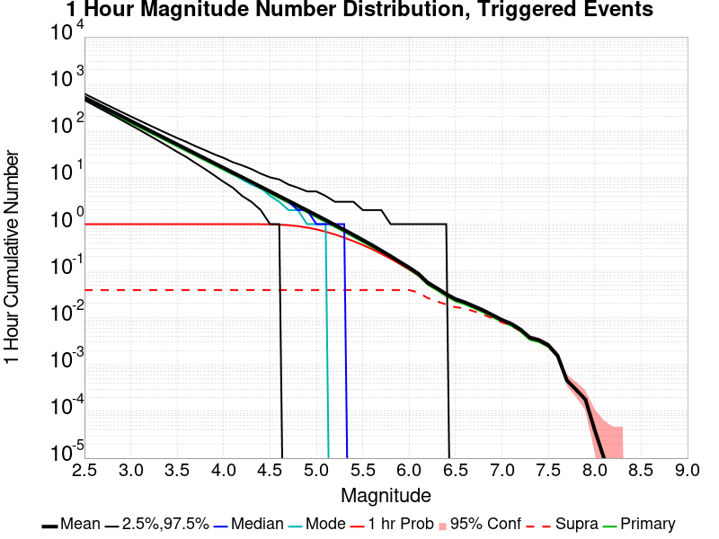

| Mag | Mean | 2.5 %ile | 97.5 %ile | Median | Mode | 1 hr Probability | 1 hr Supra-Seis Prob | Primary Aftershocks Mean |
|-----|-----|-----|-----|-----|-----|-----|-----|-----|
| **M&ge;2.5** | 507.623 | 444.000 | 610.000 | 496.000 | 495.000 | 1.000 (100.00%) | 0.039 (3.95%) | 457.589 |
| **M&ge;2.6** | 403.213 | 349.000 | 486.000 | 394.000 | 387.000 | 1.000 (100.00%) | 0.039 (3.95%) | 363.461 |
| **M&ge;2.7** | 320.290 | 273.000 | 388.000 | 313.000 | 307.000 | 1.000 (100.00%) | 0.039 (3.95%) | 288.731 |
| **M&ge;2.8** | 254.401 | 214.000 | 311.000 | 249.000 | 247.000 | 1.000 (100.00%) | 0.039 (3.95%) | 229.334 |
| **M&ge;2.9** | 202.074 | 167.000 | 249.000 | 198.000 | 193.000 | 1.000 (100.00%) | 0.039 (3.95%) | 182.173 |
| **M&ge;3** | 160.472 | 130.000 | 200.000 | 157.000 | 157.000 | 1.000 (100.00%) | 0.039 (3.95%) | 144.661 |
| **M&ge;3.1** | 127.466 | 101.000 | 161.000 | 125.000 | 123.000 | 1.000 (100.00%) | 0.039 (3.95%) | 114.910 |
| **M&ge;3.2** | 101.263 | 78.000 | 130.000 | 99.000 | 98.000 | 1.000 (100.00%) | 0.039 (3.95%) | 91.286 |
| **M&ge;3.3** | 80.419 | 60.000 | 105.000 | 79.000 | 78.000 | 1.000 (100.00%) | 0.039 (3.95%) | 72.492 |
| **M&ge;3.4** | 63.860 | 46.000 | 85.000 | 62.000 | 62.000 | 1.000 (100.00%) | 0.039 (3.95%) | 57.563 |
| **M&ge;3.5** | 50.694 | 35.000 | 69.000 | 50.000 | 49.000 | 1.000 (100.00%) | 0.039 (3.95%) | 45.689 |
| **M&ge;3.6** | 40.246 | 27.000 | 57.000 | 39.000 | 38.000 | 1.000 (100.00%) | 0.039 (3.95%) | 36.272 |
| **M&ge;3.7** | 31.956 | 20.000 | 46.000 | 31.000 | 30.000 | 1.000 (100.00%) | 0.039 (3.95%) | 28.804 |
| **M&ge;3.8** | 25.382 | 15.000 | 38.000 | 25.000 | 24.000 | 1.000 (100.00%) | 0.039 (3.95%) | 22.881 |
| **M&ge;3.9** | 20.144 | 11.000 | 31.000 | 20.000 | 20.000 | 1.000 (100.00%) | 0.039 (3.95%) | 18.162 |
| **M&ge;4** | 15.987 | 8.000 | 26.000 | 16.000 | 15.000 | 1.000 (100.00%) | 0.039 (3.95%) | 14.417 |
| **M&ge;4.1** | 12.682 | 6.000 | 21.000 | 12.000 | 12.000 | 1.000 (100.00%) | 0.039 (3.95%) | 11.442 |
| **M&ge;4.2** | 10.062 | 4.000 | 18.000 | 10.000 | 9.000 | 1.000 (99.99%) | 0.039 (3.95%) | 9.077 |
| **M&ge;4.3** | 7.985 | 3.000 | 15.000 | 8.000 | 7.000 | 0.999 (99.94%) | 0.039 (3.95%) | 7.204 |
| **M&ge;4.4** | 6.326 | 2.000 | 12.000 | 6.000 | 6.000 | 0.997 (99.71%) | 0.039 (3.95%) | 5.707 |
| **M&ge;4.5** | 5.018 | 1.000 | 10.000 | 5.000 | 4.000 | 0.991 (99.10%) | 0.039 (3.95%) | 4.529 |
| **M&ge;4.6** | 3.980 | 1.000 | 9.000 | 4.000 | 3.000 | 0.976 (97.64%) | 0.039 (3.95%) | 3.591 |
| **M&ge;4.7** | 3.156 | 0.000 | 7.000 | 3.000 | 3.000 | 0.950 (95.04%) | 0.039 (3.95%) | 2.849 |
| **M&ge;4.8** | 2.497 | 0.000 | 6.000 | 2.000 | 2.000 | 0.906 (90.62%) | 0.039 (3.95%) | 2.255 |
| **M&ge;4.9** | 1.973 | 0.000 | 5.000 | 2.000 | 1.000 | 0.847 (84.72%) | 0.039 (3.95%) | 1.781 |
| **M&ge;5** | 1.561 | 0.000 | 5.000 | 1.000 | 1.000 | 0.774 (77.38%) | 0.039 (3.95%) | 1.407 |
| **M&ge;5.1** | 1.231 | 0.000 | 4.000 | 1.000 | 1.000 | 0.691 (69.05%) | 0.039 (3.95%) | 1.110 |
| **M&ge;5.2** | 0.966 | 0.000 | 3.000 | 1.000 | 0.000 | 0.602 (60.19%) | 0.039 (3.95%) | 0.871 |
| **M&ge;5.3** | 0.758 | 0.000 | 3.000 | 1.000 | 0.000 | 0.515 (51.50%) | 0.039 (3.95%) | 0.682 |
| **M&ge;5.4** | 0.592 | 0.000 | 3.000 | 0.000 | 0.000 | 0.433 (43.32%) | 0.039 (3.95%) | 0.533 |
| **M&ge;5.5** | 0.461 | 0.000 | 2.000 | 0.000 | 0.000 | 0.359 (35.87%) | 0.039 (3.95%) | 0.415 |
| **M&ge;5.6** | 0.357 | 0.000 | 2.000 | 0.000 | 0.000 | 0.292 (29.17%) | 0.039 (3.95%) | 0.321 |
| **M&ge;5.7** | 0.274 | 0.000 | 2.000 | 0.000 | 0.000 | 0.232 (23.23%) | 0.039 (3.95%) | 0.247 |
| **M&ge;5.8** | 0.209 | 0.000 | 1.000 | 0.000 | 0.000 | 0.183 (18.35%) | 0.039 (3.95%) | 0.188 |
| **M&ge;5.9** | 0.157 | 0.000 | 1.000 | 0.000 | 0.000 | 0.142 (14.19%) | 0.039 (3.95%) | 0.141 |
| **M&ge;6** | 0.120 | 0.000 | 1.000 | 0.000 | 0.000 | 0.110 (10.97%) | 0.039 (3.95%) | 0.108 |
| **M&ge;6.1** | 0.087 | 0.000 | 1.000 | 0.000 | 0.000 | 0.082 (8.16%) | 0.035 (3.53%) | 0.079 |
| **M&ge;6.2** | 0.057 | 0.000 | 1.000 | 0.000 | 0.000 | 0.054 (5.38%) | 0.027 (2.69%) | 0.051 |
| **M&ge;6.3** | 0.043 | 0.000 | 1.000 | 0.000 | 0.000 | 0.042 (4.17%) | 0.023 (2.31%) | 0.039 |
| **M&ge;6.4** | 0.033 | 0.000 | 1.000 | 0.000 | 0.000 | 0.031 (3.15%) | 0.020 (1.98%) | 0.029 |
| **M&ge;6.5** | 0.025 | 0.000 | 0.000 | 0.000 | 0.000 | 0.024 (2.44%) | 0.017 (1.73%) | 0.022 |
| **M&ge;6.6** | 0.022 | 0.000 | 0.000 | 0.000 | 0.000 | 0.021 (2.11%) | 0.016 (1.60%) | 0.019 |
| **M&ge;6.7** | 0.018 | 0.000 | 0.000 | 0.000 | 0.000 | 0.017 (1.74%) | 0.014 (1.39%) | 0.016 |
| **M&ge;6.8** | 0.015 | 0.000 | 0.000 | 0.000 | 0.000 | 0.014 (1.44%) | 0.012 (1.21%) | 0.013 |
| **M&ge;6.9** | 0.012 | 0.000 | 0.000 | 0.000 | 0.000 | 0.012 (1.15%) | 0.010 (1.01%) | 0.010 |
| **M&ge;7** | 9.40E-3 | 0.000 | 0.000 | 0.000 | 0.000 | 9.36E-3 (0.94%) | 8.40E-3 (0.84%) | 8.48E-3 |
| **M&ge;7.1** | 8.02E-3 | 0.000 | 0.000 | 0.000 | 0.000 | 8.00E-3 (0.80%) | 7.40E-3 (0.74%) | 7.28E-3 |
| **M&ge;7.2** | 6.19E-3 | 0.000 | 0.000 | 0.000 | 0.000 | 6.19E-3 (0.62%) | 5.83E-3 (0.58%) | 5.61E-3 |
| **M&ge;7.3** | 4.21E-3 | 0.000 | 0.000 | 0.000 | 0.000 | 4.21E-3 (0.42%) | 4.03E-3 (0.40%) | 3.77E-3 |
| **M&ge;7.4** | 3.65E-3 | 0.000 | 0.000 | 0.000 | 0.000 | 3.65E-3 (0.36%) | 3.58E-3 (0.36%) | 3.28E-3 |
| **M&ge;7.5** | 2.85E-3 | 0.000 | 0.000 | 0.000 | 0.000 | 2.85E-3 (0.28%) | 2.81E-3 (0.28%) | 2.61E-3 |
| **M&ge;7.6** | 1.83E-3 | 0.000 | 0.000 | 0.000 | 0.000 | 1.83E-3 (0.18%) | 1.83E-3 (0.18%) | 1.69E-3 |
| **M&ge;7.7** | 5.44E-4 | 0.000 | 0.000 | 0.000 | 0.000 | 5.44E-4 (0.05%) | 5.44E-4 (0.05%) | 5.08E-4 |
| **M&ge;7.8** | 2.72E-4 | 0.000 | 0.000 | 0.000 | 0.000 | 2.72E-4 (0.03%) | 2.72E-4 (0.03%) | 2.54E-4 |
| **M&ge;7.9** | 1.63E-4 | 0.000 | 0.000 | 0.000 | 0.000 | 1.63E-4 (0.02%) | 1.63E-4 (0.02%) | 1.45E-4 |
| **M&ge;8** | 7.26E-5 | 0.000 | 0.000 | 0.000 | 0.000 | 7.26E-5 (0.01%) | 7.26E-5 (0.01%) | 7.26E-5 |
| **M&ge;8.1** | 1.81E-5 | 0.000 | 0.000 | 0.000 | 0.000 | 1.81E-5 (0.00%) | 1.81E-5 (0.00%) | 1.81E-5 |
| **M&ge;8.2** | 0.000 | 0.000 | 0.000 | 0.000 | 0.000 | 0.000 (0.00%) | 0.000 (0.00%) | 0.000 |
| **M&ge;8.3** | 0.000 | 0.000 | 0.000 | 0.000 | 0.000 | 0.000 (0.00%) | 0.000 (0.00%) | 0.000 |
| **M&ge;8.4** | 0.000 | 0.000 | 0.000 | 0.000 | 0.000 | 0.000 (0.00%) | 0.000 (0.00%) | 0.000 |
| **M&ge;8.5** | 0.000 | 0.000 | 0.000 | 0.000 | 0.000 | 0.000 (0.00%) | 0.000 (0.00%) | 0.000 |
| **M&ge;8.6** | 0.000 | 0.000 | 0.000 | 0.000 | 0.000 | 0.000 (0.00%) | 0.000 (0.00%) | 0.000 |
| **M&ge;8.7** | 0.000 | 0.000 | 0.000 | 0.000 | 0.000 | 0.000 (0.00%) | 0.000 (0.00%) | 0.000 |
| **M&ge;8.8** | 0.000 | 0.000 | 0.000 | 0.000 | 0.000 | 0.000 (0.00%) | 0.000 (0.00%) | 0.000 |
| **M&ge;8.9** | 0.000 | 0.000 | 0.000 | 0.000 | 0.000 | 0.000 (0.00%) | 0.000 (0.00%) | 0.000 |
| **M&ge;9** | 0.000 | 0.000 | 0.000 | 0.000 | 0.000 | 0.000 (0.00%) | 0.000 (0.00%) | 0.000 |


## Hazard Change Over Time
*[(top)](#table-of-contents)*

These plots show how the probability of ruptures of various magnitudes within 100km of any scenario rupture changes over time

### M&ge;5.0 Hazard Change Over Time
*[(top)](#table-of-contents)*


| Forecast Duration | UCERF3-ETAS [95% Conf] | UCERF3-ETAS Triggered Only | UCERF3-TD | UCERF3-ETAS/TD Gain | UCERF3-TI |
|-----|-----|-----|-----|-----|-----|
| 1 Hour | 0.772 [0.768 - 0.775] | 0.772 | 7.14E-5 | 10814.26 | 7.09E-5 |
| 1 Day | 0.977 [0.975 - 0.978] | 0.977 | 1.71E-3 | 570.58 | 1.70E-3 |
| 1 Week | 0.996 [0.995 - 0.996] | 0.996 | 0.012 | 83.53 | 0.012 |
| 1 Month | 0.999 [0.998 - 0.999] | 0.999 | 0.050 | 19.94 | 0.050 |
| 1 Year | 1.000 [1.000 - 1.000] | 1.000 | 0.465 | 2.15 | 0.463 |
| 10 Years | 1.000 [1.000 - 1.000] | 1.000 | 0.998 | 1 | 0.998 |
| 30 Years | 1.000 [1.000 - 1.000] \* | \* | 1.000 | 1 \* | 1.000 |
| 100 Years | 1.000 [1.000 - 1.000] \* | \* | 1.000 | 1 \* | 1.000 |

\* *forecast duration is longer than simulation length, only ETAS ruptures from the first 10 years are included*
### M&ge;6.0 Hazard Change Over Time
*[(top)](#table-of-contents)*


| Forecast Duration | UCERF3-ETAS [95% Conf] | UCERF3-ETAS Triggered Only | UCERF3-TD | UCERF3-ETAS/TD Gain | UCERF3-TI |
|-----|-----|-----|-----|-----|-----|
| 1 Hour | 0.109 [0.106 - 0.112] | 0.109 | 7.85E-6 | 13869.01 | 7.36E-6 |
| 1 Day | 0.270 [0.266 - 0.273] | 0.270 | 1.88E-4 | 1431.01 | 1.77E-4 |
| 1 Week | 0.371 [0.367 - 0.375] | 0.370 | 1.32E-3 | 281.25 | 1.23E-3 |
| 1 Month | 0.443 [0.439 - 0.447] | 0.440 | 5.64E-3 | 78.6 | 5.28E-3 |
| 1 Year | 0.579 [0.575 - 0.583] | 0.549 | 0.067 | 8.7 | 0.062 |
| 10 Years | 0.815 [0.813 - 0.817] | 0.631 | 0.498 | 1.64 | 0.475 |
| 30 Years | 0.954 [0.953 - 0.954] \* | \* | 0.874 | 1.09 \* | 0.855 |
| 100 Years | 1.000 [1.000 - 1.000] \* | \* | 0.999 | 1 \* | 0.998 |

\* *forecast duration is longer than simulation length, only ETAS ruptures from the first 10 years are included*
### M&ge;7.0 Hazard Change Over Time
*[(top)](#table-of-contents)*


| Forecast Duration | UCERF3-ETAS [95% Conf] | UCERF3-ETAS Triggered Only | UCERF3-TD | UCERF3-ETAS/TD Gain | UCERF3-TI |
|-----|-----|-----|-----|-----|-----|
| 1 Hour | 9.31E-3 [8.53E-3 - 0.010] | 9.31E-3 | 7.16E-7 | 13006.69 | 6.48E-7 |
| 1 Day | 0.025 [0.024 - 0.026] | 0.025 | 1.72E-5 | 1450.29 | 1.55E-5 |
| 1 Week | 0.037 [0.035 - 0.038] | 0.037 | 1.20E-4 | 305.06 | 1.09E-4 |
| 1 Month | 0.046 [0.044 - 0.047] | 0.045 | 5.15E-4 | 88.48 | 4.66E-4 |
| 1 Year | 0.068 [0.066 - 0.070] | 0.062 | 6.26E-3 | 10.87 | 5.66E-3 |
| 10 Years | 0.133 [0.131 - 0.136] | 0.077 | 0.061 | 2.19 | 0.055 |
| 30 Years | 0.238 [0.236 - 0.240] \* | \* | 0.174 | 1.37 \* | 0.157 |
| 100 Years | 0.524 [0.523 - 0.526] \* | \* | 0.485 | 1.08 \* | 0.433 |

\* *forecast duration is longer than simulation length, only ETAS ruptures from the first 10 years are included*
### M&ge;8.0 Hazard Change Over Time
*[(top)](#table-of-contents)*


| Forecast Duration | UCERF3-ETAS [95% Conf] | UCERF3-ETAS Triggered Only | UCERF3-TD | UCERF3-ETAS/TD Gain | UCERF3-TI |
|-----|-----|-----|-----|-----|-----|
| 1 Hour | 5.45E-5 [1.41E-5 - 1.74E-4] | 5.44E-5 | 1.24E-8 | 4403.86 | 1.06E-8 |
| 1 Day | 1.09E-4 [4.46E-5 - 2.50E-4] | 1.09E-4 | 2.97E-7 | 367.9 | 2.54E-7 |
| 1 Week | 2.38E-4 [1.33E-4 - 4.17E-4] | 2.36E-4 | 2.08E-6 | 114.57 | 1.78E-6 |
| 1 Month | 2.81E-4 [1.67E-4 - 4.69E-4] | 2.72E-4 | 8.90E-6 | 31.58 | 7.63E-6 |
| 1 Year | 4.53E-4 [3.22E-4 - 6.58E-4] | 3.45E-4 | 1.08E-4 | 4.18 | 9.29E-5 |
| 10 Years | 1.51E-3 [1.37E-3 - 1.73E-3] | 4.17E-4 | 1.10E-3 | 1.38 | 9.29E-4 |
| 30 Years | 3.92E-3 [3.77E-3 - 4.14E-3] \* | \* | 3.50E-3 | 1.12 \* | 2.78E-3 |
| 100 Years | 0.014 [0.014 - 0.014] \* | \* | 0.014 | 1.03 \* | 9.25E-3 |

\* *forecast duration is longer than simulation length, only ETAS ruptures from the first 10 years are included*

## Trigger Rupture Fault Map
*[(top)](#table-of-contents)*


## Trigger Rupture Depth Map
*[(top)](#table-of-contents)*

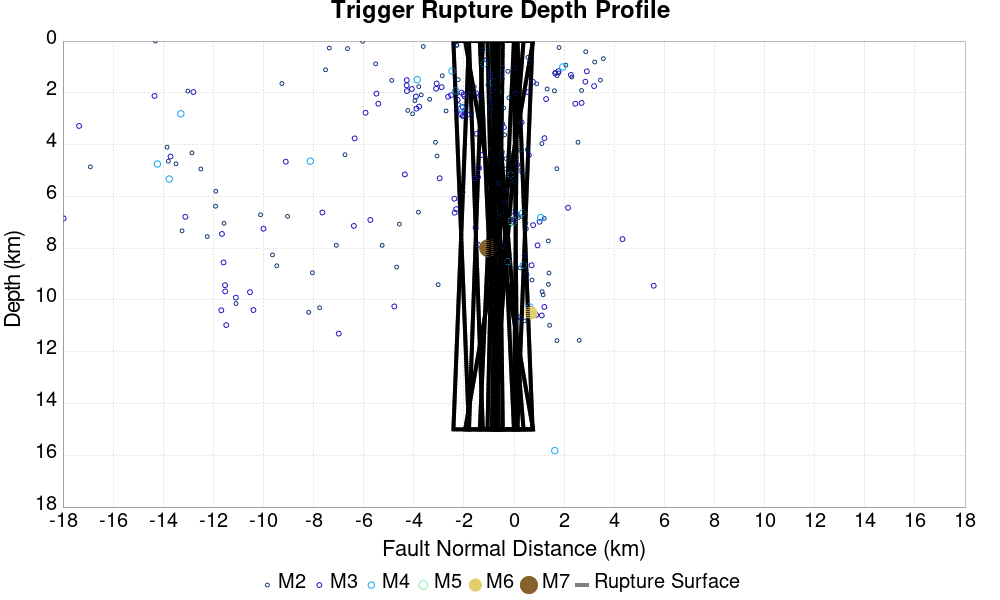
## Fault Distances To Triggers
*[(top)](#table-of-contents)*

| Section Name | Strike, Dip, Rake | # Hypos In Poly | Max Mag w/ Hypo In Poly | # Surfs In Poly | Max Mag w/ Surf In Poly | Min Dist To Any (km) | Min Poly Dist To Any (km) | Min Dist To Largest (km) | Min Poly Dist To Largest (km) | Min Hypo Dist To Largest (km) | Min Hypo Poly Dist To Largest (km) |
|-----|-----|-----|-----|-----|-----|-----|-----|-----|-----|-----|-----|
| Airport Lake | 359, 50, -90 | 90 | 7.1 | 90 | 7.1 | 0.036 | 0.000 | 0.036 | 0.000 | 5.612 | 0.000 |
| Little Lake | 327, 90, 180 | 16 | 3.75 | 17 | 7.1 | 2.268 | 0.000 | 11.284 | 0.000 | 13.471 | 1.469 |
| Garlock (Central) | 71, 90, 0 | 2 | 3.21 | 3 | 7.1 | 5.600 | 0.000 | 5.600 | 0.000 | 22.766 | 10.797 |
| So Sierra Nevada | 2, 50, -90 | 1 | 2.75 | 1 | 2.75 | 1.410 | 0.000 | 4.248 | 4.233 | 16.191 | 15.188 |
| Tank Canyon | 189, 50, -90 | 0 |  | 0 |  | 9.015 | 9.011 | 9.015 | 9.011 | 17.039 | 16.895 |
| Blackwater | 323, 90, 180 | 0 |  | 0 |  | 14.394 | 8.726 | 14.394 | 8.726 | 29.622 | 27.613 |
| Scodie Lineament | 221, 68, 0 | 0 |  | 0 |  | 16.722 | 15.781 | 28.750 | 27.702 | 36.559 | 32.668 |

## Individual Simulated Catalog Maps
*[(top)](#table-of-contents)*

These are map plots of individual catalogs from the simulations, selected as the closest catalog to each of the given percentiles in terms of total number of events.

| Duration | p0.0 %-ile | p25.0 %-ile | p50.0 %-ile | p75.0 %-ile | p90.0 %-ile | p95.0 %-ile | p97.5 %-ile | p98.0 %-ile | p99.0 %-ile | p99.5 %-ile | p99.9 %-ile | p100.0 %-ile |
|-----|-----|-----|-----|-----|-----|-----|-----|-----|-----|-----|-----|-----|
| **1 Week** |  |  |  |  |  |  |  |  |  |  |  |  |
| **1 Month** |  |  |  |  |  | 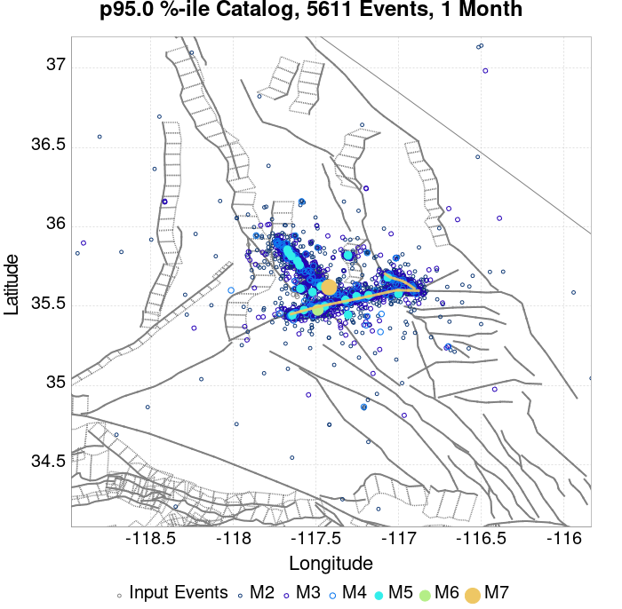 |  | 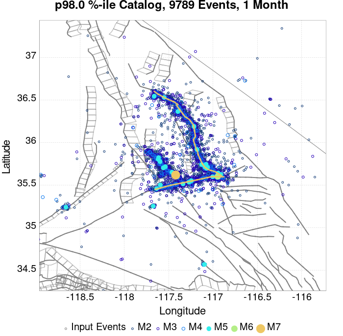 | 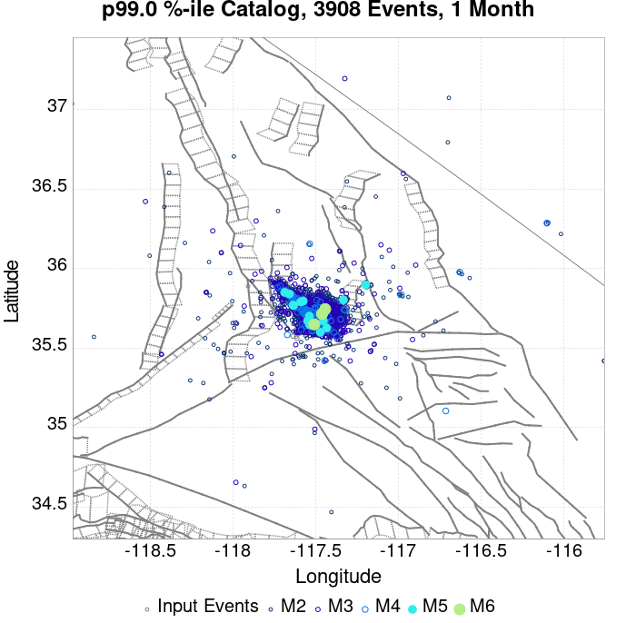 |  | 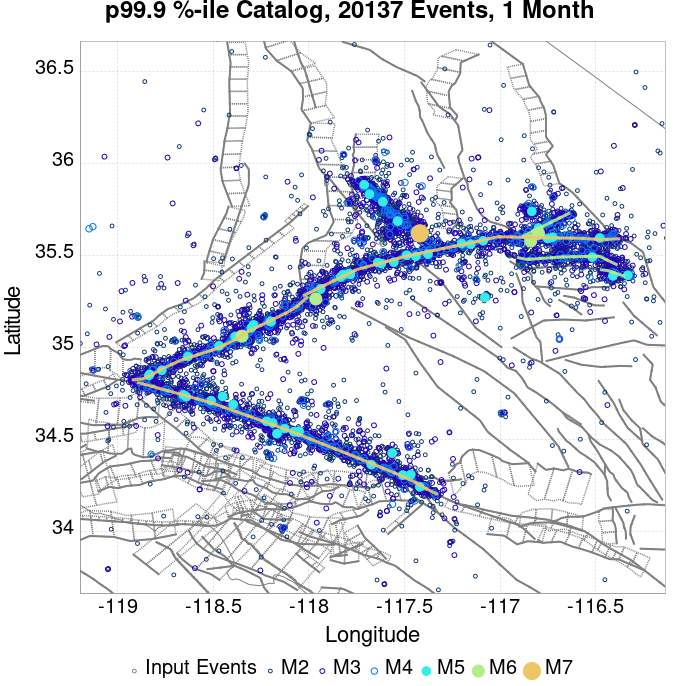 |  |
| **1 Year** |  |  |  | 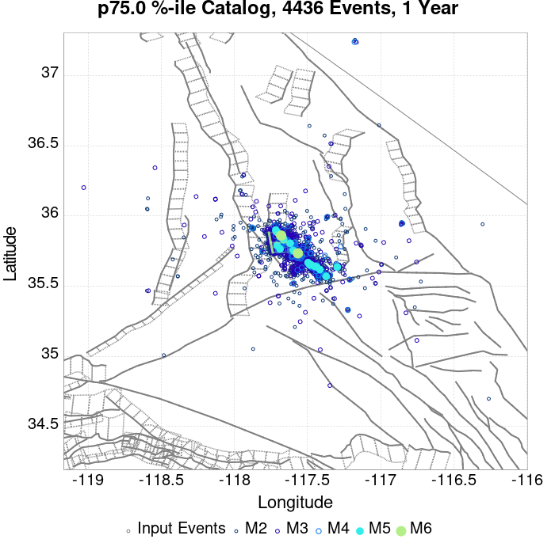 |  |  |  |  |  | 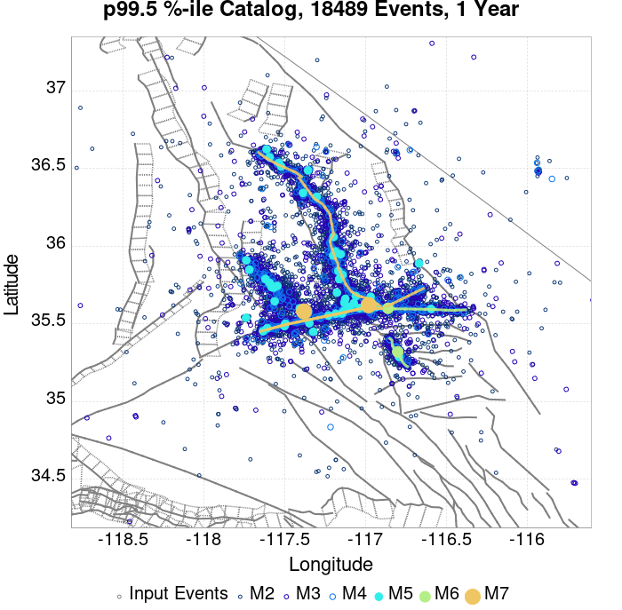 |  |  |
| **10 Year** | 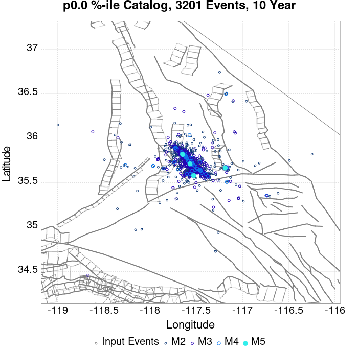 | 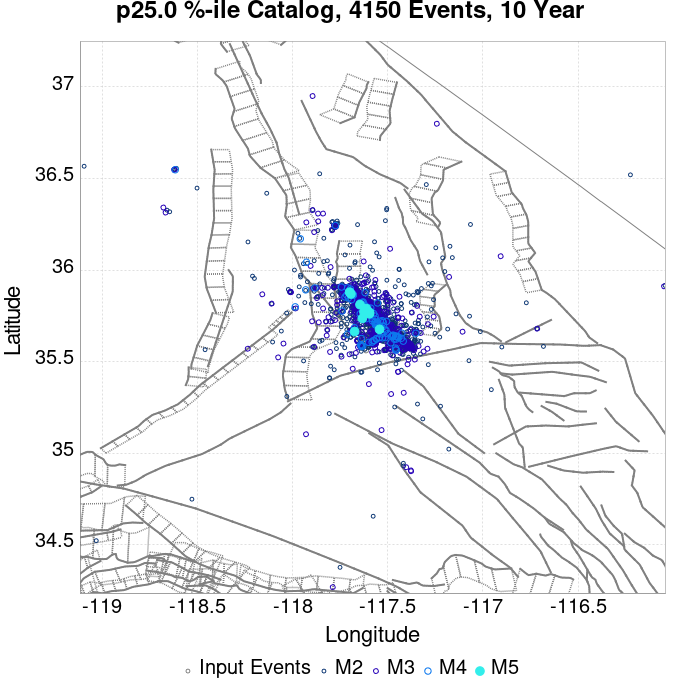 |  |  |  |  |  |  |  | 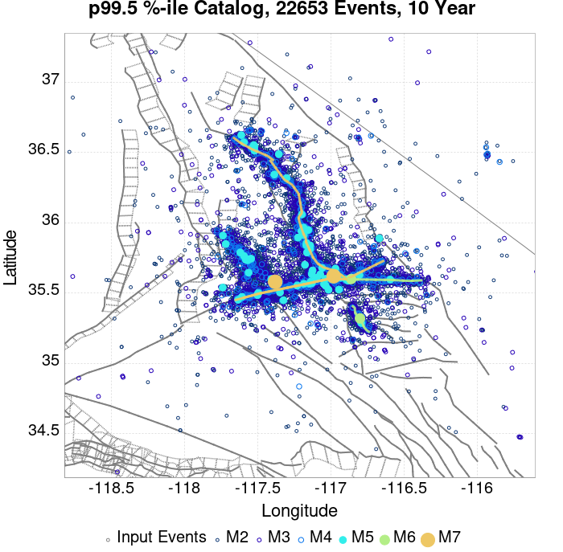 |  |  |

## ComCat Data Comparisons
*[(top)](#table-of-contents)*

These plots compare simulated sequences with data from ComCat. All plots only consider events with hypocenters inside the ComCat region defined in the JSON input file, and consider ruptures above Mc=3.5

Last updated at 2019/09/05 06:37:53 UTC, 2 mo after the simulation start time

### ComCat Magnitude-Number Distributions
*[(top)](#table-of-contents)*

| Incremental MND | Cumulative MND |
|-----|-----|
|  |  |

### ComCat Cumulative Number Vs Time
*[(top)](#table-of-contents)*

| M&ge;3.5 | M&ge;4 | M&ge;5 | M&ge;6 | M&ge;7 |
|-----|-----|-----|-----|-----|
|  | 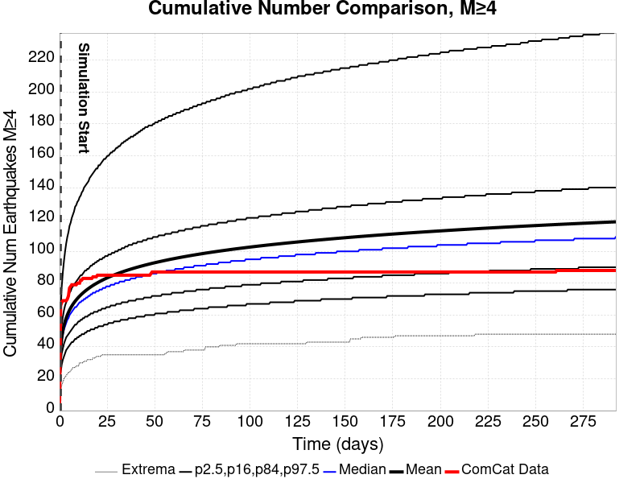 |  |  |  |

### ComCat Cumulative Number Simulation Percentiles
*[(top)](#table-of-contents)*


### ComCat Mean Spatial Distribution
*[(top)](#table-of-contents)*

|  | 1 Day | 1 Week | 1 Month | 2 Month |
|-----|-----|-----|-----|-----|
| **M≥3.5** |  |  |  |  |
| **M≥4** | 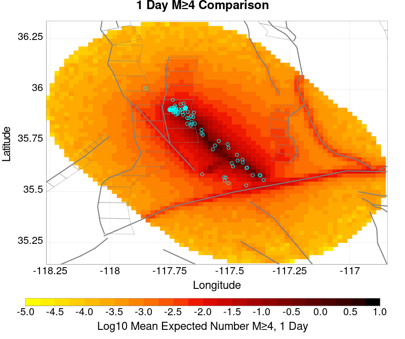 | 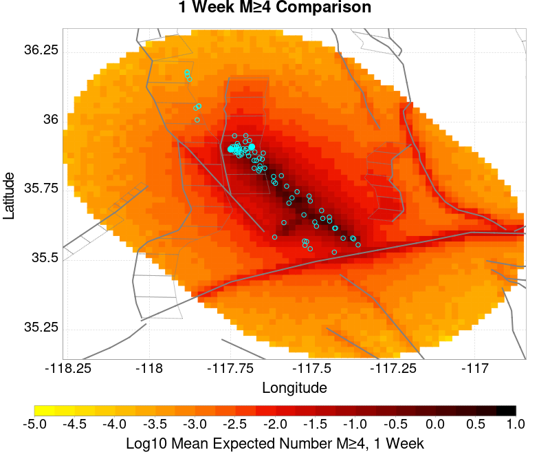 |  |  |
| **M≥5** |  |  | 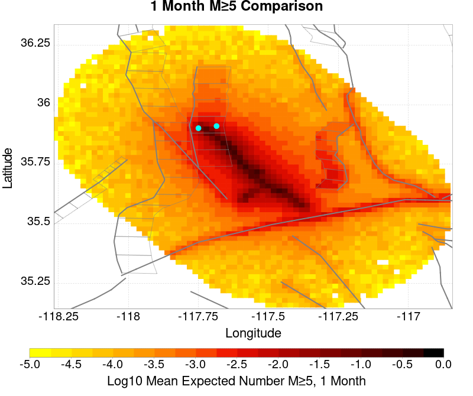 |  |
| **M≥6** | 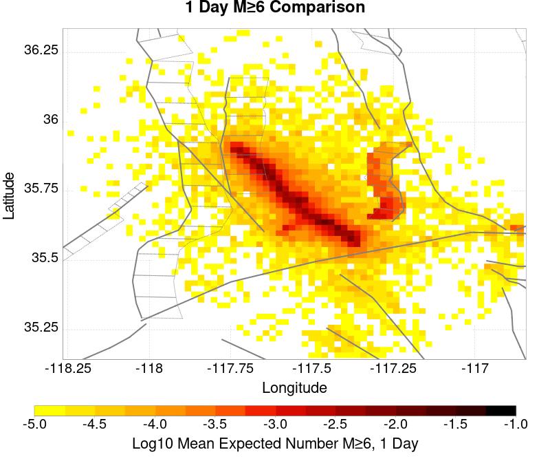 |  |  | 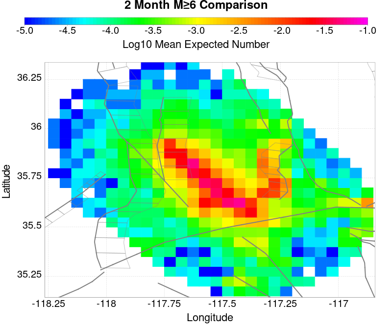 |
| **M≥7** |  |  |  |  |
| **M≥8** |  |  |  | 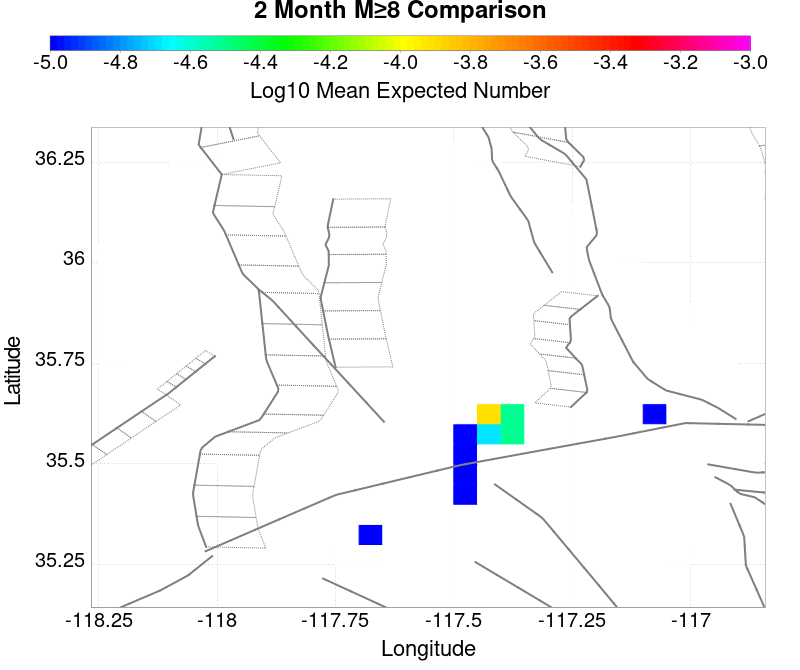 |

### ComCat Depth Distribution
*[(top)](#table-of-contents)*

| M&ge;3.5 | M&ge;4 | M&ge;5 | M&ge;6 | M&ge;7 | M&ge;8 |
|-----|-----|-----|-----|-----|-----|
|  |  |  |  |  |  |

## Section Participation
*[(top)](#table-of-contents)*

### Section Participation Plots
*[(top)](#table-of-contents)*

| Min Mag | 1 yr Triggered Ruptures (no spontaneous) | 10 yr Triggered Ruptures (no spontaneous) | 10 yr Triggered Ruptures (primary aftershocks only) |
|-----|-----|-----|-----|
| **All Supra. Seis.** |  |  |  |
| **M&ge;6.5** |  |  |  |
| **M&ge;7** |  |  | 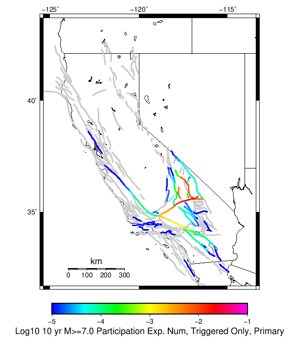 |
| **M&ge;7.5** |  |  | 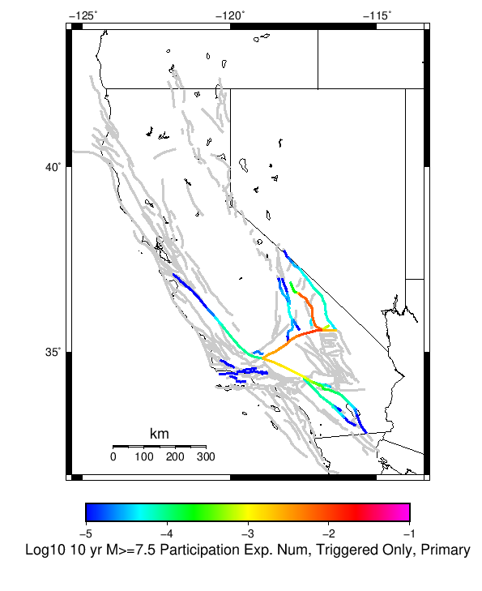 |
| **M&ge;8** |  | 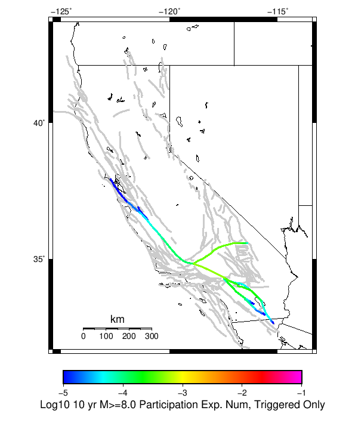 | 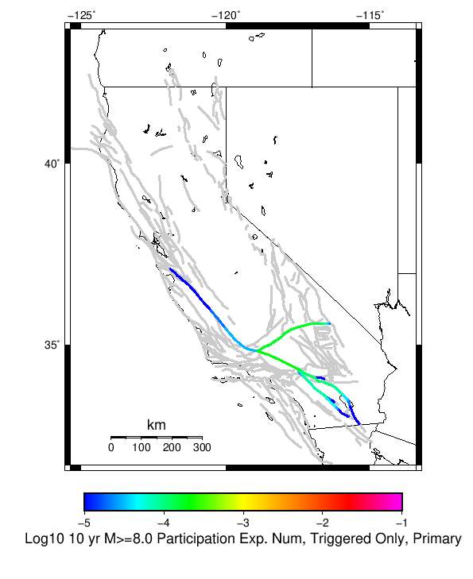 |

### Supra-Seismogenic Parent Sections Table
*[(top)](#table-of-contents)*

*First 10 of 192 with matching ruptures shown*

| Parent Name | Triggered 10 Year Mean Count | Triggered 1 Day Prob | Triggered 1 Week Prob | Triggered 1 Month Prob | Triggered 1 Year Prob | Triggered 10 Year Prob | Triggered 10 Year Primary Mean Count |
|-----|-----|-----|-----|-----|-----|-----|-----|
| Garlock (Central) | 0.14529945 | 0.04876588 | 0.069455534 | 0.084990926 | 0.11411978 | 0.13876589 | 0.07802178 |
| Tank Canyon | 0.123157896 | 0.023411978 | 0.037313975 | 0.050217785 | 0.077132486 | 0.10417423 | 0.03181488 |
| Little Lake | 0.06575318 | 0.021633394 | 0.030526316 | 0.038529947 | 0.051397458 | 0.06370236 | 0.036098003 |
| Airport Lake | 0.0538294 | 0.020943739 | 0.028729582 | 0.034809437 | 0.04493648 | 0.053666063 | 0.035771325 |
| Owl Lake | 0.047604356 | 0.009854809 | 0.01602541 | 0.020889292 | 0.03127042 | 0.041778583 | 0.011615245 |
| Panamint Valley | 0.033303086 | 0.008275862 | 0.013103448 | 0.016842104 | 0.024700545 | 0.03259528 | 0.01199637 |
| Garlock (East) | 0.031633392 | 0.0062250453 | 0.010399274 | 0.013865699 | 0.020925589 | 0.028421052 | 0.007767695 |
| Hunter Mountain-Saline Valley | 0.015662432 | 0.00446461 | 0.0065880218 | 0.0082395645 | 0.011869328 | 0.015372051 | 0.0072413795 |
| Ash Hill | 0.014137931 | 0.002014519 | 0.003938294 | 0.0056442833 | 0.009092559 | 0.013139746 | 0.0018693284 |
| Blackwater | 0.012867514 | 0.0019963703 | 0.0036842106 | 0.005281307 | 0.008656987 | 0.0123049 | 0.0028856625 |

### M≥6.5 Parent Sections Table
*[(top)](#table-of-contents)*

*First 10 of 167 with matching ruptures shown*

| Parent Name | Triggered 10 Year Mean Count | Triggered 1 Day Prob | Triggered 1 Week Prob | Triggered 1 Month Prob | Triggered 1 Year Prob | Triggered 10 Year Prob | Triggered 10 Year Primary Mean Count |
|-----|-----|-----|-----|-----|-----|-----|-----|
| Garlock (Central) | 0.062105265 | 0.020036297 | 0.029437387 | 0.035952814 | 0.049491834 | 0.06108893 | 0.03215971 |
| Airport Lake | 0.039727766 | 0.015444646 | 0.020998186 | 0.025426498 | 0.033049002 | 0.03967332 | 0.02600726 |
| Little Lake | 0.03905626 | 0.013738657 | 0.019219602 | 0.024101634 | 0.03166969 | 0.0384755 | 0.02323049 |
| Panamint Valley | 0.03090744 | 0.007931034 | 0.012486388 | 0.015970962 | 0.023157895 | 0.030362977 | 0.011796733 |
| Owl Lake | 0.02676951 | 0.0076951 | 0.011669692 | 0.014700544 | 0.020653358 | 0.026660617 | 0.010580762 |
| Garlock (East) | 0.020635208 | 0.004972777 | 0.007931034 | 0.01030853 | 0.014736842 | 0.019455535 | 0.007350272 |
| Hunter Mountain-Saline Valley | 0.015317604 | 0.004428312 | 0.006497278 | 0.008130671 | 0.011669692 | 0.0150635205 | 0.007168784 |
| Tank Canyon | 0.012686025 | 0.0025589836 | 0.0042286753 | 0.0056805806 | 0.008874773 | 0.01261343 | 0.0031941924 |
| Garlock (West) | 0.009872958 | 0.0029945553 | 0.0046098004 | 0.0056805806 | 0.008076225 | 0.009872958 | 0.0047912886 |
| So Sierra Nevada | 0.005154265 | 7.4410165E-4 | 0.0013793104 | 0.0020508168 | 0.003520871 | 0.0051179673 | 6.5335754E-4 |

### M≥7 Parent Sections Table
*[(top)](#table-of-contents)*

*First 10 of 123 with matching ruptures shown*

| Parent Name | Triggered 10 Year Mean Count | Triggered 1 Day Prob | Triggered 1 Week Prob | Triggered 1 Month Prob | Triggered 1 Year Prob | Triggered 10 Year Prob | Triggered 10 Year Primary Mean Count |
|-----|-----|-----|-----|-----|-----|-----|-----|
| Garlock (Central) | 0.05475499 | 0.01784029 | 0.026098004 | 0.03183303 | 0.043756805 | 0.054029036 | 0.028348457 |
| Panamint Valley | 0.021324864 | 0.0064428314 | 0.009600726 | 0.011887478 | 0.01676951 | 0.02123412 | 0.0101270415 |
| Owl Lake | 0.019346643 | 0.0066243196 | 0.009509982 | 0.011524501 | 0.015735026 | 0.019346643 | 0.010217786 |
| Hunter Mountain-Saline Valley | 0.014718694 | 0.0043738657 | 0.006424682 | 0.00800363 | 0.011433757 | 0.014682395 | 0.0071143378 |
| Garlock (East) | 0.014700544 | 0.0043738657 | 0.0066243196 | 0.008402904 | 0.011778585 | 0.014591652 | 0.0070598912 |
| Garlock (West) | 0.00969147 | 0.0029582577 | 0.004537205 | 0.005571688 | 0.007949184 | 0.00969147 | 0.004754991 |
| Little Lake | 0.009219601 | 0.003430127 | 0.004664247 | 0.0056079854 | 0.0075499094 | 0.009201452 | 0.0058983667 |
| Airport Lake | 0.008711434 | 0.0033756807 | 0.004555354 | 0.0053902 | 0.0072413795 | 0.008711434 | 0.005735027 |
| San Andreas (Mojave N) | 0.00415608 | 0.0013611615 | 0.002014519 | 0.0024863884 | 0.0033575317 | 0.0041016336 | 0.0018874774 |
| San Andreas (Mojave S) | 0.0030490018 | 9.255898E-4 | 0.0013793104 | 0.0017967332 | 0.0024500908 | 0.0030308529 | 0.0013067151 |

### M≥7.5 Parent Sections Table
*[(top)](#table-of-contents)*

*First 10 of 75 with matching ruptures shown*

| Parent Name | Triggered 10 Year Mean Count | Triggered 1 Day Prob | Triggered 1 Week Prob | Triggered 1 Month Prob | Triggered 1 Year Prob | Triggered 10 Year Prob | Triggered 10 Year Primary Mean Count |
|-----|-----|-----|-----|-----|-----|-----|-----|
| Garlock (Central) | 0.021633394 | 0.0067513613 | 0.009963702 | 0.0122867515 | 0.017313974 | 0.021578947 | 0.0110163335 |
| Panamint Valley | 0.014264973 | 0.004319419 | 0.0063339383 | 0.007876588 | 0.011197822 | 0.014264973 | 0.00707804 |
| Hunter Mountain-Saline Valley | 0.0142286755 | 0.004319419 | 0.0063157897 | 0.007858439 | 0.011161525 | 0.0142286755 | 0.0070598912 |
| Garlock (West) | 0.008548094 | 0.0025952812 | 0.003974592 | 0.0049183303 | 0.00707804 | 0.008548094 | 0.00415608 |
| Garlock (East) | 0.0053357533 | 0.0015245009 | 0.002431942 | 0.0030852994 | 0.0043920144 | 0.0053357533 | 0.0026678767 |
| San Andreas (Mojave N) | 0.004137931 | 0.0013611615 | 0.002014519 | 0.0024863884 | 0.0033575317 | 0.0040834844 | 0.0018874774 |
| San Andreas (Mojave S) | 0.002940109 | 9.255898E-4 | 0.0013793104 | 0.0017604355 | 0.0023956443 | 0.00292196 | 0.0012885663 |
| San Andreas (San Bernardino N) | 0.0019600727 | 5.989111E-4 | 9.255898E-4 | 0.0011978222 | 0.0015426497 | 0.0019600727 | 7.985481E-4 |
| Owl Lake | 0.0018874774 | 6.170599E-4 | 9.07441E-4 | 0.0010889292 | 0.0015607985 | 0.0018874774 | 7.985481E-4 |
| San Andreas (San Bernardino S) | 9.07441E-4 | 2.5408348E-4 | 4.1742288E-4 | 5.807622E-4 | 7.6225045E-4 | 9.07441E-4 | 3.2667877E-4 |

### M≥8 Parent Sections Table
*[(top)](#table-of-contents)*

*First 10 of 30 with matching ruptures shown*

| Parent Name | Triggered 10 Year Mean Count | Triggered 1 Day Prob | Triggered 1 Week Prob | Triggered 1 Month Prob | Triggered 1 Year Prob | Triggered 10 Year Prob | Triggered 10 Year Primary Mean Count |
|-----|-----|-----|-----|-----|-----|-----|-----|
| San Andreas (Mojave N) | 5.626134E-4 | 1.4519056E-4 | 2.722323E-4 | 3.0852994E-4 | 3.9927405E-4 | 5.626134E-4 | 2.3593467E-4 |
| San Andreas (Mojave S) | 5.626134E-4 | 1.4519056E-4 | 2.722323E-4 | 3.0852994E-4 | 3.9927405E-4 | 5.626134E-4 | 2.3593467E-4 |
| San Andreas (San Bernardino N) | 5.626134E-4 | 1.4519056E-4 | 2.722323E-4 | 3.0852994E-4 | 3.9927405E-4 | 5.626134E-4 | 2.3593467E-4 |
| Garlock (Central) | 4.1742288E-4 | 1.0889292E-4 | 2.3593467E-4 | 2.722323E-4 | 3.448276E-4 | 4.1742288E-4 | 1.9963703E-4 |
| Garlock (West) | 4.1742288E-4 | 1.0889292E-4 | 2.3593467E-4 | 2.722323E-4 | 3.448276E-4 | 4.1742288E-4 | 1.9963703E-4 |
| San Andreas (Coachella) rev | 3.629764E-4 | 5.444646E-5 | 1.4519056E-4 | 1.814882E-4 | 2.5408348E-4 | 3.629764E-4 | 1.0889292E-4 |
| San Andreas (San Bernardino S) | 3.448276E-4 | 7.259528E-5 | 1.814882E-4 | 1.9963703E-4 | 2.722323E-4 | 3.448276E-4 | 1.4519056E-4 |
| Garlock (East) | 3.2667877E-4 | 9.07441E-5 | 1.6333938E-4 | 1.9963703E-4 | 2.722323E-4 | 3.2667877E-4 | 1.4519056E-4 |
| San Andreas (San Gorgonio Pass-Garnet HIll) | 3.2667877E-4 | 5.444646E-5 | 1.6333938E-4 | 1.814882E-4 | 2.5408348E-4 | 3.2667877E-4 | 1.2704174E-4 |
| San Andreas (Big Bend) | 1.4519056E-4 | 3.629764E-5 | 3.629764E-5 | 3.629764E-5 | 5.444646E-5 | 1.4519056E-4 | 3.629764E-5 |

### Fault Magnitude-Probability Distributions
*[(top)](#table-of-contents)*

The first 5 sections (sorted by trigger rate) are plotted below. All fault MPDs are available [here](plots/parent_sect_mpds/README.md)

| 1 Week | 1 Month | 1 Year | 10 Year |
|-----|-----|-----|-----|
|  |  |  |  |
|  |  |  |  |
|  |  |  |  |
|  |  | 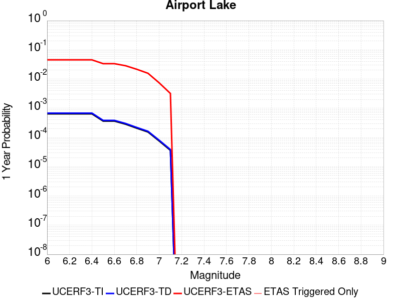 |  |
|  |  |  |  |

## Gridded Nucleation
*[(top)](#table-of-contents)*

| Min Mag | Triggered Ruptures (no spontaneous) | Triggered Ruptures (primary aftershocks only) |
|-----|-----|-----|
| **M&ge;2.5** |  |  |
| **M&ge;5** |  |  |
| **M&ge;6** | 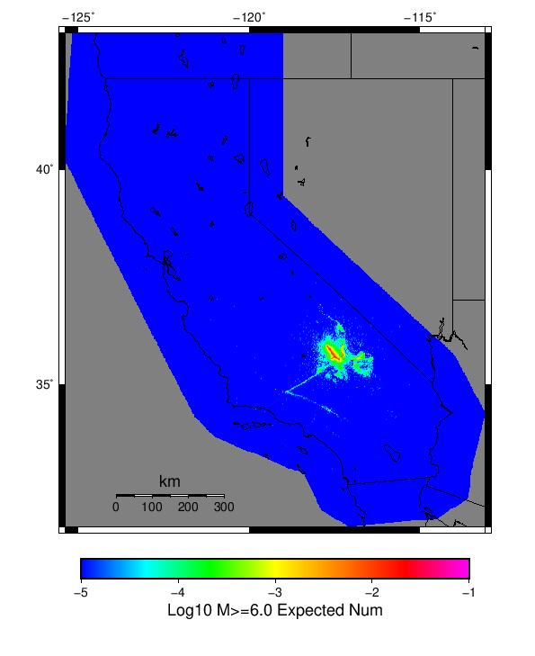 |  |
| **M&ge;7** | 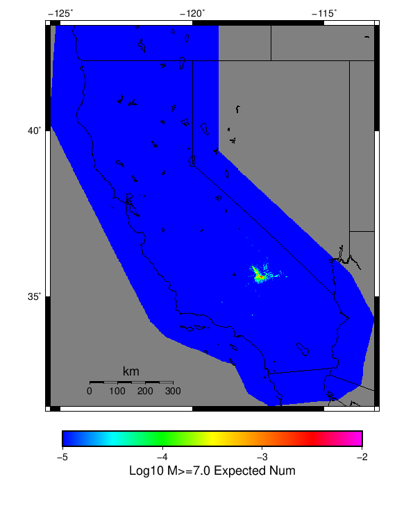 |  |


## JSON Input File
*[(top)](#table-of-contents)*

```
{
  "numSimulations": 100000,
  "duration": 10.0,
  "startTimeMillis": 1562383194040,
  "includeSpontaneous": false,
  "randomSeed": 1567629369608,
  "binaryOutput": true,
  "binaryOutputFilters": [
    {
      "prefix": "results_complete",
      "descendantsOnly": false
    },
    {
      "prefix": "results_m5_preserve_chain",
      "minMag": 5.0,
      "preserveChainBelowMag": true,
      "descendantsOnly": false
    }
  ],
  "forceRecalc": false,
  "simulationName": "ComCat M7.1 (ci38457511), ShakeMap Surfaces",
  "numRetries": 3,
  "outputDir": "${ETAS_SIM_DIR}/2019_09_04-ComCatM7p1_ci38457511_ShakeMapSurfaces",
  "triggerRuptures": [
    {
      "occurrenceTimeMillis": 1562259775340,
      "comcatEventID": "ci38443095",
      "mag": 3.98,
      "latitude": 35.708,
      "longitude": -117.5036667,
      "depth": 10.58
    },
    {
      "occurrenceTimeMillis": 1562261629000,
      "comcatEventID": "ci38443183",
      "mag": 6.4,
      "latitude": 35.7053333,
      "longitude": -117.5038333,
      "depth": 10.5,
      "ruptureSurfaces": [
        {
          "outline": [
            {
              "latitude": 35.6051534466,
              "longitude": -117.5905380735,
              "depth": 0.0
            },
            {
              "latitude": 35.6173144101,
              "longitude": -117.57249634649999,
              "depth": 0.0
            },
            {
              "latitude": 35.6173135736,
              "longitude": -117.5726723708,
              "depth": 0.0
            },
            {
              "latitude": 35.61731357360001,
              "longitude": -117.5726723708,
              "depth": 15.0
            },
            {
              "latitude": 35.6173144101,
              "longitude": -117.57249634649999,
              "depth": 15.0
            },
            {
              "latitude": 35.6051534466,
              "longitude": -117.5905380735,
              "depth": 15.0
            },
            {
              "latitude": 35.6051534466,
              "longitude": -117.5905380735,
              "depth": 0.0
            }
          ]
        },
        {
          "outline": [
            {
              "latitude": 35.6338128629,
              "longitude": -117.54831678310002,
              "depth": 0.0
            },
            {
              "latitude": 35.6413274733,
              "longitude": -117.5393878708,
              "depth": 0.0
            },
            {
              "latitude": 35.664283512,
              "longitude": -117.51611643970001,
              "depth": 0.0
            },
            {
              "latitude": 35.664283512000004,
              "longitude": -117.51611643970001,
              "depth": 15.0
            },
            {
              "latitude": 35.641327473299995,
              "longitude": -117.5393878708,
              "depth": 15.0
            },
            {
              "latitude": 35.63381286290001,
              "longitude": -117.54831678310002,
              "depth": 15.0
            },
            {
              "latitude": 35.6338128629,
              "longitude": -117.54831678310002,
              "depth": 0.0
            }
          ]
        },
        {
          "outline": [
            {
              "latitude": 35.6322100797,
              "longitude": -117.55305954249998,
              "depth": 0.0
            },
            {
              "latitude": 35.6196274701,
              "longitude": -117.56969626549999,
              "depth": 0.0
            },
            {
              "latitude": 35.6196274701,
              "longitude": -117.56969626549999,
              "depth": 15.0
            },
            {
              "latitude": 35.6322100797,
              "longitude": -117.55305954249998,
              "depth": 15.0
            },
            {
              "latitude": 35.6322100797,
              "longitude": -117.55305954249998,
              "depth": 0.0
            }
          ]
        }
      ]
    },
    {
      "occurrenceTimeMillis": 1562261701660,
      "comcatEventID": "ci38443191",
      "mag": 4.49,
      "latitude": 35.644,
      "longitude": -117.56716670000002,
      "depth": 4.64
    },
    {
      "occurrenceTimeMillis": 1562261746340,
      "comcatEventID": "ci37222356",
      "mag": 3.63,
      "latitude": 35.6936667,
      "longitude": -117.437,
      "depth": 7.65
    },
    {
      "occurrenceTimeMillis": 1562261752170,
      "comcatEventID": "ci37218988",
      "mag": 4.28,
      "latitude": 35.687,
      "longitude": -117.50616670000001,
      "depth": 1.6
    },
    {
      "occurrenceTimeMillis": 1562261818950,
      "comcatEventID": "ci37222380",
      "mag": 3.41,
      "latitude": 35.7258333,
      "longitude": -117.55933330000002,
      "depth": 5.3
    },
    {
      "occurrenceTimeMillis": 1562261821140,
      "comcatEventID": "ci37222372",
      "mag": 3.66,
      "latitude": 35.7105,
      "longitude": -117.4773333,
      "depth": 1.57
    },
    {
      "occurrenceTimeMillis": 1562261834850,
      "comcatEventID": "ci37222364",
      "mag": 3.97,
      "latitude": 35.6655,
      "longitude": -117.516,
      "depth": 1.64
    },
    {
      "occurrenceTimeMillis": 1562261845640,
      "comcatEventID": "ci37218996",
      "mag": 4.01,
      "latitude": 35.6758333,
      "longitude": -117.45750000000001,
      "depth": 15.82
    },
    {
      "occurrenceTimeMillis": 1562261875500,
      "comcatEventID": "ci38443199",
      "mag": 3.86,
      "latitude": 35.7456667,
      "longitude": -117.5516667,
      "depth": 8.29
    },
    {
      "occurrenceTimeMillis": 1562261901450,
      "comcatEventID": "ci37421941",
      "mag": 3.73,
      "latitude": 35.714,
      "longitude": -117.476,
      "depth": 1.74
    },
    {
      "occurrenceTimeMillis": 1562261927500,
      "comcatEventID": "us70004a0n",
      "mag": 3.5,
      "latitude": 35.6215,
      "longitude": -117.5782,
      "depth": 9.7
    },
    {
      "occurrenceTimeMillis": 1562261927760,
      "comcatEventID": "ci37222396",
      "mag": 3.5,
      "latitude": 35.6235,
      "longitude": -117.596,
      "depth": 8.55
    },
    {
      "occurrenceTimeMillis": 1562261973310,
      "comcatEventID": "ci37222404",
      "mag": 3.11,
      "latitude": 35.5743333,
      "longitude": -117.63666670000002,
      "depth": 6.85
    },
    {
      "occurrenceTimeMillis": 1562261975360,
      "comcatEventID": "ci38443215",
      "mag": 3.69,
      "latitude": 35.6873333,
      "longitude": -117.4935,
      "depth": 10.86
    },
    {
      "occurrenceTimeMillis": 1562262002250,
      "comcatEventID": "ci38443223",
      "mag": 3.8,
      "latitude": 35.7253333,
      "longitude": -117.57083329999999,
      "depth": 6.63
    },
    {
      "occurrenceTimeMillis": 1562262018520,
      "comcatEventID": "ci38443231",
      "mag": 4.13,
      "latitude": 35.707,
      "longitude": -117.5101667,
      "depth": 8.66
    },
    {
      "occurrenceTimeMillis": 1562262034900,
      "comcatEventID": "ci37222508",
      "mag": 3.54,
      "latitude": 35.6948333,
      "longitude": -117.50183330000002,
      "depth": 2.04
    },
    {
      "occurrenceTimeMillis": 1562262046140,
      "comcatEventID": "ci37222516",
      "mag": 3.42,
      "latitude": 35.7298333,
      "longitude": -117.55483330000001,
      "depth": 7.72
    },
    {
      "occurrenceTimeMillis": 1562262080850,
      "comcatEventID": "ci37421957",
      "mag": 3.3,
      "latitude": 35.7266667,
      "longitude": -117.5288333,
      "depth": 1.97
    },
    {
      "occurrenceTimeMillis": 1562262174130,
      "comcatEventID": "ci38443239",
      "mag": 3.22,
      "latitude": 35.7301667,
      "longitude": -117.55866669999999,
      "depth": 7.84
    },
    {
      "occurrenceTimeMillis": 1562262209200,
      "comcatEventID": "us70004a0z",
      "mag": 3.6,
      "latitude": 35.6783,
      "longitude": -117.5488,
      "depth": 5.15
    },
    {
      "occurrenceTimeMillis": 1562262264020,
      "comcatEventID": "ci37421981",
      "mag": 2.77,
      "latitude": 35.7478333,
      "longitude": -117.54000000000002,
      "depth": 9.4
    },
    {
      "occurrenceTimeMillis": 1562262272820,
      "comcatEventID": "ci38443255",
      "mag": 3.86,
      "latitude": 35.6875,
      "longitude": -117.5071667,
      "depth": 1.54
    },
    {
      "occurrenceTimeMillis": 1562262305780,
      "comcatEventID": "ci37421997",
      "mag": 3.03,
      "latitude": 35.6976667,
      "longitude": -117.48649999999999,
      "depth": 2.24
    },
    {
      "occurrenceTimeMillis": 1562262323950,
      "comcatEventID": "ci37421989",
      "mag": 3.03,
      "latitude": 35.7151667,
      "longitude": -117.5473333,
      "depth": 7.21
    },
    {
      "occurrenceTimeMillis": 1562262328630,
      "comcatEventID": "ci37222524",
      "mag": 3.21,
      "latitude": 35.7348333,
      "longitude": -117.53683330000001,
      "depth": 10.34
    },
    {
      "occurrenceTimeMillis": 1562262363710,
      "comcatEventID": "ci38443263",
      "mag": 2.96,
      "latitude": 35.6431667,
      "longitude": -117.6101667,
      "depth": 10.14
    },
    {
      "occurrenceTimeMillis": 1562262380320,
      "comcatEventID": "ci37222532",
      "mag": 2.56,
      "latitude": 35.6563333,
      "longitude": -117.5325,
      "depth": 1.52
    },
    {
      "occurrenceTimeMillis": 1562262409960,
      "comcatEventID": "ci38443271",
      "mag": 3.07,
      "latitude": 35.6385,
      "longitude": -117.6108333,
      "depth": 10.97
    },
    {
      "occurrenceTimeMillis": 1562262437810,
      "comcatEventID": "ci38443279",
      "mag": 3.5,
      "latitude": 35.7455,
      "longitude": -117.5465,
      "depth": 7.11
    },
    {
      "occurrenceTimeMillis": 1562262460970,
      "comcatEventID": "ci37222548",
      "mag": 3.11,
      "latitude": 35.726,
      "longitude": -117.55849999999998,
      "depth": 3.58
    },
    {
      "occurrenceTimeMillis": 1562262474970,
      "comcatEventID": "ci37222556",
      "mag": 3.4,
      "latitude": 35.7286667,
      "longitude": -117.56066670000001,
      "depth": 5.25
    },
    {
      "occurrenceTimeMillis": 1562262483160,
      "comcatEventID": "ci37222564",
      "mag": 3.27,
      "latitude": 35.6365,
      "longitude": -117.55183330000001,
      "depth": 6.62
    },
    {
      "occurrenceTimeMillis": 1562262495680,
      "comcatEventID": "ci37222572",
      "mag": 3.11,
      "latitude": 35.7053333,
      "longitude": -117.5245,
      "depth": 5.52
    },
    {
      "occurrenceTimeMillis": 1562262504150,
      "comcatEventID": "ci37222580",
      "mag": 2.96,
      "latitude": 35.6593333,
      "longitude": -117.52633330000002,
      "depth": 2.68
    },
    {
      "occurrenceTimeMillis": 1562262575190,
      "comcatEventID": "ci37222596",
      "mag": 2.52,
      "latitude": 35.7335,
      "longitude": -117.50683330000001,
      "depth": 3.91
    },
    {
      "occurrenceTimeMillis": 1562262578950,
      "comcatEventID": "ci37222668",
      "mag": 2.57,
      "latitude": 35.687,
      "longitude": -117.49066670000002,
      "depth": 10.66
    },
    {
      "occurrenceTimeMillis": 1562262648290,
      "comcatEventID": "ci37222692",
      "mag": 2.73,
      "latitude": 35.738,
      "longitude": -117.52933329999999,
      "depth": 7.72
    },
    {
      "occurrenceTimeMillis": 1562262648960,
      "comcatEventID": "ci38443303",
      "mag": 2.79,
      "latitude": 35.678,
      "longitude": -117.49916670000002,
      "depth": 1.14
    },
    {
      "occurrenceTimeMillis": 1562262706650,
      "comcatEventID": "ci38443287",
      "mag": 3.46,
      "latitude": 35.674,
      "longitude": -117.52349999999998,
      "depth": 5.3
    },
    {
      "occurrenceTimeMillis": 1562262761700,
      "comcatEventID": "ci38443295",
      "mag": 2.92,
      "latitude": 35.7218333,
      "longitude": -117.5251667,
      "depth": 7.04
    },
    {
      "occurrenceTimeMillis": 1562262899560,
      "comcatEventID": "ci38443327",
      "mag": 2.53,
      "latitude": 35.6391667,
      "longitude": -117.5628333,
      "depth": 10.48
    },
    {
      "occurrenceTimeMillis": 1562262930800,
      "comcatEventID": "ci37222876",
      "mag": 2.57,
      "latitude": 35.6705,
      "longitude": -117.5221667,
      "depth": 3.91
    },
    {
      "occurrenceTimeMillis": 1562263051460,
      "comcatEventID": "ci38443311",
      "mag": 2.95,
      "latitude": 35.6595,
      "longitude": -117.5223333,
      "depth": 2.3
    },
    {
      "occurrenceTimeMillis": 1562263063060,
      "comcatEventID": "ci37222932",
      "mag": 2.78,
      "latitude": 35.6725,
      "longitude": -117.4743333,
      "depth": 8.76
    },
    {
      "occurrenceTimeMillis": 1562263082640,
      "comcatEventID": "ci38443319",
      "mag": 3.33,
      "latitude": 35.702,
      "longitude": -117.50833330000002,
      "depth": 4.77
    },
    {
      "occurrenceTimeMillis": 1562263240190,
      "comcatEventID": "ci38443335",
      "mag": 2.67,
      "latitude": 35.6303333,
      "longitude": -117.569,
      "depth": 1.64
    },
    {
      "occurrenceTimeMillis": 1562263261190,
      "comcatEventID": "ci37223148",
      "mag": 2.59,
      "latitude": 35.6733333,
      "longitude": -117.5118333,
      "depth": 1.49
    },
    {
      "occurrenceTimeMillis": 1562263283180,
      "comcatEventID": "ci37422005",
      "mag": 3.53,
      "latitude": 35.6876667,
      "longitude": -117.50849999999998,
      "depth": 1.26
    },
    {
      "occurrenceTimeMillis": 1562263291230,
      "comcatEventID": "ci37223156",
      "mag": 3.42,
      "latitude": 35.5978333,
      "longitude": -117.5905,
      "depth": 6.79
    },
    {
      "occurrenceTimeMillis": 1562263374110,
      "comcatEventID": "ci38443351",
      "mag": 2.53,
      "latitude": 35.6066667,
      "longitude": -117.58216670000002,
      "depth": 5.8
    },
    {
      "occurrenceTimeMillis": 1562263398590,
      "comcatEventID": "ci38443359",
      "mag": 2.85,
      "latitude": 35.7478333,
      "longitude": -117.5425,
      "depth": 6.85
    },
    {
      "occurrenceTimeMillis": 1562263541830,
      "comcatEventID": "ci38443375",
      "mag": 2.76,
      "latitude": 35.7153333,
      "longitude": -117.5295,
      "depth": 4.54
    },
    {
      "occurrenceTimeMillis": 1562263555910,
      "comcatEventID": "ci37223228",
      "mag": 2.61,
      "latitude": 35.7266667,
      "longitude": -117.5165,
      "depth": 8.96
    },
    {
      "occurrenceTimeMillis": 1562263576110,
      "comcatEventID": "ci38443383",
      "mag": 3.79,
      "latitude": 35.6606667,
      "longitude": -117.523,
      "depth": 2.14
    },
    {
      "occurrenceTimeMillis": 1562263611050,
      "comcatEventID": "ci37223236",
      "mag": 2.6,
      "latitude": 35.6931667,
      "longitude": -117.46200000000002,
      "depth": 11.56
    },
    {
      "occurrenceTimeMillis": 1562263629270,
      "comcatEventID": "ci38443391",
      "mag": 3.51,
      "latitude": 35.5991667,
      "longitude": -117.6101667,
      "depth": 2.12
    },
    {
      "occurrenceTimeMillis": 1562263630910,
      "comcatEventID": "ci37223244",
      "mag": 3.49,
      "latitude": 35.6508333,
      "longitude": -117.54200000000002,
      "depth": 2.77
    },
    {
      "occurrenceTimeMillis": 1562263670810,
      "comcatEventID": "ci37223252",
      "mag": 2.55,
      "latitude": 35.72950000000001,
      "longitude": -117.533,
      "depth": 7.25
    },
    {
      "occurrenceTimeMillis": 1562263713160,
      "comcatEventID": "ci38443407",
      "mag": 3.38,
      "latitude": 35.6678333,
      "longitude": -117.50616670000001,
      "depth": 2.27
    },
    {
      "occurrenceTimeMillis": 1562263725070,
      "comcatEventID": "ci37223308",
      "mag": 3.55,
      "latitude": 35.7108333,
      "longitude": -117.47683329999998,
      "depth": 1.17
    },
    {
      "occurrenceTimeMillis": 1562263832710,
      "comcatEventID": "ci38443415",
      "mag": 3.46,
      "latitude": 35.6598333,
      "longitude": -117.53483330000002,
      "depth": 10.25
    },
    {
      "occurrenceTimeMillis": 1562263882870,
      "comcatEventID": "ci38443423",
      "mag": 2.69,
      "latitude": 35.6003333,
      "longitude": -117.5951667,
      "depth": 7.33
    },
    {
      "occurrenceTimeMillis": 1562263972070,
      "comcatEventID": "ci38443431",
      "mag": 3.44,
      "latitude": 35.6703333,
      "longitude": -117.5605,
      "depth": 6.91
    },
    {
      "occurrenceTimeMillis": 1562264025530,
      "comcatEventID": "ci37223380",
      "mag": 2.89,
      "latitude": 35.7003333,
      "longitude": -117.4873333,
      "depth": 10.98
    },
    {
      "occurrenceTimeMillis": 1562264031400,
      "comcatEventID": "ci38443439",
      "mag": 3.5,
      "latitude": 35.7081667,
      "longitude": -117.485,
      "depth": 6.44
    },
    {
      "occurrenceTimeMillis": 1562264104970,
      "comcatEventID": "ci38443447",
      "mag": 2.75,
      "latitude": 35.6103333,
      "longitude": -117.59500000000001,
      "depth": 4.94
    },
    {
      "occurrenceTimeMillis": 1562264112820,
      "comcatEventID": "ci37420701",
      "mag": 3.23,
      "latitude": 35.6691667,
      "longitude": -117.5203333,
      "depth": 1.84
    },
    {
      "occurrenceTimeMillis": 1562264193730,
      "comcatEventID": "ci38443463",
      "mag": 2.94,
      "latitude": 35.7251667,
      "longitude": -117.53350000000002,
      "depth": 6.74
    },
    {
      "occurrenceTimeMillis": 1562264235320,
      "comcatEventID": "ci38443471",
      "mag": 2.87,
      "latitude": 35.7185,
      "longitude": -117.5336667,
      "depth": 4.94
    },
    {
      "occurrenceTimeMillis": 1562264325720,
      "comcatEventID": "ci38443487",
      "mag": 3.38,
      "latitude": 35.638,
      "longitude": -117.611,
      "depth": 9.43
    },
    {
      "occurrenceTimeMillis": 1562264332070,
      "comcatEventID": "ci37223676",
      "mag": 2.98,
      "latitude": 35.6123333,
      "longitude": -117.624,
      "depth": 0.0
    },
    {
      "occurrenceTimeMillis": 1562264348090,
      "comcatEventID": "ci37223684",
      "mag": 2.6,
      "latitude": 35.7236667,
      "longitude": -117.50849999999998,
      "depth": 11.57
    },
    {
      "occurrenceTimeMillis": 1562264485340,
      "comcatEventID": "ci38443495",
      "mag": 2.61,
      "latitude": 35.67883330000001,
      "longitude": -117.51533330000001,
      "depth": 2.91
    },
    {
      "occurrenceTimeMillis": 1562264763750,
      "comcatEventID": "ci38443519",
      "mag": 3.13,
      "latitude": 35.6638333,
      "longitude": -117.5245,
      "depth": 2.53
    },
    {
      "occurrenceTimeMillis": 1562264846770,
      "comcatEventID": "ci38443527",
      "mag": 3.29,
      "latitude": 35.6748333,
      "longitude": -117.51433329999999,
      "depth": 2.68
    },
    {
      "occurrenceTimeMillis": 1562264879440,
      "comcatEventID": "ci38443535",
      "mag": 4.23,
      "latitude": 35.745,
      "longitude": -117.55216669999999,
      "depth": 6.64
    },
    {
      "occurrenceTimeMillis": 1562264923640,
      "comcatEventID": "ci38443543",
      "mag": 3.75,
      "latitude": 35.6661667,
      "longitude": -117.5656667,
      "depth": 7.14
    },
    {
      "occurrenceTimeMillis": 1562265289010,
      "comcatEventID": "ci37224604",
      "mag": 2.59,
      "latitude": 35.6895,
      "longitude": -117.4883333,
      "depth": 0.63
    },
    {
      "occurrenceTimeMillis": 1562265344040,
      "comcatEventID": "ci38443575",
      "mag": 2.5,
      "latitude": 35.7215,
      "longitude": -117.56550000000001,
      "depth": 0.16
    },
    {
      "occurrenceTimeMillis": 1562265451500,
      "comcatEventID": "ci38443591",
      "mag": 2.64,
      "latitude": 35.72,
      "longitude": -117.5723333,
      "depth": 1.34
    },
    {
      "occurrenceTimeMillis": 1562265525650,
      "comcatEventID": "ci38443599",
      "mag": 2.69,
      "latitude": 35.7046661,
      "longitude": -117.49666600000002,
      "depth": 3.96
    },
    {
      "occurrenceTimeMillis": 1562265584440,
      "comcatEventID": "ci38443607",
      "mag": 4.59,
      "latitude": 35.6013333,
      "longitude": -117.59700000000001,
      "depth": 2.81
    },
    {
      "occurrenceTimeMillis": 1562265656740,
      "comcatEventID": "ci37224612",
      "mag": 3.05,
      "latitude": 35.652,
      "longitude": -117.53683330000001,
      "depth": 2.03
    },
    {
      "occurrenceTimeMillis": 1562265674270,
      "comcatEventID": "ci38443615",
      "mag": 3.07,
      "latitude": 35.6763333,
      "longitude": -117.5115,
      "depth": 2.13
    },
    {
      "occurrenceTimeMillis": 1562265865000,
      "comcatEventID": "ci38443631",
      "mag": 3.09,
      "latitude": 35.719,
      "longitude": -117.55866669999999,
      "depth": 2.06
    },
    {
      "occurrenceTimeMillis": 1562266026590,
      "comcatEventID": "ci38443647",
      "mag": 4.34,
      "latitude": 35.6758333,
      "longitude": -117.48533330000001,
      "depth": 8.53
    },
    {
      "occurrenceTimeMillis": 1562266042600,
      "comcatEventID": "ci37421213",
      "mag": 4.02,
      "latitude": 35.6755,
      "longitude": -117.472,
      "depth": 10.27
    },
    {
      "occurrenceTimeMillis": 1562266207160,
      "comcatEventID": "ci38443663",
      "mag": 2.73,
      "latitude": 35.641,
      "longitude": -117.56266670000001,
      "depth": 8.95
    },
    {
      "occurrenceTimeMillis": 1562266215910,
      "comcatEventID": "ci38443671",
      "mag": 3.7,
      "latitude": 35.682,
      "longitude": -117.4961667,
      "depth": 1.26
    },
    {
      "occurrenceTimeMillis": 1562266333530,
      "comcatEventID": "ci38443679",
      "mag": 2.78,
      "latitude": 35.6543333,
      "longitude": -117.53983330000001,
      "depth": 0.88
    },
    {
      "occurrenceTimeMillis": 1562266376130,
      "comcatEventID": "ci38443687",
      "mag": 2.93,
      "latitude": 35.741,
      "longitude": -117.561,
      "depth": 0.23
    },
    {
      "occurrenceTimeMillis": 1562266407670,
      "comcatEventID": "ci38443695",
      "mag": 3.36,
      "latitude": 35.7285,
      "longitude": -117.5605,
      "depth": 7.87
    },
    {
      "occurrenceTimeMillis": 1562266453990,
      "comcatEventID": "ci38443703",
      "mag": 4.07,
      "latitude": 35.5975,
      "longitude": -117.5996667,
      "depth": 5.33
    },
    {
      "occurrenceTimeMillis": 1562266527680,
      "comcatEventID": "ci38443711",
      "mag": 3.03,
      "latitude": 35.6753333,
      "longitude": -117.4795,
      "depth": 10.71
    },
    {
      "occurrenceTimeMillis": 1562266566420,
      "comcatEventID": "ci38443719",
      "mag": 4.58,
      "latitude": 35.716,
      "longitude": -117.56000000000002,
      "depth": 1.92
    },
    {
      "occurrenceTimeMillis": 1562266582030,
      "comcatEventID": "ci37420717",
      "mag": 4.21,
      "latitude": 35.7086667,
      "longitude": -117.55416669999998,
      "depth": 1.16
    },
    {
      "occurrenceTimeMillis": 1562266687790,
      "comcatEventID": "ci38443727",
      "mag": 2.85,
      "latitude": 35.7266667,
      "longitude": -117.56516670000002,
      "depth": 0.09
    },
    {
      "occurrenceTimeMillis": 1562266809670,
      "comcatEventID": "ci38443751",
      "mag": 3.22,
      "latitude": 35.7111667,
      "longitude": -117.55133329999998,
      "depth": 1.99
    },
    {
      "occurrenceTimeMillis": 1562266870800,
      "comcatEventID": "ci38443759",
      "mag": 3.03,
      "latitude": 35.7086667,
      "longitude": -117.5565,
      "depth": 2.15
    },
    {
      "occurrenceTimeMillis": 1562266944640,
      "comcatEventID": "ci38443775",
      "mag": 2.56,
      "latitude": 35.645,
      "longitude": -117.5373333,
      "depth": 0.01
    },
    {
      "occurrenceTimeMillis": 1562267419820,
      "comcatEventID": "ci38443823",
      "mag": 3.29,
      "latitude": 35.694,
      "longitude": -117.4901667,
      "depth": 1.58
    },
    {
      "occurrenceTimeMillis": 1562267699490,
      "comcatEventID": "ci38443831",
      "mag": 3.0,
      "latitude": 35.6548333,
      "longitude": -117.53883330000001,
      "depth": 2.42
    },
    {
      "occurrenceTimeMillis": 1562267766200,
      "comcatEventID": "ci38443839",
      "mag": 2.5,
      "latitude": 35.721,
      "longitude": -117.56650000000002,
      "depth": 0.12
    },
    {
      "occurrenceTimeMillis": 1562267871360,
      "comcatEventID": "ci38443855",
      "mag": 2.98,
      "latitude": 35.6951667,
      "longitude": -117.50966670000001,
      "depth": 1.46
    },
    {
      "occurrenceTimeMillis": 1562267878140,
      "comcatEventID": "ci37224620",
      "mag": 3.26,
      "latitude": 35.6268333,
      "longitude": -117.601,
      "depth": 10.4
    },
    {
      "occurrenceTimeMillis": 1562268051750,
      "comcatEventID": "ci38443863",
      "mag": 2.8,
      "latitude": 35.6389999,
      "longitude": -117.5526657,
      "depth": 1.11
    },
    {
      "occurrenceTimeMillis": 1562268092090,
      "comcatEventID": "ci38443871",
      "mag": 4.5,
      "latitude": 35.6715,
      "longitude": -117.4788333,
      "depth": 5.16
    },
    {
      "occurrenceTimeMillis": 1562268380340,
      "comcatEventID": "ci38443879",
      "mag": 2.69,
      "latitude": 35.7086667,
      "longitude": -117.48333330000001,
      "depth": 1.39
    },
    {
      "occurrenceTimeMillis": 1562268438340,
      "comcatEventID": "ci38443895",
      "mag": 2.81,
      "latitude": 35.6696667,
      "longitude": -117.47999999999999,
      "depth": 6.24
    },
    {
      "occurrenceTimeMillis": 1562269189760,
      "comcatEventID": "ci38443983",
      "mag": 2.63,
      "latitude": 35.683,
      "longitude": -117.5195,
      "depth": 5.84
    },
    {
      "occurrenceTimeMillis": 1562269229180,
      "comcatEventID": "ci38443991",
      "mag": 2.65,
      "latitude": 35.6556667,
      "longitude": -117.5158333,
      "depth": 1.76
    },
    {
      "occurrenceTimeMillis": 1562269744980,
      "comcatEventID": "ci38444047",
      "mag": 3.26,
      "latitude": 35.683,
      "longitude": -117.4895,
      "depth": 1.04
    },
    {
      "occurrenceTimeMillis": 1562269876980,
      "comcatEventID": "ci38444063",
      "mag": 3.35,
      "latitude": 35.71,
      "longitude": -117.5561667,
      "depth": 2.09
    },
    {
      "occurrenceTimeMillis": 1562269933070,
      "comcatEventID": "ci38444071",
      "mag": 2.86,
      "latitude": 35.6101667,
      "longitude": -117.5861667,
      "depth": 6.38
    },
    {
      "occurrenceTimeMillis": 1562270160500,
      "comcatEventID": "ci38444103",
      "mag": 4.16,
      "latitude": 35.6623333,
      "longitude": -117.524,
      "depth": 1.49
    },
    {
      "occurrenceTimeMillis": 1562270280220,
      "comcatEventID": "ci38444119",
      "mag": 2.65,
      "latitude": 35.7131667,
      "longitude": -117.5561667,
      "depth": 0.16
    },
    {
      "occurrenceTimeMillis": 1562270492930,
      "comcatEventID": "ci38444135",
      "mag": 2.5,
      "latitude": 35.678,
      "longitude": -117.589,
      "depth": 7.89
    },
    {
      "occurrenceTimeMillis": 1562270655500,
      "comcatEventID": "ci38444143",
      "mag": 2.56,
      "latitude": 35.7048333,
      "longitude": -117.48683330000001,
      "depth": 1.23
    },
    {
      "occurrenceTimeMillis": 1562270768250,
      "comcatEventID": "ci38444159",
      "mag": 3.39,
      "latitude": 35.6991667,
      "longitude": -117.48916669999998,
      "depth": 10.27
    },
    {
      "occurrenceTimeMillis": 1562271091460,
      "comcatEventID": "ci38444191",
      "mag": 2.61,
      "latitude": 35.683,
      "longitude": -117.50483330000002,
      "depth": 1.69
    },
    {
      "occurrenceTimeMillis": 1562271290340,
      "comcatEventID": "ci38444215",
      "mag": 3.99,
      "latitude": 35.6991667,
      "longitude": -117.5125,
      "depth": 5.75
    },
    {
      "occurrenceTimeMillis": 1562271456830,
      "comcatEventID": "ci38444231",
      "mag": 3.09,
      "latitude": 35.7,
      "longitude": -117.4836667,
      "depth": 1.25
    },
    {
      "occurrenceTimeMillis": 1562271789930,
      "comcatEventID": "ci38444263",
      "mag": 3.43,
      "latitude": 35.6408333,
      "longitude": -117.59733329999999,
      "depth": 10.39
    },
    {
      "occurrenceTimeMillis": 1562271838650,
      "comcatEventID": "ci38444271",
      "mag": 2.53,
      "latitude": 35.6583333,
      "longitude": -117.56233329999999,
      "depth": 4.39
    },
    {
      "occurrenceTimeMillis": 1562272472100,
      "comcatEventID": "ci38444311",
      "mag": 2.61,
      "latitude": 35.640667,
      "longitude": -117.5833359,
      "depth": 8.68
    },
    {
      "occurrenceTimeMillis": 1562273126710,
      "comcatEventID": "ci38444407",
      "mag": 3.1,
      "latitude": 35.70283330000001,
      "longitude": -117.4775,
      "depth": 1.31
    },
    {
      "occurrenceTimeMillis": 1562273725070,
      "comcatEventID": "ci38444487",
      "mag": 3.4,
      "latitude": 35.7116667,
      "longitude": -117.4808333,
      "depth": 2.39
    },
    {
      "occurrenceTimeMillis": 1562273832360,
      "comcatEventID": "ci38444503",
      "mag": 2.54,
      "latitude": 35.6585,
      "longitude": -117.53199999999998,
      "depth": 8.73
    },
    {
      "occurrenceTimeMillis": 1562274175820,
      "comcatEventID": "ci38444543",
      "mag": 3.47,
      "latitude": 35.69,
      "longitude": -117.4831667,
      "depth": 7.89
    },
    {
      "occurrenceTimeMillis": 1562274428600,
      "comcatEventID": "ci38444559",
      "mag": 2.52,
      "latitude": 35.5995,
      "longitude": -117.59783330000002,
      "depth": 4.74
    },
    {
      "occurrenceTimeMillis": 1562275395050,
      "comcatEventID": "ci38444687",
      "mag": 2.8,
      "latitude": 35.6951667,
      "longitude": -117.4893333,
      "depth": 1.65
    },
    {
      "occurrenceTimeMillis": 1562275595000,
      "comcatEventID": "ci38444719",
      "mag": 2.98,
      "latitude": 35.6748333,
      "longitude": -117.5253333,
      "depth": 9.41
    },
    {
      "occurrenceTimeMillis": 1562275966060,
      "comcatEventID": "ci38444783",
      "mag": 2.62,
      "latitude": 35.725,
      "longitude": -117.56916670000001,
      "depth": 2.03
    },
    {
      "occurrenceTimeMillis": 1562276014350,
      "comcatEventID": "ci38444791",
      "mag": 3.15,
      "latitude": 35.617,
      "longitude": -117.58983330000001,
      "depth": 7.45
    },
    {
      "occurrenceTimeMillis": 1562276433420,
      "comcatEventID": "ci38444823",
      "mag": 3.44,
      "latitude": 35.67016670000001,
      "longitude": -117.51816670000001,
      "depth": 1.78
    },
    {
      "occurrenceTimeMillis": 1562276519830,
      "comcatEventID": "ci38444847",
      "mag": 2.74,
      "latitude": 35.7193333,
      "longitude": -117.53216670000002,
      "depth": 2.19
    },
    {
      "occurrenceTimeMillis": 1562276794030,
      "comcatEventID": "ci38444895",
      "mag": 2.5,
      "latitude": 35.7011667,
      "longitude": -117.47866669999999,
      "depth": 0.93
    },
    {
      "occurrenceTimeMillis": 1562276824370,
      "comcatEventID": "ci38444903",
      "mag": 3.25,
      "latitude": 35.6335,
      "longitude": -117.606,
      "depth": 9.67
    },
    {
      "occurrenceTimeMillis": 1562277755060,
      "comcatEventID": "ci38445015",
      "mag": 3.44,
      "latitude": 35.6768333,
      "longitude": -117.5128333,
      "depth": 2.88
    },
    {
      "occurrenceTimeMillis": 1562277922533,
      "comcatEventID": "us70004ach",
      "mag": 3.3,
      "latitude": 35.7232,
      "longitude": -117.4508,
      "depth": 9.45
    },
    {
      "occurrenceTimeMillis": 1562278328280,
      "comcatEventID": "ci38445087",
      "mag": 4.47,
      "latitude": 35.7443333,
      "longitude": -117.56633329999998,
      "depth": 1.97
    },
    {
      "occurrenceTimeMillis": 1562279346560,
      "comcatEventID": "ci38445183",
      "mag": 2.51,
      "latitude": 35.7038333,
      "longitude": -117.49499999999999,
      "depth": 9.8
    },
    {
      "occurrenceTimeMillis": 1562279407880,
      "comcatEventID": "ci38445199",
      "mag": 2.62,
      "latitude": 35.7008333,
      "longitude": -117.4893333,
      "depth": 1.85
    },
    {
      "occurrenceTimeMillis": 1562280141780,
      "comcatEventID": "ci38445295",
      "mag": 3.23,
      "latitude": 35.7221667,
      "longitude": -117.52349999999998,
      "depth": 4.41
    },
    {
      "occurrenceTimeMillis": 1562281630780,
      "comcatEventID": "ci38445463",
      "mag": 2.59,
      "latitude": 35.7041667,
      "longitude": -117.4886667,
      "depth": 1.92
    },
    {
      "occurrenceTimeMillis": 1562281960400,
      "comcatEventID": "ci38445495",
      "mag": 3.53,
      "latitude": 35.6731667,
      "longitude": -117.4713333,
      "depth": 9.01
    },
    {
      "occurrenceTimeMillis": 1562281985010,
      "comcatEventID": "ci38445503",
      "mag": 3.04,
      "latitude": 35.7461667,
      "longitude": -117.5775,
      "depth": 4.4
    },
    {
      "occurrenceTimeMillis": 1562283240630,
      "comcatEventID": "ci37420973",
      "mag": 3.82,
      "latitude": 35.6623333,
      "longitude": -117.5245,
      "depth": 2.61
    },
    {
      "occurrenceTimeMillis": 1562283242380,
      "comcatEventID": "ci38445703",
      "mag": 4.04,
      "latitude": 35.6011667,
      "longitude": -117.61066670000001,
      "depth": 4.75
    },
    {
      "occurrenceTimeMillis": 1562283753830,
      "comcatEventID": "ci38445751",
      "mag": 3.72,
      "latitude": 35.7478333,
      "longitude": -117.56783330000002,
      "depth": 4.36
    },
    {
      "occurrenceTimeMillis": 1562284476390,
      "comcatEventID": "ci38445839",
      "mag": 3.39,
      "latitude": 35.656,
      "longitude": -117.5233333,
      "depth": 1.71
    },
    {
      "occurrenceTimeMillis": 1562285645640,
      "comcatEventID": "ci38445935",
      "mag": 2.76,
      "latitude": 35.6458333,
      "longitude": -117.54716670000002,
      "depth": 0.29
    },
    {
      "occurrenceTimeMillis": 1562285881410,
      "comcatEventID": "ci38445975",
      "mag": 4.04,
      "latitude": 35.7718333,
      "longitude": -117.61783330000002,
      "depth": 2.59
    },
    {
      "occurrenceTimeMillis": 1562286529030,
      "comcatEventID": "ci38446031",
      "mag": 2.8,
      "latitude": 35.7215,
      "longitude": -117.5465,
      "depth": 7.03
    },
    {
      "occurrenceTimeMillis": 1562286726670,
      "comcatEventID": "ci38446071",
      "mag": 4.02,
      "latitude": 35.7033333,
      "longitude": -117.4828333,
      "depth": 1.0
    },
    {
      "occurrenceTimeMillis": 1562286799610,
      "comcatEventID": "ci38446079",
      "mag": 2.66,
      "latitude": 35.7436676,
      "longitude": -117.55566409999999,
      "depth": 5.42
    },
    {
      "occurrenceTimeMillis": 1562287539460,
      "comcatEventID": "ci38446159",
      "mag": 3.85,
      "latitude": 35.6946667,
      "longitude": -117.50833330000002,
      "depth": 6.22
    },
    {
      "occurrenceTimeMillis": 1562287780920,
      "comcatEventID": "ci38446175",
      "mag": 2.52,
      "latitude": 35.7096667,
      "longitude": -117.47866669999999,
      "depth": 1.91
    },
    {
      "occurrenceTimeMillis": 1562288933450,
      "comcatEventID": "ci38446343",
      "mag": 3.11,
      "latitude": 35.7245,
      "longitude": -117.548,
      "depth": 1.89
    },
    {
      "occurrenceTimeMillis": 1562289493420,
      "comcatEventID": "ci38446391",
      "mag": 3.21,
      "latitude": 35.6583333,
      "longitude": -117.52283329999999,
      "depth": 1.85
    },
    {
      "occurrenceTimeMillis": 1562291154030,
      "comcatEventID": "ci38446527",
      "mag": 2.55,
      "latitude": 35.5946655,
      "longitude": -117.5978317,
      "depth": 4.1
    },
    {
      "occurrenceTimeMillis": 1562291887280,
      "comcatEventID": "ci38446615",
      "mag": 2.68,
      "latitude": 35.7118333,
      "longitude": -117.46816670000001,
      "depth": 0.68
    },
    {
      "occurrenceTimeMillis": 1562292101150,
      "comcatEventID": "ci38446639",
      "mag": 3.25,
      "latitude": 35.7741667,
      "longitude": -117.61650000000002,
      "depth": 2.84
    },
    {
      "occurrenceTimeMillis": 1562292119010,
      "comcatEventID": "ci38446647",
      "mag": 3.98,
      "latitude": 35.6401667,
      "longitude": -117.5461667,
      "depth": 11.3
    },
    {
      "occurrenceTimeMillis": 1562292319180,
      "comcatEventID": "ci38446671",
      "mag": 3.4,
      "latitude": 35.65550000000001,
      "longitude": -117.52266670000002,
      "depth": 1.93
    },
    {
      "occurrenceTimeMillis": 1562292831940,
      "comcatEventID": "ci38446767",
      "mag": 2.65,
      "latitude": 35.6405,
      "longitude": -117.55783329999998,
      "depth": 10.3
    },
    {
      "occurrenceTimeMillis": 1562293181890,
      "comcatEventID": "ci38446807",
      "mag": 3.26,
      "latitude": 35.7726667,
      "longitude": -117.619,
      "depth": 2.83
    },
    {
      "occurrenceTimeMillis": 1562293435650,
      "comcatEventID": "ci38446831",
      "mag": 2.8,
      "latitude": 35.7128333,
      "longitude": -117.4743333,
      "depth": 0.81
    },
    {
      "occurrenceTimeMillis": 1562295589610,
      "comcatEventID": "ci38447047",
      "mag": 2.81,
      "latitude": 35.661,
      "longitude": -117.519,
      "depth": 0.21
    },
    {
      "occurrenceTimeMillis": 1562295673270,
      "comcatEventID": "ci38447055",
      "mag": 2.72,
      "latitude": 35.744,
      "longitude": -117.5648333,
      "depth": 5.49
    },
    {
      "occurrenceTimeMillis": 1562296518700,
      "comcatEventID": "ci38447143",
      "mag": 3.24,
      "latitude": 35.62983330000001,
      "longitude": -117.56616670000001,
      "depth": 4.66
    },
    {
      "occurrenceTimeMillis": 1562296793570,
      "comcatEventID": "ci38447191",
      "mag": 3.41,
      "latitude": 35.655,
      "longitude": -117.5221667,
      "depth": 1.51
    },
    {
      "occurrenceTimeMillis": 1562296893030,
      "comcatEventID": "ci38447207",
      "mag": 2.53,
      "latitude": 35.7783333,
      "longitude": -117.6173333,
      "depth": 1.76
    },
    {
      "occurrenceTimeMillis": 1562297120610,
      "comcatEventID": "ci38447231",
      "mag": 2.54,
      "latitude": 35.6911667,
      "longitude": -117.5123333,
      "depth": 4.17
    },
    {
      "occurrenceTimeMillis": 1562298372730,
      "comcatEventID": "ci38447383",
      "mag": 2.56,
      "latitude": 35.698,
      "longitude": -117.48033330000001,
      "depth": 1.34
    },
    {
      "occurrenceTimeMillis": 1562298414410,
      "comcatEventID": "ci38447391",
      "mag": 3.14,
      "latitude": 35.6811667,
      "longitude": -117.50133329999998,
      "depth": 1.39
    },
    {
      "occurrenceTimeMillis": 1562298613940,
      "comcatEventID": "ci38447407",
      "mag": 2.52,
      "latitude": 35.7093333,
      "longitude": -117.4758333,
      "depth": 0.41
    },
    {
      "occurrenceTimeMillis": 1562299898570,
      "comcatEventID": "ci38447591",
      "mag": 3.53,
      "latitude": 35.722,
      "longitude": -117.5545,
      "depth": 2.02
    },
    {
      "occurrenceTimeMillis": 1562299981170,
      "comcatEventID": "ci38447599",
      "mag": 2.62,
      "latitude": 35.6773333,
      "longitude": -117.551,
      "depth": 7.07
    },
    {
      "occurrenceTimeMillis": 1562300085300,
      "comcatEventID": "ci38447623",
      "mag": 3.56,
      "latitude": 35.6993333,
      "longitude": -117.48100000000001,
      "depth": 1.16
    },
    {
      "occurrenceTimeMillis": 1562301184910,
      "comcatEventID": "ci38447727",
      "mag": 2.54,
      "latitude": 35.6588333,
      "longitude": -117.51783330000002,
      "depth": 2.08
    },
    {
      "occurrenceTimeMillis": 1562302565260,
      "comcatEventID": "ci38447911",
      "mag": 2.52,
      "latitude": 35.6596667,
      "longitude": -117.54183330000001,
      "depth": 7.89
    },
    {
      "occurrenceTimeMillis": 1562302899770,
      "comcatEventID": "ci38447927",
      "mag": 2.61,
      "latitude": 35.5718333,
      "longitude": -117.6181667,
      "depth": 4.86
    },
    {
      "occurrenceTimeMillis": 1562303437400,
      "comcatEventID": "ci38447999",
      "mag": 3.2,
      "latitude": 35.7058333,
      "longitude": -117.4781667,
      "depth": 2.42
    },
    {
      "occurrenceTimeMillis": 1562303905380,
      "comcatEventID": "ci38448031",
      "mag": 3.45,
      "latitude": 35.769,
      "longitude": -117.614,
      "depth": 2.55
    },
    {
      "occurrenceTimeMillis": 1562304556070,
      "comcatEventID": "ci38448071",
      "mag": 2.64,
      "latitude": 35.636,
      "longitude": -117.58783330000001,
      "depth": 6.71
    },
    {
      "occurrenceTimeMillis": 1562305212140,
      "comcatEventID": "ci38448143",
      "mag": 2.82,
      "latitude": 35.6776667,
      "longitude": -117.51066670000002,
      "depth": 2.02
    },
    {
      "occurrenceTimeMillis": 1562305958100,
      "comcatEventID": "ci38448183",
      "mag": 2.5,
      "latitude": 35.70283330000001,
      "longitude": -117.4845,
      "depth": 0.25
    },
    {
      "occurrenceTimeMillis": 1562306963110,
      "comcatEventID": "ci38448295",
      "mag": 3.65,
      "latitude": 35.6228333,
      "longitude": -117.5716667,
      "depth": 7.25
    },
    {
      "occurrenceTimeMillis": 1562308842650,
      "comcatEventID": "ci38448487",
      "mag": 3.22,
      "latitude": 35.701,
      "longitude": -117.5081667,
      "depth": 6.63
    },
    {
      "occurrenceTimeMillis": 1562309940440,
      "comcatEventID": "ci38448591",
      "mag": 2.64,
      "latitude": 35.7166667,
      "longitude": -117.54133330000002,
      "depth": 0.35
    },
    {
      "occurrenceTimeMillis": 1562309973610,
      "comcatEventID": "ci38448599",
      "mag": 2.58,
      "latitude": 35.6706667,
      "longitude": -117.4831667,
      "depth": 6.7
    },
    {
      "occurrenceTimeMillis": 1562310142360,
      "comcatEventID": "ci38448631",
      "mag": 3.23,
      "latitude": 35.7253333,
      "longitude": -117.5646667,
      "depth": 2.67
    },
    {
      "occurrenceTimeMillis": 1562311657110,
      "comcatEventID": "ci38448791",
      "mag": 3.72,
      "latitude": 35.7503333,
      "longitude": -117.5631667,
      "depth": 6.89
    },
    {
      "occurrenceTimeMillis": 1562312353480,
      "comcatEventID": "ci38448863",
      "mag": 3.46,
      "latitude": 35.688,
      "longitude": -117.4785,
      "depth": 10.6
    },
    {
      "occurrenceTimeMillis": 1562313643330,
      "comcatEventID": "ci38449015",
      "mag": 2.9,
      "latitude": 35.7501667,
      "longitude": -117.56216670000002,
      "depth": 7.07
    },
    {
      "occurrenceTimeMillis": 1562314864780,
      "comcatEventID": "ci38449191",
      "mag": 3.47,
      "latitude": 35.6023333,
      "longitude": -117.60416670000001,
      "depth": 4.46
    },
    {
      "occurrenceTimeMillis": 1562316409710,
      "comcatEventID": "ci38449335",
      "mag": 2.99,
      "latitude": 35.6921667,
      "longitude": -117.48883330000001,
      "depth": 9.23
    },
    {
      "occurrenceTimeMillis": 1562316842480,
      "comcatEventID": "ci38449351",
      "mag": 3.48,
      "latitude": 35.704,
      "longitude": -117.502,
      "depth": 8.66
    },
    {
      "occurrenceTimeMillis": 1562317880610,
      "comcatEventID": "ci38449503",
      "mag": 2.9,
      "latitude": 35.6663333,
      "longitude": -117.52766670000001,
      "depth": 6.61
    },
    {
      "occurrenceTimeMillis": 1562319989260,
      "comcatEventID": "ci38449719",
      "mag": 3.51,
      "latitude": 35.6479988,
      "longitude": -117.54533390000002,
      "depth": 3.76
    },
    {
      "occurrenceTimeMillis": 1562321794490,
      "comcatEventID": "ci38449919",
      "mag": 3.1,
      "latitude": 35.663166,
      "longitude": -117.50299840000001,
      "depth": 6.09
    },
    {
      "occurrenceTimeMillis": 1562322437720,
      "comcatEventID": "ci38449999",
      "mag": 2.53,
      "latitude": 35.7246667,
      "longitude": -117.5358333,
      "depth": 6.6
    },
    {
      "occurrenceTimeMillis": 1562322796080,
      "comcatEventID": "ci38450047",
      "mag": 2.75,
      "latitude": 35.68050000000001,
      "longitude": -117.4775,
      "depth": 0.83
    },
    {
      "occurrenceTimeMillis": 1562324246570,
      "comcatEventID": "ci38450215",
      "mag": 2.89,
      "latitude": 35.7433333,
      "longitude": -117.54933329999999,
      "depth": 10.81
    },
    {
      "occurrenceTimeMillis": 1562324378860,
      "comcatEventID": "ci38450223",
      "mag": 3.54,
      "latitude": 35.6041679,
      "longitude": -117.5926666,
      "depth": 1.97
    },
    {
      "occurrenceTimeMillis": 1562324873040,
      "comcatEventID": "ci38450263",
      "mag": 5.36,
      "latitude": 35.7603333,
      "longitude": -117.57500000000002,
      "depth": 6.95
    },
    {
      "occurrenceTimeMillis": 1562325009580,
      "comcatEventID": "ci38450271",
      "mag": 3.44,
      "latitude": 35.746666,
      "longitude": -117.59333039999999,
      "depth": 6.49
    },
    {
      "occurrenceTimeMillis": 1562325091820,
      "comcatEventID": "ci38450279",
      "mag": 2.96,
      "latitude": 35.7498333,
      "longitude": -117.56949999999999,
      "depth": 4.28
    },
    {
      "occurrenceTimeMillis": 1562325139080,
      "comcatEventID": "ci38450287",
      "mag": 2.93,
      "latitude": 35.7505,
      "longitude": -117.5688333,
      "depth": 3.62
    },
    {
      "occurrenceTimeMillis": 1562325439580,
      "comcatEventID": "ci38450295",
      "mag": 2.55,
      "latitude": 35.777,
      "longitude": -117.56699999999998,
      "depth": 4.93
    },
    {
      "occurrenceTimeMillis": 1562325624920,
      "comcatEventID": "ci38450319",
      "mag": 2.56,
      "latitude": 35.7588333,
      "longitude": -117.57466670000001,
      "depth": 7.08
    },
    {
      "occurrenceTimeMillis": 1562325908730,
      "comcatEventID": "ci38450367",
      "mag": 2.6,
      "latitude": 35.6436667,
      "longitude": -117.5891667,
      "depth": 8.26
    },
    {
      "occurrenceTimeMillis": 1562326154790,
      "comcatEventID": "ci38450415",
      "mag": 3.05,
      "latitude": 35.7718315,
      "longitude": -117.5686646,
      "depth": 3.75
    },
    {
      "occurrenceTimeMillis": 1562326291390,
      "comcatEventID": "ci38450447",
      "mag": 2.52,
      "latitude": 35.758,
      "longitude": -117.58216670000002,
      "depth": 7.12
    },
    {
      "occurrenceTimeMillis": 1562326563920,
      "comcatEventID": "ci38450511",
      "mag": 3.19,
      "latitude": 35.7631667,
      "longitude": -117.5838333,
      "depth": 7.91
    },
    {
      "occurrenceTimeMillis": 1562327510810,
      "comcatEventID": "ci38450631",
      "mag": 2.72,
      "latitude": 35.6008333,
      "longitude": -117.60383329999999,
      "depth": 4.64
    },
    {
      "occurrenceTimeMillis": 1562327929210,
      "comcatEventID": "ci38450663",
      "mag": 2.88,
      "latitude": 35.648,
      "longitude": -117.585,
      "depth": 6.77
    },
    {
      "occurrenceTimeMillis": 1562329437990,
      "comcatEventID": "ci38450935",
      "mag": 3.26,
      "latitude": 35.7228317,
      "longitude": -117.52850340000002,
      "depth": 3.14
    },
    {
      "occurrenceTimeMillis": 1562330310020,
      "comcatEventID": "ci38451079",
      "mag": 4.09,
      "latitude": 35.7716667,
      "longitude": -117.57066670000002,
      "depth": 6.82
    },
    {
      "occurrenceTimeMillis": 1562331000450,
      "comcatEventID": "ci38451175",
      "mag": 2.65,
      "latitude": 35.758,
      "longitude": -117.57366670000002,
      "depth": 6.92
    },
    {
      "occurrenceTimeMillis": 1562331304830,
      "comcatEventID": "ci38451239",
      "mag": 3.65,
      "latitude": 35.7508316,
      "longitude": -117.5633316,
      "depth": 6.9
    },
    {
      "occurrenceTimeMillis": 1562332343380,
      "comcatEventID": "ci38451383",
      "mag": 2.75,
      "latitude": 35.7586667,
      "longitude": -117.5676667,
      "depth": 5.07
    },
    {
      "occurrenceTimeMillis": 1562334063040,
      "comcatEventID": "ci38451623",
      "mag": 2.75,
      "latitude": 35.7051667,
      "longitude": -117.5111667,
      "depth": 6.82
    },
    {
      "occurrenceTimeMillis": 1562334453490,
      "comcatEventID": "ci38451671",
      "mag": 2.61,
      "latitude": 35.7465,
      "longitude": -117.5656667,
      "depth": 3.19
    },
    {
      "occurrenceTimeMillis": 1562334941070,
      "comcatEventID": "ci38451727",
      "mag": 2.63,
      "latitude": 35.7153333,
      "longitude": -117.5081667,
      "depth": 9.68
    },
    {
      "occurrenceTimeMillis": 1562335307420,
      "comcatEventID": "ci38451775",
      "mag": 2.53,
      "latitude": 35.7918333,
      "longitude": -117.61550000000001,
      "depth": 1.03
    },
    {
      "occurrenceTimeMillis": 1562337573410,
      "comcatEventID": "ci38452095",
      "mag": 3.94,
      "latitude": 35.7428322,
      "longitude": -117.56749730000001,
      "depth": 2.33
    },
    {
      "occurrenceTimeMillis": 1562337629890,
      "comcatEventID": "ci38452103",
      "mag": 3.21,
      "latitude": 35.5613327,
      "longitude": -117.6133347,
      "depth": 3.28
    },
    {
      "occurrenceTimeMillis": 1562338809210,
      "comcatEventID": "ci38452247",
      "mag": 2.78,
      "latitude": 35.6818333,
      "longitude": -117.59733329999999,
      "depth": 0.27
    },
    {
      "occurrenceTimeMillis": 1562339017620,
      "comcatEventID": "ci38452271",
      "mag": 2.76,
      "latitude": 35.663000000000004,
      "longitude": -117.5275,
      "depth": 2.81
    },
    {
      "occurrenceTimeMillis": 1562339537840,
      "comcatEventID": "ci38452367",
      "mag": 2.57,
      "latitude": 35.7438316,
      "longitude": -117.5596695,
      "depth": 1.17
    },
    {
      "occurrenceTimeMillis": 1562339943630,
      "comcatEventID": "ci38452431",
      "mag": 2.55,
      "latitude": 35.7223333,
      "longitude": -117.551,
      "depth": 0.33
    },
    {
      "occurrenceTimeMillis": 1562341563870,
      "comcatEventID": "ci38452607",
      "mag": 2.98,
      "latitude": 35.6993332,
      "longitude": -117.48300170000002,
      "depth": 1.21
    },
    {
      "occurrenceTimeMillis": 1562346156530,
      "comcatEventID": "ci38453279",
      "mag": 3.84,
      "latitude": 35.6175003,
      "longitude": -117.5821686,
      "depth": 9.91
    },
    {
      "occurrenceTimeMillis": 1562349432530,
      "comcatEventID": "ci38453711",
      "mag": 2.51,
      "latitude": 35.7163333,
      "longitude": -117.47483329999999,
      "depth": 1.51
    },
    {
      "occurrenceTimeMillis": 1562349596220,
      "comcatEventID": "ci38453719",
      "mag": 3.42,
      "latitude": 35.7924995,
      "longitude": -117.6153336,
      "depth": 3.33
    },
    {
      "occurrenceTimeMillis": 1562350192590,
      "comcatEventID": "ci38453815",
      "mag": 2.71,
      "latitude": 35.6693333,
      "longitude": -117.5243333,
      "depth": 2.25
    },
    {
      "occurrenceTimeMillis": 1562352030950,
      "comcatEventID": "ci38454007",
      "mag": 2.6,
      "latitude": 35.7251667,
      "longitude": -117.56066670000001,
      "depth": 2.79
    },
    {
      "occurrenceTimeMillis": 1562356776960,
      "comcatEventID": "ci38454567",
      "mag": 2.74,
      "latitude": 35.7391667,
      "longitude": -117.5648333,
      "depth": 2.68
    },
    {
      "occurrenceTimeMillis": 1562359878730,
      "comcatEventID": "ci38454919",
      "mag": 2.74,
      "latitude": 35.6678333,
      "longitude": -117.51833329999998,
      "depth": 4.44
    },
    {
      "occurrenceTimeMillis": 1562359898360,
      "comcatEventID": "ci38454927",
      "mag": 2.64,
      "latitude": 35.6696667,
      "longitude": -117.51499999999999,
      "depth": 2.7
    },
    {
      "occurrenceTimeMillis": 1562361217630,
      "comcatEventID": "ci38455103",
      "mag": 2.82,
      "latitude": 35.7436667,
      "longitude": -117.551,
      "depth": 6.78
    },
    {
      "occurrenceTimeMillis": 1562361451180,
      "comcatEventID": "ci38455135",
      "mag": 2.83,
      "latitude": 35.717,
      "longitude": -117.52466670000001,
      "depth": 4.96
    },
    {
      "occurrenceTimeMillis": 1562362226100,
      "comcatEventID": "ci38455199",
      "mag": 2.77,
      "latitude": 35.6113333,
      "longitude": -117.59233330000002,
      "depth": 7.55
    },
    {
      "occurrenceTimeMillis": 1562364310410,
      "comcatEventID": "ci38455447",
      "mag": 2.83,
      "latitude": 35.6968333,
      "longitude": -117.51066670000002,
      "depth": 2.59
    },
    {
      "occurrenceTimeMillis": 1562364448340,
      "comcatEventID": "ci38455463",
      "mag": 2.8,
      "latitude": 35.6841667,
      "longitude": -117.49983330000002,
      "depth": 6.8
    },
    {
      "occurrenceTimeMillis": 1562364622690,
      "comcatEventID": "ci38455487",
      "mag": 2.57,
      "latitude": 35.7351667,
      "longitude": -117.5451667,
      "depth": 4.51
    },
    {
      "occurrenceTimeMillis": 1562366303380,
      "comcatEventID": "ci38455679",
      "mag": 3.03,
      "latitude": 35.7750015,
      "longitude": -117.6006699,
      "depth": 2.38
    },
    {
      "occurrenceTimeMillis": 1562367667890,
      "comcatEventID": "ci38455855",
      "mag": 2.51,
      "latitude": 35.683,
      "longitude": -117.50616670000001,
      "depth": 0.73
    },
    {
      "occurrenceTimeMillis": 1562368051440,
      "comcatEventID": "ci38455903",
      "mag": 2.63,
      "latitude": 35.7975,
      "longitude": -117.611,
      "depth": 4.21
    },
    {
      "occurrenceTimeMillis": 1562371859260,
      "comcatEventID": "ci38456327",
      "mag": 2.58,
      "latitude": 35.7625,
      "longitude": -117.5686667,
      "depth": 4.19
    },
    {
      "occurrenceTimeMillis": 1562371982560,
      "comcatEventID": "ci38456351",
      "mag": 3.46,
      "latitude": 35.7248344,
      "longitude": -117.55516819999998,
      "depth": 2.11
    },
    {
      "occurrenceTimeMillis": 1562372032500,
      "comcatEventID": "ci38456359",
      "mag": 2.78,
      "latitude": 35.7443333,
      "longitude": -117.5468333,
      "depth": 10.57
    },
    {
      "occurrenceTimeMillis": 1562372081700,
      "comcatEventID": "ci38456367",
      "mag": 2.8,
      "latitude": 35.771,
      "longitude": -117.60016669999999,
      "depth": 2.52
    },
    {
      "occurrenceTimeMillis": 1562372139190,
      "comcatEventID": "ci38456375",
      "mag": 2.97,
      "latitude": 35.7733345,
      "longitude": -117.60250090000001,
      "depth": 2.91
    },
    {
      "occurrenceTimeMillis": 1562372337740,
      "comcatEventID": "ci38456391",
      "mag": 2.68,
      "latitude": 35.7708333,
      "longitude": -117.6183333,
      "depth": 2.46
    },
    {
      "occurrenceTimeMillis": 1562372410300,
      "comcatEventID": "ci38456407",
      "mag": 2.75,
      "latitude": 35.88850000000001,
      "longitude": -117.9086667,
      "depth": 1.93
    },
    {
      "occurrenceTimeMillis": 1562374285720,
      "comcatEventID": "ci38456615",
      "mag": 3.63,
      "latitude": 35.7471657,
      "longitude": -117.58049770000001,
      "depth": 4.9
    },
    {
      "occurrenceTimeMillis": 1562374285720,
      "comcatEventID": "us70004bkq",
      "mag": 3.8,
      "latitude": 35.7472,
      "longitude": -117.5805,
      "depth": 4.9
    },
    {
      "occurrenceTimeMillis": 1562374313780,
      "comcatEventID": "ci38456623",
      "mag": 3.01,
      "latitude": 35.68650050000001,
      "longitude": -117.4781647,
      "depth": 6.98
    },
    {
      "occurrenceTimeMillis": 1562378010760,
      "comcatEventID": "ci38457015",
      "mag": 2.8,
      "latitude": 35.716,
      "longitude": -117.53350000000002,
      "depth": 4.66
    },
    {
      "occurrenceTimeMillis": 1562379072280,
      "comcatEventID": "ci38457103",
      "mag": 2.53,
      "latitude": 35.6246667,
      "longitude": -117.59700000000001,
      "depth": 7.04
    },
    {
      "occurrenceTimeMillis": 1562380934090,
      "comcatEventID": "ci38457263",
      "mag": 2.63,
      "latitude": 35.5985,
      "longitude": -117.5873333,
      "depth": 4.32
    },
    {
      "occurrenceTimeMillis": 1562381713060,
      "comcatEventID": "ci38457343",
      "mag": 2.81,
      "latitude": 35.7715,
      "longitude": -117.6006667,
      "depth": 2.2
    },
    {
      "occurrenceTimeMillis": 1562382992480,
      "comcatEventID": "ci38457487",
      "mag": 4.97,
      "latitude": 35.7253333,
      "longitude": -117.55350000000001,
      "depth": 0.88
    },
    {
      "occurrenceTimeMillis": 1562383193040,
      "comcatEventID": "ci38457511",
      "mag": 7.1,
      "latitude": 35.7695,
      "longitude": -117.59933329999998,
      "depth": 8.0,
      "ruptureSurfaces": [
        {
          "outline": [
            {
              "latitude": 35.5741994328,
              "longitude": -117.3707820945,
              "depth": 0.0
            },
            {
              "latitude": 35.5927834531,
              "longitude": -117.3980967662,
              "depth": 0.0
            },
            {
              "latitude": 35.6086552686,
              "longitude": -117.4139780258,
              "depth": 0.0
            },
            {
              "latitude": 35.6267094027,
              "longitude": -117.43324028070002,
              "depth": 0.0
            },
            {
              "latitude": 35.6351681094,
              "longitude": -117.4477484172,
              "depth": 0.0
            },
            {
              "latitude": 35.635168109400006,
              "longitude": -117.4477484172,
              "depth": 15.0
            },
            {
              "latitude": 35.626709402699994,
              "longitude": -117.43324028070002,
              "depth": 15.0
            },
            {
              "latitude": 35.6086552686,
              "longitude": -117.4139780258,
              "depth": 15.0
            },
            {
              "latitude": 35.5927834531,
              "longitude": -117.3980967662,
              "depth": 15.0
            },
            {
              "latitude": 35.5741994328,
              "longitude": -117.3707820945,
              "depth": 15.0
            },
            {
              "latitude": 35.5741994328,
              "longitude": -117.3707820945,
              "depth": 0.0
            }
          ]
        },
        {
          "outline": [
            {
              "latitude": 35.647137561,
              "longitude": -117.4768565955,
              "depth": 0.0
            },
            {
              "latitude": 35.673709514,
              "longitude": -117.5140293653,
              "depth": 0.0
            },
            {
              "latitude": 35.6880708728,
              "longitude": -117.5367830318,
              "depth": 0.0
            },
            {
              "latitude": 35.6993482891,
              "longitude": -117.5525668245,
              "depth": 0.0
            },
            {
              "latitude": 35.704447509,
              "longitude": -117.55821244250001,
              "depth": 0.0
            },
            {
              "latitude": 35.7161200315,
              "longitude": -117.5672718341,
              "depth": 0.0
            },
            {
              "latitude": 35.7330783349,
              "longitude": -117.58086191600002,
              "depth": 0.0
            },
            {
              "latitude": 35.7354491409,
              "longitude": -117.58267516459999,
              "depth": 0.0
            },
            {
              "latitude": 35.7354491409,
              "longitude": -117.58267516459999,
              "depth": 15.0
            },
            {
              "latitude": 35.7330783349,
              "longitude": -117.58086191600002,
              "depth": 15.0
            },
            {
              "latitude": 35.71612003150001,
              "longitude": -117.5672718341,
              "depth": 15.0
            },
            {
              "latitude": 35.704447509,
              "longitude": -117.55821244250001,
              "depth": 15.0
            },
            {
              "latitude": 35.6993482891,
              "longitude": -117.5525668245,
              "depth": 15.0
            },
            {
              "latitude": 35.688070872800004,
              "longitude": -117.5367830318,
              "depth": 15.0
            },
            {
              "latitude": 35.67370951400001,
              "longitude": -117.5140293653,
              "depth": 15.0
            },
            {
              "latitude": 35.647137561,
              "longitude": -117.4768565955,
              "depth": 15.0
            },
            {
              "latitude": 35.647137561,
              "longitude": -117.4768565955,
              "depth": 0.0
            }
          ]
        },
        {
          "outline": [
            {
              "latitude": 35.7418554538,
              "longitude": -117.5827218422,
              "depth": 0.0
            },
            {
              "latitude": 35.7509546198,
              "longitude": -117.5935664401,
              "depth": 0.0
            },
            {
              "latitude": 35.7646489192,
              "longitude": -117.60040573370001,
              "depth": 0.0
            },
            {
              "latitude": 35.7697604433,
              "longitude": -117.6031393515,
              "depth": 0.0
            },
            {
              "latitude": 35.7752470078,
              "longitude": -117.60407924519998,
              "depth": 0.0
            },
            {
              "latitude": 35.7834586784,
              "longitude": -117.60908341670002,
              "depth": 0.0
            },
            {
              "latitude": 35.7933139887,
              "longitude": -117.6147752736,
              "depth": 0.0
            },
            {
              "latitude": 35.8055577086,
              "longitude": -117.6186895241,
              "depth": 0.0
            },
            {
              "latitude": 35.8154125005,
              "longitude": -117.6243841784,
              "depth": 0.0
            },
            {
              "latitude": 35.8216122107,
              "longitude": -117.6289276417,
              "depth": 0.0
            },
            {
              "latitude": 35.8321616032,
              "longitude": -117.641598301,
              "depth": 0.0
            },
            {
              "latitude": 35.83216160320001,
              "longitude": -117.641598301,
              "depth": 15.0
            },
            {
              "latitude": 35.8216122107,
              "longitude": -117.6289276417,
              "depth": 15.0
            },
            {
              "latitude": 35.8154125005,
              "longitude": -117.6243841784,
              "depth": 15.0
            },
            {
              "latitude": 35.805557708600006,
              "longitude": -117.6186895241,
              "depth": 15.0
            },
            {
              "latitude": 35.79331398870001,
              "longitude": -117.6147752736,
              "depth": 15.0
            },
            {
              "latitude": 35.7834586784,
              "longitude": -117.60908341670002,
              "depth": 15.0
            },
            {
              "latitude": 35.775247007800004,
              "longitude": -117.60407924519998,
              "depth": 15.0
            },
            {
              "latitude": 35.7697604433,
              "longitude": -117.6031393515,
              "depth": 15.0
            },
            {
              "latitude": 35.7646489192,
              "longitude": -117.60040573370001,
              "depth": 15.0
            },
            {
              "latitude": 35.7509546198,
              "longitude": -117.5935664401,
              "depth": 15.0
            },
            {
              "latitude": 35.7418554538,
              "longitude": -117.5827218422,
              "depth": 15.0
            },
            {
              "latitude": 35.7418554538,
              "longitude": -117.5827218422,
              "depth": 0.0
            }
          ]
        },
        {
          "outline": [
            {
              "latitude": 35.7384369101,
              "longitude": -117.57034875190001,
              "depth": 0.0
            },
            {
              "latitude": 35.7177223566,
              "longitude": -117.53720628230002,
              "depth": 0.0
            },
            {
              "latitude": 35.71772235660001,
              "longitude": -117.53720628230002,
              "depth": 15.0
            },
            {
              "latitude": 35.738436910100006,
              "longitude": -117.57034875190001,
              "depth": 15.0
            },
            {
              "latitude": 35.7384369101,
              "longitude": -117.57034875190001,
              "depth": 0.0
            }
          ]
        },
        {
          "outline": [
            {
              "latitude": 35.7177223566,
              "longitude": -117.53720628230002,
              "depth": 0.0
            },
            {
              "latitude": 35.713000104,
              "longitude": -117.5288702531,
              "depth": 0.0
            },
            {
              "latitude": 35.71300010400001,
              "longitude": -117.5288702531,
              "depth": 15.0
            },
            {
              "latitude": 35.71772235660001,
              "longitude": -117.53720628230002,
              "depth": 15.0
            },
            {
              "latitude": 35.7177223566,
              "longitude": -117.53720628230002,
              "depth": 0.0
            }
          ]
        },
        {
          "outline": [
            {
              "latitude": 35.8359812017,
              "longitude": -117.64612477370001,
              "depth": 0.0
            },
            {
              "latitude": 35.8556005117,
              "longitude": -117.67326487160001,
              "depth": 0.0
            },
            {
              "latitude": 35.866886145,
              "longitude": -117.6843790855,
              "depth": 0.0
            },
            {
              "latitude": 35.877966777,
              "longitude": -117.6990931394,
              "depth": 0.0
            },
            {
              "latitude": 35.8848651931,
              "longitude": -117.70882546279998,
              "depth": 0.0
            },
            {
              "latitude": 35.884865193100005,
              "longitude": -117.70882546279998,
              "depth": 15.0
            },
            {
              "latitude": 35.877966777,
              "longitude": -117.6990931394,
              "depth": 15.0
            },
            {
              "latitude": 35.86688614500001,
              "longitude": -117.6843790855,
              "depth": 15.0
            },
            {
              "latitude": 35.8556005117,
              "longitude": -117.67326487160001,
              "depth": 15.0
            },
            {
              "latitude": 35.8359812017,
              "longitude": -117.64612477370001,
              "depth": 15.0
            },
            {
              "latitude": 35.8359812017,
              "longitude": -117.64612477370001,
              "depth": 0.0
            }
          ]
        },
        {
          "outline": [
            {
              "latitude": 35.6351681094,
              "longitude": -117.4477484172,
              "depth": 0.0
            },
            {
              "latitude": 35.6389256615,
              "longitude": -117.4569297655,
              "depth": 0.0
            },
            {
              "latitude": 35.638925661500004,
              "longitude": -117.4569297655,
              "depth": 15.0
            },
            {
              "latitude": 35.635168109400006,
              "longitude": -117.4477484172,
              "depth": 15.0
            },
            {
              "latitude": 35.6351681094,
              "longitude": -117.4477484172,
              "depth": 0.0
            }
          ]
        },
        {
          "outline": [
            {
              "latitude": 35.647137561,
              "longitude": -117.4768565955,
              "depth": 0.0
            },
            {
              "latitude": 35.6380730813,
              "longitude": -117.4587892553,
              "depth": 0.0
            },
            {
              "latitude": 35.63807308130001,
              "longitude": -117.4587892553,
              "depth": 15.0
            },
            {
              "latitude": 35.647137561,
              "longitude": -117.4768565955,
              "depth": 15.0
            },
            {
              "latitude": 35.647137561,
              "longitude": -117.4768565955,
              "depth": 0.0
            }
          ]
        },
        {
          "outline": [
            {
              "latitude": 35.8848651931,
              "longitude": -117.70882546279998,
              "depth": 0.0
            },
            {
              "latitude": 35.8987339619,
              "longitude": -117.7196478662,
              "depth": 0.0
            },
            {
              "latitude": 35.9077349249,
              "longitude": -117.7360785775,
              "depth": 0.0
            },
            {
              "latitude": 35.9077349249,
              "longitude": -117.7360785775,
              "depth": 15.0
            },
            {
              "latitude": 35.898733961900014,
              "longitude": -117.7196478662,
              "depth": 15.0
            },
            {
              "latitude": 35.884865193100005,
              "longitude": -117.70882546279998,
              "depth": 15.0
            },
            {
              "latitude": 35.8848651931,
              "longitude": -117.70882546279998,
              "depth": 0.0
            }
          ]
        },
        {
          "outline": [
            {
              "latitude": 35.8546704445,
              "longitude": -117.67197777680002,
              "depth": 0.0
            },
            {
              "latitude": 35.8319985864,
              "longitude": -117.6536593135,
              "depth": 0.0
            },
            {
              "latitude": 35.8109309566,
              "longitude": -117.6423698921,
              "depth": 0.0
            },
            {
              "latitude": 35.8109309566,
              "longitude": -117.6423698921,
              "depth": 15.0
            },
            {
              "latitude": 35.8319985864,
              "longitude": -117.6536593135,
              "depth": 15.0
            },
            {
              "latitude": 35.8546704445,
              "longitude": -117.67197777680002,
              "depth": 15.0
            },
            {
              "latitude": 35.8546704445,
              "longitude": -117.67197777680002,
              "depth": 0.0
            }
          ]
        },
        {
          "outline": [
            {
              "latitude": 35.808357073,
              "longitude": -117.6398788604,
              "depth": 0.0
            },
            {
              "latitude": 35.7969461225,
              "longitude": -117.62320338910001,
              "depth": 0.0
            },
            {
              "latitude": 35.79694612250001,
              "longitude": -117.62320338910001,
              "depth": 15.0
            },
            {
              "latitude": 35.808357073,
              "longitude": -117.6398788604,
              "depth": 15.0
            },
            {
              "latitude": 35.808357073,
              "longitude": -117.6398788604,
              "depth": 0.0
            }
          ]
        }
      ]
    }
  ],
  "cacheDir": "${ETAS_LAUNCHER}/inputs/cache_fm3p1_ba",
  "fssFile": "${ETAS_LAUNCHER}/inputs/2013_05_10-ucerf3p3-production-10runs_COMPOUND_SOL_FM3_1_SpatSeisU3_MEAN_BRANCH_AVG_SOL.zip",
  "probModel": "FULL_TD",
  "applySubSeisForSupraNucl": true,
  "totRateScaleFactor": 1.14,
  "gridSeisCorr": true,
  "timeIndependentERF": false,
  "griddedOnly": false,
  "imposeGR": false,
  "includeIndirectTriggering": true,
  "gridSeisDiscr": 0.1,
  "catalogCompletenessModel": "RELAXED",
  "configCommand": "u3etas_comcat_event_config_builder.sh --event-id ci38457511 --num-simulations 100000 --days-before 7 --mag-complete 3.5 --finite-surf-shakemap --finite-surf-shakemap-min-mag 5 --hpc-site USC_HPC --nodes 36 --hours 24 --queue scec",
  "configTime": 1567629369608,
  "comcatMetadata": {
    "region": {
      "border": [
        {
          "latitude": 35.15123745324938,
          "longitude": -117.46198765392752
        },
        {
          "latitude": 35.170513097218205,
          "longitude": -117.55046477274733
        },
        {
          "latitude": 35.201997575622634,
          "longitude": -117.63356287896195
        },
        {
          "latitude": 35.24474776584818,
          "longitude": -117.70878534540662
        },
        {
          "latitude": 35.2893890362986,
          "longitude": -117.76387551603122
        },
        {
          "latitude": 35.288830898189985,
          "longitude": -117.76465036296011
        },
        {
          "latitude": 35.62116745212862,
          "longitude": -118.13026990137416
        },
        {
          "latitude": 35.621789874646055,
          "longitude": -118.12940866580139
        },
        {
          "latitude": 35.621789874646055,
          "longitude": -118.12940866580136
        },
        {
          "latitude": 35.63100857737423,
          "longitude": -118.14083341711117
        },
        {
          "latitude": 35.69213881200874,
          "longitude": -118.19401186444136
        },
        {
          "latitude": 35.759827796433385,
          "longitude": -118.23338865654299
        },
        {
          "latitude": 35.8320329014668,
          "longitude": -118.25773927868946
        },
        {
          "latitude": 35.906569563076914,
          "longitude": -118.26628547708222
        },
        {
          "latitude": 35.9811764992231,
          "longitude": -118.25872343341653
        },
        {
          "latitude": 36.05358395358725,
          "longitude": -118.23523828089384
        },
        {
          "latitude": 36.12158296055357,
          "longitude": -118.19650389473806
        },
        {
          "latitude": 36.18309350302806,
          "longitude": -118.14366730262441
        },
        {
          "latitude": 36.23622937613509,
          "longitude": -118.07831757407638
        },
        {
          "latitude": 36.279357589115186,
          "longitude": -118.00243964650828
        },
        {
          "latitude": 36.31115024550475,
          "longitude": -117.91835419890715
        },
        {
          "latitude": 36.33062704347584,
          "longitude": -117.82864534929934
        },
        {
          "latitude": 36.337186832826475,
          "longitude": -117.7360785775
        },
        {
          "latitude": 36.33062704347584,
          "longitude": -117.64351180570065
        },
        {
          "latitude": 36.31115024550475,
          "longitude": -117.55380295609284
        },
        {
          "latitude": 36.279357589115186,
          "longitude": -117.46971750849171
        },
        {
          "latitude": 36.23622937613509,
          "longitude": -117.39383958092363
        },
        {
          "latitude": 36.19237301765921,
          "longitude": -117.33990236386252
        },
        {
          "latitude": 36.19237301765921,
          "longitude": -117.3399023638625
        },
        {
          "latitude": 36.19300476664728,
          "longitude": -117.33902822340912
        },
        {
          "latitude": 35.858277657147454,
          "longitude": -116.97410396317103
        },
        {
          "latitude": 35.85771127553969,
          "longitude": -116.97489025431044
        },
        {
          "latitude": 35.849566414597014,
          "longitude": -116.96491461360324
        },
        {
          "latitude": 35.78805819220281,
          "longitude": -116.9122967694479
        },
        {
          "latitude": 35.72006106557635,
          "longitude": -116.87372034968973
        },
        {
          "latitude": 35.64765482528862,
          "longitude": -116.85032807444419
        },
        {
          "latitude": 35.57304829206068,
          "longitude": -116.8427916482061
        },
        {
          "latitude": 35.49851117585832,
          "longitude": -116.8512961557198
        },
        {
          "latitude": 35.42630481575459,
          "longitude": -116.87553976530553
        },
        {
          "latitude": 35.35861392859174,
          "longitude": -116.91474809853695
        },
        {
          "latitude": 35.29748137319737,
          "longitude": -116.96770221389164
        },
        {
          "latitude": 35.24474776584818,
          "longitude": -117.03277884359336
        },
        {
          "latitude": 35.201997575622634,
          "longitude": -117.10800131003803
        },
        {
          "latitude": 35.170513097218205,
          "longitude": -117.19109941625265
        },
        {
          "latitude": 35.15123745324938,
          "longitude": -117.27957653507247
        },
        {
          "latitude": 35.14474752487352,
          "longitude": -117.3707820945
        }
      ]
    },
    "eventID": "ci38457511",
    "minDepth": -10.0,
    "maxDepth": 24.0,
    "minMag": 2.5,
    "startTime": 1561778393040,
    "endTime": 1562383193041,
    "magComplete": 3.5
  }
}
```

