# Parent Section Magnitude-Probability Distributions

Only fault sections with at least one triggered aftershock are plotted. Sections are sorted by total supraseismogenic trigger rate (decreasing)

## Table Of Contents

* [Garlock (Central)](#garlock-central)
* [Tank Canyon](#tank-canyon)
* [Little Lake](#little-lake)
* [Airport Lake](#airport-lake)
* [Owl Lake](#owl-lake)
* [Panamint Valley](#panamint-valley)
* [Garlock (East)](#garlock-east)
* [Hunter Mountain-Saline Valley](#hunter-mountain-saline-valley)
* [Ash Hill](#ash-hill)
* [Blackwater](#blackwater)
* [Garlock (West)](#garlock-west)
* [McLean Lake](#mclean-lake)
* [Goldstone Lake](#goldstone-lake)
* [Gravel Hills-Harper Lk](#gravel-hills-harper-lk)
* [Coyote Canyon](#coyote-canyon)
* [So Sierra Nevada](#so-sierra-nevada)
* [Death Valley (So)](#death-valley-so)
* [San Andreas (Mojave S)](#san-andreas-mojave-s)
* [Nelson Lake](#nelson-lake)
* [San Andreas (Mojave N)](#san-andreas-mojave-n)
* [Lenwood-Lockhart-Old Woman Springs](#lenwood-lockhart-old-woman-springs)
* [Towne Pass](#towne-pass)
* [Bicycle Lake](#bicycle-lake)
* [San Andreas (San Bernardino N)](#san-andreas-san-bernardino-n)
* [Paradise](#paradise)
* [Garlic Springs](#garlic-springs)
* [San Andreas (San Bernardino S)](#san-andreas-san-bernardino-s)
* [Helendale-So Lockhart](#helendale-so-lockhart)
* [Death Valley (Black Mtns Frontal)](#death-valley-black-mtns-frontal)
* [Coyote Lake](#coyote-lake)
* [San Andreas (Big Bend)](#san-andreas-big-bend)
* [San Andreas (Parkfield)](#san-andreas-parkfield)
* [Red Pass](#red-pass)
* [Death Valley (No)](#death-valley-no)
* [Cady](#cady)
* [San Andreas (San Gorgonio Pass-Garnet HIll)](#san-andreas-san-gorgonio-pass-garnet-hill)
* [Sierra Nevada  (No Extension)](#sierra-nevada--no-extension)
* [Calico-Hidalgo](#calico-hidalgo)
* [San Andreas (Carrizo) rev](#san-andreas-carrizo-rev)
* [Ludlow](#ludlow)
* [San Andreas (Cholame) rev](#san-andreas-cholame-rev)
* [Elsinore (Glen Ivy) rev](#elsinore-glen-ivy-rev)
* [Lake Isabella (Seismicity)](#lake-isabella-seismicity)
* [Death Valley (Fish Lake Valley)](#death-valley-fish-lake-valley)
* [White Wolf (Extension)](#white-wolf-extension)
* [San Andreas (Coachella) rev](#san-andreas-coachella-rev)
* [Manix-Afton Hills](#manix-afton-hills)
* [Baker](#baker)
* [San Jacinto (San Bernardino)](#san-jacinto-san-bernardino)
* [San Andreas (Creeping Section) 2011 CFM](#san-andreas-creeping-section-2011-cfm)
* [San Andreas (North Branch Mill Creek)](#san-andreas-north-branch-mill-creek)
* [Scodie Lineament](#scodie-lineament)
* [Santa Ynez (East)](#santa-ynez-east)
* [San Jacinto (San Jacinto Valley) rev](#san-jacinto-san-jacinto-valley-rev)
* [Mission Ridge-Arroyo Parida-Santa Ana](#mission-ridge-arroyo-parida-santa-ana)
* [Santa Ynez (West)](#santa-ynez-west)
* [Deep Springs](#deep-springs)
* [Cleghorn Lake](#cleghorn-lake)
* [Coronado Bank alt1](#coronado-bank-alt1)
* [San Jacinto (Stepovers Combined)](#san-jacinto-stepovers-combined)
* [Pinto Mtn](#pinto-mtn)
* [Santa Rosa Island](#santa-rosa-island)
* [San Jacinto (Anza) rev](#san-jacinto-anza-rev)
* [Cleghorn Pass](#cleghorn-pass)
* [Camp Rock 2011](#camp-rock-2011)
* [Red Mountain](#red-mountain)
* [Brawley (Seismic Zone) alt 1](#brawley-seismic-zone-alt-1)
* [Owens Valley](#owens-valley)
* [San Clemente](#san-clemente)
* [Rose Canyon](#rose-canyon)
* [White Mountains](#white-mountains)
* [Bullion Mountains](#bullion-mountains)
* [Ventura-Pitas Point](#ventura-pitas-point)
* [Big Pine (Central)](#big-pine-central)
* [Pleito](#pleito)
* [Palos Verdes](#palos-verdes)
* [Chino alt 1](#chino-alt-1)
* [Imperial](#imperial)
* [Kern Canyon (North Kern) 2011](#kern-canyon-north-kern-2011)
* [Whittier alt 1](#whittier-alt-1)
* [Lost Hills](#lost-hills)
* [Pisgah-Bullion Mtn-Mesquite Lk](#pisgah-bullion-mtn-mesquite-lk)
* [Blue Cut](#blue-cut)
* [Independence rev 2011](#independence-rev-2011)
* [Mission Creek](#mission-creek)
* [Elysian Park (Upper)](#elysian-park-upper)
* [Santa Cruz Island](#santa-cruz-island)
* [San Pedro Basin](#san-pedro-basin)
* [Kern Canyon (South Kern) 2011](#kern-canyon-south-kern-2011)
* [San Jacinto (Coyote Creek)](#san-jacinto-coyote-creek)
* [Dry Mountain](#dry-mountain)
* [Big Pine (East)](#big-pine-east)
* [Sheephole](#sheephole)
* [Santa Cruz Catalina Ridge alt1](#santa-cruz-catalina-ridge-alt1)
* [Oak Ridge (Onshore)](#oak-ridge-onshore)
* [San Jacinto (Lytle Creek connector)](#san-jacinto-lytle-creek-connector)
* [Raymond](#raymond)
* [Hosgri (Extension)](#hosgri-extension)
* [Santa Ynez River](#santa-ynez-river)
* [Kern Canyon (Lake Isabella) 2011](#kern-canyon-lake-isabella-2011)
* [San Diego Trough south](#san-diego-trough-south)
* [Ortigalita (North)](#ortigalita-north)
* [Oceanic - West Huasna](#oceanic---west-huasna)
* [San Luis Range 2011 CFM](#san-luis-range-2011-cfm)
* [Pine Mtn](#pine-mtn)
* [White Wolf](#white-wolf)
* [San Jacinto (Borrego)](#san-jacinto-borrego)
* [Newport-Inglewood alt 1](#newport-inglewood-alt-1)
* [Calaveras (So) - Paicines extension 2011 CFM](#calaveras-so---paicines-extension-2011-cfm)
* [San Cayetano](#san-cayetano)
* [Tin Mountain](#tin-mountain)
* [Hollywood](#hollywood)
* [San Diego Trough north alt1](#san-diego-trough-north-alt1)
* [San Jacinto (Clark) rev](#san-jacinto-clark-rev)
* [Hosgri](#hosgri)
* [Great Valley 09 (Laguna Seca)](#great-valley-09-laguna-seca)
* [Robinson Creek](#robinson-creek)
* [Santa Monica alt 1](#santa-monica-alt-1)
* [Northridge](#northridge)
* [Rinconada 2011 CFM](#rinconada-2011-cfm)
* [Channel Islands Thrust](#channel-islands-thrust)
* [Pitas Point (Lower West)](#pitas-point-lower-west)
* [Newport-Inglewood (Offshore)](#newport-inglewood-offshore)
* [Cerro Prieto](#cerro-prieto)
* [Calaveras (So) 2011 CFM](#calaveras-so-2011-cfm)
* [Malibu Coast alt 1](#malibu-coast-alt-1)
* [Del Valle](#del-valle)
* [Morales (East)](#morales-east)
* [Green Valley 2011 CFM](#green-valley-2011-cfm)
* [Owens Valley Keough Hot Springs](#owens-valley-keough-hot-springs)
* [Pitas Point (Lower)-Montalvo](#pitas-point-lower-montalvo)
* [Santa Susana East (connector)](#santa-susana-east-connector)
* [San Andreas (Santa Cruz Mts) 2011 CFM](#san-andreas-santa-cruz-mts-2011-cfm)
* [Los Alamos extension](#los-alamos-extension)
* [Simi-Santa Rosa](#simi-santa-rosa)
* [Santa Susana alt 1](#santa-susana-alt-1)
* [Verdugo](#verdugo)
* [Los Alamos 2011 CFM](#los-alamos-2011-cfm)
* [Cleghorn](#cleghorn)
* [Hayward (So) 2011 CFM](#hayward-so-2011-cfm)
* [Elsinore (Coyote Mountains)](#elsinore-coyote-mountains)
* [Sisar](#sisar)
* [Laguna Salada](#laguna-salada)
* [San Jacinto (Superstition Mtn)](#san-jacinto-superstition-mtn)
* [Homestead Valley 2011](#homestead-valley-2011)
* [Hunting Creek - Berryessa 2011 CFM](#hunting-creek---berryessa-2011-cfm)
* [Mission Hills 2011](#mission-hills-2011)
* [Point Reyes 2011 CFM](#point-reyes-2011-cfm)
* [Elmore Ranch](#elmore-ranch)
* [Elsinore (Temecula) rev](#elsinore-temecula-rev)
* [Sierra Madre](#sierra-madre)
* [Puente Hills](#puente-hills)
* [Great Valley 06 (Midland) 2011 CFM alt1](#great-valley-06-midland-2011-cfm-alt1)
* [Ortigalita (South)](#ortigalita-south)
* [Great Valley 11](#great-valley-11)
* [Great Valley 04a Trout Creek](#great-valley-04a-trout-creek)
* [Hector Mine](#hector-mine)
* [Maacama 2011 CFM](#maacama-2011-cfm)
* [Hat Creek-McArthur-Mayfield](#hat-creek-mcarthur-mayfield)
* [Redondo Canyon alt 1](#redondo-canyon-alt-1)
* [Greenville (No) 2011 CFM](#greenville-no-2011-cfm)
* [Oceanside alt1](#oceanside-alt1)
* [Calaveras (Central) 2011 CFM](#calaveras-central-2011-cfm)
* [Mono Lake 2011 CFM](#mono-lake-2011-cfm)
* [Great Valley 03 Mysterious Ridge](#great-valley-03-mysterious-ridge)
* [Round Valley](#round-valley)
* [Earthquake Valley (No  Extension)](#earthquake-valley-no--extension)
* [Almanor 2011 CFM](#almanor-2011-cfm)
* [Monterey Bay-Tularcitos](#monterey-bay-tularcitos)
* [Compton](#compton)
* [San Juan](#san-juan)
* [Great Valley 07 (Orestimba)](#great-valley-07-orestimba)
* [Hayward (So) extension 2011 CFM](#hayward-so-extension-2011-cfm)
* [Breckenridge 2011](#breckenridge-2011)
* [Great Valley 08 (Quinto)](#great-valley-08-quinto)
* [Yorba Linda](#yorba-linda)
* [Eaton Roughs 2011 CFM](#eaton-roughs-2011-cfm)
* [Los Osos 2011](#los-osos-2011)
* [Skinner Flat 2011 CFM](#skinner-flat-2011-cfm)
* [San Gorgonio Pass](#san-gorgonio-pass)
* [Surprise Valley 2011 CFM](#surprise-valley-2011-cfm)
* [San Gregorio (South) 2011 CFM](#san-gregorio-south-2011-cfm)
* [East Huasna 2011 CFM](#east-huasna-2011-cfm)
* [Johnson Valley (No) 2011 rev](#johnson-valley-no-2011-rev)
* [San Jose](#san-jose)
* [Reliz 2011 CFM](#reliz-2011-cfm)
* [San Andreas (North Coast) 2011 CFM](#san-andreas-north-coast-2011-cfm)
* [Fontana (Seismicity)](#fontana-seismicity)
* [Las Positas](#las-positas)
* [Cedar Mtn-Mahogany Mtn](#cedar-mtn-mahogany-mtn)
* [Bennett Valley 2011 CFM](#bennett-valley-2011-cfm)
* [Quien Sabe 2011 CFM](#quien-sabe-2011-cfm)
* [North Tahoe 2011 CFM](#north-tahoe-2011-cfm)
* [Burnt Mtn](#burnt-mtn)
* [Pittville 2011 CFM](#pittville-2011-cfm)
* [Sierra Madre (San Fernando)](#sierra-madre-san-fernando)
* [Keddie Ridge 2011 CFM](#keddie-ridge-2011-cfm)
* [San Andreas (Peninsula) 2011 CFM](#san-andreas-peninsula-2011-cfm)
* [Northridge Hills](#northridge-hills)
* [Mount Diablo Thrust South](#mount-diablo-thrust-south)
* [Clayton](#clayton)
* [Ozena](#ozena)
* [San Pedro Escarpment](#san-pedro-escarpment)
* [Superstition Hills](#superstition-hills)
* [Calaveras (No) 2011 CFM](#calaveras-no-2011-cfm)
* [Cucamonga](#cucamonga)
* [Greenville (So) 2011 CFM](#greenville-so-2011-cfm)
* [Hayward (No) 2011 CFM](#hayward-no-2011-cfm)
* [Clamshell-Sawpit](#clamshell-sawpit)
* [San Andreas (Offshore) 2011 CFM](#san-andreas-offshore-2011-cfm)
* [Garberville - Briceland 2011 CFM](#garberville---briceland-2011-cfm)
* [Thirty Mile Bank](#thirty-mile-bank)
* [San Gabriel (Extension)](#san-gabriel-extension)
* [Rodgers Creek - Healdsburg 2011 CFM](#rodgers-creek---healdsburg-2011-cfm)
* [Channel Islands Western Deep Ramp](#channel-islands-western-deep-ramp)
* [Elsinore (Julian)](#elsinore-julian)
* [La Panza 2011](#la-panza-2011)
* [Emerson-Copper Mtn 2011](#emerson-copper-mtn-2011)
* [Hartley Springs 2011 CFM](#hartley-springs-2011-cfm)
* [Elsinore (Stepovers Combined)](#elsinore-stepovers-combined)
* [Great Valley 04b Gordon Valley](#great-valley-04b-gordon-valley)
* [Monte Vista - Shannon 2011 CFM](#monte-vista---shannon-2011-cfm)
* [Collayami 2011 CFM](#collayami-2011-cfm)
* [Great Valley 05 Pittsburg - Kirby Hills alt1](#great-valley-05-pittsburg---kirby-hills-alt1)
* [West Napa 2011 CFM](#west-napa-2011-cfm)
* [Carlsbad](#carlsbad)
* [San Gabriel](#san-gabriel)
* [Great Valley 10 (Panoche)](#great-valley-10-panoche)
* [North Frontal  (West)](#north-frontal--west)

## Garlock (Central)
*[(top)](#table-of-contents)*

| 1 Week | 1 Month | 1 Year | 10 Year |
|-----|-----|-----|-----|
|  | 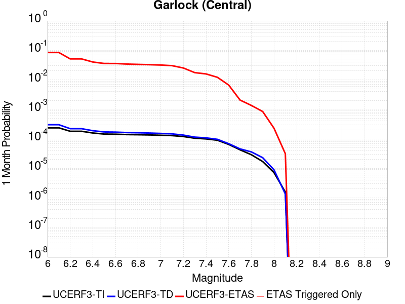 |  |  |

| Magnitude | 1 wk TI Prob | 1 wk TD Prob | 1 wk ETAS Prob | 1 wk ETAS/TD Gain | 1 wk ETAS Triggered Only | 1 mo TI Prob | 1 mo TD Prob | 1 mo ETAS Prob | 1 mo ETAS/TD Gain | 1 mo ETAS Triggered Only | 1 yr TI Prob | 1 yr TD Prob | 1 yr ETAS Prob | 1 yr ETAS/TD Gain | 1 yr ETAS Triggered Only | 10 yr TI Prob | 10 yr TD Prob | 10 yr ETAS Prob | 10 yr ETAS/TD Gain | 10 yr ETAS Triggered Only |
|-----|-----|-----|-----|-----|-----|-----|-----|-----|-----|-----|-----|-----|-----|-----|-----|-----|-----|-----|-----|-----|
| 6.0 | 5.5131142E-5 | 7.02476E-5 | 0.06820546 | 970.9294 | 0.06814 | 2.3625491E-4 | 3.0102677E-4 | 0.084265746 | 279.92773 | 0.08399 | 0.0028726095 | 0.003658906 | 0.115817025 | 31.653458 | 0.11257 | 0.028357591 | 0.036136657 | 0.1696221 | 4.693907 | 0.13849 |
| 6.1 | 5.5131142E-5 | 7.02476E-5 | 0.06820546 | 970.9294 | 0.06814 | 2.3625491E-4 | 3.0102677E-4 | 0.084265746 | 279.92773 | 0.08399 | 0.0028726095 | 0.003658906 | 0.115817025 | 31.653458 | 0.11257 | 0.028357591 | 0.036136657 | 0.1696221 | 4.693907 | 0.13849 |
| 6.2 | 4.216245E-5 | 5.1661802E-5 | 0.040969547 | 793.0337 | 0.04092 | 1.806837E-4 | 2.213891E-4 | 0.0512001 | 231.26749 | 0.05099 | 0.0021976046 | 0.002692112 | 0.071765654 | 26.657753 | 0.06926 | 0.021759989 | 0.026701318 | 0.110434204 | 4.135908 | 0.08603 |
| 6.3 | 4.216245E-5 | 5.1661802E-5 | 0.040969547 | 793.0337 | 0.04092 | 1.806837E-4 | 2.213891E-4 | 0.0512001 | 231.26749 | 0.05099 | 0.0021976046 | 0.002692112 | 0.071765654 | 26.657753 | 0.06926 | 0.021759989 | 0.026701318 | 0.110434204 | 4.135908 | 0.08603 |
| 6.4 | 3.6858168E-5 | 4.411026E-5 | 0.032072697 | 727.1029 | 0.03203 | 1.5795401E-4 | 1.8903041E-4 | 0.04014148 | 212.35458 | 0.03996 | 0.0019213937 | 0.0022990413 | 0.056643814 | 24.638014 | 0.05447 | 0.019048655 | 0.022866098 | 0.08888126 | 3.8870323 | 0.06756 |
| 6.5 | 3.39199E-5 | 4.0018425E-5 | 0.028648874 | 715.8921 | 0.02861 | 1.453629E-4 | 1.7149639E-4 | 0.035815384 | 208.84045 | 0.03565 | 0.0017683565 | 0.0020859907 | 0.05047484 | 24.197058 | 0.04849 | 0.017543508 | 0.020758783 | 0.07989516 | 3.84874 | 0.06039 |
| 6.6 | 3.3571985E-5 | 3.947258E-5 | 0.028568346 | 723.7517 | 0.02853 | 1.4387199E-4 | 1.6915736E-4 | 0.03573314 | 211.24202 | 0.03557 | 0.0017502342 | 0.0020575672 | 0.050338022 | 24.464827 | 0.04838 | 0.017365133 | 0.020480042 | 0.079486325 | 3.8811603 | 0.06024 |
| 6.7 | 3.2580007E-5 | 3.808902E-5 | 0.027407046 | 719.5524 | 0.02737 | 1.3962112E-4 | 1.6322857E-4 | 0.034227666 | 209.69165 | 0.03407 | 0.0016985617 | 0.0019855178 | 0.04821355 | 24.282606 | 0.04632 | 0.016856372 | 0.019770874 | 0.0763693 | 3.8627179 | 0.05774 |
| 6.8 | 3.2185937E-5 | 3.7516216E-5 | 0.026716515 | 712.1325 | 0.02668 | 1.3793244E-4 | 1.60774E-4 | 0.033355437 | 207.46786 | 0.0332 | 0.0016780337 | 0.0019556875 | 0.04705731 | 24.061775 | 0.04519 | 0.016654192 | 0.019477878 | 0.074798934 | 3.8401995 | 0.05642 |
| 6.9 | 3.165394E-5 | 3.672075E-5 | 0.026095765 | 710.6544 | 0.02606 | 1.3565269E-4 | 1.5736527E-4 | 0.032602258 | 207.17569 | 0.03245 | 0.0016503202 | 0.00191426 | 0.04593982 | 23.998737 | 0.04411 | 0.01638118 | 0.019071518 | 0.07302258 | 3.8288815 | 0.055 |
| 7.0 | 3.0903822E-5 | 3.562591E-5 | 0.025434721 | 713.93884 | 0.0254 | 1.3243823E-4 | 1.5267366E-4 | 0.03173785 | 207.88034 | 0.03159 | 0.0016112428 | 0.0018572382 | 0.044707507 | 24.072037 | 0.04293 | 0.015996104 | 0.018513493 | 0.07102302 | 3.8362844 | 0.0535 |
| 7.1 | 3.0069863E-5 | 3.4392175E-5 | 0.024173561 | 702.8797 | 0.02414 | 1.2886449E-4 | 1.4738683E-4 | 0.03018296 | 204.78737 | 0.03004 | 0.0015677959 | 0.0017929787 | 0.042659573 | 23.792572 | 0.04094 | 0.01556781 | 0.01788099 | 0.067910135 | 3.7978957 | 0.05094 |
| 7.2 | 2.7957109E-5 | 3.128141E-5 | 0.02016065 | 644.493 | 0.02013 | 1.1981068E-4 | 1.3405642E-4 | 0.025130706 | 187.46364 | 0.025 | 0.0014577188 | 0.0016309345 | 0.03589496 | 22.00883 | 0.03432 | 0.014481937 | 0.016284352 | 0.058367707 | 3.584282 | 0.04278 |
| 7.3 | 2.4519275E-5 | 2.6714602E-5 | 0.013986342 | 523.5467 | 0.01396 | 1.0507837E-4 | 1.1448621E-4 | 0.01754249 | 153.22798 | 0.01743 | 0.0012785783 | 0.001392993 | 0.025449436 | 18.269608 | 0.02409 | 0.012712469 | 0.01392861 | 0.04390518 | 3.152158 | 0.0304 |
| 7.4 | 2.3225532E-5 | 2.5199166E-5 | 0.012624881 | 501.00394 | 0.0126 | 9.95342E-5 | 1.0799204E-4 | 0.015836293 | 146.64316 | 0.01573 | 0.0012111551 | 0.0013140244 | 0.023045432 | 17.538054 | 0.02176 | 0.012045753 | 0.013146196 | 0.04018599 | 3.056853 | 0.0274 |
| 7.5 | 2.097765E-5 | 2.2483406E-5 | 0.009742265 | 433.3091 | 0.00972 | 8.9901114E-5 | 9.6353964E-5 | 0.012185189 | 126.46277 | 0.01209 | 0.0010939965 | 0.00117249 | 0.017982757 | 15.337237 | 0.01683 | 0.010886264 | 0.0117406575 | 0.03266211 | 2.7819657 | 0.02117 |
| 7.6 | 1.511254E-5 | 1.5990969E-5 | 0.0053559057 | 334.93317 | 0.00534 | 6.476642E-5 | 6.8530964E-5 | 0.00664808 | 97.00841 | 0.00658 | 7.882459E-4 | 8.34053E-4 | 0.009886497 | 11.8535595 | 0.00906 | 0.007854558 | 0.008383867 | 0.019827118 | 2.364913 | 0.01154 |
| 7.7 | 9.934069E-6 | 1.0678523E-5 | 0.0016806606 | 157.387 | 0.00167 | 4.2573887E-5 | 4.5764296E-5 | 0.0020656718 | 45.13719 | 0.00202 | 5.182138E-4 | 5.570383E-4 | 0.0032155565 | 5.7725954 | 0.00266 | 0.00517007 | 0.005627419 | 0.008918792 | 1.5848815 | 0.00331 |
| 7.8 | 6.7562896E-6 | 8.42837E-6 | 0.0010584195 | 125.5782 | 0.00105 | 2.8955206E-5 | 3.6121084E-5 | 0.0013560734 | 37.54243 | 0.00132 | 3.5247262E-4 | 4.3968562E-4 | 0.0021589294 | 4.910166 | 0.00172 | 0.0035191406 | 0.004446416 | 0.0065868567 | 1.4813855 | 0.00215 |
| 7.9 | 3.975453E-6 | 5.3710532E-6 | 6.5536756E-4 | 122.01845 | 6.5E-4 | 1.7037546E-5 | 2.3018596E-5 | 8.429997E-4 | 36.62255 | 8.2E-4 | 2.0741238E-4 | 2.8021546E-4 | 0.0013399185 | 4.7817435 | 0.00106 | 0.002072189 | 0.0028335669 | 0.004139855 | 1.4610049 | 0.00131 |
| 8.0 | 1.6729537E-6 | 2.0775192E-6 | 1.8207714E-4 | 87.64162 | 1.8E-4 | 7.169782E-6 | 8.903624E-6 | 2.2890167E-4 | 25.70882 | 2.2E-4 | 8.7288594E-5 | 1.0839626E-4 | 4.2836159E-4 | 3.9518113 | 3.2E-4 | 8.7254314E-4 | 0.001096854 | 0.0014864262 | 1.3551724 | 3.9E-4 |
| 8.1 | 3.6733252E-7 | 3.1489736E-7 | 2.031489E-5 | 64.51273 | 2.0E-5 | 1.5742813E-6 | 1.3495595E-6 | 3.134952E-5 | 23.229445 | 3.0E-5 | 1.9166706E-5 | 1.643078E-5 | 5.6430123E-5 | 3.4344153 | 4.0E-5 | 1.9165053E-4 | 1.662928E-4 | 2.1628448E-4 | 1.3006245 | 5.0E-5 |

## Tank Canyon
*[(top)](#table-of-contents)*

| 1 Week | 1 Month | 1 Year | 10 Year |
|-----|-----|-----|-----|
|  |  |  |  |

| Magnitude | 1 wk TI Prob | 1 wk TD Prob | 1 wk ETAS Prob | 1 wk ETAS/TD Gain | 1 wk ETAS Triggered Only | 1 mo TI Prob | 1 mo TD Prob | 1 mo ETAS Prob | 1 mo ETAS/TD Gain | 1 mo ETAS Triggered Only | 1 yr TI Prob | 1 yr TD Prob | 1 yr ETAS Prob | 1 yr ETAS/TD Gain | 1 yr ETAS Triggered Only | 10 yr TI Prob | 10 yr TD Prob | 10 yr ETAS Prob | 10 yr ETAS/TD Gain | 10 yr ETAS Triggered Only |
|-----|-----|-----|-----|-----|-----|-----|-----|-----|-----|-----|-----|-----|-----|-----|-----|-----|-----|-----|-----|-----|
| 6.0 | 4.8284557E-5 | 5.796445E-5 | 0.036595847 | 631.34985 | 0.03654 | 2.0691741E-4 | 2.4839927E-4 | 0.049936052 | 201.03142 | 0.0497 | 0.0025163088 | 0.0030207336 | 0.07910022 | 26.185766 | 0.07631 | 0.02488006 | 0.029863616 | 0.1300302 | 4.3541346 | 0.10325 |
| 6.1 | 1.7796336E-5 | 2.0873378E-5 | 0.012260618 | 587.3807 | 0.01224 | 7.626778E-5 | 8.945448E-5 | 0.017197924 | 192.25336 | 0.01711 | 9.281647E-4 | 0.0010886024 | 0.028249003 | 25.949791 | 0.02719 | 0.009242975 | 0.010836642 | 0.048405066 | 4.4667954 | 0.03798 |
| 6.2 | 1.7796336E-5 | 2.0873378E-5 | 0.012260618 | 587.3807 | 0.01224 | 7.626778E-5 | 8.945448E-5 | 0.017197924 | 192.25336 | 0.01711 | 9.281647E-4 | 0.0010886024 | 0.028249003 | 25.949791 | 0.02719 | 0.009242975 | 0.010836642 | 0.048405066 | 4.4667954 | 0.03798 |
| 6.3 | 1.3515912E-5 | 1.5759651E-5 | 0.008815621 | 559.37915 | 0.0088 | 5.792405E-5 | 6.7539746E-5 | 0.0124167055 | 183.84294 | 0.01235 | 7.049971E-4 | 8.2200987E-4 | 0.020415891 | 24.836552 | 0.01961 | 0.007027647 | 0.008192157 | 0.03543712 | 4.325737 | 0.02747 |
| 6.4 | 1.0870146E-5 | 1.2618114E-5 | 0.0063525382 | 503.44592 | 0.00634 | 4.658551E-5 | 5.4076605E-5 | 0.009143585 | 169.08578 | 0.00909 | 5.67031E-4 | 6.582015E-4 | 0.014948789 | 22.711569 | 0.0143 | 0.005655863 | 0.006564382 | 0.026621846 | 4.0554996 | 0.02019 |
| 6.5 | 7.964826E-6 | 9.196184E-6 | 0.0040091593 | 435.95905 | 0.004 | 3.4134522E-5 | 3.941168E-5 | 0.0058291834 | 147.90497 | 0.00579 | 4.1550855E-4 | 4.797421E-4 | 0.009605362 | 20.021929 | 0.00913 | 0.0041473247 | 0.004788209 | 0.017636394 | 3.6832964 | 0.01291 |
| 6.6 | 6.6317E-6 | 7.612378E-6 | 0.002807591 | 368.81918 | 0.0028 | 2.8421264E-5 | 3.262412E-5 | 0.0042224876 | 129.42839 | 0.00419 | 3.4597394E-4 | 3.9713533E-4 | 0.0070944745 | 17.864122 | 0.0067 | 0.0034543579 | 0.0039652516 | 0.013417621 | 3.383801 | 0.00949 |
| 6.7 | 4.793663E-6 | 5.4308593E-6 | 0.0016554219 | 304.8177 | 0.00165 | 2.0544108E-5 | 2.3274928E-5 | 0.0024332188 | 104.54249 | 0.00241 | 2.500958E-4 | 2.833398E-4 | 0.0039223083 | 13.843126 | 0.00364 | 0.0024981452 | 0.0028303189 | 0.007995658 | 2.8250024 | 0.00518 |
| 6.8 | 4.382823E-6 | 4.969325E-6 | 0.0015449617 | 310.89972 | 0.00154 | 1.8783392E-5 | 2.1296957E-5 | 0.0022112504 | 103.8294 | 0.00219 | 2.286638E-4 | 2.5926388E-4 | 0.003548411 | 13.686484 | 0.00329 | 0.0022842865 | 0.0025901233 | 0.007307872 | 2.8214378 | 0.00473 |
| 6.9 | 2.729601E-6 | 3.0735862E-6 | 7.530713E-4 | 245.01389 | 7.5E-4 | 1.1698237E-5 | 1.3172453E-5 | 0.0010931583 | 82.988205 | 0.00108 | 1.4241673E-4 | 1.6036403E-4 | 0.001850093 | 11.536833 | 0.00169 | 0.001423255 | 0.0016024808 | 0.0039187633 | 2.4454353 | 0.00232 |
| 7.0 | 1.8987357E-6 | 2.126971E-6 | 3.7212617E-4 | 174.95593 | 3.7E-4 | 8.137413E-6 | 9.115562E-6 | 5.1911094E-4 | 56.94777 | 5.1E-4 | 9.90685E-5 | 1.1097702E-4 | 9.0088934E-4 | 8.117802 | 7.9E-4 | 9.902435E-4 | 0.0011092846 | 0.0021681087 | 1.9545108 | 0.00106 |
| 7.1 | 1.4928986E-6 | 1.6641525E-6 | 1.9166384E-4 | 115.172035 | 1.9E-4 | 6.398121E-6 | 7.132066E-6 | 2.671302E-4 | 37.454815 | 2.6E-4 | 7.789434E-5 | 8.6830034E-5 | 4.867953E-4 | 5.606301 | 4.0E-4 | 7.786704E-4 | 8.6801895E-4 | 0.0014175415 | 1.6330767 | 5.5E-4 |
| 7.2 | 1.069082E-6 | 1.1828765E-6 | 6.118281E-5 | 51.723743 | 6.0E-5 | 4.581772E-6 | 5.0694644E-6 | 9.506901E-5 | 18.753265 | 9.0E-5 | 5.5781646E-5 | 6.171951E-5 | 2.0171086E-4 | 3.2681866 | 1.4E-4 | 5.576765E-4 | 6.1707594E-4 | 8.369402E-4 | 1.3563001 | 2.2E-4 |
| 7.3 | 8.776551E-7 | 9.770151E-7 | 3.0976986E-5 | 31.705738 | 3.0E-5 | 3.7613736E-6 | 4.187204E-6 | 6.4186956E-5 | 15.329311 | 6.0E-5 | 4.579376E-5 | 5.0978535E-5 | 1.5097344E-4 | 2.96151 | 1.0E-4 | 4.5784327E-4 | 5.097194E-4 | 6.59643E-4 | 1.2941295 | 1.5E-4 |
| 7.4 | 7.55721E-7 | 8.5103835E-7 | 3.0851013E-5 | 36.251022 | 3.0E-5 | 3.2388E-6 | 3.6473052E-6 | 6.364709E-5 | 17.450441 | 6.0E-5 | 3.9431678E-5 | 4.4405555E-5 | 1.4440111E-4 | 3.2518706 | 1.0E-4 | 3.942468E-4 | 4.4401767E-4 | 5.7395996E-4 | 1.2926512 | 1.3E-4 |
| 7.5 | 5.587665E-7 | 6.305732E-7 | 2.0630561E-5 | 32.717155 | 2.0E-5 | 2.3947114E-6 | 2.7024564E-6 | 4.2702348E-5 | 15.801309 | 4.0E-5 | 2.915522E-5 | 3.2902408E-5 | 9.290043E-5 | 2.8235147 | 6.0E-5 | 2.9151395E-4 | 3.2902407E-4 | 4.1899446E-4 | 1.2734462 | 9.0E-5 |

## Little Lake
*[(top)](#table-of-contents)*

| 1 Week | 1 Month | 1 Year | 10 Year |
|-----|-----|-----|-----|
|  |  |  |  |

| Magnitude | 1 wk TI Prob | 1 wk TD Prob | 1 wk ETAS Prob | 1 wk ETAS/TD Gain | 1 wk ETAS Triggered Only | 1 mo TI Prob | 1 mo TD Prob | 1 mo ETAS Prob | 1 mo ETAS/TD Gain | 1 mo ETAS Triggered Only | 1 yr TI Prob | 1 yr TD Prob | 1 yr ETAS Prob | 1 yr ETAS/TD Gain | 1 yr ETAS Triggered Only | 10 yr TI Prob | 10 yr TD Prob | 10 yr ETAS Prob | 10 yr ETAS/TD Gain | 10 yr ETAS Triggered Only |
|-----|-----|-----|-----|-----|-----|-----|-----|-----|-----|-----|-----|-----|-----|-----|-----|-----|-----|-----|-----|-----|
| 6.0 | 2.8424427E-5 | 3.1205716E-5 | 0.030590253 | 980.2772 | 0.03056 | 1.2181328E-4 | 1.3373268E-4 | 0.038538598 | 288.17636 | 0.03841 | 0.0014820677 | 0.0016271125 | 0.053522535 | 32.894184 | 0.05198 | 0.014722223 | 0.016165398 | 0.07951451 | 4.918809 | 0.06439 |
| 6.1 | 2.8424427E-5 | 3.1205716E-5 | 0.030590253 | 980.2772 | 0.03056 | 1.2181328E-4 | 1.3373268E-4 | 0.038538598 | 288.17636 | 0.03841 | 0.0014820677 | 0.0016271125 | 0.053522535 | 32.894184 | 0.05198 | 0.014722223 | 0.016165398 | 0.07951451 | 4.918809 | 0.06439 |
| 6.2 | 2.8424427E-5 | 3.1205716E-5 | 0.030590253 | 980.2772 | 0.03056 | 1.2181328E-4 | 1.3373268E-4 | 0.038538598 | 288.17636 | 0.03841 | 0.0014820677 | 0.0016271125 | 0.053522535 | 32.894184 | 0.05198 | 0.014722223 | 0.016165398 | 0.07951451 | 4.918809 | 0.06439 |
| 6.3 | 1.48860645E-5 | 1.6081383E-5 | 0.020765748 | 1291.291 | 0.02075 | 6.379586E-5 | 6.8918554E-5 | 0.025937136 | 376.34473 | 0.02587 | 7.7643775E-4 | 8.387886E-4 | 0.035319842 | 42.10816 | 0.03451 | 0.007737305 | 0.008359045 | 0.050196376 | 6.0050373 | 0.04219 |
| 6.4 | 1.48860645E-5 | 1.6081383E-5 | 0.020765748 | 1291.291 | 0.02075 | 6.379586E-5 | 6.8918554E-5 | 0.025937136 | 376.34473 | 0.02587 | 7.7643775E-4 | 8.387886E-4 | 0.035319842 | 42.10816 | 0.03451 | 0.007737305 | 0.008359045 | 0.050196376 | 6.0050373 | 0.04219 |
| 6.5 | 1.2797581E-5 | 1.376556E-5 | 0.019403499 | 1409.5685 | 0.01939 | 5.4845623E-5 | 5.8994065E-5 | 0.02418757 | 410.00006 | 0.02413 | 6.675408E-4 | 7.1804173E-4 | 0.032785 | 45.658905 | 0.03209 | 0.006655392 | 0.007159767 | 0.045890465 | 6.409491 | 0.03901 |
| 6.6 | 9.661896E-6 | 1.0289033E-5 | 0.017120114 | 1663.9187 | 0.01711 | 4.1407468E-5 | 4.40952E-5 | 0.021323157 | 483.57095 | 0.02128 | 5.040193E-4 | 5.36743E-4 | 0.028701618 | 53.473663 | 0.02818 | 0.005028777 | 0.0053560715 | 0.03936295 | 7.34922 | 0.03419 |
| 6.7 | 7.767871E-6 | 8.199681E-6 | 0.015058076 | 1836.4221 | 0.01505 | 3.329045E-5 | 3.5141096E-5 | 0.018764483 | 533.97546 | 0.01873 | 4.0523586E-4 | 4.2777258E-4 | 0.025187176 | 58.87983 | 0.02477 | 0.004044977 | 0.004270843 | 0.034232333 | 8.015357 | 0.03009 |
| 6.8 | 6.4235196E-6 | 6.735739E-6 | 0.011676657 | 1733.5376 | 0.01167 | 2.752908E-5 | 2.8867207E-5 | 0.0145084495 | 502.59277 | 0.01448 | 3.35115E-4 | 3.5141438E-4 | 0.019634636 | 55.87317 | 0.01929 | 0.003346101 | 0.0035098472 | 0.026757963 | 7.623683 | 0.02333 |
| 6.9 | 3.1283696E-6 | 3.1121751E-6 | 0.007383089 | 2372.3245 | 0.00738 | 1.3407229E-5 | 1.33378335E-5 | 0.009163216 | 687.00934 | 0.00915 | 1.6322079E-4 | 1.6237753E-4 | 0.012150431 | 74.82828 | 0.01199 | 0.0016310095 | 0.0016227372 | 0.015979402 | 9.847191 | 0.01438 |
| 7.0 | 2.290603E-6 | 2.2286763E-6 | 0.004802218 | 2154.74 | 0.0048 | 9.816834E-6 | 9.551441E-6 | 0.005909495 | 618.70197 | 0.0059 | 1.19513395E-4 | 1.1628362E-4 | 0.0077953907 | 67.037735 | 0.00768 | 0.0011944914 | 0.0011623299 | 0.010361625 | 8.91453 | 0.00921 |
| 7.1 | 1.293693E-6 | 1.1776774E-6 | 0.0020211753 | 1716.2385 | 0.00202 | 5.5443866E-6 | 5.047183E-6 | 0.0025150345 | 498.3046 | 0.00251 | 6.750081E-5 | 6.1448416E-5 | 0.0034012431 | 55.351192 | 0.00334 | 6.7480316E-4 | 6.1438273E-4 | 0.0047118636 | 7.6692643 | 0.0041 |
| 7.2 | 4.715842E-7 | 3.091732E-7 | 6.0309154E-5 | 195.06592 | 6.0E-5 | 2.0210737E-6 | 1.3250274E-6 | 8.132492E-5 | 61.37603 | 8.0E-5 | 2.4606294E-5 | 1.6132095E-5 | 1.2613033E-4 | 7.8185954 | 1.1E-4 | 2.460357E-4 | 1.6130977E-4 | 3.3128235E-4 | 2.0537028 | 1.7E-4 |
| 7.3 | 3.9430947E-7 | 2.3096938E-7 | 2.0230964E-5 | 87.591545 | 2.0E-5 | 1.6898966E-6 | 9.898685E-7 | 3.098984E-5 | 31.307028 | 3.0E-5 | 2.0574296E-5 | 1.2051582E-5 | 7.205086E-5 | 5.9785395 | 6.0E-5 | 2.0572392E-4 | 1.2050936E-4 | 2.0049972E-4 | 1.6637689 | 8.0E-5 |
| 7.4 | 3.547123E-7 | 1.9678579E-7 | 2.0196781E-5 | 102.63333 | 2.0E-5 | 1.5201948E-6 | 8.433674E-7 | 3.084334E-5 | 36.571655 | 3.0E-5 | 1.8508214E-5 | 1.02679505E-5 | 5.026754E-5 | 4.895577 | 4.0E-5 | 1.8506673E-4 | 1.0267482E-4 | 1.6266866E-4 | 1.5843091 | 6.0E-5 |
| 7.5 | 2.6354266E-7 | 1.4422719E-7 | 1.0144226E-5 | 70.335045 | 1.0E-5 | 1.129468E-6 | 6.1811636E-7 | 2.0618105E-5 | 33.356346 | 2.0E-5 | 1.3751187E-5 | 7.525541E-6 | 2.7525391E-5 | 3.657596 | 2.0E-5 | 1.3750336E-4 | 7.5252916E-5 | 1.1524991E-4 | 1.5315008 | 4.0E-5 |
| 7.6 | 1.269913E-7 | 7.572344E-8 | 7.572344E-8 | 1.0 | 0.0 | 5.4424834E-7 | 3.24529E-7 | 3.24529E-7 | 1.0 | 0.0 | 6.6262032E-6 | 3.9511337E-6 | 3.9511337E-6 | 1.0 | 0.0 | 6.626006E-5 | 3.9510673E-5 | 5.950988E-5 | 1.5061724 | 2.0E-5 |

## Airport Lake
*[(top)](#table-of-contents)*

| 1 Week | 1 Month | 1 Year | 10 Year |
|-----|-----|-----|-----|
|  | 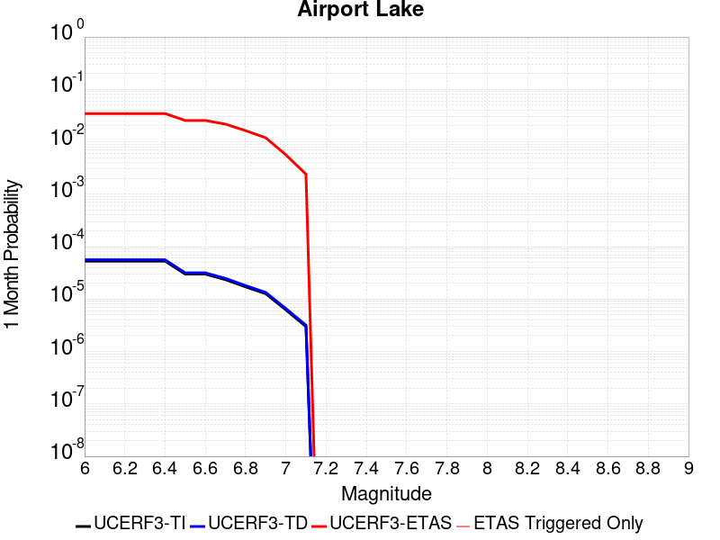 |  |  |

| Magnitude | 1 wk TI Prob | 1 wk TD Prob | 1 wk ETAS Prob | 1 wk ETAS/TD Gain | 1 wk ETAS Triggered Only | 1 mo TI Prob | 1 mo TD Prob | 1 mo ETAS Prob | 1 mo ETAS/TD Gain | 1 mo ETAS Triggered Only | 1 yr TI Prob | 1 yr TD Prob | 1 yr ETAS Prob | 1 yr ETAS/TD Gain | 1 yr ETAS Triggered Only | 10 yr TI Prob | 10 yr TD Prob | 10 yr ETAS Prob | 10 yr ETAS/TD Gain | 10 yr ETAS Triggered Only |
|-----|-----|-----|-----|-----|-----|-----|-----|-----|-----|-----|-----|-----|-----|-----|-----|-----|-----|-----|-----|-----|
| 6.0 | 1.2387061E-5 | 1.3103157E-5 | 0.028442731 | 2170.6777 | 0.02843 | 5.3086325E-5 | 5.615534E-5 | 0.03453422 | 614.9766 | 0.03448 | 6.461343E-4 | 6.8350515E-4 | 0.045392927 | 66.41197 | 0.04474 | 0.0064425888 | 0.0068168393 | 0.060140844 | 8.822394 | 0.05369 |
| 6.1 | 1.2387061E-5 | 1.3103157E-5 | 0.028442731 | 2170.6777 | 0.02843 | 5.3086325E-5 | 5.615534E-5 | 0.03453422 | 614.9766 | 0.03448 | 6.461343E-4 | 6.8350515E-4 | 0.045392927 | 66.41197 | 0.04474 | 0.0064425888 | 0.0068168393 | 0.060140844 | 8.822394 | 0.05369 |
| 6.2 | 1.2387061E-5 | 1.3103157E-5 | 0.028442731 | 2170.6777 | 0.02843 | 5.3086325E-5 | 5.615534E-5 | 0.03453422 | 614.9766 | 0.03448 | 6.461343E-4 | 6.8350515E-4 | 0.045392927 | 66.41197 | 0.04474 | 0.0064425888 | 0.0068168393 | 0.060140844 | 8.822394 | 0.05369 |
| 6.3 | 1.2387061E-5 | 1.3103157E-5 | 0.028442731 | 2170.6777 | 0.02843 | 5.3086325E-5 | 5.615534E-5 | 0.03453422 | 614.9766 | 0.03448 | 6.461343E-4 | 6.8350515E-4 | 0.045392927 | 66.41197 | 0.04474 | 0.0064425888 | 0.0068168393 | 0.060140844 | 8.822394 | 0.05369 |
| 6.4 | 1.2387061E-5 | 1.3103157E-5 | 0.028442731 | 2170.6777 | 0.02843 | 5.3086325E-5 | 5.615534E-5 | 0.03453422 | 614.9766 | 0.03448 | 6.461343E-4 | 6.8350515E-4 | 0.045392927 | 66.41197 | 0.04474 | 0.0064425888 | 0.0068168393 | 0.060140844 | 8.822394 | 0.05369 |
| 6.5 | 6.9922594E-6 | 7.384925E-6 | 0.02108723 | 2855.4426 | 0.02108 | 2.996648E-5 | 3.1649324E-5 | 0.025560841 | 807.6267 | 0.02553 | 3.6478083E-4 | 3.8526783E-4 | 0.033632454 | 87.296295 | 0.03326 | 0.003641826 | 0.0038465366 | 0.043682713 | 11.356376 | 0.03999 |
| 6.6 | 6.9922594E-6 | 7.384925E-6 | 0.02108723 | 2855.4426 | 0.02108 | 2.996648E-5 | 3.1649324E-5 | 0.025560841 | 807.6267 | 0.02553 | 3.6478083E-4 | 3.8526783E-4 | 0.033632454 | 87.296295 | 0.03326 | 0.003641826 | 0.0038465366 | 0.043682713 | 11.356376 | 0.03999 |
| 6.7 | 5.477277E-6 | 5.7860684E-6 | 0.017765684 | 3070.424 | 0.01776 | 2.3473833E-5 | 2.4797222E-5 | 0.02172426 | 876.0763 | 0.0217 | 2.8575645E-4 | 3.0186825E-4 | 0.028563334 | 94.62186 | 0.02827 | 0.0028538927 | 0.003014966 | 0.036962308 | 12.25961 | 0.03405 |
| 6.8 | 3.9950432E-6 | 4.2190873E-6 | 0.013404163 | 3177.029 | 0.0134 | 1.7121502E-5 | 1.8081691E-5 | 0.016327787 | 903.00104 | 0.01631 | 2.0843433E-4 | 2.2012512E-4 | 0.021595418 | 98.1052 | 0.02138 | 0.0020823893 | 0.0021993418 | 0.027762994 | 12.62332 | 0.02562 |
| 6.9 | 2.95695E-6 | 3.1230243E-6 | 0.0096730925 | 3097.348 | 0.00967 | 1.2672582E-5 | 1.3384334E-5 | 0.011943225 | 892.3287 | 0.01193 | 1.5427776E-4 | 1.6294434E-4 | 0.015750404 | 96.66125 | 0.01559 | 0.001541707 | 0.0016284712 | 0.020308003 | 12.470594 | 0.01871 |
| 7.0 | 1.456072E-6 | 1.540812E-6 | 0.0046315338 | 3005.9045 | 0.00463 | 6.2402937E-6 | 6.603469E-6 | 0.005656566 | 856.6052 | 0.00565 | 7.597293E-5 | 8.039528E-5 | 0.0073998068 | 92.04281 | 0.00732 | 7.594696E-4 | 8.0376083E-4 | 0.009516752 | 11.840279 | 0.00872 |
| 7.1 | 6.995192E-7 | 7.4089746E-7 | 0.0019407395 | 2619.444 | 0.00194 | 2.997936E-6 | 3.1752747E-6 | 0.0024131676 | 759.987 | 0.00241 | 3.649926E-5 | 3.865897E-5 | 0.0032085364 | 82.99591 | 0.00317 | 3.6493264E-4 | 3.865897E-4 | 0.004205113 | 10.877458 | 0.00382 |

## Owl Lake
*[(top)](#table-of-contents)*

| 1 Week | 1 Month | 1 Year | 10 Year |
|-----|-----|-----|-----|
|  |  |  |  |

| Magnitude | 1 wk TI Prob | 1 wk TD Prob | 1 wk ETAS Prob | 1 wk ETAS/TD Gain | 1 wk ETAS Triggered Only | 1 mo TI Prob | 1 mo TD Prob | 1 mo ETAS Prob | 1 mo ETAS/TD Gain | 1 mo ETAS Triggered Only | 1 yr TI Prob | 1 yr TD Prob | 1 yr ETAS Prob | 1 yr ETAS/TD Gain | 1 yr ETAS Triggered Only | 10 yr TI Prob | 10 yr TD Prob | 10 yr ETAS Prob | 10 yr ETAS/TD Gain | 10 yr ETAS Triggered Only |
|-----|-----|-----|-----|-----|-----|-----|-----|-----|-----|-----|-----|-----|-----|-----|-----|-----|-----|-----|-----|-----|
| 6.0 | 5.0320643E-5 | 6.6358676E-5 | 0.015975302 | 240.74174 | 0.01591 | 2.1564208E-4 | 2.843643E-4 | 0.021308385 | 74.933395 | 0.02103 | 0.0026222812 | 0.003457547 | 0.034450017 | 9.9637165 | 0.0311 | 0.02591553 | 0.034141295 | 0.07429204 | 2.176017 | 0.04157 |
| 6.1 | 5.0320643E-5 | 6.6358676E-5 | 0.015975302 | 240.74174 | 0.01591 | 2.1564208E-4 | 2.843643E-4 | 0.021308385 | 74.933395 | 0.02103 | 0.0026222812 | 0.003457547 | 0.034450017 | 9.9637165 | 0.0311 | 0.02591553 | 0.034141295 | 0.07429204 | 2.176017 | 0.04157 |
| 6.2 | 2.4125871E-5 | 3.0980515E-5 | 0.013010578 | 419.96005 | 0.01298 | 1.0339249E-4 | 1.3276804E-4 | 0.016920539 | 127.44437 | 0.01679 | 0.0012580766 | 0.0016154252 | 0.025546703 | 15.814228 | 0.02397 | 0.012509781 | 0.016070755 | 0.046946455 | 2.921235 | 0.03138 |
| 6.3 | 1.7433485E-5 | 2.2355545E-5 | 0.011782093 | 527.0322 | 0.01176 | 7.471279E-5 | 9.580685E-5 | 0.015224357 | 158.90678 | 0.01513 | 9.0924866E-4 | 0.001165962 | 0.022291303 | 19.11838 | 0.02115 | 0.009055373 | 0.0116291465 | 0.038759924 | 3.3329985 | 0.02745 |
| 6.4 | 1.7433485E-5 | 2.2355545E-5 | 0.011782093 | 527.0322 | 0.01176 | 7.471279E-5 | 9.580685E-5 | 0.015224357 | 158.90678 | 0.01513 | 9.0924866E-4 | 0.001165962 | 0.022291303 | 19.11838 | 0.02115 | 0.009055373 | 0.0116291465 | 0.038759924 | 3.3329985 | 0.02745 |
| 6.5 | 1.5182742E-5 | 1.9429277E-5 | 0.011419208 | 587.732 | 0.0114 | 6.506727E-5 | 8.3266525E-5 | 0.014612056 | 175.48537 | 0.01453 | 7.919061E-4 | 0.0010134344 | 0.021222932 | 20.941595 | 0.02023 | 0.0078909 | 0.010118678 | 0.03595458 | 3.5532885 | 0.0261 |
| 6.6 | 6.7271576E-6 | 8.547518E-6 | 0.009368467 | 1096.0454 | 0.00936 | 2.8830356E-5 | 3.6631736E-5 | 0.011616208 | 317.10776 | 0.01158 | 3.5095305E-4 | 4.4590578E-4 | 0.016008964 | 35.90212 | 0.01557 | 0.0035039932 | 0.0044680187 | 0.023691742 | 5.302516 | 0.01931 |
| 6.7 | 6.682835E-6 | 8.479961E-6 | 0.009368401 | 1104.7693 | 0.00936 | 2.8640408E-5 | 3.6342215E-5 | 0.011605922 | 319.35098 | 0.01157 | 3.4864116E-4 | 4.423823E-4 | 0.015985504 | 36.135044 | 0.01555 | 0.003480947 | 0.0044329325 | 0.023627466 | 5.3299856 | 0.01928 |
| 6.8 | 6.5774975E-6 | 8.326427E-6 | 0.0093382485 | 1121.5193 | 0.00933 | 2.8188972E-5 | 3.5684232E-5 | 0.011575272 | 324.3806 | 0.01154 | 3.4314668E-4 | 4.3437455E-4 | 0.015947632 | 36.714012 | 0.01552 | 0.0034261728 | 0.0043531056 | 0.023509352 | 5.4005933 | 0.01924 |
| 6.9 | 6.363419E-6 | 7.999591E-6 | 0.009307926 | 1163.5502 | 0.0093 | 2.727151E-5 | 3.428354E-5 | 0.011533889 | 336.42645 | 0.0115 | 3.3198006E-4 | 4.1732774E-4 | 0.015870877 | 38.029766 | 0.01546 | 0.0033148455 | 0.0041830647 | 0.023252958 | 5.558833 | 0.01915 |
| 7.0 | 6.1342453E-6 | 7.631779E-6 | 0.009227562 | 1209.097 | 0.00922 | 2.6289357E-5 | 3.2707245E-5 | 0.011432335 | 349.53522 | 0.0114 | 3.2002592E-4 | 3.9814346E-4 | 0.015712043 | 39.463272 | 0.01532 | 0.0031956544 | 0.003991739 | 0.022866096 | 5.7283545 | 0.01895 |
| 7.1 | 5.842926E-6 | 7.142312E-6 | 0.00869708 | 1217.6842 | 0.00869 | 2.504087E-5 | 3.060958E-5 | 0.010750282 | 351.20642 | 0.01072 | 3.0482994E-4 | 3.7261334E-4 | 0.014827225 | 39.792526 | 0.01446 | 0.0030441214 | 0.0037371595 | 0.02151049 | 5.755839 | 0.01784 |
| 7.2 | 4.77173E-6 | 5.358478E-6 | 0.005735328 | 1070.3278 | 0.00573 | 2.045011E-5 | 2.2964727E-5 | 0.0069828047 | 304.06653 | 0.00696 | 2.4895166E-4 | 2.7956374E-4 | 0.009696931 | 34.685936 | 0.00942 | 0.0024867293 | 0.0028086212 | 0.01431621 | 5.0972376 | 0.01154 |
| 7.3 | 3.0494948E-6 | 2.710356E-6 | 0.0014727063 | 543.3627 | 0.00147 | 1.3069198E-5 | 1.1615762E-5 | 0.0017415957 | 149.93384 | 0.00173 | 1.5910587E-4 | 1.4141288E-4 | 0.002501079 | 17.686361 | 0.00236 | 0.0015899199 | 0.0014231089 | 0.0043389536 | 3.0489259 | 0.00292 |
| 7.4 | 2.7263884E-6 | 2.3055634E-6 | 9.3230343E-4 | 404.37122 | 9.3E-4 | 1.1684469E-5 | 9.880949E-6 | 0.00111987 | 113.33628 | 0.00111 | 1.4224913E-4 | 1.2029401E-4 | 0.0016901052 | 14.049787 | 0.00157 | 0.0014215811 | 0.0012110578 | 0.0031187446 | 2.5752237 | 0.00191 |
| 7.5 | 2.6090431E-6 | 2.1655019E-6 | 8.021638E-4 | 370.4286 | 8.0E-4 | 1.1181565E-5 | 9.2806895E-6 | 9.792717E-4 | 105.51713 | 9.7E-4 | 1.3612706E-4 | 1.1298663E-4 | 0.0015228273 | 13.477942 | 0.00141 | 0.001360437 | 0.0011378126 | 0.0028059124 | 2.4660585 | 0.00167 |
| 7.6 | 2.3008756E-6 | 1.8726826E-6 | 6.018716E-4 | 321.39542 | 6.0E-4 | 9.860858E-6 | 8.025758E-6 | 7.180201E-4 | 89.464455 | 7.1E-4 | 1.20049335E-4 | 9.770931E-5 | 0.0011176097 | 11.438108 | 0.00102 | 0.001199845 | 9.848307E-4 | 0.0022236095 | 2.2578597 | 0.00124 |
| 7.7 | 1.7184348E-6 | 1.341808E-6 | 2.8134143E-4 | 209.67339 | 2.8E-4 | 7.3646997E-6 | 5.750593E-6 | 3.7574847E-4 | 65.34082 | 3.7E-4 | 8.966153E-5 | 7.0011265E-5 | 6.0997345E-4 | 8.712504 | 5.4E-4 | 8.962536E-4 | 7.0769014E-4 | 0.0013472373 | 1.9037106 | 6.4E-4 |
| 7.8 | 8.4612907E-7 | 8.4054994E-7 | 1.3084045E-4 | 155.66052 | 1.3E-4 | 3.6262625E-6 | 3.602352E-6 | 2.0360164E-4 | 56.51908 | 2.0E-4 | 4.4148852E-5 | 4.3857777E-5 | 3.4384461E-4 | 7.839992 | 3.0E-4 | 4.414008E-4 | 4.4386165E-4 | 7.8371074E-4 | 1.7656645 | 3.4E-4 |
| 7.9 | 2.716738E-7 | 3.7681625E-7 | 7.037679E-5 | 186.76686 | 7.0E-5 | 1.1643157E-6 | 1.6149258E-6 | 1.2161473E-4 | 75.3067 | 1.2E-4 | 1.4175452E-5 | 1.9661555E-5 | 1.9965801E-4 | 10.154741 | 1.8E-4 | 1.4174548E-4 | 1.9829652E-4 | 3.8825884E-4 | 1.9579711 | 1.9E-4 |
| 8.0 | 2.1995428E-8 | 3.3853325E-8 | 3.3853325E-8 | 1.0 | 0.0 | 9.426611E-8 | 1.4508568E-7 | 1.4508568E-7 | 1.0 | 0.0 | 1.1476893E-6 | 1.7664173E-6 | 1.7664173E-6 | 1.0 | 0.0 | 1.14768345E-5 | 1.7869768E-5 | 1.7869768E-5 | 1.0 | 0.0 |

## Panamint Valley
*[(top)](#table-of-contents)*

| 1 Week | 1 Month | 1 Year | 10 Year |
|-----|-----|-----|-----|
|  |  |  |  |

| Magnitude | 1 wk TI Prob | 1 wk TD Prob | 1 wk ETAS Prob | 1 wk ETAS/TD Gain | 1 wk ETAS Triggered Only | 1 mo TI Prob | 1 mo TD Prob | 1 mo ETAS Prob | 1 mo ETAS/TD Gain | 1 mo ETAS Triggered Only | 1 yr TI Prob | 1 yr TD Prob | 1 yr ETAS Prob | 1 yr ETAS/TD Gain | 1 yr ETAS Triggered Only | 10 yr TI Prob | 10 yr TD Prob | 10 yr ETAS Prob | 10 yr ETAS/TD Gain | 10 yr ETAS Triggered Only |
|-----|-----|-----|-----|-----|-----|-----|-----|-----|-----|-----|-----|-----|-----|-----|-----|-----|-----|-----|-----|-----|
| 6.0 | 3.0211835E-5 | 3.3984263E-5 | 0.012893547 | 379.39758 | 0.01286 | 1.2947287E-4 | 1.4563887E-4 | 0.016973188 | 116.54298 | 0.01683 | 0.0015751923 | 0.0017717406 | 0.02625828 | 14.820612 | 0.02453 | 0.015640736 | 0.017583003 | 0.049432963 | 2.8114061 | 0.03242 |
| 6.1 | 3.0211835E-5 | 3.3984263E-5 | 0.012893547 | 379.39758 | 0.01286 | 1.2947287E-4 | 1.4563887E-4 | 0.016973188 | 116.54298 | 0.01683 | 0.0015751923 | 0.0017717406 | 0.02625828 | 14.820612 | 0.02453 | 0.015640736 | 0.017583003 | 0.049432963 | 2.8114061 | 0.03242 |
| 6.2 | 3.0211835E-5 | 3.3984263E-5 | 0.012893547 | 379.39758 | 0.01286 | 1.2947287E-4 | 1.4563887E-4 | 0.016973188 | 116.54298 | 0.01683 | 0.0015751923 | 0.0017717406 | 0.02625828 | 14.820612 | 0.02453 | 0.015640736 | 0.017583003 | 0.049432963 | 2.8114061 | 0.03242 |
| 6.3 | 2.8573924E-5 | 3.2102445E-5 | 0.012431704 | 387.25104 | 0.0124 | 1.2245393E-4 | 1.375748E-4 | 0.016355343 | 118.88328 | 0.01622 | 0.001489857 | 0.0016737141 | 0.025154348 | 15.029058 | 0.02352 | 0.01479908 | 0.016618038 | 0.04700454 | 2.8285253 | 0.0309 |
| 6.4 | 2.8573924E-5 | 3.2102445E-5 | 0.012431704 | 387.25104 | 0.0124 | 1.2245393E-4 | 1.375748E-4 | 0.016355343 | 118.88328 | 0.01622 | 0.001489857 | 0.0016737141 | 0.025154348 | 15.029058 | 0.02352 | 0.01479908 | 0.016618038 | 0.04700454 | 2.8285253 | 0.0309 |
| 6.5 | 2.7468774E-5 | 3.0828138E-5 | 0.012230452 | 396.73013 | 0.0122 | 1.1771801E-4 | 1.3211406E-4 | 0.01605001 | 121.486015 | 0.01592 | 0.0014322745 | 0.0016073292 | 0.024490489 | 15.236759 | 0.02292 | 0.014230782 | 0.015963882 | 0.04558337 | 2.8554063 | 0.0301 |
| 6.6 | 2.6135967E-5 | 2.9252153E-5 | 0.011838906 | 404.71918 | 0.01181 | 1.1200648E-4 | 1.2536049E-4 | 0.01544344 | 123.192245 | 0.01532 | 0.0013628257 | 0.0015252219 | 0.02352162 | 15.42177 | 0.02203 | 0.013544982 | 0.015154343 | 0.043596685 | 2.8768442 | 0.02888 |
| 6.7 | 2.4498746E-5 | 2.7341044E-5 | 0.011417029 | 417.5784 | 0.01139 | 1.04990395E-4 | 1.17170785E-4 | 0.014815449 | 126.4432 | 0.0147 | 0.0012775084 | 0.0014256459 | 0.02250555 | 15.786214 | 0.02111 | 0.012701893 | 0.014171593 | 0.041291732 | 2.9136975 | 0.02751 |
| 6.8 | 2.2244329E-5 | 2.4935374E-5 | 0.010844666 | 434.9109 | 0.01082 | 9.532935E-5 | 1.0686163E-4 | 0.013925385 | 130.31229 | 0.01382 | 0.0011600169 | 0.0013002857 | 0.0208748 | 16.05401 | 0.0196 | 0.011539802 | 0.012932955 | 0.03801433 | 2.9393382 | 0.02541 |
| 6.9 | 1.9902658E-5 | 2.2290182E-5 | 0.009852071 | 441.99152 | 0.00983 | 8.529431E-5 | 9.552596E-5 | 0.012624329 | 132.156 | 0.01253 | 0.0010379635 | 0.0011624265 | 0.018881805 | 16.24344 | 0.01774 | 0.010331288 | 0.011569021 | 0.033937216 | 2.933456 | 0.02263 |
| 7.0 | 1.8353881E-5 | 2.056605E-5 | 0.009320375 | 453.19223 | 0.0093 | 7.865712E-5 | 8.813734E-5 | 0.011817103 | 134.07602 | 0.01173 | 9.5722964E-4 | 0.0010725616 | 0.017494928 | 16.311352 | 0.01644 | 0.009531168 | 0.01067939 | 0.031247366 | 2.9259505 | 0.02079 |
| 7.1 | 1.7667631E-5 | 1.9772435E-5 | 0.008969596 | 453.64142 | 0.00895 | 7.571623E-5 | 8.4736355E-5 | 0.011333783 | 133.7535 | 0.01125 | 9.2145515E-4 | 0.0010311945 | 0.016734984 | 16.228739 | 0.01572 | 0.009176437 | 0.0102695925 | 0.029965227 | 2.9178593 | 0.0199 |
| 7.2 | 1.6381597E-5 | 1.8158042E-5 | 0.007918014 | 436.06104 | 0.0079 | 7.020495E-5 | 7.781795E-5 | 0.009997046 | 128.46709 | 0.00992 | 8.544101E-4 | 9.470391E-4 | 0.014943771 | 15.779466 | 0.01401 | 0.008511325 | 0.009435269 | 0.027097039 | 2.8718882 | 0.01783 |
| 7.3 | 1.4520491E-5 | 1.596657E-5 | 0.0064458637 | 403.70996 | 0.00643 | 6.222919E-5 | 6.842646E-5 | 0.008157873 | 119.22103 | 0.00809 | 7.57377E-4 | 8.327899E-4 | 0.01236318 | 14.845496 | 0.01154 | 0.0075480095 | 0.008300399 | 0.02292797 | 2.7622728 | 0.01475 |
| 7.4 | 1.2852287E-5 | 1.41454875E-5 | 0.0062240576 | 440.00305 | 0.00621 | 5.5080065E-5 | 6.06222E-5 | 0.007900147 | 130.31772 | 0.00784 | 6.7039346E-4 | 7.378411E-4 | 0.011849636 | 16.059875 | 0.01112 | 0.0066837464 | 0.007357429 | 0.021413248 | 2.9104254 | 0.01416 |
| 7.5 | 1.1637851E-5 | 1.2836868E-5 | 0.006162758 | 480.08267 | 0.00615 | 4.987555E-5 | 5.5014076E-5 | 0.007814587 | 142.04704 | 0.00776 | 6.070656E-4 | 6.696062E-4 | 0.011612274 | 17.341944 | 0.01095 | 0.006054099 | 0.0066793845 | 0.020526273 | 3.0730786 | 0.01394 |
| 7.6 | 3.0068115E-6 | 3.3330623E-6 | 0.002703324 | 811.0632 | 0.0027 | 1.2886271E-5 | 1.4284516E-5 | 0.0033642366 | 235.51633 | 0.00335 | 1.5687906E-4 | 1.7390738E-4 | 0.004763109 | 27.38877 | 0.00459 | 0.0015676835 | 0.0017397973 | 0.007699411 | 4.425464 | 0.00597 |

## Garlock (East)
*[(top)](#table-of-contents)*

| 1 Week | 1 Month | 1 Year | 10 Year |
|-----|-----|-----|-----|
|  |  |  |  |

| Magnitude | 1 wk TI Prob | 1 wk TD Prob | 1 wk ETAS Prob | 1 wk ETAS/TD Gain | 1 wk ETAS Triggered Only | 1 mo TI Prob | 1 mo TD Prob | 1 mo ETAS Prob | 1 mo ETAS/TD Gain | 1 mo ETAS Triggered Only | 1 yr TI Prob | 1 yr TD Prob | 1 yr ETAS Prob | 1 yr ETAS/TD Gain | 1 yr ETAS Triggered Only | 10 yr TI Prob | 10 yr TD Prob | 10 yr ETAS Prob | 10 yr ETAS/TD Gain | 10 yr ETAS Triggered Only |
|-----|-----|-----|-----|-----|-----|-----|-----|-----|-----|-----|-----|-----|-----|-----|-----|-----|-----|-----|-----|-----|
| 6.0 | 4.5092507E-5 | 6.2904815E-5 | 0.010132272 | 161.07306 | 0.01007 | 1.9323928E-4 | 2.6956675E-4 | 0.013925885 | 51.660248 | 0.01366 | 0.0023501497 | 0.003277482 | 0.023859803 | 7.2799187 | 0.02065 | 0.023254504 | 0.03235377 | 0.059805896 | 1.8484985 | 0.02837 |
| 6.1 | 4.5092507E-5 | 6.2904815E-5 | 0.010132272 | 161.07306 | 0.01007 | 1.9323928E-4 | 2.6956675E-4 | 0.013925885 | 51.660248 | 0.01366 | 0.0023501497 | 0.003277482 | 0.023859803 | 7.2799187 | 0.02065 | 0.023254504 | 0.03235377 | 0.059805896 | 1.8484985 | 0.02837 |
| 6.2 | 2.6674514E-5 | 3.4511588E-5 | 0.007964238 | 230.76997 | 0.00793 | 1.1431433E-4 | 1.4789861E-4 | 0.01061635 | 71.78127 | 0.01047 | 0.0013908884 | 0.0017992114 | 0.016882025 | 9.383014 | 0.01511 | 0.01382215 | 0.017872788 | 0.037721578 | 2.1105592 | 0.02021 |
| 6.3 | 2.6674514E-5 | 3.4511588E-5 | 0.007964238 | 230.76997 | 0.00793 | 1.1431433E-4 | 1.4789861E-4 | 0.01061635 | 71.78127 | 0.01047 | 0.0013908884 | 0.0017992114 | 0.016882025 | 9.383014 | 0.01511 | 0.01382215 | 0.017872788 | 0.037721578 | 2.1105592 | 0.02021 |
| 6.4 | 2.5312667E-5 | 3.2340467E-5 | 0.007902086 | 244.34048 | 0.00787 | 1.0847834E-4 | 1.3859481E-4 | 0.010517156 | 75.8842 | 0.01038 | 0.0013199237 | 0.0016861152 | 0.016590942 | 9.839744 | 0.01493 | 0.013121112 | 0.016772287 | 0.03634835 | 2.1671672 | 0.01991 |
| 6.5 | 2.5312667E-5 | 3.2340467E-5 | 0.007902086 | 244.34048 | 0.00787 | 1.0847834E-4 | 1.3859481E-4 | 0.010517156 | 75.8842 | 0.01038 | 0.0013199237 | 0.0016861152 | 0.016590942 | 9.839744 | 0.01493 | 0.013121112 | 0.016772287 | 0.03634835 | 2.1671672 | 0.01991 |
| 6.6 | 2.246556E-5 | 2.8134691E-5 | 0.0076679196 | 272.54324 | 0.00764 | 9.627742E-5 | 1.2057181E-4 | 0.010099368 | 83.76227 | 0.00998 | 0.0011715472 | 0.0014669969 | 0.015676122 | 10.685859 | 0.01423 | 0.011653901 | 0.014613169 | 0.03315815 | 2.2690594 | 0.01882 |
| 6.7 | 2.2241198E-5 | 2.7804432E-5 | 0.007657592 | 275.40906 | 0.00763 | 9.531594E-5 | 1.1915654E-4 | 0.010087969 | 84.661476 | 0.00997 | 0.0011598538 | 0.0014497889 | 0.015639188 | 10.787217 | 0.01421 | 0.011538187 | 0.014442829 | 0.032951593 | 2.2815192 | 0.01878 |
| 6.8 | 1.9528685E-5 | 2.3898969E-5 | 0.007263726 | 303.93472 | 0.00724 | 8.369167E-5 | 1.0242024E-4 | 0.009501457 | 92.76933 | 0.0094 | 0.0010184698 | 0.0012462728 | 0.014569648 | 11.690577 | 0.01334 | 0.010138147 | 0.012436723 | 0.029669702 | 2.3856528 | 0.01745 |
| 6.9 | 1.3318621E-5 | 1.5198818E-5 | 0.0067250966 | 442.47498 | 0.00671 | 5.7078556E-5 | 6.51362E-5 | 0.008694574 | 133.48299 | 0.00863 | 6.9470983E-4 | 7.927504E-4 | 0.012773246 | 16.11257 | 0.01199 | 0.0069254204 | 0.007940721 | 0.023079544 | 2.9064798 | 0.01526 |
| 7.0 | 1.1760853E-5 | 1.3107653E-5 | 0.006623021 | 505.27896 | 0.00661 | 5.0402683E-5 | 5.6174475E-5 | 0.008555697 | 152.30579 | 0.0085 | 6.134799E-4 | 6.8371464E-4 | 0.012455661 | 18.21763 | 0.01178 | 0.0061178906 | 0.006857401 | 0.021595638 | 3.149245 | 0.01484 |
| 7.1 | 1.0064758E-5 | 1.0902761E-5 | 0.006420833 | 588.9181 | 0.00641 | 4.3133965E-5 | 4.67253E-5 | 0.008196345 | 175.41556 | 0.00815 | 5.2502943E-4 | 5.6873553E-4 | 0.011832326 | 20.804619 | 0.01127 | 0.005237907 | 0.0057133473 | 0.019693017 | 3.446844 | 0.01406 |
| 7.2 | 9.768808E-6 | 1.0498628E-5 | 0.006280433 | 598.2146 | 0.00627 | 4.186565E-5 | 4.499337E-5 | 0.008024634 | 178.3515 | 0.00798 | 5.095951E-4 | 5.4766005E-4 | 0.01157162 | 21.129202 | 0.01103 | 0.0050842804 | 0.005503584 | 0.01917791 | 3.484622 | 0.01375 |
| 7.3 | 9.344516E-6 | 9.9442705E-6 | 0.0057498873 | 578.21106 | 0.00574 | 4.004731E-5 | 4.2617627E-5 | 0.0073723053 | 172.98723 | 0.00733 | 4.8746695E-4 | 5.187495E-4 | 0.010623505 | 20.479065 | 0.01011 | 0.0048639905 | 0.005215269 | 0.017829139 | 3.4186423 | 0.01268 |
| 7.4 | 9.023491E-6 | 9.490441E-6 | 0.0051794415 | 545.7535 | 0.00517 | 3.867153E-5 | 4.0672705E-5 | 0.006580407 | 161.78926 | 0.00654 | 4.7072413E-4 | 4.95081E-4 | 0.009520611 | 19.23041 | 0.00903 | 0.004697283 | 0.0049787266 | 0.016262269 | 3.2663507 | 0.01134 |
| 7.5 | 7.081253E-6 | 7.0873994E-6 | 0.00244707 | 345.27054 | 0.00244 | 3.0347876E-5 | 3.0374218E-5 | 0.0030802817 | 101.41106 | 0.00305 | 3.6942272E-4 | 3.697441E-4 | 0.004658158 | 12.59833 | 0.00429 | 0.003688092 | 0.0037244745 | 0.009074474 | 2.436444 | 0.00537 |
| 7.6 | 6.116396E-6 | 5.9589424E-6 | 0.0015359499 | 257.75543 | 0.00153 | 2.6212863E-5 | 2.5538076E-5 | 0.0019554887 | 76.5715 | 0.00193 | 3.1909486E-4 | 3.1088197E-4 | 0.0030000457 | 9.650111 | 0.00269 | 0.0031863707 | 0.0031359126 | 0.00645547 | 2.0585618 | 0.00333 |
| 7.7 | 4.797145E-6 | 4.7571157E-6 | 9.547526E-4 | 200.69989 | 9.5E-4 | 2.055903E-5 | 2.0387479E-5 | 0.0011803638 | 57.896507 | 0.00116 | 2.5027743E-4 | 2.481894E-4 | 0.0017678122 | 7.1228347 | 0.00152 | 0.0024999576 | 0.0025094065 | 0.004384689 | 1.7473011 | 0.00188 |
| 7.8 | 3.4028885E-6 | 3.978375E-6 | 5.239763E-4 | 131.70612 | 5.2E-4 | 1.4583726E-5 | 1.7050066E-5 | 6.8703864E-4 | 40.295364 | 6.7E-4 | 1.775424E-4 | 2.0756487E-4 | 0.0010773842 | 5.190591 | 8.7E-4 | 0.0017740062 | 0.0021012141 | 0.0031789448 | 1.5129086 | 0.00108 |
| 7.9 | 2.5928412E-6 | 3.372436E-6 | 4.033711E-4 | 119.60823 | 4.0E-4 | 1.1112129E-5 | 1.4453217E-5 | 5.2444584E-4 | 36.28575 | 5.1E-4 | 1.3528178E-4 | 1.7595377E-4 | 8.358376E-4 | 4.750325 | 6.6E-4 | 0.0013519945 | 0.0017812426 | 0.0026097642 | 1.4651369 | 8.3E-4 |
| 8.0 | 1.3743648E-6 | 1.6734741E-6 | 1.4167324E-4 | 84.658165 | 1.4E-4 | 5.8901214E-6 | 7.1720124E-6 | 1.8717072E-4 | 26.09738 | 1.8E-4 | 7.1709874E-5 | 8.731578E-5 | 3.6729133E-4 | 4.2064714 | 2.8E-4 | 7.1686733E-4 | 8.837377E-4 | 0.0012234373 | 1.3843895 | 3.4E-4 |
| 8.1 | 3.6733252E-7 | 3.1489736E-7 | 2.031489E-5 | 64.51273 | 2.0E-5 | 1.5742813E-6 | 1.3495595E-6 | 3.134952E-5 | 23.229445 | 3.0E-5 | 1.9166706E-5 | 1.643078E-5 | 5.6430123E-5 | 3.4344153 | 4.0E-5 | 1.9165053E-4 | 1.662928E-4 | 2.1628448E-4 | 1.3006245 | 5.0E-5 |

## Hunter Mountain-Saline Valley
*[(top)](#table-of-contents)*

| 1 Week | 1 Month | 1 Year | 10 Year |
|-----|-----|-----|-----|
|  | 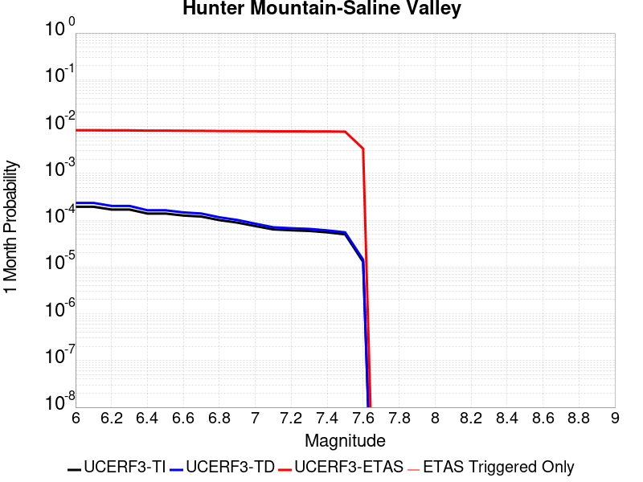 |  |  |

| Magnitude | 1 wk TI Prob | 1 wk TD Prob | 1 wk ETAS Prob | 1 wk ETAS/TD Gain | 1 wk ETAS Triggered Only | 1 mo TI Prob | 1 mo TD Prob | 1 mo ETAS Prob | 1 mo ETAS/TD Gain | 1 mo ETAS Triggered Only | 1 yr TI Prob | 1 yr TD Prob | 1 yr ETAS Prob | 1 yr ETAS/TD Gain | 1 yr ETAS Triggered Only | 10 yr TI Prob | 10 yr TD Prob | 10 yr ETAS Prob | 10 yr ETAS/TD Gain | 10 yr ETAS Triggered Only |
|-----|-----|-----|-----|-----|-----|-----|-----|-----|-----|-----|-----|-----|-----|-----|-----|-----|-----|-----|-----|-----|
| 6.0 | 4.5103672E-5 | 5.456906E-5 | 0.006464219 | 118.45942 | 0.00641 | 1.9328714E-4 | 2.3384714E-4 | 0.008361946 | 35.75817 | 0.00813 | 0.002350731 | 0.0028435462 | 0.014430504 | 5.0748267 | 0.01162 | 0.023260195 | 0.028092625 | 0.04263236 | 1.5175642 | 0.01496 |
| 6.1 | 4.5103672E-5 | 5.456906E-5 | 0.006464219 | 118.45942 | 0.00641 | 1.9328714E-4 | 2.3384714E-4 | 0.008361946 | 35.75817 | 0.00813 | 0.002350731 | 0.0028435462 | 0.014430504 | 5.0748267 | 0.01162 | 0.023260195 | 0.028092625 | 0.04263236 | 1.5175642 | 0.01496 |
| 6.2 | 3.9363465E-5 | 4.706271E-5 | 0.0064267623 | 136.55742 | 0.00638 | 1.6868966E-4 | 2.016826E-4 | 0.008290051 | 41.104443 | 0.00809 | 0.002051862 | 0.0024528534 | 0.013994474 | 5.7053857 | 0.01157 | 0.020330196 | 0.024274187 | 0.038802743 | 1.5985188 | 0.01489 |
| 6.3 | 3.9363465E-5 | 4.706271E-5 | 0.0064267623 | 136.55742 | 0.00638 | 1.6868966E-4 | 2.016826E-4 | 0.008290051 | 41.104443 | 0.00809 | 0.002051862 | 0.0024528534 | 0.013994474 | 5.7053857 | 0.01157 | 0.020330196 | 0.024274187 | 0.038802743 | 1.5985188 | 0.01489 |
| 6.4 | 3.2311684E-5 | 3.795112E-5 | 0.006367711 | 167.78717 | 0.00633 | 1.384713E-4 | 1.6263791E-4 | 0.008181334 | 50.303974 | 0.00802 | 0.0016845843 | 0.001978387 | 0.013385774 | 6.766004 | 0.01143 | 0.016718714 | 0.019617118 | 0.03400914 | 1.733646 | 0.01468 |
| 6.5 | 3.2311684E-5 | 3.795112E-5 | 0.006367711 | 167.78717 | 0.00633 | 1.384713E-4 | 1.6263791E-4 | 0.008181334 | 50.303974 | 0.00802 | 0.0016845843 | 0.001978387 | 0.013385774 | 6.766004 | 0.01143 | 0.016718714 | 0.019617118 | 0.03400914 | 1.733646 | 0.01468 |
| 6.6 | 2.9305844E-5 | 3.418196E-5 | 0.006353966 | 185.88652 | 0.00632 | 1.2559042E-4 | 1.4648624E-4 | 0.008135316 | 55.53638 | 0.00799 | 0.0015279909 | 0.0017820727 | 0.013141792 | 7.3744426 | 0.01138 | 0.015175272 | 0.017686324 | 0.03203793 | 1.811452 | 0.01461 |
| 6.7 | 2.7826512E-5 | 3.2344353E-5 | 0.0063321404 | 195.77267 | 0.0063 | 1.19251024E-4 | 1.3861163E-4 | 0.008097508 | 58.41868 | 0.00796 | 0.0014509142 | 0.0016863506 | 0.0129972445 | 7.7073207 | 0.01133 | 0.014414776 | 0.016743818 | 0.031050196 | 1.8544275 | 0.01455 |
| 6.8 | 2.3389874E-5 | 2.6866792E-5 | 0.0062866984 | 233.99515 | 0.00626 | 1.0023846E-4 | 1.1513857E-4 | 0.0080342265 | 69.778755 | 0.00792 | 0.00121972 | 0.001400958 | 0.012645183 | 9.026097 | 0.01126 | 0.01213047 | 0.013928067 | 0.028176807 | 2.0230234 | 0.01445 |
| 6.9 | 2.069209E-5 | 2.357011E-5 | 0.0062834225 | 266.58435 | 0.00626 | 8.867737E-5 | 1.0101105E-4 | 0.008010212 | 79.300354 | 0.00791 | 0.0010791123 | 0.0012291519 | 0.012465324 | 10.141403 | 0.01125 | 0.010738871 | 0.012229158 | 0.026453057 | 2.1631136 | 0.0144 |
| 7.0 | 1.7462342E-5 | 1.9633622E-5 | 0.006259511 | 318.8159 | 0.00624 | 7.483646E-5 | 8.414151E-5 | 0.007973477 | 94.76271 | 0.00789 | 9.1075303E-4 | 0.0010239641 | 0.012222486 | 11.9364395 | 0.01121 | 0.009070295 | 0.010196688 | 0.024380568 | 2.3910284 | 0.01433 |
| 7.1 | 1.4807709E-5 | 1.6441827E-5 | 0.0062363395 | 379.29724 | 0.00622 | 6.3460066E-5 | 7.046316E-5 | 0.00791991 | 112.39788 | 0.00785 | 7.723524E-4 | 8.575678E-4 | 0.011988015 | 13.979086 | 0.01114 | 0.007696735 | 0.008546168 | 0.02266447 | 2.652004 | 0.01424 |
| 7.2 | 1.4180048E-5 | 1.5698413E-5 | 0.006225601 | 396.57516 | 0.00621 | 6.077022E-5 | 6.727727E-5 | 0.00790675 | 117.52483 | 0.00784 | 7.396263E-4 | 8.1880915E-4 | 0.011939696 | 14.581781 | 0.01113 | 0.0073716943 | 0.008161469 | 0.022265414 | 2.7281134 | 0.01422 |
| 7.3 | 1.3730402E-5 | 1.5172151E-5 | 0.006205078 | 408.97815 | 0.00619 | 5.8843252E-5 | 6.502197E-5 | 0.007884514 | 121.25922 | 0.00782 | 7.161811E-4 | 7.9137104E-4 | 0.011892579 | 15.027816 | 0.01111 | 0.007138774 | 0.007889058 | 0.02195719 | 2.7832463 | 0.01418 |
| 7.4 | 1.2810095E-5 | 1.4109353E-5 | 0.006194022 | 439.00113 | 0.00618 | 5.489925E-5 | 6.0467344E-5 | 0.007869995 | 130.15282 | 0.00781 | 6.681934E-4 | 7.3595706E-4 | 0.011807803 | 16.044146 | 0.01108 | 0.006661878 | 0.0073386896 | 0.02134514 | 2.9085767 | 0.01411 |
| 7.5 | 1.1595659E-5 | 1.2800734E-5 | 0.0061327224 | 479.09146 | 0.00612 | 4.9694736E-5 | 5.485922E-5 | 0.007784435 | 141.89839 | 0.00773 | 6.0486543E-4 | 6.67722E-4 | 0.011570437 | 17.328224 | 0.01091 | 0.006032217 | 0.006660632 | 0.020458115 | 3.0714977 | 0.01389 |
| 7.6 | 2.997694E-6 | 3.3251877E-6 | 0.0027033163 | 812.98157 | 0.0027 | 1.28471975E-5 | 1.4250767E-5 | 0.003364203 | 236.07172 | 0.00335 | 1.564034E-4 | 1.7349655E-4 | 0.0047627003 | 27.451267 | 0.00459 | 0.0015629337 | 0.0017356955 | 0.0076853507 | 4.427822 | 0.00596 |

## Ash Hill
*[(top)](#table-of-contents)*

| 1 Week | 1 Month | 1 Year | 10 Year |
|-----|-----|-----|-----|
|  |  |  |  |

| Magnitude | 1 wk TI Prob | 1 wk TD Prob | 1 wk ETAS Prob | 1 wk ETAS/TD Gain | 1 wk ETAS Triggered Only | 1 mo TI Prob | 1 mo TD Prob | 1 mo ETAS Prob | 1 mo ETAS/TD Gain | 1 mo ETAS Triggered Only | 1 yr TI Prob | 1 yr TD Prob | 1 yr ETAS Prob | 1 yr ETAS/TD Gain | 1 yr ETAS Triggered Only | 10 yr TI Prob | 10 yr TD Prob | 10 yr ETAS Prob | 10 yr ETAS/TD Gain | 10 yr ETAS Triggered Only |
|-----|-----|-----|-----|-----|-----|-----|-----|-----|-----|-----|-----|-----|-----|-----|-----|-----|-----|-----|-----|-----|
| 6.0 | 2.1545662E-5 | 2.3194447E-5 | 0.004143099 | 178.6246 | 0.00412 | 9.2335285E-5 | 9.940143E-5 | 0.005798835 | 58.337536 | 0.0057 | 0.0011236023 | 0.0012096206 | 0.010418468 | 8.613005 | 0.00922 | 0.011179381 | 0.012038348 | 0.024980646 | 2.0750892 | 0.0131 |
| 6.1 | 2.1545662E-5 | 2.3194447E-5 | 0.004143099 | 178.6246 | 0.00412 | 9.2335285E-5 | 9.940143E-5 | 0.005798835 | 58.337536 | 0.0057 | 0.0011236023 | 0.0012096206 | 0.010418468 | 8.613005 | 0.00922 | 0.011179381 | 0.012038348 | 0.024980646 | 2.0750892 | 0.0131 |
| 6.2 | 2.1545662E-5 | 2.3194447E-5 | 0.004143099 | 178.6246 | 0.00412 | 9.2335285E-5 | 9.940143E-5 | 0.005798835 | 58.337536 | 0.0057 | 0.0011236023 | 0.0012096206 | 0.010418468 | 8.613005 | 0.00922 | 0.011179381 | 0.012038348 | 0.024980646 | 2.0750892 | 0.0131 |
| 6.3 | 1.0025529E-5 | 1.0746934E-5 | 0.0016107297 | 149.87807 | 0.0016 | 4.2965847E-5 | 4.605755E-5 | 0.0022659553 | 49.198345 | 0.00222 | 5.229836E-4 | 5.6061964E-4 | 0.0043185116 | 7.7031045 | 0.00376 | 0.005217545 | 0.0055933665 | 0.011171987 | 1.9973638 | 0.00561 |
| 6.4 | 1.0025529E-5 | 1.0746934E-5 | 0.0016107297 | 149.87807 | 0.0016 | 4.2965847E-5 | 4.605755E-5 | 0.0022659553 | 49.198345 | 0.00222 | 5.229836E-4 | 5.6061964E-4 | 0.0043185116 | 7.7031045 | 0.00376 | 0.005217545 | 0.0055933665 | 0.011171987 | 1.9973638 | 0.00561 |
| 6.5 | 6.9617327E-6 | 7.456634E-6 | 0.0011474481 | 153.88286 | 0.00114 | 2.9835655E-5 | 3.195666E-5 | 0.0015819072 | 49.50164 | 0.00155 | 3.6318856E-4 | 3.8901155E-4 | 0.0028680468 | 7.372652 | 0.00248 | 0.0036259557 | 0.0038841602 | 0.00757975 | 1.9514514 | 0.00371 |
| 6.6 | 4.9919777E-6 | 5.3466883E-6 | 8.653421E-4 | 161.84637 | 8.6E-4 | 2.1394015E-5 | 2.2914215E-5 | 0.001122889 | 49.004036 | 0.0011 | 2.60441E-4 | 2.7895154E-4 | 0.0020484577 | 7.3434176 | 0.00177 | 0.0026013597 | 0.0027866727 | 0.0053893994 | 1.9339908 | 0.00261 |
| 6.7 | 3.6630722E-6 | 3.924624E-6 | 6.339222E-4 | 161.52432 | 6.3E-4 | 1.5698786E-5 | 1.681974E-5 | 8.468058E-4 | 50.34595 | 8.3E-4 | 1.9111596E-4 | 2.0476682E-4 | 0.0015544904 | 7.5915146 | 0.00135 | 0.0019095168 | 0.0020463446 | 0.004042252 | 1.9753525 | 0.002 |
| 6.8 | 2.5599613E-6 | 2.744925E-6 | 4.3274375E-4 | 157.6523 | 4.3E-4 | 1.0971216E-5 | 1.1763939E-5 | 5.817572E-4 | 49.452587 | 5.7E-4 | 1.3356637E-4 | 1.4322149E-4 | 0.0010830868 | 7.5623207 | 9.4E-4 | 0.0013348613 | 0.0014317769 | 0.002839758 | 1.9833803 | 0.00141 |
| 6.9 | 1.7684905E-6 | 1.8968707E-6 | 3.118963E-4 | 164.42674 | 3.1E-4 | 7.579223E-6 | 8.129446E-6 | 4.3812595E-4 | 53.893703 | 4.3E-4 | 9.2273134E-5 | 9.8976E-5 | 8.189047E-4 | 8.27377 | 7.2E-4 | 9.223483E-4 | 9.8976E-4 | 0.0019987603 | 2.0194395 | 0.00101 |

## Blackwater
*[(top)](#table-of-contents)*

| 1 Week | 1 Month | 1 Year | 10 Year |
|-----|-----|-----|-----|
| 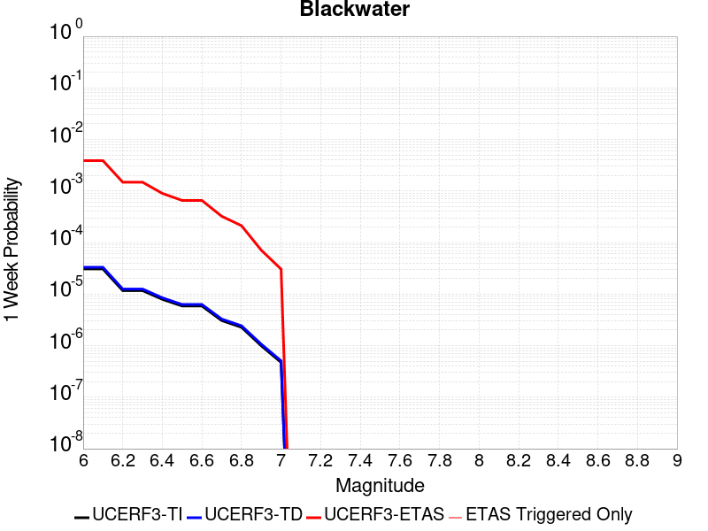 |  |  |  |

| Magnitude | 1 wk TI Prob | 1 wk TD Prob | 1 wk ETAS Prob | 1 wk ETAS/TD Gain | 1 wk ETAS Triggered Only | 1 mo TI Prob | 1 mo TD Prob | 1 mo ETAS Prob | 1 mo ETAS/TD Gain | 1 mo ETAS Triggered Only | 1 yr TI Prob | 1 yr TD Prob | 1 yr ETAS Prob | 1 yr ETAS/TD Gain | 1 yr ETAS Triggered Only | 10 yr TI Prob | 10 yr TD Prob | 10 yr ETAS Prob | 10 yr ETAS/TD Gain | 10 yr ETAS Triggered Only |
|-----|-----|-----|-----|-----|-----|-----|-----|-----|-----|-----|-----|-----|-----|-----|-----|-----|-----|-----|-----|-----|
| 6.0 | 3.0708583E-5 | 3.3095846E-5 | 0.0038829683 | 117.32494 | 0.00385 | 1.3160157E-4 | 1.4183241E-4 | 0.0055410666 | 39.067703 | 0.0054 | 0.0016010714 | 0.0017255784 | 0.010560307 | 6.119865 | 0.00885 | 0.015895851 | 0.017135633 | 0.029480409 | 1.7204156 | 0.01256 |
| 6.1 | 3.0708583E-5 | 3.3095846E-5 | 0.0038829683 | 117.32494 | 0.00385 | 1.3160157E-4 | 1.4183241E-4 | 0.0055410666 | 39.067703 | 0.0054 | 0.0016010714 | 0.0017255784 | 0.010560307 | 6.119865 | 0.00885 | 0.015895851 | 0.017135633 | 0.029480409 | 1.7204156 | 0.01256 |
| 6.2 | 1.1707779E-5 | 1.2545122E-5 | 0.0014825267 | 118.175545 | 0.00147 | 5.017523E-5 | 5.3763757E-5 | 0.0020236578 | 37.639816 | 0.00197 | 6.107122E-4 | 6.5438676E-4 | 0.0041720835 | 6.375562 | 0.00352 | 0.006090366 | 0.0065255696 | 0.011343921 | 1.7383802 | 0.00485 |
| 6.3 | 1.1707779E-5 | 1.2545122E-5 | 0.0014825267 | 118.175545 | 0.00147 | 5.017523E-5 | 5.3763757E-5 | 0.0020236578 | 37.639816 | 0.00197 | 6.107122E-4 | 6.5438676E-4 | 0.0041720835 | 6.375562 | 0.00352 | 0.006090366 | 0.0065255696 | 0.011343921 | 1.7383802 | 0.00485 |
| 6.4 | 7.929244E-6 | 8.480098E-6 | 8.9847256E-4 | 105.95073 | 8.9E-4 | 3.3982033E-5 | 3.6342793E-5 | 0.0012063002 | 33.192284 | 0.00117 | 4.136527E-4 | 4.423877E-4 | 0.0026214232 | 5.925624 | 0.00218 | 0.0041288356 | 0.0044154758 | 0.0074221413 | 1.680938 | 0.00302 |
| 6.5 | 5.8832115E-6 | 6.285991E-6 | 6.562819E-4 | 104.40389 | 6.5E-4 | 2.521352E-5 | 2.6939697E-5 | 8.8691653E-4 | 32.92229 | 8.6E-4 | 3.0693135E-4 | 3.27944E-4 | 0.0019474127 | 5.9382477 | 0.00162 | 0.0030650778 | 0.0032748538 | 0.0054875836 | 1.6756729 | 0.00222 |
| 6.6 | 5.8832115E-6 | 6.285991E-6 | 6.562819E-4 | 104.40389 | 6.5E-4 | 2.521352E-5 | 2.6939697E-5 | 8.8691653E-4 | 32.92229 | 8.6E-4 | 3.0693135E-4 | 3.27944E-4 | 0.0019474127 | 5.9382477 | 0.00162 | 0.0030650778 | 0.0032748538 | 0.0054875836 | 1.6756729 | 0.00222 |
| 6.7 | 3.0715053E-6 | 3.2814662E-6 | 3.2328043E-4 | 98.51707 | 3.2E-4 | 1.3163528E-5 | 1.4063357E-5 | 4.0405788E-4 | 28.731253 | 3.9E-4 | 1.6025416E-4 | 1.7120909E-4 | 9.110824E-4 | 5.3214607 | 7.4E-4 | 0.0016013865 | 0.0017108864 | 0.0027790559 | 1.6243368 | 0.00107 |
| 6.8 | 2.2722281E-6 | 2.4287538E-6 | 2.1242825E-4 | 87.46389 | 2.1E-4 | 9.738084E-6 | 1.0408908E-5 | 2.804061E-4 | 26.93905 | 2.7E-4 | 1.1855473E-4 | 1.26722E-4 | 6.466561E-4 | 5.1029506 | 5.2E-4 | 0.001184915 | 0.0012665876 | 0.002025625 | 1.5992775 | 7.6E-4 |
| 6.9 | 9.952399E-7 | 1.0653489E-6 | 7.1065275E-5 | 66.70611 | 7.0E-5 | 4.265307E-6 | 4.5657757E-6 | 1.0456532E-4 | 22.901983 | 1.0E-4 | 5.1928873E-5 | 5.5587418E-5 | 2.1557852E-4 | 3.878189 | 1.6E-4 | 5.191674E-4 | 5.557858E-4 | 7.6566904E-4 | 1.3776335 | 2.1E-4 |
| 7.0 | 4.7385504E-7 | 5.0755597E-7 | 3.0507541E-5 | 60.106754 | 3.0E-5 | 2.0308057E-6 | 2.1752398E-6 | 4.2175154E-5 | 19.388737 | 4.0E-5 | 2.4724779E-5 | 2.6483543E-5 | 7.648222E-5 | 2.887915 | 5.0E-5 | 2.4722028E-4 | 2.6483546E-4 | 3.348169E-4 | 1.264245 | 7.0E-5 |

## Garlock (West)
*[(top)](#table-of-contents)*

| 1 Week | 1 Month | 1 Year | 10 Year |
|-----|-----|-----|-----|
|  |  |  |  |

| Magnitude | 1 wk TI Prob | 1 wk TD Prob | 1 wk ETAS Prob | 1 wk ETAS/TD Gain | 1 wk ETAS Triggered Only | 1 mo TI Prob | 1 mo TD Prob | 1 mo ETAS Prob | 1 mo ETAS/TD Gain | 1 mo ETAS Triggered Only | 1 yr TI Prob | 1 yr TD Prob | 1 yr ETAS Prob | 1 yr ETAS/TD Gain | 1 yr ETAS Triggered Only | 10 yr TI Prob | 10 yr TD Prob | 10 yr ETAS Prob | 10 yr ETAS/TD Gain | 10 yr ETAS Triggered Only |
|-----|-----|-----|-----|-----|-----|-----|-----|-----|-----|-----|-----|-----|-----|-----|-----|-----|-----|-----|-----|-----|
| 6.0 | 2.5181727E-5 | 2.5197181E-5 | 0.004515084 | 179.19005 | 0.00449 | 1.0791722E-4 | 1.0798347E-4 | 0.0056073894 | 51.928223 | 0.0055 | 0.0013131002 | 0.0013139093 | 0.009023766 | 6.867876 | 0.00772 | 0.013053683 | 0.013141794 | 0.022655107 | 1.7238976 | 0.00964 |
| 6.1 | 2.5077732E-5 | 2.5098223E-5 | 0.0045149857 | 179.89264 | 0.00449 | 1.0747157E-4 | 1.075594E-4 | 0.005606968 | 52.129036 | 0.0055 | 0.001307681 | 0.0013087525 | 0.009018649 | 6.8910275 | 0.00772 | 0.013000126 | 0.013090835 | 0.022604639 | 1.726753 | 0.00964 |
| 6.2 | 2.494612E-5 | 2.4979914E-5 | 0.004514868 | 180.73991 | 0.00449 | 1.0690756E-4 | 1.070524E-4 | 0.0056064636 | 52.37121 | 0.0055 | 0.0013008224 | 0.0013025872 | 0.0090125315 | 6.9189467 | 0.00772 | 0.012932341 | 0.013029906 | 0.022544298 | 1.7301965 | 0.00964 |
| 6.3 | 2.4733758E-5 | 2.4799276E-5 | 0.004514688 | 182.04918 | 0.00449 | 1.0599751E-4 | 1.06278305E-4 | 0.005605694 | 52.745422 | 0.0055 | 0.0012897556 | 0.0012931736 | 0.00900319 | 6.962089 | 0.00772 | 0.012822957 | 0.0129368715 | 0.02245216 | 1.7355169 | 0.00964 |
| 6.4 | 2.3237335E-5 | 2.3178607E-5 | 0.0044730753 | 192.98293 | 0.00445 | 9.958477E-5 | 9.933313E-5 | 0.0055587906 | 55.961098 | 0.00546 | 0.0012117702 | 0.0012087126 | 0.008869442 | 7.3379245 | 0.00767 | 0.012051838 | 0.012101731 | 0.021555917 | 1.7812259 | 0.00957 |
| 6.5 | 2.2732203E-5 | 2.2992977E-5 | 0.004472891 | 194.53291 | 0.00445 | 9.742009E-5 | 9.8537625E-5 | 0.0055579995 | 56.40485 | 0.00546 | 0.0011854442 | 0.0011990381 | 0.008859841 | 7.3891244 | 0.00767 | 0.011791403 | 0.012006035 | 0.021461139 | 1.7875291 | 0.00957 |
| 6.6 | 2.1319436E-5 | 2.1773201E-5 | 0.0044716764 | 205.37523 | 0.00445 | 9.136581E-5 | 9.3310395E-5 | 0.005552801 | 59.50892 | 0.00546 | 0.001111811 | 0.0011354643 | 0.008786767 | 7.7384787 | 0.00766 | 0.011062649 | 0.011376952 | 0.020828187 | 1.8307353 | 0.00956 |
| 6.7 | 1.970802E-5 | 2.0393094E-5 | 0.0044703023 | 219.20667 | 0.00445 | 8.446021E-5 | 8.739606E-5 | 0.005546919 | 63.468754 | 0.00546 | 0.001027818 | 0.0010635294 | 0.008705393 | 8.185382 | 0.00765 | 0.010230771 | 0.0106646875 | 0.020093054 | 1.8840733 | 0.00953 |
| 6.8 | 1.8744462E-5 | 1.9900775E-5 | 0.0044598123 | 224.10245 | 0.00444 | 8.033094E-5 | 8.528626E-5 | 0.0055248225 | 64.77975 | 0.00544 | 9.775903E-4 | 0.0010378672 | 0.008659949 | 8.343985 | 0.00763 | 0.009733009 | 0.010410495 | 0.019821491 | 1.9039912 | 0.00951 |
| 6.9 | 1.7559682E-5 | 1.8953151E-5 | 0.0044488693 | 234.7298 | 0.00443 | 7.5253614E-5 | 8.122527E-5 | 0.005500785 | 67.72258 | 0.00542 | 9.158276E-4 | 9.884704E-4 | 0.008590948 | 8.691154 | 0.00761 | 0.0091206245 | 0.009921073 | 0.019316923 | 1.9470598 | 0.00949 |
| 7.0 | 1.6794445E-5 | 1.8215967E-5 | 0.0044181356 | 242.54192 | 0.0044 | 7.197421E-5 | 7.806611E-5 | 0.0054676454 | 70.03866 | 0.00539 | 8.759337E-4 | 9.5004175E-4 | 0.00850286 | 8.949985 | 0.00756 | 0.008724891 | 0.009539958 | 0.018870091 | 1.9780058 | 0.00942 |
| 7.1 | 1.6337795E-5 | 1.771677E-5 | 0.004407639 | 248.78345 | 0.00439 | 7.0017246E-5 | 7.592681E-5 | 0.005455518 | 71.85233 | 0.00538 | 8.521265E-4 | 9.2401815E-4 | 0.008467042 | 9.163285 | 0.00755 | 0.008488664 | 0.009281721 | 0.018584566 | 2.002276 | 0.00939 |
| 7.2 | 1.5780008E-5 | 1.71654E-5 | 0.0043870904 | 255.57755 | 0.00437 | 6.762685E-5 | 7.3563926E-5 | 0.0054331697 | 73.85644 | 0.00536 | 8.2304585E-4 | 8.952741E-4 | 0.008398551 | 9.380982 | 0.00751 | 0.008200042 | 0.008996559 | 0.018262442 | 2.0299363 | 0.00935 |
| 7.3 | 1.5058865E-5 | 1.6618484E-5 | 0.004376546 | 263.35413 | 0.00436 | 6.45364E-5 | 7.122013E-5 | 0.0054008407 | 75.83306 | 0.00533 | 7.854473E-4 | 8.667614E-4 | 0.008340278 | 9.622347 | 0.00748 | 0.00782677 | 0.008713263 | 0.01793223 | 2.0580385 | 0.0093 |
| 7.4 | 1.4887923E-5 | 1.6454453E-5 | 0.004276384 | 259.89224 | 0.00426 | 6.380382E-5 | 7.0517184E-5 | 0.0052901492 | 75.019295 | 0.00522 | 7.7653467E-4 | 8.5820974E-4 | 0.008151945 | 9.498779 | 0.0073 | 0.0077382675 | 0.008628101 | 0.017590104 | 2.0386992 | 0.00904 |
| 7.5 | 1.4509299E-5 | 1.6046468E-5 | 0.0038959843 | 242.79387 | 0.00388 | 6.218123E-5 | 6.876877E-5 | 0.0048584393 | 70.64892 | 0.00479 | 7.567935E-4 | 8.369394E-4 | 0.007611265 | 9.094165 | 0.00678 | 0.0075422134 | 0.008416411 | 0.016735796 | 1.988472 | 0.00839 |
| 7.6 | 1.2756717E-5 | 1.4050529E-5 | 0.0026540135 | 188.89064 | 0.00264 | 5.4670498E-5 | 6.0215163E-5 | 0.0032900206 | 54.63774 | 0.00323 | 6.6541E-4 | 7.328737E-4 | 0.005219583 | 7.1220775 | 0.00449 | 0.006634211 | 0.007381374 | 0.012940038 | 1.7530663 | 0.0056 |
| 7.7 | 1.0328985E-5 | 1.146033E-5 | 0.0016814412 | 146.7184 | 0.00167 | 4.4266326E-5 | 4.9114777E-5 | 0.0020690155 | 42.12613 | 0.00202 | 5.388092E-4 | 5.9780874E-4 | 0.0032562185 | 5.4469237 | 0.00266 | 0.0053750467 | 0.006038286 | 0.009328299 | 1.5448588 | 0.00331 |
| 7.8 | 7.0306583E-6 | 8.899537E-6 | 0.0010588901 | 118.98262 | 0.00105 | 3.0131043E-5 | 3.8140315E-5 | 0.00135809 | 35.607727 | 0.00132 | 3.667837E-4 | 4.6425956E-4 | 0.002183461 | 4.703104 | 0.00172 | 0.003661789 | 0.0046950667 | 0.006834972 | 1.4557775 | 0.00215 |
| 7.9 | 4.060633E-6 | 5.465412E-6 | 6.5546186E-4 | 119.929085 | 6.5E-4 | 1.7402595E-5 | 2.3422985E-5 | 8.434038E-4 | 36.007526 | 8.2E-4 | 2.11856E-4 | 2.8513762E-4 | 0.0013448354 | 4.716443 | 0.00106 | 0.0021165414 | 0.002884143 | 0.004190365 | 1.4528977 | 0.00131 |
| 8.0 | 1.6729537E-6 | 2.0775192E-6 | 1.8207714E-4 | 87.64162 | 1.8E-4 | 7.169782E-6 | 8.903624E-6 | 2.2890167E-4 | 25.70882 | 2.2E-4 | 8.7288594E-5 | 1.0839626E-4 | 4.2836159E-4 | 3.9518113 | 3.2E-4 | 8.7254314E-4 | 0.001096854 | 0.0014864262 | 1.3551724 | 3.9E-4 |
| 8.1 | 3.6733252E-7 | 3.1489736E-7 | 2.031489E-5 | 64.51273 | 2.0E-5 | 1.5742813E-6 | 1.3495595E-6 | 3.134952E-5 | 23.229445 | 3.0E-5 | 1.9166706E-5 | 1.643078E-5 | 5.6430123E-5 | 3.4344153 | 4.0E-5 | 1.9165053E-4 | 1.662928E-4 | 2.1628448E-4 | 1.3006245 | 5.0E-5 |

## McLean Lake
*[(top)](#table-of-contents)*

| 1 Week | 1 Month | 1 Year | 10 Year |
|-----|-----|-----|-----|
| 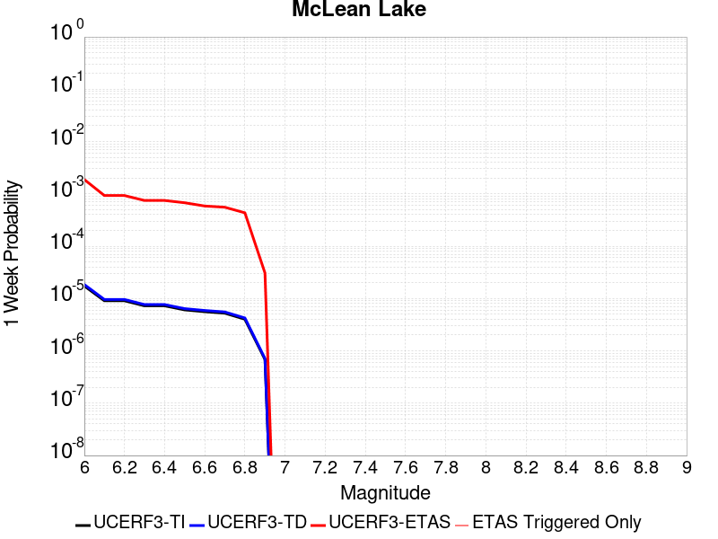 |  |  | 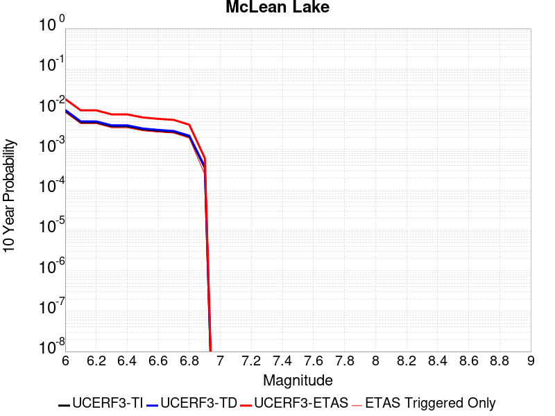 |

| Magnitude | 1 wk TI Prob | 1 wk TD Prob | 1 wk ETAS Prob | 1 wk ETAS/TD Gain | 1 wk ETAS Triggered Only | 1 mo TI Prob | 1 mo TD Prob | 1 mo ETAS Prob | 1 mo ETAS/TD Gain | 1 mo ETAS Triggered Only | 1 yr TI Prob | 1 yr TD Prob | 1 yr ETAS Prob | 1 yr ETAS/TD Gain | 1 yr ETAS Triggered Only | 10 yr TI Prob | 10 yr TD Prob | 10 yr ETAS Prob | 10 yr ETAS/TD Gain | 10 yr ETAS Triggered Only |
|-----|-----|-----|-----|-----|-----|-----|-----|-----|-----|-----|-----|-----|-----|-----|-----|-----|-----|-----|-----|-----|
| 6.0 | 1.7360222E-5 | 1.8501627E-5 | 0.0018784673 | 101.52984 | 0.00186 | 7.439883E-5 | 7.9290556E-5 | 0.0028590702 | 36.058144 | 0.00278 | 9.0542925E-4 | 9.6498354E-4 | 0.0060700523 | 6.290317 | 0.00511 | 0.009017491 | 0.0096127745 | 0.017951835 | 1.8674978 | 0.00842 |
| 6.1 | 9.062689E-6 | 9.592193E-6 | 9.295834E-4 | 96.91041 | 9.2E-4 | 3.8839516E-5 | 4.1108804E-5 | 0.0013910533 | 33.838333 | 0.00135 | 4.727685E-4 | 5.003936E-4 | 0.0030691077 | 6.1333866 | 0.00257 | 0.0047176396 | 0.004993552 | 0.00938153 | 1.878729 | 0.00441 |
| 6.2 | 9.062689E-6 | 9.592193E-6 | 9.295834E-4 | 96.91041 | 9.2E-4 | 3.8839516E-5 | 4.1108804E-5 | 0.0013910533 | 33.838333 | 0.00135 | 4.727685E-4 | 5.003936E-4 | 0.0030691077 | 6.1333866 | 0.00257 | 0.0047176396 | 0.004993552 | 0.00938153 | 1.878729 | 0.00441 |
| 6.3 | 7.2575485E-6 | 7.66771E-6 | 7.4766204E-4 | 97.50787 | 7.4E-4 | 3.110341E-5 | 3.2861237E-5 | 0.001072827 | 32.64719 | 0.00104 | 3.786182E-4 | 4.0001926E-4 | 0.0024491993 | 6.1227036 | 0.00205 | 0.0037797375 | 0.0039936965 | 0.007449839 | 1.8653991 | 0.00347 |
| 6.4 | 7.2575485E-6 | 7.66771E-6 | 7.4766204E-4 | 97.50787 | 7.4E-4 | 3.110341E-5 | 3.2861237E-5 | 0.001072827 | 32.64719 | 0.00104 | 3.786182E-4 | 4.0001926E-4 | 0.0024491993 | 6.1227036 | 0.00205 | 0.0037797375 | 0.0039936965 | 0.007449839 | 1.8653991 | 0.00347 |
| 6.5 | 6.06582E-6 | 6.4038773E-6 | 6.7639956E-4 | 105.62345 | 6.7E-4 | 2.5996113E-5 | 2.7444936E-5 | 9.174205E-4 | 33.42768 | 8.9E-4 | 3.164567E-4 | 3.3409733E-4 | 0.0020835127 | 6.2362447 | 0.00175 | 0.0031600643 | 0.0033365893 | 0.006256813 | 1.8752123 | 0.00293 |
| 6.6 | 5.598744E-6 | 5.910262E-6 | 5.8590685E-4 | 99.13381 | 5.8E-4 | 2.3994397E-5 | 2.5329486E-5 | 8.1530947E-4 | 32.188156 | 7.9E-4 | 2.9209262E-4 | 3.0834923E-4 | 0.0018978589 | 6.1549006 | 0.00159 | 0.0029170897 | 0.003079843 | 0.005781497 | 1.877205 | 0.00271 |
| 6.7 | 5.246996E-6 | 5.539162E-6 | 5.555361E-4 | 100.29245 | 5.5E-4 | 2.2486933E-5 | 2.3739085E-5 | 7.8372104E-4 | 33.013954 | 7.6E-4 | 2.73744E-4 | 2.8899137E-4 | 0.0018085521 | 6.2581525 | 0.00152 | 0.0027340704 | 0.0028867796 | 0.0054493607 | 1.8876954 | 0.00257 |
| 6.8 | 4.02324E-6 | 4.2469046E-6 | 4.3424507E-4 | 102.24979 | 4.3E-4 | 1.7242342E-5 | 1.8200926E-5 | 5.581911E-4 | 30.668282 | 5.4E-4 | 2.099053E-4 | 2.2157968E-4 | 0.0013113382 | 5.9181333 | 0.00109 | 0.0020970714 | 0.002214172 | 0.0041299206 | 1.8652214 | 0.00192 |
| 6.9 | 6.835972E-7 | 7.1399285E-7 | 3.071397E-5 | 43.0172 | 3.0E-5 | 2.9296991E-6 | 3.0599674E-6 | 3.3059874E-5 | 10.803996 | 3.0E-5 | 3.56685E-5 | 3.7254784E-5 | 1.4725068E-4 | 3.9525309 | 1.1E-4 | 3.5662777E-4 | 3.7251666E-4 | 6.1242725E-4 | 1.6440265 | 2.4E-4 |

## Goldstone Lake
*[(top)](#table-of-contents)*

| 1 Week | 1 Month | 1 Year | 10 Year |
|-----|-----|-----|-----|
|  |  |  |  |

| Magnitude | 1 wk TI Prob | 1 wk TD Prob | 1 wk ETAS Prob | 1 wk ETAS/TD Gain | 1 wk ETAS Triggered Only | 1 mo TI Prob | 1 mo TD Prob | 1 mo ETAS Prob | 1 mo ETAS/TD Gain | 1 mo ETAS Triggered Only | 1 yr TI Prob | 1 yr TD Prob | 1 yr ETAS Prob | 1 yr ETAS/TD Gain | 1 yr ETAS Triggered Only | 10 yr TI Prob | 10 yr TD Prob | 10 yr ETAS Prob | 10 yr ETAS/TD Gain | 10 yr ETAS Triggered Only |
|-----|-----|-----|-----|-----|-----|-----|-----|-----|-----|-----|-----|-----|-----|-----|-----|-----|-----|-----|-----|-----|
| 6.0 | 2.671352E-5 | 3.0376103E-5 | 0.0014403333 | 47.416656 | 0.00141 | 1.1448149E-4 | 1.3017791E-4 | 0.0024598746 | 18.896252 | 0.00233 | 0.001392921 | 0.0015839601 | 0.00556764 | 3.5150127 | 0.00399 | 0.013842222 | 0.015746202 | 0.022635978 | 1.4375516 | 0.007 |
| 6.1 | 2.671352E-5 | 3.0376103E-5 | 0.0014403333 | 47.416656 | 0.00141 | 1.1448149E-4 | 1.3017791E-4 | 0.0024598746 | 18.896252 | 0.00233 | 0.001392921 | 0.0015839601 | 0.00556764 | 3.5150127 | 0.00399 | 0.013842222 | 0.015746202 | 0.022635978 | 1.4375516 | 0.007 |
| 6.2 | 1.4197047E-5 | 1.6096254E-5 | 7.5608434E-4 | 46.972687 | 7.4E-4 | 6.0843064E-5 | 6.898268E-5 | 0.0012688999 | 18.39447 | 0.0012 | 7.4051257E-4 | 8.3963916E-4 | 0.0028679348 | 3.4156754 | 0.00203 | 0.007380498 | 0.008374364 | 0.01185497 | 1.4156263 | 0.00351 |
| 6.3 | 1.4197047E-5 | 1.6096254E-5 | 7.5608434E-4 | 46.972687 | 7.4E-4 | 6.0843064E-5 | 6.898268E-5 | 0.0012688999 | 18.39447 | 0.0012 | 7.4051257E-4 | 8.3963916E-4 | 0.0028679348 | 3.4156754 | 0.00203 | 0.007380498 | 0.008374364 | 0.01185497 | 1.4156263 | 0.00351 |
| 6.4 | 1.3238931E-5 | 1.500847E-5 | 7.2499784E-4 | 48.305912 | 7.1E-4 | 5.6737044E-5 | 6.432098E-5 | 0.0011642502 | 18.10063 | 0.0011 | 6.9055456E-4 | 7.8292453E-4 | 0.0026614526 | 3.399373 | 0.00188 | 0.006884126 | 0.007811289 | 0.01102598 | 1.4115443 | 0.00324 |
| 6.5 | 1.3238931E-5 | 1.500847E-5 | 7.2499784E-4 | 48.305912 | 7.1E-4 | 5.6737044E-5 | 6.432098E-5 | 0.0011642502 | 18.10063 | 0.0011 | 6.9055456E-4 | 7.8292453E-4 | 0.0026614526 | 3.399373 | 0.00188 | 0.006884126 | 0.007811289 | 0.01102598 | 1.4115443 | 0.00324 |
| 6.6 | 1.1328278E-5 | 1.2855176E-5 | 6.428471E-4 | 50.00687 | 6.3E-4 | 4.8548856E-5 | 5.5092984E-5 | 0.0010250396 | 18.605627 | 9.7E-4 | 5.90922E-4 | 6.706464E-4 | 0.0023095466 | 3.443762 | 0.00164 | 0.0058935313 | 0.0066956137 | 0.009476866 | 1.4153842 | 0.0028 |
| 6.7 | 8.651175E-6 | 9.824575E-6 | 5.2981946E-4 | 53.927982 | 5.2E-4 | 3.707594E-5 | 4.2105148E-5 | 8.120727E-4 | 19.28678 | 7.7E-4 | 4.5130608E-4 | 5.126002E-4 | 0.0017819492 | 3.4762945 | 0.00127 | 0.0045039062 | 0.0051230565 | 0.0071824514 | 1.4019856 | 0.00207 |
| 6.8 | 1.0215377E-6 | 1.1754802E-6 | 2.1175456E-5 | 18.014303 | 2.0E-5 | 4.378012E-6 | 5.037763E-6 | 2.5037662E-5 | 4.969996 | 2.0E-5 | 5.3300988E-5 | 6.133315E-5 | 1.1133009E-4 | 1.8151698 | 5.0E-5 | 5.3288206E-4 | 6.131735E-4 | 6.831306E-4 | 1.1140902 | 7.0E-5 |
| 6.9 | 7.9360774E-7 | 9.283496E-7 | 9.283496E-7 | 1.0 | 0.0 | 3.4011714E-6 | 3.9786355E-6 | 3.9786355E-6 | 1.0 | 0.0 | 4.1408475E-5 | 4.843888E-5 | 6.843791E-5 | 1.4128715 | 2.0E-5 | 4.140076E-4 | 4.842902E-4 | 5.142757E-4 | 1.0619164 | 3.0E-5 |
| 7.0 | 7.4382757E-7 | 8.747428E-7 | 8.747428E-7 | 1.0 | 0.0 | 3.1878285E-6 | 3.7488926E-6 | 3.7488926E-6 | 1.0 | 0.0 | 3.8811122E-5 | 4.564188E-5 | 5.5641423E-5 | 1.219087 | 1.0E-5 | 3.8804344E-4 | 4.563317E-4 | 4.7632257E-4 | 1.0438077 | 2.0E-5 |
| 7.1 | 6.4709513E-7 | 7.711399E-7 | 7.711399E-7 | 1.0 | 0.0 | 2.773262E-6 | 3.3048816E-6 | 3.3048816E-6 | 1.0 | 0.0 | 3.376394E-5 | 4.023625E-5 | 5.023585E-5 | 1.2485222 | 1.0E-5 | 3.375881E-4 | 4.022956E-4 | 4.2228756E-4 | 1.0496947 | 2.0E-5 |
| 7.2 | 6.356704E-7 | 7.588459E-7 | 7.588459E-7 | 1.0 | 0.0 | 2.7242988E-6 | 3.252193E-6 | 3.252193E-6 | 1.0 | 0.0 | 3.3167835E-5 | 3.959479E-5 | 4.9594393E-5 | 1.2525485 | 1.0E-5 | 3.3162883E-4 | 3.9588328E-4 | 4.1587537E-4 | 1.0504999 | 2.0E-5 |
| 7.3 | 5.7695723E-7 | 6.896648E-7 | 6.896648E-7 | 1.0 | 0.0 | 2.4726714E-6 | 2.9557032E-6 | 2.9557032E-6 | 1.0 | 0.0 | 3.0104358E-5 | 3.598515E-5 | 4.598479E-5 | 1.2778825 | 1.0E-5 | 3.0100282E-4 | 3.5979896E-4 | 3.7979177E-4 | 1.0555665 | 2.0E-5 |
| 7.4 | 5.209647E-7 | 6.193583E-7 | 6.193583E-7 | 1.0 | 0.0 | 2.232704E-6 | 2.6543903E-6 | 2.6543903E-6 | 1.0 | 0.0 | 2.718283E-5 | 3.2316777E-5 | 4.2316457E-5 | 1.3094268 | 1.0E-5 | 2.7179506E-4 | 3.2312635E-4 | 3.4311987E-4 | 1.0618753 | 2.0E-5 |
| 7.5 | 4.512955E-7 | 5.3489487E-7 | 5.3489487E-7 | 1.0 | 0.0 | 1.934122E-6 | 2.2924048E-6 | 2.2924048E-6 | 1.0 | 0.0 | 2.3547682E-5 | 2.7909726E-5 | 3.790945E-5 | 1.358288 | 1.0E-5 | 2.3545188E-4 | 2.7906752E-4 | 2.9906194E-4 | 1.0716473 | 2.0E-5 |
| 7.6 | 2.21172E-7 | 2.6040198E-7 | 2.6040198E-7 | 1.0 | 0.0 | 9.478797E-7 | 1.1160082E-6 | 1.1160082E-6 | 1.0 | 0.0 | 1.1540374E-5 | 1.3587343E-5 | 2.3587207E-5 | 1.7359691 | 1.0E-5 | 1.1539775E-4 | 1.3586794E-4 | 1.4586658E-4 | 1.0735909 | 1.0E-5 |

## Gravel Hills-Harper Lk
*[(top)](#table-of-contents)*

| 1 Week | 1 Month | 1 Year | 10 Year |
|-----|-----|-----|-----|
|  |  |  |  |

| Magnitude | 1 wk TI Prob | 1 wk TD Prob | 1 wk ETAS Prob | 1 wk ETAS/TD Gain | 1 wk ETAS Triggered Only | 1 mo TI Prob | 1 mo TD Prob | 1 mo ETAS Prob | 1 mo ETAS/TD Gain | 1 mo ETAS Triggered Only | 1 yr TI Prob | 1 yr TD Prob | 1 yr ETAS Prob | 1 yr ETAS/TD Gain | 1 yr ETAS Triggered Only | 10 yr TI Prob | 10 yr TD Prob | 10 yr ETAS Prob | 10 yr ETAS/TD Gain | 10 yr ETAS Triggered Only |
|-----|-----|-----|-----|-----|-----|-----|-----|-----|-----|-----|-----|-----|-----|-----|-----|-----|-----|-----|-----|-----|
| 6.0 | 3.0679566E-5 | 3.1464628E-5 | 0.0021313985 | 67.73952 | 0.0021 | 1.3147724E-4 | 1.3484266E-4 | 0.003084445 | 22.874401 | 0.00295 | 0.0015995599 | 0.00164069 | 0.0064927163 | 3.9573083 | 0.00486 | 0.015880952 | 0.016307337 | 0.023340741 | 1.4313029 | 0.00715 |
| 6.1 | 3.0679566E-5 | 3.1464628E-5 | 0.0021313985 | 67.73952 | 0.0021 | 1.3147724E-4 | 1.3484266E-4 | 0.003084445 | 22.874401 | 0.00295 | 0.0015995599 | 0.00164069 | 0.0064927163 | 3.9573083 | 0.00486 | 0.015880952 | 0.016307337 | 0.023340741 | 1.4313029 | 0.00715 |
| 6.2 | 1.514536E-5 | 1.36352E-5 | 6.5362646E-4 | 47.9367 | 6.4E-4 | 6.490707E-5 | 5.843533E-5 | 9.6838217E-4 | 16.571861 | 9.1E-4 | 7.8995706E-4 | 7.112298E-4 | 0.0022501345 | 3.1637237 | 0.00154 | 0.007871548 | 0.007090737 | 0.009285066 | 1.3094642 | 0.00221 |
| 6.3 | 1.514536E-5 | 1.36352E-5 | 6.5362646E-4 | 47.9367 | 6.4E-4 | 6.490707E-5 | 5.843533E-5 | 9.6838217E-4 | 16.571861 | 9.1E-4 | 7.8995706E-4 | 7.112298E-4 | 0.0022501345 | 3.1637237 | 0.00154 | 0.007871548 | 0.007090737 | 0.009285066 | 1.3094642 | 0.00221 |
| 6.4 | 1.2532521E-5 | 1.0689684E-5 | 4.7068475E-4 | 44.03168 | 4.6E-4 | 5.37097E-5 | 4.581216E-5 | 6.6578377E-4 | 14.532905 | 6.2E-4 | 6.537194E-4 | 5.5762613E-4 | 0.0016070406 | 2.881932 | 0.00105 | 0.0065179965 | 0.005562859 | 0.0070047933 | 1.2592074 | 0.00145 |
| 6.5 | 1.1094058E-5 | 9.083657E-6 | 3.3908067E-4 | 37.32865 | 3.3E-4 | 4.7545094E-5 | 3.89294E-5 | 4.6891265E-4 | 12.045207 | 4.3E-4 | 5.787078E-4 | 4.7386638E-4 | 0.0012035205 | 2.5397887 | 7.3E-4 | 0.0057720304 | 0.004728967 | 0.0057441434 | 1.214672 | 0.00102 |
| 6.6 | 9.688328E-6 | 7.531688E-6 | 2.575298E-4 | 34.19284 | 2.5E-4 | 4.1520743E-5 | 3.227828E-5 | 3.2226893E-4 | 9.98408 | 2.9E-4 | 5.053978E-4 | 3.9291973E-4 | 9.0271933E-4 | 2.297465 | 5.1E-4 | 0.0050424994 | 0.0039225067 | 0.004579918 | 1.1675998 | 6.6E-4 |
| 6.7 | 8.974824E-6 | 6.749406E-6 | 1.8674819E-4 | 27.668833 | 1.8E-4 | 3.8462964E-5 | 2.8925719E-5 | 2.4891936E-4 | 8.605469 | 2.2E-4 | 4.6818596E-4 | 3.5211592E-4 | 7.7196804E-4 | 2.192369 | 4.2E-4 | 0.004672008 | 0.003515801 | 0.0040439377 | 1.150218 | 5.3E-4 |
| 6.8 | 7.4780046E-6 | 5.1161865E-6 | 9.511573E-5 | 18.591139 | 9.0E-5 | 3.20482E-5 | 2.1926337E-5 | 1.3192392E-4 | 6.016688 | 1.1E-4 | 3.9011694E-4 | 2.6692182E-4 | 4.968604E-4 | 1.8614454 | 2.3E-4 | 0.0038943281 | 0.0026661505 | 0.0029354307 | 1.1009996 | 2.7E-4 |
| 6.9 | 6.3409307E-6 | 3.907489E-6 | 6.390725E-5 | 16.35507 | 6.0E-5 | 2.7175134E-5 | 1.674628E-5 | 9.674494E-5 | 5.7771006 | 8.0E-5 | 3.3080703E-4 | 2.0386786E-4 | 3.738332E-4 | 1.8337034 | 1.7E-4 | 0.0033031502 | 0.0020369065 | 0.00221654 | 1.0881892 | 1.8E-4 |
| 7.0 | 5.1239335E-6 | 2.6058492E-6 | 5.260572E-5 | 20.187551 | 5.0E-5 | 2.195953E-5 | 1.1167879E-5 | 7.116721E-5 | 6.372491 | 6.0E-5 | 2.6732447E-4 | 1.359607E-4 | 2.4594573E-4 | 1.8089473 | 1.1E-4 | 0.0026700313 | 0.0013588005 | 0.0014786373 | 1.0881932 | 1.2E-4 |
| 7.1 | 4.438899E-6 | 2.0984692E-6 | 5.2098363E-5 | 24.826841 | 5.0E-5 | 1.9023713E-5 | 8.99341E-6 | 6.899287E-5 | 7.6714916 | 6.0E-5 | 2.315891E-4 | 1.0948948E-4 | 2.1947744E-4 | 2.0045526 | 1.1E-4 | 0.002313479 | 0.0010943774 | 0.001214246 | 1.1095314 | 1.2E-4 |
| 7.2 | 3.50367E-6 | 1.2615715E-6 | 3.1261534E-5 | 24.779837 | 3.0E-5 | 1.5015643E-5 | 5.406724E-6 | 3.5406563E-5 | 6.5486164 | 3.0E-5 | 1.8280011E-4 | 6.5824956E-5 | 1.2582101E-4 | 1.9114484 | 6.0E-5 | 0.0018264982 | 6.580628E-4 | 7.1802334E-4 | 1.0911167 | 6.0E-5 |
| 7.3 | 2.561638E-6 | 7.118686E-7 | 7.118686E-7 | 1.0 | 0.0 | 1.0978401E-5 | 3.050862E-6 | 3.050862E-6 | 1.0 | 0.0 | 1.3365384E-4 | 3.7143633E-5 | 4.714326E-5 | 1.2692151 | 1.0E-5 | 0.0013357349 | 3.7137623E-4 | 3.8137252E-4 | 1.0269169 | 1.0E-5 |
| 7.4 | 2.0368864E-6 | 5.304471E-7 | 5.304471E-7 | 1.0 | 0.0 | 8.729483E-6 | 2.2733427E-6 | 2.2733427E-6 | 1.0 | 0.0 | 1.06276275E-4 | 2.76776E-5 | 2.76776E-5 | 1.0 | 0.0 | 0.0010622547 | 2.767421E-4 | 2.767421E-4 | 1.0 | 0.0 |
| 7.5 | 1.1681728E-6 | 3.6028484E-7 | 3.6028484E-7 | 1.0 | 0.0 | 5.0064455E-6 | 1.544077E-6 | 1.544077E-6 | 1.0 | 0.0 | 6.0951766E-5 | 1.879898E-5 | 1.879898E-5 | 1.0 | 0.0 | 6.093505E-4 | 1.8797436E-4 | 1.8797436E-4 | 1.0 | 0.0 |
| 7.6 | 1.3154387E-7 | 7.1196716E-8 | 7.1196716E-8 | 1.0 | 0.0 | 5.6375933E-7 | 3.0512876E-7 | 3.0512876E-7 | 1.0 | 0.0 | 6.863748E-6 | 3.714938E-6 | 3.714938E-6 | 1.0 | 0.0 | 6.863536E-5 | 3.7148915E-5 | 3.7148915E-5 | 1.0 | 0.0 |

## Coyote Canyon
*[(top)](#table-of-contents)*

| 1 Week | 1 Month | 1 Year | 10 Year |
|-----|-----|-----|-----|
|  |  |  |  |

| Magnitude | 1 wk TI Prob | 1 wk TD Prob | 1 wk ETAS Prob | 1 wk ETAS/TD Gain | 1 wk ETAS Triggered Only | 1 mo TI Prob | 1 mo TD Prob | 1 mo ETAS Prob | 1 mo ETAS/TD Gain | 1 mo ETAS Triggered Only | 1 yr TI Prob | 1 yr TD Prob | 1 yr ETAS Prob | 1 yr ETAS/TD Gain | 1 yr ETAS Triggered Only | 10 yr TI Prob | 10 yr TD Prob | 10 yr ETAS Prob | 10 yr ETAS/TD Gain | 10 yr ETAS Triggered Only |
|-----|-----|-----|-----|-----|-----|-----|-----|-----|-----|-----|-----|-----|-----|-----|-----|-----|-----|-----|-----|-----|
| 6.0 | 3.5090034E-5 | 4.0364317E-5 | 0.0010203248 | 25.277891 | 9.8E-4 | 1.503772E-4 | 1.7297991E-4 | 0.0017627049 | 10.190228 | 0.00159 | 0.0018293047 | 0.0021042533 | 0.0048983614 | 2.3278382 | 0.0028 | 0.018143194 | 0.020869205 | 0.025520075 | 1.2228581 | 0.00475 |
| 6.1 | 3.5090034E-5 | 4.0364317E-5 | 0.0010203248 | 25.277891 | 9.8E-4 | 1.503772E-4 | 1.7297991E-4 | 0.0017627049 | 10.190228 | 0.00159 | 0.0018293047 | 0.0021042533 | 0.0048983614 | 2.3278382 | 0.0028 | 0.018143194 | 0.020869205 | 0.025520075 | 1.2228581 | 0.00475 |
| 6.2 | 1.841879E-5 | 2.1059794E-5 | 5.7104824E-4 | 27.115566 | 5.5E-4 | 7.8935285E-5 | 9.025371E-5 | 9.501761E-4 | 10.527834 | 8.6E-4 | 9.606133E-4 | 0.0010983871 | 0.0026766516 | 2.436893 | 0.00158 | 0.0095647145 | 0.010939668 | 0.0136002395 | 1.2432041 | 0.00269 |
| 6.3 | 1.841879E-5 | 2.1059794E-5 | 5.7104824E-4 | 27.115566 | 5.5E-4 | 7.8935285E-5 | 9.025371E-5 | 9.501761E-4 | 10.527834 | 8.6E-4 | 9.606133E-4 | 0.0010983871 | 0.0026766516 | 2.436893 | 0.00158 | 0.0095647145 | 0.010939668 | 0.0136002395 | 1.2432041 | 0.00269 |
| 6.4 | 1.712201E-5 | 1.9565212E-5 | 5.095556E-4 | 26.043962 | 4.9E-4 | 7.337798E-5 | 8.3848776E-5 | 8.837817E-4 | 10.540186 | 8.0E-4 | 8.930107E-4 | 0.0010204813 | 0.0024889812 | 2.4390266 | 0.00147 | 0.008894307 | 0.010167871 | 0.012642452 | 1.2433726 | 0.0025 |
| 6.5 | 1.4744935E-5 | 1.6836972E-5 | 4.668294E-4 | 27.726446 | 4.5E-4 | 6.3191044E-5 | 7.215698E-5 | 7.7210646E-4 | 10.700371 | 7.0E-4 | 7.6907943E-4 | 8.782507E-4 | 0.002177109 | 2.4789152 | 0.0013 | 0.007664232 | 0.008756994 | 0.010977379 | 1.2535555 | 0.00224 |
| 6.6 | 1.2017839E-5 | 1.3724089E-5 | 3.9371886E-4 | 28.68816 | 3.8E-4 | 5.150401E-5 | 5.88167E-5 | 6.287832E-4 | 10.690556 | 5.7E-4 | 6.268809E-4 | 7.159466E-4 | 0.0017651948 | 2.46554 | 0.00105 | 0.0062511545 | 0.0071450938 | 0.008962018 | 1.2542897 | 0.00183 |
| 6.7 | 1.00956095E-5 | 1.1533517E-5 | 3.415297E-4 | 29.611933 | 3.3E-4 | 4.326618E-5 | 4.942891E-5 | 4.7940767E-4 | 9.698933 | 4.3E-4 | 5.266384E-4 | 6.017178E-4 | 0.0014212243 | 2.3619452 | 8.2E-4 | 0.005253921 | 0.0060094125 | 0.0074805184 | 1.2448003 | 0.00148 |

## So Sierra Nevada
*[(top)](#table-of-contents)*

| 1 Week | 1 Month | 1 Year | 10 Year |
|-----|-----|-----|-----|
|  |  |  |  |

| Magnitude | 1 wk TI Prob | 1 wk TD Prob | 1 wk ETAS Prob | 1 wk ETAS/TD Gain | 1 wk ETAS Triggered Only | 1 mo TI Prob | 1 mo TD Prob | 1 mo ETAS Prob | 1 mo ETAS/TD Gain | 1 mo ETAS Triggered Only | 1 yr TI Prob | 1 yr TD Prob | 1 yr ETAS Prob | 1 yr ETAS/TD Gain | 1 yr ETAS Triggered Only | 10 yr TI Prob | 10 yr TD Prob | 10 yr ETAS Prob | 10 yr ETAS/TD Gain | 10 yr ETAS Triggered Only |
|-----|-----|-----|-----|-----|-----|-----|-----|-----|-----|-----|-----|-----|-----|-----|-----|-----|-----|-----|-----|-----|
| 6.0 | 1.15488665E-5 | 1.1079612E-5 | 0.001421064 | 128.25937 | 0.00141 | 4.9494203E-5 | 4.7483256E-5 | 0.0020173898 | 42.48634 | 0.00197 | 6.024253E-4 | 5.779681E-4 | 0.004065951 | 7.034906 | 0.00349 | 0.006007948 | 0.005765918 | 0.01082657 | 1.8776835 | 0.00509 |
| 6.1 | 1.15488665E-5 | 1.1079612E-5 | 0.001421064 | 128.25937 | 0.00141 | 4.9494203E-5 | 4.7483256E-5 | 0.0020173898 | 42.48634 | 0.00197 | 6.024253E-4 | 5.779681E-4 | 0.004065951 | 7.034906 | 0.00349 | 0.006007948 | 0.005765918 | 0.01082657 | 1.8776835 | 0.00509 |
| 6.2 | 1.15488665E-5 | 1.1079612E-5 | 0.001421064 | 128.25937 | 0.00141 | 4.9494203E-5 | 4.7483256E-5 | 0.0020173898 | 42.48634 | 0.00197 | 6.024253E-4 | 5.779681E-4 | 0.004065951 | 7.034906 | 0.00349 | 0.006007948 | 0.005765918 | 0.01082657 | 1.8776835 | 0.00509 |
| 6.3 | 1.15488665E-5 | 1.1079612E-5 | 0.001421064 | 128.25937 | 0.00141 | 4.9494203E-5 | 4.7483256E-5 | 0.0020173898 | 42.48634 | 0.00197 | 6.024253E-4 | 5.779681E-4 | 0.004065951 | 7.034906 | 0.00349 | 0.006007948 | 0.005765918 | 0.01082657 | 1.8776835 | 0.00509 |
| 6.4 | 1.15488665E-5 | 1.1079612E-5 | 0.001421064 | 128.25937 | 0.00141 | 4.9494203E-5 | 4.7483256E-5 | 0.0020173898 | 42.48634 | 0.00197 | 6.024253E-4 | 5.779681E-4 | 0.004065951 | 7.034906 | 0.00349 | 0.006007948 | 0.005765918 | 0.01082657 | 1.8776835 | 0.00509 |
| 6.5 | 1.15488665E-5 | 1.1079612E-5 | 0.001421064 | 128.25937 | 0.00141 | 4.9494203E-5 | 4.7483256E-5 | 0.0020173898 | 42.48634 | 0.00197 | 6.024253E-4 | 5.779681E-4 | 0.004065951 | 7.034906 | 0.00349 | 0.006007948 | 0.005765918 | 0.01082657 | 1.8776835 | 0.00509 |
| 6.6 | 7.587044E-6 | 6.9356042E-6 | 7.1693066E-4 | 103.369606 | 7.1E-4 | 3.2515498E-5 | 2.9723697E-5 | 0.0010496933 | 35.315037 | 0.00102 | 3.9580427E-4 | 3.6182883E-4 | 0.0020712102 | 5.724282 | 0.00171 | 0.003951 | 0.0036126887 | 0.006173404 | 1.7088115 | 0.00257 |
| 6.7 | 7.587044E-6 | 6.9356042E-6 | 7.1693066E-4 | 103.369606 | 7.1E-4 | 3.2515498E-5 | 2.9723697E-5 | 0.0010496933 | 35.315037 | 0.00102 | 3.9580427E-4 | 3.6182883E-4 | 0.0020712102 | 5.724282 | 0.00171 | 0.003951 | 0.0036126887 | 0.006173404 | 1.7088115 | 0.00257 |
| 6.8 | 5.9026956E-6 | 5.179362E-6 | 5.4517656E-4 | 105.25941 | 5.4E-4 | 2.5297022E-5 | 2.2197082E-5 | 7.821802E-4 | 35.237972 | 7.6E-4 | 3.0794772E-4 | 2.7021713E-4 | 0.0014898875 | 5.5136676 | 0.00122 | 0.0030752132 | 0.002699002 | 0.0044941436 | 1.6651132 | 0.0018 |
| 6.9 | 5.0118915E-6 | 4.2523943E-6 | 4.3425057E-4 | 102.11907 | 4.3E-4 | 2.1479358E-5 | 1.8224424E-5 | 6.382131E-4 | 35.019657 | 6.2E-4 | 2.614798E-4 | 2.2186051E-4 | 0.0011816475 | 5.326083 | 9.6E-4 | 0.0026117235 | 0.0022164627 | 0.0036432932 | 1.6437422 | 0.00143 |
| 7.0 | 4.4924795E-6 | 3.7138868E-6 | 3.3371267E-4 | 89.85537 | 3.3E-4 | 1.925334E-5 | 1.5916565E-5 | 4.959089E-4 | 31.156782 | 4.8E-4 | 2.3438422E-4 | 1.9376757E-4 | 9.636184E-4 | 4.973063 | 7.7E-4 | 0.0023413717 | 0.0019360491 | 0.0031137646 | 1.6083087 | 0.00118 |
| 7.1 | 3.9118436E-6 | 3.1119469E-6 | 2.2311126E-4 | 71.695076 | 2.2E-4 | 1.6764936E-5 | 1.333685E-5 | 3.0333298E-4 | 22.743975 | 2.9E-4 | 2.0409399E-4 | 1.6236462E-4 | 6.5228506E-4 | 4.017409 | 4.9E-4 | 0.0020390663 | 0.0016225161 | 0.0024811206 | 1.529181 | 8.6E-4 |
| 7.2 | 3.4200818E-6 | 2.6054236E-6 | 1.7260498E-4 | 66.24834 | 1.7E-4 | 1.4657411E-5 | 1.11660565E-5 | 2.5116338E-4 | 22.493471 | 2.4E-4 | 1.7843937E-4 | 1.3593875E-4 | 4.958898E-4 | 3.6478913 | 3.6E-4 | 0.0017829615 | 0.0013586058 | 0.0020077226 | 1.4777817 | 6.5E-4 |
| 7.3 | 2.6593618E-6 | 1.8283897E-6 | 1.01828206E-4 | 55.692837 | 1.0E-4 | 1.13972155E-5 | 7.8359335E-6 | 1.5783476E-4 | 20.142431 | 1.5E-4 | 1.3875226E-4 | 9.539862E-5 | 3.3537572E-4 | 3.5155199 | 2.4E-4 | 0.0013866565 | 9.536055E-4 | 0.0013632146 | 1.4295372 | 4.1E-4 |
| 7.4 | 2.2577992E-6 | 1.4364078E-6 | 6.143632E-5 | 42.77081 | 6.0E-5 | 9.676246E-6 | 6.1560204E-6 | 1.16155345E-4 | 18.868578 | 1.1E-4 | 1.1780193E-4 | 7.4947224E-5 | 2.3493523E-4 | 3.1346755 | 1.6E-4 | 0.001177395 | 7.4924453E-4 | 9.890647E-4 | 1.3200827 | 2.4E-4 |
| 7.5 | 1.489319E-6 | 7.353661E-7 | 5.073533E-5 | 68.99329 | 5.0E-5 | 6.3827797E-6 | 3.1515651E-6 | 6.3151376E-5 | 20.0381 | 6.0E-5 | 7.770758E-5 | 3.8369635E-5 | 1.2836618E-4 | 3.3455148 | 9.0E-5 | 7.7680405E-4 | 3.8363054E-4 | 5.235768E-4 | 1.3647945 | 1.4E-4 |
| 7.6 | 1.0680322E-6 | 4.65941E-7 | 4.0465922E-5 | 86.84774 | 4.0E-5 | 4.577273E-6 | 1.9968884E-6 | 4.199681E-5 | 21.031124 | 4.0E-5 | 5.5726876E-5 | 2.4311848E-5 | 8.431039E-5 | 3.4678724 | 6.0E-5 | 5.5712904E-4 | 2.4309216E-4 | 3.330703E-4 | 1.37014 | 9.0E-5 |
| 7.7 | 5.509146E-7 | 1.5578539E-7 | 1.01557835E-5 | 65.190865 | 1.0E-5 | 2.3610605E-6 | 6.676515E-7 | 1.0667645E-5 | 15.977864 | 1.0E-5 | 2.8745531E-5 | 8.128628E-6 | 1.8128547E-5 | 2.2302098 | 1.0E-5 | 2.8741814E-4 | 8.128342E-5 | 1.01281796E-4 | 1.2460326 | 2.0E-5 |

## Death Valley (So)
*[(top)](#table-of-contents)*

| 1 Week | 1 Month | 1 Year | 10 Year |
|-----|-----|-----|-----|
|  |  |  |  |

| Magnitude | 1 wk TI Prob | 1 wk TD Prob | 1 wk ETAS Prob | 1 wk ETAS/TD Gain | 1 wk ETAS Triggered Only | 1 mo TI Prob | 1 mo TD Prob | 1 mo ETAS Prob | 1 mo ETAS/TD Gain | 1 mo ETAS Triggered Only | 1 yr TI Prob | 1 yr TD Prob | 1 yr ETAS Prob | 1 yr ETAS/TD Gain | 1 yr ETAS Triggered Only | 10 yr TI Prob | 10 yr TD Prob | 10 yr ETAS Prob | 10 yr ETAS/TD Gain | 10 yr ETAS Triggered Only |
|-----|-----|-----|-----|-----|-----|-----|-----|-----|-----|-----|-----|-----|-----|-----|-----|-----|-----|-----|-----|-----|
| 6.0 | 2.0684236E-5 | 2.5618314E-5 | 0.0010355924 | 40.423912 | 0.00101 | 8.864371E-5 | 1.0978825E-4 | 0.0017396093 | 15.845132 | 0.00163 | 0.0010787029 | 0.0013358692 | 0.004102169 | 3.0707862 | 0.00277 | 0.010734817 | 0.013279985 | 0.017661022 | 1.3298978 | 0.00444 |
| 6.1 | 2.0684236E-5 | 2.5618314E-5 | 0.0010355924 | 40.423912 | 0.00101 | 8.864371E-5 | 1.0978825E-4 | 0.0017396093 | 15.845132 | 0.00163 | 0.0010787029 | 0.0013358692 | 0.004102169 | 3.0707862 | 0.00277 | 0.010734817 | 0.013279985 | 0.017661022 | 1.3298978 | 0.00444 |
| 6.2 | 2.0684236E-5 | 2.5618314E-5 | 0.0010355924 | 40.423912 | 0.00101 | 8.864371E-5 | 1.0978825E-4 | 0.0017396093 | 15.845132 | 0.00163 | 0.0010787029 | 0.0013358692 | 0.004102169 | 3.0707862 | 0.00277 | 0.010734817 | 0.013279985 | 0.017661022 | 1.3298978 | 0.00444 |
| 6.3 | 2.0240292E-5 | 2.51184E-5 | 9.650948E-4 | 38.42183 | 9.4E-4 | 8.6741224E-5 | 1.0764593E-4 | 0.0016374813 | 15.211734 | 0.00153 | 0.0010555626 | 0.001309818 | 0.0038664648 | 2.95191 | 0.00256 | 0.010505628 | 0.013022543 | 0.0171185 | 1.3145281 | 0.00415 |
| 6.4 | 2.0240292E-5 | 2.51184E-5 | 9.650948E-4 | 38.42183 | 9.4E-4 | 8.6741224E-5 | 1.0764593E-4 | 0.0016374813 | 15.211734 | 0.00153 | 0.0010555626 | 0.001309818 | 0.0038664648 | 2.95191 | 0.00256 | 0.010505628 | 0.013022543 | 0.0171185 | 1.3145281 | 0.00415 |
| 6.5 | 1.9962767E-5 | 2.4807652E-5 | 9.6478435E-4 | 38.890594 | 9.4E-4 | 8.55519E-5 | 1.0631427E-4 | 0.0016061548 | 15.107613 | 0.0015 | 0.0010410968 | 0.0012936244 | 0.0037704161 | 2.9146144 | 0.00248 | 0.010362327 | 0.01286249 | 0.01681104 | 1.3069818 | 0.004 |
| 6.6 | 1.8937297E-5 | 2.3311462E-5 | 8.332926E-4 | 35.746044 | 8.1E-4 | 8.115732E-5 | 9.990252E-5 | 0.0013997727 | 14.011384 | 0.0013 | 9.876423E-4 | 0.0012156491 | 0.003392999 | 2.7911007 | 0.00218 | 0.009832645 | 0.0120915035 | 0.015628217 | 1.2924957 | 0.00358 |
| 6.7 | 1.8621096E-5 | 2.2912098E-5 | 8.3289354E-4 | 36.351692 | 8.1E-4 | 7.980225E-5 | 9.8191085E-5 | 0.0013980635 | 14.238191 | 0.0013 | 9.711593E-4 | 0.0011948354 | 0.0033322785 | 2.7889018 | 0.00214 | 0.009669261 | 0.011885625 | 0.015353907 | 1.2918047 | 0.00351 |
| 6.8 | 1.7830353E-5 | 2.1806083E-5 | 7.9178927E-4 | 36.31048 | 7.7E-4 | 7.641356E-5 | 9.3451374E-5 | 0.0013333355 | 14.267693 | 0.00124 | 9.29938E-4 | 0.0011371907 | 0.003144905 | 2.7655036 | 0.00201 | 0.009260561 | 0.01131609 | 0.014638067 | 1.2935624 | 0.00336 |
| 6.9 | 1.3135183E-5 | 1.5304031E-5 | 5.3529604E-4 | 34.97746 | 5.2E-4 | 5.6292425E-5 | 6.558709E-5 | 8.7553397E-4 | 13.349182 | 8.1E-4 | 6.8514474E-4 | 7.982367E-4 | 0.0020272548 | 2.5396664 | 0.00123 | 0.006830362 | 0.007955158 | 0.00999877 | 1.2568915 | 0.00206 |
| 7.0 | 1.1507512E-5 | 1.3154237E-5 | 4.1314898E-4 | 31.408052 | 4.0E-4 | 4.9316975E-5 | 5.637412E-5 | 6.96338E-4 | 12.352087 | 6.4E-4 | 6.002687E-4 | 6.861445E-4 | 0.001585527 | 2.310777 | 9.0E-4 | 0.0059864987 | 0.0068414924 | 0.008321298 | 1.2162987 | 0.00149 |
| 7.1 | 9.715903E-6 | 1.0865287E-5 | 2.1086312E-4 | 19.407045 | 2.0E-4 | 4.1638916E-5 | 4.6564706E-5 | 3.1655215E-4 | 6.798113 | 2.7E-4 | 5.068359E-4 | 5.667821E-4 | 9.2657807E-4 | 1.6348047 | 3.6E-4 | 0.0050568148 | 0.005653834 | 0.006320046 | 1.1178336 | 6.7E-4 |
| 7.2 | 9.233269E-6 | 1.0286314E-5 | 1.3028507E-4 | 12.665867 | 1.2E-4 | 3.9570554E-5 | 4.408348E-5 | 2.1407599E-4 | 4.8561497 | 1.7E-4 | 4.81665E-4 | 5.365884E-4 | 7.6646503E-4 | 1.428404 | 2.3E-4 | 0.0048062233 | 0.0053533595 | 0.005810897 | 1.0854673 | 4.6E-4 |
| 7.3 | 8.8041315E-6 | 9.808164E-6 | 1.2980698E-4 | 13.234586 | 1.2E-4 | 3.7731446E-5 | 4.2034335E-5 | 1.9202803E-4 | 4.5683613 | 1.5E-4 | 4.592835E-4 | 5.1165203E-4 | 7.015548E-4 | 1.3711561 | 1.9E-4 | 0.0045833546 | 0.005105167 | 0.0054732785 | 1.0721056 | 3.7E-4 |
| 7.4 | 8.708749E-6 | 9.707175E-6 | 1.09706205E-4 | 11.3015585 | 1.0E-4 | 3.7322676E-5 | 4.160154E-5 | 1.6159654E-4 | 3.8843887 | 1.2E-4 | 4.5430884E-4 | 5.0638523E-4 | 6.663042E-4 | 1.315805 | 1.6E-4 | 0.004533812 | 0.0050527398 | 0.0053910217 | 1.0669502 | 3.4E-4 |
| 7.5 | 8.612678E-6 | 9.604817E-6 | 9.960395E-5 | 10.370208 | 9.0E-5 | 3.6910955E-5 | 4.1162875E-5 | 1.5115835E-4 | 3.6722007 | 1.1E-4 | 4.492982E-4 | 5.01047E-4 | 6.5097184E-4 | 1.2992231 | 1.5E-4 | 0.004483909 | 0.0049995985 | 0.005327949 | 1.0656753 | 3.3E-4 |
| 7.6 | 8.319024E-6 | 9.283916E-6 | 9.928308E-5 | 10.694095 | 9.0E-5 | 3.5652476E-5 | 3.978763E-5 | 1.3978365E-4 | 3.513244 | 1.0E-4 | 4.3398244E-4 | 4.8431093E-4 | 6.14248E-4 | 1.2682927 | 1.3E-4 | 0.0043313587 | 0.0048329784 | 0.0051315282 | 1.0617735 | 3.0E-4 |
| 7.7 | 7.4718328E-6 | 8.34517E-6 | 7.834459E-5 | 9.388016 | 7.0E-5 | 3.2021748E-5 | 3.5764548E-5 | 1.15761686E-4 | 3.236772 | 8.0E-5 | 3.8979502E-4 | 4.353504E-4 | 5.453025E-4 | 1.25256 | 1.1E-4 | 0.00389112 | 0.0043453807 | 0.0046042507 | 1.0595737 | 2.6E-4 |
| 7.8 | 3.4586725E-7 | 3.6482615E-7 | 3.6482615E-7 | 1.0 | 0.0 | 1.4822873E-6 | 1.5635396E-6 | 1.5635396E-6 | 1.0 | 0.0 | 1.80467E-5 | 1.9035933E-5 | 1.9035933E-5 | 1.0 | 0.0 | 1.8045233E-4 | 1.9034347E-4 | 2.0034157E-4 | 1.0525266 | 1.0E-5 |
| 7.9 | 2.5591178E-9 | 2.6696718E-9 | 2.6696718E-9 | 1.0 | 0.0 | 1.0967647E-8 | 1.14414505E-8 | 1.14414505E-8 | 1.0 | 0.0 | 1.335311E-7 | 1.3929966E-7 | 1.3929966E-7 | 1.0 | 0.0 | 1.3353102E-6 | 1.3929966E-6 | 1.3929966E-6 | 1.0 | 0.0 |

## San Andreas (Mojave S)
*[(top)](#table-of-contents)*

| 1 Week | 1 Month | 1 Year | 10 Year |
|-----|-----|-----|-----|
|  |  |  |  |

| Magnitude | 1 wk TI Prob | 1 wk TD Prob | 1 wk ETAS Prob | 1 wk ETAS/TD Gain | 1 wk ETAS Triggered Only | 1 mo TI Prob | 1 mo TD Prob | 1 mo ETAS Prob | 1 mo ETAS/TD Gain | 1 mo ETAS Triggered Only | 1 yr TI Prob | 1 yr TD Prob | 1 yr ETAS Prob | 1 yr ETAS/TD Gain | 1 yr ETAS Triggered Only | 10 yr TI Prob | 10 yr TD Prob | 10 yr ETAS Prob | 10 yr ETAS/TD Gain | 10 yr ETAS Triggered Only |
|-----|-----|-----|-----|-----|-----|-----|-----|-----|-----|-----|-----|-----|-----|-----|-----|-----|-----|-----|-----|-----|
| 6.0 | 3.1064058E-4 | 6.7462435E-4 | 0.0023434977 | 3.4737816 | 0.00167 | 0.0013306376 | 0.002888172 | 0.0050519044 | 1.7491703 | 0.00217 | 0.016080605 | 0.034565594 | 0.037587404 | 1.0874225 | 0.00313 | 0.1496549 | 0.28654557 | 0.2893994 | 1.0099593 | 0.004 |
| 6.1 | 3.1064058E-4 | 6.7462435E-4 | 0.0023434977 | 3.4737816 | 0.00167 | 0.0013306376 | 0.002888172 | 0.0050519044 | 1.7491703 | 0.00217 | 0.016080605 | 0.034565594 | 0.037587404 | 1.0874225 | 0.00313 | 0.1496549 | 0.28654557 | 0.2893994 | 1.0099593 | 0.004 |
| 6.2 | 3.1064058E-4 | 6.7462435E-4 | 0.0023434977 | 3.4737816 | 0.00167 | 0.0013306376 | 0.002888172 | 0.0050519044 | 1.7491703 | 0.00217 | 0.016080605 | 0.034565594 | 0.037587404 | 1.0874225 | 0.00313 | 0.1496549 | 0.28654557 | 0.2893994 | 1.0099593 | 0.004 |
| 6.3 | 3.1064058E-4 | 6.7462435E-4 | 0.0023434977 | 3.4737816 | 0.00167 | 0.0013306376 | 0.002888172 | 0.0050519044 | 1.7491703 | 0.00217 | 0.016080605 | 0.034565594 | 0.037587404 | 1.0874225 | 0.00313 | 0.1496549 | 0.28654557 | 0.2893994 | 1.0099593 | 0.004 |
| 6.4 | 1.9872203E-4 | 4.3181062E-4 | 0.00196115 | 4.54169 | 0.00153 | 8.5138786E-4 | 0.0018493326 | 0.0038156894 | 2.0632792 | 0.00197 | 0.010316478 | 0.02228931 | 0.024968239 | 1.1201888 | 0.00274 | 0.098504856 | 0.19686839 | 0.1996633 | 1.0141968 | 0.00348 |
| 6.5 | 1.291105E-4 | 2.8754136E-4 | 0.0017271274 | 6.006535 | 0.00144 | 5.5321335E-4 | 0.0012317409 | 0.0030794623 | 2.5000892 | 0.00185 | 0.006714592 | 0.014894155 | 0.017416026 | 1.1693195 | 0.00256 | 0.065152965 | 0.13800792 | 0.14076631 | 1.0199871 | 0.0032 |
| 6.6 | 1.291105E-4 | 2.8754136E-4 | 0.0017271274 | 6.006535 | 0.00144 | 5.5321335E-4 | 0.0012317409 | 0.0030794623 | 2.5000892 | 0.00185 | 0.006714592 | 0.014894155 | 0.017416026 | 1.1693195 | 0.00256 | 0.065152965 | 0.13800792 | 0.14076631 | 1.0199871 | 0.0032 |
| 6.7 | 1.08001186E-4 | 2.4335351E-4 | 0.0016230177 | 6.6693826 | 0.00138 | 4.6278012E-4 | 0.0010425274 | 0.0028206715 | 2.7056093 | 0.00178 | 0.0056198016 | 0.0126192 | 0.015028409 | 1.1909162 | 0.00244 | 0.054797906 | 0.11918431 | 0.12187961 | 1.0226145 | 0.00306 |
| 6.8 | 1.0624356E-4 | 2.3853009E-4 | 0.0016182009 | 6.784054 | 0.00138 | 4.5525006E-4 | 0.0010218718 | 0.0027900632 | 2.7303455 | 0.00177 | 0.0055285925 | 0.012370593 | 0.014770532 | 1.1940036 | 0.00243 | 0.053930566 | 0.11713308 | 0.119825825 | 1.0229888 | 0.00305 |
| 6.9 | 1.0393785E-4 | 2.3223337E-4 | 0.0016019152 | 6.897868 | 0.00137 | 4.4537184E-4 | 9.949068E-4 | 0.0027531558 | 2.76725 | 0.00176 | 0.0054089287 | 0.012045963 | 0.014436812 | 1.1984771 | 0.00242 | 0.05279156 | 0.114433445 | 0.11711671 | 1.0234482 | 0.00303 |
| 7.0 | 1.0155622E-4 | 2.2592908E-4 | 0.0015956196 | 7.06248 | 0.00137 | 4.3516833E-4 | 9.6790853E-4 | 0.002726205 | 2.8165936 | 0.00176 | 0.005285311 | 0.011720838 | 0.014102591 | 1.2032067 | 0.00241 | 0.05161361 | 0.11169745 | 0.11437124 | 1.0239378 | 0.00301 |
| 7.1 | 9.885595E-5 | 2.188132E-4 | 0.0015785156 | 7.213987 | 0.00136 | 4.2359953E-4 | 9.374342E-4 | 0.0026658124 | 2.8437328 | 0.00173 | 0.0051451353 | 0.011353733 | 0.013696825 | 1.2063719 | 0.00237 | 0.05027629 | 0.10857607 | 0.11121468 | 1.024302 | 0.00296 |
| 7.2 | 9.6411415E-5 | 2.1244297E-4 | 0.001572154 | 7.400358 | 0.00136 | 4.1312634E-4 | 9.101525E-4 | 0.002638578 | 2.8990505 | 0.00173 | 0.005018219 | 0.011024987 | 0.013368858 | 1.2125963 | 0.00237 | 0.049064007 | 0.1057697 | 0.108416624 | 1.0250254 | 0.00296 |
| 7.3 | 9.1180635E-5 | 1.9472656E-4 | 0.0015544618 | 7.9827924 | 0.00136 | 3.907156E-4 | 8.342756E-4 | 0.0025628323 | 3.0719254 | 0.00173 | 0.004746591 | 0.010110112 | 0.012446253 | 1.2310697 | 0.00236 | 0.046464786 | 0.09796176 | 0.10061375 | 1.0270717 | 0.00294 |
| 7.4 | 8.887388E-5 | 1.872126E-4 | 0.001546958 | 8.263108 | 0.00136 | 3.8083247E-4 | 8.020931E-4 | 0.0025307054 | 3.1551268 | 0.00173 | 0.0046267817 | 0.009721855 | 0.012049008 | 1.2393734 | 0.00235 | 0.045316286 | 0.094593845 | 0.09723763 | 1.0279489 | 0.00292 |
| 7.5 | 8.6750515E-5 | 1.80528E-4 | 0.0015302843 | 8.476714 | 0.00135 | 3.7173493E-4 | 7.734621E-4 | 0.0024921317 | 3.2220476 | 0.00172 | 0.004516484 | 0.009376327 | 0.011694386 | 1.2472247 | 0.00234 | 0.04425787 | 0.09155606 | 0.09419963 | 1.0288738 | 0.00291 |
| 7.6 | 8.453092E-5 | 1.7440386E-4 | 0.0015141702 | 8.681976 | 0.00134 | 3.6222505E-4 | 7.4723107E-4 | 0.0024459609 | 3.273366 | 0.0017 | 0.0044011753 | 0.009059664 | 0.0113487365 | 1.2526664 | 0.00231 | 0.04315024 | 0.08871447 | 0.09133898 | 1.0295837 | 0.00288 |
| 7.7 | 8.259102E-5 | 1.6962511E-4 | 0.0014993995 | 8.839491 | 0.00133 | 3.539135E-4 | 7.267622E-4 | 0.0024055413 | 3.3099425 | 0.00168 | 0.004300386 | 0.0088125 | 0.011072408 | 1.2564434 | 0.00228 | 0.042181134 | 0.086465426 | 0.089069 | 1.0301112 | 0.00285 |
| 7.8 | 7.444844E-5 | 1.528469E-4 | 0.0012926727 | 8.457304 | 0.00114 | 3.1902574E-4 | 6.5489375E-4 | 0.0021139376 | 3.2279093 | 0.00146 | 0.0038772223 | 0.007944231 | 0.009848978 | 1.2397648 | 0.00192 | 0.03810269 | 0.078293875 | 0.08055206 | 1.0288423 | 0.00245 |
| 7.9 | 5.2586525E-5 | 1.0007023E-4 | 8.299972E-4 | 8.294147 | 7.3E-4 | 2.2535135E-4 | 4.2880196E-4 | 0.0013584031 | 3.1679034 | 9.3E-4 | 0.0027402006 | 0.005208178 | 0.00639198 | 1.2272968 | 0.00119 | 0.027066574 | 0.052201588 | 0.053613808 | 1.0270532 | 0.00149 |
| 8.0 | 3.379877E-5 | 5.4075565E-5 | 2.9406257E-4 | 5.437994 | 2.4E-4 | 1.4484383E-4 | 2.3173184E-4 | 5.1166693E-4 | 2.2080133 | 2.8E-4 | 0.0017620471 | 0.0028176866 | 0.0032065879 | 1.1380215 | 3.9E-4 | 0.017481409 | 0.028835917 | 0.02933121 | 1.0171763 | 5.1E-4 |
| 8.1 | 1.8668277E-5 | 1.9308145E-5 | 6.930718E-5 | 3.5895307 | 5.0E-5 | 8.000444E-5 | 8.274657E-5 | 1.427416E-4 | 1.7250456 | 6.0E-5 | 9.736188E-4 | 0.0010069745 | 0.001076904 | 1.0694451 | 7.0E-5 | 0.009693642 | 0.010798624 | 0.010877759 | 1.0073284 | 8.0E-5 |
| 8.2 | 8.541571E-6 | 5.4596358E-6 | 1.5459582E-5 | 2.831614 | 1.0E-5 | 3.660622E-5 | 2.339823E-5 | 3.3397995E-5 | 1.4273728 | 1.0E-5 | 4.455896E-4 | 2.848363E-4 | 2.9483344E-4 | 1.0350978 | 1.0E-5 | 0.0044469717 | 0.003240283 | 0.0032502508 | 1.0030762 | 1.0E-5 |
| 8.3 | 1.983087E-6 | 7.6564595E-7 | 7.6564595E-7 | 1.0 | 0.0 | 8.498917E-6 | 3.281336E-6 | 3.281336E-6 | 1.0 | 0.0 | 1.034694E-4 | 3.9949547E-5 | 3.9949547E-5 | 1.0 | 0.0 | 0.0010342124 | 4.717979E-4 | 4.717979E-4 | 1.0 | 0.0 |

## Nelson Lake
*[(top)](#table-of-contents)*

| 1 Week | 1 Month | 1 Year | 10 Year |
|-----|-----|-----|-----|
|  |  |  |  |

| Magnitude | 1 wk TI Prob | 1 wk TD Prob | 1 wk ETAS Prob | 1 wk ETAS/TD Gain | 1 wk ETAS Triggered Only | 1 mo TI Prob | 1 mo TD Prob | 1 mo ETAS Prob | 1 mo ETAS/TD Gain | 1 mo ETAS Triggered Only | 1 yr TI Prob | 1 yr TD Prob | 1 yr ETAS Prob | 1 yr ETAS/TD Gain | 1 yr ETAS Triggered Only | 10 yr TI Prob | 10 yr TD Prob | 10 yr ETAS Prob | 10 yr ETAS/TD Gain | 10 yr ETAS Triggered Only |
|-----|-----|-----|-----|-----|-----|-----|-----|-----|-----|-----|-----|-----|-----|-----|-----|-----|-----|-----|-----|-----|
| 6.0 | 9.913453E-6 | 1.0192255E-5 | 6.4018584E-4 | 62.81101 | 6.3E-4 | 4.2485535E-5 | 4.3680422E-5 | 0.0010536363 | 24.121477 | 0.00101 | 5.1713863E-4 | 5.316897E-4 | 0.0026905413 | 5.06036 | 0.00216 | 0.0051593683 | 0.005305204 | 0.009055204 | 1.706853 | 0.00377 |
| 6.1 | 9.913453E-6 | 1.0192255E-5 | 6.4018584E-4 | 62.81101 | 6.3E-4 | 4.2485535E-5 | 4.3680422E-5 | 0.0010536363 | 24.121477 | 0.00101 | 5.1713863E-4 | 5.316897E-4 | 0.0026905413 | 5.06036 | 0.00216 | 0.0051593683 | 0.005305204 | 0.009055204 | 1.706853 | 0.00377 |
| 6.2 | 4.5596407E-6 | 4.696313E-6 | 3.446947E-4 | 73.39688 | 3.4E-4 | 1.954117E-5 | 2.0126909E-5 | 4.6011806E-4 | 22.860842 | 4.4E-4 | 2.3788778E-4 | 2.4501883E-4 | 0.0011747909 | 4.794697 | 9.3E-4 | 0.0023763329 | 0.0024476128 | 0.004143452 | 1.6928543 | 0.0017 |
| 6.3 | 4.5596407E-6 | 4.696313E-6 | 3.446947E-4 | 73.39688 | 3.4E-4 | 1.954117E-5 | 2.0126909E-5 | 4.6011806E-4 | 22.860842 | 4.4E-4 | 2.3788778E-4 | 2.4501883E-4 | 0.0011747909 | 4.794697 | 9.3E-4 | 0.0023763329 | 0.0024476128 | 0.004143452 | 1.6928543 | 0.0017 |
| 6.4 | 3.4025713E-6 | 3.5098972E-6 | 2.9350887E-4 | 83.623215 | 2.9E-4 | 1.4582367E-5 | 1.5042335E-5 | 3.5503722E-4 | 23.602533 | 3.4E-4 | 1.7752586E-4 | 1.8312587E-4 | 8.9299586E-4 | 4.876405 | 7.1E-4 | 0.001773841 | 0.0018298327 | 0.0031074905 | 1.6982375 | 0.00128 |
| 6.5 | 2.8352947E-6 | 2.927856E-6 | 2.5292713E-4 | 86.38646 | 2.5E-4 | 1.2151207E-5 | 1.2547898E-5 | 3.2254402E-4 | 25.705023 | 3.1E-4 | 1.479309E-4 | 1.5276071E-4 | 7.72666E-4 | 5.0580153 | 6.2E-4 | 0.0014783246 | 0.0015266308 | 0.0025949974 | 1.6998198 | 0.00107 |
| 6.6 | 2.251518E-6 | 2.3290677E-6 | 1.623287E-4 | 69.69686 | 1.6E-4 | 9.649328E-6 | 9.981683E-6 | 2.0997968E-4 | 21.0365 | 2.0E-4 | 1.1747423E-4 | 1.2152085E-4 | 5.414698E-4 | 4.455777 | 4.2E-4 | 0.0011741214 | 0.0012146058 | 0.002013634 | 1.6578499 | 8.0E-4 |
| 6.7 | 1.8911853E-6 | 1.9591396E-6 | 1.3195889E-4 | 67.35553 | 1.3E-4 | 8.105055E-6 | 8.39629E-6 | 1.6839495E-4 | 20.055878 | 1.6E-4 | 9.867457E-5 | 1.0222061E-4 | 4.221879E-4 | 4.130164 | 3.2E-4 | 9.863076E-4 | 0.0010217935 | 0.0016511497 | 1.615933 | 6.3E-4 |
| 6.8 | 1.4874814E-6 | 1.5438305E-6 | 9.154369E-5 | 59.296467 | 9.0E-5 | 6.374905E-6 | 6.6164025E-6 | 1.266156E-4 | 19.136623 | 1.2E-4 | 7.76117E-5 | 8.055224E-5 | 3.3053212E-4 | 4.103326 | 2.5E-4 | 7.75846E-4 | 8.0528157E-4 | 0.0013048789 | 1.6204009 | 5.0E-4 |
| 6.9 | 6.835972E-7 | 7.1399285E-7 | 3.071397E-5 | 43.0172 | 3.0E-5 | 2.9296991E-6 | 3.0599674E-6 | 3.3059874E-5 | 10.803996 | 3.0E-5 | 3.56685E-5 | 3.7254784E-5 | 1.4725068E-4 | 3.9525309 | 1.1E-4 | 3.5662777E-4 | 3.7251666E-4 | 6.1242725E-4 | 1.6440265 | 2.4E-4 |

## San Andreas (Mojave N)
*[(top)](#table-of-contents)*

| 1 Week | 1 Month | 1 Year | 10 Year |
|-----|-----|-----|-----|
|  |  |  |  |

| Magnitude | 1 wk TI Prob | 1 wk TD Prob | 1 wk ETAS Prob | 1 wk ETAS/TD Gain | 1 wk ETAS Triggered Only | 1 mo TI Prob | 1 mo TD Prob | 1 mo ETAS Prob | 1 mo ETAS/TD Gain | 1 mo ETAS Triggered Only | 1 yr TI Prob | 1 yr TD Prob | 1 yr ETAS Prob | 1 yr ETAS/TD Gain | 1 yr ETAS Triggered Only | 10 yr TI Prob | 10 yr TD Prob | 10 yr ETAS Prob | 10 yr ETAS/TD Gain | 10 yr ETAS Triggered Only |
|-----|-----|-----|-----|-----|-----|-----|-----|-----|-----|-----|-----|-----|-----|-----|-----|-----|-----|-----|-----|-----|
| 6.0 | 9.877682E-5 | 1.9402112E-4 | 0.0020636583 | 10.636256 | 0.00187 | 4.2326056E-4 | 8.312543E-4 | 0.0031593174 | 3.800663 | 0.00233 | 0.0051410277 | 0.010073684 | 0.01322165 | 1.3124939 | 0.00318 | 0.05023708 | 0.09832245 | 0.10197425 | 1.037141 | 0.00405 |
| 6.1 | 9.877682E-5 | 1.9402112E-4 | 0.0020636583 | 10.636256 | 0.00187 | 4.2326056E-4 | 8.312543E-4 | 0.0031593174 | 3.800663 | 0.00233 | 0.0051410277 | 0.010073684 | 0.01322165 | 1.3124939 | 0.00318 | 0.05023708 | 0.09832245 | 0.10197425 | 1.037141 | 0.00405 |
| 6.2 | 9.877682E-5 | 1.9402112E-4 | 0.0020636583 | 10.636256 | 0.00187 | 4.2326056E-4 | 8.312543E-4 | 0.0031593174 | 3.800663 | 0.00233 | 0.0051410277 | 0.010073684 | 0.01322165 | 1.3124939 | 0.00318 | 0.05023708 | 0.09832245 | 0.10197425 | 1.037141 | 0.00405 |
| 6.3 | 9.877682E-5 | 1.9402112E-4 | 0.0020636583 | 10.636256 | 0.00187 | 4.2326056E-4 | 8.312543E-4 | 0.0031593174 | 3.800663 | 0.00233 | 0.0051410277 | 0.010073684 | 0.01322165 | 1.3124939 | 0.00318 | 0.05023708 | 0.09832245 | 0.10197425 | 1.037141 | 0.00405 |
| 6.4 | 9.877682E-5 | 1.9402112E-4 | 0.0020636583 | 10.636256 | 0.00187 | 4.2326056E-4 | 8.312543E-4 | 0.0031593174 | 3.800663 | 0.00233 | 0.0051410277 | 0.010073684 | 0.01322165 | 1.3124939 | 0.00318 | 0.05023708 | 0.09832245 | 0.10197425 | 1.037141 | 0.00405 |
| 6.5 | 9.861474E-5 | 1.937588E-4 | 0.0020633964 | 10.649304 | 0.00187 | 4.2256617E-4 | 8.3013077E-4 | 0.0031581966 | 3.8044567 | 0.00233 | 0.0051326132 | 0.0100601325 | 0.013208141 | 1.3129193 | 0.00318 | 0.050156746 | 0.09820035 | 0.10185263 | 1.0371922 | 0.00405 |
| 6.6 | 9.861474E-5 | 1.937588E-4 | 0.0020633964 | 10.649304 | 0.00187 | 4.2256617E-4 | 8.3013077E-4 | 0.0031581966 | 3.8044567 | 0.00233 | 0.0051326132 | 0.0100601325 | 0.013208141 | 1.3129193 | 0.00318 | 0.050156746 | 0.09820035 | 0.10185263 | 1.0371922 | 0.00405 |
| 6.7 | 9.8552715E-5 | 1.9365833E-4 | 0.0020632963 | 10.654312 | 0.00187 | 4.223004E-4 | 8.2970044E-4 | 0.0031577672 | 3.8059125 | 0.00233 | 0.0051293927 | 0.010054941 | 0.013202966 | 1.3130825 | 0.00318 | 0.050125998 | 0.09815356 | 0.10180604 | 1.0372119 | 0.00405 |
| 6.8 | 9.8464974E-5 | 1.9350994E-4 | 0.0020631482 | 10.661716 | 0.00187 | 4.219245E-4 | 8.290649E-4 | 0.0031571332 | 3.8080652 | 0.00233 | 0.0051248376 | 0.010047276 | 0.013195325 | 1.3133237 | 0.00318 | 0.05008251 | 0.09808378 | 0.10173654 | 1.0372412 | 0.00405 |
| 6.9 | 9.825824E-5 | 1.9319002E-4 | 0.0020628287 | 10.677719 | 0.00187 | 4.2103877E-4 | 8.276947E-4 | 0.003155766 | 3.8127177 | 0.00233 | 0.0051141046 | 0.010030746 | 0.013178849 | 1.3138453 | 0.00318 | 0.049980022 | 0.097932965 | 0.101586334 | 1.0373049 | 0.00405 |
| 7.0 | 9.781462E-5 | 1.9250368E-4 | 0.0020621438 | 10.712231 | 0.00187 | 4.1913814E-4 | 8.247551E-4 | 0.0031528333 | 3.822751 | 0.00233 | 0.005091073 | 0.009995285 | 0.0131435 | 1.31497 | 0.00318 | 0.04976007 | 0.09760912 | 0.101263806 | 1.037442 | 0.00405 |
| 7.1 | 9.7121134E-5 | 1.9152075E-4 | 0.0020611626 | 10.762085 | 0.00187 | 4.1616702E-4 | 8.205452E-4 | 0.0031486333 | 3.8372455 | 0.00233 | 0.005055068 | 0.0099444995 | 0.0130928755 | 1.3165947 | 0.00318 | 0.04941613 | 0.09714571 | 0.100802265 | 1.03764 | 0.00405 |
| 7.2 | 9.663819E-5 | 1.9082859E-4 | 0.0020604718 | 10.797501 | 0.00187 | 4.1409794E-4 | 8.175807E-4 | 0.0031456756 | 3.8475418 | 0.00233 | 0.0050299936 | 0.009908735 | 0.013057225 | 1.3177489 | 0.00318 | 0.049176537 | 0.09681883 | 0.10047671 | 1.0377808 | 0.00405 |
| 7.3 | 9.6277574E-5 | 1.9035369E-4 | 0.0020599978 | 10.821948 | 0.00187 | 4.125529E-4 | 8.1554666E-4 | 0.0031436465 | 3.8546495 | 0.00233 | 0.0050112694 | 0.009884195 | 0.013032764 | 1.3185457 | 0.00318 | 0.04899759 | 0.09659228 | 0.10025108 | 1.0378789 | 0.00405 |
| 7.4 | 9.593308E-5 | 1.8975153E-4 | 0.0020593966 | 10.853123 | 0.00187 | 4.1107697E-4 | 8.129676E-4 | 0.0031410733 | 3.8637128 | 0.00233 | 0.0049933824 | 0.009853081 | 0.013001747 | 1.3195617 | 0.00318 | 0.04882661 | 0.09630986 | 0.09996077 | 1.037908 | 0.00404 |
| 7.5 | 9.561707E-5 | 1.8921228E-4 | 0.0020588585 | 10.881209 | 0.00187 | 4.0972308E-4 | 8.106579E-4 | 0.0031387692 | 3.8718786 | 0.00233 | 0.0049769743 | 0.009825215 | 0.01297397 | 1.320477 | 0.00318 | 0.048669744 | 0.096056245 | 0.09970818 | 1.0380187 | 0.00404 |
| 7.6 | 9.418194E-5 | 1.8573487E-4 | 0.0020453895 | 11.012414 | 0.00186 | 4.0357444E-4 | 7.95764E-4 | 0.0031039258 | 3.9005609 | 0.00231 | 0.004902454 | 0.009645499 | 0.012775019 | 1.324454 | 0.00316 | 0.047957025 | 0.094437465 | 0.098077826 | 1.0385479 | 0.00402 |
| 7.7 | 8.202141E-5 | 1.6022482E-4 | 0.0019099445 | 11.9204035 | 0.00175 | 3.51473E-4 | 6.8649714E-4 | 0.0028350211 | 4.129691 | 0.00215 | 0.00427079 | 0.008326128 | 0.011152399 | 1.339446 | 0.00285 | 0.04189639 | 0.082237914 | 0.08553268 | 1.0400639 | 0.00359 |
| 7.8 | 7.2859846E-5 | 1.4517571E-4 | 0.0012850103 | 8.851414 | 0.00114 | 3.1221908E-4 | 6.2203326E-4 | 0.002081125 | 3.3456812 | 0.00146 | 0.003794643 | 0.0075469986 | 0.009452509 | 1.2524858 | 0.00192 | 0.037304975 | 0.07472766 | 0.07699458 | 1.0303357 | 0.00245 |
| 7.9 | 5.3874453E-5 | 1.00462625E-4 | 8.3038927E-4 | 8.265654 | 7.3E-4 | 2.3087008E-4 | 4.3048308E-4 | 0.0013600828 | 3.1594336 | 9.3E-4 | 0.0028072202 | 0.0052285474 | 0.0064123254 | 1.2264067 | 0.00119 | 0.02772022 | 0.052425884 | 0.05383777 | 1.026931 | 0.00149 |
| 8.0 | 3.468538E-5 | 5.4261534E-5 | 2.9424852E-4 | 5.4227824 | 2.4E-4 | 1.4864317E-4 | 2.3252872E-4 | 5.124636E-4 | 2.2038724 | 2.8E-4 | 0.0018082283 | 0.0028273636 | 0.003216261 | 1.1375477 | 3.9E-4 | 0.017935853 | 0.028948462 | 0.029443698 | 1.0171075 | 5.1E-4 |
| 8.1 | 1.9152367E-5 | 1.9401303E-5 | 6.940033E-5 | 3.5770965 | 5.0E-5 | 8.207899E-5 | 8.3145795E-5 | 1.431408E-4 | 1.721564 | 6.0E-5 | 9.988535E-4 | 0.0010118305 | 0.0010817597 | 1.0691116 | 7.0E-5 | 0.009943757 | 0.01085595 | 0.010935082 | 1.0072892 | 8.0E-5 |
| 8.2 | 8.643924E-6 | 5.473668E-6 | 1.5473614E-5 | 2.8269184 | 1.0E-5 | 3.704486E-5 | 2.3458366E-5 | 3.345813E-5 | 1.4262772 | 1.0E-5 | 4.5092785E-4 | 2.8556827E-4 | 2.955654E-4 | 1.035008 | 1.0E-5 | 0.0045001395 | 0.0032481793 | 0.003258147 | 1.0030687 | 1.0E-5 |
| 8.3 | 1.983087E-6 | 7.6564595E-7 | 7.6564595E-7 | 1.0 | 0.0 | 8.498917E-6 | 3.281336E-6 | 3.281336E-6 | 1.0 | 0.0 | 1.034694E-4 | 3.9949547E-5 | 3.9949547E-5 | 1.0 | 0.0 | 0.0010342124 | 4.717979E-4 | 4.717979E-4 | 1.0 | 0.0 |

## Lenwood-Lockhart-Old Woman Springs
*[(top)](#table-of-contents)*

| 1 Week | 1 Month | 1 Year | 10 Year |
|-----|-----|-----|-----|
|  |  | 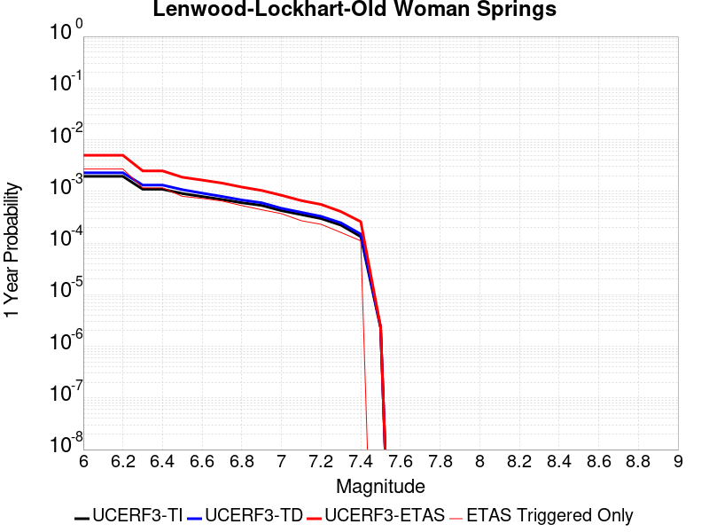 |  |

| Magnitude | 1 wk TI Prob | 1 wk TD Prob | 1 wk ETAS Prob | 1 wk ETAS/TD Gain | 1 wk ETAS Triggered Only | 1 mo TI Prob | 1 mo TD Prob | 1 mo ETAS Prob | 1 mo ETAS/TD Gain | 1 mo ETAS Triggered Only | 1 yr TI Prob | 1 yr TD Prob | 1 yr ETAS Prob | 1 yr ETAS/TD Gain | 1 yr ETAS Triggered Only | 10 yr TI Prob | 10 yr TD Prob | 10 yr ETAS Prob | 10 yr ETAS/TD Gain | 10 yr ETAS Triggered Only |
|-----|-----|-----|-----|-----|-----|-----|-----|-----|-----|-----|-----|-----|-----|-----|-----|-----|-----|-----|-----|-----|
| 6.0 | 3.744542E-5 | 4.396349E-5 | 0.0011539147 | 26.247114 | 0.00111 | 1.604705E-4 | 1.8840231E-4 | 0.0018380914 | 9.756205 | 0.00165 | 0.0019519776 | 0.0022915571 | 0.004995347 | 2.179892 | 0.00271 | 0.019349206 | 0.022697281 | 0.026323074 | 1.1597457 | 0.00371 |
| 6.1 | 3.744542E-5 | 4.396349E-5 | 0.0011539147 | 26.247114 | 0.00111 | 1.604705E-4 | 1.8840231E-4 | 0.0018380914 | 9.756205 | 0.00165 | 0.0019519776 | 0.0022915571 | 0.004995347 | 2.179892 | 0.00271 | 0.019349206 | 0.022697281 | 0.026323074 | 1.1597457 | 0.00371 |
| 6.2 | 3.744542E-5 | 4.396349E-5 | 0.0011539147 | 26.247114 | 0.00111 | 1.604705E-4 | 1.8840231E-4 | 0.0018380914 | 9.756205 | 0.00165 | 0.0019519776 | 0.0022915571 | 0.004995347 | 2.179892 | 0.00271 | 0.019349206 | 0.022697281 | 0.026323074 | 1.1597457 | 0.00371 |
| 6.3 | 2.1079984E-5 | 2.5354384E-5 | 5.053422E-4 | 19.931156 | 4.8E-4 | 9.0339665E-5 | 1.0865723E-4 | 8.085812E-4 | 7.441577 | 7.0E-4 | 0.0010993304 | 0.0013221189 | 0.0024905722 | 1.8837731 | 0.00117 | 0.010939079 | 0.013144747 | 0.01469411 | 1.1178694 | 0.00157 |
| 6.4 | 2.1079984E-5 | 2.5354384E-5 | 5.053422E-4 | 19.931156 | 4.8E-4 | 9.0339665E-5 | 1.0865723E-4 | 8.085812E-4 | 7.441577 | 7.0E-4 | 0.0010993304 | 0.0013221189 | 0.0024905722 | 1.8837731 | 0.00117 | 0.010939079 | 0.013144747 | 0.01469411 | 1.1178694 | 0.00157 |
| 6.5 | 1.7397282E-5 | 2.0663285E-5 | 3.6065627E-4 | 17.453966 | 3.4E-4 | 7.455765E-5 | 8.8554E-5 | 5.585124E-4 | 6.3070264 | 4.7E-4 | 9.073613E-4 | 0.0010776235 | 0.0018767613 | 1.7415744 | 8.0E-4 | 0.009036654 | 0.010725273 | 0.011783797 | 1.0986943 | 0.00107 |
| 6.6 | 1.52050325E-5 | 1.7680086E-5 | 3.276746E-4 | 18.533543 | 3.1E-4 | 6.51628E-5 | 7.576964E-5 | 5.05737E-4 | 6.6746664 | 4.3E-4 | 7.9306826E-4 | 9.221128E-4 | 0.0016514397 | 1.7909302 | 7.3E-4 | 0.007902439 | 0.009183729 | 0.010154729 | 1.1057304 | 9.8E-4 |
| 6.7 | 1.332523E-5 | 1.5264379E-5 | 2.952601E-4 | 19.343079 | 2.8E-4 | 5.7106878E-5 | 6.541716E-5 | 4.453923E-4 | 6.808493 | 3.8E-4 | 6.950544E-4 | 7.9616875E-4 | 0.0014456513 | 1.8157598 | 6.5E-4 | 0.006928845 | 0.0079337945 | 0.008796892 | 1.1087875 | 8.7E-4 |
| 6.8 | 1.1525329E-5 | 1.3031365E-5 | 2.630281E-4 | 20.184233 | 2.5E-4 | 4.9393333E-5 | 5.5847537E-5 | 3.858291E-4 | 6.9086146 | 3.3E-4 | 6.011979E-4 | 6.7973585E-4 | 0.0012093756 | 1.7791846 | 5.3E-4 | 0.00599574 | 0.0067770192 | 0.0074822074 | 1.1040559 | 7.1E-4 |
| 6.9 | 1.0253909E-5 | 1.1514835E-5 | 2.1151252E-4 | 18.3687 | 2.0E-4 | 4.3944583E-5 | 4.934838E-5 | 3.2933455E-4 | 6.6736655 | 2.8E-4 | 5.3489394E-4 | 6.006545E-4 | 0.0010403902 | 1.7320943 | 4.4E-4 | 0.0053360825 | 0.0059906896 | 0.006587095 | 1.0995554 | 6.0E-4 |
| 7.0 | 8.104563E-6 | 8.99143E-6 | 1.6899E-4 | 18.794561 | 1.6E-4 | 3.4733377E-5 | 3.853415E-5 | 2.6852527E-4 | 6.968502 | 2.3E-4 | 4.2279682E-4 | 4.6905465E-4 | 8.388811E-4 | 1.7884507 | 3.7E-4 | 0.0042199334 | 0.0046808943 | 0.005168601 | 1.1041908 | 4.9E-4 |
| 7.1 | 6.7986157E-6 | 7.5159796E-6 | 1.37515E-4 | 18.29635 | 1.3E-4 | 2.91366E-5 | 3.2210955E-5 | 1.922058E-4 | 5.967094 | 1.6E-4 | 3.5468035E-4 | 3.9209996E-4 | 6.619941E-4 | 1.6883299 | 2.7E-4 | 0.003541148 | 0.003914298 | 0.0042928103 | 1.0967 | 3.8E-4 |
| 7.2 | 5.6893327E-6 | 6.280132E-6 | 1.1627944E-4 | 18.515446 | 1.1E-4 | 2.4382627E-5 | 2.6914584E-5 | 1.4691135E-4 | 5.4584293 | 1.2E-4 | 2.9681803E-4 | 3.276378E-4 | 5.5756245E-4 | 1.7017647 | 2.3E-4 | 0.002964219 | 0.003271746 | 0.0035607973 | 1.0883477 | 2.9E-4 |
| 7.3 | 4.253348E-6 | 4.707075E-6 | 9.470665E-5 | 20.120066 | 9.0E-5 | 1.8228506E-5 | 2.017303E-5 | 1.1017122E-4 | 5.461312 | 9.0E-5 | 2.2190946E-4 | 2.455808E-4 | 4.055415E-4 | 1.6513567 | 1.6E-4 | 0.00221688 | 0.0024532753 | 0.00266276 | 1.0853899 | 2.1E-4 |
| 7.4 | 2.5448119E-6 | 2.8520594E-6 | 7.285186E-5 | 25.543598 | 7.0E-5 | 1.0906291E-5 | 1.2223064E-5 | 8.222221E-5 | 6.726808 | 7.0E-5 | 1.3277601E-4 | 1.4880729E-4 | 2.587909E-4 | 1.739101 | 1.1E-4 | 0.001326967 | 0.0014872387 | 0.0016370156 | 1.100708 | 1.5E-4 |
| 7.5 | 4.3706837E-8 | 4.562909E-8 | 4.562909E-8 | 1.0 | 0.0 | 1.8731501E-7 | 1.9555324E-7 | 1.9555324E-7 | 1.0 | 0.0 | 2.2805577E-6 | 2.3808586E-6 | 2.3808586E-6 | 1.0 | 0.0 | 2.2805343E-5 | 2.3808387E-5 | 2.3808387E-5 | 1.0 | 0.0 |

## Towne Pass
*[(top)](#table-of-contents)*

| 1 Week | 1 Month | 1 Year | 10 Year |
|-----|-----|-----|-----|
|  |  |  |  |

| Magnitude | 1 wk TI Prob | 1 wk TD Prob | 1 wk ETAS Prob | 1 wk ETAS/TD Gain | 1 wk ETAS Triggered Only | 1 mo TI Prob | 1 mo TD Prob | 1 mo ETAS Prob | 1 mo ETAS/TD Gain | 1 mo ETAS Triggered Only | 1 yr TI Prob | 1 yr TD Prob | 1 yr ETAS Prob | 1 yr ETAS/TD Gain | 1 yr ETAS Triggered Only | 10 yr TI Prob | 10 yr TD Prob | 10 yr ETAS Prob | 10 yr ETAS/TD Gain | 10 yr ETAS Triggered Only |
|-----|-----|-----|-----|-----|-----|-----|-----|-----|-----|-----|-----|-----|-----|-----|-----|-----|-----|-----|-----|-----|
| 6.0 | 3.849728E-6 | 3.894542E-6 | 8.3389133E-4 | 214.11794 | 8.3E-4 | 1.649873E-5 | 1.6690812E-5 | 0.0013766681 | 82.4806 | 0.00136 | 2.0085352E-4 | 2.0319606E-4 | 0.0025327227 | 12.464428 | 0.00233 | 0.0020067208 | 0.0020305319 | 0.005553364 | 2.7349308 | 0.00353 |
| 6.1 | 3.849728E-6 | 3.894542E-6 | 8.3389133E-4 | 214.11794 | 8.3E-4 | 1.649873E-5 | 1.6690812E-5 | 0.0013766681 | 82.4806 | 0.00136 | 2.0085352E-4 | 2.0319606E-4 | 0.0025327227 | 12.464428 | 0.00233 | 0.0020067208 | 0.0020305319 | 0.005553364 | 2.7349308 | 0.00353 |
| 6.2 | 3.849728E-6 | 3.894542E-6 | 8.3389133E-4 | 214.11794 | 8.3E-4 | 1.649873E-5 | 1.6690812E-5 | 0.0013766681 | 82.4806 | 0.00136 | 2.0085352E-4 | 2.0319606E-4 | 0.0025327227 | 12.464428 | 0.00233 | 0.0020067208 | 0.0020305319 | 0.005553364 | 2.7349308 | 0.00353 |
| 6.3 | 3.849728E-6 | 3.894542E-6 | 8.3389133E-4 | 214.11794 | 8.3E-4 | 1.649873E-5 | 1.6690812E-5 | 0.0013766681 | 82.4806 | 0.00136 | 2.0085352E-4 | 2.0319606E-4 | 0.0025327227 | 12.464428 | 0.00233 | 0.0020067208 | 0.0020305319 | 0.005553364 | 2.7349308 | 0.00353 |
| 6.4 | 3.849728E-6 | 3.894542E-6 | 8.3389133E-4 | 214.11794 | 8.3E-4 | 1.649873E-5 | 1.6690812E-5 | 0.0013766681 | 82.4806 | 0.00136 | 2.0085352E-4 | 2.0319606E-4 | 0.0025327227 | 12.464428 | 0.00233 | 0.0020067208 | 0.0020305319 | 0.005553364 | 2.7349308 | 0.00353 |
| 6.5 | 1.1953545E-6 | 1.2030526E-6 | 1.2120291E-4 | 100.74614 | 1.2E-4 | 5.1229376E-6 | 5.15593E-6 | 2.3515474E-4 | 45.608597 | 2.3E-4 | 6.236998E-5 | 6.277176E-5 | 4.6274666E-4 | 7.371892 | 4.0E-4 | 6.235248E-4 | 6.2755204E-4 | 0.0012471629 | 1.9873459 | 6.2E-4 |
| 6.6 | 1.1953545E-6 | 1.2030526E-6 | 1.2120291E-4 | 100.74614 | 1.2E-4 | 5.1229376E-6 | 5.15593E-6 | 2.3515474E-4 | 45.608597 | 2.3E-4 | 6.236998E-5 | 6.277176E-5 | 4.6274666E-4 | 7.371892 | 4.0E-4 | 6.235248E-4 | 6.2755204E-4 | 0.0012471629 | 1.9873459 | 6.2E-4 |
| 6.7 | 8.375951E-7 | 8.410676E-7 | 8.0841E-5 | 96.11713 | 8.0E-5 | 3.5896885E-6 | 3.6045708E-6 | 1.4360406E-4 | 39.839436 | 1.4E-4 | 4.370358E-5 | 4.3884826E-5 | 3.038734E-4 | 6.9243393 | 2.6E-4 | 4.3694986E-4 | 4.3876728E-4 | 8.285962E-4 | 1.8884639 | 3.9E-4 |
| 6.8 | 6.38041E-7 | 6.3921624E-7 | 6.0639177E-5 | 94.86489 | 6.0E-5 | 2.7344586E-6 | 2.7394954E-6 | 1.0273922E-4 | 37.50297 | 1.0E-4 | 3.3291526E-5 | 3.3352884E-5 | 2.3334622E-4 | 6.9962826 | 2.0E-4 | 3.3286537E-4 | 3.334826E-4 | 6.333826E-4 | 1.8992971 | 3.0E-4 |
| 6.9 | 5.3460053E-7 | 5.345339E-7 | 6.05345E-5 | 113.24727 | 6.0E-5 | 2.2911431E-6 | 2.2908578E-6 | 9.2290655E-5 | 40.286507 | 9.0E-5 | 2.789431E-5 | 2.7890868E-5 | 2.0788585E-4 | 7.453545 | 1.8E-4 | 2.789081E-4 | 2.78877E-4 | 5.388045E-4 | 1.9320506 | 2.6E-4 |
| 7.0 | 3.557783E-7 | 3.5324283E-7 | 4.035323E-5 | 114.23651 | 4.0E-5 | 1.5247632E-6 | 1.513897E-6 | 5.151382E-5 | 34.027294 | 5.0E-5 | 1.8563835E-5 | 1.8431549E-5 | 9.843007E-5 | 5.340304 | 8.0E-5 | 1.8562283E-4 | 1.8430105E-4 | 2.842826E-4 | 1.5424905 | 1.0E-4 |
| 7.1 | 3.037942E-7 | 3.0002275E-7 | 3.0300014E-5 | 100.992386 | 3.0E-5 | 1.3019744E-6 | 1.2858112E-6 | 4.128576E-5 | 32.108727 | 4.0E-5 | 1.5851423E-5 | 1.5654647E-5 | 7.5653705E-5 | 4.832668 | 6.0E-5 | 1.5850292E-4 | 1.5653619E-4 | 2.3652367E-4 | 1.510984 | 8.0E-5 |
| 7.2 | 2.0808248E-7 | 2.0217735E-7 | 2.0202173E-5 | 99.923035 | 2.0E-5 | 8.917818E-7 | 8.6647407E-7 | 3.086645E-5 | 35.62305 | 3.0E-5 | 1.0857389E-5 | 1.0549275E-5 | 4.054896E-5 | 3.8437672 | 3.0E-5 | 1.0856859E-4 | 1.0548821E-4 | 1.5548294E-4 | 1.4739367 | 5.0E-5 |
| 7.3 | 1.1162073E-7 | 1.0636902E-7 | 1.0106368E-5 | 95.01232 | 1.0E-5 | 4.7837443E-7 | 4.5586717E-7 | 2.0455858E-5 | 44.87241 | 2.0E-5 | 5.8241935E-6 | 5.5501705E-6 | 2.555006E-5 | 4.6034727 | 2.0E-5 | 5.8240406E-5 | 5.550052E-5 | 9.5498304E-5 | 1.7206739 | 4.0E-5 |

## Bicycle Lake
*[(top)](#table-of-contents)*

| 1 Week | 1 Month | 1 Year | 10 Year |
|-----|-----|-----|-----|
|  | 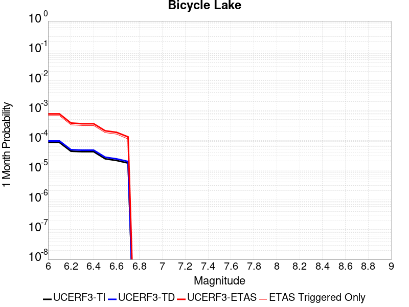 |  |  |

| Magnitude | 1 wk TI Prob | 1 wk TD Prob | 1 wk ETAS Prob | 1 wk ETAS/TD Gain | 1 wk ETAS Triggered Only | 1 mo TI Prob | 1 mo TD Prob | 1 mo ETAS Prob | 1 mo ETAS/TD Gain | 1 mo ETAS Triggered Only | 1 yr TI Prob | 1 yr TD Prob | 1 yr ETAS Prob | 1 yr ETAS/TD Gain | 1 yr ETAS Triggered Only | 10 yr TI Prob | 10 yr TD Prob | 10 yr ETAS Prob | 10 yr ETAS/TD Gain | 10 yr ETAS Triggered Only |
|-----|-----|-----|-----|-----|-----|-----|-----|-----|-----|-----|-----|-----|-----|-----|-----|-----|-----|-----|-----|-----|
| 6.0 | 1.9621975E-5 | 2.2097078E-5 | 4.7208712E-4 | 21.364233 | 4.5E-4 | 8.4091465E-5 | 9.4699084E-5 | 7.646356E-4 | 8.074372 | 6.7E-4 | 0.0010233327 | 0.0011524865 | 0.002530896 | 2.1960309 | 0.00138 | 0.01018633 | 0.011478408 | 0.013969483 | 1.2170227 | 0.00252 |
| 6.1 | 1.9621975E-5 | 2.2097078E-5 | 4.7208712E-4 | 21.364233 | 4.5E-4 | 8.4091465E-5 | 9.4699084E-5 | 7.646356E-4 | 8.074372 | 6.7E-4 | 0.0010233327 | 0.0011524865 | 0.002530896 | 2.1960309 | 0.00138 | 0.01018633 | 0.011478408 | 0.013969483 | 1.2170227 | 0.00252 |
| 6.2 | 9.9971285E-6 | 1.125564E-5 | 2.2125327E-4 | 19.657104 | 2.1E-4 | 4.2844134E-5 | 4.8237856E-5 | 3.7822194E-4 | 7.84077 | 3.3E-4 | 5.2150246E-4 | 5.871897E-4 | 0.0013667316 | 2.3275812 | 7.8E-4 | 0.0052028033 | 0.005861487 | 0.007312929 | 1.2476236 | 0.00146 |
| 6.3 | 9.589428E-6 | 1.0798346E-5 | 2.0079629E-4 | 18.595097 | 1.9E-4 | 4.10969E-5 | 4.62781E-5 | 3.5626374E-4 | 7.6983232 | 3.1E-4 | 5.002399E-4 | 5.6334207E-4 | 0.0012929308 | 2.2951078 | 7.3E-4 | 0.0049911533 | 0.0056242296 | 0.007006412 | 1.245755 | 0.00139 |
| 6.4 | 9.589428E-6 | 1.0798346E-5 | 2.0079629E-4 | 18.595097 | 1.9E-4 | 4.10969E-5 | 4.62781E-5 | 3.5626374E-4 | 7.6983232 | 3.1E-4 | 5.002399E-4 | 5.6334207E-4 | 0.0012929308 | 2.2951078 | 7.3E-4 | 0.0049911533 | 0.0056242296 | 0.007006412 | 1.245755 | 0.00139 |
| 6.5 | 5.557707E-6 | 6.2856016E-6 | 1.0628497E-4 | 16.909277 | 1.0E-4 | 2.3818526E-5 | 2.6938165E-5 | 2.0693331E-4 | 7.6817894 | 1.8E-4 | 2.8995197E-4 | 3.279497E-4 | 7.8779884E-4 | 2.4021943 | 4.6E-4 | 0.0028957394 | 0.0032772934 | 0.0042241802 | 1.2889234 | 9.5E-4 |
| 6.6 | 4.8742945E-6 | 5.5132896E-6 | 9.551279E-5 | 17.324102 | 9.0E-5 | 2.0889667E-5 | 2.3628318E-5 | 1.8362454E-4 | 7.7713757 | 1.6E-4 | 2.54302E-4 | 2.87663E-4 | 7.075422E-4 | 2.459622 | 4.2E-4 | 0.002540112 | 0.0028754752 | 0.00371306 | 1.2912856 | 8.4E-4 |
| 6.7 | 3.991108E-6 | 4.5159104E-6 | 8.451555E-5 | 18.715063 | 8.0E-5 | 1.7104636E-5 | 1.9353902E-5 | 1.2935177E-4 | 6.6834984 | 1.1E-4 | 2.0822904E-4 | 2.3563375E-4 | 5.3556304E-4 | 2.2728622 | 3.0E-4 | 0.0020803404 | 0.0023563374 | 0.0030048059 | 1.2752018 | 6.5E-4 |

## San Andreas (San Bernardino N)
*[(top)](#table-of-contents)*

| 1 Week | 1 Month | 1 Year | 10 Year |
|-----|-----|-----|-----|
|  |  |  | 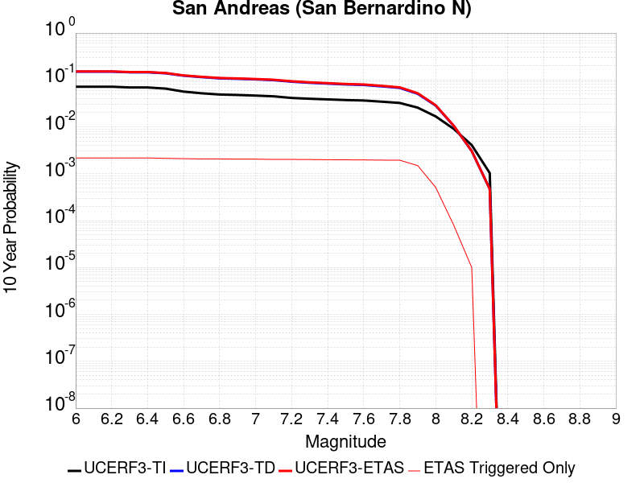 |

| Magnitude | 1 wk TI Prob | 1 wk TD Prob | 1 wk ETAS Prob | 1 wk ETAS/TD Gain | 1 wk ETAS Triggered Only | 1 mo TI Prob | 1 mo TD Prob | 1 mo ETAS Prob | 1 mo ETAS/TD Gain | 1 mo ETAS Triggered Only | 1 yr TI Prob | 1 yr TD Prob | 1 yr ETAS Prob | 1 yr ETAS/TD Gain | 1 yr ETAS Triggered Only | 10 yr TI Prob | 10 yr TD Prob | 10 yr ETAS Prob | 10 yr ETAS/TD Gain | 10 yr ETAS Triggered Only |
|-----|-----|-----|-----|-----|-----|-----|-----|-----|-----|-----|-----|-----|-----|-----|-----|-----|-----|-----|-----|-----|
| 6.0 | 1.4273766E-4 | 3.160784E-4 | 0.001335756 | 4.2260275 | 0.00102 | 6.115894E-4 | 0.0013539245 | 0.0026721372 | 1.9736236 | 0.00132 | 0.0074207084 | 0.016360939 | 0.018042963 | 1.1028073 | 0.00171 | 0.07177748 | 0.15021163 | 0.15205567 | 1.0122763 | 0.00217 |
| 6.1 | 1.4273766E-4 | 3.160784E-4 | 0.001335756 | 4.2260275 | 0.00102 | 6.115894E-4 | 0.0013539245 | 0.0026721372 | 1.9736236 | 0.00132 | 0.0074207084 | 0.016360939 | 0.018042963 | 1.1028073 | 0.00171 | 0.07177748 | 0.15021163 | 0.15205567 | 1.0122763 | 0.00217 |
| 6.2 | 1.4273766E-4 | 3.160784E-4 | 0.001335756 | 4.2260275 | 0.00102 | 6.115894E-4 | 0.0013539245 | 0.0026721372 | 1.9736236 | 0.00132 | 0.0074207084 | 0.016360939 | 0.018042963 | 1.1028073 | 0.00171 | 0.07177748 | 0.15021163 | 0.15205567 | 1.0122763 | 0.00217 |
| 6.3 | 1.3730655E-4 | 3.0512668E-4 | 0.0013248154 | 4.341854 | 0.00102 | 5.883239E-4 | 0.001307036 | 0.0026253108 | 2.0085986 | 0.00132 | 0.0071393442 | 0.015798455 | 0.01748144 | 1.1065284 | 0.00171 | 0.06914291 | 0.1455135 | 0.14736775 | 1.0127428 | 0.00217 |
| 6.4 | 1.3730655E-4 | 3.0512668E-4 | 0.0013248154 | 4.341854 | 0.00102 | 5.883239E-4 | 0.001307036 | 0.0026253108 | 2.0085986 | 0.00132 | 0.0071393442 | 0.015798455 | 0.01748144 | 1.1065284 | 0.00171 | 0.06914291 | 0.1455135 | 0.14736775 | 1.0127428 | 0.00217 |
| 6.5 | 1.2942807E-4 | 2.8927144E-4 | 0.0012789851 | 4.421401 | 9.9E-4 | 5.545738E-4 | 0.0012391509 | 0.0025175647 | 2.0316854 | 0.00128 | 0.0067310524 | 0.014983548 | 0.016628524 | 1.1097856 | 0.00167 | 0.06530788 | 0.13865088 | 0.14048555 | 1.0132324 | 0.00213 |
| 6.6 | 1.1125901E-4 | 2.5365927E-4 | 0.0012234132 | 4.8230577 | 9.7E-4 | 4.767372E-4 | 0.0010866605 | 0.002335302 | 2.1490633 | 0.00125 | 0.005788839 | 0.0131504685 | 0.014768901 | 1.1230704 | 0.00164 | 0.056403454 | 0.12300496 | 0.124846645 | 1.0149724 | 0.0021 |
| 6.7 | 1.02209575E-4 | 2.3500937E-4 | 0.0011947837 | 5.0839834 | 9.6E-4 | 4.3796748E-4 | 0.0010067957 | 0.0022455472 | 2.2303903 | 0.00124 | 0.0053192247 | 0.012189267 | 0.013789521 | 1.1312838 | 0.00162 | 0.051936906 | 0.114792764 | 0.116625145 | 1.0159625 | 0.00207 |
| 6.8 | 9.610582E-5 | 2.2026796E-4 | 0.0011800565 | 5.357368 | 9.6E-4 | 4.1181705E-4 | 9.436647E-4 | 0.0021824946 | 2.312786 | 0.00124 | 0.0050023515 | 0.011428859 | 0.013030345 | 1.1401265 | 0.00162 | 0.048912346 | 0.10820469 | 0.11005071 | 1.0170604 | 0.00207 |
| 6.9 | 9.3877505E-5 | 2.1482339E-4 | 0.0011746172 | 5.467827 | 9.6E-4 | 4.0227012E-4 | 9.203475E-4 | 0.0021492154 | 2.3352218 | 0.00123 | 0.0048866454 | 0.011147907 | 0.012739959 | 1.1428118 | 0.00161 | 0.04780577 | 0.105798274 | 0.107631385 | 1.0173265 | 0.00205 |
| 7.0 | 9.1019785E-5 | 2.0809306E-4 | 0.0011678933 | 5.6123605 | 9.6E-4 | 3.900265E-4 | 8.915232E-4 | 0.0021204266 | 2.3784313 | 0.00123 | 0.0047382377 | 0.0108004995 | 0.01239311 | 1.1474571 | 0.00161 | 0.046384744 | 0.10276815 | 0.10460748 | 1.0178978 | 0.00205 |
| 7.1 | 8.771155E-5 | 1.9983841E-4 | 0.0011496486 | 5.752891 | 9.5E-4 | 3.758525E-4 | 8.5616973E-4 | 0.0020551423 | 2.4003913 | 0.0012 | 0.0045664064 | 0.010374243 | 0.011937852 | 1.1507202 | 0.00158 | 0.044737056 | 0.09907644 | 0.10089631 | 1.0183682 | 0.00202 |
| 7.2 | 8.0830236E-5 | 1.8389444E-4 | 0.0011337197 | 6.165057 | 9.5E-4 | 3.4636928E-4 | 7.8788114E-4 | 0.0019869357 | 2.5218723 | 0.0012 | 0.0042088944 | 0.009550368 | 0.011115279 | 1.1638587 | 0.00158 | 0.041300658 | 0.09180518 | 0.09363974 | 1.0199832 | 0.00202 |
| 7.3 | 7.7668235E-5 | 1.7333007E-4 | 0.0011231654 | 6.4799223 | 9.5E-4 | 3.328214E-4 | 7.426318E-4 | 0.0019417406 | 2.6146748 | 0.0012 | 0.0040445733 | 0.009004138 | 0.010560002 | 1.1727942 | 0.00157 | 0.03971748 | 0.08706761 | 0.08890261 | 1.0210755 | 0.00201 |
| 7.4 | 7.520177E-5 | 1.655312E-4 | 0.0011153739 | 6.7381496 | 9.5E-4 | 3.2225347E-4 | 7.092266E-4 | 0.0019083755 | 2.690784 | 0.0012 | 0.0039163795 | 0.008600714 | 0.010147296 | 1.1798203 | 0.00156 | 0.038480744 | 0.08352157 | 0.08534536 | 1.0218362 | 0.00199 |
| 7.5 | 7.274697E-5 | 1.584075E-4 | 0.0010982587 | 6.933122 | 9.4E-4 | 3.1173544E-4 | 6.7871273E-4 | 0.001867905 | 2.752129 | 0.00119 | 0.003788775 | 0.008232076 | 0.009769316 | 1.1867379 | 0.00155 | 0.03724827 | 0.08023654 | 0.08205767 | 1.0226971 | 0.00198 |
| 7.6 | 7.1185845E-5 | 1.5410586E-4 | 0.001093961 | 7.0987635 | 9.4E-4 | 3.0504653E-4 | 6.602866E-4 | 0.0018495008 | 2.8010578 | 0.00119 | 0.0037076178 | 0.0080094095 | 0.009537075 | 1.1907339 | 0.00154 | 0.036463667 | 0.07822661 | 0.080042504 | 1.0232133 | 0.00197 |
| 7.7 | 6.709961E-5 | 1.4319421E-4 | 0.001073061 | 7.493746 | 9.3E-4 | 2.8753807E-4 | 6.135452E-4 | 0.0017928212 | 2.9220688 | 0.00118 | 0.003495157 | 0.0074443663 | 0.008953051 | 1.2026613 | 0.00152 | 0.034406938 | 0.07305558 | 0.07486312 | 1.024742 | 0.00195 |
| 7.8 | 6.300812E-5 | 1.320343E-4 | 0.0010619115 | 8.042694 | 9.3E-4 | 2.7000686E-4 | 5.657386E-4 | 0.0017350767 | 3.066923 | 0.00117 | 0.0032823787 | 0.006866143 | 0.008365775 | 1.2184097 | 0.00151 | 0.032343175 | 0.06771385 | 0.069522485 | 1.02671 | 0.00194 |
| 7.9 | 4.983037E-5 | 9.7241085E-5 | 8.271701E-4 | 8.506385 | 7.3E-4 | 2.1354125E-4 | 4.1668097E-4 | 0.0013462935 | 3.2309935 | 9.3E-4 | 0.0025967648 | 0.0050613005 | 0.0062452774 | 1.2339275 | 0.00119 | 0.025666296 | 0.050650507 | 0.05206504 | 1.0279273 | 0.00149 |
| 8.0 | 3.2211527E-5 | 5.3306234E-5 | 2.9329344E-4 | 5.502048 | 2.4E-4 | 1.380421E-4 | 2.2843528E-4 | 5.0837133E-4 | 2.22545 | 2.8E-4 | 0.0016793669 | 0.0027776542 | 0.003166571 | 1.1400162 | 3.9E-4 | 0.016667323 | 0.028362568 | 0.028858103 | 1.0174714 | 5.1E-4 |
| 8.1 | 1.743376E-5 | 1.8823403E-5 | 6.882246E-5 | 3.656218 | 5.0E-5 | 7.471398E-5 | 8.066923E-5 | 1.4066439E-4 | 1.743718 | 6.0E-5 | 9.0926304E-4 | 9.81706E-4 | 0.0010516372 | 1.0712345 | 7.0E-5 | 0.009055517 | 0.010483979 | 0.010563141 | 1.0075507 | 8.0E-5 |
| 8.2 | 7.831616E-6 | 5.1540533E-6 | 1.5154002E-5 | 2.9402106 | 1.0E-5 | 3.3563636E-5 | 2.2088612E-5 | 3.2088392E-5 | 1.4527119 | 1.0E-5 | 4.0856065E-4 | 2.6889573E-4 | 2.7889304E-4 | 1.0371791 | 1.0E-5 | 0.004078103 | 0.0030413668 | 0.0030513364 | 1.003278 | 1.0E-5 |
| 8.3 | 1.983087E-6 | 7.6564595E-7 | 7.6564595E-7 | 1.0 | 0.0 | 8.498917E-6 | 3.281336E-6 | 3.281336E-6 | 1.0 | 0.0 | 1.034694E-4 | 3.9949547E-5 | 3.9949547E-5 | 1.0 | 0.0 | 0.0010342124 | 4.717979E-4 | 4.717979E-4 | 1.0 | 0.0 |

## Paradise
*[(top)](#table-of-contents)*

| 1 Week | 1 Month | 1 Year | 10 Year |
|-----|-----|-----|-----|
|  |  |  |  |

| Magnitude | 1 wk TI Prob | 1 wk TD Prob | 1 wk ETAS Prob | 1 wk ETAS/TD Gain | 1 wk ETAS Triggered Only | 1 mo TI Prob | 1 mo TD Prob | 1 mo ETAS Prob | 1 mo ETAS/TD Gain | 1 mo ETAS Triggered Only | 1 yr TI Prob | 1 yr TD Prob | 1 yr ETAS Prob | 1 yr ETAS/TD Gain | 1 yr ETAS Triggered Only | 10 yr TI Prob | 10 yr TD Prob | 10 yr ETAS Prob | 10 yr ETAS/TD Gain | 10 yr ETAS Triggered Only |
|-----|-----|-----|-----|-----|-----|-----|-----|-----|-----|-----|-----|-----|-----|-----|-----|-----|-----|-----|-----|-----|
| 6.0 | 1.4851273E-5 | 1.6694768E-5 | 4.566874E-4 | 27.355122 | 4.4E-4 | 6.364676E-5 | 7.154718E-5 | 7.514985E-4 | 10.503538 | 6.8E-4 | 7.7462377E-4 | 8.707624E-4 | 0.0021696305 | 2.4916446 | 0.0013 | 0.0077192914 | 0.008675884 | 0.010777491 | 1.2422355 | 0.00212 |
| 6.1 | 1.4851273E-5 | 1.6694768E-5 | 4.566874E-4 | 27.355122 | 4.4E-4 | 6.364676E-5 | 7.154718E-5 | 7.514985E-4 | 10.503538 | 6.8E-4 | 7.7462377E-4 | 8.707624E-4 | 0.0021696305 | 2.4916446 | 0.0013 | 0.0077192914 | 0.008675884 | 0.010777491 | 1.2422355 | 0.00212 |
| 6.2 | 1.4851273E-5 | 1.6694768E-5 | 4.566874E-4 | 27.355122 | 4.4E-4 | 6.364676E-5 | 7.154718E-5 | 7.514985E-4 | 10.503538 | 6.8E-4 | 7.7462377E-4 | 8.707624E-4 | 0.0021696305 | 2.4916446 | 0.0013 | 0.0077192914 | 0.008675884 | 0.010777491 | 1.2422355 | 0.00212 |
| 6.3 | 1.0426831E-5 | 1.1888697E-5 | 1.718868E-4 | 14.458 | 1.6E-4 | 4.4685654E-5 | 5.09506E-5 | 3.4093583E-4 | 6.691498 | 2.9E-4 | 5.43912E-4 | 6.201529E-4 | 0.0011798056 | 1.902443 | 5.6E-4 | 0.0054258266 | 0.0061848317 | 0.0070593893 | 1.1414036 | 8.8E-4 |
| 6.4 | 1.0426831E-5 | 1.1888697E-5 | 1.718868E-4 | 14.458 | 1.6E-4 | 4.4685654E-5 | 5.09506E-5 | 3.4093583E-4 | 6.691498 | 2.9E-4 | 5.43912E-4 | 6.201529E-4 | 0.0011798056 | 1.902443 | 5.6E-4 | 0.0054258266 | 0.0061848317 | 0.0070593893 | 1.1414036 | 8.8E-4 |
| 6.5 | 9.25027E-6 | 1.0620037E-5 | 1.4061866E-4 | 13.240882 | 1.3E-4 | 3.964341E-5 | 4.551368E-5 | 2.8550276E-4 | 6.2729 | 2.4E-4 | 4.8255164E-4 | 5.5399304E-4 | 0.0010037437 | 1.8118346 | 4.5E-4 | 0.0048150513 | 0.0055266195 | 0.0061929165 | 1.1205615 | 6.7E-4 |
| 6.6 | 7.904275E-6 | 9.159602E-6 | 1.191586E-4 | 13.009145 | 1.1E-4 | 3.3875025E-5 | 3.925487E-5 | 1.7924937E-4 | 4.5662966 | 1.4E-4 | 4.1235037E-4 | 4.7782718E-4 | 7.3770294E-4 | 1.5438697 | 2.6E-4 | 0.0041158604 | 0.004768395 | 0.005156535 | 1.0813985 | 3.9E-4 |
| 6.7 | 7.2061953E-6 | 8.407326E-6 | 8.8406654E-5 | 10.51543 | 8.0E-5 | 3.088333E-5 | 3.603092E-5 | 1.3602732E-4 | 3.775294 | 1.0E-4 | 3.7593965E-4 | 4.3859181E-4 | 6.484997E-4 | 1.4785951 | 2.1E-4 | 0.003753043 | 0.004377631 | 0.004686274 | 1.0705045 | 3.1E-4 |
| 6.8 | 6.6948724E-6 | 7.842242E-6 | 6.784177E-5 | 8.650813 | 6.0E-5 | 2.8691995E-5 | 3.3609194E-5 | 1.13606504E-4 | 3.380221 | 8.0E-5 | 3.4926904E-4 | 4.091187E-4 | 5.7904917E-4 | 1.4153574 | 1.7E-4 | 0.003487206 | 0.0040840125 | 0.0043130736 | 1.0560871 | 2.3E-4 |
| 6.9 | 6.0421025E-6 | 7.1306963E-6 | 3.713048E-5 | 5.207133 | 3.0E-5 | 2.5894467E-5 | 3.0559786E-5 | 8.055826E-5 | 2.636087 | 5.0E-5 | 3.1521954E-4 | 3.7200528E-4 | 4.8196438E-4 | 1.2955847 | 1.1E-4 | 0.0031477278 | 0.0037141638 | 0.0038636068 | 1.040236 | 1.5E-4 |
| 7.0 | 4.134091E-6 | 5.0803824E-6 | 1.5080332E-5 | 2.9683456 | 1.0E-5 | 1.7717413E-5 | 2.1772896E-5 | 4.177246E-5 | 1.9185534 | 2.0E-5 | 2.1568815E-4 | 2.650543E-4 | 3.250384E-4 | 1.2263087 | 6.0E-5 | 0.0021547892 | 0.0026475347 | 0.002727323 | 1.0301368 | 8.0E-5 |
| 7.1 | 3.7674888E-6 | 4.631936E-6 | 1.463189E-5 | 3.1589146 | 1.0E-5 | 1.6146281E-5 | 1.9851012E-5 | 3.9850616E-5 | 2.0074854 | 2.0E-5 | 1.9656324E-4 | 2.4166079E-4 | 3.016463E-4 | 1.2482219 | 6.0E-5 | 0.0019638946 | 0.0024141306 | 0.0024939375 | 1.0330582 | 8.0E-5 |
| 7.2 | 3.4065345E-6 | 4.156782E-6 | 1.4156741E-5 | 3.405697 | 1.0E-5 | 1.4599351E-5 | 1.7814667E-5 | 2.7814489E-5 | 1.5613252 | 1.0E-5 | 1.777326E-4 | 2.168735E-4 | 2.6686265E-4 | 1.2304991 | 5.0E-5 | 0.0017759053 | 0.0021667667 | 0.002236615 | 1.0322362 | 7.0E-5 |
| 7.3 | 2.9934936E-6 | 3.6293673E-6 | 1.3629331E-5 | 3.7552912 | 1.0E-5 | 1.2829195E-5 | 1.5554348E-5 | 2.555419E-5 | 1.6428971 | 1.0E-5 | 1.5618425E-4 | 1.8935918E-4 | 2.3934973E-4 | 1.2639984 | 5.0E-5 | 0.0015607453 | 0.0018921237 | 0.0019619912 | 1.0369254 | 7.0E-5 |
| 7.4 | 2.4049796E-6 | 2.8890186E-6 | 1.288899E-5 | 4.4613733 | 1.0E-5 | 1.0307015E-5 | 1.2381457E-5 | 2.2381333E-5 | 1.8076494 | 1.0E-5 | 1.2548068E-4 | 1.5073526E-4 | 1.9072923E-4 | 1.2653259 | 4.0E-5 | 0.0012540985 | 0.0015064715 | 0.0015563963 | 1.0331402 | 5.0E-5 |
| 7.5 | 1.2710091E-6 | 1.5134859E-6 | 1.5134859E-6 | 1.0 | 0.0 | 5.44717E-6 | 6.4863593E-6 | 6.4863593E-6 | 1.0 | 0.0 | 6.631728E-5 | 7.896981E-5 | 9.896823E-5 | 1.2532413 | 2.0E-5 | 6.6297496E-4 | 7.895401E-4 | 8.195164E-4 | 1.0379668 | 3.0E-5 |
| 7.6 | 2.21172E-7 | 2.6040198E-7 | 2.6040198E-7 | 1.0 | 0.0 | 9.478797E-7 | 1.1160082E-6 | 1.1160082E-6 | 1.0 | 0.0 | 1.1540374E-5 | 1.3587343E-5 | 2.3587207E-5 | 1.7359691 | 1.0E-5 | 1.1539775E-4 | 1.3586794E-4 | 1.4586658E-4 | 1.0735909 | 1.0E-5 |

## Garlic Springs
*[(top)](#table-of-contents)*

| 1 Week | 1 Month | 1 Year | 10 Year |
|-----|-----|-----|-----|
|  |  |  |  |

| Magnitude | 1 wk TI Prob | 1 wk TD Prob | 1 wk ETAS Prob | 1 wk ETAS/TD Gain | 1 wk ETAS Triggered Only | 1 mo TI Prob | 1 mo TD Prob | 1 mo ETAS Prob | 1 mo ETAS/TD Gain | 1 mo ETAS Triggered Only | 1 yr TI Prob | 1 yr TD Prob | 1 yr ETAS Prob | 1 yr ETAS/TD Gain | 1 yr ETAS Triggered Only | 10 yr TI Prob | 10 yr TD Prob | 10 yr ETAS Prob | 10 yr ETAS/TD Gain | 10 yr ETAS Triggered Only |
|-----|-----|-----|-----|-----|-----|-----|-----|-----|-----|-----|-----|-----|-----|-----|-----|-----|-----|-----|-----|-----|
| 6.0 | 1.6760017E-5 | 1.8776833E-5 | 2.9877157E-4 | 15.911714 | 2.8E-4 | 7.182667E-5 | 8.0470316E-5 | 5.404333E-4 | 6.7159333 | 4.6E-4 | 8.7413884E-4 | 9.794032E-4 | 0.0019084923 | 1.948628 | 9.3E-4 | 0.008707083 | 0.009762413 | 0.011465622 | 1.1744659 | 0.00172 |
| 6.1 | 9.852767E-6 | 1.0973587E-5 | 2.109714E-4 | 19.225382 | 2.0E-4 | 4.222546E-5 | 4.702921E-5 | 3.0701698E-4 | 6.5282187 | 2.6E-4 | 5.139737E-4 | 5.7250116E-4 | 0.0010522264 | 1.8379462 | 4.8E-4 | 0.005127866 | 0.005717221 | 0.006602133 | 1.15478 | 8.9E-4 |
| 6.2 | 9.852767E-6 | 1.0973587E-5 | 2.109714E-4 | 19.225382 | 2.0E-4 | 4.222546E-5 | 4.702921E-5 | 3.0701698E-4 | 6.5282187 | 2.6E-4 | 5.139737E-4 | 5.7250116E-4 | 0.0010522264 | 1.8379462 | 4.8E-4 | 0.005127866 | 0.005717221 | 0.006602133 | 1.15478 | 8.9E-4 |
| 6.3 | 4.3167724E-6 | 4.7780286E-6 | 9.47776E-5 | 19.83613 | 9.0E-5 | 1.8500323E-5 | 2.0477235E-5 | 1.5047457E-4 | 7.3483834 | 1.3E-4 | 2.2521814E-4 | 2.4930484E-4 | 4.792475E-4 | 1.9223354 | 2.3E-4 | 0.0022499003 | 0.00249251 | 0.0028416375 | 1.1400707 | 3.5E-4 |
| 6.4 | 4.3167724E-6 | 4.7780286E-6 | 9.47776E-5 | 19.83613 | 9.0E-5 | 1.8500323E-5 | 2.0477235E-5 | 1.5047457E-4 | 7.3483834 | 1.3E-4 | 2.2521814E-4 | 2.4930484E-4 | 4.792475E-4 | 1.9223354 | 2.3E-4 | 0.0022499003 | 0.00249251 | 0.0028416375 | 1.1400707 | 3.5E-4 |
| 6.5 | 4.3167724E-6 | 4.7780286E-6 | 9.47776E-5 | 19.83613 | 9.0E-5 | 1.8500323E-5 | 2.0477235E-5 | 1.5047457E-4 | 7.3483834 | 1.3E-4 | 2.2521814E-4 | 2.4930484E-4 | 4.792475E-4 | 1.9223354 | 2.3E-4 | 0.0022499003 | 0.00249251 | 0.0028416375 | 1.1400707 | 3.5E-4 |
| 6.6 | 4.301311E-6 | 4.760897E-6 | 9.476047E-5 | 19.90391 | 9.0E-5 | 1.8434059E-5 | 2.0403815E-5 | 1.5040116E-4 | 7.3712277 | 1.3E-4 | 2.2441156E-4 | 2.4841115E-4 | 4.7835402E-4 | 1.9256543 | 2.3E-4 | 0.0022418506 | 0.002483593 | 0.0028327238 | 1.1405748 | 3.5E-4 |
| 6.7 | 3.8599724E-6 | 4.27106E-6 | 9.4270676E-5 | 22.071962 | 9.0E-5 | 1.6542634E-5 | 1.8304541E-5 | 1.4830216E-4 | 8.101933 | 1.3E-4 | 2.0138794E-4 | 2.228578E-4 | 4.4280879E-4 | 1.9869566 | 2.2E-4 | 0.0020120554 | 0.002228578 | 0.0025578425 | 1.1477464 | 3.3E-4 |

## San Andreas (San Bernardino S)
*[(top)](#table-of-contents)*

| 1 Week | 1 Month | 1 Year | 10 Year |
|-----|-----|-----|-----|
|  |  |  |  |

| Magnitude | 1 wk TI Prob | 1 wk TD Prob | 1 wk ETAS Prob | 1 wk ETAS/TD Gain | 1 wk ETAS Triggered Only | 1 mo TI Prob | 1 mo TD Prob | 1 mo ETAS Prob | 1 mo ETAS/TD Gain | 1 mo ETAS Triggered Only | 1 yr TI Prob | 1 yr TD Prob | 1 yr ETAS Prob | 1 yr ETAS/TD Gain | 1 yr ETAS Triggered Only | 10 yr TI Prob | 10 yr TD Prob | 10 yr ETAS Prob | 10 yr ETAS/TD Gain | 10 yr ETAS Triggered Only |
|-----|-----|-----|-----|-----|-----|-----|-----|-----|-----|-----|-----|-----|-----|-----|-----|-----|-----|-----|-----|-----|
| 6.0 | 1.2336002E-4 | 3.0005194E-4 | 8.398899E-4 | 2.7991486 | 5.4E-4 | 5.2857865E-4 | 0.0012853292 | 0.0019944166 | 1.5516777 | 7.1E-4 | 0.006416472 | 0.015541554 | 0.016437411 | 1.0576427 | 9.1E-4 | 0.06234337 | 0.14294699 | 0.14392403 | 1.006835 | 0.00114 |
| 6.1 | 1.2336002E-4 | 3.0005194E-4 | 8.398899E-4 | 2.7991486 | 5.4E-4 | 5.2857865E-4 | 0.0012853292 | 0.0019944166 | 1.5516777 | 7.1E-4 | 0.006416472 | 0.015541554 | 0.016437411 | 1.0576427 | 9.1E-4 | 0.06234337 | 0.14294699 | 0.14392403 | 1.006835 | 0.00114 |
| 6.2 | 1.2336002E-4 | 3.0005194E-4 | 8.398899E-4 | 2.7991486 | 5.4E-4 | 5.2857865E-4 | 0.0012853292 | 0.0019944166 | 1.5516777 | 7.1E-4 | 0.006416472 | 0.015541554 | 0.016437411 | 1.0576427 | 9.1E-4 | 0.06234337 | 0.14294699 | 0.14392403 | 1.006835 | 0.00114 |
| 6.3 | 1.1712257E-4 | 2.8793467E-4 | 8.277792E-4 | 2.8748856 | 5.4E-4 | 5.018573E-4 | 0.0012334478 | 0.0019425721 | 1.5749123 | 7.1E-4 | 0.006093008 | 0.014918666 | 0.01581509 | 1.0600874 | 9.1E-4 | 0.059286322 | 0.13765779 | 0.13864085 | 1.0071414 | 0.00114 |
| 6.4 | 1.1712257E-4 | 2.8793467E-4 | 8.277792E-4 | 2.8748856 | 5.4E-4 | 5.018573E-4 | 0.0012334478 | 0.0019425721 | 1.5749123 | 7.1E-4 | 0.006093008 | 0.014918666 | 0.01581509 | 1.0600874 | 9.1E-4 | 0.059286322 | 0.13765779 | 0.13864085 | 1.0071414 | 0.00114 |
| 6.5 | 1.0689076E-4 | 2.6806415E-4 | 8.079194E-4 | 3.0139031 | 5.4E-4 | 4.5802278E-4 | 0.0011483653 | 0.0018475614 | 1.6088622 | 7.0E-4 | 0.0055621783 | 0.013896335 | 0.014773968 | 1.0631557 | 8.9E-4 | 0.05425003 | 0.1288989 | 0.12987454 | 1.007569 | 0.00112 |
| 6.6 | 9.7648895E-5 | 2.505129E-4 | 7.903776E-4 | 3.1550374 | 5.4E-4 | 4.1842813E-4 | 0.0010732086 | 0.0017624681 | 1.6422418 | 6.9E-4 | 0.005082469 | 0.012992399 | 0.013851095 | 1.0660923 | 8.7E-4 | 0.049677886 | 0.121077746 | 0.12204456 | 1.0079851 | 0.0011 |
| 6.7 | 8.757013E-5 | 2.3122175E-4 | 7.610992E-4 | 3.291642 | 5.3E-4 | 3.7524657E-4 | 9.905964E-4 | 0.0016699227 | 1.6857752 | 6.8E-4 | 0.00455906 | 0.011997902 | 0.012837703 | 1.0699958 | 8.5E-4 | 0.04466656 | 0.112373024 | 0.11333166 | 1.0085309 | 0.00108 |
| 6.8 | 8.562978E-5 | 2.2682057E-4 | 7.5670035E-4 | 3.3361187 | 5.3E-4 | 3.6693315E-4 | 9.7174826E-4 | 0.0016410971 | 1.688809 | 6.7E-4 | 0.004458263 | 0.011770921 | 0.012601034 | 1.0705223 | 8.4E-4 | 0.043698758 | 0.11037863 | 0.11132163 | 1.0085433 | 0.00106 |
| 6.9 | 6.124075E-5 | 1.7066885E-4 | 6.505869E-4 | 3.811984 | 4.8E-4 | 2.6243398E-4 | 7.312337E-4 | 0.0013407876 | 1.8335966 | 6.1E-4 | 0.0031904527 | 0.008866636 | 0.00963972 | 1.0871903 | 7.8E-4 | 0.031450346 | 0.08420262 | 0.08507262 | 1.0103323 | 9.5E-4 |
| 7.0 | 5.8598747E-5 | 1.6495936E-4 | 6.3488184E-4 | 3.8487167 | 4.7E-4 | 2.5111332E-4 | 7.067779E-4 | 0.0013063538 | 1.848323 | 6.0E-4 | 0.0030530186 | 0.008571265 | 0.009334666 | 1.0890651 | 7.7E-4 | 0.03011414 | 0.08151562 | 0.08237899 | 1.0105915 | 9.4E-4 |
| 7.1 | 5.613814E-5 | 1.5914452E-4 | 6.190713E-4 | 3.8899946 | 4.6E-4 | 2.4056983E-4 | 6.818704E-4 | 0.0012714681 | 1.8646771 | 5.9E-4 | 0.0029250039 | 0.008270353 | 0.009024068 | 1.0911345 | 7.6E-4 | 0.028868021 | 0.07881268 | 0.079669386 | 1.0108701 | 9.3E-4 |
| 7.2 | 4.991222E-5 | 1.4520933E-4 | 6.0514256E-4 | 4.167381 | 4.6E-4 | 2.1389198E-4 | 6.221777E-4 | 0.0012118105 | 1.9476923 | 5.9E-4 | 0.002601025 | 0.0075488063 | 0.008303069 | 1.0999181 | 7.6E-4 | 0.025707912 | 0.07226191 | 0.0731247 | 1.0119399 | 9.3E-4 |
| 7.3 | 4.7410045E-5 | 1.371513E-4 | 5.9708825E-4 | 4.3535 | 4.6E-4 | 2.0317009E-4 | 5.8765925E-4 | 0.0011773126 | 2.0033932 | 5.9E-4 | 0.0024707897 | 0.0071313656 | 0.007876017 | 1.1044192 | 7.5E-4 | 0.024434982 | 0.068541944 | 0.06939889 | 1.0125024 | 9.2E-4 |
| 7.4 | 4.5556746E-5 | 1.3123035E-4 | 5.9117E-4 | 4.504827 | 4.6E-4 | 1.952286E-4 | 5.6229485E-4 | 0.0011519631 | 2.0486815 | 5.9E-4 | 0.002374317 | 0.0068245293 | 0.007559479 | 1.1076924 | 7.4E-4 | 0.023491086 | 0.06579143 | 0.06663222 | 1.0127796 | 9.0E-4 |
| 7.5 | 4.3084514E-5 | 1.2358342E-4 | 5.735278E-4 | 4.6408153 | 4.5E-4 | 1.8463485E-4 | 5.2953605E-4 | 0.0011092289 | 2.0947185 | 5.8E-4 | 0.0022456115 | 0.0064281146 | 0.007153422 | 1.1128336 | 7.3E-4 | 0.022230545 | 0.062190283 | 0.06302494 | 1.0134209 | 8.9E-4 |
| 7.6 | 3.408608E-5 | 9.836477E-5 | 5.383215E-4 | 5.4727063 | 4.4E-4 | 1.4607502E-4 | 4.214953E-4 | 9.812593E-4 | 2.3280432 | 5.6E-4 | 0.0017770125 | 0.005119656 | 0.005816072 | 1.1360279 | 7.0E-4 | 0.017628696 | 0.05002244 | 0.050839417 | 1.0163323 | 8.6E-4 |
| 7.7 | 2.8315713E-5 | 8.2495724E-5 | 5.2245945E-4 | 6.33317 | 4.4E-4 | 1.2134742E-4 | 3.5350522E-4 | 9.1330725E-4 | 2.583575 | 5.6E-4 | 0.0014764034 | 0.004295442 | 0.0049924348 | 1.1622635 | 7.0E-4 | 0.01466633 | 0.042272415 | 0.04309606 | 1.0194843 | 8.6E-4 |
| 7.8 | 2.6222975E-5 | 7.463898E-5 | 5.1460613E-4 | 6.8946033 | 4.4E-4 | 1.1237934E-4 | 3.1984213E-4 | 8.696662E-4 | 2.7190483 | 5.5E-4 | 0.0013673597 | 0.003887131 | 0.004574449 | 1.1768188 | 6.9E-4 | 0.013589768 | 0.038437475 | 0.039254803 | 1.0212638 | 8.5E-4 |
| 7.9 | 2.1469694E-5 | 5.7884805E-5 | 4.4786223E-4 | 7.7371297 | 3.9E-4 | 9.200973E-5 | 2.4805416E-4 | 7.279351E-4 | 2.9345813 | 4.8E-4 | 0.0011196428 | 0.00301588 | 0.0036140706 | 1.1983469 | 6.0E-4 | 0.011140184 | 0.030153265 | 0.030851554 | 1.023158 | 7.2E-4 |
| 8.0 | 1.2420249E-5 | 3.1321662E-5 | 1.9131665E-4 | 6.1081257 | 1.6E-4 | 5.322855E-5 | 1.342288E-4 | 3.0420598E-4 | 2.2663243 | 1.7E-4 | 6.478649E-4 | 0.0016330116 | 0.001862636 | 1.140614 | 2.3E-4 | 0.0064597935 | 0.01652369 | 0.01678923 | 1.0160701 | 2.7E-4 |
| 8.1 | 4.9197724E-6 | 7.822525E-6 | 1.7822445E-5 | 2.2783496 | 1.0E-5 | 2.1084568E-5 | 3.3524673E-5 | 4.352434E-5 | 1.2982777 | 1.0E-5 | 2.566744E-4 | 4.080866E-4 | 4.1808252E-4 | 1.0244946 | 1.0E-5 | 0.002563781 | 0.004384557 | 0.004394513 | 1.0022707 | 1.0E-5 |
| 8.2 | 2.5634774E-6 | 2.9065757E-6 | 1.29065465E-5 | 4.4404645 | 1.0E-5 | 1.0986286E-5 | 1.2456694E-5 | 2.245657E-5 | 1.8027712 | 1.0E-5 | 1.3374983E-4 | 1.5164974E-4 | 1.6164822E-4 | 1.0659314 | 1.0E-5 | 0.0013366934 | 0.001704941 | 0.001714924 | 1.0058553 | 1.0E-5 |
| 8.3 | 5.2850464E-7 | 3.2080476E-7 | 3.2080476E-7 | 1.0 | 0.0 | 2.2650179E-6 | 1.3748769E-6 | 1.3748769E-6 | 1.0 | 0.0 | 2.7576245E-5 | 1.673901E-5 | 1.673901E-5 | 1.0 | 0.0 | 2.7572823E-4 | 1.986671E-4 | 1.986671E-4 | 1.0 | 0.0 |

## Helendale-So Lockhart
*[(top)](#table-of-contents)*

| 1 Week | 1 Month | 1 Year | 10 Year |
|-----|-----|-----|-----|
|  |  |  |  |

| Magnitude | 1 wk TI Prob | 1 wk TD Prob | 1 wk ETAS Prob | 1 wk ETAS/TD Gain | 1 wk ETAS Triggered Only | 1 mo TI Prob | 1 mo TD Prob | 1 mo ETAS Prob | 1 mo ETAS/TD Gain | 1 mo ETAS Triggered Only | 1 yr TI Prob | 1 yr TD Prob | 1 yr ETAS Prob | 1 yr ETAS/TD Gain | 1 yr ETAS Triggered Only | 10 yr TI Prob | 10 yr TD Prob | 10 yr ETAS Prob | 10 yr ETAS/TD Gain | 10 yr ETAS Triggered Only |
|-----|-----|-----|-----|-----|-----|-----|-----|-----|-----|-----|-----|-----|-----|-----|-----|-----|-----|-----|-----|-----|
| 6.0 | 1.7296055E-5 | 1.8103729E-5 | 3.280981E-4 | 18.123234 | 3.1E-4 | 7.412385E-5 | 7.7585224E-5 | 5.3754955E-4 | 6.928504 | 4.6E-4 | 9.0208417E-4 | 9.4421144E-4 | 0.0017234749 | 1.8253062 | 7.8E-4 | 0.008984311 | 0.009404116 | 0.01052349 | 1.1190301 | 0.00113 |
| 6.1 | 1.7296055E-5 | 1.8103729E-5 | 3.280981E-4 | 18.123234 | 3.1E-4 | 7.412385E-5 | 7.7585224E-5 | 5.3754955E-4 | 6.928504 | 4.6E-4 | 9.0208417E-4 | 9.4421144E-4 | 0.0017234749 | 1.8253062 | 7.8E-4 | 0.008984311 | 0.009404116 | 0.01052349 | 1.1190301 | 0.00113 |
| 6.2 | 1.7296055E-5 | 1.8103729E-5 | 3.280981E-4 | 18.123234 | 3.1E-4 | 7.412385E-5 | 7.7585224E-5 | 5.3754955E-4 | 6.928504 | 4.6E-4 | 9.0208417E-4 | 9.4421144E-4 | 0.0017234749 | 1.8253062 | 7.8E-4 | 0.008984311 | 0.009404116 | 0.01052349 | 1.1190301 | 0.00113 |
| 6.3 | 1.0669118E-5 | 1.1135425E-5 | 2.3113297E-4 | 20.756548 | 2.2E-4 | 4.5723988E-5 | 4.772239E-5 | 3.5770758E-4 | 7.4955926 | 3.1E-4 | 5.5654737E-4 | 5.80868E-4 | 0.0010905717 | 1.8774863 | 5.1E-4 | 0.0055515557 | 0.0057937936 | 0.0064996798 | 1.1218349 | 7.1E-4 |
| 6.4 | 1.0669118E-5 | 1.1135425E-5 | 2.3113297E-4 | 20.756548 | 2.2E-4 | 4.5723988E-5 | 4.772239E-5 | 3.5770758E-4 | 7.4955926 | 3.1E-4 | 5.5654737E-4 | 5.80868E-4 | 0.0010905717 | 1.8774863 | 5.1E-4 | 0.0055515557 | 0.0057937936 | 0.0064996798 | 1.1218349 | 7.1E-4 |
| 6.5 | 8.790038E-6 | 9.170197E-6 | 2.1916827E-4 | 23.900063 | 2.1E-4 | 3.767105E-5 | 3.930026E-5 | 3.2928886E-4 | 8.378796 | 2.9E-4 | 4.585485E-4 | 4.7837716E-4 | 9.6814276E-4 | 2.0238063 | 4.9E-4 | 0.0045760344 | 0.004773638 | 0.00544044 | 1.1396842 | 6.7E-4 |
| 6.6 | 7.396949E-6 | 7.715537E-6 | 1.677143E-4 | 21.737217 | 1.6E-4 | 3.1700827E-5 | 3.3066175E-5 | 2.6305858E-4 | 7.9555187 | 2.3E-4 | 3.858892E-4 | 4.025073E-4 | 8.0234633E-4 | 1.9933708 | 4.0E-4 | 0.003852198 | 0.00401789 | 0.00457564 | 1.1388166 | 5.6E-4 |
| 6.7 | 6.4600285E-6 | 6.738031E-6 | 1.5673702E-4 | 23.261547 | 1.5E-4 | 2.7685543E-5 | 2.887696E-5 | 2.488706E-4 | 8.61831 | 2.2E-4 | 3.3701936E-4 | 3.5152107E-4 | 7.21391E-4 | 2.0521984 | 3.7E-4 | 0.0033650869 | 0.003509732 | 0.004037872 | 1.1504787 | 5.3E-4 |
| 6.8 | 5.600104E-6 | 5.836009E-6 | 1.3583525E-4 | 23.275366 | 1.3E-4 | 2.4000226E-5 | 2.5011232E-5 | 2.2500622E-4 | 8.996207 | 2.0E-4 | 2.9216358E-4 | 3.044698E-4 | 6.343693E-4 | 2.0835214 | 3.3E-4 | 0.0029177975 | 0.003040588 | 0.0034991894 | 1.1508266 | 4.6E-4 |
| 6.9 | 4.839122E-6 | 5.0395092E-6 | 1.250389E-4 | 24.811722 | 1.2E-4 | 2.0738931E-5 | 2.159772E-5 | 2.1159362E-4 | 9.797034 | 1.9E-4 | 2.5246723E-4 | 2.6292098E-4 | 5.528447E-4 | 2.102703 | 2.9E-4 | 0.002521806 | 0.002626147 | 0.0030250964 | 1.1519144 | 4.0E-4 |
| 7.0 | 3.6937633E-6 | 3.845208E-6 | 9.3844865E-5 | 24.405666 | 9.0E-5 | 1.5830317E-5 | 1.647936E-5 | 1.7647672E-4 | 10.708955 | 1.6E-4 | 1.9271708E-4 | 2.0061806E-4 | 4.605659E-4 | 2.2957351 | 2.6E-4 | 0.0019255003 | 0.002004401 | 0.0023337395 | 1.1643077 | 3.3E-4 |
| 7.1 | 2.7858857E-6 | 2.8978538E-6 | 8.289762E-5 | 28.606558 | 8.0E-5 | 1.1939455E-5 | 1.2419316E-5 | 1.3241783E-4 | 10.662249 | 1.2E-4 | 1.4535317E-4 | 1.511949E-4 | 3.5116466E-4 | 2.322596 | 2.0E-4 | 0.0014525814 | 0.0015109418 | 0.001760564 | 1.1652098 | 2.5E-4 |
| 7.2 | 2.1672065E-6 | 2.2540128E-6 | 6.225388E-5 | 27.619133 | 6.0E-5 | 9.2879945E-6 | 9.66002E-6 | 8.965925E-5 | 9.281476 | 8.0E-5 | 1.1307546E-4 | 1.1760458E-4 | 2.6758693E-4 | 2.2753105 | 1.5E-4 | 0.0011301794 | 0.0011754417 | 0.0013552301 | 1.152954 | 1.8E-4 |
| 7.3 | 1.4823496E-6 | 1.5422102E-6 | 4.154215E-5 | 26.936762 | 4.0E-5 | 6.3529114E-6 | 6.6094562E-6 | 4.660919E-5 | 7.0518947 | 4.0E-5 | 7.734395E-5 | 8.046731E-5 | 1.7046007E-4 | 2.1183765 | 9.0E-5 | 7.731704E-4 | 8.0439687E-4 | 9.143084E-4 | 1.1366384 | 1.1E-4 |
| 7.4 | 4.2321457E-7 | 4.4108765E-7 | 4.044107E-5 | 91.68488 | 4.0E-5 | 1.8137755E-6 | 1.8903745E-6 | 4.18903E-5 | 22.159788 | 4.0E-5 | 2.2082493E-5 | 2.3015113E-5 | 9.30135E-5 | 4.0414095 | 7.0E-5 | 2.2080299E-4 | 2.3013182E-4 | 3.1011342E-4 | 1.3475468 | 8.0E-5 |
| 7.5 | 5.6942316E-8 | 5.9415648E-8 | 5.9415648E-8 | 1.0 | 0.0 | 2.440385E-7 | 2.5463845E-7 | 2.5463845E-7 | 1.0 | 0.0 | 2.9711643E-6 | 3.1002196E-6 | 3.1002196E-6 | 1.0 | 0.0 | 2.9711247E-5 | 3.1001844E-5 | 3.1001844E-5 | 1.0 | 0.0 |

## Death Valley (Black Mtns Frontal)
*[(top)](#table-of-contents)*

| 1 Week | 1 Month | 1 Year | 10 Year |
|-----|-----|-----|-----|
|  |  | 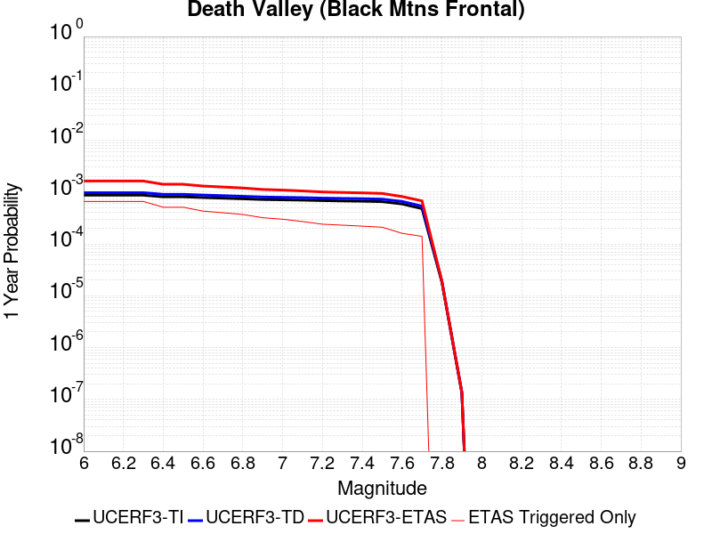 |  |

| Magnitude | 1 wk TI Prob | 1 wk TD Prob | 1 wk ETAS Prob | 1 wk ETAS/TD Gain | 1 wk ETAS Triggered Only | 1 mo TI Prob | 1 mo TD Prob | 1 mo ETAS Prob | 1 mo ETAS/TD Gain | 1 mo ETAS Triggered Only | 1 yr TI Prob | 1 yr TD Prob | 1 yr ETAS Prob | 1 yr ETAS/TD Gain | 1 yr ETAS Triggered Only | 10 yr TI Prob | 10 yr TD Prob | 10 yr ETAS Prob | 10 yr ETAS/TD Gain | 10 yr ETAS Triggered Only |
|-----|-----|-----|-----|-----|-----|-----|-----|-----|-----|-----|-----|-----|-----|-----|-----|-----|-----|-----|-----|-----|
| 6.0 | 1.6707214E-5 | 1.867027E-5 | 3.4866412E-4 | 18.674831 | 3.3E-4 | 7.160038E-5 | 8.001303E-5 | 5.29977E-4 | 6.6236343 | 4.5E-4 | 8.71386E-4 | 9.737309E-4 | 0.0016330882 | 1.6771454 | 6.6E-4 | 0.00867977 | 0.009695496 | 0.010794735 | 1.1133761 | 0.00111 |
| 6.1 | 1.6707214E-5 | 1.867027E-5 | 3.4866412E-4 | 18.674831 | 3.3E-4 | 7.160038E-5 | 8.001303E-5 | 5.29977E-4 | 6.6236343 | 4.5E-4 | 8.71386E-4 | 9.737309E-4 | 0.0016330882 | 1.6771454 | 6.6E-4 | 0.00867977 | 0.009695496 | 0.010794735 | 1.1133761 | 0.00111 |
| 6.2 | 1.6707214E-5 | 1.867027E-5 | 3.4866412E-4 | 18.674831 | 3.3E-4 | 7.160038E-5 | 8.001303E-5 | 5.29977E-4 | 6.6236343 | 4.5E-4 | 8.71386E-4 | 9.737309E-4 | 0.0016330882 | 1.6771454 | 6.6E-4 | 0.00867977 | 0.009695496 | 0.010794735 | 1.1133761 | 0.00111 |
| 6.3 | 1.6707214E-5 | 1.867027E-5 | 3.4866412E-4 | 18.674831 | 3.3E-4 | 7.160038E-5 | 8.001303E-5 | 5.29977E-4 | 6.6236343 | 4.5E-4 | 8.71386E-4 | 9.737309E-4 | 0.0016330882 | 1.6771454 | 6.6E-4 | 0.00867977 | 0.009695496 | 0.010794735 | 1.1133761 | 0.00111 |
| 6.4 | 1.5515609E-5 | 1.7338214E-5 | 2.8733353E-4 | 16.57227 | 2.7E-4 | 6.649377E-5 | 7.4304546E-5 | 4.2427855E-4 | 5.7099943 | 3.5E-4 | 8.0926094E-4 | 9.042885E-4 | 0.0014138273 | 1.5634693 | 5.1E-4 | 0.008063202 | 0.009006773 | 0.009888757 | 1.0979245 | 8.9E-4 |
| 6.5 | 1.5515609E-5 | 1.7338214E-5 | 2.8733353E-4 | 16.57227 | 2.7E-4 | 6.649377E-5 | 7.4304546E-5 | 4.2427855E-4 | 5.7099943 | 3.5E-4 | 8.0926094E-4 | 9.042885E-4 | 0.0014138273 | 1.5634693 | 5.1E-4 | 0.008063202 | 0.009006773 | 0.009888757 | 1.0979245 | 8.9E-4 |
| 6.6 | 1.5041828E-5 | 1.6809145E-5 | 2.4680528E-4 | 14.682798 | 2.3E-4 | 6.4463384E-5 | 7.203723E-5 | 3.5201706E-4 | 4.8865986 | 2.8E-4 | 7.8455906E-4 | 8.767063E-4 | 0.0013063294 | 1.4900421 | 4.3E-4 | 0.00781795 | 0.008733132 | 0.009526146 | 1.0908052 | 8.0E-4 |
| 6.7 | 1.4634985E-5 | 1.6356016E-5 | 2.1635274E-4 | 13.227716 | 2.0E-4 | 6.271985E-5 | 7.009536E-5 | 3.2007784E-4 | 4.56632 | 2.5E-4 | 7.6334673E-4 | 8.5308263E-4 | 0.0012527414 | 1.4684877 | 4.0E-4 | 0.007607299 | 0.008498715 | 0.009242342 | 1.0874987 | 7.5E-4 |
| 6.8 | 1.4209158E-5 | 1.5882048E-5 | 2.1587887E-4 | 13.592635 | 2.0E-4 | 6.089497E-5 | 6.8064175E-5 | 3.1804715E-4 | 4.6727543 | 2.5E-4 | 7.4114406E-4 | 8.2837185E-4 | 0.0011980654 | 1.4462893 | 3.7E-4 | 0.007386771 | 0.008253456 | 0.008947679 | 1.084113 | 7.0E-4 |
| 6.9 | 1.3780098E-5 | 1.5404594E-5 | 1.9540182E-4 | 12.684647 | 1.8E-4 | 5.9056227E-5 | 6.6018045E-5 | 2.8600352E-4 | 4.3322024 | 2.2E-4 | 7.1877235E-4 | 8.0347876E-4 | 0.0011232216 | 1.3979481 | 3.2E-4 | 0.0071645193 | 0.008006332 | 0.00856185 | 1.0693846 | 5.6E-4 |
| 7.0 | 1.3585064E-5 | 1.5188155E-5 | 1.8518558E-4 | 12.192762 | 1.7E-4 | 5.8220405E-5 | 6.50905E-5 | 2.7507683E-4 | 4.226067 | 2.1E-4 | 7.086029E-4 | 7.9219416E-4 | 0.0010919565 | 1.3783951 | 3.0E-4 | 0.007063476 | 0.007894293 | 0.00842011 | 1.0666071 | 5.3E-4 |
| 7.1 | 1.3398601E-5 | 1.49813395E-5 | 1.649791E-4 | 11.012306 | 1.5E-4 | 5.742131E-5 | 6.420419E-5 | 2.5419198E-4 | 3.9591184 | 1.9E-4 | 6.9888023E-4 | 7.8141113E-4 | 0.0010512002 | 1.3452587 | 2.7E-4 | 0.0069668638 | 0.007787224 | 0.00828333 | 1.0637077 | 5.0E-4 |
| 7.2 | 1.3126312E-5 | 1.4679561E-5 | 1.4467766E-4 | 9.8557205 | 1.3E-4 | 5.6254412E-5 | 6.291092E-5 | 2.3290022E-4 | 3.7020638 | 1.7E-4 | 6.846822E-4 | 7.6567667E-4 | 0.0010054929 | 1.3132082 | 2.4E-4 | 0.006825765 | 0.00763097 | 0.008077536 | 1.0585202 | 4.5E-4 |
| 7.3 | 1.2922429E-5 | 1.4453788E-5 | 1.3445206E-4 | 9.302202 | 1.2E-4 | 5.5380664E-5 | 6.194336E-5 | 2.2193346E-4 | 3.5828447 | 1.6E-4 | 6.74051E-4 | 7.53905E-4 | 9.837316E-4 | 1.3048482 | 2.3E-4 | 0.006720101 | 0.007514055 | 0.007930899 | 1.0554752 | 4.2E-4 |
| 7.4 | 1.2768878E-5 | 1.4283772E-5 | 1.242822E-4 | 8.700937 | 1.1E-4 | 5.4722615E-5 | 6.1214756E-5 | 2.1120558E-4 | 3.4502394 | 1.5E-4 | 6.660441E-4 | 7.4504025E-4 | 9.648763E-4 | 1.2950661 | 2.2E-4 | 0.0066405144 | 0.0074260035 | 0.007832959 | 1.0548013 | 4.1E-4 |
| 7.5 | 1.2521929E-5 | 1.40120155E-5 | 1.1401061E-4 | 8.136632 | 1.0E-4 | 5.366431E-5 | 6.005014E-5 | 2.0004173E-4 | 3.331245 | 1.4E-4 | 6.531671E-4 | 7.3087064E-4 | 9.407172E-4 | 1.2871186 | 2.1E-4 | 0.006512506 | 0.0072852457 | 0.007682332 | 1.0545055 | 4.0E-4 |
| 7.6 | 1.1301089E-5 | 1.2648149E-5 | 1.0264701E-4 | 8.115576 | 9.0E-5 | 4.8432343E-5 | 5.4205255E-5 | 1.641993E-4 | 3.0292134 | 1.1E-4 | 5.895042E-4 | 6.5975444E-4 | 8.196489E-4 | 1.2423545 | 1.6E-4 | 0.0058794282 | 0.00657851 | 0.0069162734 | 1.0513434 | 3.4E-4 |
| 7.7 | 9.189108E-6 | 1.0283358E-5 | 8.028264E-5 | 7.8070445 | 7.0E-5 | 3.93813E-5 | 4.407082E-5 | 1.3406685E-4 | 3.0420775 | 9.0E-5 | 4.7936183E-4 | 5.3643517E-4 | 6.763601E-4 | 1.2608421 | 1.4E-4 | 0.004783291 | 0.005351914 | 0.0056503084 | 1.0557547 | 3.0E-4 |
| 7.8 | 3.4586725E-7 | 3.6482615E-7 | 3.6482615E-7 | 1.0 | 0.0 | 1.4822873E-6 | 1.5635396E-6 | 1.5635396E-6 | 1.0 | 0.0 | 1.80467E-5 | 1.9035933E-5 | 1.9035933E-5 | 1.0 | 0.0 | 1.8045233E-4 | 1.9034347E-4 | 2.0034157E-4 | 1.0525266 | 1.0E-5 |
| 7.9 | 2.5591178E-9 | 2.6696718E-9 | 2.6696718E-9 | 1.0 | 0.0 | 1.0967647E-8 | 1.14414505E-8 | 1.14414505E-8 | 1.0 | 0.0 | 1.335311E-7 | 1.3929966E-7 | 1.3929966E-7 | 1.0 | 0.0 | 1.3353102E-6 | 1.3929966E-6 | 1.3929966E-6 | 1.0 | 0.0 |

## Coyote Lake
*[(top)](#table-of-contents)*

| 1 Week | 1 Month | 1 Year | 10 Year |
|-----|-----|-----|-----|
| 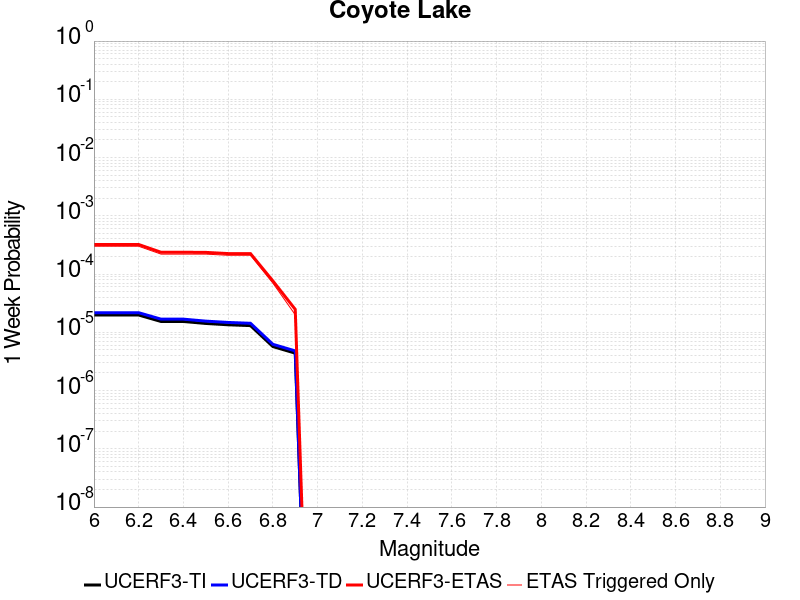 |  |  |  |

| Magnitude | 1 wk TI Prob | 1 wk TD Prob | 1 wk ETAS Prob | 1 wk ETAS/TD Gain | 1 wk ETAS Triggered Only | 1 mo TI Prob | 1 mo TD Prob | 1 mo ETAS Prob | 1 mo ETAS/TD Gain | 1 mo ETAS Triggered Only | 1 yr TI Prob | 1 yr TD Prob | 1 yr ETAS Prob | 1 yr ETAS/TD Gain | 1 yr ETAS Triggered Only | 10 yr TI Prob | 10 yr TD Prob | 10 yr ETAS Prob | 10 yr ETAS/TD Gain | 10 yr ETAS Triggered Only |
|-----|-----|-----|-----|-----|-----|-----|-----|-----|-----|-----|-----|-----|-----|-----|-----|-----|-----|-----|-----|-----|
| 6.0 | 1.980352E-5 | 2.1706745E-5 | 3.2170024E-4 | 14.820289 | 3.0E-4 | 8.486947E-5 | 9.302599E-5 | 4.7299065E-4 | 5.0845 | 3.8E-4 | 0.0010327959 | 0.0011320751 | 0.0017913278 | 1.5823402 | 6.6E-4 | 0.010280091 | 0.011270258 | 0.012229326 | 1.0850972 | 9.7E-4 |
| 6.1 | 1.980352E-5 | 2.1706745E-5 | 3.2170024E-4 | 14.820289 | 3.0E-4 | 8.486947E-5 | 9.302599E-5 | 4.7299065E-4 | 5.0845 | 3.8E-4 | 0.0010327959 | 0.0011320751 | 0.0017913278 | 1.5823402 | 6.6E-4 | 0.010280091 | 0.011270258 | 0.012229326 | 1.0850972 | 9.7E-4 |
| 6.2 | 1.980352E-5 | 2.1706745E-5 | 3.2170024E-4 | 14.820289 | 3.0E-4 | 8.486947E-5 | 9.302599E-5 | 4.7299065E-4 | 5.0845 | 3.8E-4 | 0.0010327959 | 0.0011320751 | 0.0017913278 | 1.5823402 | 6.6E-4 | 0.010280091 | 0.011270258 | 0.012229326 | 1.0850972 | 9.7E-4 |
| 6.3 | 1.5344787E-5 | 1.682067E-5 | 2.3681697E-4 | 14.078927 | 2.2E-4 | 6.576172E-5 | 7.2086936E-5 | 3.6206603E-4 | 5.02263 | 2.9E-4 | 8.003548E-4 | 8.773662E-4 | 0.0013769276 | 1.5693874 | 5.0E-4 | 0.007974784 | 0.00874507 | 0.009498423 | 1.0861461 | 7.6E-4 |
| 6.4 | 1.5344787E-5 | 1.682067E-5 | 2.3681697E-4 | 14.078927 | 2.2E-4 | 6.576172E-5 | 7.2086936E-5 | 3.6206603E-4 | 5.02263 | 2.9E-4 | 8.003548E-4 | 8.773662E-4 | 0.0013769276 | 1.5693874 | 5.0E-4 | 0.007974784 | 0.00874507 | 0.009498423 | 1.0861461 | 7.6E-4 |
| 6.5 | 1.4189697E-5 | 1.5557987E-5 | 2.3555456E-4 | 15.140427 | 2.2E-4 | 6.081157E-5 | 6.6675726E-5 | 3.5665638E-4 | 5.349119 | 2.9E-4 | 7.401293E-4 | 8.115349E-4 | 0.0013111291 | 1.6156164 | 5.0E-4 | 0.0073766913 | 0.008091656 | 0.008835588 | 1.091938 | 7.5E-4 |
| 6.6 | 1.3469301E-5 | 1.4771577E-5 | 2.2476848E-4 | 15.216281 | 2.1E-4 | 5.7724297E-5 | 6.330556E-5 | 3.4328783E-4 | 5.4227123 | 2.8E-4 | 7.025667E-4 | 7.7053264E-4 | 0.0012201859 | 1.5835615 | 4.5E-4 | 0.0070034964 | 0.0076845144 | 0.008359289 | 1.0878097 | 6.8E-4 |
| 6.7 | 1.3027966E-5 | 1.4281745E-5 | 2.2427875E-4 | 15.703876 | 2.1E-4 | 5.5832945E-5 | 6.120638E-5 | 3.4118924E-4 | 5.5744066 | 2.8E-4 | 6.7955407E-4 | 7.4499263E-4 | 0.0011846648 | 1.5901699 | 4.4E-4 | 0.006774798 | 0.0074308286 | 0.008085924 | 1.0881592 | 6.6E-4 |
| 6.8 | 5.695434E-6 | 6.2244176E-6 | 7.622398E-5 | 12.245962 | 7.0E-5 | 2.4408775E-5 | 2.6675973E-5 | 1.16673575E-4 | 4.3737326 | 9.0E-5 | 2.971363E-4 | 3.2476155E-4 | 4.6471608E-4 | 1.4309455 | 1.4E-4 | 0.0029673933 | 0.0032458105 | 0.003475064 | 1.0706306 | 2.3E-4 |
| 6.9 | 4.385688E-6 | 4.7930553E-6 | 2.479296E-5 | 5.1726837 | 2.0E-5 | 1.879567E-5 | 2.0541665E-5 | 5.054105E-5 | 2.4604163 | 3.0E-5 | 2.2881327E-4 | 2.5009477E-4 | 3.1007978E-4 | 1.2398491 | 6.0E-5 | 0.002285778 | 0.0025009478 | 0.0026405978 | 1.0558388 | 1.4E-4 |

## San Andreas (Big Bend)
*[(top)](#table-of-contents)*

| 1 Week | 1 Month | 1 Year | 10 Year |
|-----|-----|-----|-----|
|  |  | 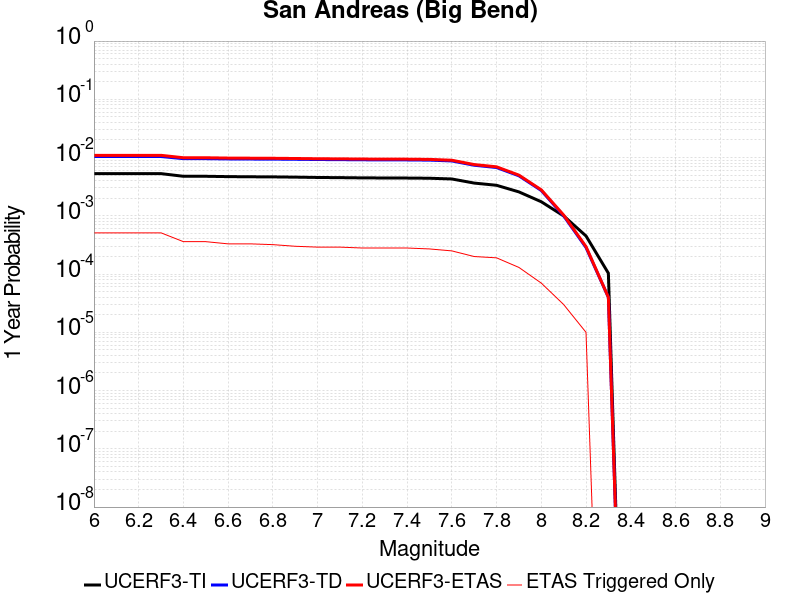 |  |

| Magnitude | 1 wk TI Prob | 1 wk TD Prob | 1 wk ETAS Prob | 1 wk ETAS/TD Gain | 1 wk ETAS Triggered Only | 1 mo TI Prob | 1 mo TD Prob | 1 mo ETAS Prob | 1 mo ETAS/TD Gain | 1 mo ETAS Triggered Only | 1 yr TI Prob | 1 yr TD Prob | 1 yr ETAS Prob | 1 yr ETAS/TD Gain | 1 yr ETAS Triggered Only | 10 yr TI Prob | 10 yr TD Prob | 10 yr ETAS Prob | 10 yr ETAS/TD Gain | 10 yr ETAS Triggered Only |
|-----|-----|-----|-----|-----|-----|-----|-----|-----|-----|-----|-----|-----|-----|-----|-----|-----|-----|-----|-----|-----|
| 6.0 | 1.0179969E-4 | 2.0073925E-4 | 4.306931E-4 | 2.145535 | 2.3E-4 | 4.362114E-4 | 8.6002843E-4 | 0.0012397016 | 1.4414659 | 3.8E-4 | 0.0052979486 | 0.010420859 | 0.010925544 | 1.0484303 | 5.1E-4 | 0.051734097 | 0.101455905 | 0.102111846 | 1.0064652 | 7.3E-4 |
| 6.1 | 1.0179969E-4 | 2.0073925E-4 | 4.306931E-4 | 2.145535 | 2.3E-4 | 4.362114E-4 | 8.6002843E-4 | 0.0012397016 | 1.4414659 | 3.8E-4 | 0.0052979486 | 0.010420859 | 0.010925544 | 1.0484303 | 5.1E-4 | 0.051734097 | 0.101455905 | 0.102111846 | 1.0064652 | 7.3E-4 |
| 6.2 | 1.0179969E-4 | 2.0073925E-4 | 4.306931E-4 | 2.145535 | 2.3E-4 | 4.362114E-4 | 8.6002843E-4 | 0.0012397016 | 1.4414659 | 3.8E-4 | 0.0052979486 | 0.010420859 | 0.010925544 | 1.0484303 | 5.1E-4 | 0.051734097 | 0.101455905 | 0.102111846 | 1.0064652 | 7.3E-4 |
| 6.3 | 1.0179969E-4 | 2.0073925E-4 | 4.306931E-4 | 2.145535 | 2.3E-4 | 4.362114E-4 | 8.6002843E-4 | 0.0012397016 | 1.4414659 | 3.8E-4 | 0.0052979486 | 0.010420859 | 0.010925544 | 1.0484303 | 5.1E-4 | 0.051734097 | 0.101455905 | 0.102111846 | 1.0064652 | 7.3E-4 |
| 6.4 | 9.1639464E-5 | 1.8430917E-4 | 3.2428338E-4 | 1.7594533 | 1.4E-4 | 3.9268145E-4 | 7.896575E-4 | 0.0010394602 | 1.316343 | 2.5E-4 | 0.0047704205 | 0.009571818 | 0.009928372 | 1.0372504 | 3.6E-4 | 0.046693064 | 0.09378695 | 0.094230995 | 1.0047346 | 4.9E-4 |
| 6.5 | 9.1639464E-5 | 1.8430917E-4 | 3.2428338E-4 | 1.7594533 | 1.4E-4 | 3.9268145E-4 | 7.896575E-4 | 0.0010394602 | 1.316343 | 2.5E-4 | 0.0047704205 | 0.009571818 | 0.009928372 | 1.0372504 | 3.6E-4 | 0.046693064 | 0.09378695 | 0.094230995 | 1.0047346 | 4.9E-4 |
| 6.6 | 9.042622E-5 | 1.8238011E-4 | 3.123564E-4 | 1.712667 | 1.3E-4 | 3.8748336E-4 | 7.813951E-4 | 0.0010112154 | 1.2941153 | 2.3E-4 | 0.0047074095 | 0.0094721 | 0.009798974 | 1.0345092 | 3.3E-4 | 0.046089325 | 0.09287721 | 0.093276344 | 1.0042975 | 4.4E-4 |
| 6.7 | 8.9836685E-5 | 1.8152347E-4 | 3.1149987E-4 | 1.7160308 | 1.3E-4 | 3.8495753E-4 | 7.7772595E-4 | 0.0010075471 | 1.295504 | 2.3E-4 | 0.00467679 | 0.009427815 | 0.009754703 | 1.0346729 | 3.3E-4 | 0.045795817 | 0.09247148 | 0.092870794 | 1.0043182 | 4.4E-4 |
| 6.8 | 8.9471854E-5 | 1.8099119E-4 | 3.0096946E-4 | 1.6628957 | 1.2E-4 | 3.8339442E-4 | 7.754462E-4 | 9.952756E-4 | 1.2834877 | 2.2E-4 | 0.004657841 | 0.009400298 | 0.009717289 | 1.0337214 | 3.2E-4 | 0.04561414 | 0.0922192 | 0.092609555 | 1.0042328 | 4.3E-4 |
| 6.9 | 8.858234E-5 | 1.7981093E-4 | 2.8979115E-4 | 1.6116437 | 1.1E-4 | 3.7958333E-4 | 7.7039085E-4 | 9.702368E-4 | 1.2594085 | 2.0E-4 | 0.004611638 | 0.009339278 | 0.009636477 | 1.0318224 | 3.0E-4 | 0.04517103 | 0.09165911 | 0.09203152 | 1.0040631 | 4.1E-4 |
| 7.0 | 8.7433385E-5 | 1.7819891E-4 | 2.8817932E-4 | 1.6171777 | 1.1E-4 | 3.746607E-4 | 7.6348626E-4 | 9.633336E-4 | 1.2617563 | 2.0E-4 | 0.004551957 | 0.009255932 | 0.0095432475 | 1.0310413 | 2.9E-4 | 0.044598386 | 0.09089323 | 0.09125687 | 1.0040008 | 4.0E-4 |
| 7.1 | 8.684964E-5 | 1.7731842E-4 | 2.872989E-4 | 1.620243 | 1.1E-4 | 3.7215967E-4 | 7.597149E-4 | 9.59563E-4 | 1.2630566 | 2.0E-4 | 0.0045216335 | 0.009210405 | 0.009497734 | 1.0311961 | 2.9E-4 | 0.04430731 | 0.09047475 | 0.09083856 | 1.0040212 | 4.0E-4 |
| 7.2 | 8.606521E-5 | 1.7622454E-4 | 2.8620515E-4 | 1.6240937 | 1.1E-4 | 3.6879873E-4 | 7.550296E-4 | 9.448861E-4 | 1.2514558 | 1.9E-4 | 0.0044808835 | 0.009153842 | 0.009431278 | 1.0303082 | 2.8E-4 | 0.043916024 | 0.08995518 | 0.0903101 | 1.0039455 | 3.9E-4 |
| 7.3 | 8.568266E-5 | 1.7564454E-4 | 2.8562522E-4 | 1.6261548 | 1.1E-4 | 3.6715972E-4 | 7.5254537E-4 | 9.424024E-4 | 1.2522864 | 1.9E-4 | 0.0044610105 | 0.00912385 | 0.009401295 | 1.0304087 | 2.8E-4 | 0.043725148 | 0.08967623 | 0.09003126 | 1.003959 | 3.9E-4 |
| 7.4 | 8.5432206E-5 | 1.752704E-4 | 2.8525112E-4 | 1.6274917 | 1.1E-4 | 3.6608664E-4 | 7.509428E-4 | 9.408001E-4 | 1.2528253 | 1.9E-4 | 0.004447999 | 0.009104501 | 0.009381953 | 1.0304741 | 2.8E-4 | 0.043600157 | 0.08949642 | 0.08985151 | 1.0039678 | 3.9E-4 |
| 7.5 | 8.4791965E-5 | 1.7396381E-4 | 2.8394468E-4 | 1.6322054 | 1.1E-4 | 3.633435E-4 | 7.4534636E-4 | 9.3520473E-4 | 1.2547251 | 1.9E-4 | 0.0044147377 | 0.009036932 | 0.009304493 | 1.0296074 | 2.7E-4 | 0.043280575 | 0.08887209 | 0.08921832 | 1.0038958 | 3.8E-4 |
| 7.6 | 8.241105E-5 | 1.6841735E-4 | 2.684005E-4 | 1.5936631 | 1.0E-4 | 3.531424E-4 | 7.2158914E-4 | 8.9146645E-4 | 1.2354212 | 1.7E-4 | 0.0042910352 | 0.008750047 | 0.008997859 | 1.0283213 | 2.5E-4 | 0.042091176 | 0.08625032 | 0.08657927 | 1.0038139 | 3.6E-4 |
| 7.7 | 7.00432E-5 | 1.4205615E-4 | 2.3204336E-4 | 1.6334623 | 9.0E-5 | 3.001506E-4 | 6.0867006E-4 | 7.5857877E-4 | 1.2462889 | 1.5E-4 | 0.0036482112 | 0.0073854174 | 0.0075839404 | 1.0268804 | 2.0E-4 | 0.035888977 | 0.07352299 | 0.07380094 | 1.0037804 | 3.0E-4 |
| 7.8 | 6.415362E-5 | 1.2969968E-4 | 2.1968801E-4 | 1.6938207 | 9.0E-5 | 2.749151E-4 | 5.557374E-4 | 6.956596E-4 | 1.2517775 | 1.4E-4 | 0.0033419547 | 0.0067451415 | 0.00693386 | 1.0279784 | 1.9E-4 | 0.03292141 | 0.06725514 | 0.06752563 | 1.0040219 | 2.9E-4 |
| 7.9 | 4.939911E-5 | 9.341721E-5 | 1.7340975E-4 | 1.8562932 | 8.0E-5 | 2.116933E-4 | 4.0029807E-4 | 5.1025406E-4 | 1.2746853 | 1.1E-4 | 0.0025743195 | 0.004862747 | 0.0049921153 | 1.0266038 | 1.3E-4 | 0.025447013 | 0.048915803 | 0.049087 | 1.0034997 | 1.8E-4 |
| 8.0 | 3.344983E-5 | 5.2228E-5 | 1.12224865E-4 | 2.148749 | 6.0E-5 | 1.4334853E-4 | 2.2381509E-4 | 2.8380167E-4 | 1.2680185 | 6.0E-5 | 0.0017438711 | 0.0027215453 | 0.002791355 | 1.0256507 | 7.0E-5 | 0.017302496 | 0.027923161 | 0.028039811 | 1.0041775 | 1.2E-4 |
| 8.1 | 1.9104898E-5 | 1.9171663E-5 | 4.9171085E-5 | 2.5647795 | 3.0E-5 | 8.1875565E-5 | 8.2161685E-5 | 1.12159214E-4 | 1.3651037 | 3.0E-5 | 9.963791E-4 | 9.9986E-4 | 0.0010298301 | 1.0299742 | 3.0E-5 | 0.009919235 | 0.010749552 | 0.01077923 | 1.0027608 | 3.0E-5 |
| 8.2 | 8.643924E-6 | 5.473668E-6 | 1.5473614E-5 | 2.8269184 | 1.0E-5 | 3.704486E-5 | 2.3458366E-5 | 3.345813E-5 | 1.4262772 | 1.0E-5 | 4.5092785E-4 | 2.8556827E-4 | 2.955654E-4 | 1.035008 | 1.0E-5 | 0.0045001395 | 0.0032481793 | 0.003258147 | 1.0030687 | 1.0E-5 |
| 8.3 | 1.983087E-6 | 7.6564595E-7 | 7.6564595E-7 | 1.0 | 0.0 | 8.498917E-6 | 3.281336E-6 | 3.281336E-6 | 1.0 | 0.0 | 1.034694E-4 | 3.9949547E-5 | 3.9949547E-5 | 1.0 | 0.0 | 0.0010342124 | 4.717979E-4 | 4.717979E-4 | 1.0 | 0.0 |

## San Andreas (Parkfield)
*[(top)](#table-of-contents)*

| 1 Week | 1 Month | 1 Year | 10 Year |
|-----|-----|-----|-----|
| 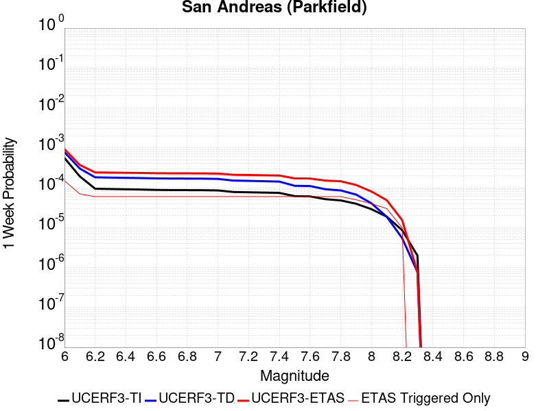 |  |  |  |

| Magnitude | 1 wk TI Prob | 1 wk TD Prob | 1 wk ETAS Prob | 1 wk ETAS/TD Gain | 1 wk ETAS Triggered Only | 1 mo TI Prob | 1 mo TD Prob | 1 mo ETAS Prob | 1 mo ETAS/TD Gain | 1 mo ETAS Triggered Only | 1 yr TI Prob | 1 yr TD Prob | 1 yr ETAS Prob | 1 yr ETAS/TD Gain | 1 yr ETAS Triggered Only | 10 yr TI Prob | 10 yr TD Prob | 10 yr ETAS Prob | 10 yr ETAS/TD Gain | 10 yr ETAS Triggered Only |
|-----|-----|-----|-----|-----|-----|-----|-----|-----|-----|-----|-----|-----|-----|-----|-----|-----|-----|-----|-----|-----|
| 6.0 | 5.556969E-4 | 7.778562E-4 | 9.2773954E-4 | 1.1926877 | 1.5E-4 | 0.0023793848 | 0.0033299583 | 0.0035591924 | 1.0688399 | 2.3E-4 | 0.028586963 | 0.040235043 | 0.040590156 | 1.008826 | 3.7E-4 | 0.25176284 | 0.3371973 | 0.3375552 | 1.0010614 | 5.4E-4 |
| 6.1 | 1.925858E-4 | 3.0278185E-4 | 3.7276064E-4 | 1.2311195 | 7.0E-5 | 8.2510663E-4 | 0.001297085 | 0.0014269163 | 1.1000948 | 1.3E-4 | 0.0099994885 | 0.01577393 | 0.015970776 | 1.0124792 | 2.0E-4 | 0.095613256 | 0.14975825 | 0.14998782 | 1.0015329 | 2.7E-4 |
| 6.2 | 9.4306815E-5 | 1.8243887E-4 | 2.4242792E-4 | 1.3288172 | 6.0E-5 | 4.0410945E-4 | 7.8164786E-4 | 9.01554E-4 | 1.1534019 | 1.2E-4 | 0.0049089384 | 0.009475246 | 0.009643636 | 1.0177715 | 1.7E-4 | 0.048019063 | 0.0918565 | 0.09207446 | 1.0023727 | 2.4E-4 |
| 6.3 | 9.283051E-5 | 1.794041E-4 | 2.3939334E-4 | 1.3343805 | 6.0E-5 | 3.9778434E-4 | 7.686494E-4 | 8.885571E-4 | 1.155998 | 1.2E-4 | 0.0048322747 | 0.009318355 | 0.00948677 | 1.0180736 | 1.7E-4 | 0.047285385 | 0.090509474 | 0.09072775 | 1.0024116 | 2.4E-4 |
| 6.4 | 9.138826E-5 | 1.7702584E-4 | 2.370152E-4 | 1.3388736 | 6.0E-5 | 3.916052E-4 | 7.5846276E-4 | 8.783717E-4 | 1.1580948 | 1.2E-4 | 0.0047573745 | 0.009195387 | 0.0093638245 | 1.0183176 | 1.7E-4 | 0.046568092 | 0.0894136 | 0.08963214 | 1.0024441 | 2.4E-4 |
| 6.5 | 9.000255E-5 | 1.746064E-4 | 2.3459591E-4 | 1.34357 | 6.0E-5 | 3.8566816E-4 | 7.4809964E-4 | 8.6800987E-4 | 1.1602864 | 1.2E-4 | 0.0046854047 | 0.009070284 | 0.009238742 | 1.0185726 | 1.7E-4 | 0.045878403 | 0.08829608 | 0.08851489 | 1.0024781 | 2.4E-4 |
| 6.6 | 8.8109264E-5 | 1.7141816E-4 | 2.3140787E-4 | 1.3499613 | 6.0E-5 | 3.7755648E-4 | 7.3444354E-4 | 8.543554E-4 | 1.163269 | 1.2E-4 | 0.0045870654 | 0.008905404 | 0.009073891 | 1.0189196 | 1.7E-4 | 0.04493529 | 0.08682707 | 0.0870371 | 1.002419 | 2.3E-4 |
| 6.7 | 8.738073E-5 | 1.7008898E-4 | 2.3007879E-4 | 1.3526965 | 6.0E-5 | 3.7443507E-4 | 7.287503E-4 | 8.4866286E-4 | 1.1645454 | 1.2E-4 | 0.0045492216 | 0.008836695 | 0.009005193 | 1.019068 | 1.7E-4 | 0.04457213 | 0.0862268 | 0.086436965 | 1.0024374 | 2.3E-4 |
| 6.8 | 8.710195E-5 | 1.6954402E-4 | 2.2953385E-4 | 1.3538305 | 6.0E-5 | 3.7324068E-4 | 7.26416E-4 | 8.4632885E-4 | 1.1650746 | 1.2E-4 | 0.0045347405 | 0.008808513 | 0.0089770155 | 1.0191295 | 1.7E-4 | 0.04443313 | 0.08597436 | 0.08618458 | 1.0024452 | 2.3E-4 |
| 6.9 | 8.6801556E-5 | 1.6895356E-4 | 2.2894342E-4 | 1.3550671 | 6.0E-5 | 3.7195362E-4 | 7.238869E-4 | 8.438E-4 | 1.1656518 | 1.2E-4 | 0.0045191357 | 0.0087779695 | 0.008946477 | 1.0191966 | 1.7E-4 | 0.044283327 | 0.08570042 | 0.08591071 | 1.0024538 | 2.3E-4 |
| 7.0 | 8.5571606E-5 | 1.664819E-4 | 2.2647191E-4 | 1.3603395 | 6.0E-5 | 3.6668387E-4 | 7.132999E-4 | 8.332143E-4 | 1.1681122 | 1.2E-4 | 0.004455241 | 0.008650103 | 0.008818632 | 1.019483 | 1.7E-4 | 0.043669727 | 0.08454836 | 0.084758915 | 1.0024903 | 2.3E-4 |
| 7.1 | 7.82589E-5 | 1.5128969E-4 | 2.112806E-4 | 1.3965302 | 6.0E-5 | 3.3535215E-4 | 6.4822397E-4 | 7.681462E-4 | 1.1850013 | 1.2E-4 | 0.0040752706 | 0.007863738 | 0.00802248 | 1.0201865 | 1.6E-4 | 0.040013418 | 0.077460445 | 0.077654175 | 1.002501 | 2.1E-4 |
| 7.2 | 7.690929E-5 | 1.4866212E-4 | 2.0865319E-4 | 1.4035398 | 6.0E-5 | 3.2956956E-4 | 6.369685E-4 | 7.568921E-4 | 1.1882724 | 1.2E-4 | 0.004005129 | 0.0077276826 | 0.007886446 | 1.0205448 | 1.6E-4 | 0.0393371 | 0.07623341 | 0.0764274 | 1.0025446 | 2.1E-4 |
| 7.3 | 7.5543794E-5 | 1.4562748E-4 | 2.0561874E-4 | 1.4119501 | 6.0E-5 | 3.2371894E-4 | 6.239692E-4 | 7.438943E-4 | 1.1921972 | 1.2E-4 | 0.003934157 | 0.0075705256 | 0.0077293147 | 1.0209746 | 1.6E-4 | 0.038652334 | 0.07479777 | 0.07499206 | 1.0025976 | 2.1E-4 |
| 7.4 | 7.4214564E-5 | 1.4263717E-4 | 2.0262861E-4 | 1.4205877 | 6.0E-5 | 3.1802364E-4 | 6.1115966E-4 | 7.3108636E-4 | 1.196228 | 1.2E-4 | 0.003865065 | 0.0074156416 | 0.007574455 | 1.0214161 | 1.6E-4 | 0.03798529 | 0.07337152 | 0.07356612 | 1.0026522 | 2.1E-4 |
| 7.5 | 6.149578E-5 | 1.1191443E-4 | 1.7190771E-4 | 1.5360639 | 6.0E-5 | 2.6352672E-4 | 4.795452E-4 | 5.994877E-4 | 1.2501171 | 1.2E-4 | 0.0032037178 | 0.005822865 | 0.0059819333 | 1.0273179 | 1.6E-4 | 0.03157923 | 0.058559462 | 0.05874775 | 1.0032153 | 2.0E-4 |
| 7.6 | 6.0643448E-5 | 1.102009E-4 | 1.7019428E-4 | 1.5444002 | 6.0E-5 | 2.598746E-4 | 4.7220418E-4 | 5.921475E-4 | 1.2540073 | 1.2E-4 | 0.0031593828 | 0.005733962 | 0.0058930446 | 1.0277439 | 1.6E-4 | 0.031148417 | 0.05772042 | 0.057908874 | 1.003265 | 2.0E-4 |
| 7.7 | 5.1652263E-5 | 9.175265E-5 | 1.5174714E-4 | 1.6538721 | 6.0E-5 | 2.2134806E-4 | 3.9316638E-4 | 5.0312316E-4 | 1.2796698 | 1.1E-4 | 0.002691582 | 0.0047763046 | 0.0049056835 | 1.0270877 | 1.3E-4 | 0.026592141 | 0.04853641 | 0.048698157 | 1.0033325 | 1.7E-4 |
| 7.8 | 4.8090482E-5 | 8.560165E-5 | 1.4559651E-4 | 1.7008611 | 6.0E-5 | 2.060858E-4 | 3.6681266E-4 | 4.7677231E-4 | 1.2997706 | 1.1E-4 | 0.0025062072 | 0.004456807 | 0.0045862277 | 1.0290389 | 1.3E-4 | 0.024781305 | 0.045302264 | 0.045464564 | 1.0035826 | 1.7E-4 |
| 7.9 | 3.970278E-5 | 6.7507375E-5 | 1.17504E-4 | 1.7406099 | 5.0E-5 | 1.7014367E-4 | 2.8928524E-4 | 3.692621E-4 | 1.2764636 | 8.0E-5 | 0.002069531 | 0.0035163634 | 0.003606047 | 1.0255046 | 9.0E-5 | 0.020503636 | 0.03588176 | 0.036007095 | 1.003493 | 1.3E-4 |
| 8.0 | 2.8982335E-5 | 4.0698153E-5 | 8.0696525E-5 | 1.9828056 | 4.0E-5 | 1.2420409E-4 | 1.7440901E-4 | 2.1440203E-4 | 1.229306 | 4.0E-5 | 0.0015111357 | 0.0021213628 | 0.002161278 | 1.0188158 | 4.0E-5 | 0.015009012 | 0.02201118 | 0.02208942 | 1.0035545 | 8.0E-5 |
| 8.1 | 1.8836186E-5 | 1.867974E-5 | 4.867918E-5 | 2.605988 | 3.0E-5 | 8.0724014E-5 | 8.005358E-5 | 1.1005117E-4 | 1.374719 | 3.0E-5 | 9.823717E-4 | 9.742171E-4 | 0.0010041879 | 1.030764 | 3.0E-5 | 0.009780403 | 0.010487711 | 0.010517396 | 1.0028305 | 3.0E-5 |
| 8.2 | 8.643924E-6 | 5.473668E-6 | 1.5473614E-5 | 2.8269184 | 1.0E-5 | 3.704486E-5 | 2.3458366E-5 | 3.345813E-5 | 1.4262772 | 1.0E-5 | 4.5092785E-4 | 2.8556827E-4 | 2.955654E-4 | 1.035008 | 1.0E-5 | 0.0045001395 | 0.0032481793 | 0.003258147 | 1.0030687 | 1.0E-5 |
| 8.3 | 1.983087E-6 | 7.6564595E-7 | 7.6564595E-7 | 1.0 | 0.0 | 8.498917E-6 | 3.281336E-6 | 3.281336E-6 | 1.0 | 0.0 | 1.034694E-4 | 3.9949547E-5 | 3.9949547E-5 | 1.0 | 0.0 | 0.0010342124 | 4.717979E-4 | 4.717979E-4 | 1.0 | 0.0 |

## Red Pass
*[(top)](#table-of-contents)*

| 1 Week | 1 Month | 1 Year | 10 Year |
|-----|-----|-----|-----|
|  |  |  |  |

| Magnitude | 1 wk TI Prob | 1 wk TD Prob | 1 wk ETAS Prob | 1 wk ETAS/TD Gain | 1 wk ETAS Triggered Only | 1 mo TI Prob | 1 mo TD Prob | 1 mo ETAS Prob | 1 mo ETAS/TD Gain | 1 mo ETAS Triggered Only | 1 yr TI Prob | 1 yr TD Prob | 1 yr ETAS Prob | 1 yr ETAS/TD Gain | 1 yr ETAS Triggered Only | 10 yr TI Prob | 10 yr TD Prob | 10 yr ETAS Prob | 10 yr ETAS/TD Gain | 10 yr ETAS Triggered Only |
|-----|-----|-----|-----|-----|-----|-----|-----|-----|-----|-----|-----|-----|-----|-----|-----|-----|-----|-----|-----|-----|
| 6.0 | 8.258278E-6 | 8.551265E-6 | 1.685499E-4 | 19.710522 | 1.6E-4 | 3.539214E-5 | 3.6647863E-5 | 2.3664054E-4 | 6.457144 | 2.0E-4 | 4.308141E-4 | 4.4611428E-4 | 7.859626E-4 | 1.7617966 | 3.4E-4 | 0.0042997985 | 0.004453945 | 0.004951718 | 1.11176 | 5.0E-4 |
| 6.1 | 3.649988E-6 | 3.7753161E-6 | 7.377505E-5 | 19.541424 | 7.0E-5 | 1.5642712E-5 | 1.6179853E-5 | 1.16178235E-4 | 7.180426 | 1.0E-4 | 1.9043336E-4 | 1.9697666E-4 | 3.5694515E-4 | 1.812119 | 1.6E-4 | 0.0019027026 | 0.001968488 | 0.0021680943 | 1.1014009 | 2.0E-4 |
| 6.2 | 3.649988E-6 | 3.7753161E-6 | 7.377505E-5 | 19.541424 | 7.0E-5 | 1.5642712E-5 | 1.6179853E-5 | 1.16178235E-4 | 7.180426 | 1.0E-4 | 1.9043336E-4 | 1.9697666E-4 | 3.5694515E-4 | 1.812119 | 1.6E-4 | 0.0019027026 | 0.001968488 | 0.0021680943 | 1.1014009 | 2.0E-4 |
| 6.3 | 1.3924937E-6 | 1.4411166E-6 | 3.144107E-5 | 21.817162 | 3.0E-5 | 5.9678164E-6 | 6.1762075E-6 | 4.617596E-5 | 7.476426 | 4.0E-5 | 7.265574E-5 | 7.519415E-5 | 1.4518888E-4 | 1.9308535 | 7.0E-5 | 7.263199E-4 | 7.518258E-4 | 8.4175816E-4 | 1.1196185 | 9.0E-5 |
| 6.4 | 1.3924937E-6 | 1.4411166E-6 | 3.144107E-5 | 21.817162 | 3.0E-5 | 5.9678164E-6 | 6.1762075E-6 | 4.617596E-5 | 7.476426 | 4.0E-5 | 7.265574E-5 | 7.519415E-5 | 1.4518888E-4 | 1.9308535 | 7.0E-5 | 7.263199E-4 | 7.518258E-4 | 8.4175816E-4 | 1.1196185 | 9.0E-5 |
| 6.5 | 9.876812E-7 | 1.0221912E-6 | 2.1022171E-5 | 20.56579 | 2.0E-5 | 4.2329125E-6 | 4.3808195E-6 | 3.438069E-5 | 7.848004 | 3.0E-5 | 5.153449E-5 | 5.3336476E-5 | 1.1333328E-4 | 2.1248736 | 6.0E-5 | 5.1522546E-4 | 5.333648E-4 | 6.133221E-4 | 1.1499112 | 8.0E-5 |

## Death Valley (No)
*[(top)](#table-of-contents)*

| 1 Week | 1 Month | 1 Year | 10 Year |
|-----|-----|-----|-----|
| 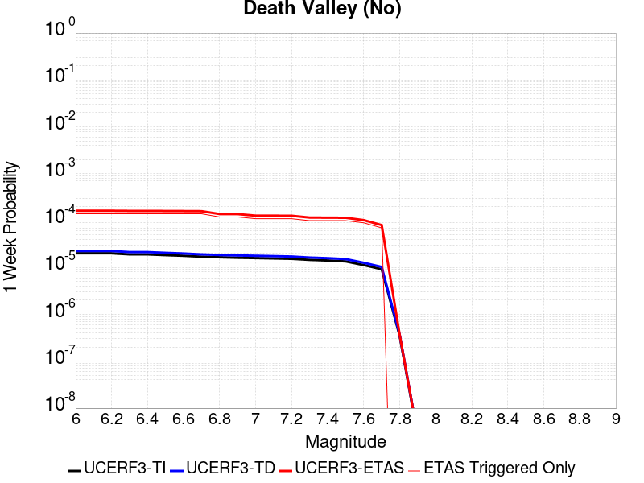 | 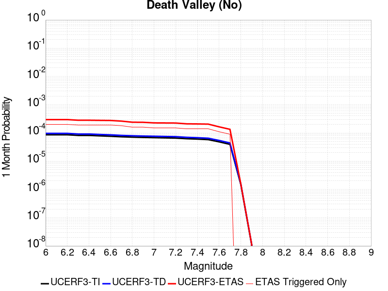 |  |  |

| Magnitude | 1 wk TI Prob | 1 wk TD Prob | 1 wk ETAS Prob | 1 wk ETAS/TD Gain | 1 wk ETAS Triggered Only | 1 mo TI Prob | 1 mo TD Prob | 1 mo ETAS Prob | 1 mo ETAS/TD Gain | 1 mo ETAS Triggered Only | 1 yr TI Prob | 1 yr TD Prob | 1 yr ETAS Prob | 1 yr ETAS/TD Gain | 1 yr ETAS Triggered Only | 10 yr TI Prob | 10 yr TD Prob | 10 yr ETAS Prob | 10 yr ETAS/TD Gain | 10 yr ETAS Triggered Only |
|-----|-----|-----|-----|-----|-----|-----|-----|-----|-----|-----|-----|-----|-----|-----|-----|-----|-----|-----|-----|-----|
| 6.0 | 2.0074807E-5 | 2.2500084E-5 | 1.6249693E-4 | 7.2220592 | 1.4E-4 | 8.603206E-5 | 9.642541E-5 | 2.9640613E-4 | 3.0739422 | 2.0E-4 | 0.001046937 | 0.0011733545 | 0.0014430376 | 1.2298394 | 2.7E-4 | 0.010420183 | 0.011672506 | 0.0121666705 | 1.0423357 | 5.0E-4 |
| 6.1 | 2.0074807E-5 | 2.2500084E-5 | 1.6249693E-4 | 7.2220592 | 1.4E-4 | 8.603206E-5 | 9.642541E-5 | 2.9640613E-4 | 3.0739422 | 2.0E-4 | 0.001046937 | 0.0011733545 | 0.0014430376 | 1.2298394 | 2.7E-4 | 0.010420183 | 0.011672506 | 0.0121666705 | 1.0423357 | 5.0E-4 |
| 6.2 | 2.0074807E-5 | 2.2500084E-5 | 1.6249693E-4 | 7.2220592 | 1.4E-4 | 8.603206E-5 | 9.642541E-5 | 2.9640613E-4 | 3.0739422 | 2.0E-4 | 0.001046937 | 0.0011733545 | 0.0014430376 | 1.2298394 | 2.7E-4 | 0.010420183 | 0.011672506 | 0.0121666705 | 1.0423357 | 5.0E-4 |
| 6.3 | 1.9050609E-5 | 2.1336948E-5 | 1.6133396E-4 | 7.5612483 | 1.4E-4 | 8.164292E-5 | 9.1440896E-5 | 2.814235E-4 | 3.077655 | 1.9E-4 | 9.935491E-4 | 0.001112731 | 0.0013724418 | 1.2333994 | 2.6E-4 | 0.009891188 | 0.011072419 | 0.011556993 | 1.0437641 | 4.9E-4 |
| 6.4 | 1.9050609E-5 | 2.1336948E-5 | 1.6133396E-4 | 7.5612483 | 1.4E-4 | 8.164292E-5 | 9.1440896E-5 | 2.814235E-4 | 3.077655 | 1.9E-4 | 9.935491E-4 | 0.001112731 | 0.0013724418 | 1.2333994 | 2.6E-4 | 0.009891188 | 0.011072419 | 0.011556993 | 1.0437641 | 4.9E-4 |
| 6.5 | 1.8367004E-5 | 2.0561009E-5 | 1.6055813E-4 | 7.8088646 | 1.4E-4 | 7.8713354E-5 | 8.811567E-5 | 2.7809892E-4 | 3.1560667 | 1.9E-4 | 9.5791375E-4 | 0.0010722869 | 0.001332008 | 1.2422124 | 2.6E-4 | 0.009537951 | 0.0106719155 | 0.011156687 | 1.0454249 | 4.9E-4 |
| 6.6 | 1.779439E-5 | 1.9910927E-5 | 1.5990814E-4 | 8.031175 | 1.4E-4 | 7.625944E-5 | 8.53298E-5 | 2.753136E-4 | 3.2264647 | 1.9E-4 | 9.280632E-4 | 0.0010384015 | 0.0012981315 | 1.2501248 | 2.6E-4 | 0.009241969 | 0.010336253 | 0.010821188 | 1.046916 | 4.9E-4 |
| 6.7 | 1.7025437E-5 | 1.9043426E-5 | 1.5904076E-4 | 8.351479 | 1.4E-4 | 7.296412E-5 | 8.161216E-5 | 2.6159748E-4 | 3.2053735 | 1.8E-4 | 8.87976E-4 | 9.931813E-4 | 0.001242933 | 1.2514664 | 2.5E-4 | 0.008844362 | 0.009888145 | 0.010353498 | 1.0470617 | 4.7E-4 |
| 6.8 | 1.6545107E-5 | 1.8512545E-5 | 1.3851032E-4 | 7.481971 | 1.2E-4 | 7.090568E-5 | 7.93371E-5 | 2.393244E-4 | 3.016551 | 1.6E-4 | 8.629347E-4 | 9.655073E-4 | 0.0011952852 | 1.2379867 | 2.3E-4 | 0.008595915 | 0.009613829 | 0.010059503 | 1.0463576 | 4.5E-4 |
| 6.9 | 1.615478E-5 | 1.8087594E-5 | 1.3808542E-4 | 7.6342616 | 1.2E-4 | 6.9232934E-5 | 7.751599E-5 | 2.3750358E-4 | 3.0639303 | 1.6E-4 | 8.4258494E-4 | 9.433546E-4 | 0.0011731377 | 1.2435807 | 2.3E-4 | 0.008393973 | 0.009394196 | 0.009839968 | 1.047452 | 4.5E-4 |
| 7.0 | 1.5894311E-5 | 1.780555E-5 | 1.2780359E-4 | 7.177739 | 1.1E-4 | 6.81167E-5 | 7.6307304E-5 | 2.2629586E-4 | 2.965586 | 1.5E-4 | 8.2900526E-4 | 9.286515E-4 | 0.0011484472 | 1.2366827 | 2.2E-4 | 0.008259195 | 0.009248397 | 0.009684328 | 1.0471358 | 4.4E-4 |
| 7.1 | 1.5602263E-5 | 1.7483504E-5 | 1.2748157E-4 | 7.2915354 | 1.1E-4 | 6.6865134E-5 | 7.492718E-5 | 2.2491594E-4 | 3.0017936 | 1.5E-4 | 8.137789E-4 | 9.118627E-4 | 0.001131662 | 1.2410444 | 2.2E-4 | 0.008108052 | 0.009081894 | 0.009517898 | 1.0480081 | 4.4E-4 |
| 7.2 | 1.5323829E-5 | 1.717063E-5 | 1.2716874E-4 | 7.406178 | 1.1E-4 | 6.56719E-5 | 7.358637E-5 | 2.2357533E-4 | 3.038271 | 1.5E-4 | 7.99262E-4 | 8.9555193E-4 | 0.001115355 | 1.2454386 | 2.2E-4 | 0.007963934 | 0.008920107 | 0.009346271 | 1.0477757 | 4.3E-4 |
| 7.3 | 1.4556212E-5 | 1.6302456E-5 | 1.1630083E-4 | 7.1339455 | 1.0E-4 | 6.238227E-5 | 6.9865826E-5 | 2.0985605E-4 | 3.003701 | 1.4E-4 | 7.592395E-4 | 8.5029035E-4 | 0.0010601118 | 1.2467644 | 2.1E-4 | 0.0075665074 | 0.008471014 | 0.008887457 | 1.0491608 | 4.2E-4 |
| 7.4 | 1.411725E-5 | 1.580796E-5 | 1.1580638E-4 | 7.325827 | 1.0E-4 | 6.0501097E-5 | 6.7746674E-5 | 2.0773719E-4 | 3.0663822 | 1.4E-4 | 7.363519E-4 | 8.245094E-4 | 0.0010343363 | 1.2544869 | 2.1E-4 | 0.0073391674 | 0.008215138 | 0.00862177 | 1.0494978 | 4.1E-4 |
| 7.5 | 1.3503312E-5 | 1.5126289E-5 | 1.1512478E-4 | 7.6109066 | 1.0E-4 | 5.7870053E-5 | 6.482538E-5 | 2.048163E-4 | 3.1595082 | 1.4E-4 | 7.043401E-4 | 7.8896893E-4 | 9.988033E-4 | 1.2659602 | 2.1E-4 | 0.007021119 | 0.007862304 | 0.0082591595 | 1.0504757 | 4.0E-4 |
| 7.6 | 1.1279839E-5 | 1.2626327E-5 | 1.0262519E-4 | 8.127873 | 9.0E-5 | 4.834127E-5 | 5.4111737E-5 | 1.6410579E-4 | 3.0327208 | 1.1E-4 | 5.88396E-4 | 6.5861654E-4 | 8.185112E-4 | 1.2427734 | 1.6E-4 | 0.005868405 | 0.006567199 | 0.0069049657 | 1.0514325 | 3.4E-4 |
| 7.7 | 9.189108E-6 | 1.0283358E-5 | 8.028264E-5 | 7.8070445 | 7.0E-5 | 3.93813E-5 | 4.407082E-5 | 1.3406685E-4 | 3.0420775 | 9.0E-5 | 4.7936183E-4 | 5.3643517E-4 | 6.763601E-4 | 1.2608421 | 1.4E-4 | 0.004783291 | 0.005351914 | 0.0056503084 | 1.0557547 | 3.0E-4 |
| 7.8 | 3.4586725E-7 | 3.6482615E-7 | 3.6482615E-7 | 1.0 | 0.0 | 1.4822873E-6 | 1.5635396E-6 | 1.5635396E-6 | 1.0 | 0.0 | 1.80467E-5 | 1.9035933E-5 | 1.9035933E-5 | 1.0 | 0.0 | 1.8045233E-4 | 1.9034347E-4 | 2.0034157E-4 | 1.0525266 | 1.0E-5 |
| 7.9 | 2.5591178E-9 | 2.6696718E-9 | 2.6696718E-9 | 1.0 | 0.0 | 1.0967647E-8 | 1.14414505E-8 | 1.14414505E-8 | 1.0 | 0.0 | 1.335311E-7 | 1.3929966E-7 | 1.3929966E-7 | 1.0 | 0.0 | 1.3353102E-6 | 1.3929966E-6 | 1.3929966E-6 | 1.0 | 0.0 |

## Cady
*[(top)](#table-of-contents)*

| 1 Week | 1 Month | 1 Year | 10 Year |
|-----|-----|-----|-----|
|  |  |  |  |

| Magnitude | 1 wk TI Prob | 1 wk TD Prob | 1 wk ETAS Prob | 1 wk ETAS/TD Gain | 1 wk ETAS Triggered Only | 1 mo TI Prob | 1 mo TD Prob | 1 mo ETAS Prob | 1 mo ETAS/TD Gain | 1 mo ETAS Triggered Only | 1 yr TI Prob | 1 yr TD Prob | 1 yr ETAS Prob | 1 yr ETAS/TD Gain | 1 yr ETAS Triggered Only | 10 yr TI Prob | 10 yr TD Prob | 10 yr ETAS Prob | 10 yr ETAS/TD Gain | 10 yr ETAS Triggered Only |
|-----|-----|-----|-----|-----|-----|-----|-----|-----|-----|-----|-----|-----|-----|-----|-----|-----|-----|-----|-----|-----|
| 6.0 | 1.9892565E-5 | 2.1858728E-5 | 1.3185633E-4 | 6.0322046 | 1.1E-4 | 8.525106E-5 | 9.3677416E-5 | 2.636615E-4 | 2.8145683 | 1.7E-4 | 0.0010374374 | 0.0011400167 | 0.0014296861 | 1.2540922 | 2.9E-4 | 0.010326075 | 0.011350701 | 0.011805479 | 1.0400661 | 4.6E-4 |
| 6.1 | 1.9892565E-5 | 2.1858728E-5 | 1.3185633E-4 | 6.0322046 | 1.1E-4 | 8.525106E-5 | 9.3677416E-5 | 2.636615E-4 | 2.8145683 | 1.7E-4 | 0.0010374374 | 0.0011400167 | 0.0014296861 | 1.2540922 | 2.9E-4 | 0.010326075 | 0.011350701 | 0.011805479 | 1.0400661 | 4.6E-4 |
| 6.2 | 1.9892565E-5 | 2.1858728E-5 | 1.3185633E-4 | 6.0322046 | 1.1E-4 | 8.525106E-5 | 9.3677416E-5 | 2.636615E-4 | 2.8145683 | 1.7E-4 | 0.0010374374 | 0.0011400167 | 0.0014296861 | 1.2540922 | 2.9E-4 | 0.010326075 | 0.011350701 | 0.011805479 | 1.0400661 | 4.6E-4 |
| 6.3 | 1.1117327E-5 | 1.2176583E-5 | 5.2176096E-5 | 4.2849536 | 4.0E-5 | 4.764482E-5 | 5.2184492E-5 | 1.2218083E-4 | 2.3413246 | 7.0E-5 | 5.7992124E-4 | 6.351925E-4 | 8.0508454E-4 | 1.2674654 | 1.7E-4 | 0.0057841022 | 0.0063368753 | 0.006615101 | 1.0439059 | 2.8E-4 |
| 6.4 | 1.1117327E-5 | 1.2176583E-5 | 5.2176096E-5 | 4.2849536 | 4.0E-5 | 4.764482E-5 | 5.2184492E-5 | 1.2218083E-4 | 2.3413246 | 7.0E-5 | 5.7992124E-4 | 6.351925E-4 | 8.0508454E-4 | 1.2674654 | 1.7E-4 | 0.0057841022 | 0.0063368753 | 0.006615101 | 1.0439059 | 2.8E-4 |
| 6.5 | 6.103093E-6 | 6.672021E-6 | 2.6671887E-5 | 3.9975727 | 2.0E-5 | 2.615585E-5 | 2.8594131E-5 | 6.8592984E-5 | 2.3988485 | 4.0E-5 | 3.1840094E-4 | 3.480905E-4 | 4.2806266E-4 | 1.2297453 | 8.0E-5 | 0.0031794512 | 0.0034766865 | 0.0036062347 | 1.037262 | 1.3E-4 |
| 6.6 | 5.817237E-6 | 6.3656585E-6 | 2.6365531E-5 | 4.1418386 | 2.0E-5 | 2.4930776E-5 | 2.728118E-5 | 6.728009E-5 | 2.4661722 | 4.0E-5 | 3.034899E-4 | 3.3211018E-4 | 4.120836E-4 | 1.240804 | 8.0E-5 | 0.0030307577 | 0.0033173605 | 0.0034369624 | 1.0360533 | 1.2E-4 |
| 6.7 | 4.8846314E-6 | 5.3405684E-6 | 2.5340461E-5 | 4.7448997 | 2.0E-5 | 2.0933967E-5 | 2.2888014E-5 | 6.28871E-5 | 2.7475996 | 4.0E-5 | 2.5484123E-4 | 2.7863772E-4 | 3.5861545E-4 | 1.2870312 | 8.0E-5 | 0.0025454918 | 0.0027840391 | 0.0028937329 | 1.0394009 | 1.1E-4 |
| 6.8 | 1.7788773E-6 | 1.9399079E-6 | 1.9399079E-6 | 1.0 | 0.0 | 7.6237375E-6 | 8.313874E-6 | 8.313874E-6 | 1.0 | 0.0 | 9.281505E-5 | 1.01218284E-4 | 1.01218284E-4 | 1.0 | 0.0 | 9.2776294E-4 | 0.0010118765 | 0.0010118765 | 1.0 | 0.0 |
| 6.9 | 7.5455404E-7 | 8.297092E-7 | 8.297092E-7 | 1.0 | 0.0 | 3.233799E-6 | 3.5558937E-6 | 3.5558937E-6 | 1.0 | 0.0 | 3.937079E-5 | 4.3292483E-5 | 4.3292483E-5 | 1.0 | 0.0 | 3.9363815E-4 | 4.3287344E-4 | 4.3287344E-4 | 1.0 | 0.0 |
| 7.0 | 6.8578805E-7 | 7.541816E-7 | 7.541816E-7 | 1.0 | 0.0 | 2.9390883E-6 | 3.2322048E-6 | 3.2322048E-6 | 1.0 | 0.0 | 3.578281E-5 | 3.9351715E-5 | 3.9351715E-5 | 1.0 | 0.0 | 3.577705E-4 | 3.9347992E-4 | 3.9347992E-4 | 1.0 | 0.0 |

## San Andreas (San Gorgonio Pass-Garnet HIll)
*[(top)](#table-of-contents)*

| 1 Week | 1 Month | 1 Year | 10 Year |
|-----|-----|-----|-----|
|  |  |  |  |

| Magnitude | 1 wk TI Prob | 1 wk TD Prob | 1 wk ETAS Prob | 1 wk ETAS/TD Gain | 1 wk ETAS Triggered Only | 1 mo TI Prob | 1 mo TD Prob | 1 mo ETAS Prob | 1 mo ETAS/TD Gain | 1 mo ETAS Triggered Only | 1 yr TI Prob | 1 yr TD Prob | 1 yr ETAS Prob | 1 yr ETAS/TD Gain | 1 yr ETAS Triggered Only | 10 yr TI Prob | 10 yr TD Prob | 10 yr ETAS Prob | 10 yr ETAS/TD Gain | 10 yr ETAS Triggered Only |
|-----|-----|-----|-----|-----|-----|-----|-----|-----|-----|-----|-----|-----|-----|-----|-----|-----|-----|-----|-----|-----|
| 6.0 | 8.31567E-5 | 2.3384395E-4 | 4.6379017E-4 | 1.9833319 | 2.3E-4 | 3.5633717E-4 | 0.0010018025 | 0.001271532 | 1.2692442 | 2.7E-4 | 0.004329778 | 0.012128622 | 0.012494135 | 1.0301363 | 3.7E-4 | 0.042463828 | 0.11258187 | 0.11299009 | 1.0036259 | 4.6E-4 |
| 6.1 | 8.31567E-5 | 2.3384395E-4 | 4.6379017E-4 | 1.9833319 | 2.3E-4 | 3.5633717E-4 | 0.0010018025 | 0.001271532 | 1.2692442 | 2.7E-4 | 0.004329778 | 0.012128622 | 0.012494135 | 1.0301363 | 3.7E-4 | 0.042463828 | 0.11258187 | 0.11299009 | 1.0036259 | 4.6E-4 |
| 6.2 | 8.31567E-5 | 2.3384395E-4 | 4.6379017E-4 | 1.9833319 | 2.3E-4 | 3.5633717E-4 | 0.0010018025 | 0.001271532 | 1.2692442 | 2.7E-4 | 0.004329778 | 0.012128622 | 0.012494135 | 1.0301363 | 3.7E-4 | 0.042463828 | 0.11258187 | 0.11299009 | 1.0036259 | 4.6E-4 |
| 6.3 | 8.31567E-5 | 2.3384395E-4 | 4.6379017E-4 | 1.9833319 | 2.3E-4 | 3.5633717E-4 | 0.0010018025 | 0.001271532 | 1.2692442 | 2.7E-4 | 0.004329778 | 0.012128622 | 0.012494135 | 1.0301363 | 3.7E-4 | 0.042463828 | 0.11258187 | 0.11299009 | 1.0036259 | 4.6E-4 |
| 6.4 | 8.059055E-5 | 2.2941893E-4 | 4.5936616E-4 | 2.002303 | 2.3E-4 | 3.4534236E-4 | 9.828559E-4 | 0.0012525906 | 1.2744396 | 2.7E-4 | 0.0041964394 | 0.011900819 | 0.012266416 | 1.0307204 | 3.7E-4 | 0.041180745 | 0.110562965 | 0.11097211 | 1.0037005 | 4.6E-4 |
| 6.5 | 8.059055E-5 | 2.2941893E-4 | 4.5936616E-4 | 2.002303 | 2.3E-4 | 3.4534236E-4 | 9.828559E-4 | 0.0012525906 | 1.2744396 | 2.7E-4 | 0.0041964394 | 0.011900819 | 0.012266416 | 1.0307204 | 3.7E-4 | 0.041180745 | 0.110562965 | 0.11097211 | 1.0037005 | 4.6E-4 |
| 6.6 | 7.619237E-5 | 2.2186468E-4 | 4.5181366E-4 | 2.036438 | 2.3E-4 | 3.2649786E-4 | 9.5050444E-4 | 0.0012202478 | 1.2837898 | 2.7E-4 | 0.0039678677 | 0.0115115335 | 0.011877274 | 1.0317717 | 3.7E-4 | 0.03897764 | 0.10709954 | 0.107510276 | 1.0038351 | 4.6E-4 |
| 6.7 | 7.440636E-5 | 2.1862281E-4 | 4.385747E-4 | 2.0060794 | 2.2E-4 | 3.188454E-4 | 9.3662075E-4 | 0.0011863866 | 1.266667 | 2.5E-4 | 0.0038750346 | 0.011344268 | 0.011690297 | 1.0305026 | 3.5E-4 | 0.038081564 | 0.1056081 | 0.10600163 | 1.0037264 | 4.4E-4 |
| 6.8 | 7.3735864E-5 | 2.1709445E-4 | 4.370467E-4 | 2.0131638 | 2.2E-4 | 3.1597257E-4 | 9.300753E-4 | 0.0011798427 | 1.2685454 | 2.5E-4 | 0.0038401815 | 0.011265406 | 0.0116114635 | 1.0307186 | 3.5E-4 | 0.03774495 | 0.104909696 | 0.10530353 | 1.0037541 | 4.4E-4 |
| 6.9 | 7.27575E-5 | 2.1478413E-4 | 4.347369E-4 | 2.0240643 | 2.2E-4 | 3.117806E-4 | 9.20181E-4 | 0.0011699509 | 1.2714357 | 2.5E-4 | 0.003789323 | 0.011146182 | 0.011492281 | 1.0310509 | 3.5E-4 | 0.037253562 | 0.10385753 | 0.10425183 | 1.0037966 | 4.4E-4 |
| 7.0 | 7.102591E-5 | 2.1062451E-4 | 4.2058027E-4 | 1.996825 | 2.1E-4 | 3.0436125E-4 | 9.023664E-4 | 0.0011421499 | 1.2657273 | 2.4E-4 | 0.003699303 | 0.010931484 | 0.011267767 | 1.0307628 | 3.4E-4 | 0.03638325 | 0.101959534 | 0.10234569 | 1.0037874 | 4.3E-4 |
| 7.1 | 7.028513E-5 | 2.0898094E-4 | 4.1893704E-4 | 2.0046663 | 2.1E-4 | 3.0118722E-4 | 8.953274E-4 | 0.0011351125 | 1.2678183 | 2.4E-4 | 0.0036607897 | 0.010846641 | 0.011182953 | 1.0310061 | 3.4E-4 | 0.036010686 | 0.10120243 | 0.10158891 | 1.0038189 | 4.3E-4 |
| 7.2 | 6.8498244E-5 | 2.050596E-4 | 4.1501655E-4 | 2.0238826 | 2.1E-4 | 2.9353087E-4 | 8.7853306E-4 | 0.0011183223 | 1.2729427 | 2.4E-4 | 0.003567883 | 0.0106441835 | 0.010980564 | 1.0316024 | 3.4E-4 | 0.035111405 | 0.09939449 | 0.09978175 | 1.0038962 | 4.3E-4 |
| 7.3 | 6.622592E-5 | 1.9733235E-4 | 4.072909E-4 | 2.0639844 | 2.1E-4 | 2.8379448E-4 | 8.4543816E-4 | 0.0010852353 | 1.2836365 | 2.4E-4 | 0.0034497243 | 0.010245111 | 0.0105816275 | 1.0328466 | 3.4E-4 | 0.033966612 | 0.095891245 | 0.096280016 | 1.0040542 | 4.3E-4 |
| 7.4 | 5.1050705E-5 | 1.4690042E-4 | 3.5686957E-4 | 2.4293299 | 2.1E-4 | 2.1877038E-4 | 6.294222E-4 | 8.6927117E-4 | 1.381062 | 2.4E-4 | 0.002660276 | 0.007636482 | 0.007973886 | 1.0441831 | 3.4E-4 | 0.02628654 | 0.07286554 | 0.073264204 | 1.0054712 | 4.3E-4 |
| 7.5 | 3.9302922E-5 | 1.11307076E-4 | 3.1128482E-4 | 2.796631 | 2.0E-4 | 1.6843023E-4 | 4.7694342E-4 | 7.068337E-4 | 1.4820075 | 2.3E-4 | 0.0020487092 | 0.0057913954 | 0.006119484 | 1.0566511 | 3.3E-4 | 0.020299247 | 0.05601151 | 0.056407984 | 1.0070784 | 4.2E-4 |
| 7.6 | 2.9851626E-5 | 8.4956984E-5 | 2.7494086E-4 | 3.2362359 | 1.9E-4 | 1.2792926E-4 | 3.6405068E-4 | 5.739742E-4 | 1.5766327 | 2.1E-4 | 0.0015564259 | 0.0044233347 | 0.0047319634 | 1.0697728 | 3.1E-4 | 0.0154556995 | 0.043196145 | 0.043578867 | 1.0088601 | 4.0E-4 |
| 7.7 | 2.1135214E-5 | 6.353527E-5 | 2.535232E-4 | 3.9902751 | 1.9E-4 | 9.0576345E-5 | 2.722656E-4 | 4.8220844E-4 | 1.7710956 | 2.1E-4 | 0.0011022091 | 0.0033098008 | 0.0036187747 | 1.0933512 | 3.1E-4 | 0.010967582 | 0.03258456 | 0.032971527 | 1.0118757 | 4.0E-4 |
| 7.8 | 1.883379E-5 | 5.564576E-5 | 2.456352E-4 | 4.414266 | 1.9E-4 | 8.0713755E-5 | 2.3846005E-4 | 4.4840996E-4 | 1.8804407 | 2.1E-4 | 9.822468E-4 | 0.002899389 | 0.0032084903 | 1.1066091 | 3.1E-4 | 0.0097791655 | 0.028696978 | 0.0290855 | 1.0135387 | 4.0E-4 |
| 7.9 | 1.5156185E-5 | 4.1662403E-5 | 2.3165449E-4 | 5.5602765 | 1.9E-4 | 6.495346E-5 | 1.7854095E-4 | 3.8850345E-4 | 2.1759908 | 2.1E-4 | 7.9052144E-4 | 0.0021715704 | 0.0024609405 | 1.1332539 | 2.9E-4 | 0.007877152 | 0.021760946 | 0.022122893 | 1.0166329 | 3.7E-4 |
| 8.0 | 1.1405907E-5 | 2.9976925E-5 | 1.7997243E-4 | 6.003699 | 1.5E-4 | 4.8881542E-5 | 1.2846621E-4 | 2.8844568E-4 | 2.2453036 | 1.6E-4 | 5.9497025E-4 | 0.0015629551 | 0.0017826112 | 1.140539 | 2.2E-4 | 0.005933798 | 0.015774013 | 0.016029911 | 1.0162228 | 2.6E-4 |
| 8.1 | 4.3511436E-6 | 7.369465E-6 | 1.7369392E-5 | 2.3569405 | 1.0E-5 | 1.8647626E-5 | 3.158304E-5 | 4.1582723E-5 | 1.3166156 | 1.0E-5 | 2.2701119E-4 | 3.844558E-4 | 3.9445196E-4 | 1.0260007 | 1.0E-5 | 0.0022677942 | 0.0041165445 | 0.004126503 | 1.0024192 | 1.0E-5 |
| 8.2 | 2.3042528E-6 | 2.7328301E-6 | 1.2732803E-5 | 4.6592 | 1.0E-5 | 9.875332E-6 | 1.1712076E-5 | 2.171196E-5 | 1.8538096 | 1.0E-5 | 1.2022553E-4 | 1.4258524E-4 | 1.5258382E-4 | 1.0701234 | 1.0E-5 | 0.0012016051 | 0.0015979637 | 0.0016079478 | 1.006248 | 1.0E-5 |
| 8.3 | 5.202968E-7 | 3.1590292E-7 | 3.1590292E-7 | 1.0 | 0.0 | 2.2298414E-6 | 1.353869E-6 | 1.353869E-6 | 1.0 | 0.0 | 2.714798E-5 | 1.6483244E-5 | 1.6483244E-5 | 1.0 | 0.0 | 2.7144665E-4 | 1.955901E-4 | 1.955901E-4 | 1.0 | 0.0 |

## Sierra Nevada  (No Extension)
*[(top)](#table-of-contents)*

| 1 Week | 1 Month | 1 Year | 10 Year |
|-----|-----|-----|-----|
| 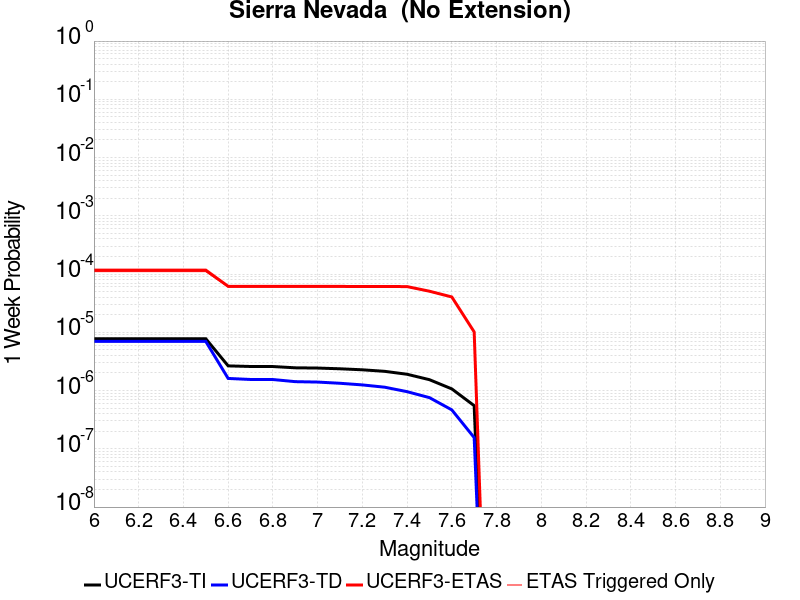 |  |  | 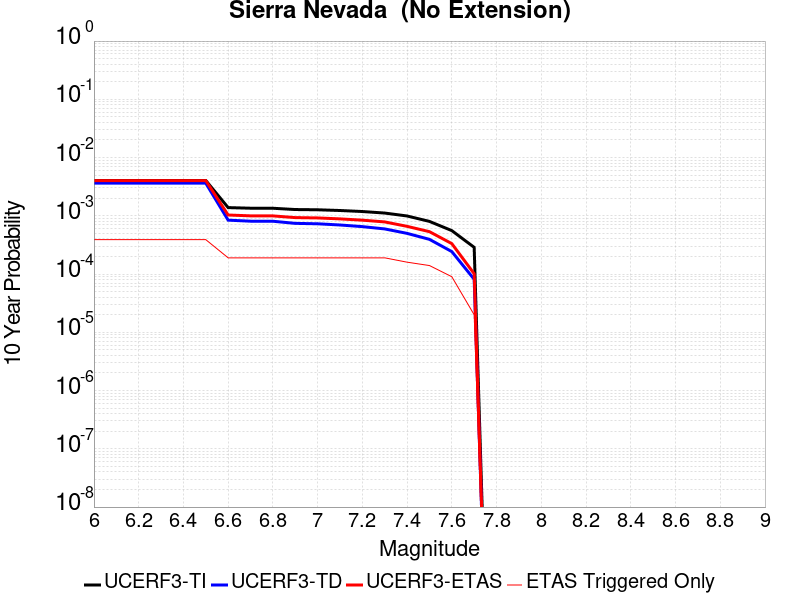 |

| Magnitude | 1 wk TI Prob | 1 wk TD Prob | 1 wk ETAS Prob | 1 wk ETAS/TD Gain | 1 wk ETAS Triggered Only | 1 mo TI Prob | 1 mo TD Prob | 1 mo ETAS Prob | 1 mo ETAS/TD Gain | 1 mo ETAS Triggered Only | 1 yr TI Prob | 1 yr TD Prob | 1 yr ETAS Prob | 1 yr ETAS/TD Gain | 1 yr ETAS Triggered Only | 10 yr TI Prob | 10 yr TD Prob | 10 yr ETAS Prob | 10 yr ETAS/TD Gain | 10 yr ETAS Triggered Only |
|-----|-----|-----|-----|-----|-----|-----|-----|-----|-----|-----|-----|-----|-----|-----|-----|-----|-----|-----|-----|-----|
| 6.0 | 7.7690465E-6 | 6.9762887E-6 | 1.1697552E-4 | 16.767586 | 1.1E-4 | 3.329549E-5 | 2.989824E-5 | 1.9989315E-4 | 6.6857834 | 1.7E-4 | 4.0529718E-4 | 3.6398612E-4 | 6.3388783E-4 | 1.7415166 | 2.7E-4 | 0.004045588 | 0.0036374154 | 0.0040259967 | 1.1068289 | 3.9E-4 |
| 6.1 | 7.7690465E-6 | 6.9762887E-6 | 1.1697552E-4 | 16.767586 | 1.1E-4 | 3.329549E-5 | 2.989824E-5 | 1.9989315E-4 | 6.6857834 | 1.7E-4 | 4.0529718E-4 | 3.6398612E-4 | 6.3388783E-4 | 1.7415166 | 2.7E-4 | 0.004045588 | 0.0036374154 | 0.0040259967 | 1.1068289 | 3.9E-4 |
| 6.2 | 7.7690465E-6 | 6.9762887E-6 | 1.1697552E-4 | 16.767586 | 1.1E-4 | 3.329549E-5 | 2.989824E-5 | 1.9989315E-4 | 6.6857834 | 1.7E-4 | 4.0529718E-4 | 3.6398612E-4 | 6.3388783E-4 | 1.7415166 | 2.7E-4 | 0.004045588 | 0.0036374154 | 0.0040259967 | 1.1068289 | 3.9E-4 |
| 6.3 | 7.7690465E-6 | 6.9762887E-6 | 1.1697552E-4 | 16.767586 | 1.1E-4 | 3.329549E-5 | 2.989824E-5 | 1.9989315E-4 | 6.6857834 | 1.7E-4 | 4.0529718E-4 | 3.6398612E-4 | 6.3388783E-4 | 1.7415166 | 2.7E-4 | 0.004045588 | 0.0036374154 | 0.0040259967 | 1.1068289 | 3.9E-4 |
| 6.4 | 7.7690465E-6 | 6.9762887E-6 | 1.1697552E-4 | 16.767586 | 1.1E-4 | 3.329549E-5 | 2.989824E-5 | 1.9989315E-4 | 6.6857834 | 1.7E-4 | 4.0529718E-4 | 3.6398612E-4 | 6.3388783E-4 | 1.7415166 | 2.7E-4 | 0.004045588 | 0.0036374154 | 0.0040259967 | 1.1068289 | 3.9E-4 |
| 6.5 | 7.7690465E-6 | 6.9762887E-6 | 1.1697552E-4 | 16.767586 | 1.1E-4 | 3.329549E-5 | 2.989824E-5 | 1.9989315E-4 | 6.6857834 | 1.7E-4 | 4.0529718E-4 | 3.6398612E-4 | 6.3388783E-4 | 1.7415166 | 2.7E-4 | 0.004045588 | 0.0036374154 | 0.0040259967 | 1.1068289 | 3.9E-4 |
| 6.6 | 2.653E-6 | 1.6148208E-6 | 6.161472E-5 | 38.155766 | 6.0E-5 | 1.136995E-5 | 6.9206426E-6 | 7.692016E-5 | 11.114597 | 7.0E-5 | 1.3842035E-4 | 8.42556E-5 | 2.242438E-4 | 2.6614707 | 1.4E-4 | 0.0013833415 | 8.4224E-4 | 0.0010320799 | 1.2253989 | 1.9E-4 |
| 6.7 | 2.5902466E-6 | 1.5501544E-6 | 6.155006E-5 | 39.70576 | 6.0E-5 | 1.11010095E-5 | 6.643502E-6 | 7.664304E-5 | 11.536542 | 7.0E-5 | 1.351464E-4 | 8.088166E-5 | 2.2087034E-4 | 2.7307837 | 1.4E-4 | 0.0013506424 | 8.0852525E-4 | 9.983716E-4 | 1.2348057 | 1.9E-4 |
| 6.8 | 2.5853892E-6 | 1.5469546E-6 | 6.154686E-5 | 39.78582 | 6.0E-5 | 1.1080193E-5 | 6.629789E-6 | 7.662932E-5 | 11.558335 | 7.0E-5 | 1.34893E-4 | 8.071472E-5 | 2.2070343E-4 | 2.734364 | 1.4E-4 | 0.0013481114 | 8.06857E-4 | 9.967037E-4 | 1.2352916 | 1.9E-4 |
| 6.9 | 2.458257E-6 | 1.422029E-6 | 6.1421946E-5 | 43.193176 | 6.0E-5 | 1.0535345E-5 | 6.0943958E-6 | 7.6093966E-5 | 12.485892 | 7.0E-5 | 1.2826028E-4 | 7.419676E-5 | 2.1418637E-4 | 2.886735 | 1.4E-4 | 0.0012818627 | 7.4172183E-4 | 9.315809E-4 | 1.2559707 | 1.9E-4 |
| 7.0 | 2.4341468E-6 | 1.3989927E-6 | 6.139891E-5 | 43.88794 | 6.0E-5 | 1.0432016E-5 | 5.9956697E-6 | 7.599525E-5 | 12.675023 | 7.0E-5 | 1.270024E-4 | 7.299485E-5 | 2.1298463E-4 | 2.9178035 | 1.4E-4 | 0.0012692984 | 7.297107E-4 | 9.19572E-4 | 1.2601871 | 1.9E-4 |
| 7.1 | 2.3652476E-6 | 1.3339427E-6 | 6.133386E-5 | 45.979385 | 6.0E-5 | 1.0136736E-5 | 5.716885E-6 | 7.571648E-5 | 13.244361 | 7.0E-5 | 1.2340778E-4 | 6.9600865E-5 | 2.0959112E-4 | 3.0113292 | 1.4E-4 | 0.0012333926 | 6.957924E-4 | 8.856602E-4 | 1.27288 | 1.9E-4 |
| 7.2 | 2.272158E-6 | 1.2502497E-6 | 6.1250175E-5 | 48.990353 | 6.0E-5 | 9.737784E-6 | 5.358202E-6 | 7.535783E-5 | 14.0640135 | 7.0E-5 | 1.1855107E-4 | 6.523417E-5 | 2.0522503E-4 | 3.1459744 | 1.4E-4 | 0.0011848784 | 6.5215176E-4 | 8.4202783E-4 | 1.2911532 | 1.9E-4 |
| 7.3 | 2.1382127E-6 | 1.1419382E-6 | 6.114187E-5 | 53.542187 | 6.0E-5 | 9.163737E-6 | 4.894012E-6 | 7.489367E-5 | 15.303123 | 7.0E-5 | 1.1156279E-4 | 5.9582977E-5 | 1.9957464E-4 | 3.3495245 | 1.4E-4 | 0.001115068 | 5.956712E-4 | 7.85558E-4 | 1.3187779 | 1.9E-4 |
| 7.4 | 1.9048055E-6 | 9.574928E-7 | 6.0957434E-5 | 63.663593 | 6.0E-5 | 8.163426E-6 | 4.103534E-6 | 7.410325E-5 | 18.058395 | 7.0E-5 | 9.9385186E-5 | 4.995939E-5 | 1.599539E-4 | 3.2016783 | 1.1E-4 | 9.934074E-4 | 4.9948227E-4 | 6.594024E-4 | 1.3201717 | 1.6E-4 |
| 7.5 | 1.5373403E-6 | 7.559763E-7 | 5.0755938E-5 | 67.13959 | 5.0E-5 | 6.5885843E-6 | 3.2398946E-6 | 6.32397E-5 | 19.519062 | 6.0E-5 | 8.021306E-5 | 3.9445007E-5 | 1.2944145E-4 | 3.2815676 | 9.0E-5 | 8.0184115E-4 | 3.9438053E-4 | 5.343253E-4 | 1.3548471 | 1.4E-4 |
| 7.6 | 1.0680322E-6 | 4.65941E-7 | 4.0465922E-5 | 86.84774 | 4.0E-5 | 4.577273E-6 | 1.9968884E-6 | 4.199681E-5 | 21.031124 | 4.0E-5 | 5.5726876E-5 | 2.4311848E-5 | 8.431039E-5 | 3.4678724 | 6.0E-5 | 5.5712904E-4 | 2.4309216E-4 | 3.330703E-4 | 1.37014 | 9.0E-5 |
| 7.7 | 5.509146E-7 | 1.5578539E-7 | 1.01557835E-5 | 65.190865 | 1.0E-5 | 2.3610605E-6 | 6.676515E-7 | 1.0667645E-5 | 15.977864 | 1.0E-5 | 2.8745531E-5 | 8.128628E-6 | 1.8128547E-5 | 2.2302098 | 1.0E-5 | 2.8741814E-4 | 8.128342E-5 | 1.01281796E-4 | 1.2460326 | 2.0E-5 |

## Calico-Hidalgo
*[(top)](#table-of-contents)*

| 1 Week | 1 Month | 1 Year | 10 Year |
|-----|-----|-----|-----|
|  |  |  |  |

| Magnitude | 1 wk TI Prob | 1 wk TD Prob | 1 wk ETAS Prob | 1 wk ETAS/TD Gain | 1 wk ETAS Triggered Only | 1 mo TI Prob | 1 mo TD Prob | 1 mo ETAS Prob | 1 mo ETAS/TD Gain | 1 mo ETAS Triggered Only | 1 yr TI Prob | 1 yr TD Prob | 1 yr ETAS Prob | 1 yr ETAS/TD Gain | 1 yr ETAS Triggered Only | 10 yr TI Prob | 10 yr TD Prob | 10 yr ETAS Prob | 10 yr ETAS/TD Gain | 10 yr ETAS Triggered Only |
|-----|-----|-----|-----|-----|-----|-----|-----|-----|-----|-----|-----|-----|-----|-----|-----|-----|-----|-----|-----|-----|
| 6.0 | 4.0906612E-5 | 5.0704355E-5 | 1.4069979E-4 | 2.7749054 | 9.0E-5 | 1.7530227E-4 | 2.1728857E-4 | 3.372625E-4 | 1.552141 | 1.2E-4 | 0.0021322158 | 0.002642678 | 0.0028820438 | 1.090577 | 2.4E-4 | 0.02111873 | 0.026152814 | 0.026532615 | 1.0145223 | 3.9E-4 |
| 6.1 | 4.0906612E-5 | 5.0704355E-5 | 1.4069979E-4 | 2.7749054 | 9.0E-5 | 1.7530227E-4 | 2.1728857E-4 | 3.372625E-4 | 1.552141 | 1.2E-4 | 0.0021322158 | 0.002642678 | 0.0028820438 | 1.090577 | 2.4E-4 | 0.02111873 | 0.026152814 | 0.026532615 | 1.0145223 | 3.9E-4 |
| 6.2 | 4.0906612E-5 | 5.0704355E-5 | 1.4069979E-4 | 2.7749054 | 9.0E-5 | 1.7530227E-4 | 2.1728857E-4 | 3.372625E-4 | 1.552141 | 1.2E-4 | 0.0021322158 | 0.002642678 | 0.0028820438 | 1.090577 | 2.4E-4 | 0.02111873 | 0.026152814 | 0.026532615 | 1.0145223 | 3.9E-4 |
| 6.3 | 2.4242801E-5 | 3.0090967E-5 | 7.0089765E-5 | 2.3292625 | 4.0E-5 | 1.0389358E-4 | 1.289551E-4 | 1.8894736E-4 | 1.4652182 | 6.0E-5 | 0.0012641704 | 0.0015689312 | 0.0017286801 | 1.1018202 | 1.6E-4 | 0.01257003 | 0.015582229 | 0.015838178 | 1.0164257 | 2.6E-4 |
| 6.4 | 2.4242801E-5 | 3.0090967E-5 | 7.0089765E-5 | 2.3292625 | 4.0E-5 | 1.0389358E-4 | 1.289551E-4 | 1.8894736E-4 | 1.4652182 | 6.0E-5 | 0.0012641704 | 0.0015689312 | 0.0017286801 | 1.1018202 | 1.6E-4 | 0.01257003 | 0.015582229 | 0.015838178 | 1.0164257 | 2.6E-4 |
| 6.5 | 2.0286952E-5 | 2.5316054E-5 | 6.531504E-5 | 2.579985 | 4.0E-5 | 8.694118E-5 | 1.0849296E-4 | 1.6848645E-4 | 1.5529712 | 6.0E-5 | 0.0010579949 | 0.0013201186 | 0.0014799073 | 1.1210413 | 1.6E-4 | 0.010529719 | 0.013124701 | 0.013341813 | 1.0165423 | 2.2E-4 |
| 6.6 | 2.0269223E-5 | 2.5297004E-5 | 6.529599E-5 | 2.5811749 | 4.0E-5 | 8.6865206E-5 | 1.08411325E-4 | 1.6840482E-4 | 1.5533878 | 6.0E-5 | 0.0010570707 | 0.0013191258 | 0.0014789148 | 1.1211325 | 1.6E-4 | 0.010520565 | 0.01311489 | 0.013332005 | 1.0165548 | 2.2E-4 |
| 6.7 | 1.799852E-5 | 2.2540933E-5 | 6.2540035E-5 | 2.7745094 | 4.0E-5 | 7.713423E-5 | 9.660051E-5 | 1.5659472E-4 | 1.6210548 | 6.0E-5 | 9.3870464E-4 | 0.0011754911 | 0.0013353031 | 1.1359533 | 1.6E-4 | 0.009347493 | 0.011694346 | 0.011911773 | 1.0185925 | 2.2E-4 |
| 6.8 | 1.7458793E-5 | 2.184258E-5 | 6.18417E-5 | 2.8312454 | 4.0E-5 | 7.4821255E-5 | 9.360778E-5 | 1.5360216E-4 | 1.6409124 | 6.0E-5 | 9.10568E-4 | 0.0011390933 | 0.001298911 | 1.1403025 | 1.6E-4 | 0.009068459 | 0.011334131 | 0.011551637 | 1.0191904 | 2.2E-4 |
| 6.9 | 1.542884E-5 | 1.9026285E-5 | 4.9025715E-5 | 2.576736 | 3.0E-5 | 6.612192E-5 | 8.153875E-5 | 1.3153467E-4 | 1.6131554 | 5.0E-5 | 8.04737E-4 | 9.922953E-4 | 0.0011421464 | 1.1510147 | 1.5E-4 | 0.008018291 | 0.009880043 | 0.010078067 | 1.0200428 | 2.0E-4 |
| 7.0 | 1.468253E-5 | 1.803109E-5 | 4.803055E-5 | 2.6637628 | 3.0E-5 | 6.292361E-5 | 7.727389E-5 | 1.2727003E-4 | 1.6469991 | 5.0E-5 | 7.658257E-4 | 9.4041653E-4 | 0.0010902755 | 1.1593537 | 1.5E-4 | 0.0076319184 | 0.009365736 | 0.009563863 | 1.0211544 | 2.0E-4 |
| 7.1 | 1.3139281E-5 | 1.620139E-5 | 4.6200905E-5 | 2.851663 | 3.0E-5 | 5.6309986E-5 | 6.943275E-5 | 1.1942928E-4 | 1.7200713 | 5.0E-5 | 6.853584E-4 | 8.4502844E-4 | 9.949016E-4 | 1.1773589 | 1.5E-4 | 0.0068324856 | 0.008419449 | 0.00860785 | 1.0223768 | 1.9E-4 |
| 7.2 | 1.1127404E-5 | 1.3867038E-5 | 3.386676E-5 | 2.442249 | 2.0E-5 | 4.7688E-5 | 5.9428872E-5 | 7.9427686E-5 | 1.3365167 | 2.0E-5 | 5.8044674E-4 | 7.233172E-4 | 8.232449E-4 | 1.1381519 | 1.0E-4 | 0.0057893298 | 0.007210737 | 0.0073398 | 1.0178987 | 1.3E-4 |
| 7.3 | 9.808154E-6 | 1.2176586E-5 | 3.2176344E-5 | 2.6424766 | 2.0E-5 | 4.2034266E-5 | 5.2184383E-5 | 7.218334E-5 | 1.3832364 | 2.0E-5 | 5.11647E-4 | 6.351704E-4 | 7.351069E-4 | 1.157338 | 1.0E-4 | 0.0051047057 | 0.006334625 | 0.006463802 | 1.0203922 | 1.3E-4 |
| 7.4 | 7.942452E-6 | 9.792348E-6 | 2.9792152E-5 | 3.042391 | 2.0E-5 | 3.4038632E-5 | 4.1966585E-5 | 6.1965744E-5 | 1.4765496 | 2.0E-5 | 4.1434157E-4 | 5.108328E-4 | 6.007869E-4 | 1.1760929 | 9.0E-5 | 0.0041356985 | 0.005097527 | 0.005206967 | 1.0214691 | 1.1E-4 |
| 7.5 | 4.7121216E-6 | 5.7729717E-6 | 1.5772914E-5 | 2.7322001 | 1.0E-5 | 2.019465E-5 | 2.4741115E-5 | 3.4740868E-5 | 1.4041755 | 1.0E-5 | 2.4584212E-4 | 3.011891E-4 | 3.6117103E-4 | 1.1991504 | 6.0E-5 | 0.0024557032 | 0.0030085614 | 0.0030783508 | 1.0231969 | 7.0E-5 |
| 7.6 | 2.21172E-7 | 2.6040198E-7 | 2.6040198E-7 | 1.0 | 0.0 | 9.478797E-7 | 1.1160082E-6 | 1.1160082E-6 | 1.0 | 0.0 | 1.1540374E-5 | 1.3587343E-5 | 2.3587207E-5 | 1.7359691 | 1.0E-5 | 1.1539775E-4 | 1.3586794E-4 | 1.4586658E-4 | 1.0735909 | 1.0E-5 |

## San Andreas (Carrizo) rev
*[(top)](#table-of-contents)*

| 1 Week | 1 Month | 1 Year | 10 Year |
|-----|-----|-----|-----|
|  |  |  |  |

| Magnitude | 1 wk TI Prob | 1 wk TD Prob | 1 wk ETAS Prob | 1 wk ETAS/TD Gain | 1 wk ETAS Triggered Only | 1 mo TI Prob | 1 mo TD Prob | 1 mo ETAS Prob | 1 mo ETAS/TD Gain | 1 mo ETAS Triggered Only | 1 yr TI Prob | 1 yr TD Prob | 1 yr ETAS Prob | 1 yr ETAS/TD Gain | 1 yr ETAS Triggered Only | 10 yr TI Prob | 10 yr TD Prob | 10 yr ETAS Prob | 10 yr ETAS/TD Gain | 10 yr ETAS Triggered Only |
|-----|-----|-----|-----|-----|-----|-----|-----|-----|-----|-----|-----|-----|-----|-----|-----|-----|-----|-----|-----|-----|
| 6.0 | 1.1674632E-4 | 2.4324407E-4 | 3.6321487E-4 | 1.4932116 | 1.2E-4 | 5.002454E-4 | 0.0010420597 | 0.0012418512 | 1.1917276 | 2.0E-4 | 0.006073493 | 0.012613757 | 0.012909973 | 1.0234835 | 3.0E-4 | 0.0591016 | 0.120640226 | 0.12100076 | 1.0029886 | 4.1E-4 |
| 6.1 | 1.1674632E-4 | 2.4324407E-4 | 3.6321487E-4 | 1.4932116 | 1.2E-4 | 5.002454E-4 | 0.0010420597 | 0.0012418512 | 1.1917276 | 2.0E-4 | 0.006073493 | 0.012613757 | 0.012909973 | 1.0234835 | 3.0E-4 | 0.0591016 | 0.120640226 | 0.12100076 | 1.0029886 | 4.1E-4 |
| 6.2 | 1.1674632E-4 | 2.4324407E-4 | 3.6321487E-4 | 1.4932116 | 1.2E-4 | 5.002454E-4 | 0.0010420597 | 0.0012418512 | 1.1917276 | 2.0E-4 | 0.006073493 | 0.012613757 | 0.012909973 | 1.0234835 | 3.0E-4 | 0.0591016 | 0.120640226 | 0.12100076 | 1.0029886 | 4.1E-4 |
| 6.3 | 1.1674632E-4 | 2.4324407E-4 | 3.6321487E-4 | 1.4932116 | 1.2E-4 | 5.002454E-4 | 0.0010420597 | 0.0012418512 | 1.1917276 | 2.0E-4 | 0.006073493 | 0.012613757 | 0.012909973 | 1.0234835 | 3.0E-4 | 0.0591016 | 0.120640226 | 0.12100076 | 1.0029886 | 4.1E-4 |
| 6.4 | 1.1674632E-4 | 2.4324407E-4 | 3.6321487E-4 | 1.4932116 | 1.2E-4 | 5.002454E-4 | 0.0010420597 | 0.0012418512 | 1.1917276 | 2.0E-4 | 0.006073493 | 0.012613757 | 0.012909973 | 1.0234835 | 3.0E-4 | 0.0591016 | 0.120640226 | 0.12100076 | 1.0029886 | 4.1E-4 |
| 6.5 | 1.13136164E-4 | 2.3644442E-4 | 3.464184E-4 | 1.4651157 | 1.1E-4 | 4.847792E-4 | 0.0010129412 | 0.0012027487 | 1.1873826 | 1.9E-4 | 0.0058862255 | 0.012263271 | 0.012549714 | 1.0233579 | 2.9E-4 | 0.057327334 | 0.11761008 | 0.11796304 | 1.0030011 | 4.0E-4 |
| 6.6 | 1.13136164E-4 | 2.3644442E-4 | 3.464184E-4 | 1.4651157 | 1.1E-4 | 4.847792E-4 | 0.0010129412 | 0.0012027487 | 1.1873826 | 1.9E-4 | 0.0058862255 | 0.012263271 | 0.012549714 | 1.0233579 | 2.9E-4 | 0.057327334 | 0.11761008 | 0.11796304 | 1.0030011 | 4.0E-4 |
| 6.7 | 1.1149675E-4 | 2.3335687E-4 | 3.433312E-4 | 1.471271 | 1.1E-4 | 4.777557E-4 | 9.997191E-4 | 0.0011895291 | 1.1898634 | 1.9E-4 | 0.0058011734 | 0.012104088 | 0.012390578 | 1.0236689 | 2.9E-4 | 0.05652051 | 0.1162291 | 0.11658261 | 1.0030415 | 4.0E-4 |
| 6.8 | 1.1103589E-4 | 2.3237852E-4 | 3.4235296E-4 | 1.4732556 | 1.1E-4 | 4.7578133E-4 | 9.955293E-4 | 0.0011853401 | 1.1906632 | 1.9E-4 | 0.005777263 | 0.012053643 | 0.012340148 | 1.0237691 | 2.9E-4 | 0.056293584 | 0.11578894 | 0.11614262 | 1.0030546 | 4.0E-4 |
| 6.9 | 1.1053259E-4 | 2.3130233E-4 | 3.412769E-4 | 1.475458 | 1.1E-4 | 4.7362508E-4 | 9.909206E-4 | 0.0011807324 | 1.1915509 | 1.9E-4 | 0.0057511497 | 0.011998152 | 0.012284673 | 1.0238804 | 2.9E-4 | 0.05604569 | 0.11530445 | 0.11565833 | 1.003069 | 4.0E-4 |
| 7.0 | 1.1005377E-4 | 2.3031076E-4 | 3.4028542E-4 | 1.4775056 | 1.1E-4 | 4.7157376E-4 | 9.866742E-4 | 0.0011764868 | 1.1923761 | 1.9E-4 | 0.0057263062 | 0.011947021 | 0.012233556 | 1.0239838 | 2.9E-4 | 0.055809796 | 0.11485658 | 0.11521064 | 1.0030826 | 4.0E-4 |
| 7.1 | 1.0308142E-4 | 2.1540876E-4 | 3.153872E-4 | 1.4641336 | 1.0E-4 | 4.417027E-4 | 9.228548E-4 | 0.001092698 | 1.184041 | 1.7E-4 | 0.0053644776 | 0.011178188 | 0.011435282 | 1.0229995 | 2.6E-4 | 0.052368138 | 0.10809042 | 0.10842043 | 1.0030531 | 3.7E-4 |
| 7.2 | 1.0027479E-4 | 2.094876E-4 | 3.0946665E-4 | 1.4772552 | 1.0E-4 | 4.296783E-4 | 8.9749607E-4 | 0.0010673435 | 1.1892458 | 1.7E-4 | 0.0052187922 | 0.010872566 | 0.01112974 | 1.0236534 | 2.6E-4 | 0.050979212 | 0.10539086 | 0.10572187 | 1.0031407 | 3.7E-4 |
| 7.3 | 9.816942E-5 | 2.0423878E-4 | 3.0421835E-4 | 1.4895229 | 1.0E-4 | 4.2065824E-4 | 8.7501644E-4 | 0.0010448677 | 1.1941121 | 1.7E-4 | 0.005109493 | 0.010601572 | 0.010858815 | 1.0242647 | 2.6E-4 | 0.049935985 | 0.10297546 | 0.10330736 | 1.0032231 | 3.7E-4 |
| 7.4 | 9.5634205E-5 | 1.9793298E-4 | 2.9791318E-4 | 1.5051215 | 1.0E-4 | 4.0979648E-4 | 8.4800937E-4 | 0.0010078737 | 1.1885172 | 1.6E-4 | 0.0049778637 | 0.010275901 | 0.010523332 | 1.0240787 | 2.5E-4 | 0.048678253 | 0.100067884 | 0.10039186 | 1.0032376 | 3.6E-4 |
| 7.5 | 8.052417E-5 | 1.6113915E-4 | 2.5112464E-4 | 1.5584334 | 9.0E-5 | 3.4505792E-4 | 6.9041376E-4 | 8.4031024E-4 | 1.217111 | 1.5E-4 | 0.0041929903 | 0.008373471 | 0.00859163 | 1.0260534 | 2.2E-4 | 0.04114753 | 0.082815245 | 0.083108746 | 1.003544 | 3.2E-4 |
| 7.6 | 7.897024E-5 | 1.5767086E-4 | 2.4765666E-4 | 1.5707194 | 9.0E-5 | 3.384E-4 | 6.755574E-4 | 8.254561E-4 | 1.2218889 | 1.5E-4 | 0.0041122385 | 0.00819397 | 0.008412167 | 1.026629 | 2.2E-4 | 0.040369697 | 0.08115866 | 0.08145269 | 1.0036229 | 3.2E-4 |
| 7.7 | 6.707427E-5 | 1.3277122E-4 | 2.2275928E-4 | 1.6777678 | 9.0E-5 | 2.8742946E-4 | 5.688955E-4 | 7.088158E-4 | 1.2459509 | 1.4E-4 | 0.003493839 | 0.0069043385 | 0.0070830956 | 1.0258906 | 1.8E-4 | 0.034394164 | 0.06905339 | 0.06930475 | 1.00364 | 2.7E-4 |
| 7.8 | 6.147705E-5 | 1.2198445E-4 | 2.1197347E-4 | 1.7377089 | 9.0E-5 | 2.6344648E-4 | 5.226858E-4 | 6.626126E-4 | 1.2677073 | 1.4E-4 | 0.0032027436 | 0.006345156 | 0.0065240143 | 1.0281881 | 1.8E-4 | 0.031569764 | 0.0635172 | 0.06377005 | 1.0039809 | 2.7E-4 |
| 7.9 | 4.7636717E-5 | 8.8802946E-5 | 1.6879584E-4 | 1.9007909 | 8.0E-5 | 2.0414138E-4 | 3.8052857E-4 | 4.904867E-4 | 1.2889616 | 1.1E-4 | 0.0024825884 | 0.004623101 | 0.0047525004 | 1.0279896 | 1.3E-4 | 0.024550365 | 0.046629366 | 0.04680097 | 1.0036802 | 1.8E-4 |
| 8.0 | 3.3554235E-5 | 5.2138024E-5 | 1.121349E-4 | 2.1507316 | 6.0E-5 | 1.4379594E-4 | 2.2342955E-4 | 2.8341616E-4 | 1.268481 | 6.0E-5 | 0.0017493097 | 0.002716863 | 0.002786673 | 1.025695 | 7.0E-5 | 0.017356034 | 0.027881905 | 0.02799856 | 1.0041839 | 1.2E-4 |
| 8.1 | 1.9175432E-5 | 1.9183564E-5 | 4.918299E-5 | 2.5638087 | 3.0E-5 | 8.217783E-5 | 8.221269E-5 | 1.1221022E-4 | 1.3648772 | 3.0E-5 | 0.0010000558 | 0.0010004805 | 0.0010304505 | 1.0299556 | 3.0E-5 | 0.009955673 | 0.010757771 | 0.010787448 | 1.0027586 | 3.0E-5 |
| 8.2 | 8.643924E-6 | 5.473668E-6 | 1.5473614E-5 | 2.8269184 | 1.0E-5 | 3.704486E-5 | 2.3458366E-5 | 3.345813E-5 | 1.4262772 | 1.0E-5 | 4.5092785E-4 | 2.8556827E-4 | 2.955654E-4 | 1.035008 | 1.0E-5 | 0.0045001395 | 0.0032481793 | 0.003258147 | 1.0030687 | 1.0E-5 |
| 8.3 | 1.983087E-6 | 7.6564595E-7 | 7.6564595E-7 | 1.0 | 0.0 | 8.498917E-6 | 3.281336E-6 | 3.281336E-6 | 1.0 | 0.0 | 1.034694E-4 | 3.9949547E-5 | 3.9949547E-5 | 1.0 | 0.0 | 0.0010342124 | 4.717979E-4 | 4.717979E-4 | 1.0 | 0.0 |

## Ludlow
*[(top)](#table-of-contents)*

| 1 Week | 1 Month | 1 Year | 10 Year |
|-----|-----|-----|-----|
|  |  | 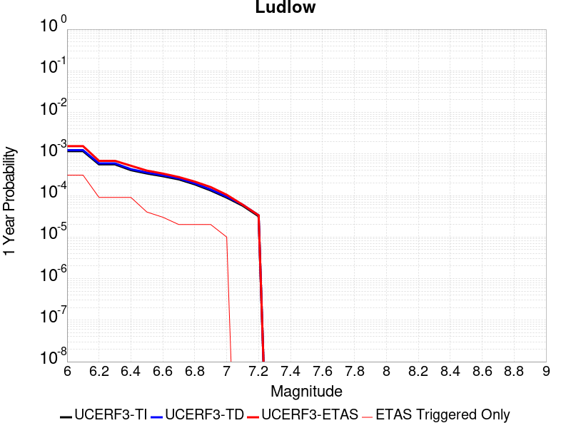 |  |

| Magnitude | 1 wk TI Prob | 1 wk TD Prob | 1 wk ETAS Prob | 1 wk ETAS/TD Gain | 1 wk ETAS Triggered Only | 1 mo TI Prob | 1 mo TD Prob | 1 mo ETAS Prob | 1 mo ETAS/TD Gain | 1 mo ETAS Triggered Only | 1 yr TI Prob | 1 yr TD Prob | 1 yr ETAS Prob | 1 yr ETAS/TD Gain | 1 yr ETAS Triggered Only | 10 yr TI Prob | 10 yr TD Prob | 10 yr ETAS Prob | 10 yr ETAS/TD Gain | 10 yr ETAS Triggered Only |
|-----|-----|-----|-----|-----|-----|-----|-----|-----|-----|-----|-----|-----|-----|-----|-----|-----|-----|-----|-----|-----|
| 6.0 | 2.2407607E-5 | 2.3657254E-5 | 1.5365418E-4 | 6.495013 | 1.3E-4 | 9.602906E-5 | 1.0138454E-4 | 2.813663E-4 | 2.7752388 | 1.8E-4 | 0.0011685267 | 0.001233702 | 0.0015433194 | 1.2509663 | 3.1E-4 | 0.011624013 | 0.012273042 | 0.01267801 | 1.0329965 | 4.1E-4 |
| 6.1 | 2.2407607E-5 | 2.3657254E-5 | 1.5365418E-4 | 6.495013 | 1.3E-4 | 9.602906E-5 | 1.0138454E-4 | 2.813663E-4 | 2.7752388 | 1.8E-4 | 0.0011685267 | 0.001233702 | 0.0015433194 | 1.2509663 | 3.1E-4 | 0.011624013 | 0.012273042 | 0.01267801 | 1.0329965 | 4.1E-4 |
| 6.2 | 1.0781252E-5 | 1.1365663E-5 | 5.136521E-5 | 4.519332 | 4.0E-5 | 4.620455E-5 | 4.8709102E-5 | 8.870715E-5 | 1.8211617 | 4.0E-5 | 5.623952E-4 | 5.9287593E-4 | 6.828226E-4 | 1.1517124 | 9.0E-5 | 0.00560974 | 0.0059133614 | 0.0060425927 | 1.0218542 | 1.3E-4 |
| 6.3 | 1.0781252E-5 | 1.1365663E-5 | 5.136521E-5 | 4.519332 | 4.0E-5 | 4.620455E-5 | 4.8709102E-5 | 8.870715E-5 | 1.8211617 | 4.0E-5 | 5.623952E-4 | 5.9287593E-4 | 6.828226E-4 | 1.1517124 | 9.0E-5 | 0.00560974 | 0.0059133614 | 0.0060425927 | 1.0218542 | 1.3E-4 |
| 6.4 | 7.814439E-6 | 8.237729E-6 | 4.8237398E-5 | 5.855667 | 4.0E-5 | 3.3490025E-5 | 3.530408E-5 | 7.530267E-5 | 2.1329734 | 4.0E-5 | 4.0766477E-4 | 4.2974384E-4 | 5.197052E-4 | 1.2093371 | 9.0E-5 | 0.0040691774 | 0.0042892746 | 0.00440876 | 1.0278567 | 1.2E-4 |
| 6.5 | 6.4986366E-6 | 6.85092E-6 | 3.6850714E-5 | 5.3789444 | 3.0E-5 | 2.7851002E-5 | 2.9360759E-5 | 5.9359878E-5 | 2.0217419 | 3.0E-5 | 3.390332E-4 | 3.5740953E-4 | 3.9739523E-4 | 1.1118765 | 4.0E-5 | 0.003385164 | 0.0035684432 | 0.0036381935 | 1.0195464 | 7.0E-5 |
| 6.6 | 5.582177E-6 | 5.8860055E-6 | 2.5885887E-5 | 4.39787 | 2.0E-5 | 2.3923398E-5 | 2.5225498E-5 | 4.5224995E-5 | 1.7928286 | 2.0E-5 | 2.9122844E-4 | 3.0707786E-4 | 3.3706866E-4 | 1.0976651 | 3.0E-5 | 0.0029084706 | 0.003066609 | 0.0031164556 | 1.0162547 | 5.0E-5 |
| 6.7 | 4.6858763E-6 | 4.940427E-6 | 2.494033E-5 | 5.048213 | 2.0E-5 | 2.0082172E-5 | 2.1173091E-5 | 4.117267E-5 | 1.9445752 | 2.0E-5 | 2.4447302E-4 | 2.5775246E-4 | 2.7774728E-4 | 1.0775738 | 2.0E-5 | 0.0024420423 | 0.0025745912 | 0.0026045141 | 1.0116223 | 3.0E-5 |
| 6.8 | 3.5584908E-6 | 3.7520183E-6 | 2.3751943E-5 | 6.3304443 | 2.0E-5 | 1.5250586E-5 | 1.6079981E-5 | 3.607966E-5 | 2.2437625 | 2.0E-5 | 1.8566006E-4 | 1.957566E-4 | 2.1575269E-4 | 1.1021477 | 2.0E-5 | 0.0018550502 | 0.0019558826 | 0.001985824 | 1.0153084 | 3.0E-5 |
| 6.9 | 2.532834E-6 | 2.6710034E-6 | 2.267095E-5 | 8.4878025 | 2.0E-5 | 1.0854958E-5 | 1.1447109E-5 | 3.144688E-5 | 2.7471461 | 2.0E-5 | 1.3215111E-4 | 1.3935992E-4 | 1.5935714E-4 | 1.1434933 | 2.0E-5 | 0.0013207254 | 0.0013927529 | 0.0014227111 | 1.0215101 | 3.0E-5 |
| 7.0 | 1.7083285E-6 | 1.8019439E-6 | 1.1801926E-5 | 6.5495524 | 1.0E-5 | 7.3213873E-6 | 7.722595E-6 | 1.7722517E-5 | 2.2948916 | 1.0E-5 | 8.913424E-5 | 9.40187E-5 | 1.0401776E-4 | 1.1063519 | 1.0E-5 | 8.9098496E-4 | 9.3980576E-4 | 9.5978694E-4 | 1.021261 | 2.0E-5 |
| 7.1 | 1.0905424E-6 | 1.1497619E-6 | 1.1497619E-6 | 1.0 | 0.0 | 4.6737446E-6 | 4.9275427E-6 | 4.9275427E-6 | 1.0 | 0.0 | 5.6901354E-5 | 5.999128E-5 | 5.999128E-5 | 1.0 | 0.0 | 5.6886784E-4 | 5.997606E-4 | 6.0975464E-4 | 1.0166633 | 1.0E-5 |
| 7.2 | 6.06668E-7 | 6.387277E-7 | 6.387277E-7 | 1.0 | 0.0 | 2.600003E-6 | 2.7374022E-6 | 2.7374022E-6 | 1.0 | 0.0 | 3.1654577E-5 | 3.3327433E-5 | 3.3327433E-5 | 1.0 | 0.0 | 3.1650066E-4 | 3.3323118E-4 | 3.3323118E-4 | 1.0 | 0.0 |

## San Andreas (Cholame) rev
*[(top)](#table-of-contents)*

| 1 Week | 1 Month | 1 Year | 10 Year |
|-----|-----|-----|-----|
|  |  |  |  |

| Magnitude | 1 wk TI Prob | 1 wk TD Prob | 1 wk ETAS Prob | 1 wk ETAS/TD Gain | 1 wk ETAS Triggered Only | 1 mo TI Prob | 1 mo TD Prob | 1 mo ETAS Prob | 1 mo ETAS/TD Gain | 1 mo ETAS Triggered Only | 1 yr TI Prob | 1 yr TD Prob | 1 yr ETAS Prob | 1 yr ETAS/TD Gain | 1 yr ETAS Triggered Only | 10 yr TI Prob | 10 yr TD Prob | 10 yr ETAS Prob | 10 yr ETAS/TD Gain | 10 yr ETAS Triggered Only |
|-----|-----|-----|-----|-----|-----|-----|-----|-----|-----|-----|-----|-----|-----|-----|-----|-----|-----|-----|-----|-----|
| 6.0 | 1.2302514E-4 | 2.5205986E-4 | 3.6203212E-4 | 1.4362943 | 1.1E-4 | 5.27144E-4 | 0.0010798109 | 0.0012596166 | 1.1665158 | 1.8E-4 | 0.0063991086 | 0.013067958 | 0.013344299 | 1.0211464 | 2.8E-4 | 0.06217949 | 0.12438412 | 0.124734364 | 1.0028158 | 4.0E-4 |
| 6.1 | 1.2302514E-4 | 2.5205986E-4 | 3.6203212E-4 | 1.4362943 | 1.1E-4 | 5.27144E-4 | 0.0010798109 | 0.0012596166 | 1.1665158 | 1.8E-4 | 0.0063991086 | 0.013067958 | 0.013344299 | 1.0211464 | 2.8E-4 | 0.06217949 | 0.12438412 | 0.124734364 | 1.0028158 | 4.0E-4 |
| 6.2 | 1.2203569E-4 | 2.502277E-4 | 3.6020018E-4 | 1.4394896 | 1.1E-4 | 5.2290526E-4 | 0.0010719653 | 0.0012517723 | 1.1677359 | 1.8E-4 | 0.006347804 | 0.012973578 | 0.013240076 | 1.0205415 | 2.7E-4 | 0.061695136 | 0.123571314 | 0.12391312 | 1.002766 | 3.9E-4 |
| 6.3 | 1.2142645E-4 | 2.4908737E-4 | 3.5905998E-4 | 1.4415021 | 1.1E-4 | 5.202953E-4 | 0.0010670823 | 0.0012468902 | 1.1685042 | 1.8E-4 | 0.006316212 | 0.012914834 | 0.0131813465 | 1.0206362 | 2.7E-4 | 0.06139677 | 0.12306532 | 0.12340733 | 1.002779 | 3.9E-4 |
| 6.4 | 1.1865206E-4 | 2.4414246E-4 | 3.541156E-4 | 1.4504466 | 1.1E-4 | 5.0840975E-4 | 0.0010459068 | 0.0012257185 | 1.1719195 | 1.8E-4 | 0.006172335 | 0.012660044 | 0.012926626 | 1.0210569 | 2.7E-4 | 0.060036868 | 0.12085904 | 0.12120191 | 1.002837 | 3.9E-4 |
| 6.5 | 1.17443946E-4 | 2.4207575E-4 | 3.5204913E-4 | 1.4542933 | 1.1E-4 | 5.032341E-4 | 0.0010370566 | 0.0012168699 | 1.1733881 | 1.8E-4 | 0.006109677 | 0.012553536 | 0.012820146 | 1.0212379 | 2.7E-4 | 0.059444077 | 0.11993008 | 0.12027331 | 1.0028619 | 3.9E-4 |
| 6.6 | 1.13579066E-4 | 2.3516564E-4 | 3.4513976E-4 | 1.4676454 | 1.1E-4 | 4.866766E-4 | 0.001007465 | 0.0011872837 | 1.1784862 | 1.8E-4 | 0.0059092017 | 0.012197345 | 0.012464051 | 1.021866 | 2.7E-4 | 0.057545185 | 0.1168492 | 0.117184795 | 1.0028721 | 3.8E-4 |
| 6.7 | 1.1271412E-4 | 2.336088E-4 | 3.4358312E-4 | 1.4707627 | 1.1E-4 | 4.829711E-4 | 0.001000798 | 0.0011806178 | 1.1796765 | 1.8E-4 | 0.005864331 | 0.012117079 | 0.012383807 | 1.0220126 | 2.7E-4 | 0.057119697 | 0.11615275 | 0.11648861 | 1.0028915 | 3.8E-4 |
| 6.8 | 1.1217975E-4 | 2.3249313E-4 | 3.4246754E-4 | 1.4730222 | 1.1E-4 | 4.8068175E-4 | 9.960202E-4 | 0.0011758409 | 1.1805393 | 1.8E-4 | 0.005836608 | 0.012059555 | 0.012326299 | 1.0221189 | 2.7E-4 | 0.056856725 | 0.11565061 | 0.11598666 | 1.0029057 | 3.8E-4 |
| 6.9 | 1.1146753E-4 | 2.3098059E-4 | 3.409552E-4 | 1.4761205 | 1.1E-4 | 4.7763053E-4 | 9.895428E-4 | 0.0011693647 | 1.1817222 | 1.8E-4 | 0.0057996577 | 0.011981564 | 0.012248329 | 1.0222646 | 2.7E-4 | 0.056506127 | 0.11497027 | 0.11530658 | 1.0029252 | 3.8E-4 |
| 7.0 | 1.0965793E-4 | 2.2721413E-4 | 3.3718912E-4 | 1.4840149 | 1.1E-4 | 4.698779E-4 | 9.734129E-4 | 0.0011532377 | 1.1847364 | 1.8E-4 | 0.005705768 | 0.011787324 | 0.012054142 | 1.0226359 | 2.7E-4 | 0.055614736 | 0.11327011 | 0.11360707 | 1.0029749 | 3.8E-4 |
| 7.1 | 9.927982E-5 | 2.0540332E-4 | 3.0538277E-4 | 1.486747 | 1.0E-4 | 4.2541555E-4 | 8.8000396E-4 | 0.0010498544 | 1.1930109 | 1.7E-4 | 0.0051671406 | 0.010661708 | 0.010909043 | 1.0231984 | 2.5E-4 | 0.05048634 | 0.10336573 | 0.103688516 | 1.0031228 | 3.6E-4 |
| 7.2 | 9.696786E-5 | 2.0044584E-4 | 3.004258E-4 | 1.4987879 | 1.0E-4 | 4.1551032E-4 | 8.587718E-4 | 0.0010286258 | 1.1977872 | 1.7E-4 | 0.00504711 | 0.010405703 | 0.010653102 | 1.0237753 | 2.5E-4 | 0.04934009 | 0.10110233 | 0.10142594 | 1.0032008 | 3.6E-4 |
| 7.3 | 9.4727984E-5 | 1.9473763E-4 | 2.9471816E-4 | 1.5134114 | 1.0E-4 | 4.0591392E-4 | 8.343239E-4 | 0.001004182 | 1.2035878 | 1.7E-4 | 0.0049308087 | 0.010110851 | 0.010358323 | 1.0244759 | 2.5E-4 | 0.048228268 | 0.09847412 | 0.09879867 | 1.0032958 | 3.6E-4 |
| 7.4 | 9.220358E-5 | 1.8844259E-4 | 2.8842373E-4 | 1.5305656 | 1.0E-4 | 3.9509835E-4 | 8.07362E-4 | 9.6723286E-4 | 1.1980163 | 1.6E-4 | 0.004799717 | 0.009785578 | 0.010023229 | 1.0242859 | 2.4E-4 | 0.046973653 | 0.09555831 | 0.09587486 | 1.0033127 | 3.5E-4 |
| 7.5 | 7.71631E-5 | 1.5179155E-4 | 2.4177789E-4 | 1.5928284 | 9.0E-5 | 3.306571E-4 | 6.5037323E-4 | 8.0027565E-4 | 1.2304868 | 1.5E-4 | 0.0040183207 | 0.007889617 | 0.008107881 | 1.0276648 | 2.2E-4 | 0.03946433 | 0.078289196 | 0.07858414 | 1.0037674 | 3.2E-4 |
| 7.6 | 7.5634416E-5 | 1.4838556E-4 | 2.383722E-4 | 1.606438 | 9.0E-5 | 3.241072E-4 | 6.357833E-4 | 7.8568794E-4 | 1.2357794 | 1.5E-4 | 0.0039388672 | 0.007713256 | 0.007931558 | 1.0283023 | 2.2E-4 | 0.038697794 | 0.076654874 | 0.07695035 | 1.0038545 | 3.2E-4 |
| 7.7 | 6.3783E-5 | 1.2359623E-4 | 2.1358511E-4 | 1.7280875 | 9.0E-5 | 2.7332708E-4 | 5.2959064E-4 | 6.695165E-4 | 1.2642151 | 1.4E-4 | 0.0033226798 | 0.0064287307 | 0.0066075735 | 1.0278193 | 1.8E-4 | 0.032734364 | 0.06454488 | 0.06479745 | 1.0039132 | 2.7E-4 |
| 7.8 | 5.863422E-5 | 1.14169685E-4 | 2.0415941E-4 | 1.7882103 | 9.0E-5 | 2.512653E-4 | 4.892069E-4 | 6.2913843E-4 | 1.2860374 | 1.4E-4 | 0.003054864 | 0.0059398497 | 0.0061187805 | 1.0301238 | 1.8E-4 | 0.030132094 | 0.05966162 | 0.059915513 | 1.0042555 | 2.7E-4 |
| 7.9 | 4.595283E-5 | 8.426815E-5 | 1.6426141E-4 | 1.9492704 | 8.0E-5 | 1.9692584E-4 | 3.6109926E-4 | 4.7105952E-4 | 1.3045154 | 1.1E-4 | 0.0023949358 | 0.0043875277 | 0.0045169573 | 1.0294994 | 1.3E-4 | 0.023692891 | 0.044363137 | 0.044535153 | 1.0038774 | 1.8E-4 |
| 8.0 | 3.2950178E-5 | 5.077396E-5 | 1.1077092E-4 | 2.181648 | 6.0E-5 | 1.412074E-4 | 2.1758456E-4 | 2.775715E-4 | 1.2756948 | 6.0E-5 | 0.0017178444 | 0.0026458753 | 0.0027156903 | 1.0263863 | 7.0E-5 | 0.017046256 | 0.027181072 | 0.027297812 | 1.0042949 | 1.2E-4 |
| 8.1 | 1.9177472E-5 | 1.9183733E-5 | 4.918316E-5 | 2.5637949 | 3.0E-5 | 8.218658E-5 | 8.221342E-5 | 1.12210946E-4 | 1.364874 | 3.0E-5 | 0.0010001622 | 0.0010004893 | 0.0010304593 | 1.0299553 | 3.0E-5 | 0.009956728 | 0.010757887 | 0.010787563 | 1.0027586 | 3.0E-5 |
| 8.2 | 8.643924E-6 | 5.473668E-6 | 1.5473614E-5 | 2.8269184 | 1.0E-5 | 3.704486E-5 | 2.3458366E-5 | 3.345813E-5 | 1.4262772 | 1.0E-5 | 4.5092785E-4 | 2.8556827E-4 | 2.955654E-4 | 1.035008 | 1.0E-5 | 0.0045001395 | 0.0032481793 | 0.003258147 | 1.0030687 | 1.0E-5 |
| 8.3 | 1.983087E-6 | 7.6564595E-7 | 7.6564595E-7 | 1.0 | 0.0 | 8.498917E-6 | 3.281336E-6 | 3.281336E-6 | 1.0 | 0.0 | 1.034694E-4 | 3.9949547E-5 | 3.9949547E-5 | 1.0 | 0.0 | 0.0010342124 | 4.717979E-4 | 4.717979E-4 | 1.0 | 0.0 |

## Elsinore (Glen Ivy) rev
*[(top)](#table-of-contents)*

| 1 Week | 1 Month | 1 Year | 10 Year |
|-----|-----|-----|-----|
|  |  |  |  |

| Magnitude | 1 wk TI Prob | 1 wk TD Prob | 1 wk ETAS Prob | 1 wk ETAS/TD Gain | 1 wk ETAS Triggered Only | 1 mo TI Prob | 1 mo TD Prob | 1 mo ETAS Prob | 1 mo ETAS/TD Gain | 1 mo ETAS Triggered Only | 1 yr TI Prob | 1 yr TD Prob | 1 yr ETAS Prob | 1 yr ETAS/TD Gain | 1 yr ETAS Triggered Only | 10 yr TI Prob | 10 yr TD Prob | 10 yr ETAS Prob | 10 yr ETAS/TD Gain | 10 yr ETAS Triggered Only |
|-----|-----|-----|-----|-----|-----|-----|-----|-----|-----|-----|-----|-----|-----|-----|-----|-----|-----|-----|-----|-----|
| 6.0 | 1.6204086E-4 | 2.937271E-4 | 3.9369773E-4 | 1.340352 | 1.0E-4 | 6.94276E-4 | 0.0012583778 | 0.0014581261 | 1.1587348 | 2.0E-4 | 0.008420097 | 0.0152346175 | 0.015490657 | 1.0168064 | 2.6E-4 | 0.081081145 | 0.13962454 | 0.13991706 | 1.0020951 | 3.4E-4 |
| 6.1 | 1.6204086E-4 | 2.937271E-4 | 3.9369773E-4 | 1.340352 | 1.0E-4 | 6.94276E-4 | 0.0012583778 | 0.0014581261 | 1.1587348 | 2.0E-4 | 0.008420097 | 0.0152346175 | 0.015490657 | 1.0168064 | 2.6E-4 | 0.081081145 | 0.13962454 | 0.13991706 | 1.0020951 | 3.4E-4 |
| 6.2 | 1.6204086E-4 | 2.937271E-4 | 3.9369773E-4 | 1.340352 | 1.0E-4 | 6.94276E-4 | 0.0012583778 | 0.0014581261 | 1.1587348 | 2.0E-4 | 0.008420097 | 0.0152346175 | 0.015490657 | 1.0168064 | 2.6E-4 | 0.081081145 | 0.13962454 | 0.13991706 | 1.0020951 | 3.4E-4 |
| 6.3 | 1.0111737E-4 | 1.7703463E-4 | 2.37024E-4 | 1.3388568 | 6.0E-5 | 4.332882E-4 | 7.5861585E-4 | 8.9850964E-4 | 1.1844066 | 1.4E-4 | 0.005262531 | 0.0092177205 | 0.00940597 | 1.0204225 | 1.9E-4 | 0.0513964 | 0.08707393 | 0.0872839 | 1.0024115 | 2.3E-4 |
| 6.4 | 1.0111737E-4 | 1.7703463E-4 | 2.37024E-4 | 1.3388568 | 6.0E-5 | 4.332882E-4 | 7.5861585E-4 | 8.9850964E-4 | 1.1844066 | 1.4E-4 | 0.005262531 | 0.0092177205 | 0.00940597 | 1.0204225 | 1.9E-4 | 0.0513964 | 0.08707393 | 0.0872839 | 1.0024115 | 2.3E-4 |
| 6.5 | 3.6624708E-5 | 4.6391986E-5 | 5.639152E-5 | 1.2155445 | 1.0E-5 | 1.569536E-4 | 1.9880968E-4 | 2.4879974E-4 | 1.2514468 | 5.0E-5 | 0.001909235 | 0.0024181814 | 0.0024680605 | 1.0206267 | 5.0E-5 | 0.01892915 | 0.023697061 | 0.023765402 | 1.0028839 | 7.0E-5 |
| 6.6 | 2.5051324E-5 | 2.6147465E-5 | 2.6147465E-5 | 1.0 | 0.0 | 1.073584E-4 | 1.12056E-4 | 1.12056E-4 | 1.0 | 0.0 | 0.0013063047 | 0.0013634725 | 0.0013634725 | 1.0 | 0.0 | 0.012986525 | 0.013565759 | 0.013575624 | 1.0007272 | 1.0E-5 |
| 6.7 | 2.2189772E-5 | 2.2072489E-5 | 2.2072489E-5 | 1.0 | 0.0 | 9.509556E-5 | 9.459316E-5 | 9.459316E-5 | 1.0 | 0.0 | 0.0011571734 | 0.0011510996 | 0.0011510996 | 1.0 | 0.0 | 0.011511663 | 0.0114663225 | 0.011476208 | 1.0008621 | 1.0E-5 |
| 6.8 | 1.6654378E-5 | 1.44376E-5 | 1.44376E-5 | 1.0 | 0.0 | 7.137396E-5 | 6.187399E-5 | 6.187399E-5 | 1.0 | 0.0 | 8.686314E-4 | 7.5306057E-4 | 7.5306057E-4 | 1.0 | 0.0 | 0.008652439 | 0.0075100763 | 0.0075200014 | 1.0013216 | 1.0E-5 |
| 6.9 | 1.5042909E-5 | 1.2331886E-5 | 1.2331886E-5 | 1.0 | 0.0 | 6.446802E-5 | 5.2849886E-5 | 5.2849886E-5 | 1.0 | 0.0 | 7.8461546E-4 | 6.4326054E-4 | 6.4326054E-4 | 1.0 | 0.0 | 0.007818509 | 0.006417925 | 0.006427861 | 1.0015482 | 1.0E-5 |
| 7.0 | 1.4361385E-5 | 1.1451172E-5 | 1.1451172E-5 | 1.0 | 0.0 | 6.154734E-5 | 4.9075545E-5 | 4.9075545E-5 | 1.0 | 0.0 | 7.490812E-4 | 5.973339E-4 | 5.973339E-4 | 1.0 | 0.0 | 0.007465612 | 0.005960982 | 0.0059709223 | 1.0016676 | 1.0E-5 |
| 7.1 | 1.3265571E-5 | 1.0244736E-5 | 1.0244736E-5 | 1.0 | 0.0 | 5.6851208E-5 | 4.3905282E-5 | 4.3905282E-5 | 1.0 | 0.0 | 6.919436E-4 | 5.344183E-4 | 5.344183E-4 | 1.0 | 0.0 | 0.006897931 | 0.0053346003 | 0.005344547 | 1.0018646 | 1.0E-5 |
| 7.2 | 1.1596403E-5 | 8.504847E-6 | 8.504847E-6 | 1.0 | 0.0 | 4.9697923E-5 | 3.6448844E-5 | 3.6448844E-5 | 1.0 | 0.0 | 6.049042E-4 | 4.4367602E-4 | 4.4367602E-4 | 1.0 | 0.0 | 0.006032603 | 0.004429357 | 0.0044393125 | 1.0022477 | 1.0E-5 |
| 7.3 | 1.0150827E-5 | 7.238537E-6 | 7.238537E-6 | 1.0 | 0.0 | 4.3502816E-5 | 3.102194E-5 | 3.102194E-5 | 1.0 | 0.0 | 5.2951806E-4 | 3.776281E-4 | 3.776281E-4 | 1.0 | 0.0 | 0.005282581 | 0.003770271 | 0.0037802334 | 1.0026423 | 1.0E-5 |
| 7.4 | 9.080705E-6 | 6.352307E-6 | 6.352307E-6 | 1.0 | 0.0 | 3.8916725E-5 | 2.7223898E-5 | 2.7223898E-5 | 1.0 | 0.0 | 4.7370812E-4 | 3.314019E-4 | 3.314019E-4 | 1.0 | 0.0 | 0.004726996 | 0.0033092257 | 0.0033191924 | 1.0030118 | 1.0E-5 |
| 7.5 | 7.671649E-6 | 5.225419E-6 | 5.225419E-6 | 1.0 | 0.0 | 3.287808E-5 | 2.2394468E-5 | 2.2394468E-5 | 1.0 | 0.0 | 4.0021708E-4 | 2.7261977E-4 | 2.7261977E-4 | 1.0 | 0.0 | 0.0039949706 | 0.0027229784 | 0.0027329512 | 1.0036625 | 1.0E-5 |
| 7.6 | 6.990086E-6 | 4.687336E-6 | 4.687336E-6 | 1.0 | 0.0 | 2.9957167E-5 | 2.0088435E-5 | 2.0088435E-5 | 1.0 | 0.0 | 3.6466747E-4 | 2.445504E-4 | 2.445504E-4 | 1.0 | 0.0 | 0.0036406964 | 0.0024429292 | 0.0024529048 | 1.0040834 | 1.0E-5 |
| 7.7 | 4.163505E-6 | 2.329331E-6 | 2.329331E-6 | 1.0 | 0.0 | 1.7843471E-5 | 9.982813E-6 | 9.982813E-6 | 1.0 | 0.0 | 2.172226E-4 | 1.2153471E-4 | 1.2153471E-4 | 1.0 | 0.0 | 0.0021701038 | 0.0012147555 | 0.0012247433 | 1.0082221 | 1.0E-5 |
| 7.8 | 2.2692414E-7 | 9.384417E-8 | 9.384417E-8 | 1.0 | 0.0 | 9.725317E-7 | 4.0218927E-7 | 4.0218927E-7 | 1.0 | 0.0 | 1.1840509E-5 | 4.8966467E-6 | 4.8966467E-6 | 1.0 | 0.0 | 1.1839878E-4 | 4.8965718E-5 | 4.8965718E-5 | 1.0 | 0.0 |
| 7.9 | 6.676829E-9 | 3.4397174E-9 | 3.4397174E-9 | 1.0 | 0.0 | 2.861498E-8 | 1.4741646E-8 | 1.4741646E-8 | 1.0 | 0.0 | 3.4838732E-7 | 1.7947953E-7 | 1.7947953E-7 | 1.0 | 0.0 | 3.4838679E-6 | 1.794794E-6 | 1.794794E-6 | 1.0 | 0.0 |

## Lake Isabella (Seismicity)
*[(top)](#table-of-contents)*

| 1 Week | 1 Month | 1 Year | 10 Year |
|-----|-----|-----|-----|
| 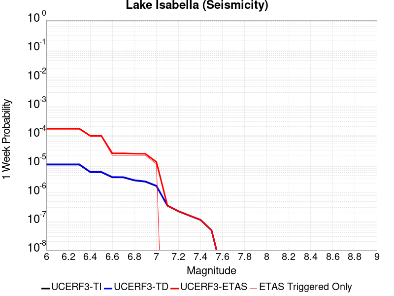 |  |  |  |

| Magnitude | 1 wk TI Prob | 1 wk TD Prob | 1 wk ETAS Prob | 1 wk ETAS/TD Gain | 1 wk ETAS Triggered Only | 1 mo TI Prob | 1 mo TD Prob | 1 mo ETAS Prob | 1 mo ETAS/TD Gain | 1 mo ETAS Triggered Only | 1 yr TI Prob | 1 yr TD Prob | 1 yr ETAS Prob | 1 yr ETAS/TD Gain | 1 yr ETAS Triggered Only | 10 yr TI Prob | 10 yr TD Prob | 10 yr ETAS Prob | 10 yr ETAS/TD Gain | 10 yr ETAS Triggered Only |
|-----|-----|-----|-----|-----|-----|-----|-----|-----|-----|-----|-----|-----|-----|-----|-----|-----|-----|-----|-----|-----|
| 6.0 | 9.431637E-6 | 9.741651E-6 | 1.6974009E-4 | 17.42416 | 1.6E-4 | 4.0420677E-5 | 4.1749343E-5 | 2.317414E-4 | 5.55078 | 1.9E-4 | 4.920106E-4 | 5.0819275E-4 | 7.8805047E-4 | 1.5506921 | 2.8E-4 | 0.004909227 | 0.005071599 | 0.005419824 | 1.0686618 | 3.5E-4 |
| 6.1 | 9.431637E-6 | 9.741651E-6 | 1.6974009E-4 | 17.42416 | 1.6E-4 | 4.0420677E-5 | 4.1749343E-5 | 2.317414E-4 | 5.55078 | 1.9E-4 | 4.920106E-4 | 5.0819275E-4 | 7.8805047E-4 | 1.5506921 | 2.8E-4 | 0.004909227 | 0.005071599 | 0.005419824 | 1.0686618 | 3.5E-4 |
| 6.2 | 9.431637E-6 | 9.741651E-6 | 1.6974009E-4 | 17.42416 | 1.6E-4 | 4.0420677E-5 | 4.1749343E-5 | 2.317414E-4 | 5.55078 | 1.9E-4 | 4.920106E-4 | 5.0819275E-4 | 7.8805047E-4 | 1.5506921 | 2.8E-4 | 0.004909227 | 0.005071599 | 0.005419824 | 1.0686618 | 3.5E-4 |
| 6.3 | 9.431637E-6 | 9.741651E-6 | 1.6974009E-4 | 17.42416 | 1.6E-4 | 4.0420677E-5 | 4.1749343E-5 | 2.317414E-4 | 5.55078 | 1.9E-4 | 4.920106E-4 | 5.0819275E-4 | 7.8805047E-4 | 1.5506921 | 2.8E-4 | 0.004909227 | 0.005071599 | 0.005419824 | 1.0686618 | 3.5E-4 |
| 6.4 | 5.144063E-6 | 5.3000763E-6 | 9.52996E-5 | 17.980799 | 9.0E-5 | 2.2045799E-5 | 2.2714434E-5 | 1.3271194E-4 | 5.8426256 | 1.1E-4 | 2.6837454E-4 | 2.765166E-4 | 4.4646958E-4 | 1.6146213 | 1.7E-4 | 0.0026805066 | 0.0027620657 | 0.0029615134 | 1.0722096 | 2.0E-4 |
| 6.5 | 5.144063E-6 | 5.3000763E-6 | 9.52996E-5 | 17.980799 | 9.0E-5 | 2.2045799E-5 | 2.2714434E-5 | 1.3271194E-4 | 5.8426256 | 1.1E-4 | 2.6837454E-4 | 2.765166E-4 | 4.4646958E-4 | 1.6146213 | 1.7E-4 | 0.0026805066 | 0.0027620657 | 0.0029615134 | 1.0722096 | 2.0E-4 |
| 6.6 | 3.4009804E-6 | 3.498786E-6 | 2.3498716E-5 | 6.716248 | 2.0E-5 | 1.4575549E-5 | 1.4994721E-5 | 5.499412E-5 | 3.6675656 | 4.0E-5 | 1.7744285E-4 | 1.8254704E-4 | 2.725306E-4 | 1.4929336 | 9.0E-5 | 0.0017730123 | 0.0018241286 | 0.0019439097 | 1.0656649 | 1.2E-4 |
| 6.7 | 3.3880428E-6 | 3.4856528E-6 | 2.3485583E-5 | 6.7377863 | 2.0E-5 | 1.4520103E-5 | 1.4938435E-5 | 5.493784E-5 | 3.6776166 | 4.0E-5 | 1.767679E-4 | 1.8186188E-4 | 2.7184552E-4 | 1.494791 | 9.0E-5 | 0.0017662736 | 0.0018172882 | 0.0019370702 | 1.0659125 | 1.2E-4 |
| 6.8 | 2.6582E-6 | 2.7337003E-6 | 2.2733646E-5 | 8.3160715 | 2.0E-5 | 1.1392236E-5 | 1.1715813E-5 | 5.1715346E-5 | 4.414149 | 4.0E-5 | 1.3869164E-4 | 1.4263204E-4 | 2.3261919E-4 | 1.6309043 | 9.0E-5 | 0.0013860512 | 0.0014255369 | 0.0015353801 | 1.0770539 | 1.1E-4 |
| 6.9 | 2.406011E-6 | 2.4743288E-6 | 2.247428E-5 | 9.08298 | 2.0E-5 | 1.0311434E-5 | 1.0604231E-5 | 4.0603914E-5 | 3.8290296 | 3.0E-5 | 1.2553448E-4 | 1.2910018E-4 | 2.0908985E-4 | 1.6195939 | 8.0E-5 | 0.0012546359 | 0.0012903814 | 0.0013902524 | 1.0773965 | 1.0E-4 |
| 7.0 | 1.6953097E-6 | 1.7429371E-6 | 1.174292E-5 | 6.7374315 | 1.0E-5 | 7.265593E-6 | 7.469715E-6 | 2.7469567E-5 | 3.6774583 | 2.0E-5 | 8.8455E-5 | 9.094104E-5 | 1.5093558E-4 | 1.6597081 | 6.0E-5 | 8.84198E-4 | 9.09141E-4 | 9.890682E-4 | 1.0879152 | 8.0E-5 |
| 7.1 | 3.5013824E-7 | 3.5714822E-7 | 3.5714822E-7 | 1.0 | 0.0 | 1.5005916E-6 | 1.5306344E-6 | 1.5306344E-6 | 1.0 | 0.0 | 1.826955E-5 | 1.8635317E-5 | 2.8635131E-5 | 1.5366055 | 1.0E-5 | 1.8268047E-4 | 1.863378E-4 | 2.0633407E-4 | 1.107312 | 2.0E-5 |
| 7.2 | 2.2321095E-7 | 2.2750574E-7 | 2.2750574E-7 | 1.0 | 0.0 | 9.56618E-7 | 9.750242E-7 | 9.750242E-7 | 1.0 | 0.0 | 1.1646762E-5 | 1.1870856E-5 | 2.1870737E-5 | 1.8423892 | 1.0E-5 | 1.1646151E-4 | 1.1870232E-4 | 1.2870114E-4 | 1.0842344 | 1.0E-5 |
| 7.3 | 1.5760406E-7 | 1.6060922E-7 | 1.6060922E-7 | 1.0 | 0.0 | 6.7544585E-7 | 6.8832503E-7 | 6.8832503E-7 | 1.0 | 0.0 | 8.223522E-6 | 8.380326E-6 | 8.380326E-6 | 1.0 | 0.0 | 8.2232174E-5 | 8.3800165E-5 | 8.3800165E-5 | 1.0 | 0.0 |
| 7.4 | 1.1216497E-7 | 1.1431706E-7 | 1.1431706E-7 | 1.0 | 0.0 | 4.8070694E-7 | 4.899302E-7 | 4.899302E-7 | 1.0 | 0.0 | 5.852591E-6 | 5.964884E-6 | 5.964884E-6 | 1.0 | 0.0 | 5.8524372E-5 | 5.9647282E-5 | 5.9647282E-5 | 1.0 | 0.0 |
| 7.5 | 4.885185E-8 | 4.9787737E-8 | 4.9787737E-8 | 1.0 | 0.0 | 2.0936506E-7 | 2.13376E-7 | 2.13376E-7 | 1.0 | 0.0 | 2.5490165E-6 | 2.59785E-6 | 2.59785E-6 | 1.0 | 0.0 | 2.5489873E-5 | 2.5978214E-5 | 2.5978214E-5 | 1.0 | 0.0 |
| 7.6 | 1.504641E-9 | 1.5317903E-9 | 1.5317903E-9 | 1.0 | 0.0 | 6.4484613E-9 | 6.5648154E-9 | 6.5648154E-9 | 1.0 | 0.0 | 7.851001E-8 | 7.992663E-8 | 7.992663E-8 | 1.0 | 0.0 | 7.8509987E-7 | 7.992663E-7 | 7.992663E-7 | 1.0 | 0.0 |

## Death Valley (Fish Lake Valley)
*[(top)](#table-of-contents)*

| 1 Week | 1 Month | 1 Year | 10 Year |
|-----|-----|-----|-----|
|  |  |  |  |

| Magnitude | 1 wk TI Prob | 1 wk TD Prob | 1 wk ETAS Prob | 1 wk ETAS/TD Gain | 1 wk ETAS Triggered Only | 1 mo TI Prob | 1 mo TD Prob | 1 mo ETAS Prob | 1 mo ETAS/TD Gain | 1 mo ETAS Triggered Only | 1 yr TI Prob | 1 yr TD Prob | 1 yr ETAS Prob | 1 yr ETAS/TD Gain | 1 yr ETAS Triggered Only | 10 yr TI Prob | 10 yr TD Prob | 10 yr ETAS Prob | 10 yr ETAS/TD Gain | 10 yr ETAS Triggered Only |
|-----|-----|-----|-----|-----|-----|-----|-----|-----|-----|-----|-----|-----|-----|-----|-----|-----|-----|-----|-----|-----|
| 6.0 | 3.872328E-5 | 4.7265705E-5 | 1.2726193E-4 | 2.6924791 | 8.0E-5 | 1.6594635E-4 | 2.0255324E-4 | 3.0253298E-4 | 1.4935974 | 1.0E-4 | 0.0020185246 | 0.0024635606 | 0.0026231664 | 1.0647867 | 1.6E-4 | 0.02000288 | 0.024388338 | 0.024739558 | 1.0144012 | 3.6E-4 |
| 6.1 | 3.872328E-5 | 4.7265705E-5 | 1.2726193E-4 | 2.6924791 | 8.0E-5 | 1.6594635E-4 | 2.0255324E-4 | 3.0253298E-4 | 1.4935974 | 1.0E-4 | 0.0020185246 | 0.0024635606 | 0.0026231664 | 1.0647867 | 1.6E-4 | 0.02000288 | 0.024388338 | 0.024739558 | 1.0144012 | 3.6E-4 |
| 6.2 | 3.872328E-5 | 4.7265705E-5 | 1.2726193E-4 | 2.6924791 | 8.0E-5 | 1.6594635E-4 | 2.0255324E-4 | 3.0253298E-4 | 1.4935974 | 1.0E-4 | 0.0020185246 | 0.0024635606 | 0.0026231664 | 1.0647867 | 1.6E-4 | 0.02000288 | 0.024388338 | 0.024739558 | 1.0144012 | 3.6E-4 |
| 6.3 | 2.8356371E-5 | 3.360979E-5 | 1.136071E-4 | 3.380179 | 8.0E-5 | 1.2152165E-4 | 1.4403443E-4 | 2.4402003E-4 | 1.6941785 | 1.0E-4 | 0.0014785219 | 0.0017522788 | 0.0019119984 | 1.0911497 | 1.6E-4 | 0.014687235 | 0.017391816 | 0.017745554 | 1.0203394 | 3.6E-4 |
| 6.4 | 2.8356371E-5 | 3.360979E-5 | 1.136071E-4 | 3.380179 | 8.0E-5 | 1.2152165E-4 | 1.4403443E-4 | 2.4402003E-4 | 1.6941785 | 1.0E-4 | 0.0014785219 | 0.0017522788 | 0.0019119984 | 1.0911497 | 1.6E-4 | 0.014687235 | 0.017391816 | 0.017745554 | 1.0203394 | 3.6E-4 |
| 6.5 | 2.4448687E-5 | 2.8607585E-5 | 1.08605294E-4 | 3.7963812 | 8.0E-5 | 1.0477588E-4 | 1.2259845E-4 | 2.2258618E-4 | 1.8155711 | 1.0E-4 | 0.0012748998 | 0.0014916616 | 0.001651423 | 1.1071029 | 1.6E-4 | 0.012676105 | 0.014821392 | 0.015176056 | 1.0239292 | 3.6E-4 |
| 6.6 | 2.1298161E-5 | 2.4660083E-5 | 1.0465811E-4 | 4.244029 | 8.0E-5 | 9.127464E-5 | 1.0568197E-4 | 2.056714E-4 | 1.9461353 | 1.0E-4 | 0.0011107022 | 0.0012859512 | 0.0014457455 | 1.1242615 | 1.6E-4 | 0.011051672 | 0.01278853 | 0.013134054 | 1.0270183 | 3.5E-4 |
| 6.7 | 1.8959729E-5 | 2.1781027E-5 | 1.0177928E-4 | 4.6728415 | 8.0E-5 | 8.125345E-5 | 9.334406E-5 | 1.9333472E-4 | 2.0712054 | 1.0E-4 | 9.888117E-4 | 0.001135897 | 0.0012957152 | 1.1406978 | 1.6E-4 | 0.009844234 | 0.01130357 | 0.011649614 | 1.0306137 | 3.5E-4 |
| 6.8 | 1.6691629E-5 | 1.9018351E-5 | 9.9016834E-5 | 5.206383 | 8.0E-5 | 7.153359E-5 | 8.150477E-5 | 1.8149662E-4 | 2.2268221 | 1.0E-4 | 8.7057345E-4 | 9.918857E-4 | 0.001151727 | 1.1611489 | 1.6E-4 | 0.008671708 | 0.009876343 | 0.010222887 | 1.0350882 | 3.5E-4 |
| 6.9 | 1.450505E-5 | 1.638954E-5 | 9.638823E-5 | 5.881082 | 8.0E-5 | 6.216302E-5 | 7.0239046E-5 | 1.7023202E-4 | 2.4236095 | 1.0E-4 | 7.5657194E-4 | 8.5483363E-4 | 0.0010146969 | 1.1870109 | 1.6E-4 | 0.007540013 | 0.008516386 | 0.008863405 | 1.0407473 | 3.5E-4 |
| 7.0 | 1.2940855E-5 | 1.4537972E-5 | 8.453696E-5 | 5.814907 | 7.0E-5 | 5.545963E-5 | 6.230414E-5 | 1.5229853E-4 | 2.4444368 | 9.0E-5 | 6.750118E-4 | 7.5829466E-4 | 8.981885E-4 | 1.1844848 | 1.4E-4 | 0.006729651 | 0.0075576897 | 0.007865347 | 1.0407078 | 3.1E-4 |
| 7.1 | 1.2544658E-5 | 1.4078208E-5 | 8.407722E-5 | 5.9721537 | 7.0E-5 | 5.3761712E-5 | 6.0333812E-5 | 1.5032839E-4 | 2.4916108 | 9.0E-5 | 6.5435225E-4 | 7.343222E-4 | 8.742194E-4 | 1.1905121 | 1.4E-4 | 0.006524288 | 0.007319551 | 0.007627282 | 1.0420424 | 3.1E-4 |
| 7.2 | 1.2489416E-5 | 1.4015674E-5 | 8.40147E-5 | 5.9943385 | 7.0E-5 | 5.3524967E-5 | 6.0065824E-5 | 1.5006041E-4 | 2.4982662 | 9.0E-5 | 6.514716E-4 | 7.310616E-4 | 8.709593E-4 | 1.1913624 | 1.4E-4 | 0.006495651 | 0.0072871596 | 0.0075949007 | 1.0422306 | 3.1E-4 |
| 7.3 | 1.2368307E-5 | 1.3879812E-5 | 8.387884E-5 | 6.043226 | 7.0E-5 | 5.3005948E-5 | 5.9483587E-5 | 1.4947823E-4 | 2.5129325 | 9.0E-5 | 6.451563E-4 | 7.2397763E-4 | 8.6387625E-4 | 1.1932361 | 1.4E-4 | 0.0064328653 | 0.007216782 | 0.007524545 | 1.0426455 | 3.1E-4 |
| 7.4 | 1.2161707E-5 | 1.36478675E-5 | 8.364691E-5 | 6.1289363 | 7.0E-5 | 5.212056E-5 | 5.8489582E-5 | 1.4848432E-4 | 2.5386455 | 9.0E-5 | 6.3438306E-4 | 7.118836E-4 | 8.5178396E-4 | 1.1965214 | 1.4E-4 | 0.006325751 | 0.0070966207 | 0.0074044205 | 1.0433728 | 3.1E-4 |
| 7.5 | 1.1707948E-5 | 1.3145515E-5 | 8.3144594E-5 | 6.32494 | 7.0E-5 | 5.0175953E-5 | 5.6336736E-5 | 1.4633167E-4 | 2.5974467 | 9.0E-5 | 6.10721E-4 | 6.856895E-4 | 8.255935E-4 | 1.2040341 | 1.4E-4 | 0.0060904534 | 0.006836321 | 0.0071342704 | 1.0435833 | 3.0E-4 |
| 7.6 | 1.0319538E-5 | 1.1579622E-5 | 8.1578815E-5 | 7.045032 | 7.0E-5 | 4.4225842E-5 | 4.9626036E-5 | 1.2962207E-4 | 2.6119769 | 8.0E-5 | 5.383166E-4 | 6.040347E-4 | 7.3395617E-4 | 1.2150894 | 1.3E-4 | 0.0053701443 | 0.0060244603 | 0.0063127135 | 1.047847 | 2.9E-4 |
| 7.7 | 8.937764E-6 | 1.0022779E-5 | 8.002208E-5 | 7.9840207 | 7.0E-5 | 3.830414E-5 | 4.295409E-5 | 1.2295066E-4 | 2.8623736 | 8.0E-5 | 4.6625308E-4 | 5.228456E-4 | 6.527776E-4 | 1.2485094 | 1.3E-4 | 0.0046527605 | 0.005216664 | 0.0055051516 | 1.0553011 | 2.9E-4 |
| 7.8 | 3.108007E-7 | 3.284654E-7 | 3.284654E-7 | 1.0 | 0.0 | 1.3320023E-6 | 1.407708E-6 | 1.407708E-6 | 1.0 | 0.0 | 1.6217007E-5 | 1.7138715E-5 | 1.7138715E-5 | 1.0 | 0.0 | 1.6215823E-4 | 1.7137431E-4 | 1.813726E-4 | 1.0583419 | 1.0E-5 |
| 7.9 | 2.5591178E-9 | 2.6696718E-9 | 2.6696718E-9 | 1.0 | 0.0 | 1.0967647E-8 | 1.14414505E-8 | 1.14414505E-8 | 1.0 | 0.0 | 1.335311E-7 | 1.3929966E-7 | 1.3929966E-7 | 1.0 | 0.0 | 1.3353102E-6 | 1.3929966E-6 | 1.3929966E-6 | 1.0 | 0.0 |

## White Wolf (Extension)
*[(top)](#table-of-contents)*

| 1 Week | 1 Month | 1 Year | 10 Year |
|-----|-----|-----|-----|
|  |  |  |  |

| Magnitude | 1 wk TI Prob | 1 wk TD Prob | 1 wk ETAS Prob | 1 wk ETAS/TD Gain | 1 wk ETAS Triggered Only | 1 mo TI Prob | 1 mo TD Prob | 1 mo ETAS Prob | 1 mo ETAS/TD Gain | 1 mo ETAS Triggered Only | 1 yr TI Prob | 1 yr TD Prob | 1 yr ETAS Prob | 1 yr ETAS/TD Gain | 1 yr ETAS Triggered Only | 10 yr TI Prob | 10 yr TD Prob | 10 yr ETAS Prob | 10 yr ETAS/TD Gain | 10 yr ETAS Triggered Only |
|-----|-----|-----|-----|-----|-----|-----|-----|-----|-----|-----|-----|-----|-----|-----|-----|-----|-----|-----|-----|-----|
| 6.0 | 8.222555E-6 | 6.066615E-6 | 1.2606589E-4 | 20.78027 | 1.2E-4 | 3.5239045E-5 | 2.5999556E-5 | 1.9599513E-4 | 7.538403 | 1.7E-4 | 4.289509E-4 | 3.1650523E-4 | 5.5642927E-4 | 1.7580413 | 2.4E-4 | 0.0042812387 | 0.0031611966 | 0.00351009 | 1.1103675 | 3.5E-4 |
| 6.1 | 8.222555E-6 | 6.066615E-6 | 1.2606589E-4 | 20.78027 | 1.2E-4 | 3.5239045E-5 | 2.5999556E-5 | 1.9599513E-4 | 7.538403 | 1.7E-4 | 4.289509E-4 | 3.1650523E-4 | 5.5642927E-4 | 1.7580413 | 2.4E-4 | 0.0042812387 | 0.0031611966 | 0.00351009 | 1.1103675 | 3.5E-4 |
| 6.2 | 8.222555E-6 | 6.066615E-6 | 1.2606589E-4 | 20.78027 | 1.2E-4 | 3.5239045E-5 | 2.5999556E-5 | 1.9599513E-4 | 7.538403 | 1.7E-4 | 4.289509E-4 | 3.1650523E-4 | 5.5642927E-4 | 1.7580413 | 2.4E-4 | 0.0042812387 | 0.0031611966 | 0.00351009 | 1.1103675 | 3.5E-4 |
| 6.3 | 8.222555E-6 | 6.066615E-6 | 1.2606589E-4 | 20.78027 | 1.2E-4 | 3.5239045E-5 | 2.5999556E-5 | 1.9599513E-4 | 7.538403 | 1.7E-4 | 4.289509E-4 | 3.1650523E-4 | 5.5642927E-4 | 1.7580413 | 2.4E-4 | 0.0042812387 | 0.0031611966 | 0.00351009 | 1.1103675 | 3.5E-4 |
| 6.4 | 5.821773E-6 | 3.5571256E-6 | 5.355695E-5 | 15.056243 | 5.0E-5 | 2.4950215E-5 | 1.5244741E-5 | 1.0524337E-4 | 6.903585 | 9.0E-5 | 3.0372653E-4 | 1.8559002E-4 | 3.0556775E-4 | 1.6464665 | 1.2E-4 | 0.0030331176 | 0.0018544586 | 0.0020441064 | 1.1022658 | 1.9E-4 |
| 6.5 | 5.766023E-6 | 3.4990599E-6 | 5.3498883E-5 | 15.289503 | 5.0E-5 | 2.4711293E-5 | 1.49958905E-5 | 1.0499454E-4 | 7.0015545 | 9.0E-5 | 3.0081844E-4 | 1.8256076E-4 | 3.0253886E-4 | 1.6571953 | 1.2E-4 | 0.0030041158 | 0.0018242161 | 0.0020138696 | 1.1039643 | 1.9E-4 |
| 6.6 | 4.643576E-6 | 2.3325733E-6 | 1.233255E-5 | 5.287101 | 1.0E-5 | 1.9900888E-5 | 9.9967065E-6 | 2.9996507E-5 | 3.000639 | 2.0E-5 | 2.4226638E-4 | 1.2170354E-4 | 1.6169867E-4 | 1.3286275 | 4.0E-5 | 0.0024200242 | 0.0012164112 | 0.0013063018 | 1.0738981 | 9.0E-5 |
| 6.7 | 3.9529173E-6 | 1.6482975E-6 | 1.1648281E-5 | 7.066856 | 1.0E-5 | 1.6940963E-5 | 7.064114E-6 | 2.7063972E-5 | 3.8311913 | 2.0E-5 | 2.0623671E-4 | 8.600239E-5 | 1.2599894E-4 | 1.4650633 | 4.0E-5 | 0.002060454 | 8.597095E-4 | 9.2964934E-4 | 1.0813528 | 7.0E-5 |
| 6.8 | 3.4377522E-6 | 1.2244764E-6 | 1.1224464E-5 | 9.166746 | 1.0E-5 | 1.473314E-5 | 5.247746E-6 | 1.5247693E-5 | 2.90557 | 1.0E-5 | 1.7936122E-4 | 6.388952E-5 | 9.3887604E-5 | 1.4695306 | 3.0E-5 | 0.0017921652 | 6.3872064E-4 | 6.986823E-4 | 1.0938778 | 6.0E-5 |
| 6.9 | 3.1367306E-6 | 1.0033316E-6 | 1.1003322E-5 | 10.966785 | 1.0E-5 | 1.3443062E-5 | 4.299986E-6 | 1.4299942E-5 | 3.3255792 | 1.0E-5 | 1.63657E-4 | 5.2351144E-5 | 8.234957E-5 | 1.5730233 | 3.0E-5 | 0.0016353652 | 5.233958E-4 | 5.833644E-4 | 1.114576 | 6.0E-5 |
| 7.0 | 2.8298145E-6 | 7.4282326E-7 | 1.0742816E-5 | 14.462142 | 1.0E-5 | 1.2127721E-5 | 3.1835248E-6 | 1.3183493E-5 | 4.1411624 | 1.0E-5 | 1.47645E-4 | 3.8758775E-5 | 5.8758E-5 | 1.5159922 | 2.0E-5 | 0.0014754693 | 3.8752513E-4 | 4.3750578E-4 | 1.1289738 | 5.0E-5 |
| 7.1 | 2.4091064E-6 | 5.4223835E-7 | 1.0542233E-5 | 19.442064 | 1.0E-5 | 1.03247E-5 | 2.3238767E-6 | 1.2323853E-5 | 5.303144 | 1.0E-5 | 1.2569598E-4 | 2.8292874E-5 | 3.829259E-5 | 1.3534359 | 1.0E-5 | 0.001256249 | 2.8289677E-4 | 3.2288543E-4 | 1.1413543 | 4.0E-5 |
| 7.2 | 1.3875518E-6 | 1.0740268E-7 | 1.0740268E-7 | 1.0 | 0.0 | 5.9466374E-6 | 4.6029712E-7 | 4.6029712E-7 | 1.0 | 0.0 | 7.23979E-5 | 5.604104E-6 | 5.604104E-6 | 1.0 | 0.0 | 7.2374323E-4 | 5.6039742E-5 | 5.6039742E-5 | 1.0 | 0.0 |
| 7.3 | 7.056077E-7 | 5.0002956E-8 | 5.0002956E-8 | 1.0 | 0.0 | 3.0240296E-6 | 2.1429837E-7 | 2.1429837E-7 | 1.0 | 0.0 | 3.681694E-5 | 2.60908E-6 | 2.60908E-6 | 1.0 | 0.0 | 3.681084E-4 | 2.609054E-5 | 2.609054E-5 | 1.0 | 0.0 |
| 7.4 | 5.9334678E-8 | 4.8638475E-9 | 4.8638475E-9 | 1.0 | 0.0 | 2.5429145E-7 | 2.084506E-8 | 2.084506E-8 | 1.0 | 0.0 | 3.095994E-6 | 2.5378858E-7 | 2.5378858E-7 | 1.0 | 0.0 | 3.095951E-5 | 2.5378843E-6 | 2.5378843E-6 | 1.0 | 0.0 |

## San Andreas (Coachella) rev
*[(top)](#table-of-contents)*

| 1 Week | 1 Month | 1 Year | 10 Year |
|-----|-----|-----|-----|
|  |  |  |  |

| Magnitude | 1 wk TI Prob | 1 wk TD Prob | 1 wk ETAS Prob | 1 wk ETAS/TD Gain | 1 wk ETAS Triggered Only | 1 mo TI Prob | 1 mo TD Prob | 1 mo ETAS Prob | 1 mo ETAS/TD Gain | 1 mo ETAS Triggered Only | 1 yr TI Prob | 1 yr TD Prob | 1 yr ETAS Prob | 1 yr ETAS/TD Gain | 1 yr ETAS Triggered Only | 10 yr TI Prob | 10 yr TD Prob | 10 yr ETAS Prob | 10 yr ETAS/TD Gain | 10 yr ETAS Triggered Only |
|-----|-----|-----|-----|-----|-----|-----|-----|-----|-----|-----|-----|-----|-----|-----|-----|-----|-----|-----|-----|-----|
| 6.0 | 1.1925945E-4 | 3.273077E-4 | 4.8725534E-4 | 1.4886767 | 1.6E-4 | 5.110118E-4 | 0.001401998 | 0.0016017176 | 1.1424536 | 2.0E-4 | 0.0062038354 | 0.016937068 | 0.017192664 | 1.015091 | 2.6E-4 | 0.060334753 | 0.15267672 | 0.1529648 | 1.001887 | 3.4E-4 |
| 6.1 | 1.1925945E-4 | 3.273077E-4 | 4.8725534E-4 | 1.4886767 | 1.6E-4 | 5.110118E-4 | 0.001401998 | 0.0016017176 | 1.1424536 | 2.0E-4 | 0.0062038354 | 0.016937068 | 0.017192664 | 1.015091 | 2.6E-4 | 0.060334753 | 0.15267672 | 0.1529648 | 1.001887 | 3.4E-4 |
| 6.2 | 1.07432395E-4 | 3.0231563E-4 | 4.6226726E-4 | 1.5290883 | 1.6E-4 | 4.603433E-4 | 0.001294999 | 0.00149474 | 1.1542403 | 2.0E-4 | 0.005590286 | 0.015653731 | 0.01590966 | 1.0163494 | 2.6E-4 | 0.05451731 | 0.14182784 | 0.14210245 | 1.0019362 | 3.2E-4 |
| 6.3 | 1.0718766E-4 | 3.0176868E-4 | 4.617204E-4 | 1.5300474 | 1.6E-4 | 4.592948E-4 | 0.0012926573 | 0.0014923988 | 1.15452 | 2.0E-4 | 0.005577586 | 0.01562563 | 0.015881566 | 1.0163794 | 2.6E-4 | 0.054396555 | 0.14159605 | 0.14187075 | 1.0019399 | 3.2E-4 |
| 6.4 | 1.0355944E-4 | 2.9384956E-4 | 4.4380547E-4 | 1.5103153 | 1.5E-4 | 4.4375064E-4 | 0.0012587514 | 0.0014485122 | 1.1507533 | 1.9E-4 | 0.0053892885 | 0.015218662 | 0.015464857 | 1.0161772 | 2.5E-4 | 0.052604496 | 0.13815795 | 0.13842513 | 1.0019338 | 3.1E-4 |
| 6.5 | 1.0227914E-4 | 2.9104383E-4 | 4.410002E-4 | 1.5152363 | 1.5E-4 | 4.382655E-4 | 0.0012467385 | 0.0014365016 | 1.1522076 | 1.9E-4 | 0.0053228354 | 0.015074439 | 0.01532067 | 1.0163344 | 2.5E-4 | 0.051971316 | 0.13694239 | 0.13720994 | 1.0019537 | 3.1E-4 |
| 6.6 | 1.0116757E-4 | 2.8870135E-4 | 4.3865805E-4 | 1.5194181 | 1.5E-4 | 4.3350324E-4 | 0.0012367087 | 0.0014264737 | 1.1534436 | 1.9E-4 | 0.0052651367 | 0.014954008 | 0.01520027 | 1.0164679 | 2.5E-4 | 0.051421247 | 0.13591973 | 0.13618761 | 1.0019708 | 3.1E-4 |
| 6.7 | 1.0050676E-4 | 2.8728697E-4 | 4.3724387E-4 | 1.521976 | 1.5E-4 | 4.3067214E-4 | 0.0012306528 | 0.0014104313 | 1.1460838 | 1.8E-4 | 0.005230834 | 0.014881288 | 0.015117716 | 1.0158876 | 2.4E-4 | 0.051094085 | 0.13530464 | 0.13556406 | 1.0019172 | 3.0E-4 |
| 6.8 | 9.976819E-5 | 2.8532353E-4 | 4.3528073E-4 | 1.525569 | 1.5E-4 | 4.2750788E-4 | 0.001222246 | 0.0014020259 | 1.1470898 | 1.8E-4 | 0.0051924936 | 0.014780328 | 0.01501678 | 1.0159978 | 2.4E-4 | 0.050728295 | 0.13445628 | 0.13471594 | 1.0019312 | 3.0E-4 |
| 6.9 | 9.77719E-5 | 2.802926E-4 | 4.3025054E-4 | 1.5350051 | 1.5E-4 | 4.1895514E-4 | 0.0012007048 | 0.0013804887 | 1.149732 | 1.8E-4 | 0.0050888555 | 0.0145215895 | 0.014758104 | 1.0162871 | 2.4E-4 | 0.049738888 | 0.13228476 | 0.13254507 | 1.0019678 | 3.0E-4 |
| 7.0 | 8.500761E-5 | 2.4763815E-4 | 3.97601E-4 | 1.6055725 | 1.5E-4 | 3.6426744E-4 | 0.0010608779 | 0.001240687 | 1.1694908 | 1.8E-4 | 0.0044259406 | 0.01284047 | 0.0130773885 | 1.0184509 | 2.4E-4 | 0.04338823 | 0.11813616 | 0.118400715 | 1.0022395 | 3.0E-4 |
| 7.1 | 8.319876E-5 | 2.4366553E-4 | 3.93629E-4 | 1.615448 | 1.5E-4 | 3.5651738E-4 | 0.0010438662 | 0.0012236782 | 1.1722559 | 1.8E-4 | 0.004331963 | 0.012635773 | 0.012872741 | 1.0187536 | 2.4E-4 | 0.042484846 | 0.11635632 | 0.11662141 | 1.0022783 | 3.0E-4 |
| 7.2 | 7.563917E-5 | 2.2414974E-4 | 3.7411612E-4 | 1.6690454 | 1.5E-4 | 3.2412758E-4 | 9.602912E-4 | 0.0011401183 | 1.1872631 | 1.8E-4 | 0.0039391145 | 0.011629559 | 0.011866768 | 1.0203971 | 2.4E-4 | 0.03870018 | 0.10776202 | 0.108029686 | 1.002484 | 3.0E-4 |
| 7.3 | 7.082985E-5 | 2.07311E-4 | 3.572799E-4 | 1.7234006 | 1.5E-4 | 3.0352117E-4 | 8.881761E-4 | 0.0010680162 | 1.2024825 | 1.8E-4 | 0.0036891096 | 0.010760553 | 0.0109979715 | 1.0220637 | 2.4E-4 | 0.03628465 | 0.10028403 | 0.100553945 | 1.0026915 | 3.0E-4 |
| 7.4 | 5.146215E-5 | 1.4274761E-4 | 2.927262E-4 | 2.0506556 | 1.5E-4 | 2.2053342E-4 | 6.1163295E-4 | 7.9152285E-4 | 1.2941141 | 1.8E-4 | 0.0026816884 | 0.0074213943 | 0.007659613 | 1.0320989 | 2.4E-4 | 0.02649557 | 0.07085049 | 0.07112923 | 1.0039343 | 3.0E-4 |
| 7.5 | 4.0285166E-5 | 1.0942422E-4 | 2.4940888E-4 | 2.2792842 | 1.4E-4 | 1.7263928E-4 | 4.6887697E-4 | 6.3879724E-4 | 1.3623985 | 1.7E-4 | 0.002099857 | 0.0056937044 | 0.005922395 | 1.0401655 | 2.3E-4 | 0.020801254 | 0.055013083 | 0.055287126 | 1.0049815 | 2.9E-4 |
| 7.6 | 3.1168736E-5 | 8.439599E-5 | 2.1438503E-4 | 2.5402274 | 1.3E-4 | 1.3357346E-4 | 3.616471E-4 | 5.1159284E-4 | 1.414619 | 1.5E-4 | 0.0016250437 | 0.004394191 | 0.004603268 | 1.0475804 | 2.1E-4 | 0.016132116 | 0.042812478 | 0.043070916 | 1.0060365 | 2.7E-4 |
| 7.7 | 2.2100989E-5 | 6.239345E-5 | 1.9238534E-4 | 3.083422 | 1.3E-4 | 9.4715084E-5 | 2.6737314E-4 | 4.17333E-4 | 1.5608637 | 1.5E-4 | 0.001152546 | 0.0032504152 | 0.0034597325 | 1.0643971 | 2.1E-4 | 0.011465867 | 0.031902168 | 0.032163557 | 1.0081934 | 2.7E-4 |
| 7.8 | 1.7484861E-5 | 5.180078E-5 | 1.8179405E-4 | 3.5094845 | 1.3E-4 | 7.493296E-5 | 2.2198448E-4 | 3.7195117E-4 | 1.675573 | 1.5E-4 | 9.1192697E-4 | 0.0026993142 | 0.0029087474 | 1.0775875 | 2.1E-4 | 0.009081938 | 0.026641788 | 0.026904594 | 1.0098644 | 2.7E-4 |
| 7.9 | 1.3967285E-5 | 3.8226146E-5 | 1.6822117E-4 | 4.4006834 | 1.3E-4 | 5.985842E-5 | 1.6381606E-4 | 3.137915E-4 | 1.9155111 | 1.5E-4 | 7.2853256E-4 | 0.0019926373 | 0.0021922388 | 1.1001695 | 2.0E-4 | 0.0072614877 | 0.019911002 | 0.020165825 | 1.0127981 | 2.6E-4 |
| 8.0 | 1.1887396E-5 | 3.106798E-5 | 1.6106394E-4 | 5.1842422 | 1.3E-4 | 5.094499E-5 | 1.331417E-4 | 2.831217E-4 | 2.1264694 | 1.5E-4 | 6.200787E-4 | 0.0016197958 | 0.0018194718 | 1.1232723 | 2.0E-4 | 0.006183513 | 0.016280567 | 0.016536335 | 1.01571 | 2.6E-4 |
| 8.1 | 5.100864E-6 | 8.973766E-6 | 1.8973677E-5 | 2.1143494 | 1.0E-5 | 2.1860664E-5 | 3.845843E-5 | 4.8458045E-5 | 1.2600111 | 1.0E-5 | 2.6612106E-4 | 4.6813092E-4 | 4.7812623E-4 | 1.0213516 | 1.0E-5 | 0.002658026 | 0.004918092 | 0.0049280426 | 1.0020233 | 1.0E-5 |
| 8.2 | 2.3004484E-6 | 2.7863473E-6 | 1.27863195E-5 | 4.588918 | 1.0E-5 | 9.859027E-6 | 1.19414335E-5 | 2.1941314E-5 | 1.8374104 | 1.0E-5 | 1.2002704E-4 | 1.4537729E-4 | 1.5537583E-4 | 1.0687765 | 1.0E-5 | 0.0011996223 | 0.0015973782 | 0.0016073622 | 1.0062503 | 1.0E-5 |
| 8.3 | 1.0424446E-7 | 5.814421E-8 | 5.814421E-8 | 1.0 | 0.0 | 4.4676187E-7 | 2.4918944E-7 | 2.4918944E-7 | 1.0 | 0.0 | 5.439312E-6 | 3.0338776E-6 | 3.0338776E-6 | 1.0 | 0.0 | 5.4391792E-5 | 3.189592E-5 | 3.189592E-5 | 1.0 | 0.0 |

## Manix-Afton Hills
*[(top)](#table-of-contents)*

| 1 Week | 1 Month | 1 Year | 10 Year |
|-----|-----|-----|-----|
|  | 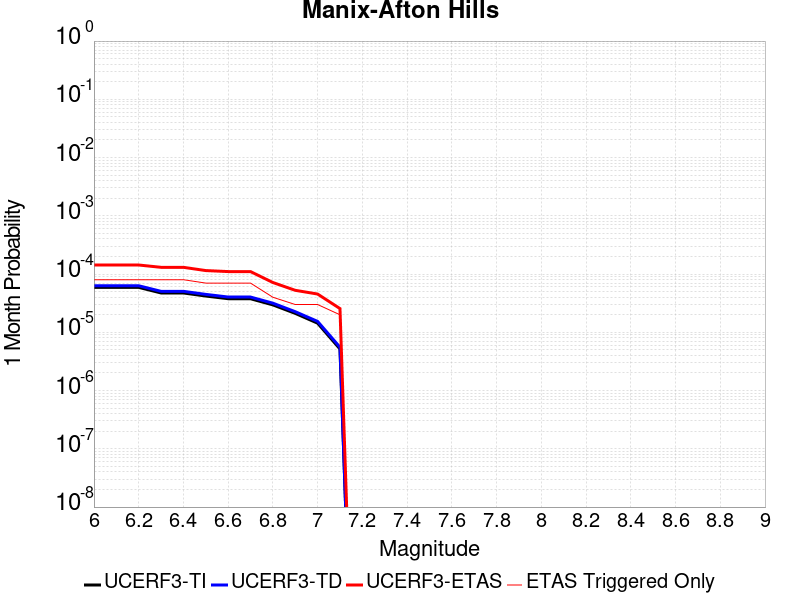 |  |  |

| Magnitude | 1 wk TI Prob | 1 wk TD Prob | 1 wk ETAS Prob | 1 wk ETAS/TD Gain | 1 wk ETAS Triggered Only | 1 mo TI Prob | 1 mo TD Prob | 1 mo ETAS Prob | 1 mo ETAS/TD Gain | 1 mo ETAS Triggered Only | 1 yr TI Prob | 1 yr TD Prob | 1 yr ETAS Prob | 1 yr ETAS/TD Gain | 1 yr ETAS Triggered Only | 10 yr TI Prob | 10 yr TD Prob | 10 yr ETAS Prob | 10 yr ETAS/TD Gain | 10 yr ETAS Triggered Only |
|-----|-----|-----|-----|-----|-----|-----|-----|-----|-----|-----|-----|-----|-----|-----|-----|-----|-----|-----|-----|-----|
| 6.0 | 1.3783202E-5 | 1.47110895E-5 | 6.471035E-5 | 4.3987465 | 5.0E-5 | 5.906953E-5 | 6.30461E-5 | 1.4304106E-4 | 2.2688327 | 8.0E-5 | 7.189342E-4 | 7.6733343E-4 | 9.6718E-4 | 1.2604429 | 2.0E-4 | 0.0071661277 | 0.007648596 | 0.007966149 | 1.0415177 | 3.2E-4 |
| 6.1 | 1.3783202E-5 | 1.47110895E-5 | 6.471035E-5 | 4.3987465 | 5.0E-5 | 5.906953E-5 | 6.30461E-5 | 1.4304106E-4 | 2.2688327 | 8.0E-5 | 7.189342E-4 | 7.6733343E-4 | 9.6718E-4 | 1.2604429 | 2.0E-4 | 0.0071661277 | 0.007648596 | 0.007966149 | 1.0415177 | 3.2E-4 |
| 6.2 | 1.3783202E-5 | 1.47110895E-5 | 6.471035E-5 | 4.3987465 | 5.0E-5 | 5.906953E-5 | 6.30461E-5 | 1.4304106E-4 | 2.2688327 | 8.0E-5 | 7.189342E-4 | 7.6733343E-4 | 9.6718E-4 | 1.2604429 | 2.0E-4 | 0.0071661277 | 0.007648596 | 0.007966149 | 1.0415177 | 3.2E-4 |
| 6.3 | 1.10494875E-5 | 1.1793136E-5 | 6.179255E-5 | 5.2397046 | 5.0E-5 | 4.7354086E-5 | 5.054109E-5 | 1.3053704E-4 | 2.5827906 | 8.0E-5 | 5.763835E-4 | 6.151744E-4 | 8.150514E-4 | 1.324911 | 2.0E-4 | 0.005748908 | 0.0061357557 | 0.0064438535 | 1.0502136 | 3.1E-4 |
| 6.4 | 1.10494875E-5 | 1.1793136E-5 | 6.179255E-5 | 5.2397046 | 5.0E-5 | 4.7354086E-5 | 5.054109E-5 | 1.3053704E-4 | 2.5827906 | 8.0E-5 | 5.763835E-4 | 6.151744E-4 | 8.150514E-4 | 1.324911 | 2.0E-4 | 0.005748908 | 0.0061357557 | 0.0064438535 | 1.0502136 | 3.1E-4 |
| 6.5 | 9.788949E-6 | 1.045432E-5 | 5.0453902E-5 | 4.8261294 | 4.0E-5 | 4.1951964E-5 | 4.480351E-5 | 1.1480037E-4 | 2.5623076 | 7.0E-5 | 5.1064545E-4 | 5.453555E-4 | 7.0526823E-4 | 1.2932266 | 1.6E-4 | 0.0050947363 | 0.0054410985 | 0.0056897383 | 1.0456966 | 2.5E-4 |
| 6.6 | 8.810006E-6 | 9.4136285E-6 | 4.941325E-5 | 5.249119 | 4.0E-5 | 3.775662E-5 | 4.0343548E-5 | 1.1034072E-4 | 2.7350278 | 7.0E-5 | 4.5958988E-4 | 4.9108086E-4 | 6.510023E-4 | 1.3256519 | 1.6E-4 | 0.0045864056 | 0.004900839 | 0.005129712 | 1.0467007 | 2.3E-4 |
| 6.7 | 8.80128E-6 | 9.404108E-6 | 4.940373E-5 | 5.2534204 | 4.0E-5 | 3.7719226E-5 | 4.0302748E-5 | 1.1029992E-4 | 2.7367842 | 7.0E-5 | 4.591348E-4 | 4.9058435E-4 | 6.505059E-4 | 1.3259816 | 1.6E-4 | 0.004581874 | 0.0048958957 | 0.0051247696 | 1.0467482 | 2.3E-4 |
| 6.8 | 6.8994877E-6 | 7.380076E-6 | 2.7379929E-5 | 3.7099793 | 2.0E-5 | 2.9568899E-5 | 3.162856E-5 | 7.162729E-5 | 2.2646399 | 4.0E-5 | 3.5994186E-4 | 3.8501783E-4 | 4.949755E-4 | 1.285591 | 1.1E-4 | 0.003593594 | 0.0038443129 | 0.0040136594 | 1.0440512 | 1.7E-4 |
| 6.9 | 4.9328037E-6 | 5.2709615E-6 | 2.5270856E-5 | 4.794354 | 2.0E-5 | 2.1140417E-5 | 2.2589675E-5 | 5.2588995E-5 | 2.3280103 | 3.0E-5 | 2.5735417E-4 | 2.7500073E-4 | 3.6497597E-4 | 1.3271818 | 9.0E-5 | 0.0025705635 | 0.0027472095 | 0.0028768524 | 1.0471908 | 1.3E-4 |
| 7.0 | 3.347973E-6 | 3.59003E-6 | 2.3589959E-5 | 6.5709643 | 2.0E-5 | 1.4348378E-5 | 1.5385775E-5 | 4.5385314E-5 | 2.949823 | 3.0E-5 | 1.746775E-4 | 1.8730981E-4 | 2.4729857E-4 | 1.3202649 | 6.0E-5 | 0.0017454025 | 0.0018719219 | 0.0019617535 | 1.0479889 | 9.0E-5 |
| 7.1 | 1.2073567E-6 | 1.293482E-6 | 1.12934695E-5 | 8.73106 | 1.0E-5 | 5.1743755E-6 | 5.543492E-6 | 2.554338E-5 | 4.6078143 | 2.0E-5 | 6.29962E-5 | 6.749156E-5 | 1.0748886E-4 | 1.5926267 | 4.0E-5 | 6.297835E-4 | 6.7487074E-4 | 7.24837E-4 | 1.0740383 | 5.0E-5 |

## Baker
*[(top)](#table-of-contents)*

| 1 Week | 1 Month | 1 Year | 10 Year |
|-----|-----|-----|-----|
|  |  |  |  |

| Magnitude | 1 wk TI Prob | 1 wk TD Prob | 1 wk ETAS Prob | 1 wk ETAS/TD Gain | 1 wk ETAS Triggered Only | 1 mo TI Prob | 1 mo TD Prob | 1 mo ETAS Prob | 1 mo ETAS/TD Gain | 1 mo ETAS Triggered Only | 1 yr TI Prob | 1 yr TD Prob | 1 yr ETAS Prob | 1 yr ETAS/TD Gain | 1 yr ETAS Triggered Only | 10 yr TI Prob | 10 yr TD Prob | 10 yr ETAS Prob | 10 yr ETAS/TD Gain | 10 yr ETAS Triggered Only |
|-----|-----|-----|-----|-----|-----|-----|-----|-----|-----|-----|-----|-----|-----|-----|-----|-----|-----|-----|-----|-----|
| 6.0 | 5.695525E-6 | 5.8348373E-6 | 1.158342E-4 | 19.852173 | 1.1E-4 | 2.4409164E-5 | 2.5006228E-5 | 1.9500198E-4 | 7.7981367 | 1.7E-4 | 2.9714106E-4 | 3.044123E-4 | 5.143484E-4 | 1.6896439 | 2.1E-4 | 0.0029674405 | 0.0030403486 | 0.0033693453 | 1.1082102 | 3.3E-4 |
| 6.1 | 5.695525E-6 | 5.8348373E-6 | 1.158342E-4 | 19.852173 | 1.1E-4 | 2.4409164E-5 | 2.5006228E-5 | 1.9500198E-4 | 7.7981367 | 1.7E-4 | 2.9714106E-4 | 3.044123E-4 | 5.143484E-4 | 1.6896439 | 2.1E-4 | 0.0029674405 | 0.0030403486 | 0.0033693453 | 1.1082102 | 3.3E-4 |
| 6.2 | 5.695525E-6 | 5.8348373E-6 | 1.158342E-4 | 19.852173 | 1.1E-4 | 2.4409164E-5 | 2.5006228E-5 | 1.9500198E-4 | 7.7981367 | 1.7E-4 | 2.9714106E-4 | 3.044123E-4 | 5.143484E-4 | 1.6896439 | 2.1E-4 | 0.0029674405 | 0.0030403486 | 0.0033693453 | 1.1082102 | 3.3E-4 |
| 6.3 | 3.2995713E-6 | 3.383667E-6 | 6.3383464E-5 | 18.732182 | 6.0E-5 | 1.4140943E-5 | 1.4501353E-5 | 1.2449975E-4 | 8.585389 | 1.1E-4 | 1.7215237E-4 | 1.7654014E-4 | 2.9651896E-4 | 1.6796122 | 1.2E-4 | 0.0017201907 | 0.001764046 | 0.001983658 | 1.1244932 | 2.2E-4 |
| 6.4 | 3.2995713E-6 | 3.383667E-6 | 6.3383464E-5 | 18.732182 | 6.0E-5 | 1.4140943E-5 | 1.4501353E-5 | 1.2449975E-4 | 8.585389 | 1.1E-4 | 1.7215237E-4 | 1.7654014E-4 | 2.9651896E-4 | 1.6796122 | 1.2E-4 | 0.0017201907 | 0.001764046 | 0.001983658 | 1.1244932 | 2.2E-4 |
| 6.5 | 2.782202E-6 | 2.8558404E-6 | 5.28557E-5 | 18.50793 | 5.0E-5 | 1.1923668E-5 | 1.223926E-5 | 1.12238034E-4 | 9.170328 | 1.0E-4 | 1.4516099E-4 | 1.4900314E-4 | 2.4898825E-4 | 1.6710268 | 1.0E-4 | 0.001450662 | 0.0014890651 | 0.0016887672 | 1.1341125 | 2.0E-4 |
| 6.6 | 2.3163404E-6 | 2.38092E-6 | 4.2380823E-5 | 17.800188 | 4.0E-5 | 9.927136E-6 | 1.0203904E-5 | 9.020309E-5 | 8.840056 | 8.0E-5 | 1.20856166E-4 | 1.2422565E-4 | 2.0421571E-4 | 1.6439093 | 8.0E-5 | 0.0012079047 | 0.0012415823 | 0.0014113713 | 1.136752 | 1.7E-4 |
| 6.7 | 2.037056E-6 | 2.0965003E-6 | 4.2096417E-5 | 20.079374 | 4.0E-5 | 8.7302105E-6 | 8.984972E-6 | 8.8984256E-5 | 9.903676 | 8.0E-5 | 1.0628513E-4 | 1.093867E-4 | 1.8937796E-4 | 1.7312703 | 8.0E-5 | 0.0010623431 | 0.0010933448 | 0.0012431807 | 1.1370437 | 1.5E-4 |
| 6.8 | 1.8356744E-6 | 1.8915287E-6 | 3.189147E-5 | 16.860157 | 3.0E-5 | 7.867153E-6 | 8.106527E-6 | 6.810604E-5 | 8.401383 | 6.0E-5 | 9.577837E-5 | 9.869264E-5 | 1.5868671E-4 | 1.6078881 | 6.0E-5 | 9.57371E-4 | 9.86502E-4 | 0.0011163738 | 1.1316488 | 1.3E-4 |
| 6.9 | 1.6310546E-6 | 1.6832072E-6 | 3.1683157E-5 | 18.823088 | 3.0E-5 | 6.9902153E-6 | 7.213726E-6 | 5.7213365E-5 | 7.931181 | 5.0E-5 | 8.510255E-5 | 8.782368E-5 | 1.378193E-4 | 1.5692725 | 5.0E-5 | 8.5069967E-4 | 8.7790104E-4 | 9.878045E-4 | 1.1251888 | 1.1E-4 |
| 7.0 | 1.2058036E-6 | 1.2508665E-6 | 2.1250842E-5 | 16.988895 | 2.0E-5 | 5.1677193E-6 | 5.3608455E-6 | 4.536063E-5 | 8.46147 | 4.0E-5 | 6.291517E-5 | 6.5266366E-5 | 1.0526375E-4 | 1.6128331 | 4.0E-5 | 6.289736E-4 | 6.524743E-4 | 7.5240905E-4 | 1.1531627 | 1.0E-4 |
| 7.1 | 1.052382E-6 | 1.0951609E-6 | 2.1095138E-5 | 19.262138 | 2.0E-5 | 4.5102006E-6 | 4.693538E-6 | 4.469335E-5 | 9.522315 | 4.0E-5 | 5.491031E-5 | 5.7142337E-5 | 9.714005E-5 | 1.6999664 | 4.0E-5 | 5.4896745E-4 | 5.7127734E-4 | 6.6122593E-4 | 1.1574517 | 9.0E-5 |
| 7.2 | 1.0067454E-6 | 1.0487711E-6 | 2.104875E-5 | 20.06992 | 2.0E-5 | 4.3146156E-6 | 4.4947255E-6 | 4.4494547E-5 | 9.89928 | 4.0E-5 | 5.252918E-5 | 5.4721917E-5 | 9.4719726E-5 | 1.7309285 | 4.0E-5 | 5.251676E-4 | 5.470853E-4 | 6.0705247E-4 | 1.1096121 | 6.0E-5 |
| 7.3 | 9.3596316E-7 | 9.767723E-7 | 2.0976753E-5 | 21.47558 | 2.0E-5 | 4.0112645E-6 | 4.1861604E-6 | 4.4185992E-5 | 10.555255 | 4.0E-5 | 4.8836053E-5 | 5.096532E-5 | 9.096328E-5 | 1.7848074 | 4.0E-5 | 4.8825322E-4 | 5.095371E-4 | 5.5951165E-4 | 1.0980783 | 5.0E-5 |
| 7.4 | 8.8117395E-7 | 9.2076635E-7 | 1.0920757E-5 | 11.860509 | 1.0E-5 | 3.7764542E-6 | 3.9461356E-6 | 2.3946057E-5 | 6.0682297 | 2.0E-5 | 4.5977362E-5 | 4.8043148E-5 | 6.804219E-5 | 1.4162724 | 2.0E-5 | 4.596785E-4 | 4.8032837E-4 | 5.1031396E-4 | 1.0624273 | 3.0E-5 |
| 7.5 | 8.292386E-7 | 8.6745956E-7 | 8.6745956E-7 | 1.0 | 0.0 | 3.5538749E-6 | 3.7176785E-6 | 1.3717641E-5 | 3.6898406 | 1.0E-5 | 4.326757E-5 | 4.5261804E-5 | 5.5261353E-5 | 1.2209269 | 1.0E-5 | 4.3259145E-4 | 4.5252658E-4 | 4.7251754E-4 | 1.0441763 | 2.0E-5 |
| 7.6 | 7.553842E-7 | 7.9144706E-7 | 7.9144706E-7 | 1.0 | 0.0 | 3.2373566E-6 | 3.3919116E-6 | 1.33918775E-5 | 3.94818 | 1.0E-5 | 3.9414106E-5 | 4.129575E-5 | 5.1295334E-5 | 1.2421457 | 1.0E-5 | 3.9407116E-4 | 4.1288146E-4 | 4.328732E-4 | 1.0484201 | 2.0E-5 |
| 7.7 | 6.5285366E-7 | 6.852797E-7 | 6.852797E-7 | 1.0 | 0.0 | 2.797941E-6 | 2.9369096E-6 | 1.293688E-5 | 4.4049296 | 1.0E-5 | 3.40644E-5 | 3.5756293E-5 | 4.5755936E-5 | 1.279661 | 1.0E-5 | 3.405918E-4 | 3.5750607E-4 | 3.7749892E-4 | 1.0559231 | 2.0E-5 |
| 7.8 | 3.4586725E-7 | 3.6482615E-7 | 3.6482615E-7 | 1.0 | 0.0 | 1.4822873E-6 | 1.5635396E-6 | 1.5635396E-6 | 1.0 | 0.0 | 1.80467E-5 | 1.9035933E-5 | 1.9035933E-5 | 1.0 | 0.0 | 1.8045233E-4 | 1.9034347E-4 | 2.0034157E-4 | 1.0525266 | 1.0E-5 |
| 7.9 | 2.5591178E-9 | 2.6696718E-9 | 2.6696718E-9 | 1.0 | 0.0 | 1.0967647E-8 | 1.14414505E-8 | 1.14414505E-8 | 1.0 | 0.0 | 1.335311E-7 | 1.3929966E-7 | 1.3929966E-7 | 1.0 | 0.0 | 1.3353102E-6 | 1.3929966E-6 | 1.3929966E-6 | 1.0 | 0.0 |

## San Jacinto (San Bernardino)
*[(top)](#table-of-contents)*

| 1 Week | 1 Month | 1 Year | 10 Year |
|-----|-----|-----|-----|
|  | 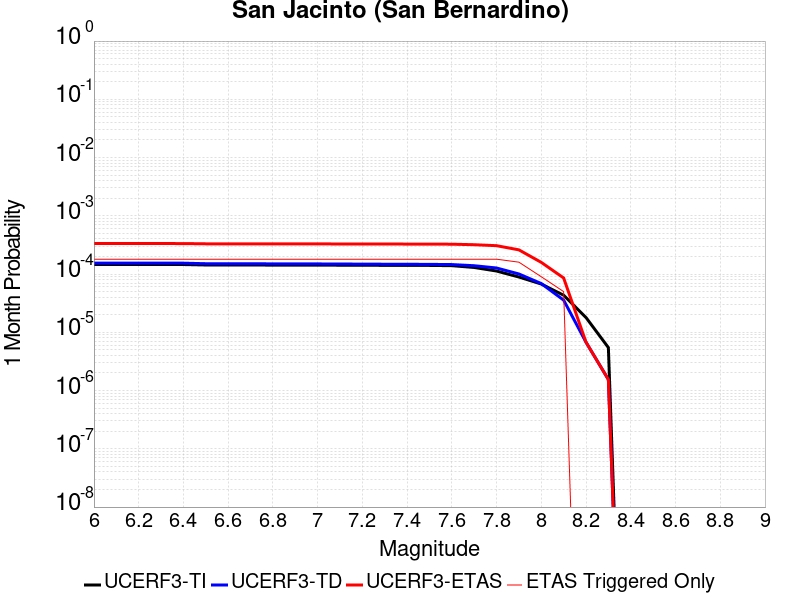 | 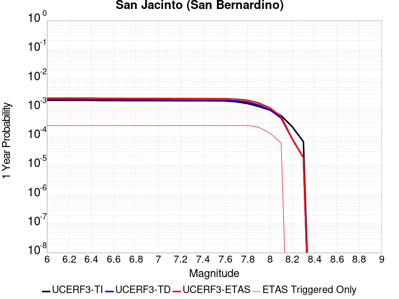 |  |

| Magnitude | 1 wk TI Prob | 1 wk TD Prob | 1 wk ETAS Prob | 1 wk ETAS/TD Gain | 1 wk ETAS Triggered Only | 1 mo TI Prob | 1 mo TD Prob | 1 mo ETAS Prob | 1 mo ETAS/TD Gain | 1 mo ETAS Triggered Only | 1 yr TI Prob | 1 yr TD Prob | 1 yr ETAS Prob | 1 yr ETAS/TD Gain | 1 yr ETAS Triggered Only | 10 yr TI Prob | 10 yr TD Prob | 10 yr ETAS Prob | 10 yr ETAS/TD Gain | 10 yr ETAS Triggered Only |
|-----|-----|-----|-----|-----|-----|-----|-----|-----|-----|-----|-----|-----|-----|-----|-----|-----|-----|-----|-----|-----|
| 6.0 | 3.409352E-5 | 3.598562E-5 | 1.7598057E-4 | 4.890303 | 1.4E-4 | 1.461069E-4 | 1.5421498E-4 | 3.341872E-4 | 2.1670218 | 1.8E-4 | 0.0017774 | 0.0018759521 | 0.0021155018 | 1.1276951 | 2.4E-4 | 0.01763251 | 0.019349992 | 0.019663801 | 1.0162175 | 3.2E-4 |
| 6.1 | 3.409352E-5 | 3.598562E-5 | 1.7598057E-4 | 4.890303 | 1.4E-4 | 1.461069E-4 | 1.5421498E-4 | 3.341872E-4 | 2.1670218 | 1.8E-4 | 0.0017774 | 0.0018759521 | 0.0021155018 | 1.1276951 | 2.4E-4 | 0.01763251 | 0.019349992 | 0.019663801 | 1.0162175 | 3.2E-4 |
| 6.2 | 3.409352E-5 | 3.598562E-5 | 1.7598057E-4 | 4.890303 | 1.4E-4 | 1.461069E-4 | 1.5421498E-4 | 3.341872E-4 | 2.1670218 | 1.8E-4 | 0.0017774 | 0.0018759521 | 0.0021155018 | 1.1276951 | 2.4E-4 | 0.01763251 | 0.019349992 | 0.019663801 | 1.0162175 | 3.2E-4 |
| 6.3 | 3.409352E-5 | 3.598562E-5 | 1.7598057E-4 | 4.890303 | 1.4E-4 | 1.461069E-4 | 1.5421498E-4 | 3.341872E-4 | 2.1670218 | 1.8E-4 | 0.0017774 | 0.0018759521 | 0.0021155018 | 1.1276951 | 2.4E-4 | 0.01763251 | 0.019349992 | 0.019663801 | 1.0162175 | 3.2E-4 |
| 6.4 | 3.400795E-5 | 3.5878285E-5 | 1.7587325E-4 | 4.901942 | 1.4E-4 | 1.4574021E-4 | 1.5375503E-4 | 3.3372734E-4 | 2.1705134 | 1.8E-4 | 0.0017729428 | 0.0018703619 | 0.002109913 | 1.1280774 | 2.4E-4 | 0.017588645 | 0.019295074 | 0.0196089 | 1.0162646 | 3.2E-4 |
| 6.5 | 3.341482E-5 | 3.5138914E-5 | 1.75134E-4 | 4.984047 | 1.4E-4 | 1.4319851E-4 | 1.5058667E-4 | 3.3055956E-4 | 2.195145 | 1.8E-4 | 0.0017420477 | 0.0018318522 | 0.0020714125 | 1.130775 | 2.4E-4 | 0.017284546 | 0.018916616 | 0.019230563 | 1.0165963 | 3.2E-4 |
| 6.6 | 3.3364955E-5 | 3.5076133E-5 | 1.7507123E-4 | 4.991178 | 1.4E-4 | 1.4298483E-4 | 1.5031763E-4 | 3.3029058E-4 | 2.1972842 | 1.8E-4 | 0.0017394501 | 0.0018285823 | 0.0020681433 | 1.1310092 | 2.4E-4 | 0.017258976 | 0.01888448 | 0.019198438 | 1.0166252 | 3.2E-4 |
| 6.7 | 3.335922E-5 | 3.5065907E-5 | 1.75061E-4 | 4.992342 | 1.4E-4 | 1.4296026E-4 | 1.5027382E-4 | 3.3024675E-4 | 2.1976335 | 1.8E-4 | 0.0017391514 | 0.0018280497 | 0.0020676109 | 1.1310475 | 2.4E-4 | 0.017256035 | 0.018879272 | 0.01919323 | 1.0166298 | 3.2E-4 |
| 6.8 | 3.327683E-5 | 3.4959972E-5 | 1.7495507E-4 | 5.00444 | 1.4E-4 | 1.4260718E-4 | 1.4981985E-4 | 3.2979288E-4 | 2.201263 | 1.8E-4 | 0.0017348597 | 0.001822532 | 0.0020620946 | 1.1314449 | 2.4E-4 | 0.017213784 | 0.018825045 | 0.01913902 | 1.0166787 | 3.2E-4 |
| 6.9 | 3.3235785E-5 | 3.4900928E-5 | 1.7489603E-4 | 5.0112147 | 1.4E-4 | 1.4243131E-4 | 1.4956683E-4 | 3.295399E-4 | 2.2032955 | 1.8E-4 | 0.0017327217 | 0.0018194567 | 0.0020590199 | 1.1316675 | 2.4E-4 | 0.017192734 | 0.018794911 | 0.019108897 | 1.0167059 | 3.2E-4 |
| 7.0 | 3.3197095E-5 | 3.4840854E-5 | 1.7483598E-4 | 5.018131 | 1.4E-4 | 1.422655E-4 | 1.4930942E-4 | 3.2928254E-4 | 2.2053702 | 1.8E-4 | 0.0017307063 | 0.0018163278 | 0.002055892 | 1.1318947 | 2.4E-4 | 0.017172894 | 0.01876429 | 0.019078285 | 1.0167336 | 3.2E-4 |
| 7.1 | 3.3129716E-5 | 3.4721066E-5 | 1.747162E-4 | 5.0319943 | 1.4E-4 | 1.4197677E-4 | 1.4879608E-4 | 3.287693E-4 | 2.2095292 | 1.8E-4 | 0.0017271966 | 0.0018100884 | 0.002049654 | 1.1323502 | 2.4E-4 | 0.017138338 | 0.018703366 | 0.01901738 | 1.0167892 | 3.2E-4 |
| 7.2 | 3.3034008E-5 | 3.4588513E-5 | 1.7458366E-4 | 5.0474467 | 1.4E-4 | 1.4156665E-4 | 1.4822806E-4 | 3.282014E-4 | 2.214165 | 1.8E-4 | 0.0017222111 | 0.0018031843 | 0.0020427515 | 1.1328579 | 2.4E-4 | 0.017089253 | 0.01863575 | 0.018949786 | 1.0168513 | 3.2E-4 |
| 7.3 | 3.2956614E-5 | 3.4456265E-5 | 1.7445144E-4 | 5.0629816 | 1.4E-4 | 1.4123498E-4 | 1.4766137E-4 | 3.2763477E-4 | 2.2188253 | 1.8E-4 | 0.0017181796 | 0.0017962961 | 0.002035865 | 1.1333683 | 2.4E-4 | 0.017049557 | 0.018568495 | 0.018882554 | 1.0169135 | 3.2E-4 |
| 7.4 | 3.2915937E-5 | 3.4377957E-5 | 1.7437314E-4 | 5.0722365 | 1.4E-4 | 1.4106068E-4 | 1.473258E-4 | 3.272993E-4 | 2.221602 | 1.8E-4 | 0.0017160608 | 0.0017922173 | 0.002031787 | 1.1336724 | 2.4E-4 | 0.017028693 | 0.018528769 | 0.01884284 | 1.0169505 | 3.2E-4 |
| 7.5 | 3.281791E-5 | 3.424287E-5 | 1.7423807E-4 | 5.088302 | 1.4E-4 | 1.406406E-4 | 1.4674691E-4 | 3.267205E-4 | 2.2264216 | 1.8E-4 | 0.0017109542 | 0.0017851809 | 0.0020247526 | 1.1342001 | 2.4E-4 | 0.016978411 | 0.018459652 | 0.018773746 | 1.0170151 | 3.2E-4 |
| 7.6 | 3.2521442E-5 | 3.396782E-5 | 1.7396307E-4 | 5.121408 | 1.4E-4 | 1.3937015E-4 | 1.4556825E-4 | 3.2554206E-4 | 2.2363534 | 1.8E-4 | 0.0016955109 | 0.0017708542 | 0.0020104293 | 1.1352878 | 2.4E-4 | 0.016826328 | 0.018317295 | 0.018631434 | 1.0171498 | 3.2E-4 |
| 7.7 | 3.0287873E-5 | 3.245191E-5 | 1.7244737E-4 | 5.3139358 | 1.4E-4 | 1.297987E-4 | 1.3907222E-4 | 3.190472E-4 | 2.2941117 | 1.8E-4 | 0.0015791537 | 0.0016918903 | 0.0019314842 | 1.1416131 | 2.4E-4 | 0.01567979 | 0.017528199 | 0.01784259 | 1.0179363 | 3.2E-4 |
| 7.8 | 2.6316151E-5 | 2.9662837E-5 | 1.6965868E-4 | 5.7195706 | 1.4E-4 | 1.1277862E-4 | 1.2712025E-4 | 3.0709736E-4 | 2.415802 | 1.8E-4 | 0.0013722149 | 0.0015465913 | 0.0017862201 | 1.15494 | 2.4E-4 | 0.013637724 | 0.016069878 | 0.016384736 | 1.019593 | 3.2E-4 |
| 7.9 | 2.0761147E-5 | 2.3417291E-5 | 1.4341448E-4 | 6.1242986 | 1.2E-4 | 8.897331E-5 | 1.0035596E-4 | 2.603399E-4 | 2.5941648 | 1.6E-4 | 0.0010827117 | 0.0012211498 | 0.0014308934 | 1.1717591 | 2.1E-4 | 0.010774517 | 0.012793272 | 0.013069689 | 1.0216064 | 2.8E-4 |
| 8.0 | 1.5738568E-5 | 1.6032505E-5 | 8.603138E-5 | 5.36606 | 7.0E-5 | 6.744926E-5 | 6.8708934E-5 | 1.5870275E-4 | 2.3097835 | 9.0E-5 | 8.2088535E-4 | 8.3621085E-4 | 9.661022E-4 | 1.1553332 | 1.3E-4 | 0.008178596 | 0.008865741 | 0.009044145 | 1.0201229 | 1.8E-4 |
| 8.1 | 1.0105832E-5 | 8.329479E-6 | 4.8329144E-5 | 5.8021812 | 4.0E-5 | 4.3309992E-5 | 3.569728E-5 | 8.5695494E-5 | 2.400617 | 5.0E-5 | 5.2717153E-4 | 4.3452822E-4 | 4.9450214E-4 | 1.1380208 | 6.0E-5 | 0.005259227 | 0.0046768794 | 0.0047465516 | 1.0148972 | 7.0E-5 |
| 8.2 | 4.189207E-6 | 1.577699E-6 | 1.577699E-6 | 1.0 | 0.0 | 1.7953622E-5 | 6.7615497E-6 | 6.7615497E-6 | 1.0 | 0.0 | 2.1856341E-4 | 8.231879E-5 | 8.231879E-5 | 1.0 | 0.0 | 0.0021834858 | 9.562628E-4 | 9.562628E-4 | 1.0 | 0.0 |
| 8.3 | 1.2758221E-6 | 3.612677E-7 | 3.612677E-7 | 1.0 | 0.0 | 5.4677976E-6 | 1.5482892E-6 | 1.5482892E-6 | 1.0 | 0.0 | 6.65684E-5 | 1.8850264E-5 | 1.8850264E-5 | 1.0 | 0.0 | 6.6548464E-4 | 2.2739546E-4 | 2.2739546E-4 | 1.0 | 0.0 |

## San Andreas (Creeping Section) 2011 CFM
*[(top)](#table-of-contents)*

| 1 Week | 1 Month | 1 Year | 10 Year |
|-----|-----|-----|-----|
|  |  |  |  |

| Magnitude | 1 wk TI Prob | 1 wk TD Prob | 1 wk ETAS Prob | 1 wk ETAS/TD Gain | 1 wk ETAS Triggered Only | 1 mo TI Prob | 1 mo TD Prob | 1 mo ETAS Prob | 1 mo ETAS/TD Gain | 1 mo ETAS Triggered Only | 1 yr TI Prob | 1 yr TD Prob | 1 yr ETAS Prob | 1 yr ETAS/TD Gain | 1 yr ETAS Triggered Only | 10 yr TI Prob | 10 yr TD Prob | 10 yr ETAS Prob | 10 yr ETAS/TD Gain | 10 yr ETAS Triggered Only |
|-----|-----|-----|-----|-----|-----|-----|-----|-----|-----|-----|-----|-----|-----|-----|-----|-----|-----|-----|-----|-----|
| 6.0 | 5.986481E-4 | 0.0012275929 | 0.0013274702 | 1.0813602 | 1.0E-4 | 0.0025631124 | 0.005245547 | 0.0053549698 | 1.0208602 | 1.1E-4 | 0.030762846 | 0.06120491 | 0.061402056 | 1.0032212 | 2.1E-4 | 0.26835477 | 0.42593494 | 0.42610714 | 1.0004044 | 3.0E-4 |
| 6.1 | 5.015945E-4 | 0.0010217986 | 0.0011216963 | 1.0977666 | 1.0E-4 | 0.00214792 | 0.0043678596 | 0.004477379 | 1.025074 | 1.1E-4 | 0.025839351 | 0.05124837 | 0.051419146 | 1.0033323 | 1.8E-4 | 0.23032776 | 0.37285668 | 0.37301347 | 1.0004205 | 2.5E-4 |
| 6.2 | 4.073338E-4 | 8.1073755E-4 | 8.706889E-4 | 1.0739467 | 6.0E-5 | 0.0017445484 | 0.0034671477 | 0.003536905 | 1.0201195 | 7.0E-5 | 0.021034058 | 0.04093317 | 0.041057847 | 1.0030459 | 1.3E-4 | 0.19150782 | 0.31303346 | 0.31317085 | 1.0004389 | 2.0E-4 |
| 6.3 | 3.464099E-4 | 6.7391695E-4 | 7.338765E-4 | 1.0889717 | 6.0E-5 | 0.0014837692 | 0.0028829593 | 0.0029527575 | 1.0242106 | 7.0E-5 | 0.017915873 | 0.034189582 | 0.034315135 | 1.0036724 | 1.3E-4 | 0.16538359 | 0.2713166 | 0.27145502 | 1.0005103 | 1.9E-4 |
| 6.4 | 2.935057E-4 | 5.5442745E-4 | 6.1439414E-4 | 1.1081598 | 6.0E-5 | 0.0012572751 | 0.0023725363 | 0.0024423702 | 1.0294343 | 7.0E-5 | 0.015200248 | 0.02826451 | 0.028390836 | 1.0044694 | 1.3E-4 | 0.14201577 | 0.23298529 | 0.23312335 | 1.0005926 | 1.8E-4 |
| 6.5 | 2.3409708E-4 | 4.2093755E-4 | 4.809123E-4 | 1.142479 | 6.0E-5 | 0.0010028875 | 0.0018019684 | 0.0018718423 | 1.0387764 | 7.0E-5 | 0.012141965 | 0.021587461 | 0.021714656 | 1.005892 | 1.3E-4 | 0.11499573 | 0.18682368 | 0.18697006 | 1.0007834 | 1.8E-4 |
| 6.6 | 1.5842178E-4 | 2.506933E-4 | 3.1067827E-4 | 1.2392763 | 6.0E-5 | 6.7877385E-4 | 0.0010739497 | 0.0011438746 | 1.06511 | 7.0E-5 | 0.0082328 | 0.012995575 | 0.013094275 | 1.007595 | 1.0E-4 | 0.07934396 | 0.12314638 | 0.12326914 | 1.0009968 | 1.4E-4 |
| 6.7 | 1.5616413E-4 | 2.4605883E-4 | 3.0604406E-4 | 1.2437842 | 6.0E-5 | 6.691031E-4 | 0.0010541069 | 0.001124033 | 1.066337 | 7.0E-5 | 0.0081159435 | 0.01275744 | 0.012856164 | 1.0077386 | 1.0E-4 | 0.0782586 | 0.12117351 | 0.12129655 | 1.0010154 | 1.4E-4 |
| 6.8 | 1.5538467E-4 | 2.4429744E-4 | 3.042828E-4 | 1.2455423 | 6.0E-5 | 6.6576427E-4 | 0.0010465645 | 0.0011164913 | 1.0668155 | 7.0E-5 | 0.008075596 | 0.012666838 | 0.012765572 | 1.0077946 | 1.0E-4 | 0.07788358 | 0.120404355 | 0.1205275 | 1.0010227 | 1.4E-4 |
| 6.9 | 1.5153569E-4 | 2.3539034E-4 | 2.953762E-4 | 1.2548357 | 6.0E-5 | 6.49277E-4 | 0.0010084276 | 0.001078357 | 1.069345 | 7.0E-5 | 0.007876333 | 0.01220901 | 0.01230779 | 1.0080906 | 1.0E-4 | 0.07602952 | 0.11647445 | 0.116598144 | 1.001062 | 1.4E-4 |
| 7.0 | 1.4588932E-4 | 2.2396253E-4 | 2.839491E-4 | 1.2678419 | 6.0E-5 | 6.250901E-4 | 9.5948833E-4 | 0.0010294212 | 1.0728855 | 7.0E-5 | 0.0075839474 | 0.011619697 | 0.011718535 | 1.0085061 | 1.0E-4 | 0.073302895 | 0.11132046 | 0.11144487 | 1.0011176 | 1.4E-4 |
| 7.1 | 1.1565079E-4 | 1.6281738E-4 | 2.2280762E-4 | 1.368451 | 6.0E-5 | 4.955521E-4 | 6.9760304E-4 | 7.675542E-4 | 1.1002736 | 7.0E-5 | 0.006016669 | 0.0084604435 | 0.008559597 | 1.0117197 | 1.0E-4 | 0.058563538 | 0.08367046 | 0.08378959 | 1.0014237 | 1.3E-4 |
| 7.2 | 1.0393792E-4 | 1.4615769E-4 | 2.0614892E-4 | 1.4104556 | 6.0E-5 | 4.4537216E-4 | 6.2624045E-4 | 6.961966E-4 | 1.1117082 | 7.0E-5 | 0.005408933 | 0.0075979927 | 0.007697233 | 1.0130614 | 1.0E-4 | 0.052791595 | 0.07561969 | 0.07573986 | 1.0015892 | 1.3E-4 |
| 7.3 | 9.332884E-5 | 1.2780898E-4 | 1.8780131E-4 | 1.4693906 | 6.0E-5 | 3.999194E-4 | 5.4763845E-4 | 6.176001E-4 | 1.1277516 | 7.0E-5 | 0.0048581534 | 0.006647249 | 0.006746584 | 1.0149438 | 1.0E-4 | 0.047533102 | 0.06648326 | 0.066604614 | 1.0018253 | 1.3E-4 |
| 7.4 | 8.670252E-5 | 1.17032345E-4 | 1.7702531E-4 | 1.5126188 | 6.0E-5 | 3.715293E-4 | 5.0147134E-4 | 5.7143625E-4 | 1.1395192 | 7.0E-5 | 0.004513991 | 0.006088443 | 0.0061878343 | 1.0163245 | 1.0E-4 | 0.044233937 | 0.061151642 | 0.061273694 | 1.0019959 | 1.3E-4 |
| 7.5 | 7.3036405E-5 | 9.005856E-5 | 1.5005315E-4 | 1.6661732 | 6.0E-5 | 3.129756E-4 | 3.8590826E-4 | 4.5588124E-4 | 1.1813203 | 7.0E-5 | 0.0038038217 | 0.0046883323 | 0.0047878637 | 1.0212295 | 1.0E-4 | 0.03739367 | 0.047877792 | 0.047992047 | 1.0023863 | 1.2E-4 |
| 7.6 | 6.3935775E-5 | 8.280385E-5 | 1.4279888E-4 | 1.724544 | 6.0E-5 | 2.7398168E-4 | 3.5482543E-4 | 4.248006E-4 | 1.1972101 | 7.0E-5 | 0.0033306254 | 0.004311461 | 0.00441103 | 1.0230939 | 1.0E-4 | 0.032811474 | 0.04399201 | 0.04410673 | 1.0026078 | 1.2E-4 |
| 7.7 | 5.5050095E-5 | 6.6618326E-5 | 1.2661434E-4 | 1.900593 | 6.0E-5 | 2.3590765E-4 | 2.854759E-4 | 3.554559E-4 | 1.2451346 | 7.0E-5 | 0.0028683927 | 0.003470134 | 0.0035498564 | 1.0229739 | 8.0E-5 | 0.0283165 | 0.035796214 | 0.03589263 | 1.0026935 | 1.0E-4 |
| 7.8 | 5.027131E-5 | 6.162871E-5 | 1.2162501E-4 | 1.9735123 | 6.0E-5 | 2.1543067E-4 | 2.640963E-4 | 3.340778E-4 | 1.2649848 | 7.0E-5 | 0.0026197135 | 0.003210635 | 0.0032903783 | 1.0248371 | 8.0E-5 | 0.025890453 | 0.03312666 | 0.033223346 | 1.0029187 | 1.0E-4 |
| 7.9 | 3.7271806E-5 | 5.022507E-5 | 1.00222554E-4 | 1.9954689 | 5.0E-5 | 1.5972654E-4 | 2.1523255E-4 | 2.7521962E-4 | 1.2787082 | 6.0E-5 | 0.0019429359 | 0.002617309 | 0.002687126 | 1.026675 | 7.0E-5 | 0.019260362 | 0.027067466 | 0.027155029 | 1.003235 | 9.0E-5 |
| 8.0 | 2.7310243E-5 | 3.1427757E-5 | 7.14265E-5 | 2.2727203 | 4.0E-5 | 1.17038646E-4 | 1.3468343E-4 | 1.7467805E-4 | 1.2969527 | 4.0E-5 | 0.0014240141 | 0.0016385383 | 0.0016784729 | 1.024372 | 4.0E-5 | 0.014149235 | 0.01721386 | 0.017272828 | 1.0034256 | 6.0E-5 |
| 8.1 | 1.7940547E-5 | 1.7399378E-5 | 4.7398855E-5 | 2.7241697 | 3.0E-5 | 7.688579E-5 | 7.456663E-5 | 1.04564395E-4 | 1.4022948 | 3.0E-5 | 9.3568244E-4 | 9.074711E-4 | 9.374439E-4 | 1.033029 | 3.0E-5 | 0.009317525 | 0.009798636 | 0.009828341 | 1.0030316 | 3.0E-5 |
| 8.2 | 8.643924E-6 | 5.473668E-6 | 1.5473614E-5 | 2.8269184 | 1.0E-5 | 3.704486E-5 | 2.3458366E-5 | 3.345813E-5 | 1.4262772 | 1.0E-5 | 4.5092785E-4 | 2.8556827E-4 | 2.955654E-4 | 1.035008 | 1.0E-5 | 0.0045001395 | 0.0032481793 | 0.003258147 | 1.0030687 | 1.0E-5 |
| 8.3 | 1.983087E-6 | 7.6564595E-7 | 7.6564595E-7 | 1.0 | 0.0 | 8.498917E-6 | 3.281336E-6 | 3.281336E-6 | 1.0 | 0.0 | 1.034694E-4 | 3.9949547E-5 | 3.9949547E-5 | 1.0 | 0.0 | 0.0010342124 | 4.717979E-4 | 4.717979E-4 | 1.0 | 0.0 |

## San Andreas (North Branch Mill Creek)
*[(top)](#table-of-contents)*

| 1 Week | 1 Month | 1 Year | 10 Year |
|-----|-----|-----|-----|
|  | 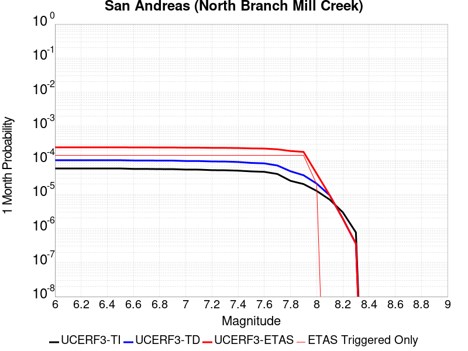 |  |  |

| Magnitude | 1 wk TI Prob | 1 wk TD Prob | 1 wk ETAS Prob | 1 wk ETAS/TD Gain | 1 wk ETAS Triggered Only | 1 mo TI Prob | 1 mo TD Prob | 1 mo ETAS Prob | 1 mo ETAS/TD Gain | 1 mo ETAS Triggered Only | 1 yr TI Prob | 1 yr TD Prob | 1 yr ETAS Prob | 1 yr ETAS/TD Gain | 1 yr ETAS Triggered Only | 10 yr TI Prob | 10 yr TD Prob | 10 yr ETAS Prob | 10 yr ETAS/TD Gain | 10 yr ETAS Triggered Only |
|-----|-----|-----|-----|-----|-----|-----|-----|-----|-----|-----|-----|-----|-----|-----|-----|-----|-----|-----|-----|-----|
| 6.0 | 1.3461156E-5 | 2.3500992E-5 | 1.03499115E-4 | 4.4040318 | 8.0E-5 | 5.7689394E-5 | 1.00714664E-4 | 2.4070057E-4 | 2.3899257 | 1.4E-4 | 7.02142E-4 | 0.0012255146 | 0.0014252695 | 1.1629968 | 2.0E-4 | 0.0069992766 | 0.012228744 | 0.012475687 | 1.0201937 | 2.5E-4 |
| 6.1 | 1.3461156E-5 | 2.3500992E-5 | 1.03499115E-4 | 4.4040318 | 8.0E-5 | 5.7689394E-5 | 1.00714664E-4 | 2.4070057E-4 | 2.3899257 | 1.4E-4 | 7.02142E-4 | 0.0012255146 | 0.0014252695 | 1.1629968 | 2.0E-4 | 0.0069992766 | 0.012228744 | 0.012475687 | 1.0201937 | 2.5E-4 |
| 6.2 | 1.3461156E-5 | 2.3500992E-5 | 1.03499115E-4 | 4.4040318 | 8.0E-5 | 5.7689394E-5 | 1.00714664E-4 | 2.4070057E-4 | 2.3899257 | 1.4E-4 | 7.02142E-4 | 0.0012255146 | 0.0014252695 | 1.1629968 | 2.0E-4 | 0.0069992766 | 0.012228744 | 0.012475687 | 1.0201937 | 2.5E-4 |
| 6.3 | 1.3461156E-5 | 2.3500992E-5 | 1.03499115E-4 | 4.4040318 | 8.0E-5 | 5.7689394E-5 | 1.00714664E-4 | 2.4070057E-4 | 2.3899257 | 1.4E-4 | 7.02142E-4 | 0.0012255146 | 0.0014252695 | 1.1629968 | 2.0E-4 | 0.0069992766 | 0.012228744 | 0.012475687 | 1.0201937 | 2.5E-4 |
| 6.4 | 1.3461156E-5 | 2.3500992E-5 | 1.03499115E-4 | 4.4040318 | 8.0E-5 | 5.7689394E-5 | 1.00714664E-4 | 2.4070057E-4 | 2.3899257 | 1.4E-4 | 7.02142E-4 | 0.0012255146 | 0.0014252695 | 1.1629968 | 2.0E-4 | 0.0069992766 | 0.012228744 | 0.012475687 | 1.0201937 | 2.5E-4 |
| 6.5 | 1.3450706E-5 | 2.348995E-5 | 1.0348807E-4 | 4.4056315 | 8.0E-5 | 5.764461E-5 | 1.00667356E-4 | 2.4065326E-4 | 2.390579 | 1.4E-4 | 7.0159714E-4 | 0.0012249392 | 0.0014246943 | 1.1630734 | 2.0E-4 | 0.006993862 | 0.012223054 | 0.012469998 | 1.0202031 | 2.5E-4 |
| 6.6 | 1.3074523E-5 | 2.3104236E-5 | 1.03102386E-4 | 4.4624887 | 8.0E-5 | 5.6032466E-5 | 9.901441E-5 | 2.3900055E-4 | 2.4137955 | 1.4E-4 | 6.8198174E-4 | 0.001204837 | 0.001404596 | 1.1657976 | 2.0E-4 | 0.006798926 | 0.012024219 | 0.012271213 | 1.0205414 | 2.5E-4 |
| 6.7 | 1.3050216E-5 | 2.3079532E-5 | 1.03077684E-4 | 4.4661946 | 8.0E-5 | 5.59283E-5 | 9.890855E-5 | 2.388947E-4 | 2.415309 | 1.4E-4 | 6.8071426E-4 | 0.0012035496 | 0.0014033089 | 1.1659751 | 2.0E-4 | 0.0067863287 | 0.012011484 | 0.012258481 | 1.0205634 | 2.5E-4 |
| 6.8 | 1.29049395E-5 | 2.2927941E-5 | 1.02926104E-4 | 4.4891124 | 8.0E-5 | 5.530571E-5 | 9.825892E-5 | 2.3824516E-4 | 2.4246671 | 1.4E-4 | 6.73139E-4 | 0.001195649 | 0.0013954099 | 1.1670731 | 2.0E-4 | 0.0067110364 | 0.011933329 | 0.012180345 | 1.0206997 | 2.5E-4 |
| 6.9 | 1.2867369E-5 | 2.2887343E-5 | 1.0288551E-4 | 4.4953017 | 8.0E-5 | 5.51447E-5 | 9.808494E-5 | 2.3807121E-4 | 2.4271944 | 1.4E-4 | 6.711799E-4 | 0.0011935332 | 0.0013932945 | 1.1673697 | 2.0E-4 | 0.006691564 | 0.011912397 | 0.012159419 | 1.0207366 | 2.5E-4 |
| 7.0 | 1.2495996E-5 | 2.2287419E-5 | 1.0228564E-4 | 4.589389 | 8.0E-5 | 5.3553173E-5 | 9.551403E-5 | 2.3550066E-4 | 2.4656131 | 1.4E-4 | 6.518148E-4 | 0.0011622658 | 0.0013620333 | 1.1718776 | 2.0E-4 | 0.0064990623 | 0.011603 | 0.011850099 | 1.0212961 | 2.5E-4 |
| 7.1 | 1.2452067E-5 | 2.2232492E-5 | 1.0223071E-4 | 4.598257 | 8.0E-5 | 5.3364907E-5 | 9.527864E-5 | 2.3526531E-4 | 2.4692345 | 1.4E-4 | 6.4952404E-4 | 0.001159403 | 0.0013591711 | 1.1723026 | 2.0E-4 | 0.0064762887 | 0.011574671 | 0.011821778 | 1.0213488 | 2.5E-4 |
| 7.2 | 1.2002777E-5 | 2.1611015E-5 | 1.0160929E-4 | 4.701736 | 8.0E-5 | 5.143946E-5 | 9.261536E-5 | 2.326024E-4 | 2.5114882 | 1.4E-4 | 6.2609545E-4 | 0.0011270114 | 0.001326786 | 1.1772605 | 2.0E-4 | 0.006243344 | 0.011254058 | 0.011501244 | 1.0219642 | 2.5E-4 |
| 7.3 | 1.1923425E-5 | 2.1480853E-5 | 1.01479134E-4 | 4.724167 | 8.0E-5 | 5.109939E-5 | 9.205757E-5 | 2.3204468E-4 | 2.5206475 | 1.4E-4 | 6.219575E-4 | 0.0011202273 | 0.0013200032 | 1.1783352 | 2.0E-4 | 0.0062021962 | 0.011186945 | 0.011434148 | 1.0220975 | 2.5E-4 |
| 7.4 | 1.16105175E-5 | 2.0854808E-5 | 1.0085314E-4 | 4.835966 | 8.0E-5 | 4.975841E-5 | 8.93747E-5 | 2.2936218E-4 | 2.5662987 | 1.4E-4 | 6.0564023E-4 | 0.0010875963 | 0.0012873788 | 1.1836917 | 2.0E-4 | 0.006039923 | 0.010864409 | 0.011111693 | 1.0227609 | 2.5E-4 |
| 7.5 | 1.1037265E-5 | 1.9554842E-5 | 9.9553276E-5 | 5.090978 | 8.0E-5 | 4.7301706E-5 | 8.380379E-5 | 2.2379206E-4 | 2.670429 | 1.4E-4 | 5.757461E-4 | 0.0010198357 | 0.0012196318 | 1.19591 | 2.0E-4 | 0.005742567 | 0.010195527 | 0.010442979 | 1.0242705 | 2.5E-4 |
| 7.6 | 1.0720915E-5 | 1.8996727E-5 | 9.899521E-5 | 5.2111716 | 8.0E-5 | 4.5945973E-5 | 8.141202E-5 | 2.2140062E-4 | 2.719508 | 1.4E-4 | 5.592486E-4 | 9.907428E-4 | 0.0011905447 | 1.2016687 | 2.0E-4 | 0.005578433 | 0.009907238 | 0.010154761 | 1.0249841 | 2.5E-4 |
| 7.7 | 9.276279E-6 | 1.6442464E-5 | 9.644115E-5 | 5.8653708 | 8.0E-5 | 3.9754876E-5 | 7.046581E-5 | 2.1045594E-4 | 2.9866393 | 1.4E-4 | 4.839081E-4 | 8.5758517E-4 | 0.0010574136 | 1.233013 | 2.0E-4 | 0.0048285574 | 0.008586576 | 0.008834429 | 1.0288652 | 2.5E-4 |
| 7.8 | 5.8346777E-6 | 1.11555855E-5 | 9.1154696E-5 | 8.171216 | 8.0E-5 | 2.5005522E-5 | 4.7808775E-5 | 1.8780208E-4 | 3.9281926 | 1.4E-4 | 3.043997E-4 | 5.819165E-4 | 7.8180013E-4 | 1.3434919 | 2.0E-4 | 0.0030398308 | 0.0058473335 | 0.0060958713 | 1.0425045 | 2.5E-4 |
| 7.9 | 4.690204E-6 | 8.509473E-6 | 8.8508794E-5 | 10.401206 | 8.0E-5 | 2.0100719E-5 | 3.6468664E-5 | 1.7646355E-4 | 4.8387723 | 1.4E-4 | 2.4469878E-4 | 4.439156E-4 | 6.4382685E-4 | 1.4503361 | 2.0E-4 | 0.002444295 | 0.004471165 | 0.004720047 | 1.0556638 | 2.5E-4 |
| 8.0 | 2.9570454E-6 | 4.8470656E-6 | 1.4847017E-5 | 3.063094 | 1.0E-5 | 1.267299E-5 | 2.0772974E-5 | 4.0772557E-5 | 1.9627695 | 2.0E-5 | 1.5428272E-4 | 2.5288164E-4 | 2.8287404E-4 | 1.1186026 | 3.0E-5 | 0.0015417566 | 0.002549932 | 0.0026097791 | 1.02347 | 6.0E-5 |
| 8.1 | 1.6376824E-6 | 2.1968672E-6 | 2.1968672E-6 | 1.0 | 0.0 | 7.01862E-6 | 9.415111E-6 | 9.415111E-6 | 1.0 | 0.0 | 8.544835E-5 | 1.1462297E-4 | 1.1462297E-4 | 1.0 | 0.0 | 8.54155E-4 | 0.0011607445 | 0.0011607445 | 1.0 | 0.0 |
| 8.2 | 6.9631557E-7 | 4.535001E-7 | 4.535001E-7 | 1.0 | 0.0 | 2.984206E-6 | 1.9435704E-6 | 1.9435704E-6 | 1.0 | 0.0 | 3.63321E-5 | 2.3662713E-5 | 2.3662713E-5 | 1.0 | 0.0 | 3.6326164E-4 | 2.4510184E-4 | 2.4510184E-4 | 1.0 | 0.0 |
| 8.3 | 1.7876137E-7 | 8.357368E-8 | 8.357368E-8 | 1.0 | 0.0 | 7.661199E-7 | 3.5817288E-7 | 3.5817288E-7 | 1.0 | 0.0 | 9.32747E-6 | 4.3607465E-6 | 4.3607465E-6 | 1.0 | 0.0 | 9.3270784E-5 | 4.5800018E-5 | 4.5800018E-5 | 1.0 | 0.0 |

## Scodie Lineament
*[(top)](#table-of-contents)*

| 1 Week | 1 Month | 1 Year | 10 Year |
|-----|-----|-----|-----|
|  |  |  |  |

| Magnitude | 1 wk TI Prob | 1 wk TD Prob | 1 wk ETAS Prob | 1 wk ETAS/TD Gain | 1 wk ETAS Triggered Only | 1 mo TI Prob | 1 mo TD Prob | 1 mo ETAS Prob | 1 mo ETAS/TD Gain | 1 mo ETAS Triggered Only | 1 yr TI Prob | 1 yr TD Prob | 1 yr ETAS Prob | 1 yr ETAS/TD Gain | 1 yr ETAS Triggered Only | 10 yr TI Prob | 10 yr TD Prob | 10 yr ETAS Prob | 10 yr ETAS/TD Gain | 10 yr ETAS Triggered Only |
|-----|-----|-----|-----|-----|-----|-----|-----|-----|-----|-----|-----|-----|-----|-----|-----|-----|-----|-----|-----|-----|
| 6.0 | 3.2919327E-6 | 3.0133303E-6 | 1.0301303E-4 | 34.185772 | 1.0E-4 | 1.4108206E-5 | 1.2914227E-5 | 1.4291256E-4 | 11.066287 | 1.3E-4 | 1.7175387E-4 | 1.5722254E-4 | 3.3719424E-4 | 2.1446939 | 1.8E-4 | 0.0017162118 | 0.0015714248 | 0.0018110477 | 1.1524876 | 2.4E-4 |
| 6.1 | 1.8663811E-6 | 1.5490382E-6 | 3.1548992E-5 | 20.366827 | 3.0E-5 | 7.998751E-6 | 6.6387206E-6 | 4.6638455E-5 | 7.025217 | 4.0E-5 | 9.738045E-5 | 8.082393E-5 | 1.4081907E-4 | 1.7422944 | 6.0E-5 | 9.7337784E-4 | 8.079941E-4 | 8.8792946E-4 | 1.0989306 | 8.0E-5 |
| 6.2 | 1.8663811E-6 | 1.5490382E-6 | 3.1548992E-5 | 20.366827 | 3.0E-5 | 7.998751E-6 | 6.6387206E-6 | 4.6638455E-5 | 7.025217 | 4.0E-5 | 9.738045E-5 | 8.082393E-5 | 1.4081907E-4 | 1.7422944 | 6.0E-5 | 9.7337784E-4 | 8.079941E-4 | 8.8792946E-4 | 1.0989306 | 8.0E-5 |
| 6.3 | 1.8663811E-6 | 1.5490382E-6 | 3.1548992E-5 | 20.366827 | 3.0E-5 | 7.998751E-6 | 6.6387206E-6 | 4.6638455E-5 | 7.025217 | 4.0E-5 | 9.738045E-5 | 8.082393E-5 | 1.4081907E-4 | 1.7422944 | 6.0E-5 | 9.7337784E-4 | 8.079941E-4 | 8.8792946E-4 | 1.0989306 | 8.0E-5 |
| 6.4 | 1.8663811E-6 | 1.5490382E-6 | 3.1548992E-5 | 20.366827 | 3.0E-5 | 7.998751E-6 | 6.6387206E-6 | 4.6638455E-5 | 7.025217 | 4.0E-5 | 9.738045E-5 | 8.082393E-5 | 1.4081907E-4 | 1.7422944 | 6.0E-5 | 9.7337784E-4 | 8.079941E-4 | 8.8792946E-4 | 1.0989306 | 8.0E-5 |
| 6.5 | 1.8106311E-6 | 1.4909722E-6 | 3.1490927E-5 | 21.12107 | 3.0E-5 | 7.759824E-6 | 6.389868E-6 | 4.6389614E-5 | 7.2598705 | 4.0E-5 | 9.447177E-5 | 7.779436E-5 | 1.3778968E-4 | 1.7712041 | 6.0E-5 | 9.4431615E-4 | 7.7771995E-4 | 8.576577E-4 | 1.1027848 | 8.0E-5 |
| 6.6 | 1.2414679E-6 | 8.9974395E-7 | 1.0899735E-5 | 12.114263 | 1.0E-5 | 5.320566E-6 | 3.85604E-6 | 1.3856002E-5 | 3.593324 | 1.0E-5 | 6.477596E-5 | 4.6946367E-5 | 6.694543E-5 | 1.4259981 | 2.0E-5 | 6.475708E-4 | 4.6937316E-4 | 5.093544E-4 | 1.08518 | 4.0E-5 |
| 6.7 | 1.1062215E-6 | 7.594193E-7 | 1.0759411E-5 | 14.167946 | 1.0E-5 | 4.7409408E-6 | 3.2546504E-6 | 1.3254618E-5 | 4.0725164 | 1.0E-5 | 5.7719422E-5 | 3.962472E-5 | 5.962393E-5 | 1.5047154 | 2.0E-5 | 5.770443E-4 | 3.9618355E-4 | 4.361677E-4 | 1.1009233 | 4.0E-5 |
| 6.8 | 1.0006736E-6 | 6.5002786E-7 | 1.0650021E-5 | 16.383945 | 1.0E-5 | 4.288594E-6 | 2.7858312E-6 | 1.2785803E-5 | 4.589583 | 1.0E-5 | 5.221238E-5 | 3.391703E-5 | 5.391635E-5 | 1.5896543 | 2.0E-5 | 5.220012E-4 | 3.3912458E-4 | 3.7911104E-4 | 1.1179107 | 4.0E-5 |
| 6.9 | 9.167364E-7 | 5.6315065E-7 | 1.0563145E-5 | 18.757227 | 1.0E-5 | 3.9288643E-6 | 2.413501E-6 | 1.2413477E-5 | 5.1433487 | 1.0E-5 | 4.7832873E-5 | 2.9384037E-5 | 4.938345E-5 | 1.6806217 | 2.0E-5 | 4.782258E-4 | 2.9380718E-4 | 3.3379544E-4 | 1.1361037 | 4.0E-5 |
| 7.0 | 7.6987664E-7 | 4.113265E-7 | 1.0411322E-5 | 25.311577 | 1.0E-5 | 3.2994672E-6 | 1.7628269E-6 | 1.176281E-5 | 6.6726966 | 1.0E-5 | 4.0170275E-5 | 2.1462245E-5 | 3.146203E-5 | 1.4659245 | 1.0E-5 | 4.0163012E-4 | 2.1460558E-4 | 2.4459916E-4 | 1.1397613 | 3.0E-5 |
| 7.1 | 7.1038727E-7 | 3.5210306E-7 | 1.03521E-5 | 29.400766 | 1.0E-5 | 3.0445133E-6 | 1.5090123E-6 | 1.1508997E-5 | 7.626841 | 1.0E-5 | 3.706632E-5 | 1.8372106E-5 | 2.8371922E-5 | 1.5442934 | 1.0E-5 | 3.7060137E-4 | 1.8370937E-4 | 2.1370385E-4 | 1.1632714 | 3.0E-5 |
| 7.2 | 2.0799602E-7 | 3.1178534E-8 | 3.1178534E-8 | 1.0 | 0.0 | 8.914113E-7 | 1.3362228E-7 | 1.3362228E-7 | 1.0 | 0.0 | 1.0852878E-5 | 1.6268501E-6 | 1.6268501E-6 | 1.0 | 0.0 | 1.08523476E-4 | 1.626839E-5 | 1.626839E-5 | 1.0 | 0.0 |
| 7.3 | 1.5048182E-7 | 1.5939106E-8 | 1.5939106E-8 | 1.0 | 0.0 | 6.449219E-7 | 6.8310456E-8 | 6.8310456E-8 | 1.0 | 0.0 | 7.851896E-6 | 8.316795E-7 | 8.316795E-7 | 1.0 | 0.0 | 7.851618E-5 | 8.316767E-6 | 8.316767E-6 | 1.0 | 0.0 |
| 7.4 | 5.9334678E-8 | 4.8638475E-9 | 4.8638475E-9 | 1.0 | 0.0 | 2.5429145E-7 | 2.084506E-8 | 2.084506E-8 | 1.0 | 0.0 | 3.095994E-6 | 2.5378858E-7 | 2.5378858E-7 | 1.0 | 0.0 | 3.095951E-5 | 2.5378843E-6 | 2.5378843E-6 | 1.0 | 0.0 |

## Santa Ynez (East)
*[(top)](#table-of-contents)*

| 1 Week | 1 Month | 1 Year | 10 Year |
|-----|-----|-----|-----|
|  |  |  |  |

| Magnitude | 1 wk TI Prob | 1 wk TD Prob | 1 wk ETAS Prob | 1 wk ETAS/TD Gain | 1 wk ETAS Triggered Only | 1 mo TI Prob | 1 mo TD Prob | 1 mo ETAS Prob | 1 mo ETAS/TD Gain | 1 mo ETAS Triggered Only | 1 yr TI Prob | 1 yr TD Prob | 1 yr ETAS Prob | 1 yr ETAS/TD Gain | 1 yr ETAS Triggered Only | 10 yr TI Prob | 10 yr TD Prob | 10 yr ETAS Prob | 10 yr ETAS/TD Gain | 10 yr ETAS Triggered Only |
|-----|-----|-----|-----|-----|-----|-----|-----|-----|-----|-----|-----|-----|-----|-----|-----|-----|-----|-----|-----|-----|
| 6.0 | 3.2269712E-5 | 3.6750775E-5 | 1.1674783E-4 | 3.176745 | 8.0E-5 | 1.3829143E-4 | 1.5749714E-4 | 2.674798E-4 | 1.6983154 | 1.1E-4 | 0.0016823979 | 0.0019164253 | 0.0020761187 | 1.0833287 | 1.6E-4 | 0.016697178 | 0.019056438 | 0.019282056 | 1.0118394 | 2.3E-4 |
| 6.1 | 3.2269712E-5 | 3.6750775E-5 | 1.1674783E-4 | 3.176745 | 8.0E-5 | 1.3829143E-4 | 1.5749714E-4 | 2.674798E-4 | 1.6983154 | 1.1E-4 | 0.0016823979 | 0.0019164253 | 0.0020761187 | 1.0833287 | 1.6E-4 | 0.016697178 | 0.019056438 | 0.019282056 | 1.0118394 | 2.3E-4 |
| 6.2 | 3.2269712E-5 | 3.6750775E-5 | 1.1674783E-4 | 3.176745 | 8.0E-5 | 1.3829143E-4 | 1.5749714E-4 | 2.674798E-4 | 1.6983154 | 1.1E-4 | 0.0016823979 | 0.0019164253 | 0.0020761187 | 1.0833287 | 1.6E-4 | 0.016697178 | 0.019056438 | 0.019282056 | 1.0118394 | 2.3E-4 |
| 6.3 | 3.2269712E-5 | 3.6750775E-5 | 1.1674783E-4 | 3.176745 | 8.0E-5 | 1.3829143E-4 | 1.5749714E-4 | 2.674798E-4 | 1.6983154 | 1.1E-4 | 0.0016823979 | 0.0019164253 | 0.0020761187 | 1.0833287 | 1.6E-4 | 0.016697178 | 0.019056438 | 0.019282056 | 1.0118394 | 2.3E-4 |
| 6.4 | 1.4404779E-5 | 1.48492945E-5 | 4.484885E-5 | 3.020268 | 3.0E-5 | 6.1733306E-5 | 6.363831E-5 | 9.36364E-5 | 1.4713842 | 3.0E-5 | 7.513438E-4 | 7.7452604E-4 | 8.2448736E-4 | 1.0645056 | 5.0E-5 | 0.0074880854 | 0.007718817 | 0.0078081223 | 1.0115699 | 9.0E-5 |
| 6.5 | 1.4404779E-5 | 1.48492945E-5 | 4.484885E-5 | 3.020268 | 3.0E-5 | 6.1733306E-5 | 6.363831E-5 | 9.36364E-5 | 1.4713842 | 3.0E-5 | 7.513438E-4 | 7.7452604E-4 | 8.2448736E-4 | 1.0645056 | 5.0E-5 | 0.0074880854 | 0.007718817 | 0.0078081223 | 1.0115699 | 9.0E-5 |
| 6.6 | 1.280208E-5 | 1.301186E-5 | 4.301147E-5 | 3.305559 | 3.0E-5 | 5.4864904E-5 | 5.5763932E-5 | 8.576226E-5 | 1.5379522 | 3.0E-5 | 6.6777546E-4 | 6.7871617E-4 | 7.286822E-4 | 1.0736185 | 5.0E-5 | 0.006657724 | 0.0067666434 | 0.006856034 | 1.0132105 | 9.0E-5 |
| 6.7 | 1.2457027E-5 | 1.262838E-5 | 4.2628002E-5 | 3.3755715 | 3.0E-5 | 5.3386164E-5 | 5.4120515E-5 | 8.4118896E-5 | 1.5542884 | 3.0E-5 | 6.497827E-4 | 6.5871974E-4 | 7.086868E-4 | 1.0758548 | 5.0E-5 | 0.00647886 | 0.00656787 | 0.0066572786 | 1.0136131 | 9.0E-5 |
| 6.8 | 1.2095134E-5 | 1.2230827E-5 | 4.223046E-5 | 3.4527886 | 3.0E-5 | 5.1835254E-5 | 5.2416784E-5 | 8.2415216E-5 | 1.5723057 | 3.0E-5 | 6.309115E-4 | 6.3798914E-4 | 6.879572E-4 | 1.0783212 | 5.0E-5 | 0.0062912325 | 0.006361764 | 0.0064511914 | 1.014057 | 9.0E-5 |
| 6.9 | 1.1104036E-5 | 1.115726E-5 | 4.1156924E-5 | 3.6888022 | 3.0E-5 | 4.758786E-5 | 4.781596E-5 | 7.7814526E-5 | 1.6273756 | 3.0E-5 | 5.7922816E-4 | 5.82005E-4 | 6.3197594E-4 | 1.0858599 | 5.0E-5 | 0.005777207 | 0.0058049536 | 0.0058745476 | 1.0119886 | 7.0E-5 |
| 7.0 | 1.0577444E-5 | 1.05815925E-5 | 4.0581275E-5 | 3.8350818 | 3.0E-5 | 4.5331115E-5 | 4.53489E-5 | 7.534754E-5 | 1.6615075 | 3.0E-5 | 5.5176654E-4 | 5.5198424E-4 | 6.019566E-4 | 1.0905323 | 5.0E-5 | 0.0055039856 | 0.00550627 | 0.0055758846 | 1.0126427 | 7.0E-5 |
| 7.1 | 1.0021775E-5 | 9.9809E-6 | 3.99806E-5 | 4.005711 | 3.0E-5 | 4.294976E-5 | 4.277459E-5 | 7.2773306E-5 | 1.7013209 | 3.0E-5 | 5.2278786E-4 | 5.206574E-4 | 5.7063135E-4 | 1.0959824 | 5.0E-5 | 0.0052155964 | 0.005194508 | 0.0052641444 | 1.0134058 | 7.0E-5 |
| 7.2 | 8.874109E-6 | 8.748706E-6 | 2.874853E-5 | 3.2860322 | 2.0E-5 | 3.8031343E-5 | 3.7493923E-5 | 5.7493173E-5 | 1.5333998 | 2.0E-5 | 4.629332E-4 | 4.56394E-4 | 4.963757E-4 | 1.0876036 | 4.0E-5 | 0.0046197 | 0.0045546847 | 0.004594503 | 1.0087422 | 4.0E-5 |
| 7.3 | 7.5504267E-6 | 7.5050243E-6 | 2.7504873E-5 | 3.6648614 | 2.0E-5 | 3.235857E-5 | 3.2164E-5 | 5.2163356E-5 | 1.6217933 | 2.0E-5 | 3.9389438E-4 | 3.9152734E-4 | 4.3151167E-4 | 1.102124 | 4.0E-5 | 0.0039319694 | 0.0039084824 | 0.003948326 | 1.0101942 | 4.0E-5 |
| 7.4 | 6.309394E-6 | 6.183062E-6 | 2.618294E-5 | 4.2346234 | 2.0E-5 | 2.703998E-5 | 2.6498574E-5 | 4.6498044E-5 | 1.7547376 | 2.0E-5 | 3.2916202E-4 | 3.2257332E-4 | 3.5256366E-4 | 1.0929722 | 3.0E-5 | 0.003286749 | 0.0032211484 | 0.0032510518 | 1.0092834 | 3.0E-5 |
| 7.5 | 4.6103073E-6 | 4.4408016E-6 | 1.4440757E-5 | 3.2518356 | 1.0E-5 | 1.975831E-5 | 1.9031871E-5 | 2.9031682E-5 | 1.5254244 | 1.0E-5 | 2.4053088E-4 | 2.316891E-4 | 2.5168445E-4 | 1.0863025 | 2.0E-5 | 0.002402707 | 0.002314545 | 0.0023344986 | 1.008621 | 2.0E-5 |
| 7.6 | 1.2858658E-6 | 1.3008196E-6 | 1.1300806E-5 | 8.687451 | 1.0E-5 | 5.5108417E-6 | 5.574929E-6 | 1.5574873E-5 | 2.7937348 | 1.0E-5 | 6.7092435E-5 | 6.787272E-5 | 7.787204E-5 | 1.1473246 | 1.0E-5 | 6.707218E-4 | 6.7852676E-4 | 6.8852E-4 | 1.0147278 | 1.0E-5 |
| 7.7 | 5.3302307E-7 | 5.612138E-7 | 1.0561208E-5 | 18.81851 | 1.0E-5 | 2.2843826E-6 | 2.4052001E-6 | 1.2405176E-5 | 5.157648 | 1.0E-5 | 2.7812002E-5 | 2.9282955E-5 | 3.9282662E-5 | 1.3414856 | 1.0E-5 | 2.7808524E-4 | 2.9279455E-4 | 3.0279162E-4 | 1.0341437 | 1.0E-5 |
| 7.8 | 4.613933E-8 | 4.80301E-8 | 4.80301E-8 | 1.0 | 0.0 | 1.9773998E-7 | 2.0584326E-7 | 2.0584326E-7 | 1.0 | 0.0 | 2.4074816E-6 | 2.5061388E-6 | 2.5061388E-6 | 1.0 | 0.0 | 2.4074554E-5 | 2.5061116E-5 | 2.5061116E-5 | 1.0 | 0.0 |

## San Jacinto (San Jacinto Valley) rev
*[(top)](#table-of-contents)*

| 1 Week | 1 Month | 1 Year | 10 Year |
|-----|-----|-----|-----|
|  |  |  |  |

| Magnitude | 1 wk TI Prob | 1 wk TD Prob | 1 wk ETAS Prob | 1 wk ETAS/TD Gain | 1 wk ETAS Triggered Only | 1 mo TI Prob | 1 mo TD Prob | 1 mo ETAS Prob | 1 mo ETAS/TD Gain | 1 mo ETAS Triggered Only | 1 yr TI Prob | 1 yr TD Prob | 1 yr ETAS Prob | 1 yr ETAS/TD Gain | 1 yr ETAS Triggered Only | 10 yr TI Prob | 10 yr TD Prob | 10 yr ETAS Prob | 10 yr ETAS/TD Gain | 10 yr ETAS Triggered Only |
|-----|-----|-----|-----|-----|-----|-----|-----|-----|-----|-----|-----|-----|-----|-----|-----|-----|-----|-----|-----|-----|
| 6.0 | 3.652694E-5 | 3.4401106E-5 | 1.2439801E-4 | 3.616105 | 9.0E-5 | 1.5653463E-4 | 1.4742499E-4 | 2.5740877E-4 | 1.7460321 | 1.1E-4 | 0.0019041431 | 0.0017934233 | 0.0019431544 | 1.083489 | 1.5E-4 | 0.018879099 | 0.018526303 | 0.018742226 | 1.011655 | 2.2E-4 |
| 6.1 | 3.652694E-5 | 3.4401106E-5 | 1.2439801E-4 | 3.616105 | 9.0E-5 | 1.5653463E-4 | 1.4742499E-4 | 2.5740877E-4 | 1.7460321 | 1.1E-4 | 0.0019041431 | 0.0017934233 | 0.0019431544 | 1.083489 | 1.5E-4 | 0.018879099 | 0.018526303 | 0.018742226 | 1.011655 | 2.2E-4 |
| 6.2 | 3.652694E-5 | 3.4401106E-5 | 1.2439801E-4 | 3.616105 | 9.0E-5 | 1.5653463E-4 | 1.4742499E-4 | 2.5740877E-4 | 1.7460321 | 1.1E-4 | 0.0019041431 | 0.0017934233 | 0.0019431544 | 1.083489 | 1.5E-4 | 0.018879099 | 0.018526303 | 0.018742226 | 1.011655 | 2.2E-4 |
| 6.3 | 3.652694E-5 | 3.4401106E-5 | 1.2439801E-4 | 3.616105 | 9.0E-5 | 1.5653463E-4 | 1.4742499E-4 | 2.5740877E-4 | 1.7460321 | 1.1E-4 | 0.0019041431 | 0.0017934233 | 0.0019431544 | 1.083489 | 1.5E-4 | 0.018879099 | 0.018526303 | 0.018742226 | 1.011655 | 2.2E-4 |
| 6.4 | 3.646941E-5 | 3.432268E-5 | 1.2431959E-4 | 3.622083 | 9.0E-5 | 1.5628811E-4 | 1.4708891E-4 | 2.5707274E-4 | 1.7477369 | 1.1E-4 | 0.0019011468 | 0.0017893389 | 0.0019390704 | 1.0836798 | 1.5E-4 | 0.018849645 | 0.018486181 | 0.018702116 | 1.0116807 | 2.2E-4 |
| 6.5 | 3.646941E-5 | 3.432268E-5 | 1.2431959E-4 | 3.622083 | 9.0E-5 | 1.5628811E-4 | 1.4708891E-4 | 2.5707274E-4 | 1.7477369 | 1.1E-4 | 0.0019011468 | 0.0017893389 | 0.0019390704 | 1.0836798 | 1.5E-4 | 0.018849645 | 0.018486181 | 0.018702116 | 1.0116807 | 2.2E-4 |
| 6.6 | 3.6442503E-5 | 3.4286066E-5 | 1.2428297E-4 | 3.624883 | 9.0E-5 | 1.561728E-4 | 1.4693203E-4 | 2.5691587E-4 | 1.7485355 | 1.1E-4 | 0.0018997455 | 0.001787432 | 0.0019371639 | 1.0837693 | 1.5E-4 | 0.018835869 | 0.01846745 | 0.018683389 | 1.0116929 | 2.2E-4 |
| 6.7 | 3.6432113E-5 | 3.427164E-5 | 1.2426855E-4 | 3.6259878 | 9.0E-5 | 1.5612828E-4 | 1.4687021E-4 | 2.5685405E-4 | 1.7488506 | 1.1E-4 | 0.0018992044 | 0.0017866807 | 0.0019364126 | 1.0838046 | 1.5E-4 | 0.018830549 | 0.018460074 | 0.018676013 | 1.0116976 | 2.2E-4 |
| 6.8 | 3.6409598E-5 | 3.4240697E-5 | 1.2423762E-4 | 3.628361 | 9.0E-5 | 1.560318E-4 | 1.4673761E-4 | 2.5672145E-4 | 1.7495275 | 1.1E-4 | 0.0018980318 | 0.0017850689 | 0.0019348011 | 1.0838804 | 1.5E-4 | 0.018819023 | 0.018444229 | 0.018660171 | 1.0117079 | 2.2E-4 |
| 6.9 | 3.638078E-5 | 3.4201123E-5 | 1.2419805E-4 | 3.6314027 | 9.0E-5 | 1.5590832E-4 | 1.4656801E-4 | 2.565519E-4 | 1.7503948 | 1.1E-4 | 0.0018965311 | 0.0017830075 | 0.0019327401 | 1.0839775 | 1.5E-4 | 0.018804269 | 0.018423963 | 0.01863991 | 1.011721 | 2.2E-4 |
| 7.0 | 3.6294874E-5 | 3.408314E-5 | 1.2408008E-4 | 3.6405118 | 9.0E-5 | 1.5554018E-4 | 1.4606243E-4 | 2.5604636E-4 | 1.7529926 | 1.1E-4 | 0.0018920569 | 0.0017768623 | 0.0019265957 | 1.0842685 | 1.5E-4 | 0.018760284 | 0.018363545 | 0.018579505 | 1.0117602 | 2.2E-4 |
| 7.1 | 3.6260717E-5 | 3.403942E-5 | 1.2403636E-4 | 3.6439033 | 9.0E-5 | 1.5539382E-4 | 1.4587509E-4 | 2.5585905E-4 | 1.7539598 | 1.1E-4 | 0.001890278 | 0.0017745851 | 0.001924319 | 1.0843768 | 1.5E-4 | 0.018742796 | 0.018341139 | 0.018557103 | 1.0117749 | 2.2E-4 |
| 7.2 | 3.6210204E-5 | 3.397364E-5 | 1.2397059E-4 | 3.6490226 | 9.0E-5 | 1.5517735E-4 | 1.455932E-4 | 2.555772E-4 | 1.7554197 | 1.1E-4 | 0.001887647 | 0.0017711588 | 0.0019208931 | 1.0845404 | 1.5E-4 | 0.01871693 | 0.018307408 | 0.01852338 | 1.011797 | 2.2E-4 |
| 7.3 | 3.6119454E-5 | 3.386193E-5 | 1.2385887E-4 | 3.6577623 | 9.0E-5 | 1.5478847E-4 | 1.4511449E-4 | 2.5509854E-4 | 1.7579122 | 1.1E-4 | 0.0018829206 | 0.0017653398 | 0.001915075 | 1.0848194 | 1.5E-4 | 0.018670462 | 0.01824996 | 0.018465945 | 1.0118349 | 2.2E-4 |
| 7.4 | 3.607848E-5 | 3.380943E-5 | 1.2380639E-4 | 3.6618893 | 9.0E-5 | 1.5461289E-4 | 1.4488952E-4 | 2.5487356E-4 | 1.7590892 | 1.1E-4 | 0.0018807866 | 0.0017626052 | 0.0019123408 | 1.0849513 | 1.5E-4 | 0.018649481 | 0.018222956 | 0.018438946 | 1.0118527 | 2.2E-4 |
| 7.5 | 3.5856774E-5 | 3.3619202E-5 | 1.2361618E-4 | 3.6769514 | 9.0E-5 | 1.5366284E-4 | 1.4407437E-4 | 2.540585E-4 | 1.7633846 | 1.1E-4 | 0.0018692396 | 0.0017526967 | 0.0019024338 | 1.0854324 | 1.5E-4 | 0.018535944 | 0.018124057 | 0.01834007 | 1.0119185 | 2.2E-4 |
| 7.6 | 3.286655E-5 | 3.2142278E-5 | 1.2213939E-4 | 3.7999606 | 9.0E-5 | 1.4084904E-4 | 1.3774536E-4 | 2.477302E-4 | 1.798465 | 1.1E-4 | 0.001713488 | 0.0016757617 | 0.0018255103 | 1.0893615 | 1.5E-4 | 0.017003361 | 0.017343804 | 0.017559988 | 1.0124646 | 2.2E-4 |
| 7.7 | 2.8882527E-5 | 2.9235205E-5 | 1.1923257E-4 | 4.07839 | 9.0E-5 | 1.237764E-4 | 1.2528773E-4 | 2.3527394E-4 | 1.8778691 | 1.1E-4 | 0.0015059357 | 0.0015243118 | 0.0016740832 | 1.098255 | 1.5E-4 | 0.014957713 | 0.015830338 | 0.016046856 | 1.0136774 | 2.2E-4 |
| 7.8 | 2.4950225E-5 | 2.6526219E-5 | 1.16523835E-4 | 4.3927794 | 9.0E-5 | 1.0692515E-4 | 1.1367885E-4 | 2.2366634E-4 | 1.9675282 | 1.1E-4 | 0.0013010362 | 0.0013831621 | 0.0015329546 | 1.1082971 | 1.5E-4 | 0.012934455 | 0.01441176 | 0.014628589 | 1.0150453 | 2.2E-4 |
| 7.9 | 1.9881603E-5 | 2.150649E-5 | 1.1150455E-4 | 5.1846933 | 9.0E-5 | 8.520408E-5 | 9.216742E-5 | 2.0215729E-4 | 2.1933703 | 1.1E-4 | 0.001036866 | 0.0011215615 | 0.0012713933 | 1.1335921 | 1.5E-4 | 0.010320415 | 0.011776998 | 0.011994407 | 1.0184605 | 2.2E-4 |
| 8.0 | 1.563292E-5 | 1.5936288E-5 | 8.593517E-5 | 5.392421 | 7.0E-5 | 6.6996516E-5 | 6.829659E-5 | 1.5829045E-4 | 2.3176918 | 9.0E-5 | 8.153773E-4 | 8.3119445E-4 | 9.610864E-4 | 1.1562715 | 1.3E-4 | 0.00812392 | 0.008810331 | 0.0089887455 | 1.0202506 | 1.8E-4 |
| 8.1 | 1.0045313E-5 | 8.300794E-6 | 4.8300462E-5 | 5.818776 | 4.0E-5 | 4.305063E-5 | 3.557435E-5 | 8.5572574E-5 | 2.405457 | 5.0E-5 | 5.2401534E-4 | 4.3303217E-4 | 4.930062E-4 | 1.1384978 | 6.0E-5 | 0.0052278144 | 0.0046587666 | 0.0047284407 | 1.0149554 | 7.0E-5 |
| 8.2 | 4.1554413E-6 | 1.5648296E-6 | 1.5648296E-6 | 1.0 | 0.0 | 1.7808914E-5 | 6.7063957E-6 | 6.7063957E-6 | 1.0 | 0.0 | 2.1680194E-4 | 8.164734E-5 | 8.164734E-5 | 1.0 | 0.0 | 0.0021659054 | 9.479703E-4 | 9.479703E-4 | 1.0 | 0.0 |
| 8.3 | 1.2758221E-6 | 3.612677E-7 | 3.612677E-7 | 1.0 | 0.0 | 5.4677976E-6 | 1.5482892E-6 | 1.5482892E-6 | 1.0 | 0.0 | 6.65684E-5 | 1.8850264E-5 | 1.8850264E-5 | 1.0 | 0.0 | 6.6548464E-4 | 2.2739546E-4 | 2.2739546E-4 | 1.0 | 0.0 |

## Mission Ridge-Arroyo Parida-Santa Ana
*[(top)](#table-of-contents)*

| 1 Week | 1 Month | 1 Year | 10 Year |
|-----|-----|-----|-----|
|  |  |  | 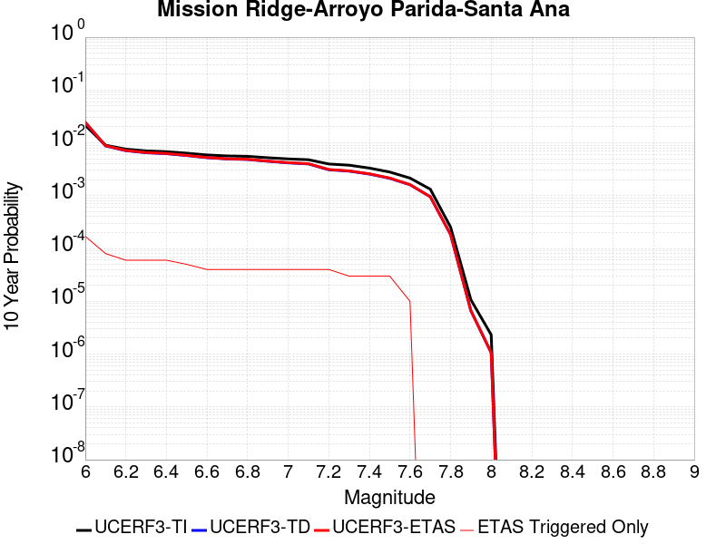 |

| Magnitude | 1 wk TI Prob | 1 wk TD Prob | 1 wk ETAS Prob | 1 wk ETAS/TD Gain | 1 wk ETAS Triggered Only | 1 mo TI Prob | 1 mo TD Prob | 1 mo ETAS Prob | 1 mo ETAS/TD Gain | 1 mo ETAS Triggered Only | 1 yr TI Prob | 1 yr TD Prob | 1 yr ETAS Prob | 1 yr ETAS/TD Gain | 1 yr ETAS Triggered Only | 10 yr TI Prob | 10 yr TD Prob | 10 yr ETAS Prob | 10 yr ETAS/TD Gain | 10 yr ETAS Triggered Only |
|-----|-----|-----|-----|-----|-----|-----|-----|-----|-----|-----|-----|-----|-----|-----|-----|-----|-----|-----|-----|-----|
| 6.0 | 4.169034E-5 | 4.7137048E-5 | 9.713469E-5 | 2.0606868 | 5.0E-5 | 1.7866064E-4 | 2.0200513E-4 | 2.5199502E-4 | 1.2474685 | 5.0E-5 | 0.0021730233 | 0.0024574657 | 0.0025472445 | 1.0365331 | 9.0E-5 | 0.021518968 | 0.02438483 | 0.024550684 | 1.0068016 | 1.7E-4 |
| 6.1 | 1.73813E-5 | 1.6854203E-5 | 3.6853868E-5 | 2.1866276 | 2.0E-5 | 7.4489166E-5 | 7.223036E-5 | 9.222892E-5 | 1.2768719 | 2.0E-5 | 9.065282E-4 | 8.790605E-4 | 9.1902533E-4 | 1.0454631 | 4.0E-5 | 0.009028391 | 0.008757128 | 0.008836429 | 1.0090554 | 8.0E-5 |
| 6.2 | 1.4622182E-5 | 1.3673262E-5 | 3.367299E-5 | 2.4626887 | 2.0E-5 | 6.2664985E-5 | 5.85984E-5 | 7.859723E-5 | 1.3412862 | 2.0E-5 | 7.6267915E-4 | 7.132059E-4 | 7.431845E-4 | 1.0420336 | 3.0E-5 | 0.007600669 | 0.007109767 | 0.0071693403 | 1.0083791 | 6.0E-5 |
| 6.3 | 1.3552434E-5 | 1.2482174E-5 | 3.2481923E-5 | 2.6022651 | 2.0E-5 | 5.8080568E-5 | 5.349395E-5 | 7.349288E-5 | 1.373854 | 2.0E-5 | 7.069015E-4 | 6.510974E-4 | 6.810778E-4 | 1.046046 | 3.0E-5 | 0.00704657 | 0.006492415 | 0.006552025 | 1.0091815 | 6.0E-5 |
| 6.4 | 1.30977305E-5 | 1.1979128E-5 | 3.197889E-5 | 2.6695504 | 2.0E-5 | 5.613192E-5 | 5.133813E-5 | 7.1337105E-5 | 1.389554 | 2.0E-5 | 6.831918E-4 | 6.2486547E-4 | 6.548467E-4 | 1.0479803 | 3.0E-5 | 0.006810953 | 0.006231584 | 0.00629121 | 1.0095683 | 6.0E-5 |
| 6.5 | 1.225205E-5 | 1.1048776E-5 | 3.1048556E-5 | 2.8101354 | 2.0E-5 | 5.2507727E-5 | 4.735105E-5 | 6.7350105E-5 | 1.4223571 | 2.0E-5 | 6.3909404E-4 | 5.7634927E-4 | 5.963377E-4 | 1.0346812 | 2.0E-5 | 0.006372592 | 0.005749009 | 0.0057987217 | 1.0086472 | 5.0E-5 |
| 6.6 | 1.1352241E-5 | 1.0063508E-5 | 2.0063408E-5 | 1.9936793 | 1.0E-5 | 4.8651553E-5 | 4.3128617E-5 | 5.3128188E-5 | 1.2318546 | 1.0E-5 | 5.921717E-4 | 5.249665E-4 | 5.349613E-4 | 1.0190388 | 1.0E-5 | 0.0059059616 | 0.0052376646 | 0.005277455 | 1.007597 | 4.0E-5 |
| 6.7 | 1.0864116E-5 | 9.517E-6 | 1.9516905E-5 | 2.0507412 | 1.0E-5 | 4.6559664E-5 | 4.0786515E-5 | 5.0786108E-5 | 1.245169 | 1.0E-5 | 5.667165E-4 | 4.964647E-4 | 5.0645974E-4 | 1.0201324 | 1.0E-5 | 0.005652734 | 0.0049539437 | 0.0049937456 | 1.0080343 | 4.0E-5 |
| 6.8 | 1.0666365E-5 | 9.299752E-6 | 1.929966E-5 | 2.0752876 | 1.0E-5 | 4.571219E-5 | 3.985548E-5 | 4.9855083E-5 | 1.2508966 | 1.0E-5 | 5.564038E-4 | 4.8513446E-4 | 4.951296E-4 | 1.0206028 | 1.0E-5 | 0.005550127 | 0.00484114 | 0.0048809466 | 1.0082225 | 4.0E-5 |
| 6.9 | 1.0038665E-5 | 8.592018E-6 | 1.8591933E-5 | 2.1638608 | 1.0E-5 | 4.302214E-5 | 3.682243E-5 | 4.6822057E-5 | 1.2715636 | 1.0E-5 | 5.236687E-4 | 4.4822265E-4 | 4.5821816E-4 | 1.0223004 | 1.0E-5 | 0.005224364 | 0.0044735507 | 0.0045133717 | 1.0089015 | 4.0E-5 |
| 7.0 | 9.5379955E-6 | 8.025047E-6 | 1.8024966E-5 | 2.2460887 | 1.0E-5 | 4.0876483E-5 | 3.439261E-5 | 4.439227E-5 | 1.2907501 | 1.0E-5 | 4.975576E-4 | 4.1865133E-4 | 4.2864712E-4 | 1.0238762 | 1.0E-5 | 0.00496445 | 0.00417898 | 0.0042188126 | 1.0095317 | 4.0E-5 |
| 7.1 | 9.207389E-6 | 7.652347E-6 | 1.7652272E-5 | 2.3067784 | 1.0E-5 | 3.945964E-5 | 3.2795375E-5 | 4.2795047E-5 | 1.304911 | 1.0E-5 | 4.803152E-4 | 3.992122E-4 | 4.092082E-4 | 1.0250393 | 1.0E-5 | 0.004792784 | 0.003985301 | 0.0040251417 | 1.0099969 | 4.0E-5 |
| 7.2 | 7.638091E-6 | 5.9310923E-6 | 1.5931033E-5 | 2.6860201 | 1.0E-5 | 3.2734264E-5 | 2.5418722E-5 | 3.5418467E-5 | 1.3934008 | 1.0E-5 | 3.984668E-4 | 3.094293E-4 | 3.194262E-4 | 1.0323075 | 1.0E-5 | 0.0039775306 | 0.0030901956 | 0.003130072 | 1.0129042 | 4.0E-5 |
| 7.3 | 7.2500147E-6 | 5.596131E-6 | 1.5596075E-5 | 2.786939 | 1.0E-5 | 3.1071122E-5 | 2.3983199E-5 | 3.398296E-5 | 1.4169486 | 1.0E-5 | 3.7822526E-4 | 2.9195662E-4 | 3.019537E-4 | 1.0342417 | 1.0E-5 | 0.0037758215 | 0.0029159402 | 0.0029458527 | 1.0102583 | 3.0E-5 |
| 7.4 | 6.3899715E-6 | 4.9184864E-6 | 1.4918437E-5 | 3.033136 | 1.0E-5 | 2.7385306E-5 | 2.1079059E-5 | 3.107885E-5 | 1.4743944 | 1.0E-5 | 3.3336508E-4 | 2.566075E-4 | 2.6660494E-4 | 1.03896 | 1.0E-5 | 0.0033286542 | 0.002563311 | 0.002593234 | 1.0116736 | 3.0E-5 |
| 7.5 | 5.379025E-6 | 4.0838477E-6 | 1.40838065E-5 | 3.4486613 | 1.0E-5 | 2.305276E-5 | 1.7502087E-5 | 2.7501912E-5 | 1.5713505 | 1.0E-5 | 2.806312E-4 | 2.1306718E-4 | 2.2306504E-4 | 1.0469235 | 1.0E-5 | 0.0028027708 | 0.0021286402 | 0.0021585764 | 1.0140635 | 3.0E-5 |
| 7.6 | 4.1270696E-6 | 3.0883373E-6 | 1.3088306E-5 | 4.2379785 | 1.0E-5 | 1.768732E-5 | 1.32356645E-5 | 2.3235532E-5 | 1.7555244 | 1.0E-5 | 2.1532185E-4 | 1.6113237E-4 | 1.7113076E-4 | 1.0620508 | 1.0E-5 | 0.0021511333 | 0.0016101635 | 0.0016201474 | 1.0062006 | 1.0E-5 |
| 7.7 | 2.5406805E-6 | 1.8282044E-6 | 1.8282044E-6 | 1.0 | 0.0 | 1.0888585E-5 | 7.835139E-6 | 7.835139E-6 | 1.0 | 0.0 | 1.3256045E-4 | 9.53887E-5 | 9.53887E-5 | 1.0 | 0.0 | 0.0013248142 | 9.534837E-4 | 9.534837E-4 | 1.0 | 0.0 |
| 7.8 | 4.8608285E-7 | 3.509864E-7 | 3.509864E-7 | 1.0 | 0.0 | 2.0832106E-6 | 1.5042266E-6 | 1.5042266E-6 | 1.0 | 0.0 | 2.5362791E-5 | 1.8313805E-5 | 1.8313805E-5 | 1.0 | 0.0 | 2.5359896E-4 | 1.8312308E-4 | 1.8312308E-4 | 1.0 | 0.0 |
| 7.9 | 2.0472514E-8 | 1.2688718E-8 | 1.2688718E-8 | 1.0 | 0.0 | 8.7739345E-8 | 5.438022E-8 | 5.438022E-8 | 1.0 | 0.0 | 1.068226E-6 | 6.6207895E-7 | 6.6207895E-7 | 1.0 | 0.0 | 1.0682209E-5 | 6.620771E-6 | 6.620771E-6 | 1.0 | 0.0 |
| 8.0 | 4.443582E-9 | 2.032067E-9 | 2.032067E-9 | 1.0 | 0.0 | 1.9043922E-8 | 8.7088585E-9 | 8.7088585E-9 | 1.0 | 0.0 | 2.3185973E-7 | 1.0603035E-7 | 1.0603035E-7 | 1.0 | 0.0 | 2.3185949E-6 | 1.0603031E-6 | 1.0603031E-6 | 1.0 | 0.0 |

## Santa Ynez (West)
*[(top)](#table-of-contents)*

| 1 Week | 1 Month | 1 Year | 10 Year |
|-----|-----|-----|-----|
|  |  |  |  |

| Magnitude | 1 wk TI Prob | 1 wk TD Prob | 1 wk ETAS Prob | 1 wk ETAS/TD Gain | 1 wk ETAS Triggered Only | 1 mo TI Prob | 1 mo TD Prob | 1 mo ETAS Prob | 1 mo ETAS/TD Gain | 1 mo ETAS Triggered Only | 1 yr TI Prob | 1 yr TD Prob | 1 yr ETAS Prob | 1 yr ETAS/TD Gain | 1 yr ETAS Triggered Only | 10 yr TI Prob | 10 yr TD Prob | 10 yr ETAS Prob | 10 yr ETAS/TD Gain | 10 yr ETAS Triggered Only |
|-----|-----|-----|-----|-----|-----|-----|-----|-----|-----|-----|-----|-----|-----|-----|-----|-----|-----|-----|-----|-----|
| 6.0 | 4.7352758E-5 | 5.497084E-5 | 8.496919E-5 | 1.5457139 | 3.0E-5 | 2.0292461E-4 | 2.3556968E-4 | 2.7556025E-4 | 1.1697612 | 4.0E-5 | 0.0024678076 | 0.002864558 | 0.0029642715 | 1.0348094 | 1.0E-4 | 0.024405818 | 0.028304456 | 0.02845021 | 1.0051495 | 1.5E-4 |
| 6.1 | 4.7352758E-5 | 5.497084E-5 | 8.496919E-5 | 1.5457139 | 3.0E-5 | 2.0292461E-4 | 2.3556968E-4 | 2.7556025E-4 | 1.1697612 | 4.0E-5 | 0.0024678076 | 0.002864558 | 0.0029543 | 1.0313284 | 9.0E-5 | 0.024405818 | 0.028304456 | 0.028440492 | 1.0048062 | 1.4E-4 |
| 6.2 | 3.0415853E-5 | 3.3925004E-5 | 6.392399E-5 | 1.8842735 | 3.0E-5 | 1.3034715E-4 | 1.4538495E-4 | 1.8537915E-4 | 1.2750916 | 4.0E-5 | 0.0015858212 | 0.0017686592 | 0.0018485177 | 1.045152 | 8.0E-5 | 0.015745522 | 0.01754978 | 0.017667674 | 1.0067177 | 1.2E-4 |
| 6.3 | 3.0415853E-5 | 3.3925004E-5 | 6.392399E-5 | 1.8842735 | 3.0E-5 | 1.3034715E-4 | 1.4538495E-4 | 1.8537915E-4 | 1.2750916 | 4.0E-5 | 0.0015858212 | 0.0017686592 | 0.0018485177 | 1.045152 | 8.0E-5 | 0.015745522 | 0.01754978 | 0.017667674 | 1.0067177 | 1.2E-4 |
| 6.4 | 2.5452082E-5 | 2.7912318E-5 | 5.7911482E-5 | 2.0747643 | 3.0E-5 | 1.09075794E-4 | 1.1961885E-4 | 1.5961406E-4 | 1.3343555 | 4.0E-5 | 0.0013271887 | 0.0014554056 | 0.0015352891 | 1.0548875 | 8.0E-5 | 0.013192902 | 0.01446091 | 0.01456932 | 1.0074967 | 1.1E-4 |
| 6.5 | 2.3143784E-5 | 2.5128133E-5 | 4.512763E-5 | 1.7959007 | 2.0E-5 | 9.9183875E-5 | 1.07687636E-4 | 1.376844E-4 | 1.2785535 | 3.0E-5 | 0.0012068948 | 0.001310323 | 0.0013802312 | 1.053352 | 7.0E-5 | 0.012003611 | 0.013027638 | 0.013126335 | 1.007576 | 1.0E-4 |
| 6.6 | 1.9118515E-5 | 2.0354244E-5 | 4.0353836E-5 | 1.982576 | 2.0E-5 | 8.193392E-5 | 8.722961E-5 | 1.1722699E-4 | 1.34389 | 3.0E-5 | 9.97089E-4 | 0.001061511 | 0.0011214473 | 1.0564632 | 6.0E-5 | 0.00992627 | 0.010565317 | 0.010654366 | 1.0084285 | 9.0E-5 |
| 6.7 | 1.722807E-5 | 1.8146253E-5 | 2.8146073E-5 | 1.551068 | 1.0E-5 | 7.3832496E-5 | 7.776737E-5 | 9.776581E-5 | 1.2571573 | 2.0E-5 | 8.985399E-4 | 9.4641204E-4 | 9.963647E-4 | 1.0527811 | 5.0E-5 | 0.008949154 | 0.009424461 | 0.009503707 | 1.0084085 | 8.0E-5 |
| 6.8 | 1.5317364E-5 | 1.5926391E-5 | 2.5926232E-5 | 1.6278787 | 1.0E-5 | 6.56442E-5 | 6.82542E-5 | 8.825283E-5 | 1.2930022 | 2.0E-5 | 7.98925E-4 | 8.3068234E-4 | 8.806408E-4 | 1.0601414 | 5.0E-5 | 0.007960589 | 0.008276261 | 0.008345681 | 1.0083879 | 7.0E-5 |
| 6.9 | 1.3071226E-5 | 1.332953E-5 | 2.3329396E-5 | 1.750204 | 1.0E-5 | 5.6018336E-5 | 5.712532E-5 | 7.7124176E-5 | 1.3500874 | 2.0E-5 | 6.8180985E-4 | 6.952811E-4 | 7.452463E-4 | 1.0718634 | 5.0E-5 | 0.0067972173 | 0.0069313184 | 0.0069909026 | 1.0085964 | 6.0E-5 |
| 7.0 | 1.1836986E-5 | 1.1932688E-5 | 2.1932568E-5 | 1.8380241 | 1.0E-5 | 5.0728955E-5 | 5.1139097E-5 | 7.113807E-5 | 1.3910702 | 2.0E-5 | 6.1745E-4 | 6.2244234E-4 | 6.724112E-4 | 1.0802788 | 5.0E-5 | 0.006157372 | 0.0062071825 | 0.00626681 | 1.0096062 | 6.0E-5 |
| 7.1 | 1.0597169E-5 | 1.0542107E-5 | 2.0542002E-5 | 1.9485669 | 1.0E-5 | 4.541565E-5 | 4.5179684E-5 | 5.5179233E-5 | 1.2213284 | 1.0E-5 | 5.5279525E-4 | 5.4992497E-4 | 5.899029E-4 | 1.0726972 | 4.0E-5 | 0.0055142213 | 0.005485772 | 0.005535498 | 1.0090644 | 5.0E-5 |
| 7.2 | 9.59113E-6 | 9.45905E-6 | 1.9458956E-5 | 2.0571787 | 1.0E-5 | 4.11042E-5 | 4.053816E-5 | 5.0537757E-5 | 1.2466712 | 1.0E-5 | 5.0032866E-4 | 4.934414E-4 | 5.234266E-4 | 1.0607675 | 3.0E-5 | 0.004992037 | 0.0049235765 | 0.0049534286 | 1.0060631 | 3.0E-5 |
| 7.3 | 8.586084E-6 | 8.379489E-6 | 1.8379405E-5 | 2.19338 | 1.0E-5 | 3.679698E-5 | 3.591161E-5 | 4.591125E-5 | 1.2784514 | 1.0E-5 | 4.4791115E-4 | 4.3713715E-4 | 4.6712405E-4 | 1.0685984 | 3.0E-5 | 0.004470094 | 0.004362884 | 0.0043927534 | 1.0068462 | 3.0E-5 |
| 7.4 | 7.2622997E-6 | 6.9514485E-6 | 1.6951379E-5 | 2.438539 | 1.0E-5 | 3.112377E-5 | 2.9791589E-5 | 3.9791288E-5 | 1.3356552 | 1.0E-5 | 3.78866E-4 | 3.6265317E-4 | 3.8264593E-4 | 1.055129 | 2.0E-5 | 0.0037822074 | 0.003620714 | 0.0036406417 | 1.0055038 | 2.0E-5 |
| 7.5 | 5.627296E-6 | 5.2514984E-6 | 5.2514984E-6 | 1.0 | 0.0 | 2.411676E-5 | 2.2506232E-5 | 2.2506232E-5 | 1.0 | 0.0 | 2.9358198E-4 | 2.7397962E-4 | 2.839769E-4 | 1.036489 | 1.0E-5 | 0.0029319443 | 0.0027364905 | 0.002746463 | 1.0036443 | 1.0E-5 |
| 7.6 | 2.265244E-6 | 2.0608632E-6 | 2.0608632E-6 | 1.0 | 0.0 | 9.708152E-6 | 8.832241E-6 | 8.832241E-6 | 1.0 | 0.0 | 1.18190335E-4 | 1.0752732E-4 | 1.0752732E-4 | 1.0 | 0.0 | 0.001181275 | 0.0010747615 | 0.0010747615 | 1.0 | 0.0 |
| 7.7 | 1.3099874E-6 | 1.1016228E-6 | 1.1016228E-6 | 1.0 | 0.0 | 5.61422E-6 | 4.7212325E-6 | 4.7212325E-6 | 1.0 | 0.0 | 6.8350986E-5 | 5.7479516E-5 | 5.7479516E-5 | 1.0 | 0.0 | 6.832996E-4 | 5.7464885E-4 | 5.7464885E-4 | 1.0 | 0.0 |
| 7.8 | 7.903951E-7 | 6.0710704E-7 | 6.0710704E-7 | 1.0 | 0.0 | 3.3874032E-6 | 2.601885E-6 | 2.601885E-6 | 1.0 | 0.0 | 4.1240855E-5 | 3.16775E-5 | 3.16775E-5 | 1.0 | 0.0 | 4.12332E-4 | 3.167312E-4 | 3.167312E-4 | 1.0 | 0.0 |
| 7.9 | 7.0753297E-9 | 5.090092E-9 | 5.090092E-9 | 1.0 | 0.0 | 3.032284E-8 | 2.181468E-8 | 2.181468E-8 | 1.0 | 0.0 | 3.6918053E-7 | 2.655937E-7 | 2.655937E-7 | 1.0 | 0.0 | 3.691799E-6 | 2.6559348E-6 | 2.6559348E-6 | 1.0 | 0.0 |

## Deep Springs
*[(top)](#table-of-contents)*

| 1 Week | 1 Month | 1 Year | 10 Year |
|-----|-----|-----|-----|
|  |  |  |  |

| Magnitude | 1 wk TI Prob | 1 wk TD Prob | 1 wk ETAS Prob | 1 wk ETAS/TD Gain | 1 wk ETAS Triggered Only | 1 mo TI Prob | 1 mo TD Prob | 1 mo ETAS Prob | 1 mo ETAS/TD Gain | 1 mo ETAS Triggered Only | 1 yr TI Prob | 1 yr TD Prob | 1 yr ETAS Prob | 1 yr ETAS/TD Gain | 1 yr ETAS Triggered Only | 10 yr TI Prob | 10 yr TD Prob | 10 yr ETAS Prob | 10 yr ETAS/TD Gain | 10 yr ETAS Triggered Only |
|-----|-----|-----|-----|-----|-----|-----|-----|-----|-----|-----|-----|-----|-----|-----|-----|-----|-----|-----|-----|-----|
| 6.0 | 1.9810619E-5 | 2.311252E-5 | 6.31116E-5 | 2.7306237 | 4.0E-5 | 8.489989E-5 | 9.9052755E-5 | 1.6904583E-4 | 1.7066242 | 7.0E-5 | 0.001033166 | 0.0012058078 | 0.001335651 | 1.1076815 | 1.3E-4 | 0.010283757 | 0.01204243 | 0.0122400215 | 1.016408 | 2.0E-4 |
| 6.1 | 1.9810619E-5 | 2.311252E-5 | 6.31116E-5 | 2.7306237 | 4.0E-5 | 8.489989E-5 | 9.9052755E-5 | 1.6904583E-4 | 1.7066242 | 7.0E-5 | 0.001033166 | 0.0012058078 | 0.001335651 | 1.1076815 | 1.3E-4 | 0.010283757 | 0.01204243 | 0.0122400215 | 1.016408 | 2.0E-4 |
| 6.2 | 1.9810619E-5 | 2.311252E-5 | 6.31116E-5 | 2.7306237 | 4.0E-5 | 8.489989E-5 | 9.9052755E-5 | 1.6904583E-4 | 1.7066242 | 7.0E-5 | 0.001033166 | 0.0012058078 | 0.001335651 | 1.1076815 | 1.3E-4 | 0.010283757 | 0.01204243 | 0.0122400215 | 1.016408 | 2.0E-4 |
| 6.3 | 1.9810619E-5 | 2.311252E-5 | 6.31116E-5 | 2.7306237 | 4.0E-5 | 8.489989E-5 | 9.9052755E-5 | 1.6904583E-4 | 1.7066242 | 7.0E-5 | 0.001033166 | 0.0012058078 | 0.001335651 | 1.1076815 | 1.3E-4 | 0.010283757 | 0.01204243 | 0.0122400215 | 1.016408 | 2.0E-4 |
| 6.4 | 1.9810619E-5 | 2.311252E-5 | 6.31116E-5 | 2.7306237 | 4.0E-5 | 8.489989E-5 | 9.9052755E-5 | 1.6904583E-4 | 1.7066242 | 7.0E-5 | 0.001033166 | 0.0012058078 | 0.001335651 | 1.1076815 | 1.3E-4 | 0.010283757 | 0.01204243 | 0.0122400215 | 1.016408 | 2.0E-4 |
| 6.5 | 1.7190405E-5 | 2.0050558E-5 | 6.0049755E-5 | 2.994917 | 4.0E-5 | 7.367108E-5 | 8.593096E-5 | 1.5592495E-4 | 1.8145374 | 7.0E-5 | 8.9657627E-4 | 0.0010462092 | 0.0011760732 | 1.1241281 | 1.3E-4 | 0.008929676 | 0.010462061 | 0.010640178 | 1.017025 | 1.8E-4 |
| 6.6 | 1.7190405E-5 | 2.0050558E-5 | 6.0049755E-5 | 2.994917 | 4.0E-5 | 7.367108E-5 | 8.593096E-5 | 1.5592495E-4 | 1.8145374 | 7.0E-5 | 8.9657627E-4 | 0.0010462092 | 0.0011760732 | 1.1241281 | 1.3E-4 | 0.008929676 | 0.010462061 | 0.010640178 | 1.017025 | 1.8E-4 |

## Cleghorn Lake
*[(top)](#table-of-contents)*

| 1 Week | 1 Month | 1 Year | 10 Year |
|-----|-----|-----|-----|
|  |  | 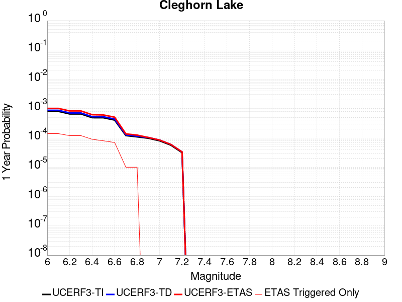 |  |

| Magnitude | 1 wk TI Prob | 1 wk TD Prob | 1 wk ETAS Prob | 1 wk ETAS/TD Gain | 1 wk ETAS Triggered Only | 1 mo TI Prob | 1 mo TD Prob | 1 mo ETAS Prob | 1 mo ETAS/TD Gain | 1 mo ETAS Triggered Only | 1 yr TI Prob | 1 yr TD Prob | 1 yr ETAS Prob | 1 yr ETAS/TD Gain | 1 yr ETAS Triggered Only | 10 yr TI Prob | 10 yr TD Prob | 10 yr ETAS Prob | 10 yr ETAS/TD Gain | 10 yr ETAS Triggered Only |
|-----|-----|-----|-----|-----|-----|-----|-----|-----|-----|-----|-----|-----|-----|-----|-----|-----|-----|-----|-----|-----|
| 6.0 | 1.5467183E-5 | 1.6794203E-5 | 7.67932E-5 | 4.5726013 | 6.0E-5 | 6.6286244E-5 | 7.197348E-5 | 1.6196701E-4 | 2.2503705 | 9.0E-5 | 8.067362E-4 | 8.759797E-4 | 0.0010158571 | 1.1596811 | 1.4E-4 | 0.008038137 | 0.008730696 | 0.008919037 | 1.0215724 | 1.9E-4 |
| 6.1 | 1.5467183E-5 | 1.6794203E-5 | 7.67932E-5 | 4.5726013 | 6.0E-5 | 6.6286244E-5 | 7.197348E-5 | 1.6196701E-4 | 2.2503705 | 9.0E-5 | 8.067362E-4 | 8.759797E-4 | 0.0010158571 | 1.1596811 | 1.4E-4 | 0.008038137 | 0.008730696 | 0.008919037 | 1.0215724 | 1.9E-4 |
| 6.2 | 1.2624631E-5 | 1.3681544E-5 | 6.368086E-5 | 4.654508 | 5.0E-5 | 5.410444E-5 | 5.863415E-5 | 1.3862946E-4 | 2.3643126 | 8.0E-5 | 6.585225E-4 | 7.1368564E-4 | 8.336E-4 | 1.1680212 | 1.2E-4 | 0.0065657445 | 0.0071187317 | 0.0072875214 | 1.0237106 | 1.7E-4 |
| 6.3 | 1.2624631E-5 | 1.3681544E-5 | 6.368086E-5 | 4.654508 | 5.0E-5 | 5.410444E-5 | 5.863415E-5 | 1.3862946E-4 | 2.3643126 | 8.0E-5 | 6.585225E-4 | 7.1368564E-4 | 8.336E-4 | 1.1680212 | 1.2E-4 | 0.0065657445 | 0.0071187317 | 0.0072875214 | 1.0237106 | 1.7E-4 |
| 6.4 | 9.417684E-6 | 1.0170118E-5 | 5.016971E-5 | 4.933051 | 4.0E-5 | 4.036088E-5 | 4.3585722E-5 | 1.0358311E-4 | 2.3765376 | 6.0E-5 | 4.912829E-4 | 5.3056807E-4 | 6.2052027E-4 | 1.1695396 | 9.0E-5 | 0.004901982 | 0.005297049 | 0.0054263603 | 1.0244119 | 1.3E-4 |
| 6.5 | 9.368219E-6 | 1.0117545E-5 | 5.0117138E-5 | 4.9534883 | 4.0E-5 | 4.014889E-5 | 4.3360415E-5 | 1.03357816E-4 | 2.3836906 | 6.0E-5 | 4.8870314E-4 | 5.2782625E-4 | 6.07784E-4 | 1.151485 | 8.0E-5 | 0.004876298 | 0.0052697617 | 0.0053891293 | 1.0226514 | 1.2E-4 |
| 6.6 | 7.803798E-6 | 8.441831E-6 | 3.8441576E-5 | 4.5537014 | 3.0E-5 | 3.3444423E-5 | 3.6179E-5 | 8.617719E-5 | 2.3819673 | 5.0E-5 | 4.0710976E-4 | 4.4043022E-4 | 5.103994E-4 | 1.1588655 | 7.0E-5 | 0.0040636472 | 0.0043994905 | 0.0045090066 | 1.0248929 | 1.1E-4 |
| 6.7 | 2.3108669E-6 | 2.4438336E-6 | 1.2443809E-5 | 5.0919213 | 1.0E-5 | 9.903678E-6 | 1.0473532E-5 | 2.0473428E-5 | 1.9547777 | 1.0E-5 | 1.205706E-4 | 1.2750797E-4 | 1.375067E-4 | 1.0784165 | 1.0E-5 | 0.001205052 | 0.0012743667 | 0.0012943413 | 1.0156741 | 2.0E-5 |
| 6.8 | 2.0882828E-6 | 2.2062823E-6 | 1.220626E-5 | 5.5325017 | 1.0E-5 | 8.949753E-6 | 9.455462E-6 | 1.9455367E-5 | 2.0575798 | 1.0E-5 | 1.08957785E-4 | 1.1511434E-4 | 1.2511319E-4 | 1.0868602 | 1.0E-5 | 0.0010890438 | 0.0011505639 | 0.0011705409 | 1.0173628 | 2.0E-5 |
| 6.9 | 1.876935E-6 | 1.981051E-6 | 1.981051E-6 | 1.0 | 0.0 | 8.043982E-6 | 8.490192E-6 | 8.490192E-6 | 1.0 | 0.0 | 9.7931086E-5 | 1.03363345E-4 | 1.03363345E-4 | 1.0 | 0.0 | 9.788794E-4 | 0.0010331686 | 0.0010431584 | 1.009669 | 1.0E-5 |
| 7.0 | 1.5357559E-6 | 1.6202807E-6 | 1.6202807E-6 | 1.0 | 0.0 | 6.5817944E-6 | 6.9440425E-6 | 6.9440425E-6 | 1.0 | 0.0 | 8.01304E-5 | 8.454057E-5 | 8.454057E-5 | 1.0 | 0.0 | 8.010151E-4 | 8.450965E-4 | 8.55088E-4 | 1.0118229 | 1.0E-5 |
| 7.1 | 1.0905424E-6 | 1.1497619E-6 | 1.1497619E-6 | 1.0 | 0.0 | 4.6737446E-6 | 4.9275427E-6 | 4.9275427E-6 | 1.0 | 0.0 | 5.6901354E-5 | 5.999128E-5 | 5.999128E-5 | 1.0 | 0.0 | 5.6886784E-4 | 5.997606E-4 | 6.0975464E-4 | 1.0166633 | 1.0E-5 |
| 7.2 | 6.06668E-7 | 6.387277E-7 | 6.387277E-7 | 1.0 | 0.0 | 2.600003E-6 | 2.7374022E-6 | 2.7374022E-6 | 1.0 | 0.0 | 3.1654577E-5 | 3.3327433E-5 | 3.3327433E-5 | 1.0 | 0.0 | 3.1650066E-4 | 3.3323118E-4 | 3.3323118E-4 | 1.0 | 0.0 |

## Coronado Bank alt1
*[(top)](#table-of-contents)*

| 1 Week | 1 Month | 1 Year | 10 Year |
|-----|-----|-----|-----|
|  | 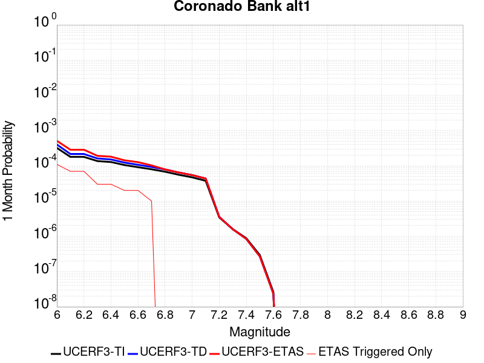 |  |  |

| Magnitude | 1 wk TI Prob | 1 wk TD Prob | 1 wk ETAS Prob | 1 wk ETAS/TD Gain | 1 wk ETAS Triggered Only | 1 mo TI Prob | 1 mo TD Prob | 1 mo ETAS Prob | 1 mo ETAS/TD Gain | 1 mo ETAS Triggered Only | 1 yr TI Prob | 1 yr TD Prob | 1 yr ETAS Prob | 1 yr ETAS/TD Gain | 1 yr ETAS Triggered Only | 10 yr TI Prob | 10 yr TD Prob | 10 yr ETAS Prob | 10 yr ETAS/TD Gain | 10 yr ETAS Triggered Only |
|-----|-----|-----|-----|-----|-----|-----|-----|-----|-----|-----|-----|-----|-----|-----|-----|-----|-----|-----|-----|-----|
| 6.0 | 7.533492E-5 | 9.3951705E-5 | 2.0394137E-4 | 2.1707044 | 1.1E-4 | 3.22824E-4 | 4.025903E-4 | 5.12546E-4 | 1.2731206 | 1.1E-4 | 0.0039233007 | 0.004891121 | 0.005000583 | 1.0223798 | 1.1E-4 | 0.03854755 | 0.047904 | 0.048065856 | 1.0033787 | 1.7E-4 |
| 6.1 | 4.1807285E-5 | 5.0493105E-5 | 1.2048957E-4 | 2.386258 | 7.0E-5 | 1.7916178E-4 | 2.1638138E-4 | 2.8636624E-4 | 1.3234329 | 7.0E-5 | 0.0021791123 | 0.0026313365 | 0.0027011523 | 1.0265324 | 7.0E-5 | 0.021578677 | 0.026011124 | 0.026089042 | 1.0029956 | 8.0E-5 |
| 6.2 | 4.1807285E-5 | 5.0493105E-5 | 1.2048957E-4 | 2.386258 | 7.0E-5 | 1.7916178E-4 | 2.1638138E-4 | 2.8636624E-4 | 1.3234329 | 7.0E-5 | 0.0021791123 | 0.0026313365 | 0.0027011523 | 1.0265324 | 7.0E-5 | 0.021578677 | 0.026011124 | 0.026089042 | 1.0029956 | 8.0E-5 |
| 6.3 | 3.1793104E-5 | 3.7711125E-5 | 6.7709996E-5 | 1.7954912 | 3.0E-5 | 1.3624904E-4 | 1.6160926E-4 | 1.9160441E-4 | 1.1856029 | 3.0E-5 | 0.0016575698 | 0.001965849 | 0.00199579 | 1.0152305 | 3.0E-5 | 0.016452603 | 0.019488495 | 0.019527715 | 1.0020125 | 4.0E-5 |
| 6.4 | 2.9878007E-5 | 3.5335797E-5 | 6.533474E-5 | 1.8489674 | 3.0E-5 | 1.2804232E-4 | 1.5143053E-4 | 1.8142599E-4 | 1.1980807 | 3.0E-5 | 0.0015578003 | 0.0018421395 | 0.0018720842 | 1.0162554 | 3.0E-5 | 0.015469253 | 0.018272463 | 0.018311733 | 1.0021491 | 4.0E-5 |
| 6.5 | 2.4512565E-5 | 2.8764101E-5 | 4.8763526E-5 | 1.6952912 | 2.0E-5 | 1.0504962E-4 | 1.2326906E-4 | 1.4326659E-4 | 1.1622267 | 2.0E-5 | 0.0012782287 | 0.0014997943 | 0.0015197643 | 1.0133152 | 2.0E-5 | 0.012709012 | 0.0148996925 | 0.014929246 | 1.0019835 | 3.0E-5 |
| 6.6 | 2.1317413E-5 | 2.490667E-5 | 4.490617E-5 | 1.8029778 | 2.0E-5 | 9.135714E-5 | 1.0673863E-4 | 1.267365E-4 | 1.1873536 | 2.0E-5 | 0.0011117056 | 0.0012987903 | 0.0013187644 | 1.015379 | 2.0E-5 | 0.011061605 | 0.012914407 | 0.01294402 | 1.002293 | 3.0E-5 |
| 6.7 | 1.8585655E-5 | 2.1634882E-5 | 3.1634663E-5 | 1.4622066 | 1.0E-5 | 7.9650374E-5 | 9.271774E-5 | 1.0271681E-4 | 1.1078442 | 1.0E-5 | 9.6931186E-4 | 0.0011282744 | 0.001138263 | 1.0088531 | 1.0E-5 | 0.0096509475 | 0.011227623 | 0.011247398 | 1.0017613 | 2.0E-5 |
| 6.8 | 1.5862879E-5 | 1.8419476E-5 | 1.8419476E-5 | 1.0 | 0.0 | 6.798199E-5 | 7.8938334E-5 | 7.8938334E-5 | 1.0 | 0.0 | 8.273665E-4 | 9.606697E-4 | 9.606697E-4 | 1.0 | 0.0 | 0.008242928 | 0.009567151 | 0.0095770545 | 1.0010352 | 1.0E-5 |
| 6.9 | 1.3021509E-5 | 1.5095266E-5 | 1.5095266E-5 | 1.0 | 0.0 | 5.5805274E-5 | 6.46925E-5 | 6.46925E-5 | 1.0 | 0.0 | 6.792174E-4 | 7.873646E-4 | 7.873646E-4 | 1.0 | 0.0 | 0.006771452 | 0.007847573 | 0.007857494 | 1.0012643 | 1.0E-5 |
| 7.0 | 1.0974371E-5 | 1.2720105E-5 | 1.2720105E-5 | 1.0 | 0.0 | 4.7032172E-5 | 5.4513697E-5 | 5.4513697E-5 | 1.0 | 0.0 | 5.7246623E-4 | 6.635197E-4 | 6.635197E-4 | 1.0 | 0.0 | 0.0057099373 | 0.0066171354 | 0.0066270693 | 1.0015012 | 1.0E-5 |
| 7.1 | 8.766221E-6 | 1.0163833E-5 | 1.0163833E-5 | 1.0 | 0.0 | 3.7568978E-5 | 4.3558655E-5 | 4.3558655E-5 | 1.0 | 0.0 | 4.573063E-4 | 5.302148E-4 | 5.302148E-4 | 1.0 | 0.0 | 0.0045636636 | 0.005291197 | 0.005291197 | 1.0 | 0.0 |
| 7.2 | 8.026024E-7 | 8.331776E-7 | 8.331776E-7 | 1.0 | 0.0 | 3.43972E-6 | 3.5707562E-6 | 3.5707562E-6 | 1.0 | 0.0 | 4.1877785E-5 | 4.34731E-5 | 4.34731E-5 | 1.0 | 0.0 | 4.1869894E-4 | 4.3464705E-4 | 4.3464705E-4 | 1.0 | 0.0 |
| 7.3 | 3.7293114E-7 | 3.700106E-7 | 3.700106E-7 | 1.0 | 0.0 | 1.5982754E-6 | 1.5857588E-6 | 1.5857588E-6 | 1.0 | 0.0 | 1.9458828E-5 | 1.9306442E-5 | 1.9306442E-5 | 1.0 | 0.0 | 1.9457124E-4 | 1.9304773E-4 | 1.9304773E-4 | 1.0 | 0.0 |
| 7.4 | 2.0557036E-7 | 1.9674441E-7 | 1.9674441E-7 | 1.0 | 0.0 | 8.810155E-7 | 8.4319004E-7 | 8.4319004E-7 | 1.0 | 0.0 | 1.0726311E-5 | 1.02657905E-5 | 1.02657905E-5 | 1.0 | 0.0 | 1.0725793E-4 | 1.026532E-4 | 1.026532E-4 | 1.0 | 0.0 |
| 7.5 | 6.845446E-8 | 6.2794086E-8 | 6.2794086E-8 | 1.0 | 0.0 | 2.9337625E-7 | 2.6911746E-7 | 2.6911746E-7 | 1.0 | 0.0 | 3.5718497E-6 | 3.2765004E-6 | 3.2765004E-6 | 1.0 | 0.0 | 3.5717923E-5 | 3.276453E-5 | 3.276453E-5 | 1.0 | 0.0 |
| 7.6 | 6.0975145E-9 | 5.531901E-9 | 5.531901E-9 | 1.0 | 0.0 | 2.6132206E-8 | 2.3708148E-8 | 2.3708148E-8 | 1.0 | 0.0 | 3.1815955E-7 | 2.8864667E-7 | 2.8864667E-7 | 1.0 | 0.0 | 3.181591E-6 | 2.886464E-6 | 2.886464E-6 | 1.0 | 0.0 |

## San Jacinto (Stepovers Combined)
*[(top)](#table-of-contents)*

| 1 Week | 1 Month | 1 Year | 10 Year |
|-----|-----|-----|-----|
|  |  |  |  |

| Magnitude | 1 wk TI Prob | 1 wk TD Prob | 1 wk ETAS Prob | 1 wk ETAS/TD Gain | 1 wk ETAS Triggered Only | 1 mo TI Prob | 1 mo TD Prob | 1 mo ETAS Prob | 1 mo ETAS/TD Gain | 1 mo ETAS Triggered Only | 1 yr TI Prob | 1 yr TD Prob | 1 yr ETAS Prob | 1 yr ETAS/TD Gain | 1 yr ETAS Triggered Only | 10 yr TI Prob | 10 yr TD Prob | 10 yr ETAS Prob | 10 yr ETAS/TD Gain | 10 yr ETAS Triggered Only |
|-----|-----|-----|-----|-----|-----|-----|-----|-----|-----|-----|-----|-----|-----|-----|-----|-----|-----|-----|-----|-----|
| 6.0 | 4.0667746E-5 | 3.5271103E-5 | 1.05268635E-4 | 2.9845574 | 7.0E-5 | 1.742787E-4 | 1.5115313E-4 | 2.4113953E-4 | 1.5953326 | 9.0E-5 | 0.0021197782 | 0.0018387372 | 0.001968498 | 1.0705707 | 1.3E-4 | 0.020996714 | 0.018986495 | 0.019172888 | 1.0098171 | 1.9E-4 |
| 6.1 | 4.0667746E-5 | 3.5271103E-5 | 1.05268635E-4 | 2.9845574 | 7.0E-5 | 1.742787E-4 | 1.5115313E-4 | 2.4113953E-4 | 1.5953326 | 9.0E-5 | 0.0021197782 | 0.0018387372 | 0.001968498 | 1.0705707 | 1.3E-4 | 0.020996714 | 0.018986495 | 0.019172888 | 1.0098171 | 1.9E-4 |
| 6.2 | 4.0667746E-5 | 3.5271103E-5 | 1.05268635E-4 | 2.9845574 | 7.0E-5 | 1.742787E-4 | 1.5115313E-4 | 2.4113953E-4 | 1.5953326 | 9.0E-5 | 0.0021197782 | 0.0018387372 | 0.001968498 | 1.0705707 | 1.3E-4 | 0.020996714 | 0.018986495 | 0.019172888 | 1.0098171 | 1.9E-4 |
| 6.3 | 4.0667746E-5 | 3.5271103E-5 | 1.05268635E-4 | 2.9845574 | 7.0E-5 | 1.742787E-4 | 1.5115313E-4 | 2.4113953E-4 | 1.5953326 | 9.0E-5 | 0.0021197782 | 0.0018387372 | 0.001968498 | 1.0705707 | 1.3E-4 | 0.020996714 | 0.018986495 | 0.019172888 | 1.0098171 | 1.9E-4 |
| 6.4 | 4.0577226E-5 | 3.5143014E-5 | 1.05140556E-4 | 2.991791 | 7.0E-5 | 1.738908E-4 | 1.5060425E-4 | 2.4059069E-4 | 1.5975027 | 9.0E-5 | 0.0021150648 | 0.0018320669 | 0.0019618287 | 1.0708281 | 1.3E-4 | 0.020950472 | 0.018921062 | 0.019107468 | 1.0098517 | 1.9E-4 |
| 6.5 | 4.0577226E-5 | 3.5143014E-5 | 1.05140556E-4 | 2.991791 | 7.0E-5 | 1.738908E-4 | 1.5060425E-4 | 2.4059069E-4 | 1.5975027 | 9.0E-5 | 0.0021150648 | 0.0018320669 | 0.0019618287 | 1.0708281 | 1.3E-4 | 0.020950472 | 0.018921062 | 0.019107468 | 1.0098517 | 1.9E-4 |
| 6.6 | 4.053861E-5 | 3.5088357E-5 | 1.050859E-4 | 2.9948938 | 7.0E-5 | 1.7372532E-4 | 1.5037002E-4 | 2.4035649E-4 | 1.5984335 | 9.0E-5 | 0.0021130538 | 0.0018292206 | 0.0019589828 | 1.0709385 | 1.3E-4 | 0.020930743 | 0.01889314 | 0.019079551 | 1.0098666 | 1.9E-4 |
| 6.7 | 4.0516545E-5 | 3.505743E-5 | 1.05054976E-4 | 2.9966536 | 7.0E-5 | 1.7363077E-4 | 1.502375E-4 | 2.4022398E-4 | 1.5989615 | 9.0E-5 | 0.002111905 | 0.0018276101 | 0.0019573725 | 1.0710012 | 1.3E-4 | 0.020919468 | 0.018877337 | 0.01906375 | 1.0098749 | 1.9E-4 |
| 6.8 | 4.049434E-5 | 3.5028992E-5 | 1.0502654E-4 | 2.9982746 | 7.0E-5 | 1.7353562E-4 | 1.5011564E-4 | 2.4010213E-4 | 1.5994478 | 9.0E-5 | 0.0021107488 | 0.0018261289 | 0.0019558915 | 1.0710589 | 1.3E-4 | 0.020908125 | 0.018862749 | 0.019049164 | 1.0098828 | 1.9E-4 |
| 6.9 | 4.046386E-5 | 3.4991554E-5 | 1.0498911E-4 | 3.0004127 | 7.0E-5 | 1.73405E-4 | 1.499552E-4 | 2.399417E-4 | 1.6000893 | 9.0E-5 | 0.0021091616 | 0.0018241788 | 0.0019539418 | 1.0711349 | 1.3E-4 | 0.020892553 | 0.018843522 | 0.019029941 | 1.0098931 | 1.9E-4 |
| 7.0 | 4.036382E-5 | 3.4872126E-5 | 1.0486969E-4 | 3.007264 | 7.0E-5 | 1.7297632E-4 | 1.4944343E-4 | 2.3942997E-4 | 1.6021446 | 9.0E-5 | 0.0021039525 | 0.0018179584 | 0.0019477222 | 1.0713788 | 1.3E-4 | 0.02084144 | 0.018782137 | 0.018968567 | 1.009926 | 1.9E-4 |
| 7.1 | 4.0343282E-5 | 3.485059E-5 | 1.0484815E-4 | 3.0085044 | 7.0E-5 | 1.7288832E-4 | 1.4935112E-4 | 2.3933769E-4 | 1.6025168 | 9.0E-5 | 0.002102883 | 0.0018168368 | 0.0019466005 | 1.0714229 | 1.3E-4 | 0.020830948 | 0.018771008 | 0.01895744 | 1.009932 | 1.9E-4 |
| 7.2 | 4.0257353E-5 | 3.475509E-5 | 1.0475265E-4 | 3.0140235 | 7.0E-5 | 1.725201E-4 | 1.489419E-4 | 2.3892848E-4 | 1.6041725 | 9.0E-5 | 0.0020984085 | 0.0018118626 | 0.001941627 | 1.0716194 | 1.3E-4 | 0.020787042 | 0.018721746 | 0.01890819 | 1.0099586 | 1.9E-4 |
| 7.3 | 3.9940667E-5 | 3.458276E-5 | 1.0458034E-4 | 3.02406 | 7.0E-5 | 1.7116306E-4 | 1.4820343E-4 | 2.3819008E-4 | 1.6071835 | 9.0E-5 | 0.0020819185 | 0.0018028866 | 0.0019326523 | 1.0719765 | 1.3E-4 | 0.020625217 | 0.018630387 | 0.018816847 | 1.0100083 | 1.9E-4 |
| 7.4 | 3.9721202E-5 | 3.4468165E-5 | 1.04465755E-4 | 3.0307894 | 7.0E-5 | 1.7022261E-4 | 1.4771236E-4 | 2.3769907E-4 | 1.6092023 | 9.0E-5 | 0.0020704903 | 0.0017969179 | 0.0019266843 | 1.0722162 | 1.3E-4 | 0.020513052 | 0.018569522 | 0.018755993 | 1.0100418 | 1.9E-4 |
| 7.5 | 3.7036873E-5 | 3.3535776E-5 | 1.0353343E-4 | 3.087253 | 7.0E-5 | 1.5871979E-4 | 1.4371685E-4 | 2.3370392E-4 | 1.6261414 | 9.0E-5 | 0.0019307006 | 0.0017483513 | 0.001878124 | 1.0742258 | 1.3E-4 | 0.019140124 | 0.018071128 | 0.018257694 | 1.010324 | 1.9E-4 |
| 7.6 | 3.2940967E-5 | 3.13167E-5 | 1.0131451E-4 | 3.235159 | 7.0E-5 | 1.4116794E-4 | 1.3420754E-4 | 2.2419546E-4 | 1.6705132 | 9.0E-5 | 0.0017173645 | 0.0016327545 | 0.0017625422 | 1.0794901 | 1.3E-4 | 0.01704153 | 0.016904091 | 0.01709088 | 1.0110499 | 1.9E-4 |
| 7.7 | 2.8236149E-5 | 2.7882697E-5 | 9.7880744E-5 | 3.5104475 | 7.0E-5 | 1.2100645E-4 | 1.1949181E-4 | 2.0948105E-4 | 1.7530997 | 9.0E-5 | 0.0014722579 | 0.0014538429 | 0.0015836539 | 1.0892882 | 1.3E-4 | 0.014625421 | 0.015114912 | 0.01530204 | 1.0123804 | 1.9E-4 |
| 7.8 | 2.4329287E-5 | 2.5206451E-5 | 9.520468E-5 | 3.7769969 | 7.0E-5 | 1.042642E-4 | 1.08023174E-4 | 1.9801345E-4 | 1.8330646 | 9.0E-5 | 0.0012686774 | 0.0013143895 | 0.0014442187 | 1.0987753 | 1.3E-4 | 0.012614589 | 0.013712341 | 0.013899735 | 1.0136662 | 1.9E-4 |
| 7.9 | 1.9370926E-5 | 2.0420413E-5 | 9.041898E-5 | 4.4278727 | 7.0E-5 | 8.301561E-5 | 8.751312E-5 | 1.7750525E-4 | 2.0283272 | 9.0E-5 | 0.0010102465 | 0.0010649522 | 0.0011948138 | 1.1219412 | 1.3E-4 | 0.0100566605 | 0.011199402 | 0.011387274 | 1.0167753 | 1.9E-4 |
| 8.0 | 1.5583017E-5 | 1.5885415E-5 | 8.5884305E-5 | 5.406488 | 7.0E-5 | 6.6782646E-5 | 6.807858E-5 | 1.5807245E-4 | 2.3219118 | 9.0E-5 | 8.127754E-4 | 8.2854216E-4 | 9.584345E-4 | 1.1567721 | 1.3E-4 | 0.008098091 | 0.008781636 | 0.008960055 | 1.0203173 | 1.8E-4 |
| 8.1 | 1.0024873E-5 | 8.291399E-6 | 4.829107E-5 | 5.824236 | 4.0E-5 | 4.2963035E-5 | 3.553409E-5 | 8.553231E-5 | 2.4070497 | 5.0E-5 | 5.229494E-4 | 4.3254215E-4 | 4.925162E-4 | 1.1386548 | 6.0E-5 | 0.0052172043 | 0.0046530655 | 0.00472274 | 1.0149739 | 7.0E-5 |
| 8.2 | 4.142796E-6 | 1.5602761E-6 | 1.5602761E-6 | 1.0 | 0.0 | 1.775472E-5 | 6.6868806E-6 | 6.6868806E-6 | 1.0 | 0.0 | 2.1614227E-4 | 8.140976E-5 | 8.140976E-5 | 1.0 | 0.0 | 0.0021593217 | 9.4514614E-4 | 9.4514614E-4 | 1.0 | 0.0 |
| 8.3 | 1.2750878E-6 | 3.609817E-7 | 3.609817E-7 | 1.0 | 0.0 | 5.4646503E-6 | 1.5470634E-6 | 1.5470634E-6 | 1.0 | 0.0 | 6.653009E-5 | 1.8835339E-5 | 1.8835339E-5 | 1.0 | 0.0 | 6.6510175E-4 | 2.272251E-4 | 2.272251E-4 | 1.0 | 0.0 |

## Pinto Mtn
*[(top)](#table-of-contents)*

| 1 Week | 1 Month | 1 Year | 10 Year |
|-----|-----|-----|-----|
|  |  | 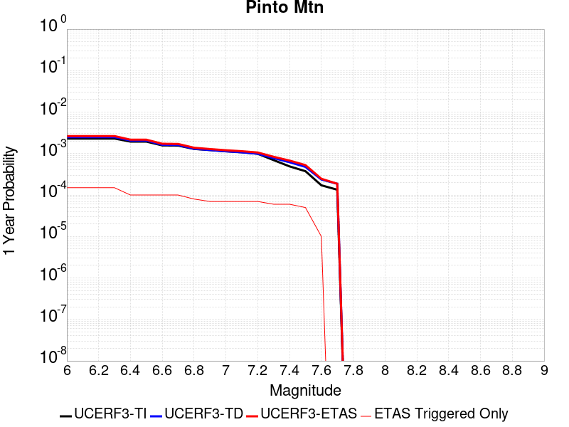 | 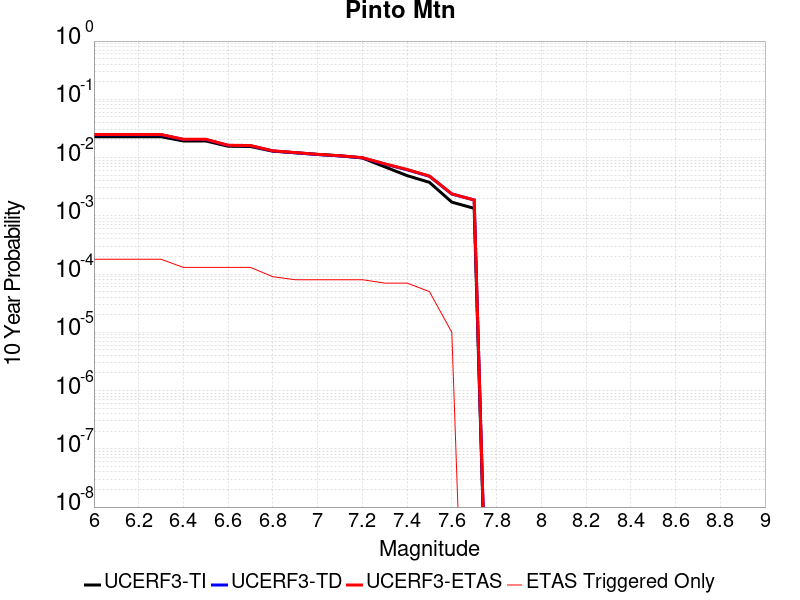 |

| Magnitude | 1 wk TI Prob | 1 wk TD Prob | 1 wk ETAS Prob | 1 wk ETAS/TD Gain | 1 wk ETAS Triggered Only | 1 mo TI Prob | 1 mo TD Prob | 1 mo ETAS Prob | 1 mo ETAS/TD Gain | 1 mo ETAS Triggered Only | 1 yr TI Prob | 1 yr TD Prob | 1 yr ETAS Prob | 1 yr ETAS/TD Gain | 1 yr ETAS Triggered Only | 10 yr TI Prob | 10 yr TD Prob | 10 yr ETAS Prob | 10 yr ETAS/TD Gain | 10 yr ETAS Triggered Only |
|-----|-----|-----|-----|-----|-----|-----|-----|-----|-----|-----|-----|-----|-----|-----|-----|-----|-----|-----|-----|-----|
| 6.0 | 4.4194956E-5 | 4.7853926E-5 | 7.785249E-5 | 1.6268778 | 3.0E-5 | 1.893932E-4 | 2.0507304E-4 | 2.350669E-4 | 1.1462593 | 3.0E-5 | 0.0023034236 | 0.0024940688 | 0.0026436946 | 1.0599927 | 1.5E-4 | 0.022796938 | 0.024678305 | 0.024853863 | 1.0071138 | 1.8E-4 |
| 6.1 | 4.4194956E-5 | 4.7853926E-5 | 7.785249E-5 | 1.6268778 | 3.0E-5 | 1.893932E-4 | 2.0507304E-4 | 2.350669E-4 | 1.1462593 | 3.0E-5 | 0.0023034236 | 0.0024940688 | 0.0026436946 | 1.0599927 | 1.5E-4 | 0.022796938 | 0.024678305 | 0.024853863 | 1.0071138 | 1.8E-4 |
| 6.2 | 4.4194956E-5 | 4.7853926E-5 | 7.785249E-5 | 1.6268778 | 3.0E-5 | 1.893932E-4 | 2.0507304E-4 | 2.350669E-4 | 1.1462593 | 3.0E-5 | 0.0023034236 | 0.0024940688 | 0.0026436946 | 1.0599927 | 1.5E-4 | 0.022796938 | 0.024678305 | 0.024853863 | 1.0071138 | 1.8E-4 |
| 6.3 | 4.4194956E-5 | 4.7853926E-5 | 7.785249E-5 | 1.6268778 | 3.0E-5 | 1.893932E-4 | 2.0507304E-4 | 2.350669E-4 | 1.1462593 | 3.0E-5 | 0.0023034236 | 0.0024940688 | 0.0026436946 | 1.0599927 | 1.5E-4 | 0.022796938 | 0.024678305 | 0.024853863 | 1.0071138 | 1.8E-4 |
| 6.4 | 3.729929E-5 | 3.960349E-5 | 4.9603095E-5 | 1.252493 | 1.0E-5 | 1.5984432E-4 | 1.6971873E-4 | 1.7971703E-4 | 1.058911 | 1.0E-5 | 0.0019443673 | 0.0020644604 | 0.002164254 | 1.0483388 | 1.0E-4 | 0.019274427 | 0.020462848 | 0.020590188 | 1.006223 | 1.3E-4 |
| 6.5 | 3.729929E-5 | 3.960349E-5 | 4.9603095E-5 | 1.252493 | 1.0E-5 | 1.5984432E-4 | 1.6971873E-4 | 1.7971703E-4 | 1.058911 | 1.0E-5 | 0.0019443673 | 0.0020644604 | 0.002164254 | 1.0483388 | 1.0E-4 | 0.019274427 | 0.020462848 | 0.020590188 | 1.006223 | 1.3E-4 |
| 6.6 | 3.0204548E-5 | 3.12056E-5 | 4.1205287E-5 | 1.3204453 | 1.0E-5 | 1.2944164E-4 | 1.3373162E-4 | 1.4373029E-4 | 1.0747666 | 1.0E-5 | 0.0015748127 | 0.0016270012 | 0.0017268385 | 1.0613627 | 1.0E-4 | 0.015636992 | 0.016154764 | 0.016282665 | 1.0079172 | 1.3E-4 |
| 6.7 | 2.9857754E-5 | 3.0814987E-5 | 4.0814677E-5 | 1.3245075 | 1.0E-5 | 1.2795553E-4 | 1.3205773E-4 | 1.4205641E-4 | 1.0757145 | 1.0E-5 | 0.0015567453 | 0.0016066517 | 0.001706491 | 1.0621413 | 1.0E-4 | 0.015458848 | 0.015954204 | 0.01608213 | 1.0080184 | 1.3E-4 |
| 6.8 | 2.4819734E-5 | 2.5009665E-5 | 3.5009416E-5 | 1.3998355 | 1.0E-5 | 1.0636595E-4 | 1.0718E-4 | 1.17178926E-4 | 1.093291 | 1.0E-5 | 0.0012942362 | 0.001304157 | 0.0013840527 | 1.0612622 | 8.0E-5 | 0.012867244 | 0.012967403 | 0.013056236 | 1.0068505 | 9.0E-5 |
| 6.9 | 2.331124E-5 | 2.3337945E-5 | 3.333771E-5 | 1.4284767 | 1.0E-5 | 9.990149E-5 | 1.0001605E-4 | 1.1001505E-4 | 1.0999739 | 1.0E-5 | 0.001215622 | 0.0012170355 | 0.0012869503 | 1.0574468 | 7.0E-5 | 0.012089936 | 0.012105897 | 0.012184929 | 1.0065284 | 8.0E-5 |
| 7.0 | 2.1818534E-5 | 2.1761074E-5 | 3.1760857E-5 | 1.4595262 | 1.0E-5 | 9.3504656E-5 | 9.3258524E-5 | 1.0325759E-4 | 1.1072189 | 1.0E-5 | 0.0011378246 | 0.0011348509 | 0.0012047715 | 1.0616121 | 7.0E-5 | 0.011320163 | 0.01129266 | 0.011371756 | 1.0070043 | 8.0E-5 |
| 7.1 | 2.066081E-5 | 2.0540718E-5 | 3.0540512E-5 | 1.4868279 | 1.0E-5 | 8.854332E-5 | 8.8028784E-5 | 9.802791E-5 | 1.1135892 | 1.0E-5 | 0.0010774818 | 0.0010712431 | 0.0011411681 | 1.0652746 | 7.0E-5 | 0.010722724 | 0.0106628435 | 0.01074199 | 1.0074227 | 8.0E-5 |
| 7.2 | 1.8990233E-5 | 1.9054001E-5 | 2.9053812E-5 | 1.5248141 | 1.0E-5 | 8.138417E-5 | 8.165756E-5 | 9.1656744E-5 | 1.1224526 | 1.0E-5 | 9.904018E-4 | 9.937467E-4 | 0.0010636771 | 1.0703704 | 7.0E-5 | 0.009859995 | 0.009895029 | 0.0099742375 | 1.0080049 | 8.0E-5 |
| 7.3 | 1.3335872E-5 | 1.4906713E-5 | 2.4906563E-5 | 1.6708287 | 1.0E-5 | 5.7152483E-5 | 6.388442E-5 | 7.388378E-5 | 1.1565228 | 1.0E-5 | 6.956093E-4 | 7.77528E-4 | 8.3748135E-4 | 1.0771077 | 6.0E-5 | 0.006934359 | 0.007749376 | 0.007818833 | 1.008963 | 7.0E-5 |
| 7.4 | 9.414066E-6 | 1.186096E-5 | 2.1860842E-5 | 1.8430921 | 1.0E-5 | 4.0345374E-5 | 5.083175E-5 | 6.083124E-5 | 1.1967175 | 1.0E-5 | 4.910942E-4 | 6.1871024E-4 | 6.786731E-4 | 1.096916 | 6.0E-5 | 0.0049001034 | 0.0061708256 | 0.0062403935 | 1.0112737 | 7.0E-5 |
| 7.5 | 7.2101157E-6 | 9.158192E-6 | 1.91581E-5 | 2.0919085 | 1.0E-5 | 3.090013E-5 | 3.9248847E-5 | 4.9248454E-5 | 1.2547746 | 1.0E-5 | 3.7614413E-4 | 4.7775774E-4 | 5.277339E-4 | 1.1046056 | 5.0E-5 | 0.0037550807 | 0.004768082 | 0.0048178434 | 1.0104364 | 5.0E-5 |
| 7.6 | 3.296375E-6 | 4.5455017E-6 | 4.5455017E-6 | 1.0 | 0.0 | 1.4127245E-5 | 1.9480583E-5 | 1.9480583E-5 | 1.0 | 0.0 | 1.7198564E-4 | 2.3715167E-4 | 2.4714932E-4 | 1.042157 | 1.0E-5 | 0.0017185259 | 0.0023691233 | 0.0023790996 | 1.004211 | 1.0E-5 |
| 7.7 | 2.5741092E-6 | 3.5844084E-6 | 3.5844084E-6 | 1.0 | 0.0 | 1.103185E-5 | 1.5361667E-5 | 1.5361667E-5 | 1.0 | 0.0 | 1.3430449E-4 | 1.8701357E-4 | 1.8701357E-4 | 1.0 | 0.0 | 0.0013422335 | 0.0018686918 | 0.0018686918 | 1.0 | 0.0 |

## Santa Rosa Island
*[(top)](#table-of-contents)*

| 1 Week | 1 Month | 1 Year | 10 Year |
|-----|-----|-----|-----|
|  |  |  |  |

| Magnitude | 1 wk TI Prob | 1 wk TD Prob | 1 wk ETAS Prob | 1 wk ETAS/TD Gain | 1 wk ETAS Triggered Only | 1 mo TI Prob | 1 mo TD Prob | 1 mo ETAS Prob | 1 mo ETAS/TD Gain | 1 mo ETAS Triggered Only | 1 yr TI Prob | 1 yr TD Prob | 1 yr ETAS Prob | 1 yr ETAS/TD Gain | 1 yr ETAS Triggered Only | 10 yr TI Prob | 10 yr TD Prob | 10 yr ETAS Prob | 10 yr ETAS/TD Gain | 10 yr ETAS Triggered Only |
|-----|-----|-----|-----|-----|-----|-----|-----|-----|-----|-----|-----|-----|-----|-----|-----|-----|-----|-----|-----|-----|
| 6.0 | 4.1143165E-5 | 4.709113E-5 | 1.070883E-4 | 2.2740653 | 6.0E-5 | 1.7631594E-4 | 2.0180462E-4 | 2.8178847E-4 | 1.396343 | 8.0E-5 | 0.002144533 | 0.0024543991 | 0.0025641292 | 1.0447075 | 1.1E-4 | 0.021239553 | 0.024293557 | 0.024449669 | 1.0064261 | 1.6E-4 |
| 6.1 | 2.1061249E-5 | 2.3864959E-5 | 6.3864005E-5 | 2.6760576 | 4.0E-5 | 9.0259375E-5 | 1.0227455E-4 | 1.4227047E-4 | 1.3910642 | 4.0E-5 | 0.0010983539 | 0.0012445103 | 0.0013044357 | 1.0481517 | 6.0E-5 | 0.01092941 | 0.01237845 | 0.012457459 | 1.0063828 | 8.0E-5 |
| 6.2 | 2.1061249E-5 | 2.3864959E-5 | 6.3864005E-5 | 2.6760576 | 4.0E-5 | 9.0259375E-5 | 1.0227455E-4 | 1.4227047E-4 | 1.3910642 | 4.0E-5 | 0.0010983539 | 0.0012445103 | 0.0013044357 | 1.0481517 | 6.0E-5 | 0.01092941 | 0.01237845 | 0.012457459 | 1.0063828 | 8.0E-5 |
| 6.3 | 1.5158236E-5 | 1.7074419E-5 | 5.7073736E-5 | 3.342646 | 4.0E-5 | 6.496225E-5 | 7.3174095E-5 | 1.1317117E-4 | 1.5466015 | 4.0E-5 | 7.906284E-4 | 8.9054246E-4 | 9.4049796E-4 | 1.0560956 | 5.0E-5 | 0.007878214 | 0.00887099 | 0.008930458 | 1.0067036 | 6.0E-5 |
| 6.4 | 1.2341918E-5 | 1.3852917E-5 | 4.3852502E-5 | 3.1655788 | 3.0E-5 | 5.2892858E-5 | 5.9368336E-5 | 8.936656E-5 | 1.5052899 | 3.0E-5 | 6.437803E-4 | 7.225779E-4 | 7.5255625E-4 | 1.041488 | 3.0E-5 | 0.006419184 | 0.0072031217 | 0.0072428337 | 1.0055132 | 4.0E-5 |
| 6.5 | 9.061158E-6 | 1.0117032E-5 | 4.0116727E-5 | 3.9652667 | 3.0E-5 | 3.883296E-5 | 4.3358017E-5 | 7.3356714E-5 | 1.6918836 | 3.0E-5 | 4.726887E-4 | 5.277613E-4 | 5.5774546E-4 | 1.0568138 | 3.0E-5 | 0.004716845 | 0.0052656177 | 0.005305407 | 1.0075564 | 4.0E-5 |
| 6.6 | 7.5461685E-6 | 8.400734E-6 | 3.840048E-5 | 4.5710864 | 3.0E-5 | 3.2340322E-5 | 3.600267E-5 | 6.6001594E-5 | 1.8332415 | 3.0E-5 | 3.936723E-4 | 4.3824868E-4 | 4.6823552E-4 | 1.0684243 | 3.0E-5 | 0.003929756 | 0.0043742736 | 0.004414099 | 1.0091044 | 4.0E-5 |
| 6.7 | 5.5023775E-6 | 6.087381E-6 | 2.6087258E-5 | 4.2854652 | 2.0E-5 | 2.3581404E-5 | 2.6088532E-5 | 4.608801E-5 | 1.7666004 | 2.0E-5 | 2.8706578E-4 | 3.1758484E-4 | 3.3757847E-4 | 1.0629553 | 2.0E-5 | 0.0028669522 | 0.0031716316 | 0.0032015364 | 1.0094289 | 3.0E-5 |
| 6.8 | 3.7351679E-6 | 4.0831405E-6 | 2.408306E-5 | 5.8981705 | 2.0E-5 | 1.6007763E-5 | 1.7499071E-5 | 3.749872E-5 | 2.1428978 | 2.0E-5 | 1.948771E-4 | 2.1303285E-4 | 2.3302858E-4 | 1.0938623 | 2.0E-5 | 0.0019470629 | 0.0021285315 | 0.0021584677 | 1.0140642 | 3.0E-5 |
| 6.9 | 2.456366E-6 | 2.6292707E-6 | 1.2629244E-5 | 4.803326 | 1.0E-5 | 1.0527241E-5 | 1.1268255E-5 | 2.1268143E-5 | 1.8874389 | 1.0E-5 | 1.2816161E-4 | 1.3718239E-4 | 1.4718101E-4 | 1.0728856 | 1.0E-5 | 0.0012808773 | 0.0013709799 | 0.0013909526 | 1.0145681 | 2.0E-5 |
| 7.0 | 2.3245157E-6 | 2.4827784E-6 | 1.2482754E-5 | 5.0277357 | 1.0E-5 | 9.962172E-6 | 1.0640436E-5 | 2.064033E-5 | 1.9398011 | 1.0E-5 | 1.2128269E-4 | 1.2953962E-4 | 1.3953833E-4 | 1.0771865 | 1.0E-5 | 0.0012121652 | 0.0012946434 | 0.0013146175 | 1.0154283 | 2.0E-5 |
| 7.1 | 2.2248344E-6 | 2.37325E-6 | 1.2373226E-5 | 5.213621 | 1.0E-5 | 9.53497E-6 | 1.0171032E-5 | 2.017093E-5 | 1.9831743 | 1.0E-5 | 1.1608207E-4 | 1.238253E-4 | 1.3382405E-4 | 1.0807489 | 1.0E-5 | 0.0011602144 | 0.0012375651 | 0.0012475527 | 1.0080703 | 1.0E-5 |
| 7.2 | 2.1350402E-6 | 2.2761542E-6 | 1.2276131E-5 | 5.393366 | 1.0E-5 | 9.150141E-6 | 9.75491E-6 | 1.9754812E-5 | 2.0251148 | 1.0E-5 | 1.1139726E-4 | 1.1875957E-4 | 1.2875839E-4 | 1.0841937 | 1.0E-5 | 0.0011134144 | 0.0011869629 | 0.0011969511 | 1.0084149 | 1.0E-5 |
| 7.3 | 1.9793572E-6 | 2.1087192E-6 | 1.2108698E-5 | 5.742205 | 1.0E-5 | 8.482932E-6 | 9.037337E-6 | 1.9037247E-5 | 2.1065106 | 1.0E-5 | 1.032748E-4 | 1.1002403E-4 | 1.2002294E-4 | 1.0908792 | 1.0E-5 | 0.0010322682 | 0.0010996974 | 0.0011096864 | 1.0090834 | 1.0E-5 |
| 7.4 | 1.6951194E-6 | 1.8045735E-6 | 1.18045555E-5 | 6.5414658 | 1.0E-5 | 7.264777E-6 | 7.733864E-6 | 1.7733786E-5 | 2.2930048 | 1.0E-5 | 8.844508E-5 | 9.415574E-5 | 1.04154795E-4 | 1.106197 | 1.0E-5 | 8.840988E-4 | 9.411601E-4 | 9.5115067E-4 | 1.0106152 | 1.0E-5 |
| 7.5 | 8.987207E-7 | 9.512216E-7 | 1.0951212E-5 | 11.512788 | 1.0E-5 | 3.8516546E-6 | 4.0766577E-6 | 1.4076617E-5 | 3.4529798 | 1.0E-5 | 4.6892885E-5 | 4.9632188E-5 | 5.9631693E-5 | 1.2014722 | 1.0E-5 | 4.688299E-4 | 4.962122E-4 | 5.0620723E-4 | 1.0201427 | 1.0E-5 |
| 7.6 | 3.8783037E-7 | 4.0529335E-7 | 4.0529335E-7 | 1.0 | 0.0 | 1.6621291E-6 | 1.7369704E-6 | 1.7369704E-6 | 1.0 | 0.0 | 2.0236233E-5 | 2.1147416E-5 | 2.1147416E-5 | 1.0 | 0.0 | 2.023439E-4 | 2.114547E-4 | 2.114547E-4 | 1.0 | 0.0 |
| 7.7 | 6.181804E-8 | 6.339047E-8 | 6.339047E-8 | 1.0 | 0.0 | 2.6493444E-7 | 2.7167343E-7 | 2.7167343E-7 | 1.0 | 0.0 | 3.225572E-6 | 3.307619E-6 | 3.307619E-6 | 1.0 | 0.0 | 3.225525E-5 | 3.3075703E-5 | 3.3075703E-5 | 1.0 | 0.0 |
| 7.8 | 1.3704449E-9 | 1.3964153E-9 | 1.3964153E-9 | 1.0 | 0.0 | 5.873335E-9 | 5.984637E-9 | 5.984637E-9 | 1.0 | 0.0 | 7.1507856E-8 | 7.286295E-8 | 7.286295E-8 | 1.0 | 0.0 | 7.1507833E-7 | 7.286294E-7 | 7.286294E-7 | 1.0 | 0.0 |

## San Jacinto (Anza) rev
*[(top)](#table-of-contents)*

| 1 Week | 1 Month | 1 Year | 10 Year |
|-----|-----|-----|-----|
|  | 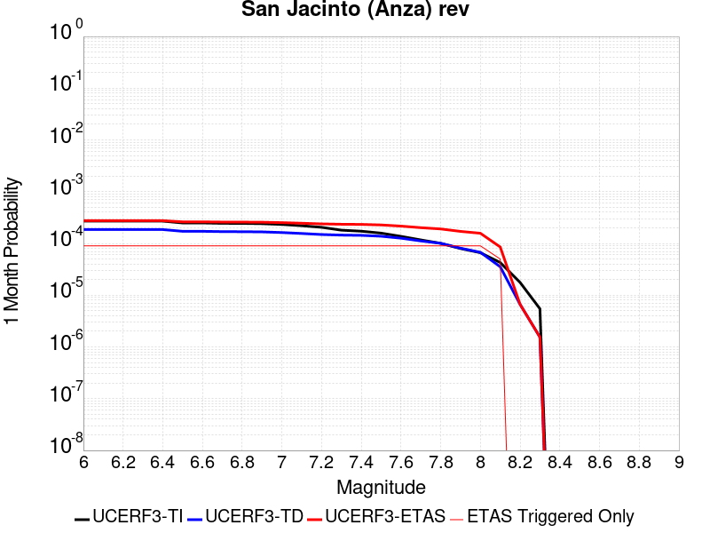 | 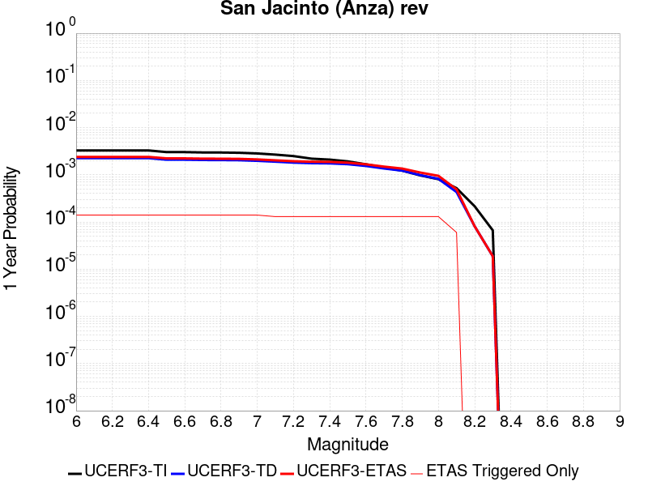 |  |

| Magnitude | 1 wk TI Prob | 1 wk TD Prob | 1 wk ETAS Prob | 1 wk ETAS/TD Gain | 1 wk ETAS Triggered Only | 1 mo TI Prob | 1 mo TD Prob | 1 mo ETAS Prob | 1 mo ETAS/TD Gain | 1 mo ETAS Triggered Only | 1 yr TI Prob | 1 yr TD Prob | 1 yr ETAS Prob | 1 yr ETAS/TD Gain | 1 yr ETAS Triggered Only | 10 yr TI Prob | 10 yr TD Prob | 10 yr ETAS Prob | 10 yr ETAS/TD Gain | 10 yr ETAS Triggered Only |
|-----|-----|-----|-----|-----|-----|-----|-----|-----|-----|-----|-----|-----|-----|-----|-----|-----|-----|-----|-----|-----|
| 6.0 | 6.3015636E-5 | 4.3298347E-5 | 1.1329532E-4 | 2.6166198 | 7.0E-5 | 2.7003905E-4 | 1.8555121E-4 | 2.7553452E-4 | 1.4849513 | 9.0E-5 | 0.0032827691 | 0.0022567573 | 0.0023964415 | 1.061896 | 1.4E-4 | 0.032346968 | 0.02329361 | 0.023469418 | 1.0075475 | 1.8E-4 |
| 6.1 | 6.3015636E-5 | 4.3298347E-5 | 1.1329532E-4 | 2.6166198 | 7.0E-5 | 2.7003905E-4 | 1.8555121E-4 | 2.7553452E-4 | 1.4849513 | 9.0E-5 | 0.0032827691 | 0.0022567573 | 0.0023964415 | 1.061896 | 1.4E-4 | 0.032346968 | 0.02329361 | 0.023469418 | 1.0075475 | 1.8E-4 |
| 6.2 | 6.3015636E-5 | 4.3298347E-5 | 1.1329532E-4 | 2.6166198 | 7.0E-5 | 2.7003905E-4 | 1.8555121E-4 | 2.7553452E-4 | 1.4849513 | 9.0E-5 | 0.0032827691 | 0.0022567573 | 0.0023964415 | 1.061896 | 1.4E-4 | 0.032346968 | 0.02329361 | 0.023469418 | 1.0075475 | 1.8E-4 |
| 6.3 | 6.3015636E-5 | 4.3298347E-5 | 1.1329532E-4 | 2.6166198 | 7.0E-5 | 2.7003905E-4 | 1.8555121E-4 | 2.7553452E-4 | 1.4849513 | 9.0E-5 | 0.0032827691 | 0.0022567573 | 0.0023964415 | 1.061896 | 1.4E-4 | 0.032346968 | 0.02329361 | 0.023469418 | 1.0075475 | 1.8E-4 |
| 6.4 | 6.3015636E-5 | 4.3298347E-5 | 1.1329532E-4 | 2.6166198 | 7.0E-5 | 2.7003905E-4 | 1.8555121E-4 | 2.7553452E-4 | 1.4849513 | 9.0E-5 | 0.0032827691 | 0.0022567573 | 0.0023964415 | 1.061896 | 1.4E-4 | 0.032346968 | 0.02329361 | 0.023469418 | 1.0075475 | 1.8E-4 |
| 6.5 | 5.811017E-5 | 4.0080286E-5 | 1.1007748E-4 | 2.7464247 | 7.0E-5 | 2.4901982E-4 | 1.7176138E-4 | 2.617459E-4 | 1.5238928 | 9.0E-5 | 0.0030276014 | 0.0020891947 | 0.0022289022 | 1.0668715 | 1.4E-4 | 0.02986684 | 0.021590833 | 0.021766948 | 1.0081569 | 1.8E-4 |
| 6.6 | 5.811017E-5 | 4.0080286E-5 | 1.1007748E-4 | 2.7464247 | 7.0E-5 | 2.4901982E-4 | 1.7176138E-4 | 2.617459E-4 | 1.5238928 | 9.0E-5 | 0.0030276014 | 0.0020891947 | 0.0022289022 | 1.0668715 | 1.4E-4 | 0.02986684 | 0.021590833 | 0.021766948 | 1.0081569 | 1.8E-4 |
| 6.7 | 5.712442E-5 | 3.950301E-5 | 1.09500244E-4 | 2.7719467 | 7.0E-5 | 2.4479596E-4 | 1.6928767E-4 | 2.5927243E-4 | 1.5315495 | 9.0E-5 | 0.0029763177 | 0.0020591344 | 0.0021988463 | 1.0678498 | 1.4E-4 | 0.029367693 | 0.021282919 | 0.021459088 | 1.0082775 | 1.8E-4 |
| 6.8 | 5.6967532E-5 | 3.93593E-5 | 1.09356544E-4 | 2.7784169 | 7.0E-5 | 2.4412372E-4 | 1.6867183E-4 | 2.5865666E-4 | 1.5334905 | 9.0E-5 | 0.0029681553 | 0.0020516508 | 0.0021913636 | 1.0680977 | 1.4E-4 | 0.029288229 | 0.02120852 | 0.021384701 | 1.0083071 | 1.8E-4 |
| 6.9 | 5.6211324E-5 | 3.9064216E-5 | 1.0906148E-4 | 2.7918513 | 7.0E-5 | 2.4088343E-4 | 1.6740736E-4 | 2.573923E-4 | 1.5375208 | 9.0E-5 | 0.0029288116 | 0.0020362847 | 0.0021759996 | 1.0686127 | 1.4E-4 | 0.028905109 | 0.021047527 | 0.021223739 | 1.0083721 | 1.8E-4 |
| 7.0 | 5.4383527E-5 | 3.7925012E-5 | 1.0792236E-4 | 2.8456776 | 7.0E-5 | 2.3305144E-4 | 1.6252567E-4 | 2.5251103E-4 | 1.5536687 | 9.0E-5 | 0.0028337094 | 0.001976959 | 0.0021166822 | 1.0706758 | 1.4E-4 | 0.027978465 | 0.02044095 | 0.02061727 | 1.0086259 | 1.8E-4 |
| 7.1 | 5.1393665E-5 | 3.638787E-5 | 1.0638532E-4 | 2.9236479 | 7.0E-5 | 2.2023996E-4 | 1.5593872E-4 | 2.459247E-4 | 1.5770597 | 9.0E-5 | 0.0026781242 | 0.0018969048 | 0.0020266583 | 1.0684026 | 1.3E-4 | 0.026460782 | 0.019616077 | 0.019782742 | 1.0084964 | 1.7E-4 |
| 7.2 | 4.785222E-5 | 3.4738845E-5 | 1.0473641E-4 | 3.0149653 | 7.0E-5 | 2.0506482E-4 | 1.4887229E-4 | 2.3885889E-4 | 1.604455 | 9.0E-5 | 0.0024938055 | 0.0018110167 | 0.0019407814 | 1.0716529 | 1.3E-4 | 0.024660049 | 0.018728783 | 0.0188956 | 1.008907 | 1.7E-4 |
| 7.3 | 4.2143256E-5 | 3.3834414E-5 | 1.0383205E-4 | 3.0688295 | 7.0E-5 | 1.8060145E-4 | 1.449966E-4 | 2.3498354E-4 | 1.6206143 | 9.0E-5 | 0.002196605 | 0.0017639075 | 0.0018936781 | 1.07357 | 1.3E-4 | 0.02175019 | 0.018236695 | 0.018403595 | 1.0091518 | 1.7E-4 |
| 7.4 | 4.0264713E-5 | 3.3472694E-5 | 1.0347035E-4 | 3.0911868 | 7.0E-5 | 1.7255165E-4 | 1.4344654E-4 | 2.3343362E-4 | 1.6273215 | 9.0E-5 | 0.002098792 | 0.0017450659 | 0.0018748391 | 1.0743657 | 1.3E-4 | 0.020790804 | 0.018041389 | 0.018208323 | 1.0092528 | 1.7E-4 |
| 7.5 | 3.694492E-5 | 3.2186905E-5 | 1.02184655E-4 | 3.1747274 | 7.0E-5 | 1.5832575E-4 | 1.379366E-4 | 2.2792419E-4 | 1.6523837 | 9.0E-5 | 0.0019259118 | 0.0016780876 | 0.0018078694 | 1.0773392 | 1.3E-4 | 0.01909306 | 0.017357888 | 0.017524937 | 1.0096238 | 1.7E-4 |
| 7.6 | 3.200565E-5 | 2.9502702E-5 | 9.9500634E-5 | 3.3725939 | 7.0E-5 | 1.3715986E-4 | 1.2643404E-4 | 2.1642266E-4 | 1.7117436 | 9.0E-5 | 0.001668642 | 0.0015382497 | 0.0016680497 | 1.0843816 | 1.3E-4 | 0.01656168 | 0.015946016 | 0.016113305 | 1.010491 | 1.7E-4 |
| 7.7 | 2.731642E-5 | 2.6091477E-5 | 9.608965E-5 | 3.6827986 | 7.0E-5 | 1.1706512E-4 | 1.11815825E-4 | 2.0180576E-4 | 1.804805 | 9.0E-5 | 0.001424336 | 0.0013605085 | 0.0014903316 | 1.0954225 | 1.3E-4 | 0.014152412 | 0.0141668 | 0.014334392 | 1.0118299 | 1.7E-4 |
| 7.8 | 2.3466424E-5 | 2.3503619E-5 | 9.350197E-5 | 3.9781947 | 7.0E-5 | 1.0056651E-4 | 1.0072591E-4 | 1.9071685E-4 | 1.8934239 | 9.0E-5 | 0.0012237094 | 0.0012256489 | 0.0013554896 | 1.1059363 | 1.3E-4 | 0.012169928 | 0.012808796 | 0.0129766185 | 1.0131022 | 1.7E-4 |
| 7.9 | 1.8611925E-5 | 1.890698E-5 | 8.8905654E-5 | 4.702266 | 7.0E-5 | 7.9762955E-5 | 8.10274E-5 | 1.710201E-4 | 2.1106453 | 9.0E-5 | 9.7068126E-4 | 9.860628E-4 | 0.0011159347 | 1.1317074 | 1.3E-4 | 0.0096645225 | 0.010393705 | 0.010561938 | 1.016186 | 1.7E-4 |
| 8.0 | 1.5460775E-5 | 1.5739915E-5 | 8.5738815E-5 | 5.4472218 | 7.0E-5 | 6.6258784E-5 | 6.745504E-5 | 1.5744897E-4 | 2.334132 | 9.0E-5 | 8.0640207E-4 | 8.2095637E-4 | 9.508496E-4 | 1.158222 | 1.3E-4 | 0.008034821 | 0.008702706 | 0.008871227 | 1.0193641 | 1.7E-4 |
| 8.1 | 9.983884E-6 | 8.268954E-6 | 4.8268623E-5 | 5.837331 | 4.0E-5 | 4.2787375E-5 | 3.5437897E-5 | 8.543613E-5 | 2.410869 | 5.0E-5 | 5.2081177E-4 | 4.313715E-4 | 4.913456E-4 | 1.1390313 | 6.0E-5 | 0.0051959283 | 0.00463968 | 0.0047093555 | 1.0150173 | 7.0E-5 |
| 8.2 | 4.1226E-6 | 1.5522551E-6 | 1.5522551E-6 | 1.0 | 0.0 | 1.7668166E-5 | 6.6525045E-6 | 6.6525045E-6 | 1.0 | 0.0 | 2.1508869E-4 | 8.099126E-5 | 8.099126E-5 | 1.0 | 0.0 | 0.0021488064 | 9.401847E-4 | 9.401847E-4 | 1.0 | 0.0 |
| 8.3 | 1.2750878E-6 | 3.609817E-7 | 3.609817E-7 | 1.0 | 0.0 | 5.4646503E-6 | 1.5470634E-6 | 1.5470634E-6 | 1.0 | 0.0 | 6.653009E-5 | 1.8835339E-5 | 1.8835339E-5 | 1.0 | 0.0 | 6.6510175E-4 | 2.272251E-4 | 2.272251E-4 | 1.0 | 0.0 |

## Cleghorn Pass
*[(top)](#table-of-contents)*

| 1 Week | 1 Month | 1 Year | 10 Year |
|-----|-----|-----|-----|
|  | 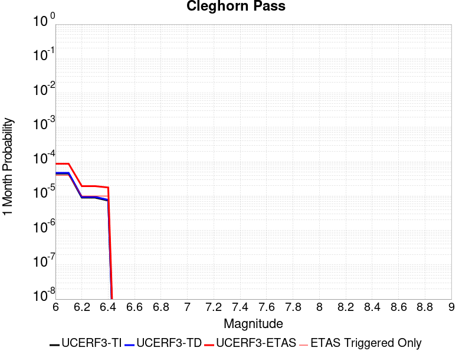 | 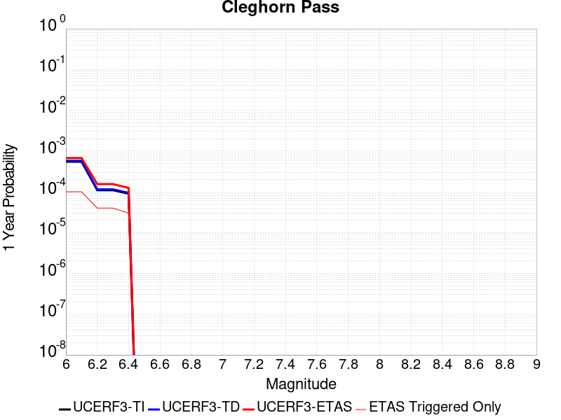 |  |

| Magnitude | 1 wk TI Prob | 1 wk TD Prob | 1 wk ETAS Prob | 1 wk ETAS/TD Gain | 1 wk ETAS Triggered Only | 1 mo TI Prob | 1 mo TD Prob | 1 mo ETAS Prob | 1 mo ETAS/TD Gain | 1 mo ETAS Triggered Only | 1 yr TI Prob | 1 yr TD Prob | 1 yr ETAS Prob | 1 yr ETAS/TD Gain | 1 yr ETAS Triggered Only | 10 yr TI Prob | 10 yr TD Prob | 10 yr ETAS Prob | 10 yr ETAS/TD Gain | 10 yr ETAS Triggered Only |
|-----|-----|-----|-----|-----|-----|-----|-----|-----|-----|-----|-----|-----|-----|-----|-----|-----|-----|-----|-----|-----|
| 6.0 | 1.0522846E-5 | 1.1040642E-5 | 3.104042E-5 | 2.8114688 | 2.0E-5 | 4.509713E-5 | 4.7316473E-5 | 8.7314584E-5 | 1.8453315 | 4.0E-5 | 5.4891926E-4 | 5.759784E-4 | 6.7592086E-4 | 1.1735176 | 1.0E-4 | 0.0054756533 | 0.005750022 | 0.0058991592 | 1.0259368 | 1.5E-4 |
| 6.1 | 1.0522846E-5 | 1.1040642E-5 | 3.104042E-5 | 2.8114688 | 2.0E-5 | 4.509713E-5 | 4.7316473E-5 | 8.7314584E-5 | 1.8453315 | 4.0E-5 | 5.4891926E-4 | 5.759784E-4 | 6.7592086E-4 | 1.1735176 | 1.0E-4 | 0.0054756533 | 0.005750022 | 0.0058991592 | 1.0259368 | 1.5E-4 |
| 6.2 | 2.1045846E-6 | 2.2082024E-6 | 1.220818E-5 | 5.52856 | 1.0E-5 | 9.019617E-6 | 9.463714E-6 | 1.946362E-5 | 2.0566576 | 1.0E-5 | 1.098083E-4 | 1.1521882E-4 | 1.5521422E-4 | 1.3471255 | 4.0E-5 | 0.0010975406 | 0.0011520023 | 0.0012019447 | 1.0433527 | 5.0E-5 |
| 6.3 | 2.1045846E-6 | 2.2082024E-6 | 1.220818E-5 | 5.52856 | 1.0E-5 | 9.019617E-6 | 9.463714E-6 | 1.946362E-5 | 2.0566576 | 1.0E-5 | 1.098083E-4 | 1.1521882E-4 | 1.5521422E-4 | 1.3471255 | 4.0E-5 | 0.0010975406 | 0.0011520023 | 0.0012019447 | 1.0433527 | 5.0E-5 |
| 6.4 | 1.7259927E-6 | 1.810877E-6 | 1.1810859E-5 | 6.522176 | 1.0E-5 | 7.3970905E-6 | 7.760902E-6 | 1.7760824E-5 | 2.2885 | 1.0E-5 | 9.005586E-5 | 9.4488976E-5 | 1.2448615E-4 | 1.3174673 | 3.0E-5 | 9.001937E-4 | 9.448898E-4 | 9.7486144E-4 | 1.0317197 | 3.0E-5 |

## Camp Rock 2011
*[(top)](#table-of-contents)*

| 1 Week | 1 Month | 1 Year | 10 Year |
|-----|-----|-----|-----|
|  |  |  |  |

| Magnitude | 1 wk TI Prob | 1 wk TD Prob | 1 wk ETAS Prob | 1 wk ETAS/TD Gain | 1 wk ETAS Triggered Only | 1 mo TI Prob | 1 mo TD Prob | 1 mo ETAS Prob | 1 mo ETAS/TD Gain | 1 mo ETAS Triggered Only | 1 yr TI Prob | 1 yr TD Prob | 1 yr ETAS Prob | 1 yr ETAS/TD Gain | 1 yr ETAS Triggered Only | 10 yr TI Prob | 10 yr TD Prob | 10 yr ETAS Prob | 10 yr ETAS/TD Gain | 10 yr ETAS Triggered Only |
|-----|-----|-----|-----|-----|-----|-----|-----|-----|-----|-----|-----|-----|-----|-----|-----|-----|-----|-----|-----|-----|
| 6.0 | 1.6710783E-5 | 4.249999E-6 | 7.42497E-5 | 17.470522 | 7.0E-5 | 7.161568E-5 | 1.8214158E-5 | 9.82127E-5 | 5.3921075 | 8.0E-5 | 8.7157206E-4 | 2.2173533E-4 | 3.7170207E-4 | 1.6763321 | 1.5E-4 | 0.008681616 | 0.0022151938 | 0.0023848172 | 1.0765728 | 1.7E-4 |
| 6.1 | 1.6710783E-5 | 4.249999E-6 | 7.42497E-5 | 17.470522 | 7.0E-5 | 7.161568E-5 | 1.8214158E-5 | 9.82127E-5 | 5.3921075 | 8.0E-5 | 8.7157206E-4 | 2.2173533E-4 | 3.7170207E-4 | 1.6763321 | 1.5E-4 | 0.008681616 | 0.0022151938 | 0.0023848172 | 1.0765728 | 1.7E-4 |
| 6.2 | 1.6710783E-5 | 4.249999E-6 | 7.42497E-5 | 17.470522 | 7.0E-5 | 7.161568E-5 | 1.8214158E-5 | 9.82127E-5 | 5.3921075 | 8.0E-5 | 8.7157206E-4 | 2.2173533E-4 | 3.7170207E-4 | 1.6763321 | 1.5E-4 | 0.008681616 | 0.0022151938 | 0.0023848172 | 1.0765728 | 1.7E-4 |
| 6.3 | 1.6710783E-5 | 4.249999E-6 | 7.42497E-5 | 17.470522 | 7.0E-5 | 7.161568E-5 | 1.8214158E-5 | 9.82127E-5 | 5.3921075 | 8.0E-5 | 8.7157206E-4 | 2.2173533E-4 | 3.7170207E-4 | 1.6763321 | 1.5E-4 | 0.008681616 | 0.0022151938 | 0.0023848172 | 1.0765728 | 1.7E-4 |
| 6.4 | 7.982846E-6 | 3.6820359E-6 | 7.3681775E-5 | 20.011152 | 7.0E-5 | 3.421175E-5 | 1.578006E-5 | 9.57788E-5 | 6.069609 | 8.0E-5 | 4.1644843E-4 | 1.9210564E-4 | 3.3207875E-4 | 1.7286257 | 1.4E-4 | 0.0041566887 | 0.0019194306 | 0.0020691426 | 1.0779982 | 1.5E-4 |
| 6.5 | 7.982846E-6 | 3.6820359E-6 | 7.3681775E-5 | 20.011152 | 7.0E-5 | 3.421175E-5 | 1.578006E-5 | 9.57788E-5 | 6.069609 | 8.0E-5 | 4.1644843E-4 | 1.9210564E-4 | 3.3207875E-4 | 1.7286257 | 1.4E-4 | 0.0041566887 | 0.0019194306 | 0.0020691426 | 1.0779982 | 1.5E-4 |
| 6.6 | 7.048869E-6 | 3.4242998E-6 | 5.342413E-5 | 15.601475 | 5.0E-5 | 3.0209088E-5 | 1.467549E-5 | 7.467461E-5 | 5.0883894 | 6.0E-5 | 3.677336E-4 | 1.7865976E-4 | 2.9863833E-4 | 1.6715478 | 1.2E-4 | 0.0036712566 | 0.0017851929 | 0.0019149608 | 1.0726912 | 1.3E-4 |
| 6.7 | 6.987307E-6 | 3.3622775E-6 | 5.336211E-5 | 15.870823 | 5.0E-5 | 2.9945259E-5 | 1.4409683E-5 | 7.440882E-5 | 5.163807 | 6.0E-5 | 3.6452254E-4 | 1.7542407E-4 | 2.9540304E-4 | 1.6839366 | 1.2E-4 | 0.0036392517 | 0.0017528872 | 0.0018826593 | 1.0740334 | 1.3E-4 |
| 6.8 | 6.3737602E-6 | 3.1178672E-6 | 5.311771E-5 | 17.036552 | 5.0E-5 | 2.731583E-5 | 1.3362222E-5 | 7.336142E-5 | 5.4902115 | 6.0E-5 | 3.3251947E-4 | 1.6267318E-4 | 2.8265367E-4 | 1.7375554 | 1.2E-4 | 0.0033202237 | 0.0016255698 | 0.0017553584 | 1.079842 | 1.3E-4 |
| 6.9 | 6.112211E-6 | 2.933078E-6 | 5.293293E-5 | 18.046888 | 5.0E-5 | 2.6194928E-5 | 1.2570275E-5 | 7.256952E-5 | 5.773105 | 6.0E-5 | 3.1887658E-4 | 1.5303263E-4 | 2.630158E-4 | 1.718691 | 1.1E-4 | 0.003184194 | 0.0015293002 | 0.0016491167 | 1.0783472 | 1.2E-4 |
| 7.0 | 5.5140117E-6 | 2.64191E-6 | 5.264178E-5 | 19.925652 | 5.0E-5 | 2.3631264E-5 | 1.1322423E-5 | 7.1321745E-5 | 6.299159 | 6.0E-5 | 2.8767265E-4 | 1.3784204E-4 | 2.478269E-4 | 1.7979048 | 1.1E-4 | 0.0028730053 | 0.0013775907 | 0.0014974254 | 1.0869886 | 1.2E-4 |
| 7.1 | 4.8151105E-6 | 2.1342612E-6 | 5.2134154E-5 | 24.427261 | 5.0E-5 | 2.0636026E-5 | 9.146803E-6 | 6.9146256E-5 | 7.5596094 | 6.0E-5 | 2.5121463E-4 | 1.1135685E-4 | 2.213446E-4 | 1.9877052 | 1.1E-4 | 0.0025093083 | 0.0011130325 | 0.0012328989 | 1.1076936 | 1.2E-4 |
| 7.2 | 3.818335E-6 | 1.2937372E-6 | 3.1293697E-5 | 24.188604 | 3.0E-5 | 1.6364189E-5 | 5.5445767E-6 | 3.554441E-5 | 6.4106627 | 3.0E-5 | 1.9921579E-4 | 6.750321E-5 | 1.2749917E-4 | 1.8887866 | 6.0E-5 | 0.0019903728 | 6.7483535E-4 | 7.347948E-4 | 1.0888506 | 6.0E-5 |
| 7.3 | 2.7166698E-6 | 7.383078E-7 | 7.383078E-7 | 1.0 | 0.0 | 1.1642818E-5 | 3.1641725E-6 | 3.1641725E-6 | 1.0 | 0.0 | 1.4174209E-4 | 3.852314E-5 | 4.8522754E-5 | 1.2595743 | 1.0E-5 | 0.0014165172 | 3.8516664E-4 | 3.951628E-4 | 1.0259528 | 1.0E-5 |
| 7.4 | 2.0893426E-6 | 5.4614605E-7 | 5.4614605E-7 | 1.0 | 0.0 | 8.954295E-6 | 2.340624E-6 | 2.340624E-6 | 1.0 | 0.0 | 1.0901308E-4 | 2.8496728E-5 | 2.8496728E-5 | 1.0 | 0.0 | 0.0010895962 | 2.849313E-4 | 2.849313E-4 | 1.0 | 0.0 |
| 7.5 | 1.1681728E-6 | 3.6028484E-7 | 3.6028484E-7 | 1.0 | 0.0 | 5.0064455E-6 | 1.544077E-6 | 1.544077E-6 | 1.0 | 0.0 | 6.0951766E-5 | 1.879898E-5 | 1.879898E-5 | 1.0 | 0.0 | 6.093505E-4 | 1.8797436E-4 | 1.8797436E-4 | 1.0 | 0.0 |
| 7.6 | 1.3154387E-7 | 7.1196716E-8 | 7.1196716E-8 | 1.0 | 0.0 | 5.6375933E-7 | 3.0512876E-7 | 3.0512876E-7 | 1.0 | 0.0 | 6.863748E-6 | 3.714938E-6 | 3.714938E-6 | 1.0 | 0.0 | 6.863536E-5 | 3.7148915E-5 | 3.7148915E-5 | 1.0 | 0.0 |

## Red Mountain
*[(top)](#table-of-contents)*

| 1 Week | 1 Month | 1 Year | 10 Year |
|-----|-----|-----|-----|
|  |  |  |  |

| Magnitude | 1 wk TI Prob | 1 wk TD Prob | 1 wk ETAS Prob | 1 wk ETAS/TD Gain | 1 wk ETAS Triggered Only | 1 mo TI Prob | 1 mo TD Prob | 1 mo ETAS Prob | 1 mo ETAS/TD Gain | 1 mo ETAS Triggered Only | 1 yr TI Prob | 1 yr TD Prob | 1 yr ETAS Prob | 1 yr ETAS/TD Gain | 1 yr ETAS Triggered Only | 10 yr TI Prob | 10 yr TD Prob | 10 yr ETAS Prob | 10 yr ETAS/TD Gain | 10 yr ETAS Triggered Only |
|-----|-----|-----|-----|-----|-----|-----|-----|-----|-----|-----|-----|-----|-----|-----|-----|-----|-----|-----|-----|-----|
| 6.0 | 4.1810763E-5 | 4.7590016E-5 | 9.758764E-5 | 2.0505905 | 5.0E-5 | 1.7917668E-4 | 2.039422E-4 | 2.6392995E-4 | 1.294141 | 6.0E-5 | 0.0021792934 | 0.0024803334 | 0.002560135 | 1.0321738 | 8.0E-5 | 0.021580452 | 0.02454411 | 0.024661165 | 1.0047692 | 1.2E-4 |
| 6.1 | 4.1810763E-5 | 4.7590016E-5 | 9.758764E-5 | 2.0505905 | 5.0E-5 | 1.7917668E-4 | 2.039422E-4 | 2.6392995E-4 | 1.294141 | 6.0E-5 | 0.0021792934 | 0.0024803334 | 0.002560135 | 1.0321738 | 8.0E-5 | 0.021580452 | 0.02454411 | 0.024661165 | 1.0047692 | 1.2E-4 |
| 6.2 | 4.1810763E-5 | 4.7590016E-5 | 9.758764E-5 | 2.0505905 | 5.0E-5 | 1.7917668E-4 | 2.039422E-4 | 2.6392995E-4 | 1.294141 | 6.0E-5 | 0.0021792934 | 0.0024803334 | 0.002560135 | 1.0321738 | 8.0E-5 | 0.021580452 | 0.02454411 | 0.024661165 | 1.0047692 | 1.2E-4 |
| 6.3 | 4.1810763E-5 | 4.7590016E-5 | 9.758764E-5 | 2.0505905 | 5.0E-5 | 1.7917668E-4 | 2.039422E-4 | 2.6392995E-4 | 1.294141 | 6.0E-5 | 0.0021792934 | 0.0024803334 | 0.002560135 | 1.0321738 | 8.0E-5 | 0.021580452 | 0.02454411 | 0.024661165 | 1.0047692 | 1.2E-4 |
| 6.4 | 4.1810763E-5 | 4.7590016E-5 | 9.758764E-5 | 2.0505905 | 5.0E-5 | 1.7917668E-4 | 2.039422E-4 | 2.6392995E-4 | 1.294141 | 6.0E-5 | 0.0021792934 | 0.0024803334 | 0.002560135 | 1.0321738 | 8.0E-5 | 0.021580452 | 0.02454411 | 0.024661165 | 1.0047692 | 1.2E-4 |
| 6.5 | 3.154503E-5 | 3.5359757E-5 | 6.53587E-5 | 1.8483921 | 3.0E-5 | 1.3518598E-4 | 1.5153353E-4 | 1.9152748E-4 | 1.2639279 | 4.0E-5 | 0.0016446467 | 0.0018434518 | 0.0019033412 | 1.0324876 | 6.0E-5 | 0.01632528 | 0.018291244 | 0.018389415 | 1.005367 | 1.0E-4 |
| 6.6 | 3.1535834E-5 | 3.5349138E-5 | 6.534808E-5 | 1.848647 | 3.0E-5 | 1.3514658E-4 | 1.5148803E-4 | 1.9148197E-4 | 1.2640072 | 4.0E-5 | 0.0016441676 | 0.0018428987 | 0.0019027882 | 1.0324974 | 6.0E-5 | 0.01632056 | 0.018285805 | 0.018383976 | 1.0053687 | 1.0E-4 |
| 6.7 | 2.8267326E-5 | 3.1469353E-5 | 6.146841E-5 | 1.9532784 | 3.0E-5 | 1.2114006E-4 | 1.3486217E-4 | 1.7485677E-4 | 1.2965591 | 4.0E-5 | 0.0014738824 | 0.0016407954 | 0.0016907133 | 1.030423 | 5.0E-5 | 0.014641452 | 0.01629557 | 0.016384104 | 1.005433 | 9.0E-5 |
| 6.8 | 2.8212884E-5 | 3.1407242E-5 | 6.1406296E-5 | 1.9551637 | 3.0E-5 | 1.20906756E-4 | 1.3459599E-4 | 1.745906E-4 | 1.2971456 | 4.0E-5 | 0.0014710457 | 0.0016375595 | 0.0016874777 | 1.0304832 | 5.0E-5 | 0.014613459 | 0.016263688 | 0.016352223 | 1.0054438 | 9.0E-5 |
| 6.9 | 2.4227871E-5 | 2.6706994E-5 | 4.670646E-5 | 1.7488475 | 2.0E-5 | 1.03829596E-4 | 1.1445395E-4 | 1.4445052E-4 | 1.2620841 | 3.0E-5 | 0.0012633923 | 0.0013926621 | 0.0014326064 | 1.028682 | 4.0E-5 | 0.012562336 | 0.0138470335 | 0.013925926 | 1.0056974 | 8.0E-5 |
| 7.0 | 2.348524E-5 | 2.5835778E-5 | 4.5835262E-5 | 1.7741003 | 2.0E-5 | 1.0064714E-4 | 1.10720495E-4 | 1.4071717E-4 | 1.2709225 | 3.0E-5 | 0.0012246901 | 0.001347264 | 0.0013872101 | 1.0296499 | 4.0E-5 | 0.012179627 | 0.013398598 | 0.013477526 | 1.0058907 | 8.0E-5 |
| 7.1 | 2.2311642E-5 | 2.4462845E-5 | 4.4462355E-5 | 1.8175464 | 2.0E-5 | 9.561782E-5 | 1.04836974E-4 | 1.3483383E-4 | 1.2861286 | 3.0E-5 | 0.0011635252 | 0.0012757176 | 0.0013156666 | 1.0313148 | 4.0E-5 | 0.01157452 | 0.01269146 | 0.012770444 | 1.0062234 | 8.0E-5 |
| 7.2 | 1.6533986E-5 | 1.7670362E-5 | 3.7670008E-5 | 2.1318188 | 2.0E-5 | 7.085802E-5 | 7.572828E-5 | 9.572677E-5 | 1.2640821 | 2.0E-5 | 8.623549E-4 | 9.2166534E-4 | 9.516377E-4 | 1.0325198 | 3.0E-5 | 0.008590161 | 0.009184707 | 0.009244156 | 1.0064726 | 6.0E-5 |
| 7.3 | 1.4703092E-5 | 1.5559537E-5 | 3.5559224E-5 | 2.2853653 | 2.0E-5 | 6.301173E-5 | 6.668237E-5 | 8.668104E-5 | 1.2999094 | 2.0E-5 | 7.668978E-4 | 8.1161706E-4 | 8.4159273E-4 | 1.0369333 | 3.0E-5 | 0.0076425658 | 0.008092604 | 0.008152118 | 1.0073541 | 6.0E-5 |
| 7.4 | 6.1331984E-6 | 5.5288874E-6 | 1.5528833E-5 | 2.8086722 | 1.0E-5 | 2.6284872E-5 | 2.3695018E-5 | 3.369478E-5 | 1.4220196 | 1.0E-5 | 3.199713E-4 | 2.884492E-4 | 2.984463E-4 | 1.0346582 | 1.0E-5 | 0.0031951098 | 0.0028808024 | 0.002910716 | 1.0103837 | 3.0E-5 |
| 7.5 | 5.954766E-6 | 5.338517E-6 | 1.5338464E-5 | 2.8731694 | 1.0E-5 | 2.5520176E-5 | 2.2879161E-5 | 3.2878932E-5 | 1.4370689 | 1.0E-5 | 3.1066386E-4 | 2.785187E-4 | 2.885159E-4 | 1.0358943 | 1.0E-5 | 0.003102299 | 0.0027817504 | 0.0028116668 | 1.0107546 | 3.0E-5 |
| 7.6 | 4.9726646E-6 | 4.315309E-6 | 1.4315266E-5 | 3.317321 | 1.0E-5 | 2.1311245E-5 | 1.8494053E-5 | 2.8493867E-5 | 1.5407044 | 1.0E-5 | 2.5943352E-4 | 2.2514217E-4 | 2.3513992E-4 | 1.0444064 | 1.0E-5 | 0.0025913084 | 0.0022491754 | 0.002279108 | 1.0133082 | 3.0E-5 |
| 7.7 | 3.3613894E-6 | 2.8526886E-6 | 2.8526886E-6 | 1.0 | 0.0 | 1.4405875E-5 | 1.22257525E-5 | 1.22257525E-5 | 1.0 | 0.0 | 1.7537741E-4 | 1.4883863E-4 | 1.4883863E-4 | 1.0 | 0.0 | 0.0017523908 | 0.0014874157 | 0.0014974009 | 1.006713 | 1.0E-5 |
| 7.8 | 1.1828961E-6 | 1.0122935E-6 | 1.0122935E-6 | 1.0 | 0.0 | 5.069545E-6 | 4.338394E-6 | 4.338394E-6 | 1.0 | 0.0 | 6.171996E-5 | 5.281869E-5 | 5.281869E-5 | 1.0 | 0.0 | 6.170282E-4 | 5.280643E-4 | 5.280643E-4 | 1.0 | 0.0 |
| 7.9 | 2.2967266E-7 | 1.861919E-7 | 1.861919E-7 | 1.0 | 0.0 | 9.843111E-7 | 7.97965E-7 | 7.97965E-7 | 1.0 | 0.0 | 1.19839215E-5 | 9.715184E-6 | 9.715184E-6 | 1.0 | 0.0 | 1.1983275E-4 | 9.714788E-5 | 9.714788E-5 | 1.0 | 0.0 |

## Brawley (Seismic Zone) alt 1
*[(top)](#table-of-contents)*

| 1 Week | 1 Month | 1 Year | 10 Year |
|-----|-----|-----|-----|
|  |  |  |  |

| Magnitude | 1 wk TI Prob | 1 wk TD Prob | 1 wk ETAS Prob | 1 wk ETAS/TD Gain | 1 wk ETAS Triggered Only | 1 mo TI Prob | 1 mo TD Prob | 1 mo ETAS Prob | 1 mo ETAS/TD Gain | 1 mo ETAS Triggered Only | 1 yr TI Prob | 1 yr TD Prob | 1 yr ETAS Prob | 1 yr ETAS/TD Gain | 1 yr ETAS Triggered Only | 10 yr TI Prob | 10 yr TD Prob | 10 yr ETAS Prob | 10 yr ETAS/TD Gain | 10 yr ETAS Triggered Only |
|-----|-----|-----|-----|-----|-----|-----|-----|-----|-----|-----|-----|-----|-----|-----|-----|-----|-----|-----|-----|-----|
| 6.0 | 2.2521618E-4 | 4.763429E-4 | 5.463095E-4 | 1.146883 | 7.0E-5 | 9.6485513E-4 | 0.0020399094 | 0.0021397055 | 1.0489218 | 1.0E-4 | 0.011683988 | 0.024544531 | 0.024661586 | 1.0047691 | 1.2E-4 | 0.11088423 | 0.21349923 | 0.2136172 | 1.0005525 | 1.5E-4 |
| 6.1 | 2.2521618E-4 | 4.763429E-4 | 5.363143E-4 | 1.1258997 | 6.0E-5 | 9.6485513E-4 | 0.0020399094 | 0.0021297259 | 1.0440296 | 9.0E-5 | 0.011683988 | 0.024544531 | 0.024651831 | 1.0043716 | 1.1E-4 | 0.11088423 | 0.21349923 | 0.21360934 | 1.0005157 | 1.4E-4 |
| 6.2 | 2.198148E-4 | 4.6718874E-4 | 5.271607E-4 | 1.1283678 | 6.0E-5 | 9.417233E-4 | 0.0020007377 | 0.0020905577 | 1.0448934 | 9.0E-5 | 0.011405343 | 0.024078513 | 0.024185864 | 1.0044584 | 1.1E-4 | 0.10837428 | 0.20993572 | 0.21004634 | 1.0005269 | 1.4E-4 |
| 6.3 | 2.1704129E-4 | 4.615455E-4 | 5.215178E-4 | 1.129938 | 6.0E-5 | 9.298453E-4 | 0.0019765892 | 0.0020664113 | 1.0454429 | 9.0E-5 | 0.011262234 | 0.023792034 | 0.023899417 | 1.0045134 | 1.1E-4 | 0.107082725 | 0.20782684 | 0.20793773 | 1.0005336 | 1.4E-4 |
| 6.4 | 1.876142E-4 | 4.004663E-4 | 4.6044227E-4 | 1.1497654 | 6.0E-5 | 8.038131E-4 | 0.0017151695 | 0.0017950323 | 1.0465627 | 8.0E-5 | 0.00974259 | 0.020678662 | 0.020776594 | 1.004736 | 1.0E-4 | 0.093263686 | 0.18457787 | 0.18468387 | 1.0005744 | 1.3E-4 |
| 6.5 | 1.7390939E-4 | 3.7478763E-4 | 4.3476516E-4 | 1.1600306 | 6.0E-5 | 7.45113E-4 | 0.0016052561 | 0.0016851277 | 1.0497563 | 8.0E-5 | 0.009034078 | 0.019367293 | 0.019465357 | 1.0050633 | 1.0E-4 | 0.086755216 | 0.17440015 | 0.17450748 | 1.0006154 | 1.3E-4 |
| 6.6 | 1.591791E-4 | 3.4893592E-4 | 4.08915E-4 | 1.1718913 | 6.0E-5 | 6.8201777E-4 | 0.0014945926 | 0.0015744731 | 1.0534463 | 8.0E-5 | 0.008271996 | 0.018045008 | 0.018143203 | 1.0054417 | 1.0E-4 | 0.07970774 | 0.16380787 | 0.16391657 | 1.0006636 | 1.3E-4 |
| 6.7 | 1.4268003E-4 | 3.2059717E-4 | 3.8057796E-4 | 1.1870908 | 6.0E-5 | 6.1134255E-4 | 0.0013732726 | 0.0014531628 | 1.058175 | 8.0E-5 | 0.007417723 | 0.01659171 | 0.016680216 | 1.0053344 | 9.0E-5 | 0.07174956 | 0.15193594 | 0.1520377 | 1.0006698 | 1.2E-4 |
| 6.8 | 1.239713E-4 | 2.9055026E-4 | 3.5053285E-4 | 1.2064447 | 6.0E-5 | 5.3119735E-4 | 0.0012446274 | 0.0013145403 | 1.0561718 | 7.0E-5 | 0.0064481674 | 0.015049482 | 0.015128278 | 1.0052358 | 8.0E-5 | 0.06264243 | 0.13838051 | 0.13847528 | 1.0006849 | 1.1E-4 |
| 6.9 | 1.0180238E-4 | 2.6255674E-4 | 3.22541E-4 | 1.228462 | 6.0E-5 | 4.3622297E-4 | 0.0011247622 | 0.0011946835 | 1.0621654 | 7.0E-5 | 0.005298089 | 0.013608998 | 0.013687909 | 1.0057985 | 8.0E-5 | 0.05173543 | 0.12496473 | 0.12506098 | 1.0007702 | 1.1E-4 |
| 7.0 | 7.6619996E-5 | 2.2400476E-4 | 2.8399134E-4 | 1.2677914 | 6.0E-5 | 3.283301E-4 | 9.596704E-4 | 0.0010296032 | 1.0728717 | 7.0E-5 | 0.0039900932 | 0.011622103 | 0.011701173 | 1.0068034 | 8.0E-5 | 0.039192066 | 0.10726982 | 0.10736802 | 1.0009154 | 1.1E-4 |
| 7.1 | 7.5127435E-5 | 2.2083633E-4 | 2.808231E-4 | 1.2716345 | 6.0E-5 | 3.2193496E-4 | 9.461013E-4 | 0.0010160351 | 1.0739179 | 7.0E-5 | 0.0039125155 | 0.011458648 | 0.011537732 | 1.0069016 | 8.0E-5 | 0.038443442 | 0.10583378 | 0.10593214 | 1.0009294 | 1.1E-4 |
| 7.2 | 6.788582E-5 | 2.0211334E-4 | 2.621012E-4 | 1.2968031 | 6.0E-5 | 2.9090676E-4 | 8.6591556E-4 | 9.358549E-4 | 1.0807693 | 7.0E-5 | 0.0035360386 | 0.0104922 | 0.010571361 | 1.0075448 | 8.0E-5 | 0.034803 | 0.097503684 | 0.097602956 | 1.0010182 | 1.1E-4 |
| 7.3 | 6.399602E-5 | 1.8842232E-4 | 2.48411E-4 | 1.3183737 | 6.0E-5 | 2.7423984E-4 | 8.0727716E-4 | 8.7722065E-4 | 1.0866412 | 7.0E-5 | 0.0033337586 | 0.009784897 | 0.009864113 | 1.0080959 | 8.0E-5 | 0.03284188 | 0.091397986 | 0.091497935 | 1.0010935 | 1.1E-4 |
| 7.4 | 4.506759E-5 | 1.2530042E-4 | 1.852929E-4 | 1.4787892 | 6.0E-5 | 1.9313251E-4 | 5.3689216E-4 | 6.0685456E-4 | 1.13031 | 7.0E-5 | 0.0023488526 | 0.006517245 | 0.0065967236 | 1.0121951 | 8.0E-5 | 0.023241805 | 0.062364522 | 0.06246766 | 1.0016538 | 1.1E-4 |
| 7.5 | 3.43289E-5 | 9.336103E-5 | 1.4335636E-4 | 1.5355054 | 5.0E-5 | 1.4711556E-4 | 4.0005764E-4 | 4.6003365E-4 | 1.1499184 | 6.0E-5 | 0.0017896603 | 0.004859886 | 0.0049295463 | 1.0143336 | 7.0E-5 | 0.01775316 | 0.047057066 | 0.047152363 | 1.0020251 | 1.0E-4 |
| 7.6 | 2.5980507E-5 | 7.053672E-5 | 1.105339E-4 | 1.5670404 | 4.0E-5 | 1.1134028E-4 | 3.0226534E-4 | 3.4225325E-4 | 1.132294 | 4.0E-5 | 0.001354725 | 0.0036738948 | 0.0037237112 | 1.0135596 | 5.0E-5 | 0.013464959 | 0.03584298 | 0.035920113 | 1.002152 | 8.0E-5 |
| 7.7 | 1.7292105E-5 | 4.9412036E-5 | 8.941006E-5 | 1.8094794 | 4.0E-5 | 7.4106916E-5 | 2.1174872E-4 | 2.5174025E-4 | 1.1888632 | 4.0E-5 | 9.018782E-4 | 0.0025749984 | 0.0026248696 | 1.0193675 | 5.0E-5 | 0.008982267 | 0.025292097 | 0.025370073 | 1.003083 | 8.0E-5 |
| 7.8 | 1.2927471E-5 | 3.9697254E-5 | 7.969567E-5 | 2.0075862 | 4.0E-5 | 5.5402274E-5 | 1.7012001E-4 | 2.1011321E-4 | 1.2350881 | 4.0E-5 | 6.743139E-4 | 0.0020692463 | 0.0021191428 | 1.0241134 | 5.0E-5 | 0.0067227143 | 0.020433145 | 0.02051151 | 1.0038352 | 8.0E-5 |
| 7.9 | 1.0200774E-5 | 2.8748475E-5 | 6.874732E-5 | 2.391338 | 4.0E-5 | 4.371687E-5 | 1.2320194E-4 | 1.6319701E-4 | 1.3246303 | 4.0E-5 | 5.321229E-4 | 0.0014989526 | 0.0015488777 | 1.0333066 | 5.0E-5 | 0.005308505 | 0.014992895 | 0.015071695 | 1.0052558 | 8.0E-5 |
| 8.0 | 8.650396E-6 | 2.3279512E-5 | 6.327858E-5 | 2.718209 | 4.0E-5 | 3.70726E-5 | 9.976552E-5 | 1.3976153E-4 | 1.4009001 | 4.0E-5 | 4.5126543E-4 | 0.0012139693 | 0.0012639086 | 1.0411372 | 5.0E-5 | 0.0045035016 | 0.012212164 | 0.0122911865 | 1.0064708 | 8.0E-5 |
| 8.1 | 3.9368224E-6 | 7.3283345E-6 | 1.732826E-5 | 2.3645566 | 1.0E-5 | 1.6871985E-5 | 3.1406773E-5 | 4.1406456E-5 | 1.3183926 | 1.0E-5 | 2.0539707E-4 | 3.8231048E-4 | 3.9230665E-4 | 1.0261468 | 1.0E-5 | 0.0020520731 | 0.0040015313 | 0.0040114913 | 1.0024891 | 1.0E-5 |
| 8.2 | 1.7101195E-6 | 2.2178374E-6 | 1.2217815E-5 | 5.508887 | 1.0E-5 | 7.329063E-6 | 9.504983E-6 | 1.9504889E-5 | 2.0520697 | 1.0E-5 | 8.922769E-5 | 1.15717055E-4 | 1.257159E-4 | 1.0864077 | 1.0E-5 | 8.9191867E-4 | 0.00126669 | 0.0012766774 | 1.0078846 | 1.0E-5 |
| 8.3 | 3.0346666E-8 | 1.721086E-8 | 1.721086E-8 | 1.0 | 0.0 | 1.3005713E-7 | 7.376083E-8 | 7.376083E-8 | 1.0 | 0.0 | 1.5834444E-6 | 8.98038E-7 | 8.98038E-7 | 1.0 | 0.0 | 1.5834332E-5 | 9.36379E-6 | 9.36379E-6 | 1.0 | 0.0 |

## Owens Valley
*[(top)](#table-of-contents)*

| 1 Week | 1 Month | 1 Year | 10 Year |
|-----|-----|-----|-----|
|  | 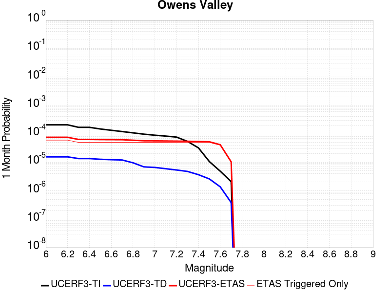 |  |  |

| Magnitude | 1 wk TI Prob | 1 wk TD Prob | 1 wk ETAS Prob | 1 wk ETAS/TD Gain | 1 wk ETAS Triggered Only | 1 mo TI Prob | 1 mo TD Prob | 1 mo ETAS Prob | 1 mo ETAS/TD Gain | 1 mo ETAS Triggered Only | 1 yr TI Prob | 1 yr TD Prob | 1 yr ETAS Prob | 1 yr ETAS/TD Gain | 1 yr ETAS Triggered Only | 10 yr TI Prob | 10 yr TD Prob | 10 yr ETAS Prob | 10 yr ETAS/TD Gain | 10 yr ETAS Triggered Only |
|-----|-----|-----|-----|-----|-----|-----|-----|-----|-----|-----|-----|-----|-----|-----|-----|-----|-----|-----|-----|-----|
| 6.0 | 4.83821E-5 | 3.6210524E-6 | 4.362091E-5 | 12.046473 | 4.0E-5 | 2.0733538E-4 | 1.551871E-5 | 7.5517775E-5 | 4.866241 | 6.0E-5 | 0.002521386 | 1.889249E-4 | 2.88906E-4 | 1.5292109 | 1.0E-4 | 0.024929691 | 0.0019297141 | 0.002069444 | 1.0724096 | 1.4E-4 |
| 6.1 | 4.83821E-5 | 3.6210524E-6 | 4.362091E-5 | 12.046473 | 4.0E-5 | 2.0733538E-4 | 1.551871E-5 | 7.5517775E-5 | 4.866241 | 6.0E-5 | 0.002521386 | 1.889249E-4 | 2.88906E-4 | 1.5292109 | 1.0E-4 | 0.024929691 | 0.0019297141 | 0.002069444 | 1.0724096 | 1.4E-4 |
| 6.2 | 4.83821E-5 | 3.6210524E-6 | 4.362091E-5 | 12.046473 | 4.0E-5 | 2.0733538E-4 | 1.551871E-5 | 7.5517775E-5 | 4.866241 | 6.0E-5 | 0.002521386 | 1.889249E-4 | 2.88906E-4 | 1.5292109 | 1.0E-4 | 0.024929691 | 0.0019297141 | 0.002069444 | 1.0724096 | 1.4E-4 |
| 6.3 | 3.953008E-5 | 3.1530958E-6 | 4.315297E-5 | 13.6859045 | 4.0E-5 | 1.6940363E-4 | 1.3513202E-5 | 6.3512525E-5 | 4.700035 | 5.0E-5 | 0.002060538 | 1.6451156E-4 | 2.5449676E-4 | 1.5469841 | 9.0E-5 | 0.020415364 | 0.0016621627 | 0.0017819633 | 1.0720751 | 1.2E-4 |
| 6.4 | 3.953008E-5 | 3.1530958E-6 | 4.315297E-5 | 13.6859045 | 4.0E-5 | 1.6940363E-4 | 1.3513202E-5 | 6.3512525E-5 | 4.700035 | 5.0E-5 | 0.002060538 | 1.6451156E-4 | 2.5449676E-4 | 1.5469841 | 9.0E-5 | 0.020415364 | 0.0016621627 | 0.0017819633 | 1.0720751 | 1.2E-4 |
| 6.5 | 3.457342E-5 | 2.9707387E-6 | 4.297062E-5 | 14.464624 | 4.0E-5 | 1.4816338E-4 | 1.273168E-5 | 6.2731044E-5 | 4.9271617 | 5.0E-5 | 0.0018023965 | 1.5499788E-4 | 2.449839E-4 | 1.5805632 | 9.0E-5 | 0.017878477 | 0.0015563119 | 0.0016761251 | 1.0769854 | 1.2E-4 |
| 6.6 | 3.1127765E-5 | 2.8737306E-6 | 4.2873617E-5 | 14.919149 | 4.0E-5 | 1.3339789E-4 | 1.2315934E-5 | 6.231532E-5 | 5.0597315 | 5.0E-5 | 0.0016229092 | 1.4993687E-4 | 2.3992338E-4 | 1.6001626 | 9.0E-5 | 0.016111081 | 0.0015013438 | 0.0016211636 | 1.0798084 | 1.2E-4 |
| 6.7 | 2.806885E-5 | 2.8101606E-6 | 4.2810047E-5 | 15.234022 | 4.0E-5 | 1.2028952E-4 | 1.2043493E-5 | 6.204289E-5 | 5.1515694 | 5.0E-5 | 0.001463541 | 1.4662035E-4 | 2.3660716E-4 | 1.6137402 | 9.0E-5 | 0.014539397 | 0.0014656087 | 0.0015854328 | 1.0817572 | 1.2E-4 |
| 6.8 | 2.524524E-5 | 2.2351392E-6 | 4.223505E-5 | 18.895937 | 4.0E-5 | 1.0818939E-4 | 9.579134E-6 | 5.9578655E-5 | 6.2196283 | 5.0E-5 | 0.0013164099 | 1.16620016E-4 | 2.0660952E-4 | 1.7716471 | 9.0E-5 | 0.01308639 | 0.001165827 | 0.0012856872 | 1.1028112 | 1.2E-4 |
| 6.9 | 2.2704568E-5 | 1.6079711E-6 | 4.1607906E-5 | 25.87603 | 4.0E-5 | 9.730166E-5 | 6.8912864E-6 | 5.689094E-5 | 8.255489 | 5.0E-5 | 0.0011840039 | 8.38982E-5 | 1.7389064E-4 | 2.0726385 | 9.0E-5 | 0.011777153 | 8.38853E-4 | 9.5875235E-4 | 1.1429324 | 1.2E-4 |
| 7.0 | 2.0871712E-5 | 1.5393621E-6 | 4.15393E-5 | 26.984749 | 4.0E-5 | 8.944713E-5 | 6.5972495E-6 | 5.659692E-5 | 8.578866 | 5.0E-5 | 0.0010884746 | 8.031857E-5 | 1.7031134E-4 | 2.1204479 | 9.0E-5 | 0.010831586 | 8.030395E-4 | 9.229432E-4 | 1.1493123 | 1.2E-4 |
| 7.1 | 1.944928E-5 | 1.3862556E-6 | 4.13862E-5 | 29.85467 | 4.0E-5 | 8.335139E-5 | 5.941082E-6 | 5.5940785E-5 | 9.415926 | 5.0E-5 | 0.0010143308 | 7.233028E-5 | 1.6232378E-4 | 2.2442021 | 9.0E-5 | 0.010097133 | 7.2319806E-4 | 8.4311125E-4 | 1.1658096 | 1.2E-4 |
| 7.2 | 1.7876306E-5 | 1.2487686E-6 | 4.1248717E-5 | 33.031517 | 4.0E-5 | 7.6610486E-5 | 5.3518543E-6 | 5.5351586E-5 | 10.342506 | 5.0E-5 | 9.3233347E-4 | 6.515689E-5 | 1.5515102E-4 | 2.3811915 | 9.0E-5 | 0.009284316 | 6.5148395E-4 | 7.7140576E-4 | 1.1840749 | 1.2E-4 |
| 7.3 | 1.2618672E-5 | 1.1113839E-6 | 4.111134E-5 | 36.991123 | 4.0E-5 | 5.40789E-5 | 4.763065E-6 | 5.4762826E-5 | 11.497392 | 5.0E-5 | 6.582117E-4 | 5.7988782E-5 | 1.4798356E-4 | 2.5519342 | 9.0E-5 | 0.0065626553 | 5.7983754E-4 | 6.8977376E-4 | 1.1895983 | 1.1E-4 |
| 7.4 | 7.4874442E-6 | 8.547518E-7 | 4.0854717E-5 | 47.797173 | 4.0E-5 | 3.208865E-5 | 3.6632168E-6 | 5.3663032E-5 | 14.649156 | 5.0E-5 | 3.906093E-4 | 4.4598757E-5 | 1.2459519E-4 | 2.7936919 | 8.0E-5 | 0.003899234 | 4.459579E-4 | 5.459133E-4 | 1.2241364 | 1.0E-4 |
| 7.5 | 2.4734156E-6 | 6.0679935E-7 | 4.0606774E-5 | 66.91961 | 4.0E-5 | 1.060031E-5 | 2.6005662E-6 | 5.2600437E-5 | 20.226532 | 5.0E-5 | 1.2905113E-4 | 3.1661435E-5 | 1.11658905E-4 | 3.526653 | 8.0E-5 | 0.0012897621 | 3.1656958E-4 | 4.1653792E-4 | 1.3157864 | 1.0E-4 |
| 7.6 | 1.1328841E-6 | 3.1961991E-7 | 4.0319606E-5 | 126.148605 | 4.0E-5 | 4.8552088E-6 | 1.369799E-6 | 4.1369745E-5 | 30.201324 | 4.0E-5 | 5.9110564E-5 | 1.6677177E-5 | 7.667617E-5 | 4.597671 | 6.0E-5 | 5.9094845E-4 | 1.6675945E-4 | 2.467461E-4 | 1.479653 | 8.0E-5 |
| 7.7 | 4.8613185E-7 | 8.962742E-8 | 1.0089627E-5 | 112.57299 | 1.0E-5 | 2.0834207E-6 | 3.8411747E-7 | 1.0384114E-5 | 27.033693 | 1.0E-5 | 2.536535E-5 | 4.676621E-6 | 1.4676574E-5 | 3.138286 | 1.0E-5 | 2.5362454E-4 | 4.676529E-5 | 6.6764354E-5 | 1.4276476 | 2.0E-5 |

## San Clemente
*[(top)](#table-of-contents)*

| 1 Week | 1 Month | 1 Year | 10 Year |
|-----|-----|-----|-----|
|  | 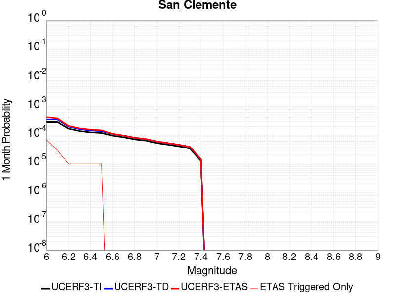 |  |  |

| Magnitude | 1 wk TI Prob | 1 wk TD Prob | 1 wk ETAS Prob | 1 wk ETAS/TD Gain | 1 wk ETAS Triggered Only | 1 mo TI Prob | 1 mo TD Prob | 1 mo ETAS Prob | 1 mo ETAS/TD Gain | 1 mo ETAS Triggered Only | 1 yr TI Prob | 1 yr TD Prob | 1 yr ETAS Prob | 1 yr ETAS/TD Gain | 1 yr ETAS Triggered Only | 10 yr TI Prob | 10 yr TD Prob | 10 yr ETAS Prob | 10 yr ETAS/TD Gain | 10 yr ETAS Triggered Only |
|-----|-----|-----|-----|-----|-----|-----|-----|-----|-----|-----|-----|-----|-----|-----|-----|-----|-----|-----|-----|-----|
| 6.0 | 6.681379E-5 | 8.163834E-5 | 1.4163344E-4 | 1.7348888 | 6.0E-5 | 2.8631336E-4 | 3.4983488E-4 | 4.198104E-4 | 1.2000244 | 7.0E-5 | 0.003480294 | 0.00425141 | 0.004350985 | 1.0234216 | 1.0E-4 | 0.03426291 | 0.04175603 | 0.04189018 | 1.0032128 | 1.4E-4 |
| 6.1 | 6.681379E-5 | 8.163834E-5 | 1.1163589E-4 | 1.3674444 | 3.0E-5 | 2.8631336E-4 | 3.4983488E-4 | 3.798244E-4 | 1.0857247 | 3.0E-5 | 0.003480294 | 0.00425141 | 0.004311155 | 1.014053 | 6.0E-5 | 0.03426291 | 0.04175603 | 0.04184227 | 1.0020654 | 9.0E-5 |
| 6.2 | 3.9400576E-5 | 4.6452373E-5 | 5.6451907E-5 | 1.2152642 | 1.0E-5 | 1.6884868E-4 | 1.9906677E-4 | 2.0906478E-4 | 1.0502244 | 1.0E-5 | 0.0020537945 | 0.0024209984 | 0.0024609016 | 1.0164821 | 4.0E-5 | 0.020349167 | 0.023952903 | 0.024011467 | 1.0024449 | 6.0E-5 |
| 6.3 | 3.2590255E-5 | 3.792912E-5 | 4.7928737E-5 | 1.2636397 | 1.0E-5 | 1.3966505E-4 | 1.6254342E-4 | 1.725418E-4 | 1.061512 | 1.0E-5 | 0.0016990956 | 0.0019772002 | 0.002017121 | 1.0201906 | 4.0E-5 | 0.01686163 | 0.019599883 | 0.019648902 | 1.002501 | 5.0E-5 |
| 6.4 | 2.9454652E-5 | 3.4097764E-5 | 4.409742E-5 | 1.2932644 | 1.0E-5 | 1.2622811E-4 | 1.4612524E-4 | 1.5612377E-4 | 1.0684245 | 1.0E-5 | 0.0015357438 | 0.0017776493 | 0.0018175782 | 1.0224617 | 4.0E-5 | 0.015251739 | 0.01763747 | 0.017686589 | 1.0027848 | 5.0E-5 |
| 6.5 | 2.790836E-5 | 3.2247463E-5 | 4.224714E-5 | 1.310092 | 1.0E-5 | 1.1960178E-4 | 1.3819624E-4 | 1.4819486E-4 | 1.0723509 | 1.0E-5 | 0.001455179 | 0.0016812662 | 0.0017112158 | 1.0178137 | 3.0E-5 | 0.014456868 | 0.016688485 | 0.016727816 | 1.0023569 | 4.0E-5 |
| 6.6 | 2.2492153E-5 | 2.5762702E-5 | 2.5762702E-5 | 1.0 | 0.0 | 9.639138E-5 | 1.1040699E-4 | 1.1040699E-4 | 1.0 | 0.0 | 0.0011729331 | 0.0013433909 | 0.001363364 | 1.0148677 | 2.0E-5 | 0.011667615 | 0.013354417 | 0.01337415 | 1.0014776 | 2.0E-5 |
| 6.7 | 1.9862755E-5 | 2.2666423E-5 | 2.2666423E-5 | 1.0 | 0.0 | 8.512331E-5 | 9.713826E-5 | 9.713826E-5 | 1.0 | 0.0 | 0.0010358836 | 0.0011820279 | 0.0011820279 | 1.0 | 0.0 | 0.010310682 | 0.011758701 | 0.011758701 | 1.0 | 0.0 |
| 6.8 | 1.6697575E-5 | 1.897771E-5 | 1.897771E-5 | 1.0 | 0.0 | 7.155907E-5 | 8.133056E-5 | 8.133056E-5 | 1.0 | 0.0 | 8.7088346E-4 | 9.897591E-4 | 9.897591E-4 | 1.0 | 0.0 | 0.008674784 | 0.0098545365 | 0.0098545365 | 1.0 | 0.0 |
| 6.9 | 1.5218415E-5 | 1.72694E-5 | 1.72694E-5 | 1.0 | 0.0 | 6.522015E-5 | 7.4009666E-5 | 7.4009666E-5 | 1.0 | 0.0 | 7.93766E-4 | 9.00704E-4 | 9.00704E-4 | 1.0 | 0.0 | 0.007909367 | 0.008971481 | 0.008971481 | 1.0 | 0.0 |
| 7.0 | 1.2392958E-5 | 1.4033016E-5 | 1.4033016E-5 | 1.0 | 0.0 | 5.3111595E-5 | 6.014015E-5 | 6.014015E-5 | 1.0 | 0.0 | 6.4644177E-4 | 7.319679E-4 | 7.319679E-4 | 1.0 | 0.0 | 0.0064456454 | 0.0072963564 | 0.0072963564 | 1.0 | 0.0 |
| 7.1 | 1.0934128E-5 | 1.2375138E-5 | 1.2375138E-5 | 1.0 | 0.0 | 4.6859706E-5 | 5.303527E-5 | 5.303527E-5 | 1.0 | 0.0 | 5.7036756E-4 | 6.455204E-4 | 6.455204E-4 | 1.0 | 0.0 | 0.0056890585 | 0.0064371997 | 0.0064371997 | 1.0 | 0.0 |
| 7.2 | 9.5798805E-6 | 1.0844935E-5 | 1.0844935E-5 | 1.0 | 0.0 | 4.1055984E-5 | 4.6477508E-5 | 4.6477508E-5 | 1.0 | 0.0 | 4.9974193E-4 | 5.657239E-4 | 5.657239E-4 | 1.0 | 0.0 | 0.0049861963 | 0.0056435615 | 0.0056435615 | 1.0 | 0.0 |
| 7.3 | 8.0167365E-6 | 9.083918E-6 | 9.083918E-6 | 1.0 | 0.0 | 3.4356988E-5 | 3.8930535E-5 | 3.8930535E-5 | 1.0 | 0.0 | 4.1821605E-4 | 4.7388324E-4 | 4.7388324E-4 | 1.0 | 0.0 | 0.0041742986 | 0.0047294297 | 0.0047294297 | 1.0 | 0.0 |
| 7.4 | 2.9581017E-6 | 3.3623792E-6 | 3.3623792E-6 | 1.0 | 0.0 | 1.2677518E-5 | 1.4410146E-5 | 1.4410146E-5 | 1.0 | 0.0 | 1.5433785E-4 | 1.7543444E-4 | 1.7543444E-4 | 1.0 | 0.0 | 0.001542307 | 0.0017534546 | 0.0017534546 | 1.0 | 0.0 |

## Rose Canyon
*[(top)](#table-of-contents)*

| 1 Week | 1 Month | 1 Year | 10 Year |
|-----|-----|-----|-----|
|  | 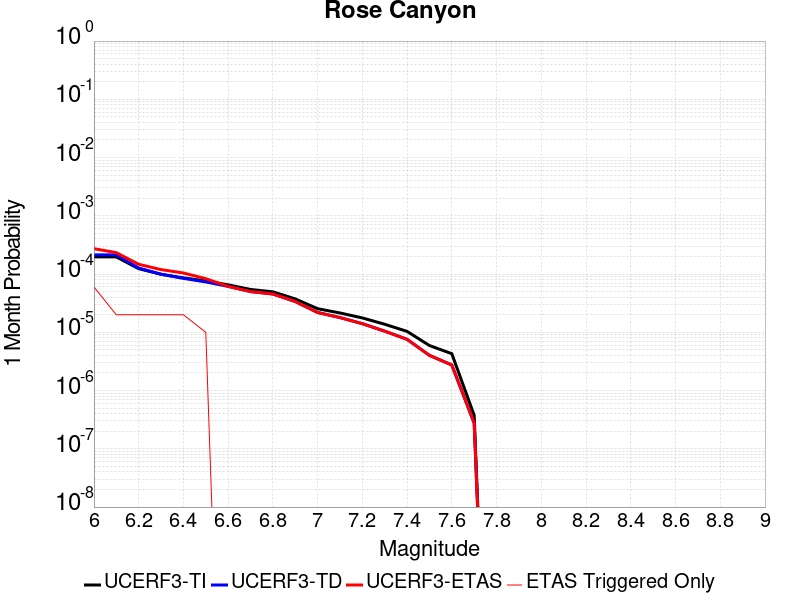 |  |  |

| Magnitude | 1 wk TI Prob | 1 wk TD Prob | 1 wk ETAS Prob | 1 wk ETAS/TD Gain | 1 wk ETAS Triggered Only | 1 mo TI Prob | 1 mo TD Prob | 1 mo ETAS Prob | 1 mo ETAS/TD Gain | 1 mo ETAS Triggered Only | 1 yr TI Prob | 1 yr TD Prob | 1 yr ETAS Prob | 1 yr ETAS/TD Gain | 1 yr ETAS Triggered Only | 10 yr TI Prob | 10 yr TD Prob | 10 yr ETAS Prob | 10 yr ETAS/TD Gain | 10 yr ETAS Triggered Only |
|-----|-----|-----|-----|-----|-----|-----|-----|-----|-----|-----|-----|-----|-----|-----|-----|-----|-----|-----|-----|-----|
| 6.0 | 4.5923203E-5 | 4.9714607E-5 | 9.9712124E-5 | 2.0056906 | 5.0E-5 | 1.9679888E-4 | 2.1304654E-4 | 2.7303377E-4 | 1.2815686 | 6.0E-5 | 0.0023933933 | 0.0025909478 | 0.0026707405 | 1.0307968 | 8.0E-5 | 0.023677798 | 0.025618518 | 0.02575493 | 1.0053248 | 1.4E-4 |
| 6.1 | 4.5923203E-5 | 4.9714607E-5 | 6.971361E-5 | 1.4022763 | 2.0E-5 | 1.9679888E-4 | 2.1304654E-4 | 2.3304229E-4 | 1.0938562 | 2.0E-5 | 0.0023933933 | 0.0025909478 | 0.00262087 | 1.0115488 | 3.0E-5 | 0.023677798 | 0.025618518 | 0.025686724 | 1.0026624 | 7.0E-5 |
| 6.2 | 2.8844734E-5 | 2.9669678E-5 | 4.9669085E-5 | 1.6740689 | 2.0E-5 | 1.2361443E-4 | 1.2714976E-4 | 1.4714722E-4 | 1.1572748 | 2.0E-5 | 0.0015039665 | 0.001546976 | 0.0015669451 | 1.0129085 | 2.0E-5 | 0.0149382865 | 0.015364873 | 0.015423952 | 1.003845 | 6.0E-5 |
| 6.3 | 2.3171577E-5 | 2.3162425E-5 | 4.3161963E-5 | 1.8634474 | 2.0E-5 | 9.9302975E-5 | 9.926383E-5 | 1.19261844E-4 | 1.2014632 | 2.0E-5 | 0.0012083431 | 0.0012078804 | 0.0012278563 | 1.0165379 | 2.0E-5 | 0.012017938 | 0.012012152 | 0.012061551 | 1.0041125 | 5.0E-5 |
| 6.4 | 2.0066604E-5 | 1.9668067E-5 | 3.9667673E-5 | 2.0168567 | 2.0E-5 | 8.599689E-5 | 8.428905E-5 | 1.0428736E-4 | 1.2372588 | 2.0E-5 | 0.0010465092 | 0.001025746 | 0.0010457255 | 1.019478 | 2.0E-5 | 0.010415946 | 0.010211479 | 0.01025107 | 1.0038772 | 4.0E-5 |
| 6.5 | 1.776989E-5 | 1.7115402E-5 | 2.7115231E-5 | 1.584259 | 1.0E-5 | 7.615444E-5 | 7.33497E-5 | 8.334896E-5 | 1.1363232 | 1.0E-5 | 9.267859E-4 | 8.926737E-4 | 9.0266473E-4 | 1.0111923 | 1.0E-5 | 0.009229303 | 0.008874663 | 0.0089043975 | 1.0033504 | 3.0E-5 |
| 6.6 | 1.5227364E-5 | 1.4340872E-5 | 1.4340872E-5 | 1.0 | 0.0 | 6.52585E-5 | 6.145947E-5 | 6.145947E-5 | 1.0 | 0.0 | 7.942326E-4 | 7.480173E-4 | 7.480173E-4 | 1.0 | 0.0 | 0.007914 | 0.0074410336 | 0.0074608847 | 1.0026678 | 2.0E-5 |
| 6.7 | 1.2703898E-5 | 1.1674277E-5 | 1.1674277E-5 | 1.0 | 0.0 | 5.4444143E-5 | 5.0031682E-5 | 5.0031682E-5 | 1.0 | 0.0 | 6.626558E-4 | 6.089697E-4 | 6.089697E-4 | 1.0 | 0.0 | 0.006606833 | 0.0060623093 | 0.006082188 | 1.0032791 | 2.0E-5 |
| 6.8 | 1.1554917E-5 | 1.0610384E-5 | 1.0610384E-5 | 1.0 | 0.0 | 4.9520135E-5 | 4.547231E-5 | 4.547231E-5 | 1.0 | 0.0 | 6.0274085E-4 | 5.5348873E-4 | 5.5348873E-4 | 1.0 | 0.0 | 0.0060110865 | 0.005504414 | 0.0055243038 | 1.0036135 | 2.0E-5 |
| 6.9 | 8.732078E-6 | 7.882285E-6 | 7.882285E-6 | 1.0 | 0.0 | 3.7422655E-5 | 3.37808E-5 | 3.37808E-5 | 1.0 | 0.0 | 4.5552556E-4 | 4.112066E-4 | 4.112066E-4 | 1.0 | 0.0 | 0.0045459294 | 0.004089515 | 0.0041094334 | 1.0048705 | 2.0E-5 |
| 7.0 | 5.9337494E-6 | 5.107436E-6 | 5.107436E-6 | 1.0 | 0.0 | 2.5430107E-5 | 2.1888829E-5 | 2.1888829E-5 | 1.0 | 0.0 | 3.0956755E-4 | 2.6646405E-4 | 2.6646405E-4 | 1.0 | 0.0 | 0.0030913667 | 0.002661461 | 0.0026814078 | 1.0074947 | 2.0E-5 |
| 7.1 | 5.013409E-6 | 4.17734E-6 | 4.17734E-6 | 1.0 | 0.0 | 2.1485863E-5 | 1.7902763E-5 | 1.7902763E-5 | 1.0 | 0.0 | 2.6155898E-4 | 2.1794444E-4 | 2.1794444E-4 | 1.0 | 0.0 | 0.0026125133 | 0.0021773188 | 0.0021972752 | 1.0091656 | 2.0E-5 |
| 7.2 | 4.120763E-6 | 3.2820917E-6 | 3.2820917E-6 | 1.0 | 0.0 | 1.7660293E-5 | 1.4066032E-5 | 1.4066032E-5 | 1.0 | 0.0 | 2.1499286E-4 | 1.7124058E-4 | 1.7124058E-4 | 1.0 | 0.0 | 0.0021478499 | 0.0017110958 | 0.0017110958 | 1.0 | 0.0 |
| 7.3 | 3.2081239E-6 | 2.4404965E-6 | 2.4404965E-6 | 1.0 | 0.0 | 1.374903E-5 | 1.0459229E-5 | 1.0459229E-5 | 1.0 | 0.0 | 1.6738157E-4 | 1.2733374E-4 | 1.2733374E-4 | 1.0 | 0.0 | 0.0016725556 | 0.0012726148 | 0.0012726148 | 1.0 | 0.0 |
| 7.4 | 2.4194755E-6 | 1.7680321E-6 | 1.7680321E-6 | 1.0 | 0.0 | 1.0369139E-5 | 7.5772587E-6 | 7.5772587E-6 | 1.0 | 0.0 | 1.2623696E-4 | 9.224927E-5 | 9.224927E-5 | 1.0 | 0.0 | 0.0012616527 | 9.221151E-4 | 9.221151E-4 | 1.0 | 0.0 |
| 7.5 | 1.3842889E-6 | 9.3782967E-7 | 9.3782967E-7 | 1.0 | 0.0 | 5.9326535E-6 | 4.019264E-6 | 4.019264E-6 | 1.0 | 0.0 | 7.222766E-5 | 4.8933474E-5 | 4.8933474E-5 | 1.0 | 0.0 | 7.220419E-4 | 4.8923056E-4 | 4.8923056E-4 | 1.0 | 0.0 |
| 7.6 | 1.0021575E-6 | 6.4113493E-7 | 6.4113493E-7 | 1.0 | 0.0 | 4.2949537E-6 | 2.7477186E-6 | 2.7477186E-6 | 1.0 | 0.0 | 5.2289808E-5 | 3.345298E-5 | 3.345298E-5 | 1.0 | 0.0 | 5.2277505E-4 | 3.344816E-4 | 3.344816E-4 | 1.0 | 0.0 |
| 7.7 | 8.7620116E-8 | 6.449304E-8 | 6.449304E-8 | 1.0 | 0.0 | 3.7551473E-7 | 2.763987E-7 | 2.763987E-7 | 1.0 | 0.0 | 4.5718825E-6 | 3.3651493E-6 | 3.3651493E-6 | 1.0 | 0.0 | 4.5717883E-5 | 3.3651013E-5 | 3.3651013E-5 | 1.0 | 0.0 |

## White Mountains
*[(top)](#table-of-contents)*

| 1 Week | 1 Month | 1 Year | 10 Year |
|-----|-----|-----|-----|
|  |  |  |  |

| Magnitude | 1 wk TI Prob | 1 wk TD Prob | 1 wk ETAS Prob | 1 wk ETAS/TD Gain | 1 wk ETAS Triggered Only | 1 mo TI Prob | 1 mo TD Prob | 1 mo ETAS Prob | 1 mo ETAS/TD Gain | 1 mo ETAS Triggered Only | 1 yr TI Prob | 1 yr TD Prob | 1 yr ETAS Prob | 1 yr ETAS/TD Gain | 1 yr ETAS Triggered Only | 10 yr TI Prob | 10 yr TD Prob | 10 yr ETAS Prob | 10 yr ETAS/TD Gain | 10 yr ETAS Triggered Only |
|-----|-----|-----|-----|-----|-----|-----|-----|-----|-----|-----|-----|-----|-----|-----|-----|-----|-----|-----|-----|-----|
| 6.0 | 3.503579E-5 | 3.3784127E-5 | 5.378345E-5 | 1.591974 | 2.0E-5 | 1.5014476E-4 | 1.4478175E-4 | 1.8477596E-4 | 1.276238 | 4.0E-5 | 0.0018264796 | 0.0017614134 | 0.0018712196 | 1.0623399 | 1.1E-4 | 0.018115403 | 0.017486857 | 0.017604759 | 1.0067422 | 1.2E-4 |
| 6.1 | 3.503579E-5 | 3.3784127E-5 | 5.378345E-5 | 1.591974 | 2.0E-5 | 1.5014476E-4 | 1.4478175E-4 | 1.8477596E-4 | 1.276238 | 4.0E-5 | 0.0018264796 | 0.0017614134 | 0.0018712196 | 1.0623399 | 1.1E-4 | 0.018115403 | 0.017486857 | 0.017604759 | 1.0067422 | 1.2E-4 |
| 6.2 | 3.503579E-5 | 3.3784127E-5 | 5.378345E-5 | 1.591974 | 2.0E-5 | 1.5014476E-4 | 1.4478175E-4 | 1.8477596E-4 | 1.276238 | 4.0E-5 | 0.0018264796 | 0.0017614134 | 0.0018712196 | 1.0623399 | 1.1E-4 | 0.018115403 | 0.017486857 | 0.017604759 | 1.0067422 | 1.2E-4 |
| 6.3 | 1.7818425E-5 | 1.591616E-5 | 2.5916E-5 | 1.6282823 | 1.0E-5 | 7.636245E-5 | 6.821041E-5 | 7.820973E-5 | 1.1465952 | 1.0E-5 | 9.293162E-4 | 8.301596E-4 | 8.8011805E-4 | 1.0601794 | 5.0E-5 | 0.009254395 | 0.0082720425 | 0.008321629 | 1.0059944 | 5.0E-5 |
| 6.4 | 1.7818425E-5 | 1.591616E-5 | 2.5916E-5 | 1.6282823 | 1.0E-5 | 7.636245E-5 | 6.821041E-5 | 7.820973E-5 | 1.1465952 | 1.0E-5 | 9.293162E-4 | 8.301596E-4 | 8.8011805E-4 | 1.0601794 | 5.0E-5 | 0.009254395 | 0.0082720425 | 0.008321629 | 1.0059944 | 5.0E-5 |
| 6.5 | 1.3397557E-5 | 1.1336374E-5 | 2.133626E-5 | 1.8821063 | 1.0E-5 | 5.741684E-5 | 4.8583595E-5 | 5.8583108E-5 | 1.2058208 | 1.0E-5 | 6.988258E-4 | 5.913517E-4 | 6.2133395E-4 | 1.0507013 | 3.0E-5 | 0.006966323 | 0.005898487 | 0.0059283096 | 1.005056 | 3.0E-5 |
| 6.6 | 1.0818695E-5 | 8.625434E-6 | 8.625434E-6 | 1.0 | 0.0 | 4.6365014E-5 | 3.6965648E-5 | 3.6965648E-5 | 1.0 | 0.0 | 5.6434784E-4 | 4.4996818E-4 | 4.6995917E-4 | 1.0444276 | 2.0E-5 | 0.005629168 | 0.0044910074 | 0.0045208726 | 1.00665 | 3.0E-5 |
| 6.7 | 9.067908E-6 | 6.802476E-6 | 6.802476E-6 | 1.0 | 0.0 | 3.8861883E-5 | 2.915316E-5 | 2.915316E-5 | 1.0 | 0.0 | 4.7304068E-4 | 3.548851E-4 | 3.6488156E-4 | 1.0281681 | 1.0E-5 | 0.00472035 | 0.003543501 | 0.0035534655 | 1.002812 | 1.0E-5 |
| 6.8 | 7.295947E-6 | 4.9364285E-6 | 4.9364285E-6 | 1.0 | 0.0 | 3.126797E-5 | 2.1155956E-5 | 2.1155956E-5 | 1.0 | 0.0 | 3.8062103E-4 | 2.5754445E-4 | 2.6754188E-4 | 1.0388182 | 1.0E-5 | 0.0037996976 | 0.0025725728 | 0.002582547 | 1.0038772 | 1.0E-5 |
| 6.9 | 6.2243444E-6 | 3.8322546E-6 | 3.8322546E-6 | 1.0 | 0.0 | 2.6675489E-5 | 1.6423846E-5 | 1.6423846E-5 | 1.0 | 0.0 | 3.2472567E-4 | 1.9994251E-4 | 1.9994251E-4 | 1.0 | 0.0 | 0.0032425157 | 0.001997679 | 0.001997679 | 1.0 | 0.0 |
| 7.0 | 4.9878413E-6 | 2.679564E-6 | 2.679564E-6 | 1.0 | 0.0 | 2.1376287E-5 | 1.1483797E-5 | 1.1483797E-5 | 1.0 | 0.0 | 2.602252E-4 | 1.3980652E-4 | 1.3980652E-4 | 1.0 | 0.0 | 0.002599207 | 0.0013972119 | 0.0013972119 | 1.0 | 0.0 |
| 7.1 | 4.0252844E-6 | 1.885702E-6 | 1.885702E-6 | 1.0 | 0.0 | 1.7251105E-5 | 8.081555E-6 | 8.081555E-6 | 1.0 | 0.0 | 2.1001195E-4 | 9.838863E-5 | 9.838863E-5 | 1.0 | 0.0 | 0.0020981359 | 9.834635E-4 | 9.834635E-4 | 1.0 | 0.0 |
| 7.2 | 3.3284066E-6 | 1.2818929E-6 | 1.2818929E-6 | 1.0 | 0.0 | 1.4264522E-5 | 5.4938155E-6 | 5.4938155E-6 | 1.0 | 0.0 | 1.736567E-4 | 6.688525E-5 | 6.688525E-5 | 1.0 | 0.0 | 0.0017352107 | 6.6866126E-4 | 6.6866126E-4 | 1.0 | 0.0 |
| 7.3 | 2.458226E-6 | 6.056684E-7 | 6.056684E-7 | 1.0 | 0.0 | 1.0535211E-5 | 2.5957193E-6 | 2.5957193E-6 | 1.0 | 0.0 | 1.2825865E-4 | 3.160246E-5 | 3.160246E-5 | 1.0 | 0.0 | 0.0012818464 | 3.1598343E-4 | 3.1598343E-4 | 1.0 | 0.0 |
| 7.4 | 1.965953E-6 | 3.1084684E-7 | 3.1084684E-7 | 1.0 | 0.0 | 8.425486E-6 | 1.3322001E-6 | 1.3322001E-6 | 1.0 | 0.0 | 1.0257547E-4 | 1.6219417E-5 | 1.6219417E-5 | 1.0 | 0.0 | 0.0010252813 | 1.6218246E-4 | 1.6218246E-4 | 1.0 | 0.0 |
| 7.5 | 1.2014192E-6 | 1.8241002E-7 | 1.8241002E-7 | 1.0 | 0.0 | 5.148929E-6 | 7.8175697E-7 | 7.8175697E-7 | 1.0 | 0.0 | 6.2686406E-5 | 9.51785E-6 | 9.51785E-6 | 1.0 | 0.0 | 6.266873E-4 | 9.517451E-5 | 9.517451E-5 | 1.0 | 0.0 |
| 7.6 | 2.5612175E-7 | 4.893784E-8 | 4.893784E-8 | 1.0 | 0.0 | 1.0976642E-6 | 2.0973359E-7 | 2.0973359E-7 | 1.0 | 0.0 | 1.3363979E-5 | 2.5535037E-6 | 2.5535037E-6 | 1.0 | 0.0 | 1.3363175E-4 | 2.553478E-5 | 2.553478E-5 | 1.0 | 0.0 |

## Bullion Mountains
*[(top)](#table-of-contents)*

| 1 Week | 1 Month | 1 Year | 10 Year |
|-----|-----|-----|-----|
|  |  |  |  |

| Magnitude | 1 wk TI Prob | 1 wk TD Prob | 1 wk ETAS Prob | 1 wk ETAS/TD Gain | 1 wk ETAS Triggered Only | 1 mo TI Prob | 1 mo TD Prob | 1 mo ETAS Prob | 1 mo ETAS/TD Gain | 1 mo ETAS Triggered Only | 1 yr TI Prob | 1 yr TD Prob | 1 yr ETAS Prob | 1 yr ETAS/TD Gain | 1 yr ETAS Triggered Only | 10 yr TI Prob | 10 yr TD Prob | 10 yr ETAS Prob | 10 yr ETAS/TD Gain | 10 yr ETAS Triggered Only |
|-----|-----|-----|-----|-----|-----|-----|-----|-----|-----|-----|-----|-----|-----|-----|-----|-----|-----|-----|-----|-----|
| 6.0 | 1.6420427E-5 | 1.4692009E-5 | 2.4691863E-5 | 1.6806321 | 1.0E-5 | 7.037136E-5 | 6.296445E-5 | 9.296256E-5 | 1.4764293 | 3.0E-5 | 8.5643446E-4 | 7.6636096E-4 | 8.2631496E-4 | 1.078232 | 6.0E-5 | 0.008531413 | 0.0076409746 | 0.0077699814 | 1.0168835 | 1.3E-4 |
| 6.1 | 1.6420427E-5 | 1.4692009E-5 | 2.4691863E-5 | 1.6806321 | 1.0E-5 | 7.037136E-5 | 6.296445E-5 | 9.296256E-5 | 1.4764293 | 3.0E-5 | 8.5643446E-4 | 7.6636096E-4 | 8.2631496E-4 | 1.078232 | 6.0E-5 | 0.008531413 | 0.0076409746 | 0.0077699814 | 1.0168835 | 1.3E-4 |
| 6.2 | 1.6420427E-5 | 1.4692009E-5 | 2.4691863E-5 | 1.6806321 | 1.0E-5 | 7.037136E-5 | 6.296445E-5 | 9.296256E-5 | 1.4764293 | 3.0E-5 | 8.5643446E-4 | 7.6636096E-4 | 8.2631496E-4 | 1.078232 | 6.0E-5 | 0.008531413 | 0.0076409746 | 0.0077699814 | 1.0168835 | 1.3E-4 |
| 6.3 | 1.2046778E-5 | 9.862255E-6 | 1.9862156E-5 | 2.0139568 | 1.0E-5 | 5.1628023E-5 | 4.2266256E-5 | 6.226541E-5 | 1.4731708 | 2.0E-5 | 6.283899E-4 | 5.144933E-4 | 5.444779E-4 | 1.0582798 | 3.0E-5 | 0.0062661595 | 0.0051353034 | 0.0051750983 | 1.0077492 | 4.0E-5 |
| 6.4 | 1.2046778E-5 | 9.862255E-6 | 1.9862156E-5 | 2.0139568 | 1.0E-5 | 5.1628023E-5 | 4.2266256E-5 | 6.226541E-5 | 1.4731708 | 2.0E-5 | 6.283899E-4 | 5.144933E-4 | 5.444779E-4 | 1.0582798 | 3.0E-5 | 0.0062661595 | 0.0051353034 | 0.0051750983 | 1.0077492 | 4.0E-5 |
| 6.5 | 1.0244343E-5 | 7.879378E-6 | 1.78793E-5 | 2.2691257 | 1.0E-5 | 4.390359E-5 | 3.3768443E-5 | 5.376777E-5 | 1.5922489 | 2.0E-5 | 5.343951E-4 | 4.1107394E-4 | 4.410616E-4 | 1.0729495 | 3.0E-5 | 0.005331118 | 0.0041051665 | 0.0041350434 | 1.0072778 | 3.0E-5 |
| 6.6 | 9.605408E-6 | 7.1774166E-6 | 7.1774166E-6 | 1.0 | 0.0 | 4.1165385E-5 | 3.0760108E-5 | 4.07598E-5 | 1.3250864 | 1.0E-5 | 5.010733E-4 | 3.7446033E-4 | 3.9445283E-4 | 1.0533901 | 2.0E-5 | 0.00499945 | 0.0037402906 | 0.0037602158 | 1.0053272 | 2.0E-5 |
| 6.7 | 8.60418E-6 | 6.123926E-6 | 6.123926E-6 | 1.0 | 0.0 | 3.687454E-5 | 2.6245243E-5 | 3.6244983E-5 | 1.3810114 | 1.0E-5 | 4.48855E-4 | 3.195085E-4 | 3.395021E-4 | 1.0625762 | 2.0E-5 | 0.004479495 | 0.0031924031 | 0.0032123392 | 1.0062449 | 2.0E-5 |
| 6.8 | 5.187994E-6 | 2.563117E-6 | 2.563117E-6 | 1.0 | 0.0 | 2.223407E-5 | 1.0984763E-5 | 2.0984653E-5 | 1.9103419 | 1.0E-5 | 2.7066618E-4 | 1.3373529E-4 | 1.537326E-4 | 1.1495292 | 2.0E-5 | 0.0027033675 | 0.0013369396 | 0.0013569129 | 1.0149395 | 2.0E-5 |
| 6.9 | 4.5302368E-6 | 2.3442778E-6 | 2.3442778E-6 | 1.0 | 0.0 | 1.9415156E-5 | 1.0046889E-5 | 2.004679E-5 | 1.995323 | 1.0E-5 | 2.3635388E-4 | 1.2231797E-4 | 1.4231553E-4 | 1.1634883 | 2.0E-5 | 0.0023610266 | 0.0012228956 | 0.0012428712 | 1.0163347 | 2.0E-5 |
| 7.0 | 3.431668E-6 | 1.6882177E-6 | 1.6882177E-6 | 1.0 | 0.0 | 1.4707065E-5 | 7.2352186E-6 | 7.2352186E-6 | 1.0 | 0.0 | 1.7904381E-4 | 8.808879E-5 | 8.808879E-5 | 1.0 | 0.0 | 0.0017889962 | 8.8088785E-4 | 8.8088785E-4 | 1.0 | 0.0 |

## Ventura-Pitas Point
*[(top)](#table-of-contents)*

| 1 Week | 1 Month | 1 Year | 10 Year |
|-----|-----|-----|-----|
|  |  |  |  |

| Magnitude | 1 wk TI Prob | 1 wk TD Prob | 1 wk ETAS Prob | 1 wk ETAS/TD Gain | 1 wk ETAS Triggered Only | 1 mo TI Prob | 1 mo TD Prob | 1 mo ETAS Prob | 1 mo ETAS/TD Gain | 1 mo ETAS Triggered Only | 1 yr TI Prob | 1 yr TD Prob | 1 yr ETAS Prob | 1 yr ETAS/TD Gain | 1 yr ETAS Triggered Only | 10 yr TI Prob | 10 yr TD Prob | 10 yr ETAS Prob | 10 yr ETAS/TD Gain | 10 yr ETAS Triggered Only |
|-----|-----|-----|-----|-----|-----|-----|-----|-----|-----|-----|-----|-----|-----|-----|-----|-----|-----|-----|-----|-----|
| 6.0 | 3.3179622E-5 | 3.373519E-5 | 6.373417E-5 | 1.8892492 | 3.0E-5 | 1.4219063E-4 | 1.4457281E-4 | 1.9456558E-4 | 1.3457965 | 5.0E-5 | 0.0017297962 | 0.0017590097 | 0.0018089217 | 1.028375 | 5.0E-5 | 0.017163932 | 0.017476497 | 0.0175944 | 1.0067464 | 1.2E-4 |
| 6.1 | 3.3179622E-5 | 3.373519E-5 | 6.373417E-5 | 1.8892492 | 3.0E-5 | 1.4219063E-4 | 1.4457281E-4 | 1.9456558E-4 | 1.3457965 | 5.0E-5 | 0.0017297962 | 0.0017590097 | 0.0018089217 | 1.028375 | 5.0E-5 | 0.017163932 | 0.017476497 | 0.0175944 | 1.0067464 | 1.2E-4 |
| 6.2 | 3.3179622E-5 | 3.373519E-5 | 6.373417E-5 | 1.8892492 | 3.0E-5 | 1.4219063E-4 | 1.4457281E-4 | 1.9456558E-4 | 1.3457965 | 5.0E-5 | 0.0017297962 | 0.0017590097 | 0.0018089217 | 1.028375 | 5.0E-5 | 0.017163932 | 0.017476497 | 0.0175944 | 1.0067464 | 1.2E-4 |
| 6.3 | 3.3179622E-5 | 3.373519E-5 | 6.373417E-5 | 1.8892492 | 3.0E-5 | 1.4219063E-4 | 1.4457281E-4 | 1.9456558E-4 | 1.3457965 | 5.0E-5 | 0.0017297962 | 0.0017590097 | 0.0018089217 | 1.028375 | 5.0E-5 | 0.017163932 | 0.017476497 | 0.0175944 | 1.0067464 | 1.2E-4 |
| 6.4 | 1.8754668E-5 | 1.7019594E-5 | 2.7019423E-5 | 1.5875481 | 1.0E-5 | 8.037467E-5 | 7.2939205E-5 | 8.293848E-5 | 1.1370904 | 1.0E-5 | 9.781223E-4 | 8.8769617E-4 | 8.976873E-4 | 1.0112551 | 1.0E-5 | 0.009738282 | 0.008843943 | 0.0088935 | 1.0056036 | 5.0E-5 |
| 6.5 | 1.8754668E-5 | 1.7019594E-5 | 2.7019423E-5 | 1.5875481 | 1.0E-5 | 8.037467E-5 | 7.2939205E-5 | 8.293848E-5 | 1.1370904 | 1.0E-5 | 9.781223E-4 | 8.8769617E-4 | 8.976873E-4 | 1.0112551 | 1.0E-5 | 0.009738282 | 0.008843943 | 0.0088935 | 1.0056036 | 5.0E-5 |
| 6.6 | 1.4361558E-5 | 1.2122258E-5 | 1.2122258E-5 | 1.0 | 0.0 | 6.154808E-5 | 5.1951512E-5 | 5.1951512E-5 | 1.0 | 0.0 | 7.490902E-4 | 6.323284E-4 | 6.323284E-4 | 1.0 | 0.0 | 0.0074657016 | 0.006305652 | 0.006325526 | 1.0031518 | 2.0E-5 |
| 6.7 | 1.4361558E-5 | 1.2122258E-5 | 1.2122258E-5 | 1.0 | 0.0 | 6.154808E-5 | 5.1951512E-5 | 5.1951512E-5 | 1.0 | 0.0 | 7.490902E-4 | 6.323284E-4 | 6.323284E-4 | 1.0 | 0.0 | 0.0074657016 | 0.006305652 | 0.006325526 | 1.0031518 | 2.0E-5 |
| 6.8 | 1.3663846E-5 | 1.1344401E-5 | 1.1344401E-5 | 1.0 | 0.0 | 5.8558027E-5 | 4.8617967E-5 | 4.8617967E-5 | 1.0 | 0.0 | 7.127108E-4 | 5.917649E-4 | 5.917649E-4 | 1.0 | 0.0 | 0.007104293 | 0.0059022107 | 0.0059121517 | 1.0016843 | 1.0E-5 |
| 6.9 | 1.3644157E-5 | 1.1322501E-5 | 1.1322501E-5 | 1.0 | 0.0 | 5.8473648E-5 | 4.8524114E-5 | 4.8524114E-5 | 1.0 | 0.0 | 7.116841E-4 | 5.906229E-4 | 5.906229E-4 | 1.0 | 0.0 | 0.007094092 | 0.0058908514 | 0.0059007923 | 1.0016875 | 1.0E-5 |
| 7.0 | 1.3568845E-5 | 1.12420685E-5 | 1.12420685E-5 | 1.0 | 0.0 | 5.8150898E-5 | 4.8179416E-5 | 4.8179416E-5 | 1.0 | 0.0 | 7.077572E-4 | 5.8642845E-4 | 5.8642845E-4 | 1.0 | 0.0 | 0.007055073 | 0.005849128 | 0.0058590695 | 1.0016997 | 1.0E-5 |
| 7.1 | 1.306572E-5 | 1.0720521E-5 | 1.0720521E-5 | 1.0 | 0.0 | 5.599474E-5 | 4.594429E-5 | 4.594429E-5 | 1.0 | 0.0 | 6.815227E-4 | 5.5923004E-4 | 5.5923004E-4 | 1.0 | 0.0 | 0.0067943637 | 0.005578536 | 0.0055884803 | 1.0017825 | 1.0E-5 |
| 7.2 | 1.232604E-5 | 9.995121E-6 | 9.995121E-6 | 1.0 | 0.0 | 5.2824813E-5 | 4.283554E-5 | 4.283554E-5 | 1.0 | 0.0 | 6.429523E-4 | 5.2139966E-4 | 5.2139966E-4 | 1.0 | 0.0 | 0.0064109527 | 0.005202059 | 0.005212007 | 1.0019124 | 1.0E-5 |
| 7.3 | 1.0917261E-5 | 8.843812E-6 | 8.843812E-6 | 1.0 | 0.0 | 4.678742E-5 | 3.7901507E-5 | 3.7901507E-5 | 1.0 | 0.0 | 5.69488E-4 | 4.6135474E-4 | 4.6135474E-4 | 1.0 | 0.0 | 0.0056803077 | 0.004604239 | 0.004614193 | 1.0021619 | 1.0E-5 |
| 7.4 | 1.039959E-5 | 8.42354E-6 | 8.42354E-6 | 1.0 | 0.0 | 4.456891E-5 | 3.6100395E-5 | 3.6100395E-5 | 1.0 | 0.0 | 5.424914E-4 | 4.394352E-4 | 4.394352E-4 | 1.0 | 0.0 | 0.0054116896 | 0.0043859277 | 0.004395884 | 1.00227 | 1.0E-5 |
| 7.5 | 9.015877E-6 | 7.29752E-6 | 7.29752E-6 | 1.0 | 0.0 | 3.86389E-5 | 3.1274718E-5 | 3.1274718E-5 | 1.0 | 0.0 | 4.7032707E-4 | 3.8070456E-4 | 3.8070456E-4 | 1.0 | 0.0 | 0.004693329 | 0.003800772 | 0.003810734 | 1.002621 | 1.0E-5 |
| 7.6 | 4.900162E-6 | 3.874119E-6 | 3.874119E-6 | 1.0 | 0.0 | 2.1000526E-5 | 1.6603262E-5 | 1.6603262E-5 | 1.0 | 0.0 | 2.556514E-4 | 2.0212609E-4 | 2.0212609E-4 | 1.0 | 0.0 | 0.0025535747 | 0.002019436 | 0.002029416 | 1.0049418 | 1.0E-5 |
| 7.7 | 3.8850626E-6 | 3.12676E-6 | 3.12676E-6 | 1.0 | 0.0 | 1.6650163E-5 | 1.3400332E-5 | 1.3400332E-5 | 1.0 | 0.0 | 2.0269687E-4 | 1.6313691E-4 | 1.6313691E-4 | 1.0 | 0.0 | 0.002025121 | 0.0016301809 | 0.0016401645 | 1.0061243 | 1.0E-5 |
| 7.8 | 2.4654719E-6 | 2.029902E-6 | 2.029902E-6 | 1.0 | 0.0 | 1.0566265E-5 | 8.699551E-6 | 8.699551E-6 | 1.0 | 0.0 | 1.2863669E-4 | 1.0591193E-4 | 1.0591193E-4 | 1.0 | 0.0 | 0.0012856225 | 0.0010586192 | 0.0010586192 | 1.0 | 0.0 |
| 7.9 | 4.095894E-7 | 3.2765078E-7 | 3.2765078E-7 | 1.0 | 0.0 | 1.7553821E-6 | 1.4042168E-6 | 1.4042168E-6 | 1.0 | 0.0 | 2.1371567E-5 | 1.709621E-5 | 1.709621E-5 | 1.0 | 0.0 | 2.1369511E-4 | 1.7094925E-4 | 1.7094925E-4 | 1.0 | 0.0 |
| 8.0 | 7.791402E-9 | 5.6836056E-9 | 5.6836056E-9 | 1.0 | 0.0 | 3.3391725E-8 | 2.4358311E-8 | 2.4358311E-8 | 1.0 | 0.0 | 4.0654416E-7 | 2.965624E-7 | 2.965624E-7 | 1.0 | 0.0 | 4.065434E-6 | 2.9656223E-6 | 2.9656223E-6 | 1.0 | 0.0 |

## Big Pine (Central)
*[(top)](#table-of-contents)*

| 1 Week | 1 Month | 1 Year | 10 Year |
|-----|-----|-----|-----|
|  |  |  |  |

| Magnitude | 1 wk TI Prob | 1 wk TD Prob | 1 wk ETAS Prob | 1 wk ETAS/TD Gain | 1 wk ETAS Triggered Only | 1 mo TI Prob | 1 mo TD Prob | 1 mo ETAS Prob | 1 mo ETAS/TD Gain | 1 mo ETAS Triggered Only | 1 yr TI Prob | 1 yr TD Prob | 1 yr ETAS Prob | 1 yr ETAS/TD Gain | 1 yr ETAS Triggered Only | 10 yr TI Prob | 10 yr TD Prob | 10 yr ETAS Prob | 10 yr ETAS/TD Gain | 10 yr ETAS Triggered Only |
|-----|-----|-----|-----|-----|-----|-----|-----|-----|-----|-----|-----|-----|-----|-----|-----|-----|-----|-----|-----|-----|
| 6.0 | 1.2706755E-5 | 1.4250602E-5 | 3.425032E-5 | 2.4034295 | 2.0E-5 | 5.4456385E-5 | 6.107279E-5 | 1.11069734E-4 | 1.8186452 | 5.0E-5 | 6.628048E-4 | 7.433441E-4 | 8.232846E-4 | 1.1075418 | 8.0E-5 | 0.006608314 | 0.007413639 | 0.0075228238 | 1.0147275 | 1.1E-4 |
| 6.1 | 8.342579E-6 | 9.510835E-6 | 2.9510646E-5 | 3.1028447 | 2.0E-5 | 3.5753423E-5 | 4.076021E-5 | 9.075817E-5 | 2.2266364 | 5.0E-5 | 4.3521097E-4 | 4.9616426E-4 | 5.661296E-4 | 1.1410123 | 7.0E-5 | 0.0043435963 | 0.004954155 | 0.0050536594 | 1.0200851 | 1.0E-4 |
| 6.2 | 6.923899E-6 | 7.967221E-6 | 2.7967062E-5 | 3.5102656 | 2.0E-5 | 2.9673516E-5 | 3.4144894E-5 | 8.414319E-5 | 2.4642978 | 5.0E-5 | 3.6121515E-4 | 4.1565404E-4 | 4.8562494E-4 | 1.1683393 | 7.0E-5 | 0.003606286 | 0.0041521094 | 0.0042516943 | 1.0239842 | 1.0E-4 |
| 6.3 | 2.728396E-6 | 3.4243646E-6 | 1.342433E-5 | 3.9202397 | 1.0E-5 | 1.1693074E-5 | 1.4675771E-5 | 3.467548E-5 | 2.3627703 | 2.0E-5 | 1.4235388E-4 | 1.7866373E-4 | 2.0865837E-4 | 1.1678832 | 3.0E-5 | 0.0014226272 | 0.0017867433 | 0.0018166897 | 1.0167603 | 3.0E-5 |
| 6.4 | 2.7136944E-6 | 3.4086581E-6 | 1.3408624E-5 | 3.9336958 | 1.0E-5 | 1.1630066E-5 | 1.4608458E-5 | 3.4608165E-5 | 2.3690498 | 2.0E-5 | 1.4158686E-4 | 1.7784433E-4 | 2.07839E-4 | 1.1686568 | 3.0E-5 | 0.0014149669 | 0.0017785623 | 0.001808509 | 1.0168376 | 3.0E-5 |
| 6.5 | 2.6971882E-6 | 3.3910032E-6 | 1.3390969E-5 | 3.9489698 | 1.0E-5 | 1.1559327E-5 | 1.4532795E-5 | 3.4532502E-5 | 2.3761778 | 2.0E-5 | 1.4072572E-4 | 1.7692328E-4 | 2.0691798E-4 | 1.169535 | 3.0E-5 | 0.0014063664 | 0.0017693666 | 0.0017993135 | 1.0169252 | 3.0E-5 |
| 6.6 | 2.669092E-6 | 3.3610236E-6 | 1.336099E-5 | 3.975274 | 1.0E-5 | 1.1438916E-5 | 1.4404312E-5 | 3.4404024E-5 | 2.388453 | 2.0E-5 | 1.3925991E-4 | 1.7535927E-4 | 2.05354E-4 | 1.1710473 | 3.0E-5 | 0.0013917267 | 0.0017537511 | 0.0017836984 | 1.0170761 | 3.0E-5 |
| 6.7 | 2.6408059E-6 | 3.3310494E-6 | 1.3331016E-5 | 4.002047 | 1.0E-5 | 1.1317691E-5 | 1.4275853E-5 | 3.4275567E-5 | 2.400947 | 2.0E-5 | 1.3778417E-4 | 1.737955E-4 | 2.0379029E-4 | 1.1725867 | 3.0E-5 | 0.0013769877 | 0.0017381381 | 0.001768086 | 1.0172298 | 3.0E-5 |
| 6.8 | 2.1786943E-6 | 2.8545066E-6 | 1.2854478E-5 | 4.5032225 | 1.0E-5 | 9.337228E-6 | 1.2233547E-5 | 3.2233304E-5 | 2.6348288 | 2.0E-5 | 1.1367482E-4 | 1.4893398E-4 | 1.789295E-4 | 1.2014016 | 3.0E-5 | 0.0011361669 | 0.0014898704 | 0.0015198257 | 1.020106 | 3.0E-5 |
| 6.9 | 1.4411696E-6 | 2.0685677E-6 | 2.0685677E-6 | 1.0 | 0.0 | 6.1764263E-6 | 8.865261E-6 | 1.8865174E-5 | 2.1279883 | 1.0E-5 | 7.51954E-5 | 1.0792949E-4 | 1.2792733E-4 | 1.1852862 | 2.0E-5 | 7.5169955E-4 | 0.0010802548 | 0.0011002332 | 1.0184941 | 2.0E-5 |
| 7.0 | 1.0073411E-6 | 1.5543274E-6 | 1.5543274E-6 | 1.0 | 0.0 | 4.317169E-6 | 6.661387E-6 | 1.666132E-5 | 2.501179 | 1.0E-5 | 5.2560266E-5 | 8.109952E-5 | 9.109871E-5 | 1.1232953 | 1.0E-5 | 5.2547833E-4 | 8.1217213E-4 | 8.2216406E-4 | 1.0123026 | 1.0E-5 |
| 7.1 | 8.947104E-7 | 1.430316E-6 | 1.430316E-6 | 1.0 | 0.0 | 3.834468E-6 | 6.1299124E-6 | 1.612985E-5 | 2.6313348 | 1.0E-5 | 4.6683643E-5 | 7.462928E-5 | 8.462853E-5 | 1.1339856 | 1.0E-5 | 4.6673836E-4 | 7.4751483E-4 | 7.5750734E-4 | 1.0133677 | 1.0E-5 |
| 7.2 | 5.215166E-7 | 1.0112277E-6 | 1.0112277E-6 | 1.0 | 0.0 | 2.2350691E-6 | 4.333826E-6 | 4.333826E-6 | 1.0 | 0.0 | 2.7211627E-5 | 5.27631E-5 | 5.27631E-5 | 1.0 | 0.0 | 2.7208295E-4 | 5.289683E-4 | 5.289683E-4 | 1.0 | 0.0 |
| 7.3 | 4.4024807E-7 | 9.220183E-7 | 9.220183E-7 | 1.0 | 0.0 | 1.8867761E-6 | 3.951501E-6 | 3.951501E-6 | 1.0 | 0.0 | 2.2971257E-5 | 4.8108504E-5 | 4.8108504E-5 | 1.0 | 0.0 | 2.2968883E-4 | 4.824433E-4 | 4.824433E-4 | 1.0 | 0.0 |
| 7.4 | 3.6130905E-7 | 8.359109E-7 | 8.359109E-7 | 1.0 | 0.0 | 1.5484665E-6 | 3.5824705E-6 | 3.5824705E-6 | 1.0 | 0.0 | 1.8852415E-5 | 4.3615746E-5 | 4.3615746E-5 | 1.0 | 0.0 | 1.8850817E-4 | 4.3752496E-4 | 4.3752496E-4 | 1.0 | 0.0 |
| 7.5 | 3.408184E-7 | 8.1087245E-7 | 8.1087245E-7 | 1.0 | 0.0 | 1.4606494E-6 | 3.475163E-6 | 3.475163E-6 | 1.0 | 0.0 | 1.7783263E-5 | 4.230933E-5 | 4.230933E-5 | 1.0 | 0.0 | 1.778184E-4 | 4.2444657E-4 | 4.2444657E-4 | 1.0 | 0.0 |
| 7.6 | 3.1428627E-7 | 7.732167E-7 | 7.732167E-7 | 1.0 | 0.0 | 1.3469405E-6 | 3.313782E-6 | 3.313782E-6 | 1.0 | 0.0 | 1.6398877E-5 | 4.0344585E-5 | 4.0344585E-5 | 1.0 | 0.0 | 1.6397667E-4 | 4.0477706E-4 | 4.0477706E-4 | 1.0 | 0.0 |
| 7.7 | 1.7972785E-7 | 5.0782415E-7 | 5.0782415E-7 | 1.0 | 0.0 | 7.70262E-7 | 2.1763874E-6 | 2.1763874E-6 | 1.0 | 0.0 | 9.377899E-6 | 2.6497206E-5 | 2.6497206E-5 | 1.0 | 0.0 | 9.377503E-5 | 2.6633305E-4 | 2.6633305E-4 | 1.0 | 0.0 |
| 7.8 | 4.9230927E-8 | 1.1981747E-7 | 1.1981747E-7 | 1.0 | 0.0 | 2.1098968E-7 | 5.135033E-7 | 5.135033E-7 | 1.0 | 0.0 | 2.5687964E-6 | 6.2518866E-6 | 6.2518866E-6 | 1.0 | 0.0 | 2.5687666E-5 | 6.2971965E-5 | 6.2971965E-5 | 1.0 | 0.0 |
| 7.9 | 3.6805972E-9 | 4.1051638E-9 | 4.1051638E-9 | 1.0 | 0.0 | 1.5773987E-8 | 1.7593557E-8 | 1.7593557E-8 | 1.0 | 0.0 | 1.9204828E-7 | 2.1420155E-7 | 2.1420155E-7 | 1.0 | 0.0 | 1.920481E-6 | 2.1898923E-6 | 2.1898923E-6 | 1.0 | 0.0 |

## Pleito
*[(top)](#table-of-contents)*

| 1 Week | 1 Month | 1 Year | 10 Year |
|-----|-----|-----|-----|
|  |  |  |  |

| Magnitude | 1 wk TI Prob | 1 wk TD Prob | 1 wk ETAS Prob | 1 wk ETAS/TD Gain | 1 wk ETAS Triggered Only | 1 mo TI Prob | 1 mo TD Prob | 1 mo ETAS Prob | 1 mo ETAS/TD Gain | 1 mo ETAS Triggered Only | 1 yr TI Prob | 1 yr TD Prob | 1 yr ETAS Prob | 1 yr ETAS/TD Gain | 1 yr ETAS Triggered Only | 10 yr TI Prob | 10 yr TD Prob | 10 yr ETAS Prob | 10 yr ETAS/TD Gain | 10 yr ETAS Triggered Only |
|-----|-----|-----|-----|-----|-----|-----|-----|-----|-----|-----|-----|-----|-----|-----|-----|-----|-----|-----|-----|-----|
| 6.0 | 1.6763008E-5 | 2.4764735E-5 | 3.476449E-5 | 1.40379 | 1.0E-5 | 7.183948E-5 | 1.0613067E-4 | 1.2612855E-4 | 1.188427 | 2.0E-5 | 8.742947E-4 | 0.001291447 | 0.0013513695 | 1.0463995 | 6.0E-5 | 0.00870863 | 0.012954412 | 0.013072858 | 1.0091432 | 1.2E-4 |
| 6.1 | 1.6763008E-5 | 2.4764735E-5 | 3.476449E-5 | 1.40379 | 1.0E-5 | 7.183948E-5 | 1.0613067E-4 | 1.2612855E-4 | 1.188427 | 2.0E-5 | 8.742947E-4 | 0.001291447 | 0.0013513695 | 1.0463995 | 6.0E-5 | 0.00870863 | 0.012954412 | 0.013072858 | 1.0091432 | 1.2E-4 |
| 6.2 | 1.6763008E-5 | 2.4764735E-5 | 3.476449E-5 | 1.40379 | 1.0E-5 | 7.183948E-5 | 1.0613067E-4 | 1.2612855E-4 | 1.188427 | 2.0E-5 | 8.742947E-4 | 0.001291447 | 0.0013513695 | 1.0463995 | 6.0E-5 | 0.00870863 | 0.012954412 | 0.013072858 | 1.0091432 | 1.2E-4 |
| 6.3 | 1.6763008E-5 | 2.4764735E-5 | 3.476449E-5 | 1.40379 | 1.0E-5 | 7.183948E-5 | 1.0613067E-4 | 1.2612855E-4 | 1.188427 | 2.0E-5 | 8.742947E-4 | 0.001291447 | 0.0013513695 | 1.0463995 | 6.0E-5 | 0.00870863 | 0.012954412 | 0.013072858 | 1.0091432 | 1.2E-4 |
| 6.4 | 1.6763008E-5 | 2.4764735E-5 | 3.476449E-5 | 1.40379 | 1.0E-5 | 7.183948E-5 | 1.0613067E-4 | 1.2612855E-4 | 1.188427 | 2.0E-5 | 8.742947E-4 | 0.001291447 | 0.0013513695 | 1.0463995 | 6.0E-5 | 0.00870863 | 0.012954412 | 0.013072858 | 1.0091432 | 1.2E-4 |
| 6.5 | 1.6763008E-5 | 2.4764735E-5 | 3.476449E-5 | 1.40379 | 1.0E-5 | 7.183948E-5 | 1.0613067E-4 | 1.2612855E-4 | 1.188427 | 2.0E-5 | 8.742947E-4 | 0.001291447 | 0.0013513695 | 1.0463995 | 6.0E-5 | 0.00870863 | 0.012954412 | 0.013072858 | 1.0091432 | 1.2E-4 |
| 6.6 | 9.910213E-6 | 1.721552E-5 | 1.721552E-5 | 1.0 | 0.0 | 4.247165E-5 | 7.3778734E-5 | 7.3778734E-5 | 1.0 | 0.0 | 5.169696E-4 | 8.9788967E-4 | 9.1787166E-4 | 1.0222545 | 2.0E-5 | 0.0051576863 | 0.009051226 | 0.009100773 | 1.0054741 | 5.0E-5 |
| 6.7 | 9.910213E-6 | 1.721552E-5 | 1.721552E-5 | 1.0 | 0.0 | 4.247165E-5 | 7.3778734E-5 | 7.3778734E-5 | 1.0 | 0.0 | 5.169696E-4 | 8.9788967E-4 | 9.1787166E-4 | 1.0222545 | 2.0E-5 | 0.0051576863 | 0.009051226 | 0.009100773 | 1.0054741 | 5.0E-5 |
| 6.8 | 8.300162E-6 | 1.5475129E-5 | 1.5475129E-5 | 1.0 | 0.0 | 3.557164E-5 | 6.63203E-5 | 6.63203E-5 | 1.0 | 0.0 | 4.3299864E-4 | 8.07152E-4 | 8.2713587E-4 | 1.0247585 | 2.0E-5 | 0.004321559 | 0.008150663 | 0.008200255 | 1.0060844 | 5.0E-5 |
| 6.9 | 8.183114E-6 | 1.5346344E-5 | 1.5346344E-5 | 1.0 | 0.0 | 3.5070017E-5 | 6.57684E-5 | 6.57684E-5 | 1.0 | 0.0 | 4.2689382E-4 | 8.0043747E-4 | 8.204215E-4 | 1.0249664 | 2.0E-5 | 0.0042607468 | 0.008084008 | 0.008133603 | 1.0061351 | 5.0E-5 |
| 7.0 | 7.1748823E-6 | 1.4133306E-5 | 1.4133306E-5 | 1.0 | 0.0 | 3.0749135E-5 | 6.0569906E-5 | 6.0569906E-5 | 1.0 | 0.0 | 3.743064E-4 | 7.3718966E-4 | 7.571749E-4 | 1.0271101 | 2.0E-5 | 0.0037367654 | 0.0074553755 | 0.007505003 | 1.0066565 | 5.0E-5 |
| 7.1 | 7.1671807E-6 | 1.4123676E-5 | 1.4123676E-5 | 1.0 | 0.0 | 3.0716128E-5 | 6.0528637E-5 | 6.0528637E-5 | 1.0 | 0.0 | 3.7390468E-4 | 7.366875E-4 | 7.5667276E-4 | 1.0271286 | 2.0E-5 | 0.0037327618 | 0.0074503883 | 0.0075000157 | 1.006661 | 5.0E-5 |
| 7.2 | 7.0649667E-6 | 1.3970962E-5 | 1.3970962E-5 | 1.0 | 0.0 | 3.0278077E-5 | 5.987418E-5 | 5.987418E-5 | 1.0 | 0.0 | 3.6857324E-4 | 7.287248E-4 | 7.4871024E-4 | 1.0274252 | 2.0E-5 | 0.0036796255 | 0.0073711374 | 0.007420769 | 1.0067332 | 5.0E-5 |
| 7.3 | 7.02082E-6 | 1.3914415E-5 | 1.3914415E-5 | 1.0 | 0.0 | 3.008888E-5 | 5.9631846E-5 | 5.9631846E-5 | 1.0 | 0.0 | 3.6627054E-4 | 7.257764E-4 | 7.457619E-4 | 1.0275367 | 2.0E-5 | 0.0036566744 | 0.0073416373 | 0.0073912703 | 1.0067605 | 5.0E-5 |
| 7.4 | 6.987146E-6 | 1.3873975E-5 | 1.3873975E-5 | 1.0 | 0.0 | 2.9944567E-5 | 5.9458544E-5 | 5.9458544E-5 | 1.0 | 0.0 | 3.6451413E-4 | 7.2366785E-4 | 7.4365333E-4 | 1.027617 | 2.0E-5 | 0.0036391679 | 0.007320571 | 0.0073602786 | 1.005424 | 4.0E-5 |
| 7.5 | 6.9494554E-6 | 1.383088E-5 | 1.383088E-5 | 1.0 | 0.0 | 2.9783041E-5 | 5.9273858E-5 | 5.9273858E-5 | 1.0 | 0.0 | 3.625482E-4 | 7.2142074E-4 | 7.4140634E-4 | 1.027703 | 2.0E-5 | 0.0036195726 | 0.007298199 | 0.007337907 | 1.0054408 | 4.0E-5 |
| 7.6 | 6.92694E-6 | 1.3789992E-5 | 1.3789992E-5 | 1.0 | 0.0 | 2.9686547E-5 | 5.909863E-5 | 5.909863E-5 | 1.0 | 0.0 | 3.6137376E-4 | 7.192888E-4 | 7.3927443E-4 | 1.0277853 | 2.0E-5 | 0.0036078666 | 0.007276951 | 0.0073166597 | 1.0054568 | 4.0E-5 |
| 7.7 | 6.395867E-6 | 1.26690065E-5 | 1.26690065E-5 | 1.0 | 0.0 | 2.741057E-5 | 5.4294615E-5 | 5.4294615E-5 | 1.0 | 0.0 | 3.336726E-4 | 6.6083675E-4 | 6.808235E-4 | 1.0302447 | 2.0E-5 | 0.0033317201 | 0.0066955453 | 0.0067352774 | 1.0059341 | 4.0E-5 |
| 7.8 | 5.8664327E-6 | 1.1536581E-5 | 1.1536581E-5 | 1.0 | 0.0 | 2.5141611E-5 | 4.9441554E-5 | 4.9441554E-5 | 1.0 | 0.0 | 3.060561E-4 | 6.0178485E-4 | 6.2177284E-4 | 1.0332144 | 2.0E-5 | 0.0030563495 | 0.0061010164 | 0.0061407723 | 1.0065163 | 4.0E-5 |
| 7.9 | 3.7167474E-6 | 7.1145205E-6 | 7.1145205E-6 | 1.0 | 0.0 | 1.592882E-5 | 3.0490448E-5 | 3.0490448E-5 | 1.0 | 0.0 | 1.9391612E-4 | 3.7115812E-4 | 3.7115812E-4 | 1.0 | 0.0 | 0.0019374699 | 0.0037676243 | 0.0037676243 | 1.0 | 0.0 |
| 8.0 | 1.0903841E-6 | 1.2879104E-6 | 1.2879104E-6 | 1.0 | 0.0 | 4.6730665E-6 | 5.5196047E-6 | 5.5196047E-6 | 1.0 | 0.0 | 5.68931E-5 | 6.719913E-5 | 6.719913E-5 | 1.0 | 0.0 | 5.6878536E-4 | 6.942094E-4 | 6.942094E-4 | 1.0 | 0.0 |
| 8.1 | 2.6894583E-7 | 1.1056095E-7 | 1.1056095E-7 | 1.0 | 0.0 | 1.1526245E-6 | 4.7383253E-7 | 4.7383253E-7 | 1.0 | 0.0 | 1.4033113E-5 | 5.768896E-6 | 5.768896E-6 | 1.0 | 0.0 | 1.4032227E-4 | 6.454915E-5 | 6.454915E-5 | 1.0 | 0.0 |
| 8.2 | 5.2967013E-9 | 2.4567874E-9 | 2.4567874E-9 | 1.0 | 0.0 | 2.2700148E-8 | 1.0529089E-8 | 1.0529089E-8 | 1.0 | 0.0 | 2.7637427E-7 | 1.2819166E-7 | 1.2819166E-7 | 1.0 | 0.0 | 2.7637393E-6 | 1.4588004E-6 | 1.4588004E-6 | 1.0 | 0.0 |

## Palos Verdes
*[(top)](#table-of-contents)*

| 1 Week | 1 Month | 1 Year | 10 Year |
|-----|-----|-----|-----|
|  |  |  |  |

| Magnitude | 1 wk TI Prob | 1 wk TD Prob | 1 wk ETAS Prob | 1 wk ETAS/TD Gain | 1 wk ETAS Triggered Only | 1 mo TI Prob | 1 mo TD Prob | 1 mo ETAS Prob | 1 mo ETAS/TD Gain | 1 mo ETAS Triggered Only | 1 yr TI Prob | 1 yr TD Prob | 1 yr ETAS Prob | 1 yr ETAS/TD Gain | 1 yr ETAS Triggered Only | 10 yr TI Prob | 10 yr TD Prob | 10 yr ETAS Prob | 10 yr ETAS/TD Gain | 10 yr ETAS Triggered Only |
|-----|-----|-----|-----|-----|-----|-----|-----|-----|-----|-----|-----|-----|-----|-----|-----|-----|-----|-----|-----|-----|
| 6.0 | 6.126063E-5 | 7.622572E-5 | 9.62242E-5 | 1.2623587 | 2.0E-5 | 2.6251914E-4 | 3.266441E-4 | 3.5663432E-4 | 1.0918131 | 3.0E-5 | 0.0031914865 | 0.0039701737 | 0.004019975 | 1.0125439 | 5.0E-5 | 0.031460393 | 0.03904909 | 0.039174013 | 1.0031991 | 1.3E-4 |
| 6.1 | 6.126063E-5 | 7.622572E-5 | 9.62242E-5 | 1.2623587 | 2.0E-5 | 2.6251914E-4 | 3.266441E-4 | 3.5663432E-4 | 1.0918131 | 3.0E-5 | 0.0031914865 | 0.0039701737 | 0.004019975 | 1.0125439 | 5.0E-5 | 0.031460393 | 0.03904909 | 0.039174013 | 1.0031991 | 1.3E-4 |
| 6.2 | 6.126063E-5 | 7.622572E-5 | 9.62242E-5 | 1.2623587 | 2.0E-5 | 2.6251914E-4 | 3.266441E-4 | 3.5663432E-4 | 1.0918131 | 3.0E-5 | 0.0031914865 | 0.0039701737 | 0.004019975 | 1.0125439 | 5.0E-5 | 0.031460393 | 0.03904909 | 0.039174013 | 1.0031991 | 1.3E-4 |
| 6.3 | 4.0838047E-5 | 4.9749007E-5 | 4.9749007E-5 | 1.0 | 0.0 | 1.7500846E-4 | 2.1319388E-4 | 2.1319388E-4 | 1.0 | 0.0 | 0.0021286458 | 0.002592754 | 0.0026127023 | 1.0076938 | 2.0E-5 | 0.021083709 | 0.025646746 | 0.02573444 | 1.0034192 | 9.0E-5 |
| 6.4 | 4.0838047E-5 | 4.9749007E-5 | 4.9749007E-5 | 1.0 | 0.0 | 1.7500846E-4 | 2.1319388E-4 | 2.1319388E-4 | 1.0 | 0.0 | 0.0021286458 | 0.002592754 | 0.0026127023 | 1.0076938 | 2.0E-5 | 0.021083709 | 0.025646746 | 0.02573444 | 1.0034192 | 9.0E-5 |
| 6.5 | 3.0512005E-5 | 3.6561592E-5 | 3.6561592E-5 | 1.0 | 0.0 | 1.3075917E-4 | 1.566838E-4 | 1.566838E-4 | 1.0 | 0.0 | 0.0015908304 | 0.001906072 | 0.0019260339 | 1.0104728 | 2.0E-5 | 0.015794903 | 0.018909173 | 0.01899747 | 1.0046695 | 9.0E-5 |
| 6.6 | 2.9255087E-5 | 3.5154393E-5 | 3.5154393E-5 | 1.0 | 0.0 | 1.2537291E-4 | 1.5065364E-4 | 1.5065364E-4 | 1.0 | 0.0 | 0.0015253464 | 0.0018327782 | 0.0018527416 | 1.0108924 | 2.0E-5 | 0.015149189 | 0.018188244 | 0.018276608 | 1.0048583 | 9.0E-5 |
| 6.7 | 2.287198E-5 | 2.724828E-5 | 2.724828E-5 | 1.0 | 0.0 | 9.801909E-5 | 1.16773626E-4 | 1.16773626E-4 | 1.0 | 0.0 | 0.001192729 | 0.0014208833 | 0.0014308692 | 1.0070279 | 1.0E-5 | 0.011863477 | 0.014127217 | 0.014206087 | 1.0055828 | 8.0E-5 |
| 6.8 | 2.1325764E-5 | 2.5431878E-5 | 2.5431878E-5 | 1.0 | 0.0 | 9.139293E-5 | 1.0898972E-4 | 1.0898972E-4 | 1.0 | 0.0 | 0.001112141 | 0.0013262323 | 0.001336219 | 1.0075302 | 1.0E-5 | 0.011065915 | 0.013192211 | 0.013271156 | 1.0059842 | 8.0E-5 |
| 6.9 | 1.9009392E-5 | 2.2613547E-5 | 2.2613547E-5 | 1.0 | 0.0 | 8.1466285E-5 | 9.6912096E-5 | 9.6912096E-5 | 1.0 | 0.0 | 9.914007E-4 | 0.0011793535 | 0.0011893417 | 1.0084692 | 1.0E-5 | 0.009869894 | 0.011739633 | 0.011818693 | 1.0067345 | 8.0E-5 |
| 7.0 | 1.7098473E-5 | 2.0319356E-5 | 2.0319356E-5 | 1.0 | 0.0 | 7.3277115E-5 | 8.708052E-5 | 8.708052E-5 | 1.0 | 0.0 | 8.917837E-4 | 0.001059775 | 0.0010697644 | 1.009426 | 1.0E-5 | 0.008882134 | 0.010555646 | 0.010624908 | 1.0065615 | 7.0E-5 |
| 7.1 | 1.5982785E-5 | 1.899476E-5 | 1.899476E-5 | 1.0 | 0.0 | 6.849585E-5 | 8.1404054E-5 | 8.1404054E-5 | 1.0 | 0.0 | 8.336179E-4 | 9.907284E-4 | 0.0010007184 | 1.0100836 | 1.0E-5 | 0.008304977 | 0.009871479 | 0.009930887 | 1.0060182 | 6.0E-5 |
| 7.2 | 1.4468002E-5 | 1.7197237E-5 | 1.7197237E-5 | 1.0 | 0.0 | 6.200425E-5 | 7.370083E-5 | 7.370083E-5 | 1.0 | 0.0 | 7.546402E-4 | 8.970222E-4 | 9.0701325E-4 | 1.011138 | 1.0E-5 | 0.007520827 | 0.008942284 | 0.009001747 | 1.0066497 | 6.0E-5 |
| 7.3 | 5.288233E-6 | 6.2036747E-6 | 6.2036747E-6 | 1.0 | 0.0 | 2.2663658E-5 | 2.6587102E-5 | 2.6587102E-5 | 1.0 | 0.0 | 2.7589512E-4 | 3.236848E-4 | 3.3368156E-4 | 1.0308843 | 1.0E-5 | 0.0027555283 | 0.0032355562 | 0.003265459 | 1.0092419 | 3.0E-5 |
| 7.4 | 8.279556E-7 | 8.408347E-7 | 8.408347E-7 | 1.0 | 0.0 | 3.5483763E-6 | 3.6035726E-6 | 3.6035726E-6 | 1.0 | 0.0 | 4.3200624E-5 | 4.3872686E-5 | 4.3872686E-5 | 1.0 | 0.0 | 4.3192226E-4 | 4.3864746E-4 | 4.3864746E-4 | 1.0 | 0.0 |
| 7.5 | 6.559831E-7 | 6.667229E-7 | 6.667229E-7 | 1.0 | 0.0 | 2.8113532E-6 | 2.857381E-6 | 2.857381E-6 | 1.0 | 0.0 | 3.4227687E-5 | 3.4788125E-5 | 3.4788125E-5 | 1.0 | 0.0 | 3.4222414E-4 | 3.4783344E-4 | 3.4783344E-4 | 1.0 | 0.0 |
| 7.6 | 3.5018968E-7 | 3.5620027E-7 | 3.5620027E-7 | 1.0 | 0.0 | 1.500812E-6 | 1.526572E-6 | 1.526572E-6 | 1.0 | 0.0 | 1.8272232E-5 | 1.8585903E-5 | 1.8585903E-5 | 1.0 | 0.0 | 1.8270731E-4 | 1.8584808E-4 | 1.8584808E-4 | 1.0 | 0.0 |
| 7.7 | 1.1986104E-7 | 1.2198376E-7 | 1.2198376E-7 | 1.0 | 0.0 | 5.1369005E-7 | 5.2278745E-7 | 5.2278745E-7 | 1.0 | 0.0 | 6.2541585E-6 | 6.364919E-6 | 6.364919E-6 | 1.0 | 0.0 | 6.2539824E-5 | 6.364741E-5 | 6.364741E-5 | 1.0 | 0.0 |
| 7.8 | 3.0445005E-8 | 3.1027582E-8 | 3.1027582E-8 | 1.0 | 0.0 | 1.3047858E-7 | 1.3297536E-7 | 1.3297536E-7 | 1.0 | 0.0 | 1.5885756E-6 | 1.6189739E-6 | 1.6189739E-6 | 1.0 | 0.0 | 1.5885644E-5 | 1.6189642E-5 | 1.6189642E-5 | 1.0 | 0.0 |

## Chino alt 1
*[(top)](#table-of-contents)*

| 1 Week | 1 Month | 1 Year | 10 Year |
|-----|-----|-----|-----|
|  |  |  |  |

| Magnitude | 1 wk TI Prob | 1 wk TD Prob | 1 wk ETAS Prob | 1 wk ETAS/TD Gain | 1 wk ETAS Triggered Only | 1 mo TI Prob | 1 mo TD Prob | 1 mo ETAS Prob | 1 mo ETAS/TD Gain | 1 mo ETAS Triggered Only | 1 yr TI Prob | 1 yr TD Prob | 1 yr ETAS Prob | 1 yr ETAS/TD Gain | 1 yr ETAS Triggered Only | 10 yr TI Prob | 10 yr TD Prob | 10 yr ETAS Prob | 10 yr ETAS/TD Gain | 10 yr ETAS Triggered Only |
|-----|-----|-----|-----|-----|-----|-----|-----|-----|-----|-----|-----|-----|-----|-----|-----|-----|-----|-----|-----|-----|
| 6.0 | 3.939946E-5 | 4.894798E-5 | 6.8947E-5 | 1.4085771 | 2.0E-5 | 1.6884391E-4 | 2.0976314E-4 | 2.2975894E-4 | 1.0953256 | 2.0E-5 | 0.0020537362 | 0.002551385 | 0.0026012575 | 1.0195472 | 5.0E-5 | 0.020348595 | 0.025280168 | 0.025397135 | 1.0046268 | 1.2E-4 |
| 6.1 | 2.1505624E-5 | 2.6878823E-5 | 4.6878286E-5 | 1.7440602 | 2.0E-5 | 9.2163704E-5 | 1.15190494E-4 | 1.351882E-4 | 1.1736054 | 2.0E-5 | 0.0011215154 | 0.0014016517 | 0.0014216236 | 1.0142488 | 2.0E-5 | 0.011158722 | 0.013947425 | 0.013967146 | 1.001414 | 2.0E-5 |
| 6.2 | 2.1505624E-5 | 2.6878823E-5 | 4.6878286E-5 | 1.7440602 | 2.0E-5 | 9.2163704E-5 | 1.15190494E-4 | 1.351882E-4 | 1.1736054 | 2.0E-5 | 0.0011215154 | 0.0014016517 | 0.0014216236 | 1.0142488 | 2.0E-5 | 0.011158722 | 0.013947425 | 0.013967146 | 1.001414 | 2.0E-5 |
| 6.3 | 1.4290785E-5 | 1.8164832E-5 | 1.8164832E-5 | 1.0 | 0.0 | 6.1244784E-5 | 7.784722E-5 | 7.784722E-5 | 1.0 | 0.0 | 7.454001E-4 | 9.4742293E-4 | 9.4742293E-4 | 1.0 | 0.0 | 0.007429048 | 0.00944674 | 0.00944674 | 1.0 | 0.0 |
| 6.4 | 1.4290785E-5 | 1.8164832E-5 | 1.8164832E-5 | 1.0 | 0.0 | 6.1244784E-5 | 7.784722E-5 | 7.784722E-5 | 1.0 | 0.0 | 7.454001E-4 | 9.4742293E-4 | 9.4742293E-4 | 1.0 | 0.0 | 0.007429048 | 0.00944674 | 0.00944674 | 1.0 | 0.0 |
| 6.5 | 1.3017944E-5 | 1.6651793E-5 | 1.6651793E-5 | 1.0 | 0.0 | 5.5789995E-5 | 7.1363116E-5 | 7.1363116E-5 | 1.0 | 0.0 | 6.790315E-4 | 8.6854334E-4 | 8.6854334E-4 | 1.0 | 0.0 | 0.0067696036 | 0.008664233 | 0.008664233 | 1.0 | 0.0 |
| 6.6 | 9.470016E-6 | 1.2039209E-5 | 1.2039209E-5 | 1.0 | 0.0 | 4.058515E-5 | 5.159578E-5 | 5.159578E-5 | 1.0 | 0.0 | 4.940122E-4 | 6.280315E-4 | 6.280315E-4 | 1.0 | 0.0 | 0.004929154 | 0.006273248 | 0.006273248 | 1.0 | 0.0 |
| 6.7 | 8.314155E-6 | 1.040749E-5 | 1.040749E-5 | 1.0 | 0.0 | 3.5631605E-5 | 4.4602948E-5 | 4.4602948E-5 | 1.0 | 0.0 | 4.3372845E-4 | 5.4293784E-4 | 5.4293784E-4 | 1.0 | 0.0 | 0.004328829 | 0.0054270807 | 0.0054270807 | 1.0 | 0.0 |
| 6.8 | 3.4856364E-6 | 3.8134033E-6 | 3.8134033E-6 | 1.0 | 0.0 | 1.4938357E-5 | 1.6343065E-5 | 1.6343065E-5 | 1.0 | 0.0 | 1.8185932E-4 | 1.9896074E-4 | 1.9896074E-4 | 1.0 | 0.0 | 0.0018171056 | 0.0019894529 | 0.0019894529 | 1.0 | 0.0 |
| 6.9 | 2.2645952E-6 | 2.152909E-6 | 2.152909E-6 | 1.0 | 0.0 | 9.705372E-6 | 9.226722E-6 | 9.226722E-6 | 1.0 | 0.0 | 1.18156495E-4 | 1.12329755E-4 | 1.12329755E-4 | 1.0 | 0.0 | 0.0011809369 | 0.0011233138 | 0.0011233138 | 1.0 | 0.0 |
| 7.0 | 1.7864003E-6 | 1.5430741E-6 | 1.5430741E-6 | 1.0 | 0.0 | 7.655979E-6 | 6.613158E-6 | 6.613158E-6 | 1.0 | 0.0 | 9.3207556E-5 | 8.051228E-5 | 8.051228E-5 | 1.0 | 0.0 | 9.316847E-4 | 8.052856E-4 | 8.052856E-4 | 1.0 | 0.0 |
| 7.1 | 1.7315456E-6 | 1.4733466E-6 | 1.4733466E-6 | 1.0 | 0.0 | 7.420889E-6 | 6.314328E-6 | 6.314328E-6 | 1.0 | 0.0 | 9.034557E-5 | 7.687428E-5 | 7.687428E-5 | 1.0 | 0.0 | 9.0308854E-4 | 7.68921E-4 | 7.68921E-4 | 1.0 | 0.0 |
| 7.2 | 1.6008337E-6 | 1.3574178E-6 | 1.3574178E-6 | 1.0 | 0.0 | 6.860698E-6 | 5.817492E-6 | 5.817492E-6 | 1.0 | 0.0 | 8.352579E-5 | 7.082572E-5 | 7.082572E-5 | 1.0 | 0.0 | 8.34944E-4 | 7.0846075E-4 | 7.0846075E-4 | 1.0 | 0.0 |
| 7.3 | 1.3320939E-6 | 1.1217794E-6 | 1.1217794E-6 | 1.0 | 0.0 | 5.7089615E-6 | 4.8076176E-6 | 4.8076176E-6 | 1.0 | 0.0 | 6.9504385E-5 | 5.853122E-5 | 5.853122E-5 | 1.0 | 0.0 | 6.9482654E-4 | 5.8530655E-4 | 5.8530655E-4 | 1.0 | 0.0 |
| 7.4 | 1.114294E-6 | 9.237087E-7 | 9.237087E-7 | 1.0 | 0.0 | 4.775537E-6 | 3.9587458E-6 | 3.9587458E-6 | 1.0 | 0.0 | 5.8140613E-5 | 4.81967E-5 | 4.81967E-5 | 1.0 | 0.0 | 5.81254E-4 | 4.8187698E-4 | 4.8187698E-4 | 1.0 | 0.0 |
| 7.5 | 9.354081E-7 | 7.6233886E-7 | 7.6233886E-7 | 1.0 | 0.0 | 4.0088858E-6 | 3.2671626E-6 | 3.2671626E-6 | 1.0 | 0.0 | 4.8807087E-5 | 3.9777013E-5 | 3.9777013E-5 | 1.0 | 0.0 | 4.879637E-4 | 3.9770233E-4 | 3.9770233E-4 | 1.0 | 0.0 |
| 7.6 | 8.521771E-7 | 6.880688E-7 | 6.880688E-7 | 1.0 | 0.0 | 3.6521824E-6 | 2.948863E-6 | 2.948863E-6 | 1.0 | 0.0 | 4.4464414E-5 | 3.590185E-5 | 3.590185E-5 | 1.0 | 0.0 | 4.4455516E-4 | 3.5896365E-4 | 3.5896365E-4 | 1.0 | 0.0 |
| 7.7 | 2.1803626E-7 | 1.4186368E-7 | 1.4186368E-7 | 1.0 | 0.0 | 9.344408E-7 | 6.0798715E-7 | 6.0798715E-7 | 1.0 | 0.0 | 1.1376757E-5 | 7.4022278E-6 | 7.4022278E-6 | 1.0 | 0.0 | 1.13761744E-4 | 7.402077E-5 | 7.402077E-5 | 1.0 | 0.0 |

## Imperial
*[(top)](#table-of-contents)*

| 1 Week | 1 Month | 1 Year | 10 Year |
|-----|-----|-----|-----|
|  |  |  |  |

| Magnitude | 1 wk TI Prob | 1 wk TD Prob | 1 wk ETAS Prob | 1 wk ETAS/TD Gain | 1 wk ETAS Triggered Only | 1 mo TI Prob | 1 mo TD Prob | 1 mo ETAS Prob | 1 mo ETAS/TD Gain | 1 mo ETAS Triggered Only | 1 yr TI Prob | 1 yr TD Prob | 1 yr ETAS Prob | 1 yr ETAS/TD Gain | 1 yr ETAS Triggered Only | 10 yr TI Prob | 10 yr TD Prob | 10 yr ETAS Prob | 10 yr ETAS/TD Gain | 10 yr ETAS Triggered Only |
|-----|-----|-----|-----|-----|-----|-----|-----|-----|-----|-----|-----|-----|-----|-----|-----|-----|-----|-----|-----|-----|
| 6.0 | 2.7496446E-4 | 5.055345E-4 | 5.555093E-4 | 1.0988553 | 5.0E-5 | 0.0011778869 | 0.002164817 | 0.0022446439 | 1.0368747 | 8.0E-5 | 0.0142467655 | 0.026048409 | 0.026155544 | 1.004113 | 1.1E-4 | 0.13367249 | 0.22807029 | 0.22816291 | 1.0004061 | 1.2E-4 |
| 6.1 | 2.5356023E-4 | 4.8657708E-4 | 5.3655275E-4 | 1.1027087 | 5.0E-5 | 0.001086234 | 0.002083702 | 0.0021635354 | 1.0383132 | 8.0E-5 | 0.013144928 | 0.02507094 | 0.025178181 | 1.0042776 | 1.1E-4 | 0.123940155 | 0.21949561 | 0.21958928 | 1.0004267 | 1.2E-4 |
| 6.2 | 2.4820742E-4 | 4.775311E-4 | 5.275072E-4 | 1.1046553 | 5.0E-5 | 0.0010633124 | 0.0020449946 | 0.002124831 | 1.0390399 | 8.0E-5 | 0.01286919 | 0.024610676 | 0.024717968 | 1.0043596 | 1.1E-4 | 0.12148927 | 0.21600136 | 0.21609545 | 1.0004356 | 1.2E-4 |
| 6.3 | 2.3205351E-4 | 4.5892023E-4 | 5.088973E-4 | 1.1089014 | 5.0E-5 | 9.94136E-4 | 0.0019653554 | 0.002045198 | 1.0406251 | 8.0E-5 | 0.012036599 | 0.023661187 | 0.02375882 | 1.0041263 | 1.0E-4 | 0.11405133 | 0.20793827 | 0.2080254 | 1.000419 | 1.1E-4 |
| 6.4 | 2.0304754E-4 | 3.9878016E-4 | 4.487602E-4 | 1.1253324 | 5.0E-5 | 8.6991355E-4 | 0.0017079529 | 0.0017778334 | 1.0409148 | 7.0E-5 | 0.010539869 | 0.020595418 | 0.020683564 | 1.0042799 | 9.0E-5 | 0.100537635 | 0.18507113 | 0.18515262 | 1.0004404 | 1.0E-4 |
| 6.5 | 1.854992E-4 | 3.6990462E-4 | 4.1988614E-4 | 1.13512 | 5.0E-5 | 7.9475436E-4 | 0.0015843548 | 0.0016542438 | 1.044112 | 7.0E-5 | 0.009633281 | 0.01911443 | 0.01920271 | 1.0046185 | 9.0E-5 | 0.0922623 | 0.1733039 | 0.17338656 | 1.0004771 | 1.0E-4 |
| 6.6 | 1.6586106E-4 | 3.4036173E-4 | 3.9034474E-4 | 1.1468525 | 5.0E-5 | 7.106394E-4 | 0.0014578878 | 0.0015277858 | 1.0479447 | 7.0E-5 | 0.008617763 | 0.017607626 | 0.01769604 | 1.0050215 | 9.0E-5 | 0.08291132 | 0.16078055 | 0.16086447 | 1.000522 | 1.0E-4 |
| 6.7 | 1.4224656E-4 | 3.076812E-4 | 3.5766582E-4 | 1.1624559 | 5.0E-5 | 6.094856E-4 | 0.0013179756 | 0.0013878833 | 1.0530418 | 7.0E-5 | 0.0073952693 | 0.015928522 | 0.016007246 | 1.0049424 | 8.0E-5 | 0.07153955 | 0.14648798 | 0.1465648 | 1.0005244 | 9.0E-5 |
| 6.8 | 1.2317259E-4 | 2.779231E-4 | 3.279092E-4 | 1.1798558 | 5.0E-5 | 5.2777573E-4 | 0.0011905615 | 0.00125049 | 1.0503364 | 6.0E-5 | 0.0064067547 | 0.014400131 | 0.0144691225 | 1.004791 | 7.0E-5 | 0.06225166 | 0.13294089 | 0.13301025 | 1.0005218 | 8.0E-5 |
| 6.9 | 9.859898E-5 | 2.5015484E-4 | 3.0014233E-4 | 1.1998262 | 5.0E-5 | 4.2249862E-4 | 0.0010716559 | 0.0011315916 | 1.0559281 | 6.0E-5 | 0.0051317946 | 0.012970319 | 0.013039411 | 1.005327 | 7.0E-5 | 0.05014893 | 0.119408876 | 0.11947932 | 1.00059 | 8.0E-5 |
| 7.0 | 7.3191884E-5 | 2.1267848E-4 | 2.6266786E-4 | 1.2350466 | 5.0E-5 | 3.136418E-4 | 9.11164E-4 | 9.711093E-4 | 1.0657898 | 6.0E-5 | 0.003811904 | 0.011037681 | 0.011106908 | 1.006272 | 7.0E-5 | 0.037471764 | 0.10206756 | 0.1021394 | 1.0007038 | 8.0E-5 |
| 7.1 | 7.1760296E-5 | 2.0969207E-4 | 2.5968158E-4 | 1.2383949 | 5.0E-5 | 3.0750787E-4 | 8.9837395E-4 | 9.5832004E-4 | 1.0667273 | 6.0E-5 | 0.003737482 | 0.010883528 | 0.010952766 | 1.0063617 | 7.0E-5 | 0.03675245 | 0.10070406 | 0.10077601 | 1.0007144 | 8.0E-5 |
| 7.2 | 6.46614E-5 | 1.9137723E-4 | 2.4136766E-4 | 1.2612141 | 5.0E-5 | 2.7709085E-4 | 8.199333E-4 | 8.798841E-4 | 1.0731167 | 6.0E-5 | 0.0033683628 | 0.009937617 | 0.010006921 | 1.006974 | 7.0E-5 | 0.033177625 | 0.092511006 | 0.092583604 | 1.0007848 | 8.0E-5 |
| 7.3 | 6.088115E-5 | 1.780939E-4 | 2.28085E-4 | 1.2807008 | 5.0E-5 | 2.6089314E-4 | 7.6303916E-4 | 8.229934E-4 | 1.0785729 | 6.0E-5 | 0.0031717476 | 0.009251006 | 0.009320359 | 1.0074967 | 7.0E-5 | 0.031268585 | 0.08656135 | 0.08663443 | 1.0008442 | 8.0E-5 |
| 7.4 | 4.199346E-5 | 1.1511097E-4 | 1.6510522E-4 | 1.4343134 | 5.0E-5 | 1.7995955E-4 | 4.932403E-4 | 5.5321073E-4 | 1.1215845 | 6.0E-5 | 0.0021888057 | 0.005988835 | 0.006058416 | 1.0116184 | 7.0E-5 | 0.02167372 | 0.05744024 | 0.057515644 | 1.0013127 | 8.0E-5 |
| 7.5 | 3.130448E-5 | 8.333871E-5 | 1.2333538E-4 | 1.479929 | 4.0E-5 | 1.3415517E-4 | 3.5711733E-4 | 4.070995E-4 | 1.13996 | 5.0E-5 | 0.0016321153 | 0.0043392954 | 0.0043990347 | 1.0137671 | 6.0E-5 | 0.016201803 | 0.042133506 | 0.042200558 | 1.0015914 | 7.0E-5 |
| 7.6 | 2.3074248E-5 | 6.0849357E-5 | 9.0847534E-5 | 1.4929909 | 3.0E-5 | 9.888588E-5 | 2.6075702E-4 | 2.907492E-4 | 1.1150197 | 3.0E-5 | 0.0012032706 | 0.0031701182 | 0.0032099916 | 1.0125778 | 4.0E-5 | 0.011967761 | 0.03102816 | 0.03107661 | 1.0015614 | 5.0E-5 |
| 7.7 | 1.45864815E-5 | 4.0128452E-5 | 7.012725E-5 | 1.7475692 | 3.0E-5 | 6.2511994E-5 | 1.7196777E-4 | 2.0196261E-4 | 1.1744213 | 3.0E-5 | 7.608177E-4 | 0.0020917025 | 0.0021316188 | 1.0190831 | 4.0E-5 | 0.007582182 | 0.02062909 | 0.020678058 | 1.0023738 | 5.0E-5 |
| 7.8 | 1.0352979E-5 | 3.096395E-5 | 6.0963022E-5 | 1.9688387 | 3.0E-5 | 4.4369157E-5 | 1.326959E-4 | 1.6269193E-4 | 1.2260509 | 3.0E-5 | 5.400606E-4 | 0.0016143778 | 0.0016543132 | 1.0247374 | 4.0E-5 | 0.0053875 | 0.016017893 | 0.016067091 | 1.0030715 | 5.0E-5 |
| 7.9 | 8.137906E-6 | 2.2151205E-5 | 5.2150543E-5 | 2.354298 | 3.0E-5 | 3.4876273E-5 | 9.493029E-5 | 1.2492744E-4 | 1.3159914 | 3.0E-5 | 4.2453592E-4 | 0.0011551644 | 0.0011951182 | 1.0345871 | 4.0E-5 | 0.004237258 | 0.011618842 | 0.011668261 | 1.0042534 | 5.0E-5 |
| 8.0 | 6.93792E-6 | 1.8010365E-5 | 4.8009824E-5 | 2.6656773 | 3.0E-5 | 2.9733603E-5 | 7.7185E-5 | 1.07182685E-4 | 1.3886465 | 3.0E-5 | 3.6194647E-4 | 9.3932304E-4 | 9.792855E-4 | 1.0425439 | 4.0E-5 | 0.0036135751 | 0.009502415 | 0.00955194 | 1.0052118 | 5.0E-5 |
| 8.1 | 3.4286315E-6 | 6.380179E-6 | 1.6380116E-5 | 2.5673442 | 1.0E-5 | 1.4694053E-5 | 2.734334E-5 | 3.7343067E-5 | 1.3657098 | 1.0E-5 | 1.7888541E-4 | 3.3285443E-4 | 3.428511E-4 | 1.0300331 | 1.0E-5 | 0.0017874148 | 0.0034863674 | 0.0034963326 | 1.0028583 | 1.0E-5 |
| 8.2 | 1.4906886E-6 | 1.936633E-6 | 1.1936613E-5 | 6.163591 | 1.0E-5 | 6.3886496E-6 | 8.2998295E-6 | 1.8299746E-5 | 2.204834 | 1.0E-5 | 7.7779034E-5 | 1.0104576E-4 | 1.11044756E-4 | 1.098955 | 1.0E-5 | 7.775182E-4 | 0.0011075423 | 0.0011175312 | 1.009019 | 1.0E-5 |
| 8.3 | 2.5758007E-8 | 1.4495866E-8 | 1.4495866E-8 | 1.0 | 0.0 | 1.10391454E-7 | 6.212514E-8 | 6.212514E-8 | 1.0 | 0.0 | 1.3440151E-6 | 7.563736E-7 | 7.563736E-7 | 1.0 | 0.0 | 1.344007E-5 | 7.884359E-6 | 7.884359E-6 | 1.0 | 0.0 |

## Kern Canyon (North Kern) 2011
*[(top)](#table-of-contents)*

| 1 Week | 1 Month | 1 Year | 10 Year |
|-----|-----|-----|-----|
|  |  |  | 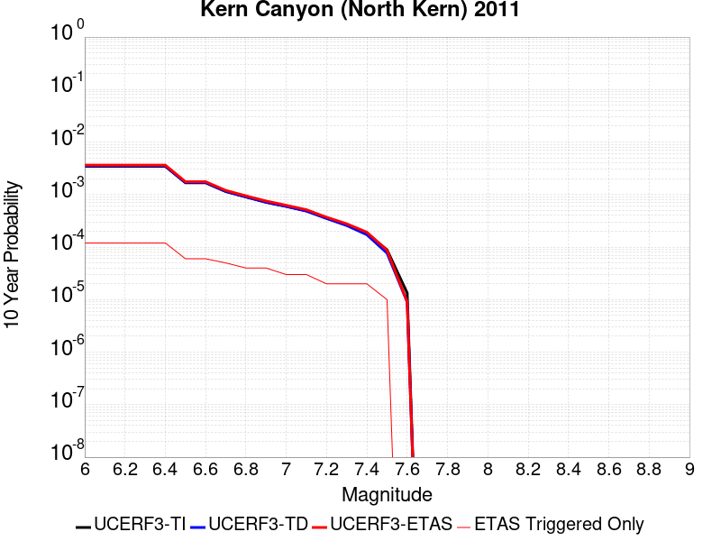 |

| Magnitude | 1 wk TI Prob | 1 wk TD Prob | 1 wk ETAS Prob | 1 wk ETAS/TD Gain | 1 wk ETAS Triggered Only | 1 mo TI Prob | 1 mo TD Prob | 1 mo ETAS Prob | 1 mo ETAS/TD Gain | 1 mo ETAS Triggered Only | 1 yr TI Prob | 1 yr TD Prob | 1 yr ETAS Prob | 1 yr ETAS/TD Gain | 1 yr ETAS Triggered Only | 10 yr TI Prob | 10 yr TD Prob | 10 yr ETAS Prob | 10 yr ETAS/TD Gain | 10 yr ETAS Triggered Only |
|-----|-----|-----|-----|-----|-----|-----|-----|-----|-----|-----|-----|-----|-----|-----|-----|-----|-----|-----|-----|-----|
| 6.0 | 6.6264497E-6 | 6.75733E-6 | 4.675706E-5 | 6.9194574 | 4.0E-5 | 2.8398761E-5 | 2.895971E-5 | 7.895826E-5 | 2.7264867 | 5.0E-5 | 3.4570007E-4 | 3.5253543E-4 | 4.525002E-4 | 1.2835594 | 1.0E-4 | 0.0034516277 | 0.0035205502 | 0.0036401278 | 1.0339656 | 1.2E-4 |
| 6.1 | 6.6264497E-6 | 6.75733E-6 | 4.675706E-5 | 6.9194574 | 4.0E-5 | 2.8398761E-5 | 2.895971E-5 | 7.895826E-5 | 2.7264867 | 5.0E-5 | 3.4570007E-4 | 3.5253543E-4 | 4.525002E-4 | 1.2835594 | 1.0E-4 | 0.0034516277 | 0.0035205502 | 0.0036401278 | 1.0339656 | 1.2E-4 |
| 6.2 | 6.6264497E-6 | 6.75733E-6 | 4.675706E-5 | 6.9194574 | 4.0E-5 | 2.8398761E-5 | 2.895971E-5 | 7.895826E-5 | 2.7264867 | 5.0E-5 | 3.4570007E-4 | 3.5253543E-4 | 4.525002E-4 | 1.2835594 | 1.0E-4 | 0.0034516277 | 0.0035205502 | 0.0036401278 | 1.0339656 | 1.2E-4 |
| 6.3 | 6.6264497E-6 | 6.75733E-6 | 4.675706E-5 | 6.9194574 | 4.0E-5 | 2.8398761E-5 | 2.895971E-5 | 7.895826E-5 | 2.7264867 | 5.0E-5 | 3.4570007E-4 | 3.5253543E-4 | 4.525002E-4 | 1.2835594 | 1.0E-4 | 0.0034516277 | 0.0035205502 | 0.0036401278 | 1.0339656 | 1.2E-4 |
| 6.4 | 6.6264497E-6 | 6.75733E-6 | 4.675706E-5 | 6.9194574 | 4.0E-5 | 2.8398761E-5 | 2.895971E-5 | 7.895826E-5 | 2.7264867 | 5.0E-5 | 3.4570007E-4 | 3.5253543E-4 | 4.525002E-4 | 1.2835594 | 1.0E-4 | 0.0034516277 | 0.0035205502 | 0.0036401278 | 1.0339656 | 1.2E-4 |
| 6.5 | 3.2162225E-6 | 3.2570915E-6 | 1.32570585E-5 | 4.070214 | 1.0E-5 | 1.3783738E-5 | 1.3958894E-5 | 3.3958615E-5 | 2.4327583 | 2.0E-5 | 1.6780409E-4 | 1.6993708E-4 | 2.2992688E-4 | 1.3530118 | 6.0E-5 | 0.0016767744 | 0.001698151 | 0.0017580491 | 1.0352726 | 6.0E-5 |
| 6.6 | 3.2162225E-6 | 3.2570915E-6 | 1.32570585E-5 | 4.070214 | 1.0E-5 | 1.3783738E-5 | 1.3958894E-5 | 3.3958615E-5 | 2.4327583 | 2.0E-5 | 1.6780409E-4 | 1.6993708E-4 | 2.2992688E-4 | 1.3530118 | 6.0E-5 | 0.0016767744 | 0.001698151 | 0.0017580491 | 1.0352726 | 6.0E-5 |
| 6.7 | 2.1908265E-6 | 2.2071222E-6 | 1.2207101E-5 | 5.5307765 | 1.0E-5 | 9.389223E-6 | 9.459062E-6 | 1.9458968E-5 | 2.0571773 | 1.0E-5 | 1.1430779E-4 | 1.1515819E-4 | 1.6515244E-4 | 1.4341353 | 5.0E-5 | 0.0011424901 | 0.0011510046 | 0.001200947 | 1.0433903 | 5.0E-5 |
| 6.8 | 1.7303895E-6 | 1.736553E-6 | 1.736553E-6 | 1.0 | 0.0 | 7.415934E-6 | 7.442349E-6 | 7.442349E-6 | 1.0 | 0.0 | 9.028525E-5 | 9.060693E-5 | 1.3060331E-4 | 1.4414274 | 4.0E-5 | 9.024858E-4 | 9.0570963E-4 | 9.456734E-4 | 1.0441242 | 4.0E-5 |
| 6.9 | 1.3700314E-6 | 1.3688623E-6 | 1.3688623E-6 | 1.0 | 0.0 | 5.87155E-6 | 5.86654E-6 | 5.86654E-6 | 1.0 | 0.0 | 7.148377E-5 | 7.142283E-5 | 1.1141997E-4 | 1.5600051 | 4.0E-5 | 7.146078E-4 | 7.140033E-4 | 7.539747E-4 | 1.0559821 | 4.0E-5 |
| 7.0 | 1.1467797E-6 | 1.1413805E-6 | 1.1413805E-6 | 1.0 | 0.0 | 4.9147607E-6 | 4.8916218E-6 | 4.8916218E-6 | 1.0 | 0.0 | 5.983557E-5 | 5.95539E-5 | 8.9552115E-5 | 1.5037154 | 3.0E-5 | 5.981946E-4 | 5.9538253E-4 | 6.253647E-4 | 1.0503578 | 3.0E-5 |
| 7.1 | 9.3952065E-7 | 9.3026915E-7 | 9.3026915E-7 | 1.0 | 0.0 | 4.026511E-6 | 3.986862E-6 | 3.986862E-6 | 1.0 | 0.0 | 4.9021666E-5 | 4.853898E-5 | 7.853752E-5 | 1.61803 | 3.0E-5 | 4.901085E-4 | 4.8528553E-4 | 5.15271E-4 | 1.0617893 | 3.0E-5 |
| 7.2 | 6.858055E-7 | 6.7193014E-7 | 6.7193014E-7 | 1.0 | 0.0 | 2.939163E-6 | 2.8796974E-6 | 2.8796974E-6 | 1.0 | 0.0 | 3.5783723E-5 | 3.5059762E-5 | 5.505906E-5 | 1.5704346 | 2.0E-5 | 3.5777962E-4 | 3.5054318E-4 | 3.7053617E-4 | 1.0570343 | 2.0E-5 |
| 7.3 | 5.1101983E-7 | 4.939301E-7 | 4.939301E-7 | 1.0 | 0.0 | 2.1900833E-6 | 2.1168414E-6 | 2.1168414E-6 | 1.0 | 0.0 | 2.6663936E-5 | 2.5772246E-5 | 4.577173E-5 | 1.7760086 | 2.0E-5 | 2.6660739E-4 | 2.5769303E-4 | 2.7768788E-4 | 1.0775918 | 2.0E-5 |
| 7.4 | 3.4999414E-7 | 3.2995916E-7 | 3.2995916E-7 | 1.0 | 0.0 | 1.499974E-6 | 1.4141099E-6 | 1.4141099E-6 | 1.0 | 0.0 | 1.8262032E-5 | 1.7216655E-5 | 3.721631E-5 | 2.161646 | 2.0E-5 | 1.826053E-4 | 1.7215345E-4 | 1.9215001E-4 | 1.1161554 | 2.0E-5 |
| 7.5 | 1.7021522E-7 | 1.4750053E-7 | 1.4750053E-7 | 1.0 | 0.0 | 7.2949354E-7 | 6.32145E-7 | 6.32145E-7 | 1.0 | 0.0 | 8.881548E-6 | 7.696339E-6 | 1.7696262E-5 | 2.299309 | 1.0E-5 | 8.8811925E-5 | 7.696081E-5 | 8.696003E-5 | 1.1299263 | 1.0E-5 |
| 7.6 | 2.572245E-8 | 1.735264E-8 | 1.735264E-8 | 1.0 | 0.0 | 1.10239064E-7 | 7.436845E-8 | 7.436845E-8 | 1.0 | 0.0 | 1.3421597E-6 | 9.0543557E-7 | 9.0543557E-7 | 1.0 | 0.0 | 1.3421517E-5 | 9.054324E-6 | 9.054324E-6 | 1.0 | 0.0 |

## Whittier alt 1
*[(top)](#table-of-contents)*

| 1 Week | 1 Month | 1 Year | 10 Year |
|-----|-----|-----|-----|
|  |  |  |  |

| Magnitude | 1 wk TI Prob | 1 wk TD Prob | 1 wk ETAS Prob | 1 wk ETAS/TD Gain | 1 wk ETAS Triggered Only | 1 mo TI Prob | 1 mo TD Prob | 1 mo ETAS Prob | 1 mo ETAS/TD Gain | 1 mo ETAS Triggered Only | 1 yr TI Prob | 1 yr TD Prob | 1 yr ETAS Prob | 1 yr ETAS/TD Gain | 1 yr ETAS Triggered Only | 10 yr TI Prob | 10 yr TD Prob | 10 yr ETAS Prob | 10 yr ETAS/TD Gain | 10 yr ETAS Triggered Only |
|-----|-----|-----|-----|-----|-----|-----|-----|-----|-----|-----|-----|-----|-----|-----|-----|-----|-----|-----|-----|-----|
| 6.0 | 4.2554693E-5 | 4.7252182E-5 | 6.725124E-5 | 1.4232409 | 2.0E-5 | 1.8236451E-4 | 2.0249544E-4 | 2.5248533E-4 | 1.2468691 | 5.0E-5 | 0.002218027 | 0.0024629163 | 0.0025227687 | 1.0243014 | 6.0E-5 | 0.02196019 | 0.024390263 | 0.024507336 | 1.0048 | 1.2E-4 |
| 6.1 | 4.2554693E-5 | 4.7252182E-5 | 6.725124E-5 | 1.4232409 | 2.0E-5 | 1.8236451E-4 | 2.0249544E-4 | 2.5248533E-4 | 1.2468691 | 5.0E-5 | 0.002218027 | 0.0024629163 | 0.0025227687 | 1.0243014 | 6.0E-5 | 0.02196019 | 0.024390263 | 0.024507336 | 1.0048 | 1.2E-4 |
| 6.2 | 4.2554693E-5 | 4.7252182E-5 | 6.725124E-5 | 1.4232409 | 2.0E-5 | 1.8236451E-4 | 2.0249544E-4 | 2.5248533E-4 | 1.2468691 | 5.0E-5 | 0.002218027 | 0.0024629163 | 0.0025227687 | 1.0243014 | 6.0E-5 | 0.02196019 | 0.024390263 | 0.024507336 | 1.0048 | 1.2E-4 |
| 6.3 | 1.9617712E-5 | 1.826841E-5 | 2.8268229E-5 | 1.547383 | 1.0E-5 | 8.40732E-5 | 7.829095E-5 | 9.8289376E-5 | 1.2554374 | 2.0E-5 | 0.0010231105 | 9.527944E-4 | 9.827658E-4 | 1.0314564 | 3.0E-5 | 0.01018413 | 0.0094904 | 0.009539925 | 1.0052185 | 5.0E-5 |
| 6.4 | 1.5611336E-5 | 1.3604089E-5 | 1.3604089E-5 | 1.0 | 0.0 | 6.690401E-5 | 5.8301972E-5 | 6.8301386E-5 | 1.1715108 | 1.0E-5 | 8.142519E-4 | 7.096013E-4 | 7.295871E-4 | 1.0281649 | 2.0E-5 | 0.008112748 | 0.0070753377 | 0.0071051256 | 1.0042101 | 3.0E-5 |
| 6.5 | 1.5150166E-5 | 1.3100744E-5 | 1.3100744E-5 | 1.0 | 0.0 | 6.492767E-5 | 5.614487E-5 | 6.6144305E-5 | 1.1781007 | 1.0E-5 | 7.9020765E-4 | 6.8335526E-4 | 7.033416E-4 | 1.0292474 | 2.0E-5 | 0.007874036 | 0.006814508 | 0.006844303 | 1.0043724 | 3.0E-5 |
| 6.6 | 1.295588E-5 | 1.0380544E-5 | 1.0380544E-5 | 1.0 | 0.0 | 5.552402E-5 | 4.44873E-5 | 4.44873E-5 | 1.0 | 0.0 | 6.7579525E-4 | 5.415002E-4 | 5.5149477E-4 | 1.0184572 | 1.0E-5 | 0.006737438 | 0.005403343 | 0.0054232352 | 1.0036814 | 2.0E-5 |
| 6.7 | 1.2542085E-5 | 9.899189E-6 | 9.899189E-6 | 1.0 | 0.0 | 5.3750682E-5 | 4.2424414E-5 | 4.2424414E-5 | 1.0 | 0.0 | 6.542181E-4 | 5.163967E-4 | 5.2639155E-4 | 1.0193549 | 1.0E-5 | 0.006522954 | 0.005153464 | 0.0051733614 | 1.0038608 | 2.0E-5 |
| 6.8 | 1.2195878E-5 | 9.49523E-6 | 9.49523E-6 | 1.0 | 0.0 | 5.2267E-5 | 4.069322E-5 | 4.069322E-5 | 1.0 | 0.0 | 6.36165E-4 | 4.9532915E-4 | 5.053242E-4 | 1.0201786 | 1.0E-5 | 0.0063434686 | 0.0049436963 | 0.0049635977 | 1.0040256 | 2.0E-5 |
| 6.9 | 1.1580298E-5 | 8.772739E-6 | 8.772739E-6 | 1.0 | 0.0 | 4.9628903E-5 | 3.759692E-5 | 3.759692E-5 | 1.0 | 0.0 | 6.040644E-4 | 4.5764804E-4 | 4.6764346E-4 | 1.0218408 | 1.0E-5 | 0.00602425 | 0.0045684646 | 0.004588373 | 1.0043578 | 2.0E-5 |
| 7.0 | 1.0964795E-5 | 8.083794E-6 | 8.083794E-6 | 1.0 | 0.0 | 4.6991136E-5 | 3.4644378E-5 | 3.4644378E-5 | 1.0 | 0.0 | 5.7196687E-4 | 4.217152E-4 | 4.217152E-4 | 1.0 | 0.0 | 0.0057049696 | 0.004210459 | 0.004220417 | 1.002365 | 1.0E-5 |
| 7.1 | 1.0230601E-5 | 7.32646E-6 | 7.32646E-6 | 1.0 | 0.0 | 4.3844695E-5 | 3.1398744E-5 | 3.1398744E-5 | 1.0 | 0.0 | 5.336784E-4 | 3.8221394E-4 | 3.8221394E-4 | 1.0 | 0.0 | 0.005323986 | 0.0038167592 | 0.003826721 | 1.00261 | 1.0E-5 |
| 7.2 | 9.40865E-6 | 6.5430822E-6 | 6.5430822E-6 | 1.0 | 0.0 | 4.032216E-5 | 2.8041486E-5 | 2.8041486E-5 | 1.0 | 0.0 | 4.908117E-4 | 3.4135283E-4 | 3.4135283E-4 | 1.0 | 0.0 | 0.0048972913 | 0.0034094024 | 0.0034193683 | 1.002923 | 1.0E-5 |
| 7.3 | 8.237384E-6 | 5.5975433E-6 | 5.5975433E-6 | 1.0 | 0.0 | 3.5302593E-5 | 2.3989258E-5 | 2.3989258E-5 | 1.0 | 0.0 | 4.2972428E-4 | 2.920311E-4 | 2.920311E-4 | 1.0 | 0.0 | 0.0042889426 | 0.0029167992 | 0.0029267701 | 1.0034184 | 1.0E-5 |
| 7.4 | 7.5316966E-6 | 5.0276153E-6 | 5.0276153E-6 | 1.0 | 0.0 | 3.2278298E-5 | 2.154675E-5 | 2.154675E-5 | 1.0 | 0.0 | 3.9291743E-4 | 2.623011E-4 | 2.623011E-4 | 1.0 | 0.0 | 0.0039222343 | 0.0026200267 | 0.0026300005 | 1.0038067 | 1.0E-5 |
| 7.5 | 6.149649E-6 | 3.9336355E-6 | 3.9336355E-6 | 1.0 | 0.0 | 2.6355372E-5 | 1.6858336E-5 | 1.6858336E-5 | 1.0 | 0.0 | 3.208294E-4 | 2.052318E-4 | 2.052318E-4 | 1.0 | 0.0 | 0.003203666 | 0.0020505118 | 0.0020604914 | 1.0048668 | 1.0E-5 |
| 7.6 | 5.457711E-6 | 3.3951796E-6 | 3.3951796E-6 | 1.0 | 0.0 | 2.338998E-5 | 1.4550694E-5 | 1.4550694E-5 | 1.0 | 0.0 | 2.8473578E-4 | 1.771411E-4 | 1.771411E-4 | 1.0 | 0.0 | 0.0028437122 | 0.0017700798 | 0.0017800621 | 1.0056394 | 1.0E-5 |
| 7.7 | 4.1676276E-6 | 2.3329922E-6 | 2.3329922E-6 | 1.0 | 0.0 | 1.7861139E-5 | 9.998504E-6 | 9.998504E-6 | 1.0 | 0.0 | 2.1743766E-4 | 1.2172572E-4 | 1.2172572E-4 | 1.0 | 0.0 | 0.0021722503 | 0.0012166635 | 0.0012266514 | 1.0082092 | 1.0E-5 |
| 7.8 | 2.2692414E-7 | 9.384417E-8 | 9.384417E-8 | 1.0 | 0.0 | 9.725317E-7 | 4.0218927E-7 | 4.0218927E-7 | 1.0 | 0.0 | 1.1840509E-5 | 4.8966467E-6 | 4.8966467E-6 | 1.0 | 0.0 | 1.1839878E-4 | 4.8965718E-5 | 4.8965718E-5 | 1.0 | 0.0 |
| 7.9 | 6.676829E-9 | 3.4397174E-9 | 3.4397174E-9 | 1.0 | 0.0 | 2.861498E-8 | 1.4741646E-8 | 1.4741646E-8 | 1.0 | 0.0 | 3.4838732E-7 | 1.7947953E-7 | 1.7947953E-7 | 1.0 | 0.0 | 3.4838679E-6 | 1.794794E-6 | 1.794794E-6 | 1.0 | 0.0 |

## Lost Hills
*[(top)](#table-of-contents)*

| 1 Week | 1 Month | 1 Year | 10 Year |
|-----|-----|-----|-----|
|  |  | 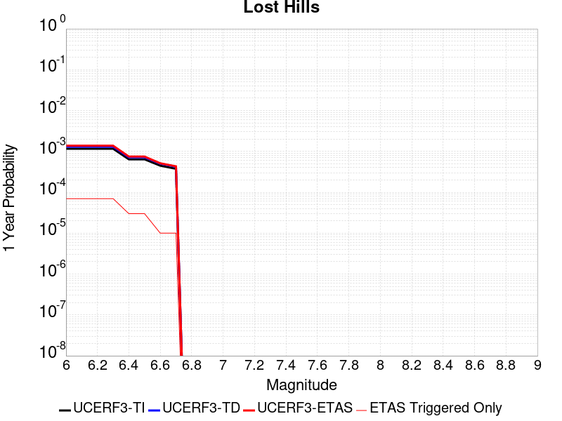 |  |

| Magnitude | 1 wk TI Prob | 1 wk TD Prob | 1 wk ETAS Prob | 1 wk ETAS/TD Gain | 1 wk ETAS Triggered Only | 1 mo TI Prob | 1 mo TD Prob | 1 mo ETAS Prob | 1 mo ETAS/TD Gain | 1 mo ETAS Triggered Only | 1 yr TI Prob | 1 yr TD Prob | 1 yr ETAS Prob | 1 yr ETAS/TD Gain | 1 yr ETAS Triggered Only | 10 yr TI Prob | 10 yr TD Prob | 10 yr ETAS Prob | 10 yr ETAS/TD Gain | 10 yr ETAS Triggered Only |
|-----|-----|-----|-----|-----|-----|-----|-----|-----|-----|-----|-----|-----|-----|-----|-----|-----|-----|-----|-----|-----|
| 6.0 | 2.233523E-5 | 2.5106583E-5 | 5.510583E-5 | 2.1948757 | 3.0E-5 | 9.571891E-5 | 1.0759615E-4 | 1.5759077E-4 | 1.4646506 | 5.0E-5 | 0.0011647546 | 0.001309364 | 0.0013792723 | 1.0533911 | 7.0E-5 | 0.011586686 | 0.013033091 | 0.013151527 | 1.0090873 | 1.2E-4 |
| 6.1 | 2.233523E-5 | 2.5106583E-5 | 5.510583E-5 | 2.1948757 | 3.0E-5 | 9.571891E-5 | 1.0759615E-4 | 1.5759077E-4 | 1.4646506 | 5.0E-5 | 0.0011647546 | 0.001309364 | 0.0013792723 | 1.0533911 | 7.0E-5 | 0.011586686 | 0.013033091 | 0.013151527 | 1.0090873 | 1.2E-4 |
| 6.2 | 2.233523E-5 | 2.5106583E-5 | 5.510583E-5 | 2.1948757 | 3.0E-5 | 9.571891E-5 | 1.0759615E-4 | 1.5759077E-4 | 1.4646506 | 5.0E-5 | 0.0011647546 | 0.001309364 | 0.0013792723 | 1.0533911 | 7.0E-5 | 0.011586686 | 0.013033091 | 0.013151527 | 1.0090873 | 1.2E-4 |
| 6.3 | 2.233523E-5 | 2.5106583E-5 | 5.510583E-5 | 2.1948757 | 3.0E-5 | 9.571891E-5 | 1.0759615E-4 | 1.5759077E-4 | 1.4646506 | 5.0E-5 | 0.0011647546 | 0.001309364 | 0.0013792723 | 1.0533911 | 7.0E-5 | 0.011586686 | 0.013033091 | 0.013151527 | 1.0090873 | 1.2E-4 |
| 6.4 | 1.2288092E-5 | 1.3781108E-5 | 2.3780969E-5 | 1.7256211 | 1.0E-5 | 5.2662188E-5 | 5.906108E-5 | 8.905931E-5 | 1.5079187 | 3.0E-5 | 6.409735E-4 | 7.189252E-4 | 7.4890367E-4 | 1.0416989 | 3.0E-5 | 0.006391279 | 0.0071752006 | 0.0072347703 | 1.0083021 | 6.0E-5 |
| 6.5 | 1.2288092E-5 | 1.3781108E-5 | 2.3780969E-5 | 1.7256211 | 1.0E-5 | 5.2662188E-5 | 5.906108E-5 | 8.905931E-5 | 1.5079187 | 3.0E-5 | 6.409735E-4 | 7.189252E-4 | 7.4890367E-4 | 1.0416989 | 3.0E-5 | 0.006391279 | 0.0071752006 | 0.0072347703 | 1.0083021 | 6.0E-5 |
| 6.6 | 8.58281E-6 | 9.63377E-6 | 9.63377E-6 | 1.0 | 0.0 | 3.6782953E-5 | 4.12874E-5 | 5.128699E-5 | 1.2421947 | 1.0E-5 | 4.4774043E-4 | 5.026414E-4 | 5.126363E-4 | 1.019885 | 1.0E-5 | 0.0044683935 | 0.005023205 | 0.0050630043 | 1.007923 | 4.0E-5 |
| 6.7 | 7.205685E-6 | 8.088302E-6 | 8.088302E-6 | 1.0 | 0.0 | 3.088114E-5 | 3.466415E-5 | 4.4663804E-5 | 1.2884725 | 1.0E-5 | 3.7591302E-4 | 4.2203604E-4 | 4.320318E-4 | 1.0236846 | 1.0E-5 | 0.0037527776 | 0.0042203604 | 0.004230318 | 1.0023595 | 1.0E-5 |

## Pisgah-Bullion Mtn-Mesquite Lk
*[(top)](#table-of-contents)*

| 1 Week | 1 Month | 1 Year | 10 Year |
|-----|-----|-----|-----|
|  |  |  |  |

| Magnitude | 1 wk TI Prob | 1 wk TD Prob | 1 wk ETAS Prob | 1 wk ETAS/TD Gain | 1 wk ETAS Triggered Only | 1 mo TI Prob | 1 mo TD Prob | 1 mo ETAS Prob | 1 mo ETAS/TD Gain | 1 mo ETAS Triggered Only | 1 yr TI Prob | 1 yr TD Prob | 1 yr ETAS Prob | 1 yr ETAS/TD Gain | 1 yr ETAS Triggered Only | 10 yr TI Prob | 10 yr TD Prob | 10 yr ETAS Prob | 10 yr ETAS/TD Gain | 10 yr ETAS Triggered Only |
|-----|-----|-----|-----|-----|-----|-----|-----|-----|-----|-----|-----|-----|-----|-----|-----|-----|-----|-----|-----|-----|
| 6.0 | 3.0240792E-5 | 2.40909E-5 | 7.4089694E-5 | 3.0754225 | 5.0E-5 | 1.2959696E-4 | 1.032432E-4 | 1.5323803E-4 | 1.4842434 | 5.0E-5 | 0.0015767008 | 0.0012563618 | 0.0013662236 | 1.0874444 | 1.1E-4 | 0.015655609 | 0.012502613 | 0.012621112 | 1.009478 | 1.2E-4 |
| 6.1 | 3.0240792E-5 | 2.40909E-5 | 7.4089694E-5 | 3.0754225 | 5.0E-5 | 1.2959696E-4 | 1.032432E-4 | 1.5323803E-4 | 1.4842434 | 5.0E-5 | 0.0015767008 | 0.0012563618 | 0.0013662236 | 1.0874444 | 1.1E-4 | 0.015655609 | 0.012502613 | 0.012621112 | 1.009478 | 1.2E-4 |
| 6.2 | 3.0240792E-5 | 2.40909E-5 | 7.4089694E-5 | 3.0754225 | 5.0E-5 | 1.2959696E-4 | 1.032432E-4 | 1.5323803E-4 | 1.4842434 | 5.0E-5 | 0.0015767008 | 0.0012563618 | 0.0013662236 | 1.0874444 | 1.1E-4 | 0.015655609 | 0.012502613 | 0.012621112 | 1.009478 | 1.2E-4 |
| 6.3 | 2.0498217E-5 | 1.3638054E-5 | 3.363778E-5 | 2.4664648 | 2.0E-5 | 8.784654E-5 | 5.8447586E-5 | 7.8446414E-5 | 1.3421669 | 2.0E-5 | 0.0010690069 | 7.1138324E-4 | 7.4136193E-4 | 1.0421413 | 3.0E-5 | 0.01063879 | 0.0070926864 | 0.007132403 | 1.0055996 | 4.0E-5 |
| 6.4 | 2.0498217E-5 | 1.3638054E-5 | 3.363778E-5 | 2.4664648 | 2.0E-5 | 8.784654E-5 | 5.8447586E-5 | 7.8446414E-5 | 1.3421669 | 2.0E-5 | 0.0010690069 | 7.1138324E-4 | 7.4136193E-4 | 1.0421413 | 3.0E-5 | 0.01063879 | 0.0070926864 | 0.007132403 | 1.0055996 | 4.0E-5 |
| 6.5 | 1.7316182E-5 | 1.04769715E-5 | 3.0476762E-5 | 2.9089286 | 2.0E-5 | 7.42101E-5 | 4.490059E-5 | 6.4899694E-5 | 1.4454085 | 2.0E-5 | 9.0313336E-4 | 5.465376E-4 | 5.665266E-4 | 1.036574 | 2.0E-5 | 0.008994718 | 0.00545293 | 0.005472821 | 1.0036478 | 2.0E-5 |
| 6.6 | 1.5251077E-5 | 8.414133E-6 | 2.8413964E-5 | 3.376933 | 2.0E-5 | 6.536012E-5 | 3.606011E-5 | 5.605939E-5 | 1.5546094 | 2.0E-5 | 7.9546886E-4 | 4.3895066E-4 | 4.5894188E-4 | 1.0455432 | 2.0E-5 | 0.007926274 | 0.0043815537 | 0.004401466 | 1.0045446 | 2.0E-5 |
| 6.7 | 1.2997425E-5 | 6.4112146E-6 | 2.6411086E-5 | 4.1195135 | 2.0E-5 | 5.570206E-5 | 2.7476372E-5 | 4.747582E-5 | 1.7278782 | 2.0E-5 | 6.7796157E-4 | 3.3447813E-4 | 3.5447144E-4 | 1.0597746 | 2.0E-5 | 0.0067589693 | 0.003340207 | 0.0033601404 | 1.0059676 | 2.0E-5 |
| 6.8 | 1.035386E-5 | 4.333145E-6 | 2.4333058E-5 | 5.615565 | 2.0E-5 | 4.437293E-5 | 1.8570496E-5 | 3.8570124E-5 | 2.0769572 | 2.0E-5 | 5.401065E-4 | 2.260732E-4 | 2.4606867E-4 | 1.088447 | 2.0E-5 | 0.0053879567 | 0.002258519 | 0.0022784737 | 1.0088353 | 2.0E-5 |
| 6.9 | 8.816252E-6 | 3.5805879E-6 | 2.3580516E-5 | 6.5856547 | 2.0E-5 | 3.778339E-5 | 1.534529E-5 | 3.5344983E-5 | 2.3033116 | 2.0E-5 | 4.5991567E-4 | 1.8681347E-4 | 2.0680974E-4 | 1.1070386 | 2.0E-5 | 0.00458965 | 0.0018666228 | 0.0018865855 | 1.0106945 | 2.0E-5 |
| 7.0 | 6.8232207E-6 | 2.5674399E-6 | 1.2567414E-5 | 4.8949203 | 1.0E-5 | 2.9242048E-5 | 1.100327E-5 | 2.100316E-5 | 1.9088107 | 1.0E-5 | 3.5596377E-4 | 1.3395688E-4 | 1.4395555E-4 | 1.0746409 | 1.0E-5 | 0.0035539411 | 0.0013387925 | 0.0013487791 | 1.0074594 | 1.0E-5 |
| 7.1 | 5.837013E-6 | 2.2273143E-6 | 1.2227292E-5 | 5.489702 | 1.0E-5 | 2.501553E-5 | 9.5456E-6 | 1.9545503E-5 | 2.047593 | 1.0E-5 | 3.045215E-4 | 1.1621177E-4 | 1.2621061E-4 | 1.0860398 | 1.0E-5 | 0.0030410455 | 0.001161539 | 0.0011715274 | 1.0085993 | 1.0E-5 |
| 7.2 | 4.278052E-6 | 1.6275065E-6 | 1.6275065E-6 | 1.0 | 0.0 | 1.833438E-5 | 6.975011E-6 | 6.975011E-6 | 1.0 | 0.0 | 2.231982E-4 | 8.491768E-5 | 8.491768E-5 | 1.0 | 0.0 | 0.0022297418 | 8.4887556E-4 | 8.4887556E-4 | 1.0 | 0.0 |
| 7.3 | 1.8803692E-6 | 8.344788E-7 | 8.344788E-7 | 1.0 | 0.0 | 8.0587E-6 | 3.5763337E-6 | 3.5763337E-6 | 1.0 | 0.0 | 9.811026E-5 | 4.354114E-5 | 4.354114E-5 | 1.0 | 0.0 | 9.806695E-4 | 4.3534054E-4 | 4.3534054E-4 | 1.0 | 0.0 |

## Blue Cut
*[(top)](#table-of-contents)*

| 1 Week | 1 Month | 1 Year | 10 Year |
|-----|-----|-----|-----|
|  | 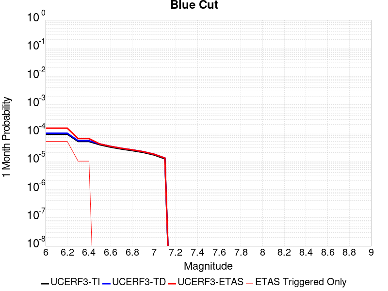 |  | 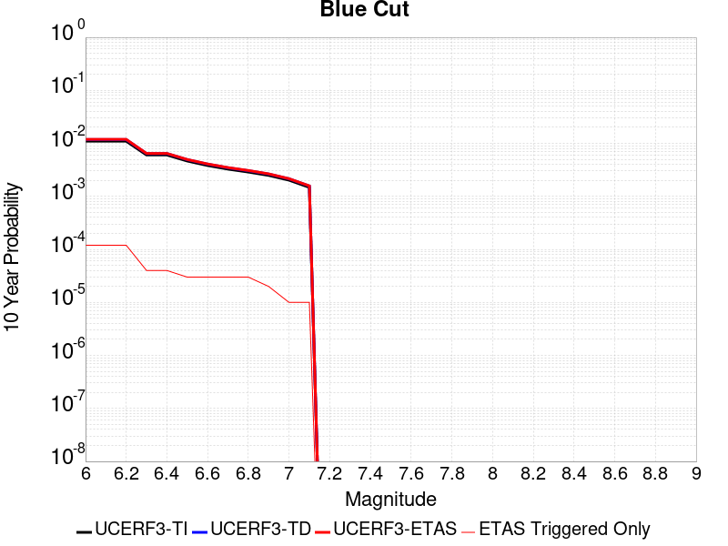 |

| Magnitude | 1 wk TI Prob | 1 wk TD Prob | 1 wk ETAS Prob | 1 wk ETAS/TD Gain | 1 wk ETAS Triggered Only | 1 mo TI Prob | 1 mo TD Prob | 1 mo ETAS Prob | 1 mo ETAS/TD Gain | 1 mo ETAS Triggered Only | 1 yr TI Prob | 1 yr TD Prob | 1 yr ETAS Prob | 1 yr ETAS/TD Gain | 1 yr ETAS Triggered Only | 10 yr TI Prob | 10 yr TD Prob | 10 yr ETAS Prob | 10 yr ETAS/TD Gain | 10 yr ETAS Triggered Only |
|-----|-----|-----|-----|-----|-----|-----|-----|-----|-----|-----|-----|-----|-----|-----|-----|-----|-----|-----|-----|-----|
| 6.0 | 2.1227985E-5 | 2.2719574E-5 | 6.271867E-5 | 2.7605565 | 4.0E-5 | 9.097391E-5 | 9.73663E-5 | 1.4736142E-4 | 1.5134747 | 5.0E-5 | 0.0011070445 | 0.0011848481 | 0.0012847296 | 1.084299 | 1.0E-4 | 0.011015458 | 0.011791152 | 0.011909736 | 1.0100571 | 1.2E-4 |
| 6.1 | 2.1227985E-5 | 2.2719574E-5 | 6.271867E-5 | 2.7605565 | 4.0E-5 | 9.097391E-5 | 9.73663E-5 | 1.4736142E-4 | 1.5134747 | 5.0E-5 | 0.0011070445 | 0.0011848481 | 0.0012847296 | 1.084299 | 1.0E-4 | 0.011015458 | 0.011791152 | 0.011909736 | 1.0100571 | 1.2E-4 |
| 6.2 | 2.1227985E-5 | 2.2719574E-5 | 6.271867E-5 | 2.7605565 | 4.0E-5 | 9.097391E-5 | 9.73663E-5 | 1.4736142E-4 | 1.5134747 | 5.0E-5 | 0.0011070445 | 0.0011848481 | 0.0012847296 | 1.084299 | 1.0E-4 | 0.011015458 | 0.011791152 | 0.011909736 | 1.0100571 | 1.2E-4 |
| 6.3 | 1.1613981E-5 | 1.2353542E-5 | 2.2353419E-5 | 1.8094745 | 1.0E-5 | 4.9773254E-5 | 5.2942745E-5 | 6.2942214E-5 | 1.1888733 | 1.0E-5 | 6.0582085E-4 | 6.443998E-4 | 6.84374E-4 | 1.0620333 | 4.0E-5 | 0.0060417196 | 0.0064265593 | 0.006466302 | 1.0061842 | 4.0E-5 |
| 6.4 | 1.1613981E-5 | 1.2353542E-5 | 2.2353419E-5 | 1.8094745 | 1.0E-5 | 4.9773254E-5 | 5.2942745E-5 | 6.2942214E-5 | 1.1888733 | 1.0E-5 | 6.0582085E-4 | 6.443998E-4 | 6.84374E-4 | 1.0620333 | 4.0E-5 | 0.0060417196 | 0.0064265593 | 0.006466302 | 1.0061842 | 4.0E-5 |
| 6.5 | 8.931326E-6 | 9.4816E-6 | 9.4816E-6 | 1.0 | 0.0 | 3.8276554E-5 | 4.0634844E-5 | 4.0634844E-5 | 1.0 | 0.0 | 4.6591737E-4 | 4.946261E-4 | 5.2461127E-4 | 1.0606219 | 3.0E-5 | 0.0046494175 | 0.004936161 | 0.004966013 | 1.0060476 | 3.0E-5 |
| 6.6 | 7.345353E-6 | 7.79028E-6 | 7.79028E-6 | 1.0 | 0.0 | 3.1479703E-5 | 3.338653E-5 | 3.338653E-5 | 1.0 | 0.0 | 3.83198E-4 | 4.064132E-4 | 4.36401E-4 | 1.0737865 | 3.0E-5 | 0.0038253788 | 0.0040574907 | 0.004087369 | 1.0073637 | 3.0E-5 |
| 6.7 | 6.2775666E-6 | 6.655149E-6 | 6.655149E-6 | 1.0 | 0.0 | 2.690358E-5 | 2.8521798E-5 | 2.8521798E-5 | 1.0 | 0.0 | 3.2750185E-4 | 3.472051E-4 | 3.7719466E-4 | 1.0863743 | 3.0E-5 | 0.0032701963 | 0.003467367 | 0.0034972632 | 1.008622 | 3.0E-5 |
| 6.8 | 5.5234095E-6 | 5.8551113E-6 | 5.8551113E-6 | 1.0 | 0.0 | 2.367154E-5 | 2.5093133E-5 | 2.5093133E-5 | 1.0 | 0.0 | 2.8816288E-4 | 3.0547334E-4 | 3.354642E-4 | 1.0981783 | 3.0E-5 | 0.002877895 | 0.0030512505 | 0.003081159 | 1.009802 | 3.0E-5 |
| 6.9 | 4.7780054E-6 | 5.0654203E-6 | 5.0654203E-6 | 1.0 | 0.0 | 2.0477004E-5 | 2.1708804E-5 | 2.1708804E-5 | 1.0 | 0.0 | 2.4927902E-4 | 2.642797E-4 | 2.842744E-4 | 1.0756574 | 2.0E-5 | 0.0024899957 | 0.002640346 | 0.0026602934 | 1.0075548 | 2.0E-5 |
| 7.0 | 3.883171E-6 | 4.118487E-6 | 4.118487E-6 | 1.0 | 0.0 | 1.6642054E-5 | 1.7650578E-5 | 1.7650578E-5 | 1.0 | 0.0 | 2.0259817E-4 | 2.1488148E-4 | 2.2487935E-4 | 1.0465273 | 1.0E-5 | 0.0020241356 | 0.0021474129 | 0.0021573913 | 1.0046468 | 1.0E-5 |
| 7.1 | 2.8358215E-6 | 3.0097158E-6 | 3.0097158E-6 | 1.0 | 0.0 | 1.2153464E-5 | 1.2898756E-5 | 1.2898756E-5 | 1.0 | 0.0 | 1.4795837E-4 | 1.5703762E-4 | 1.6703604E-4 | 1.063669 | 1.0E-5 | 0.001478599 | 0.0015699116 | 0.001579896 | 1.0063598 | 1.0E-5 |

## Independence rev 2011
*[(top)](#table-of-contents)*

| 1 Week | 1 Month | 1 Year | 10 Year |
|-----|-----|-----|-----|
|  |  |  |  |

| Magnitude | 1 wk TI Prob | 1 wk TD Prob | 1 wk ETAS Prob | 1 wk ETAS/TD Gain | 1 wk ETAS Triggered Only | 1 mo TI Prob | 1 mo TD Prob | 1 mo ETAS Prob | 1 mo ETAS/TD Gain | 1 mo ETAS Triggered Only | 1 yr TI Prob | 1 yr TD Prob | 1 yr ETAS Prob | 1 yr ETAS/TD Gain | 1 yr ETAS Triggered Only | 10 yr TI Prob | 10 yr TD Prob | 10 yr ETAS Prob | 10 yr ETAS/TD Gain | 10 yr ETAS Triggered Only |
|-----|-----|-----|-----|-----|-----|-----|-----|-----|-----|-----|-----|-----|-----|-----|-----|-----|-----|-----|-----|-----|
| 6.0 | 4.422171E-6 | 4.3262253E-6 | 4.432605E-5 | 10.245895 | 4.0E-5 | 1.8952025E-5 | 1.8540852E-5 | 6.853992E-5 | 3.696698 | 5.0E-5 | 2.3071647E-4 | 2.2571447E-4 | 3.056964E-4 | 1.3543501 | 8.0E-5 | 0.0023047708 | 0.0022551457 | 0.0023748751 | 1.0530916 | 1.2E-4 |
| 6.1 | 4.422171E-6 | 4.3262253E-6 | 4.432605E-5 | 10.245895 | 4.0E-5 | 1.8952025E-5 | 1.8540852E-5 | 6.853992E-5 | 3.696698 | 5.0E-5 | 2.3071647E-4 | 2.2571447E-4 | 3.056964E-4 | 1.3543501 | 8.0E-5 | 0.0023047708 | 0.0022551457 | 0.0023748751 | 1.0530916 | 1.2E-4 |
| 6.2 | 4.422171E-6 | 4.3262253E-6 | 4.432605E-5 | 10.245895 | 4.0E-5 | 1.8952025E-5 | 1.8540852E-5 | 6.853992E-5 | 3.696698 | 5.0E-5 | 2.3071647E-4 | 2.2571447E-4 | 3.056964E-4 | 1.3543501 | 8.0E-5 | 0.0023047708 | 0.0022551457 | 0.0023748751 | 1.0530916 | 1.2E-4 |
| 6.3 | 4.422171E-6 | 4.3262253E-6 | 4.432605E-5 | 10.245895 | 4.0E-5 | 1.8952025E-5 | 1.8540852E-5 | 6.853992E-5 | 3.696698 | 5.0E-5 | 2.3071647E-4 | 2.2571447E-4 | 3.056964E-4 | 1.3543501 | 8.0E-5 | 0.0023047708 | 0.0022551457 | 0.0023748751 | 1.0530916 | 1.2E-4 |
| 6.4 | 4.422171E-6 | 4.3262253E-6 | 4.432605E-5 | 10.245895 | 4.0E-5 | 1.8952025E-5 | 1.8540852E-5 | 6.853992E-5 | 3.696698 | 5.0E-5 | 2.3071647E-4 | 2.2571447E-4 | 3.056964E-4 | 1.3543501 | 8.0E-5 | 0.0023047708 | 0.0022551457 | 0.0023748751 | 1.0530916 | 1.2E-4 |
| 6.5 | 4.422171E-6 | 4.3262253E-6 | 4.432605E-5 | 10.245895 | 4.0E-5 | 1.8952025E-5 | 1.8540852E-5 | 6.853992E-5 | 3.696698 | 5.0E-5 | 2.3071647E-4 | 2.2571447E-4 | 3.056964E-4 | 1.3543501 | 8.0E-5 | 0.0023047708 | 0.0022551457 | 0.0023748751 | 1.0530916 | 1.2E-4 |
| 6.6 | 2.663744E-6 | 2.5319846E-6 | 4.2531883E-5 | 16.797844 | 4.0E-5 | 1.1415996E-5 | 1.08513195E-5 | 5.0850886E-5 | 4.6861477 | 4.0E-5 | 1.3898089E-4 | 1.321073E-4 | 1.8210069E-4 | 1.3784302 | 5.0E-5 | 0.0013889399 | 0.0013203359 | 0.0014102171 | 1.0680745 | 9.0E-5 |
| 6.7 | 2.663744E-6 | 2.5319846E-6 | 4.2531883E-5 | 16.797844 | 4.0E-5 | 1.1415996E-5 | 1.08513195E-5 | 5.0850886E-5 | 4.6861477 | 4.0E-5 | 1.3898089E-4 | 1.321073E-4 | 1.8210069E-4 | 1.3784302 | 5.0E-5 | 0.0013889399 | 0.0013203359 | 0.0014102171 | 1.0680745 | 9.0E-5 |
| 6.8 | 1.9716529E-6 | 1.8322567E-6 | 4.1832183E-5 | 22.830963 | 4.0E-5 | 8.449913E-6 | 7.852505E-6 | 4.785219E-5 | 6.0938754 | 4.0E-5 | 1.0287284E-4 | 9.560019E-5 | 1.455954E-4 | 1.5229615 | 5.0E-5 | 0.0010282523 | 9.5560355E-4 | 0.0010455175 | 1.0940913 | 9.0E-5 |
| 6.9 | 1.8788617E-6 | 1.7429976E-6 | 4.174293E-5 | 23.94893 | 4.0E-5 | 8.0522395E-6 | 7.4699688E-6 | 4.746967E-5 | 6.354735 | 4.0E-5 | 9.80316E-5 | 9.09432E-5 | 1.4093865E-4 | 1.5497438 | 5.0E-5 | 9.798837E-4 | 9.090718E-4 | 9.9899E-4 | 1.0989121 | 9.0E-5 |
| 7.0 | 1.5045488E-6 | 1.3849498E-6 | 4.1384894E-5 | 29.881874 | 4.0E-5 | 6.44805E-6 | 5.9354857E-6 | 4.593525E-5 | 7.7390885 | 4.0E-5 | 7.8502184E-5 | 7.226219E-5 | 1.2225859E-4 | 1.6918747 | 5.0E-5 | 7.8474457E-4 | 7.223921E-4 | 8.123271E-4 | 1.1244961 | 9.0E-5 |
| 7.1 | 1.272341E-6 | 1.1625089E-6 | 4.1162464E-5 | 35.4083 | 4.0E-5 | 5.4528787E-6 | 4.9821715E-6 | 4.498197E-5 | 9.028587 | 4.0E-5 | 6.6386776E-5 | 6.0656283E-5 | 1.1065325E-4 | 1.8242669 | 5.0E-5 | 6.636695E-4 | 6.064005E-4 | 6.8635197E-4 | 1.1318461 | 8.0E-5 |
| 7.2 | 1.0416892E-6 | 9.409871E-7 | 3.094096E-5 | 32.881386 | 3.0E-5 | 4.464375E-6 | 4.032796E-6 | 3.4032673E-5 | 8.438978 | 3.0E-5 | 5.4352407E-5 | 4.9098202E-5 | 8.909624E-5 | 1.8146538 | 4.0E-5 | 5.4339116E-4 | 4.908754E-4 | 5.6084106E-4 | 1.1425323 | 7.0E-5 |
| 7.3 | 7.9450155E-7 | 7.2350036E-7 | 3.072348E-5 | 42.46505 | 3.0E-5 | 3.4050022E-6 | 3.1007123E-6 | 3.310062E-5 | 10.675166 | 3.0E-5 | 4.1455114E-5 | 3.7750528E-5 | 7.774902E-5 | 2.059548 | 4.0E-5 | 4.144738E-4 | 3.7744228E-4 | 4.3741963E-4 | 1.1589047 | 6.0E-5 |
| 7.4 | 5.3893444E-7 | 5.0195166E-7 | 3.0501937E-5 | 60.76668 | 3.0E-5 | 2.309717E-6 | 2.1512196E-6 | 3.2151154E-5 | 14.945548 | 3.0E-5 | 2.8120441E-5 | 2.6190788E-5 | 5.619E-5 | 2.1454108 | 3.0E-5 | 2.8116882E-4 | 2.6187746E-4 | 3.1186437E-4 | 1.190879 | 5.0E-5 |
| 7.5 | 3.8852085E-7 | 3.6825622E-7 | 2.0368248E-5 | 55.30999 | 2.0E-5 | 1.6650882E-6 | 1.57824E-6 | 2.157821E-5 | 13.672323 | 2.0E-5 | 2.027226E-5 | 1.9214905E-5 | 3.921452E-5 | 2.0408387 | 2.0E-5 | 2.0270412E-4 | 1.9213265E-4 | 2.3212496E-4 | 1.2081496 | 4.0E-5 |
| 7.6 | 2.414929E-7 | 2.3457605E-7 | 1.0234574E-5 | 43.63009 | 1.0E-5 | 1.0349692E-6 | 1.0053255E-6 | 1.1005315E-5 | 10.947017 | 1.0E-5 | 1.2600677E-5 | 1.2239771E-5 | 2.2239648E-5 | 1.8169987 | 1.0E-5 | 1.2599962E-4 | 1.223911E-4 | 1.4238864E-4 | 1.1633906 | 2.0E-5 |
| 7.7 | 6.8298014E-8 | 6.8589785E-8 | 6.8589785E-8 | 1.0 | 0.0 | 2.9270575E-7 | 2.939562E-7 | 2.939562E-7 | 1.0 | 0.0 | 3.5636867E-6 | 3.5789112E-6 | 3.5789112E-6 | 1.0 | 0.0 | 3.5636294E-5 | 3.5788584E-5 | 3.5788584E-5 | 1.0 | 0.0 |

## Mission Creek
*[(top)](#table-of-contents)*

| 1 Week | 1 Month | 1 Year | 10 Year |
|-----|-----|-----|-----|
|  |  |  |  |

| Magnitude | 1 wk TI Prob | 1 wk TD Prob | 1 wk ETAS Prob | 1 wk ETAS/TD Gain | 1 wk ETAS Triggered Only | 1 mo TI Prob | 1 mo TD Prob | 1 mo ETAS Prob | 1 mo ETAS/TD Gain | 1 mo ETAS Triggered Only | 1 yr TI Prob | 1 yr TD Prob | 1 yr ETAS Prob | 1 yr ETAS/TD Gain | 1 yr ETAS Triggered Only | 10 yr TI Prob | 10 yr TD Prob | 10 yr ETAS Prob | 10 yr ETAS/TD Gain | 10 yr ETAS Triggered Only |
|-----|-----|-----|-----|-----|-----|-----|-----|-----|-----|-----|-----|-----|-----|-----|-----|-----|-----|-----|-----|-----|
| 6.0 | 1.1549387E-5 | 1.6322783E-5 | 7.6321805E-5 | 4.675784 | 6.0E-5 | 4.9496433E-5 | 6.995299E-5 | 1.2994879E-4 | 1.8576589 | 6.0E-5 | 6.0245243E-4 | 8.5135986E-4 | 9.5127476E-4 | 1.1173592 | 1.0E-4 | 0.006008218 | 0.008510157 | 0.00861922 | 1.0128157 | 1.1E-4 |
| 6.1 | 1.1549387E-5 | 1.6322783E-5 | 7.6321805E-5 | 4.675784 | 6.0E-5 | 4.9496433E-5 | 6.995299E-5 | 1.2994879E-4 | 1.8576589 | 6.0E-5 | 6.0245243E-4 | 8.5135986E-4 | 9.5127476E-4 | 1.1173592 | 1.0E-4 | 0.006008218 | 0.008510157 | 0.00861922 | 1.0128157 | 1.1E-4 |
| 6.2 | 1.1549387E-5 | 1.6322783E-5 | 7.6321805E-5 | 4.675784 | 6.0E-5 | 4.9496433E-5 | 6.995299E-5 | 1.2994879E-4 | 1.8576589 | 6.0E-5 | 6.0245243E-4 | 8.5135986E-4 | 9.5127476E-4 | 1.1173592 | 1.0E-4 | 0.006008218 | 0.008510157 | 0.00861922 | 1.0128157 | 1.1E-4 |
| 6.3 | 1.1549387E-5 | 1.6322783E-5 | 7.6321805E-5 | 4.675784 | 6.0E-5 | 4.9496433E-5 | 6.995299E-5 | 1.2994879E-4 | 1.8576589 | 6.0E-5 | 6.0245243E-4 | 8.5135986E-4 | 9.5127476E-4 | 1.1173592 | 1.0E-4 | 0.006008218 | 0.008510157 | 0.00861922 | 1.0128157 | 1.1E-4 |
| 6.4 | 1.1549387E-5 | 1.6322783E-5 | 7.6321805E-5 | 4.675784 | 6.0E-5 | 4.9496433E-5 | 6.995299E-5 | 1.2994879E-4 | 1.8576589 | 6.0E-5 | 6.0245243E-4 | 8.5135986E-4 | 9.5127476E-4 | 1.1173592 | 1.0E-4 | 0.006008218 | 0.008510157 | 0.00861922 | 1.0128157 | 1.1E-4 |
| 6.5 | 1.1549387E-5 | 1.6322783E-5 | 7.6321805E-5 | 4.675784 | 6.0E-5 | 4.9496433E-5 | 6.995299E-5 | 1.2994879E-4 | 1.8576589 | 6.0E-5 | 6.0245243E-4 | 8.5135986E-4 | 9.5127476E-4 | 1.1173592 | 1.0E-4 | 0.006008218 | 0.008510157 | 0.00861922 | 1.0128157 | 1.1E-4 |
| 6.6 | 9.202681E-6 | 1.3846059E-5 | 7.384523E-5 | 5.333303 | 6.0E-5 | 3.9439463E-5 | 5.9338956E-5 | 1.193354E-4 | 2.0110803 | 6.0E-5 | 4.800697E-4 | 7.2222133E-4 | 8.221491E-4 | 1.1383617 | 1.0E-4 | 0.004790339 | 0.0072273402 | 0.0073365453 | 1.01511 | 1.1E-4 |
| 6.7 | 9.019164E-6 | 1.3651728E-5 | 7.365091E-5 | 5.394988 | 6.0E-5 | 3.8652986E-5 | 5.8506146E-5 | 1.18502634E-4 | 2.0254734 | 6.0E-5 | 4.7049852E-4 | 7.1208854E-4 | 8.120173E-4 | 1.140332 | 1.0E-4 | 0.004695036 | 0.0071266647 | 0.0072358805 | 1.015325 | 1.1E-4 |
| 6.8 | 8.673558E-6 | 1.3273839E-5 | 7.327304E-5 | 5.520109 | 6.0E-5 | 3.717186E-5 | 5.688669E-5 | 1.16883275E-4 | 2.0546682 | 6.0E-5 | 4.524734E-4 | 6.923842E-4 | 7.9231494E-4 | 1.1443285 | 1.0E-4 | 0.0045155324 | 0.0069308523 | 0.00704009 | 1.015761 | 1.1E-4 |
| 6.9 | 7.002255E-6 | 1.1478069E-5 | 7.147738E-5 | 6.2273006 | 6.0E-5 | 3.000932E-5 | 4.9190832E-5 | 1.0918788E-4 | 2.2196796 | 6.0E-5 | 3.653022E-4 | 5.9874065E-4 | 6.886868E-4 | 1.1502255 | 9.0E-5 | 0.0036470229 | 0.005999676 | 0.0060990755 | 1.0165676 | 1.0E-4 |
| 7.0 | 5.84644E-6 | 9.675359E-6 | 6.967478E-5 | 7.20126 | 6.0E-5 | 2.5055931E-5 | 4.146519E-5 | 1.01462705E-4 | 2.4469368 | 6.0E-5 | 3.0501327E-4 | 5.047263E-4 | 5.946809E-4 | 1.1782244 | 9.0E-5 | 0.0030459496 | 0.005063994 | 0.0051634875 | 1.0196472 | 1.0E-4 |
| 7.1 | 5.54703E-6 | 9.329834E-6 | 6.9329275E-5 | 7.4309225 | 6.0E-5 | 2.377277E-5 | 3.9984414E-5 | 9.998202E-5 | 2.5005248 | 6.0E-5 | 2.8939504E-4 | 4.8670598E-4 | 5.766622E-4 | 1.1848266 | 9.0E-5 | 0.0028901845 | 0.0048845876 | 0.004984099 | 1.0203725 | 1.0E-4 |
| 7.2 | 4.384709E-6 | 7.681918E-6 | 6.768146E-5 | 8.81049 | 6.0E-5 | 1.8791474E-5 | 3.292211E-5 | 9.2920134E-5 | 2.8224235 | 6.0E-5 | 2.2876218E-4 | 4.0075663E-4 | 4.8072456E-4 | 1.1995424 | 8.0E-5 | 0.0022852682 | 0.004028542 | 0.0041181794 | 1.0222505 | 9.0E-5 |
| 7.3 | 3.7888456E-6 | 6.915788E-6 | 6.6915374E-5 | 9.67574 | 6.0E-5 | 1.623781E-5 | 2.9638775E-5 | 8.9637E-5 | 3.024315 | 6.0E-5 | 1.9767738E-4 | 3.6079568E-4 | 4.4076683E-4 | 1.2216522 | 8.0E-5 | 0.0019750162 | 0.00363027 | 0.0037199433 | 1.0247016 | 9.0E-5 |
| 7.4 | 2.1982462E-6 | 5.0241033E-6 | 6.50238E-5 | 12.942369 | 6.0E-5 | 9.421021E-6 | 2.1531694E-5 | 8.15304E-5 | 3.7865298 | 6.0E-5 | 1.1469489E-4 | 2.6211704E-4 | 3.4209606E-4 | 1.3051271 | 8.0E-5 | 0.0011463572 | 0.0026460327 | 0.0027357945 | 1.0339231 | 9.0E-5 |
| 7.5 | 2.051923E-6 | 4.6153277E-6 | 6.461505E-5 | 14.000101 | 6.0E-5 | 8.793926E-6 | 1.9779825E-5 | 7.977864E-5 | 4.033334 | 6.0E-5 | 1.0706078E-4 | 2.4079291E-4 | 3.2077366E-4 | 1.3321557 | 8.0E-5 | 0.0010700922 | 0.0024335932 | 0.002523374 | 1.0368923 | 9.0E-5 |
| 7.6 | 1.8733427E-6 | 4.1236603E-6 | 6.4123415E-5 | 15.550119 | 6.0E-5 | 8.028587E-6 | 1.7672712E-5 | 7.767165E-5 | 4.3950047 | 6.0E-5 | 9.774366E-5 | 2.151441E-4 | 2.8512903E-4 | 1.3252933 | 7.0E-5 | 9.770069E-4 | 0.0021782513 | 0.002258077 | 1.0366467 | 8.0E-5 |
| 7.7 | 1.8411953E-6 | 4.0433315E-6 | 6.404309E-5 | 15.839188 | 6.0E-5 | 7.890813E-6 | 1.732845E-5 | 7.732741E-5 | 4.462454 | 6.0E-5 | 9.606641E-5 | 2.1095353E-4 | 2.8093875E-4 | 1.3317566 | 7.0E-5 | 9.6024893E-4 | 0.0021365292 | 0.0022163582 | 1.0373639 | 8.0E-5 |
| 7.8 | 1.7194251E-6 | 3.71068E-6 | 6.371046E-5 | 17.169483 | 6.0E-5 | 7.368944E-6 | 1.5902819E-5 | 7.5901866E-5 | 4.772856 | 6.0E-5 | 8.97132E-5 | 1.9359968E-4 | 2.6358612E-4 | 1.3615009 | 7.0E-5 | 8.967699E-4 | 0.0019624757 | 0.0020423187 | 1.0406848 | 8.0E-5 |
| 7.9 | 1.4035052E-6 | 2.9502596E-6 | 6.295008E-5 | 21.337133 | 6.0E-5 | 6.0150082E-6 | 1.2643909E-5 | 7.264315E-5 | 5.745308 | 6.0E-5 | 7.3230265E-5 | 1.5392878E-4 | 2.23918E-4 | 1.4546858 | 7.0E-5 | 7.3206134E-4 | 0.0015631174 | 0.0016429923 | 1.0510998 | 8.0E-5 |
| 8.0 | 3.9318823E-7 | 5.528477E-7 | 1.05528425E-5 | 19.088152 | 1.0E-5 | 1.6850913E-6 | 2.3693453E-6 | 1.2369322E-5 | 5.220565 | 1.0E-5 | 2.0515794E-5 | 2.8846403E-5 | 3.8846116E-5 | 1.3466537 | 1.0E-5 | 2.0513899E-4 | 2.990952E-4 | 3.0909223E-4 | 1.0334241 | 1.0E-5 |
| 8.1 | 1.596793E-7 | 1.13775044E-7 | 1.13775044E-7 | 1.0 | 0.0 | 6.8433974E-7 | 4.876072E-7 | 4.876072E-7 | 1.0 | 0.0 | 8.331805E-6 | 5.936602E-6 | 5.936602E-6 | 1.0 | 0.0 | 8.331492E-5 | 6.5494125E-5 | 6.5494125E-5 | 1.0 | 0.0 |
| 8.2 | 4.9003038E-8 | 2.5435753E-8 | 2.5435753E-8 | 1.0 | 0.0 | 2.10013E-7 | 1.09010365E-7 | 1.09010365E-7 | 1.0 | 0.0 | 2.5569052E-6 | 1.3272004E-6 | 1.3272004E-6 | 1.0 | 0.0 | 2.556876E-5 | 1.4952613E-5 | 1.4952613E-5 | 1.0 | 0.0 |

## Elysian Park (Upper)
*[(top)](#table-of-contents)*

| 1 Week | 1 Month | 1 Year | 10 Year |
|-----|-----|-----|-----|
|  |  | 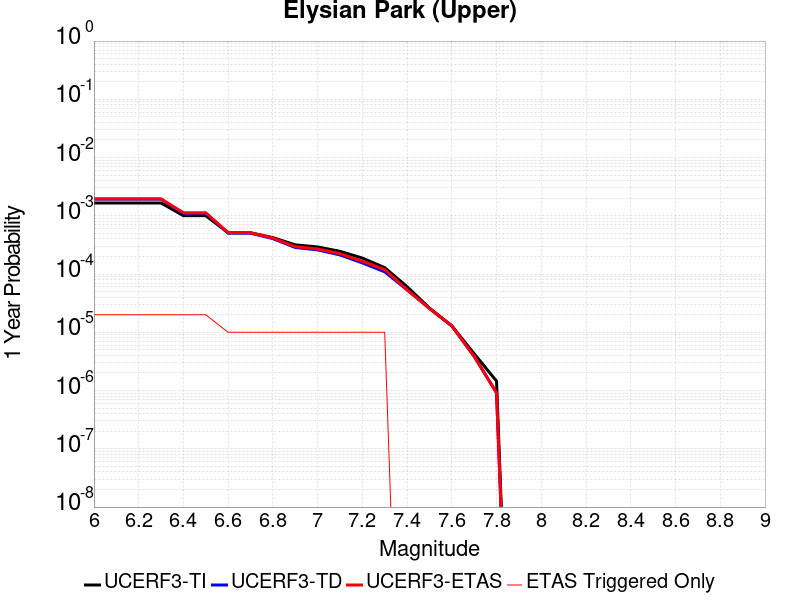 |  |

| Magnitude | 1 wk TI Prob | 1 wk TD Prob | 1 wk ETAS Prob | 1 wk ETAS/TD Gain | 1 wk ETAS Triggered Only | 1 mo TI Prob | 1 mo TD Prob | 1 mo ETAS Prob | 1 mo ETAS/TD Gain | 1 mo ETAS Triggered Only | 1 yr TI Prob | 1 yr TD Prob | 1 yr ETAS Prob | 1 yr ETAS/TD Gain | 1 yr ETAS Triggered Only | 10 yr TI Prob | 10 yr TD Prob | 10 yr ETAS Prob | 10 yr ETAS/TD Gain | 10 yr ETAS Triggered Only |
|-----|-----|-----|-----|-----|-----|-----|-----|-----|-----|-----|-----|-----|-----|-----|-----|-----|-----|-----|-----|-----|
| 6.0 | 3.1876025E-5 | 3.7035275E-5 | 5.7034536E-5 | 1.5400057 | 2.0E-5 | 1.3660437E-4 | 1.5871569E-4 | 1.7871251E-4 | 1.1259915 | 2.0E-5 | 0.0016618895 | 0.001931122 | 0.0019510834 | 1.0103366 | 2.0E-5 | 0.016495159 | 0.019189863 | 0.019268326 | 1.0040889 | 8.0E-5 |
| 6.1 | 3.1876025E-5 | 3.7035275E-5 | 5.7034536E-5 | 1.5400057 | 2.0E-5 | 1.3660437E-4 | 1.5871569E-4 | 1.7871251E-4 | 1.1259915 | 2.0E-5 | 0.0016618895 | 0.001931122 | 0.0019510834 | 1.0103366 | 2.0E-5 | 0.016495159 | 0.019189863 | 0.019268326 | 1.0040889 | 8.0E-5 |
| 6.2 | 3.1876025E-5 | 3.7035275E-5 | 5.7034536E-5 | 1.5400057 | 2.0E-5 | 1.3660437E-4 | 1.5871569E-4 | 1.7871251E-4 | 1.1259915 | 2.0E-5 | 0.0016618895 | 0.001931122 | 0.0019510834 | 1.0103366 | 2.0E-5 | 0.016495159 | 0.019189863 | 0.019268326 | 1.0040889 | 8.0E-5 |
| 6.3 | 3.1876025E-5 | 3.7035275E-5 | 5.7034536E-5 | 1.5400057 | 2.0E-5 | 1.3660437E-4 | 1.5871569E-4 | 1.7871251E-4 | 1.1259915 | 2.0E-5 | 0.0016618895 | 0.001931122 | 0.0019510834 | 1.0103366 | 2.0E-5 | 0.016495159 | 0.019189863 | 0.019268326 | 1.0040889 | 8.0E-5 |
| 6.4 | 1.9273462E-5 | 2.120244E-5 | 4.1202016E-5 | 1.9432676 | 2.0E-5 | 8.259794E-5 | 9.086542E-5 | 1.108636E-4 | 1.2200857 | 2.0E-5 | 0.001005166 | 0.0011058967 | 0.0011258746 | 1.0180649 | 2.0E-5 | 0.010006315 | 0.011020744 | 0.011089972 | 1.0062816 | 7.0E-5 |
| 6.5 | 1.9273462E-5 | 2.120244E-5 | 4.1202016E-5 | 1.9432676 | 2.0E-5 | 8.259794E-5 | 9.086542E-5 | 1.108636E-4 | 1.2200857 | 2.0E-5 | 0.001005166 | 0.0011058967 | 0.0011258746 | 1.0180649 | 2.0E-5 | 0.010006315 | 0.011020744 | 0.011089972 | 1.0062816 | 7.0E-5 |
| 6.6 | 9.813258E-6 | 9.665589E-6 | 1.9665491E-5 | 2.034588 | 1.0E-5 | 4.205614E-5 | 4.1423333E-5 | 5.1422918E-5 | 1.2413999 | 1.0E-5 | 5.119132E-4 | 5.042196E-4 | 5.1421457E-4 | 1.0198226 | 1.0E-5 | 0.005107356 | 0.0050314795 | 0.0050613284 | 1.0059325 | 3.0E-5 |
| 6.7 | 9.801478E-6 | 9.653158E-6 | 1.9653062E-5 | 2.0359204 | 1.0E-5 | 4.2005657E-5 | 4.137006E-5 | 5.1369647E-5 | 1.2417107 | 1.0E-5 | 5.112989E-4 | 5.0357135E-4 | 5.135663E-4 | 1.0198481 | 1.0E-5 | 0.0051012407 | 0.005025026 | 0.0050548753 | 1.0059401 | 3.0E-5 |
| 6.8 | 8.102489E-6 | 7.772994E-6 | 1.7772916E-5 | 2.2864957 | 1.0E-5 | 3.4724493E-5 | 3.3312434E-5 | 4.3312102E-5 | 1.3001782 | 1.0E-5 | 4.2268867E-4 | 4.0550836E-4 | 4.1550433E-4 | 1.0246505 | 1.0E-5 | 0.004218856 | 0.0040481784 | 0.0040780567 | 1.0073807 | 3.0E-5 |
| 6.9 | 6.08275E-6 | 5.481441E-6 | 1.5481386E-5 | 2.8243277 | 1.0E-5 | 2.6068668E-5 | 2.3491682E-5 | 3.3491448E-5 | 1.4256725 | 1.0E-5 | 3.173398E-4 | 2.8597447E-4 | 2.959716E-4 | 1.0349581 | 1.0E-5 | 0.0031688702 | 0.0028561424 | 0.0028661138 | 1.0034913 | 1.0E-5 |
| 7.0 | 5.5995934E-6 | 4.9827686E-6 | 1.4982719E-5 | 3.0069063 | 1.0E-5 | 2.3998036E-5 | 2.1354552E-5 | 3.135434E-5 | 1.4682742 | 1.0E-5 | 2.9213692E-4 | 2.5996132E-4 | 2.6995872E-4 | 1.0384573 | 1.0E-5 | 0.0029175316 | 0.0025966396 | 0.0026066136 | 1.0038412 | 1.0E-5 |
| 7.1 | 4.709881E-6 | 4.0873906E-6 | 1.408735E-5 | 3.4465387 | 1.0E-5 | 2.0185047E-5 | 1.7517272E-5 | 2.7517097E-5 | 1.5708551 | 1.0E-5 | 2.4572524E-4 | 2.1325232E-4 | 2.232502E-4 | 1.0468827 | 1.0E-5 | 0.002454537 | 0.0021305184 | 0.002140497 | 1.0046837 | 1.0E-5 |
| 7.2 | 3.6063436E-6 | 2.9779412E-6 | 1.2977912E-5 | 4.3580146 | 1.0E-5 | 1.5455667E-5 | 1.27625435E-5 | 2.2762415E-5 | 1.7835329 | 1.0E-5 | 1.881565E-4 | 1.55373E-4 | 1.6537144E-4 | 1.0643512 | 1.0E-5 | 0.0018799726 | 0.0015526549 | 0.0015626394 | 1.0064306 | 1.0E-5 |
| 7.3 | 2.471135E-6 | 2.0954562E-6 | 1.20954355E-5 | 5.77222 | 1.0E-5 | 1.0590536E-5 | 8.980496E-6 | 1.8980407E-5 | 2.1135142 | 1.0E-5 | 1.2893214E-4 | 1.0933213E-4 | 1.1933104E-4 | 1.0914544 | 1.0E-5 | 0.0012885736 | 0.0010927906 | 0.0011027798 | 1.0091408 | 1.0E-5 |
| 7.4 | 1.163943E-6 | 1.0275061E-6 | 1.0275061E-6 | 1.0 | 0.0 | 4.988318E-6 | 4.40359E-6 | 4.40359E-6 | 1.0 | 0.0 | 6.0731076E-5 | 5.361242E-5 | 5.361242E-5 | 1.0 | 0.0 | 6.071448E-4 | 5.3599785E-4 | 5.3599785E-4 | 1.0 | 0.0 |
| 7.5 | 4.99459E-7 | 4.917601E-7 | 4.917601E-7 | 1.0 | 0.0 | 2.140537E-6 | 2.1075416E-6 | 2.1075416E-6 | 1.0 | 0.0 | 2.6060725E-5 | 2.5659032E-5 | 2.5659032E-5 | 1.0 | 0.0 | 2.605767E-4 | 2.5656226E-4 | 2.5656226E-4 | 1.0 | 0.0 |
| 7.6 | 2.4667852E-7 | 2.4778313E-7 | 2.4778313E-7 | 1.0 | 0.0 | 1.0571932E-6 | 1.0619274E-6 | 1.0619274E-6 | 1.0 | 0.0 | 1.2871251E-5 | 1.2928893E-5 | 1.2928893E-5 | 1.0 | 0.0 | 1.2870505E-4 | 1.2928178E-4 | 1.2928178E-4 | 1.0 | 0.0 |
| 7.7 | 8.2312795E-8 | 7.3864214E-8 | 7.3864214E-8 | 1.0 | 0.0 | 3.527691E-7 | 3.165609E-7 | 3.165609E-7 | 1.0 | 0.0 | 4.294955E-6 | 3.854123E-6 | 3.854123E-6 | 1.0 | 0.0 | 4.2948723E-5 | 3.854068E-5 | 3.854068E-5 | 1.0 | 0.0 |
| 7.8 | 2.7819295E-8 | 1.7565618E-8 | 1.7565618E-8 | 1.0 | 0.0 | 1.1922555E-7 | 7.528122E-8 | 7.528122E-8 | 1.0 | 0.0 | 1.45157E-6 | 9.1654863E-7 | 9.1654863E-7 | 1.0 | 0.0 | 1.45156055E-5 | 9.165463E-6 | 9.165463E-6 | 1.0 | 0.0 |

## Santa Cruz Island
*[(top)](#table-of-contents)*

| 1 Week | 1 Month | 1 Year | 10 Year |
|-----|-----|-----|-----|
|  | 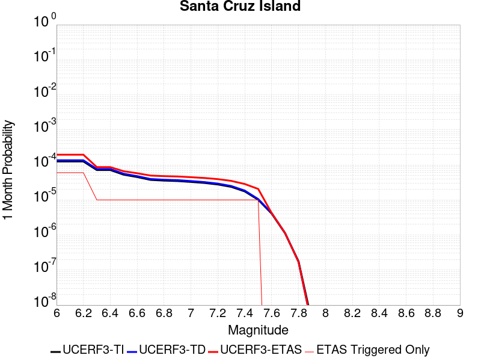 |  |  |

| Magnitude | 1 wk TI Prob | 1 wk TD Prob | 1 wk ETAS Prob | 1 wk ETAS/TD Gain | 1 wk ETAS Triggered Only | 1 mo TI Prob | 1 mo TD Prob | 1 mo ETAS Prob | 1 mo ETAS/TD Gain | 1 mo ETAS Triggered Only | 1 yr TI Prob | 1 yr TD Prob | 1 yr ETAS Prob | 1 yr ETAS/TD Gain | 1 yr ETAS Triggered Only | 10 yr TI Prob | 10 yr TD Prob | 10 yr ETAS Prob | 10 yr ETAS/TD Gain | 10 yr ETAS Triggered Only |
|-----|-----|-----|-----|-----|-----|-----|-----|-----|-----|-----|-----|-----|-----|-----|-----|-----|-----|-----|-----|-----|
| 6.0 | 2.9164563E-5 | 3.1599742E-5 | 9.1597845E-5 | 2.8986895 | 6.0E-5 | 1.2498499E-4 | 1.3542121E-4 | 1.9541309E-4 | 1.4430021 | 6.0E-5 | 0.0015206301 | 0.0016476426 | 0.0017075437 | 1.0363556 | 6.0E-5 | 0.015102667 | 0.016368 | 0.016456526 | 1.0054085 | 9.0E-5 |
| 6.1 | 2.9164563E-5 | 3.1599742E-5 | 9.1597845E-5 | 2.8986895 | 6.0E-5 | 1.2498499E-4 | 1.3542121E-4 | 1.9541309E-4 | 1.4430021 | 6.0E-5 | 0.0015206301 | 0.0016476426 | 0.0017075437 | 1.0363556 | 6.0E-5 | 0.015102667 | 0.016368 | 0.016456526 | 1.0054085 | 9.0E-5 |
| 6.2 | 2.9164563E-5 | 3.1599742E-5 | 9.1597845E-5 | 2.8986895 | 6.0E-5 | 1.2498499E-4 | 1.3542121E-4 | 1.9541309E-4 | 1.4430021 | 6.0E-5 | 0.0015206301 | 0.0016476426 | 0.0017075437 | 1.0363556 | 6.0E-5 | 0.015102667 | 0.016368 | 0.016456526 | 1.0054085 | 9.0E-5 |
| 6.3 | 1.6635553E-5 | 1.780436E-5 | 2.780418E-5 | 1.5616502 | 1.0E-5 | 7.1293274E-5 | 7.630227E-5 | 8.63015E-5 | 1.1310477 | 1.0E-5 | 8.6765E-4 | 9.286024E-4 | 9.385931E-4 | 1.0107589 | 1.0E-5 | 0.008642701 | 0.009249094 | 0.009278816 | 1.0032135 | 3.0E-5 |
| 6.4 | 1.6635553E-5 | 1.780436E-5 | 2.780418E-5 | 1.5616502 | 1.0E-5 | 7.1293274E-5 | 7.630227E-5 | 8.63015E-5 | 1.1310477 | 1.0E-5 | 8.6765E-4 | 9.286024E-4 | 9.385931E-4 | 1.0107589 | 1.0E-5 | 0.008642701 | 0.009249094 | 0.009278816 | 1.0032135 | 3.0E-5 |
| 6.5 | 1.2238748E-5 | 1.3042996E-5 | 2.3042865E-5 | 1.766685 | 1.0E-5 | 5.2450723E-5 | 5.5897377E-5 | 6.589682E-5 | 1.1788893 | 1.0E-5 | 6.3840044E-4 | 6.8034173E-4 | 6.9033494E-4 | 1.0146885 | 1.0E-5 | 0.0063656955 | 0.006782988 | 0.0068127844 | 1.0043929 | 3.0E-5 |
| 6.6 | 1.0489767E-5 | 1.1156636E-5 | 2.1156524E-5 | 1.8963175 | 1.0E-5 | 4.495537E-5 | 4.781329E-5 | 5.7812813E-5 | 1.2091368 | 1.0E-5 | 5.4719415E-4 | 5.819736E-4 | 5.919677E-4 | 1.0171729 | 1.0E-5 | 0.005458487 | 0.005804736 | 0.00582462 | 1.0034255 | 2.0E-5 |
| 6.7 | 8.699222E-6 | 9.236783E-6 | 1.923669E-5 | 2.082618 | 1.0E-5 | 3.7281847E-5 | 3.958561E-5 | 4.958522E-5 | 1.252607 | 1.0E-5 | 4.5381195E-4 | 4.818488E-4 | 4.9184397E-4 | 1.0207434 | 1.0E-5 | 0.0045288634 | 0.004808108 | 0.004828012 | 1.0041397 | 2.0E-5 |
| 6.8 | 8.307732E-6 | 8.8169045E-6 | 1.8816816E-5 | 2.1341748 | 1.0E-5 | 3.560408E-5 | 3.7786187E-5 | 4.7785812E-5 | 1.264637 | 1.0E-5 | 4.3339343E-4 | 4.5995016E-4 | 4.6994555E-4 | 1.0217315 | 1.0E-5 | 0.004325492 | 0.0045900354 | 0.004609944 | 1.0043373 | 2.0E-5 |
| 6.9 | 8.073121E-6 | 8.564939E-6 | 1.8564853E-5 | 2.1675406 | 1.0E-5 | 3.459863E-5 | 3.670637E-5 | 4.6706E-5 | 1.2724223 | 1.0E-5 | 4.2115687E-4 | 4.4680882E-4 | 4.5680435E-4 | 1.0223709 | 1.0E-5 | 0.004203596 | 0.004459156 | 0.004479067 | 1.0044651 | 2.0E-5 |
| 7.0 | 7.617019E-6 | 8.074665E-6 | 1.8074585E-5 | 2.2384315 | 1.0E-5 | 3.264396E-5 | 3.4605247E-5 | 4.46049E-5 | 1.2889636 | 1.0E-5 | 3.9736772E-4 | 4.2123784E-4 | 4.3123364E-4 | 1.0237296 | 1.0E-5 | 0.003966579 | 0.0042044413 | 0.004224357 | 1.0047369 | 2.0E-5 |
| 7.1 | 7.1224836E-6 | 7.5457883E-6 | 1.7545713E-5 | 2.3252325 | 1.0E-5 | 3.052457E-5 | 3.2338692E-5 | 4.2338368E-5 | 1.3092171 | 1.0E-5 | 3.715733E-4 | 3.9365282E-4 | 4.0364888E-4 | 1.0253931 | 1.0E-5 | 0.003709526 | 0.0039295983 | 0.0039395588 | 1.0025347 | 1.0E-5 |
| 7.2 | 6.441115E-6 | 6.8273835E-6 | 1.6827315E-5 | 2.46468 | 1.0E-5 | 2.7604487E-5 | 2.9259889E-5 | 3.9259598E-5 | 1.3417548 | 1.0E-5 | 3.360328E-4 | 3.5618115E-4 | 3.6617758E-4 | 1.0280656 | 1.0E-5 | 0.0033552512 | 0.0035561312 | 0.0035660956 | 1.002802 | 1.0E-5 |
| 7.3 | 5.494274E-6 | 5.8199944E-6 | 1.5819936E-5 | 2.7182047 | 1.0E-5 | 2.3546674E-5 | 2.4942596E-5 | 3.4942346E-5 | 1.4009106 | 1.0E-5 | 2.8664304E-4 | 3.03634E-4 | 3.1363097E-4 | 1.0329244 | 1.0E-5 | 0.002862736 | 0.0030322145 | 0.0030421843 | 1.0032879 | 1.0E-5 |
| 7.4 | 4.0802624E-6 | 4.3122564E-6 | 1.4312213E-5 | 3.3189616 | 1.0E-5 | 1.7486722E-5 | 1.8480969E-5 | 2.8480783E-5 | 1.5410872 | 1.0E-5 | 2.1288003E-4 | 2.2498264E-4 | 2.3498038E-4 | 1.0444379 | 1.0E-5 | 0.0021267622 | 0.0022475577 | 0.0022575352 | 1.0044392 | 1.0E-5 |
| 7.5 | 2.3584746E-6 | 2.4753099E-6 | 1.2475285E-5 | 5.0398884 | 1.0E-5 | 1.0107709E-5 | 1.0608428E-5 | 2.0608322E-5 | 1.9426367 | 1.0E-5 | 1.2305441E-4 | 1.2915001E-4 | 1.3914872E-4 | 1.0774194 | 1.0E-5 | 0.0012298629 | 0.0012907545 | 0.0013007416 | 1.0077374 | 1.0E-5 |
| 7.6 | 9.4981914E-7 | 9.860934E-7 | 9.860934E-7 | 1.0 | 0.0 | 4.0706473E-6 | 4.2261076E-6 | 4.2261076E-6 | 1.0 | 0.0 | 4.9559E-5 | 5.1451658E-5 | 5.1451658E-5 | 1.0 | 0.0 | 4.954795E-4 | 5.1439874E-4 | 5.1439874E-4 | 1.0 | 0.0 |
| 7.7 | 2.6013532E-7 | 2.6416632E-7 | 2.6416632E-7 | 1.0 | 0.0 | 1.1148652E-6 | 1.1321408E-6 | 1.1321408E-6 | 1.0 | 0.0 | 1.3573399E-5 | 1.3783729E-5 | 1.3783729E-5 | 1.0 | 0.0 | 1.357257E-4 | 1.378288E-4 | 1.378288E-4 | 1.0 | 0.0 |
| 7.8 | 4.1522263E-8 | 3.965698E-8 | 3.965698E-8 | 1.0 | 0.0 | 1.7795254E-7 | 1.6995848E-7 | 1.6995848E-7 | 1.0 | 0.0 | 2.16657E-6 | 2.0692428E-6 | 2.0692428E-6 | 1.0 | 0.0 | 2.1665488E-5 | 2.0692256E-5 | 2.0692256E-5 | 1.0 | 0.0 |
| 7.9 | 7.7242046E-10 | 5.9475225E-10 | 5.9475225E-10 | 1.0 | 0.0 | 3.3103735E-9 | 2.5489382E-9 | 2.5489382E-9 | 1.0 | 0.0 | 4.0303796E-8 | 3.1033323E-8 | 3.1033323E-8 | 1.0 | 0.0 | 4.030379E-7 | 3.103332E-7 | 3.103332E-7 | 1.0 | 0.0 |

## San Pedro Basin
*[(top)](#table-of-contents)*

| 1 Week | 1 Month | 1 Year | 10 Year |
|-----|-----|-----|-----|
|  |  |  |  |

| Magnitude | 1 wk TI Prob | 1 wk TD Prob | 1 wk ETAS Prob | 1 wk ETAS/TD Gain | 1 wk ETAS Triggered Only | 1 mo TI Prob | 1 mo TD Prob | 1 mo ETAS Prob | 1 mo ETAS/TD Gain | 1 mo ETAS Triggered Only | 1 yr TI Prob | 1 yr TD Prob | 1 yr ETAS Prob | 1 yr ETAS/TD Gain | 1 yr ETAS Triggered Only | 10 yr TI Prob | 10 yr TD Prob | 10 yr ETAS Prob | 10 yr ETAS/TD Gain | 10 yr ETAS Triggered Only |
|-----|-----|-----|-----|-----|-----|-----|-----|-----|-----|-----|-----|-----|-----|-----|-----|-----|-----|-----|-----|-----|
| 6.0 | 5.3449043E-5 | 6.337018E-5 | 9.336828E-5 | 1.4733788 | 3.0E-5 | 2.2904722E-4 | 2.7156167E-4 | 3.215481E-4 | 1.1840702 | 5.0E-5 | 0.0027850836 | 0.0033018515 | 0.0033815873 | 1.0241488 | 8.0E-5 | 0.027504366 | 0.03258948 | 0.032686222 | 1.0029684 | 1.0E-4 |
| 6.1 | 5.3449043E-5 | 6.337018E-5 | 9.336828E-5 | 1.4733788 | 3.0E-5 | 2.2904722E-4 | 2.7156167E-4 | 3.215481E-4 | 1.1840702 | 5.0E-5 | 0.0027850836 | 0.0033018515 | 0.0033815873 | 1.0241488 | 8.0E-5 | 0.027504366 | 0.03258948 | 0.032686222 | 1.0029684 | 1.0E-4 |
| 6.2 | 2.3189454E-5 | 2.6642829E-5 | 3.6642563E-5 | 1.3753256 | 1.0E-5 | 9.9379584E-5 | 1.1417881E-4 | 1.3417653E-4 | 1.1751438 | 2.0E-5 | 0.0012092749 | 0.0013892875 | 0.001429232 | 1.0287517 | 4.0E-5 | 0.012027155 | 0.01381089 | 0.0138602 | 1.0035703 | 5.0E-5 |
| 6.3 | 2.3189454E-5 | 2.6642829E-5 | 3.6642563E-5 | 1.3753256 | 1.0E-5 | 9.9379584E-5 | 1.1417881E-4 | 1.3417653E-4 | 1.1751438 | 2.0E-5 | 0.0012092749 | 0.0013892875 | 0.001429232 | 1.0287517 | 4.0E-5 | 0.012027155 | 0.01381089 | 0.0138602 | 1.0035703 | 5.0E-5 |
| 6.4 | 1.966056E-5 | 2.246342E-5 | 3.2463195E-5 | 1.4451581 | 1.0E-5 | 8.425682E-5 | 9.626848E-5 | 1.1626655E-4 | 1.2077323 | 2.0E-5 | 0.001025344 | 0.0011714787 | 0.0012114318 | 1.0341048 | 4.0E-5 | 0.010206259 | 0.011657119 | 0.0116966525 | 1.0033914 | 4.0E-5 |
| 6.5 | 1.7342953E-5 | 1.9745152E-5 | 2.9744955E-5 | 1.5064434 | 1.0E-5 | 7.4324824E-5 | 8.461954E-5 | 1.0461785E-4 | 1.236332 | 2.0E-5 | 9.04529E-4 | 0.0010297929 | 0.0010697518 | 1.0388027 | 4.0E-5 | 0.009008561 | 0.010253932 | 0.010293523 | 1.003861 | 4.0E-5 |
| 6.6 | 1.439804E-5 | 1.6322716E-5 | 2.6322554E-5 | 1.6126331 | 1.0E-5 | 6.170443E-5 | 6.99528E-5 | 7.995211E-5 | 1.1429435 | 1.0E-5 | 7.509924E-4 | 8.513747E-4 | 8.713577E-4 | 1.0234715 | 2.0E-5 | 0.0074845953 | 0.008484333 | 0.0085041635 | 1.0023373 | 2.0E-5 |
| 6.7 | 1.2634884E-5 | 1.4285298E-5 | 2.4285155E-5 | 1.7000104 | 1.0E-5 | 5.414838E-5 | 6.122144E-5 | 7.122083E-5 | 1.1633315 | 1.0E-5 | 6.590571E-4 | 7.451466E-4 | 7.651317E-4 | 1.0268203 | 2.0E-5 | 0.006571059 | 0.007429502 | 0.007449353 | 1.002672 | 2.0E-5 |
| 6.8 | 1.146091E-5 | 1.2933193E-5 | 2.2933064E-5 | 1.7731943 | 1.0E-5 | 4.911726E-5 | 5.542696E-5 | 6.542641E-5 | 1.1804076 | 1.0E-5 | 5.9783855E-4 | 6.74644E-4 | 6.9463055E-4 | 1.0296253 | 2.0E-5 | 0.0059623276 | 0.0067288997 | 0.0067487652 | 1.0029522 | 2.0E-5 |
| 6.9 | 9.109035E-6 | 1.0235013E-5 | 2.0234911E-5 | 1.9770284 | 1.0E-5 | 3.9038136E-5 | 4.386376E-5 | 5.386332E-5 | 1.2279686 | 1.0E-5 | 4.7518566E-4 | 5.339384E-4 | 5.5392773E-4 | 1.0374376 | 2.0E-5 | 0.0047417083 | 0.0053293095 | 0.005349203 | 1.0037328 | 2.0E-5 |
| 7.0 | 5.9351028E-6 | 6.583965E-6 | 6.583965E-6 | 1.0 | 0.0 | 2.5435906E-5 | 2.821682E-5 | 2.821682E-5 | 1.0 | 0.0 | 3.0963816E-4 | 3.4350925E-4 | 3.4350925E-4 | 1.0 | 0.0 | 0.0030920706 | 0.0034320997 | 0.0034320997 | 1.0 | 0.0 |
| 7.1 | 2.1557585E-6 | 2.2096492E-6 | 2.2096492E-6 | 1.0 | 0.0 | 9.238933E-6 | 9.469892E-6 | 9.469892E-6 | 1.0 | 0.0 | 1.1247819E-4 | 1.15289986E-4 | 1.15289986E-4 | 1.0 | 0.0 | 0.0011242128 | 0.0011523172 | 0.0011523172 | 1.0 | 0.0 |
| 7.2 | 2.1251979E-6 | 2.1779954E-6 | 2.1779954E-6 | 1.0 | 0.0 | 9.107958E-6 | 9.334234E-6 | 9.334234E-6 | 1.0 | 0.0 | 1.1088375E-4 | 1.13638525E-4 | 1.13638525E-4 | 1.0 | 0.0 | 0.0011082845 | 0.0011358195 | 0.0011358195 | 1.0 | 0.0 |
| 7.3 | 1.7145798E-6 | 1.7442885E-6 | 1.7442885E-6 | 1.0 | 0.0 | 7.3481783E-6 | 7.475501E-6 | 7.475501E-6 | 1.0 | 0.0 | 8.94604E-5 | 9.1010515E-5 | 9.1010515E-5 | 1.0 | 0.0 | 8.9424395E-4 | 9.0974156E-4 | 9.0974156E-4 | 1.0 | 0.0 |
| 7.4 | 1.4467993E-6 | 1.4641878E-6 | 1.4641878E-6 | 1.0 | 0.0 | 6.200554E-6 | 6.275076E-6 | 6.275076E-6 | 1.0 | 0.0 | 7.548913E-5 | 7.639644E-5 | 7.639644E-5 | 1.0 | 0.0 | 7.546349E-4 | 7.6370913E-4 | 7.6370913E-4 | 1.0 | 0.0 |
| 7.5 | 1.2803735E-6 | 1.2931506E-6 | 1.2931506E-6 | 1.0 | 0.0 | 5.487303E-6 | 5.5420624E-6 | 5.5420624E-6 | 1.0 | 0.0 | 6.680587E-5 | 6.747259E-5 | 6.747259E-5 | 1.0 | 0.0 | 6.678579E-4 | 6.745281E-4 | 6.745281E-4 | 1.0 | 0.0 |
| 7.6 | 6.755009E-7 | 6.76947E-7 | 6.76947E-7 | 1.0 | 0.0 | 2.8950008E-6 | 2.9011985E-6 | 2.9011985E-6 | 1.0 | 0.0 | 3.5246063E-5 | 3.532158E-5 | 3.532158E-5 | 1.0 | 0.0 | 3.5240475E-4 | 3.5316538E-4 | 3.5316538E-4 | 1.0 | 0.0 |
| 7.7 | 6.211885E-8 | 4.5699714E-8 | 4.5699714E-8 | 1.0 | 0.0 | 2.6622362E-7 | 1.9585592E-7 | 1.9585592E-7 | 1.0 | 0.0 | 3.2412677E-6 | 2.3845432E-6 | 2.3845432E-6 | 1.0 | 0.0 | 3.2412205E-5 | 2.3845198E-5 | 2.3845198E-5 | 1.0 | 0.0 |
| 7.8 | 2.6580573E-9 | 1.5138054E-9 | 1.5138054E-9 | 1.0 | 0.0 | 1.1391674E-8 | 6.4877375E-9 | 6.4877375E-9 | 1.0 | 0.0 | 1.3869362E-7 | 7.89882E-8 | 7.89882E-8 | 1.0 | 0.0 | 1.3869354E-6 | 7.89882E-7 | 7.89882E-7 | 1.0 | 0.0 |

## Kern Canyon (South Kern) 2011
*[(top)](#table-of-contents)*

| 1 Week | 1 Month | 1 Year | 10 Year |
|-----|-----|-----|-----|
|  |  |  | 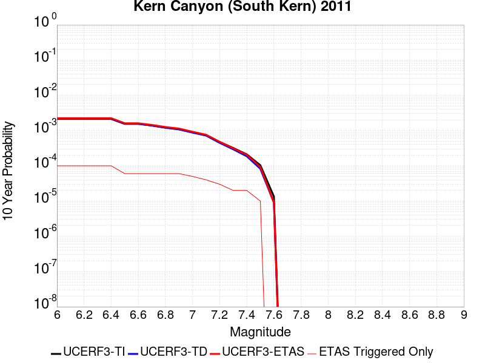 |

| Magnitude | 1 wk TI Prob | 1 wk TD Prob | 1 wk ETAS Prob | 1 wk ETAS/TD Gain | 1 wk ETAS Triggered Only | 1 mo TI Prob | 1 mo TD Prob | 1 mo ETAS Prob | 1 mo ETAS/TD Gain | 1 mo ETAS Triggered Only | 1 yr TI Prob | 1 yr TD Prob | 1 yr ETAS Prob | 1 yr ETAS/TD Gain | 1 yr ETAS Triggered Only | 10 yr TI Prob | 10 yr TD Prob | 10 yr ETAS Prob | 10 yr ETAS/TD Gain | 10 yr ETAS Triggered Only |
|-----|-----|-----|-----|-----|-----|-----|-----|-----|-----|-----|-----|-----|-----|-----|-----|-----|-----|-----|-----|-----|
| 6.0 | 4.105075E-6 | 4.113726E-6 | 4.113726E-6 | 1.0 | 0.0 | 1.7593058E-5 | 1.7630138E-5 | 3.7629787E-5 | 2.134401 | 2.0E-5 | 2.1417443E-4 | 2.1462643E-4 | 2.9460926E-4 | 1.3726606 | 8.0E-5 | 0.0021396813 | 0.0021442554 | 0.0022440408 | 1.0465362 | 1.0E-4 |
| 6.1 | 4.105075E-6 | 4.113726E-6 | 4.113726E-6 | 1.0 | 0.0 | 1.7593058E-5 | 1.7630138E-5 | 3.7629787E-5 | 2.134401 | 2.0E-5 | 2.1417443E-4 | 2.1462643E-4 | 2.9460926E-4 | 1.3726606 | 8.0E-5 | 0.0021396813 | 0.0021442554 | 0.0022440408 | 1.0465362 | 1.0E-4 |
| 6.2 | 4.105075E-6 | 4.113726E-6 | 4.113726E-6 | 1.0 | 0.0 | 1.7593058E-5 | 1.7630138E-5 | 3.7629787E-5 | 2.134401 | 2.0E-5 | 2.1417443E-4 | 2.1462643E-4 | 2.9460926E-4 | 1.3726606 | 8.0E-5 | 0.0021396813 | 0.0021442554 | 0.0022440408 | 1.0465362 | 1.0E-4 |
| 6.3 | 4.105075E-6 | 4.113726E-6 | 4.113726E-6 | 1.0 | 0.0 | 1.7593058E-5 | 1.7630138E-5 | 3.7629787E-5 | 2.134401 | 2.0E-5 | 2.1417443E-4 | 2.1462643E-4 | 2.9460926E-4 | 1.3726606 | 8.0E-5 | 0.0021396813 | 0.0021442554 | 0.0022440408 | 1.0465362 | 1.0E-4 |
| 6.4 | 4.105075E-6 | 4.113726E-6 | 4.113726E-6 | 1.0 | 0.0 | 1.7593058E-5 | 1.7630138E-5 | 3.7629787E-5 | 2.134401 | 2.0E-5 | 2.1417443E-4 | 2.1462643E-4 | 2.9460926E-4 | 1.3726606 | 8.0E-5 | 0.0021396813 | 0.0021442554 | 0.0022440408 | 1.0465362 | 1.0E-4 |
| 6.5 | 2.9849807E-6 | 2.973154E-6 | 2.973154E-6 | 1.0 | 0.0 | 1.2792712E-5 | 1.2742028E-5 | 1.2742028E-5 | 1.0 | 0.0 | 1.5574014E-4 | 1.551233E-4 | 2.1511399E-4 | 1.3867291 | 6.0E-5 | 0.0015563103 | 0.0015501654 | 0.0016100723 | 1.0386455 | 6.0E-5 |
| 6.6 | 2.9849807E-6 | 2.973154E-6 | 2.973154E-6 | 1.0 | 0.0 | 1.2792712E-5 | 1.2742028E-5 | 1.2742028E-5 | 1.0 | 0.0 | 1.5574014E-4 | 1.551233E-4 | 2.1511399E-4 | 1.3867291 | 6.0E-5 | 0.0015563103 | 0.0015501654 | 0.0016100723 | 1.0386455 | 6.0E-5 |
| 6.7 | 2.6756725E-6 | 2.6582202E-6 | 2.6582202E-6 | 1.0 | 0.0 | 1.1467117E-5 | 1.1392323E-5 | 1.1392323E-5 | 1.0 | 0.0 | 1.396032E-4 | 1.386928E-4 | 1.9868449E-4 | 1.4325508 | 6.0E-5 | 0.0013951553 | 0.0013860734 | 0.0014459903 | 1.0432278 | 6.0E-5 |
| 6.8 | 2.3283721E-6 | 2.3047783E-6 | 2.3047783E-6 | 1.0 | 0.0 | 9.9787E-6 | 9.877584E-6 | 9.877584E-6 | 1.0 | 0.0 | 1.214839E-4 | 1.2025302E-4 | 1.8024581E-4 | 1.498888 | 6.0E-5 | 0.001214175 | 0.001201887 | 0.0012618148 | 1.0498616 | 6.0E-5 |
| 6.9 | 2.0972677E-6 | 2.0696405E-6 | 2.0696405E-6 | 1.0 | 0.0 | 8.988259E-6 | 8.869858E-6 | 8.869858E-6 | 1.0 | 0.0 | 1.0942656E-4 | 1.0798523E-4 | 1.6797875E-4 | 1.5555716 | 6.0E-5 | 0.0010937268 | 0.0010793334 | 0.0011392686 | 1.0555298 | 6.0E-5 |
| 7.0 | 1.7132242E-6 | 1.6787029E-6 | 1.6787029E-6 | 1.0 | 0.0 | 7.3423685E-6 | 7.1944214E-6 | 7.1944214E-6 | 1.0 | 0.0 | 8.938967E-5 | 8.75886E-5 | 1.3758423E-4 | 1.5708005 | 5.0E-5 | 8.935372E-4 | 8.755446E-4 | 9.255009E-4 | 1.0570573 | 5.0E-5 |
| 7.1 | 1.4215541E-6 | 1.3815746E-6 | 1.3815746E-6 | 1.0 | 0.0 | 6.0923603E-6 | 5.9210206E-6 | 5.9210206E-6 | 1.0 | 0.0 | 7.417196E-5 | 7.208607E-5 | 1.1208319E-4 | 1.5548522 | 4.0E-5 | 7.414721E-4 | 7.206296E-4 | 7.606007E-4 | 1.055467 | 4.0E-5 |
| 7.2 | 9.097853E-7 | 8.60377E-7 | 8.60377E-7 | 1.0 | 0.0 | 3.899074E-6 | 3.6873246E-6 | 3.6873246E-6 | 1.0 | 0.0 | 4.7470192E-5 | 4.4892266E-5 | 7.4890915E-5 | 1.6682366 | 3.0E-5 | 4.7460053E-4 | 4.4883305E-4 | 4.7881957E-4 | 1.06681 | 3.0E-5 |
| 7.3 | 6.144169E-7 | 5.628199E-7 | 5.628199E-7 | 1.0 | 0.0 | 2.6332125E-6 | 2.4120832E-6 | 2.4120832E-6 | 1.0 | 0.0 | 3.205889E-5 | 2.9366722E-5 | 4.9366132E-5 | 1.681023 | 2.0E-5 | 3.2054266E-4 | 2.9362892E-4 | 3.1362305E-4 | 1.0680932 | 2.0E-5 |
| 7.4 | 4.049844E-7 | 3.5728252E-7 | 3.5728252E-7 | 1.0 | 0.0 | 1.7356463E-6 | 1.5312098E-6 | 1.5312098E-6 | 1.0 | 0.0 | 2.1131287E-5 | 1.8642324E-5 | 3.864195E-5 | 2.0728076 | 2.0E-5 | 2.1129279E-4 | 1.8640784E-4 | 2.0640412E-4 | 1.1072717 | 2.0E-5 |
| 7.5 | 1.9871162E-7 | 1.5830383E-7 | 1.5830383E-7 | 1.0 | 0.0 | 8.5162094E-7 | 6.784448E-7 | 6.784448E-7 | 1.0 | 0.0 | 1.0368436E-5 | 8.260035E-6 | 1.8259952E-5 | 2.2106385 | 1.0E-5 | 1.0367952E-4 | 8.259736E-5 | 9.2596536E-5 | 1.1210592 | 1.0E-5 |
| 7.6 | 2.572245E-8 | 1.735264E-8 | 1.735264E-8 | 1.0 | 0.0 | 1.10239064E-7 | 7.436845E-8 | 7.436845E-8 | 1.0 | 0.0 | 1.3421597E-6 | 9.0543557E-7 | 9.0543557E-7 | 1.0 | 0.0 | 1.3421517E-5 | 9.054324E-6 | 9.054324E-6 | 1.0 | 0.0 |

## San Jacinto (Coyote Creek)
*[(top)](#table-of-contents)*

| 1 Week | 1 Month | 1 Year | 10 Year |
|-----|-----|-----|-----|
|  |  |  |  |

| Magnitude | 1 wk TI Prob | 1 wk TD Prob | 1 wk ETAS Prob | 1 wk ETAS/TD Gain | 1 wk ETAS Triggered Only | 1 mo TI Prob | 1 mo TD Prob | 1 mo ETAS Prob | 1 mo ETAS/TD Gain | 1 mo ETAS Triggered Only | 1 yr TI Prob | 1 yr TD Prob | 1 yr ETAS Prob | 1 yr ETAS/TD Gain | 1 yr ETAS Triggered Only | 10 yr TI Prob | 10 yr TD Prob | 10 yr ETAS Prob | 10 yr ETAS/TD Gain | 10 yr ETAS Triggered Only |
|-----|-----|-----|-----|-----|-----|-----|-----|-----|-----|-----|-----|-----|-----|-----|-----|-----|-----|-----|-----|-----|
| 6.0 | 2.7374346E-5 | 2.41444E-5 | 8.414295E-5 | 3.4849885 | 6.0E-5 | 1.1731335E-4 | 1.034719E-4 | 1.7346466E-4 | 1.6764421 | 7.0E-5 | 0.0014273542 | 0.001259045 | 0.0013389443 | 1.0634602 | 8.0E-5 | 0.01418221 | 0.012928195 | 0.013026902 | 1.007635 | 1.0E-4 |
| 6.1 | 2.7374346E-5 | 2.41444E-5 | 8.414295E-5 | 3.4849885 | 6.0E-5 | 1.1731335E-4 | 1.034719E-4 | 1.7346466E-4 | 1.6764421 | 7.0E-5 | 0.0014273542 | 0.001259045 | 0.0013389443 | 1.0634602 | 8.0E-5 | 0.01418221 | 0.012928195 | 0.013026902 | 1.007635 | 1.0E-4 |
| 6.2 | 2.7374346E-5 | 2.41444E-5 | 8.414295E-5 | 3.4849885 | 6.0E-5 | 1.1731335E-4 | 1.034719E-4 | 1.7346466E-4 | 1.6764421 | 7.0E-5 | 0.0014273542 | 0.001259045 | 0.0013389443 | 1.0634602 | 8.0E-5 | 0.01418221 | 0.012928195 | 0.013026902 | 1.007635 | 1.0E-4 |
| 6.3 | 2.7374346E-5 | 2.41444E-5 | 8.414295E-5 | 3.4849885 | 6.0E-5 | 1.1731335E-4 | 1.034719E-4 | 1.7346466E-4 | 1.6764421 | 7.0E-5 | 0.0014273542 | 0.001259045 | 0.0013389443 | 1.0634602 | 8.0E-5 | 0.01418221 | 0.012928195 | 0.013026902 | 1.007635 | 1.0E-4 |
| 6.4 | 2.7374346E-5 | 2.41444E-5 | 8.414295E-5 | 3.4849885 | 6.0E-5 | 1.1731335E-4 | 1.034719E-4 | 1.7346466E-4 | 1.6764421 | 7.0E-5 | 0.0014273542 | 0.001259045 | 0.0013389443 | 1.0634602 | 8.0E-5 | 0.01418221 | 0.012928195 | 0.013026902 | 1.007635 | 1.0E-4 |
| 6.5 | 2.7282445E-5 | 2.4030476E-5 | 8.402904E-5 | 3.4967694 | 6.0E-5 | 1.16919524E-4 | 1.0298371E-4 | 1.7297649E-4 | 1.6796492 | 7.0E-5 | 0.0014225657 | 0.001253108 | 0.0013330078 | 1.0637612 | 8.0E-5 | 0.014134934 | 0.012869522 | 0.012968236 | 1.0076703 | 1.0E-4 |
| 6.6 | 2.7282445E-5 | 2.4030476E-5 | 8.402904E-5 | 3.4967694 | 6.0E-5 | 1.16919524E-4 | 1.0298371E-4 | 1.7297649E-4 | 1.6796492 | 7.0E-5 | 0.0014225657 | 0.001253108 | 0.0013330078 | 1.0637612 | 8.0E-5 | 0.014134934 | 0.012869522 | 0.012968236 | 1.0076703 | 1.0E-4 |
| 6.7 | 2.7216198E-5 | 2.3955597E-5 | 8.395416E-5 | 3.5045738 | 6.0E-5 | 1.1663563E-4 | 1.02662816E-4 | 1.7265564E-4 | 1.6817738 | 7.0E-5 | 0.0014191137 | 0.0012492058 | 0.0013291058 | 1.0639607 | 8.0E-5 | 0.014100855 | 0.012830934 | 0.012929651 | 1.0076936 | 1.0E-4 |
| 6.8 | 2.7078617E-5 | 2.3872815E-5 | 8.387138E-5 | 3.513259 | 6.0E-5 | 1.1604605E-4 | 1.0230807E-4 | 1.723009E-4 | 1.6841381 | 7.0E-5 | 0.001411945 | 0.0012448917 | 0.001324792 | 1.0641826 | 8.0E-5 | 0.014030075 | 0.0127880825 | 0.012886804 | 1.0077198 | 1.0E-4 |
| 6.9 | 2.6982952E-5 | 2.3792329E-5 | 8.37909E-5 | 3.5217612 | 6.0E-5 | 1.15636096E-4 | 1.0196315E-4 | 1.7195602E-4 | 1.6864525 | 7.0E-5 | 0.0014069602 | 0.0012406971 | 0.0013205978 | 1.0643998 | 8.0E-5 | 0.013980856 | 0.012746378 | 0.012845104 | 1.0077454 | 1.0E-4 |
| 7.0 | 2.6449972E-5 | 2.3369357E-5 | 8.336795E-5 | 3.5674047 | 6.0E-5 | 1.1335209E-4 | 1.0015055E-4 | 1.7014354E-4 | 1.6988777 | 7.0E-5 | 0.001379188 | 0.0012186535 | 0.0012985561 | 1.0655662 | 8.0E-5 | 0.0137065975 | 0.012527733 | 0.01262648 | 1.0078822 | 1.0E-4 |
| 7.1 | 2.6257849E-5 | 2.3195396E-5 | 8.3194005E-5 | 3.5866601 | 6.0E-5 | 1.1252879E-4 | 9.940507E-5 | 1.693981E-4 | 1.7041194 | 7.0E-5 | 0.0013691769 | 0.0012095873 | 0.0012894906 | 1.0660583 | 8.0E-5 | 0.013607717 | 0.012437661 | 0.012536417 | 1.00794 | 1.0E-4 |
| 7.2 | 2.5270041E-5 | 2.2390155E-5 | 8.238881E-5 | 3.6796892 | 6.0E-5 | 1.0829568E-4 | 9.5954296E-5 | 1.6594758E-4 | 1.729444 | 7.0E-5 | 0.0013177024 | 0.0011676198 | 0.0012475264 | 1.0684354 | 8.0E-5 | 0.013099162 | 0.0120187905 | 0.012117589 | 1.0082203 | 1.0E-4 |
| 7.3 | 2.339701E-5 | 2.1122027E-5 | 8.112076E-5 | 3.8405764 | 6.0E-5 | 1.0026905E-4 | 9.051985E-5 | 1.605135E-4 | 1.7732412 | 7.0E-5 | 0.001220092 | 0.001101524 | 0.0011814359 | 1.0725466 | 8.0E-5 | 0.012134149 | 0.011357642 | 0.011456506 | 1.0087047 | 1.0E-4 |
| 7.4 | 2.296333E-5 | 2.0852396E-5 | 8.085115E-5 | 3.8773072 | 6.0E-5 | 9.841056E-5 | 8.936436E-5 | 1.593581E-4 | 1.7832401 | 7.0E-5 | 0.0011974899 | 0.0010874701 | 0.001167383 | 1.0734853 | 8.0E-5 | 0.011910575 | 0.011216754 | 0.011315632 | 1.0088153 | 1.0E-4 |
| 7.5 | 2.2188895E-5 | 2.037534E-5 | 8.037412E-5 | 3.944676 | 6.0E-5 | 9.50918E-5 | 8.731998E-5 | 1.5731387E-4 | 1.8015792 | 7.0E-5 | 0.0011571277 | 0.0010626042 | 0.0011425193 | 1.0752068 | 8.0E-5 | 0.011511209 | 0.010966369 | 0.011065273 | 1.0090188 | 1.0E-4 |
| 7.6 | 2.0013189E-5 | 1.8961666E-5 | 7.8960526E-5 | 4.164219 | 6.0E-5 | 8.5767984E-5 | 8.126176E-5 | 1.5125607E-4 | 1.8613437 | 7.0E-5 | 0.001043725 | 9.889146E-4 | 0.0010688355 | 1.0808167 | 8.0E-5 | 0.010388365 | 0.010224371 | 0.010323349 | 1.0096805 | 1.0E-4 |
| 7.7 | 1.7230794E-5 | 1.6743043E-5 | 7.6742035E-5 | 4.583518 | 6.0E-5 | 7.384417E-5 | 7.175393E-5 | 1.4174891E-4 | 1.9754864 | 7.0E-5 | 8.986819E-4 | 8.732547E-4 | 9.531849E-4 | 1.0915313 | 8.0E-5 | 0.008950562 | 0.00906292 | 0.009162014 | 1.010934 | 1.0E-4 |
| 7.8 | 1.4478809E-5 | 1.499039E-5 | 7.498949E-5 | 5.0025043 | 6.0E-5 | 6.205057E-5 | 6.424295E-5 | 1.3423845E-4 | 2.0895438 | 7.0E-5 | 7.552038E-4 | 7.8187784E-4 | 8.618153E-4 | 1.1022378 | 8.0E-5 | 0.0075264242 | 0.008141388 | 0.008240574 | 1.012183 | 1.0E-4 |
| 7.9 | 1.1114467E-5 | 1.1644517E-5 | 7.1643815E-5 | 6.15258 | 6.0E-5 | 4.7632562E-5 | 4.990412E-5 | 1.1990063E-4 | 2.4026198 | 7.0E-5 | 5.797721E-4 | 6.074139E-4 | 6.8736525E-4 | 1.1316259 | 8.0E-5 | 0.0057826187 | 0.0063803545 | 0.006479717 | 1.0155731 | 1.0E-4 |
| 8.0 | 9.327402E-6 | 9.8986575E-6 | 6.9898066E-5 | 7.061368 | 6.0E-5 | 3.9973966E-5 | 4.2422133E-5 | 1.1241916E-4 | 2.650012 | 7.0E-5 | 4.8657437E-4 | 5.163676E-4 | 5.963263E-4 | 1.1548483 | 8.0E-5 | 0.0048551033 | 0.00544994 | 0.005549395 | 1.0182488 | 1.0E-4 |
| 8.1 | 7.0235833E-6 | 6.826985E-6 | 4.6826714E-5 | 6.8590617 | 4.0E-5 | 3.0100724E-5 | 2.9258183E-5 | 7.925672E-5 | 2.7088737 | 5.0E-5 | 3.664147E-4 | 3.5616063E-4 | 4.0614285E-4 | 1.140336 | 5.0E-5 | 0.003658111 | 0.0037874572 | 0.00384723 | 1.0157818 | 6.0E-5 |
| 8.2 | 2.0358202E-6 | 8.9912584E-7 | 8.9912584E-7 | 1.0 | 0.0 | 8.724915E-6 | 3.853391E-6 | 3.853391E-6 | 1.0 | 0.0 | 1.06220665E-4 | 4.6914047E-5 | 4.6914047E-5 | 1.0 | 0.0 | 0.001061699 | 5.3239096E-4 | 5.3239096E-4 | 1.0 | 0.0 |
| 8.3 | 2.0051264E-7 | 6.61379E-8 | 6.61379E-8 | 1.0 | 0.0 | 8.5933965E-7 | 2.8344812E-7 | 2.8344812E-7 | 1.0 | 0.0 | 1.046241E-5 | 3.450976E-6 | 3.450976E-6 | 1.0 | 0.0 | 1.0461917E-4 | 4.0120205E-5 | 4.0120205E-5 | 1.0 | 0.0 |

## Dry Mountain
*[(top)](#table-of-contents)*

| 1 Week | 1 Month | 1 Year | 10 Year |
|-----|-----|-----|-----|
|  |  |  |  |

| Magnitude | 1 wk TI Prob | 1 wk TD Prob | 1 wk ETAS Prob | 1 wk ETAS/TD Gain | 1 wk ETAS Triggered Only | 1 mo TI Prob | 1 mo TD Prob | 1 mo ETAS Prob | 1 mo ETAS/TD Gain | 1 mo ETAS Triggered Only | 1 yr TI Prob | 1 yr TD Prob | 1 yr ETAS Prob | 1 yr ETAS/TD Gain | 1 yr ETAS Triggered Only | 10 yr TI Prob | 10 yr TD Prob | 10 yr ETAS Prob | 10 yr ETAS/TD Gain | 10 yr ETAS Triggered Only |
|-----|-----|-----|-----|-----|-----|-----|-----|-----|-----|-----|-----|-----|-----|-----|-----|-----|-----|-----|-----|-----|
| 6.0 | 6.222801E-6 | 6.439381E-6 | 3.643919E-5 | 5.6588025 | 3.0E-5 | 2.6668875E-5 | 2.7597147E-5 | 5.7596317E-5 | 2.087039 | 3.0E-5 | 3.2464517E-4 | 3.3595937E-4 | 3.8594258E-4 | 1.1487775 | 5.0E-5 | 0.0032417132 | 0.0033560768 | 0.0034557413 | 1.0296967 | 1.0E-4 |
| 6.1 | 6.222801E-6 | 6.439381E-6 | 3.643919E-5 | 5.6588025 | 3.0E-5 | 2.6668875E-5 | 2.7597147E-5 | 5.7596317E-5 | 2.087039 | 3.0E-5 | 3.2464517E-4 | 3.3595937E-4 | 3.8594258E-4 | 1.1487775 | 5.0E-5 | 0.0032417132 | 0.0033560768 | 0.0034557413 | 1.0296967 | 1.0E-4 |
| 6.2 | 6.222801E-6 | 6.439381E-6 | 3.643919E-5 | 5.6588025 | 3.0E-5 | 2.6668875E-5 | 2.7597147E-5 | 5.7596317E-5 | 2.087039 | 3.0E-5 | 3.2464517E-4 | 3.3595937E-4 | 3.8594258E-4 | 1.1487775 | 5.0E-5 | 0.0032417132 | 0.0033560768 | 0.0034557413 | 1.0296967 | 1.0E-4 |
| 6.3 | 6.222801E-6 | 6.439381E-6 | 3.643919E-5 | 5.6588025 | 3.0E-5 | 2.6668875E-5 | 2.7597147E-5 | 5.7596317E-5 | 2.087039 | 3.0E-5 | 3.2464517E-4 | 3.3595937E-4 | 3.8594258E-4 | 1.1487775 | 5.0E-5 | 0.0032417132 | 0.0033560768 | 0.0034557413 | 1.0296967 | 1.0E-4 |
| 6.4 | 6.222801E-6 | 6.439381E-6 | 3.643919E-5 | 5.6588025 | 3.0E-5 | 2.6668875E-5 | 2.7597147E-5 | 5.7596317E-5 | 2.087039 | 3.0E-5 | 3.2464517E-4 | 3.3595937E-4 | 3.8594258E-4 | 1.1487775 | 5.0E-5 | 0.0032417132 | 0.0033560768 | 0.0034557413 | 1.0296967 | 1.0E-4 |
| 6.5 | 2.8528623E-6 | 2.9521684E-6 | 2.9521684E-6 | 1.0 | 0.0 | 1.22264955E-5 | 1.2652138E-5 | 1.2652138E-5 | 1.0 | 0.0 | 1.4884741E-4 | 1.540376E-4 | 1.6403606E-4 | 1.0649092 | 1.0E-5 | 0.0014874774 | 0.0015401616 | 0.0015801 | 1.0259314 | 4.0E-5 |
| 6.6 | 2.8528623E-6 | 2.9521684E-6 | 2.9521684E-6 | 1.0 | 0.0 | 1.22264955E-5 | 1.2652138E-5 | 1.2652138E-5 | 1.0 | 0.0 | 1.4884741E-4 | 1.540376E-4 | 1.6403606E-4 | 1.0649092 | 1.0E-5 | 0.0014874774 | 0.0015401616 | 0.0015801 | 1.0259314 | 4.0E-5 |
| 6.7 | 2.541E-6 | 2.6293578E-6 | 2.6293578E-6 | 1.0 | 0.0 | 1.0889954E-5 | 1.1268677E-5 | 1.1268677E-5 | 1.0 | 0.0 | 1.3257713E-4 | 1.3719614E-4 | 1.4719476E-4 | 1.0728784 | 1.0E-5 | 0.0013249806 | 0.0013719613 | 0.0014119064 | 1.0291153 | 4.0E-5 |

## Big Pine (East)
*[(top)](#table-of-contents)*

| 1 Week | 1 Month | 1 Year | 10 Year |
|-----|-----|-----|-----|
|  |  |  |  |

| Magnitude | 1 wk TI Prob | 1 wk TD Prob | 1 wk ETAS Prob | 1 wk ETAS/TD Gain | 1 wk ETAS Triggered Only | 1 mo TI Prob | 1 mo TD Prob | 1 mo ETAS Prob | 1 mo ETAS/TD Gain | 1 mo ETAS Triggered Only | 1 yr TI Prob | 1 yr TD Prob | 1 yr ETAS Prob | 1 yr ETAS/TD Gain | 1 yr ETAS Triggered Only | 10 yr TI Prob | 10 yr TD Prob | 10 yr ETAS Prob | 10 yr ETAS/TD Gain | 10 yr ETAS Triggered Only |
|-----|-----|-----|-----|-----|-----|-----|-----|-----|-----|-----|-----|-----|-----|-----|-----|-----|-----|-----|-----|-----|
| 6.0 | 9.916913E-6 | 1.28172705E-5 | 4.2816886E-5 | 3.3405619 | 3.0E-5 | 4.250036E-5 | 5.493013E-5 | 1.2492629E-4 | 2.2742763 | 7.0E-5 | 5.173191E-4 | 6.685912E-4 | 7.485377E-4 | 1.1195745 | 8.0E-5 | 0.0051611643 | 0.006670449 | 0.006769782 | 1.0148915 | 1.0E-4 |
| 6.1 | 9.916913E-6 | 1.28172705E-5 | 4.2816886E-5 | 3.3405619 | 3.0E-5 | 4.250036E-5 | 5.493013E-5 | 1.2492629E-4 | 2.2742763 | 7.0E-5 | 5.173191E-4 | 6.685912E-4 | 7.485377E-4 | 1.1195745 | 8.0E-5 | 0.0051611643 | 0.006670449 | 0.006769782 | 1.0148915 | 1.0E-4 |
| 6.2 | 9.916913E-6 | 1.28172705E-5 | 4.2816886E-5 | 3.3405619 | 3.0E-5 | 4.250036E-5 | 5.493013E-5 | 1.2492629E-4 | 2.2742763 | 7.0E-5 | 5.173191E-4 | 6.685912E-4 | 7.485377E-4 | 1.1195745 | 8.0E-5 | 0.0051611643 | 0.006670449 | 0.006769782 | 1.0148915 | 1.0E-4 |
| 6.3 | 5.479711E-6 | 8.1132375E-6 | 2.8113076E-5 | 3.4650872 | 2.0E-5 | 2.3484265E-5 | 3.4770575E-5 | 8.4768835E-5 | 2.4379475 | 5.0E-5 | 2.858834E-4 | 4.232527E-4 | 4.832273E-4 | 1.1416993 | 6.0E-5 | 0.0028551589 | 0.0042272513 | 0.004306913 | 1.0188448 | 8.0E-5 |
| 6.4 | 5.465009E-6 | 8.0975315E-6 | 2.8097369E-5 | 3.4698687 | 2.0E-5 | 2.3421257E-5 | 3.4703262E-5 | 8.4701525E-5 | 2.4407368 | 5.0E-5 | 2.851165E-4 | 4.2243348E-4 | 4.8240816E-4 | 1.1419742 | 6.0E-5 | 0.0028475097 | 0.00421909 | 0.0042987526 | 1.0188814 | 8.0E-5 |
| 6.5 | 4.826767E-6 | 7.4225877E-6 | 2.7422439E-5 | 3.6944582 | 2.0E-5 | 2.068598E-5 | 3.1810716E-5 | 8.180913E-5 | 2.5717473 | 5.0E-5 | 2.518227E-4 | 3.8722943E-4 | 4.472062E-4 | 1.1548868 | 6.0E-5 | 0.0025153751 | 0.0038682907 | 0.0039280583 | 1.0154507 | 6.0E-5 |
| 6.6 | 4.3146847E-6 | 6.8825234E-6 | 2.6882386E-5 | 3.905891 | 2.0E-5 | 1.8491375E-5 | 2.949621E-5 | 7.9494734E-5 | 2.6950831 | 5.0E-5 | 2.2510924E-4 | 3.5905963E-4 | 4.190381E-4 | 1.1670432 | 6.0E-5 | 0.0022488134 | 0.0035875062 | 0.0036472909 | 1.0166647 | 6.0E-5 |
| 6.7 | 3.6968106E-6 | 5.9957474E-6 | 2.5995627E-5 | 4.3356776 | 2.0E-5 | 1.5843378E-5 | 2.5695816E-5 | 7.569453E-5 | 2.945792 | 5.0E-5 | 1.9287605E-4 | 3.128032E-4 | 3.7278442E-4 | 1.1917539 | 6.0E-5 | 0.0019270873 | 0.0031262499 | 0.0031860624 | 1.0191324 | 6.0E-5 |
| 6.8 | 3.4671132E-6 | 5.7024477E-6 | 1.5702391E-5 | 2.753623 | 1.0E-5 | 1.4858972E-5 | 2.4438841E-5 | 6.443786E-5 | 2.636699 | 4.0E-5 | 1.8089297E-4 | 2.9750372E-4 | 3.4748882E-4 | 1.1680151 | 5.0E-5 | 0.0018074579 | 0.0029736666 | 0.003023518 | 1.0167643 | 5.0E-5 |
| 6.9 | 2.7686972E-6 | 4.8254797E-6 | 4.8254797E-6 | 1.0 | 0.0 | 1.1865792E-5 | 2.0680467E-5 | 4.0680054E-5 | 1.9670762 | 2.0E-5 | 1.4445644E-4 | 2.5175634E-4 | 2.817488E-4 | 1.1191329 | 3.0E-5 | 0.0014436257 | 0.002517256 | 0.0025471803 | 1.0118878 | 3.0E-5 |
| 7.0 | 2.1472624E-6 | 3.985277E-6 | 3.985277E-6 | 1.0 | 0.0 | 9.20252E-6 | 1.707965E-5 | 3.707931E-5 | 2.1709642 | 2.0E-5 | 1.12034926E-4 | 2.0792543E-4 | 2.2792126E-4 | 1.0961683 | 2.0E-5 | 0.0011197845 | 0.0020798238 | 0.0020997822 | 1.0095962 | 2.0E-5 |
| 7.1 | 1.7018335E-6 | 3.3450835E-6 | 3.3450835E-6 | 1.0 | 0.0 | 7.293552E-6 | 1.4335996E-5 | 3.433571E-5 | 2.3950696 | 2.0E-5 | 8.879537E-5 | 1.7452713E-4 | 1.9452363E-4 | 1.1145754 | 2.0E-5 | 8.87599E-4 | 0.0017463792 | 0.0017663443 | 1.0114323 | 2.0E-5 |
| 7.2 | 1.25603E-6 | 2.794679E-6 | 2.794679E-6 | 1.0 | 0.0 | 5.3829745E-6 | 1.1977142E-5 | 2.1977023E-5 | 1.8349137 | 1.0E-5 | 6.553574E-5 | 1.4581217E-4 | 1.5581072E-4 | 1.0685713 | 1.0E-5 | 6.551642E-4 | 0.0014596173 | 0.0014696027 | 1.0068411 | 1.0E-5 |
| 7.3 | 1.112297E-6 | 2.610519E-6 | 2.610519E-6 | 1.0 | 0.0 | 4.7669787E-6 | 1.1187892E-5 | 2.118778E-5 | 1.8938135 | 1.0E-5 | 5.803642E-5 | 1.3620428E-4 | 1.4620292E-4 | 1.0734091 | 1.0E-5 | 5.802127E-4 | 0.001363502 | 0.0013734883 | 1.0073241 | 1.0E-5 |
| 7.4 | 1.0137181E-6 | 2.4836752E-6 | 2.4836752E-6 | 1.0 | 0.0 | 4.3444993E-6 | 1.064428E-5 | 2.0644173E-5 | 1.9394617 | 1.0E-5 | 5.2892992E-5 | 1.2958662E-4 | 1.3958532E-4 | 1.0771585 | 1.0E-5 | 5.288041E-4 | 0.0012971918 | 0.0013071789 | 1.007699 | 1.0E-5 |
| 7.5 | 9.598608E-7 | 2.407328E-6 | 2.407328E-6 | 1.0 | 0.0 | 4.1136827E-6 | 1.03170805E-5 | 2.0316978E-5 | 1.9692564 | 1.0E-5 | 5.0082934E-5 | 1.2560343E-4 | 1.3560218E-4 | 1.0796057 | 1.0E-5 | 5.007165E-4 | 0.0012572132 | 0.0012672007 | 1.0079441 | 1.0E-5 |
| 7.6 | 7.929459E-7 | 2.0450152E-6 | 2.0450152E-6 | 1.0 | 0.0 | 3.3983351E-6 | 8.764322E-6 | 1.8764234E-5 | 2.1409795 | 1.0E-5 | 4.1373947E-5 | 1.0670057E-4 | 1.16699506E-4 | 1.0937102 | 1.0E-5 | 4.1366243E-4 | 0.0010685825 | 0.0010785719 | 1.0093482 | 1.0E-5 |
| 7.7 | 4.155788E-7 | 1.1606729E-6 | 1.1606729E-6 | 1.0 | 0.0 | 1.7810507E-6 | 4.974303E-6 | 1.4974254E-5 | 3.0103219 | 1.0E-5 | 2.1684076E-5 | 6.05605E-5 | 7.0559894E-5 | 1.1651142 | 1.0E-5 | 2.1681961E-4 | 6.085995E-4 | 6.185935E-4 | 1.0164212 | 1.0E-5 |
| 7.8 | 1.14666925E-7 | 2.592197E-7 | 2.592197E-7 | 1.0 | 0.0 | 4.914296E-7 | 1.1109411E-6 | 1.1109411E-6 | 1.0 | 0.0 | 5.9831386E-6 | 1.3525627E-5 | 1.3525627E-5 | 1.0 | 0.0 | 5.9829777E-5 | 1.3636416E-4 | 1.3636416E-4 | 1.0 | 0.0 |
| 7.9 | 2.9231824E-8 | 4.1462318E-8 | 4.1462318E-8 | 1.0 | 0.0 | 1.2527924E-7 | 1.7769564E-7 | 1.7769564E-7 | 1.0 | 0.0 | 1.5252737E-6 | 2.1634426E-6 | 2.1634426E-6 | 1.0 | 0.0 | 1.5252632E-5 | 2.197062E-5 | 2.197062E-5 | 1.0 | 0.0 |

## Sheephole
*[(top)](#table-of-contents)*

| 1 Week | 1 Month | 1 Year | 10 Year |
|-----|-----|-----|-----|
|  |  |  |  |

| Magnitude | 1 wk TI Prob | 1 wk TD Prob | 1 wk ETAS Prob | 1 wk ETAS/TD Gain | 1 wk ETAS Triggered Only | 1 mo TI Prob | 1 mo TD Prob | 1 mo ETAS Prob | 1 mo ETAS/TD Gain | 1 mo ETAS Triggered Only | 1 yr TI Prob | 1 yr TD Prob | 1 yr ETAS Prob | 1 yr ETAS/TD Gain | 1 yr ETAS Triggered Only | 10 yr TI Prob | 10 yr TD Prob | 10 yr ETAS Prob | 10 yr ETAS/TD Gain | 10 yr ETAS Triggered Only |
|-----|-----|-----|-----|-----|-----|-----|-----|-----|-----|-----|-----|-----|-----|-----|-----|-----|-----|-----|-----|-----|
| 6.0 | 4.5579695E-6 | 4.7412627E-6 | 2.4741168E-5 | 5.2182655 | 2.0E-5 | 1.9534009E-5 | 2.031957E-5 | 5.031896E-5 | 2.4763792 | 3.0E-5 | 2.3780059E-4 | 2.473682E-4 | 2.7736078E-4 | 1.1212467 | 3.0E-5 | 0.0023754628 | 0.002471473 | 0.0025512755 | 1.0322894 | 8.0E-5 |
| 6.1 | 4.5579695E-6 | 4.7412627E-6 | 2.4741168E-5 | 5.2182655 | 2.0E-5 | 1.9534009E-5 | 2.031957E-5 | 5.031896E-5 | 2.4763792 | 3.0E-5 | 2.3780059E-4 | 2.473682E-4 | 2.7736078E-4 | 1.1212467 | 3.0E-5 | 0.0023754628 | 0.002471473 | 0.0025512755 | 1.0322894 | 8.0E-5 |
| 6.2 | 2.6677674E-6 | 2.7873941E-6 | 1.2787366E-5 | 4.58757 | 1.0E-5 | 1.1433239E-5 | 1.1945926E-5 | 2.1945807E-5 | 1.8370954 | 1.0E-5 | 1.3919079E-4 | 1.4543302E-4 | 1.5543157E-4 | 1.0687501 | 1.0E-5 | 0.0013910364 | 0.0014534844 | 0.0014934263 | 1.0274801 | 4.0E-5 |
| 6.3 | 2.6677674E-6 | 2.7873941E-6 | 1.2787366E-5 | 4.58757 | 1.0E-5 | 1.1433239E-5 | 1.1945926E-5 | 2.1945807E-5 | 1.8370954 | 1.0E-5 | 1.3919079E-4 | 1.4543302E-4 | 1.5543157E-4 | 1.0687501 | 1.0E-5 | 0.0013910364 | 0.0014534844 | 0.0014934263 | 1.0274801 | 4.0E-5 |
| 6.4 | 2.2159759E-6 | 2.3228788E-6 | 1.2322856E-5 | 5.304993 | 1.0E-5 | 9.497005E-6 | 9.955161E-6 | 1.9955061E-5 | 2.0044942 | 1.0E-5 | 1.156199E-4 | 1.2119815E-4 | 1.3119694E-4 | 1.0824995 | 1.0E-5 | 0.0011555976 | 0.0012113999 | 0.0012313756 | 1.0164899 | 2.0E-5 |
| 6.5 | 2.1986082E-6 | 2.304759E-6 | 1.2304736E-5 | 5.3388386 | 1.0E-5 | 9.4225725E-6 | 9.877506E-6 | 1.9877407E-5 | 2.0123913 | 1.0E-5 | 1.1471378E-4 | 1.2025281E-4 | 1.302516E-4 | 1.0831481 | 1.0E-5 | 0.0011465458 | 0.0012019566 | 0.0012219326 | 1.0166196 | 2.0E-5 |
| 6.6 | 1.5232331E-6 | 1.6018919E-6 | 1.16018755E-5 | 7.2426085 | 1.0E-5 | 6.5281256E-6 | 6.865234E-6 | 1.6865166E-5 | 2.4566047 | 1.0E-5 | 7.947703E-5 | 8.35812E-5 | 9.358037E-5 | 1.1196342 | 1.0E-5 | 7.9448614E-4 | 8.3551643E-4 | 8.554997E-4 | 1.0239173 | 2.0E-5 |
| 6.7 | 1.3137362E-6 | 1.382819E-6 | 1.13828055E-5 | 8.231594 | 1.0E-5 | 5.6302856E-6 | 5.926355E-6 | 1.5926295E-5 | 2.687368 | 1.0E-5 | 6.854657E-5 | 7.215112E-5 | 8.21504E-5 | 1.138588 | 1.0E-5 | 6.8525434E-4 | 7.212908E-4 | 7.412764E-4 | 1.027708 | 2.0E-5 |
| 6.8 | 1.2275751E-6 | 1.2922847E-6 | 1.1292272E-5 | 8.738223 | 1.0E-5 | 5.2610258E-6 | 5.5383516E-6 | 1.5538297E-5 | 2.8055813 | 1.0E-5 | 6.4051106E-5 | 6.7427485E-5 | 7.7426805E-5 | 1.1482974 | 1.0E-5 | 6.4032647E-4 | 6.740836E-4 | 6.940701E-4 | 1.0296499 | 2.0E-5 |
| 6.9 | 1.1837088E-6 | 1.246102E-6 | 1.246102E-6 | 1.0 | 0.0 | 5.0730278E-6 | 5.340427E-6 | 5.340427E-6 | 1.0 | 0.0 | 6.176237E-5 | 6.501789E-5 | 6.501789E-5 | 1.0 | 0.0 | 6.17452E-4 | 6.5000186E-4 | 6.5999536E-4 | 1.0153745 | 1.0E-5 |
| 7.0 | 9.849371E-7 | 1.0366288E-6 | 1.0366288E-6 | 1.0 | 0.0 | 4.2211523E-6 | 4.442688E-6 | 4.442688E-6 | 1.0 | 0.0 | 5.1391315E-5 | 5.4088487E-5 | 5.4088487E-5 | 1.0 | 0.0 | 5.137943E-4 | 5.407633E-4 | 5.5075786E-4 | 1.0184823 | 1.0E-5 |
| 7.1 | 8.1643645E-7 | 8.591669E-7 | 8.591669E-7 | 1.0 | 0.0 | 3.4990085E-6 | 3.682139E-6 | 3.682139E-6 | 1.0 | 0.0 | 4.2599597E-5 | 4.482921E-5 | 4.482921E-5 | 1.0 | 0.0 | 4.259143E-4 | 4.4821028E-4 | 4.5820582E-4 | 1.022301 | 1.0E-5 |
| 7.2 | 5.7295756E-7 | 6.029502E-7 | 6.029502E-7 | 1.0 | 0.0 | 2.45553E-6 | 2.58407E-6 | 2.58407E-6 | 1.0 | 0.0 | 2.9895667E-5 | 3.1460666E-5 | 3.1460666E-5 | 1.0 | 0.0 | 2.9891645E-4 | 3.145688E-4 | 3.145688E-4 | 1.0 | 0.0 |

## Santa Cruz Catalina Ridge alt1
*[(top)](#table-of-contents)*

| 1 Week | 1 Month | 1 Year | 10 Year |
|-----|-----|-----|-----|
|  |  |  |  |

| Magnitude | 1 wk TI Prob | 1 wk TD Prob | 1 wk ETAS Prob | 1 wk ETAS/TD Gain | 1 wk ETAS Triggered Only | 1 mo TI Prob | 1 mo TD Prob | 1 mo ETAS Prob | 1 mo ETAS/TD Gain | 1 mo ETAS Triggered Only | 1 yr TI Prob | 1 yr TD Prob | 1 yr ETAS Prob | 1 yr ETAS/TD Gain | 1 yr ETAS Triggered Only | 10 yr TI Prob | 10 yr TD Prob | 10 yr ETAS Prob | 10 yr ETAS/TD Gain | 10 yr ETAS Triggered Only |
|-----|-----|-----|-----|-----|-----|-----|-----|-----|-----|-----|-----|-----|-----|-----|-----|-----|-----|-----|-----|-----|
| 6.0 | 3.2833184E-5 | 3.6558402E-5 | 8.6556574E-5 | 2.3676248 | 5.0E-5 | 1.4070606E-4 | 1.5667039E-4 | 2.1666099E-4 | 1.3829097 | 6.0E-5 | 0.00171175 | 0.0019059594 | 0.001995788 | 1.0471303 | 9.0E-5 | 0.016986247 | 0.018913032 | 0.019001331 | 1.0046686 | 9.0E-5 |
| 6.1 | 1.9835548E-5 | 2.1659505E-5 | 5.1658855E-5 | 2.3850431 | 3.0E-5 | 8.500672E-5 | 9.282326E-5 | 1.2282048E-4 | 1.3231648 | 3.0E-5 | 0.0010344655 | 0.0011295575 | 0.0011695123 | 1.0353721 | 4.0E-5 | 0.010296632 | 0.011240296 | 0.011279846 | 1.0035186 | 4.0E-5 |
| 6.2 | 1.9835548E-5 | 2.1659505E-5 | 5.1658855E-5 | 2.3850431 | 3.0E-5 | 8.500672E-5 | 9.282326E-5 | 1.2282048E-4 | 1.3231648 | 3.0E-5 | 0.0010344655 | 0.0011295575 | 0.0011695123 | 1.0353721 | 4.0E-5 | 0.010296632 | 0.011240296 | 0.011279846 | 1.0035186 | 4.0E-5 |
| 6.3 | 1.5728183E-5 | 1.703395E-5 | 3.703361E-5 | 2.174106 | 2.0E-5 | 6.7404755E-5 | 7.300063E-5 | 9.299917E-5 | 1.2739502 | 2.0E-5 | 8.2034385E-4 | 8.884264E-4 | 9.183997E-4 | 1.0337375 | 3.0E-5 | 0.008173222 | 0.008849427 | 0.008879161 | 1.00336 | 3.0E-5 |
| 6.4 | 1.5728183E-5 | 1.703395E-5 | 3.703361E-5 | 2.174106 | 2.0E-5 | 6.7404755E-5 | 7.300063E-5 | 9.299917E-5 | 1.2739502 | 2.0E-5 | 8.2034385E-4 | 8.884264E-4 | 9.183997E-4 | 1.0337375 | 3.0E-5 | 0.008173222 | 0.008849427 | 0.008879161 | 1.00336 | 3.0E-5 |
| 6.5 | 1.3707734E-5 | 1.4794522E-5 | 3.4794226E-5 | 2.3518317 | 2.0E-5 | 5.8746107E-5 | 6.3403575E-5 | 8.34023E-5 | 1.3154197 | 2.0E-5 | 7.1499916E-4 | 7.716686E-4 | 8.0164545E-4 | 1.0388469 | 3.0E-5 | 0.0071270303 | 0.0076902895 | 0.007720059 | 1.003871 | 3.0E-5 |
| 6.6 | 1.2539813E-5 | 1.3510219E-5 | 3.350995E-5 | 2.480341 | 2.0E-5 | 5.3740947E-5 | 5.789967E-5 | 7.789851E-5 | 1.3454051 | 2.0E-5 | 6.540996E-4 | 7.0470315E-4 | 7.2468905E-4 | 1.0283607 | 2.0E-5 | 0.0065217763 | 0.0070249885 | 0.007044848 | 1.0028269 | 2.0E-5 |
| 6.7 | 1.1504083E-5 | 1.2377375E-5 | 3.2377127E-5 | 2.6158316 | 2.0E-5 | 4.930228E-5 | 5.3044827E-5 | 7.304377E-5 | 1.3770196 | 2.0E-5 | 6.0008996E-4 | 6.456314E-4 | 6.6561846E-4 | 1.0309575 | 2.0E-5 | 0.005984721 | 0.006437786 | 0.006457657 | 1.0030867 | 2.0E-5 |
| 6.8 | 1.012739E-5 | 1.0877071E-5 | 3.0876854E-5 | 2.8387103 | 2.0E-5 | 4.340238E-5 | 4.6615194E-5 | 6.6614266E-5 | 1.4290247 | 2.0E-5 | 5.282958E-4 | 5.673937E-4 | 5.8738235E-4 | 1.0352288 | 2.0E-5 | 0.0052704164 | 0.0056596193 | 0.0056795063 | 1.0035138 | 2.0E-5 |
| 6.9 | 8.9607865E-6 | 9.609117E-6 | 2.9608926E-5 | 3.0813367 | 2.0E-5 | 3.8402806E-5 | 4.1181287E-5 | 6.1180464E-5 | 1.4856374 | 2.0E-5 | 4.6745385E-4 | 5.012679E-4 | 5.2125787E-4 | 1.0398788 | 2.0E-5 | 0.0046647177 | 0.005001492 | 0.005021392 | 1.0039788 | 2.0E-5 |
| 7.0 | 8.046829E-6 | 8.619746E-6 | 1.861966E-5 | 2.160117 | 1.0E-5 | 3.4485955E-5 | 3.694125E-5 | 4.694088E-5 | 1.2706901 | 1.0E-5 | 4.1978562E-4 | 4.496677E-4 | 4.5966322E-4 | 1.0222286 | 1.0E-5 | 0.004189935 | 0.0044876686 | 0.004497624 | 1.0022184 | 1.0E-5 |
| 7.1 | 7.136131E-6 | 7.637656E-6 | 1.763758E-5 | 2.3092923 | 1.0E-5 | 3.0583058E-5 | 3.2732405E-5 | 4.2732077E-5 | 1.3054976 | 1.0E-5 | 3.7228514E-4 | 3.9844486E-4 | 4.084409E-4 | 1.0250876 | 1.0E-5 | 0.0037166206 | 0.003977381 | 0.0039873417 | 1.0025042 | 1.0E-5 |
| 7.2 | 6.362014E-6 | 6.8049585E-6 | 1.680489E-5 | 2.4695067 | 1.0E-5 | 2.726549E-5 | 2.9163786E-5 | 3.9163493E-5 | 1.342881 | 1.0E-5 | 3.3190678E-4 | 3.550119E-4 | 3.6500834E-4 | 1.0281581 | 1.0E-5 | 0.0033141149 | 0.003544516 | 0.0035544806 | 1.0028113 | 1.0E-5 |
| 7.3 | 5.004101E-6 | 5.351715E-6 | 1.5351661E-5 | 2.8685498 | 1.0E-5 | 2.1445969E-5 | 2.2935723E-5 | 3.293549E-5 | 1.435991 | 1.0E-5 | 2.6107338E-4 | 2.792072E-4 | 2.8920438E-4 | 1.0358057 | 1.0E-5 | 0.002607669 | 0.0027886187 | 0.0027985908 | 1.003576 | 1.0E-5 |
| 7.4 | 3.4901443E-6 | 3.7320526E-6 | 1.3732015E-5 | 3.6794808 | 1.0E-5 | 1.4957676E-5 | 1.5994416E-5 | 2.5994255E-5 | 1.6252083 | 1.0E-5 | 1.8209449E-4 | 1.9471499E-4 | 2.0471304E-4 | 1.0513471 | 1.0E-5 | 0.0018194534 | 0.0019454823 | 0.0019554629 | 1.0051302 | 1.0E-5 |
| 7.5 | 1.1215045E-6 | 1.189387E-6 | 1.1189375E-5 | 9.407682 | 1.0E-5 | 4.806439E-6 | 5.097363E-6 | 1.5097312E-5 | 2.9617887 | 1.0E-5 | 5.851682E-5 | 6.205866E-5 | 7.205804E-5 | 1.1611278 | 1.0E-5 | 5.850142E-4 | 6.2041637E-4 | 6.3041016E-4 | 1.0161082 | 1.0E-5 |
| 7.6 | 2.8599047E-7 | 2.9951994E-7 | 2.9951994E-7 | 1.0 | 0.0 | 1.2256729E-6 | 1.2836562E-6 | 1.2836562E-6 | 1.0 | 0.0 | 1.4922465E-5 | 1.5628404E-5 | 1.5628404E-5 | 1.0 | 0.0 | 1.4921463E-4 | 1.5627318E-4 | 1.5627318E-4 | 1.0 | 0.0 |
| 7.7 | 2.0781519E-7 | 2.1744323E-7 | 2.1744323E-7 | 1.0 | 0.0 | 8.906362E-7 | 9.3189925E-7 | 9.3189925E-7 | 1.0 | 0.0 | 1.08434415E-5 | 1.13458145E-5 | 1.13458145E-5 | 1.0 | 0.0 | 1.0842913E-4 | 1.1345245E-4 | 1.1345245E-4 | 1.0 | 0.0 |
| 7.8 | 3.614776E-8 | 3.764102E-8 | 3.764102E-8 | 1.0 | 0.0 | 1.5491896E-7 | 1.6131864E-7 | 1.6131864E-7 | 1.0 | 0.0 | 1.8861368E-6 | 1.9640527E-6 | 1.9640527E-6 | 1.0 | 0.0 | 1.8861208E-5 | 1.9640367E-5 | 1.9640367E-5 | 1.0 | 0.0 |

## Oak Ridge (Onshore)
*[(top)](#table-of-contents)*

| 1 Week | 1 Month | 1 Year | 10 Year |
|-----|-----|-----|-----|
|  |  |  |  |

| Magnitude | 1 wk TI Prob | 1 wk TD Prob | 1 wk ETAS Prob | 1 wk ETAS/TD Gain | 1 wk ETAS Triggered Only | 1 mo TI Prob | 1 mo TD Prob | 1 mo ETAS Prob | 1 mo ETAS/TD Gain | 1 mo ETAS Triggered Only | 1 yr TI Prob | 1 yr TD Prob | 1 yr ETAS Prob | 1 yr ETAS/TD Gain | 1 yr ETAS Triggered Only | 10 yr TI Prob | 10 yr TD Prob | 10 yr ETAS Prob | 10 yr ETAS/TD Gain | 10 yr ETAS Triggered Only |
|-----|-----|-----|-----|-----|-----|-----|-----|-----|-----|-----|-----|-----|-----|-----|-----|-----|-----|-----|-----|-----|
| 6.0 | 3.155064E-5 | 2.9526076E-5 | 4.9525486E-5 | 1.6773473 | 2.0E-5 | 1.3521002E-4 | 1.265344E-4 | 1.4653188E-4 | 1.1580398 | 2.0E-5 | 0.001644939 | 0.0015395058 | 0.0015694596 | 1.0194567 | 3.0E-5 | 0.01632816 | 0.015293054 | 0.015371831 | 1.0051512 | 8.0E-5 |
| 6.1 | 3.155064E-5 | 2.9526076E-5 | 4.9525486E-5 | 1.6773473 | 2.0E-5 | 1.3521002E-4 | 1.265344E-4 | 1.4653188E-4 | 1.1580398 | 2.0E-5 | 0.001644939 | 0.0015395058 | 0.0015694596 | 1.0194567 | 3.0E-5 | 0.01632816 | 0.015293054 | 0.015371831 | 1.0051512 | 8.0E-5 |
| 6.2 | 3.155064E-5 | 2.9526076E-5 | 4.9525486E-5 | 1.6773473 | 2.0E-5 | 1.3521002E-4 | 1.265344E-4 | 1.4653188E-4 | 1.1580398 | 2.0E-5 | 0.001644939 | 0.0015395058 | 0.0015694596 | 1.0194567 | 3.0E-5 | 0.01632816 | 0.015293054 | 0.015371831 | 1.0051512 | 8.0E-5 |
| 6.3 | 3.155064E-5 | 2.9526076E-5 | 4.9525486E-5 | 1.6773473 | 2.0E-5 | 1.3521002E-4 | 1.265344E-4 | 1.4653188E-4 | 1.1580398 | 2.0E-5 | 0.001644939 | 0.0015395058 | 0.0015694596 | 1.0194567 | 3.0E-5 | 0.01632816 | 0.015293054 | 0.015371831 | 1.0051512 | 8.0E-5 |
| 6.4 | 3.155064E-5 | 2.9526076E-5 | 4.9525486E-5 | 1.6773473 | 2.0E-5 | 1.3521002E-4 | 1.265344E-4 | 1.4653188E-4 | 1.1580398 | 2.0E-5 | 0.001644939 | 0.0015395058 | 0.0015694596 | 1.0194567 | 3.0E-5 | 0.01632816 | 0.015293054 | 0.015371831 | 1.0051512 | 8.0E-5 |
| 6.5 | 3.155064E-5 | 2.9526076E-5 | 4.9525486E-5 | 1.6773473 | 2.0E-5 | 1.3521002E-4 | 1.265344E-4 | 1.4653188E-4 | 1.1580398 | 2.0E-5 | 0.001644939 | 0.0015395058 | 0.0015694596 | 1.0194567 | 3.0E-5 | 0.01632816 | 0.015293054 | 0.015371831 | 1.0051512 | 8.0E-5 |
| 6.6 | 3.155064E-5 | 2.9526076E-5 | 4.9525486E-5 | 1.6773473 | 2.0E-5 | 1.3521002E-4 | 1.265344E-4 | 1.4653188E-4 | 1.1580398 | 2.0E-5 | 0.001644939 | 0.0015395058 | 0.0015694596 | 1.0194567 | 3.0E-5 | 0.01632816 | 0.015293054 | 0.015371831 | 1.0051512 | 8.0E-5 |
| 6.7 | 3.098897E-5 | 2.8864279E-5 | 4.88637E-5 | 1.692878 | 2.0E-5 | 1.328031E-4 | 1.236984E-4 | 1.4369593E-4 | 1.1616635 | 2.0E-5 | 0.0016156785 | 0.0015050253 | 0.0015349801 | 1.0199032 | 3.0E-5 | 0.016039822 | 0.014952909 | 0.015031713 | 1.0052701 | 8.0E-5 |
| 6.8 | 3.0449872E-5 | 2.8239476E-5 | 4.823891E-5 | 1.7082084 | 2.0E-5 | 1.3049292E-4 | 1.2102092E-4 | 1.410185E-4 | 1.1652406 | 2.0E-5 | 0.0015875935 | 0.001472471 | 0.0015024269 | 1.0203439 | 3.0E-5 | 0.015762992 | 0.014631658 | 0.014710487 | 1.0053875 | 8.0E-5 |
| 6.9 | 2.697928E-5 | 2.4219877E-5 | 4.4219392E-5 | 1.825748 | 2.0E-5 | 1.15620365E-4 | 1.03795464E-4 | 1.2379339E-4 | 1.1926666 | 2.0E-5 | 0.0014067689 | 0.0012629988 | 0.0012929608 | 1.023723 | 3.0E-5 | 0.0139789665 | 0.012561066 | 0.012640061 | 1.0062889 | 8.0E-5 |
| 7.0 | 2.4893961E-5 | 2.1862146E-5 | 4.186171E-5 | 1.9148033 | 2.0E-5 | 1.0668404E-4 | 9.369165E-5 | 1.1368978E-4 | 1.2134461 | 2.0E-5 | 0.0012981043 | 0.0011401166 | 0.0011600938 | 1.0175221 | 2.0E-5 | 0.012905477 | 0.011345102 | 0.011414308 | 1.0061 | 7.0E-5 |
| 7.1 | 2.0945363E-5 | 1.7354592E-5 | 3.7354246E-5 | 2.1524127 | 2.0E-5 | 8.976275E-5 | 7.437473E-5 | 9.4373245E-5 | 1.2688885 | 2.0E-5 | 0.0010923136 | 9.0514094E-4 | 9.251228E-4 | 1.022076 | 2.0E-5 | 0.0108696 | 0.009015621 | 0.009075079 | 1.0065951 | 6.0E-5 |
| 7.2 | 2.0439404E-5 | 1.680953E-5 | 3.6809193E-5 | 2.1897812 | 2.0E-5 | 8.7594504E-5 | 7.203888E-5 | 9.203744E-5 | 1.2776079 | 2.0E-5 | 0.0010659413 | 8.767251E-4 | 8.967076E-4 | 1.0227922 | 2.0E-5 | 0.010608427 | 0.008733723 | 0.008793199 | 1.00681 | 6.0E-5 |
| 7.3 | 1.8463334E-5 | 1.5381947E-5 | 3.538164E-5 | 2.3002055 | 2.0E-5 | 7.912617E-5 | 6.592098E-5 | 8.5919666E-5 | 1.3033736 | 2.0E-5 | 9.6293533E-4 | 8.0229685E-4 | 8.2228077E-4 | 1.0249084 | 2.0E-5 | 0.009587734 | 0.0079950085 | 0.008044609 | 1.0062039 | 5.0E-5 |
| 7.4 | 1.763139E-5 | 1.4516977E-5 | 3.4516688E-5 | 2.3776772 | 2.0E-5 | 7.556091E-5 | 6.221415E-5 | 8.221291E-5 | 1.3214502 | 2.0E-5 | 9.1956573E-4 | 7.57198E-4 | 7.771829E-4 | 1.0263932 | 2.0E-5 | 0.009157699 | 0.007547126 | 0.0075967484 | 1.006575 | 5.0E-5 |
| 7.5 | 1.3594944E-5 | 1.1163363E-5 | 3.1163137E-5 | 2.791555 | 2.0E-5 | 5.8262744E-5 | 4.7842117E-5 | 6.784116E-5 | 1.4180217 | 2.0E-5 | 7.0911803E-4 | 5.8232463E-4 | 6.0231297E-4 | 1.0343251 | 2.0E-5 | 0.007068595 | 0.005808362 | 0.005858071 | 1.0085583 | 5.0E-5 |
| 7.6 | 6.9889534E-6 | 5.6367194E-6 | 1.5636662E-5 | 2.7740715 | 1.0E-5 | 2.9952313E-5 | 2.4157147E-5 | 3.4156907E-5 | 1.4139462 | 1.0E-5 | 3.646084E-4 | 2.94074E-4 | 3.0407106E-4 | 1.033995 | 1.0E-5 | 0.0036401073 | 0.0029368924 | 0.0029668044 | 1.0101849 | 3.0E-5 |
| 7.7 | 4.0824193E-6 | 3.2832731E-6 | 3.2832731E-6 | 1.0 | 0.0 | 1.7495966E-5 | 1.4071096E-5 | 1.4071096E-5 | 1.0 | 0.0 | 2.1299256E-4 | 1.7130225E-4 | 1.7130225E-4 | 1.0 | 0.0 | 0.0021278851 | 0.0017117155 | 0.0017216984 | 1.0058321 | 1.0E-5 |
| 7.8 | 1.7023609E-6 | 1.43706E-6 | 1.43706E-6 | 1.0 | 0.0 | 7.295812E-6 | 6.158814E-6 | 6.158814E-6 | 1.0 | 0.0 | 8.882289E-5 | 7.4981006E-5 | 7.4981006E-5 | 1.0 | 0.0 | 8.8787393E-4 | 7.4955984E-4 | 7.4955984E-4 | 1.0 | 0.0 |
| 7.9 | 2.721225E-7 | 2.261692E-7 | 2.261692E-7 | 1.0 | 0.0 | 1.1662388E-6 | 9.692963E-7 | 9.692963E-7 | 1.0 | 0.0 | 1.4198865E-5 | 1.1801121E-5 | 1.1801121E-5 | 1.0 | 0.0 | 1.4197957E-4 | 1.1800523E-4 | 1.1800523E-4 | 1.0 | 0.0 |
| 8.0 | 9.364255E-9 | 5.1204916E-9 | 5.1204916E-9 | 1.0 | 0.0 | 4.0132523E-8 | 2.1944963E-8 | 2.1944963E-8 | 1.0 | 0.0 | 4.8861335E-7 | 2.671799E-7 | 2.671799E-7 | 1.0 | 0.0 | 4.8861225E-6 | 2.6717962E-6 | 2.6717962E-6 | 1.0 | 0.0 |

## San Jacinto (Lytle Creek connector)
*[(top)](#table-of-contents)*

| 1 Week | 1 Month | 1 Year | 10 Year |
|-----|-----|-----|-----|
| 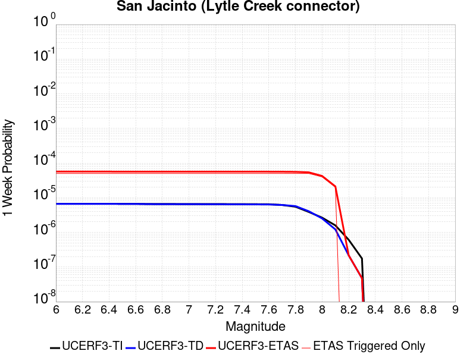 |  |  | 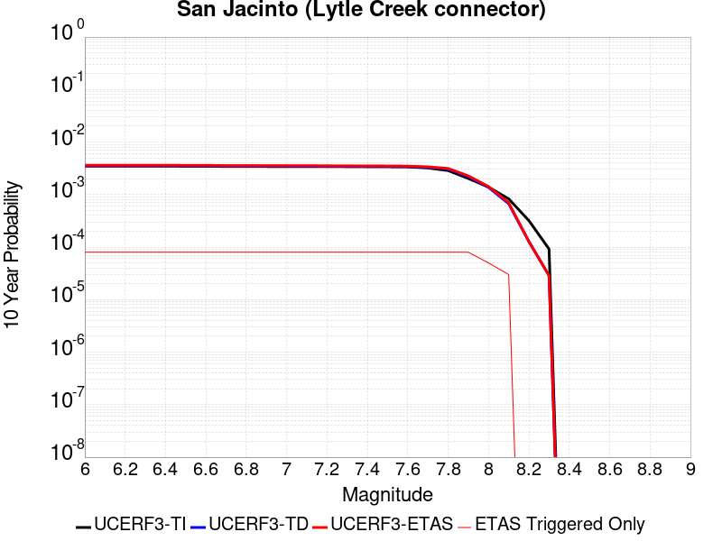 |

| Magnitude | 1 wk TI Prob | 1 wk TD Prob | 1 wk ETAS Prob | 1 wk ETAS/TD Gain | 1 wk ETAS Triggered Only | 1 mo TI Prob | 1 mo TD Prob | 1 mo ETAS Prob | 1 mo ETAS/TD Gain | 1 mo ETAS Triggered Only | 1 yr TI Prob | 1 yr TD Prob | 1 yr ETAS Prob | 1 yr ETAS/TD Gain | 1 yr ETAS Triggered Only | 10 yr TI Prob | 10 yr TD Prob | 10 yr ETAS Prob | 10 yr ETAS/TD Gain | 10 yr ETAS Triggered Only |
|-----|-----|-----|-----|-----|-----|-----|-----|-----|-----|-----|-----|-----|-----|-----|-----|-----|-----|-----|-----|-----|
| 6.0 | 6.693995E-6 | 6.660123E-6 | 5.665979E-5 | 8.5073185 | 5.0E-5 | 2.8688235E-5 | 2.8543072E-5 | 9.854107E-5 | 3.452364 | 7.0E-5 | 3.492233E-4 | 3.4745657E-4 | 4.2742878E-4 | 1.2301646 | 8.0E-5 | 0.00348675 | 0.0035491167 | 0.0036288328 | 1.0224608 | 8.0E-5 |
| 6.1 | 6.693995E-6 | 6.660123E-6 | 5.665979E-5 | 8.5073185 | 5.0E-5 | 2.8688235E-5 | 2.8543072E-5 | 9.854107E-5 | 3.452364 | 7.0E-5 | 3.492233E-4 | 3.4745657E-4 | 4.2742878E-4 | 1.2301646 | 8.0E-5 | 0.00348675 | 0.0035491167 | 0.0036288328 | 1.0224608 | 8.0E-5 |
| 6.2 | 6.693995E-6 | 6.660123E-6 | 5.665979E-5 | 8.5073185 | 5.0E-5 | 2.8688235E-5 | 2.8543072E-5 | 9.854107E-5 | 3.452364 | 7.0E-5 | 3.492233E-4 | 3.4745657E-4 | 4.2742878E-4 | 1.2301646 | 8.0E-5 | 0.00348675 | 0.0035491167 | 0.0036288328 | 1.0224608 | 8.0E-5 |
| 6.3 | 6.693995E-6 | 6.660123E-6 | 5.665979E-5 | 8.5073185 | 5.0E-5 | 2.8688235E-5 | 2.8543072E-5 | 9.854107E-5 | 3.452364 | 7.0E-5 | 3.492233E-4 | 3.4745657E-4 | 4.2742878E-4 | 1.2301646 | 8.0E-5 | 0.00348675 | 0.0035491167 | 0.0036288328 | 1.0224608 | 8.0E-5 |
| 6.4 | 6.693995E-6 | 6.660123E-6 | 5.665979E-5 | 8.5073185 | 5.0E-5 | 2.8688235E-5 | 2.8543072E-5 | 9.854107E-5 | 3.452364 | 7.0E-5 | 3.492233E-4 | 3.4745657E-4 | 4.2742878E-4 | 1.2301646 | 8.0E-5 | 0.00348675 | 0.0035491167 | 0.0036288328 | 1.0224608 | 8.0E-5 |
| 6.5 | 6.6561875E-6 | 6.620341E-6 | 5.662001E-5 | 8.552431 | 5.0E-5 | 2.8526205E-5 | 2.8372582E-5 | 9.83706E-5 | 3.4671006 | 7.0E-5 | 3.472512E-4 | 3.453815E-4 | 4.2535388E-4 | 1.231548 | 8.0E-5 | 0.0034670907 | 0.0035284322 | 0.00360815 | 1.0225929 | 8.0E-5 |
| 6.6 | 6.6561875E-6 | 6.620341E-6 | 5.662001E-5 | 8.552431 | 5.0E-5 | 2.8526205E-5 | 2.8372582E-5 | 9.83706E-5 | 3.4671006 | 7.0E-5 | 3.472512E-4 | 3.453815E-4 | 4.2535388E-4 | 1.231548 | 8.0E-5 | 0.0034670907 | 0.0035284322 | 0.00360815 | 1.0225929 | 8.0E-5 |
| 6.7 | 6.5802237E-6 | 6.539518E-6 | 5.653919E-5 | 8.645774 | 5.0E-5 | 2.8200653E-5 | 2.8026205E-5 | 9.802424E-5 | 3.4975924 | 7.0E-5 | 3.4328885E-4 | 3.4116567E-4 | 4.211384E-4 | 1.2344102 | 8.0E-5 | 0.0034275902 | 0.0034864065 | 0.0035661277 | 1.0228662 | 8.0E-5 |
| 6.8 | 6.575632E-6 | 6.5340073E-6 | 5.653368E-5 | 8.652222 | 5.0E-5 | 2.8180975E-5 | 2.8002589E-5 | 9.800063E-5 | 3.4996989 | 7.0E-5 | 3.4304935E-4 | 3.4087826E-4 | 4.20851E-4 | 1.2346079 | 8.0E-5 | 0.0034252026 | 0.0034835413 | 0.0035632628 | 1.0228851 | 8.0E-5 |
| 6.9 | 6.570433E-6 | 6.525401E-6 | 5.6525074E-5 | 8.662313 | 5.0E-5 | 2.8158694E-5 | 2.7965707E-5 | 9.796375E-5 | 3.5029957 | 7.0E-5 | 3.4277816E-4 | 3.4042934E-4 | 4.2040212E-4 | 1.2349174 | 8.0E-5 | 0.0034224992 | 0.0034790665 | 0.0035587882 | 1.0229146 | 8.0E-5 |
| 7.0 | 6.5643826E-6 | 6.5155223E-6 | 5.6515197E-5 | 8.673932 | 5.0E-5 | 2.8132765E-5 | 2.7923368E-5 | 9.792142E-5 | 3.5067909 | 7.0E-5 | 3.424626E-4 | 3.3991406E-4 | 4.1988687E-4 | 1.2352736 | 8.0E-5 | 0.0034193532 | 0.0034739296 | 0.0035536517 | 1.0229486 | 8.0E-5 |
| 7.1 | 6.557402E-6 | 6.504234E-6 | 5.6503908E-5 | 8.68725 | 5.0E-5 | 2.8102848E-5 | 2.7874992E-5 | 9.787304E-5 | 3.5111415 | 7.0E-5 | 3.4209844E-4 | 3.3932526E-4 | 4.192981E-4 | 1.235682 | 8.0E-5 | 0.0034157229 | 0.0034680606 | 0.0035477832 | 1.0229876 | 8.0E-5 |
| 7.2 | 6.546394E-6 | 6.4862006E-6 | 5.6485875E-5 | 8.708623 | 5.0E-5 | 2.8055672E-5 | 2.7797707E-5 | 9.779576E-5 | 3.5181234 | 7.0E-5 | 3.4152428E-4 | 3.383846E-4 | 4.1835752E-4 | 1.2363374 | 8.0E-5 | 0.0034099987 | 0.0034586883 | 0.0035384116 | 1.0230502 | 8.0E-5 |
| 7.3 | 6.5364216E-6 | 6.4669857E-6 | 5.6466662E-5 | 8.731527 | 5.0E-5 | 2.8012933E-5 | 2.771536E-5 | 9.771342E-5 | 3.5256054 | 7.0E-5 | 3.4100408E-4 | 3.373823E-4 | 4.1735533E-4 | 1.2370397 | 8.0E-5 | 0.003404813 | 0.0034487103 | 0.0035284343 | 1.0231171 | 8.0E-5 |
| 7.4 | 6.5269523E-6 | 6.4480723E-6 | 5.644775E-5 | 8.754206 | 5.0E-5 | 2.7972354E-5 | 2.7634303E-5 | 9.763237E-5 | 3.5330136 | 7.0E-5 | 3.4051016E-4 | 3.3639578E-4 | 4.1636886E-4 | 1.2377352 | 8.0E-5 | 0.0033998888 | 0.0034388923 | 0.003518617 | 1.0231833 | 8.0E-5 |
| 7.5 | 6.5111835E-6 | 6.424346E-6 | 5.6424025E-5 | 8.782844 | 5.0E-5 | 2.7904773E-5 | 2.753262E-5 | 9.753069E-5 | 3.5423687 | 7.0E-5 | 3.3968766E-4 | 3.3515817E-4 | 4.1513136E-4 | 1.2386132 | 8.0E-5 | 0.0033916887 | 0.0034265644 | 0.0035062903 | 1.023267 | 8.0E-5 |
| 7.6 | 6.4768806E-6 | 6.383454E-6 | 5.6383135E-5 | 8.8327 | 5.0E-5 | 2.7757764E-5 | 2.7357375E-5 | 9.7355456E-5 | 3.558655 | 7.0E-5 | 3.3789838E-4 | 3.330252E-4 | 4.1299855E-4 | 1.2401421 | 8.0E-5 | 0.0033738504 | 0.0034052972 | 0.0034850247 | 1.0234128 | 8.0E-5 |
| 7.7 | 6.1655364E-6 | 6.1759456E-6 | 5.6175635E-5 | 9.095877 | 5.0E-5 | 2.642346E-5 | 2.646807E-5 | 9.646622E-5 | 3.6446261 | 7.0E-5 | 3.2165812E-4 | 3.2220117E-4 | 4.0217538E-4 | 1.2482121 | 8.0E-5 | 0.0032119295 | 0.0032969362 | 0.0033766725 | 1.024185 | 8.0E-5 |
| 7.8 | 5.5043524E-6 | 5.7370175E-6 | 5.573673E-5 | 9.71528 | 5.0E-5 | 2.3589868E-5 | 2.4586987E-5 | 9.4585266E-5 | 3.8469646 | 7.0E-5 | 2.871688E-4 | 2.993055E-4 | 3.7928156E-4 | 1.2672055 | 8.0E-5 | 0.0028679797 | 0.0030670585 | 0.0031468133 | 1.0260036 | 8.0E-5 |
| 7.9 | 3.889249E-6 | 4.0766436E-6 | 5.407644E-5 | 13.264941 | 5.0E-5 | 1.6668104E-5 | 1.7471213E-5 | 8.746999E-5 | 5.0065207 | 7.0E-5 | 2.0291525E-4 | 2.126913E-4 | 2.926743E-4 | 1.376052 | 8.0E-5 | 0.0020273007 | 0.0021941073 | 0.0022739319 | 1.0363812 | 8.0E-5 |
| 8.0 | 2.668535E-6 | 2.5313454E-6 | 4.2531243E-5 | 16.801834 | 4.0E-5 | 1.1436528E-5 | 1.0848577E-5 | 6.0848037E-5 | 5.608849 | 5.0E-5 | 1.3923083E-4 | 1.3207346E-4 | 1.8206685E-4 | 1.3785272 | 5.0E-5 | 0.0013914363 | 0.0013755665 | 0.0014254977 | 1.0362986 | 5.0E-5 |
| 8.1 | 1.5911459E-6 | 1.2185134E-6 | 2.121849E-5 | 17.413424 | 2.0E-5 | 6.8191785E-6 | 5.2221894E-6 | 3.5222034E-5 | 6.7446866 | 3.0E-5 | 8.3020335E-5 | 6.357832E-5 | 9.357642E-5 | 1.4718289 | 3.0E-5 | 8.298933E-4 | 6.6911156E-4 | 6.9909147E-4 | 1.0448055 | 3.0E-5 |
| 8.2 | 6.1294963E-7 | 2.1802066E-7 | 2.1802066E-7 | 1.0 | 0.0 | 2.6269242E-6 | 9.3437393E-7 | 9.3437393E-7 | 1.0 | 0.0 | 3.1982334E-5 | 1.1375943E-5 | 1.1375943E-5 | 1.0 | 0.0 | 3.1977732E-4 | 1.2778955E-4 | 1.2778955E-4 | 1.0 | 0.0 |
| 8.3 | 1.762871E-7 | 4.7516316E-8 | 4.7516316E-8 | 1.0 | 0.0 | 7.5551594E-7 | 2.0364133E-7 | 2.0364133E-7 | 1.0 | 0.0 | 9.1983675E-6 | 2.4793305E-6 | 2.4793305E-6 | 1.0 | 0.0 | 9.197987E-5 | 2.8671833E-5 | 2.8671833E-5 | 1.0 | 0.0 |

## Raymond
*[(top)](#table-of-contents)*

| 1 Week | 1 Month | 1 Year | 10 Year |
|-----|-----|-----|-----|
|  |  | 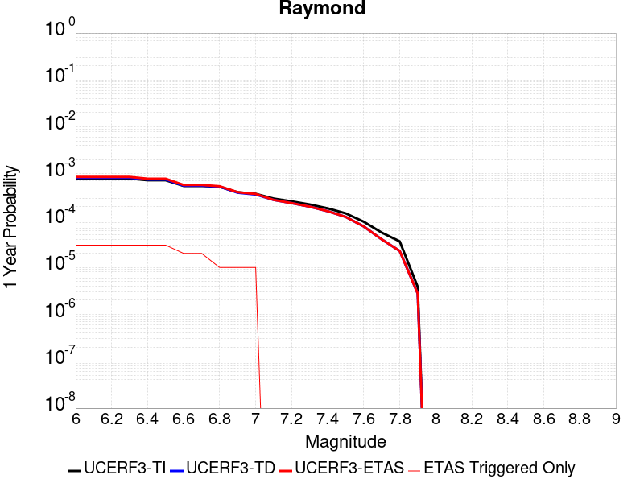 |  |

| Magnitude | 1 wk TI Prob | 1 wk TD Prob | 1 wk ETAS Prob | 1 wk ETAS/TD Gain | 1 wk ETAS Triggered Only | 1 mo TI Prob | 1 mo TD Prob | 1 mo ETAS Prob | 1 mo ETAS/TD Gain | 1 mo ETAS Triggered Only | 1 yr TI Prob | 1 yr TD Prob | 1 yr ETAS Prob | 1 yr ETAS/TD Gain | 1 yr ETAS Triggered Only | 10 yr TI Prob | 10 yr TD Prob | 10 yr ETAS Prob | 10 yr ETAS/TD Gain | 10 yr ETAS Triggered Only |
|-----|-----|-----|-----|-----|-----|-----|-----|-----|-----|-----|-----|-----|-----|-----|-----|-----|-----|-----|-----|-----|
| 6.0 | 1.5157413E-5 | 1.5810125E-5 | 2.5809968E-5 | 1.632496 | 1.0E-5 | 6.4958724E-5 | 6.775606E-5 | 7.775539E-5 | 1.1475782 | 1.0E-5 | 7.905855E-4 | 8.246429E-4 | 8.5461815E-4 | 1.0363494 | 3.0E-5 | 0.007877788 | 0.008218355 | 0.008297697 | 1.0096543 | 8.0E-5 |
| 6.1 | 1.5157413E-5 | 1.5810125E-5 | 2.5809968E-5 | 1.632496 | 1.0E-5 | 6.4958724E-5 | 6.775606E-5 | 7.775539E-5 | 1.1475782 | 1.0E-5 | 7.905855E-4 | 8.246429E-4 | 8.5461815E-4 | 1.0363494 | 3.0E-5 | 0.007877788 | 0.008218355 | 0.008297697 | 1.0096543 | 8.0E-5 |
| 6.2 | 1.5157413E-5 | 1.5810125E-5 | 2.5809968E-5 | 1.632496 | 1.0E-5 | 6.4958724E-5 | 6.775606E-5 | 7.775539E-5 | 1.1475782 | 1.0E-5 | 7.905855E-4 | 8.246429E-4 | 8.5461815E-4 | 1.0363494 | 3.0E-5 | 0.007877788 | 0.008218355 | 0.008297697 | 1.0096543 | 8.0E-5 |
| 6.3 | 1.5157413E-5 | 1.5810125E-5 | 2.5809968E-5 | 1.632496 | 1.0E-5 | 6.4958724E-5 | 6.775606E-5 | 7.775539E-5 | 1.1475782 | 1.0E-5 | 7.905855E-4 | 8.246429E-4 | 8.5461815E-4 | 1.0363494 | 3.0E-5 | 0.007877788 | 0.008218355 | 0.008297697 | 1.0096543 | 8.0E-5 |
| 6.4 | 1.3941944E-5 | 1.4454688E-5 | 2.4454543E-5 | 1.691807 | 1.0E-5 | 5.9749822E-5 | 6.194732E-5 | 7.1946706E-5 | 1.1614175 | 1.0E-5 | 7.2721124E-4 | 7.53971E-4 | 7.839484E-4 | 1.0397593 | 3.0E-5 | 0.007248361 | 0.007516471 | 0.0075958697 | 1.0105633 | 8.0E-5 |
| 6.5 | 1.3941944E-5 | 1.4454688E-5 | 2.4454543E-5 | 1.691807 | 1.0E-5 | 5.9749822E-5 | 6.194732E-5 | 7.1946706E-5 | 1.1614175 | 1.0E-5 | 7.2721124E-4 | 7.53971E-4 | 7.839484E-4 | 1.0397593 | 3.0E-5 | 0.007248361 | 0.007516471 | 0.0075958697 | 1.0105633 | 8.0E-5 |
| 6.6 | 1.0542609E-5 | 1.067111E-5 | 1.067111E-5 | 1.0 | 0.0 | 4.5181827E-5 | 4.573256E-5 | 4.573256E-5 | 1.0 | 0.0 | 5.499499E-4 | 5.566571E-4 | 5.76646E-4 | 1.0359088 | 2.0E-5 | 0.005485909 | 0.0055531966 | 0.005622808 | 1.0125353 | 7.0E-5 |
| 6.7 | 1.0542609E-5 | 1.067111E-5 | 1.067111E-5 | 1.0 | 0.0 | 4.5181827E-5 | 4.573256E-5 | 4.573256E-5 | 1.0 | 0.0 | 5.499499E-4 | 5.566571E-4 | 5.76646E-4 | 1.0359088 | 2.0E-5 | 0.005485909 | 0.0055531966 | 0.005622808 | 1.0125353 | 7.0E-5 |
| 6.8 | 1.0079132E-5 | 1.0176644E-5 | 1.0176644E-5 | 1.0 | 0.0 | 4.3195567E-5 | 4.3613487E-5 | 4.3613487E-5 | 1.0 | 0.0 | 5.257791E-4 | 5.308702E-4 | 5.408649E-4 | 1.018827 | 1.0E-5 | 0.0052453685 | 0.0052965777 | 0.0053463127 | 1.0093901 | 5.0E-5 |
| 6.9 | 7.721598E-6 | 7.548902E-6 | 7.548902E-6 | 1.0 | 0.0 | 3.3092143E-5 | 3.2352043E-5 | 3.2352043E-5 | 1.0 | 0.0 | 4.0282236E-4 | 3.9381615E-4 | 4.038122E-4 | 1.0253825 | 1.0E-5 | 0.0040209293 | 0.003931324 | 0.0039512455 | 1.0050673 | 2.0E-5 |
| 7.0 | 7.137566E-6 | 6.911303E-6 | 6.911303E-6 | 1.0 | 0.0 | 3.058921E-5 | 2.961954E-5 | 2.961954E-5 | 1.0 | 0.0 | 3.7236E-4 | 3.605593E-4 | 3.705557E-4 | 1.0277247 | 1.0E-5 | 0.0037173668 | 0.003599869 | 0.003619797 | 1.0055357 | 2.0E-5 |
| 7.1 | 5.654976E-6 | 5.299538E-6 | 5.299538E-6 | 1.0 | 0.0 | 2.4235387E-5 | 2.2712107E-5 | 2.2712107E-5 | 1.0 | 0.0 | 2.9502588E-4 | 2.7648505E-4 | 2.7648505E-4 | 1.0 | 0.0 | 0.0029463451 | 0.0027614492 | 0.0027714216 | 1.0036113 | 1.0E-5 |
| 7.2 | 4.9358455E-6 | 4.526655E-6 | 4.526655E-6 | 1.0 | 0.0 | 2.1153453E-5 | 1.9399806E-5 | 1.9399806E-5 | 1.0 | 0.0 | 2.5751285E-4 | 2.3616718E-4 | 2.3616718E-4 | 1.0 | 0.0 | 0.0025721465 | 0.002359192 | 0.0023691682 | 1.0042287 | 1.0E-5 |
| 7.3 | 4.2368597E-6 | 3.8056128E-6 | 3.8056128E-6 | 1.0 | 0.0 | 1.8157843E-5 | 1.6309668E-5 | 1.6309668E-5 | 1.0 | 0.0 | 2.2104931E-4 | 1.9855222E-4 | 1.9855222E-4 | 1.0 | 0.0 | 0.0022082955 | 0.0019837746 | 0.0019837746 | 1.0 | 0.0 |
| 7.4 | 3.4999923E-6 | 3.0437407E-6 | 3.0437407E-6 | 1.0 | 0.0 | 1.49998805E-5 | 1.3044538E-5 | 1.3044538E-5 | 1.0 | 0.0 | 1.8260824E-4 | 1.5880575E-4 | 1.5880575E-4 | 1.0 | 0.0 | 0.0018245826 | 0.0015869461 | 0.0015869461 | 1.0 | 0.0 |
| 7.5 | 2.738017E-6 | 2.3020405E-6 | 2.3020405E-6 | 1.0 | 0.0 | 1.1734306E-5 | 9.865851E-6 | 9.865851E-6 | 1.0 | 0.0 | 1.428558E-4 | 1.20110184E-4 | 1.20110184E-4 | 1.0 | 0.0 | 0.0014276401 | 0.0012004747 | 0.0012004747 | 1.0 | 0.0 |
| 7.6 | 1.8186392E-6 | 1.442302E-6 | 1.442302E-6 | 1.0 | 0.0 | 7.794145E-6 | 6.1812802E-6 | 6.1812802E-6 | 1.0 | 0.0 | 9.488958E-5 | 7.5254524E-5 | 7.5254524E-5 | 1.0 | 0.0 | 9.4849075E-4 | 7.5230957E-4 | 7.5230957E-4 | 1.0 | 0.0 |
| 7.7 | 1.0660348E-6 | 7.6437E-7 | 7.6437E-7 | 1.0 | 0.0 | 4.5687125E-6 | 3.2758674E-6 | 3.2758674E-6 | 1.0 | 0.0 | 5.5622655E-5 | 3.988297E-5 | 3.988297E-5 | 1.0 | 0.0 | 5.5608735E-4 | 3.9877492E-4 | 3.9877492E-4 | 1.0 | 0.0 |
| 7.8 | 6.913602E-7 | 4.3202903E-7 | 4.3202903E-7 | 1.0 | 0.0 | 2.962969E-6 | 1.8515517E-6 | 1.8515517E-6 | 1.0 | 0.0 | 3.607355E-5 | 2.2542416E-5 | 2.2542416E-5 | 1.0 | 0.0 | 3.6067693E-4 | 2.2541684E-4 | 2.2541684E-4 | 1.0 | 0.0 |
| 7.9 | 7.425201E-8 | 5.322267E-8 | 5.322267E-8 | 1.0 | 0.0 | 3.1822285E-7 | 2.2809714E-7 | 2.2809714E-7 | 1.0 | 0.0 | 3.874356E-6 | 2.7770805E-6 | 2.7770805E-6 | 1.0 | 0.0 | 3.8742884E-5 | 2.7770588E-5 | 2.7770588E-5 | 1.0 | 0.0 |

## Hosgri (Extension)
*[(top)](#table-of-contents)*

| 1 Week | 1 Month | 1 Year | 10 Year |
|-----|-----|-----|-----|
|  |  |  | 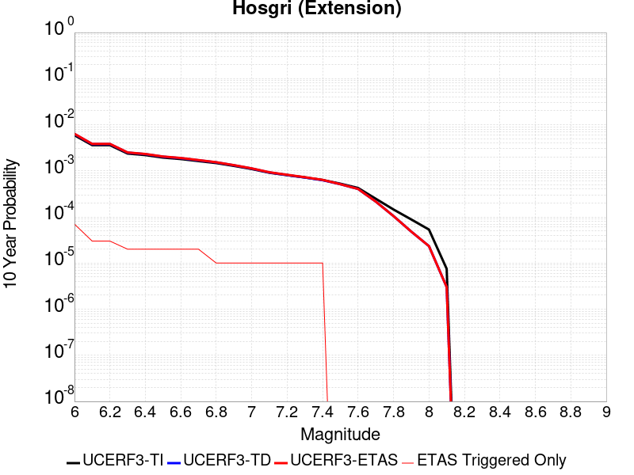 |

| Magnitude | 1 wk TI Prob | 1 wk TD Prob | 1 wk ETAS Prob | 1 wk ETAS/TD Gain | 1 wk ETAS Triggered Only | 1 mo TI Prob | 1 mo TD Prob | 1 mo ETAS Prob | 1 mo ETAS/TD Gain | 1 mo ETAS Triggered Only | 1 yr TI Prob | 1 yr TD Prob | 1 yr ETAS Prob | 1 yr ETAS/TD Gain | 1 yr ETAS Triggered Only | 10 yr TI Prob | 10 yr TD Prob | 10 yr ETAS Prob | 10 yr ETAS/TD Gain | 10 yr ETAS Triggered Only |
|-----|-----|-----|-----|-----|-----|-----|-----|-----|-----|-----|-----|-----|-----|-----|-----|-----|-----|-----|-----|-----|
| 6.0 | 1.1369135E-5 | 1.2083073E-5 | 3.2082833E-5 | 2.655188 | 2.0E-5 | 4.8723956E-5 | 5.17837E-5 | 8.178214E-5 | 1.5793029 | 3.0E-5 | 5.9305265E-4 | 6.303069E-4 | 6.7028165E-4 | 1.0634211 | 4.0E-5 | 0.005914725 | 0.00628744 | 0.006357 | 1.0110633 | 7.0E-5 |
| 6.1 | 6.934979E-6 | 7.324556E-6 | 1.7324483E-5 | 2.3652604 | 1.0E-5 | 2.9721E-5 | 3.13906E-5 | 5.1389972E-5 | 1.6371135 | 2.0E-5 | 3.617931E-4 | 3.821177E-4 | 4.0211005E-4 | 1.0523199 | 2.0E-5 | 0.0036120464 | 0.003815019 | 0.0038449047 | 1.0078336 | 3.0E-5 |
| 6.2 | 6.934979E-6 | 7.324556E-6 | 1.7324483E-5 | 2.3652604 | 1.0E-5 | 2.9721E-5 | 3.13906E-5 | 5.1389972E-5 | 1.6371135 | 2.0E-5 | 3.617931E-4 | 3.821177E-4 | 4.0211005E-4 | 1.0523199 | 2.0E-5 | 0.0036120464 | 0.003815019 | 0.0038449047 | 1.0078336 | 3.0E-5 |
| 6.3 | 4.5484676E-6 | 4.769331E-6 | 4.769331E-6 | 1.0 | 0.0 | 1.9493287E-5 | 2.0439833E-5 | 3.0439629E-5 | 1.4892308 | 1.0E-5 | 2.3730492E-4 | 2.4882698E-4 | 2.588245E-4 | 1.0401785 | 1.0E-5 | 0.0023705168 | 0.0024855263 | 0.0025054766 | 1.0080266 | 2.0E-5 |
| 6.4 | 4.218095E-6 | 4.416863E-6 | 4.416863E-6 | 1.0 | 0.0 | 1.8077424E-5 | 1.8929275E-5 | 2.8929086E-5 | 1.5282723 | 1.0E-5 | 2.2007042E-4 | 2.3043988E-4 | 2.4043758E-4 | 1.0433853 | 1.0E-5 | 0.002198526 | 0.002302043 | 0.0023219967 | 1.008668 | 2.0E-5 |
| 6.5 | 3.717374E-6 | 3.883879E-6 | 3.883879E-6 | 1.0 | 0.0 | 1.5931506E-5 | 1.664509E-5 | 2.6644922E-5 | 1.6007679 | 1.0E-5 | 1.9394881E-4 | 2.026353E-4 | 2.1263327E-4 | 1.0493398 | 1.0E-5 | 0.0019377962 | 0.0020245241 | 0.0020444836 | 1.0098588 | 2.0E-5 |
| 6.6 | 3.4605036E-6 | 3.6083072E-6 | 3.6083072E-6 | 1.0 | 0.0 | 1.4830645E-5 | 1.5464082E-5 | 2.5463927E-5 | 1.6466497 | 1.0E-5 | 1.8054814E-4 | 1.8825909E-4 | 1.982572E-4 | 1.0531083 | 1.0E-5 | 0.0018040152 | 0.0018810107 | 0.001900973 | 1.0106126 | 2.0E-5 |
| 6.7 | 3.123439E-6 | 3.2465698E-6 | 3.2465698E-6 | 1.0 | 0.0 | 1.33860985E-5 | 1.39137965E-5 | 2.3913657E-5 | 1.7187011 | 1.0E-5 | 1.6296357E-4 | 1.6938741E-4 | 1.7938572E-4 | 1.0590262 | 1.0E-5 | 0.001628441 | 0.001692594 | 0.0017125601 | 1.0117962 | 2.0E-5 |
| 6.8 | 2.8290783E-6 | 2.9305413E-6 | 2.9305413E-6 | 1.0 | 0.0 | 1.2124565E-5 | 1.2559403E-5 | 1.2559403E-5 | 1.0 | 0.0 | 1.4760658E-4 | 1.5290009E-4 | 1.5290009E-4 | 1.0 | 0.0 | 0.0014750857 | 0.0015279576 | 0.0015379423 | 1.0065347 | 1.0E-5 |
| 6.9 | 2.454112E-6 | 2.5283207E-6 | 2.5283207E-6 | 1.0 | 0.0 | 1.0517581E-5 | 1.0835615E-5 | 1.0835615E-5 | 1.0 | 0.0 | 1.2804402E-4 | 1.3191569E-4 | 1.3191569E-4 | 1.0 | 0.0 | 0.0012797028 | 0.0013183799 | 0.0013283667 | 1.007575 | 1.0E-5 |
| 7.0 | 2.1008145E-6 | 2.1498715E-6 | 2.1498715E-6 | 1.0 | 0.0 | 9.003459E-6 | 9.2137025E-6 | 9.2137025E-6 | 1.0 | 0.0 | 1.096116E-4 | 1.1217109E-4 | 1.1217109E-4 | 1.0 | 0.0 | 0.0010955755 | 0.0011211485 | 0.0011311373 | 1.0089095 | 1.0E-5 |
| 7.1 | 1.744384E-6 | 1.7686364E-6 | 1.7686364E-6 | 1.0 | 0.0 | 7.47591E-6 | 7.579848E-6 | 7.579848E-6 | 1.0 | 0.0 | 9.1015405E-5 | 9.228076E-5 | 9.228076E-5 | 1.0 | 0.0 | 9.097813E-4 | 9.224261E-4 | 9.324169E-4 | 1.010831 | 1.0E-5 |
| 7.2 | 1.5456587E-6 | 1.5562894E-6 | 1.5562894E-6 | 1.0 | 0.0 | 6.6242346E-6 | 6.6697944E-6 | 6.6697944E-6 | 1.0 | 0.0 | 8.064707E-5 | 8.120173E-5 | 8.120173E-5 | 1.0 | 0.0 | 8.0617814E-4 | 8.117219E-4 | 8.2171377E-4 | 1.0123094 | 1.0E-5 |
| 7.3 | 1.3775123E-6 | 1.3766092E-6 | 1.3766092E-6 | 1.0 | 0.0 | 5.9036106E-6 | 5.8997407E-6 | 5.8997407E-6 | 1.0 | 0.0 | 7.187409E-5 | 7.182699E-5 | 7.182699E-5 | 1.0 | 0.0 | 7.185085E-4 | 7.180387E-4 | 7.2803156E-4 | 1.0139169 | 1.0E-5 |
| 7.4 | 1.214491E-6 | 1.2023471E-6 | 1.2023471E-6 | 1.0 | 0.0 | 5.2049513E-6 | 5.152906E-6 | 5.152906E-6 | 1.0 | 0.0 | 6.336844E-5 | 6.2734835E-5 | 6.2734835E-5 | 1.0 | 0.0 | 6.335037E-4 | 6.2717206E-4 | 6.371658E-4 | 1.0159346 | 1.0E-5 |
| 7.5 | 1.0101123E-6 | 9.842256E-7 | 9.842256E-7 | 1.0 | 0.0 | 4.3290456E-6 | 4.218103E-6 | 4.218103E-6 | 1.0 | 0.0 | 5.2704854E-5 | 5.13542E-5 | 5.13542E-5 | 1.0 | 0.0 | 5.2692357E-4 | 5.1342393E-4 | 5.1342393E-4 | 1.0 | 0.0 |
| 7.6 | 8.1558215E-7 | 7.765977E-7 | 7.765977E-7 | 1.0 | 0.0 | 3.4953473E-6 | 3.3282718E-6 | 3.3282718E-6 | 1.0 | 0.0 | 4.255502E-5 | 4.0520958E-5 | 4.0520958E-5 | 1.0 | 0.0 | 4.2546875E-4 | 4.0513615E-4 | 4.0513615E-4 | 1.0 | 0.0 |
| 7.7 | 4.757816E-7 | 4.1308996E-7 | 4.1308996E-7 | 1.0 | 0.0 | 2.0390623E-6 | 1.7703843E-6 | 1.7703843E-6 | 1.0 | 0.0 | 2.4825302E-5 | 2.1554217E-5 | 2.1554217E-5 | 1.0 | 0.0 | 2.482253E-4 | 2.1552139E-4 | 2.1552139E-4 | 1.0 | 0.0 |
| 7.8 | 2.782787E-7 | 2.004783E-7 | 2.004783E-7 | 1.0 | 0.0 | 1.1926223E-6 | 8.591924E-7 | 8.591924E-7 | 1.0 | 0.0 | 1.452008E-5 | 1.0460618E-5 | 1.0460618E-5 | 1.0 | 0.0 | 1.4519131E-4 | 1.04601284E-4 | 1.04601284E-4 | 1.0 | 0.0 |
| 7.9 | 1.6948086E-7 | 9.243938E-8 | 9.243938E-8 | 1.0 | 0.0 | 7.2634634E-7 | 3.961687E-7 | 3.961687E-7 | 1.0 | 0.0 | 8.843231E-6 | 4.8233433E-6 | 4.8233433E-6 | 1.0 | 0.0 | 8.842879E-5 | 4.8232392E-5 | 4.8232392E-5 | 1.0 | 0.0 |
| 8.0 | 1.0225492E-7 | 4.473497E-8 | 4.473497E-8 | 1.0 | 0.0 | 4.382353E-7 | 1.917213E-7 | 1.917213E-7 | 1.0 | 0.0 | 5.335502E-6 | 2.3342043E-6 | 2.3342043E-6 | 1.0 | 0.0 | 5.335374E-5 | 2.33418E-5 | 2.33418E-5 | 1.0 | 0.0 |
| 8.1 | 1.43711345E-8 | 5.78716E-9 | 5.78716E-9 | 1.0 | 0.0 | 6.1590576E-8 | 2.4802116E-8 | 2.4802116E-8 | 1.0 | 0.0 | 7.4986497E-7 | 3.019657E-7 | 3.019657E-7 | 1.0 | 0.0 | 7.4986247E-6 | 3.0196536E-6 | 3.0196536E-6 | 1.0 | 0.0 |

## Santa Ynez River
*[(top)](#table-of-contents)*

| 1 Week | 1 Month | 1 Year | 10 Year |
|-----|-----|-----|-----|
|  | 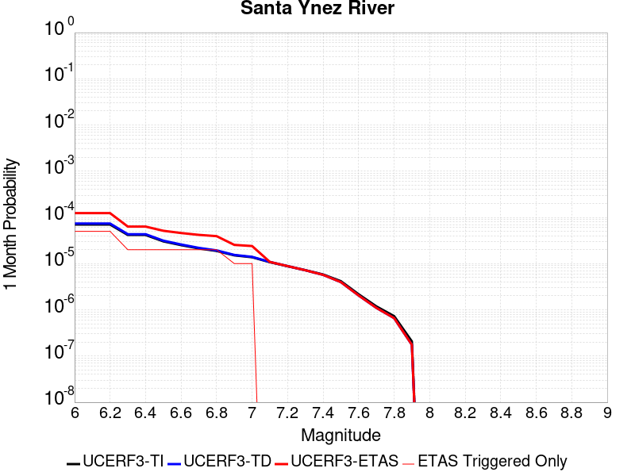 |  |  |

| Magnitude | 1 wk TI Prob | 1 wk TD Prob | 1 wk ETAS Prob | 1 wk ETAS/TD Gain | 1 wk ETAS Triggered Only | 1 mo TI Prob | 1 mo TD Prob | 1 mo ETAS Prob | 1 mo ETAS/TD Gain | 1 mo ETAS Triggered Only | 1 yr TI Prob | 1 yr TD Prob | 1 yr ETAS Prob | 1 yr ETAS/TD Gain | 1 yr ETAS Triggered Only | 10 yr TI Prob | 10 yr TD Prob | 10 yr ETAS Prob | 10 yr ETAS/TD Gain | 10 yr ETAS Triggered Only |
|-----|-----|-----|-----|-----|-----|-----|-----|-----|-----|-----|-----|-----|-----|-----|-----|-----|-----|-----|-----|-----|
| 6.0 | 1.6396456E-5 | 1.7209444E-5 | 4.7208927E-5 | 2.7431989 | 3.0E-5 | 7.026863E-5 | 7.3752875E-5 | 1.237492E-4 | 1.6778897 | 5.0E-5 | 8.551848E-4 | 8.976069E-4 | 9.5755304E-4 | 1.0667844 | 6.0E-5 | 0.0085190125 | 0.008943363 | 0.0090226475 | 1.0088652 | 8.0E-5 |
| 6.1 | 1.6396456E-5 | 1.7209444E-5 | 4.7208927E-5 | 2.7431989 | 3.0E-5 | 7.026863E-5 | 7.3752875E-5 | 1.237492E-4 | 1.6778897 | 5.0E-5 | 8.551848E-4 | 8.976069E-4 | 9.5755304E-4 | 1.0667844 | 6.0E-5 | 0.0085190125 | 0.008943363 | 0.0090226475 | 1.0088652 | 8.0E-5 |
| 6.2 | 1.6396456E-5 | 1.7209444E-5 | 4.7208927E-5 | 2.7431989 | 3.0E-5 | 7.026863E-5 | 7.3752875E-5 | 1.237492E-4 | 1.6778897 | 5.0E-5 | 8.551848E-4 | 8.976069E-4 | 9.5755304E-4 | 1.0667844 | 6.0E-5 | 0.0085190125 | 0.008943363 | 0.0090226475 | 1.0088652 | 8.0E-5 |
| 6.3 | 9.736976E-6 | 1.01223395E-5 | 1.01223395E-5 | 1.0 | 0.0 | 4.172923E-5 | 4.338076E-5 | 6.337989E-5 | 1.4610139 | 2.0E-5 | 5.0793495E-4 | 5.280378E-4 | 5.5802194E-4 | 1.0567842 | 3.0E-5 | 0.005067755 | 0.0052683367 | 0.005308126 | 1.0075525 | 4.0E-5 |
| 6.4 | 9.736976E-6 | 1.01223395E-5 | 1.01223395E-5 | 1.0 | 0.0 | 4.172923E-5 | 4.338076E-5 | 6.337989E-5 | 1.4610139 | 2.0E-5 | 5.0793495E-4 | 5.280378E-4 | 5.5802194E-4 | 1.0567842 | 3.0E-5 | 0.005067755 | 0.0052683367 | 0.005308126 | 1.0075525 | 4.0E-5 |
| 6.5 | 7.081964E-6 | 7.329905E-6 | 7.329905E-6 | 1.0 | 0.0 | 3.035092E-5 | 3.141351E-5 | 5.141288E-5 | 1.6366488 | 2.0E-5 | 3.694598E-4 | 3.8239395E-4 | 4.023863E-4 | 1.0522821 | 2.0E-5 | 0.0036884616 | 0.0038175215 | 0.003847407 | 1.0078285 | 3.0E-5 |
| 6.6 | 5.873247E-6 | 6.0597517E-6 | 6.0597517E-6 | 1.0 | 0.0 | 2.5170815E-5 | 2.5970112E-5 | 4.596959E-5 | 1.7700961 | 2.0E-5 | 3.064116E-4 | 3.161411E-4 | 3.3613478E-4 | 1.0632429 | 2.0E-5 | 0.0030598943 | 0.003157001 | 0.0031869062 | 1.0094727 | 3.0E-5 |
| 6.7 | 4.973277E-6 | 5.11591E-6 | 5.11591E-6 | 1.0 | 0.0 | 2.1313872E-5 | 2.1925147E-5 | 4.1924708E-5 | 1.9121746 | 2.0E-5 | 2.5946548E-4 | 2.6690646E-4 | 2.869011E-4 | 1.0749127 | 2.0E-5 | 0.0025916274 | 0.0026659078 | 0.0026958277 | 1.0112232 | 3.0E-5 |
| 6.8 | 4.396492E-6 | 4.510987E-6 | 4.510987E-6 | 1.0 | 0.0 | 1.884197E-5 | 1.933266E-5 | 3.9332273E-5 | 2.034499 | 2.0E-5 | 2.2937685E-4 | 2.3535005E-4 | 2.5534534E-4 | 1.0849597 | 2.0E-5 | 0.0022914023 | 0.0023510433 | 0.0023709964 | 1.0084869 | 2.0E-5 |
| 6.9 | 3.5255632E-6 | 3.6013423E-6 | 3.6013423E-6 | 1.0 | 0.0 | 1.5109469E-5 | 1.5434234E-5 | 2.543408E-5 | 1.6479003 | 1.0E-5 | 1.8394225E-4 | 1.8789574E-4 | 1.9789387E-4 | 1.053211 | 1.0E-5 | 0.0018379007 | 0.001877385 | 0.0018873662 | 1.0053166 | 1.0E-5 |
| 7.0 | 3.211603E-6 | 3.273663E-6 | 3.273663E-6 | 1.0 | 0.0 | 1.376394E-5 | 1.402991E-5 | 2.4029769E-5 | 1.7127529 | 1.0E-5 | 1.6756308E-4 | 1.708009E-4 | 1.807992E-4 | 1.0585377 | 1.0E-5 | 0.0016743679 | 0.0017067104 | 0.0017166934 | 1.0058492 | 1.0E-5 |
| 7.1 | 2.5094619E-6 | 2.5409295E-6 | 2.5409295E-6 | 1.0 | 0.0 | 1.0754793E-5 | 1.0889652E-5 | 1.0889652E-5 | 1.0 | 0.0 | 1.3093173E-4 | 1.325735E-4 | 1.325735E-4 | 1.0 | 0.0 | 0.0013085462 | 0.0013249503 | 0.0013249503 | 1.0 | 0.0 |
| 7.2 | 2.0515774E-6 | 2.0619466E-6 | 2.0619466E-6 | 1.0 | 0.0 | 8.792445E-6 | 8.836884E-6 | 8.836884E-6 | 1.0 | 0.0 | 1.0704277E-4 | 1.0758379E-4 | 1.0758379E-4 | 1.0 | 0.0 | 0.0010699122 | 0.0010753215 | 0.0010753215 | 1.0 | 0.0 |
| 7.3 | 1.6845745E-6 | 1.6773996E-6 | 1.6773996E-6 | 1.0 | 0.0 | 7.219585E-6 | 7.1888358E-6 | 7.1888358E-6 | 1.0 | 0.0 | 8.78949E-5 | 8.752059E-5 | 8.752059E-5 | 1.0 | 0.0 | 8.7860145E-4 | 8.7486405E-4 | 8.7486405E-4 | 1.0 | 0.0 |
| 7.4 | 1.3600285E-6 | 1.3333447E-6 | 1.3333447E-6 | 1.0 | 0.0 | 5.82868E-6 | 5.714322E-6 | 5.714322E-6 | 1.0 | 0.0 | 7.096187E-5 | 6.956967E-5 | 6.956967E-5 | 1.0 | 0.0 | 7.0939213E-4 | 6.9548114E-4 | 6.9548114E-4 | 1.0 | 0.0 |
| 7.5 | 9.735342E-7 | 9.2901894E-7 | 9.2901894E-7 | 1.0 | 0.0 | 4.172283E-6 | 3.9815036E-6 | 3.9815036E-6 | 1.0 | 0.0 | 5.079636E-5 | 4.8473747E-5 | 4.8473747E-5 | 1.0 | 0.0 | 5.0784746E-4 | 4.8463346E-4 | 4.8463346E-4 | 1.0 | 0.0 |
| 7.6 | 5.067187E-7 | 4.778609E-7 | 4.778609E-7 | 1.0 | 0.0 | 2.1716498E-6 | 2.0479738E-6 | 2.0479738E-6 | 1.0 | 0.0 | 2.6439517E-5 | 2.4933803E-5 | 2.4933803E-5 | 1.0 | 0.0 | 2.643637E-4 | 2.493108E-4 | 2.493108E-4 | 1.0 | 0.0 |
| 7.7 | 2.769089E-7 | 2.5759346E-7 | 2.5759346E-7 | 1.0 | 0.0 | 1.1867519E-6 | 1.1039714E-6 | 1.1039714E-6 | 1.0 | 0.0 | 1.4448608E-5 | 1.344077E-5 | 1.344077E-5 | 1.0 | 0.0 | 1.444767E-4 | 1.343996E-4 | 1.343996E-4 | 1.0 | 0.0 |
| 7.8 | 1.7044663E-7 | 1.5449208E-7 | 1.5449208E-7 | 1.0 | 0.0 | 7.3048534E-7 | 6.6210873E-7 | 6.6210873E-7 | 1.0 | 0.0 | 8.893623E-6 | 8.061144E-6 | 8.061144E-6 | 1.0 | 0.0 | 8.893267E-5 | 8.060854E-5 | 8.060854E-5 | 1.0 | 0.0 |
| 7.9 | 4.8344287E-8 | 4.0911143E-8 | 4.0911143E-8 | 1.0 | 0.0 | 2.0718979E-7 | 1.7533345E-7 | 1.7533345E-7 | 1.0 | 0.0 | 2.5225327E-6 | 2.1346827E-6 | 2.1346827E-6 | 1.0 | 0.0 | 2.5225041E-5 | 2.1346626E-5 | 2.1346626E-5 | 1.0 | 0.0 |

## Kern Canyon (Lake Isabella) 2011
*[(top)](#table-of-contents)*

| 1 Week | 1 Month | 1 Year | 10 Year |
|-----|-----|-----|-----|
|  |  | 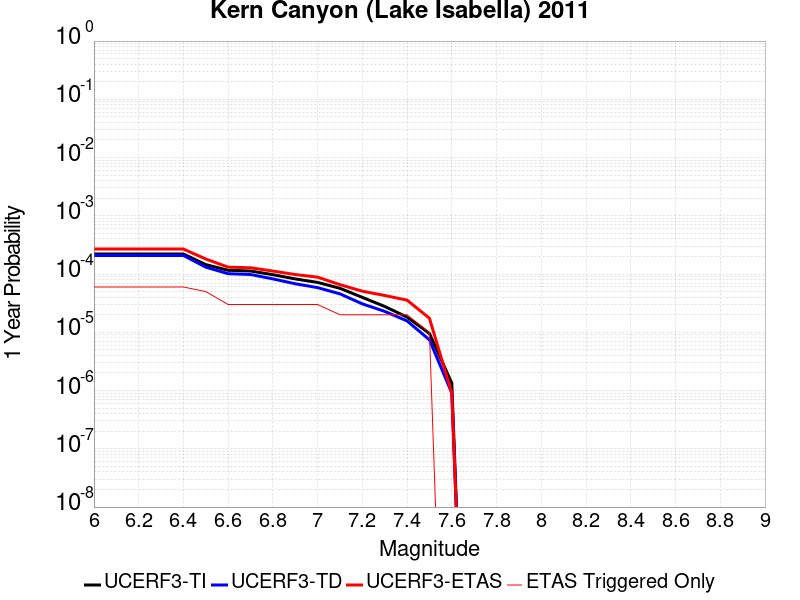 |  |

| Magnitude | 1 wk TI Prob | 1 wk TD Prob | 1 wk ETAS Prob | 1 wk ETAS/TD Gain | 1 wk ETAS Triggered Only | 1 mo TI Prob | 1 mo TD Prob | 1 mo ETAS Prob | 1 mo ETAS/TD Gain | 1 mo ETAS Triggered Only | 1 yr TI Prob | 1 yr TD Prob | 1 yr ETAS Prob | 1 yr ETAS/TD Gain | 1 yr ETAS Triggered Only | 10 yr TI Prob | 10 yr TD Prob | 10 yr ETAS Prob | 10 yr ETAS/TD Gain | 10 yr ETAS Triggered Only |
|-----|-----|-----|-----|-----|-----|-----|-----|-----|-----|-----|-----|-----|-----|-----|-----|-----|-----|-----|-----|-----|
| 6.0 | 4.2387383E-6 | 4.0016344E-6 | 1.40015945E-5 | 3.498969 | 1.0E-5 | 1.8165894E-5 | 1.7149758E-5 | 2.7149586E-5 | 1.5830886 | 1.0E-5 | 2.2114732E-4 | 2.0878017E-4 | 2.6876765E-4 | 1.2873236 | 6.0E-5 | 0.0022092736 | 0.002086024 | 0.002155878 | 1.0334866 | 7.0E-5 |
| 6.1 | 4.2387383E-6 | 4.0016344E-6 | 1.40015945E-5 | 3.498969 | 1.0E-5 | 1.8165894E-5 | 1.7149758E-5 | 2.7149586E-5 | 1.5830886 | 1.0E-5 | 2.2114732E-4 | 2.0878017E-4 | 2.6876765E-4 | 1.2873236 | 6.0E-5 | 0.0022092736 | 0.002086024 | 0.002155878 | 1.0334866 | 7.0E-5 |
| 6.2 | 4.2387383E-6 | 4.0016344E-6 | 1.40015945E-5 | 3.498969 | 1.0E-5 | 1.8165894E-5 | 1.7149758E-5 | 2.7149586E-5 | 1.5830886 | 1.0E-5 | 2.2114732E-4 | 2.0878017E-4 | 2.6876765E-4 | 1.2873236 | 6.0E-5 | 0.0022092736 | 0.002086024 | 0.002155878 | 1.0334866 | 7.0E-5 |
| 6.3 | 4.2387383E-6 | 4.0016344E-6 | 1.40015945E-5 | 3.498969 | 1.0E-5 | 1.8165894E-5 | 1.7149758E-5 | 2.7149586E-5 | 1.5830886 | 1.0E-5 | 2.2114732E-4 | 2.0878017E-4 | 2.6876765E-4 | 1.2873236 | 6.0E-5 | 0.0022092736 | 0.002086024 | 0.002155878 | 1.0334866 | 7.0E-5 |
| 6.4 | 4.2387383E-6 | 4.0016344E-6 | 1.40015945E-5 | 3.498969 | 1.0E-5 | 1.8165894E-5 | 1.7149758E-5 | 2.7149586E-5 | 1.5830886 | 1.0E-5 | 2.2114732E-4 | 2.0878017E-4 | 2.6876765E-4 | 1.2873236 | 6.0E-5 | 0.0022092736 | 0.002086024 | 0.002155878 | 1.0334866 | 7.0E-5 |
| 6.5 | 2.7857532E-6 | 2.5178624E-6 | 2.5178624E-6 | 1.0 | 0.0 | 1.1938888E-5 | 1.0790796E-5 | 1.0790796E-5 | 1.0 | 0.0 | 1.4534626E-4 | 1.3137035E-4 | 1.8136378E-4 | 1.3805534 | 5.0E-5 | 0.0014525123 | 0.0013129596 | 0.001362894 | 1.0380319 | 5.0E-5 |
| 6.6 | 2.2233348E-6 | 1.944119E-6 | 1.944119E-6 | 1.0 | 0.0 | 9.528543E-6 | 8.331913E-6 | 8.331913E-6 | 1.0 | 0.0 | 1.1600384E-4 | 1.014364E-4 | 1.3143336E-4 | 1.2957218 | 3.0E-5 | 0.001159433 | 0.0010139096 | 0.0010438792 | 1.0295584 | 3.0E-5 |
| 6.7 | 2.1635126E-6 | 1.8834991E-6 | 1.8834991E-6 | 1.0 | 0.0 | 9.272164E-6 | 8.072114E-6 | 8.072114E-6 | 1.0 | 0.0 | 1.1288274E-4 | 9.827364E-5 | 1.282707E-4 | 1.30524 | 3.0E-5 | 0.0011282542 | 9.8231E-4 | 0.0010122805 | 1.0305103 | 3.0E-5 |
| 6.8 | 1.8685711E-6 | 1.583138E-6 | 1.583138E-6 | 1.0 | 0.0 | 8.008137E-6 | 6.7848596E-6 | 6.7848596E-6 | 1.0 | 0.0 | 9.74947E-5 | 8.2602586E-5 | 1.1260011E-4 | 1.3631548 | 3.0E-5 | 9.745194E-4 | 8.2572375E-4 | 8.5569895E-4 | 1.0363017 | 3.0E-5 |
| 6.9 | 1.5815071E-6 | 1.3064887E-6 | 1.3064887E-6 | 1.0 | 0.0 | 6.77787E-6 | 5.5992255E-6 | 5.5992255E-6 | 1.0 | 0.0 | 8.251744E-5 | 6.816846E-5 | 9.816642E-5 | 1.4400562 | 3.0E-5 | 8.248681E-4 | 6.8147824E-4 | 7.114578E-4 | 1.0439919 | 3.0E-5 |
| 7.0 | 1.3772564E-6 | 1.1210681E-6 | 1.1210681E-6 | 1.0 | 0.0 | 5.9025137E-6 | 4.8045686E-6 | 4.8045686E-6 | 1.0 | 0.0 | 7.186073E-5 | 5.8494075E-5 | 8.849232E-5 | 1.5128424 | 3.0E-5 | 7.18375E-4 | 5.8478885E-4 | 6.1477127E-4 | 1.0512706 | 3.0E-5 |
| 7.1 | 1.0916998E-6 | 8.7637505E-7 | 8.7637505E-7 | 1.0 | 0.0 | 4.678705E-6 | 3.7558877E-6 | 3.7558877E-6 | 1.0 | 0.0 | 5.6961744E-5 | 4.5726985E-5 | 6.5726075E-5 | 1.4373585 | 2.0E-5 | 5.6947145E-4 | 4.571771E-4 | 4.7716798E-4 | 1.0437267 | 2.0E-5 |
| 7.2 | 7.6277024E-7 | 5.901439E-7 | 5.901439E-7 | 1.0 | 0.0 | 3.2690114E-6 | 2.5291856E-6 | 2.5291856E-6 | 1.0 | 0.0 | 3.9799485E-5 | 3.0792406E-5 | 5.079179E-5 | 1.6494908 | 2.0E-5 | 3.9792358E-4 | 3.07882E-4 | 3.2787584E-4 | 1.06494 | 2.0E-5 |
| 7.3 | 5.3265916E-7 | 4.3824264E-7 | 4.3824264E-7 | 1.0 | 0.0 | 2.282823E-6 | 1.8781814E-6 | 1.8781814E-6 | 1.0 | 0.0 | 2.7793016E-5 | 2.2866623E-5 | 4.2866166E-5 | 1.8746172 | 2.0E-5 | 2.778954E-4 | 2.2864307E-4 | 2.486385E-4 | 1.0874525 | 2.0E-5 |
| 7.4 | 3.4946007E-7 | 3.0065647E-7 | 3.0065647E-7 | 1.0 | 0.0 | 1.497685E-6 | 1.2885271E-6 | 1.2885271E-6 | 1.0 | 0.0 | 1.8234163E-5 | 1.5687707E-5 | 3.5687393E-5 | 2.2748637 | 2.0E-5 | 1.8232666E-4 | 1.5686621E-4 | 1.7686308E-4 | 1.1274772 | 2.0E-5 |
| 7.5 | 1.8317026E-7 | 1.4244755E-7 | 1.4244755E-7 | 1.0 | 0.0 | 7.850152E-7 | 6.1048934E-7 | 6.1048934E-7 | 1.0 | 0.0 | 9.557518E-6 | 7.432683E-6 | 1.7432609E-5 | 2.3453991 | 1.0E-5 | 9.5571064E-5 | 7.432442E-5 | 8.4323685E-5 | 1.1345353 | 1.0E-5 |
| 7.6 | 2.572245E-8 | 1.735264E-8 | 1.735264E-8 | 1.0 | 0.0 | 1.10239064E-7 | 7.436845E-8 | 7.436845E-8 | 1.0 | 0.0 | 1.3421597E-6 | 9.0543557E-7 | 9.0543557E-7 | 1.0 | 0.0 | 1.3421517E-5 | 9.054324E-6 | 9.054324E-6 | 1.0 | 0.0 |

## San Diego Trough south
*[(top)](#table-of-contents)*

| 1 Week | 1 Month | 1 Year | 10 Year |
|-----|-----|-----|-----|
|  |  |  |  |

| Magnitude | 1 wk TI Prob | 1 wk TD Prob | 1 wk ETAS Prob | 1 wk ETAS/TD Gain | 1 wk ETAS Triggered Only | 1 mo TI Prob | 1 mo TD Prob | 1 mo ETAS Prob | 1 mo ETAS/TD Gain | 1 mo ETAS Triggered Only | 1 yr TI Prob | 1 yr TD Prob | 1 yr ETAS Prob | 1 yr ETAS/TD Gain | 1 yr ETAS Triggered Only | 10 yr TI Prob | 10 yr TD Prob | 10 yr ETAS Prob | 10 yr ETAS/TD Gain | 10 yr ETAS Triggered Only |
|-----|-----|-----|-----|-----|-----|-----|-----|-----|-----|-----|-----|-----|-----|-----|-----|-----|-----|-----|-----|-----|
| 6.0 | 8.279495E-5 | 1.0425541E-4 | 1.1425436E-4 | 1.0959083 | 1.0E-5 | 3.5478722E-4 | 4.4673498E-4 | 4.5673051E-4 | 1.0223746 | 1.0E-5 | 0.004310982 | 0.0054259133 | 0.0054557505 | 1.005499 | 3.0E-5 | 0.042283054 | 0.05299303 | 0.05304985 | 1.0010722 | 6.0E-5 |
| 6.1 | 4.6961468E-5 | 5.773024E-5 | 6.772966E-5 | 1.1732094 | 1.0E-5 | 2.0124791E-4 | 2.473905E-4 | 2.5738802E-4 | 1.040412 | 1.0E-5 | 0.00244744 | 0.003007886 | 0.0030278258 | 1.0066292 | 2.0E-5 | 0.024206603 | 0.029679636 | 0.029728152 | 1.0016346 | 5.0E-5 |
| 6.2 | 3.5079658E-5 | 4.214258E-5 | 5.2142157E-5 | 1.2372797 | 1.0E-5 | 1.5033272E-4 | 1.8059829E-4 | 1.9059649E-4 | 1.0553615 | 1.0E-5 | 0.0018287642 | 0.002196587 | 0.002216543 | 1.009085 | 2.0E-5 | 0.018137876 | 0.021751188 | 0.021790316 | 1.001799 | 4.0E-5 |
| 6.3 | 3.5079658E-5 | 4.214258E-5 | 5.2142157E-5 | 1.2372797 | 1.0E-5 | 1.5033272E-4 | 1.8059829E-4 | 1.9059649E-4 | 1.0553615 | 1.0E-5 | 0.0018287642 | 0.002196587 | 0.002216543 | 1.009085 | 2.0E-5 | 0.018137876 | 0.021751188 | 0.021790316 | 1.001799 | 4.0E-5 |
| 6.4 | 2.7196904E-5 | 3.208715E-5 | 4.208683E-5 | 1.3116412 | 1.0E-5 | 1.16552954E-4 | 1.3750911E-4 | 1.4750773E-4 | 1.0727124 | 1.0E-5 | 0.0014181085 | 0.0016728995 | 0.0016828828 | 1.0059676 | 1.0E-5 | 0.014090929 | 0.016604666 | 0.016624333 | 1.0011845 | 2.0E-5 |
| 6.5 | 2.5584688E-5 | 3.0101632E-5 | 4.010133E-5 | 1.3321979 | 1.0E-5 | 1.0964406E-4 | 1.2900059E-4 | 1.3899931E-4 | 1.077509 | 1.0E-5 | 0.0013340989 | 0.0015694627 | 0.001579447 | 1.0063616 | 1.0E-5 | 0.013261181 | 0.015585332 | 0.01560502 | 1.0012633 | 2.0E-5 |
| 6.6 | 2.2034688E-5 | 2.574271E-5 | 3.5742454E-5 | 1.3884495 | 1.0E-5 | 9.443096E-5 | 1.1032127E-4 | 1.2032017E-4 | 1.0906343 | 1.0E-5 | 0.0011490905 | 0.0013423412 | 0.0013523278 | 1.0074396 | 1.0E-5 | 0.011431668 | 0.013343325 | 0.013363058 | 1.0014789 | 2.0E-5 |
| 6.7 | 1.9394853E-5 | 2.254176E-5 | 3.2541535E-5 | 1.443611 | 1.0E-5 | 8.311815E-5 | 9.6604E-5 | 1.0660303E-4 | 1.1035054 | 1.0E-5 | 0.0010114936 | 0.0011755243 | 0.0011855126 | 1.0084969 | 1.0E-5 | 0.01006902 | 0.011693766 | 0.011713533 | 1.0016903 | 2.0E-5 |
| 6.8 | 1.7615313E-5 | 2.0403182E-5 | 3.0402978E-5 | 1.4901096 | 1.0E-5 | 7.549201E-5 | 8.743931E-5 | 9.743843E-5 | 1.1143551 | 1.0E-5 | 9.1872766E-4 | 0.0010640579 | 0.0010740473 | 1.009388 | 1.0E-5 | 0.009149387 | 0.010590198 | 0.010609986 | 1.0018685 | 2.0E-5 |
| 6.9 | 1.5621423E-5 | 1.8026114E-5 | 2.8025934E-5 | 1.5547407 | 1.0E-5 | 6.6947236E-5 | 7.725251E-5 | 8.7251734E-5 | 1.1294357 | 1.0E-5 | 8.147778E-4 | 9.40147E-4 | 9.501376E-4 | 1.0106267 | 1.0E-5 | 0.008117969 | 0.009362142 | 0.009381955 | 1.0021163 | 2.0E-5 |
| 7.0 | 1.3444376E-5 | 1.544809E-5 | 1.544809E-5 | 1.0 | 0.0 | 5.7617483E-5 | 6.620443E-5 | 6.620443E-5 | 1.0 | 0.0 | 7.0126704E-4 | 8.057436E-4 | 8.057436E-4 | 1.0 | 0.0 | 0.006990582 | 0.008028555 | 0.008038475 | 1.0012356 | 1.0E-5 |
| 7.1 | 1.2268361E-5 | 1.407303E-5 | 1.407303E-5 | 1.0 | 0.0 | 5.2577634E-5 | 6.0311606E-5 | 6.0311606E-5 | 1.0 | 0.0 | 6.399447E-4 | 7.3404907E-4 | 7.3404907E-4 | 1.0 | 0.0 | 0.0063810493 | 0.0073165493 | 0.007326476 | 1.0013567 | 1.0E-5 |
| 7.2 | 1.0922655E-5 | 1.2513563E-5 | 1.2513563E-5 | 1.0 | 0.0 | 4.681054E-5 | 5.3628468E-5 | 5.3628468E-5 | 1.0 | 0.0 | 5.697693E-4 | 6.5273355E-4 | 6.5273355E-4 | 1.0 | 0.0 | 0.0056831064 | 0.0065084435 | 0.006518379 | 1.0015265 | 1.0E-5 |
| 7.3 | 6.1106753E-6 | 6.928925E-6 | 6.928925E-6 | 1.0 | 0.0 | 2.6188345E-5 | 2.9695057E-5 | 2.9695057E-5 | 1.0 | 0.0 | 3.1879646E-4 | 3.6147775E-4 | 3.6147775E-4 | 1.0 | 0.0 | 0.0031833951 | 0.003608943 | 0.003608943 | 1.0 | 0.0 |
| 7.4 | 4.933187E-6 | 5.5895525E-6 | 5.5895525E-6 | 1.0 | 0.0 | 2.114206E-5 | 2.3955008E-5 | 2.3955008E-5 | 1.0 | 0.0 | 2.5737417E-4 | 2.9161357E-4 | 2.9161357E-4 | 1.0 | 0.0 | 0.002570763 | 0.0029123505 | 0.0029123505 | 1.0 | 0.0 |
| 7.5 | 1.7489613E-6 | 1.969678E-6 | 1.969678E-6 | 1.0 | 0.0 | 7.495527E-6 | 8.4414505E-6 | 8.4414505E-6 | 1.0 | 0.0 | 9.125422E-5 | 1.02770035E-4 | 1.02770035E-4 | 1.0 | 0.0 | 9.1216754E-4 | 0.0010272472 | 0.0010272472 | 1.0 | 0.0 |
| 7.6 | 1.6988751E-7 | 1.7533823E-7 | 1.7533823E-7 | 1.0 | 0.0 | 7.2808916E-7 | 7.5144936E-7 | 7.5144936E-7 | 1.0 | 0.0 | 8.864449E-6 | 9.14886E-6 | 9.14886E-6 | 1.0 | 0.0 | 8.8640954E-5 | 9.1485024E-5 | 9.1485024E-5 | 1.0 | 0.0 |

## Ortigalita (North)
*[(top)](#table-of-contents)*

| 1 Week | 1 Month | 1 Year | 10 Year |
|-----|-----|-----|-----|
|  |  |  |  |

| Magnitude | 1 wk TI Prob | 1 wk TD Prob | 1 wk ETAS Prob | 1 wk ETAS/TD Gain | 1 wk ETAS Triggered Only | 1 mo TI Prob | 1 mo TD Prob | 1 mo ETAS Prob | 1 mo ETAS/TD Gain | 1 mo ETAS Triggered Only | 1 yr TI Prob | 1 yr TD Prob | 1 yr ETAS Prob | 1 yr ETAS/TD Gain | 1 yr ETAS Triggered Only | 10 yr TI Prob | 10 yr TD Prob | 10 yr ETAS Prob | 10 yr ETAS/TD Gain | 10 yr ETAS Triggered Only |
|-----|-----|-----|-----|-----|-----|-----|-----|-----|-----|-----|-----|-----|-----|-----|-----|-----|-----|-----|-----|-----|
| 6.0 | 7.711876E-5 | 1.0505308E-4 | 1.2505098E-4 | 1.19036 | 2.0E-5 | 3.3046713E-4 | 4.501601E-4 | 4.901421E-4 | 1.0888172 | 4.0E-5 | 0.004016016 | 0.0054680547 | 0.005537672 | 1.0127317 | 7.0E-5 | 0.039442103 | 0.053455614 | 0.05352187 | 1.0012395 | 7.0E-5 |
| 6.1 | 4.607858E-5 | 6.0239887E-5 | 7.0239286E-5 | 1.165993 | 1.0E-5 | 1.9746469E-4 | 2.5814763E-4 | 2.6814506E-4 | 1.0387275 | 1.0E-5 | 0.0024014818 | 0.0031387366 | 0.0031586739 | 1.006352 | 2.0E-5 | 0.023756953 | 0.030975312 | 0.030994693 | 1.0006257 | 2.0E-5 |
| 6.2 | 4.607858E-5 | 6.0239887E-5 | 7.0239286E-5 | 1.165993 | 1.0E-5 | 1.9746469E-4 | 2.5814763E-4 | 2.6814506E-4 | 1.0387275 | 1.0E-5 | 0.0024014818 | 0.0031387366 | 0.0031586739 | 1.006352 | 2.0E-5 | 0.023756953 | 0.030975312 | 0.030994693 | 1.0006257 | 2.0E-5 |
| 6.3 | 3.327423E-5 | 4.2476124E-5 | 5.2475698E-5 | 1.2354164 | 1.0E-5 | 1.4259605E-4 | 1.8202956E-4 | 1.9202773E-4 | 1.0549262 | 1.0E-5 | 0.0017347244 | 0.002214206 | 0.0022341616 | 1.0090126 | 2.0E-5 | 0.017212452 | 0.02194574 | 0.0219653 | 1.0008913 | 2.0E-5 |
| 6.4 | 2.7732503E-5 | 3.4999008E-5 | 4.4998655E-5 | 1.2857124 | 1.0E-5 | 1.1884817E-4 | 1.499886E-4 | 1.599871E-4 | 1.0666617 | 1.0E-5 | 0.001446016 | 0.0018248158 | 0.0018447792 | 1.01094 | 2.0E-5 | 0.014366428 | 0.018121297 | 0.018140934 | 1.0010837 | 2.0E-5 |
| 6.5 | 2.7689714E-5 | 3.4948822E-5 | 4.4948472E-5 | 1.2861227 | 1.0E-5 | 1.186648E-4 | 1.4977354E-4 | 1.5977204E-4 | 1.0667574 | 1.0E-5 | 0.0014437864 | 0.0018222018 | 0.0018421654 | 1.0109557 | 2.0E-5 | 0.014344421 | 0.018095585 | 0.018115222 | 1.0010853 | 2.0E-5 |
| 6.6 | 2.2976905E-5 | 2.871829E-5 | 3.8718004E-5 | 1.3482001 | 1.0E-5 | 9.846873E-5 | 1.23074E-4 | 1.3307277E-4 | 1.081242 | 1.0E-5 | 0.0011981975 | 0.0014976348 | 0.0015176049 | 1.0133344 | 2.0E-5 | 0.011917574 | 0.014898733 | 0.014918435 | 1.0013224 | 2.0E-5 |
| 6.7 | 1.9871539E-5 | 2.4904637E-5 | 3.4904388E-5 | 1.4015217 | 1.0E-5 | 8.516096E-5 | 1.067312E-4 | 1.1673012E-4 | 1.0936834 | 1.0E-5 | 0.0010363415 | 0.0012989199 | 0.001318894 | 1.0153774 | 2.0E-5 | 0.010315218 | 0.012936938 | 0.012956679 | 1.001526 | 2.0E-5 |
| 6.8 | 6.5640475E-6 | 7.6054926E-6 | 7.6054926E-6 | 1.0 | 0.0 | 2.813133E-5 | 3.2594577E-5 | 3.2594577E-5 | 1.0 | 0.0 | 3.424451E-4 | 3.9676955E-4 | 3.9676955E-4 | 1.0 | 0.0 | 0.0034191788 | 0.003960899 | 0.003960899 | 1.0 | 0.0 |
| 6.9 | 5.6219683E-6 | 6.5018376E-6 | 6.5018376E-6 | 1.0 | 0.0 | 2.4093928E-5 | 2.7864735E-5 | 2.7864735E-5 | 1.0 | 0.0 | 2.933041E-4 | 3.3920293E-4 | 3.3920293E-4 | 1.0 | 0.0 | 0.0029291727 | 0.003387109 | 0.003387109 | 1.0 | 0.0 |
| 7.0 | 3.875591E-6 | 4.4847548E-6 | 4.4847548E-6 | 1.0 | 0.0 | 1.6609569E-5 | 1.9220248E-5 | 1.9220248E-5 | 1.0 | 0.0 | 2.0220275E-4 | 2.339835E-4 | 2.339835E-4 | 1.0 | 0.0 | 0.0020201886 | 0.0023375798 | 0.0023375798 | 1.0 | 0.0 |
| 7.1 | 1.6017933E-6 | 1.8570418E-6 | 1.8570418E-6 | 1.0 | 0.0 | 6.8648105E-6 | 7.958732E-6 | 7.958732E-6 | 1.0 | 0.0 | 8.357586E-5 | 9.689432E-5 | 9.689432E-5 | 1.0 | 0.0 | 8.3544437E-4 | 9.686254E-4 | 9.686254E-4 | 1.0 | 0.0 |

## Oceanic - West Huasna
*[(top)](#table-of-contents)*

| 1 Week | 1 Month | 1 Year | 10 Year |
|-----|-----|-----|-----|
|  |  |  |  |

| Magnitude | 1 wk TI Prob | 1 wk TD Prob | 1 wk ETAS Prob | 1 wk ETAS/TD Gain | 1 wk ETAS Triggered Only | 1 mo TI Prob | 1 mo TD Prob | 1 mo ETAS Prob | 1 mo ETAS/TD Gain | 1 mo ETAS Triggered Only | 1 yr TI Prob | 1 yr TD Prob | 1 yr ETAS Prob | 1 yr ETAS/TD Gain | 1 yr ETAS Triggered Only | 10 yr TI Prob | 10 yr TD Prob | 10 yr ETAS Prob | 10 yr ETAS/TD Gain | 10 yr ETAS Triggered Only |
|-----|-----|-----|-----|-----|-----|-----|-----|-----|-----|-----|-----|-----|-----|-----|-----|-----|-----|-----|-----|-----|
| 6.0 | 3.195567E-5 | 2.7926368E-5 | 4.792581E-5 | 1.7161491 | 2.0E-5 | 1.3694567E-4 | 1.19679185E-4 | 1.3967679E-4 | 1.1670934 | 2.0E-5 | 0.0016660384 | 0.0014561634 | 0.0014861196 | 1.0205721 | 3.0E-5 | 0.016536033 | 0.01447077 | 0.0145299025 | 1.0040863 | 6.0E-5 |
| 6.1 | 2.1156782E-5 | 1.7573117E-5 | 1.7573117E-5 | 1.0 | 0.0 | 9.066878E-5 | 7.531123E-5 | 7.531123E-5 | 1.0 | 0.0 | 0.0011033333 | 9.1653795E-4 | 9.1653795E-4 | 1.0 | 0.0 | 0.010978713 | 0.009128587 | 0.009138496 | 1.0010854 | 1.0E-5 |
| 6.2 | 1.6195117E-5 | 1.3327227E-5 | 1.3327227E-5 | 1.0 | 0.0 | 6.9405796E-5 | 5.7115452E-5 | 5.7115452E-5 | 1.0 | 0.0 | 8.44688E-4 | 6.9516135E-4 | 6.9516135E-4 | 1.0 | 0.0 | 0.008414844 | 0.0069301617 | 0.0069400924 | 1.001433 | 1.0E-5 |
| 6.3 | 1.3559345E-5 | 1.1179013E-5 | 1.1179013E-5 | 1.0 | 0.0 | 5.811018E-5 | 4.7909183E-5 | 4.7909183E-5 | 1.0 | 0.0 | 7.072618E-4 | 5.8313913E-4 | 5.8313913E-4 | 1.0 | 0.0 | 0.0070501505 | 0.005816208 | 0.0058261496 | 1.0017093 | 1.0E-5 |
| 6.4 | 1.2120619E-5 | 1.0000874E-5 | 1.0000874E-5 | 1.0 | 0.0 | 5.1944477E-5 | 4.2860185E-5 | 4.2860185E-5 | 1.0 | 0.0 | 6.322405E-4 | 5.216983E-4 | 5.216983E-4 | 1.0 | 0.0 | 0.006304447 | 0.005204804 | 0.0052147517 | 1.0019113 | 1.0E-5 |
| 6.5 | 1.13511915E-5 | 9.367378E-6 | 9.367378E-6 | 1.0 | 0.0 | 4.8647056E-5 | 4.0145293E-5 | 4.0145293E-5 | 1.0 | 0.0 | 5.9211696E-4 | 4.886598E-4 | 4.886598E-4 | 1.0 | 0.0 | 0.0059054173 | 0.0048759114 | 0.0048858626 | 1.0020409 | 1.0E-5 |
| 6.6 | 9.850605E-6 | 8.1353155E-6 | 8.1353155E-6 | 1.0 | 0.0 | 4.2216197E-5 | 3.4865174E-5 | 3.4865174E-5 | 1.0 | 0.0 | 5.1386096E-4 | 4.2440102E-4 | 4.2440102E-4 | 1.0 | 0.0 | 0.0051267436 | 0.0042359377 | 0.0042359377 | 1.0 | 0.0 |
| 6.7 | 8.8558645E-6 | 7.318341E-6 | 7.318341E-6 | 1.0 | 0.0 | 3.7953152E-5 | 3.1363943E-5 | 3.1363943E-5 | 1.0 | 0.0 | 4.6198163E-4 | 3.8178926E-4 | 3.8178926E-4 | 1.0 | 0.0 | 0.004610224 | 0.0038113592 | 0.0038113592 | 1.0 | 0.0 |
| 6.8 | 7.67136E-6 | 6.39169E-6 | 6.39169E-6 | 1.0 | 0.0 | 3.2876844E-5 | 2.739267E-5 | 2.739267E-5 | 1.0 | 0.0 | 4.0020206E-4 | 3.3345487E-4 | 3.3345487E-4 | 1.0 | 0.0 | 0.003994821 | 0.0033295664 | 0.0033295664 | 1.0 | 0.0 |
| 6.9 | 6.534529E-6 | 5.458261E-6 | 5.458261E-6 | 1.0 | 0.0 | 2.8004823E-5 | 2.3392338E-5 | 2.3392338E-5 | 1.0 | 0.0 | 3.4090536E-4 | 2.8476462E-4 | 2.8476462E-4 | 1.0 | 0.0 | 0.0034038287 | 0.002844014 | 0.002844014 | 1.0 | 0.0 |
| 7.0 | 5.460525E-6 | 4.5699203E-6 | 4.5699203E-6 | 1.0 | 0.0 | 2.3402039E-5 | 1.9585226E-5 | 1.9585226E-5 | 1.0 | 0.0 | 2.8488258E-4 | 2.3842414E-4 | 2.3842414E-4 | 1.0 | 0.0 | 0.0028451765 | 0.0023816973 | 0.0023816973 | 1.0 | 0.0 |
| 7.1 | 4.4825083E-6 | 3.7524153E-6 | 3.7524153E-6 | 1.0 | 0.0 | 1.9210609E-5 | 1.6081682E-5 | 1.6081682E-5 | 1.0 | 0.0 | 2.3386406E-4 | 1.9577699E-4 | 1.9577699E-4 | 1.0 | 0.0 | 0.002336181 | 0.001956057 | 0.001956057 | 1.0 | 0.0 |
| 7.2 | 2.821708E-6 | 2.424941E-6 | 2.424941E-6 | 1.0 | 0.0 | 1.2092979E-5 | 1.0392562E-5 | 1.0392562E-5 | 1.0 | 0.0 | 1.4722206E-4 | 1.265221E-4 | 1.265221E-4 | 1.0 | 0.0 | 0.0014712457 | 0.0012645032 | 0.0012645032 | 1.0 | 0.0 |
| 7.3 | 2.0644757E-6 | 1.7687502E-6 | 1.7687502E-6 | 1.0 | 0.0 | 8.847723E-6 | 7.580336E-6 | 7.580336E-6 | 1.0 | 0.0 | 1.0771569E-4 | 9.228668E-5 | 9.228668E-5 | 1.0 | 0.0 | 0.001076635 | 9.224854E-4 | 9.224854E-4 | 1.0 | 0.0 |
| 7.4 | 1.6980367E-6 | 1.4379966E-6 | 1.4379966E-6 | 1.0 | 0.0 | 7.27728E-6 | 6.1628284E-6 | 6.1628284E-6 | 1.0 | 0.0 | 8.8597284E-5 | 7.502986E-5 | 7.502986E-5 | 1.0 | 0.0 | 8.8561967E-4 | 7.5004686E-4 | 7.5004686E-4 | 1.0 | 0.0 |
| 7.5 | 1.3637683E-6 | 1.1302697E-6 | 1.1302697E-6 | 1.0 | 0.0 | 5.844708E-6 | 4.844004E-6 | 4.844004E-6 | 1.0 | 0.0 | 7.1156996E-5 | 5.897415E-5 | 5.897415E-5 | 1.0 | 0.0 | 7.1134215E-4 | 5.8958656E-4 | 5.8958656E-4 | 1.0 | 0.0 |
| 7.6 | 9.802994E-7 | 7.6772847E-7 | 7.6772847E-7 | 1.0 | 0.0 | 4.2012766E-6 | 3.2902608E-6 | 3.2902608E-6 | 1.0 | 0.0 | 5.1149345E-5 | 4.005819E-5 | 4.005819E-5 | 1.0 | 0.0 | 5.113757E-4 | 4.0051117E-4 | 4.0051117E-4 | 1.0 | 0.0 |
| 7.7 | 5.986191E-7 | 4.0050708E-7 | 4.0050708E-7 | 1.0 | 0.0 | 2.5655079E-6 | 1.7164577E-6 | 1.7164577E-6 | 1.0 | 0.0 | 3.1234613E-5 | 2.0897673E-5 | 2.0897673E-5 | 1.0 | 0.0 | 3.123022E-4 | 2.0895849E-4 | 2.0895849E-4 | 1.0 | 0.0 |
| 7.8 | 2.9189815E-7 | 1.5285202E-7 | 1.5285202E-7 | 1.0 | 0.0 | 1.2509914E-6 | 6.5507993E-7 | 6.5507993E-7 | 1.0 | 0.0 | 1.5230714E-5 | 7.975569E-6 | 7.975569E-6 | 1.0 | 0.0 | 1.522967E-4 | 7.97542E-5 | 7.97542E-5 | 1.0 | 0.0 |
| 7.9 | 1.2057845E-7 | 4.6208047E-8 | 4.6208047E-8 | 1.0 | 0.0 | 5.1676466E-7 | 1.9803447E-7 | 1.9803447E-7 | 1.0 | 0.0 | 6.2915915E-6 | 2.411067E-6 | 2.411067E-6 | 1.0 | 0.0 | 6.2914136E-5 | 2.4111772E-5 | 2.4111772E-5 | 1.0 | 0.0 |
| 8.0 | 3.3806387E-9 | 9.0093144E-10 | 9.0093144E-10 | 1.0 | 0.0 | 1.4488451E-8 | 3.8611354E-9 | 3.8611354E-9 | 1.0 | 0.0 | 1.7639688E-7 | 4.7009323E-8 | 4.7009323E-8 | 1.0 | 0.0 | 1.7639674E-6 | 4.712806E-7 | 4.712806E-7 | 1.0 | 0.0 |

## San Luis Range 2011 CFM
*[(top)](#table-of-contents)*

| 1 Week | 1 Month | 1 Year | 10 Year |
|-----|-----|-----|-----|
|  |  |  |  |

| Magnitude | 1 wk TI Prob | 1 wk TD Prob | 1 wk ETAS Prob | 1 wk ETAS/TD Gain | 1 wk ETAS Triggered Only | 1 mo TI Prob | 1 mo TD Prob | 1 mo ETAS Prob | 1 mo ETAS/TD Gain | 1 mo ETAS Triggered Only | 1 yr TI Prob | 1 yr TD Prob | 1 yr ETAS Prob | 1 yr ETAS/TD Gain | 1 yr ETAS Triggered Only | 10 yr TI Prob | 10 yr TD Prob | 10 yr ETAS Prob | 10 yr ETAS/TD Gain | 10 yr ETAS Triggered Only |
|-----|-----|-----|-----|-----|-----|-----|-----|-----|-----|-----|-----|-----|-----|-----|-----|-----|-----|-----|-----|-----|
| 6.0 | 8.8368415E-6 | 8.965455E-6 | 5.8965008E-5 | 6.576912 | 5.0E-5 | 3.787163E-5 | 3.8422855E-5 | 8.842094E-5 | 2.3012588 | 5.0E-5 | 4.609895E-4 | 4.6770574E-4 | 5.1768235E-4 | 1.1068548 | 5.0E-5 | 0.0046003438 | 0.004667997 | 0.0047277166 | 1.0127934 | 6.0E-5 |
| 6.1 | 8.8368415E-6 | 8.965455E-6 | 5.8965008E-5 | 6.576912 | 5.0E-5 | 3.787163E-5 | 3.8422855E-5 | 8.842094E-5 | 2.3012588 | 5.0E-5 | 4.609895E-4 | 4.6770574E-4 | 5.1768235E-4 | 1.1068548 | 5.0E-5 | 0.0046003438 | 0.004667997 | 0.0047277166 | 1.0127934 | 6.0E-5 |
| 6.2 | 8.8368415E-6 | 8.965455E-6 | 5.8965008E-5 | 6.576912 | 5.0E-5 | 3.787163E-5 | 3.8422855E-5 | 8.842094E-5 | 2.3012588 | 5.0E-5 | 4.609895E-4 | 4.6770574E-4 | 5.1768235E-4 | 1.1068548 | 5.0E-5 | 0.0046003438 | 0.004667997 | 0.0047277166 | 1.0127934 | 6.0E-5 |
| 6.3 | 8.8368415E-6 | 8.965455E-6 | 5.8965008E-5 | 6.576912 | 5.0E-5 | 3.787163E-5 | 3.8422855E-5 | 8.842094E-5 | 2.3012588 | 5.0E-5 | 4.609895E-4 | 4.6770574E-4 | 5.1768235E-4 | 1.1068548 | 5.0E-5 | 0.0046003438 | 0.004667997 | 0.0047277166 | 1.0127934 | 6.0E-5 |
| 6.4 | 3.9094193E-6 | 3.941204E-6 | 2.3941126E-5 | 6.0745716 | 2.0E-5 | 1.6754546E-5 | 1.6890766E-5 | 3.689043E-5 | 2.184059 | 2.0E-5 | 2.039675E-4 | 2.0562594E-4 | 2.2562183E-4 | 1.097244 | 2.0E-5 | 0.0020378039 | 0.0020543856 | 0.0020743445 | 1.0097153 | 2.0E-5 |
| 6.5 | 3.9094193E-6 | 3.941204E-6 | 2.3941126E-5 | 6.0745716 | 2.0E-5 | 1.6754546E-5 | 1.6890766E-5 | 3.689043E-5 | 2.184059 | 2.0E-5 | 2.039675E-4 | 2.0562594E-4 | 2.2562183E-4 | 1.097244 | 2.0E-5 | 0.0020378039 | 0.0020543856 | 0.0020743445 | 1.0097153 | 2.0E-5 |
| 6.6 | 3.0587726E-6 | 3.0753893E-6 | 2.3075328E-5 | 7.5032215 | 2.0E-5 | 1.3108959E-5 | 1.3180174E-5 | 3.317991E-5 | 2.5174108 | 2.0E-5 | 1.595899E-4 | 1.6045693E-4 | 1.8045372E-4 | 1.124624 | 2.0E-5 | 0.0015947534 | 0.0016034227 | 0.0016233906 | 1.0124533 | 2.0E-5 |
| 6.7 | 2.6160574E-6 | 2.6251284E-6 | 1.26251025E-5 | 4.8093276 | 1.0E-5 | 1.1211626E-5 | 1.1250502E-5 | 2.125039E-5 | 1.8888392 | 1.0E-5 | 1.3649299E-4 | 1.3696631E-4 | 1.4696494E-4 | 1.0730007 | 1.0E-5 | 0.0013640919 | 0.0013688251 | 0.0013788114 | 1.0072955 | 1.0E-5 |
| 6.8 | 2.5110312E-6 | 2.5181412E-6 | 1.2518116E-5 | 4.9711733 | 1.0E-5 | 1.0761518E-5 | 1.079199E-5 | 2.0791882E-5 | 1.9266032 | 1.0E-5 | 1.310136E-4 | 1.313846E-4 | 1.413833E-4 | 1.0761024 | 1.0E-5 | 0.0013093639 | 0.0013130752 | 0.0013230621 | 1.0076057 | 1.0E-5 |
| 6.9 | 1.8564405E-6 | 1.852488E-6 | 1.852488E-6 | 1.0 | 0.0 | 7.95615E-6 | 7.93921E-6 | 7.93921E-6 | 1.0 | 0.0 | 9.686181E-5 | 9.665562E-5 | 9.665562E-5 | 1.0 | 0.0 | 9.68196E-4 | 9.6613786E-4 | 9.6613786E-4 | 1.0 | 0.0 |
| 7.0 | 1.546127E-6 | 1.5369549E-6 | 1.5369549E-6 | 1.0 | 0.0 | 6.626242E-6 | 6.5869326E-6 | 6.5869326E-6 | 1.0 | 0.0 | 8.06715E-5 | 8.019296E-5 | 8.019296E-5 | 1.0 | 0.0 | 8.0642226E-4 | 8.016409E-4 | 8.016409E-4 | 1.0 | 0.0 |
| 7.1 | 1.3368208E-6 | 1.3235336E-6 | 1.3235336E-6 | 1.0 | 0.0 | 5.7292195E-6 | 5.6722747E-6 | 5.6722747E-6 | 1.0 | 0.0 | 6.975101E-5 | 6.905776E-5 | 6.905776E-5 | 1.0 | 0.0 | 6.972912E-4 | 6.903635E-4 | 6.903635E-4 | 1.0 | 0.0 |
| 7.2 | 1.0623363E-6 | 1.0454378E-6 | 1.0454378E-6 | 1.0 | 0.0 | 4.5528623E-6 | 4.4804397E-6 | 4.4804397E-6 | 1.0 | 0.0 | 5.5429686E-5 | 5.4547992E-5 | 5.4547992E-5 | 1.0 | 0.0 | 5.5415864E-4 | 5.453463E-4 | 5.453463E-4 | 1.0 | 0.0 |
| 7.3 | 7.831679E-7 | 7.727399E-7 | 7.727399E-7 | 1.0 | 0.0 | 3.3564295E-6 | 3.3117383E-6 | 3.3117383E-6 | 1.0 | 0.0 | 4.086376E-5 | 4.031967E-5 | 4.031967E-5 | 1.0 | 0.0 | 4.0856248E-4 | 4.0312367E-4 | 4.0312367E-4 | 1.0 | 0.0 |
| 7.4 | 5.9558846E-7 | 5.910646E-7 | 5.910646E-7 | 1.0 | 0.0 | 2.5525194E-6 | 2.5331315E-6 | 2.5331315E-6 | 1.0 | 0.0 | 3.107648E-5 | 3.084044E-5 | 3.084044E-5 | 1.0 | 0.0 | 3.1072134E-4 | 3.083617E-4 | 3.083617E-4 | 1.0 | 0.0 |
| 7.5 | 4.1616502E-7 | 4.1196404E-7 | 4.1196404E-7 | 1.0 | 0.0 | 1.7835631E-6 | 1.765559E-6 | 1.765559E-6 | 1.0 | 0.0 | 2.1714664E-5 | 2.1495469E-5 | 2.1495469E-5 | 1.0 | 0.0 | 2.1712543E-4 | 2.1493394E-4 | 2.1493394E-4 | 1.0 | 0.0 |
| 7.6 | 2.3816014E-7 | 2.3376614E-7 | 2.3376614E-7 | 1.0 | 0.0 | 1.0206859E-6 | 1.0018545E-6 | 1.0018545E-6 | 1.0 | 0.0 | 1.242678E-5 | 1.219751E-5 | 1.219751E-5 | 1.0 | 0.0 | 1.2426086E-4 | 1.2196843E-4 | 1.2196843E-4 | 1.0 | 0.0 |
| 7.7 | 9.918777E-8 | 9.3868096E-8 | 9.3868096E-8 | 1.0 | 0.0 | 4.2509038E-7 | 4.022918E-7 | 4.022918E-7 | 1.0 | 0.0 | 5.1754632E-6 | 4.8978914E-6 | 4.8978914E-6 | 1.0 | 0.0 | 5.1753424E-5 | 4.897784E-5 | 4.897784E-5 | 1.0 | 0.0 |
| 7.8 | 3.4982556E-8 | 2.968672E-8 | 2.968672E-8 | 1.0 | 0.0 | 1.4992524E-7 | 1.272288E-7 | 1.272288E-7 | 1.0 | 0.0 | 1.8253382E-6 | 1.5490094E-6 | 1.5490094E-6 | 1.0 | 0.0 | 1.8253233E-5 | 1.5489988E-5 | 1.5489988E-5 | 1.0 | 0.0 |
| 7.9 | 1.6624908E-8 | 1.1476994E-8 | 1.1476994E-8 | 1.0 | 0.0 | 7.12496E-8 | 4.9187115E-8 | 4.9187115E-8 | 1.0 | 0.0 | 8.6746354E-7 | 5.988529E-7 | 5.988529E-7 | 1.0 | 0.0 | 8.674601E-6 | 5.9885133E-6 | 5.9885133E-6 | 1.0 | 0.0 |
| 8.0 | 6.3352315E-9 | 3.0886564E-9 | 3.0886564E-9 | 1.0 | 0.0 | 2.715099E-8 | 1.32370985E-8 | 1.32370985E-8 | 1.0 | 0.0 | 3.3056327E-7 | 1.6116167E-7 | 1.6116167E-7 | 1.0 | 0.0 | 3.3056278E-6 | 1.6116155E-6 | 1.6116155E-6 | 1.0 | 0.0 |

## Pine Mtn
*[(top)](#table-of-contents)*

| 1 Week | 1 Month | 1 Year | 10 Year |
|-----|-----|-----|-----|
| 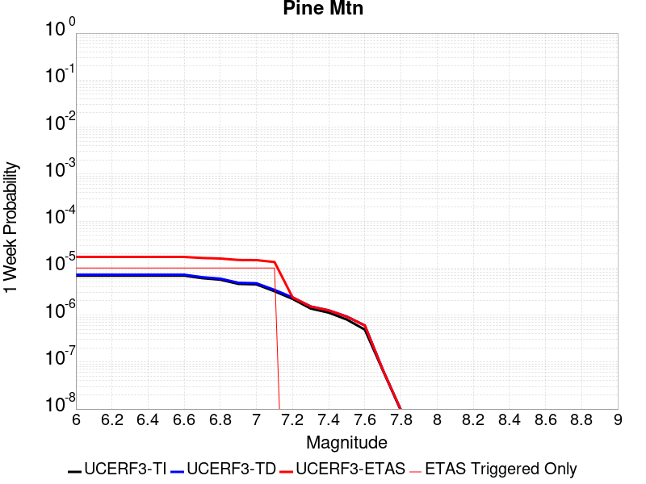 |  |  |  |

| Magnitude | 1 wk TI Prob | 1 wk TD Prob | 1 wk ETAS Prob | 1 wk ETAS/TD Gain | 1 wk ETAS Triggered Only | 1 mo TI Prob | 1 mo TD Prob | 1 mo ETAS Prob | 1 mo ETAS/TD Gain | 1 mo ETAS Triggered Only | 1 yr TI Prob | 1 yr TD Prob | 1 yr ETAS Prob | 1 yr ETAS/TD Gain | 1 yr ETAS Triggered Only | 10 yr TI Prob | 10 yr TD Prob | 10 yr ETAS Prob | 10 yr ETAS/TD Gain | 10 yr ETAS Triggered Only |
|-----|-----|-----|-----|-----|-----|-----|-----|-----|-----|-----|-----|-----|-----|-----|-----|-----|-----|-----|-----|-----|
| 6.0 | 6.894797E-6 | 7.2254716E-6 | 1.72254E-5 | 2.3839827 | 1.0E-5 | 2.9548795E-5 | 3.0965955E-5 | 6.0965027E-5 | 1.9687759 | 3.0E-5 | 3.596972E-4 | 3.7694827E-4 | 4.169332E-4 | 1.1060754 | 4.0E-5 | 0.0035911554 | 0.0037633865 | 0.0038231607 | 1.0158831 | 6.0E-5 |
| 6.1 | 6.894797E-6 | 7.2254716E-6 | 1.72254E-5 | 2.3839827 | 1.0E-5 | 2.9548795E-5 | 3.0965955E-5 | 6.0965027E-5 | 1.9687759 | 3.0E-5 | 3.596972E-4 | 3.7694827E-4 | 4.169332E-4 | 1.1060754 | 4.0E-5 | 0.0035911554 | 0.0037633865 | 0.0038231607 | 1.0158831 | 6.0E-5 |
| 6.2 | 6.894797E-6 | 7.2254716E-6 | 1.72254E-5 | 2.3839827 | 1.0E-5 | 2.9548795E-5 | 3.0965955E-5 | 6.0965027E-5 | 1.9687759 | 3.0E-5 | 3.596972E-4 | 3.7694827E-4 | 4.169332E-4 | 1.1060754 | 4.0E-5 | 0.0035911554 | 0.0037633865 | 0.0038231607 | 1.0158831 | 6.0E-5 |
| 6.3 | 6.894797E-6 | 7.2254716E-6 | 1.72254E-5 | 2.3839827 | 1.0E-5 | 2.9548795E-5 | 3.0965955E-5 | 6.0965027E-5 | 1.9687759 | 3.0E-5 | 3.596972E-4 | 3.7694827E-4 | 4.169332E-4 | 1.1060754 | 4.0E-5 | 0.0035911554 | 0.0037633865 | 0.0038231607 | 1.0158831 | 6.0E-5 |
| 6.4 | 6.894797E-6 | 7.2254716E-6 | 1.72254E-5 | 2.3839827 | 1.0E-5 | 2.9548795E-5 | 3.0965955E-5 | 6.0965027E-5 | 1.9687759 | 3.0E-5 | 3.596972E-4 | 3.7694827E-4 | 4.169332E-4 | 1.1060754 | 4.0E-5 | 0.0035911554 | 0.0037633865 | 0.0038231607 | 1.0158831 | 6.0E-5 |
| 6.5 | 6.894797E-6 | 7.2254716E-6 | 1.72254E-5 | 2.3839827 | 1.0E-5 | 2.9548795E-5 | 3.0965955E-5 | 6.0965027E-5 | 1.9687759 | 3.0E-5 | 3.596972E-4 | 3.7694827E-4 | 4.169332E-4 | 1.1060754 | 4.0E-5 | 0.0035911554 | 0.0037633865 | 0.0038231607 | 1.0158831 | 6.0E-5 |
| 6.6 | 6.894797E-6 | 7.2254716E-6 | 1.72254E-5 | 2.3839827 | 1.0E-5 | 2.9548795E-5 | 3.0965955E-5 | 6.0965027E-5 | 1.9687759 | 3.0E-5 | 3.596972E-4 | 3.7694827E-4 | 4.169332E-4 | 1.1060754 | 4.0E-5 | 0.0035911554 | 0.0037633865 | 0.0038231607 | 1.0158831 | 6.0E-5 |
| 6.7 | 6.0867933E-6 | 6.397124E-6 | 1.639706E-5 | 2.5631926 | 1.0E-5 | 2.6085996E-5 | 2.7415968E-5 | 5.7415145E-5 | 2.0942228 | 3.0E-5 | 3.1755073E-4 | 3.337405E-4 | 3.7372715E-4 | 1.1198136 | 4.0E-5 | 0.0031709734 | 0.0033326119 | 0.0033824453 | 1.0149533 | 5.0E-5 |
| 6.8 | 5.6530425E-6 | 5.950606E-6 | 1.5950547E-5 | 2.6804912 | 1.0E-5 | 2.42271E-5 | 2.5502359E-5 | 5.5501594E-5 | 2.1763318 | 3.0E-5 | 2.94925E-4 | 3.1044905E-4 | 3.5043663E-4 | 1.1288056 | 4.0E-5 | 0.002945339 | 0.0031003582 | 0.0031502033 | 1.0160772 | 5.0E-5 |
| 6.9 | 4.6015225E-6 | 4.8638444E-6 | 1.48637955E-5 | 3.0559769 | 1.0E-5 | 1.9720663E-5 | 2.084489E-5 | 5.0844264E-5 | 2.4391718 | 3.0E-5 | 2.4007261E-4 | 2.5375842E-4 | 2.9374828E-4 | 1.1575903 | 4.0E-5 | 0.0023981342 | 0.002534831 | 0.0025747295 | 1.0157402 | 4.0E-5 |
| 7.0 | 4.4875965E-6 | 4.7474837E-6 | 1.4747436E-5 | 3.106369 | 1.0E-5 | 1.9232413E-5 | 2.0346208E-5 | 5.0345596E-5 | 2.4744463 | 3.0E-5 | 2.3412947E-4 | 2.4768838E-4 | 2.8767847E-4 | 1.1614532 | 4.0E-5 | 0.0023388295 | 0.0024742668 | 0.002514168 | 1.0161264 | 4.0E-5 |
| 7.1 | 3.203907E-6 | 3.42942E-6 | 1.3429386E-5 | 3.915935 | 1.0E-5 | 1.3730958E-5 | 1.4697435E-5 | 4.4696993E-5 | 3.0411425 | 3.0E-5 | 1.6716159E-4 | 1.7892725E-4 | 2.0892188E-4 | 1.1676359 | 3.0E-5 | 0.0016703589 | 0.001787898 | 0.0018178443 | 1.0167495 | 3.0E-5 |
| 7.2 | 2.2060601E-6 | 2.3784874E-6 | 2.3784874E-6 | 1.0 | 0.0 | 9.4545085E-6 | 1.019348E-5 | 1.019348E-5 | 1.0 | 0.0 | 1.15102564E-4 | 1.2409901E-4 | 1.2409901E-4 | 1.0 | 0.0 | 0.0011504296 | 0.0012403419 | 0.0012403419 | 1.0 | 0.0 |
| 7.3 | 1.3765207E-6 | 1.5216535E-6 | 1.5216535E-6 | 1.0 | 0.0 | 5.899361E-6 | 6.5213567E-6 | 6.5213567E-6 | 1.0 | 0.0 | 7.182235E-5 | 7.939472E-5 | 7.939472E-5 | 1.0 | 0.0 | 7.1799144E-4 | 7.9367263E-4 | 7.9367263E-4 | 1.0 | 0.0 |
| 7.4 | 1.1245983E-6 | 1.2587126E-6 | 1.2587126E-6 | 1.0 | 0.0 | 4.819698E-6 | 5.394472E-6 | 5.394472E-6 | 1.0 | 0.0 | 5.8678244E-5 | 6.56758E-5 | 6.56758E-5 | 1.0 | 0.0 | 5.866275E-4 | 6.565722E-4 | 6.565722E-4 | 1.0 | 0.0 |
| 7.5 | 8.031682E-7 | 9.276999E-7 | 9.276999E-7 | 1.0 | 0.0 | 3.4421448E-6 | 3.975851E-6 | 3.975851E-6 | 1.0 | 0.0 | 4.1907308E-5 | 4.840498E-5 | 4.840498E-5 | 1.0 | 0.0 | 4.1899405E-4 | 4.8395112E-4 | 4.8395112E-4 | 1.0 | 0.0 |
| 7.6 | 4.8953444E-7 | 6.0030544E-7 | 6.0030544E-7 | 1.0 | 0.0 | 2.098003E-6 | 2.5727354E-6 | 2.5727354E-6 | 1.0 | 0.0 | 2.5542888E-5 | 3.1322652E-5 | 3.1322652E-5 | 1.0 | 0.0 | 2.5539953E-4 | 3.1318725E-4 | 3.1318725E-4 | 1.0 | 0.0 |
| 7.7 | 6.634529E-8 | 6.788826E-8 | 6.788826E-8 | 1.0 | 0.0 | 2.843369E-7 | 2.9094966E-7 | 2.9094966E-7 | 1.0 | 0.0 | 3.4617963E-6 | 3.5423066E-6 | 3.5423066E-6 | 1.0 | 0.0 | 3.4617424E-5 | 3.542255E-5 | 3.542255E-5 | 1.0 | 0.0 |
| 7.8 | 9.235578E-9 | 9.488566E-9 | 9.488566E-9 | 1.0 | 0.0 | 3.9581046E-8 | 4.0665284E-8 | 4.0665284E-8 | 1.0 | 0.0 | 4.818991E-7 | 4.950997E-7 | 4.950997E-7 | 1.0 | 0.0 | 4.8189804E-6 | 4.950988E-6 | 4.950988E-6 | 1.0 | 0.0 |

## White Wolf
*[(top)](#table-of-contents)*

| 1 Week | 1 Month | 1 Year | 10 Year |
|-----|-----|-----|-----|
|  |  |  |  |

| Magnitude | 1 wk TI Prob | 1 wk TD Prob | 1 wk ETAS Prob | 1 wk ETAS/TD Gain | 1 wk ETAS Triggered Only | 1 mo TI Prob | 1 mo TD Prob | 1 mo ETAS Prob | 1 mo ETAS/TD Gain | 1 mo ETAS Triggered Only | 1 yr TI Prob | 1 yr TD Prob | 1 yr ETAS Prob | 1 yr ETAS/TD Gain | 1 yr ETAS Triggered Only | 10 yr TI Prob | 10 yr TD Prob | 10 yr ETAS Prob | 10 yr ETAS/TD Gain | 10 yr ETAS Triggered Only |
|-----|-----|-----|-----|-----|-----|-----|-----|-----|-----|-----|-----|-----|-----|-----|-----|-----|-----|-----|-----|-----|
| 6.0 | 2.0037822E-5 | 1.0468583E-6 | 1.1046848E-5 | 10.5523815 | 1.0E-5 | 8.587355E-5 | 4.4865283E-6 | 1.4486483E-5 | 3.228885 | 1.0E-5 | 0.001045009 | 5.4622164E-5 | 8.462052E-5 | 1.5491976 | 3.0E-5 | 0.010401085 | 5.4609246E-4 | 6.060597E-4 | 1.1098115 | 6.0E-5 |
| 6.1 | 2.0037822E-5 | 1.0468583E-6 | 1.1046848E-5 | 10.5523815 | 1.0E-5 | 8.587355E-5 | 4.4865283E-6 | 1.4486483E-5 | 3.228885 | 1.0E-5 | 0.001045009 | 5.4622164E-5 | 8.462052E-5 | 1.5491976 | 3.0E-5 | 0.010401085 | 5.4609246E-4 | 6.060597E-4 | 1.1098115 | 6.0E-5 |
| 6.2 | 2.0037822E-5 | 1.0468583E-6 | 1.1046848E-5 | 10.5523815 | 1.0E-5 | 8.587355E-5 | 4.4865283E-6 | 1.4486483E-5 | 3.228885 | 1.0E-5 | 0.001045009 | 5.4622164E-5 | 8.462052E-5 | 1.5491976 | 3.0E-5 | 0.010401085 | 5.4609246E-4 | 6.060597E-4 | 1.1098115 | 6.0E-5 |
| 6.3 | 2.0037822E-5 | 1.0468583E-6 | 1.1046848E-5 | 10.5523815 | 1.0E-5 | 8.587355E-5 | 4.4865283E-6 | 1.4486483E-5 | 3.228885 | 1.0E-5 | 0.001045009 | 5.4622164E-5 | 8.462052E-5 | 1.5491976 | 3.0E-5 | 0.010401085 | 5.4609246E-4 | 6.060597E-4 | 1.1098115 | 6.0E-5 |
| 6.4 | 1.132487E-5 | 1.0468583E-6 | 1.1046848E-5 | 10.5523815 | 1.0E-5 | 4.8534253E-5 | 4.4865283E-6 | 1.4486483E-5 | 3.228885 | 1.0E-5 | 5.907443E-4 | 5.4622164E-5 | 8.462052E-5 | 1.5491976 | 3.0E-5 | 0.005891764 | 5.4609246E-4 | 6.060597E-4 | 1.1098115 | 6.0E-5 |
| 6.5 | 1.132487E-5 | 1.0468583E-6 | 1.1046848E-5 | 10.5523815 | 1.0E-5 | 4.8534253E-5 | 4.4865283E-6 | 1.4486483E-5 | 3.228885 | 1.0E-5 | 5.907443E-4 | 5.4622164E-5 | 8.462052E-5 | 1.5491976 | 3.0E-5 | 0.005891764 | 5.4609246E-4 | 6.060597E-4 | 1.1098115 | 6.0E-5 |
| 6.6 | 9.347473E-6 | 1.0468583E-6 | 1.1046848E-5 | 10.5523815 | 1.0E-5 | 4.0059982E-5 | 4.4865283E-6 | 1.4486483E-5 | 3.228885 | 1.0E-5 | 4.8762115E-4 | 5.4622164E-5 | 8.462052E-5 | 1.5491976 | 3.0E-5 | 0.0048655253 | 5.4609246E-4 | 6.060597E-4 | 1.1098115 | 6.0E-5 |
| 6.7 | 7.842647E-6 | 1.0047773E-6 | 1.1004768E-5 | 10.952444 | 1.0E-5 | 3.361091E-5 | 4.306182E-6 | 1.4306139E-5 | 3.322233 | 1.0E-5 | 4.0913603E-4 | 5.2426552E-5 | 8.242498E-5 | 1.5721991 | 3.0E-5 | 0.004083836 | 5.241468E-4 | 5.8411533E-4 | 1.1144117 | 6.0E-5 |
| 6.8 | 6.26597E-6 | 9.734289E-7 | 1.0973419E-5 | 11.272955 | 1.0E-5 | 2.685388E-5 | 4.1718313E-6 | 1.417179E-5 | 3.3970187 | 1.0E-5 | 3.2689696E-4 | 5.0790914E-5 | 8.078939E-5 | 1.5906268 | 3.0E-5 | 0.003264165 | 5.07798E-4 | 5.677675E-4 | 1.1180972 | 6.0E-5 |
| 6.9 | 5.258436E-6 | 9.1827343E-7 | 1.0918264E-5 | 11.889993 | 1.0E-5 | 2.2535958E-5 | 3.935452E-6 | 1.3935412E-5 | 3.5409942 | 1.0E-5 | 2.7434074E-4 | 4.7913123E-5 | 7.791168E-5 | 1.6261033 | 3.0E-5 | 0.0027400232 | 4.7903272E-4 | 5.39004E-4 | 1.1251924 | 6.0E-5 |
| 7.0 | 4.675028E-6 | 8.660704E-7 | 1.08660615E-5 | 12.546395 | 1.0E-5 | 2.003568E-5 | 3.7117254E-6 | 1.3711689E-5 | 3.694155 | 1.0E-5 | 2.4390711E-4 | 4.518937E-5 | 7.5188014E-5 | 1.663843 | 3.0E-5 | 0.0024363957 | 4.518065E-4 | 5.117794E-4 | 1.1327403 | 6.0E-5 |
| 7.1 | 2.8270078E-6 | 6.8737717E-7 | 1.068737E-5 | 15.548044 | 1.0E-5 | 1.2115692E-5 | 2.945899E-6 | 1.29458695E-5 | 4.3945394 | 1.0E-5 | 1.4749856E-4 | 3.586577E-5 | 5.5865054E-5 | 1.5576147 | 2.0E-5 | 0.001474007 | 3.5860392E-4 | 4.08586E-4 | 1.1393796 | 5.0E-5 |
| 7.2 | 1.6881406E-6 | 2.2703432E-7 | 2.2703432E-7 | 1.0 | 0.0 | 7.2348685E-6 | 9.730038E-7 | 9.730038E-7 | 1.0 | 0.0 | 8.808096E-5 | 1.1846259E-5 | 2.1846141E-5 | 1.8441384 | 1.0E-5 | 8.8046055E-4 | 1.1845643E-4 | 1.2845524E-4 | 1.0844092 | 1.0E-5 |
| 7.3 | 9.086107E-7 | 1.5264496E-7 | 1.5264496E-7 | 1.0 | 0.0 | 3.8940398E-6 | 6.5419255E-7 | 6.5419255E-7 | 1.0 | 0.0 | 4.7408903E-5 | 7.964766E-6 | 1.7964687E-5 | 2.2555196 | 1.0E-5 | 4.739879E-4 | 7.964489E-5 | 8.964409E-5 | 1.1255473 | 1.0E-5 |
| 7.4 | 1.9717383E-7 | 9.003399E-8 | 9.003399E-8 | 1.0 | 0.0 | 8.450304E-7 | 3.8585992E-7 | 3.8585992E-7 | 1.0 | 0.0 | 1.0288197E-5 | 4.697835E-6 | 1.4697788E-5 | 3.1286302 | 1.0E-5 | 1.028772E-4 | 4.6977384E-5 | 5.6976914E-5 | 1.2128584 | 1.0E-5 |
| 7.5 | 1.086975E-7 | 6.659662E-8 | 6.659662E-8 | 1.0 | 0.0 | 4.6584634E-7 | 2.8541407E-7 | 2.8541407E-7 | 1.0 | 0.0 | 5.6716644E-6 | 3.474911E-6 | 1.3474876E-5 | 3.8777616 | 1.0E-5 | 5.6715195E-5 | 3.474859E-5 | 4.474824E-5 | 1.2877715 | 1.0E-5 |
| 7.6 | 2.4217808E-8 | 1.5820849E-8 | 1.5820849E-8 | 1.0 | 0.0 | 1.03790605E-7 | 6.780364E-8 | 6.780364E-8 | 1.0 | 0.0 | 1.2636499E-6 | 8.25509E-7 | 8.25509E-7 | 1.0 | 0.0 | 1.2636427E-5 | 8.255064E-6 | 8.255064E-6 | 1.0 | 0.0 |

## San Jacinto (Borrego)
*[(top)](#table-of-contents)*

| 1 Week | 1 Month | 1 Year | 10 Year |
|-----|-----|-----|-----|
|  |  |  |  |

| Magnitude | 1 wk TI Prob | 1 wk TD Prob | 1 wk ETAS Prob | 1 wk ETAS/TD Gain | 1 wk ETAS Triggered Only | 1 mo TI Prob | 1 mo TD Prob | 1 mo ETAS Prob | 1 mo ETAS/TD Gain | 1 mo ETAS Triggered Only | 1 yr TI Prob | 1 yr TD Prob | 1 yr ETAS Prob | 1 yr ETAS/TD Gain | 1 yr ETAS Triggered Only | 10 yr TI Prob | 10 yr TD Prob | 10 yr ETAS Prob | 10 yr ETAS/TD Gain | 10 yr ETAS Triggered Only |
|-----|-----|-----|-----|-----|-----|-----|-----|-----|-----|-----|-----|-----|-----|-----|-----|-----|-----|-----|-----|-----|
| 6.0 | 3.543992E-5 | 2.7925962E-5 | 6.792485E-5 | 2.432319 | 4.0E-5 | 1.5187653E-4 | 1.1967727E-4 | 1.6967129E-4 | 1.4177402 | 5.0E-5 | 0.0018475284 | 0.0014561092 | 0.0015060364 | 1.034288 | 5.0E-5 | 0.018322436 | 0.01486815 | 0.014927259 | 1.0039755 | 6.0E-5 |
| 6.1 | 3.542281E-5 | 2.7925962E-5 | 6.792485E-5 | 2.432319 | 4.0E-5 | 1.5180321E-4 | 1.1967727E-4 | 1.6967129E-4 | 1.4177402 | 5.0E-5 | 0.0018466372 | 0.0014561092 | 0.0015060364 | 1.034288 | 5.0E-5 | 0.018313672 | 0.01486815 | 0.014927259 | 1.0039755 | 6.0E-5 |
| 6.2 | 3.4688688E-5 | 2.7925962E-5 | 6.792485E-5 | 2.432319 | 4.0E-5 | 1.4865733E-4 | 1.1967727E-4 | 1.6967129E-4 | 1.4177402 | 5.0E-5 | 0.0018084005 | 0.0014561091 | 0.0015060364 | 1.034288 | 5.0E-5 | 0.017937548 | 0.01486815 | 0.014927259 | 1.0039755 | 6.0E-5 |
| 6.3 | 3.2087122E-5 | 2.7771312E-5 | 6.77702E-5 | 2.4402952 | 4.0E-5 | 1.3750899E-4 | 1.1901455E-4 | 1.6900859E-4 | 1.4200667 | 5.0E-5 | 0.0016728862 | 0.0014480512 | 0.0014979788 | 1.0344791 | 5.0E-5 | 0.016603488 | 0.014789308 | 0.01484842 | 1.003997 | 6.0E-5 |
| 6.4 | 3.1828724E-5 | 2.773829E-5 | 6.773718E-5 | 2.44201 | 4.0E-5 | 1.364017E-4 | 1.1887303E-4 | 1.6886709E-4 | 1.4205668 | 5.0E-5 | 0.0016594254 | 0.0014463306 | 0.0014962582 | 1.0345203 | 5.0E-5 | 0.016470885 | 0.014772502 | 0.014831615 | 1.0040016 | 6.0E-5 |
| 6.5 | 3.1563577E-5 | 2.7477974E-5 | 6.7476874E-5 | 2.4556713 | 4.0E-5 | 1.3526545E-4 | 1.17757496E-4 | 1.6775161E-4 | 1.4245514 | 5.0E-5 | 0.0016456128 | 0.0014327668 | 0.0014826952 | 1.0348475 | 5.0E-5 | 0.0163348 | 0.01463991 | 0.014699032 | 1.0040383 | 6.0E-5 |
| 6.6 | 3.1467625E-5 | 2.7322194E-5 | 6.73211E-5 | 2.4639714 | 4.0E-5 | 1.3485427E-4 | 1.17089934E-4 | 1.6708407E-4 | 1.4269722 | 5.0E-5 | 0.0016406142 | 0.0014246498 | 0.0014745786 | 1.0350463 | 5.0E-5 | 0.016285548 | 0.014560228 | 0.014619354 | 1.0040609 | 6.0E-5 |
| 6.7 | 3.1223695E-5 | 2.6940217E-5 | 6.693914E-5 | 2.484729 | 4.0E-5 | 1.3380898E-4 | 1.1545303E-4 | 1.6544726E-4 | 1.4330266 | 5.0E-5 | 0.0016279068 | 0.0014047464 | 0.0014546763 | 1.0355436 | 5.0E-5 | 0.01616033 | 0.01436451 | 0.014423648 | 1.004117 | 6.0E-5 |
| 6.8 | 3.1015585E-5 | 2.6761221E-5 | 6.676015E-5 | 2.4946601 | 4.0E-5 | 1.3291716E-4 | 1.1468597E-4 | 1.6468024E-4 | 1.4359231 | 5.0E-5 | 0.001617065 | 0.0013954195 | 0.0014453497 | 1.0357815 | 5.0E-5 | 0.016053487 | 0.014271772 | 0.014330915 | 1.0041441 | 6.0E-5 |
| 6.9 | 2.6641965E-5 | 2.2183434E-5 | 6.2182546E-5 | 2.8031073 | 4.0E-5 | 1.1417485E-4 | 9.506842E-5 | 1.4506366E-4 | 1.525887 | 5.0E-5 | 0.0013891924 | 0.0011568473 | 0.0012067895 | 1.0431709 | 5.0E-5 | 0.0138054015 | 0.011882191 | 0.011941478 | 1.0049896 | 6.0E-5 |
| 7.0 | 2.3854353E-5 | 2.047825E-5 | 6.0477432E-5 | 2.9532518 | 4.0E-5 | 1.02228936E-4 | 8.776099E-5 | 1.3775661E-4 | 1.5696791 | 5.0E-5 | 0.0012439266 | 0.0010679689 | 0.0011179155 | 1.0467678 | 5.0E-5 | 0.012369866 | 0.0109826205 | 0.011041962 | 1.0054032 | 6.0E-5 |
| 7.1 | 2.3672901E-5 | 2.0314741E-5 | 6.0313927E-5 | 2.9689736 | 4.0E-5 | 1.0145135E-4 | 8.706028E-5 | 1.3705593E-4 | 1.5742646 | 5.0E-5 | 0.0012344702 | 0.0010594461 | 0.0011093931 | 1.0471445 | 5.0E-5 | 0.0122763505 | 0.010897858 | 0.010957205 | 1.0054457 | 6.0E-5 |
| 7.2 | 2.2717244E-5 | 1.9542116E-5 | 5.9541333E-5 | 3.046821 | 4.0E-5 | 9.735599E-5 | 8.3749255E-5 | 1.3374507E-4 | 1.5969702 | 5.0E-5 | 0.0011846646 | 0.0010191725 | 0.0010691215 | 1.0490094 | 5.0E-5 | 0.01178369 | 0.010495322 | 0.010554692 | 1.0056568 | 6.0E-5 |
| 7.3 | 2.1016205E-5 | 1.8383771E-5 | 5.8383037E-5 | 3.1757922 | 4.0E-5 | 9.006634E-5 | 7.878522E-5 | 1.2878128E-4 | 1.6345868 | 5.0E-5 | 0.001096006 | 9.5879E-4 | 0.0010087421 | 1.0520991 | 5.0E-5 | 0.010906163 | 0.009890901 | 0.009950307 | 1.0060062 | 6.0E-5 |
| 7.4 | 2.0683625E-5 | 1.8186302E-5 | 5.8185575E-5 | 3.1994176 | 4.0E-5 | 8.86411E-5 | 7.7938974E-5 | 1.2793508E-4 | 1.6414776 | 5.0E-5 | 0.001078671 | 9.48496E-4 | 9.984486E-4 | 1.052665 | 5.0E-5 | 0.010734501 | 0.0097876275 | 0.00984704 | 1.0060701 | 6.0E-5 |
| 7.5 | 1.9993966E-5 | 1.7781347E-5 | 5.7780635E-5 | 3.2495084 | 4.0E-5 | 8.568561E-5 | 7.6203556E-5 | 1.2619975E-4 | 1.6560873 | 5.0E-5 | 0.001042723 | 9.2738547E-4 | 9.773391E-4 | 1.053865 | 5.0E-5 | 0.010378438 | 0.009574548 | 0.009633974 | 1.0062066 | 6.0E-5 |
| 7.6 | 1.788966E-5 | 1.6434618E-5 | 5.643396E-5 | 3.4338467 | 4.0E-5 | 7.666772E-5 | 7.043219E-5 | 1.2042866E-4 | 1.7098527 | 5.0E-5 | 9.3302975E-4 | 8.5717626E-4 | 9.071334E-4 | 1.0582811 | 5.0E-5 | 0.00929122 | 0.008866415 | 0.008925883 | 1.0067071 | 6.0E-5 |
| 7.7 | 1.5125781E-5 | 1.4236738E-5 | 5.4236167E-5 | 3.8095925 | 4.0E-5 | 6.4823165E-5 | 6.101317E-5 | 1.11010115E-4 | 1.8194453 | 5.0E-5 | 7.889362E-4 | 7.4258295E-4 | 7.9254585E-4 | 1.0672826 | 5.0E-5 | 0.007861412 | 0.007714161 | 0.0077736983 | 1.0077178 | 6.0E-5 |
| 7.8 | 1.250089E-5 | 1.262994E-5 | 5.2629435E-5 | 4.1670375 | 4.0E-5 | 5.3574146E-5 | 5.4127195E-5 | 1.0412449E-4 | 1.9237001 | 5.0E-5 | 6.5207E-4 | 6.588E-4 | 7.0876704E-4 | 1.0758456 | 5.0E-5 | 0.006501599 | 0.006867759 | 0.006927347 | 1.0086765 | 6.0E-5 |
| 7.9 | 9.561E-6 | 9.754065E-6 | 4.9753675E-5 | 5.1008143 | 4.0E-5 | 4.0975072E-5 | 4.180247E-5 | 9.180038E-5 | 2.1960516 | 5.0E-5 | 4.987573E-4 | 5.0882675E-4 | 5.5880134E-4 | 1.0982152 | 5.0E-5 | 0.0049763937 | 0.0053523607 | 0.0054120393 | 1.01115 | 6.0E-5 |
| 8.0 | 8.01699E-6 | 8.292994E-6 | 4.8292663E-5 | 5.8233085 | 4.0E-5 | 3.4358076E-5 | 3.554092E-5 | 8.553914E-5 | 2.406779 | 5.0E-5 | 4.1822926E-4 | 4.3262533E-4 | 4.8260367E-4 | 1.1155235 | 5.0E-5 | 0.0041744304 | 0.0045733186 | 0.0046330444 | 1.0130596 | 6.0E-5 |
| 8.1 | 6.541947E-6 | 6.461784E-6 | 4.6461526E-5 | 7.1902013 | 4.0E-5 | 2.8036617E-5 | 2.7693068E-5 | 7.7691686E-5 | 2.805456 | 5.0E-5 | 3.4129233E-4 | 3.3711144E-4 | 3.870946E-4 | 1.1482689 | 5.0E-5 | 0.0034076865 | 0.0035805756 | 0.0036403607 | 1.016697 | 6.0E-5 |
| 8.2 | 1.7968189E-6 | 7.9684827E-7 | 7.9684827E-7 | 1.0 | 0.0 | 7.70063E-6 | 3.4150596E-6 | 3.4150596E-6 | 1.0 | 0.0 | 9.3751136E-5 | 4.157758E-5 | 4.157758E-5 | 1.0 | 0.0 | 9.371159E-4 | 4.7107413E-4 | 4.7107413E-4 | 1.0 | 0.0 |
| 8.3 | 1.5167889E-7 | 4.8951257E-8 | 4.8951257E-8 | 1.0 | 0.0 | 6.500522E-7 | 2.0979108E-7 | 2.0979108E-7 | 1.0 | 0.0 | 7.9143565E-6 | 2.5542038E-6 | 2.5542038E-6 | 1.0 | 0.0 | 7.914075E-5 | 2.9679897E-5 | 2.9679897E-5 | 1.0 | 0.0 |

## Newport-Inglewood alt 1
*[(top)](#table-of-contents)*

| 1 Week | 1 Month | 1 Year | 10 Year |
|-----|-----|-----|-----|
|  |  |  |  |

| Magnitude | 1 wk TI Prob | 1 wk TD Prob | 1 wk ETAS Prob | 1 wk ETAS/TD Gain | 1 wk ETAS Triggered Only | 1 mo TI Prob | 1 mo TD Prob | 1 mo ETAS Prob | 1 mo ETAS/TD Gain | 1 mo ETAS Triggered Only | 1 yr TI Prob | 1 yr TD Prob | 1 yr ETAS Prob | 1 yr ETAS/TD Gain | 1 yr ETAS Triggered Only | 10 yr TI Prob | 10 yr TD Prob | 10 yr ETAS Prob | 10 yr ETAS/TD Gain | 10 yr ETAS Triggered Only |
|-----|-----|-----|-----|-----|-----|-----|-----|-----|-----|-----|-----|-----|-----|-----|-----|-----|-----|-----|-----|-----|
| 6.0 | 2.9668912E-5 | 3.0404828E-5 | 3.0404828E-5 | 1.0 | 0.0 | 1.2714628E-4 | 1.3030265E-4 | 1.3030265E-4 | 1.0 | 0.0 | 0.0015469068 | 0.0015857654 | 0.0016057338 | 1.0125922 | 2.0E-5 | 0.015361829 | 0.01579211 | 0.015831478 | 1.0024929 | 4.0E-5 |
| 6.1 | 2.9668912E-5 | 3.0404828E-5 | 3.0404828E-5 | 1.0 | 0.0 | 1.2714628E-4 | 1.3030265E-4 | 1.3030265E-4 | 1.0 | 0.0 | 0.0015469068 | 0.0015857654 | 0.0016057338 | 1.0125922 | 2.0E-5 | 0.015361829 | 0.01579211 | 0.015831478 | 1.0024929 | 4.0E-5 |
| 6.2 | 2.9668912E-5 | 3.0404828E-5 | 3.0404828E-5 | 1.0 | 0.0 | 1.2714628E-4 | 1.3030265E-4 | 1.3030265E-4 | 1.0 | 0.0 | 0.0015469068 | 0.0015857654 | 0.0016057338 | 1.0125922 | 2.0E-5 | 0.015361829 | 0.01579211 | 0.015831478 | 1.0024929 | 4.0E-5 |
| 6.3 | 2.9668912E-5 | 3.0404828E-5 | 3.0404828E-5 | 1.0 | 0.0 | 1.2714628E-4 | 1.3030265E-4 | 1.3030265E-4 | 1.0 | 0.0 | 0.0015469068 | 0.0015857654 | 0.0016057338 | 1.0125922 | 2.0E-5 | 0.015361829 | 0.01579211 | 0.015831478 | 1.0024929 | 4.0E-5 |
| 6.4 | 1.275942E-5 | 1.02725335E-5 | 1.02725335E-5 | 1.0 | 0.0 | 5.4682085E-5 | 4.4024422E-5 | 4.4024422E-5 | 1.0 | 0.0 | 6.65551E-4 | 5.358697E-4 | 5.55859E-4 | 1.0373025 | 2.0E-5 | 0.0066356123 | 0.0053462 | 0.0053760395 | 1.0055815 | 3.0E-5 |
| 6.5 | 1.275942E-5 | 1.02725335E-5 | 1.02725335E-5 | 1.0 | 0.0 | 5.4682085E-5 | 4.4024422E-5 | 4.4024422E-5 | 1.0 | 0.0 | 6.65551E-4 | 5.358697E-4 | 5.55859E-4 | 1.0373025 | 2.0E-5 | 0.0066356123 | 0.0053462 | 0.0053760395 | 1.0055815 | 3.0E-5 |
| 6.6 | 1.1255358E-5 | 8.661911E-6 | 8.661911E-6 | 1.0 | 0.0 | 4.8236358E-5 | 3.7121958E-5 | 3.7121958E-5 | 1.0 | 0.0 | 5.871194E-4 | 4.5186782E-4 | 4.618633E-4 | 1.0221204 | 1.0E-5 | 0.005855706 | 0.0045096674 | 0.004529577 | 1.0044149 | 2.0E-5 |
| 6.7 | 1.0504745E-5 | 7.8998455E-6 | 7.8998455E-6 | 1.0 | 0.0 | 4.5019555E-5 | 3.385605E-5 | 3.385605E-5 | 1.0 | 0.0 | 5.4797524E-4 | 4.121207E-4 | 4.2211654E-4 | 1.0242547 | 1.0E-5 | 0.0054662596 | 0.004113694 | 0.004123653 | 1.0024209 | 1.0E-5 |
| 6.8 | 1.0476007E-5 | 7.881227E-6 | 7.881227E-6 | 1.0 | 0.0 | 4.4896402E-5 | 3.3776258E-5 | 3.3776258E-5 | 1.0 | 0.0 | 5.464766E-4 | 4.1114958E-4 | 4.2114547E-4 | 1.024312 | 1.0E-5 | 0.005451347 | 0.004104019 | 0.004113978 | 1.0024266 | 1.0E-5 |
| 6.9 | 9.076797E-6 | 6.4896567E-6 | 6.4896567E-6 | 1.0 | 0.0 | 3.889998E-5 | 2.7812519E-5 | 2.7812519E-5 | 1.0 | 0.0 | 4.7350433E-4 | 3.3856515E-4 | 3.4856176E-4 | 1.0295265 | 1.0E-5 | 0.004724967 | 0.003380531 | 0.003390497 | 1.0029482 | 1.0E-5 |
| 7.0 | 8.73795E-6 | 6.2120503E-6 | 6.2120503E-6 | 1.0 | 0.0 | 3.7447822E-5 | 2.6622802E-5 | 2.6622802E-5 | 1.0 | 0.0 | 4.5583185E-4 | 3.2408469E-4 | 3.3408144E-4 | 1.0308461 | 1.0E-5 | 0.0045489795 | 0.0032361522 | 0.00324612 | 1.0030801 | 1.0E-5 |
| 7.1 | 8.391299E-6 | 5.9557533E-6 | 5.9557533E-6 | 1.0 | 0.0 | 3.5962214E-5 | 2.5524409E-5 | 2.5524409E-5 | 1.0 | 0.0 | 4.37752E-4 | 3.1071564E-4 | 3.207125E-4 | 1.0321738 | 1.0E-5 | 0.004368907 | 0.0031028416 | 0.0031128104 | 1.0032128 | 1.0E-5 |
| 7.2 | 7.796882E-6 | 5.4964826E-6 | 5.4964826E-6 | 1.0 | 0.0 | 3.341478E-5 | 2.3556144E-5 | 2.3556144E-5 | 1.0 | 0.0 | 4.06749E-4 | 2.867585E-4 | 2.9675564E-4 | 1.0348625 | 1.0E-5 | 0.0040600533 | 0.002863909 | 0.0028738803 | 1.0034817 | 1.0E-5 |
| 7.3 | 6.4738833E-6 | 4.6477753E-6 | 4.6477753E-6 | 1.0 | 0.0 | 2.774492E-5 | 1.9918885E-5 | 1.9918885E-5 | 1.0 | 0.0 | 3.3774204E-4 | 2.424856E-4 | 2.5248318E-4 | 1.0412296 | 1.0E-5 | 0.0033722918 | 0.0024222268 | 0.0024322027 | 1.0041184 | 1.0E-5 |
| 7.4 | 5.382145E-6 | 3.8857215E-6 | 3.8857215E-6 | 1.0 | 0.0 | 2.3066134E-5 | 1.6652988E-5 | 1.6652988E-5 | 1.0 | 0.0 | 2.8079396E-4 | 2.0273139E-4 | 2.1272937E-4 | 1.0493164 | 1.0E-5 | 0.0028043943 | 0.002025479 | 0.0020354588 | 1.0049272 | 1.0E-5 |
| 7.5 | 3.648244E-6 | 2.5737634E-6 | 2.5737634E-6 | 1.0 | 0.0 | 1.5635238E-5 | 1.1030369E-5 | 1.1030369E-5 | 1.0 | 0.0 | 1.9034238E-4 | 1.3428657E-4 | 1.3428657E-4 | 1.0 | 0.0 | 0.0019017943 | 0.0013420646 | 0.0013420646 | 1.0 | 0.0 |
| 7.6 | 2.2906888E-6 | 1.547986E-6 | 1.547986E-6 | 1.0 | 0.0 | 9.817201E-6 | 6.634209E-6 | 6.634209E-6 | 1.0 | 0.0 | 1.1951787E-4 | 8.076857E-5 | 8.076857E-5 | 1.0 | 0.0 | 0.0011945361 | 8.073989E-4 | 8.073989E-4 | 1.0 | 0.0 |
| 7.7 | 6.0479874E-7 | 3.397468E-7 | 3.397468E-7 | 1.0 | 0.0 | 2.5919921E-6 | 1.456057E-6 | 1.456057E-6 | 1.0 | 0.0 | 3.1557047E-5 | 1.7727363E-5 | 1.7727363E-5 | 1.0 | 0.0 | 3.1552566E-4 | 1.7726087E-4 | 1.7726087E-4 | 1.0 | 0.0 |
| 7.8 | 1.16056995E-8 | 9.782997E-9 | 9.782997E-9 | 1.0 | 0.0 | 4.9738713E-8 | 4.1927127E-8 | 4.1927127E-8 | 1.0 | 0.0 | 6.0556863E-7 | 5.1046277E-7 | 5.1046277E-7 | 1.0 | 0.0 | 6.05567E-6 | 5.1046277E-6 | 5.1046277E-6 | 1.0 | 0.0 |

## Calaveras (So) - Paicines extension 2011 CFM
*[(top)](#table-of-contents)*

| 1 Week | 1 Month | 1 Year | 10 Year |
|-----|-----|-----|-----|
|  | 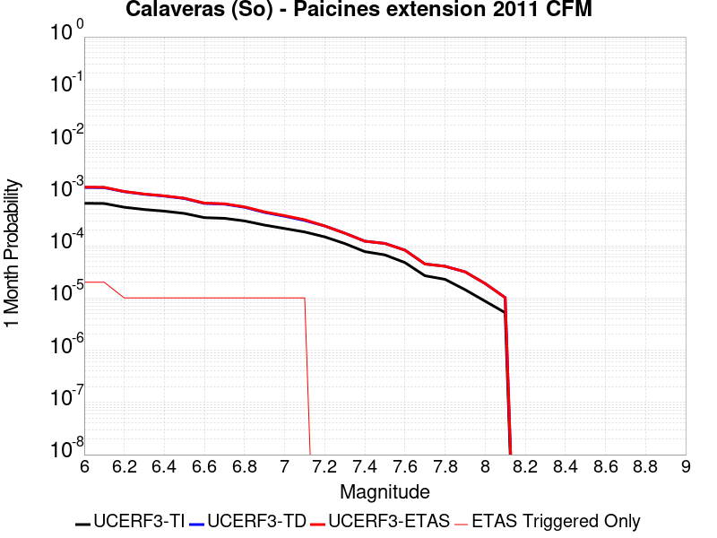 |  |  |

| Magnitude | 1 wk TI Prob | 1 wk TD Prob | 1 wk ETAS Prob | 1 wk ETAS/TD Gain | 1 wk ETAS Triggered Only | 1 mo TI Prob | 1 mo TD Prob | 1 mo ETAS Prob | 1 mo ETAS/TD Gain | 1 mo ETAS Triggered Only | 1 yr TI Prob | 1 yr TD Prob | 1 yr ETAS Prob | 1 yr ETAS/TD Gain | 1 yr ETAS Triggered Only | 10 yr TI Prob | 10 yr TD Prob | 10 yr ETAS Prob | 10 yr ETAS/TD Gain | 10 yr ETAS Triggered Only |
|-----|-----|-----|-----|-----|-----|-----|-----|-----|-----|-----|-----|-----|-----|-----|-----|-----|-----|-----|-----|-----|
| 6.0 | 1.5183659E-4 | 3.0520977E-4 | 3.1520674E-4 | 1.0327543 | 1.0E-5 | 6.5056595E-4 | 0.0013068188 | 0.0013267926 | 1.0152843 | 2.0E-5 | 0.007891912 | 0.015696203 | 0.015725734 | 1.0018812 | 3.0E-5 | 0.076174594 | 0.13848905 | 0.13854074 | 1.0003732 | 6.0E-5 |
| 6.1 | 1.5024997E-4 | 3.021517E-4 | 3.1214865E-4 | 1.033086 | 1.0E-5 | 6.437695E-4 | 0.0012937278 | 0.001313702 | 1.0154392 | 2.0E-5 | 0.0078097614 | 0.015539596 | 0.01556913 | 1.0019006 | 3.0E-5 | 0.075409345 | 0.13715863 | 0.13721041 | 1.0003774 | 6.0E-5 |
| 6.2 | 1.2743923E-4 | 2.5313982E-4 | 2.5313982E-4 | 1.0 | 0.0 | 5.460538E-4 | 0.0010839999 | 0.001093989 | 1.0092151 | 1.0E-5 | 0.0066279583 | 0.013046881 | 0.013066621 | 1.0015129 | 2.0E-5 | 0.064337276 | 0.117256075 | 0.11730021 | 1.0003765 | 5.0E-5 |
| 6.3 | 1.1525114E-4 | 2.2599236E-4 | 2.2599236E-4 | 1.0 | 0.0 | 4.9383997E-4 | 9.678718E-4 | 9.77862E-4 | 1.010322 | 1.0E-5 | 0.0059959386 | 0.011668079 | 0.011687845 | 1.0016941 | 2.0E-5 | 0.058367174 | 0.106372125 | 0.10641681 | 1.0004201 | 5.0E-5 |
| 6.4 | 1.07200925E-4 | 2.0840544E-4 | 2.0840544E-4 | 1.0 | 0.0 | 4.5935164E-4 | 8.926123E-4 | 9.026034E-4 | 1.011193 | 1.0E-5 | 0.0055782744 | 0.010772959 | 0.010792743 | 1.0018365 | 2.0E-5 | 0.0544031 | 0.099194765 | 0.09923981 | 1.0004541 | 5.0E-5 |
| 6.5 | 9.69631E-5 | 1.8734725E-4 | 1.8734725E-4 | 1.0 | 0.0 | 4.1548995E-4 | 8.024631E-4 | 8.124551E-4 | 1.0124516 | 1.0E-5 | 0.0050468626 | 0.009694842 | 0.009714647 | 1.002043 | 2.0E-5 | 0.04933773 | 0.090086564 | 0.090132065 | 1.000505 | 5.0E-5 |
| 6.6 | 8.0552316E-5 | 1.507068E-4 | 1.507068E-4 | 1.0 | 0.0 | 3.4517853E-4 | 6.4569083E-4 | 6.556844E-4 | 1.0154773 | 1.0E-5 | 0.0041944524 | 0.007826508 | 0.00783643 | 1.0012677 | 1.0E-5 | 0.04116161 | 0.0748563 | 0.07488406 | 1.0003707 | 3.0E-5 |
| 6.7 | 7.815757E-5 | 1.4611272E-4 | 1.4611272E-4 | 1.0 | 0.0 | 3.34918E-4 | 6.26014E-4 | 6.360078E-4 | 1.015964 | 1.0E-5 | 0.004070005 | 0.007589312 | 0.0075992355 | 1.0013076 | 1.0E-5 | 0.039962657 | 0.07270582 | 0.07273364 | 1.0003827 | 3.0E-5 |
| 6.8 | 6.965264E-5 | 1.2722758E-4 | 1.2722758E-4 | 1.0 | 0.0 | 2.9847719E-4 | 5.4513285E-4 | 5.551274E-4 | 1.0183342 | 1.0E-5 | 0.0036279052 | 0.0066135945 | 0.0066235284 | 1.001502 | 1.0E-5 | 0.03569247 | 0.063801065 | 0.063829154 | 1.0004402 | 3.0E-5 |
| 6.9 | 5.8000453E-5 | 1.01439E-4 | 1.01439E-4 | 1.0 | 0.0 | 2.4854968E-4 | 4.346666E-4 | 4.4466226E-4 | 1.0229962 | 1.0E-5 | 0.0030218933 | 0.005279322 | 0.0052892696 | 1.0018842 | 1.0E-5 | 0.029811295 | 0.051502965 | 0.05153142 | 1.0005525 | 3.0E-5 |
| 7.0 | 4.9865852E-5 | 8.568029E-5 | 8.568029E-5 | 1.0 | 0.0 | 2.1369329E-4 | 3.6715003E-4 | 3.7714635E-4 | 1.0272268 | 1.0E-5 | 0.0025986114 | 0.004460979 | 0.004470934 | 1.0022317 | 1.0E-5 | 0.025684336 | 0.043782018 | 0.043810703 | 1.0006552 | 3.0E-5 |
| 7.1 | 4.283875E-5 | 7.1124625E-5 | 7.1124625E-5 | 1.0 | 0.0 | 1.8358172E-4 | 3.0478454E-4 | 3.1478147E-4 | 1.0328001 | 1.0E-5 | 0.0022328163 | 0.003704494 | 0.0037144572 | 1.0026895 | 1.0E-5 | 0.022105146 | 0.03673582 | 0.036764722 | 1.0007867 | 3.0E-5 |
| 7.2 | 3.450115E-5 | 5.5778568E-5 | 5.5778568E-5 | 1.0 | 0.0 | 1.478537E-4 | 2.3902925E-4 | 2.3902925E-4 | 1.0 | 0.0 | 0.0017986323 | 0.0029063264 | 0.0029063264 | 1.0 | 0.0 | 0.017841442 | 0.029079042 | 0.02909846 | 1.0006678 | 2.0E-5 |
| 7.3 | 2.5709045E-5 | 4.059001E-5 | 4.059001E-5 | 1.0 | 0.0 | 1.1017697E-4 | 1.7394568E-4 | 1.7394568E-4 | 1.0 | 0.0 | 0.0013405791 | 0.0021157486 | 0.0021157486 | 1.0 | 0.0 | 0.013325208 | 0.02129686 | 0.021316435 | 1.0009191 | 2.0E-5 |
| 7.4 | 1.8003093E-5 | 2.8511378E-5 | 2.8511378E-5 | 1.0 | 0.0 | 7.715383E-5 | 1.2218591E-4 | 1.2218591E-4 | 1.0 | 0.0 | 9.3894306E-4 | 0.0014866006 | 0.0014866006 | 1.0 | 0.0 | 0.009349857 | 0.015051589 | 0.015061439 | 1.0006543 | 1.0E-5 |
| 7.5 | 1.5595824E-5 | 2.5823752E-5 | 2.5823752E-5 | 1.0 | 0.0 | 6.683753E-5 | 1.10668545E-4 | 1.10668545E-4 | 1.0 | 0.0 | 8.134431E-4 | 0.0013465589 | 0.0013465589 | 1.0 | 0.0 | 0.008104719 | 0.013651571 | 0.013661435 | 1.0007225 | 1.0E-5 |
| 7.6 | 1.1110309E-5 | 1.9223195E-5 | 1.9223195E-5 | 1.0 | 0.0 | 4.761474E-5 | 8.2382525E-5 | 8.2382525E-5 | 1.0 | 0.0 | 5.795553E-4 | 0.0010025471 | 0.0010025471 | 1.0 | 0.0 | 0.0057804612 | 0.01020344 | 0.010213338 | 1.00097 | 1.0E-5 |
| 7.7 | 6.2140443E-6 | 1.04376995E-5 | 1.04376995E-5 | 1.0 | 0.0 | 2.6631347E-5 | 4.4732235E-5 | 4.4732235E-5 | 1.0 | 0.0 | 3.241884E-4 | 5.4447894E-4 | 5.4447894E-4 | 1.0 | 0.0 | 0.0032371588 | 0.005620102 | 0.005630046 | 1.0017693 | 1.0E-5 |
| 7.8 | 5.305533E-6 | 9.433651E-6 | 9.433651E-6 | 1.0 | 0.0 | 2.27378E-5 | 4.0429306E-5 | 4.0429306E-5 | 1.0 | 0.0 | 2.7679754E-4 | 4.9211574E-4 | 4.9211574E-4 | 1.0 | 0.0 | 0.0027645302 | 0.005074622 | 0.0050845714 | 1.0019606 | 1.0E-5 |
| 7.9 | 3.363505E-6 | 7.3854467E-6 | 7.3854467E-6 | 1.0 | 0.0 | 1.4414942E-5 | 3.1651532E-5 | 3.1651532E-5 | 1.0 | 0.0 | 1.7548777E-4 | 3.8528934E-4 | 3.8528934E-4 | 1.0 | 0.0 | 0.0017534926 | 0.003948784 | 0.0039587445 | 1.0025225 | 1.0E-5 |
| 8.0 | 2.0271132E-6 | 4.4134235E-6 | 4.4134235E-6 | 1.0 | 0.0 | 8.687599E-6 | 1.8914534E-5 | 1.8914534E-5 | 1.0 | 0.0 | 1.05766376E-4 | 2.3026018E-4 | 2.3026018E-4 | 1.0 | 0.0 | 0.0010571606 | 0.002351194 | 0.0023611705 | 1.0042431 | 1.0E-5 |
| 8.1 | 1.2206116E-6 | 2.3752666E-6 | 2.3752666E-6 | 1.0 | 0.0 | 5.2311816E-6 | 1.0179674E-5 | 1.0179674E-5 | 1.0 | 0.0 | 6.3687774E-5 | 1.2393051E-4 | 1.2393051E-4 | 1.0 | 0.0 | 6.366953E-4 | 0.0012705618 | 0.0012705618 | 1.0 | 0.0 |

## San Cayetano
*[(top)](#table-of-contents)*

| 1 Week | 1 Month | 1 Year | 10 Year |
|-----|-----|-----|-----|
|  |  |  |  |

| Magnitude | 1 wk TI Prob | 1 wk TD Prob | 1 wk ETAS Prob | 1 wk ETAS/TD Gain | 1 wk ETAS Triggered Only | 1 mo TI Prob | 1 mo TD Prob | 1 mo ETAS Prob | 1 mo ETAS/TD Gain | 1 mo ETAS Triggered Only | 1 yr TI Prob | 1 yr TD Prob | 1 yr ETAS Prob | 1 yr ETAS/TD Gain | 1 yr ETAS Triggered Only | 10 yr TI Prob | 10 yr TD Prob | 10 yr ETAS Prob | 10 yr ETAS/TD Gain | 10 yr ETAS Triggered Only |
|-----|-----|-----|-----|-----|-----|-----|-----|-----|-----|-----|-----|-----|-----|-----|-----|-----|-----|-----|-----|-----|
| 6.0 | 2.3476267E-5 | 1.8169216E-5 | 3.816885E-5 | 2.100743 | 2.0E-5 | 1.0060869E-4 | 7.786576E-5 | 9.7864206E-5 | 1.2568322 | 2.0E-5 | 0.0012242225 | 9.4760704E-4 | 9.6758804E-4 | 1.0210857 | 2.0E-5 | 0.012175002 | 0.00943675 | 0.009496184 | 1.0062981 | 6.0E-5 |
| 6.1 | 2.3476267E-5 | 1.8169216E-5 | 3.816885E-5 | 2.100743 | 2.0E-5 | 1.0060869E-4 | 7.786576E-5 | 9.7864206E-5 | 1.2568322 | 2.0E-5 | 0.0012242225 | 9.4760704E-4 | 9.6758804E-4 | 1.0210857 | 2.0E-5 | 0.012175002 | 0.00943675 | 0.009496184 | 1.0062981 | 6.0E-5 |
| 6.2 | 2.3476267E-5 | 1.8169216E-5 | 3.816885E-5 | 2.100743 | 2.0E-5 | 1.0060869E-4 | 7.786576E-5 | 9.7864206E-5 | 1.2568322 | 2.0E-5 | 0.0012242225 | 9.4760704E-4 | 9.6758804E-4 | 1.0210857 | 2.0E-5 | 0.012175002 | 0.00943675 | 0.009496184 | 1.0062981 | 6.0E-5 |
| 6.3 | 2.3476267E-5 | 1.8169216E-5 | 3.816885E-5 | 2.100743 | 2.0E-5 | 1.0060869E-4 | 7.786576E-5 | 9.7864206E-5 | 1.2568322 | 2.0E-5 | 0.0012242225 | 9.4760704E-4 | 9.6758804E-4 | 1.0210857 | 2.0E-5 | 0.012175002 | 0.00943675 | 0.009496184 | 1.0062981 | 6.0E-5 |
| 6.4 | 2.3476267E-5 | 1.8169216E-5 | 3.816885E-5 | 2.100743 | 2.0E-5 | 1.0060869E-4 | 7.786576E-5 | 9.7864206E-5 | 1.2568322 | 2.0E-5 | 0.0012242225 | 9.4760704E-4 | 9.6758804E-4 | 1.0210857 | 2.0E-5 | 0.012175002 | 0.00943675 | 0.009496184 | 1.0062981 | 6.0E-5 |
| 6.5 | 2.3476267E-5 | 1.8169216E-5 | 3.816885E-5 | 2.100743 | 2.0E-5 | 1.0060869E-4 | 7.786576E-5 | 9.7864206E-5 | 1.2568322 | 2.0E-5 | 0.0012242225 | 9.4760704E-4 | 9.6758804E-4 | 1.0210857 | 2.0E-5 | 0.012175002 | 0.00943675 | 0.009496184 | 1.0062981 | 6.0E-5 |
| 6.6 | 2.3476267E-5 | 1.8169216E-5 | 3.816885E-5 | 2.100743 | 2.0E-5 | 1.0060869E-4 | 7.786576E-5 | 9.7864206E-5 | 1.2568322 | 2.0E-5 | 0.0012242225 | 9.4760704E-4 | 9.6758804E-4 | 1.0210857 | 2.0E-5 | 0.012175002 | 0.00943675 | 0.009496184 | 1.0062981 | 6.0E-5 |
| 6.7 | 2.3476267E-5 | 1.8169216E-5 | 3.816885E-5 | 2.100743 | 2.0E-5 | 1.0060869E-4 | 7.786576E-5 | 9.7864206E-5 | 1.2568322 | 2.0E-5 | 0.0012242225 | 9.4760704E-4 | 9.6758804E-4 | 1.0210857 | 2.0E-5 | 0.012175002 | 0.00943675 | 0.009496184 | 1.0062981 | 6.0E-5 |
| 6.8 | 2.3241924E-5 | 1.7936945E-5 | 3.793659E-5 | 2.114997 | 2.0E-5 | 9.960445E-5 | 7.687038E-5 | 9.686885E-5 | 1.2601582 | 2.0E-5 | 0.0012120095 | 9.354987E-4 | 9.5548E-4 | 1.021359 | 2.0E-5 | 0.012054204 | 0.0093166195 | 0.00937606 | 1.0063801 | 6.0E-5 |
| 6.9 | 2.2761007E-5 | 1.7432383E-5 | 3.7432037E-5 | 2.14727 | 2.0E-5 | 9.7543525E-5 | 7.47081E-5 | 9.47066E-5 | 1.2676886 | 2.0E-5 | 0.0011869454 | 9.09195E-4 | 9.291768E-4 | 1.0219774 | 2.0E-5 | 0.011806256 | 0.009055741 | 0.009115198 | 1.0065657 | 6.0E-5 |
| 7.0 | 2.240283E-5 | 1.7066137E-5 | 3.7065794E-5 | 2.1718915 | 2.0E-5 | 9.600859E-5 | 7.313856E-5 | 9.3137096E-5 | 1.2734336 | 2.0E-5 | 0.0011682777 | 8.9010154E-4 | 9.1008376E-4 | 1.0224494 | 2.0E-5 | 0.011621549 | 0.008866336 | 0.008925804 | 1.0067072 | 6.0E-5 |
| 7.1 | 2.1871154E-5 | 1.658602E-5 | 3.6585687E-5 | 2.2058148 | 2.0E-5 | 9.373015E-5 | 7.108103E-5 | 9.10796E-5 | 1.2813491 | 2.0E-5 | 0.0011405671 | 8.6507126E-4 | 8.8505395E-4 | 1.0230995 | 2.0E-5 | 0.011347309 | 0.008617996 | 0.00867748 | 1.0069022 | 6.0E-5 |
| 7.2 | 2.0714133E-5 | 1.5564563E-5 | 3.556425E-5 | 2.2849503 | 2.0E-5 | 8.8771834E-5 | 6.670358E-5 | 8.6702246E-5 | 1.299814 | 2.0E-5 | 0.0010802611 | 8.118168E-4 | 8.318005E-4 | 1.0246161 | 2.0E-5 | 0.010750249 | 0.008089443 | 0.008139038 | 1.0061309 | 5.0E-5 |
| 7.3 | 1.8408395E-5 | 1.3996829E-5 | 3.3996548E-5 | 2.4288752 | 2.0E-5 | 7.8890735E-5 | 5.9985046E-5 | 7.9983845E-5 | 1.3333964 | 2.0E-5 | 9.600714E-4 | 7.300762E-4 | 7.500616E-4 | 1.0273744 | 2.0E-5 | 0.009559342 | 0.0072776447 | 0.007327281 | 1.0068203 | 5.0E-5 |
| 7.4 | 1.6856795E-5 | 1.285006E-5 | 3.2849803E-5 | 2.5563931 | 2.0E-5 | 7.2241404E-5 | 5.5070537E-5 | 7.506944E-5 | 1.3631506 | 2.0E-5 | 8.7918417E-4 | 6.7028037E-4 | 6.9026696E-4 | 1.0298183 | 2.0E-5 | 0.00875714 | 0.0066834087 | 0.0067330743 | 1.0074313 | 5.0E-5 |
| 7.5 | 1.2822778E-5 | 9.577415E-6 | 2.9577222E-5 | 3.0882263 | 2.0E-5 | 5.495361E-5 | 4.1045427E-5 | 6.104461E-5 | 1.487245 | 2.0E-5 | 6.688548E-4 | 4.9961504E-4 | 5.1960506E-4 | 1.0400108 | 2.0E-5 | 0.006668452 | 0.0049851923 | 0.005024993 | 1.0079838 | 4.0E-5 |
| 7.6 | 5.6272684E-6 | 3.854899E-6 | 1.3854861E-5 | 3.5940914 | 1.0E-5 | 2.4116642E-5 | 1.6520893E-5 | 2.6520727E-5 | 1.6052841 | 1.0E-5 | 2.9358055E-4 | 2.0112342E-4 | 2.111214E-4 | 1.0497108 | 1.0E-5 | 0.0029319301 | 0.0020094248 | 0.0020194047 | 1.0049665 | 1.0E-5 |
| 7.7 | 3.5261346E-6 | 2.3407094E-6 | 2.3407094E-6 | 1.0 | 0.0 | 1.5111918E-5 | 1.0031574E-5 | 1.0031574E-5 | 1.0 | 0.0 | 1.8397206E-4 | 1.2212765E-4 | 1.2212765E-4 | 1.0 | 0.0 | 0.0018381984 | 0.0012206127 | 0.0012206127 | 1.0 | 0.0 |
| 7.8 | 1.4826929E-6 | 1.0564395E-6 | 1.0564395E-6 | 1.0 | 0.0 | 6.354383E-6 | 4.52759E-6 | 4.52759E-6 | 1.0 | 0.0 | 7.736187E-5 | 5.5122033E-5 | 5.5122033E-5 | 1.0 | 0.0 | 7.733494E-4 | 5.510856E-4 | 5.510856E-4 | 1.0 | 0.0 |
| 7.9 | 2.7568166E-7 | 1.6977887E-7 | 1.6977887E-7 | 1.0 | 0.0 | 1.1814923E-6 | 7.276235E-7 | 7.276235E-7 | 1.0 | 0.0 | 1.4384574E-5 | 8.85878E-6 | 8.85878E-6 | 1.0 | 0.0 | 1.4383643E-4 | 8.858431E-5 | 8.858431E-5 | 1.0 | 0.0 |
| 8.0 | 5.407832E-8 | 2.688677E-8 | 2.688677E-8 | 1.0 | 0.0 | 2.3176422E-7 | 1.15229014E-7 | 1.15229014E-7 | 1.0 | 0.0 | 2.8217257E-6 | 1.4029123E-6 | 1.4029123E-6 | 1.0 | 0.0 | 2.8216898E-5 | 1.40290385E-5 | 1.40290385E-5 | 1.0 | 0.0 |

## Tin Mountain
*[(top)](#table-of-contents)*

| 1 Week | 1 Month | 1 Year | 10 Year |
|-----|-----|-----|-----|
|  |  |  |  |

| Magnitude | 1 wk TI Prob | 1 wk TD Prob | 1 wk ETAS Prob | 1 wk ETAS/TD Gain | 1 wk ETAS Triggered Only | 1 mo TI Prob | 1 mo TD Prob | 1 mo ETAS Prob | 1 mo ETAS/TD Gain | 1 mo ETAS Triggered Only | 1 yr TI Prob | 1 yr TD Prob | 1 yr ETAS Prob | 1 yr ETAS/TD Gain | 1 yr ETAS Triggered Only | 10 yr TI Prob | 10 yr TD Prob | 10 yr ETAS Prob | 10 yr ETAS/TD Gain | 10 yr ETAS Triggered Only |
|-----|-----|-----|-----|-----|-----|-----|-----|-----|-----|-----|-----|-----|-----|-----|-----|-----|-----|-----|-----|-----|
| 6.0 | 4.083776E-6 | 4.1815365E-6 | 1.4181494E-5 | 3.3914554 | 1.0E-5 | 1.750178E-5 | 1.792077E-5 | 3.792041E-5 | 2.1160035 | 2.0E-5 | 2.1306332E-4 | 2.1816725E-4 | 2.581585E-4 | 1.1833056 | 4.0E-5 | 0.0021285915 | 0.0021798965 | 0.0022397656 | 1.0274643 | 6.0E-5 |
| 6.1 | 4.083776E-6 | 4.1815365E-6 | 1.4181494E-5 | 3.3914554 | 1.0E-5 | 1.750178E-5 | 1.792077E-5 | 3.792041E-5 | 2.1160035 | 2.0E-5 | 2.1306332E-4 | 2.1816725E-4 | 2.581585E-4 | 1.1833056 | 4.0E-5 | 0.0021285915 | 0.0021798965 | 0.0022397656 | 1.0274643 | 6.0E-5 |
| 6.2 | 4.083776E-6 | 4.1815365E-6 | 1.4181494E-5 | 3.3914554 | 1.0E-5 | 1.750178E-5 | 1.792077E-5 | 3.792041E-5 | 2.1160035 | 2.0E-5 | 2.1306332E-4 | 2.1816725E-4 | 2.581585E-4 | 1.1833056 | 4.0E-5 | 0.0021285915 | 0.0021798965 | 0.0022397656 | 1.0274643 | 6.0E-5 |
| 6.3 | 4.083776E-6 | 4.1815365E-6 | 1.4181494E-5 | 3.3914554 | 1.0E-5 | 1.750178E-5 | 1.792077E-5 | 3.792041E-5 | 2.1160035 | 2.0E-5 | 2.1306332E-4 | 2.1816725E-4 | 2.581585E-4 | 1.1833056 | 4.0E-5 | 0.0021285915 | 0.0021798965 | 0.0022397656 | 1.0274643 | 6.0E-5 |
| 6.4 | 4.083776E-6 | 4.1815365E-6 | 1.4181494E-5 | 3.3914554 | 1.0E-5 | 1.750178E-5 | 1.792077E-5 | 3.792041E-5 | 2.1160035 | 2.0E-5 | 2.1306332E-4 | 2.1816725E-4 | 2.581585E-4 | 1.1833056 | 4.0E-5 | 0.0021285915 | 0.0021798965 | 0.0022397656 | 1.0274643 | 6.0E-5 |
| 6.5 | 2.3143427E-6 | 2.3731573E-6 | 2.3731573E-6 | 1.0 | 0.0 | 9.9185745E-6 | 1.0170638E-5 | 1.0170638E-5 | 1.0 | 0.0 | 1.2075195E-4 | 1.2382126E-4 | 1.3382002E-4 | 1.0807515 | 1.0E-5 | 0.0012068636 | 0.0012375986 | 0.0012575738 | 1.0161403 | 2.0E-5 |
| 6.6 | 2.3143427E-6 | 2.3731573E-6 | 2.3731573E-6 | 1.0 | 0.0 | 9.9185745E-6 | 1.0170638E-5 | 1.0170638E-5 | 1.0 | 0.0 | 1.2075195E-4 | 1.2382126E-4 | 1.3382002E-4 | 1.0807515 | 1.0E-5 | 0.0012068636 | 0.0012375986 | 0.0012575738 | 1.0161403 | 2.0E-5 |
| 6.7 | 1.7029532E-6 | 1.7497915E-6 | 1.7497915E-6 | 1.0 | 0.0 | 7.2983503E-6 | 7.499088E-6 | 7.499088E-6 | 1.0 | 0.0 | 8.885379E-5 | 9.1298105E-5 | 1.0129719E-4 | 1.1095213 | 1.0E-5 | 8.881827E-4 | 9.1265864E-4 | 9.226495E-4 | 1.010947 | 1.0E-5 |
| 6.8 | 1.2914646E-6 | 1.3299378E-6 | 1.3299378E-6 | 1.0 | 0.0 | 5.534837E-6 | 5.6997237E-6 | 5.6997237E-6 | 1.0 | 0.0 | 6.738455E-5 | 6.939237E-5 | 6.939237E-5 | 1.0 | 0.0 | 6.736412E-4 | 6.9375033E-4 | 6.9375033E-4 | 1.0 | 0.0 |
| 6.9 | 5.8708974E-7 | 6.1169936E-7 | 6.1169936E-7 | 1.0 | 0.0 | 2.5160964E-6 | 2.6215664E-6 | 2.6215664E-6 | 1.0 | 0.0 | 3.0633044E-5 | 3.1917145E-5 | 3.1917145E-5 | 1.0 | 0.0 | 3.0628822E-4 | 3.191297E-4 | 3.191297E-4 | 1.0 | 0.0 |
| 7.0 | 4.6248786E-7 | 4.832015E-7 | 4.832015E-7 | 1.0 | 0.0 | 1.9820893E-6 | 2.0708624E-6 | 2.0708624E-6 | 1.0 | 0.0 | 2.413167E-5 | 2.5212494E-5 | 2.5212494E-5 | 1.0 | 0.0 | 2.412905E-4 | 2.5210003E-4 | 2.5210003E-4 | 1.0 | 0.0 |
| 7.1 | 3.804606E-7 | 3.987147E-7 | 3.987147E-7 | 1.0 | 0.0 | 1.6305444E-6 | 1.7087764E-6 | 1.7087764E-6 | 1.0 | 0.0 | 1.9851697E-5 | 2.0804187E-5 | 2.0804187E-5 | 1.0 | 0.0 | 1.9849923E-4 | 2.0802575E-4 | 2.0802575E-4 | 1.0 | 0.0 |
| 7.2 | 3.5864858E-7 | 3.7616863E-7 | 3.7616863E-7 | 1.0 | 0.0 | 1.5370645E-6 | 1.6121504E-6 | 1.6121504E-6 | 1.0 | 0.0 | 1.87136E-5 | 1.9627789E-5 | 1.9627789E-5 | 1.0 | 0.0 | 1.8712023E-4 | 1.9626386E-4 | 1.9626386E-4 | 1.0 | 0.0 |
| 7.3 | 3.342063E-7 | 3.506347E-7 | 3.506347E-7 | 1.0 | 0.0 | 1.4323119E-6 | 1.5027196E-6 | 1.5027196E-6 | 1.0 | 0.0 | 1.7438259E-5 | 1.829549E-5 | 1.829549E-5 | 1.0 | 0.0 | 1.743689E-4 | 1.8294314E-4 | 1.8294314E-4 | 1.0 | 0.0 |
| 7.4 | 2.971242E-7 | 3.1165817E-7 | 3.1165817E-7 | 1.0 | 0.0 | 1.2733886E-6 | 1.3356774E-6 | 1.3356774E-6 | 1.0 | 0.0 | 1.5503398E-5 | 1.6261785E-5 | 1.6261785E-5 | 1.0 | 0.0 | 1.5502315E-4 | 1.6260923E-4 | 1.6260923E-4 | 1.0 | 0.0 |
| 7.5 | 1.4326713E-7 | 1.5012525E-7 | 1.5012525E-7 | 1.0 | 0.0 | 6.140018E-7 | 6.433939E-7 | 6.433939E-7 | 1.0 | 0.0 | 7.4754466E-6 | 7.8333205E-6 | 7.8333205E-6 | 1.0 | 0.0 | 7.475195E-5 | 7.833321E-5 | 7.833321E-5 | 1.0 | 0.0 |

## Hollywood
*[(top)](#table-of-contents)*

| 1 Week | 1 Month | 1 Year | 10 Year |
|-----|-----|-----|-----|
| 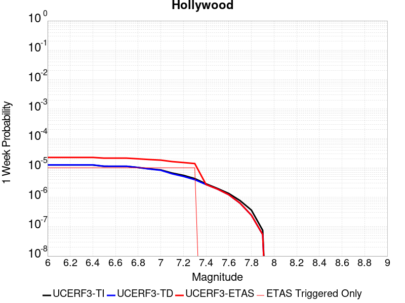 |  |  | 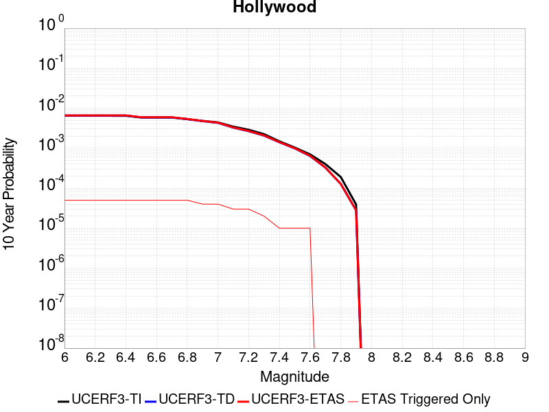 |

| Magnitude | 1 wk TI Prob | 1 wk TD Prob | 1 wk ETAS Prob | 1 wk ETAS/TD Gain | 1 wk ETAS Triggered Only | 1 mo TI Prob | 1 mo TD Prob | 1 mo ETAS Prob | 1 mo ETAS/TD Gain | 1 mo ETAS Triggered Only | 1 yr TI Prob | 1 yr TD Prob | 1 yr ETAS Prob | 1 yr ETAS/TD Gain | 1 yr ETAS Triggered Only | 10 yr TI Prob | 10 yr TD Prob | 10 yr ETAS Prob | 10 yr ETAS/TD Gain | 10 yr ETAS Triggered Only |
|-----|-----|-----|-----|-----|-----|-----|-----|-----|-----|-----|-----|-----|-----|-----|-----|-----|-----|-----|-----|-----|
| 6.0 | 1.24487615E-5 | 1.2593229E-5 | 2.2593103E-5 | 1.7940675 | 1.0E-5 | 5.3350745E-5 | 5.3969892E-5 | 6.396935E-5 | 1.1852785 | 1.0E-5 | 6.4935174E-4 | 6.5689E-4 | 6.7687687E-4 | 1.0304265 | 2.0E-5 | 0.0064745755 | 0.0065499707 | 0.0065996433 | 1.0075836 | 5.0E-5 |
| 6.1 | 1.24487615E-5 | 1.2593229E-5 | 2.2593103E-5 | 1.7940675 | 1.0E-5 | 5.3350745E-5 | 5.3969892E-5 | 6.396935E-5 | 1.1852785 | 1.0E-5 | 6.4935174E-4 | 6.5689E-4 | 6.7687687E-4 | 1.0304265 | 2.0E-5 | 0.0064745755 | 0.0065499707 | 0.0065996433 | 1.0075836 | 5.0E-5 |
| 6.2 | 1.24487615E-5 | 1.2593229E-5 | 2.2593103E-5 | 1.7940675 | 1.0E-5 | 5.3350745E-5 | 5.3969892E-5 | 6.396935E-5 | 1.1852785 | 1.0E-5 | 6.4935174E-4 | 6.5689E-4 | 6.7687687E-4 | 1.0304265 | 2.0E-5 | 0.0064745755 | 0.0065499707 | 0.0065996433 | 1.0075836 | 5.0E-5 |
| 6.3 | 1.24487615E-5 | 1.2593229E-5 | 2.2593103E-5 | 1.7940675 | 1.0E-5 | 5.3350745E-5 | 5.3969892E-5 | 6.396935E-5 | 1.1852785 | 1.0E-5 | 6.4935174E-4 | 6.5689E-4 | 6.7687687E-4 | 1.0304265 | 2.0E-5 | 0.0064745755 | 0.0065499707 | 0.0065996433 | 1.0075836 | 5.0E-5 |
| 6.4 | 1.2431024E-5 | 1.25738425E-5 | 2.2573717E-5 | 1.7952918 | 1.0E-5 | 5.327473E-5 | 5.388681E-5 | 6.388627E-5 | 1.1855642 | 1.0E-5 | 6.4842677E-4 | 6.558791E-4 | 6.75866E-4 | 1.0304735 | 2.0E-5 | 0.0064653796 | 0.0065399213 | 0.0065895943 | 1.0075953 | 5.0E-5 |
| 6.5 | 1.1242222E-5 | 1.1317804E-5 | 2.131769E-5 | 1.8835536 | 1.0E-5 | 4.8180063E-5 | 4.8503985E-5 | 5.85035E-5 | 1.2061586 | 1.0E-5 | 5.864344E-4 | 5.903787E-4 | 6.1036693E-4 | 1.0338565 | 2.0E-5 | 0.0058488925 | 0.00588839 | 0.0059380955 | 1.0084413 | 5.0E-5 |
| 6.6 | 1.1234066E-5 | 1.1308918E-5 | 2.1308804E-5 | 1.8842479 | 1.0E-5 | 4.8145106E-5 | 4.8465907E-5 | 5.846542E-5 | 1.2063206 | 1.0E-5 | 5.86009E-4 | 5.899153E-4 | 6.0990354E-4 | 1.0338832 | 2.0E-5 | 0.005844661 | 0.0058837803 | 0.0059334864 | 1.0084479 | 5.0E-5 |
| 6.7 | 1.12294E-5 | 1.1303661E-5 | 2.1303547E-5 | 1.8846592 | 1.0E-5 | 4.812511E-5 | 4.8443377E-5 | 5.8442893E-5 | 1.2064166 | 1.0E-5 | 5.857657E-4 | 5.896412E-4 | 6.096294E-4 | 1.033899 | 2.0E-5 | 0.0058422405 | 0.005881054 | 0.0059307595 | 1.0084518 | 5.0E-5 |
| 6.8 | 1.0252819E-5 | 1.0218449E-5 | 2.0218346E-5 | 1.9786122 | 1.0E-5 | 4.3939912E-5 | 4.3792625E-5 | 5.3792188E-5 | 1.228339 | 1.0E-5 | 5.3483713E-4 | 5.330469E-4 | 5.530362E-4 | 1.0375001 | 2.0E-5 | 0.005335517 | 0.0053179096 | 0.0053676437 | 1.0093522 | 5.0E-5 |
| 6.9 | 9.252289E-6 | 9.110309E-6 | 1.9110219E-5 | 2.0976474 | 1.0E-5 | 3.9652066E-5 | 3.9043607E-5 | 4.9043218E-5 | 1.2561139 | 1.0E-5 | 4.8265693E-4 | 4.752539E-4 | 4.952444E-4 | 1.0420628 | 2.0E-5 | 0.0048161 | 0.004742549 | 0.004782359 | 1.0083942 | 4.0E-5 |
| 7.0 | 8.474604E-6 | 8.25826E-6 | 1.8258177E-5 | 2.2108989 | 1.0E-5 | 3.6319227E-5 | 3.5392073E-5 | 4.539172E-5 | 1.2825391 | 1.0E-5 | 4.4209688E-4 | 4.3081472E-4 | 4.508061E-4 | 1.0464036 | 2.0E-5 | 0.004412184 | 0.0042999457 | 0.0043397737 | 1.0092624 | 4.0E-5 |
| 7.1 | 6.643643E-6 | 6.2683707E-6 | 1.6268308E-5 | 2.595301 | 1.0E-5 | 2.8472443E-5 | 2.686417E-5 | 3.68639E-5 | 1.372233 | 1.0E-5 | 3.4659685E-4 | 3.2702263E-4 | 3.3701936E-4 | 1.030569 | 1.0E-5 | 0.0034605677 | 0.0032654598 | 0.003295362 | 1.0091571 | 3.0E-5 |
| 7.2 | 5.549002E-6 | 5.1087086E-6 | 1.5108657E-5 | 2.9574318 | 1.0E-5 | 2.378122E-5 | 2.1894282E-5 | 3.1894062E-5 | 1.4567302 | 1.0E-5 | 2.8949787E-4 | 2.665304E-4 | 2.7652775E-4 | 1.0375092 | 1.0E-5 | 0.0028912104 | 0.002662124 | 0.0026920442 | 1.0112392 | 3.0E-5 |
| 7.3 | 4.3059727E-6 | 3.9598913E-6 | 1.39598515E-5 | 3.5253117 | 1.0E-5 | 1.8454039E-5 | 1.6970853E-5 | 2.6970683E-5 | 1.5892355 | 1.0E-5 | 2.2465475E-4 | 2.0660064E-4 | 2.1659858E-4 | 1.0483925 | 1.0E-5 | 0.0022442779 | 0.0020640958 | 0.0020840545 | 1.0096694 | 2.0E-5 |
| 7.4 | 2.8550733E-6 | 2.7013002E-6 | 2.7013002E-6 | 1.0 | 0.0 | 1.2235971E-5 | 1.1576949E-5 | 1.1576949E-5 | 1.0 | 0.0 | 1.4896276E-4 | 1.4094029E-4 | 1.4094029E-4 | 1.0 | 0.0 | 0.0014886294 | 0.0014085141 | 0.0014185001 | 1.0070897 | 1.0E-5 |
| 7.5 | 1.9927045E-6 | 1.8976393E-6 | 1.8976393E-6 | 1.0 | 0.0 | 8.540134E-6 | 8.132714E-6 | 8.132714E-6 | 1.0 | 0.0 | 1.0397117E-4 | 9.901134E-5 | 9.901134E-5 | 1.0 | 0.0 | 0.0010392254 | 9.896759E-4 | 9.996659E-4 | 1.0100943 | 1.0E-5 |
| 7.6 | 1.345084E-6 | 1.2216018E-6 | 1.2216018E-6 | 1.0 | 0.0 | 5.764633E-6 | 5.2354258E-6 | 5.2354258E-6 | 1.0 | 0.0 | 7.018215E-5 | 6.373946E-5 | 6.373946E-5 | 1.0 | 0.0 | 7.0159987E-4 | 6.372138E-4 | 6.4720743E-4 | 1.0156833 | 1.0E-5 |
| 7.7 | 7.6835164E-7 | 6.2777013E-7 | 6.2777013E-7 | 1.0 | 0.0 | 3.2929315E-6 | 2.6904406E-6 | 2.6904406E-6 | 1.0 | 0.0 | 4.00907E-5 | 3.2755637E-5 | 3.2755637E-5 | 1.0 | 0.0 | 4.0083472E-4 | 3.2750957E-4 | 3.2750957E-4 | 1.0 | 0.0 |
| 7.8 | 3.6562128E-7 | 2.4534745E-7 | 2.4534745E-7 | 1.0 | 0.0 | 1.5669474E-6 | 1.0514887E-6 | 1.0514887E-6 | 1.0 | 0.0 | 1.9077417E-5 | 1.2801803E-5 | 1.2801803E-5 | 1.0 | 0.0 | 1.907578E-4 | 1.2801103E-4 | 1.2801103E-4 | 1.0 | 0.0 |
| 7.9 | 7.5024424E-8 | 5.381742E-8 | 5.381742E-8 | 1.0 | 0.0 | 3.215332E-7 | 2.3064608E-7 | 2.3064608E-7 | 1.0 | 0.0 | 3.91466E-6 | 2.8081138E-6 | 2.8081138E-6 | 1.0 | 0.0 | 3.9145907E-5 | 2.8080913E-5 | 2.8080913E-5 | 1.0 | 0.0 |

## San Diego Trough north alt1
*[(top)](#table-of-contents)*

| 1 Week | 1 Month | 1 Year | 10 Year |
|-----|-----|-----|-----|
|  |  |  |  |

| Magnitude | 1 wk TI Prob | 1 wk TD Prob | 1 wk ETAS Prob | 1 wk ETAS/TD Gain | 1 wk ETAS Triggered Only | 1 mo TI Prob | 1 mo TD Prob | 1 mo ETAS Prob | 1 mo ETAS/TD Gain | 1 mo ETAS Triggered Only | 1 yr TI Prob | 1 yr TD Prob | 1 yr ETAS Prob | 1 yr ETAS/TD Gain | 1 yr ETAS Triggered Only | 10 yr TI Prob | 10 yr TD Prob | 10 yr ETAS Prob | 10 yr ETAS/TD Gain | 10 yr ETAS Triggered Only |
|-----|-----|-----|-----|-----|-----|-----|-----|-----|-----|-----|-----|-----|-----|-----|-----|-----|-----|-----|-----|-----|
| 6.0 | 7.329252E-5 | 8.821269E-5 | 9.8211814E-5 | 1.1133524 | 1.0E-5 | 3.14073E-4 | 3.7800326E-4 | 3.979957E-4 | 1.0528896 | 2.0E-5 | 0.0038171355 | 0.0045930487 | 0.0046229106 | 1.0065016 | 3.0E-5 | 0.03752231 | 0.045045137 | 0.045092884 | 1.00106 | 5.0E-5 |
| 6.1 | 3.7940346E-5 | 4.4884906E-5 | 5.488446E-5 | 1.222782 | 1.0E-5 | 1.6259136E-4 | 1.9235026E-4 | 2.1234641E-4 | 1.1039569 | 2.0E-5 | 0.0019777524 | 0.002339431 | 0.0023593842 | 1.0085291 | 2.0E-5 | 0.019602431 | 0.023156732 | 0.023186037 | 1.0012655 | 3.0E-5 |
| 6.2 | 2.8645263E-5 | 3.329672E-5 | 3.329672E-5 | 1.0 | 0.0 | 1.2275964E-4 | 1.4269259E-4 | 1.5269115E-4 | 1.0700707 | 1.0E-5 | 0.0014935739 | 0.0017359206 | 0.0017459032 | 1.0057507 | 1.0E-5 | 0.0148357535 | 0.017226268 | 0.017245922 | 1.0011411 | 2.0E-5 |
| 6.3 | 2.8645263E-5 | 3.329672E-5 | 3.329672E-5 | 1.0 | 0.0 | 1.2275964E-4 | 1.4269259E-4 | 1.5269115E-4 | 1.0700707 | 1.0E-5 | 0.0014935739 | 0.0017359206 | 0.0017459032 | 1.0057507 | 1.0E-5 | 0.0148357535 | 0.017226268 | 0.017245922 | 1.0011411 | 2.0E-5 |
| 6.4 | 2.2204576E-5 | 2.544832E-5 | 2.544832E-5 | 1.0 | 0.0 | 9.5159E-5 | 1.0905972E-4 | 1.1905863E-4 | 1.0916829 | 1.0E-5 | 0.001157945 | 0.0013270028 | 0.0013369895 | 1.0075258 | 1.0E-5 | 0.011519298 | 0.013191959 | 0.013211695 | 1.0014961 | 2.0E-5 |
| 6.5 | 2.1004838E-5 | 2.4024695E-5 | 2.4024695E-5 | 1.0 | 0.0 | 9.0017624E-5 | 1.0295897E-4 | 1.1295794E-4 | 1.0971161 | 1.0E-5 | 0.0010954136 | 0.0012528135 | 0.001262801 | 1.007972 | 1.0E-5 | 0.010900296 | 0.012458592 | 0.012478342 | 1.0015854 | 2.0E-5 |
| 6.6 | 1.820557E-5 | 2.070479E-5 | 2.070479E-5 | 1.0 | 0.0 | 7.802154E-5 | 8.8731824E-5 | 9.873094E-5 | 1.1126891 | 1.0E-5 | 9.4949827E-4 | 0.0010797799 | 0.0010897692 | 1.0092511 | 1.0E-5 | 0.009454516 | 0.010746005 | 0.010765791 | 1.0018412 | 2.0E-5 |
| 6.7 | 1.5884485E-5 | 1.7983646E-5 | 1.7983646E-5 | 1.0 | 0.0 | 6.807459E-5 | 7.707051E-5 | 7.707051E-5 | 1.0 | 0.0 | 8.284929E-4 | 9.3793223E-4 | 9.3793223E-4 | 1.0 | 0.0 | 0.008254109 | 0.009340104 | 0.00935001 | 1.0010606 | 1.0E-5 |
| 6.8 | 1.4331171E-5 | 1.6201066E-5 | 1.6201066E-5 | 1.0 | 0.0 | 6.141786E-5 | 6.94313E-5 | 6.94313E-5 | 1.0 | 0.0 | 7.4750587E-4 | 8.450002E-4 | 8.450002E-4 | 1.0 | 0.0 | 0.0074499645 | 0.008418139 | 0.008428055 | 1.0011779 | 1.0E-5 |
| 6.9 | 1.2574203E-5 | 1.4205835E-5 | 1.4205835E-5 | 1.0 | 0.0 | 5.3888325E-5 | 6.0880735E-5 | 6.0880735E-5 | 1.0 | 0.0 | 6.558929E-4 | 7.409723E-4 | 7.409723E-4 | 1.0 | 0.0 | 0.0065396037 | 0.007385203 | 0.0073951297 | 1.0013441 | 1.0E-5 |
| 7.0 | 1.0883844E-5 | 1.2289262E-5 | 1.2289262E-5 | 1.0 | 0.0 | 4.664421E-5 | 5.2667205E-5 | 5.2667205E-5 | 1.0 | 0.0 | 5.677453E-4 | 6.4103556E-4 | 6.4103556E-4 | 1.0 | 0.0 | 0.00566297 | 0.006391993 | 0.0064019286 | 1.0015545 | 1.0E-5 |
| 7.1 | 9.393088E-6 | 1.060702E-5 | 1.060702E-5 | 1.0 | 0.0 | 4.025547E-5 | 4.545787E-5 | 4.545787E-5 | 1.0 | 0.0 | 4.900001E-4 | 5.533098E-4 | 5.533098E-4 | 1.0 | 0.0 | 0.0048892107 | 0.005519418 | 0.0055293627 | 1.0018017 | 1.0E-5 |
| 7.2 | 8.190791E-6 | 9.258625E-6 | 9.258625E-6 | 1.0 | 0.0 | 3.510292E-5 | 3.9679224E-5 | 3.9679224E-5 | 1.0 | 0.0 | 4.2729423E-4 | 4.8298817E-4 | 4.8298817E-4 | 1.0 | 0.0 | 0.0042647356 | 0.004819465 | 0.0048294165 | 1.002065 | 1.0E-5 |
| 7.3 | 6.268162E-6 | 7.089716E-6 | 7.089716E-6 | 1.0 | 0.0 | 2.6863276E-5 | 3.0384144E-5 | 3.0384144E-5 | 1.0 | 0.0 | 3.2701128E-4 | 3.6986457E-4 | 3.6986457E-4 | 1.0 | 0.0 | 0.003265305 | 0.003692536 | 0.003692536 | 1.0 | 0.0 |
| 7.4 | 4.985186E-6 | 5.6426816E-6 | 5.6426816E-6 | 1.0 | 0.0 | 2.1364907E-5 | 2.4182698E-5 | 2.4182698E-5 | 1.0 | 0.0 | 2.600867E-4 | 2.9438498E-4 | 2.9438498E-4 | 1.0 | 0.0 | 0.002597825 | 0.0029399914 | 0.0029399914 | 1.0 | 0.0 |
| 7.5 | 1.7489613E-6 | 1.969678E-6 | 1.969678E-6 | 1.0 | 0.0 | 7.495527E-6 | 8.4414505E-6 | 8.4414505E-6 | 1.0 | 0.0 | 9.125422E-5 | 1.02770035E-4 | 1.02770035E-4 | 1.0 | 0.0 | 9.1216754E-4 | 0.0010272472 | 0.0010272472 | 1.0 | 0.0 |
| 7.6 | 1.6988751E-7 | 1.7533823E-7 | 1.7533823E-7 | 1.0 | 0.0 | 7.2808916E-7 | 7.5144936E-7 | 7.5144936E-7 | 1.0 | 0.0 | 8.864449E-6 | 9.14886E-6 | 9.14886E-6 | 1.0 | 0.0 | 8.8640954E-5 | 9.1485024E-5 | 9.1485024E-5 | 1.0 | 0.0 |

## San Jacinto (Clark) rev
*[(top)](#table-of-contents)*

| 1 Week | 1 Month | 1 Year | 10 Year |
|-----|-----|-----|-----|
|  |  |  |  |

| Magnitude | 1 wk TI Prob | 1 wk TD Prob | 1 wk ETAS Prob | 1 wk ETAS/TD Gain | 1 wk ETAS Triggered Only | 1 mo TI Prob | 1 mo TD Prob | 1 mo ETAS Prob | 1 mo ETAS/TD Gain | 1 mo ETAS Triggered Only | 1 yr TI Prob | 1 yr TD Prob | 1 yr ETAS Prob | 1 yr ETAS/TD Gain | 1 yr ETAS Triggered Only | 10 yr TI Prob | 10 yr TD Prob | 10 yr ETAS Prob | 10 yr ETAS/TD Gain | 10 yr ETAS Triggered Only |
|-----|-----|-----|-----|-----|-----|-----|-----|-----|-----|-----|-----|-----|-----|-----|-----|-----|-----|-----|-----|-----|
| 6.0 | 4.482615E-5 | 2.1153059E-5 | 2.1153059E-5 | 1.0 | 0.0 | 1.9209793E-4 | 9.065287E-5 | 1.0065197E-4 | 1.1103009 | 1.0E-5 | 0.0023362834 | 0.0011031491 | 0.001153094 | 1.0452747 | 5.0E-5 | 0.02311874 | 0.011485709 | 0.011535134 | 1.0043032 | 5.0E-5 |
| 6.1 | 4.482615E-5 | 2.1153059E-5 | 2.1153059E-5 | 1.0 | 0.0 | 1.9209793E-4 | 9.065287E-5 | 1.0065197E-4 | 1.1103009 | 1.0E-5 | 0.0023362834 | 0.0011031491 | 0.001153094 | 1.0452747 | 5.0E-5 | 0.02311874 | 0.011485709 | 0.011535134 | 1.0043032 | 5.0E-5 |
| 6.2 | 4.482615E-5 | 2.1153059E-5 | 2.1153059E-5 | 1.0 | 0.0 | 1.9209793E-4 | 9.065287E-5 | 1.0065197E-4 | 1.1103009 | 1.0E-5 | 0.0023362834 | 0.0011031491 | 0.001153094 | 1.0452747 | 5.0E-5 | 0.02311874 | 0.011485709 | 0.011535134 | 1.0043032 | 5.0E-5 |
| 6.3 | 4.482615E-5 | 2.1153059E-5 | 2.1153059E-5 | 1.0 | 0.0 | 1.9209793E-4 | 9.065287E-5 | 1.0065197E-4 | 1.1103009 | 1.0E-5 | 0.0023362834 | 0.0011031491 | 0.001153094 | 1.0452747 | 5.0E-5 | 0.02311874 | 0.011485709 | 0.011535134 | 1.0043032 | 5.0E-5 |
| 6.4 | 4.482615E-5 | 2.1153059E-5 | 2.1153059E-5 | 1.0 | 0.0 | 1.9209793E-4 | 9.065287E-5 | 1.0065197E-4 | 1.1103009 | 1.0E-5 | 0.0023362834 | 0.0011031491 | 0.001153094 | 1.0452747 | 5.0E-5 | 0.02311874 | 0.011485709 | 0.011535134 | 1.0043032 | 5.0E-5 |
| 6.5 | 3.7294863E-5 | 1.7354667E-5 | 1.7354667E-5 | 1.0 | 0.0 | 1.5982533E-4 | 7.437504E-5 | 8.4374304E-5 | 1.1344436 | 1.0E-5 | 0.0019441366 | 9.051445E-4 | 9.5509924E-4 | 1.0551898 | 5.0E-5 | 0.01927216 | 0.009485902 | 0.009535428 | 1.005221 | 5.0E-5 |
| 6.6 | 3.7294863E-5 | 1.7354667E-5 | 1.7354667E-5 | 1.0 | 0.0 | 1.5982533E-4 | 7.437504E-5 | 8.4374304E-5 | 1.1344436 | 1.0E-5 | 0.0019441366 | 9.051445E-4 | 9.5509924E-4 | 1.0551898 | 5.0E-5 | 0.01927216 | 0.009485902 | 0.009535428 | 1.005221 | 5.0E-5 |
| 6.7 | 3.6039248E-5 | 1.6602684E-5 | 1.6602684E-5 | 1.0 | 0.0 | 1.5444479E-4 | 7.115244E-5 | 8.115173E-5 | 1.1405333 | 1.0E-5 | 0.0018787434 | 8.659408E-4 | 9.158975E-4 | 1.0576906 | 5.0E-5 | 0.01862939 | 0.009088189 | 0.009137735 | 1.0054517 | 5.0E-5 |
| 6.8 | 3.5031844E-5 | 1.6231123E-5 | 1.6231123E-5 | 1.0 | 0.0 | 1.5012783E-4 | 6.956012E-5 | 7.9559424E-5 | 1.1437505 | 1.0E-5 | 0.0018262739 | 8.4656954E-4 | 8.965272E-4 | 1.0590119 | 5.0E-5 | 0.01811338 | 0.008888788 | 0.008938343 | 1.0055751 | 5.0E-5 |
| 6.9 | 3.435112E-5 | 1.6061658E-5 | 1.6061658E-5 | 1.0 | 0.0 | 1.4721078E-4 | 6.8833884E-5 | 7.8833196E-5 | 1.1452672 | 1.0E-5 | 0.0017908178 | 8.377344E-4 | 8.876925E-4 | 1.0596348 | 5.0E-5 | 0.017764548 | 0.008796512 | 0.0088460725 | 1.0056341 | 5.0E-5 |
| 7.0 | 2.8959772E-5 | 1.43355255E-5 | 1.43355255E-5 | 1.0 | 0.0 | 1.241074E-4 | 6.1436534E-5 | 7.143592E-5 | 1.1627595 | 1.0E-5 | 0.0015099603 | 7.477359E-4 | 7.976985E-4 | 1.0668185 | 5.0E-5 | 0.014997416 | 0.007868331 | 0.007917938 | 1.0063046 | 5.0E-5 |
| 7.1 | 2.6002877E-5 | 1.2827699E-5 | 1.2827699E-5 | 1.0 | 0.0 | 1.11436144E-4 | 5.4974706E-5 | 6.4974156E-5 | 1.1818918 | 1.0E-5 | 0.0013558907 | 6.6911365E-4 | 7.0908683E-4 | 1.0597405 | 4.0E-5 | 0.013476475 | 0.0070483433 | 0.0070880614 | 1.0056351 | 4.0E-5 |
| 7.2 | 2.2544838E-5 | 1.1260331E-5 | 1.1260331E-5 | 1.0 | 0.0 | 9.661716E-5 | 4.825768E-5 | 5.8257196E-5 | 1.2072109 | 1.0E-5 | 0.001175679 | 5.873803E-4 | 6.273568E-4 | 1.068059 | 4.0E-5 | 0.011694785 | 0.00619256 | 0.0062323124 | 1.0064194 | 4.0E-5 |
| 7.3 | 1.75334E-5 | 1.0810585E-5 | 1.0810585E-5 | 1.0 | 0.0 | 7.514098E-5 | 4.6330264E-5 | 5.63298E-5 | 1.2158316 | 1.0E-5 | 9.144575E-4 | 5.6392635E-4 | 6.039038E-4 | 1.0708913 | 4.0E-5 | 0.009107036 | 0.0059332196 | 0.005972982 | 1.0067017 | 4.0E-5 |
| 7.4 | 1.5924552E-5 | 1.0610475E-5 | 1.0610475E-5 | 1.0 | 0.0 | 6.82463E-5 | 4.547268E-5 | 5.5472225E-5 | 1.2199023 | 1.0E-5 | 8.305819E-4 | 5.534906E-4 | 5.934685E-4 | 1.0722287 | 4.0E-5 | 0.008274844 | 0.0058205863 | 0.0058603534 | 1.0068321 | 4.0E-5 |
| 7.5 | 1.3428931E-5 | 9.851045E-6 | 9.851045E-6 | 1.0 | 0.0 | 5.7551293E-5 | 4.221809E-5 | 5.2217667E-5 | 1.2368553 | 1.0E-5 | 7.004617E-4 | 5.1388505E-4 | 5.538645E-4 | 1.0777984 | 4.0E-5 | 0.006982579 | 0.005406209 | 0.0054459926 | 1.0073589 | 4.0E-5 |
| 7.6 | 1.0688787E-5 | 8.614091E-6 | 8.614091E-6 | 1.0 | 0.0 | 4.5808283E-5 | 3.6917012E-5 | 4.691664E-5 | 1.2708678 | 1.0E-5 | 5.5757316E-4 | 4.4937237E-4 | 4.893544E-4 | 1.088973 | 4.0E-5 | 0.005561762 | 0.0047413614 | 0.0047811717 | 1.0083964 | 4.0E-5 |
| 7.7 | 8.81236E-6 | 7.4673385E-6 | 7.4673385E-6 | 1.0 | 0.0 | 3.776671E-5 | 3.200249E-5 | 4.2002168E-5 | 1.3124657 | 1.0E-5 | 4.597127E-4 | 3.8956082E-4 | 4.2954527E-4 | 1.1026397 | 4.0E-5 | 0.0045876284 | 0.0041344194 | 0.004174254 | 1.0096349 | 4.0E-5 |
| 7.8 | 7.780431E-6 | 6.695928E-6 | 6.695928E-6 | 1.0 | 0.0 | 3.3344273E-5 | 2.8696519E-5 | 3.869623E-5 | 1.3484644 | 1.0E-5 | 4.0589093E-4 | 3.4932428E-4 | 3.893103E-4 | 1.1144668 | 4.0E-5 | 0.0040515037 | 0.0037226272 | 0.0037624782 | 1.0107051 | 4.0E-5 |
| 7.9 | 6.5437994E-6 | 5.7797783E-6 | 5.7797783E-6 | 1.0 | 0.0 | 2.8044553E-5 | 2.4770245E-5 | 3.4769997E-5 | 1.4037002 | 1.0E-5 | 3.4138895E-4 | 3.0153614E-4 | 3.415241E-4 | 1.132614 | 4.0E-5 | 0.0034086495 | 0.0032343294 | 0.0032742 | 1.0123273 | 4.0E-5 |
| 8.0 | 5.4488164E-6 | 4.812793E-6 | 4.812793E-6 | 1.0 | 0.0 | 2.3351862E-5 | 2.0626094E-5 | 3.0625888E-5 | 1.4848127 | 1.0E-5 | 2.8427184E-4 | 2.510939E-4 | 2.9108385E-4 | 1.159263 | 4.0E-5 | 0.0028390845 | 0.0027107038 | 0.0027505953 | 1.0147163 | 4.0E-5 |
| 8.1 | 2.8397242E-6 | 1.3665673E-6 | 1.3665673E-6 | 1.0 | 0.0 | 1.217019E-5 | 5.856704E-6 | 5.856704E-6 | 1.0 | 0.0 | 1.4816198E-4 | 7.1303046E-5 | 8.1302336E-5 | 1.1402365 | 1.0E-5 | 0.0014806325 | 8.113543E-4 | 8.213462E-4 | 1.012315 | 1.0E-5 |
| 8.2 | 2.030244E-6 | 6.3151083E-7 | 6.3151083E-7 | 1.0 | 0.0 | 8.701017E-6 | 2.7064723E-6 | 2.7064723E-6 | 1.0 | 0.0 | 1.05929736E-4 | 3.2950808E-5 | 3.2950808E-5 | 1.0 | 0.0 | 0.0010587925 | 3.9470522E-4 | 3.9470522E-4 | 1.0 | 0.0 |
| 8.3 | 1.0659804E-6 | 2.9230563E-7 | 2.9230563E-7 | 1.0 | 0.0 | 4.568479E-6 | 1.2527379E-6 | 1.2527379E-6 | 1.0 | 0.0 | 5.5619817E-5 | 1.5251981E-5 | 1.5251981E-5 | 1.0 | 0.0 | 5.5605895E-4 | 1.8556409E-4 | 1.8556409E-4 | 1.0 | 0.0 |

## Hosgri
*[(top)](#table-of-contents)*

| 1 Week | 1 Month | 1 Year | 10 Year |
|-----|-----|-----|-----|
|  |  |  |  |

| Magnitude | 1 wk TI Prob | 1 wk TD Prob | 1 wk ETAS Prob | 1 wk ETAS/TD Gain | 1 wk ETAS Triggered Only | 1 mo TI Prob | 1 mo TD Prob | 1 mo ETAS Prob | 1 mo ETAS/TD Gain | 1 mo ETAS Triggered Only | 1 yr TI Prob | 1 yr TD Prob | 1 yr ETAS Prob | 1 yr ETAS/TD Gain | 1 yr ETAS Triggered Only | 10 yr TI Prob | 10 yr TD Prob | 10 yr ETAS Prob | 10 yr ETAS/TD Gain | 10 yr ETAS Triggered Only |
|-----|-----|-----|-----|-----|-----|-----|-----|-----|-----|-----|-----|-----|-----|-----|-----|-----|-----|-----|-----|-----|
| 6.0 | 2.883978E-5 | 2.9128403E-5 | 4.912782E-5 | 1.6865951 | 2.0E-5 | 1.235932E-4 | 1.248302E-4 | 1.5482646E-4 | 1.2402965 | 3.0E-5 | 0.0015037085 | 0.0015187752 | 0.0015487297 | 1.0197227 | 3.0E-5 | 0.01493574 | 0.01508773 | 0.015136976 | 1.003264 | 5.0E-5 |
| 6.1 | 2.883978E-5 | 2.9128403E-5 | 4.912782E-5 | 1.6865951 | 2.0E-5 | 1.235932E-4 | 1.248302E-4 | 1.5482646E-4 | 1.2402965 | 3.0E-5 | 0.0015037085 | 0.0015187752 | 0.0015487297 | 1.0197227 | 3.0E-5 | 0.01493574 | 0.01508773 | 0.015136976 | 1.003264 | 5.0E-5 |
| 6.2 | 2.883978E-5 | 2.9128403E-5 | 4.912782E-5 | 1.6865951 | 2.0E-5 | 1.235932E-4 | 1.248302E-4 | 1.5482646E-4 | 1.2402965 | 3.0E-5 | 0.0015037085 | 0.0015187752 | 0.0015487297 | 1.0197227 | 3.0E-5 | 0.01493574 | 0.01508773 | 0.015136976 | 1.003264 | 5.0E-5 |
| 6.3 | 2.2914428E-5 | 2.2641956E-5 | 3.264173E-5 | 1.441648 | 1.0E-5 | 9.8200995E-5 | 9.703337E-5 | 1.17031435E-4 | 1.2060946 | 2.0E-5 | 0.0011949413 | 0.001180746 | 0.0012007224 | 1.0169184 | 2.0E-5 | 0.011885363 | 0.011746123 | 0.011785653 | 1.0033654 | 4.0E-5 |
| 6.4 | 2.0195741E-5 | 1.9696547E-5 | 1.9696547E-5 | 1.0 | 0.0 | 8.65503E-5 | 8.4411055E-5 | 9.441021E-5 | 1.1184579 | 1.0E-5 | 0.0010532405 | 0.001027222 | 0.0010372117 | 1.009725 | 1.0E-5 | 0.010482626 | 0.010225783 | 0.010245578 | 1.0019358 | 2.0E-5 |
| 6.5 | 1.9924333E-5 | 1.9408968E-5 | 1.9408968E-5 | 1.0 | 0.0 | 8.53872E-5 | 8.317865E-5 | 9.317782E-5 | 1.1202132 | 1.0E-5 | 0.0010390934 | 0.0010122315 | 0.0010222214 | 1.0098692 | 1.0E-5 | 0.010342481 | 0.010077244 | 0.010097042 | 1.0019647 | 2.0E-5 |
| 6.6 | 1.809694E-5 | 1.7458287E-5 | 1.7458287E-5 | 1.0 | 0.0 | 7.7556004E-5 | 7.4819094E-5 | 8.481834E-5 | 1.1336458 | 1.0E-5 | 9.438353E-4 | 9.105431E-4 | 9.2053396E-4 | 1.0109725 | 1.0E-5 | 0.009398366 | 0.009069063 | 0.009088881 | 1.0021853 | 2.0E-5 |
| 6.7 | 1.675989E-5 | 1.6042752E-5 | 1.6042752E-5 | 1.0 | 0.0 | 7.182612E-5 | 6.8752845E-5 | 7.875216E-5 | 1.1454386 | 1.0E-5 | 8.7413215E-4 | 8.3674554E-4 | 8.467372E-4 | 1.0119411 | 1.0E-5 | 0.008707017 | 0.008336853 | 0.008356687 | 1.002379 | 2.0E-5 |
| 6.8 | 1.5401129E-5 | 1.4614069E-5 | 1.4614069E-5 | 1.0 | 0.0 | 6.6003166E-5 | 6.263023E-5 | 6.263023E-5 | 1.0 | 0.0 | 8.032922E-4 | 7.6225714E-4 | 7.6225714E-4 | 1.0 | 0.0 | 0.008003947 | 0.0075972863 | 0.0076072104 | 1.0013063 | 1.0E-5 |
| 6.9 | 1.356559E-5 | 1.2689955E-5 | 1.2689955E-5 | 1.0 | 0.0 | 5.8136946E-5 | 5.438439E-5 | 5.438439E-5 | 1.0 | 0.0 | 7.0758746E-4 | 6.6192925E-4 | 6.6192925E-4 | 1.0 | 0.0 | 0.007053386 | 0.006600378 | 0.006610312 | 1.001505 | 1.0E-5 |
| 7.0 | 1.2030819E-5 | 1.1095949E-5 | 1.1095949E-5 | 1.0 | 0.0 | 5.155963E-5 | 4.75532E-5 | 4.75532E-5 | 1.0 | 0.0 | 6.275577E-4 | 5.788065E-4 | 5.788065E-4 | 1.0 | 0.0 | 0.006257884 | 0.0057737473 | 0.0057836897 | 1.001722 | 1.0E-5 |
| 7.1 | 1.0972698E-5 | 1.0022167E-5 | 1.0022167E-5 | 1.0 | 0.0 | 4.7025E-5 | 4.2951437E-5 | 4.2951437E-5 | 1.0 | 0.0 | 5.72379E-4 | 5.2280835E-4 | 5.2280835E-4 | 1.0 | 0.0 | 0.0057090693 | 0.005216533 | 0.005226481 | 1.001907 | 1.0E-5 |
| 7.2 | 9.961926E-6 | 9.034732E-6 | 9.034732E-6 | 1.0 | 0.0 | 4.2693267E-5 | 3.8719707E-5 | 3.8719707E-5 | 1.0 | 0.0 | 5.1966653E-4 | 4.7131052E-4 | 4.7131052E-4 | 1.0 | 0.0 | 0.00518453 | 0.0047038523 | 0.0047138054 | 1.002116 | 1.0E-5 |
| 7.3 | 8.700929E-6 | 7.828089E-6 | 7.828089E-6 | 1.0 | 0.0 | 3.7289166E-5 | 3.354852E-5 | 3.354852E-5 | 1.0 | 0.0 | 4.53901E-4 | 4.083767E-4 | 4.083767E-4 | 1.0 | 0.0 | 0.00452975 | 0.004076999 | 0.0040869582 | 1.0024428 | 1.0E-5 |
| 7.4 | 7.866285E-6 | 6.9987263E-6 | 6.9987263E-6 | 1.0 | 0.0 | 3.3712215E-5 | 2.9994197E-5 | 2.9994197E-5 | 1.0 | 0.0 | 4.103689E-4 | 3.6511818E-4 | 3.6511818E-4 | 1.0 | 0.0 | 0.004096119 | 0.0036459167 | 0.0036558805 | 1.0027328 | 1.0E-5 |
| 7.5 | 6.8381305E-6 | 5.9596814E-6 | 5.9596814E-6 | 1.0 | 0.0 | 2.9305946E-5 | 2.5541241E-5 | 2.5541241E-5 | 1.0 | 0.0 | 3.5674145E-4 | 3.1092027E-4 | 3.1092027E-4 | 1.0 | 0.0 | 0.0035616932 | 0.003105584 | 0.003105584 | 1.0 | 0.0 |
| 7.6 | 5.503376E-6 | 4.595227E-6 | 4.595227E-6 | 1.0 | 0.0 | 2.3585684E-5 | 1.9693682E-5 | 1.9693682E-5 | 1.0 | 0.0 | 2.8711787E-4 | 2.397442E-4 | 2.397442E-4 | 1.0 | 0.0 | 0.002867472 | 0.0023955852 | 0.0023955852 | 1.0 | 0.0 |
| 7.7 | 3.6144982E-6 | 2.6521896E-6 | 2.6521896E-6 | 1.0 | 0.0 | 1.5490614E-5 | 1.1366477E-5 | 1.1366477E-5 | 1.0 | 0.0 | 1.8858191E-4 | 1.3837808E-4 | 1.3837808E-4 | 1.0 | 0.0 | 0.0018842196 | 0.001383647 | 0.001383647 | 1.0 | 0.0 |
| 7.8 | 1.9853494E-6 | 1.1360784E-6 | 1.1360784E-6 | 1.0 | 0.0 | 8.508612E-6 | 4.8688985E-6 | 4.8688985E-6 | 1.0 | 0.0 | 1.0358743E-4 | 5.9277223E-5 | 5.9277223E-5 | 1.0 | 0.0 | 0.0010353916 | 5.933389E-4 | 5.933389E-4 | 1.0 | 0.0 |
| 7.9 | 1.1818757E-6 | 5.29477E-7 | 5.29477E-7 | 1.0 | 0.0 | 5.0651715E-6 | 2.269185E-6 | 2.269185E-6 | 1.0 | 0.0 | 6.1666724E-5 | 2.7626977E-5 | 2.7626977E-5 | 1.0 | 0.0 | 6.1649614E-4 | 2.7691363E-4 | 2.7691363E-4 | 1.0 | 0.0 |
| 8.0 | 6.962958E-7 | 2.71365E-7 | 2.71365E-7 | 1.0 | 0.0 | 2.9841215E-6 | 1.1629924E-6 | 1.1629924E-6 | 1.0 | 0.0 | 3.6331072E-5 | 1.415934E-5 | 1.415934E-5 | 1.0 | 0.0 | 3.6325134E-4 | 1.4215276E-4 | 1.4215276E-4 | 1.0 | 0.0 |
| 8.1 | 1.5033264E-7 | 6.52693E-8 | 6.52693E-8 | 1.0 | 0.0 | 6.442826E-7 | 2.7972553E-7 | 2.7972553E-7 | 1.0 | 0.0 | 7.844113E-6 | 3.4056532E-6 | 3.4056532E-6 | 1.0 | 0.0 | 7.843835E-5 | 3.4072833E-5 | 3.4072833E-5 | 1.0 | 0.0 |

## Great Valley 09 (Laguna Seca)
*[(top)](#table-of-contents)*

| 1 Week | 1 Month | 1 Year | 10 Year |
|-----|-----|-----|-----|
|  |  |  |  |

| Magnitude | 1 wk TI Prob | 1 wk TD Prob | 1 wk ETAS Prob | 1 wk ETAS/TD Gain | 1 wk ETAS Triggered Only | 1 mo TI Prob | 1 mo TD Prob | 1 mo ETAS Prob | 1 mo ETAS/TD Gain | 1 mo ETAS Triggered Only | 1 yr TI Prob | 1 yr TD Prob | 1 yr ETAS Prob | 1 yr ETAS/TD Gain | 1 yr ETAS Triggered Only | 10 yr TI Prob | 10 yr TD Prob | 10 yr ETAS Prob | 10 yr ETAS/TD Gain | 10 yr ETAS Triggered Only |
|-----|-----|-----|-----|-----|-----|-----|-----|-----|-----|-----|-----|-----|-----|-----|-----|-----|-----|-----|-----|-----|
| 6.0 | 5.4353277E-5 | 7.050019E-5 | 1.0049807E-4 | 1.4255008 | 3.0E-5 | 2.3292181E-4 | 3.0211007E-4 | 3.3210102E-4 | 1.0992715 | 3.0E-5 | 0.0028321352 | 0.0036720056 | 0.003721822 | 1.0135665 | 5.0E-5 | 0.02796312 | 0.036115844 | 0.036164038 | 1.0013344 | 5.0E-5 |
| 6.1 | 4.5578287E-5 | 5.822054E-5 | 6.821996E-5 | 1.1717507 | 1.0E-5 | 1.953209E-4 | 2.4949352E-4 | 2.5949103E-4 | 1.0400712 | 1.0E-5 | 0.0023754383 | 0.0030333549 | 0.003063264 | 1.00986 | 3.0E-5 | 0.023502063 | 0.029919893 | 0.029948995 | 1.0009726 | 3.0E-5 |
| 6.2 | 2.8536782E-5 | 3.4736422E-5 | 4.4736073E-5 | 1.2878723 | 1.0E-5 | 1.2229476E-4 | 1.4886161E-4 | 1.5886012E-4 | 1.0671664 | 1.0E-5 | 0.0014879217 | 0.0018108576 | 0.0018208395 | 1.0055122 | 1.0E-5 | 0.014779986 | 0.017958276 | 0.017968098 | 1.0005468 | 1.0E-5 |
| 6.3 | 2.3698774E-5 | 2.8213344E-5 | 3.8213064E-5 | 1.3544322 | 1.0E-5 | 1.01562226E-4 | 1.2090833E-4 | 1.3090711E-4 | 1.0826973 | 1.0E-5 | 0.0012358186 | 0.001471051 | 0.0014810363 | 1.0067879 | 1.0E-5 | 0.012289686 | 0.014611455 | 0.014621308 | 1.0006744 | 1.0E-5 |
| 6.4 | 1.9191197E-5 | 2.212289E-5 | 3.212267E-5 | 1.4520105 | 1.0E-5 | 8.2245395E-5 | 9.4808805E-5 | 1.04807856E-4 | 1.1054654 | 1.0E-5 | 0.0010008777 | 0.0011536906 | 0.0011636791 | 1.0086578 | 1.0E-5 | 0.009963818 | 0.011477022 | 0.0114869075 | 1.0008613 | 1.0E-5 |
| 6.5 | 1.5203241E-5 | 1.6801298E-5 | 2.680113E-5 | 1.5951821 | 1.0E-5 | 6.5155116E-5 | 7.200338E-5 | 8.200266E-5 | 1.1388724 | 1.0E-5 | 7.9297484E-4 | 8.76301E-4 | 8.8629226E-4 | 1.0114017 | 1.0E-5 | 0.007901512 | 0.008729581 | 0.008739494 | 1.0011356 | 1.0E-5 |
| 6.6 | 1.0984925E-5 | 1.12425605E-5 | 2.1242447E-5 | 1.8894671 | 1.0E-5 | 4.70774E-5 | 4.8181533E-5 | 5.8181053E-5 | 1.2075384 | 1.0E-5 | 5.730166E-4 | 5.8645604E-4 | 5.964502E-4 | 1.0170416 | 1.0E-5 | 0.005715413 | 0.0058494755 | 0.005859417 | 1.0016996 | 1.0E-5 |
| 6.7 | 9.134616E-6 | 9.019868E-6 | 1.9019779E-5 | 2.1086535 | 1.0E-5 | 3.9147766E-5 | 3.865602E-5 | 4.8655635E-5 | 1.2586819 | 1.0E-5 | 4.7651984E-4 | 4.7053778E-4 | 4.8053308E-4 | 1.0212423 | 1.0E-5 | 0.004754993 | 0.00469566 | 0.004705613 | 1.0021197 | 1.0E-5 |
| 6.8 | 7.785589E-6 | 7.4519185E-6 | 1.7451845E-5 | 2.3419263 | 1.0E-5 | 3.3366385E-5 | 3.1936415E-5 | 4.1936095E-5 | 1.3131121 | 1.0E-5 | 4.0616E-4 | 3.887585E-4 | 3.987546E-4 | 1.025713 | 1.0E-5 | 0.0040541845 | 0.003880988 | 0.0038909493 | 1.0025667 | 1.0E-5 |
| 6.9 | 5.579095E-6 | 4.8984666E-6 | 1.4898417E-5 | 3.0414453 | 1.0E-5 | 2.3910188E-5 | 2.0993268E-5 | 3.099306E-5 | 1.4763331 | 1.0E-5 | 2.9106764E-4 | 2.5556443E-4 | 2.655619E-4 | 1.0391191 | 1.0E-5 | 0.002906867 | 0.0025528427 | 0.0025628172 | 1.0039072 | 1.0E-5 |
| 7.0 | 2.6816688E-6 | 1.521587E-6 | 1.521587E-6 | 1.0 | 0.0 | 1.1492816E-5 | 6.521071E-6 | 6.521071E-6 | 1.0 | 0.0 | 1.3991605E-4 | 7.939124E-5 | 7.939124E-5 | 1.0 | 0.0 | 0.0013982799 | 7.936375E-4 | 7.936375E-4 | 1.0 | 0.0 |
| 7.1 | 1.9951021E-6 | 7.45357E-7 | 7.45357E-7 | 1.0 | 0.0 | 8.55041E-6 | 3.1943835E-6 | 3.1943835E-6 | 1.0 | 0.0 | 1.0409627E-4 | 3.889097E-5 | 3.889097E-5 | 1.0 | 0.0 | 0.0010404752 | 3.8884574E-4 | 3.8884574E-4 | 1.0 | 0.0 |
| 7.2 | 1.9951021E-6 | 7.45357E-7 | 7.45357E-7 | 1.0 | 0.0 | 8.55041E-6 | 3.1943835E-6 | 3.1943835E-6 | 1.0 | 0.0 | 1.0409627E-4 | 3.889097E-5 | 3.889097E-5 | 1.0 | 0.0 | 0.0010404752 | 3.8884574E-4 | 3.8884574E-4 | 1.0 | 0.0 |
| 7.3 | 1.7087556E-6 | 6.578663E-7 | 6.578663E-7 | 1.0 | 0.0 | 7.3232177E-6 | 2.819424E-6 | 2.819424E-6 | 1.0 | 0.0 | 8.915652E-5 | 3.432599E-5 | 3.432599E-5 | 1.0 | 0.0 | 8.9120766E-4 | 3.432109E-4 | 3.432109E-4 | 1.0 | 0.0 |
| 7.4 | 1.3804846E-6 | 6.0737113E-7 | 6.0737113E-7 | 1.0 | 0.0 | 5.916349E-6 | 2.6030168E-6 | 2.6030168E-6 | 1.0 | 0.0 | 7.2029165E-5 | 3.169131E-5 | 3.169131E-5 | 1.0 | 0.0 | 7.200583E-4 | 3.168719E-4 | 3.168719E-4 | 1.0 | 0.0 |
| 7.5 | 1.3804846E-6 | 6.0737113E-7 | 6.0737113E-7 | 1.0 | 0.0 | 5.916349E-6 | 2.6030168E-6 | 2.6030168E-6 | 1.0 | 0.0 | 7.2029165E-5 | 3.169131E-5 | 3.169131E-5 | 1.0 | 0.0 | 7.200583E-4 | 3.168719E-4 | 3.168719E-4 | 1.0 | 0.0 |

## Robinson Creek
*[(top)](#table-of-contents)*

| 1 Week | 1 Month | 1 Year | 10 Year |
|-----|-----|-----|-----|
|  |  |  |  |

| Magnitude | 1 wk TI Prob | 1 wk TD Prob | 1 wk ETAS Prob | 1 wk ETAS/TD Gain | 1 wk ETAS Triggered Only | 1 mo TI Prob | 1 mo TD Prob | 1 mo ETAS Prob | 1 mo ETAS/TD Gain | 1 mo ETAS Triggered Only | 1 yr TI Prob | 1 yr TD Prob | 1 yr ETAS Prob | 1 yr ETAS/TD Gain | 1 yr ETAS Triggered Only | 10 yr TI Prob | 10 yr TD Prob | 10 yr ETAS Prob | 10 yr ETAS/TD Gain | 10 yr ETAS Triggered Only |
|-----|-----|-----|-----|-----|-----|-----|-----|-----|-----|-----|-----|-----|-----|-----|-----|-----|-----|-----|-----|-----|
| 6.0 | 1.3705327E-5 | 1.5285013E-5 | 1.5285013E-5 | 1.0 | 0.0 | 5.8735794E-5 | 6.55072E-5 | 6.55072E-5 | 1.0 | 0.0 | 7.1487366E-4 | 7.9755014E-4 | 8.075422E-4 | 1.0125284 | 1.0E-5 | 0.0071257832 | 0.007975501 | 0.008015183 | 1.0049753 | 4.0E-5 |
| 6.1 | 1.3705327E-5 | 1.5285013E-5 | 1.5285013E-5 | 1.0 | 0.0 | 5.8735794E-5 | 6.55072E-5 | 6.55072E-5 | 1.0 | 0.0 | 7.1487366E-4 | 7.9755014E-4 | 8.075422E-4 | 1.0125284 | 1.0E-5 | 0.0071257832 | 0.007975501 | 0.008015183 | 1.0049753 | 4.0E-5 |
| 6.2 | 1.3705327E-5 | 1.5285013E-5 | 1.5285013E-5 | 1.0 | 0.0 | 5.8735794E-5 | 6.55072E-5 | 6.55072E-5 | 1.0 | 0.0 | 7.1487366E-4 | 7.9755014E-4 | 8.075422E-4 | 1.0125284 | 1.0E-5 | 0.0071257832 | 0.007975501 | 0.008015183 | 1.0049753 | 4.0E-5 |
| 6.3 | 1.3705327E-5 | 1.5285013E-5 | 1.5285013E-5 | 1.0 | 0.0 | 5.8735794E-5 | 6.55072E-5 | 6.55072E-5 | 1.0 | 0.0 | 7.1487366E-4 | 7.9755014E-4 | 8.075422E-4 | 1.0125284 | 1.0E-5 | 0.0071257832 | 0.007975501 | 0.008015183 | 1.0049753 | 4.0E-5 |
| 6.4 | 1.3705327E-5 | 1.5285013E-5 | 1.5285013E-5 | 1.0 | 0.0 | 5.8735794E-5 | 6.55072E-5 | 6.55072E-5 | 1.0 | 0.0 | 7.1487366E-4 | 7.9755014E-4 | 8.075422E-4 | 1.0125284 | 1.0E-5 | 0.0071257832 | 0.007975501 | 0.008015183 | 1.0049753 | 4.0E-5 |

## Santa Monica alt 1
*[(top)](#table-of-contents)*

| 1 Week | 1 Month | 1 Year | 10 Year |
|-----|-----|-----|-----|
| 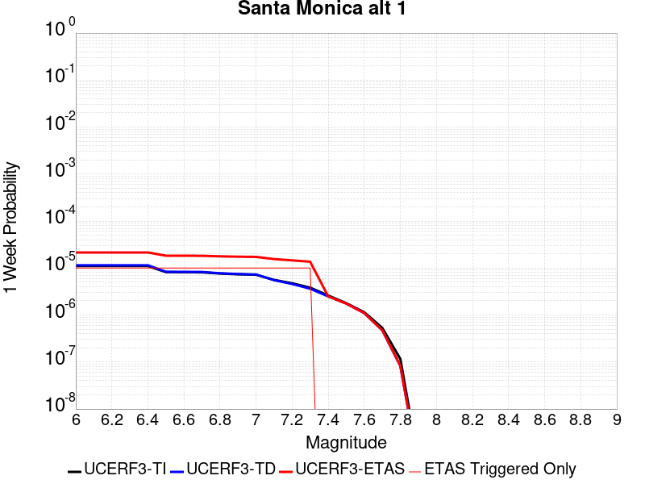 |  |  |  |

| Magnitude | 1 wk TI Prob | 1 wk TD Prob | 1 wk ETAS Prob | 1 wk ETAS/TD Gain | 1 wk ETAS Triggered Only | 1 mo TI Prob | 1 mo TD Prob | 1 mo ETAS Prob | 1 mo ETAS/TD Gain | 1 mo ETAS Triggered Only | 1 yr TI Prob | 1 yr TD Prob | 1 yr ETAS Prob | 1 yr ETAS/TD Gain | 1 yr ETAS Triggered Only | 10 yr TI Prob | 10 yr TD Prob | 10 yr ETAS Prob | 10 yr ETAS/TD Gain | 10 yr ETAS Triggered Only |
|-----|-----|-----|-----|-----|-----|-----|-----|-----|-----|-----|-----|-----|-----|-----|-----|-----|-----|-----|-----|-----|
| 6.0 | 1.1066008E-5 | 1.1480312E-5 | 2.1480198E-5 | 1.8710464 | 1.0E-5 | 4.742488E-5 | 4.920049E-5 | 5.92E-5 | 1.20324 | 1.0E-5 | 5.7724497E-4 | 5.9886527E-4 | 6.188533E-4 | 1.0333765 | 2.0E-5 | 0.005757478 | 0.0059739016 | 0.0060136626 | 1.0066558 | 4.0E-5 |
| 6.1 | 1.1066008E-5 | 1.1480312E-5 | 2.1480198E-5 | 1.8710464 | 1.0E-5 | 4.742488E-5 | 4.920049E-5 | 5.92E-5 | 1.20324 | 1.0E-5 | 5.7724497E-4 | 5.9886527E-4 | 6.188533E-4 | 1.0333765 | 2.0E-5 | 0.005757478 | 0.0059739016 | 0.0060136626 | 1.0066558 | 4.0E-5 |
| 6.2 | 1.1066008E-5 | 1.1480312E-5 | 2.1480198E-5 | 1.8710464 | 1.0E-5 | 4.742488E-5 | 4.920049E-5 | 5.92E-5 | 1.20324 | 1.0E-5 | 5.7724497E-4 | 5.9886527E-4 | 6.188533E-4 | 1.0333765 | 2.0E-5 | 0.005757478 | 0.0059739016 | 0.0060136626 | 1.0066558 | 4.0E-5 |
| 6.3 | 1.1066008E-5 | 1.1480312E-5 | 2.1480198E-5 | 1.8710464 | 1.0E-5 | 4.742488E-5 | 4.920049E-5 | 5.92E-5 | 1.20324 | 1.0E-5 | 5.7724497E-4 | 5.9886527E-4 | 6.188533E-4 | 1.0333765 | 2.0E-5 | 0.005757478 | 0.0059739016 | 0.0060136626 | 1.0066558 | 4.0E-5 |
| 6.4 | 1.1066008E-5 | 1.1480312E-5 | 2.1480198E-5 | 1.8710464 | 1.0E-5 | 4.742488E-5 | 4.920049E-5 | 5.92E-5 | 1.20324 | 1.0E-5 | 5.7724497E-4 | 5.9886527E-4 | 6.188533E-4 | 1.0333765 | 2.0E-5 | 0.005757478 | 0.0059739016 | 0.0060136626 | 1.0066558 | 4.0E-5 |
| 6.5 | 8.183544E-6 | 8.335434E-6 | 1.8335351E-5 | 2.1996875 | 1.0E-5 | 3.5071862E-5 | 3.572281E-5 | 4.5722452E-5 | 1.2799232 | 1.0E-5 | 4.2691626E-4 | 4.3483998E-4 | 4.548313E-4 | 1.0459739 | 2.0E-5 | 0.0042609703 | 0.004340057 | 0.0043798834 | 1.0091765 | 4.0E-5 |
| 6.6 | 8.1543285E-6 | 8.303648E-6 | 1.8303565E-5 | 2.20428 | 1.0E-5 | 3.4946657E-5 | 3.558659E-5 | 4.5586232E-5 | 1.2809948 | 1.0E-5 | 4.2539247E-4 | 4.3318217E-4 | 4.531735E-4 | 1.04615 | 2.0E-5 | 0.0042457907 | 0.004323543 | 0.00436337 | 1.0092117 | 4.0E-5 |
| 6.7 | 8.110878E-6 | 8.257045E-6 | 1.8256962E-5 | 2.211077 | 1.0E-5 | 3.4760444E-5 | 3.5386864E-5 | 4.538651E-5 | 1.2825807 | 1.0E-5 | 4.231262E-4 | 4.3075148E-4 | 4.5074287E-4 | 1.0464104 | 2.0E-5 | 0.0042232145 | 0.004299331 | 0.004339159 | 1.0092638 | 4.0E-5 |
| 6.8 | 7.644036E-6 | 7.751063E-6 | 1.7750985E-5 | 2.2901356 | 1.0E-5 | 3.275974E-5 | 3.3218425E-5 | 4.3218093E-5 | 1.3010278 | 1.0E-5 | 3.9877684E-4 | 4.043607E-4 | 4.2435262E-4 | 1.0494407 | 2.0E-5 | 0.00398062 | 0.004036396 | 0.004076234 | 1.0098698 | 4.0E-5 |
| 6.9 | 7.3698293E-6 | 7.4557215E-6 | 1.7455646E-5 | 2.3412418 | 1.0E-5 | 3.15846E-5 | 3.195271E-5 | 4.195239E-5 | 1.3129525 | 1.0E-5 | 3.8447464E-4 | 3.889562E-4 | 4.089484E-4 | 1.0513997 | 2.0E-5 | 0.0038381014 | 0.0038828978 | 0.0039227423 | 1.0102615 | 4.0E-5 |
| 7.0 | 7.209872E-6 | 7.2856283E-6 | 1.7285556E-5 | 2.3725553 | 1.0E-5 | 3.0899086E-5 | 3.1223753E-5 | 4.1223444E-5 | 1.320259 | 1.0E-5 | 3.7613141E-4 | 3.800843E-4 | 4.0007668E-4 | 1.0525999 | 2.0E-5 | 0.0037549543 | 0.003794485 | 0.0038343333 | 1.0105016 | 4.0E-5 |
| 7.1 | 5.603456E-6 | 5.5238947E-6 | 1.552384E-5 | 2.8103068 | 1.0E-5 | 2.4014591E-5 | 2.3673623E-5 | 3.3673386E-5 | 1.4224011 | 1.0E-5 | 2.923384E-4 | 2.8818863E-4 | 2.9818574E-4 | 1.0346895 | 1.0E-5 | 0.0029195412 | 0.002878191 | 0.0029081046 | 1.0103933 | 3.0E-5 |
| 7.2 | 4.7483613E-6 | 4.591135E-6 | 1.4591089E-5 | 3.1781006 | 1.0E-5 | 2.0349962E-5 | 1.9676147E-5 | 2.967595E-5 | 1.5082196 | 1.0E-5 | 2.4773262E-4 | 2.3953087E-4 | 2.4952847E-4 | 1.0417383 | 1.0E-5 | 0.0024745662 | 0.0023927412 | 0.0024226692 | 1.0125079 | 3.0E-5 |
| 7.3 | 3.829015E-6 | 3.6342271E-6 | 1.36341905E-5 | 3.7516067 | 1.0E-5 | 1.6409962E-5 | 1.5575166E-5 | 2.5575011E-5 | 1.6420377 | 1.0E-5 | 1.9977297E-4 | 1.8961124E-4 | 1.9960933E-4 | 1.0527295 | 1.0E-5 | 0.0019959346 | 0.0018945034 | 0.0019144656 | 1.0105369 | 2.0E-5 |
| 7.4 | 2.610755E-6 | 2.4995722E-6 | 2.4995722E-6 | 1.0 | 0.0 | 1.1188902E-5 | 1.0712408E-5 | 1.0712408E-5 | 1.0 | 0.0 | 1.3621636E-4 | 1.304158E-4 | 1.304158E-4 | 1.0 | 0.0 | 0.001361329 | 0.0013033971 | 0.0013133842 | 1.0076623 | 1.0E-5 |
| 7.5 | 1.792146E-6 | 1.7584194E-6 | 1.7584194E-6 | 1.0 | 0.0 | 7.680603E-6 | 7.5360617E-6 | 7.5360617E-6 | 1.0 | 0.0 | 9.3507326E-5 | 9.174772E-5 | 9.174772E-5 | 1.0 | 0.0 | 9.3467993E-4 | 9.1710157E-4 | 9.270924E-4 | 1.010894 | 1.0E-5 |
| 7.6 | 1.1473018E-6 | 1.102916E-6 | 1.102916E-6 | 1.0 | 0.0 | 4.9169985E-6 | 4.7267745E-6 | 4.7267745E-6 | 1.0 | 0.0 | 5.986281E-5 | 5.7546975E-5 | 5.7546975E-5 | 1.0 | 0.0 | 5.984669E-4 | 5.753224E-4 | 5.853166E-4 | 1.0173715 | 1.0E-5 |
| 7.7 | 5.330919E-7 | 4.7452562E-7 | 4.7452562E-7 | 1.0 | 0.0 | 2.2846775E-6 | 2.0336797E-6 | 2.0336797E-6 | 1.0 | 0.0 | 2.7815593E-5 | 2.4759782E-5 | 2.4759782E-5 | 1.0 | 0.0 | 2.7812112E-4 | 2.4757136E-4 | 2.4757136E-4 | 1.0 | 0.0 |
| 7.8 | 1.1668574E-7 | 8.296564E-8 | 8.296564E-8 | 1.0 | 0.0 | 5.000816E-7 | 3.5556698E-7 | 3.5556698E-7 | 1.0 | 0.0 | 6.0884768E-6 | 4.3290197E-6 | 4.3290197E-6 | 1.0 | 0.0 | 6.08831E-5 | 4.3289383E-5 | 4.3289383E-5 | 1.0 | 0.0 |
| 7.9 | 8.007447E-10 | 6.161581E-10 | 6.161581E-10 | 1.0 | 0.0 | 3.4317629E-9 | 2.640678E-9 | 2.640678E-9 | 1.0 | 0.0 | 4.1781714E-8 | 3.2150254E-8 | 3.2150254E-8 | 1.0 | 0.0 | 4.1781706E-7 | 3.2150248E-7 | 3.2150248E-7 | 1.0 | 0.0 |

## Northridge
*[(top)](#table-of-contents)*

| 1 Week | 1 Month | 1 Year | 10 Year |
|-----|-----|-----|-----|
|  |  |  | 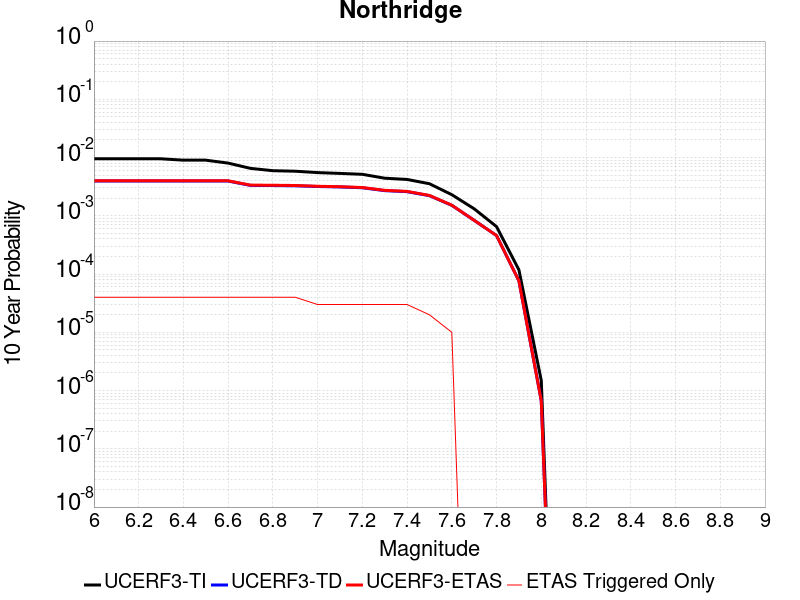 |

| Magnitude | 1 wk TI Prob | 1 wk TD Prob | 1 wk ETAS Prob | 1 wk ETAS/TD Gain | 1 wk ETAS Triggered Only | 1 mo TI Prob | 1 mo TD Prob | 1 mo ETAS Prob | 1 mo ETAS/TD Gain | 1 mo ETAS Triggered Only | 1 yr TI Prob | 1 yr TD Prob | 1 yr ETAS Prob | 1 yr ETAS/TD Gain | 1 yr ETAS Triggered Only | 10 yr TI Prob | 10 yr TD Prob | 10 yr ETAS Prob | 10 yr ETAS/TD Gain | 10 yr ETAS Triggered Only |
|-----|-----|-----|-----|-----|-----|-----|-----|-----|-----|-----|-----|-----|-----|-----|-----|-----|-----|-----|-----|-----|
| 6.0 | 1.8340852E-5 | 7.5878907E-6 | 7.5878907E-6 | 1.0 | 0.0 | 7.860128E-5 | 3.251914E-5 | 3.251914E-5 | 1.0 | 0.0 | 9.565505E-4 | 3.9585077E-4 | 4.0584683E-4 | 1.0252521 | 1.0E-5 | 0.009524435 | 0.0039516874 | 0.0039915293 | 1.0100822 | 4.0E-5 |
| 6.1 | 1.8340852E-5 | 7.5878907E-6 | 7.5878907E-6 | 1.0 | 0.0 | 7.860128E-5 | 3.251914E-5 | 3.251914E-5 | 1.0 | 0.0 | 9.565505E-4 | 3.9585077E-4 | 4.0584683E-4 | 1.0252521 | 1.0E-5 | 0.009524435 | 0.0039516874 | 0.0039915293 | 1.0100822 | 4.0E-5 |
| 6.2 | 1.8340852E-5 | 7.5878907E-6 | 7.5878907E-6 | 1.0 | 0.0 | 7.860128E-5 | 3.251914E-5 | 3.251914E-5 | 1.0 | 0.0 | 9.565505E-4 | 3.9585077E-4 | 4.0584683E-4 | 1.0252521 | 1.0E-5 | 0.009524435 | 0.0039516874 | 0.0039915293 | 1.0100822 | 4.0E-5 |
| 6.3 | 1.8340852E-5 | 7.5878907E-6 | 7.5878907E-6 | 1.0 | 0.0 | 7.860128E-5 | 3.251914E-5 | 3.251914E-5 | 1.0 | 0.0 | 9.565505E-4 | 3.9585077E-4 | 4.0584683E-4 | 1.0252521 | 1.0E-5 | 0.009524435 | 0.0039516874 | 0.0039915293 | 1.0100822 | 4.0E-5 |
| 6.4 | 1.7361892E-5 | 7.5878907E-6 | 7.5878907E-6 | 1.0 | 0.0 | 7.440598E-5 | 3.251914E-5 | 3.251914E-5 | 1.0 | 0.0 | 9.055163E-4 | 3.9585077E-4 | 4.0584683E-4 | 1.0252521 | 1.0E-5 | 0.009018354 | 0.0039516874 | 0.0039915293 | 1.0100822 | 4.0E-5 |
| 6.5 | 1.7361892E-5 | 7.5878907E-6 | 7.5878907E-6 | 1.0 | 0.0 | 7.440598E-5 | 3.251914E-5 | 3.251914E-5 | 1.0 | 0.0 | 9.055163E-4 | 3.9585077E-4 | 4.0584683E-4 | 1.0252521 | 1.0E-5 | 0.009018354 | 0.0039516874 | 0.0039915293 | 1.0100822 | 4.0E-5 |
| 6.6 | 1.5458201E-5 | 7.5878907E-6 | 7.5878907E-6 | 1.0 | 0.0 | 6.624775E-5 | 3.251914E-5 | 3.251914E-5 | 1.0 | 0.0 | 8.0626784E-4 | 3.9585077E-4 | 4.0584683E-4 | 1.0252521 | 1.0E-5 | 0.008033488 | 0.0039516874 | 0.0039915293 | 1.0100822 | 4.0E-5 |
| 6.7 | 1.2538368E-5 | 6.381497E-6 | 6.381497E-6 | 1.0 | 0.0 | 5.3734755E-5 | 2.7348988E-5 | 2.7348988E-5 | 1.0 | 0.0 | 6.5402425E-4 | 3.329235E-4 | 3.4292016E-4 | 1.0300269 | 1.0E-5 | 0.0065210275 | 0.0033243035 | 0.0033641707 | 1.0119926 | 4.0E-5 |
| 6.8 | 1.1438097E-5 | 6.350156E-6 | 6.350156E-6 | 1.0 | 0.0 | 4.9019498E-5 | 2.7214674E-5 | 2.7214674E-5 | 1.0 | 0.0 | 5.9664896E-4 | 3.3128873E-4 | 3.412854E-4 | 1.0301752 | 1.0E-5 | 0.005950495 | 0.0033080047 | 0.0033478723 | 1.0120519 | 4.0E-5 |
| 6.9 | 1.1204891E-5 | 6.2866116E-6 | 6.2866116E-6 | 1.0 | 0.0 | 4.8020076E-5 | 2.6942345E-5 | 2.6942345E-5 | 1.0 | 0.0 | 5.8448757E-4 | 3.2797412E-4 | 3.3797082E-4 | 1.0304803 | 1.0E-5 | 0.0058295266 | 0.0032749567 | 0.0033148257 | 1.0121739 | 4.0E-5 |
| 7.0 | 1.061046E-5 | 6.1152687E-6 | 6.1152687E-6 | 1.0 | 0.0 | 4.5472607E-5 | 2.6208034E-5 | 2.6208034E-5 | 1.0 | 0.0 | 5.534883E-4 | 3.190365E-4 | 3.190365E-4 | 1.0 | 0.0 | 0.0055211177 | 0.0031858315 | 0.0032157358 | 1.0093867 | 3.0E-5 |
| 7.1 | 1.0266979E-5 | 6.0041907E-6 | 6.0041907E-6 | 1.0 | 0.0 | 4.40006E-5 | 2.5731995E-5 | 2.5731995E-5 | 1.0 | 0.0 | 5.355756E-4 | 3.1324243E-4 | 3.1324243E-4 | 1.0 | 0.0 | 0.0053428668 | 0.0031280548 | 0.003157961 | 1.0095606 | 3.0E-5 |
| 7.2 | 9.91273E-6 | 5.819906E-6 | 5.819906E-6 | 1.0 | 0.0 | 4.248244E-5 | 2.4942217E-5 | 2.4942217E-5 | 1.0 | 0.0 | 5.171009E-4 | 3.036296E-4 | 3.036296E-4 | 1.0 | 0.0 | 0.0051589934 | 0.0030321924 | 0.0030621015 | 1.0098639 | 3.0E-5 |
| 7.3 | 8.4959265E-6 | 5.1930183E-6 | 5.1930183E-6 | 1.0 | 0.0 | 3.6410605E-5 | 2.2255605E-5 | 2.2255605E-5 | 1.0 | 0.0 | 4.4320893E-4 | 2.7092852E-4 | 2.7092852E-4 | 1.0 | 0.0 | 0.00442326 | 0.0027060085 | 0.0027359272 | 1.0110564 | 3.0E-5 |
| 7.4 | 8.0847185E-6 | 4.9818977E-6 | 4.9818977E-6 | 1.0 | 0.0 | 3.4648332E-5 | 2.1350817E-5 | 2.1350817E-5 | 1.0 | 0.0 | 4.2176177E-4 | 2.5991542E-4 | 2.5991542E-4 | 1.0 | 0.0 | 0.0042096223 | 0.0025961401 | 0.0026260621 | 1.0115256 | 3.0E-5 |
| 7.5 | 6.8220684E-6 | 4.2532647E-6 | 4.2532647E-6 | 1.0 | 0.0 | 2.9237108E-5 | 1.8228153E-5 | 1.8228153E-5 | 1.0 | 0.0 | 3.5590364E-4 | 2.2190536E-4 | 2.2190536E-4 | 1.0 | 0.0 | 0.0035533418 | 0.0022168586 | 0.0022368142 | 1.0090017 | 2.0E-5 |
| 7.6 | 4.4224143E-6 | 2.8999295E-6 | 2.8999295E-6 | 1.0 | 0.0 | 1.8953066E-5 | 1.24282105E-5 | 1.24282105E-5 | 1.0 | 0.0 | 2.3072914E-4 | 1.5130307E-4 | 1.5130307E-4 | 1.0 | 0.0 | 0.0023048974 | 0.0015120122 | 0.001521997 | 1.0066037 | 1.0E-5 |
| 7.7 | 2.5297056E-6 | 1.6045943E-6 | 1.6045943E-6 | 1.0 | 0.0 | 1.0841551E-5 | 6.876815E-6 | 6.876815E-6 | 1.0 | 0.0 | 1.319879E-4 | 8.372205E-5 | 8.372205E-5 | 1.0 | 0.0 | 0.0013190953 | 8.369098E-4 | 8.369098E-4 | 1.0 | 0.0 |
| 7.8 | 1.2508156E-6 | 8.780148E-7 | 8.780148E-7 | 1.0 | 0.0 | 5.3606273E-6 | 3.7629154E-6 | 3.7629154E-6 | 1.0 | 0.0 | 6.526368E-5 | 4.5812543E-5 | 4.5812543E-5 | 1.0 | 0.0 | 6.524452E-4 | 4.580323E-4 | 4.580323E-4 | 1.0 | 0.0 |
| 7.9 | 2.262199E-7 | 1.466491E-7 | 1.466491E-7 | 1.0 | 0.0 | 9.695135E-7 | 6.2849597E-7 | 6.2849597E-7 | 1.0 | 0.0 | 1.1803763E-5 | 7.651913E-6 | 7.651913E-6 | 1.0 | 0.0 | 1.1803136E-4 | 7.651657E-5 | 7.651657E-5 | 1.0 | 0.0 |
| 8.0 | 2.865362E-9 | 1.27525E-9 | 1.27525E-9 | 1.0 | 0.0 | 1.2280123E-8 | 5.465357E-9 | 5.465357E-9 | 1.0 | 0.0 | 1.4951048E-7 | 6.654073E-8 | 6.654073E-8 | 1.0 | 0.0 | 1.4951038E-6 | 6.6540724E-7 | 6.6540724E-7 | 1.0 | 0.0 |

## Rinconada 2011 CFM
*[(top)](#table-of-contents)*

| 1 Week | 1 Month | 1 Year | 10 Year |
|-----|-----|-----|-----|
|  |  | 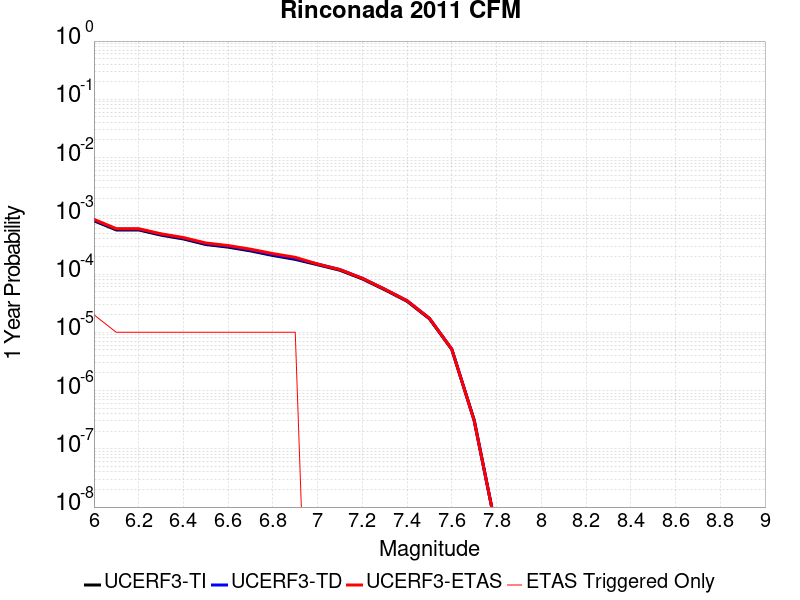 | 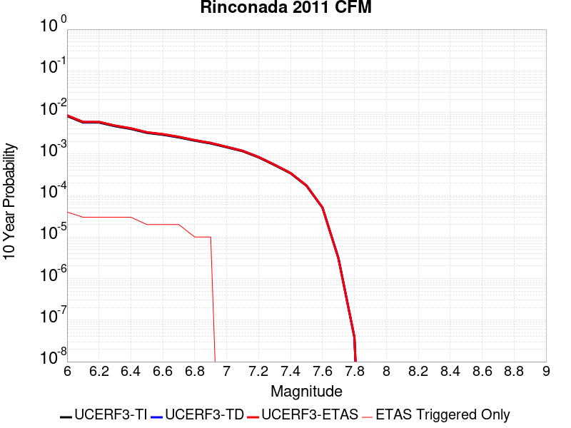 |

| Magnitude | 1 wk TI Prob | 1 wk TD Prob | 1 wk ETAS Prob | 1 wk ETAS/TD Gain | 1 wk ETAS Triggered Only | 1 mo TI Prob | 1 mo TD Prob | 1 mo ETAS Prob | 1 mo ETAS/TD Gain | 1 mo ETAS Triggered Only | 1 yr TI Prob | 1 yr TD Prob | 1 yr ETAS Prob | 1 yr ETAS/TD Gain | 1 yr ETAS Triggered Only | 10 yr TI Prob | 10 yr TD Prob | 10 yr ETAS Prob | 10 yr ETAS/TD Gain | 10 yr ETAS Triggered Only |
|-----|-----|-----|-----|-----|-----|-----|-----|-----|-----|-----|-----|-----|-----|-----|-----|-----|-----|-----|-----|-----|
| 6.0 | 1.5752368E-5 | 1.6274716E-5 | 2.6274553E-5 | 1.6144401 | 1.0E-5 | 6.75084E-5 | 6.974694E-5 | 8.974554E-5 | 1.286731 | 2.0E-5 | 8.2160486E-4 | 8.488413E-4 | 8.6882425E-4 | 1.0235416 | 2.0E-5 | 0.008185739 | 0.00845637 | 0.008496032 | 1.0046902 | 4.0E-5 |
| 6.1 | 1.0966133E-5 | 1.1323029E-5 | 2.1322916E-5 | 1.8831459 | 1.0E-5 | 4.6996865E-5 | 4.852637E-5 | 5.8525886E-5 | 1.2060635 | 1.0E-5 | 5.720366E-4 | 5.9064914E-4 | 6.006432E-4 | 1.0169206 | 1.0E-5 | 0.0057056635 | 0.005890889 | 0.0059207124 | 1.0050626 | 3.0E-5 |
| 6.2 | 1.0966133E-5 | 1.1323029E-5 | 2.1322916E-5 | 1.8831459 | 1.0E-5 | 4.6996865E-5 | 4.852637E-5 | 5.8525886E-5 | 1.2060635 | 1.0E-5 | 5.720366E-4 | 5.9064914E-4 | 6.006432E-4 | 1.0169206 | 1.0E-5 | 0.0057056635 | 0.005890889 | 0.0059207124 | 1.0050626 | 3.0E-5 |
| 6.3 | 8.926149E-6 | 9.212772E-6 | 1.9212679E-5 | 2.0854397 | 1.0E-5 | 3.8254362E-5 | 3.948271E-5 | 4.9482318E-5 | 1.2532654 | 1.0E-5 | 4.6564735E-4 | 4.8059633E-4 | 4.905915E-4 | 1.0207975 | 1.0E-5 | 0.0046467283 | 0.0047956146 | 0.0048254705 | 1.0062257 | 3.0E-5 |
| 6.4 | 7.676955E-6 | 7.920191E-6 | 1.7920112E-5 | 2.2625859 | 1.0E-5 | 3.290082E-5 | 3.3943234E-5 | 4.3942895E-5 | 1.2945995 | 1.0E-5 | 4.0049385E-4 | 4.131807E-4 | 4.2317656E-4 | 1.0241925 | 1.0E-5 | 0.0039977287 | 0.004124151 | 0.0041540274 | 1.0072442 | 3.0E-5 |
| 6.5 | 6.1671026E-6 | 6.358955E-6 | 1.6358892E-5 | 2.5725753 | 1.0E-5 | 2.6430173E-5 | 2.725238E-5 | 3.7252106E-5 | 1.3669305 | 1.0E-5 | 3.2173982E-4 | 3.317473E-4 | 3.4174396E-4 | 1.0301335 | 1.0E-5 | 0.003212744 | 0.0033125326 | 0.0033324664 | 1.0060177 | 2.0E-5 |
| 6.6 | 5.553456E-6 | 5.7248126E-6 | 1.5724756E-5 | 2.746772 | 1.0E-5 | 2.3800309E-5 | 2.4534682E-5 | 3.4534438E-5 | 1.4075763 | 1.0E-5 | 2.897302E-4 | 2.9866886E-4 | 3.0866588E-4 | 1.033472 | 1.0E-5 | 0.0028935277 | 0.0029826832 | 0.0030026236 | 1.0066854 | 2.0E-5 |
| 6.7 | 4.787857E-6 | 4.93331E-6 | 1.493326E-5 | 3.0270267 | 1.0E-5 | 2.0519226E-5 | 2.1142585E-5 | 3.1142372E-5 | 1.472969 | 1.0E-5 | 2.4979294E-4 | 2.573806E-4 | 2.6737803E-4 | 1.0388429 | 1.0E-5 | 0.0024951235 | 0.002570831 | 0.0025907794 | 1.0077596 | 2.0E-5 |
| 6.8 | 3.9955166E-6 | 4.1134763E-6 | 1.4113435E-5 | 3.4310238 | 1.0E-5 | 1.7123532E-5 | 1.7629065E-5 | 2.7628888E-5 | 1.567235 | 1.0E-5 | 2.0845905E-4 | 2.1461275E-4 | 2.2461062E-4 | 1.0465856 | 1.0E-5 | 0.002082636 | 0.0021440587 | 0.0021540371 | 1.004654 | 1.0E-5 |
| 6.9 | 3.4250072E-6 | 3.5224466E-6 | 1.3522412E-5 | 3.8389258 | 1.0E-5 | 1.46785205E-5 | 1.5096112E-5 | 2.5095962E-5 | 1.6624122 | 1.0E-5 | 1.7869633E-4 | 1.8377969E-4 | 1.9377784E-4 | 1.054403 | 1.0E-5 | 0.001785527 | 0.0018362795 | 0.0018462611 | 1.0054358 | 1.0E-5 |
| 7.0 | 2.7712713E-6 | 2.8467002E-6 | 2.8467002E-6 | 1.0 | 0.0 | 1.1876823E-5 | 1.22000865E-5 | 1.22000865E-5 | 1.0 | 0.0 | 1.4459073E-4 | 1.4852594E-4 | 1.4852594E-4 | 1.0 | 0.0 | 0.0014449668 | 0.0014842683 | 0.0014842683 | 1.0 | 0.0 |
| 7.1 | 2.227358E-6 | 2.2856987E-6 | 2.2856987E-6 | 1.0 | 0.0 | 9.545785E-6 | 9.795815E-6 | 9.795815E-6 | 1.0 | 0.0 | 1.16213734E-4 | 1.1925753E-4 | 1.1925753E-4 | 1.0 | 0.0 | 0.0011615298 | 0.0011919363 | 0.0011919363 | 1.0 | 0.0 |
| 7.2 | 1.581796E-6 | 1.6209015E-6 | 1.6209015E-6 | 1.0 | 0.0 | 6.779108E-6 | 6.946702E-6 | 6.946702E-6 | 1.0 | 0.0 | 8.253252E-5 | 8.4572814E-5 | 8.4572814E-5 | 1.0 | 0.0 | 8.250187E-4 | 8.4540684E-4 | 8.4540684E-4 | 1.0 | 0.0 |
| 7.3 | 1.0306567E-6 | 1.054648E-6 | 1.054648E-6 | 1.0 | 0.0 | 4.4170924E-6 | 4.519912E-6 | 4.519912E-6 | 1.0 | 0.0 | 5.3776774E-5 | 5.502854E-5 | 5.502854E-5 | 1.0 | 0.0 | 5.376376E-4 | 5.501494E-4 | 5.501494E-4 | 1.0 | 0.0 |
| 7.4 | 6.535541E-7 | 6.682744E-7 | 6.682744E-7 | 1.0 | 0.0 | 2.800943E-6 | 2.8640302E-6 | 2.8640302E-6 | 1.0 | 0.0 | 3.4100947E-5 | 3.4869012E-5 | 3.4869012E-5 | 1.0 | 0.0 | 3.4095717E-4 | 3.486355E-4 | 3.486355E-4 | 1.0 | 0.0 |
| 7.5 | 3.2656962E-7 | 3.3316712E-7 | 3.3316712E-7 | 1.0 | 0.0 | 1.3995833E-6 | 1.4278584E-6 | 1.4278584E-6 | 1.0 | 0.0 | 1.7039794E-5 | 1.7384036E-5 | 1.7384036E-5 | 1.0 | 0.0 | 1.7038487E-4 | 1.738268E-4 | 1.738268E-4 | 1.0 | 0.0 |
| 7.6 | 9.754343E-8 | 9.821017E-8 | 9.821017E-8 | 1.0 | 0.0 | 4.180432E-7 | 4.2090065E-7 | 4.2090065E-7 | 1.0 | 0.0 | 5.089664E-6 | 5.1244533E-6 | 5.1244533E-6 | 1.0 | 0.0 | 5.0895473E-5 | 5.124336E-5 | 5.124336E-5 | 1.0 | 0.0 |
| 7.7 | 6.0001453E-9 | 5.8491207E-9 | 5.8491207E-9 | 1.0 | 0.0 | 2.5714908E-8 | 2.506766E-8 | 2.506766E-8 | 1.0 | 0.0 | 3.1307894E-7 | 3.051987E-7 | 3.051987E-7 | 1.0 | 0.0 | 3.1307852E-6 | 3.0519832E-6 | 3.0519832E-6 | 1.0 | 0.0 |
| 7.8 | 7.400003E-11 | 7.4654505E-11 | 7.4654505E-11 | 1.0 | 0.0 | 3.171432E-10 | 3.1994773E-10 | 3.1994773E-10 | 1.0 | 0.0 | 3.861218E-9 | 3.895363E-9 | 3.895363E-9 | 1.0 | 0.0 | 3.861218E-8 | 3.895363E-8 | 3.895363E-8 | 1.0 | 0.0 |

## Channel Islands Thrust
*[(top)](#table-of-contents)*

| 1 Week | 1 Month | 1 Year | 10 Year |
|-----|-----|-----|-----|
|  |  |  |  |

| Magnitude | 1 wk TI Prob | 1 wk TD Prob | 1 wk ETAS Prob | 1 wk ETAS/TD Gain | 1 wk ETAS Triggered Only | 1 mo TI Prob | 1 mo TD Prob | 1 mo ETAS Prob | 1 mo ETAS/TD Gain | 1 mo ETAS Triggered Only | 1 yr TI Prob | 1 yr TD Prob | 1 yr ETAS Prob | 1 yr ETAS/TD Gain | 1 yr ETAS Triggered Only | 10 yr TI Prob | 10 yr TD Prob | 10 yr ETAS Prob | 10 yr ETAS/TD Gain | 10 yr ETAS Triggered Only |
|-----|-----|-----|-----|-----|-----|-----|-----|-----|-----|-----|-----|-----|-----|-----|-----|-----|-----|-----|-----|-----|
| 6.0 | 2.2156251E-5 | 2.4092022E-5 | 5.40913E-5 | 2.2451954 | 3.0E-5 | 9.495191E-5 | 1.03248036E-4 | 1.3324495E-4 | 1.2905325 | 3.0E-5 | 0.0011554264 | 0.0012564266 | 0.0012863888 | 1.0238472 | 3.0E-5 | 0.011494373 | 0.0125038205 | 0.012543321 | 1.003159 | 4.0E-5 |
| 6.1 | 2.2156251E-5 | 2.4092022E-5 | 5.40913E-5 | 2.2451954 | 3.0E-5 | 9.495191E-5 | 1.03248036E-4 | 1.3324495E-4 | 1.2905325 | 3.0E-5 | 0.0011554264 | 0.0012564266 | 0.0012863888 | 1.0238472 | 3.0E-5 | 0.011494373 | 0.0125038205 | 0.012543321 | 1.003159 | 4.0E-5 |
| 6.2 | 2.2156251E-5 | 2.4092022E-5 | 5.40913E-5 | 2.2451954 | 3.0E-5 | 9.495191E-5 | 1.03248036E-4 | 1.3324495E-4 | 1.2905325 | 3.0E-5 | 0.0011554264 | 0.0012564266 | 0.0012863888 | 1.0238472 | 3.0E-5 | 0.011494373 | 0.0125038205 | 0.012543321 | 1.003159 | 4.0E-5 |
| 6.3 | 2.2156251E-5 | 2.4092022E-5 | 5.40913E-5 | 2.2451954 | 3.0E-5 | 9.495191E-5 | 1.03248036E-4 | 1.3324495E-4 | 1.2905325 | 3.0E-5 | 0.0011554264 | 0.0012564266 | 0.0012863888 | 1.0238472 | 3.0E-5 | 0.011494373 | 0.0125038205 | 0.012543321 | 1.003159 | 4.0E-5 |
| 6.4 | 2.2156251E-5 | 2.4092022E-5 | 5.40913E-5 | 2.2451954 | 3.0E-5 | 9.495191E-5 | 1.03248036E-4 | 1.3324495E-4 | 1.2905325 | 3.0E-5 | 0.0011554264 | 0.0012564266 | 0.0012863888 | 1.0238472 | 3.0E-5 | 0.011494373 | 0.0125038205 | 0.012543321 | 1.003159 | 4.0E-5 |
| 6.5 | 2.2156251E-5 | 2.4092022E-5 | 5.40913E-5 | 2.2451954 | 3.0E-5 | 9.495191E-5 | 1.03248036E-4 | 1.3324495E-4 | 1.2905325 | 3.0E-5 | 0.0011554264 | 0.0012564266 | 0.0012863888 | 1.0238472 | 3.0E-5 | 0.011494373 | 0.0125038205 | 0.012543321 | 1.003159 | 4.0E-5 |
| 6.6 | 2.2156251E-5 | 2.4092022E-5 | 5.40913E-5 | 2.2451954 | 3.0E-5 | 9.495191E-5 | 1.03248036E-4 | 1.3324495E-4 | 1.2905325 | 3.0E-5 | 0.0011554264 | 0.0012564266 | 0.0012863888 | 1.0238472 | 3.0E-5 | 0.011494373 | 0.0125038205 | 0.012543321 | 1.003159 | 4.0E-5 |
| 6.7 | 1.0601296E-5 | 1.1379544E-5 | 2.137943E-5 | 1.8787599 | 1.0E-5 | 4.5433335E-5 | 4.876859E-5 | 5.8768102E-5 | 1.20504 | 1.0E-5 | 5.5301044E-4 | 5.936007E-4 | 6.0359476E-4 | 1.0168363 | 1.0E-5 | 0.005516363 | 0.005920653 | 0.005930594 | 1.001679 | 1.0E-5 |
| 6.8 | 1.0246747E-5 | 1.0996669E-5 | 2.0996558E-5 | 1.9093562 | 1.0E-5 | 4.391389E-5 | 4.7127756E-5 | 5.7127287E-5 | 1.2121792 | 1.0E-5 | 5.345204E-4 | 5.7363417E-4 | 5.836284E-4 | 1.0174227 | 1.0E-5 | 0.0053323656 | 0.005722025 | 0.0057319677 | 1.0017376 | 1.0E-5 |
| 6.9 | 9.049551E-6 | 9.699645E-6 | 1.9699548E-5 | 2.0309556 | 1.0E-5 | 3.878322E-5 | 4.1569267E-5 | 5.156885E-5 | 1.2405523 | 1.0E-5 | 4.7208337E-4 | 5.059924E-4 | 5.1598734E-4 | 1.0197531 | 1.0E-5 | 0.0047108172 | 0.0050488203 | 0.00505877 | 1.0019706 | 1.0E-5 |
| 7.0 | 8.6542195E-6 | 9.274603E-6 | 1.927451E-5 | 2.0782032 | 1.0E-5 | 3.7088983E-5 | 3.9747716E-5 | 4.974732E-5 | 1.2515768 | 1.0E-5 | 4.5146482E-4 | 4.8382508E-4 | 4.9382023E-4 | 1.0206586 | 1.0E-5 | 0.004505487 | 0.0048281294 | 0.004838081 | 1.0020612 | 1.0E-5 |
| 7.1 | 8.391028E-6 | 8.992925E-6 | 1.8992836E-5 | 2.1119752 | 1.0E-5 | 3.5961057E-5 | 3.8540562E-5 | 4.8540176E-5 | 1.2594569 | 1.0E-5 | 4.3773788E-4 | 4.6913436E-4 | 4.791297E-4 | 1.0213058 | 1.0E-5 | 0.004368766 | 0.0046818503 | 0.0046918034 | 1.0021259 | 1.0E-5 |
| 7.2 | 5.965188E-6 | 6.3716957E-6 | 1.6371632E-5 | 2.569431 | 1.0E-5 | 2.556484E-5 | 2.7306984E-5 | 3.7306712E-5 | 1.3661966 | 1.0E-5 | 3.1120746E-4 | 3.3241237E-4 | 3.4240904E-4 | 1.0300732 | 1.0E-5 | 0.00310772 | 0.0033192094 | 0.0033291762 | 1.0030028 | 1.0E-5 |
| 7.3 | 4.877518E-6 | 5.206007E-6 | 1.5205955E-5 | 2.9208481 | 1.0E-5 | 2.0903482E-5 | 2.231127E-5 | 3.2311047E-5 | 1.448194 | 1.0E-5 | 2.5447016E-4 | 2.716063E-4 | 2.8160357E-4 | 1.036808 | 1.0E-5 | 0.0025417898 | 0.0027127897 | 0.0027227625 | 1.0036763 | 1.0E-5 |
| 7.4 | 3.8829853E-6 | 4.141863E-6 | 1.4141821E-5 | 3.4143624 | 1.0E-5 | 1.664126E-5 | 1.7750723E-5 | 2.7750546E-5 | 1.5633473 | 1.0E-5 | 2.0258849E-4 | 2.1609403E-4 | 2.2609187E-4 | 1.0462662 | 1.0E-5 | 0.002024039 | 0.002158881 | 0.0021688591 | 1.004622 | 1.0E-5 |
| 7.5 | 1.3489616E-6 | 1.4277905E-6 | 1.1427776E-5 | 8.0038185 | 1.0E-5 | 5.7812517E-6 | 6.119088E-6 | 1.6119027E-5 | 2.6342204 | 1.0E-5 | 7.038446E-5 | 7.449739E-5 | 8.449665E-5 | 1.1342229 | 1.0E-5 | 7.036218E-4 | 7.4472814E-4 | 7.547207E-4 | 1.0134177 | 1.0E-5 |
| 7.6 | 6.058192E-7 | 6.35378E-7 | 6.35378E-7 | 1.0 | 0.0 | 2.5963652E-6 | 2.7230458E-6 | 2.7230458E-6 | 1.0 | 0.0 | 3.161029E-5 | 3.3152595E-5 | 3.3152595E-5 | 1.0 | 0.0 | 3.1605794E-4 | 3.314781E-4 | 3.314781E-4 | 1.0 | 0.0 |
| 7.7 | 2.2170494E-7 | 2.2607924E-7 | 2.2607924E-7 | 1.0 | 0.0 | 9.5016367E-7 | 9.689107E-7 | 9.689107E-7 | 1.0 | 0.0 | 1.1568181E-5 | 1.17964355E-5 | 1.17964355E-5 | 1.0 | 0.0 | 1.1567579E-4 | 1.179592E-4 | 1.179592E-4 | 1.0 | 0.0 |
| 7.8 | 2.1613102E-8 | 1.5466837E-8 | 1.5466837E-8 | 1.0 | 0.0 | 9.262757E-8 | 6.628645E-8 | 6.628645E-8 | 1.0 | 0.0 | 1.1277401E-6 | 8.070372E-7 | 8.070372E-7 | 1.0 | 0.0 | 1.1277344E-5 | 8.07035E-6 | 8.07035E-6 | 1.0 | 0.0 |

## Pitas Point (Lower West)
*[(top)](#table-of-contents)*

| 1 Week | 1 Month | 1 Year | 10 Year |
|-----|-----|-----|-----|
| 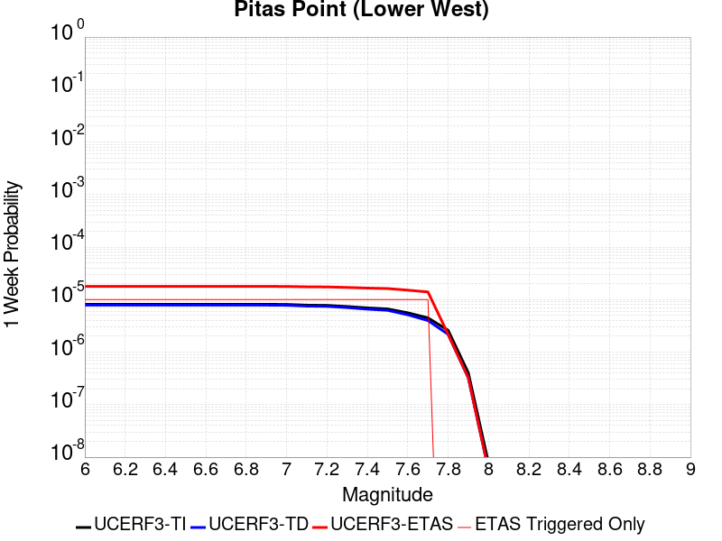 |  | 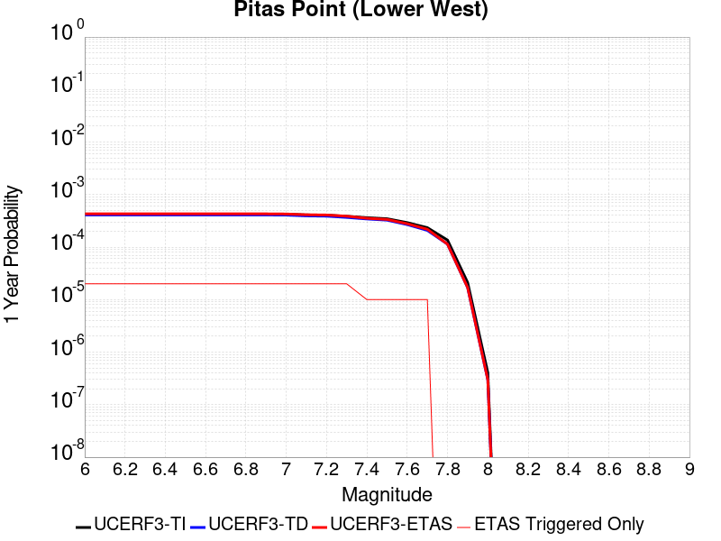 |  |

| Magnitude | 1 wk TI Prob | 1 wk TD Prob | 1 wk ETAS Prob | 1 wk ETAS/TD Gain | 1 wk ETAS Triggered Only | 1 mo TI Prob | 1 mo TD Prob | 1 mo ETAS Prob | 1 mo ETAS/TD Gain | 1 mo ETAS Triggered Only | 1 yr TI Prob | 1 yr TD Prob | 1 yr ETAS Prob | 1 yr ETAS/TD Gain | 1 yr ETAS Triggered Only | 10 yr TI Prob | 10 yr TD Prob | 10 yr ETAS Prob | 10 yr ETAS/TD Gain | 10 yr ETAS Triggered Only |
|-----|-----|-----|-----|-----|-----|-----|-----|-----|-----|-----|-----|-----|-----|-----|-----|-----|-----|-----|-----|-----|
| 6.0 | 8.151497E-6 | 7.855796E-6 | 1.7855718E-5 | 2.2729354 | 1.0E-5 | 3.493452E-5 | 3.3667267E-5 | 4.3666932E-5 | 1.2970144 | 1.0E-5 | 4.252448E-4 | 4.0982262E-4 | 4.2981442E-4 | 1.0487816 | 2.0E-5 | 0.0042443196 | 0.004090749 | 0.0041305856 | 1.0097382 | 4.0E-5 |
| 6.1 | 8.151497E-6 | 7.855796E-6 | 1.7855718E-5 | 2.2729354 | 1.0E-5 | 3.493452E-5 | 3.3667267E-5 | 4.3666932E-5 | 1.2970144 | 1.0E-5 | 4.252448E-4 | 4.0982262E-4 | 4.2981442E-4 | 1.0487816 | 2.0E-5 | 0.0042443196 | 0.004090749 | 0.0041305856 | 1.0097382 | 4.0E-5 |
| 6.2 | 8.151497E-6 | 7.855796E-6 | 1.7855718E-5 | 2.2729354 | 1.0E-5 | 3.493452E-5 | 3.3667267E-5 | 4.3666932E-5 | 1.2970144 | 1.0E-5 | 4.252448E-4 | 4.0982262E-4 | 4.2981442E-4 | 1.0487816 | 2.0E-5 | 0.0042443196 | 0.004090749 | 0.0041305856 | 1.0097382 | 4.0E-5 |
| 6.3 | 8.151497E-6 | 7.855796E-6 | 1.7855718E-5 | 2.2729354 | 1.0E-5 | 3.493452E-5 | 3.3667267E-5 | 4.3666932E-5 | 1.2970144 | 1.0E-5 | 4.252448E-4 | 4.0982262E-4 | 4.2981442E-4 | 1.0487816 | 2.0E-5 | 0.0042443196 | 0.004090749 | 0.0041305856 | 1.0097382 | 4.0E-5 |
| 6.4 | 8.151497E-6 | 7.855796E-6 | 1.7855718E-5 | 2.2729354 | 1.0E-5 | 3.493452E-5 | 3.3667267E-5 | 4.3666932E-5 | 1.2970144 | 1.0E-5 | 4.252448E-4 | 4.0982262E-4 | 4.2981442E-4 | 1.0487816 | 2.0E-5 | 0.0042443196 | 0.004090749 | 0.0041305856 | 1.0097382 | 4.0E-5 |
| 6.5 | 8.151497E-6 | 7.855796E-6 | 1.7855718E-5 | 2.2729354 | 1.0E-5 | 3.493452E-5 | 3.3667267E-5 | 4.3666932E-5 | 1.2970144 | 1.0E-5 | 4.252448E-4 | 4.0982262E-4 | 4.2981442E-4 | 1.0487816 | 2.0E-5 | 0.0042443196 | 0.004090749 | 0.0041305856 | 1.0097382 | 4.0E-5 |
| 6.6 | 8.151497E-6 | 7.855796E-6 | 1.7855718E-5 | 2.2729354 | 1.0E-5 | 3.493452E-5 | 3.3667267E-5 | 4.3666932E-5 | 1.2970144 | 1.0E-5 | 4.252448E-4 | 4.0982262E-4 | 4.2981442E-4 | 1.0487816 | 2.0E-5 | 0.0042443196 | 0.004090749 | 0.0041305856 | 1.0097382 | 4.0E-5 |
| 6.7 | 8.151497E-6 | 7.855796E-6 | 1.7855718E-5 | 2.2729354 | 1.0E-5 | 3.493452E-5 | 3.3667267E-5 | 4.3666932E-5 | 1.2970144 | 1.0E-5 | 4.252448E-4 | 4.0982262E-4 | 4.2981442E-4 | 1.0487816 | 2.0E-5 | 0.0042443196 | 0.004090749 | 0.0041305856 | 1.0097382 | 4.0E-5 |
| 6.8 | 8.151497E-6 | 7.855796E-6 | 1.7855718E-5 | 2.2729354 | 1.0E-5 | 3.493452E-5 | 3.3667267E-5 | 4.3666932E-5 | 1.2970144 | 1.0E-5 | 4.252448E-4 | 4.0982262E-4 | 4.2981442E-4 | 1.0487816 | 2.0E-5 | 0.0042443196 | 0.004090749 | 0.0041305856 | 1.0097382 | 4.0E-5 |
| 6.9 | 8.151497E-6 | 7.855796E-6 | 1.7855718E-5 | 2.2729354 | 1.0E-5 | 3.493452E-5 | 3.3667267E-5 | 4.3666932E-5 | 1.2970144 | 1.0E-5 | 4.252448E-4 | 4.0982262E-4 | 4.2981442E-4 | 1.0487816 | 2.0E-5 | 0.0042443196 | 0.004090749 | 0.0041305856 | 1.0097382 | 4.0E-5 |
| 7.0 | 8.103535E-6 | 7.805226E-6 | 1.7805149E-5 | 2.281183 | 1.0E-5 | 3.4728975E-5 | 3.3450542E-5 | 4.3450207E-5 | 1.2989388 | 1.0E-5 | 4.2274324E-4 | 4.07185E-4 | 4.2717686E-4 | 1.0490978 | 2.0E-5 | 0.0042193993 | 0.0040644696 | 0.004104307 | 1.0098014 | 4.0E-5 |
| 7.1 | 7.853298E-6 | 7.540917E-6 | 1.7540842E-5 | 2.3260887 | 1.0E-5 | 3.3656554E-5 | 3.2317817E-5 | 4.2317497E-5 | 1.3094168 | 1.0E-5 | 4.096915E-4 | 3.9339912E-4 | 4.1339124E-4 | 1.0508189 | 2.0E-5 | 0.00408937 | 0.0039271032 | 0.003966946 | 1.0101457 | 4.0E-5 |
| 7.2 | 7.771102E-6 | 7.453199E-6 | 1.7453125E-5 | 2.3416958 | 1.0E-5 | 3.33043E-5 | 3.1941894E-5 | 4.1941574E-5 | 1.3130585 | 1.0E-5 | 4.0540437E-4 | 3.8882386E-4 | 4.088161E-4 | 1.0514172 | 2.0E-5 | 0.0040466557 | 0.003881511 | 0.003921356 | 1.0102652 | 4.0E-5 |
| 7.3 | 7.3945344E-6 | 7.0493033E-6 | 1.7049233E-5 | 2.4185698 | 1.0E-5 | 3.1690477E-5 | 3.0210955E-5 | 4.0210653E-5 | 1.3309958 | 1.0E-5 | 3.8576324E-4 | 3.677569E-4 | 3.8774955E-4 | 1.0543637 | 2.0E-5 | 0.0038509427 | 0.003671551 | 0.003711404 | 1.0108546 | 4.0E-5 |
| 7.4 | 6.964645E-6 | 6.5901527E-6 | 1.6590087E-5 | 2.5174055 | 1.0E-5 | 2.9848137E-5 | 2.8243208E-5 | 3.8242924E-5 | 1.3540574 | 1.0E-5 | 3.6334046E-4 | 3.438073E-4 | 3.5380386E-4 | 1.0290761 | 1.0E-5 | 0.0036274698 | 0.0034328073 | 0.0034627041 | 1.0087092 | 3.0E-5 |
| 7.5 | 6.6525035E-6 | 6.259191E-6 | 1.6259128E-5 | 2.5976405 | 1.0E-5 | 2.851042E-5 | 2.6824831E-5 | 3.6824564E-5 | 1.3727789 | 1.0E-5 | 3.4705905E-4 | 3.2654387E-4 | 3.365406E-4 | 1.0306138 | 1.0E-5 | 0.0034651754 | 0.0032606919 | 0.003290594 | 1.0091705 | 3.0E-5 |
| 7.6 | 5.613338E-6 | 5.15142E-6 | 1.5151369E-5 | 2.9412024 | 1.0E-5 | 2.405694E-5 | 2.2077327E-5 | 3.2077107E-5 | 1.4529433 | 1.0E-5 | 2.928539E-4 | 2.6875862E-4 | 2.7875594E-4 | 1.0371981 | 1.0E-5 | 0.0029246826 | 0.0026843674 | 0.002714287 | 1.0111458 | 3.0E-5 |
| 7.7 | 4.494704E-6 | 3.996945E-6 | 1.3996905E-5 | 3.501901 | 1.0E-5 | 1.9262876E-5 | 1.7129652E-5 | 2.7129481E-5 | 1.583773 | 1.0E-5 | 2.3450027E-4 | 2.0853379E-4 | 2.185317E-4 | 1.0479438 | 1.0E-5 | 0.0023425296 | 0.0020834052 | 0.0021033634 | 1.0095797 | 2.0E-5 |
| 7.8 | 2.6075882E-6 | 2.1836663E-6 | 2.1836663E-6 | 1.0 | 0.0 | 1.117533E-5 | 9.358537E-6 | 9.358537E-6 | 1.0 | 0.0 | 1.3605114E-4 | 1.1393427E-4 | 1.1393427E-4 | 1.0 | 0.0 | 0.0013596788 | 0.0011387634 | 0.0011387634 | 1.0 | 0.0 |
| 7.9 | 4.045984E-7 | 3.2424057E-7 | 3.2424057E-7 | 1.0 | 0.0 | 1.733992E-6 | 1.3896017E-6 | 1.3896017E-6 | 1.0 | 0.0 | 2.1111147E-5 | 1.6918271E-5 | 1.6918271E-5 | 1.0 | 0.0 | 2.1109142E-4 | 1.6917015E-4 | 1.6917015E-4 | 1.0 | 0.0 |
| 8.0 | 7.791402E-9 | 5.6836056E-9 | 5.6836056E-9 | 1.0 | 0.0 | 3.3391725E-8 | 2.4358311E-8 | 2.4358311E-8 | 1.0 | 0.0 | 4.0654416E-7 | 2.965624E-7 | 2.965624E-7 | 1.0 | 0.0 | 4.065434E-6 | 2.9656223E-6 | 2.9656223E-6 | 1.0 | 0.0 |

## Newport-Inglewood (Offshore)
*[(top)](#table-of-contents)*

| 1 Week | 1 Month | 1 Year | 10 Year |
|-----|-----|-----|-----|
|  | 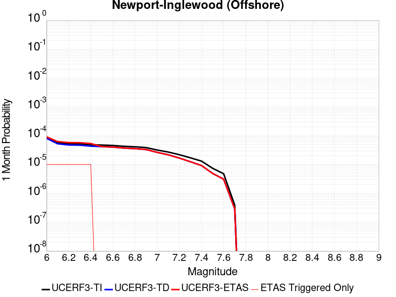 |  |  |

| Magnitude | 1 wk TI Prob | 1 wk TD Prob | 1 wk ETAS Prob | 1 wk ETAS/TD Gain | 1 wk ETAS Triggered Only | 1 mo TI Prob | 1 mo TD Prob | 1 mo ETAS Prob | 1 mo ETAS/TD Gain | 1 mo ETAS Triggered Only | 1 yr TI Prob | 1 yr TD Prob | 1 yr ETAS Prob | 1 yr ETAS/TD Gain | 1 yr ETAS Triggered Only | 10 yr TI Prob | 10 yr TD Prob | 10 yr ETAS Prob | 10 yr ETAS/TD Gain | 10 yr ETAS Triggered Only |
|-----|-----|-----|-----|-----|-----|-----|-----|-----|-----|-----|-----|-----|-----|-----|-----|-----|-----|-----|-----|-----|
| 6.0 | 1.9626508E-5 | 1.8965342E-5 | 2.8965153E-5 | 1.5272676 | 1.0E-5 | 8.411089E-5 | 8.1277576E-5 | 9.1276765E-5 | 1.1230252 | 1.0E-5 | 0.001023569 | 9.891179E-4 | 9.99108E-4 | 1.0101 | 1.0E-5 | 0.010188672 | 0.009848497 | 0.009888102 | 1.0040215 | 4.0E-5 |
| 6.1 | 1.331886E-5 | 1.2218078E-5 | 2.2217957E-5 | 1.8184493 | 1.0E-5 | 5.707958E-5 | 5.2362153E-5 | 6.236163E-5 | 1.1909677 | 1.0E-5 | 6.947222E-4 | 6.3732424E-4 | 6.4731785E-4 | 1.0156806 | 1.0E-5 | 0.006925544 | 0.006355142 | 0.0063849515 | 1.0046905 | 3.0E-5 |
| 6.2 | 1.2250852E-5 | 1.1076016E-5 | 2.1075904E-5 | 1.9028417 | 1.0E-5 | 5.2502597E-5 | 4.746778E-5 | 5.7467307E-5 | 1.2106593 | 1.0E-5 | 6.3903164E-4 | 5.7776796E-4 | 5.877622E-4 | 1.017298 | 1.0E-5 | 0.006371971 | 0.0057627796 | 0.0057926066 | 1.0051758 | 3.0E-5 |
| 6.3 | 1.2106258E-5 | 1.0918878E-5 | 2.091877E-5 | 1.915835 | 1.0E-5 | 5.1882926E-5 | 4.6794354E-5 | 5.6793888E-5 | 1.213691 | 1.0E-5 | 6.3149154E-4 | 5.695733E-4 | 5.795676E-4 | 1.017547 | 1.0E-5 | 0.0062970007 | 0.005681252 | 0.005711082 | 1.0052506 | 3.0E-5 |
| 6.4 | 1.1348758E-5 | 1.0109348E-5 | 2.0109248E-5 | 1.9891734 | 1.0E-5 | 4.8636626E-5 | 4.3325064E-5 | 5.332463E-5 | 1.2308033 | 1.0E-5 | 5.919901E-4 | 5.2735576E-4 | 5.3735054E-4 | 1.0189525 | 1.0E-5 | 0.005904155 | 0.0052611395 | 0.0052909814 | 1.0056722 | 3.0E-5 |
| 6.5 | 1.100837E-5 | 9.743376E-6 | 9.743376E-6 | 1.0 | 0.0 | 4.7177873E-5 | 4.175666E-5 | 4.175666E-5 | 1.0 | 0.0 | 5.7423924E-4 | 5.082695E-4 | 5.082695E-4 | 1.0 | 0.0 | 0.005727576 | 0.005071162 | 0.0050910604 | 1.0039239 | 2.0E-5 |
| 6.6 | 1.0634696E-5 | 9.34553E-6 | 9.34553E-6 | 1.0 | 0.0 | 4.557647E-5 | 4.0051662E-5 | 4.0051662E-5 | 1.0 | 0.0 | 5.5475225E-4 | 4.875206E-4 | 4.875206E-4 | 1.0 | 0.0 | 0.0055336943 | 0.0048645977 | 0.0048845005 | 1.0040914 | 2.0E-5 |
| 6.7 | 9.9780855E-6 | 8.667898E-6 | 8.667898E-6 | 1.0 | 0.0 | 4.276252E-5 | 3.7147613E-5 | 3.7147613E-5 | 1.0 | 0.0 | 5.205093E-4 | 4.5217903E-4 | 4.5217903E-4 | 1.0 | 0.0 | 0.0051929182 | 0.0045126686 | 0.0045325784 | 1.0044119 | 2.0E-5 |
| 6.8 | 9.59546E-6 | 8.272933E-6 | 8.272933E-6 | 1.0 | 0.0 | 4.1122752E-5 | 3.545495E-5 | 3.545495E-5 | 1.0 | 0.0 | 5.0055445E-4 | 4.3157916E-4 | 4.3157916E-4 | 1.0 | 0.0 | 0.004994285 | 0.004307486 | 0.0043273997 | 1.004623 | 2.0E-5 |
| 6.9 | 9.000614E-6 | 7.706823E-6 | 7.706823E-6 | 1.0 | 0.0 | 3.857349E-5 | 3.3028828E-5 | 3.3028828E-5 | 1.0 | 0.0 | 4.6953102E-4 | 4.0205245E-4 | 4.0205245E-4 | 1.0 | 0.0 | 0.004685402 | 0.0040133223 | 0.004033242 | 1.0049634 | 2.0E-5 |
| 7.0 | 7.4070194E-6 | 6.148865E-6 | 6.148865E-6 | 1.0 | 0.0 | 3.1743984E-5 | 2.6352012E-5 | 2.6352012E-5 | 1.0 | 0.0 | 3.8641447E-4 | 3.2078868E-4 | 3.2078868E-4 | 1.0 | 0.0 | 0.0038574322 | 0.0032032758 | 0.0032232117 | 1.0062236 | 2.0E-5 |
| 7.1 | 6.299615E-6 | 5.0565613E-6 | 5.0565613E-6 | 1.0 | 0.0 | 2.699807E-5 | 2.1670798E-5 | 2.1670798E-5 | 1.0 | 0.0 | 3.2865192E-4 | 2.6381016E-4 | 2.6381016E-4 | 1.0 | 0.0 | 0.003281663 | 0.0026349847 | 0.002654932 | 1.0075701 | 2.0E-5 |
| 7.2 | 5.096653E-6 | 3.892733E-6 | 3.892733E-6 | 1.0 | 0.0 | 2.1842614E-5 | 1.6683034E-5 | 1.6683034E-5 | 1.0 | 0.0 | 2.6590136E-4 | 2.0309711E-4 | 2.0309711E-4 | 1.0 | 0.0 | 0.0026558342 | 0.0020291263 | 0.0020291263 | 1.0 | 0.0 |
| 7.3 | 3.9753018E-6 | 2.9098787E-6 | 2.9098787E-6 | 1.0 | 0.0 | 1.7036897E-5 | 1.24708495E-5 | 1.24708495E-5 | 1.0 | 0.0 | 2.0740448E-4 | 1.518221E-4 | 1.518221E-4 | 1.0 | 0.0 | 0.00207211 | 0.0015171919 | 0.0015171919 | 1.0 | 0.0 |
| 7.4 | 3.0568392E-6 | 2.1449732E-6 | 2.1449732E-6 | 1.0 | 0.0 | 1.3100675E-5 | 9.19271E-6 | 9.19271E-6 | 1.0 | 0.0 | 1.5948903E-4 | 1.11915564E-4 | 1.11915564E-4 | 1.0 | 0.0 | 0.0015937461 | 0.0011185983 | 0.0011185983 | 1.0 | 0.0 |
| 7.5 | 1.7279019E-6 | 1.1469651E-6 | 1.1469651E-6 | 1.0 | 0.0 | 7.405273E-6 | 4.9155556E-6 | 4.9155556E-6 | 1.0 | 0.0 | 9.015547E-5 | 5.9845286E-5 | 5.9845286E-5 | 1.0 | 0.0 | 9.01189E-4 | 5.982956E-4 | 5.982956E-4 | 1.0 | 0.0 |
| 7.6 | 1.1156416E-6 | 7.222962E-7 | 7.222962E-7 | 1.0 | 0.0 | 4.7813123E-6 | 3.0955514E-6 | 3.0955514E-6 | 1.0 | 0.0 | 5.821092E-5 | 3.768771E-5 | 3.768771E-5 | 1.0 | 0.0 | 5.8195676E-4 | 3.7681553E-4 | 3.7681553E-4 | 1.0 | 0.0 |
| 7.7 | 9.117973E-8 | 6.7342256E-8 | 6.7342256E-8 | 1.0 | 0.0 | 3.907702E-7 | 2.8860964E-7 | 2.8860964E-7 | 1.0 | 0.0 | 4.757617E-6 | 3.5138169E-6 | 3.5138169E-6 | 1.0 | 0.0 | 4.7575148E-5 | 3.5137644E-5 | 3.5137644E-5 | 1.0 | 0.0 |

## Cerro Prieto
*[(top)](#table-of-contents)*

| 1 Week | 1 Month | 1 Year | 10 Year |
|-----|-----|-----|-----|
|  |  |  |  |

| Magnitude | 1 wk TI Prob | 1 wk TD Prob | 1 wk ETAS Prob | 1 wk ETAS/TD Gain | 1 wk ETAS Triggered Only | 1 mo TI Prob | 1 mo TD Prob | 1 mo ETAS Prob | 1 mo ETAS/TD Gain | 1 mo ETAS Triggered Only | 1 yr TI Prob | 1 yr TD Prob | 1 yr ETAS Prob | 1 yr ETAS/TD Gain | 1 yr ETAS Triggered Only | 10 yr TI Prob | 10 yr TD Prob | 10 yr ETAS Prob | 10 yr ETAS/TD Gain | 10 yr ETAS Triggered Only |
|-----|-----|-----|-----|-----|-----|-----|-----|-----|-----|-----|-----|-----|-----|-----|-----|-----|-----|-----|-----|-----|
| 6.0 | 2.9101528E-4 | 5.9654453E-4 | 6.0653855E-4 | 1.0167532 | 1.0E-5 | 0.0012466122 | 0.0025543566 | 0.002564331 | 1.0039049 | 1.0E-5 | 0.015072231 | 0.030802928 | 0.03081262 | 1.0003146 | 1.0E-5 | 0.14089979 | 0.25386256 | 0.25389242 | 1.0001175 | 4.0E-5 |
| 6.1 | 2.9101528E-4 | 5.9654453E-4 | 6.0653855E-4 | 1.0167532 | 1.0E-5 | 0.0012466122 | 0.0025543566 | 0.002564331 | 1.0039049 | 1.0E-5 | 0.015072231 | 0.030802928 | 0.03081262 | 1.0003146 | 1.0E-5 | 0.14089979 | 0.25386256 | 0.25389242 | 1.0001175 | 4.0E-5 |
| 6.2 | 2.9101528E-4 | 5.9654453E-4 | 6.0653855E-4 | 1.0167532 | 1.0E-5 | 0.0012466122 | 0.0025543566 | 0.002564331 | 1.0039049 | 1.0E-5 | 0.015072231 | 0.030802928 | 0.03081262 | 1.0003146 | 1.0E-5 | 0.14089979 | 0.25386256 | 0.25389242 | 1.0001175 | 4.0E-5 |
| 6.3 | 2.9101528E-4 | 5.9654453E-4 | 6.0653855E-4 | 1.0167532 | 1.0E-5 | 0.0012466122 | 0.0025543566 | 0.002564331 | 1.0039049 | 1.0E-5 | 0.015072231 | 0.030802928 | 0.03081262 | 1.0003146 | 1.0E-5 | 0.14089979 | 0.25386256 | 0.25389242 | 1.0001175 | 4.0E-5 |
| 6.4 | 2.508648E-4 | 5.140412E-4 | 5.240361E-4 | 1.0194438 | 1.0E-5 | 0.0010746918 | 0.0022013725 | 0.0022113505 | 1.0045326 | 1.0E-5 | 0.013006088 | 0.026629416 | 0.02663915 | 1.0003655 | 1.0E-5 | 0.12270685 | 0.2242222 | 0.22425322 | 1.0001384 | 4.0E-5 |
| 6.5 | 2.508648E-4 | 5.140412E-4 | 5.240361E-4 | 1.0194438 | 1.0E-5 | 0.0010746918 | 0.0022013725 | 0.0022113505 | 1.0045326 | 1.0E-5 | 0.013006088 | 0.026629416 | 0.02663915 | 1.0003655 | 1.0E-5 | 0.12270685 | 0.2242222 | 0.22425322 | 1.0001384 | 4.0E-5 |
| 6.6 | 2.294914E-4 | 4.7123645E-4 | 4.8123175E-4 | 1.0212108 | 1.0E-5 | 9.831638E-4 | 0.0020182093 | 0.0020281891 | 1.0049449 | 1.0E-5 | 0.011904482 | 0.024394194 | 0.02440395 | 1.0004 | 1.0E-5 | 0.11286586 | 0.20837563 | 0.2084073 | 1.000152 | 4.0E-5 |
| 6.7 | 1.9621674E-4 | 4.0426268E-4 | 4.1425863E-4 | 1.0247264 | 1.0E-5 | 8.4065786E-4 | 0.0017315624 | 0.001741545 | 1.0057651 | 1.0E-5 | 0.010187071 | 0.020888962 | 0.020898754 | 1.0004687 | 1.0E-5 | 0.09732539 | 0.18264732 | 0.18266366 | 1.0000895 | 2.0E-5 |
| 6.8 | 1.5476145E-4 | 3.0572579E-4 | 3.1572272E-4 | 1.0326991 | 1.0E-5 | 6.6309475E-4 | 0.0013096977 | 0.0013196847 | 1.0076253 | 1.0E-5 | 0.008043335 | 0.015826825 | 0.015836667 | 1.0006218 | 1.0E-5 | 0.07758363 | 0.14310057 | 0.14311773 | 1.0001198 | 2.0E-5 |
| 6.9 | 1.20509176E-4 | 2.2588465E-4 | 2.358824E-4 | 1.0442604 | 1.0E-5 | 5.1636563E-4 | 9.6778123E-4 | 9.777716E-4 | 1.0103229 | 1.0E-5 | 0.006268645 | 0.011734025 | 0.011743907 | 1.0008422 | 1.0E-5 | 0.060947374 | 0.10917958 | 0.10919739 | 1.0001632 | 2.0E-5 |
| 7.0 | 9.3269155E-5 | 1.6721459E-4 | 1.7721292E-4 | 1.0597934 | 1.0E-5 | 3.9966372E-4 | 7.1648025E-4 | 7.264731E-4 | 1.0139471 | 1.0E-5 | 0.0048550544 | 0.008695914 | 0.008705827 | 1.00114 | 1.0E-5 | 0.04750344 | 0.082943216 | 0.08296156 | 1.0002211 | 2.0E-5 |
| 7.1 | 5.029709E-5 | 8.174011E-5 | 8.174011E-5 | 1.0 | 0.0 | 2.1554115E-4 | 3.50287E-4 | 3.50287E-4 | 1.0 | 0.0 | 0.0026210553 | 0.004259821 | 0.004259821 | 1.0 | 0.0 | 0.025903556 | 0.04226813 | 0.04226813 | 1.0 | 0.0 |
| 7.2 | 6.5445185E-8 | 6.824737E-8 | 6.824737E-8 | 1.0 | 0.0 | 2.8047933E-7 | 2.9248872E-7 | 2.9248872E-7 | 1.0 | 0.0 | 3.4148304E-6 | 3.56105E-6 | 3.56105E-6 | 1.0 | 0.0 | 3.414778E-5 | 3.56105E-5 | 3.56105E-5 | 1.0 | 0.0 |

## Calaveras (So) 2011 CFM
*[(top)](#table-of-contents)*

| 1 Week | 1 Month | 1 Year | 10 Year |
|-----|-----|-----|-----|
|  |  |  |  |

| Magnitude | 1 wk TI Prob | 1 wk TD Prob | 1 wk ETAS Prob | 1 wk ETAS/TD Gain | 1 wk ETAS Triggered Only | 1 mo TI Prob | 1 mo TD Prob | 1 mo ETAS Prob | 1 mo ETAS/TD Gain | 1 mo ETAS Triggered Only | 1 yr TI Prob | 1 yr TD Prob | 1 yr ETAS Prob | 1 yr ETAS/TD Gain | 1 yr ETAS Triggered Only | 10 yr TI Prob | 10 yr TD Prob | 10 yr ETAS Prob | 10 yr ETAS/TD Gain | 10 yr ETAS Triggered Only |
|-----|-----|-----|-----|-----|-----|-----|-----|-----|-----|-----|-----|-----|-----|-----|-----|-----|-----|-----|-----|-----|
| 6.0 | 1.5950744E-4 | 3.0713255E-4 | 3.1712948E-4 | 1.0325493 | 1.0E-5 | 6.834242E-4 | 0.001315409 | 0.0013353826 | 1.0151844 | 2.0E-5 | 0.00828899 | 0.015858326 | 0.015878009 | 1.0012412 | 2.0E-5 | 0.079865426 | 0.14440185 | 0.14443608 | 1.000237 | 4.0E-5 |
| 6.1 | 1.3584697E-4 | 2.603514E-4 | 2.603514E-4 | 1.0 | 0.0 | 5.8207137E-4 | 0.0011151754 | 0.0011251643 | 1.0089571 | 1.0E-5 | 0.007063716 | 0.013461385 | 0.01347125 | 1.0007329 | 1.0E-5 | 0.06843361 | 0.124029994 | 0.12405627 | 1.0002118 | 3.0E-5 |
| 6.2 | 1.14676266E-4 | 2.1714384E-4 | 2.1714384E-4 | 1.0 | 0.0 | 4.9137714E-4 | 9.30223E-4 | 9.402137E-4 | 1.0107402 | 1.0E-5 | 0.0059661185 | 0.011245058 | 0.011254946 | 1.0008793 | 1.0E-5 | 0.058084648 | 0.10502057 | 0.10504741 | 1.0002557 | 3.0E-5 |
| 6.3 | 8.691518E-5 | 1.5987935E-4 | 1.5987935E-4 | 1.0 | 0.0 | 3.7244044E-4 | 6.849807E-4 | 6.9497386E-4 | 1.014589 | 1.0E-5 | 0.004525038 | 0.008301122 | 0.008311039 | 1.0011947 | 1.0E-5 | 0.044339992 | 0.0793365 | 0.07936412 | 1.0003481 | 3.0E-5 |
| 6.4 | 8.50982E-5 | 1.5694331E-4 | 1.5694331E-4 | 1.0 | 0.0 | 3.646556E-4 | 6.724042E-4 | 6.823975E-4 | 1.0148621 | 1.0E-5 | 0.0044306475 | 0.008149155 | 0.008159074 | 1.0012171 | 1.0E-5 | 0.04343345 | 0.07794268 | 0.07797033 | 1.0003549 | 3.0E-5 |
| 6.5 | 8.4062965E-5 | 1.5518743E-4 | 1.5518743E-4 | 1.0 | 0.0 | 3.602201E-4 | 6.6488347E-4 | 6.748768E-4 | 1.0150303 | 1.0E-5 | 0.004376863 | 0.008058365 | 0.008068285 | 1.001231 | 1.0E-5 | 0.042916555 | 0.07711388 | 0.07714157 | 1.000359 | 3.0E-5 |
| 6.6 | 8.194716E-5 | 1.5154552E-4 | 1.5154552E-4 | 1.0 | 0.0 | 3.5115483E-4 | 6.492843E-4 | 6.592778E-4 | 1.0153916 | 1.0E-5 | 0.0042669317 | 0.007870209 | 0.007880131 | 1.0012606 | 1.0E-5 | 0.04185927 | 0.07539919 | 0.07542693 | 1.0003679 | 3.0E-5 |
| 6.7 | 8.012326E-5 | 1.4822475E-4 | 1.4822475E-4 | 1.0 | 0.0 | 3.433402E-4 | 6.350612E-4 | 6.4505485E-4 | 1.0157365 | 1.0E-5 | 0.004172157 | 0.007698701 | 0.007708624 | 1.0012889 | 1.0E-5 | 0.040946912 | 0.07384132 | 0.0738691 | 1.0003762 | 3.0E-5 |
| 6.8 | 7.119773E-5 | 1.2881879E-4 | 1.2881879E-4 | 1.0 | 0.0 | 3.0509746E-4 | 5.519494E-4 | 5.619438E-4 | 1.0181077 | 1.0E-5 | 0.0037082357 | 0.006696066 | 0.006705999 | 1.0014834 | 1.0E-5 | 0.036469642 | 0.06468575 | 0.064713806 | 1.0004338 | 3.0E-5 |
| 6.9 | 5.7343088E-5 | 9.919277E-5 | 9.919277E-5 | 1.0 | 0.0 | 2.4573295E-4 | 4.25043E-4 | 4.3503873E-4 | 1.023517 | 1.0E-5 | 0.0029876942 | 0.005162694 | 0.0051726424 | 1.001927 | 1.0E-5 | 0.02947844 | 0.05051036 | 0.050538845 | 1.000564 | 3.0E-5 |
| 7.0 | 4.8746577E-5 | 8.2850725E-5 | 8.2850725E-5 | 1.0 | 0.0 | 2.0889717E-4 | 3.5502657E-4 | 3.65023E-4 | 1.0281569 | 1.0E-5 | 0.0025403565 | 0.004313948 | 0.004323905 | 1.002308 | 1.0E-5 | 0.025115121 | 0.042485245 | 0.04251397 | 1.0006762 | 3.0E-5 |
| 7.1 | 4.2998014E-5 | 7.265203E-5 | 7.265203E-5 | 1.0 | 0.0 | 1.8426418E-4 | 3.1132903E-4 | 3.213259E-4 | 1.0321103 | 1.0E-5 | 0.002241108 | 0.003783903 | 0.0037938652 | 1.0026327 | 1.0E-5 | 0.022186412 | 0.037423562 | 0.03745244 | 1.0007716 | 3.0E-5 |
| 7.2 | 3.221292E-5 | 5.390791E-5 | 5.390791E-5 | 1.0 | 0.0 | 1.3804805E-4 | 2.3101359E-4 | 2.3101359E-4 | 1.0 | 0.0 | 0.0016794393 | 0.0028089907 | 0.0028089907 | 1.0 | 0.0 | 0.016668037 | 0.02803602 | 0.028055461 | 1.0006933 | 2.0E-5 |
| 7.3 | 2.3756531E-5 | 3.9473416E-5 | 3.9473416E-5 | 1.0 | 0.0 | 1.0180973E-4 | 1.6916092E-4 | 1.6916092E-4 | 1.0 | 0.0 | 0.0012388286 | 0.0020576057 | 0.0020576057 | 1.0 | 0.0 | 0.012319452 | 0.020643145 | 0.020662732 | 1.0009488 | 2.0E-5 |
| 7.4 | 1.5997684E-5 | 2.7342163E-5 | 2.7342163E-5 | 1.0 | 0.0 | 6.8559704E-5 | 1.1717545E-4 | 1.1717545E-4 | 1.0 | 0.0 | 8.343947E-4 | 0.00142568 | 0.00142568 | 1.0 | 0.0 | 0.008312687 | 0.014376011 | 0.014385867 | 1.0006856 | 1.0E-5 |
| 7.5 | 1.3814293E-5 | 2.4783874E-5 | 2.4783874E-5 | 1.0 | 0.0 | 5.9202768E-5 | 1.062123E-4 | 1.062123E-4 | 1.0 | 0.0 | 7.205553E-4 | 0.00129237 | 0.00129237 | 1.0 | 0.0 | 0.007182234 | 0.013055085 | 0.013064954 | 1.000756 | 1.0E-5 |
| 7.6 | 8.817309E-6 | 1.6430757E-5 | 1.6430757E-5 | 1.0 | 0.0 | 3.7787922E-5 | 7.0415634E-5 | 7.0415634E-5 | 1.0 | 0.0 | 4.5997082E-4 | 8.569745E-4 | 8.569745E-4 | 1.0 | 0.0 | 0.004590199 | 0.008719284 | 0.008729197 | 1.0011369 | 1.0E-5 |
| 7.7 | 4.0352206E-6 | 7.707318E-6 | 7.707318E-6 | 1.0 | 0.0 | 1.7293689E-5 | 3.3030945E-5 | 3.3030945E-5 | 1.0 | 0.0 | 2.1053031E-4 | 4.0207763E-4 | 4.0207763E-4 | 1.0 | 0.0 | 0.0021033096 | 0.004165172 | 0.0041751307 | 1.0023909 | 1.0E-5 |
| 7.8 | 3.413169E-6 | 6.787282E-6 | 6.787282E-6 | 1.0 | 0.0 | 1.4627784E-5 | 2.9088029E-5 | 2.9088029E-5 | 1.0 | 0.0 | 1.7807873E-4 | 3.5408925E-4 | 3.5408925E-4 | 1.0 | 0.0 | 0.0017793609 | 0.0036665166 | 0.00367648 | 1.0027174 | 1.0E-5 |
| 7.9 | 2.4740732E-6 | 5.2791843E-6 | 5.2791843E-6 | 1.0 | 0.0 | 1.06031275E-5 | 2.262488E-5 | 2.262488E-5 | 1.0 | 0.0 | 1.2908543E-4 | 2.7542314E-4 | 2.7542314E-4 | 1.0 | 0.0 | 0.0012901047 | 0.0028347955 | 0.0028447672 | 1.0035176 | 1.0E-5 |
| 8.0 | 1.5231818E-6 | 3.2889548E-6 | 3.2889548E-6 | 1.0 | 0.0 | 6.527906E-6 | 1.40954435E-5 | 1.40954435E-5 | 1.0 | 0.0 | 7.9474354E-5 | 1.7159856E-4 | 1.7159856E-4 | 1.0 | 0.0 | 7.944594E-4 | 0.0017564303 | 0.0017664128 | 1.0056834 | 1.0E-5 |
| 8.1 | 1.0104524E-6 | 2.045782E-6 | 2.045782E-6 | 1.0 | 0.0 | 4.330503E-6 | 8.767608E-6 | 8.767608E-6 | 1.0 | 0.0 | 5.2722597E-5 | 1.0674043E-4 | 1.0674043E-4 | 1.0 | 0.0 | 5.271009E-4 | 0.001092934 | 0.001092934 | 1.0 | 0.0 |

## Malibu Coast alt 1
*[(top)](#table-of-contents)*

| 1 Week | 1 Month | 1 Year | 10 Year |
|-----|-----|-----|-----|
| 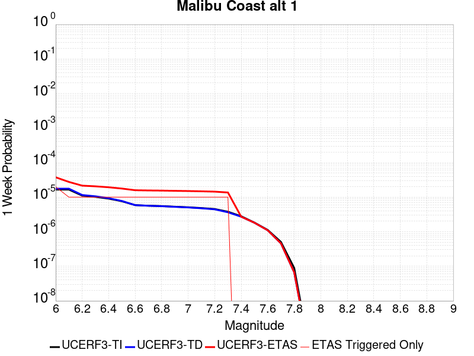 |  |  |  |

| Magnitude | 1 wk TI Prob | 1 wk TD Prob | 1 wk ETAS Prob | 1 wk ETAS/TD Gain | 1 wk ETAS Triggered Only | 1 mo TI Prob | 1 mo TD Prob | 1 mo ETAS Prob | 1 mo ETAS/TD Gain | 1 mo ETAS Triggered Only | 1 yr TI Prob | 1 yr TD Prob | 1 yr ETAS Prob | 1 yr ETAS/TD Gain | 1 yr ETAS Triggered Only | 10 yr TI Prob | 10 yr TD Prob | 10 yr ETAS Prob | 10 yr ETAS/TD Gain | 10 yr ETAS Triggered Only |
|-----|-----|-----|-----|-----|-----|-----|-----|-----|-----|-----|-----|-----|-----|-----|-----|-----|-----|-----|-----|-----|
| 6.0 | 1.6572556E-5 | 1.759807E-5 | 3.7597718E-5 | 2.1364684 | 2.0E-5 | 7.102331E-5 | 7.5418226E-5 | 9.541671E-5 | 1.265168 | 2.0E-5 | 8.6436566E-4 | 9.1784896E-4 | 9.378306E-4 | 1.0217701 | 2.0E-5 | 0.0086101135 | 0.009142514 | 0.00917224 | 1.0032513 | 3.0E-5 |
| 6.1 | 1.6572556E-5 | 1.759807E-5 | 2.7597893E-5 | 1.5682342 | 1.0E-5 | 7.102331E-5 | 7.5418226E-5 | 8.5417465E-5 | 1.132584 | 1.0E-5 | 8.6436566E-4 | 9.1784896E-4 | 9.278398E-4 | 1.010885 | 1.0E-5 | 0.0086101135 | 0.009142514 | 0.009162331 | 1.0021676 | 2.0E-5 |
| 6.2 | 1.1085717E-5 | 1.155715E-5 | 2.1557034E-5 | 1.8652552 | 1.0E-5 | 4.750935E-5 | 4.9529724E-5 | 5.9529226E-5 | 1.2018889 | 1.0E-5 | 5.782728E-4 | 6.0286105E-4 | 6.12855E-4 | 1.0165776 | 1.0E-5 | 0.0057677035 | 0.0060126274 | 0.006032507 | 1.0033064 | 2.0E-5 |
| 6.3 | 1.0208568E-5 | 1.0592241E-5 | 2.0592135E-5 | 1.9440774 | 1.0E-5 | 4.375027E-5 | 4.5394543E-5 | 5.5394088E-5 | 1.2202808 | 1.0E-5 | 5.325294E-4 | 5.5254134E-4 | 5.6253583E-4 | 1.0180882 | 1.0E-5 | 0.0053125503 | 0.0055119833 | 0.005531873 | 1.0036085 | 2.0E-5 |
| 6.4 | 9.0682315E-6 | 9.342641E-6 | 1.9342548E-5 | 2.0703511 | 1.0E-5 | 3.8863272E-5 | 4.0039286E-5 | 5.0038885E-5 | 1.2497448 | 1.0E-5 | 4.730576E-4 | 4.873713E-4 | 4.973664E-4 | 1.0205083 | 1.0E-5 | 0.0047205184 | 0.004863238 | 0.004883141 | 1.0040925 | 2.0E-5 |
| 6.5 | 7.605796E-6 | 7.74859E-6 | 1.7748513E-5 | 2.2905474 | 1.0E-5 | 3.259586E-5 | 3.320783E-5 | 4.3207496E-5 | 1.3011239 | 1.0E-5 | 3.9678233E-4 | 4.0423166E-4 | 4.142276E-4 | 1.0247283 | 1.0E-5 | 0.0039607463 | 0.0040351013 | 0.004055021 | 1.0049365 | 2.0E-5 |
| 6.6 | 5.889873E-6 | 5.8795417E-6 | 1.5879483E-5 | 2.7008028 | 1.0E-5 | 2.5242069E-5 | 2.5197793E-5 | 3.519754E-5 | 1.3968501 | 1.0E-5 | 3.0727885E-4 | 3.0674002E-4 | 3.1673696E-4 | 1.0325909 | 1.0E-5 | 0.003068543 | 0.0030631793 | 0.003083118 | 1.0065092 | 2.0E-5 |
| 6.7 | 5.66586E-6 | 5.6416443E-6 | 1.5641588E-5 | 2.772523 | 1.0E-5 | 2.428203E-5 | 2.4178253E-5 | 3.417801E-5 | 1.4135848 | 1.0E-5 | 2.955936E-4 | 2.9433056E-4 | 3.043276E-4 | 1.0339653 | 1.0E-5 | 0.0029520073 | 0.0029394194 | 0.0029593604 | 1.0067841 | 2.0E-5 |
| 6.8 | 5.521556E-6 | 5.48943E-6 | 1.5489375E-5 | 2.8216727 | 1.0E-5 | 2.3663597E-5 | 2.3525918E-5 | 3.352568E-5 | 1.4250531 | 1.0E-5 | 2.880662E-4 | 2.8639048E-4 | 2.9638762E-4 | 1.0349073 | 1.0E-5 | 0.0028769306 | 0.0028602257 | 0.0028801684 | 1.0069724 | 2.0E-5 |
| 6.9 | 5.29752E-6 | 5.2499345E-6 | 1.5249882E-5 | 2.9047756 | 1.0E-5 | 2.270346E-5 | 2.2499526E-5 | 3.24993E-5 | 1.4444438 | 1.0E-5 | 2.7637955E-4 | 2.7389737E-4 | 2.8389462E-4 | 1.0365 | 1.0E-5 | 0.0027603607 | 0.0027356083 | 0.0027555537 | 1.007291 | 2.0E-5 |
| 7.0 | 5.106743E-6 | 5.0476815E-6 | 1.5047631E-5 | 2.9810975 | 1.0E-5 | 2.1885859E-5 | 2.1632743E-5 | 3.1632528E-5 | 1.4622523 | 1.0E-5 | 2.6642776E-4 | 2.6334688E-4 | 2.7334425E-4 | 1.0379627 | 1.0E-5 | 0.0026610855 | 0.0026303576 | 0.0026503052 | 1.0075835 | 2.0E-5 |
| 7.1 | 4.8469647E-6 | 4.770376E-6 | 1.4770329E-5 | 3.0962608 | 1.0E-5 | 2.0772539E-5 | 2.044431E-5 | 3.0444104E-5 | 1.4891237 | 1.0E-5 | 2.528763E-4 | 2.488811E-4 | 2.588786E-4 | 1.0401698 | 1.0E-5 | 0.0025258875 | 0.0024860317 | 0.002505982 | 1.0080249 | 2.0E-5 |
| 7.2 | 4.545514E-6 | 4.4481967E-6 | 1.4448152E-5 | 3.2480922 | 1.0E-5 | 1.9480629E-5 | 1.906356E-5 | 2.906337E-5 | 1.524551 | 1.0E-5 | 2.3715083E-4 | 2.3207419E-4 | 2.4207187E-4 | 1.0430796 | 1.0E-5 | 0.0023689792 | 0.002318326 | 0.0023382795 | 1.0086069 | 2.0E-5 |
| 7.3 | 3.794097E-6 | 3.6519373E-6 | 1.3651901E-5 | 3.7382627 | 1.0E-5 | 1.6260314E-5 | 1.5651065E-5 | 2.565091E-5 | 1.6389241 | 1.0E-5 | 1.9795135E-4 | 1.9053511E-4 | 2.0053319E-4 | 1.0524738 | 1.0E-5 | 0.001977751 | 0.0019037221 | 0.001913703 | 1.0052428 | 1.0E-5 |
| 7.4 | 2.808217E-6 | 2.7190777E-6 | 2.7190777E-6 | 1.0 | 0.0 | 1.203516E-5 | 1.1653137E-5 | 1.1653137E-5 | 1.0 | 0.0 | 1.4651821E-4 | 1.4186774E-4 | 1.4186774E-4 | 1.0 | 0.0 | 0.0014642165 | 0.0014177744 | 0.0014177744 | 1.0 | 0.0 |
| 7.5 | 1.83809E-6 | 1.8190703E-6 | 1.8190703E-6 | 1.0 | 0.0 | 7.877505E-6 | 7.795992E-6 | 7.795992E-6 | 1.0 | 0.0 | 9.59044E-5 | 9.4912095E-5 | 9.4912095E-5 | 1.0 | 0.0 | 9.5863023E-4 | 9.487176E-4 | 9.487176E-4 | 1.0 | 0.0 |
| 7.6 | 1.1292672E-6 | 1.1001456E-6 | 1.1001456E-6 | 1.0 | 0.0 | 4.839708E-6 | 4.7149015E-6 | 4.7149015E-6 | 1.0 | 0.0 | 5.8921847E-5 | 5.7402427E-5 | 5.7402427E-5 | 1.0 | 0.0 | 5.890623E-4 | 5.7387765E-4 | 5.7387765E-4 | 1.0 | 0.0 |
| 7.7 | 5.065272E-7 | 4.6091537E-7 | 4.6091537E-7 | 1.0 | 0.0 | 2.170829E-6 | 1.9753502E-6 | 1.9753502E-6 | 1.0 | 0.0 | 2.6429525E-5 | 2.4049634E-5 | 2.4049634E-5 | 1.0 | 0.0 | 2.642638E-4 | 2.4047145E-4 | 2.4047145E-4 | 1.0 | 0.0 |
| 7.8 | 8.952991E-8 | 6.707853E-8 | 6.707853E-8 | 1.0 | 0.0 | 3.8369956E-7 | 2.874794E-7 | 2.874794E-7 | 1.0 | 0.0 | 4.671532E-6 | 3.5000562E-6 | 3.5000562E-6 | 1.0 | 0.0 | 4.671434E-5 | 3.500003E-5 | 3.500003E-5 | 1.0 | 0.0 |
| 7.9 | 8.007447E-10 | 6.161581E-10 | 6.161581E-10 | 1.0 | 0.0 | 3.4317629E-9 | 2.640678E-9 | 2.640678E-9 | 1.0 | 0.0 | 4.1781714E-8 | 3.2150254E-8 | 3.2150254E-8 | 1.0 | 0.0 | 4.1781706E-7 | 3.2150248E-7 | 3.2150248E-7 | 1.0 | 0.0 |

## Del Valle
*[(top)](#table-of-contents)*

| 1 Week | 1 Month | 1 Year | 10 Year |
|-----|-----|-----|-----|
|  |  |  |  |

| Magnitude | 1 wk TI Prob | 1 wk TD Prob | 1 wk ETAS Prob | 1 wk ETAS/TD Gain | 1 wk ETAS Triggered Only | 1 mo TI Prob | 1 mo TD Prob | 1 mo ETAS Prob | 1 mo ETAS/TD Gain | 1 mo ETAS Triggered Only | 1 yr TI Prob | 1 yr TD Prob | 1 yr ETAS Prob | 1 yr ETAS/TD Gain | 1 yr ETAS Triggered Only | 10 yr TI Prob | 10 yr TD Prob | 10 yr ETAS Prob | 10 yr ETAS/TD Gain | 10 yr ETAS Triggered Only |
|-----|-----|-----|-----|-----|-----|-----|-----|-----|-----|-----|-----|-----|-----|-----|-----|-----|-----|-----|-----|-----|
| 6.0 | 1.0716125E-5 | 8.767882E-6 | 8.767882E-6 | 1.0 | 0.0 | 4.592544E-5 | 3.7576207E-5 | 3.7576207E-5 | 1.0 | 0.0 | 5.589988E-4 | 4.5741402E-4 | 4.5741402E-4 | 1.0 | 0.0 | 0.0055759475 | 0.004566694 | 0.0045965575 | 1.0065393 | 3.0E-5 |
| 6.1 | 1.0716125E-5 | 8.767882E-6 | 8.767882E-6 | 1.0 | 0.0 | 4.592544E-5 | 3.7576207E-5 | 3.7576207E-5 | 1.0 | 0.0 | 5.589988E-4 | 4.5741402E-4 | 4.5741402E-4 | 1.0 | 0.0 | 0.0055759475 | 0.004566694 | 0.0045965575 | 1.0065393 | 3.0E-5 |
| 6.2 | 1.0716125E-5 | 8.767882E-6 | 8.767882E-6 | 1.0 | 0.0 | 4.592544E-5 | 3.7576207E-5 | 3.7576207E-5 | 1.0 | 0.0 | 5.589988E-4 | 4.5741402E-4 | 4.5741402E-4 | 1.0 | 0.0 | 0.0055759475 | 0.004566694 | 0.0045965575 | 1.0065393 | 3.0E-5 |
| 6.3 | 7.1293784E-6 | 4.8658226E-6 | 4.8658226E-6 | 1.0 | 0.0 | 3.055412E-5 | 2.0853362E-5 | 2.0853362E-5 | 1.0 | 0.0 | 3.7193293E-4 | 2.5386084E-4 | 2.5386084E-4 | 1.0 | 0.0 | 0.0037131102 | 0.0025358086 | 0.002555758 | 1.007867 | 2.0E-5 |
| 6.4 | 7.1293784E-6 | 4.8658226E-6 | 4.8658226E-6 | 1.0 | 0.0 | 3.055412E-5 | 2.0853362E-5 | 2.0853362E-5 | 1.0 | 0.0 | 3.7193293E-4 | 2.5386084E-4 | 2.5386084E-4 | 1.0 | 0.0 | 0.0037131102 | 0.0025358086 | 0.002555758 | 1.007867 | 2.0E-5 |
| 6.5 | 7.1293784E-6 | 4.8658226E-6 | 4.8658226E-6 | 1.0 | 0.0 | 3.055412E-5 | 2.0853362E-5 | 2.0853362E-5 | 1.0 | 0.0 | 3.7193293E-4 | 2.5386084E-4 | 2.5386084E-4 | 1.0 | 0.0 | 0.0037131102 | 0.0025358086 | 0.002555758 | 1.007867 | 2.0E-5 |
| 6.6 | 7.1293784E-6 | 4.8658226E-6 | 4.8658226E-6 | 1.0 | 0.0 | 3.055412E-5 | 2.0853362E-5 | 2.0853362E-5 | 1.0 | 0.0 | 3.7193293E-4 | 2.5386084E-4 | 2.5386084E-4 | 1.0 | 0.0 | 0.0037131102 | 0.0025358086 | 0.002555758 | 1.007867 | 2.0E-5 |
| 6.7 | 7.12272E-6 | 4.8631982E-6 | 4.8631982E-6 | 1.0 | 0.0 | 3.0525585E-5 | 2.0842115E-5 | 2.0842115E-5 | 1.0 | 0.0 | 3.7158563E-4 | 2.5372393E-4 | 2.5372393E-4 | 1.0 | 0.0 | 0.003709649 | 0.0025344428 | 0.0025543922 | 1.0078713 | 2.0E-5 |
| 6.8 | 6.7558703E-6 | 4.559404E-6 | 4.559404E-6 | 1.0 | 0.0 | 2.895341E-5 | 1.954016E-5 | 1.954016E-5 | 1.0 | 0.0 | 3.5245073E-4 | 2.3787611E-4 | 2.3787611E-4 | 1.0 | 0.0 | 0.0035189227 | 0.0023763045 | 0.002396257 | 1.0083964 | 2.0E-5 |
| 6.9 | 6.6700386E-6 | 4.5025436E-6 | 4.5025436E-6 | 1.0 | 0.0 | 2.8585566E-5 | 1.9296476E-5 | 1.9296476E-5 | 1.0 | 0.0 | 3.479737E-4 | 2.349099E-4 | 2.349099E-4 | 1.0 | 0.0 | 0.003474293 | 0.0023467052 | 0.002366658 | 1.0085026 | 2.0E-5 |
| 7.0 | 6.3181424E-6 | 4.098708E-6 | 4.098708E-6 | 1.0 | 0.0 | 2.7077473E-5 | 1.7565775E-5 | 1.7565775E-5 | 1.0 | 0.0 | 3.2961834E-4 | 2.1384275E-4 | 2.1384275E-4 | 1.0 | 0.0 | 0.0032912986 | 0.0021364389 | 0.0021563962 | 1.0093414 | 2.0E-5 |
| 7.1 | 6.248759E-6 | 4.033899E-6 | 4.033899E-6 | 1.0 | 0.0 | 2.678012E-5 | 1.7288028E-5 | 1.7288028E-5 | 1.0 | 0.0 | 3.2599916E-4 | 2.1046183E-4 | 2.1046183E-4 | 1.0 | 0.0 | 0.0032552136 | 0.0021026938 | 0.0021226518 | 1.0094916 | 2.0E-5 |
| 7.2 | 6.0411944E-6 | 3.869892E-6 | 3.869892E-6 | 1.0 | 0.0 | 2.5890577E-5 | 1.658515E-5 | 1.658515E-5 | 1.0 | 0.0 | 3.1517216E-4 | 2.019059E-4 | 2.019059E-4 | 1.0 | 0.0 | 0.0031472554 | 0.0020172922 | 0.0020372518 | 1.0098943 | 2.0E-5 |
| 7.3 | 4.7691183E-6 | 3.0780905E-6 | 3.0780905E-6 | 1.0 | 0.0 | 2.0438918E-5 | 1.3191751E-5 | 1.3191751E-5 | 1.0 | 0.0 | 2.488154E-4 | 1.6059795E-4 | 1.6059795E-4 | 1.0 | 0.0 | 0.00248537 | 0.0016048512 | 0.0016248191 | 1.0124422 | 2.0E-5 |
| 7.4 | 3.5524722E-6 | 2.1893159E-6 | 2.1893159E-6 | 1.0 | 0.0 | 1.5224792E-5 | 9.382749E-6 | 9.382749E-6 | 1.0 | 0.0 | 1.8534607E-4 | 1.14229064E-4 | 1.14229064E-4 | 1.0 | 0.0 | 0.0018519156 | 0.0011417117 | 0.0011616888 | 1.0174975 | 2.0E-5 |
| 7.5 | 2.7133442E-6 | 1.5915855E-6 | 1.5915855E-6 | 1.0 | 0.0 | 1.1628566E-5 | 6.821063E-6 | 6.821063E-6 | 1.0 | 0.0 | 1.415686E-4 | 8.30433E-5 | 8.30433E-5 | 1.0 | 0.0 | 0.0014147845 | 8.301246E-4 | 8.401163E-4 | 1.0120364 | 1.0E-5 |
| 7.6 | 1.915338E-6 | 1.1738952E-6 | 1.1738952E-6 | 1.0 | 0.0 | 8.208566E-6 | 5.0309695E-6 | 5.0309695E-6 | 1.0 | 0.0 | 9.993471E-5 | 6.125034E-5 | 6.125034E-5 | 1.0 | 0.0 | 9.988978E-4 | 6.123355E-4 | 6.123355E-4 | 1.0 | 0.0 |
| 7.7 | 1.2120448E-6 | 7.1801645E-7 | 7.1801645E-7 | 1.0 | 0.0 | 5.194467E-6 | 3.0772098E-6 | 3.0772098E-6 | 1.0 | 0.0 | 6.3240805E-5 | 3.746439E-5 | 3.746439E-5 | 1.0 | 0.0 | 6.322281E-4 | 3.745811E-4 | 3.745811E-4 | 1.0 | 0.0 |
| 7.8 | 6.272381E-7 | 3.93245E-7 | 3.93245E-7 | 1.0 | 0.0 | 2.6881603E-6 | 1.6853346E-6 | 1.6853346E-6 | 1.0 | 0.0 | 3.272786E-5 | 2.0518757E-5 | 2.0518757E-5 | 1.0 | 0.0 | 3.272304E-4 | 2.0516879E-4 | 2.0516879E-4 | 1.0 | 0.0 |
| 7.9 | 2.0292627E-7 | 1.2004223E-7 | 1.2004223E-7 | 1.0 | 0.0 | 8.6968373E-7 | 5.144666E-7 | 5.144666E-7 | 1.0 | 0.0 | 1.0588348E-5 | 6.2636127E-6 | 6.2636127E-6 | 1.0 | 0.0 | 1.0587843E-4 | 6.263438E-5 | 6.263438E-5 | 1.0 | 0.0 |
| 8.0 | 4.374492E-8 | 2.1898856E-8 | 2.1898856E-8 | 1.0 | 0.0 | 1.8747821E-7 | 9.3852236E-8 | 9.3852236E-8 | 1.0 | 0.0 | 2.2825448E-6 | 1.1426505E-6 | 1.1426505E-6 | 1.0 | 0.0 | 2.2825214E-5 | 1.1426449E-5 | 1.1426449E-5 | 1.0 | 0.0 |

## Morales (East)
*[(top)](#table-of-contents)*

| 1 Week | 1 Month | 1 Year | 10 Year |
|-----|-----|-----|-----|
|  |  |  |  |

| Magnitude | 1 wk TI Prob | 1 wk TD Prob | 1 wk ETAS Prob | 1 wk ETAS/TD Gain | 1 wk ETAS Triggered Only | 1 mo TI Prob | 1 mo TD Prob | 1 mo ETAS Prob | 1 mo ETAS/TD Gain | 1 mo ETAS Triggered Only | 1 yr TI Prob | 1 yr TD Prob | 1 yr ETAS Prob | 1 yr ETAS/TD Gain | 1 yr ETAS Triggered Only | 10 yr TI Prob | 10 yr TD Prob | 10 yr ETAS Prob | 10 yr ETAS/TD Gain | 10 yr ETAS Triggered Only |
|-----|-----|-----|-----|-----|-----|-----|-----|-----|-----|-----|-----|-----|-----|-----|-----|-----|-----|-----|-----|-----|
| 6.0 | 1.4942771E-6 | 2.123544E-6 | 1.21235225E-5 | 5.709099 | 1.0E-5 | 6.404029E-6 | 9.100874E-6 | 2.9100693E-5 | 3.197571 | 2.0E-5 | 7.7966266E-5 | 1.1079809E-4 | 1.4079477E-4 | 1.2707328 | 3.0E-5 | 7.793892E-4 | 0.0011074883 | 0.0011374551 | 1.0270584 | 3.0E-5 |
| 6.1 | 1.4942771E-6 | 2.123544E-6 | 1.21235225E-5 | 5.709099 | 1.0E-5 | 6.404029E-6 | 9.100874E-6 | 2.9100693E-5 | 3.197571 | 2.0E-5 | 7.7966266E-5 | 1.1079809E-4 | 1.4079477E-4 | 1.2707328 | 3.0E-5 | 7.793892E-4 | 0.0011074883 | 0.0011374551 | 1.0270584 | 3.0E-5 |
| 6.2 | 1.4942771E-6 | 2.123544E-6 | 1.21235225E-5 | 5.709099 | 1.0E-5 | 6.404029E-6 | 9.100874E-6 | 2.9100693E-5 | 3.197571 | 2.0E-5 | 7.7966266E-5 | 1.1079809E-4 | 1.4079477E-4 | 1.2707328 | 3.0E-5 | 7.793892E-4 | 0.0011074883 | 0.0011374551 | 1.0270584 | 3.0E-5 |
| 6.3 | 1.4942771E-6 | 2.123544E-6 | 1.21235225E-5 | 5.709099 | 1.0E-5 | 6.404029E-6 | 9.100874E-6 | 2.9100693E-5 | 3.197571 | 2.0E-5 | 7.7966266E-5 | 1.1079809E-4 | 1.4079477E-4 | 1.2707328 | 3.0E-5 | 7.793892E-4 | 0.0011074883 | 0.0011374551 | 1.0270584 | 3.0E-5 |
| 6.4 | 8.798845E-7 | 1.5023381E-6 | 1.5023381E-6 | 1.0 | 0.0 | 3.7709283E-6 | 6.4385767E-6 | 6.4385767E-6 | 1.0 | 0.0 | 4.5910085E-5 | 7.838696E-5 | 7.838696E-5 | 1.0 | 0.0 | 4.59006E-4 | 7.836066E-4 | 7.836066E-4 | 1.0 | 0.0 |
| 6.5 | 7.1751725E-7 | 1.3384879E-6 | 1.3384879E-6 | 1.0 | 0.0 | 3.0750705E-6 | 5.7363645E-6 | 5.7363645E-6 | 1.0 | 0.0 | 3.7438338E-5 | 6.9838075E-5 | 6.9838075E-5 | 1.0 | 0.0 | 3.743203E-4 | 6.981715E-4 | 6.981715E-4 | 1.0 | 0.0 |
| 6.6 | 7.1751725E-7 | 1.3384879E-6 | 1.3384879E-6 | 1.0 | 0.0 | 3.0750705E-6 | 5.7363645E-6 | 5.7363645E-6 | 1.0 | 0.0 | 3.7438338E-5 | 6.9838075E-5 | 6.9838075E-5 | 1.0 | 0.0 | 3.743203E-4 | 6.981715E-4 | 6.981715E-4 | 1.0 | 0.0 |
| 6.7 | 7.159057E-7 | 1.3359539E-6 | 1.3359539E-6 | 1.0 | 0.0 | 3.0681638E-6 | 5.7255043E-6 | 5.7255043E-6 | 1.0 | 0.0 | 3.7354253E-5 | 6.9705864E-5 | 6.9705864E-5 | 1.0 | 0.0 | 3.7347974E-4 | 6.968502E-4 | 6.968502E-4 | 1.0 | 0.0 |
| 6.8 | 7.032203E-7 | 1.3175089E-6 | 1.3175089E-6 | 1.0 | 0.0 | 3.0137978E-6 | 5.646455E-6 | 5.646455E-6 | 1.0 | 0.0 | 3.669237E-5 | 6.87435E-5 | 6.87435E-5 | 1.0 | 0.0 | 3.6686313E-4 | 6.872325E-4 | 6.872325E-4 | 1.0 | 0.0 |
| 6.9 | 6.941549E-7 | 1.3025701E-6 | 1.3025701E-6 | 1.0 | 0.0 | 2.974946E-6 | 5.5824316E-6 | 5.5824316E-6 | 1.0 | 0.0 | 3.6219368E-5 | 6.7964065E-5 | 6.7964065E-5 | 1.0 | 0.0 | 3.6213463E-4 | 6.794429E-4 | 6.794429E-4 | 1.0 | 0.0 |
| 7.0 | 6.2932247E-7 | 1.1877994E-6 | 1.1877994E-6 | 1.0 | 0.0 | 2.6970936E-6 | 5.090559E-6 | 5.090559E-6 | 1.0 | 0.0 | 3.283662E-5 | 6.197586E-5 | 6.197586E-5 | 1.0 | 0.0 | 3.283177E-4 | 6.1959465E-4 | 6.1959465E-4 | 1.0 | 0.0 |
| 7.1 | 5.6200963E-7 | 1.064093E-6 | 1.064093E-6 | 1.0 | 0.0 | 2.4086105E-6 | 4.560391E-6 | 4.560391E-6 | 1.0 | 0.0 | 2.9324437E-5 | 5.5521392E-5 | 5.5521392E-5 | 1.0 | 0.0 | 2.9320567E-4 | 5.5508246E-4 | 5.5508246E-4 | 1.0 | 0.0 |
| 7.2 | 4.91044E-7 | 9.2862194E-7 | 9.2862194E-7 | 1.0 | 0.0 | 2.1044725E-6 | 3.9798024E-6 | 3.9798024E-6 | 1.0 | 0.0 | 2.5621652E-5 | 4.8453054E-5 | 4.8453054E-5 | 1.0 | 0.0 | 2.56187E-4 | 4.8443122E-4 | 4.8443122E-4 | 1.0 | 0.0 |
| 7.3 | 4.2978448E-7 | 7.974413E-7 | 7.974413E-7 | 1.0 | 0.0 | 1.8419321E-6 | 3.4176012E-6 | 3.4176012E-6 | 1.0 | 0.0 | 2.2425293E-5 | 4.160853E-5 | 4.160853E-5 | 1.0 | 0.0 | 2.242303E-4 | 4.1601306E-4 | 4.1601306E-4 | 1.0 | 0.0 |
| 7.4 | 3.774317E-7 | 6.807105E-7 | 6.807105E-7 | 1.0 | 0.0 | 1.6175634E-6 | 2.9173275E-6 | 2.9173275E-6 | 1.0 | 0.0 | 1.9693656E-5 | 3.551791E-5 | 3.551791E-5 | 1.0 | 0.0 | 1.969191E-4 | 3.5512767E-4 | 3.5512767E-4 | 1.0 | 0.0 |
| 7.5 | 1.0603232E-7 | 9.8406424E-8 | 9.8406424E-8 | 1.0 | 0.0 | 4.5442414E-7 | 4.2174173E-7 | 4.2174173E-7 | 1.0 | 0.0 | 5.5326E-6 | 5.1346938E-6 | 5.1346938E-6 | 1.0 | 0.0 | 5.532462E-5 | 5.1348336E-5 | 5.1348336E-5 | 1.0 | 0.0 |
| 7.6 | 9.960384E-8 | 8.755028E-8 | 8.755028E-8 | 1.0 | 0.0 | 4.2687353E-7 | 3.7521542E-7 | 3.7521542E-7 | 1.0 | 0.0 | 5.197173E-6 | 4.568238E-6 | 4.568238E-6 | 1.0 | 0.0 | 5.1970514E-5 | 4.5684028E-5 | 4.5684028E-5 | 1.0 | 0.0 |
| 7.7 | 6.499468E-8 | 4.103351E-8 | 4.103351E-8 | 1.0 | 0.0 | 2.785486E-7 | 1.7585788E-7 | 1.7585788E-7 | 1.0 | 0.0 | 3.3913238E-6 | 2.1410676E-6 | 2.1410676E-6 | 1.0 | 0.0 | 3.3912722E-5 | 2.1413045E-5 | 2.1413045E-5 | 1.0 | 0.0 |
| 7.8 | 2.2517119E-8 | 7.1293824E-9 | 7.1293824E-9 | 1.0 | 0.0 | 9.6501935E-8 | 3.0554492E-8 | 3.0554492E-8 | 1.0 | 0.0 | 1.1749105E-6 | 3.720009E-7 | 3.720009E-7 | 1.0 | 0.0 | 1.1749043E-5 | 3.7225666E-6 | 3.7225666E-6 | 1.0 | 0.0 |
| 7.9 | 8.493023E-9 | 9.962774E-10 | 9.962774E-10 | 1.0 | 0.0 | 3.639867E-8 | 4.2697574E-9 | 4.2697574E-9 | 1.0 | 0.0 | 4.4315374E-7 | 5.19843E-8 | 5.19843E-8 | 1.0 | 0.0 | 4.4315284E-6 | 5.2196486E-7 | 5.2196486E-7 | 1.0 | 0.0 |
| 8.0 | 1.4971842E-9 | 5.5340177E-11 | 5.5340177E-11 | 1.0 | 0.0 | 6.4165038E-9 | 2.3717173E-10 | 2.3717173E-10 | 1.0 | 0.0 | 7.812093E-8 | 2.887568E-9 | 2.887568E-9 | 1.0 | 0.0 | 7.81209E-7 | 3.0142694E-8 | 3.0142694E-8 | 1.0 | 0.0 |

## Green Valley 2011 CFM
*[(top)](#table-of-contents)*

| 1 Week | 1 Month | 1 Year | 10 Year |
|-----|-----|-----|-----|
| 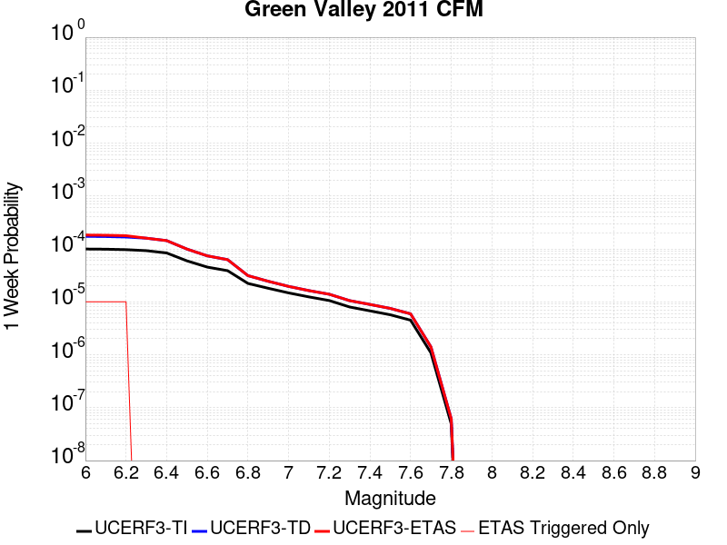 |  | 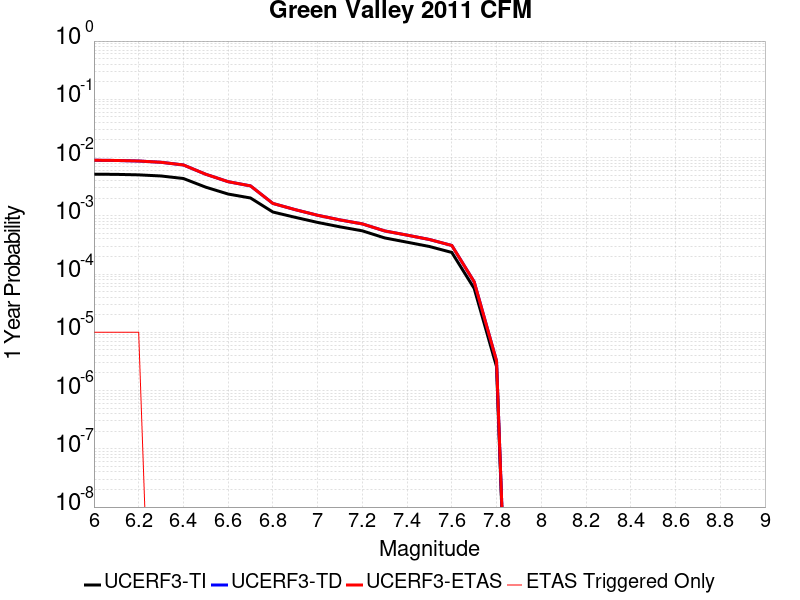 | 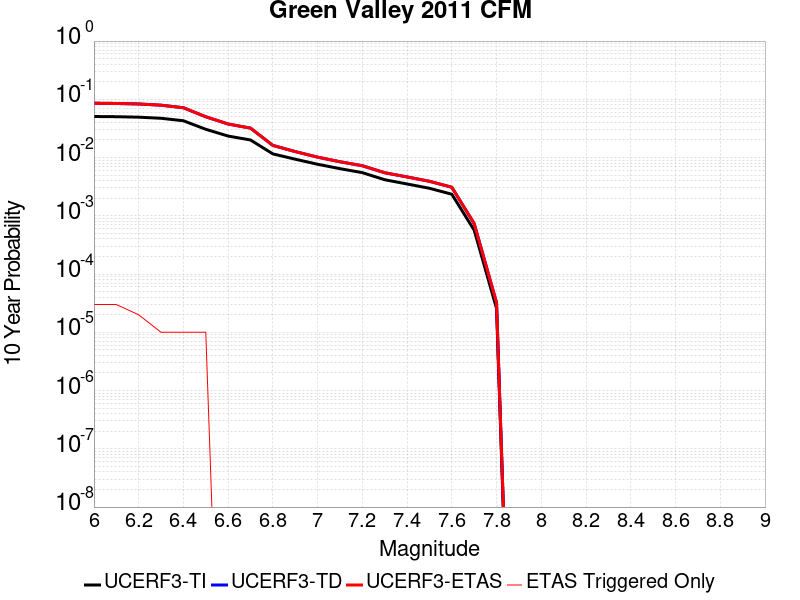 |

| Magnitude | 1 wk TI Prob | 1 wk TD Prob | 1 wk ETAS Prob | 1 wk ETAS/TD Gain | 1 wk ETAS Triggered Only | 1 mo TI Prob | 1 mo TD Prob | 1 mo ETAS Prob | 1 mo ETAS/TD Gain | 1 mo ETAS Triggered Only | 1 yr TI Prob | 1 yr TD Prob | 1 yr ETAS Prob | 1 yr ETAS/TD Gain | 1 yr ETAS Triggered Only | 10 yr TI Prob | 10 yr TD Prob | 10 yr ETAS Prob | 10 yr ETAS/TD Gain | 10 yr ETAS Triggered Only |
|-----|-----|-----|-----|-----|-----|-----|-----|-----|-----|-----|-----|-----|-----|-----|-----|-----|-----|-----|-----|-----|
| 6.0 | 9.9629346E-5 | 1.7302863E-4 | 1.8302689E-4 | 1.057784 | 1.0E-5 | 4.2691303E-4 | 7.41326E-4 | 7.513186E-4 | 1.0134794 | 1.0E-5 | 0.0051852856 | 0.00898692 | 0.008996829 | 1.0011027 | 1.0E-5 | 0.050659515 | 0.08553951 | 0.085566945 | 1.0003207 | 3.0E-5 |
| 6.1 | 9.88615E-5 | 1.7150163E-4 | 1.8149991E-4 | 1.0582985 | 1.0E-5 | 4.2362334E-4 | 7.347854E-4 | 7.447781E-4 | 1.0135994 | 1.0E-5 | 0.0051454236 | 0.008907947 | 0.008917858 | 1.0011126 | 1.0E-5 | 0.050279044 | 0.08482712 | 0.08485457 | 1.0003237 | 3.0E-5 |
| 6.2 | 9.696895E-5 | 1.6789208E-4 | 1.7789041E-4 | 1.0595521 | 1.0E-5 | 4.15515E-4 | 7.1932544E-4 | 7.2931824E-4 | 1.0138919 | 1.0E-5 | 0.0050471667 | 0.00872133 | 0.008731242 | 1.0011367 | 1.0E-5 | 0.04934063 | 0.08313578 | 0.08315412 | 1.0002205 | 2.0E-5 |
| 6.3 | 9.275224E-5 | 1.5968543E-4 | 1.5968543E-4 | 1.0 | 0.0 | 3.9744904E-4 | 6.841728E-4 | 6.841728E-4 | 1.0 | 0.0 | 0.0048282105 | 0.008296652 | 0.008296652 | 1.0 | 0.0 | 0.047246475 | 0.07927481 | 0.07928401 | 1.0001161 | 1.0E-5 |
| 6.4 | 8.391499E-5 | 1.4365884E-4 | 1.4365884E-4 | 1.0 | 0.0 | 3.595861E-4 | 6.155238E-4 | 6.155238E-4 | 1.0 | 0.0 | 0.004369175 | 0.007467181 | 0.007467181 | 1.0 | 0.0 | 0.04284265 | 0.07164672 | 0.071656 | 1.0001296 | 1.0E-5 |
| 6.5 | 5.9519385E-5 | 9.932622E-5 | 9.932622E-5 | 1.0 | 0.0 | 2.5505814E-4 | 4.2560388E-4 | 4.2560388E-4 | 1.0 | 0.0 | 0.0031009112 | 0.005168341 | 0.005168341 | 1.0 | 0.0 | 0.030579966 | 0.05014692 | 0.05015642 | 1.0001894 | 1.0E-5 |
| 6.6 | 4.5361558E-5 | 7.4019794E-5 | 7.4019794E-5 | 1.0 | 0.0 | 1.9439218E-4 | 3.1717744E-4 | 3.1717744E-4 | 1.0 | 0.0 | 0.0023641558 | 0.0038538678 | 0.0038538678 | 1.0 | 0.0 | 0.023391623 | 0.03766727 | 0.03766727 | 1.0 | 0.0 |
| 6.7 | 3.8808106E-5 | 6.264382E-5 | 6.264382E-5 | 1.0 | 0.0 | 1.6630985E-4 | 2.6843755E-4 | 2.6843755E-4 | 1.0 | 0.0 | 0.0020229418 | 0.0032627317 | 0.0032627317 | 1.0 | 0.0 | 0.020046256 | 0.032007415 | 0.032007415 | 1.0 | 0.0 |
| 6.8 | 2.2284667E-5 | 3.128574E-5 | 3.128574E-5 | 1.0 | 0.0 | 9.550222E-5 | 1.3407487E-4 | 1.3407487E-4 | 1.0 | 0.0 | 0.0011621192 | 0.0016311383 | 0.0016311383 | 1.0 | 0.0 | 0.011560607 | 0.01616672 | 0.01616672 | 1.0 | 0.0 |
| 6.9 | 1.8050168E-5 | 2.4448536E-5 | 2.4448536E-5 | 1.0 | 0.0 | 7.735557E-5 | 1.0477527E-4 | 1.0477527E-4 | 1.0 | 0.0 | 9.4139716E-4 | 0.0012748954 | 0.0012748954 | 1.0 | 0.0 | 0.009374191 | 0.012669067 | 0.012669067 | 1.0 | 0.0 |
| 7.0 | 1.4763166E-5 | 1.9583236E-5 | 1.9583236E-5 | 1.0 | 0.0 | 6.326917E-5 | 8.3925464E-5 | 8.3925464E-5 | 1.0 | 0.0 | 7.7002996E-4 | 0.001021315 | 0.001021315 | 1.0 | 0.0 | 0.007673672 | 0.01016625 | 0.01016625 | 1.0 | 0.0 |
| 7.1 | 1.2399713E-5 | 1.6304042E-5 | 1.6304042E-5 | 1.0 | 0.0 | 5.3140546E-5 | 6.987261E-5 | 6.987261E-5 | 1.0 | 0.0 | 6.467941E-4 | 8.5036893E-4 | 8.5036893E-4 | 1.0 | 0.0 | 0.006449148 | 0.008471781 | 0.008471781 | 1.0 | 0.0 |
| 7.2 | 1.0584195E-5 | 1.39220465E-5 | 1.39220465E-5 | 1.0 | 0.0 | 4.5360044E-5 | 5.966456E-5 | 5.966456E-5 | 1.0 | 0.0 | 5.521186E-4 | 7.2617555E-4 | 7.2617555E-4 | 1.0 | 0.0 | 0.0055074887 | 0.0072386027 | 0.0072386027 | 1.0 | 0.0 |
| 7.3 | 7.998173E-6 | 1.0544255E-5 | 1.0544255E-5 | 1.0 | 0.0 | 3.4277433E-5 | 4.5188888E-5 | 4.5188888E-5 | 1.0 | 0.0 | 4.1724785E-4 | 5.500369E-4 | 5.500369E-4 | 1.0 | 0.0 | 0.004164653 | 0.005487135 | 0.005487135 | 1.0 | 0.0 |
| 7.4 | 6.7571127E-6 | 8.932903E-6 | 8.932903E-6 | 1.0 | 0.0 | 2.8958733E-5 | 3.8283313E-5 | 3.8283313E-5 | 1.0 | 0.0 | 3.5251552E-4 | 4.660006E-4 | 4.660006E-4 | 1.0 | 0.0 | 0.0035195686 | 0.004650633 | 0.004650633 | 1.0 | 0.0 |
| 7.5 | 5.69878E-6 | 7.516483E-6 | 7.516483E-6 | 1.0 | 0.0 | 2.4423114E-5 | 3.2213105E-5 | 3.2213105E-5 | 1.0 | 0.0 | 2.9731085E-4 | 3.9212484E-4 | 3.9212484E-4 | 1.0 | 0.0 | 0.002969134 | 0.0039147018 | 0.0039147018 | 1.0 | 0.0 |
| 7.6 | 4.503664E-6 | 5.9358217E-6 | 5.9358217E-6 | 1.0 | 0.0 | 1.9301275E-5 | 2.5438992E-5 | 2.5438992E-5 | 1.0 | 0.0 | 2.3496768E-4 | 3.0967654E-4 | 3.0967654E-4 | 1.0 | 0.0 | 0.002347194 | 0.0030927279 | 0.0030927279 | 1.0 | 0.0 |
| 7.7 | 1.0873546E-6 | 1.410754E-6 | 1.410754E-6 | 1.0 | 0.0 | 4.6600826E-6 | 6.0460743E-6 | 6.0460743E-6 | 1.0 | 0.0 | 5.6735033E-5 | 7.36085E-5 | 7.36085E-5 | 1.0 | 0.0 | 5.672055E-4 | 7.3587085E-4 | 7.3587085E-4 | 1.0 | 0.0 |
| 7.8 | 4.9373917E-8 | 6.177967E-8 | 6.177967E-8 | 1.0 | 0.0 | 2.1160248E-7 | 2.6477002E-7 | 2.6477002E-7 | 1.0 | 0.0 | 2.5762572E-6 | 3.2235714E-6 | 3.2235714E-6 | 1.0 | 0.0 | 2.5762274E-5 | 3.2228E-5 | 3.2228E-5 | 1.0 | 0.0 |

## Owens Valley Keough Hot Springs
*[(top)](#table-of-contents)*

| 1 Week | 1 Month | 1 Year | 10 Year |
|-----|-----|-----|-----|
|  |  | 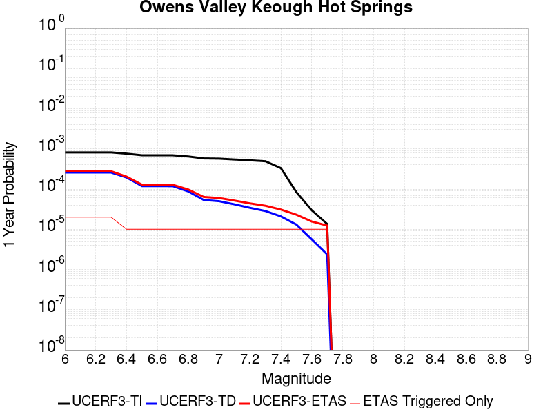 |  |

| Magnitude | 1 wk TI Prob | 1 wk TD Prob | 1 wk ETAS Prob | 1 wk ETAS/TD Gain | 1 wk ETAS Triggered Only | 1 mo TI Prob | 1 mo TD Prob | 1 mo ETAS Prob | 1 mo ETAS/TD Gain | 1 mo ETAS Triggered Only | 1 yr TI Prob | 1 yr TD Prob | 1 yr ETAS Prob | 1 yr ETAS/TD Gain | 1 yr ETAS Triggered Only | 10 yr TI Prob | 10 yr TD Prob | 10 yr ETAS Prob | 10 yr ETAS/TD Gain | 10 yr ETAS Triggered Only |
|-----|-----|-----|-----|-----|-----|-----|-----|-----|-----|-----|-----|-----|-----|-----|-----|-----|-----|-----|-----|-----|
| 6.0 | 1.5708529E-5 | 4.950463E-6 | 1.4950414E-5 | 3.020003 | 1.0E-5 | 6.7320536E-5 | 2.1216127E-5 | 3.1215914E-5 | 1.4713296 | 1.0E-5 | 8.193192E-4 | 2.5828084E-4 | 2.782757E-4 | 1.0774151 | 2.0E-5 | 0.008163051 | 0.0025804387 | 0.0026103612 | 1.011596 | 3.0E-5 |
| 6.1 | 1.5708529E-5 | 4.950463E-6 | 1.4950414E-5 | 3.020003 | 1.0E-5 | 6.7320536E-5 | 2.1216127E-5 | 3.1215914E-5 | 1.4713296 | 1.0E-5 | 8.193192E-4 | 2.5828084E-4 | 2.782757E-4 | 1.0774151 | 2.0E-5 | 0.008163051 | 0.0025804387 | 0.0026103612 | 1.011596 | 3.0E-5 |
| 6.2 | 1.5708529E-5 | 4.950463E-6 | 1.4950414E-5 | 3.020003 | 1.0E-5 | 6.7320536E-5 | 2.1216127E-5 | 3.1215914E-5 | 1.4713296 | 1.0E-5 | 8.193192E-4 | 2.5828084E-4 | 2.782757E-4 | 1.0774151 | 2.0E-5 | 0.008163051 | 0.0025804387 | 0.0026103612 | 1.011596 | 3.0E-5 |
| 6.3 | 1.5708529E-5 | 4.950463E-6 | 1.4950414E-5 | 3.020003 | 1.0E-5 | 6.7320536E-5 | 2.1216127E-5 | 3.1215914E-5 | 1.4713296 | 1.0E-5 | 8.193192E-4 | 2.5828084E-4 | 2.782757E-4 | 1.0774151 | 2.0E-5 | 0.008163051 | 0.0025804387 | 0.0026103612 | 1.011596 | 3.0E-5 |
| 6.4 | 1.4622509E-5 | 3.7263276E-6 | 1.37262905E-5 | 3.6835973 | 1.0E-5 | 6.266639E-5 | 1.5969896E-5 | 2.5969737E-5 | 1.6261681 | 1.0E-5 | 7.626962E-4 | 1.9441944E-4 | 2.044175E-4 | 1.0514252 | 1.0E-5 | 0.007600839 | 0.0019429466 | 0.0019629078 | 1.0102737 | 2.0E-5 |
| 6.5 | 1.3335527E-5 | 2.2775241E-6 | 1.2277502E-5 | 5.3907228 | 1.0E-5 | 5.7151006E-5 | 9.760785E-6 | 1.9760688E-5 | 2.0244977 | 1.0E-5 | 6.955913E-4 | 1.1883176E-4 | 1.2883058E-4 | 1.0841426 | 1.0E-5 | 0.0069341804 | 0.001187878 | 0.0012078542 | 1.0168167 | 2.0E-5 |
| 6.6 | 1.3332855E-5 | 2.2746733E-6 | 1.22746505E-5 | 5.3962255 | 1.0E-5 | 5.7139558E-5 | 9.748568E-6 | 1.974847E-5 | 2.0257816 | 1.0E-5 | 6.9545204E-4 | 1.1868303E-4 | 1.2868184E-4 | 1.0842481 | 1.0E-5 | 0.0069327964 | 0.0011863923 | 0.0012063686 | 1.0168378 | 2.0E-5 |
| 6.7 | 1.3318214E-5 | 2.2639038E-6 | 1.2263881E-5 | 5.4171386 | 1.0E-5 | 5.707681E-5 | 9.702413E-6 | 1.9702316E-5 | 2.0306613 | 1.0E-5 | 6.946886E-4 | 1.18121156E-4 | 1.2811998E-4 | 1.0846488 | 1.0E-5 | 0.0069252094 | 0.0011807795 | 0.0012007558 | 1.016918 | 2.0E-5 |
| 6.8 | 1.2441338E-5 | 1.677594E-6 | 1.1677577E-5 | 6.960908 | 1.0E-5 | 5.331893E-5 | 7.1896707E-6 | 1.7189599E-5 | 2.3908744 | 1.0E-5 | 6.489646E-4 | 8.753102E-5 | 9.7530145E-5 | 1.1142352 | 1.0E-5 | 0.0064707273 | 8.751236E-4 | 8.951061E-4 | 1.022834 | 2.0E-5 |
| 6.9 | 1.1130476E-5 | 1.0302234E-6 | 1.10302135E-5 | 10.706622 | 1.0E-5 | 4.7701167E-5 | 4.4152357E-6 | 1.4415192E-5 | 3.2648747 | 1.0E-5 | 5.806069E-4 | 5.3754186E-5 | 6.375365E-5 | 1.186022 | 1.0E-5 | 0.0057909233 | 5.375404E-4 | 5.575297E-4 | 1.0371865 | 2.0E-5 |
| 7.0 | 1.0986073E-5 | 9.577824E-7 | 1.0957773E-5 | 11.440775 | 1.0E-5 | 4.7082318E-5 | 4.1047756E-6 | 1.4104734E-5 | 3.4361768 | 1.0E-5 | 5.730765E-4 | 4.9974507E-5 | 5.997401E-5 | 1.2000921 | 1.0E-5 | 0.0057160086 | 4.997603E-4 | 5.1975035E-4 | 1.0399991 | 2.0E-5 |
| 7.1 | 1.0451338E-5 | 7.9988575E-7 | 1.0799878E-5 | 13.501776 | 1.0E-5 | 4.4790682E-5 | 3.4280772E-6 | 1.3428043E-5 | 3.917077 | 1.0E-5 | 5.451901E-4 | 4.1736046E-5 | 5.1735627E-5 | 1.239591 | 1.0E-5 | 0.005438545 | 4.1740583E-4 | 4.3739748E-4 | 1.047895 | 2.0E-5 |
| 7.2 | 9.989061E-6 | 6.543693E-7 | 1.0654363E-5 | 16.281881 | 1.0E-5 | 4.280956E-5 | 2.8044367E-6 | 1.28044085E-5 | 4.5657687 | 1.0E-5 | 5.2108173E-4 | 3.4143486E-5 | 4.4143144E-5 | 1.2928716 | 1.0E-5 | 0.0051986156 | 3.41488E-4 | 3.6148116E-4 | 1.0585473 | 2.0E-5 |
| 7.3 | 9.465365E-6 | 5.458855E-7 | 1.054588E-5 | 19.31885 | 1.0E-5 | 4.056522E-5 | 2.3395073E-6 | 1.2339484E-5 | 5.2743945 | 1.0E-5 | 4.937696E-4 | 2.8483131E-5 | 3.8482845E-5 | 1.351075 | 1.0E-5 | 0.0049267393 | 2.8489542E-4 | 3.0488972E-4 | 1.0701813 | 2.0E-5 |
| 7.4 | 6.3824805E-6 | 4.0153776E-7 | 1.04015335E-5 | 25.904247 | 1.0E-5 | 2.73532E-5 | 1.7208749E-6 | 1.1720857E-5 | 6.8109875 | 1.0E-5 | 3.3297433E-4 | 2.0951453E-5 | 3.0951243E-5 | 1.4772838 | 1.0E-5 | 0.0033247585 | 2.0955436E-4 | 2.2955018E-4 | 1.0954206 | 2.0E-5 |
| 7.5 | 1.6192645E-6 | 2.5156373E-7 | 1.0251561E-5 | 40.751347 | 1.0E-5 | 6.9396865E-6 | 1.0781299E-6 | 1.1078119E-5 | 10.2753105 | 1.0E-5 | 8.448741E-5 | 1.3126153E-5 | 2.3126022E-5 | 1.7618278 | 1.0E-5 | 8.4455294E-4 | 1.3125391E-4 | 1.5125128E-4 | 1.1523564 | 2.0E-5 |
| 7.6 | 5.7062545E-7 | 1.0790214E-7 | 1.0107901E-5 | 93.67656 | 1.0E-5 | 2.4455355E-6 | 4.6243767E-7 | 1.0462433E-5 | 22.624525 | 1.0E-5 | 2.9773988E-5 | 5.630165E-6 | 1.5630108E-5 | 2.7761369 | 1.0E-5 | 2.977E-4 | 5.6300305E-5 | 7.629918E-5 | 1.3552178 | 2.0E-5 |
| 7.7 | 2.5988817E-7 | 4.5445965E-8 | 1.0045445E-5 | 221.04152 | 1.0E-5 | 1.113806E-6 | 1.9476842E-7 | 1.0194766E-5 | 52.343018 | 1.0E-5 | 1.3560503E-5 | 2.3713033E-6 | 1.237128E-5 | 5.21708 | 1.0E-5 | 1.3559677E-4 | 2.3712824E-5 | 4.371235E-5 | 1.8434055 | 2.0E-5 |

## Pitas Point (Lower)-Montalvo
*[(top)](#table-of-contents)*

| 1 Week | 1 Month | 1 Year | 10 Year |
|-----|-----|-----|-----|
|  |  |  |  |

| Magnitude | 1 wk TI Prob | 1 wk TD Prob | 1 wk ETAS Prob | 1 wk ETAS/TD Gain | 1 wk ETAS Triggered Only | 1 mo TI Prob | 1 mo TD Prob | 1 mo ETAS Prob | 1 mo ETAS/TD Gain | 1 mo ETAS Triggered Only | 1 yr TI Prob | 1 yr TD Prob | 1 yr ETAS Prob | 1 yr ETAS/TD Gain | 1 yr ETAS Triggered Only | 10 yr TI Prob | 10 yr TD Prob | 10 yr ETAS Prob | 10 yr ETAS/TD Gain | 10 yr ETAS Triggered Only |
|-----|-----|-----|-----|-----|-----|-----|-----|-----|-----|-----|-----|-----|-----|-----|-----|-----|-----|-----|-----|-----|
| 6.0 | 5.2543637E-6 | 4.8379025E-6 | 1.4837854E-5 | 3.0670013 | 1.0E-5 | 2.2518509E-5 | 2.0733705E-5 | 3.07335E-5 | 1.4822965 | 1.0E-5 | 2.7412834E-4 | 2.5240393E-4 | 2.6240142E-4 | 1.0396091 | 1.0E-5 | 0.0027379042 | 0.0025212052 | 0.0025511296 | 1.0118691 | 3.0E-5 |
| 6.1 | 5.2543637E-6 | 4.8379025E-6 | 1.4837854E-5 | 3.0670013 | 1.0E-5 | 2.2518509E-5 | 2.0733705E-5 | 3.07335E-5 | 1.4822965 | 1.0E-5 | 2.7412834E-4 | 2.5240393E-4 | 2.6240142E-4 | 1.0396091 | 1.0E-5 | 0.0027379042 | 0.0025212052 | 0.0025511296 | 1.0118691 | 3.0E-5 |
| 6.2 | 5.2543637E-6 | 4.8379025E-6 | 1.4837854E-5 | 3.0670013 | 1.0E-5 | 2.2518509E-5 | 2.0733705E-5 | 3.07335E-5 | 1.4822965 | 1.0E-5 | 2.7412834E-4 | 2.5240393E-4 | 2.6240142E-4 | 1.0396091 | 1.0E-5 | 0.0027379042 | 0.0025212052 | 0.0025511296 | 1.0118691 | 3.0E-5 |
| 6.3 | 5.2543637E-6 | 4.8379025E-6 | 1.4837854E-5 | 3.0670013 | 1.0E-5 | 2.2518509E-5 | 2.0733705E-5 | 3.07335E-5 | 1.4822965 | 1.0E-5 | 2.7412834E-4 | 2.5240393E-4 | 2.6240142E-4 | 1.0396091 | 1.0E-5 | 0.0027379042 | 0.0025212052 | 0.0025511296 | 1.0118691 | 3.0E-5 |
| 6.4 | 5.2543637E-6 | 4.8379025E-6 | 1.4837854E-5 | 3.0670013 | 1.0E-5 | 2.2518509E-5 | 2.0733705E-5 | 3.07335E-5 | 1.4822965 | 1.0E-5 | 2.7412834E-4 | 2.5240393E-4 | 2.6240142E-4 | 1.0396091 | 1.0E-5 | 0.0027379042 | 0.0025212052 | 0.0025511296 | 1.0118691 | 3.0E-5 |
| 6.5 | 5.2543637E-6 | 4.8379025E-6 | 1.4837854E-5 | 3.0670013 | 1.0E-5 | 2.2518509E-5 | 2.0733705E-5 | 3.07335E-5 | 1.4822965 | 1.0E-5 | 2.7412834E-4 | 2.5240393E-4 | 2.6240142E-4 | 1.0396091 | 1.0E-5 | 0.0027379042 | 0.0025212052 | 0.0025511296 | 1.0118691 | 3.0E-5 |
| 6.6 | 5.2543637E-6 | 4.8379025E-6 | 1.4837854E-5 | 3.0670013 | 1.0E-5 | 2.2518509E-5 | 2.0733705E-5 | 3.07335E-5 | 1.4822965 | 1.0E-5 | 2.7412834E-4 | 2.5240393E-4 | 2.6240142E-4 | 1.0396091 | 1.0E-5 | 0.0027379042 | 0.0025212052 | 0.0025511296 | 1.0118691 | 3.0E-5 |
| 6.7 | 5.2543637E-6 | 4.8379025E-6 | 1.4837854E-5 | 3.0670013 | 1.0E-5 | 2.2518509E-5 | 2.0733705E-5 | 3.07335E-5 | 1.4822965 | 1.0E-5 | 2.7412834E-4 | 2.5240393E-4 | 2.6240142E-4 | 1.0396091 | 1.0E-5 | 0.0027379042 | 0.0025212052 | 0.0025511296 | 1.0118691 | 3.0E-5 |
| 6.8 | 5.2543637E-6 | 4.8379025E-6 | 1.4837854E-5 | 3.0670013 | 1.0E-5 | 2.2518509E-5 | 2.0733705E-5 | 3.07335E-5 | 1.4822965 | 1.0E-5 | 2.7412834E-4 | 2.5240393E-4 | 2.6240142E-4 | 1.0396091 | 1.0E-5 | 0.0027379042 | 0.0025212052 | 0.0025511296 | 1.0118691 | 3.0E-5 |
| 6.9 | 5.2543637E-6 | 4.8379025E-6 | 1.4837854E-5 | 3.0670013 | 1.0E-5 | 2.2518509E-5 | 2.0733705E-5 | 3.07335E-5 | 1.4822965 | 1.0E-5 | 2.7412834E-4 | 2.5240393E-4 | 2.6240142E-4 | 1.0396091 | 1.0E-5 | 0.0027379042 | 0.0025212052 | 0.0025511296 | 1.0118691 | 3.0E-5 |
| 7.0 | 5.2543637E-6 | 4.8379025E-6 | 1.4837854E-5 | 3.0670013 | 1.0E-5 | 2.2518509E-5 | 2.0733705E-5 | 3.07335E-5 | 1.4822965 | 1.0E-5 | 2.7412834E-4 | 2.5240393E-4 | 2.6240142E-4 | 1.0396091 | 1.0E-5 | 0.0027379042 | 0.0025212052 | 0.0025511296 | 1.0118691 | 3.0E-5 |
| 7.1 | 5.2543637E-6 | 4.8379025E-6 | 1.4837854E-5 | 3.0670013 | 1.0E-5 | 2.2518509E-5 | 2.0733705E-5 | 3.07335E-5 | 1.4822965 | 1.0E-5 | 2.7412834E-4 | 2.5240393E-4 | 2.6240142E-4 | 1.0396091 | 1.0E-5 | 0.0027379042 | 0.0025212052 | 0.0025511296 | 1.0118691 | 3.0E-5 |
| 7.2 | 5.2458695E-6 | 4.8290563E-6 | 1.4829008E-5 | 3.070788 | 1.0E-5 | 2.2482105E-5 | 2.0695794E-5 | 3.0695588E-5 | 1.4831799 | 1.0E-5 | 2.7368523E-4 | 2.5194246E-4 | 2.6193995E-4 | 1.0396816 | 1.0E-5 | 0.0027334841 | 0.002516601 | 0.0025465253 | 1.0118909 | 3.0E-5 |
| 7.3 | 5.22665E-6 | 4.8089737E-6 | 1.4808926E-5 | 3.0794358 | 1.0E-5 | 2.2399736E-5 | 2.0609727E-5 | 3.060952E-5 | 1.4851978 | 1.0E-5 | 2.7268266E-4 | 2.5089484E-4 | 2.6089232E-4 | 1.0398474 | 1.0E-5 | 0.002723483 | 0.0025061483 | 0.002536073 | 1.0119406 | 3.0E-5 |
| 7.4 | 5.210642E-6 | 4.7921862E-6 | 1.4792138E-5 | 3.0867202 | 1.0E-5 | 2.233113E-5 | 2.053778E-5 | 3.0537576E-5 | 1.4868976 | 1.0E-5 | 2.718476E-4 | 2.500191E-4 | 2.600166E-4 | 1.039987 | 1.0E-5 | 0.002715153 | 0.0024974106 | 0.0025273357 | 1.0119824 | 3.0E-5 |
| 7.5 | 5.1226016E-6 | 4.7000726E-6 | 1.47000255E-5 | 3.1276166 | 1.0E-5 | 2.1953823E-5 | 2.0143016E-5 | 3.0142814E-5 | 1.49644 | 1.0E-5 | 2.67255E-4 | 2.4521392E-4 | 2.5521146E-4 | 1.0407708 | 1.0E-5 | 0.0026693381 | 0.002449465 | 0.0024793916 | 1.0122175 | 3.0E-5 |
| 7.6 | 4.8796987E-6 | 4.4449725E-6 | 1.4444928E-5 | 3.2497227 | 1.0E-5 | 2.0912828E-5 | 1.9049745E-5 | 2.9049555E-5 | 1.5249314 | 1.0E-5 | 2.5458392E-4 | 2.3190626E-4 | 2.4190394E-4 | 1.0431108 | 1.0E-5 | 0.0025429246 | 0.0023166733 | 0.0023466037 | 1.0129195 | 3.0E-5 |
| 7.7 | 4.0834398E-6 | 3.6091444E-6 | 1.36091085E-5 | 3.7707298 | 1.0E-5 | 1.7500339E-5 | 1.546767E-5 | 2.5467516E-5 | 1.6464998 | 1.0E-5 | 2.1304579E-4 | 1.8830286E-4 | 1.9830097E-4 | 1.0530959 | 1.0E-5 | 0.0021284167 | 0.0018814567 | 0.0019014191 | 1.0106101 | 2.0E-5 |
| 7.8 | 2.5445438E-6 | 2.1212566E-6 | 2.1212566E-6 | 1.0 | 0.0 | 1.0905142E-5 | 9.091068E-6 | 9.091068E-6 | 1.0 | 0.0 | 1.3276201E-4 | 1.1067818E-4 | 1.1067818E-4 | 1.0 | 0.0 | 0.0013268272 | 0.0011062352 | 0.0011062352 | 1.0 | 0.0 |
| 7.9 | 4.1677114E-7 | 3.3294015E-7 | 3.3294015E-7 | 1.0 | 0.0 | 1.7861609E-6 | 1.4268857E-6 | 1.4268857E-6 | 1.0 | 0.0 | 2.1746291E-5 | 1.7372196E-5 | 1.7372196E-5 | 1.0 | 0.0 | 2.1744163E-4 | 1.737087E-4 | 1.737087E-4 | 1.0 | 0.0 |
| 8.0 | 7.791402E-9 | 5.6836056E-9 | 5.6836056E-9 | 1.0 | 0.0 | 3.3391725E-8 | 2.4358311E-8 | 2.4358311E-8 | 1.0 | 0.0 | 4.0654416E-7 | 2.965624E-7 | 2.965624E-7 | 1.0 | 0.0 | 4.065434E-6 | 2.9656223E-6 | 2.9656223E-6 | 1.0 | 0.0 |

## Santa Susana East (connector)
*[(top)](#table-of-contents)*

| 1 Week | 1 Month | 1 Year | 10 Year |
|-----|-----|-----|-----|
|  |  |  |  |

| Magnitude | 1 wk TI Prob | 1 wk TD Prob | 1 wk ETAS Prob | 1 wk ETAS/TD Gain | 1 wk ETAS Triggered Only | 1 mo TI Prob | 1 mo TD Prob | 1 mo ETAS Prob | 1 mo ETAS/TD Gain | 1 mo ETAS Triggered Only | 1 yr TI Prob | 1 yr TD Prob | 1 yr ETAS Prob | 1 yr ETAS/TD Gain | 1 yr ETAS Triggered Only | 10 yr TI Prob | 10 yr TD Prob | 10 yr ETAS Prob | 10 yr ETAS/TD Gain | 10 yr ETAS Triggered Only |
|-----|-----|-----|-----|-----|-----|-----|-----|-----|-----|-----|-----|-----|-----|-----|-----|-----|-----|-----|-----|-----|
| 6.0 | 2.858397E-5 | 3.2021693E-5 | 3.2021693E-5 | 1.0 | 0.0 | 1.2249697E-4 | 1.3723019E-4 | 1.3723019E-4 | 1.0 | 0.0 | 0.0014903803 | 0.00166977 | 0.0016797533 | 1.0059788 | 1.0E-5 | 0.014804244 | 0.016599316 | 0.016628819 | 1.0017773 | 3.0E-5 |
| 6.1 | 2.858397E-5 | 3.2021693E-5 | 3.2021693E-5 | 1.0 | 0.0 | 1.2249697E-4 | 1.3723019E-4 | 1.3723019E-4 | 1.0 | 0.0 | 0.0014903803 | 0.00166977 | 0.0016797533 | 1.0059788 | 1.0E-5 | 0.014804244 | 0.016599316 | 0.016628819 | 1.0017773 | 3.0E-5 |
| 6.2 | 2.858397E-5 | 3.2021693E-5 | 3.2021693E-5 | 1.0 | 0.0 | 1.2249697E-4 | 1.3723019E-4 | 1.3723019E-4 | 1.0 | 0.0 | 0.0014903803 | 0.00166977 | 0.0016797533 | 1.0059788 | 1.0E-5 | 0.014804244 | 0.016599316 | 0.016628819 | 1.0017773 | 3.0E-5 |
| 6.3 | 1.943582E-5 | 2.0367343E-5 | 2.0367343E-5 | 1.0 | 0.0 | 8.329371E-5 | 8.7286324E-5 | 8.7286324E-5 | 1.0 | 0.0 | 0.001013629 | 0.001062305 | 0.001062305 | 1.0 | 0.0 | 0.010090181 | 0.010583852 | 0.010593747 | 1.0009348 | 1.0E-5 |
| 6.4 | 1.943582E-5 | 2.0367343E-5 | 2.0367343E-5 | 1.0 | 0.0 | 8.329371E-5 | 8.7286324E-5 | 8.7286324E-5 | 1.0 | 0.0 | 0.001013629 | 0.001062305 | 0.001062305 | 1.0 | 0.0 | 0.010090181 | 0.010583852 | 0.010593747 | 1.0009348 | 1.0E-5 |
| 6.5 | 1.943582E-5 | 2.0367343E-5 | 2.0367343E-5 | 1.0 | 0.0 | 8.329371E-5 | 8.7286324E-5 | 8.7286324E-5 | 1.0 | 0.0 | 0.001013629 | 0.001062305 | 0.001062305 | 1.0 | 0.0 | 0.010090181 | 0.010583852 | 0.010593747 | 1.0009348 | 1.0E-5 |
| 6.6 | 1.943582E-5 | 2.0367343E-5 | 2.0367343E-5 | 1.0 | 0.0 | 8.329371E-5 | 8.7286324E-5 | 8.7286324E-5 | 1.0 | 0.0 | 0.001013629 | 0.001062305 | 0.001062305 | 1.0 | 0.0 | 0.010090181 | 0.010583852 | 0.010593747 | 1.0009348 | 1.0E-5 |
| 6.7 | 1.9404439E-5 | 2.0354766E-5 | 2.0354766E-5 | 1.0 | 0.0 | 8.3159226E-5 | 8.723242E-5 | 8.723242E-5 | 1.0 | 0.0 | 0.0010119933 | 0.0010616493 | 0.0010616493 | 1.0 | 0.0 | 0.010073971 | 0.010577358 | 0.010587253 | 1.0009354 | 1.0E-5 |
| 6.8 | 1.2217526E-5 | 1.1593157E-5 | 1.1593157E-5 | 1.0 | 0.0 | 5.2359774E-5 | 4.9684106E-5 | 4.9684106E-5 | 1.0 | 0.0 | 6.372938E-4 | 6.047529E-4 | 6.047529E-4 | 1.0 | 0.0 | 0.0063546924 | 0.006033274 | 0.006033274 | 1.0 | 0.0 |
| 6.9 | 1.2217526E-5 | 1.1593157E-5 | 1.1593157E-5 | 1.0 | 0.0 | 5.2359774E-5 | 4.9684106E-5 | 4.9684106E-5 | 1.0 | 0.0 | 6.372938E-4 | 6.047529E-4 | 6.047529E-4 | 1.0 | 0.0 | 0.0063546924 | 0.006033274 | 0.006033274 | 1.0 | 0.0 |
| 7.0 | 9.276017E-6 | 8.059273E-6 | 8.059273E-6 | 1.0 | 0.0 | 3.9753755E-5 | 3.4539302E-5 | 3.4539302E-5 | 1.0 | 0.0 | 4.8389446E-4 | 4.2043833E-4 | 4.2043833E-4 | 1.0 | 0.0 | 0.0048284214 | 0.0041973097 | 0.0041973097 | 1.0 | 0.0 |
| 7.1 | 9.130355E-6 | 7.942446E-6 | 7.942446E-6 | 1.0 | 0.0 | 3.9129503E-5 | 3.4038632E-5 | 3.4038632E-5 | 1.0 | 0.0 | 4.7629757E-4 | 4.1434498E-4 | 4.1434498E-4 | 1.0 | 0.0 | 0.00475278 | 0.0041366047 | 0.0041366047 | 1.0 | 0.0 |
| 7.2 | 8.851015E-6 | 7.741608E-6 | 7.741608E-6 | 1.0 | 0.0 | 3.7932372E-5 | 3.317792E-5 | 3.317792E-5 | 1.0 | 0.0 | 4.6172875E-4 | 4.038697E-4 | 4.038697E-4 | 1.0 | 0.0 | 0.0046077054 | 0.0040322347 | 0.0040322347 | 1.0 | 0.0 |
| 7.3 | 8.573006E-6 | 7.5503312E-6 | 7.5503312E-6 | 1.0 | 0.0 | 3.6740938E-5 | 3.235818E-5 | 3.235818E-5 | 1.0 | 0.0 | 4.472291E-4 | 3.9389305E-4 | 3.9389305E-4 | 1.0 | 0.0 | 0.004463301 | 0.003932817 | 0.003932817 | 1.0 | 0.0 |
| 7.4 | 7.852282E-6 | 6.8178556E-6 | 6.8178556E-6 | 1.0 | 0.0 | 3.36522E-5 | 2.921907E-5 | 2.921907E-5 | 1.0 | 0.0 | 4.096385E-4 | 3.5568717E-4 | 3.5568717E-4 | 1.0 | 0.0 | 0.0040888423 | 0.0035519868 | 0.0035519868 | 1.0 | 0.0 |
| 7.5 | 4.8869324E-6 | 4.2790975E-6 | 4.2790975E-6 | 1.0 | 0.0 | 2.0943828E-5 | 1.833887E-5 | 1.833887E-5 | 1.0 | 0.0 | 2.5496128E-4 | 2.2325452E-4 | 2.2325452E-4 | 1.0 | 0.0 | 0.0025466895 | 0.00223057 | 0.00223057 | 1.0 | 0.0 |
| 7.6 | 1.3894544E-6 | 1.1568394E-6 | 1.1568394E-6 | 1.0 | 0.0 | 5.954791E-6 | 4.957875E-6 | 4.957875E-6 | 1.0 | 0.0 | 7.249717E-5 | 6.036068E-5 | 6.036068E-5 | 1.0 | 0.0 | 7.247352E-4 | 6.0346466E-4 | 6.0346466E-4 | 1.0 | 0.0 |
| 7.7 | 2.9924632E-7 | 2.3719332E-7 | 2.3719332E-7 | 1.0 | 0.0 | 1.2824837E-6 | 1.0165425E-6 | 1.0165425E-6 | 1.0 | 0.0 | 1.5614127E-5 | 1.2376341E-5 | 1.2376341E-5 | 1.0 | 0.0 | 1.5613029E-4 | 1.2375724E-4 | 1.2375724E-4 | 1.0 | 0.0 |
| 7.8 | 4.8188564E-8 | 2.6321862E-8 | 2.6321862E-8 | 1.0 | 0.0 | 2.065224E-7 | 1.12807975E-7 | 1.12807975E-7 | 1.0 | 0.0 | 2.5144072E-6 | 1.3734362E-6 | 1.3734362E-6 | 1.0 | 0.0 | 2.5143789E-5 | 1.3734286E-5 | 1.3734286E-5 | 1.0 | 0.0 |
| 7.9 | 2.6127251E-9 | 2.7681102E-9 | 2.7681102E-9 | 1.0 | 0.0 | 1.1197393E-8 | 1.186333E-8 | 1.186333E-8 | 1.0 | 0.0 | 1.3632825E-7 | 1.4443603E-7 | 1.4443603E-7 | 1.0 | 0.0 | 1.3632817E-6 | 1.4443604E-6 | 1.4443604E-6 | 1.0 | 0.0 |

## San Andreas (Santa Cruz Mts) 2011 CFM
*[(top)](#table-of-contents)*

| 1 Week | 1 Month | 1 Year | 10 Year |
|-----|-----|-----|-----|
|  |  |  | 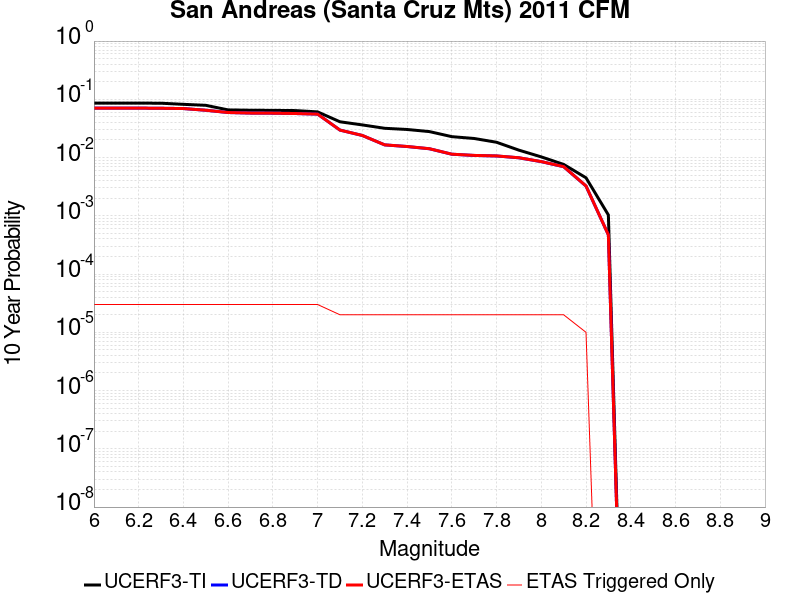 |

| Magnitude | 1 wk TI Prob | 1 wk TD Prob | 1 wk ETAS Prob | 1 wk ETAS/TD Gain | 1 wk ETAS Triggered Only | 1 mo TI Prob | 1 mo TD Prob | 1 mo ETAS Prob | 1 mo ETAS/TD Gain | 1 mo ETAS Triggered Only | 1 yr TI Prob | 1 yr TD Prob | 1 yr ETAS Prob | 1 yr ETAS/TD Gain | 1 yr ETAS Triggered Only | 10 yr TI Prob | 10 yr TD Prob | 10 yr ETAS Prob | 10 yr ETAS/TD Gain | 10 yr ETAS Triggered Only |
|-----|-----|-----|-----|-----|-----|-----|-----|-----|-----|-----|-----|-----|-----|-----|-----|-----|-----|-----|-----|-----|
| 6.0 | 1.7221631E-4 | 1.3792426E-4 | 1.579215E-4 | 1.1449871 | 2.0E-5 | 7.378611E-4 | 5.9097214E-4 | 6.109603E-4 | 1.0338225 | 2.0E-5 | 0.008946515 | 0.0071717235 | 0.0071915803 | 1.0027688 | 2.0E-5 | 0.08594794 | 0.07054796 | 0.07057585 | 1.0003953 | 3.0E-5 |
| 6.1 | 1.7221631E-4 | 1.3792426E-4 | 1.579215E-4 | 1.1449871 | 2.0E-5 | 7.378611E-4 | 5.9097214E-4 | 6.109603E-4 | 1.0338225 | 2.0E-5 | 0.008946515 | 0.0071717235 | 0.0071915803 | 1.0027688 | 2.0E-5 | 0.08594794 | 0.07054796 | 0.07057585 | 1.0003953 | 3.0E-5 |
| 6.2 | 1.7221631E-4 | 1.3792426E-4 | 1.579215E-4 | 1.1449871 | 2.0E-5 | 7.378611E-4 | 5.9097214E-4 | 6.109603E-4 | 1.0338225 | 2.0E-5 | 0.008946515 | 0.0071717235 | 0.0071915803 | 1.0027688 | 2.0E-5 | 0.08594794 | 0.07054796 | 0.07057585 | 1.0003953 | 3.0E-5 |
| 6.3 | 1.716926E-4 | 1.3711878E-4 | 1.5711605E-4 | 1.145839 | 2.0E-5 | 7.3561794E-4 | 5.8752164E-4 | 6.075099E-4 | 1.0340213 | 2.0E-5 | 0.008919428 | 0.007129989 | 0.0071498468 | 1.0027851 | 2.0E-5 | 0.08569809 | 0.07015993 | 0.07018782 | 1.0003976 | 3.0E-5 |
| 6.4 | 1.6392978E-4 | 1.3587909E-4 | 1.5587638E-4 | 1.1471697 | 2.0E-5 | 7.02367E-4 | 5.82211E-4 | 6.021994E-4 | 1.0343318 | 2.0E-5 | 0.008517839 | 0.0070657525 | 0.007085611 | 1.0028106 | 2.0E-5 | 0.08198654 | 0.069394976 | 0.06942289 | 1.0004023 | 3.0E-5 |
| 6.5 | 1.5742714E-4 | 1.2647794E-4 | 1.4647542E-4 | 1.1581104 | 2.0E-5 | 6.745133E-4 | 5.419374E-4 | 5.6192663E-4 | 1.0368847 | 2.0E-5 | 0.00818132 | 0.0065784375 | 0.006598306 | 1.0030203 | 2.0E-5 | 0.078865945 | 0.06486093 | 0.064888984 | 1.0004325 | 3.0E-5 |
| 6.6 | 1.3038084E-4 | 1.1587992E-4 | 1.358776E-4 | 1.1725725 | 2.0E-5 | 5.5865536E-4 | 4.96535E-4 | 5.1652506E-4 | 1.0402591 | 2.0E-5 | 0.006780438 | 0.006028784 | 0.0060486635 | 1.0032974 | 2.0E-5 | 0.0657725 | 0.059330538 | 0.059358757 | 1.0004756 | 3.0E-5 |
| 6.7 | 1.2867592E-4 | 1.1314491E-4 | 1.3314265E-4 | 1.1767445 | 2.0E-5 | 5.5135164E-4 | 4.8481792E-4 | 5.048082E-4 | 1.0412326 | 2.0E-5 | 0.0066920654 | 0.005886907 | 0.0059067896 | 1.0033773 | 2.0E-5 | 0.06494093 | 0.058041416 | 0.058069672 | 1.0004869 | 3.0E-5 |
| 6.8 | 1.2801298E-4 | 1.12520516E-4 | 1.3251827E-4 | 1.1777253 | 2.0E-5 | 5.485117E-4 | 4.8214293E-4 | 5.021333E-4 | 1.0414615 | 2.0E-5 | 0.0066577005 | 0.0058545293 | 0.0058744126 | 1.0033962 | 2.0E-5 | 0.06461738 | 0.05775524 | 0.057783507 | 1.0004895 | 3.0E-5 |
| 6.9 | 1.269149E-4 | 1.1094256E-4 | 1.3094033E-4 | 1.1802535 | 2.0E-5 | 5.4380763E-4 | 4.7538272E-4 | 4.953732E-4 | 1.0420513 | 2.0E-5 | 0.006600777 | 0.005772663 | 0.0057925475 | 1.0034446 | 2.0E-5 | 0.06408122 | 0.057027116 | 0.057055406 | 1.000496 | 3.0E-5 |
| 7.0 | 1.2030331E-4 | 1.0824356E-4 | 1.282414E-4 | 1.1847485 | 2.0E-5 | 5.154837E-4 | 4.638198E-4 | 4.8381052E-4 | 1.0431002 | 2.0E-5 | 0.006257969 | 0.0056326203 | 0.0056525073 | 1.0035307 | 2.0E-5 | 0.06084648 | 0.055699922 | 0.055728253 | 1.0005085 | 3.0E-5 |
| 7.1 | 8.049617E-5 | 5.392429E-5 | 7.392321E-5 | 1.3708704 | 2.0E-5 | 3.4493793E-4 | 2.3108382E-4 | 2.510792E-4 | 1.0865287 | 2.0E-5 | 0.0041915346 | 0.0028098505 | 0.0028297943 | 1.0070978 | 2.0E-5 | 0.041133516 | 0.029618833 | 0.02963824 | 1.0006553 | 2.0E-5 |
| 7.2 | 7.093979E-5 | 4.2935415E-5 | 6.293456E-5 | 1.4657959 | 2.0E-5 | 3.0399222E-4 | 1.8399608E-4 | 2.0399239E-4 | 1.108678 | 2.0E-5 | 0.0036948253 | 0.0022378736 | 0.0022578288 | 1.0089171 | 2.0E-5 | 0.03633994 | 0.023941126 | 0.023960648 | 1.0008154 | 2.0E-5 |
| 7.3 | 6.193693E-5 | 2.8891074E-5 | 4.8890495E-5 | 1.6922354 | 2.0E-5 | 2.6541698E-4 | 1.2381302E-4 | 1.4381054E-4 | 1.1615139 | 2.0E-5 | 0.0032266637 | 0.001506383 | 0.0015263528 | 1.0132568 | 2.0E-5 | 0.031802133 | 0.016497677 | 0.016517347 | 1.0011923 | 2.0E-5 |
| 7.4 | 5.906492E-5 | 2.7020369E-5 | 4.701983E-5 | 1.7401624 | 2.0E-5 | 2.5311083E-4 | 1.1579645E-4 | 1.3579414E-4 | 1.1726968 | 2.0E-5 | 0.0030772698 | 0.0014089114 | 0.0014288833 | 1.0141754 | 2.0E-5 | 0.030350044 | 0.0154695045 | 0.0154891955 | 1.0012729 | 2.0E-5 |
| 7.5 | 5.424296E-5 | 2.4675093E-5 | 4.46746E-5 | 1.8105139 | 2.0E-5 | 2.324491E-4 | 1.0574612E-4 | 1.25744E-4 | 1.1891122 | 2.0E-5 | 0.002826395 | 0.0012866998 | 0.0013066741 | 1.0155237 | 2.0E-5 | 0.027907165 | 0.014161854 | 0.014181571 | 1.0013922 | 2.0E-5 |
| 7.6 | 4.43084E-5 | 1.990151E-5 | 3.990111E-5 | 2.0049288 | 2.0E-5 | 1.8987931E-4 | 8.528939E-5 | 1.0528769E-4 | 1.2344757 | 2.0E-5 | 0.0023093296 | 0.001037904 | 0.0010578833 | 1.0192496 | 2.0E-5 | 0.022854783 | 0.011411123 | 0.011430895 | 1.0017327 | 2.0E-5 |
| 7.7 | 4.118098E-5 | 1.8933848E-5 | 3.8933467E-5 | 2.0562894 | 2.0E-5 | 1.7647797E-4 | 8.1142534E-5 | 1.0114091E-4 | 1.2464598 | 2.0E-5 | 0.002146502 | 9.874629E-4 | 0.0010074432 | 1.0202339 | 2.0E-5 | 0.021258866 | 0.010868995 | 0.010888778 | 1.0018201 | 2.0E-5 |
| 7.8 | 3.5408906E-5 | 1.856201E-5 | 3.856164E-5 | 2.0774496 | 2.0E-5 | 1.5174363E-4 | 7.954905E-5 | 9.9547455E-5 | 1.2513973 | 2.0E-5 | 0.0018459131 | 9.6807955E-4 | 9.880601E-4 | 1.0206394 | 2.0E-5 | 0.018306552 | 0.0106506655 | 0.010670452 | 1.0018578 | 2.0E-5 |
| 7.9 | 2.5860836E-5 | 1.7313954E-5 | 3.7313606E-5 | 2.1551175 | 2.0E-5 | 1.10827445E-4 | 7.420055E-5 | 9.4199066E-5 | 1.2695198 | 2.0E-5 | 0.001348489 | 9.030175E-4 | 9.2299946E-4 | 1.022128 | 2.0E-5 | 0.013403354 | 0.009906601 | 0.009926403 | 1.0019989 | 2.0E-5 |
| 8.0 | 1.9777332E-5 | 1.4837888E-5 | 3.483759E-5 | 2.3478808 | 2.0E-5 | 8.4757245E-5 | 6.3589396E-5 | 8.358812E-5 | 1.3144978 | 2.0E-5 | 0.0010314309 | 7.739261E-4 | 7.939106E-4 | 1.0258223 | 2.0E-5 | 0.010266567 | 0.008508087 | 0.008527917 | 1.0023307 | 2.0E-5 |
| 8.1 | 1.468494E-5 | 1.2105831E-5 | 3.210559E-5 | 2.6520765 | 2.0E-5 | 6.293394E-5 | 5.1881103E-5 | 7.1880066E-5 | 1.3854768 | 2.0E-5 | 7.6595135E-4 | 6.3146953E-4 | 6.5145694E-4 | 1.0316522 | 2.0E-5 | 0.0076331664 | 0.0069684954 | 0.0069883564 | 1.00285 | 2.0E-5 |
| 8.2 | 8.63836E-6 | 5.4678667E-6 | 1.5467813E-5 | 2.8288567 | 1.0E-5 | 3.7021015E-5 | 2.3433504E-5 | 3.343327E-5 | 1.4267294 | 1.0E-5 | 4.5063766E-4 | 2.8526565E-4 | 2.9526278E-4 | 1.035045 | 1.0E-5 | 0.004497249 | 0.003245162 | 0.0032551298 | 1.0030715 | 1.0E-5 |
| 8.3 | 1.983087E-6 | 7.6564595E-7 | 7.6564595E-7 | 1.0 | 0.0 | 8.498917E-6 | 3.281336E-6 | 3.281336E-6 | 1.0 | 0.0 | 1.034694E-4 | 3.9949547E-5 | 3.9949547E-5 | 1.0 | 0.0 | 0.0010342124 | 4.717979E-4 | 4.717979E-4 | 1.0 | 0.0 |

## Los Alamos extension
*[(top)](#table-of-contents)*

| 1 Week | 1 Month | 1 Year | 10 Year |
|-----|-----|-----|-----|
|  |  | 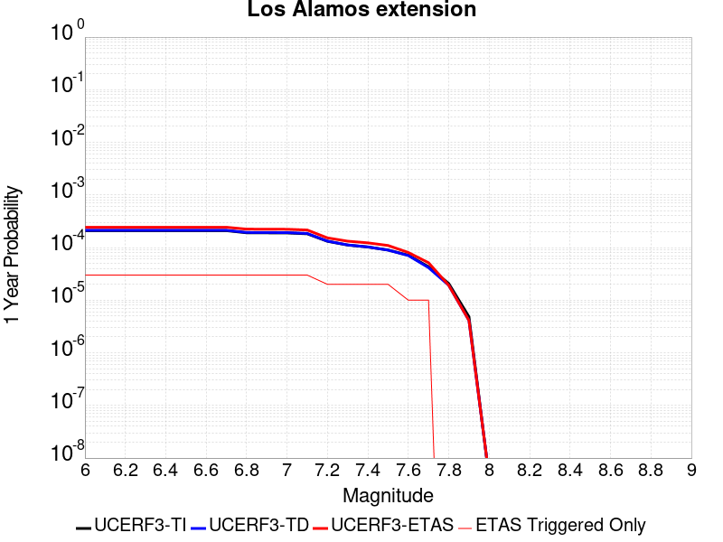 |  |

| Magnitude | 1 wk TI Prob | 1 wk TD Prob | 1 wk ETAS Prob | 1 wk ETAS/TD Gain | 1 wk ETAS Triggered Only | 1 mo TI Prob | 1 mo TD Prob | 1 mo ETAS Prob | 1 mo ETAS/TD Gain | 1 mo ETAS Triggered Only | 1 yr TI Prob | 1 yr TD Prob | 1 yr ETAS Prob | 1 yr ETAS/TD Gain | 1 yr ETAS Triggered Only | 10 yr TI Prob | 10 yr TD Prob | 10 yr ETAS Prob | 10 yr ETAS/TD Gain | 10 yr ETAS Triggered Only |
|-----|-----|-----|-----|-----|-----|-----|-----|-----|-----|-----|-----|-----|-----|-----|-----|-----|-----|-----|-----|-----|
| 6.0 | 4.0146506E-6 | 4.086164E-6 | 1.4086124E-5 | 3.4472728 | 1.0E-5 | 1.7205533E-5 | 1.7512022E-5 | 2.7511845E-5 | 1.5710263 | 1.0E-5 | 2.0945723E-4 | 2.1318911E-4 | 2.4318272E-4 | 1.1406901 | 3.0E-5 | 0.0020925992 | 0.002129955 | 0.0021598912 | 1.0140548 | 3.0E-5 |
| 6.1 | 4.0146506E-6 | 4.086164E-6 | 1.4086124E-5 | 3.4472728 | 1.0E-5 | 1.7205533E-5 | 1.7512022E-5 | 2.7511845E-5 | 1.5710263 | 1.0E-5 | 2.0945723E-4 | 2.1318911E-4 | 2.4318272E-4 | 1.1406901 | 3.0E-5 | 0.0020925992 | 0.002129955 | 0.0021598912 | 1.0140548 | 3.0E-5 |
| 6.2 | 4.0146506E-6 | 4.086164E-6 | 1.4086124E-5 | 3.4472728 | 1.0E-5 | 1.7205533E-5 | 1.7512022E-5 | 2.7511845E-5 | 1.5710263 | 1.0E-5 | 2.0945723E-4 | 2.1318911E-4 | 2.4318272E-4 | 1.1406901 | 3.0E-5 | 0.0020925992 | 0.002129955 | 0.0021598912 | 1.0140548 | 3.0E-5 |
| 6.3 | 4.0146506E-6 | 4.086164E-6 | 1.4086124E-5 | 3.4472728 | 1.0E-5 | 1.7205533E-5 | 1.7512022E-5 | 2.7511845E-5 | 1.5710263 | 1.0E-5 | 2.0945723E-4 | 2.1318911E-4 | 2.4318272E-4 | 1.1406901 | 3.0E-5 | 0.0020925992 | 0.002129955 | 0.0021598912 | 1.0140548 | 3.0E-5 |
| 6.4 | 4.0146506E-6 | 4.086164E-6 | 1.4086124E-5 | 3.4472728 | 1.0E-5 | 1.7205533E-5 | 1.7512022E-5 | 2.7511845E-5 | 1.5710263 | 1.0E-5 | 2.0945723E-4 | 2.1318911E-4 | 2.4318272E-4 | 1.1406901 | 3.0E-5 | 0.0020925992 | 0.002129955 | 0.0021598912 | 1.0140548 | 3.0E-5 |
| 6.5 | 4.0146506E-6 | 4.086164E-6 | 1.4086124E-5 | 3.4472728 | 1.0E-5 | 1.7205533E-5 | 1.7512022E-5 | 2.7511845E-5 | 1.5710263 | 1.0E-5 | 2.0945723E-4 | 2.1318911E-4 | 2.4318272E-4 | 1.1406901 | 3.0E-5 | 0.0020925992 | 0.002129955 | 0.0021598912 | 1.0140548 | 3.0E-5 |
| 6.6 | 4.0146506E-6 | 4.086164E-6 | 1.4086124E-5 | 3.4472728 | 1.0E-5 | 1.7205533E-5 | 1.7512022E-5 | 2.7511845E-5 | 1.5710263 | 1.0E-5 | 2.0945723E-4 | 2.1318911E-4 | 2.4318272E-4 | 1.1406901 | 3.0E-5 | 0.0020925992 | 0.002129955 | 0.0021598912 | 1.0140548 | 3.0E-5 |
| 6.7 | 4.0146506E-6 | 4.086164E-6 | 1.4086124E-5 | 3.4472728 | 1.0E-5 | 1.7205533E-5 | 1.7512022E-5 | 2.7511845E-5 | 1.5710263 | 1.0E-5 | 2.0945723E-4 | 2.1318911E-4 | 2.4318272E-4 | 1.1406901 | 3.0E-5 | 0.0020925992 | 0.002129955 | 0.0021598912 | 1.0140548 | 3.0E-5 |
| 6.8 | 3.6584688E-6 | 3.7188636E-6 | 1.3718826E-5 | 3.6889834 | 1.0E-5 | 1.5679057E-5 | 1.5937894E-5 | 2.5937736E-5 | 1.6274254 | 1.0E-5 | 1.9087581E-4 | 1.9402753E-4 | 2.240217E-4 | 1.1545873 | 3.0E-5 | 0.0019071194 | 0.0019386737 | 0.0019686155 | 1.0154445 | 3.0E-5 |
| 6.9 | 3.644631E-6 | 3.7045736E-6 | 1.3704536E-5 | 3.699356 | 1.0E-5 | 1.5619753E-5 | 1.5876652E-5 | 2.5876494E-5 | 1.6298457 | 1.0E-5 | 1.901539E-4 | 1.9328203E-4 | 2.2327623E-4 | 1.1551836 | 3.0E-5 | 0.0018999127 | 0.0019312317 | 0.0019611737 | 1.0155041 | 3.0E-5 |
| 7.0 | 3.6318522E-6 | 3.691334E-6 | 1.3691297E-5 | 3.7090378 | 1.0E-5 | 1.5564989E-5 | 1.5819913E-5 | 2.5819754E-5 | 1.6321048 | 1.0E-5 | 1.8948725E-4 | 1.9259135E-4 | 2.2258557E-4 | 1.1557403 | 3.0E-5 | 0.0018932576 | 0.0019243368 | 0.0019542791 | 1.0155598 | 3.0E-5 |
| 7.1 | 3.5001724E-6 | 3.5554046E-6 | 1.3555369E-5 | 3.8126094 | 1.0E-5 | 1.5000653E-5 | 1.5237365E-5 | 2.5237212E-5 | 1.6562715 | 1.0E-5 | 1.8261763E-4 | 1.8550004E-4 | 2.1549448E-4 | 1.161695 | 3.0E-5 | 0.0018246764 | 0.0018535426 | 0.0018834871 | 1.0161552 | 3.0E-5 |
| 7.2 | 2.5204702E-6 | 2.5436989E-6 | 1.2543674E-5 | 4.931273 | 1.0E-5 | 1.080197E-5 | 1.0901522E-5 | 2.0901412E-5 | 1.9172932 | 1.0E-5 | 1.3150605E-4 | 1.3271799E-4 | 1.5271534E-4 | 1.1506754 | 2.0E-5 | 0.0013142825 | 0.001326393 | 0.0013463665 | 1.0150585 | 2.0E-5 |
| 7.3 | 2.1399692E-6 | 2.1501362E-6 | 1.2150114E-5 | 5.650858 | 1.0E-5 | 9.1712645E-6 | 9.2148375E-6 | 1.9214745E-5 | 2.0851963 | 1.0E-5 | 1.1165442E-4 | 1.121849E-4 | 1.3218266E-4 | 1.1782571 | 2.0E-5 | 0.0011159834 | 0.001121286 | 0.0011412635 | 1.0178167 | 2.0E-5 |
| 7.4 | 1.9660122E-6 | 1.970241E-6 | 1.1970222E-5 | 6.075511 | 1.0E-5 | 8.42574E-6 | 8.4438625E-6 | 1.8443778E-5 | 2.184282 | 1.0E-5 | 1.0257855E-4 | 1.0279921E-4 | 1.2279715E-4 | 1.1945341 | 2.0E-5 | 0.0010253121 | 0.0010275197 | 0.0010474991 | 1.0194443 | 2.0E-5 |
| 7.5 | 1.7204633E-6 | 1.7151029E-6 | 1.1715086E-5 | 6.8305435 | 1.0E-5 | 7.373393E-6 | 7.3504207E-6 | 1.7350347E-5 | 2.3604562 | 1.0E-5 | 8.976737E-5 | 8.948772E-5 | 1.0948594E-4 | 1.2234744 | 2.0E-5 | 8.9731114E-4 | 8.945199E-4 | 9.14502E-4 | 1.0223384 | 2.0E-5 |
| 7.6 | 1.3717638E-6 | 1.3535872E-6 | 1.1353573E-5 | 8.387767 | 1.0E-5 | 5.878974E-6 | 5.801075E-6 | 1.5801017E-5 | 2.7238083 | 1.0E-5 | 7.157416E-5 | 7.062583E-5 | 8.062512E-5 | 1.1415813 | 1.0E-5 | 7.1551115E-4 | 7.0603646E-4 | 7.160294E-4 | 1.0141536 | 1.0E-5 |
| 7.7 | 8.272564E-7 | 7.9576733E-7 | 1.0795759E-5 | 13.566478 | 1.0E-5 | 3.5453797E-6 | 3.4104269E-6 | 1.3410393E-5 | 3.9321742 | 1.0E-5 | 4.3164142E-5 | 4.1521158E-5 | 5.1520743E-5 | 1.240831 | 1.0E-5 | 4.315576E-4 | 4.151342E-4 | 4.2513004E-4 | 1.0240786 | 1.0E-5 |
| 7.8 | 3.9708277E-7 | 3.671937E-7 | 3.671937E-7 | 1.0 | 0.0 | 1.7017821E-6 | 1.5736864E-6 | 1.5736864E-6 | 1.0 | 0.0 | 2.0719E-5 | 1.9159465E-5 | 1.9159465E-5 | 1.0 | 0.0 | 2.071707E-4 | 1.9157819E-4 | 1.9157819E-4 | 1.0 | 0.0 |
| 7.9 | 9.292528E-8 | 7.889168E-8 | 7.889168E-8 | 1.0 | 0.0 | 3.9825116E-7 | 3.3810713E-7 | 3.3810713E-7 | 1.0 | 0.0 | 4.848697E-6 | 4.1164467E-6 | 4.1164467E-6 | 1.0 | 0.0 | 4.8485912E-5 | 4.1163716E-5 | 4.1163716E-5 | 1.0 | 0.0 |
| 8.0 | 7.880441E-11 | 8.2353124E-11 | 8.2353124E-11 | 1.0 | 0.0 | 3.3773329E-10 | 3.52942E-10 | 3.52942E-10 | 1.0 | 0.0 | 4.1119033E-9 | 4.2970694E-9 | 4.2970694E-9 | 1.0 | 0.0 | 4.1119034E-8 | 4.2970694E-8 | 4.2970694E-8 | 1.0 | 0.0 |

## Simi-Santa Rosa
*[(top)](#table-of-contents)*

| 1 Week | 1 Month | 1 Year | 10 Year |
|-----|-----|-----|-----|
|  |  |  |  |

| Magnitude | 1 wk TI Prob | 1 wk TD Prob | 1 wk ETAS Prob | 1 wk ETAS/TD Gain | 1 wk ETAS Triggered Only | 1 mo TI Prob | 1 mo TD Prob | 1 mo ETAS Prob | 1 mo ETAS/TD Gain | 1 mo ETAS Triggered Only | 1 yr TI Prob | 1 yr TD Prob | 1 yr ETAS Prob | 1 yr ETAS/TD Gain | 1 yr ETAS Triggered Only | 10 yr TI Prob | 10 yr TD Prob | 10 yr ETAS Prob | 10 yr ETAS/TD Gain | 10 yr ETAS Triggered Only |
|-----|-----|-----|-----|-----|-----|-----|-----|-----|-----|-----|-----|-----|-----|-----|-----|-----|-----|-----|-----|-----|
| 6.0 | 2.198912E-5 | 2.2275388E-5 | 2.2275388E-5 | 1.0 | 0.0 | 9.4235686E-5 | 9.54627E-5 | 9.54627E-5 | 1.0 | 0.0 | 0.0011467156 | 0.0011616825 | 0.0011816593 | 1.0171964 | 2.0E-5 | 0.011408163 | 0.011560547 | 0.0115902005 | 1.002565 | 3.0E-5 |
| 6.1 | 2.198912E-5 | 2.2275388E-5 | 2.2275388E-5 | 1.0 | 0.0 | 9.4235686E-5 | 9.54627E-5 | 9.54627E-5 | 1.0 | 0.0 | 0.0011467156 | 0.0011616825 | 0.0011816593 | 1.0171964 | 2.0E-5 | 0.011408163 | 0.011560547 | 0.0115902005 | 1.002565 | 3.0E-5 |
| 6.2 | 1.69983E-5 | 1.6668506E-5 | 1.6668506E-5 | 1.0 | 0.0 | 7.284782E-5 | 7.143466E-5 | 7.143466E-5 | 1.0 | 0.0 | 8.865613E-4 | 8.6939917E-4 | 8.8938174E-4 | 1.0229844 | 2.0E-5 | 0.008830327 | 0.0086629 | 0.00869264 | 1.003433 | 3.0E-5 |
| 6.3 | 1.69983E-5 | 1.6668506E-5 | 1.6668506E-5 | 1.0 | 0.0 | 7.284782E-5 | 7.143466E-5 | 7.143466E-5 | 1.0 | 0.0 | 8.865613E-4 | 8.6939917E-4 | 8.8938174E-4 | 1.0229844 | 2.0E-5 | 0.008830327 | 0.0086629 | 0.00869264 | 1.003433 | 3.0E-5 |
| 6.4 | 1.4666188E-5 | 1.4052489E-5 | 1.4052489E-5 | 1.0 | 0.0 | 6.285358E-5 | 6.0223705E-5 | 6.0223705E-5 | 1.0 | 0.0 | 7.6497364E-4 | 7.330018E-4 | 7.5298717E-4 | 1.0272651 | 2.0E-5 | 0.0076234564 | 0.0073083164 | 0.007338097 | 1.0040749 | 3.0E-5 |
| 6.5 | 1.4666188E-5 | 1.4052489E-5 | 1.4052489E-5 | 1.0 | 0.0 | 6.285358E-5 | 6.0223705E-5 | 6.0223705E-5 | 1.0 | 0.0 | 7.6497364E-4 | 7.330018E-4 | 7.5298717E-4 | 1.0272651 | 2.0E-5 | 0.0076234564 | 0.0073083164 | 0.007338097 | 1.0040749 | 3.0E-5 |
| 6.6 | 1.4377586E-5 | 1.3729529E-5 | 1.3729529E-5 | 1.0 | 0.0 | 6.1616774E-5 | 5.883965E-5 | 5.883965E-5 | 1.0 | 0.0 | 7.4992597E-4 | 7.1616215E-4 | 7.361478E-4 | 1.0279067 | 2.0E-5 | 0.007474003 | 0.0071410104 | 0.0071707964 | 1.0041711 | 3.0E-5 |
| 6.7 | 1.3881404E-5 | 1.3207497E-5 | 1.3207497E-5 | 1.0 | 0.0 | 5.9490372E-5 | 5.6602472E-5 | 5.6602472E-5 | 1.0 | 0.0 | 7.240546E-4 | 6.889419E-4 | 7.0892816E-4 | 1.02901 | 2.0E-5 | 0.007217 | 0.0068705105 | 0.0069003045 | 1.0043365 | 3.0E-5 |
| 6.8 | 1.0176516E-5 | 9.1541E-6 | 9.1541E-6 | 1.0 | 0.0 | 4.3612912E-5 | 3.923136E-5 | 3.923136E-5 | 1.0 | 0.0 | 5.308578E-4 | 4.775537E-4 | 4.975441E-4 | 1.0418601 | 2.0E-5 | 0.0052959146 | 0.004766908 | 0.004796765 | 1.0062634 | 3.0E-5 |
| 6.9 | 9.699797E-6 | 8.774672E-6 | 8.774672E-6 | 1.0 | 0.0 | 4.15699E-5 | 3.760529E-5 | 3.760529E-5 | 1.0 | 0.0 | 5.05996E-4 | 4.5776463E-4 | 4.7775547E-4 | 1.0436705 | 2.0E-5 | 0.005048454 | 0.0045698346 | 0.0045996974 | 1.0065348 | 3.0E-5 |
| 7.0 | 7.4049476E-6 | 6.559291E-6 | 6.559291E-6 | 1.0 | 0.0 | 3.1735104E-5 | 2.8111013E-5 | 2.8111013E-5 | 1.0 | 0.0 | 3.8630638E-4 | 3.422105E-4 | 3.422105E-4 | 1.0 | 0.0 | 0.0038563553 | 0.0034180775 | 0.0034280433 | 1.0029156 | 1.0E-5 |
| 7.1 | 3.873439E-6 | 2.759473E-6 | 2.759473E-6 | 1.0 | 0.0 | 1.6600346E-5 | 1.1826261E-5 | 1.1826261E-5 | 1.0 | 0.0 | 2.0209046E-4 | 1.4397544E-4 | 1.4397544E-4 | 1.0 | 0.0 | 0.0020190678 | 0.0014388453 | 0.0014388453 | 1.0 | 0.0 |
| 7.2 | 3.417706E-6 | 2.367616E-6 | 2.367616E-6 | 1.0 | 0.0 | 1.4647229E-5 | 1.0146887E-5 | 1.0146887E-5 | 1.0 | 0.0 | 1.7831543E-4 | 1.2353157E-4 | 1.2353157E-4 | 1.0 | 0.0 | 0.0017817242 | 0.0012346513 | 0.0012346513 | 1.0 | 0.0 |
| 7.3 | 1.90225E-6 | 1.4073756E-6 | 1.4073756E-6 | 1.0 | 0.0 | 8.152474E-6 | 6.031596E-6 | 6.031596E-6 | 1.0 | 0.0 | 9.9251854E-5 | 7.343223E-5 | 7.343223E-5 | 1.0 | 0.0 | 9.920754E-4 | 7.340819E-4 | 7.340819E-4 | 1.0 | 0.0 |
| 7.4 | 1.5170556E-6 | 1.1024792E-6 | 1.1024792E-6 | 1.0 | 0.0 | 6.5016507E-6 | 4.7249023E-6 | 4.7249023E-6 | 1.0 | 0.0 | 7.915472E-5 | 5.752418E-5 | 5.752418E-5 | 1.0 | 0.0 | 7.9126534E-4 | 5.75094E-4 | 5.75094E-4 | 1.0 | 0.0 |
| 7.5 | 1.178732E-6 | 8.5351127E-7 | 8.5351127E-7 | 1.0 | 0.0 | 5.0516987E-6 | 3.6579004E-6 | 3.6579004E-6 | 1.0 | 0.0 | 6.1502695E-5 | 4.4534037E-5 | 4.4534037E-5 | 1.0 | 0.0 | 6.148568E-4 | 4.4525208E-4 | 4.4525208E-4 | 1.0 | 0.0 |
| 7.6 | 6.8722386E-7 | 4.793211E-7 | 4.793211E-7 | 1.0 | 0.0 | 2.9452417E-6 | 2.0542318E-6 | 2.0542318E-6 | 1.0 | 0.0 | 3.5857727E-5 | 2.5009986E-5 | 2.5009986E-5 | 1.0 | 0.0 | 3.5851944E-4 | 2.5007184E-4 | 2.5007184E-4 | 1.0 | 0.0 |
| 7.7 | 5.5126515E-7 | 3.6731117E-7 | 3.6731117E-7 | 1.0 | 0.0 | 2.3625628E-6 | 1.5741898E-6 | 1.5741898E-6 | 1.0 | 0.0 | 2.8763823E-5 | 1.9165593E-5 | 1.9165593E-5 | 1.0 | 0.0 | 2.87601E-4 | 1.9163951E-4 | 1.9163951E-4 | 1.0 | 0.0 |
| 7.8 | 3.3860243E-7 | 2.0075514E-7 | 2.0075514E-7 | 1.0 | 0.0 | 1.4511525E-6 | 8.6037886E-7 | 8.6037886E-7 | 1.0 | 0.0 | 1.7667637E-5 | 1.0475063E-5 | 1.0475063E-5 | 1.0 | 0.0 | 1.7666233E-4 | 1.0474575E-4 | 1.0474575E-4 | 1.0 | 0.0 |
| 7.9 | 2.7955386E-7 | 1.4648724E-7 | 1.4648724E-7 | 1.0 | 0.0 | 1.1980875E-6 | 6.278023E-7 | 6.278023E-7 | 1.0 | 0.0 | 1.4586617E-5 | 7.643467E-6 | 7.643467E-6 | 1.0 | 0.0 | 1.458566E-4 | 7.643208E-5 | 7.643208E-5 | 1.0 | 0.0 |
| 8.0 | 5.6259015E-8 | 3.335318E-8 | 3.335318E-8 | 1.0 | 0.0 | 2.4111003E-7 | 1.429422E-7 | 1.429422E-7 | 1.0 | 0.0 | 2.9355108E-6 | 1.7403199E-6 | 1.7403199E-6 | 1.0 | 0.0 | 2.935472E-5 | 1.7403077E-5 | 1.7403077E-5 | 1.0 | 0.0 |

## Santa Susana alt 1
*[(top)](#table-of-contents)*

| 1 Week | 1 Month | 1 Year | 10 Year |
|-----|-----|-----|-----|
|  |  |  | 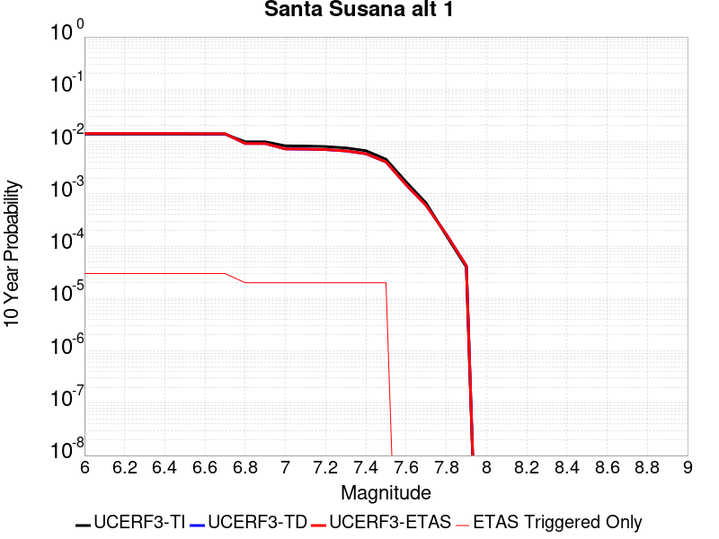 |

| Magnitude | 1 wk TI Prob | 1 wk TD Prob | 1 wk ETAS Prob | 1 wk ETAS/TD Gain | 1 wk ETAS Triggered Only | 1 mo TI Prob | 1 mo TD Prob | 1 mo ETAS Prob | 1 mo ETAS/TD Gain | 1 mo ETAS Triggered Only | 1 yr TI Prob | 1 yr TD Prob | 1 yr ETAS Prob | 1 yr ETAS/TD Gain | 1 yr ETAS Triggered Only | 10 yr TI Prob | 10 yr TD Prob | 10 yr ETAS Prob | 10 yr ETAS/TD Gain | 10 yr ETAS Triggered Only |
|-----|-----|-----|-----|-----|-----|-----|-----|-----|-----|-----|-----|-----|-----|-----|-----|-----|-----|-----|-----|-----|
| 6.0 | 2.674877E-5 | 2.7198214E-5 | 3.719794E-5 | 1.3676612 | 1.0E-5 | 1.1463255E-4 | 1.16559204E-4 | 1.2655804E-4 | 1.0857834 | 1.0E-5 | 0.0013947578 | 0.0014182981 | 0.001428284 | 1.0070407 | 1.0E-5 | 0.013860362 | 0.014104388 | 0.014133965 | 1.002097 | 3.0E-5 |
| 6.1 | 2.674877E-5 | 2.7198214E-5 | 3.719794E-5 | 1.3676612 | 1.0E-5 | 1.1463255E-4 | 1.16559204E-4 | 1.2655804E-4 | 1.0857834 | 1.0E-5 | 0.0013947578 | 0.0014182981 | 0.001428284 | 1.0070407 | 1.0E-5 | 0.013860362 | 0.014104388 | 0.014133965 | 1.002097 | 3.0E-5 |
| 6.2 | 2.674877E-5 | 2.7198214E-5 | 3.719794E-5 | 1.3676612 | 1.0E-5 | 1.1463255E-4 | 1.16559204E-4 | 1.2655804E-4 | 1.0857834 | 1.0E-5 | 0.0013947578 | 0.0014182981 | 0.001428284 | 1.0070407 | 1.0E-5 | 0.013860362 | 0.014104388 | 0.014133965 | 1.002097 | 3.0E-5 |
| 6.3 | 2.674877E-5 | 2.7198214E-5 | 3.719794E-5 | 1.3676612 | 1.0E-5 | 1.1463255E-4 | 1.16559204E-4 | 1.2655804E-4 | 1.0857834 | 1.0E-5 | 0.0013947578 | 0.0014182981 | 0.001428284 | 1.0070407 | 1.0E-5 | 0.013860362 | 0.014104388 | 0.014133965 | 1.002097 | 3.0E-5 |
| 6.4 | 2.674877E-5 | 2.7198214E-5 | 3.719794E-5 | 1.3676612 | 1.0E-5 | 1.1463255E-4 | 1.16559204E-4 | 1.2655804E-4 | 1.0857834 | 1.0E-5 | 0.0013947578 | 0.0014182981 | 0.001428284 | 1.0070407 | 1.0E-5 | 0.013860362 | 0.014104388 | 0.014133965 | 1.002097 | 3.0E-5 |
| 6.5 | 2.674877E-5 | 2.7198214E-5 | 3.719794E-5 | 1.3676612 | 1.0E-5 | 1.1463255E-4 | 1.16559204E-4 | 1.2655804E-4 | 1.0857834 | 1.0E-5 | 0.0013947578 | 0.0014182981 | 0.001428284 | 1.0070407 | 1.0E-5 | 0.013860362 | 0.014104388 | 0.014133965 | 1.002097 | 3.0E-5 |
| 6.6 | 2.6647976E-5 | 2.7074553E-5 | 3.7074282E-5 | 1.3693405 | 1.0E-5 | 1.14200615E-4 | 1.16029274E-4 | 1.2602811E-4 | 1.0861752 | 1.0E-5 | 0.0013895056 | 0.0014118546 | 0.0014218405 | 1.0070729 | 1.0E-5 | 0.013808494 | 0.014040773 | 0.014070352 | 1.0021067 | 3.0E-5 |
| 6.7 | 2.6647976E-5 | 2.7074553E-5 | 3.7074282E-5 | 1.3693405 | 1.0E-5 | 1.14200615E-4 | 1.16029274E-4 | 1.2602811E-4 | 1.0861752 | 1.0E-5 | 0.0013895056 | 0.0014118546 | 0.0014218405 | 1.0070729 | 1.0E-5 | 0.013808494 | 0.014040773 | 0.014070352 | 1.0021067 | 3.0E-5 |
| 6.8 | 1.9073179E-5 | 1.7637467E-5 | 2.763729E-5 | 1.5669649 | 1.0E-5 | 8.1739636E-5 | 7.558706E-5 | 8.5586296E-5 | 1.1322877 | 1.0E-5 | 9.947256E-4 | 9.19902E-4 | 9.2989276E-4 | 1.0108607 | 1.0E-5 | 0.009902848 | 0.009163361 | 0.009183178 | 1.0021626 | 2.0E-5 |
| 6.9 | 1.9041876E-5 | 1.7619597E-5 | 2.7619422E-5 | 1.5675398 | 1.0E-5 | 8.160549E-5 | 7.551048E-5 | 8.5509724E-5 | 1.132422 | 1.0E-5 | 9.930939E-4 | 9.189705E-4 | 9.2896126E-4 | 1.0108718 | 1.0E-5 | 0.0098866755 | 0.009154123 | 0.00917394 | 1.0021648 | 2.0E-5 |
| 7.0 | 1.5917482E-5 | 1.3864049E-5 | 2.386391E-5 | 1.72128 | 1.0E-5 | 6.8215995E-5 | 5.9416023E-5 | 6.941543E-5 | 1.1682948 | 1.0E-5 | 8.302132E-4 | 7.2315463E-4 | 7.3314743E-4 | 1.0138183 | 1.0E-5 | 0.008271185 | 0.0072090672 | 0.007228923 | 1.0027543 | 2.0E-5 |
| 7.1 | 1.577788E-5 | 1.3744056E-5 | 2.3743918E-5 | 1.7275773 | 1.0E-5 | 6.761774E-5 | 5.890179E-5 | 6.89012E-5 | 1.1697642 | 1.0E-5 | 8.2293496E-4 | 7.16898E-4 | 7.2689087E-4 | 1.013939 | 1.0E-5 | 0.008198941 | 0.0071469042 | 0.0071667614 | 1.0027784 | 2.0E-5 |
| 7.2 | 1.5416446E-5 | 1.34701295E-5 | 2.3469995E-5 | 1.7423733 | 1.0E-5 | 6.606882E-5 | 5.7727877E-5 | 6.77273E-5 | 1.1732166 | 1.0E-5 | 8.0409093E-4 | 7.026149E-4 | 7.1260787E-4 | 1.0142225 | 1.0E-5 | 0.008011877 | 0.0070049763 | 0.0070248363 | 1.0028352 | 2.0E-5 |
| 7.3 | 1.4534083E-5 | 1.2718032E-5 | 2.2717904E-5 | 1.7862751 | 1.0E-5 | 6.228744E-5 | 5.4504737E-5 | 6.450419E-5 | 1.1834604 | 1.0E-5 | 7.580857E-4 | 6.633976E-4 | 6.733909E-4 | 1.0150639 | 1.0E-5 | 0.007555048 | 0.0066151717 | 0.006635039 | 1.0030034 | 2.0E-5 |
| 7.4 | 1.2858995E-5 | 1.1229814E-5 | 2.1229702E-5 | 1.8904767 | 1.0E-5 | 5.5108816E-5 | 4.812691E-5 | 5.812643E-5 | 1.2077739 | 1.0E-5 | 6.7074323E-4 | 5.8579154E-4 | 5.957857E-4 | 1.0170609 | 1.0E-5 | 0.0066872234 | 0.0058433902 | 0.0058632735 | 1.0034027 | 2.0E-5 |
| 7.5 | 8.827668E-6 | 7.805494E-6 | 1.7805416E-5 | 2.281139 | 1.0E-5 | 3.7832317E-5 | 3.3451703E-5 | 4.3451368E-5 | 1.2989285 | 1.0E-5 | 4.605111E-4 | 4.072008E-4 | 4.1719674E-4 | 1.0245479 | 1.0E-5 | 0.0045955796 | 0.0040648985 | 0.004084817 | 1.0049002 | 2.0E-5 |
| 7.6 | 3.2533426E-6 | 2.8720106E-6 | 2.8720106E-6 | 1.0 | 0.0 | 1.3942822E-5 | 1.230856E-5 | 1.230856E-5 | 1.0 | 0.0 | 1.6974064E-4 | 1.4984679E-4 | 1.4984679E-4 | 1.0 | 0.0 | 0.0016961104 | 0.0014974943 | 0.0014974943 | 1.0 | 0.0 |
| 7.7 | 1.2751709E-6 | 1.1491339E-6 | 1.1491339E-6 | 1.0 | 0.0 | 5.4650063E-6 | 4.9248506E-6 | 4.9248506E-6 | 1.0 | 0.0 | 6.653442E-5 | 5.99585E-5 | 5.99585E-5 | 1.0 | 0.0 | 6.6514505E-4 | 5.9943215E-4 | 5.9943215E-4 | 1.0 | 0.0 |
| 7.8 | 3.067544E-7 | 3.240052E-7 | 3.240052E-7 | 1.0 | 0.0 | 1.3146611E-6 | 1.3885931E-6 | 1.3885931E-6 | 1.0 | 0.0 | 1.600588E-5 | 1.6906E-5 | 1.6906E-5 | 1.0 | 0.0 | 1.6004729E-4 | 1.6904817E-4 | 1.6904817E-4 | 1.0 | 0.0 |
| 7.9 | 7.622999E-8 | 8.0879715E-8 | 8.0879715E-8 | 1.0 | 0.0 | 3.2669993E-7 | 3.4662733E-7 | 3.4662733E-7 | 1.0 | 0.0 | 3.977564E-6 | 4.220182E-6 | 4.220182E-6 | 1.0 | 0.0 | 3.977493E-5 | 4.2201224E-5 | 4.2201224E-5 | 1.0 | 0.0 |

## Verdugo
*[(top)](#table-of-contents)*

| 1 Week | 1 Month | 1 Year | 10 Year |
|-----|-----|-----|-----|
|  |  | 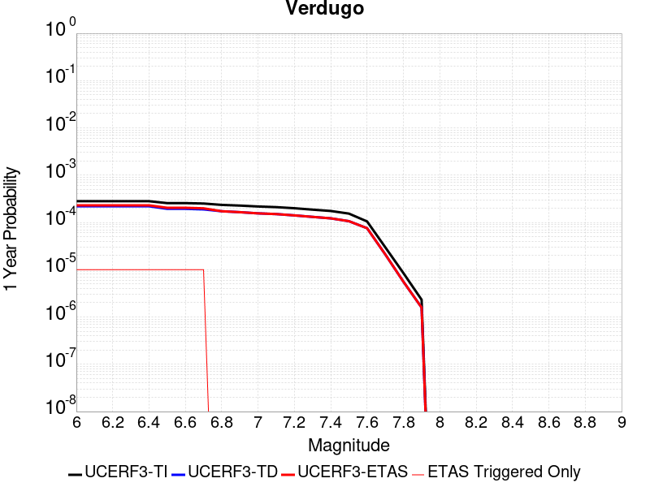 |  |

| Magnitude | 1 wk TI Prob | 1 wk TD Prob | 1 wk ETAS Prob | 1 wk ETAS/TD Gain | 1 wk ETAS Triggered Only | 1 mo TI Prob | 1 mo TD Prob | 1 mo ETAS Prob | 1 mo ETAS/TD Gain | 1 mo ETAS Triggered Only | 1 yr TI Prob | 1 yr TD Prob | 1 yr ETAS Prob | 1 yr ETAS/TD Gain | 1 yr ETAS Triggered Only | 10 yr TI Prob | 10 yr TD Prob | 10 yr ETAS Prob | 10 yr ETAS/TD Gain | 10 yr ETAS Triggered Only |
|-----|-----|-----|-----|-----|-----|-----|-----|-----|-----|-----|-----|-----|-----|-----|-----|-----|-----|-----|-----|-----|
| 6.0 | 5.392987E-6 | 4.2164934E-6 | 4.2164934E-6 | 1.0 | 0.0 | 2.3112598E-5 | 1.8070563E-5 | 1.8070563E-5 | 1.0 | 0.0 | 2.8135953E-4 | 2.1998737E-4 | 2.2998518E-4 | 1.0454471 | 1.0E-5 | 0.0028100356 | 0.0021977439 | 0.002227678 | 1.0136204 | 3.0E-5 |
| 6.1 | 5.392987E-6 | 4.2164934E-6 | 4.2164934E-6 | 1.0 | 0.0 | 2.3112598E-5 | 1.8070563E-5 | 1.8070563E-5 | 1.0 | 0.0 | 2.8135953E-4 | 2.1998737E-4 | 2.2998518E-4 | 1.0454471 | 1.0E-5 | 0.0028100356 | 0.0021977439 | 0.002227678 | 1.0136204 | 3.0E-5 |
| 6.2 | 5.392987E-6 | 4.2164934E-6 | 4.2164934E-6 | 1.0 | 0.0 | 2.3112598E-5 | 1.8070563E-5 | 1.8070563E-5 | 1.0 | 0.0 | 2.8135953E-4 | 2.1998737E-4 | 2.2998518E-4 | 1.0454471 | 1.0E-5 | 0.0028100356 | 0.0021977439 | 0.002227678 | 1.0136204 | 3.0E-5 |
| 6.3 | 5.392987E-6 | 4.2164934E-6 | 4.2164934E-6 | 1.0 | 0.0 | 2.3112598E-5 | 1.8070563E-5 | 1.8070563E-5 | 1.0 | 0.0 | 2.8135953E-4 | 2.1998737E-4 | 2.2998518E-4 | 1.0454471 | 1.0E-5 | 0.0028100356 | 0.0021977439 | 0.002227678 | 1.0136204 | 3.0E-5 |
| 6.4 | 5.392987E-6 | 4.2164934E-6 | 4.2164934E-6 | 1.0 | 0.0 | 2.3112598E-5 | 1.8070563E-5 | 1.8070563E-5 | 1.0 | 0.0 | 2.8135953E-4 | 2.1998737E-4 | 2.2998518E-4 | 1.0454471 | 1.0E-5 | 0.0028100356 | 0.0021977439 | 0.002227678 | 1.0136204 | 3.0E-5 |
| 6.5 | 4.9154837E-6 | 3.7224413E-6 | 3.7224413E-6 | 1.0 | 0.0 | 2.1066187E-5 | 1.5953223E-5 | 1.5953223E-5 | 1.0 | 0.0 | 2.5645064E-4 | 1.9421338E-4 | 2.0421145E-4 | 1.0514797 | 1.0E-5 | 0.002561549 | 0.0019404575 | 0.0019703992 | 1.0154303 | 3.0E-5 |
| 6.6 | 4.9154837E-6 | 3.7224413E-6 | 3.7224413E-6 | 1.0 | 0.0 | 2.1066187E-5 | 1.5953223E-5 | 1.5953223E-5 | 1.0 | 0.0 | 2.5645064E-4 | 1.9421338E-4 | 2.0421145E-4 | 1.0514797 | 1.0E-5 | 0.002561549 | 0.0019404575 | 0.0019703992 | 1.0154303 | 3.0E-5 |
| 6.7 | 4.817006E-6 | 3.620628E-6 | 3.620628E-6 | 1.0 | 0.0 | 2.0644147E-5 | 1.5516885E-5 | 1.5516885E-5 | 1.0 | 0.0 | 2.513135E-4 | 1.889019E-4 | 1.9890002E-4 | 1.0529275 | 1.0E-5 | 0.0025102948 | 0.0018874329 | 0.0019173763 | 1.0158646 | 3.0E-5 |
| 6.8 | 4.507407E-6 | 3.3070805E-6 | 3.3070805E-6 | 1.0 | 0.0 | 1.9317316E-5 | 1.4173126E-5 | 1.4173126E-5 | 1.0 | 0.0 | 2.3516294E-4 | 1.7254429E-4 | 1.7254429E-4 | 1.0 | 0.0 | 0.0023491425 | 0.0017241176 | 0.0017341003 | 1.0057901 | 1.0E-5 |
| 6.9 | 4.3573054E-6 | 3.1609877E-6 | 3.1609877E-6 | 1.0 | 0.0 | 1.8674033E-5 | 1.354702E-5 | 1.354702E-5 | 1.0 | 0.0 | 2.2733262E-4 | 1.649226E-4 | 1.649226E-4 | 1.0 | 0.0 | 0.0022710022 | 0.0016480145 | 0.0016579981 | 1.0060579 | 1.0E-5 |
| 7.0 | 4.171527E-6 | 2.9836467E-6 | 2.9836467E-6 | 1.0 | 0.0 | 1.787785E-5 | 1.2786995E-5 | 1.2786995E-5 | 1.0 | 0.0 | 2.1764109E-4 | 1.5567066E-4 | 1.5567066E-4 | 1.0 | 0.0 | 0.0021742806 | 0.0015556274 | 0.0015656119 | 1.0064182 | 1.0E-5 |
| 7.1 | 4.0405484E-6 | 2.882238E-6 | 2.882238E-6 | 1.0 | 0.0 | 1.731652E-5 | 1.23523905E-5 | 1.23523905E-5 | 1.0 | 0.0 | 2.1080824E-4 | 1.5038009E-4 | 1.5038009E-4 | 1.0 | 0.0 | 0.0021060838 | 0.0015027943 | 0.0015127793 | 1.0066442 | 1.0E-5 |
| 7.2 | 3.8306007E-6 | 2.701823E-6 | 2.701823E-6 | 1.0 | 0.0 | 1.6416758E-5 | 1.157919E-5 | 1.157919E-5 | 1.0 | 0.0 | 1.9985568E-4 | 1.4096762E-4 | 1.4096762E-4 | 1.0 | 0.0 | 0.0019967605 | 0.0014087928 | 0.0014187787 | 1.0070883 | 1.0E-5 |
| 7.3 | 3.5750938E-6 | 2.512154E-6 | 2.512154E-6 | 1.0 | 0.0 | 1.532174E-5 | 1.076633E-5 | 1.076633E-5 | 1.0 | 0.0 | 1.8652623E-4 | 1.3107229E-4 | 1.3107229E-4 | 1.0 | 0.0 | 0.0018636974 | 0.0013099604 | 0.0013099604 | 1.0 | 0.0 |
| 7.4 | 3.3510041E-6 | 2.340838E-6 | 2.340838E-6 | 1.0 | 0.0 | 1.4361368E-5 | 1.0032124E-5 | 1.0032124E-5 | 1.0 | 0.0 | 1.7483562E-4 | 1.2213437E-4 | 1.2213437E-4 | 1.0 | 0.0 | 0.0017469813 | 0.0012206829 | 0.0012206829 | 1.0 | 0.0 |
| 7.5 | 2.948287E-6 | 2.0390912E-6 | 2.0390912E-6 | 1.0 | 0.0 | 1.2635454E-5 | 8.7389335E-6 | 8.7389335E-6 | 1.0 | 0.0 | 1.538258E-4 | 1.06391424E-4 | 1.06391424E-4 | 1.0 | 0.0 | 0.0015371935 | 0.0010634151 | 0.0010634151 | 1.0 | 0.0 |
| 7.6 | 2.0134323E-6 | 1.4471086E-6 | 1.4471086E-6 | 1.0 | 0.0 | 8.628967E-6 | 6.20188E-6 | 6.20188E-6 | 1.0 | 0.0 | 1.05052604E-4 | 7.550536E-5 | 7.550536E-5 | 1.0 | 0.0 | 0.0010500296 | 7.548059E-4 | 7.548059E-4 | 1.0 | 0.0 |
| 7.7 | 5.726436E-7 | 4.0453273E-7 | 4.0453273E-7 | 1.0 | 0.0 | 2.4541846E-6 | 1.7337106E-6 | 1.7337106E-6 | 1.0 | 0.0 | 2.9879287E-5 | 2.110775E-5 | 2.110775E-5 | 1.0 | 0.0 | 2.987527E-4 | 2.1105999E-4 | 2.1105999E-4 | 1.0 | 0.0 |
| 7.8 | 1.6248204E-7 | 1.06879604E-7 | 1.06879604E-7 | 1.0 | 0.0 | 6.963514E-7 | 4.5805535E-7 | 4.5805535E-7 | 1.0 | 0.0 | 8.478045E-6 | 5.57681E-6 | 5.57681E-6 | 1.0 | 0.0 | 8.477722E-5 | 5.5766737E-5 | 5.5766737E-5 | 1.0 | 0.0 |
| 7.9 | 4.4475744E-8 | 3.037888E-8 | 3.037888E-8 | 1.0 | 0.0 | 1.9061031E-7 | 1.301952E-7 | 1.301952E-7 | 1.0 | 0.0 | 2.320678E-6 | 1.5851255E-6 | 1.5851255E-6 | 1.0 | 0.0 | 2.3206538E-5 | 1.5851156E-5 | 1.5851156E-5 | 1.0 | 0.0 |

## Los Alamos 2011 CFM
*[(top)](#table-of-contents)*

| 1 Week | 1 Month | 1 Year | 10 Year |
|-----|-----|-----|-----|
|  |  | 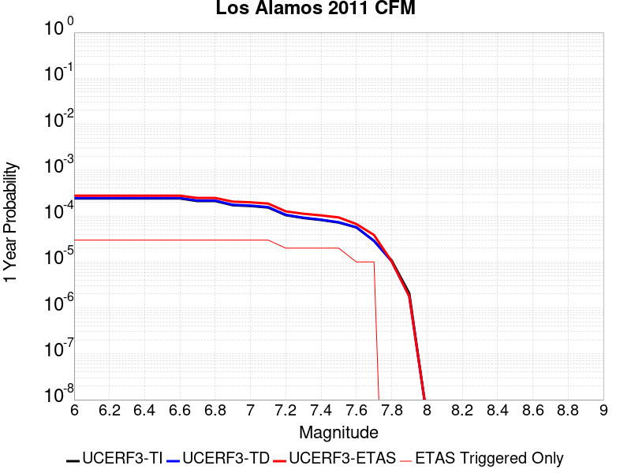 |  |

| Magnitude | 1 wk TI Prob | 1 wk TD Prob | 1 wk ETAS Prob | 1 wk ETAS/TD Gain | 1 wk ETAS Triggered Only | 1 mo TI Prob | 1 mo TD Prob | 1 mo ETAS Prob | 1 mo ETAS/TD Gain | 1 mo ETAS Triggered Only | 1 yr TI Prob | 1 yr TD Prob | 1 yr ETAS Prob | 1 yr ETAS/TD Gain | 1 yr ETAS Triggered Only | 10 yr TI Prob | 10 yr TD Prob | 10 yr ETAS Prob | 10 yr ETAS/TD Gain | 10 yr ETAS Triggered Only |
|-----|-----|-----|-----|-----|-----|-----|-----|-----|-----|-----|-----|-----|-----|-----|-----|-----|-----|-----|-----|-----|
| 6.0 | 4.6284417E-6 | 4.7517333E-6 | 1.4751686E-5 | 3.1044853 | 1.0E-5 | 1.9836029E-5 | 2.0364423E-5 | 3.036422E-5 | 1.4910425 | 1.0E-5 | 2.4147688E-4 | 2.479104E-4 | 2.7790296E-4 | 1.1209815 | 3.0E-5 | 0.0024121467 | 0.0024765125 | 0.0025064382 | 1.0120838 | 3.0E-5 |
| 6.1 | 4.6284417E-6 | 4.7517333E-6 | 1.4751686E-5 | 3.1044853 | 1.0E-5 | 1.9836029E-5 | 2.0364423E-5 | 3.036422E-5 | 1.4910425 | 1.0E-5 | 2.4147688E-4 | 2.479104E-4 | 2.7790296E-4 | 1.1209815 | 3.0E-5 | 0.0024121467 | 0.0024765125 | 0.0025064382 | 1.0120838 | 3.0E-5 |
| 6.2 | 4.6284417E-6 | 4.7517333E-6 | 1.4751686E-5 | 3.1044853 | 1.0E-5 | 1.9836029E-5 | 2.0364423E-5 | 3.036422E-5 | 1.4910425 | 1.0E-5 | 2.4147688E-4 | 2.479104E-4 | 2.7790296E-4 | 1.1209815 | 3.0E-5 | 0.0024121467 | 0.0024765125 | 0.0025064382 | 1.0120838 | 3.0E-5 |
| 6.3 | 4.6284417E-6 | 4.7517333E-6 | 1.4751686E-5 | 3.1044853 | 1.0E-5 | 1.9836029E-5 | 2.0364423E-5 | 3.036422E-5 | 1.4910425 | 1.0E-5 | 2.4147688E-4 | 2.479104E-4 | 2.7790296E-4 | 1.1209815 | 3.0E-5 | 0.0024121467 | 0.0024765125 | 0.0025064382 | 1.0120838 | 3.0E-5 |
| 6.4 | 4.6284417E-6 | 4.7517333E-6 | 1.4751686E-5 | 3.1044853 | 1.0E-5 | 1.9836029E-5 | 2.0364423E-5 | 3.036422E-5 | 1.4910425 | 1.0E-5 | 2.4147688E-4 | 2.479104E-4 | 2.7790296E-4 | 1.1209815 | 3.0E-5 | 0.0024121467 | 0.0024765125 | 0.0025064382 | 1.0120838 | 3.0E-5 |
| 6.5 | 4.6284417E-6 | 4.7517333E-6 | 1.4751686E-5 | 3.1044853 | 1.0E-5 | 1.9836029E-5 | 2.0364423E-5 | 3.036422E-5 | 1.4910425 | 1.0E-5 | 2.4147688E-4 | 2.479104E-4 | 2.7790296E-4 | 1.1209815 | 3.0E-5 | 0.0024121467 | 0.0024765125 | 0.0025064382 | 1.0120838 | 3.0E-5 |
| 6.6 | 4.6284417E-6 | 4.7517333E-6 | 1.4751686E-5 | 3.1044853 | 1.0E-5 | 1.9836029E-5 | 2.0364423E-5 | 3.036422E-5 | 1.4910425 | 1.0E-5 | 2.4147688E-4 | 2.479104E-4 | 2.7790296E-4 | 1.1209815 | 3.0E-5 | 0.0024121467 | 0.0024765125 | 0.0025064382 | 1.0120838 | 3.0E-5 |
| 6.7 | 4.062321E-6 | 4.166351E-6 | 1.41663095E-5 | 3.4001718 | 1.0E-5 | 1.7409831E-5 | 1.7855677E-5 | 2.7855498E-5 | 1.560036 | 1.0E-5 | 2.1194408E-4 | 2.1737268E-4 | 2.4736617E-4 | 1.1379818 | 3.0E-5 | 0.0021174205 | 0.0021717504 | 0.0022016852 | 1.0137837 | 3.0E-5 |
| 6.8 | 4.062321E-6 | 4.166351E-6 | 1.41663095E-5 | 3.4001718 | 1.0E-5 | 1.7409831E-5 | 1.7855677E-5 | 2.7855498E-5 | 1.560036 | 1.0E-5 | 2.1194408E-4 | 2.1737268E-4 | 2.4736617E-4 | 1.1379818 | 3.0E-5 | 0.0021174205 | 0.0021717504 | 0.0022016852 | 1.0137837 | 3.0E-5 |
| 6.9 | 3.2936077E-6 | 3.37296E-6 | 1.3372926E-5 | 3.964745 | 1.0E-5 | 1.4115385E-5 | 1.4455468E-5 | 2.4455323E-5 | 1.6917697 | 1.0E-5 | 1.7184127E-4 | 1.7598206E-4 | 2.0597677E-4 | 1.170442 | 3.0E-5 | 0.0017170844 | 0.0017585196 | 0.0017884668 | 1.0170298 | 3.0E-5 |
| 7.0 | 3.1687898E-6 | 3.2448177E-6 | 1.3244785E-5 | 4.081827 | 1.0E-5 | 1.3580457E-5 | 1.3906293E-5 | 2.3906154E-5 | 1.7190889 | 1.0E-5 | 1.6532952E-4 | 1.692969E-4 | 1.9929181E-4 | 1.1771735 | 3.0E-5 | 0.0016520657 | 0.0016917707 | 0.00172172 | 1.0177029 | 3.0E-5 |
| 7.1 | 2.9379228E-6 | 3.007328E-6 | 1.3007298E-5 | 4.325201 | 1.0E-5 | 1.25910365E-5 | 1.288849E-5 | 2.2888362E-5 | 1.775876 | 1.0E-5 | 1.5328509E-4 | 1.5690697E-4 | 1.8690227E-4 | 1.191166 | 3.0E-5 | 0.001531794 | 0.001568051 | 0.001598004 | 1.019102 | 3.0E-5 |
| 7.2 | 2.0020686E-6 | 2.041632E-6 | 1.2041612E-5 | 5.898032 | 1.0E-5 | 8.580266E-6 | 8.749822E-6 | 1.8749735E-5 | 2.1428704 | 1.0E-5 | 1.0445973E-4 | 1.0652392E-4 | 1.2652179E-4 | 1.1877313 | 2.0E-5 | 0.0010441064 | 0.001064733 | 0.0010847118 | 1.018764 | 2.0E-5 |
| 7.3 | 1.7364243E-6 | 1.7678824E-6 | 1.1767865E-5 | 6.6564746 | 1.0E-5 | 7.441797E-6 | 7.576617E-6 | 1.7576542E-5 | 2.3198402 | 1.0E-5 | 9.0600115E-5 | 9.224144E-5 | 1.1223959E-4 | 1.2168022 | 2.0E-5 | 9.0563187E-4 | 9.2203467E-4 | 9.4201625E-4 | 1.0216712 | 2.0E-5 |
| 7.4 | 1.5718434E-6 | 1.5983198E-6 | 1.1598304E-5 | 7.25656 | 1.0E-5 | 6.7364545E-6 | 6.8499244E-6 | 1.6849855E-5 | 2.45986 | 1.0E-5 | 8.201325E-5 | 8.339467E-5 | 1.03392995E-4 | 1.2398034 | 2.0E-5 | 8.198299E-4 | 8.3363673E-4 | 8.5362006E-4 | 1.0239713 | 2.0E-5 |
| 7.5 | 1.3841119E-6 | 1.4042814E-6 | 1.1404268E-5 | 8.12107 | 1.0E-5 | 5.9318945E-6 | 6.018335E-6 | 1.6018275E-5 | 2.6615791 | 1.0E-5 | 7.221842E-5 | 7.327079E-5 | 9.326933E-5 | 1.27294 | 2.0E-5 | 7.2194956E-4 | 7.3246926E-4 | 7.524546E-4 | 1.0272849 | 2.0E-5 |
| 7.6 | 1.0843726E-6 | 1.0934443E-6 | 1.1093433E-5 | 10.145404 | 1.0E-5 | 4.647303E-6 | 4.6861815E-6 | 1.4686135E-5 | 3.1339235 | 1.0E-5 | 5.6579443E-5 | 5.705279E-5 | 6.705222E-5 | 1.1752663 | 1.0E-5 | 5.656504E-4 | 5.70384E-4 | 5.8037834E-4 | 1.0175221 | 1.0E-5 |
| 7.7 | 5.544814E-7 | 5.501884E-7 | 1.0550183E-5 | 19.175581 | 1.0E-5 | 2.3763469E-6 | 2.3579482E-6 | 1.2357925E-5 | 5.2409654 | 1.0E-5 | 2.8931638E-5 | 2.8707644E-5 | 3.8707356E-5 | 1.3483293 | 1.0E-5 | 2.8927872E-4 | 2.870395E-4 | 2.9703663E-4 | 1.0348284 | 1.0E-5 |
| 7.8 | 2.0707465E-7 | 1.9778598E-7 | 1.9778598E-7 | 1.0 | 0.0 | 8.874625E-7 | 8.476539E-7 | 8.476539E-7 | 1.0 | 0.0 | 1.08048025E-5 | 1.0320137E-5 | 1.0320137E-5 | 1.0 | 0.0 | 1.0804277E-4 | 1.0319663E-4 | 1.0319663E-4 | 1.0 | 0.0 |
| 7.9 | 3.9821284E-8 | 3.4331528E-8 | 3.4331528E-8 | 1.0 | 0.0 | 1.7066264E-7 | 1.4713511E-7 | 1.4713511E-7 | 1.0 | 0.0 | 2.0778157E-6 | 1.7913685E-6 | 1.7913685E-6 | 1.0 | 0.0 | 2.0777963E-5 | 1.7913546E-5 | 1.7913546E-5 | 1.0 | 0.0 |
| 8.0 | 7.880441E-11 | 8.2353124E-11 | 8.2353124E-11 | 1.0 | 0.0 | 3.3773329E-10 | 3.52942E-10 | 3.52942E-10 | 1.0 | 0.0 | 4.1119033E-9 | 4.2970694E-9 | 4.2970694E-9 | 1.0 | 0.0 | 4.1119034E-8 | 4.2970694E-8 | 4.2970694E-8 | 1.0 | 0.0 |

## Cleghorn
*[(top)](#table-of-contents)*

| 1 Week | 1 Month | 1 Year | 10 Year |
|-----|-----|-----|-----|
|  |  |  |  |

| Magnitude | 1 wk TI Prob | 1 wk TD Prob | 1 wk ETAS Prob | 1 wk ETAS/TD Gain | 1 wk ETAS Triggered Only | 1 mo TI Prob | 1 mo TD Prob | 1 mo ETAS Prob | 1 mo ETAS/TD Gain | 1 mo ETAS Triggered Only | 1 yr TI Prob | 1 yr TD Prob | 1 yr ETAS Prob | 1 yr ETAS/TD Gain | 1 yr ETAS Triggered Only | 10 yr TI Prob | 10 yr TD Prob | 10 yr ETAS Prob | 10 yr ETAS/TD Gain | 10 yr ETAS Triggered Only |
|-----|-----|-----|-----|-----|-----|-----|-----|-----|-----|-----|-----|-----|-----|-----|-----|-----|-----|-----|-----|-----|
| 6.0 | 7.9267165E-6 | 9.831764E-6 | 1.9831667E-5 | 2.0171015 | 1.0E-5 | 3.39712E-5 | 4.2135514E-5 | 5.2135092E-5 | 1.2373195 | 1.0E-5 | 4.1352084E-4 | 5.1288976E-4 | 5.328795E-4 | 1.0389748 | 2.0E-5 | 0.004127522 | 0.005132214 | 0.0051620603 | 1.0058154 | 3.0E-5 |
| 6.1 | 7.9267165E-6 | 9.831764E-6 | 1.9831667E-5 | 2.0171015 | 1.0E-5 | 3.39712E-5 | 4.2135514E-5 | 5.2135092E-5 | 1.2373195 | 1.0E-5 | 4.1352084E-4 | 5.1288976E-4 | 5.328795E-4 | 1.0389748 | 2.0E-5 | 0.004127522 | 0.005132214 | 0.0051620603 | 1.0058154 | 3.0E-5 |
| 6.2 | 7.9267165E-6 | 9.831764E-6 | 1.9831667E-5 | 2.0171015 | 1.0E-5 | 3.39712E-5 | 4.2135514E-5 | 5.2135092E-5 | 1.2373195 | 1.0E-5 | 4.1352084E-4 | 5.1288976E-4 | 5.328795E-4 | 1.0389748 | 2.0E-5 | 0.004127522 | 0.005132214 | 0.0051620603 | 1.0058154 | 3.0E-5 |
| 6.3 | 7.9267165E-6 | 9.831764E-6 | 1.9831667E-5 | 2.0171015 | 1.0E-5 | 3.39712E-5 | 4.2135514E-5 | 5.2135092E-5 | 1.2373195 | 1.0E-5 | 4.1352084E-4 | 5.1288976E-4 | 5.328795E-4 | 1.0389748 | 2.0E-5 | 0.004127522 | 0.005132214 | 0.0051620603 | 1.0058154 | 3.0E-5 |
| 6.4 | 4.3445207E-6 | 6.0916254E-6 | 1.6091564E-5 | 2.641588 | 1.0E-5 | 1.8619241E-5 | 2.6106709E-5 | 3.610645E-5 | 1.3830333 | 1.0E-5 | 2.2666567E-4 | 3.1780385E-4 | 3.2780066E-4 | 1.031456 | 1.0E-5 | 0.0022643462 | 0.0031877246 | 0.0031976928 | 1.003127 | 1.0E-5 |
| 6.5 | 4.3445207E-6 | 6.0916254E-6 | 1.6091564E-5 | 2.641588 | 1.0E-5 | 1.8619241E-5 | 2.6106709E-5 | 3.610645E-5 | 1.3830333 | 1.0E-5 | 2.2666567E-4 | 3.1780385E-4 | 3.2780066E-4 | 1.031456 | 1.0E-5 | 0.0022643462 | 0.0031877246 | 0.0031976928 | 1.003127 | 1.0E-5 |
| 6.6 | 4.040109E-6 | 5.774033E-6 | 1.5773976E-5 | 2.7318816 | 1.0E-5 | 1.7314638E-5 | 2.4745626E-5 | 3.474538E-5 | 1.4041018 | 1.0E-5 | 2.1078532E-4 | 3.0123728E-4 | 3.1123427E-4 | 1.0331864 | 1.0E-5 | 0.002105855 | 0.0030225143 | 0.003032484 | 1.0032985 | 1.0E-5 |
| 6.7 | 3.3632055E-6 | 5.06753E-6 | 1.5067479E-5 | 2.9733381 | 1.0E-5 | 1.4413658E-5 | 2.1717806E-5 | 3.1717587E-5 | 1.4604417 | 1.0E-5 | 1.7547216E-4 | 2.643825E-4 | 2.7437988E-4 | 1.037814 | 1.0E-5 | 0.0017533366 | 0.0026548486 | 0.002664822 | 1.0037566 | 1.0E-5 |
| 6.8 | 3.2902772E-6 | 4.9894375E-6 | 1.4989388E-5 | 3.004224 | 1.0E-5 | 1.4101111E-5 | 2.138313E-5 | 3.1382915E-5 | 1.4676484 | 1.0E-5 | 1.716675E-4 | 2.6030882E-4 | 2.7030622E-4 | 1.0384059 | 1.0E-5 | 0.0017153495 | 0.0026142076 | 0.0026241813 | 1.0038153 | 1.0E-5 |
| 6.9 | 3.031547E-6 | 4.6911987E-6 | 1.4691152E-5 | 3.1316414 | 1.0E-5 | 1.299228E-5 | 2.0104984E-5 | 3.0104784E-5 | 1.4973791 | 1.0E-5 | 1.5816953E-4 | 2.4475096E-4 | 2.547485E-4 | 1.0408479 | 1.0E-5 | 0.00158057 | 0.0024589805 | 0.002468956 | 1.0040567 | 1.0E-5 |
| 7.0 | 2.8259715E-6 | 4.3707637E-6 | 1.437072E-5 | 3.2879195 | 1.0E-5 | 1.211125E-5 | 1.8731711E-5 | 2.8731525E-5 | 1.533844 | 1.0E-5 | 1.4744449E-4 | 2.2803496E-4 | 2.3803268E-4 | 1.0438429 | 1.0E-5 | 0.001473467 | 0.0022921748 | 0.0023021519 | 1.0043527 | 1.0E-5 |
| 7.1 | 2.5962665E-6 | 4.065983E-6 | 1.4065942E-5 | 3.45942 | 1.0E-5 | 1.1126809E-5 | 1.7425526E-5 | 2.7425353E-5 | 1.5738608 | 1.0E-5 | 1.3546048E-4 | 2.1213535E-4 | 2.2213323E-4 | 1.0471298 | 1.0E-5 | 0.0013537793 | 0.0021334959 | 0.0021434745 | 1.0046772 | 1.0E-5 |
| 7.2 | 2.3247253E-6 | 3.6765352E-6 | 1.3676498E-5 | 3.719942 | 1.0E-5 | 9.96307E-6 | 1.5756486E-5 | 2.5756328E-5 | 1.6346493 | 1.0E-5 | 1.21293626E-4 | 1.9181852E-4 | 2.018166E-4 | 1.0521226 | 1.0E-5 | 0.0012122744 | 0.0019307166 | 0.0019406972 | 1.0051694 | 1.0E-5 |
| 7.3 | 2.056928E-6 | 3.235253E-6 | 3.235253E-6 | 1.0 | 0.0 | 8.815376E-6 | 1.3865297E-5 | 1.3865297E-5 | 1.0 | 0.0 | 1.0732192E-4 | 1.6879707E-4 | 1.6879707E-4 | 1.0 | 0.0 | 0.001072701 | 0.0017009423 | 0.0017009423 | 1.0 | 0.0 |
| 7.4 | 1.8055999E-6 | 2.8256538E-6 | 2.8256538E-6 | 1.0 | 0.0 | 7.738263E-6 | 1.210989E-5 | 1.210989E-5 | 1.0 | 0.0 | 9.4209274E-5 | 1.4742807E-4 | 1.4742807E-4 | 1.0 | 0.0 | 9.4169343E-4 | 0.0014876705 | 0.0014876705 | 1.0 | 0.0 |
| 7.5 | 1.4683443E-6 | 2.4248943E-6 | 2.4248943E-6 | 1.0 | 0.0 | 6.292889E-6 | 1.0392363E-5 | 1.0392363E-5 | 1.0 | 0.0 | 7.661323E-5 | 1.2651978E-4 | 1.2651978E-4 | 1.0 | 0.0 | 7.658682E-4 | 0.0012788812 | 0.0012788812 | 1.0 | 0.0 |
| 7.6 | 9.804088E-7 | 1.9004091E-6 | 1.9004091E-6 | 1.0 | 0.0 | 4.201745E-6 | 8.144585E-6 | 8.144585E-6 | 1.0 | 0.0 | 5.1155046E-5 | 9.915586E-5 | 9.915586E-5 | 1.0 | 0.0 | 5.114327E-4 | 0.0010055583 | 0.0010055583 | 1.0 | 0.0 |
| 7.7 | 7.3434086E-7 | 1.6285549E-6 | 1.6285549E-6 | 1.0 | 0.0 | 3.1471714E-6 | 6.9795024E-6 | 6.9795024E-6 | 1.0 | 0.0 | 3.831614E-5 | 8.4972155E-5 | 8.4972155E-5 | 1.0 | 0.0 | 3.8309532E-4 | 8.6387293E-4 | 8.6387293E-4 | 1.0 | 0.0 |
| 7.8 | 6.434184E-7 | 1.5221389E-6 | 1.5221389E-6 | 1.0 | 0.0 | 2.7575045E-6 | 6.523436E-6 | 6.523436E-6 | 1.0 | 0.0 | 3.35721E-5 | 7.9419966E-5 | 7.9419966E-5 | 1.0 | 0.0 | 3.3567028E-4 | 8.080443E-4 | 8.080443E-4 | 1.0 | 0.0 |
| 7.9 | 3.4943926E-7 | 7.5750586E-7 | 7.5750586E-7 | 1.0 | 0.0 | 1.497596E-6 | 3.2464498E-6 | 3.2464498E-6 | 1.0 | 0.0 | 1.8233079E-5 | 3.9524817E-5 | 3.9524817E-5 | 1.0 | 0.0 | 1.8231584E-4 | 4.0401975E-4 | 4.0401975E-4 | 1.0 | 0.0 |
| 8.0 | 6.717524E-8 | 5.837515E-8 | 5.837515E-8 | 1.0 | 0.0 | 2.8789387E-7 | 2.501792E-7 | 2.501792E-7 | 1.0 | 0.0 | 3.505102E-6 | 3.0459275E-6 | 3.0459275E-6 | 1.0 | 0.0 | 3.5050467E-5 | 3.2751934E-5 | 3.2751934E-5 | 1.0 | 0.0 |
| 8.1 | 3.1984914E-8 | 1.2949885E-8 | 1.2949885E-8 | 1.0 | 0.0 | 1.370782E-7 | 5.549951E-8 | 5.549951E-8 | 1.0 | 0.0 | 1.6689258E-6 | 6.757063E-7 | 6.757063E-7 | 1.0 | 0.0 | 1.6689133E-5 | 7.741151E-6 | 7.741151E-6 | 1.0 | 0.0 |
| 8.2 | 1.21887656E-8 | 3.6471115E-9 | 3.6471115E-9 | 1.0 | 0.0 | 5.2237567E-8 | 1.563048E-8 | 1.563048E-8 | 1.0 | 0.0 | 6.359922E-7 | 1.9030107E-7 | 1.9030107E-7 | 1.0 | 0.0 | 6.3599036E-6 | 2.245849E-6 | 2.245849E-6 | 1.0 | 0.0 |

## Hayward (So) 2011 CFM
*[(top)](#table-of-contents)*

| 1 Week | 1 Month | 1 Year | 10 Year |
|-----|-----|-----|-----|
| 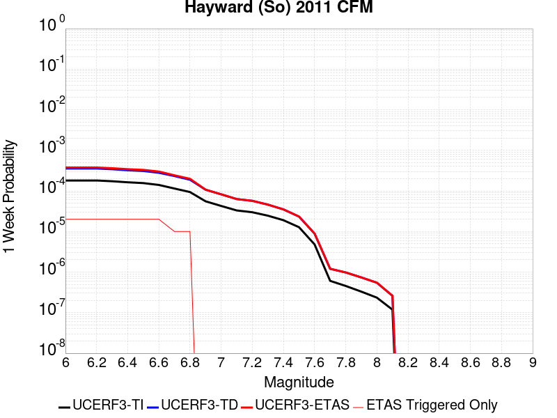 |  |  |  |

| Magnitude | 1 wk TI Prob | 1 wk TD Prob | 1 wk ETAS Prob | 1 wk ETAS/TD Gain | 1 wk ETAS Triggered Only | 1 mo TI Prob | 1 mo TD Prob | 1 mo ETAS Prob | 1 mo ETAS/TD Gain | 1 mo ETAS Triggered Only | 1 yr TI Prob | 1 yr TD Prob | 1 yr ETAS Prob | 1 yr ETAS/TD Gain | 1 yr ETAS Triggered Only | 10 yr TI Prob | 10 yr TD Prob | 10 yr ETAS Prob | 10 yr ETAS/TD Gain | 10 yr ETAS Triggered Only |
|-----|-----|-----|-----|-----|-----|-----|-----|-----|-----|-----|-----|-----|-----|-----|-----|-----|-----|-----|-----|-----|
| 6.0 | 1.8091932E-4 | 3.570673E-4 | 3.7706015E-4 | 1.0559919 | 2.0E-5 | 7.751381E-4 | 0.0015294008 | 0.0015493702 | 1.013057 | 2.0E-5 | 0.00939654 | 0.018463885 | 0.018483516 | 1.0010632 | 2.0E-5 | 0.090090066 | 0.1667085 | 0.16673349 | 1.00015 | 3.0E-5 |
| 6.1 | 1.8091932E-4 | 3.570673E-4 | 3.7706015E-4 | 1.0559919 | 2.0E-5 | 7.751381E-4 | 0.0015294008 | 0.0015493702 | 1.013057 | 2.0E-5 | 0.00939654 | 0.018463885 | 0.018483516 | 1.0010632 | 2.0E-5 | 0.090090066 | 0.1667085 | 0.16673349 | 1.00015 | 3.0E-5 |
| 6.2 | 1.8091932E-4 | 3.570673E-4 | 3.7706015E-4 | 1.0559919 | 2.0E-5 | 7.751381E-4 | 0.0015294008 | 0.0015493702 | 1.013057 | 2.0E-5 | 0.00939654 | 0.018463885 | 0.018483516 | 1.0010632 | 2.0E-5 | 0.090090066 | 0.1667085 | 0.16673349 | 1.00015 | 3.0E-5 |
| 6.3 | 1.7322872E-4 | 3.4263515E-4 | 3.626283E-4 | 1.0583512 | 2.0E-5 | 7.4219756E-4 | 0.0014676197 | 0.0014875903 | 1.0136075 | 2.0E-5 | 0.0089988755 | 0.017724147 | 0.017743792 | 1.0011084 | 2.0E-5 | 0.08643075 | 0.16065954 | 0.16068472 | 1.0001568 | 3.0E-5 |
| 6.4 | 1.6334097E-4 | 3.2345165E-4 | 3.434452E-4 | 1.061813 | 2.0E-5 | 6.998449E-4 | 0.0013854936 | 0.0014054659 | 1.0144153 | 2.0E-5 | 0.008487372 | 0.016739927 | 0.016759591 | 1.0011748 | 2.0E-5 | 0.081704415 | 0.15256606 | 0.15259148 | 1.0001667 | 3.0E-5 |
| 6.5 | 1.5600289E-4 | 3.101982E-4 | 3.3019198E-4 | 1.0644549 | 2.0E-5 | 6.684125E-4 | 0.0013287518 | 0.0013487253 | 1.0150317 | 2.0E-5 | 0.008107598 | 0.016059443 | 0.016079122 | 1.0012254 | 2.0E-5 | 0.078181036 | 0.14684291 | 0.1468685 | 1.0001743 | 3.0E-5 |
| 6.6 | 1.4046066E-4 | 2.8034003E-4 | 3.0033445E-4 | 1.071322 | 2.0E-5 | 6.018354E-4 | 0.0012009109 | 0.0012208868 | 1.016634 | 2.0E-5 | 0.0073027555 | 0.014524571 | 0.01454428 | 1.001357 | 2.0E-5 | 0.07067384 | 0.13393044 | 0.13395643 | 1.000194 | 3.0E-5 |
| 6.7 | 1.14696966E-4 | 2.3272466E-4 | 2.4272234E-4 | 1.0429592 | 1.0E-5 | 4.914658E-4 | 9.970153E-4 | 0.0010070052 | 1.0100199 | 1.0E-5 | 0.0059671924 | 0.012072163 | 0.012082042 | 1.0008184 | 1.0E-5 | 0.058094822 | 0.11274141 | 0.11275916 | 1.0001574 | 2.0E-5 |
| 6.8 | 9.3874296E-5 | 1.8862431E-4 | 1.9862242E-4 | 1.0530055 | 1.0E-5 | 4.0225635E-4 | 8.081431E-4 | 8.1813504E-4 | 1.012364 | 1.0E-5 | 0.0048864787 | 0.009795489 | 0.009805392 | 1.0010109 | 1.0E-5 | 0.047804173 | 0.092592984 | 0.092611134 | 1.000196 | 2.0E-5 |
| 6.9 | 5.551852E-5 | 1.0729875E-4 | 1.0729875E-4 | 1.0 | 0.0 | 2.3791482E-4 | 4.5977137E-4 | 4.5977137E-4 | 1.0 | 0.0 | 0.0028927654 | 0.005583468 | 0.005583468 | 1.0 | 0.0 | 0.028553981 | 0.054246075 | 0.05425553 | 1.0001744 | 1.0E-5 |
| 7.0 | 4.2662363E-5 | 8.246792E-5 | 8.246792E-5 | 1.0 | 0.0 | 1.8282588E-4 | 3.5338648E-4 | 3.5338648E-4 | 1.0 | 0.0 | 0.0022236328 | 0.0042940658 | 0.0042940658 | 1.0 | 0.0 | 0.022015138 | 0.04206509 | 0.04207467 | 1.0002277 | 1.0E-5 |
| 7.1 | 3.305886E-5 | 6.302183E-5 | 6.302183E-5 | 1.0 | 0.0 | 1.4167312E-4 | 2.7006568E-4 | 2.7006568E-4 | 1.0 | 0.0 | 0.0017235056 | 0.003283111 | 0.003283111 | 1.0 | 0.0 | 0.017101998 | 0.032453902 | 0.03246358 | 1.0002981 | 1.0E-5 |
| 7.2 | 2.9856887E-5 | 5.701622E-5 | 5.701622E-5 | 1.0 | 0.0 | 1.2795182E-4 | 2.4433242E-4 | 2.4433242E-4 | 1.0 | 0.0 | 0.0015567001 | 0.0029707062 | 0.0029707062 | 1.0 | 0.0 | 0.015458403 | 0.029454801 | 0.029464506 | 1.0003295 | 1.0E-5 |
| 7.3 | 2.4559737E-5 | 4.599286E-5 | 4.599286E-5 | 1.0 | 0.0 | 1.0525176E-4 | 1.9709744E-4 | 1.9709744E-4 | 1.0 | 0.0 | 0.0012806869 | 0.0023970334 | 0.0023970334 | 1.0 | 0.0 | 0.012733313 | 0.023858516 | 0.023868278 | 1.0004091 | 1.0E-5 |
| 7.4 | 1.9002231E-5 | 3.505084E-5 | 3.505084E-5 | 1.0 | 0.0 | 8.143559E-5 | 1.502093E-4 | 1.502093E-4 | 1.0 | 0.0 | 9.910273E-4 | 0.001827274 | 0.001827274 | 1.0 | 0.0 | 0.009866194 | 0.018258808 | 0.018258808 | 1.0 | 0.0 |
| 7.5 | 1.2783333E-5 | 2.3331182E-5 | 2.3331182E-5 | 1.0 | 0.0 | 5.4784563E-5 | 9.998698E-5 | 9.998698E-5 | 1.0 | 0.0 | 6.667979E-4 | 0.0012166675 | 0.0012166675 | 1.0 | 0.0 | 0.006648007 | 0.012209443 | 0.012209443 | 1.0 | 0.0 |
| 7.6 | 4.8149627E-6 | 8.888056E-6 | 8.888056E-6 | 1.0 | 0.0 | 2.063539E-5 | 3.8091122E-5 | 3.8091122E-5 | 1.0 | 0.0 | 2.5120692E-4 | 4.6366194E-4 | 4.6366194E-4 | 1.0 | 0.0 | 0.0025092314 | 0.0046805087 | 0.0046805087 | 1.0 | 0.0 |
| 7.7 | 6.0838227E-7 | 1.205754E-6 | 1.205754E-6 | 1.0 | 0.0 | 2.6073499E-6 | 5.1675065E-6 | 5.1675065E-6 | 1.0 | 0.0 | 3.174402E-5 | 6.291258E-5 | 6.291258E-5 | 1.0 | 0.0 | 3.1739488E-4 | 6.5296254E-4 | 6.5296254E-4 | 1.0 | 0.0 |
| 7.8 | 4.5542808E-7 | 9.792941E-7 | 9.792941E-7 | 1.0 | 0.0 | 1.9518332E-6 | 4.196968E-6 | 4.196968E-6 | 1.0 | 0.0 | 2.376331E-5 | 5.109689E-5 | 5.109689E-5 | 1.0 | 0.0 | 2.3760769E-4 | 5.321693E-4 | 5.321693E-4 | 1.0 | 0.0 |
| 7.9 | 3.3016747E-7 | 7.3869535E-7 | 7.3869535E-7 | 1.0 | 0.0 | 1.4150027E-6 | 3.1658333E-6 | 3.1658333E-6 | 1.0 | 0.0 | 1.7227521E-5 | 3.854334E-5 | 3.854334E-5 | 1.0 | 0.0 | 1.7226185E-4 | 3.9932923E-4 | 3.9932923E-4 | 1.0 | 0.0 |
| 8.0 | 2.347038E-7 | 5.471963E-7 | 5.471963E-7 | 1.0 | 0.0 | 1.0058731E-6 | 2.3451248E-6 | 2.3451248E-6 | 1.0 | 0.0 | 1.2246436E-5 | 2.8551523E-5 | 2.8551523E-5 | 1.0 | 0.0 | 1.2245761E-4 | 2.9357258E-4 | 2.9357258E-4 | 1.0 | 0.0 |
| 8.1 | 1.18822804E-7 | 2.6060948E-7 | 2.6060948E-7 | 1.0 | 0.0 | 5.092405E-7 | 1.1168972E-6 | 1.1168972E-6 | 1.0 | 0.0 | 6.1999854E-6 | 1.359814E-5 | 1.359814E-5 | 1.0 | 0.0 | 6.199812E-5 | 1.3918082E-4 | 1.3918082E-4 | 1.0 | 0.0 |

## Elsinore (Coyote Mountains)
*[(top)](#table-of-contents)*

| 1 Week | 1 Month | 1 Year | 10 Year |
|-----|-----|-----|-----|
|  |  |  | 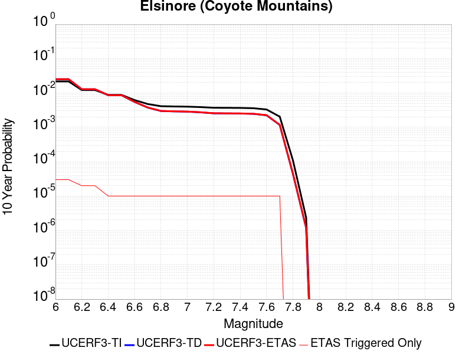 |

| Magnitude | 1 wk TI Prob | 1 wk TD Prob | 1 wk ETAS Prob | 1 wk ETAS/TD Gain | 1 wk ETAS Triggered Only | 1 mo TI Prob | 1 mo TD Prob | 1 mo ETAS Prob | 1 mo ETAS/TD Gain | 1 mo ETAS Triggered Only | 1 yr TI Prob | 1 yr TD Prob | 1 yr ETAS Prob | 1 yr ETAS/TD Gain | 1 yr ETAS Triggered Only | 10 yr TI Prob | 10 yr TD Prob | 10 yr ETAS Prob | 10 yr ETAS/TD Gain | 10 yr ETAS Triggered Only |
|-----|-----|-----|-----|-----|-----|-----|-----|-----|-----|-----|-----|-----|-----|-----|-----|-----|-----|-----|-----|-----|
| 6.0 | 4.20513E-5 | 4.8630944E-5 | 4.8630944E-5 | 1.0 | 0.0 | 1.8020741E-4 | 2.0840492E-4 | 2.1840284E-4 | 1.0479735 | 1.0E-5 | 0.0021918174 | 0.0025349057 | 0.0025448804 | 1.0039349 | 1.0E-5 | 0.021703249 | 0.025111204 | 0.02514045 | 1.0011647 | 3.0E-5 |
| 6.1 | 4.20513E-5 | 4.8630944E-5 | 4.8630944E-5 | 1.0 | 0.0 | 1.8020741E-4 | 2.0840492E-4 | 2.1840284E-4 | 1.0479735 | 1.0E-5 | 0.0021918174 | 0.0025349057 | 0.0025448804 | 1.0039349 | 1.0E-5 | 0.021703249 | 0.025111204 | 0.02514045 | 1.0011647 | 3.0E-5 |
| 6.2 | 2.3413893E-5 | 2.4695422E-5 | 2.4695422E-5 | 1.0 | 0.0 | 1.0034139E-4 | 1.0583377E-4 | 1.0583377E-4 | 1.0 | 0.0 | 0.0012209718 | 0.0012878523 | 0.0012878523 | 1.0 | 0.0 | 0.012142851 | 0.012812569 | 0.012832313 | 1.001541 | 2.0E-5 |
| 6.3 | 2.3413893E-5 | 2.4695422E-5 | 2.4695422E-5 | 1.0 | 0.0 | 1.0034139E-4 | 1.0583377E-4 | 1.0583377E-4 | 1.0 | 0.0 | 0.0012209718 | 0.0012878523 | 0.0012878523 | 1.0 | 0.0 | 0.012142851 | 0.012812569 | 0.012832313 | 1.001541 | 2.0E-5 |
| 6.4 | 1.6894814E-5 | 1.6568214E-5 | 1.6568214E-5 | 1.0 | 0.0 | 7.240433E-5 | 7.100491E-5 | 7.100491E-5 | 1.0 | 0.0 | 8.811662E-4 | 8.641788E-4 | 8.641788E-4 | 1.0 | 0.0 | 0.0087768035 | 0.008611842 | 0.008621756 | 1.0011512 | 1.0E-5 |
| 6.5 | 1.6894814E-5 | 1.6568214E-5 | 1.6568214E-5 | 1.0 | 0.0 | 7.240433E-5 | 7.100491E-5 | 7.100491E-5 | 1.0 | 0.0 | 8.811662E-4 | 8.641788E-4 | 8.641788E-4 | 1.0 | 0.0 | 0.0087768035 | 0.008611842 | 0.008621756 | 1.0011512 | 1.0E-5 |
| 6.6 | 1.1910969E-5 | 1.0530538E-5 | 1.0530538E-5 | 1.0 | 0.0 | 5.1046012E-5 | 4.513017E-5 | 4.513017E-5 | 1.0 | 0.0 | 6.21308E-4 | 5.493346E-4 | 5.493346E-4 | 1.0 | 0.0 | 0.0061957375 | 0.0054810685 | 0.0054910136 | 1.0018145 | 1.0E-5 |
| 6.7 | 9.1486E-6 | 7.2026473E-6 | 7.2026473E-6 | 1.0 | 0.0 | 3.9207694E-5 | 3.0868145E-5 | 3.0868145E-5 | 1.0 | 0.0 | 4.7724912E-4 | 3.7575865E-4 | 3.7575865E-4 | 1.0 | 0.0 | 0.0047622547 | 0.0037516125 | 0.0037615749 | 1.0026555 | 1.0E-5 |
| 6.8 | 7.90441E-6 | 5.7288153E-6 | 5.7288153E-6 | 1.0 | 0.0 | 3.3875604E-5 | 2.4551842E-5 | 2.4551842E-5 | 1.0 | 0.0 | 4.1235742E-4 | 2.9887896E-4 | 2.9887896E-4 | 1.0 | 0.0 | 0.0041159308 | 0.0029848986 | 0.0029948687 | 1.0033402 | 1.0E-5 |
| 6.9 | 7.77015E-6 | 5.5827695E-6 | 5.5827695E-6 | 1.0 | 0.0 | 3.3300217E-5 | 2.3925944E-5 | 2.3925944E-5 | 1.0 | 0.0 | 4.0535472E-4 | 2.912607E-4 | 2.912607E-4 | 1.0 | 0.0 | 0.004046161 | 0.0029089167 | 0.0029188877 | 1.0034277 | 1.0E-5 |
| 7.0 | 7.675798E-6 | 5.4796283E-6 | 5.4796283E-6 | 1.0 | 0.0 | 3.289586E-5 | 2.3483917E-5 | 2.3483917E-5 | 1.0 | 0.0 | 4.004335E-4 | 2.8588044E-4 | 2.8588044E-4 | 1.0 | 0.0 | 0.003997127 | 0.0028552532 | 0.0028652246 | 1.0034924 | 1.0E-5 |
| 7.1 | 7.447814E-6 | 5.2385003E-6 | 5.2385003E-6 | 1.0 | 0.0 | 3.191881E-5 | 2.245053E-5 | 2.245053E-5 | 1.0 | 0.0 | 3.8854225E-4 | 2.7330214E-4 | 2.7330214E-4 | 1.0 | 0.0 | 0.003878636 | 0.0027297847 | 0.0027397575 | 1.0036533 | 1.0E-5 |
| 7.2 | 7.128185E-6 | 4.905146E-6 | 4.905146E-6 | 1.0 | 0.0 | 3.0549007E-5 | 2.1021891E-5 | 2.1021891E-5 | 1.0 | 0.0 | 3.7187067E-4 | 2.5591266E-4 | 2.5591266E-4 | 1.0 | 0.0 | 0.00371249 | 0.002556298 | 0.0025662724 | 1.003902 | 1.0E-5 |
| 7.3 | 7.0913875E-6 | 4.873821E-6 | 4.873821E-6 | 1.0 | 0.0 | 3.0391306E-5 | 2.0887644E-5 | 2.0887644E-5 | 1.0 | 0.0 | 3.6995133E-4 | 2.542786E-4 | 2.542786E-4 | 1.0 | 0.0 | 0.0036933604 | 0.0025399947 | 0.0025499694 | 1.003927 | 1.0E-5 |
| 7.4 | 7.051521E-6 | 4.837673E-6 | 4.837673E-6 | 1.0 | 0.0 | 3.0220453E-5 | 2.0732725E-5 | 2.0732725E-5 | 1.0 | 0.0 | 3.6787192E-4 | 2.5239287E-4 | 2.5239287E-4 | 1.0 | 0.0 | 0.0036726352 | 0.0025211805 | 0.0025311552 | 1.0039564 | 1.0E-5 |
| 7.5 | 6.910666E-6 | 4.7332255E-6 | 4.7332255E-6 | 1.0 | 0.0 | 2.9616802E-5 | 2.02851E-5 | 2.02851E-5 | 1.0 | 0.0 | 3.605249E-4 | 2.4694428E-4 | 2.4694428E-4 | 1.0 | 0.0 | 0.0035994058 | 0.002466817 | 0.0024767923 | 1.0040438 | 1.0E-5 |
| 7.6 | 6.341753E-6 | 4.306345E-6 | 4.306345E-6 | 1.0 | 0.0 | 2.7178658E-5 | 1.8455641E-5 | 1.8455641E-5 | 1.0 | 0.0 | 3.3084993E-4 | 2.2467543E-4 | 2.2467543E-4 | 1.0 | 0.0 | 0.0033035777 | 0.002244598 | 0.0022545755 | 1.0044452 | 1.0E-5 |
| 7.7 | 3.9205916E-6 | 2.2437468E-6 | 2.2437468E-6 | 1.0 | 0.0 | 1.6802427E-5 | 9.616027E-6 | 9.616027E-6 | 1.0 | 0.0 | 2.0455034E-4 | 1.17069576E-4 | 1.17069576E-4 | 1.0 | 0.0 | 0.0020436216 | 0.001170152 | 0.0011801403 | 1.0085359 | 1.0E-5 |
| 7.8 | 2.0846227E-7 | 8.4853966E-8 | 8.4853966E-8 | 1.0 | 0.0 | 8.9340944E-7 | 3.6365984E-7 | 3.6365984E-7 | 1.0 | 0.0 | 1.0877206E-5 | 4.427553E-6 | 4.427553E-6 | 1.0 | 0.0 | 1.0876673E-4 | 4.4274973E-5 | 4.4274973E-5 | 1.0 | 0.0 |
| 7.9 | 4.4969806E-9 | 2.269088E-9 | 2.269088E-9 | 1.0 | 0.0 | 1.9272775E-8 | 9.724664E-9 | 9.724664E-9 | 1.0 | 0.0 | 2.3464601E-7 | 1.1839777E-7 | 1.1839777E-7 | 1.0 | 0.0 | 2.3464577E-6 | 1.1839772E-6 | 1.1839772E-6 | 1.0 | 0.0 |

## Sisar
*[(top)](#table-of-contents)*

| 1 Week | 1 Month | 1 Year | 10 Year |
|-----|-----|-----|-----|
|  |  |  |  |

| Magnitude | 1 wk TI Prob | 1 wk TD Prob | 1 wk ETAS Prob | 1 wk ETAS/TD Gain | 1 wk ETAS Triggered Only | 1 mo TI Prob | 1 mo TD Prob | 1 mo ETAS Prob | 1 mo ETAS/TD Gain | 1 mo ETAS Triggered Only | 1 yr TI Prob | 1 yr TD Prob | 1 yr ETAS Prob | 1 yr ETAS/TD Gain | 1 yr ETAS Triggered Only | 10 yr TI Prob | 10 yr TD Prob | 10 yr ETAS Prob | 10 yr ETAS/TD Gain | 10 yr ETAS Triggered Only |
|-----|-----|-----|-----|-----|-----|-----|-----|-----|-----|-----|-----|-----|-----|-----|-----|-----|-----|-----|-----|-----|
| 6.0 | 4.544193E-6 | 3.8396115E-6 | 1.38395735E-5 | 3.6044202 | 1.0E-5 | 1.9474966E-5 | 1.6455377E-5 | 2.645521E-5 | 1.6076941 | 1.0E-5 | 2.3708193E-4 | 2.0032612E-4 | 2.1032411E-4 | 1.0499086 | 1.0E-5 | 0.0023682916 | 0.002001489 | 0.0020314292 | 1.0149589 | 3.0E-5 |
| 6.1 | 4.544193E-6 | 3.8396115E-6 | 1.38395735E-5 | 3.6044202 | 1.0E-5 | 1.9474966E-5 | 1.6455377E-5 | 2.645521E-5 | 1.6076941 | 1.0E-5 | 2.3708193E-4 | 2.0032612E-4 | 2.1032411E-4 | 1.0499086 | 1.0E-5 | 0.0023682916 | 0.002001489 | 0.0020314292 | 1.0149589 | 3.0E-5 |
| 6.2 | 4.544193E-6 | 3.8396115E-6 | 1.38395735E-5 | 3.6044202 | 1.0E-5 | 1.9474966E-5 | 1.6455377E-5 | 2.645521E-5 | 1.6076941 | 1.0E-5 | 2.3708193E-4 | 2.0032612E-4 | 2.1032411E-4 | 1.0499086 | 1.0E-5 | 0.0023682916 | 0.002001489 | 0.0020314292 | 1.0149589 | 3.0E-5 |
| 6.3 | 4.544193E-6 | 3.8396115E-6 | 1.38395735E-5 | 3.6044202 | 1.0E-5 | 1.9474966E-5 | 1.6455377E-5 | 2.645521E-5 | 1.6076941 | 1.0E-5 | 2.3708193E-4 | 2.0032612E-4 | 2.1032411E-4 | 1.0499086 | 1.0E-5 | 0.0023682916 | 0.002001489 | 0.0020314292 | 1.0149589 | 3.0E-5 |
| 6.4 | 4.544193E-6 | 3.8396115E-6 | 1.38395735E-5 | 3.6044202 | 1.0E-5 | 1.9474966E-5 | 1.6455377E-5 | 2.645521E-5 | 1.6076941 | 1.0E-5 | 2.3708193E-4 | 2.0032612E-4 | 2.1032411E-4 | 1.0499086 | 1.0E-5 | 0.0023682916 | 0.002001489 | 0.0020314292 | 1.0149589 | 3.0E-5 |
| 6.5 | 4.544193E-6 | 3.8396115E-6 | 1.38395735E-5 | 3.6044202 | 1.0E-5 | 1.9474966E-5 | 1.6455377E-5 | 2.645521E-5 | 1.6076941 | 1.0E-5 | 2.3708193E-4 | 2.0032612E-4 | 2.1032411E-4 | 1.0499086 | 1.0E-5 | 0.0023682916 | 0.002001489 | 0.0020314292 | 1.0149589 | 3.0E-5 |
| 6.6 | 4.544193E-6 | 3.8396115E-6 | 1.38395735E-5 | 3.6044202 | 1.0E-5 | 1.9474966E-5 | 1.6455377E-5 | 2.645521E-5 | 1.6076941 | 1.0E-5 | 2.3708193E-4 | 2.0032612E-4 | 2.1032411E-4 | 1.0499086 | 1.0E-5 | 0.0023682916 | 0.002001489 | 0.0020314292 | 1.0149589 | 3.0E-5 |
| 6.7 | 4.544193E-6 | 3.8396115E-6 | 1.38395735E-5 | 3.6044202 | 1.0E-5 | 1.9474966E-5 | 1.6455377E-5 | 2.645521E-5 | 1.6076941 | 1.0E-5 | 2.3708193E-4 | 2.0032612E-4 | 2.1032411E-4 | 1.0499086 | 1.0E-5 | 0.0023682916 | 0.002001489 | 0.0020314292 | 1.0149589 | 3.0E-5 |
| 6.8 | 4.544193E-6 | 3.8396115E-6 | 1.38395735E-5 | 3.6044202 | 1.0E-5 | 1.9474966E-5 | 1.6455377E-5 | 2.645521E-5 | 1.6076941 | 1.0E-5 | 2.3708193E-4 | 2.0032612E-4 | 2.1032411E-4 | 1.0499086 | 1.0E-5 | 0.0023682916 | 0.002001489 | 0.0020314292 | 1.0149589 | 3.0E-5 |
| 6.9 | 4.542225E-6 | 3.8375733E-6 | 1.3837535E-5 | 3.6058033 | 1.0E-5 | 1.9466532E-5 | 1.6446642E-5 | 2.6446476E-5 | 1.6080168 | 1.0E-5 | 2.3697925E-4 | 2.0021979E-4 | 2.102178E-4 | 1.0499351 | 1.0E-5 | 0.002367267 | 0.0020004278 | 0.0020303677 | 1.0149668 | 3.0E-5 |
| 7.0 | 4.5278484E-6 | 3.8226376E-6 | 1.38226E-5 | 3.615985 | 1.0E-5 | 1.940492E-5 | 1.6382632E-5 | 2.6382468E-5 | 1.6103926 | 1.0E-5 | 2.3622929E-4 | 1.9944062E-4 | 2.0943861E-4 | 1.0501302 | 1.0E-5 | 0.0023597833 | 0.00199265 | 0.0020225903 | 1.0150254 | 3.0E-5 |
| 7.1 | 4.5132488E-6 | 3.807425E-6 | 1.38073865E-5 | 3.6264372 | 1.0E-5 | 1.9342351E-5 | 1.6317435E-5 | 2.6317271E-5 | 1.6128314 | 1.0E-5 | 2.3546767E-4 | 1.98647E-4 | 2.0864501E-4 | 1.0503305 | 1.0E-5 | 0.0023521832 | 0.001984728 | 0.0020146684 | 1.0150855 | 3.0E-5 |
| 7.2 | 4.448859E-6 | 3.7398854E-6 | 1.3739848E-5 | 3.6738687 | 1.0E-5 | 1.9066398E-5 | 1.6027983E-5 | 2.6027823E-5 | 1.6238987 | 1.0E-5 | 2.3210866E-4 | 1.9512356E-4 | 2.0512161E-4 | 1.0512396 | 1.0E-5 | 0.0023186638 | 0.0019495559 | 0.0019794975 | 1.0153581 | 3.0E-5 |
| 7.3 | 4.3424366E-6 | 3.6337199E-6 | 1.3633684E-5 | 3.7519908 | 1.0E-5 | 1.861031E-5 | 1.5572994E-5 | 2.5572837E-5 | 1.6421273 | 1.0E-5 | 2.2655698E-4 | 1.8958503E-4 | 1.9958314E-4 | 1.0527368 | 1.0E-5 | 0.0022632615 | 0.0018942665 | 0.0019142285 | 1.0105382 | 2.0E-5 |
| 7.4 | 4.218641E-6 | 3.533073E-6 | 1.3533037E-5 | 3.8303874 | 1.0E-5 | 1.8079765E-5 | 1.5141655E-5 | 2.5141504E-5 | 1.6604198 | 1.0E-5 | 2.2009891E-4 | 1.8433439E-4 | 1.9433255E-4 | 1.0542393 | 1.0E-5 | 0.0021988105 | 0.0018418481 | 0.0018618114 | 1.0108386 | 2.0E-5 |
| 7.5 | 3.983779E-6 | 3.3478434E-6 | 1.334781E-5 | 3.9869874 | 1.0E-5 | 1.7073227E-5 | 1.4347824E-5 | 2.434768E-5 | 1.6969599 | 1.0E-5 | 2.0784672E-4 | 1.7467108E-4 | 1.8466933E-4 | 1.0572405 | 1.0E-5 | 0.0020765243 | 0.0017453709 | 0.0017553534 | 1.0057194 | 1.0E-5 |
| 7.6 | 2.777393E-6 | 2.352273E-6 | 2.352273E-6 | 1.0 | 0.0 | 1.1903058E-5 | 1.0081131E-5 | 1.0081131E-5 | 1.0 | 0.0 | 1.449101E-4 | 1.2273094E-4 | 1.2273094E-4 | 1.0 | 0.0 | 0.0014481564 | 0.0012266394 | 0.0012266394 | 1.0 | 0.0 |
| 7.7 | 1.9028433E-6 | 1.5938805E-6 | 1.5938805E-6 | 1.0 | 0.0 | 8.155017E-6 | 6.8308987E-6 | 6.8308987E-6 | 1.0 | 0.0 | 9.928281E-5 | 8.316306E-5 | 8.316306E-5 | 1.0 | 0.0 | 9.923846E-4 | 8.3132414E-4 | 8.3132414E-4 | 1.0 | 0.0 |
| 7.8 | 4.9095956E-7 | 4.3584043E-7 | 4.3584043E-7 | 1.0 | 0.0 | 2.1041105E-6 | 1.8678862E-6 | 1.8678862E-6 | 1.0 | 0.0 | 2.5617246E-5 | 2.2741278E-5 | 2.2741278E-5 | 1.0 | 0.0 | 2.5614293E-4 | 2.273897E-4 | 2.273897E-4 | 1.0 | 0.0 |
| 7.9 | 1.16657894E-7 | 1.03356285E-7 | 1.03356285E-7 | 1.0 | 0.0 | 4.999623E-7 | 4.4295544E-7 | 4.4295544E-7 | 1.0 | 0.0 | 6.087024E-6 | 5.3929693E-6 | 5.3929693E-6 | 1.0 | 0.0 | 6.0868573E-5 | 5.3928416E-5 | 5.3928416E-5 | 1.0 | 0.0 |
| 8.0 | 2.5100346E-9 | 1.7067109E-9 | 1.7067109E-9 | 1.0 | 0.0 | 1.0757291E-8 | 7.3144757E-9 | 7.3144757E-9 | 1.0 | 0.0 | 1.3097001E-7 | 8.905374E-8 | 8.905374E-8 | 1.0 | 0.0 | 1.3096993E-6 | 8.9053714E-7 | 8.9053714E-7 | 1.0 | 0.0 |

## Laguna Salada
*[(top)](#table-of-contents)*

| 1 Week | 1 Month | 1 Year | 10 Year |
|-----|-----|-----|-----|
|  |  |  |  |

| Magnitude | 1 wk TI Prob | 1 wk TD Prob | 1 wk ETAS Prob | 1 wk ETAS/TD Gain | 1 wk ETAS Triggered Only | 1 mo TI Prob | 1 mo TD Prob | 1 mo ETAS Prob | 1 mo ETAS/TD Gain | 1 mo ETAS Triggered Only | 1 yr TI Prob | 1 yr TD Prob | 1 yr ETAS Prob | 1 yr ETAS/TD Gain | 1 yr ETAS Triggered Only | 10 yr TI Prob | 10 yr TD Prob | 10 yr ETAS Prob | 10 yr ETAS/TD Gain | 10 yr ETAS Triggered Only |
|-----|-----|-----|-----|-----|-----|-----|-----|-----|-----|-----|-----|-----|-----|-----|-----|-----|-----|-----|-----|-----|
| 6.0 | 4.6465593E-5 | 4.634507E-5 | 5.634461E-5 | 1.2157627 | 1.0E-5 | 1.9912305E-4 | 1.9860751E-4 | 2.0860552E-4 | 1.0503405 | 1.0E-5 | 0.0024216278 | 0.0024154421 | 0.0024353939 | 1.00826 | 2.0E-5 | 0.02395408 | 0.023965387 | 0.023994667 | 1.0012218 | 3.0E-5 |
| 6.1 | 3.982297E-5 | 3.7244878E-5 | 3.7244878E-5 | 1.0 | 0.0 | 1.706587E-4 | 1.5961178E-4 | 1.5961178E-4 | 1.0 | 0.0 | 0.0020757897 | 0.0019416384 | 0.0019416384 | 1.0 | 0.0 | 0.020565065 | 0.019322045 | 0.019322045 | 1.0 | 0.0 |
| 6.2 | 3.6067784E-5 | 3.2600165E-5 | 3.2600165E-5 | 1.0 | 0.0 | 1.5456705E-4 | 1.3970808E-4 | 1.3970808E-4 | 1.0 | 0.0 | 0.0018802295 | 0.0016997134 | 0.0016997134 | 1.0 | 0.0 | 0.018644003 | 0.016963193 | 0.016963193 | 1.0 | 0.0 |
| 6.3 | 3.2859112E-5 | 2.8847233E-5 | 2.8847233E-5 | 1.0 | 0.0 | 1.4081717E-4 | 1.2362566E-4 | 1.2362566E-4 | 1.0 | 0.0 | 0.0017131006 | 0.0015041964 | 0.0015041964 | 1.0 | 0.0 | 0.016999546 | 0.015031838 | 0.015031838 | 1.0 | 0.0 |
| 6.4 | 2.9132116E-5 | 2.4851877E-5 | 2.4851877E-5 | 1.0 | 0.0 | 1.2484594E-4 | 1.0650421E-4 | 1.0650421E-4 | 1.0 | 0.0 | 0.0015189396 | 0.001296006 | 0.001296006 | 1.0 | 0.0 | 0.015085992 | 0.012965128 | 0.012965128 | 1.0 | 0.0 |
| 6.5 | 2.7075037E-5 | 2.2824677E-5 | 2.2824677E-5 | 1.0 | 0.0 | 1.1603071E-4 | 9.7816875E-5 | 9.7816875E-5 | 1.0 | 0.0 | 0.0014117584 | 0.0011903581 | 0.0011903581 | 1.0 | 0.0 | 0.014028233 | 0.011916272 | 0.011916272 | 1.0 | 0.0 |
| 6.6 | 2.2367465E-5 | 1.8572848E-5 | 1.8572848E-5 | 1.0 | 0.0 | 9.5857045E-5 | 7.959595E-5 | 7.959595E-5 | 1.0 | 0.0 | 0.0011664346 | 9.687322E-4 | 9.687322E-4 | 1.0 | 0.0 | 0.011603311 | 0.009708806 | 0.009708806 | 1.0 | 0.0 |
| 6.7 | 1.9458053E-5 | 1.5913607E-5 | 1.5913607E-5 | 1.0 | 0.0 | 8.338899E-5 | 6.819984E-5 | 6.819984E-5 | 1.0 | 0.0 | 0.001014788 | 8.300971E-4 | 8.300971E-4 | 1.0 | 0.0 | 0.010101665 | 0.008315945 | 0.008315945 | 1.0 | 0.0 |
| 6.8 | 1.0767866E-5 | 9.183346E-6 | 9.183346E-6 | 1.0 | 0.0 | 4.614718E-5 | 3.9356994E-5 | 3.9356994E-5 | 1.0 | 0.0 | 5.6169706E-4 | 4.7913467E-4 | 4.7913467E-4 | 1.0 | 0.0 | 0.0056027942 | 0.0048085325 | 0.0048085325 | 1.0 | 0.0 |
| 6.9 | 2.1384765E-6 | 1.7913964E-6 | 1.7913964E-6 | 1.0 | 0.0 | 9.164866E-6 | 7.677392E-6 | 7.677392E-6 | 1.0 | 0.0 | 1.1157654E-4 | 9.346863E-5 | 9.346863E-5 | 1.0 | 0.0 | 0.0011152053 | 9.343315E-4 | 9.343315E-4 | 1.0 | 0.0 |
| 7.0 | 2.0952946E-6 | 1.7493335E-6 | 1.7493335E-6 | 1.0 | 0.0 | 8.979802E-6 | 7.497124E-6 | 7.497124E-6 | 1.0 | 0.0 | 1.0932361E-4 | 9.127405E-5 | 9.127405E-5 | 1.0 | 0.0 | 0.0010926984 | 9.124038E-4 | 9.124038E-4 | 1.0 | 0.0 |
| 7.1 | 1.7887576E-6 | 1.4500541E-6 | 1.4500541E-6 | 1.0 | 0.0 | 7.666081E-6 | 6.2145045E-6 | 6.2145045E-6 | 1.0 | 0.0 | 9.333054E-5 | 7.565928E-5 | 7.565928E-5 | 1.0 | 0.0 | 9.329135E-4 | 7.5636554E-4 | 7.5636554E-4 | 1.0 | 0.0 |
| 7.2 | 9.723109E-7 | 7.135829E-7 | 7.135829E-7 | 1.0 | 0.0 | 4.16704E-6 | 3.0582096E-6 | 3.0582096E-6 | 1.0 | 0.0 | 5.073253E-5 | 3.7233232E-5 | 3.7233232E-5 | 1.0 | 0.0 | 5.072095E-4 | 3.722862E-4 | 3.722862E-4 | 1.0 | 0.0 |

## San Jacinto (Superstition Mtn)
*[(top)](#table-of-contents)*

| 1 Week | 1 Month | 1 Year | 10 Year |
|-----|-----|-----|-----|
|  |  |  |  |

| Magnitude | 1 wk TI Prob | 1 wk TD Prob | 1 wk ETAS Prob | 1 wk ETAS/TD Gain | 1 wk ETAS Triggered Only | 1 mo TI Prob | 1 mo TD Prob | 1 mo ETAS Prob | 1 mo ETAS/TD Gain | 1 mo ETAS Triggered Only | 1 yr TI Prob | 1 yr TD Prob | 1 yr ETAS Prob | 1 yr ETAS/TD Gain | 1 yr ETAS Triggered Only | 10 yr TI Prob | 10 yr TD Prob | 10 yr ETAS Prob | 10 yr ETAS/TD Gain | 10 yr ETAS Triggered Only |
|-----|-----|-----|-----|-----|-----|-----|-----|-----|-----|-----|-----|-----|-----|-----|-----|-----|-----|-----|-----|-----|
| 6.0 | 6.4193904E-5 | 9.599558E-5 | 1.15993666E-4 | 1.2083229 | 2.0E-5 | 2.7508775E-4 | 4.1135435E-4 | 4.3134612E-4 | 1.0485998 | 2.0E-5 | 0.0033440501 | 0.0049981694 | 0.0050180694 | 1.0039815 | 2.0E-5 | 0.03294174 | 0.048820045 | 0.04884858 | 1.0005845 | 3.0E-5 |
| 6.1 | 6.4193904E-5 | 9.599558E-5 | 1.15993666E-4 | 1.2083229 | 2.0E-5 | 2.7508775E-4 | 4.1135435E-4 | 4.3134612E-4 | 1.0485998 | 2.0E-5 | 0.0033440501 | 0.0049981694 | 0.0050180694 | 1.0039815 | 2.0E-5 | 0.03294174 | 0.048820045 | 0.04884858 | 1.0005845 | 3.0E-5 |
| 6.2 | 5.7023593E-5 | 8.3144616E-5 | 1.0314296E-4 | 1.2405248 | 2.0E-5 | 2.4436394E-4 | 3.5629462E-4 | 3.762875E-4 | 1.0561134 | 2.0E-5 | 0.002971072 | 0.0043309047 | 0.004350818 | 1.004598 | 2.0E-5 | 0.029316625 | 0.042502448 | 0.042531174 | 1.0006758 | 3.0E-5 |
| 6.3 | 5.6940098E-5 | 8.298998E-5 | 1.0298831E-4 | 1.240973 | 2.0E-5 | 2.4400617E-4 | 3.5563204E-4 | 3.7562495E-4 | 1.0562179 | 2.0E-5 | 0.002966728 | 0.00432287 | 0.0043427837 | 1.0046066 | 2.0E-5 | 0.029274331 | 0.04242582 | 0.04245455 | 1.0006771 | 3.0E-5 |
| 6.4 | 5.4171585E-5 | 7.748391E-5 | 9.748236E-5 | 1.2580981 | 2.0E-5 | 2.3214328E-4 | 3.3204095E-4 | 3.520343E-4 | 1.0602136 | 2.0E-5 | 0.0028226813 | 0.0040367534 | 0.0040566726 | 1.0049344 | 2.0E-5 | 0.02787096 | 0.039715026 | 0.039743833 | 1.0007254 | 3.0E-5 |
| 6.5 | 4.375144E-5 | 5.6421442E-5 | 7.6420314E-5 | 1.3544551 | 2.0E-5 | 1.874927E-4 | 2.417904E-4 | 2.6178558E-4 | 1.0826963 | 2.0E-5 | 0.0022803338 | 0.002941 | 0.002960941 | 1.0067804 | 2.0E-5 | 0.022570757 | 0.029235592 | 0.029255008 | 1.0006641 | 2.0E-5 |
| 6.6 | 2.772192E-5 | 2.5488029E-5 | 4.548752E-5 | 1.7846621 | 2.0E-5 | 1.1880282E-4 | 1.0922994E-4 | 1.2922776E-4 | 1.18308 | 2.0E-5 | 0.0014454646 | 0.0013290826 | 0.001349056 | 1.015028 | 2.0E-5 | 0.014360986 | 0.013540891 | 0.01356062 | 1.001457 | 2.0E-5 |
| 6.7 | 2.7124124E-5 | 2.4699055E-5 | 4.469856E-5 | 1.8097275 | 2.0E-5 | 1.1624106E-4 | 1.0584891E-4 | 1.2584678E-4 | 1.1889286 | 2.0E-5 | 0.0014143161 | 0.0012879678 | 0.001307942 | 1.0155083 | 2.0E-5 | 0.014053487 | 0.013134248 | 0.013153985 | 1.0015028 | 2.0E-5 |
| 6.8 | 2.5475807E-5 | 2.2164071E-5 | 4.216363E-5 | 1.9023414 | 2.0E-5 | 1.0917746E-4 | 9.498548E-5 | 1.1498358E-4 | 1.2105385 | 2.0E-5 | 0.001328425 | 0.0011558468 | 0.0011758236 | 1.0172833 | 2.0E-5 | 0.0132051185 | 0.011821818 | 0.011841581 | 1.0016718 | 2.0E-5 |
| 6.9 | 2.1162023E-5 | 1.762564E-5 | 3.7625286E-5 | 2.1346905 | 2.0E-5 | 9.069123E-5 | 7.553629E-5 | 9.5534786E-5 | 1.2647533 | 2.0E-5 | 0.0011036064 | 9.1927015E-4 | 9.3925174E-4 | 1.0217364 | 2.0E-5 | 0.010981417 | 0.009446762 | 0.009466573 | 1.0020971 | 2.0E-5 |
| 7.0 | 1.8754288E-5 | 1.616099E-5 | 3.6160665E-5 | 2.2375278 | 2.0E-5 | 8.037304E-5 | 6.9259564E-5 | 8.9258174E-5 | 1.2887487 | 2.0E-5 | 9.781026E-4 | 8.429114E-4 | 8.628945E-4 | 1.0237073 | 2.0E-5 | 0.009738087 | 0.008669995 | 0.008689821 | 1.0022868 | 2.0E-5 |
| 7.1 | 1.8678527E-5 | 1.6086136E-5 | 3.6085814E-5 | 2.2432866 | 2.0E-5 | 8.0048376E-5 | 6.8938774E-5 | 8.893739E-5 | 1.2900925 | 2.0E-5 | 9.7415317E-4 | 8.3900883E-4 | 8.5899205E-4 | 1.0238177 | 2.0E-5 | 0.009698939 | 0.008631011 | 0.0086508375 | 1.0022973 | 2.0E-5 |
| 7.2 | 1.7804578E-5 | 1.5380709E-5 | 3.5380403E-5 | 2.3003101 | 2.0E-5 | 7.6303106E-5 | 6.591567E-5 | 8.5914355E-5 | 1.303398 | 2.0E-5 | 9.285943E-4 | 8.022301E-4 | 8.2221406E-4 | 1.0249104 | 2.0E-5 | 0.009247236 | 0.008262424 | 0.008282258 | 1.0024006 | 2.0E-5 |
| 7.3 | 1.6583685E-5 | 1.4529837E-5 | 3.452955E-5 | 2.376458 | 2.0E-5 | 7.1070994E-5 | 6.226926E-5 | 8.226801E-5 | 1.3211658 | 2.0E-5 | 8.649459E-4 | 7.5786654E-4 | 7.778514E-4 | 1.0263699 | 2.0E-5 | 0.00861587 | 0.007817646 | 0.007837489 | 1.0025383 | 2.0E-5 |
| 7.4 | 1.6387552E-5 | 1.4394727E-5 | 3.439444E-5 | 2.3893776 | 2.0E-5 | 7.023047E-5 | 6.169024E-5 | 8.168901E-5 | 1.3241804 | 2.0E-5 | 8.5472054E-4 | 7.508219E-4 | 7.7080686E-4 | 1.0266175 | 2.0E-5 | 0.008514405 | 0.0077470187 | 0.007766864 | 1.0025617 | 2.0E-5 |
| 7.5 | 1.5790754E-5 | 1.40354305E-5 | 3.403515E-5 | 2.424945 | 2.0E-5 | 6.767291E-5 | 6.015047E-5 | 8.0149264E-5 | 1.3324795 | 2.0E-5 | 8.236062E-4 | 7.320879E-4 | 7.5207325E-4 | 1.0272992 | 2.0E-5 | 0.008205604 | 0.007557581 | 0.00757743 | 1.0026263 | 2.0E-5 |
| 7.6 | 1.4248672E-5 | 1.3054444E-5 | 3.3054184E-5 | 2.5320253 | 2.0E-5 | 6.106431E-5 | 5.5946428E-5 | 7.594531E-5 | 1.3574648 | 2.0E-5 | 7.432043E-4 | 6.809366E-4 | 7.00923E-4 | 1.0293514 | 2.0E-5 | 0.007407237 | 0.007040175 | 0.007060034 | 1.0028208 | 2.0E-5 |
| 7.7 | 1.15449975E-5 | 1.0903222E-5 | 3.0903004E-5 | 2.8343003 | 2.0E-5 | 4.947762E-5 | 4.672726E-5 | 6.672632E-5 | 1.4279957 | 2.0E-5 | 6.022235E-4 | 5.6875666E-4 | 5.887453E-4 | 1.0351444 | 2.0E-5 | 0.006005941 | 0.0059102564 | 0.0059301383 | 1.003364 | 2.0E-5 |
| 7.8 | 9.1391985E-6 | 9.5139185E-6 | 2.9513729E-5 | 3.102163 | 2.0E-5 | 3.9167408E-5 | 4.0773306E-5 | 6.077249E-5 | 1.490497 | 2.0E-5 | 4.767588E-4 | 4.963025E-4 | 5.162926E-4 | 1.040278 | 2.0E-5 | 0.0047573727 | 0.005176809 | 0.0051967055 | 1.0038434 | 2.0E-5 |
| 7.9 | 6.973017E-6 | 7.3817937E-6 | 2.7381646E-5 | 3.7093487 | 2.0E-5 | 2.9884017E-5 | 3.163588E-5 | 5.1635245E-5 | 1.6321737 | 2.0E-5 | 3.6377716E-4 | 3.8509927E-4 | 4.050916E-4 | 1.0519147 | 2.0E-5 | 0.0036318225 | 0.004051976 | 0.004071895 | 1.0049158 | 2.0E-5 |
| 8.0 | 5.7638235E-6 | 6.259641E-6 | 2.6259515E-5 | 4.195051 | 2.0E-5 | 2.4701867E-5 | 2.682676E-5 | 4.6826222E-5 | 1.7455043 | 2.0E-5 | 3.0070372E-4 | 3.2656736E-4 | 3.4656082E-4 | 1.0612231 | 2.0E-5 | 0.0030029714 | 0.0034535413 | 0.0034734723 | 1.0057712 | 2.0E-5 |
| 8.1 | 5.1124434E-6 | 5.4953657E-6 | 2.5495256E-5 | 4.6394105 | 2.0E-5 | 2.1910288E-5 | 2.3551356E-5 | 4.3550885E-5 | 1.849188 | 2.0E-5 | 2.6672508E-4 | 2.8670052E-4 | 3.066948E-4 | 1.0697392 | 2.0E-5 | 0.0026640517 | 0.0030403896 | 0.0030603288 | 1.0065581 | 2.0E-5 |
| 8.2 | 1.1075938E-6 | 5.3348367E-7 | 5.3348367E-7 | 1.0 | 0.0 | 4.7468216E-6 | 2.2863567E-6 | 2.2863567E-6 | 1.0 | 0.0 | 5.779102E-5 | 2.7836059E-5 | 2.7836059E-5 | 1.0 | 0.0 | 5.777599E-4 | 3.133962E-4 | 3.133962E-4 | 1.0 | 0.0 |
| 8.3 | 1.3584393E-8 | 4.4718784E-9 | 4.4718784E-9 | 1.0 | 0.0 | 5.8218827E-8 | 1.9165192E-8 | 1.9165192E-8 | 1.0 | 0.0 | 7.0881396E-7 | 2.3333622E-7 | 2.3333622E-7 | 1.0 | 0.0 | 7.0881174E-6 | 2.6140672E-6 | 2.6140672E-6 | 1.0 | 0.0 |

## Homestead Valley 2011
*[(top)](#table-of-contents)*

| 1 Week | 1 Month | 1 Year | 10 Year |
|-----|-----|-----|-----|
|  |  |  | 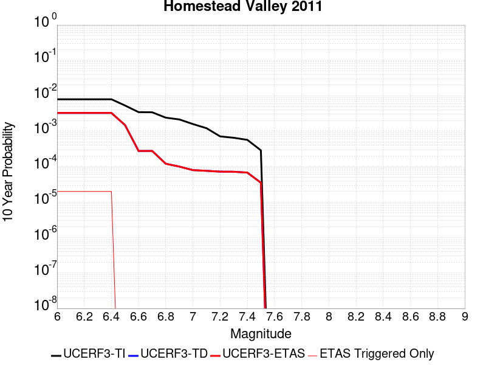 |

| Magnitude | 1 wk TI Prob | 1 wk TD Prob | 1 wk ETAS Prob | 1 wk ETAS/TD Gain | 1 wk ETAS Triggered Only | 1 mo TI Prob | 1 mo TD Prob | 1 mo ETAS Prob | 1 mo ETAS/TD Gain | 1 mo ETAS Triggered Only | 1 yr TI Prob | 1 yr TD Prob | 1 yr ETAS Prob | 1 yr ETAS/TD Gain | 1 yr ETAS Triggered Only | 10 yr TI Prob | 10 yr TD Prob | 10 yr ETAS Prob | 10 yr ETAS/TD Gain | 10 yr ETAS Triggered Only |
|-----|-----|-----|-----|-----|-----|-----|-----|-----|-----|-----|-----|-----|-----|-----|-----|-----|-----|-----|-----|-----|
| 6.0 | 1.539795E-5 | 6.286469E-6 | 1.6286407E-5 | 2.590708 | 1.0E-5 | 6.5989545E-5 | 2.6941849E-5 | 3.694158E-5 | 1.3711598 | 1.0E-5 | 8.0312655E-4 | 3.2798824E-4 | 3.3798497E-4 | 1.030479 | 1.0E-5 | 0.008002302 | 0.0032770627 | 0.0032969972 | 1.006083 | 2.0E-5 |
| 6.1 | 1.539795E-5 | 6.286469E-6 | 1.6286407E-5 | 2.590708 | 1.0E-5 | 6.5989545E-5 | 2.6941849E-5 | 3.694158E-5 | 1.3711598 | 1.0E-5 | 8.0312655E-4 | 3.2798824E-4 | 3.3798497E-4 | 1.030479 | 1.0E-5 | 0.008002302 | 0.0032770627 | 0.0032969972 | 1.006083 | 2.0E-5 |
| 6.2 | 1.539795E-5 | 6.286469E-6 | 1.6286407E-5 | 2.590708 | 1.0E-5 | 6.5989545E-5 | 2.6941849E-5 | 3.694158E-5 | 1.3711598 | 1.0E-5 | 8.0312655E-4 | 3.2798824E-4 | 3.3798497E-4 | 1.030479 | 1.0E-5 | 0.008002302 | 0.0032770627 | 0.0032969972 | 1.006083 | 2.0E-5 |
| 6.3 | 1.539795E-5 | 6.286469E-6 | 1.6286407E-5 | 2.590708 | 1.0E-5 | 6.5989545E-5 | 2.6941849E-5 | 3.694158E-5 | 1.3711598 | 1.0E-5 | 8.0312655E-4 | 3.2798824E-4 | 3.3798497E-4 | 1.030479 | 1.0E-5 | 0.008002302 | 0.0032770627 | 0.0032969972 | 1.006083 | 2.0E-5 |
| 6.4 | 1.539795E-5 | 6.286469E-6 | 1.6286407E-5 | 2.590708 | 1.0E-5 | 6.5989545E-5 | 2.6941849E-5 | 3.694158E-5 | 1.3711598 | 1.0E-5 | 8.0312655E-4 | 3.2798824E-4 | 3.3798497E-4 | 1.030479 | 1.0E-5 | 0.008002302 | 0.0032770627 | 0.0032969972 | 1.006083 | 2.0E-5 |
| 6.5 | 1.0265258E-5 | 2.8786876E-6 | 2.8786876E-6 | 1.0 | 0.0 | 4.3993223E-5 | 1.2337214E-5 | 1.2337214E-5 | 1.0 | 0.0 | 5.3548586E-4 | 1.5020218E-4 | 1.5020218E-4 | 1.0 | 0.0 | 0.005341973 | 0.0015016886 | 0.0015016886 | 1.0 | 0.0 |
| 6.6 | 6.664671E-6 | 5.343859E-7 | 5.343859E-7 | 1.0 | 0.0 | 2.8562565E-5 | 2.2902238E-6 | 2.2902238E-6 | 1.0 | 0.0 | 3.476937E-4 | 2.7883236E-5 | 2.7883236E-5 | 1.0 | 0.0 | 0.003471502 | 2.78809E-4 | 2.78809E-4 | 1.0 | 0.0 |
| 6.7 | 6.5954046E-6 | 5.343859E-7 | 5.343859E-7 | 1.0 | 0.0 | 2.8265715E-5 | 2.2902238E-6 | 2.2902238E-6 | 1.0 | 0.0 | 3.4408073E-4 | 2.7883236E-5 | 2.7883236E-5 | 1.0 | 0.0 | 0.0034354846 | 2.78809E-4 | 2.78809E-4 | 1.0 | 0.0 |
| 6.8 | 4.648189E-6 | 2.3257238E-7 | 2.3257238E-7 | 1.0 | 0.0 | 1.9920659E-5 | 9.967384E-7 | 9.967384E-7 | 1.0 | 0.0 | 2.4250703E-4 | 1.2135227E-5 | 1.2135227E-5 | 1.0 | 0.0 | 0.0024224254 | 1.2134612E-4 | 1.2134612E-4 | 1.0 | 0.0 |
| 6.9 | 4.1428534E-6 | 1.9342777E-7 | 1.9342777E-7 | 1.0 | 0.0 | 1.7754966E-5 | 8.289759E-7 | 8.289759E-7 | 1.0 | 0.0 | 2.1614527E-4 | 1.0092737E-5 | 1.0092737E-5 | 1.0 | 0.0 | 0.0021593515 | 1.0092309E-4 | 1.0092309E-4 | 1.0 | 0.0 |
| 7.0 | 3.0673707E-6 | 1.5364343E-7 | 1.5364343E-7 | 1.0 | 0.0 | 1.3145808E-5 | 6.5847166E-7 | 6.5847166E-7 | 1.0 | 0.0 | 1.6003846E-4 | 8.016864E-6 | 8.016864E-6 | 1.0 | 0.0 | 0.0015992324 | 8.016585E-5 | 8.016585E-5 | 1.0 | 0.0 |
| 7.1 | 2.340854E-6 | 1.4684727E-7 | 1.4684727E-7 | 1.0 | 0.0 | 1.0032193E-5 | 6.293453E-7 | 6.293453E-7 | 1.0 | 0.0 | 1.221351E-4 | 7.662254E-6 | 7.662254E-6 | 1.0 | 0.0 | 0.00122068 | 7.661999E-5 | 7.661999E-5 | 1.0 | 0.0 |
| 7.2 | 1.3754182E-6 | 1.3920152E-7 | 1.3920152E-7 | 1.0 | 0.0 | 5.8946357E-6 | 5.965778E-7 | 5.965778E-7 | 1.0 | 0.0 | 7.176483E-5 | 7.2633115E-6 | 7.2633115E-6 | 1.0 | 0.0 | 7.174166E-4 | 7.2630835E-5 | 7.2630835E-5 | 1.0 | 0.0 |
| 7.3 | 1.2573237E-6 | 1.3824703E-7 | 1.3824703E-7 | 1.0 | 0.0 | 5.388519E-6 | 5.9248714E-7 | 5.9248714E-7 | 1.0 | 0.0 | 6.560324E-5 | 7.213508E-6 | 7.213508E-6 | 1.0 | 0.0 | 6.558388E-4 | 7.213283E-5 | 7.213283E-5 | 1.0 | 0.0 |
| 7.4 | 1.0994207E-6 | 1.3103899E-7 | 1.3103899E-7 | 1.0 | 0.0 | 4.7117946E-6 | 5.615955E-7 | 5.615955E-7 | 1.0 | 0.0 | 5.736459E-5 | 6.837405E-6 | 6.837405E-6 | 1.0 | 0.0 | 5.734978E-4 | 6.837204E-5 | 6.837204E-5 | 1.0 | 0.0 |
| 7.5 | 5.5569126E-7 | 6.7717565E-8 | 6.7717565E-8 | 1.0 | 0.0 | 2.3815317E-6 | 2.902181E-7 | 2.902181E-7 | 1.0 | 0.0 | 2.8994764E-5 | 3.5334003E-6 | 3.5334003E-6 | 1.0 | 0.0 | 2.899098E-4 | 3.5333505E-5 | 3.5333505E-5 | 1.0 | 0.0 |

## Hunting Creek - Berryessa 2011 CFM
*[(top)](#table-of-contents)*

| 1 Week | 1 Month | 1 Year | 10 Year |
|-----|-----|-----|-----|
| 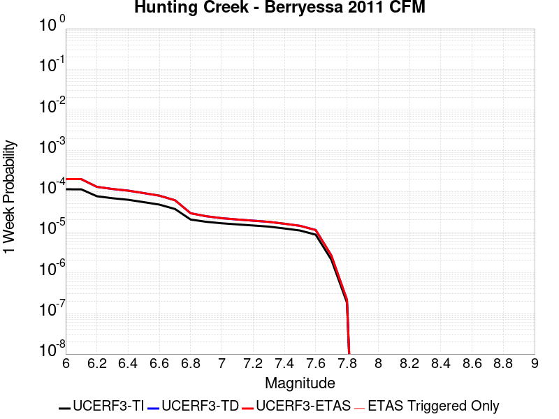 |  |  |  |

| Magnitude | 1 wk TI Prob | 1 wk TD Prob | 1 wk ETAS Prob | 1 wk ETAS/TD Gain | 1 wk ETAS Triggered Only | 1 mo TI Prob | 1 mo TD Prob | 1 mo ETAS Prob | 1 mo ETAS/TD Gain | 1 mo ETAS Triggered Only | 1 yr TI Prob | 1 yr TD Prob | 1 yr ETAS Prob | 1 yr ETAS/TD Gain | 1 yr ETAS Triggered Only | 10 yr TI Prob | 10 yr TD Prob | 10 yr ETAS Prob | 10 yr ETAS/TD Gain | 10 yr ETAS Triggered Only |
|-----|-----|-----|-----|-----|-----|-----|-----|-----|-----|-----|-----|-----|-----|-----|-----|-----|-----|-----|-----|-----|
| 6.0 | 1.1270982E-4 | 2.0028367E-4 | 2.0028367E-4 | 1.0 | 0.0 | 4.8295266E-4 | 8.579912E-4 | 8.579912E-4 | 1.0 | 0.0 | 0.0058641075 | 0.010386173 | 0.010396069 | 1.0009528 | 1.0E-5 | 0.057117578 | 0.09804048 | 0.098058514 | 1.0001839 | 2.0E-5 |
| 6.1 | 1.1239393E-4 | 1.9976508E-4 | 1.9976508E-4 | 1.0 | 0.0 | 4.8159933E-4 | 8.557703E-4 | 8.557703E-4 | 1.0 | 0.0 | 0.0058477195 | 0.010359417 | 0.010369313 | 1.0009553 | 1.0E-5 | 0.056962132 | 0.09779895 | 0.097817 | 1.0001845 | 2.0E-5 |
| 6.2 | 7.596265E-5 | 1.2933646E-4 | 1.2933646E-4 | 1.0 | 0.0 | 3.2551357E-4 | 5.5415573E-4 | 5.5415573E-4 | 1.0 | 0.0 | 0.0039559277 | 0.0067213587 | 0.0067213587 | 1.0 | 0.0 | 0.038862433 | 0.06459229 | 0.064601645 | 1.0001448 | 1.0E-5 |
| 6.3 | 6.78794E-5 | 1.1448377E-4 | 1.1448377E-4 | 1.0 | 0.0 | 2.9087928E-4 | 4.9052597E-4 | 4.9052597E-4 | 1.0 | 0.0 | 0.003535705 | 0.005952661 | 0.005952661 | 1.0 | 0.0 | 0.034799766 | 0.057466213 | 0.057475638 | 1.000164 | 1.0E-5 |
| 6.4 | 6.2165134E-5 | 1.0434825E-4 | 1.0434825E-4 | 1.0 | 0.0 | 2.6639478E-4 | 4.4711027E-4 | 4.4711027E-4 | 1.0 | 0.0 | 0.0032385332 | 0.0054274183 | 0.0054274183 | 1.0 | 0.0 | 0.03191742 | 0.05255138 | 0.052560855 | 1.0001802 | 1.0E-5 |
| 6.5 | 5.4368087E-5 | 9.070258E-5 | 9.070258E-5 | 1.0 | 0.0 | 2.3298527E-4 | 3.886537E-4 | 3.886537E-4 | 1.0 | 0.0 | 0.0028329059 | 0.0047197016 | 0.0047197016 | 1.0 | 0.0 | 0.027970633 | 0.045881182 | 0.045890722 | 1.0002079 | 1.0E-5 |
| 6.6 | 4.729947E-5 | 7.847101E-5 | 7.847101E-5 | 1.0 | 0.0 | 2.0269625E-4 | 3.3624718E-4 | 3.3624718E-4 | 1.0 | 0.0 | 0.002465034 | 0.004084746 | 0.004084746 | 1.0 | 0.0 | 0.02437869 | 0.03985269 | 0.03985269 | 1.0 | 0.0 |
| 6.7 | 3.6875328E-5 | 6.0443555E-5 | 6.0443555E-5 | 1.0 | 0.0 | 1.5802756E-4 | 2.5900968E-4 | 2.5900968E-4 | 1.0 | 0.0 | 0.0019222875 | 0.0031482724 | 0.0031482724 | 1.0 | 0.0 | 0.019057442 | 0.03089371 | 0.03089371 | 1.0 | 0.0 |
| 6.8 | 2.0292036E-5 | 2.8976721E-5 | 2.8976721E-5 | 1.0 | 0.0 | 8.6962966E-5 | 1.2417998E-4 | 1.2417998E-4 | 1.0 | 0.0 | 0.0010582599 | 0.0015108302 | 0.0015108302 | 1.0 | 0.0 | 0.010532344 | 0.0149790775 | 0.0149790775 | 1.0 | 0.0 |
| 6.9 | 1.7871042E-5 | 2.4472653E-5 | 2.4472653E-5 | 1.0 | 0.0 | 7.658793E-5 | 1.04878585E-4 | 1.04878585E-4 | 1.0 | 0.0 | 9.320591E-4 | 0.0012761486 | 0.0012761486 | 1.0 | 0.0 | 0.009281595 | 0.012680395 | 0.012680395 | 1.0 | 0.0 |
| 7.0 | 1.6415532E-5 | 2.1906566E-5 | 2.1906566E-5 | 1.0 | 0.0 | 7.035038E-5 | 9.388191E-5 | 9.388191E-5 | 1.0 | 0.0 | 8.561793E-4 | 0.0011424144 | 0.0011424144 | 1.0 | 0.0 | 0.008528882 | 0.011365017 | 0.011365017 | 1.0 | 0.0 |
| 7.1 | 1.5409885E-5 | 2.0346588E-5 | 2.0346588E-5 | 1.0 | 0.0 | 6.6040695E-5 | 8.719676E-5 | 8.719676E-5 | 1.0 | 0.0 | 8.0374884E-4 | 0.0010611062 | 0.0010611062 | 1.0 | 0.0 | 0.00800848 | 0.010560924 | 0.010560924 | 1.0 | 0.0 |
| 7.2 | 1.4497423E-5 | 1.905519E-5 | 1.905519E-5 | 1.0 | 0.0 | 6.213033E-5 | 8.166256E-5 | 8.166256E-5 | 1.0 | 0.0 | 7.5617427E-4 | 9.937913E-4 | 9.937913E-4 | 1.0 | 0.0 | 0.0075360634 | 0.00989425 | 0.00989425 | 1.0 | 0.0 |
| 7.3 | 1.3615175E-5 | 1.7826347E-5 | 1.7826347E-5 | 1.0 | 0.0 | 5.8349444E-5 | 7.6396405E-5 | 7.6396405E-5 | 1.0 | 0.0 | 7.101729E-4 | 9.297323E-4 | 9.297323E-4 | 1.0 | 0.0 | 0.0070790765 | 0.009259124 | 0.009259124 | 1.0 | 0.0 |
| 7.4 | 1.2252825E-5 | 1.6026455E-5 | 1.6026455E-5 | 1.0 | 0.0 | 5.251105E-5 | 6.868302E-5 | 6.868302E-5 | 1.0 | 0.0 | 6.391345E-4 | 8.3589775E-4 | 8.3589775E-4 | 1.0 | 0.0 | 0.0063729943 | 0.008328172 | 0.008328172 | 1.0 | 0.0 |
| 7.5 | 1.0913301E-5 | 1.4241286E-5 | 1.4241286E-5 | 1.0 | 0.0 | 4.6770452E-5 | 6.103267E-5 | 6.103267E-5 | 1.0 | 0.0 | 5.6928146E-4 | 7.428222E-4 | 7.428222E-4 | 1.0 | 0.0 | 0.0056782532 | 0.0074039865 | 0.0074039865 | 1.0 | 0.0 |
| 7.6 | 8.623192E-6 | 1.12347825E-5 | 1.12347825E-5 | 1.0 | 0.0 | 3.6956015E-5 | 4.8148195E-5 | 4.8148195E-5 | 1.0 | 0.0 | 4.4984656E-4 | 5.8604917E-4 | 5.8604917E-4 | 1.0 | 0.0 | 0.00448937 | 0.005845504 | 0.005845504 | 1.0 | 0.0 |
| 7.7 | 2.0993634E-6 | 2.66264E-6 | 2.66264E-6 | 1.0 | 0.0 | 8.997241E-6 | 1.1411265E-5 | 1.1411265E-5 | 1.0 | 0.0 | 1.09535904E-4 | 1.3892337E-4 | 1.3892337E-4 | 1.0 | 0.0 | 0.0010948193 | 0.0013883994 | 0.0013883994 | 1.0 | 0.0 |
| 7.8 | 1.8428308E-7 | 2.1674624E-7 | 2.1674624E-7 | 1.0 | 0.0 | 7.897844E-7 | 9.289122E-7 | 9.289122E-7 | 1.0 | 0.0 | 9.615583E-6 | 1.130945E-5 | 1.130945E-5 | 1.0 | 0.0 | 9.615166E-5 | 1.1308173E-4 | 1.1308173E-4 | 1.0 | 0.0 |

## Mission Hills 2011
*[(top)](#table-of-contents)*

| 1 Week | 1 Month | 1 Year | 10 Year |
|-----|-----|-----|-----|
|  |  |  |  |

| Magnitude | 1 wk TI Prob | 1 wk TD Prob | 1 wk ETAS Prob | 1 wk ETAS/TD Gain | 1 wk ETAS Triggered Only | 1 mo TI Prob | 1 mo TD Prob | 1 mo ETAS Prob | 1 mo ETAS/TD Gain | 1 mo ETAS Triggered Only | 1 yr TI Prob | 1 yr TD Prob | 1 yr ETAS Prob | 1 yr ETAS/TD Gain | 1 yr ETAS Triggered Only | 10 yr TI Prob | 10 yr TD Prob | 10 yr ETAS Prob | 10 yr ETAS/TD Gain | 10 yr ETAS Triggered Only |
|-----|-----|-----|-----|-----|-----|-----|-----|-----|-----|-----|-----|-----|-----|-----|-----|-----|-----|-----|-----|-----|
| 6.0 | 1.8765717E-5 | 1.9054629E-5 | 2.9054438E-5 | 1.5247968 | 1.0E-5 | 8.0422025E-5 | 8.1662074E-5 | 1.0166044E-4 | 1.2448918 | 2.0E-5 | 9.786983E-4 | 9.941256E-4 | 0.0010141057 | 1.0200982 | 2.0E-5 | 0.009743992 | 0.00993045 | 0.009950251 | 1.001994 | 2.0E-5 |
| 6.1 | 1.8765717E-5 | 1.9054629E-5 | 2.9054438E-5 | 1.5247968 | 1.0E-5 | 8.0422025E-5 | 8.1662074E-5 | 1.0166044E-4 | 1.2448918 | 2.0E-5 | 9.786983E-4 | 9.941256E-4 | 0.0010141057 | 1.0200982 | 2.0E-5 | 0.009743992 | 0.00993045 | 0.009950251 | 1.001994 | 2.0E-5 |
| 6.2 | 1.8765717E-5 | 1.9054629E-5 | 2.9054438E-5 | 1.5247968 | 1.0E-5 | 8.0422025E-5 | 8.1662074E-5 | 1.0166044E-4 | 1.2448918 | 2.0E-5 | 9.786983E-4 | 9.941256E-4 | 0.0010141057 | 1.0200982 | 2.0E-5 | 0.009743992 | 0.00993045 | 0.009950251 | 1.001994 | 2.0E-5 |
| 6.3 | 1.8765717E-5 | 1.9054629E-5 | 2.9054438E-5 | 1.5247968 | 1.0E-5 | 8.0422025E-5 | 8.1662074E-5 | 1.0166044E-4 | 1.2448918 | 2.0E-5 | 9.786983E-4 | 9.941256E-4 | 0.0010141057 | 1.0200982 | 2.0E-5 | 0.009743992 | 0.00993045 | 0.009950251 | 1.001994 | 2.0E-5 |
| 6.4 | 4.566357E-6 | 2.5148213E-6 | 2.5148213E-6 | 1.0 | 0.0 | 1.9569954E-5 | 1.0777771E-5 | 1.0777771E-5 | 1.0 | 0.0 | 2.3823815E-4 | 1.3121328E-4 | 1.3121328E-4 | 1.0 | 0.0 | 0.002379829 | 0.0013115364 | 0.0013115364 | 1.0 | 0.0 |
| 6.5 | 4.566357E-6 | 2.5148213E-6 | 2.5148213E-6 | 1.0 | 0.0 | 1.9569954E-5 | 1.0777771E-5 | 1.0777771E-5 | 1.0 | 0.0 | 2.3823815E-4 | 1.3121328E-4 | 1.3121328E-4 | 1.0 | 0.0 | 0.002379829 | 0.0013115364 | 0.0013115364 | 1.0 | 0.0 |
| 6.6 | 4.566357E-6 | 2.5148213E-6 | 2.5148213E-6 | 1.0 | 0.0 | 1.9569954E-5 | 1.0777771E-5 | 1.0777771E-5 | 1.0 | 0.0 | 2.3823815E-4 | 1.3121328E-4 | 1.3121328E-4 | 1.0 | 0.0 | 0.002379829 | 0.0013115364 | 0.0013115364 | 1.0 | 0.0 |
| 6.7 | 2.3266773E-6 | 1.3296132E-6 | 1.3296132E-6 | 1.0 | 0.0 | 9.971435E-6 | 5.69833E-6 | 5.69833E-6 | 1.0 | 0.0 | 1.2139547E-4 | 6.937502E-5 | 6.937502E-5 | 1.0 | 0.0 | 0.0012132917 | 6.935397E-4 | 6.935397E-4 | 1.0 | 0.0 |
| 6.8 | 2.032735E-6 | 1.1894101E-6 | 1.1894101E-6 | 1.0 | 0.0 | 8.711692E-6 | 5.0974622E-6 | 5.0974622E-6 | 1.0 | 0.0 | 1.06059684E-4 | 6.205988E-5 | 6.205988E-5 | 1.0 | 0.0 | 0.0010600908 | 6.204304E-4 | 6.204304E-4 | 1.0 | 0.0 |
| 6.9 | 1.3186259E-6 | 1.0561989E-6 | 1.0561989E-6 | 1.0 | 0.0 | 5.6512413E-6 | 4.526559E-6 | 4.526559E-6 | 1.0 | 0.0 | 6.8801695E-5 | 5.5109493E-5 | 5.5109493E-5 | 1.0 | 0.0 | 6.8780396E-4 | 5.5096124E-4 | 5.5096124E-4 | 1.0 | 0.0 |
| 7.0 | 1.2726016E-6 | 1.0159295E-6 | 1.0159295E-6 | 1.0 | 0.0 | 5.4539955E-6 | 4.3539762E-6 | 4.3539762E-6 | 1.0 | 0.0 | 6.6400375E-5 | 5.30084E-5 | 5.30084E-5 | 1.0 | 0.0 | 6.6380535E-4 | 5.299604E-4 | 5.299604E-4 | 1.0 | 0.0 |
| 7.1 | 1.2063913E-6 | 9.570282E-7 | 9.570282E-7 | 1.0 | 0.0 | 5.170238E-6 | 4.101543E-6 | 4.101543E-6 | 1.0 | 0.0 | 6.294583E-5 | 4.9935166E-5 | 4.9935166E-5 | 1.0 | 0.0 | 6.2928005E-4 | 4.9924204E-4 | 4.9924204E-4 | 1.0 | 0.0 |
| 7.2 | 9.105806E-7 | 7.3767757E-7 | 7.3767757E-7 | 1.0 | 0.0 | 3.9024826E-6 | 3.1614716E-6 | 3.1614716E-6 | 1.0 | 0.0 | 4.7511687E-5 | 3.8490252E-5 | 3.8490252E-5 | 1.0 | 0.0 | 4.7501532E-4 | 3.8483742E-4 | 3.8483742E-4 | 1.0 | 0.0 |
| 7.3 | 7.020432E-7 | 5.7103375E-7 | 5.7103375E-7 | 1.0 | 0.0 | 3.0087533E-6 | 2.4472852E-6 | 2.4472852E-6 | 1.0 | 0.0 | 3.6630954E-5 | 2.9795303E-5 | 2.9795303E-5 | 1.0 | 0.0 | 3.6624918E-4 | 2.979144E-4 | 2.979144E-4 | 1.0 | 0.0 |
| 7.4 | 5.3900635E-7 | 4.4483278E-7 | 4.4483278E-7 | 1.0 | 0.0 | 2.3100251E-6 | 1.9064248E-6 | 1.9064248E-6 | 1.0 | 0.0 | 2.8124194E-5 | 2.3210489E-5 | 2.3210489E-5 | 1.0 | 0.0 | 2.8120633E-4 | 2.3208185E-4 | 2.3208185E-4 | 1.0 | 0.0 |
| 7.5 | 2.907075E-7 | 2.2875324E-7 | 2.2875324E-7 | 1.0 | 0.0 | 1.2458887E-6 | 9.803706E-7 | 9.803706E-7 | 1.0 | 0.0 | 1.5168589E-5 | 1.1935949E-5 | 1.1935949E-5 | 1.0 | 0.0 | 1.5167553E-4 | 1.1935326E-4 | 1.1935326E-4 | 1.0 | 0.0 |
| 7.6 | 1.6903675E-7 | 1.2353401E-7 | 1.2353401E-7 | 1.0 | 0.0 | 7.2444305E-7 | 5.2943136E-7 | 5.2943136E-7 | 1.0 | 0.0 | 8.820059E-6 | 6.4458086E-6 | 6.4458086E-6 | 1.0 | 0.0 | 8.8197085E-5 | 6.445634E-5 | 6.445634E-5 | 1.0 | 0.0 |
| 7.7 | 7.168073E-8 | 3.9134374E-8 | 3.9134374E-8 | 1.0 | 0.0 | 3.072031E-7 | 1.6771872E-7 | 1.6771872E-7 | 1.0 | 0.0 | 3.7401915E-6 | 2.0419736E-6 | 2.0419736E-6 | 1.0 | 0.0 | 3.7401285E-5 | 2.041956E-5 | 2.041956E-5 | 1.0 | 0.0 |
| 7.8 | 6.564101E-8 | 3.3834656E-8 | 3.3834656E-8 | 1.0 | 0.0 | 2.813186E-7 | 1.4500566E-7 | 1.4500566E-7 | 1.0 | 0.0 | 3.4250486E-6 | 1.7654426E-6 | 1.7654426E-6 | 1.0 | 0.0 | 3.424996E-5 | 1.7654296E-5 | 1.7654296E-5 | 1.0 | 0.0 |
| 7.9 | 1.0029074E-8 | 3.728858E-9 | 3.728858E-9 | 1.0 | 0.0 | 4.2981743E-8 | 1.598082E-8 | 1.598082E-8 | 1.0 | 0.0 | 5.2330256E-7 | 1.945665E-7 | 1.945665E-7 | 1.0 | 0.0 | 5.2330133E-6 | 1.9456643E-6 | 1.9456643E-6 | 1.0 | 0.0 |

## Point Reyes 2011 CFM
*[(top)](#table-of-contents)*

| 1 Week | 1 Month | 1 Year | 10 Year |
|-----|-----|-----|-----|
|  |  | 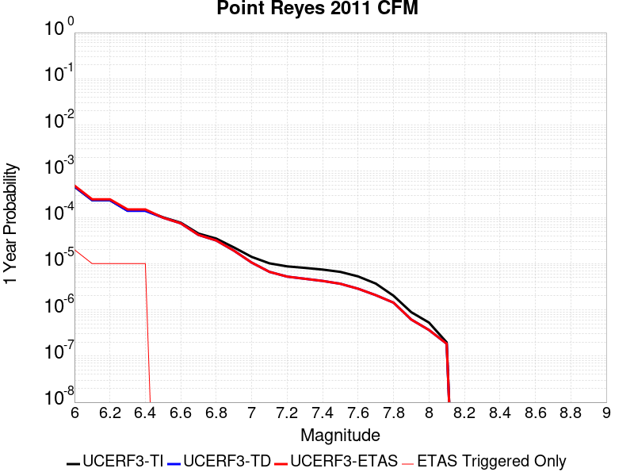 |  |

| Magnitude | 1 wk TI Prob | 1 wk TD Prob | 1 wk ETAS Prob | 1 wk ETAS/TD Gain | 1 wk ETAS Triggered Only | 1 mo TI Prob | 1 mo TD Prob | 1 mo ETAS Prob | 1 mo ETAS/TD Gain | 1 mo ETAS Triggered Only | 1 yr TI Prob | 1 yr TD Prob | 1 yr ETAS Prob | 1 yr ETAS/TD Gain | 1 yr ETAS Triggered Only | 10 yr TI Prob | 10 yr TD Prob | 10 yr ETAS Prob | 10 yr ETAS/TD Gain | 10 yr ETAS Triggered Only |
|-----|-----|-----|-----|-----|-----|-----|-----|-----|-----|-----|-----|-----|-----|-----|-----|-----|-----|-----|-----|-----|
| 6.0 | 8.8644965E-6 | 8.96716E-6 | 8.96716E-6 | 1.0 | 0.0 | 3.7990147E-5 | 3.8430157E-5 | 4.842977E-5 | 1.2602023 | 1.0E-5 | 4.624319E-4 | 4.67793E-4 | 4.8778363E-4 | 1.0427339 | 2.0E-5 | 0.0046147075 | 0.004668711 | 0.0046886182 | 1.0042639 | 2.0E-5 |
| 6.1 | 4.526405E-6 | 4.5392153E-6 | 4.5392153E-6 | 1.0 | 0.0 | 1.9398734E-5 | 1.945364E-5 | 1.945364E-5 | 1.0 | 0.0 | 2.36154E-4 | 2.3682338E-4 | 2.4682103E-4 | 1.0422156 | 1.0E-5 | 0.002359032 | 0.0023658164 | 0.0023757927 | 1.0042169 | 1.0E-5 |
| 6.2 | 4.526405E-6 | 4.5392153E-6 | 4.5392153E-6 | 1.0 | 0.0 | 1.9398734E-5 | 1.945364E-5 | 1.945364E-5 | 1.0 | 0.0 | 2.36154E-4 | 2.3682338E-4 | 2.4682103E-4 | 1.0422156 | 1.0E-5 | 0.002359032 | 0.0023658164 | 0.0023757927 | 1.0042169 | 1.0E-5 |
| 6.3 | 2.6842322E-6 | 2.660673E-6 | 2.660673E-6 | 1.0 | 0.0 | 1.1503801E-5 | 1.1402836E-5 | 1.1402836E-5 | 1.0 | 0.0 | 1.4004979E-4 | 1.3882088E-4 | 1.4881948E-4 | 1.0720253 | 1.0E-5 | 0.0013996155 | 0.0013873635 | 0.0013973496 | 1.0071979 | 1.0E-5 |
| 6.4 | 2.6842322E-6 | 2.660673E-6 | 2.660673E-6 | 1.0 | 0.0 | 1.1503801E-5 | 1.1402836E-5 | 1.1402836E-5 | 1.0 | 0.0 | 1.4004979E-4 | 1.3882088E-4 | 1.4881948E-4 | 1.0720253 | 1.0E-5 | 0.0013996155 | 0.0013873635 | 0.0013973496 | 1.0071979 | 1.0E-5 |
| 6.5 | 1.9281833E-6 | 1.8906233E-6 | 1.8906233E-6 | 1.0 | 0.0 | 8.263617E-6 | 8.1026465E-6 | 8.1026465E-6 | 1.0 | 0.0 | 1.0060489E-4 | 9.864534E-5 | 9.864534E-5 | 1.0 | 0.0 | 0.0010055936 | 9.860265E-4 | 9.860265E-4 | 1.0 | 0.0 |
| 6.6 | 1.4726726E-6 | 1.4269547E-6 | 1.4269547E-6 | 1.0 | 0.0 | 6.3114385E-6 | 6.115506E-6 | 6.115506E-6 | 1.0 | 0.0 | 7.683905E-5 | 7.445379E-5 | 7.445379E-5 | 1.0 | 0.0 | 7.6812494E-4 | 7.442957E-4 | 7.442957E-4 | 1.0 | 0.0 |
| 6.7 | 8.572307E-7 | 8.007182E-7 | 8.007182E-7 | 1.0 | 0.0 | 3.6738406E-6 | 3.431645E-6 | 3.431645E-6 | 1.0 | 0.0 | 4.472809E-5 | 4.1779494E-5 | 4.1779494E-5 | 1.0 | 0.0 | 4.471909E-4 | 4.177204E-4 | 4.177204E-4 | 1.0 | 0.0 |
| 6.8 | 6.6745434E-7 | 6.07727E-7 | 6.07727E-7 | 1.0 | 0.0 | 2.8605155E-6 | 2.6045416E-6 | 2.6045416E-6 | 1.0 | 0.0 | 3.482622E-5 | 3.1709842E-5 | 3.1709842E-5 | 1.0 | 0.0 | 3.4820763E-4 | 3.170566E-4 | 3.170566E-4 | 1.0 | 0.0 |
| 6.9 | 4.291521E-7 | 3.6535639E-7 | 3.6535639E-7 | 1.0 | 0.0 | 1.839222E-6 | 1.5658121E-6 | 1.5658121E-6 | 1.0 | 0.0 | 2.2392298E-5 | 1.90636E-5 | 1.90636E-5 | 1.0 | 0.0 | 2.2390042E-4 | 1.906224E-4 | 1.906224E-4 | 1.0 | 0.0 |
| 7.0 | 2.6812808E-7 | 2.0187117E-7 | 2.0187117E-7 | 1.0 | 0.0 | 1.1491198E-6 | 8.6516184E-7 | 8.6516184E-7 | 1.0 | 0.0 | 1.3990444E-5 | 1.0533295E-5 | 1.0533295E-5 | 1.0 | 0.0 | 1.3989564E-4 | 1.05330415E-4 | 1.05330415E-4 | 1.0 | 0.0 |
| 7.1 | 1.9451231E-7 | 1.2725201E-7 | 1.2725201E-7 | 1.0 | 0.0 | 8.336239E-7 | 5.4536565E-7 | 5.4536565E-7 | 1.0 | 0.0 | 1.0149324E-5 | 6.639806E-6 | 6.639806E-6 | 1.0 | 0.0 | 1.014886E-4 | 6.639846E-5 | 6.639846E-5 | 1.0 | 0.0 |
| 7.2 | 1.6715143E-7 | 1.0042555E-7 | 1.0042555E-7 | 1.0 | 0.0 | 7.1636305E-7 | 4.3039515E-7 | 4.3039515E-7 | 1.0 | 0.0 | 8.721685E-6 | 5.2400483E-6 | 5.2400483E-6 | 1.0 | 0.0 | 8.721343E-5 | 5.240162E-5 | 5.240162E-5 | 1.0 | 0.0 |
| 7.3 | 1.5503173E-7 | 9.012816E-8 | 9.012816E-8 | 1.0 | 0.0 | 6.644215E-7 | 3.8626348E-7 | 3.8626348E-7 | 1.0 | 0.0 | 8.089301E-6 | 4.7027474E-6 | 4.7027474E-6 | 1.0 | 0.0 | 8.089007E-5 | 4.7028854E-5 | 4.7028854E-5 | 1.0 | 0.0 |
| 7.4 | 1.4251614E-7 | 8.097342E-8 | 8.097342E-8 | 1.0 | 0.0 | 6.1078333E-7 | 3.4702887E-7 | 3.4702887E-7 | 1.0 | 0.0 | 7.4362615E-6 | 4.225068E-6 | 4.225068E-6 | 1.0 | 0.0 | 7.436013E-5 | 4.2252257E-5 | 4.2252257E-5 | 1.0 | 0.0 |
| 7.5 | 1.2710186E-7 | 7.029377E-8 | 7.029377E-8 | 1.0 | 0.0 | 5.447221E-7 | 3.0125898E-7 | 3.0125898E-7 | 1.0 | 0.0 | 6.6319717E-6 | 3.6678218E-6 | 3.6678218E-6 | 1.0 | 0.0 | 6.6317734E-5 | 3.667999E-5 | 3.667999E-5 | 1.0 | 0.0 |
| 7.6 | 1.0144708E-7 | 5.494996E-8 | 5.494996E-8 | 1.0 | 0.0 | 4.347731E-7 | 2.354998E-7 | 2.354998E-7 | 1.0 | 0.0 | 5.2933497E-6 | 2.8672061E-6 | 2.8672061E-6 | 1.0 | 0.0 | 5.293224E-5 | 2.8674069E-5 | 2.8674069E-5 | 1.0 | 0.0 |
| 7.7 | 7.090527E-8 | 3.9821334E-8 | 3.9821334E-8 | 1.0 | 0.0 | 3.038797E-7 | 1.7066284E-7 | 1.7066284E-7 | 1.0 | 0.0 | 3.699729E-6 | 2.0778182E-6 | 2.0778182E-6 | 1.0 | 0.0 | 3.6996673E-5 | 2.0780362E-5 | 2.0780362E-5 | 1.0 | 0.0 |
| 7.8 | 3.8712045E-8 | 2.7438638E-8 | 2.7438638E-8 | 1.0 | 0.0 | 1.6590876E-7 | 1.1759416E-7 | 1.1759416E-7 | 1.0 | 0.0 | 2.0199373E-6 | 1.4317079E-6 | 1.4317079E-6 | 1.0 | 0.0 | 2.0199188E-5 | 1.4319363E-5 | 1.4319363E-5 | 1.0 | 0.0 |
| 7.9 | 1.7068782E-8 | 1.183186E-8 | 1.183186E-8 | 1.0 | 0.0 | 7.315192E-8 | 5.0707975E-8 | 5.0707975E-8 | 1.0 | 0.0 | 8.906242E-7 | 6.173694E-7 | 6.173694E-7 | 1.0 | 0.0 | 8.906207E-6 | 6.1760525E-6 | 6.1760525E-6 | 1.0 | 0.0 |
| 8.0 | 1.0172592E-8 | 7.0268076E-9 | 7.0268076E-9 | 1.0 | 0.0 | 4.359682E-8 | 3.011489E-8 | 3.011489E-8 | 1.0 | 0.0 | 5.3079117E-7 | 3.6664872E-7 | 3.6664872E-7 | 1.0 | 0.0 | 5.307899E-6 | 3.6688568E-6 | 3.6688568E-6 | 1.0 | 0.0 |
| 8.1 | 3.7861243E-9 | 3.5448604E-9 | 3.5448604E-9 | 1.0 | 0.0 | 1.6226247E-8 | 1.5192258E-8 | 1.5192258E-8 | 1.0 | 0.0 | 1.9755454E-7 | 1.8496571E-7 | 1.8496571E-7 | 1.0 | 0.0 | 1.9755437E-6 | 1.8514592E-6 | 1.8514592E-6 | 1.0 | 0.0 |

## Elmore Ranch
*[(top)](#table-of-contents)*

| 1 Week | 1 Month | 1 Year | 10 Year |
|-----|-----|-----|-----|
|  |  |  |  |

| Magnitude | 1 wk TI Prob | 1 wk TD Prob | 1 wk ETAS Prob | 1 wk ETAS/TD Gain | 1 wk ETAS Triggered Only | 1 mo TI Prob | 1 mo TD Prob | 1 mo ETAS Prob | 1 mo ETAS/TD Gain | 1 mo ETAS Triggered Only | 1 yr TI Prob | 1 yr TD Prob | 1 yr ETAS Prob | 1 yr ETAS/TD Gain | 1 yr ETAS Triggered Only | 10 yr TI Prob | 10 yr TD Prob | 10 yr ETAS Prob | 10 yr ETAS/TD Gain | 10 yr ETAS Triggered Only |
|-----|-----|-----|-----|-----|-----|-----|-----|-----|-----|-----|-----|-----|-----|-----|-----|-----|-----|-----|-----|-----|
| 6.0 | 9.102099E-5 | 8.953848E-5 | 9.953759E-5 | 1.1116738 | 1.0E-5 | 3.9003167E-4 | 3.836898E-4 | 3.9368597E-4 | 1.0260527 | 1.0E-5 | 0.0047383 | 0.004662132 | 0.0046820384 | 1.0042698 | 2.0E-5 | 0.046385348 | 0.04583787 | 0.045856956 | 1.0004163 | 2.0E-5 |
| 6.1 | 3.8306698E-5 | 4.14921E-5 | 4.14921E-5 | 1.0 | 0.0 | 1.6416123E-4 | 1.7781362E-4 | 1.7781362E-4 | 1.0 | 0.0 | 0.0019968306 | 0.0021632186 | 0.0021632186 | 1.0 | 0.0 | 0.019789828 | 0.021595007 | 0.021595007 | 1.0 | 0.0 |
| 6.2 | 3.8306698E-5 | 4.14921E-5 | 4.14921E-5 | 1.0 | 0.0 | 1.6416123E-4 | 1.7781362E-4 | 1.7781362E-4 | 1.0 | 0.0 | 0.0019968306 | 0.0021632186 | 0.0021632186 | 1.0 | 0.0 | 0.019789828 | 0.021595007 | 0.021595007 | 1.0 | 0.0 |
| 6.3 | 3.3197924E-5 | 3.6550366E-5 | 3.6550366E-5 | 1.0 | 0.0 | 1.4226905E-4 | 1.56639E-4 | 1.56639E-4 | 1.0 | 0.0 | 0.0017307495 | 0.0019059771 | 0.0019059771 | 1.0 | 0.0 | 0.017173318 | 0.019057386 | 0.019057386 | 1.0 | 0.0 |
| 6.4 | 2.5148964E-5 | 2.7420736E-5 | 2.7420736E-5 | 1.0 | 0.0 | 1.0777682E-4 | 1.17515796E-4 | 1.17515796E-4 | 1.0 | 0.0 | 0.0013113929 | 0.0014304637 | 0.0014304637 | 1.0 | 0.0 | 0.01303681 | 0.014365338 | 0.014365338 | 1.0 | 0.0 |
| 6.5 | 2.5148964E-5 | 2.7420736E-5 | 2.7420736E-5 | 1.0 | 0.0 | 1.0777682E-4 | 1.17515796E-4 | 1.17515796E-4 | 1.0 | 0.0 | 0.0013113929 | 0.0014304637 | 0.0014304637 | 1.0 | 0.0 | 0.01303681 | 0.014365338 | 0.014365338 | 1.0 | 0.0 |

## Elsinore (Temecula) rev
*[(top)](#table-of-contents)*

| 1 Week | 1 Month | 1 Year | 10 Year |
|-----|-----|-----|-----|
|  |  |  | 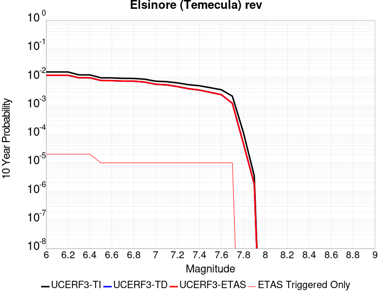 |

| Magnitude | 1 wk TI Prob | 1 wk TD Prob | 1 wk ETAS Prob | 1 wk ETAS/TD Gain | 1 wk ETAS Triggered Only | 1 mo TI Prob | 1 mo TD Prob | 1 mo ETAS Prob | 1 mo ETAS/TD Gain | 1 mo ETAS Triggered Only | 1 yr TI Prob | 1 yr TD Prob | 1 yr ETAS Prob | 1 yr ETAS/TD Gain | 1 yr ETAS Triggered Only | 10 yr TI Prob | 10 yr TD Prob | 10 yr ETAS Prob | 10 yr ETAS/TD Gain | 10 yr ETAS Triggered Only |
|-----|-----|-----|-----|-----|-----|-----|-----|-----|-----|-----|-----|-----|-----|-----|-----|-----|-----|-----|-----|-----|
| 6.0 | 2.9514995E-5 | 2.251887E-5 | 2.251887E-5 | 1.0 | 0.0 | 1.264867E-4 | 9.6505995E-5 | 9.6505995E-5 | 1.0 | 0.0 | 0.0015388876 | 0.0011743492 | 0.0011743492 | 1.0 | 0.0 | 0.015282745 | 0.011688135 | 0.011707901 | 1.0016911 | 2.0E-5 |
| 6.1 | 2.9514995E-5 | 2.251887E-5 | 2.251887E-5 | 1.0 | 0.0 | 1.264867E-4 | 9.6505995E-5 | 9.6505995E-5 | 1.0 | 0.0 | 0.0015388876 | 0.0011743492 | 0.0011743492 | 1.0 | 0.0 | 0.015282745 | 0.011688135 | 0.011707901 | 1.0016911 | 2.0E-5 |
| 6.2 | 2.9514995E-5 | 2.251887E-5 | 2.251887E-5 | 1.0 | 0.0 | 1.264867E-4 | 9.6505995E-5 | 9.6505995E-5 | 1.0 | 0.0 | 0.0015388876 | 0.0011743492 | 0.0011743492 | 1.0 | 0.0 | 0.015282745 | 0.011688135 | 0.011707901 | 1.0016911 | 2.0E-5 |
| 6.3 | 2.3223649E-5 | 1.840822E-5 | 1.840822E-5 | 1.0 | 0.0 | 9.952613E-5 | 7.889008E-5 | 7.889008E-5 | 1.0 | 0.0 | 0.001211057 | 9.600807E-4 | 9.600807E-4 | 1.0 | 0.0 | 0.012044783 | 0.009551284 | 0.009571092 | 1.002074 | 2.0E-5 |
| 6.4 | 2.3223649E-5 | 1.840822E-5 | 1.840822E-5 | 1.0 | 0.0 | 9.952613E-5 | 7.889008E-5 | 7.889008E-5 | 1.0 | 0.0 | 0.001211057 | 9.600807E-4 | 9.600807E-4 | 1.0 | 0.0 | 0.012044783 | 0.009551284 | 0.009571092 | 1.002074 | 2.0E-5 |
| 6.5 | 1.8338875E-5 | 1.4750074E-5 | 1.4750074E-5 | 1.0 | 0.0 | 7.8592806E-5 | 6.321312E-5 | 6.321312E-5 | 1.0 | 0.0 | 9.5644733E-4 | 7.6935673E-4 | 7.6935673E-4 | 1.0 | 0.0 | 0.009523412 | 0.0076699676 | 0.007679891 | 1.0012938 | 1.0E-5 |
| 6.6 | 1.8223333E-5 | 1.461263E-5 | 1.461263E-5 | 1.0 | 0.0 | 7.809766E-5 | 6.26241E-5 | 6.26241E-5 | 1.0 | 0.0 | 9.504242E-4 | 7.621905E-4 | 7.621905E-4 | 1.0 | 0.0 | 0.009463696 | 0.007598796 | 0.00760872 | 1.001306 | 1.0E-5 |
| 6.7 | 1.7512752E-5 | 1.4026963E-5 | 1.4026963E-5 | 1.0 | 0.0 | 7.505249E-5 | 6.0114216E-5 | 6.0114216E-5 | 1.0 | 0.0 | 9.13381E-4 | 7.316534E-4 | 7.316534E-4 | 1.0 | 0.0 | 0.00909636 | 0.0072983317 | 0.0073082587 | 1.0013602 | 1.0E-5 |
| 6.8 | 1.7417142E-5 | 1.395093E-5 | 1.395093E-5 | 1.0 | 0.0 | 7.4642754E-5 | 5.978838E-5 | 5.978838E-5 | 1.0 | 0.0 | 9.083966E-4 | 7.27689E-4 | 7.27689E-4 | 1.0 | 0.0 | 0.009046922 | 0.007259359 | 0.0072692866 | 1.0013676 | 1.0E-5 |
| 6.9 | 1.6402591E-5 | 1.29883665E-5 | 1.29883665E-5 | 1.0 | 0.0 | 7.0294926E-5 | 5.5663284E-5 | 5.5663284E-5 | 1.0 | 0.0 | 8.5550465E-4 | 6.774974E-4 | 6.774974E-4 | 1.0 | 0.0 | 0.008522186 | 0.0067598647 | 0.006769797 | 1.0014694 | 1.0E-5 |
| 7.0 | 1.3912486E-5 | 1.0878067E-5 | 1.0878067E-5 | 1.0 | 0.0 | 5.9623577E-5 | 4.661947E-5 | 4.661947E-5 | 1.0 | 0.0 | 7.2567526E-4 | 5.674469E-4 | 5.674469E-4 | 1.0 | 0.0 | 0.0072331014 | 0.0056635314 | 0.005673475 | 1.0017557 | 1.0E-5 |
| 7.1 | 1.3405147E-5 | 1.0327192E-5 | 1.0327192E-5 | 1.0 | 0.0 | 5.7449364E-5 | 4.4258657E-5 | 4.4258657E-5 | 1.0 | 0.0 | 6.9922156E-4 | 5.3871854E-4 | 5.3871854E-4 | 1.0 | 0.0 | 0.0069702556 | 0.005377366 | 0.0053873123 | 1.0018497 | 1.0E-5 |
| 7.2 | 1.21402E-5 | 8.996479E-6 | 8.996479E-6 | 1.0 | 0.0 | 5.202839E-5 | 3.8555776E-5 | 3.8555776E-5 | 1.0 | 0.0 | 6.332616E-4 | 4.6931725E-4 | 4.6931725E-4 | 1.0 | 0.0 | 0.0063146 | 0.0046847262 | 0.0046946793 | 1.0021245 | 1.0E-5 |
| 7.3 | 1.05047775E-5 | 7.571515E-6 | 7.571515E-6 | 1.0 | 0.0 | 4.5019697E-5 | 3.2448956E-5 | 3.2448956E-5 | 1.0 | 0.0 | 5.4797693E-4 | 3.9499588E-4 | 3.9499588E-4 | 1.0 | 0.0 | 0.005466277 | 0.003943348 | 0.0039533083 | 1.0025259 | 1.0E-5 |
| 7.4 | 9.624483E-6 | 6.786621E-6 | 6.786621E-6 | 1.0 | 0.0 | 4.124713E-5 | 2.90852E-5 | 2.90852E-5 | 1.0 | 0.0 | 5.0206814E-4 | 3.5405616E-4 | 3.5405616E-4 | 1.0 | 0.0 | 0.005009353 | 0.0035350726 | 0.0035450372 | 1.0028188 | 1.0E-5 |
| 7.5 | 8.215151E-6 | 5.6353133E-6 | 5.6353133E-6 | 1.0 | 0.0 | 3.5207315E-5 | 2.4151126E-5 | 2.4151126E-5 | 1.0 | 0.0 | 4.2856473E-4 | 2.9400157E-4 | 2.9400157E-4 | 1.0 | 0.0 | 0.004277392 | 0.002936254 | 0.0029462245 | 1.0033957 | 1.0E-5 |
| 7.6 | 6.975058E-6 | 4.675836E-6 | 4.675836E-6 | 1.0 | 0.0 | 2.9892764E-5 | 2.003915E-5 | 2.003915E-5 | 1.0 | 0.0 | 3.6388362E-4 | 2.439505E-4 | 2.439505E-4 | 1.0 | 0.0 | 0.0036328835 | 0.0024369434 | 0.002446919 | 1.0040935 | 1.0E-5 |
| 7.7 | 4.159604E-6 | 2.326789E-6 | 2.326789E-6 | 1.0 | 0.0 | 1.7826753E-5 | 9.971919E-6 | 9.971919E-6 | 1.0 | 0.0 | 2.1701909E-4 | 1.2140209E-4 | 1.2140209E-4 | 1.0 | 0.0 | 0.0021680726 | 0.0012134308 | 0.0012234186 | 1.008231 | 1.0E-5 |
| 7.8 | 2.2692414E-7 | 9.384417E-8 | 9.384417E-8 | 1.0 | 0.0 | 9.725317E-7 | 4.0218927E-7 | 4.0218927E-7 | 1.0 | 0.0 | 1.1840509E-5 | 4.8966467E-6 | 4.8966467E-6 | 1.0 | 0.0 | 1.1839878E-4 | 4.8965718E-5 | 4.8965718E-5 | 1.0 | 0.0 |
| 7.9 | 6.676829E-9 | 3.4397174E-9 | 3.4397174E-9 | 1.0 | 0.0 | 2.861498E-8 | 1.4741646E-8 | 1.4741646E-8 | 1.0 | 0.0 | 3.4838732E-7 | 1.7947953E-7 | 1.7947953E-7 | 1.0 | 0.0 | 3.4838679E-6 | 1.794794E-6 | 1.794794E-6 | 1.0 | 0.0 |

## Sierra Madre
*[(top)](#table-of-contents)*

| 1 Week | 1 Month | 1 Year | 10 Year |
|-----|-----|-----|-----|
|  |  |  |  |

| Magnitude | 1 wk TI Prob | 1 wk TD Prob | 1 wk ETAS Prob | 1 wk ETAS/TD Gain | 1 wk ETAS Triggered Only | 1 mo TI Prob | 1 mo TD Prob | 1 mo ETAS Prob | 1 mo ETAS/TD Gain | 1 mo ETAS Triggered Only | 1 yr TI Prob | 1 yr TD Prob | 1 yr ETAS Prob | 1 yr ETAS/TD Gain | 1 yr ETAS Triggered Only | 10 yr TI Prob | 10 yr TD Prob | 10 yr ETAS Prob | 10 yr ETAS/TD Gain | 10 yr ETAS Triggered Only |
|-----|-----|-----|-----|-----|-----|-----|-----|-----|-----|-----|-----|-----|-----|-----|-----|-----|-----|-----|-----|-----|
| 6.0 | 1.3379373E-5 | 1.1000776E-5 | 1.1000776E-5 | 1.0 | 0.0 | 5.7338908E-5 | 4.714534E-5 | 4.714534E-5 | 1.0 | 0.0 | 6.978776E-4 | 5.738448E-4 | 5.838391E-4 | 1.0174164 | 1.0E-5 | 0.0069569005 | 0.0057238447 | 0.0057437303 | 1.0034741 | 2.0E-5 |
| 6.1 | 1.3379373E-5 | 1.1000776E-5 | 1.1000776E-5 | 1.0 | 0.0 | 5.7338908E-5 | 4.714534E-5 | 4.714534E-5 | 1.0 | 0.0 | 6.978776E-4 | 5.738448E-4 | 5.838391E-4 | 1.0174164 | 1.0E-5 | 0.0069569005 | 0.0057238447 | 0.0057437303 | 1.0034741 | 2.0E-5 |
| 6.2 | 1.3379373E-5 | 1.1000776E-5 | 1.1000776E-5 | 1.0 | 0.0 | 5.7338908E-5 | 4.714534E-5 | 4.714534E-5 | 1.0 | 0.0 | 6.978776E-4 | 5.738448E-4 | 5.838391E-4 | 1.0174164 | 1.0E-5 | 0.0069569005 | 0.0057238447 | 0.0057437303 | 1.0034741 | 2.0E-5 |
| 6.3 | 1.3379373E-5 | 1.1000776E-5 | 1.1000776E-5 | 1.0 | 0.0 | 5.7338908E-5 | 4.714534E-5 | 4.714534E-5 | 1.0 | 0.0 | 6.978776E-4 | 5.738448E-4 | 5.838391E-4 | 1.0174164 | 1.0E-5 | 0.0069569005 | 0.0057238447 | 0.0057437303 | 1.0034741 | 2.0E-5 |
| 6.4 | 1.3379373E-5 | 1.1000776E-5 | 1.1000776E-5 | 1.0 | 0.0 | 5.7338908E-5 | 4.714534E-5 | 4.714534E-5 | 1.0 | 0.0 | 6.978776E-4 | 5.738448E-4 | 5.838391E-4 | 1.0174164 | 1.0E-5 | 0.0069569005 | 0.0057238447 | 0.0057437303 | 1.0034741 | 2.0E-5 |
| 6.5 | 1.26563245E-5 | 1.0230232E-5 | 1.0230232E-5 | 1.0 | 0.0 | 5.4240263E-5 | 4.384312E-5 | 4.384312E-5 | 1.0 | 0.0 | 6.601751E-4 | 5.3366035E-4 | 5.3366035E-4 | 1.0 | 0.0 | 0.006582173 | 0.0053239604 | 0.005333907 | 1.0018682 | 1.0E-5 |
| 6.6 | 1.26563245E-5 | 1.0230232E-5 | 1.0230232E-5 | 1.0 | 0.0 | 5.4240263E-5 | 4.384312E-5 | 4.384312E-5 | 1.0 | 0.0 | 6.601751E-4 | 5.3366035E-4 | 5.3366035E-4 | 1.0 | 0.0 | 0.006582173 | 0.0053239604 | 0.005333907 | 1.0018682 | 1.0E-5 |
| 6.7 | 1.2502474E-5 | 1.00663765E-5 | 1.00663765E-5 | 1.0 | 0.0 | 5.3580934E-5 | 4.3140906E-5 | 4.3140906E-5 | 1.0 | 0.0 | 6.521526E-4 | 5.25115E-4 | 5.25115E-4 | 1.0 | 0.0 | 0.0065024206 | 0.0052389116 | 0.005248859 | 1.0018988 | 1.0E-5 |
| 6.8 | 1.2454966E-5 | 1.0018662E-5 | 1.0018662E-5 | 1.0 | 0.0 | 5.3377335E-5 | 4.293642E-5 | 4.293642E-5 | 1.0 | 0.0 | 6.4967526E-4 | 5.226266E-4 | 5.226266E-4 | 1.0 | 0.0 | 0.006477792 | 0.0052141445 | 0.0052240924 | 1.0019078 | 1.0E-5 |
| 6.9 | 1.2225574E-5 | 9.792639E-6 | 9.792639E-6 | 1.0 | 0.0 | 5.2394265E-5 | 4.196778E-5 | 4.196778E-5 | 1.0 | 0.0 | 6.3771347E-4 | 5.10839E-4 | 5.10839E-4 | 1.0 | 0.0 | 0.006358865 | 0.0050968137 | 0.005106763 | 1.001952 | 1.0E-5 |
| 7.0 | 1.182946E-5 | 9.399179E-6 | 9.399179E-6 | 1.0 | 0.0 | 5.06967E-5 | 4.0281582E-5 | 4.0281582E-5 | 1.0 | 0.0 | 6.1705755E-4 | 4.903189E-4 | 4.903189E-4 | 1.0 | 0.0 | 0.006153469 | 0.004892533 | 0.0049024844 | 1.002034 | 1.0E-5 |
| 7.1 | 1.14369095E-5 | 8.986194E-6 | 8.986194E-6 | 1.0 | 0.0 | 4.9014405E-5 | 3.85117E-5 | 3.85117E-5 | 1.0 | 0.0 | 5.9658696E-4 | 4.6878002E-4 | 4.6878002E-4 | 1.0 | 0.0 | 0.005949879 | 0.0046780678 | 0.004688021 | 1.0021276 | 1.0E-5 |
| 7.2 | 1.0836419E-5 | 8.39959E-6 | 8.39959E-6 | 1.0 | 0.0 | 4.644097E-5 | 3.599775E-5 | 3.599775E-5 | 1.0 | 0.0 | 5.652721E-4 | 4.3818538E-4 | 4.3818538E-4 | 1.0 | 0.0 | 0.0056383642 | 0.0043733614 | 0.0043833177 | 1.0022765 | 1.0E-5 |
| 7.3 | 1.0403439E-5 | 8.020854E-6 | 8.020854E-6 | 1.0 | 0.0 | 4.4585406E-5 | 3.437464E-5 | 3.437464E-5 | 1.0 | 0.0 | 5.426921E-4 | 4.184318E-4 | 4.184318E-4 | 1.0 | 0.0 | 0.005413687 | 0.004176585 | 0.004186543 | 1.0023843 | 1.0E-5 |
| 7.4 | 9.768864E-6 | 7.4144855E-6 | 7.4144855E-6 | 1.0 | 0.0 | 4.186589E-5 | 3.1775984E-5 | 3.1775984E-5 | 1.0 | 0.0 | 5.09598E-4 | 3.868048E-4 | 3.868048E-4 | 1.0 | 0.0 | 0.0050843097 | 0.0038614576 | 0.003871419 | 1.0025797 | 1.0E-5 |
| 7.5 | 8.687089E-6 | 6.450183E-6 | 6.450183E-6 | 1.0 | 0.0 | 3.722985E-5 | 2.7643353E-5 | 2.7643353E-5 | 1.0 | 0.0 | 4.5317915E-4 | 3.3650672E-4 | 3.3650672E-4 | 1.0 | 0.0 | 0.004522561 | 0.003360109 | 0.0033700755 | 1.002966 | 1.0E-5 |
| 7.6 | 6.3506063E-6 | 4.430329E-6 | 4.430329E-6 | 1.0 | 0.0 | 2.72166E-5 | 1.8986988E-5 | 1.8986988E-5 | 1.0 | 0.0 | 3.3131172E-4 | 2.3114232E-4 | 2.3114232E-4 | 1.0 | 0.0 | 0.003308182 | 0.0023090935 | 0.0023190705 | 1.0043207 | 1.0E-5 |
| 7.7 | 4.62223E-6 | 2.9329542E-6 | 2.9329542E-6 | 1.0 | 0.0 | 1.9809406E-5 | 1.2569743E-5 | 1.2569743E-5 | 1.0 | 0.0 | 2.4115283E-4 | 1.5302589E-4 | 1.5302589E-4 | 1.0 | 0.0 | 0.0024089129 | 0.0015292577 | 0.0015292577 | 1.0 | 0.0 |
| 7.8 | 3.2145008E-6 | 1.949411E-6 | 1.949411E-6 | 1.0 | 0.0 | 1.3776359E-5 | 8.354592E-6 | 8.354592E-6 | 1.0 | 0.0 | 1.6771426E-4 | 1.01712416E-4 | 1.01712416E-4 | 1.0 | 0.0 | 0.0016758774 | 0.0010166786 | 0.0010166786 | 1.0 | 0.0 |
| 7.9 | 1.0391769E-6 | 5.602482E-7 | 5.602482E-7 | 1.0 | 0.0 | 4.4536077E-6 | 2.4010617E-6 | 2.4010617E-6 | 1.0 | 0.0 | 5.4221324E-5 | 2.9232539E-5 | 2.9232539E-5 | 1.0 | 0.0 | 5.4208096E-4 | 2.9228735E-4 | 2.9228735E-4 | 1.0 | 0.0 |
| 8.0 | 1.210983E-7 | 6.613497E-8 | 6.613497E-8 | 1.0 | 0.0 | 5.1899264E-7 | 2.8343558E-7 | 2.8343558E-7 | 1.0 | 0.0 | 6.3187167E-6 | 3.4508228E-6 | 3.4508228E-6 | 1.0 | 0.0 | 6.318537E-5 | 3.450771E-5 | 3.450771E-5 | 1.0 | 0.0 |

## Puente Hills
*[(top)](#table-of-contents)*

| 1 Week | 1 Month | 1 Year | 10 Year |
|-----|-----|-----|-----|
|  |  |  |  |

| Magnitude | 1 wk TI Prob | 1 wk TD Prob | 1 wk ETAS Prob | 1 wk ETAS/TD Gain | 1 wk ETAS Triggered Only | 1 mo TI Prob | 1 mo TD Prob | 1 mo ETAS Prob | 1 mo ETAS/TD Gain | 1 mo ETAS Triggered Only | 1 yr TI Prob | 1 yr TD Prob | 1 yr ETAS Prob | 1 yr ETAS/TD Gain | 1 yr ETAS Triggered Only | 10 yr TI Prob | 10 yr TD Prob | 10 yr ETAS Prob | 10 yr ETAS/TD Gain | 10 yr ETAS Triggered Only |
|-----|-----|-----|-----|-----|-----|-----|-----|-----|-----|-----|-----|-----|-----|-----|-----|-----|-----|-----|-----|-----|
| 6.0 | 1.2101656E-5 | 8.098448E-6 | 1.8098368E-5 | 2.2347944 | 1.0E-5 | 5.1863204E-5 | 3.4707205E-5 | 4.4706856E-5 | 1.2881147 | 1.0E-5 | 6.312516E-4 | 4.2248392E-4 | 4.424755E-4 | 1.047319 | 2.0E-5 | 0.0062946146 | 0.0042173676 | 0.004237283 | 1.0047222 | 2.0E-5 |
| 6.1 | 1.2101656E-5 | 8.098448E-6 | 1.8098368E-5 | 2.2347944 | 1.0E-5 | 5.1863204E-5 | 3.4707205E-5 | 4.4706856E-5 | 1.2881147 | 1.0E-5 | 6.312516E-4 | 4.2248392E-4 | 4.424755E-4 | 1.047319 | 2.0E-5 | 0.0062946146 | 0.0042173676 | 0.004237283 | 1.0047222 | 2.0E-5 |
| 6.2 | 1.2101656E-5 | 8.098448E-6 | 1.8098368E-5 | 2.2347944 | 1.0E-5 | 5.1863204E-5 | 3.4707205E-5 | 4.4706856E-5 | 1.2881147 | 1.0E-5 | 6.312516E-4 | 4.2248392E-4 | 4.424755E-4 | 1.047319 | 2.0E-5 | 0.0062946146 | 0.0042173676 | 0.004237283 | 1.0047222 | 2.0E-5 |
| 6.3 | 1.2101656E-5 | 8.098448E-6 | 1.8098368E-5 | 2.2347944 | 1.0E-5 | 5.1863204E-5 | 3.4707205E-5 | 4.4706856E-5 | 1.2881147 | 1.0E-5 | 6.312516E-4 | 4.2248392E-4 | 4.424755E-4 | 1.047319 | 2.0E-5 | 0.0062946146 | 0.0042173676 | 0.004237283 | 1.0047222 | 2.0E-5 |
| 6.4 | 1.2101656E-5 | 8.098448E-6 | 1.8098368E-5 | 2.2347944 | 1.0E-5 | 5.1863204E-5 | 3.4707205E-5 | 4.4706856E-5 | 1.2881147 | 1.0E-5 | 6.312516E-4 | 4.2248392E-4 | 4.424755E-4 | 1.047319 | 2.0E-5 | 0.0062946146 | 0.0042173676 | 0.004237283 | 1.0047222 | 2.0E-5 |
| 6.5 | 1.2101656E-5 | 8.098448E-6 | 1.8098368E-5 | 2.2347944 | 1.0E-5 | 5.1863204E-5 | 3.4707205E-5 | 4.4706856E-5 | 1.2881147 | 1.0E-5 | 6.312516E-4 | 4.2248392E-4 | 4.424755E-4 | 1.047319 | 2.0E-5 | 0.0062946146 | 0.0042173676 | 0.004237283 | 1.0047222 | 2.0E-5 |
| 6.6 | 1.0222488E-5 | 6.399079E-6 | 1.6399015E-5 | 2.5627148 | 1.0E-5 | 4.3809923E-5 | 2.742435E-5 | 3.7424077E-5 | 1.3646294 | 1.0E-5 | 5.332553E-4 | 3.3384276E-4 | 3.538361E-4 | 1.0598885 | 2.0E-5 | 0.0053197746 | 0.0033336577 | 0.003353591 | 1.0059794 | 2.0E-5 |
| 6.7 | 1.0222488E-5 | 6.399079E-6 | 1.6399015E-5 | 2.5627148 | 1.0E-5 | 4.3809923E-5 | 2.742435E-5 | 3.7424077E-5 | 1.3646294 | 1.0E-5 | 5.332553E-4 | 3.3384276E-4 | 3.538361E-4 | 1.0598885 | 2.0E-5 | 0.0053197746 | 0.0033336577 | 0.003353591 | 1.0059794 | 2.0E-5 |
| 6.8 | 8.6367845E-6 | 5.028129E-6 | 1.5028078E-5 | 2.9888012 | 1.0E-5 | 3.7014266E-5 | 2.1548949E-5 | 3.1548734E-5 | 1.4640497 | 1.0E-5 | 4.505555E-4 | 2.6232743E-4 | 2.8232217E-4 | 1.0762206 | 2.0E-5 | 0.004496431 | 0.002620234 | 0.0026401815 | 1.007613 | 2.0E-5 |
| 6.9 | 8.066481E-6 | 4.8360116E-6 | 1.4835963E-5 | 3.0678098 | 1.0E-5 | 3.4570177E-5 | 2.0725602E-5 | 3.0725394E-5 | 1.482485 | 1.0E-5 | 4.2081063E-4 | 2.523055E-4 | 2.7230047E-4 | 1.079249 | 2.0E-5 | 0.0042001465 | 0.0025202443 | 0.002540194 | 1.0079157 | 2.0E-5 |
| 7.0 | 7.393828E-6 | 4.4172275E-6 | 1.4417184E-5 | 3.2638533 | 1.0E-5 | 3.168745E-5 | 1.8930841E-5 | 2.8930652E-5 | 1.5282285 | 1.0E-5 | 3.857264E-4 | 2.3045906E-4 | 2.4045675E-4 | 1.0433817 | 1.0E-5 | 0.0038505755 | 0.0023022462 | 0.0023122232 | 1.0043336 | 1.0E-5 |
| 7.1 | 6.4660953E-6 | 3.8043859E-6 | 1.3804348E-5 | 3.6285353 | 1.0E-5 | 2.7711543E-5 | 1.630441E-5 | 2.6304248E-5 | 1.613321 | 1.0E-5 | 3.373358E-4 | 1.9848847E-4 | 2.0848648E-4 | 1.0503708 | 1.0E-5 | 0.0033682417 | 0.0019831478 | 0.0019931279 | 1.0050325 | 1.0E-5 |
| 7.2 | 5.143232E-6 | 2.7864896E-6 | 1.2786462E-5 | 4.5887346 | 1.0E-5 | 2.2042237E-5 | 1.1942045E-5 | 2.1941925E-5 | 1.8373675 | 1.0E-5 | 2.6833118E-4 | 1.453848E-4 | 1.5538334E-4 | 1.068773 | 1.0E-5 | 0.002680074 | 0.0014529065 | 0.001462892 | 1.0068728 | 1.0E-5 |
| 7.3 | 3.928255E-6 | 2.091338E-6 | 1.2091317E-5 | 5.7816176 | 1.0E-5 | 1.683527E-5 | 8.962847E-6 | 1.8962757E-5 | 2.115707 | 1.0E-5 | 2.0495013E-4 | 1.0911726E-4 | 1.1911617E-4 | 1.0916345 | 1.0E-5 | 0.002047612 | 0.0010906435 | 0.0011006326 | 1.0091588 | 1.0E-5 |
| 7.4 | 2.7894434E-6 | 1.3546429E-6 | 1.3546429E-6 | 1.0 | 0.0 | 1.1954703E-5 | 5.8056E-6 | 5.8056E-6 | 1.0 | 0.0 | 1.4553878E-4 | 7.068093E-5 | 7.068093E-5 | 1.0 | 0.0 | 0.001454435 | 7.0658885E-4 | 7.0658885E-4 | 1.0 | 0.0 |
| 7.5 | 2.041735E-6 | 8.786996E-7 | 8.786996E-7 | 1.0 | 0.0 | 8.750263E-6 | 3.7658504E-6 | 3.7658504E-6 | 1.0 | 0.0 | 1.06529245E-4 | 4.5848297E-5 | 4.5848297E-5 | 1.0 | 0.0 | 0.0010647819 | 4.5839173E-4 | 4.5839173E-4 | 1.0 | 0.0 |
| 7.6 | 1.6959062E-6 | 6.698339E-7 | 6.698339E-7 | 1.0 | 0.0 | 7.268149E-6 | 2.8707138E-6 | 2.8707138E-6 | 1.0 | 0.0 | 8.848612E-5 | 3.4950408E-5 | 3.4950408E-5 | 1.0 | 0.0 | 8.84509E-4 | 3.4945202E-4 | 3.4945202E-4 | 1.0 | 0.0 |
| 7.7 | 1.4767965E-6 | 5.407146E-7 | 5.407146E-7 | 1.0 | 0.0 | 6.3291122E-6 | 2.3173466E-6 | 2.3173466E-6 | 1.0 | 0.0 | 7.705422E-5 | 2.8213353E-5 | 2.8213353E-5 | 1.0 | 0.0 | 7.702751E-4 | 2.8210029E-4 | 2.8210029E-4 | 1.0 | 0.0 |
| 7.8 | 1.8432911E-7 | 7.2811105E-8 | 7.2811105E-8 | 1.0 | 0.0 | 7.8998164E-7 | 3.1204758E-7 | 3.1204758E-7 | 1.0 | 0.0 | 9.617985E-6 | 3.799176E-6 | 3.799176E-6 | 1.0 | 0.0 | 9.617568E-5 | 3.7991435E-5 | 3.7991435E-5 | 1.0 | 0.0 |

## Great Valley 06 (Midland) 2011 CFM alt1
*[(top)](#table-of-contents)*

| 1 Week | 1 Month | 1 Year | 10 Year |
|-----|-----|-----|-----|
|  | 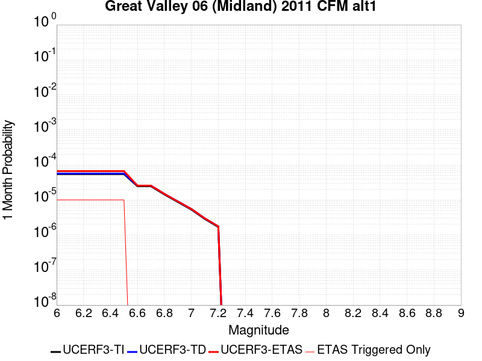 |  |  |

| Magnitude | 1 wk TI Prob | 1 wk TD Prob | 1 wk ETAS Prob | 1 wk ETAS/TD Gain | 1 wk ETAS Triggered Only | 1 mo TI Prob | 1 mo TD Prob | 1 mo ETAS Prob | 1 mo ETAS/TD Gain | 1 mo ETAS Triggered Only | 1 yr TI Prob | 1 yr TD Prob | 1 yr ETAS Prob | 1 yr ETAS/TD Gain | 1 yr ETAS Triggered Only | 10 yr TI Prob | 10 yr TD Prob | 10 yr ETAS Prob | 10 yr ETAS/TD Gain | 10 yr ETAS Triggered Only |
|-----|-----|-----|-----|-----|-----|-----|-----|-----|-----|-----|-----|-----|-----|-----|-----|-----|-----|-----|-----|-----|
| 6.0 | 1.2712525E-5 | 1.3210576E-5 | 2.3210443E-5 | 1.7569593 | 1.0E-5 | 5.4481112E-5 | 5.6615667E-5 | 6.66151E-5 | 1.1766195 | 1.0E-5 | 6.6310563E-4 | 6.8910315E-4 | 7.090894E-4 | 1.0290033 | 2.0E-5 | 0.0066113044 | 0.006872179 | 0.0068920413 | 1.0028902 | 2.0E-5 |
| 6.1 | 1.2712525E-5 | 1.3210576E-5 | 2.3210443E-5 | 1.7569593 | 1.0E-5 | 5.4481112E-5 | 5.6615667E-5 | 6.66151E-5 | 1.1766195 | 1.0E-5 | 6.6310563E-4 | 6.8910315E-4 | 7.090894E-4 | 1.0290033 | 2.0E-5 | 0.0066113044 | 0.006872179 | 0.0068920413 | 1.0028902 | 2.0E-5 |
| 6.2 | 1.2712525E-5 | 1.3210576E-5 | 2.3210443E-5 | 1.7569593 | 1.0E-5 | 5.4481112E-5 | 5.6615667E-5 | 6.66151E-5 | 1.1766195 | 1.0E-5 | 6.6310563E-4 | 6.8910315E-4 | 7.090894E-4 | 1.0290033 | 2.0E-5 | 0.0066113044 | 0.006872179 | 0.0068920413 | 1.0028902 | 2.0E-5 |
| 6.3 | 1.2712525E-5 | 1.3210576E-5 | 2.3210443E-5 | 1.7569593 | 1.0E-5 | 5.4481112E-5 | 5.6615667E-5 | 6.66151E-5 | 1.1766195 | 1.0E-5 | 6.6310563E-4 | 6.8910315E-4 | 7.090894E-4 | 1.0290033 | 2.0E-5 | 0.0066113044 | 0.006872179 | 0.0068920413 | 1.0028902 | 2.0E-5 |
| 6.4 | 1.2712525E-5 | 1.3210576E-5 | 2.3210443E-5 | 1.7569593 | 1.0E-5 | 5.4481112E-5 | 5.6615667E-5 | 6.66151E-5 | 1.1766195 | 1.0E-5 | 6.6310563E-4 | 6.8910315E-4 | 7.090894E-4 | 1.0290033 | 2.0E-5 | 0.0066113044 | 0.006872179 | 0.0068920413 | 1.0028902 | 2.0E-5 |
| 6.5 | 1.2712525E-5 | 1.3210576E-5 | 2.3210443E-5 | 1.7569593 | 1.0E-5 | 5.4481112E-5 | 5.6615667E-5 | 6.66151E-5 | 1.1766195 | 1.0E-5 | 6.6310563E-4 | 6.8910315E-4 | 7.090894E-4 | 1.0290033 | 2.0E-5 | 0.0066113044 | 0.006872179 | 0.0068920413 | 1.0028902 | 2.0E-5 |
| 6.6 | 5.7574384E-6 | 5.9706463E-6 | 5.9706463E-6 | 1.0 | 0.0 | 2.4674504E-5 | 2.5588255E-5 | 2.5588255E-5 | 1.0 | 0.0 | 3.0037065E-4 | 3.1149638E-4 | 3.2149328E-4 | 1.032093 | 1.0E-5 | 0.0029996498 | 0.0031109843 | 0.0031209532 | 1.0032045 | 1.0E-5 |
| 6.7 | 5.7574384E-6 | 5.9706463E-6 | 5.9706463E-6 | 1.0 | 0.0 | 2.4674504E-5 | 2.5588255E-5 | 2.5588255E-5 | 1.0 | 0.0 | 3.0037065E-4 | 3.1149638E-4 | 3.2149328E-4 | 1.032093 | 1.0E-5 | 0.0029996498 | 0.0031109843 | 0.0031209532 | 1.0032045 | 1.0E-5 |
| 6.8 | 3.3474828E-6 | 3.4693849E-6 | 3.4693849E-6 | 1.0 | 0.0 | 1.4346277E-5 | 1.4868716E-5 | 1.4868716E-5 | 1.0 | 0.0 | 1.7465191E-4 | 1.8101306E-4 | 1.8101306E-4 | 1.0 | 0.0 | 0.0017451472 | 0.0018088033 | 0.0018088033 | 1.0 | 0.0 |
| 6.9 | 2.035106E-6 | 2.1090357E-6 | 2.1090357E-6 | 1.0 | 0.0 | 8.721853E-6 | 9.038697E-6 | 9.038697E-6 | 1.0 | 0.0 | 1.0618339E-4 | 1.10041314E-4 | 1.10041314E-4 | 1.0 | 0.0 | 0.0010613267 | 0.0010999405 | 0.0010999405 | 1.0 | 0.0 |
| 7.0 | 1.2424716E-6 | 1.2878762E-6 | 1.2878762E-6 | 1.0 | 0.0 | 5.3248673E-6 | 5.51946E-6 | 5.51946E-6 | 1.0 | 0.0 | 6.482833E-5 | 6.7197805E-5 | 6.7197805E-5 | 1.0 | 0.0 | 6.480942E-4 | 6.718192E-4 | 6.718192E-4 | 1.0 | 0.0 |
| 7.1 | 6.6904556E-7 | 6.939035E-7 | 6.939035E-7 | 1.0 | 0.0 | 2.867335E-6 | 2.97387E-6 | 2.97387E-6 | 1.0 | 0.0 | 3.4909244E-5 | 3.6206526E-5 | 3.6206526E-5 | 1.0 | 0.0 | 3.490376E-4 | 3.6203177E-4 | 3.6203177E-4 | 1.0 | 0.0 |
| 7.2 | 3.948168E-7 | 4.095705E-7 | 4.095705E-7 | 1.0 | 0.0 | 1.6920709E-6 | 1.7553022E-6 | 1.7553022E-6 | 1.0 | 0.0 | 2.0600768E-5 | 2.1370803E-5 | 2.1370803E-5 | 1.0 | 0.0 | 2.0598859E-4 | 2.1370803E-4 | 2.1370803E-4 | 1.0 | 0.0 |

## Ortigalita (South)
*[(top)](#table-of-contents)*

| 1 Week | 1 Month | 1 Year | 10 Year |
|-----|-----|-----|-----|
|  | 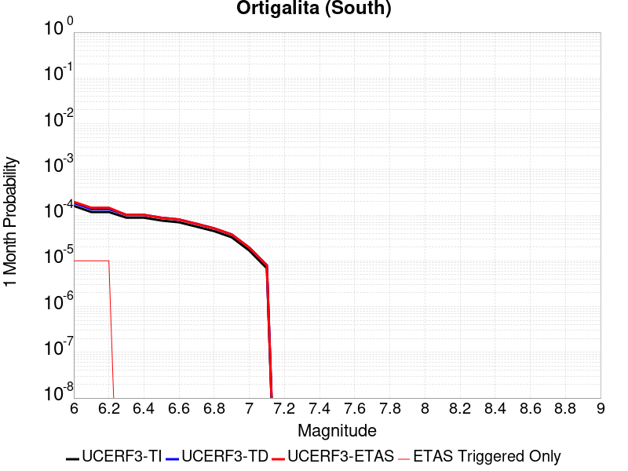 |  | 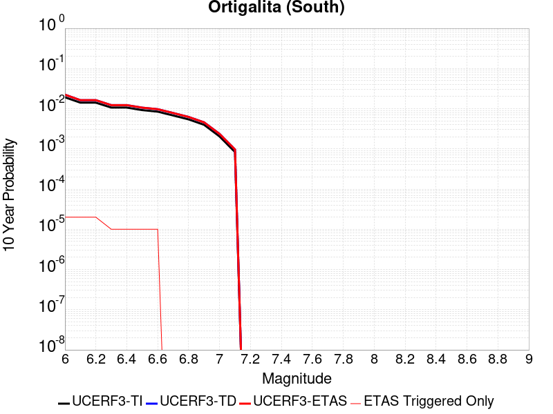 |

| Magnitude | 1 wk TI Prob | 1 wk TD Prob | 1 wk ETAS Prob | 1 wk ETAS/TD Gain | 1 wk ETAS Triggered Only | 1 mo TI Prob | 1 mo TD Prob | 1 mo ETAS Prob | 1 mo ETAS/TD Gain | 1 mo ETAS Triggered Only | 1 yr TI Prob | 1 yr TD Prob | 1 yr ETAS Prob | 1 yr ETAS/TD Gain | 1 yr ETAS Triggered Only | 10 yr TI Prob | 10 yr TD Prob | 10 yr ETAS Prob | 10 yr ETAS/TD Gain | 10 yr ETAS Triggered Only |
|-----|-----|-----|-----|-----|-----|-----|-----|-----|-----|-----|-----|-----|-----|-----|-----|-----|-----|-----|-----|-----|
| 6.0 | 3.72394E-5 | 4.32556E-5 | 5.3255168E-5 | 1.231174 | 1.0E-5 | 1.5958765E-4 | 1.8536886E-4 | 1.95367E-4 | 1.0539365 | 1.0E-5 | 0.0019412481 | 0.0022546863 | 0.0022646638 | 1.0044252 | 1.0E-5 | 0.019243775 | 0.022334501 | 0.022354055 | 1.0008755 | 2.0E-5 |
| 6.1 | 2.7299884E-5 | 3.1492036E-5 | 4.149172E-5 | 1.3175306 | 1.0E-5 | 1.16994255E-4 | 1.349592E-4 | 1.4495786E-4 | 1.0740864 | 1.0E-5 | 0.0014234743 | 0.0016419457 | 0.0016519293 | 1.0060804 | 1.0E-5 | 0.014143906 | 0.016304072 | 0.016323747 | 1.0012066 | 2.0E-5 |
| 6.2 | 2.7299884E-5 | 3.1492036E-5 | 4.149172E-5 | 1.3175306 | 1.0E-5 | 1.16994255E-4 | 1.349592E-4 | 1.4495786E-4 | 1.0740864 | 1.0E-5 | 0.0014234743 | 0.0016419457 | 0.0016519293 | 1.0060804 | 1.0E-5 | 0.014143906 | 0.016304072 | 0.016323747 | 1.0012066 | 2.0E-5 |
| 6.3 | 2.0546433E-5 | 2.3631454E-5 | 2.3631454E-5 | 1.0 | 0.0 | 8.805317E-5 | 1.0127383E-4 | 1.0127383E-4 | 1.0 | 0.0 | 0.00107152 | 0.0012323305 | 0.0012323305 | 1.0 | 0.0 | 0.010663681 | 0.012257031 | 0.012266909 | 1.0008059 | 1.0E-5 |
| 6.4 | 2.0546433E-5 | 2.3631454E-5 | 2.3631454E-5 | 1.0 | 0.0 | 8.805317E-5 | 1.0127383E-4 | 1.0127383E-4 | 1.0 | 0.0 | 0.00107152 | 0.0012323305 | 0.0012323305 | 1.0 | 0.0 | 0.010663681 | 0.012257031 | 0.012266909 | 1.0008059 | 1.0E-5 |
| 6.5 | 1.7779594E-5 | 2.0446974E-5 | 2.0446974E-5 | 1.0 | 0.0 | 7.619603E-5 | 8.762703E-5 | 8.762703E-5 | 1.0 | 0.0 | 9.272918E-4 | 0.0010663505 | 0.0010663505 | 1.0 | 0.0 | 0.009234319 | 0.010613804 | 0.010623697 | 1.0009322 | 1.0E-5 |
| 6.6 | 1.6272212E-5 | 1.8714967E-5 | 1.8714967E-5 | 1.0 | 0.0 | 6.973618E-5 | 8.0204605E-5 | 8.0204605E-5 | 1.0 | 0.0 | 8.487073E-4 | 9.760659E-4 | 9.760659E-4 | 1.0 | 0.0 | 0.008454733 | 0.009719091 | 0.009728993 | 1.0010189 | 1.0E-5 |
| 6.7 | 1.3051484E-5 | 1.5038758E-5 | 1.5038758E-5 | 1.0 | 0.0 | 5.593373E-5 | 6.445028E-5 | 6.445028E-5 | 1.0 | 0.0 | 6.807804E-4 | 7.844092E-4 | 7.844092E-4 | 1.0 | 0.0 | 0.006786986 | 0.007817388 | 0.007817388 | 1.0 | 0.0 |
| 6.8 | 1.04277415E-5 | 1.1987235E-5 | 1.1987235E-5 | 1.0 | 0.0 | 4.4689557E-5 | 5.1372896E-5 | 5.1372896E-5 | 1.0 | 0.0 | 5.439595E-4 | 6.2529295E-4 | 6.2529295E-4 | 1.0 | 0.0 | 0.0054262993 | 0.00623609 | 0.00623609 | 1.0 | 0.0 |
| 6.9 | 7.639968E-6 | 8.791503E-6 | 8.791503E-6 | 1.0 | 0.0 | 3.274231E-5 | 3.767736E-5 | 3.767736E-5 | 1.0 | 0.0 | 3.9856473E-4 | 4.586312E-4 | 4.586312E-4 | 1.0 | 0.0 | 0.003978506 | 0.004577433 | 0.004577433 | 1.0 | 0.0 |
| 7.0 | 3.919831E-6 | 4.5334014E-6 | 4.5334014E-6 | 1.0 | 0.0 | 1.679917E-5 | 1.942873E-5 | 1.942873E-5 | 1.0 | 0.0 | 2.045107E-4 | 2.3652123E-4 | 2.3652123E-4 | 1.0 | 0.0 | 0.0020432258 | 0.0023629034 | 0.0023629034 | 1.0 | 0.0 |
| 7.1 | 1.6017933E-6 | 1.8570418E-6 | 1.8570418E-6 | 1.0 | 0.0 | 6.8648105E-6 | 7.958732E-6 | 7.958732E-6 | 1.0 | 0.0 | 8.357586E-5 | 9.689432E-5 | 9.689432E-5 | 1.0 | 0.0 | 8.3544437E-4 | 9.686254E-4 | 9.686254E-4 | 1.0 | 0.0 |

## Great Valley 11
*[(top)](#table-of-contents)*

| 1 Week | 1 Month | 1 Year | 10 Year |
|-----|-----|-----|-----|
| 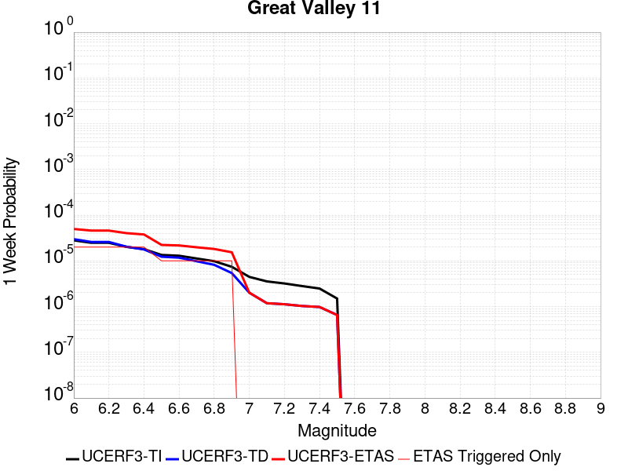 |  |  |  |

| Magnitude | 1 wk TI Prob | 1 wk TD Prob | 1 wk ETAS Prob | 1 wk ETAS/TD Gain | 1 wk ETAS Triggered Only | 1 mo TI Prob | 1 mo TD Prob | 1 mo ETAS Prob | 1 mo ETAS/TD Gain | 1 mo ETAS Triggered Only | 1 yr TI Prob | 1 yr TD Prob | 1 yr ETAS Prob | 1 yr ETAS/TD Gain | 1 yr ETAS Triggered Only | 10 yr TI Prob | 10 yr TD Prob | 10 yr ETAS Prob | 10 yr ETAS/TD Gain | 10 yr ETAS Triggered Only |
|-----|-----|-----|-----|-----|-----|-----|-----|-----|-----|-----|-----|-----|-----|-----|-----|-----|-----|-----|-----|-----|
| 6.0 | 2.8099583E-5 | 2.983214E-5 | 4.9831542E-5 | 1.6703979 | 2.0E-5 | 1.20421224E-4 | 1.2784619E-4 | 1.4784362E-4 | 1.156418 | 2.0E-5 | 0.0014651422 | 0.0015554894 | 0.0015754583 | 1.0128376 | 2.0E-5 | 0.0145552 | 0.015453546 | 0.015473237 | 1.0012742 | 2.0E-5 |
| 6.1 | 2.483194E-5 | 2.5907144E-5 | 4.5906625E-5 | 1.7719679 | 2.0E-5 | 1.0641825E-4 | 1.11026246E-4 | 1.3102403E-4 | 1.1801176 | 2.0E-5 | 0.0012948721 | 0.0013509697 | 0.0013709427 | 1.0147842 | 2.0E-5 | 0.012873529 | 0.013433979 | 0.01345371 | 1.0014688 | 2.0E-5 |
| 6.2 | 2.483194E-5 | 2.5907144E-5 | 4.5906625E-5 | 1.7719679 | 2.0E-5 | 1.0641825E-4 | 1.11026246E-4 | 1.3102403E-4 | 1.1801176 | 2.0E-5 | 0.0012948721 | 0.0013509697 | 0.0013709427 | 1.0147842 | 2.0E-5 | 0.012873529 | 0.013433979 | 0.01345371 | 1.0014688 | 2.0E-5 |
| 6.3 | 2.0257901E-5 | 2.0398915E-5 | 4.0398507E-5 | 1.9804244 | 2.0E-5 | 8.681669E-5 | 8.742122E-5 | 1.0741947E-4 | 1.2287574 | 2.0E-5 | 0.0010564806 | 0.0010638753 | 0.001083854 | 1.0187792 | 2.0E-5 | 0.01051472 | 0.010591993 | 0.010611782 | 1.0018682 | 2.0E-5 |
| 6.4 | 1.8054898E-5 | 1.7780852E-5 | 3.7780497E-5 | 2.1247854 | 2.0E-5 | 7.737584E-5 | 7.6201635E-5 | 9.620011E-5 | 1.2624415 | 2.0E-5 | 9.416436E-4 | 9.2739763E-4 | 9.473791E-4 | 1.0215458 | 2.0E-5 | 0.009376635 | 0.009239015 | 0.00925883 | 1.0021447 | 2.0E-5 |
| 6.5 | 1.34804895E-5 | 1.2321004E-5 | 2.232088E-5 | 1.8116121 | 1.0E-5 | 5.777225E-5 | 5.2803258E-5 | 6.280273E-5 | 1.1893723 | 1.0E-5 | 7.031501E-4 | 6.426942E-4 | 6.5268774E-4 | 1.0155495 | 1.0E-5 | 0.007009294 | 0.006408792 | 0.0064187283 | 1.0015503 | 1.0E-5 |
| 6.6 | 1.294883E-5 | 1.1732261E-5 | 2.1732143E-5 | 1.8523407 | 1.0E-5 | 5.5493805E-5 | 5.028017E-5 | 6.0279668E-5 | 1.1988755 | 1.0E-5 | 6.754276E-4 | 6.1199325E-4 | 6.219871E-4 | 1.01633 | 1.0E-5 | 0.006733784 | 0.0061035044 | 0.0061134435 | 1.0016284 | 1.0E-5 |
| 6.7 | 1.1272237E-5 | 9.811834E-6 | 1.9811736E-5 | 2.0191674 | 1.0E-5 | 4.8308695E-5 | 4.205006E-5 | 5.204964E-5 | 1.2378018 | 1.0E-5 | 5.879996E-4 | 5.1184196E-4 | 5.218368E-4 | 1.0195273 | 1.0E-5 | 0.005864462 | 0.005106915 | 0.0051168636 | 1.0019481 | 1.0E-5 |
| 6.8 | 9.8337505E-6 | 8.193719E-6 | 1.8193638E-5 | 2.220437 | 1.0E-5 | 4.2143965E-5 | 3.5115478E-5 | 4.5115125E-5 | 1.2847648 | 1.0E-5 | 5.1298196E-4 | 4.2744912E-4 | 4.3744483E-4 | 1.0233846 | 1.0E-5 | 0.005117994 | 0.0042664795 | 0.0042764368 | 1.0023339 | 1.0E-5 |
| 6.9 | 7.4224813E-6 | 5.4130837E-6 | 1.541303E-5 | 2.8473659 | 1.0E-5 | 3.1810247E-5 | 2.3198732E-5 | 3.31985E-5 | 1.431048 | 1.0E-5 | 3.872209E-4 | 2.8240937E-4 | 2.9240653E-4 | 1.0353996 | 1.0E-5 | 0.0038654688 | 0.0028206457 | 0.0028306174 | 1.0035353 | 1.0E-5 |
| 7.0 | 4.4628923E-6 | 2.0110294E-6 | 2.0110294E-6 | 1.0 | 0.0 | 1.912654E-5 | 8.61867E-6 | 8.61867E-6 | 1.0 | 0.0 | 2.3284076E-4 | 1.0492737E-4 | 1.0492737E-4 | 1.0 | 0.0 | 0.0023259693 | 0.0010487898 | 0.0010487898 | 1.0 | 0.0 |
| 7.1 | 3.5546527E-6 | 1.1855383E-6 | 1.1855383E-6 | 1.0 | 0.0 | 1.5234136E-5 | 5.080869E-6 | 5.080869E-6 | 1.0 | 0.0 | 1.8545982E-4 | 6.185789E-5 | 6.185789E-5 | 1.0 | 0.0 | 0.0018530512 | 6.1841356E-4 | 6.1841356E-4 | 1.0 | 0.0 |
| 7.2 | 3.2039936E-6 | 1.1253728E-6 | 1.1253728E-6 | 1.0 | 0.0 | 1.3731329E-5 | 4.8230177E-6 | 4.8230177E-6 | 1.0 | 0.0 | 1.671661E-4 | 5.8718724E-5 | 5.8718724E-5 | 1.0 | 0.0 | 0.0016704041 | 5.870388E-4 | 5.870388E-4 | 1.0 | 0.0 |
| 7.3 | 2.8120473E-6 | 1.0305271E-6 | 1.0305271E-6 | 1.0 | 0.0 | 1.2051575E-5 | 4.4165376E-6 | 4.4165376E-6 | 1.0 | 0.0 | 1.4671806E-4 | 5.3770087E-5 | 5.3770087E-5 | 1.0 | 0.0 | 0.0014662122 | 5.375774E-4 | 5.375774E-4 | 1.0 | 0.0 |
| 7.4 | 2.4837766E-6 | 9.80032E-7 | 9.80032E-7 | 1.0 | 0.0 | 1.0644713E-5 | 4.2001307E-6 | 4.2001307E-6 | 1.0 | 0.0 | 1.2959167E-4 | 5.113546E-5 | 5.113546E-5 | 1.0 | 0.0 | 0.0012951613 | 5.1124353E-4 | 5.1124353E-4 | 1.0 | 0.0 |
| 7.5 | 1.5002679E-6 | 6.545985E-7 | 6.545985E-7 | 1.0 | 0.0 | 6.4297037E-6 | 2.8054194E-6 | 2.8054194E-6 | 1.0 | 0.0 | 7.827883E-5 | 3.4155488E-5 | 3.4155488E-5 | 1.0 | 0.0 | 7.825126E-4 | 3.4150656E-4 | 3.4150656E-4 | 1.0 | 0.0 |

## Great Valley 04a Trout Creek
*[(top)](#table-of-contents)*

| 1 Week | 1 Month | 1 Year | 10 Year |
|-----|-----|-----|-----|
|  |  |  |  |

| Magnitude | 1 wk TI Prob | 1 wk TD Prob | 1 wk ETAS Prob | 1 wk ETAS/TD Gain | 1 wk ETAS Triggered Only | 1 mo TI Prob | 1 mo TD Prob | 1 mo ETAS Prob | 1 mo ETAS/TD Gain | 1 mo ETAS Triggered Only | 1 yr TI Prob | 1 yr TD Prob | 1 yr ETAS Prob | 1 yr ETAS/TD Gain | 1 yr ETAS Triggered Only | 10 yr TI Prob | 10 yr TD Prob | 10 yr ETAS Prob | 10 yr ETAS/TD Gain | 10 yr ETAS Triggered Only |
|-----|-----|-----|-----|-----|-----|-----|-----|-----|-----|-----|-----|-----|-----|-----|-----|-----|-----|-----|-----|-----|
| 6.0 | 1.4088538E-5 | 1.5719554E-5 | 1.5719554E-5 | 1.0 | 0.0 | 6.037805E-5 | 6.7367844E-5 | 6.7367844E-5 | 1.0 | 0.0 | 7.3485484E-4 | 8.199074E-4 | 8.199074E-4 | 1.0 | 0.0 | 0.007324295 | 0.008170108 | 0.008189945 | 1.0024279 | 2.0E-5 |
| 6.1 | 1.4088538E-5 | 1.5719554E-5 | 1.5719554E-5 | 1.0 | 0.0 | 6.037805E-5 | 6.7367844E-5 | 6.7367844E-5 | 1.0 | 0.0 | 7.3485484E-4 | 8.199074E-4 | 8.199074E-4 | 1.0 | 0.0 | 0.007324295 | 0.008170108 | 0.008189945 | 1.0024279 | 2.0E-5 |
| 6.2 | 1.4088538E-5 | 1.5719554E-5 | 1.5719554E-5 | 1.0 | 0.0 | 6.037805E-5 | 6.7367844E-5 | 6.7367844E-5 | 1.0 | 0.0 | 7.3485484E-4 | 8.199074E-4 | 8.199074E-4 | 1.0 | 0.0 | 0.007324295 | 0.008170108 | 0.008189945 | 1.0024279 | 2.0E-5 |
| 6.3 | 1.2882862E-5 | 1.4378603E-5 | 1.4378603E-5 | 1.0 | 0.0 | 5.5211098E-5 | 6.1621184E-5 | 6.1621184E-5 | 1.0 | 0.0 | 6.7198783E-4 | 7.4999005E-4 | 7.4999005E-4 | 1.0 | 0.0 | 0.0066995937 | 0.0074756527 | 0.0074955034 | 1.0026554 | 2.0E-5 |
| 6.4 | 1.2882862E-5 | 1.4378603E-5 | 1.4378603E-5 | 1.0 | 0.0 | 5.5211098E-5 | 6.1621184E-5 | 6.1621184E-5 | 1.0 | 0.0 | 6.7198783E-4 | 7.4999005E-4 | 7.4999005E-4 | 1.0 | 0.0 | 0.0066995937 | 0.0074756527 | 0.0074955034 | 1.0026554 | 2.0E-5 |
| 6.5 | 1.2762329E-5 | 1.424516E-5 | 1.424516E-5 | 1.0 | 0.0 | 5.469455E-5 | 6.1049315E-5 | 6.1049315E-5 | 1.0 | 0.0 | 6.657027E-4 | 7.430323E-4 | 7.430323E-4 | 1.0 | 0.0 | 0.00663712 | 0.0074065393 | 0.007426391 | 1.0026803 | 2.0E-5 |
| 6.6 | 1.2762329E-5 | 1.424516E-5 | 1.424516E-5 | 1.0 | 0.0 | 5.469455E-5 | 6.1049315E-5 | 6.1049315E-5 | 1.0 | 0.0 | 6.657027E-4 | 7.430323E-4 | 7.430323E-4 | 1.0 | 0.0 | 0.00663712 | 0.0074065393 | 0.007426391 | 1.0026803 | 2.0E-5 |
| 6.7 | 1.2557959E-5 | 1.4019395E-5 | 1.4019395E-5 | 1.0 | 0.0 | 5.3818712E-5 | 6.0081795E-5 | 6.0081795E-5 | 1.0 | 0.0 | 6.5504585E-4 | 7.312607E-4 | 7.312607E-4 | 1.0 | 0.0 | 0.006531183 | 0.007289598 | 0.0073094526 | 1.0027237 | 2.0E-5 |
| 6.8 | 1.1871544E-5 | 1.3258823E-5 | 1.3258823E-5 | 1.0 | 0.0 | 5.0877054E-5 | 5.6822348E-5 | 5.6822348E-5 | 1.0 | 0.0 | 6.1925204E-4 | 6.916025E-4 | 6.916025E-4 | 1.0 | 0.0 | 0.0061752927 | 0.0068955184 | 0.0069153807 | 1.0028805 | 2.0E-5 |
| 6.9 | 1.0500373E-5 | 1.1731261E-5 | 1.1731261E-5 | 1.0 | 0.0 | 4.5000823E-5 | 5.0275914E-5 | 5.0275914E-5 | 1.0 | 0.0 | 5.4774724E-4 | 6.119459E-4 | 6.119459E-4 | 1.0 | 0.0 | 0.005463991 | 0.0061034737 | 0.006123352 | 1.0032568 | 2.0E-5 |
| 7.0 | 8.524332E-6 | 9.5334835E-6 | 9.5334835E-6 | 1.0 | 0.0 | 3.653234E-5 | 4.0857187E-5 | 4.0857187E-5 | 1.0 | 0.0 | 4.4469046E-4 | 4.9733004E-4 | 4.9733004E-4 | 1.0 | 0.0 | 0.0044380166 | 0.004962902 | 0.004982803 | 1.0040098 | 2.0E-5 |
| 7.1 | 6.006849E-6 | 6.711559E-6 | 6.711559E-6 | 1.0 | 0.0 | 2.5743384E-5 | 2.876354E-5 | 2.876354E-5 | 1.0 | 0.0 | 3.1338062E-4 | 3.501454E-4 | 3.501454E-4 | 1.0 | 0.0 | 0.0031293905 | 0.0034964874 | 0.0035064525 | 1.00285 | 1.0E-5 |
| 7.2 | 2.9122193E-6 | 3.2465305E-6 | 3.2465305E-6 | 1.0 | 0.0 | 1.248088E-5 | 1.3913637E-5 | 1.3913637E-5 | 1.0 | 0.0 | 1.5194413E-4 | 1.6938712E-4 | 1.6938712E-4 | 1.0 | 0.0 | 0.0015184027 | 0.0016927521 | 0.0017027352 | 1.0058975 | 1.0E-5 |
| 7.3 | 7.2194007E-7 | 7.988761E-7 | 7.988761E-7 | 1.0 | 0.0 | 3.0940253E-6 | 3.4237528E-6 | 3.4237528E-6 | 1.0 | 0.0 | 3.7669106E-5 | 4.1683852E-5 | 4.1683852E-5 | 1.0 | 0.0 | 3.766272E-4 | 4.168053E-4 | 4.168053E-4 | 1.0 | 0.0 |
| 7.4 | 3.112171E-8 | 3.2068368E-8 | 3.2068368E-8 | 1.0 | 0.0 | 1.3337875E-7 | 1.3743585E-7 | 1.3743585E-7 | 1.0 | 0.0 | 1.6238852E-6 | 1.6732803E-6 | 1.6732803E-6 | 1.0 | 0.0 | 1.6238733E-5 | 1.6732685E-5 | 1.6732685E-5 | 1.0 | 0.0 |

## Hector Mine
*[(top)](#table-of-contents)*

| 1 Week | 1 Month | 1 Year | 10 Year |
|-----|-----|-----|-----|
|  |  |  |  |

| Magnitude | 1 wk TI Prob | 1 wk TD Prob | 1 wk ETAS Prob | 1 wk ETAS/TD Gain | 1 wk ETAS Triggered Only | 1 mo TI Prob | 1 mo TD Prob | 1 mo ETAS Prob | 1 mo ETAS/TD Gain | 1 mo ETAS Triggered Only | 1 yr TI Prob | 1 yr TD Prob | 1 yr ETAS Prob | 1 yr ETAS/TD Gain | 1 yr ETAS Triggered Only | 10 yr TI Prob | 10 yr TD Prob | 10 yr ETAS Prob | 10 yr ETAS/TD Gain | 10 yr ETAS Triggered Only |
|-----|-----|-----|-----|-----|-----|-----|-----|-----|-----|-----|-----|-----|-----|-----|-----|-----|-----|-----|-----|-----|
| 6.0 | 1.8760093E-5 | 2.7962699E-6 | 2.7962699E-6 | 1.0 | 0.0 | 8.039792E-5 | 1.19839815E-5 | 2.1983862E-5 | 1.8344373 | 1.0E-5 | 9.78405E-4 | 1.458992E-4 | 1.6589629E-4 | 1.1370609 | 2.0E-5 | 0.009741086 | 0.0014584264 | 0.0014783972 | 1.0136935 | 2.0E-5 |
| 6.1 | 1.8760093E-5 | 2.7962699E-6 | 2.7962699E-6 | 1.0 | 0.0 | 8.039792E-5 | 1.19839815E-5 | 2.1983862E-5 | 1.8344373 | 1.0E-5 | 9.78405E-4 | 1.458992E-4 | 1.6589629E-4 | 1.1370609 | 2.0E-5 | 0.009741086 | 0.0014584264 | 0.0014783972 | 1.0136935 | 2.0E-5 |
| 6.2 | 1.8760093E-5 | 2.7962699E-6 | 2.7962699E-6 | 1.0 | 0.0 | 8.039792E-5 | 1.19839815E-5 | 2.1983862E-5 | 1.8344373 | 1.0E-5 | 9.78405E-4 | 1.458992E-4 | 1.6589629E-4 | 1.1370609 | 2.0E-5 | 0.009741086 | 0.0014584264 | 0.0014783972 | 1.0136935 | 2.0E-5 |
| 6.3 | 1.8760093E-5 | 2.7962699E-6 | 2.7962699E-6 | 1.0 | 0.0 | 8.039792E-5 | 1.19839815E-5 | 2.1983862E-5 | 1.8344373 | 1.0E-5 | 9.78405E-4 | 1.458992E-4 | 1.6589629E-4 | 1.1370609 | 2.0E-5 | 0.009741086 | 0.0014584264 | 0.0014783972 | 1.0136935 | 2.0E-5 |
| 6.4 | 1.0888055E-5 | 2.7962699E-6 | 2.7962699E-6 | 1.0 | 0.0 | 4.666226E-5 | 1.19839815E-5 | 2.1983862E-5 | 1.8344373 | 1.0E-5 | 5.679649E-4 | 1.458992E-4 | 1.6589629E-4 | 1.1370609 | 2.0E-5 | 0.0056651547 | 0.0014584264 | 0.0014783972 | 1.0136935 | 2.0E-5 |
| 6.5 | 1.0888055E-5 | 2.7962699E-6 | 2.7962699E-6 | 1.0 | 0.0 | 4.666226E-5 | 1.19839815E-5 | 2.1983862E-5 | 1.8344373 | 1.0E-5 | 5.679649E-4 | 1.458992E-4 | 1.6589629E-4 | 1.1370609 | 2.0E-5 | 0.0056651547 | 0.0014584264 | 0.0014783972 | 1.0136935 | 2.0E-5 |
| 6.6 | 1.0730738E-5 | 2.7962699E-6 | 2.7962699E-6 | 1.0 | 0.0 | 4.5988065E-5 | 1.19839815E-5 | 2.1983862E-5 | 1.8344373 | 1.0E-5 | 5.5976084E-4 | 1.458992E-4 | 1.6589629E-4 | 1.1370609 | 2.0E-5 | 0.0055835294 | 0.0014584264 | 0.0014783972 | 1.0136935 | 2.0E-5 |
| 6.7 | 7.881326E-6 | 2.770952E-6 | 2.770952E-6 | 1.0 | 0.0 | 3.3776672E-5 | 1.1875478E-5 | 2.187536E-5 | 1.8420614 | 1.0E-5 | 4.111534E-4 | 1.4457834E-4 | 1.6457545E-4 | 1.1383133 | 2.0E-5 | 0.0041039353 | 0.001445235 | 0.001465206 | 1.0138186 | 2.0E-5 |
| 6.8 | 7.5683483E-6 | 2.7327321E-6 | 2.7327321E-6 | 1.0 | 0.0 | 3.2435375E-5 | 1.1711679E-5 | 2.1711561E-5 | 1.8538386 | 1.0E-5 | 3.9482914E-4 | 1.4258435E-4 | 1.625815E-4 | 1.1402478 | 2.0E-5 | 0.0039412836 | 0.0014253207 | 0.0014452923 | 1.014012 | 2.0E-5 |
| 6.9 | 6.473048E-6 | 2.513824E-6 | 2.513824E-6 | 1.0 | 0.0 | 2.7741338E-5 | 1.07735095E-5 | 2.0773401E-5 | 1.9281926 | 1.0E-5 | 3.3769844E-4 | 1.3116356E-4 | 1.5116093E-4 | 1.1524614 | 2.0E-5 | 0.0033718573 | 0.001311251 | 0.0013312247 | 1.0152326 | 2.0E-5 |
| 7.0 | 4.9959954E-6 | 1.8564588E-6 | 1.8564588E-6 | 1.0 | 0.0 | 2.1411232E-5 | 7.956248E-6 | 7.956248E-6 | 1.0 | 0.0 | 2.6065056E-4 | 9.686658E-5 | 9.686658E-5 | 1.0 | 0.0 | 0.0026034506 | 9.685931E-4 | 9.685931E-4 | 1.0 | 0.0 |
| 7.1 | 1.2997541E-6 | 1.5599346E-7 | 1.5599346E-7 | 1.0 | 0.0 | 5.5703626E-6 | 6.685433E-7 | 6.685433E-7 | 1.0 | 0.0 | 6.7817055E-5 | 8.139488E-6 | 8.139488E-6 | 1.0 | 0.0 | 6.779636E-4 | 8.1392296E-5 | 8.1392296E-5 | 1.0 | 0.0 |
| 7.2 | 8.392699E-7 | 9.725453E-8 | 9.725453E-8 | 1.0 | 0.0 | 3.596866E-6 | 4.1680505E-7 | 4.1680505E-7 | 1.0 | 0.0 | 4.3790962E-5 | 5.0745916E-6 | 5.0745916E-6 | 1.0 | 0.0 | 4.3782333E-4 | 5.074495E-5 | 5.074495E-5 | 1.0 | 0.0 |
| 7.3 | 3.13015E-7 | 4.8283802E-8 | 4.8283802E-8 | 1.0 | 0.0 | 1.3414921E-6 | 2.0693057E-7 | 2.0693057E-7 | 1.0 | 0.0 | 1.6332544E-5 | 2.5193776E-6 | 2.5193776E-6 | 1.0 | 0.0 | 1.6331344E-4 | 2.5193574E-5 | 2.5193574E-5 | 1.0 | 0.0 |

## Maacama 2011 CFM
*[(top)](#table-of-contents)*

| 1 Week | 1 Month | 1 Year | 10 Year |
|-----|-----|-----|-----|
|  |  |  | 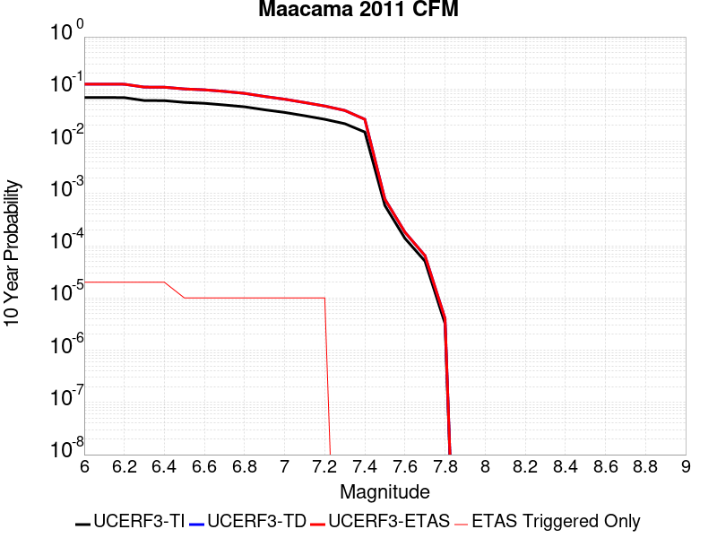 |

| Magnitude | 1 wk TI Prob | 1 wk TD Prob | 1 wk ETAS Prob | 1 wk ETAS/TD Gain | 1 wk ETAS Triggered Only | 1 mo TI Prob | 1 mo TD Prob | 1 mo ETAS Prob | 1 mo ETAS/TD Gain | 1 mo ETAS Triggered Only | 1 yr TI Prob | 1 yr TD Prob | 1 yr ETAS Prob | 1 yr ETAS/TD Gain | 1 yr ETAS Triggered Only | 10 yr TI Prob | 10 yr TD Prob | 10 yr ETAS Prob | 10 yr ETAS/TD Gain | 10 yr ETAS Triggered Only |
|-----|-----|-----|-----|-----|-----|-----|-----|-----|-----|-----|-----|-----|-----|-----|-----|-----|-----|-----|-----|-----|
| 6.0 | 1.368203E-4 | 2.579087E-4 | 2.579087E-4 | 1.0 | 0.0 | 5.862409E-4 | 0.0011047592 | 0.0011047592 | 1.0 | 0.0 | 0.0071141496 | 0.013350345 | 0.013350345 | 1.0 | 0.0 | 0.06890667 | 0.1241916 | 0.12420911 | 1.000141 | 2.0E-5 |
| 6.1 | 1.368203E-4 | 2.579087E-4 | 2.579087E-4 | 1.0 | 0.0 | 5.862409E-4 | 0.0011047592 | 0.0011047592 | 1.0 | 0.0 | 0.0071141496 | 0.013350345 | 0.013350345 | 1.0 | 0.0 | 0.06890667 | 0.1241916 | 0.12420911 | 1.000141 | 2.0E-5 |
| 6.2 | 1.360743E-4 | 2.566557E-4 | 2.566557E-4 | 1.0 | 0.0 | 5.8304524E-4 | 0.001099394 | 0.001099394 | 1.0 | 0.0 | 0.007075496 | 0.013285898 | 0.013285898 | 1.0 | 0.0 | 0.06854413 | 0.123625994 | 0.123643525 | 1.0001417 | 2.0E-5 |
| 6.3 | 1.1917239E-4 | 2.236021E-4 | 2.236021E-4 | 1.0 | 0.0 | 5.1063887E-4 | 9.578717E-4 | 9.578717E-4 | 1.0 | 0.0 | 0.0061993203 | 0.0115873255 | 0.0115873255 | 1.0 | 0.0 | 0.060292065 | 0.108845875 | 0.1088637 | 1.0001638 | 2.0E-5 |
| 6.4 | 1.1859289E-4 | 2.2263796E-4 | 2.2263796E-4 | 1.0 | 0.0 | 5.0815626E-4 | 9.537432E-4 | 9.537432E-4 | 1.0 | 0.0 | 0.006169266 | 0.011537647 | 0.011537647 | 1.0 | 0.0 | 0.06000784 | 0.10840272 | 0.10842056 | 1.0001645 | 2.0E-5 |
| 6.5 | 1.09512424E-4 | 2.0517908E-4 | 2.0517908E-4 | 1.0 | 0.0 | 4.6925453E-4 | 8.7897904E-4 | 8.7897904E-4 | 1.0 | 0.0 | 0.005698218 | 0.010639169 | 0.010639169 | 1.0 | 0.0 | 0.055543028 | 0.1004949 | 0.10050389 | 1.0000895 | 1.0E-5 |
| 6.6 | 1.0502928E-4 | 1.9675294E-4 | 1.9675294E-4 | 1.0 | 0.0 | 4.500478E-4 | 8.429031E-4 | 8.429031E-4 | 1.0 | 0.0 | 0.0054655746 | 0.010205293 | 0.010205293 | 1.0 | 0.0 | 0.053330887 | 0.0966474 | 0.096656434 | 1.0000935 | 1.0E-5 |
| 6.7 | 9.739358E-5 | 1.8259176E-4 | 1.8259176E-4 | 1.0 | 0.0 | 4.173343E-4 | 7.822563E-4 | 7.822563E-4 | 1.0 | 0.0 | 0.0050692135 | 0.009475343 | 0.009475343 | 1.0 | 0.0 | 0.049551267 | 0.09012011 | 0.090129204 | 1.000101 | 1.0E-5 |
| 6.8 | 8.969524E-5 | 1.6658378E-4 | 1.6658378E-4 | 1.0 | 0.0 | 3.8435153E-4 | 7.1369443E-4 | 7.1369443E-4 | 1.0 | 0.0 | 0.0046694432 | 0.00864909 | 0.00864909 | 1.0 | 0.0 | 0.045725387 | 0.08265246 | 0.082661636 | 1.000111 | 1.0E-5 |
| 6.9 | 7.838291E-5 | 1.4418772E-4 | 1.4418772E-4 | 1.0 | 0.0 | 3.358835E-4 | 6.1778206E-4 | 6.1778206E-4 | 1.0 | 0.0 | 0.0040817154 | 0.007491724 | 0.007491724 | 1.0 | 0.0 | 0.04007554 | 0.07205298 | 0.072062254 | 1.0001287 | 1.0E-5 |
| 7.0 | 6.961957E-5 | 1.2708071E-4 | 1.2708071E-4 | 1.0 | 0.0 | 2.9833548E-4 | 5.445059E-4 | 5.445059E-4 | 1.0 | 0.0 | 0.0036261857 | 0.006606692 | 0.006606692 | 1.0 | 0.0 | 0.035675827 | 0.063871816 | 0.063881174 | 1.0001465 | 1.0E-5 |
| 7.1 | 5.999398E-5 | 1.09053384E-4 | 1.09053384E-4 | 1.0 | 0.0 | 2.570917E-4 | 4.6728246E-4 | 4.6728246E-4 | 1.0 | 0.0 | 0.0031255994 | 0.00567284 | 0.00567284 | 1.0 | 0.0 | 0.030820016 | 0.055139277 | 0.055148724 | 1.0001713 | 1.0E-5 |
| 7.2 | 5.116532E-5 | 9.305489E-5 | 9.305489E-5 | 1.0 | 0.0 | 2.1926152E-4 | 3.9874107E-4 | 3.9874107E-4 | 1.0 | 0.0 | 0.002666241 | 0.00484315 | 0.00484315 | 1.0 | 0.0 | 0.026344774 | 0.047303654 | 0.04731318 | 1.0002013 | 1.0E-5 |
| 7.3 | 4.2087835E-5 | 7.617064E-5 | 7.617064E-5 | 1.0 | 0.0 | 1.8036396E-4 | 3.264016E-4 | 3.264016E-4 | 1.0 | 0.0 | 0.0021937196 | 0.0039662397 | 0.0039662397 | 1.0 | 0.0 | 0.0217219 | 0.038905017 | 0.038905017 | 1.0 | 0.0 |
| 7.4 | 2.8991652E-5 | 5.1163643E-5 | 5.1163643E-5 | 1.0 | 0.0 | 1.2424402E-4 | 2.1925455E-4 | 2.1925455E-4 | 1.0 | 0.0 | 0.0015116213 | 0.0026661097 | 0.0026661097 | 1.0 | 0.0 | 0.015013801 | 0.026332043 | 0.026332043 | 1.0 | 0.0 |
| 7.5 | 1.1292299E-6 | 1.4950216E-6 | 1.4950216E-6 | 1.0 | 0.0 | 4.8395473E-6 | 6.407227E-6 | 6.407227E-6 | 1.0 | 0.0 | 5.8919897E-5 | 7.8006444E-5 | 7.8006444E-5 | 1.0 | 0.0 | 5.890428E-4 | 7.805042E-4 | 7.805042E-4 | 1.0 | 0.0 |
| 7.6 | 2.6535366E-7 | 3.4720998E-7 | 3.4720998E-7 | 1.0 | 0.0 | 1.1372296E-6 | 1.4880419E-6 | 1.4880419E-6 | 1.0 | 0.0 | 1.3845682E-5 | 1.811676E-5 | 1.811676E-5 | 1.0 | 0.0 | 1.3844819E-4 | 1.8170691E-4 | 1.8170691E-4 | 1.0 | 0.0 |
| 7.7 | 9.727789E-8 | 1.2302418E-7 | 1.2302418E-7 | 1.0 | 0.0 | 4.1690518E-7 | 5.2724636E-7 | 5.2724636E-7 | 1.0 | 0.0 | 5.0758085E-6 | 6.419206E-6 | 6.419206E-6 | 1.0 | 0.0 | 5.0756928E-5 | 6.456404E-5 | 6.456404E-5 | 1.0 | 0.0 |
| 7.8 | 6.1939325E-9 | 7.711711E-9 | 7.711711E-9 | 1.0 | 0.0 | 2.6545425E-8 | 3.305019E-8 | 3.305019E-8 | 1.0 | 0.0 | 3.231905E-7 | 4.0238598E-7 | 4.0238598E-7 | 1.0 | 0.0 | 3.2319003E-6 | 4.0597915E-6 | 4.0597915E-6 | 1.0 | 0.0 |

## Hat Creek-McArthur-Mayfield
*[(top)](#table-of-contents)*

| 1 Week | 1 Month | 1 Year | 10 Year |
|-----|-----|-----|-----|
| 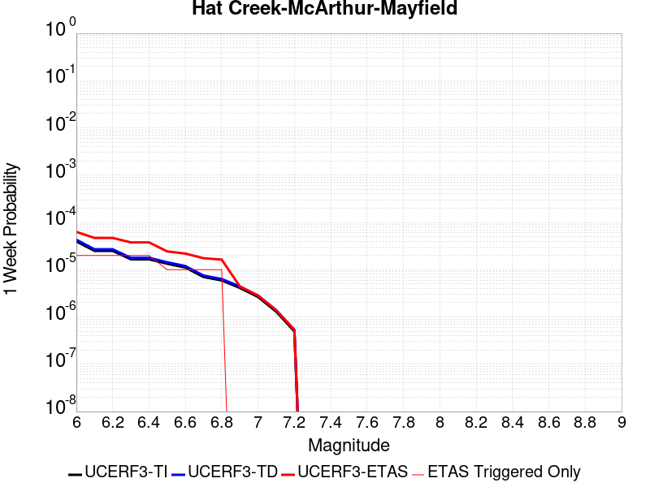 |  |  |  |

| Magnitude | 1 wk TI Prob | 1 wk TD Prob | 1 wk ETAS Prob | 1 wk ETAS/TD Gain | 1 wk ETAS Triggered Only | 1 mo TI Prob | 1 mo TD Prob | 1 mo ETAS Prob | 1 mo ETAS/TD Gain | 1 mo ETAS Triggered Only | 1 yr TI Prob | 1 yr TD Prob | 1 yr ETAS Prob | 1 yr ETAS/TD Gain | 1 yr ETAS Triggered Only | 10 yr TI Prob | 10 yr TD Prob | 10 yr ETAS Prob | 10 yr ETAS/TD Gain | 10 yr ETAS Triggered Only |
|-----|-----|-----|-----|-----|-----|-----|-----|-----|-----|-----|-----|-----|-----|-----|-----|-----|-----|-----|-----|-----|
| 6.0 | 3.967457E-5 | 4.315831E-5 | 6.3157444E-5 | 1.4633901 | 2.0E-5 | 1.7002279E-4 | 1.8495171E-4 | 2.0494802E-4 | 1.1081164 | 2.0E-5 | 0.002068062 | 0.002249576 | 0.002269531 | 1.0088706 | 2.0E-5 | 0.02048922 | 0.022280399 | 0.022299953 | 1.0008776 | 2.0E-5 |
| 6.1 | 2.5044013E-5 | 2.7071164E-5 | 4.707062E-5 | 1.7387735 | 2.0E-5 | 1.0732707E-4 | 1.1601429E-4 | 1.3601198E-4 | 1.1723726 | 2.0E-5 | 0.0013059238 | 0.0014115906 | 0.0014315624 | 1.0141484 | 2.0E-5 | 0.01298276 | 0.01402966 | 0.01404938 | 1.0014056 | 2.0E-5 |
| 6.2 | 2.5044013E-5 | 2.7071164E-5 | 4.707062E-5 | 1.7387735 | 2.0E-5 | 1.0732707E-4 | 1.1601429E-4 | 1.3601198E-4 | 1.1723726 | 2.0E-5 | 0.0013059238 | 0.0014115906 | 0.0014315624 | 1.0141484 | 2.0E-5 | 0.01298276 | 0.01402966 | 0.01404938 | 1.0014056 | 2.0E-5 |
| 6.3 | 1.6624012E-5 | 1.7891072E-5 | 3.7890713E-5 | 2.117856 | 2.0E-5 | 7.124382E-5 | 7.6673816E-5 | 9.667228E-5 | 1.2608253 | 2.0E-5 | 8.670483E-4 | 9.331125E-4 | 9.5309387E-4 | 1.0214137 | 2.0E-5 | 0.008636732 | 0.009292879 | 0.009312693 | 1.0021322 | 2.0E-5 |
| 6.4 | 1.6624012E-5 | 1.7891072E-5 | 3.7890713E-5 | 2.117856 | 2.0E-5 | 7.124382E-5 | 7.6673816E-5 | 9.667228E-5 | 1.2608253 | 2.0E-5 | 8.670483E-4 | 9.331125E-4 | 9.5309387E-4 | 1.0214137 | 2.0E-5 | 0.008636732 | 0.009292879 | 0.009312693 | 1.0021322 | 2.0E-5 |
| 6.5 | 1.3394842E-5 | 1.4392137E-5 | 2.4391993E-5 | 1.6948138 | 1.0E-5 | 5.7405203E-5 | 6.167916E-5 | 7.167854E-5 | 1.1621193 | 1.0E-5 | 6.986842E-4 | 7.506906E-4 | 7.606831E-4 | 1.013311 | 1.0E-5 | 0.006964916 | 0.0074821403 | 0.007492066 | 1.0013266 | 1.0E-5 |
| 6.6 | 1.1137514E-5 | 1.1954546E-5 | 2.1954425E-5 | 1.8364918 | 1.0E-5 | 4.7731326E-5 | 5.1232782E-5 | 6.123227E-5 | 1.1951776 | 1.0E-5 | 5.809739E-4 | 6.2358467E-4 | 6.335784E-4 | 1.0160263 | 1.0E-5 | 0.005794574 | 0.00621877 | 0.0062287077 | 1.001598 | 1.0E-5 |
| 6.7 | 7.0200663E-6 | 7.5242897E-6 | 1.7524215E-5 | 2.329019 | 1.0E-5 | 3.008565E-5 | 3.2246568E-5 | 4.2246244E-5 | 1.3101006 | 1.0E-5 | 3.6623122E-4 | 3.925328E-4 | 4.0252888E-4 | 1.0254656 | 1.0E-5 | 0.0036562826 | 0.0039185574 | 0.003928518 | 1.002542 | 1.0E-5 |
| 6.8 | 5.940172E-6 | 6.3654766E-6 | 1.6365413E-5 | 2.5709643 | 1.0E-5 | 2.545763E-5 | 2.7280335E-5 | 3.7280064E-5 | 1.3665544 | 1.0E-5 | 3.0990256E-4 | 3.3208873E-4 | 3.420854E-4 | 1.0301025 | 1.0E-5 | 0.0030947074 | 0.0033160534 | 0.0033260202 | 1.0030056 | 1.0E-5 |
| 6.9 | 4.129831E-6 | 4.423547E-6 | 4.423547E-6 | 1.0 | 0.0 | 1.7699154E-5 | 1.8957926E-5 | 1.8957926E-5 | 1.0 | 0.0 | 2.154659E-4 | 2.3078908E-4 | 2.3078908E-4 | 1.0 | 0.0 | 0.002152571 | 0.0023055724 | 0.0023055724 | 1.0 | 0.0 |
| 7.0 | 2.6512955E-6 | 2.8374002E-6 | 2.8374002E-6 | 1.0 | 0.0 | 1.1362646E-5 | 1.2160232E-5 | 1.2160232E-5 | 1.0 | 0.0 | 1.3833142E-4 | 1.480412E-4 | 1.480412E-4 | 1.0 | 0.0 | 0.0013824535 | 0.0014794683 | 0.0014794683 | 1.0 | 0.0 |
| 7.1 | 1.2992575E-6 | 1.3909317E-6 | 1.3909317E-6 | 1.0 | 0.0 | 5.568235E-6 | 5.961124E-6 | 5.961124E-6 | 1.0 | 0.0 | 6.779115E-5 | 7.257448E-5 | 7.257448E-5 | 1.0 | 0.0 | 6.7770475E-4 | 7.2552945E-4 | 7.2552945E-4 | 1.0 | 0.0 |
| 7.2 | 4.968191E-7 | 5.3271475E-7 | 5.3271475E-7 | 1.0 | 0.0 | 2.1292228E-6 | 2.283062E-6 | 2.283062E-6 | 1.0 | 0.0 | 2.592298E-5 | 2.7796052E-5 | 2.7796052E-5 | 1.0 | 0.0 | 2.5919956E-4 | 2.7793812E-4 | 2.7793812E-4 | 1.0 | 0.0 |

## Redondo Canyon alt 1
*[(top)](#table-of-contents)*

| 1 Week | 1 Month | 1 Year | 10 Year |
|-----|-----|-----|-----|
|  |  |  | 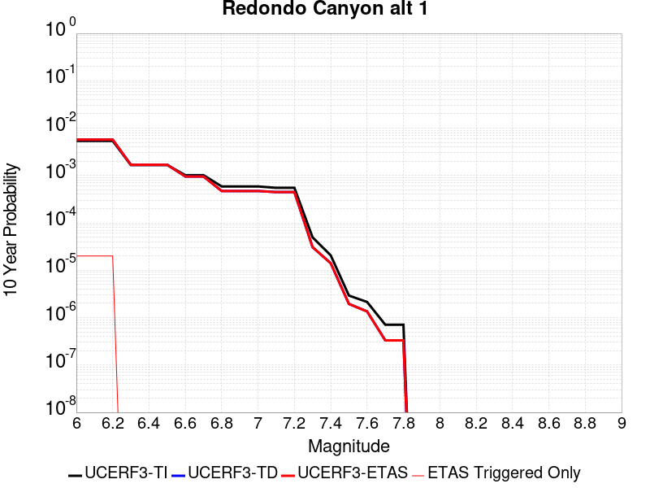 |

| Magnitude | 1 wk TI Prob | 1 wk TD Prob | 1 wk ETAS Prob | 1 wk ETAS/TD Gain | 1 wk ETAS Triggered Only | 1 mo TI Prob | 1 mo TD Prob | 1 mo ETAS Prob | 1 mo ETAS/TD Gain | 1 mo ETAS Triggered Only | 1 yr TI Prob | 1 yr TD Prob | 1 yr ETAS Prob | 1 yr ETAS/TD Gain | 1 yr ETAS Triggered Only | 10 yr TI Prob | 10 yr TD Prob | 10 yr ETAS Prob | 10 yr ETAS/TD Gain | 10 yr ETAS Triggered Only |
|-----|-----|-----|-----|-----|-----|-----|-----|-----|-----|-----|-----|-----|-----|-----|-----|-----|-----|-----|-----|-----|
| 6.0 | 1.0346246E-5 | 1.0981325E-5 | 2.0981215E-5 | 1.9106269 | 1.0E-5 | 4.43403E-5 | 4.7062418E-5 | 5.706195E-5 | 1.2124738 | 1.0E-5 | 5.3970946E-4 | 5.729132E-4 | 5.8290747E-4 | 1.0174446 | 1.0E-5 | 0.0053840056 | 0.0057221013 | 0.005741987 | 1.0034752 | 2.0E-5 |
| 6.1 | 1.0346246E-5 | 1.0981325E-5 | 2.0981215E-5 | 1.9106269 | 1.0E-5 | 4.43403E-5 | 4.7062418E-5 | 5.706195E-5 | 1.2124738 | 1.0E-5 | 5.3970946E-4 | 5.729132E-4 | 5.8290747E-4 | 1.0174446 | 1.0E-5 | 0.0053840056 | 0.0057221013 | 0.005741987 | 1.0034752 | 2.0E-5 |
| 6.2 | 1.0346246E-5 | 1.0981325E-5 | 2.0981215E-5 | 1.9106269 | 1.0E-5 | 4.43403E-5 | 4.7062418E-5 | 5.706195E-5 | 1.2124738 | 1.0E-5 | 5.3970946E-4 | 5.729132E-4 | 5.8290747E-4 | 1.0174446 | 1.0E-5 | 0.0053840056 | 0.0057221013 | 0.005741987 | 1.0034752 | 2.0E-5 |
| 6.3 | 3.2052794E-6 | 3.2360983E-6 | 3.2360983E-6 | 1.0 | 0.0 | 1.373684E-5 | 1.3868941E-5 | 1.3868941E-5 | 1.0 | 0.0 | 1.6723319E-4 | 1.6884525E-4 | 1.6884525E-4 | 1.0 | 0.0 | 0.001671074 | 0.0016875593 | 0.0016875593 | 1.0 | 0.0 |
| 6.4 | 3.2052794E-6 | 3.2360983E-6 | 3.2360983E-6 | 1.0 | 0.0 | 1.373684E-5 | 1.3868941E-5 | 1.3868941E-5 | 1.0 | 0.0 | 1.6723319E-4 | 1.6884525E-4 | 1.6884525E-4 | 1.0 | 0.0 | 0.001671074 | 0.0016875593 | 0.0016875593 | 1.0 | 0.0 |
| 6.5 | 3.2052794E-6 | 3.2360983E-6 | 3.2360983E-6 | 1.0 | 0.0 | 1.373684E-5 | 1.3868941E-5 | 1.3868941E-5 | 1.0 | 0.0 | 1.6723319E-4 | 1.6884525E-4 | 1.6884525E-4 | 1.0 | 0.0 | 0.001671074 | 0.0016875593 | 0.0016875593 | 1.0 | 0.0 |
| 6.6 | 1.948328E-6 | 1.8288489E-6 | 1.8288489E-6 | 1.0 | 0.0 | 8.349951E-6 | 7.837909E-6 | 7.837909E-6 | 1.0 | 0.0 | 1.016559E-4 | 9.5423864E-5 | 9.5423864E-5 | 1.0 | 0.0 | 0.0010160941 | 9.5397583E-4 | 9.5397583E-4 | 1.0 | 0.0 |
| 6.7 | 1.948328E-6 | 1.8288489E-6 | 1.8288489E-6 | 1.0 | 0.0 | 8.349951E-6 | 7.837909E-6 | 7.837909E-6 | 1.0 | 0.0 | 1.016559E-4 | 9.5423864E-5 | 9.5423864E-5 | 1.0 | 0.0 | 0.0010160941 | 9.5397583E-4 | 9.5397583E-4 | 1.0 | 0.0 |
| 6.8 | 1.1278219E-6 | 9.032885E-7 | 9.032885E-7 | 1.0 | 0.0 | 4.8335132E-6 | 3.871233E-6 | 3.871233E-6 | 1.0 | 0.0 | 5.8846435E-5 | 4.713167E-5 | 4.713167E-5 | 1.0 | 0.0 | 5.8830855E-4 | 4.7125877E-4 | 4.7125877E-4 | 1.0 | 0.0 |
| 6.9 | 1.1278219E-6 | 9.032885E-7 | 9.032885E-7 | 1.0 | 0.0 | 4.8335132E-6 | 3.871233E-6 | 3.871233E-6 | 1.0 | 0.0 | 5.8846435E-5 | 4.713167E-5 | 4.713167E-5 | 1.0 | 0.0 | 5.8830855E-4 | 4.7125877E-4 | 4.7125877E-4 | 1.0 | 0.0 |
| 7.0 | 1.1278219E-6 | 9.032885E-7 | 9.032885E-7 | 1.0 | 0.0 | 4.8335132E-6 | 3.871233E-6 | 3.871233E-6 | 1.0 | 0.0 | 5.8846435E-5 | 4.713167E-5 | 4.713167E-5 | 1.0 | 0.0 | 5.8830855E-4 | 4.7125877E-4 | 4.7125877E-4 | 1.0 | 0.0 |
| 7.1 | 1.0545139E-6 | 8.5690925E-7 | 8.5690925E-7 | 1.0 | 0.0 | 4.5193374E-6 | 3.6724655E-6 | 3.6724655E-6 | 1.0 | 0.0 | 5.5021545E-5 | 4.4711775E-5 | 4.4711775E-5 | 1.0 | 0.0 | 5.500792E-4 | 4.4706953E-4 | 4.4706953E-4 | 1.0 | 0.0 |
| 7.2 | 1.0545139E-6 | 8.5690925E-7 | 8.5690925E-7 | 1.0 | 0.0 | 4.5193374E-6 | 3.6724655E-6 | 3.6724655E-6 | 1.0 | 0.0 | 5.5021545E-5 | 4.4711775E-5 | 4.4711775E-5 | 1.0 | 0.0 | 5.500792E-4 | 4.4706953E-4 | 4.4706953E-4 | 1.0 | 0.0 |
| 7.3 | 9.505161E-8 | 5.8955752E-8 | 5.8955752E-8 | 1.0 | 0.0 | 4.0736398E-7 | 2.526675E-7 | 2.526675E-7 | 1.0 | 0.0 | 4.959645E-6 | 3.0762235E-6 | 3.0762235E-6 | 1.0 | 0.0 | 4.9595343E-5 | 3.076193E-5 | 3.076193E-5 | 1.0 | 0.0 |
| 7.4 | 3.9520785E-8 | 2.6987088E-8 | 2.6987088E-8 | 1.0 | 0.0 | 1.6937479E-7 | 1.1565894E-7 | 1.1565894E-7 | 1.0 | 0.0 | 2.062136E-6 | 1.408147E-6 | 1.408147E-6 | 1.0 | 0.0 | 2.062117E-5 | 1.4081407E-5 | 1.4081407E-5 | 1.0 | 0.0 |
| 7.5 | 5.6133214E-9 | 3.7367687E-9 | 3.7367687E-9 | 1.0 | 0.0 | 2.4057092E-8 | 1.6014722E-8 | 1.6014722E-8 | 1.0 | 0.0 | 2.9289507E-7 | 1.9497922E-7 | 1.9497922E-7 | 1.0 | 0.0 | 2.9289467E-6 | 1.9497909E-6 | 1.9497909E-6 | 1.0 | 0.0 |
| 7.6 | 4.1064334E-9 | 2.5957205E-9 | 2.5957205E-9 | 1.0 | 0.0 | 1.7599E-8 | 1.1124517E-8 | 1.1124517E-8 | 1.0 | 0.0 | 2.142678E-7 | 1.3544098E-7 | 1.3544098E-7 | 1.0 | 0.0 | 2.1426758E-6 | 1.3544093E-6 | 1.3544093E-6 | 1.0 | 0.0 |
| 7.7 | 1.361975E-9 | 6.360521E-10 | 6.360521E-10 | 1.0 | 0.0 | 5.8370353E-9 | 2.7259377E-9 | 2.7259377E-9 | 1.0 | 0.0 | 7.1065905E-8 | 3.318829E-8 | 3.318829E-8 | 1.0 | 0.0 | 7.106588E-7 | 3.3188286E-7 | 3.3188286E-7 | 1.0 | 0.0 |
| 7.8 | 1.361975E-9 | 6.360521E-10 | 6.360521E-10 | 1.0 | 0.0 | 5.8370353E-9 | 2.7259377E-9 | 2.7259377E-9 | 1.0 | 0.0 | 7.1065905E-8 | 3.318829E-8 | 3.318829E-8 | 1.0 | 0.0 | 7.106588E-7 | 3.3188286E-7 | 3.3188286E-7 | 1.0 | 0.0 |

## Greenville (No) 2011 CFM
*[(top)](#table-of-contents)*

| 1 Week | 1 Month | 1 Year | 10 Year |
|-----|-----|-----|-----|
|  |  |  | 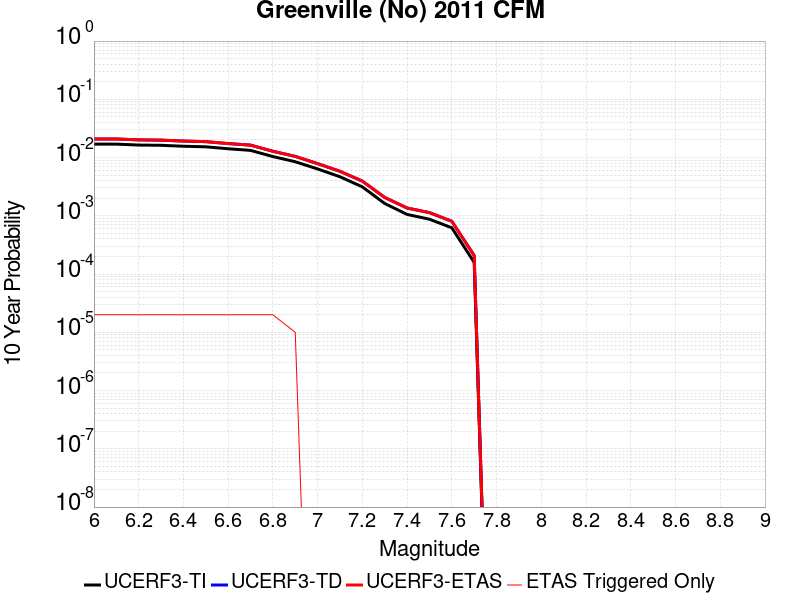 |

| Magnitude | 1 wk TI Prob | 1 wk TD Prob | 1 wk ETAS Prob | 1 wk ETAS/TD Gain | 1 wk ETAS Triggered Only | 1 mo TI Prob | 1 mo TD Prob | 1 mo ETAS Prob | 1 mo ETAS/TD Gain | 1 mo ETAS Triggered Only | 1 yr TI Prob | 1 yr TD Prob | 1 yr ETAS Prob | 1 yr ETAS/TD Gain | 1 yr ETAS Triggered Only | 10 yr TI Prob | 10 yr TD Prob | 10 yr ETAS Prob | 10 yr ETAS/TD Gain | 10 yr ETAS Triggered Only |
|-----|-----|-----|-----|-----|-----|-----|-----|-----|-----|-----|-----|-----|-----|-----|-----|-----|-----|-----|-----|-----|
| 6.0 | 3.286654E-5 | 4.036671E-5 | 5.0366307E-5 | 1.2477189 | 1.0E-5 | 1.4084899E-4 | 1.7298892E-4 | 1.8298719E-4 | 1.0577972 | 1.0E-5 | 0.0017134876 | 0.0021041434 | 0.0021241012 | 1.009485 | 2.0E-5 | 0.017003356 | 0.02084759 | 0.020867173 | 1.0009394 | 2.0E-5 |
| 6.1 | 3.286654E-5 | 4.036671E-5 | 5.0366307E-5 | 1.2477189 | 1.0E-5 | 1.4084899E-4 | 1.7298892E-4 | 1.8298719E-4 | 1.0577972 | 1.0E-5 | 0.0017134876 | 0.0021041434 | 0.0021241012 | 1.009485 | 2.0E-5 | 0.017003356 | 0.02084759 | 0.020867173 | 1.0009394 | 2.0E-5 |
| 6.2 | 3.1697953E-5 | 3.8929615E-5 | 4.8929225E-5 | 1.2568638 | 1.0E-5 | 1.358413E-4 | 1.6683072E-4 | 1.7682907E-4 | 1.059931 | 1.0E-5 | 0.0016526132 | 0.0020293088 | 0.0020492682 | 1.0098356 | 2.0E-5 | 0.01640377 | 0.020112982 | 0.02013258 | 1.0009744 | 2.0E-5 |
| 6.3 | 3.1363317E-5 | 3.8518487E-5 | 4.8518104E-5 | 1.2596056 | 1.0E-5 | 1.344073E-4 | 1.6506898E-4 | 1.7506733E-4 | 1.0605707 | 1.0E-5 | 0.0016351803 | 0.0020078993 | 0.0020278592 | 1.0099406 | 2.0E-5 | 0.016232004 | 0.019902749 | 0.019922351 | 1.0009849 | 2.0E-5 |
| 6.4 | 3.0228604E-5 | 3.712561E-5 | 4.712524E-5 | 1.2693459 | 1.0E-5 | 1.2954473E-4 | 1.5910025E-4 | 1.6909865E-4 | 1.0628434 | 1.0E-5 | 0.0015760659 | 0.001935361 | 0.0019553222 | 1.010314 | 2.0E-5 | 0.015649348 | 0.01919009 | 0.019209705 | 1.0010222 | 2.0E-5 |
| 6.5 | 2.9537814E-5 | 3.628106E-5 | 4.6280697E-5 | 1.2756159 | 1.0E-5 | 1.2658449E-4 | 1.5548118E-4 | 1.6547962E-4 | 1.0643065 | 1.0E-5 | 0.0015400766 | 0.0018913761 | 0.0019113382 | 1.0105543 | 2.0E-5 | 0.01529447 | 0.018757751 | 0.018777376 | 1.0010462 | 2.0E-5 |
| 6.6 | 2.7345395E-5 | 3.359038E-5 | 4.359004E-5 | 1.2976943 | 1.0E-5 | 1.1718928E-4 | 1.43951E-4 | 1.5394956E-4 | 1.0694581 | 1.0E-5 | 0.0014258457 | 0.0017512254 | 0.0017711904 | 1.0114006 | 2.0E-5 | 0.014167317 | 0.017378574 | 0.017398227 | 1.0011308 | 2.0E-5 |
| 6.7 | 2.5615784E-5 | 3.1567277E-5 | 4.1566964E-5 | 1.3167738 | 1.0E-5 | 1.09777306E-4 | 1.352815E-4 | 1.4528014E-4 | 1.07391 | 1.0E-5 | 0.0013357193 | 0.0016458385 | 0.0016658055 | 1.0121318 | 2.0E-5 | 0.013277191 | 0.016340667 | 0.01636034 | 1.0012039 | 2.0E-5 |
| 6.8 | 2.0059057E-5 | 2.4712264E-5 | 3.471202E-5 | 1.4046474 | 1.0E-5 | 8.596455E-5 | 1.059055E-4 | 1.1590444E-4 | 1.0944138 | 1.0E-5 | 0.0010461159 | 0.001288653 | 0.0013086272 | 1.0155001 | 2.0E-5 | 0.0104120495 | 0.012814328 | 0.012834072 | 1.0015408 | 2.0E-5 |
| 6.9 | 1.6321746E-5 | 2.018486E-5 | 3.0184658E-5 | 1.4954108 | 1.0E-5 | 6.9948466E-5 | 8.6503744E-5 | 9.650288E-5 | 1.1155919 | 1.0E-5 | 8.5128983E-4 | 0.0010526866 | 0.0010626761 | 1.0094895 | 1.0E-5 | 0.008480361 | 0.010479037 | 0.010488932 | 1.0009443 | 1.0E-5 |
| 7.0 | 1.22527645E-5 | 1.5135808E-5 | 1.5135808E-5 | 1.0 | 0.0 | 5.2510793E-5 | 6.486616E-5 | 6.486616E-5 | 1.0 | 0.0 | 6.3913135E-4 | 7.894636E-4 | 7.894636E-4 | 1.0 | 0.0 | 0.0063729626 | 0.007867573 | 0.007867573 | 1.0 | 0.0 |
| 7.1 | 8.996482E-6 | 1.1165116E-5 | 1.1165116E-5 | 1.0 | 0.0 | 3.8555783E-5 | 4.784963E-5 | 4.784963E-5 | 1.0 | 0.0 | 4.6931554E-4 | 5.8241474E-4 | 5.8241474E-4 | 1.0 | 0.0 | 0.004683256 | 0.0058096354 | 0.0058096354 | 1.0 | 0.0 |
| 7.2 | 6.0273087E-6 | 7.569621E-6 | 7.569621E-6 | 1.0 | 0.0 | 2.5831067E-5 | 3.2440836E-5 | 3.2440836E-5 | 1.0 | 0.0 | 3.1444785E-4 | 3.9489628E-4 | 3.9489628E-4 | 1.0 | 0.0 | 0.0031400328 | 0.003942419 | 0.003942419 | 1.0 | 0.0 |
| 7.3 | 3.1209995E-6 | 3.9664565E-6 | 3.9664565E-6 | 1.0 | 0.0 | 1.3375643E-5 | 1.6998989E-5 | 1.6998989E-5 | 1.0 | 0.0 | 1.6283628E-4 | 2.069432E-4 | 2.069432E-4 | 1.0 | 0.0 | 0.0016271701 | 0.0020678395 | 0.0020678395 | 1.0 | 0.0 |
| 7.4 | 2.0254208E-6 | 2.6096657E-6 | 2.6096657E-6 | 1.0 | 0.0 | 8.680347E-6 | 1.1184234E-5 | 1.1184234E-5 | 1.0 | 0.0 | 1.0567809E-4 | 1.361596E-4 | 1.361596E-4 | 1.0 | 0.0 | 0.0010562785 | 0.0013611179 | 0.0013611179 | 1.0 | 0.0 |
| 7.5 | 1.6763418E-6 | 2.1734072E-6 | 2.1734072E-6 | 1.0 | 0.0 | 7.184302E-6 | 9.314569E-6 | 9.314569E-6 | 1.0 | 0.0 | 8.746537E-5 | 1.1339904E-4 | 1.1339904E-4 | 1.0 | 0.0 | 8.743095E-4 | 0.0011337536 | 0.0011337536 | 1.0 | 0.0 |
| 7.6 | 1.1935462E-6 | 1.5458915E-6 | 1.5458915E-6 | 1.0 | 0.0 | 5.115188E-6 | 6.625233E-6 | 6.625233E-6 | 1.0 | 0.0 | 6.2275634E-5 | 8.0659265E-5 | 8.0659265E-5 | 1.0 | 0.0 | 6.2258187E-4 | 8.0655375E-4 | 8.0655375E-4 | 1.0 | 0.0 |
| 7.7 | 3.0464201E-7 | 3.9848686E-7 | 3.9848686E-7 | 1.0 | 0.0 | 1.3056081E-6 | 1.7077997E-6 | 1.7077997E-6 | 1.0 | 0.0 | 1.589566E-5 | 2.0792268E-5 | 2.0792268E-5 | 1.0 | 0.0 | 1.5894524E-4 | 2.0793018E-4 | 2.0793018E-4 | 1.0 | 0.0 |

## Oceanside alt1
*[(top)](#table-of-contents)*

| 1 Week | 1 Month | 1 Year | 10 Year |
|-----|-----|-----|-----|
|  |  |  |  |

| Magnitude | 1 wk TI Prob | 1 wk TD Prob | 1 wk ETAS Prob | 1 wk ETAS/TD Gain | 1 wk ETAS Triggered Only | 1 mo TI Prob | 1 mo TD Prob | 1 mo ETAS Prob | 1 mo ETAS/TD Gain | 1 mo ETAS Triggered Only | 1 yr TI Prob | 1 yr TD Prob | 1 yr ETAS Prob | 1 yr ETAS/TD Gain | 1 yr ETAS Triggered Only | 10 yr TI Prob | 10 yr TD Prob | 10 yr ETAS Prob | 10 yr ETAS/TD Gain | 10 yr ETAS Triggered Only |
|-----|-----|-----|-----|-----|-----|-----|-----|-----|-----|-----|-----|-----|-----|-----|-----|-----|-----|-----|-----|-----|
| 6.0 | 1.1617542E-5 | 1.1423485E-5 | 1.1423485E-5 | 1.0 | 0.0 | 4.9788516E-5 | 4.8956965E-5 | 4.8956965E-5 | 1.0 | 0.0 | 6.060066E-4 | 5.9590413E-4 | 5.9590413E-4 | 1.0 | 0.0 | 0.0060435664 | 0.0059446604 | 0.005964542 | 1.0033444 | 2.0E-5 |
| 6.1 | 1.1617542E-5 | 1.1423485E-5 | 1.1423485E-5 | 1.0 | 0.0 | 4.9788516E-5 | 4.8956965E-5 | 4.8956965E-5 | 1.0 | 0.0 | 6.060066E-4 | 5.9590413E-4 | 5.9590413E-4 | 1.0 | 0.0 | 0.0060435664 | 0.0059446604 | 0.005964542 | 1.0033444 | 2.0E-5 |
| 6.2 | 1.1617542E-5 | 1.1423485E-5 | 1.1423485E-5 | 1.0 | 0.0 | 4.9788516E-5 | 4.8956965E-5 | 4.8956965E-5 | 1.0 | 0.0 | 6.060066E-4 | 5.9590413E-4 | 5.9590413E-4 | 1.0 | 0.0 | 0.0060435664 | 0.0059446604 | 0.005964542 | 1.0033444 | 2.0E-5 |
| 6.3 | 1.1617542E-5 | 1.1423485E-5 | 1.1423485E-5 | 1.0 | 0.0 | 4.9788516E-5 | 4.8956965E-5 | 4.8956965E-5 | 1.0 | 0.0 | 6.060066E-4 | 5.9590413E-4 | 5.9590413E-4 | 1.0 | 0.0 | 0.0060435664 | 0.0059446604 | 0.005964542 | 1.0033444 | 2.0E-5 |
| 6.4 | 1.1617542E-5 | 1.1423485E-5 | 1.1423485E-5 | 1.0 | 0.0 | 4.9788516E-5 | 4.8956965E-5 | 4.8956965E-5 | 1.0 | 0.0 | 6.060066E-4 | 5.9590413E-4 | 5.9590413E-4 | 1.0 | 0.0 | 0.0060435664 | 0.0059446604 | 0.005964542 | 1.0033444 | 2.0E-5 |
| 6.5 | 1.1617542E-5 | 1.1423485E-5 | 1.1423485E-5 | 1.0 | 0.0 | 4.9788516E-5 | 4.8956965E-5 | 4.8956965E-5 | 1.0 | 0.0 | 6.060066E-4 | 5.9590413E-4 | 5.9590413E-4 | 1.0 | 0.0 | 0.0060435664 | 0.0059446604 | 0.005964542 | 1.0033444 | 2.0E-5 |
| 6.6 | 7.561768E-6 | 7.1336085E-6 | 7.1336085E-6 | 1.0 | 0.0 | 3.2407173E-5 | 3.0572253E-5 | 3.0572253E-5 | 1.0 | 0.0 | 3.9448592E-4 | 3.721547E-4 | 3.721547E-4 | 1.0 | 0.0 | 0.0039378637 | 0.0037154262 | 0.0037154262 | 1.0 | 0.0 |
| 6.7 | 7.1042605E-6 | 6.6556786E-6 | 6.6556786E-6 | 1.0 | 0.0 | 3.0446476E-5 | 2.852403E-5 | 2.852403E-5 | 1.0 | 0.0 | 3.706228E-4 | 3.4722552E-4 | 3.4722552E-4 | 1.0 | 0.0 | 0.0037000529 | 0.0034669132 | 0.0034669132 | 1.0 | 0.0 |
| 6.8 | 6.285554E-6 | 5.7996986E-6 | 5.7996986E-6 | 1.0 | 0.0 | 2.693781E-5 | 2.4855617E-5 | 2.4855617E-5 | 1.0 | 0.0 | 3.2791847E-4 | 3.0257567E-4 | 3.0257567E-4 | 1.0 | 0.0 | 0.0032743502 | 0.0030216945 | 0.0030216945 | 1.0 | 0.0 |
| 6.9 | 6.148883E-6 | 5.6565373E-6 | 5.6565373E-6 | 1.0 | 0.0 | 2.635209E-5 | 2.4242081E-5 | 2.4242081E-5 | 1.0 | 0.0 | 3.2078946E-4 | 2.951079E-4 | 2.951079E-4 | 1.0 | 0.0 | 0.003203268 | 0.002947217 | 0.002947217 | 1.0 | 0.0 |
| 7.0 | 5.253857E-6 | 4.7223966E-6 | 4.7223966E-6 | 1.0 | 0.0 | 2.2516335E-5 | 2.0238687E-5 | 2.0238687E-5 | 1.0 | 0.0 | 2.7410188E-4 | 2.4637848E-4 | 2.4637848E-4 | 1.0 | 0.0 | 0.0027376404 | 0.0024610846 | 0.0024610846 | 1.0 | 0.0 |
| 7.1 | 4.730754E-6 | 4.1785024E-6 | 4.1785024E-6 | 1.0 | 0.0 | 2.0274503E-5 | 1.7907745E-5 | 1.7907745E-5 | 1.0 | 0.0 | 2.468141E-4 | 2.1800524E-4 | 2.1800524E-4 | 1.0 | 0.0 | 0.0024654015 | 0.0021779404 | 0.0021779404 | 1.0 | 0.0 |
| 7.2 | 3.7998386E-6 | 3.2140165E-6 | 3.2140165E-6 | 1.0 | 0.0 | 1.6284921E-5 | 1.37742845E-5 | 1.37742845E-5 | 1.0 | 0.0 | 1.9825088E-4 | 1.6768913E-4 | 1.6768913E-4 | 1.0 | 0.0 | 0.001980741 | 0.0016756381 | 0.0016756381 | 1.0 | 0.0 |
| 7.3 | 3.2656465E-6 | 2.6983669E-6 | 2.6983669E-6 | 1.0 | 0.0 | 1.3995553E-5 | 1.1564379E-5 | 1.1564379E-5 | 1.0 | 0.0 | 1.7038253E-4 | 1.4078732E-4 | 1.4078732E-4 | 1.0 | 0.0 | 0.0017025196 | 0.0014069924 | 0.0014069924 | 1.0 | 0.0 |
| 7.4 | 2.593703E-6 | 2.0680227E-6 | 2.0680227E-6 | 1.0 | 0.0 | 1.1115822E-5 | 8.862925E-6 | 8.862925E-6 | 1.0 | 0.0 | 1.3532673E-4 | 1.0790086E-4 | 1.0790086E-4 | 1.0 | 0.0 | 0.0013524436 | 0.0010784935 | 0.0010784935 | 1.0 | 0.0 |
| 7.5 | 1.8715585E-6 | 1.4137277E-6 | 1.4137277E-6 | 1.0 | 0.0 | 8.020941E-6 | 6.058819E-6 | 6.058819E-6 | 1.0 | 0.0 | 9.7650576E-5 | 7.376369E-5 | 7.376369E-5 | 1.0 | 0.0 | 9.7607676E-4 | 7.373981E-4 | 7.373981E-4 | 1.0 | 0.0 |
| 7.6 | 1.2246786E-6 | 8.526946E-7 | 8.526946E-7 | 1.0 | 0.0 | 5.248612E-6 | 3.6544006E-6 | 3.6544006E-6 | 1.0 | 0.0 | 6.389998E-5 | 4.4491466E-5 | 4.4491466E-5 | 1.0 | 0.0 | 6.3881604E-4 | 4.4483008E-4 | 4.4483008E-4 | 1.0 | 0.0 |
| 7.7 | 5.140719E-7 | 2.7346528E-7 | 2.7346528E-7 | 1.0 | 0.0 | 2.2031636E-6 | 1.1719936E-6 | 1.1719936E-6 | 1.0 | 0.0 | 2.6823185E-5 | 1.4268943E-5 | 1.4268943E-5 | 1.0 | 0.0 | 2.6819948E-4 | 1.4268162E-4 | 1.4268162E-4 | 1.0 | 0.0 |
| 7.8 | 1.16056995E-8 | 9.782997E-9 | 9.782997E-9 | 1.0 | 0.0 | 4.9738713E-8 | 4.1927127E-8 | 4.1927127E-8 | 1.0 | 0.0 | 6.0556863E-7 | 5.1046277E-7 | 5.1046277E-7 | 1.0 | 0.0 | 6.05567E-6 | 5.1046277E-6 | 5.1046277E-6 | 1.0 | 0.0 |

## Calaveras (Central) 2011 CFM
*[(top)](#table-of-contents)*

| 1 Week | 1 Month | 1 Year | 10 Year |
|-----|-----|-----|-----|
|  |  |  | 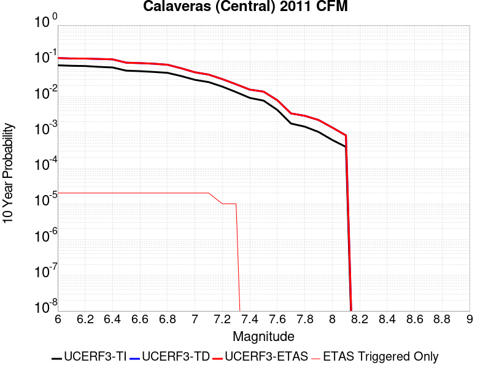 |

| Magnitude | 1 wk TI Prob | 1 wk TD Prob | 1 wk ETAS Prob | 1 wk ETAS/TD Gain | 1 wk ETAS Triggered Only | 1 mo TI Prob | 1 mo TD Prob | 1 mo ETAS Prob | 1 mo ETAS/TD Gain | 1 mo ETAS Triggered Only | 1 yr TI Prob | 1 yr TD Prob | 1 yr ETAS Prob | 1 yr ETAS/TD Gain | 1 yr ETAS Triggered Only | 10 yr TI Prob | 10 yr TD Prob | 10 yr ETAS Prob | 10 yr ETAS/TD Gain | 10 yr ETAS Triggered Only |
|-----|-----|-----|-----|-----|-----|-----|-----|-----|-----|-----|-----|-----|-----|-----|-----|-----|-----|-----|-----|-----|
| 6.0 | 1.5010907E-4 | 2.4804124E-4 | 2.4804124E-4 | 1.0 | 0.0 | 6.4316596E-4 | 0.001062498 | 0.0010724873 | 1.0094018 | 1.0E-5 | 0.0078024664 | 0.012850443 | 0.012860315 | 1.0007682 | 1.0E-5 | 0.07534136 | 0.120411225 | 0.120428815 | 1.0001462 | 2.0E-5 |
| 6.1 | 1.4521465E-4 | 2.3965565E-4 | 2.3965565E-4 | 1.0 | 0.0 | 6.222001E-4 | 0.0010265942 | 0.0010365839 | 1.0097309 | 1.0E-5 | 0.0075490056 | 0.012419763 | 0.012429639 | 1.0007951 | 1.0E-5 | 0.07297657 | 0.11668273 | 0.116700396 | 1.0001514 | 2.0E-5 |
| 6.2 | 1.429998E-4 | 2.3896809E-4 | 2.3896809E-4 | 1.0 | 0.0 | 6.127123E-4 | 0.0010236499 | 0.0010336398 | 1.009759 | 1.0E-5 | 0.007434286 | 0.012384372 | 0.012394248 | 1.0007975 | 1.0E-5 | 0.07190444 | 0.11633677 | 0.11635444 | 1.0001519 | 2.0E-5 |
| 6.3 | 1.3536277E-4 | 2.3227946E-4 | 2.3227946E-4 | 1.0 | 0.0 | 5.799972E-4 | 9.950127E-4 | 0.0010050028 | 1.0100402 | 1.0E-5 | 0.0070386264 | 0.012040534 | 0.0120504135 | 1.0008205 | 1.0E-5 | 0.0681982 | 0.113249525 | 0.11326726 | 1.0001566 | 2.0E-5 |
| 6.4 | 1.2993296E-4 | 2.2651516E-4 | 2.2651516E-4 | 1.0 | 0.0 | 5.5673666E-4 | 9.703276E-4 | 9.803178E-4 | 1.0102957 | 1.0E-5 | 0.006757223 | 0.011743338 | 0.01175322 | 1.0008415 | 1.0E-5 | 0.06555412 | 0.11052752 | 0.110545315 | 1.0001609 | 2.0E-5 |
| 6.5 | 1.0498927E-4 | 1.7981966E-4 | 1.7981966E-4 | 1.0 | 0.0 | 4.498764E-4 | 7.7042676E-4 | 7.8041904E-4 | 1.0129699 | 1.0E-5 | 0.005463498 | 0.00933952 | 0.009349426 | 1.0010607 | 1.0E-5 | 0.053311124 | 0.08920739 | 0.089225605 | 1.0002042 | 2.0E-5 |
| 6.6 | 1.0157505E-4 | 1.7469494E-4 | 1.7469494E-4 | 1.0 | 0.0 | 4.35249E-4 | 7.4847665E-4 | 7.5846916E-4 | 1.0133505 | 1.0E-5 | 0.0052862884 | 0.009074567 | 0.009084476 | 1.001092 | 1.0E-5 | 0.05162293 | 0.08678487 | 0.08680314 | 1.0002104 | 2.0E-5 |
| 6.7 | 9.660386E-5 | 1.6728783E-4 | 1.6728783E-4 | 1.0 | 0.0 | 4.1395082E-4 | 7.167497E-4 | 7.267425E-4 | 1.0139419 | 1.0E-5 | 0.0050282106 | 0.008691474 | 0.008701387 | 1.0011406 | 1.0E-5 | 0.049159497 | 0.08327401 | 0.08329234 | 1.0002202 | 2.0E-5 |
| 6.8 | 9.089927E-5 | 1.5643238E-4 | 1.5643238E-4 | 1.0 | 0.0 | 3.8951015E-4 | 6.702511E-4 | 6.802444E-4 | 1.0149097 | 1.0E-5 | 0.0047319788 | 0.008129742 | 0.008139661 | 1.0012201 | 1.0E-5 | 0.046324775 | 0.078163 | 0.07818144 | 1.0002359 | 2.0E-5 |
| 6.9 | 7.353187E-5 | 1.2295779E-4 | 1.2295779E-4 | 1.0 | 0.0 | 3.150985E-4 | 5.2685605E-4 | 5.368508E-4 | 1.0189705 | 1.0E-5 | 0.0038295772 | 0.006395728 | 0.0064056637 | 1.0015535 | 1.0E-5 | 0.037642512 | 0.06218928 | 0.062208038 | 1.0003016 | 2.0E-5 |
| 7.0 | 5.746064E-5 | 9.3890936E-5 | 9.3890936E-5 | 1.0 | 0.0 | 2.4623662E-4 | 4.0232803E-4 | 4.12324E-4 | 1.0248454 | 1.0E-5 | 0.0029938098 | 0.0048874132 | 0.0048973644 | 1.0020361 | 1.0E-5 | 0.02953797 | 0.04798713 | 0.04800617 | 1.0003967 | 2.0E-5 |
| 7.1 | 4.9557195E-5 | 8.052768E-5 | 8.052768E-5 | 1.0 | 0.0 | 2.123707E-4 | 3.4507332E-4 | 3.5506987E-4 | 1.0289694 | 1.0E-5 | 0.0025825473 | 0.004193237 | 0.004203195 | 1.0023748 | 1.0E-5 | 0.0255274 | 0.041373473 | 0.041392643 | 1.0004634 | 2.0E-5 |
| 7.2 | 3.687595E-5 | 5.952694E-5 | 5.952694E-5 | 1.0 | 0.0 | 1.5803022E-4 | 2.5509068E-4 | 2.5509068E-4 | 1.0 | 0.0 | 0.0019223199 | 0.003101335 | 0.003101335 | 1.0 | 0.0 | 0.01905776 | 0.030883823 | 0.030893514 | 1.0003138 | 1.0E-5 |
| 7.3 | 2.5846984E-5 | 4.2473923E-5 | 4.2473923E-5 | 1.0 | 0.0 | 1.1076809E-4 | 1.820185E-4 | 1.820185E-4 | 1.0 | 0.0 | 0.0013477671 | 0.0022138404 | 0.0022138404 | 1.0 | 0.0 | 0.013396223 | 0.022175217 | 0.022184996 | 1.000441 | 1.0E-5 |
| 7.4 | 1.7747854E-5 | 2.993759E-5 | 2.993759E-5 | 1.0 | 0.0 | 7.6060016E-5 | 1.2829766E-4 | 1.2829766E-4 | 1.0 | 0.0 | 9.2563726E-4 | 0.0015609078 | 0.0015609078 | 1.0 | 0.0 | 0.009217911 | 0.015708687 | 0.015708687 | 1.0 | 0.0 |
| 7.5 | 1.4883479E-5 | 2.6244672E-5 | 2.6244672E-5 | 1.0 | 0.0 | 6.378478E-5 | 1.12472335E-4 | 1.12472335E-4 | 1.0 | 0.0 | 7.76303E-4 | 0.0013684932 | 0.0013684932 | 1.0 | 0.0 | 0.0077359667 | 0.013801667 | 0.013801667 | 1.0 | 0.0 |
| 7.6 | 8.166975E-6 | 1.4964299E-5 | 1.4964299E-5 | 1.0 | 0.0 | 3.5000852E-5 | 6.413114E-5 | 6.413114E-5 | 1.0 | 0.0 | 4.2605202E-4 | 7.805183E-4 | 7.805183E-4 | 1.0 | 0.0 | 0.004252361 | 0.007939203 | 0.007939203 | 1.0 | 0.0 |
| 7.7 | 3.3858064E-6 | 6.254251E-6 | 6.254251E-6 | 1.0 | 0.0 | 1.4510518E-5 | 2.6803657E-5 | 2.6803657E-5 | 1.0 | 0.0 | 1.7665124E-4 | 3.2628572E-4 | 3.2628572E-4 | 1.0 | 0.0 | 0.0017651088 | 0.003388363 | 0.003388363 | 1.0 | 0.0 |
| 7.8 | 2.7721615E-6 | 5.366695E-6 | 5.366695E-6 | 1.0 | 0.0 | 1.1880637E-5 | 2.2999919E-5 | 2.2999919E-5 | 1.0 | 0.0 | 1.4463716E-4 | 2.7998807E-4 | 2.7998807E-4 | 1.0 | 0.0 | 0.0014454306 | 0.002907615 | 0.002907615 | 1.0 | 0.0 |
| 7.9 | 1.9736292E-6 | 4.128705E-6 | 4.128705E-6 | 1.0 | 0.0 | 8.4583835E-6 | 1.769433E-5 | 1.769433E-5 | 1.0 | 0.0 | 1.0297595E-4 | 2.1540721E-4 | 2.1540721E-4 | 1.0 | 0.0 | 0.0010292825 | 0.0022237299 | 0.0022237299 | 1.0 | 0.0 |
| 8.0 | 1.1767289E-6 | 2.5546633E-6 | 2.5546633E-6 | 1.0 | 0.0 | 5.0431145E-6 | 1.0948511E-5 | 1.0948511E-5 | 1.0 | 0.0 | 6.139818E-5 | 1.3329E-4 | 1.3329E-4 | 1.0 | 0.0 | 6.1381224E-4 | 0.001366126 | 0.001366126 | 1.0 | 0.0 |
| 8.1 | 7.5112825E-7 | 1.541076E-6 | 1.541076E-6 | 1.0 | 0.0 | 3.2191172E-6 | 6.604595E-6 | 6.604595E-6 | 1.0 | 0.0 | 3.9192048E-5 | 8.0408E-5 | 8.0408E-5 | 1.0 | 0.0 | 3.9185135E-4 | 8.2356273E-4 | 8.2356273E-4 | 1.0 | 0.0 |

## Mono Lake 2011 CFM
*[(top)](#table-of-contents)*

| 1 Week | 1 Month | 1 Year | 10 Year |
|-----|-----|-----|-----|
|  |  |  |  |

| Magnitude | 1 wk TI Prob | 1 wk TD Prob | 1 wk ETAS Prob | 1 wk ETAS/TD Gain | 1 wk ETAS Triggered Only | 1 mo TI Prob | 1 mo TD Prob | 1 mo ETAS Prob | 1 mo ETAS/TD Gain | 1 mo ETAS Triggered Only | 1 yr TI Prob | 1 yr TD Prob | 1 yr ETAS Prob | 1 yr ETAS/TD Gain | 1 yr ETAS Triggered Only | 10 yr TI Prob | 10 yr TD Prob | 10 yr ETAS Prob | 10 yr ETAS/TD Gain | 10 yr ETAS Triggered Only |
|-----|-----|-----|-----|-----|-----|-----|-----|-----|-----|-----|-----|-----|-----|-----|-----|-----|-----|-----|-----|-----|
| 6.0 | 2.0341662E-5 | 2.3828192E-5 | 2.3828192E-5 | 1.0 | 0.0 | 8.717564E-5 | 1.0211982E-4 | 1.0211982E-4 | 1.0 | 0.0 | 0.0010608466 | 0.0012431308 | 0.0012531184 | 1.0080342 | 1.0E-5 | 0.010557966 | 0.012413842 | 0.012433593 | 1.0015911 | 2.0E-5 |
| 6.1 | 2.0341662E-5 | 2.3828192E-5 | 2.3828192E-5 | 1.0 | 0.0 | 8.717564E-5 | 1.0211982E-4 | 1.0211982E-4 | 1.0 | 0.0 | 0.0010608466 | 0.0012431308 | 0.0012531184 | 1.0080342 | 1.0E-5 | 0.010557966 | 0.012413842 | 0.012433593 | 1.0015911 | 2.0E-5 |
| 6.2 | 2.0341662E-5 | 2.3828192E-5 | 2.3828192E-5 | 1.0 | 0.0 | 8.717564E-5 | 1.0211982E-4 | 1.0211982E-4 | 1.0 | 0.0 | 0.0010608466 | 0.0012431308 | 0.0012531184 | 1.0080342 | 1.0E-5 | 0.010557966 | 0.012413842 | 0.012433593 | 1.0015911 | 2.0E-5 |
| 6.3 | 2.0341662E-5 | 2.3828192E-5 | 2.3828192E-5 | 1.0 | 0.0 | 8.717564E-5 | 1.0211982E-4 | 1.0211982E-4 | 1.0 | 0.0 | 0.0010608466 | 0.0012431308 | 0.0012531184 | 1.0080342 | 1.0E-5 | 0.010557966 | 0.012413842 | 0.012433593 | 1.0015911 | 2.0E-5 |
| 6.4 | 1.749821E-5 | 2.049101E-5 | 2.049101E-5 | 1.0 | 0.0 | 7.499018E-5 | 8.781861E-5 | 8.781861E-5 | 1.0 | 0.0 | 9.1262296E-4 | 0.0010691914 | 0.0010791807 | 1.0093429 | 1.0E-5 | 0.009088841 | 0.01069187 | 0.010711657 | 1.0018506 | 2.0E-5 |
| 6.5 | 1.749821E-5 | 2.049101E-5 | 2.049101E-5 | 1.0 | 0.0 | 7.499018E-5 | 8.781861E-5 | 8.781861E-5 | 1.0 | 0.0 | 9.1262296E-4 | 0.0010691914 | 0.0010791807 | 1.0093429 | 1.0E-5 | 0.009088841 | 0.01069187 | 0.010711657 | 1.0018506 | 2.0E-5 |

## Great Valley 03 Mysterious Ridge
*[(top)](#table-of-contents)*

| 1 Week | 1 Month | 1 Year | 10 Year |
|-----|-----|-----|-----|
|  |  |  | 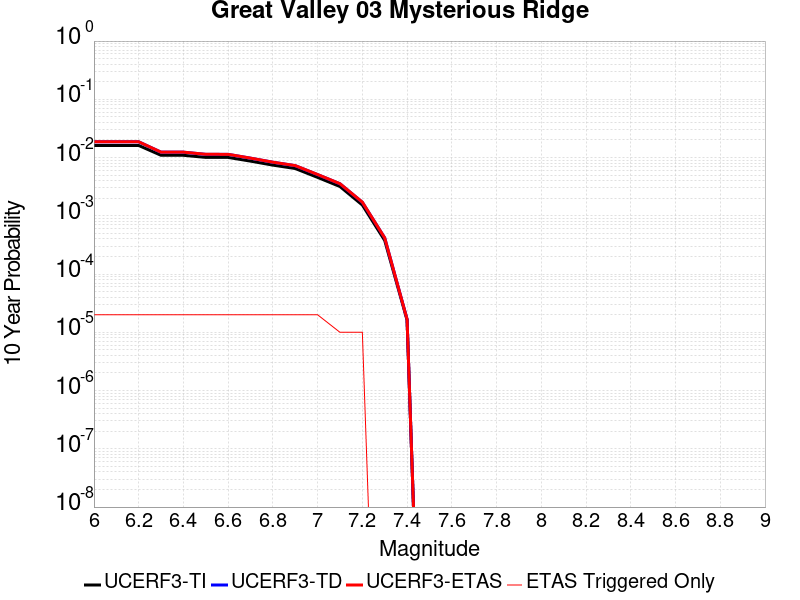 |

| Magnitude | 1 wk TI Prob | 1 wk TD Prob | 1 wk ETAS Prob | 1 wk ETAS/TD Gain | 1 wk ETAS Triggered Only | 1 mo TI Prob | 1 mo TD Prob | 1 mo ETAS Prob | 1 mo ETAS/TD Gain | 1 mo ETAS Triggered Only | 1 yr TI Prob | 1 yr TD Prob | 1 yr ETAS Prob | 1 yr ETAS/TD Gain | 1 yr ETAS Triggered Only | 10 yr TI Prob | 10 yr TD Prob | 10 yr ETAS Prob | 10 yr ETAS/TD Gain | 10 yr ETAS Triggered Only |
|-----|-----|-----|-----|-----|-----|-----|-----|-----|-----|-----|-----|-----|-----|-----|-----|-----|-----|-----|-----|-----|
| 6.0 | 3.1182444E-5 | 3.6034133E-5 | 3.6034133E-5 | 1.0 | 0.0 | 1.336322E-4 | 1.5442389E-4 | 1.5442389E-4 | 1.0 | 0.0 | 0.0016257578 | 0.0018786751 | 0.0018786751 | 1.0 | 0.0 | 0.016139153 | 0.018646672 | 0.018666299 | 1.0010526 | 2.0E-5 |
| 6.1 | 3.1182444E-5 | 3.6034133E-5 | 3.6034133E-5 | 1.0 | 0.0 | 1.336322E-4 | 1.5442389E-4 | 1.5442389E-4 | 1.0 | 0.0 | 0.0016257578 | 0.0018786751 | 0.0018786751 | 1.0 | 0.0 | 0.016139153 | 0.018646672 | 0.018666299 | 1.0010526 | 2.0E-5 |
| 6.2 | 3.1182444E-5 | 3.6034133E-5 | 3.6034133E-5 | 1.0 | 0.0 | 1.336322E-4 | 1.5442389E-4 | 1.5442389E-4 | 1.0 | 0.0 | 0.0016257578 | 0.0018786751 | 0.0018786751 | 1.0 | 0.0 | 0.016139153 | 0.018646672 | 0.018666299 | 1.0010526 | 2.0E-5 |
| 6.3 | 2.106934E-5 | 2.3850303E-5 | 2.3850303E-5 | 1.0 | 0.0 | 9.0294045E-5 | 1.0221176E-4 | 1.0221176E-4 | 1.0 | 0.0 | 0.0010987755 | 0.0012437488 | 0.0012437488 | 1.0 | 0.0 | 0.010933585 | 0.0123711275 | 0.01239088 | 1.0015967 | 2.0E-5 |
| 6.4 | 2.106934E-5 | 2.3850303E-5 | 2.3850303E-5 | 1.0 | 0.0 | 9.0294045E-5 | 1.0221176E-4 | 1.0221176E-4 | 1.0 | 0.0 | 0.0010987755 | 0.0012437488 | 0.0012437488 | 1.0 | 0.0 | 0.010933585 | 0.0123711275 | 0.01239088 | 1.0015967 | 2.0E-5 |
| 6.5 | 1.9389783E-5 | 2.1884982E-5 | 2.1884982E-5 | 1.0 | 0.0 | 8.309642E-5 | 9.378956E-5 | 9.378956E-5 | 1.0 | 0.0 | 0.0010112294 | 0.0011413175 | 0.0011413175 | 1.0 | 0.0 | 0.010066401 | 0.011357434 | 0.011377207 | 1.0017409 | 2.0E-5 |
| 6.6 | 1.9370193E-5 | 2.1864902E-5 | 2.1864902E-5 | 1.0 | 0.0 | 8.301247E-5 | 9.3703515E-5 | 9.3703515E-5 | 1.0 | 0.0 | 0.0010102082 | 0.001140271 | 0.001140271 | 1.0 | 0.0 | 0.010056281 | 0.011347076 | 0.011366849 | 1.0017426 | 2.0E-5 |
| 6.7 | 1.6723505E-5 | 1.8799281E-5 | 1.8799281E-5 | 1.0 | 0.0 | 7.16702E-5 | 8.056597E-5 | 8.056597E-5 | 1.0 | 0.0 | 8.722353E-4 | 9.804688E-4 | 9.804688E-4 | 1.0 | 0.0 | 0.008688197 | 0.009763439 | 0.009783244 | 1.0020285 | 2.0E-5 |
| 6.8 | 1.426937E-5 | 1.599721E-5 | 1.599721E-5 | 1.0 | 0.0 | 6.115301E-5 | 6.855775E-5 | 6.855775E-5 | 1.0 | 0.0 | 7.4428355E-4 | 8.343854E-4 | 8.343854E-4 | 1.0 | 0.0 | 0.007417957 | 0.008314005 | 0.008333839 | 1.0023856 | 2.0E-5 |
| 6.9 | 1.2469891E-5 | 1.3956928E-5 | 1.3956928E-5 | 1.0 | 0.0 | 5.3441294E-5 | 5.9814105E-5 | 5.9814105E-5 | 1.0 | 0.0 | 6.504535E-4 | 7.280055E-4 | 7.280055E-4 | 1.0 | 0.0 | 0.006485529 | 0.00725743 | 0.0072772847 | 1.0027359 | 2.0E-5 |
| 7.0 | 8.7746275E-6 | 9.791734E-6 | 9.791734E-6 | 1.0 | 0.0 | 3.7605005E-5 | 4.196394E-5 | 4.196394E-5 | 1.0 | 0.0 | 4.5774475E-4 | 5.1079853E-4 | 5.1079853E-4 | 1.0 | 0.0 | 0.00456803 | 0.005096977 | 0.0051168753 | 1.0039039 | 2.0E-5 |
| 7.1 | 6.1067153E-6 | 6.813725E-6 | 6.813725E-6 | 1.0 | 0.0 | 2.6171374E-5 | 2.9201385E-5 | 2.9201385E-5 | 1.0 | 0.0 | 3.1858988E-4 | 3.5547445E-4 | 3.5547445E-4 | 1.0 | 0.0 | 0.0031813353 | 0.003549609 | 0.0035595736 | 1.0028073 | 1.0E-5 |
| 7.2 | 2.939283E-6 | 3.2741057E-6 | 3.2741057E-6 | 1.0 | 0.0 | 1.2596866E-5 | 1.4031816E-5 | 1.4031816E-5 | 1.0 | 0.0 | 1.5335606E-4 | 1.7082572E-4 | 1.7082572E-4 | 1.0 | 0.0 | 0.0015325027 | 0.001707116 | 0.001717099 | 1.0058478 | 1.0E-5 |
| 7.3 | 7.2387763E-7 | 8.008505E-7 | 8.008505E-7 | 1.0 | 0.0 | 3.102329E-6 | 3.4322145E-6 | 3.4322145E-6 | 1.0 | 0.0 | 3.77702E-5 | 4.178687E-5 | 4.178687E-5 | 1.0 | 0.0 | 3.7763783E-4 | 4.1783508E-4 | 4.1783508E-4 | 1.0 | 0.0 |
| 7.4 | 3.112171E-8 | 3.2068368E-8 | 3.2068368E-8 | 1.0 | 0.0 | 1.3337875E-7 | 1.3743585E-7 | 1.3743585E-7 | 1.0 | 0.0 | 1.6238852E-6 | 1.6732803E-6 | 1.6732803E-6 | 1.0 | 0.0 | 1.6238733E-5 | 1.6732685E-5 | 1.6732685E-5 | 1.0 | 0.0 |

## Round Valley
*[(top)](#table-of-contents)*

| 1 Week | 1 Month | 1 Year | 10 Year |
|-----|-----|-----|-----|
|  |  |  | 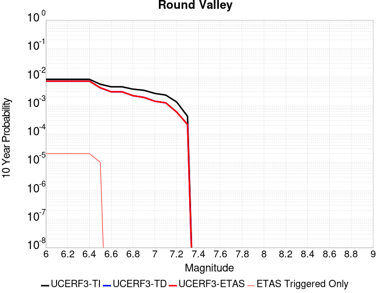 |

| Magnitude | 1 wk TI Prob | 1 wk TD Prob | 1 wk ETAS Prob | 1 wk ETAS/TD Gain | 1 wk ETAS Triggered Only | 1 mo TI Prob | 1 mo TD Prob | 1 mo ETAS Prob | 1 mo ETAS/TD Gain | 1 mo ETAS Triggered Only | 1 yr TI Prob | 1 yr TD Prob | 1 yr ETAS Prob | 1 yr ETAS/TD Gain | 1 yr ETAS Triggered Only | 10 yr TI Prob | 10 yr TD Prob | 10 yr ETAS Prob | 10 yr ETAS/TD Gain | 10 yr ETAS Triggered Only |
|-----|-----|-----|-----|-----|-----|-----|-----|-----|-----|-----|-----|-----|-----|-----|-----|-----|-----|-----|-----|-----|
| 6.0 | 1.588152E-5 | 1.3670525E-5 | 2.3670389E-5 | 1.7314909 | 1.0E-5 | 6.806188E-5 | 5.8586873E-5 | 6.858628E-5 | 1.1706767 | 1.0E-5 | 8.283384E-4 | 7.131011E-4 | 7.3308684E-4 | 1.0280265 | 2.0E-5 | 0.008252576 | 0.0071120164 | 0.007131874 | 1.0027921 | 2.0E-5 |
| 6.1 | 1.588152E-5 | 1.3670525E-5 | 2.3670389E-5 | 1.7314909 | 1.0E-5 | 6.806188E-5 | 5.8586873E-5 | 6.858628E-5 | 1.1706767 | 1.0E-5 | 8.283384E-4 | 7.131011E-4 | 7.3308684E-4 | 1.0280265 | 2.0E-5 | 0.008252576 | 0.0071120164 | 0.007131874 | 1.0027921 | 2.0E-5 |
| 6.2 | 1.588152E-5 | 1.3670525E-5 | 2.3670389E-5 | 1.7314909 | 1.0E-5 | 6.806188E-5 | 5.8586873E-5 | 6.858628E-5 | 1.1706767 | 1.0E-5 | 8.283384E-4 | 7.131011E-4 | 7.3308684E-4 | 1.0280265 | 2.0E-5 | 0.008252576 | 0.0071120164 | 0.007131874 | 1.0027921 | 2.0E-5 |
| 6.3 | 1.588152E-5 | 1.3670525E-5 | 2.3670389E-5 | 1.7314909 | 1.0E-5 | 6.806188E-5 | 5.8586873E-5 | 6.858628E-5 | 1.1706767 | 1.0E-5 | 8.283384E-4 | 7.131011E-4 | 7.3308684E-4 | 1.0280265 | 2.0E-5 | 0.008252576 | 0.0071120164 | 0.007131874 | 1.0027921 | 2.0E-5 |
| 6.4 | 1.588152E-5 | 1.3670525E-5 | 2.3670389E-5 | 1.7314909 | 1.0E-5 | 6.806188E-5 | 5.8586873E-5 | 6.858628E-5 | 1.1706767 | 1.0E-5 | 8.283384E-4 | 7.131011E-4 | 7.3308684E-4 | 1.0280265 | 2.0E-5 | 0.008252576 | 0.0071120164 | 0.007131874 | 1.0027921 | 2.0E-5 |
| 6.5 | 1.0646776E-5 | 7.952847E-6 | 1.7952767E-5 | 2.2574012 | 1.0E-5 | 4.5628243E-5 | 3.4083234E-5 | 4.408289E-5 | 1.2933894 | 1.0E-5 | 5.553823E-4 | 4.1489274E-4 | 4.248886E-4 | 1.0240927 | 1.0E-5 | 0.005539963 | 0.00414201 | 0.0041519688 | 1.0024043 | 1.0E-5 |
| 6.6 | 8.632956E-6 | 5.768552E-6 | 5.768552E-6 | 1.0 | 0.0 | 3.6997862E-5 | 2.4722152E-5 | 2.4722152E-5 | 1.0 | 0.0 | 4.5035584E-4 | 3.0095447E-4 | 3.0095447E-4 | 1.0 | 0.0 | 0.0044944426 | 0.0030058469 | 0.0030058469 | 1.0 | 0.0 |
| 6.7 | 8.632956E-6 | 5.768552E-6 | 5.768552E-6 | 1.0 | 0.0 | 3.6997862E-5 | 2.4722152E-5 | 2.4722152E-5 | 1.0 | 0.0 | 4.5035584E-4 | 3.0095447E-4 | 3.0095447E-4 | 1.0 | 0.0 | 0.0044944426 | 0.0030058469 | 0.0030058469 | 1.0 | 0.0 |
| 6.8 | 7.143895E-6 | 4.201644E-6 | 4.201644E-6 | 1.0 | 0.0 | 3.0616335E-5 | 1.8006931E-5 | 1.8006931E-5 | 1.0 | 0.0 | 3.726901E-4 | 2.19214E-4 | 2.19214E-4 | 1.0 | 0.0 | 0.0037206567 | 0.0021901424 | 0.0021901424 | 1.0 | 0.0 |
| 6.9 | 6.5120694E-6 | 3.6642807E-6 | 3.6642807E-6 | 1.0 | 0.0 | 2.790857E-5 | 1.5703974E-5 | 1.5703974E-5 | 1.0 | 0.0 | 3.3973387E-4 | 1.9118062E-4 | 1.9118062E-4 | 1.0 | 0.0 | 0.0033921495 | 0.0019103106 | 0.0019103106 | 1.0 | 0.0 |
| 7.0 | 5.0614435E-6 | 2.6834869E-6 | 2.6834869E-6 | 1.0 | 0.0 | 2.169172E-5 | 1.1500612E-5 | 1.1500612E-5 | 1.0 | 0.0 | 2.6406467E-4 | 1.40012E-4 | 1.40012E-4 | 1.0 | 0.0 | 0.0026375111 | 0.0013993392 | 0.0013993392 | 1.0 | 0.0 |
| 7.1 | 4.41728E-6 | 2.3573243E-6 | 2.3573243E-6 | 1.0 | 0.0 | 1.8931061E-5 | 1.01027845E-5 | 1.01027845E-5 | 1.0 | 0.0 | 2.304613E-4 | 1.2299545E-4 | 1.2299545E-4 | 1.0 | 0.0 | 0.0023022245 | 0.0012293702 | 0.0012293702 | 1.0 | 0.0 |
| 7.2 | 2.535495E-6 | 1.120784E-6 | 1.120784E-6 | 1.0 | 0.0 | 1.0866362E-5 | 4.803354E-6 | 4.803354E-6 | 1.0 | 0.0 | 1.3228992E-4 | 5.8479785E-5 | 5.8479785E-5 | 1.0 | 0.0 | 0.0013221119 | 5.846952E-4 | 5.846952E-4 | 1.0 | 0.0 |
| 7.3 | 7.900015E-7 | 4.0888176E-7 | 4.0888176E-7 | 1.0 | 0.0 | 3.3857161E-6 | 1.7523504E-6 | 1.7523504E-6 | 1.0 | 0.0 | 4.1220315E-5 | 2.1334865E-5 | 2.1334865E-5 | 1.0 | 0.0 | 4.121267E-4 | 2.1334866E-4 | 2.1334866E-4 | 1.0 | 0.0 |

## Earthquake Valley (No  Extension)
*[(top)](#table-of-contents)*

| 1 Week | 1 Month | 1 Year | 10 Year |
|-----|-----|-----|-----|
|  |  |  |  |

| Magnitude | 1 wk TI Prob | 1 wk TD Prob | 1 wk ETAS Prob | 1 wk ETAS/TD Gain | 1 wk ETAS Triggered Only | 1 mo TI Prob | 1 mo TD Prob | 1 mo ETAS Prob | 1 mo ETAS/TD Gain | 1 mo ETAS Triggered Only | 1 yr TI Prob | 1 yr TD Prob | 1 yr ETAS Prob | 1 yr ETAS/TD Gain | 1 yr ETAS Triggered Only | 10 yr TI Prob | 10 yr TD Prob | 10 yr ETAS Prob | 10 yr ETAS/TD Gain | 10 yr ETAS Triggered Only |
|-----|-----|-----|-----|-----|-----|-----|-----|-----|-----|-----|-----|-----|-----|-----|-----|-----|-----|-----|-----|-----|
| 6.0 | 2.1859703E-5 | 2.5198351E-5 | 4.519785E-5 | 1.7936827 | 2.0E-5 | 9.3681076E-5 | 1.0798928E-4 | 1.2798712E-4 | 1.1851835 | 2.0E-5 | 0.0011399703 | 0.0013141216 | 0.0013340954 | 1.0151993 | 2.0E-5 | 0.011341401 | 0.013077869 | 0.0130976075 | 1.0015093 | 2.0E-5 |
| 6.1 | 2.1859703E-5 | 2.5198351E-5 | 4.519785E-5 | 1.7936827 | 2.0E-5 | 9.3681076E-5 | 1.0798928E-4 | 1.2798712E-4 | 1.1851835 | 2.0E-5 | 0.0011399703 | 0.0013141216 | 0.0013340954 | 1.0151993 | 2.0E-5 | 0.011341401 | 0.013077869 | 0.0130976075 | 1.0015093 | 2.0E-5 |
| 6.2 | 2.1859703E-5 | 2.5198351E-5 | 4.519785E-5 | 1.7936827 | 2.0E-5 | 9.3681076E-5 | 1.0798928E-4 | 1.2798712E-4 | 1.1851835 | 2.0E-5 | 0.0011399703 | 0.0013141216 | 0.0013340954 | 1.0151993 | 2.0E-5 | 0.011341401 | 0.013077869 | 0.0130976075 | 1.0015093 | 2.0E-5 |
| 6.3 | 2.1859703E-5 | 2.5198351E-5 | 4.519785E-5 | 1.7936827 | 2.0E-5 | 9.3681076E-5 | 1.0798928E-4 | 1.2798712E-4 | 1.1851835 | 2.0E-5 | 0.0011399703 | 0.0013141216 | 0.0013340954 | 1.0151993 | 2.0E-5 | 0.011341401 | 0.013077869 | 0.0130976075 | 1.0015093 | 2.0E-5 |
| 6.4 | 2.1859703E-5 | 2.5198351E-5 | 4.519785E-5 | 1.7936827 | 2.0E-5 | 9.3681076E-5 | 1.0798928E-4 | 1.2798712E-4 | 1.1851835 | 2.0E-5 | 0.0011399703 | 0.0013141216 | 0.0013340954 | 1.0151993 | 2.0E-5 | 0.011341401 | 0.013077869 | 0.0130976075 | 1.0015093 | 2.0E-5 |
| 6.5 | 2.1859703E-5 | 2.5198351E-5 | 4.519785E-5 | 1.7936827 | 2.0E-5 | 9.3681076E-5 | 1.0798928E-4 | 1.2798712E-4 | 1.1851835 | 2.0E-5 | 0.0011399703 | 0.0013141216 | 0.0013340954 | 1.0151993 | 2.0E-5 | 0.011341401 | 0.013077869 | 0.0130976075 | 1.0015093 | 2.0E-5 |
| 6.6 | 1.597E-5 | 1.835627E-5 | 1.835627E-5 | 1.0 | 0.0 | 6.8441055E-5 | 7.866784E-5 | 7.866784E-5 | 1.0 | 0.0 | 8.329513E-4 | 9.5744745E-4 | 9.5744745E-4 | 1.0 | 0.0 | 0.008298361 | 0.009541833 | 0.009541833 | 1.0 | 0.0 |
| 6.7 | 1.597E-5 | 1.835627E-5 | 1.835627E-5 | 1.0 | 0.0 | 6.8441055E-5 | 7.866784E-5 | 7.866784E-5 | 1.0 | 0.0 | 8.329513E-4 | 9.5744745E-4 | 9.5744745E-4 | 1.0 | 0.0 | 0.008298361 | 0.009541833 | 0.009541833 | 1.0 | 0.0 |
| 6.8 | 1.5315149E-5 | 1.7602086E-5 | 1.7602086E-5 | 1.0 | 0.0 | 6.5634704E-5 | 7.543582E-5 | 7.543582E-5 | 1.0 | 0.0 | 7.988095E-4 | 9.1813074E-4 | 9.1813074E-4 | 1.0 | 0.0 | 0.007959441 | 0.009151915 | 0.009151915 | 1.0 | 0.0 |
| 6.9 | 1.3634728E-5 | 1.5675814E-5 | 1.5675814E-5 | 1.0 | 0.0 | 5.8433237E-5 | 6.7180794E-5 | 6.7180794E-5 | 1.0 | 0.0 | 7.1119244E-4 | 8.1770134E-4 | 8.1770134E-4 | 1.0 | 0.0 | 0.007089207 | 0.008154998 | 0.008154998 | 1.0 | 0.0 |
| 7.0 | 1.3496271E-5 | 1.5517848E-5 | 1.5517848E-5 | 1.0 | 0.0 | 5.783988E-5 | 6.6503824E-5 | 6.6503824E-5 | 1.0 | 0.0 | 7.03973E-4 | 8.0946536E-4 | 8.0946536E-4 | 1.0 | 0.0 | 0.007017471 | 0.008073238 | 0.008073238 | 1.0 | 0.0 |
| 7.1 | 8.242798E-6 | 9.472594E-6 | 9.472594E-6 | 1.0 | 0.0 | 3.53258E-5 | 4.0596577E-5 | 4.0596577E-5 | 1.0 | 0.0 | 4.300067E-4 | 4.9421826E-4 | 4.9421826E-4 | 1.0 | 0.0 | 0.004291756 | 0.0049377684 | 0.0049377684 | 1.0 | 0.0 |
| 7.2 | 2.6506527E-7 | 2.2559628E-7 | 2.2559628E-7 | 1.0 | 0.0 | 1.1359936E-6 | 9.668408E-7 | 9.668408E-7 | 1.0 | 0.0 | 1.3830633E-5 | 1.1771229E-5 | 1.1771229E-5 | 1.0 | 0.0 | 1.3829772E-4 | 1.1770646E-4 | 1.1770646E-4 | 1.0 | 0.0 |
| 7.3 | 2.5810488E-7 | 2.1954757E-7 | 2.1954757E-7 | 1.0 | 0.0 | 1.1061633E-6 | 9.4091786E-7 | 9.4091786E-7 | 1.0 | 0.0 | 1.3467455E-5 | 1.1455619E-5 | 1.1455619E-5 | 1.0 | 0.0 | 1.3466639E-4 | 1.145507E-4 | 1.145507E-4 | 1.0 | 0.0 |
| 7.4 | 2.2676066E-7 | 1.9109943E-7 | 1.9109943E-7 | 1.0 | 0.0 | 9.71831E-7 | 8.189973E-7 | 8.189973E-7 | 1.0 | 0.0 | 1.1831979E-5 | 9.971251E-6 | 9.971251E-6 | 1.0 | 0.0 | 1.1831349E-4 | 9.970842E-5 | 9.970842E-5 | 1.0 | 0.0 |
| 7.5 | 1.5553917E-7 | 1.311138E-7 | 1.311138E-7 | 1.0 | 0.0 | 6.6659624E-7 | 5.619162E-7 | 5.619162E-7 | 1.0 | 0.0 | 8.115779E-6 | 6.84131E-6 | 6.84131E-6 | 1.0 | 0.0 | 8.115482E-5 | 6.841121E-5 | 6.841121E-5 | 1.0 | 0.0 |
| 7.6 | 1.3448629E-7 | 1.1287708E-7 | 1.1287708E-7 | 1.0 | 0.0 | 5.7636964E-7 | 4.8375887E-7 | 4.8375887E-7 | 1.0 | 0.0 | 7.017278E-6 | 5.8897504E-6 | 5.8897504E-6 | 1.0 | 0.0 | 7.0170565E-5 | 5.8896156E-5 | 5.8896156E-5 | 1.0 | 0.0 |
| 7.7 | 2.9719402E-8 | 1.4581234E-8 | 1.4581234E-8 | 1.0 | 0.0 | 1.2736886E-7 | 6.2491004E-8 | 6.2491004E-8 | 1.0 | 0.0 | 1.5507147E-6 | 7.6082773E-7 | 7.6082773E-7 | 1.0 | 0.0 | 1.550704E-5 | 7.608257E-6 | 7.608257E-6 | 1.0 | 0.0 |
| 7.8 | 7.4390196E-9 | 3.249962E-9 | 3.249962E-9 | 1.0 | 0.0 | 3.1881513E-8 | 1.39284095E-8 | 1.39284095E-8 | 1.0 | 0.0 | 3.8815733E-7 | 1.6957837E-7 | 1.6957837E-7 | 1.0 | 0.0 | 3.8815665E-6 | 1.6957828E-6 | 1.6957828E-6 | 1.0 | 0.0 |
| 7.9 | 1.5373532E-9 | 8.4400953E-10 | 8.4400953E-10 | 1.0 | 0.0 | 6.5886567E-9 | 3.6171839E-9 | 3.6171839E-9 | 1.0 | 0.0 | 8.021689E-8 | 4.403921E-8 | 4.403921E-8 | 1.0 | 0.0 | 8.0216864E-7 | 4.403921E-7 | 4.403921E-7 | 1.0 | 0.0 |

## Almanor 2011 CFM
*[(top)](#table-of-contents)*

| 1 Week | 1 Month | 1 Year | 10 Year |
|-----|-----|-----|-----|
|  |  |  |  |

| Magnitude | 1 wk TI Prob | 1 wk TD Prob | 1 wk ETAS Prob | 1 wk ETAS/TD Gain | 1 wk ETAS Triggered Only | 1 mo TI Prob | 1 mo TD Prob | 1 mo ETAS Prob | 1 mo ETAS/TD Gain | 1 mo ETAS Triggered Only | 1 yr TI Prob | 1 yr TD Prob | 1 yr ETAS Prob | 1 yr ETAS/TD Gain | 1 yr ETAS Triggered Only | 10 yr TI Prob | 10 yr TD Prob | 10 yr ETAS Prob | 10 yr ETAS/TD Gain | 10 yr ETAS Triggered Only |
|-----|-----|-----|-----|-----|-----|-----|-----|-----|-----|-----|-----|-----|-----|-----|-----|-----|-----|-----|-----|-----|
| 6.0 | 6.1479834E-5 | 8.327245E-5 | 8.327245E-5 | 1.0 | 0.0 | 2.6345838E-4 | 3.5683523E-4 | 3.7682807E-4 | 1.0560282 | 2.0E-5 | 0.0032028882 | 0.004336495 | 0.004356408 | 1.0045921 | 2.0E-5 | 0.031571172 | 0.04258658 | 0.042605728 | 1.0004497 | 2.0E-5 |
| 6.1 | 4.4387216E-5 | 5.9767433E-5 | 5.9767433E-5 | 1.0 | 0.0 | 1.9021705E-4 | 2.561236E-4 | 2.761185E-4 | 1.0780673 | 2.0E-5 | 0.0023134327 | 0.003114351 | 0.0031342886 | 1.0064019 | 2.0E-5 | 0.022894967 | 0.030755581 | 0.030774966 | 1.0006303 | 2.0E-5 |
| 6.2 | 4.4387216E-5 | 5.9767433E-5 | 5.9767433E-5 | 1.0 | 0.0 | 1.9021705E-4 | 2.561236E-4 | 2.761185E-4 | 1.0780673 | 2.0E-5 | 0.0023134327 | 0.003114351 | 0.0031342886 | 1.0064019 | 2.0E-5 | 0.022894967 | 0.030755581 | 0.030774966 | 1.0006303 | 2.0E-5 |
| 6.3 | 2.9523822E-5 | 3.9546965E-5 | 3.9546965E-5 | 1.0 | 0.0 | 1.2652454E-4 | 1.6947731E-4 | 1.7947561E-4 | 1.058995 | 1.0E-5 | 0.0015393476 | 0.0020617929 | 0.0020717722 | 1.0048401 | 1.0E-5 | 0.015287281 | 0.020461112 | 0.020470908 | 1.0004787 | 1.0E-5 |
| 6.4 | 2.0512744E-5 | 2.7430639E-5 | 2.7430639E-5 | 1.0 | 0.0 | 8.79088E-5 | 1.17555675E-4 | 1.2755451E-4 | 1.0850561 | 1.0E-5 | 0.001069764 | 0.0014306171 | 0.0014406027 | 1.00698 | 1.0E-5 | 0.010646289 | 0.01424458 | 0.014254437 | 1.000692 | 1.0E-5 |
| 6.5 | 1.6750226E-5 | 2.2390364E-5 | 2.2390364E-5 | 1.0 | 0.0 | 7.178471E-5 | 9.595619E-5 | 1.0595523E-4 | 1.1042042 | 1.0E-5 | 8.7362836E-4 | 0.0011679606 | 0.0011779489 | 1.008552 | 1.0E-5 | 0.008702018 | 0.011649196 | 0.011659079 | 1.0008484 | 1.0E-5 |
| 6.6 | 1.4745303E-5 | 1.970686E-5 | 1.970686E-5 | 1.0 | 0.0 | 6.319262E-5 | 8.445639E-5 | 9.445554E-5 | 1.1183943 | 1.0E-5 | 7.690986E-4 | 0.0010280984 | 0.0010380881 | 1.0097167 | 1.0E-5 | 0.0076644225 | 0.01026513 | 0.010275028 | 1.0009642 | 1.0E-5 |
| 6.7 | 9.951145E-7 | 1.1616347E-6 | 1.1616347E-6 | 1.0 | 0.0 | 4.26477E-6 | 4.9784257E-6 | 4.9784257E-6 | 1.0 | 0.0 | 5.1922336E-5 | 6.0610826E-5 | 6.0610826E-5 | 1.0 | 0.0 | 5.1910203E-4 | 6.059602E-4 | 6.059602E-4 | 1.0 | 0.0 |
| 6.8 | 5.866312E-7 | 6.849384E-7 | 6.849384E-7 | 1.0 | 0.0 | 2.5141312E-6 | 2.9354478E-6 | 2.9354478E-6 | 1.0 | 0.0 | 3.0609117E-5 | 3.5738623E-5 | 3.5738623E-5 | 1.0 | 0.0 | 3.06049E-4 | 3.5734157E-4 | 3.5734157E-4 | 1.0 | 0.0 |

## Monterey Bay-Tularcitos
*[(top)](#table-of-contents)*

| 1 Week | 1 Month | 1 Year | 10 Year |
|-----|-----|-----|-----|
|  |  |  | 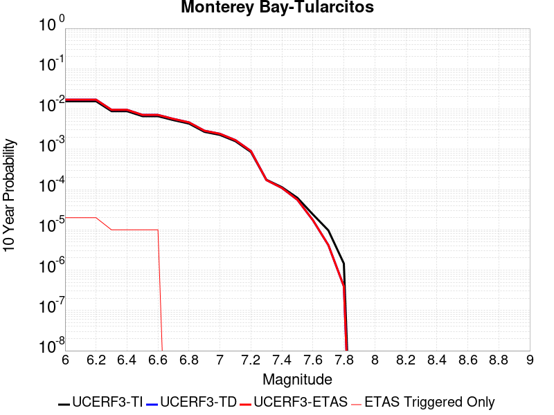 |

| Magnitude | 1 wk TI Prob | 1 wk TD Prob | 1 wk ETAS Prob | 1 wk ETAS/TD Gain | 1 wk ETAS Triggered Only | 1 mo TI Prob | 1 mo TD Prob | 1 mo ETAS Prob | 1 mo ETAS/TD Gain | 1 mo ETAS Triggered Only | 1 yr TI Prob | 1 yr TD Prob | 1 yr ETAS Prob | 1 yr ETAS/TD Gain | 1 yr ETAS Triggered Only | 10 yr TI Prob | 10 yr TD Prob | 10 yr ETAS Prob | 10 yr ETAS/TD Gain | 10 yr ETAS Triggered Only |
|-----|-----|-----|-----|-----|-----|-----|-----|-----|-----|-----|-----|-----|-----|-----|-----|-----|-----|-----|-----|-----|
| 6.0 | 3.0131365E-5 | 3.279877E-5 | 3.279877E-5 | 1.0 | 0.0 | 1.2912804E-4 | 1.4055918E-4 | 1.4055918E-4 | 1.0 | 0.0 | 0.001571 | 0.0017100703 | 0.0017200531 | 1.0058377 | 1.0E-5 | 0.015599402 | 0.016979916 | 0.016999578 | 1.0011579 | 2.0E-5 |
| 6.1 | 3.0131365E-5 | 3.279877E-5 | 3.279877E-5 | 1.0 | 0.0 | 1.2912804E-4 | 1.4055918E-4 | 1.4055918E-4 | 1.0 | 0.0 | 0.001571 | 0.0017100703 | 0.0017200531 | 1.0058377 | 1.0E-5 | 0.015599402 | 0.016979916 | 0.016999578 | 1.0011579 | 2.0E-5 |
| 6.2 | 3.0131365E-5 | 3.279877E-5 | 3.279877E-5 | 1.0 | 0.0 | 1.2912804E-4 | 1.4055918E-4 | 1.4055918E-4 | 1.0 | 0.0 | 0.001571 | 0.0017100703 | 0.0017200531 | 1.0058377 | 1.0E-5 | 0.015599402 | 0.016979916 | 0.016999578 | 1.0011579 | 2.0E-5 |
| 6.3 | 1.6998249E-5 | 1.8330798E-5 | 1.8330798E-5 | 1.0 | 0.0 | 7.28476E-5 | 7.85583E-5 | 7.85583E-5 | 1.0 | 0.0 | 8.865586E-4 | 9.5604634E-4 | 9.5604634E-4 | 1.0 | 0.0 | 0.0088303005 | 0.009521258 | 0.009531163 | 1.0010403 | 1.0E-5 |
| 6.4 | 1.6998249E-5 | 1.8330798E-5 | 1.8330798E-5 | 1.0 | 0.0 | 7.28476E-5 | 7.85583E-5 | 7.85583E-5 | 1.0 | 0.0 | 8.865586E-4 | 9.5604634E-4 | 9.5604634E-4 | 1.0 | 0.0 | 0.0088303005 | 0.009521258 | 0.009531163 | 1.0010403 | 1.0E-5 |
| 6.5 | 1.27470785E-5 | 1.3693312E-5 | 1.3693312E-5 | 1.0 | 0.0 | 5.4629192E-5 | 5.8684363E-5 | 5.8684363E-5 | 1.0 | 0.0 | 6.649074E-4 | 7.1425823E-4 | 7.1425823E-4 | 1.0 | 0.0 | 0.0066292146 | 0.007120678 | 0.007130607 | 1.0013944 | 1.0E-5 |
| 6.6 | 1.2739422E-5 | 1.36854E-5 | 1.36854E-5 | 1.0 | 0.0 | 5.4596385E-5 | 5.8650454E-5 | 5.8650454E-5 | 1.0 | 0.0 | 6.645082E-4 | 7.1384566E-4 | 7.1384566E-4 | 1.0 | 0.0 | 0.0066252467 | 0.007116579 | 0.007126508 | 1.0013952 | 1.0E-5 |
| 6.7 | 1.0160109E-5 | 1.0885755E-5 | 1.0885755E-5 | 1.0 | 0.0 | 4.35426E-5 | 4.665244E-5 | 4.665244E-5 | 1.0 | 0.0 | 5.300022E-4 | 5.6785246E-4 | 5.6785246E-4 | 1.0 | 0.0 | 0.005287399 | 0.0056647263 | 0.0056647263 | 1.0 | 0.0 |
| 6.8 | 8.349859E-6 | 8.932587E-6 | 8.932587E-6 | 1.0 | 0.0 | 3.578462E-5 | 3.8281985E-5 | 3.8281985E-5 | 1.0 | 0.0 | 4.3559066E-4 | 4.6598914E-4 | 4.6598914E-4 | 1.0 | 0.0 | 0.004347378 | 0.004650685 | 0.004650685 | 1.0 | 0.0 |
| 6.9 | 5.193639E-6 | 5.53643E-6 | 5.53643E-6 | 1.0 | 0.0 | 2.2258262E-5 | 2.372736E-5 | 2.372736E-5 | 1.0 | 0.0 | 2.7096065E-4 | 2.8884556E-4 | 2.8884556E-4 | 1.0 | 0.0 | 0.0027063051 | 0.0028850224 | 0.0028850224 | 1.0 | 0.0 |
| 7.0 | 4.359381E-6 | 4.643366E-6 | 4.643366E-6 | 1.0 | 0.0 | 1.8682927E-5 | 1.9900004E-5 | 1.9900004E-5 | 1.0 | 0.0 | 2.274409E-4 | 2.422586E-4 | 2.422586E-4 | 1.0 | 0.0 | 0.0022720827 | 0.002420238 | 0.002420238 | 1.0 | 0.0 |
| 7.1 | 3.0398533E-6 | 3.2310427E-6 | 3.2310427E-6 | 1.0 | 0.0 | 1.3027877E-5 | 1.3847267E-5 | 1.3847267E-5 | 1.0 | 0.0 | 1.5860285E-4 | 1.6858005E-4 | 1.6858005E-4 | 1.0 | 0.0 | 0.001584897 | 0.0016847793 | 0.0016847793 | 1.0 | 0.0 |
| 7.2 | 1.642335E-6 | 1.7333153E-6 | 1.7333153E-6 | 1.0 | 0.0 | 7.0385595E-6 | 7.428485E-6 | 7.428485E-6 | 1.0 | 0.0 | 8.569109E-5 | 9.044012E-5 | 9.044012E-5 | 1.0 | 0.0 | 8.5658056E-4 | 9.042358E-4 | 9.042358E-4 | 1.0 | 0.0 |
| 7.3 | 3.356842E-7 | 3.2952389E-7 | 3.2952389E-7 | 1.0 | 0.0 | 1.4386458E-6 | 1.4122445E-6 | 1.4122445E-6 | 1.0 | 0.0 | 1.7515373E-5 | 1.7193941E-5 | 1.7193941E-5 | 1.0 | 0.0 | 1.7513991E-4 | 1.719262E-4 | 1.719262E-4 | 1.0 | 0.0 |
| 7.4 | 2.1973483E-7 | 2.1006414E-7 | 2.1006414E-7 | 1.0 | 0.0 | 9.417204E-7 | 9.002746E-7 | 9.002746E-7 | 1.0 | 0.0 | 1.1465385E-5 | 1.0960788E-5 | 1.0960788E-5 | 1.0 | 0.0 | 1.1464794E-4 | 1.0960251E-4 | 1.0960251E-4 | 1.0 | 0.0 |
| 7.5 | 1.1944135E-7 | 1.0696035E-7 | 1.0696035E-7 | 1.0 | 0.0 | 5.118914E-7 | 4.5840142E-7 | 4.5840142E-7 | 1.0 | 0.0 | 6.23226E-6 | 5.581023E-6 | 5.581023E-6 | 1.0 | 0.0 | 6.2320854E-5 | 5.5808843E-5 | 5.5808843E-5 | 1.0 | 0.0 |
| 7.6 | 4.636058E-8 | 3.3364433E-8 | 3.3364433E-8 | 1.0 | 0.0 | 1.9868818E-7 | 1.4299042E-7 | 1.4299042E-7 | 1.0 | 0.0 | 2.419026E-6 | 1.740907E-6 | 1.740907E-6 | 1.0 | 0.0 | 2.4189996E-5 | 1.7408936E-5 | 1.7408936E-5 | 1.0 | 0.0 |
| 7.7 | 1.8588572E-8 | 8.003168E-9 | 8.003168E-9 | 1.0 | 0.0 | 7.9665305E-8 | 3.429929E-8 | 3.429929E-8 | 1.0 | 0.0 | 9.699246E-7 | 4.1759378E-7 | 4.1759378E-7 | 1.0 | 0.0 | 9.699204E-6 | 4.1759304E-6 | 4.1759304E-6 | 1.0 | 0.0 |
| 7.8 | 2.7960154E-9 | 7.608624E-10 | 7.608624E-10 | 1.0 | 0.0 | 1.1982923E-8 | 3.2608392E-9 | 3.2608392E-9 | 1.0 | 0.0 | 1.4589209E-7 | 3.9700716E-8 | 3.9700716E-8 | 1.0 | 0.0 | 1.4589199E-6 | 3.970071E-7 | 3.970071E-7 | 1.0 | 0.0 |

## Compton
*[(top)](#table-of-contents)*

| 1 Week | 1 Month | 1 Year | 10 Year |
|-----|-----|-----|-----|
|  |  |  |  |

| Magnitude | 1 wk TI Prob | 1 wk TD Prob | 1 wk ETAS Prob | 1 wk ETAS/TD Gain | 1 wk ETAS Triggered Only | 1 mo TI Prob | 1 mo TD Prob | 1 mo ETAS Prob | 1 mo ETAS/TD Gain | 1 mo ETAS Triggered Only | 1 yr TI Prob | 1 yr TD Prob | 1 yr ETAS Prob | 1 yr ETAS/TD Gain | 1 yr ETAS Triggered Only | 10 yr TI Prob | 10 yr TD Prob | 10 yr ETAS Prob | 10 yr ETAS/TD Gain | 10 yr ETAS Triggered Only |
|-----|-----|-----|-----|-----|-----|-----|-----|-----|-----|-----|-----|-----|-----|-----|-----|-----|-----|-----|-----|-----|
| 6.0 | 1.06050875E-5 | 6.35892E-6 | 6.35892E-6 | 1.0 | 0.0 | 4.5449582E-5 | 2.7252245E-5 | 2.7252245E-5 | 1.0 | 0.0 | 5.5320817E-4 | 3.3174842E-4 | 3.4174512E-4 | 1.0301334 | 1.0E-5 | 0.0055183303 | 0.003312816 | 0.0033327495 | 1.0060172 | 2.0E-5 |
| 6.1 | 1.06050875E-5 | 6.35892E-6 | 6.35892E-6 | 1.0 | 0.0 | 4.5449582E-5 | 2.7252245E-5 | 2.7252245E-5 | 1.0 | 0.0 | 5.5320817E-4 | 3.3174842E-4 | 3.4174512E-4 | 1.0301334 | 1.0E-5 | 0.0055183303 | 0.003312816 | 0.0033327495 | 1.0060172 | 2.0E-5 |
| 6.2 | 1.06050875E-5 | 6.35892E-6 | 6.35892E-6 | 1.0 | 0.0 | 4.5449582E-5 | 2.7252245E-5 | 2.7252245E-5 | 1.0 | 0.0 | 5.5320817E-4 | 3.3174842E-4 | 3.4174512E-4 | 1.0301334 | 1.0E-5 | 0.0055183303 | 0.003312816 | 0.0033327495 | 1.0060172 | 2.0E-5 |
| 6.3 | 1.06050875E-5 | 6.35892E-6 | 6.35892E-6 | 1.0 | 0.0 | 4.5449582E-5 | 2.7252245E-5 | 2.7252245E-5 | 1.0 | 0.0 | 5.5320817E-4 | 3.3174842E-4 | 3.4174512E-4 | 1.0301334 | 1.0E-5 | 0.0055183303 | 0.003312816 | 0.0033327495 | 1.0060172 | 2.0E-5 |
| 6.4 | 1.06050875E-5 | 6.35892E-6 | 6.35892E-6 | 1.0 | 0.0 | 4.5449582E-5 | 2.7252245E-5 | 2.7252245E-5 | 1.0 | 0.0 | 5.5320817E-4 | 3.3174842E-4 | 3.4174512E-4 | 1.0301334 | 1.0E-5 | 0.0055183303 | 0.003312816 | 0.0033327495 | 1.0060172 | 2.0E-5 |
| 6.5 | 1.06050875E-5 | 6.35892E-6 | 6.35892E-6 | 1.0 | 0.0 | 4.5449582E-5 | 2.7252245E-5 | 2.7252245E-5 | 1.0 | 0.0 | 5.5320817E-4 | 3.3174842E-4 | 3.4174512E-4 | 1.0301334 | 1.0E-5 | 0.0055183303 | 0.003312816 | 0.0033327495 | 1.0060172 | 2.0E-5 |
| 6.6 | 1.06050875E-5 | 6.35892E-6 | 6.35892E-6 | 1.0 | 0.0 | 4.5449582E-5 | 2.7252245E-5 | 2.7252245E-5 | 1.0 | 0.0 | 5.5320817E-4 | 3.3174842E-4 | 3.4174512E-4 | 1.0301334 | 1.0E-5 | 0.0055183303 | 0.003312816 | 0.0033327495 | 1.0060172 | 2.0E-5 |
| 6.7 | 1.06050875E-5 | 6.35892E-6 | 6.35892E-6 | 1.0 | 0.0 | 4.5449582E-5 | 2.7252245E-5 | 2.7252245E-5 | 1.0 | 0.0 | 5.5320817E-4 | 3.3174842E-4 | 3.4174512E-4 | 1.0301334 | 1.0E-5 | 0.0055183303 | 0.003312816 | 0.0033327495 | 1.0060172 | 2.0E-5 |
| 6.8 | 1.06050875E-5 | 6.35892E-6 | 6.35892E-6 | 1.0 | 0.0 | 4.5449582E-5 | 2.7252245E-5 | 2.7252245E-5 | 1.0 | 0.0 | 5.5320817E-4 | 3.3174842E-4 | 3.4174512E-4 | 1.0301334 | 1.0E-5 | 0.0055183303 | 0.003312816 | 0.0033327495 | 1.0060172 | 2.0E-5 |
| 6.9 | 1.06050875E-5 | 6.35892E-6 | 6.35892E-6 | 1.0 | 0.0 | 4.5449582E-5 | 2.7252245E-5 | 2.7252245E-5 | 1.0 | 0.0 | 5.5320817E-4 | 3.3174842E-4 | 3.4174512E-4 | 1.0301334 | 1.0E-5 | 0.0055183303 | 0.003312816 | 0.0033327495 | 1.0060172 | 2.0E-5 |
| 7.0 | 7.672486E-6 | 4.272077E-6 | 4.272077E-6 | 1.0 | 0.0 | 3.288167E-5 | 1.8308778E-5 | 1.8308778E-5 | 1.0 | 0.0 | 4.0026082E-4 | 2.2288719E-4 | 2.3288497E-4 | 1.0448557 | 1.0E-5 | 0.0039954064 | 0.0022266984 | 0.0022466541 | 1.0089619 | 2.0E-5 |
| 7.1 | 7.163992E-6 | 3.883783E-6 | 3.883783E-6 | 1.0 | 0.0 | 3.0702464E-5 | 1.664468E-5 | 1.664468E-5 | 1.0 | 0.0 | 3.7373835E-4 | 2.0263072E-4 | 2.126287E-4 | 1.0493408 | 1.0E-5 | 0.0037311043 | 0.0020245167 | 0.002044476 | 1.0098588 | 2.0E-5 |
| 7.2 | 6.3689185E-6 | 3.3101053E-6 | 3.3101053E-6 | 1.0 | 0.0 | 2.729508E-5 | 1.4186091E-5 | 1.4186091E-5 | 1.0 | 0.0 | 3.322669E-4 | 1.7270239E-4 | 1.8270066E-4 | 1.057893 | 1.0E-5 | 0.0033177056 | 0.0017257235 | 0.001745689 | 1.0115694 | 2.0E-5 |
| 7.3 | 4.4987873E-6 | 2.4480198E-6 | 2.4480198E-6 | 1.0 | 0.0 | 1.9280375E-5 | 1.0491473E-5 | 1.0491473E-5 | 1.0 | 0.0 | 2.3471327E-4 | 1.2772651E-4 | 1.3772523E-4 | 1.0782822 | 1.0E-5 | 0.002344655 | 0.0012765612 | 0.0012965356 | 1.015647 | 2.0E-5 |
| 7.4 | 2.987296E-6 | 1.7394043E-6 | 1.7394043E-6 | 1.0 | 0.0 | 1.2802635E-5 | 7.4545687E-6 | 7.4545687E-6 | 1.0 | 0.0 | 1.5586092E-4 | 9.075565E-5 | 1.0075475E-4 | 1.110176 | 1.0E-5 | 0.0015575165 | 9.071917E-4 | 9.2717353E-4 | 1.0220261 | 2.0E-5 |
| 7.5 | 2.4111696E-6 | 1.4471991E-6 | 1.4471991E-6 | 1.0 | 0.0 | 1.0333543E-5 | 6.2022677E-6 | 6.2022677E-6 | 1.0 | 0.0 | 1.2580362E-4 | 7.551004E-5 | 7.551004E-5 | 1.0 | 0.0 | 0.0012573242 | 7.548485E-4 | 7.648409E-4 | 1.0132377 | 1.0E-5 |
| 7.6 | 1.8783096E-6 | 1.1360306E-6 | 1.1360306E-6 | 1.0 | 0.0 | 8.049874E-6 | 4.868694E-6 | 4.868694E-6 | 1.0 | 0.0 | 9.8002805E-5 | 5.9274775E-5 | 5.9274775E-5 | 1.0 | 0.0 | 9.795959E-4 | 5.925936E-4 | 6.025877E-4 | 1.016865 | 1.0E-5 |
| 7.7 | 6.6646817E-7 | 3.5601457E-7 | 3.5601457E-7 | 1.0 | 0.0 | 2.856289E-6 | 1.5257759E-6 | 1.5257759E-6 | 1.0 | 0.0 | 3.4774763E-5 | 1.8576176E-5 | 1.8576176E-5 | 1.0 | 0.0 | 3.4769322E-4 | 1.8574759E-4 | 1.8574759E-4 | 1.0 | 0.0 |
| 7.8 | 7.054689E-8 | 4.1342012E-8 | 4.1342012E-8 | 1.0 | 0.0 | 3.0234378E-7 | 1.7718004E-7 | 1.7718004E-7 | 1.0 | 0.0 | 3.6810293E-6 | 2.157165E-6 | 2.157165E-6 | 1.0 | 0.0 | 3.6809684E-5 | 2.157145E-5 | 2.157145E-5 | 1.0 | 0.0 |
| 7.9 | 7.420925E-9 | 4.0130637E-9 | 4.0130637E-9 | 1.0 | 0.0 | 3.1803964E-8 | 1.7198845E-8 | 1.7198845E-8 | 1.0 | 0.0 | 3.872132E-7 | 2.0939592E-7 | 2.0939592E-7 | 1.0 | 0.0 | 3.872125E-6 | 2.0939574E-6 | 2.0939574E-6 | 1.0 | 0.0 |

## San Juan
*[(top)](#table-of-contents)*

| 1 Week | 1 Month | 1 Year | 10 Year |
|-----|-----|-----|-----|
|  |  |  |  |

| Magnitude | 1 wk TI Prob | 1 wk TD Prob | 1 wk ETAS Prob | 1 wk ETAS/TD Gain | 1 wk ETAS Triggered Only | 1 mo TI Prob | 1 mo TD Prob | 1 mo ETAS Prob | 1 mo ETAS/TD Gain | 1 mo ETAS Triggered Only | 1 yr TI Prob | 1 yr TD Prob | 1 yr ETAS Prob | 1 yr ETAS/TD Gain | 1 yr ETAS Triggered Only | 10 yr TI Prob | 10 yr TD Prob | 10 yr ETAS Prob | 10 yr ETAS/TD Gain | 10 yr ETAS Triggered Only |
|-----|-----|-----|-----|-----|-----|-----|-----|-----|-----|-----|-----|-----|-----|-----|-----|-----|-----|-----|-----|-----|
| 6.0 | 8.682808E-6 | 8.74917E-6 | 8.74917E-6 | 1.0 | 0.0 | 3.72115E-5 | 3.749593E-5 | 3.749593E-5 | 1.0 | 0.0 | 4.5295584E-4 | 4.5642213E-4 | 4.6641758E-4 | 1.0218996 | 1.0E-5 | 0.004520337 | 0.004555389 | 0.0045752977 | 1.0043705 | 2.0E-5 |
| 6.1 | 8.682808E-6 | 8.74917E-6 | 8.74917E-6 | 1.0 | 0.0 | 3.72115E-5 | 3.749593E-5 | 3.749593E-5 | 1.0 | 0.0 | 4.5295584E-4 | 4.5642213E-4 | 4.6641758E-4 | 1.0218996 | 1.0E-5 | 0.004520337 | 0.004555389 | 0.0045752977 | 1.0043705 | 2.0E-5 |
| 6.2 | 8.682808E-6 | 8.74917E-6 | 8.74917E-6 | 1.0 | 0.0 | 3.72115E-5 | 3.749593E-5 | 3.749593E-5 | 1.0 | 0.0 | 4.5295584E-4 | 4.5642213E-4 | 4.6641758E-4 | 1.0218996 | 1.0E-5 | 0.004520337 | 0.004555389 | 0.0045752977 | 1.0043705 | 2.0E-5 |
| 6.3 | 6.3054235E-6 | 6.282591E-6 | 6.282591E-6 | 1.0 | 0.0 | 2.7022963E-5 | 2.692512E-5 | 2.692512E-5 | 1.0 | 0.0 | 3.2895492E-4 | 3.2776545E-4 | 3.2776545E-4 | 1.0 | 0.0 | 0.003284684 | 0.0032730205 | 0.0032829877 | 1.0030453 | 1.0E-5 |
| 6.4 | 6.1490473E-6 | 6.1144706E-6 | 6.1144706E-6 | 1.0 | 0.0 | 2.6352795E-5 | 2.6204618E-5 | 2.6204618E-5 | 1.0 | 0.0 | 3.2079802E-4 | 3.189959E-4 | 3.189959E-4 | 1.0 | 0.0 | 0.0032033534 | 0.0031855768 | 0.003195545 | 1.0031291 | 1.0E-5 |
| 6.5 | 5.204848E-6 | 5.137238E-6 | 5.137238E-6 | 1.0 | 0.0 | 2.23063E-5 | 2.2016555E-5 | 2.2016555E-5 | 1.0 | 0.0 | 2.7154534E-4 | 2.6801953E-4 | 2.6801953E-4 | 1.0 | 0.0 | 0.0027121378 | 0.0026771172 | 0.0026870905 | 1.0037254 | 1.0E-5 |
| 6.6 | 4.5179986E-6 | 4.415036E-6 | 4.415036E-6 | 1.0 | 0.0 | 1.9362706E-5 | 1.892145E-5 | 1.892145E-5 | 1.0 | 0.0 | 2.3571544E-4 | 2.303451E-4 | 2.303451E-4 | 1.0 | 0.0 | 0.0023546559 | 0.0023012008 | 0.0023111778 | 1.0043355 | 1.0E-5 |
| 6.7 | 3.9442616E-6 | 3.8198336E-6 | 3.8198336E-6 | 1.0 | 0.0 | 1.6903869E-5 | 1.6370615E-5 | 1.6370615E-5 | 1.0 | 0.0 | 2.0578515E-4 | 1.9929469E-4 | 1.9929469E-4 | 1.0 | 0.0 | 0.002055947 | 0.001991285 | 0.002001265 | 1.0050119 | 1.0E-5 |
| 6.8 | 3.4536245E-6 | 3.3163408E-6 | 3.3163408E-6 | 1.0 | 0.0 | 1.4801163E-5 | 1.4212815E-5 | 1.4212815E-5 | 1.0 | 0.0 | 1.8018926E-4 | 1.7302789E-4 | 1.7302789E-4 | 1.0 | 0.0 | 0.0018004322 | 0.001729051 | 0.001729051 | 1.0 | 0.0 |
| 6.9 | 3.059865E-6 | 2.9120363E-6 | 2.9120363E-6 | 1.0 | 0.0 | 1.3113641E-5 | 1.2480099E-5 | 1.2480099E-5 | 1.0 | 0.0 | 1.596469E-4 | 1.5193518E-4 | 1.5193518E-4 | 1.0 | 0.0 | 0.0015953224 | 0.0015184281 | 0.0015184281 | 1.0 | 0.0 |
| 7.0 | 2.6504351E-6 | 2.492005E-6 | 2.492005E-6 | 1.0 | 0.0 | 1.1358958E-5 | 1.0679981E-5 | 1.0679981E-5 | 1.0 | 0.0 | 1.3828653E-4 | 1.3002155E-4 | 1.3002155E-4 | 1.0 | 0.0 | 0.0013820052 | 0.001299567 | 0.001299567 | 1.0 | 0.0 |
| 7.1 | 2.2039317E-6 | 2.0338366E-6 | 2.0338366E-6 | 1.0 | 0.0 | 9.445387E-6 | 8.716416E-6 | 8.716416E-6 | 1.0 | 0.0 | 1.1499152E-4 | 1.0611773E-4 | 1.0611773E-4 | 1.0 | 0.0 | 0.0011493203 | 0.0010607811 | 0.0010607811 | 1.0 | 0.0 |
| 7.2 | 1.0786707E-6 | 8.770239E-7 | 8.770239E-7 | 1.0 | 0.0 | 4.622866E-6 | 3.7586685E-6 | 3.7586685E-6 | 1.0 | 0.0 | 5.628194E-5 | 4.576084E-5 | 4.576084E-5 | 1.0 | 0.0 | 5.6267687E-4 | 4.5757365E-4 | 4.5757365E-4 | 1.0 | 0.0 |
| 7.3 | 6.846433E-7 | 4.868812E-7 | 4.868812E-7 | 1.0 | 0.0 | 2.9341822E-6 | 2.086632E-6 | 2.086632E-6 | 1.0 | 0.0 | 3.5723086E-5 | 2.5404452E-5 | 2.5404452E-5 | 1.0 | 0.0 | 3.571734E-4 | 2.5405022E-4 | 2.5405022E-4 | 1.0 | 0.0 |
| 7.4 | 5.23043E-7 | 3.2627884E-7 | 3.2627884E-7 | 1.0 | 0.0 | 2.2416111E-6 | 1.3983371E-6 | 1.3983371E-6 | 1.0 | 0.0 | 2.7291273E-5 | 1.7024622E-5 | 1.7024622E-5 | 1.0 | 0.0 | 2.7287923E-4 | 1.7026608E-4 | 1.7026608E-4 | 1.0 | 0.0 |
| 7.5 | 4.648444E-7 | 2.723464E-7 | 2.723464E-7 | 1.0 | 0.0 | 1.9921886E-6 | 1.1671983E-6 | 1.1671983E-6 | 1.0 | 0.0 | 2.4254627E-5 | 1.4210547E-5 | 1.4210547E-5 | 1.0 | 0.0 | 2.425198E-4 | 1.4212691E-4 | 1.4212691E-4 | 1.0 | 0.0 |
| 7.6 | 3.9906567E-7 | 2.2083036E-7 | 2.2083036E-7 | 1.0 | 0.0 | 1.7102802E-6 | 9.4641547E-7 | 9.4641547E-7 | 1.0 | 0.0 | 2.0822463E-5 | 1.1522548E-5 | 1.1522548E-5 | 1.0 | 0.0 | 2.0820512E-4 | 1.15244526E-4 | 1.15244526E-4 | 1.0 | 0.0 |
| 7.7 | 1.8784601E-7 | 5.366277E-8 | 5.366277E-8 | 1.0 | 0.0 | 8.0505407E-7 | 2.2998329E-7 | 2.2998329E-7 | 1.0 | 0.0 | 9.80149E-6 | 2.800043E-6 | 2.800043E-6 | 1.0 | 0.0 | 9.801057E-5 | 2.8008939E-5 | 2.8008939E-5 | 1.0 | 0.0 |
| 7.8 | 1.00154914E-7 | 1.2412917E-8 | 1.2412917E-8 | 1.0 | 0.0 | 4.2923529E-7 | 5.3198217E-8 | 5.3198217E-8 | 1.0 | 0.0 | 5.225927E-6 | 6.476881E-7 | 6.476881E-7 | 1.0 | 0.0 | 5.225804E-5 | 6.4827886E-6 | 6.4827886E-6 | 1.0 | 0.0 |
| 7.9 | 6.171429E-8 | 4.2946513E-9 | 4.2946513E-9 | 1.0 | 0.0 | 2.6448978E-7 | 1.8405647E-8 | 1.8405647E-8 | 1.0 | 0.0 | 3.2201583E-6 | 2.2408874E-7 | 2.2408874E-7 | 1.0 | 0.0 | 3.2201115E-5 | 2.2462114E-6 | 2.2462114E-6 | 1.0 | 0.0 |
| 8.0 | 1.3974572E-8 | 3.3737857E-10 | 3.3737857E-10 | 1.0 | 0.0 | 5.989102E-8 | 1.4459075E-9 | 1.4459075E-9 | 1.0 | 0.0 | 7.2917294E-7 | 1.760392E-8 | 1.760392E-8 | 1.0 | 0.0 | 7.2917055E-6 | 1.8038004E-7 | 1.8038004E-7 | 1.0 | 0.0 |
| 8.1 | 1.8403477E-9 | 1.1291601E-10 | 1.1291601E-10 | 1.0 | 0.0 | 7.887204E-9 | 4.839261E-10 | 4.839261E-10 | 1.0 | 0.0 | 9.602671E-8 | 5.8917977E-9 | 5.8917977E-9 | 1.0 | 0.0 | 9.602667E-7 | 6.0206084E-8 | 6.0206084E-8 | 1.0 | 0.0 |

## Great Valley 07 (Orestimba)
*[(top)](#table-of-contents)*

| 1 Week | 1 Month | 1 Year | 10 Year |
|-----|-----|-----|-----|
|  |  | 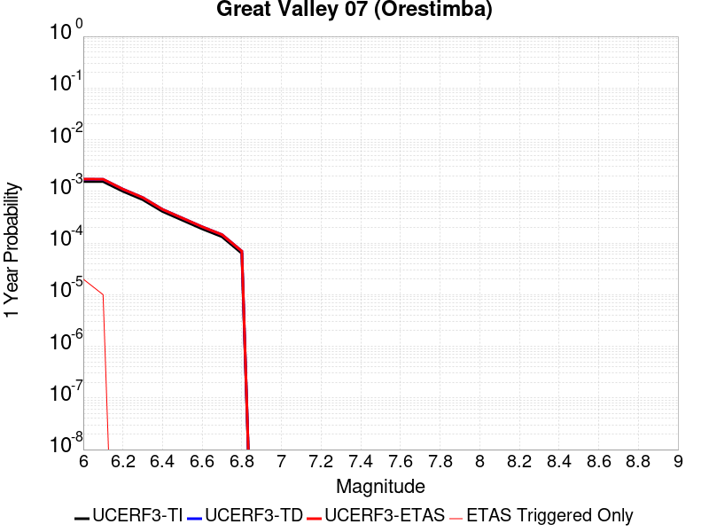 |  |

| Magnitude | 1 wk TI Prob | 1 wk TD Prob | 1 wk ETAS Prob | 1 wk ETAS/TD Gain | 1 wk ETAS Triggered Only | 1 mo TI Prob | 1 mo TD Prob | 1 mo ETAS Prob | 1 mo ETAS/TD Gain | 1 mo ETAS Triggered Only | 1 yr TI Prob | 1 yr TD Prob | 1 yr ETAS Prob | 1 yr ETAS/TD Gain | 1 yr ETAS Triggered Only | 10 yr TI Prob | 10 yr TD Prob | 10 yr ETAS Prob | 10 yr ETAS/TD Gain | 10 yr ETAS Triggered Only |
|-----|-----|-----|-----|-----|-----|-----|-----|-----|-----|-----|-----|-----|-----|-----|-----|-----|-----|-----|-----|-----|
| 6.0 | 2.9687902E-5 | 3.27575E-5 | 3.27575E-5 | 1.0 | 0.0 | 1.2722766E-4 | 1.4038214E-4 | 1.5038073E-4 | 1.0712241 | 1.0E-5 | 0.0015478961 | 0.0017078844 | 0.0017278503 | 1.0116904 | 2.0E-5 | 0.015371585 | 0.016955135 | 0.016974797 | 1.0011595 | 2.0E-5 |
| 6.1 | 2.9687902E-5 | 3.27575E-5 | 3.27575E-5 | 1.0 | 0.0 | 1.2722766E-4 | 1.4038214E-4 | 1.5038073E-4 | 1.0712241 | 1.0E-5 | 0.0015478961 | 0.0017078844 | 0.0017178673 | 1.0058452 | 1.0E-5 | 0.015371585 | 0.016955135 | 0.016964966 | 1.0005798 | 1.0E-5 |
| 6.2 | 1.9231524E-5 | 2.1159167E-5 | 2.1159167E-5 | 1.0 | 0.0 | 8.2418206E-5 | 9.067912E-5 | 9.067912E-5 | 1.0 | 0.0 | 0.0010029797 | 0.0011034822 | 0.0011034822 | 1.0 | 0.0 | 0.00998465 | 0.010982441 | 0.010982441 | 1.0 | 0.0 |
| 6.3 | 1.324766E-5 | 1.4548534E-5 | 1.4548534E-5 | 1.0 | 0.0 | 5.6774446E-5 | 6.234942E-5 | 6.234942E-5 | 1.0 | 0.0 | 6.910097E-4 | 7.5884897E-4 | 7.5884897E-4 | 1.0 | 0.0 | 0.006888649 | 0.0075635235 | 0.0075635235 | 1.0 | 0.0 |
| 6.4 | 7.818645E-6 | 8.57284E-6 | 8.57284E-6 | 1.0 | 0.0 | 3.3508048E-5 | 3.6740246E-5 | 3.6740246E-5 | 1.0 | 0.0 | 4.078841E-4 | 4.4722404E-4 | 4.4722404E-4 | 1.0 | 0.0 | 0.004071363 | 0.0044635804 | 0.0044635804 | 1.0 | 0.0 |
| 6.5 | 5.3076565E-6 | 5.8178007E-6 | 5.8178007E-6 | 1.0 | 0.0 | 2.27469E-5 | 2.4933206E-5 | 2.4933206E-5 | 1.0 | 0.0 | 2.7690834E-4 | 3.035216E-4 | 3.035216E-4 | 1.0 | 0.0 | 0.0027656353 | 0.00303128 | 0.00303128 | 1.0 | 0.0 |
| 6.6 | 3.6003578E-6 | 3.9484953E-6 | 3.9484953E-6 | 1.0 | 0.0 | 1.5430012E-5 | 1.6922022E-5 | 1.6922022E-5 | 1.0 | 0.0 | 1.8784421E-4 | 2.0600771E-4 | 2.0600771E-4 | 1.0 | 0.0 | 0.0018768552 | 0.0020583214 | 0.0020583214 | 1.0 | 0.0 |
| 6.7 | 2.5361826E-6 | 2.7834678E-6 | 2.7834678E-6 | 1.0 | 0.0 | 1.0869308E-5 | 1.1929101E-5 | 1.1929101E-5 | 1.0 | 0.0 | 1.3232579E-4 | 1.4522845E-4 | 1.4522845E-4 | 1.0 | 0.0 | 0.0013224703 | 0.0014514653 | 0.0014514653 | 1.0 | 0.0 |
| 6.8 | 1.2115831E-6 | 1.3313797E-6 | 1.3313797E-6 | 1.0 | 0.0 | 5.1924885E-6 | 5.7059065E-6 | 5.7059065E-6 | 1.0 | 0.0 | 6.3216714E-5 | 6.9468166E-5 | 6.9468166E-5 | 1.0 | 0.0 | 6.3198735E-4 | 6.945596E-4 | 6.945596E-4 | 1.0 | 0.0 |

## Hayward (So) extension 2011 CFM
*[(top)](#table-of-contents)*

| 1 Week | 1 Month | 1 Year | 10 Year |
|-----|-----|-----|-----|
| 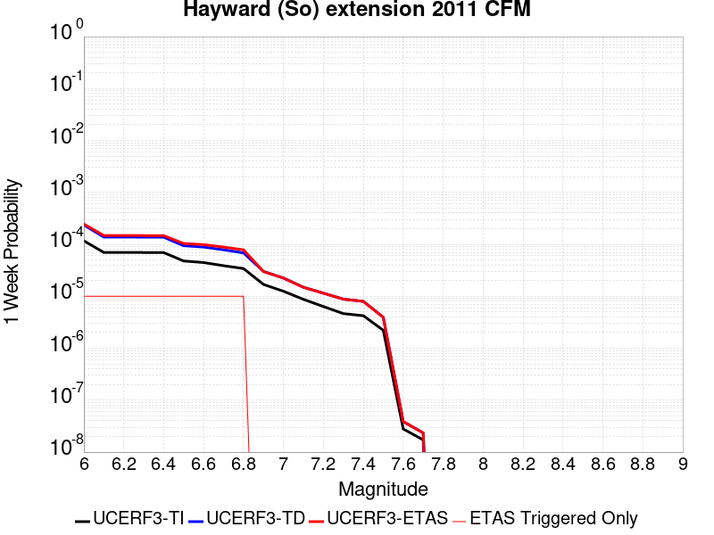 |  |  |  |

| Magnitude | 1 wk TI Prob | 1 wk TD Prob | 1 wk ETAS Prob | 1 wk ETAS/TD Gain | 1 wk ETAS Triggered Only | 1 mo TI Prob | 1 mo TD Prob | 1 mo ETAS Prob | 1 mo ETAS/TD Gain | 1 mo ETAS Triggered Only | 1 yr TI Prob | 1 yr TD Prob | 1 yr ETAS Prob | 1 yr ETAS/TD Gain | 1 yr ETAS Triggered Only | 10 yr TI Prob | 10 yr TD Prob | 10 yr ETAS Prob | 10 yr ETAS/TD Gain | 10 yr ETAS Triggered Only |
|-----|-----|-----|-----|-----|-----|-----|-----|-----|-----|-----|-----|-----|-----|-----|-----|-----|-----|-----|-----|-----|
| 6.0 | 1.1721256E-4 | 2.3671088E-4 | 2.467085E-4 | 1.0422356 | 1.0E-5 | 5.022428E-4 | 0.0010138806 | 0.0010238704 | 1.0098531 | 1.0E-5 | 0.0060976758 | 0.012250609 | 0.012260486 | 1.0008063 | 1.0E-5 | 0.0593305 | 0.11284437 | 0.11286212 | 1.0001572 | 2.0E-5 |
| 6.1 | 6.99169E-5 | 1.3808164E-4 | 1.4808026E-4 | 1.072411 | 1.0E-5 | 2.9960944E-4 | 5.9155683E-4 | 6.015509E-4 | 1.0168946 | 1.0E-5 | 0.0036416445 | 0.0071723475 | 0.007182276 | 1.0013843 | 1.0E-5 | 0.035825435 | 0.067804344 | 0.067813665 | 1.0001374 | 1.0E-5 |
| 6.2 | 6.99169E-5 | 1.3808164E-4 | 1.4808026E-4 | 1.072411 | 1.0E-5 | 2.9960944E-4 | 5.9155683E-4 | 6.015509E-4 | 1.0168946 | 1.0E-5 | 0.0036416445 | 0.0071723475 | 0.007182276 | 1.0013843 | 1.0E-5 | 0.035825435 | 0.067804344 | 0.067813665 | 1.0001374 | 1.0E-5 |
| 6.3 | 6.970908E-5 | 1.3776305E-4 | 1.4776168E-4 | 1.0725784 | 1.0E-5 | 2.9871898E-4 | 5.9019245E-4 | 6.001865E-4 | 1.0169337 | 1.0E-5 | 0.0036308395 | 0.007155884 | 0.007165813 | 1.0013875 | 1.0E-5 | 0.035720866 | 0.0676533 | 0.06766263 | 1.0001378 | 1.0E-5 |
| 6.4 | 6.9517155E-5 | 1.3743227E-4 | 1.4743091E-4 | 1.0727531 | 1.0E-5 | 2.9789665E-4 | 5.8877567E-4 | 5.987698E-4 | 1.0169744 | 1.0E-5 | 0.0036208609 | 0.0071387975 | 0.0071487264 | 1.0013908 | 1.0E-5 | 0.03562429 | 0.06749734 | 0.06750666 | 1.0001382 | 1.0E-5 |
| 6.5 | 4.786248E-5 | 9.415232E-5 | 1.04151375E-4 | 1.1062009 | 1.0E-5 | 2.0510878E-4 | 4.0344993E-4 | 4.1344587E-4 | 1.0247762 | 1.0E-5 | 0.0024943394 | 0.0049013784 | 0.0049113296 | 1.0020303 | 1.0E-5 | 0.02466527 | 0.046900697 | 0.046910226 | 1.0002033 | 1.0E-5 |
| 6.6 | 4.4662214E-5 | 8.8819244E-5 | 9.881836E-5 | 1.1125782 | 1.0E-5 | 1.9139545E-4 | 3.80601E-4 | 3.9059718E-4 | 1.0262642 | 1.0E-5 | 0.0023277493 | 0.0046244357 | 0.004634389 | 1.0021524 | 1.0E-5 | 0.02303517 | 0.04429206 | 0.044301614 | 1.0002158 | 1.0E-5 |
| 6.7 | 3.884542E-5 | 7.8650686E-5 | 8.86499E-5 | 1.1271344 | 1.0E-5 | 1.6646975E-4 | 3.3703333E-4 | 3.4702994E-4 | 1.0296607 | 1.0E-5 | 0.002024885 | 0.0040961048 | 0.004106064 | 1.0024314 | 1.0E-5 | 0.020065336 | 0.039332055 | 0.03934166 | 1.0002443 | 1.0E-5 |
| 6.8 | 3.4221863E-5 | 6.855886E-5 | 7.855818E-5 | 1.1458501 | 1.0E-5 | 1.4665688E-4 | 2.9379298E-4 | 3.0379003E-4 | 1.0340276 | 1.0E-5 | 0.0017840851 | 0.0035714838 | 0.003581448 | 1.00279 | 1.0E-5 | 0.017698295 | 0.034419462 | 0.034429118 | 1.0002805 | 1.0E-5 |
| 6.9 | 1.6927712E-5 | 3.006262E-5 | 3.006262E-5 | 1.0 | 0.0 | 7.2545314E-5 | 1.2883375E-4 | 1.2883375E-4 | 1.0 | 0.0 | 8.828813E-4 | 0.0015674793 | 0.0015674793 | 1.0 | 0.0 | 0.008793819 | 0.015463544 | 0.015463544 | 1.0 | 0.0 |
| 7.0 | 1.2509653E-5 | 2.246337E-5 | 2.246337E-5 | 1.0 | 0.0 | 5.3611697E-5 | 9.626828E-5 | 9.626828E-5 | 1.0 | 0.0 | 6.525269E-4 | 0.0011714802 | 0.0011714802 | 1.0 | 0.0 | 0.0065061417 | 0.011583166 | 0.011583166 | 1.0 | 0.0 |
| 7.1 | 8.751583E-6 | 1.4926157E-5 | 1.4926157E-5 | 1.0 | 0.0 | 3.750624E-5 | 6.396771E-5 | 6.396771E-5 | 1.0 | 0.0 | 4.5654282E-4 | 7.785344E-4 | 7.785344E-4 | 1.0 | 0.0 | 0.0045560603 | 0.007764457 | 0.007764457 | 1.0 | 0.0 |
| 7.2 | 6.354379E-6 | 1.1499087E-5 | 1.1499087E-5 | 1.0 | 0.0 | 2.7232769E-5 | 4.9280898E-5 | 4.9280898E-5 | 1.0 | 0.0 | 3.3150852E-4 | 5.9983454E-4 | 5.9983454E-4 | 1.0 | 0.0 | 0.0033101442 | 0.006001243 | 0.006001243 | 1.0 | 0.0 |
| 7.3 | 4.645554E-6 | 8.818441E-6 | 8.818441E-6 | 1.0 | 0.0 | 1.9909365E-5 | 3.7792794E-5 | 3.7792794E-5 | 1.0 | 0.0 | 2.4236954E-4 | 4.6003403E-4 | 4.6003403E-4 | 1.0 | 0.0 | 0.0024210536 | 0.004611421 | 0.004611421 | 1.0 | 0.0 |
| 7.4 | 4.23437E-6 | 7.992759E-6 | 7.992759E-6 | 1.0 | 0.0 | 1.8147173E-5 | 3.425425E-5 | 3.425425E-5 | 1.0 | 0.0 | 2.2091944E-4 | 4.1696956E-4 | 4.1696956E-4 | 1.0 | 0.0 | 0.0022069993 | 0.0041826614 | 0.0041826614 | 1.0 | 0.0 |
| 7.5 | 2.2187417E-6 | 3.952336E-6 | 3.952336E-6 | 1.0 | 0.0 | 9.508858E-6 | 1.6938488E-5 | 1.6938488E-5 | 1.0 | 0.0 | 1.157642E-4 | 2.0620918E-4 | 2.0620918E-4 | 1.0 | 0.0 | 0.0011570391 | 0.0020739497 | 0.0020739497 | 1.0 | 0.0 |
| 7.6 | 2.7952495E-8 | 3.8785874E-8 | 3.8785874E-8 | 1.0 | 0.0 | 1.1979641E-7 | 1.6622516E-7 | 1.6622516E-7 | 1.0 | 0.0 | 1.4585203E-6 | 2.0237894E-6 | 2.0237894E-6 | 1.0 | 0.0 | 1.4585107E-5 | 2.0317146E-5 | 2.0317146E-5 | 1.0 | 0.0 |
| 7.7 | 1.7192724E-8 | 2.3436652E-8 | 2.3436652E-8 | 1.0 | 0.0 | 7.36831E-8 | 1.0044278E-7 | 1.0044278E-7 | 1.0 | 0.0 | 8.9709135E-7 | 1.2228902E-6 | 1.2228902E-6 | 1.0 | 0.0 | 8.970877E-6 | 1.2285953E-5 | 1.2285953E-5 | 1.0 | 0.0 |

## Breckenridge 2011
*[(top)](#table-of-contents)*

| 1 Week | 1 Month | 1 Year | 10 Year |
|-----|-----|-----|-----|
|  |  |  |  |

| Magnitude | 1 wk TI Prob | 1 wk TD Prob | 1 wk ETAS Prob | 1 wk ETAS/TD Gain | 1 wk ETAS Triggered Only | 1 mo TI Prob | 1 mo TD Prob | 1 mo ETAS Prob | 1 mo ETAS/TD Gain | 1 mo ETAS Triggered Only | 1 yr TI Prob | 1 yr TD Prob | 1 yr ETAS Prob | 1 yr ETAS/TD Gain | 1 yr ETAS Triggered Only | 10 yr TI Prob | 10 yr TD Prob | 10 yr ETAS Prob | 10 yr ETAS/TD Gain | 10 yr ETAS Triggered Only |
|-----|-----|-----|-----|-----|-----|-----|-----|-----|-----|-----|-----|-----|-----|-----|-----|-----|-----|-----|-----|-----|
| 6.0 | 1.1490393E-6 | 6.738007E-7 | 6.738007E-7 | 1.0 | 0.0 | 4.924445E-6 | 2.8877141E-6 | 2.8877141E-6 | 1.0 | 0.0 | 5.995347E-5 | 3.5157373E-5 | 4.5157023E-5 | 1.2844254 | 1.0E-5 | 5.9937296E-4 | 3.5152017E-4 | 3.7151313E-4 | 1.0568757 | 2.0E-5 |
| 6.1 | 1.1490393E-6 | 6.738007E-7 | 6.738007E-7 | 1.0 | 0.0 | 4.924445E-6 | 2.8877141E-6 | 2.8877141E-6 | 1.0 | 0.0 | 5.995347E-5 | 3.5157373E-5 | 4.5157023E-5 | 1.2844254 | 1.0E-5 | 5.9937296E-4 | 3.5152017E-4 | 3.7151313E-4 | 1.0568757 | 2.0E-5 |
| 6.2 | 1.1490393E-6 | 6.738007E-7 | 6.738007E-7 | 1.0 | 0.0 | 4.924445E-6 | 2.8877141E-6 | 2.8877141E-6 | 1.0 | 0.0 | 5.995347E-5 | 3.5157373E-5 | 4.5157023E-5 | 1.2844254 | 1.0E-5 | 5.9937296E-4 | 3.5152017E-4 | 3.7151313E-4 | 1.0568757 | 2.0E-5 |
| 6.3 | 1.064617E-6 | 5.886405E-7 | 5.886405E-7 | 1.0 | 0.0 | 4.5626366E-6 | 2.5227425E-6 | 2.5227425E-6 | 1.0 | 0.0 | 5.5548684E-5 | 3.071397E-5 | 4.071366E-5 | 1.3255748 | 1.0E-5 | 5.55348E-4 | 3.070984E-4 | 3.2709228E-4 | 1.0651057 | 2.0E-5 |
| 6.4 | 1.064617E-6 | 5.886405E-7 | 5.886405E-7 | 1.0 | 0.0 | 4.5626366E-6 | 2.5227425E-6 | 2.5227425E-6 | 1.0 | 0.0 | 5.5548684E-5 | 3.071397E-5 | 4.071366E-5 | 1.3255748 | 1.0E-5 | 5.55348E-4 | 3.070984E-4 | 3.2709228E-4 | 1.0651057 | 2.0E-5 |
| 6.5 | 1.064617E-6 | 5.886405E-7 | 5.886405E-7 | 1.0 | 0.0 | 4.5626366E-6 | 2.5227425E-6 | 2.5227425E-6 | 1.0 | 0.0 | 5.5548684E-5 | 3.071397E-5 | 4.071366E-5 | 1.3255748 | 1.0E-5 | 5.55348E-4 | 3.070984E-4 | 3.2709228E-4 | 1.0651057 | 2.0E-5 |
| 6.6 | 1.064617E-6 | 5.886405E-7 | 5.886405E-7 | 1.0 | 0.0 | 4.5626366E-6 | 2.5227425E-6 | 2.5227425E-6 | 1.0 | 0.0 | 5.5548684E-5 | 3.071397E-5 | 4.071366E-5 | 1.3255748 | 1.0E-5 | 5.55348E-4 | 3.070984E-4 | 3.2709228E-4 | 1.0651057 | 2.0E-5 |
| 6.7 | 9.4219524E-7 | 4.954012E-7 | 4.954012E-7 | 1.0 | 0.0 | 4.037973E-6 | 2.1231463E-6 | 2.1231463E-6 | 1.0 | 0.0 | 4.916122E-5 | 2.5849005E-5 | 3.584875E-5 | 1.386852 | 1.0E-5 | 4.9150345E-4 | 2.5846064E-4 | 2.7845547E-4 | 1.0773612 | 2.0E-5 |
| 6.8 | 8.556422E-7 | 4.311915E-7 | 4.311915E-7 | 1.0 | 0.0 | 3.667033E-6 | 1.8479623E-6 | 1.8479623E-6 | 1.0 | 0.0 | 4.464521E-5 | 2.2498712E-5 | 3.2498487E-5 | 1.4444599 | 1.0E-5 | 4.4636242E-4 | 2.2496474E-4 | 2.4496025E-4 | 1.0888828 | 2.0E-5 |
| 6.9 | 7.7357794E-7 | 3.841983E-7 | 3.841983E-7 | 1.0 | 0.0 | 3.3153299E-6 | 1.6465632E-6 | 1.6465632E-6 | 1.0 | 0.0 | 4.0363393E-5 | 2.0046726E-5 | 3.0046525E-5 | 1.4988246 | 1.0E-5 | 4.035606E-4 | 2.0044947E-4 | 2.2044546E-4 | 1.0997558 | 2.0E-5 |
| 7.0 | 6.8172454E-7 | 3.3470985E-7 | 3.3470985E-7 | 1.0 | 0.0 | 2.9216735E-6 | 1.43447E-6 | 1.43447E-6 | 1.0 | 0.0 | 3.5570793E-5 | 1.7464534E-5 | 2.746436E-5 | 1.572579 | 1.0E-5 | 3.55651E-4 | 1.7463184E-4 | 1.9462836E-4 | 1.1145066 | 2.0E-5 |
| 7.1 | 5.5936397E-7 | 2.8909366E-7 | 2.8909366E-7 | 1.0 | 0.0 | 2.397272E-6 | 1.2389722E-6 | 1.2389722E-6 | 1.0 | 0.0 | 2.9186394E-5 | 1.5084385E-5 | 2.5084235E-5 | 1.6629272 | 1.0E-5 | 2.9182562E-4 | 1.5083379E-4 | 1.7083077E-4 | 1.1325762 | 2.0E-5 |
| 7.2 | 3.8420822E-7 | 2.0468183E-7 | 2.0468183E-7 | 1.0 | 0.0 | 1.6466057E-6 | 8.772076E-7 | 8.772076E-7 | 1.0 | 0.0 | 2.004724E-5 | 1.0679951E-5 | 2.0679843E-5 | 1.9363239 | 1.0E-5 | 2.004543E-4 | 1.06794454E-4 | 1.1679339E-4 | 1.0936278 | 1.0E-5 |
| 7.3 | 2.6405158E-7 | 1.6473078E-7 | 1.6473078E-7 | 1.0 | 0.0 | 1.1316491E-6 | 7.0598884E-7 | 7.0598884E-7 | 1.0 | 0.0 | 1.37777415E-5 | 8.595381E-6 | 1.8595296E-5 | 2.1634057 | 1.0E-5 | 1.3776887E-4 | 8.595055E-5 | 9.594969E-5 | 1.116336 | 1.0E-5 |
| 7.4 | 1.792114E-7 | 1.2725252E-7 | 1.2725252E-7 | 1.0 | 0.0 | 7.6804866E-7 | 5.453678E-7 | 5.453678E-7 | 1.0 | 0.0 | 9.3509525E-6 | 6.639834E-6 | 1.6639768E-5 | 2.5060518 | 1.0E-5 | 9.350559E-5 | 6.63964E-5 | 7.6395736E-5 | 1.1506006 | 1.0E-5 |
| 7.5 | 1.3548703E-7 | 9.385346E-8 | 9.385346E-8 | 1.0 | 0.0 | 5.8065854E-7 | 4.0222903E-7 | 4.0222903E-7 | 1.0 | 0.0 | 7.0694946E-6 | 4.897128E-6 | 1.4897079E-5 | 3.0420032 | 1.0E-5 | 7.0692695E-5 | 4.8970236E-5 | 5.8969745E-5 | 1.2041956 | 1.0E-5 |
| 7.6 | 2.572245E-8 | 1.735264E-8 | 1.735264E-8 | 1.0 | 0.0 | 1.10239064E-7 | 7.436845E-8 | 7.436845E-8 | 1.0 | 0.0 | 1.3421597E-6 | 9.0543557E-7 | 9.0543557E-7 | 1.0 | 0.0 | 1.3421517E-5 | 9.054324E-6 | 9.054324E-6 | 1.0 | 0.0 |

## Great Valley 08 (Quinto)
*[(top)](#table-of-contents)*

| 1 Week | 1 Month | 1 Year | 10 Year |
|-----|-----|-----|-----|
|  |  |  |  |

| Magnitude | 1 wk TI Prob | 1 wk TD Prob | 1 wk ETAS Prob | 1 wk ETAS/TD Gain | 1 wk ETAS Triggered Only | 1 mo TI Prob | 1 mo TD Prob | 1 mo ETAS Prob | 1 mo ETAS/TD Gain | 1 mo ETAS Triggered Only | 1 yr TI Prob | 1 yr TD Prob | 1 yr ETAS Prob | 1 yr ETAS/TD Gain | 1 yr ETAS Triggered Only | 10 yr TI Prob | 10 yr TD Prob | 10 yr ETAS Prob | 10 yr ETAS/TD Gain | 10 yr ETAS Triggered Only |
|-----|-----|-----|-----|-----|-----|-----|-----|-----|-----|-----|-----|-----|-----|-----|-----|-----|-----|-----|-----|-----|
| 6.0 | 7.737697E-6 | 8.253038E-6 | 8.253038E-6 | 1.0 | 0.0 | 3.3161137E-5 | 3.536979E-5 | 4.5369437E-5 | 1.2827171 | 1.0E-5 | 4.0366207E-4 | 4.3056096E-4 | 4.4055664E-4 | 1.0232155 | 1.0E-5 | 0.004029296 | 0.0042991205 | 0.0043090777 | 1.002316 | 1.0E-5 |
| 6.1 | 7.737697E-6 | 8.253038E-6 | 8.253038E-6 | 1.0 | 0.0 | 3.3161137E-5 | 3.536979E-5 | 4.5369437E-5 | 1.2827171 | 1.0E-5 | 4.0366207E-4 | 4.3056096E-4 | 4.4055664E-4 | 1.0232155 | 1.0E-5 | 0.004029296 | 0.0042991205 | 0.0043090777 | 1.002316 | 1.0E-5 |
| 6.2 | 7.737697E-6 | 8.253038E-6 | 8.253038E-6 | 1.0 | 0.0 | 3.3161137E-5 | 3.536979E-5 | 4.5369437E-5 | 1.2827171 | 1.0E-5 | 4.0366207E-4 | 4.3056096E-4 | 4.4055664E-4 | 1.0232155 | 1.0E-5 | 0.004029296 | 0.0042991205 | 0.0043090777 | 1.002316 | 1.0E-5 |
| 6.3 | 5.374012E-6 | 5.7505736E-6 | 5.7505736E-6 | 1.0 | 0.0 | 2.3031276E-5 | 2.4645145E-5 | 3.4644898E-5 | 1.4057494 | 1.0E-5 | 2.803697E-4 | 3.0002446E-4 | 3.1002148E-4 | 1.0333207 | 1.0E-5 | 0.0028001624 | 0.0029972875 | 0.0030072576 | 1.0033263 | 1.0E-5 |
| 6.4 | 5.374012E-6 | 5.7505736E-6 | 5.7505736E-6 | 1.0 | 0.0 | 2.3031276E-5 | 2.4645145E-5 | 3.4644898E-5 | 1.4057494 | 1.0E-5 | 2.803697E-4 | 3.0002446E-4 | 3.1002148E-4 | 1.0333207 | 1.0E-5 | 0.0028001624 | 0.0029972875 | 0.0030072576 | 1.0033263 | 1.0E-5 |
| 6.5 | 3.65427E-6 | 3.941324E-6 | 3.941324E-6 | 1.0 | 0.0 | 1.5661062E-5 | 1.689132E-5 | 1.689132E-5 | 1.0 | 0.0 | 1.9065675E-4 | 2.0563944E-4 | 2.0563944E-4 | 1.0 | 0.0 | 0.0019049325 | 0.0020551833 | 0.0020551833 | 1.0 | 0.0 |
| 6.6 | 3.6143538E-6 | 3.8985104E-6 | 3.8985104E-6 | 1.0 | 0.0 | 1.5489995E-5 | 1.6707834E-5 | 1.6707834E-5 | 1.0 | 0.0 | 1.8857437E-4 | 2.0340596E-4 | 2.0340596E-4 | 1.0 | 0.0 | 0.0018841444 | 0.0020328893 | 0.0020328893 | 1.0 | 0.0 |
| 6.7 | 2.4821015E-6 | 2.6857067E-6 | 2.6857067E-6 | 1.0 | 0.0 | 1.0637535E-5 | 1.1510153E-5 | 1.1510153E-5 | 1.0 | 0.0 | 1.2950429E-4 | 1.4013276E-4 | 1.4013276E-4 | 1.0 | 0.0 | 0.0012942884 | 0.0014009989 | 0.0014009989 | 1.0 | 0.0 |
| 6.8 | 4.7110538E-7 | 5.193021E-7 | 5.193021E-7 | 1.0 | 0.0 | 2.0190216E-6 | 2.2255786E-6 | 2.2255786E-6 | 1.0 | 0.0 | 2.458131E-5 | 2.70961E-5 | 2.70961E-5 | 1.0 | 0.0 | 2.457859E-4 | 2.7092977E-4 | 2.7092977E-4 | 1.0 | 0.0 |
| 6.9 | 3.958685E-7 | 4.3703452E-7 | 4.3703452E-7 | 1.0 | 0.0 | 1.6965782E-6 | 1.8730038E-6 | 1.8730038E-6 | 1.0 | 0.0 | 2.0655643E-5 | 2.28036E-5 | 2.28036E-5 | 1.0 | 0.0 | 2.0653724E-4 | 2.2801422E-4 | 2.2801422E-4 | 1.0 | 0.0 |
| 7.0 | 2.70294E-7 | 2.9920008E-7 | 2.9920008E-7 | 1.0 | 0.0 | 1.1584025E-6 | 1.2822856E-6 | 1.2822856E-6 | 1.0 | 0.0 | 1.4103458E-5 | 1.5611728E-5 | 1.5611728E-5 | 1.0 | 0.0 | 1.4102564E-4 | 1.5610759E-4 | 1.5610759E-4 | 1.0 | 0.0 |
| 7.1 | 1.4828602E-7 | 1.6469107E-7 | 1.6469107E-7 | 1.0 | 0.0 | 6.3551136E-7 | 7.058187E-7 | 7.058187E-7 | 1.0 | 0.0 | 7.737323E-6 | 8.593317E-6 | 8.593317E-6 | 1.0 | 0.0 | 7.737054E-5 | 8.593065E-5 | 8.593065E-5 | 1.0 | 0.0 |

## Yorba Linda
*[(top)](#table-of-contents)*

| 1 Week | 1 Month | 1 Year | 10 Year |
|-----|-----|-----|-----|
|  |  |  |  |

| Magnitude | 1 wk TI Prob | 1 wk TD Prob | 1 wk ETAS Prob | 1 wk ETAS/TD Gain | 1 wk ETAS Triggered Only | 1 mo TI Prob | 1 mo TD Prob | 1 mo ETAS Prob | 1 mo ETAS/TD Gain | 1 mo ETAS Triggered Only | 1 yr TI Prob | 1 yr TD Prob | 1 yr ETAS Prob | 1 yr ETAS/TD Gain | 1 yr ETAS Triggered Only | 10 yr TI Prob | 10 yr TD Prob | 10 yr ETAS Prob | 10 yr ETAS/TD Gain | 10 yr ETAS Triggered Only |
|-----|-----|-----|-----|-----|-----|-----|-----|-----|-----|-----|-----|-----|-----|-----|-----|-----|-----|-----|-----|-----|
| 6.0 | 1.9346849E-6 | 1.6909112E-6 | 1.6909112E-6 | 1.0 | 0.0 | 8.29148E-6 | 7.2467474E-6 | 7.2467474E-6 | 1.0 | 0.0 | 1.009441E-4 | 8.822652E-5 | 8.822652E-5 | 1.0 | 0.0 | 0.0010089825 | 8.8200805E-4 | 8.919992E-4 | 1.0113277 | 1.0E-5 |
| 6.1 | 1.9346849E-6 | 1.6909112E-6 | 1.6909112E-6 | 1.0 | 0.0 | 8.29148E-6 | 7.2467474E-6 | 7.2467474E-6 | 1.0 | 0.0 | 1.009441E-4 | 8.822652E-5 | 8.822652E-5 | 1.0 | 0.0 | 0.0010089825 | 8.8200805E-4 | 8.919992E-4 | 1.0113277 | 1.0E-5 |
| 6.2 | 1.9346849E-6 | 1.6909112E-6 | 1.6909112E-6 | 1.0 | 0.0 | 8.29148E-6 | 7.2467474E-6 | 7.2467474E-6 | 1.0 | 0.0 | 1.009441E-4 | 8.822652E-5 | 8.822652E-5 | 1.0 | 0.0 | 0.0010089825 | 8.8200805E-4 | 8.919992E-4 | 1.0113277 | 1.0E-5 |
| 6.3 | 1.1028608E-6 | 8.481863E-7 | 8.481863E-7 | 1.0 | 0.0 | 4.7265376E-6 | 3.6350793E-6 | 3.6350793E-6 | 1.0 | 0.0 | 5.754407E-5 | 4.425626E-5 | 4.425626E-5 | 1.0 | 0.0 | 5.7529175E-4 | 4.42481E-4 | 4.42481E-4 | 1.0 | 0.0 |
| 6.4 | 1.1028608E-6 | 8.481863E-7 | 8.481863E-7 | 1.0 | 0.0 | 4.7265376E-6 | 3.6350793E-6 | 3.6350793E-6 | 1.0 | 0.0 | 5.754407E-5 | 4.425626E-5 | 4.425626E-5 | 1.0 | 0.0 | 5.7529175E-4 | 4.42481E-4 | 4.42481E-4 | 1.0 | 0.0 |
| 6.5 | 8.4451364E-7 | 5.869109E-7 | 5.869109E-7 | 1.0 | 0.0 | 3.619339E-6 | 2.5153304E-6 | 2.5153304E-6 | 1.0 | 0.0 | 4.406456E-5 | 3.0623738E-5 | 3.0623738E-5 | 1.0 | 0.0 | 4.4055824E-4 | 3.0619733E-4 | 3.0619733E-4 | 1.0 | 0.0 |
| 6.6 | 8.422957E-7 | 5.844643E-7 | 5.844643E-7 | 1.0 | 0.0 | 3.6098338E-6 | 2.5048448E-6 | 2.5048448E-6 | 1.0 | 0.0 | 4.3948843E-5 | 3.049608E-5 | 3.049608E-5 | 1.0 | 0.0 | 4.394015E-4 | 3.049211E-4 | 3.049211E-4 | 1.0 | 0.0 |
| 6.7 | 8.4119705E-7 | 5.832485E-7 | 5.832485E-7 | 1.0 | 0.0 | 3.6051254E-6 | 2.499634E-6 | 2.499634E-6 | 1.0 | 0.0 | 4.3891516E-5 | 3.0432642E-5 | 3.0432642E-5 | 1.0 | 0.0 | 4.388285E-4 | 3.042869E-4 | 3.042869E-4 | 1.0 | 0.0 |
| 6.8 | 7.5919155E-7 | 4.9949944E-7 | 4.9949944E-7 | 1.0 | 0.0 | 3.253674E-6 | 2.1407102E-6 | 2.1407102E-6 | 1.0 | 0.0 | 3.961276E-5 | 2.6062853E-5 | 2.6062853E-5 | 1.0 | 0.0 | 3.9605703E-4 | 2.6059969E-4 | 2.6059969E-4 | 1.0 | 0.0 |
| 6.9 | 7.5804564E-7 | 4.981178E-7 | 4.981178E-7 | 1.0 | 0.0 | 3.248763E-6 | 2.134789E-6 | 2.134789E-6 | 1.0 | 0.0 | 3.955297E-5 | 2.5990763E-5 | 2.5990763E-5 | 1.0 | 0.0 | 3.9545933E-4 | 2.5987893E-4 | 2.5987893E-4 | 1.0 | 0.0 |
| 7.0 | 7.539293E-7 | 4.943313E-7 | 4.943313E-7 | 1.0 | 0.0 | 3.2311218E-6 | 2.118561E-6 | 2.118561E-6 | 1.0 | 0.0 | 3.9338196E-5 | 2.5793192E-5 | 2.5793192E-5 | 1.0 | 0.0 | 3.9331234E-4 | 2.579037E-4 | 2.579037E-4 | 1.0 | 0.0 |
| 7.1 | 6.0900885E-7 | 3.7817128E-7 | 3.7817128E-7 | 1.0 | 0.0 | 2.6100352E-6 | 1.6207331E-6 | 1.6207331E-6 | 1.0 | 0.0 | 3.1776715E-5 | 1.973225E-5 | 1.973225E-5 | 1.0 | 0.0 | 3.1772171E-4 | 1.9730533E-4 | 1.9730533E-4 | 1.0 | 0.0 |
| 7.2 | 5.849925E-7 | 3.5878818E-7 | 3.5878818E-7 | 1.0 | 0.0 | 2.5071083E-6 | 1.5376628E-6 | 1.5376628E-6 | 1.0 | 0.0 | 3.0523614E-5 | 1.8720886E-5 | 1.8720886E-5 | 1.0 | 0.0 | 3.0519423E-4 | 1.8719342E-4 | 1.8719342E-4 | 1.0 | 0.0 |
| 7.3 | 4.89808E-7 | 3.0379488E-7 | 3.0379488E-7 | 1.0 | 0.0 | 2.0991754E-6 | 1.3019775E-6 | 1.3019775E-6 | 1.0 | 0.0 | 2.5557161E-5 | 1.5851463E-5 | 1.5851463E-5 | 1.0 | 0.0 | 2.5554223E-4 | 1.5850355E-4 | 1.5850355E-4 | 1.0 | 0.0 |
| 7.4 | 3.8700415E-7 | 2.4722343E-7 | 2.4722343E-7 | 1.0 | 0.0 | 1.6585881E-6 | 1.0595286E-6 | 1.0595286E-6 | 1.0 | 0.0 | 2.0193123E-5 | 1.2899685E-5 | 1.2899685E-5 | 1.0 | 0.0 | 2.0191289E-4 | 1.2898949E-4 | 1.2898949E-4 | 1.0 | 0.0 |
| 7.5 | 2.900565E-7 | 1.8637462E-7 | 1.8637462E-7 | 1.0 | 0.0 | 1.2430987E-6 | 7.9874815E-7 | 7.9874815E-7 | 1.0 | 0.0 | 1.5134622E-5 | 9.724716E-6 | 9.724716E-6 | 1.0 | 0.0 | 1.5133592E-4 | 9.7242984E-5 | 9.7242984E-5 | 1.0 | 0.0 |
| 7.6 | 2.2770318E-7 | 1.4814276E-7 | 1.4814276E-7 | 1.0 | 0.0 | 9.758704E-7 | 6.348974E-7 | 6.348974E-7 | 1.0 | 0.0 | 1.1881158E-5 | 7.729848E-6 | 7.729848E-6 | 1.0 | 0.0 | 1.1880523E-4 | 7.729585E-5 | 7.729585E-5 | 1.0 | 0.0 |
| 7.7 | 1.5017194E-7 | 8.7355275E-8 | 8.7355275E-8 | 1.0 | 0.0 | 6.4359386E-7 | 3.7437968E-7 | 3.7437968E-7 | 1.0 | 0.0 | 7.835727E-6 | 4.5580637E-6 | 4.5580637E-6 | 1.0 | 0.0 | 7.835451E-5 | 4.5579727E-5 | 4.5579727E-5 | 1.0 | 0.0 |
| 7.8 | 3.895753E-8 | 1.8532088E-8 | 1.8532088E-8 | 1.0 | 0.0 | 1.6696083E-7 | 7.942323E-8 | 7.942323E-8 | 1.0 | 0.0 | 2.0327461E-6 | 9.669774E-7 | 9.669774E-7 | 1.0 | 0.0 | 2.0327276E-5 | 9.669734E-6 | 9.669734E-6 | 1.0 | 0.0 |
| 7.9 | 6.648505E-9 | 3.4183114E-9 | 3.4183114E-9 | 1.0 | 0.0 | 2.8493591E-8 | 1.4649906E-8 | 1.4649906E-8 | 1.0 | 0.0 | 3.4690942E-7 | 1.783626E-7 | 1.783626E-7 | 1.0 | 0.0 | 3.4690888E-6 | 1.7836247E-6 | 1.7836247E-6 | 1.0 | 0.0 |

## Eaton Roughs 2011 CFM
*[(top)](#table-of-contents)*

| 1 Week | 1 Month | 1 Year | 10 Year |
|-----|-----|-----|-----|
|  |  |  |  |

| Magnitude | 1 wk TI Prob | 1 wk TD Prob | 1 wk ETAS Prob | 1 wk ETAS/TD Gain | 1 wk ETAS Triggered Only | 1 mo TI Prob | 1 mo TD Prob | 1 mo ETAS Prob | 1 mo ETAS/TD Gain | 1 mo ETAS Triggered Only | 1 yr TI Prob | 1 yr TD Prob | 1 yr ETAS Prob | 1 yr ETAS/TD Gain | 1 yr ETAS Triggered Only | 10 yr TI Prob | 10 yr TD Prob | 10 yr ETAS Prob | 10 yr ETAS/TD Gain | 10 yr ETAS Triggered Only |
|-----|-----|-----|-----|-----|-----|-----|-----|-----|-----|-----|-----|-----|-----|-----|-----|-----|-----|-----|-----|-----|
| 6.0 | 6.8044945E-5 | 8.8434645E-5 | 8.8434645E-5 | 1.0 | 0.0 | 2.9158857E-4 | 3.7895713E-4 | 3.7895713E-4 | 1.0 | 0.0 | 0.0035443127 | 0.0046046837 | 0.0046046837 | 1.0 | 0.0 | 0.03488314 | 0.04516368 | 0.045173228 | 1.0002114 | 1.0E-5 |
| 6.1 | 6.8044945E-5 | 8.8434645E-5 | 8.8434645E-5 | 1.0 | 0.0 | 2.9158857E-4 | 3.7895713E-4 | 3.7895713E-4 | 1.0 | 0.0 | 0.0035443127 | 0.0046046837 | 0.0046046837 | 1.0 | 0.0 | 0.03488314 | 0.04516368 | 0.045173228 | 1.0002114 | 1.0E-5 |
| 6.2 | 6.8044945E-5 | 8.8434645E-5 | 8.8434645E-5 | 1.0 | 0.0 | 2.9158857E-4 | 3.7895713E-4 | 3.7895713E-4 | 1.0 | 0.0 | 0.0035443127 | 0.0046046837 | 0.0046046837 | 1.0 | 0.0 | 0.03488314 | 0.04516368 | 0.045173228 | 1.0002114 | 1.0E-5 |
| 6.3 | 6.8044945E-5 | 8.8434645E-5 | 8.8434645E-5 | 1.0 | 0.0 | 2.9158857E-4 | 3.7895713E-4 | 3.7895713E-4 | 1.0 | 0.0 | 0.0035443127 | 0.0046046837 | 0.0046046837 | 1.0 | 0.0 | 0.03488314 | 0.04516368 | 0.045173228 | 1.0002114 | 1.0E-5 |
| 6.4 | 4.5830013E-5 | 5.71553E-5 | 5.71553E-5 | 1.0 | 0.0 | 1.9639956E-4 | 2.4493135E-4 | 2.4493135E-4 | 1.0 | 0.0 | 0.0023885423 | 0.002978342 | 0.002978342 | 1.0 | 0.0 | 0.023630321 | 0.029421948 | 0.029421948 | 1.0 | 0.0 |
| 6.5 | 4.5830013E-5 | 5.71553E-5 | 5.71553E-5 | 1.0 | 0.0 | 1.9639956E-4 | 2.4493135E-4 | 2.4493135E-4 | 1.0 | 0.0 | 0.0023885423 | 0.002978342 | 0.002978342 | 1.0 | 0.0 | 0.023630321 | 0.029421948 | 0.029421948 | 1.0 | 0.0 |
| 6.6 | 3.222194E-5 | 3.8262962E-5 | 3.8262962E-5 | 1.0 | 0.0 | 1.3808672E-4 | 1.6397446E-4 | 1.6397446E-4 | 1.0 | 0.0 | 0.0016799092 | 0.0019946485 | 0.0019946485 | 1.0 | 0.0 | 0.016672665 | 0.019776754 | 0.019776754 | 1.0 | 0.0 |
| 6.7 | 2.4155654E-5 | 2.7786275E-5 | 2.7786275E-5 | 1.0 | 0.0 | 1.0352012E-4 | 1.1907864E-4 | 1.1907864E-4 | 1.0 | 0.0 | 0.0012596287 | 0.0014488265 | 0.0014488265 | 1.0 | 0.0 | 0.012525126 | 0.01439499 | 0.01439499 | 1.0 | 0.0 |
| 6.8 | 2.1814667E-5 | 2.4940904E-5 | 2.4940904E-5 | 1.0 | 0.0 | 9.348808E-5 | 1.0688523E-4 | 1.0688523E-4 | 1.0 | 0.0 | 0.001137623 | 0.0013005546 | 0.0013005546 | 1.0 | 0.0 | 0.011318169 | 0.012930086 | 0.012930086 | 1.0 | 0.0 |
| 6.9 | 2.0700467E-5 | 2.362897E-5 | 2.362897E-5 | 1.0 | 0.0 | 8.871327E-5 | 1.01263104E-4 | 1.01263104E-4 | 1.0 | 0.0 | 0.0010795488 | 0.0012321841 | 0.0012321841 | 1.0 | 0.0 | 0.010743194 | 0.012254083 | 0.012254083 | 1.0 | 0.0 |
| 7.0 | 2.0104066E-5 | 2.2936536E-5 | 2.2936536E-5 | 1.0 | 0.0 | 8.615744E-5 | 9.829576E-5 | 9.829576E-5 | 1.0 | 0.0 | 0.0010484619 | 0.0011960969 | 0.0011960969 | 1.0 | 0.0 | 0.010435291 | 0.01189712 | 0.01189712 | 1.0 | 0.0 |
| 7.1 | 1.8225232E-5 | 2.0773083E-5 | 2.0773083E-5 | 1.0 | 0.0 | 7.81058E-5 | 8.902447E-5 | 8.902447E-5 | 1.0 | 0.0 | 9.5052324E-4 | 0.0010833355 | 0.0010833355 | 1.0 | 0.0 | 0.009464677 | 0.010780873 | 0.010780873 | 1.0 | 0.0 |
| 7.2 | 1.7526572E-5 | 1.9993524E-5 | 1.9993524E-5 | 1.0 | 0.0 | 7.511172E-5 | 8.568373E-5 | 8.568373E-5 | 1.0 | 0.0 | 9.141015E-4 | 0.0010427017 | 0.0010427017 | 1.0 | 0.0 | 0.009103506 | 0.010378398 | 0.010378398 | 1.0 | 0.0 |
| 7.3 | 1.5727232E-5 | 1.8021543E-5 | 1.8021543E-5 | 1.0 | 0.0 | 6.740067E-5 | 7.72329E-5 | 7.72329E-5 | 1.0 | 0.0 | 8.2029426E-4 | 9.399062E-4 | 9.399062E-4 | 1.0 | 0.0 | 0.008172729 | 0.009359558 | 0.009359558 | 1.0 | 0.0 |
| 7.4 | 1.4457361E-5 | 1.6598395E-5 | 1.6598395E-5 | 1.0 | 0.0 | 6.195865E-5 | 7.113405E-5 | 7.113405E-5 | 1.0 | 0.0 | 7.540854E-4 | 8.657138E-4 | 8.657138E-4 | 1.0 | 0.0 | 0.007515317 | 0.008623603 | 0.008623603 | 1.0 | 0.0 |
| 7.5 | 1.33280955E-5 | 1.5345471E-5 | 1.5345471E-5 | 1.0 | 0.0 | 5.711916E-5 | 6.576465E-5 | 6.576465E-5 | 1.0 | 0.0 | 6.9520384E-4 | 8.0039137E-4 | 8.0039137E-4 | 1.0 | 0.0 | 0.00693033 | 0.007975256 | 0.007975256 | 1.0 | 0.0 |
| 7.6 | 1.0699478E-5 | 1.2387852E-5 | 1.2387852E-5 | 1.0 | 0.0 | 4.5854096E-5 | 5.3089716E-5 | 5.3089716E-5 | 1.0 | 0.0 | 5.581306E-4 | 6.461761E-4 | 6.461761E-4 | 1.0 | 0.0 | 0.005567309 | 0.0064430824 | 0.0064430824 | 1.0 | 0.0 |
| 7.7 | 5.9390236E-6 | 6.8529853E-6 | 6.8529853E-6 | 1.0 | 0.0 | 2.545271E-5 | 2.9369607E-5 | 2.9369607E-5 | 1.0 | 0.0 | 3.0984267E-4 | 3.5751655E-4 | 3.5751655E-4 | 1.0 | 0.0 | 0.0030941102 | 0.0035694393 | 0.0035694393 | 1.0 | 0.0 |
| 7.8 | 2.1622036E-6 | 2.329702E-6 | 2.329702E-6 | 1.0 | 0.0 | 9.266554E-6 | 9.984399E-6 | 9.984399E-6 | 1.0 | 0.0 | 1.1281446E-4 | 1.21553356E-4 | 1.21553356E-4 | 1.0 | 0.0 | 0.001127572 | 0.0012148687 | 0.0012148687 | 1.0 | 0.0 |
| 7.9 | 4.9586197E-7 | 5.2189216E-7 | 5.2189216E-7 | 1.0 | 0.0 | 2.125121E-6 | 2.2366787E-6 | 2.2366787E-6 | 1.0 | 0.0 | 2.5873042E-5 | 2.7231245E-5 | 2.7231245E-5 | 1.0 | 0.0 | 2.5870028E-4 | 2.7228118E-4 | 2.7228118E-4 | 1.0 | 0.0 |

## Los Osos 2011
*[(top)](#table-of-contents)*

| 1 Week | 1 Month | 1 Year | 10 Year |
|-----|-----|-----|-----|
|  |  |  |  |

| Magnitude | 1 wk TI Prob | 1 wk TD Prob | 1 wk ETAS Prob | 1 wk ETAS/TD Gain | 1 wk ETAS Triggered Only | 1 mo TI Prob | 1 mo TD Prob | 1 mo ETAS Prob | 1 mo ETAS/TD Gain | 1 mo ETAS Triggered Only | 1 yr TI Prob | 1 yr TD Prob | 1 yr ETAS Prob | 1 yr ETAS/TD Gain | 1 yr ETAS Triggered Only | 10 yr TI Prob | 10 yr TD Prob | 10 yr ETAS Prob | 10 yr ETAS/TD Gain | 10 yr ETAS Triggered Only |
|-----|-----|-----|-----|-----|-----|-----|-----|-----|-----|-----|-----|-----|-----|-----|-----|-----|-----|-----|-----|-----|
| 6.0 | 4.8871775E-6 | 4.9814826E-6 | 4.9814826E-6 | 1.0 | 0.0 | 2.0944879E-5 | 2.1349053E-5 | 2.1349053E-5 | 1.0 | 0.0 | 2.5497406E-4 | 2.598965E-4 | 2.598965E-4 | 1.0 | 0.0 | 0.002546817 | 0.0025962 | 0.002606174 | 1.0038418 | 1.0E-5 |
| 6.1 | 4.8871775E-6 | 4.9814826E-6 | 4.9814826E-6 | 1.0 | 0.0 | 2.0944879E-5 | 2.1349053E-5 | 2.1349053E-5 | 1.0 | 0.0 | 2.5497406E-4 | 2.598965E-4 | 2.598965E-4 | 1.0 | 0.0 | 0.002546817 | 0.0025962 | 0.002606174 | 1.0038418 | 1.0E-5 |
| 6.2 | 4.8871775E-6 | 4.9814826E-6 | 4.9814826E-6 | 1.0 | 0.0 | 2.0944879E-5 | 2.1349053E-5 | 2.1349053E-5 | 1.0 | 0.0 | 2.5497406E-4 | 2.598965E-4 | 2.598965E-4 | 1.0 | 0.0 | 0.002546817 | 0.0025962 | 0.002606174 | 1.0038418 | 1.0E-5 |
| 6.3 | 4.8871775E-6 | 4.9814826E-6 | 4.9814826E-6 | 1.0 | 0.0 | 2.0944879E-5 | 2.1349053E-5 | 2.1349053E-5 | 1.0 | 0.0 | 2.5497406E-4 | 2.598965E-4 | 2.598965E-4 | 1.0 | 0.0 | 0.002546817 | 0.0025962 | 0.002606174 | 1.0038418 | 1.0E-5 |
| 6.4 | 4.8871775E-6 | 4.9814826E-6 | 4.9814826E-6 | 1.0 | 0.0 | 2.0944879E-5 | 2.1349053E-5 | 2.1349053E-5 | 1.0 | 0.0 | 2.5497406E-4 | 2.598965E-4 | 2.598965E-4 | 1.0 | 0.0 | 0.002546817 | 0.0025962 | 0.002606174 | 1.0038418 | 1.0E-5 |
| 6.5 | 3.1724062E-6 | 3.2233943E-6 | 3.2233943E-6 | 1.0 | 0.0 | 1.3595956E-5 | 1.3814474E-5 | 1.3814474E-5 | 1.0 | 0.0 | 1.6551818E-4 | 1.6817838E-4 | 1.6817838E-4 | 1.0 | 0.0 | 0.0016539496 | 0.0016805246 | 0.0016905078 | 1.0059406 | 1.0E-5 |
| 6.6 | 3.1022591E-6 | 3.1511038E-6 | 3.1511038E-6 | 1.0 | 0.0 | 1.3295328E-5 | 1.3504661E-5 | 1.3504661E-5 | 1.0 | 0.0 | 1.618586E-4 | 1.6440697E-4 | 1.6440697E-4 | 1.0 | 0.0 | 0.0016174077 | 0.0016428662 | 0.0016528498 | 1.0060769 | 1.0E-5 |
| 6.7 | 2.611518E-6 | 2.6491825E-6 | 2.6491825E-6 | 1.0 | 0.0 | 1.1192172E-5 | 1.1353591E-5 | 1.1353591E-5 | 1.0 | 0.0 | 1.3625617E-4 | 1.3822124E-4 | 1.3822124E-4 | 1.0 | 0.0 | 0.0013617266 | 0.0013813572 | 0.0013913434 | 1.0072292 | 1.0E-5 |
| 6.8 | 2.4780884E-6 | 2.5121587E-6 | 2.5121587E-6 | 1.0 | 0.0 | 1.0620336E-5 | 1.076635E-5 | 1.076635E-5 | 1.0 | 0.0 | 1.2929492E-4 | 1.3107246E-4 | 1.3107246E-4 | 1.0 | 0.0 | 0.0012921972 | 0.0013099556 | 0.0013199425 | 1.0076238 | 1.0E-5 |
| 6.9 | 2.1376322E-6 | 2.1635049E-6 | 2.1635049E-6 | 1.0 | 0.0 | 9.161248E-6 | 9.272131E-6 | 9.272131E-6 | 1.0 | 0.0 | 1.1153249E-4 | 1.1288237E-4 | 1.1288237E-4 | 1.0 | 0.0 | 0.0011147653 | 0.0011282521 | 0.0011282521 | 1.0 | 0.0 |
| 7.0 | 1.9282882E-6 | 1.949458E-6 | 1.949458E-6 | 1.0 | 0.0 | 8.264066E-6 | 8.354793E-6 | 8.354793E-6 | 1.0 | 0.0 | 1.0061036E-4 | 1.0171487E-4 | 1.0171487E-4 | 1.0 | 0.0 | 0.0010056482 | 0.0010166845 | 0.0010166845 | 1.0 | 0.0 |
| 7.1 | 1.6353226E-6 | 1.6501111E-6 | 1.6501111E-6 | 1.0 | 0.0 | 7.0085066E-6 | 7.0718856E-6 | 7.0718856E-6 | 1.0 | 0.0 | 8.532523E-5 | 8.6096814E-5 | 8.6096814E-5 | 1.0 | 0.0 | 8.529247E-4 | 8.6063537E-4 | 8.6063537E-4 | 1.0 | 0.0 |
| 7.2 | 1.4446276E-6 | 1.4553335E-6 | 1.4553335E-6 | 1.0 | 0.0 | 6.191247E-6 | 6.2371287E-6 | 6.2371287E-6 | 1.0 | 0.0 | 7.537582E-5 | 7.59344E-5 | 7.59344E-5 | 1.0 | 0.0 | 7.535026E-4 | 7.590851E-4 | 7.590851E-4 | 1.0 | 0.0 |
| 7.3 | 1.2014582E-6 | 1.2069066E-6 | 1.2069066E-6 | 1.0 | 0.0 | 5.149096E-6 | 5.172447E-6 | 5.172447E-6 | 1.0 | 0.0 | 6.268844E-5 | 6.297272E-5 | 6.297272E-5 | 1.0 | 0.0 | 6.267076E-4 | 6.295492E-4 | 6.295492E-4 | 1.0 | 0.0 |
| 7.4 | 9.707733E-7 | 9.709767E-7 | 9.709767E-7 | 1.0 | 0.0 | 4.16045E-6 | 4.161322E-6 | 4.161322E-6 | 1.0 | 0.0 | 5.0652303E-5 | 5.066292E-5 | 5.066292E-5 | 1.0 | 0.0 | 5.064076E-4 | 5.065139E-4 | 5.065139E-4 | 1.0 | 0.0 |
| 7.5 | 7.174908E-7 | 7.114907E-7 | 7.114907E-7 | 1.0 | 0.0 | 3.074957E-6 | 3.0492424E-6 | 3.0492424E-6 | 1.0 | 0.0 | 3.743696E-5 | 3.7123897E-5 | 3.7123897E-5 | 1.0 | 0.0 | 3.7430652E-4 | 3.7117713E-4 | 3.7117713E-4 | 1.0 | 0.0 |
| 7.6 | 4.5535776E-7 | 4.4207857E-7 | 4.4207857E-7 | 1.0 | 0.0 | 1.9515319E-6 | 1.8946212E-6 | 1.8946212E-6 | 1.0 | 0.0 | 2.3759641E-5 | 2.3066768E-5 | 2.3066768E-5 | 1.0 | 0.0 | 2.37571E-4 | 2.3064384E-4 | 2.3064384E-4 | 1.0 | 0.0 |
| 7.7 | 2.1173553E-7 | 1.9060734E-7 | 1.9060734E-7 | 1.0 | 0.0 | 9.0743765E-7 | 8.1688836E-7 | 8.1688836E-7 | 1.0 | 0.0 | 1.1047998E-5 | 9.94557E-6 | 9.94557E-6 | 1.0 | 0.0 | 1.1047449E-4 | 9.945128E-5 | 9.945128E-5 | 1.0 | 0.0 |
| 7.8 | 9.873608E-8 | 7.367457E-8 | 7.367457E-8 | 1.0 | 0.0 | 4.2315455E-7 | 3.1574814E-7 | 3.1574814E-7 | 1.0 | 0.0 | 5.1518946E-6 | 3.8442267E-6 | 3.8442267E-6 | 1.0 | 0.0 | 5.1517753E-5 | 3.844161E-5 | 3.844161E-5 | 1.0 | 0.0 |
| 7.9 | 5.4399106E-8 | 3.187941E-8 | 3.187941E-8 | 1.0 | 0.0 | 2.33139E-7 | 1.3662603E-7 | 1.3662603E-7 | 1.0 | 0.0 | 2.8384638E-6 | 1.6634207E-6 | 1.6634207E-6 | 1.0 | 0.0 | 2.8384275E-5 | 1.6634083E-5 | 1.6634083E-5 | 1.0 | 0.0 |
| 8.0 | 1.817203E-8 | 8.420079E-9 | 8.420079E-9 | 1.0 | 0.0 | 7.7880124E-8 | 3.6086053E-8 | 3.6086053E-8 | 1.0 | 0.0 | 9.481901E-7 | 4.393476E-7 | 4.393476E-7 | 1.0 | 0.0 | 9.481861E-6 | 4.393468E-6 | 4.393468E-6 | 1.0 | 0.0 |

## Skinner Flat 2011 CFM
*[(top)](#table-of-contents)*

| 1 Week | 1 Month | 1 Year | 10 Year |
|-----|-----|-----|-----|
|  |  |  |  |

| Magnitude | 1 wk TI Prob | 1 wk TD Prob | 1 wk ETAS Prob | 1 wk ETAS/TD Gain | 1 wk ETAS Triggered Only | 1 mo TI Prob | 1 mo TD Prob | 1 mo ETAS Prob | 1 mo ETAS/TD Gain | 1 mo ETAS Triggered Only | 1 yr TI Prob | 1 yr TD Prob | 1 yr ETAS Prob | 1 yr ETAS/TD Gain | 1 yr ETAS Triggered Only | 10 yr TI Prob | 10 yr TD Prob | 10 yr ETAS Prob | 10 yr ETAS/TD Gain | 10 yr ETAS Triggered Only |
|-----|-----|-----|-----|-----|-----|-----|-----|-----|-----|-----|-----|-----|-----|-----|-----|-----|-----|-----|-----|-----|
| 6.0 | 4.3279074E-6 | 4.484953E-6 | 4.484953E-6 | 1.0 | 0.0 | 1.8548042E-5 | 1.9221226E-5 | 2.9221035E-5 | 1.5202482 | 1.0E-5 | 2.2579901E-4 | 2.3401844E-4 | 2.440161E-4 | 1.0427216 | 1.0E-5 | 0.002255697 | 0.0023401843 | 0.002350161 | 1.0042632 | 1.0E-5 |
| 6.1 | 4.3279074E-6 | 4.484953E-6 | 4.484953E-6 | 1.0 | 0.0 | 1.8548042E-5 | 1.9221226E-5 | 2.9221035E-5 | 1.5202482 | 1.0E-5 | 2.2579901E-4 | 2.3401844E-4 | 2.440161E-4 | 1.0427216 | 1.0E-5 | 0.002255697 | 0.0023401843 | 0.002350161 | 1.0042632 | 1.0E-5 |

## San Gorgonio Pass
*[(top)](#table-of-contents)*

| 1 Week | 1 Month | 1 Year | 10 Year |
|-----|-----|-----|-----|
|  |  |  |  |

| Magnitude | 1 wk TI Prob | 1 wk TD Prob | 1 wk ETAS Prob | 1 wk ETAS/TD Gain | 1 wk ETAS Triggered Only | 1 mo TI Prob | 1 mo TD Prob | 1 mo ETAS Prob | 1 mo ETAS/TD Gain | 1 mo ETAS Triggered Only | 1 yr TI Prob | 1 yr TD Prob | 1 yr ETAS Prob | 1 yr ETAS/TD Gain | 1 yr ETAS Triggered Only | 10 yr TI Prob | 10 yr TD Prob | 10 yr ETAS Prob | 10 yr ETAS/TD Gain | 10 yr ETAS Triggered Only |
|-----|-----|-----|-----|-----|-----|-----|-----|-----|-----|-----|-----|-----|-----|-----|-----|-----|-----|-----|-----|-----|
| 6.0 | 7.644328E-6 | 1.331474E-5 | 1.331474E-5 | 1.0 | 0.0 | 3.2760996E-5 | 5.706197E-5 | 5.706197E-5 | 1.0 | 0.0 | 3.987921E-4 | 6.945166E-4 | 6.945166E-4 | 1.0 | 0.0 | 0.003980772 | 0.006930024 | 0.0069399546 | 1.001433 | 1.0E-5 |
| 6.1 | 7.644328E-6 | 1.331474E-5 | 1.331474E-5 | 1.0 | 0.0 | 3.2760996E-5 | 5.706197E-5 | 5.706197E-5 | 1.0 | 0.0 | 3.987921E-4 | 6.945166E-4 | 6.945166E-4 | 1.0 | 0.0 | 0.003980772 | 0.006930024 | 0.0069399546 | 1.001433 | 1.0E-5 |
| 6.2 | 7.644328E-6 | 1.331474E-5 | 1.331474E-5 | 1.0 | 0.0 | 3.2760996E-5 | 5.706197E-5 | 5.706197E-5 | 1.0 | 0.0 | 3.987921E-4 | 6.945166E-4 | 6.945166E-4 | 1.0 | 0.0 | 0.003980772 | 0.006930024 | 0.0069399546 | 1.001433 | 1.0E-5 |
| 6.3 | 7.644328E-6 | 1.331474E-5 | 1.331474E-5 | 1.0 | 0.0 | 3.2760996E-5 | 5.706197E-5 | 5.706197E-5 | 1.0 | 0.0 | 3.987921E-4 | 6.945166E-4 | 6.945166E-4 | 1.0 | 0.0 | 0.003980772 | 0.006930024 | 0.0069399546 | 1.001433 | 1.0E-5 |
| 6.4 | 7.644328E-6 | 1.331474E-5 | 1.331474E-5 | 1.0 | 0.0 | 3.2760996E-5 | 5.706197E-5 | 5.706197E-5 | 1.0 | 0.0 | 3.987921E-4 | 6.945166E-4 | 6.945166E-4 | 1.0 | 0.0 | 0.003980772 | 0.006930024 | 0.0069399546 | 1.001433 | 1.0E-5 |
| 6.5 | 7.644328E-6 | 1.331474E-5 | 1.331474E-5 | 1.0 | 0.0 | 3.2760996E-5 | 5.706197E-5 | 5.706197E-5 | 1.0 | 0.0 | 3.987921E-4 | 6.945166E-4 | 6.945166E-4 | 1.0 | 0.0 | 0.003980772 | 0.006930024 | 0.0069399546 | 1.001433 | 1.0E-5 |
| 6.6 | 7.644328E-6 | 1.331474E-5 | 1.331474E-5 | 1.0 | 0.0 | 3.2760996E-5 | 5.706197E-5 | 5.706197E-5 | 1.0 | 0.0 | 3.987921E-4 | 6.945166E-4 | 6.945166E-4 | 1.0 | 0.0 | 0.003980772 | 0.006930024 | 0.0069399546 | 1.001433 | 1.0E-5 |
| 6.7 | 6.987586E-6 | 1.2619013E-5 | 1.2619013E-5 | 1.0 | 0.0 | 2.9946454E-5 | 5.408041E-5 | 5.408041E-5 | 1.0 | 0.0 | 3.645371E-4 | 6.582382E-4 | 6.582382E-4 | 1.0 | 0.0 | 0.0036393967 | 0.0065694 | 0.0065793344 | 1.0015122 | 1.0E-5 |
| 6.8 | 6.987586E-6 | 1.2619013E-5 | 1.2619013E-5 | 1.0 | 0.0 | 2.9946454E-5 | 5.408041E-5 | 5.408041E-5 | 1.0 | 0.0 | 3.645371E-4 | 6.582382E-4 | 6.582382E-4 | 1.0 | 0.0 | 0.0036393967 | 0.0065694 | 0.0065793344 | 1.0015122 | 1.0E-5 |
| 6.9 | 5.504702E-6 | 1.1049877E-5 | 1.1049877E-5 | 1.0 | 0.0 | 2.3591367E-5 | 4.7355785E-5 | 4.7355785E-5 | 1.0 | 0.0 | 2.8718702E-4 | 5.764092E-4 | 5.764092E-4 | 1.0 | 0.0 | 0.0028681618 | 0.0057553523 | 0.0057553523 | 1.0 | 0.0 |
| 7.0 | 5.4825764E-6 | 1.1026218E-5 | 1.1026218E-5 | 1.0 | 0.0 | 2.3496545E-5 | 4.725439E-5 | 4.725439E-5 | 1.0 | 0.0 | 2.8603288E-4 | 5.751754E-4 | 5.751754E-4 | 1.0 | 0.0 | 0.00285665 | 0.0057430784 | 0.0057430784 | 1.0 | 0.0 |
| 7.1 | 5.4692787E-6 | 1.1011928E-5 | 1.1011928E-5 | 1.0 | 0.0 | 2.3439556E-5 | 4.719315E-5 | 4.719315E-5 | 1.0 | 0.0 | 2.8533922E-4 | 5.744302E-4 | 5.744302E-4 | 1.0 | 0.0 | 0.0028497311 | 0.0057356646 | 0.0057356646 | 1.0 | 0.0 |
| 7.2 | 5.453661E-6 | 1.0994954E-5 | 1.0994954E-5 | 1.0 | 0.0 | 2.3372622E-5 | 4.712041E-5 | 4.712041E-5 | 1.0 | 0.0 | 2.8452452E-4 | 5.7354505E-4 | 5.7354505E-4 | 1.0 | 0.0 | 0.002841605 | 0.005726859 | 0.005726859 | 1.0 | 0.0 |
| 7.3 | 5.4422303E-6 | 1.09818775E-5 | 1.09818775E-5 | 1.0 | 0.0 | 2.3323635E-5 | 4.7064368E-5 | 4.7064368E-5 | 1.0 | 0.0 | 2.8392827E-4 | 5.728631E-4 | 5.728631E-4 | 1.0 | 0.0 | 0.0028356577 | 0.0057200743 | 0.0057200743 | 1.0 | 0.0 |
| 7.4 | 5.398595E-6 | 1.0929241E-5 | 1.0929241E-5 | 1.0 | 0.0 | 2.313663E-5 | 4.6838795E-5 | 4.6838795E-5 | 1.0 | 0.0 | 2.8165206E-4 | 5.701182E-4 | 5.701182E-4 | 1.0 | 0.0 | 0.0028129534 | 0.0056927665 | 0.0056927665 | 1.0 | 0.0 |
| 7.5 | 5.3578788E-6 | 1.0855785E-5 | 1.0855785E-5 | 1.0 | 0.0 | 2.2962136E-5 | 4.6523994E-5 | 4.6523994E-5 | 1.0 | 0.0 | 2.7952815E-4 | 5.662875E-4 | 5.662875E-4 | 1.0 | 0.0 | 0.002791768 | 0.0056546913 | 0.0056546913 | 1.0 | 0.0 |
| 7.6 | 4.8091474E-6 | 9.604131E-6 | 9.604131E-6 | 1.0 | 0.0 | 2.0610469E-5 | 4.1159943E-5 | 4.1159943E-5 | 1.0 | 0.0 | 2.5090357E-4 | 5.010119E-4 | 5.010119E-4 | 1.0 | 0.0 | 0.0025062046 | 0.0050054584 | 0.0050054584 | 1.0 | 0.0 |
| 7.7 | 1.5991155E-6 | 3.353035E-6 | 3.353035E-6 | 1.0 | 0.0 | 6.853334E-6 | 1.4370073E-5 | 1.4370073E-5 | 1.0 | 0.0 | 8.343615E-5 | 1.7494184E-4 | 1.7494184E-4 | 1.0 | 0.0 | 8.340483E-4 | 0.0017535852 | 0.0017535852 | 1.0 | 0.0 |
| 7.8 | 9.258398E-7 | 2.0581049E-6 | 2.0581049E-6 | 1.0 | 0.0 | 3.967879E-6 | 8.82042E-6 | 8.82042E-6 | 1.0 | 0.0 | 4.8307855E-5 | 1.0738334E-4 | 1.0738334E-4 | 1.0 | 0.0 | 4.8297356E-4 | 0.0010788103 | 0.0010788103 | 1.0 | 0.0 |
| 7.9 | 5.975575E-7 | 1.2292295E-6 | 1.2292295E-6 | 1.0 | 0.0 | 2.5609581E-6 | 5.2681157E-6 | 5.2681157E-6 | 1.0 | 0.0 | 3.117922E-5 | 6.413743E-5 | 6.413743E-5 | 1.0 | 0.0 | 3.1174847E-4 | 6.464778E-4 | 6.464778E-4 | 1.0 | 0.0 |
| 8.0 | 3.4413725E-7 | 6.714992E-7 | 6.714992E-7 | 1.0 | 0.0 | 1.4748731E-6 | 2.8778506E-6 | 2.8778506E-6 | 1.0 | 0.0 | 1.7956432E-5 | 3.5037272E-5 | 3.5037272E-5 | 1.0 | 0.0 | 1.7954981E-4 | 3.5392298E-4 | 3.5392298E-4 | 1.0 | 0.0 |
| 8.1 | 1.1787731E-8 | 9.6332045E-9 | 9.6332045E-9 | 1.0 | 0.0 | 5.0518846E-8 | 4.1285162E-8 | 4.1285162E-8 | 1.0 | 0.0 | 6.1506677E-7 | 5.0264674E-7 | 5.0264674E-7 | 1.0 | 0.0 | 6.1506507E-6 | 5.2417968E-6 | 5.2417968E-6 | 1.0 | 0.0 |

## Surprise Valley 2011 CFM
*[(top)](#table-of-contents)*

| 1 Week | 1 Month | 1 Year | 10 Year |
|-----|-----|-----|-----|
|  |  |  |  |

| Magnitude | 1 wk TI Prob | 1 wk TD Prob | 1 wk ETAS Prob | 1 wk ETAS/TD Gain | 1 wk ETAS Triggered Only | 1 mo TI Prob | 1 mo TD Prob | 1 mo ETAS Prob | 1 mo ETAS/TD Gain | 1 mo ETAS Triggered Only | 1 yr TI Prob | 1 yr TD Prob | 1 yr ETAS Prob | 1 yr ETAS/TD Gain | 1 yr ETAS Triggered Only | 10 yr TI Prob | 10 yr TD Prob | 10 yr ETAS Prob | 10 yr ETAS/TD Gain | 10 yr ETAS Triggered Only |
|-----|-----|-----|-----|-----|-----|-----|-----|-----|-----|-----|-----|-----|-----|-----|-----|-----|-----|-----|-----|-----|
| 6.0 | 4.0396248E-5 | 4.485131E-5 | 5.485086E-5 | 1.2229489 | 1.0E-5 | 1.7311527E-4 | 1.9220692E-4 | 2.02205E-4 | 1.0520172 | 1.0E-5 | 0.002105641 | 0.0023378176 | 0.0023477941 | 1.0042675 | 1.0E-5 | 0.020858008 | 0.023153966 | 0.023163736 | 1.0004219 | 1.0E-5 |
| 6.1 | 4.0396248E-5 | 4.485131E-5 | 5.485086E-5 | 1.2229489 | 1.0E-5 | 1.7311527E-4 | 1.9220692E-4 | 2.02205E-4 | 1.0520172 | 1.0E-5 | 0.002105641 | 0.0023378176 | 0.0023477941 | 1.0042675 | 1.0E-5 | 0.020858008 | 0.023153966 | 0.023163736 | 1.0004219 | 1.0E-5 |
| 6.2 | 2.2295266E-5 | 2.440125E-5 | 2.440125E-5 | 1.0 | 0.0 | 9.554764E-5 | 1.0457276E-4 | 1.0457276E-4 | 1.0 | 0.0 | 0.0011626717 | 0.0012724606 | 0.0012724606 | 1.0 | 0.0 | 0.011566074 | 0.012654981 | 0.012654981 | 1.0 | 0.0 |
| 6.3 | 1.572643E-5 | 1.7096807E-5 | 1.7096807E-5 | 1.0 | 0.0 | 6.7397246E-5 | 7.327003E-5 | 7.327003E-5 | 1.0 | 0.0 | 8.202525E-4 | 8.91708E-4 | 8.91708E-4 | 1.0 | 0.0 | 0.008172315 | 0.008882407 | 0.008882407 | 1.0 | 0.0 |
| 6.4 | 1.5714395E-5 | 1.7084629E-5 | 1.7084629E-5 | 1.0 | 0.0 | 6.734567E-5 | 7.3217845E-5 | 7.3217845E-5 | 1.0 | 0.0 | 8.1962504E-4 | 8.9107314E-4 | 8.9107314E-4 | 1.0 | 0.0 | 0.008166086 | 0.008876109 | 0.008876109 | 1.0 | 0.0 |
| 6.5 | 1.2733495E-5 | 1.38016E-5 | 1.38016E-5 | 1.0 | 0.0 | 5.457098E-5 | 5.9148413E-5 | 5.9148413E-5 | 1.0 | 0.0 | 6.641992E-4 | 7.1990065E-4 | 7.1990065E-4 | 1.0 | 0.0 | 0.0066221743 | 0.0071763797 | 0.0071763797 | 1.0 | 0.0 |
| 6.6 | 1.0983784E-5 | 1.1886554E-5 | 1.1886554E-5 | 1.0 | 0.0 | 4.7072506E-5 | 5.094141E-5 | 5.094141E-5 | 1.0 | 0.0 | 5.7295704E-4 | 6.200405E-4 | 6.200405E-4 | 1.0 | 0.0 | 0.0057148207 | 0.0061836545 | 0.0061836545 | 1.0 | 0.0 |
| 6.7 | 9.104806E-6 | 9.839491E-6 | 9.839491E-6 | 1.0 | 0.0 | 3.902001E-5 | 4.2168587E-5 | 4.2168587E-5 | 1.0 | 0.0 | 4.7496508E-4 | 5.132855E-4 | 5.132855E-4 | 1.0 | 0.0 | 0.004739512 | 0.005121397 | 0.005121397 | 1.0 | 0.0 |
| 6.8 | 6.2162403E-6 | 6.7041337E-6 | 6.7041337E-6 | 1.0 | 0.0 | 2.6640759E-5 | 2.8731698E-5 | 2.8731698E-5 | 1.0 | 0.0 | 3.2430296E-4 | 3.497545E-4 | 3.497545E-4 | 1.0 | 0.0 | 0.003238301 | 0.0034922638 | 0.0034922638 | 1.0 | 0.0 |
| 6.9 | 4.1792696E-6 | 4.50323E-6 | 4.50323E-6 | 1.0 | 0.0 | 1.7911032E-5 | 1.9299423E-5 | 1.9299423E-5 | 1.0 | 0.0 | 2.1804498E-4 | 2.3494668E-4 | 2.3494668E-4 | 1.0 | 0.0 | 0.0021783116 | 0.0023471361 | 0.0023471361 | 1.0 | 0.0 |
| 7.0 | 2.7478413E-6 | 2.9622424E-6 | 2.9622424E-6 | 1.0 | 0.0 | 1.177641E-5 | 1.269527E-5 | 1.269527E-5 | 1.0 | 0.0 | 1.4336836E-4 | 1.545552E-4 | 1.545552E-4 | 1.0 | 0.0 | 0.001432759 | 0.0015445995 | 0.0015445995 | 1.0 | 0.0 |
| 7.1 | 8.128648E-7 | 8.724922E-7 | 8.724922E-7 | 1.0 | 0.0 | 3.4837017E-6 | 3.7392501E-6 | 3.7392501E-6 | 1.0 | 0.0 | 4.2413245E-5 | 4.552502E-5 | 4.552502E-5 | 1.0 | 0.0 | 4.2405148E-4 | 4.5521575E-4 | 4.5521575E-4 | 1.0 | 0.0 |
| 7.2 | 4.8641045E-8 | 4.9402068E-8 | 4.9402068E-8 | 1.0 | 0.0 | 2.084616E-7 | 2.1172312E-7 | 2.1172312E-7 | 1.0 | 0.0 | 2.538017E-6 | 2.577726E-6 | 2.577726E-6 | 1.0 | 0.0 | 2.537988E-5 | 2.5776973E-5 | 2.5776973E-5 | 1.0 | 0.0 |
| 7.3 | 5.3911844E-9 | 5.4758145E-9 | 5.4758145E-9 | 1.0 | 0.0 | 2.3105075E-8 | 2.3467775E-8 | 2.3467775E-8 | 1.0 | 0.0 | 2.8130427E-7 | 2.8572015E-7 | 2.8572015E-7 | 1.0 | 0.0 | 2.8130391E-6 | 2.8571992E-6 | 2.8571992E-6 | 1.0 | 0.0 |

## San Gregorio (South) 2011 CFM
*[(top)](#table-of-contents)*

| 1 Week | 1 Month | 1 Year | 10 Year |
|-----|-----|-----|-----|
|  |  |  |  |

| Magnitude | 1 wk TI Prob | 1 wk TD Prob | 1 wk ETAS Prob | 1 wk ETAS/TD Gain | 1 wk ETAS Triggered Only | 1 mo TI Prob | 1 mo TD Prob | 1 mo ETAS Prob | 1 mo ETAS/TD Gain | 1 mo ETAS Triggered Only | 1 yr TI Prob | 1 yr TD Prob | 1 yr ETAS Prob | 1 yr ETAS/TD Gain | 1 yr ETAS Triggered Only | 10 yr TI Prob | 10 yr TD Prob | 10 yr ETAS Prob | 10 yr ETAS/TD Gain | 10 yr ETAS Triggered Only |
|-----|-----|-----|-----|-----|-----|-----|-----|-----|-----|-----|-----|-----|-----|-----|-----|-----|-----|-----|-----|-----|
| 6.0 | 1.8770423E-5 | 1.6279559E-5 | 1.6279559E-5 | 1.0 | 0.0 | 8.044219E-5 | 6.9767695E-5 | 6.9767695E-5 | 1.0 | 0.0 | 9.789435E-4 | 8.490944E-4 | 8.490944E-4 | 1.0 | 0.0 | 0.009746423 | 0.008471475 | 0.008481391 | 1.0011704 | 1.0E-5 |
| 6.1 | 1.8770423E-5 | 1.6279559E-5 | 1.6279559E-5 | 1.0 | 0.0 | 8.044219E-5 | 6.9767695E-5 | 6.9767695E-5 | 1.0 | 0.0 | 9.789435E-4 | 8.490944E-4 | 8.490944E-4 | 1.0 | 0.0 | 0.009746423 | 0.008471475 | 0.008481391 | 1.0011704 | 1.0E-5 |
| 6.2 | 1.7508692E-5 | 1.4899064E-5 | 1.4899064E-5 | 1.0 | 0.0 | 7.5035096E-5 | 6.3851585E-5 | 6.3851585E-5 | 1.0 | 0.0 | 9.1316935E-4 | 7.7711884E-4 | 7.7711884E-4 | 1.0 | 0.0 | 0.00909426 | 0.007756904 | 0.007766826 | 1.0012791 | 1.0E-5 |
| 6.3 | 1.7508692E-5 | 1.4899064E-5 | 1.4899064E-5 | 1.0 | 0.0 | 7.5035096E-5 | 6.3851585E-5 | 6.3851585E-5 | 1.0 | 0.0 | 9.1316935E-4 | 7.7711884E-4 | 7.7711884E-4 | 1.0 | 0.0 | 0.00909426 | 0.007756904 | 0.007766826 | 1.0012791 | 1.0E-5 |
| 6.4 | 1.6004591E-5 | 1.3248901E-5 | 1.3248901E-5 | 1.0 | 0.0 | 6.85893E-5 | 5.6779776E-5 | 5.6779776E-5 | 1.0 | 0.0 | 8.347548E-4 | 6.910755E-4 | 6.910755E-4 | 1.0 | 0.0 | 0.008316261 | 0.0069019548 | 0.006911886 | 1.0014389 | 1.0E-5 |
| 6.5 | 1.6004591E-5 | 1.3248901E-5 | 1.3248901E-5 | 1.0 | 0.0 | 6.85893E-5 | 5.6779776E-5 | 5.6779776E-5 | 1.0 | 0.0 | 8.347548E-4 | 6.910755E-4 | 6.910755E-4 | 1.0 | 0.0 | 0.008316261 | 0.0069019548 | 0.006911886 | 1.0014389 | 1.0E-5 |
| 6.6 | 1.5442201E-5 | 1.2633533E-5 | 1.2633533E-5 | 1.0 | 0.0 | 6.617918E-5 | 5.414259E-5 | 5.414259E-5 | 1.0 | 0.0 | 8.0543366E-4 | 6.5898756E-4 | 6.5898756E-4 | 1.0 | 0.0 | 0.008025207 | 0.0065830066 | 0.0065929405 | 1.0015091 | 1.0E-5 |
| 6.7 | 1.489921E-5 | 1.2042042E-5 | 1.2042042E-5 | 1.0 | 0.0 | 6.3852196E-5 | 5.1607734E-5 | 5.1607734E-5 | 1.0 | 0.0 | 7.7712315E-4 | 6.281437E-4 | 6.281437E-4 | 1.0 | 0.0 | 0.0077441116 | 0.0062763398 | 0.006286277 | 1.0015833 | 1.0E-5 |
| 6.8 | 1.3876024E-5 | 1.0920992E-5 | 1.0920992E-5 | 1.0 | 0.0 | 5.9467322E-5 | 4.6803412E-5 | 4.6803412E-5 | 1.0 | 0.0 | 7.237741E-4 | 5.696829E-4 | 5.696829E-4 | 1.0 | 0.0 | 0.0072142133 | 0.005694849 | 0.0057047918 | 1.0017459 | 1.0E-5 |
| 6.9 | 1.33922495E-5 | 1.0392495E-5 | 1.0392495E-5 | 1.0 | 0.0 | 5.7394092E-5 | 4.4538505E-5 | 4.4538505E-5 | 1.0 | 0.0 | 6.9854903E-4 | 5.4212165E-4 | 5.4212165E-4 | 1.0 | 0.0 | 0.0069635725 | 0.0054206066 | 0.005430552 | 1.0018349 | 1.0E-5 |
| 7.0 | 1.2807324E-5 | 9.752456E-6 | 9.752456E-6 | 1.0 | 0.0 | 5.4887376E-5 | 4.179557E-5 | 4.179557E-5 | 1.0 | 0.0 | 6.680489E-4 | 5.0874247E-4 | 5.0874247E-4 | 1.0 | 0.0 | 0.006660442 | 0.0050883847 | 0.005098334 | 1.0019553 | 1.0E-5 |
| 7.1 | 1.2191438E-5 | 9.061344E-6 | 9.061344E-6 | 1.0 | 0.0 | 5.224797E-5 | 3.8833754E-5 | 3.8833754E-5 | 1.0 | 0.0 | 6.3593336E-4 | 4.7269845E-4 | 4.7269845E-4 | 1.0 | 0.0 | 0.0063411663 | 0.004729529 | 0.004729529 | 1.0 | 0.0 |
| 7.2 | 1.1769438E-5 | 8.581538E-6 | 8.581538E-6 | 1.0 | 0.0 | 5.0439474E-5 | 3.6777503E-5 | 3.6777503E-5 | 1.0 | 0.0 | 6.1392755E-4 | 4.476742E-4 | 4.476742E-4 | 1.0 | 0.0 | 0.0061223423 | 0.0044803214 | 0.0044803214 | 1.0 | 0.0 |
| 7.3 | 1.150374E-5 | 8.296966E-6 | 8.296966E-6 | 1.0 | 0.0 | 4.9300812E-5 | 3.5557943E-5 | 3.5557943E-5 | 1.0 | 0.0 | 6.0007203E-4 | 4.3283202E-4 | 4.3283202E-4 | 1.0 | 0.0 | 0.0059845424 | 0.004332466 | 0.004332466 | 1.0 | 0.0 |
| 7.4 | 1.12514E-5 | 8.042707E-6 | 8.042707E-6 | 1.0 | 0.0 | 4.8219394E-5 | 3.446829E-5 | 3.446829E-5 | 1.0 | 0.0 | 5.8691297E-4 | 4.1957066E-4 | 4.1957066E-4 | 1.0 | 0.0 | 0.005853653 | 0.0042003556 | 0.0042003556 | 1.0 | 0.0 |
| 7.5 | 1.059696E-5 | 7.39299E-6 | 7.39299E-6 | 1.0 | 0.0 | 4.5414752E-5 | 3.168386E-5 | 3.168386E-5 | 1.0 | 0.0 | 5.5278436E-4 | 3.8568274E-4 | 3.8568274E-4 | 1.0 | 0.0 | 0.0055141128 | 0.003862607 | 0.003862607 | 1.0 | 0.0 |
| 7.6 | 9.018592E-6 | 5.836751E-6 | 5.836751E-6 | 1.0 | 0.0 | 3.8650534E-5 | 2.5014408E-5 | 2.5014408E-5 | 1.0 | 0.0 | 4.7046866E-4 | 3.0450788E-4 | 3.0450788E-4 | 1.0 | 0.0 | 0.004694739 | 0.0030530049 | 0.0030530049 | 1.0 | 0.0 |
| 7.7 | 6.243489E-6 | 3.239351E-6 | 3.239351E-6 | 1.0 | 0.0 | 2.6757538E-5 | 1.3882858E-5 | 1.3882858E-5 | 1.0 | 0.0 | 3.257243E-4 | 1.690107E-4 | 1.690107E-4 | 1.0 | 0.0 | 0.003252473 | 0.0016990631 | 0.0016990631 | 1.0 | 0.0 |
| 7.8 | 3.1941963E-6 | 1.380876E-6 | 1.380876E-6 | 1.0 | 0.0 | 1.368934E-5 | 5.9180265E-6 | 5.9180265E-6 | 1.0 | 0.0 | 1.6665498E-4 | 7.2049595E-5 | 7.2049595E-5 | 1.0 | 0.0 | 0.0016653005 | 7.2625576E-4 | 7.2625576E-4 | 1.0 | 0.0 |
| 7.9 | 2.0098398E-6 | 6.915071E-7 | 6.915071E-7 | 1.0 | 0.0 | 8.6135715E-6 | 2.9635985E-6 | 2.9635985E-6 | 1.0 | 0.0 | 1.0486518E-4 | 3.6081216E-5 | 3.6081216E-5 | 1.0 | 0.0 | 0.0010481571 | 3.6566515E-4 | 3.6566515E-4 | 1.0 | 0.0 |
| 8.0 | 8.353119E-7 | 3.1619197E-7 | 3.1619197E-7 | 1.0 | 0.0 | 3.579903E-6 | 1.3551078E-6 | 1.3551078E-6 | 1.0 | 0.0 | 4.358445E-5 | 1.6498312E-5 | 1.6498312E-5 | 1.0 | 0.0 | 4.3575902E-4 | 1.6616881E-4 | 1.6616881E-4 | 1.0 | 0.0 |
| 8.1 | 1.5033264E-7 | 6.52693E-8 | 6.52693E-8 | 1.0 | 0.0 | 6.442826E-7 | 2.7972553E-7 | 2.7972553E-7 | 1.0 | 0.0 | 7.844113E-6 | 3.4056532E-6 | 3.4056532E-6 | 1.0 | 0.0 | 7.843835E-5 | 3.4072833E-5 | 3.4072833E-5 | 1.0 | 0.0 |

## East Huasna 2011 CFM
*[(top)](#table-of-contents)*

| 1 Week | 1 Month | 1 Year | 10 Year |
|-----|-----|-----|-----|
|  |  | 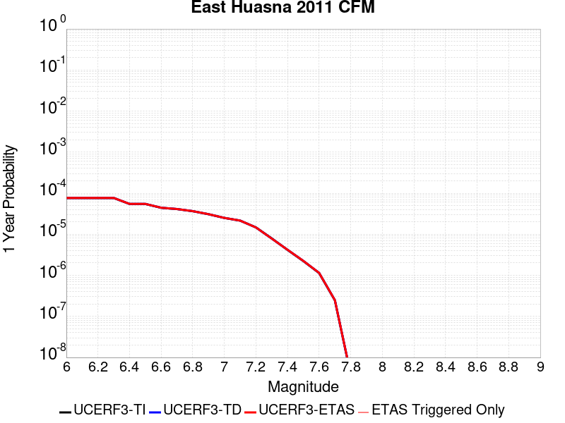 |  |

| Magnitude | 1 wk TI Prob | 1 wk TD Prob | 1 wk ETAS Prob | 1 wk ETAS/TD Gain | 1 wk ETAS Triggered Only | 1 mo TI Prob | 1 mo TD Prob | 1 mo ETAS Prob | 1 mo ETAS/TD Gain | 1 mo ETAS Triggered Only | 1 yr TI Prob | 1 yr TD Prob | 1 yr ETAS Prob | 1 yr ETAS/TD Gain | 1 yr ETAS Triggered Only | 10 yr TI Prob | 10 yr TD Prob | 10 yr ETAS Prob | 10 yr ETAS/TD Gain | 10 yr ETAS Triggered Only |
|-----|-----|-----|-----|-----|-----|-----|-----|-----|-----|-----|-----|-----|-----|-----|-----|-----|-----|-----|-----|-----|
| 6.0 | 1.4658423E-6 | 1.471566E-6 | 1.471566E-6 | 1.0 | 0.0 | 6.282166E-6 | 6.3066964E-6 | 6.3066964E-6 | 1.0 | 0.0 | 7.6482684E-5 | 7.67814E-5 | 7.67814E-5 | 1.0 | 0.0 | 7.645637E-4 | 7.6755567E-4 | 7.77548E-4 | 1.0130184 | 1.0E-5 |
| 6.1 | 1.4658423E-6 | 1.471566E-6 | 1.471566E-6 | 1.0 | 0.0 | 6.282166E-6 | 6.3066964E-6 | 6.3066964E-6 | 1.0 | 0.0 | 7.6482684E-5 | 7.67814E-5 | 7.67814E-5 | 1.0 | 0.0 | 7.645637E-4 | 7.6755567E-4 | 7.77548E-4 | 1.0130184 | 1.0E-5 |
| 6.2 | 1.4658423E-6 | 1.471566E-6 | 1.471566E-6 | 1.0 | 0.0 | 6.282166E-6 | 6.3066964E-6 | 6.3066964E-6 | 1.0 | 0.0 | 7.6482684E-5 | 7.67814E-5 | 7.67814E-5 | 1.0 | 0.0 | 7.645637E-4 | 7.6755567E-4 | 7.77548E-4 | 1.0130184 | 1.0E-5 |
| 6.3 | 1.4658423E-6 | 1.471566E-6 | 1.471566E-6 | 1.0 | 0.0 | 6.282166E-6 | 6.3066964E-6 | 6.3066964E-6 | 1.0 | 0.0 | 7.6482684E-5 | 7.67814E-5 | 7.67814E-5 | 1.0 | 0.0 | 7.645637E-4 | 7.6755567E-4 | 7.77548E-4 | 1.0130184 | 1.0E-5 |
| 6.4 | 1.0488257E-6 | 1.0527515E-6 | 1.0527515E-6 | 1.0 | 0.0 | 4.4949593E-6 | 4.5117845E-6 | 4.5117845E-6 | 1.0 | 0.0 | 5.472476E-5 | 5.492961E-5 | 5.492961E-5 | 1.0 | 0.0 | 5.4711284E-4 | 5.491622E-4 | 5.491622E-4 | 1.0 | 0.0 |
| 6.5 | 1.0488257E-6 | 1.0527515E-6 | 1.0527515E-6 | 1.0 | 0.0 | 4.4949593E-6 | 4.5117845E-6 | 4.5117845E-6 | 1.0 | 0.0 | 5.472476E-5 | 5.492961E-5 | 5.492961E-5 | 1.0 | 0.0 | 5.4711284E-4 | 5.491622E-4 | 5.491622E-4 | 1.0 | 0.0 |
| 6.6 | 8.463064E-7 | 8.4936323E-7 | 8.4936323E-7 | 1.0 | 0.0 | 3.6270226E-6 | 3.6401232E-6 | 3.6401232E-6 | 1.0 | 0.0 | 4.4158103E-5 | 4.4317607E-5 | 4.4317607E-5 | 1.0 | 0.0 | 4.414933E-4 | 4.4308856E-4 | 4.4308856E-4 | 1.0 | 0.0 |
| 6.7 | 7.876149E-7 | 7.902533E-7 | 7.902533E-7 | 1.0 | 0.0 | 3.375488E-6 | 3.3867955E-6 | 3.3867955E-6 | 1.0 | 0.0 | 4.109579E-5 | 4.1233463E-5 | 4.1233463E-5 | 1.0 | 0.0 | 4.108819E-4 | 4.1225873E-4 | 4.1225873E-4 | 1.0 | 0.0 |
| 6.8 | 6.9940785E-7 | 7.0165777E-7 | 7.0165777E-7 | 1.0 | 0.0 | 2.9974588E-6 | 3.0071012E-6 | 3.0071012E-6 | 1.0 | 0.0 | 3.649345E-5 | 3.6610847E-5 | 3.6610847E-5 | 1.0 | 0.0 | 3.6487455E-4 | 3.6604863E-4 | 3.6604863E-4 | 1.0 | 0.0 |
| 6.9 | 5.899658E-7 | 5.9155997E-7 | 5.9155997E-7 | 1.0 | 0.0 | 2.5284223E-6 | 2.5352545E-6 | 2.5352545E-6 | 1.0 | 0.0 | 3.0783107E-5 | 3.086629E-5 | 3.086629E-5 | 1.0 | 0.0 | 3.0778843E-4 | 3.086203E-4 | 3.086203E-4 | 1.0 | 0.0 |
| 7.0 | 4.793814E-7 | 4.803273E-7 | 4.803273E-7 | 1.0 | 0.0 | 2.05449E-6 | 2.058544E-6 | 2.058544E-6 | 1.0 | 0.0 | 2.501313E-5 | 2.5062485E-5 | 2.5062485E-5 | 1.0 | 0.0 | 2.5010316E-4 | 2.505968E-4 | 2.505968E-4 | 1.0 | 0.0 |
| 7.1 | 4.1256908E-7 | 4.129941E-7 | 4.129941E-7 | 1.0 | 0.0 | 1.768152E-6 | 1.7699736E-6 | 1.7699736E-6 | 1.0 | 0.0 | 2.1527037E-5 | 2.1549216E-5 | 2.1549216E-5 | 1.0 | 0.0 | 2.1524953E-4 | 2.1547142E-4 | 2.1547142E-4 | 1.0 | 0.0 |
| 7.2 | 2.822599E-7 | 2.8161418E-7 | 2.8161418E-7 | 1.0 | 0.0 | 1.2096847E-6 | 1.2069174E-6 | 1.2069174E-6 | 1.0 | 0.0 | 1.47278115E-5 | 1.4694121E-5 | 1.4694121E-5 | 1.0 | 0.0 | 1.4726835E-4 | 1.4693156E-4 | 1.4693156E-4 | 1.0 | 0.0 |
| 7.3 | 1.5261652E-7 | 1.5075021E-7 | 1.5075021E-7 | 1.0 | 0.0 | 6.540707E-7 | 6.460722E-7 | 6.460722E-7 | 1.0 | 0.0 | 7.963281E-6 | 7.8659E-6 | 7.8659E-6 | 1.0 | 0.0 | 7.962996E-5 | 7.865624E-5 | 7.865624E-5 | 1.0 | 0.0 |
| 7.4 | 7.976414E-8 | 8.057865E-8 | 8.057865E-8 | 1.0 | 0.0 | 3.418463E-7 | 3.45337E-7 | 3.45337E-7 | 1.0 | 0.0 | 4.1619705E-6 | 4.2044703E-6 | 4.2044703E-6 | 1.0 | 0.0 | 4.161893E-5 | 4.2043914E-5 | 4.2043914E-5 | 1.0 | 0.0 |
| 7.5 | 4.2715055E-8 | 4.3202512E-8 | 4.3202512E-8 | 1.0 | 0.0 | 1.830645E-7 | 1.8515361E-7 | 1.8515361E-7 | 1.0 | 0.0 | 2.228808E-6 | 2.2542429E-6 | 2.2542429E-6 | 1.0 | 0.0 | 2.2287857E-5 | 2.2542203E-5 | 2.2542203E-5 | 1.0 | 0.0 |
| 7.6 | 2.1807532E-8 | 2.2057476E-8 | 2.2057476E-8 | 1.0 | 0.0 | 9.346085E-8 | 9.4532034E-8 | 9.4532034E-8 | 1.0 | 0.0 | 1.1378852E-6 | 1.1509269E-6 | 1.1509269E-6 | 1.0 | 0.0 | 1.1378794E-5 | 1.1509211E-5 | 1.1509211E-5 | 1.0 | 0.0 |
| 7.7 | 4.7196043E-9 | 4.767283E-9 | 4.767283E-9 | 1.0 | 0.0 | 2.0226874E-8 | 2.0431212E-8 | 2.0431212E-8 | 1.0 | 0.0 | 2.4626218E-7 | 2.4874998E-7 | 2.4874998E-7 | 1.0 | 0.0 | 2.462619E-6 | 2.487497E-6 | 2.487497E-6 | 1.0 | 0.0 |
| 7.8 | 7.400003E-11 | 7.4654505E-11 | 7.4654505E-11 | 1.0 | 0.0 | 3.171432E-10 | 3.1994773E-10 | 3.1994773E-10 | 1.0 | 0.0 | 3.861218E-9 | 3.895363E-9 | 3.895363E-9 | 1.0 | 0.0 | 3.861218E-8 | 3.895363E-8 | 3.895363E-8 | 1.0 | 0.0 |

## Johnson Valley (No) 2011 rev
*[(top)](#table-of-contents)*

| 1 Week | 1 Month | 1 Year | 10 Year |
|-----|-----|-----|-----|
|  |  |  |  |

| Magnitude | 1 wk TI Prob | 1 wk TD Prob | 1 wk ETAS Prob | 1 wk ETAS/TD Gain | 1 wk ETAS Triggered Only | 1 mo TI Prob | 1 mo TD Prob | 1 mo ETAS Prob | 1 mo ETAS/TD Gain | 1 mo ETAS Triggered Only | 1 yr TI Prob | 1 yr TD Prob | 1 yr ETAS Prob | 1 yr ETAS/TD Gain | 1 yr ETAS Triggered Only | 10 yr TI Prob | 10 yr TD Prob | 10 yr ETAS Prob | 10 yr ETAS/TD Gain | 10 yr ETAS Triggered Only |
|-----|-----|-----|-----|-----|-----|-----|-----|-----|-----|-----|-----|-----|-----|-----|-----|-----|-----|-----|-----|-----|
| 6.0 | 2.577707E-5 | 1.2901208E-5 | 1.2901208E-5 | 1.0 | 0.0 | 1.1046848E-4 | 5.528994E-5 | 5.528994E-5 | 1.0 | 0.0 | 0.0013441239 | 6.729868E-4 | 6.729868E-4 | 1.0 | 0.0 | 0.013360229 | 0.006713397 | 0.00672333 | 1.0014795 | 1.0E-5 |
| 6.1 | 2.577707E-5 | 1.2901208E-5 | 1.2901208E-5 | 1.0 | 0.0 | 1.1046848E-4 | 5.528994E-5 | 5.528994E-5 | 1.0 | 0.0 | 0.0013441239 | 6.729868E-4 | 6.729868E-4 | 1.0 | 0.0 | 0.013360229 | 0.006713397 | 0.00672333 | 1.0014795 | 1.0E-5 |
| 6.2 | 2.577707E-5 | 1.2901208E-5 | 1.2901208E-5 | 1.0 | 0.0 | 1.1046848E-4 | 5.528994E-5 | 5.528994E-5 | 1.0 | 0.0 | 0.0013441239 | 6.729868E-4 | 6.729868E-4 | 1.0 | 0.0 | 0.013360229 | 0.006713397 | 0.00672333 | 1.0014795 | 1.0E-5 |
| 6.3 | 2.577707E-5 | 1.2901208E-5 | 1.2901208E-5 | 1.0 | 0.0 | 1.1046848E-4 | 5.528994E-5 | 5.528994E-5 | 1.0 | 0.0 | 0.0013441239 | 6.729868E-4 | 6.729868E-4 | 1.0 | 0.0 | 0.013360229 | 0.006713397 | 0.00672333 | 1.0014795 | 1.0E-5 |
| 6.4 | 1.5296591E-5 | 7.5369735E-6 | 7.5369735E-6 | 1.0 | 0.0 | 6.555518E-5 | 3.230102E-5 | 3.230102E-5 | 1.0 | 0.0 | 7.97842E-4 | 3.9321271E-4 | 3.9321271E-4 | 1.0 | 0.0 | 0.007949836 | 0.003927011 | 0.003936972 | 1.0025364 | 1.0E-5 |
| 6.5 | 1.5296591E-5 | 7.5369735E-6 | 7.5369735E-6 | 1.0 | 0.0 | 6.555518E-5 | 3.230102E-5 | 3.230102E-5 | 1.0 | 0.0 | 7.97842E-4 | 3.9321271E-4 | 3.9321271E-4 | 1.0 | 0.0 | 0.007949836 | 0.003927011 | 0.003936972 | 1.0025364 | 1.0E-5 |
| 6.6 | 1.3289383E-5 | 5.9919316E-6 | 5.9919316E-6 | 1.0 | 0.0 | 5.6953253E-5 | 2.567955E-5 | 2.567955E-5 | 1.0 | 0.0 | 6.9318525E-4 | 3.1262063E-4 | 3.1262063E-4 | 1.0 | 0.0 | 0.0069102696 | 0.0031234731 | 0.0031334418 | 1.0031916 | 1.0E-5 |
| 6.7 | 1.3289383E-5 | 5.9919316E-6 | 5.9919316E-6 | 1.0 | 0.0 | 5.6953253E-5 | 2.567955E-5 | 2.567955E-5 | 1.0 | 0.0 | 6.9318525E-4 | 3.1262063E-4 | 3.1262063E-4 | 1.0 | 0.0 | 0.0069102696 | 0.0031234731 | 0.0031334418 | 1.0031916 | 1.0E-5 |
| 6.8 | 8.330789E-6 | 2.9214577E-6 | 2.9214577E-6 | 1.0 | 0.0 | 3.570289E-5 | 1.2520505E-5 | 1.2520505E-5 | 1.0 | 0.0 | 4.34596E-4 | 1.524322E-4 | 1.524322E-4 | 1.0 | 0.0 | 0.0043374705 | 0.0015238364 | 0.0015338212 | 1.0065523 | 1.0E-5 |
| 6.9 | 7.2359003E-6 | 2.3014702E-6 | 2.3014702E-6 | 1.0 | 0.0 | 3.1010633E-5 | 9.863436E-6 | 9.863436E-6 | 1.0 | 0.0 | 3.7748902E-4 | 1.2008605E-4 | 1.2008605E-4 | 1.0 | 0.0 | 0.0037684843 | 0.0012007345 | 0.0012107225 | 1.0083182 | 1.0E-5 |
| 7.0 | 6.5149957E-6 | 2.0886398E-6 | 2.0886398E-6 | 1.0 | 0.0 | 2.792111E-5 | 8.951313E-6 | 8.951313E-6 | 1.0 | 0.0 | 3.398865E-4 | 1.0898209E-4 | 1.0898209E-4 | 1.0 | 0.0 | 0.003393671 | 0.0010898062 | 0.0010997953 | 1.009166 | 1.0E-5 |
| 7.1 | 1.1662233E-6 | 2.8793124E-8 | 2.8793124E-8 | 1.0 | 0.0 | 4.9980904E-6 | 1.2339909E-7 | 1.2339909E-7 | 1.0 | 0.0 | 6.0850052E-5 | 1.5023832E-6 | 1.5023832E-6 | 1.0 | 0.0 | 6.083339E-4 | 1.5023746E-5 | 1.5023746E-5 | 1.0 | 0.0 |
| 7.2 | 5.413881E-7 | 2.8793124E-8 | 2.8793124E-8 | 1.0 | 0.0 | 2.3202326E-6 | 1.2339909E-7 | 1.2339909E-7 | 1.0 | 0.0 | 2.8248465E-5 | 1.5023832E-6 | 1.5023832E-6 | 1.0 | 0.0 | 2.8244875E-4 | 1.5023746E-5 | 1.5023746E-5 | 1.0 | 0.0 |
| 7.3 | 5.076821E-7 | 2.8793124E-8 | 2.8793124E-8 | 1.0 | 0.0 | 2.1757785E-6 | 1.2339909E-7 | 1.2339909E-7 | 1.0 | 0.0 | 2.648978E-5 | 1.5023832E-6 | 1.5023832E-6 | 1.0 | 0.0 | 2.6486625E-4 | 1.5023746E-5 | 1.5023746E-5 | 1.0 | 0.0 |
| 7.4 | 4.7568687E-7 | 2.8775073E-8 | 2.8775073E-8 | 1.0 | 0.0 | 2.0386565E-6 | 1.2332174E-7 | 1.2332174E-7 | 1.0 | 0.0 | 2.482036E-5 | 1.5014413E-6 | 1.5014413E-6 | 1.0 | 0.0 | 2.4817587E-4 | 1.5014328E-5 | 1.5014328E-5 | 1.0 | 0.0 |
| 7.5 | 3.435626E-7 | 2.5350424E-8 | 2.5350424E-8 | 1.0 | 0.0 | 1.4724103E-6 | 1.0864467E-7 | 1.0864467E-7 | 1.0 | 0.0 | 1.7926448E-5 | 1.3227482E-6 | 1.3227482E-6 | 1.0 | 0.0 | 1.7925001E-4 | 1.3227419E-5 | 1.3227419E-5 | 1.0 | 0.0 |

## San Jose
*[(top)](#table-of-contents)*

| 1 Week | 1 Month | 1 Year | 10 Year |
|-----|-----|-----|-----|
|  |  |  |  |

| Magnitude | 1 wk TI Prob | 1 wk TD Prob | 1 wk ETAS Prob | 1 wk ETAS/TD Gain | 1 wk ETAS Triggered Only | 1 mo TI Prob | 1 mo TD Prob | 1 mo ETAS Prob | 1 mo ETAS/TD Gain | 1 mo ETAS Triggered Only | 1 yr TI Prob | 1 yr TD Prob | 1 yr ETAS Prob | 1 yr ETAS/TD Gain | 1 yr ETAS Triggered Only | 10 yr TI Prob | 10 yr TD Prob | 10 yr ETAS Prob | 10 yr ETAS/TD Gain | 10 yr ETAS Triggered Only |
|-----|-----|-----|-----|-----|-----|-----|-----|-----|-----|-----|-----|-----|-----|-----|-----|-----|-----|-----|-----|-----|
| 6.0 | 5.0851277E-6 | 4.125642E-6 | 4.125642E-6 | 1.0 | 0.0 | 2.1793223E-5 | 1.768122E-5 | 1.768122E-5 | 1.0 | 0.0 | 2.653002E-4 | 2.152502E-4 | 2.2524805E-4 | 1.0464475 | 1.0E-5 | 0.0026498367 | 0.0021507454 | 0.002160724 | 1.0046395 | 1.0E-5 |
| 6.1 | 5.0851277E-6 | 4.125642E-6 | 4.125642E-6 | 1.0 | 0.0 | 2.1793223E-5 | 1.768122E-5 | 1.768122E-5 | 1.0 | 0.0 | 2.653002E-4 | 2.152502E-4 | 2.2524805E-4 | 1.0464475 | 1.0E-5 | 0.0026498367 | 0.0021507454 | 0.002160724 | 1.0046395 | 1.0E-5 |
| 6.2 | 5.0851277E-6 | 4.125642E-6 | 4.125642E-6 | 1.0 | 0.0 | 2.1793223E-5 | 1.768122E-5 | 1.768122E-5 | 1.0 | 0.0 | 2.653002E-4 | 2.152502E-4 | 2.2524805E-4 | 1.0464475 | 1.0E-5 | 0.0026498367 | 0.0021507454 | 0.002160724 | 1.0046395 | 1.0E-5 |
| 6.3 | 5.0851277E-6 | 4.125642E-6 | 4.125642E-6 | 1.0 | 0.0 | 2.1793223E-5 | 1.768122E-5 | 1.768122E-5 | 1.0 | 0.0 | 2.653002E-4 | 2.152502E-4 | 2.2524805E-4 | 1.0464475 | 1.0E-5 | 0.0026498367 | 0.0021507454 | 0.002160724 | 1.0046395 | 1.0E-5 |
| 6.4 | 4.3115124E-6 | 3.3237525E-6 | 3.3237525E-6 | 1.0 | 0.0 | 1.8477778E-5 | 1.4244589E-5 | 1.4244589E-5 | 1.0 | 0.0 | 2.2494372E-4 | 1.7341628E-4 | 1.7341628E-4 | 1.0 | 0.0 | 0.0022471617 | 0.0017330965 | 0.0017330965 | 1.0 | 0.0 |
| 6.5 | 4.3115124E-6 | 3.3237525E-6 | 3.3237525E-6 | 1.0 | 0.0 | 1.8477778E-5 | 1.4244589E-5 | 1.4244589E-5 | 1.0 | 0.0 | 2.2494372E-4 | 1.7341628E-4 | 1.7341628E-4 | 1.0 | 0.0 | 0.0022471617 | 0.0017330965 | 0.0017330965 | 1.0 | 0.0 |
| 6.6 | 3.110396E-6 | 2.0799562E-6 | 2.0799562E-6 | 1.0 | 0.0 | 1.33302E-5 | 8.9140685E-6 | 8.9140685E-6 | 1.0 | 0.0 | 1.622831E-4 | 1.0852366E-4 | 1.0852366E-4 | 1.0 | 0.0 | 0.0016216465 | 0.001084804 | 0.001084804 | 1.0 | 0.0 |
| 6.7 | 3.110396E-6 | 2.0799562E-6 | 2.0799562E-6 | 1.0 | 0.0 | 1.33302E-5 | 8.9140685E-6 | 8.9140685E-6 | 1.0 | 0.0 | 1.622831E-4 | 1.0852366E-4 | 1.0852366E-4 | 1.0 | 0.0 | 0.0016216465 | 0.001084804 | 0.001084804 | 1.0 | 0.0 |
| 6.8 | 2.856651E-6 | 1.9024077E-6 | 1.9024077E-6 | 1.0 | 0.0 | 1.2242733E-5 | 8.153152E-6 | 8.153152E-6 | 1.0 | 0.0 | 1.4904508E-4 | 9.926035E-5 | 9.926035E-5 | 1.0 | 0.0 | 0.0014894515 | 9.922545E-4 | 9.922545E-4 | 1.0 | 0.0 |
| 6.9 | 2.1618725E-6 | 1.4186406E-6 | 1.4186406E-6 | 1.0 | 0.0 | 9.265135E-6 | 6.0798748E-6 | 6.0798748E-6 | 1.0 | 0.0 | 1.12797185E-4 | 7.402005E-5 | 7.402005E-5 | 1.0 | 0.0 | 0.0011273995 | 7.4003247E-4 | 7.4003247E-4 | 1.0 | 0.0 |
| 7.0 | 1.9684312E-6 | 1.3256082E-6 | 1.3256082E-6 | 1.0 | 0.0 | 8.436106E-6 | 5.681166E-6 | 5.681166E-6 | 1.0 | 0.0 | 1.02704755E-4 | 6.916608E-5 | 6.916608E-5 | 1.0 | 0.0 | 0.001026573 | 6.9152354E-4 | 6.9152354E-4 | 1.0 | 0.0 |
| 7.1 | 1.6070337E-6 | 1.1154867E-6 | 1.1154867E-6 | 1.0 | 0.0 | 6.887269E-6 | 4.7806493E-6 | 4.7806493E-6 | 1.0 | 0.0 | 8.384928E-5 | 5.8202913E-5 | 5.8202913E-5 | 1.0 | 0.0 | 8.3817646E-4 | 5.819527E-4 | 5.819527E-4 | 1.0 | 0.0 |
| 7.2 | 1.0631658E-6 | 6.403567E-7 | 6.403567E-7 | 1.0 | 0.0 | 4.556417E-6 | 2.744383E-6 | 2.744383E-6 | 1.0 | 0.0 | 5.5472963E-5 | 3.3412365E-5 | 3.3412365E-5 | 1.0 | 0.0 | 5.545912E-4 | 3.3414463E-4 | 3.3414463E-4 | 1.0 | 0.0 |
| 7.3 | 7.060711E-7 | 4.5823228E-7 | 4.5823228E-7 | 1.0 | 0.0 | 3.0260155E-6 | 1.9638512E-6 | 1.9638512E-6 | 1.0 | 0.0 | 3.6841117E-5 | 2.3909635E-5 | 2.3909635E-5 | 1.0 | 0.0 | 3.6835007E-4 | 2.3914136E-4 | 2.3914136E-4 | 1.0 | 0.0 |
| 7.4 | 3.3677085E-7 | 2.3231999E-7 | 2.3231999E-7 | 1.0 | 0.0 | 1.4433028E-6 | 9.956567E-7 | 9.956567E-7 | 1.0 | 0.0 | 1.757207E-5 | 1.2122056E-5 | 1.2122056E-5 | 1.0 | 0.0 | 1.7570681E-4 | 1.2128407E-4 | 1.2128407E-4 | 1.0 | 0.0 |
| 7.5 | 3.129161E-7 | 1.9529637E-7 | 1.9529637E-7 | 1.0 | 0.0 | 1.3410682E-6 | 8.3698416E-7 | 8.3698416E-7 | 1.0 | 0.0 | 1.6327383E-5 | 1.0190237E-5 | 1.0190237E-5 | 1.0 | 0.0 | 1.6326184E-4 | 1.0196777E-4 | 1.0196777E-4 | 1.0 | 0.0 |
| 7.6 | 2.8008668E-7 | 1.4240818E-7 | 1.4240818E-7 | 1.0 | 0.0 | 1.2003709E-6 | 6.103206E-7 | 6.103206E-7 | 1.0 | 0.0 | 1.46144175E-5 | 7.43063E-6 | 7.43063E-6 | 1.0 | 0.0 | 1.4613457E-4 | 7.43735E-5 | 7.43735E-5 | 1.0 | 0.0 |
| 7.7 | 2.7852005E-7 | 1.4015403E-7 | 1.4015403E-7 | 1.0 | 0.0 | 1.1936568E-6 | 6.0066003E-7 | 6.0066003E-7 | 1.0 | 0.0 | 1.4532674E-5 | 7.3130127E-6 | 7.3130127E-6 | 1.0 | 0.0 | 1.4531724E-4 | 7.31974E-5 | 7.31974E-5 | 1.0 | 0.0 |
| 7.8 | 1.1810797E-7 | 7.5187074E-8 | 7.5187074E-8 | 1.0 | 0.0 | 5.0617695E-7 | 3.2223028E-7 | 3.2223028E-7 | 1.0 | 0.0 | 6.1626865E-6 | 3.9231472E-6 | 3.9231472E-6 | 1.0 | 0.0 | 6.162516E-5 | 3.9271265E-5 | 3.9271265E-5 | 1.0 | 0.0 |

## Reliz 2011 CFM
*[(top)](#table-of-contents)*

| 1 Week | 1 Month | 1 Year | 10 Year |
|-----|-----|-----|-----|
|  |  |  |  |

| Magnitude | 1 wk TI Prob | 1 wk TD Prob | 1 wk ETAS Prob | 1 wk ETAS/TD Gain | 1 wk ETAS Triggered Only | 1 mo TI Prob | 1 mo TD Prob | 1 mo ETAS Prob | 1 mo ETAS/TD Gain | 1 mo ETAS Triggered Only | 1 yr TI Prob | 1 yr TD Prob | 1 yr ETAS Prob | 1 yr ETAS/TD Gain | 1 yr ETAS Triggered Only | 10 yr TI Prob | 10 yr TD Prob | 10 yr ETAS Prob | 10 yr ETAS/TD Gain | 10 yr ETAS Triggered Only |
|-----|-----|-----|-----|-----|-----|-----|-----|-----|-----|-----|-----|-----|-----|-----|-----|-----|-----|-----|-----|-----|
| 6.0 | 1.6002472E-5 | 1.6282795E-5 | 1.6282795E-5 | 1.0 | 0.0 | 6.8580215E-5 | 6.978165E-5 | 6.978165E-5 | 1.0 | 0.0 | 8.3464425E-4 | 8.492802E-4 | 8.5927173E-4 | 1.0117646 | 1.0E-5 | 0.008315164 | 0.008462543 | 0.008472458 | 1.0011717 | 1.0E-5 |
| 6.1 | 1.6002472E-5 | 1.6282795E-5 | 1.6282795E-5 | 1.0 | 0.0 | 6.8580215E-5 | 6.978165E-5 | 6.978165E-5 | 1.0 | 0.0 | 8.3464425E-4 | 8.492802E-4 | 8.5927173E-4 | 1.0117646 | 1.0E-5 | 0.008315164 | 0.008462543 | 0.008472458 | 1.0011717 | 1.0E-5 |
| 6.2 | 1.6002472E-5 | 1.6282795E-5 | 1.6282795E-5 | 1.0 | 0.0 | 6.8580215E-5 | 6.978165E-5 | 6.978165E-5 | 1.0 | 0.0 | 8.3464425E-4 | 8.492802E-4 | 8.5927173E-4 | 1.0117646 | 1.0E-5 | 0.008315164 | 0.008462543 | 0.008472458 | 1.0011717 | 1.0E-5 |
| 6.3 | 7.792404E-6 | 7.803792E-6 | 7.803792E-6 | 1.0 | 0.0 | 3.339559E-5 | 3.3444398E-5 | 3.3444398E-5 | 1.0 | 0.0 | 4.0651546E-4 | 4.0711026E-4 | 4.0711026E-4 | 1.0 | 0.0 | 0.0040577264 | 0.0040639215 | 0.0040639215 | 1.0 | 0.0 |
| 6.4 | 7.792404E-6 | 7.803792E-6 | 7.803792E-6 | 1.0 | 0.0 | 3.339559E-5 | 3.3444398E-5 | 3.3444398E-5 | 1.0 | 0.0 | 4.0651546E-4 | 4.0711026E-4 | 4.0711026E-4 | 1.0 | 0.0 | 0.0040577264 | 0.0040639215 | 0.0040639215 | 1.0 | 0.0 |
| 6.5 | 5.9659374E-6 | 5.928728E-6 | 5.928728E-6 | 1.0 | 0.0 | 2.5568053E-5 | 2.5408588E-5 | 2.5408588E-5 | 1.0 | 0.0 | 3.1124658E-4 | 3.0930588E-4 | 3.0930588E-4 | 1.0 | 0.0 | 0.00310811 | 0.003088972 | 0.003088972 | 1.0 | 0.0 |
| 6.6 | 5.2350692E-6 | 5.178976E-6 | 5.178976E-6 | 1.0 | 0.0 | 2.2435817E-5 | 2.2195423E-5 | 2.2195423E-5 | 1.0 | 0.0 | 2.7312184E-4 | 2.7019592E-4 | 2.7019592E-4 | 1.0 | 0.0 | 0.002727864 | 0.0026988846 | 0.0026988846 | 1.0 | 0.0 |
| 6.7 | 4.580206E-6 | 4.50611E-6 | 4.50611E-6 | 1.0 | 0.0 | 1.9629308E-5 | 1.931176E-5 | 1.931176E-5 | 1.0 | 0.0 | 2.389606E-4 | 2.3509537E-4 | 2.3509537E-4 | 1.0 | 0.0 | 0.002387038 | 0.002348669 | 0.002348669 | 1.0 | 0.0 |
| 6.8 | 4.0765017E-6 | 3.988228E-6 | 3.988228E-6 | 1.0 | 0.0 | 1.7470604E-5 | 1.7092294E-5 | 1.7092294E-5 | 1.0 | 0.0 | 2.1268385E-4 | 2.0807884E-4 | 2.0807884E-4 | 1.0 | 0.0 | 0.002124804 | 0.0020790389 | 0.0020790389 | 1.0 | 0.0 |
| 6.9 | 3.5752896E-6 | 3.4725074E-6 | 3.4725074E-6 | 1.0 | 0.0 | 1.532258E-5 | 1.488209E-5 | 1.488209E-5 | 1.0 | 0.0 | 1.8653645E-4 | 1.811744E-4 | 1.811744E-4 | 1.0 | 0.0 | 0.0018637994 | 0.001810464 | 0.001810464 | 1.0 | 0.0 |
| 7.0 | 3.0259848E-6 | 2.9079317E-6 | 2.9079317E-6 | 1.0 | 0.0 | 1.2968442E-5 | 1.2462505E-5 | 1.2462505E-5 | 1.0 | 0.0 | 1.5787935E-4 | 1.5172044E-4 | 1.5172044E-4 | 1.0 | 0.0 | 0.0015776722 | 0.0015163644 | 0.0015163644 | 1.0 | 0.0 |
| 7.1 | 2.5861116E-6 | 2.455157E-6 | 2.455157E-6 | 1.0 | 0.0 | 1.1083288E-5 | 1.0522059E-5 | 1.0522059E-5 | 1.0 | 0.0 | 1.3493067E-4 | 1.2809855E-4 | 1.2809855E-4 | 1.0 | 0.0 | 0.0013484878 | 0.0012804423 | 0.0012804423 | 1.0 | 0.0 |
| 7.2 | 2.1482588E-6 | 2.0032267E-6 | 2.0032267E-6 | 1.0 | 0.0 | 9.20679E-6 | 8.585229E-6 | 8.585229E-6 | 1.0 | 0.0 | 1.12086906E-4 | 1.0452016E-4 | 1.0452016E-4 | 1.0 | 0.0 | 0.0011203039 | 0.0010449048 | 0.0010449048 | 1.0 | 0.0 |
| 7.3 | 1.7194744E-6 | 1.561114E-6 | 1.561114E-6 | 1.0 | 0.0 | 7.3691554E-6 | 6.6904713E-6 | 6.6904713E-6 | 1.0 | 0.0 | 8.971577E-5 | 8.145344E-5 | 8.145344E-5 | 1.0 | 0.0 | 8.967956E-4 | 8.144305E-4 | 8.144305E-4 | 1.0 | 0.0 |
| 7.4 | 1.2755178E-6 | 1.1056196E-6 | 1.1056196E-6 | 1.0 | 0.0 | 5.4664933E-6 | 4.738361E-6 | 4.738361E-6 | 1.0 | 0.0 | 6.655252E-5 | 5.768802E-5 | 5.768802E-5 | 1.0 | 0.0 | 6.6532596E-4 | 5.769249E-4 | 5.769249E-4 | 1.0 | 0.0 |
| 7.5 | 8.8463224E-7 | 7.0579193E-7 | 7.0579193E-7 | 1.0 | 0.0 | 3.7912755E-6 | 3.0248189E-6 | 3.0248189E-6 | 1.0 | 0.0 | 4.6157802E-5 | 3.682655E-5 | 3.682655E-5 | 1.0 | 0.0 | 4.6148215E-4 | 3.683988E-4 | 3.683988E-4 | 1.0 | 0.0 |
| 7.6 | 5.291355E-7 | 3.5006548E-7 | 3.5006548E-7 | 1.0 | 0.0 | 2.2677216E-6 | 1.5002796E-6 | 1.5002796E-6 | 1.0 | 0.0 | 2.760916E-5 | 1.8265751E-5 | 1.8265751E-5 | 1.0 | 0.0 | 2.760573E-4 | 1.8283579E-4 | 1.8283579E-4 | 1.0 | 0.0 |
| 7.7 | 2.9663357E-7 | 1.3509886E-7 | 1.3509886E-7 | 1.0 | 0.0 | 1.2712861E-6 | 5.7899496E-7 | 5.7899496E-7 | 1.0 | 0.0 | 1.5477797E-5 | 7.0492406E-6 | 7.0492406E-6 | 1.0 | 0.0 | 1.547672E-4 | 7.0675895E-5 | 7.0675895E-5 | 1.0 | 0.0 |
| 7.8 | 1.2509386E-7 | 2.7148959E-8 | 2.7148959E-8 | 1.0 | 0.0 | 5.3611643E-7 | 1.1635268E-7 | 1.1635268E-7 | 1.0 | 0.0 | 6.527198E-6 | 1.4165929E-6 | 1.4165929E-6 | 1.0 | 0.0 | 6.527006E-5 | 1.4322827E-5 | 1.4322827E-5 | 1.0 | 0.0 |
| 7.9 | 6.213493E-8 | 1.1477568E-8 | 1.1477568E-8 | 1.0 | 0.0 | 2.6629255E-7 | 4.9189577E-8 | 4.9189577E-8 | 1.0 | 0.0 | 3.242107E-6 | 5.9888293E-7 | 5.9888293E-7 | 1.0 | 0.0 | 3.2420594E-5 | 6.1203536E-6 | 6.1203536E-6 | 1.0 | 0.0 |
| 8.0 | 5.92383E-9 | 1.6775827E-9 | 1.6775827E-9 | 1.0 | 0.0 | 2.5387841E-8 | 7.18964E-9 | 7.18964E-9 | 1.0 | 0.0 | 3.0909692E-7 | 8.753386E-8 | 8.753386E-8 | 1.0 | 0.0 | 3.090965E-6 | 8.992677E-7 | 8.992677E-7 | 1.0 | 0.0 |

## San Andreas (North Coast) 2011 CFM
*[(top)](#table-of-contents)*

| 1 Week | 1 Month | 1 Year | 10 Year |
|-----|-----|-----|-----|
|  |  | 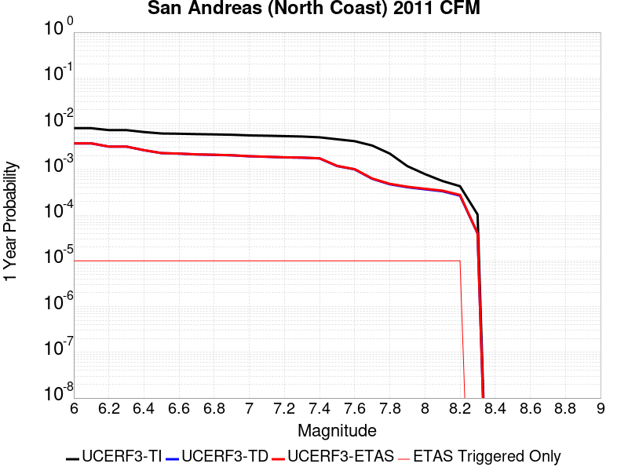 |  |

| Magnitude | 1 wk TI Prob | 1 wk TD Prob | 1 wk ETAS Prob | 1 wk ETAS/TD Gain | 1 wk ETAS Triggered Only | 1 mo TI Prob | 1 mo TD Prob | 1 mo ETAS Prob | 1 mo ETAS/TD Gain | 1 mo ETAS Triggered Only | 1 yr TI Prob | 1 yr TD Prob | 1 yr ETAS Prob | 1 yr ETAS/TD Gain | 1 yr ETAS Triggered Only | 10 yr TI Prob | 10 yr TD Prob | 10 yr ETAS Prob | 10 yr ETAS/TD Gain | 10 yr ETAS Triggered Only |
|-----|-----|-----|-----|-----|-----|-----|-----|-----|-----|-----|-----|-----|-----|-----|-----|-----|-----|-----|-----|-----|
| 6.0 | 1.5333705E-4 | 7.109695E-5 | 8.109623E-5 | 1.140643 | 1.0E-5 | 6.5699324E-4 | 3.046658E-4 | 3.1466273E-4 | 1.0328128 | 1.0E-5 | 0.007969595 | 0.0037030308 | 0.0037129938 | 1.0026904 | 1.0E-5 | 0.0768977 | 0.039364267 | 0.039373875 | 1.000244 | 1.0E-5 |
| 6.1 | 1.5333705E-4 | 7.109695E-5 | 8.109623E-5 | 1.140643 | 1.0E-5 | 6.5699324E-4 | 3.046658E-4 | 3.1466273E-4 | 1.0328128 | 1.0E-5 | 0.007969595 | 0.0037030308 | 0.0037129938 | 1.0026904 | 1.0E-5 | 0.0768977 | 0.039364267 | 0.039373875 | 1.000244 | 1.0E-5 |
| 6.2 | 1.3912938E-4 | 6.049243E-5 | 7.049183E-5 | 1.1652999 | 1.0E-5 | 5.961325E-4 | 2.5922767E-4 | 2.6922507E-4 | 1.0385661 | 1.0E-5 | 0.007233787 | 0.0031515562 | 0.0031615247 | 1.003163 | 1.0E-5 | 0.07002798 | 0.03369792 | 0.033707585 | 1.0002867 | 1.0E-5 |
| 6.3 | 1.3912938E-4 | 6.049243E-5 | 7.049183E-5 | 1.1652999 | 1.0E-5 | 5.961325E-4 | 2.5922767E-4 | 2.6922507E-4 | 1.0385661 | 1.0E-5 | 0.007233787 | 0.0031515562 | 0.0031615247 | 1.003163 | 1.0E-5 | 0.07002798 | 0.03369792 | 0.033707585 | 1.0002867 | 1.0E-5 |
| 6.4 | 1.2623647E-4 | 5.0433562E-5 | 6.043306E-5 | 1.1982707 | 1.0E-5 | 5.4090127E-4 | 2.1612605E-4 | 2.2612388E-4 | 1.0462593 | 1.0E-5 | 0.0065656058 | 0.0026281793 | 0.002638153 | 1.0037949 | 1.0E-5 | 0.06374981 | 0.02830552 | 0.028315235 | 1.0003433 | 1.0E-5 |
| 6.5 | 1.1736096E-4 | 4.3516375E-5 | 5.351594E-5 | 1.2297885 | 1.0E-5 | 5.028786E-4 | 1.8648551E-4 | 1.9648364E-4 | 1.0536134 | 1.0E-5 | 0.006105373 | 0.0022681132 | 0.0022780905 | 1.004399 | 1.0E-5 | 0.05940335 | 0.024576947 | 0.024586702 | 1.0003968 | 1.0E-5 |
| 6.6 | 1.1586959E-4 | 4.2416294E-5 | 5.2415868E-5 | 1.2357484 | 1.0E-5 | 4.964894E-4 | 1.8177154E-4 | 1.9176972E-4 | 1.0550041 | 1.0E-5 | 0.006028018 | 0.0022108385 | 0.0022208162 | 1.0045131 | 1.0E-5 | 0.058671024 | 0.023982164 | 0.023991924 | 1.000407 | 1.0E-5 |
| 6.7 | 1.13693764E-4 | 4.0728228E-5 | 5.072782E-5 | 1.24552 | 1.0E-5 | 4.87168E-4 | 1.7453796E-4 | 1.8453621E-4 | 1.0572841 | 1.0E-5 | 0.005915152 | 0.0021229447 | 0.0021329233 | 1.0047004 | 1.0E-5 | 0.057601593 | 0.023075242 | 0.023085011 | 1.0004233 | 1.0E-5 |
| 6.8 | 1.1204889E-4 | 3.9945848E-5 | 4.994545E-5 | 1.2503289 | 1.0E-5 | 4.8012115E-4 | 1.7118535E-4 | 1.8118364E-4 | 1.0584062 | 1.0E-5 | 0.005829819 | 0.0020822054 | 0.0020921845 | 1.0047926 | 1.0E-5 | 0.05679232 | 0.022635331 | 0.022645107 | 1.0004318 | 1.0E-5 |
| 6.9 | 1.1005794E-4 | 3.9001738E-5 | 4.9001348E-5 | 1.2563888 | 1.0E-5 | 4.7159163E-4 | 1.6713967E-4 | 1.77138E-4 | 1.0598202 | 1.0E-5 | 0.0057265228 | 0.0020330423 | 0.0020430218 | 1.0049087 | 1.0E-5 | 0.055811852 | 0.02210134 | 0.02211112 | 1.0004425 | 1.0E-5 |
| 7.0 | 1.0647948E-4 | 3.7159174E-5 | 4.7158803E-5 | 1.2691026 | 1.0E-5 | 4.562608E-4 | 1.5924397E-4 | 1.6924237E-4 | 1.0627867 | 1.0E-5 | 0.0055408357 | 0.0019370868 | 0.0019470674 | 1.0051523 | 1.0E-5 | 0.054047033 | 0.02105931 | 0.0210691 | 1.0004648 | 1.0E-5 |
| 7.1 | 1.04795035E-4 | 3.620866E-5 | 4.62083E-5 | 1.276167 | 1.0E-5 | 4.4904428E-4 | 1.5517084E-4 | 1.6516929E-4 | 1.0644351 | 1.0E-5 | 0.0054534175 | 0.0018875834 | 0.0018975645 | 1.0052878 | 1.0E-5 | 0.053215165 | 0.02052821 | 0.020538004 | 1.0004771 | 1.0E-5 |
| 7.2 | 1.02724036E-4 | 3.5117457E-5 | 4.5117107E-5 | 1.2847487 | 1.0E-5 | 4.401716E-4 | 1.5049479E-4 | 1.6049329E-4 | 1.0664375 | 1.0E-5 | 0.0053459285 | 0.0018307496 | 0.0018407312 | 1.0054523 | 1.0E-5 | 0.052191395 | 0.01991573 | 0.019925531 | 1.0004921 | 1.0E-5 |
| 7.3 | 1.00650694E-4 | 3.45853E-5 | 4.4584955E-5 | 1.2891302 | 1.0E-5 | 4.312888E-4 | 1.4821437E-4 | 1.5821289E-4 | 1.0674598 | 1.0E-5 | 0.005238306 | 0.0018030318 | 0.0018130138 | 1.0055362 | 1.0E-5 | 0.051165357 | 0.01959264 | 0.019602444 | 1.0005004 | 1.0E-5 |
| 7.4 | 9.672919E-5 | 3.3374814E-5 | 4.337448E-5 | 1.2996172 | 1.0E-5 | 4.144878E-4 | 1.4302715E-4 | 1.5302573E-4 | 1.0699068 | 1.0E-5 | 0.005034718 | 0.00173998 | 0.0017499626 | 1.0057372 | 1.0E-5 | 0.049221683 | 0.01886682 | 0.01887663 | 1.00052 | 1.0E-5 |
| 7.5 | 8.7600405E-5 | 2.2694192E-5 | 3.2693966E-5 | 1.4406314 | 1.0E-5 | 3.753763E-4 | 9.725721E-5 | 1.0725624E-4 | 1.1028101 | 1.0E-5 | 0.0045606326 | 0.0011834651 | 0.0011934533 | 1.0084398 | 1.0E-5 | 0.04468165 | 0.013127938 | 0.013137806 | 1.0007517 | 1.0E-5 |
| 7.6 | 7.9562284E-5 | 1.922004E-5 | 2.921985E-5 | 1.5202802 | 1.0E-5 | 3.4093665E-4 | 8.236901E-5 | 9.236819E-5 | 1.1213949 | 1.0E-5 | 0.0041430052 | 0.0010023828 | 0.0010123728 | 1.0099663 | 1.0E-5 | 0.040666126 | 0.0112194 | 0.011229288 | 1.0008813 | 1.0E-5 |
| 7.7 | 6.3866544E-5 | 1.1936281E-5 | 2.1936161E-5 | 1.8377719 | 1.0E-5 | 2.7368503E-4 | 5.115449E-5 | 6.115397E-5 | 1.1954763 | 1.0E-5 | 0.0033270244 | 6.226282E-4 | 6.3262193E-4 | 1.0160509 | 1.0E-5 | 0.032776527 | 0.0072073294 | 0.0072172573 | 1.0013775 | 1.0E-5 |
| 7.8 | 4.2543215E-5 | 9.0726735E-6 | 1.9072584E-5 | 2.102201 | 1.0E-5 | 1.8231533E-4 | 3.888231E-5 | 4.888192E-5 | 1.2571764 | 1.0E-5 | 0.0022174292 | 4.7328937E-4 | 4.8328465E-4 | 1.0211188 | 1.0E-5 | 0.021954332 | 0.0054884683 | 0.0054984135 | 1.001812 | 1.0E-5 |
| 7.9 | 2.2636612E-5 | 7.811842E-6 | 1.7811764E-5 | 2.2800977 | 1.0E-5 | 9.7010445E-5 | 3.3478893E-5 | 4.3478558E-5 | 1.2986857 | 1.0E-5 | 0.0011804621 | 4.0752938E-4 | 4.1752533E-4 | 1.0245281 | 1.0E-5 | 0.011742111 | 0.0046821116 | 0.004692065 | 1.0021257 | 1.0E-5 |
| 8.0 | 1.5167874E-5 | 7.0475517E-6 | 1.7047481E-5 | 2.4189224 | 1.0E-5 | 6.500356E-5 | 3.0203442E-5 | 4.020314E-5 | 1.331078 | 1.0E-5 | 7.9113094E-4 | 3.6766496E-4 | 3.776613E-4 | 1.0271887 | 1.0E-5 | 0.007883203 | 0.004214701 | 0.004224659 | 1.0023626 | 1.0E-5 |
| 8.1 | 1.0681047E-5 | 6.3854363E-6 | 1.6385373E-5 | 2.5660536 | 1.0E-5 | 4.5775112E-5 | 2.7365868E-5 | 3.7365597E-5 | 1.3654087 | 1.0E-5 | 5.5716943E-4 | 3.331286E-4 | 3.4312526E-4 | 1.0300084 | 1.0E-5 | 0.0055577457 | 0.003816698 | 0.0038266599 | 1.0026101 | 1.0E-5 |
| 8.2 | 8.226114E-6 | 5.1139064E-6 | 1.5113855E-5 | 2.9554424 | 1.0E-5 | 3.52543E-5 | 2.1916558E-5 | 3.1916337E-5 | 1.456266 | 1.0E-5 | 4.2913653E-4 | 2.6680148E-4 | 2.7679882E-4 | 1.037471 | 1.0E-5 | 0.004283088 | 0.0030445685 | 0.003054538 | 1.0032746 | 1.0E-5 |
| 8.3 | 1.983087E-6 | 7.6564595E-7 | 7.6564595E-7 | 1.0 | 0.0 | 8.498917E-6 | 3.281336E-6 | 3.281336E-6 | 1.0 | 0.0 | 1.034694E-4 | 3.9949547E-5 | 3.9949547E-5 | 1.0 | 0.0 | 0.0010342124 | 4.717979E-4 | 4.717979E-4 | 1.0 | 0.0 |

## Fontana (Seismicity)
*[(top)](#table-of-contents)*

| 1 Week | 1 Month | 1 Year | 10 Year |
|-----|-----|-----|-----|
|  |  |  |  |

| Magnitude | 1 wk TI Prob | 1 wk TD Prob | 1 wk ETAS Prob | 1 wk ETAS/TD Gain | 1 wk ETAS Triggered Only | 1 mo TI Prob | 1 mo TD Prob | 1 mo ETAS Prob | 1 mo ETAS/TD Gain | 1 mo ETAS Triggered Only | 1 yr TI Prob | 1 yr TD Prob | 1 yr ETAS Prob | 1 yr ETAS/TD Gain | 1 yr ETAS Triggered Only | 10 yr TI Prob | 10 yr TD Prob | 10 yr ETAS Prob | 10 yr ETAS/TD Gain | 10 yr ETAS Triggered Only |
|-----|-----|-----|-----|-----|-----|-----|-----|-----|-----|-----|-----|-----|-----|-----|-----|-----|-----|-----|-----|-----|
| 6.0 | 7.1789214E-6 | 7.5520006E-6 | 1.7551925E-5 | 2.3241425 | 1.0E-5 | 3.076644E-5 | 3.2365548E-5 | 4.2365224E-5 | 1.3089606 | 1.0E-5 | 3.7451705E-4 | 3.9402005E-4 | 4.0401611E-4 | 1.0253694 | 1.0E-5 | 0.003738865 | 0.003937214 | 0.0039471746 | 1.0025299 | 1.0E-5 |
| 6.1 | 7.1789214E-6 | 7.5520006E-6 | 1.7551925E-5 | 2.3241425 | 1.0E-5 | 3.076644E-5 | 3.2365548E-5 | 4.2365224E-5 | 1.3089606 | 1.0E-5 | 3.7451705E-4 | 3.9402005E-4 | 4.0401611E-4 | 1.0253694 | 1.0E-5 | 0.003738865 | 0.003937214 | 0.0039471746 | 1.0025299 | 1.0E-5 |
| 6.2 | 7.1789214E-6 | 7.5520006E-6 | 1.7551925E-5 | 2.3241425 | 1.0E-5 | 3.076644E-5 | 3.2365548E-5 | 4.2365224E-5 | 1.3089606 | 1.0E-5 | 3.7451705E-4 | 3.9402005E-4 | 4.0401611E-4 | 1.0253694 | 1.0E-5 | 0.003738865 | 0.003937214 | 0.0039471746 | 1.0025299 | 1.0E-5 |
| 6.3 | 7.1789214E-6 | 7.5520006E-6 | 1.7551925E-5 | 2.3241425 | 1.0E-5 | 3.076644E-5 | 3.2365548E-5 | 4.2365224E-5 | 1.3089606 | 1.0E-5 | 3.7451705E-4 | 3.9402005E-4 | 4.0401611E-4 | 1.0253694 | 1.0E-5 | 0.003738865 | 0.003937214 | 0.0039471746 | 1.0025299 | 1.0E-5 |
| 6.4 | 7.1789214E-6 | 7.5520006E-6 | 1.7551925E-5 | 2.3241425 | 1.0E-5 | 3.076644E-5 | 3.2365548E-5 | 4.2365224E-5 | 1.3089606 | 1.0E-5 | 3.7451705E-4 | 3.9402005E-4 | 4.0401611E-4 | 1.0253694 | 1.0E-5 | 0.003738865 | 0.003937214 | 0.0039471746 | 1.0025299 | 1.0E-5 |
| 6.5 | 5.2611317E-6 | 5.532726E-6 | 1.553267E-5 | 2.8074174 | 1.0E-5 | 2.2547512E-5 | 2.3711682E-5 | 3.3711443E-5 | 1.421723 | 1.0E-5 | 2.744814E-4 | 2.8868974E-4 | 2.9868685E-4 | 1.0346292 | 1.0E-5 | 0.002741426 | 0.0028868972 | 0.0028968684 | 1.003454 | 1.0E-5 |
| 6.6 | 5.2611317E-6 | 5.532726E-6 | 1.553267E-5 | 2.8074174 | 1.0E-5 | 2.2547512E-5 | 2.3711682E-5 | 3.3711443E-5 | 1.421723 | 1.0E-5 | 2.744814E-4 | 2.8868974E-4 | 2.9868685E-4 | 1.0346292 | 1.0E-5 | 0.002741426 | 0.0028868972 | 0.0028968684 | 1.003454 | 1.0E-5 |

## Las Positas
*[(top)](#table-of-contents)*

| 1 Week | 1 Month | 1 Year | 10 Year |
|-----|-----|-----|-----|
|  |  |  |  |

| Magnitude | 1 wk TI Prob | 1 wk TD Prob | 1 wk ETAS Prob | 1 wk ETAS/TD Gain | 1 wk ETAS Triggered Only | 1 mo TI Prob | 1 mo TD Prob | 1 mo ETAS Prob | 1 mo ETAS/TD Gain | 1 mo ETAS Triggered Only | 1 yr TI Prob | 1 yr TD Prob | 1 yr ETAS Prob | 1 yr ETAS/TD Gain | 1 yr ETAS Triggered Only | 10 yr TI Prob | 10 yr TD Prob | 10 yr ETAS Prob | 10 yr ETAS/TD Gain | 10 yr ETAS Triggered Only |
|-----|-----|-----|-----|-----|-----|-----|-----|-----|-----|-----|-----|-----|-----|-----|-----|-----|-----|-----|-----|-----|
| 6.0 | 1.0659424E-5 | 1.15911225E-5 | 1.15911225E-5 | 1.0 | 0.0 | 4.568245E-5 | 4.9676237E-5 | 4.9676237E-5 | 1.0 | 0.0 | 5.560419E-4 | 6.048082E-4 | 6.048082E-4 | 1.0 | 0.0 | 0.005546526 | 0.006048082 | 0.0060580214 | 1.0016434 | 1.0E-5 |
| 6.1 | 1.0659424E-5 | 1.15911225E-5 | 1.15911225E-5 | 1.0 | 0.0 | 4.568245E-5 | 4.9676237E-5 | 4.9676237E-5 | 1.0 | 0.0 | 5.560419E-4 | 6.048082E-4 | 6.048082E-4 | 1.0 | 0.0 | 0.005546526 | 0.006048082 | 0.0060580214 | 1.0016434 | 1.0E-5 |
| 6.2 | 1.0659424E-5 | 1.15911225E-5 | 1.15911225E-5 | 1.0 | 0.0 | 4.568245E-5 | 4.9676237E-5 | 4.9676237E-5 | 1.0 | 0.0 | 5.560419E-4 | 6.048082E-4 | 6.048082E-4 | 1.0 | 0.0 | 0.005546526 | 0.006048082 | 0.0060580214 | 1.0016434 | 1.0E-5 |
| 6.3 | 1.0659424E-5 | 1.15911225E-5 | 1.15911225E-5 | 1.0 | 0.0 | 4.568245E-5 | 4.9676237E-5 | 4.9676237E-5 | 1.0 | 0.0 | 5.560419E-4 | 6.048082E-4 | 6.048082E-4 | 1.0 | 0.0 | 0.005546526 | 0.006048082 | 0.0060580214 | 1.0016434 | 1.0E-5 |

## Cedar Mtn-Mahogany Mtn
*[(top)](#table-of-contents)*

| 1 Week | 1 Month | 1 Year | 10 Year |
|-----|-----|-----|-----|
|  |  | 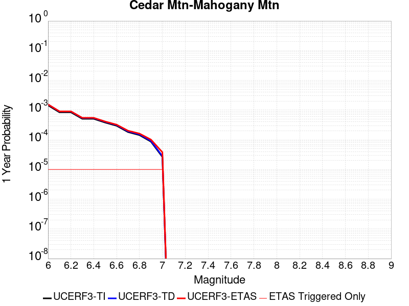 |  |

| Magnitude | 1 wk TI Prob | 1 wk TD Prob | 1 wk ETAS Prob | 1 wk ETAS/TD Gain | 1 wk ETAS Triggered Only | 1 mo TI Prob | 1 mo TD Prob | 1 mo ETAS Prob | 1 mo ETAS/TD Gain | 1 mo ETAS Triggered Only | 1 yr TI Prob | 1 yr TD Prob | 1 yr ETAS Prob | 1 yr ETAS/TD Gain | 1 yr ETAS Triggered Only | 10 yr TI Prob | 10 yr TD Prob | 10 yr ETAS Prob | 10 yr ETAS/TD Gain | 10 yr ETAS Triggered Only |
|-----|-----|-----|-----|-----|-----|-----|-----|-----|-----|-----|-----|-----|-----|-----|-----|-----|-----|-----|-----|-----|
| 6.0 | 2.7763876E-5 | 2.9588866E-5 | 3.958857E-5 | 1.337955 | 1.0E-5 | 1.1898261E-4 | 1.2680366E-4 | 1.3680238E-4 | 1.078852 | 1.0E-5 | 0.0014476506 | 0.0015428112 | 0.0015527958 | 1.0064716 | 1.0E-5 | 0.0143825635 | 0.015328225 | 0.015338072 | 1.0006424 | 1.0E-5 |
| 6.1 | 1.6162443E-5 | 1.7142966E-5 | 2.7142794E-5 | 1.5833197 | 1.0E-5 | 6.926578E-5 | 7.346788E-5 | 8.346715E-5 | 1.1361039 | 1.0E-5 | 8.4298453E-4 | 8.941221E-4 | 9.0411317E-4 | 1.0111742 | 1.0E-5 | 0.008397939 | 0.008907059 | 0.008916969 | 1.0011127 | 1.0E-5 |
| 6.2 | 1.6162443E-5 | 1.7142966E-5 | 2.7142794E-5 | 1.5833197 | 1.0E-5 | 6.926578E-5 | 7.346788E-5 | 8.346715E-5 | 1.1361039 | 1.0E-5 | 8.4298453E-4 | 8.941221E-4 | 9.0411317E-4 | 1.0111742 | 1.0E-5 | 0.008397939 | 0.008907059 | 0.008916969 | 1.0011127 | 1.0E-5 |
| 6.3 | 9.746053E-6 | 1.0303152E-5 | 2.0303049E-5 | 1.9705667 | 1.0E-5 | 4.1768133E-5 | 4.415564E-5 | 5.41552E-5 | 1.2264616 | 1.0E-5 | 5.0840835E-4 | 5.3746643E-4 | 5.4746104E-4 | 1.0185958 | 1.0E-5 | 0.0050724675 | 0.005362084 | 0.0053720307 | 1.0018549 | 1.0E-5 |
| 6.4 | 9.746053E-6 | 1.0303152E-5 | 2.0303049E-5 | 1.9705667 | 1.0E-5 | 4.1768133E-5 | 4.415564E-5 | 5.41552E-5 | 1.2264616 | 1.0E-5 | 5.0840835E-4 | 5.3746643E-4 | 5.4746104E-4 | 1.0185958 | 1.0E-5 | 0.0050724675 | 0.005362084 | 0.0053720307 | 1.0018549 | 1.0E-5 |
| 6.5 | 7.290083E-6 | 7.695325E-6 | 1.7695247E-5 | 2.2994804 | 1.0E-5 | 3.124284E-5 | 3.297956E-5 | 4.2979227E-5 | 1.3032081 | 1.0E-5 | 3.8031515E-4 | 4.014543E-4 | 4.1145028E-4 | 1.0248995 | 1.0E-5 | 0.0037966494 | 0.004007511 | 0.004017471 | 1.0024853 | 1.0E-5 |
| 6.6 | 5.67907E-6 | 5.9891527E-6 | 1.5989093E-5 | 2.6696754 | 1.0E-5 | 2.4338644E-5 | 2.5667552E-5 | 3.5667297E-5 | 1.3895869 | 1.0E-5 | 2.962827E-4 | 3.12459E-4 | 3.2245586E-4 | 1.0319942 | 1.0E-5 | 0.0029588798 | 0.003120333 | 0.0031303016 | 1.0031948 | 1.0E-5 |
| 6.7 | 3.4853963E-6 | 3.672631E-6 | 1.3672594E-5 | 3.7228336 | 1.0E-5 | 1.4937327E-5 | 1.5739755E-5 | 2.5739599E-5 | 1.6353239 | 1.0E-5 | 1.8184677E-4 | 1.916153E-4 | 2.0161338E-4 | 1.0521779 | 1.0E-5 | 0.0018169804 | 0.0019145629 | 0.0019245436 | 1.0052131 | 1.0E-5 |
| 6.8 | 2.7535168E-6 | 2.9015764E-6 | 1.2901547E-5 | 4.4463925 | 1.0E-5 | 1.1800733E-5 | 1.2435271E-5 | 2.2435146E-5 | 1.8041543 | 1.0E-5 | 1.4366445E-4 | 1.5138938E-4 | 1.6138787E-4 | 1.0660448 | 1.0E-5 | 0.0014357162 | 0.0015129098 | 0.0015228946 | 1.0065998 | 1.0E-5 |
| 6.9 | 1.6594106E-6 | 1.7496985E-6 | 1.1749681E-5 | 6.71526 | 1.0E-5 | 7.1117406E-6 | 7.4986883E-6 | 1.7498613E-5 | 2.3335567 | 1.0E-5 | 8.6582E-5 | 9.129302E-5 | 1.01292106E-4 | 1.1095273 | 1.0E-5 | 8.654827E-4 | 9.125856E-4 | 9.2257647E-4 | 1.0109478 | 1.0E-5 |
| 7.0 | 5.10215E-7 | 5.389254E-7 | 1.053892E-5 | 19.555435 | 1.0E-5 | 2.186634E-6 | 2.3096788E-6 | 1.2309656E-5 | 5.329596 | 1.0E-5 | 2.6621943E-5 | 2.8120105E-5 | 3.8119826E-5 | 1.3556074 | 1.0E-5 | 2.6618753E-4 | 2.81178E-4 | 2.911752E-4 | 1.0355546 | 1.0E-5 |

## Bennett Valley 2011 CFM
*[(top)](#table-of-contents)*

| 1 Week | 1 Month | 1 Year | 10 Year |
|-----|-----|-----|-----|
|  |  |  |  |

| Magnitude | 1 wk TI Prob | 1 wk TD Prob | 1 wk ETAS Prob | 1 wk ETAS/TD Gain | 1 wk ETAS Triggered Only | 1 mo TI Prob | 1 mo TD Prob | 1 mo ETAS Prob | 1 mo ETAS/TD Gain | 1 mo ETAS Triggered Only | 1 yr TI Prob | 1 yr TD Prob | 1 yr ETAS Prob | 1 yr ETAS/TD Gain | 1 yr ETAS Triggered Only | 10 yr TI Prob | 10 yr TD Prob | 10 yr ETAS Prob | 10 yr ETAS/TD Gain | 10 yr ETAS Triggered Only |
|-----|-----|-----|-----|-----|-----|-----|-----|-----|-----|-----|-----|-----|-----|-----|-----|-----|-----|-----|-----|-----|
| 6.0 | 2.3893934E-5 | 2.823899E-5 | 3.8238708E-5 | 1.3541104 | 1.0E-5 | 1.0239855E-4 | 1.2101967E-4 | 1.3101846E-4 | 1.0826212 | 1.0E-5 | 0.0012459893 | 0.0014726035 | 0.0014825888 | 1.0067807 | 1.0E-5 | 0.012390262 | 0.01465108 | 0.014660933 | 1.0006726 | 1.0E-5 |
| 6.1 | 2.3893934E-5 | 2.823899E-5 | 3.8238708E-5 | 1.3541104 | 1.0E-5 | 1.0239855E-4 | 1.2101967E-4 | 1.3101846E-4 | 1.0826212 | 1.0E-5 | 0.0012459893 | 0.0014726035 | 0.0014825888 | 1.0067807 | 1.0E-5 | 0.012390262 | 0.01465108 | 0.014660933 | 1.0006726 | 1.0E-5 |
| 6.2 | 1.6657146E-5 | 1.9853873E-5 | 2.9853674E-5 | 1.5036701 | 1.0E-5 | 7.138582E-5 | 8.508605E-5 | 9.50852E-5 | 1.1175181 | 1.0E-5 | 8.6877577E-4 | 0.0010355718 | 0.0010455615 | 1.0096465 | 1.0E-5 | 0.008653872 | 0.010325706 | 0.010335602 | 1.0009584 | 1.0E-5 |
| 6.3 | 1.6657146E-5 | 1.9853873E-5 | 2.9853674E-5 | 1.5036701 | 1.0E-5 | 7.138582E-5 | 8.508605E-5 | 9.50852E-5 | 1.1175181 | 1.0E-5 | 8.6877577E-4 | 0.0010355718 | 0.0010455615 | 1.0096465 | 1.0E-5 | 0.008653872 | 0.010325706 | 0.010335602 | 1.0009584 | 1.0E-5 |
| 6.4 | 1.29418495E-5 | 1.5567592E-5 | 2.5567437E-5 | 1.6423501 | 1.0E-5 | 5.546389E-5 | 6.671728E-5 | 7.671661E-5 | 1.1498762 | 1.0E-5 | 6.7506364E-4 | 8.1211043E-4 | 8.221023E-4 | 1.0123036 | 1.0E-5 | 0.0067301663 | 0.008108544 | 0.008118464 | 1.0012233 | 1.0E-5 |
| 6.5 | 1.2582504E-5 | 1.5134623E-5 | 2.5134472E-5 | 1.6607267 | 1.0E-5 | 5.39239E-5 | 6.486179E-5 | 7.486114E-5 | 1.154164 | 1.0E-5 | 6.563257E-4 | 7.8953634E-4 | 7.9952844E-4 | 1.0126556 | 1.0E-5 | 0.006543907 | 0.007884451 | 0.007894373 | 1.0012584 | 1.0E-5 |
| 6.6 | 1.0846706E-5 | 1.3036858E-5 | 2.3036728E-5 | 1.767046 | 1.0E-5 | 4.6485053E-5 | 5.5871777E-5 | 6.5871216E-5 | 1.1789713 | 1.0E-5 | 5.6580856E-4 | 6.801549E-4 | 6.901481E-4 | 1.0146925 | 1.0E-5 | 0.005643701 | 0.0067976816 | 0.0068076137 | 1.0014611 | 1.0E-5 |
| 6.7 | 1.6803231E-6 | 2.377902E-6 | 2.377902E-6 | 1.0 | 0.0 | 7.2013645E-6 | 1.019097E-5 | 1.019097E-5 | 1.0 | 0.0 | 8.7673085E-5 | 1.2406812E-4 | 1.2406812E-4 | 1.0 | 0.0 | 8.76385E-4 | 0.0012444188 | 0.0012444188 | 1.0 | 0.0 |
| 6.8 | 1.4609833E-6 | 2.0939708E-6 | 2.0939708E-6 | 1.0 | 0.0 | 6.261342E-6 | 8.974131E-6 | 8.974131E-6 | 1.0 | 0.0 | 7.6229175E-5 | 1.0925463E-4 | 1.0925463E-4 | 1.0 | 0.0 | 7.620303E-4 | 0.0010963798 | 0.0010963798 | 1.0 | 0.0 |
| 6.9 | 1.3492396E-6 | 1.9459103E-6 | 1.9459103E-6 | 1.0 | 0.0 | 5.7824427E-6 | 8.339589E-6 | 8.339589E-6 | 1.0 | 0.0 | 7.0398964E-5 | 1.01529826E-4 | 1.01529826E-4 | 1.0 | 0.0 | 7.037667E-4 | 0.001019178 | 0.001019178 | 1.0 | 0.0 |
| 7.0 | 1.2347921E-6 | 1.7888974E-6 | 1.7888974E-6 | 1.0 | 0.0 | 5.291955E-6 | 7.666681E-6 | 7.666681E-6 | 1.0 | 0.0 | 6.442765E-5 | 9.33379E-5 | 9.33379E-5 | 1.0 | 0.0 | 6.440897E-4 | 9.373068E-4 | 9.373068E-4 | 1.0 | 0.0 |
| 7.1 | 1.1262973E-6 | 1.6359154E-6 | 1.6359154E-6 | 1.0 | 0.0 | 4.8269794E-6 | 7.0110473E-6 | 7.0110473E-6 | 1.0 | 0.0 | 5.876689E-5 | 8.535621E-5 | 8.535621E-5 | 1.0 | 0.0 | 5.875135E-4 | 8.5754244E-4 | 8.5754244E-4 | 1.0 | 0.0 |
| 7.2 | 9.351744E-7 | 1.3611758E-6 | 1.3611758E-6 | 1.0 | 0.0 | 4.007884E-6 | 5.8335977E-6 | 5.8335977E-6 | 1.0 | 0.0 | 4.8794896E-5 | 7.1021765E-5 | 7.1021765E-5 | 1.0 | 0.0 | 4.878418E-4 | 7.142461E-4 | 7.142461E-4 | 1.0 | 0.0 |
| 7.3 | 8.5039534E-7 | 1.2386733E-6 | 1.2386733E-6 | 1.0 | 0.0 | 3.6445463E-6 | 5.308589E-6 | 5.308589E-6 | 1.0 | 0.0 | 4.437145E-5 | 6.463018E-5 | 6.463018E-5 | 1.0 | 0.0 | 4.436259E-4 | 6.50103E-4 | 6.50103E-4 | 1.0 | 0.0 |
| 7.4 | 6.7875015E-7 | 9.600642E-7 | 9.600642E-7 | 1.0 | 0.0 | 2.908926E-6 | 4.1145545E-6 | 4.1145545E-6 | 1.0 | 0.0 | 3.54156E-5 | 5.009356E-5 | 5.009356E-5 | 1.0 | 0.0 | 3.5409955E-4 | 5.0413073E-4 | 5.0413073E-4 | 1.0 | 0.0 |
| 7.5 | 5.826867E-7 | 8.1883735E-7 | 8.1883735E-7 | 1.0 | 0.0 | 2.4972264E-6 | 3.5092983E-6 | 3.5092983E-6 | 1.0 | 0.0 | 3.0403306E-5 | 4.2724878E-5 | 4.2724878E-5 | 1.0 | 0.0 | 3.0399146E-4 | 4.300558E-4 | 4.300558E-4 | 1.0 | 0.0 |
| 7.6 | 2.7734902E-7 | 3.6822587E-7 | 3.6822587E-7 | 1.0 | 0.0 | 1.1886381E-6 | 1.57811E-6 | 1.57811E-6 | 1.0 | 0.0 | 1.4471572E-5 | 1.9213321E-5 | 1.9213321E-5 | 1.0 | 0.0 | 1.447063E-4 | 1.9315645E-4 | 1.9315645E-4 | 1.0 | 0.0 |
| 7.7 | 1.0530888E-7 | 1.3749101E-7 | 1.3749101E-7 | 1.0 | 0.0 | 4.513237E-7 | 5.8924707E-7 | 5.8924707E-7 | 1.0 | 0.0 | 5.4948523E-6 | 7.174059E-6 | 7.174059E-6 | 1.0 | 0.0 | 5.4947162E-5 | 7.255585E-5 | 7.255585E-5 | 1.0 | 0.0 |
| 7.8 | 1.2714258E-8 | 1.9633259E-8 | 1.9633259E-8 | 1.0 | 0.0 | 5.448968E-8 | 8.4142535E-8 | 8.4142535E-8 | 1.0 | 0.0 | 6.6341164E-7 | 1.0244348E-6 | 1.0244348E-6 | 1.0 | 0.0 | 6.6340967E-6 | 1.0658595E-5 | 1.0658595E-5 | 1.0 | 0.0 |
| 7.9 | 4.075888E-9 | 7.559928E-9 | 7.559928E-9 | 1.0 | 0.0 | 1.7468091E-8 | 3.239969E-8 | 3.239969E-8 | 1.0 | 0.0 | 2.12674E-7 | 3.9446616E-7 | 3.9446616E-7 | 1.0 | 0.0 | 2.1267379E-6 | 4.1952467E-6 | 4.1952467E-6 | 1.0 | 0.0 |
| 8.0 | 1.9126138E-9 | 3.9956882E-9 | 3.9956882E-9 | 1.0 | 0.0 | 8.196917E-9 | 1.7124377E-8 | 1.7124377E-8 | 1.0 | 0.0 | 9.9797454E-8 | 2.0848927E-7 | 2.0848927E-7 | 1.0 | 0.0 | 9.979741E-7 | 2.1982228E-6 | 2.1982228E-6 | 1.0 | 0.0 |

## Quien Sabe 2011 CFM
*[(top)](#table-of-contents)*

| 1 Week | 1 Month | 1 Year | 10 Year |
|-----|-----|-----|-----|
|  |  |  |  |

| Magnitude | 1 wk TI Prob | 1 wk TD Prob | 1 wk ETAS Prob | 1 wk ETAS/TD Gain | 1 wk ETAS Triggered Only | 1 mo TI Prob | 1 mo TD Prob | 1 mo ETAS Prob | 1 mo ETAS/TD Gain | 1 mo ETAS Triggered Only | 1 yr TI Prob | 1 yr TD Prob | 1 yr ETAS Prob | 1 yr ETAS/TD Gain | 1 yr ETAS Triggered Only | 10 yr TI Prob | 10 yr TD Prob | 10 yr ETAS Prob | 10 yr ETAS/TD Gain | 10 yr ETAS Triggered Only |
|-----|-----|-----|-----|-----|-----|-----|-----|-----|-----|-----|-----|-----|-----|-----|-----|-----|-----|-----|-----|-----|
| 6.0 | 3.729899E-5 | 7.094885E-5 | 8.094814E-5 | 1.1409366 | 1.0E-5 | 1.5984301E-4 | 3.0394195E-4 | 3.1393892E-4 | 1.032891 | 1.0E-5 | 0.0019443515 | 0.0036850597 | 0.0036950228 | 1.0027037 | 1.0E-5 | 0.019274272 | 0.035349693 | 0.035359338 | 1.0002729 | 1.0E-5 |
| 6.1 | 1.7825725E-5 | 3.3210796E-5 | 3.3210796E-5 | 1.0 | 0.0 | 7.639373E-5 | 1.4227985E-4 | 1.4227985E-4 | 1.0 | 0.0 | 9.296967E-4 | 0.0017266083 | 0.0017266083 | 1.0 | 0.0 | 0.009258169 | 0.016698873 | 0.016698873 | 1.0 | 0.0 |
| 6.2 | 4.8865336E-6 | 7.807397E-6 | 7.807397E-6 | 1.0 | 0.0 | 2.0942118E-5 | 3.3456672E-5 | 3.3456672E-5 | 1.0 | 0.0 | 2.5494045E-4 | 4.0691794E-4 | 4.0691794E-4 | 1.0 | 0.0 | 0.0025464818 | 0.0040135398 | 0.0040135398 | 1.0 | 0.0 |
| 6.3 | 3.858491E-6 | 5.7896764E-6 | 5.7896764E-6 | 1.0 | 0.0 | 1.6536285E-5 | 2.4812689E-5 | 2.4812689E-5 | 1.0 | 0.0 | 2.0131067E-4 | 3.020573E-4 | 3.020573E-4 | 1.0 | 0.0 | 0.002011284 | 0.0030020247 | 0.0030020247 | 1.0 | 0.0 |
| 6.4 | 3.0771805E-6 | 4.3848822E-6 | 4.3848822E-6 | 1.0 | 0.0 | 1.318785E-5 | 1.879223E-5 | 1.879223E-5 | 1.0 | 0.0 | 1.6055023E-4 | 2.287738E-4 | 2.287738E-4 | 1.0 | 0.0 | 0.001604343 | 0.0022864633 | 0.0022864633 | 1.0 | 0.0 |
| 6.5 | 2.5081235E-6 | 3.4635768E-6 | 3.4635768E-6 | 1.0 | 0.0 | 1.0749056E-5 | 1.4843825E-5 | 1.4843825E-5 | 1.0 | 0.0 | 1.308619E-4 | 1.8071005E-4 | 1.8071005E-4 | 1.0 | 0.0 | 0.0013078486 | 0.0018122483 | 0.0018122483 | 1.0 | 0.0 |
| 6.6 | 1.7505364E-6 | 2.4023664E-6 | 2.4023664E-6 | 1.0 | 0.0 | 7.502277E-6 | 1.0295819E-5 | 1.0295819E-5 | 1.0 | 0.0 | 9.13364E-5 | 1.253451E-4 | 1.253451E-4 | 1.0 | 0.0 | 9.129886E-4 | 0.0012582706 | 0.0012582706 | 1.0 | 0.0 |
| 6.7 | 1.505737E-6 | 2.063768E-6 | 2.063768E-6 | 1.0 | 0.0 | 6.4531428E-6 | 8.844693E-6 | 8.844693E-6 | 1.0 | 0.0 | 7.8564175E-5 | 1.0767942E-4 | 1.0767942E-4 | 1.0 | 0.0 | 7.853641E-4 | 0.0010818074 | 0.0010818074 | 1.0 | 0.0 |
| 6.8 | 1.2924105E-6 | 1.7484224E-6 | 1.7484224E-6 | 1.0 | 0.0 | 5.5388905E-6 | 7.4932204E-6 | 7.4932204E-6 | 1.0 | 0.0 | 6.74339E-5 | 9.1226684E-5 | 9.1226684E-5 | 1.0 | 0.0 | 6.741344E-4 | 9.1608387E-4 | 9.1608387E-4 | 1.0 | 0.0 |
| 6.9 | 8.9075286E-7 | 1.1249912E-6 | 1.1249912E-6 | 1.0 | 0.0 | 3.8175067E-6 | 4.8213833E-6 | 4.8213833E-6 | 1.0 | 0.0 | 4.6477155E-5 | 5.869898E-5 | 5.869898E-5 | 1.0 | 0.0 | 4.6467435E-4 | 5.903731E-4 | 5.903731E-4 | 1.0 | 0.0 |
| 7.0 | 6.6891175E-7 | 8.516645E-7 | 8.516645E-7 | 1.0 | 0.0 | 2.8667614E-6 | 3.6499866E-6 | 3.6499866E-6 | 1.0 | 0.0 | 3.4902263E-5 | 4.443788E-5 | 4.443788E-5 | 1.0 | 0.0 | 3.4896782E-4 | 4.4676356E-4 | 4.4676356E-4 | 1.0 | 0.0 |
| 7.1 | 4.4205015E-7 | 5.391929E-7 | 5.391929E-7 | 1.0 | 0.0 | 1.8944993E-6 | 2.3108257E-6 | 2.3108257E-6 | 1.0 | 0.0 | 2.3065284E-5 | 2.8134109E-5 | 2.8134109E-5 | 1.0 | 0.0 | 2.3062891E-4 | 2.826615E-4 | 2.826615E-4 | 1.0 | 0.0 |
| 7.2 | 1.6620965E-7 | 1.5987632E-7 | 1.5987632E-7 | 1.0 | 0.0 | 7.123269E-7 | 6.851841E-7 | 6.851841E-7 | 1.0 | 0.0 | 8.672545E-6 | 8.342088E-6 | 8.342088E-6 | 1.0 | 0.0 | 8.6722066E-5 | 8.354316E-5 | 8.354316E-5 | 1.0 | 0.0 |
| 7.3 | 1.2142488E-7 | 1.1726676E-7 | 1.1726676E-7 | 1.0 | 0.0 | 5.2039223E-7 | 5.025717E-7 | 5.025717E-7 | 1.0 | 0.0 | 6.335757E-6 | 6.118797E-6 | 6.118797E-6 | 1.0 | 0.0 | 6.3355765E-5 | 6.120608E-5 | 6.120608E-5 | 1.0 | 0.0 |
| 7.4 | 2.4192937E-8 | 2.4545901E-8 | 2.4545901E-8 | 1.0 | 0.0 | 1.0368401E-7 | 1.0519671E-7 | 1.0519671E-7 | 1.0 | 0.0 | 1.2623522E-6 | 1.2807693E-6 | 1.2807693E-6 | 1.0 | 0.0 | 1.2623449E-5 | 1.2768185E-5 | 1.2768185E-5 | 1.0 | 0.0 |
| 7.5 | 1.4432802E-8 | 1.4508743E-8 | 1.4508743E-8 | 1.0 | 0.0 | 6.185486E-8 | 6.218033E-8 | 6.218033E-8 | 1.0 | 0.0 | 7.530827E-7 | 7.5704526E-7 | 7.5704526E-7 | 1.0 | 0.0 | 7.530801E-6 | 7.528889E-6 | 7.528889E-6 | 1.0 | 0.0 |

## North Tahoe 2011 CFM
*[(top)](#table-of-contents)*

| 1 Week | 1 Month | 1 Year | 10 Year |
|-----|-----|-----|-----|
|  |  |  |  |

| Magnitude | 1 wk TI Prob | 1 wk TD Prob | 1 wk ETAS Prob | 1 wk ETAS/TD Gain | 1 wk ETAS Triggered Only | 1 mo TI Prob | 1 mo TD Prob | 1 mo ETAS Prob | 1 mo ETAS/TD Gain | 1 mo ETAS Triggered Only | 1 yr TI Prob | 1 yr TD Prob | 1 yr ETAS Prob | 1 yr ETAS/TD Gain | 1 yr ETAS Triggered Only | 10 yr TI Prob | 10 yr TD Prob | 10 yr ETAS Prob | 10 yr ETAS/TD Gain | 10 yr ETAS Triggered Only |
|-----|-----|-----|-----|-----|-----|-----|-----|-----|-----|-----|-----|-----|-----|-----|-----|-----|-----|-----|-----|-----|
| 6.0 | 2.150391E-5 | 2.2165179E-5 | 2.2165179E-5 | 1.0 | 0.0 | 9.215636E-5 | 9.499127E-5 | 1.0499032E-4 | 1.1052629 | 1.0E-5 | 0.0011214261 | 0.001156101 | 0.0011660894 | 1.0086398 | 1.0E-5 | 0.011157839 | 0.011520122 | 0.011530007 | 1.0008581 | 1.0E-5 |
| 6.1 | 2.150391E-5 | 2.2165179E-5 | 2.2165179E-5 | 1.0 | 0.0 | 9.215636E-5 | 9.499127E-5 | 1.0499032E-4 | 1.1052629 | 1.0E-5 | 0.0011214261 | 0.001156101 | 0.0011660894 | 1.0086398 | 1.0E-5 | 0.011157839 | 0.011520122 | 0.011530007 | 1.0008581 | 1.0E-5 |
| 6.2 | 2.150391E-5 | 2.2165179E-5 | 2.2165179E-5 | 1.0 | 0.0 | 9.215636E-5 | 9.499127E-5 | 1.0499032E-4 | 1.1052629 | 1.0E-5 | 0.0011214261 | 0.001156101 | 0.0011660894 | 1.0086398 | 1.0E-5 | 0.011157839 | 0.011520122 | 0.011530007 | 1.0008581 | 1.0E-5 |
| 6.3 | 2.150391E-5 | 2.2165179E-5 | 2.2165179E-5 | 1.0 | 0.0 | 9.215636E-5 | 9.499127E-5 | 1.0499032E-4 | 1.1052629 | 1.0E-5 | 0.0011214261 | 0.001156101 | 0.0011660894 | 1.0086398 | 1.0E-5 | 0.011157839 | 0.011520122 | 0.011530007 | 1.0008581 | 1.0E-5 |
| 6.4 | 7.3563056E-6 | 6.4450423E-6 | 6.4450423E-6 | 1.0 | 0.0 | 3.1526644E-5 | 2.762149E-5 | 2.762149E-5 | 1.0 | 0.0 | 3.8376928E-4 | 3.362703E-4 | 3.362703E-4 | 1.0 | 0.0 | 0.003831072 | 0.0033606114 | 0.0033606114 | 1.0 | 0.0 |
| 6.5 | 7.3563056E-6 | 6.4450423E-6 | 6.4450423E-6 | 1.0 | 0.0 | 3.1526644E-5 | 2.762149E-5 | 2.762149E-5 | 1.0 | 0.0 | 3.8376928E-4 | 3.362703E-4 | 3.362703E-4 | 1.0 | 0.0 | 0.003831072 | 0.0033606114 | 0.0033606114 | 1.0 | 0.0 |
| 6.6 | 6.8508816E-6 | 5.8842134E-6 | 5.8842134E-6 | 1.0 | 0.0 | 2.936059E-5 | 2.5217983E-5 | 2.5217983E-5 | 1.0 | 0.0 | 3.5740656E-4 | 3.0701605E-4 | 3.0701605E-4 | 1.0 | 0.0 | 0.0035683226 | 0.0030688962 | 0.0030688962 | 1.0 | 0.0 |
| 6.7 | 1.8511148E-6 | 6.101134E-7 | 6.101134E-7 | 1.0 | 0.0 | 7.933325E-6 | 2.6147716E-6 | 2.6147716E-6 | 1.0 | 0.0 | 9.658395E-5 | 3.1834847E-5 | 3.1834847E-5 | 1.0 | 0.0 | 9.6541987E-4 | 3.1834844E-4 | 3.1834844E-4 | 1.0 | 0.0 |

## Burnt Mtn
*[(top)](#table-of-contents)*

| 1 Week | 1 Month | 1 Year | 10 Year |
|-----|-----|-----|-----|
|  |  |  |  |

| Magnitude | 1 wk TI Prob | 1 wk TD Prob | 1 wk ETAS Prob | 1 wk ETAS/TD Gain | 1 wk ETAS Triggered Only | 1 mo TI Prob | 1 mo TD Prob | 1 mo ETAS Prob | 1 mo ETAS/TD Gain | 1 mo ETAS Triggered Only | 1 yr TI Prob | 1 yr TD Prob | 1 yr ETAS Prob | 1 yr ETAS/TD Gain | 1 yr ETAS Triggered Only | 10 yr TI Prob | 10 yr TD Prob | 10 yr ETAS Prob | 10 yr ETAS/TD Gain | 10 yr ETAS Triggered Only |
|-----|-----|-----|-----|-----|-----|-----|-----|-----|-----|-----|-----|-----|-----|-----|-----|-----|-----|-----|-----|-----|
| 6.0 | 1.5673151E-5 | 1.1749247E-5 | 1.1749247E-5 | 1.0 | 0.0 | 6.716892E-5 | 5.0353672E-5 | 6.0353166E-5 | 1.1985853 | 1.0E-5 | 8.1747473E-4 | 6.130124E-4 | 6.2300626E-4 | 1.016303 | 1.0E-5 | 0.008144741 | 0.006125855 | 0.0061357934 | 1.0016224 | 1.0E-5 |
| 6.1 | 1.5673151E-5 | 1.1749247E-5 | 1.1749247E-5 | 1.0 | 0.0 | 6.716892E-5 | 5.0353672E-5 | 6.0353166E-5 | 1.1985853 | 1.0E-5 | 8.1747473E-4 | 6.130124E-4 | 6.2300626E-4 | 1.016303 | 1.0E-5 | 0.008144741 | 0.006125855 | 0.0061357934 | 1.0016224 | 1.0E-5 |
| 6.2 | 1.5673151E-5 | 1.1749247E-5 | 1.1749247E-5 | 1.0 | 0.0 | 6.716892E-5 | 5.0353672E-5 | 6.0353166E-5 | 1.1985853 | 1.0E-5 | 8.1747473E-4 | 6.130124E-4 | 6.2300626E-4 | 1.016303 | 1.0E-5 | 0.008144741 | 0.006125855 | 0.0061357934 | 1.0016224 | 1.0E-5 |
| 6.3 | 1.5673151E-5 | 1.1749247E-5 | 1.1749247E-5 | 1.0 | 0.0 | 6.716892E-5 | 5.0353672E-5 | 6.0353166E-5 | 1.1985853 | 1.0E-5 | 8.1747473E-4 | 6.130124E-4 | 6.2300626E-4 | 1.016303 | 1.0E-5 | 0.008144741 | 0.006125855 | 0.0061357934 | 1.0016224 | 1.0E-5 |
| 6.4 | 1.5673151E-5 | 1.1749247E-5 | 1.1749247E-5 | 1.0 | 0.0 | 6.716892E-5 | 5.0353672E-5 | 6.0353166E-5 | 1.1985853 | 1.0E-5 | 8.1747473E-4 | 6.130124E-4 | 6.2300626E-4 | 1.016303 | 1.0E-5 | 0.008144741 | 0.006125855 | 0.0061357934 | 1.0016224 | 1.0E-5 |
| 6.5 | 1.36191375E-5 | 1.007816E-5 | 1.007816E-5 | 1.0 | 0.0 | 5.8366426E-5 | 4.319211E-5 | 5.319168E-5 | 1.2315137 | 1.0E-5 | 7.103795E-4 | 5.2586396E-4 | 5.358587E-4 | 1.0190064 | 1.0E-5 | 0.0070811296 | 0.00525864 | 0.0052685873 | 1.0018916 | 1.0E-5 |

## Pittville 2011 CFM
*[(top)](#table-of-contents)*

| 1 Week | 1 Month | 1 Year | 10 Year |
|-----|-----|-----|-----|
|  |  |  |  |

| Magnitude | 1 wk TI Prob | 1 wk TD Prob | 1 wk ETAS Prob | 1 wk ETAS/TD Gain | 1 wk ETAS Triggered Only | 1 mo TI Prob | 1 mo TD Prob | 1 mo ETAS Prob | 1 mo ETAS/TD Gain | 1 mo ETAS Triggered Only | 1 yr TI Prob | 1 yr TD Prob | 1 yr ETAS Prob | 1 yr ETAS/TD Gain | 1 yr ETAS Triggered Only | 10 yr TI Prob | 10 yr TD Prob | 10 yr ETAS Prob | 10 yr ETAS/TD Gain | 10 yr ETAS Triggered Only |
|-----|-----|-----|-----|-----|-----|-----|-----|-----|-----|-----|-----|-----|-----|-----|-----|-----|-----|-----|-----|-----|
| 6.0 | 2.5031832E-5 | 2.7056969E-5 | 3.70567E-5 | 1.3695805 | 1.0E-5 | 1.0727487E-4 | 1.1595384E-4 | 1.2595268E-4 | 1.0862312 | 1.0E-5 | 0.001305289 | 0.0014109211 | 0.001420907 | 1.0070776 | 1.0E-5 | 0.012976485 | 0.014029415 | 0.014039275 | 1.0007027 | 1.0E-5 |
| 6.1 | 1.2540113E-5 | 1.3513067E-5 | 1.3513067E-5 | 1.0 | 0.0 | 5.3742235E-5 | 5.7911984E-5 | 5.7911984E-5 | 1.0 | 0.0 | 6.541153E-4 | 7.048728E-4 | 7.048728E-4 | 1.0 | 0.0 | 0.0065219323 | 0.0070286044 | 0.0070286044 | 1.0 | 0.0 |
| 6.2 | 6.603218E-6 | 7.107189E-6 | 7.107189E-6 | 1.0 | 0.0 | 2.8299199E-5 | 3.0459063E-5 | 3.0459063E-5 | 1.0 | 0.0 | 3.4448825E-4 | 3.7078248E-4 | 3.7078248E-4 | 1.0 | 0.0 | 0.0034395473 | 0.0037022792 | 0.0037022792 | 1.0 | 0.0 |
| 6.3 | 6.603218E-6 | 7.107189E-6 | 7.107189E-6 | 1.0 | 0.0 | 2.8299199E-5 | 3.0459063E-5 | 3.0459063E-5 | 1.0 | 0.0 | 3.4448825E-4 | 3.7078248E-4 | 3.7078248E-4 | 1.0 | 0.0 | 0.0034395473 | 0.0037022792 | 0.0037022792 | 1.0 | 0.0 |
| 6.4 | 3.9389015E-6 | 4.239175E-6 | 4.239175E-6 | 1.0 | 0.0 | 1.6880897E-5 | 1.8167784E-5 | 1.8167784E-5 | 1.0 | 0.0 | 2.0550552E-4 | 2.2117342E-4 | 2.2117342E-4 | 1.0 | 0.0 | 0.0020531558 | 0.002209838 | 0.002209838 | 1.0 | 0.0 |
| 6.5 | 2.4533072E-6 | 2.6412686E-6 | 2.6412686E-6 | 1.0 | 0.0 | 1.0514132E-5 | 1.1319685E-5 | 1.1319685E-5 | 1.0 | 0.0 | 1.2800204E-4 | 1.3781038E-4 | 1.3781038E-4 | 1.0 | 0.0 | 0.0012792832 | 0.0013774394 | 0.0013774394 | 1.0 | 0.0 |
| 6.6 | 1.3482367E-6 | 1.452993E-6 | 1.452993E-6 | 1.0 | 0.0 | 5.778144E-6 | 6.2271047E-6 | 6.2271047E-6 | 1.0 | 0.0 | 7.0346636E-5 | 7.58135E-5 | 7.58135E-5 | 1.0 | 0.0 | 7.032437E-4 | 7.5798744E-4 | 7.5798744E-4 | 1.0 | 0.0 |

## Sierra Madre (San Fernando)
*[(top)](#table-of-contents)*

| 1 Week | 1 Month | 1 Year | 10 Year |
|-----|-----|-----|-----|
|  |  |  |  |

| Magnitude | 1 wk TI Prob | 1 wk TD Prob | 1 wk ETAS Prob | 1 wk ETAS/TD Gain | 1 wk ETAS Triggered Only | 1 mo TI Prob | 1 mo TD Prob | 1 mo ETAS Prob | 1 mo ETAS/TD Gain | 1 mo ETAS Triggered Only | 1 yr TI Prob | 1 yr TD Prob | 1 yr ETAS Prob | 1 yr ETAS/TD Gain | 1 yr ETAS Triggered Only | 10 yr TI Prob | 10 yr TD Prob | 10 yr ETAS Prob | 10 yr ETAS/TD Gain | 10 yr ETAS Triggered Only |
|-----|-----|-----|-----|-----|-----|-----|-----|-----|-----|-----|-----|-----|-----|-----|-----|-----|-----|-----|-----|-----|
| 6.0 | 1.0346413E-5 | 6.2872386E-6 | 6.2872386E-6 | 1.0 | 0.0 | 4.4341014E-5 | 2.6945036E-5 | 2.6945036E-5 | 1.0 | 0.0 | 5.3971814E-4 | 3.2800753E-4 | 3.2800753E-4 | 1.0 | 0.0 | 0.0053840918 | 0.0032753467 | 0.003285314 | 1.003043 | 1.0E-5 |
| 6.1 | 1.0346413E-5 | 6.2872386E-6 | 6.2872386E-6 | 1.0 | 0.0 | 4.4341014E-5 | 2.6945036E-5 | 2.6945036E-5 | 1.0 | 0.0 | 5.3971814E-4 | 3.2800753E-4 | 3.2800753E-4 | 1.0 | 0.0 | 0.0053840918 | 0.0032753467 | 0.003285314 | 1.003043 | 1.0E-5 |
| 6.2 | 1.0346413E-5 | 6.2872386E-6 | 6.2872386E-6 | 1.0 | 0.0 | 4.4341014E-5 | 2.6945036E-5 | 2.6945036E-5 | 1.0 | 0.0 | 5.3971814E-4 | 3.2800753E-4 | 3.2800753E-4 | 1.0 | 0.0 | 0.0053840918 | 0.0032753467 | 0.003285314 | 1.003043 | 1.0E-5 |
| 6.3 | 1.0346413E-5 | 6.2872386E-6 | 6.2872386E-6 | 1.0 | 0.0 | 4.4341014E-5 | 2.6945036E-5 | 2.6945036E-5 | 1.0 | 0.0 | 5.3971814E-4 | 3.2800753E-4 | 3.2800753E-4 | 1.0 | 0.0 | 0.0053840918 | 0.0032753467 | 0.003285314 | 1.003043 | 1.0E-5 |
| 6.4 | 1.0249558E-5 | 6.2872386E-6 | 6.2872386E-6 | 1.0 | 0.0 | 4.392594E-5 | 2.6945036E-5 | 2.6945036E-5 | 1.0 | 0.0 | 5.3466705E-4 | 3.2800753E-4 | 3.2800753E-4 | 1.0 | 0.0 | 0.0053338245 | 0.0032753467 | 0.003285314 | 1.003043 | 1.0E-5 |
| 6.5 | 1.0249558E-5 | 6.2872386E-6 | 6.2872386E-6 | 1.0 | 0.0 | 4.392594E-5 | 2.6945036E-5 | 2.6945036E-5 | 1.0 | 0.0 | 5.3466705E-4 | 3.2800753E-4 | 3.2800753E-4 | 1.0 | 0.0 | 0.0053338245 | 0.0032753467 | 0.003285314 | 1.003043 | 1.0E-5 |
| 6.6 | 9.9035515E-6 | 6.2872386E-6 | 6.2872386E-6 | 1.0 | 0.0 | 4.2443102E-5 | 2.6945036E-5 | 2.6945036E-5 | 1.0 | 0.0 | 5.166222E-4 | 3.2800753E-4 | 3.2800753E-4 | 1.0 | 0.0 | 0.0051542283 | 0.0032753467 | 0.003285314 | 1.003043 | 1.0E-5 |
| 6.7 | 9.87217E-6 | 6.274661E-6 | 6.274661E-6 | 1.0 | 0.0 | 4.2308613E-5 | 2.6891132E-5 | 2.6891132E-5 | 1.0 | 0.0 | 5.149856E-4 | 3.2735144E-4 | 3.2735144E-4 | 1.0 | 0.0 | 0.005137938 | 0.003268805 | 0.0032787723 | 1.0030493 | 1.0E-5 |
| 6.8 | 9.4359175E-6 | 6.1786473E-6 | 6.1786473E-6 | 1.0 | 0.0 | 4.043902E-5 | 2.6479653E-5 | 2.6479653E-5 | 1.0 | 0.0 | 4.9223384E-4 | 3.223432E-4 | 3.223432E-4 | 1.0 | 0.0 | 0.0049114493 | 0.0032188678 | 0.0032288358 | 1.0030967 | 1.0E-5 |
| 6.9 | 8.700447E-6 | 6.0399334E-6 | 6.0399334E-6 | 1.0 | 0.0 | 3.72871E-5 | 2.5885178E-5 | 2.5885178E-5 | 1.0 | 0.0 | 4.5387587E-4 | 3.1510755E-4 | 3.1510755E-4 | 1.0 | 0.0 | 0.0045295 | 0.0031467169 | 0.0031566853 | 1.0031679 | 1.0E-5 |
| 7.0 | 8.648878E-6 | 6.014848E-6 | 6.014848E-6 | 1.0 | 0.0 | 3.7066096E-5 | 2.5777672E-5 | 2.5777672E-5 | 1.0 | 0.0 | 4.5118626E-4 | 3.1379904E-4 | 3.1379904E-4 | 1.0 | 0.0 | 0.004502713 | 0.0031336688 | 0.0031436374 | 1.0031811 | 1.0E-5 |
| 7.1 | 8.505786E-6 | 5.9244794E-6 | 5.9244794E-6 | 1.0 | 0.0 | 3.645286E-5 | 2.5390384E-5 | 2.5390384E-5 | 1.0 | 0.0 | 4.437232E-4 | 3.0908515E-4 | 3.0908515E-4 | 1.0 | 0.0 | 0.0044283825 | 0.0030866617 | 0.0030966308 | 1.0032297 | 1.0E-5 |
| 7.2 | 8.139752E-6 | 5.698777E-6 | 5.698777E-6 | 1.0 | 0.0 | 3.4884186E-5 | 2.4423107E-5 | 2.4423107E-5 | 1.0 | 0.0 | 4.246322E-4 | 2.973118E-4 | 2.973118E-4 | 1.0 | 0.0 | 0.004238217 | 0.0029692466 | 0.0029792169 | 1.0033579 | 1.0E-5 |
| 7.3 | 7.8816E-6 | 5.5520936E-6 | 5.5520936E-6 | 1.0 | 0.0 | 3.3777847E-5 | 2.3794475E-5 | 2.3794475E-5 | 1.0 | 0.0 | 4.111677E-4 | 2.8966027E-4 | 2.8966027E-4 | 1.0 | 0.0 | 0.004104078 | 0.0028929329 | 0.0029029038 | 1.0034467 | 1.0E-5 |
| 7.4 | 7.5810603E-6 | 5.356333E-6 | 5.356333E-6 | 1.0 | 0.0 | 3.2489854E-5 | 2.2955517E-5 | 2.2955517E-5 | 1.0 | 0.0 | 3.9549218E-4 | 2.7944864E-4 | 2.7944864E-4 | 1.0 | 0.0 | 0.0039478904 | 0.0027910774 | 0.0028010495 | 1.0035728 | 1.0E-5 |
| 7.5 | 6.349153E-6 | 4.4075887E-6 | 4.4075887E-6 | 1.0 | 0.0 | 2.7210372E-5 | 1.8889532E-5 | 1.8889532E-5 | 1.0 | 0.0 | 3.312359E-4 | 2.2995661E-4 | 2.2995661E-4 | 1.0 | 0.0 | 0.0033074263 | 0.0022972687 | 0.0023072457 | 1.004343 | 1.0E-5 |
| 7.6 | 4.430576E-6 | 2.8905786E-6 | 2.8905786E-6 | 1.0 | 0.0 | 1.8988047E-5 | 1.23881355E-5 | 1.23881355E-5 | 1.0 | 0.0 | 2.3115493E-4 | 1.5081534E-4 | 1.5081534E-4 | 1.0 | 0.0 | 0.0023091463 | 0.0015071525 | 0.0015171374 | 1.006625 | 1.0E-5 |
| 7.7 | 3.005066E-6 | 1.7509823E-6 | 1.7509823E-6 | 1.0 | 0.0 | 1.2878791E-5 | 7.504188E-6 | 7.504188E-6 | 1.0 | 0.0 | 1.56788E-4 | 9.135967E-5 | 9.135967E-5 | 1.0 | 0.0 | 0.0015667742 | 9.1322226E-4 | 9.1322226E-4 | 1.0 | 0.0 |
| 7.8 | 1.8459098E-6 | 1.0581826E-6 | 1.0581826E-6 | 1.0 | 0.0 | 7.911018E-6 | 4.5350607E-6 | 4.5350607E-6 | 1.0 | 0.0 | 9.631238E-5 | 5.5212968E-5 | 5.5212968E-5 | 1.0 | 0.0 | 9.627065E-4 | 5.5199297E-4 | 5.5199297E-4 | 1.0 | 0.0 |
| 7.9 | 9.839262E-7 | 5.2340516E-7 | 5.2340516E-7 | 1.0 | 0.0 | 4.2168194E-6 | 2.243163E-6 | 2.243163E-6 | 1.0 | 0.0 | 5.1338568E-5 | 2.731017E-5 | 2.731017E-5 | 1.0 | 0.0 | 5.132671E-4 | 2.7306844E-4 | 2.7306844E-4 | 1.0 | 0.0 |
| 8.0 | 1.210983E-7 | 6.613497E-8 | 6.613497E-8 | 1.0 | 0.0 | 5.1899264E-7 | 2.8343558E-7 | 2.8343558E-7 | 1.0 | 0.0 | 6.3187167E-6 | 3.4508228E-6 | 3.4508228E-6 | 1.0 | 0.0 | 6.318537E-5 | 3.450771E-5 | 3.450771E-5 | 1.0 | 0.0 |

## Keddie Ridge 2011 CFM
*[(top)](#table-of-contents)*

| 1 Week | 1 Month | 1 Year | 10 Year |
|-----|-----|-----|-----|
|  |  |  |  |

| Magnitude | 1 wk TI Prob | 1 wk TD Prob | 1 wk ETAS Prob | 1 wk ETAS/TD Gain | 1 wk ETAS Triggered Only | 1 mo TI Prob | 1 mo TD Prob | 1 mo ETAS Prob | 1 mo ETAS/TD Gain | 1 mo ETAS Triggered Only | 1 yr TI Prob | 1 yr TD Prob | 1 yr ETAS Prob | 1 yr ETAS/TD Gain | 1 yr ETAS Triggered Only | 10 yr TI Prob | 10 yr TD Prob | 10 yr ETAS Prob | 10 yr ETAS/TD Gain | 10 yr ETAS Triggered Only |
|-----|-----|-----|-----|-----|-----|-----|-----|-----|-----|-----|-----|-----|-----|-----|-----|-----|-----|-----|-----|-----|
| 6.0 | 2.2591947E-5 | 2.5189187E-5 | 3.5188936E-5 | 1.3969858 | 1.0E-5 | 9.6819036E-5 | 1.0794964E-4 | 1.1794856E-4 | 1.0926257 | 1.0E-5 | 0.0011781343 | 0.0013135736 | 0.0013235604 | 1.0076028 | 1.0E-5 | 0.011719079 | 0.013066037 | 0.013075906 | 1.0007553 | 1.0E-5 |
| 6.1 | 2.2591947E-5 | 2.5189187E-5 | 3.5188936E-5 | 1.3969858 | 1.0E-5 | 9.6819036E-5 | 1.0794964E-4 | 1.1794856E-4 | 1.0926257 | 1.0E-5 | 0.0011781343 | 0.0013135736 | 0.0013235604 | 1.0076028 | 1.0E-5 | 0.011719079 | 0.013066037 | 0.013075906 | 1.0007553 | 1.0E-5 |
| 6.2 | 1.3775145E-5 | 1.5322817E-5 | 2.5322664E-5 | 1.6526115 | 1.0E-5 | 5.9035E-5 | 6.56677E-5 | 7.566705E-5 | 1.1522719 | 1.0E-5 | 7.185141E-4 | 7.9923525E-4 | 8.0922723E-4 | 1.012502 | 1.0E-5 | 0.0071619535 | 0.007966028 | 0.007975948 | 1.0012454 | 1.0E-5 |
| 6.3 | 9.705435E-6 | 1.0768351E-5 | 2.0768242E-5 | 1.9286374 | 1.0E-5 | 4.1594063E-5 | 4.6149325E-5 | 5.6148867E-5 | 1.2166779 | 1.0E-5 | 5.0629E-4 | 5.617356E-4 | 5.7172996E-4 | 1.017792 | 1.0E-5 | 0.005051381 | 0.0056043877 | 0.005614332 | 1.0017743 | 1.0E-5 |
| 6.4 | 7.2549733E-6 | 8.027268E-6 | 8.027268E-6 | 1.0 | 0.0 | 3.109237E-5 | 3.440217E-5 | 3.440217E-5 | 1.0 | 0.0 | 3.7848388E-4 | 4.1877388E-4 | 4.1877388E-4 | 1.0 | 0.0 | 0.003778399 | 0.004180635 | 0.004180635 | 1.0 | 0.0 |
| 6.5 | 5.983293E-6 | 6.6130237E-6 | 6.6130237E-6 | 1.0 | 0.0 | 2.5642432E-5 | 2.834126E-5 | 2.834126E-5 | 1.0 | 0.0 | 3.1215188E-4 | 3.4500693E-4 | 3.4500693E-4 | 1.0 | 0.0 | 0.0031171376 | 0.003445376 | 0.003445376 | 1.0 | 0.0 |
| 6.6 | 4.0336154E-6 | 4.4578037E-6 | 4.4578037E-6 | 1.0 | 0.0 | 1.728681E-5 | 1.9104757E-5 | 1.9104757E-5 | 1.0 | 0.0 | 2.1044657E-4 | 2.3257962E-4 | 2.3257962E-4 | 1.0 | 0.0 | 0.002102474 | 0.002323758 | 0.002323758 | 1.0 | 0.0 |
| 6.7 | 1.5832104E-6 | 1.7816087E-6 | 1.7816087E-6 | 1.0 | 0.0 | 6.7851697E-6 | 7.635445E-6 | 7.635445E-6 | 1.0 | 0.0 | 8.260631E-5 | 9.295785E-5 | 9.295785E-5 | 1.0 | 0.0 | 8.2575605E-4 | 9.2921633E-4 | 9.2921633E-4 | 1.0 | 0.0 |
| 6.8 | 7.5177275E-7 | 8.5902946E-7 | 8.5902946E-7 | 1.0 | 0.0 | 3.221879E-6 | 3.6815507E-6 | 3.6815507E-6 | 1.0 | 0.0 | 3.9225673E-5 | 4.4822125E-5 | 4.4822125E-5 | 1.0 | 0.0 | 3.921875E-4 | 4.481474E-4 | 4.481474E-4 | 1.0 | 0.0 |

## San Andreas (Peninsula) 2011 CFM
*[(top)](#table-of-contents)*

| 1 Week | 1 Month | 1 Year | 10 Year |
|-----|-----|-----|-----|
|  |  |  |  |

| Magnitude | 1 wk TI Prob | 1 wk TD Prob | 1 wk ETAS Prob | 1 wk ETAS/TD Gain | 1 wk ETAS Triggered Only | 1 mo TI Prob | 1 mo TD Prob | 1 mo ETAS Prob | 1 mo ETAS/TD Gain | 1 mo ETAS Triggered Only | 1 yr TI Prob | 1 yr TD Prob | 1 yr ETAS Prob | 1 yr ETAS/TD Gain | 1 yr ETAS Triggered Only | 10 yr TI Prob | 10 yr TD Prob | 10 yr ETAS Prob | 10 yr ETAS/TD Gain | 10 yr ETAS Triggered Only |
|-----|-----|-----|-----|-----|-----|-----|-----|-----|-----|-----|-----|-----|-----|-----|-----|-----|-----|-----|-----|-----|
| 6.0 | 8.6200685E-5 | 2.5207937E-5 | 3.5207686E-5 | 1.3966905 | 1.0E-5 | 3.6937918E-4 | 1.0802955E-4 | 1.1802847E-4 | 1.0925573 | 1.0E-5 | 0.0044879215 | 0.0013144679 | 0.0013244547 | 1.0075977 | 1.0E-5 | 0.043983612 | 0.01477218 | 0.014782031 | 1.000667 | 1.0E-5 |
| 6.1 | 8.6200685E-5 | 2.5207937E-5 | 3.5207686E-5 | 1.3966905 | 1.0E-5 | 3.6937918E-4 | 1.0802955E-4 | 1.1802847E-4 | 1.0925573 | 1.0E-5 | 0.0044879215 | 0.0013144679 | 0.0013244547 | 1.0075977 | 1.0E-5 | 0.043983612 | 0.01477218 | 0.014782031 | 1.000667 | 1.0E-5 |
| 6.2 | 8.6200685E-5 | 2.5207937E-5 | 3.5207686E-5 | 1.3966905 | 1.0E-5 | 3.6937918E-4 | 1.0802955E-4 | 1.1802847E-4 | 1.0925573 | 1.0E-5 | 0.0044879215 | 0.0013144679 | 0.0013244547 | 1.0075977 | 1.0E-5 | 0.043983612 | 0.01477218 | 0.014782031 | 1.000667 | 1.0E-5 |
| 6.3 | 8.551163E-5 | 2.4899866E-5 | 3.4899615E-5 | 1.4015986 | 1.0E-5 | 3.6642692E-4 | 1.06709354E-4 | 1.1670828E-4 | 1.0937026 | 1.0E-5 | 0.004452125 | 0.0012984137 | 0.0013084006 | 1.0076917 | 1.0E-5 | 0.043639794 | 0.01459892 | 0.014608774 | 1.000675 | 1.0E-5 |
| 6.4 | 8.551163E-5 | 2.4899866E-5 | 3.4899615E-5 | 1.4015986 | 1.0E-5 | 3.6642692E-4 | 1.06709354E-4 | 1.1670828E-4 | 1.0937026 | 1.0E-5 | 0.004452125 | 0.0012984137 | 0.0013084006 | 1.0076917 | 1.0E-5 | 0.043639794 | 0.01459892 | 0.014608774 | 1.000675 | 1.0E-5 |
| 6.5 | 8.511146E-5 | 2.4721267E-5 | 3.472102E-5 | 1.4045 | 1.0E-5 | 3.647124E-4 | 1.0594399E-4 | 1.1594293E-4 | 1.0943795 | 1.0E-5 | 0.004431336 | 0.0012891064 | 0.0012990936 | 1.0077473 | 1.0E-5 | 0.04344007 | 0.014498963 | 0.014508818 | 1.0006797 | 1.0E-5 |
| 6.6 | 8.4985084E-5 | 2.4651948E-5 | 3.46517E-5 | 1.4056375 | 1.0E-5 | 3.6417096E-4 | 1.0564694E-4 | 1.1564588E-4 | 1.0946449 | 1.0E-5 | 0.0044247704 | 0.0012854942 | 0.0012954812 | 1.0077691 | 1.0E-5 | 0.043376986 | 0.0144609315 | 0.014470788 | 1.0006815 | 1.0E-5 |
| 6.7 | 8.462618E-5 | 2.4480485E-5 | 3.448024E-5 | 1.4084786 | 1.0E-5 | 3.6263323E-4 | 1.0491216E-4 | 1.14911105E-4 | 1.0953078 | 1.0E-5 | 0.004406125 | 0.0012765586 | 0.0012865459 | 1.0078236 | 1.0E-5 | 0.043197807 | 0.014365727 | 0.014375583 | 1.000686 | 1.0E-5 |
| 6.8 | 8.42337E-5 | 2.4376272E-5 | 3.437603E-5 | 1.410225 | 1.0E-5 | 3.6095164E-4 | 1.04465566E-4 | 1.14464514E-4 | 1.0957153 | 1.0E-5 | 0.004385734 | 0.0012711277 | 0.001281115 | 1.0078571 | 1.0E-5 | 0.043001823 | 0.014306363 | 0.01431622 | 1.000689 | 1.0E-5 |
| 6.9 | 8.365989E-5 | 2.4180892E-5 | 3.418065E-5 | 1.4135396 | 1.0E-5 | 3.5849313E-4 | 1.0362829E-4 | 1.13627255E-4 | 1.0964887 | 1.0E-5 | 0.004355922 | 0.0012609458 | 0.0012709332 | 1.0079205 | 1.0E-5 | 0.04271523 | 0.014198911 | 0.014208769 | 1.0006943 | 1.0E-5 |
| 7.0 | 8.30936E-5 | 2.3942457E-5 | 3.394222E-5 | 1.4176581 | 1.0E-5 | 3.560668E-4 | 1.026065E-4 | 1.1260548E-4 | 1.0974497 | 1.0E-5 | 0.004326499 | 0.0012485199 | 0.0012585074 | 1.0079995 | 1.0E-5 | 0.042432297 | 0.014069902 | 0.014079762 | 1.0007007 | 1.0E-5 |
| 7.1 | 8.041264E-5 | 2.3628894E-5 | 3.3628658E-5 | 1.4232006 | 1.0E-5 | 3.4458007E-4 | 1.0126277E-4 | 1.1126176E-4 | 1.098743 | 1.0E-5 | 0.0041871946 | 0.0012321785 | 0.0012421663 | 1.0081058 | 1.0E-5 | 0.041091725 | 0.013892905 | 0.013902767 | 1.0007098 | 1.0E-5 |
| 7.2 | 7.8427016E-5 | 2.3052688E-5 | 3.3052456E-5 | 1.4337789 | 1.0E-5 | 3.3607247E-4 | 9.87935E-5 | 1.08792505E-4 | 1.1012112 | 1.0E-5 | 0.004084008 | 0.0012021487 | 0.0012121367 | 1.0083084 | 1.0E-5 | 0.040097635 | 0.013576745 | 0.01358661 | 1.0007266 | 1.0E-5 |
| 7.3 | 7.721087E-5 | 2.2837554E-5 | 3.2837324E-5 | 1.4378653 | 1.0E-5 | 3.3086175E-4 | 9.787157E-5 | 1.0787059E-4 | 1.1021647 | 1.0E-5 | 0.004020803 | 0.0011909365 | 0.0012009246 | 1.0083867 | 1.0E-5 | 0.03948827 | 0.013460464 | 0.013470329 | 1.0007329 | 1.0E-5 |
| 7.4 | 7.3536525E-5 | 2.095521E-5 | 3.0955E-5 | 1.4771982 | 1.0E-5 | 3.1511846E-4 | 8.980496E-5 | 9.980406E-5 | 1.1113424 | 1.0E-5 | 0.0038298194 | 0.0010928282 | 0.0011028174 | 1.0091406 | 1.0E-5 | 0.037644852 | 0.0124172745 | 0.01242715 | 1.0007954 | 1.0E-5 |
| 7.5 | 6.806207E-5 | 1.876151E-5 | 2.8761322E-5 | 1.5329962 | 1.0E-5 | 2.9166197E-4 | 8.0404E-5 | 9.04032E-5 | 1.1243619 | 1.0E-5 | 0.0035452035 | 9.784801E-4 | 9.884704E-4 | 1.0102099 | 1.0E-5 | 0.034891766 | 0.011170478 | 0.011180365 | 1.0008852 | 1.0E-5 |
| 7.6 | 5.6731416E-5 | 1.4173155E-5 | 2.4173014E-5 | 1.7055492 | 1.0E-5 | 2.43112E-4 | 6.074068E-5 | 7.0740076E-5 | 1.1646243 | 1.0E-5 | 0.0029558712 | 7.3926704E-4 | 7.492596E-4 | 1.0135169 | 1.0E-5 | 0.02916862 | 0.00848332 | 0.008493234 | 1.0011687 | 1.0E-5 |
| 7.7 | 4.946994E-5 | 1.3242368E-5 | 2.3242235E-5 | 1.755142 | 1.0E-5 | 2.1199681E-4 | 5.675177E-5 | 6.675121E-5 | 1.176196 | 1.0E-5 | 0.002578006 | 6.907339E-4 | 7.00727E-4 | 1.0144674 | 1.0E-5 | 0.02548303 | 0.007905742 | 0.007915663 | 1.0012549 | 1.0E-5 |
| 7.8 | 3.9718198E-5 | 1.2979126E-5 | 2.2978997E-5 | 1.7704579 | 1.0E-5 | 1.7020974E-4 | 5.562364E-5 | 6.5623084E-5 | 1.1797696 | 1.0E-5 | 0.0020703338 | 6.7700754E-4 | 6.8700075E-4 | 1.0147609 | 1.0E-5 | 0.020511515 | 0.007716547 | 0.00772647 | 1.0012859 | 1.0E-5 |
| 7.9 | 2.4115114E-5 | 1.2183215E-5 | 2.2183094E-5 | 1.8207914 | 1.0E-5 | 1.0334639E-4 | 5.2212738E-5 | 6.221222E-5 | 1.1915141 | 1.0E-5 | 0.001257516 | 6.355048E-4 | 6.4549845E-4 | 1.0157255 | 1.0E-5 | 0.012504238 | 0.0071578487 | 0.007167777 | 1.0013871 | 1.0E-5 |
| 8.0 | 1.7756569E-5 | 1.1408184E-5 | 2.140807E-5 | 1.8765537 | 1.0E-5 | 7.6097356E-5 | 4.8891303E-5 | 5.8890815E-5 | 1.2045254 | 1.0E-5 | 9.260915E-4 | 5.9508916E-4 | 6.0508325E-4 | 1.0167942 | 1.0E-5 | 0.009222416 | 0.006658535 | 0.006668468 | 1.0014918 | 1.0E-5 |
| 8.1 | 1.3159258E-5 | 9.744603E-6 | 1.9744506E-5 | 2.026199 | 1.0E-5 | 5.6395602E-5 | 4.1761916E-5 | 5.1761497E-5 | 1.2394426 | 1.0E-5 | 6.864001E-4 | 5.083328E-4 | 5.1832775E-4 | 1.0196621 | 1.0E-5 | 0.0068428386 | 0.005688865 | 0.0056988085 | 1.0017478 | 1.0E-5 |
| 8.2 | 8.635426E-6 | 5.465718E-6 | 1.5465663E-5 | 2.8295758 | 1.0E-5 | 3.700844E-5 | 2.3424296E-5 | 3.342406E-5 | 1.4268972 | 1.0E-5 | 4.5048463E-4 | 2.8515357E-4 | 2.951507E-4 | 1.0350589 | 1.0E-5 | 0.004495725 | 0.0032439749 | 0.0032539424 | 1.0030726 | 1.0E-5 |
| 8.3 | 1.983087E-6 | 7.6564595E-7 | 7.6564595E-7 | 1.0 | 0.0 | 8.498917E-6 | 3.281336E-6 | 3.281336E-6 | 1.0 | 0.0 | 1.034694E-4 | 3.9949547E-5 | 3.9949547E-5 | 1.0 | 0.0 | 0.0010342124 | 4.717979E-4 | 4.717979E-4 | 1.0 | 0.0 |

## Northridge Hills
*[(top)](#table-of-contents)*

| 1 Week | 1 Month | 1 Year | 10 Year |
|-----|-----|-----|-----|
|  |  |  |  |

| Magnitude | 1 wk TI Prob | 1 wk TD Prob | 1 wk ETAS Prob | 1 wk ETAS/TD Gain | 1 wk ETAS Triggered Only | 1 mo TI Prob | 1 mo TD Prob | 1 mo ETAS Prob | 1 mo ETAS/TD Gain | 1 mo ETAS Triggered Only | 1 yr TI Prob | 1 yr TD Prob | 1 yr ETAS Prob | 1 yr ETAS/TD Gain | 1 yr ETAS Triggered Only | 10 yr TI Prob | 10 yr TD Prob | 10 yr ETAS Prob | 10 yr ETAS/TD Gain | 10 yr ETAS Triggered Only |
|-----|-----|-----|-----|-----|-----|-----|-----|-----|-----|-----|-----|-----|-----|-----|-----|-----|-----|-----|-----|-----|
| 6.0 | 5.095982E-6 | 3.6152135E-6 | 3.6152135E-6 | 1.0 | 0.0 | 2.183974E-5 | 1.549368E-5 | 1.549368E-5 | 1.0 | 0.0 | 2.658664E-4 | 1.8861935E-4 | 1.8861935E-4 | 1.0 | 0.0 | 0.0026554854 | 0.0018846049 | 0.0018945861 | 1.0052961 | 1.0E-5 |
| 6.1 | 5.095982E-6 | 3.6152135E-6 | 3.6152135E-6 | 1.0 | 0.0 | 2.183974E-5 | 1.549368E-5 | 1.549368E-5 | 1.0 | 0.0 | 2.658664E-4 | 1.8861935E-4 | 1.8861935E-4 | 1.0 | 0.0 | 0.0026554854 | 0.0018846049 | 0.0018945861 | 1.0052961 | 1.0E-5 |
| 6.2 | 5.095982E-6 | 3.6152135E-6 | 3.6152135E-6 | 1.0 | 0.0 | 2.183974E-5 | 1.549368E-5 | 1.549368E-5 | 1.0 | 0.0 | 2.658664E-4 | 1.8861935E-4 | 1.8861935E-4 | 1.0 | 0.0 | 0.0026554854 | 0.0018846049 | 0.0018945861 | 1.0052961 | 1.0E-5 |
| 6.3 | 5.095982E-6 | 3.6152135E-6 | 3.6152135E-6 | 1.0 | 0.0 | 2.183974E-5 | 1.549368E-5 | 1.549368E-5 | 1.0 | 0.0 | 2.658664E-4 | 1.8861935E-4 | 1.8861935E-4 | 1.0 | 0.0 | 0.0026554854 | 0.0018846049 | 0.0018945861 | 1.0052961 | 1.0E-5 |
| 6.4 | 5.095982E-6 | 3.6152135E-6 | 3.6152135E-6 | 1.0 | 0.0 | 2.183974E-5 | 1.549368E-5 | 1.549368E-5 | 1.0 | 0.0 | 2.658664E-4 | 1.8861935E-4 | 1.8861935E-4 | 1.0 | 0.0 | 0.0026554854 | 0.0018846049 | 0.0018945861 | 1.0052961 | 1.0E-5 |
| 6.5 | 5.095982E-6 | 3.6152135E-6 | 3.6152135E-6 | 1.0 | 0.0 | 2.183974E-5 | 1.549368E-5 | 1.549368E-5 | 1.0 | 0.0 | 2.658664E-4 | 1.8861935E-4 | 1.8861935E-4 | 1.0 | 0.0 | 0.0026554854 | 0.0018846049 | 0.0018945861 | 1.0052961 | 1.0E-5 |
| 6.6 | 5.095982E-6 | 3.6152135E-6 | 3.6152135E-6 | 1.0 | 0.0 | 2.183974E-5 | 1.549368E-5 | 1.549368E-5 | 1.0 | 0.0 | 2.658664E-4 | 1.8861935E-4 | 1.8861935E-4 | 1.0 | 0.0 | 0.0026554854 | 0.0018846049 | 0.0018945861 | 1.0052961 | 1.0E-5 |
| 6.7 | 5.095982E-6 | 3.6152135E-6 | 3.6152135E-6 | 1.0 | 0.0 | 2.183974E-5 | 1.549368E-5 | 1.549368E-5 | 1.0 | 0.0 | 2.658664E-4 | 1.8861935E-4 | 1.8861935E-4 | 1.0 | 0.0 | 0.0026554854 | 0.0018846049 | 0.0018945861 | 1.0052961 | 1.0E-5 |
| 6.8 | 5.095982E-6 | 3.6152135E-6 | 3.6152135E-6 | 1.0 | 0.0 | 2.183974E-5 | 1.549368E-5 | 1.549368E-5 | 1.0 | 0.0 | 2.658664E-4 | 1.8861935E-4 | 1.8861935E-4 | 1.0 | 0.0 | 0.0026554854 | 0.0018846049 | 0.0018945861 | 1.0052961 | 1.0E-5 |
| 6.9 | 5.0942654E-6 | 3.6134284E-6 | 3.6134284E-6 | 1.0 | 0.0 | 2.1832384E-5 | 1.548603E-5 | 1.548603E-5 | 1.0 | 0.0 | 2.6577685E-4 | 1.8852622E-4 | 1.8852622E-4 | 1.0 | 0.0 | 0.002654592 | 0.0018836753 | 0.0018936564 | 1.0052987 | 1.0E-5 |
| 7.0 | 4.851143E-6 | 3.3587432E-6 | 3.3587432E-6 | 1.0 | 0.0 | 2.0790447E-5 | 1.4394534E-5 | 1.4394534E-5 | 1.0 | 0.0 | 2.5309427E-4 | 1.752394E-4 | 1.752394E-4 | 1.0 | 0.0 | 0.0025280623 | 0.0017510166 | 0.0017609991 | 1.005701 | 1.0E-5 |
| 7.1 | 4.7910607E-6 | 3.2970245E-6 | 3.2970245E-6 | 1.0 | 0.0 | 2.0532956E-5 | 1.4130029E-5 | 1.4130029E-5 | 1.0 | 0.0 | 2.4996005E-4 | 1.7201956E-4 | 1.7201956E-4 | 1.0 | 0.0 | 0.0024967908 | 0.0017188682 | 0.0017288509 | 1.0058078 | 1.0E-5 |
| 7.2 | 4.580079E-6 | 3.106803E-6 | 3.106803E-6 | 1.0 | 0.0 | 1.9628762E-5 | 1.3314802E-5 | 1.3314802E-5 | 1.0 | 0.0 | 2.3895396E-4 | 1.6209569E-4 | 1.6209569E-4 | 1.0 | 0.0 | 0.0023869718 | 0.001619778 | 0.0016297618 | 1.0061637 | 1.0E-5 |
| 7.3 | 4.290062E-6 | 2.8682362E-6 | 2.8682362E-6 | 1.0 | 0.0 | 1.838585E-5 | 1.2292383E-5 | 1.2292383E-5 | 1.0 | 0.0 | 2.2382473E-4 | 1.4964951E-4 | 1.4964951E-4 | 1.0 | 0.0 | 0.0022359942 | 0.0014954903 | 0.0015054754 | 1.0066768 | 1.0E-5 |
| 7.4 | 4.0259683E-6 | 2.6739135E-6 | 2.6739135E-6 | 1.0 | 0.0 | 1.7254037E-5 | 1.1459579E-5 | 1.1459579E-5 | 1.0 | 0.0 | 2.1004764E-4 | 1.3951147E-4 | 1.3951147E-4 | 1.0 | 0.0 | 0.002098492 | 0.0013942417 | 0.0014042277 | 1.0071623 | 1.0E-5 |
| 7.5 | 3.5477108E-6 | 2.285198E-6 | 2.285198E-6 | 1.0 | 0.0 | 1.5204386E-5 | 9.793668E-6 | 9.793668E-6 | 1.0 | 0.0 | 1.8509767E-4 | 1.192314E-4 | 1.192314E-4 | 1.0 | 0.0 | 0.0018494357 | 0.0011916759 | 0.001201664 | 1.0083815 | 1.0E-5 |
| 7.6 | 2.9990608E-6 | 1.8528159E-6 | 1.8528159E-6 | 1.0 | 0.0 | 1.2853055E-5 | 7.940615E-6 | 7.940615E-6 | 1.0 | 0.0 | 1.564747E-4 | 9.667271E-5 | 9.667271E-5 | 1.0 | 0.0 | 0.0015636457 | 9.6630736E-4 | 9.762977E-4 | 1.0103387 | 1.0E-5 |
| 7.7 | 2.4542855E-6 | 1.4461142E-6 | 1.4461142E-6 | 1.0 | 0.0 | 1.05183235E-5 | 6.1976175E-6 | 6.1976175E-6 | 1.0 | 0.0 | 1.2805307E-4 | 7.545339E-5 | 7.545339E-5 | 1.0 | 0.0 | 0.001279793 | 7.5427827E-4 | 7.5427827E-4 | 1.0 | 0.0 |
| 7.8 | 1.3623128E-6 | 8.0160027E-7 | 8.0160027E-7 | 1.0 | 0.0 | 5.8384703E-6 | 3.4354252E-6 | 3.4354252E-6 | 1.0 | 0.0 | 7.108106E-5 | 4.18255E-5 | 4.18255E-5 | 1.0 | 0.0 | 7.1058323E-4 | 4.1817653E-4 | 4.1817653E-4 | 1.0 | 0.0 |
| 7.9 | 7.716622E-7 | 4.218644E-7 | 4.218644E-7 | 1.0 | 0.0 | 3.3071194E-6 | 1.807989E-6 | 1.807989E-6 | 1.0 | 0.0 | 4.0263436E-5 | 2.2012046E-5 | 2.2012046E-5 | 1.0 | 0.0 | 4.0256142E-4 | 2.2009875E-4 | 2.2009875E-4 | 1.0 | 0.0 |
| 8.0 | 1.2117711E-7 | 6.6217325E-8 | 6.6217325E-8 | 1.0 | 0.0 | 5.1933034E-7 | 2.8378852E-7 | 2.8378852E-7 | 1.0 | 0.0 | 6.3228285E-6 | 3.45512E-6 | 3.45512E-6 | 1.0 | 0.0 | 6.3226486E-5 | 3.4550678E-5 | 3.4550678E-5 | 1.0 | 0.0 |

## Mount Diablo Thrust South
*[(top)](#table-of-contents)*

| 1 Week | 1 Month | 1 Year | 10 Year |
|-----|-----|-----|-----|
|  |  | 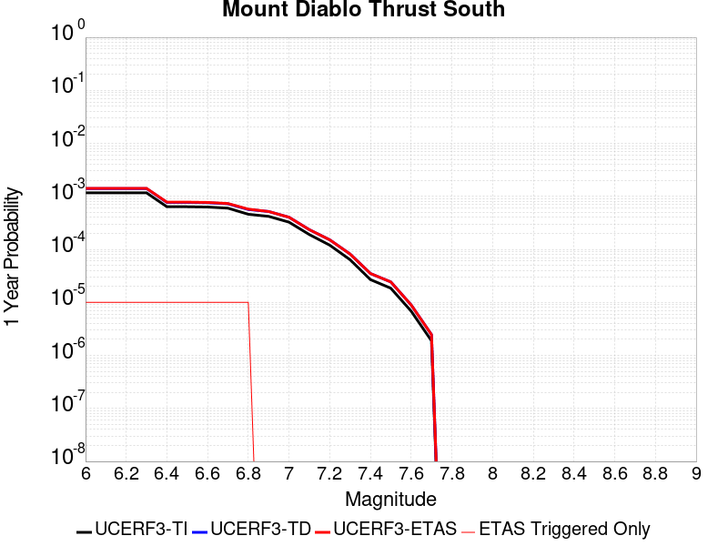 |  |

| Magnitude | 1 wk TI Prob | 1 wk TD Prob | 1 wk ETAS Prob | 1 wk ETAS/TD Gain | 1 wk ETAS Triggered Only | 1 mo TI Prob | 1 mo TD Prob | 1 mo ETAS Prob | 1 mo ETAS/TD Gain | 1 mo ETAS Triggered Only | 1 yr TI Prob | 1 yr TD Prob | 1 yr ETAS Prob | 1 yr ETAS/TD Gain | 1 yr ETAS Triggered Only | 10 yr TI Prob | 10 yr TD Prob | 10 yr ETAS Prob | 10 yr ETAS/TD Gain | 10 yr ETAS Triggered Only |
|-----|-----|-----|-----|-----|-----|-----|-----|-----|-----|-----|-----|-----|-----|-----|-----|-----|-----|-----|-----|-----|
| 6.0 | 2.2377444E-5 | 2.6956272E-5 | 2.6956272E-5 | 1.0 | 0.0 | 9.5899806E-5 | 1.1552288E-4 | 1.1552288E-4 | 1.0 | 0.0 | 0.0011669548 | 0.0014057814 | 0.0014157672 | 1.0071034 | 1.0E-5 | 0.011608457 | 0.013988668 | 0.013998529 | 1.0007049 | 1.0E-5 |
| 6.1 | 2.2377444E-5 | 2.6956272E-5 | 2.6956272E-5 | 1.0 | 0.0 | 9.5899806E-5 | 1.1552288E-4 | 1.1552288E-4 | 1.0 | 0.0 | 0.0011669548 | 0.0014057814 | 0.0014157672 | 1.0071034 | 1.0E-5 | 0.011608457 | 0.013988668 | 0.013998529 | 1.0007049 | 1.0E-5 |
| 6.2 | 2.2377444E-5 | 2.6956272E-5 | 2.6956272E-5 | 1.0 | 0.0 | 9.5899806E-5 | 1.1552288E-4 | 1.1552288E-4 | 1.0 | 0.0 | 0.0011669548 | 0.0014057814 | 0.0014157672 | 1.0071034 | 1.0E-5 | 0.011608457 | 0.013988668 | 0.013998529 | 1.0007049 | 1.0E-5 |
| 6.3 | 2.2377444E-5 | 2.6956272E-5 | 2.6956272E-5 | 1.0 | 0.0 | 9.5899806E-5 | 1.1552288E-4 | 1.1552288E-4 | 1.0 | 0.0 | 0.0011669548 | 0.0014057814 | 0.0014157672 | 1.0071034 | 1.0E-5 | 0.011608457 | 0.013988668 | 0.013998529 | 1.0007049 | 1.0E-5 |
| 6.4 | 1.2228463E-5 | 1.4747731E-5 | 1.4747731E-5 | 1.0 | 0.0 | 5.2406645E-5 | 6.320311E-5 | 6.320311E-5 | 1.0 | 0.0 | 6.378641E-4 | 7.69239E-4 | 7.792313E-4 | 1.0129899 | 1.0E-5 | 0.0063603627 | 0.007667325 | 0.007677248 | 1.0012943 | 1.0E-5 |
| 6.5 | 1.2228463E-5 | 1.4747731E-5 | 1.4747731E-5 | 1.0 | 0.0 | 5.2406645E-5 | 6.320311E-5 | 6.320311E-5 | 1.0 | 0.0 | 6.378641E-4 | 7.69239E-4 | 7.792313E-4 | 1.0129899 | 1.0E-5 | 0.0063603627 | 0.007667325 | 0.007677248 | 1.0012943 | 1.0E-5 |
| 6.6 | 1.2068118E-5 | 1.455253E-5 | 1.455253E-5 | 1.0 | 0.0 | 5.1719482E-5 | 6.236657E-5 | 6.236657E-5 | 1.0 | 0.0 | 6.2950276E-4 | 7.5906125E-4 | 7.6905364E-4 | 1.0131642 | 1.0E-5 | 0.006277225 | 0.0075662453 | 0.0075761694 | 1.0013117 | 1.0E-5 |
| 6.7 | 1.1499428E-5 | 1.3875192E-5 | 1.3875192E-5 | 1.0 | 0.0 | 4.9282335E-5 | 5.9463826E-5 | 5.9463826E-5 | 1.0 | 0.0 | 5.9984723E-4 | 7.2374434E-4 | 7.337371E-4 | 1.013807 | 1.0E-5 | 0.0059823063 | 0.007215418 | 0.007225346 | 1.0013759 | 1.0E-5 |
| 6.8 | 8.82118E-6 | 1.0830484E-5 | 1.0830484E-5 | 1.0 | 0.0 | 3.780451E-5 | 4.6415564E-5 | 4.6415564E-5 | 1.0 | 0.0 | 4.601727E-4 | 5.6496856E-4 | 5.7496293E-4 | 1.0176901 | 1.0E-5 | 0.0045922096 | 0.00563615 | 0.0056460937 | 1.0017643 | 1.0E-5 |
| 6.9 | 8.047112E-6 | 9.939452E-6 | 9.939452E-6 | 1.0 | 0.0 | 3.4487166E-5 | 4.2596985E-5 | 4.2596985E-5 | 1.0 | 0.0 | 4.1980037E-4 | 5.1850016E-4 | 5.1850016E-4 | 1.0 | 0.0 | 0.004190082 | 0.005173695 | 0.005173695 | 1.0 | 0.0 |
| 7.0 | 6.2574763E-6 | 7.748516E-6 | 7.748516E-6 | 1.0 | 0.0 | 2.681748E-5 | 3.320752E-5 | 3.320752E-5 | 1.0 | 0.0 | 3.264539E-4 | 4.0423026E-4 | 4.0423026E-4 | 1.0 | 0.0 | 0.0032597475 | 0.004035568 | 0.004035568 | 1.0 | 0.0 |
| 7.1 | 3.6485903E-6 | 4.5129427E-6 | 4.5129427E-6 | 1.0 | 0.0 | 1.5636722E-5 | 1.9341043E-5 | 1.9341043E-5 | 1.0 | 0.0 | 1.9036046E-4 | 2.3545216E-4 | 2.3545216E-4 | 1.0 | 0.0 | 0.0019019748 | 0.0023519797 | 0.0023519797 | 1.0 | 0.0 |
| 7.2 | 2.3034274E-6 | 2.905533E-6 | 2.905533E-6 | 1.0 | 0.0 | 9.871795E-6 | 1.2452226E-5 | 1.2452226E-5 | 1.0 | 0.0 | 1.2018247E-4 | 1.5159555E-4 | 1.5159555E-4 | 1.0 | 0.0 | 0.0012011749 | 0.0015148793 | 0.0015148793 | 1.0 | 0.0 |
| 7.3 | 1.224035E-6 | 1.5679833E-6 | 1.5679833E-6 | 1.0 | 0.0 | 5.245854E-6 | 6.7199117E-6 | 6.7199117E-6 | 1.0 | 0.0 | 6.38664E-5 | 8.1811966E-5 | 8.1811966E-5 | 1.0 | 0.0 | 6.384805E-4 | 8.1778906E-4 | 8.1778906E-4 | 1.0 | 0.0 |
| 7.4 | 5.1601154E-7 | 6.723377E-7 | 6.723377E-7 | 1.0 | 0.0 | 2.2114762E-6 | 2.8814443E-6 | 2.8814443E-6 | 1.0 | 0.0 | 2.6924388E-5 | 3.5081033E-5 | 3.5081033E-5 | 1.0 | 0.0 | 2.6921128E-4 | 3.5073838E-4 | 3.5073838E-4 | 1.0 | 0.0 |
| 7.5 | 3.552894E-7 | 4.6653233E-7 | 4.6653233E-7 | 1.0 | 0.0 | 1.5226678E-6 | 1.999423E-6 | 1.999423E-6 | 1.0 | 0.0 | 1.8538323E-5 | 2.4342717E-5 | 2.4342717E-5 | 1.0 | 0.0 | 1.8536777E-4 | 2.4340842E-4 | 2.4340842E-4 | 1.0 | 0.0 |
| 7.6 | 1.3124082E-7 | 1.719204E-7 | 1.719204E-7 | 1.0 | 0.0 | 5.6246057E-7 | 7.368016E-7 | 7.368016E-7 | 1.0 | 0.0 | 6.8479358E-6 | 8.970531E-6 | 8.970531E-6 | 1.0 | 0.0 | 6.8477246E-5 | 8.967385E-5 | 8.967385E-5 | 1.0 | 0.0 |
| 7.7 | 3.6193022E-8 | 4.7334765E-8 | 4.7334765E-8 | 1.0 | 0.0 | 1.5511293E-7 | 2.0286328E-7 | 2.0286328E-7 | 1.0 | 0.0 | 1.8884983E-6 | 2.4698586E-6 | 2.4698586E-6 | 1.0 | 0.0 | 1.8884823E-5 | 2.469954E-5 | 2.469954E-5 | 1.0 | 0.0 |

## Clayton
*[(top)](#table-of-contents)*

| 1 Week | 1 Month | 1 Year | 10 Year |
|-----|-----|-----|-----|
|  |  | 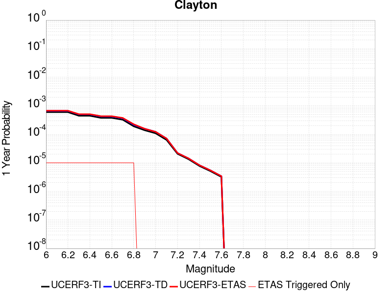 | 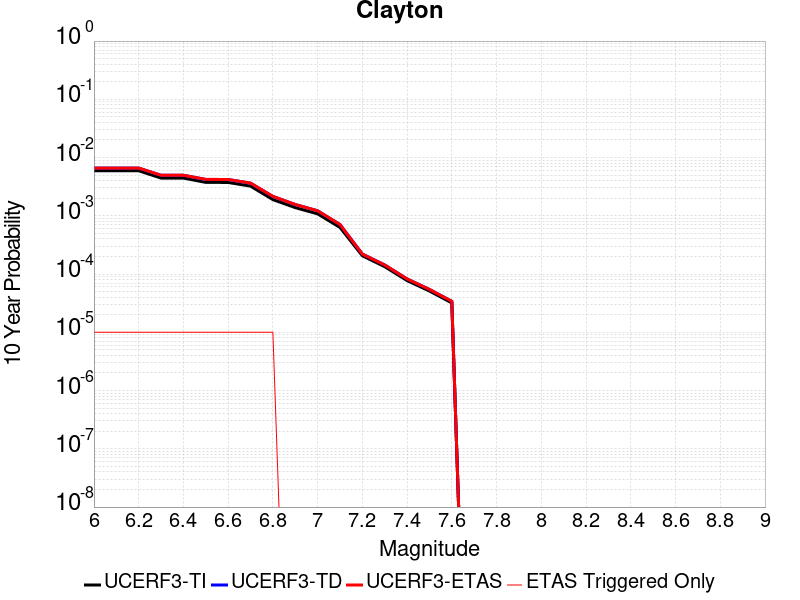 |

| Magnitude | 1 wk TI Prob | 1 wk TD Prob | 1 wk ETAS Prob | 1 wk ETAS/TD Gain | 1 wk ETAS Triggered Only | 1 mo TI Prob | 1 mo TD Prob | 1 mo ETAS Prob | 1 mo ETAS/TD Gain | 1 mo ETAS Triggered Only | 1 yr TI Prob | 1 yr TD Prob | 1 yr ETAS Prob | 1 yr ETAS/TD Gain | 1 yr ETAS Triggered Only | 10 yr TI Prob | 10 yr TD Prob | 10 yr ETAS Prob | 10 yr ETAS/TD Gain | 10 yr ETAS Triggered Only |
|-----|-----|-----|-----|-----|-----|-----|-----|-----|-----|-----|-----|-----|-----|-----|-----|-----|-----|-----|-----|-----|
| 6.0 | 1.1413061E-5 | 1.2667071E-5 | 1.2667071E-5 | 1.0 | 0.0 | 4.89122E-5 | 5.4286444E-5 | 5.4286444E-5 | 1.0 | 0.0 | 5.953433E-4 | 6.607592E-4 | 6.7075266E-4 | 1.0151241 | 1.0E-5 | 0.005937509 | 0.006590149 | 0.006600083 | 1.0015074 | 1.0E-5 |
| 6.1 | 1.1413061E-5 | 1.2667071E-5 | 1.2667071E-5 | 1.0 | 0.0 | 4.89122E-5 | 5.4286444E-5 | 5.4286444E-5 | 1.0 | 0.0 | 5.953433E-4 | 6.607592E-4 | 6.7075266E-4 | 1.0151241 | 1.0E-5 | 0.005937509 | 0.006590149 | 0.006600083 | 1.0015074 | 1.0E-5 |
| 6.2 | 1.1413061E-5 | 1.2667071E-5 | 1.2667071E-5 | 1.0 | 0.0 | 4.89122E-5 | 5.4286444E-5 | 5.4286444E-5 | 1.0 | 0.0 | 5.953433E-4 | 6.607592E-4 | 6.7075266E-4 | 1.0151241 | 1.0E-5 | 0.005937509 | 0.006590149 | 0.006600083 | 1.0015074 | 1.0E-5 |
| 6.3 | 8.538689E-6 | 9.532765E-6 | 9.532765E-6 | 1.0 | 0.0 | 3.659387E-5 | 4.085413E-5 | 4.085413E-5 | 1.0 | 0.0 | 4.4543925E-4 | 4.972963E-4 | 5.072913E-4 | 1.0200987 | 1.0E-5 | 0.0044454746 | 0.0049629 | 0.0049728504 | 1.002005 | 1.0E-5 |
| 6.4 | 8.538689E-6 | 9.532765E-6 | 9.532765E-6 | 1.0 | 0.0 | 3.659387E-5 | 4.085413E-5 | 4.085413E-5 | 1.0 | 0.0 | 4.4543925E-4 | 4.972963E-4 | 5.072913E-4 | 1.0200987 | 1.0E-5 | 0.0044454746 | 0.0049629 | 0.0049728504 | 1.002005 | 1.0E-5 |
| 6.5 | 7.197462E-6 | 8.080964E-6 | 8.080964E-6 | 1.0 | 0.0 | 3.08459E-5 | 3.463229E-5 | 3.463229E-5 | 1.0 | 0.0 | 3.7548412E-4 | 4.2157478E-4 | 4.3157054E-4 | 1.0237106 | 1.0E-5 | 0.003748503 | 0.0042085624 | 0.00421852 | 1.0023661 | 1.0E-5 |
| 6.6 | 7.1760483E-6 | 8.05698E-6 | 8.05698E-6 | 1.0 | 0.0 | 3.075413E-5 | 3.4529505E-5 | 3.4529505E-5 | 1.0 | 0.0 | 3.743672E-4 | 4.2032383E-4 | 4.3031963E-4 | 1.0237812 | 1.0E-5 | 0.0037373714 | 0.0041961004 | 0.004206058 | 1.0023732 | 1.0E-5 |
| 6.7 | 6.202582E-6 | 6.9767057E-6 | 6.9767057E-6 | 1.0 | 0.0 | 2.6582224E-5 | 2.9899868E-5 | 2.9899868E-5 | 1.0 | 0.0 | 3.235905E-4 | 3.6397774E-4 | 3.7397412E-4 | 1.0274642 | 1.0E-5 | 0.0032311971 | 0.003634572 | 0.0036445356 | 1.0027413 | 1.0E-5 |
| 6.8 | 3.6417277E-6 | 4.121308E-6 | 4.121308E-6 | 1.0 | 0.0 | 1.5607311E-5 | 1.7662633E-5 | 1.7662633E-5 | 1.0 | 0.0 | 1.9000245E-4 | 2.150221E-4 | 2.2501995E-4 | 1.0464969 | 1.0E-5 | 0.0018984007 | 0.0021482168 | 0.0021581955 | 1.004645 | 1.0E-5 |
| 6.9 | 2.6498485E-6 | 2.9995322E-6 | 2.9995322E-6 | 1.0 | 0.0 | 1.1356444E-5 | 1.2855077E-5 | 1.2855077E-5 | 1.0 | 0.0 | 1.3825593E-4 | 1.5649972E-4 | 1.5649972E-4 | 1.0 | 0.0 | 0.0013816995 | 0.0015639347 | 0.0015639347 | 1.0 | 0.0 |
| 7.0 | 2.070442E-6 | 2.3407345E-6 | 2.3407345E-6 | 1.0 | 0.0 | 8.873292E-6 | 1.0031682E-5 | 1.0031682E-5 | 1.0 | 0.0 | 1.0802698E-4 | 1.2212919E-4 | 1.2212919E-4 | 1.0 | 0.0 | 0.0010797448 | 0.0012206505 | 0.0012206505 | 1.0 | 0.0 |
| 7.1 | 1.2111691E-6 | 1.3588814E-6 | 1.3588814E-6 | 1.0 | 0.0 | 5.190714E-6 | 5.823765E-6 | 5.823765E-6 | 1.0 | 0.0 | 6.319511E-5 | 7.09022E-5 | 7.09022E-5 | 1.0 | 0.0 | 6.3177146E-4 | 7.0881215E-4 | 7.0881215E-4 | 1.0 | 0.0 |
| 7.2 | 3.9541607E-7 | 4.2228464E-7 | 4.2228464E-7 | 1.0 | 0.0 | 1.6946392E-6 | 1.8097901E-6 | 1.8097901E-6 | 1.0 | 0.0 | 2.0632036E-5 | 2.2033973E-5 | 2.2033973E-5 | 1.0 | 0.0 | 2.063012E-4 | 2.2031803E-4 | 2.2031803E-4 | 1.0 | 0.0 |
| 7.3 | 2.5685637E-7 | 2.7457227E-7 | 2.7457227E-7 | 1.0 | 0.0 | 1.1008126E-6 | 1.1767378E-6 | 1.1767378E-6 | 1.0 | 0.0 | 1.3402311E-5 | 1.432669E-5 | 1.432669E-5 | 1.0 | 0.0 | 1.3401502E-4 | 1.4325773E-4 | 1.4325773E-4 | 1.0 | 0.0 |
| 7.4 | 1.482299E-7 | 1.5808227E-7 | 1.5808227E-7 | 1.0 | 0.0 | 6.3527085E-7 | 6.774953E-7 | 6.774953E-7 | 1.0 | 0.0 | 7.734395E-6 | 8.248474E-6 | 8.248474E-6 | 1.0 | 0.0 | 7.734126E-5 | 8.248171E-5 | 8.248171E-5 | 1.0 | 0.0 |
| 7.5 | 9.7969505E-8 | 1.0438379E-7 | 1.0438379E-7 | 1.0 | 0.0 | 4.1986925E-7 | 4.47359E-7 | 4.47359E-7 | 1.0 | 0.0 | 5.111896E-6 | 5.4465827E-6 | 5.4465827E-6 | 1.0 | 0.0 | 5.1117782E-5 | 5.4464508E-5 | 5.4464508E-5 | 1.0 | 0.0 |
| 7.6 | 6.125415E-8 | 6.5232356E-8 | 6.5232356E-8 | 1.0 | 0.0 | 2.6251774E-7 | 2.7956722E-7 | 2.7956722E-7 | 1.0 | 0.0 | 3.196149E-6 | 3.4037257E-6 | 3.4037257E-6 | 1.0 | 0.0 | 3.196103E-5 | 3.4036748E-5 | 3.4036748E-5 | 1.0 | 0.0 |

## Ozena
*[(top)](#table-of-contents)*

| 1 Week | 1 Month | 1 Year | 10 Year |
|-----|-----|-----|-----|
|  | 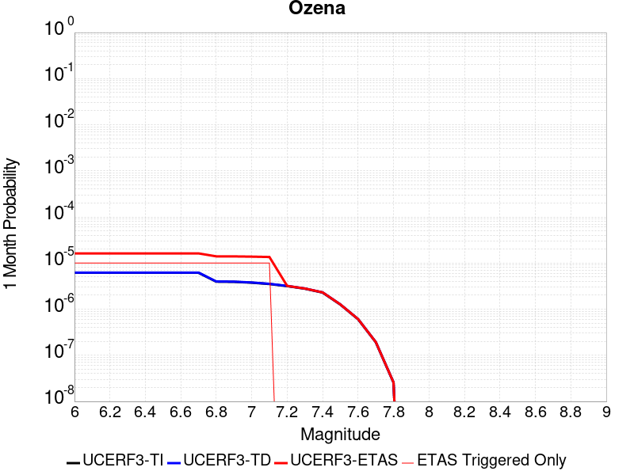 | 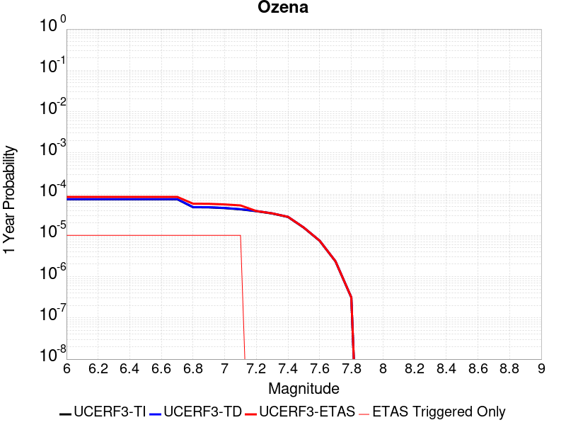 |  |

| Magnitude | 1 wk TI Prob | 1 wk TD Prob | 1 wk ETAS Prob | 1 wk ETAS/TD Gain | 1 wk ETAS Triggered Only | 1 mo TI Prob | 1 mo TD Prob | 1 mo ETAS Prob | 1 mo ETAS/TD Gain | 1 mo ETAS Triggered Only | 1 yr TI Prob | 1 yr TD Prob | 1 yr ETAS Prob | 1 yr ETAS/TD Gain | 1 yr ETAS Triggered Only | 10 yr TI Prob | 10 yr TD Prob | 10 yr ETAS Prob | 10 yr ETAS/TD Gain | 10 yr ETAS Triggered Only |
|-----|-----|-----|-----|-----|-----|-----|-----|-----|-----|-----|-----|-----|-----|-----|-----|-----|-----|-----|-----|-----|
| 6.0 | 1.4377547E-6 | 1.4513782E-6 | 1.4513782E-6 | 1.0 | 0.0 | 6.161791E-6 | 6.2201793E-6 | 1.6220118E-5 | 2.6076608 | 1.0E-5 | 7.5017226E-5 | 7.572832E-5 | 8.5727566E-5 | 1.132041 | 1.0E-5 | 7.4991904E-4 | 7.570518E-4 | 7.670442E-4 | 1.0131991 | 1.0E-5 |
| 6.1 | 1.4377547E-6 | 1.4513782E-6 | 1.4513782E-6 | 1.0 | 0.0 | 6.161791E-6 | 6.2201793E-6 | 1.6220118E-5 | 2.6076608 | 1.0E-5 | 7.5017226E-5 | 7.572832E-5 | 8.5727566E-5 | 1.132041 | 1.0E-5 | 7.4991904E-4 | 7.570518E-4 | 7.670442E-4 | 1.0131991 | 1.0E-5 |
| 6.2 | 1.4377547E-6 | 1.4513782E-6 | 1.4513782E-6 | 1.0 | 0.0 | 6.161791E-6 | 6.2201793E-6 | 1.6220118E-5 | 2.6076608 | 1.0E-5 | 7.5017226E-5 | 7.572832E-5 | 8.5727566E-5 | 1.132041 | 1.0E-5 | 7.4991904E-4 | 7.570518E-4 | 7.670442E-4 | 1.0131991 | 1.0E-5 |
| 6.3 | 1.4377547E-6 | 1.4513782E-6 | 1.4513782E-6 | 1.0 | 0.0 | 6.161791E-6 | 6.2201793E-6 | 1.6220118E-5 | 2.6076608 | 1.0E-5 | 7.5017226E-5 | 7.572832E-5 | 8.5727566E-5 | 1.132041 | 1.0E-5 | 7.4991904E-4 | 7.570518E-4 | 7.670442E-4 | 1.0131991 | 1.0E-5 |
| 6.4 | 1.4377547E-6 | 1.4513782E-6 | 1.4513782E-6 | 1.0 | 0.0 | 6.161791E-6 | 6.2201793E-6 | 1.6220118E-5 | 2.6076608 | 1.0E-5 | 7.5017226E-5 | 7.572832E-5 | 8.5727566E-5 | 1.132041 | 1.0E-5 | 7.4991904E-4 | 7.570518E-4 | 7.670442E-4 | 1.0131991 | 1.0E-5 |
| 6.5 | 1.4377547E-6 | 1.4513782E-6 | 1.4513782E-6 | 1.0 | 0.0 | 6.161791E-6 | 6.2201793E-6 | 1.6220118E-5 | 2.6076608 | 1.0E-5 | 7.5017226E-5 | 7.572832E-5 | 8.5727566E-5 | 1.132041 | 1.0E-5 | 7.4991904E-4 | 7.570518E-4 | 7.670442E-4 | 1.0131991 | 1.0E-5 |
| 6.6 | 1.4377547E-6 | 1.4513782E-6 | 1.4513782E-6 | 1.0 | 0.0 | 6.161791E-6 | 6.2201793E-6 | 1.6220118E-5 | 2.6076608 | 1.0E-5 | 7.5017226E-5 | 7.572832E-5 | 8.5727566E-5 | 1.132041 | 1.0E-5 | 7.4991904E-4 | 7.570518E-4 | 7.670442E-4 | 1.0131991 | 1.0E-5 |
| 6.7 | 1.4377547E-6 | 1.4513782E-6 | 1.4513782E-6 | 1.0 | 0.0 | 6.161791E-6 | 6.2201793E-6 | 1.6220118E-5 | 2.6076608 | 1.0E-5 | 7.5017226E-5 | 7.572832E-5 | 8.5727566E-5 | 1.132041 | 1.0E-5 | 7.4991904E-4 | 7.570518E-4 | 7.670442E-4 | 1.0131991 | 1.0E-5 |
| 6.8 | 9.223257E-7 | 9.317624E-7 | 9.317624E-7 | 1.0 | 0.0 | 3.9528186E-6 | 3.9932615E-6 | 1.3993222E-5 | 3.5042088 | 1.0E-5 | 4.81245E-5 | 4.8616912E-5 | 5.8616428E-5 | 1.2056798 | 1.0E-5 | 4.811408E-4 | 4.860668E-4 | 4.960619E-4 | 1.0205632 | 1.0E-5 |
| 6.9 | 9.141515E-7 | 9.235371E-7 | 9.235371E-7 | 1.0 | 0.0 | 3.917786E-6 | 3.9580104E-6 | 1.3957971E-5 | 3.526512 | 1.0E-5 | 4.7698002E-5 | 4.818775E-5 | 5.818727E-5 | 1.2075117 | 1.0E-5 | 4.7687767E-4 | 4.8177704E-4 | 4.917722E-4 | 1.0207465 | 1.0E-5 |
| 7.0 | 8.767648E-7 | 8.8585773E-7 | 8.8585773E-7 | 1.0 | 0.0 | 3.757558E-6 | 3.7965276E-6 | 1.379649E-5 | 3.6339757 | 1.0E-5 | 4.5747307E-5 | 4.6221783E-5 | 5.622132E-5 | 1.2163382 | 1.0E-5 | 4.5737892E-4 | 4.6212564E-4 | 4.7212103E-4 | 1.0216291 | 1.0E-5 |
| 7.1 | 8.199402E-7 | 8.2853984E-7 | 8.2853984E-7 | 1.0 | 0.0 | 3.5140247E-6 | 3.5508804E-6 | 1.3550845E-5 | 3.8161929 | 1.0E-5 | 4.2782412E-5 | 4.323115E-5 | 5.3230717E-5 | 1.2313046 | 1.0E-5 | 4.2774176E-4 | 4.322311E-4 | 4.422268E-4 | 1.0231258 | 1.0E-5 |
| 7.2 | 7.38705E-7 | 7.464262E-7 | 7.464262E-7 | 1.0 | 0.0 | 3.1658747E-6 | 3.198966E-6 | 3.198966E-6 | 1.0 | 0.0 | 3.8543843E-5 | 3.894675E-5 | 3.894675E-5 | 1.0 | 0.0 | 3.853716E-4 | 3.8940276E-4 | 3.8940276E-4 | 1.0 | 0.0 |
| 7.3 | 6.490017E-7 | 6.557802E-7 | 6.557802E-7 | 1.0 | 0.0 | 2.7814328E-6 | 2.8104837E-6 | 2.8104837E-6 | 1.0 | 0.0 | 3.386342E-5 | 3.4217133E-5 | 3.4217133E-5 | 1.0 | 0.0 | 3.3858258E-4 | 3.4212202E-4 | 3.4212202E-4 | 1.0 | 0.0 |
| 7.4 | 5.346736E-7 | 5.4022604E-7 | 5.4022604E-7 | 1.0 | 0.0 | 2.291456E-6 | 2.3152527E-6 | 2.3152527E-6 | 1.0 | 0.0 | 2.789812E-5 | 2.8187867E-5 | 2.8187867E-5 | 1.0 | 0.0 | 2.789462E-4 | 2.8184598E-4 | 2.8184598E-4 | 1.0 | 0.0 |
| 7.5 | 2.939325E-7 | 2.9666057E-7 | 2.9666057E-7 | 1.0 | 0.0 | 1.25971E-6 | 1.271402E-6 | 1.271402E-6 | 1.0 | 0.0 | 1.5336862E-5 | 1.5479225E-5 | 1.5479225E-5 | 1.0 | 0.0 | 1.5335804E-4 | 1.5478309E-4 | 1.5478309E-4 | 1.0 | 0.0 |
| 7.6 | 1.4151905E-7 | 1.4253266E-7 | 1.4253266E-7 | 1.0 | 0.0 | 6.065101E-7 | 6.108541E-7 | 6.108541E-7 | 1.0 | 0.0 | 7.3842357E-6 | 7.4371237E-6 | 7.4371237E-6 | 1.0 | 0.0 | 7.38399E-5 | 7.436883E-5 | 7.436883E-5 | 1.0 | 0.0 |
| 7.7 | 4.4957577E-8 | 4.5252243E-8 | 4.5252243E-8 | 1.0 | 0.0 | 1.9267533E-7 | 1.9393818E-7 | 1.9393818E-7 | 1.0 | 0.0 | 2.3458194E-6 | 2.3611947E-6 | 2.3611947E-6 | 1.0 | 0.0 | 2.3457947E-5 | 2.3611707E-5 | 2.3611707E-5 | 1.0 | 0.0 |
| 7.8 | 5.9993255E-9 | 6.0412972E-9 | 6.0412972E-9 | 1.0 | 0.0 | 2.5711394E-8 | 2.5891273E-8 | 2.5891273E-8 | 1.0 | 0.0 | 3.1303617E-7 | 3.1522623E-7 | 3.1522623E-7 | 1.0 | 0.0 | 3.1303573E-6 | 3.1522588E-6 | 3.1522588E-6 | 1.0 | 0.0 |

## San Pedro Escarpment
*[(top)](#table-of-contents)*

| 1 Week | 1 Month | 1 Year | 10 Year |
|-----|-----|-----|-----|
|  | 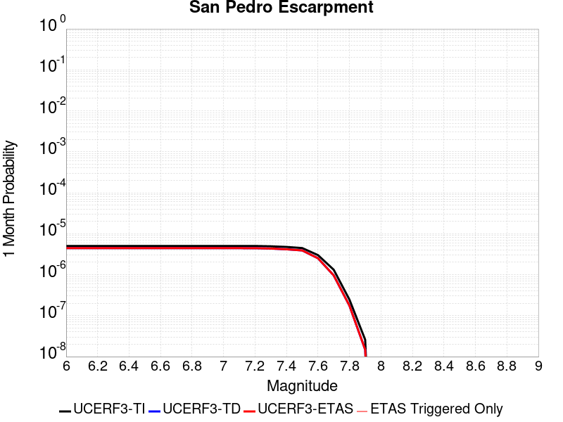 |  |  |

| Magnitude | 1 wk TI Prob | 1 wk TD Prob | 1 wk ETAS Prob | 1 wk ETAS/TD Gain | 1 wk ETAS Triggered Only | 1 mo TI Prob | 1 mo TD Prob | 1 mo ETAS Prob | 1 mo ETAS/TD Gain | 1 mo ETAS Triggered Only | 1 yr TI Prob | 1 yr TD Prob | 1 yr ETAS Prob | 1 yr ETAS/TD Gain | 1 yr ETAS Triggered Only | 10 yr TI Prob | 10 yr TD Prob | 10 yr ETAS Prob | 10 yr ETAS/TD Gain | 10 yr ETAS Triggered Only |
|-----|-----|-----|-----|-----|-----|-----|-----|-----|-----|-----|-----|-----|-----|-----|-----|-----|-----|-----|-----|-----|
| 6.0 | 1.1740281E-6 | 1.0380334E-6 | 1.0380334E-6 | 1.0 | 0.0 | 5.031539E-6 | 4.448707E-6 | 4.448707E-6 | 1.0 | 0.0 | 6.125726E-5 | 5.4161726E-5 | 5.4161726E-5 | 1.0 | 0.0 | 6.124038E-4 | 5.4149167E-4 | 5.514862E-4 | 1.0184575 | 1.0E-5 |
| 6.1 | 1.1740281E-6 | 1.0380334E-6 | 1.0380334E-6 | 1.0 | 0.0 | 5.031539E-6 | 4.448707E-6 | 4.448707E-6 | 1.0 | 0.0 | 6.125726E-5 | 5.4161726E-5 | 5.4161726E-5 | 1.0 | 0.0 | 6.124038E-4 | 5.4149167E-4 | 5.514862E-4 | 1.0184575 | 1.0E-5 |
| 6.2 | 1.1740281E-6 | 1.0380334E-6 | 1.0380334E-6 | 1.0 | 0.0 | 5.031539E-6 | 4.448707E-6 | 4.448707E-6 | 1.0 | 0.0 | 6.125726E-5 | 5.4161726E-5 | 5.4161726E-5 | 1.0 | 0.0 | 6.124038E-4 | 5.4149167E-4 | 5.514862E-4 | 1.0184575 | 1.0E-5 |
| 6.3 | 1.1740281E-6 | 1.0380334E-6 | 1.0380334E-6 | 1.0 | 0.0 | 5.031539E-6 | 4.448707E-6 | 4.448707E-6 | 1.0 | 0.0 | 6.125726E-5 | 5.4161726E-5 | 5.4161726E-5 | 1.0 | 0.0 | 6.124038E-4 | 5.4149167E-4 | 5.514862E-4 | 1.0184575 | 1.0E-5 |
| 6.4 | 1.1740281E-6 | 1.0380334E-6 | 1.0380334E-6 | 1.0 | 0.0 | 5.031539E-6 | 4.448707E-6 | 4.448707E-6 | 1.0 | 0.0 | 6.125726E-5 | 5.4161726E-5 | 5.4161726E-5 | 1.0 | 0.0 | 6.124038E-4 | 5.4149167E-4 | 5.514862E-4 | 1.0184575 | 1.0E-5 |
| 6.5 | 1.1740281E-6 | 1.0380334E-6 | 1.0380334E-6 | 1.0 | 0.0 | 5.031539E-6 | 4.448707E-6 | 4.448707E-6 | 1.0 | 0.0 | 6.125726E-5 | 5.4161726E-5 | 5.4161726E-5 | 1.0 | 0.0 | 6.124038E-4 | 5.4149167E-4 | 5.514862E-4 | 1.0184575 | 1.0E-5 |
| 6.6 | 1.1740281E-6 | 1.0380334E-6 | 1.0380334E-6 | 1.0 | 0.0 | 5.031539E-6 | 4.448707E-6 | 4.448707E-6 | 1.0 | 0.0 | 6.125726E-5 | 5.4161726E-5 | 5.4161726E-5 | 1.0 | 0.0 | 6.124038E-4 | 5.4149167E-4 | 5.514862E-4 | 1.0184575 | 1.0E-5 |
| 6.7 | 1.1740281E-6 | 1.0380334E-6 | 1.0380334E-6 | 1.0 | 0.0 | 5.031539E-6 | 4.448707E-6 | 4.448707E-6 | 1.0 | 0.0 | 6.125726E-5 | 5.4161726E-5 | 5.4161726E-5 | 1.0 | 0.0 | 6.124038E-4 | 5.4149167E-4 | 5.514862E-4 | 1.0184575 | 1.0E-5 |
| 6.8 | 1.1740281E-6 | 1.0380334E-6 | 1.0380334E-6 | 1.0 | 0.0 | 5.031539E-6 | 4.448707E-6 | 4.448707E-6 | 1.0 | 0.0 | 6.125726E-5 | 5.4161726E-5 | 5.4161726E-5 | 1.0 | 0.0 | 6.124038E-4 | 5.4149167E-4 | 5.514862E-4 | 1.0184575 | 1.0E-5 |
| 6.9 | 1.1740281E-6 | 1.0380334E-6 | 1.0380334E-6 | 1.0 | 0.0 | 5.031539E-6 | 4.448707E-6 | 4.448707E-6 | 1.0 | 0.0 | 6.125726E-5 | 5.4161726E-5 | 5.4161726E-5 | 1.0 | 0.0 | 6.124038E-4 | 5.4149167E-4 | 5.514862E-4 | 1.0184575 | 1.0E-5 |
| 7.0 | 1.1740281E-6 | 1.0380334E-6 | 1.0380334E-6 | 1.0 | 0.0 | 5.031539E-6 | 4.448707E-6 | 4.448707E-6 | 1.0 | 0.0 | 6.125726E-5 | 5.4161726E-5 | 5.4161726E-5 | 1.0 | 0.0 | 6.124038E-4 | 5.4149167E-4 | 5.514862E-4 | 1.0184575 | 1.0E-5 |
| 7.1 | 1.1740281E-6 | 1.0380334E-6 | 1.0380334E-6 | 1.0 | 0.0 | 5.031539E-6 | 4.448707E-6 | 4.448707E-6 | 1.0 | 0.0 | 6.125726E-5 | 5.4161726E-5 | 5.4161726E-5 | 1.0 | 0.0 | 6.124038E-4 | 5.4149167E-4 | 5.514862E-4 | 1.0184575 | 1.0E-5 |
| 7.2 | 1.1722314E-6 | 1.0362206E-6 | 1.0362206E-6 | 1.0 | 0.0 | 5.023839E-6 | 4.440938E-6 | 4.440938E-6 | 1.0 | 0.0 | 6.116352E-5 | 5.4067146E-5 | 5.4067146E-5 | 1.0 | 0.0 | 6.114669E-4 | 5.405463E-4 | 5.505409E-4 | 1.0184898 | 1.0E-5 |
| 7.3 | 1.1515234E-6 | 1.0152946E-6 | 1.0152946E-6 | 1.0 | 0.0 | 4.935091E-6 | 4.351256E-6 | 4.351256E-6 | 1.0 | 0.0 | 6.008308E-5 | 5.2975316E-5 | 5.2975316E-5 | 1.0 | 0.0 | 6.0066837E-4 | 5.2963325E-4 | 5.39628E-4 | 1.018871 | 1.0E-5 |
| 7.4 | 1.1103637E-6 | 9.736538E-7 | 9.736538E-7 | 1.0 | 0.0 | 4.7586927E-6 | 4.172796E-6 | 4.172796E-6 | 1.0 | 0.0 | 5.793554E-5 | 5.0802668E-5 | 5.0802668E-5 | 1.0 | 0.0 | 5.792044E-4 | 5.079169E-4 | 5.179118E-4 | 1.0196782 | 1.0E-5 |
| 7.5 | 1.0425391E-6 | 9.11898E-7 | 9.11898E-7 | 1.0 | 0.0 | 4.4680173E-6 | 3.9081287E-6 | 3.9081287E-6 | 1.0 | 0.0 | 5.439675E-5 | 4.758049E-5 | 4.758049E-5 | 1.0 | 0.0 | 5.438344E-4 | 4.7570938E-4 | 4.8570463E-4 | 1.0210112 | 1.0E-5 |
| 7.6 | 7.0184194E-7 | 5.8865743E-7 | 5.8865743E-7 | 1.0 | 0.0 | 3.0078907E-6 | 2.5228155E-6 | 2.5228155E-6 | 1.0 | 0.0 | 3.6620455E-5 | 3.0714895E-5 | 3.0714895E-5 | 1.0 | 0.0 | 3.661442E-4 | 3.0711124E-4 | 3.1710818E-4 | 1.0325515 | 1.0E-5 |
| 7.7 | 3.0871365E-7 | 2.2456504E-7 | 2.2456504E-7 | 1.0 | 0.0 | 1.3230577E-6 | 9.624213E-7 | 9.624213E-7 | 1.0 | 0.0 | 1.610811E-5 | 1.1717418E-5 | 1.1717418E-5 | 1.0 | 0.0 | 1.6106942E-4 | 1.1716811E-4 | 1.1716811E-4 | 1.0 | 0.0 |
| 7.8 | 5.7512665E-8 | 4.1053934E-8 | 4.1053934E-8 | 1.0 | 0.0 | 2.464828E-7 | 1.7594542E-7 | 1.7594542E-7 | 1.0 | 0.0 | 3.0009242E-6 | 2.1421336E-6 | 2.1421336E-6 | 1.0 | 0.0 | 3.0008836E-5 | 2.142115E-5 | 2.142115E-5 | 1.0 | 0.0 |
| 7.9 | 6.040053E-9 | 3.4534282E-9 | 3.4534282E-9 | 1.0 | 0.0 | 2.5885942E-8 | 1.4800406E-8 | 1.4800406E-8 | 1.0 | 0.0 | 3.151613E-7 | 1.8019493E-7 | 1.8019493E-7 | 1.0 | 0.0 | 3.1516086E-6 | 1.8019481E-6 | 1.8019481E-6 | 1.0 | 0.0 |

## Superstition Hills
*[(top)](#table-of-contents)*

| 1 Week | 1 Month | 1 Year | 10 Year |
|-----|-----|-----|-----|
|  |  |  |  |

| Magnitude | 1 wk TI Prob | 1 wk TD Prob | 1 wk ETAS Prob | 1 wk ETAS/TD Gain | 1 wk ETAS Triggered Only | 1 mo TI Prob | 1 mo TD Prob | 1 mo ETAS Prob | 1 mo ETAS/TD Gain | 1 mo ETAS Triggered Only | 1 yr TI Prob | 1 yr TD Prob | 1 yr ETAS Prob | 1 yr ETAS/TD Gain | 1 yr ETAS Triggered Only | 10 yr TI Prob | 10 yr TD Prob | 10 yr ETAS Prob | 10 yr ETAS/TD Gain | 10 yr ETAS Triggered Only |
|-----|-----|-----|-----|-----|-----|-----|-----|-----|-----|-----|-----|-----|-----|-----|-----|-----|-----|-----|-----|-----|
| 6.0 | 6.6865185E-5 | 1.4137668E-5 | 2.4137526E-5 | 1.7073202 | 1.0E-5 | 2.8653358E-4 | 6.058869E-5 | 7.058808E-5 | 1.1650373 | 1.0E-5 | 0.0034829667 | 7.374338E-4 | 7.474264E-4 | 1.0135505 | 1.0E-5 | 0.03428881 | 0.007520696 | 0.007530621 | 1.0013196 | 1.0E-5 |
| 6.1 | 6.544851E-5 | 1.4137668E-5 | 2.4137526E-5 | 1.7073202 | 1.0E-5 | 2.8046346E-4 | 6.058869E-5 | 7.058808E-5 | 1.1650373 | 1.0E-5 | 0.0034092965 | 7.374338E-4 | 7.474264E-4 | 1.0135505 | 1.0E-5 | 0.033574644 | 0.0075206957 | 0.0075306203 | 1.0013196 | 1.0E-5 |
| 6.2 | 6.544851E-5 | 1.4137668E-5 | 2.4137526E-5 | 1.7073202 | 1.0E-5 | 2.8046346E-4 | 6.058869E-5 | 7.058808E-5 | 1.1650373 | 1.0E-5 | 0.0034092965 | 7.374338E-4 | 7.474264E-4 | 1.0135505 | 1.0E-5 | 0.033574644 | 0.0075206957 | 0.0075306203 | 1.0013196 | 1.0E-5 |
| 6.3 | 5.2402065E-5 | 1.4137667E-5 | 2.4137526E-5 | 1.7073203 | 1.0E-5 | 2.2456095E-4 | 6.0588685E-5 | 7.058808E-5 | 1.1650373 | 1.0E-5 | 0.0027306017 | 7.374338E-4 | 7.474264E-4 | 1.0135505 | 1.0E-5 | 0.02697292 | 0.0075206906 | 0.007530615 | 1.0013196 | 1.0E-5 |
| 6.4 | 4.542238E-5 | 1.4137666E-5 | 2.4137526E-5 | 1.7073203 | 1.0E-5 | 1.9465282E-4 | 6.058868E-5 | 7.0588074E-5 | 1.1650373 | 1.0E-5 | 0.0023673223 | 7.3743373E-4 | 7.4742635E-4 | 1.0135505 | 1.0E-5 | 0.023422617 | 0.007520688 | 0.007530613 | 1.0013196 | 1.0E-5 |
| 6.5 | 2.9672969E-5 | 1.4137665E-5 | 2.4137524E-5 | 1.7073203 | 1.0E-5 | 1.2716366E-4 | 6.0588678E-5 | 7.0588074E-5 | 1.1650374 | 1.0E-5 | 0.0015471181 | 7.374337E-4 | 7.474263E-4 | 1.0135505 | 1.0E-5 | 0.015363912 | 0.0075206826 | 0.0075306077 | 1.0013196 | 1.0E-5 |
| 6.6 | 2.6056105E-5 | 1.3803436E-5 | 2.3803297E-5 | 1.7244474 | 1.0E-5 | 1.1166424E-4 | 5.915633E-5 | 6.9155736E-5 | 1.1690336 | 1.0E-5 | 0.0013586642 | 7.200064E-4 | 7.299992E-4 | 1.0138788 | 1.0E-5 | 0.013503874 | 0.0073450673 | 0.007354994 | 1.0013515 | 1.0E-5 |
| 6.7 | 1.4611248E-5 | 1.338333E-5 | 2.3383196E-5 | 1.7471882 | 1.0E-5 | 6.261813E-5 | 5.7355956E-5 | 6.735538E-5 | 1.1743398 | 1.0E-5 | 7.6210906E-4 | 6.9810095E-4 | 7.08094E-4 | 1.0143145 | 1.0E-5 | 0.0075950073 | 0.0071262526 | 0.0071361815 | 1.0013933 | 1.0E-5 |
| 6.8 | 1.30607E-5 | 1.09787115E-5 | 2.0978601E-5 | 1.9108437 | 1.0E-5 | 5.597323E-5 | 4.705082E-5 | 5.705035E-5 | 1.2125262 | 1.0E-5 | 6.8126095E-4 | 5.727019E-4 | 5.826962E-4 | 1.017451 | 1.0E-5 | 0.006791762 | 0.005873964 | 0.0058839056 | 1.0016924 | 1.0E-5 |
| 6.9 | 1.0443096E-5 | 8.19507E-6 | 1.8194989E-5 | 2.2202358 | 1.0E-5 | 4.4755358E-5 | 3.512127E-5 | 4.512092E-5 | 1.2847178 | 1.0E-5 | 5.447602E-4 | 4.2751993E-4 | 4.3751564E-4 | 1.0233808 | 1.0E-5 | 0.005434267 | 0.004409497 | 0.004419453 | 1.0022578 | 1.0E-5 |
| 7.0 | 8.045912E-6 | 6.739447E-6 | 1.673938E-5 | 2.4837914 | 1.0E-5 | 3.4482026E-5 | 2.888303E-5 | 3.8882743E-5 | 1.346214 | 1.0E-5 | 4.197378E-4 | 3.5159517E-4 | 3.6159166E-4 | 1.0284318 | 1.0E-5 | 0.0041894587 | 0.0036335257 | 0.0036434894 | 1.0027422 | 1.0E-5 |
| 7.1 | 8.045912E-6 | 6.739447E-6 | 1.673938E-5 | 2.4837914 | 1.0E-5 | 3.4482026E-5 | 2.888303E-5 | 3.8882743E-5 | 1.346214 | 1.0E-5 | 4.197378E-4 | 3.5159517E-4 | 3.6159166E-4 | 1.0284318 | 1.0E-5 | 0.0041894587 | 0.0036335257 | 0.0036434894 | 1.0027422 | 1.0E-5 |
| 7.2 | 7.375506E-6 | 6.2463805E-6 | 1.6246318E-5 | 2.600917 | 1.0E-5 | 3.1608928E-5 | 2.6769932E-5 | 3.6769663E-5 | 1.3735434 | 1.0E-5 | 3.8477074E-4 | 3.2587603E-4 | 3.3587278E-4 | 1.0306765 | 1.0E-5 | 0.003841052 | 0.0033741172 | 0.0033840835 | 1.0029538 | 1.0E-5 |
| 7.3 | 6.6063913E-6 | 5.798824E-6 | 1.5798767E-5 | 2.7244775 | 1.0E-5 | 2.8312797E-5 | 2.4851872E-5 | 3.4851622E-5 | 1.4023741 | 1.0E-5 | 3.446538E-4 | 3.0253024E-4 | 3.125272E-4 | 1.0330446 | 1.0E-5 | 0.0034411973 | 0.0031383524 | 0.003148321 | 1.0031763 | 1.0E-5 |
| 7.4 | 6.4313126E-6 | 5.6802523E-6 | 1.5680196E-5 | 2.7604752 | 1.0E-5 | 2.7562477E-5 | 2.4343715E-5 | 3.434347E-5 | 1.4107736 | 1.0E-5 | 3.355215E-4 | 2.963451E-4 | 3.0634215E-4 | 1.0337344 | 1.0E-5 | 0.0033501536 | 0.003076105 | 0.003086074 | 1.0032408 | 1.0E-5 |
| 7.5 | 6.0742927E-6 | 5.476088E-6 | 1.5476033E-5 | 2.826111 | 1.0E-5 | 2.6032423E-5 | 2.3468741E-5 | 3.3468506E-5 | 1.4260887 | 1.0E-5 | 3.1689866E-4 | 2.8569513E-4 | 2.956923E-4 | 1.0349923 | 1.0E-5 | 0.0031644711 | 0.0029679502 | 0.0029779205 | 1.0033593 | 1.0E-5 |
| 7.6 | 5.6987187E-6 | 5.2943155E-6 | 1.5294263E-5 | 2.8888083 | 1.0E-5 | 2.4422852E-5 | 2.268973E-5 | 3.2689502E-5 | 1.440718 | 1.0E-5 | 2.9730765E-4 | 2.762131E-4 | 2.8621033E-4 | 1.036194 | 1.0E-5 | 0.002969102 | 0.0028712032 | 0.0028811747 | 1.0034728 | 1.0E-5 |
| 7.7 | 5.1658035E-6 | 4.925336E-6 | 1.4925286E-5 | 3.0303085 | 1.0E-5 | 2.2138971E-5 | 2.1108413E-5 | 3.1108204E-5 | 1.4737347 | 1.0E-5 | 2.6950863E-4 | 2.5696523E-4 | 2.6696266E-4 | 1.0389057 | 1.0E-5 | 0.00269182 | 0.0026763005 | 0.0026862738 | 1.0037265 | 1.0E-5 |
| 7.8 | 3.6864697E-6 | 4.1963563E-6 | 1.4196315E-5 | 3.38301 | 1.0E-5 | 1.579906E-5 | 1.7984263E-5 | 2.7984082E-5 | 1.5560317 | 1.0E-5 | 1.9233658E-4 | 2.1893687E-4 | 2.2893467E-4 | 1.0456653 | 1.0E-5 | 0.0019217018 | 0.0022895595 | 0.0022995365 | 1.0043577 | 1.0E-5 |
| 7.9 | 3.0265903E-6 | 3.5636078E-6 | 1.3563572E-5 | 3.806135 | 1.0E-5 | 1.2971037E-5 | 1.5272519E-5 | 2.5272366E-5 | 1.6547608 | 1.0E-5 | 1.5791094E-4 | 1.8592748E-4 | 1.9592562E-4 | 1.0537744 | 1.0E-5 | 0.0015779877 | 0.0019537222 | 0.0019637027 | 1.0051085 | 1.0E-5 |
| 8.0 | 2.5271493E-6 | 3.0866524E-6 | 1.3086622E-5 | 4.2397456 | 1.0E-5 | 1.0830595E-5 | 1.3228446E-5 | 2.3228313E-5 | 1.7559367 | 1.0E-5 | 1.3185451E-4 | 1.6104484E-4 | 1.7104323E-4 | 1.0620846 | 1.0E-5 | 0.0013177631 | 0.0016975543 | 0.0017075373 | 1.0058808 | 1.0E-5 |
| 8.1 | 2.3749135E-6 | 2.9172957E-6 | 1.2917267E-5 | 4.427822 | 1.0E-5 | 1.0178161E-5 | 1.2502638E-5 | 2.2502512E-5 | 1.7998213 | 1.0E-5 | 1.2391206E-4 | 1.522094E-4 | 1.6220787E-4 | 1.065689 | 1.0E-5 | 0.0012384299 | 0.0016051348 | 0.0016151187 | 1.00622 | 1.0E-5 |
| 8.2 | 1.7186406E-9 | 1.1438838E-9 | 1.1438838E-9 | 1.0 | 0.0 | 7.3656024E-9 | 4.902359E-9 | 4.902359E-9 | 1.0 | 0.0 | 8.9676206E-8 | 5.968622E-8 | 5.968622E-8 | 1.0 | 0.0 | 8.9676166E-7 | 6.386644E-7 | 6.386644E-7 | 1.0 | 0.0 |

## Calaveras (No) 2011 CFM
*[(top)](#table-of-contents)*

| 1 Week | 1 Month | 1 Year | 10 Year |
|-----|-----|-----|-----|
| 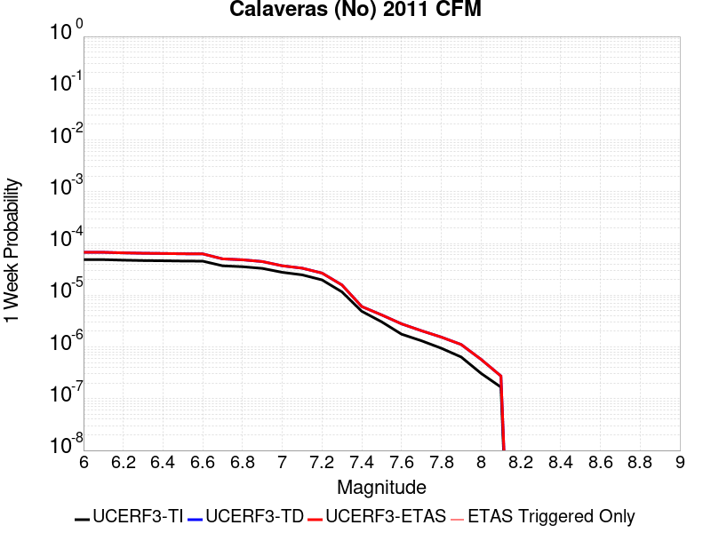 |  |  |  |

| Magnitude | 1 wk TI Prob | 1 wk TD Prob | 1 wk ETAS Prob | 1 wk ETAS/TD Gain | 1 wk ETAS Triggered Only | 1 mo TI Prob | 1 mo TD Prob | 1 mo ETAS Prob | 1 mo ETAS/TD Gain | 1 mo ETAS Triggered Only | 1 yr TI Prob | 1 yr TD Prob | 1 yr ETAS Prob | 1 yr ETAS/TD Gain | 1 yr ETAS Triggered Only | 10 yr TI Prob | 10 yr TD Prob | 10 yr ETAS Prob | 10 yr ETAS/TD Gain | 10 yr ETAS Triggered Only |
|-----|-----|-----|-----|-----|-----|-----|-----|-----|-----|-----|-----|-----|-----|-----|-----|-----|-----|-----|-----|-----|
| 6.0 | 4.8694856E-5 | 6.747457E-5 | 6.747457E-5 | 1.0 | 0.0 | 2.0867554E-4 | 2.891453E-4 | 2.891453E-4 | 1.0 | 0.0 | 0.0025376645 | 0.0035146773 | 0.0035146773 | 1.0 | 0.0 | 0.02508881 | 0.034771074 | 0.034780726 | 1.0002776 | 1.0E-5 |
| 6.1 | 4.8694856E-5 | 6.747457E-5 | 6.747457E-5 | 1.0 | 0.0 | 2.0867554E-4 | 2.891453E-4 | 2.891453E-4 | 1.0 | 0.0 | 0.0025376645 | 0.0035146773 | 0.0035146773 | 1.0 | 0.0 | 0.02508881 | 0.034771074 | 0.034780726 | 1.0002776 | 1.0E-5 |
| 6.2 | 4.7541962E-5 | 6.5805805E-5 | 6.5805805E-5 | 1.0 | 0.0 | 2.0373536E-4 | 2.8199502E-4 | 2.8199502E-4 | 1.0 | 0.0 | 0.0024776561 | 0.003427919 | 0.003427919 | 1.0 | 0.0 | 0.024502134 | 0.0339325 | 0.03394216 | 1.0002847 | 1.0E-5 |
| 6.3 | 4.6717287E-5 | 6.463939E-5 | 6.463939E-5 | 1.0 | 0.0 | 2.0020158E-4 | 2.7699716E-4 | 2.7699716E-4 | 1.0 | 0.0 | 0.0024347296 | 0.0033672696 | 0.0033672696 | 1.0 | 0.0 | 0.024082264 | 0.033345006 | 0.033354674 | 1.0002899 | 1.0E-5 |
| 6.4 | 4.6276386E-5 | 6.400103E-5 | 6.400103E-5 | 1.0 | 0.0 | 1.983123E-4 | 2.7426204E-4 | 2.7426204E-4 | 1.0 | 0.0 | 0.0024117786 | 0.00333408 | 0.00333408 | 1.0 | 0.0 | 0.02385771 | 0.03302388 | 0.03303355 | 1.0002928 | 1.0E-5 |
| 6.5 | 4.5720994E-5 | 6.32025E-5 | 6.32025E-5 | 1.0 | 0.0 | 1.9593239E-4 | 2.7084045E-4 | 2.7084045E-4 | 1.0 | 0.0 | 0.002382867 | 0.0032925585 | 0.0032925585 | 1.0 | 0.0 | 0.023574775 | 0.032621842 | 0.032631516 | 1.0002966 | 1.0E-5 |
| 6.6 | 4.549134E-5 | 6.285557E-5 | 6.285557E-5 | 1.0 | 0.0 | 1.949483E-4 | 2.693539E-4 | 2.693539E-4 | 1.0 | 0.0 | 0.0023709119 | 0.0032745146 | 0.0032745146 | 1.0 | 0.0 | 0.023457756 | 0.03244731 | 0.032456987 | 1.0002981 | 1.0E-5 |
| 6.7 | 3.701047E-5 | 5.03607E-5 | 5.03607E-5 | 1.0 | 0.0 | 1.5860666E-4 | 2.1581395E-4 | 2.1581395E-4 | 1.0 | 0.0 | 0.0019293258 | 0.002624412 | 0.002624412 | 1.0 | 0.0 | 0.019126613 | 0.026125198 | 0.026134938 | 1.0003728 | 1.0E-5 |
| 6.8 | 3.5523568E-5 | 4.834225E-5 | 4.834225E-5 | 1.0 | 0.0 | 1.5223498E-4 | 2.0716486E-4 | 2.0716486E-4 | 1.0 | 0.0 | 0.0018518851 | 0.0025193577 | 0.0025193577 | 1.0 | 0.0 | 0.018365284 | 0.025097623 | 0.025107373 | 1.0003885 | 1.0E-5 |
| 6.9 | 3.2946147E-5 | 4.4663826E-5 | 4.4663826E-5 | 1.0 | 0.0 | 1.4119013E-4 | 1.9140259E-4 | 1.9140259E-4 | 1.0 | 0.0 | 0.0017176344 | 0.0023278783 | 0.0023278783 | 1.0 | 0.0 | 0.017044188 | 0.023219762 | 0.02322953 | 1.0004207 | 1.0E-5 |
| 7.0 | 2.7682381E-5 | 3.7023216E-5 | 3.7023216E-5 | 1.0 | 0.0 | 1.1863338E-4 | 1.5866144E-4 | 1.5866144E-4 | 1.0 | 0.0 | 0.0014434044 | 0.0019300217 | 0.0019300217 | 1.0 | 0.0 | 0.01434065 | 0.019311164 | 0.01932097 | 1.0005078 | 1.0E-5 |
| 7.1 | 2.471967E-5 | 3.328756E-5 | 3.328756E-5 | 1.0 | 0.0 | 1.05937135E-4 | 1.4265333E-4 | 1.4265333E-4 | 1.0 | 0.0 | 0.0012890215 | 0.0017354497 | 0.0017354497 | 1.0 | 0.0 | 0.0128157 | 0.017386293 | 0.017396118 | 1.0005652 | 1.0E-5 |
| 7.2 | 1.9748062E-5 | 2.6775411E-5 | 2.6775411E-5 | 1.0 | 0.0 | 8.463181E-5 | 1.1474685E-4 | 1.1474685E-4 | 1.0 | 0.0 | 0.0010299052 | 0.001396171 | 0.001396171 | 1.0 | 0.0 | 0.01025145 | 0.014031046 | 0.014040906 | 1.0007027 | 1.0E-5 |
| 7.3 | 1.1603734E-5 | 1.5784257E-5 | 1.5784257E-5 | 1.0 | 0.0 | 4.9729337E-5 | 6.7645145E-5 | 6.7645145E-5 | 1.0 | 0.0 | 6.052865E-4 | 8.232826E-4 | 8.232826E-4 | 1.0 | 0.0 | 0.0060364045 | 0.008308739 | 0.008318657 | 1.0011935 | 1.0E-5 |
| 7.4 | 4.885381E-6 | 6.035117E-6 | 6.035117E-6 | 1.0 | 0.0 | 2.0937177E-5 | 2.5864532E-5 | 2.5864532E-5 | 1.0 | 0.0 | 2.5488032E-4 | 3.1485534E-4 | 3.1485534E-4 | 1.0 | 0.0 | 0.0025458818 | 0.0032009764 | 0.0032009764 | 1.0 | 0.0 |
| 7.5 | 3.0571264E-6 | 4.1554085E-6 | 4.1554085E-6 | 1.0 | 0.0 | 1.3101904E-5 | 1.7808772E-5 | 1.7808772E-5 | 1.0 | 0.0 | 1.5950401E-4 | 2.1680034E-4 | 2.1680034E-4 | 1.0 | 0.0 | 0.0015938957 | 0.0022209007 | 0.0022209007 | 1.0 | 0.0 |
| 7.6 | 1.764948E-6 | 2.795641E-6 | 2.795641E-6 | 1.0 | 0.0 | 7.564041E-6 | 1.1981264E-5 | 1.1981264E-5 | 1.0 | 0.0 | 9.208831E-5 | 1.458622E-4 | 1.458622E-4 | 1.0 | 0.0 | 9.205016E-4 | 0.0015124046 | 0.0015124046 | 1.0 | 0.0 |
| 7.7 | 1.3173734E-6 | 2.0585271E-6 | 2.0585271E-6 | 1.0 | 0.0 | 5.645874E-6 | 8.82223E-6 | 8.82223E-6 | 1.0 | 0.0 | 6.873634E-5 | 1.0740537E-4 | 1.0740537E-4 | 1.0 | 0.0 | 6.8715087E-4 | 0.0011261607 | 0.0011261607 | 1.0 | 0.0 |
| 7.8 | 9.4429885E-7 | 1.5490102E-6 | 1.5490102E-6 | 1.0 | 0.0 | 4.0469886E-6 | 6.6385983E-6 | 6.6385983E-6 | 1.0 | 0.0 | 4.9270973E-5 | 8.082195E-5 | 8.082195E-5 | 1.0 | 0.0 | 4.926005E-4 | 8.501931E-4 | 8.501931E-4 | 1.0 | 0.0 |
| 7.9 | 6.388233E-7 | 1.11492E-6 | 1.11492E-6 | 1.0 | 0.0 | 2.7378112E-6 | 4.7782196E-6 | 4.7782196E-6 | 1.0 | 0.0 | 3.3332344E-5 | 5.8173282E-5 | 5.8173282E-5 | 1.0 | 0.0 | 3.3327343E-4 | 6.096674E-4 | 6.096674E-4 | 1.0 | 0.0 |
| 8.0 | 3.087986E-7 | 5.754721E-7 | 5.754721E-7 | 1.0 | 0.0 | 1.323422E-6 | 2.4663066E-6 | 2.4663066E-6 | 1.0 | 0.0 | 1.6112543E-5 | 3.0026871E-5 | 3.0026871E-5 | 1.0 | 0.0 | 1.6111376E-4 | 3.110238E-4 | 3.110238E-4 | 1.0 | 0.0 |
| 8.1 | 1.6725647E-7 | 2.7410795E-7 | 2.7410795E-7 | 1.0 | 0.0 | 7.168133E-7 | 1.1747478E-6 | 1.1747478E-6 | 1.0 | 0.0 | 8.7271665E-6 | 1.4302462E-5 | 1.4302462E-5 | 1.0 | 0.0 | 8.726824E-5 | 1.4847395E-4 | 1.4847395E-4 | 1.0 | 0.0 |

## Cucamonga
*[(top)](#table-of-contents)*

| 1 Week | 1 Month | 1 Year | 10 Year |
|-----|-----|-----|-----|
|  |  |  |  |

| Magnitude | 1 wk TI Prob | 1 wk TD Prob | 1 wk ETAS Prob | 1 wk ETAS/TD Gain | 1 wk ETAS Triggered Only | 1 mo TI Prob | 1 mo TD Prob | 1 mo ETAS Prob | 1 mo ETAS/TD Gain | 1 mo ETAS Triggered Only | 1 yr TI Prob | 1 yr TD Prob | 1 yr ETAS Prob | 1 yr ETAS/TD Gain | 1 yr ETAS Triggered Only | 10 yr TI Prob | 10 yr TD Prob | 10 yr ETAS Prob | 10 yr ETAS/TD Gain | 10 yr ETAS Triggered Only |
|-----|-----|-----|-----|-----|-----|-----|-----|-----|-----|-----|-----|-----|-----|-----|-----|-----|-----|-----|-----|-----|
| 6.0 | 1.1848348E-5 | 1.1737109E-5 | 1.1737109E-5 | 1.0 | 0.0 | 5.0777642E-5 | 5.0300943E-5 | 5.0300943E-5 | 1.0 | 0.0 | 6.180424E-4 | 6.122446E-4 | 6.222385E-4 | 1.0163233 | 1.0E-5 | 0.0061632637 | 0.006106745 | 0.006116684 | 1.0016276 | 1.0E-5 |
| 6.1 | 1.1848348E-5 | 1.1737109E-5 | 1.1737109E-5 | 1.0 | 0.0 | 5.0777642E-5 | 5.0300943E-5 | 5.0300943E-5 | 1.0 | 0.0 | 6.180424E-4 | 6.122446E-4 | 6.222385E-4 | 1.0163233 | 1.0E-5 | 0.0061632637 | 0.006106745 | 0.006116684 | 1.0016276 | 1.0E-5 |
| 6.2 | 1.1848348E-5 | 1.1737109E-5 | 1.1737109E-5 | 1.0 | 0.0 | 5.0777642E-5 | 5.0300943E-5 | 5.0300943E-5 | 1.0 | 0.0 | 6.180424E-4 | 6.122446E-4 | 6.222385E-4 | 1.0163233 | 1.0E-5 | 0.0061632637 | 0.006106745 | 0.006116684 | 1.0016276 | 1.0E-5 |
| 6.3 | 1.1848348E-5 | 1.1737109E-5 | 1.1737109E-5 | 1.0 | 0.0 | 5.0777642E-5 | 5.0300943E-5 | 5.0300943E-5 | 1.0 | 0.0 | 6.180424E-4 | 6.122446E-4 | 6.222385E-4 | 1.0163233 | 1.0E-5 | 0.0061632637 | 0.006106745 | 0.006116684 | 1.0016276 | 1.0E-5 |
| 6.4 | 1.1848348E-5 | 1.1737109E-5 | 1.1737109E-5 | 1.0 | 0.0 | 5.0777642E-5 | 5.0300943E-5 | 5.0300943E-5 | 1.0 | 0.0 | 6.180424E-4 | 6.122446E-4 | 6.222385E-4 | 1.0163233 | 1.0E-5 | 0.0061632637 | 0.006106745 | 0.006116684 | 1.0016276 | 1.0E-5 |
| 6.5 | 1.16988695E-5 | 1.157614E-5 | 1.157614E-5 | 1.0 | 0.0 | 5.013705E-5 | 4.9611102E-5 | 4.9611102E-5 | 1.0 | 0.0 | 6.102476E-4 | 6.0385047E-4 | 6.138444E-4 | 1.0165504 | 1.0E-5 | 0.006085745 | 0.0060232594 | 0.006033199 | 1.0016502 | 1.0E-5 |
| 6.6 | 1.16988695E-5 | 1.157614E-5 | 1.157614E-5 | 1.0 | 0.0 | 5.013705E-5 | 4.9611102E-5 | 4.9611102E-5 | 1.0 | 0.0 | 6.102476E-4 | 6.0385047E-4 | 6.138444E-4 | 1.0165504 | 1.0E-5 | 0.006085745 | 0.0060232594 | 0.006033199 | 1.0016502 | 1.0E-5 |
| 6.7 | 1.1397107E-5 | 1.1115039E-5 | 1.1115039E-5 | 1.0 | 0.0 | 4.884383E-5 | 4.7635025E-5 | 4.7635025E-5 | 1.0 | 0.0 | 5.9451134E-4 | 5.798046E-4 | 5.897988E-4 | 1.0172372 | 1.0E-5 | 0.005929234 | 0.005784061 | 0.005794003 | 1.0017189 | 1.0E-5 |
| 6.8 | 1.058387E-5 | 9.785037E-6 | 9.785037E-6 | 1.0 | 0.0 | 4.5358654E-5 | 4.1935207E-5 | 4.1935207E-5 | 1.0 | 0.0 | 5.521017E-4 | 5.1044265E-4 | 5.2043755E-4 | 1.0195808 | 1.0E-5 | 0.00550732 | 0.005093702 | 0.005103651 | 1.0019532 | 1.0E-5 |
| 6.9 | 9.690046E-6 | 8.579504E-6 | 8.579504E-6 | 1.0 | 0.0 | 4.1528107E-5 | 3.6768783E-5 | 3.6768783E-5 | 1.0 | 0.0 | 5.054874E-4 | 4.475684E-4 | 4.5756393E-4 | 1.0223329 | 1.0E-5 | 0.005043391 | 0.0044675954 | 0.0044775507 | 1.0022284 | 1.0E-5 |
| 7.0 | 9.381461E-6 | 8.18712E-6 | 8.18712E-6 | 1.0 | 0.0 | 4.020564E-5 | 3.508719E-5 | 3.508719E-5 | 1.0 | 0.0 | 4.893937E-4 | 4.2710314E-4 | 4.3709888E-4 | 1.0234035 | 1.0E-5 | 0.0048831734 | 0.004263747 | 0.0042737047 | 1.0023353 | 1.0E-5 |
| 7.1 | 8.946492E-6 | 7.781904E-6 | 7.781904E-6 | 1.0 | 0.0 | 3.8341543E-5 | 3.3350592E-5 | 3.3350592E-5 | 1.0 | 0.0 | 4.667083E-4 | 4.0596814E-4 | 4.1596408E-4 | 1.0246224 | 1.0E-5 | 0.0046572937 | 0.0040531927 | 0.0040631522 | 1.0024571 | 1.0E-5 |
| 7.2 | 8.251016E-6 | 6.9752878E-6 | 6.9752878E-6 | 1.0 | 0.0 | 3.5361016E-5 | 2.9893748E-5 | 2.9893748E-5 | 1.0 | 0.0 | 4.3043532E-4 | 3.6389584E-4 | 3.6389584E-4 | 1.0 | 0.0 | 0.0042960253 | 0.0036339252 | 0.0036339252 | 1.0 | 0.0 |
| 7.3 | 7.717881E-6 | 6.4863584E-6 | 6.4863584E-6 | 1.0 | 0.0 | 3.3076216E-5 | 2.7798384E-5 | 2.7798384E-5 | 1.0 | 0.0 | 4.026285E-4 | 3.38393E-4 | 3.38393E-4 | 1.0 | 0.0 | 0.004018998 | 0.0033797103 | 0.0033797103 | 1.0 | 0.0 |
| 7.4 | 7.275623E-6 | 6.032004E-6 | 6.032004E-6 | 1.0 | 0.0 | 3.118087E-5 | 2.5851192E-5 | 2.5851192E-5 | 1.0 | 0.0 | 3.7956095E-4 | 3.1469302E-4 | 3.1469302E-4 | 1.0 | 0.0 | 0.0037891332 | 0.0031434046 | 0.0031434046 | 1.0 | 0.0 |
| 7.5 | 6.5109502E-6 | 5.100593E-6 | 5.100593E-6 | 1.0 | 0.0 | 2.7903774E-5 | 2.1859503E-5 | 2.1859503E-5 | 1.0 | 0.0 | 3.3967546E-4 | 2.661071E-4 | 2.661071E-4 | 1.0 | 0.0 | 0.0033915674 | 0.0026588016 | 0.0026588016 | 1.0 | 0.0 |
| 7.6 | 5.4495326E-6 | 3.908547E-6 | 3.908547E-6 | 1.0 | 0.0 | 2.335493E-5 | 1.6750808E-5 | 1.6750808E-5 | 1.0 | 0.0 | 2.8430918E-4 | 2.0392207E-4 | 2.0392207E-4 | 1.0 | 0.0 | 0.0028394572 | 0.0020382616 | 0.0020382616 | 1.0 | 0.0 |
| 7.7 | 4.7997164E-6 | 3.2002263E-6 | 3.2002263E-6 | 1.0 | 0.0 | 2.057005E-5 | 1.3715184E-5 | 1.3715184E-5 | 1.0 | 0.0 | 2.504116E-4 | 1.6696959E-4 | 1.6696959E-4 | 1.0 | 0.0 | 0.002501296 | 0.0016693701 | 0.0016693701 | 1.0 | 0.0 |
| 7.8 | 3.3941733E-6 | 2.0641678E-6 | 2.0641678E-6 | 1.0 | 0.0 | 1.4546376E-5 | 8.846404E-6 | 8.846404E-6 | 1.0 | 0.0 | 1.7708774E-4 | 1.07699656E-4 | 1.07699656E-4 | 1.0 | 0.0 | 0.0017694668 | 0.0010766032 | 0.0010766032 | 1.0 | 0.0 |
| 7.9 | 9.750552E-7 | 5.155798E-7 | 5.155798E-7 | 1.0 | 0.0 | 4.178801E-6 | 2.2096258E-6 | 2.2096258E-6 | 1.0 | 0.0 | 5.0875715E-5 | 2.6901867E-5 | 2.6901867E-5 | 1.0 | 0.0 | 5.086407E-4 | 2.689865E-4 | 2.689865E-4 | 1.0 | 0.0 |
| 8.0 | 1.133857E-7 | 6.053372E-8 | 6.053372E-8 | 1.0 | 0.0 | 4.8593864E-7 | 2.594302E-7 | 2.594302E-7 | 1.0 | 0.0 | 5.9162867E-6 | 3.1585582E-6 | 3.1585582E-6 | 1.0 | 0.0 | 5.916129E-5 | 3.158515E-5 | 3.158515E-5 | 1.0 | 0.0 |

## Greenville (So) 2011 CFM
*[(top)](#table-of-contents)*

| 1 Week | 1 Month | 1 Year | 10 Year |
|-----|-----|-----|-----|
|  |  |  |  |

| Magnitude | 1 wk TI Prob | 1 wk TD Prob | 1 wk ETAS Prob | 1 wk ETAS/TD Gain | 1 wk ETAS Triggered Only | 1 mo TI Prob | 1 mo TD Prob | 1 mo ETAS Prob | 1 mo ETAS/TD Gain | 1 mo ETAS Triggered Only | 1 yr TI Prob | 1 yr TD Prob | 1 yr ETAS Prob | 1 yr ETAS/TD Gain | 1 yr ETAS Triggered Only | 10 yr TI Prob | 10 yr TD Prob | 10 yr ETAS Prob | 10 yr ETAS/TD Gain | 10 yr ETAS Triggered Only |
|-----|-----|-----|-----|-----|-----|-----|-----|-----|-----|-----|-----|-----|-----|-----|-----|-----|-----|-----|-----|-----|
| 6.0 | 4.279693E-5 | 5.5040568E-5 | 6.504002E-5 | 1.1816741 | 1.0E-5 | 1.8340252E-4 | 2.3586866E-4 | 2.458663E-4 | 1.0423865 | 1.0E-5 | 0.0022306389 | 0.0028681692 | 0.0028781404 | 1.0034765 | 1.0E-5 | 0.022083808 | 0.028338658 | 0.028348375 | 1.0003428 | 1.0E-5 |
| 6.1 | 3.4037297E-5 | 4.319238E-5 | 5.319195E-5 | 1.2315123 | 1.0E-5 | 1.4586597E-4 | 1.8509808E-4 | 1.9509622E-4 | 1.0540154 | 1.0E-5 | 0.0017744715 | 0.0022513992 | 0.0022613765 | 1.0044317 | 1.0E-5 | 0.01760369 | 0.022303047 | 0.022312824 | 1.0004383 | 1.0E-5 |
| 6.2 | 3.4037297E-5 | 4.319238E-5 | 5.319195E-5 | 1.2315123 | 1.0E-5 | 1.4586597E-4 | 1.8509808E-4 | 1.9509622E-4 | 1.0540154 | 1.0E-5 | 0.0017744715 | 0.0022513992 | 0.0022613765 | 1.0044317 | 1.0E-5 | 0.01760369 | 0.022303047 | 0.022312824 | 1.0004383 | 1.0E-5 |
| 6.3 | 2.5956324E-5 | 3.242939E-5 | 4.2429067E-5 | 1.3083522 | 1.0E-5 | 1.11236644E-4 | 1.3897609E-4 | 1.489747E-4 | 1.0719448 | 1.0E-5 | 0.0013534647 | 0.0016907848 | 0.0017007679 | 1.0059044 | 1.0E-5 | 0.013452509 | 0.016786316 | 0.016796147 | 1.0005857 | 1.0E-5 |
| 6.4 | 2.1145053E-5 | 2.6197793E-5 | 3.6197533E-5 | 1.3817016 | 1.0E-5 | 9.061851E-5 | 1.1227157E-4 | 1.2227044E-4 | 1.0890597 | 1.0E-5 | 0.0011027219 | 0.0013660807 | 0.001376067 | 1.0073103 | 1.0E-5 | 0.01097266 | 0.013580576 | 0.013590439 | 1.0007263 | 1.0E-5 |
| 6.5 | 2.0030959E-5 | 2.4795921E-5 | 3.4795674E-5 | 1.4032822 | 1.0E-5 | 8.584414E-5 | 1.0626408E-4 | 1.16263014E-4 | 1.0940952 | 1.0E-5 | 0.0010446513 | 0.0012930284 | 0.0013030154 | 1.0077238 | 1.0E-5 | 0.010397541 | 0.01285873 | 0.012868602 | 1.0007677 | 1.0E-5 |
| 6.6 | 1.8395405E-5 | 2.275458E-5 | 3.2754353E-5 | 1.439462 | 1.0E-5 | 7.8835066E-5 | 9.7516146E-5 | 1.07515174E-4 | 1.1025372 | 1.0E-5 | 9.5939427E-4 | 0.0011866409 | 0.001196629 | 1.0084171 | 1.0E-5 | 0.009552629 | 0.01180643 | 0.011816312 | 1.000837 | 1.0E-5 |
| 6.7 | 1.7883482E-5 | 2.2125625E-5 | 3.2125405E-5 | 1.4519546 | 1.0E-5 | 7.664124E-5 | 9.482082E-5 | 1.0481987E-4 | 1.1054521 | 1.0E-5 | 9.3270757E-4 | 0.0011538607 | 0.0011638491 | 1.0086565 | 1.0E-5 | 0.009288026 | 0.011482077 | 0.011491962 | 1.0008609 | 1.0E-5 |
| 6.8 | 1.3373564E-5 | 1.650608E-5 | 2.6505913E-5 | 1.6058273 | 1.0E-5 | 5.7314013E-5 | 7.0738504E-5 | 8.0737795E-5 | 1.1413558 | 1.0E-5 | 6.975747E-4 | 8.609158E-4 | 8.7090716E-4 | 1.0116055 | 1.0E-5 | 0.0069538904 | 0.008577745 | 0.00858766 | 1.0011559 | 1.0E-5 |
| 6.9 | 1.06692905E-5 | 1.3152695E-5 | 2.3152563E-5 | 1.7602905 | 1.0E-5 | 4.5724726E-5 | 5.636754E-5 | 6.636698E-5 | 1.177397 | 1.0E-5 | 5.5655633E-4 | 6.8606995E-4 | 6.960631E-4 | 1.0145658 | 1.0E-5 | 0.005551645 | 0.006841082 | 0.0068510137 | 1.0014517 | 1.0E-5 |
| 7.0 | 8.157512E-6 | 1.0062752E-5 | 1.0062752E-5 | 1.0 | 0.0 | 3.4960296E-5 | 4.312539E-5 | 4.312539E-5 | 1.0 | 0.0 | 4.2555845E-4 | 5.2492885E-4 | 5.2492885E-4 | 1.0 | 0.0 | 0.004247444 | 0.0052376967 | 0.0052376967 | 1.0 | 0.0 |
| 7.1 | 6.1467113E-6 | 7.627545E-6 | 7.627545E-6 | 1.0 | 0.0 | 2.6342783E-5 | 3.2689073E-5 | 3.2689073E-5 | 1.0 | 0.0 | 3.206762E-4 | 3.9791764E-4 | 3.9791764E-4 | 1.0 | 0.0 | 0.0032021382 | 0.0039725704 | 0.0039725704 | 1.0 | 0.0 |
| 7.2 | 4.713467E-6 | 5.9142685E-6 | 5.9142685E-6 | 1.0 | 0.0 | 2.0200418E-5 | 2.5346622E-5 | 2.5346622E-5 | 1.0 | 0.0 | 2.4591232E-4 | 3.0855203E-4 | 3.0855203E-4 | 1.0 | 0.0 | 0.0024564038 | 0.0030816782 | 0.0030816782 | 1.0 | 0.0 |
| 7.3 | 2.3266216E-6 | 2.954067E-6 | 2.954067E-6 | 1.0 | 0.0 | 9.971197E-6 | 1.2660226E-5 | 1.2660226E-5 | 1.0 | 0.0 | 1.2139256E-4 | 1.541275E-4 | 1.541275E-4 | 1.0 | 0.0 | 0.0012132627 | 0.0015404817 | 0.0015404817 | 1.0 | 0.0 |
| 7.4 | 1.3314E-6 | 1.7179866E-6 | 1.7179866E-6 | 1.0 | 0.0 | 5.7059874E-6 | 7.362779E-6 | 7.362779E-6 | 1.0 | 0.0 | 6.946818E-5 | 8.96382E-5 | 8.96382E-5 | 1.0 | 0.0 | 6.9446466E-4 | 8.963211E-4 | 8.963211E-4 | 1.0 | 0.0 |
| 7.5 | 1.0362941E-6 | 1.3469155E-6 | 1.3469155E-6 | 1.0 | 0.0 | 4.4412527E-6 | 5.7724824E-6 | 5.7724824E-6 | 1.0 | 0.0 | 5.407091E-5 | 7.0277754E-5 | 7.0277754E-5 | 1.0 | 0.0 | 5.405776E-4 | 7.028451E-4 | 7.028451E-4 | 1.0 | 0.0 |
| 7.6 | 7.764784E-7 | 1.0088881E-6 | 1.0088881E-6 | 1.0 | 0.0 | 3.3277602E-6 | 4.3237997E-6 | 4.3237997E-6 | 1.0 | 0.0 | 4.0514726E-5 | 5.264103E-5 | 5.264103E-5 | 1.0 | 0.0 | 4.050734E-4 | 5.265317E-4 | 5.265317E-4 | 1.0 | 0.0 |
| 7.7 | 1.6927763E-7 | 2.2140186E-7 | 2.2140186E-7 | 1.0 | 0.0 | 7.2547533E-7 | 9.488648E-7 | 9.488648E-7 | 1.0 | 0.0 | 8.832627E-6 | 1.1552371E-5 | 1.1552371E-5 | 1.0 | 0.0 | 8.8322755E-5 | 1.1554653E-4 | 1.1554653E-4 | 1.0 | 0.0 |

## Hayward (No) 2011 CFM
*[(top)](#table-of-contents)*

| 1 Week | 1 Month | 1 Year | 10 Year |
|-----|-----|-----|-----|
|  |  |  |  |

| Magnitude | 1 wk TI Prob | 1 wk TD Prob | 1 wk ETAS Prob | 1 wk ETAS/TD Gain | 1 wk ETAS Triggered Only | 1 mo TI Prob | 1 mo TD Prob | 1 mo ETAS Prob | 1 mo ETAS/TD Gain | 1 mo ETAS Triggered Only | 1 yr TI Prob | 1 yr TD Prob | 1 yr ETAS Prob | 1 yr ETAS/TD Gain | 1 yr ETAS Triggered Only | 10 yr TI Prob | 10 yr TD Prob | 10 yr ETAS Prob | 10 yr ETAS/TD Gain | 10 yr ETAS Triggered Only |
|-----|-----|-----|-----|-----|-----|-----|-----|-----|-----|-----|-----|-----|-----|-----|-----|-----|-----|-----|-----|-----|
| 6.0 | 9.3068506E-5 | 1.739643E-4 | 1.739643E-4 | 1.0 | 0.0 | 3.9880406E-4 | 7.453474E-4 | 7.453474E-4 | 1.0 | 0.0 | 0.0048446343 | 0.009036727 | 0.009036727 | 1.0 | 0.0 | 0.047403704 | 0.086396605 | 0.08640575 | 1.0001057 | 1.0E-5 |
| 6.1 | 9.055486E-5 | 1.6947639E-4 | 1.6947639E-4 | 1.0 | 0.0 | 3.880345E-4 | 7.2612526E-4 | 7.2612526E-4 | 1.0 | 0.0 | 0.0047140904 | 0.008804814 | 0.008804814 | 1.0 | 0.0 | 0.046153355 | 0.08428568 | 0.08429483 | 1.0001086 | 1.0E-5 |
| 6.2 | 9.006742E-5 | 1.6868232E-4 | 1.6868232E-4 | 1.0 | 0.0 | 3.859461E-4 | 7.227246E-4 | 7.227246E-4 | 1.0 | 0.0 | 0.0046887742 | 0.00876378 | 0.00876378 | 1.0 | 0.0 | 0.0459107 | 0.08390991 | 0.08391907 | 1.0001092 | 1.0E-5 |
| 6.3 | 8.8336754E-5 | 1.6547782E-4 | 1.6547782E-4 | 1.0 | 0.0 | 3.7853114E-4 | 7.0899865E-4 | 7.0899865E-4 | 1.0 | 0.0 | 0.004598882 | 0.008598051 | 0.008598051 | 1.0 | 0.0 | 0.04504866 | 0.08240195 | 0.082411125 | 1.0001113 | 1.0E-5 |
| 6.4 | 8.526157E-5 | 1.5974796E-4 | 1.5974796E-4 | 1.0 | 0.0 | 3.6535555E-4 | 6.844552E-4 | 6.844552E-4 | 1.0 | 0.0 | 0.0044391346 | 0.00830156 | 0.00830156 | 1.0 | 0.0 | 0.043514993 | 0.07968467 | 0.07969387 | 1.0001155 | 1.0E-5 |
| 6.5 | 8.152396E-5 | 1.5307199E-4 | 1.5307199E-4 | 1.0 | 0.0 | 3.493416E-4 | 6.558586E-4 | 6.558586E-4 | 1.0 | 0.0 | 0.0042449418 | 0.007955993 | 0.007955993 | 1.0 | 0.0 | 0.04164765 | 0.07651448 | 0.07652372 | 1.0001206 | 1.0E-5 |
| 6.6 | 7.987405E-5 | 1.5011412E-4 | 1.5011412E-4 | 1.0 | 0.0 | 3.4227243E-4 | 6.431883E-4 | 6.431883E-4 | 1.0 | 0.0 | 0.0041592065 | 0.007802858 | 0.007802858 | 1.0 | 0.0 | 0.04082218 | 0.075105876 | 0.07511512 | 1.0001231 | 1.0E-5 |
| 6.7 | 7.777665E-5 | 1.4650672E-4 | 1.4650672E-4 | 1.0 | 0.0 | 3.332859E-4 | 6.277355E-4 | 6.277355E-4 | 1.0 | 0.0 | 0.004050208 | 0.007616053 | 0.007616053 | 1.0 | 0.0 | 0.039771806 | 0.0733825 | 0.073391765 | 1.0001262 | 1.0E-5 |
| 6.8 | 7.3284005E-5 | 1.3801287E-4 | 1.3801287E-4 | 1.0 | 0.0 | 3.140365E-4 | 5.9135025E-4 | 5.9135025E-4 | 1.0 | 0.0 | 0.0038166929 | 0.007176059 | 0.007176059 | 1.0 | 0.0 | 0.037518036 | 0.06929624 | 0.069305554 | 1.0001343 | 1.0E-5 |
| 6.9 | 6.458263E-5 | 1.21319164E-4 | 1.21319164E-4 | 1.0 | 0.0 | 2.7675333E-4 | 5.1983615E-4 | 5.1983615E-4 | 1.0 | 0.0 | 0.0033642664 | 0.0063107396 | 0.0063107396 | 1.0 | 0.0 | 0.033137884 | 0.061224625 | 0.061234012 | 1.0001533 | 1.0E-5 |
| 7.0 | 5.3853604E-5 | 1.00254634E-4 | 1.00254634E-4 | 1.0 | 0.0 | 2.3078074E-4 | 4.295923E-4 | 4.295923E-4 | 1.0 | 0.0 | 0.0028061352 | 0.0052178074 | 0.0052178074 | 1.0 | 0.0 | 0.027709642 | 0.050957024 | 0.050966512 | 1.0001862 | 1.0E-5 |
| 7.1 | 4.4308683E-5 | 8.17098E-5 | 8.17098E-5 | 1.0 | 0.0 | 1.8988053E-4 | 3.5013806E-4 | 3.5013806E-4 | 1.0 | 0.0 | 0.0023093442 | 0.0042546396 | 0.0042546396 | 1.0 | 0.0 | 0.022854926 | 0.041824497 | 0.04183408 | 1.0002291 | 1.0E-5 |
| 7.2 | 3.295973E-5 | 6.0774026E-5 | 6.0774026E-5 | 1.0 | 0.0 | 1.4124835E-4 | 2.6043423E-4 | 2.6043423E-4 | 1.0 | 0.0 | 0.0017183421 | 0.0031661994 | 0.0031661994 | 1.0 | 0.0 | 0.017051157 | 0.031370014 | 0.0313797 | 1.0003088 | 1.0E-5 |
| 7.3 | 2.452256E-5 | 4.518223E-5 | 4.518223E-5 | 1.0 | 0.0 | 1.05092455E-4 | 1.9362383E-4 | 1.9362383E-4 | 1.0 | 0.0 | 0.0012787496 | 0.0023548352 | 0.0023548352 | 1.0 | 0.0 | 0.0127141625 | 0.023442036 | 0.023451801 | 1.0004166 | 1.0E-5 |
| 7.4 | 1.8829967E-5 | 3.4604043E-5 | 3.4604043E-5 | 1.0 | 0.0 | 8.069736E-5 | 1.4829468E-4 | 1.4829468E-4 | 1.0 | 0.0 | 9.820475E-4 | 0.0018040023 | 0.0018040023 | 1.0 | 0.0 | 0.009777189 | 0.01802003 | 0.01802003 | 1.0 | 0.0 |
| 7.5 | 1.26374125E-5 | 2.292219E-5 | 2.292219E-5 | 1.0 | 0.0 | 5.4159216E-5 | 9.823428E-5 | 9.823428E-5 | 1.0 | 0.0 | 6.5918895E-4 | 0.0011953521 | 0.0011953521 | 1.0 | 0.0 | 0.00657237 | 0.011988704 | 0.011988704 | 1.0 | 0.0 |
| 7.6 | 4.666429E-6 | 8.479636E-6 | 8.479636E-6 | 1.0 | 0.0 | 1.9998828E-5 | 3.6340796E-5 | 3.6340796E-5 | 1.0 | 0.0 | 2.4345852E-4 | 4.423606E-4 | 4.423606E-4 | 1.0 | 0.0 | 0.0024319198 | 0.004458377 | 0.004458377 | 1.0 | 0.0 |
| 7.7 | 3.8399318E-7 | 7.1343146E-7 | 7.1343146E-7 | 1.0 | 0.0 | 1.6456839E-6 | 3.0575598E-6 | 3.0575598E-6 | 1.0 | 0.0 | 2.003602E-5 | 3.7225156E-5 | 3.7225156E-5 | 1.0 | 0.0 | 2.0034213E-4 | 3.86166E-4 | 3.86166E-4 | 1.0 | 0.0 |
| 7.8 | 2.5637698E-7 | 5.3666145E-7 | 5.3666145E-7 | 1.0 | 0.0 | 1.098758E-6 | 2.2999754E-6 | 2.2999754E-6 | 1.0 | 0.0 | 1.3377297E-5 | 2.8001843E-5 | 2.8001843E-5 | 1.0 | 0.0 | 1.3376492E-4 | 2.9246495E-4 | 2.9246495E-4 | 1.0 | 0.0 |
| 7.9 | 1.7141245E-7 | 3.7293606E-7 | 3.7293606E-7 | 1.0 | 0.0 | 7.3462456E-7 | 1.5982963E-6 | 1.5982963E-6 | 1.0 | 0.0 | 8.944017E-6 | 1.9459085E-5 | 1.9459085E-5 | 1.0 | 0.0 | 8.943657E-5 | 2.0246378E-4 | 2.0246378E-4 | 1.0 | 0.0 |
| 8.0 | 1.1808895E-7 | 2.7512246E-7 | 2.7512246E-7 | 1.0 | 0.0 | 5.060954E-7 | 1.1790958E-6 | 1.1790958E-6 | 1.0 | 0.0 | 6.161694E-6 | 1.4355397E-5 | 1.4355397E-5 | 1.0 | 0.0 | 6.161523E-5 | 1.4817173E-4 | 1.4817173E-4 | 1.0 | 0.0 |
| 8.1 | 5.138535E-8 | 1.12307575E-7 | 1.12307575E-7 | 1.0 | 0.0 | 2.2022292E-7 | 4.8131807E-7 | 4.8131807E-7 | 1.0 | 0.0 | 2.6812106E-6 | 5.860032E-6 | 5.860032E-6 | 1.0 | 0.0 | 2.6811784E-5 | 6.0156468E-5 | 6.0156468E-5 | 1.0 | 0.0 |

## Clamshell-Sawpit
*[(top)](#table-of-contents)*

| 1 Week | 1 Month | 1 Year | 10 Year |
|-----|-----|-----|-----|
|  |  |  |  |

| Magnitude | 1 wk TI Prob | 1 wk TD Prob | 1 wk ETAS Prob | 1 wk ETAS/TD Gain | 1 wk ETAS Triggered Only | 1 mo TI Prob | 1 mo TD Prob | 1 mo ETAS Prob | 1 mo ETAS/TD Gain | 1 mo ETAS Triggered Only | 1 yr TI Prob | 1 yr TD Prob | 1 yr ETAS Prob | 1 yr ETAS/TD Gain | 1 yr ETAS Triggered Only | 10 yr TI Prob | 10 yr TD Prob | 10 yr ETAS Prob | 10 yr ETAS/TD Gain | 10 yr ETAS Triggered Only |
|-----|-----|-----|-----|-----|-----|-----|-----|-----|-----|-----|-----|-----|-----|-----|-----|-----|-----|-----|-----|-----|
| 6.0 | 3.202998E-6 | 3.0127642E-6 | 3.0127642E-6 | 1.0 | 0.0 | 1.3727062E-5 | 1.2911787E-5 | 1.2911787E-5 | 1.0 | 0.0 | 1.6711417E-4 | 1.5719047E-4 | 1.5719047E-4 | 1.0 | 0.0 | 0.0016698855 | 0.0015708723 | 0.0015808566 | 1.0063559 | 1.0E-5 |
| 6.1 | 3.202998E-6 | 3.0127642E-6 | 3.0127642E-6 | 1.0 | 0.0 | 1.3727062E-5 | 1.2911787E-5 | 1.2911787E-5 | 1.0 | 0.0 | 1.6711417E-4 | 1.5719047E-4 | 1.5719047E-4 | 1.0 | 0.0 | 0.0016698855 | 0.0015708723 | 0.0015808566 | 1.0063559 | 1.0E-5 |
| 6.2 | 3.202998E-6 | 3.0127642E-6 | 3.0127642E-6 | 1.0 | 0.0 | 1.3727062E-5 | 1.2911787E-5 | 1.2911787E-5 | 1.0 | 0.0 | 1.6711417E-4 | 1.5719047E-4 | 1.5719047E-4 | 1.0 | 0.0 | 0.0016698855 | 0.0015708723 | 0.0015808566 | 1.0063559 | 1.0E-5 |
| 6.3 | 3.202998E-6 | 3.0127642E-6 | 3.0127642E-6 | 1.0 | 0.0 | 1.3727062E-5 | 1.2911787E-5 | 1.2911787E-5 | 1.0 | 0.0 | 1.6711417E-4 | 1.5719047E-4 | 1.5719047E-4 | 1.0 | 0.0 | 0.0016698855 | 0.0015708723 | 0.0015808566 | 1.0063559 | 1.0E-5 |
| 6.4 | 3.202998E-6 | 3.0127642E-6 | 3.0127642E-6 | 1.0 | 0.0 | 1.3727062E-5 | 1.2911787E-5 | 1.2911787E-5 | 1.0 | 0.0 | 1.6711417E-4 | 1.5719047E-4 | 1.5719047E-4 | 1.0 | 0.0 | 0.0016698855 | 0.0015708723 | 0.0015808566 | 1.0063559 | 1.0E-5 |
| 6.5 | 2.5862723E-6 | 2.3807747E-6 | 2.3807747E-6 | 1.0 | 0.0 | 1.1083977E-5 | 1.0203283E-5 | 1.0203283E-5 | 1.0 | 0.0 | 1.3493907E-4 | 1.2421819E-4 | 1.2421819E-4 | 1.0 | 0.0 | 0.0013485716 | 0.0012415178 | 0.0012515055 | 1.0080446 | 1.0E-5 |
| 6.6 | 2.5862723E-6 | 2.3807747E-6 | 2.3807747E-6 | 1.0 | 0.0 | 1.1083977E-5 | 1.0203283E-5 | 1.0203283E-5 | 1.0 | 0.0 | 1.3493907E-4 | 1.2421819E-4 | 1.2421819E-4 | 1.0 | 0.0 | 0.0013485716 | 0.0012415178 | 0.0012515055 | 1.0080446 | 1.0E-5 |
| 6.7 | 2.5862723E-6 | 2.3807747E-6 | 2.3807747E-6 | 1.0 | 0.0 | 1.1083977E-5 | 1.0203283E-5 | 1.0203283E-5 | 1.0 | 0.0 | 1.3493907E-4 | 1.2421819E-4 | 1.2421819E-4 | 1.0 | 0.0 | 0.0013485716 | 0.0012415178 | 0.0012515055 | 1.0080446 | 1.0E-5 |
| 6.8 | 2.4098806E-6 | 2.1977307E-6 | 2.1977307E-6 | 1.0 | 0.0 | 1.0328019E-5 | 9.4188135E-6 | 9.4188135E-6 | 1.0 | 0.0 | 1.2573638E-4 | 1.14668284E-4 | 1.14668284E-4 | 1.0 | 0.0 | 0.0012566525 | 0.0011461178 | 0.0011561064 | 1.0087152 | 1.0E-5 |
| 6.9 | 2.0073985E-6 | 1.7784247E-6 | 1.7784247E-6 | 1.0 | 0.0 | 8.603109E-6 | 7.6217984E-6 | 7.6217984E-6 | 1.0 | 0.0 | 1.0473781E-4 | 9.279157E-5 | 9.279157E-5 | 1.0 | 0.0 | 0.0010468846 | 9.2754007E-4 | 9.3753083E-4 | 1.0107712 | 1.0E-5 |
| 7.0 | 1.8166766E-6 | 1.5807094E-6 | 1.5807094E-6 | 1.0 | 0.0 | 7.785734E-6 | 6.774452E-6 | 6.774452E-6 | 1.0 | 0.0 | 9.478718E-5 | 8.247593E-5 | 8.247593E-5 | 1.0 | 0.0 | 9.4746763E-4 | 8.244633E-4 | 8.344551E-4 | 1.012119 | 1.0E-5 |
| 7.1 | 1.5471421E-6 | 1.3052961E-6 | 1.3052961E-6 | 1.0 | 0.0 | 6.6305925E-6 | 5.5941146E-6 | 5.5941146E-6 | 1.0 | 0.0 | 8.072447E-5 | 6.810627E-5 | 6.810627E-5 | 1.0 | 0.0 | 8.0695155E-4 | 6.8085943E-4 | 6.9085264E-4 | 1.0146773 | 1.0E-5 |
| 7.2 | 1.3608037E-6 | 1.1153442E-6 | 1.1153442E-6 | 1.0 | 0.0 | 5.8320024E-6 | 4.780038E-6 | 4.780038E-6 | 1.0 | 0.0 | 7.1002316E-5 | 5.8195455E-5 | 5.8195455E-5 | 1.0 | 0.0 | 7.097964E-4 | 5.818068E-4 | 5.9180096E-4 | 1.0171778 | 1.0E-5 |
| 7.3 | 1.0749634E-6 | 8.384255E-7 | 8.384255E-7 | 1.0 | 0.0 | 4.6069777E-6 | 3.5932474E-6 | 3.5932474E-6 | 1.0 | 0.0 | 5.608851E-5 | 4.3746935E-5 | 4.3746935E-5 | 1.0 | 0.0 | 5.6074356E-4 | 4.3738607E-4 | 4.473817E-4 | 1.0228531 | 1.0E-5 |
| 7.4 | 8.416856E-7 | 6.2000527E-7 | 6.2000527E-7 | 1.0 | 0.0 | 3.607219E-6 | 2.657163E-6 | 2.657163E-6 | 1.0 | 0.0 | 4.3917007E-5 | 3.2350497E-5 | 3.2350497E-5 | 1.0 | 0.0 | 4.390833E-4 | 3.2345986E-4 | 3.334566E-4 | 1.0309057 | 1.0E-5 |
| 7.5 | 6.2779594E-7 | 4.4968908E-7 | 4.4968908E-7 | 1.0 | 0.0 | 2.6905511E-6 | 1.9272377E-6 | 1.9272377E-6 | 1.0 | 0.0 | 3.275697E-5 | 2.3463885E-5 | 2.3463885E-5 | 1.0 | 0.0 | 3.275214E-4 | 2.3461595E-4 | 2.446136E-4 | 1.0426128 | 1.0E-5 |
| 7.6 | 4.3822078E-7 | 3.059551E-7 | 3.059551E-7 | 1.0 | 0.0 | 1.8780877E-6 | 1.3112356E-6 | 1.3112356E-6 | 1.0 | 0.0 | 2.2865479E-5 | 1.5964191E-5 | 1.5964191E-5 | 1.0 | 0.0 | 2.2863125E-4 | 1.5963199E-4 | 1.696304E-4 | 1.0626341 | 1.0E-5 |
| 7.7 | 1.8704569E-7 | 1.12379E-7 | 1.12379E-7 | 1.0 | 0.0 | 8.0162414E-7 | 4.8162417E-7 | 4.8162417E-7 | 1.0 | 0.0 | 9.75973E-6 | 5.8637593E-6 | 5.8637593E-6 | 1.0 | 0.0 | 9.7593016E-5 | 5.863611E-5 | 5.863611E-5 | 1.0 | 0.0 |
| 7.8 | 3.5378733E-8 | 2.1838002E-8 | 2.1838002E-8 | 1.0 | 0.0 | 1.5162313E-7 | 9.359143E-8 | 9.359143E-8 | 1.0 | 0.0 | 1.84601E-6 | 1.1394751E-6 | 1.1394751E-6 | 1.0 | 0.0 | 1.8459947E-5 | 1.1394695E-5 | 1.1394695E-5 | 1.0 | 0.0 |
| 7.9 | 7.504945E-9 | 5.1921663E-9 | 5.1921663E-9 | 1.0 | 0.0 | 3.2164053E-8 | 2.2252141E-8 | 2.2252141E-8 | 1.0 | 0.0 | 3.9159727E-7 | 2.709198E-7 | 2.709198E-7 | 1.0 | 0.0 | 3.915966E-6 | 2.7091953E-6 | 2.7091953E-6 | 1.0 | 0.0 |
| 8.0 | 1.6554036E-10 | 1.418149E-10 | 1.418149E-10 | 1.0 | 0.0 | 7.0945894E-10 | 6.0777794E-10 | 6.0777794E-10 | 1.0 | 0.0 | 8.637662E-9 | 7.3996964E-9 | 7.3996964E-9 | 1.0 | 0.0 | 8.6376616E-8 | 7.3996965E-8 | 7.3996965E-8 | 1.0 | 0.0 |

## San Andreas (Offshore) 2011 CFM
*[(top)](#table-of-contents)*

| 1 Week | 1 Month | 1 Year | 10 Year |
|-----|-----|-----|-----|
|  |  |  |  |

| Magnitude | 1 wk TI Prob | 1 wk TD Prob | 1 wk ETAS Prob | 1 wk ETAS/TD Gain | 1 wk ETAS Triggered Only | 1 mo TI Prob | 1 mo TD Prob | 1 mo ETAS Prob | 1 mo ETAS/TD Gain | 1 mo ETAS Triggered Only | 1 yr TI Prob | 1 yr TD Prob | 1 yr ETAS Prob | 1 yr ETAS/TD Gain | 1 yr ETAS Triggered Only | 10 yr TI Prob | 10 yr TD Prob | 10 yr ETAS Prob | 10 yr ETAS/TD Gain | 10 yr ETAS Triggered Only |
|-----|-----|-----|-----|-----|-----|-----|-----|-----|-----|-----|-----|-----|-----|-----|-----|-----|-----|-----|-----|-----|
| 6.0 | 1.7072787E-4 | 1.9226626E-4 | 2.0226435E-4 | 1.0520012 | 1.0E-5 | 7.3148566E-4 | 8.237405E-4 | 8.3373225E-4 | 1.0121298 | 1.0E-5 | 0.008869528 | 0.009983436 | 0.009993336 | 1.0009917 | 1.0E-5 | 0.085237645 | 0.09681613 | 0.09682517 | 1.0000933 | 1.0E-5 |
| 6.1 | 1.7072787E-4 | 1.9226626E-4 | 2.0226435E-4 | 1.0520012 | 1.0E-5 | 7.3148566E-4 | 8.237405E-4 | 8.3373225E-4 | 1.0121298 | 1.0E-5 | 0.008869528 | 0.009983436 | 0.009993336 | 1.0009917 | 1.0E-5 | 0.085237645 | 0.09681613 | 0.09682517 | 1.0000933 | 1.0E-5 |
| 6.2 | 1.6312556E-4 | 1.8408237E-4 | 1.9408052E-4 | 1.0543135 | 1.0E-5 | 6.989222E-4 | 7.8868825E-4 | 7.9868035E-4 | 1.0126693 | 1.0E-5 | 0.008476226 | 0.0095605 | 0.009570405 | 1.0010359 | 1.0E-5 | 0.08160117 | 0.092837214 | 0.09284629 | 1.0000978 | 1.0E-5 |
| 6.3 | 1.5103363E-4 | 1.6881147E-4 | 1.6881147E-4 | 1.0 | 0.0 | 6.471264E-4 | 7.232793E-4 | 7.232793E-4 | 1.0 | 0.0 | 0.007850339 | 0.008770814 | 0.008770814 | 1.0 | 0.0 | 0.075787395 | 0.08546859 | 0.08546859 | 1.0 | 0.0 |
| 6.4 | 1.5047993E-4 | 1.6767075E-4 | 1.6767075E-4 | 1.0 | 0.0 | 6.4475456E-4 | 7.183932E-4 | 7.183932E-4 | 1.0 | 0.0 | 0.007821669 | 0.008711802 | 0.008711802 | 1.0 | 0.0 | 0.0755203 | 0.08494888 | 0.08494888 | 1.0 | 0.0 |
| 6.5 | 1.2760791E-4 | 1.3734949E-4 | 1.3734949E-4 | 1.0 | 0.0 | 5.467764E-4 | 5.8850925E-4 | 5.8850925E-4 | 1.0 | 0.0 | 0.0066367025 | 0.007141834 | 0.007141834 | 1.0 | 0.0 | 0.064419635 | 0.07024954 | 0.07024954 | 1.0 | 0.0 |
| 6.6 | 1.1063525E-4 | 1.15565475E-4 | 1.15565475E-4 | 1.0 | 0.0 | 4.740649E-4 | 4.9518765E-4 | 4.9518765E-4 | 1.0 | 0.0 | 0.0057564764 | 0.006012446 | 0.006012446 | 1.0 | 0.0 | 0.05609626 | 0.059496127 | 0.059496127 | 1.0 | 0.0 |
| 6.7 | 1.0391049E-4 | 1.0645875E-4 | 1.0645875E-4 | 1.0 | 0.0 | 4.4525467E-4 | 4.56173E-4 | 4.56173E-4 | 1.0 | 0.0 | 0.0054075094 | 0.0055399504 | 0.0055399504 | 1.0 | 0.0 | 0.052778035 | 0.05498844 | 0.05498844 | 1.0 | 0.0 |
| 6.8 | 1.0096706E-4 | 1.01582154E-4 | 1.01582154E-4 | 1.0 | 0.0 | 4.3264418E-4 | 4.3528038E-4 | 4.3528038E-4 | 1.0 | 0.0 | 0.0052547283 | 0.0052868384 | 0.0052868384 | 1.0 | 0.0 | 0.051321987 | 0.052686825 | 0.052686825 | 1.0 | 0.0 |
| 6.9 | 9.800265E-5 | 9.588697E-5 | 9.588697E-5 | 1.0 | 0.0 | 4.1994374E-4 | 4.1088034E-4 | 4.1088034E-4 | 1.0 | 0.0 | 0.0051008356 | 0.004991162 | 0.004991162 | 1.0 | 0.0 | 0.049853306 | 0.05001508 | 0.05001508 | 1.0 | 0.0 |
| 7.0 | 9.4642375E-5 | 9.002096E-5 | 9.002096E-5 | 1.0 | 0.0 | 4.0554712E-4 | 3.8574796E-4 | 3.8574796E-4 | 1.0 | 0.0 | 0.004926363 | 0.00468653 | 0.00468653 | 1.0 | 0.0 | 0.048185747 | 0.047194667 | 0.047194667 | 1.0 | 0.0 |
| 7.1 | 9.0996844E-5 | 8.354119E-5 | 8.354119E-5 | 1.0 | 0.0 | 3.8992817E-4 | 3.579854E-4 | 3.579854E-4 | 1.0 | 0.0 | 0.004737046 | 0.0043499186 | 0.0043499186 | 1.0 | 0.0 | 0.04637333 | 0.04404688 | 0.04404688 | 1.0 | 0.0 |
| 7.2 | 8.848287E-5 | 7.981761E-5 | 7.981761E-5 | 1.0 | 0.0 | 3.791572E-4 | 3.420315E-4 | 3.420315E-4 | 1.0 | 0.0 | 0.004606472 | 0.0041564363 | 0.0041564363 | 1.0 | 0.0 | 0.045121472 | 0.042189904 | 0.042189904 | 1.0 | 0.0 |
| 7.3 | 7.9280784E-5 | 6.1274885E-5 | 6.1274885E-5 | 1.0 | 0.0 | 3.3973053E-4 | 2.6258078E-4 | 2.6258078E-4 | 1.0 | 0.0 | 0.004128377 | 0.003192337 | 0.003192337 | 1.0 | 0.0 | 0.040525194 | 0.03290183 | 0.03290183 | 1.0 | 0.0 |
| 7.4 | 6.468038E-5 | 3.7930724E-5 | 3.7930724E-5 | 1.0 | 0.0 | 2.771722E-4 | 1.6255044E-4 | 1.6255044E-4 | 1.0 | 0.0 | 0.0033693502 | 0.0019773128 | 0.0019773128 | 1.0 | 0.0 | 0.0331872 | 0.02081734 | 0.02081734 | 1.0 | 0.0 |
| 7.5 | 4.930574E-5 | 1.2699263E-5 | 1.2699263E-5 | 1.0 | 0.0 | 2.1129321E-4 | 5.4424287E-5 | 5.4424287E-5 | 1.0 | 0.0 | 0.0025694598 | 6.6241587E-4 | 6.6241587E-4 | 1.0 | 0.0 | 0.02539953 | 0.0074798525 | 0.0074798525 | 1.0 | 0.0 |
| 7.6 | 4.612566E-5 | 1.0332297E-5 | 1.0332297E-5 | 1.0 | 0.0 | 1.9766642E-4 | 4.428053E-5 | 4.428053E-5 | 1.0 | 0.0 | 0.0024039324 | 5.3898344E-4 | 5.3898344E-4 | 1.0 | 0.0 | 0.023780935 | 0.006170428 | 0.006170428 | 1.0 | 0.0 |
| 7.7 | 3.9435414E-5 | 5.5710498E-6 | 5.5710498E-6 | 1.0 | 0.0 | 1.6899795E-4 | 2.3875711E-5 | 2.3875711E-5 | 1.0 | 0.0 | 0.0020556084 | 2.906482E-4 | 2.906482E-4 | 1.0 | 0.0 | 0.020366974 | 0.0035397834 | 0.0035397834 | 1.0 | 0.0 |
| 7.8 | 2.7787428E-5 | 3.7526645E-6 | 3.7526645E-6 | 1.0 | 0.0 | 1.1908354E-4 | 1.6082748E-5 | 1.6082748E-5 | 1.0 | 0.0 | 0.0014488777 | 1.9578991E-4 | 1.9578991E-4 | 1.0 | 0.0 | 0.014394675 | 0.0023862 | 0.0023862 | 1.0 | 0.0 |
| 7.9 | 1.590671E-5 | 3.0391298E-6 | 3.0391298E-6 | 1.0 | 0.0 | 6.816983E-5 | 1.3024777E-5 | 1.3024777E-5 | 1.0 | 0.0 | 8.2965166E-4 | 1.5856515E-4 | 1.5856515E-4 | 1.0 | 0.0 | 0.008265611 | 0.0019033558 | 0.0019033558 | 1.0 | 0.0 |
| 8.0 | 9.193638E-6 | 2.5908973E-6 | 2.5908973E-6 | 1.0 | 0.0 | 3.940071E-5 | 1.1103798E-5 | 1.1103798E-5 | 1.0 | 0.0 | 4.7959806E-4 | 1.3518038E-4 | 1.3518038E-4 | 1.0 | 0.0 | 0.0047856434 | 0.0016108477 | 0.0016108477 | 1.0 | 0.0 |
| 8.1 | 5.601576E-6 | 2.2333788E-6 | 2.2333788E-6 | 1.0 | 0.0 | 2.4006533E-5 | 9.571589E-6 | 9.571589E-6 | 1.0 | 0.0 | 2.9224035E-4 | 1.1652788E-4 | 1.1652788E-4 | 1.0 | 0.0 | 0.0029185633 | 0.0014015464 | 0.0014015464 | 1.0 | 0.0 |
| 8.2 | 4.3508785E-6 | 1.8568232E-6 | 1.8568232E-6 | 1.0 | 0.0 | 1.864649E-5 | 7.957789E-6 | 7.957789E-6 | 1.0 | 0.0 | 2.2699735E-4 | 9.6881806E-5 | 9.6881806E-5 | 1.0 | 0.0 | 0.0022676561 | 0.0011590312 | 0.0011590312 | 1.0 | 0.0 |
| 8.3 | 1.9573292E-6 | 7.511501E-7 | 7.511501E-7 | 1.0 | 0.0 | 8.388526E-6 | 3.2192108E-6 | 3.2192108E-6 | 1.0 | 0.0 | 1.0212552E-4 | 3.9193204E-5 | 3.9193204E-5 | 1.0 | 0.0 | 0.001020786 | 4.6391718E-4 | 4.6391718E-4 | 1.0 | 0.0 |

## Garberville - Briceland 2011 CFM
*[(top)](#table-of-contents)*

| 1 Week | 1 Month | 1 Year | 10 Year |
|-----|-----|-----|-----|
|  |  |  |  |

| Magnitude | 1 wk TI Prob | 1 wk TD Prob | 1 wk ETAS Prob | 1 wk ETAS/TD Gain | 1 wk ETAS Triggered Only | 1 mo TI Prob | 1 mo TD Prob | 1 mo ETAS Prob | 1 mo ETAS/TD Gain | 1 mo ETAS Triggered Only | 1 yr TI Prob | 1 yr TD Prob | 1 yr ETAS Prob | 1 yr ETAS/TD Gain | 1 yr ETAS Triggered Only | 10 yr TI Prob | 10 yr TD Prob | 10 yr ETAS Prob | 10 yr ETAS/TD Gain | 10 yr ETAS Triggered Only |
|-----|-----|-----|-----|-----|-----|-----|-----|-----|-----|-----|-----|-----|-----|-----|-----|-----|-----|-----|-----|-----|
| 6.0 | 4.8399295E-5 | 6.4527754E-5 | 6.4527754E-5 | 1.0 | 0.0 | 2.0740906E-4 | 2.765224E-4 | 2.765224E-4 | 1.0 | 0.0 | 0.002522281 | 0.0033621131 | 0.0033621131 | 1.0 | 0.0 | 0.024938442 | 0.03317879 | 0.03318846 | 1.0002913 | 1.0E-5 |
| 6.1 | 4.8399295E-5 | 6.4527754E-5 | 6.4527754E-5 | 1.0 | 0.0 | 2.0740906E-4 | 2.765224E-4 | 2.765224E-4 | 1.0 | 0.0 | 0.002522281 | 0.0033621131 | 0.0033621131 | 1.0 | 0.0 | 0.024938442 | 0.03317879 | 0.03318846 | 1.0002913 | 1.0E-5 |
| 6.2 | 4.8399295E-5 | 6.4527754E-5 | 6.4527754E-5 | 1.0 | 0.0 | 2.0740906E-4 | 2.765224E-4 | 2.765224E-4 | 1.0 | 0.0 | 0.002522281 | 0.0033621131 | 0.0033621131 | 1.0 | 0.0 | 0.024938442 | 0.03317879 | 0.03318846 | 1.0002913 | 1.0E-5 |
| 6.3 | 4.8399295E-5 | 6.4527754E-5 | 6.4527754E-5 | 1.0 | 0.0 | 2.0740906E-4 | 2.765224E-4 | 2.765224E-4 | 1.0 | 0.0 | 0.002522281 | 0.0033621131 | 0.0033621131 | 1.0 | 0.0 | 0.024938442 | 0.03317879 | 0.03318846 | 1.0002913 | 1.0E-5 |
| 6.4 | 4.8399295E-5 | 6.4527754E-5 | 6.4527754E-5 | 1.0 | 0.0 | 2.0740906E-4 | 2.765224E-4 | 2.765224E-4 | 1.0 | 0.0 | 0.002522281 | 0.0033621131 | 0.0033621131 | 1.0 | 0.0 | 0.024938442 | 0.03317879 | 0.03318846 | 1.0002913 | 1.0E-5 |
| 6.5 | 4.8399295E-5 | 6.4527754E-5 | 6.4527754E-5 | 1.0 | 0.0 | 2.0740906E-4 | 2.765224E-4 | 2.765224E-4 | 1.0 | 0.0 | 0.002522281 | 0.0033621131 | 0.0033621131 | 1.0 | 0.0 | 0.024938442 | 0.03317879 | 0.03318846 | 1.0002913 | 1.0E-5 |
| 6.6 | 4.8399295E-5 | 6.4527754E-5 | 6.4527754E-5 | 1.0 | 0.0 | 2.0740906E-4 | 2.765224E-4 | 2.765224E-4 | 1.0 | 0.0 | 0.002522281 | 0.0033621131 | 0.0033621131 | 1.0 | 0.0 | 0.024938442 | 0.03317879 | 0.03318846 | 1.0002913 | 1.0E-5 |
| 6.7 | 3.495179E-5 | 4.630908E-5 | 4.630908E-5 | 1.0 | 0.0 | 1.4978478E-4 | 1.9845538E-4 | 1.9845538E-4 | 1.0 | 0.0 | 0.0018221042 | 0.0024140473 | 0.0024140473 | 1.0 | 0.0 | 0.018072363 | 0.023930654 | 0.023930654 | 1.0 | 0.0 |
| 6.8 | 2.7517597E-5 | 3.62417E-5 | 3.62417E-5 | 1.0 | 0.0 | 1.1792722E-4 | 1.5531495E-4 | 1.5531495E-4 | 1.0 | 0.0 | 0.0014348183 | 0.0018897917 | 0.0018897917 | 1.0 | 0.0 | 0.014255894 | 0.01878354 | 0.01878354 | 1.0 | 0.0 |
| 6.9 | 2.74461E-5 | 3.6159425E-5 | 3.6159425E-5 | 1.0 | 0.0 | 1.1762084E-4 | 1.5496238E-4 | 1.5496238E-4 | 1.0 | 0.0 | 0.001431093 | 0.0018855067 | 0.0018855067 | 1.0 | 0.0 | 0.014219119 | 0.018741412 | 0.018741412 | 1.0 | 0.0 |
| 7.0 | 1.9023773E-5 | 2.4707771E-5 | 2.4707771E-5 | 1.0 | 0.0 | 8.152791E-5 | 1.0588833E-4 | 1.0588833E-4 | 1.0 | 0.0 | 9.921503E-4 | 0.0012888273 | 0.0012888273 | 1.0 | 0.0 | 0.009877323 | 0.012852578 | 0.012852578 | 1.0 | 0.0 |
| 7.1 | 5.566844E-6 | 6.512147E-6 | 6.512147E-6 | 1.0 | 0.0 | 2.3857683E-5 | 2.7908927E-5 | 2.7908927E-5 | 1.0 | 0.0 | 2.9042858E-4 | 3.3974246E-4 | 3.3974246E-4 | 1.0 | 0.0 | 0.002900493 | 0.0033926512 | 0.0033926512 | 1.0 | 0.0 |
| 7.2 | 4.011353E-6 | 4.6746213E-6 | 4.6746213E-6 | 1.0 | 0.0 | 1.7191402E-5 | 2.0033956E-5 | 2.0033956E-5 | 1.0 | 0.0 | 2.0928521E-4 | 2.4388955E-4 | 2.4388955E-4 | 1.0 | 0.0 | 0.0020908823 | 0.0024365564 | 0.0024365564 | 1.0 | 0.0 |
| 7.3 | 2.0974871E-6 | 2.4395908E-6 | 2.4395908E-6 | 1.0 | 0.0 | 8.989199E-6 | 1.0455362E-5 | 1.0455362E-5 | 1.0 | 0.0 | 1.09438006E-4 | 1.272891E-4 | 1.272891E-4 | 1.0 | 0.0 | 0.0010938413 | 0.0012724071 | 0.0012724071 | 1.0 | 0.0 |

## Thirty Mile Bank
*[(top)](#table-of-contents)*

| 1 Week | 1 Month | 1 Year | 10 Year |
|-----|-----|-----|-----|
|  |  | 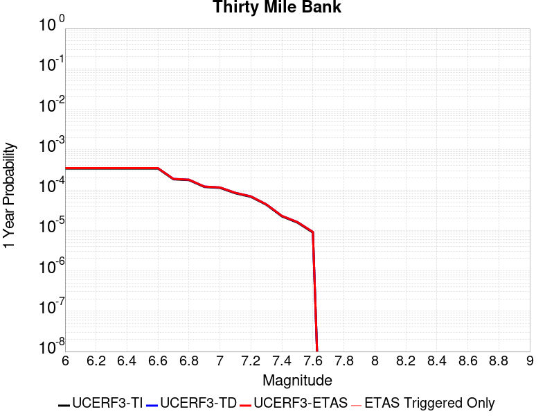 |  |

| Magnitude | 1 wk TI Prob | 1 wk TD Prob | 1 wk ETAS Prob | 1 wk ETAS/TD Gain | 1 wk ETAS Triggered Only | 1 mo TI Prob | 1 mo TD Prob | 1 mo ETAS Prob | 1 mo ETAS/TD Gain | 1 mo ETAS Triggered Only | 1 yr TI Prob | 1 yr TD Prob | 1 yr ETAS Prob | 1 yr ETAS/TD Gain | 1 yr ETAS Triggered Only | 10 yr TI Prob | 10 yr TD Prob | 10 yr ETAS Prob | 10 yr ETAS/TD Gain | 10 yr ETAS Triggered Only |
|-----|-----|-----|-----|-----|-----|-----|-----|-----|-----|-----|-----|-----|-----|-----|-----|-----|-----|-----|-----|-----|
| 6.0 | 6.5124755E-6 | 6.6592643E-6 | 6.6592643E-6 | 1.0 | 0.0 | 2.791031E-5 | 2.8539416E-5 | 2.8539416E-5 | 1.0 | 0.0 | 3.3975503E-4 | 3.4741635E-4 | 3.4741635E-4 | 1.0 | 0.0 | 0.0033923604 | 0.003469164 | 0.0034791294 | 1.0028726 | 1.0E-5 |
| 6.1 | 6.5124755E-6 | 6.6592643E-6 | 6.6592643E-6 | 1.0 | 0.0 | 2.791031E-5 | 2.8539416E-5 | 2.8539416E-5 | 1.0 | 0.0 | 3.3975503E-4 | 3.4741635E-4 | 3.4741635E-4 | 1.0 | 0.0 | 0.0033923604 | 0.003469164 | 0.0034791294 | 1.0028726 | 1.0E-5 |
| 6.2 | 6.5124755E-6 | 6.6592643E-6 | 6.6592643E-6 | 1.0 | 0.0 | 2.791031E-5 | 2.8539416E-5 | 2.8539416E-5 | 1.0 | 0.0 | 3.3975503E-4 | 3.4741635E-4 | 3.4741635E-4 | 1.0 | 0.0 | 0.0033923604 | 0.003469164 | 0.0034791294 | 1.0028726 | 1.0E-5 |
| 6.3 | 6.5124755E-6 | 6.6592643E-6 | 6.6592643E-6 | 1.0 | 0.0 | 2.791031E-5 | 2.8539416E-5 | 2.8539416E-5 | 1.0 | 0.0 | 3.3975503E-4 | 3.4741635E-4 | 3.4741635E-4 | 1.0 | 0.0 | 0.0033923604 | 0.003469164 | 0.0034791294 | 1.0028726 | 1.0E-5 |
| 6.4 | 6.5124755E-6 | 6.6592643E-6 | 6.6592643E-6 | 1.0 | 0.0 | 2.791031E-5 | 2.8539416E-5 | 2.8539416E-5 | 1.0 | 0.0 | 3.3975503E-4 | 3.4741635E-4 | 3.4741635E-4 | 1.0 | 0.0 | 0.0033923604 | 0.003469164 | 0.0034791294 | 1.0028726 | 1.0E-5 |
| 6.5 | 6.5124755E-6 | 6.6592643E-6 | 6.6592643E-6 | 1.0 | 0.0 | 2.791031E-5 | 2.8539416E-5 | 2.8539416E-5 | 1.0 | 0.0 | 3.3975503E-4 | 3.4741635E-4 | 3.4741635E-4 | 1.0 | 0.0 | 0.0033923604 | 0.003469164 | 0.0034791294 | 1.0028726 | 1.0E-5 |
| 6.6 | 6.5124755E-6 | 6.6592643E-6 | 6.6592643E-6 | 1.0 | 0.0 | 2.791031E-5 | 2.8539416E-5 | 2.8539416E-5 | 1.0 | 0.0 | 3.3975503E-4 | 3.4741635E-4 | 3.4741635E-4 | 1.0 | 0.0 | 0.0033923604 | 0.003469164 | 0.0034791294 | 1.0028726 | 1.0E-5 |
| 6.7 | 3.5261137E-6 | 3.6098995E-6 | 3.6098995E-6 | 1.0 | 0.0 | 1.5111828E-5 | 1.547091E-5 | 1.547091E-5 | 1.0 | 0.0 | 1.8397097E-4 | 1.883427E-4 | 1.883427E-4 | 1.0 | 0.0 | 0.0018381875 | 0.0018818958 | 0.0018818958 | 1.0 | 0.0 |
| 6.8 | 3.370743E-6 | 3.4509355E-6 | 3.4509355E-6 | 1.0 | 0.0 | 1.4445961E-5 | 1.47896435E-5 | 1.47896435E-5 | 1.0 | 0.0 | 1.7586538E-4 | 1.8004965E-4 | 1.8004965E-4 | 1.0 | 0.0 | 0.0017572626 | 0.0017990996 | 0.0017990996 | 1.0 | 0.0 |
| 6.9 | 2.2756835E-6 | 2.333161E-6 | 2.333161E-6 | 1.0 | 0.0 | 9.752893E-6 | 9.999225E-6 | 9.999225E-6 | 1.0 | 0.0 | 1.18735006E-4 | 1.2173401E-4 | 1.2173401E-4 | 1.0 | 0.0 | 0.0011867158 | 0.0012166979 | 0.0012166979 | 1.0 | 0.0 |
| 7.0 | 2.1617404E-6 | 2.21598E-6 | 2.21598E-6 | 1.0 | 0.0 | 9.264569E-6 | 9.497024E-6 | 9.497024E-6 | 1.0 | 0.0 | 1.1279029E-4 | 1.1562037E-4 | 1.1562037E-4 | 1.0 | 0.0 | 0.0011273306 | 0.0011556263 | 0.0011556263 | 1.0 | 0.0 |
| 7.1 | 1.5900777E-6 | 1.6327014E-6 | 1.6327014E-6 | 1.0 | 0.0 | 6.814601E-6 | 6.997274E-6 | 6.997274E-6 | 1.0 | 0.0 | 8.296461E-5 | 8.518861E-5 | 8.518861E-5 | 1.0 | 0.0 | 8.293364E-4 | 8.5157226E-4 | 8.5157226E-4 | 1.0 | 0.0 |
| 7.2 | 1.2971728E-6 | 1.3328992E-6 | 1.3328992E-6 | 1.0 | 0.0 | 5.5593005E-6 | 5.712413E-6 | 5.712413E-6 | 1.0 | 0.0 | 6.768238E-5 | 6.954651E-5 | 6.954651E-5 | 1.0 | 0.0 | 6.7661767E-4 | 6.952578E-4 | 6.952578E-4 | 1.0 | 0.0 |
| 7.3 | 8.2454284E-7 | 8.448891E-7 | 8.448891E-7 | 1.0 | 0.0 | 3.5337503E-6 | 3.6209485E-6 | 3.6209485E-6 | 1.0 | 0.0 | 4.302256E-5 | 4.408422E-5 | 4.408422E-5 | 1.0 | 0.0 | 4.301423E-4 | 4.4076078E-4 | 4.4076078E-4 | 1.0 | 0.0 |
| 7.4 | 4.2619024E-7 | 4.3863466E-7 | 4.3863466E-7 | 1.0 | 0.0 | 1.8265283E-6 | 1.8798615E-6 | 1.8798615E-6 | 1.0 | 0.0 | 2.2237757E-5 | 2.2887078E-5 | 2.2887078E-5 | 1.0 | 0.0 | 2.223553E-4 | 2.288476E-4 | 2.288476E-4 | 1.0 | 0.0 |
| 7.5 | 2.993922E-7 | 3.086453E-7 | 3.086453E-7 | 1.0 | 0.0 | 1.2831089E-6 | 1.3227649E-6 | 1.3227649E-6 | 1.0 | 0.0 | 1.5621737E-5 | 1.6104546E-5 | 1.6104546E-5 | 1.0 | 0.0 | 1.562064E-4 | 1.6103406E-4 | 1.6103406E-4 | 1.0 | 0.0 |
| 7.6 | 1.6988751E-7 | 1.7533823E-7 | 1.7533823E-7 | 1.0 | 0.0 | 7.2808916E-7 | 7.5144936E-7 | 7.5144936E-7 | 1.0 | 0.0 | 8.864449E-6 | 9.14886E-6 | 9.14886E-6 | 1.0 | 0.0 | 8.8640954E-5 | 9.1485024E-5 | 9.1485024E-5 | 1.0 | 0.0 |

## San Gabriel (Extension)
*[(top)](#table-of-contents)*

| 1 Week | 1 Month | 1 Year | 10 Year |
|-----|-----|-----|-----|
|  |  |  |  |

| Magnitude | 1 wk TI Prob | 1 wk TD Prob | 1 wk ETAS Prob | 1 wk ETAS/TD Gain | 1 wk ETAS Triggered Only | 1 mo TI Prob | 1 mo TD Prob | 1 mo ETAS Prob | 1 mo ETAS/TD Gain | 1 mo ETAS Triggered Only | 1 yr TI Prob | 1 yr TD Prob | 1 yr ETAS Prob | 1 yr ETAS/TD Gain | 1 yr ETAS Triggered Only | 10 yr TI Prob | 10 yr TD Prob | 10 yr ETAS Prob | 10 yr ETAS/TD Gain | 10 yr ETAS Triggered Only |
|-----|-----|-----|-----|-----|-----|-----|-----|-----|-----|-----|-----|-----|-----|-----|-----|-----|-----|-----|-----|-----|
| 6.0 | 5.6486106E-6 | 5.7168368E-6 | 5.7168368E-6 | 1.0 | 0.0 | 2.4208108E-5 | 2.4500505E-5 | 2.4500505E-5 | 1.0 | 0.0 | 2.9469383E-4 | 2.9825408E-4 | 3.082511E-4 | 1.0335184 | 1.0E-5 | 0.0029430336 | 0.0029786646 | 0.0029886349 | 1.0033472 | 1.0E-5 |
| 6.1 | 5.6486106E-6 | 5.7168368E-6 | 5.7168368E-6 | 1.0 | 0.0 | 2.4208108E-5 | 2.4500505E-5 | 2.4500505E-5 | 1.0 | 0.0 | 2.9469383E-4 | 2.9825408E-4 | 3.082511E-4 | 1.0335184 | 1.0E-5 | 0.0029430336 | 0.0029786646 | 0.0029886349 | 1.0033472 | 1.0E-5 |
| 6.2 | 5.6486106E-6 | 5.7168368E-6 | 5.7168368E-6 | 1.0 | 0.0 | 2.4208108E-5 | 2.4500505E-5 | 2.4500505E-5 | 1.0 | 0.0 | 2.9469383E-4 | 2.9825408E-4 | 3.082511E-4 | 1.0335184 | 1.0E-5 | 0.0029430336 | 0.0029786646 | 0.0029886349 | 1.0033472 | 1.0E-5 |
| 6.3 | 5.6486106E-6 | 5.7168368E-6 | 5.7168368E-6 | 1.0 | 0.0 | 2.4208108E-5 | 2.4500505E-5 | 2.4500505E-5 | 1.0 | 0.0 | 2.9469383E-4 | 2.9825408E-4 | 3.082511E-4 | 1.0335184 | 1.0E-5 | 0.0029430336 | 0.0029786646 | 0.0029886349 | 1.0033472 | 1.0E-5 |
| 6.4 | 5.6486106E-6 | 5.7168368E-6 | 5.7168368E-6 | 1.0 | 0.0 | 2.4208108E-5 | 2.4500505E-5 | 2.4500505E-5 | 1.0 | 0.0 | 2.9469383E-4 | 2.9825408E-4 | 3.082511E-4 | 1.0335184 | 1.0E-5 | 0.0029430336 | 0.0029786646 | 0.0029886349 | 1.0033472 | 1.0E-5 |
| 6.5 | 4.7134554E-6 | 4.7542608E-6 | 4.7542608E-6 | 1.0 | 0.0 | 2.0200367E-5 | 2.0375248E-5 | 2.0375248E-5 | 1.0 | 0.0 | 2.459117E-4 | 2.4804127E-4 | 2.5803878E-4 | 1.0403059 | 1.0E-5 | 0.0024563975 | 0.0024777285 | 0.0024877037 | 1.0040259 | 1.0E-5 |
| 6.6 | 4.7134554E-6 | 4.7542608E-6 | 4.7542608E-6 | 1.0 | 0.0 | 2.0200367E-5 | 2.0375248E-5 | 2.0375248E-5 | 1.0 | 0.0 | 2.459117E-4 | 2.4804127E-4 | 2.5803878E-4 | 1.0403059 | 1.0E-5 | 0.0024563975 | 0.0024777285 | 0.0024877037 | 1.0040259 | 1.0E-5 |
| 6.7 | 4.2468837E-6 | 4.274078E-6 | 4.274078E-6 | 1.0 | 0.0 | 1.8200803E-5 | 1.8317352E-5 | 1.8317352E-5 | 1.0 | 0.0 | 2.2157225E-4 | 2.2299167E-4 | 2.3298943E-4 | 1.0448347 | 1.0E-5 | 0.0022135144 | 0.0022277513 | 0.002237729 | 1.0044788 | 1.0E-5 |
| 6.8 | 4.1180615E-6 | 4.1414673E-6 | 4.1414673E-6 | 1.0 | 0.0 | 1.7648716E-5 | 1.774903E-5 | 1.774903E-5 | 1.0 | 0.0 | 2.1485193E-4 | 2.1607373E-4 | 2.2607157E-4 | 1.0462705 | 1.0E-5 | 0.0021464431 | 0.0021587077 | 0.0021686861 | 1.0046225 | 1.0E-5 |
| 6.9 | 3.863861E-6 | 3.879783E-6 | 3.879783E-6 | 1.0 | 0.0 | 1.65593E-5 | 1.6627539E-5 | 1.6627539E-5 | 1.0 | 0.0 | 2.0159081E-4 | 2.0242216E-4 | 2.1242014E-4 | 1.0493917 | 1.0E-5 | 0.0020140803 | 0.0020224454 | 0.0020324253 | 1.0049345 | 1.0E-5 |
| 7.0 | 3.6947372E-6 | 3.705682E-6 | 3.705682E-6 | 1.0 | 0.0 | 1.5834492E-5 | 1.5881402E-5 | 1.5881402E-5 | 1.0 | 0.0 | 1.9276788E-4 | 1.9333958E-4 | 2.0333765E-4 | 1.0517125 | 1.0E-5 | 0.0019260074 | 0.0019317803 | 0.0019417609 | 1.0051665 | 1.0E-5 |
| 7.1 | 3.5686835E-6 | 3.5729024E-6 | 3.5729024E-6 | 1.0 | 0.0 | 1.5294268E-5 | 1.5312353E-5 | 1.5312353E-5 | 1.0 | 0.0 | 1.861918E-4 | 1.8641262E-4 | 1.9641075E-4 | 1.0536344 | 1.0E-5 | 0.0018603588 | 0.0018626284 | 0.0018726097 | 1.0053588 | 1.0E-5 |
| 7.2 | 2.8023446E-6 | 2.776794E-6 | 2.776794E-6 | 1.0 | 0.0 | 1.2009994E-5 | 1.1900492E-5 | 1.1900492E-5 | 1.0 | 0.0 | 1.4621185E-4 | 1.4487897E-4 | 1.4487897E-4 | 1.0 | 0.0 | 0.001461157 | 0.001447856 | 0.001447856 | 1.0 | 0.0 |
| 7.3 | 2.5843012E-6 | 2.5459692E-6 | 2.5459692E-6 | 1.0 | 0.0 | 1.1075529E-5 | 1.0911252E-5 | 1.0911252E-5 | 1.0 | 0.0 | 1.3483623E-4 | 1.3283649E-4 | 1.3283649E-4 | 1.0 | 0.0 | 0.0013475444 | 0.0013275805 | 0.0013275805 | 1.0 | 0.0 |
| 7.4 | 2.4464468E-6 | 2.396669E-6 | 2.396669E-6 | 1.0 | 0.0 | 1.04847295E-5 | 1.0271398E-5 | 1.0271398E-5 | 1.0 | 0.0 | 1.276441E-4 | 1.250472E-4 | 1.250472E-4 | 1.0 | 0.0 | 0.0012757082 | 0.001249778 | 0.001249778 | 1.0 | 0.0 |
| 7.5 | 2.0420266E-6 | 1.8910376E-6 | 1.8910376E-6 | 1.0 | 0.0 | 8.751514E-6 | 8.104422E-6 | 8.104422E-6 | 1.0 | 0.0 | 1.0654447E-4 | 9.866691E-5 | 9.866691E-5 | 1.0 | 0.0 | 0.001064934 | 9.862344E-4 | 9.862344E-4 | 1.0 | 0.0 |
| 7.6 | 1.8326596E-6 | 1.6398233E-6 | 1.6398233E-6 | 1.0 | 0.0 | 7.854232E-6 | 7.027795E-6 | 7.027795E-6 | 1.0 | 0.0 | 9.562107E-5 | 8.556007E-5 | 8.556007E-5 | 1.0 | 0.0 | 9.5579936E-4 | 8.552735E-4 | 8.552735E-4 | 1.0 | 0.0 |
| 7.7 | 1.4786998E-6 | 1.2523672E-6 | 1.2523672E-6 | 1.0 | 0.0 | 6.3372695E-6 | 5.3672766E-6 | 5.3672766E-6 | 1.0 | 0.0 | 7.715353E-5 | 6.534465E-5 | 6.534465E-5 | 1.0 | 0.0 | 7.7126746E-4 | 6.5325975E-4 | 6.5325975E-4 | 1.0 | 0.0 |
| 7.8 | 7.6975533E-7 | 6.069207E-7 | 6.069207E-7 | 1.0 | 0.0 | 3.2989474E-6 | 2.6010862E-6 | 2.6010862E-6 | 1.0 | 0.0 | 4.0163945E-5 | 3.1667765E-5 | 3.1667765E-5 | 1.0 | 0.0 | 4.0156685E-4 | 3.166365E-4 | 3.166365E-4 | 1.0 | 0.0 |
| 7.9 | 1.7645915E-7 | 9.211899E-8 | 9.211899E-8 | 1.0 | 0.0 | 7.562533E-7 | 3.947956E-7 | 3.947956E-7 | 1.0 | 0.0 | 9.207345E-6 | 4.806626E-6 | 4.806626E-6 | 1.0 | 0.0 | 9.206964E-5 | 4.8069025E-5 | 4.8069025E-5 | 1.0 | 0.0 |
| 8.0 | 1.0463461E-7 | 2.4937416E-8 | 2.4937416E-8 | 1.0 | 0.0 | 4.4843398E-7 | 1.0687464E-7 | 1.0687464E-7 | 1.0 | 0.0 | 5.45967E-6 | 1.3011979E-6 | 1.3011979E-6 | 1.0 | 0.0 | 5.459536E-5 | 1.3015701E-5 | 1.3015701E-5 | 1.0 | 0.0 |
| 8.1 | 7.875717E-8 | 1.3857542E-8 | 1.3857542E-8 | 1.0 | 0.0 | 3.3753068E-7 | 5.9389468E-8 | 5.9389468E-8 | 1.0 | 0.0 | 4.109428E-6 | 7.2306653E-7 | 7.2306653E-7 | 1.0 | 0.0 | 4.109352E-5 | 7.234439E-6 | 7.234439E-6 | 1.0 | 0.0 |
| 8.2 | 1.33163E-8 | 1.7720816E-9 | 1.7720816E-9 | 1.0 | 0.0 | 5.7069855E-8 | 7.594638E-9 | 7.594638E-9 | 1.0 | 0.0 | 6.9482525E-7 | 9.246471E-8 | 9.246471E-8 | 1.0 | 0.0 | 6.9482307E-6 | 9.2664203E-7 | 9.2664203E-7 | 1.0 | 0.0 |

## Rodgers Creek - Healdsburg 2011 CFM
*[(top)](#table-of-contents)*

| 1 Week | 1 Month | 1 Year | 10 Year |
|-----|-----|-----|-----|
|  |  |  |  |

| Magnitude | 1 wk TI Prob | 1 wk TD Prob | 1 wk ETAS Prob | 1 wk ETAS/TD Gain | 1 wk ETAS Triggered Only | 1 mo TI Prob | 1 mo TD Prob | 1 mo ETAS Prob | 1 mo ETAS/TD Gain | 1 mo ETAS Triggered Only | 1 yr TI Prob | 1 yr TD Prob | 1 yr ETAS Prob | 1 yr ETAS/TD Gain | 1 yr ETAS Triggered Only | 10 yr TI Prob | 10 yr TD Prob | 10 yr ETAS Prob | 10 yr ETAS/TD Gain | 10 yr ETAS Triggered Only |
|-----|-----|-----|-----|-----|-----|-----|-----|-----|-----|-----|-----|-----|-----|-----|-----|-----|-----|-----|-----|-----|
| 6.0 | 7.390182E-5 | 1.3137296E-4 | 1.3137296E-4 | 1.0 | 0.0 | 3.1668364E-4 | 5.629057E-4 | 5.629057E-4 | 1.0 | 0.0 | 0.0038488081 | 0.0068318076 | 0.0068318076 | 1.0 | 0.0 | 0.037828278 | 0.06618395 | 0.06619328 | 1.0001411 | 1.0E-5 |
| 6.1 | 7.318768E-5 | 1.303531E-4 | 1.303531E-4 | 1.0 | 0.0 | 3.1362378E-4 | 5.585369E-4 | 5.585369E-4 | 1.0 | 0.0 | 0.0038116854 | 0.006778966 | 0.006778966 | 1.0 | 0.0 | 0.037469655 | 0.06568854 | 0.065697886 | 1.0001422 | 1.0E-5 |
| 6.2 | 7.1379836E-5 | 1.2728151E-4 | 1.2728151E-4 | 1.0 | 0.0 | 3.058777E-4 | 5.453785E-4 | 5.453785E-4 | 1.0 | 0.0 | 0.003717703 | 0.0066197454 | 0.0066197454 | 1.0 | 0.0 | 0.0365612 | 0.06421061 | 0.06421997 | 1.0001458 | 1.0E-5 |
| 6.3 | 6.9255926E-5 | 1.2382482E-4 | 1.2382482E-4 | 1.0 | 0.0 | 2.9677735E-4 | 5.305703E-4 | 5.305703E-4 | 1.0 | 0.0 | 0.0036072785 | 0.0064406106 | 0.0064406106 | 1.0 | 0.0 | 0.035492823 | 0.062541805 | 0.062551185 | 1.0001498 | 1.0E-5 |
| 6.4 | 6.6757144E-5 | 1.195919E-4 | 1.195919E-4 | 1.0 | 0.0 | 2.8607066E-4 | 5.1243644E-4 | 5.1243644E-4 | 1.0 | 0.0 | 0.0034773487 | 0.00622114 | 0.00622114 | 1.0 | 0.0 | 0.034234364 | 0.060491614 | 0.06050101 | 1.0001553 | 1.0E-5 |
| 6.5 | 6.5735134E-5 | 1.180849E-4 | 1.180849E-4 | 1.0 | 0.0 | 2.8169158E-4 | 5.059804E-4 | 5.059804E-4 | 1.0 | 0.0 | 0.003424202 | 0.0061429944 | 0.0061429944 | 1.0 | 0.0 | 0.03371918 | 0.059755705 | 0.059765108 | 1.0001574 | 1.0E-5 |
| 6.6 | 6.289601E-5 | 1.13442366E-4 | 1.13442366E-4 | 1.0 | 0.0 | 2.6952647E-4 | 4.8609133E-4 | 4.8609133E-4 | 1.0 | 0.0 | 0.0032765474 | 0.005902183 | 0.005902183 | 1.0 | 0.0 | 0.032286562 | 0.057495043 | 0.057504468 | 1.0001639 | 1.0E-5 |
| 6.7 | 6.115274E-5 | 1.106132E-4 | 1.106132E-4 | 1.0 | 0.0 | 2.6205686E-4 | 4.739708E-4 | 4.739708E-4 | 1.0 | 0.0 | 0.0031858748 | 0.0057554054 | 0.0057554054 | 1.0 | 0.0 | 0.031405866 | 0.05611361 | 0.056123048 | 1.0001682 | 1.0E-5 |
| 6.8 | 5.9232367E-5 | 1.0728657E-4 | 1.0728657E-4 | 1.0 | 0.0 | 2.538283E-4 | 4.5971893E-4 | 4.5971893E-4 | 1.0 | 0.0 | 0.0030859804 | 0.005582791 | 0.005582791 | 1.0 | 0.0 | 0.030434765 | 0.05448041 | 0.054489866 | 1.0001736 | 1.0E-5 |
| 6.9 | 5.4030377E-5 | 9.8228295E-5 | 9.8228295E-5 | 1.0 | 0.0 | 2.315382E-4 | 4.209108E-4 | 4.209108E-4 | 1.0 | 0.0 | 0.0028153337 | 0.0051126136 | 0.0051126136 | 1.0 | 0.0 | 0.027799325 | 0.05001572 | 0.05002522 | 1.0001899 | 1.0E-5 |
| 7.0 | 4.8260714E-5 | 8.7408924E-5 | 8.7408924E-5 | 1.0 | 0.0 | 2.0681522E-4 | 3.7455617E-4 | 3.7455617E-4 | 1.0 | 0.0 | 0.0025150678 | 0.0045507406 | 0.0045507406 | 1.0 | 0.0 | 0.024867928 | 0.044667073 | 0.044676628 | 1.0002139 | 1.0E-5 |
| 7.1 | 4.0294493E-5 | 7.389363E-5 | 7.389363E-5 | 1.0 | 0.0 | 1.7267925E-4 | 3.1664874E-4 | 3.1664874E-4 | 1.0 | 0.0 | 0.0021003427 | 0.0038484214 | 0.0038484214 | 1.0 | 0.0 | 0.02080602 | 0.037923187 | 0.03793281 | 1.0002537 | 1.0E-5 |
| 7.2 | 3.096388E-5 | 5.698023E-5 | 5.698023E-5 | 1.0 | 0.0 | 1.326956E-4 | 2.4417826E-4 | 2.4417826E-4 | 1.0 | 0.0 | 0.0016143717 | 0.0029688394 | 0.0029688394 | 1.0 | 0.0 | 0.01602694 | 0.029437006 | 0.029446712 | 1.0003297 | 1.0E-5 |
| 7.3 | 2.3615226E-5 | 4.3629818E-5 | 4.3629818E-5 | 1.0 | 0.0 | 1.0120418E-4 | 1.869716E-4 | 1.869716E-4 | 1.0 | 0.0 | 0.0012314644 | 0.0022740164 | 0.0022740164 | 1.0 | 0.0 | 0.0122466255 | 0.022637889 | 0.022647662 | 1.0004318 | 1.0E-5 |
| 7.4 | 1.8251132E-5 | 3.3542477E-5 | 3.3542477E-5 | 1.0 | 0.0 | 7.821679E-5 | 1.4374561E-4 | 1.4374561E-4 | 1.0 | 0.0 | 9.518733E-4 | 0.0017487077 | 0.0017487077 | 1.0 | 0.0 | 0.009478063 | 0.017466031 | 0.017466031 | 1.0 | 0.0 |
| 7.5 | 1.2411432E-5 | 2.2461069E-5 | 2.2461069E-5 | 1.0 | 0.0 | 5.3190768E-5 | 9.6258205E-5 | 9.6258205E-5 | 1.0 | 0.0 | 6.4740516E-4 | 0.0011713194 | 0.0011713194 | 1.0 | 0.0 | 0.006455223 | 0.011743137 | 0.011743137 | 1.0 | 0.0 |
| 7.6 | 4.4771446E-6 | 8.08443E-6 | 8.08443E-6 | 1.0 | 0.0 | 1.918762E-5 | 3.4647102E-5 | 3.4647102E-5 | 1.0 | 0.0 | 2.3358424E-4 | 4.2174806E-4 | 4.2174806E-4 | 1.0 | 0.0 | 0.0023333887 | 0.0042453306 | 0.0042453306 | 1.0 | 0.0 |
| 7.7 | 2.157941E-7 | 3.5350925E-7 | 3.5350925E-7 | 1.0 | 0.0 | 9.248315E-7 | 1.5150388E-6 | 1.5150388E-6 | 1.0 | 0.0 | 1.1259765E-5 | 1.844544E-5 | 1.844544E-5 | 1.0 | 0.0 | 1.1259195E-4 | 1.9069649E-4 | 1.9069649E-4 | 1.0 | 0.0 |
| 7.8 | 9.9623286E-8 | 1.9900986E-7 | 1.9900986E-7 | 1.0 | 0.0 | 4.269569E-7 | 8.528991E-7 | 8.528991E-7 | 1.0 | 0.0 | 5.1981874E-6 | 1.03839975E-5 | 1.03839975E-5 | 1.0 | 0.0 | 5.198066E-5 | 1.0902916E-4 | 1.0902916E-4 | 1.0 | 0.0 |
| 7.9 | 5.6745257E-8 | 1.1774714E-7 | 1.1774714E-7 | 1.0 | 0.0 | 2.4319394E-7 | 5.046305E-7 | 5.046305E-7 | 1.0 | 0.0 | 2.960882E-6 | 6.143859E-6 | 6.143859E-6 | 1.0 | 0.0 | 2.9608427E-5 | 6.471445E-5 | 6.471445E-5 | 1.0 | 0.0 |
| 8.0 | 2.8614323E-8 | 6.5789635E-8 | 6.5789635E-8 | 1.0 | 0.0 | 1.2263281E-7 | 2.8195555E-7 | 2.8195555E-7 | 1.0 | 0.0 | 1.4930534E-6 | 3.4328034E-6 | 3.4328034E-6 | 1.0 | 0.0 | 1.4930434E-5 | 3.5830046E-5 | 3.5830046E-5 | 1.0 | 0.0 |
| 8.1 | 3.5045191E-9 | 8.966459E-9 | 8.966459E-9 | 1.0 | 0.0 | 1.5019367E-8 | 3.8427682E-8 | 3.8427682E-8 | 1.0 | 0.0 | 1.8286079E-7 | 4.6785692E-7 | 4.6785692E-7 | 1.0 | 0.0 | 1.8286064E-6 | 4.834128E-6 | 4.834128E-6 | 1.0 | 0.0 |

## Channel Islands Western Deep Ramp
*[(top)](#table-of-contents)*

| 1 Week | 1 Month | 1 Year | 10 Year |
|-----|-----|-----|-----|
|  |  |  |  |

| Magnitude | 1 wk TI Prob | 1 wk TD Prob | 1 wk ETAS Prob | 1 wk ETAS/TD Gain | 1 wk ETAS Triggered Only | 1 mo TI Prob | 1 mo TD Prob | 1 mo ETAS Prob | 1 mo ETAS/TD Gain | 1 mo ETAS Triggered Only | 1 yr TI Prob | 1 yr TD Prob | 1 yr ETAS Prob | 1 yr ETAS/TD Gain | 1 yr ETAS Triggered Only | 10 yr TI Prob | 10 yr TD Prob | 10 yr ETAS Prob | 10 yr ETAS/TD Gain | 10 yr ETAS Triggered Only |
|-----|-----|-----|-----|-----|-----|-----|-----|-----|-----|-----|-----|-----|-----|-----|-----|-----|-----|-----|-----|-----|
| 6.0 | 6.0213506E-6 | 6.2548684E-6 | 1.6254806E-5 | 2.5987446 | 1.0E-5 | 2.5805533E-5 | 2.6806329E-5 | 3.680606E-5 | 1.3730363 | 1.0E-5 | 3.1413708E-4 | 3.2632265E-4 | 3.3631938E-4 | 1.0306345 | 1.0E-5 | 0.0031369338 | 0.0032588763 | 0.0032688437 | 1.0030586 | 1.0E-5 |
| 6.1 | 6.0213506E-6 | 6.2548684E-6 | 1.6254806E-5 | 2.5987446 | 1.0E-5 | 2.5805533E-5 | 2.6806329E-5 | 3.680606E-5 | 1.3730363 | 1.0E-5 | 3.1413708E-4 | 3.2632265E-4 | 3.3631938E-4 | 1.0306345 | 1.0E-5 | 0.0031369338 | 0.0032588763 | 0.0032688437 | 1.0030586 | 1.0E-5 |
| 6.2 | 6.0213506E-6 | 6.2548684E-6 | 1.6254806E-5 | 2.5987446 | 1.0E-5 | 2.5805533E-5 | 2.6806329E-5 | 3.680606E-5 | 1.3730363 | 1.0E-5 | 3.1413708E-4 | 3.2632265E-4 | 3.3631938E-4 | 1.0306345 | 1.0E-5 | 0.0031369338 | 0.0032588763 | 0.0032688437 | 1.0030586 | 1.0E-5 |
| 6.3 | 6.0213506E-6 | 6.2548684E-6 | 1.6254806E-5 | 2.5987446 | 1.0E-5 | 2.5805533E-5 | 2.6806329E-5 | 3.680606E-5 | 1.3730363 | 1.0E-5 | 3.1413708E-4 | 3.2632265E-4 | 3.3631938E-4 | 1.0306345 | 1.0E-5 | 0.0031369338 | 0.0032588763 | 0.0032688437 | 1.0030586 | 1.0E-5 |
| 6.4 | 6.0213506E-6 | 6.2548684E-6 | 1.6254806E-5 | 2.5987446 | 1.0E-5 | 2.5805533E-5 | 2.6806329E-5 | 3.680606E-5 | 1.3730363 | 1.0E-5 | 3.1413708E-4 | 3.2632265E-4 | 3.3631938E-4 | 1.0306345 | 1.0E-5 | 0.0031369338 | 0.0032588763 | 0.0032688437 | 1.0030586 | 1.0E-5 |
| 6.5 | 6.0213506E-6 | 6.2548684E-6 | 1.6254806E-5 | 2.5987446 | 1.0E-5 | 2.5805533E-5 | 2.6806329E-5 | 3.680606E-5 | 1.3730363 | 1.0E-5 | 3.1413708E-4 | 3.2632265E-4 | 3.3631938E-4 | 1.0306345 | 1.0E-5 | 0.0031369338 | 0.0032588763 | 0.0032688437 | 1.0030586 | 1.0E-5 |
| 6.6 | 6.0213506E-6 | 6.2548684E-6 | 1.6254806E-5 | 2.5987446 | 1.0E-5 | 2.5805533E-5 | 2.6806329E-5 | 3.680606E-5 | 1.3730363 | 1.0E-5 | 3.1413708E-4 | 3.2632265E-4 | 3.3631938E-4 | 1.0306345 | 1.0E-5 | 0.0031369338 | 0.0032588763 | 0.0032688437 | 1.0030586 | 1.0E-5 |
| 6.7 | 5.313309E-6 | 5.5252403E-6 | 5.5252403E-6 | 1.0 | 0.0 | 2.2771126E-5 | 2.367941E-5 | 2.367941E-5 | 1.0 | 0.0 | 2.772032E-4 | 2.8826276E-4 | 2.8826276E-4 | 1.0 | 0.0 | 0.0027685766 | 0.0028792918 | 0.0028792918 | 1.0 | 0.0 |
| 6.8 | 5.313309E-6 | 5.5252403E-6 | 5.5252403E-6 | 1.0 | 0.0 | 2.2771126E-5 | 2.367941E-5 | 2.367941E-5 | 1.0 | 0.0 | 2.772032E-4 | 2.8826276E-4 | 2.8826276E-4 | 1.0 | 0.0 | 0.0027685766 | 0.0028792918 | 0.0028792918 | 1.0 | 0.0 |
| 6.9 | 4.744377E-6 | 4.9394303E-6 | 4.9394303E-6 | 1.0 | 0.0 | 2.0332885E-5 | 2.1168837E-5 | 2.1168837E-5 | 1.0 | 0.0 | 2.4752476E-4 | 2.5770385E-4 | 2.5770385E-4 | 1.0 | 0.0 | 0.0024724922 | 0.0025744175 | 0.0025744175 | 1.0 | 0.0 |
| 7.0 | 4.722209E-6 | 4.9164732E-6 | 4.9164732E-6 | 1.0 | 0.0 | 2.0237881E-5 | 2.107045E-5 | 2.107045E-5 | 1.0 | 0.0 | 2.4636835E-4 | 2.5650626E-4 | 2.5650626E-4 | 1.0 | 0.0 | 0.002460954 | 0.0025624693 | 0.0025624693 | 1.0 | 0.0 |
| 7.1 | 4.611174E-6 | 4.801409E-6 | 4.801409E-6 | 1.0 | 0.0 | 1.9762025E-5 | 2.0577325E-5 | 2.0577325E-5 | 1.0 | 0.0 | 2.4057609E-4 | 2.5050386E-4 | 2.5050386E-4 | 1.0 | 0.0 | 0.002403158 | 0.002502582 | 0.002502582 | 1.0 | 0.0 |
| 7.2 | 4.043994E-6 | 4.2120264E-6 | 4.2120264E-6 | 1.0 | 0.0 | 1.7331287E-5 | 1.8051438E-5 | 1.8051438E-5 | 1.0 | 0.0 | 2.10988E-4 | 2.1975765E-4 | 2.1975765E-4 | 1.0 | 0.0 | 0.002107878 | 0.0021957543 | 0.0021957543 | 1.0 | 0.0 |
| 7.3 | 2.1233036E-6 | 2.2297875E-6 | 2.2297875E-6 | 1.0 | 0.0 | 9.099841E-6 | 9.556197E-6 | 9.556197E-6 | 1.0 | 0.0 | 1.1078493E-4 | 1.1634055E-4 | 1.1634055E-4 | 1.0 | 0.0 | 0.0011072971 | 0.001162802 | 0.001162802 | 1.0 | 0.0 |
| 7.4 | 1.9051884E-6 | 2.0014973E-6 | 2.0014973E-6 | 1.0 | 0.0 | 8.165067E-6 | 8.577817E-6 | 8.577817E-6 | 1.0 | 0.0 | 9.940516E-5 | 1.0442998E-4 | 1.0442998E-4 | 1.0 | 0.0 | 9.93607E-4 | 0.0010438144 | 0.0010438144 | 1.0 | 0.0 |
| 7.5 | 1.2408497E-6 | 1.3038839E-6 | 1.3038839E-6 | 1.0 | 0.0 | 5.317916E-6 | 5.588062E-6 | 5.588062E-6 | 1.0 | 0.0 | 6.4743705E-5 | 6.8032554E-5 | 6.8032554E-5 | 1.0 | 0.0 | 6.4724847E-4 | 6.8011944E-4 | 6.8011944E-4 | 1.0 | 0.0 |
| 7.6 | 6.5440025E-7 | 6.886718E-7 | 6.886718E-7 | 1.0 | 0.0 | 2.8045695E-6 | 2.9514472E-6 | 2.9514472E-6 | 1.0 | 0.0 | 3.4145098E-5 | 3.593329E-5 | 3.593329E-5 | 1.0 | 0.0 | 3.4139853E-4 | 3.5927625E-4 | 3.5927625E-4 | 1.0 | 0.0 |
| 7.7 | 3.985963E-7 | 4.1930787E-7 | 4.1930787E-7 | 1.0 | 0.0 | 1.7082689E-6 | 1.7970326E-6 | 1.7970326E-6 | 1.0 | 0.0 | 2.0797976E-5 | 2.1878664E-5 | 2.1878664E-5 | 1.0 | 0.0 | 2.0796029E-4 | 2.1876628E-4 | 2.1876628E-4 | 1.0 | 0.0 |
| 7.8 | 3.706329E-8 | 3.8591796E-8 | 3.8591796E-8 | 1.0 | 0.0 | 1.5884267E-7 | 1.653934E-7 | 1.653934E-7 | 1.0 | 0.0 | 1.9339077E-6 | 2.0136629E-6 | 2.0136629E-6 | 1.0 | 0.0 | 1.933891E-5 | 2.0136458E-5 | 2.0136458E-5 | 1.0 | 0.0 |

## Elsinore (Julian)
*[(top)](#table-of-contents)*

| 1 Week | 1 Month | 1 Year | 10 Year |
|-----|-----|-----|-----|
|  |  |  |  |

| Magnitude | 1 wk TI Prob | 1 wk TD Prob | 1 wk ETAS Prob | 1 wk ETAS/TD Gain | 1 wk ETAS Triggered Only | 1 mo TI Prob | 1 mo TD Prob | 1 mo ETAS Prob | 1 mo ETAS/TD Gain | 1 mo ETAS Triggered Only | 1 yr TI Prob | 1 yr TD Prob | 1 yr ETAS Prob | 1 yr ETAS/TD Gain | 1 yr ETAS Triggered Only | 10 yr TI Prob | 10 yr TD Prob | 10 yr ETAS Prob | 10 yr ETAS/TD Gain | 10 yr ETAS Triggered Only |
|-----|-----|-----|-----|-----|-----|-----|-----|-----|-----|-----|-----|-----|-----|-----|-----|-----|-----|-----|-----|-----|
| 6.0 | 1.1710231E-5 | 8.845315E-6 | 8.845315E-6 | 1.0 | 0.0 | 5.0185736E-5 | 3.7907954E-5 | 3.7907954E-5 | 1.0 | 0.0 | 6.1084004E-4 | 4.614333E-4 | 4.614333E-4 | 1.0 | 0.0 | 0.006091637 | 0.0046049724 | 0.0046149264 | 1.0021616 | 1.0E-5 |
| 6.1 | 1.1710231E-5 | 8.845315E-6 | 8.845315E-6 | 1.0 | 0.0 | 5.0185736E-5 | 3.7907954E-5 | 3.7907954E-5 | 1.0 | 0.0 | 6.1084004E-4 | 4.614333E-4 | 4.614333E-4 | 1.0 | 0.0 | 0.006091637 | 0.0046049724 | 0.0046149264 | 1.0021616 | 1.0E-5 |
| 6.2 | 1.1710231E-5 | 8.845315E-6 | 8.845315E-6 | 1.0 | 0.0 | 5.0185736E-5 | 3.7907954E-5 | 3.7907954E-5 | 1.0 | 0.0 | 6.1084004E-4 | 4.614333E-4 | 4.614333E-4 | 1.0 | 0.0 | 0.006091637 | 0.0046049724 | 0.0046149264 | 1.0021616 | 1.0E-5 |
| 6.3 | 1.1710231E-5 | 8.845315E-6 | 8.845315E-6 | 1.0 | 0.0 | 5.0185736E-5 | 3.7907954E-5 | 3.7907954E-5 | 1.0 | 0.0 | 6.1084004E-4 | 4.614333E-4 | 4.614333E-4 | 1.0 | 0.0 | 0.006091637 | 0.0046049724 | 0.0046149264 | 1.0021616 | 1.0E-5 |
| 6.4 | 1.1710231E-5 | 8.845315E-6 | 8.845315E-6 | 1.0 | 0.0 | 5.0185736E-5 | 3.7907954E-5 | 3.7907954E-5 | 1.0 | 0.0 | 6.1084004E-4 | 4.614333E-4 | 4.614333E-4 | 1.0 | 0.0 | 0.006091637 | 0.0046049724 | 0.0046149264 | 1.0021616 | 1.0E-5 |
| 6.5 | 1.1710231E-5 | 8.845315E-6 | 8.845315E-6 | 1.0 | 0.0 | 5.0185736E-5 | 3.7907954E-5 | 3.7907954E-5 | 1.0 | 0.0 | 6.1084004E-4 | 4.614333E-4 | 4.614333E-4 | 1.0 | 0.0 | 0.006091637 | 0.0046049724 | 0.0046149264 | 1.0021616 | 1.0E-5 |
| 6.6 | 1.1650619E-5 | 8.777691E-6 | 8.777691E-6 | 1.0 | 0.0 | 4.993027E-5 | 3.761814E-5 | 3.761814E-5 | 1.0 | 0.0 | 6.0773146E-4 | 4.5790634E-4 | 4.5790634E-4 | 1.0 | 0.0 | 0.0060607214 | 0.004569848 | 0.0045798025 | 1.0021783 | 1.0E-5 |
| 6.7 | 1.1650619E-5 | 8.777691E-6 | 8.777691E-6 | 1.0 | 0.0 | 4.993027E-5 | 3.761814E-5 | 3.761814E-5 | 1.0 | 0.0 | 6.0773146E-4 | 4.5790634E-4 | 4.5790634E-4 | 1.0 | 0.0 | 0.0060607214 | 0.004569848 | 0.0045798025 | 1.0021783 | 1.0E-5 |
| 6.8 | 1.1442698E-5 | 8.560841E-6 | 8.560841E-6 | 1.0 | 0.0 | 4.9039216E-5 | 3.6688813E-5 | 3.6688813E-5 | 1.0 | 0.0 | 5.968889E-4 | 4.4659642E-4 | 4.4659642E-4 | 1.0 | 0.0 | 0.0059528816 | 0.004457207 | 0.004467163 | 1.0022335 | 1.0E-5 |
| 6.9 | 1.1300589E-5 | 8.408708E-6 | 8.408708E-6 | 1.0 | 0.0 | 4.8430196E-5 | 3.603683E-5 | 3.603683E-5 | 1.0 | 0.0 | 5.894781E-4 | 4.3866172E-4 | 4.3866172E-4 | 1.0 | 0.0 | 0.005879169 | 0.0043781744 | 0.0043881307 | 1.002274 | 1.0E-5 |
| 7.0 | 1.1117729E-5 | 8.225868E-6 | 8.225868E-6 | 1.0 | 0.0 | 4.764654E-5 | 3.5253255E-5 | 3.5253255E-5 | 1.0 | 0.0 | 5.799422E-4 | 4.291255E-4 | 4.291255E-4 | 1.0 | 0.0 | 0.0057843104 | 0.0042831833 | 0.0042931405 | 1.0023247 | 1.0E-5 |
| 7.1 | 1.08053955E-5 | 7.911498E-6 | 7.911498E-6 | 1.0 | 0.0 | 4.6308014E-5 | 3.3905988E-5 | 3.3905988E-5 | 1.0 | 0.0 | 5.6365423E-4 | 4.1272887E-4 | 4.1272887E-4 | 1.0 | 0.0 | 0.005622267 | 0.004119835 | 0.004129794 | 1.0024173 | 1.0E-5 |
| 7.2 | 1.032804E-5 | 7.432751E-6 | 7.432751E-6 | 1.0 | 0.0 | 4.4262277E-5 | 3.1854266E-5 | 3.1854266E-5 | 1.0 | 0.0 | 5.387599E-4 | 3.8775822E-4 | 3.8775822E-4 | 1.0 | 0.0 | 0.0053745564 | 0.00387102 | 0.0038809814 | 1.0025733 | 1.0E-5 |
| 7.3 | 9.622426E-6 | 6.897587E-6 | 6.897587E-6 | 1.0 | 0.0 | 4.1238312E-5 | 2.956076E-5 | 2.956076E-5 | 1.0 | 0.0 | 5.019608E-4 | 3.5984424E-4 | 3.5984424E-4 | 1.0 | 0.0 | 0.005008285 | 0.0035928036 | 0.0036027676 | 1.0027733 | 1.0E-5 |
| 7.4 | 9.144434E-6 | 6.496142E-6 | 6.496142E-6 | 1.0 | 0.0 | 3.9189843E-5 | 2.7840319E-5 | 2.7840319E-5 | 1.0 | 0.0 | 4.7703186E-4 | 3.3890453E-4 | 3.3890453E-4 | 1.0 | 0.0 | 0.0047600917 | 0.0033840172 | 0.0033939832 | 1.0029451 | 1.0E-5 |
| 7.5 | 7.988981E-6 | 5.498105E-6 | 5.498105E-6 | 1.0 | 0.0 | 3.4238044E-5 | 2.3563101E-5 | 2.3563101E-5 | 1.0 | 0.0 | 4.1676845E-4 | 2.8684427E-4 | 2.8684427E-4 | 1.0 | 0.0 | 0.0041598766 | 0.0028648674 | 0.002874839 | 1.0034806 | 1.0E-5 |
| 7.6 | 6.9554876E-6 | 4.6623254E-6 | 4.6623254E-6 | 1.0 | 0.0 | 2.9808893E-5 | 1.998125E-5 | 1.998125E-5 | 1.0 | 0.0 | 3.6286283E-4 | 2.4324573E-4 | 2.4324573E-4 | 1.0 | 0.0 | 0.0036227088 | 0.002429911 | 0.0024398866 | 1.0041053 | 1.0E-5 |
| 7.7 | 4.1557314E-6 | 2.3244427E-6 | 2.3244427E-6 | 1.0 | 0.0 | 1.7810156E-5 | 9.961864E-6 | 9.961864E-6 | 1.0 | 0.0 | 2.1681708E-4 | 1.2127968E-4 | 1.2127968E-4 | 1.0 | 0.0 | 0.0021660565 | 0.001212208 | 0.0012221958 | 1.0082394 | 1.0E-5 |
| 7.8 | 2.2597293E-7 | 9.331864E-8 | 9.331864E-8 | 1.0 | 0.0 | 9.684551E-7 | 3.99937E-7 | 3.99937E-7 | 1.0 | 0.0 | 1.1790877E-5 | 4.8692254E-6 | 4.8692254E-6 | 1.0 | 0.0 | 1.17902506E-4 | 4.8691512E-5 | 4.8691512E-5 | 1.0 | 0.0 |
| 7.9 | 6.676829E-9 | 3.4397174E-9 | 3.4397174E-9 | 1.0 | 0.0 | 2.861498E-8 | 1.4741646E-8 | 1.4741646E-8 | 1.0 | 0.0 | 3.4838732E-7 | 1.7947953E-7 | 1.7947953E-7 | 1.0 | 0.0 | 3.4838679E-6 | 1.794794E-6 | 1.794794E-6 | 1.0 | 0.0 |

## La Panza 2011
*[(top)](#table-of-contents)*

| 1 Week | 1 Month | 1 Year | 10 Year |
|-----|-----|-----|-----|
|  |  |  |  |

| Magnitude | 1 wk TI Prob | 1 wk TD Prob | 1 wk ETAS Prob | 1 wk ETAS/TD Gain | 1 wk ETAS Triggered Only | 1 mo TI Prob | 1 mo TD Prob | 1 mo ETAS Prob | 1 mo ETAS/TD Gain | 1 mo ETAS Triggered Only | 1 yr TI Prob | 1 yr TD Prob | 1 yr ETAS Prob | 1 yr ETAS/TD Gain | 1 yr ETAS Triggered Only | 10 yr TI Prob | 10 yr TD Prob | 10 yr ETAS Prob | 10 yr ETAS/TD Gain | 10 yr ETAS Triggered Only |
|-----|-----|-----|-----|-----|-----|-----|-----|-----|-----|-----|-----|-----|-----|-----|-----|-----|-----|-----|-----|-----|
| 6.0 | 4.6754544E-6 | 4.7175886E-6 | 4.7175886E-6 | 1.0 | 0.0 | 2.0037509E-5 | 2.021809E-5 | 2.021809E-5 | 1.0 | 0.0 | 2.4392935E-4 | 2.4612944E-4 | 2.4612944E-4 | 1.0 | 0.0 | 0.0024366176 | 0.0024587628 | 0.0024687382 | 1.004057 | 1.0E-5 |
| 6.1 | 4.6754544E-6 | 4.7175886E-6 | 4.7175886E-6 | 1.0 | 0.0 | 2.0037509E-5 | 2.021809E-5 | 2.021809E-5 | 1.0 | 0.0 | 2.4392935E-4 | 2.4612944E-4 | 2.4612944E-4 | 1.0 | 0.0 | 0.0024366176 | 0.0024587628 | 0.0024687382 | 1.004057 | 1.0E-5 |
| 6.2 | 4.6754544E-6 | 4.7175886E-6 | 4.7175886E-6 | 1.0 | 0.0 | 2.0037509E-5 | 2.021809E-5 | 2.021809E-5 | 1.0 | 0.0 | 2.4392935E-4 | 2.4612944E-4 | 2.4612944E-4 | 1.0 | 0.0 | 0.0024366176 | 0.0024587628 | 0.0024687382 | 1.004057 | 1.0E-5 |
| 6.3 | 4.6754544E-6 | 4.7175886E-6 | 4.7175886E-6 | 1.0 | 0.0 | 2.0037509E-5 | 2.021809E-5 | 2.021809E-5 | 1.0 | 0.0 | 2.4392935E-4 | 2.4612944E-4 | 2.4612944E-4 | 1.0 | 0.0 | 0.0024366176 | 0.0024587628 | 0.0024687382 | 1.004057 | 1.0E-5 |
| 6.4 | 4.6754544E-6 | 4.7175886E-6 | 4.7175886E-6 | 1.0 | 0.0 | 2.0037509E-5 | 2.021809E-5 | 2.021809E-5 | 1.0 | 0.0 | 2.4392935E-4 | 2.4612944E-4 | 2.4612944E-4 | 1.0 | 0.0 | 0.0024366176 | 0.0024587628 | 0.0024687382 | 1.004057 | 1.0E-5 |
| 6.5 | 2.485343E-6 | 2.5006007E-6 | 2.5006007E-6 | 1.0 | 0.0 | 1.0651426E-5 | 1.0716818E-5 | 1.0716818E-5 | 1.0 | 0.0 | 1.296734E-4 | 1.3046984E-4 | 1.3046984E-4 | 1.0 | 0.0 | 0.0012959775 | 0.0013039707 | 0.0013139577 | 1.0076588 | 1.0E-5 |
| 6.6 | 2.485343E-6 | 2.5006007E-6 | 2.5006007E-6 | 1.0 | 0.0 | 1.0651426E-5 | 1.0716818E-5 | 1.0716818E-5 | 1.0 | 0.0 | 1.296734E-4 | 1.3046984E-4 | 1.3046984E-4 | 1.0 | 0.0 | 0.0012959775 | 0.0013039707 | 0.0013139577 | 1.0076588 | 1.0E-5 |
| 6.7 | 1.5108508E-6 | 1.514639E-6 | 1.514639E-6 | 1.0 | 0.0 | 6.4750584E-6 | 6.4912947E-6 | 6.4912947E-6 | 1.0 | 0.0 | 7.8830984E-5 | 7.902876E-5 | 7.902876E-5 | 1.0 | 0.0 | 7.880303E-4 | 7.9001737E-4 | 8.0000947E-4 | 1.012648 | 1.0E-5 |
| 6.8 | 1.3865837E-6 | 1.3885118E-6 | 1.3885118E-6 | 1.0 | 0.0 | 5.942488E-6 | 5.950752E-6 | 5.950752E-6 | 1.0 | 0.0 | 7.234739E-5 | 7.244809E-5 | 7.244809E-5 | 1.0 | 0.0 | 7.232384E-4 | 7.242546E-4 | 7.242546E-4 | 1.0 | 0.0 |
| 6.9 | 9.826583E-7 | 9.796303E-7 | 9.796303E-7 | 1.0 | 0.0 | 4.2113857E-6 | 4.198409E-6 | 4.198409E-6 | 1.0 | 0.0 | 5.1272415E-5 | 5.1114486E-5 | 5.1114486E-5 | 1.0 | 0.0 | 5.126059E-4 | 5.1103265E-4 | 5.1103265E-4 | 1.0 | 0.0 |
| 7.0 | 6.7797646E-7 | 6.710231E-7 | 6.710231E-7 | 1.0 | 0.0 | 2.9056102E-6 | 2.8758104E-6 | 2.8758104E-6 | 1.0 | 0.0 | 3.537523E-5 | 3.501246E-5 | 3.501246E-5 | 1.0 | 0.0 | 3.5369597E-4 | 3.5007254E-4 | 3.5007254E-4 | 1.0 | 0.0 |
| 7.1 | 3.4979826E-7 | 3.3874045E-7 | 3.3874045E-7 | 1.0 | 0.0 | 1.4991346E-6 | 1.4517441E-6 | 1.4517441E-6 | 1.0 | 0.0 | 1.825181E-5 | 1.7674853E-5 | 1.7674853E-5 | 1.0 | 0.0 | 1.825031E-4 | 1.7673563E-4 | 1.7673563E-4 | 1.0 | 0.0 |
| 7.2 | 2.5088332E-7 | 2.3832064E-7 | 2.3832064E-7 | 1.0 | 0.0 | 1.0752137E-6 | 1.0213738E-6 | 1.0213738E-6 | 1.0 | 0.0 | 1.3090649E-5 | 1.2435164E-5 | 1.2435164E-5 | 1.0 | 0.0 | 1.3089878E-4 | 1.2434553E-4 | 1.2434553E-4 | 1.0 | 0.0 |
| 7.3 | 1.0159086E-7 | 8.644785E-8 | 8.644785E-8 | 1.0 | 0.0 | 4.3538932E-7 | 3.704907E-7 | 3.704907E-7 | 1.0 | 0.0 | 5.300852E-6 | 4.510716E-6 | 4.510716E-6 | 1.0 | 0.0 | 5.3007258E-5 | 4.510628E-5 | 4.510628E-5 | 1.0 | 0.0 |
| 7.4 | 3.5006252E-8 | 1.9403883E-8 | 1.9403883E-8 | 1.0 | 0.0 | 1.5002678E-7 | 8.315949E-8 | 8.315949E-8 | 1.0 | 0.0 | 1.8265745E-6 | 1.0124663E-6 | 1.0124663E-6 | 1.0 | 0.0 | 1.8265595E-5 | 1.012462E-5 | 1.012462E-5 | 1.0 | 0.0 |
| 7.5 | 2.592274E-8 | 1.0238468E-8 | 1.0238468E-8 | 1.0 | 0.0 | 1.1109746E-7 | 4.3879147E-8 | 4.3879147E-8 | 1.0 | 0.0 | 1.3526106E-6 | 5.342285E-7 | 5.342285E-7 | 1.0 | 0.0 | 1.3526024E-5 | 5.342273E-6 | 5.342273E-6 | 1.0 | 0.0 |
| 7.6 | 1.9016717E-8 | 5.2442264E-9 | 5.2442264E-9 | 1.0 | 0.0 | 8.150022E-8 | 2.2475257E-8 | 2.2475257E-8 | 1.0 | 0.0 | 9.922647E-7 | 2.736362E-7 | 2.736362E-7 | 1.0 | 0.0 | 9.922603E-6 | 2.736359E-6 | 2.736359E-6 | 1.0 | 0.0 |
| 7.7 | 1.17738495E-8 | 1.2393437E-9 | 1.2393437E-9 | 1.0 | 0.0 | 5.0459356E-8 | 5.3114735E-9 | 5.3114735E-9 | 1.0 | 0.0 | 6.1434247E-7 | 6.466719E-8 | 6.466719E-8 | 1.0 | 0.0 | 6.143408E-6 | 6.466717E-7 | 6.466717E-7 | 1.0 | 0.0 |
| 7.8 | 5.489079E-9 | 2.009185E-10 | 2.009185E-10 | 1.0 | 0.0 | 2.3524624E-8 | 8.61079E-10 | 8.61079E-10 | 1.0 | 0.0 | 2.8641225E-7 | 1.0483639E-8 | 1.0483639E-8 | 1.0 | 0.0 | 2.8641189E-6 | 1.0483638E-7 | 1.0483638E-7 | 1.0 | 0.0 |
| 7.9 | 2.5081048E-9 | 6.675449E-11 | 6.675449E-11 | 1.0 | 0.0 | 1.0749021E-8 | 2.8609015E-10 | 2.8609015E-10 | 1.0 | 0.0 | 1.3086932E-7 | 3.483148E-9 | 3.483148E-9 | 1.0 | 0.0 | 1.3086925E-6 | 3.483148E-8 | 3.483148E-8 | 1.0 | 0.0 |

## Emerson-Copper Mtn 2011
*[(top)](#table-of-contents)*

| 1 Week | 1 Month | 1 Year | 10 Year |
|-----|-----|-----|-----|
|  |  |  |  |

| Magnitude | 1 wk TI Prob | 1 wk TD Prob | 1 wk ETAS Prob | 1 wk ETAS/TD Gain | 1 wk ETAS Triggered Only | 1 mo TI Prob | 1 mo TD Prob | 1 mo ETAS Prob | 1 mo ETAS/TD Gain | 1 mo ETAS Triggered Only | 1 yr TI Prob | 1 yr TD Prob | 1 yr ETAS Prob | 1 yr ETAS/TD Gain | 1 yr ETAS Triggered Only | 10 yr TI Prob | 10 yr TD Prob | 10 yr ETAS Prob | 10 yr ETAS/TD Gain | 10 yr ETAS Triggered Only |
|-----|-----|-----|-----|-----|-----|-----|-----|-----|-----|-----|-----|-----|-----|-----|-----|-----|-----|-----|-----|-----|
| 6.0 | 2.1364202E-5 | 9.967999E-6 | 9.967999E-6 | 1.0 | 0.0 | 9.1557646E-5 | 4.2719344E-5 | 4.2719344E-5 | 1.0 | 0.0 | 0.0011141442 | 5.1999267E-4 | 5.2998745E-4 | 1.0192211 | 1.0E-5 | 0.011085749 | 0.0051886286 | 0.005198577 | 1.0019172 | 1.0E-5 |
| 6.1 | 2.1364202E-5 | 9.967999E-6 | 9.967999E-6 | 1.0 | 0.0 | 9.1557646E-5 | 4.2719344E-5 | 4.2719344E-5 | 1.0 | 0.0 | 0.0011141442 | 5.1999267E-4 | 5.2998745E-4 | 1.0192211 | 1.0E-5 | 0.011085749 | 0.0051886286 | 0.005198577 | 1.0019172 | 1.0E-5 |
| 6.2 | 2.1364202E-5 | 9.967999E-6 | 9.967999E-6 | 1.0 | 0.0 | 9.1557646E-5 | 4.2719344E-5 | 4.2719344E-5 | 1.0 | 0.0 | 0.0011141442 | 5.1999267E-4 | 5.2998745E-4 | 1.0192211 | 1.0E-5 | 0.011085749 | 0.0051886286 | 0.005198577 | 1.0019172 | 1.0E-5 |
| 6.3 | 1.7751237E-5 | 8.089109E-6 | 8.089109E-6 | 1.0 | 0.0 | 7.607452E-5 | 3.4667184E-5 | 3.4667184E-5 | 1.0 | 0.0 | 9.258136E-4 | 4.2199748E-4 | 4.3199325E-4 | 1.0236868 | 1.0E-5 | 0.00921966 | 0.004212584 | 0.0042225416 | 1.0023638 | 1.0E-5 |
| 6.4 | 1.7751237E-5 | 8.089109E-6 | 8.089109E-6 | 1.0 | 0.0 | 7.607452E-5 | 3.4667184E-5 | 3.4667184E-5 | 1.0 | 0.0 | 9.258136E-4 | 4.2199748E-4 | 4.3199325E-4 | 1.0236868 | 1.0E-5 | 0.00921966 | 0.004212584 | 0.0042225416 | 1.0023638 | 1.0E-5 |
| 6.5 | 1.5886664E-5 | 6.6037437E-6 | 6.6037437E-6 | 1.0 | 0.0 | 6.808392E-5 | 2.830148E-5 | 2.830148E-5 | 1.0 | 0.0 | 8.286065E-4 | 3.4452073E-4 | 3.4452073E-4 | 1.0 | 0.0 | 0.008255237 | 0.0034403303 | 0.0034403303 | 1.0 | 0.0 |
| 6.6 | 1.5886664E-5 | 6.6037437E-6 | 6.6037437E-6 | 1.0 | 0.0 | 6.808392E-5 | 2.830148E-5 | 2.830148E-5 | 1.0 | 0.0 | 8.286065E-4 | 3.4452073E-4 | 3.4452073E-4 | 1.0 | 0.0 | 0.008255237 | 0.0034403303 | 0.0034403303 | 1.0 | 0.0 |
| 6.7 | 1.428471E-5 | 5.4703055E-6 | 5.4703055E-6 | 1.0 | 0.0 | 6.121875E-5 | 2.3443978E-5 | 2.3443978E-5 | 1.0 | 0.0 | 7.450834E-4 | 2.8539696E-4 | 2.8539696E-4 | 1.0 | 0.0 | 0.007425902 | 0.0028506925 | 0.0028506925 | 1.0 | 0.0 |
| 6.8 | 1.3490684E-5 | 5.0735894E-6 | 5.0735894E-6 | 1.0 | 0.0 | 5.7815934E-5 | 2.1743796E-5 | 2.1743796E-5 | 1.0 | 0.0 | 7.0368167E-4 | 2.6470242E-4 | 2.6470242E-4 | 1.0 | 0.0 | 0.007014576 | 0.002644252 | 0.002644252 | 1.0 | 0.0 |
| 6.9 | 1.2235421E-5 | 4.289545E-6 | 4.289545E-6 | 1.0 | 0.0 | 5.2436466E-5 | 1.8383655E-5 | 1.8383655E-5 | 1.0 | 0.0 | 6.38227E-4 | 2.238016E-4 | 2.238016E-4 | 1.0 | 0.0 | 0.0063639707 | 0.0022361164 | 0.0022361164 | 1.0 | 0.0 |
| 7.0 | 1.1009851E-5 | 3.7188345E-6 | 3.7188345E-6 | 1.0 | 0.0 | 4.7184225E-5 | 1.5937783E-5 | 1.5937783E-5 | 1.0 | 0.0 | 5.743165E-4 | 1.9402867E-4 | 1.9402867E-4 | 1.0 | 0.0 | 0.005728345 | 0.0019389305 | 0.0019389305 | 1.0 | 0.0 |
| 7.1 | 9.726373E-6 | 3.2115693E-6 | 3.2115693E-6 | 1.0 | 0.0 | 4.168379E-5 | 1.3763814E-5 | 1.3763814E-5 | 1.0 | 0.0 | 5.07382E-4 | 1.6756494E-4 | 1.6756494E-4 | 1.0 | 0.0 | 0.0050622504 | 0.0016747171 | 0.0016747171 | 1.0 | 0.0 |
| 7.2 | 3.9335127E-6 | 1.1524114E-6 | 1.1524114E-6 | 1.0 | 0.0 | 1.6857803E-5 | 4.9388973E-6 | 4.9388973E-6 | 1.0 | 0.0 | 2.0522442E-4 | 6.0129474E-5 | 6.0129474E-5 | 1.0 | 0.0 | 0.00205035 | 6.01138E-4 | 6.01138E-4 | 1.0 | 0.0 |
| 7.3 | 2.661632E-6 | 6.91098E-7 | 6.91098E-7 | 1.0 | 0.0 | 1.14069435E-5 | 2.9618452E-6 | 2.9618452E-6 | 1.0 | 0.0 | 1.3887069E-4 | 3.605988E-5 | 3.605988E-5 | 1.0 | 0.0 | 0.0013878393 | 3.6054134E-4 | 3.6054134E-4 | 1.0 | 0.0 |
| 7.4 | 2.0893426E-6 | 5.4614605E-7 | 5.4614605E-7 | 1.0 | 0.0 | 8.954295E-6 | 2.340624E-6 | 2.340624E-6 | 1.0 | 0.0 | 1.0901308E-4 | 2.8496728E-5 | 2.8496728E-5 | 1.0 | 0.0 | 0.0010895962 | 2.849313E-4 | 2.849313E-4 | 1.0 | 0.0 |
| 7.5 | 1.1681728E-6 | 3.6028484E-7 | 3.6028484E-7 | 1.0 | 0.0 | 5.0064455E-6 | 1.544077E-6 | 1.544077E-6 | 1.0 | 0.0 | 6.0951766E-5 | 1.879898E-5 | 1.879898E-5 | 1.0 | 0.0 | 6.093505E-4 | 1.8797436E-4 | 1.8797436E-4 | 1.0 | 0.0 |
| 7.6 | 1.3154387E-7 | 7.1196716E-8 | 7.1196716E-8 | 1.0 | 0.0 | 5.6375933E-7 | 3.0512876E-7 | 3.0512876E-7 | 1.0 | 0.0 | 6.863748E-6 | 3.714938E-6 | 3.714938E-6 | 1.0 | 0.0 | 6.863536E-5 | 3.7148915E-5 | 3.7148915E-5 | 1.0 | 0.0 |

## Hartley Springs 2011 CFM
*[(top)](#table-of-contents)*

| 1 Week | 1 Month | 1 Year | 10 Year |
|-----|-----|-----|-----|
|  |  |  |  |

| Magnitude | 1 wk TI Prob | 1 wk TD Prob | 1 wk ETAS Prob | 1 wk ETAS/TD Gain | 1 wk ETAS Triggered Only | 1 mo TI Prob | 1 mo TD Prob | 1 mo ETAS Prob | 1 mo ETAS/TD Gain | 1 mo ETAS Triggered Only | 1 yr TI Prob | 1 yr TD Prob | 1 yr ETAS Prob | 1 yr ETAS/TD Gain | 1 yr ETAS Triggered Only | 10 yr TI Prob | 10 yr TD Prob | 10 yr ETAS Prob | 10 yr ETAS/TD Gain | 10 yr ETAS Triggered Only |
|-----|-----|-----|-----|-----|-----|-----|-----|-----|-----|-----|-----|-----|-----|-----|-----|-----|-----|-----|-----|-----|
| 6.0 | 1.4352418E-5 | 1.4434111E-5 | 1.4434111E-5 | 1.0 | 0.0 | 6.1508916E-5 | 6.185994E-5 | 6.185994E-5 | 1.0 | 0.0 | 7.486137E-4 | 7.5304887E-4 | 7.5304887E-4 | 1.0 | 0.0 | 0.007460968 | 0.007521092 | 0.0075310166 | 1.0013196 | 1.0E-5 |
| 6.1 | 1.4352418E-5 | 1.4434111E-5 | 1.4434111E-5 | 1.0 | 0.0 | 6.1508916E-5 | 6.185994E-5 | 6.185994E-5 | 1.0 | 0.0 | 7.486137E-4 | 7.5304887E-4 | 7.5304887E-4 | 1.0 | 0.0 | 0.007460968 | 0.007521092 | 0.0075310166 | 1.0013196 | 1.0E-5 |
| 6.2 | 1.4352418E-5 | 1.4434111E-5 | 1.4434111E-5 | 1.0 | 0.0 | 6.1508916E-5 | 6.185994E-5 | 6.185994E-5 | 1.0 | 0.0 | 7.486137E-4 | 7.5304887E-4 | 7.5304887E-4 | 1.0 | 0.0 | 0.007460968 | 0.007521092 | 0.0075310166 | 1.0013196 | 1.0E-5 |
| 6.3 | 1.4352418E-5 | 1.4434111E-5 | 1.4434111E-5 | 1.0 | 0.0 | 6.1508916E-5 | 6.185994E-5 | 6.185994E-5 | 1.0 | 0.0 | 7.486137E-4 | 7.5304887E-4 | 7.5304887E-4 | 1.0 | 0.0 | 0.007460968 | 0.007521092 | 0.0075310166 | 1.0013196 | 1.0E-5 |
| 6.4 | 1.4352418E-5 | 1.4434111E-5 | 1.4434111E-5 | 1.0 | 0.0 | 6.1508916E-5 | 6.185994E-5 | 6.185994E-5 | 1.0 | 0.0 | 7.486137E-4 | 7.5304887E-4 | 7.5304887E-4 | 1.0 | 0.0 | 0.007460968 | 0.007521092 | 0.0075310166 | 1.0013196 | 1.0E-5 |
| 6.5 | 1.2279858E-5 | 1.2133036E-5 | 1.2133036E-5 | 1.0 | 0.0 | 5.26269E-5 | 5.199858E-5 | 5.199858E-5 | 1.0 | 0.0 | 6.4054417E-4 | 6.33057E-4 | 6.33057E-4 | 1.0 | 0.0 | 0.0063870098 | 0.006328048 | 0.006337985 | 1.0015702 | 1.0E-5 |
| 6.6 | 1.2279858E-5 | 1.2133036E-5 | 1.2133036E-5 | 1.0 | 0.0 | 5.26269E-5 | 5.199858E-5 | 5.199858E-5 | 1.0 | 0.0 | 6.4054417E-4 | 6.33057E-4 | 6.33057E-4 | 1.0 | 0.0 | 0.0063870098 | 0.006328048 | 0.006337985 | 1.0015702 | 1.0E-5 |
| 6.7 | 2.1282601E-6 | 8.894127E-7 | 8.894127E-7 | 1.0 | 0.0 | 9.121083E-6 | 3.8117648E-6 | 3.8117648E-6 | 1.0 | 0.0 | 1.11043526E-4 | 4.6407506E-5 | 4.6407506E-5 | 1.0 | 0.0 | 0.0011098806 | 4.6400347E-4 | 4.6400347E-4 | 1.0 | 0.0 |
| 6.8 | 2.00516E-6 | 8.516916E-7 | 8.516916E-7 | 1.0 | 0.0 | 8.593515E-6 | 3.6501033E-6 | 3.6501033E-6 | 1.0 | 0.0 | 1.04621024E-4 | 4.443936E-5 | 4.443936E-5 | 1.0 | 0.0 | 0.0010457177 | 4.4432987E-4 | 4.4432987E-4 | 1.0 | 0.0 |
| 6.9 | 2.00516E-6 | 8.516916E-7 | 8.516916E-7 | 1.0 | 0.0 | 8.593515E-6 | 3.6501033E-6 | 3.6501033E-6 | 1.0 | 0.0 | 1.04621024E-4 | 4.443936E-5 | 4.443936E-5 | 1.0 | 0.0 | 0.0010457177 | 4.4432987E-4 | 4.4432987E-4 | 1.0 | 0.0 |
| 7.0 | 1.8366732E-6 | 8.2366813E-7 | 8.2366813E-7 | 1.0 | 0.0 | 7.871433E-6 | 3.5300031E-6 | 3.5300031E-6 | 1.0 | 0.0 | 9.583048E-5 | 4.2977194E-5 | 4.2977194E-5 | 1.0 | 0.0 | 9.5789164E-4 | 4.297139E-4 | 4.297139E-4 | 1.0 | 0.0 |
| 7.1 | 1.5097997E-6 | 7.1897E-7 | 7.1897E-7 | 1.0 | 0.0 | 6.470554E-6 | 3.0812978E-6 | 3.0812978E-6 | 1.0 | 0.0 | 7.877615E-5 | 3.7514397E-5 | 3.7514397E-5 | 1.0 | 0.0 | 7.874823E-4 | 3.7510434E-4 | 3.7510434E-4 | 1.0 | 0.0 |
| 7.2 | 1.3490993E-6 | 6.404769E-7 | 6.404769E-7 | 1.0 | 0.0 | 5.7818415E-6 | 2.7448996E-6 | 2.7448996E-6 | 1.0 | 0.0 | 7.0391645E-5 | 3.3418873E-5 | 3.3418873E-5 | 1.0 | 0.0 | 7.0369354E-4 | 3.3416142E-4 | 3.3416142E-4 | 1.0 | 0.0 |
| 7.3 | 7.900015E-7 | 4.0888176E-7 | 4.0888176E-7 | 1.0 | 0.0 | 3.3857161E-6 | 1.7523504E-6 | 1.7523504E-6 | 1.0 | 0.0 | 4.1220315E-5 | 2.1334865E-5 | 2.1334865E-5 | 1.0 | 0.0 | 4.121267E-4 | 2.1334866E-4 | 2.1334866E-4 | 1.0 | 0.0 |

## Elsinore (Stepovers Combined)
*[(top)](#table-of-contents)*

| 1 Week | 1 Month | 1 Year | 10 Year |
|-----|-----|-----|-----|
|  | 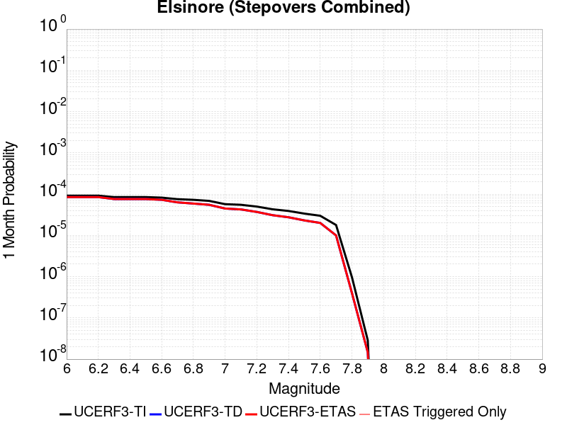 |  |  |

| Magnitude | 1 wk TI Prob | 1 wk TD Prob | 1 wk ETAS Prob | 1 wk ETAS/TD Gain | 1 wk ETAS Triggered Only | 1 mo TI Prob | 1 mo TD Prob | 1 mo ETAS Prob | 1 mo ETAS/TD Gain | 1 mo ETAS Triggered Only | 1 yr TI Prob | 1 yr TD Prob | 1 yr ETAS Prob | 1 yr ETAS/TD Gain | 1 yr ETAS Triggered Only | 10 yr TI Prob | 10 yr TD Prob | 10 yr ETAS Prob | 10 yr ETAS/TD Gain | 10 yr ETAS Triggered Only |
|-----|-----|-----|-----|-----|-----|-----|-----|-----|-----|-----|-----|-----|-----|-----|-----|-----|-----|-----|-----|-----|
| 6.0 | 2.144392E-5 | 1.976007E-5 | 1.976007E-5 | 1.0 | 0.0 | 9.189928E-5 | 8.468338E-5 | 8.468338E-5 | 1.0 | 0.0 | 0.0011182994 | 0.0010305515 | 0.0010305515 | 1.0 | 0.0 | 0.011126885 | 0.010264617 | 0.010274515 | 1.0009642 | 1.0E-5 |
| 6.1 | 2.144392E-5 | 1.976007E-5 | 1.976007E-5 | 1.0 | 0.0 | 9.189928E-5 | 8.468338E-5 | 8.468338E-5 | 1.0 | 0.0 | 0.0011182994 | 0.0010305515 | 0.0010305515 | 1.0 | 0.0 | 0.011126885 | 0.010264617 | 0.010274515 | 1.0009642 | 1.0E-5 |
| 6.2 | 2.144392E-5 | 1.976007E-5 | 1.976007E-5 | 1.0 | 0.0 | 9.189928E-5 | 8.468338E-5 | 8.468338E-5 | 1.0 | 0.0 | 0.0011182994 | 0.0010305515 | 0.0010305515 | 1.0 | 0.0 | 0.011126885 | 0.010264617 | 0.010274515 | 1.0009642 | 1.0E-5 |
| 6.3 | 1.9751555E-5 | 1.7741326E-5 | 1.7741326E-5 | 1.0 | 0.0 | 8.4646774E-5 | 7.603211E-5 | 7.603211E-5 | 1.0 | 0.0 | 0.0010300872 | 9.25312E-4 | 9.25312E-4 | 1.0 | 0.0 | 0.010253254 | 0.0092209745 | 0.009230883 | 1.0010744 | 1.0E-5 |
| 6.4 | 1.9751555E-5 | 1.7741326E-5 | 1.7741326E-5 | 1.0 | 0.0 | 8.4646774E-5 | 7.603211E-5 | 7.603211E-5 | 1.0 | 0.0 | 0.0010300872 | 9.25312E-4 | 9.25312E-4 | 1.0 | 0.0 | 0.010253254 | 0.0092209745 | 0.009230883 | 1.0010744 | 1.0E-5 |
| 6.5 | 1.9751555E-5 | 1.7741326E-5 | 1.7741326E-5 | 1.0 | 0.0 | 8.4646774E-5 | 7.603211E-5 | 7.603211E-5 | 1.0 | 0.0 | 0.0010300872 | 9.25312E-4 | 9.25312E-4 | 1.0 | 0.0 | 0.010253254 | 0.0092209745 | 0.009230883 | 1.0010744 | 1.0E-5 |
| 6.6 | 1.9188685E-5 | 1.7003247E-5 | 1.7003247E-5 | 1.0 | 0.0 | 8.2234634E-5 | 7.2869116E-5 | 7.2869116E-5 | 1.0 | 0.0 | 0.0010007467 | 8.8683655E-4 | 8.8683655E-4 | 1.0 | 0.0 | 0.00996252 | 0.008839546 | 0.008849458 | 1.0011213 | 1.0E-5 |
| 6.7 | 1.7608272E-5 | 1.4732402E-5 | 1.4732402E-5 | 1.0 | 0.0 | 7.546184E-5 | 6.313739E-5 | 6.313739E-5 | 1.0 | 0.0 | 9.183606E-4 | 7.684364E-4 | 7.684364E-4 | 1.0 | 0.0 | 0.009145746 | 0.007664441 | 0.0076743644 | 1.0012947 | 1.0E-5 |
| 6.8 | 1.697165E-5 | 1.3783126E-5 | 1.3783126E-5 | 1.0 | 0.0 | 7.273361E-5 | 5.906925E-5 | 5.906925E-5 | 1.0 | 0.0 | 8.8517193E-4 | 7.189395E-4 | 7.189395E-4 | 1.0 | 0.0 | 0.008816543 | 0.0071722106 | 0.007182139 | 1.0013843 | 1.0E-5 |
| 6.9 | 1.600365E-5 | 1.2846429E-5 | 1.2846429E-5 | 1.0 | 0.0 | 6.858527E-5 | 5.5055007E-5 | 5.5055007E-5 | 1.0 | 0.0 | 8.347058E-4 | 6.700963E-4 | 6.700963E-4 | 1.0 | 0.0 | 0.008315775 | 0.006686422 | 0.006696355 | 1.0014856 | 1.0E-5 |
| 7.0 | 1.3314581E-5 | 1.044738E-5 | 1.044738E-5 | 1.0 | 0.0 | 5.7061243E-5 | 4.4773733E-5 | 4.4773733E-5 | 1.0 | 0.0 | 6.944992E-4 | 5.449866E-4 | 5.449866E-4 | 1.0 | 0.0 | 0.006923327 | 0.005440055 | 0.005450001 | 1.0018282 | 1.0E-5 |
| 7.1 | 1.2865345E-5 | 9.937339E-6 | 9.937339E-6 | 1.0 | 0.0 | 5.5136024E-5 | 4.258792E-5 | 4.258792E-5 | 1.0 | 0.0 | 6.710743E-4 | 5.1838707E-4 | 5.1838707E-4 | 1.0 | 0.0 | 0.0066905143 | 0.005175021 | 0.0051849694 | 1.0019224 | 1.0E-5 |
| 7.2 | 1.1650051E-5 | 8.633585E-6 | 8.633585E-6 | 1.0 | 0.0 | 4.9927836E-5 | 3.7000562E-5 | 3.7000562E-5 | 1.0 | 0.0 | 6.0770183E-4 | 4.503905E-4 | 4.503905E-4 | 1.0 | 0.0 | 0.0060604266 | 0.00449624 | 0.0045061954 | 1.0022141 | 1.0E-5 |
| 7.3 | 1.0008533E-5 | 7.2008215E-6 | 7.2008215E-6 | 1.0 | 0.0 | 4.2893007E-5 | 3.0860305E-5 | 3.0860305E-5 | 1.0 | 0.0 | 5.220972E-4 | 3.756609E-4 | 3.756609E-4 | 1.0 | 0.0 | 0.005208723 | 0.0037506663 | 0.0037606286 | 1.0026562 | 1.0E-5 |
| 7.4 | 9.116759E-6 | 6.409854E-6 | 6.409854E-6 | 1.0 | 0.0 | 3.907124E-5 | 2.7470522E-5 | 2.7470522E-5 | 1.0 | 0.0 | 4.7558855E-4 | 3.3440365E-4 | 3.3440365E-4 | 1.0 | 0.0 | 0.00474572 | 0.0033391542 | 0.0033491207 | 1.0029848 | 1.0E-5 |
| 7.5 | 7.870524E-6 | 5.382316E-6 | 5.382316E-6 | 1.0 | 0.0 | 3.3730383E-5 | 2.306687E-5 | 2.306687E-5 | 1.0 | 0.0 | 4.1059E-4 | 2.8080423E-4 | 2.8080423E-4 | 1.0 | 0.0 | 0.0040983222 | 0.0028046207 | 0.0028145926 | 1.0035555 | 1.0E-5 |
| 7.6 | 6.9774537E-6 | 4.677398E-6 | 4.677398E-6 | 1.0 | 0.0 | 2.990303E-5 | 2.0045845E-5 | 2.0045845E-5 | 1.0 | 0.0 | 3.640086E-4 | 2.44032E-4 | 2.44032E-4 | 1.0 | 0.0 | 0.003634129 | 0.0024377564 | 0.002447732 | 1.0040921 | 1.0E-5 |
| 7.7 | 4.1616954E-6 | 2.3281368E-6 | 2.3281368E-6 | 1.0 | 0.0 | 1.7835715E-5 | 9.977695E-6 | 9.977695E-6 | 1.0 | 0.0 | 2.171282E-4 | 1.2147242E-4 | 1.2147242E-4 | 1.0 | 0.0 | 0.0021691616 | 0.0012141332 | 0.0012241211 | 1.0082263 | 1.0E-5 |
| 7.8 | 2.2692414E-7 | 9.384417E-8 | 9.384417E-8 | 1.0 | 0.0 | 9.725317E-7 | 4.0218927E-7 | 4.0218927E-7 | 1.0 | 0.0 | 1.1840509E-5 | 4.8966467E-6 | 4.8966467E-6 | 1.0 | 0.0 | 1.1839878E-4 | 4.8965718E-5 | 4.8965718E-5 | 1.0 | 0.0 |
| 7.9 | 6.676829E-9 | 3.4397174E-9 | 3.4397174E-9 | 1.0 | 0.0 | 2.861498E-8 | 1.4741646E-8 | 1.4741646E-8 | 1.0 | 0.0 | 3.4838732E-7 | 1.7947953E-7 | 1.7947953E-7 | 1.0 | 0.0 | 3.4838679E-6 | 1.794794E-6 | 1.794794E-6 | 1.0 | 0.0 |

## Great Valley 04b Gordon Valley
*[(top)](#table-of-contents)*

| 1 Week | 1 Month | 1 Year | 10 Year |
|-----|-----|-----|-----|
|  |  |  |  |

| Magnitude | 1 wk TI Prob | 1 wk TD Prob | 1 wk ETAS Prob | 1 wk ETAS/TD Gain | 1 wk ETAS Triggered Only | 1 mo TI Prob | 1 mo TD Prob | 1 mo ETAS Prob | 1 mo ETAS/TD Gain | 1 mo ETAS Triggered Only | 1 yr TI Prob | 1 yr TD Prob | 1 yr ETAS Prob | 1 yr ETAS/TD Gain | 1 yr ETAS Triggered Only | 10 yr TI Prob | 10 yr TD Prob | 10 yr ETAS Prob | 10 yr ETAS/TD Gain | 10 yr ETAS Triggered Only |
|-----|-----|-----|-----|-----|-----|-----|-----|-----|-----|-----|-----|-----|-----|-----|-----|-----|-----|-----|-----|-----|
| 6.0 | 2.1181217E-5 | 2.3981951E-5 | 2.3981951E-5 | 1.0 | 0.0 | 9.077348E-5 | 1.02776685E-4 | 1.02776685E-4 | 1.0 | 0.0 | 0.0011046068 | 0.0012507545 | 0.0012507545 | 1.0 | 0.0 | 0.010991322 | 0.0124536 | 0.012463476 | 1.000793 | 1.0E-5 |
| 6.1 | 2.1181217E-5 | 2.3981951E-5 | 2.3981951E-5 | 1.0 | 0.0 | 9.077348E-5 | 1.02776685E-4 | 1.02776685E-4 | 1.0 | 0.0 | 0.0011046068 | 0.0012507545 | 0.0012507545 | 1.0 | 0.0 | 0.010991322 | 0.0124536 | 0.012463476 | 1.000793 | 1.0E-5 |
| 6.2 | 2.1181217E-5 | 2.3981951E-5 | 2.3981951E-5 | 1.0 | 0.0 | 9.077348E-5 | 1.02776685E-4 | 1.02776685E-4 | 1.0 | 0.0 | 0.0011046068 | 0.0012507545 | 0.0012507545 | 1.0 | 0.0 | 0.010991322 | 0.0124536 | 0.012463476 | 1.000793 | 1.0E-5 |
| 6.3 | 2.1181217E-5 | 2.3981951E-5 | 2.3981951E-5 | 1.0 | 0.0 | 9.077348E-5 | 1.02776685E-4 | 1.02776685E-4 | 1.0 | 0.0 | 0.0011046068 | 0.0012507545 | 0.0012507545 | 1.0 | 0.0 | 0.010991322 | 0.0124536 | 0.012463476 | 1.000793 | 1.0E-5 |
| 6.4 | 1.0988268E-5 | 1.2254499E-5 | 1.2254499E-5 | 1.0 | 0.0 | 4.7091726E-5 | 5.2518313E-5 | 5.2518313E-5 | 1.0 | 0.0 | 5.731909E-4 | 6.392388E-4 | 6.392388E-4 | 1.0 | 0.0 | 0.005717147 | 0.0063755875 | 0.006385524 | 1.0015585 | 1.0E-5 |
| 6.5 | 1.0988268E-5 | 1.2254499E-5 | 1.2254499E-5 | 1.0 | 0.0 | 4.7091726E-5 | 5.2518313E-5 | 5.2518313E-5 | 1.0 | 0.0 | 5.731909E-4 | 6.392388E-4 | 6.392388E-4 | 1.0 | 0.0 | 0.005717147 | 0.0063755875 | 0.006385524 | 1.0015585 | 1.0E-5 |
| 6.6 | 1.0517822E-5 | 1.1724062E-5 | 1.1724062E-5 | 1.0 | 0.0 | 4.5075605E-5 | 5.02451E-5 | 5.02451E-5 | 1.0 | 0.0 | 5.4865726E-4 | 6.11578E-4 | 6.11578E-4 | 1.0 | 0.0 | 0.0054730466 | 0.0061005033 | 0.0061104423 | 1.0016292 | 1.0E-5 |
| 6.7 | 7.789219E-6 | 8.6776445E-6 | 8.6776445E-6 | 1.0 | 0.0 | 3.3381937E-5 | 3.7189402E-5 | 3.7189402E-5 | 1.0 | 0.0 | 4.063493E-4 | 4.526921E-4 | 4.526921E-4 | 1.0 | 0.0 | 0.004056071 | 0.0045182165 | 0.0045281714 | 1.0022032 | 1.0E-5 |
| 6.8 | 7.5850853E-6 | 8.452389E-6 | 8.452389E-6 | 1.0 | 0.0 | 3.2507105E-5 | 3.622405E-5 | 3.622405E-5 | 1.0 | 0.0 | 3.957021E-4 | 4.409437E-4 | 4.409437E-4 | 1.0 | 0.0 | 0.0039499826 | 0.0044012 | 0.0044111563 | 1.0022621 | 1.0E-5 |
| 6.9 | 6.604105E-6 | 7.3585493E-6 | 7.3585493E-6 | 1.0 | 0.0 | 2.8303E-5 | 3.153628E-5 | 3.153628E-5 | 1.0 | 0.0 | 3.4453452E-4 | 3.8389044E-4 | 3.8389044E-4 | 1.0 | 0.0 | 0.0034400085 | 0.0038326595 | 0.003842621 | 1.0025991 | 1.0E-5 |
| 7.0 | 5.3701115E-6 | 5.9884183E-6 | 5.9884183E-6 | 1.0 | 0.0 | 2.301456E-5 | 2.5664414E-5 | 2.5664414E-5 | 1.0 | 0.0 | 2.8016625E-4 | 3.1242234E-4 | 3.1242234E-4 | 1.0 | 0.0 | 0.0027981328 | 0.00312012 | 0.0031300886 | 1.003195 | 1.0E-5 |
| 7.1 | 4.4685607E-6 | 4.986478E-6 | 4.986478E-6 | 1.0 | 0.0 | 1.9150835E-5 | 2.1370459E-5 | 2.1370459E-5 | 1.0 | 0.0 | 2.3313647E-4 | 2.6015675E-4 | 2.6015675E-4 | 1.0 | 0.0 | 0.0023289204 | 0.0025987667 | 0.002608741 | 1.003838 | 1.0E-5 |
| 7.2 | 2.833378E-6 | 3.164419E-6 | 3.164419E-6 | 1.0 | 0.0 | 1.2142991E-5 | 1.3561736E-5 | 1.3561736E-5 | 1.0 | 0.0 | 1.4783088E-4 | 1.6510337E-4 | 1.6510337E-4 | 1.0 | 0.0 | 0.0014773258 | 0.0016499789 | 0.0016599623 | 1.0060507 | 1.0E-5 |
| 7.3 | 7.0087293E-7 | 7.7728157E-7 | 7.7728157E-7 | 1.0 | 0.0 | 3.0037377E-6 | 3.3312049E-6 | 3.3312049E-6 | 1.0 | 0.0 | 3.656989E-5 | 4.0557123E-5 | 4.0557123E-5 | 1.0 | 0.0 | 3.6563876E-4 | 4.055422E-4 | 4.055422E-4 | 1.0 | 0.0 |
| 7.4 | 3.112171E-8 | 3.2068368E-8 | 3.2068368E-8 | 1.0 | 0.0 | 1.3337875E-7 | 1.3743585E-7 | 1.3743585E-7 | 1.0 | 0.0 | 1.6238852E-6 | 1.6732803E-6 | 1.6732803E-6 | 1.0 | 0.0 | 1.6238733E-5 | 1.6732685E-5 | 1.6732685E-5 | 1.0 | 0.0 |

## Monte Vista - Shannon 2011 CFM
*[(top)](#table-of-contents)*

| 1 Week | 1 Month | 1 Year | 10 Year |
|-----|-----|-----|-----|
|  |  | 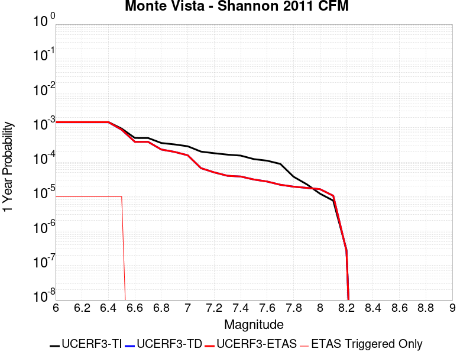 |  |

| Magnitude | 1 wk TI Prob | 1 wk TD Prob | 1 wk ETAS Prob | 1 wk ETAS/TD Gain | 1 wk ETAS Triggered Only | 1 mo TI Prob | 1 mo TD Prob | 1 mo ETAS Prob | 1 mo ETAS/TD Gain | 1 mo ETAS Triggered Only | 1 yr TI Prob | 1 yr TD Prob | 1 yr ETAS Prob | 1 yr ETAS/TD Gain | 1 yr ETAS Triggered Only | 10 yr TI Prob | 10 yr TD Prob | 10 yr ETAS Prob | 10 yr ETAS/TD Gain | 10 yr ETAS Triggered Only |
|-----|-----|-----|-----|-----|-----|-----|-----|-----|-----|-----|-----|-----|-----|-----|-----|-----|-----|-----|-----|-----|
| 6.0 | 2.7907707E-5 | 2.7584067E-5 | 3.758379E-5 | 1.3625181 | 1.0E-5 | 1.19598975E-4 | 1.1821277E-4 | 1.2821158E-4 | 1.0845833 | 1.0E-5 | 0.0014551448 | 0.001438414 | 0.0014483996 | 1.0069422 | 1.0E-5 | 0.014456532 | 0.014320111 | 0.014329968 | 1.0006883 | 1.0E-5 |
| 6.1 | 2.7907707E-5 | 2.7584067E-5 | 3.758379E-5 | 1.3625181 | 1.0E-5 | 1.19598975E-4 | 1.1821277E-4 | 1.2821158E-4 | 1.0845833 | 1.0E-5 | 0.0014551448 | 0.001438414 | 0.0014483996 | 1.0069422 | 1.0E-5 | 0.014456532 | 0.014320111 | 0.014329968 | 1.0006883 | 1.0E-5 |
| 6.2 | 2.7907707E-5 | 2.7584067E-5 | 3.758379E-5 | 1.3625181 | 1.0E-5 | 1.19598975E-4 | 1.1821277E-4 | 1.2821158E-4 | 1.0845833 | 1.0E-5 | 0.0014551448 | 0.001438414 | 0.0014483996 | 1.0069422 | 1.0E-5 | 0.014456532 | 0.014320111 | 0.014329968 | 1.0006883 | 1.0E-5 |
| 6.3 | 2.7907707E-5 | 2.7584067E-5 | 3.758379E-5 | 1.3625181 | 1.0E-5 | 1.19598975E-4 | 1.1821277E-4 | 1.2821158E-4 | 1.0845833 | 1.0E-5 | 0.0014551448 | 0.001438414 | 0.0014483996 | 1.0069422 | 1.0E-5 | 0.014456532 | 0.014320111 | 0.014329968 | 1.0006883 | 1.0E-5 |
| 6.4 | 2.7907707E-5 | 2.7584067E-5 | 3.758379E-5 | 1.3625181 | 1.0E-5 | 1.19598975E-4 | 1.1821277E-4 | 1.2821158E-4 | 1.0845833 | 1.0E-5 | 0.0014551448 | 0.001438414 | 0.0014483996 | 1.0069422 | 1.0E-5 | 0.014456532 | 0.014320111 | 0.014329968 | 1.0006883 | 1.0E-5 |
| 6.5 | 1.7990213E-5 | 1.6639742E-5 | 2.6639576E-5 | 1.6009609 | 1.0E-5 | 7.709863E-5 | 7.13116E-5 | 8.131089E-5 | 1.1402197 | 1.0E-5 | 9.382716E-4 | 8.679393E-4 | 8.779306E-4 | 1.0115116 | 1.0E-5 | 0.0093431985 | 0.008668857 | 0.008678771 | 1.0011436 | 1.0E-5 |
| 6.6 | 9.650407E-6 | 7.457001E-6 | 7.457001E-6 | 1.0 | 0.0 | 4.135823E-5 | 3.195823E-5 | 3.195823E-5 | 1.0 | 0.0 | 5.0342013E-4 | 3.890298E-4 | 3.890298E-4 | 1.0 | 0.0 | 0.005022812 | 0.0039011573 | 0.0039011573 | 1.0 | 0.0 |
| 6.7 | 9.62828E-6 | 7.434916E-6 | 7.434916E-6 | 1.0 | 0.0 | 4.1263404E-5 | 3.186358E-5 | 3.186358E-5 | 1.0 | 0.0 | 5.022661E-4 | 3.8787787E-4 | 3.8787787E-4 | 1.0 | 0.0 | 0.0050113243 | 0.003889678 | 0.003889678 | 1.0 | 0.0 |
| 6.8 | 6.887523E-6 | 4.461425E-6 | 4.461425E-6 | 1.0 | 0.0 | 2.9517621E-5 | 1.9120265E-5 | 1.9120265E-5 | 1.0 | 0.0 | 3.5931775E-4 | 2.3276659E-4 | 2.3276659E-4 | 1.0 | 0.0 | 0.0035873733 | 0.0023423703 | 0.0023423703 | 1.0 | 0.0 |
| 6.9 | 6.2722347E-6 | 3.8032956E-6 | 3.8032956E-6 | 1.0 | 0.0 | 2.6880729E-5 | 1.6299748E-5 | 1.6299748E-5 | 1.0 | 0.0 | 3.2722374E-4 | 1.9843338E-4 | 1.9843338E-4 | 1.0 | 0.0 | 0.003267423 | 0.0019996904 | 0.0019996904 | 1.0 | 0.0 |
| 7.0 | 5.5320347E-6 | 3.0304461E-6 | 3.0304461E-6 | 1.0 | 0.0 | 2.3708504E-5 | 1.2987572E-5 | 1.2987572E-5 | 1.0 | 0.0 | 2.8861282E-4 | 1.5811404E-4 | 1.5811404E-4 | 1.0 | 0.0 | 0.0028823826 | 0.0015971304 | 0.0015971304 | 1.0 | 0.0 |
| 7.1 | 3.8794055E-6 | 1.283645E-6 | 1.283645E-6 | 1.0 | 0.0 | 1.6625918E-5 | 5.5013243E-6 | 5.5013243E-6 | 1.0 | 0.0 | 2.0240174E-4 | 6.697658E-5 | 6.697658E-5 | 1.0 | 0.0 | 0.002022175 | 6.86504E-4 | 6.86504E-4 | 1.0 | 0.0 |
| 7.2 | 3.4813652E-6 | 9.669686E-7 | 9.669686E-7 | 1.0 | 0.0 | 1.49200505E-5 | 4.144145E-6 | 4.144145E-6 | 1.0 | 0.0 | 1.8163648E-4 | 5.0453804E-5 | 5.0453804E-5 | 1.0 | 0.0 | 0.0018148809 | 5.213506E-4 | 5.213506E-4 | 1.0 | 0.0 |
| 7.3 | 3.1682148E-6 | 7.7177793E-7 | 7.7177793E-7 | 1.0 | 0.0 | 1.3577992E-5 | 3.3076153E-6 | 3.3076153E-6 | 1.0 | 0.0 | 1.6529951E-4 | 4.0269475E-5 | 4.0269475E-5 | 1.0 | 0.0 | 0.0016517661 | 4.195245E-4 | 4.195245E-4 | 1.0 | 0.0 |
| 7.4 | 2.9707667E-6 | 7.344474E-7 | 7.344474E-7 | 1.0 | 0.0 | 1.2731795E-5 | 3.147628E-6 | 3.147628E-6 | 1.0 | 0.0 | 1.5499859E-4 | 3.8321698E-5 | 3.8321698E-5 | 1.0 | 0.0 | 0.0015489052 | 3.998471E-4 | 3.998471E-4 | 1.0 | 0.0 |
| 7.5 | 2.3462758E-6 | 6.0069135E-7 | 6.0069135E-7 | 1.0 | 0.0 | 1.0055429E-5 | 2.5743889E-6 | 2.5743889E-6 | 1.0 | 0.0 | 1.2241797E-4 | 3.1342737E-5 | 3.1342737E-5 | 1.0 | 0.0 | 0.0012235056 | 3.2833643E-4 | 3.2833643E-4 | 1.0 | 0.0 |
| 7.6 | 2.112783E-6 | 5.250731E-7 | 5.250731E-7 | 1.0 | 0.0 | 9.054753E-6 | 2.2503114E-6 | 2.2503114E-6 | 1.0 | 0.0 | 1.1023604E-4 | 2.7397198E-5 | 2.7397198E-5 | 1.0 | 0.0 | 0.0011018137 | 2.8845918E-4 | 2.8845918E-4 | 1.0 | 0.0 |
| 7.7 | 1.7022471E-6 | 4.23102E-7 | 4.23102E-7 | 1.0 | 0.0 | 7.2953244E-6 | 1.8132929E-6 | 1.8132929E-6 | 1.0 | 0.0 | 8.881695E-5 | 2.207662E-5 | 2.207662E-5 | 1.0 | 0.0 | 8.878146E-4 | 2.3394964E-4 | 2.3394964E-4 | 1.0 | 0.0 |
| 7.8 | 7.230914E-7 | 3.728293E-7 | 3.728293E-7 | 1.0 | 0.0 | 3.0989595E-6 | 1.597839E-6 | 1.597839E-6 | 1.0 | 0.0 | 3.772918E-5 | 1.9453517E-5 | 1.9453517E-5 | 1.0 | 0.0 | 3.7722773E-4 | 2.072548E-4 | 2.072548E-4 | 1.0 | 0.0 |
| 7.9 | 4.3588446E-7 | 3.4304335E-7 | 3.4304335E-7 | 1.0 | 0.0 | 1.868075E-6 | 1.4701849E-6 | 1.4701849E-6 | 1.0 | 0.0 | 2.2743576E-5 | 1.7899356E-5 | 1.7899356E-5 | 1.0 | 0.0 | 2.2741247E-4 | 1.899464E-4 | 1.899464E-4 | 1.0 | 0.0 |
| 8.0 | 2.3317523E-7 | 3.1513432E-7 | 3.1513432E-7 | 1.0 | 0.0 | 9.99322E-7 | 1.350575E-6 | 1.350575E-6 | 1.0 | 0.0 | 1.2166677E-5 | 1.6443128E-5 | 1.6443128E-5 | 1.0 | 0.0 | 1.21660116E-4 | 1.7399403E-4 | 1.7399403E-4 | 1.0 | 0.0 |
| 8.1 | 1.4662456E-7 | 2.03077E-7 | 2.03077E-7 | 1.0 | 0.0 | 6.283908E-7 | 8.703297E-7 | 8.703297E-7 | 1.0 | 0.0 | 7.650631E-6 | 1.05962135E-5 | 1.05962135E-5 | 1.0 | 0.0 | 7.650368E-5 | 1.1132272E-4 | 1.1132272E-4 | 1.0 | 0.0 |
| 8.2 | 5.4931775E-9 | 5.0752176E-9 | 5.0752176E-9 | 1.0 | 0.0 | 2.3542189E-8 | 2.1750932E-8 | 2.1750932E-8 | 1.0 | 0.0 | 2.8662612E-7 | 2.6481757E-7 | 2.6481757E-7 | 1.0 | 0.0 | 2.8662573E-6 | 2.754138E-6 | 2.754138E-6 | 1.0 | 0.0 |

## Collayami 2011 CFM
*[(top)](#table-of-contents)*

| 1 Week | 1 Month | 1 Year | 10 Year |
|-----|-----|-----|-----|
|  |  |  |  |

| Magnitude | 1 wk TI Prob | 1 wk TD Prob | 1 wk ETAS Prob | 1 wk ETAS/TD Gain | 1 wk ETAS Triggered Only | 1 mo TI Prob | 1 mo TD Prob | 1 mo ETAS Prob | 1 mo ETAS/TD Gain | 1 mo ETAS Triggered Only | 1 yr TI Prob | 1 yr TD Prob | 1 yr ETAS Prob | 1 yr ETAS/TD Gain | 1 yr ETAS Triggered Only | 10 yr TI Prob | 10 yr TD Prob | 10 yr ETAS Prob | 10 yr ETAS/TD Gain | 10 yr ETAS Triggered Only |
|-----|-----|-----|-----|-----|-----|-----|-----|-----|-----|-----|-----|-----|-----|-----|-----|-----|-----|-----|-----|-----|
| 6.0 | 3.112429E-5 | 3.493857E-5 | 3.493857E-5 | 1.0 | 0.0 | 1.33383E-4 | 1.4972912E-4 | 1.5972763E-4 | 1.0667772 | 1.0E-5 | 0.0016227282 | 0.0018216016 | 0.0018315834 | 1.0054797 | 1.0E-5 | 0.016109297 | 0.018084232 | 0.018094052 | 1.000543 | 1.0E-5 |
| 6.1 | 1.7119446E-5 | 1.9156618E-5 | 1.9156618E-5 | 1.0 | 0.0 | 7.336699E-5 | 8.209754E-5 | 8.209754E-5 | 1.0 | 0.0 | 8.92877E-4 | 9.991383E-4 | 9.991383E-4 | 1.0 | 0.0 | 0.00889298 | 0.009952341 | 0.009952341 | 1.0 | 0.0 |
| 6.2 | 1.7119446E-5 | 1.9156618E-5 | 1.9156618E-5 | 1.0 | 0.0 | 7.336699E-5 | 8.209754E-5 | 8.209754E-5 | 1.0 | 0.0 | 8.92877E-4 | 9.991383E-4 | 9.991383E-4 | 1.0 | 0.0 | 0.00889298 | 0.009952341 | 0.009952341 | 1.0 | 0.0 |
| 6.3 | 9.041288E-6 | 1.0106096E-5 | 1.0106096E-5 | 1.0 | 0.0 | 3.87478E-5 | 4.3311244E-5 | 4.3311244E-5 | 1.0 | 0.0 | 4.7165234E-4 | 5.2720873E-4 | 5.2720873E-4 | 1.0 | 0.0 | 0.0047065257 | 0.005261738 | 0.005261738 | 1.0 | 0.0 |
| 6.4 | 5.5972064E-6 | 6.2580466E-6 | 6.2580466E-6 | 1.0 | 0.0 | 2.3987806E-5 | 2.6820002E-5 | 2.6820002E-5 | 1.0 | 0.0 | 2.920124E-4 | 3.2649818E-4 | 3.2649818E-4 | 1.0 | 0.0 | 0.0029162897 | 0.0032615191 | 0.0032615191 | 1.0 | 0.0 |
| 6.5 | 3.530659E-6 | 3.9520487E-6 | 3.9520487E-6 | 1.0 | 0.0 | 1.5131307E-5 | 1.69373E-5 | 1.69373E-5 | 1.0 | 0.0 | 1.842081E-4 | 2.062025E-4 | 2.062025E-4 | 1.0 | 0.0 | 0.0018405546 | 0.0020611305 | 0.0020611305 | 1.0 | 0.0 |
| 6.6 | 2.4625563E-6 | 2.7572657E-6 | 2.7572657E-6 | 1.0 | 0.0 | 1.0553769E-5 | 1.1816854E-5 | 1.1816854E-5 | 1.0 | 0.0 | 1.2848456E-4 | 1.4387019E-4 | 1.4387019E-4 | 1.0 | 0.0 | 0.001284103 | 0.0014387019 | 0.0014387019 | 1.0 | 0.0 |

## Great Valley 05 Pittsburg - Kirby Hills alt1
*[(top)](#table-of-contents)*

| 1 Week | 1 Month | 1 Year | 10 Year |
|-----|-----|-----|-----|
|  |  |  |  |

| Magnitude | 1 wk TI Prob | 1 wk TD Prob | 1 wk ETAS Prob | 1 wk ETAS/TD Gain | 1 wk ETAS Triggered Only | 1 mo TI Prob | 1 mo TD Prob | 1 mo ETAS Prob | 1 mo ETAS/TD Gain | 1 mo ETAS Triggered Only | 1 yr TI Prob | 1 yr TD Prob | 1 yr ETAS Prob | 1 yr ETAS/TD Gain | 1 yr ETAS Triggered Only | 10 yr TI Prob | 10 yr TD Prob | 10 yr ETAS Prob | 10 yr ETAS/TD Gain | 10 yr ETAS Triggered Only |
|-----|-----|-----|-----|-----|-----|-----|-----|-----|-----|-----|-----|-----|-----|-----|-----|-----|-----|-----|-----|-----|
| 6.0 | 4.187212E-5 | 5.344289E-5 | 5.344289E-5 | 1.0 | 0.0 | 1.794396E-4 | 2.2902661E-4 | 2.2902661E-4 | 1.0 | 0.0 | 0.002182488 | 0.0027857998 | 0.002795772 | 1.0035796 | 1.0E-5 | 0.021611776 | 0.027603218 | 0.027612941 | 1.0003523 | 1.0E-5 |
| 6.1 | 4.187212E-5 | 5.344289E-5 | 5.344289E-5 | 1.0 | 0.0 | 1.794396E-4 | 2.2902661E-4 | 2.2902661E-4 | 1.0 | 0.0 | 0.002182488 | 0.0027857998 | 0.002795772 | 1.0035796 | 1.0E-5 | 0.021611776 | 0.027603218 | 0.027612941 | 1.0003523 | 1.0E-5 |
| 6.2 | 1.7353306E-5 | 2.2154672E-5 | 2.2154672E-5 | 1.0 | 0.0 | 7.436919E-5 | 9.4947456E-5 | 9.4947456E-5 | 1.0 | 0.0 | 9.050688E-4 | 0.0011557573 | 0.0011557573 | 1.0 | 0.0 | 0.009013915 | 0.0115352 | 0.0115352 | 1.0 | 0.0 |
| 6.3 | 1.7353306E-5 | 2.2154672E-5 | 2.2154672E-5 | 1.0 | 0.0 | 7.436919E-5 | 9.4947456E-5 | 9.4947456E-5 | 1.0 | 0.0 | 9.050688E-4 | 0.0011557573 | 0.0011557573 | 1.0 | 0.0 | 0.009013915 | 0.0115352 | 0.0115352 | 1.0 | 0.0 |
| 6.4 | 1.4028824E-5 | 1.7901062E-5 | 1.7901062E-5 | 1.0 | 0.0 | 6.0122147E-5 | 7.671883E-5 | 7.671883E-5 | 1.0 | 0.0 | 7.3174125E-4 | 9.340303E-4 | 9.340303E-4 | 1.0 | 0.0 | 0.0072933645 | 0.009338211 | 0.009338211 | 1.0 | 0.0 |

## West Napa 2011 CFM
*[(top)](#table-of-contents)*

| 1 Week | 1 Month | 1 Year | 10 Year |
|-----|-----|-----|-----|
|  |  |  |  |

| Magnitude | 1 wk TI Prob | 1 wk TD Prob | 1 wk ETAS Prob | 1 wk ETAS/TD Gain | 1 wk ETAS Triggered Only | 1 mo TI Prob | 1 mo TD Prob | 1 mo ETAS Prob | 1 mo ETAS/TD Gain | 1 mo ETAS Triggered Only | 1 yr TI Prob | 1 yr TD Prob | 1 yr ETAS Prob | 1 yr ETAS/TD Gain | 1 yr ETAS Triggered Only | 10 yr TI Prob | 10 yr TD Prob | 10 yr ETAS Prob | 10 yr ETAS/TD Gain | 10 yr ETAS Triggered Only |
|-----|-----|-----|-----|-----|-----|-----|-----|-----|-----|-----|-----|-----|-----|-----|-----|-----|-----|-----|-----|-----|
| 6.0 | 3.773104E-5 | 4.4528504E-5 | 4.4528504E-5 | 1.0 | 0.0 | 1.6169442E-4 | 1.9082428E-4 | 1.9082428E-4 | 1.0 | 0.0 | 0.001966852 | 0.0023211278 | 0.0023211278 | 1.0 | 0.0 | 0.019495348 | 0.023002012 | 0.023011781 | 1.0004247 | 1.0E-5 |
| 6.1 | 3.773104E-5 | 4.4528504E-5 | 4.4528504E-5 | 1.0 | 0.0 | 1.6169442E-4 | 1.9082428E-4 | 1.9082428E-4 | 1.0 | 0.0 | 0.001966852 | 0.0023211278 | 0.0023211278 | 1.0 | 0.0 | 0.019495348 | 0.023002012 | 0.023011781 | 1.0004247 | 1.0E-5 |
| 6.2 | 3.773104E-5 | 4.4528504E-5 | 4.4528504E-5 | 1.0 | 0.0 | 1.6169442E-4 | 1.9082428E-4 | 1.9082428E-4 | 1.0 | 0.0 | 0.001966852 | 0.0023211278 | 0.0023211278 | 1.0 | 0.0 | 0.019495348 | 0.023002012 | 0.023011781 | 1.0004247 | 1.0E-5 |
| 6.3 | 2.147964E-5 | 2.4987066E-5 | 2.4987066E-5 | 1.0 | 0.0 | 9.2052345E-5 | 1.0708355E-4 | 1.0708355E-4 | 1.0 | 0.0 | 0.001120161 | 0.0013030542 | 0.0013030542 | 1.0 | 0.0 | 0.011145315 | 0.012964482 | 0.0129743535 | 1.0007614 | 1.0E-5 |
| 6.4 | 2.147964E-5 | 2.4987066E-5 | 2.4987066E-5 | 1.0 | 0.0 | 9.2052345E-5 | 1.0708355E-4 | 1.0708355E-4 | 1.0 | 0.0 | 0.001120161 | 0.0013030542 | 0.0013030542 | 1.0 | 0.0 | 0.011145315 | 0.012964482 | 0.0129743535 | 1.0007614 | 1.0E-5 |
| 6.5 | 1.688201E-5 | 1.9547371E-5 | 1.9547371E-5 | 1.0 | 0.0 | 7.234947E-5 | 8.377217E-5 | 8.377217E-5 | 1.0 | 0.0 | 8.804988E-4 | 0.0010195216 | 0.0010195216 | 1.0 | 0.0 | 0.008770182 | 0.01015684 | 0.010166738 | 1.0009745 | 1.0E-5 |
| 6.6 | 1.6846381E-5 | 1.9507064E-5 | 1.9507064E-5 | 1.0 | 0.0 | 7.219678E-5 | 8.3599436E-5 | 8.3599436E-5 | 1.0 | 0.0 | 8.7864127E-4 | 0.0010174206 | 0.0010174206 | 1.0 | 0.0 | 0.008751754 | 0.010136021 | 0.010145919 | 1.0009766 | 1.0E-5 |
| 6.7 | 1.3396501E-5 | 1.5467684E-5 | 1.5467684E-5 | 1.0 | 0.0 | 5.7412315E-5 | 6.628875E-5 | 6.628875E-5 | 1.0 | 0.0 | 6.9877075E-4 | 8.068302E-4 | 8.068302E-4 | 1.0 | 0.0 | 0.0069657755 | 0.008046459 | 0.008046459 | 1.0 | 0.0 |
| 6.8 | 1.0139058E-5 | 1.16721785E-5 | 1.16721785E-5 | 1.0 | 0.0 | 4.3452383E-5 | 5.0022976E-5 | 5.0022976E-5 | 1.0 | 0.0 | 5.289043E-4 | 6.0891506E-4 | 6.0891506E-4 | 1.0 | 0.0 | 0.005276473 | 0.0060791126 | 0.0060791126 | 1.0 | 0.0 |
| 6.9 | 7.761281E-6 | 8.890723E-6 | 8.890723E-6 | 1.0 | 0.0 | 3.326221E-5 | 3.810283E-5 | 3.810283E-5 | 1.0 | 0.0 | 4.0489217E-4 | 4.6385458E-4 | 4.6385458E-4 | 1.0 | 0.0 | 0.0040415525 | 0.0046351026 | 0.0046351026 | 1.0 | 0.0 |
| 7.0 | 2.2109202E-6 | 2.3666319E-6 | 2.3666319E-6 | 1.0 | 0.0 | 9.475338E-6 | 1.01426685E-5 | 1.01426685E-5 | 1.0 | 0.0 | 1.1535613E-4 | 1.2348007E-4 | 1.2348007E-4 | 1.0 | 0.0 | 0.0011529627 | 0.0012353238 | 0.0012353238 | 1.0 | 0.0 |
| 7.1 | 1.9008926E-6 | 2.0133207E-6 | 2.0133207E-6 | 1.0 | 0.0 | 8.146657E-6 | 8.628488E-6 | 8.628488E-6 | 1.0 | 0.0 | 9.918104E-5 | 1.05046805E-4 | 1.05046805E-4 | 1.0 | 0.0 | 9.913679E-4 | 0.0010511756 | 0.0010511756 | 1.0 | 0.0 |
| 7.2 | 1.8495944E-6 | 1.9561273E-6 | 1.9561273E-6 | 1.0 | 0.0 | 7.926808E-6 | 8.383376E-6 | 8.383376E-6 | 1.0 | 0.0 | 9.650462E-5 | 1.0206285E-4 | 1.0206285E-4 | 1.0 | 0.0 | 9.6462725E-4 | 0.0010213639 | 0.0010213639 | 1.0 | 0.0 |
| 7.3 | 1.7883189E-6 | 1.8880897E-6 | 1.8880897E-6 | 1.0 | 0.0 | 7.664201E-6 | 8.091788E-6 | 8.091788E-6 | 1.0 | 0.0 | 9.330765E-5 | 9.85131E-5 | 9.85131E-5 | 1.0 | 0.0 | 9.3268487E-4 | 9.858976E-4 | 9.858976E-4 | 1.0 | 0.0 |
| 7.4 | 1.6520572E-6 | 1.7415113E-6 | 1.7415113E-6 | 1.0 | 0.0 | 7.0802257E-6 | 7.463598E-6 | 7.463598E-6 | 1.0 | 0.0 | 8.6198335E-5 | 9.086554E-5 | 9.086554E-5 | 1.0 | 0.0 | 8.616491E-4 | 9.0948684E-4 | 9.0948684E-4 | 1.0 | 0.0 |
| 7.5 | 1.4040345E-6 | 1.4800271E-6 | 1.4800271E-6 | 1.0 | 0.0 | 6.0172765E-6 | 6.342958E-6 | 6.342958E-6 | 1.0 | 0.0 | 7.325788E-5 | 7.72228E-5 | 7.72228E-5 | 1.0 | 0.0 | 7.3233736E-4 | 7.7311805E-4 | 7.7311805E-4 | 1.0 | 0.0 |
| 7.6 | 1.3013842E-7 | 1.4416163E-7 | 1.4416163E-7 | 1.0 | 0.0 | 5.57736E-7 | 6.178354E-7 | 6.178354E-7 | 1.0 | 0.0 | 6.790414E-6 | 7.52212E-6 | 7.52212E-6 | 1.0 | 0.0 | 6.790207E-5 | 7.61463E-5 | 7.61463E-5 | 1.0 | 0.0 |
| 7.7 | 8.541512E-8 | 9.716462E-8 | 9.716462E-8 | 1.0 | 0.0 | 3.6606474E-7 | 4.1641974E-7 | 4.1641974E-7 | 1.0 | 0.0 | 4.456829E-6 | 5.069898E-6 | 5.069898E-6 | 1.0 | 0.0 | 4.4567398E-5 | 5.160189E-5 | 5.160189E-5 | 1.0 | 0.0 |
| 7.8 | 5.6074793E-8 | 6.895456E-8 | 6.895456E-8 | 1.0 | 0.0 | 2.403205E-7 | 2.955195E-7 | 2.955195E-7 | 1.0 | 0.0 | 2.9258983E-6 | 3.597944E-6 | 3.597944E-6 | 1.0 | 0.0 | 2.9258597E-5 | 3.6812045E-5 | 3.6812045E-5 | 1.0 | 0.0 |
| 7.9 | 2.9475839E-8 | 3.8567407E-8 | 3.8567407E-8 | 1.0 | 0.0 | 1.2632502E-7 | 1.6528887E-7 | 1.6528887E-7 | 1.0 | 0.0 | 1.538006E-6 | 2.01239E-6 | 2.01239E-6 | 1.0 | 0.0 | 1.5379954E-5 | 2.0664074E-5 | 2.0664074E-5 | 1.0 | 0.0 |
| 8.0 | 1.3337122E-8 | 2.1632943E-8 | 2.1632943E-8 | 1.0 | 0.0 | 5.7159088E-8 | 9.2712604E-8 | 9.2712604E-8 | 1.0 | 0.0 | 6.959117E-7 | 1.1287754E-6 | 1.1287754E-6 | 1.0 | 0.0 | 6.959095E-6 | 1.1644432E-5 | 1.1644432E-5 | 1.0 | 0.0 |
| 8.1 | 2.6589986E-10 | 4.8617654E-10 | 4.8617654E-10 | 1.0 | 0.0 | 1.1395708E-9 | 2.0836133E-9 | 2.0836133E-9 | 1.0 | 0.0 | 1.3874274E-8 | 2.536799E-8 | 2.536799E-8 | 1.0 | 0.0 | 1.3874273E-7 | 2.6036727E-7 | 2.6036727E-7 | 1.0 | 0.0 |

## Carlsbad
*[(top)](#table-of-contents)*

| 1 Week | 1 Month | 1 Year | 10 Year |
|-----|-----|-----|-----|
|  | 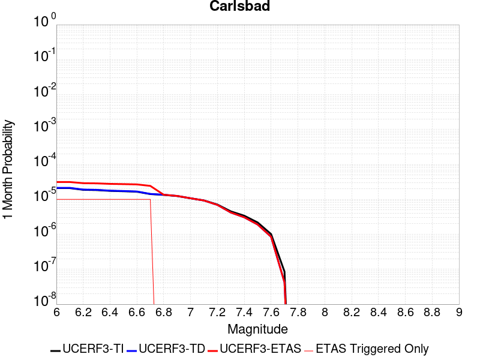 |  |  |

| Magnitude | 1 wk TI Prob | 1 wk TD Prob | 1 wk ETAS Prob | 1 wk ETAS/TD Gain | 1 wk ETAS Triggered Only | 1 mo TI Prob | 1 mo TD Prob | 1 mo ETAS Prob | 1 mo ETAS/TD Gain | 1 mo ETAS Triggered Only | 1 yr TI Prob | 1 yr TD Prob | 1 yr ETAS Prob | 1 yr ETAS/TD Gain | 1 yr ETAS Triggered Only | 10 yr TI Prob | 10 yr TD Prob | 10 yr ETAS Prob | 10 yr ETAS/TD Gain | 10 yr ETAS Triggered Only |
|-----|-----|-----|-----|-----|-----|-----|-----|-----|-----|-----|-----|-----|-----|-----|-----|-----|-----|-----|-----|-----|
| 6.0 | 4.9038536E-6 | 4.9872688E-6 | 1.4987219E-5 | 3.0050955 | 1.0E-5 | 2.1016345E-5 | 2.1373837E-5 | 3.1373624E-5 | 1.4678518 | 1.0E-5 | 2.5584397E-4 | 2.6019584E-4 | 2.7019324E-4 | 1.0384226 | 1.0E-5 | 0.002555496 | 0.002598959 | 0.002608933 | 1.0038377 | 1.0E-5 |
| 6.1 | 4.9038536E-6 | 4.9872688E-6 | 1.4987219E-5 | 3.0050955 | 1.0E-5 | 2.1016345E-5 | 2.1373837E-5 | 3.1373624E-5 | 1.4678518 | 1.0E-5 | 2.5584397E-4 | 2.6019584E-4 | 2.7019324E-4 | 1.0384226 | 1.0E-5 | 0.002555496 | 0.002598959 | 0.002608933 | 1.0038377 | 1.0E-5 |
| 6.2 | 4.3820614E-6 | 4.4547814E-6 | 1.4454737E-5 | 3.244769 | 1.0E-5 | 1.8780129E-5 | 1.9091782E-5 | 2.909159E-5 | 1.5237756 | 1.0E-5 | 2.2862408E-4 | 2.3241801E-4 | 2.4241568E-4 | 1.043016 | 1.0E-5 | 0.00228389 | 0.002321785 | 0.0023317619 | 1.004297 | 1.0E-5 |
| 6.3 | 4.302872E-6 | 4.373019E-6 | 1.4372975E-5 | 3.2867398 | 1.0E-5 | 1.8440749E-5 | 1.8741377E-5 | 2.874119E-5 | 1.5335687 | 1.0E-5 | 2.24493E-4 | 2.2815271E-4 | 2.3815043E-4 | 1.0438203 | 1.0E-5 | 0.0022426634 | 0.0022792201 | 0.0022891972 | 1.0043775 | 1.0E-5 |
| 6.4 | 4.0835243E-6 | 4.147667E-6 | 1.4147626E-5 | 3.410984 | 1.0E-5 | 1.75007E-5 | 1.7775597E-5 | 2.7775419E-5 | 1.562559 | 1.0E-5 | 2.1305021E-4 | 2.1639673E-4 | 2.2639456E-4 | 1.0462015 | 1.0E-5 | 0.0021284607 | 0.0021618942 | 0.0021718726 | 1.0046155 | 1.0E-5 |
| 6.5 | 3.987806E-6 | 4.048899E-6 | 1.4048858E-5 | 3.4697971 | 1.0E-5 | 1.7090486E-5 | 1.7352311E-5 | 2.7352138E-5 | 1.5762821 | 1.0E-5 | 2.080568E-4 | 2.1124425E-4 | 2.2124212E-4 | 1.0473286 | 1.0E-5 | 0.002078621 | 0.0021104682 | 0.002120447 | 1.0047283 | 1.0E-5 |
| 6.6 | 3.8707576E-6 | 3.927501E-6 | 1.3927462E-5 | 3.5461383 | 1.0E-5 | 1.6588854E-5 | 1.683204E-5 | 2.683187E-5 | 1.5940951 | 1.0E-5 | 2.0195059E-4 | 2.0491115E-4 | 2.149091E-4 | 1.0487916 | 1.0E-5 | 0.0020176715 | 0.0020472556 | 0.0020572352 | 1.0048746 | 1.0E-5 |
| 6.7 | 3.3093434E-6 | 3.3424044E-6 | 1.3342371E-5 | 3.9918482 | 1.0E-5 | 1.4182823E-5 | 1.4324512E-5 | 2.4324368E-5 | 1.698094 | 1.0E-5 | 1.7266218E-4 | 1.7438704E-4 | 1.843853E-4 | 1.0573337 | 1.0E-5 | 0.001725281 | 0.001742508 | 0.0017524905 | 1.0057288 | 1.0E-5 |
| 6.8 | 3.136983E-6 | 3.1664663E-6 | 3.1664663E-6 | 1.0 | 0.0 | 1.3444143E-5 | 1.35704995E-5 | 1.35704995E-5 | 1.0 | 0.0 | 1.6367015E-4 | 1.6520836E-4 | 1.6520836E-4 | 1.0 | 0.0 | 0.0016354966 | 0.0016508611 | 0.0016508611 | 1.0 | 0.0 |
| 6.9 | 2.9056644E-6 | 2.9267715E-6 | 2.9267715E-6 | 1.0 | 0.0 | 1.2452788E-5 | 1.2543246E-5 | 1.2543246E-5 | 1.0 | 0.0 | 1.5160214E-4 | 1.5270336E-4 | 1.5270336E-4 | 1.0 | 0.0 | 0.0015149876 | 0.0015259896 | 0.0015259896 | 1.0 | 0.0 |
| 7.0 | 2.5071035E-6 | 2.51141E-6 | 2.51141E-6 | 1.0 | 0.0 | 1.0744685E-5 | 1.0763142E-5 | 1.0763142E-5 | 1.0 | 0.0 | 1.308087E-4 | 1.310334E-4 | 1.310334E-4 | 1.0 | 0.0 | 0.0013073172 | 0.0013095647 | 0.0013095647 | 1.0 | 0.0 |
| 7.1 | 2.1786877E-6 | 2.1678952E-6 | 2.1678952E-6 | 1.0 | 0.0 | 9.3372E-6 | 9.290947E-6 | 9.290947E-6 | 1.0 | 0.0 | 1.13674476E-4 | 1.13111426E-4 | 1.13111426E-4 | 1.0 | 0.0 | 0.0011361635 | 0.0011305414 | 0.0011305414 | 1.0 | 0.0 |
| 7.2 | 1.6628418E-6 | 1.6213987E-6 | 1.6213987E-6 | 1.0 | 0.0 | 7.1264453E-6 | 6.9488333E-6 | 6.9488333E-6 | 1.0 | 0.0 | 8.676102E-5 | 8.459878E-5 | 8.459878E-5 | 1.0 | 0.0 | 8.672715E-4 | 8.4566796E-4 | 8.4566796E-4 | 1.0 | 0.0 |
| 7.3 | 1.0595926E-6 | 9.816912E-7 | 9.816912E-7 | 1.0 | 0.0 | 4.541103E-6 | 4.207241E-6 | 4.207241E-6 | 1.0 | 0.0 | 5.5286528E-5 | 5.1221967E-5 | 5.1221967E-5 | 1.0 | 0.0 | 5.527277E-4 | 5.121025E-4 | 5.121025E-4 | 1.0 | 0.0 |
| 7.4 | 7.956623E-7 | 7.173889E-7 | 7.173889E-7 | 1.0 | 0.0 | 3.4099767E-6 | 3.0745202E-6 | 3.0745202E-6 | 1.0 | 0.0 | 4.1515676E-5 | 3.7431648E-5 | 3.7431648E-5 | 1.0 | 0.0 | 4.150792E-4 | 3.7425413E-4 | 3.7425413E-4 | 1.0 | 0.0 |
| 7.5 | 5.1043804E-7 | 4.448447E-7 | 4.448447E-7 | 1.0 | 0.0 | 2.1875896E-6 | 1.9064759E-6 | 1.9064759E-6 | 1.0 | 0.0 | 2.663358E-5 | 2.3211102E-5 | 2.3211102E-5 | 1.0 | 0.0 | 2.6630386E-4 | 2.3208735E-4 | 2.3208735E-4 | 1.0 | 0.0 |
| 7.6 | 2.3723294E-7 | 1.9896439E-7 | 1.9896439E-7 | 1.0 | 0.0 | 1.0167122E-6 | 8.527042E-7 | 8.527042E-7 | 1.0 | 0.0 | 1.2378401E-5 | 1.0381627E-5 | 1.0381627E-5 | 1.0 | 0.0 | 1.237771E-4 | 1.038117E-4 | 1.038117E-4 | 1.0 | 0.0 |
| 7.7 | 1.9992152E-8 | 9.860285E-9 | 9.860285E-9 | 1.0 | 0.0 | 8.568065E-8 | 4.2258364E-8 | 4.2258364E-8 | 1.0 | 0.0 | 1.0431614E-6 | 5.144956E-7 | 5.144956E-7 | 1.0 | 0.0 | 1.0431565E-5 | 5.144956E-6 | 5.144956E-6 | 1.0 | 0.0 |

## San Gabriel
*[(top)](#table-of-contents)*

| 1 Week | 1 Month | 1 Year | 10 Year |
|-----|-----|-----|-----|
|  |  |  |  |

| Magnitude | 1 wk TI Prob | 1 wk TD Prob | 1 wk ETAS Prob | 1 wk ETAS/TD Gain | 1 wk ETAS Triggered Only | 1 mo TI Prob | 1 mo TD Prob | 1 mo ETAS Prob | 1 mo ETAS/TD Gain | 1 mo ETAS Triggered Only | 1 yr TI Prob | 1 yr TD Prob | 1 yr ETAS Prob | 1 yr ETAS/TD Gain | 1 yr ETAS Triggered Only | 10 yr TI Prob | 10 yr TD Prob | 10 yr ETAS Prob | 10 yr ETAS/TD Gain | 10 yr ETAS Triggered Only |
|-----|-----|-----|-----|-----|-----|-----|-----|-----|-----|-----|-----|-----|-----|-----|-----|-----|-----|-----|-----|-----|
| 6.0 | 1.083775E-5 | 1.198525E-5 | 1.198525E-5 | 1.0 | 0.0 | 4.6446676E-5 | 5.1364408E-5 | 5.1364408E-5 | 1.0 | 0.0 | 5.653415E-4 | 6.251936E-4 | 6.251936E-4 | 1.0 | 0.0 | 0.0056390543 | 0.0062463325 | 0.00625627 | 1.001591 | 1.0E-5 |
| 6.1 | 1.083775E-5 | 1.198525E-5 | 1.198525E-5 | 1.0 | 0.0 | 4.6446676E-5 | 5.1364408E-5 | 5.1364408E-5 | 1.0 | 0.0 | 5.653415E-4 | 6.251936E-4 | 6.251936E-4 | 1.0 | 0.0 | 0.0056390543 | 0.0062463325 | 0.00625627 | 1.001591 | 1.0E-5 |
| 6.2 | 1.083775E-5 | 1.198525E-5 | 1.198525E-5 | 1.0 | 0.0 | 4.6446676E-5 | 5.1364408E-5 | 5.1364408E-5 | 1.0 | 0.0 | 5.653415E-4 | 6.251936E-4 | 6.251936E-4 | 1.0 | 0.0 | 0.0056390543 | 0.0062463325 | 0.00625627 | 1.001591 | 1.0E-5 |
| 6.3 | 1.083775E-5 | 1.198525E-5 | 1.198525E-5 | 1.0 | 0.0 | 4.6446676E-5 | 5.1364408E-5 | 5.1364408E-5 | 1.0 | 0.0 | 5.653415E-4 | 6.251936E-4 | 6.251936E-4 | 1.0 | 0.0 | 0.0056390543 | 0.0062463325 | 0.00625627 | 1.001591 | 1.0E-5 |
| 6.4 | 1.083775E-5 | 1.198525E-5 | 1.198525E-5 | 1.0 | 0.0 | 4.6446676E-5 | 5.1364408E-5 | 5.1364408E-5 | 1.0 | 0.0 | 5.653415E-4 | 6.251936E-4 | 6.251936E-4 | 1.0 | 0.0 | 0.0056390543 | 0.0062463325 | 0.00625627 | 1.001591 | 1.0E-5 |
| 6.5 | 6.7317824E-6 | 7.717007E-6 | 7.717007E-6 | 1.0 | 0.0 | 2.8850178E-5 | 3.3072472E-5 | 3.3072472E-5 | 1.0 | 0.0 | 3.511943E-4 | 4.0258403E-4 | 4.0258403E-4 | 1.0 | 0.0 | 0.003506398 | 0.004029533 | 0.0040394925 | 1.0024717 | 1.0E-5 |
| 6.6 | 6.7317824E-6 | 7.717007E-6 | 7.717007E-6 | 1.0 | 0.0 | 2.8850178E-5 | 3.3072472E-5 | 3.3072472E-5 | 1.0 | 0.0 | 3.511943E-4 | 4.0258403E-4 | 4.0258403E-4 | 1.0 | 0.0 | 0.003506398 | 0.004029533 | 0.0040394925 | 1.0024717 | 1.0E-5 |
| 6.7 | 6.274881E-6 | 7.2459275E-6 | 7.2459275E-6 | 1.0 | 0.0 | 2.6892068E-5 | 3.105361E-5 | 3.105361E-5 | 1.0 | 0.0 | 3.2736175E-4 | 3.7801306E-4 | 3.7801306E-4 | 1.0 | 0.0 | 0.0032687993 | 0.0037846796 | 0.0037946417 | 1.0026323 | 1.0E-5 |
| 6.8 | 5.996209E-6 | 6.958647E-6 | 6.958647E-6 | 1.0 | 0.0 | 2.5697784E-5 | 2.9822439E-5 | 2.9822439E-5 | 1.0 | 0.0 | 3.128256E-4 | 3.6302864E-4 | 3.6302864E-4 | 1.0 | 0.0 | 0.003123856 | 0.0036353325 | 0.0036452962 | 1.0027407 | 1.0E-5 |
| 6.9 | 5.686331E-6 | 6.6236917E-6 | 6.6236917E-6 | 1.0 | 0.0 | 2.4369761E-5 | 2.8386947E-5 | 2.8386947E-5 | 1.0 | 0.0 | 2.9666146E-4 | 3.4555717E-4 | 3.4555717E-4 | 1.0 | 0.0 | 0.0029626573 | 0.0034611735 | 0.003471139 | 1.0028791 | 1.0E-5 |
| 7.0 | 5.2329838E-6 | 6.1475757E-6 | 6.1475757E-6 | 1.0 | 0.0 | 2.242688E-5 | 2.6346492E-5 | 2.6346492E-5 | 1.0 | 0.0 | 2.7301308E-4 | 3.207221E-4 | 3.207221E-4 | 1.0 | 0.0 | 0.002726779 | 0.0032135549 | 0.0032235228 | 1.0031018 | 1.0E-5 |
| 7.1 | 5.135671E-6 | 6.0377E-6 | 6.0377E-6 | 1.0 | 0.0 | 2.2009834E-5 | 2.5875606E-5 | 2.5875606E-5 | 1.0 | 0.0 | 2.6793676E-4 | 3.1499073E-4 | 3.1499073E-4 | 1.0 | 0.0 | 0.0026761394 | 0.0031564054 | 0.0031663738 | 1.0031582 | 1.0E-5 |
| 7.2 | 4.989062E-6 | 5.8710784E-6 | 5.8710784E-6 | 1.0 | 0.0 | 2.1381518E-5 | 2.5161527E-5 | 2.5161527E-5 | 1.0 | 0.0 | 2.6028889E-4 | 3.0629928E-4 | 3.0629928E-4 | 1.0 | 0.0 | 0.0025998424 | 0.003069734 | 0.0030797033 | 1.0032476 | 1.0E-5 |
| 7.3 | 4.8219395E-6 | 5.7026323E-6 | 5.7026323E-6 | 1.0 | 0.0 | 2.0665291E-5 | 2.4439627E-5 | 2.4439627E-5 | 1.0 | 0.0 | 2.5157086E-4 | 2.975126E-4 | 2.975126E-4 | 1.0 | 0.0 | 0.0025128627 | 0.002982106 | 0.0029920763 | 1.0033433 | 1.0E-5 |
| 7.4 | 4.7118383E-6 | 5.5911896E-6 | 5.5911896E-6 | 1.0 | 0.0 | 2.0193436E-5 | 2.3962024E-5 | 2.3962024E-5 | 1.0 | 0.0 | 2.4582737E-4 | 2.9169934E-4 | 2.9169934E-4 | 1.0 | 0.0 | 0.002455556 | 0.0029241266 | 0.0029241266 | 1.0 | 0.0 |
| 7.5 | 4.5506545E-6 | 5.4365555E-6 | 5.4365555E-6 | 1.0 | 0.0 | 1.9502659E-5 | 2.329932E-5 | 2.329932E-5 | 1.0 | 0.0 | 2.37419E-4 | 2.8363304E-4 | 2.8363304E-4 | 1.0 | 0.0 | 0.002371655 | 0.0028436715 | 0.0028436715 | 1.0 | 0.0 |
| 7.6 | 4.343636E-6 | 5.2294336E-6 | 5.2294336E-6 | 1.0 | 0.0 | 1.861545E-5 | 2.241167E-5 | 2.241167E-5 | 1.0 | 0.0 | 2.2661954E-4 | 2.7282868E-4 | 2.7282868E-4 | 1.0 | 0.0 | 0.0022638857 | 0.0027358893 | 0.0027358893 | 1.0 | 0.0 |
| 7.7 | 2.936235E-6 | 2.743946E-6 | 2.743946E-6 | 1.0 | 0.0 | 1.2583803E-5 | 1.1759716E-5 | 1.1759716E-5 | 1.0 | 0.0 | 1.5319703E-4 | 1.4316518E-4 | 1.4316518E-4 | 1.0 | 0.0 | 0.0015309147 | 0.0014379849 | 0.0014379849 | 1.0 | 0.0 |
| 7.8 | 1.4541639E-6 | 9.122518E-7 | 9.122518E-7 | 1.0 | 0.0 | 6.232116E-6 | 3.9096444E-6 | 3.9096444E-6 | 1.0 | 0.0 | 7.587337E-5 | 4.7598885E-5 | 4.7598885E-5 | 1.0 | 0.0 | 7.584747E-4 | 4.8078224E-4 | 4.8078224E-4 | 1.0 | 0.0 |
| 7.9 | 8.098958E-7 | 2.4165956E-7 | 2.4165956E-7 | 1.0 | 0.0 | 3.4709774E-6 | 1.0356835E-6 | 1.0356835E-6 | 1.0 | 0.0 | 4.225833E-5 | 1.2609373E-5 | 1.2609373E-5 | 1.0 | 0.0 | 4.2250296E-4 | 1.2917137E-4 | 1.2917137E-4 | 1.0 | 0.0 |
| 8.0 | 5.2473234E-7 | 7.672734E-8 | 7.672734E-8 | 1.0 | 0.0 | 2.248851E-6 | 3.2883142E-7 | 3.2883142E-7 | 1.0 | 0.0 | 2.7379416E-5 | 4.003515E-6 | 4.003515E-6 | 1.0 | 0.0 | 2.7376044E-4 | 4.215796E-5 | 4.215796E-5 | 1.0 | 0.0 |
| 8.1 | 3.3162388E-7 | 4.1457096E-8 | 4.1457096E-8 | 1.0 | 0.0 | 1.4212444E-6 | 1.7767324E-7 | 1.7767324E-7 | 1.0 | 0.0 | 1.7303513E-5 | 2.1631695E-6 | 2.1631695E-6 | 1.0 | 0.0 | 1.7302166E-4 | 2.294416E-5 | 2.294416E-5 | 1.0 | 0.0 |
| 8.2 | 1.0235345E-7 | 1.4032201E-8 | 1.4032201E-8 | 1.0 | 0.0 | 4.3865757E-7 | 6.013801E-8 | 6.013801E-8 | 1.0 | 0.0 | 5.340643E-6 | 7.3217996E-7 | 7.3217996E-7 | 1.0 | 0.0 | 5.3405143E-5 | 7.921925E-6 | 7.921925E-6 | 1.0 | 0.0 |

## Great Valley 10 (Panoche)
*[(top)](#table-of-contents)*

| 1 Week | 1 Month | 1 Year | 10 Year |
|-----|-----|-----|-----|
|  |  |  | 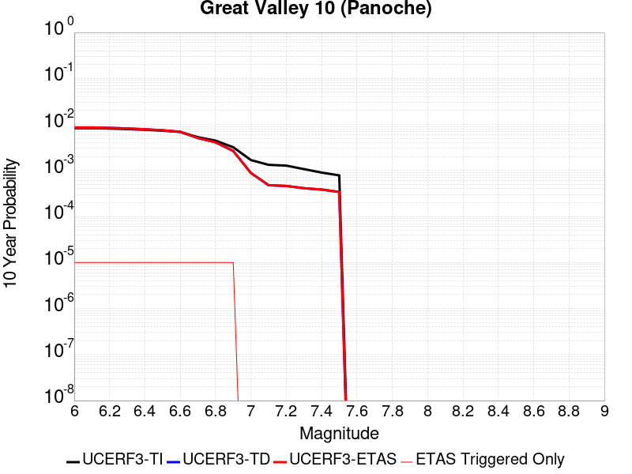 |

| Magnitude | 1 wk TI Prob | 1 wk TD Prob | 1 wk ETAS Prob | 1 wk ETAS/TD Gain | 1 wk ETAS Triggered Only | 1 mo TI Prob | 1 mo TD Prob | 1 mo ETAS Prob | 1 mo ETAS/TD Gain | 1 mo ETAS Triggered Only | 1 yr TI Prob | 1 yr TD Prob | 1 yr ETAS Prob | 1 yr ETAS/TD Gain | 1 yr ETAS Triggered Only | 10 yr TI Prob | 10 yr TD Prob | 10 yr ETAS Prob | 10 yr ETAS/TD Gain | 10 yr ETAS Triggered Only |
|-----|-----|-----|-----|-----|-----|-----|-----|-----|-----|-----|-----|-----|-----|-----|-----|-----|-----|-----|-----|-----|
| 6.0 | 1.6014626E-5 | 1.6575357E-5 | 2.6575191E-5 | 1.6032953 | 1.0E-5 | 6.863231E-5 | 7.103534E-5 | 8.103463E-5 | 1.140765 | 1.0E-5 | 8.35278E-4 | 8.6451764E-4 | 8.74509E-4 | 1.0115571 | 1.0E-5 | 0.008321454 | 0.008612158 | 0.008622072 | 1.0011512 | 1.0E-5 |
| 6.1 | 1.6014626E-5 | 1.6575357E-5 | 2.6575191E-5 | 1.6032953 | 1.0E-5 | 6.863231E-5 | 7.103534E-5 | 8.103463E-5 | 1.140765 | 1.0E-5 | 8.35278E-4 | 8.6451764E-4 | 8.74509E-4 | 1.0115571 | 1.0E-5 | 0.008321454 | 0.008612158 | 0.008622072 | 1.0011512 | 1.0E-5 |
| 6.2 | 1.56782E-5 | 1.6198404E-5 | 2.6198242E-5 | 1.6173348 | 1.0E-5 | 6.719056E-5 | 6.941991E-5 | 7.9419224E-5 | 1.144041 | 1.0E-5 | 8.17738E-4 | 8.4486516E-4 | 8.5485674E-4 | 1.0118262 | 1.0E-5 | 0.008147354 | 0.008417133 | 0.008427049 | 1.001178 | 1.0E-5 |
| 6.3 | 1.5263338E-5 | 1.5723472E-5 | 2.5723315E-5 | 1.6359818 | 1.0E-5 | 6.541267E-5 | 6.73846E-5 | 7.738393E-5 | 1.1483918 | 1.0E-5 | 7.961082E-4 | 8.201041E-4 | 8.3009584E-4 | 1.0121835 | 1.0E-5 | 0.007932622 | 0.008171363 | 0.008181281 | 1.0012138 | 1.0E-5 |
| 6.4 | 1.4720723E-5 | 1.5099334E-5 | 2.5099182E-5 | 1.6622709 | 1.0E-5 | 6.308728E-5 | 6.470986E-5 | 7.4709205E-5 | 1.154526 | 1.0E-5 | 7.67817E-4 | 7.87563E-4 | 7.975551E-4 | 1.0126874 | 1.0E-5 | 0.007651695 | 0.007848289 | 0.00785821 | 1.0012642 | 1.0E-5 |
| 6.5 | 1.408264E-5 | 1.4355928E-5 | 2.4355784E-5 | 1.6965663 | 1.0E-5 | 6.0352773E-5 | 6.1523984E-5 | 7.152337E-5 | 1.1625283 | 1.0E-5 | 7.3454727E-4 | 7.488022E-4 | 7.587948E-4 | 1.0133446 | 1.0E-5 | 0.0073212404 | 0.0074633416 | 0.007473267 | 1.0013299 | 1.0E-5 |
| 6.6 | 1.3197086E-5 | 1.33218455E-5 | 2.3321712E-5 | 1.7506367 | 1.0E-5 | 5.6557717E-5 | 5.7092402E-5 | 6.709183E-5 | 1.1751447 | 1.0E-5 | 6.8837265E-4 | 6.948834E-4 | 7.0487644E-4 | 1.0143809 | 1.0E-5 | 0.006862442 | 0.0069276392 | 0.00693757 | 1.0014335 | 1.0E-5 |
| 6.7 | 1.017583E-5 | 9.745348E-6 | 1.974525E-5 | 2.0261207 | 1.0E-5 | 4.360997E-5 | 4.176512E-5 | 5.1764702E-5 | 1.2394242 | 1.0E-5 | 5.30822E-4 | 5.083741E-4 | 5.18369E-4 | 1.0196606 | 1.0E-5 | 0.0052955584 | 0.0050723637 | 0.005082313 | 1.0019615 | 1.0E-5 |
| 6.8 | 8.557912E-6 | 7.8726725E-6 | 1.7872593E-5 | 2.2702067 | 1.0E-5 | 3.667625E-5 | 3.37396E-5 | 4.3739263E-5 | 1.2963777 | 1.0E-5 | 4.4644187E-4 | 4.1070423E-4 | 4.2070015E-4 | 1.0243384 | 1.0E-5 | 0.0044554602 | 0.004099659 | 0.0041096183 | 1.0024292 | 1.0E-5 |
| 6.9 | 6.14664E-6 | 5.0920366E-6 | 1.5091986E-5 | 2.9638407 | 1.0E-5 | 2.6342475E-5 | 2.182284E-5 | 3.1822623E-5 | 1.4582255 | 1.0E-5 | 3.2067244E-4 | 2.6566206E-4 | 2.756594E-4 | 1.0376318 | 1.0E-5 | 0.003202101 | 0.0026535832 | 0.0026635567 | 1.0037584 | 1.0E-5 |
| 7.0 | 3.2310581E-6 | 1.6950871E-6 | 1.6950871E-6 | 1.0 | 0.0 | 1.3847319E-5 | 7.2646394E-6 | 7.2646394E-6 | 1.0 | 0.0 | 1.6857806E-4 | 8.844349E-5 | 8.844349E-5 | 1.0 | 0.0 | 0.0016845023 | 8.840923E-4 | 8.840923E-4 | 1.0 | 0.0 |
| 7.1 | 2.544492E-6 | 9.188573E-7 | 9.188573E-7 | 1.0 | 0.0 | 1.090492E-5 | 3.9379543E-6 | 3.9379543E-6 | 1.0 | 0.0 | 1.327593E-4 | 4.7943588E-5 | 4.7943588E-5 | 1.0 | 0.0 | 0.0013268003 | 4.793372E-4 | 4.793372E-4 | 1.0 | 0.0 |
| 7.2 | 2.4479045E-6 | 8.840978E-7 | 8.840978E-7 | 1.0 | 0.0 | 1.0490977E-5 | 3.7889852E-6 | 3.7889852E-6 | 1.0 | 0.0 | 1.2772017E-4 | 4.6129968E-5 | 4.6129968E-5 | 1.0 | 0.0 | 0.0012764678 | 4.6120866E-4 | 4.6120866E-4 | 1.0 | 0.0 |
| 7.3 | 2.0559578E-6 | 7.892521E-7 | 7.892521E-7 | 1.0 | 0.0 | 8.811218E-6 | 3.382505E-6 | 3.382505E-6 | 1.0 | 0.0 | 1.072713E-4 | 4.1181265E-5 | 4.1181265E-5 | 1.0 | 0.0 | 0.0010721954 | 4.1174097E-4 | 4.1174097E-4 | 1.0 | 0.0 |
| 7.4 | 1.727687E-6 | 7.3875697E-7 | 7.3875697E-7 | 1.0 | 0.0 | 7.404352E-6 | 3.1660977E-6 | 3.1660977E-6 | 1.0 | 0.0 | 9.0144255E-5 | 3.8546605E-5 | 3.8546605E-5 | 1.0 | 0.0 | 9.0107694E-4 | 3.854038E-4 | 3.854038E-4 | 1.0 | 0.0 |
| 7.5 | 1.5002679E-6 | 6.545985E-7 | 6.545985E-7 | 1.0 | 0.0 | 6.4297037E-6 | 2.8054194E-6 | 2.8054194E-6 | 1.0 | 0.0 | 7.827883E-5 | 3.4155488E-5 | 3.4155488E-5 | 1.0 | 0.0 | 7.825126E-4 | 3.4150656E-4 | 3.4150656E-4 | 1.0 | 0.0 |

## North Frontal  (West)
*[(top)](#table-of-contents)*

| 1 Week | 1 Month | 1 Year | 10 Year |
|-----|-----|-----|-----|
|  |  |  |  |

| Magnitude | 1 wk TI Prob | 1 wk TD Prob | 1 wk ETAS Prob | 1 wk ETAS/TD Gain | 1 wk ETAS Triggered Only | 1 mo TI Prob | 1 mo TD Prob | 1 mo ETAS Prob | 1 mo ETAS/TD Gain | 1 mo ETAS Triggered Only | 1 yr TI Prob | 1 yr TD Prob | 1 yr ETAS Prob | 1 yr ETAS/TD Gain | 1 yr ETAS Triggered Only | 10 yr TI Prob | 10 yr TD Prob | 10 yr ETAS Prob | 10 yr ETAS/TD Gain | 10 yr ETAS Triggered Only |
|-----|-----|-----|-----|-----|-----|-----|-----|-----|-----|-----|-----|-----|-----|-----|-----|-----|-----|-----|-----|-----|
| 6.0 | 4.7316266E-6 | 4.852674E-6 | 1.4852625E-5 | 3.0607095 | 1.0E-5 | 2.0278241E-5 | 2.0797017E-5 | 3.0796808E-5 | 1.4808282 | 1.0E-5 | 2.4685962E-4 | 2.5317573E-4 | 2.631732E-4 | 1.0394883 | 1.0E-5 | 0.0024658558 | 0.002529019 | 0.0025389937 | 1.0039442 | 1.0E-5 |
| 6.1 | 4.7316266E-6 | 4.852674E-6 | 1.4852625E-5 | 3.0607095 | 1.0E-5 | 2.0278241E-5 | 2.0797017E-5 | 3.0796808E-5 | 1.4808282 | 1.0E-5 | 2.4685962E-4 | 2.5317573E-4 | 2.631732E-4 | 1.0394883 | 1.0E-5 | 0.0024658558 | 0.002529019 | 0.0025389937 | 1.0039442 | 1.0E-5 |
| 6.2 | 4.7316266E-6 | 4.852674E-6 | 1.4852625E-5 | 3.0607095 | 1.0E-5 | 2.0278241E-5 | 2.0797017E-5 | 3.0796808E-5 | 1.4808282 | 1.0E-5 | 2.4685962E-4 | 2.5317573E-4 | 2.631732E-4 | 1.0394883 | 1.0E-5 | 0.0024658558 | 0.002529019 | 0.0025389937 | 1.0039442 | 1.0E-5 |
| 6.3 | 4.7316266E-6 | 4.852674E-6 | 1.4852625E-5 | 3.0607095 | 1.0E-5 | 2.0278241E-5 | 2.0797017E-5 | 3.0796808E-5 | 1.4808282 | 1.0E-5 | 2.4685962E-4 | 2.5317573E-4 | 2.631732E-4 | 1.0394883 | 1.0E-5 | 0.0024658558 | 0.002529019 | 0.0025389937 | 1.0039442 | 1.0E-5 |
| 6.4 | 4.7316266E-6 | 4.852674E-6 | 1.4852625E-5 | 3.0607095 | 1.0E-5 | 2.0278241E-5 | 2.0797017E-5 | 3.0796808E-5 | 1.4808282 | 1.0E-5 | 2.4685962E-4 | 2.5317573E-4 | 2.631732E-4 | 1.0394883 | 1.0E-5 | 0.0024658558 | 0.002529019 | 0.0025389937 | 1.0039442 | 1.0E-5 |
| 6.5 | 4.7316266E-6 | 4.852674E-6 | 1.4852625E-5 | 3.0607095 | 1.0E-5 | 2.0278241E-5 | 2.0797017E-5 | 3.0796808E-5 | 1.4808282 | 1.0E-5 | 2.4685962E-4 | 2.5317573E-4 | 2.631732E-4 | 1.0394883 | 1.0E-5 | 0.0024658558 | 0.002529019 | 0.0025389937 | 1.0039442 | 1.0E-5 |
| 6.6 | 4.7316266E-6 | 4.852674E-6 | 1.4852625E-5 | 3.0607095 | 1.0E-5 | 2.0278241E-5 | 2.0797017E-5 | 3.0796808E-5 | 1.4808282 | 1.0E-5 | 2.4685962E-4 | 2.5317573E-4 | 2.631732E-4 | 1.0394883 | 1.0E-5 | 0.0024658558 | 0.002529019 | 0.0025389937 | 1.0039442 | 1.0E-5 |
| 6.7 | 3.5382777E-6 | 3.6308872E-6 | 1.3630851E-5 | 3.7541378 | 1.0E-5 | 1.516396E-5 | 1.5560858E-5 | 2.5560701E-5 | 1.6426281 | 1.0E-5 | 1.8460557E-4 | 1.8943775E-4 | 1.9943585E-4 | 1.0527778 | 1.0E-5 | 0.0018445229 | 0.0018928396 | 0.0019028207 | 1.0052731 | 1.0E-5 |
| 6.8 | 3.5382777E-6 | 3.6308872E-6 | 1.3630851E-5 | 3.7541378 | 1.0E-5 | 1.516396E-5 | 1.5560858E-5 | 2.5560701E-5 | 1.6426281 | 1.0E-5 | 1.8460557E-4 | 1.8943775E-4 | 1.9943585E-4 | 1.0527778 | 1.0E-5 | 0.0018445229 | 0.0018928396 | 0.0019028207 | 1.0052731 | 1.0E-5 |
| 6.9 | 3.0428037E-6 | 3.1227619E-6 | 1.3122731E-5 | 4.2022834 | 1.0E-5 | 1.30405215E-5 | 1.3383201E-5 | 2.3383067E-5 | 1.7471954 | 1.0E-5 | 1.5875678E-4 | 1.6292896E-4 | 1.7292734E-4 | 1.0613664 | 1.0E-5 | 0.0015864341 | 0.0016281622 | 0.001638146 | 1.0061319 | 1.0E-5 |
| 7.0 | 2.538778E-6 | 2.6060916E-6 | 1.2606066E-5 | 4.8371534 | 1.0E-5 | 1.0880432E-5 | 1.116892E-5 | 2.1168808E-5 | 1.8953317 | 1.0E-5 | 1.324612E-4 | 1.3597358E-4 | 1.4597223E-4 | 1.0735337 | 1.0E-5 | 0.0013238228 | 0.0013589506 | 0.001368937 | 1.0073487 | 1.0E-5 |
| 7.1 | 2.2418935E-6 | 2.3012087E-6 | 1.2301186E-5 | 5.3455324 | 1.0E-5 | 9.60808E-6 | 9.862288E-6 | 1.986219E-5 | 2.0139534 | 1.0E-5 | 1.1697209E-4 | 1.2006718E-4 | 1.3006598E-4 | 1.0832767 | 1.0E-5 | 0.0011691054 | 0.0012000671 | 0.0012100551 | 1.0083228 | 1.0E-5 |
| 7.2 | 1.6526745E-6 | 1.6924864E-6 | 1.1692469E-5 | 6.908457 | 1.0E-5 | 7.082872E-6 | 7.2534945E-6 | 1.7253422E-5 | 2.378636 | 1.0E-5 | 8.623055E-5 | 8.830797E-5 | 9.830709E-5 | 1.1132301 | 1.0E-5 | 8.61971E-4 | 8.8275387E-4 | 8.9274504E-4 | 1.0113182 | 1.0E-5 |
| 7.3 | 1.0246019E-6 | 1.0442274E-6 | 1.0442274E-6 | 1.0 | 0.0 | 4.391144E-6 | 4.4752533E-6 | 4.4752533E-6 | 1.0 | 0.0 | 5.3460866E-5 | 5.4484964E-5 | 5.4484964E-5 | 1.0 | 0.0 | 5.344801E-4 | 5.4472755E-4 | 5.4472755E-4 | 1.0 | 0.0 |
| 7.4 | 8.9045164E-7 | 9.056572E-7 | 9.056572E-7 | 1.0 | 0.0 | 3.8162157E-6 | 3.881383E-6 | 3.881383E-6 | 1.0 | 0.0 | 4.646144E-5 | 4.725492E-5 | 4.725492E-5 | 1.0 | 0.0 | 4.6451724E-4 | 4.7245962E-4 | 4.7245962E-4 | 1.0 | 0.0 |
| 7.5 | 6.3357E-7 | 6.4027137E-7 | 6.4027137E-7 | 1.0 | 0.0 | 2.7152971E-6 | 2.7440176E-6 | 2.7440176E-6 | 1.0 | 0.0 | 3.305824E-5 | 3.340797E-5 | 3.340797E-5 | 1.0 | 0.0 | 3.3053322E-4 | 3.3403604E-4 | 3.3403604E-4 | 1.0 | 0.0 |
| 7.6 | 2.5087024E-7 | 2.436123E-7 | 2.436123E-7 | 1.0 | 0.0 | 1.0751578E-6 | 1.0440525E-6 | 1.0440525E-6 | 1.0 | 0.0 | 1.3089967E-5 | 1.2711286E-5 | 1.2711286E-5 | 1.0 | 0.0 | 1.3089196E-4 | 1.2710765E-4 | 1.2710765E-4 | 1.0 | 0.0 |
| 7.7 | 3.282987E-8 | 2.2875435E-8 | 2.2875435E-8 | 1.0 | 0.0 | 1.4069944E-7 | 9.8037575E-8 | 9.8037575E-8 | 1.0 | 0.0 | 1.7130144E-6 | 1.193607E-6 | 1.193607E-6 | 1.0 | 0.0 | 1.7130013E-5 | 1.1936014E-5 | 1.1936014E-5 | 1.0 | 0.0 |
| 7.8 | 8.77499E-9 | 5.6817466E-9 | 5.6817466E-9 | 1.0 | 0.0 | 3.7607098E-8 | 2.4350342E-8 | 2.4350342E-8 | 1.0 | 0.0 | 4.578663E-7 | 2.964654E-7 | 2.964654E-7 | 1.0 | 0.0 | 4.5786537E-6 | 2.9646512E-6 | 2.9646512E-6 | 1.0 | 0.0 |

