# Parent Section Magnitude-Probability Distributions

Only fault sections with at least one triggered aftershock are plotted. Sections are sorted by total supraseismogenic trigger rate (decreasing)

## Table Of Contents

* [Garlock (Central)](#garlock-central)
* [Tank Canyon](#tank-canyon)
* [Little Lake](#little-lake)
* [Airport Lake](#airport-lake)
* [Owl Lake](#owl-lake)
* [Panamint Valley](#panamint-valley)
* [Garlock (East)](#garlock-east)
* [Hunter Mountain-Saline Valley](#hunter-mountain-saline-valley)
* [Ash Hill](#ash-hill)
* [Blackwater](#blackwater)
* [Garlock (West)](#garlock-west)
* [McLean Lake](#mclean-lake)
* [Goldstone Lake](#goldstone-lake)
* [Gravel Hills-Harper Lk](#gravel-hills-harper-lk)
* [Coyote Canyon](#coyote-canyon)
* [So Sierra Nevada](#so-sierra-nevada)
* [Death Valley (So)](#death-valley-so)
* [San Andreas (Mojave S)](#san-andreas-mojave-s)
* [Nelson Lake](#nelson-lake)
* [San Andreas (Mojave N)](#san-andreas-mojave-n)
* [Lenwood-Lockhart-Old Woman Springs](#lenwood-lockhart-old-woman-springs)
* [Towne Pass](#towne-pass)
* [Bicycle Lake](#bicycle-lake)
* [San Andreas (San Bernardino N)](#san-andreas-san-bernardino-n)
* [Paradise](#paradise)
* [Garlic Springs](#garlic-springs)
* [San Andreas (San Bernardino S)](#san-andreas-san-bernardino-s)
* [Helendale-So Lockhart](#helendale-so-lockhart)
* [Death Valley (Black Mtns Frontal)](#death-valley-black-mtns-frontal)
* [Coyote Lake](#coyote-lake)
* [San Andreas (Big Bend)](#san-andreas-big-bend)
* [San Andreas (Parkfield)](#san-andreas-parkfield)
* [Red Pass](#red-pass)
* [Death Valley (No)](#death-valley-no)
* [San Andreas (San Gorgonio Pass-Garnet HIll)](#san-andreas-san-gorgonio-pass-garnet-hill)
* [Cady](#cady)
* [Sierra Nevada  (No Extension)](#sierra-nevada--no-extension)
* [Calico-Hidalgo](#calico-hidalgo)
* [Ludlow](#ludlow)
* [San Andreas (Carrizo) rev](#san-andreas-carrizo-rev)
* [San Andreas (Cholame) rev](#san-andreas-cholame-rev)
* [Elsinore (Glen Ivy) rev](#elsinore-glen-ivy-rev)
* [Death Valley (Fish Lake Valley)](#death-valley-fish-lake-valley)
* [Lake Isabella (Seismicity)](#lake-isabella-seismicity)
* [White Wolf (Extension)](#white-wolf-extension)
* [San Andreas (Coachella) rev](#san-andreas-coachella-rev)
* [Manix-Afton Hills](#manix-afton-hills)
* [Baker](#baker)
* [San Jacinto (San Bernardino)](#san-jacinto-san-bernardino)
* [San Andreas (Creeping Section) 2011 CFM](#san-andreas-creeping-section-2011-cfm)
* [San Andreas (North Branch Mill Creek)](#san-andreas-north-branch-mill-creek)
* [Scodie Lineament](#scodie-lineament)
* [Santa Ynez (East)](#santa-ynez-east)
* [Mission Ridge-Arroyo Parida-Santa Ana](#mission-ridge-arroyo-parida-santa-ana)
* [San Jacinto (San Jacinto Valley) rev](#san-jacinto-san-jacinto-valley-rev)
* [Cleghorn Lake](#cleghorn-lake)
* [Santa Ynez (West)](#santa-ynez-west)
* [Deep Springs](#deep-springs)
* [San Jacinto (Stepovers Combined)](#san-jacinto-stepovers-combined)
* [Coronado Bank alt1](#coronado-bank-alt1)
* [Pinto Mtn](#pinto-mtn)
* [San Jacinto (Anza) rev](#san-jacinto-anza-rev)
* [Santa Rosa Island](#santa-rosa-island)
* [Camp Rock 2011](#camp-rock-2011)
* [Cleghorn Pass](#cleghorn-pass)
* [Red Mountain](#red-mountain)
* [Brawley (Seismic Zone) alt 1](#brawley-seismic-zone-alt-1)
* [San Clemente](#san-clemente)
* [White Mountains](#white-mountains)
* [Owens Valley](#owens-valley)
* [Rose Canyon](#rose-canyon)
* [Pleito](#pleito)
* [Palos Verdes](#palos-verdes)
* [Big Pine (Central)](#big-pine-central)
* [Bullion Mountains](#bullion-mountains)
* [Ventura-Pitas Point](#ventura-pitas-point)
* [Pisgah-Bullion Mtn-Mesquite Lk](#pisgah-bullion-mtn-mesquite-lk)
* [Blue Cut](#blue-cut)
* [Independence rev 2011](#independence-rev-2011)
* [Lost Hills](#lost-hills)
* [Whittier alt 1](#whittier-alt-1)
* [Kern Canyon (North Kern) 2011](#kern-canyon-north-kern-2011)
* [Chino alt 1](#chino-alt-1)
* [Imperial](#imperial)
* [Elysian Park (Upper)](#elysian-park-upper)
* [Mission Creek](#mission-creek)
* [Santa Cruz Island](#santa-cruz-island)
* [San Jacinto (Coyote Creek)](#san-jacinto-coyote-creek)
* [Kern Canyon (South Kern) 2011](#kern-canyon-south-kern-2011)
* [Big Pine (East)](#big-pine-east)
* [San Pedro Basin](#san-pedro-basin)
* [Dry Mountain](#dry-mountain)
* [Santa Cruz Catalina Ridge alt1](#santa-cruz-catalina-ridge-alt1)
* [Sheephole](#sheephole)
* [Hosgri (Extension)](#hosgri-extension)
* [Raymond](#raymond)
* [Oak Ridge (Onshore)](#oak-ridge-onshore)
* [San Jacinto (Lytle Creek connector)](#san-jacinto-lytle-creek-connector)
* [Santa Ynez River](#santa-ynez-river)
* [Kern Canyon (Lake Isabella) 2011](#kern-canyon-lake-isabella-2011)
* [San Diego Trough south](#san-diego-trough-south)
* [Oceanic - West Huasna](#oceanic---west-huasna)
* [Ortigalita (North)](#ortigalita-north)
* [Tin Mountain](#tin-mountain)
* [White Wolf](#white-wolf)
* [Calaveras (So) - Paicines extension 2011 CFM](#calaveras-so---paicines-extension-2011-cfm)
* [San Jacinto (Borrego)](#san-jacinto-borrego)
* [Newport-Inglewood alt 1](#newport-inglewood-alt-1)
* [San Luis Range 2011 CFM](#san-luis-range-2011-cfm)
* [Pine Mtn](#pine-mtn)
* [San Cayetano](#san-cayetano)
* [San Jacinto (Clark) rev](#san-jacinto-clark-rev)
* [San Diego Trough north alt1](#san-diego-trough-north-alt1)
* [Hosgri](#hosgri)
* [Great Valley 09 (Laguna Seca)](#great-valley-09-laguna-seca)
* [Hollywood](#hollywood)
* [Northridge](#northridge)
* [Robinson Creek](#robinson-creek)
* [Rinconada 2011 CFM](#rinconada-2011-cfm)
* [Channel Islands Thrust](#channel-islands-thrust)
* [Santa Monica alt 1](#santa-monica-alt-1)
* [Cerro Prieto](#cerro-prieto)
* [Calaveras (So) 2011 CFM](#calaveras-so-2011-cfm)
* [Newport-Inglewood (Offshore)](#newport-inglewood-offshore)
* [Pitas Point (Lower West)](#pitas-point-lower-west)
* [Sisar](#sisar)
* [Los Alamos extension](#los-alamos-extension)
* [Elsinore (Coyote Mountains)](#elsinore-coyote-mountains)
* [San Jacinto (Superstition Mtn)](#san-jacinto-superstition-mtn)
* [Cleghorn](#cleghorn)
* [Malibu Coast alt 1](#malibu-coast-alt-1)
* [Pitas Point (Lower)-Montalvo](#pitas-point-lower-montalvo)
* [San Andreas (Santa Cruz Mts) 2011 CFM](#san-andreas-santa-cruz-mts-2011-cfm)
* [Morales (East)](#morales-east)
* [Santa Susana alt 1](#santa-susana-alt-1)
* [Del Valle](#del-valle)
* [Santa Susana East (connector)](#santa-susana-east-connector)
* [Laguna Salada](#laguna-salada)
* [Los Alamos 2011 CFM](#los-alamos-2011-cfm)
* [Simi-Santa Rosa](#simi-santa-rosa)
* [Hayward (So) 2011 CFM](#hayward-so-2011-cfm)
* [Verdugo](#verdugo)
* [Green Valley 2011 CFM](#green-valley-2011-cfm)
* [Owens Valley Keough Hot Springs](#owens-valley-keough-hot-springs)
* [Homestead Valley 2011](#homestead-valley-2011)
* [Great Valley 03 Mysterious Ridge](#great-valley-03-mysterious-ridge)
* [Oceanside alt1](#oceanside-alt1)
* [Calaveras (Central) 2011 CFM](#calaveras-central-2011-cfm)
* [Elmore Ranch](#elmore-ranch)
* [Great Valley 07 (Orestimba)](#great-valley-07-orestimba)
* [Great Valley 06 (Midland) 2011 CFM alt1](#great-valley-06-midland-2011-cfm-alt1)
* [Monterey Bay-Tularcitos](#monterey-bay-tularcitos)
* [Hunting Creek - Berryessa 2011 CFM](#hunting-creek---berryessa-2011-cfm)
* [Compton](#compton)
* [San Juan](#san-juan)
* [Hat Creek-McArthur-Mayfield](#hat-creek-mcarthur-mayfield)
* [Puente Hills](#puente-hills)
* [Redondo Canyon alt 1](#redondo-canyon-alt-1)
* [Great Valley 11](#great-valley-11)
* [Round Valley](#round-valley)
* [Sierra Madre](#sierra-madre)
* [Ortigalita (South)](#ortigalita-south)
* [Greenville (No) 2011 CFM](#greenville-no-2011-cfm)
* [Maacama 2011 CFM](#maacama-2011-cfm)
* [Hector Mine](#hector-mine)
* [Breckenridge 2011](#breckenridge-2011)
* [Mono Lake 2011 CFM](#mono-lake-2011-cfm)
* [Almanor 2011 CFM](#almanor-2011-cfm)
* [Elsinore (Temecula) rev](#elsinore-temecula-rev)
* [Hayward (So) extension 2011 CFM](#hayward-so-extension-2011-cfm)
* [Point Reyes 2011 CFM](#point-reyes-2011-cfm)
* [Mission Hills 2011](#mission-hills-2011)
* [Earthquake Valley (No  Extension)](#earthquake-valley-no--extension)
* [Great Valley 04a Trout Creek](#great-valley-04a-trout-creek)
* [Greenville (So) 2011 CFM](#greenville-so-2011-cfm)
* [Johnson Valley (No) 2011 rev](#johnson-valley-no-2011-rev)
* [San Jose](#san-jose)
* [Carlsbad](#carlsbad)
* [Reliz 2011 CFM](#reliz-2011-cfm)
* [Great Valley 10 (Panoche)](#great-valley-10-panoche)
* [West Napa 2011 CFM](#west-napa-2011-cfm)
* [Yorba Linda](#yorba-linda)
* [Superstition Hills](#superstition-hills)
* [Hayward (No) 2011 CFM](#hayward-no-2011-cfm)
* [Collayami 2011 CFM](#collayami-2011-cfm)
* [Keddie Ridge 2011 CFM](#keddie-ridge-2011-cfm)
* [Emerson-Copper Mtn 2011](#emerson-copper-mtn-2011)
* [Pittville 2011 CFM](#pittville-2011-cfm)
* [San Gregorio (South) 2011 CFM](#san-gregorio-south-2011-cfm)
* [Las Positas](#las-positas)
* [Rodgers Creek - Healdsburg 2011 CFM](#rodgers-creek---healdsburg-2011-cfm)
* [North Tahoe 2011 CFM](#north-tahoe-2011-cfm)
* [Elsinore (Julian)](#elsinore-julian)
* [Burnt Mtn](#burnt-mtn)
* [Skinner Flat 2011 CFM](#skinner-flat-2011-cfm)
* [Northridge Hills](#northridge-hills)
* [Cucamonga](#cucamonga)
* [Quien Sabe 2011 CFM](#quien-sabe-2011-cfm)
* [La Panza 2011](#la-panza-2011)
* [Bennett Valley 2011 CFM](#bennett-valley-2011-cfm)
* [North Frontal  (West)](#north-frontal--west)
* [San Gorgonio Pass](#san-gorgonio-pass)
* [Los Osos 2011](#los-osos-2011)
* [San Andreas (Peninsula) 2011 CFM](#san-andreas-peninsula-2011-cfm)
* [Ozena](#ozena)
* [Clayton](#clayton)
* [Channel Islands Western Deep Ramp](#channel-islands-western-deep-ramp)
* [San Gabriel (Extension)](#san-gabriel-extension)
* [San Andreas (North Coast) 2011 CFM](#san-andreas-north-coast-2011-cfm)
* [Hartley Springs 2011 CFM](#hartley-springs-2011-cfm)
* [East Huasna 2011 CFM](#east-huasna-2011-cfm)
* [Garberville - Briceland 2011 CFM](#garberville---briceland-2011-cfm)
* [San Pedro Escarpment](#san-pedro-escarpment)
* [Surprise Valley 2011 CFM](#surprise-valley-2011-cfm)
* [San Andreas (Offshore) 2011 CFM](#san-andreas-offshore-2011-cfm)
* [Calaveras (No) 2011 CFM](#calaveras-no-2011-cfm)
* [Mount Diablo Thrust South](#mount-diablo-thrust-south)
* [Great Valley 08 (Quinto)](#great-valley-08-quinto)
* [Great Valley 05 Pittsburg - Kirby Hills alt1](#great-valley-05-pittsburg---kirby-hills-alt1)
* [Monte Vista - Shannon 2011 CFM](#monte-vista---shannon-2011-cfm)
* [Elsinore (Stepovers Combined)](#elsinore-stepovers-combined)
* [Great Valley 04b Gordon Valley](#great-valley-04b-gordon-valley)
* [Thirty Mile Bank](#thirty-mile-bank)
* [Fontana (Seismicity)](#fontana-seismicity)
* [Cedar Mtn-Mahogany Mtn](#cedar-mtn-mahogany-mtn)
* [San Gabriel](#san-gabriel)
* [Eaton Roughs 2011 CFM](#eaton-roughs-2011-cfm)
* [Sierra Madre (San Fernando)](#sierra-madre-san-fernando)
* [Clamshell-Sawpit](#clamshell-sawpit)

## Garlock (Central)
*[(top)](#table-of-contents)*

| 1 Week | 1 Month | 1 Year | 10 Year |
|-----|-----|-----|-----|
|  |  |  |  |

| Magnitude | 1 wk TI Prob | 1 wk TD Prob | 1 wk ETAS Prob | 1 wk ETAS/TD Gain | 1 wk ETAS Triggered Only | 1 mo TI Prob | 1 mo TD Prob | 1 mo ETAS Prob | 1 mo ETAS/TD Gain | 1 mo ETAS Triggered Only | 1 yr TI Prob | 1 yr TD Prob | 1 yr ETAS Prob | 1 yr ETAS/TD Gain | 1 yr ETAS Triggered Only | 10 yr TI Prob | 10 yr TD Prob | 10 yr ETAS Prob | 10 yr ETAS/TD Gain | 10 yr ETAS Triggered Only |
|-----|-----|-----|-----|-----|-----|-----|-----|-----|-----|-----|-----|-----|-----|-----|-----|-----|-----|-----|-----|-----|
| 6.0 | 5.5131142E-5 | 7.024681E-5 | 0.06820546 | 970.9403 | 0.06814 | 2.3625491E-4 | 3.010234E-4 | 0.08426574 | 279.93088 | 0.08399 | 0.0028726095 | 0.0036588663 | 0.11581699 | 31.653791 | 0.11257 | 0.028357591 | 0.036079824 | 0.16957313 | 4.699943 | 0.13849 |
| 6.1 | 5.5131142E-5 | 7.024681E-5 | 0.06820546 | 970.9403 | 0.06814 | 2.3625491E-4 | 3.010234E-4 | 0.08426574 | 279.93088 | 0.08399 | 0.0028726095 | 0.0036588663 | 0.11581699 | 31.653791 | 0.11257 | 0.028357591 | 0.036079824 | 0.16957313 | 4.699943 | 0.13849 |
| 6.2 | 4.216245E-5 | 5.1661493E-5 | 0.040969547 | 793.0384 | 0.04092 | 1.806837E-4 | 2.2138779E-4 | 0.0512001 | 231.26884 | 0.05099 | 0.0021976046 | 0.0026920962 | 0.07176564 | 26.657904 | 0.06926 | 0.021759989 | 0.026689773 | 0.110423654 | 4.137302 | 0.08603 |
| 6.3 | 4.216245E-5 | 5.1661493E-5 | 0.040969547 | 793.0384 | 0.04092 | 1.806837E-4 | 2.2138779E-4 | 0.0512001 | 231.26884 | 0.05099 | 0.0021976046 | 0.0026920962 | 0.07176564 | 26.657904 | 0.06926 | 0.021759989 | 0.026689773 | 0.110423654 | 4.137302 | 0.08603 |
| 6.4 | 3.6858168E-5 | 4.411054E-5 | 0.032072697 | 727.09827 | 0.03203 | 1.5795401E-4 | 1.8903162E-4 | 0.04014148 | 212.35324 | 0.03996 | 0.0019213937 | 0.002299056 | 0.056643825 | 24.637863 | 0.05447 | 0.019048655 | 0.02284894 | 0.088865265 | 3.8892512 | 0.06756 |
| 6.5 | 3.39199E-5 | 4.0018083E-5 | 0.028648874 | 715.8982 | 0.02861 | 1.453629E-4 | 1.7149492E-4 | 0.03581538 | 208.84222 | 0.03565 | 0.0017683565 | 0.002085973 | 0.050474823 | 24.197256 | 0.04849 | 0.017543508 | 0.020759864 | 0.079896174 | 3.8485887 | 0.06039 |
| 6.6 | 3.3571985E-5 | 3.9472274E-5 | 0.028568346 | 723.7573 | 0.02853 | 1.4387199E-4 | 1.6915603E-4 | 0.03573314 | 211.24365 | 0.03557 | 0.0017502342 | 0.0020575512 | 0.050338008 | 24.46501 | 0.04838 | 0.017365133 | 0.020481179 | 0.07948739 | 3.880997 | 0.06024 |
| 6.7 | 3.2580007E-5 | 3.8088703E-5 | 0.027407046 | 719.5584 | 0.02737 | 1.3962112E-4 | 1.632272E-4 | 0.034227666 | 209.69339 | 0.03407 | 0.0016985617 | 0.0019855013 | 0.048213534 | 24.2828 | 0.04632 | 0.016856372 | 0.019773813 | 0.07637207 | 3.8622835 | 0.05774 |
| 6.8 | 3.2185937E-5 | 3.7515918E-5 | 0.026716515 | 712.13806 | 0.02668 | 1.3793244E-4 | 1.6077272E-4 | 0.033355433 | 207.4695 | 0.0332 | 0.0016780337 | 0.001955672 | 0.047057293 | 24.061956 | 0.04519 | 0.016654192 | 0.019480614 | 0.07480152 | 3.8397925 | 0.05642 |
| 6.9 | 3.165394E-5 | 3.6720503E-5 | 0.026095763 | 710.6592 | 0.02606 | 1.3565269E-4 | 1.5736422E-4 | 0.032602258 | 207.17708 | 0.03245 | 0.0016503202 | 0.001914247 | 0.04593981 | 23.998892 | 0.04411 | 0.01638118 | 0.019073246 | 0.07302422 | 3.8286202 | 0.055 |
| 7.0 | 3.0903822E-5 | 3.5625766E-5 | 0.025434721 | 713.9417 | 0.0254 | 1.3243823E-4 | 1.5267303E-4 | 0.03173785 | 207.88118 | 0.03159 | 0.0016112428 | 0.0018572307 | 0.0447075 | 24.07213 | 0.04293 | 0.015996104 | 0.018512413 | 0.071022 | 3.8364527 | 0.0535 |
| 7.1 | 3.0069863E-5 | 3.4392073E-5 | 0.024173561 | 702.88184 | 0.02414 | 1.2886449E-4 | 1.4738638E-4 | 0.03018296 | 204.78798 | 0.03004 | 0.0015677959 | 0.0017929734 | 0.04265957 | 23.79264 | 0.04094 | 0.01556781 | 0.017880075 | 0.06790926 | 3.7980413 | 0.05094 |
| 7.2 | 2.7957109E-5 | 3.128145E-5 | 0.02016065 | 644.4922 | 0.02013 | 1.1981068E-4 | 1.340566E-4 | 0.025130706 | 187.46341 | 0.025 | 0.0014577188 | 0.0016309366 | 0.035894964 | 22.008802 | 0.03432 | 0.014481937 | 0.016283695 | 0.058367077 | 3.584388 | 0.04278 |
| 7.3 | 2.4519275E-5 | 2.6714795E-5 | 0.013986342 | 523.5429 | 0.01396 | 1.0507837E-4 | 1.1448703E-4 | 0.01754249 | 153.22688 | 0.01743 | 0.0012785783 | 0.001393003 | 0.025449445 | 18.269482 | 0.02409 | 0.012712469 | 0.013928054 | 0.04390464 | 3.1522453 | 0.0304 |
| 7.4 | 2.3225532E-5 | 2.51994E-5 | 0.012624882 | 500.9993 | 0.0126 | 9.95342E-5 | 1.0799304E-4 | 0.015836295 | 146.6418 | 0.01573 | 0.0012111551 | 0.0013140367 | 0.023045443 | 17.537899 | 0.02176 | 0.012045753 | 0.013145725 | 0.040185533 | 3.0569277 | 0.0274 |
| 7.5 | 2.097765E-5 | 2.2483688E-5 | 0.009742266 | 433.3037 | 0.00972 | 8.9901114E-5 | 9.635517E-5 | 0.01218519 | 126.4612 | 0.01209 | 0.0010939965 | 0.0011725046 | 0.017982772 | 15.337057 | 0.01683 | 0.010886264 | 0.011740365 | 0.03266182 | 2.7820108 | 0.02117 |
| 7.6 | 1.511254E-5 | 1.5991332E-5 | 0.0053559057 | 334.92554 | 0.00534 | 6.476642E-5 | 6.853253E-5 | 0.0066480814 | 97.006226 | 0.00658 | 7.882459E-4 | 8.3407195E-4 | 0.009886515 | 11.8533125 | 0.00906 | 0.007854558 | 0.008383559 | 0.019826813 | 2.3649638 | 0.01154 |
| 7.7 | 9.934069E-6 | 1.0678794E-5 | 0.001680661 | 157.38304 | 0.00167 | 4.2573887E-5 | 4.5765457E-5 | 0.002065673 | 45.136074 | 0.00202 | 5.182138E-4 | 5.570524E-4 | 0.0032155707 | 5.7724743 | 0.00266 | 0.00517007 | 0.005627684 | 0.0089190565 | 1.5848538 | 0.00331 |
| 7.8 | 6.7562896E-6 | 8.428449E-6 | 0.0010584196 | 125.577034 | 0.00105 | 2.8955206E-5 | 3.6121426E-5 | 0.0013560738 | 37.542088 | 0.00132 | 3.5247262E-4 | 4.3968976E-4 | 0.0021589336 | 4.910129 | 0.00172 | 0.0035191406 | 0.004446654 | 0.006587094 | 1.4813596 | 0.00215 |
| 7.9 | 3.975453E-6 | 5.37103E-6 | 6.5536756E-4 | 122.01896 | 6.5E-4 | 1.7037546E-5 | 2.3018498E-5 | 8.429996E-4 | 36.622704 | 8.2E-4 | 2.0741238E-4 | 2.8021427E-4 | 0.0013399173 | 4.7817593 | 0.00106 | 0.002072189 | 0.0028336283 | 0.004139916 | 1.4609948 | 0.00131 |
| 8.0 | 1.6729537E-6 | 2.0775144E-6 | 1.8207714E-4 | 87.64182 | 1.8E-4 | 7.169782E-6 | 8.903603E-6 | 2.2890164E-4 | 25.708878 | 2.2E-4 | 8.7288594E-5 | 1.0839601E-4 | 4.2836132E-4 | 3.9518182 | 3.2E-4 | 8.7254314E-4 | 0.0010969337 | 0.001486506 | 1.3551465 | 3.9E-4 |
| 8.1 | 3.6733252E-7 | 3.1489964E-7 | 2.0314894E-5 | 64.512276 | 2.0E-5 | 1.5742813E-6 | 1.3495693E-6 | 3.134953E-5 | 23.229284 | 3.0E-5 | 1.9166706E-5 | 1.6430899E-5 | 5.6430243E-5 | 3.4343977 | 4.0E-5 | 1.9165053E-4 | 1.6638759E-4 | 2.1637927E-4 | 1.3004532 | 5.0E-5 |

## Tank Canyon
*[(top)](#table-of-contents)*

| 1 Week | 1 Month | 1 Year | 10 Year |
|-----|-----|-----|-----|
|  |  |  |  |

| Magnitude | 1 wk TI Prob | 1 wk TD Prob | 1 wk ETAS Prob | 1 wk ETAS/TD Gain | 1 wk ETAS Triggered Only | 1 mo TI Prob | 1 mo TD Prob | 1 mo ETAS Prob | 1 mo ETAS/TD Gain | 1 mo ETAS Triggered Only | 1 yr TI Prob | 1 yr TD Prob | 1 yr ETAS Prob | 1 yr ETAS/TD Gain | 1 yr ETAS Triggered Only | 10 yr TI Prob | 10 yr TD Prob | 10 yr ETAS Prob | 10 yr ETAS/TD Gain | 10 yr ETAS Triggered Only |
|-----|-----|-----|-----|-----|-----|-----|-----|-----|-----|-----|-----|-----|-----|-----|-----|-----|-----|-----|-----|-----|
| 6.0 | 4.8284557E-5 | 5.7964822E-5 | 0.036595847 | 631.34576 | 0.03654 | 2.0691741E-4 | 2.4840087E-4 | 0.049936056 | 201.03012 | 0.0497 | 0.0025163088 | 0.0030207601 | 0.079100244 | 26.185543 | 0.07631 | 0.02488006 | 0.029863637 | 0.13003021 | 4.354132 | 0.10325 |
| 6.1 | 1.7796336E-5 | 2.0873314E-5 | 0.012260618 | 587.3824 | 0.01224 | 7.626778E-5 | 8.945422E-5 | 0.017197924 | 192.25392 | 0.01711 | 9.281647E-4 | 0.0010885983 | 0.028249 | 25.949886 | 0.02719 | 0.009242975 | 0.010836744 | 0.048405163 | 4.466763 | 0.03798 |
| 6.2 | 1.7796336E-5 | 2.0873314E-5 | 0.012260618 | 587.3824 | 0.01224 | 7.626778E-5 | 8.945422E-5 | 0.017197924 | 192.25392 | 0.01711 | 9.281647E-4 | 0.0010885983 | 0.028249 | 25.949886 | 0.02719 | 0.009242975 | 0.010836744 | 0.048405163 | 4.466763 | 0.03798 |
| 6.3 | 1.3515912E-5 | 1.5759564E-5 | 0.008815621 | 559.38226 | 0.0088 | 5.792405E-5 | 6.753938E-5 | 0.0124167055 | 183.84393 | 0.01235 | 7.049971E-4 | 8.2200574E-4 | 0.020415885 | 24.83667 | 0.01961 | 0.007027647 | 0.0081922645 | 0.035437223 | 4.325693 | 0.02747 |
| 6.4 | 1.0870146E-5 | 1.2618021E-5 | 0.0063525382 | 503.44965 | 0.00634 | 4.658551E-5 | 5.4076212E-5 | 0.009143584 | 169.087 | 0.00909 | 5.67031E-4 | 6.581969E-4 | 0.014948784 | 22.711721 | 0.0143 | 0.005655863 | 0.0065644905 | 0.026621953 | 4.0554485 | 0.02019 |
| 6.5 | 7.964826E-6 | 9.196094E-6 | 0.0040091593 | 435.9633 | 0.004 | 3.4134522E-5 | 3.9411298E-5 | 0.005829183 | 147.9064 | 0.00579 | 4.1550855E-4 | 4.7973756E-4 | 0.009605357 | 20.022108 | 0.00913 | 0.0041473247 | 0.004788321 | 0.017636504 | 3.6832333 | 0.01291 |
| 6.6 | 6.6317E-6 | 7.6122988E-6 | 0.0028075909 | 368.823 | 0.0028 | 2.8421264E-5 | 3.2623782E-5 | 0.004222487 | 129.42973 | 0.00419 | 3.4597394E-4 | 3.9713128E-4 | 0.0070944703 | 17.864296 | 0.0067 | 0.0034543579 | 0.003965368 | 0.013417737 | 3.3837304 | 0.00949 |
| 6.7 | 4.793663E-6 | 5.4307857E-6 | 0.0016554218 | 304.8218 | 0.00165 | 2.0544108E-5 | 2.3274613E-5 | 0.0024332185 | 104.54389 | 0.00241 | 2.500958E-4 | 2.8333595E-4 | 0.0039223046 | 13.843301 | 0.00364 | 0.0024981452 | 0.0028304397 | 0.007995778 | 2.8249245 | 0.00518 |
| 6.8 | 4.382823E-6 | 4.9692567E-6 | 0.0015449616 | 310.90396 | 0.00154 | 1.8783392E-5 | 2.1296666E-5 | 0.0022112501 | 103.83081 | 0.00219 | 2.286638E-4 | 2.5926033E-4 | 0.0035484075 | 13.686658 | 0.00329 | 0.0022842865 | 0.002590253 | 0.007308001 | 2.8213465 | 0.00473 |
| 6.9 | 2.729601E-6 | 3.0735416E-6 | 7.530712E-4 | 245.01741 | 7.5E-4 | 1.1698237E-5 | 1.3172262E-5 | 0.001093158 | 82.989395 | 0.00108 | 1.4241673E-4 | 1.6036171E-4 | 0.0018500907 | 11.536985 | 0.00169 | 0.001423255 | 0.0016026258 | 0.0039189076 | 2.4453042 | 0.00232 |
| 7.0 | 1.8987357E-6 | 2.126939E-6 | 3.7212615E-4 | 174.95854 | 3.7E-4 | 8.137413E-6 | 9.115425E-6 | 5.1911076E-4 | 56.94861 | 5.1E-4 | 9.90685E-5 | 1.1097535E-4 | 9.0088765E-4 | 8.1179085 | 7.9E-4 | 9.902435E-4 | 0.0011092679 | 0.0021680922 | 1.9545251 | 0.00106 |
| 7.1 | 1.4928986E-6 | 1.6641272E-6 | 1.9166381E-4 | 115.173775 | 1.9E-4 | 6.398121E-6 | 7.1319573E-6 | 2.671301E-4 | 37.455368 | 2.6E-4 | 7.789434E-5 | 8.682871E-5 | 4.86794E-4 | 5.606371 | 4.0E-4 | 7.786704E-4 | 8.6800574E-4 | 0.0014175284 | 1.6330863 | 5.5E-4 |
| 7.2 | 1.069082E-6 | 1.1828573E-6 | 6.1182785E-5 | 51.72457 | 6.0E-5 | 4.581772E-6 | 5.0693816E-6 | 9.506893E-5 | 18.753555 | 9.0E-5 | 5.5781646E-5 | 6.171851E-5 | 2.0170986E-4 | 3.2682235 | 1.4E-4 | 5.576765E-4 | 6.170659E-4 | 8.369301E-4 | 1.356306 | 2.2E-4 |
| 7.3 | 8.776551E-7 | 9.770005E-7 | 3.097697E-5 | 31.706198 | 3.0E-5 | 3.7613736E-6 | 4.1871413E-6 | 6.418689E-5 | 15.329526 | 6.0E-5 | 4.579376E-5 | 5.097777E-5 | 1.5097267E-4 | 2.9615393 | 1.0E-4 | 4.5784327E-4 | 5.097118E-4 | 6.5963535E-4 | 1.2941339 | 1.5E-4 |
| 7.4 | 7.55721E-7 | 8.510244E-7 | 3.0851E-5 | 36.251602 | 3.0E-5 | 3.2388E-6 | 3.6472454E-6 | 6.364703E-5 | 17.45071 | 6.0E-5 | 3.9431678E-5 | 4.4404827E-5 | 1.4440039E-4 | 3.2519073 | 1.0E-4 | 3.942468E-4 | 4.440104E-4 | 5.739527E-4 | 1.292656 | 1.3E-4 |
| 7.5 | 5.587665E-7 | 6.305619E-7 | 2.0630549E-5 | 32.717724 | 2.0E-5 | 2.3947114E-6 | 2.702408E-6 | 4.27023E-5 | 15.801574 | 4.0E-5 | 2.915522E-5 | 3.290182E-5 | 9.289984E-5 | 2.8235474 | 6.0E-5 | 2.9151395E-4 | 3.290182E-4 | 4.1898858E-4 | 1.2734511 | 9.0E-5 |

## Little Lake
*[(top)](#table-of-contents)*

| 1 Week | 1 Month | 1 Year | 10 Year |
|-----|-----|-----|-----|
|  |  |  |  |

| Magnitude | 1 wk TI Prob | 1 wk TD Prob | 1 wk ETAS Prob | 1 wk ETAS/TD Gain | 1 wk ETAS Triggered Only | 1 mo TI Prob | 1 mo TD Prob | 1 mo ETAS Prob | 1 mo ETAS/TD Gain | 1 mo ETAS Triggered Only | 1 yr TI Prob | 1 yr TD Prob | 1 yr ETAS Prob | 1 yr ETAS/TD Gain | 1 yr ETAS Triggered Only | 10 yr TI Prob | 10 yr TD Prob | 10 yr ETAS Prob | 10 yr ETAS/TD Gain | 10 yr ETAS Triggered Only |
|-----|-----|-----|-----|-----|-----|-----|-----|-----|-----|-----|-----|-----|-----|-----|-----|-----|-----|-----|-----|-----|
| 6.0 | 2.8424427E-5 | 3.120572E-5 | 0.030590253 | 980.27704 | 0.03056 | 1.2181328E-4 | 1.337327E-4 | 0.038538598 | 288.1763 | 0.03841 | 0.0014820677 | 0.0016271127 | 0.053522535 | 32.894176 | 0.05198 | 0.014722223 | 0.016165402 | 0.07951451 | 4.9188085 | 0.06439 |
| 6.1 | 2.8424427E-5 | 3.120572E-5 | 0.030590253 | 980.27704 | 0.03056 | 1.2181328E-4 | 1.337327E-4 | 0.038538598 | 288.1763 | 0.03841 | 0.0014820677 | 0.0016271127 | 0.053522535 | 32.894176 | 0.05198 | 0.014722223 | 0.016165402 | 0.07951451 | 4.9188085 | 0.06439 |
| 6.2 | 2.8424427E-5 | 3.120572E-5 | 0.030590253 | 980.27704 | 0.03056 | 1.2181328E-4 | 1.337327E-4 | 0.038538598 | 288.1763 | 0.03841 | 0.0014820677 | 0.0016271127 | 0.053522535 | 32.894176 | 0.05198 | 0.014722223 | 0.016165402 | 0.07951451 | 4.9188085 | 0.06439 |
| 6.3 | 1.48860645E-5 | 1.6081389E-5 | 0.020765748 | 1291.2906 | 0.02075 | 6.379586E-5 | 6.8918576E-5 | 0.025937136 | 376.3446 | 0.02587 | 7.7643775E-4 | 8.3878887E-4 | 0.035319842 | 42.108143 | 0.03451 | 0.007737305 | 0.008359048 | 0.05019638 | 6.0050354 | 0.04219 |
| 6.4 | 1.48860645E-5 | 1.6081389E-5 | 0.020765748 | 1291.2906 | 0.02075 | 6.379586E-5 | 6.8918576E-5 | 0.025937136 | 376.3446 | 0.02587 | 7.7643775E-4 | 8.3878887E-4 | 0.035319842 | 42.108143 | 0.03451 | 0.007737305 | 0.008359048 | 0.05019638 | 6.0050354 | 0.04219 |
| 6.5 | 1.2797581E-5 | 1.3765565E-5 | 0.019403499 | 1409.5679 | 0.01939 | 5.4845623E-5 | 5.899409E-5 | 0.02418757 | 409.9999 | 0.02413 | 6.675408E-4 | 7.18042E-4 | 0.032785 | 45.658886 | 0.03209 | 0.006655392 | 0.00715977 | 0.04589047 | 6.409489 | 0.03901 |
| 6.6 | 9.661896E-6 | 1.0289038E-5 | 0.017120114 | 1663.9178 | 0.01711 | 4.1407468E-5 | 4.409522E-5 | 0.021323157 | 483.57068 | 0.02128 | 5.040193E-4 | 5.367433E-4 | 0.028701618 | 53.473637 | 0.02818 | 0.005028777 | 0.0053560743 | 0.03936295 | 7.3492165 | 0.03419 |
| 6.7 | 7.767871E-6 | 8.199687E-6 | 0.015058076 | 1836.4209 | 0.01505 | 3.329045E-5 | 3.5141118E-5 | 0.018764483 | 533.9751 | 0.01873 | 4.0523586E-4 | 4.2777284E-4 | 0.025187178 | 58.879795 | 0.02477 | 0.004044977 | 0.004270846 | 0.034232337 | 8.015352 | 0.03009 |
| 6.8 | 6.4235196E-6 | 6.7357446E-6 | 0.011676657 | 1733.5363 | 0.01167 | 2.752908E-5 | 2.8867229E-5 | 0.0145084495 | 502.59238 | 0.01448 | 3.35115E-4 | 3.5141467E-4 | 0.019634636 | 55.873127 | 0.01929 | 0.003346101 | 0.00350985 | 0.026757965 | 7.6236777 | 0.02333 |
| 6.9 | 3.1283696E-6 | 3.1121804E-6 | 0.007383089 | 2372.3203 | 0.00738 | 1.3407229E-5 | 1.3337856E-5 | 0.009163216 | 687.0081 | 0.00915 | 1.6322079E-4 | 1.6237781E-4 | 0.012150431 | 74.82815 | 0.01199 | 0.0016310095 | 0.00162274 | 0.015979405 | 9.847176 | 0.01438 |
| 7.0 | 2.290603E-6 | 2.2286815E-6 | 0.004802218 | 2154.7349 | 0.0048 | 9.816834E-6 | 9.551463E-6 | 0.005909495 | 618.7005 | 0.0059 | 1.19513395E-4 | 1.162839E-4 | 0.0077953907 | 67.037575 | 0.00768 | 0.0011944914 | 0.0011623327 | 0.010361628 | 8.914511 | 0.00921 |
| 7.1 | 1.293693E-6 | 1.1776827E-6 | 0.0020211753 | 1716.2307 | 0.00202 | 5.5443866E-6 | 5.0472063E-6 | 0.0025150345 | 498.30234 | 0.00251 | 6.750081E-5 | 6.14487E-5 | 0.0034012434 | 55.350945 | 0.00334 | 6.7480316E-4 | 6.143856E-4 | 0.0047118664 | 7.669234 | 0.0041 |
| 7.2 | 4.715842E-7 | 3.0917857E-7 | 6.030916E-5 | 195.06255 | 6.0E-5 | 2.0210737E-6 | 1.3250503E-6 | 8.132494E-5 | 61.37498 | 8.0E-5 | 2.4606294E-5 | 1.6132375E-5 | 1.261306E-4 | 7.818477 | 1.1E-4 | 2.460357E-4 | 1.6131258E-4 | 3.3128515E-4 | 2.0536847 | 1.7E-4 |
| 7.3 | 3.9430947E-7 | 2.3097488E-7 | 2.0230971E-5 | 87.589485 | 2.0E-5 | 1.6898966E-6 | 9.89892E-7 | 3.098986E-5 | 31.306309 | 3.0E-5 | 2.0574296E-5 | 1.2051869E-5 | 7.2051145E-5 | 5.978421 | 6.0E-5 | 2.0572392E-4 | 1.20512224E-4 | 2.0050259E-4 | 1.663753 | 8.0E-5 |
| 7.4 | 3.547123E-7 | 1.9679135E-7 | 2.0196787E-5 | 102.63046 | 2.0E-5 | 1.5201948E-6 | 8.4339126E-7 | 3.0843366E-5 | 36.57065 | 3.0E-5 | 1.8508214E-5 | 1.0268241E-5 | 5.026783E-5 | 4.895467 | 4.0E-5 | 1.8506673E-4 | 1.02677724E-4 | 1.6267157E-4 | 1.5842927 | 6.0E-5 |
| 7.5 | 2.6354266E-7 | 1.4423138E-7 | 1.014423E-5 | 70.33303 | 1.0E-5 | 1.129468E-6 | 6.181344E-7 | 2.0618121E-5 | 33.355404 | 2.0E-5 | 1.3751187E-5 | 7.5257603E-6 | 2.752561E-5 | 3.6575189 | 2.0E-5 | 1.3750336E-4 | 7.5255106E-5 | 1.152521E-4 | 1.5314854 | 4.0E-5 |
| 7.6 | 1.269913E-7 | 7.572556E-8 | 7.572556E-8 | 1.0 | 0.0 | 5.4424834E-7 | 3.245381E-7 | 3.245381E-7 | 1.0 | 0.0 | 6.6262032E-6 | 3.9512443E-6 | 3.9512443E-6 | 1.0 | 0.0 | 6.626006E-5 | 3.9511775E-5 | 5.9510985E-5 | 1.5061582 | 2.0E-5 |

## Airport Lake
*[(top)](#table-of-contents)*

| 1 Week | 1 Month | 1 Year | 10 Year |
|-----|-----|-----|-----|
|  |  |  |  |

| Magnitude | 1 wk TI Prob | 1 wk TD Prob | 1 wk ETAS Prob | 1 wk ETAS/TD Gain | 1 wk ETAS Triggered Only | 1 mo TI Prob | 1 mo TD Prob | 1 mo ETAS Prob | 1 mo ETAS/TD Gain | 1 mo ETAS Triggered Only | 1 yr TI Prob | 1 yr TD Prob | 1 yr ETAS Prob | 1 yr ETAS/TD Gain | 1 yr ETAS Triggered Only | 10 yr TI Prob | 10 yr TD Prob | 10 yr ETAS Prob | 10 yr ETAS/TD Gain | 10 yr ETAS Triggered Only |
|-----|-----|-----|-----|-----|-----|-----|-----|-----|-----|-----|-----|-----|-----|-----|-----|-----|-----|-----|-----|-----|
| 6.0 | 1.2387061E-5 | 1.3103157E-5 | 0.028442731 | 2170.6777 | 0.02843 | 5.3086325E-5 | 5.615534E-5 | 0.03453422 | 614.9766 | 0.03448 | 6.461343E-4 | 6.8350515E-4 | 0.045392927 | 66.41197 | 0.04474 | 0.0064425888 | 0.0068168393 | 0.060140844 | 8.822394 | 0.05369 |
| 6.1 | 1.2387061E-5 | 1.3103157E-5 | 0.028442731 | 2170.6777 | 0.02843 | 5.3086325E-5 | 5.615534E-5 | 0.03453422 | 614.9766 | 0.03448 | 6.461343E-4 | 6.8350515E-4 | 0.045392927 | 66.41197 | 0.04474 | 0.0064425888 | 0.0068168393 | 0.060140844 | 8.822394 | 0.05369 |
| 6.2 | 1.2387061E-5 | 1.3103157E-5 | 0.028442731 | 2170.6777 | 0.02843 | 5.3086325E-5 | 5.615534E-5 | 0.03453422 | 614.9766 | 0.03448 | 6.461343E-4 | 6.8350515E-4 | 0.045392927 | 66.41197 | 0.04474 | 0.0064425888 | 0.0068168393 | 0.060140844 | 8.822394 | 0.05369 |
| 6.3 | 1.2387061E-5 | 1.3103157E-5 | 0.028442731 | 2170.6777 | 0.02843 | 5.3086325E-5 | 5.615534E-5 | 0.03453422 | 614.9766 | 0.03448 | 6.461343E-4 | 6.8350515E-4 | 0.045392927 | 66.41197 | 0.04474 | 0.0064425888 | 0.0068168393 | 0.060140844 | 8.822394 | 0.05369 |
| 6.4 | 1.2387061E-5 | 1.3103157E-5 | 0.028442731 | 2170.6777 | 0.02843 | 5.3086325E-5 | 5.615534E-5 | 0.03453422 | 614.9766 | 0.03448 | 6.461343E-4 | 6.8350515E-4 | 0.045392927 | 66.41197 | 0.04474 | 0.0064425888 | 0.0068168393 | 0.060140844 | 8.822394 | 0.05369 |
| 6.5 | 6.9922594E-6 | 7.384925E-6 | 0.02108723 | 2855.4426 | 0.02108 | 2.996648E-5 | 3.1649324E-5 | 0.025560841 | 807.6267 | 0.02553 | 3.6478083E-4 | 3.8526783E-4 | 0.033632454 | 87.296295 | 0.03326 | 0.003641826 | 0.0038465366 | 0.043682713 | 11.356376 | 0.03999 |
| 6.6 | 6.9922594E-6 | 7.384925E-6 | 0.02108723 | 2855.4426 | 0.02108 | 2.996648E-5 | 3.1649324E-5 | 0.025560841 | 807.6267 | 0.02553 | 3.6478083E-4 | 3.8526783E-4 | 0.033632454 | 87.296295 | 0.03326 | 0.003641826 | 0.0038465366 | 0.043682713 | 11.356376 | 0.03999 |
| 6.7 | 5.477277E-6 | 5.7860684E-6 | 0.017765684 | 3070.424 | 0.01776 | 2.3473833E-5 | 2.4797222E-5 | 0.02172426 | 876.0763 | 0.0217 | 2.8575645E-4 | 3.0186825E-4 | 0.028563334 | 94.62186 | 0.02827 | 0.0028538927 | 0.003014966 | 0.036962308 | 12.25961 | 0.03405 |
| 6.8 | 3.9950432E-6 | 4.2190873E-6 | 0.013404163 | 3177.029 | 0.0134 | 1.7121502E-5 | 1.8081691E-5 | 0.016327787 | 903.00104 | 0.01631 | 2.0843433E-4 | 2.2012512E-4 | 0.021595418 | 98.1052 | 0.02138 | 0.0020823893 | 0.0021993418 | 0.027762994 | 12.62332 | 0.02562 |
| 6.9 | 2.95695E-6 | 3.1230243E-6 | 0.0096730925 | 3097.348 | 0.00967 | 1.2672582E-5 | 1.3384334E-5 | 0.011943225 | 892.3287 | 0.01193 | 1.5427776E-4 | 1.6294434E-4 | 0.015750404 | 96.66125 | 0.01559 | 0.001541707 | 0.0016284712 | 0.020308003 | 12.470594 | 0.01871 |
| 7.0 | 1.456072E-6 | 1.540812E-6 | 0.0046315338 | 3005.9045 | 0.00463 | 6.2402937E-6 | 6.603469E-6 | 0.005656566 | 856.6052 | 0.00565 | 7.597293E-5 | 8.039528E-5 | 0.0073998068 | 92.04281 | 0.00732 | 7.594696E-4 | 8.0376083E-4 | 0.009516752 | 11.840279 | 0.00872 |
| 7.1 | 6.995192E-7 | 7.4089746E-7 | 0.0019407395 | 2619.444 | 0.00194 | 2.997936E-6 | 3.1752747E-6 | 0.0024131676 | 759.987 | 0.00241 | 3.649926E-5 | 3.865897E-5 | 0.0032085364 | 82.99591 | 0.00317 | 3.6493264E-4 | 3.865897E-4 | 0.004205113 | 10.877458 | 0.00382 |

## Owl Lake
*[(top)](#table-of-contents)*

| 1 Week | 1 Month | 1 Year | 10 Year |
|-----|-----|-----|-----|
|  |  |  |  |

| Magnitude | 1 wk TI Prob | 1 wk TD Prob | 1 wk ETAS Prob | 1 wk ETAS/TD Gain | 1 wk ETAS Triggered Only | 1 mo TI Prob | 1 mo TD Prob | 1 mo ETAS Prob | 1 mo ETAS/TD Gain | 1 mo ETAS Triggered Only | 1 yr TI Prob | 1 yr TD Prob | 1 yr ETAS Prob | 1 yr ETAS/TD Gain | 1 yr ETAS Triggered Only | 10 yr TI Prob | 10 yr TD Prob | 10 yr ETAS Prob | 10 yr ETAS/TD Gain | 10 yr ETAS Triggered Only |
|-----|-----|-----|-----|-----|-----|-----|-----|-----|-----|-----|-----|-----|-----|-----|-----|-----|-----|-----|-----|-----|
| 6.0 | 5.0320643E-5 | 6.635816E-5 | 0.015975302 | 240.74362 | 0.01591 | 2.1564208E-4 | 2.843674E-4 | 0.021308387 | 74.9326 | 0.02103 | 0.0026222812 | 0.0034577388 | 0.034450203 | 9.963218 | 0.0311 | 0.02591553 | 0.034140717 | 0.07429149 | 2.1760378 | 0.04157 |
| 6.1 | 5.0320643E-5 | 6.635816E-5 | 0.015975302 | 240.74362 | 0.01591 | 2.1564208E-4 | 2.843674E-4 | 0.021308387 | 74.9326 | 0.02103 | 0.0026222812 | 0.0034577388 | 0.034450203 | 9.963218 | 0.0311 | 0.02591553 | 0.034140717 | 0.07429149 | 2.1760378 | 0.04157 |
| 6.2 | 2.4125871E-5 | 3.0981035E-5 | 0.013010579 | 419.953 | 0.01298 | 1.0339249E-4 | 1.3277028E-4 | 0.01692054 | 127.44224 | 0.01679 | 0.0012580766 | 0.001615439 | 0.025546717 | 15.814102 | 0.02397 | 0.012509781 | 0.016070465 | 0.04694617 | 2.9212706 | 0.03138 |
| 6.3 | 1.7433485E-5 | 2.2355514E-5 | 0.011782093 | 527.03296 | 0.01176 | 7.471279E-5 | 9.580672E-5 | 0.015224357 | 158.90698 | 0.01513 | 9.0924866E-4 | 0.0011659743 | 0.022291314 | 19.118187 | 0.02115 | 0.009055373 | 0.011628896 | 0.038759682 | 3.3330493 | 0.02745 |
| 6.4 | 1.7433485E-5 | 2.2355514E-5 | 0.011782093 | 527.03296 | 0.01176 | 7.471279E-5 | 9.580672E-5 | 0.015224357 | 158.90698 | 0.01513 | 9.0924866E-4 | 0.0011659743 | 0.022291314 | 19.118187 | 0.02115 | 0.009055373 | 0.011628896 | 0.038759682 | 3.3330493 | 0.02745 |
| 6.5 | 1.5182742E-5 | 1.9429144E-5 | 0.011419208 | 587.73596 | 0.0114 | 6.506727E-5 | 8.326596E-5 | 0.014612056 | 175.48656 | 0.01453 | 7.919061E-4 | 0.0010134429 | 0.021222942 | 20.941427 | 0.02023 | 0.0078909 | 0.010118429 | 0.035954338 | 3.5533519 | 0.0261 |
| 6.6 | 6.7271576E-6 | 8.547361E-6 | 0.009368467 | 1096.0654 | 0.00936 | 2.8830356E-5 | 3.6631063E-5 | 0.011616207 | 317.11356 | 0.01158 | 3.5095305E-4 | 4.458976E-4 | 0.016008954 | 35.90276 | 0.01557 | 0.0035039932 | 0.004467813 | 0.023691539 | 5.3027153 | 0.01931 |
| 6.7 | 6.682835E-6 | 8.479807E-6 | 0.0093684 | 1104.7893 | 0.00936 | 2.8640408E-5 | 3.6341557E-5 | 0.011605921 | 319.35675 | 0.01157 | 3.4864116E-4 | 4.4237426E-4 | 0.015985494 | 36.13568 | 0.01555 | 0.003480947 | 0.0044327388 | 0.023627276 | 5.3301754 | 0.01928 |
| 6.8 | 6.5774975E-6 | 8.32628E-6 | 0.0093382485 | 1121.5391 | 0.00933 | 2.8188972E-5 | 3.5683603E-5 | 0.011575271 | 324.3863 | 0.01154 | 3.4314668E-4 | 4.343669E-4 | 0.015947625 | 36.71464 | 0.01552 | 0.0034261728 | 0.004352885 | 0.023509135 | 5.4008174 | 0.01924 |
| 6.9 | 6.363419E-6 | 7.999454E-6 | 0.009307925 | 1163.57 | 0.0093 | 2.727151E-5 | 3.428296E-5 | 0.011533889 | 336.43213 | 0.0115 | 3.3198006E-4 | 4.1732067E-4 | 0.01587087 | 38.03039 | 0.01546 | 0.0033148455 | 0.0041828766 | 0.023252774 | 5.559039 | 0.01915 |
| 7.0 | 6.1342453E-6 | 7.6316555E-6 | 0.009227561 | 1209.1166 | 0.00922 | 2.6289357E-5 | 3.2706717E-5 | 0.011432334 | 349.54086 | 0.0114 | 3.2002592E-4 | 3.9813702E-4 | 0.015712038 | 39.463894 | 0.01532 | 0.0031956544 | 0.003991571 | 0.02286593 | 5.7285547 | 0.01895 |
| 7.1 | 5.842926E-6 | 7.142211E-6 | 0.00869708 | 1217.7013 | 0.00869 | 2.504087E-5 | 3.0609146E-5 | 0.010750281 | 351.21136 | 0.01072 | 3.0482994E-4 | 3.7260808E-4 | 0.01482722 | 39.79307 | 0.01446 | 0.0030441214 | 0.0037370329 | 0.021510364 | 5.7560005 | 0.01784 |
| 7.2 | 4.77173E-6 | 5.358483E-6 | 0.005735328 | 1070.3267 | 0.00573 | 2.045011E-5 | 2.2964748E-5 | 0.0069828047 | 304.06625 | 0.00696 | 2.4895166E-4 | 2.79564E-4 | 0.009696931 | 34.685905 | 0.00942 | 0.0024867293 | 0.002808645 | 0.014316233 | 5.097203 | 0.01154 |
| 7.3 | 3.0494948E-6 | 2.710463E-6 | 0.0014727064 | 543.3413 | 0.00147 | 1.3069198E-5 | 1.1616219E-5 | 0.0017415961 | 149.92796 | 0.00173 | 1.5910587E-4 | 1.4141845E-4 | 0.0025010847 | 17.685703 | 0.00236 | 0.0015899199 | 0.0014232415 | 0.0043390854 | 3.0487347 | 0.00292 |
| 7.4 | 2.7263884E-6 | 2.3056762E-6 | 9.3230355E-4 | 404.35144 | 9.3E-4 | 1.1684469E-5 | 9.881433E-6 | 0.0011198705 | 113.33078 | 0.00111 | 1.4224913E-4 | 1.20299905E-4 | 0.001690111 | 14.049147 | 0.00157 | 0.0014215811 | 0.0012112238 | 0.0031189104 | 2.5750074 | 0.00191 |
| 7.5 | 2.6090431E-6 | 2.1656133E-6 | 8.021639E-4 | 370.40958 | 8.0E-4 | 1.1181565E-5 | 9.281167E-6 | 9.792722E-4 | 105.51175 | 9.7E-4 | 1.3612706E-4 | 1.1299244E-4 | 0.0015228331 | 13.477301 | 0.00141 | 0.001360437 | 0.0011379806 | 0.0028060803 | 2.4658418 | 0.00167 |
| 7.6 | 2.3008756E-6 | 1.8727933E-6 | 6.018717E-4 | 321.37643 | 6.0E-4 | 9.860858E-6 | 8.0262325E-6 | 7.1802054E-4 | 89.45922 | 7.1E-4 | 1.20049335E-4 | 9.7715085E-5 | 0.0011176154 | 11.43749 | 0.00102 | 0.001199845 | 9.849932E-4 | 0.0022237718 | 2.257652 | 0.00124 |
| 7.7 | 1.7184348E-6 | 1.3419171E-6 | 2.8134155E-4 | 209.65643 | 2.8E-4 | 7.3646997E-6 | 5.7510606E-6 | 3.7574893E-4 | 65.33559 | 3.7E-4 | 8.966153E-5 | 7.0016955E-5 | 6.0997915E-4 | 8.711878 | 5.4E-4 | 8.962536E-4 | 7.078345E-4 | 0.0013473815 | 1.9035262 | 6.4E-4 |
| 7.8 | 8.4612907E-7 | 8.4058576E-7 | 1.3084048E-4 | 155.65393 | 1.3E-4 | 3.6262625E-6 | 3.6025056E-6 | 2.0360178E-4 | 56.516716 | 2.0E-4 | 4.4148852E-5 | 4.3859643E-5 | 3.4384648E-4 | 7.8397007 | 3.0E-4 | 4.414008E-4 | 4.4398365E-4 | 7.838327E-4 | 1.7654539 | 3.4E-4 |
| 7.9 | 2.716738E-7 | 3.768106E-7 | 7.037679E-5 | 186.76967 | 7.0E-5 | 1.1643157E-6 | 1.6149015E-6 | 1.2161471E-4 | 75.307816 | 1.2E-4 | 1.4175452E-5 | 1.966126E-5 | 1.9965772E-4 | 10.15488 | 1.8E-4 | 1.4174548E-4 | 1.9836679E-4 | 3.883291E-4 | 1.9576316 | 1.9E-4 |
| 8.0 | 2.1995428E-8 | 3.384878E-8 | 3.384878E-8 | 1.0 | 0.0 | 9.426611E-8 | 1.4506621E-7 | 1.4506621E-7 | 1.0 | 0.0 | 1.1476893E-6 | 1.7661803E-6 | 1.7661803E-6 | 1.0 | 0.0 | 1.14768345E-5 | 1.7963059E-5 | 1.7963059E-5 | 1.0 | 0.0 |

## Panamint Valley
*[(top)](#table-of-contents)*

| 1 Week | 1 Month | 1 Year | 10 Year |
|-----|-----|-----|-----|
| 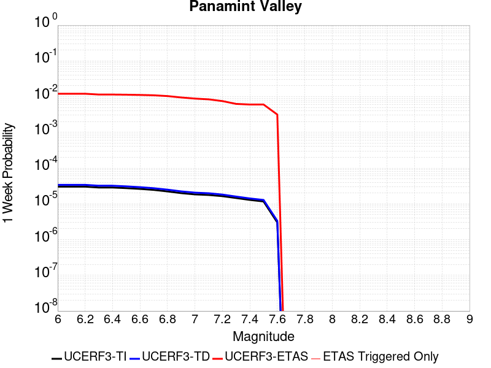 | 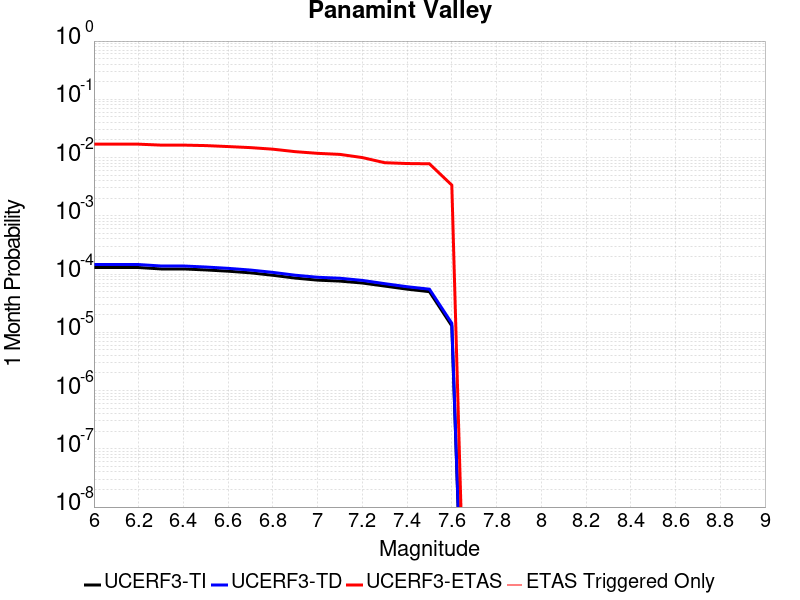 | 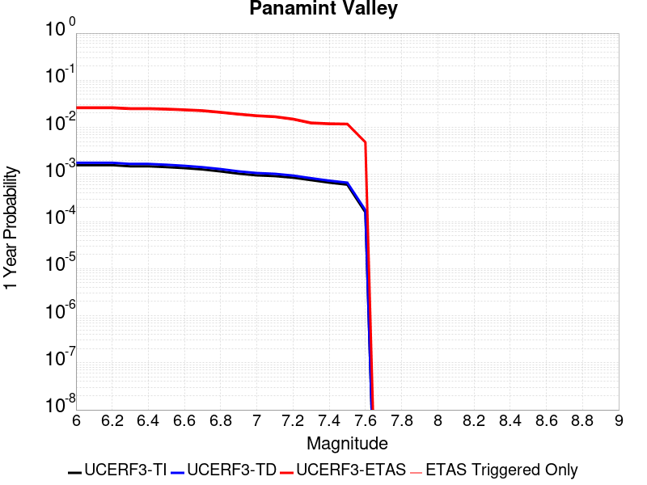 | 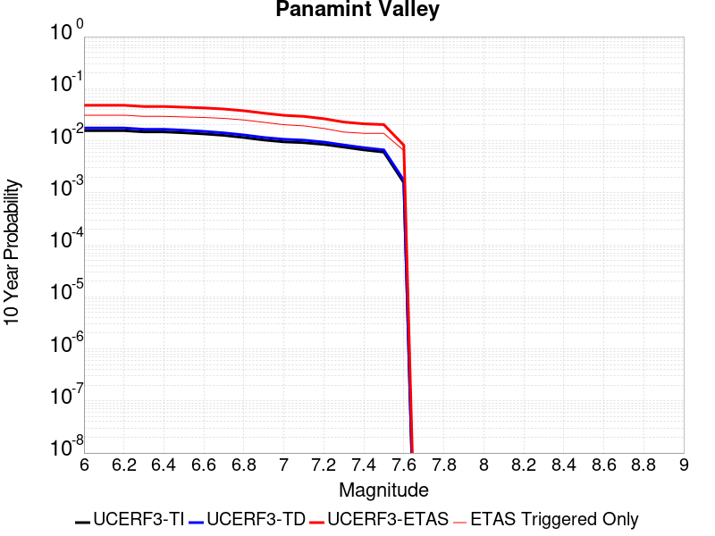 |

| Magnitude | 1 wk TI Prob | 1 wk TD Prob | 1 wk ETAS Prob | 1 wk ETAS/TD Gain | 1 wk ETAS Triggered Only | 1 mo TI Prob | 1 mo TD Prob | 1 mo ETAS Prob | 1 mo ETAS/TD Gain | 1 mo ETAS Triggered Only | 1 yr TI Prob | 1 yr TD Prob | 1 yr ETAS Prob | 1 yr ETAS/TD Gain | 1 yr ETAS Triggered Only | 10 yr TI Prob | 10 yr TD Prob | 10 yr ETAS Prob | 10 yr ETAS/TD Gain | 10 yr ETAS Triggered Only |
|-----|-----|-----|-----|-----|-----|-----|-----|-----|-----|-----|-----|-----|-----|-----|-----|-----|-----|-----|-----|-----|
| 6.0 | 3.0211835E-5 | 3.3984514E-5 | 0.012893547 | 379.3948 | 0.01286 | 1.2947287E-4 | 1.4563995E-4 | 0.016973188 | 116.54212 | 0.01683 | 0.0015751923 | 0.0017717537 | 0.026258292 | 14.82051 | 0.02453 | 0.015640736 | 0.017583137 | 0.049433094 | 2.811392 | 0.03242 |
| 6.1 | 3.0211835E-5 | 3.3984514E-5 | 0.012893547 | 379.3948 | 0.01286 | 1.2947287E-4 | 1.4563995E-4 | 0.016973188 | 116.54212 | 0.01683 | 0.0015751923 | 0.0017717537 | 0.026258292 | 14.82051 | 0.02453 | 0.015640736 | 0.017583137 | 0.049433094 | 2.811392 | 0.03242 |
| 6.2 | 3.0211835E-5 | 3.3984514E-5 | 0.012893547 | 379.3948 | 0.01286 | 1.2947287E-4 | 1.4563995E-4 | 0.016973188 | 116.54212 | 0.01683 | 0.0015751923 | 0.0017717537 | 0.026258292 | 14.82051 | 0.02453 | 0.015640736 | 0.017583137 | 0.049433094 | 2.811392 | 0.03242 |
| 6.3 | 2.8573924E-5 | 3.210268E-5 | 0.012431704 | 387.2482 | 0.0124 | 1.2245393E-4 | 1.3757581E-4 | 0.016355345 | 118.88241 | 0.01622 | 0.001489857 | 0.0016737265 | 0.02515436 | 15.028955 | 0.02352 | 0.01479908 | 0.016617801 | 0.047004312 | 2.8285518 | 0.0309 |
| 6.4 | 2.8573924E-5 | 3.210268E-5 | 0.012431704 | 387.2482 | 0.0124 | 1.2245393E-4 | 1.3757581E-4 | 0.016355345 | 118.88241 | 0.01622 | 0.001489857 | 0.0016737265 | 0.02515436 | 15.028955 | 0.02352 | 0.01479908 | 0.016617801 | 0.047004312 | 2.8285518 | 0.0309 |
| 6.5 | 2.7468774E-5 | 3.0828433E-5 | 0.012230452 | 396.72638 | 0.0122 | 1.1771801E-4 | 1.3211532E-4 | 0.016050013 | 121.48486 | 0.01592 | 0.0014322745 | 0.0016073446 | 0.024490504 | 15.236624 | 0.02292 | 0.014230782 | 0.015963677 | 0.04558317 | 2.8554306 | 0.0301 |
| 6.6 | 2.6135967E-5 | 2.925248E-5 | 0.011838907 | 404.71463 | 0.01181 | 1.1200648E-4 | 1.253619E-4 | 0.015443441 | 123.19087 | 0.01532 | 0.0013628257 | 0.0015252391 | 0.023521638 | 15.421608 | 0.02203 | 0.013544982 | 0.015154043 | 0.043596394 | 2.876882 | 0.02888 |
| 6.7 | 2.4498746E-5 | 2.7341335E-5 | 0.01141703 | 417.57397 | 0.01139 | 1.04990395E-4 | 1.1717203E-4 | 0.01481545 | 126.441864 | 0.0147 | 0.0012775084 | 0.0014256609 | 0.022505565 | 15.7860565 | 0.02111 | 0.012701893 | 0.014171274 | 0.041291423 | 2.9137409 | 0.02751 |
| 6.8 | 2.2244329E-5 | 2.4935423E-5 | 0.010844666 | 434.91 | 0.01082 | 9.532935E-5 | 1.0686185E-4 | 0.013925385 | 130.31204 | 0.01382 | 0.0011600169 | 0.0013002884 | 0.020874802 | 16.05398 | 0.0196 | 0.011539802 | 0.0129325185 | 0.038013905 | 2.9394045 | 0.02541 |
| 6.9 | 1.9902658E-5 | 2.2290267E-5 | 0.009852071 | 441.98984 | 0.00983 | 8.529431E-5 | 9.552632E-5 | 0.012624329 | 132.1555 | 0.01253 | 0.0010379635 | 0.0011624309 | 0.018881809 | 16.243382 | 0.01774 | 0.010331288 | 0.011568608 | 0.03393681 | 2.9335258 | 0.02263 |
| 7.0 | 1.8353881E-5 | 2.0566185E-5 | 0.009320375 | 453.18927 | 0.0093 | 7.865712E-5 | 8.813792E-5 | 0.011817104 | 134.07513 | 0.01173 | 9.5722964E-4 | 0.0010725686 | 0.017494936 | 16.31125 | 0.01644 | 0.009531168 | 0.010678849 | 0.031246835 | 2.926049 | 0.02079 |
| 7.1 | 1.7667631E-5 | 1.9772613E-5 | 0.008969596 | 453.63736 | 0.00895 | 7.571623E-5 | 8.473711E-5 | 0.011333784 | 133.7523 | 0.01125 | 9.2145515E-4 | 0.0010312037 | 0.016734993 | 16.228601 | 0.01572 | 0.009176437 | 0.010269073 | 0.029964717 | 2.9179575 | 0.0199 |
| 7.2 | 1.6381597E-5 | 1.8158249E-5 | 0.007918015 | 436.05606 | 0.0079 | 7.020495E-5 | 7.781885E-5 | 0.009997047 | 128.46562 | 0.00992 | 8.544101E-4 | 9.4704994E-4 | 0.014943781 | 15.779297 | 0.01401 | 0.008511325 | 0.009434792 | 0.02709657 | 2.8719838 | 0.01783 |
| 7.3 | 1.4520491E-5 | 1.5966476E-5 | 0.0064458637 | 403.71237 | 0.00643 | 6.222919E-5 | 6.842605E-5 | 0.008157873 | 119.22173 | 0.00809 | 7.57377E-4 | 8.327849E-4 | 0.012363175 | 14.845579 | 0.01154 | 0.0075480095 | 0.00829975 | 0.022927329 | 2.7624118 | 0.01475 |
| 7.4 | 1.2852287E-5 | 1.4145411E-5 | 0.0062240576 | 440.00543 | 0.00621 | 5.5080065E-5 | 6.062187E-5 | 0.007900147 | 130.31842 | 0.00784 | 6.7039346E-4 | 7.378371E-4 | 0.0118496325 | 16.059958 | 0.01112 | 0.0066837464 | 0.0073567946 | 0.021412622 | 2.9105914 | 0.01416 |
| 7.5 | 1.1637851E-5 | 1.2836797E-5 | 0.006162758 | 480.0853 | 0.00615 | 4.987555E-5 | 5.5013777E-5 | 0.007814587 | 142.04782 | 0.00776 | 6.070656E-4 | 6.6960254E-4 | 0.01161227 | 17.342033 | 0.01095 | 0.006054099 | 0.0066787465 | 0.020525645 | 3.073278 | 0.01394 |
| 7.6 | 3.0068115E-6 | 3.3330316E-6 | 0.002703324 | 811.0706 | 0.0027 | 1.2886271E-5 | 1.4284384E-5 | 0.0033642366 | 235.5185 | 0.00335 | 1.5687906E-4 | 1.7390578E-4 | 0.0047631077 | 27.389013 | 0.00459 | 0.0015676835 | 0.0017391363 | 0.007698754 | 4.4267683 | 0.00597 |

## Garlock (East)
*[(top)](#table-of-contents)*

| 1 Week | 1 Month | 1 Year | 10 Year |
|-----|-----|-----|-----|
| 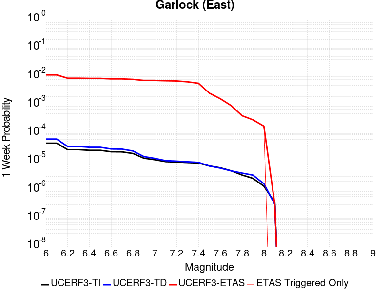 | 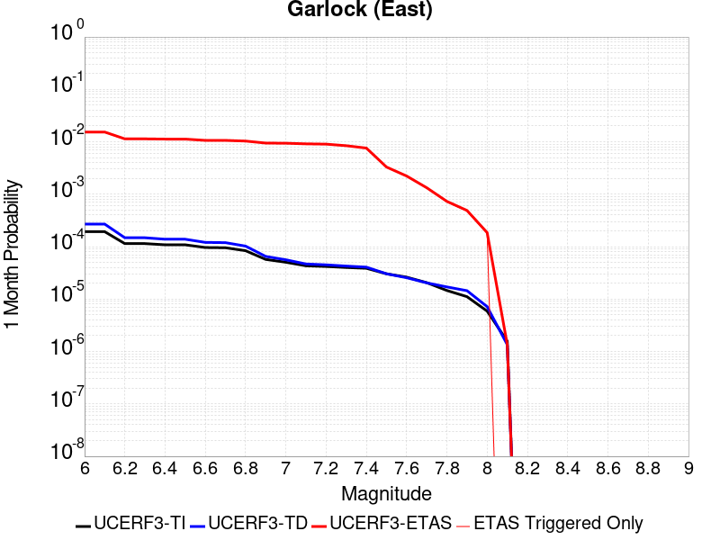 | 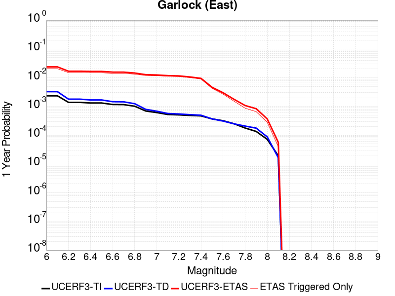 | 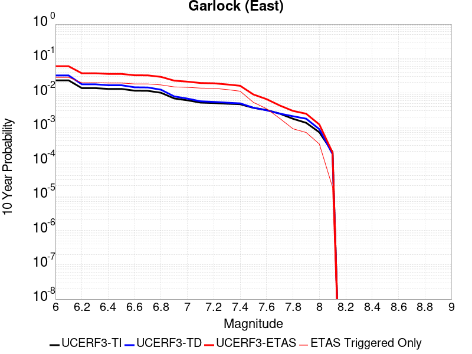 |

| Magnitude | 1 wk TI Prob | 1 wk TD Prob | 1 wk ETAS Prob | 1 wk ETAS/TD Gain | 1 wk ETAS Triggered Only | 1 mo TI Prob | 1 mo TD Prob | 1 mo ETAS Prob | 1 mo ETAS/TD Gain | 1 mo ETAS Triggered Only | 1 yr TI Prob | 1 yr TD Prob | 1 yr ETAS Prob | 1 yr ETAS/TD Gain | 1 yr ETAS Triggered Only | 10 yr TI Prob | 10 yr TD Prob | 10 yr ETAS Prob | 10 yr ETAS/TD Gain | 10 yr ETAS Triggered Only |
|-----|-----|-----|-----|-----|-----|-----|-----|-----|-----|-----|-----|-----|-----|-----|-----|-----|-----|-----|-----|-----|
| 6.0 | 4.5092507E-5 | 6.290325E-5 | 0.01013227 | 161.07704 | 0.01007 | 1.9323928E-4 | 2.6956003E-4 | 0.013925877 | 51.66151 | 0.01366 | 0.0023501497 | 0.0032774 | 0.023859723 | 7.280076 | 0.02065 | 0.023254504 | 0.032351844 | 0.059804022 | 1.8485506 | 0.02837 |
| 6.1 | 4.5092507E-5 | 6.290325E-5 | 0.01013227 | 161.07704 | 0.01007 | 1.9323928E-4 | 2.6956003E-4 | 0.013925877 | 51.66151 | 0.01366 | 0.0023501497 | 0.0032774 | 0.023859723 | 7.280076 | 0.02065 | 0.023254504 | 0.032351844 | 0.059804022 | 1.8485506 | 0.02837 |
| 6.2 | 2.6674514E-5 | 3.4509674E-5 | 0.007964236 | 230.7827 | 0.00793 | 1.1431433E-4 | 1.4789042E-4 | 0.010616342 | 71.785194 | 0.01047 | 0.0013908884 | 0.0017991117 | 0.016881928 | 9.383479 | 0.01511 | 0.01382215 | 0.017890299 | 0.037738737 | 2.1094525 | 0.02021 |
| 6.3 | 2.6674514E-5 | 3.4509674E-5 | 0.007964236 | 230.7827 | 0.00793 | 1.1431433E-4 | 1.4789042E-4 | 0.010616342 | 71.785194 | 0.01047 | 0.0013908884 | 0.0017991117 | 0.016881928 | 9.383479 | 0.01511 | 0.01382215 | 0.017890299 | 0.037738737 | 2.1094525 | 0.02021 |
| 6.4 | 2.5312667E-5 | 3.233893E-5 | 0.007902085 | 244.35207 | 0.00787 | 1.0847834E-4 | 1.3858822E-4 | 0.010517149 | 75.887764 | 0.01038 | 0.0013199237 | 0.0016860351 | 0.016590863 | 9.840165 | 0.01493 | 0.013121112 | 0.016778335 | 0.036354277 | 2.1667392 | 0.01991 |
| 6.5 | 2.5312667E-5 | 3.233893E-5 | 0.007902085 | 244.35207 | 0.00787 | 1.0847834E-4 | 1.3858822E-4 | 0.010517149 | 75.887764 | 0.01038 | 0.0013199237 | 0.0016860351 | 0.016590863 | 9.840165 | 0.01493 | 0.013121112 | 0.016778335 | 0.036354277 | 2.1667392 | 0.01991 |
| 6.6 | 2.246556E-5 | 2.8133776E-5 | 0.0076679187 | 272.55206 | 0.00764 | 9.627742E-5 | 1.20567885E-4 | 0.010099364 | 83.76496 | 0.00998 | 0.0011715472 | 0.0014669491 | 0.015676074 | 10.686174 | 0.01423 | 0.011653901 | 0.01461866 | 0.033163536 | 2.2685757 | 0.01882 |
| 6.7 | 2.2241198E-5 | 2.7803519E-5 | 0.0076575913 | 275.41806 | 0.00763 | 9.531594E-5 | 1.1915263E-4 | 0.010087965 | 84.66422 | 0.00997 | 0.0011598538 | 0.0014497414 | 0.015639141 | 10.787539 | 0.01421 | 0.011538187 | 0.014448853 | 0.032957505 | 2.280977 | 0.01878 |
| 6.8 | 1.9528685E-5 | 2.389819E-5 | 0.007263725 | 303.94455 | 0.00724 | 8.369167E-5 | 1.0241691E-4 | 0.009501454 | 92.772316 | 0.0094 | 0.0010184698 | 0.0012462323 | 0.014569608 | 11.690925 | 0.01334 | 0.010138147 | 0.012436427 | 0.029669411 | 2.3856862 | 0.01745 |
| 6.9 | 1.3318621E-5 | 1.5198884E-5 | 0.006725097 | 442.47305 | 0.00671 | 5.7078556E-5 | 6.513648E-5 | 0.008694574 | 133.4824 | 0.00863 | 6.9470983E-4 | 7.927538E-4 | 0.012773248 | 16.112503 | 0.01199 | 0.0069254204 | 0.007939888 | 0.023078725 | 2.9066815 | 0.01526 |
| 7.0 | 1.1760853E-5 | 1.31077895E-5 | 0.0066230213 | 505.2737 | 0.00661 | 5.0402683E-5 | 5.6175057E-5 | 0.008555697 | 152.3042 | 0.0085 | 6.134799E-4 | 6.8372174E-4 | 0.012455667 | 18.217451 | 0.01178 | 0.0061178906 | 0.00685652 | 0.02159477 | 3.1495233 | 0.01484 |
| 7.1 | 1.0064758E-5 | 1.0902931E-5 | 0.006420833 | 588.90894 | 0.00641 | 4.3133965E-5 | 4.672603E-5 | 0.0081963455 | 175.41284 | 0.00815 | 5.2502943E-4 | 5.687444E-4 | 0.011832335 | 20.80431 | 0.01127 | 0.005237907 | 0.0057129986 | 0.019692674 | 3.4469943 | 0.01406 |
| 7.2 | 9.768808E-6 | 1.0498807E-5 | 0.006280433 | 598.20447 | 0.00627 | 4.186565E-5 | 4.499413E-5 | 0.008024635 | 178.34848 | 0.00798 | 5.095951E-4 | 5.4766936E-4 | 0.011571629 | 21.12886 | 0.01103 | 0.0050842804 | 0.0055032647 | 0.019177595 | 3.484767 | 0.01375 |
| 7.3 | 9.344516E-6 | 9.944468E-6 | 0.0057498873 | 578.19965 | 0.00574 | 4.004731E-5 | 4.261847E-5 | 0.007372306 | 172.98383 | 0.00733 | 4.8746695E-4 | 5.1875977E-4 | 0.010623516 | 20.47868 | 0.01011 | 0.0048639905 | 0.0052149445 | 0.017828818 | 3.4187937 | 0.01268 |
| 7.4 | 9.023491E-6 | 9.490661E-6 | 0.0051794415 | 545.74084 | 0.00517 | 3.867153E-5 | 4.0673647E-5 | 0.0065804077 | 161.78554 | 0.00654 | 4.7072413E-4 | 4.950925E-4 | 0.009520622 | 19.229986 | 0.00903 | 0.004697283 | 0.0049783974 | 0.016261943 | 3.2665014 | 0.01134 |
| 7.5 | 7.081253E-6 | 7.087672E-6 | 0.0024470703 | 345.2573 | 0.00244 | 3.0347876E-5 | 3.0375388E-5 | 0.0030802828 | 101.40719 | 0.00305 | 3.6942272E-4 | 3.6975832E-4 | 0.004658172 | 12.597883 | 0.00429 | 0.003688092 | 0.0037243143 | 0.0090743145 | 2.4365063 | 0.00537 |
| 7.6 | 6.116396E-6 | 5.959245E-6 | 0.0015359501 | 257.74243 | 0.00153 | 2.6212863E-5 | 2.5539372E-5 | 0.00195549 | 76.567665 | 0.00193 | 3.1909486E-4 | 3.1089774E-4 | 0.0030000615 | 9.6496725 | 0.00269 | 0.0031863707 | 0.0031357552 | 0.006455313 | 2.0586152 | 0.00333 |
| 7.7 | 4.797145E-6 | 4.757281E-6 | 9.547528E-4 | 200.69295 | 9.5E-4 | 2.055903E-5 | 2.0388188E-5 | 0.0011803645 | 57.894527 | 0.00116 | 2.5027743E-4 | 2.4819805E-4 | 0.0017678208 | 7.1226215 | 0.00152 | 0.0024999576 | 0.0025093474 | 0.00438463 | 1.7473187 | 0.00188 |
| 7.8 | 3.4028885E-6 | 3.978462E-6 | 5.239764E-4 | 131.70326 | 5.2E-4 | 1.4583726E-5 | 1.7050439E-5 | 6.87039E-4 | 40.294506 | 6.7E-4 | 1.775424E-4 | 2.0756939E-4 | 0.0010773888 | 5.1904993 | 8.7E-4 | 0.0017740062 | 0.0021012232 | 0.003178954 | 1.5129063 | 0.00108 |
| 7.9 | 2.5928412E-6 | 3.3724489E-6 | 4.033711E-4 | 119.60777 | 4.0E-4 | 1.1112129E-5 | 1.4453272E-5 | 5.244459E-4 | 36.285618 | 5.1E-4 | 1.3528178E-4 | 1.7595445E-4 | 8.358383E-4 | 4.750311 | 6.6E-4 | 0.0013519945 | 0.0017812408 | 0.0026097624 | 1.4651374 | 8.3E-4 |
| 8.0 | 1.3743648E-6 | 1.6734747E-6 | 1.4167324E-4 | 84.658134 | 1.4E-4 | 5.8901214E-6 | 7.1720146E-6 | 1.8717072E-4 | 26.09737 | 1.8E-4 | 7.1709874E-5 | 8.731581E-5 | 3.6729136E-4 | 4.2064705 | 2.8E-4 | 7.1686733E-4 | 8.837234E-4 | 0.0012234229 | 1.3843958 | 3.4E-4 |
| 8.1 | 3.6733252E-7 | 3.1489964E-7 | 2.0314894E-5 | 64.512276 | 2.0E-5 | 1.5742813E-6 | 1.3495693E-6 | 3.134953E-5 | 23.229284 | 3.0E-5 | 1.9166706E-5 | 1.6430899E-5 | 5.6430243E-5 | 3.4343977 | 4.0E-5 | 1.9165053E-4 | 1.6638759E-4 | 2.1637927E-4 | 1.3004532 | 5.0E-5 |

## Hunter Mountain-Saline Valley
*[(top)](#table-of-contents)*

| 1 Week | 1 Month | 1 Year | 10 Year |
|-----|-----|-----|-----|
| 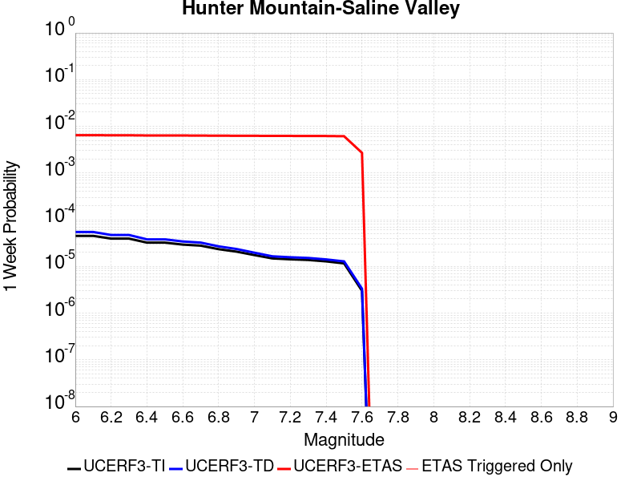 | 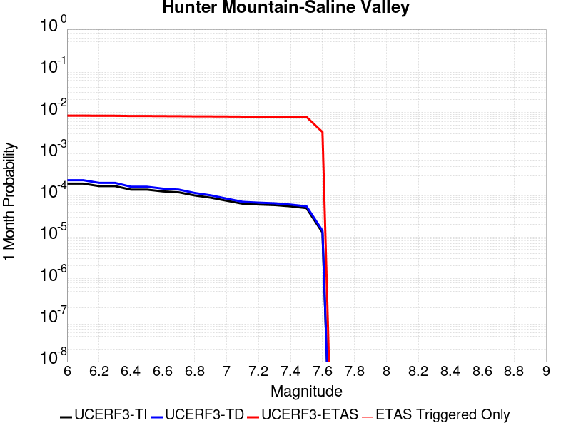 | 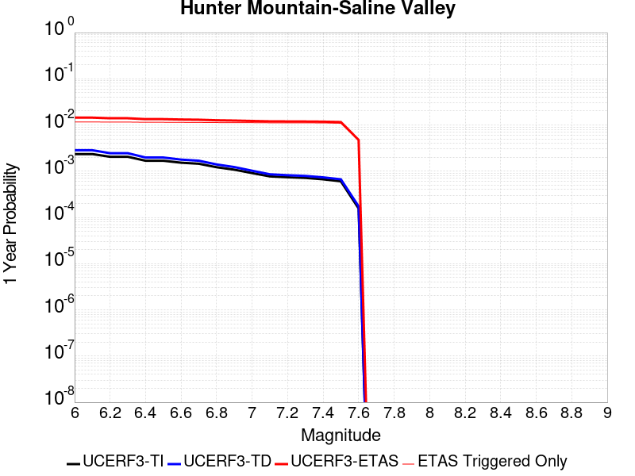 | 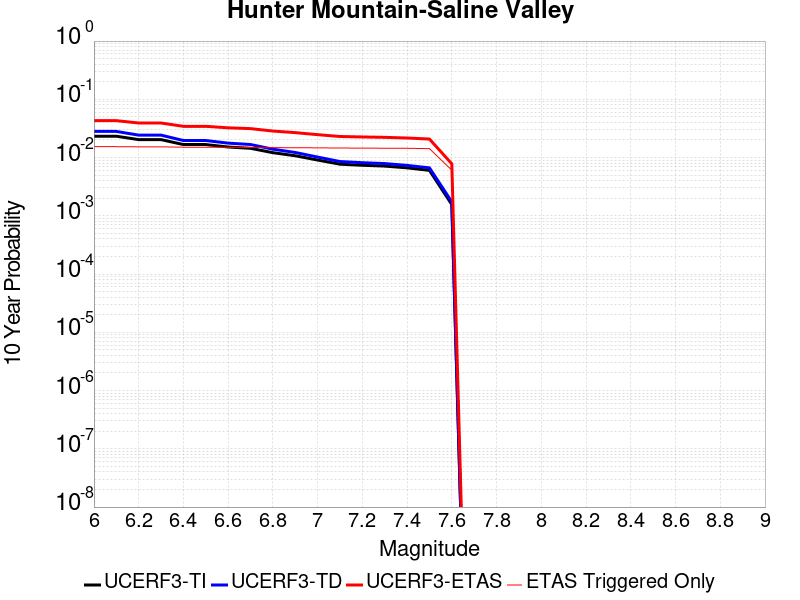 |

| Magnitude | 1 wk TI Prob | 1 wk TD Prob | 1 wk ETAS Prob | 1 wk ETAS/TD Gain | 1 wk ETAS Triggered Only | 1 mo TI Prob | 1 mo TD Prob | 1 mo ETAS Prob | 1 mo ETAS/TD Gain | 1 mo ETAS Triggered Only | 1 yr TI Prob | 1 yr TD Prob | 1 yr ETAS Prob | 1 yr ETAS/TD Gain | 1 yr ETAS Triggered Only | 10 yr TI Prob | 10 yr TD Prob | 10 yr ETAS Prob | 10 yr ETAS/TD Gain | 10 yr ETAS Triggered Only |
|-----|-----|-----|-----|-----|-----|-----|-----|-----|-----|-----|-----|-----|-----|-----|-----|-----|-----|-----|-----|-----|
| 6.0 | 4.5103672E-5 | 5.4570177E-5 | 0.0064642206 | 118.457016 | 0.00641 | 1.9328714E-4 | 2.3385242E-4 | 0.008361951 | 35.757385 | 0.00813 | 0.002350731 | 0.0028435152 | 0.014430474 | 5.074871 | 0.01162 | 0.023260195 | 0.028091887 | 0.042631634 | 1.5175781 | 0.01496 |
| 6.1 | 4.5103672E-5 | 5.4570177E-5 | 0.0064642206 | 118.457016 | 0.00641 | 1.9328714E-4 | 2.3385242E-4 | 0.008361951 | 35.757385 | 0.00813 | 0.002350731 | 0.0028435152 | 0.014430474 | 5.074871 | 0.01162 | 0.023260195 | 0.028091887 | 0.042631634 | 1.5175781 | 0.01496 |
| 6.2 | 3.9363465E-5 | 4.706337E-5 | 0.0064267633 | 136.55553 | 0.00638 | 1.6868966E-4 | 2.0168544E-4 | 0.008290053 | 41.103878 | 0.00809 | 0.002051862 | 0.0024528175 | 0.013994439 | 5.7054543 | 0.01157 | 0.020330196 | 0.024273481 | 0.03880205 | 1.5985366 | 0.01489 |
| 6.3 | 3.9363465E-5 | 4.706337E-5 | 0.0064267633 | 136.55553 | 0.00638 | 1.6868966E-4 | 2.0168544E-4 | 0.008290053 | 41.103878 | 0.00809 | 0.002051862 | 0.0024528175 | 0.013994439 | 5.7054543 | 0.01157 | 0.020330196 | 0.024273481 | 0.03880205 | 1.5985366 | 0.01489 |
| 6.4 | 3.2311684E-5 | 3.795099E-5 | 0.006367711 | 167.78773 | 0.00633 | 1.384713E-4 | 1.6263737E-4 | 0.008181333 | 50.304142 | 0.00802 | 0.0016845843 | 0.0019783843 | 0.013385772 | 6.7660117 | 0.01143 | 0.016718714 | 0.019616475 | 0.034008503 | 1.7336706 | 0.01468 |
| 6.5 | 3.2311684E-5 | 3.795099E-5 | 0.006367711 | 167.78773 | 0.00633 | 1.384713E-4 | 1.6263737E-4 | 0.008181333 | 50.304142 | 0.00802 | 0.0016845843 | 0.0019783843 | 0.013385772 | 6.7660117 | 0.01143 | 0.016718714 | 0.019616475 | 0.034008503 | 1.7336706 | 0.01468 |
| 6.6 | 2.9305844E-5 | 3.418183E-5 | 0.006353966 | 185.88722 | 0.00632 | 1.2559042E-4 | 1.4648569E-4 | 0.008135315 | 55.536587 | 0.00799 | 0.0015279909 | 0.001782067 | 0.013141787 | 7.374463 | 0.01138 | 0.015175272 | 0.01768569 | 0.032037303 | 1.8114816 | 0.01461 |
| 6.7 | 2.7826512E-5 | 3.2344276E-5 | 0.0063321404 | 195.77315 | 0.0063 | 1.19251024E-4 | 1.386113E-4 | 0.008097508 | 58.418816 | 0.00796 | 0.0014509142 | 0.0016863465 | 0.01299724 | 7.707337 | 0.01133 | 0.014414776 | 0.016743187 | 0.031049574 | 1.8544602 | 0.01455 |
| 6.8 | 2.3389874E-5 | 2.6866714E-5 | 0.0062866984 | 233.9958 | 0.00626 | 1.0023846E-4 | 1.15138246E-4 | 0.0080342265 | 69.77895 | 0.00792 | 0.00121972 | 0.001400954 | 0.012645179 | 9.02612 | 0.01126 | 0.01213047 | 0.013927434 | 0.028176183 | 2.0230706 | 0.01445 |
| 6.9 | 2.069209E-5 | 2.3570032E-5 | 0.0062834225 | 266.58524 | 0.00626 | 8.867737E-5 | 1.01010715E-4 | 0.008010211 | 79.30061 | 0.00791 | 0.0010791123 | 0.0012291478 | 0.01246532 | 10.141433 | 0.01125 | 0.010738871 | 0.012228523 | 0.026452433 | 2.1631746 | 0.0144 |
| 7.0 | 1.7462342E-5 | 1.9633546E-5 | 0.006259511 | 318.81714 | 0.00624 | 7.483646E-5 | 8.414118E-5 | 0.007973477 | 94.76308 | 0.00789 | 9.1075303E-4 | 0.0010239601 | 0.012222482 | 11.936482 | 0.01121 | 0.009070295 | 0.0101960525 | 0.024379943 | 2.391116 | 0.01433 |
| 7.1 | 1.4807709E-5 | 1.6441749E-5 | 0.0062363395 | 379.299 | 0.00622 | 6.3460066E-5 | 7.046283E-5 | 0.007919909 | 112.39841 | 0.00785 | 7.723524E-4 | 8.575638E-4 | 0.01198801 | 13.979147 | 0.01114 | 0.007696735 | 0.008545532 | 0.022663843 | 2.652128 | 0.01424 |
| 7.2 | 1.4180048E-5 | 1.5698337E-5 | 0.006225601 | 396.57712 | 0.00621 | 6.077022E-5 | 6.727694E-5 | 0.00790675 | 117.5254 | 0.00784 | 7.396263E-4 | 8.188051E-4 | 0.011939692 | 14.581847 | 0.01113 | 0.0073716943 | 0.008160833 | 0.022264786 | 2.728249 | 0.01422 |
| 7.3 | 1.3730402E-5 | 1.5172075E-5 | 0.006205078 | 408.9802 | 0.00619 | 5.8843252E-5 | 6.502165E-5 | 0.007884514 | 121.25981 | 0.00782 | 7.161811E-4 | 7.9136714E-4 | 0.011892575 | 15.027885 | 0.01111 | 0.007138774 | 0.007888422 | 0.021956565 | 2.783391 | 0.01418 |
| 7.4 | 1.2810095E-5 | 1.4109277E-5 | 0.006194022 | 439.0035 | 0.00618 | 5.489925E-5 | 6.0467017E-5 | 0.007869995 | 130.15352 | 0.00781 | 6.681934E-4 | 7.359531E-4 | 0.011807798 | 16.044228 | 0.01108 | 0.006661878 | 0.007338053 | 0.021344513 | 2.9087434 | 0.01411 |
| 7.5 | 1.1595659E-5 | 1.2800664E-5 | 0.0061327224 | 479.0941 | 0.00612 | 4.9694736E-5 | 5.4858923E-5 | 0.007784435 | 141.89915 | 0.00773 | 6.0486543E-4 | 6.6771836E-4 | 0.011570433 | 17.328314 | 0.01091 | 0.006032217 | 0.0066599925 | 0.020457486 | 3.071698 | 0.01389 |
| 7.6 | 2.997694E-6 | 3.3251579E-6 | 0.0027033163 | 812.98883 | 0.0027 | 1.28471975E-5 | 1.425064E-5 | 0.0033642028 | 236.0738 | 0.00335 | 1.564034E-4 | 1.73495E-4 | 0.004762699 | 27.451502 | 0.00459 | 0.0015629337 | 0.001735031 | 0.0076846904 | 4.429137 | 0.00596 |

## Ash Hill
*[(top)](#table-of-contents)*

| 1 Week | 1 Month | 1 Year | 10 Year |
|-----|-----|-----|-----|
| 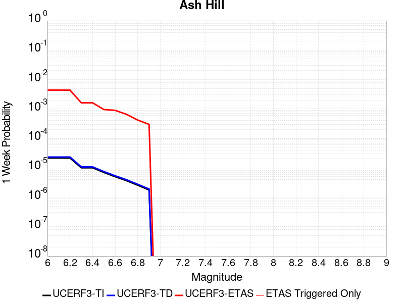 | 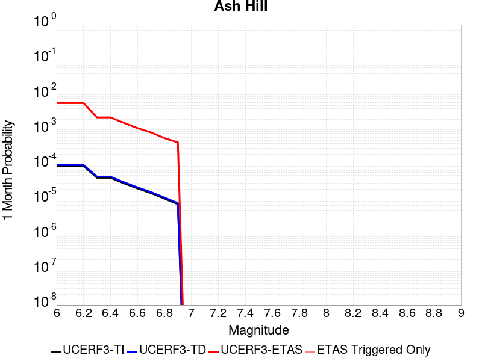 | 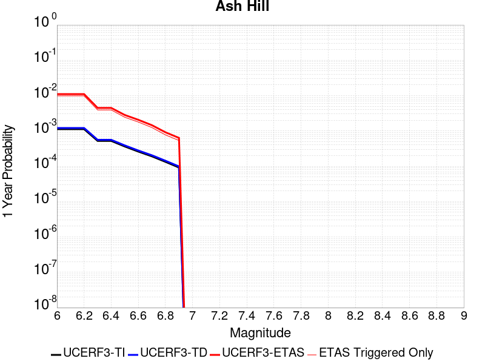 | 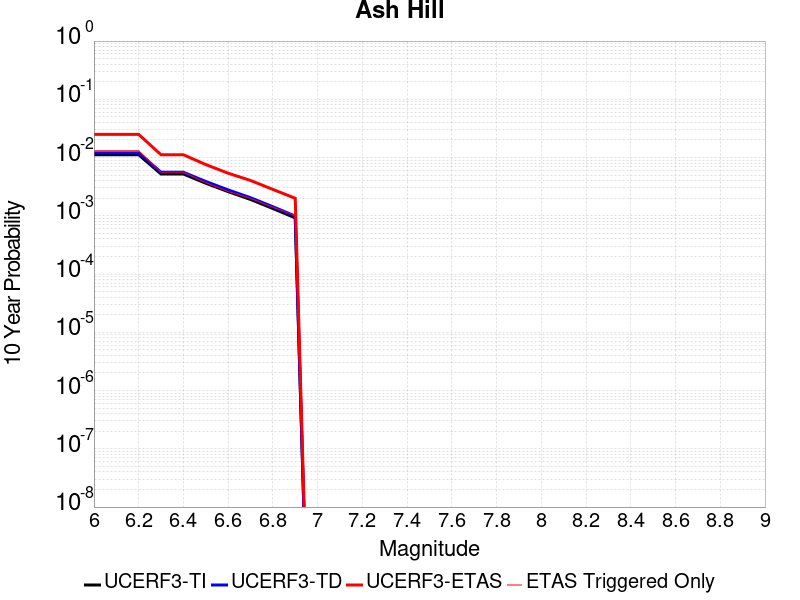 |

| Magnitude | 1 wk TI Prob | 1 wk TD Prob | 1 wk ETAS Prob | 1 wk ETAS/TD Gain | 1 wk ETAS Triggered Only | 1 mo TI Prob | 1 mo TD Prob | 1 mo ETAS Prob | 1 mo ETAS/TD Gain | 1 mo ETAS Triggered Only | 1 yr TI Prob | 1 yr TD Prob | 1 yr ETAS Prob | 1 yr ETAS/TD Gain | 1 yr ETAS Triggered Only | 10 yr TI Prob | 10 yr TD Prob | 10 yr ETAS Prob | 10 yr ETAS/TD Gain | 10 yr ETAS Triggered Only |
|-----|-----|-----|-----|-----|-----|-----|-----|-----|-----|-----|-----|-----|-----|-----|-----|-----|-----|-----|-----|-----|
| 6.0 | 2.1545662E-5 | 2.3194447E-5 | 0.004143099 | 178.6246 | 0.00412 | 9.2335285E-5 | 9.940143E-5 | 0.005798835 | 58.337536 | 0.0057 | 0.0011236023 | 0.0012096206 | 0.010418468 | 8.613005 | 0.00922 | 0.011179381 | 0.012038348 | 0.024980646 | 2.0750892 | 0.0131 |
| 6.1 | 2.1545662E-5 | 2.3194447E-5 | 0.004143099 | 178.6246 | 0.00412 | 9.2335285E-5 | 9.940143E-5 | 0.005798835 | 58.337536 | 0.0057 | 0.0011236023 | 0.0012096206 | 0.010418468 | 8.613005 | 0.00922 | 0.011179381 | 0.012038348 | 0.024980646 | 2.0750892 | 0.0131 |
| 6.2 | 2.1545662E-5 | 2.3194447E-5 | 0.004143099 | 178.6246 | 0.00412 | 9.2335285E-5 | 9.940143E-5 | 0.005798835 | 58.337536 | 0.0057 | 0.0011236023 | 0.0012096206 | 0.010418468 | 8.613005 | 0.00922 | 0.011179381 | 0.012038348 | 0.024980646 | 2.0750892 | 0.0131 |
| 6.3 | 1.0025529E-5 | 1.0746934E-5 | 0.0016107297 | 149.87807 | 0.0016 | 4.2965847E-5 | 4.605755E-5 | 0.0022659553 | 49.198345 | 0.00222 | 5.229836E-4 | 5.6061964E-4 | 0.0043185116 | 7.7031045 | 0.00376 | 0.005217545 | 0.0055933665 | 0.011171987 | 1.9973638 | 0.00561 |
| 6.4 | 1.0025529E-5 | 1.0746934E-5 | 0.0016107297 | 149.87807 | 0.0016 | 4.2965847E-5 | 4.605755E-5 | 0.0022659553 | 49.198345 | 0.00222 | 5.229836E-4 | 5.6061964E-4 | 0.0043185116 | 7.7031045 | 0.00376 | 0.005217545 | 0.0055933665 | 0.011171987 | 1.9973638 | 0.00561 |
| 6.5 | 6.9617327E-6 | 7.456634E-6 | 0.0011474481 | 153.88286 | 0.00114 | 2.9835655E-5 | 3.195666E-5 | 0.0015819072 | 49.50164 | 0.00155 | 3.6318856E-4 | 3.8901155E-4 | 0.0028680468 | 7.372652 | 0.00248 | 0.0036259557 | 0.0038841602 | 0.00757975 | 1.9514514 | 0.00371 |
| 6.6 | 4.9919777E-6 | 5.3466883E-6 | 8.653421E-4 | 161.84637 | 8.6E-4 | 2.1394015E-5 | 2.2914215E-5 | 0.001122889 | 49.004036 | 0.0011 | 2.60441E-4 | 2.7895154E-4 | 0.0020484577 | 7.3434176 | 0.00177 | 0.0026013597 | 0.0027866727 | 0.0053893994 | 1.9339908 | 0.00261 |
| 6.7 | 3.6630722E-6 | 3.924624E-6 | 6.339222E-4 | 161.52432 | 6.3E-4 | 1.5698786E-5 | 1.681974E-5 | 8.468058E-4 | 50.34595 | 8.3E-4 | 1.9111596E-4 | 2.0476682E-4 | 0.0015544904 | 7.5915146 | 0.00135 | 0.0019095168 | 0.0020463446 | 0.004042252 | 1.9753525 | 0.002 |
| 6.8 | 2.5599613E-6 | 2.744925E-6 | 4.3274375E-4 | 157.6523 | 4.3E-4 | 1.0971216E-5 | 1.1763939E-5 | 5.817572E-4 | 49.452587 | 5.7E-4 | 1.3356637E-4 | 1.4322149E-4 | 0.0010830868 | 7.5623207 | 9.4E-4 | 0.0013348613 | 0.0014317769 | 0.002839758 | 1.9833803 | 0.00141 |
| 6.9 | 1.7684905E-6 | 1.8968707E-6 | 3.118963E-4 | 164.42674 | 3.1E-4 | 7.579223E-6 | 8.129446E-6 | 4.3812595E-4 | 53.893703 | 4.3E-4 | 9.2273134E-5 | 9.8976E-5 | 8.189047E-4 | 8.27377 | 7.2E-4 | 9.223483E-4 | 9.8976E-4 | 0.0019987603 | 2.0194395 | 0.00101 |

## Blackwater
*[(top)](#table-of-contents)*

| 1 Week | 1 Month | 1 Year | 10 Year |
|-----|-----|-----|-----|
| 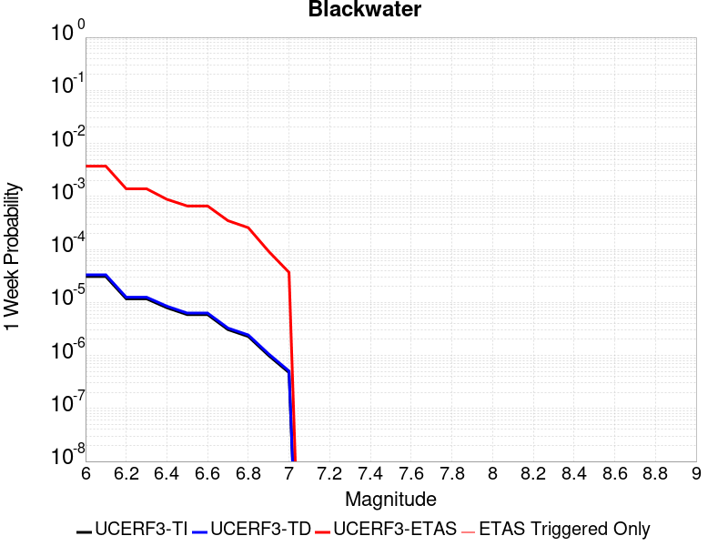 | 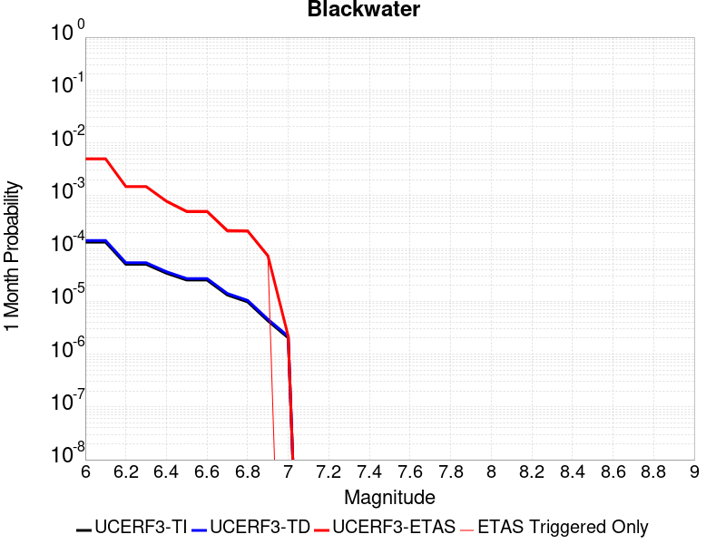 | 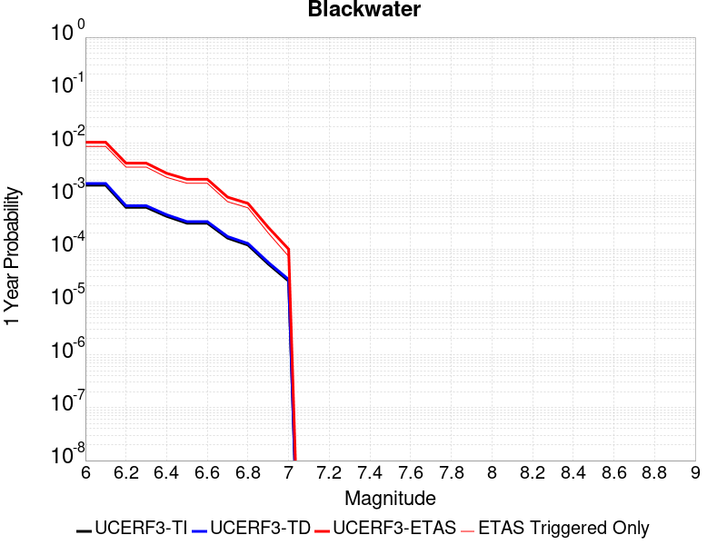 | 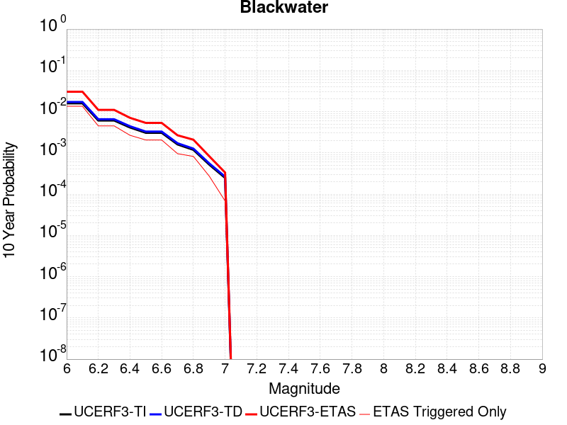 |

| Magnitude | 1 wk TI Prob | 1 wk TD Prob | 1 wk ETAS Prob | 1 wk ETAS/TD Gain | 1 wk ETAS Triggered Only | 1 mo TI Prob | 1 mo TD Prob | 1 mo ETAS Prob | 1 mo ETAS/TD Gain | 1 mo ETAS Triggered Only | 1 yr TI Prob | 1 yr TD Prob | 1 yr ETAS Prob | 1 yr ETAS/TD Gain | 1 yr ETAS Triggered Only | 10 yr TI Prob | 10 yr TD Prob | 10 yr ETAS Prob | 10 yr ETAS/TD Gain | 10 yr ETAS Triggered Only |
|-----|-----|-----|-----|-----|-----|-----|-----|-----|-----|-----|-----|-----|-----|-----|-----|-----|-----|-----|-----|-----|
| 6.0 | 3.0708583E-5 | 3.3095846E-5 | 0.0038829683 | 117.32494 | 0.00385 | 1.3160157E-4 | 1.4183241E-4 | 0.0055410666 | 39.067703 | 0.0054 | 0.0016010714 | 0.0017255784 | 0.010560307 | 6.119865 | 0.00885 | 0.015895851 | 0.017135633 | 0.029480409 | 1.7204156 | 0.01256 |
| 6.1 | 3.0708583E-5 | 3.3095846E-5 | 0.0038829683 | 117.32494 | 0.00385 | 1.3160157E-4 | 1.4183241E-4 | 0.0055410666 | 39.067703 | 0.0054 | 0.0016010714 | 0.0017255784 | 0.010560307 | 6.119865 | 0.00885 | 0.015895851 | 0.017135633 | 0.029480409 | 1.7204156 | 0.01256 |
| 6.2 | 1.1707779E-5 | 1.2545122E-5 | 0.0014825267 | 118.175545 | 0.00147 | 5.017523E-5 | 5.3763757E-5 | 0.0020236578 | 37.639816 | 0.00197 | 6.107122E-4 | 6.5438676E-4 | 0.0041720835 | 6.375562 | 0.00352 | 0.006090366 | 0.0065255696 | 0.011343921 | 1.7383802 | 0.00485 |
| 6.3 | 1.1707779E-5 | 1.2545122E-5 | 0.0014825267 | 118.175545 | 0.00147 | 5.017523E-5 | 5.3763757E-5 | 0.0020236578 | 37.639816 | 0.00197 | 6.107122E-4 | 6.5438676E-4 | 0.0041720835 | 6.375562 | 0.00352 | 0.006090366 | 0.0065255696 | 0.011343921 | 1.7383802 | 0.00485 |
| 6.4 | 7.929244E-6 | 8.480098E-6 | 8.9847256E-4 | 105.95073 | 8.9E-4 | 3.3982033E-5 | 3.6342793E-5 | 0.0012063002 | 33.192284 | 0.00117 | 4.136527E-4 | 4.423877E-4 | 0.0026214232 | 5.925624 | 0.00218 | 0.0041288356 | 0.0044154758 | 0.0074221413 | 1.680938 | 0.00302 |
| 6.5 | 5.8832115E-6 | 6.285991E-6 | 6.562819E-4 | 104.40389 | 6.5E-4 | 2.521352E-5 | 2.6939697E-5 | 8.8691653E-4 | 32.92229 | 8.6E-4 | 3.0693135E-4 | 3.27944E-4 | 0.0019474127 | 5.9382477 | 0.00162 | 0.0030650778 | 0.0032748538 | 0.0054875836 | 1.6756729 | 0.00222 |
| 6.6 | 5.8832115E-6 | 6.285991E-6 | 6.562819E-4 | 104.40389 | 6.5E-4 | 2.521352E-5 | 2.6939697E-5 | 8.8691653E-4 | 32.92229 | 8.6E-4 | 3.0693135E-4 | 3.27944E-4 | 0.0019474127 | 5.9382477 | 0.00162 | 0.0030650778 | 0.0032748538 | 0.0054875836 | 1.6756729 | 0.00222 |
| 6.7 | 3.0715053E-6 | 3.2814662E-6 | 3.2328043E-4 | 98.51707 | 3.2E-4 | 1.3163528E-5 | 1.4063357E-5 | 4.0405788E-4 | 28.731253 | 3.9E-4 | 1.6025416E-4 | 1.7120909E-4 | 9.110824E-4 | 5.3214607 | 7.4E-4 | 0.0016013865 | 0.0017108864 | 0.0027790559 | 1.6243368 | 0.00107 |
| 6.8 | 2.2722281E-6 | 2.4287538E-6 | 2.1242825E-4 | 87.46389 | 2.1E-4 | 9.738084E-6 | 1.0408908E-5 | 2.804061E-4 | 26.93905 | 2.7E-4 | 1.1855473E-4 | 1.26722E-4 | 6.466561E-4 | 5.1029506 | 5.2E-4 | 0.001184915 | 0.0012665876 | 0.002025625 | 1.5992775 | 7.6E-4 |
| 6.9 | 9.952399E-7 | 1.0653489E-6 | 7.1065275E-5 | 66.70611 | 7.0E-5 | 4.265307E-6 | 4.5657757E-6 | 1.0456532E-4 | 22.901983 | 1.0E-4 | 5.1928873E-5 | 5.5587418E-5 | 2.1557852E-4 | 3.878189 | 1.6E-4 | 5.191674E-4 | 5.557858E-4 | 7.6566904E-4 | 1.3776335 | 2.1E-4 |
| 7.0 | 4.7385504E-7 | 5.0755597E-7 | 3.0507541E-5 | 60.106754 | 3.0E-5 | 2.0308057E-6 | 2.1752398E-6 | 4.2175154E-5 | 19.388737 | 4.0E-5 | 2.4724779E-5 | 2.6483543E-5 | 7.648222E-5 | 2.887915 | 5.0E-5 | 2.4722028E-4 | 2.6483546E-4 | 3.348169E-4 | 1.264245 | 7.0E-5 |

## Garlock (West)
*[(top)](#table-of-contents)*

| 1 Week | 1 Month | 1 Year | 10 Year |
|-----|-----|-----|-----|
| 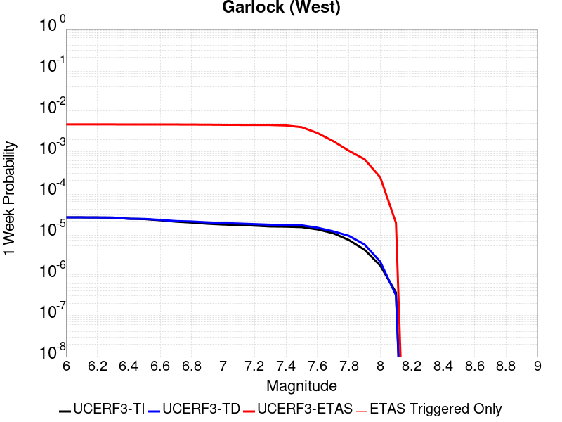 | 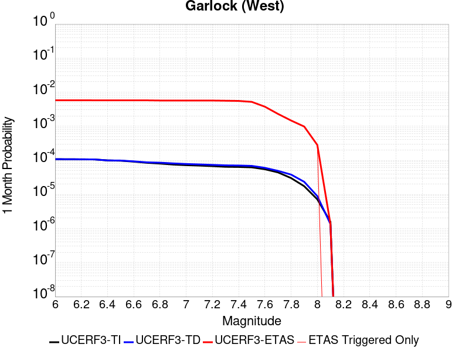 |  | 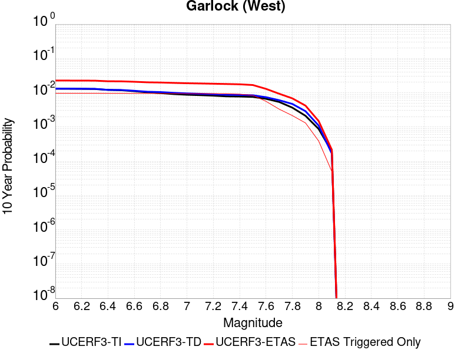 |

| Magnitude | 1 wk TI Prob | 1 wk TD Prob | 1 wk ETAS Prob | 1 wk ETAS/TD Gain | 1 wk ETAS Triggered Only | 1 mo TI Prob | 1 mo TD Prob | 1 mo ETAS Prob | 1 mo ETAS/TD Gain | 1 mo ETAS Triggered Only | 1 yr TI Prob | 1 yr TD Prob | 1 yr ETAS Prob | 1 yr ETAS/TD Gain | 1 yr ETAS Triggered Only | 10 yr TI Prob | 10 yr TD Prob | 10 yr ETAS Prob | 10 yr ETAS/TD Gain | 10 yr ETAS Triggered Only |
|-----|-----|-----|-----|-----|-----|-----|-----|-----|-----|-----|-----|-----|-----|-----|-----|-----|-----|-----|-----|-----|
| 6.0 | 2.5181727E-5 | 2.51973E-5 | 0.004515084 | 179.18921 | 0.00449 | 1.0791722E-4 | 1.0798398E-4 | 0.00560739 | 51.927982 | 0.0055 | 0.0013131002 | 0.0013139155 | 0.009023772 | 6.8678484 | 0.00772 | 0.013053683 | 0.013141977 | 0.022655288 | 1.7238874 | 0.00964 |
| 6.1 | 2.5077732E-5 | 2.5098372E-5 | 0.0045149857 | 179.89157 | 0.00449 | 1.0747157E-4 | 1.0756004E-4 | 0.0056069684 | 52.128735 | 0.0055 | 0.001307681 | 0.0013087603 | 0.009018657 | 6.890992 | 0.00772 | 0.013000126 | 0.013091032 | 0.022604834 | 1.7267419 | 0.00964 |
| 6.2 | 2.494612E-5 | 2.498005E-5 | 0.004514868 | 180.73894 | 0.00449 | 1.0690756E-4 | 1.0705298E-4 | 0.005606464 | 52.37093 | 0.0055 | 0.0013008224 | 0.0013025942 | 0.009012538 | 6.918915 | 0.00772 | 0.012932341 | 0.013030097 | 0.022544486 | 1.7301856 | 0.00964 |
| 6.3 | 2.4733758E-5 | 2.479942E-5 | 0.004514688 | 182.04814 | 0.00449 | 1.0599751E-4 | 1.06278916E-4 | 0.0056056944 | 52.74512 | 0.0055 | 0.0012897556 | 0.0012931811 | 0.009003198 | 6.9620547 | 0.00772 | 0.012822957 | 0.012937066 | 0.022452353 | 1.7355057 | 0.00964 |
| 6.4 | 2.3237335E-5 | 2.317873E-5 | 0.0044730757 | 192.9819 | 0.00445 | 9.958477E-5 | 9.933365E-5 | 0.005558791 | 55.960808 | 0.00546 | 0.0012117702 | 0.001208719 | 0.008869448 | 7.3378906 | 0.00767 | 0.012051838 | 0.012101916 | 0.0215561 | 1.7812139 | 0.00957 |
| 6.5 | 2.2732203E-5 | 2.2993298E-5 | 0.004472891 | 194.53021 | 0.00445 | 9.742009E-5 | 9.8539E-5 | 0.005558001 | 56.404076 | 0.00546 | 0.0011854442 | 0.0011990548 | 0.008859858 | 7.389035 | 0.00767 | 0.011791403 | 0.012006322 | 0.021461422 | 1.78751 | 0.00957 |
| 6.6 | 2.1319436E-5 | 2.17735E-5 | 0.0044716764 | 205.37244 | 0.00445 | 9.136581E-5 | 9.331167E-5 | 0.0055528022 | 59.50812 | 0.00546 | 0.001111811 | 0.0011354799 | 0.008786782 | 7.7383866 | 0.00766 | 0.011062649 | 0.011377227 | 0.02082846 | 1.8307151 | 0.00956 |
| 6.7 | 1.970802E-5 | 2.0393396E-5 | 0.0044703027 | 219.20345 | 0.00445 | 8.446021E-5 | 8.739735E-5 | 0.00554692 | 63.46783 | 0.00546 | 0.001027818 | 0.001063545 | 0.008705409 | 8.185275 | 0.00765 | 0.010230771 | 0.010664964 | 0.020093327 | 1.8840501 | 0.00953 |
| 6.8 | 1.8744462E-5 | 1.9901045E-5 | 0.004459813 | 224.09943 | 0.00444 | 8.033094E-5 | 8.5287415E-5 | 0.0055248234 | 64.778885 | 0.00544 | 9.775903E-4 | 0.0010378812 | 0.008659963 | 8.343885 | 0.00763 | 0.009733009 | 0.01041075 | 0.019821744 | 1.9039688 | 0.00951 |
| 6.9 | 1.7559682E-5 | 1.8953415E-5 | 0.0044488693 | 234.72655 | 0.00443 | 7.5253614E-5 | 8.12264E-5 | 0.005500786 | 67.72166 | 0.00542 | 9.158276E-4 | 9.884841E-4 | 0.008590962 | 8.691047 | 0.00761 | 0.0091206245 | 0.009921231 | 0.01931708 | 1.9470445 | 0.00949 |
| 7.0 | 1.6794445E-5 | 1.8216237E-5 | 0.004418136 | 242.53835 | 0.0044 | 7.197421E-5 | 7.8067256E-5 | 0.0054676463 | 70.037636 | 0.00539 | 8.759337E-4 | 9.5005584E-4 | 0.008502874 | 8.949867 | 0.00756 | 0.008724891 | 0.009540141 | 0.018870272 | 1.9779868 | 0.00942 |
| 7.1 | 1.6337795E-5 | 1.7717046E-5 | 0.004407639 | 248.77959 | 0.00439 | 7.0017246E-5 | 7.5927994E-5 | 0.0054555195 | 71.85123 | 0.00538 | 8.521265E-4 | 9.240326E-4 | 0.008467056 | 9.163157 | 0.00755 | 0.008488664 | 0.009281996 | 0.018584838 | 2.002246 | 0.00939 |
| 7.2 | 1.5780008E-5 | 1.7165687E-5 | 0.0043870904 | 255.57327 | 0.00437 | 6.762685E-5 | 7.356516E-5 | 0.005433171 | 73.85522 | 0.00536 | 8.2304585E-4 | 8.9528906E-4 | 0.008398565 | 9.380842 | 0.00751 | 0.008200042 | 0.008996838 | 0.018262718 | 2.0299041 | 0.00935 |
| 7.3 | 1.5058865E-5 | 1.6618762E-5 | 0.0043765465 | 263.34973 | 0.00436 | 6.45364E-5 | 7.122133E-5 | 0.0054008416 | 75.8318 | 0.00533 | 7.854473E-4 | 8.667759E-4 | 0.008340293 | 9.622202 | 0.00748 | 0.00782677 | 0.008713539 | 0.017932503 | 2.0580046 | 0.0093 |
| 7.4 | 1.4887923E-5 | 1.6454731E-5 | 0.0042763846 | 259.88785 | 0.00426 | 6.380382E-5 | 7.051838E-5 | 0.00529015 | 75.018036 | 0.00522 | 7.7653467E-4 | 8.582243E-4 | 0.00815196 | 9.498635 | 0.0073 | 0.0077382675 | 0.008628399 | 0.017590398 | 2.0386631 | 0.00904 |
| 7.5 | 1.4509299E-5 | 1.6046748E-5 | 0.0038959845 | 242.78966 | 0.00388 | 6.218123E-5 | 6.876997E-5 | 0.0048584407 | 70.647705 | 0.00479 | 7.567935E-4 | 8.36954E-4 | 0.0076112794 | 9.094024 | 0.00678 | 0.0075422134 | 0.008416704 | 0.016736088 | 1.9884372 | 0.00839 |
| 7.6 | 1.2756717E-5 | 1.4050848E-5 | 0.0026540137 | 188.88637 | 0.00264 | 5.4670498E-5 | 6.0216535E-5 | 0.003290022 | 54.63652 | 0.00323 | 6.6541E-4 | 7.328904E-4 | 0.0052195997 | 7.1219378 | 0.00449 | 0.006634211 | 0.0073816874 | 0.01294035 | 1.7530341 | 0.0056 |
| 7.7 | 1.0328985E-5 | 1.1460557E-5 | 0.0016814414 | 146.7155 | 0.00167 | 4.4266326E-5 | 4.911575E-5 | 0.0020690165 | 42.125317 | 0.00202 | 5.388092E-4 | 5.978206E-4 | 0.0032562304 | 5.4468355 | 0.00266 | 0.0053750467 | 0.006038511 | 0.009328524 | 1.5448383 | 0.00331 |
| 7.8 | 7.0306583E-6 | 8.899601E-6 | 0.0010588903 | 118.981766 | 0.00105 | 3.0131043E-5 | 3.814059E-5 | 0.0013580902 | 35.60748 | 0.00132 | 3.667837E-4 | 4.642629E-4 | 0.0021834644 | 4.7030773 | 0.00172 | 0.003661789 | 0.0046952725 | 0.0068351775 | 1.4557574 | 0.00215 |
| 7.9 | 4.060633E-6 | 5.4653938E-6 | 6.5546186E-4 | 119.92948 | 6.5E-4 | 1.7402595E-5 | 2.3422906E-5 | 8.434037E-4 | 36.007645 | 8.2E-4 | 2.11856E-4 | 2.851367E-4 | 0.0013448345 | 4.7164555 | 0.00106 | 0.0021165414 | 0.002884201 | 0.0041904226 | 1.4528886 | 0.00131 |
| 8.0 | 1.6729537E-6 | 2.0775144E-6 | 1.8207714E-4 | 87.64182 | 1.8E-4 | 7.169782E-6 | 8.903603E-6 | 2.2890164E-4 | 25.708878 | 2.2E-4 | 8.7288594E-5 | 1.0839601E-4 | 4.2836132E-4 | 3.9518182 | 3.2E-4 | 8.7254314E-4 | 0.0010969337 | 0.001486506 | 1.3551465 | 3.9E-4 |
| 8.1 | 3.6733252E-7 | 3.1489964E-7 | 2.0314894E-5 | 64.512276 | 2.0E-5 | 1.5742813E-6 | 1.3495693E-6 | 3.134953E-5 | 23.229284 | 3.0E-5 | 1.9166706E-5 | 1.6430899E-5 | 5.6430243E-5 | 3.4343977 | 4.0E-5 | 1.9165053E-4 | 1.6638759E-4 | 2.1637927E-4 | 1.3004532 | 5.0E-5 |

## McLean Lake
*[(top)](#table-of-contents)*

| 1 Week | 1 Month | 1 Year | 10 Year |
|-----|-----|-----|-----|
| 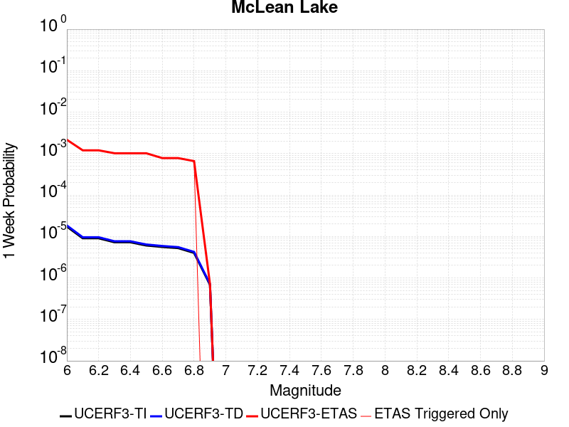 | 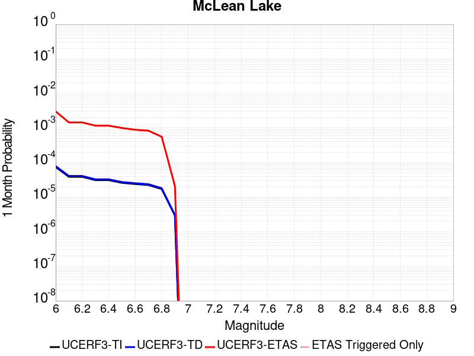 | 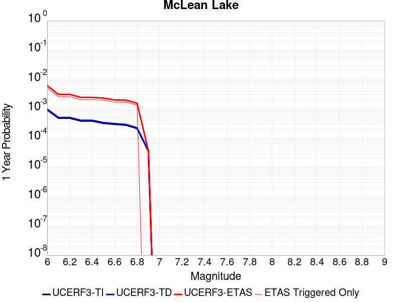 | 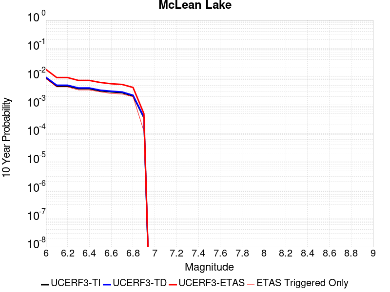 |

| Magnitude | 1 wk TI Prob | 1 wk TD Prob | 1 wk ETAS Prob | 1 wk ETAS/TD Gain | 1 wk ETAS Triggered Only | 1 mo TI Prob | 1 mo TD Prob | 1 mo ETAS Prob | 1 mo ETAS/TD Gain | 1 mo ETAS Triggered Only | 1 yr TI Prob | 1 yr TD Prob | 1 yr ETAS Prob | 1 yr ETAS/TD Gain | 1 yr ETAS Triggered Only | 10 yr TI Prob | 10 yr TD Prob | 10 yr ETAS Prob | 10 yr ETAS/TD Gain | 10 yr ETAS Triggered Only |
|-----|-----|-----|-----|-----|-----|-----|-----|-----|-----|-----|-----|-----|-----|-----|-----|-----|-----|-----|-----|-----|
| 6.0 | 1.7360222E-5 | 1.8501627E-5 | 0.0018784673 | 101.52984 | 0.00186 | 7.439883E-5 | 7.9290556E-5 | 0.0028590702 | 36.058144 | 0.00278 | 9.0542925E-4 | 9.6498354E-4 | 0.0060700523 | 6.290317 | 0.00511 | 0.009017491 | 0.0096127745 | 0.017951835 | 1.8674978 | 0.00842 |
| 6.1 | 9.062689E-6 | 9.592193E-6 | 9.295834E-4 | 96.91041 | 9.2E-4 | 3.8839516E-5 | 4.1108804E-5 | 0.0013910533 | 33.838333 | 0.00135 | 4.727685E-4 | 5.003936E-4 | 0.0030691077 | 6.1333866 | 0.00257 | 0.0047176396 | 0.004993552 | 0.00938153 | 1.878729 | 0.00441 |
| 6.2 | 9.062689E-6 | 9.592193E-6 | 9.295834E-4 | 96.91041 | 9.2E-4 | 3.8839516E-5 | 4.1108804E-5 | 0.0013910533 | 33.838333 | 0.00135 | 4.727685E-4 | 5.003936E-4 | 0.0030691077 | 6.1333866 | 0.00257 | 0.0047176396 | 0.004993552 | 0.00938153 | 1.878729 | 0.00441 |
| 6.3 | 7.2575485E-6 | 7.66771E-6 | 7.4766204E-4 | 97.50787 | 7.4E-4 | 3.110341E-5 | 3.2861237E-5 | 0.001072827 | 32.64719 | 0.00104 | 3.786182E-4 | 4.0001926E-4 | 0.0024491993 | 6.1227036 | 0.00205 | 0.0037797375 | 0.0039936965 | 0.007449839 | 1.8653991 | 0.00347 |
| 6.4 | 7.2575485E-6 | 7.66771E-6 | 7.4766204E-4 | 97.50787 | 7.4E-4 | 3.110341E-5 | 3.2861237E-5 | 0.001072827 | 32.64719 | 0.00104 | 3.786182E-4 | 4.0001926E-4 | 0.0024491993 | 6.1227036 | 0.00205 | 0.0037797375 | 0.0039936965 | 0.007449839 | 1.8653991 | 0.00347 |
| 6.5 | 6.06582E-6 | 6.4038773E-6 | 6.7639956E-4 | 105.62345 | 6.7E-4 | 2.5996113E-5 | 2.7444936E-5 | 9.174205E-4 | 33.42768 | 8.9E-4 | 3.164567E-4 | 3.3409733E-4 | 0.0020835127 | 6.2362447 | 0.00175 | 0.0031600643 | 0.0033365893 | 0.006256813 | 1.8752123 | 0.00293 |
| 6.6 | 5.598744E-6 | 5.910262E-6 | 5.8590685E-4 | 99.13381 | 5.8E-4 | 2.3994397E-5 | 2.5329486E-5 | 8.1530947E-4 | 32.188156 | 7.9E-4 | 2.9209262E-4 | 3.0834923E-4 | 0.0018978589 | 6.1549006 | 0.00159 | 0.0029170897 | 0.003079843 | 0.005781497 | 1.877205 | 0.00271 |
| 6.7 | 5.246996E-6 | 5.539162E-6 | 5.555361E-4 | 100.29245 | 5.5E-4 | 2.2486933E-5 | 2.3739085E-5 | 7.8372104E-4 | 33.013954 | 7.6E-4 | 2.73744E-4 | 2.8899137E-4 | 0.0018085521 | 6.2581525 | 0.00152 | 0.0027340704 | 0.0028867796 | 0.0054493607 | 1.8876954 | 0.00257 |
| 6.8 | 4.02324E-6 | 4.2469046E-6 | 4.3424507E-4 | 102.24979 | 4.3E-4 | 1.7242342E-5 | 1.8200926E-5 | 5.581911E-4 | 30.668282 | 5.4E-4 | 2.099053E-4 | 2.2157968E-4 | 0.0013113382 | 5.9181333 | 0.00109 | 0.0020970714 | 0.002214172 | 0.0041299206 | 1.8652214 | 0.00192 |
| 6.9 | 6.835972E-7 | 7.1399285E-7 | 3.071397E-5 | 43.0172 | 3.0E-5 | 2.9296991E-6 | 3.0599674E-6 | 3.3059874E-5 | 10.803996 | 3.0E-5 | 3.56685E-5 | 3.7254784E-5 | 1.4725068E-4 | 3.9525309 | 1.1E-4 | 3.5662777E-4 | 3.7251666E-4 | 6.1242725E-4 | 1.6440265 | 2.4E-4 |

## Goldstone Lake
*[(top)](#table-of-contents)*

| 1 Week | 1 Month | 1 Year | 10 Year |
|-----|-----|-----|-----|
|  | 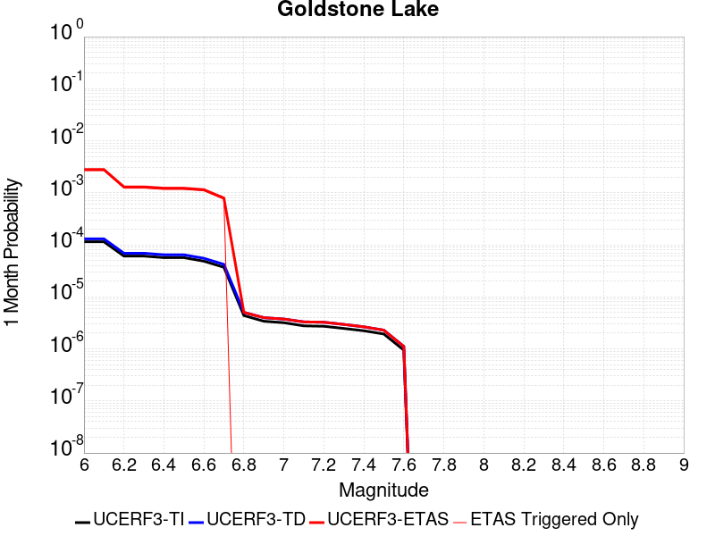 | 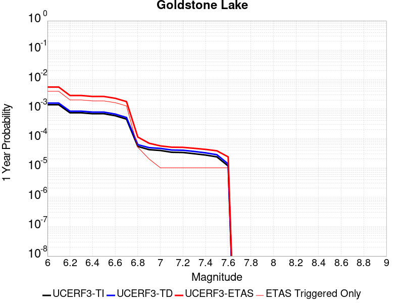 | 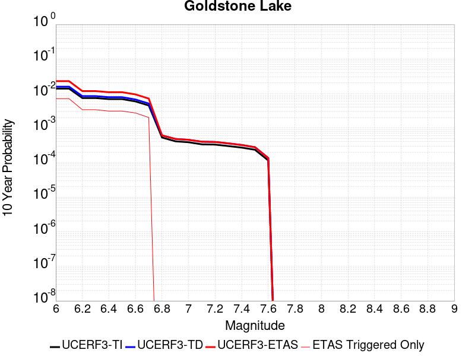 |

| Magnitude | 1 wk TI Prob | 1 wk TD Prob | 1 wk ETAS Prob | 1 wk ETAS/TD Gain | 1 wk ETAS Triggered Only | 1 mo TI Prob | 1 mo TD Prob | 1 mo ETAS Prob | 1 mo ETAS/TD Gain | 1 mo ETAS Triggered Only | 1 yr TI Prob | 1 yr TD Prob | 1 yr ETAS Prob | 1 yr ETAS/TD Gain | 1 yr ETAS Triggered Only | 10 yr TI Prob | 10 yr TD Prob | 10 yr ETAS Prob | 10 yr ETAS/TD Gain | 10 yr ETAS Triggered Only |
|-----|-----|-----|-----|-----|-----|-----|-----|-----|-----|-----|-----|-----|-----|-----|-----|-----|-----|-----|-----|-----|
| 6.0 | 2.671352E-5 | 3.037609E-5 | 0.0014403332 | 47.41668 | 0.00141 | 1.1448149E-4 | 1.3017785E-4 | 0.0024598746 | 18.89626 | 0.00233 | 0.001392921 | 0.0015839594 | 0.0055676396 | 3.515014 | 0.00399 | 0.013842222 | 0.015746197 | 0.022635972 | 1.4375519 | 0.007 |
| 6.1 | 2.671352E-5 | 3.037609E-5 | 0.0014403332 | 47.41668 | 0.00141 | 1.1448149E-4 | 1.3017785E-4 | 0.0024598746 | 18.89626 | 0.00233 | 0.001392921 | 0.0015839594 | 0.0055676396 | 3.515014 | 0.00399 | 0.013842222 | 0.015746197 | 0.022635972 | 1.4375519 | 0.007 |
| 6.2 | 1.4197047E-5 | 1.6096245E-5 | 7.5608434E-4 | 46.972717 | 7.4E-4 | 6.0843064E-5 | 6.8982634E-5 | 0.0012688999 | 18.394482 | 0.0012 | 7.4051257E-4 | 8.3963864E-4 | 0.002867934 | 3.4156768 | 0.00203 | 0.007380498 | 0.0083743585 | 0.011854965 | 1.4156265 | 0.00351 |
| 6.3 | 1.4197047E-5 | 1.6096245E-5 | 7.5608434E-4 | 46.972717 | 7.4E-4 | 6.0843064E-5 | 6.8982634E-5 | 0.0012688999 | 18.394482 | 0.0012 | 7.4051257E-4 | 8.3963864E-4 | 0.002867934 | 3.4156768 | 0.00203 | 0.007380498 | 0.0083743585 | 0.011854965 | 1.4156265 | 0.00351 |
| 6.4 | 1.3238931E-5 | 1.500846E-5 | 7.249978E-4 | 48.305943 | 7.1E-4 | 5.6737044E-5 | 6.4320935E-5 | 0.0011642502 | 18.100641 | 0.0011 | 6.9055456E-4 | 7.82924E-4 | 0.0026614522 | 3.3993747 | 0.00188 | 0.006884126 | 0.0078112837 | 0.0110259745 | 1.4115446 | 0.00324 |
| 6.5 | 1.3238931E-5 | 1.500846E-5 | 7.249978E-4 | 48.305943 | 7.1E-4 | 5.6737044E-5 | 6.4320935E-5 | 0.0011642502 | 18.100641 | 0.0011 | 6.9055456E-4 | 7.82924E-4 | 0.0026614522 | 3.3993747 | 0.00188 | 0.006884126 | 0.0078112837 | 0.0110259745 | 1.4115446 | 0.00324 |
| 6.6 | 1.1328278E-5 | 1.2855166E-5 | 6.428471E-4 | 50.00691 | 6.3E-4 | 4.8548856E-5 | 5.5092944E-5 | 0.0010250395 | 18.60564 | 9.7E-4 | 5.90922E-4 | 6.7064585E-4 | 0.0023095459 | 3.443764 | 0.00164 | 0.0058935313 | 0.0066956086 | 0.009476861 | 1.4153845 | 0.0028 |
| 6.7 | 8.651175E-6 | 9.824565E-6 | 5.2981946E-4 | 53.928036 | 5.2E-4 | 3.707594E-5 | 4.2105108E-5 | 8.120727E-4 | 19.286798 | 7.7E-4 | 4.5130608E-4 | 5.1259965E-4 | 0.0017819486 | 3.4762971 | 0.00127 | 0.0045039062 | 0.005123051 | 0.0071824463 | 1.4019861 | 0.00207 |
| 6.8 | 1.0215377E-6 | 1.1754702E-6 | 2.1175447E-5 | 18.014448 | 2.0E-5 | 4.378012E-6 | 5.0377203E-6 | 2.503762E-5 | 4.9700294 | 2.0E-5 | 5.3300988E-5 | 6.1332634E-5 | 1.11329566E-4 | 1.8151767 | 5.0E-5 | 5.3288206E-4 | 6.1316835E-4 | 6.831254E-4 | 1.1140912 | 7.0E-5 |
| 6.9 | 7.9360774E-7 | 9.2833966E-7 | 9.2833966E-7 | 1.0 | 0.0 | 3.4011714E-6 | 3.9785928E-6 | 3.9785928E-6 | 1.0 | 0.0 | 4.1408475E-5 | 4.843836E-5 | 6.8437395E-5 | 1.4128759 | 2.0E-5 | 4.140076E-4 | 4.8428503E-4 | 5.142705E-4 | 1.061917 | 3.0E-5 |
| 7.0 | 7.4382757E-7 | 8.7473285E-7 | 8.7473285E-7 | 1.0 | 0.0 | 3.1878285E-6 | 3.74885E-6 | 3.74885E-6 | 1.0 | 0.0 | 3.8811122E-5 | 4.564136E-5 | 5.5640903E-5 | 1.2190895 | 1.0E-5 | 3.8804344E-4 | 4.5632652E-4 | 4.763174E-4 | 1.0438082 | 2.0E-5 |
| 7.1 | 6.4709513E-7 | 7.7113E-7 | 7.7113E-7 | 1.0 | 0.0 | 2.773262E-6 | 3.3048389E-6 | 3.3048389E-6 | 1.0 | 0.0 | 3.376394E-5 | 4.0235733E-5 | 5.023533E-5 | 1.2485253 | 1.0E-5 | 3.375881E-4 | 4.0229043E-4 | 4.2228238E-4 | 1.0496954 | 2.0E-5 |
| 7.2 | 6.356704E-7 | 7.5883594E-7 | 7.5883594E-7 | 1.0 | 0.0 | 2.7242988E-6 | 3.2521505E-6 | 3.2521505E-6 | 1.0 | 0.0 | 3.3167835E-5 | 3.959427E-5 | 4.9593877E-5 | 1.2525518 | 1.0E-5 | 3.3162883E-4 | 3.958781E-4 | 4.158702E-4 | 1.0505006 | 2.0E-5 |
| 7.3 | 5.7695723E-7 | 6.8965653E-7 | 6.8965653E-7 | 1.0 | 0.0 | 2.4726714E-6 | 2.9556677E-6 | 2.9556677E-6 | 1.0 | 0.0 | 3.0104358E-5 | 3.5984718E-5 | 4.598436E-5 | 1.2778857 | 1.0E-5 | 3.0100282E-4 | 3.5979465E-4 | 3.7978747E-4 | 1.0555673 | 2.0E-5 |
| 7.4 | 5.209647E-7 | 6.193514E-7 | 6.193514E-7 | 1.0 | 0.0 | 2.232704E-6 | 2.6543607E-6 | 2.6543607E-6 | 1.0 | 0.0 | 2.718283E-5 | 3.2316417E-5 | 4.2316096E-5 | 1.3094302 | 1.0E-5 | 2.7179506E-4 | 3.2312275E-4 | 3.431163E-4 | 1.0618759 | 2.0E-5 |
| 7.5 | 4.512955E-7 | 5.348885E-7 | 5.348885E-7 | 1.0 | 0.0 | 1.934122E-6 | 2.2923775E-6 | 2.2923775E-6 | 1.0 | 0.0 | 2.3547682E-5 | 2.7909393E-5 | 3.7909114E-5 | 1.3582923 | 1.0E-5 | 2.3545188E-4 | 2.7906417E-4 | 2.990586E-4 | 1.0716481 | 2.0E-5 |
| 7.6 | 2.21172E-7 | 2.603961E-7 | 2.603961E-7 | 1.0 | 0.0 | 9.478797E-7 | 1.1159829E-6 | 1.1159829E-6 | 1.0 | 0.0 | 1.1540374E-5 | 1.3587036E-5 | 2.35869E-5 | 1.7359858 | 1.0E-5 | 1.1539775E-4 | 1.3586486E-4 | 1.4586351E-4 | 1.0735925 | 1.0E-5 |

## Gravel Hills-Harper Lk
*[(top)](#table-of-contents)*

| 1 Week | 1 Month | 1 Year | 10 Year |
|-----|-----|-----|-----|
| 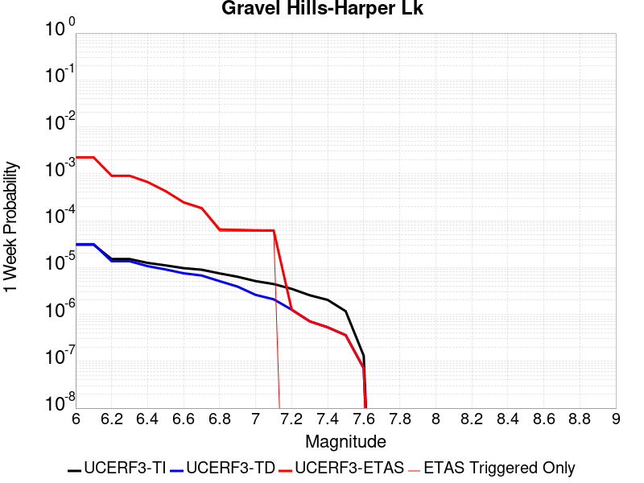 | 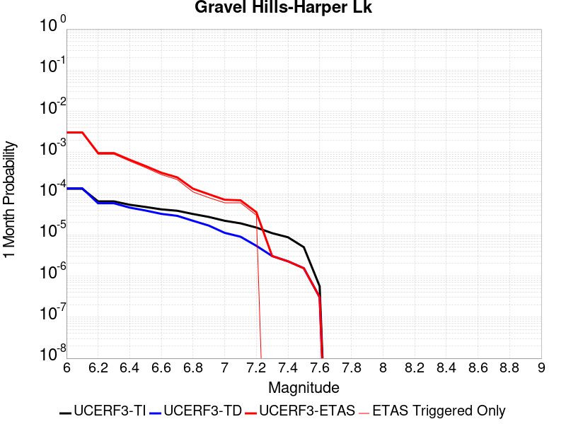 | 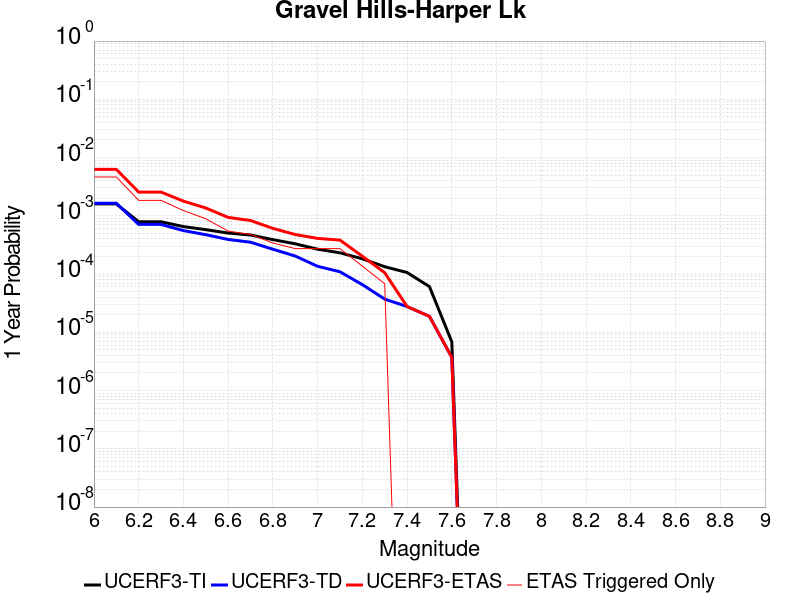 |  |

| Magnitude | 1 wk TI Prob | 1 wk TD Prob | 1 wk ETAS Prob | 1 wk ETAS/TD Gain | 1 wk ETAS Triggered Only | 1 mo TI Prob | 1 mo TD Prob | 1 mo ETAS Prob | 1 mo ETAS/TD Gain | 1 mo ETAS Triggered Only | 1 yr TI Prob | 1 yr TD Prob | 1 yr ETAS Prob | 1 yr ETAS/TD Gain | 1 yr ETAS Triggered Only | 10 yr TI Prob | 10 yr TD Prob | 10 yr ETAS Prob | 10 yr ETAS/TD Gain | 10 yr ETAS Triggered Only |
|-----|-----|-----|-----|-----|-----|-----|-----|-----|-----|-----|-----|-----|-----|-----|-----|-----|-----|-----|-----|-----|
| 6.0 | 3.0679566E-5 | 3.1464646E-5 | 0.0021313985 | 67.73947 | 0.0021 | 1.3147724E-4 | 1.3484273E-4 | 0.003084445 | 22.874388 | 0.00295 | 0.0015995599 | 0.0016406906 | 0.0064927167 | 3.957307 | 0.00486 | 0.015880952 | 0.01630734 | 0.023340741 | 1.4313029 | 0.00715 |
| 6.1 | 3.0679566E-5 | 3.1464646E-5 | 0.0021313985 | 67.73947 | 0.0021 | 1.3147724E-4 | 1.3484273E-4 | 0.003084445 | 22.874388 | 0.00295 | 0.0015995599 | 0.0016406906 | 0.0064927167 | 3.957307 | 0.00486 | 0.015880952 | 0.01630734 | 0.023340741 | 1.4313029 | 0.00715 |
| 6.2 | 1.514536E-5 | 1.3635206E-5 | 6.5362646E-4 | 47.936676 | 6.4E-4 | 6.490707E-5 | 5.843536E-5 | 9.6838217E-4 | 16.571854 | 9.1E-4 | 7.8995706E-4 | 7.1123015E-4 | 0.002250135 | 3.1637225 | 0.00154 | 0.007871548 | 0.0070907404 | 0.00928507 | 1.3094641 | 0.00221 |
| 6.3 | 1.514536E-5 | 1.3635206E-5 | 6.5362646E-4 | 47.936676 | 6.4E-4 | 6.490707E-5 | 5.843536E-5 | 9.6838217E-4 | 16.571854 | 9.1E-4 | 7.8995706E-4 | 7.1123015E-4 | 0.002250135 | 3.1637225 | 0.00154 | 0.007871548 | 0.0070907404 | 0.00928507 | 1.3094641 | 0.00221 |
| 6.4 | 1.2532521E-5 | 1.06896905E-5 | 4.7068478E-4 | 44.031654 | 4.6E-4 | 5.37097E-5 | 4.581219E-5 | 6.6578377E-4 | 14.532896 | 6.2E-4 | 6.537194E-4 | 5.576265E-4 | 0.001607041 | 2.8819308 | 0.00105 | 0.0065179965 | 0.005562863 | 0.0070047965 | 1.2592071 | 0.00145 |
| 6.5 | 1.1094058E-5 | 9.083664E-6 | 3.3908067E-4 | 37.328625 | 3.3E-4 | 4.7545094E-5 | 3.892943E-5 | 4.6891268E-4 | 12.045198 | 4.3E-4 | 5.787078E-4 | 4.7386673E-4 | 0.0012035208 | 2.5397875 | 7.3E-4 | 0.0057720304 | 0.0047289706 | 0.005744147 | 1.2146717 | 0.00102 |
| 6.6 | 9.688328E-6 | 7.5316952E-6 | 2.575298E-4 | 34.19281 | 2.5E-4 | 4.1520743E-5 | 3.227831E-5 | 3.2226896E-4 | 9.984072 | 2.9E-4 | 5.053978E-4 | 3.9292008E-4 | 9.027197E-4 | 2.297464 | 5.1E-4 | 0.0050424994 | 0.0039225104 | 0.0045799217 | 1.1675996 | 6.6E-4 |
| 6.7 | 8.974824E-6 | 6.749413E-6 | 1.8674819E-4 | 27.668806 | 1.8E-4 | 3.8462964E-5 | 2.8925748E-5 | 2.489194E-4 | 8.605461 | 2.2E-4 | 4.6818596E-4 | 3.5211627E-4 | 7.719684E-4 | 2.1923678 | 4.2E-4 | 0.004672008 | 0.0035158044 | 0.004043941 | 1.1502179 | 5.3E-4 |
| 6.8 | 7.4780046E-6 | 5.1161933E-6 | 9.5115734E-5 | 18.591114 | 9.0E-5 | 3.20482E-5 | 2.1926366E-5 | 1.3192395E-4 | 6.016681 | 1.1E-4 | 3.9011694E-4 | 2.669222E-4 | 4.968608E-4 | 1.8614444 | 2.3E-4 | 0.0038943281 | 0.0026661542 | 0.0029354342 | 1.1009995 | 2.7E-4 |
| 6.9 | 6.3409307E-6 | 3.9074966E-6 | 6.390726E-5 | 16.35504 | 6.0E-5 | 2.7175134E-5 | 1.6746313E-5 | 9.6744974E-5 | 5.777091 | 8.0E-5 | 3.3080703E-4 | 2.0386827E-4 | 3.738336E-4 | 1.8337017 | 1.7E-4 | 0.0033031502 | 0.0020369107 | 0.002216544 | 1.0881891 | 1.8E-4 |
| 7.0 | 5.1239335E-6 | 2.6058565E-6 | 5.2605727E-5 | 20.1875 | 5.0E-5 | 2.195953E-5 | 1.116791E-5 | 7.116724E-5 | 6.372476 | 6.0E-5 | 2.6732447E-4 | 1.3596108E-4 | 2.459461E-4 | 1.8089451 | 1.1E-4 | 0.0026700313 | 0.0013588042 | 0.0014786411 | 1.0881929 | 1.2E-4 |
| 7.1 | 4.438899E-6 | 2.0984728E-6 | 5.2098367E-5 | 24.826801 | 5.0E-5 | 1.9023713E-5 | 8.993425E-6 | 6.8992886E-5 | 7.6714807 | 6.0E-5 | 2.315891E-4 | 1.0948967E-4 | 2.1947763E-4 | 2.004551 | 1.1E-4 | 0.002313479 | 0.0010943791 | 0.0012142478 | 1.1095312 | 1.2E-4 |
| 7.2 | 3.50367E-6 | 1.2615716E-6 | 3.1261534E-5 | 24.779833 | 3.0E-5 | 1.5015643E-5 | 5.4067245E-6 | 3.5406563E-5 | 6.548616 | 3.0E-5 | 1.8280011E-4 | 6.582497E-5 | 1.2582102E-4 | 1.9114482 | 6.0E-5 | 0.0018264982 | 6.580629E-4 | 7.1802345E-4 | 1.0911167 | 6.0E-5 |
| 7.3 | 2.561638E-6 | 7.1191585E-7 | 7.1191585E-7 | 1.0 | 0.0 | 1.0978401E-5 | 3.0510646E-6 | 3.0510646E-6 | 1.0 | 0.0 | 1.3365384E-4 | 3.71461E-5 | 4.7145724E-5 | 1.2691972 | 1.0E-5 | 0.0013357349 | 3.7140088E-4 | 3.8139717E-4 | 1.0269151 | 1.0E-5 |
| 7.4 | 2.0368864E-6 | 5.304837E-7 | 5.304837E-7 | 1.0 | 0.0 | 8.729483E-6 | 2.2734996E-6 | 2.2734996E-6 | 1.0 | 0.0 | 1.06276275E-4 | 2.7679513E-5 | 2.7679513E-5 | 1.0 | 0.0 | 0.0010622547 | 2.767612E-4 | 2.767612E-4 | 1.0 | 0.0 |
| 7.5 | 1.1681728E-6 | 3.6030585E-7 | 3.6030585E-7 | 1.0 | 0.0 | 5.0064455E-6 | 1.544167E-6 | 1.544167E-6 | 1.0 | 0.0 | 6.0951766E-5 | 1.8800076E-5 | 1.8800076E-5 | 1.0 | 0.0 | 6.093505E-4 | 1.8798532E-4 | 1.8798532E-4 | 1.0 | 0.0 |
| 7.6 | 1.3154387E-7 | 7.1197384E-8 | 7.1197384E-8 | 1.0 | 0.0 | 5.6375933E-7 | 3.051316E-7 | 3.051316E-7 | 1.0 | 0.0 | 6.863748E-6 | 3.7149728E-6 | 3.7149728E-6 | 1.0 | 0.0 | 6.863536E-5 | 3.7149264E-5 | 3.7149264E-5 | 1.0 | 0.0 |

## Coyote Canyon
*[(top)](#table-of-contents)*

| 1 Week | 1 Month | 1 Year | 10 Year |
|-----|-----|-----|-----|
| 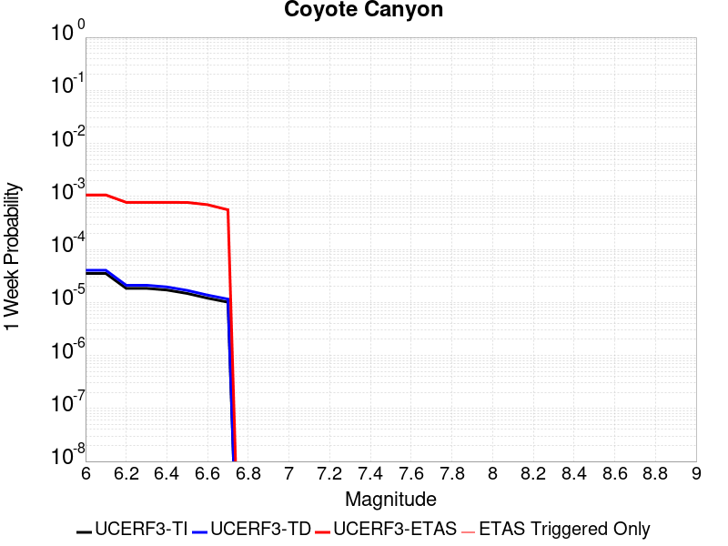 | 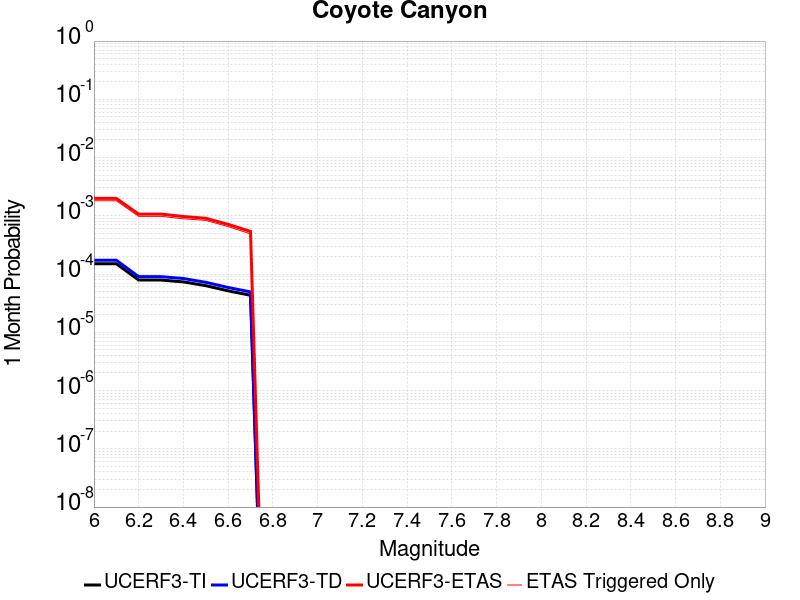 | 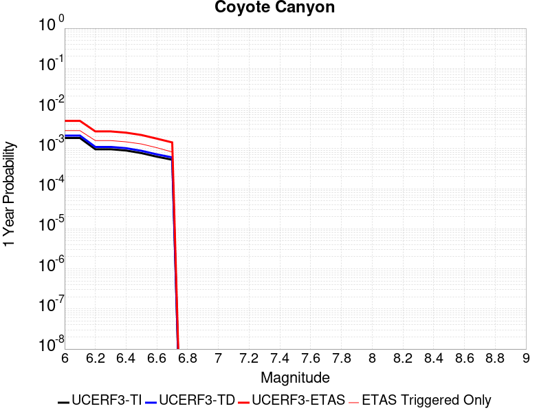 | 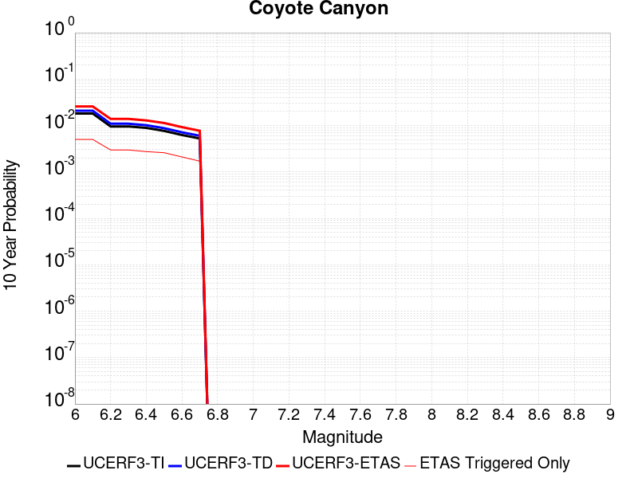 |

| Magnitude | 1 wk TI Prob | 1 wk TD Prob | 1 wk ETAS Prob | 1 wk ETAS/TD Gain | 1 wk ETAS Triggered Only | 1 mo TI Prob | 1 mo TD Prob | 1 mo ETAS Prob | 1 mo ETAS/TD Gain | 1 mo ETAS Triggered Only | 1 yr TI Prob | 1 yr TD Prob | 1 yr ETAS Prob | 1 yr ETAS/TD Gain | 1 yr ETAS Triggered Only | 10 yr TI Prob | 10 yr TD Prob | 10 yr ETAS Prob | 10 yr ETAS/TD Gain | 10 yr ETAS Triggered Only |
|-----|-----|-----|-----|-----|-----|-----|-----|-----|-----|-----|-----|-----|-----|-----|-----|-----|-----|-----|-----|-----|
| 6.0 | 3.5090034E-5 | 4.0364324E-5 | 0.0010203248 | 25.277885 | 9.8E-4 | 1.503772E-4 | 1.7297994E-4 | 0.0017627049 | 10.1902275 | 0.00159 | 0.0018293047 | 0.0021042528 | 0.004898361 | 2.3278387 | 0.0028 | 0.018143194 | 0.020869201 | 0.025520073 | 1.2228582 | 0.00475 |
| 6.1 | 3.5090034E-5 | 4.0364324E-5 | 0.0010203248 | 25.277885 | 9.8E-4 | 1.503772E-4 | 1.7297994E-4 | 0.0017627049 | 10.1902275 | 0.00159 | 0.0018293047 | 0.0021042528 | 0.004898361 | 2.3278387 | 0.0028 | 0.018143194 | 0.020869201 | 0.025520073 | 1.2228582 | 0.00475 |
| 6.2 | 1.841879E-5 | 2.1059794E-5 | 5.7104824E-4 | 27.115566 | 5.5E-4 | 7.8935285E-5 | 9.0253714E-5 | 9.501761E-4 | 10.527834 | 8.6E-4 | 9.606133E-4 | 0.001098387 | 0.0026766516 | 2.436893 | 0.00158 | 0.0095647145 | 0.010939667 | 0.0136002395 | 1.2432041 | 0.00269 |
| 6.3 | 1.841879E-5 | 2.1059794E-5 | 5.7104824E-4 | 27.115566 | 5.5E-4 | 7.8935285E-5 | 9.0253714E-5 | 9.501761E-4 | 10.527834 | 8.6E-4 | 9.606133E-4 | 0.001098387 | 0.0026766516 | 2.436893 | 0.00158 | 0.0095647145 | 0.010939667 | 0.0136002395 | 1.2432041 | 0.00269 |
| 6.4 | 1.712201E-5 | 1.9565212E-5 | 5.095556E-4 | 26.043962 | 4.9E-4 | 7.337798E-5 | 8.3848776E-5 | 8.837817E-4 | 10.540186 | 8.0E-4 | 8.930107E-4 | 0.0010204813 | 0.0024889812 | 2.4390268 | 0.00147 | 0.008894307 | 0.010167871 | 0.012642451 | 1.2433726 | 0.0025 |
| 6.5 | 1.4744935E-5 | 1.6836972E-5 | 4.668294E-4 | 27.726446 | 4.5E-4 | 6.3191044E-5 | 7.215698E-5 | 7.7210646E-4 | 10.700371 | 7.0E-4 | 7.6907943E-4 | 8.7825063E-4 | 0.002177109 | 2.4789152 | 0.0013 | 0.007664232 | 0.008756994 | 0.010977379 | 1.2535555 | 0.00224 |
| 6.6 | 1.2017839E-5 | 1.37240895E-5 | 3.937189E-4 | 28.68816 | 3.8E-4 | 5.150401E-5 | 5.88167E-5 | 6.287832E-4 | 10.690556 | 5.7E-4 | 6.268809E-4 | 7.159466E-4 | 0.0017651948 | 2.46554 | 0.00105 | 0.0062511545 | 0.0071450938 | 0.008962018 | 1.2542897 | 0.00183 |
| 6.7 | 1.00956095E-5 | 1.1533517E-5 | 3.415297E-4 | 29.611933 | 3.3E-4 | 4.326618E-5 | 4.942891E-5 | 4.7940767E-4 | 9.698933 | 4.3E-4 | 5.266384E-4 | 6.017178E-4 | 0.0014212243 | 2.3619452 | 8.2E-4 | 0.005253921 | 0.0060094125 | 0.0074805184 | 1.2448003 | 0.00148 |

## So Sierra Nevada
*[(top)](#table-of-contents)*

| 1 Week | 1 Month | 1 Year | 10 Year |
|-----|-----|-----|-----|
| 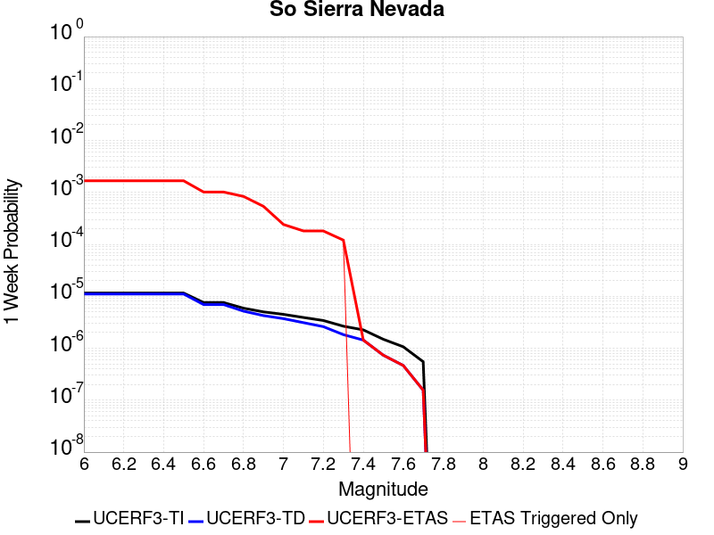 | 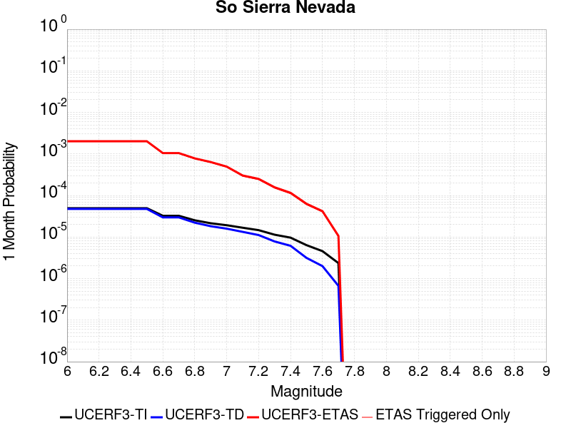 | 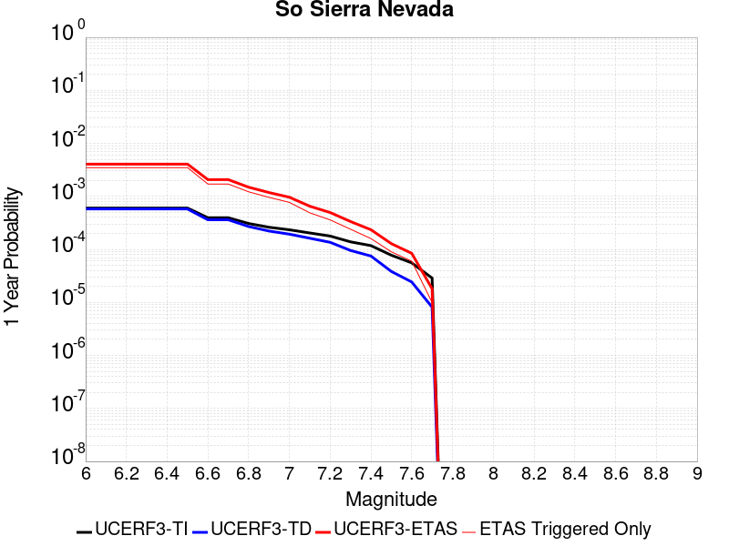 | 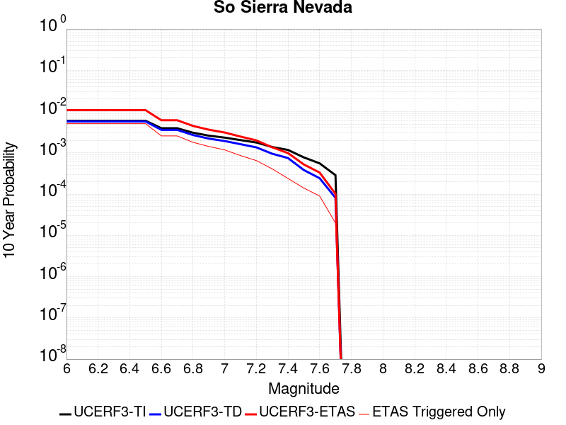 |

| Magnitude | 1 wk TI Prob | 1 wk TD Prob | 1 wk ETAS Prob | 1 wk ETAS/TD Gain | 1 wk ETAS Triggered Only | 1 mo TI Prob | 1 mo TD Prob | 1 mo ETAS Prob | 1 mo ETAS/TD Gain | 1 mo ETAS Triggered Only | 1 yr TI Prob | 1 yr TD Prob | 1 yr ETAS Prob | 1 yr ETAS/TD Gain | 1 yr ETAS Triggered Only | 10 yr TI Prob | 10 yr TD Prob | 10 yr ETAS Prob | 10 yr ETAS/TD Gain | 10 yr ETAS Triggered Only |
|-----|-----|-----|-----|-----|-----|-----|-----|-----|-----|-----|-----|-----|-----|-----|-----|-----|-----|-----|-----|-----|
| 6.0 | 1.15488665E-5 | 1.1079643E-5 | 0.001421064 | 128.25902 | 0.00141 | 4.9494203E-5 | 4.748339E-5 | 0.0020173898 | 42.48622 | 0.00197 | 6.024253E-4 | 5.7796965E-4 | 0.0040659527 | 7.034889 | 0.00349 | 0.006007948 | 0.005765934 | 0.010826586 | 1.8776811 | 0.00509 |
| 6.1 | 1.15488665E-5 | 1.1079643E-5 | 0.001421064 | 128.25902 | 0.00141 | 4.9494203E-5 | 4.748339E-5 | 0.0020173898 | 42.48622 | 0.00197 | 6.024253E-4 | 5.7796965E-4 | 0.0040659527 | 7.034889 | 0.00349 | 0.006007948 | 0.005765934 | 0.010826586 | 1.8776811 | 0.00509 |
| 6.2 | 1.15488665E-5 | 1.1079643E-5 | 0.001421064 | 128.25902 | 0.00141 | 4.9494203E-5 | 4.748339E-5 | 0.0020173898 | 42.48622 | 0.00197 | 6.024253E-4 | 5.7796965E-4 | 0.0040659527 | 7.034889 | 0.00349 | 0.006007948 | 0.005765934 | 0.010826586 | 1.8776811 | 0.00509 |
| 6.3 | 1.15488665E-5 | 1.1079643E-5 | 0.001421064 | 128.25902 | 0.00141 | 4.9494203E-5 | 4.748339E-5 | 0.0020173898 | 42.48622 | 0.00197 | 6.024253E-4 | 5.7796965E-4 | 0.0040659527 | 7.034889 | 0.00349 | 0.006007948 | 0.005765934 | 0.010826586 | 1.8776811 | 0.00509 |
| 6.4 | 1.15488665E-5 | 1.1079643E-5 | 0.001421064 | 128.25902 | 0.00141 | 4.9494203E-5 | 4.748339E-5 | 0.0020173898 | 42.48622 | 0.00197 | 6.024253E-4 | 5.7796965E-4 | 0.0040659527 | 7.034889 | 0.00349 | 0.006007948 | 0.005765934 | 0.010826586 | 1.8776811 | 0.00509 |
| 6.5 | 1.15488665E-5 | 1.1079643E-5 | 0.001421064 | 128.25902 | 0.00141 | 4.9494203E-5 | 4.748339E-5 | 0.0020173898 | 42.48622 | 0.00197 | 6.024253E-4 | 5.7796965E-4 | 0.0040659527 | 7.034889 | 0.00349 | 0.006007948 | 0.005765934 | 0.010826586 | 1.8776811 | 0.00509 |
| 6.6 | 7.587044E-6 | 6.935635E-6 | 7.169307E-4 | 103.36915 | 7.1E-4 | 3.2515498E-5 | 2.9723828E-5 | 0.0010496936 | 35.314884 | 0.00102 | 3.9580427E-4 | 3.6183043E-4 | 0.0020712118 | 5.7242603 | 0.00171 | 0.003951 | 0.0036127048 | 0.00617342 | 1.7088083 | 0.00257 |
| 6.7 | 7.587044E-6 | 6.935635E-6 | 7.169307E-4 | 103.36915 | 7.1E-4 | 3.2515498E-5 | 2.9723828E-5 | 0.0010496936 | 35.314884 | 0.00102 | 3.9580427E-4 | 3.6183043E-4 | 0.0020712118 | 5.7242603 | 0.00171 | 0.003951 | 0.0036127048 | 0.00617342 | 1.7088083 | 0.00257 |
| 6.8 | 5.9026956E-6 | 5.1793927E-6 | 5.451766E-4 | 105.25879 | 5.4E-4 | 2.5297022E-5 | 2.2197215E-5 | 7.8218034E-4 | 35.23777 | 7.6E-4 | 3.0794772E-4 | 2.7021873E-4 | 0.0014898891 | 5.513641 | 0.00122 | 0.0030752132 | 0.002699018 | 0.00449416 | 1.6651093 | 0.0018 |
| 6.9 | 5.0118915E-6 | 4.2524252E-6 | 4.342506E-4 | 102.11833 | 4.3E-4 | 2.1479358E-5 | 1.8224557E-5 | 6.3821324E-4 | 35.019413 | 6.2E-4 | 2.614798E-4 | 2.2186211E-4 | 0.0011816492 | 5.3260517 | 9.6E-4 | 0.0026117235 | 0.0022164788 | 0.0036433092 | 1.6437374 | 0.00143 |
| 7.0 | 4.4924795E-6 | 3.7139177E-6 | 3.337127E-4 | 89.85463 | 3.3E-4 | 1.925334E-5 | 1.5916696E-5 | 4.959091E-4 | 31.156532 | 4.8E-4 | 2.3438422E-4 | 1.9376918E-4 | 9.6361997E-4 | 4.97303 | 7.7E-4 | 0.0023413717 | 0.0019360651 | 0.0031137806 | 1.6083035 | 0.00118 |
| 7.1 | 3.9118436E-6 | 3.1119775E-6 | 2.2311129E-4 | 71.694374 | 2.2E-4 | 1.6764936E-5 | 1.3336982E-5 | 3.033331E-4 | 22.74376 | 2.9E-4 | 2.0409399E-4 | 1.6236622E-4 | 6.522867E-4 | 4.0173793 | 4.9E-4 | 0.0020390663 | 0.001622532 | 0.0024811367 | 1.5291758 | 8.6E-4 |
| 7.2 | 3.4200818E-6 | 2.6054543E-6 | 1.7260501E-4 | 66.24757 | 1.7E-4 | 1.4657411E-5 | 1.11661875E-5 | 2.511635E-4 | 22.49322 | 2.4E-4 | 1.7843937E-4 | 1.3594035E-4 | 4.9589144E-4 | 3.64786 | 3.6E-4 | 0.0017829615 | 0.0013586218 | 0.0020077387 | 1.477776 | 6.5E-4 |
| 7.3 | 2.6593618E-6 | 1.8284203E-6 | 1.01828235E-4 | 55.69192 | 1.0E-4 | 1.13972155E-5 | 7.836065E-6 | 1.5783489E-4 | 20.14211 | 1.5E-4 | 1.3875226E-4 | 9.540021E-5 | 3.3537732E-4 | 3.515478 | 2.4E-4 | 0.0013866565 | 9.5362146E-4 | 0.0013632305 | 1.42953 | 4.1E-4 |
| 7.4 | 2.2577992E-6 | 1.436438E-6 | 6.143635E-5 | 42.769928 | 6.0E-5 | 9.676246E-6 | 6.15615E-6 | 1.16155476E-4 | 18.8682 | 1.1E-4 | 1.1780193E-4 | 7.49488E-5 | 2.3493682E-4 | 3.1346307 | 1.6E-4 | 0.001177395 | 7.492603E-4 | 9.890805E-4 | 1.3200759 | 2.4E-4 |
| 7.5 | 1.489319E-6 | 7.353936E-7 | 5.0735358E-5 | 68.99075 | 5.0E-5 | 6.3827797E-6 | 3.1516831E-6 | 6.315149E-5 | 20.037388 | 6.0E-5 | 7.770758E-5 | 3.8371072E-5 | 1.2836761E-4 | 3.345427 | 9.0E-5 | 7.7680405E-4 | 3.836449E-4 | 5.235912E-4 | 1.3647808 | 1.4E-4 |
| 7.6 | 1.0680322E-6 | 4.6596554E-7 | 4.0465948E-5 | 86.843216 | 4.0E-5 | 4.577273E-6 | 1.9969937E-6 | 4.1996915E-5 | 21.03007 | 4.0E-5 | 5.5726876E-5 | 2.4313129E-5 | 8.431167E-5 | 3.4677424 | 6.0E-5 | 5.5712904E-4 | 2.4310495E-4 | 3.3308307E-4 | 1.3701205 | 9.0E-5 |
| 7.7 | 5.509146E-7 | 1.5580486E-7 | 1.01558035E-5 | 65.18284 | 1.0E-5 | 2.3610605E-6 | 6.677349E-7 | 1.0667728E-5 | 15.975992 | 1.0E-5 | 2.8745531E-5 | 8.129644E-6 | 1.8129562E-5 | 2.2300563 | 1.0E-5 | 2.8741814E-4 | 8.1293576E-5 | 1.0129195E-4 | 1.2460018 | 2.0E-5 |

## Death Valley (So)
*[(top)](#table-of-contents)*

| 1 Week | 1 Month | 1 Year | 10 Year |
|-----|-----|-----|-----|
| 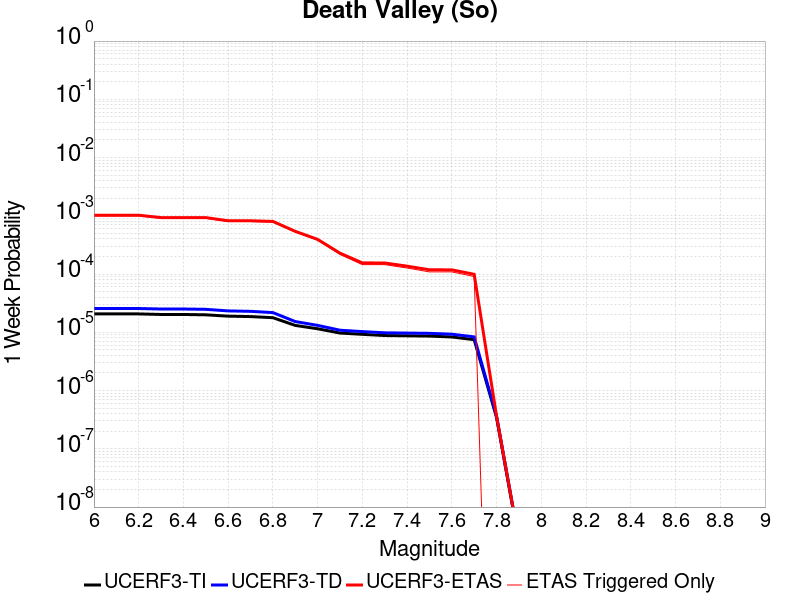 | 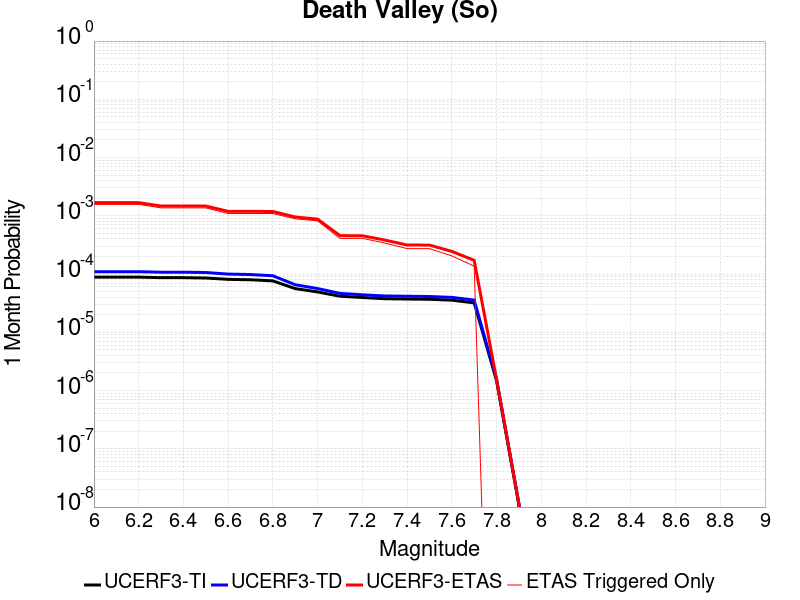 | 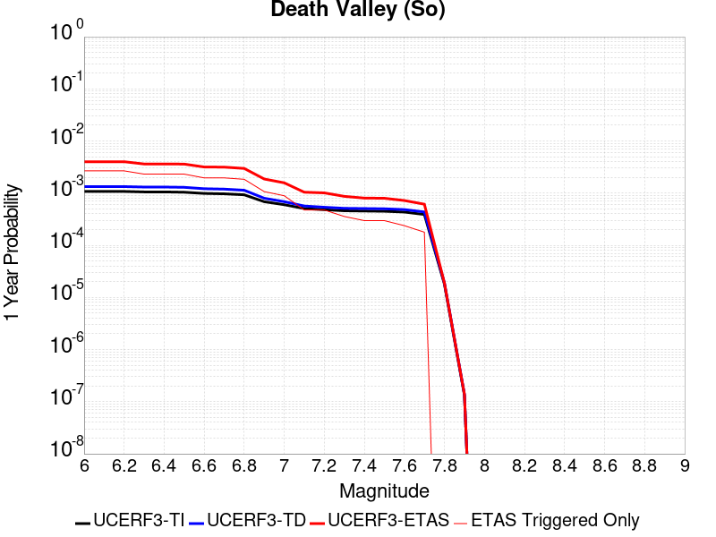 | 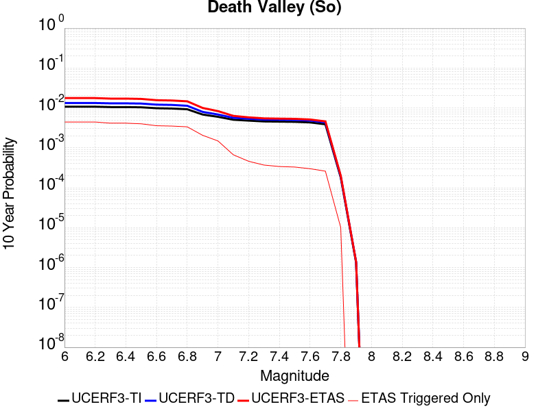 |

| Magnitude | 1 wk TI Prob | 1 wk TD Prob | 1 wk ETAS Prob | 1 wk ETAS/TD Gain | 1 wk ETAS Triggered Only | 1 mo TI Prob | 1 mo TD Prob | 1 mo ETAS Prob | 1 mo ETAS/TD Gain | 1 mo ETAS Triggered Only | 1 yr TI Prob | 1 yr TD Prob | 1 yr ETAS Prob | 1 yr ETAS/TD Gain | 1 yr ETAS Triggered Only | 10 yr TI Prob | 10 yr TD Prob | 10 yr ETAS Prob | 10 yr ETAS/TD Gain | 10 yr ETAS Triggered Only |
|-----|-----|-----|-----|-----|-----|-----|-----|-----|-----|-----|-----|-----|-----|-----|-----|-----|-----|-----|-----|-----|
| 6.0 | 2.0684236E-5 | 2.5617775E-5 | 0.0010355919 | 40.42474 | 0.00101 | 8.864371E-5 | 1.0978594E-4 | 0.001739607 | 15.845444 | 0.00163 | 0.0010787029 | 0.0013358411 | 0.004102141 | 3.0708299 | 0.00277 | 0.010734817 | 0.013281397 | 0.017662426 | 1.3298622 | 0.00444 |
| 6.1 | 2.0684236E-5 | 2.5617775E-5 | 0.0010355919 | 40.42474 | 0.00101 | 8.864371E-5 | 1.0978594E-4 | 0.001739607 | 15.845444 | 0.00163 | 0.0010787029 | 0.0013358411 | 0.004102141 | 3.0708299 | 0.00277 | 0.010734817 | 0.013281397 | 0.017662426 | 1.3298622 | 0.00444 |
| 6.2 | 2.0684236E-5 | 2.5617775E-5 | 0.0010355919 | 40.42474 | 0.00101 | 8.864371E-5 | 1.0978594E-4 | 0.001739607 | 15.845444 | 0.00163 | 0.0010787029 | 0.0013358411 | 0.004102141 | 3.0708299 | 0.00277 | 0.010734817 | 0.013281397 | 0.017662426 | 1.3298622 | 0.00444 |
| 6.3 | 2.0240292E-5 | 2.511786E-5 | 9.6509425E-4 | 38.42263 | 9.4E-4 | 8.6741224E-5 | 1.07643624E-4 | 0.0016374789 | 15.212038 | 0.00153 | 0.0010555626 | 0.00130979 | 0.003866437 | 2.9519517 | 0.00256 | 0.010505628 | 0.013023956 | 0.017119907 | 1.3144935 | 0.00415 |
| 6.4 | 2.0240292E-5 | 2.511786E-5 | 9.6509425E-4 | 38.42263 | 9.4E-4 | 8.6741224E-5 | 1.07643624E-4 | 0.0016374789 | 15.212038 | 0.00153 | 0.0010555626 | 0.00130979 | 0.003866437 | 2.9519517 | 0.00256 | 0.010505628 | 0.013023956 | 0.017119907 | 1.3144935 | 0.00415 |
| 6.5 | 1.9962767E-5 | 2.4807114E-5 | 9.647838E-4 | 38.89142 | 9.4E-4 | 8.55519E-5 | 1.0631196E-4 | 0.0016061525 | 15.107919 | 0.0015 | 0.0010410968 | 0.0012935963 | 0.0037703882 | 2.914656 | 0.00248 | 0.010362327 | 0.012863902 | 0.016812447 | 1.3069476 | 0.004 |
| 6.6 | 1.8937297E-5 | 2.3310964E-5 | 8.332921E-4 | 35.746788 | 8.1E-4 | 8.115732E-5 | 9.990039E-5 | 0.0013997705 | 14.0116625 | 0.0013 | 9.876423E-4 | 0.0012156231 | 0.0033929732 | 2.791139 | 0.00218 | 0.009832645 | 0.012092789 | 0.015629496 | 1.2924643 | 0.00358 |
| 6.7 | 1.8621096E-5 | 2.2911607E-5 | 8.3289307E-4 | 36.35245 | 8.1E-4 | 7.980225E-5 | 9.818898E-5 | 0.0013980613 | 14.238474 | 0.0013 | 9.711593E-4 | 0.0011948098 | 0.0033322528 | 2.78894 | 0.00214 | 0.009669261 | 0.011886904 | 0.015355181 | 1.291773 | 0.00351 |
| 6.8 | 1.7830353E-5 | 2.1805688E-5 | 7.917889E-4 | 36.31112 | 7.7E-4 | 7.641356E-5 | 9.344968E-5 | 0.0013333338 | 14.267933 | 0.00124 | 9.29938E-4 | 0.00113717 | 0.0031448842 | 2.7655356 | 0.00201 | 0.009260561 | 0.011316354 | 0.014638332 | 1.2935554 | 0.00336 |
| 6.9 | 1.3135183E-5 | 1.5303925E-5 | 5.35296E-4 | 34.97769 | 5.2E-4 | 5.6292425E-5 | 6.558664E-5 | 8.755335E-4 | 13.349267 | 8.1E-4 | 6.8514474E-4 | 7.982312E-4 | 0.0020272494 | 2.539677 | 0.00123 | 0.006830362 | 0.007954649 | 0.009998262 | 1.256908 | 0.00206 |
| 7.0 | 1.1507512E-5 | 1.3154199E-5 | 4.1314893E-4 | 31.40814 | 4.0E-4 | 4.9316975E-5 | 5.6373956E-5 | 6.963379E-4 | 12.35212 | 6.4E-4 | 6.002687E-4 | 6.8614254E-4 | 0.001585525 | 2.3107808 | 9.0E-4 | 0.0059864987 | 0.0068409415 | 0.008320749 | 1.2163162 | 0.00149 |
| 7.1 | 9.715903E-6 | 1.0865278E-5 | 2.108631E-4 | 19.40706 | 2.0E-4 | 4.1638916E-5 | 4.656467E-5 | 3.165521E-4 | 6.7981176 | 2.7E-4 | 5.068359E-4 | 5.667817E-4 | 9.265776E-4 | 1.6348052 | 3.6E-4 | 0.0050568148 | 0.0056538144 | 0.0063200267 | 1.1178341 | 6.7E-4 |
| 7.2 | 9.233269E-6 | 1.02863105E-5 | 1.3028507E-4 | 12.665871 | 1.2E-4 | 3.9570554E-5 | 4.4083466E-5 | 2.1407598E-4 | 4.856151 | 1.7E-4 | 4.81665E-4 | 5.3658825E-4 | 7.6646486E-4 | 1.4284041 | 2.3E-4 | 0.0048062233 | 0.0053533576 | 0.005810895 | 1.0854673 | 4.6E-4 |
| 7.3 | 8.8041315E-6 | 9.808164E-6 | 1.2980698E-4 | 13.234586 | 1.2E-4 | 3.7731446E-5 | 4.2034335E-5 | 1.9202803E-4 | 4.5683613 | 1.5E-4 | 4.592835E-4 | 5.1165203E-4 | 7.015548E-4 | 1.3711561 | 1.9E-4 | 0.0045833546 | 0.005105167 | 0.0054732785 | 1.0721056 | 3.7E-4 |
| 7.4 | 8.708749E-6 | 9.707175E-6 | 1.09706205E-4 | 11.3015585 | 1.0E-4 | 3.7322676E-5 | 4.160154E-5 | 1.6159654E-4 | 3.8843887 | 1.2E-4 | 4.5430884E-4 | 5.0638523E-4 | 6.663042E-4 | 1.315805 | 1.6E-4 | 0.004533812 | 0.0050527398 | 0.0053910217 | 1.0669502 | 3.4E-4 |
| 7.5 | 8.612678E-6 | 9.604817E-6 | 9.960395E-5 | 10.370208 | 9.0E-5 | 3.6910955E-5 | 4.1162875E-5 | 1.5115835E-4 | 3.6722007 | 1.1E-4 | 4.492982E-4 | 5.01047E-4 | 6.5097184E-4 | 1.2992231 | 1.5E-4 | 0.004483909 | 0.0049995985 | 0.005327949 | 1.0656753 | 3.3E-4 |
| 7.6 | 8.319024E-6 | 9.283916E-6 | 9.928308E-5 | 10.694095 | 9.0E-5 | 3.5652476E-5 | 3.978763E-5 | 1.3978365E-4 | 3.513244 | 1.0E-4 | 4.3398244E-4 | 4.8431093E-4 | 6.14248E-4 | 1.2682927 | 1.3E-4 | 0.0043313587 | 0.0048329784 | 0.0051315282 | 1.0617735 | 3.0E-4 |
| 7.7 | 7.4718328E-6 | 8.34517E-6 | 7.834459E-5 | 9.388016 | 7.0E-5 | 3.2021748E-5 | 3.5764548E-5 | 1.15761686E-4 | 3.236772 | 8.0E-5 | 3.8979502E-4 | 4.353504E-4 | 5.453025E-4 | 1.25256 | 1.1E-4 | 0.00389112 | 0.0043453807 | 0.0046042507 | 1.0595737 | 2.6E-4 |
| 7.8 | 3.4586725E-7 | 3.6482615E-7 | 3.6482615E-7 | 1.0 | 0.0 | 1.4822873E-6 | 1.5635396E-6 | 1.5635396E-6 | 1.0 | 0.0 | 1.80467E-5 | 1.9035933E-5 | 1.9035933E-5 | 1.0 | 0.0 | 1.8045233E-4 | 1.9034347E-4 | 2.0034157E-4 | 1.0525266 | 1.0E-5 |
| 7.9 | 2.5591178E-9 | 2.6696718E-9 | 2.6696718E-9 | 1.0 | 0.0 | 1.0967647E-8 | 1.14414505E-8 | 1.14414505E-8 | 1.0 | 0.0 | 1.335311E-7 | 1.3929966E-7 | 1.3929966E-7 | 1.0 | 0.0 | 1.3353102E-6 | 1.3929966E-6 | 1.3929966E-6 | 1.0 | 0.0 |

## San Andreas (Mojave S)
*[(top)](#table-of-contents)*

| 1 Week | 1 Month | 1 Year | 10 Year |
|-----|-----|-----|-----|
| 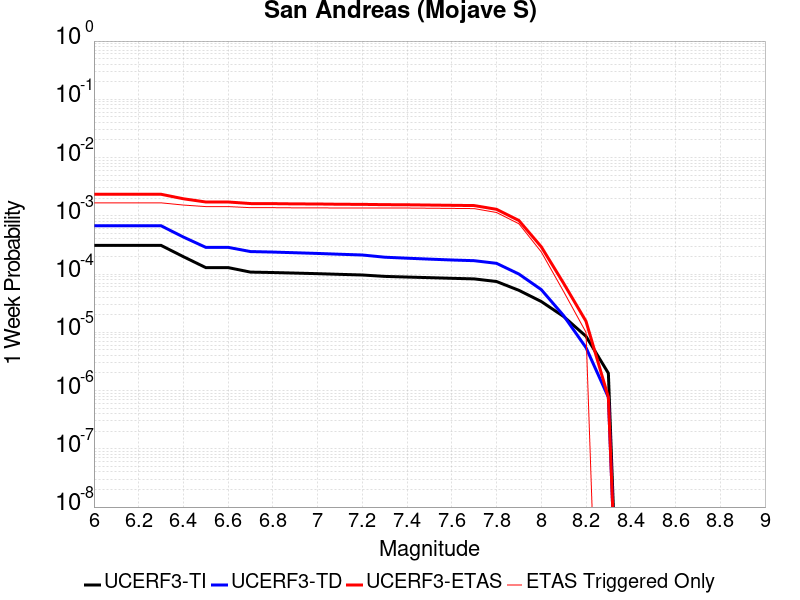 | 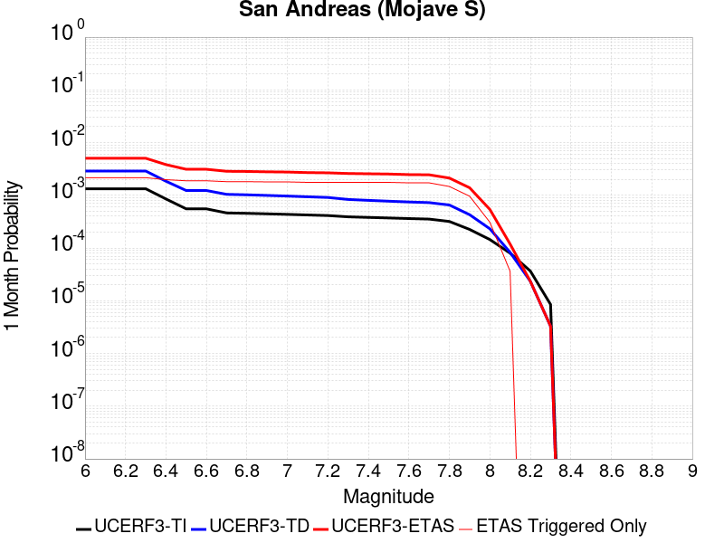 | 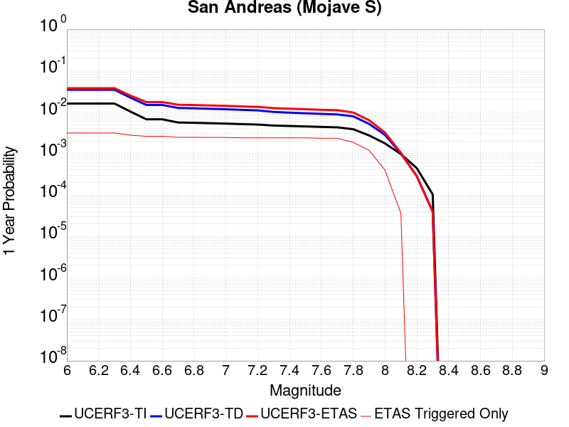 | 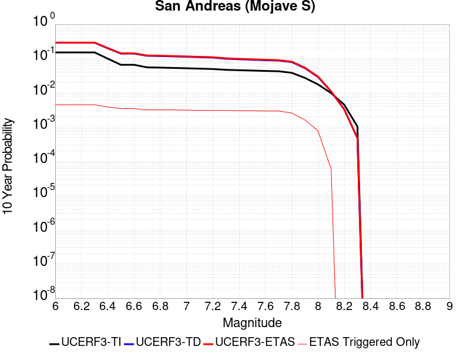 |

| Magnitude | 1 wk TI Prob | 1 wk TD Prob | 1 wk ETAS Prob | 1 wk ETAS/TD Gain | 1 wk ETAS Triggered Only | 1 mo TI Prob | 1 mo TD Prob | 1 mo ETAS Prob | 1 mo ETAS/TD Gain | 1 mo ETAS Triggered Only | 1 yr TI Prob | 1 yr TD Prob | 1 yr ETAS Prob | 1 yr ETAS/TD Gain | 1 yr ETAS Triggered Only | 10 yr TI Prob | 10 yr TD Prob | 10 yr ETAS Prob | 10 yr ETAS/TD Gain | 10 yr ETAS Triggered Only |
|-----|-----|-----|-----|-----|-----|-----|-----|-----|-----|-----|-----|-----|-----|-----|-----|-----|-----|-----|-----|-----|
| 6.0 | 3.1064058E-4 | 6.7460834E-4 | 0.0023434816 | 3.4738405 | 0.00167 | 0.0013306376 | 0.0028881032 | 0.005051836 | 1.7491882 | 0.00217 | 0.016080605 | 0.03462235 | 0.03764398 | 1.0872741 | 0.00313 | 0.1496549 | 0.28660452 | 0.2894581 | 1.0099565 | 0.004 |
| 6.1 | 3.1064058E-4 | 6.7460834E-4 | 0.0023434816 | 3.4738405 | 0.00167 | 0.0013306376 | 0.0028881032 | 0.005051836 | 1.7491882 | 0.00217 | 0.016080605 | 0.03462235 | 0.03764398 | 1.0872741 | 0.00313 | 0.1496549 | 0.28660452 | 0.2894581 | 1.0099565 | 0.004 |
| 6.2 | 3.1064058E-4 | 6.7460834E-4 | 0.0023434816 | 3.4738405 | 0.00167 | 0.0013306376 | 0.0028881032 | 0.005051836 | 1.7491882 | 0.00217 | 0.016080605 | 0.03462235 | 0.03764398 | 1.0872741 | 0.00313 | 0.1496549 | 0.28660452 | 0.2894581 | 1.0099565 | 0.004 |
| 6.3 | 3.1064058E-4 | 6.7460834E-4 | 0.0023434816 | 3.4738405 | 0.00167 | 0.0013306376 | 0.0028881032 | 0.005051836 | 1.7491882 | 0.00217 | 0.016080605 | 0.03462235 | 0.03764398 | 1.0872741 | 0.00313 | 0.1496549 | 0.28660452 | 0.2894581 | 1.0099565 | 0.004 |
| 6.4 | 1.9872203E-4 | 4.3179357E-4 | 0.001961133 | 4.54183 | 0.00153 | 8.5138786E-4 | 0.0018492596 | 0.0038156165 | 2.063321 | 0.00197 | 0.010316478 | 0.02228844 | 0.024967369 | 1.1201937 | 0.00274 | 0.098504856 | 0.19699748 | 0.19979192 | 1.0141852 | 0.00348 |
| 6.5 | 1.291105E-4 | 2.875267E-4 | 0.0017271127 | 6.0067906 | 0.00144 | 5.5321335E-4 | 0.0012316781 | 0.0030793995 | 2.500166 | 0.00185 | 0.006714592 | 0.0148934 | 0.017415272 | 1.1693282 | 0.00256 | 0.065152965 | 0.13803436 | 0.14079265 | 1.0199826 | 0.0032 |
| 6.6 | 1.291105E-4 | 2.875267E-4 | 0.0017271127 | 6.0067906 | 0.00144 | 5.5321335E-4 | 0.0012316781 | 0.0030793995 | 2.500166 | 0.00185 | 0.006714592 | 0.0148934 | 0.017415272 | 1.1693282 | 0.00256 | 0.065152965 | 0.13803436 | 0.14079265 | 1.0199826 | 0.0032 |
| 6.7 | 1.08001186E-4 | 2.4333889E-4 | 0.001623003 | 6.6697235 | 0.00138 | 4.6278012E-4 | 0.0010424647 | 0.0028206091 | 2.7057118 | 0.00178 | 0.0056198016 | 0.012618446 | 0.015027657 | 1.1909277 | 0.00244 | 0.054797906 | 0.119176775 | 0.1218721 | 1.0226161 | 0.00306 |
| 6.8 | 1.0624356E-4 | 2.3851555E-4 | 0.0016181864 | 6.784406 | 0.00138 | 4.5525006E-4 | 0.0010218095 | 0.002790001 | 2.730451 | 0.00177 | 0.0055285925 | 0.012369843 | 0.014769784 | 1.1940155 | 0.00243 | 0.053930566 | 0.11712591 | 0.11981868 | 1.0229903 | 0.00305 |
| 6.9 | 1.0393785E-4 | 2.3221898E-4 | 0.0016019008 | 6.898234 | 0.00137 | 4.4537184E-4 | 9.948451E-4 | 0.002753094 | 2.7673597 | 0.00176 | 0.0054089287 | 0.012045221 | 0.014436072 | 1.1984895 | 0.00242 | 0.05279156 | 0.11442335 | 0.117106654 | 1.0234506 | 0.00303 |
| 7.0 | 1.0155622E-4 | 2.2591476E-4 | 0.0015956053 | 7.0628643 | 0.00137 | 4.3516833E-4 | 9.6784724E-4 | 0.002726144 | 2.8167088 | 0.00176 | 0.005285311 | 0.0117200995 | 0.0141018545 | 1.2032197 | 0.00241 | 0.05161361 | 0.111683756 | 0.11435758 | 1.0239412 | 0.00301 |
| 7.1 | 9.885595E-5 | 2.1879886E-4 | 0.0015785013 | 7.2143946 | 0.00136 | 4.2359953E-4 | 9.3737274E-4 | 0.0026657511 | 2.843854 | 0.00173 | 0.0051451353 | 0.011352993 | 0.013696087 | 1.2063855 | 0.00237 | 0.05027629 | 0.1085682 | 0.11120684 | 1.0243039 | 0.00296 |
| 7.2 | 9.6411415E-5 | 2.124288E-4 | 0.0015721399 | 7.400785 | 0.00136 | 4.1312634E-4 | 9.1009185E-4 | 0.0026385174 | 2.899177 | 0.00173 | 0.005018219 | 0.011024255 | 0.013368128 | 1.2126105 | 0.00237 | 0.049064007 | 0.105758004 | 0.10840496 | 1.0250285 | 0.00296 |
| 7.3 | 9.1180635E-5 | 1.9471257E-4 | 0.0015544478 | 7.983294 | 0.00136 | 3.907156E-4 | 8.342157E-4 | 0.0025627725 | 3.0720742 | 0.00173 | 0.004746591 | 0.01010939 | 0.012445532 | 1.2310864 | 0.00236 | 0.046464786 | 0.09795115 | 0.10060318 | 1.0270749 | 0.00294 |
| 7.4 | 8.887388E-5 | 1.8719878E-4 | 0.0015469441 | 8.263644 | 0.00136 | 3.8083247E-4 | 8.020339E-4 | 0.0025306463 | 3.155286 | 0.00173 | 0.0046267817 | 0.00972114 | 0.012048296 | 1.2393912 | 0.00235 | 0.045316286 | 0.09458615 | 0.09722996 | 1.0279514 | 0.00292 |
| 7.5 | 8.6750515E-5 | 1.8051457E-4 | 0.0015302709 | 8.477271 | 0.00135 | 3.7173493E-4 | 7.7340455E-4 | 0.0024920744 | 3.222213 | 0.00172 | 0.004516484 | 0.009375632 | 0.011693693 | 1.2472432 | 0.00234 | 0.04425787 | 0.091549896 | 0.09419348 | 1.028876 | 0.00291 |
| 7.6 | 8.453092E-5 | 1.7439072E-4 | 0.001514157 | 8.682555 | 0.00134 | 3.6222505E-4 | 7.471748E-4 | 0.0024459045 | 3.2735374 | 0.0017 | 0.0044011753 | 0.009058985 | 0.0113480585 | 1.2526854 | 0.00231 | 0.04315024 | 0.08870898 | 0.0913335 | 1.0295857 | 0.00288 |
| 7.7 | 8.259102E-5 | 1.6961215E-4 | 0.0014993866 | 8.84009 | 0.00133 | 3.539135E-4 | 7.2670676E-4 | 0.0024054858 | 3.3101192 | 0.00168 | 0.004300386 | 0.008811831 | 0.01107174 | 1.256463 | 0.00228 | 0.042181134 | 0.08645982 | 0.08906341 | 1.0301133 | 0.00285 |
| 7.8 | 7.444844E-5 | 1.5283503E-4 | 0.0012926608 | 8.457883 | 0.00114 | 3.1902574E-4 | 6.548429E-4 | 0.0021138869 | 3.2280824 | 0.00146 | 0.0038772223 | 0.007943616 | 0.009848365 | 1.2397835 | 0.00192 | 0.03810269 | 0.078290746 | 0.080548935 | 1.0288436 | 0.00245 |
| 7.9 | 5.2586525E-5 | 1.00064186E-4 | 8.299911E-4 | 8.294587 | 7.3E-4 | 2.2535135E-4 | 4.2877605E-4 | 0.0013583773 | 3.1680346 | 9.3E-4 | 0.0027402006 | 0.005207864 | 0.0063916664 | 1.2273105 | 0.00119 | 0.027066574 | 0.052200034 | 0.05361226 | 1.0270541 | 0.00149 |
| 8.0 | 3.379877E-5 | 5.4074168E-5 | 2.940612E-4 | 5.4381084 | 2.4E-4 | 1.4484383E-4 | 2.3172585E-4 | 5.1166094E-4 | 2.2080443 | 2.8E-4 | 0.0017620471 | 0.002817614 | 0.0032065152 | 1.1380249 | 3.9E-4 | 0.017481409 | 0.028834904 | 0.029330198 | 1.0171769 | 5.1E-4 |
| 8.1 | 1.8668277E-5 | 1.9309397E-5 | 6.930843E-5 | 3.5893629 | 5.0E-5 | 8.000444E-5 | 8.275194E-5 | 1.4274697E-4 | 1.7249986 | 6.0E-5 | 9.736188E-4 | 0.0010070398 | 0.0010769693 | 1.0694406 | 7.0E-5 | 0.009693642 | 0.010798888 | 0.010878025 | 1.0073282 | 8.0E-5 |
| 8.2 | 8.541571E-6 | 5.460819E-6 | 1.5460764E-5 | 2.831217 | 1.0E-5 | 3.660622E-5 | 2.3403301E-5 | 3.3403066E-5 | 1.4272802 | 1.0E-5 | 4.455896E-4 | 2.84898E-4 | 2.9489517E-4 | 1.0350903 | 1.0E-5 | 0.0044469717 | 0.0032408056 | 0.003250773 | 1.0030756 | 1.0E-5 |
| 8.3 | 1.983087E-6 | 7.6599065E-7 | 7.6599065E-7 | 1.0 | 0.0 | 8.498917E-6 | 3.282813E-6 | 3.282813E-6 | 1.0 | 0.0 | 1.034694E-4 | 3.9967534E-5 | 3.9967534E-5 | 1.0 | 0.0 | 0.0010342124 | 4.719687E-4 | 4.719687E-4 | 1.0 | 0.0 |

## Nelson Lake
*[(top)](#table-of-contents)*

| 1 Week | 1 Month | 1 Year | 10 Year |
|-----|-----|-----|-----|
| 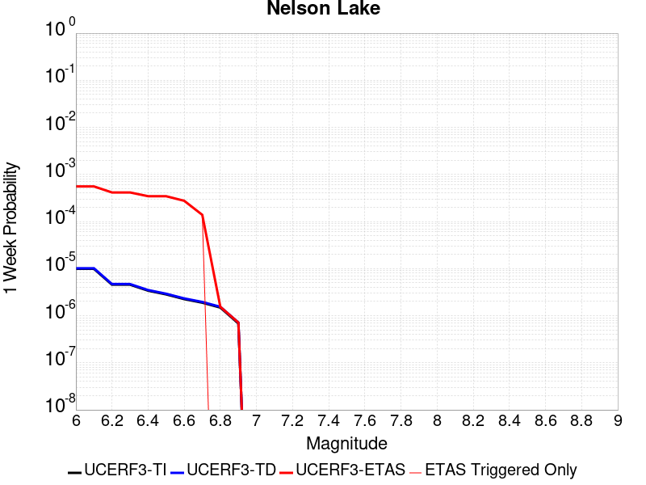 |  | 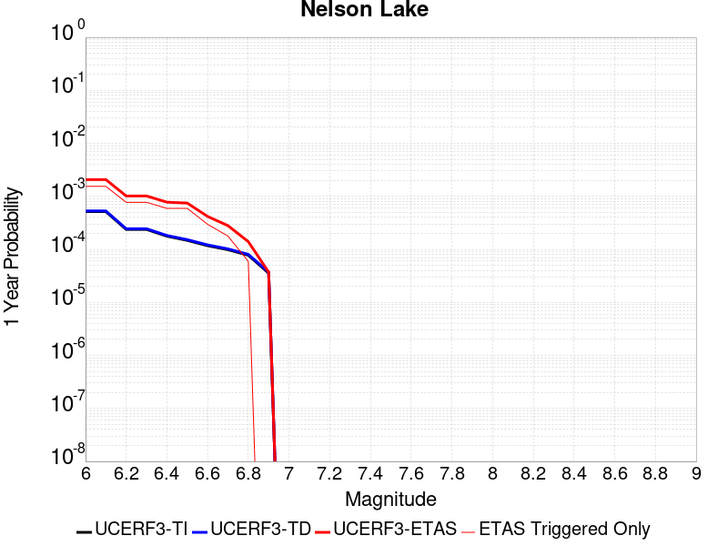 | 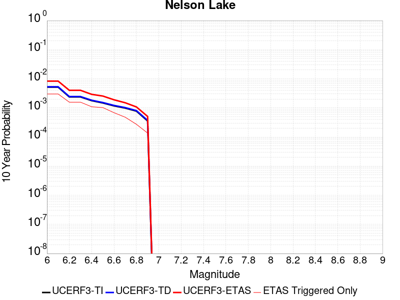 |

| Magnitude | 1 wk TI Prob | 1 wk TD Prob | 1 wk ETAS Prob | 1 wk ETAS/TD Gain | 1 wk ETAS Triggered Only | 1 mo TI Prob | 1 mo TD Prob | 1 mo ETAS Prob | 1 mo ETAS/TD Gain | 1 mo ETAS Triggered Only | 1 yr TI Prob | 1 yr TD Prob | 1 yr ETAS Prob | 1 yr ETAS/TD Gain | 1 yr ETAS Triggered Only | 10 yr TI Prob | 10 yr TD Prob | 10 yr ETAS Prob | 10 yr ETAS/TD Gain | 10 yr ETAS Triggered Only |
|-----|-----|-----|-----|-----|-----|-----|-----|-----|-----|-----|-----|-----|-----|-----|-----|-----|-----|-----|-----|-----|
| 6.0 | 9.913453E-6 | 1.0192255E-5 | 6.4018584E-4 | 62.81101 | 6.3E-4 | 4.2485535E-5 | 4.3680422E-5 | 0.0010536363 | 24.121477 | 0.00101 | 5.1713863E-4 | 5.316897E-4 | 0.0026905413 | 5.06036 | 0.00216 | 0.0051593683 | 0.005305204 | 0.009055204 | 1.706853 | 0.00377 |
| 6.1 | 9.913453E-6 | 1.0192255E-5 | 6.4018584E-4 | 62.81101 | 6.3E-4 | 4.2485535E-5 | 4.3680422E-5 | 0.0010536363 | 24.121477 | 0.00101 | 5.1713863E-4 | 5.316897E-4 | 0.0026905413 | 5.06036 | 0.00216 | 0.0051593683 | 0.005305204 | 0.009055204 | 1.706853 | 0.00377 |
| 6.2 | 4.5596407E-6 | 4.696313E-6 | 3.446947E-4 | 73.39688 | 3.4E-4 | 1.954117E-5 | 2.0126909E-5 | 4.6011806E-4 | 22.860842 | 4.4E-4 | 2.3788778E-4 | 2.4501883E-4 | 0.0011747909 | 4.794697 | 9.3E-4 | 0.0023763329 | 0.0024476128 | 0.004143452 | 1.6928543 | 0.0017 |
| 6.3 | 4.5596407E-6 | 4.696313E-6 | 3.446947E-4 | 73.39688 | 3.4E-4 | 1.954117E-5 | 2.0126909E-5 | 4.6011806E-4 | 22.860842 | 4.4E-4 | 2.3788778E-4 | 2.4501883E-4 | 0.0011747909 | 4.794697 | 9.3E-4 | 0.0023763329 | 0.0024476128 | 0.004143452 | 1.6928543 | 0.0017 |
| 6.4 | 3.4025713E-6 | 3.5098972E-6 | 2.9350887E-4 | 83.623215 | 2.9E-4 | 1.4582367E-5 | 1.5042335E-5 | 3.5503722E-4 | 23.602533 | 3.4E-4 | 1.7752586E-4 | 1.8312587E-4 | 8.9299586E-4 | 4.876405 | 7.1E-4 | 0.001773841 | 0.0018298327 | 0.0031074905 | 1.6982375 | 0.00128 |
| 6.5 | 2.8352947E-6 | 2.927856E-6 | 2.5292713E-4 | 86.38646 | 2.5E-4 | 1.2151207E-5 | 1.2547898E-5 | 3.2254402E-4 | 25.705023 | 3.1E-4 | 1.479309E-4 | 1.5276071E-4 | 7.72666E-4 | 5.0580153 | 6.2E-4 | 0.0014783246 | 0.0015266308 | 0.0025949974 | 1.6998198 | 0.00107 |
| 6.6 | 2.251518E-6 | 2.3290677E-6 | 1.623287E-4 | 69.69686 | 1.6E-4 | 9.649328E-6 | 9.981683E-6 | 2.0997968E-4 | 21.0365 | 2.0E-4 | 1.1747423E-4 | 1.2152085E-4 | 5.414698E-4 | 4.455777 | 4.2E-4 | 0.0011741214 | 0.0012146058 | 0.002013634 | 1.6578499 | 8.0E-4 |
| 6.7 | 1.8911853E-6 | 1.9591396E-6 | 1.3195889E-4 | 67.35553 | 1.3E-4 | 8.105055E-6 | 8.39629E-6 | 1.6839495E-4 | 20.055878 | 1.6E-4 | 9.867457E-5 | 1.0222061E-4 | 4.221879E-4 | 4.130164 | 3.2E-4 | 9.863076E-4 | 0.0010217935 | 0.0016511497 | 1.615933 | 6.3E-4 |
| 6.8 | 1.4874814E-6 | 1.5438305E-6 | 9.154369E-5 | 59.296467 | 9.0E-5 | 6.374905E-6 | 6.6164025E-6 | 1.266156E-4 | 19.136623 | 1.2E-4 | 7.76117E-5 | 8.055224E-5 | 3.3053212E-4 | 4.103326 | 2.5E-4 | 7.75846E-4 | 8.0528157E-4 | 0.0013048789 | 1.6204009 | 5.0E-4 |
| 6.9 | 6.835972E-7 | 7.1399285E-7 | 3.071397E-5 | 43.0172 | 3.0E-5 | 2.9296991E-6 | 3.0599674E-6 | 3.3059874E-5 | 10.803996 | 3.0E-5 | 3.56685E-5 | 3.7254784E-5 | 1.4725068E-4 | 3.9525309 | 1.1E-4 | 3.5662777E-4 | 3.7251666E-4 | 6.1242725E-4 | 1.6440265 | 2.4E-4 |

## San Andreas (Mojave N)
*[(top)](#table-of-contents)*

| 1 Week | 1 Month | 1 Year | 10 Year |
|-----|-----|-----|-----|
| 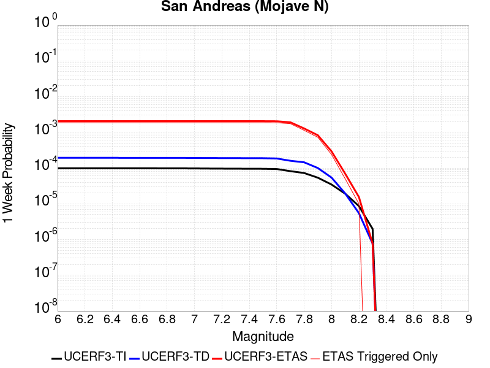 | 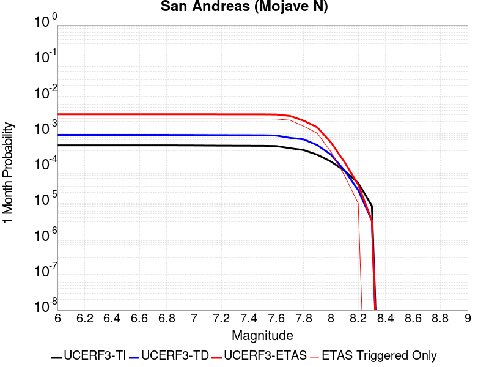 | 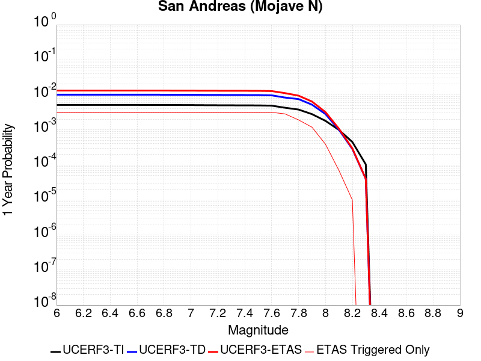 | 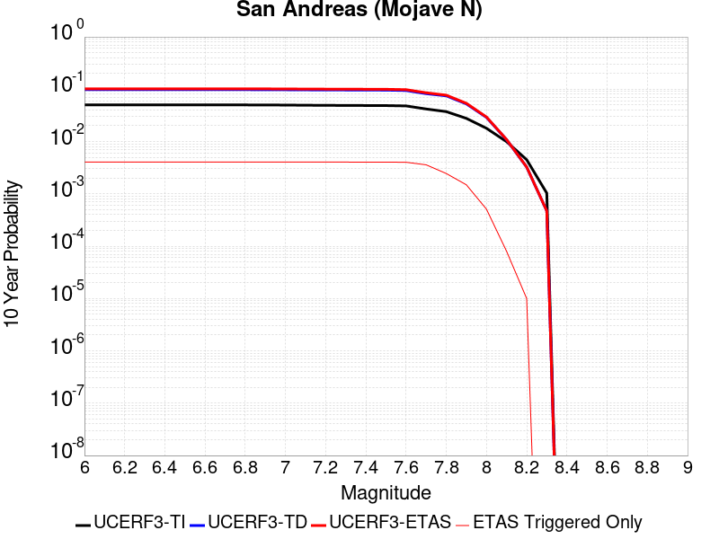 |

| Magnitude | 1 wk TI Prob | 1 wk TD Prob | 1 wk ETAS Prob | 1 wk ETAS/TD Gain | 1 wk ETAS Triggered Only | 1 mo TI Prob | 1 mo TD Prob | 1 mo ETAS Prob | 1 mo ETAS/TD Gain | 1 mo ETAS Triggered Only | 1 yr TI Prob | 1 yr TD Prob | 1 yr ETAS Prob | 1 yr ETAS/TD Gain | 1 yr ETAS Triggered Only | 10 yr TI Prob | 10 yr TD Prob | 10 yr ETAS Prob | 10 yr ETAS/TD Gain | 10 yr ETAS Triggered Only |
|-----|-----|-----|-----|-----|-----|-----|-----|-----|-----|-----|-----|-----|-----|-----|-----|-----|-----|-----|-----|-----|
| 6.0 | 9.877682E-5 | 1.9400702E-4 | 0.0020636441 | 10.636956 | 0.00187 | 4.2326056E-4 | 8.311939E-4 | 0.0031592571 | 3.8008666 | 0.00233 | 0.0051410277 | 0.010072956 | 0.013220924 | 1.3125168 | 0.00318 | 0.05023708 | 0.09831428 | 0.101966105 | 1.0371444 | 0.00405 |
| 6.1 | 9.877682E-5 | 1.9400702E-4 | 0.0020636441 | 10.636956 | 0.00187 | 4.2326056E-4 | 8.311939E-4 | 0.0031592571 | 3.8008666 | 0.00233 | 0.0051410277 | 0.010072956 | 0.013220924 | 1.3125168 | 0.00318 | 0.05023708 | 0.09831428 | 0.101966105 | 1.0371444 | 0.00405 |
| 6.2 | 9.877682E-5 | 1.9400702E-4 | 0.0020636441 | 10.636956 | 0.00187 | 4.2326056E-4 | 8.311939E-4 | 0.0031592571 | 3.8008666 | 0.00233 | 0.0051410277 | 0.010072956 | 0.013220924 | 1.3125168 | 0.00318 | 0.05023708 | 0.09831428 | 0.101966105 | 1.0371444 | 0.00405 |
| 6.3 | 9.877682E-5 | 1.9400702E-4 | 0.0020636441 | 10.636956 | 0.00187 | 4.2326056E-4 | 8.311939E-4 | 0.0031592571 | 3.8008666 | 0.00233 | 0.0051410277 | 0.010072956 | 0.013220924 | 1.3125168 | 0.00318 | 0.05023708 | 0.09831428 | 0.101966105 | 1.0371444 | 0.00405 |
| 6.4 | 9.877682E-5 | 1.9400702E-4 | 0.0020636441 | 10.636956 | 0.00187 | 4.2326056E-4 | 8.311939E-4 | 0.0031592571 | 3.8008666 | 0.00233 | 0.0051410277 | 0.010072956 | 0.013220924 | 1.3125168 | 0.00318 | 0.05023708 | 0.09831428 | 0.101966105 | 1.0371444 | 0.00405 |
| 6.5 | 9.861474E-5 | 1.9374468E-4 | 0.0020633824 | 10.650008 | 0.00187 | 4.2256617E-4 | 8.300703E-4 | 0.0031581363 | 3.804661 | 0.00233 | 0.0051326132 | 0.010059402 | 0.013207414 | 1.3129421 | 0.00318 | 0.050156746 | 0.098192066 | 0.10184439 | 1.0371957 | 0.00405 |
| 6.6 | 9.861474E-5 | 1.9374468E-4 | 0.0020633824 | 10.650008 | 0.00187 | 4.2256617E-4 | 8.300703E-4 | 0.0031581363 | 3.804661 | 0.00233 | 0.0051326132 | 0.010059402 | 0.013207414 | 1.3129421 | 0.00318 | 0.050156746 | 0.098192066 | 0.10184439 | 1.0371957 | 0.00405 |
| 6.7 | 9.8552715E-5 | 1.9364421E-4 | 0.002063282 | 10.655016 | 0.00187 | 4.223004E-4 | 8.2964E-4 | 0.003157707 | 3.806117 | 0.00233 | 0.0051293927 | 0.010054212 | 0.01320224 | 1.3131053 | 0.00318 | 0.050125998 | 0.098145254 | 0.10179777 | 1.0372154 | 0.00405 |
| 6.8 | 9.8464974E-5 | 1.9349584E-4 | 0.002063134 | 10.66242 | 0.00187 | 4.219245E-4 | 8.290045E-4 | 0.003157073 | 3.8082697 | 0.00233 | 0.0051248376 | 0.010046546 | 0.013194598 | 1.3133466 | 0.00318 | 0.05008251 | 0.09807528 | 0.101728074 | 1.0372448 | 0.00405 |
| 6.9 | 9.825824E-5 | 1.9317595E-4 | 0.0020628148 | 10.678425 | 0.00187 | 4.2103877E-4 | 8.276344E-4 | 0.003155706 | 3.8129227 | 0.00233 | 0.0051141046 | 0.010030019 | 0.013178123 | 1.3138683 | 0.00318 | 0.049980022 | 0.09792438 | 0.10157779 | 1.0373085 | 0.00405 |
| 7.0 | 9.781462E-5 | 1.924896E-4 | 0.0020621296 | 10.71294 | 0.00187 | 4.1913814E-4 | 8.246948E-4 | 0.0031527732 | 3.8229575 | 0.00233 | 0.005091073 | 0.009994558 | 0.013142776 | 1.3149931 | 0.00318 | 0.04976007 | 0.09760077 | 0.10125549 | 1.0374455 | 0.00405 |
| 7.1 | 9.7121134E-5 | 1.9150671E-4 | 0.0020611486 | 10.7628 | 0.00187 | 4.1616702E-4 | 8.204851E-4 | 0.0031485735 | 3.8374534 | 0.00233 | 0.005055068 | 0.009943774 | 0.013092153 | 1.3166181 | 0.00318 | 0.04941613 | 0.09713728 | 0.100793876 | 1.0376436 | 0.00405 |
| 7.2 | 9.663819E-5 | 1.9081456E-4 | 0.0020604578 | 10.798221 | 0.00187 | 4.1409794E-4 | 8.175206E-4 | 0.0031456158 | 3.8477511 | 0.00233 | 0.0050299936 | 0.00990801 | 0.013056503 | 1.3177724 | 0.00318 | 0.049176537 | 0.09681055 | 0.100468464 | 1.0377843 | 0.00405 |
| 7.3 | 9.6277574E-5 | 1.9033969E-4 | 0.0020599838 | 10.82267 | 0.00187 | 4.125529E-4 | 8.154867E-4 | 0.0031435867 | 3.8548594 | 0.00233 | 0.0050112694 | 0.009883473 | 0.013032043 | 1.3185693 | 0.00318 | 0.04899759 | 0.09658401 | 0.10024284 | 1.0378824 | 0.00405 |
| 7.4 | 9.593308E-5 | 1.897375E-4 | 0.0020593826 | 10.853851 | 0.00187 | 4.1107697E-4 | 8.129075E-4 | 0.0031410134 | 3.8639247 | 0.00233 | 0.0049933824 | 0.009852355 | 0.013001025 | 1.3195854 | 0.00318 | 0.04882661 | 0.09630218 | 0.09995312 | 1.0379113 | 0.00404 |
| 7.5 | 9.561707E-5 | 1.8919831E-4 | 0.0020588445 | 10.881939 | 0.00187 | 4.0972308E-4 | 8.1059814E-4 | 0.0031387093 | 3.8720906 | 0.00233 | 0.0049769743 | 0.009824493 | 0.012973251 | 1.3205009 | 0.00318 | 0.048669744 | 0.09604836 | 0.099700324 | 1.0380222 | 0.00404 |
| 7.6 | 9.418194E-5 | 1.8572104E-4 | 0.0020453755 | 11.01316 | 0.00186 | 4.0357444E-4 | 7.957047E-4 | 0.0031038667 | 3.9007769 | 0.00231 | 0.004902454 | 0.009644784 | 0.012774306 | 1.3244783 | 0.00316 | 0.047957025 | 0.094430685 | 0.098071076 | 1.0385509 | 0.00402 |
| 7.7 | 8.202141E-5 | 1.6021315E-4 | 0.0019099328 | 11.921199 | 0.00175 | 3.51473E-4 | 6.8644714E-4 | 0.0028349713 | 4.129919 | 0.00215 | 0.00427079 | 0.008325525 | 0.011151797 | 1.3394707 | 0.00285 | 0.04189639 | 0.08223219 | 0.08552698 | 1.0400668 | 0.00359 |
| 7.8 | 7.2859846E-5 | 1.4516473E-4 | 0.0012849992 | 8.852008 | 0.00114 | 3.1221908E-4 | 6.219862E-4 | 0.002081078 | 3.3458588 | 0.00146 | 0.003794643 | 0.0075464295 | 0.009451941 | 1.252505 | 0.00192 | 0.037304975 | 0.07472468 | 0.0769916 | 1.030337 | 0.00245 |
| 7.9 | 5.3874453E-5 | 1.0045676E-4 | 8.3038345E-4 | 8.266078 | 7.3E-4 | 2.3087008E-4 | 4.3045796E-4 | 0.0013600576 | 3.1595597 | 9.3E-4 | 0.0028072202 | 0.0052282433 | 0.0064120214 | 1.2264199 | 0.00119 | 0.02772022 | 0.05242443 | 0.053836316 | 1.0269319 | 0.00149 |
| 8.0 | 3.468538E-5 | 5.4260272E-5 | 2.9424723E-4 | 5.422886 | 2.4E-4 | 1.4864317E-4 | 2.325233E-4 | 5.124582E-4 | 2.2039003 | 2.8E-4 | 0.0018082283 | 0.002827298 | 0.0032161952 | 1.137551 | 3.9E-4 | 0.017935853 | 0.028947512 | 0.029442748 | 1.0171081 | 5.1E-4 |
| 8.1 | 1.9152367E-5 | 1.940263E-5 | 6.940166E-5 | 3.5769203 | 5.0E-5 | 8.207899E-5 | 8.3151484E-5 | 1.4314649E-4 | 1.7215146 | 6.0E-5 | 9.988535E-4 | 0.0010118998 | 0.001081829 | 1.0691068 | 7.0E-5 | 0.009943757 | 0.01085625 | 0.010935382 | 1.007289 | 8.0E-5 |
| 8.2 | 8.643924E-6 | 5.4748625E-6 | 1.5474809E-5 | 2.82652 | 1.0E-5 | 3.704486E-5 | 2.3463486E-5 | 3.346325E-5 | 1.4261842 | 1.0E-5 | 4.5092785E-4 | 2.8563058E-4 | 2.9562772E-4 | 1.0350002 | 1.0E-5 | 0.0045001395 | 0.0032487072 | 0.0032586746 | 1.0030681 | 1.0E-5 |
| 8.3 | 1.983087E-6 | 7.6599065E-7 | 7.6599065E-7 | 1.0 | 0.0 | 8.498917E-6 | 3.282813E-6 | 3.282813E-6 | 1.0 | 0.0 | 1.034694E-4 | 3.9967534E-5 | 3.9967534E-5 | 1.0 | 0.0 | 0.0010342124 | 4.719687E-4 | 4.719687E-4 | 1.0 | 0.0 |

## Lenwood-Lockhart-Old Woman Springs
*[(top)](#table-of-contents)*

| 1 Week | 1 Month | 1 Year | 10 Year |
|-----|-----|-----|-----|
| 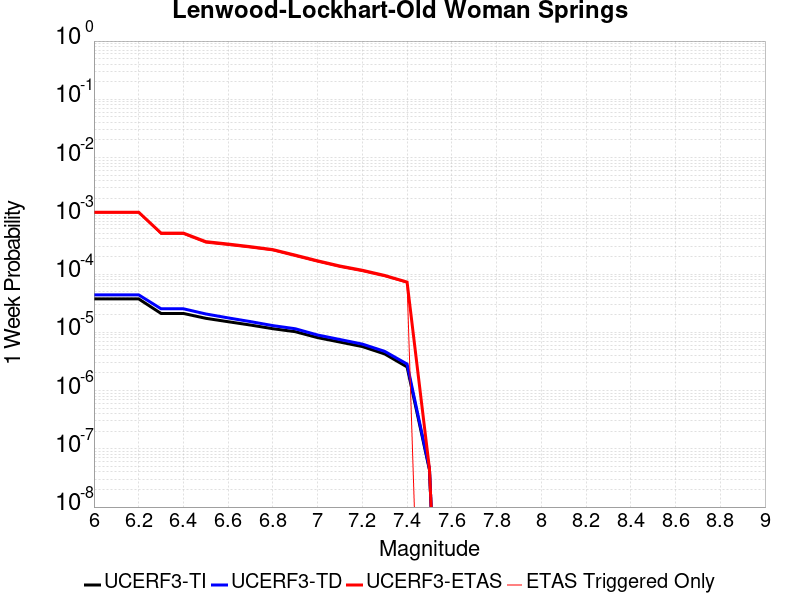 | 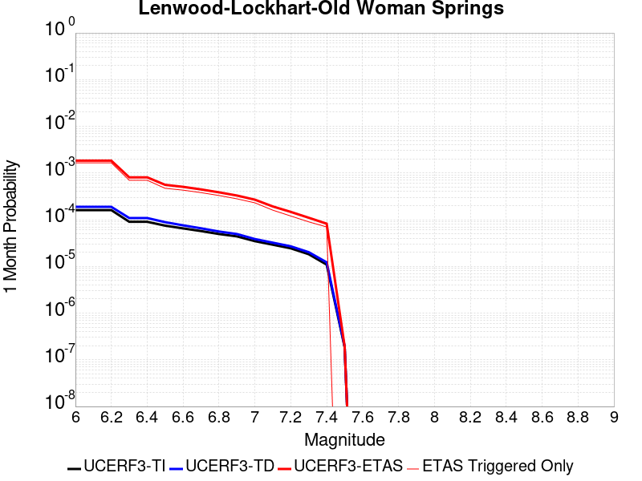 | 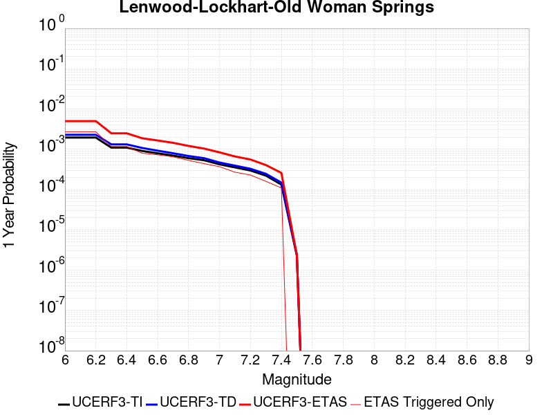 | 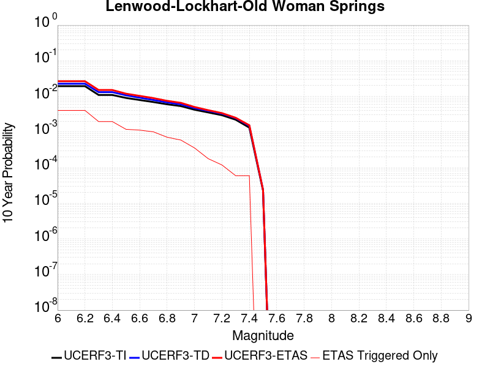 |

| Magnitude | 1 wk TI Prob | 1 wk TD Prob | 1 wk ETAS Prob | 1 wk ETAS/TD Gain | 1 wk ETAS Triggered Only | 1 mo TI Prob | 1 mo TD Prob | 1 mo ETAS Prob | 1 mo ETAS/TD Gain | 1 mo ETAS Triggered Only | 1 yr TI Prob | 1 yr TD Prob | 1 yr ETAS Prob | 1 yr ETAS/TD Gain | 1 yr ETAS Triggered Only | 10 yr TI Prob | 10 yr TD Prob | 10 yr ETAS Prob | 10 yr ETAS/TD Gain | 10 yr ETAS Triggered Only |
|-----|-----|-----|-----|-----|-----|-----|-----|-----|-----|-----|-----|-----|-----|-----|-----|-----|-----|-----|-----|-----|
| 6.0 | 3.744542E-5 | 4.396252E-5 | 0.0011539137 | 26.247671 | 0.00111 | 1.604705E-4 | 1.8839816E-4 | 0.0018380873 | 9.756397 | 0.00165 | 0.0019519776 | 0.0022915069 | 0.0049952967 | 2.179918 | 0.00271 | 0.019349206 | 0.022696787 | 0.026322583 | 1.1597493 | 0.00371 |
| 6.1 | 3.744542E-5 | 4.396252E-5 | 0.0011539137 | 26.247671 | 0.00111 | 1.604705E-4 | 1.8839816E-4 | 0.0018380873 | 9.756397 | 0.00165 | 0.0019519776 | 0.0022915069 | 0.0049952967 | 2.179918 | 0.00271 | 0.019349206 | 0.022696787 | 0.026322583 | 1.1597493 | 0.00371 |
| 6.2 | 3.744542E-5 | 4.396252E-5 | 0.0011539137 | 26.247671 | 0.00111 | 1.604705E-4 | 1.8839816E-4 | 0.0018380873 | 9.756397 | 0.00165 | 0.0019519776 | 0.0022915069 | 0.0049952967 | 2.179918 | 0.00271 | 0.019349206 | 0.022696787 | 0.026322583 | 1.1597493 | 0.00371 |
| 6.3 | 2.1079984E-5 | 2.5353434E-5 | 5.053413E-4 | 19.931868 | 4.8E-4 | 9.0339665E-5 | 1.0865316E-4 | 8.085771E-4 | 7.4418187 | 7.0E-4 | 0.0010993304 | 0.0013220694 | 0.0024905226 | 1.8838062 | 0.00117 | 0.010939079 | 0.0131442575 | 0.014693621 | 1.1178738 | 0.00157 |
| 6.4 | 2.1079984E-5 | 2.5353434E-5 | 5.053413E-4 | 19.931868 | 4.8E-4 | 9.0339665E-5 | 1.0865316E-4 | 8.085771E-4 | 7.4418187 | 7.0E-4 | 0.0010993304 | 0.0013220694 | 0.0024905226 | 1.8838062 | 0.00117 | 0.010939079 | 0.0131442575 | 0.014693621 | 1.1178738 | 0.00157 |
| 6.5 | 1.7397282E-5 | 2.066241E-5 | 3.606554E-4 | 17.454662 | 3.4E-4 | 7.455765E-5 | 8.8550245E-5 | 5.585086E-4 | 6.307251 | 4.7E-4 | 9.073613E-4 | 0.0010775778 | 0.0018767157 | 1.7416058 | 8.0E-4 | 0.009036654 | 0.010724821 | 0.011783346 | 1.0986986 | 0.00107 |
| 6.6 | 1.52050325E-5 | 1.7679693E-5 | 3.276742E-4 | 18.53393 | 3.1E-4 | 6.51628E-5 | 7.576796E-5 | 5.057354E-4 | 6.674792 | 4.3E-4 | 7.9306826E-4 | 9.220924E-4 | 0.0016514193 | 1.7909477 | 7.3E-4 | 0.007902439 | 0.009183526 | 0.010154527 | 1.1057328 | 9.8E-4 |
| 6.7 | 1.332523E-5 | 1.5264002E-5 | 2.9525973E-4 | 19.343533 | 2.8E-4 | 5.7106878E-5 | 6.5415545E-5 | 4.453907E-4 | 6.8086367 | 3.8E-4 | 6.950544E-4 | 7.961491E-4 | 0.0014456316 | 1.81578 | 6.5E-4 | 0.006928845 | 0.007933599 | 0.008796697 | 1.1087902 | 8.7E-4 |
| 6.8 | 1.1525329E-5 | 1.3030979E-5 | 2.6302773E-4 | 20.184801 | 2.5E-4 | 4.9393333E-5 | 5.584588E-5 | 3.8582744E-4 | 6.9087896 | 3.3E-4 | 6.011979E-4 | 6.797157E-4 | 0.0012093555 | 1.7792077 | 5.3E-4 | 0.00599574 | 0.006776819 | 0.0074820076 | 1.1040589 | 7.1E-4 |
| 6.9 | 1.0253909E-5 | 1.15144385E-5 | 2.1151213E-4 | 18.369297 | 2.0E-4 | 4.3944583E-5 | 4.9346683E-5 | 3.2933286E-4 | 6.6738605 | 2.8E-4 | 5.3489394E-4 | 6.0063385E-4 | 0.0010403696 | 1.7321194 | 4.4E-4 | 0.0053360825 | 0.0059904843 | 0.00658689 | 1.0995588 | 6.0E-4 |
| 7.0 | 8.104563E-6 | 8.991279E-6 | 1.6898983E-4 | 18.79486 | 1.6E-4 | 3.4733377E-5 | 3.8533497E-5 | 2.6852463E-4 | 6.9686027 | 2.3E-4 | 4.2279682E-4 | 4.6904673E-4 | 8.388732E-4 | 1.788464 | 3.7E-4 | 0.0042199334 | 0.0046808156 | 0.0051685222 | 1.1041926 | 4.9E-4 |
| 7.1 | 6.7986157E-6 | 7.515816E-6 | 1.3751484E-4 | 18.296728 | 1.3E-4 | 2.91366E-5 | 3.2210253E-5 | 1.922051E-4 | 5.967202 | 1.6E-4 | 3.5468035E-4 | 3.920914E-4 | 6.6198554E-4 | 1.688345 | 2.7E-4 | 0.003541148 | 0.003914213 | 0.004292725 | 1.0967021 | 3.8E-4 |
| 7.2 | 5.6893327E-6 | 6.2800136E-6 | 1.1627932E-4 | 18.515776 | 1.1E-4 | 2.4382627E-5 | 2.6914078E-5 | 1.4691085E-4 | 5.4585133 | 1.2E-4 | 2.9681803E-4 | 3.2763163E-4 | 5.575563E-4 | 1.7017779 | 2.3E-4 | 0.002964219 | 0.0032716845 | 0.0035607358 | 1.0883493 | 2.9E-4 |
| 7.3 | 4.253348E-6 | 4.7069107E-6 | 9.4706484E-5 | 20.120733 | 9.0E-5 | 1.8228506E-5 | 2.0172329E-5 | 1.1017051E-4 | 5.4614673 | 9.0E-5 | 2.2190946E-4 | 2.4557224E-4 | 4.0553295E-4 | 1.6513795 | 1.6E-4 | 0.00221688 | 0.0024531898 | 0.0026626745 | 1.0853928 | 2.1E-4 |
| 7.4 | 2.5448119E-6 | 2.852045E-6 | 7.285184E-5 | 25.543722 | 7.0E-5 | 1.0906291E-5 | 1.2223002E-5 | 8.222215E-5 | 6.726837 | 7.0E-5 | 1.3277601E-4 | 1.4880655E-4 | 2.5879018E-4 | 1.7391049 | 1.1E-4 | 0.001326967 | 0.0014872311 | 0.001637008 | 1.1007086 | 1.5E-4 |
| 7.5 | 4.3706837E-8 | 4.562909E-8 | 4.562909E-8 | 1.0 | 0.0 | 1.8731501E-7 | 1.9555324E-7 | 1.9555324E-7 | 1.0 | 0.0 | 2.2805577E-6 | 2.3808586E-6 | 2.3808586E-6 | 1.0 | 0.0 | 2.2805343E-5 | 2.3808387E-5 | 2.3808387E-5 | 1.0 | 0.0 |

## Towne Pass
*[(top)](#table-of-contents)*

| 1 Week | 1 Month | 1 Year | 10 Year |
|-----|-----|-----|-----|
| 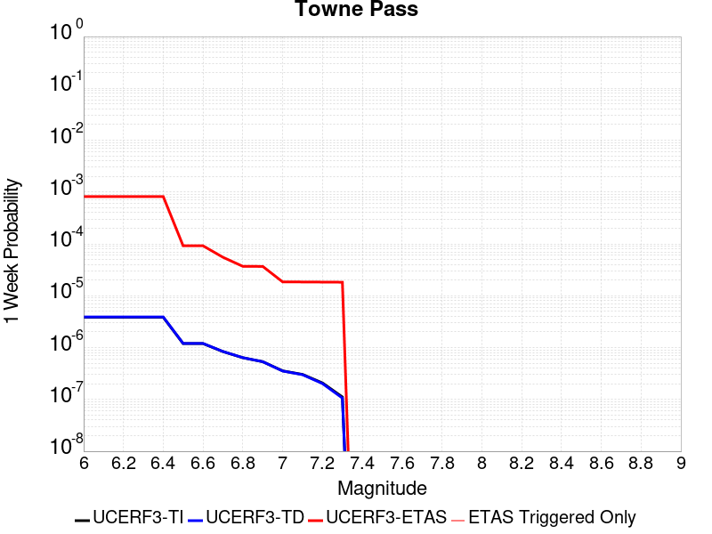 | 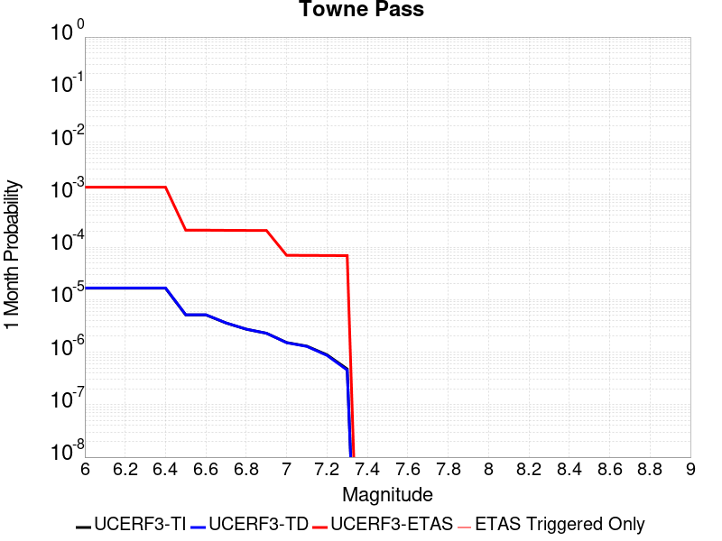 | 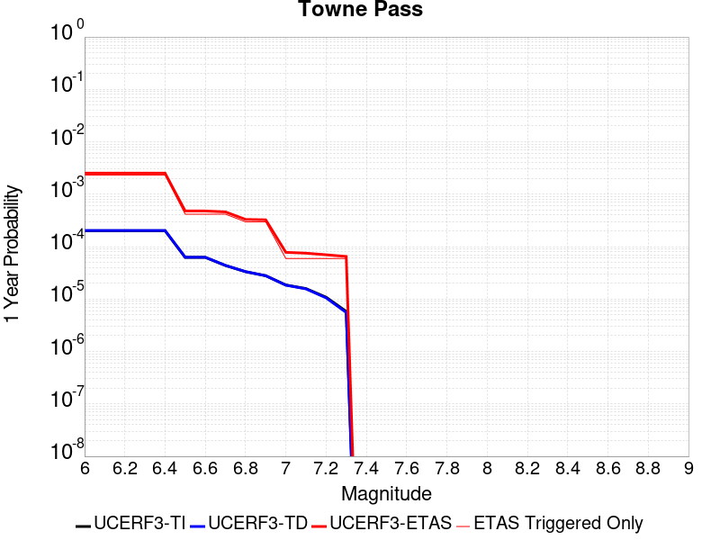 | 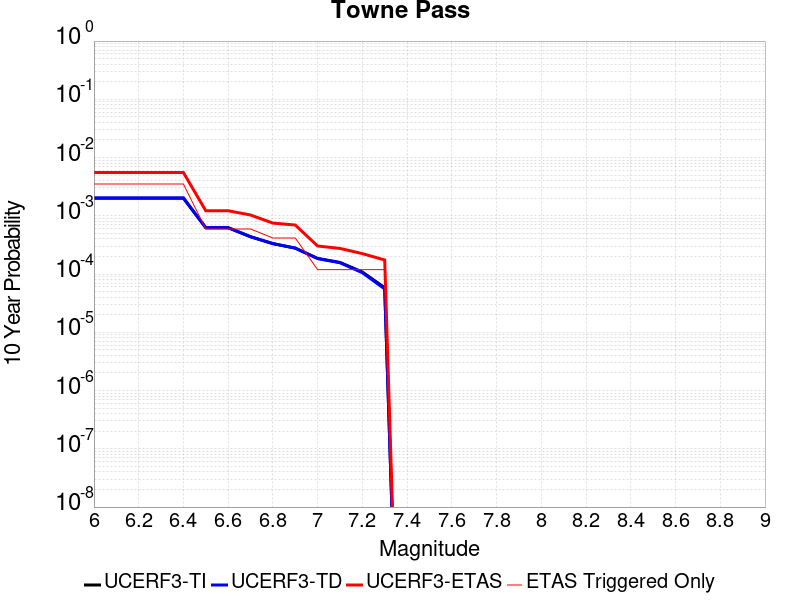 |

| Magnitude | 1 wk TI Prob | 1 wk TD Prob | 1 wk ETAS Prob | 1 wk ETAS/TD Gain | 1 wk ETAS Triggered Only | 1 mo TI Prob | 1 mo TD Prob | 1 mo ETAS Prob | 1 mo ETAS/TD Gain | 1 mo ETAS Triggered Only | 1 yr TI Prob | 1 yr TD Prob | 1 yr ETAS Prob | 1 yr ETAS/TD Gain | 1 yr ETAS Triggered Only | 10 yr TI Prob | 10 yr TD Prob | 10 yr ETAS Prob | 10 yr ETAS/TD Gain | 10 yr ETAS Triggered Only |
|-----|-----|-----|-----|-----|-----|-----|-----|-----|-----|-----|-----|-----|-----|-----|-----|-----|-----|-----|-----|-----|
| 6.0 | 3.849728E-6 | 3.8945414E-6 | 8.3389133E-4 | 214.11798 | 8.3E-4 | 1.649873E-5 | 1.669081E-5 | 0.0013766681 | 82.480606 | 0.00136 | 2.0085352E-4 | 2.0319603E-4 | 0.0025327227 | 12.46443 | 0.00233 | 0.0020067208 | 0.0020305314 | 0.005553364 | 2.7349312 | 0.00353 |
| 6.1 | 3.849728E-6 | 3.8945414E-6 | 8.3389133E-4 | 214.11798 | 8.3E-4 | 1.649873E-5 | 1.669081E-5 | 0.0013766681 | 82.480606 | 0.00136 | 2.0085352E-4 | 2.0319603E-4 | 0.0025327227 | 12.46443 | 0.00233 | 0.0020067208 | 0.0020305314 | 0.005553364 | 2.7349312 | 0.00353 |
| 6.2 | 3.849728E-6 | 3.8945414E-6 | 8.3389133E-4 | 214.11798 | 8.3E-4 | 1.649873E-5 | 1.669081E-5 | 0.0013766681 | 82.480606 | 0.00136 | 2.0085352E-4 | 2.0319603E-4 | 0.0025327227 | 12.46443 | 0.00233 | 0.0020067208 | 0.0020305314 | 0.005553364 | 2.7349312 | 0.00353 |
| 6.3 | 3.849728E-6 | 3.8945414E-6 | 8.3389133E-4 | 214.11798 | 8.3E-4 | 1.649873E-5 | 1.669081E-5 | 0.0013766681 | 82.480606 | 0.00136 | 2.0085352E-4 | 2.0319603E-4 | 0.0025327227 | 12.46443 | 0.00233 | 0.0020067208 | 0.0020305314 | 0.005553364 | 2.7349312 | 0.00353 |
| 6.4 | 3.849728E-6 | 3.8945414E-6 | 8.3389133E-4 | 214.11798 | 8.3E-4 | 1.649873E-5 | 1.669081E-5 | 0.0013766681 | 82.480606 | 0.00136 | 2.0085352E-4 | 2.0319603E-4 | 0.0025327227 | 12.46443 | 0.00233 | 0.0020067208 | 0.0020305314 | 0.005553364 | 2.7349312 | 0.00353 |
| 6.5 | 1.1953545E-6 | 1.203052E-6 | 1.2120291E-4 | 100.74619 | 1.2E-4 | 5.1229376E-6 | 5.1559277E-6 | 2.3515474E-4 | 45.60862 | 2.3E-4 | 6.236998E-5 | 6.277173E-5 | 4.6274663E-4 | 7.3718953 | 4.0E-4 | 6.235248E-4 | 6.275517E-4 | 0.0012471626 | 1.9873464 | 6.2E-4 |
| 6.6 | 1.1953545E-6 | 1.203052E-6 | 1.2120291E-4 | 100.74619 | 1.2E-4 | 5.1229376E-6 | 5.1559277E-6 | 2.3515474E-4 | 45.60862 | 2.3E-4 | 6.236998E-5 | 6.277173E-5 | 4.6274663E-4 | 7.3718953 | 4.0E-4 | 6.235248E-4 | 6.275517E-4 | 0.0012471626 | 1.9873464 | 6.2E-4 |
| 6.7 | 8.375951E-7 | 8.4106705E-7 | 8.0841E-5 | 96.11719 | 8.0E-5 | 3.5896885E-6 | 3.6045683E-6 | 1.4360406E-4 | 39.839462 | 1.4E-4 | 4.370358E-5 | 4.3884793E-5 | 3.0387338E-4 | 6.924343 | 2.6E-4 | 4.3694986E-4 | 4.38767E-4 | 8.285959E-4 | 1.8884645 | 3.9E-4 |
| 6.8 | 6.38041E-7 | 6.392156E-7 | 6.0639177E-5 | 94.864975 | 6.0E-5 | 2.7344586E-6 | 2.7394929E-6 | 1.0273922E-4 | 37.503006 | 1.0E-4 | 3.3291526E-5 | 3.3352855E-5 | 2.3334619E-4 | 6.9962883 | 2.0E-4 | 3.3286537E-4 | 3.334823E-4 | 6.3338224E-4 | 1.899298 | 3.0E-4 |
| 6.9 | 5.3460053E-7 | 5.345333E-7 | 6.05345E-5 | 113.24739 | 6.0E-5 | 2.2911431E-6 | 2.2908553E-6 | 9.229065E-5 | 40.28655 | 9.0E-5 | 2.789431E-5 | 2.789084E-5 | 2.0788582E-4 | 7.453552 | 1.8E-4 | 2.789081E-4 | 2.7887672E-4 | 5.388042E-4 | 1.9320517 | 2.6E-4 |
| 7.0 | 3.557783E-7 | 3.5324226E-7 | 4.035323E-5 | 114.236694 | 4.0E-5 | 1.5247632E-6 | 1.5138945E-6 | 5.151382E-5 | 34.027348 | 5.0E-5 | 1.8563835E-5 | 1.843152E-5 | 9.843004E-5 | 5.340311 | 8.0E-5 | 1.8562283E-4 | 1.8430075E-4 | 2.8428232E-4 | 1.5424914 | 1.0E-4 |
| 7.1 | 3.037942E-7 | 3.0002218E-7 | 3.0300012E-5 | 100.99258 | 3.0E-5 | 1.3019744E-6 | 1.2858087E-6 | 4.128576E-5 | 32.108784 | 4.0E-5 | 1.5851423E-5 | 1.5654618E-5 | 7.5653676E-5 | 4.832675 | 6.0E-5 | 1.5850292E-4 | 1.5653588E-4 | 2.3652337E-4 | 1.5109849 | 8.0E-5 |
| 7.2 | 2.0808248E-7 | 2.0217689E-7 | 2.0202173E-5 | 99.923256 | 2.0E-5 | 8.917818E-7 | 8.6647213E-7 | 3.0866446E-5 | 35.623127 | 3.0E-5 | 1.0857389E-5 | 1.0549252E-5 | 4.0548934E-5 | 3.8437736 | 3.0E-5 | 1.0856859E-4 | 1.0548797E-4 | 1.554827E-4 | 1.4739376 | 5.0E-5 |
| 7.3 | 1.1162073E-7 | 1.0636894E-7 | 1.0106368E-5 | 95.0124 | 1.0E-5 | 4.7837443E-7 | 4.558668E-7 | 2.0455858E-5 | 44.872444 | 2.0E-5 | 5.8241935E-6 | 5.550166E-6 | 2.5550054E-5 | 4.6034756 | 2.0E-5 | 5.8240406E-5 | 5.5500474E-5 | 9.549825E-5 | 1.7206745 | 4.0E-5 |

## Bicycle Lake
*[(top)](#table-of-contents)*

| 1 Week | 1 Month | 1 Year | 10 Year |
|-----|-----|-----|-----|
| 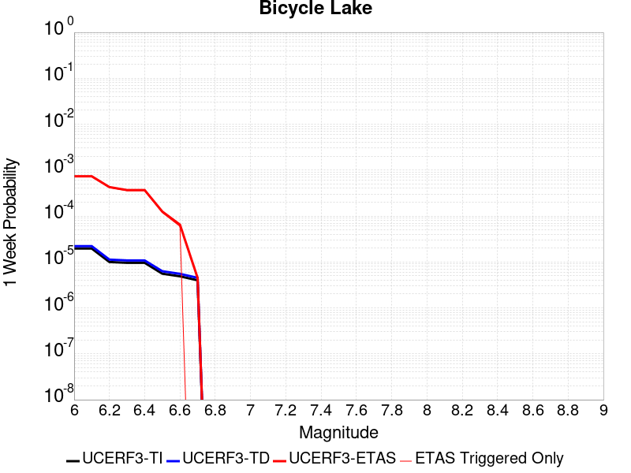 |  | 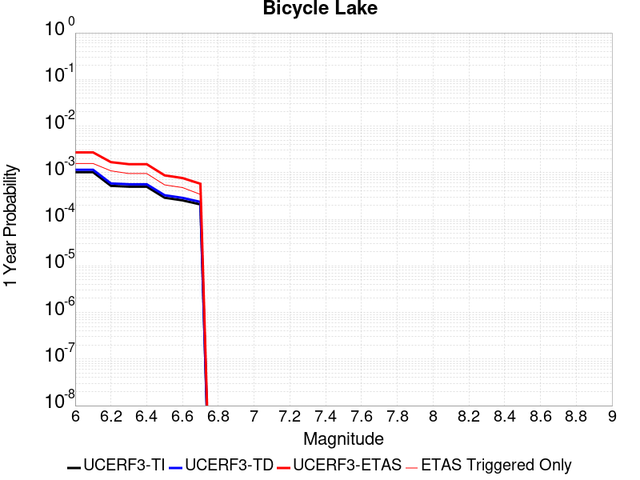 | 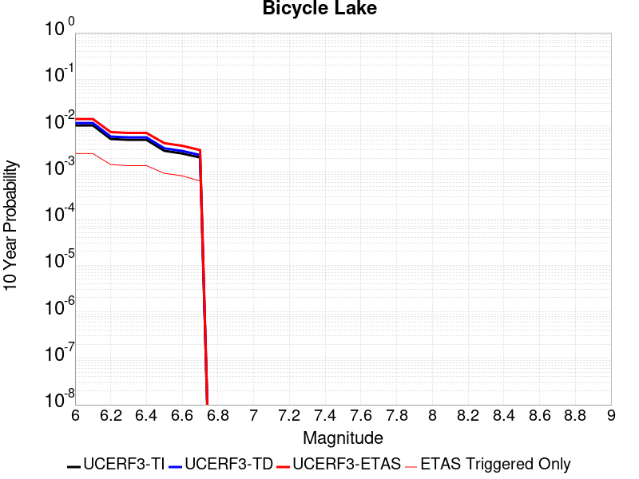 |

| Magnitude | 1 wk TI Prob | 1 wk TD Prob | 1 wk ETAS Prob | 1 wk ETAS/TD Gain | 1 wk ETAS Triggered Only | 1 mo TI Prob | 1 mo TD Prob | 1 mo ETAS Prob | 1 mo ETAS/TD Gain | 1 mo ETAS Triggered Only | 1 yr TI Prob | 1 yr TD Prob | 1 yr ETAS Prob | 1 yr ETAS/TD Gain | 1 yr ETAS Triggered Only | 10 yr TI Prob | 10 yr TD Prob | 10 yr ETAS Prob | 10 yr ETAS/TD Gain | 10 yr ETAS Triggered Only |
|-----|-----|-----|-----|-----|-----|-----|-----|-----|-----|-----|-----|-----|-----|-----|-----|-----|-----|-----|-----|-----|
| 6.0 | 1.9621975E-5 | 2.2097078E-5 | 4.7208712E-4 | 21.364233 | 4.5E-4 | 8.4091465E-5 | 9.4699084E-5 | 7.646356E-4 | 8.074372 | 6.7E-4 | 0.0010233327 | 0.0011524865 | 0.002530896 | 2.1960309 | 0.00138 | 0.01018633 | 0.011478408 | 0.013969482 | 1.2170227 | 0.00252 |
| 6.1 | 1.9621975E-5 | 2.2097078E-5 | 4.7208712E-4 | 21.364233 | 4.5E-4 | 8.4091465E-5 | 9.4699084E-5 | 7.646356E-4 | 8.074372 | 6.7E-4 | 0.0010233327 | 0.0011524865 | 0.002530896 | 2.1960309 | 0.00138 | 0.01018633 | 0.011478408 | 0.013969482 | 1.2170227 | 0.00252 |
| 6.2 | 9.9971285E-6 | 1.1255639E-5 | 2.2125327E-4 | 19.657104 | 2.1E-4 | 4.2844134E-5 | 4.8237856E-5 | 3.7822194E-4 | 7.8407702 | 3.3E-4 | 5.2150246E-4 | 5.871896E-4 | 0.0013667316 | 2.3275812 | 7.8E-4 | 0.0052028033 | 0.005861487 | 0.007312929 | 1.2476236 | 0.00146 |
| 6.3 | 9.589428E-6 | 1.0798346E-5 | 2.0079629E-4 | 18.595097 | 1.9E-4 | 4.10969E-5 | 4.62781E-5 | 3.5626374E-4 | 7.6983232 | 3.1E-4 | 5.002399E-4 | 5.6334207E-4 | 0.0012929308 | 2.2951078 | 7.3E-4 | 0.0049911533 | 0.0056242296 | 0.007006412 | 1.245755 | 0.00139 |
| 6.4 | 9.589428E-6 | 1.0798346E-5 | 2.0079629E-4 | 18.595097 | 1.9E-4 | 4.10969E-5 | 4.62781E-5 | 3.5626374E-4 | 7.6983232 | 3.1E-4 | 5.002399E-4 | 5.6334207E-4 | 0.0012929308 | 2.2951078 | 7.3E-4 | 0.0049911533 | 0.0056242296 | 0.007006412 | 1.245755 | 0.00139 |
| 6.5 | 5.557707E-6 | 6.2856016E-6 | 1.0628497E-4 | 16.909277 | 1.0E-4 | 2.3818526E-5 | 2.6938165E-5 | 2.0693331E-4 | 7.6817894 | 1.8E-4 | 2.8995197E-4 | 3.2794967E-4 | 7.8779884E-4 | 2.4021943 | 4.6E-4 | 0.0028957394 | 0.0032772934 | 0.00422418 | 1.2889234 | 9.5E-4 |
| 6.6 | 4.8742945E-6 | 5.5132896E-6 | 9.551279E-5 | 17.324102 | 9.0E-5 | 2.0889667E-5 | 2.3628318E-5 | 1.8362454E-4 | 7.7713757 | 1.6E-4 | 2.54302E-4 | 2.87663E-4 | 7.075422E-4 | 2.459622 | 4.2E-4 | 0.002540112 | 0.0028754752 | 0.0037130597 | 1.2912856 | 8.4E-4 |
| 6.7 | 3.991108E-6 | 4.5159104E-6 | 8.451555E-5 | 18.715063 | 8.0E-5 | 1.7104636E-5 | 1.9353902E-5 | 1.2935177E-4 | 6.6834984 | 1.1E-4 | 2.0822904E-4 | 2.3563375E-4 | 5.3556304E-4 | 2.2728622 | 3.0E-4 | 0.0020803404 | 0.0023563374 | 0.0030048059 | 1.2752018 | 6.5E-4 |

## San Andreas (San Bernardino N)
*[(top)](#table-of-contents)*

| 1 Week | 1 Month | 1 Year | 10 Year |
|-----|-----|-----|-----|
| 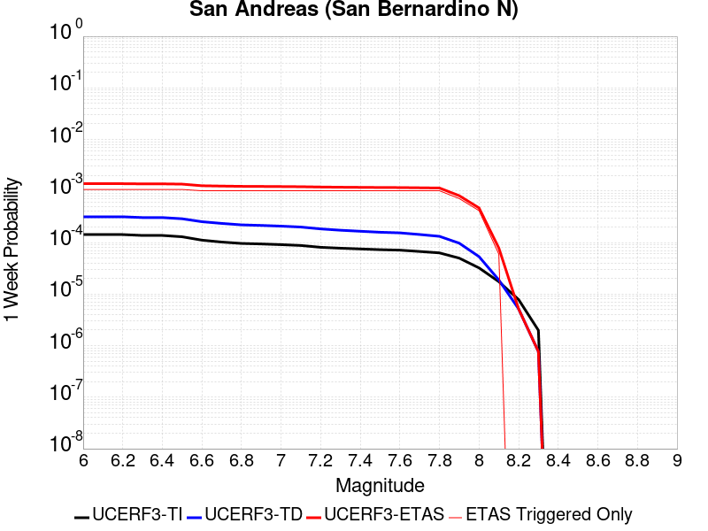 | 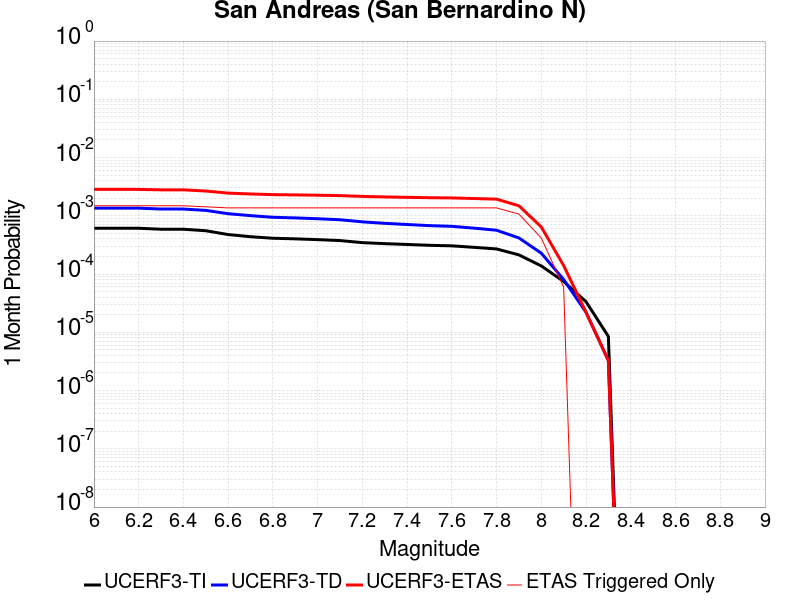 | 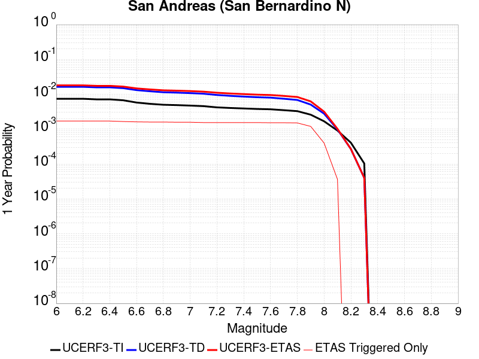 | 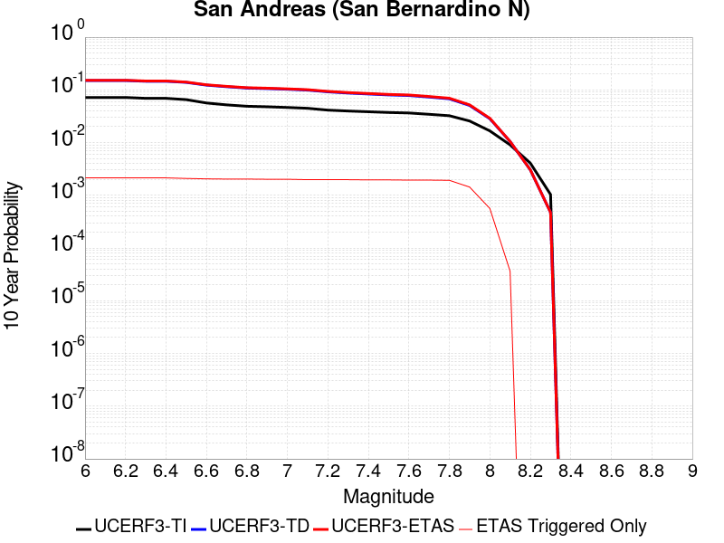 |

| Magnitude | 1 wk TI Prob | 1 wk TD Prob | 1 wk ETAS Prob | 1 wk ETAS/TD Gain | 1 wk ETAS Triggered Only | 1 mo TI Prob | 1 mo TD Prob | 1 mo ETAS Prob | 1 mo ETAS/TD Gain | 1 mo ETAS Triggered Only | 1 yr TI Prob | 1 yr TD Prob | 1 yr ETAS Prob | 1 yr ETAS/TD Gain | 1 yr ETAS Triggered Only | 10 yr TI Prob | 10 yr TD Prob | 10 yr ETAS Prob | 10 yr ETAS/TD Gain | 10 yr ETAS Triggered Only |
|-----|-----|-----|-----|-----|-----|-----|-----|-----|-----|-----|-----|-----|-----|-----|-----|-----|-----|-----|-----|-----|
| 6.0 | 1.4273766E-4 | 3.1606483E-4 | 0.0013357424 | 4.226166 | 0.00102 | 6.115894E-4 | 0.0013538664 | 0.0026720793 | 1.9736655 | 0.00132 | 0.0074207084 | 0.016360244 | 0.018042266 | 1.1028117 | 0.00171 | 0.07177748 | 0.15026689 | 0.1521108 | 1.0122709 | 0.00217 |
| 6.1 | 1.4273766E-4 | 3.1606483E-4 | 0.0013357424 | 4.226166 | 0.00102 | 6.115894E-4 | 0.0013538664 | 0.0026720793 | 1.9736655 | 0.00132 | 0.0074207084 | 0.016360244 | 0.018042266 | 1.1028117 | 0.00171 | 0.07177748 | 0.15026689 | 0.1521108 | 1.0122709 | 0.00217 |
| 6.2 | 1.4273766E-4 | 3.1606483E-4 | 0.0013357424 | 4.226166 | 0.00102 | 6.115894E-4 | 0.0013538664 | 0.0026720793 | 1.9736655 | 0.00132 | 0.0074207084 | 0.016360244 | 0.018042266 | 1.1028117 | 0.00171 | 0.07177748 | 0.15026689 | 0.1521108 | 1.0122709 | 0.00217 |
| 6.3 | 1.3730655E-4 | 3.0511338E-4 | 0.0013248022 | 4.3419995 | 0.00102 | 5.883239E-4 | 0.0013069791 | 0.002625254 | 2.0086424 | 0.00132 | 0.0071393442 | 0.015797773 | 0.017480759 | 1.106533 | 0.00171 | 0.06914291 | 0.14556676 | 0.14742088 | 1.0127373 | 0.00217 |
| 6.4 | 1.3730655E-4 | 3.0511338E-4 | 0.0013248022 | 4.3419995 | 0.00102 | 5.883239E-4 | 0.0013069791 | 0.002625254 | 2.0086424 | 0.00132 | 0.0071393442 | 0.015797773 | 0.017480759 | 1.106533 | 0.00171 | 0.06914291 | 0.14556676 | 0.14742088 | 1.0127373 | 0.00217 |
| 6.5 | 1.2942807E-4 | 2.8925808E-4 | 0.0012789717 | 4.4215593 | 9.9E-4 | 5.545738E-4 | 0.0012390936 | 0.0025175076 | 2.031733 | 0.00128 | 0.0067310524 | 0.01498286 | 0.016627839 | 1.1097907 | 0.00167 | 0.06530788 | 0.13870941 | 0.14054397 | 1.0132258 | 0.00213 |
| 6.6 | 1.1125901E-4 | 2.536472E-4 | 0.0012234012 | 4.8232393 | 9.7E-4 | 4.767372E-4 | 0.0010866089 | 0.0023352506 | 2.149118 | 0.00125 | 0.005788839 | 0.013149847 | 0.014768281 | 1.1230763 | 0.00164 | 0.056403454 | 0.122999296 | 0.124841 | 1.0149733 | 0.0021 |
| 6.7 | 1.02209575E-4 | 2.3499702E-4 | 0.0011947714 | 5.0841985 | 9.6E-4 | 4.3796748E-4 | 0.0010067427 | 0.0022454944 | 2.230455 | 0.00124 | 0.0053192247 | 0.012188629 | 0.013788884 | 1.1312908 | 0.00162 | 0.051936906 | 0.114790924 | 0.116623305 | 1.0159628 | 0.00207 |
| 6.8 | 9.610582E-5 | 2.2025521E-4 | 0.0011800438 | 5.3576202 | 9.6E-4 | 4.1181705E-4 | 9.436101E-4 | 0.0021824401 | 2.3128622 | 0.00124 | 0.0050023515 | 0.011428202 | 0.013029688 | 1.1401346 | 0.00162 | 0.048912346 | 0.1081929 | 0.11003894 | 1.0170625 | 0.00207 |
| 6.9 | 9.3877505E-5 | 2.1481077E-4 | 0.0011746045 | 5.4680896 | 9.6E-4 | 4.0227012E-4 | 9.2029345E-4 | 0.0021491614 | 2.3353002 | 0.00123 | 0.0048866454 | 0.011147255 | 0.012739308 | 1.1428201 | 0.00161 | 0.04780577 | 0.10578323 | 0.10761637 | 1.0173292 | 0.00205 |
| 7.0 | 9.1019785E-5 | 2.0808022E-4 | 0.0011678805 | 5.612645 | 9.6E-4 | 3.900265E-4 | 8.914682E-4 | 0.0021203717 | 2.3785164 | 0.00123 | 0.0047382377 | 0.010799837 | 0.012392449 | 1.1474663 | 0.00161 | 0.046384744 | 0.102753714 | 0.10459307 | 1.0179006 | 0.00205 |
| 7.1 | 8.771155E-5 | 1.9982594E-4 | 0.0011496361 | 5.753187 | 9.5E-4 | 3.758525E-4 | 8.5611636E-4 | 0.002055089 | 2.4004786 | 0.0012 | 0.0045664064 | 0.0103736 | 0.011937209 | 1.1507298 | 0.00158 | 0.044737056 | 0.09906527 | 0.10088515 | 1.0183706 | 0.00202 |
| 7.2 | 8.0830236E-5 | 1.8388197E-4 | 0.0011337072 | 6.165407 | 9.5E-4 | 3.4636928E-4 | 7.8782777E-4 | 0.0019868824 | 2.5219755 | 0.0012 | 0.0042088944 | 0.009549725 | 0.0111146355 | 1.1638699 | 0.00158 | 0.041300658 | 0.09179615 | 0.09363072 | 1.0199853 | 0.00202 |
| 7.3 | 7.7668235E-5 | 1.7331762E-4 | 0.001123153 | 6.480316 | 9.5E-4 | 3.328214E-4 | 7.425784E-4 | 0.0019416873 | 2.614791 | 0.0012 | 0.0040445733 | 0.009003494 | 0.010559359 | 1.1728067 | 0.00157 | 0.03971748 | 0.08706327 | 0.088898264 | 1.0210767 | 0.00201 |
| 7.4 | 7.520177E-5 | 1.6551897E-4 | 0.0011153617 | 6.738573 | 9.5E-4 | 3.2225347E-4 | 7.0917426E-4 | 0.0019083233 | 2.6909087 | 0.0012 | 0.0039163795 | 0.008600081 | 0.010146665 | 1.1798337 | 0.00156 | 0.038480744 | 0.08351955 | 0.085343346 | 1.0218368 | 0.00199 |
| 7.5 | 7.274697E-5 | 1.5839566E-4 | 0.0010982468 | 6.933566 | 9.4E-4 | 3.1173544E-4 | 6.78662E-4 | 0.0018678544 | 2.7522602 | 0.00119 | 0.003788775 | 0.008231463 | 0.009768704 | 1.1867518 | 0.00155 | 0.03724827 | 0.08023631 | 0.08205744 | 1.0226971 | 0.00198 |
| 7.6 | 7.1185845E-5 | 1.540943E-4 | 0.0010939494 | 7.0992208 | 9.4E-4 | 3.0504653E-4 | 6.6023704E-4 | 0.0018494513 | 2.801193 | 0.00119 | 0.0037076178 | 0.008008812 | 0.009536478 | 1.1907482 | 0.00154 | 0.036463667 | 0.07822598 | 0.08004187 | 1.0232135 | 0.00197 |
| 7.7 | 6.709961E-5 | 1.4318313E-4 | 0.00107305 | 7.4942484 | 9.3E-4 | 2.8753807E-4 | 6.1349774E-4 | 0.0017927738 | 2.9222176 | 0.00118 | 0.003495157 | 0.0074437927 | 0.008952478 | 1.202677 | 0.00152 | 0.034406938 | 0.07305469 | 0.07486224 | 1.0247424 | 0.00195 |
| 7.8 | 6.300812E-5 | 1.3202413E-4 | 0.0010619013 | 8.043237 | 9.3E-4 | 2.7000686E-4 | 5.65695E-4 | 0.0017350331 | 3.0670822 | 0.00117 | 0.0032823787 | 0.006865616 | 0.008365248 | 1.2184266 | 0.00151 | 0.032343175 | 0.06771354 | 0.06952217 | 1.0267102 | 0.00194 |
| 7.9 | 4.983037E-5 | 9.723488E-5 | 8.271639E-4 | 8.506864 | 7.3E-4 | 2.1354125E-4 | 4.1665437E-4 | 0.0013462668 | 3.2311358 | 9.3E-4 | 0.0025967648 | 0.0050609782 | 0.0062449556 | 1.2339424 | 0.00119 | 0.025666296 | 0.05064886 | 0.052063394 | 1.0279282 | 0.00149 |
| 8.0 | 3.2211527E-5 | 5.3304586E-5 | 2.9329179E-4 | 5.502187 | 2.4E-4 | 1.380421E-4 | 2.2842824E-4 | 5.083643E-4 | 2.225488 | 2.8E-4 | 0.0016793669 | 0.0027775685 | 0.0031664853 | 1.1400206 | 3.9E-4 | 0.016667323 | 0.028361378 | 0.028856914 | 1.0174721 | 5.1E-4 |
| 8.1 | 1.743376E-5 | 1.8824427E-5 | 6.882349E-5 | 3.6560736 | 5.0E-5 | 7.471398E-5 | 8.067362E-5 | 1.4066878E-4 | 1.7436775 | 6.0E-5 | 9.0926304E-4 | 9.817594E-4 | 0.0010516907 | 1.0712305 | 7.0E-5 | 0.009055517 | 0.010484105 | 0.010563266 | 1.0075506 | 8.0E-5 |
| 8.2 | 7.831616E-6 | 5.1551065E-6 | 1.5155055E-5 | 2.939814 | 1.0E-5 | 3.3563636E-5 | 2.2093127E-5 | 3.2092907E-5 | 1.4526194 | 1.0E-5 | 4.0856065E-4 | 2.6895068E-4 | 2.78948E-4 | 1.0371715 | 1.0E-5 | 0.004078103 | 0.0030418145 | 0.0030517841 | 1.0032775 | 1.0E-5 |
| 8.3 | 1.983087E-6 | 7.6599065E-7 | 7.6599065E-7 | 1.0 | 0.0 | 8.498917E-6 | 3.282813E-6 | 3.282813E-6 | 1.0 | 0.0 | 1.034694E-4 | 3.9967534E-5 | 3.9967534E-5 | 1.0 | 0.0 | 0.0010342124 | 4.719687E-4 | 4.719687E-4 | 1.0 | 0.0 |

## Paradise
*[(top)](#table-of-contents)*

| 1 Week | 1 Month | 1 Year | 10 Year |
|-----|-----|-----|-----|
| 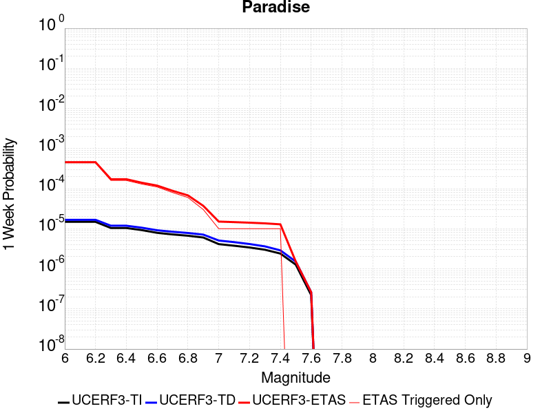 | 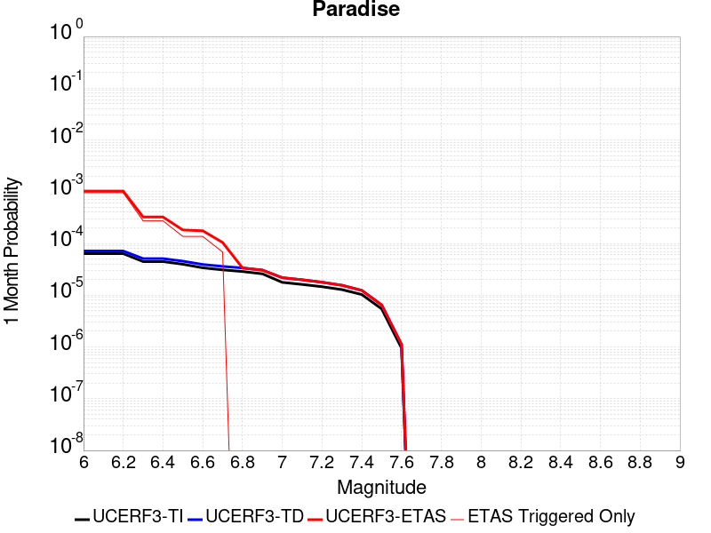 | 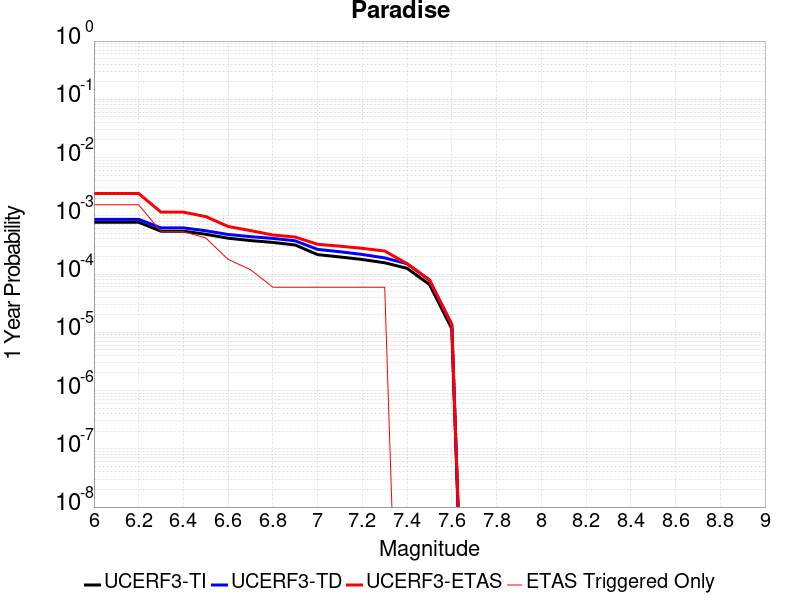 |  |

| Magnitude | 1 wk TI Prob | 1 wk TD Prob | 1 wk ETAS Prob | 1 wk ETAS/TD Gain | 1 wk ETAS Triggered Only | 1 mo TI Prob | 1 mo TD Prob | 1 mo ETAS Prob | 1 mo ETAS/TD Gain | 1 mo ETAS Triggered Only | 1 yr TI Prob | 1 yr TD Prob | 1 yr ETAS Prob | 1 yr ETAS/TD Gain | 1 yr ETAS Triggered Only | 10 yr TI Prob | 10 yr TD Prob | 10 yr ETAS Prob | 10 yr ETAS/TD Gain | 10 yr ETAS Triggered Only |
|-----|-----|-----|-----|-----|-----|-----|-----|-----|-----|-----|-----|-----|-----|-----|-----|-----|-----|-----|-----|-----|
| 6.0 | 1.4851273E-5 | 1.6694692E-5 | 4.5668735E-4 | 27.355244 | 4.4E-4 | 6.364676E-5 | 7.154685E-5 | 7.514982E-4 | 10.503582 | 6.8E-4 | 7.7462377E-4 | 8.707584E-4 | 0.0021696263 | 2.4916515 | 0.0013 | 0.0077192914 | 0.008675844 | 0.010777451 | 1.2422366 | 0.00212 |
| 6.1 | 1.4851273E-5 | 1.6694692E-5 | 4.5668735E-4 | 27.355244 | 4.4E-4 | 6.364676E-5 | 7.154685E-5 | 7.514982E-4 | 10.503582 | 6.8E-4 | 7.7462377E-4 | 8.707584E-4 | 0.0021696263 | 2.4916515 | 0.0013 | 0.0077192914 | 0.008675844 | 0.010777451 | 1.2422366 | 0.00212 |
| 6.2 | 1.4851273E-5 | 1.6694692E-5 | 4.5668735E-4 | 27.355244 | 4.4E-4 | 6.364676E-5 | 7.154685E-5 | 7.514982E-4 | 10.503582 | 6.8E-4 | 7.7462377E-4 | 8.707584E-4 | 0.0021696263 | 2.4916515 | 0.0013 | 0.0077192914 | 0.008675844 | 0.010777451 | 1.2422366 | 0.00212 |
| 6.3 | 1.0426831E-5 | 1.188862E-5 | 1.7188671E-4 | 14.458088 | 1.6E-4 | 4.4685654E-5 | 5.0950268E-5 | 3.4093548E-4 | 6.691535 | 2.9E-4 | 5.43912E-4 | 6.201489E-4 | 0.0011798016 | 1.9024489 | 5.6E-4 | 0.0054258266 | 0.0061847917 | 0.0070593487 | 1.1414045 | 8.8E-4 |
| 6.4 | 1.0426831E-5 | 1.188862E-5 | 1.7188671E-4 | 14.458088 | 1.6E-4 | 4.4685654E-5 | 5.0950268E-5 | 3.4093548E-4 | 6.691535 | 2.9E-4 | 5.43912E-4 | 6.201489E-4 | 0.0011798016 | 1.9024489 | 5.6E-4 | 0.0054258266 | 0.0061847917 | 0.0070593487 | 1.1414045 | 8.8E-4 |
| 6.5 | 9.25027E-6 | 1.06199595E-5 | 1.4061858E-4 | 13.240971 | 1.3E-4 | 3.964341E-5 | 4.551335E-5 | 2.8550244E-4 | 6.2729383 | 2.4E-4 | 4.8255164E-4 | 5.53989E-4 | 0.0010037398 | 1.8118404 | 4.5E-4 | 0.0048150513 | 0.0055265795 | 0.0061928765 | 1.1205623 | 6.7E-4 |
| 6.6 | 7.904275E-6 | 9.159525E-6 | 1.1915852E-4 | 13.009246 | 1.1E-4 | 3.3875025E-5 | 3.9254537E-5 | 1.7924904E-4 | 4.5663266 | 1.4E-4 | 4.1235037E-4 | 4.7782314E-4 | 7.376989E-4 | 1.5438744 | 2.6E-4 | 0.0041158604 | 0.0047683544 | 0.0051564947 | 1.0813992 | 3.9E-4 |
| 6.7 | 7.2061953E-6 | 8.407248E-6 | 8.8406574E-5 | 10.515518 | 8.0E-5 | 3.088333E-5 | 3.6030586E-5 | 1.3602698E-4 | 3.7753196 | 1.0E-4 | 3.7593965E-4 | 4.3858777E-4 | 6.484957E-4 | 1.4785995 | 2.1E-4 | 0.003753043 | 0.004377591 | 0.004686234 | 1.0705053 | 3.1E-4 |
| 6.8 | 6.6948724E-6 | 7.842166E-6 | 6.78417E-5 | 8.6508875 | 6.0E-5 | 2.8691995E-5 | 3.360887E-5 | 1.13606184E-4 | 3.380244 | 8.0E-5 | 3.4926904E-4 | 4.0911473E-4 | 5.7904515E-4 | 1.4153614 | 1.7E-4 | 0.003487206 | 0.0040839734 | 0.004313034 | 1.0560877 | 2.3E-4 |
| 6.9 | 6.0421025E-6 | 7.130621E-6 | 3.713041E-5 | 5.207177 | 3.0E-5 | 2.5894467E-5 | 3.0559466E-5 | 8.055794E-5 | 2.6361043 | 5.0E-5 | 3.1521954E-4 | 3.7200135E-4 | 4.8196045E-4 | 1.2955879 | 1.1E-4 | 0.0031477278 | 0.0037141247 | 0.0038635675 | 1.0402364 | 1.5E-4 |
| 7.0 | 4.134091E-6 | 5.0803087E-6 | 1.5080258E-5 | 2.9683743 | 1.0E-5 | 1.7717413E-5 | 2.177258E-5 | 4.1772146E-5 | 1.9185666 | 2.0E-5 | 2.1568815E-4 | 2.6505045E-4 | 3.2503455E-4 | 1.226312 | 6.0E-5 | 0.0021547892 | 0.0026474963 | 0.0027272846 | 1.0301372 | 8.0E-5 |
| 7.1 | 3.7674888E-6 | 4.6318696E-6 | 1.4631823E-5 | 3.1589456 | 1.0E-5 | 1.6146281E-5 | 1.9850726E-5 | 3.985033E-5 | 2.0074997 | 2.0E-5 | 1.9656324E-4 | 2.4165731E-4 | 3.016428E-4 | 1.2482255 | 6.0E-5 | 0.0019638946 | 0.002414096 | 0.0024939028 | 1.0330586 | 8.0E-5 |
| 7.2 | 3.4065345E-6 | 4.156723E-6 | 1.4156682E-5 | 3.4057312 | 1.0E-5 | 1.4599351E-5 | 1.7814415E-5 | 2.7814236E-5 | 1.5613332 | 1.0E-5 | 1.777326E-4 | 2.1687041E-4 | 2.6685957E-4 | 1.2305025 | 5.0E-5 | 0.0017759053 | 0.002166736 | 0.0022365842 | 1.0322367 | 7.0E-5 |
| 7.3 | 2.9934936E-6 | 3.6293168E-6 | 1.362928E-5 | 3.7553296 | 1.0E-5 | 1.2829195E-5 | 1.555413E-5 | 2.5553974E-5 | 1.6429061 | 1.0E-5 | 1.5618425E-4 | 1.8935655E-4 | 2.393471E-4 | 1.2640021 | 5.0E-5 | 0.0015607453 | 0.0018920974 | 0.0019619649 | 1.036926 | 7.0E-5 |
| 7.4 | 2.4049796E-6 | 2.8889842E-6 | 1.2888955E-5 | 4.4614143 | 1.0E-5 | 1.0307015E-5 | 1.238131E-5 | 2.2381186E-5 | 1.807659 | 1.0E-5 | 1.2548068E-4 | 1.5073347E-4 | 1.9072743E-4 | 1.2653291 | 4.0E-5 | 0.0012540985 | 0.0015064536 | 0.0015563783 | 1.0331405 | 5.0E-5 |
| 7.5 | 1.2710091E-6 | 1.5134682E-6 | 1.5134682E-6 | 1.0 | 0.0 | 5.44717E-6 | 6.4862834E-6 | 6.4862834E-6 | 1.0 | 0.0 | 6.631728E-5 | 7.8968886E-5 | 9.8967306E-5 | 1.2532443 | 2.0E-5 | 6.6297496E-4 | 7.8953087E-4 | 8.195072E-4 | 1.0379672 | 3.0E-5 |
| 7.6 | 2.21172E-7 | 2.603961E-7 | 2.603961E-7 | 1.0 | 0.0 | 9.478797E-7 | 1.1159829E-6 | 1.1159829E-6 | 1.0 | 0.0 | 1.1540374E-5 | 1.3587036E-5 | 2.35869E-5 | 1.7359858 | 1.0E-5 | 1.1539775E-4 | 1.3586486E-4 | 1.4586351E-4 | 1.0735925 | 1.0E-5 |

## Garlic Springs
*[(top)](#table-of-contents)*

| 1 Week | 1 Month | 1 Year | 10 Year |
|-----|-----|-----|-----|
| 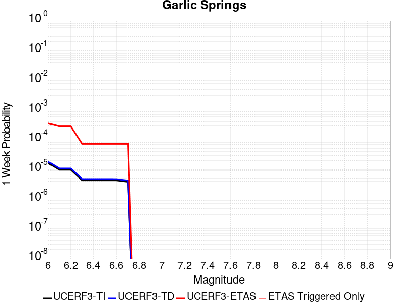 | 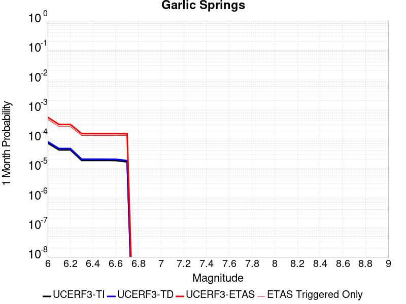 | 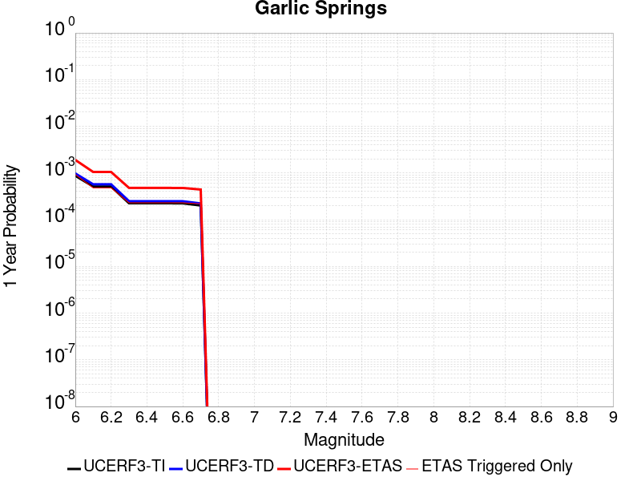 | 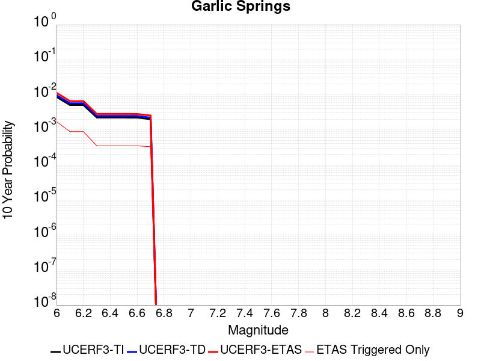 |

| Magnitude | 1 wk TI Prob | 1 wk TD Prob | 1 wk ETAS Prob | 1 wk ETAS/TD Gain | 1 wk ETAS Triggered Only | 1 mo TI Prob | 1 mo TD Prob | 1 mo ETAS Prob | 1 mo ETAS/TD Gain | 1 mo ETAS Triggered Only | 1 yr TI Prob | 1 yr TD Prob | 1 yr ETAS Prob | 1 yr ETAS/TD Gain | 1 yr ETAS Triggered Only | 10 yr TI Prob | 10 yr TD Prob | 10 yr ETAS Prob | 10 yr ETAS/TD Gain | 10 yr ETAS Triggered Only |
|-----|-----|-----|-----|-----|-----|-----|-----|-----|-----|-----|-----|-----|-----|-----|-----|-----|-----|-----|-----|-----|
| 6.0 | 1.6760017E-5 | 1.8776833E-5 | 2.9877157E-4 | 15.911714 | 2.8E-4 | 7.182667E-5 | 8.0470316E-5 | 5.404333E-4 | 6.7159333 | 4.6E-4 | 8.7413884E-4 | 9.794032E-4 | 0.0019084923 | 1.9486278 | 9.3E-4 | 0.008707083 | 0.009762413 | 0.011465621 | 1.1744659 | 0.00172 |
| 6.1 | 9.852767E-6 | 1.09735865E-5 | 2.109714E-4 | 19.225382 | 2.0E-4 | 4.222546E-5 | 4.702921E-5 | 3.0701698E-4 | 6.5282187 | 2.6E-4 | 5.139737E-4 | 5.7250116E-4 | 0.0010522264 | 1.8379462 | 4.8E-4 | 0.005127866 | 0.005717221 | 0.006602133 | 1.15478 | 8.9E-4 |
| 6.2 | 9.852767E-6 | 1.09735865E-5 | 2.109714E-4 | 19.225382 | 2.0E-4 | 4.222546E-5 | 4.702921E-5 | 3.0701698E-4 | 6.5282187 | 2.6E-4 | 5.139737E-4 | 5.7250116E-4 | 0.0010522264 | 1.8379462 | 4.8E-4 | 0.005127866 | 0.005717221 | 0.006602133 | 1.15478 | 8.9E-4 |
| 6.3 | 4.3167724E-6 | 4.7780286E-6 | 9.47776E-5 | 19.83613 | 9.0E-5 | 1.8500323E-5 | 2.0477235E-5 | 1.5047457E-4 | 7.3483834 | 1.3E-4 | 2.2521814E-4 | 2.4930484E-4 | 4.792475E-4 | 1.9223354 | 2.3E-4 | 0.0022499003 | 0.00249251 | 0.0028416375 | 1.1400707 | 3.5E-4 |
| 6.4 | 4.3167724E-6 | 4.7780286E-6 | 9.47776E-5 | 19.83613 | 9.0E-5 | 1.8500323E-5 | 2.0477235E-5 | 1.5047457E-4 | 7.3483834 | 1.3E-4 | 2.2521814E-4 | 2.4930484E-4 | 4.792475E-4 | 1.9223354 | 2.3E-4 | 0.0022499003 | 0.00249251 | 0.0028416375 | 1.1400707 | 3.5E-4 |
| 6.5 | 4.3167724E-6 | 4.7780286E-6 | 9.47776E-5 | 19.83613 | 9.0E-5 | 1.8500323E-5 | 2.0477235E-5 | 1.5047457E-4 | 7.3483834 | 1.3E-4 | 2.2521814E-4 | 2.4930484E-4 | 4.792475E-4 | 1.9223354 | 2.3E-4 | 0.0022499003 | 0.00249251 | 0.0028416375 | 1.1400707 | 3.5E-4 |
| 6.6 | 4.301311E-6 | 4.760897E-6 | 9.476047E-5 | 19.90391 | 9.0E-5 | 1.8434059E-5 | 2.0403815E-5 | 1.5040116E-4 | 7.3712277 | 1.3E-4 | 2.2441156E-4 | 2.4841115E-4 | 4.7835402E-4 | 1.9256543 | 2.3E-4 | 0.0022418506 | 0.002483593 | 0.0028327238 | 1.1405748 | 3.5E-4 |
| 6.7 | 3.8599724E-6 | 4.27106E-6 | 9.4270676E-5 | 22.071962 | 9.0E-5 | 1.6542634E-5 | 1.8304541E-5 | 1.4830216E-4 | 8.101933 | 1.3E-4 | 2.0138794E-4 | 2.228578E-4 | 4.4280879E-4 | 1.9869566 | 2.2E-4 | 0.0020120554 | 0.002228578 | 0.0025578425 | 1.1477464 | 3.3E-4 |

## San Andreas (San Bernardino S)
*[(top)](#table-of-contents)*

| 1 Week | 1 Month | 1 Year | 10 Year |
|-----|-----|-----|-----|
| 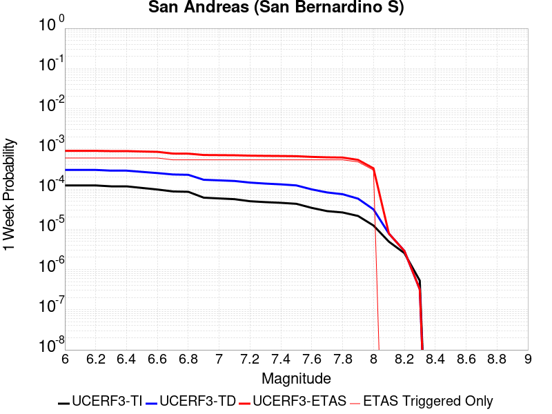 | 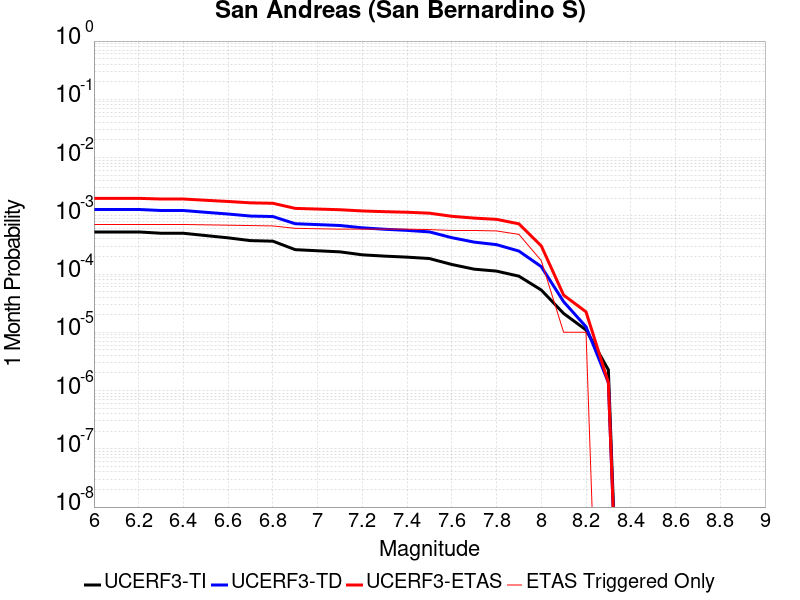 | 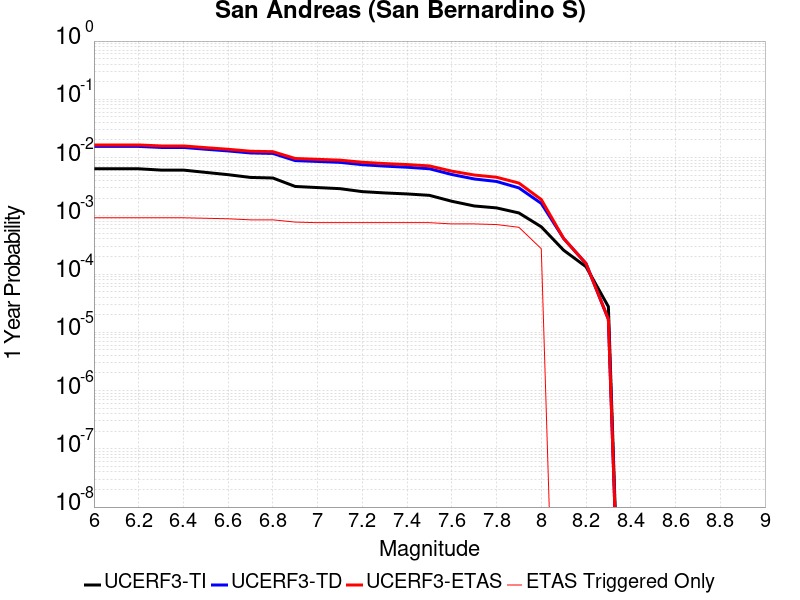 | 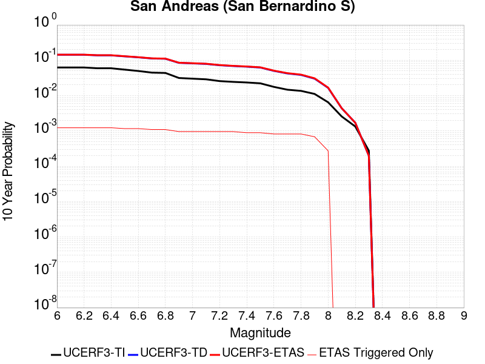 |

| Magnitude | 1 wk TI Prob | 1 wk TD Prob | 1 wk ETAS Prob | 1 wk ETAS/TD Gain | 1 wk ETAS Triggered Only | 1 mo TI Prob | 1 mo TD Prob | 1 mo ETAS Prob | 1 mo ETAS/TD Gain | 1 mo ETAS Triggered Only | 1 yr TI Prob | 1 yr TD Prob | 1 yr ETAS Prob | 1 yr ETAS/TD Gain | 1 yr ETAS Triggered Only | 10 yr TI Prob | 10 yr TD Prob | 10 yr ETAS Prob | 10 yr ETAS/TD Gain | 10 yr ETAS Triggered Only |
|-----|-----|-----|-----|-----|-----|-----|-----|-----|-----|-----|-----|-----|-----|-----|-----|-----|-----|-----|-----|-----|
| 6.0 | 1.2336002E-4 | 3.0004102E-4 | 8.39879E-4 | 2.799214 | 5.4E-4 | 5.2857865E-4 | 0.0012852824 | 0.00199437 | 1.5516977 | 7.1E-4 | 0.006416472 | 0.015540994 | 0.016436853 | 1.0576448 | 9.1E-4 | 0.06234337 | 0.14283717 | 0.14381434 | 1.0068411 | 0.00114 |
| 6.1 | 1.2336002E-4 | 3.0004102E-4 | 8.39879E-4 | 2.799214 | 5.4E-4 | 5.2857865E-4 | 0.0012852824 | 0.00199437 | 1.5516977 | 7.1E-4 | 0.006416472 | 0.015540994 | 0.016436853 | 1.0576448 | 9.1E-4 | 0.06234337 | 0.14283717 | 0.14381434 | 1.0068411 | 0.00114 |
| 6.2 | 1.2336002E-4 | 3.0004102E-4 | 8.39879E-4 | 2.799214 | 5.4E-4 | 5.2857865E-4 | 0.0012852824 | 0.00199437 | 1.5516977 | 7.1E-4 | 0.006416472 | 0.015540994 | 0.016436853 | 1.0576448 | 9.1E-4 | 0.06234337 | 0.14283717 | 0.14381434 | 1.0068411 | 0.00114 |
| 6.3 | 1.1712257E-4 | 2.8792414E-4 | 8.2776864E-4 | 2.874954 | 5.4E-4 | 5.018573E-4 | 0.0012334028 | 0.001942527 | 1.5749333 | 7.1E-4 | 0.006093008 | 0.014918125 | 0.01581455 | 1.0600896 | 9.1E-4 | 0.059286322 | 0.13754563 | 0.13852882 | 1.0071481 | 0.00114 |
| 6.4 | 1.1712257E-4 | 2.8792414E-4 | 8.2776864E-4 | 2.874954 | 5.4E-4 | 5.018573E-4 | 0.0012334028 | 0.001942527 | 1.5749333 | 7.1E-4 | 0.006093008 | 0.014918125 | 0.01581455 | 1.0600896 | 9.1E-4 | 0.059286322 | 0.13754563 | 0.13852882 | 1.0071481 | 0.00114 |
| 6.5 | 1.0689076E-4 | 2.680528E-4 | 8.079081E-4 | 3.0139885 | 5.4E-4 | 4.5802278E-4 | 0.0011483167 | 0.0018475129 | 1.6088879 | 7.0E-4 | 0.0055621783 | 0.01389575 | 0.014773383 | 1.0631584 | 8.9E-4 | 0.05425003 | 0.12879294 | 0.1297687 | 1.0075761 | 0.00112 |
| 6.6 | 9.7648895E-5 | 2.50501E-4 | 7.9036574E-4 | 3.15514 | 5.4E-4 | 4.1842813E-4 | 0.0010731576 | 0.0017624171 | 1.6422724 | 6.9E-4 | 0.005082469 | 0.012991785 | 0.013850482 | 1.0660954 | 8.7E-4 | 0.049677886 | 0.12095292 | 0.12191987 | 1.0079944 | 0.0011 |
| 6.7 | 8.757013E-5 | 2.3120902E-4 | 7.6108647E-4 | 3.291768 | 5.3E-4 | 3.7524657E-4 | 9.905418E-4 | 0.0016698682 | 1.685813 | 6.8E-4 | 0.00455906 | 0.011997245 | 0.012837048 | 1.0699996 | 8.5E-4 | 0.04466656 | 0.11226123 | 0.113219984 | 1.0085404 | 0.00108 |
| 6.8 | 8.562978E-5 | 2.2680782E-4 | 7.566876E-4 | 3.33625 | 5.3E-4 | 3.6693315E-4 | 9.7169366E-4 | 0.0016410426 | 1.6888478 | 6.7E-4 | 0.004458263 | 0.011770263 | 0.012600376 | 1.0705262 | 8.4E-4 | 0.043698758 | 0.11027153 | 0.111214645 | 1.0085527 | 0.00106 |
| 6.9 | 6.124075E-5 | 1.7065753E-4 | 6.505756E-4 | 3.8121707 | 4.8E-4 | 2.6243398E-4 | 7.311852E-4 | 0.0013407392 | 1.8336519 | 6.1E-4 | 0.0031904527 | 0.008866051 | 0.009639136 | 1.087196 | 7.8E-4 | 0.031450346 | 0.08418263 | 0.085052654 | 1.010335 | 9.5E-4 |
| 7.0 | 5.8598747E-5 | 1.649477E-4 | 6.348702E-4 | 3.8489177 | 4.7E-4 | 2.5111332E-4 | 7.06728E-4 | 0.001306304 | 1.8483828 | 6.0E-4 | 0.0030530186 | 0.008570663 | 0.009334063 | 1.0890714 | 7.7E-4 | 0.03011414 | 0.081500374 | 0.08236376 | 1.0105937 | 9.4E-4 |
| 7.1 | 5.613814E-5 | 1.5913323E-4 | 6.1906E-4 | 3.8901997 | 4.6E-4 | 2.4056983E-4 | 6.818221E-4 | 0.0012714198 | 1.8647385 | 5.9E-4 | 0.0029250039 | 0.008269769 | 0.009023484 | 1.091141 | 7.6E-4 | 0.028868021 | 0.07879931 | 0.07965603 | 1.0108721 | 9.3E-4 |
| 7.2 | 4.991222E-5 | 1.4519796E-4 | 6.0513115E-4 | 4.167629 | 4.6E-4 | 2.1389198E-4 | 6.2212895E-4 | 0.0012117618 | 1.9477664 | 5.9E-4 | 0.002601025 | 0.007548217 | 0.008302481 | 1.099926 | 7.6E-4 | 0.025707912 | 0.07225321 | 0.07311601 | 1.0119414 | 9.3E-4 |
| 7.3 | 4.7410045E-5 | 1.3714004E-4 | 5.9707696E-4 | 4.3537755 | 4.6E-4 | 2.0317009E-4 | 5.8761094E-4 | 0.0011772643 | 2.0034757 | 5.9E-4 | 0.0024707897 | 0.0071307817 | 0.007875433 | 1.1044278 | 7.5E-4 | 0.024434982 | 0.06853558 | 0.069392525 | 1.0125037 | 9.2E-4 |
| 7.4 | 4.5556746E-5 | 1.3121912E-4 | 5.9115875E-4 | 4.505127 | 4.6E-4 | 1.952286E-4 | 5.622468E-4 | 0.001151915 | 2.0487714 | 5.9E-4 | 0.002374317 | 0.0068239477 | 0.007558898 | 1.1077017 | 7.4E-4 | 0.023491086 | 0.065788016 | 0.06662881 | 1.0127803 | 9.0E-4 |
| 7.5 | 4.3084514E-5 | 1.2357246E-4 | 5.735169E-4 | 4.6411376 | 4.5E-4 | 1.8463485E-4 | 5.2948913E-4 | 0.001109182 | 2.0948155 | 5.8E-4 | 0.0022456115 | 0.0064275465 | 0.0071528545 | 1.1128436 | 7.3E-4 | 0.022230545 | 0.062188786 | 0.06302344 | 1.0134213 | 8.9E-4 |
| 7.6 | 3.408608E-5 | 9.83552E-5 | 5.383119E-4 | 5.4731417 | 4.4E-4 | 1.4607502E-4 | 4.214543E-4 | 9.812183E-4 | 2.3281724 | 5.6E-4 | 0.0017770125 | 0.0051191594 | 0.005815576 | 1.1360412 | 7.0E-4 | 0.017628696 | 0.050020292 | 0.050837275 | 1.016333 | 8.6E-4 |
| 7.7 | 2.8315713E-5 | 8.248679E-5 | 5.224505E-4 | 6.3337474 | 4.4E-4 | 1.2134742E-4 | 3.5346695E-4 | 9.13269E-4 | 2.5837464 | 5.6E-4 | 0.0014764034 | 0.0042949775 | 0.004991971 | 1.162281 | 7.0E-4 | 0.01466633 | 0.0422714 | 0.04309505 | 1.0194848 | 8.6E-4 |
| 7.8 | 2.6222975E-5 | 7.463088E-5 | 5.1459804E-4 | 6.8952427 | 4.4E-4 | 1.1237934E-4 | 3.1980744E-4 | 8.6963153E-4 | 2.719235 | 5.5E-4 | 0.0013673597 | 0.0038867102 | 0.0045740283 | 1.176838 | 6.9E-4 | 0.013589768 | 0.03843674 | 0.03925407 | 1.0212643 | 8.5E-4 |
| 7.9 | 2.1469694E-5 | 5.787864E-5 | 4.4785606E-4 | 7.7378473 | 3.9E-4 | 9.200973E-5 | 2.4802773E-4 | 7.279087E-4 | 2.9347873 | 4.8E-4 | 0.0011196428 | 0.0030155594 | 0.00361375 | 1.1983681 | 6.0E-4 | 0.011140184 | 0.030152109 | 0.0308504 | 1.0231589 | 7.2E-4 |
| 8.0 | 1.2420249E-5 | 3.131896E-5 | 1.9131394E-4 | 6.1085668 | 1.6E-4 | 5.322855E-5 | 1.342172E-4 | 3.041944E-4 | 2.2664335 | 1.7E-4 | 6.478649E-4 | 0.0016328706 | 0.0018624951 | 1.1406262 | 2.3E-4 | 0.0064597935 | 0.016522504 | 0.016788043 | 1.0160713 | 2.7E-4 |
| 8.1 | 4.9197724E-6 | 7.822348E-6 | 1.782227E-5 | 2.2783785 | 1.0E-5 | 2.1084568E-5 | 3.352392E-5 | 4.3523585E-5 | 1.2982844 | 1.0E-5 | 2.566744E-4 | 4.0807744E-4 | 4.1807335E-4 | 1.0244951 | 1.0E-5 | 0.002563781 | 0.0043843705 | 0.0043943264 | 1.0022708 | 1.0E-5 |
| 8.2 | 2.5634774E-6 | 2.9067196E-6 | 1.290669E-5 | 4.4402943 | 1.0E-5 | 1.0986286E-5 | 1.2457311E-5 | 2.2457185E-5 | 1.8027315 | 1.0E-5 | 1.3374983E-4 | 1.5165724E-4 | 1.6165573E-4 | 1.0659282 | 1.0E-5 | 0.0013366934 | 0.0017049741 | 0.001714957 | 1.0058552 | 1.0E-5 |
| 8.3 | 5.2850464E-7 | 3.2088764E-7 | 3.2088764E-7 | 1.0 | 0.0 | 2.2650179E-6 | 1.375232E-6 | 1.375232E-6 | 1.0 | 0.0 | 2.7576245E-5 | 1.6743334E-5 | 1.6743334E-5 | 1.0 | 0.0 | 2.7572823E-4 | 1.9870348E-4 | 1.9870348E-4 | 1.0 | 0.0 |

## Helendale-So Lockhart
*[(top)](#table-of-contents)*

| 1 Week | 1 Month | 1 Year | 10 Year |
|-----|-----|-----|-----|
| 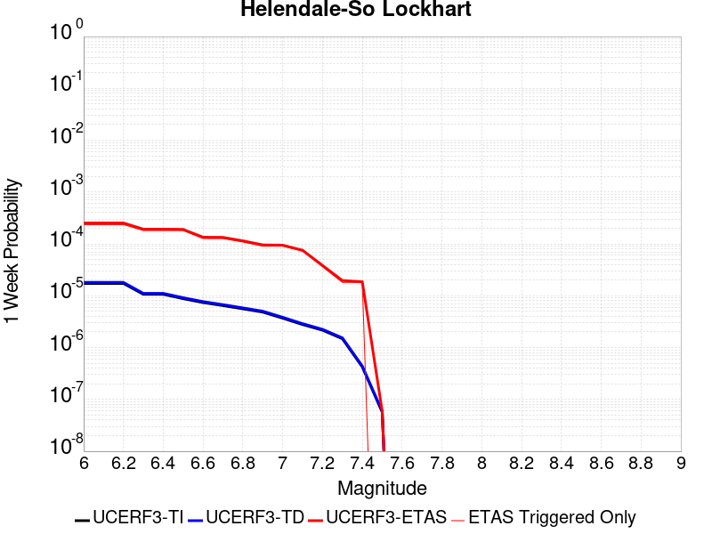 | 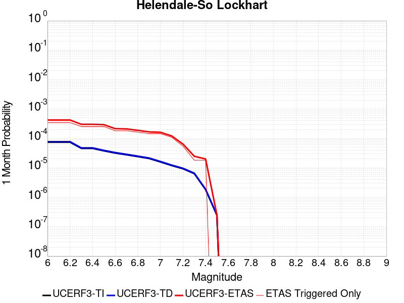 | 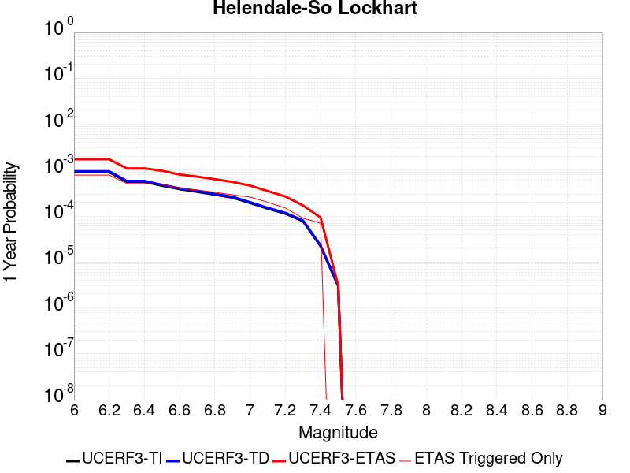 | 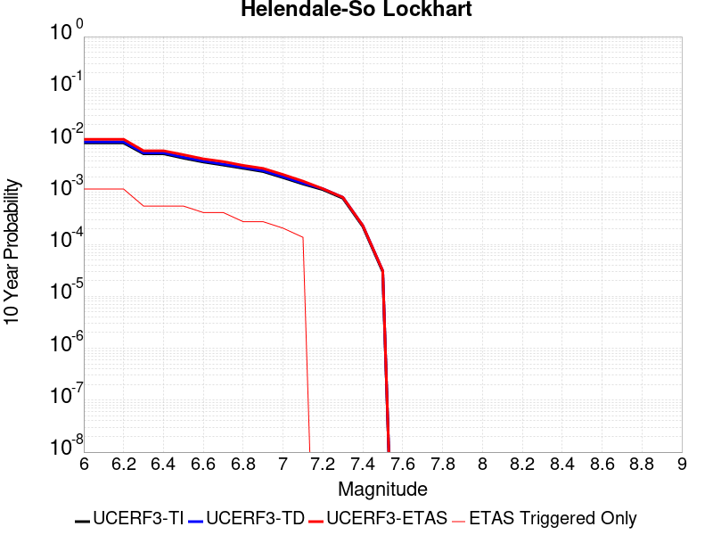 |

| Magnitude | 1 wk TI Prob | 1 wk TD Prob | 1 wk ETAS Prob | 1 wk ETAS/TD Gain | 1 wk ETAS Triggered Only | 1 mo TI Prob | 1 mo TD Prob | 1 mo ETAS Prob | 1 mo ETAS/TD Gain | 1 mo ETAS Triggered Only | 1 yr TI Prob | 1 yr TD Prob | 1 yr ETAS Prob | 1 yr ETAS/TD Gain | 1 yr ETAS Triggered Only | 10 yr TI Prob | 10 yr TD Prob | 10 yr ETAS Prob | 10 yr ETAS/TD Gain | 10 yr ETAS Triggered Only |
|-----|-----|-----|-----|-----|-----|-----|-----|-----|-----|-----|-----|-----|-----|-----|-----|-----|-----|-----|-----|-----|
| 6.0 | 1.7296055E-5 | 1.8103729E-5 | 3.280981E-4 | 18.123234 | 3.1E-4 | 7.412385E-5 | 7.7585224E-5 | 5.3754955E-4 | 6.928504 | 4.6E-4 | 9.0208417E-4 | 9.4421144E-4 | 0.0017234749 | 1.8253062 | 7.8E-4 | 0.008984311 | 0.009404116 | 0.01052349 | 1.1190301 | 0.00113 |
| 6.1 | 1.7296055E-5 | 1.8103729E-5 | 3.280981E-4 | 18.123234 | 3.1E-4 | 7.412385E-5 | 7.7585224E-5 | 5.3754955E-4 | 6.928504 | 4.6E-4 | 9.0208417E-4 | 9.4421144E-4 | 0.0017234749 | 1.8253062 | 7.8E-4 | 0.008984311 | 0.009404116 | 0.01052349 | 1.1190301 | 0.00113 |
| 6.2 | 1.7296055E-5 | 1.8103729E-5 | 3.280981E-4 | 18.123234 | 3.1E-4 | 7.412385E-5 | 7.7585224E-5 | 5.3754955E-4 | 6.928504 | 4.6E-4 | 9.0208417E-4 | 9.4421144E-4 | 0.0017234749 | 1.8253062 | 7.8E-4 | 0.008984311 | 0.009404116 | 0.01052349 | 1.1190301 | 0.00113 |
| 6.3 | 1.0669118E-5 | 1.1135425E-5 | 2.3113297E-4 | 20.756548 | 2.2E-4 | 4.5723988E-5 | 4.772239E-5 | 3.5770758E-4 | 7.4955926 | 3.1E-4 | 5.5654737E-4 | 5.80868E-4 | 0.0010905717 | 1.8774863 | 5.1E-4 | 0.0055515557 | 0.0057937936 | 0.0064996798 | 1.1218349 | 7.1E-4 |
| 6.4 | 1.0669118E-5 | 1.1135425E-5 | 2.3113297E-4 | 20.756548 | 2.2E-4 | 4.5723988E-5 | 4.772239E-5 | 3.5770758E-4 | 7.4955926 | 3.1E-4 | 5.5654737E-4 | 5.80868E-4 | 0.0010905717 | 1.8774863 | 5.1E-4 | 0.0055515557 | 0.0057937936 | 0.0064996798 | 1.1218349 | 7.1E-4 |
| 6.5 | 8.790038E-6 | 9.170197E-6 | 2.1916827E-4 | 23.900063 | 2.1E-4 | 3.767105E-5 | 3.930026E-5 | 3.2928886E-4 | 8.378796 | 2.9E-4 | 4.585485E-4 | 4.7837716E-4 | 9.6814276E-4 | 2.0238063 | 4.9E-4 | 0.0045760344 | 0.004773638 | 0.00544044 | 1.1396842 | 6.7E-4 |
| 6.6 | 7.396949E-6 | 7.715537E-6 | 1.677143E-4 | 21.737217 | 1.6E-4 | 3.1700827E-5 | 3.3066175E-5 | 2.6305858E-4 | 7.9555187 | 2.3E-4 | 3.858892E-4 | 4.025073E-4 | 8.0234633E-4 | 1.9933708 | 4.0E-4 | 0.003852198 | 0.00401789 | 0.00457564 | 1.1388166 | 5.6E-4 |
| 6.7 | 6.4600285E-6 | 6.738031E-6 | 1.5673702E-4 | 23.261547 | 1.5E-4 | 2.7685543E-5 | 2.887696E-5 | 2.488706E-4 | 8.61831 | 2.2E-4 | 3.3701936E-4 | 3.5152107E-4 | 7.21391E-4 | 2.0521984 | 3.7E-4 | 0.0033650869 | 0.003509732 | 0.004037872 | 1.1504787 | 5.3E-4 |
| 6.8 | 5.600104E-6 | 5.836009E-6 | 1.3583525E-4 | 23.275366 | 1.3E-4 | 2.4000226E-5 | 2.5011232E-5 | 2.2500622E-4 | 8.996207 | 2.0E-4 | 2.9216358E-4 | 3.044698E-4 | 6.343693E-4 | 2.0835214 | 3.3E-4 | 0.0029177975 | 0.003040588 | 0.0034991894 | 1.1508266 | 4.6E-4 |
| 6.9 | 4.839122E-6 | 5.0395092E-6 | 1.250389E-4 | 24.811722 | 1.2E-4 | 2.0738931E-5 | 2.159772E-5 | 2.1159362E-4 | 9.797034 | 1.9E-4 | 2.5246723E-4 | 2.6292098E-4 | 5.528447E-4 | 2.102703 | 2.9E-4 | 0.002521806 | 0.002626147 | 0.0030250964 | 1.1519144 | 4.0E-4 |
| 7.0 | 3.6937633E-6 | 3.845208E-6 | 9.3844865E-5 | 24.405666 | 9.0E-5 | 1.5830317E-5 | 1.647936E-5 | 1.7647672E-4 | 10.708955 | 1.6E-4 | 1.9271708E-4 | 2.0061806E-4 | 4.605659E-4 | 2.2957351 | 2.6E-4 | 0.0019255003 | 0.002004401 | 0.0023337395 | 1.1643077 | 3.3E-4 |
| 7.1 | 2.7858857E-6 | 2.8978538E-6 | 8.289762E-5 | 28.606558 | 8.0E-5 | 1.1939455E-5 | 1.2419316E-5 | 1.3241783E-4 | 10.662249 | 1.2E-4 | 1.4535317E-4 | 1.511949E-4 | 3.5116466E-4 | 2.322596 | 2.0E-4 | 0.0014525814 | 0.0015109418 | 0.001760564 | 1.1652098 | 2.5E-4 |
| 7.2 | 2.1672065E-6 | 2.2540128E-6 | 6.225388E-5 | 27.619133 | 6.0E-5 | 9.2879945E-6 | 9.66002E-6 | 8.965925E-5 | 9.281476 | 8.0E-5 | 1.1307546E-4 | 1.1760458E-4 | 2.6758693E-4 | 2.2753105 | 1.5E-4 | 0.0011301794 | 0.0011754417 | 0.0013552301 | 1.152954 | 1.8E-4 |
| 7.3 | 1.4823496E-6 | 1.5422102E-6 | 4.154215E-5 | 26.936762 | 4.0E-5 | 6.3529114E-6 | 6.6094562E-6 | 4.660919E-5 | 7.0518947 | 4.0E-5 | 7.734395E-5 | 8.046731E-5 | 1.7046007E-4 | 2.1183765 | 9.0E-5 | 7.731704E-4 | 8.0439687E-4 | 9.143084E-4 | 1.1366384 | 1.1E-4 |
| 7.4 | 4.2321457E-7 | 4.4108765E-7 | 4.044107E-5 | 91.68488 | 4.0E-5 | 1.8137755E-6 | 1.8903745E-6 | 4.18903E-5 | 22.159788 | 4.0E-5 | 2.2082493E-5 | 2.3015113E-5 | 9.30135E-5 | 4.0414095 | 7.0E-5 | 2.2080299E-4 | 2.3013182E-4 | 3.1011342E-4 | 1.3475468 | 8.0E-5 |
| 7.5 | 5.6942316E-8 | 5.9415648E-8 | 5.9415648E-8 | 1.0 | 0.0 | 2.440385E-7 | 2.5463845E-7 | 2.5463845E-7 | 1.0 | 0.0 | 2.9711643E-6 | 3.1002196E-6 | 3.1002196E-6 | 1.0 | 0.0 | 2.9711247E-5 | 3.1001844E-5 | 3.1001844E-5 | 1.0 | 0.0 |

## Death Valley (Black Mtns Frontal)
*[(top)](#table-of-contents)*

| 1 Week | 1 Month | 1 Year | 10 Year |
|-----|-----|-----|-----|
| 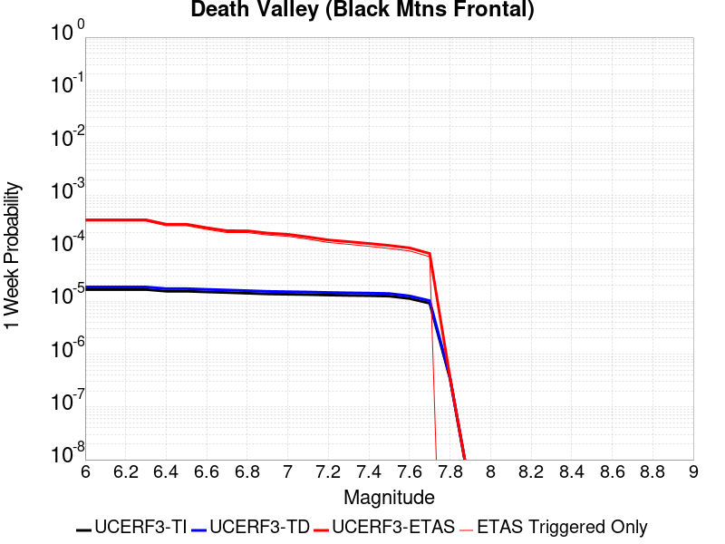 | 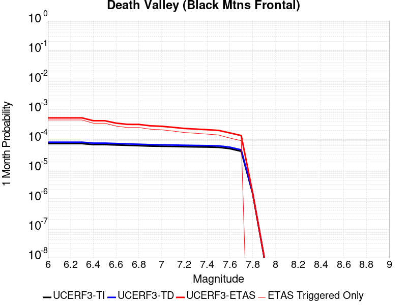 | 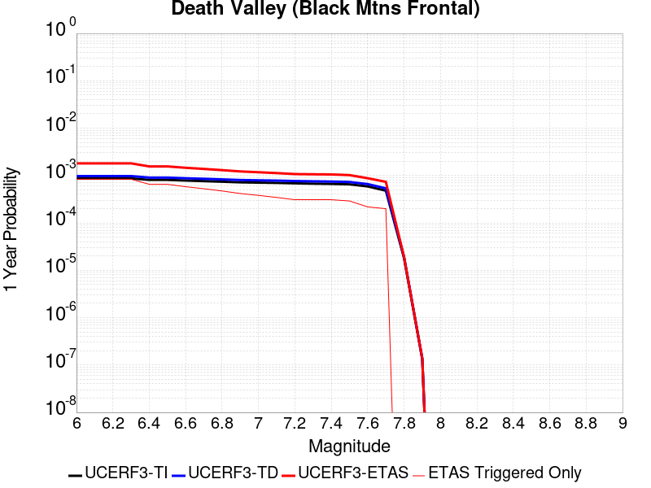 | 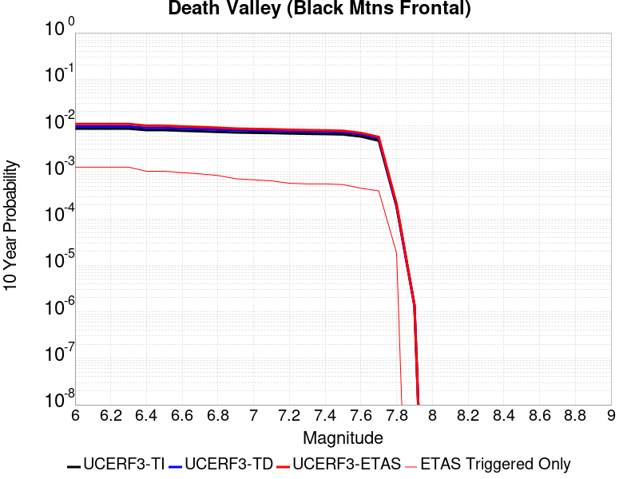 |

| Magnitude | 1 wk TI Prob | 1 wk TD Prob | 1 wk ETAS Prob | 1 wk ETAS/TD Gain | 1 wk ETAS Triggered Only | 1 mo TI Prob | 1 mo TD Prob | 1 mo ETAS Prob | 1 mo ETAS/TD Gain | 1 mo ETAS Triggered Only | 1 yr TI Prob | 1 yr TD Prob | 1 yr ETAS Prob | 1 yr ETAS/TD Gain | 1 yr ETAS Triggered Only | 10 yr TI Prob | 10 yr TD Prob | 10 yr ETAS Prob | 10 yr ETAS/TD Gain | 10 yr ETAS Triggered Only |
|-----|-----|-----|-----|-----|-----|-----|-----|-----|-----|-----|-----|-----|-----|-----|-----|-----|-----|-----|-----|-----|
| 6.0 | 1.6707214E-5 | 1.867027E-5 | 3.4866412E-4 | 18.674831 | 3.3E-4 | 7.160038E-5 | 8.001302E-5 | 5.29977E-4 | 6.6236343 | 4.5E-4 | 8.71386E-4 | 9.737309E-4 | 0.0016330882 | 1.6771454 | 6.6E-4 | 0.00867977 | 0.009695496 | 0.010794735 | 1.1133761 | 0.00111 |
| 6.1 | 1.6707214E-5 | 1.867027E-5 | 3.4866412E-4 | 18.674831 | 3.3E-4 | 7.160038E-5 | 8.001302E-5 | 5.29977E-4 | 6.6236343 | 4.5E-4 | 8.71386E-4 | 9.737309E-4 | 0.0016330882 | 1.6771454 | 6.6E-4 | 0.00867977 | 0.009695496 | 0.010794735 | 1.1133761 | 0.00111 |
| 6.2 | 1.6707214E-5 | 1.867027E-5 | 3.4866412E-4 | 18.674831 | 3.3E-4 | 7.160038E-5 | 8.001302E-5 | 5.29977E-4 | 6.6236343 | 4.5E-4 | 8.71386E-4 | 9.737309E-4 | 0.0016330882 | 1.6771454 | 6.6E-4 | 0.00867977 | 0.009695496 | 0.010794735 | 1.1133761 | 0.00111 |
| 6.3 | 1.6707214E-5 | 1.867027E-5 | 3.4866412E-4 | 18.674831 | 3.3E-4 | 7.160038E-5 | 8.001302E-5 | 5.29977E-4 | 6.6236343 | 4.5E-4 | 8.71386E-4 | 9.737309E-4 | 0.0016330882 | 1.6771454 | 6.6E-4 | 0.00867977 | 0.009695496 | 0.010794735 | 1.1133761 | 0.00111 |
| 6.4 | 1.5515609E-5 | 1.7338214E-5 | 2.8733353E-4 | 16.57227 | 2.7E-4 | 6.649377E-5 | 7.4304546E-5 | 4.2427855E-4 | 5.7099943 | 3.5E-4 | 8.0926094E-4 | 9.042885E-4 | 0.0014138273 | 1.5634693 | 5.1E-4 | 0.008063202 | 0.009006773 | 0.009888757 | 1.0979245 | 8.9E-4 |
| 6.5 | 1.5515609E-5 | 1.7338214E-5 | 2.8733353E-4 | 16.57227 | 2.7E-4 | 6.649377E-5 | 7.4304546E-5 | 4.2427855E-4 | 5.7099943 | 3.5E-4 | 8.0926094E-4 | 9.042885E-4 | 0.0014138273 | 1.5634693 | 5.1E-4 | 0.008063202 | 0.009006773 | 0.009888757 | 1.0979245 | 8.9E-4 |
| 6.6 | 1.5041828E-5 | 1.6809145E-5 | 2.4680528E-4 | 14.682798 | 2.3E-4 | 6.4463384E-5 | 7.203723E-5 | 3.5201706E-4 | 4.8865986 | 2.8E-4 | 7.8455906E-4 | 8.767063E-4 | 0.0013063294 | 1.4900421 | 4.3E-4 | 0.00781795 | 0.008733132 | 0.009526146 | 1.0908052 | 8.0E-4 |
| 6.7 | 1.4634985E-5 | 1.6356016E-5 | 2.1635274E-4 | 13.227716 | 2.0E-4 | 6.271985E-5 | 7.009536E-5 | 3.2007784E-4 | 4.56632 | 2.5E-4 | 7.6334673E-4 | 8.5308263E-4 | 0.0012527414 | 1.4684877 | 4.0E-4 | 0.007607299 | 0.008498715 | 0.009242342 | 1.0874987 | 7.5E-4 |
| 6.8 | 1.4209158E-5 | 1.5882048E-5 | 2.1587887E-4 | 13.592635 | 2.0E-4 | 6.089497E-5 | 6.8064175E-5 | 3.1804715E-4 | 4.6727543 | 2.5E-4 | 7.4114406E-4 | 8.2837185E-4 | 0.0011980654 | 1.4462893 | 3.7E-4 | 0.007386771 | 0.008253456 | 0.008947679 | 1.084113 | 7.0E-4 |
| 6.9 | 1.3780098E-5 | 1.5404594E-5 | 1.9540182E-4 | 12.684647 | 1.8E-4 | 5.9056227E-5 | 6.6018045E-5 | 2.8600352E-4 | 4.3322024 | 2.2E-4 | 7.1877235E-4 | 8.0347876E-4 | 0.0011232216 | 1.3979481 | 3.2E-4 | 0.0071645193 | 0.008006332 | 0.00856185 | 1.0693846 | 5.6E-4 |
| 7.0 | 1.3585064E-5 | 1.5188155E-5 | 1.8518558E-4 | 12.192762 | 1.7E-4 | 5.8220405E-5 | 6.50905E-5 | 2.7507683E-4 | 4.226067 | 2.1E-4 | 7.086029E-4 | 7.9219416E-4 | 0.0010919565 | 1.3783951 | 3.0E-4 | 0.007063476 | 0.007894293 | 0.00842011 | 1.0666071 | 5.3E-4 |
| 7.1 | 1.3398601E-5 | 1.49813395E-5 | 1.649791E-4 | 11.012306 | 1.5E-4 | 5.742131E-5 | 6.420419E-5 | 2.5419198E-4 | 3.9591184 | 1.9E-4 | 6.9888023E-4 | 7.8141113E-4 | 0.0010512002 | 1.3452587 | 2.7E-4 | 0.0069668638 | 0.007787224 | 0.00828333 | 1.0637077 | 5.0E-4 |
| 7.2 | 1.3126312E-5 | 1.4679561E-5 | 1.4467766E-4 | 9.8557205 | 1.3E-4 | 5.6254412E-5 | 6.291092E-5 | 2.3290022E-4 | 3.7020638 | 1.7E-4 | 6.846822E-4 | 7.6567667E-4 | 0.0010054929 | 1.3132082 | 2.4E-4 | 0.006825765 | 0.00763097 | 0.008077536 | 1.0585202 | 4.5E-4 |
| 7.3 | 1.2922429E-5 | 1.4453788E-5 | 1.3445206E-4 | 9.302202 | 1.2E-4 | 5.5380664E-5 | 6.194336E-5 | 2.2193346E-4 | 3.5828447 | 1.6E-4 | 6.74051E-4 | 7.53905E-4 | 9.837316E-4 | 1.3048482 | 2.3E-4 | 0.006720101 | 0.007514055 | 0.007930899 | 1.0554752 | 4.2E-4 |
| 7.4 | 1.2768878E-5 | 1.4283772E-5 | 1.242822E-4 | 8.700937 | 1.1E-4 | 5.4722615E-5 | 6.1214756E-5 | 2.1120558E-4 | 3.4502394 | 1.5E-4 | 6.660441E-4 | 7.4504025E-4 | 9.648763E-4 | 1.2950661 | 2.2E-4 | 0.0066405144 | 0.0074260035 | 0.007832959 | 1.0548013 | 4.1E-4 |
| 7.5 | 1.2521929E-5 | 1.40120155E-5 | 1.1401061E-4 | 8.136632 | 1.0E-4 | 5.366431E-5 | 6.005014E-5 | 2.0004173E-4 | 3.331245 | 1.4E-4 | 6.531671E-4 | 7.3087064E-4 | 9.407172E-4 | 1.2871186 | 2.1E-4 | 0.006512506 | 0.0072852457 | 0.007682332 | 1.0545055 | 4.0E-4 |
| 7.6 | 1.1301089E-5 | 1.2648149E-5 | 1.0264701E-4 | 8.115576 | 9.0E-5 | 4.8432343E-5 | 5.4205255E-5 | 1.641993E-4 | 3.0292134 | 1.1E-4 | 5.895042E-4 | 6.5975444E-4 | 8.196489E-4 | 1.2423545 | 1.6E-4 | 0.0058794282 | 0.00657851 | 0.0069162734 | 1.0513434 | 3.4E-4 |
| 7.7 | 9.189108E-6 | 1.0283358E-5 | 8.028264E-5 | 7.8070445 | 7.0E-5 | 3.93813E-5 | 4.407082E-5 | 1.3406685E-4 | 3.0420775 | 9.0E-5 | 4.7936183E-4 | 5.3643517E-4 | 6.763601E-4 | 1.2608421 | 1.4E-4 | 0.004783291 | 0.005351914 | 0.0056503084 | 1.0557547 | 3.0E-4 |
| 7.8 | 3.4586725E-7 | 3.6482615E-7 | 3.6482615E-7 | 1.0 | 0.0 | 1.4822873E-6 | 1.5635396E-6 | 1.5635396E-6 | 1.0 | 0.0 | 1.80467E-5 | 1.9035933E-5 | 1.9035933E-5 | 1.0 | 0.0 | 1.8045233E-4 | 1.9034347E-4 | 2.0034157E-4 | 1.0525266 | 1.0E-5 |
| 7.9 | 2.5591178E-9 | 2.6696718E-9 | 2.6696718E-9 | 1.0 | 0.0 | 1.0967647E-8 | 1.14414505E-8 | 1.14414505E-8 | 1.0 | 0.0 | 1.335311E-7 | 1.3929966E-7 | 1.3929966E-7 | 1.0 | 0.0 | 1.3353102E-6 | 1.3929966E-6 | 1.3929966E-6 | 1.0 | 0.0 |

## Coyote Lake
*[(top)](#table-of-contents)*

| 1 Week | 1 Month | 1 Year | 10 Year |
|-----|-----|-----|-----|
| 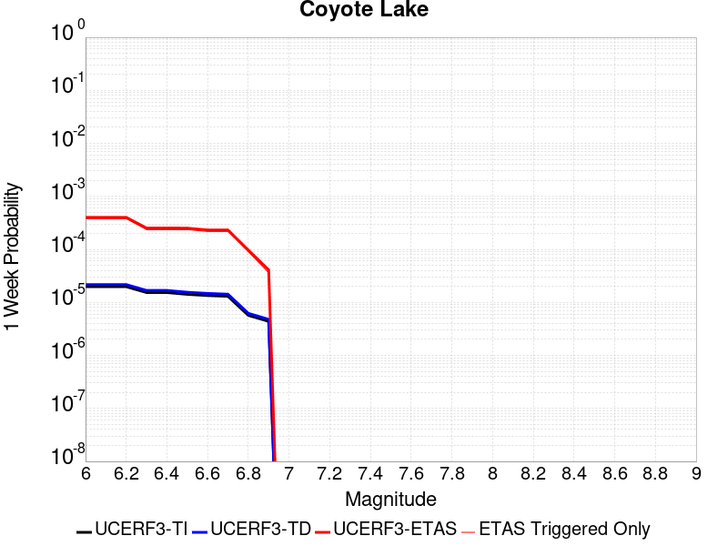 | 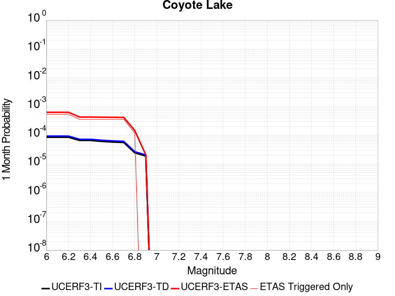 | 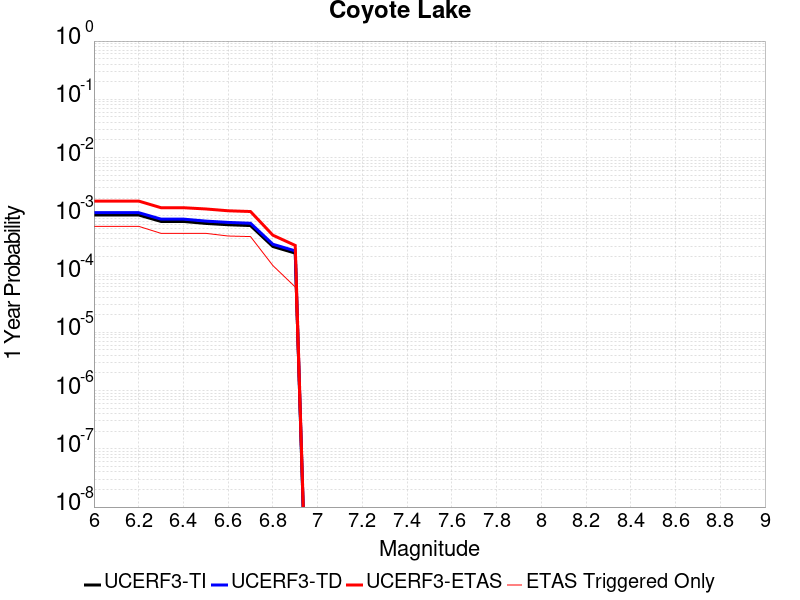 | 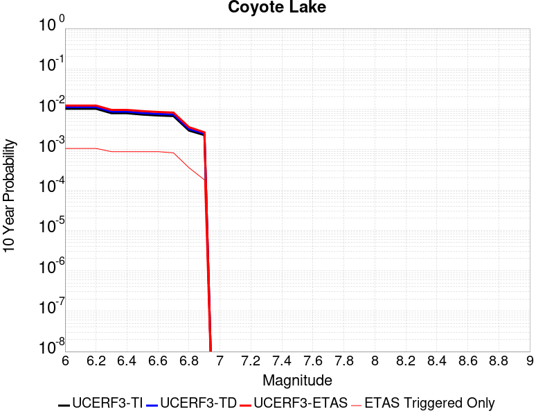 |

| Magnitude | 1 wk TI Prob | 1 wk TD Prob | 1 wk ETAS Prob | 1 wk ETAS/TD Gain | 1 wk ETAS Triggered Only | 1 mo TI Prob | 1 mo TD Prob | 1 mo ETAS Prob | 1 mo ETAS/TD Gain | 1 mo ETAS Triggered Only | 1 yr TI Prob | 1 yr TD Prob | 1 yr ETAS Prob | 1 yr ETAS/TD Gain | 1 yr ETAS Triggered Only | 10 yr TI Prob | 10 yr TD Prob | 10 yr ETAS Prob | 10 yr ETAS/TD Gain | 10 yr ETAS Triggered Only |
|-----|-----|-----|-----|-----|-----|-----|-----|-----|-----|-----|-----|-----|-----|-----|-----|-----|-----|-----|-----|-----|
| 6.0 | 1.980352E-5 | 2.1706745E-5 | 3.2170024E-4 | 14.820289 | 3.0E-4 | 8.486947E-5 | 9.302599E-5 | 4.7299065E-4 | 5.0845 | 3.8E-4 | 0.0010327959 | 0.0011320751 | 0.0017913278 | 1.5823402 | 6.6E-4 | 0.010280091 | 0.011270258 | 0.012229326 | 1.0850972 | 9.7E-4 |
| 6.1 | 1.980352E-5 | 2.1706745E-5 | 3.2170024E-4 | 14.820289 | 3.0E-4 | 8.486947E-5 | 9.302599E-5 | 4.7299065E-4 | 5.0845 | 3.8E-4 | 0.0010327959 | 0.0011320751 | 0.0017913278 | 1.5823402 | 6.6E-4 | 0.010280091 | 0.011270258 | 0.012229326 | 1.0850972 | 9.7E-4 |
| 6.2 | 1.980352E-5 | 2.1706745E-5 | 3.2170024E-4 | 14.820289 | 3.0E-4 | 8.486947E-5 | 9.302599E-5 | 4.7299065E-4 | 5.0845 | 3.8E-4 | 0.0010327959 | 0.0011320751 | 0.0017913278 | 1.5823402 | 6.6E-4 | 0.010280091 | 0.011270258 | 0.012229326 | 1.0850972 | 9.7E-4 |
| 6.3 | 1.5344787E-5 | 1.682067E-5 | 2.3681697E-4 | 14.078927 | 2.2E-4 | 6.576172E-5 | 7.2086936E-5 | 3.6206603E-4 | 5.02263 | 2.9E-4 | 8.003548E-4 | 8.773662E-4 | 0.0013769276 | 1.5693874 | 5.0E-4 | 0.007974784 | 0.00874507 | 0.009498423 | 1.0861461 | 7.6E-4 |
| 6.4 | 1.5344787E-5 | 1.682067E-5 | 2.3681697E-4 | 14.078927 | 2.2E-4 | 6.576172E-5 | 7.2086936E-5 | 3.6206603E-4 | 5.02263 | 2.9E-4 | 8.003548E-4 | 8.773662E-4 | 0.0013769276 | 1.5693874 | 5.0E-4 | 0.007974784 | 0.00874507 | 0.009498423 | 1.0861461 | 7.6E-4 |
| 6.5 | 1.4189697E-5 | 1.5557987E-5 | 2.3555456E-4 | 15.140427 | 2.2E-4 | 6.081157E-5 | 6.6675726E-5 | 3.5665638E-4 | 5.349119 | 2.9E-4 | 7.401293E-4 | 8.115349E-4 | 0.0013111291 | 1.6156164 | 5.0E-4 | 0.0073766913 | 0.008091656 | 0.008835588 | 1.091938 | 7.5E-4 |
| 6.6 | 1.3469301E-5 | 1.4771577E-5 | 2.2476848E-4 | 15.216281 | 2.1E-4 | 5.7724297E-5 | 6.330556E-5 | 3.4328783E-4 | 5.4227123 | 2.8E-4 | 7.025667E-4 | 7.7053264E-4 | 0.0012201859 | 1.5835615 | 4.5E-4 | 0.0070034964 | 0.0076845144 | 0.008359289 | 1.0878097 | 6.8E-4 |
| 6.7 | 1.3027966E-5 | 1.4281745E-5 | 2.2427875E-4 | 15.703876 | 2.1E-4 | 5.5832945E-5 | 6.120638E-5 | 3.4118924E-4 | 5.5744066 | 2.8E-4 | 6.7955407E-4 | 7.4499263E-4 | 0.0011846648 | 1.5901699 | 4.4E-4 | 0.006774798 | 0.0074308286 | 0.008085924 | 1.0881592 | 6.6E-4 |
| 6.8 | 5.695434E-6 | 6.2244176E-6 | 7.622398E-5 | 12.245962 | 7.0E-5 | 2.4408775E-5 | 2.6675973E-5 | 1.16673575E-4 | 4.3737326 | 9.0E-5 | 2.971363E-4 | 3.2476155E-4 | 4.6471608E-4 | 1.4309455 | 1.4E-4 | 0.0029673933 | 0.0032458105 | 0.003475064 | 1.0706306 | 2.3E-4 |
| 6.9 | 4.385688E-6 | 4.7930553E-6 | 2.479296E-5 | 5.1726837 | 2.0E-5 | 1.879567E-5 | 2.0541665E-5 | 5.054105E-5 | 2.4604163 | 3.0E-5 | 2.2881327E-4 | 2.5009477E-4 | 3.1007978E-4 | 1.2398491 | 6.0E-5 | 0.002285778 | 0.0025009478 | 0.0026405978 | 1.0558388 | 1.4E-4 |

## San Andreas (Big Bend)
*[(top)](#table-of-contents)*

| 1 Week | 1 Month | 1 Year | 10 Year |
|-----|-----|-----|-----|
| 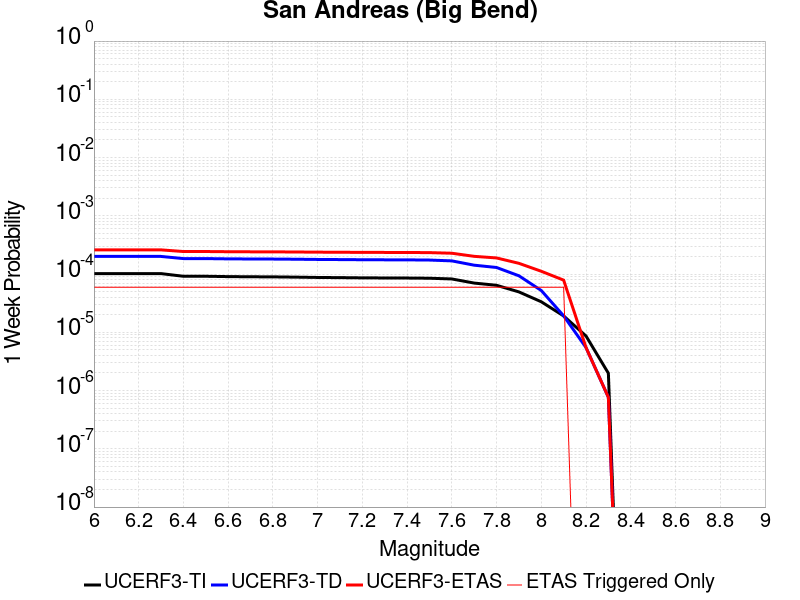 | 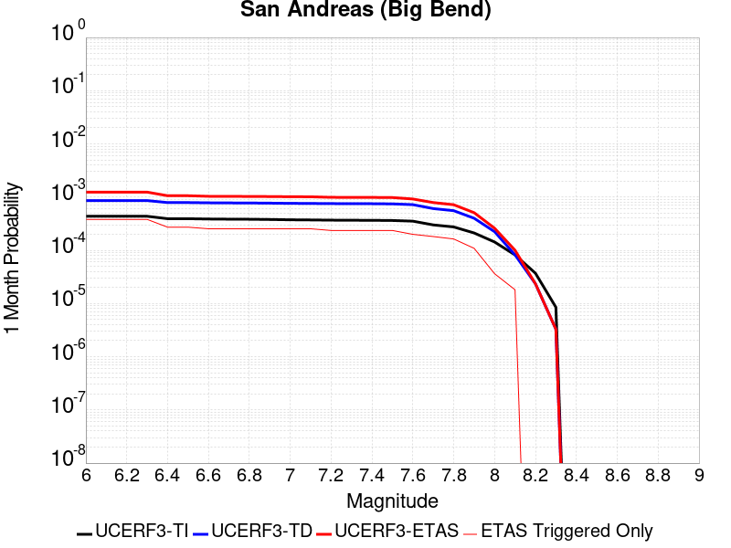 | 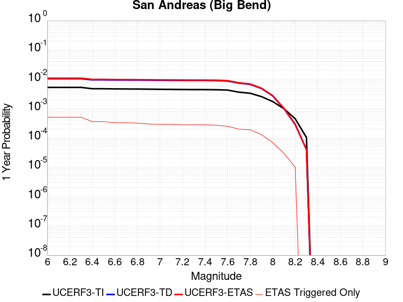 | 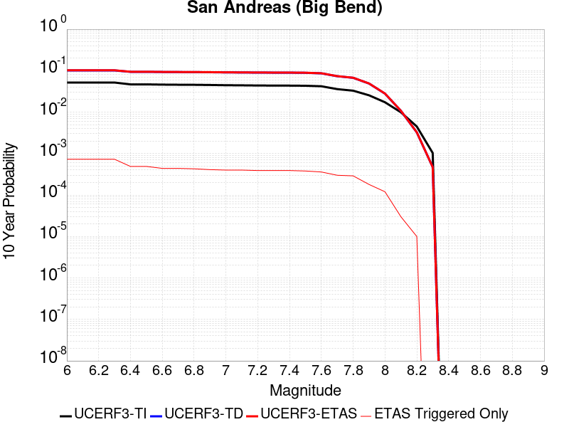 |

| Magnitude | 1 wk TI Prob | 1 wk TD Prob | 1 wk ETAS Prob | 1 wk ETAS/TD Gain | 1 wk ETAS Triggered Only | 1 mo TI Prob | 1 mo TD Prob | 1 mo ETAS Prob | 1 mo ETAS/TD Gain | 1 mo ETAS Triggered Only | 1 yr TI Prob | 1 yr TD Prob | 1 yr ETAS Prob | 1 yr ETAS/TD Gain | 1 yr ETAS Triggered Only | 10 yr TI Prob | 10 yr TD Prob | 10 yr ETAS Prob | 10 yr ETAS/TD Gain | 10 yr ETAS Triggered Only |
|-----|-----|-----|-----|-----|-----|-----|-----|-----|-----|-----|-----|-----|-----|-----|-----|-----|-----|-----|-----|-----|
| 6.0 | 1.0179969E-4 | 2.0072258E-4 | 4.3067642E-4 | 2.1456301 | 2.3E-4 | 4.362114E-4 | 8.599571E-4 | 0.0012396303 | 1.4415026 | 3.8E-4 | 0.0052979486 | 0.010419999 | 0.010924685 | 1.0484344 | 5.1E-4 | 0.051734097 | 0.10144902 | 0.10210496 | 1.0064657 | 7.3E-4 |
| 6.1 | 1.0179969E-4 | 2.0072258E-4 | 4.3067642E-4 | 2.1456301 | 2.3E-4 | 4.362114E-4 | 8.599571E-4 | 0.0012396303 | 1.4415026 | 3.8E-4 | 0.0052979486 | 0.010419999 | 0.010924685 | 1.0484344 | 5.1E-4 | 0.051734097 | 0.10144902 | 0.10210496 | 1.0064657 | 7.3E-4 |
| 6.2 | 1.0179969E-4 | 2.0072258E-4 | 4.3067642E-4 | 2.1456301 | 2.3E-4 | 4.362114E-4 | 8.599571E-4 | 0.0012396303 | 1.4415026 | 3.8E-4 | 0.0052979486 | 0.010419999 | 0.010924685 | 1.0484344 | 5.1E-4 | 0.051734097 | 0.10144902 | 0.10210496 | 1.0064657 | 7.3E-4 |
| 6.3 | 1.0179969E-4 | 2.0072258E-4 | 4.3067642E-4 | 2.1456301 | 2.3E-4 | 4.362114E-4 | 8.599571E-4 | 0.0012396303 | 1.4415026 | 3.8E-4 | 0.0052979486 | 0.010419999 | 0.010924685 | 1.0484344 | 5.1E-4 | 0.051734097 | 0.10144902 | 0.10210496 | 1.0064657 | 7.3E-4 |
| 6.4 | 9.1639464E-5 | 1.8429532E-4 | 3.2426952E-4 | 1.7595103 | 1.4E-4 | 3.9268145E-4 | 7.895982E-4 | 0.0010394008 | 1.3163667 | 2.5E-4 | 0.0047704205 | 0.009571102 | 0.0099276565 | 1.0372533 | 3.6E-4 | 0.046693064 | 0.09377527 | 0.09421932 | 1.0047352 | 4.9E-4 |
| 6.5 | 9.1639464E-5 | 1.8429532E-4 | 3.2426952E-4 | 1.7595103 | 1.4E-4 | 3.9268145E-4 | 7.895982E-4 | 0.0010394008 | 1.3163667 | 2.5E-4 | 0.0047704205 | 0.009571102 | 0.0099276565 | 1.0372533 | 3.6E-4 | 0.046693064 | 0.09377527 | 0.09421932 | 1.0047352 | 4.9E-4 |
| 6.6 | 9.042622E-5 | 1.823659E-4 | 3.123422E-4 | 1.7127225 | 1.3E-4 | 3.8748336E-4 | 7.8133424E-4 | 0.0010111545 | 1.2941382 | 2.3E-4 | 0.0047074095 | 0.009471365 | 0.00979824 | 1.0345118 | 3.3E-4 | 0.046089325 | 0.092869274 | 0.09326842 | 1.0042979 | 4.4E-4 |
| 6.7 | 8.9836685E-5 | 1.8150927E-4 | 3.1148567E-4 | 1.7160869 | 1.3E-4 | 3.8495753E-4 | 7.776651E-4 | 0.0010074863 | 1.2955271 | 2.3E-4 | 0.00467679 | 0.00942708 | 0.0097539695 | 1.0346755 | 3.3E-4 | 0.045795817 | 0.09246355 | 0.09286287 | 1.0043186 | 4.4E-4 |
| 6.8 | 8.9471854E-5 | 1.8097709E-4 | 3.0095538E-4 | 1.6629473 | 1.2E-4 | 3.8339442E-4 | 7.7538576E-4 | 9.952151E-4 | 1.2835097 | 2.2E-4 | 0.004657841 | 0.009399569 | 0.009716561 | 1.0337241 | 3.2E-4 | 0.04561414 | 0.092210755 | 0.092601106 | 1.0042332 | 4.3E-4 |
| 6.9 | 8.858234E-5 | 1.7979681E-4 | 2.8977703E-4 | 1.6116917 | 1.1E-4 | 3.7958333E-4 | 7.703304E-4 | 9.7017636E-4 | 1.2594289 | 2.0E-4 | 0.004611638 | 0.009338548 | 0.009635747 | 1.031825 | 3.0E-4 | 0.04517103 | 0.09165087 | 0.0920233 | 1.0040635 | 4.1E-4 |
| 7.0 | 8.7433385E-5 | 1.7818481E-4 | 2.881652E-4 | 1.6172266 | 1.1E-4 | 3.746607E-4 | 7.634259E-4 | 9.632732E-4 | 1.2617769 | 2.0E-4 | 0.004551957 | 0.009255203 | 0.009542519 | 1.0310438 | 2.9E-4 | 0.044598386 | 0.09088532 | 0.09124896 | 1.0040011 | 4.0E-4 |
| 7.1 | 8.684964E-5 | 1.7730435E-4 | 2.8728484E-4 | 1.6202922 | 1.1E-4 | 3.7215967E-4 | 7.596547E-4 | 9.5950277E-4 | 1.2630775 | 2.0E-4 | 0.0045216335 | 0.009209678 | 0.009497006 | 1.0311986 | 2.9E-4 | 0.04430731 | 0.09046686 | 0.090830676 | 1.0040215 | 4.0E-4 |
| 7.2 | 8.606521E-5 | 1.762105E-4 | 2.8619112E-4 | 1.6241434 | 1.1E-4 | 3.6879873E-4 | 7.549695E-4 | 9.4482605E-4 | 1.2514758 | 1.9E-4 | 0.0044808835 | 0.0091531165 | 0.009430553 | 1.0303106 | 2.8E-4 | 0.043916024 | 0.089947365 | 0.09030229 | 1.0039458 | 3.9E-4 |
| 7.3 | 8.568266E-5 | 1.7563057E-4 | 2.8561126E-4 | 1.6262047 | 1.1E-4 | 3.6715972E-4 | 7.524855E-4 | 9.423425E-4 | 1.2523066 | 1.9E-4 | 0.0044610105 | 0.009123127 | 0.009400573 | 1.0304112 | 2.8E-4 | 0.043725148 | 0.08966853 | 0.090023555 | 1.0039593 | 3.9E-4 |
| 7.4 | 8.5432206E-5 | 1.7525644E-4 | 2.8523715E-4 | 1.6275417 | 1.1E-4 | 3.6608664E-4 | 7.50883E-4 | 9.4074034E-4 | 1.2528454 | 1.9E-4 | 0.004447999 | 0.009103781 | 0.009381231 | 1.0304765 | 2.8E-4 | 0.043600157 | 0.08948871 | 0.08984381 | 1.0039681 | 3.9E-4 |
| 7.5 | 8.4791965E-5 | 1.7394972E-4 | 2.839306E-4 | 1.6322566 | 1.1E-4 | 3.633435E-4 | 7.4528606E-4 | 9.3514443E-4 | 1.2547457 | 1.9E-4 | 0.0044147377 | 0.009036204 | 0.009303764 | 1.0296098 | 2.7E-4 | 0.043280575 | 0.088866346 | 0.089212574 | 1.0038961 | 3.8E-4 |
| 7.6 | 8.241105E-5 | 1.6840403E-4 | 2.683872E-4 | 1.59371 | 1.0E-4 | 3.531424E-4 | 7.215321E-4 | 8.9140947E-4 | 1.2354398 | 1.7E-4 | 0.0042910352 | 0.008749358 | 0.008997171 | 1.0283235 | 2.5E-4 | 0.042091176 | 0.086243294 | 0.086572245 | 1.0038142 | 3.6E-4 |
| 7.7 | 7.00432E-5 | 1.42045E-4 | 2.3203222E-4 | 1.633512 | 9.0E-5 | 3.001506E-4 | 6.0862233E-4 | 7.5853104E-4 | 1.2463082 | 1.5E-4 | 0.0036482112 | 0.0073848404 | 0.0075833634 | 1.0268825 | 2.0E-4 | 0.035888977 | 0.07351733 | 0.073795274 | 1.0037807 | 3.0E-4 |
| 7.8 | 6.415362E-5 | 1.2968935E-4 | 2.1967766E-4 | 1.693876 | 9.0E-5 | 2.749151E-4 | 5.556931E-4 | 6.956153E-4 | 1.2517977 | 1.4E-4 | 0.0033419547 | 0.0067446055 | 0.006933324 | 1.0279807 | 1.9E-4 | 0.03292141 | 0.06725231 | 0.0675228 | 1.0040221 | 2.9E-4 |
| 7.9 | 4.939911E-5 | 9.3411545E-5 | 1.7340407E-4 | 1.8563452 | 8.0E-5 | 2.116933E-4 | 4.0027377E-4 | 5.1022973E-4 | 1.274702 | 1.1E-4 | 0.0025743195 | 0.004862453 | 0.0049918205 | 1.0266055 | 1.3E-4 | 0.025447013 | 0.048914436 | 0.049085632 | 1.0034999 | 1.8E-4 |
| 8.0 | 3.344983E-5 | 5.222685E-5 | 1.12223715E-4 | 2.1487744 | 6.0E-5 | 1.4334853E-4 | 2.2381016E-4 | 2.8379675E-4 | 1.2680243 | 6.0E-5 | 0.0017438711 | 0.0027214854 | 0.002791295 | 1.0256512 | 7.0E-5 | 0.017302496 | 0.027922187 | 0.028038837 | 1.0041777 | 1.2E-4 |
| 8.1 | 1.9104898E-5 | 1.9173063E-5 | 4.917249E-5 | 2.564665 | 3.0E-5 | 8.1875565E-5 | 8.216769E-5 | 1.12165224E-4 | 1.365077 | 3.0E-5 | 9.963791E-4 | 9.999331E-4 | 0.0010299032 | 1.029972 | 3.0E-5 | 0.009919235 | 0.010749801 | 0.010779479 | 1.0027608 | 3.0E-5 |
| 8.2 | 8.643924E-6 | 5.4748625E-6 | 1.5474809E-5 | 2.82652 | 1.0E-5 | 3.704486E-5 | 2.3463486E-5 | 3.346325E-5 | 1.4261842 | 1.0E-5 | 4.5092785E-4 | 2.8563058E-4 | 2.9562772E-4 | 1.0350002 | 1.0E-5 | 0.0045001395 | 0.0032487072 | 0.0032586746 | 1.0030681 | 1.0E-5 |
| 8.3 | 1.983087E-6 | 7.6599065E-7 | 7.6599065E-7 | 1.0 | 0.0 | 8.498917E-6 | 3.282813E-6 | 3.282813E-6 | 1.0 | 0.0 | 1.034694E-4 | 3.9967534E-5 | 3.9967534E-5 | 1.0 | 0.0 | 0.0010342124 | 4.719687E-4 | 4.719687E-4 | 1.0 | 0.0 |

## San Andreas (Parkfield)
*[(top)](#table-of-contents)*

| 1 Week | 1 Month | 1 Year | 10 Year |
|-----|-----|-----|-----|
| 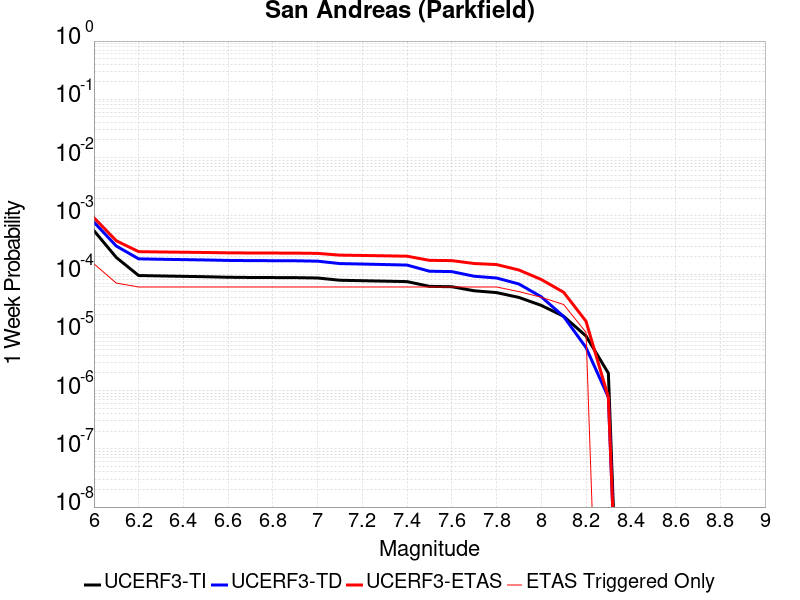 | 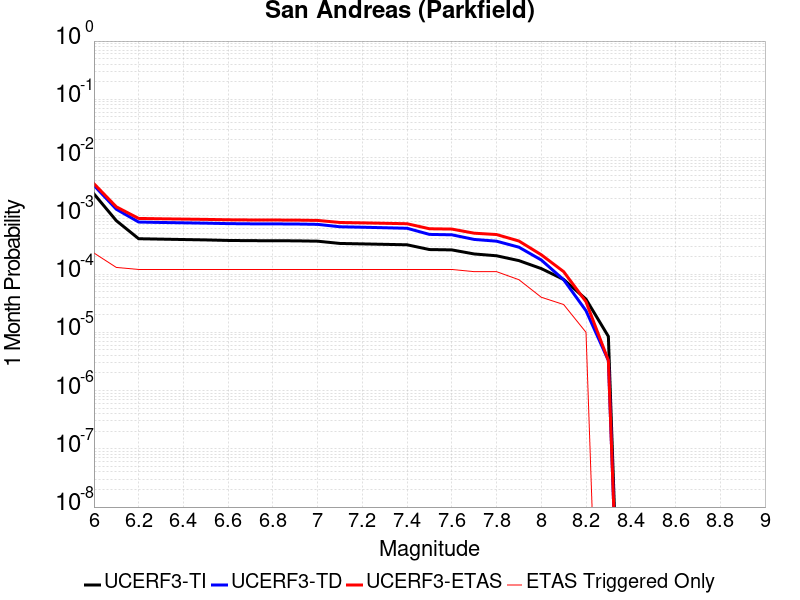 | 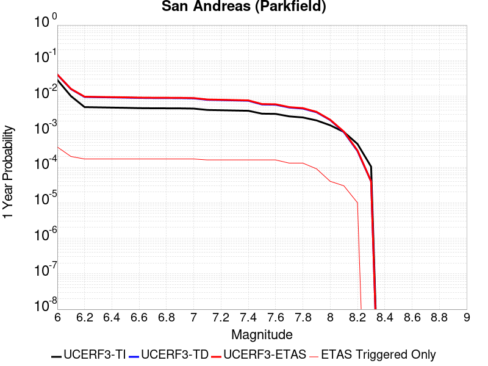 | 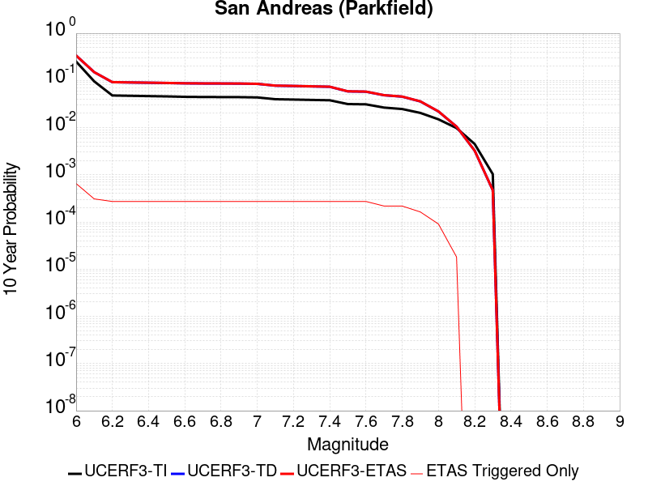 |

| Magnitude | 1 wk TI Prob | 1 wk TD Prob | 1 wk ETAS Prob | 1 wk ETAS/TD Gain | 1 wk ETAS Triggered Only | 1 mo TI Prob | 1 mo TD Prob | 1 mo ETAS Prob | 1 mo ETAS/TD Gain | 1 mo ETAS Triggered Only | 1 yr TI Prob | 1 yr TD Prob | 1 yr ETAS Prob | 1 yr ETAS/TD Gain | 1 yr ETAS Triggered Only | 10 yr TI Prob | 10 yr TD Prob | 10 yr ETAS Prob | 10 yr ETAS/TD Gain | 10 yr ETAS Triggered Only |
|-----|-----|-----|-----|-----|-----|-----|-----|-----|-----|-----|-----|-----|-----|-----|-----|-----|-----|-----|-----|-----|
| 6.0 | 5.556969E-4 | 7.7782426E-4 | 9.277076E-4 | 1.1926956 | 1.5E-4 | 0.0023793848 | 0.0033298214 | 0.0035590555 | 1.0688428 | 2.3E-4 | 0.028586963 | 0.040191233 | 0.04054636 | 1.008836 | 3.7E-4 | 0.25176284 | 0.33716413 | 0.3375221 | 1.0010616 | 5.4E-4 |
| 6.1 | 1.925858E-4 | 3.0276453E-4 | 3.7274332E-4 | 1.2311327 | 7.0E-5 | 8.2510663E-4 | 0.0012970108 | 0.0014268422 | 1.1001005 | 1.3E-4 | 0.0099994885 | 0.015778083 | 0.015974928 | 1.0124758 | 2.0E-4 | 0.095613256 | 0.1497237 | 0.14995326 | 1.0015333 | 2.7E-4 |
| 6.2 | 9.4306815E-5 | 1.8242796E-4 | 2.4241701E-4 | 1.3288369 | 6.0E-5 | 4.0410945E-4 | 7.816011E-4 | 9.0150733E-4 | 1.153411 | 1.2E-4 | 0.0049089384 | 0.009474681 | 0.0096430695 | 1.0177726 | 1.7E-4 | 0.048019063 | 0.09185409 | 0.09207204 | 1.0023729 | 2.4E-4 |
| 6.3 | 9.283051E-5 | 1.7939322E-4 | 2.3938245E-4 | 1.3344008 | 6.0E-5 | 3.9778434E-4 | 7.686027E-4 | 8.885105E-4 | 1.1560075 | 1.2E-4 | 0.0048322747 | 0.009317789 | 0.009486205 | 1.0180746 | 1.7E-4 | 0.047285385 | 0.09050704 | 0.09072531 | 1.0024117 | 2.4E-4 |
| 6.4 | 9.138826E-5 | 1.770153E-4 | 2.3700469E-4 | 1.3388938 | 6.0E-5 | 3.916052E-4 | 7.5841765E-4 | 8.7832665E-4 | 1.1581042 | 1.2E-4 | 0.0047573745 | 0.00919484 | 0.009363277 | 1.0183187 | 1.7E-4 | 0.046568092 | 0.08940927 | 0.08962782 | 1.0024443 | 2.4E-4 |
| 6.5 | 9.000255E-5 | 1.7459576E-4 | 2.3458528E-4 | 1.343591 | 6.0E-5 | 3.8566816E-4 | 7.480541E-4 | 8.6796435E-4 | 1.1602962 | 1.2E-4 | 0.0046854047 | 0.009069731 | 0.00923819 | 1.0185736 | 1.7E-4 | 0.045878403 | 0.088295065 | 0.08851387 | 1.0024781 | 2.4E-4 |
| 6.6 | 8.8109264E-5 | 1.7140752E-4 | 2.3139724E-4 | 1.349983 | 6.0E-5 | 3.7755648E-4 | 7.3439797E-4 | 8.543099E-4 | 1.1632792 | 1.2E-4 | 0.0045870654 | 0.008904854 | 0.00907334 | 1.0189207 | 1.7E-4 | 0.04493529 | 0.0868267 | 0.08703672 | 1.002419 | 2.3E-4 |
| 6.7 | 8.738073E-5 | 1.7007832E-4 | 2.3006812E-4 | 1.3527186 | 6.0E-5 | 3.7443507E-4 | 7.287046E-4 | 8.486172E-4 | 1.1645558 | 1.2E-4 | 0.0045492216 | 0.008836143 | 0.009004641 | 1.0190692 | 1.7E-4 | 0.04457213 | 0.08622707 | 0.08643723 | 1.0024374 | 2.3E-4 |
| 6.8 | 8.710195E-5 | 1.6953335E-4 | 2.2952317E-4 | 1.3538526 | 6.0E-5 | 3.7324068E-4 | 7.263703E-4 | 8.4628316E-4 | 1.165085 | 1.2E-4 | 0.0045347405 | 0.008807961 | 0.008976463 | 1.0191307 | 1.7E-4 | 0.04443313 | 0.08597467 | 0.0861849 | 1.0024452 | 2.3E-4 |
| 6.9 | 8.6801556E-5 | 1.689429E-4 | 2.2893277E-4 | 1.3550895 | 6.0E-5 | 3.7195362E-4 | 7.2384125E-4 | 8.437544E-4 | 1.1656622 | 1.2E-4 | 0.0045191357 | 0.008777418 | 0.008945926 | 1.019198 | 1.7E-4 | 0.044283327 | 0.085700735 | 0.08591102 | 1.0024538 | 2.3E-4 |
| 7.0 | 8.5571606E-5 | 1.6647128E-4 | 2.2646128E-4 | 1.3603625 | 6.0E-5 | 3.6668387E-4 | 7.132544E-4 | 8.331688E-4 | 1.1681229 | 1.2E-4 | 0.004455241 | 0.008649553 | 0.008818083 | 1.0194842 | 1.7E-4 | 0.043669727 | 0.08454914 | 0.08475969 | 1.0024903 | 2.3E-4 |
| 7.1 | 7.82589E-5 | 1.5128135E-4 | 2.1127227E-4 | 1.396552 | 6.0E-5 | 3.3535215E-4 | 6.481883E-4 | 7.681105E-4 | 1.1850114 | 1.2E-4 | 0.0040752706 | 0.007863307 | 0.0080220485 | 1.0201876 | 1.6E-4 | 0.040013418 | 0.07746111 | 0.077654846 | 1.002501 | 2.1E-4 |
| 7.2 | 7.690929E-5 | 1.4865391E-4 | 2.08645E-4 | 1.4035621 | 6.0E-5 | 3.2956956E-4 | 6.369334E-4 | 7.568569E-4 | 1.1882827 | 1.2E-4 | 0.004005129 | 0.007727258 | 0.007886021 | 1.020546 | 1.6E-4 | 0.0393371 | 0.07623427 | 0.076428264 | 1.0025446 | 2.1E-4 |
| 7.3 | 7.5543794E-5 | 1.4561978E-4 | 2.0561104E-4 | 1.4119719 | 6.0E-5 | 3.2371894E-4 | 6.2393624E-4 | 7.4386137E-4 | 1.1922073 | 1.2E-4 | 0.003934157 | 0.007570127 | 0.007728916 | 1.0209757 | 1.6E-4 | 0.038652334 | 0.074797355 | 0.07499164 | 1.0025976 | 2.1E-4 |
| 7.4 | 7.4214564E-5 | 1.4262961E-4 | 2.0262106E-4 | 1.42061 | 6.0E-5 | 3.1802364E-4 | 6.111273E-4 | 7.3105394E-4 | 1.1962384 | 1.2E-4 | 0.003865065 | 0.00741525 | 0.0075740633 | 1.0214171 | 1.6E-4 | 0.03798529 | 0.07337123 | 0.073565826 | 1.0026522 | 2.1E-4 |
| 7.5 | 6.149578E-5 | 1.11907226E-4 | 1.7190051E-4 | 1.5360984 | 6.0E-5 | 2.6352672E-4 | 4.7951436E-4 | 5.9945683E-4 | 1.2501332 | 1.2E-4 | 0.0032037178 | 0.0058224914 | 0.00598156 | 1.0273197 | 1.6E-4 | 0.03157923 | 0.058557566 | 0.058745854 | 1.0032154 | 2.0E-4 |
| 7.6 | 6.0643448E-5 | 1.10193796E-4 | 1.7018718E-4 | 1.5444353 | 6.0E-5 | 2.598746E-4 | 4.7217376E-4 | 5.921171E-4 | 1.2540237 | 1.2E-4 | 0.0031593828 | 0.0057335934 | 0.0058926763 | 1.0277457 | 1.6E-4 | 0.031148417 | 0.057718582 | 0.057907037 | 1.0032651 | 2.0E-4 |
| 7.7 | 5.1652263E-5 | 9.174698E-5 | 1.5174148E-4 | 1.6539124 | 6.0E-5 | 2.2134806E-4 | 3.931421E-4 | 5.030989E-4 | 1.279687 | 1.1E-4 | 0.002691582 | 0.0047760103 | 0.004905389 | 1.0270894 | 1.3E-4 | 0.026592141 | 0.04853623 | 0.04869798 | 1.0033325 | 1.7E-4 |
| 7.8 | 4.8090482E-5 | 8.559635E-5 | 1.4559121E-4 | 1.7009045 | 6.0E-5 | 2.060858E-4 | 3.6678996E-4 | 4.767496E-4 | 1.2997892 | 1.1E-4 | 0.0025062072 | 0.0044565317 | 0.0045859525 | 1.0290407 | 1.3E-4 | 0.024781305 | 0.04530245 | 0.045464747 | 1.0035826 | 1.7E-4 |
| 7.9 | 3.970278E-5 | 6.750426E-5 | 1.1750089E-4 | 1.740644 | 5.0E-5 | 1.7014367E-4 | 2.892719E-4 | 3.6924877E-4 | 1.2764764 | 8.0E-5 | 0.002069531 | 0.0035162016 | 0.0036058852 | 1.0255058 | 9.0E-5 | 0.020503636 | 0.035881363 | 0.036006697 | 1.0034931 | 1.3E-4 |
| 8.0 | 2.8982335E-5 | 4.069796E-5 | 8.069633E-5 | 1.9828103 | 4.0E-5 | 1.2420409E-4 | 1.7440817E-4 | 2.144012E-4 | 1.229307 | 4.0E-5 | 0.0015111357 | 0.0021213528 | 0.002161268 | 1.0188159 | 4.0E-5 | 0.015009012 | 0.022010697 | 0.022088936 | 1.0035546 | 8.0E-5 |
| 8.1 | 1.8836186E-5 | 1.8681134E-5 | 4.8680573E-5 | 2.605868 | 3.0E-5 | 8.0724014E-5 | 8.005955E-5 | 1.1005715E-4 | 1.374691 | 3.0E-5 | 9.823717E-4 | 9.742898E-4 | 0.0010042605 | 1.0307617 | 3.0E-5 | 0.009780403 | 0.010488115 | 0.010517801 | 1.0028304 | 3.0E-5 |
| 8.2 | 8.643924E-6 | 5.4748625E-6 | 1.5474809E-5 | 2.82652 | 1.0E-5 | 3.704486E-5 | 2.3463486E-5 | 3.346325E-5 | 1.4261842 | 1.0E-5 | 4.5092785E-4 | 2.8563058E-4 | 2.9562772E-4 | 1.0350002 | 1.0E-5 | 0.0045001395 | 0.0032487072 | 0.0032586746 | 1.0030681 | 1.0E-5 |
| 8.3 | 1.983087E-6 | 7.6599065E-7 | 7.6599065E-7 | 1.0 | 0.0 | 8.498917E-6 | 3.282813E-6 | 3.282813E-6 | 1.0 | 0.0 | 1.034694E-4 | 3.9967534E-5 | 3.9967534E-5 | 1.0 | 0.0 | 0.0010342124 | 4.719687E-4 | 4.719687E-4 | 1.0 | 0.0 |

## Red Pass
*[(top)](#table-of-contents)*

| 1 Week | 1 Month | 1 Year | 10 Year |
|-----|-----|-----|-----|
| 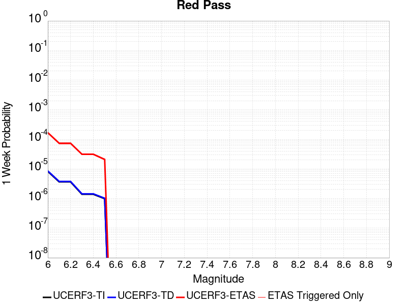 | 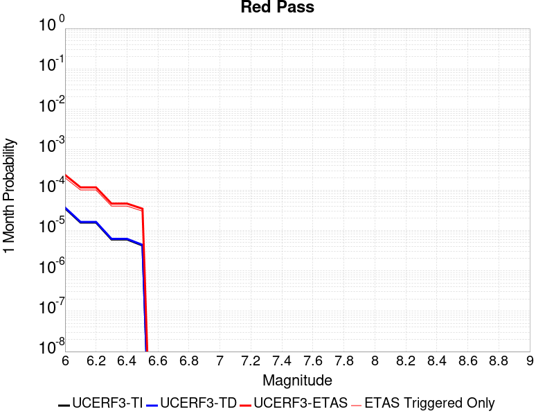 | 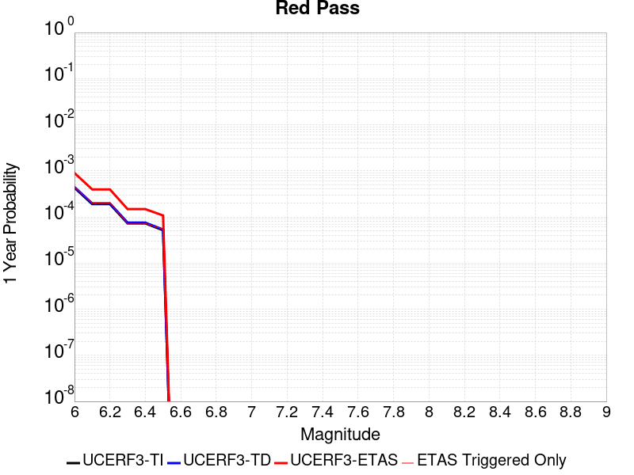 | 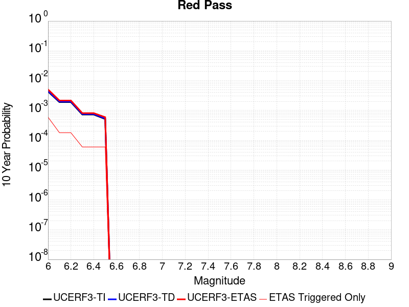 |

| Magnitude | 1 wk TI Prob | 1 wk TD Prob | 1 wk ETAS Prob | 1 wk ETAS/TD Gain | 1 wk ETAS Triggered Only | 1 mo TI Prob | 1 mo TD Prob | 1 mo ETAS Prob | 1 mo ETAS/TD Gain | 1 mo ETAS Triggered Only | 1 yr TI Prob | 1 yr TD Prob | 1 yr ETAS Prob | 1 yr ETAS/TD Gain | 1 yr ETAS Triggered Only | 10 yr TI Prob | 10 yr TD Prob | 10 yr ETAS Prob | 10 yr ETAS/TD Gain | 10 yr ETAS Triggered Only |
|-----|-----|-----|-----|-----|-----|-----|-----|-----|-----|-----|-----|-----|-----|-----|-----|-----|-----|-----|-----|-----|
| 6.0 | 8.258278E-6 | 8.551265E-6 | 1.685499E-4 | 19.710522 | 1.6E-4 | 3.539214E-5 | 3.6647863E-5 | 2.3664054E-4 | 6.457144 | 2.0E-4 | 4.308141E-4 | 4.4611428E-4 | 7.859626E-4 | 1.7617966 | 3.4E-4 | 0.0042997985 | 0.004453945 | 0.004951718 | 1.11176 | 5.0E-4 |
| 6.1 | 3.649988E-6 | 3.7753161E-6 | 7.377505E-5 | 19.541424 | 7.0E-5 | 1.5642712E-5 | 1.6179853E-5 | 1.16178235E-4 | 7.180426 | 1.0E-4 | 1.9043336E-4 | 1.9697666E-4 | 3.5694515E-4 | 1.812119 | 1.6E-4 | 0.0019027026 | 0.001968488 | 0.0021680943 | 1.1014009 | 2.0E-4 |
| 6.2 | 3.649988E-6 | 3.7753161E-6 | 7.377505E-5 | 19.541424 | 7.0E-5 | 1.5642712E-5 | 1.6179853E-5 | 1.16178235E-4 | 7.180426 | 1.0E-4 | 1.9043336E-4 | 1.9697666E-4 | 3.5694515E-4 | 1.812119 | 1.6E-4 | 0.0019027026 | 0.001968488 | 0.0021680943 | 1.1014009 | 2.0E-4 |
| 6.3 | 1.3924937E-6 | 1.4411166E-6 | 3.144107E-5 | 21.817162 | 3.0E-5 | 5.9678164E-6 | 6.1762075E-6 | 4.617596E-5 | 7.476426 | 4.0E-5 | 7.265574E-5 | 7.519415E-5 | 1.4518888E-4 | 1.9308535 | 7.0E-5 | 7.263199E-4 | 7.518258E-4 | 8.4175816E-4 | 1.1196185 | 9.0E-5 |
| 6.4 | 1.3924937E-6 | 1.4411166E-6 | 3.144107E-5 | 21.817162 | 3.0E-5 | 5.9678164E-6 | 6.1762075E-6 | 4.617596E-5 | 7.476426 | 4.0E-5 | 7.265574E-5 | 7.519415E-5 | 1.4518888E-4 | 1.9308535 | 7.0E-5 | 7.263199E-4 | 7.518258E-4 | 8.4175816E-4 | 1.1196185 | 9.0E-5 |
| 6.5 | 9.876812E-7 | 1.0221912E-6 | 2.1022171E-5 | 20.56579 | 2.0E-5 | 4.2329125E-6 | 4.3808195E-6 | 3.438069E-5 | 7.848004 | 3.0E-5 | 5.153449E-5 | 5.3336476E-5 | 1.1333328E-4 | 2.1248736 | 6.0E-5 | 5.1522546E-4 | 5.333648E-4 | 6.133221E-4 | 1.1499112 | 8.0E-5 |

## Death Valley (No)
*[(top)](#table-of-contents)*

| 1 Week | 1 Month | 1 Year | 10 Year |
|-----|-----|-----|-----|
|  | 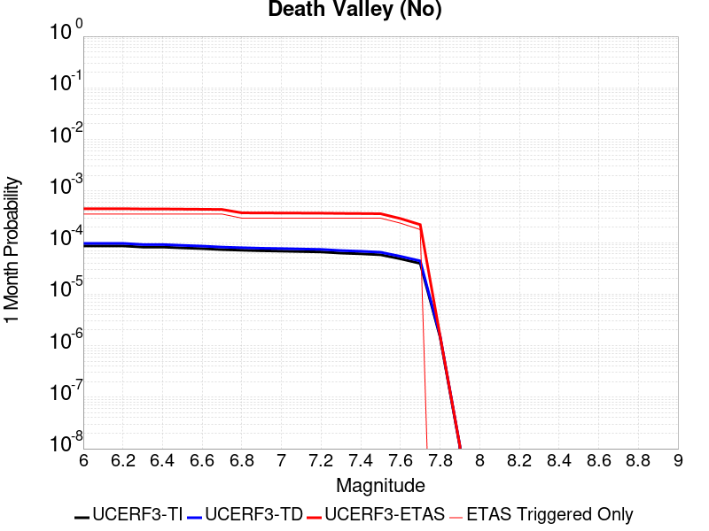 | 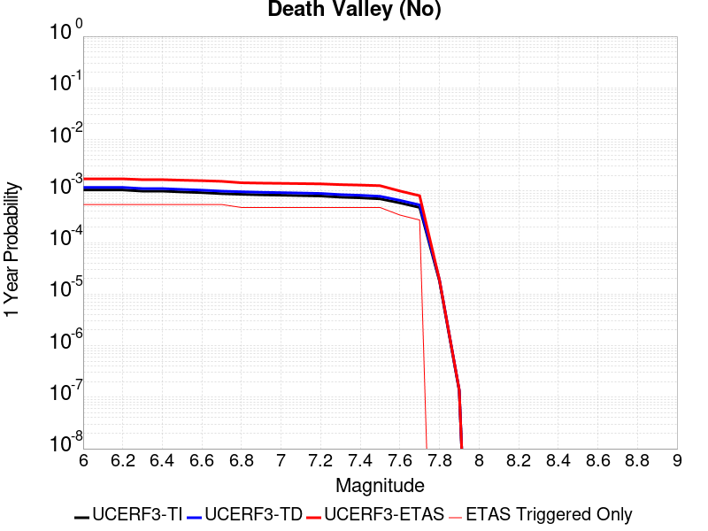 | 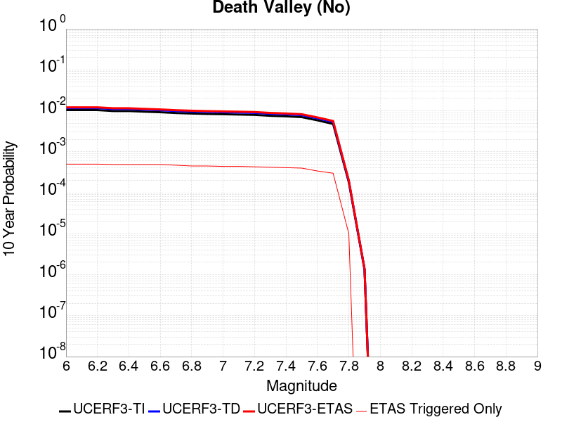 |

| Magnitude | 1 wk TI Prob | 1 wk TD Prob | 1 wk ETAS Prob | 1 wk ETAS/TD Gain | 1 wk ETAS Triggered Only | 1 mo TI Prob | 1 mo TD Prob | 1 mo ETAS Prob | 1 mo ETAS/TD Gain | 1 mo ETAS Triggered Only | 1 yr TI Prob | 1 yr TD Prob | 1 yr ETAS Prob | 1 yr ETAS/TD Gain | 1 yr ETAS Triggered Only | 10 yr TI Prob | 10 yr TD Prob | 10 yr ETAS Prob | 10 yr ETAS/TD Gain | 10 yr ETAS Triggered Only |
|-----|-----|-----|-----|-----|-----|-----|-----|-----|-----|-----|-----|-----|-----|-----|-----|-----|-----|-----|-----|-----|
| 6.0 | 2.0074807E-5 | 2.2500084E-5 | 1.6249693E-4 | 7.2220592 | 1.4E-4 | 8.603206E-5 | 9.642541E-5 | 2.9640613E-4 | 3.0739422 | 2.0E-4 | 0.001046937 | 0.0011733545 | 0.0014430376 | 1.2298394 | 2.7E-4 | 0.010420183 | 0.011672506 | 0.0121666705 | 1.0423357 | 5.0E-4 |
| 6.1 | 2.0074807E-5 | 2.2500084E-5 | 1.6249693E-4 | 7.2220592 | 1.4E-4 | 8.603206E-5 | 9.642541E-5 | 2.9640613E-4 | 3.0739422 | 2.0E-4 | 0.001046937 | 0.0011733545 | 0.0014430376 | 1.2298394 | 2.7E-4 | 0.010420183 | 0.011672506 | 0.0121666705 | 1.0423357 | 5.0E-4 |
| 6.2 | 2.0074807E-5 | 2.2500084E-5 | 1.6249693E-4 | 7.2220592 | 1.4E-4 | 8.603206E-5 | 9.642541E-5 | 2.9640613E-4 | 3.0739422 | 2.0E-4 | 0.001046937 | 0.0011733545 | 0.0014430376 | 1.2298394 | 2.7E-4 | 0.010420183 | 0.011672506 | 0.0121666705 | 1.0423357 | 5.0E-4 |
| 6.3 | 1.9050609E-5 | 2.1336948E-5 | 1.6133396E-4 | 7.5612483 | 1.4E-4 | 8.164292E-5 | 9.1440896E-5 | 2.814235E-4 | 3.077655 | 1.9E-4 | 9.935491E-4 | 0.001112731 | 0.0013724418 | 1.2333994 | 2.6E-4 | 0.009891188 | 0.011072419 | 0.011556993 | 1.0437641 | 4.9E-4 |
| 6.4 | 1.9050609E-5 | 2.1336948E-5 | 1.6133396E-4 | 7.5612483 | 1.4E-4 | 8.164292E-5 | 9.1440896E-5 | 2.814235E-4 | 3.077655 | 1.9E-4 | 9.935491E-4 | 0.001112731 | 0.0013724418 | 1.2333994 | 2.6E-4 | 0.009891188 | 0.011072419 | 0.011556993 | 1.0437641 | 4.9E-4 |
| 6.5 | 1.8367004E-5 | 2.0561009E-5 | 1.6055813E-4 | 7.8088646 | 1.4E-4 | 7.8713354E-5 | 8.811567E-5 | 2.7809892E-4 | 3.1560667 | 1.9E-4 | 9.5791375E-4 | 0.0010722869 | 0.001332008 | 1.2422124 | 2.6E-4 | 0.009537951 | 0.0106719155 | 0.011156687 | 1.0454249 | 4.9E-4 |
| 6.6 | 1.779439E-5 | 1.9910927E-5 | 1.5990814E-4 | 8.031175 | 1.4E-4 | 7.625944E-5 | 8.53298E-5 | 2.753136E-4 | 3.226465 | 1.9E-4 | 9.280632E-4 | 0.0010384015 | 0.0012981315 | 1.2501248 | 2.6E-4 | 0.009241969 | 0.010336253 | 0.010821188 | 1.046916 | 4.9E-4 |
| 6.7 | 1.7025437E-5 | 1.9043426E-5 | 1.5904076E-4 | 8.351479 | 1.4E-4 | 7.296412E-5 | 8.161216E-5 | 2.6159748E-4 | 3.2053735 | 1.8E-4 | 8.87976E-4 | 9.931813E-4 | 0.001242933 | 1.2514664 | 2.5E-4 | 0.008844362 | 0.009888145 | 0.010353498 | 1.0470617 | 4.7E-4 |
| 6.8 | 1.6545107E-5 | 1.8512545E-5 | 1.3851032E-4 | 7.481971 | 1.2E-4 | 7.090568E-5 | 7.93371E-5 | 2.393244E-4 | 3.016551 | 1.6E-4 | 8.629347E-4 | 9.655073E-4 | 0.0011952852 | 1.2379867 | 2.3E-4 | 0.008595915 | 0.009613829 | 0.010059503 | 1.0463576 | 4.5E-4 |
| 6.9 | 1.615478E-5 | 1.8087594E-5 | 1.3808542E-4 | 7.6342616 | 1.2E-4 | 6.9232934E-5 | 7.751599E-5 | 2.3750358E-4 | 3.0639303 | 1.6E-4 | 8.4258494E-4 | 9.433546E-4 | 0.0011731377 | 1.2435807 | 2.3E-4 | 0.008393973 | 0.009394196 | 0.009839968 | 1.047452 | 4.5E-4 |
| 7.0 | 1.5894311E-5 | 1.780555E-5 | 1.2780359E-4 | 7.177739 | 1.1E-4 | 6.81167E-5 | 7.6307304E-5 | 2.2629586E-4 | 2.965586 | 1.5E-4 | 8.2900526E-4 | 9.286515E-4 | 0.0011484472 | 1.2366827 | 2.2E-4 | 0.008259195 | 0.009248397 | 0.009684328 | 1.0471358 | 4.4E-4 |
| 7.1 | 1.5602263E-5 | 1.7483504E-5 | 1.2748157E-4 | 7.2915354 | 1.1E-4 | 6.6865134E-5 | 7.492718E-5 | 2.2491594E-4 | 3.0017936 | 1.5E-4 | 8.137789E-4 | 9.118627E-4 | 0.001131662 | 1.2410444 | 2.2E-4 | 0.008108052 | 0.009081894 | 0.009517898 | 1.0480081 | 4.4E-4 |
| 7.2 | 1.5323829E-5 | 1.717063E-5 | 1.2716874E-4 | 7.406178 | 1.1E-4 | 6.56719E-5 | 7.358637E-5 | 2.2357533E-4 | 3.038271 | 1.5E-4 | 7.99262E-4 | 8.9555193E-4 | 0.001115355 | 1.2454386 | 2.2E-4 | 0.007963934 | 0.008920107 | 0.009346271 | 1.0477757 | 4.3E-4 |
| 7.3 | 1.4556212E-5 | 1.6302456E-5 | 1.1630083E-4 | 7.1339455 | 1.0E-4 | 6.238227E-5 | 6.9865826E-5 | 2.0985605E-4 | 3.003701 | 1.4E-4 | 7.592395E-4 | 8.5029035E-4 | 0.0010601118 | 1.2467644 | 2.1E-4 | 0.0075665074 | 0.008471014 | 0.008887457 | 1.0491608 | 4.2E-4 |
| 7.4 | 1.411725E-5 | 1.580796E-5 | 1.1580638E-4 | 7.325827 | 1.0E-4 | 6.0501097E-5 | 6.7746674E-5 | 2.0773719E-4 | 3.0663822 | 1.4E-4 | 7.363519E-4 | 8.245094E-4 | 0.0010343363 | 1.2544869 | 2.1E-4 | 0.0073391674 | 0.008215138 | 0.00862177 | 1.0494978 | 4.1E-4 |
| 7.5 | 1.3503312E-5 | 1.5126289E-5 | 1.1512478E-4 | 7.6109066 | 1.0E-4 | 5.7870053E-5 | 6.482538E-5 | 2.048163E-4 | 3.1595082 | 1.4E-4 | 7.043401E-4 | 7.8896893E-4 | 9.988033E-4 | 1.2659602 | 2.1E-4 | 0.007021119 | 0.007862304 | 0.0082591595 | 1.0504757 | 4.0E-4 |
| 7.6 | 1.1279839E-5 | 1.2626327E-5 | 1.0262519E-4 | 8.127873 | 9.0E-5 | 4.834127E-5 | 5.4111737E-5 | 1.6410579E-4 | 3.0327208 | 1.1E-4 | 5.88396E-4 | 6.5861654E-4 | 8.185112E-4 | 1.2427734 | 1.6E-4 | 0.005868405 | 0.006567199 | 0.0069049657 | 1.0514325 | 3.4E-4 |
| 7.7 | 9.189108E-6 | 1.0283358E-5 | 8.028264E-5 | 7.8070445 | 7.0E-5 | 3.93813E-5 | 4.407082E-5 | 1.3406685E-4 | 3.0420775 | 9.0E-5 | 4.7936183E-4 | 5.3643517E-4 | 6.763601E-4 | 1.2608421 | 1.4E-4 | 0.004783291 | 0.005351914 | 0.0056503084 | 1.0557547 | 3.0E-4 |
| 7.8 | 3.4586725E-7 | 3.6482615E-7 | 3.6482615E-7 | 1.0 | 0.0 | 1.4822873E-6 | 1.5635396E-6 | 1.5635396E-6 | 1.0 | 0.0 | 1.80467E-5 | 1.9035933E-5 | 1.9035933E-5 | 1.0 | 0.0 | 1.8045233E-4 | 1.9034347E-4 | 2.0034157E-4 | 1.0525266 | 1.0E-5 |
| 7.9 | 2.5591178E-9 | 2.6696718E-9 | 2.6696718E-9 | 1.0 | 0.0 | 1.0967647E-8 | 1.14414505E-8 | 1.14414505E-8 | 1.0 | 0.0 | 1.335311E-7 | 1.3929966E-7 | 1.3929966E-7 | 1.0 | 0.0 | 1.3353102E-6 | 1.3929966E-6 | 1.3929966E-6 | 1.0 | 0.0 |

## San Andreas (San Gorgonio Pass-Garnet HIll)
*[(top)](#table-of-contents)*

| 1 Week | 1 Month | 1 Year | 10 Year |
|-----|-----|-----|-----|
| 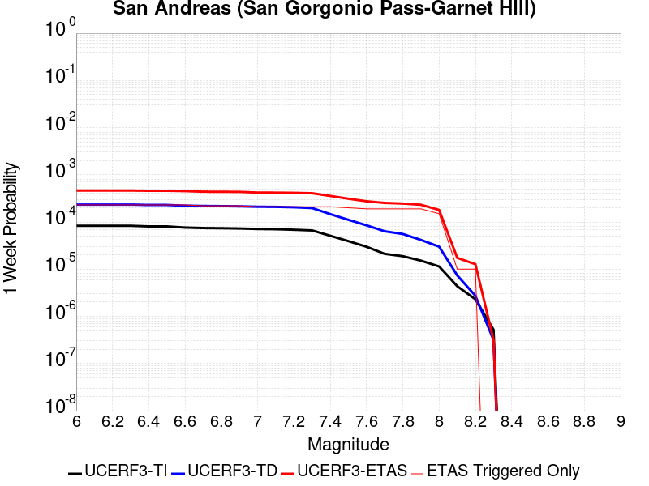 | 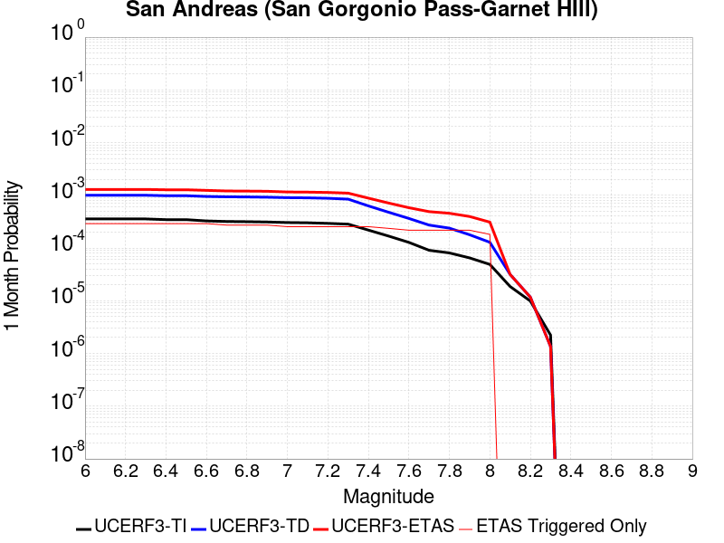 | 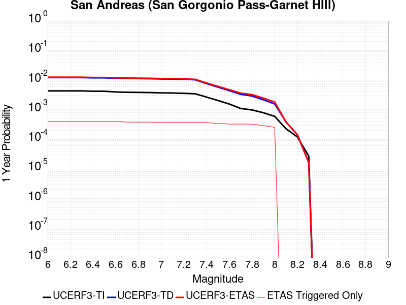 | 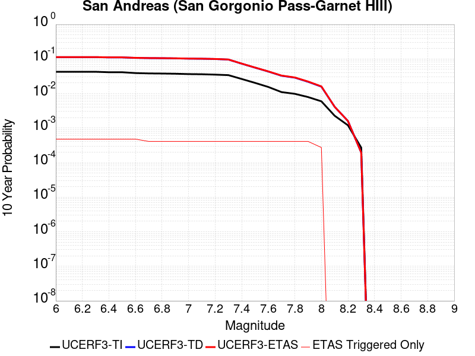 |

| Magnitude | 1 wk TI Prob | 1 wk TD Prob | 1 wk ETAS Prob | 1 wk ETAS/TD Gain | 1 wk ETAS Triggered Only | 1 mo TI Prob | 1 mo TD Prob | 1 mo ETAS Prob | 1 mo ETAS/TD Gain | 1 mo ETAS Triggered Only | 1 yr TI Prob | 1 yr TD Prob | 1 yr ETAS Prob | 1 yr ETAS/TD Gain | 1 yr ETAS Triggered Only | 10 yr TI Prob | 10 yr TD Prob | 10 yr ETAS Prob | 10 yr ETAS/TD Gain | 10 yr ETAS Triggered Only |
|-----|-----|-----|-----|-----|-----|-----|-----|-----|-----|-----|-----|-----|-----|-----|-----|-----|-----|-----|-----|-----|
| 6.0 | 8.31567E-5 | 2.3382473E-4 | 4.6377096E-4 | 1.9834127 | 2.3E-4 | 3.5633717E-4 | 0.0010017233 | 0.0012714529 | 1.2692655 | 2.7E-4 | 0.004329778 | 0.012127888 | 0.012493401 | 1.0301383 | 3.7E-4 | 0.042463828 | 0.11257892 | 0.11298713 | 1.003626 | 4.6E-4 |
| 6.1 | 8.31567E-5 | 2.3382473E-4 | 4.6377096E-4 | 1.9834127 | 2.3E-4 | 3.5633717E-4 | 0.0010017233 | 0.0012714529 | 1.2692655 | 2.7E-4 | 0.004329778 | 0.012127888 | 0.012493401 | 1.0301383 | 3.7E-4 | 0.042463828 | 0.11257892 | 0.11298713 | 1.003626 | 4.6E-4 |
| 6.2 | 8.31567E-5 | 2.3382473E-4 | 4.6377096E-4 | 1.9834127 | 2.3E-4 | 3.5633717E-4 | 0.0010017233 | 0.0012714529 | 1.2692655 | 2.7E-4 | 0.004329778 | 0.012127888 | 0.012493401 | 1.0301383 | 3.7E-4 | 0.042463828 | 0.11257892 | 0.11298713 | 1.003626 | 4.6E-4 |
| 6.3 | 8.31567E-5 | 2.3382473E-4 | 4.6377096E-4 | 1.9834127 | 2.3E-4 | 3.5633717E-4 | 0.0010017233 | 0.0012714529 | 1.2692655 | 2.7E-4 | 0.004329778 | 0.012127888 | 0.012493401 | 1.0301383 | 3.7E-4 | 0.042463828 | 0.11257892 | 0.11298713 | 1.003626 | 4.6E-4 |
| 6.4 | 8.059055E-5 | 2.2940808E-4 | 4.5935533E-4 | 2.00235 | 2.3E-4 | 3.4534236E-4 | 9.828096E-4 | 0.0012525442 | 1.2744526 | 2.7E-4 | 0.0041964394 | 0.011900152 | 0.012265748 | 1.030722 | 3.7E-4 | 0.041180745 | 0.11056015 | 0.11096929 | 1.0037006 | 4.6E-4 |
| 6.5 | 8.059055E-5 | 2.2940808E-4 | 4.5935533E-4 | 2.00235 | 2.3E-4 | 3.4534236E-4 | 9.828096E-4 | 0.0012525442 | 1.2744526 | 2.7E-4 | 0.0041964394 | 0.011900152 | 0.012265748 | 1.030722 | 3.7E-4 | 0.041180745 | 0.11056015 | 0.11096929 | 1.0037006 | 4.6E-4 |
| 6.6 | 7.619237E-5 | 2.218517E-4 | 4.5180068E-4 | 2.0364985 | 2.3E-4 | 3.2649786E-4 | 9.5044886E-4 | 0.0012201923 | 1.2838063 | 2.7E-4 | 0.0039678677 | 0.01151087 | 0.011876611 | 1.0317736 | 3.7E-4 | 0.03897764 | 0.10709683 | 0.107507564 | 1.0038352 | 4.6E-4 |
| 6.7 | 7.440636E-5 | 2.1860997E-4 | 4.3856187E-4 | 2.0061386 | 2.2E-4 | 3.188454E-4 | 9.3656575E-4 | 0.0011863316 | 1.2666826 | 2.5E-4 | 0.0038750346 | 0.011343609 | 0.011689638 | 1.0305043 | 3.5E-4 | 0.038081564 | 0.105605274 | 0.10599881 | 1.0037265 | 4.4E-4 |
| 6.8 | 7.3735864E-5 | 2.1708169E-4 | 4.3703392E-4 | 2.0132234 | 2.2E-4 | 3.1597257E-4 | 9.3002064E-4 | 0.0011797881 | 1.2685612 | 2.5E-4 | 0.0038401815 | 0.011264749 | 0.011610806 | 1.0307204 | 3.5E-4 | 0.03774495 | 0.10490683 | 0.105300665 | 1.0037541 | 4.4E-4 |
| 6.9 | 7.27575E-5 | 2.1477141E-4 | 4.3472418E-4 | 2.0241249 | 2.2E-4 | 3.117806E-4 | 9.201265E-4 | 0.0011698965 | 1.2714518 | 2.5E-4 | 0.003789323 | 0.011145527 | 0.011491626 | 1.0310527 | 3.5E-4 | 0.037253562 | 0.103854746 | 0.104249045 | 1.0037967 | 4.4E-4 |
| 7.0 | 7.102591E-5 | 2.1061185E-4 | 4.205676E-4 | 1.996885 | 2.1E-4 | 3.0436125E-4 | 9.023122E-4 | 0.0011420957 | 1.2657434 | 2.4E-4 | 0.003699303 | 0.010930831 | 0.011267114 | 1.0307647 | 3.4E-4 | 0.03638325 | 0.10195695 | 0.102343105 | 1.0037875 | 4.3E-4 |
| 7.1 | 7.028513E-5 | 2.0896831E-4 | 4.1892444E-4 | 2.0047271 | 2.1E-4 | 3.0118722E-4 | 8.9527335E-4 | 0.0011350585 | 1.2678345 | 2.4E-4 | 0.0036607897 | 0.010845989 | 0.011182302 | 1.031008 | 3.4E-4 | 0.036010686 | 0.101199985 | 0.10158647 | 1.003819 | 4.3E-4 |
| 7.2 | 6.8498244E-5 | 2.0504706E-4 | 4.15004E-4 | 2.023945 | 2.1E-4 | 2.9353087E-4 | 8.784794E-4 | 0.0011182686 | 1.2729594 | 2.4E-4 | 0.003567883 | 0.010643536 | 0.010979917 | 1.0316043 | 3.4E-4 | 0.035111405 | 0.09939202 | 0.09977928 | 1.0038964 | 4.3E-4 |
| 7.3 | 6.622592E-5 | 1.9732013E-4 | 4.0727868E-4 | 2.0640504 | 2.1E-4 | 2.8379448E-4 | 8.453858E-4 | 0.0010851829 | 1.2836541 | 2.4E-4 | 0.0034497243 | 0.0102444785 | 0.010580996 | 1.0328486 | 3.4E-4 | 0.033966612 | 0.095888525 | 0.0962773 | 1.0040544 | 4.3E-4 |
| 7.4 | 5.1050705E-5 | 1.4689034E-4 | 3.568595E-4 | 2.429428 | 2.1E-4 | 2.1877038E-4 | 6.29379E-4 | 8.692279E-4 | 1.3810883 | 2.4E-4 | 0.002660276 | 0.0076359594 | 0.007973364 | 1.0441861 | 3.4E-4 | 0.02628654 | 0.07286301 | 0.073261686 | 1.0054715 | 4.3E-4 |
| 7.5 | 3.9302922E-5 | 1.1129847E-4 | 3.112762E-4 | 2.7967699 | 2.0E-4 | 1.6843023E-4 | 4.7690657E-4 | 7.067969E-4 | 1.4820448 | 2.3E-4 | 0.0020487092 | 0.005790949 | 0.0061190375 | 1.0566555 | 3.3E-4 | 0.020299247 | 0.05600951 | 0.056405988 | 1.0070788 | 4.2E-4 |
| 7.6 | 2.9851626E-5 | 8.4949745E-5 | 2.749336E-4 | 3.2364266 | 1.9E-4 | 1.2792926E-4 | 3.6401965E-4 | 5.739432E-4 | 1.576682 | 2.1E-4 | 0.0015564259 | 0.0044229585 | 0.004731587 | 1.0697788 | 3.1E-4 | 0.0154556995 | 0.04319374 | 0.04357646 | 1.0088606 | 4.0E-4 |
| 7.7 | 2.1135214E-5 | 6.3529005E-5 | 2.5351692E-4 | 3.99057 | 1.9E-4 | 9.0576345E-5 | 2.7223877E-4 | 4.8218158E-4 | 1.7711717 | 2.1E-4 | 0.0011022091 | 0.0033094748 | 0.003618449 | 1.0933604 | 3.1E-4 | 0.010967582 | 0.032582592 | 0.03296956 | 1.0118765 | 4.0E-4 |
| 7.8 | 1.883379E-5 | 5.564028E-5 | 2.4562972E-4 | 4.4146023 | 1.9E-4 | 8.0713755E-5 | 2.3843657E-4 | 4.483865E-4 | 1.8805274 | 2.1E-4 | 9.822468E-4 | 0.0028991038 | 0.003208205 | 1.1066196 | 3.1E-4 | 0.0097791655 | 0.028695205 | 0.029083729 | 1.0135396 | 4.0E-4 |
| 7.9 | 1.5156185E-5 | 4.1658426E-5 | 2.3165051E-4 | 5.560712 | 1.9E-4 | 6.495346E-5 | 1.785239E-4 | 3.884864E-4 | 2.176103 | 2.1E-4 | 7.9052144E-4 | 0.0021713632 | 0.0024607335 | 1.1332667 | 2.9E-4 | 0.007877152 | 0.021759422 | 0.022121372 | 1.0166341 | 3.7E-4 |
| 8.0 | 1.1405907E-5 | 2.9974231E-5 | 1.7996973E-4 | 6.0041485 | 1.5E-4 | 4.8881542E-5 | 1.2845467E-4 | 2.8843412E-4 | 2.2454157 | 1.6E-4 | 5.9497025E-4 | 0.0015628147 | 0.0017824708 | 1.1405517 | 2.2E-4 | 0.005933798 | 0.015772851 | 0.016028749 | 1.016224 | 2.6E-4 |
| 8.1 | 4.3511436E-6 | 7.369219E-6 | 1.7369146E-5 | 2.3569858 | 1.0E-5 | 1.8647626E-5 | 3.1581985E-5 | 4.158167E-5 | 1.3166262 | 1.0E-5 | 2.2701119E-4 | 3.8444297E-4 | 3.9443912E-4 | 1.0260017 | 1.0E-5 | 0.0022677942 | 0.0041163345 | 0.0041262936 | 1.0024194 | 1.0E-5 |
| 8.2 | 2.3042528E-6 | 2.7329415E-6 | 1.2732914E-5 | 4.659051 | 1.0E-5 | 9.875332E-6 | 1.1712554E-5 | 2.1712436E-5 | 1.8537748 | 1.0E-5 | 1.2022553E-4 | 1.4259106E-4 | 1.5258964E-4 | 1.0701206 | 1.0E-5 | 0.0012016051 | 0.0015979785 | 0.0016079627 | 1.0062479 | 1.0E-5 |
| 8.3 | 5.202968E-7 | 3.1598344E-7 | 3.1598344E-7 | 1.0 | 0.0 | 2.2298414E-6 | 1.3542141E-6 | 1.3542141E-6 | 1.0 | 0.0 | 2.714798E-5 | 1.6487444E-5 | 1.6487444E-5 | 1.0 | 0.0 | 2.7144665E-4 | 1.9563142E-4 | 1.9563142E-4 | 1.0 | 0.0 |

## Cady
*[(top)](#table-of-contents)*

| 1 Week | 1 Month | 1 Year | 10 Year |
|-----|-----|-----|-----|
| 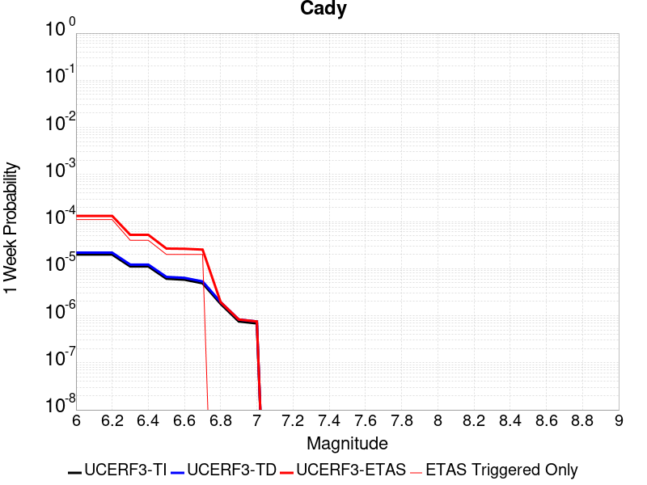 | 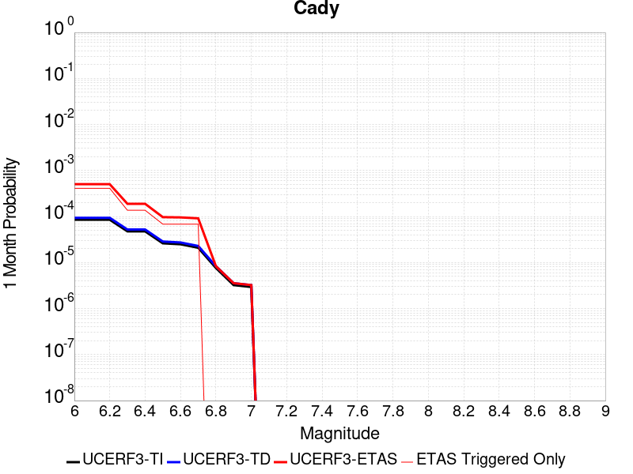 | 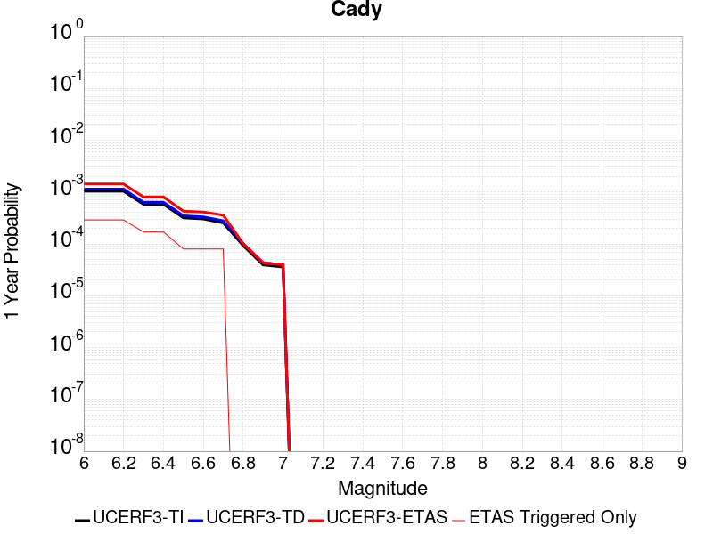 | 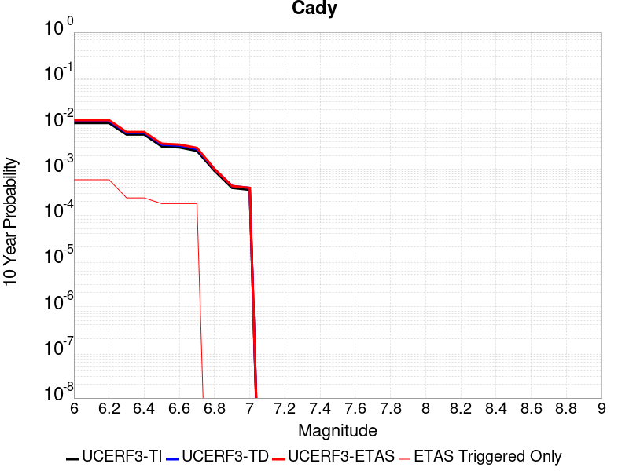 |

| Magnitude | 1 wk TI Prob | 1 wk TD Prob | 1 wk ETAS Prob | 1 wk ETAS/TD Gain | 1 wk ETAS Triggered Only | 1 mo TI Prob | 1 mo TD Prob | 1 mo ETAS Prob | 1 mo ETAS/TD Gain | 1 mo ETAS Triggered Only | 1 yr TI Prob | 1 yr TD Prob | 1 yr ETAS Prob | 1 yr ETAS/TD Gain | 1 yr ETAS Triggered Only | 10 yr TI Prob | 10 yr TD Prob | 10 yr ETAS Prob | 10 yr ETAS/TD Gain | 10 yr ETAS Triggered Only |
|-----|-----|-----|-----|-----|-----|-----|-----|-----|-----|-----|-----|-----|-----|-----|-----|-----|-----|-----|-----|-----|
| 6.0 | 1.9892565E-5 | 2.1858728E-5 | 1.3185633E-4 | 6.0322046 | 1.1E-4 | 8.525106E-5 | 9.3677416E-5 | 2.636615E-4 | 2.8145683 | 1.7E-4 | 0.0010374374 | 0.0011400167 | 0.0014296861 | 1.2540922 | 2.9E-4 | 0.010326075 | 0.011350701 | 0.011805479 | 1.0400661 | 4.6E-4 |
| 6.1 | 1.9892565E-5 | 2.1858728E-5 | 1.3185633E-4 | 6.0322046 | 1.1E-4 | 8.525106E-5 | 9.3677416E-5 | 2.636615E-4 | 2.8145683 | 1.7E-4 | 0.0010374374 | 0.0011400167 | 0.0014296861 | 1.2540922 | 2.9E-4 | 0.010326075 | 0.011350701 | 0.011805479 | 1.0400661 | 4.6E-4 |
| 6.2 | 1.9892565E-5 | 2.1858728E-5 | 1.3185633E-4 | 6.0322046 | 1.1E-4 | 8.525106E-5 | 9.3677416E-5 | 2.636615E-4 | 2.8145683 | 1.7E-4 | 0.0010374374 | 0.0011400167 | 0.0014296861 | 1.2540922 | 2.9E-4 | 0.010326075 | 0.011350701 | 0.011805479 | 1.0400661 | 4.6E-4 |
| 6.3 | 1.1117327E-5 | 1.2176583E-5 | 5.2176096E-5 | 4.2849536 | 4.0E-5 | 4.764482E-5 | 5.2184492E-5 | 1.2218083E-4 | 2.3413246 | 7.0E-5 | 5.7992124E-4 | 6.351925E-4 | 8.0508454E-4 | 1.2674654 | 1.7E-4 | 0.0057841022 | 0.0063368753 | 0.006615101 | 1.0439059 | 2.8E-4 |
| 6.4 | 1.1117327E-5 | 1.2176583E-5 | 5.2176096E-5 | 4.2849536 | 4.0E-5 | 4.764482E-5 | 5.2184492E-5 | 1.2218083E-4 | 2.3413246 | 7.0E-5 | 5.7992124E-4 | 6.351925E-4 | 8.0508454E-4 | 1.2674654 | 1.7E-4 | 0.0057841022 | 0.0063368753 | 0.006615101 | 1.0439059 | 2.8E-4 |
| 6.5 | 6.103093E-6 | 6.672021E-6 | 2.6671887E-5 | 3.9975727 | 2.0E-5 | 2.615585E-5 | 2.8594131E-5 | 6.8592984E-5 | 2.3988485 | 4.0E-5 | 3.1840094E-4 | 3.480905E-4 | 4.2806266E-4 | 1.2297453 | 8.0E-5 | 0.0031794512 | 0.0034766865 | 0.0036062347 | 1.037262 | 1.3E-4 |
| 6.6 | 5.817237E-6 | 6.3656585E-6 | 2.6365531E-5 | 4.1418386 | 2.0E-5 | 2.4930776E-5 | 2.728118E-5 | 6.728009E-5 | 2.4661722 | 4.0E-5 | 3.034899E-4 | 3.3211018E-4 | 4.120836E-4 | 1.240804 | 8.0E-5 | 0.0030307577 | 0.0033173605 | 0.0034369624 | 1.0360533 | 1.2E-4 |
| 6.7 | 4.8846314E-6 | 5.3405684E-6 | 2.5340461E-5 | 4.7448997 | 2.0E-5 | 2.0933967E-5 | 2.2888014E-5 | 6.28871E-5 | 2.7475996 | 4.0E-5 | 2.5484123E-4 | 2.7863772E-4 | 3.5861545E-4 | 1.2870312 | 8.0E-5 | 0.0025454918 | 0.0027840391 | 0.0028937329 | 1.0394009 | 1.1E-4 |
| 6.8 | 1.7788773E-6 | 1.9399079E-6 | 1.9399079E-6 | 1.0 | 0.0 | 7.6237375E-6 | 8.313874E-6 | 8.313874E-6 | 1.0 | 0.0 | 9.281505E-5 | 1.01218284E-4 | 1.01218284E-4 | 1.0 | 0.0 | 9.2776294E-4 | 0.0010118765 | 0.0010118765 | 1.0 | 0.0 |
| 6.9 | 7.5455404E-7 | 8.297092E-7 | 8.297092E-7 | 1.0 | 0.0 | 3.233799E-6 | 3.5558937E-6 | 3.5558937E-6 | 1.0 | 0.0 | 3.937079E-5 | 4.3292483E-5 | 4.3292483E-5 | 1.0 | 0.0 | 3.9363815E-4 | 4.3287344E-4 | 4.3287344E-4 | 1.0 | 0.0 |
| 7.0 | 6.8578805E-7 | 7.541816E-7 | 7.541816E-7 | 1.0 | 0.0 | 2.9390883E-6 | 3.2322048E-6 | 3.2322048E-6 | 1.0 | 0.0 | 3.578281E-5 | 3.9351715E-5 | 3.9351715E-5 | 1.0 | 0.0 | 3.577705E-4 | 3.9347992E-4 | 3.9347992E-4 | 1.0 | 0.0 |

## Sierra Nevada  (No Extension)
*[(top)](#table-of-contents)*

| 1 Week | 1 Month | 1 Year | 10 Year |
|-----|-----|-----|-----|
| 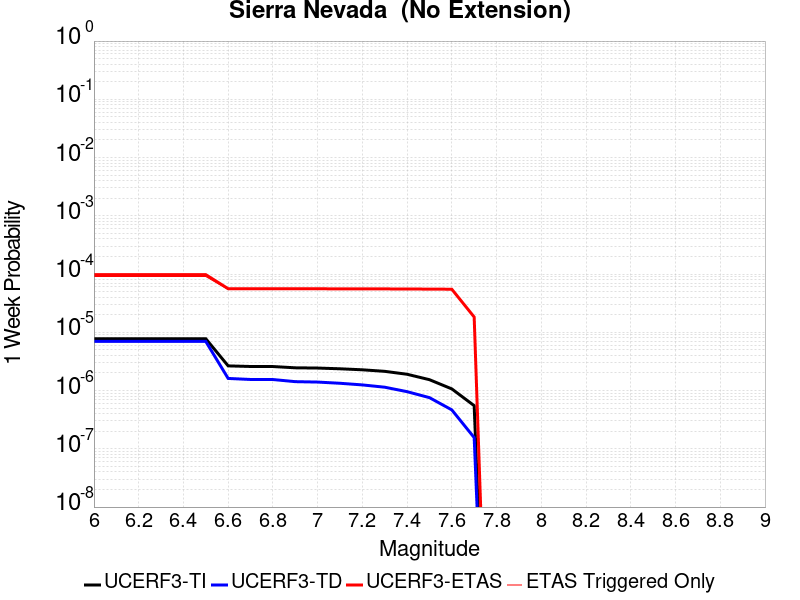 | 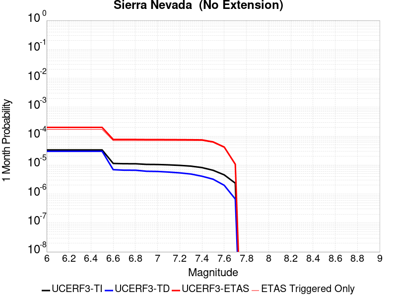 | 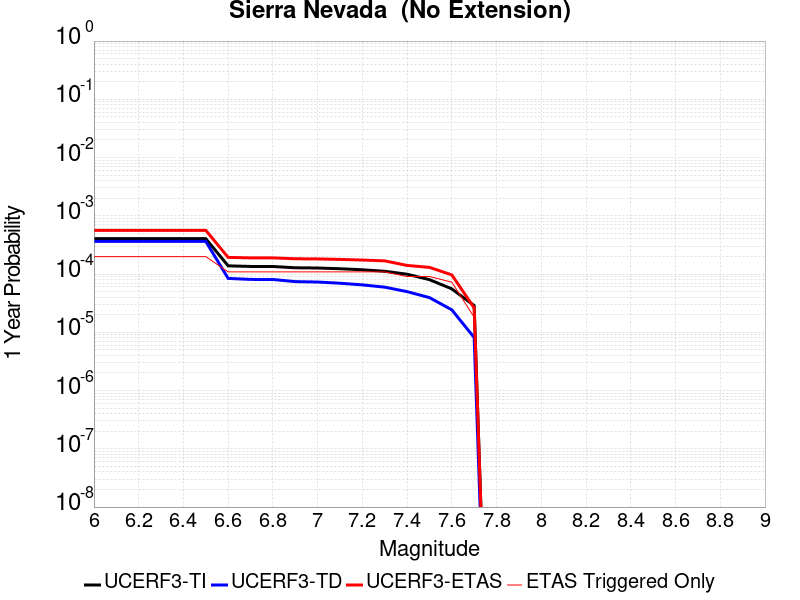 | 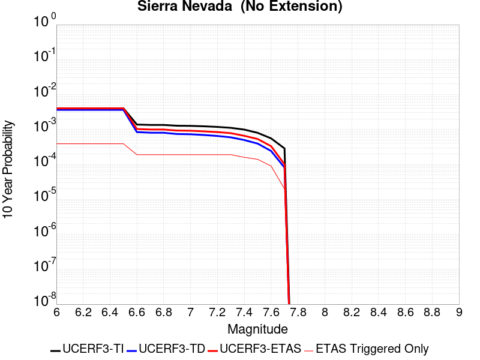 |

| Magnitude | 1 wk TI Prob | 1 wk TD Prob | 1 wk ETAS Prob | 1 wk ETAS/TD Gain | 1 wk ETAS Triggered Only | 1 mo TI Prob | 1 mo TD Prob | 1 mo ETAS Prob | 1 mo ETAS/TD Gain | 1 mo ETAS Triggered Only | 1 yr TI Prob | 1 yr TD Prob | 1 yr ETAS Prob | 1 yr ETAS/TD Gain | 1 yr ETAS Triggered Only | 10 yr TI Prob | 10 yr TD Prob | 10 yr ETAS Prob | 10 yr ETAS/TD Gain | 10 yr ETAS Triggered Only |
|-----|-----|-----|-----|-----|-----|-----|-----|-----|-----|-----|-----|-----|-----|-----|-----|-----|-----|-----|-----|-----|
| 6.0 | 7.7690465E-6 | 6.976322E-6 | 1.16975556E-4 | 16.767511 | 1.1E-4 | 3.329549E-5 | 2.9898381E-5 | 1.998933E-4 | 6.6857567 | 1.7E-4 | 4.0529718E-4 | 3.6398784E-4 | 6.338896E-4 | 1.741513 | 2.7E-4 | 0.004045588 | 0.0036374326 | 0.004026014 | 1.1068285 | 3.9E-4 |
| 6.1 | 7.7690465E-6 | 6.976322E-6 | 1.16975556E-4 | 16.767511 | 1.1E-4 | 3.329549E-5 | 2.9898381E-5 | 1.998933E-4 | 6.6857567 | 1.7E-4 | 4.0529718E-4 | 3.6398784E-4 | 6.338896E-4 | 1.741513 | 2.7E-4 | 0.004045588 | 0.0036374326 | 0.004026014 | 1.1068285 | 3.9E-4 |
| 6.2 | 7.7690465E-6 | 6.976322E-6 | 1.16975556E-4 | 16.767511 | 1.1E-4 | 3.329549E-5 | 2.9898381E-5 | 1.998933E-4 | 6.6857567 | 1.7E-4 | 4.0529718E-4 | 3.6398784E-4 | 6.338896E-4 | 1.741513 | 2.7E-4 | 0.004045588 | 0.0036374326 | 0.004026014 | 1.1068285 | 3.9E-4 |
| 6.3 | 7.7690465E-6 | 6.976322E-6 | 1.16975556E-4 | 16.767511 | 1.1E-4 | 3.329549E-5 | 2.9898381E-5 | 1.998933E-4 | 6.6857567 | 1.7E-4 | 4.0529718E-4 | 3.6398784E-4 | 6.338896E-4 | 1.741513 | 2.7E-4 | 0.004045588 | 0.0036374326 | 0.004026014 | 1.1068285 | 3.9E-4 |
| 6.4 | 7.7690465E-6 | 6.976322E-6 | 1.16975556E-4 | 16.767511 | 1.1E-4 | 3.329549E-5 | 2.9898381E-5 | 1.998933E-4 | 6.6857567 | 1.7E-4 | 4.0529718E-4 | 3.6398784E-4 | 6.338896E-4 | 1.741513 | 2.7E-4 | 0.004045588 | 0.0036374326 | 0.004026014 | 1.1068285 | 3.9E-4 |
| 6.5 | 7.7690465E-6 | 6.976322E-6 | 1.16975556E-4 | 16.767511 | 1.1E-4 | 3.329549E-5 | 2.9898381E-5 | 1.998933E-4 | 6.6857567 | 1.7E-4 | 4.0529718E-4 | 3.6398784E-4 | 6.338896E-4 | 1.741513 | 2.7E-4 | 0.004045588 | 0.0036374326 | 0.004026014 | 1.1068285 | 3.9E-4 |
| 6.6 | 2.653E-6 | 1.614854E-6 | 6.161476E-5 | 38.155003 | 6.0E-5 | 1.136995E-5 | 6.9207845E-6 | 7.69203E-5 | 11.11439 | 7.0E-5 | 1.3842035E-4 | 8.425733E-5 | 2.2424554E-4 | 2.6614366 | 1.4E-4 | 0.0013833415 | 8.422573E-4 | 0.0010320973 | 1.2253942 | 1.9E-4 |
| 6.7 | 2.5902466E-6 | 1.5501876E-6 | 6.15501E-5 | 39.704933 | 6.0E-5 | 1.11010095E-5 | 6.643644E-6 | 7.664318E-5 | 11.536316 | 7.0E-5 | 1.351464E-4 | 8.0883394E-5 | 2.2087207E-4 | 2.7307467 | 1.4E-4 | 0.0013506424 | 8.0854254E-4 | 9.983889E-4 | 1.2348007 | 1.9E-4 |
| 6.8 | 2.5853892E-6 | 1.5469877E-6 | 6.1546896E-5 | 39.784992 | 6.0E-5 | 1.1080193E-5 | 6.629931E-6 | 7.662947E-5 | 11.558109 | 7.0E-5 | 1.34893E-4 | 8.071645E-5 | 2.2070514E-4 | 2.7343268 | 1.4E-4 | 0.0013481114 | 8.068743E-4 | 9.96721E-4 | 1.2352866 | 1.9E-4 |
| 6.9 | 2.458257E-6 | 1.4220619E-6 | 6.1421975E-5 | 43.192196 | 6.0E-5 | 1.0535345E-5 | 6.094537E-6 | 7.609411E-5 | 12.485626 | 7.0E-5 | 1.2826028E-4 | 7.4198484E-5 | 2.141881E-4 | 2.886691 | 1.4E-4 | 0.0012818627 | 7.4173906E-4 | 9.3159813E-4 | 1.2559648 | 1.9E-4 |
| 7.0 | 2.4341468E-6 | 1.3990258E-6 | 6.139894E-5 | 43.886925 | 6.0E-5 | 1.0432016E-5 | 5.9958115E-6 | 7.599539E-5 | 12.674747 | 7.0E-5 | 1.270024E-4 | 7.2996576E-5 | 2.1298636E-4 | 2.9177582 | 1.4E-4 | 0.0012692984 | 7.297279E-4 | 9.1958925E-4 | 1.2601811 | 1.9E-4 |
| 7.1 | 2.3652476E-6 | 1.3339754E-6 | 6.133389E-5 | 45.97828 | 6.0E-5 | 1.0136736E-5 | 5.717025E-6 | 7.571663E-5 | 13.2440605 | 7.0E-5 | 1.2340778E-4 | 6.9602575E-5 | 2.0959284E-4 | 3.0112798 | 1.4E-4 | 0.0012333926 | 6.9580943E-4 | 8.8567723E-4 | 1.2728733 | 1.9E-4 |
| 7.2 | 2.272158E-6 | 1.2502821E-6 | 6.1250204E-5 | 48.98911 | 6.0E-5 | 9.737784E-6 | 5.3583412E-6 | 7.5357966E-5 | 14.063675 | 7.0E-5 | 1.1855107E-4 | 6.5235865E-5 | 2.0522674E-4 | 3.1459188 | 1.4E-4 | 0.0011848784 | 6.5216864E-4 | 8.4204477E-4 | 1.2911457 | 1.9E-4 |
| 7.3 | 2.1382127E-6 | 1.1419703E-6 | 6.11419E-5 | 53.54071 | 6.0E-5 | 9.163737E-6 | 4.8941492E-6 | 7.4893804E-5 | 15.302722 | 7.0E-5 | 1.1156279E-4 | 5.958465E-5 | 1.995763E-4 | 3.3494585 | 1.4E-4 | 0.001115068 | 5.956879E-4 | 7.855747E-4 | 1.318769 | 1.9E-4 |
| 7.4 | 1.9048055E-6 | 9.575242E-7 | 6.0957467E-5 | 63.661537 | 6.0E-5 | 8.163426E-6 | 4.1036687E-6 | 7.410338E-5 | 18.057837 | 7.0E-5 | 9.9385186E-5 | 4.996103E-5 | 1.5995554E-4 | 3.201606 | 1.1E-4 | 9.934074E-4 | 4.994987E-4 | 6.5941876E-4 | 1.3201612 | 1.6E-4 |
| 7.5 | 1.5373403E-6 | 7.560042E-7 | 5.0755967E-5 | 67.137146 | 5.0E-5 | 6.5885843E-6 | 3.2400142E-6 | 6.323982E-5 | 19.518377 | 6.0E-5 | 8.021306E-5 | 3.9446462E-5 | 1.2944291E-4 | 3.2814834 | 9.0E-5 | 8.0184115E-4 | 3.943951E-4 | 5.3433987E-4 | 1.354834 | 1.4E-4 |
| 7.6 | 1.0680322E-6 | 4.6596554E-7 | 4.0465948E-5 | 86.843216 | 4.0E-5 | 4.577273E-6 | 1.9969937E-6 | 4.1996915E-5 | 21.03007 | 4.0E-5 | 5.5726876E-5 | 2.4313129E-5 | 8.431167E-5 | 3.4677424 | 6.0E-5 | 5.5712904E-4 | 2.4310495E-4 | 3.3308307E-4 | 1.3701205 | 9.0E-5 |
| 7.7 | 5.509146E-7 | 1.5580486E-7 | 1.01558035E-5 | 65.18284 | 1.0E-5 | 2.3610605E-6 | 6.677349E-7 | 1.0667728E-5 | 15.975992 | 1.0E-5 | 2.8745531E-5 | 8.129644E-6 | 1.8129562E-5 | 2.2300563 | 1.0E-5 | 2.8741814E-4 | 8.1293576E-5 | 1.0129195E-4 | 1.2460018 | 2.0E-5 |

## Calico-Hidalgo
*[(top)](#table-of-contents)*

| 1 Week | 1 Month | 1 Year | 10 Year |
|-----|-----|-----|-----|
| 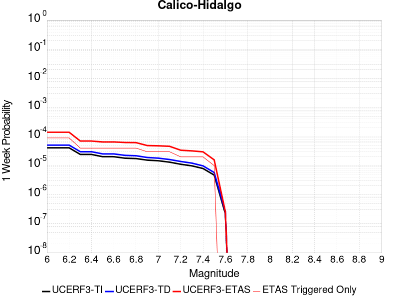 | 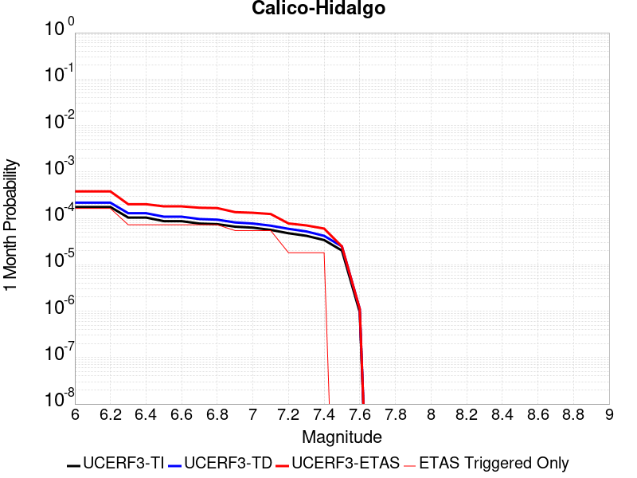 | 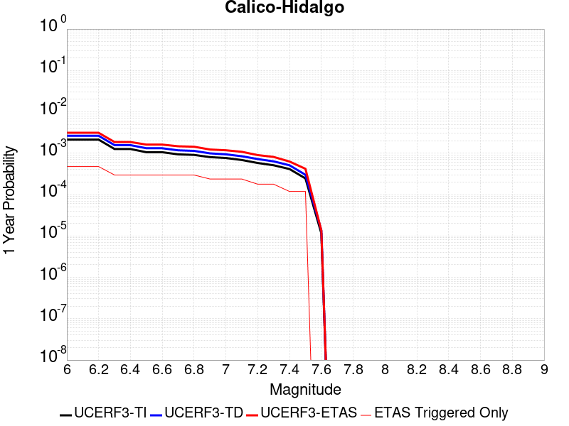 | 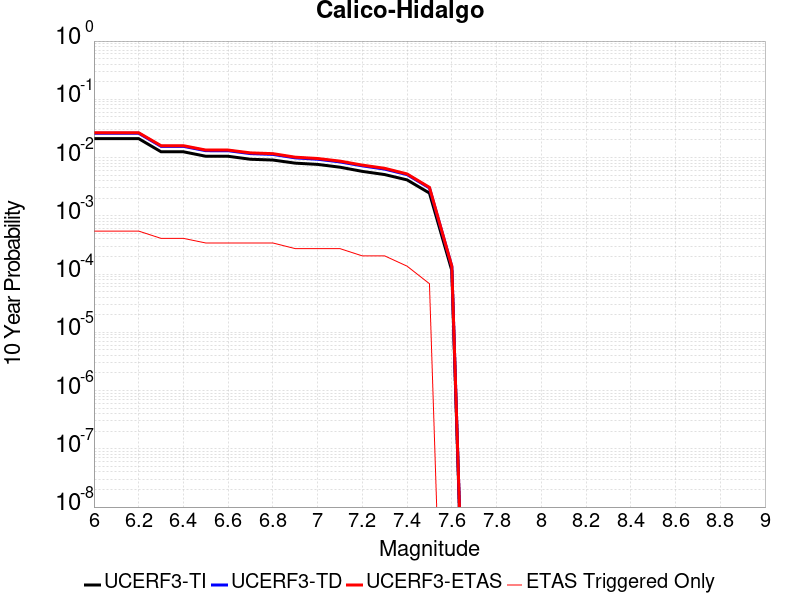 |

| Magnitude | 1 wk TI Prob | 1 wk TD Prob | 1 wk ETAS Prob | 1 wk ETAS/TD Gain | 1 wk ETAS Triggered Only | 1 mo TI Prob | 1 mo TD Prob | 1 mo ETAS Prob | 1 mo ETAS/TD Gain | 1 mo ETAS Triggered Only | 1 yr TI Prob | 1 yr TD Prob | 1 yr ETAS Prob | 1 yr ETAS/TD Gain | 1 yr ETAS Triggered Only | 10 yr TI Prob | 10 yr TD Prob | 10 yr ETAS Prob | 10 yr ETAS/TD Gain | 10 yr ETAS Triggered Only |
|-----|-----|-----|-----|-----|-----|-----|-----|-----|-----|-----|-----|-----|-----|-----|-----|-----|-----|-----|-----|-----|
| 6.0 | 4.0906612E-5 | 5.0703686E-5 | 1.4069912E-4 | 2.7749288 | 9.0E-5 | 1.7530227E-4 | 2.172857E-4 | 3.3725964E-4 | 1.5521482 | 1.2E-4 | 0.0021322158 | 0.002642648 | 0.0028820138 | 1.090578 | 2.4E-4 | 0.02111873 | 0.026152607 | 0.026532408 | 1.0145224 | 3.9E-4 |
| 6.1 | 4.0906612E-5 | 5.0703686E-5 | 1.4069912E-4 | 2.7749288 | 9.0E-5 | 1.7530227E-4 | 2.172857E-4 | 3.3725964E-4 | 1.5521482 | 1.2E-4 | 0.0021322158 | 0.002642648 | 0.0028820138 | 1.090578 | 2.4E-4 | 0.02111873 | 0.026152607 | 0.026532408 | 1.0145224 | 3.9E-4 |
| 6.2 | 4.0906612E-5 | 5.0703686E-5 | 1.4069912E-4 | 2.7749288 | 9.0E-5 | 1.7530227E-4 | 2.172857E-4 | 3.3725964E-4 | 1.5521482 | 1.2E-4 | 0.0021322158 | 0.002642648 | 0.0028820138 | 1.090578 | 2.4E-4 | 0.02111873 | 0.026152607 | 0.026532408 | 1.0145224 | 3.9E-4 |
| 6.3 | 2.4242801E-5 | 3.0090669E-5 | 7.008947E-5 | 2.3292758 | 4.0E-5 | 1.0389358E-4 | 1.2895382E-4 | 1.8894608E-4 | 1.4652228 | 6.0E-5 | 0.0012641704 | 0.0015689151 | 0.001728664 | 1.1018213 | 1.6E-4 | 0.01257003 | 0.01558206 | 0.015838008 | 1.0164258 | 2.6E-4 |
| 6.4 | 2.4242801E-5 | 3.0090669E-5 | 7.008947E-5 | 2.3292758 | 4.0E-5 | 1.0389358E-4 | 1.2895382E-4 | 1.8894608E-4 | 1.4652228 | 6.0E-5 | 0.0012641704 | 0.0015689151 | 0.001728664 | 1.1018213 | 1.6E-4 | 0.01257003 | 0.01558206 | 0.015838008 | 1.0164258 | 2.6E-4 |
| 6.5 | 2.0286952E-5 | 2.5315738E-5 | 6.531473E-5 | 2.5800047 | 4.0E-5 | 8.694118E-5 | 1.0849161E-4 | 1.684851E-4 | 1.5529782 | 6.0E-5 | 0.0010579949 | 0.001320102 | 0.0014798908 | 1.1210427 | 1.6E-4 | 0.010529719 | 0.013124538 | 0.01334165 | 1.0165426 | 2.2E-4 |
| 6.6 | 2.0269223E-5 | 2.5296687E-5 | 6.529567E-5 | 2.5811946 | 4.0E-5 | 8.6865206E-5 | 1.08409964E-4 | 1.6840347E-4 | 1.5533947 | 6.0E-5 | 0.0010570707 | 0.0013191093 | 0.0014788982 | 1.1211339 | 1.6E-4 | 0.010520565 | 0.013114728 | 0.013331843 | 1.0165551 | 2.2E-4 |
| 6.7 | 1.799852E-5 | 2.25406E-5 | 6.25397E-5 | 2.7745357 | 4.0E-5 | 7.713423E-5 | 9.659908E-5 | 1.5659328E-4 | 1.621064 | 6.0E-5 | 9.3870464E-4 | 0.0011754738 | 0.0013352857 | 1.1359553 | 1.6E-4 | 0.009347493 | 0.011694173 | 0.011911601 | 1.0185928 | 2.2E-4 |
| 6.8 | 1.7458793E-5 | 2.184212E-5 | 6.1841245E-5 | 2.831284 | 4.0E-5 | 7.4821255E-5 | 9.3605806E-5 | 1.536002E-4 | 1.6409259 | 6.0E-5 | 9.10568E-4 | 0.0011390693 | 0.0012988871 | 1.1403055 | 1.6E-4 | 0.009068459 | 0.011333893 | 0.0115514 | 1.0191908 | 2.2E-4 |
| 6.9 | 1.542884E-5 | 1.9025927E-5 | 4.9025355E-5 | 2.5767658 | 3.0E-5 | 6.612192E-5 | 8.153721E-5 | 1.3153313E-4 | 1.6131669 | 5.0E-5 | 8.04737E-4 | 9.922766E-4 | 0.0011421278 | 1.1510175 | 1.5E-4 | 0.008018291 | 0.009879857 | 0.010077882 | 1.0200433 | 2.0E-4 |
| 7.0 | 1.468253E-5 | 1.8030598E-5 | 4.803006E-5 | 2.6638083 | 3.0E-5 | 6.292361E-5 | 7.7271776E-5 | 1.2726792E-4 | 1.6470168 | 5.0E-5 | 7.658257E-4 | 9.4039086E-4 | 0.0010902499 | 1.1593581 | 1.5E-4 | 0.0076319184 | 0.009365481 | 0.009563608 | 1.021155 | 2.0E-4 |
| 7.1 | 1.3139281E-5 | 1.6200942E-5 | 4.6200457E-5 | 2.8517141 | 3.0E-5 | 5.6309986E-5 | 6.943083E-5 | 1.19427365E-4 | 1.7200911 | 5.0E-5 | 6.853584E-4 | 8.4500515E-4 | 9.948784E-4 | 1.1773638 | 1.5E-4 | 0.0068324856 | 0.0084192185 | 0.0086076185 | 1.0223774 | 1.9E-4 |
| 7.2 | 1.1127404E-5 | 1.3866597E-5 | 3.386632E-5 | 2.4422948 | 2.0E-5 | 4.7688E-5 | 5.942698E-5 | 7.9425794E-5 | 1.3365275 | 2.0E-5 | 5.8044674E-4 | 7.232942E-4 | 8.2322187E-4 | 1.1381563 | 1.0E-4 | 0.0057893298 | 0.0072105085 | 0.007339571 | 1.0178993 | 1.3E-4 |
| 7.3 | 9.808154E-6 | 1.2176215E-5 | 3.2175973E-5 | 2.6425266 | 2.0E-5 | 4.2034266E-5 | 5.2182797E-5 | 7.218175E-5 | 1.3832481 | 2.0E-5 | 5.11647E-4 | 6.3515105E-4 | 7.3508755E-4 | 1.1573429 | 1.0E-4 | 0.0051047057 | 0.006334433 | 0.0064636096 | 1.0203928 | 1.3E-4 |
| 7.4 | 7.942452E-6 | 9.792144E-6 | 2.9791947E-5 | 3.0424337 | 2.0E-5 | 3.4038632E-5 | 4.1965708E-5 | 6.196487E-5 | 1.4765596 | 2.0E-5 | 4.1434157E-4 | 5.1082217E-4 | 6.007762E-4 | 1.1760966 | 9.0E-5 | 0.0041356985 | 0.005097421 | 0.00520686 | 1.0214696 | 1.1E-4 |
| 7.5 | 4.7121216E-6 | 5.772836E-6 | 1.5772779E-5 | 2.7322407 | 1.0E-5 | 2.019465E-5 | 2.4740535E-5 | 3.474029E-5 | 1.4041849 | 1.0E-5 | 2.4584212E-4 | 3.0118204E-4 | 3.6116398E-4 | 1.1991551 | 6.0E-5 | 0.0024557032 | 0.0030084911 | 0.0030782805 | 1.0231975 | 7.0E-5 |
| 7.6 | 2.21172E-7 | 2.603961E-7 | 2.603961E-7 | 1.0 | 0.0 | 9.478797E-7 | 1.1159829E-6 | 1.1159829E-6 | 1.0 | 0.0 | 1.1540374E-5 | 1.3587036E-5 | 2.35869E-5 | 1.7359858 | 1.0E-5 | 1.1539775E-4 | 1.3586486E-4 | 1.4586351E-4 | 1.0735925 | 1.0E-5 |

## Ludlow
*[(top)](#table-of-contents)*

| 1 Week | 1 Month | 1 Year | 10 Year |
|-----|-----|-----|-----|
| 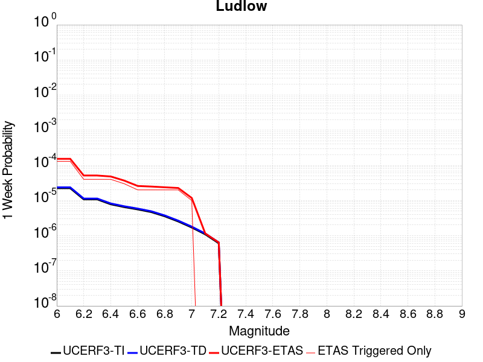 | 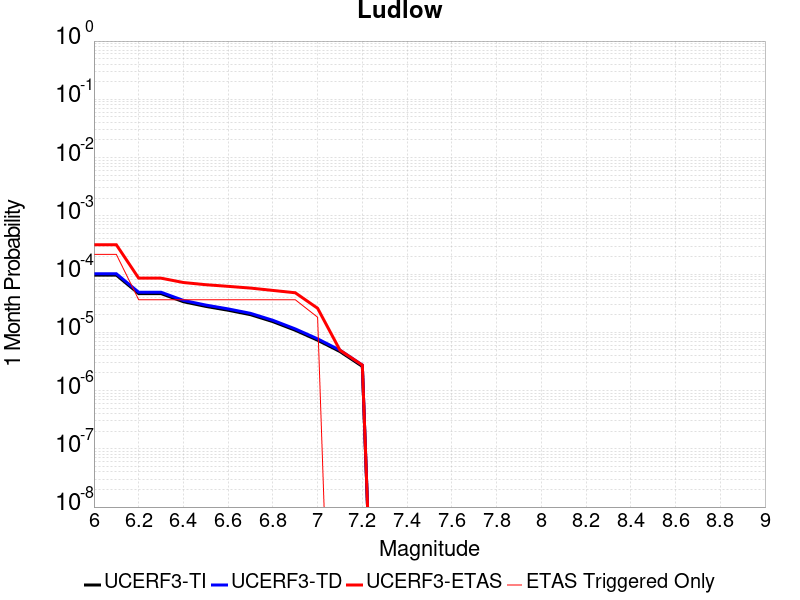 |  | 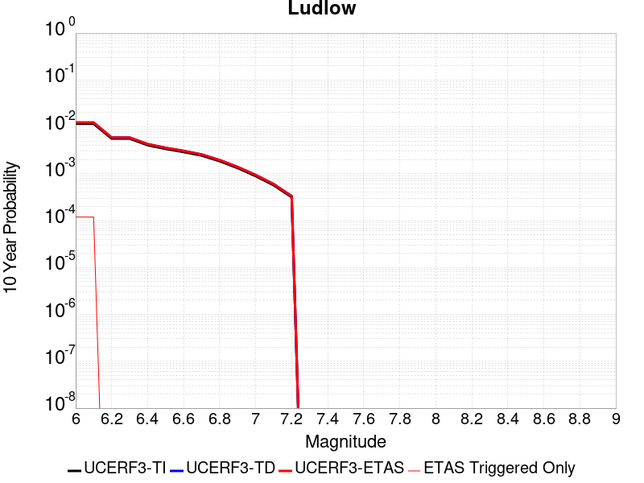 |

| Magnitude | 1 wk TI Prob | 1 wk TD Prob | 1 wk ETAS Prob | 1 wk ETAS/TD Gain | 1 wk ETAS Triggered Only | 1 mo TI Prob | 1 mo TD Prob | 1 mo ETAS Prob | 1 mo ETAS/TD Gain | 1 mo ETAS Triggered Only | 1 yr TI Prob | 1 yr TD Prob | 1 yr ETAS Prob | 1 yr ETAS/TD Gain | 1 yr ETAS Triggered Only | 10 yr TI Prob | 10 yr TD Prob | 10 yr ETAS Prob | 10 yr ETAS/TD Gain | 10 yr ETAS Triggered Only |
|-----|-----|-----|-----|-----|-----|-----|-----|-----|-----|-----|-----|-----|-----|-----|-----|-----|-----|-----|-----|-----|
| 6.0 | 2.2407607E-5 | 2.3657254E-5 | 1.5365418E-4 | 6.495013 | 1.3E-4 | 9.602906E-5 | 1.0138454E-4 | 2.813663E-4 | 2.7752388 | 1.8E-4 | 0.0011685267 | 0.001233702 | 0.0015433194 | 1.2509663 | 3.1E-4 | 0.011624013 | 0.012273042 | 0.01267801 | 1.0329965 | 4.1E-4 |
| 6.1 | 2.2407607E-5 | 2.3657254E-5 | 1.5365418E-4 | 6.495013 | 1.3E-4 | 9.602906E-5 | 1.0138454E-4 | 2.813663E-4 | 2.7752388 | 1.8E-4 | 0.0011685267 | 0.001233702 | 0.0015433194 | 1.2509663 | 3.1E-4 | 0.011624013 | 0.012273042 | 0.01267801 | 1.0329965 | 4.1E-4 |
| 6.2 | 1.0781252E-5 | 1.1365663E-5 | 5.136521E-5 | 4.519332 | 4.0E-5 | 4.620455E-5 | 4.8709102E-5 | 8.870715E-5 | 1.8211617 | 4.0E-5 | 5.623952E-4 | 5.9287593E-4 | 6.828226E-4 | 1.1517124 | 9.0E-5 | 0.00560974 | 0.0059133614 | 0.0060425927 | 1.0218542 | 1.3E-4 |
| 6.3 | 1.0781252E-5 | 1.1365663E-5 | 5.136521E-5 | 4.519332 | 4.0E-5 | 4.620455E-5 | 4.8709102E-5 | 8.870715E-5 | 1.8211617 | 4.0E-5 | 5.623952E-4 | 5.9287593E-4 | 6.828226E-4 | 1.1517124 | 9.0E-5 | 0.00560974 | 0.0059133614 | 0.0060425927 | 1.0218542 | 1.3E-4 |
| 6.4 | 7.814439E-6 | 8.237729E-6 | 4.8237398E-5 | 5.855667 | 4.0E-5 | 3.3490025E-5 | 3.530408E-5 | 7.530267E-5 | 2.1329734 | 4.0E-5 | 4.0766477E-4 | 4.2974384E-4 | 5.197052E-4 | 1.2093371 | 9.0E-5 | 0.0040691774 | 0.0042892746 | 0.00440876 | 1.0278567 | 1.2E-4 |
| 6.5 | 6.4986366E-6 | 6.85092E-6 | 3.6850714E-5 | 5.3789444 | 3.0E-5 | 2.7851002E-5 | 2.9360759E-5 | 5.9359878E-5 | 2.0217419 | 3.0E-5 | 3.390332E-4 | 3.5740953E-4 | 3.9739523E-4 | 1.1118765 | 4.0E-5 | 0.003385164 | 0.0035684432 | 0.0036381935 | 1.0195464 | 7.0E-5 |
| 6.6 | 5.582177E-6 | 5.8860055E-6 | 2.5885887E-5 | 4.39787 | 2.0E-5 | 2.3923398E-5 | 2.5225498E-5 | 4.5224995E-5 | 1.7928286 | 2.0E-5 | 2.9122844E-4 | 3.0707786E-4 | 3.3706866E-4 | 1.0976651 | 3.0E-5 | 0.0029084706 | 0.003066609 | 0.0031164556 | 1.0162547 | 5.0E-5 |
| 6.7 | 4.6858763E-6 | 4.940427E-6 | 2.494033E-5 | 5.048213 | 2.0E-5 | 2.0082172E-5 | 2.1173091E-5 | 4.117267E-5 | 1.9445752 | 2.0E-5 | 2.4447302E-4 | 2.5775246E-4 | 2.7774728E-4 | 1.0775738 | 2.0E-5 | 0.0024420423 | 0.0025745912 | 0.0026045141 | 1.0116223 | 3.0E-5 |
| 6.8 | 3.5584908E-6 | 3.7520183E-6 | 2.3751943E-5 | 6.3304443 | 2.0E-5 | 1.5250586E-5 | 1.6079981E-5 | 3.607966E-5 | 2.2437625 | 2.0E-5 | 1.8566006E-4 | 1.957566E-4 | 2.1575269E-4 | 1.1021477 | 2.0E-5 | 0.0018550502 | 0.0019558826 | 0.001985824 | 1.0153084 | 3.0E-5 |
| 6.9 | 2.532834E-6 | 2.6710034E-6 | 2.267095E-5 | 8.4878025 | 2.0E-5 | 1.0854958E-5 | 1.1447109E-5 | 3.144688E-5 | 2.7471461 | 2.0E-5 | 1.3215111E-4 | 1.3935992E-4 | 1.5935714E-4 | 1.1434933 | 2.0E-5 | 0.0013207254 | 0.0013927529 | 0.0014227111 | 1.0215101 | 3.0E-5 |
| 7.0 | 1.7083285E-6 | 1.8019439E-6 | 1.1801926E-5 | 6.5495524 | 1.0E-5 | 7.3213873E-6 | 7.722595E-6 | 1.7722517E-5 | 2.2948916 | 1.0E-5 | 8.913424E-5 | 9.40187E-5 | 1.0401776E-4 | 1.1063519 | 1.0E-5 | 8.9098496E-4 | 9.3980576E-4 | 9.5978694E-4 | 1.021261 | 2.0E-5 |
| 7.1 | 1.0905424E-6 | 1.1497619E-6 | 1.1497619E-6 | 1.0 | 0.0 | 4.6737446E-6 | 4.9275427E-6 | 4.9275427E-6 | 1.0 | 0.0 | 5.6901354E-5 | 5.999128E-5 | 5.999128E-5 | 1.0 | 0.0 | 5.6886784E-4 | 5.997606E-4 | 6.0975464E-4 | 1.0166633 | 1.0E-5 |
| 7.2 | 6.06668E-7 | 6.387277E-7 | 6.387277E-7 | 1.0 | 0.0 | 2.600003E-6 | 2.7374022E-6 | 2.7374022E-6 | 1.0 | 0.0 | 3.1654577E-5 | 3.3327433E-5 | 3.3327433E-5 | 1.0 | 0.0 | 3.1650066E-4 | 3.3323118E-4 | 3.3323118E-4 | 1.0 | 0.0 |

## San Andreas (Carrizo) rev
*[(top)](#table-of-contents)*

| 1 Week | 1 Month | 1 Year | 10 Year |
|-----|-----|-----|-----|
| 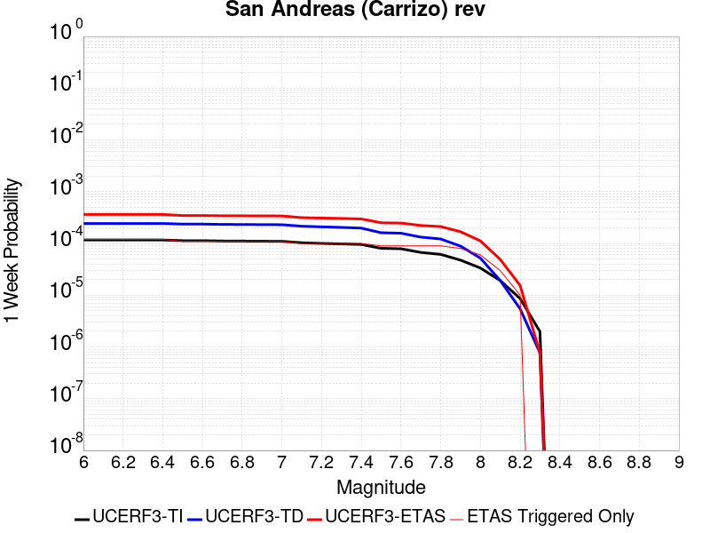 | 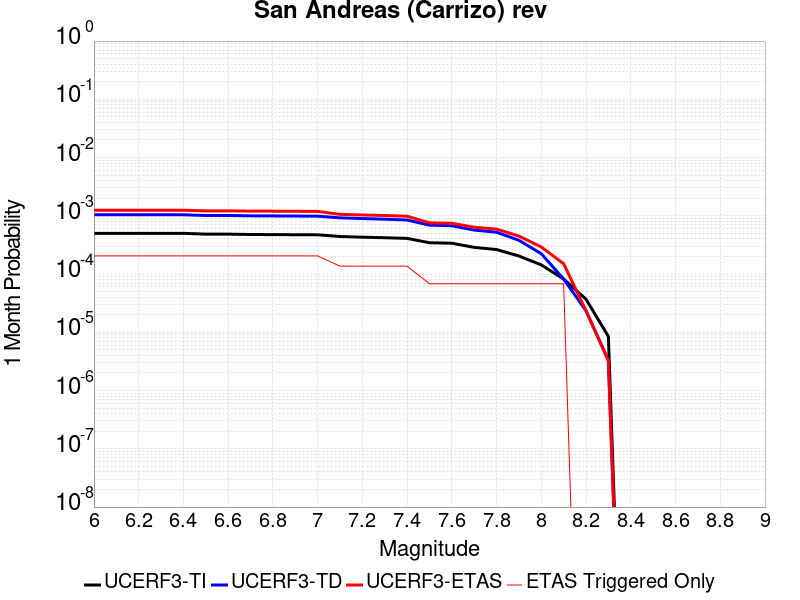 | 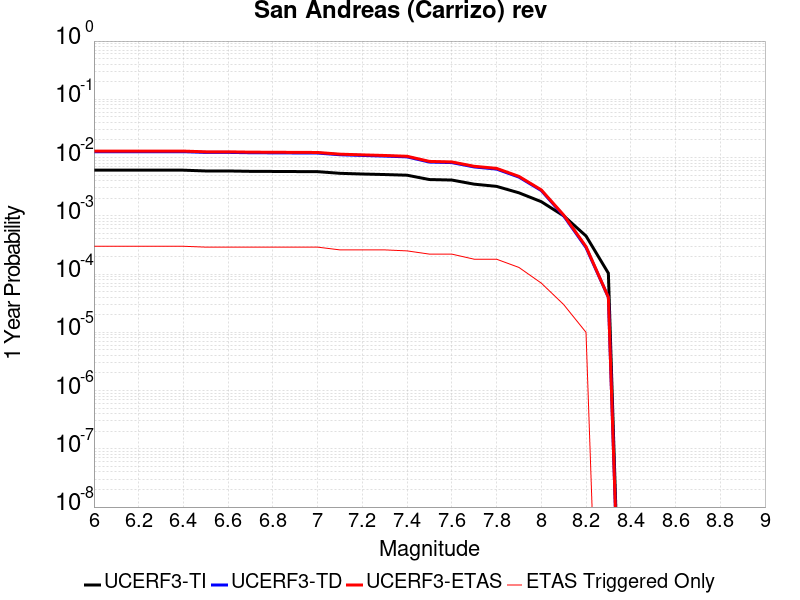 | 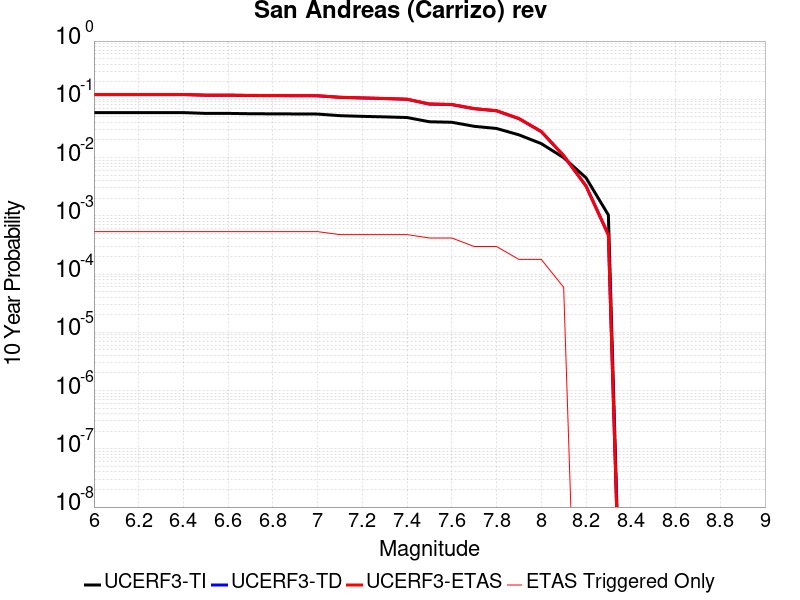 |

| Magnitude | 1 wk TI Prob | 1 wk TD Prob | 1 wk ETAS Prob | 1 wk ETAS/TD Gain | 1 wk ETAS Triggered Only | 1 mo TI Prob | 1 mo TD Prob | 1 mo ETAS Prob | 1 mo ETAS/TD Gain | 1 mo ETAS Triggered Only | 1 yr TI Prob | 1 yr TD Prob | 1 yr ETAS Prob | 1 yr ETAS/TD Gain | 1 yr ETAS Triggered Only | 10 yr TI Prob | 10 yr TD Prob | 10 yr ETAS Prob | 10 yr ETAS/TD Gain | 10 yr ETAS Triggered Only |
|-----|-----|-----|-----|-----|-----|-----|-----|-----|-----|-----|-----|-----|-----|-----|-----|-----|-----|-----|-----|-----|
| 6.0 | 1.1674632E-4 | 2.432302E-4 | 3.6320102E-4 | 1.4932398 | 1.2E-4 | 5.002454E-4 | 0.0010420004 | 0.001241792 | 1.1917385 | 2.0E-4 | 0.006073493 | 0.012613042 | 0.012909259 | 1.023485 | 3.0E-4 | 0.0591016 | 0.12061418 | 0.12097473 | 1.0029893 | 4.1E-4 |
| 6.1 | 1.1674632E-4 | 2.432302E-4 | 3.6320102E-4 | 1.4932398 | 1.2E-4 | 5.002454E-4 | 0.0010420004 | 0.001241792 | 1.1917385 | 2.0E-4 | 0.006073493 | 0.012613042 | 0.012909259 | 1.023485 | 3.0E-4 | 0.0591016 | 0.12061418 | 0.12097473 | 1.0029893 | 4.1E-4 |
| 6.2 | 1.1674632E-4 | 2.432302E-4 | 3.6320102E-4 | 1.4932398 | 1.2E-4 | 5.002454E-4 | 0.0010420004 | 0.001241792 | 1.1917385 | 2.0E-4 | 0.006073493 | 0.012613042 | 0.012909259 | 1.023485 | 3.0E-4 | 0.0591016 | 0.12061418 | 0.12097473 | 1.0029893 | 4.1E-4 |
| 6.3 | 1.1674632E-4 | 2.432302E-4 | 3.6320102E-4 | 1.4932398 | 1.2E-4 | 5.002454E-4 | 0.0010420004 | 0.001241792 | 1.1917385 | 2.0E-4 | 0.006073493 | 0.012613042 | 0.012909259 | 1.023485 | 3.0E-4 | 0.0591016 | 0.12061418 | 0.12097473 | 1.0029893 | 4.1E-4 |
| 6.4 | 1.1674632E-4 | 2.432302E-4 | 3.6320102E-4 | 1.4932398 | 1.2E-4 | 5.002454E-4 | 0.0010420004 | 0.001241792 | 1.1917385 | 2.0E-4 | 0.006073493 | 0.012613042 | 0.012909259 | 1.023485 | 3.0E-4 | 0.0591016 | 0.12061418 | 0.12097473 | 1.0029893 | 4.1E-4 |
| 6.5 | 1.13136164E-4 | 2.3643032E-4 | 3.4640433E-4 | 1.4651433 | 1.1E-4 | 4.847792E-4 | 0.0010128808 | 0.0012026884 | 1.1873938 | 1.9E-4 | 0.0058862255 | 0.012262545 | 0.012548988 | 1.0233593 | 2.9E-4 | 0.057327334 | 0.117585555 | 0.11793852 | 1.0030018 | 4.0E-4 |
| 6.6 | 1.13136164E-4 | 2.3643032E-4 | 3.4640433E-4 | 1.4651433 | 1.1E-4 | 4.847792E-4 | 0.0010128808 | 0.0012026884 | 1.1873938 | 1.9E-4 | 0.0058862255 | 0.012262545 | 0.012548988 | 1.0233593 | 2.9E-4 | 0.057327334 | 0.117585555 | 0.11793852 | 1.0030018 | 4.0E-4 |
| 6.7 | 1.1149675E-4 | 2.3334254E-4 | 3.4331687E-4 | 1.4713 | 1.1E-4 | 4.777557E-4 | 9.996577E-4 | 0.0011894677 | 1.189875 | 1.9E-4 | 0.0058011734 | 0.012103349 | 0.012389839 | 1.0236703 | 2.9E-4 | 0.05652051 | 0.1162071 | 0.116560616 | 1.0030421 | 4.0E-4 |
| 6.8 | 1.1103589E-4 | 2.3236412E-4 | 3.4233858E-4 | 1.473285 | 1.1E-4 | 4.7578133E-4 | 9.954676E-4 | 0.0011852785 | 1.190675 | 1.9E-4 | 0.005777263 | 0.012052901 | 0.012339406 | 1.0237706 | 2.9E-4 | 0.056293584 | 0.1157674 | 0.11612109 | 1.0030552 | 4.0E-4 |
| 6.9 | 1.1053259E-4 | 2.3128795E-4 | 3.4126252E-4 | 1.4754876 | 1.1E-4 | 4.7362508E-4 | 9.90859E-4 | 0.0011806708 | 1.1915628 | 1.9E-4 | 0.0057511497 | 0.01199741 | 0.0122839315 | 1.0238819 | 2.9E-4 | 0.05604569 | 0.11528359 | 0.11563748 | 1.0030698 | 4.0E-4 |
| 7.0 | 1.1005377E-4 | 2.3029637E-4 | 3.4027104E-4 | 1.4775354 | 1.1E-4 | 4.7157376E-4 | 9.866126E-4 | 0.0011764251 | 1.192388 | 1.9E-4 | 0.0057263062 | 0.011946279 | 0.012232814 | 1.0239854 | 2.9E-4 | 0.055809796 | 0.11483591 | 0.11518998 | 1.0030832 | 4.0E-4 |
| 7.1 | 1.0308142E-4 | 2.1539345E-4 | 3.153719E-4 | 1.4641666 | 1.0E-4 | 4.417027E-4 | 9.227892E-4 | 0.0010926323 | 1.1840541 | 1.7E-4 | 0.0053644776 | 0.011177397 | 0.011434492 | 1.0230012 | 2.6E-4 | 0.052368138 | 0.108092256 | 0.108422264 | 1.003053 | 3.7E-4 |
| 7.2 | 1.0027479E-4 | 2.094724E-4 | 3.0945145E-4 | 1.4772898 | 1.0E-4 | 4.296783E-4 | 8.9743105E-4 | 0.0010672784 | 1.1892596 | 1.7E-4 | 0.0052187922 | 0.010871782 | 0.0111289555 | 1.0236552 | 2.6E-4 | 0.050979212 | 0.10539625 | 0.10572725 | 1.0031406 | 3.7E-4 |
| 7.3 | 9.816942E-5 | 2.0422463E-4 | 3.042042E-4 | 1.4895569 | 1.0E-4 | 4.2065824E-4 | 8.7495585E-4 | 0.0010448071 | 1.1941255 | 1.7E-4 | 0.005109493 | 0.010600842 | 0.010858086 | 1.0242664 | 2.6E-4 | 0.049935985 | 0.102979995 | 0.1033119 | 1.003223 | 3.7E-4 |
| 7.4 | 9.5634205E-5 | 1.9791997E-4 | 2.9790017E-4 | 1.5051547 | 1.0E-4 | 4.0979648E-4 | 8.479536E-4 | 0.0010078179 | 1.1885296 | 1.6E-4 | 0.0049778637 | 0.010275229 | 0.01052266 | 1.0240804 | 2.5E-4 | 0.048678253 | 0.10006632 | 0.10039029 | 1.0032376 | 3.6E-4 |
| 7.5 | 8.052417E-5 | 1.611261E-4 | 2.511116E-4 | 1.5584787 | 9.0E-5 | 3.4505792E-4 | 6.903579E-4 | 8.402543E-4 | 1.2171286 | 1.5E-4 | 0.0041929903 | 0.008372796 | 0.008590953 | 1.0260556 | 2.2E-4 | 0.04114753 | 0.08281049 | 0.08310399 | 1.0035442 | 3.2E-4 |
| 7.6 | 7.897024E-5 | 1.5765853E-4 | 2.4764435E-4 | 1.570764 | 9.0E-5 | 3.384E-4 | 6.755046E-4 | 8.254033E-4 | 1.2219062 | 1.5E-4 | 0.0041122385 | 0.008193332 | 0.0084115295 | 1.0266311 | 2.2E-4 | 0.040369697 | 0.08115171 | 0.08144574 | 1.0036232 | 3.2E-4 |
| 7.7 | 6.707427E-5 | 1.3276102E-4 | 2.2274908E-4 | 1.6778197 | 9.0E-5 | 2.8742946E-4 | 5.688518E-4 | 7.0877216E-4 | 1.2459698 | 1.4E-4 | 0.003493839 | 0.00690381 | 0.0070825676 | 1.0258926 | 1.8E-4 | 0.034394164 | 0.069048055 | 0.069299415 | 1.0036403 | 2.7E-4 |
| 7.8 | 6.147705E-5 | 1.2197486E-4 | 2.1196388E-4 | 1.737767 | 9.0E-5 | 2.6344648E-4 | 5.226447E-4 | 6.625716E-4 | 1.2677284 | 1.4E-4 | 0.0032027436 | 0.006344659 | 0.006523517 | 1.0281904 | 1.8E-4 | 0.031569764 | 0.06351457 | 0.06376742 | 1.003981 | 2.7E-4 |
| 7.9 | 4.7636717E-5 | 8.87977E-5 | 1.6879059E-4 | 1.9008442 | 8.0E-5 | 2.0414138E-4 | 3.8050607E-4 | 4.904642E-4 | 1.2889787 | 1.1E-4 | 0.0024825884 | 0.0046228287 | 0.0047522276 | 1.0279913 | 1.3E-4 | 0.024550365 | 0.046628095 | 0.0467997 | 1.0036803 | 1.8E-4 |
| 8.0 | 3.3554235E-5 | 5.2136907E-5 | 1.1213378E-4 | 2.1507561 | 6.0E-5 | 1.4379594E-4 | 2.2342477E-4 | 2.8341135E-4 | 1.2684867 | 6.0E-5 | 0.0017493097 | 0.002716805 | 0.002786615 | 1.0256956 | 7.0E-5 | 0.017356034 | 0.027880952 | 0.027997607 | 1.004184 | 1.2E-4 |
| 8.1 | 1.9175432E-5 | 1.9184976E-5 | 4.91844E-5 | 2.5636938 | 3.0E-5 | 8.217783E-5 | 8.2218736E-5 | 1.1221627E-4 | 1.3648503 | 3.0E-5 | 0.0010000558 | 0.0010005541 | 0.001030524 | 1.0299534 | 3.0E-5 | 0.009955673 | 0.0107580265 | 0.010787704 | 1.0027586 | 3.0E-5 |
| 8.2 | 8.643924E-6 | 5.4748625E-6 | 1.5474809E-5 | 2.82652 | 1.0E-5 | 3.704486E-5 | 2.3463486E-5 | 3.346325E-5 | 1.4261842 | 1.0E-5 | 4.5092785E-4 | 2.8563058E-4 | 2.9562772E-4 | 1.0350002 | 1.0E-5 | 0.0045001395 | 0.0032487072 | 0.0032586746 | 1.0030681 | 1.0E-5 |
| 8.3 | 1.983087E-6 | 7.6599065E-7 | 7.6599065E-7 | 1.0 | 0.0 | 8.498917E-6 | 3.282813E-6 | 3.282813E-6 | 1.0 | 0.0 | 1.034694E-4 | 3.9967534E-5 | 3.9967534E-5 | 1.0 | 0.0 | 0.0010342124 | 4.719687E-4 | 4.719687E-4 | 1.0 | 0.0 |

## San Andreas (Cholame) rev
*[(top)](#table-of-contents)*

| 1 Week | 1 Month | 1 Year | 10 Year |
|-----|-----|-----|-----|
| 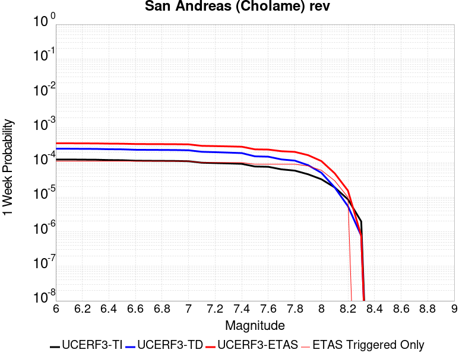 | 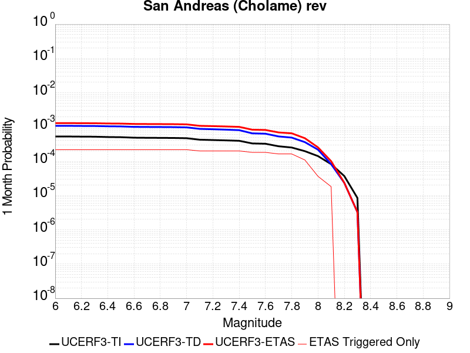 | 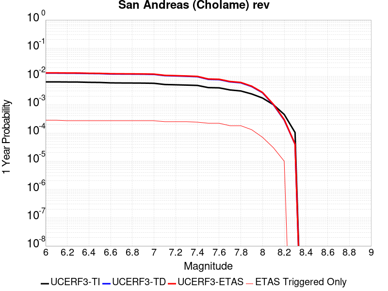 | 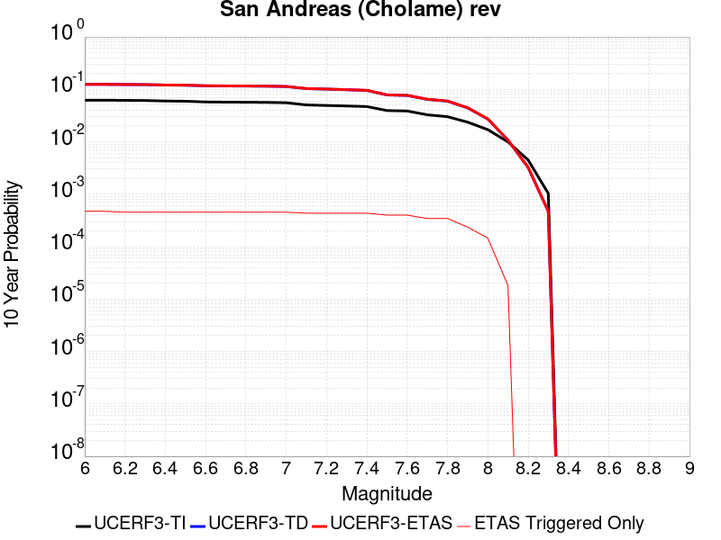 |

| Magnitude | 1 wk TI Prob | 1 wk TD Prob | 1 wk ETAS Prob | 1 wk ETAS/TD Gain | 1 wk ETAS Triggered Only | 1 mo TI Prob | 1 mo TD Prob | 1 mo ETAS Prob | 1 mo ETAS/TD Gain | 1 mo ETAS Triggered Only | 1 yr TI Prob | 1 yr TD Prob | 1 yr ETAS Prob | 1 yr ETAS/TD Gain | 1 yr ETAS Triggered Only | 10 yr TI Prob | 10 yr TD Prob | 10 yr ETAS Prob | 10 yr ETAS/TD Gain | 10 yr ETAS Triggered Only |
|-----|-----|-----|-----|-----|-----|-----|-----|-----|-----|-----|-----|-----|-----|-----|-----|-----|-----|-----|-----|-----|
| 6.0 | 1.2302514E-4 | 2.5204287E-4 | 3.6201515E-4 | 1.4363236 | 1.1E-4 | 5.27144E-4 | 0.0010797381 | 0.0012595438 | 1.166527 | 1.8E-4 | 0.0063991086 | 0.0130670825 | 0.013343424 | 1.0211478 | 2.8E-4 | 0.06217949 | 0.12439073 | 0.12474097 | 1.0028157 | 4.0E-4 |
| 6.1 | 1.2302514E-4 | 2.5204287E-4 | 3.6201515E-4 | 1.4363236 | 1.1E-4 | 5.27144E-4 | 0.0010797381 | 0.0012595438 | 1.166527 | 1.8E-4 | 0.0063991086 | 0.0130670825 | 0.013343424 | 1.0211478 | 2.8E-4 | 0.06217949 | 0.12439073 | 0.12474097 | 1.0028157 | 4.0E-4 |
| 6.2 | 1.2203569E-4 | 2.5021084E-4 | 3.601833E-4 | 1.4395193 | 1.1E-4 | 5.2290526E-4 | 0.0010718931 | 0.0012517001 | 1.1677471 | 1.8E-4 | 0.006347804 | 0.01297271 | 0.013239207 | 1.020543 | 2.7E-4 | 0.061695136 | 0.12357691 | 0.12391871 | 1.0027659 | 3.9E-4 |
| 6.3 | 1.2142645E-4 | 2.4907055E-4 | 3.5904316E-4 | 1.4415319 | 1.1E-4 | 5.202953E-4 | 0.0010670102 | 0.0012468181 | 1.1685157 | 1.8E-4 | 0.006316212 | 0.012913967 | 0.01318048 | 1.0206376 | 2.7E-4 | 0.06139677 | 0.12307103 | 0.123413034 | 1.0027789 | 3.9E-4 |
| 6.4 | 1.1865206E-4 | 2.44126E-4 | 3.5409915E-4 | 1.450477 | 1.1E-4 | 5.0840975E-4 | 0.0010458364 | 0.0012256481 | 1.171931 | 1.8E-4 | 0.006172335 | 0.012659196 | 0.0129257785 | 1.0210583 | 2.7E-4 | 0.060036868 | 0.1208638 | 0.12120667 | 1.0028368 | 3.9E-4 |
| 6.5 | 1.17443946E-4 | 2.4205919E-4 | 3.5203257E-4 | 1.4543242 | 1.1E-4 | 5.032341E-4 | 0.0010369857 | 0.001216799 | 1.1734 | 1.8E-4 | 0.006109677 | 0.012552682 | 0.012819293 | 1.0212394 | 2.7E-4 | 0.059444077 | 0.11993805 | 0.12028128 | 1.0028616 | 3.9E-4 |
| 6.6 | 1.13579066E-4 | 2.3514954E-4 | 3.4512367E-4 | 1.4676775 | 1.1E-4 | 4.866766E-4 | 0.001007396 | 0.0011872147 | 1.1784985 | 1.8E-4 | 0.0059092017 | 0.012196515 | 0.012463221 | 1.0218675 | 2.7E-4 | 0.057545185 | 0.11685214 | 0.11718774 | 1.002872 | 3.8E-4 |
| 6.7 | 1.1271412E-4 | 2.3359268E-4 | 3.43567E-4 | 1.4707952 | 1.1E-4 | 4.829711E-4 | 0.0010007289 | 0.0011805488 | 1.1796889 | 1.8E-4 | 0.005864331 | 0.012116249 | 0.012382978 | 1.0220141 | 2.7E-4 | 0.057119697 | 0.116155714 | 0.11649157 | 1.0028914 | 3.8E-4 |
| 6.8 | 1.1217975E-4 | 2.3247694E-4 | 3.4245139E-4 | 1.4730552 | 1.1E-4 | 4.8068175E-4 | 9.959509E-4 | 0.0011757716 | 1.1805518 | 1.8E-4 | 0.005836608 | 0.012058721 | 0.012325466 | 1.0221205 | 2.7E-4 | 0.056856725 | 0.11565396 | 0.11599002 | 1.0029056 | 3.8E-4 |
| 6.9 | 1.1146753E-4 | 2.3096445E-4 | 3.4093903E-4 | 1.4761537 | 1.1E-4 | 4.7763053E-4 | 9.894737E-4 | 0.0011692955 | 1.1817349 | 1.8E-4 | 0.0057996577 | 0.011980731 | 0.012247496 | 1.0222661 | 2.7E-4 | 0.056506127 | 0.11497439 | 0.1153107 | 1.002925 | 3.8E-4 |
| 7.0 | 1.0965793E-4 | 2.2719789E-4 | 3.371729E-4 | 1.4840494 | 1.1E-4 | 4.698779E-4 | 9.733434E-4 | 0.0011531682 | 1.1847496 | 1.8E-4 | 0.005705768 | 0.011786487 | 0.012053304 | 1.0226376 | 2.7E-4 | 0.055614736 | 0.11327597 | 0.11361292 | 1.0029746 | 3.8E-4 |
| 7.1 | 9.927982E-5 | 2.0538924E-4 | 3.0536868E-4 | 1.4867804 | 1.0E-4 | 4.2541555E-4 | 8.7994366E-4 | 0.001049794 | 1.1930242 | 1.7E-4 | 0.0051671406 | 0.010660981 | 0.010908316 | 1.0232 | 2.5E-4 | 0.05048634 | 0.1033706 | 0.10369339 | 1.0031226 | 3.6E-4 |
| 7.2 | 9.696786E-5 | 2.0043184E-4 | 3.004118E-4 | 1.4988227 | 1.0E-4 | 4.1551032E-4 | 8.5871184E-4 | 0.0010285658 | 1.197801 | 1.7E-4 | 0.00504711 | 0.010404981 | 0.010652379 | 1.023777 | 2.5E-4 | 0.04934009 | 0.1011086 | 0.101432204 | 1.0032005 | 3.6E-4 |
| 7.3 | 9.4727984E-5 | 1.9472468E-4 | 2.947052E-4 | 1.5134456 | 1.0E-4 | 4.0591392E-4 | 8.3426846E-4 | 0.0010041266 | 1.2036014 | 1.7E-4 | 0.0049308087 | 0.010110183 | 0.010357655 | 1.0244776 | 2.5E-4 | 0.048228268 | 0.09847952 | 0.098804064 | 1.0032955 | 3.6E-4 |
| 7.4 | 9.220358E-5 | 1.8843076E-4 | 2.8841192E-4 | 1.5305989 | 1.0E-4 | 3.9509835E-4 | 8.073114E-4 | 9.671822E-4 | 1.1980287 | 1.6E-4 | 0.004799717 | 0.009784967 | 0.010022618 | 1.0242875 | 2.4E-4 | 0.046973653 | 0.095557496 | 0.095874056 | 1.0033127 | 3.5E-4 |
| 7.5 | 7.71631E-5 | 1.5177966E-4 | 2.41766E-4 | 1.5928748 | 9.0E-5 | 3.306571E-4 | 6.503223E-4 | 8.002247E-4 | 1.2305049 | 1.5E-4 | 0.0040183207 | 0.007889002 | 0.008107265 | 1.0276669 | 2.2E-4 | 0.03946433 | 0.07828531 | 0.07858025 | 1.0037676 | 3.2E-4 |
| 7.6 | 7.5634416E-5 | 1.483744E-4 | 2.3836104E-4 | 1.6064837 | 9.0E-5 | 3.241072E-4 | 6.3573546E-4 | 7.856401E-4 | 1.2357972 | 1.5E-4 | 0.0039388672 | 0.0077126776 | 0.007930981 | 1.0283045 | 2.2E-4 | 0.038697794 | 0.07664872 | 0.076944195 | 1.0038549 | 3.2E-4 |
| 7.7 | 6.3783E-5 | 1.235872E-4 | 2.1357609E-4 | 1.7281407 | 9.0E-5 | 2.7332708E-4 | 5.29552E-4 | 6.6947786E-4 | 1.2642344 | 1.4E-4 | 0.0033226798 | 0.0064282627 | 0.0066071055 | 1.0278213 | 1.8E-4 | 0.032734364 | 0.06454029 | 0.064792864 | 1.0039134 | 2.7E-4 |
| 7.8 | 5.863422E-5 | 1.1416107E-4 | 2.041508E-4 | 1.7882698 | 9.0E-5 | 2.512653E-4 | 4.8917E-4 | 6.2910153E-4 | 1.286059 | 1.4E-4 | 0.003054864 | 0.0059394026 | 0.0061183334 | 1.0301261 | 1.8E-4 | 0.030132094 | 0.059659187 | 0.059913076 | 1.0042557 | 2.7E-4 |
| 7.9 | 4.595283E-5 | 8.426331E-5 | 1.6425658E-4 | 1.9493248 | 8.0E-5 | 1.9692584E-4 | 3.610785E-4 | 4.710388E-4 | 1.3045329 | 1.1E-4 | 0.0023949358 | 0.0043872762 | 0.004516706 | 1.0295012 | 1.3E-4 | 0.023692891 | 0.044362005 | 0.04453402 | 1.0038775 | 1.8E-4 |
| 8.0 | 3.2950178E-5 | 5.0772942E-5 | 1.107699E-4 | 2.1816719 | 6.0E-5 | 1.412074E-4 | 2.1758018E-4 | 2.7756713E-4 | 1.2757004 | 6.0E-5 | 0.0017178444 | 0.0026458222 | 0.0027156372 | 1.0263869 | 7.0E-5 | 0.017046256 | 0.027180137 | 0.027296875 | 1.004295 | 1.2E-4 |
| 8.1 | 1.9177472E-5 | 1.9185145E-5 | 4.918457E-5 | 2.5636797 | 3.0E-5 | 8.218658E-5 | 8.221946E-5 | 1.12217E-4 | 1.3648471 | 3.0E-5 | 0.0010001622 | 0.0010005629 | 0.0010305329 | 1.0299531 | 3.0E-5 | 0.009956728 | 0.010758142 | 0.0107878195 | 1.0027586 | 3.0E-5 |
| 8.2 | 8.643924E-6 | 5.4748625E-6 | 1.5474809E-5 | 2.82652 | 1.0E-5 | 3.704486E-5 | 2.3463486E-5 | 3.346325E-5 | 1.4261842 | 1.0E-5 | 4.5092785E-4 | 2.8563058E-4 | 2.9562772E-4 | 1.0350002 | 1.0E-5 | 0.0045001395 | 0.0032487072 | 0.0032586746 | 1.0030681 | 1.0E-5 |
| 8.3 | 1.983087E-6 | 7.6599065E-7 | 7.6599065E-7 | 1.0 | 0.0 | 8.498917E-6 | 3.282813E-6 | 3.282813E-6 | 1.0 | 0.0 | 1.034694E-4 | 3.9967534E-5 | 3.9967534E-5 | 1.0 | 0.0 | 0.0010342124 | 4.719687E-4 | 4.719687E-4 | 1.0 | 0.0 |

## Elsinore (Glen Ivy) rev
*[(top)](#table-of-contents)*

| 1 Week | 1 Month | 1 Year | 10 Year |
|-----|-----|-----|-----|
| 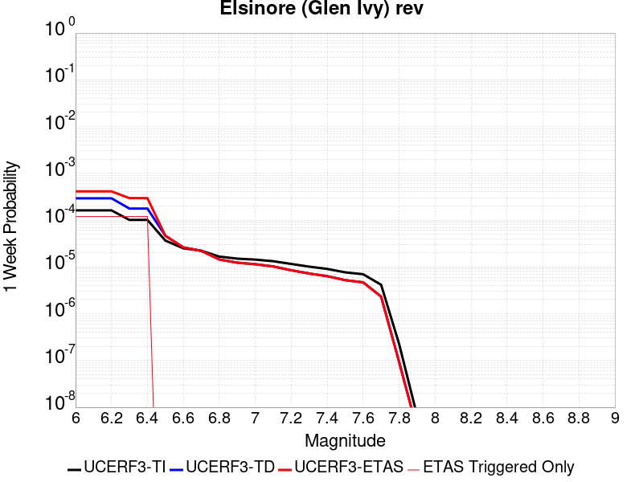 | 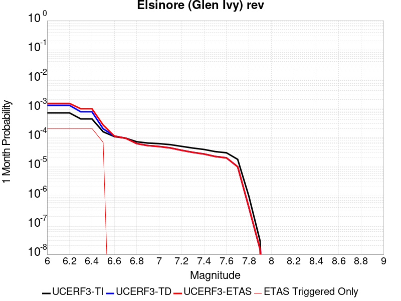 | 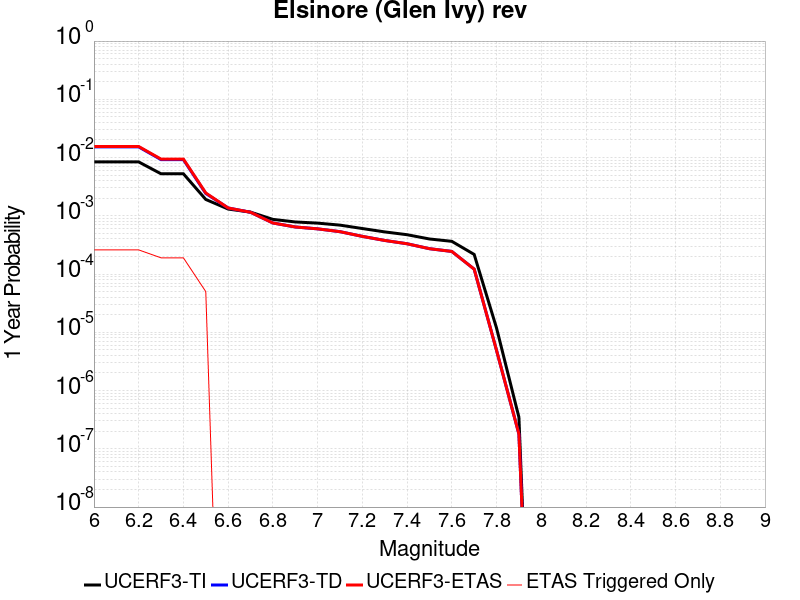 | 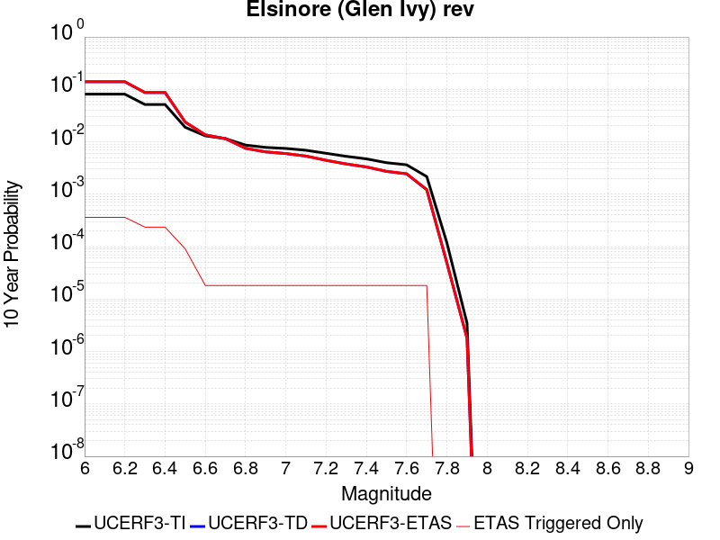 |

| Magnitude | 1 wk TI Prob | 1 wk TD Prob | 1 wk ETAS Prob | 1 wk ETAS/TD Gain | 1 wk ETAS Triggered Only | 1 mo TI Prob | 1 mo TD Prob | 1 mo ETAS Prob | 1 mo ETAS/TD Gain | 1 mo ETAS Triggered Only | 1 yr TI Prob | 1 yr TD Prob | 1 yr ETAS Prob | 1 yr ETAS/TD Gain | 1 yr ETAS Triggered Only | 10 yr TI Prob | 10 yr TD Prob | 10 yr ETAS Prob | 10 yr ETAS/TD Gain | 10 yr ETAS Triggered Only |
|-----|-----|-----|-----|-----|-----|-----|-----|-----|-----|-----|-----|-----|-----|-----|-----|-----|-----|-----|-----|-----|
| 6.0 | 1.6204086E-4 | 2.9360707E-4 | 3.935777E-4 | 1.3404913 | 1.0E-4 | 6.94276E-4 | 0.0012578638 | 0.0014576123 | 1.1587998 | 2.0E-4 | 0.008420097 | 0.015234485 | 0.015490524 | 1.0168066 | 2.6E-4 | 0.081081145 | 0.13969168 | 0.13998418 | 1.0020939 | 3.4E-4 |
| 6.1 | 1.6204086E-4 | 2.9360707E-4 | 3.935777E-4 | 1.3404913 | 1.0E-4 | 6.94276E-4 | 0.0012578638 | 0.0014576123 | 1.1587998 | 2.0E-4 | 0.008420097 | 0.015234485 | 0.015490524 | 1.0168066 | 2.6E-4 | 0.081081145 | 0.13969168 | 0.13998418 | 1.0020939 | 3.4E-4 |
| 6.2 | 1.6204086E-4 | 2.9360707E-4 | 3.935777E-4 | 1.3404913 | 1.0E-4 | 6.94276E-4 | 0.0012578638 | 0.0014576123 | 1.1587998 | 2.0E-4 | 0.008420097 | 0.015234485 | 0.015490524 | 1.0168066 | 2.6E-4 | 0.081081145 | 0.13969168 | 0.13998418 | 1.0020939 | 3.4E-4 |
| 6.3 | 1.0111737E-4 | 1.7703383E-4 | 2.370232E-4 | 1.3388582 | 6.0E-5 | 4.332882E-4 | 7.5861247E-4 | 8.9850626E-4 | 1.1844075 | 1.4E-4 | 0.005262531 | 0.009217682 | 0.0094059305 | 1.0204226 | 1.9E-4 | 0.0513964 | 0.0870191 | 0.08722909 | 1.0024132 | 2.3E-4 |
| 6.4 | 1.0111737E-4 | 1.7703383E-4 | 2.370232E-4 | 1.3388582 | 6.0E-5 | 4.332882E-4 | 7.5861247E-4 | 8.9850626E-4 | 1.1844075 | 1.4E-4 | 0.005262531 | 0.009217682 | 0.0094059305 | 1.0204226 | 1.9E-4 | 0.0513964 | 0.0870191 | 0.08722909 | 1.0024132 | 2.3E-4 |
| 6.5 | 3.6624708E-5 | 4.6391084E-5 | 5.6390618E-5 | 1.2155486 | 1.0E-5 | 1.569536E-4 | 1.9880582E-4 | 2.487959E-4 | 1.2514517 | 5.0E-5 | 0.001909235 | 0.0024181372 | 0.0024680162 | 1.020627 | 5.0E-5 | 0.01892915 | 0.023739954 | 0.023808293 | 1.0028787 | 7.0E-5 |
| 6.6 | 2.5051324E-5 | 2.614772E-5 | 2.614772E-5 | 1.0 | 0.0 | 1.073584E-4 | 1.12057096E-4 | 1.12057096E-4 | 1.0 | 0.0 | 0.0013063047 | 0.0013634858 | 0.0013634858 | 1.0 | 0.0 | 0.012986525 | 0.013564618 | 0.013574483 | 1.0007272 | 1.0E-5 |
| 6.7 | 2.2189772E-5 | 2.2072849E-5 | 2.2072849E-5 | 1.0 | 0.0 | 9.509556E-5 | 9.4594696E-5 | 9.4594696E-5 | 1.0 | 0.0 | 0.0011571734 | 0.0011511183 | 0.0011511183 | 1.0 | 0.0 | 0.011511663 | 0.011465415 | 0.0114753 | 1.0008622 | 1.0E-5 |
| 6.8 | 1.6654378E-5 | 1.4437705E-5 | 1.4437705E-5 | 1.0 | 0.0 | 7.137396E-5 | 6.187444E-5 | 6.187444E-5 | 1.0 | 0.0 | 8.686314E-4 | 7.530661E-4 | 7.530661E-4 | 1.0 | 0.0 | 0.008652439 | 0.00751048 | 0.007520405 | 1.0013214 | 1.0E-5 |
| 6.9 | 1.5042909E-5 | 1.2332022E-5 | 1.2332022E-5 | 1.0 | 0.0 | 6.446802E-5 | 5.285047E-5 | 5.285047E-5 | 1.0 | 0.0 | 7.8461546E-4 | 6.4326765E-4 | 6.4326765E-4 | 1.0 | 0.0 | 0.007818509 | 0.00641828 | 0.0064282157 | 1.001548 | 1.0E-5 |
| 7.0 | 1.4361385E-5 | 1.1451324E-5 | 1.1451324E-5 | 1.0 | 0.0 | 6.154734E-5 | 4.9076196E-5 | 4.9076196E-5 | 1.0 | 0.0 | 7.490812E-4 | 5.973418E-4 | 5.973418E-4 | 1.0 | 0.0 | 0.007465612 | 0.0059613534 | 0.005971294 | 1.0016675 | 1.0E-5 |
| 7.1 | 1.3265571E-5 | 1.0244926E-5 | 1.0244926E-5 | 1.0 | 0.0 | 5.6851208E-5 | 4.39061E-5 | 4.39061E-5 | 1.0 | 0.0 | 6.919436E-4 | 5.344282E-4 | 5.344282E-4 | 1.0 | 0.0 | 0.006897931 | 0.0053347866 | 0.005344733 | 1.0018644 | 1.0E-5 |
| 7.2 | 1.1596403E-5 | 8.505067E-6 | 8.505067E-6 | 1.0 | 0.0 | 4.9697923E-5 | 3.6449786E-5 | 3.6449786E-5 | 1.0 | 0.0 | 6.049042E-4 | 4.436875E-4 | 4.436875E-4 | 1.0 | 0.0 | 0.006032603 | 0.0044294316 | 0.0044393875 | 1.0022476 | 1.0E-5 |
| 7.3 | 1.0150827E-5 | 7.2387597E-6 | 7.2387597E-6 | 1.0 | 0.0 | 4.3502816E-5 | 3.1022897E-5 | 3.1022897E-5 | 1.0 | 0.0 | 5.2951806E-4 | 3.7763975E-4 | 3.7763975E-4 | 1.0 | 0.0 | 0.005282581 | 0.0037703665 | 0.003780329 | 1.0026423 | 1.0E-5 |
| 7.4 | 9.080705E-6 | 6.352519E-6 | 6.352519E-6 | 1.0 | 0.0 | 3.8916725E-5 | 2.7224805E-5 | 2.7224805E-5 | 1.0 | 0.0 | 4.7370812E-4 | 3.3141294E-4 | 3.3141294E-4 | 1.0 | 0.0 | 0.004726996 | 0.0033093381 | 0.003319305 | 1.0030117 | 1.0E-5 |
| 7.5 | 7.671649E-6 | 5.2256332E-6 | 5.2256332E-6 | 1.0 | 0.0 | 3.287808E-5 | 2.2395385E-5 | 2.2395385E-5 | 1.0 | 0.0 | 4.0021708E-4 | 2.7263095E-4 | 2.7263095E-4 | 1.0 | 0.0 | 0.0039949706 | 0.00272309 | 0.0027330627 | 1.0036623 | 1.0E-5 |
| 7.6 | 6.990086E-6 | 4.687545E-6 | 4.687545E-6 | 1.0 | 0.0 | 2.9957167E-5 | 2.008933E-5 | 2.008933E-5 | 1.0 | 0.0 | 3.6466747E-4 | 2.445613E-4 | 2.445613E-4 | 1.0 | 0.0 | 0.0036406964 | 0.002443038 | 0.0024530136 | 1.0040833 | 1.0E-5 |
| 7.7 | 4.163505E-6 | 2.3295343E-6 | 2.3295343E-6 | 1.0 | 0.0 | 1.7843471E-5 | 9.983683E-6 | 9.983683E-6 | 1.0 | 0.0 | 2.172226E-4 | 1.21545316E-4 | 1.21545316E-4 | 1.0 | 0.0 | 0.0021701038 | 0.0012148614 | 0.0012248493 | 1.0082214 | 1.0E-5 |
| 7.8 | 2.2692414E-7 | 9.3854695E-8 | 9.3854695E-8 | 1.0 | 0.0 | 9.725317E-7 | 4.0223435E-7 | 4.0223435E-7 | 1.0 | 0.0 | 1.1840509E-5 | 4.8971956E-6 | 4.8971956E-6 | 1.0 | 0.0 | 1.1839878E-4 | 4.8971204E-5 | 4.8971204E-5 | 1.0 | 0.0 |
| 7.9 | 6.676829E-9 | 3.439853E-9 | 3.439853E-9 | 1.0 | 0.0 | 2.861498E-8 | 1.4742227E-8 | 1.4742227E-8 | 1.0 | 0.0 | 3.4838732E-7 | 1.7948659E-7 | 1.7948659E-7 | 1.0 | 0.0 | 3.4838679E-6 | 1.7948646E-6 | 1.7948646E-6 | 1.0 | 0.0 |

## Death Valley (Fish Lake Valley)
*[(top)](#table-of-contents)*

| 1 Week | 1 Month | 1 Year | 10 Year |
|-----|-----|-----|-----|
| 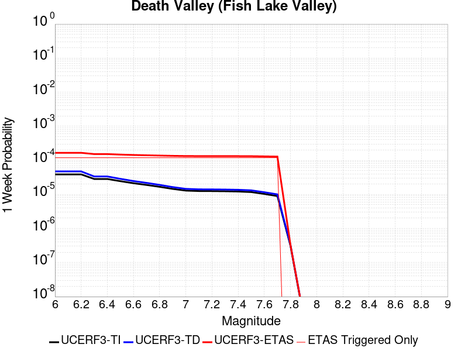 | 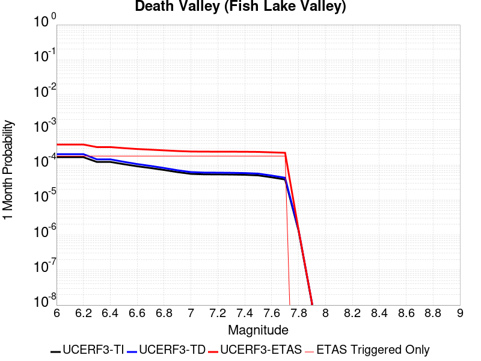 | 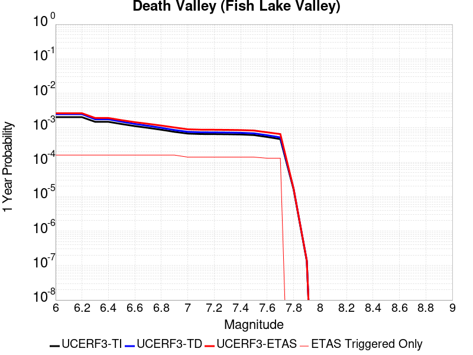 | 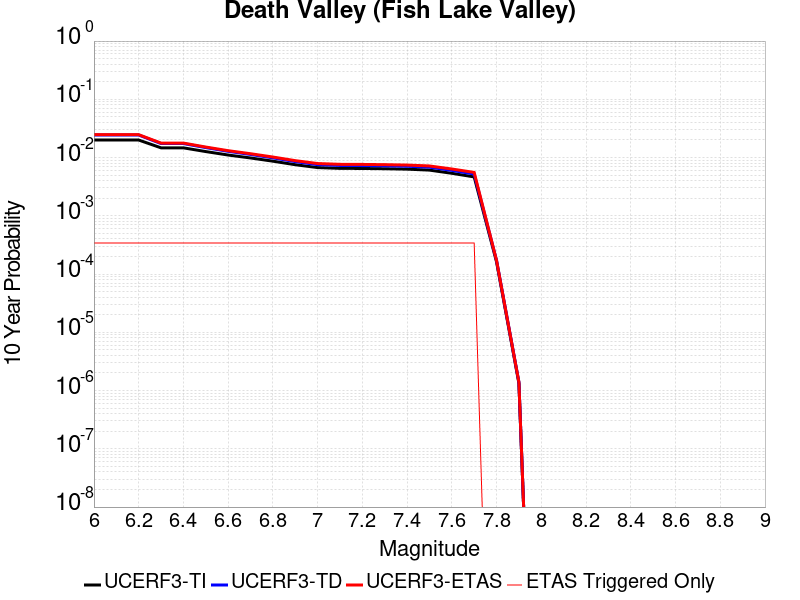 |

| Magnitude | 1 wk TI Prob | 1 wk TD Prob | 1 wk ETAS Prob | 1 wk ETAS/TD Gain | 1 wk ETAS Triggered Only | 1 mo TI Prob | 1 mo TD Prob | 1 mo ETAS Prob | 1 mo ETAS/TD Gain | 1 mo ETAS Triggered Only | 1 yr TI Prob | 1 yr TD Prob | 1 yr ETAS Prob | 1 yr ETAS/TD Gain | 1 yr ETAS Triggered Only | 10 yr TI Prob | 10 yr TD Prob | 10 yr ETAS Prob | 10 yr ETAS/TD Gain | 10 yr ETAS Triggered Only |
|-----|-----|-----|-----|-----|-----|-----|-----|-----|-----|-----|-----|-----|-----|-----|-----|-----|-----|-----|-----|-----|
| 6.0 | 3.872328E-5 | 4.7267473E-5 | 1.2726369E-4 | 2.6924157 | 8.0E-5 | 1.6594635E-4 | 2.0256084E-4 | 3.025406E-4 | 1.4935788 | 1.0E-4 | 0.0020185246 | 0.002463534 | 0.0026231399 | 1.0647874 | 1.6E-4 | 0.02000288 | 0.024388181 | 0.024739401 | 1.0144012 | 3.6E-4 |
| 6.1 | 3.872328E-5 | 4.7267473E-5 | 1.2726369E-4 | 2.6924157 | 8.0E-5 | 1.6594635E-4 | 2.0256084E-4 | 3.025406E-4 | 1.4935788 | 1.0E-4 | 0.0020185246 | 0.002463534 | 0.0026231399 | 1.0647874 | 1.6E-4 | 0.02000288 | 0.024388181 | 0.024739401 | 1.0144012 | 3.6E-4 |
| 6.2 | 3.872328E-5 | 4.7267473E-5 | 1.2726369E-4 | 2.6924157 | 8.0E-5 | 1.6594635E-4 | 2.0256084E-4 | 3.025406E-4 | 1.4935788 | 1.0E-4 | 0.0020185246 | 0.002463534 | 0.0026231399 | 1.0647874 | 1.6E-4 | 0.02000288 | 0.024388181 | 0.024739401 | 1.0144012 | 3.6E-4 |
| 6.3 | 2.8356371E-5 | 3.3609853E-5 | 1.13607166E-4 | 3.3801744 | 8.0E-5 | 1.2152165E-4 | 1.4403471E-4 | 2.4402031E-4 | 1.694177 | 1.0E-4 | 0.0014785219 | 0.0017522911 | 0.0019120107 | 1.091149 | 1.6E-4 | 0.014687235 | 0.017391782 | 0.01774552 | 1.0203395 | 3.6E-4 |
| 6.4 | 2.8356371E-5 | 3.3609853E-5 | 1.13607166E-4 | 3.3801744 | 8.0E-5 | 1.2152165E-4 | 1.4403471E-4 | 2.4402031E-4 | 1.694177 | 1.0E-4 | 0.0014785219 | 0.0017522911 | 0.0019120107 | 1.091149 | 1.6E-4 | 0.014687235 | 0.017391782 | 0.01774552 | 1.0203395 | 3.6E-4 |
| 6.5 | 2.4448687E-5 | 2.8607552E-5 | 1.08605265E-4 | 3.7963843 | 8.0E-5 | 1.0477588E-4 | 1.2259831E-4 | 2.2258607E-4 | 1.8155719 | 1.0E-4 | 0.0012748998 | 0.0014916632 | 0.0016514244 | 1.1071029 | 1.6E-4 | 0.012676105 | 0.014821377 | 0.015176041 | 1.0239292 | 3.6E-4 |
| 6.6 | 2.1298161E-5 | 2.4660083E-5 | 1.0465811E-4 | 4.244029 | 8.0E-5 | 9.127464E-5 | 1.0568198E-4 | 2.0567141E-4 | 1.946135 | 1.0E-4 | 0.0011107022 | 0.0012859525 | 0.0014457467 | 1.1242614 | 1.6E-4 | 0.011051672 | 0.012788526 | 0.013134049 | 1.0270183 | 3.5E-4 |
| 6.7 | 1.8959729E-5 | 2.1781025E-5 | 1.0177928E-4 | 4.6728415 | 8.0E-5 | 8.125345E-5 | 9.334405E-5 | 1.9333472E-4 | 2.0712054 | 1.0E-4 | 9.888117E-4 | 0.001135897 | 0.0012957152 | 1.1406978 | 1.6E-4 | 0.009844234 | 0.01130357 | 0.011649613 | 1.0306137 | 3.5E-4 |
| 6.8 | 1.6691629E-5 | 1.9018353E-5 | 9.9016834E-5 | 5.206383 | 8.0E-5 | 7.153359E-5 | 8.150477E-5 | 1.8149662E-4 | 2.2268221 | 1.0E-4 | 8.7057345E-4 | 9.918857E-4 | 0.0011517269 | 1.1611489 | 1.6E-4 | 0.008671708 | 0.009876343 | 0.010222887 | 1.0350882 | 3.5E-4 |
| 6.9 | 1.450505E-5 | 1.638954E-5 | 9.638823E-5 | 5.881082 | 8.0E-5 | 6.216302E-5 | 7.0239046E-5 | 1.7023202E-4 | 2.4236095 | 1.0E-4 | 7.5657194E-4 | 8.5483363E-4 | 0.0010146969 | 1.1870109 | 1.6E-4 | 0.007540013 | 0.008516385 | 0.008863405 | 1.0407473 | 3.5E-4 |
| 7.0 | 1.2940855E-5 | 1.4537972E-5 | 8.453696E-5 | 5.814907 | 7.0E-5 | 5.545963E-5 | 6.230414E-5 | 1.5229853E-4 | 2.4444368 | 9.0E-5 | 6.750118E-4 | 7.5829466E-4 | 8.981885E-4 | 1.1844848 | 1.4E-4 | 0.006729651 | 0.0075576897 | 0.007865347 | 1.0407078 | 3.1E-4 |
| 7.1 | 1.2544658E-5 | 1.4078208E-5 | 8.407722E-5 | 5.9721537 | 7.0E-5 | 5.3761712E-5 | 6.0333812E-5 | 1.5032839E-4 | 2.4916108 | 9.0E-5 | 6.5435225E-4 | 7.343222E-4 | 8.742194E-4 | 1.1905121 | 1.4E-4 | 0.006524288 | 0.007319551 | 0.007627282 | 1.0420424 | 3.1E-4 |
| 7.2 | 1.2489416E-5 | 1.4015674E-5 | 8.40147E-5 | 5.9943385 | 7.0E-5 | 5.3524967E-5 | 6.0065824E-5 | 1.5006041E-4 | 2.4982662 | 9.0E-5 | 6.514716E-4 | 7.310616E-4 | 8.709593E-4 | 1.1913624 | 1.4E-4 | 0.006495651 | 0.0072871596 | 0.0075949007 | 1.0422306 | 3.1E-4 |
| 7.3 | 1.2368307E-5 | 1.3879812E-5 | 8.387884E-5 | 6.043226 | 7.0E-5 | 5.3005948E-5 | 5.9483587E-5 | 1.4947823E-4 | 2.5129325 | 9.0E-5 | 6.451563E-4 | 7.2397763E-4 | 8.6387625E-4 | 1.1932361 | 1.4E-4 | 0.0064328653 | 0.007216782 | 0.007524545 | 1.0426455 | 3.1E-4 |
| 7.4 | 1.2161707E-5 | 1.36478675E-5 | 8.364691E-5 | 6.1289363 | 7.0E-5 | 5.212056E-5 | 5.8489582E-5 | 1.4848432E-4 | 2.5386455 | 9.0E-5 | 6.3438306E-4 | 7.118836E-4 | 8.5178396E-4 | 1.1965214 | 1.4E-4 | 0.006325751 | 0.0070966207 | 0.0074044205 | 1.0433728 | 3.1E-4 |
| 7.5 | 1.1707948E-5 | 1.3145515E-5 | 8.3144594E-5 | 6.32494 | 7.0E-5 | 5.0175953E-5 | 5.6336736E-5 | 1.4633167E-4 | 2.5974467 | 9.0E-5 | 6.10721E-4 | 6.856895E-4 | 8.255935E-4 | 1.2040341 | 1.4E-4 | 0.0060904534 | 0.006836321 | 0.0071342704 | 1.0435833 | 3.0E-4 |
| 7.6 | 1.0319538E-5 | 1.1579622E-5 | 8.1578815E-5 | 7.045032 | 7.0E-5 | 4.4225842E-5 | 4.9626036E-5 | 1.2962207E-4 | 2.6119769 | 8.0E-5 | 5.383166E-4 | 6.040347E-4 | 7.3395617E-4 | 1.2150894 | 1.3E-4 | 0.0053701443 | 0.0060244603 | 0.0063127135 | 1.047847 | 2.9E-4 |
| 7.7 | 8.937764E-6 | 1.0022779E-5 | 8.002208E-5 | 7.9840207 | 7.0E-5 | 3.830414E-5 | 4.295409E-5 | 1.2295066E-4 | 2.8623736 | 8.0E-5 | 4.6625308E-4 | 5.228456E-4 | 6.527776E-4 | 1.2485094 | 1.3E-4 | 0.0046527605 | 0.005216664 | 0.0055051516 | 1.0553011 | 2.9E-4 |
| 7.8 | 3.108007E-7 | 3.284654E-7 | 3.284654E-7 | 1.0 | 0.0 | 1.3320023E-6 | 1.407708E-6 | 1.407708E-6 | 1.0 | 0.0 | 1.6217007E-5 | 1.7138715E-5 | 1.7138715E-5 | 1.0 | 0.0 | 1.6215823E-4 | 1.7137431E-4 | 1.813726E-4 | 1.0583419 | 1.0E-5 |
| 7.9 | 2.5591178E-9 | 2.6696718E-9 | 2.6696718E-9 | 1.0 | 0.0 | 1.0967647E-8 | 1.14414505E-8 | 1.14414505E-8 | 1.0 | 0.0 | 1.335311E-7 | 1.3929966E-7 | 1.3929966E-7 | 1.0 | 0.0 | 1.3353102E-6 | 1.3929966E-6 | 1.3929966E-6 | 1.0 | 0.0 |

## Lake Isabella (Seismicity)
*[(top)](#table-of-contents)*

| 1 Week | 1 Month | 1 Year | 10 Year |
|-----|-----|-----|-----|
| 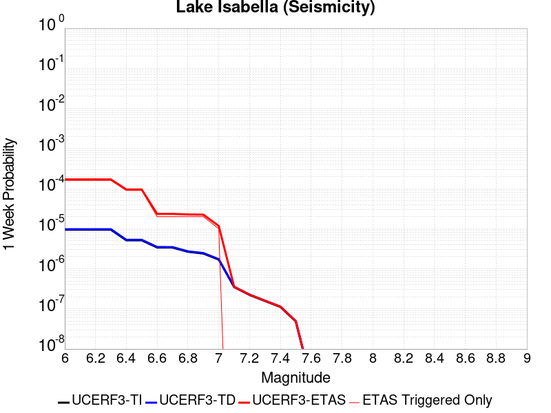 | 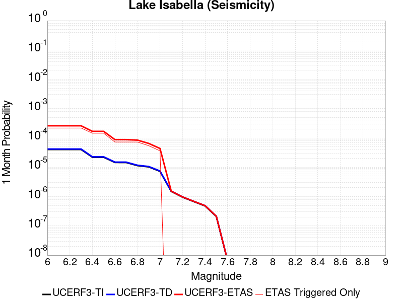 | 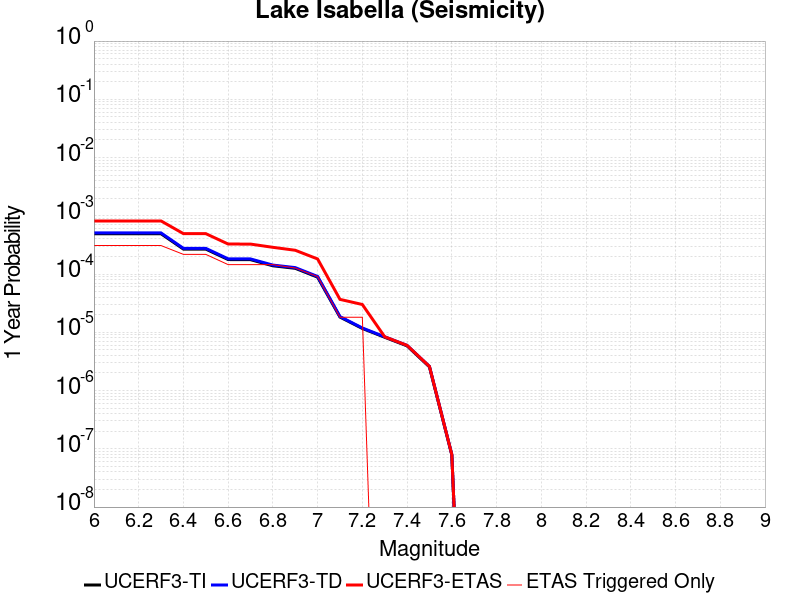 | 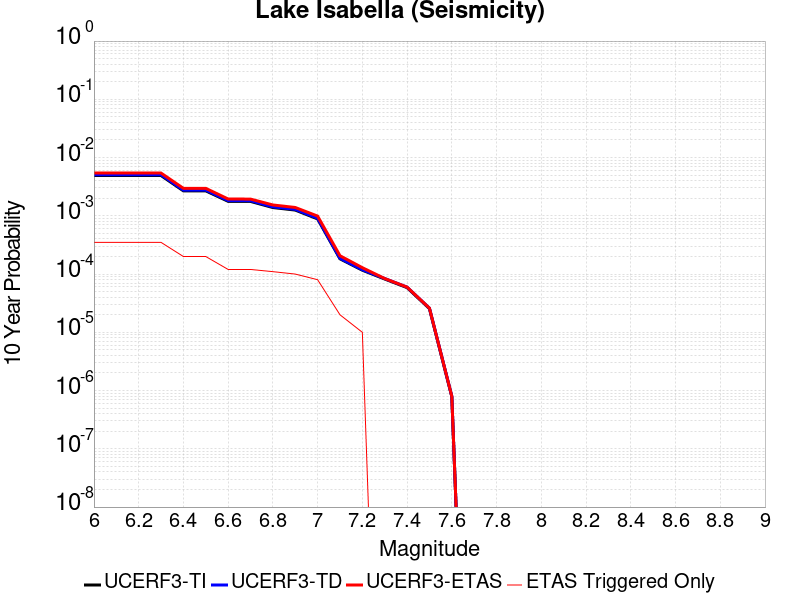 |

| Magnitude | 1 wk TI Prob | 1 wk TD Prob | 1 wk ETAS Prob | 1 wk ETAS/TD Gain | 1 wk ETAS Triggered Only | 1 mo TI Prob | 1 mo TD Prob | 1 mo ETAS Prob | 1 mo ETAS/TD Gain | 1 mo ETAS Triggered Only | 1 yr TI Prob | 1 yr TD Prob | 1 yr ETAS Prob | 1 yr ETAS/TD Gain | 1 yr ETAS Triggered Only | 10 yr TI Prob | 10 yr TD Prob | 10 yr ETAS Prob | 10 yr ETAS/TD Gain | 10 yr ETAS Triggered Only |
|-----|-----|-----|-----|-----|-----|-----|-----|-----|-----|-----|-----|-----|-----|-----|-----|-----|-----|-----|-----|-----|
| 6.0 | 9.431637E-6 | 9.741651E-6 | 1.6974009E-4 | 17.42416 | 1.6E-4 | 4.0420677E-5 | 4.1749343E-5 | 2.317414E-4 | 5.55078 | 1.9E-4 | 4.920106E-4 | 5.0819275E-4 | 7.8805047E-4 | 1.5506921 | 2.8E-4 | 0.004909227 | 0.005071599 | 0.005419824 | 1.0686618 | 3.5E-4 |
| 6.1 | 9.431637E-6 | 9.741651E-6 | 1.6974009E-4 | 17.42416 | 1.6E-4 | 4.0420677E-5 | 4.1749343E-5 | 2.317414E-4 | 5.55078 | 1.9E-4 | 4.920106E-4 | 5.0819275E-4 | 7.8805047E-4 | 1.5506921 | 2.8E-4 | 0.004909227 | 0.005071599 | 0.005419824 | 1.0686618 | 3.5E-4 |
| 6.2 | 9.431637E-6 | 9.741651E-6 | 1.6974009E-4 | 17.42416 | 1.6E-4 | 4.0420677E-5 | 4.1749343E-5 | 2.317414E-4 | 5.55078 | 1.9E-4 | 4.920106E-4 | 5.0819275E-4 | 7.8805047E-4 | 1.5506921 | 2.8E-4 | 0.004909227 | 0.005071599 | 0.005419824 | 1.0686618 | 3.5E-4 |
| 6.3 | 9.431637E-6 | 9.741651E-6 | 1.6974009E-4 | 17.42416 | 1.6E-4 | 4.0420677E-5 | 4.1749343E-5 | 2.317414E-4 | 5.55078 | 1.9E-4 | 4.920106E-4 | 5.0819275E-4 | 7.8805047E-4 | 1.5506921 | 2.8E-4 | 0.004909227 | 0.005071599 | 0.005419824 | 1.0686618 | 3.5E-4 |
| 6.4 | 5.144063E-6 | 5.3000763E-6 | 9.52996E-5 | 17.980799 | 9.0E-5 | 2.2045799E-5 | 2.2714434E-5 | 1.3271194E-4 | 5.8426256 | 1.1E-4 | 2.6837454E-4 | 2.765166E-4 | 4.4646958E-4 | 1.6146213 | 1.7E-4 | 0.0026805066 | 0.0027620657 | 0.0029615134 | 1.0722096 | 2.0E-4 |
| 6.5 | 5.144063E-6 | 5.3000763E-6 | 9.52996E-5 | 17.980799 | 9.0E-5 | 2.2045799E-5 | 2.2714434E-5 | 1.3271194E-4 | 5.8426256 | 1.1E-4 | 2.6837454E-4 | 2.765166E-4 | 4.4646958E-4 | 1.6146213 | 1.7E-4 | 0.0026805066 | 0.0027620657 | 0.0029615134 | 1.0722096 | 2.0E-4 |
| 6.6 | 3.4009804E-6 | 3.498786E-6 | 2.3498716E-5 | 6.716248 | 2.0E-5 | 1.4575549E-5 | 1.4994721E-5 | 5.499412E-5 | 3.6675656 | 4.0E-5 | 1.7744285E-4 | 1.8254704E-4 | 2.725306E-4 | 1.4929336 | 9.0E-5 | 0.0017730123 | 0.0018241286 | 0.0019439097 | 1.0656649 | 1.2E-4 |
| 6.7 | 3.3880428E-6 | 3.4856528E-6 | 2.3485583E-5 | 6.7377863 | 2.0E-5 | 1.4520103E-5 | 1.4938435E-5 | 5.493784E-5 | 3.6776166 | 4.0E-5 | 1.767679E-4 | 1.8186188E-4 | 2.7184552E-4 | 1.494791 | 9.0E-5 | 0.0017662736 | 0.0018172882 | 0.0019370702 | 1.0659125 | 1.2E-4 |
| 6.8 | 2.6582E-6 | 2.7337003E-6 | 2.2733646E-5 | 8.3160715 | 2.0E-5 | 1.1392236E-5 | 1.1715813E-5 | 5.1715346E-5 | 4.414149 | 4.0E-5 | 1.3869164E-4 | 1.4263204E-4 | 2.3261919E-4 | 1.6309043 | 9.0E-5 | 0.0013860512 | 0.0014255369 | 0.0015353801 | 1.0770539 | 1.1E-4 |
| 6.9 | 2.406011E-6 | 2.4743288E-6 | 2.247428E-5 | 9.08298 | 2.0E-5 | 1.0311434E-5 | 1.0604231E-5 | 4.0603914E-5 | 3.8290296 | 3.0E-5 | 1.2553448E-4 | 1.2910018E-4 | 2.0908985E-4 | 1.6195939 | 8.0E-5 | 0.0012546359 | 0.0012903814 | 0.0013902524 | 1.0773965 | 1.0E-4 |
| 7.0 | 1.6953097E-6 | 1.7429371E-6 | 1.174292E-5 | 6.7374315 | 1.0E-5 | 7.265593E-6 | 7.469715E-6 | 2.7469567E-5 | 3.6774583 | 2.0E-5 | 8.8455E-5 | 9.094104E-5 | 1.5093558E-4 | 1.6597081 | 6.0E-5 | 8.84198E-4 | 9.09141E-4 | 9.890682E-4 | 1.0879152 | 8.0E-5 |
| 7.1 | 3.5013824E-7 | 3.5714822E-7 | 3.5714822E-7 | 1.0 | 0.0 | 1.5005916E-6 | 1.5306344E-6 | 1.5306344E-6 | 1.0 | 0.0 | 1.826955E-5 | 1.8635317E-5 | 2.8635131E-5 | 1.5366055 | 1.0E-5 | 1.8268047E-4 | 1.863378E-4 | 2.0633407E-4 | 1.107312 | 2.0E-5 |
| 7.2 | 2.2321095E-7 | 2.2750574E-7 | 2.2750574E-7 | 1.0 | 0.0 | 9.56618E-7 | 9.750242E-7 | 9.750242E-7 | 1.0 | 0.0 | 1.1646762E-5 | 1.1870856E-5 | 2.1870737E-5 | 1.8423892 | 1.0E-5 | 1.1646151E-4 | 1.1870232E-4 | 1.2870114E-4 | 1.0842344 | 1.0E-5 |
| 7.3 | 1.5760406E-7 | 1.6060922E-7 | 1.6060922E-7 | 1.0 | 0.0 | 6.7544585E-7 | 6.8832503E-7 | 6.8832503E-7 | 1.0 | 0.0 | 8.223522E-6 | 8.380326E-6 | 8.380326E-6 | 1.0 | 0.0 | 8.2232174E-5 | 8.3800165E-5 | 8.3800165E-5 | 1.0 | 0.0 |
| 7.4 | 1.1216497E-7 | 1.1431706E-7 | 1.1431706E-7 | 1.0 | 0.0 | 4.8070694E-7 | 4.899302E-7 | 4.899302E-7 | 1.0 | 0.0 | 5.852591E-6 | 5.964884E-6 | 5.964884E-6 | 1.0 | 0.0 | 5.8524372E-5 | 5.9647282E-5 | 5.9647282E-5 | 1.0 | 0.0 |
| 7.5 | 4.885185E-8 | 4.9787737E-8 | 4.9787737E-8 | 1.0 | 0.0 | 2.0936506E-7 | 2.13376E-7 | 2.13376E-7 | 1.0 | 0.0 | 2.5490165E-6 | 2.59785E-6 | 2.59785E-6 | 1.0 | 0.0 | 2.5489873E-5 | 2.5978214E-5 | 2.5978214E-5 | 1.0 | 0.0 |
| 7.6 | 1.504641E-9 | 1.5317903E-9 | 1.5317903E-9 | 1.0 | 0.0 | 6.4484613E-9 | 6.5648154E-9 | 6.5648154E-9 | 1.0 | 0.0 | 7.851001E-8 | 7.992663E-8 | 7.992663E-8 | 1.0 | 0.0 | 7.8509987E-7 | 7.992663E-7 | 7.992663E-7 | 1.0 | 0.0 |

## White Wolf (Extension)
*[(top)](#table-of-contents)*

| 1 Week | 1 Month | 1 Year | 10 Year |
|-----|-----|-----|-----|
| 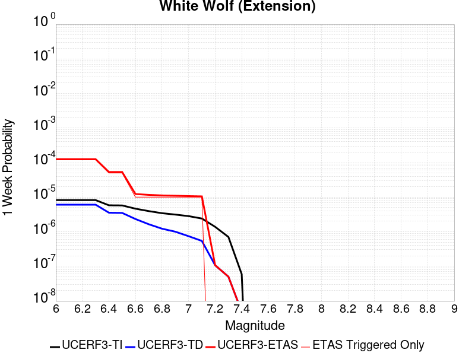 | 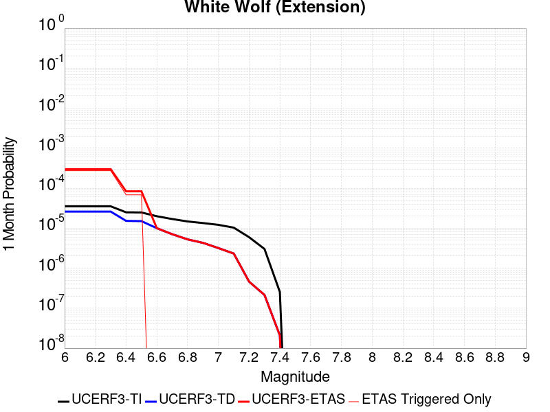 | 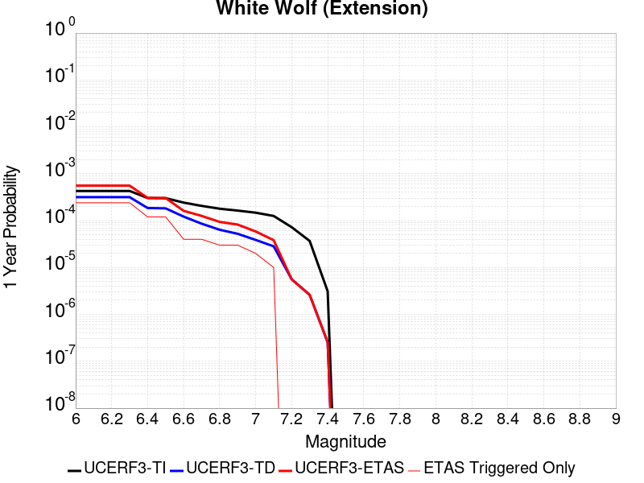 | 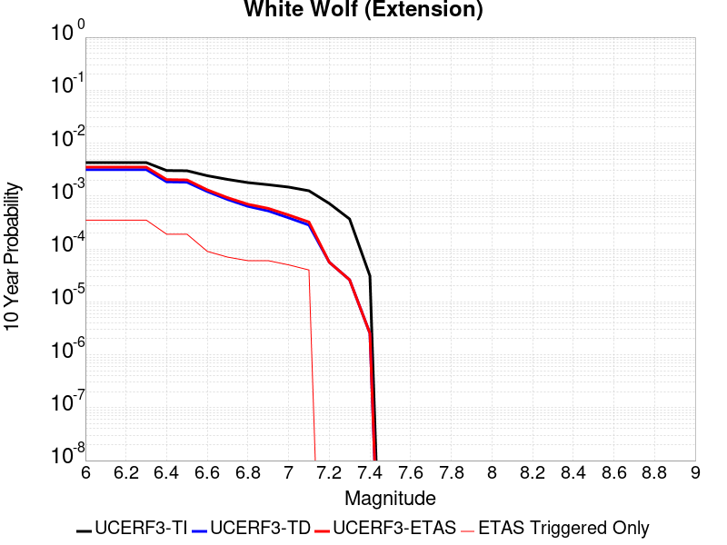 |

| Magnitude | 1 wk TI Prob | 1 wk TD Prob | 1 wk ETAS Prob | 1 wk ETAS/TD Gain | 1 wk ETAS Triggered Only | 1 mo TI Prob | 1 mo TD Prob | 1 mo ETAS Prob | 1 mo ETAS/TD Gain | 1 mo ETAS Triggered Only | 1 yr TI Prob | 1 yr TD Prob | 1 yr ETAS Prob | 1 yr ETAS/TD Gain | 1 yr ETAS Triggered Only | 10 yr TI Prob | 10 yr TD Prob | 10 yr ETAS Prob | 10 yr ETAS/TD Gain | 10 yr ETAS Triggered Only |
|-----|-----|-----|-----|-----|-----|-----|-----|-----|-----|-----|-----|-----|-----|-----|-----|-----|-----|-----|-----|-----|
| 6.0 | 8.222555E-6 | 6.0666657E-6 | 1.2606593E-4 | 20.780104 | 1.2E-4 | 3.5239045E-5 | 2.5999774E-5 | 1.9599535E-4 | 7.538348 | 1.7E-4 | 4.289509E-4 | 3.1650788E-4 | 5.5643194E-4 | 1.758035 | 2.4E-4 | 0.0042812387 | 0.003161223 | 0.0035101166 | 1.1103667 | 3.5E-4 |
| 6.1 | 8.222555E-6 | 6.0666657E-6 | 1.2606593E-4 | 20.780104 | 1.2E-4 | 3.5239045E-5 | 2.5999774E-5 | 1.9599535E-4 | 7.538348 | 1.7E-4 | 4.289509E-4 | 3.1650788E-4 | 5.5643194E-4 | 1.758035 | 2.4E-4 | 0.0042812387 | 0.003161223 | 0.0035101166 | 1.1103667 | 3.5E-4 |
| 6.2 | 8.222555E-6 | 6.0666657E-6 | 1.2606593E-4 | 20.780104 | 1.2E-4 | 3.5239045E-5 | 2.5999774E-5 | 1.9599535E-4 | 7.538348 | 1.7E-4 | 4.289509E-4 | 3.1650788E-4 | 5.5643194E-4 | 1.758035 | 2.4E-4 | 0.0042812387 | 0.003161223 | 0.0035101166 | 1.1103667 | 3.5E-4 |
| 6.3 | 8.222555E-6 | 6.0666657E-6 | 1.2606593E-4 | 20.780104 | 1.2E-4 | 3.5239045E-5 | 2.5999774E-5 | 1.9599535E-4 | 7.538348 | 1.7E-4 | 4.289509E-4 | 3.1650788E-4 | 5.5643194E-4 | 1.758035 | 2.4E-4 | 0.0042812387 | 0.003161223 | 0.0035101166 | 1.1103667 | 3.5E-4 |
| 6.4 | 5.821773E-6 | 3.5571766E-6 | 5.3557E-5 | 15.056042 | 5.0E-5 | 2.4950215E-5 | 1.5244959E-5 | 1.05243584E-4 | 6.9035006 | 9.0E-5 | 3.0372653E-4 | 1.8559267E-4 | 3.055704E-4 | 1.6464573 | 1.2E-4 | 0.0030331176 | 0.001854485 | 0.0020441327 | 1.1022643 | 1.9E-4 |
| 6.5 | 5.766023E-6 | 3.4991106E-6 | 5.3498934E-5 | 15.289295 | 5.0E-5 | 2.4711293E-5 | 1.4996108E-5 | 1.0499476E-4 | 7.001467 | 9.0E-5 | 3.0081844E-4 | 1.8256342E-4 | 3.025415E-4 | 1.6571858 | 1.2E-4 | 0.0030041158 | 0.0018242426 | 0.002013896 | 1.1039628 | 1.9E-4 |
| 6.6 | 4.643576E-6 | 2.332624E-6 | 1.2332601E-5 | 5.2870073 | 1.0E-5 | 1.9900888E-5 | 9.996925E-6 | 2.9996725E-5 | 3.0005953 | 2.0E-5 | 2.4226638E-4 | 1.2170619E-4 | 1.6170132E-4 | 1.3286203 | 4.0E-5 | 0.0024200242 | 0.0012164378 | 0.0013063283 | 1.0738965 | 9.0E-5 |
| 6.7 | 3.9529173E-6 | 1.6483477E-6 | 1.1648332E-5 | 7.066671 | 1.0E-5 | 1.6940963E-5 | 7.0643296E-6 | 2.7064189E-5 | 3.831105 | 2.0E-5 | 2.0623671E-4 | 8.6005006E-5 | 1.2600157E-4 | 1.4650491 | 4.0E-5 | 0.002060454 | 8.597357E-4 | 9.2967553E-4 | 1.0813503 | 7.0E-5 |
| 6.8 | 3.4377522E-6 | 1.2245237E-6 | 1.1224512E-5 | 9.16643 | 1.0E-5 | 1.473314E-5 | 5.2479486E-6 | 1.5247896E-5 | 2.9054964 | 1.0E-5 | 1.7936122E-4 | 6.3891996E-5 | 9.389008E-5 | 1.4695123 | 3.0E-5 | 0.0017921652 | 6.387454E-4 | 6.98707E-4 | 1.0938741 | 6.0E-5 |
| 6.9 | 3.1367306E-6 | 1.0033783E-6 | 1.1003368E-5 | 10.96632 | 1.0E-5 | 1.3443062E-5 | 4.3001864E-6 | 1.4300143E-5 | 3.3254707 | 1.0E-5 | 1.63657E-4 | 5.235359E-5 | 8.235202E-5 | 1.5729966 | 3.0E-5 | 0.0016353652 | 5.2342017E-4 | 5.833888E-4 | 1.1145706 | 6.0E-5 |
| 7.0 | 2.8298145E-6 | 7.4286646E-7 | 1.0742859E-5 | 14.461359 | 1.0E-5 | 1.2127721E-5 | 3.1837099E-6 | 1.3183678E-5 | 4.14098 | 1.0E-5 | 1.47645E-4 | 3.8761027E-5 | 5.876025E-5 | 1.5159621 | 2.0E-5 | 0.0014754693 | 3.8754768E-4 | 4.375283E-4 | 1.1289663 | 5.0E-5 |
| 7.1 | 2.4091064E-6 | 5.4227525E-7 | 1.054227E-5 | 19.440811 | 1.0E-5 | 1.03247E-5 | 2.3240348E-6 | 1.2324012E-5 | 5.3028517 | 1.0E-5 | 1.2569598E-4 | 2.8294799E-5 | 3.8294515E-5 | 1.3534119 | 1.0E-5 | 0.001256249 | 2.8291598E-4 | 3.2290467E-4 | 1.1413447 | 4.0E-5 |
| 7.2 | 1.3875518E-6 | 1.0743063E-7 | 1.0743063E-7 | 1.0 | 0.0 | 5.9466374E-6 | 4.6041689E-7 | 4.6041689E-7 | 1.0 | 0.0 | 7.23979E-5 | 5.6055624E-6 | 5.6055624E-6 | 1.0 | 0.0 | 7.2374323E-4 | 5.6054323E-5 | 5.6054323E-5 | 1.0 | 0.0 |
| 7.3 | 7.056077E-7 | 5.002034E-8 | 5.002034E-8 | 1.0 | 0.0 | 3.0240296E-6 | 2.1437286E-7 | 2.1437286E-7 | 1.0 | 0.0 | 3.681694E-5 | 2.609987E-6 | 2.609987E-6 | 1.0 | 0.0 | 3.681084E-4 | 2.609961E-5 | 2.609961E-5 | 1.0 | 0.0 |
| 7.4 | 5.9334678E-8 | 4.8683537E-9 | 4.8683537E-9 | 1.0 | 0.0 | 2.5429145E-7 | 2.0864372E-8 | 2.0864372E-8 | 1.0 | 0.0 | 3.095994E-6 | 2.5402372E-7 | 2.5402372E-7 | 1.0 | 0.0 | 3.095951E-5 | 2.5402353E-6 | 2.5402353E-6 | 1.0 | 0.0 |

## San Andreas (Coachella) rev
*[(top)](#table-of-contents)*

| 1 Week | 1 Month | 1 Year | 10 Year |
|-----|-----|-----|-----|
|  | 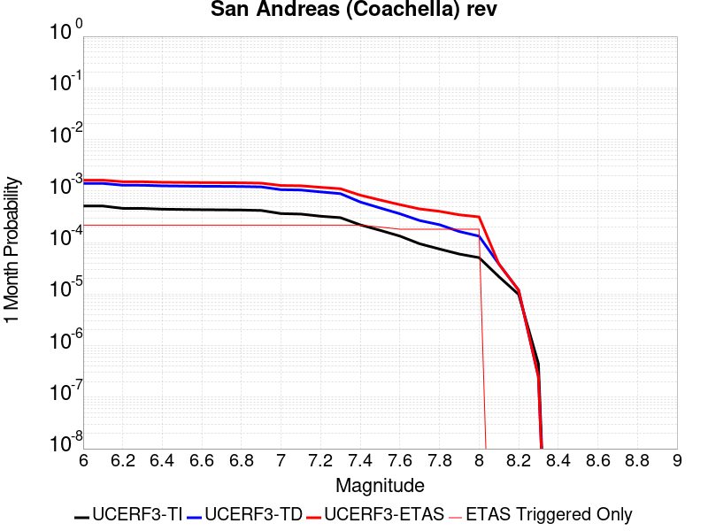 | 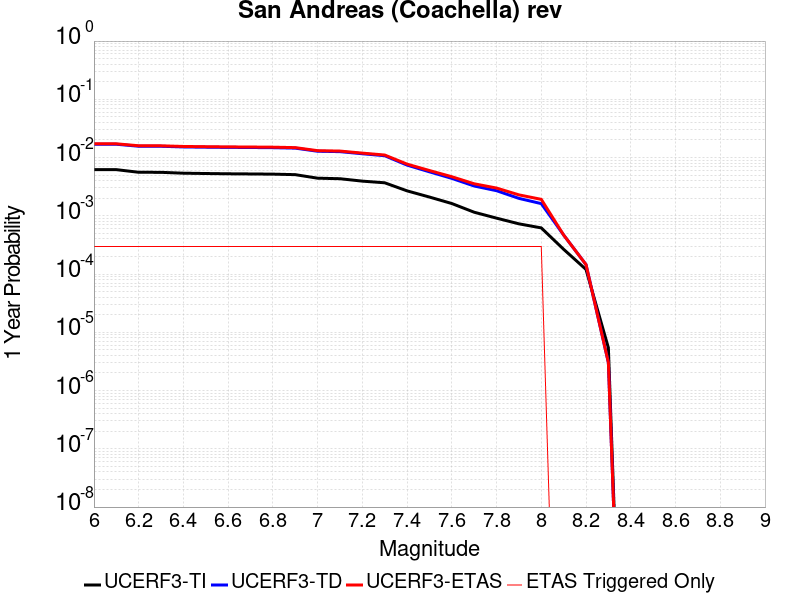 | 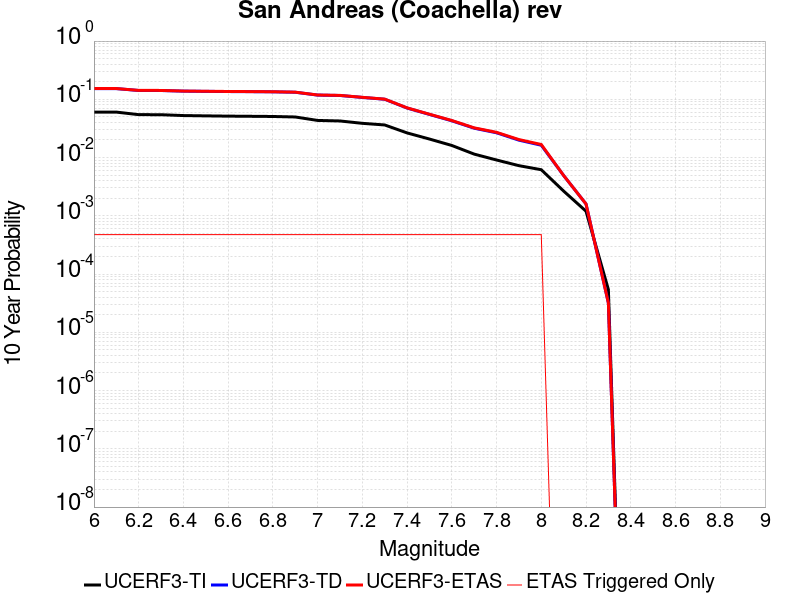 |

| Magnitude | 1 wk TI Prob | 1 wk TD Prob | 1 wk ETAS Prob | 1 wk ETAS/TD Gain | 1 wk ETAS Triggered Only | 1 mo TI Prob | 1 mo TD Prob | 1 mo ETAS Prob | 1 mo ETAS/TD Gain | 1 mo ETAS Triggered Only | 1 yr TI Prob | 1 yr TD Prob | 1 yr ETAS Prob | 1 yr ETAS/TD Gain | 1 yr ETAS Triggered Only | 10 yr TI Prob | 10 yr TD Prob | 10 yr ETAS Prob | 10 yr ETAS/TD Gain | 10 yr ETAS Triggered Only |
|-----|-----|-----|-----|-----|-----|-----|-----|-----|-----|-----|-----|-----|-----|-----|-----|-----|-----|-----|-----|-----|
| 6.0 | 1.1925945E-4 | 3.2729402E-4 | 4.8724163E-4 | 1.488697 | 1.6E-4 | 5.110118E-4 | 0.0014019393 | 0.0016016589 | 1.1424595 | 2.0E-4 | 0.0062038354 | 0.016936364 | 0.017191961 | 1.0150915 | 2.6E-4 | 0.060334753 | 0.15265316 | 0.15294126 | 1.0018873 | 3.4E-4 |
| 6.1 | 1.1925945E-4 | 3.2729402E-4 | 4.8724163E-4 | 1.488697 | 1.6E-4 | 5.110118E-4 | 0.0014019393 | 0.0016016589 | 1.1424595 | 2.0E-4 | 0.0062038354 | 0.016936364 | 0.017191961 | 1.0150915 | 2.6E-4 | 0.060334753 | 0.15265316 | 0.15294126 | 1.0018873 | 3.4E-4 |
| 6.2 | 1.07432395E-4 | 3.0230157E-4 | 4.622532E-4 | 1.5291128 | 1.6E-4 | 4.603433E-4 | 0.0012949388 | 0.0014946798 | 1.1542474 | 2.0E-4 | 0.005590286 | 0.015653009 | 0.015908938 | 1.0163503 | 2.6E-4 | 0.05451731 | 0.14182423 | 0.14209884 | 1.0019363 | 3.2E-4 |
| 6.3 | 1.0718766E-4 | 3.0175463E-4 | 4.6170634E-4 | 1.5300721 | 1.6E-4 | 4.592948E-4 | 0.0012925972 | 0.0014923386 | 1.1545273 | 2.0E-4 | 0.005577586 | 0.015624908 | 0.015880845 | 1.0163801 | 2.6E-4 | 0.054396555 | 0.14159249 | 0.14186719 | 1.00194 | 3.2E-4 |
| 6.4 | 1.0355944E-4 | 2.9383553E-4 | 4.4379145E-4 | 1.5103396 | 1.5E-4 | 4.4375064E-4 | 0.0012586913 | 0.0014484521 | 1.1507604 | 1.9E-4 | 0.0053892885 | 0.015217941 | 0.015464137 | 1.016178 | 2.5E-4 | 0.052604496 | 0.13815255 | 0.13841973 | 1.0019339 | 3.1E-4 |
| 6.5 | 1.0227914E-4 | 2.9102986E-4 | 4.4098622E-4 | 1.515261 | 1.5E-4 | 4.382655E-4 | 0.0012466786 | 0.0014364418 | 1.152215 | 1.9E-4 | 0.0053228354 | 0.01507372 | 0.015319952 | 1.0163351 | 2.5E-4 | 0.051971316 | 0.13693172 | 0.13719927 | 1.001954 | 3.1E-4 |
| 6.6 | 1.0116757E-4 | 2.8868738E-4 | 4.3864409E-4 | 1.5194432 | 1.5E-4 | 4.3350324E-4 | 0.0012366489 | 0.001426414 | 1.153451 | 1.9E-4 | 0.0052651367 | 0.01495329 | 0.015199552 | 1.0164688 | 2.5E-4 | 0.051421247 | 0.1359099 | 0.13617776 | 1.0019709 | 3.1E-4 |
| 6.7 | 1.0050676E-4 | 2.8727303E-4 | 4.3722993E-4 | 1.5220014 | 1.5E-4 | 4.3067214E-4 | 0.0012305931 | 0.0014103716 | 1.146091 | 1.8E-4 | 0.005230834 | 0.014880571 | 0.015116999 | 1.0158885 | 2.4E-4 | 0.051094085 | 0.13529462 | 0.13555403 | 1.0019174 | 3.0E-4 |
| 6.8 | 9.976819E-5 | 2.853096E-4 | 4.352668E-4 | 1.5255947 | 1.5E-4 | 4.2750788E-4 | 0.0012221863 | 0.0014019663 | 1.1470971 | 1.8E-4 | 0.0051924936 | 0.0147796115 | 0.015016064 | 1.0159986 | 2.4E-4 | 0.050728295 | 0.13444631 | 0.13470598 | 1.0019314 | 3.0E-4 |
| 6.9 | 9.77719E-5 | 2.8027873E-4 | 4.302367E-4 | 1.5350316 | 1.5E-4 | 4.1895514E-4 | 0.0012006456 | 0.0013804294 | 1.1497394 | 1.8E-4 | 0.0050888555 | 0.014520878 | 0.014757393 | 1.0162879 | 2.4E-4 | 0.049738888 | 0.1322748 | 0.13253513 | 1.001968 | 3.0E-4 |
| 7.0 | 8.500761E-5 | 2.4762485E-4 | 3.9758772E-4 | 1.605605 | 1.5E-4 | 3.6426744E-4 | 0.001060821 | 0.00124063 | 1.1694999 | 1.8E-4 | 0.0044259406 | 0.012839786 | 0.013076704 | 1.0184519 | 2.4E-4 | 0.04338823 | 0.11813272 | 0.11839728 | 1.0022395 | 3.0E-4 |
| 7.1 | 8.319876E-5 | 2.4365232E-4 | 3.9361577E-4 | 1.6154813 | 1.5E-4 | 3.5651738E-4 | 0.0010438096 | 0.0012236217 | 1.1722653 | 1.8E-4 | 0.004331963 | 0.012635092 | 0.01287206 | 1.0187547 | 2.4E-4 | 0.042484846 | 0.116353 | 0.1166181 | 1.0022783 | 3.0E-4 |
| 7.2 | 7.563917E-5 | 2.2413683E-4 | 3.7410323E-4 | 1.6690841 | 1.5E-4 | 3.2412758E-4 | 9.602359E-4 | 0.001140063 | 1.187274 | 1.8E-4 | 0.0039391145 | 0.011628893 | 0.011866103 | 1.0203983 | 2.4E-4 | 0.03870018 | 0.10775925 | 0.10802692 | 1.002484 | 3.0E-4 |
| 7.3 | 7.082985E-5 | 2.0729867E-4 | 3.5726756E-4 | 1.7234436 | 1.5E-4 | 3.0352117E-4 | 8.881233E-4 | 0.0010679634 | 1.2024946 | 1.8E-4 | 0.0036891096 | 0.010759917 | 0.0109973345 | 1.022065 | 2.4E-4 | 0.03628465 | 0.100282 | 0.10055192 | 1.0026915 | 3.0E-4 |
| 7.4 | 5.146215E-5 | 1.4273795E-4 | 2.9271652E-4 | 2.050727 | 1.5E-4 | 2.2053342E-4 | 6.115915E-4 | 7.914814E-4 | 1.2941341 | 1.8E-4 | 0.0026816884 | 0.0074208933 | 0.007659112 | 1.0321012 | 2.4E-4 | 0.02649557 | 0.070849575 | 0.07112832 | 1.0039343 | 3.0E-4 |
| 7.5 | 4.0285166E-5 | 1.09416E-4 | 2.4940068E-4 | 2.2793803 | 1.4E-4 | 1.7263928E-4 | 4.6884175E-4 | 6.387621E-4 | 1.3624257 | 1.7E-4 | 0.002099857 | 0.0056932783 | 0.0059219687 | 1.0401685 | 2.3E-4 | 0.020801254 | 0.055011146 | 0.055285193 | 1.0049816 | 2.9E-4 |
| 7.6 | 3.1168736E-5 | 8.4389096E-5 | 2.1437813E-4 | 2.5403533 | 1.3E-4 | 1.3357346E-4 | 3.6161754E-4 | 5.115633E-4 | 1.4146528 | 1.5E-4 | 0.0016250437 | 0.0043938323 | 0.0046029096 | 1.0475843 | 2.1E-4 | 0.016132116 | 0.04281005 | 0.04306849 | 1.0060369 | 2.7E-4 |
| 7.7 | 2.2100989E-5 | 6.238755E-5 | 1.9237945E-4 | 3.083619 | 1.3E-4 | 9.4715084E-5 | 2.6734784E-4 | 4.1730775E-4 | 1.5609168 | 1.5E-4 | 0.001152546 | 0.0032501083 | 0.0034594259 | 1.0644032 | 2.1E-4 | 0.011465867 | 0.0319002 | 0.032161586 | 1.0081939 | 2.7E-4 |
| 7.8 | 1.7484861E-5 | 5.179572E-5 | 1.8178899E-4 | 3.5097299 | 1.3E-4 | 7.493296E-5 | 2.2196278E-4 | 3.719295E-4 | 1.675639 | 1.5E-4 | 9.1192697E-4 | 0.0026990508 | 0.0029084838 | 1.0775951 | 2.1E-4 | 0.009081938 | 0.026640115 | 0.026902923 | 1.009865 | 2.7E-4 |
| 7.9 | 1.3967285E-5 | 3.822255E-5 | 1.6821758E-4 | 4.4010034 | 1.3E-4 | 5.985842E-5 | 1.6380067E-4 | 3.1377608E-4 | 1.9155972 | 1.5E-4 | 7.2853256E-4 | 0.00199245 | 0.0021920516 | 1.100179 | 2.0E-4 | 0.0072614877 | 0.019909438 | 0.02016426 | 1.0127991 | 2.6E-4 |
| 8.0 | 1.1887396E-5 | 3.106521E-5 | 1.6106117E-4 | 5.1846156 | 1.3E-4 | 5.094499E-5 | 1.3312983E-4 | 2.8310987E-4 | 2.1265697 | 1.5E-4 | 6.200787E-4 | 0.0016196516 | 0.0018193276 | 1.1232834 | 2.0E-4 | 0.006183513 | 0.016279267 | 0.016535034 | 1.0157112 | 2.6E-4 |
| 8.1 | 5.100864E-6 | 8.973418E-6 | 1.8973327E-5 | 2.1143928 | 1.0E-5 | 2.1860664E-5 | 3.8456936E-5 | 4.8456553E-5 | 1.2600211 | 1.0E-5 | 2.6612106E-4 | 4.6811273E-4 | 4.7810806E-4 | 1.0213524 | 1.0E-5 | 0.002658026 | 0.004917731 | 0.0049276818 | 1.0020235 | 1.0E-5 |
| 8.2 | 2.3004484E-6 | 2.7864487E-6 | 1.27864205E-5 | 4.5887876 | 1.0E-5 | 9.859027E-6 | 1.1941868E-5 | 2.1941749E-5 | 1.8373799 | 1.0E-5 | 1.2002704E-4 | 1.4538258E-4 | 1.5538113E-4 | 1.068774 | 1.0E-5 | 0.0011996223 | 0.0015973912 | 0.0016073752 | 1.0062503 | 1.0E-5 |
| 8.3 | 1.0424446E-7 | 5.8161504E-8 | 5.8161504E-8 | 1.0 | 0.0 | 4.4676187E-7 | 2.4926356E-7 | 2.4926356E-7 | 1.0 | 0.0 | 5.439312E-6 | 3.03478E-6 | 3.03478E-6 | 1.0 | 0.0 | 5.4391792E-5 | 3.190716E-5 | 3.190716E-5 | 1.0 | 0.0 |

## Manix-Afton Hills
*[(top)](#table-of-contents)*

| 1 Week | 1 Month | 1 Year | 10 Year |
|-----|-----|-----|-----|
| 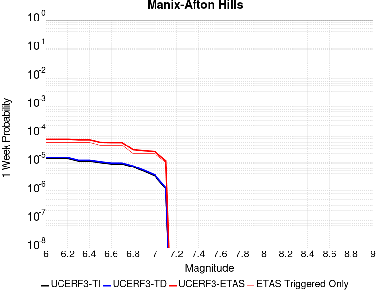 | 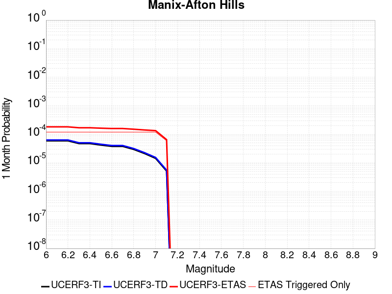 | 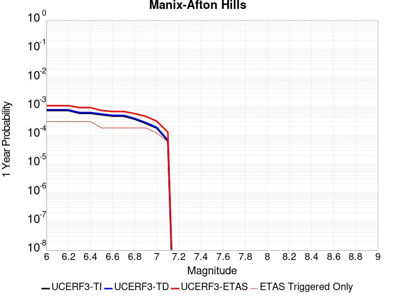 | 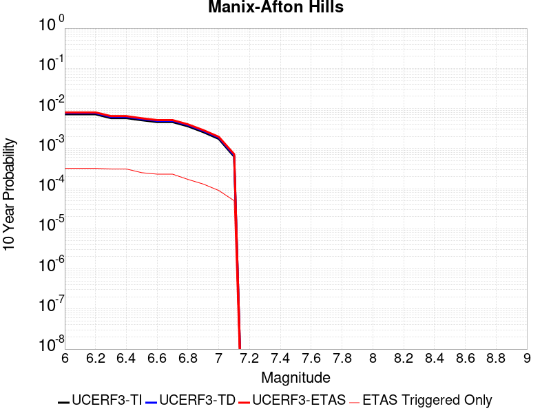 |

| Magnitude | 1 wk TI Prob | 1 wk TD Prob | 1 wk ETAS Prob | 1 wk ETAS/TD Gain | 1 wk ETAS Triggered Only | 1 mo TI Prob | 1 mo TD Prob | 1 mo ETAS Prob | 1 mo ETAS/TD Gain | 1 mo ETAS Triggered Only | 1 yr TI Prob | 1 yr TD Prob | 1 yr ETAS Prob | 1 yr ETAS/TD Gain | 1 yr ETAS Triggered Only | 10 yr TI Prob | 10 yr TD Prob | 10 yr ETAS Prob | 10 yr ETAS/TD Gain | 10 yr ETAS Triggered Only |
|-----|-----|-----|-----|-----|-----|-----|-----|-----|-----|-----|-----|-----|-----|-----|-----|-----|-----|-----|-----|-----|
| 6.0 | 1.3783202E-5 | 1.47110895E-5 | 6.471035E-5 | 4.3987465 | 5.0E-5 | 5.906953E-5 | 6.30461E-5 | 1.4304106E-4 | 2.2688327 | 8.0E-5 | 7.189342E-4 | 7.6733343E-4 | 9.6718E-4 | 1.2604429 | 2.0E-4 | 0.0071661277 | 0.007648596 | 0.007966149 | 1.0415177 | 3.2E-4 |
| 6.1 | 1.3783202E-5 | 1.47110895E-5 | 6.471035E-5 | 4.3987465 | 5.0E-5 | 5.906953E-5 | 6.30461E-5 | 1.4304106E-4 | 2.2688327 | 8.0E-5 | 7.189342E-4 | 7.6733343E-4 | 9.6718E-4 | 1.2604429 | 2.0E-4 | 0.0071661277 | 0.007648596 | 0.007966149 | 1.0415177 | 3.2E-4 |
| 6.2 | 1.3783202E-5 | 1.47110895E-5 | 6.471035E-5 | 4.3987465 | 5.0E-5 | 5.906953E-5 | 6.30461E-5 | 1.4304106E-4 | 2.2688327 | 8.0E-5 | 7.189342E-4 | 7.6733343E-4 | 9.6718E-4 | 1.2604429 | 2.0E-4 | 0.0071661277 | 0.007648596 | 0.007966149 | 1.0415177 | 3.2E-4 |
| 6.3 | 1.10494875E-5 | 1.1793136E-5 | 6.179255E-5 | 5.2397046 | 5.0E-5 | 4.7354086E-5 | 5.054109E-5 | 1.3053704E-4 | 2.5827906 | 8.0E-5 | 5.763835E-4 | 6.151744E-4 | 8.150514E-4 | 1.324911 | 2.0E-4 | 0.005748908 | 0.0061357557 | 0.0064438535 | 1.0502136 | 3.1E-4 |
| 6.4 | 1.10494875E-5 | 1.1793136E-5 | 6.179255E-5 | 5.2397046 | 5.0E-5 | 4.7354086E-5 | 5.054109E-5 | 1.3053704E-4 | 2.5827906 | 8.0E-5 | 5.763835E-4 | 6.151744E-4 | 8.150514E-4 | 1.324911 | 2.0E-4 | 0.005748908 | 0.0061357557 | 0.0064438535 | 1.0502136 | 3.1E-4 |
| 6.5 | 9.788949E-6 | 1.045432E-5 | 5.0453902E-5 | 4.8261294 | 4.0E-5 | 4.1951964E-5 | 4.480351E-5 | 1.1480037E-4 | 2.5623076 | 7.0E-5 | 5.1064545E-4 | 5.453555E-4 | 7.0526823E-4 | 1.2932266 | 1.6E-4 | 0.0050947363 | 0.0054410985 | 0.0056897383 | 1.0456966 | 2.5E-4 |
| 6.6 | 8.810006E-6 | 9.4136285E-6 | 4.941325E-5 | 5.249119 | 4.0E-5 | 3.775662E-5 | 4.0343548E-5 | 1.1034072E-4 | 2.7350278 | 7.0E-5 | 4.5958988E-4 | 4.9108086E-4 | 6.510023E-4 | 1.3256519 | 1.6E-4 | 0.0045864056 | 0.004900839 | 0.005129712 | 1.0467007 | 2.3E-4 |
| 6.7 | 8.80128E-6 | 9.404108E-6 | 4.940373E-5 | 5.2534204 | 4.0E-5 | 3.7719226E-5 | 4.0302748E-5 | 1.1029992E-4 | 2.7367842 | 7.0E-5 | 4.591348E-4 | 4.9058435E-4 | 6.505059E-4 | 1.3259816 | 1.6E-4 | 0.004581874 | 0.0048958957 | 0.0051247696 | 1.0467482 | 2.3E-4 |
| 6.8 | 6.8994877E-6 | 7.380076E-6 | 2.7379929E-5 | 3.7099793 | 2.0E-5 | 2.9568899E-5 | 3.162856E-5 | 7.162729E-5 | 2.2646399 | 4.0E-5 | 3.5994186E-4 | 3.8501783E-4 | 4.949755E-4 | 1.285591 | 1.1E-4 | 0.003593594 | 0.0038443129 | 0.0040136594 | 1.0440512 | 1.7E-4 |
| 6.9 | 4.9328037E-6 | 5.2709615E-6 | 2.5270856E-5 | 4.794354 | 2.0E-5 | 2.1140417E-5 | 2.2589675E-5 | 5.2588995E-5 | 2.3280103 | 3.0E-5 | 2.5735417E-4 | 2.7500073E-4 | 3.6497597E-4 | 1.3271818 | 9.0E-5 | 0.0025705635 | 0.0027472095 | 0.0028768524 | 1.0471908 | 1.3E-4 |
| 7.0 | 3.347973E-6 | 3.59003E-6 | 2.3589959E-5 | 6.5709643 | 2.0E-5 | 1.4348378E-5 | 1.5385775E-5 | 4.5385314E-5 | 2.949823 | 3.0E-5 | 1.746775E-4 | 1.8730981E-4 | 2.4729857E-4 | 1.3202649 | 6.0E-5 | 0.0017454025 | 0.0018719219 | 0.0019617535 | 1.0479889 | 9.0E-5 |
| 7.1 | 1.2073567E-6 | 1.293482E-6 | 1.12934695E-5 | 8.73106 | 1.0E-5 | 5.1743755E-6 | 5.543492E-6 | 2.554338E-5 | 4.6078143 | 2.0E-5 | 6.29962E-5 | 6.749156E-5 | 1.0748886E-4 | 1.5926267 | 4.0E-5 | 6.297835E-4 | 6.7487074E-4 | 7.24837E-4 | 1.0740383 | 5.0E-5 |

## Baker
*[(top)](#table-of-contents)*

| 1 Week | 1 Month | 1 Year | 10 Year |
|-----|-----|-----|-----|
| 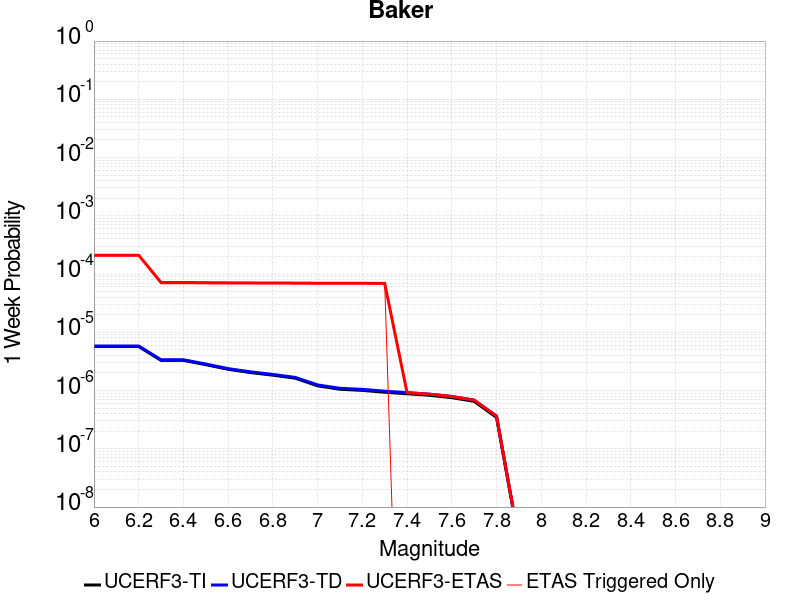 | 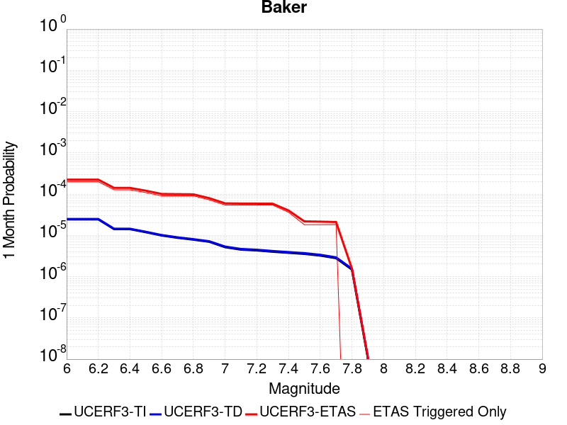 | 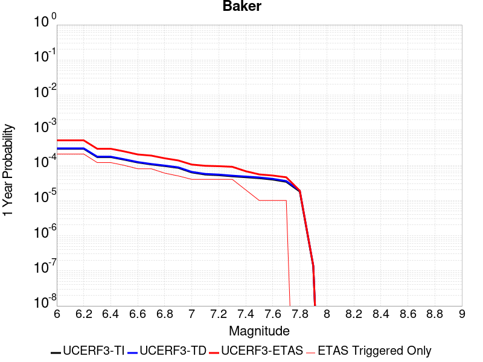 | 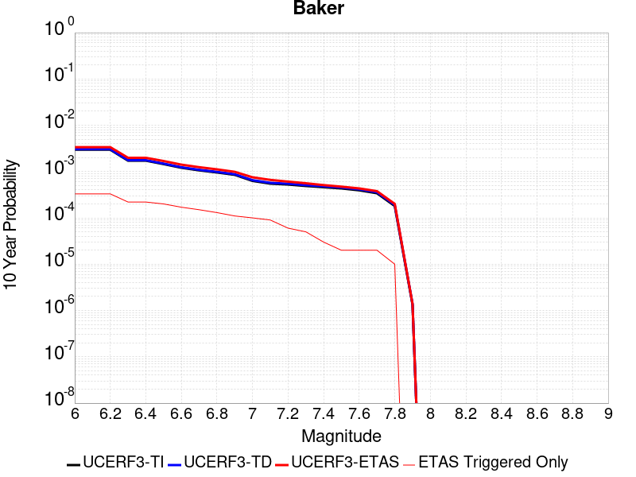 |

| Magnitude | 1 wk TI Prob | 1 wk TD Prob | 1 wk ETAS Prob | 1 wk ETAS/TD Gain | 1 wk ETAS Triggered Only | 1 mo TI Prob | 1 mo TD Prob | 1 mo ETAS Prob | 1 mo ETAS/TD Gain | 1 mo ETAS Triggered Only | 1 yr TI Prob | 1 yr TD Prob | 1 yr ETAS Prob | 1 yr ETAS/TD Gain | 1 yr ETAS Triggered Only | 10 yr TI Prob | 10 yr TD Prob | 10 yr ETAS Prob | 10 yr ETAS/TD Gain | 10 yr ETAS Triggered Only |
|-----|-----|-----|-----|-----|-----|-----|-----|-----|-----|-----|-----|-----|-----|-----|-----|-----|-----|-----|-----|-----|
| 6.0 | 5.695525E-6 | 5.8348373E-6 | 1.158342E-4 | 19.852173 | 1.1E-4 | 2.4409164E-5 | 2.5006228E-5 | 1.9500198E-4 | 7.7981367 | 1.7E-4 | 2.9714106E-4 | 3.044123E-4 | 5.143484E-4 | 1.6896439 | 2.1E-4 | 0.0029674405 | 0.0030403486 | 0.0033693453 | 1.1082102 | 3.3E-4 |
| 6.1 | 5.695525E-6 | 5.8348373E-6 | 1.158342E-4 | 19.852173 | 1.1E-4 | 2.4409164E-5 | 2.5006228E-5 | 1.9500198E-4 | 7.7981367 | 1.7E-4 | 2.9714106E-4 | 3.044123E-4 | 5.143484E-4 | 1.6896439 | 2.1E-4 | 0.0029674405 | 0.0030403486 | 0.0033693453 | 1.1082102 | 3.3E-4 |
| 6.2 | 5.695525E-6 | 5.8348373E-6 | 1.158342E-4 | 19.852173 | 1.1E-4 | 2.4409164E-5 | 2.5006228E-5 | 1.9500198E-4 | 7.7981367 | 1.7E-4 | 2.9714106E-4 | 3.044123E-4 | 5.143484E-4 | 1.6896439 | 2.1E-4 | 0.0029674405 | 0.0030403486 | 0.0033693453 | 1.1082102 | 3.3E-4 |
| 6.3 | 3.2995713E-6 | 3.383667E-6 | 6.3383464E-5 | 18.732182 | 6.0E-5 | 1.4140943E-5 | 1.4501353E-5 | 1.2449975E-4 | 8.585389 | 1.1E-4 | 1.7215237E-4 | 1.7654014E-4 | 2.9651896E-4 | 1.6796122 | 1.2E-4 | 0.0017201907 | 0.001764046 | 0.001983658 | 1.1244932 | 2.2E-4 |
| 6.4 | 3.2995713E-6 | 3.383667E-6 | 6.3383464E-5 | 18.732182 | 6.0E-5 | 1.4140943E-5 | 1.4501353E-5 | 1.2449975E-4 | 8.585389 | 1.1E-4 | 1.7215237E-4 | 1.7654014E-4 | 2.9651896E-4 | 1.6796122 | 1.2E-4 | 0.0017201907 | 0.001764046 | 0.001983658 | 1.1244932 | 2.2E-4 |
| 6.5 | 2.782202E-6 | 2.8558404E-6 | 5.28557E-5 | 18.50793 | 5.0E-5 | 1.1923668E-5 | 1.223926E-5 | 1.12238034E-4 | 9.170328 | 1.0E-4 | 1.4516099E-4 | 1.4900314E-4 | 2.4898825E-4 | 1.6710268 | 1.0E-4 | 0.001450662 | 0.0014890651 | 0.0016887672 | 1.1341125 | 2.0E-4 |
| 6.6 | 2.3163404E-6 | 2.38092E-6 | 4.2380823E-5 | 17.800188 | 4.0E-5 | 9.927136E-6 | 1.0203904E-5 | 9.020309E-5 | 8.840056 | 8.0E-5 | 1.20856166E-4 | 1.2422565E-4 | 2.0421571E-4 | 1.6439093 | 8.0E-5 | 0.0012079047 | 0.0012415823 | 0.0014113713 | 1.136752 | 1.7E-4 |
| 6.7 | 2.037056E-6 | 2.0965003E-6 | 4.2096417E-5 | 20.079374 | 4.0E-5 | 8.7302105E-6 | 8.984972E-6 | 8.8984256E-5 | 9.903676 | 8.0E-5 | 1.0628513E-4 | 1.093867E-4 | 1.8937796E-4 | 1.7312703 | 8.0E-5 | 0.0010623431 | 0.0010933448 | 0.0012431807 | 1.1370437 | 1.5E-4 |
| 6.8 | 1.8356744E-6 | 1.8915287E-6 | 3.189147E-5 | 16.860157 | 3.0E-5 | 7.867153E-6 | 8.106527E-6 | 6.810604E-5 | 8.401383 | 6.0E-5 | 9.577837E-5 | 9.869264E-5 | 1.5868671E-4 | 1.6078881 | 6.0E-5 | 9.57371E-4 | 9.86502E-4 | 0.0011163738 | 1.1316488 | 1.3E-4 |
| 6.9 | 1.6310546E-6 | 1.6832072E-6 | 3.1683157E-5 | 18.823088 | 3.0E-5 | 6.9902153E-6 | 7.213726E-6 | 5.7213365E-5 | 7.931181 | 5.0E-5 | 8.510255E-5 | 8.782368E-5 | 1.378193E-4 | 1.5692725 | 5.0E-5 | 8.5069967E-4 | 8.7790104E-4 | 9.878045E-4 | 1.1251888 | 1.1E-4 |
| 7.0 | 1.2058036E-6 | 1.2508665E-6 | 2.1250842E-5 | 16.988895 | 2.0E-5 | 5.1677193E-6 | 5.3608455E-6 | 4.536063E-5 | 8.46147 | 4.0E-5 | 6.291517E-5 | 6.5266366E-5 | 1.0526375E-4 | 1.6128331 | 4.0E-5 | 6.289736E-4 | 6.524743E-4 | 7.5240905E-4 | 1.1531627 | 1.0E-4 |
| 7.1 | 1.052382E-6 | 1.0951609E-6 | 2.1095138E-5 | 19.262138 | 2.0E-5 | 4.5102006E-6 | 4.693538E-6 | 4.469335E-5 | 9.522315 | 4.0E-5 | 5.491031E-5 | 5.7142337E-5 | 9.714005E-5 | 1.6999664 | 4.0E-5 | 5.4896745E-4 | 5.7127734E-4 | 6.6122593E-4 | 1.1574517 | 9.0E-5 |
| 7.2 | 1.0067454E-6 | 1.0487711E-6 | 2.104875E-5 | 20.06992 | 2.0E-5 | 4.3146156E-6 | 4.4947255E-6 | 4.4494547E-5 | 9.89928 | 4.0E-5 | 5.252918E-5 | 5.4721917E-5 | 9.4719726E-5 | 1.7309285 | 4.0E-5 | 5.251676E-4 | 5.470853E-4 | 6.0705247E-4 | 1.1096121 | 6.0E-5 |
| 7.3 | 9.3596316E-7 | 9.767723E-7 | 2.0976753E-5 | 21.47558 | 2.0E-5 | 4.0112645E-6 | 4.1861604E-6 | 4.4185992E-5 | 10.555255 | 4.0E-5 | 4.8836053E-5 | 5.096532E-5 | 9.096328E-5 | 1.7848074 | 4.0E-5 | 4.8825322E-4 | 5.095371E-4 | 5.5951165E-4 | 1.0980783 | 5.0E-5 |
| 7.4 | 8.8117395E-7 | 9.2076635E-7 | 1.0920757E-5 | 11.860509 | 1.0E-5 | 3.7764542E-6 | 3.9461356E-6 | 2.3946057E-5 | 6.0682297 | 2.0E-5 | 4.5977362E-5 | 4.8043148E-5 | 6.804219E-5 | 1.4162724 | 2.0E-5 | 4.596785E-4 | 4.8032837E-4 | 5.1031396E-4 | 1.0624273 | 3.0E-5 |
| 7.5 | 8.292386E-7 | 8.6745956E-7 | 8.6745956E-7 | 1.0 | 0.0 | 3.5538749E-6 | 3.7176785E-6 | 1.3717641E-5 | 3.6898406 | 1.0E-5 | 4.326757E-5 | 4.5261804E-5 | 5.5261353E-5 | 1.2209269 | 1.0E-5 | 4.3259145E-4 | 4.5252658E-4 | 4.7251754E-4 | 1.0441763 | 2.0E-5 |
| 7.6 | 7.553842E-7 | 7.9144706E-7 | 7.9144706E-7 | 1.0 | 0.0 | 3.2373566E-6 | 3.3919116E-6 | 1.33918775E-5 | 3.94818 | 1.0E-5 | 3.9414106E-5 | 4.129575E-5 | 5.1295334E-5 | 1.2421457 | 1.0E-5 | 3.9407116E-4 | 4.1288146E-4 | 4.328732E-4 | 1.0484201 | 2.0E-5 |
| 7.7 | 6.5285366E-7 | 6.852797E-7 | 6.852797E-7 | 1.0 | 0.0 | 2.797941E-6 | 2.9369096E-6 | 1.293688E-5 | 4.4049296 | 1.0E-5 | 3.40644E-5 | 3.5756293E-5 | 4.5755936E-5 | 1.279661 | 1.0E-5 | 3.405918E-4 | 3.5750607E-4 | 3.7749892E-4 | 1.0559231 | 2.0E-5 |
| 7.8 | 3.4586725E-7 | 3.6482615E-7 | 3.6482615E-7 | 1.0 | 0.0 | 1.4822873E-6 | 1.5635396E-6 | 1.5635396E-6 | 1.0 | 0.0 | 1.80467E-5 | 1.9035933E-5 | 1.9035933E-5 | 1.0 | 0.0 | 1.8045233E-4 | 1.9034347E-4 | 2.0034157E-4 | 1.0525266 | 1.0E-5 |
| 7.9 | 2.5591178E-9 | 2.6696718E-9 | 2.6696718E-9 | 1.0 | 0.0 | 1.0967647E-8 | 1.14414505E-8 | 1.14414505E-8 | 1.0 | 0.0 | 1.335311E-7 | 1.3929966E-7 | 1.3929966E-7 | 1.0 | 0.0 | 1.3353102E-6 | 1.3929966E-6 | 1.3929966E-6 | 1.0 | 0.0 |

## San Jacinto (San Bernardino)
*[(top)](#table-of-contents)*

| 1 Week | 1 Month | 1 Year | 10 Year |
|-----|-----|-----|-----|
| 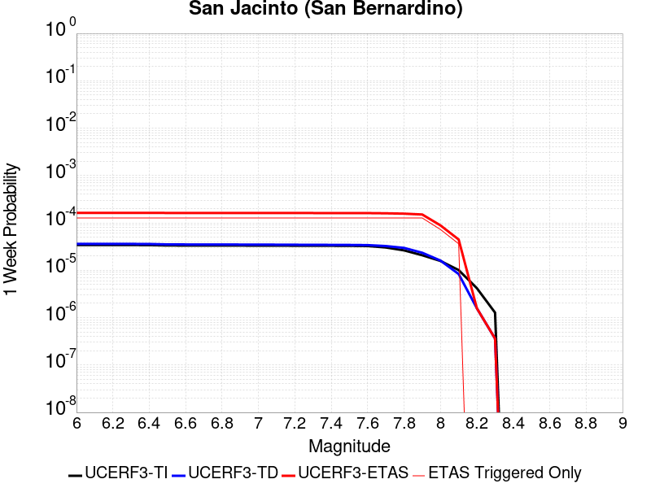 | 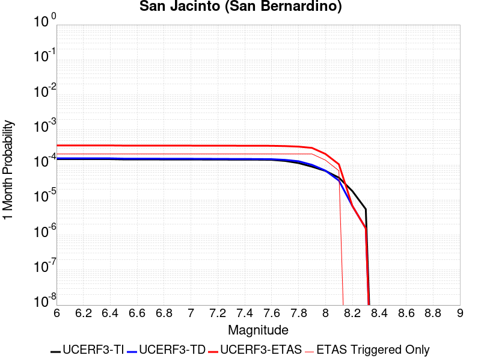 | 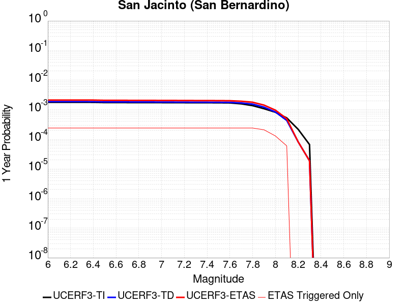 | 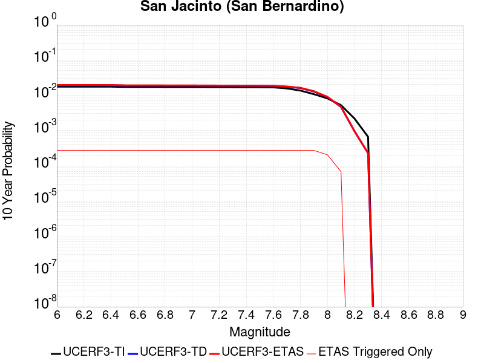 |

| Magnitude | 1 wk TI Prob | 1 wk TD Prob | 1 wk ETAS Prob | 1 wk ETAS/TD Gain | 1 wk ETAS Triggered Only | 1 mo TI Prob | 1 mo TD Prob | 1 mo ETAS Prob | 1 mo ETAS/TD Gain | 1 mo ETAS Triggered Only | 1 yr TI Prob | 1 yr TD Prob | 1 yr ETAS Prob | 1 yr ETAS/TD Gain | 1 yr ETAS Triggered Only | 10 yr TI Prob | 10 yr TD Prob | 10 yr ETAS Prob | 10 yr ETAS/TD Gain | 10 yr ETAS Triggered Only |
|-----|-----|-----|-----|-----|-----|-----|-----|-----|-----|-----|-----|-----|-----|-----|-----|-----|-----|-----|-----|-----|
| 6.0 | 3.409352E-5 | 3.5986508E-5 | 1.7598148E-4 | 4.890207 | 1.4E-4 | 1.461069E-4 | 1.542188E-4 | 3.3419102E-4 | 2.166993 | 1.8E-4 | 0.0017774 | 0.0018759987 | 0.0021155486 | 1.1276919 | 2.4E-4 | 0.01763251 | 0.019349935 | 0.019663744 | 1.0162175 | 3.2E-4 |
| 6.1 | 3.409352E-5 | 3.5986508E-5 | 1.7598148E-4 | 4.890207 | 1.4E-4 | 1.461069E-4 | 1.542188E-4 | 3.3419102E-4 | 2.166993 | 1.8E-4 | 0.0017774 | 0.0018759987 | 0.0021155486 | 1.1276919 | 2.4E-4 | 0.01763251 | 0.019349935 | 0.019663744 | 1.0162175 | 3.2E-4 |
| 6.2 | 3.409352E-5 | 3.5986508E-5 | 1.7598148E-4 | 4.890207 | 1.4E-4 | 1.461069E-4 | 1.542188E-4 | 3.3419102E-4 | 2.166993 | 1.8E-4 | 0.0017774 | 0.0018759987 | 0.0021155486 | 1.1276919 | 2.4E-4 | 0.01763251 | 0.019349935 | 0.019663744 | 1.0162175 | 3.2E-4 |
| 6.3 | 3.409352E-5 | 3.5986508E-5 | 1.7598148E-4 | 4.890207 | 1.4E-4 | 1.461069E-4 | 1.542188E-4 | 3.3419102E-4 | 2.166993 | 1.8E-4 | 0.0017774 | 0.0018759987 | 0.0021155486 | 1.1276919 | 2.4E-4 | 0.01763251 | 0.019349935 | 0.019663744 | 1.0162175 | 3.2E-4 |
| 6.4 | 3.400795E-5 | 3.5879173E-5 | 1.7587416E-4 | 4.9018455 | 1.4E-4 | 1.4574021E-4 | 1.5375883E-4 | 3.3373115E-4 | 2.1704845 | 1.8E-4 | 0.0017729428 | 0.0018704084 | 0.0021099595 | 1.1280742 | 2.4E-4 | 0.017588645 | 0.019295016 | 0.019608842 | 1.0162646 | 3.2E-4 |
| 6.5 | 3.341482E-5 | 3.5139812E-5 | 1.7513489E-4 | 4.9839454 | 1.4E-4 | 1.4319851E-4 | 1.5059051E-4 | 3.305634E-4 | 2.1951146 | 1.8E-4 | 0.0017420477 | 0.0018318989 | 0.0020714593 | 1.1307716 | 2.4E-4 | 0.017284546 | 0.018916558 | 0.019230505 | 1.0165964 | 3.2E-4 |
| 6.6 | 3.3364955E-5 | 3.5077028E-5 | 1.7507211E-4 | 4.991076 | 1.4E-4 | 1.4298483E-4 | 1.5032147E-4 | 3.3029442E-4 | 2.1972537 | 1.8E-4 | 0.0017394501 | 0.001828629 | 0.0020681901 | 1.1310059 | 2.4E-4 | 0.017258976 | 0.018884424 | 0.01919838 | 1.0166252 | 3.2E-4 |
| 6.7 | 3.335922E-5 | 3.5066805E-5 | 1.750619E-4 | 4.99224 | 1.4E-4 | 1.4296026E-4 | 1.5027766E-4 | 3.302506E-4 | 2.197603 | 1.8E-4 | 0.0017391514 | 0.0018280965 | 0.0020676577 | 1.1310441 | 2.4E-4 | 0.017256035 | 0.018879214 | 0.019193174 | 1.0166298 | 3.2E-4 |
| 6.8 | 3.327683E-5 | 3.496087E-5 | 1.7495597E-4 | 5.004337 | 1.4E-4 | 1.4260718E-4 | 1.498237E-4 | 3.2979672E-4 | 2.201232 | 1.8E-4 | 0.0017348597 | 0.0018225788 | 0.0020621414 | 1.1314416 | 2.4E-4 | 0.017213784 | 0.018824987 | 0.019138962 | 1.0166787 | 3.2E-4 |
| 6.9 | 3.3235785E-5 | 3.4901823E-5 | 1.7489694E-4 | 5.0111117 | 1.4E-4 | 1.4243131E-4 | 1.4957068E-4 | 3.2954375E-4 | 2.2032645 | 1.8E-4 | 0.0017327217 | 0.0018195034 | 0.0020590667 | 1.1316642 | 2.4E-4 | 0.017192734 | 0.018794855 | 0.019108841 | 1.016706 | 3.2E-4 |
| 7.0 | 3.3197095E-5 | 3.4841752E-5 | 1.7483688E-4 | 5.0180273 | 1.4E-4 | 1.422655E-4 | 1.4931326E-4 | 3.2928638E-4 | 2.2053392 | 1.8E-4 | 0.0017307063 | 0.0018163746 | 0.0020559388 | 1.1318914 | 2.4E-4 | 0.017172894 | 0.018764233 | 0.019078229 | 1.0167338 | 3.2E-4 |
| 7.1 | 3.3129716E-5 | 3.4721965E-5 | 1.747171E-4 | 5.03189 | 1.4E-4 | 1.4197677E-4 | 1.4879994E-4 | 3.2877317E-4 | 2.209498 | 1.8E-4 | 0.0017271966 | 0.0018101353 | 0.0020497008 | 1.1323467 | 2.4E-4 | 0.017138338 | 0.018703312 | 0.019017328 | 1.0167893 | 3.2E-4 |
| 7.2 | 3.3034008E-5 | 3.458941E-5 | 1.7458457E-4 | 5.0473413 | 1.4E-4 | 1.4156665E-4 | 1.4823192E-4 | 3.2820523E-4 | 2.2141333 | 1.8E-4 | 0.0017222111 | 0.0018032312 | 0.0020427983 | 1.1328545 | 2.4E-4 | 0.017089253 | 0.018635705 | 0.018949741 | 1.0168513 | 3.2E-4 |
| 7.3 | 3.2956614E-5 | 3.445717E-5 | 1.7445235E-4 | 5.0628753 | 1.4E-4 | 1.4123498E-4 | 1.4766524E-4 | 3.2763864E-4 | 2.2187934 | 1.8E-4 | 0.0017181796 | 0.0017963431 | 0.0020359121 | 1.1333648 | 2.4E-4 | 0.017049557 | 0.018568452 | 0.018882511 | 1.0169135 | 3.2E-4 |
| 7.4 | 3.2915937E-5 | 3.4378863E-5 | 1.7437406E-4 | 5.0721292 | 1.4E-4 | 1.4106068E-4 | 1.4732967E-4 | 3.2730316E-4 | 2.2215698 | 1.8E-4 | 0.0017160608 | 0.0017922645 | 0.0020318343 | 1.1336688 | 2.4E-4 | 0.017028693 | 0.018528719 | 0.018842788 | 1.0169505 | 3.2E-4 |
| 7.5 | 3.281791E-5 | 3.4243778E-5 | 1.7423899E-4 | 5.088194 | 1.4E-4 | 1.406406E-4 | 1.4675081E-4 | 3.267244E-4 | 2.2263892 | 1.8E-4 | 0.0017109542 | 0.0017852283 | 0.0020247998 | 1.1341966 | 2.4E-4 | 0.016978411 | 0.018459605 | 0.0187737 | 1.0170151 | 3.2E-4 |
| 7.6 | 3.2521442E-5 | 3.396873E-5 | 1.7396397E-4 | 5.1212974 | 1.4E-4 | 1.3937015E-4 | 1.4557215E-4 | 3.2554596E-4 | 2.2363203 | 1.8E-4 | 0.0016955109 | 0.0017709016 | 0.0020104765 | 1.1352842 | 2.4E-4 | 0.016826328 | 0.018317232 | 0.01863137 | 1.0171499 | 3.2E-4 |
| 7.7 | 3.0287873E-5 | 3.245276E-5 | 1.7244821E-4 | 5.3138223 | 1.4E-4 | 1.297987E-4 | 1.3907586E-4 | 3.1905083E-4 | 2.2940776 | 1.8E-4 | 0.0015791537 | 0.0016919347 | 0.0019315286 | 1.1416094 | 2.4E-4 | 0.01567979 | 0.01752809 | 0.01784248 | 1.0179365 | 3.2E-4 |
| 7.8 | 2.6316151E-5 | 2.9663592E-5 | 1.6965944E-4 | 5.7194505 | 1.4E-4 | 1.1277862E-4 | 1.2712348E-4 | 3.071006E-4 | 2.415766 | 1.8E-4 | 0.0013722149 | 0.0015466306 | 0.0017862594 | 1.1549361 | 2.4E-4 | 0.013637724 | 0.016069634 | 0.016384492 | 1.0195934 | 3.2E-4 |
| 7.9 | 2.0761147E-5 | 2.34181E-5 | 1.434153E-4 | 6.124121 | 1.2E-4 | 8.897331E-5 | 1.0035944E-4 | 2.6034337E-4 | 2.5941095 | 1.6E-4 | 0.0010827117 | 0.0012211921 | 0.0014309356 | 1.1717532 | 2.1E-4 | 0.010774517 | 0.012793174 | 0.013069592 | 1.0216067 | 2.8E-4 |
| 8.0 | 1.5738568E-5 | 1.6033575E-5 | 8.603245E-5 | 5.3657684 | 7.0E-5 | 6.744926E-5 | 6.871352E-5 | 1.5870733E-4 | 2.309696 | 9.0E-5 | 8.2088535E-4 | 8.3626667E-4 | 9.6615794E-4 | 1.1553228 | 1.3E-4 | 0.008178596 | 0.008865921 | 0.009044325 | 1.0201224 | 1.8E-4 |
| 8.1 | 1.0105832E-5 | 8.3304985E-6 | 4.8330166E-5 | 5.801594 | 4.0E-5 | 4.3309992E-5 | 3.570165E-5 | 8.569987E-5 | 2.4004455 | 5.0E-5 | 5.2717153E-4 | 4.345814E-4 | 4.9455534E-4 | 1.138004 | 6.0E-5 | 0.005259227 | 0.004677232 | 0.0047469046 | 1.0148962 | 7.0E-5 |
| 8.2 | 4.189207E-6 | 1.5784357E-6 | 1.5784357E-6 | 1.0 | 0.0 | 1.7953622E-5 | 6.7647065E-6 | 6.7647065E-6 | 1.0 | 0.0 | 2.1856341E-4 | 8.235722E-5 | 8.235722E-5 | 1.0 | 0.0 | 0.0021834858 | 9.565867E-4 | 9.565867E-4 | 1.0 | 0.0 |
| 8.3 | 1.2758221E-6 | 3.6149942E-7 | 3.6149942E-7 | 1.0 | 0.0 | 5.4677976E-6 | 1.5492824E-6 | 1.5492824E-6 | 1.0 | 0.0 | 6.65684E-5 | 1.8862354E-5 | 1.8862354E-5 | 1.0 | 0.0 | 6.6548464E-4 | 2.2751294E-4 | 2.2751294E-4 | 1.0 | 0.0 |

## San Andreas (Creeping Section) 2011 CFM
*[(top)](#table-of-contents)*

| 1 Week | 1 Month | 1 Year | 10 Year |
|-----|-----|-----|-----|
| 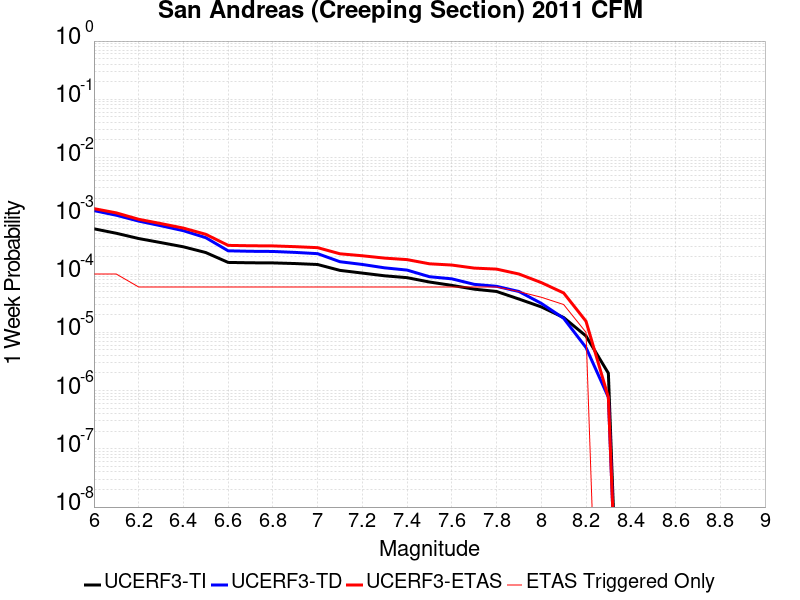 | 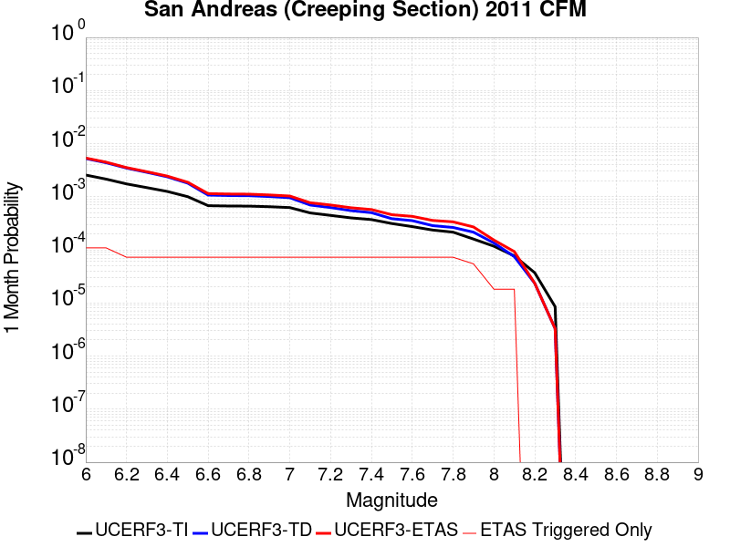 | 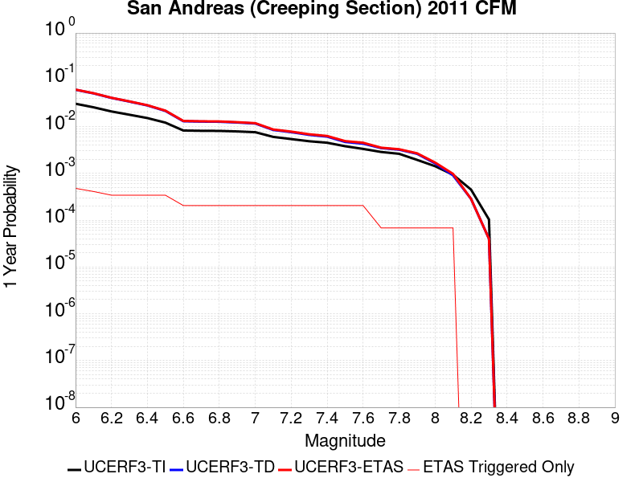 | 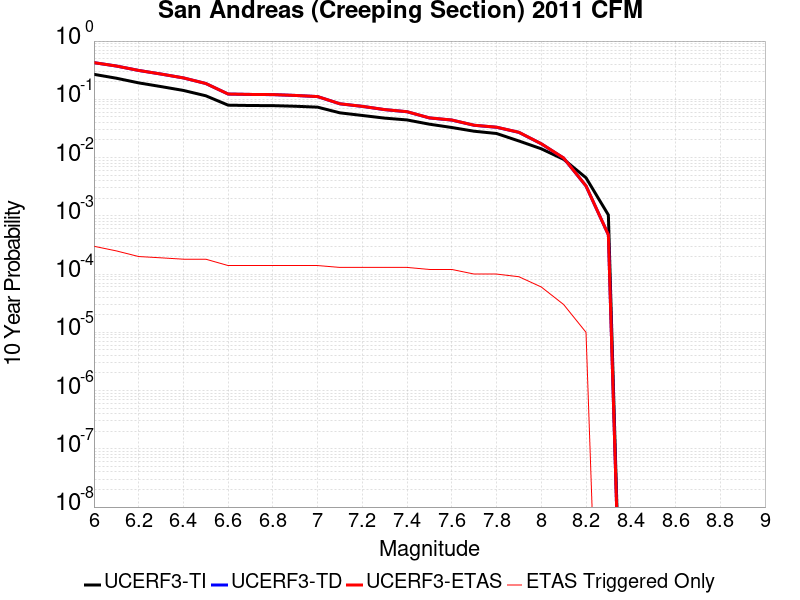 |

| Magnitude | 1 wk TI Prob | 1 wk TD Prob | 1 wk ETAS Prob | 1 wk ETAS/TD Gain | 1 wk ETAS Triggered Only | 1 mo TI Prob | 1 mo TD Prob | 1 mo ETAS Prob | 1 mo ETAS/TD Gain | 1 mo ETAS Triggered Only | 1 yr TI Prob | 1 yr TD Prob | 1 yr ETAS Prob | 1 yr ETAS/TD Gain | 1 yr ETAS Triggered Only | 10 yr TI Prob | 10 yr TD Prob | 10 yr ETAS Prob | 10 yr ETAS/TD Gain | 10 yr ETAS Triggered Only |
|-----|-----|-----|-----|-----|-----|-----|-----|-----|-----|-----|-----|-----|-----|-----|-----|-----|-----|-----|-----|-----|
| 6.0 | 5.986481E-4 | 0.001228691 | 0.0013285681 | 1.0812874 | 1.0E-4 | 0.0025631124 | 0.005246795 | 0.0053562177 | 1.0208552 | 1.1E-4 | 0.030762846 | 0.061203245 | 0.061400395 | 1.0032212 | 2.1E-4 | 0.26835477 | 0.425928 | 0.42610022 | 1.0004044 | 3.0E-4 |
| 6.1 | 5.015945E-4 | 0.0010230356 | 0.0011229332 | 1.0976483 | 1.0E-4 | 0.00214792 | 0.004369436 | 0.004478955 | 1.0250648 | 1.1E-4 | 0.025839351 | 0.051246606 | 0.05141738 | 1.0033324 | 1.8E-4 | 0.23032776 | 0.37284943 | 0.37300622 | 1.0004206 | 2.5E-4 |
| 6.2 | 4.073338E-4 | 8.1157376E-4 | 8.7152503E-4 | 1.0738704 | 6.0E-5 | 0.0017445484 | 0.0034683137 | 0.003538071 | 1.0201128 | 7.0E-5 | 0.021034058 | 0.04093177 | 0.041056447 | 1.003046 | 1.3E-4 | 0.19150782 | 0.31302592 | 0.3131633 | 1.0004389 | 2.0E-4 |
| 6.3 | 3.464099E-4 | 6.7455834E-4 | 7.345179E-4 | 1.0888871 | 6.0E-5 | 0.0014837692 | 0.0028832308 | 0.002953029 | 1.0242083 | 7.0E-5 | 0.017915873 | 0.034187846 | 0.034313403 | 1.0036725 | 1.3E-4 | 0.16538359 | 0.27130842 | 0.27144685 | 1.0005103 | 1.9E-4 |
| 6.4 | 2.935057E-4 | 5.5516965E-4 | 6.1513635E-4 | 1.1080151 | 6.0E-5 | 0.0012572751 | 0.0023727308 | 0.0024425648 | 1.0294318 | 7.0E-5 | 0.015200248 | 0.02826279 | 0.028389117 | 1.0044696 | 1.3E-4 | 0.14201577 | 0.23297668 | 0.23311473 | 1.0005926 | 1.8E-4 |
| 6.5 | 2.3409708E-4 | 4.2132285E-4 | 4.8129758E-4 | 1.1423486 | 6.0E-5 | 0.0010028875 | 0.0018017791 | 0.001871653 | 1.0387805 | 7.0E-5 | 0.012141965 | 0.021586355 | 0.021713547 | 1.0058923 | 1.3E-4 | 0.11499573 | 0.1868149 | 0.18696128 | 1.0007836 | 1.8E-4 |
| 6.6 | 1.5842178E-4 | 2.5068692E-4 | 3.1067187E-4 | 1.2392824 | 6.0E-5 | 6.7877385E-4 | 0.0010739256 | 0.0011438504 | 1.0651114 | 7.0E-5 | 0.0082328 | 0.012995283 | 0.013093984 | 1.0075951 | 1.0E-4 | 0.07934396 | 0.12313759 | 0.12326036 | 1.000997 | 1.4E-4 |
| 6.7 | 1.5616413E-4 | 2.4605254E-4 | 3.0603778E-4 | 1.2437904 | 6.0E-5 | 6.691031E-4 | 0.0010540807 | 0.0011240068 | 1.0663385 | 7.0E-5 | 0.0081159435 | 0.012757154 | 0.012855878 | 1.0077387 | 1.0E-4 | 0.0782586 | 0.12116472 | 0.121287756 | 1.0010154 | 1.4E-4 |
| 6.8 | 1.5538467E-4 | 2.442914E-4 | 3.0427676E-4 | 1.2455482 | 6.0E-5 | 6.6576427E-4 | 0.001046539 | 0.0011164658 | 1.0668172 | 7.0E-5 | 0.008075596 | 0.012666538 | 0.012765272 | 1.0077949 | 1.0E-4 | 0.07788358 | 0.12039561 | 0.12051875 | 1.0010228 | 1.4E-4 |
| 6.9 | 1.5153569E-4 | 2.3538464E-4 | 2.953705E-4 | 1.2548419 | 6.0E-5 | 6.49277E-4 | 0.0010084033 | 0.0010783328 | 1.0693467 | 7.0E-5 | 0.007876333 | 0.012208726 | 0.012307505 | 1.0080909 | 1.0E-4 | 0.07602952 | 0.11646574 | 0.116589434 | 1.001062 | 1.4E-4 |
| 7.0 | 1.4588932E-4 | 2.2395732E-4 | 2.839439E-4 | 1.2678481 | 6.0E-5 | 6.250901E-4 | 9.59466E-4 | 0.0010293989 | 1.0728873 | 7.0E-5 | 0.0075839474 | 0.011619428 | 0.011718266 | 1.0085063 | 1.0E-4 | 0.073302895 | 0.11131206 | 0.11143648 | 1.0011177 | 1.4E-4 |
| 7.1 | 1.1565079E-4 | 1.6281323E-4 | 2.2280346E-4 | 1.3684604 | 6.0E-5 | 4.955521E-4 | 6.9758523E-4 | 7.675364E-4 | 1.1002761 | 7.0E-5 | 0.006016669 | 0.008460228 | 0.008559382 | 1.0117201 | 1.0E-4 | 0.058563538 | 0.08366478 | 0.08378391 | 1.0014238 | 1.3E-4 |
| 7.2 | 1.0393792E-4 | 1.4615392E-4 | 2.0614515E-4 | 1.4104661 | 6.0E-5 | 4.4537216E-4 | 6.262243E-4 | 6.961805E-4 | 1.111711 | 7.0E-5 | 0.005408933 | 0.0075977976 | 0.007697038 | 1.0130618 | 1.0E-4 | 0.052791595 | 0.07561503 | 0.075735204 | 1.0015892 | 1.3E-4 |
| 7.3 | 9.332884E-5 | 1.2780601E-4 | 1.8779833E-4 | 1.4694015 | 6.0E-5 | 3.999194E-4 | 5.4762565E-4 | 6.175873E-4 | 1.1277546 | 7.0E-5 | 0.0048581534 | 0.0066470946 | 0.00674643 | 1.0149442 | 1.0E-4 | 0.047533102 | 0.06647954 | 0.0666009 | 1.0018255 | 1.3E-4 |
| 7.4 | 8.670252E-5 | 1.1702972E-4 | 1.770227E-4 | 1.5126303 | 6.0E-5 | 3.715293E-4 | 5.014601E-4 | 5.71425E-4 | 1.1395223 | 7.0E-5 | 0.004513991 | 0.0060883067 | 0.006187698 | 1.0163249 | 1.0E-4 | 0.044233937 | 0.061148684 | 0.061270732 | 1.0019959 | 1.3E-4 |
| 7.5 | 7.3036405E-5 | 9.005699E-5 | 1.5005158E-4 | 1.6661848 | 6.0E-5 | 3.129756E-4 | 3.859015E-4 | 4.5587448E-4 | 1.1813234 | 7.0E-5 | 0.0038038217 | 0.0046882504 | 0.0047877817 | 1.0212299 | 1.0E-4 | 0.03739367 | 0.047875606 | 0.047989864 | 1.0023865 | 1.2E-4 |
| 7.6 | 6.3935775E-5 | 8.280209E-5 | 1.4279713E-4 | 1.7245594 | 6.0E-5 | 2.7398168E-4 | 3.5481792E-4 | 4.2479308E-4 | 1.1972142 | 7.0E-5 | 0.0033306254 | 0.00431137 | 0.004410939 | 1.0230945 | 1.0E-4 | 0.032811474 | 0.043990135 | 0.044104856 | 1.002608 | 1.2E-4 |
| 7.7 | 5.5050095E-5 | 6.661729E-5 | 1.2661329E-4 | 1.900607 | 6.0E-5 | 2.3590765E-4 | 2.8547147E-4 | 3.5545148E-4 | 1.2451384 | 7.0E-5 | 0.0028683927 | 0.0034700802 | 0.0035498026 | 1.0229743 | 8.0E-5 | 0.0283165 | 0.03579509 | 0.035891507 | 1.0026937 | 1.0E-4 |
| 7.8 | 5.027131E-5 | 6.1627725E-5 | 1.2162403E-4 | 1.9735278 | 6.0E-5 | 2.1543067E-4 | 2.640921E-4 | 3.3407361E-4 | 1.264989 | 7.0E-5 | 0.0026197135 | 0.003210584 | 0.003290327 | 1.0248376 | 8.0E-5 | 0.025890453 | 0.03312572 | 0.033222407 | 1.0029188 | 1.0E-4 |
| 7.9 | 3.7271806E-5 | 5.0224386E-5 | 1.0022188E-4 | 1.9954823 | 5.0E-5 | 1.5972654E-4 | 2.1522962E-4 | 2.752167E-4 | 1.278712 | 6.0E-5 | 0.0019429359 | 0.0026172737 | 0.0026870905 | 1.0266753 | 7.0E-5 | 0.019260362 | 0.027066687 | 0.027154252 | 1.0032351 | 9.0E-5 |
| 8.0 | 2.7310243E-5 | 3.1428404E-5 | 7.1427145E-5 | 2.272694 | 4.0E-5 | 1.17038646E-4 | 1.3468621E-4 | 1.7468083E-4 | 1.2969466 | 4.0E-5 | 0.0014240141 | 0.0016385721 | 0.0016785065 | 1.0243715 | 4.0E-5 | 0.014149235 | 0.01721387 | 0.017272836 | 1.0034256 | 6.0E-5 |
| 8.1 | 1.7940547E-5 | 1.7400796E-5 | 4.7400274E-5 | 2.724029 | 3.0E-5 | 7.688579E-5 | 7.457271E-5 | 1.0457048E-4 | 1.402262 | 3.0E-5 | 9.3568244E-4 | 9.075451E-4 | 9.375179E-4 | 1.0330262 | 3.0E-5 | 0.009317525 | 0.009799073 | 0.00982878 | 1.0030315 | 3.0E-5 |
| 8.2 | 8.643924E-6 | 5.4748625E-6 | 1.5474809E-5 | 2.82652 | 1.0E-5 | 3.704486E-5 | 2.3463486E-5 | 3.346325E-5 | 1.4261842 | 1.0E-5 | 4.5092785E-4 | 2.8563058E-4 | 2.9562772E-4 | 1.0350002 | 1.0E-5 | 0.0045001395 | 0.0032487072 | 0.0032586746 | 1.0030681 | 1.0E-5 |
| 8.3 | 1.983087E-6 | 7.6599065E-7 | 7.6599065E-7 | 1.0 | 0.0 | 8.498917E-6 | 3.282813E-6 | 3.282813E-6 | 1.0 | 0.0 | 1.034694E-4 | 3.9967534E-5 | 3.9967534E-5 | 1.0 | 0.0 | 0.0010342124 | 4.719687E-4 | 4.719687E-4 | 1.0 | 0.0 |

## San Andreas (North Branch Mill Creek)
*[(top)](#table-of-contents)*

| 1 Week | 1 Month | 1 Year | 10 Year |
|-----|-----|-----|-----|
| 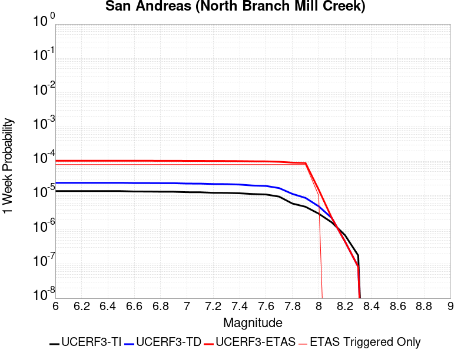 | 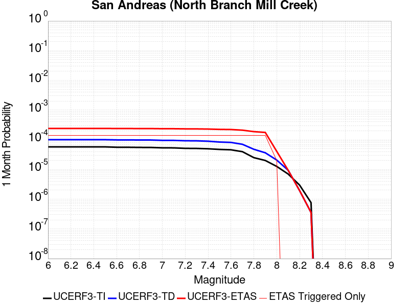 | 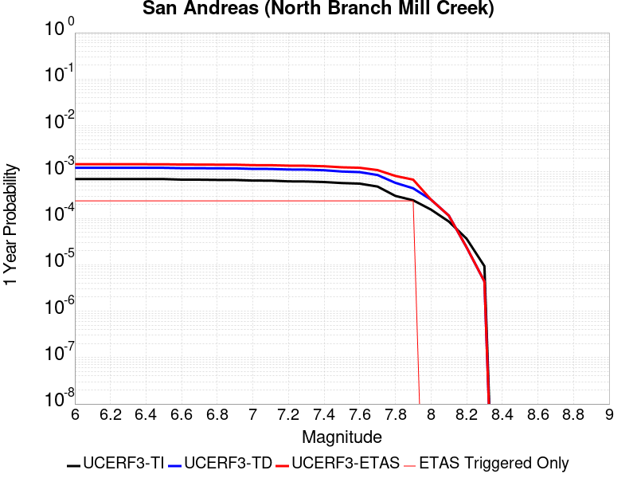 | 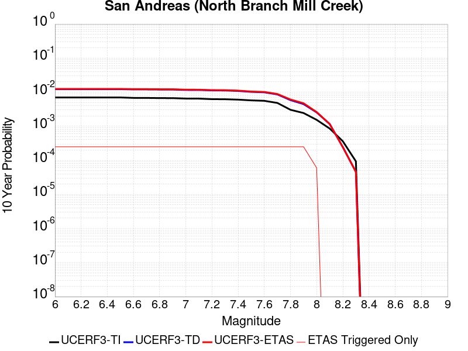 |

| Magnitude | 1 wk TI Prob | 1 wk TD Prob | 1 wk ETAS Prob | 1 wk ETAS/TD Gain | 1 wk ETAS Triggered Only | 1 mo TI Prob | 1 mo TD Prob | 1 mo ETAS Prob | 1 mo ETAS/TD Gain | 1 mo ETAS Triggered Only | 1 yr TI Prob | 1 yr TD Prob | 1 yr ETAS Prob | 1 yr ETAS/TD Gain | 1 yr ETAS Triggered Only | 10 yr TI Prob | 10 yr TD Prob | 10 yr ETAS Prob | 10 yr ETAS/TD Gain | 10 yr ETAS Triggered Only |
|-----|-----|-----|-----|-----|-----|-----|-----|-----|-----|-----|-----|-----|-----|-----|-----|-----|-----|-----|-----|-----|
| 6.0 | 1.3461156E-5 | 2.3499893E-5 | 1.03498016E-4 | 4.404191 | 8.0E-5 | 5.7689394E-5 | 1.00709956E-4 | 2.4069585E-4 | 2.3899906 | 1.4E-4 | 7.02142E-4 | 0.0012254574 | 0.0014252122 | 1.1630044 | 2.0E-4 | 0.0069992766 | 0.01222957 | 0.012476512 | 1.0201923 | 2.5E-4 |
| 6.1 | 1.3461156E-5 | 2.3499893E-5 | 1.03498016E-4 | 4.404191 | 8.0E-5 | 5.7689394E-5 | 1.00709956E-4 | 2.4069585E-4 | 2.3899906 | 1.4E-4 | 7.02142E-4 | 0.0012254574 | 0.0014252122 | 1.1630044 | 2.0E-4 | 0.0069992766 | 0.01222957 | 0.012476512 | 1.0201923 | 2.5E-4 |
| 6.2 | 1.3461156E-5 | 2.3499893E-5 | 1.03498016E-4 | 4.404191 | 8.0E-5 | 5.7689394E-5 | 1.00709956E-4 | 2.4069585E-4 | 2.3899906 | 1.4E-4 | 7.02142E-4 | 0.0012254574 | 0.0014252122 | 1.1630044 | 2.0E-4 | 0.0069992766 | 0.01222957 | 0.012476512 | 1.0201923 | 2.5E-4 |
| 6.3 | 1.3461156E-5 | 2.3499893E-5 | 1.03498016E-4 | 4.404191 | 8.0E-5 | 5.7689394E-5 | 1.00709956E-4 | 2.4069585E-4 | 2.3899906 | 1.4E-4 | 7.02142E-4 | 0.0012254574 | 0.0014252122 | 1.1630044 | 2.0E-4 | 0.0069992766 | 0.01222957 | 0.012476512 | 1.0201923 | 2.5E-4 |
| 6.4 | 1.3461156E-5 | 2.3499893E-5 | 1.03498016E-4 | 4.404191 | 8.0E-5 | 5.7689394E-5 | 1.00709956E-4 | 2.4069585E-4 | 2.3899906 | 1.4E-4 | 7.02142E-4 | 0.0012254574 | 0.0014252122 | 1.1630044 | 2.0E-4 | 0.0069992766 | 0.01222957 | 0.012476512 | 1.0201923 | 2.5E-4 |
| 6.5 | 1.3450706E-5 | 2.3488852E-5 | 1.0348697E-4 | 4.405791 | 8.0E-5 | 5.764461E-5 | 1.0066265E-4 | 2.4064856E-4 | 2.390644 | 1.4E-4 | 7.0159714E-4 | 0.001224882 | 0.001424637 | 1.163081 | 2.0E-4 | 0.006993862 | 0.01222388 | 0.012470824 | 1.0202018 | 2.5E-4 |
| 6.6 | 1.3074523E-5 | 2.3103135E-5 | 1.0310129E-4 | 4.4626536 | 8.0E-5 | 5.6032466E-5 | 9.9009696E-5 | 2.3899584E-4 | 2.413863 | 1.4E-4 | 6.8198174E-4 | 0.0012047797 | 0.0014045388 | 1.1658055 | 2.0E-4 | 0.006798926 | 0.012025044 | 0.0122720385 | 1.02054 | 2.5E-4 |
| 6.7 | 1.3050216E-5 | 2.3078432E-5 | 1.03076585E-4 | 4.46636 | 8.0E-5 | 5.59283E-5 | 9.890384E-5 | 2.3888999E-4 | 2.4153764 | 1.4E-4 | 6.8071426E-4 | 0.0012034923 | 0.0014032515 | 1.1659831 | 2.0E-4 | 0.0067863287 | 0.012012309 | 0.012259306 | 1.0205619 | 2.5E-4 |
| 6.8 | 1.29049395E-5 | 2.292684E-5 | 1.02925005E-4 | 4.4892797 | 8.0E-5 | 5.530571E-5 | 9.825421E-5 | 2.3824045E-4 | 2.4247353 | 1.4E-4 | 6.73139E-4 | 0.0011955918 | 0.0013953527 | 1.1670812 | 2.0E-4 | 0.0067110364 | 0.011934154 | 0.01218117 | 1.0206983 | 2.5E-4 |
| 6.9 | 1.2867369E-5 | 2.2886245E-5 | 1.0288441E-4 | 4.4954696 | 8.0E-5 | 5.51447E-5 | 9.8080236E-5 | 2.3806651E-4 | 2.4272628 | 1.4E-4 | 6.711799E-4 | 0.0011934759 | 0.0013932373 | 1.1673777 | 2.0E-4 | 0.006691564 | 0.011913223 | 0.012160245 | 1.020735 | 2.5E-4 |
| 7.0 | 1.2495996E-5 | 2.2286325E-5 | 1.0228454E-4 | 4.5895653 | 8.0E-5 | 5.3553173E-5 | 9.550934E-5 | 2.3549597E-4 | 2.4656851 | 1.4E-4 | 6.518148E-4 | 0.0011622087 | 0.0013619764 | 1.1718861 | 2.0E-4 | 0.0064990623 | 0.0116038285 | 0.011850928 | 1.0212946 | 2.5E-4 |
| 7.1 | 1.2452067E-5 | 2.2231397E-5 | 1.0222962E-4 | 4.598434 | 8.0E-5 | 5.3364907E-5 | 9.527396E-5 | 2.3526062E-4 | 2.4693067 | 1.4E-4 | 6.4952404E-4 | 0.0011593461 | 0.0013591142 | 1.1723111 | 2.0E-4 | 0.0064762887 | 0.0115755 | 0.0118226055 | 1.0213473 | 2.5E-4 |
| 7.2 | 1.2002777E-5 | 2.1609963E-5 | 1.0160823E-4 | 4.701916 | 8.0E-5 | 5.143946E-5 | 9.2610855E-5 | 2.3259789E-4 | 2.5115619 | 1.4E-4 | 6.2609545E-4 | 0.0011269567 | 0.0013267312 | 1.1772691 | 2.0E-4 | 0.006243344 | 0.011254923 | 0.0115021095 | 1.0219625 | 2.5E-4 |
| 7.3 | 1.1923425E-5 | 2.1479793E-5 | 1.0147807E-4 | 4.724351 | 8.0E-5 | 5.109939E-5 | 9.205302E-5 | 2.3204014E-4 | 2.5207226 | 1.4E-4 | 6.219575E-4 | 0.001120172 | 0.0013199479 | 1.178344 | 2.0E-4 | 0.0062021962 | 0.011187789 | 0.011434992 | 1.0220958 | 2.5E-4 |
| 7.4 | 1.16105175E-5 | 2.0853771E-5 | 1.0085211E-4 | 4.8361564 | 8.0E-5 | 4.975841E-5 | 8.937026E-5 | 2.2935776E-4 | 2.5663767 | 1.4E-4 | 6.0564023E-4 | 0.0010875424 | 0.0012873248 | 1.1837009 | 2.0E-4 | 0.006039923 | 0.010865397 | 0.011112681 | 1.0227588 | 2.5E-4 |
| 7.5 | 1.1037265E-5 | 1.9553907E-5 | 9.9552344E-5 | 5.091174 | 8.0E-5 | 4.7301706E-5 | 8.379978E-5 | 2.2378805E-4 | 2.6705089 | 1.4E-4 | 5.757461E-4 | 0.0010197869 | 0.001219583 | 1.1959194 | 2.0E-4 | 0.005742567 | 0.010194898 | 0.010442349 | 1.0242721 | 2.5E-4 |
| 7.6 | 1.0720915E-5 | 1.899582E-5 | 9.89943E-5 | 5.2113733 | 8.0E-5 | 4.5945973E-5 | 8.140812E-5 | 2.2139672E-4 | 2.7195902 | 1.4E-4 | 5.592486E-4 | 9.906954E-4 | 0.0011904973 | 1.2016784 | 2.0E-4 | 0.005578433 | 0.009906623 | 0.010154146 | 1.0249857 | 2.5E-4 |
| 7.7 | 9.276279E-6 | 1.6441649E-5 | 9.644033E-5 | 5.865612 | 8.0E-5 | 3.9754876E-5 | 7.0462316E-5 | 2.1045245E-4 | 2.9867377 | 1.4E-4 | 4.839081E-4 | 8.575427E-4 | 0.0010573711 | 1.2330246 | 2.0E-4 | 0.0048285574 | 0.008586041 | 0.0088338945 | 1.028867 | 2.5E-4 |
| 7.8 | 5.8346777E-6 | 1.1155013E-5 | 9.115412E-5 | 8.171583 | 8.0E-5 | 2.5005522E-5 | 4.7806327E-5 | 1.8779963E-4 | 3.9283428 | 1.4E-4 | 3.043997E-4 | 5.818867E-4 | 7.8177033E-4 | 1.3435096 | 2.0E-4 | 0.0030398308 | 0.0058469265 | 0.006095465 | 1.0425075 | 2.5E-4 |
| 7.9 | 4.690204E-6 | 8.509093E-6 | 8.8508416E-5 | 10.401627 | 8.0E-5 | 2.0100719E-5 | 3.6467034E-5 | 1.7646192E-4 | 4.838944 | 1.4E-4 | 2.4469878E-4 | 4.4389578E-4 | 6.43807E-4 | 1.4503562 | 2.0E-4 | 0.002444295 | 0.0044707474 | 0.0047196294 | 1.0556691 | 2.5E-4 |
| 8.0 | 2.9570454E-6 | 4.846947E-6 | 1.4846898E-5 | 3.0631444 | 1.0E-5 | 1.267299E-5 | 2.0772464E-5 | 4.0772047E-5 | 1.9627931 | 2.0E-5 | 1.5428272E-4 | 2.5287544E-4 | 2.8286784E-4 | 1.1186055 | 3.0E-5 | 0.0015417566 | 0.002549644 | 0.002609491 | 1.0234727 | 6.0E-5 |
| 8.1 | 1.6376824E-6 | 2.1968929E-6 | 2.1968929E-6 | 1.0 | 0.0 | 7.01862E-6 | 9.41522E-6 | 9.41522E-6 | 1.0 | 0.0 | 8.544835E-5 | 1.14624294E-4 | 1.14624294E-4 | 1.0 | 0.0 | 8.54155E-4 | 0.0011606582 | 0.0011606582 | 1.0 | 0.0 |
| 8.2 | 6.9631557E-7 | 4.5360213E-7 | 4.5360213E-7 | 1.0 | 0.0 | 2.984206E-6 | 1.9440076E-6 | 1.9440076E-6 | 1.0 | 0.0 | 3.63321E-5 | 2.3668037E-5 | 2.3668037E-5 | 1.0 | 0.0 | 3.6326164E-4 | 2.451564E-4 | 2.451564E-4 | 1.0 | 0.0 |
| 8.3 | 1.7876137E-7 | 8.360375E-8 | 8.360375E-8 | 1.0 | 0.0 | 7.661199E-7 | 3.5830175E-7 | 3.5830175E-7 | 1.0 | 0.0 | 9.32747E-6 | 4.3623154E-6 | 4.3623154E-6 | 1.0 | 0.0 | 9.3270784E-5 | 4.5817014E-5 | 4.5817014E-5 | 1.0 | 0.0 |

## Scodie Lineament
*[(top)](#table-of-contents)*

| 1 Week | 1 Month | 1 Year | 10 Year |
|-----|-----|-----|-----|
| 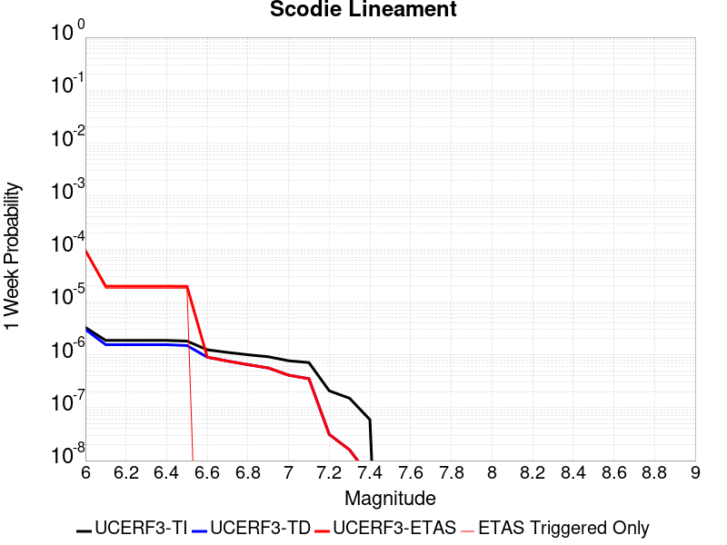 | 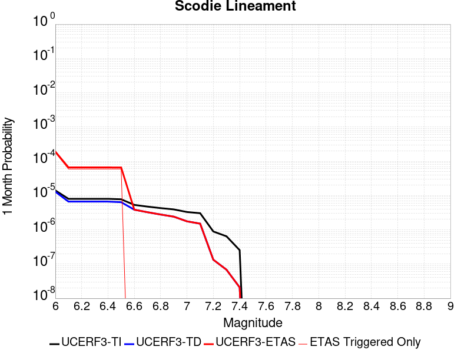 |  | 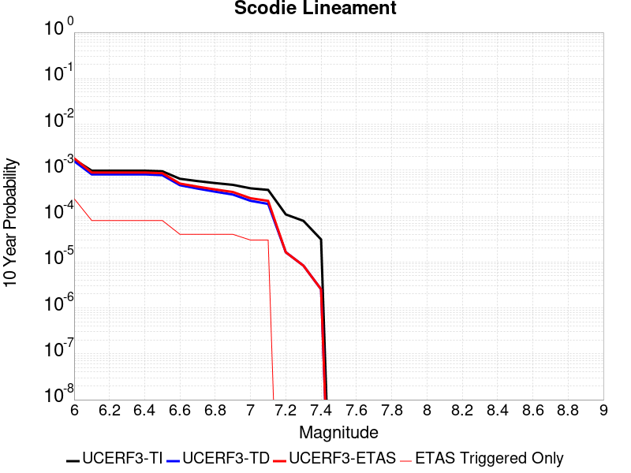 |

| Magnitude | 1 wk TI Prob | 1 wk TD Prob | 1 wk ETAS Prob | 1 wk ETAS/TD Gain | 1 wk ETAS Triggered Only | 1 mo TI Prob | 1 mo TD Prob | 1 mo ETAS Prob | 1 mo ETAS/TD Gain | 1 mo ETAS Triggered Only | 1 yr TI Prob | 1 yr TD Prob | 1 yr ETAS Prob | 1 yr ETAS/TD Gain | 1 yr ETAS Triggered Only | 10 yr TI Prob | 10 yr TD Prob | 10 yr ETAS Prob | 10 yr ETAS/TD Gain | 10 yr ETAS Triggered Only |
|-----|-----|-----|-----|-----|-----|-----|-----|-----|-----|-----|-----|-----|-----|-----|-----|-----|-----|-----|-----|-----|
| 6.0 | 3.2919327E-6 | 3.0133422E-6 | 1.03013044E-4 | 34.185642 | 1.0E-4 | 1.4108206E-5 | 1.2914278E-5 | 1.429126E-4 | 11.066248 | 1.3E-4 | 1.7175387E-4 | 1.5722317E-4 | 3.3719486E-4 | 2.1446896 | 1.8E-4 | 0.0017162118 | 0.0015714309 | 0.0018110537 | 1.152487 | 2.4E-4 |
| 6.1 | 1.8663811E-6 | 1.5490499E-6 | 3.1549003E-5 | 20.36668 | 3.0E-5 | 7.998751E-6 | 6.6387715E-6 | 4.6638506E-5 | 7.0251713 | 4.0E-5 | 9.738045E-5 | 8.082454E-5 | 1.4081968E-4 | 1.7422888 | 6.0E-5 | 9.7337784E-4 | 8.080003E-4 | 8.8793563E-4 | 1.0989299 | 8.0E-5 |
| 6.2 | 1.8663811E-6 | 1.5490499E-6 | 3.1549003E-5 | 20.36668 | 3.0E-5 | 7.998751E-6 | 6.6387715E-6 | 4.6638506E-5 | 7.0251713 | 4.0E-5 | 9.738045E-5 | 8.082454E-5 | 1.4081968E-4 | 1.7422888 | 6.0E-5 | 9.7337784E-4 | 8.080003E-4 | 8.8793563E-4 | 1.0989299 | 8.0E-5 |
| 6.3 | 1.8663811E-6 | 1.5490499E-6 | 3.1549003E-5 | 20.36668 | 3.0E-5 | 7.998751E-6 | 6.6387715E-6 | 4.6638506E-5 | 7.0251713 | 4.0E-5 | 9.738045E-5 | 8.082454E-5 | 1.4081968E-4 | 1.7422888 | 6.0E-5 | 9.7337784E-4 | 8.080003E-4 | 8.8793563E-4 | 1.0989299 | 8.0E-5 |
| 6.4 | 1.8663811E-6 | 1.5490499E-6 | 3.1549003E-5 | 20.36668 | 3.0E-5 | 7.998751E-6 | 6.6387715E-6 | 4.6638506E-5 | 7.0251713 | 4.0E-5 | 9.738045E-5 | 8.082454E-5 | 1.4081968E-4 | 1.7422888 | 6.0E-5 | 9.7337784E-4 | 8.080003E-4 | 8.8793563E-4 | 1.0989299 | 8.0E-5 |
| 6.5 | 1.8106311E-6 | 1.4909839E-6 | 3.1490938E-5 | 21.12091 | 3.0E-5 | 7.759824E-6 | 6.3899183E-6 | 4.638966E-5 | 7.259821 | 4.0E-5 | 9.447177E-5 | 7.7794975E-5 | 1.3779031E-4 | 1.771198 | 6.0E-5 | 9.4431615E-4 | 7.7772606E-4 | 8.5766386E-4 | 1.102784 | 8.0E-5 |
| 6.6 | 1.2414679E-6 | 8.997558E-7 | 1.08997465E-5 | 12.114118 | 1.0E-5 | 5.320566E-6 | 3.856091E-6 | 1.3856053E-5 | 3.5932899 | 1.0E-5 | 6.477596E-5 | 4.6946985E-5 | 6.694604E-5 | 1.4259925 | 2.0E-5 | 6.475708E-4 | 4.693793E-4 | 5.093605E-4 | 1.085179 | 4.0E-5 |
| 6.7 | 1.1062215E-6 | 7.594311E-7 | 1.0759423E-5 | 14.167742 | 1.0E-5 | 4.7409408E-6 | 3.2547011E-6 | 1.3254668E-5 | 4.0724688 | 1.0E-5 | 5.7719422E-5 | 3.9625334E-5 | 5.9624545E-5 | 1.5047076 | 2.0E-5 | 5.770443E-4 | 3.961897E-4 | 4.3617384E-4 | 1.1009218 | 4.0E-5 |
| 6.8 | 1.0006736E-6 | 6.500397E-7 | 1.0650033E-5 | 16.383667 | 1.0E-5 | 4.288594E-6 | 2.7858816E-6 | 1.2785854E-5 | 4.589518 | 1.0E-5 | 5.221238E-5 | 3.3917644E-5 | 5.3916967E-5 | 1.5896436 | 2.0E-5 | 5.220012E-4 | 3.3913075E-4 | 3.7911718E-4 | 1.1179086 | 4.0E-5 |
| 6.9 | 9.167364E-7 | 5.631625E-7 | 1.0563157E-5 | 18.756855 | 1.0E-5 | 3.9288643E-6 | 2.4135516E-6 | 1.2413528E-5 | 5.143262 | 1.0E-5 | 4.7832873E-5 | 2.9384651E-5 | 4.9384063E-5 | 1.6806074 | 2.0E-5 | 4.782258E-4 | 2.9381333E-4 | 3.3380158E-4 | 1.1361009 | 4.0E-5 |
| 7.0 | 7.6987664E-7 | 4.113383E-7 | 1.0411334E-5 | 25.31088 | 1.0E-5 | 3.2994672E-6 | 1.7628774E-6 | 1.176286E-5 | 6.672534 | 1.0E-5 | 4.0170275E-5 | 2.1462862E-5 | 3.1462645E-5 | 1.4659111 | 1.0E-5 | 4.0163012E-4 | 2.1461173E-4 | 2.446053E-4 | 1.1397573 | 3.0E-5 |
| 7.1 | 7.1038727E-7 | 3.5211494E-7 | 1.03521115E-5 | 29.399809 | 1.0E-5 | 3.0445133E-6 | 1.5090633E-6 | 1.1509048E-5 | 7.6266174 | 1.0E-5 | 3.706632E-5 | 1.8372726E-5 | 2.8372542E-5 | 1.544275 | 1.0E-5 | 3.7060137E-4 | 1.8371557E-4 | 2.1371005E-4 | 1.163266 | 3.0E-5 |
| 7.2 | 2.0799602E-7 | 3.1186854E-8 | 3.1186854E-8 | 1.0 | 0.0 | 8.914113E-7 | 1.3365793E-7 | 1.3365793E-7 | 1.0 | 0.0 | 1.0852878E-5 | 1.6272843E-6 | 1.6272843E-6 | 1.0 | 0.0 | 1.08523476E-4 | 1.627273E-5 | 1.627273E-5 | 1.0 | 0.0 |
| 7.3 | 1.5048182E-7 | 1.5945696E-8 | 1.5945696E-8 | 1.0 | 0.0 | 6.449219E-7 | 6.83387E-8 | 6.83387E-8 | 1.0 | 0.0 | 7.851896E-6 | 8.320234E-7 | 8.320234E-7 | 1.0 | 0.0 | 7.851618E-5 | 8.320206E-6 | 8.320206E-6 | 1.0 | 0.0 |
| 7.4 | 5.9334678E-8 | 4.8683537E-9 | 4.8683537E-9 | 1.0 | 0.0 | 2.5429145E-7 | 2.0864372E-8 | 2.0864372E-8 | 1.0 | 0.0 | 3.095994E-6 | 2.5402372E-7 | 2.5402372E-7 | 1.0 | 0.0 | 3.095951E-5 | 2.5402353E-6 | 2.5402353E-6 | 1.0 | 0.0 |

## Santa Ynez (East)
*[(top)](#table-of-contents)*

| 1 Week | 1 Month | 1 Year | 10 Year |
|-----|-----|-----|-----|
| 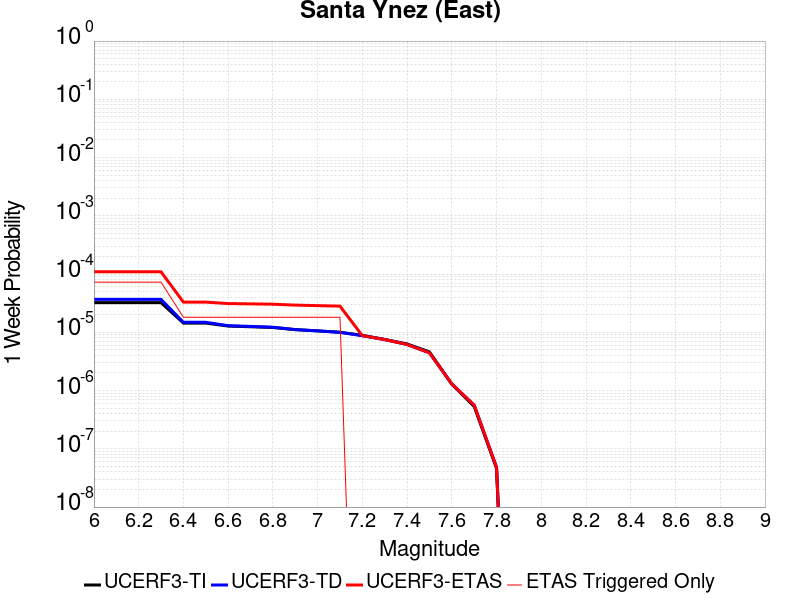 | 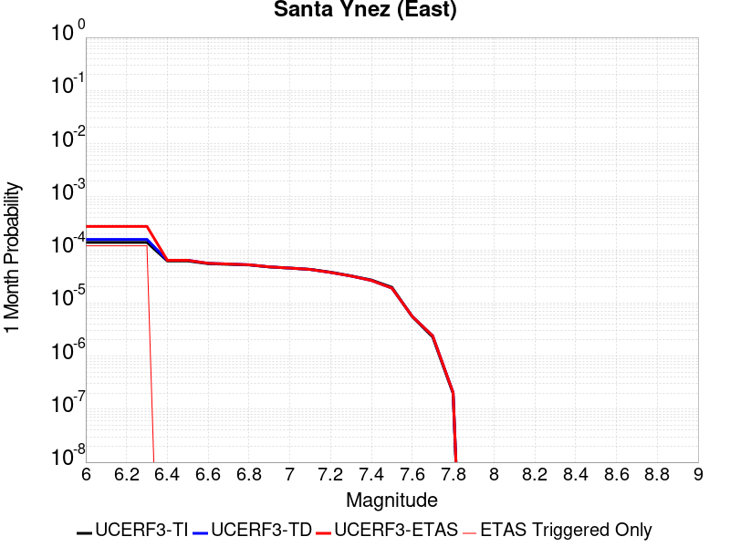 |  | 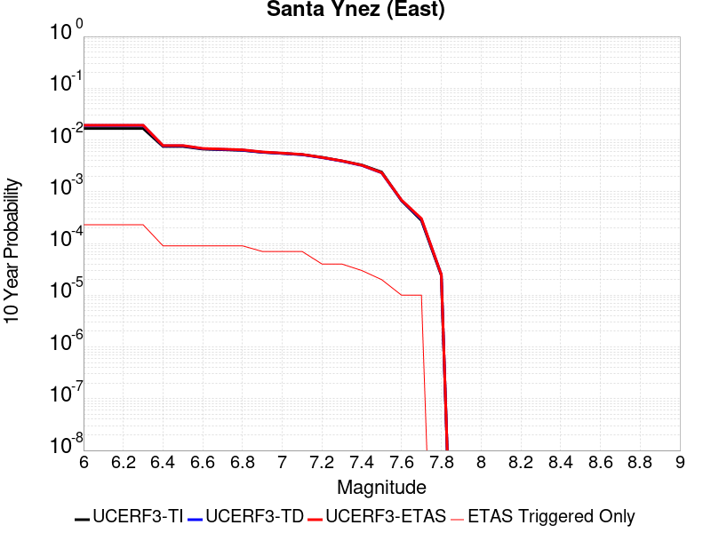 |

| Magnitude | 1 wk TI Prob | 1 wk TD Prob | 1 wk ETAS Prob | 1 wk ETAS/TD Gain | 1 wk ETAS Triggered Only | 1 mo TI Prob | 1 mo TD Prob | 1 mo ETAS Prob | 1 mo ETAS/TD Gain | 1 mo ETAS Triggered Only | 1 yr TI Prob | 1 yr TD Prob | 1 yr ETAS Prob | 1 yr ETAS/TD Gain | 1 yr ETAS Triggered Only | 10 yr TI Prob | 10 yr TD Prob | 10 yr ETAS Prob | 10 yr ETAS/TD Gain | 10 yr ETAS Triggered Only |
|-----|-----|-----|-----|-----|-----|-----|-----|-----|-----|-----|-----|-----|-----|-----|-----|-----|-----|-----|-----|-----|
| 6.0 | 3.2269712E-5 | 3.67505E-5 | 1.16747564E-4 | 3.176761 | 8.0E-5 | 1.3829143E-4 | 1.5749598E-4 | 2.6747864E-4 | 1.6983205 | 1.1E-4 | 0.0016823979 | 0.0019164166 | 0.0020761099 | 1.0833292 | 1.6E-4 | 0.016697178 | 0.019056441 | 0.019282058 | 1.0118394 | 2.3E-4 |
| 6.1 | 3.2269712E-5 | 3.67505E-5 | 1.16747564E-4 | 3.176761 | 8.0E-5 | 1.3829143E-4 | 1.5749598E-4 | 2.6747864E-4 | 1.6983205 | 1.1E-4 | 0.0016823979 | 0.0019164166 | 0.0020761099 | 1.0833292 | 1.6E-4 | 0.016697178 | 0.019056441 | 0.019282058 | 1.0118394 | 2.3E-4 |
| 6.2 | 3.2269712E-5 | 3.67505E-5 | 1.16747564E-4 | 3.176761 | 8.0E-5 | 1.3829143E-4 | 1.5749598E-4 | 2.6747864E-4 | 1.6983205 | 1.1E-4 | 0.0016823979 | 0.0019164166 | 0.0020761099 | 1.0833292 | 1.6E-4 | 0.016697178 | 0.019056441 | 0.019282058 | 1.0118394 | 2.3E-4 |
| 6.3 | 3.2269712E-5 | 3.67505E-5 | 1.16747564E-4 | 3.176761 | 8.0E-5 | 1.3829143E-4 | 1.5749598E-4 | 2.6747864E-4 | 1.6983205 | 1.1E-4 | 0.0016823979 | 0.0019164166 | 0.0020761099 | 1.0833292 | 1.6E-4 | 0.016697178 | 0.019056441 | 0.019282058 | 1.0118394 | 2.3E-4 |
| 6.4 | 1.4404779E-5 | 1.4849382E-5 | 4.4848937E-5 | 3.020256 | 3.0E-5 | 6.1733306E-5 | 6.363868E-5 | 9.363678E-5 | 1.4713814 | 3.0E-5 | 7.513438E-4 | 7.745306E-4 | 8.2449184E-4 | 1.0645052 | 5.0E-5 | 0.0074880854 | 0.007718862 | 0.007808167 | 1.0115697 | 9.0E-5 |
| 6.5 | 1.4404779E-5 | 1.4849382E-5 | 4.4848937E-5 | 3.020256 | 3.0E-5 | 6.1733306E-5 | 6.363868E-5 | 9.363678E-5 | 1.4713814 | 3.0E-5 | 7.513438E-4 | 7.745306E-4 | 8.2449184E-4 | 1.0645052 | 5.0E-5 | 0.0074880854 | 0.007718862 | 0.007808167 | 1.0115697 | 9.0E-5 |
| 6.6 | 1.280208E-5 | 1.3011947E-5 | 4.3011558E-5 | 3.3055434 | 3.0E-5 | 5.4864904E-5 | 5.5764307E-5 | 8.576263E-5 | 1.5379485 | 3.0E-5 | 6.6777546E-4 | 6.787207E-4 | 7.2868675E-4 | 1.073618 | 5.0E-5 | 0.006657724 | 0.0067666885 | 0.0068560797 | 1.0132104 | 9.0E-5 |
| 6.7 | 1.2457027E-5 | 1.2628468E-5 | 4.262809E-5 | 3.375555 | 3.0E-5 | 5.3386164E-5 | 5.412089E-5 | 8.411927E-5 | 1.5542846 | 3.0E-5 | 6.497827E-4 | 6.587243E-4 | 7.0869137E-4 | 1.0758543 | 5.0E-5 | 0.00647886 | 0.006567915 | 0.006657324 | 1.013613 | 9.0E-5 |
| 6.8 | 1.2095134E-5 | 1.2230915E-5 | 4.223055E-5 | 3.4527712 | 3.0E-5 | 5.1835254E-5 | 5.241716E-5 | 8.241559E-5 | 1.5723016 | 3.0E-5 | 6.309115E-4 | 6.379937E-4 | 6.8796176E-4 | 1.0783207 | 5.0E-5 | 0.0062912325 | 0.006361809 | 0.0064512365 | 1.0140569 | 9.0E-5 |
| 6.9 | 1.1104036E-5 | 1.1157347E-5 | 4.115701E-5 | 3.6887813 | 3.0E-5 | 4.758786E-5 | 4.781633E-5 | 7.78149E-5 | 1.6273707 | 3.0E-5 | 5.7922816E-4 | 5.820096E-4 | 6.319805E-4 | 1.0858592 | 5.0E-5 | 0.005777207 | 0.0058049993 | 0.005874593 | 1.0119885 | 7.0E-5 |
| 7.0 | 1.0577444E-5 | 1.058168E-5 | 4.0581363E-5 | 3.8350585 | 3.0E-5 | 4.5331115E-5 | 4.5349276E-5 | 7.534792E-5 | 1.661502 | 3.0E-5 | 5.5176654E-4 | 5.519888E-4 | 6.0196116E-4 | 1.0905316 | 5.0E-5 | 0.0055039856 | 0.0055063153 | 0.0055759302 | 1.0126426 | 7.0E-5 |
| 7.1 | 1.0021775E-5 | 9.980988E-6 | 3.998069E-5 | 4.005685 | 3.0E-5 | 4.294976E-5 | 4.2774966E-5 | 7.2773684E-5 | 1.7013148 | 3.0E-5 | 5.2278786E-4 | 5.2066194E-4 | 5.706359E-4 | 1.0959816 | 5.0E-5 | 0.0052155964 | 0.0051945536 | 0.00526419 | 1.0134057 | 7.0E-5 |
| 7.2 | 8.874109E-6 | 8.748793E-6 | 2.8748618E-5 | 3.2860096 | 2.0E-5 | 3.8031343E-5 | 3.7494297E-5 | 5.7493548E-5 | 1.5333945 | 2.0E-5 | 4.629332E-4 | 4.5639853E-4 | 4.9638026E-4 | 1.0876027 | 4.0E-5 | 0.0046197 | 0.0045547304 | 0.004594548 | 1.0087421 | 4.0E-5 |
| 7.3 | 7.5504267E-6 | 7.5051175E-6 | 2.7504968E-5 | 3.6648283 | 2.0E-5 | 3.235857E-5 | 3.21644E-5 | 5.2163756E-5 | 1.6217855 | 2.0E-5 | 3.9389438E-4 | 3.915322E-4 | 4.3151656E-4 | 1.1021228 | 4.0E-5 | 0.0039319694 | 0.003908531 | 0.0039483747 | 1.0101941 | 4.0E-5 |
| 7.4 | 6.309394E-6 | 6.1831556E-6 | 2.6183032E-5 | 4.2345743 | 2.0E-5 | 2.703998E-5 | 2.6498974E-5 | 4.6498444E-5 | 1.7547262 | 2.0E-5 | 3.2916202E-4 | 3.225782E-4 | 3.5256855E-4 | 1.0929707 | 3.0E-5 | 0.003286749 | 0.003221197 | 0.0032511004 | 1.0092833 | 3.0E-5 |
| 7.5 | 4.6103073E-6 | 4.4408903E-6 | 1.4440846E-5 | 3.2517908 | 1.0E-5 | 1.975831E-5 | 1.9032252E-5 | 2.9032062E-5 | 1.5254139 | 1.0E-5 | 2.4053088E-4 | 2.3169373E-4 | 2.5168908E-4 | 1.0863008 | 2.0E-5 | 0.002402707 | 0.002314591 | 0.002334545 | 1.0086209 | 2.0E-5 |
| 7.6 | 1.2858658E-6 | 1.3008173E-6 | 1.13008045E-5 | 8.687465 | 1.0E-5 | 5.5108417E-6 | 5.5749197E-6 | 1.5574864E-5 | 2.793738 | 1.0E-5 | 6.7092435E-5 | 6.78726E-5 | 7.7871926E-5 | 1.1473248 | 1.0E-5 | 6.707218E-4 | 6.785256E-4 | 6.885188E-4 | 1.0147278 | 1.0E-5 |
| 7.7 | 5.3302307E-7 | 5.612138E-7 | 1.0561208E-5 | 18.81851 | 1.0E-5 | 2.2843826E-6 | 2.4052001E-6 | 1.2405176E-5 | 5.157648 | 1.0E-5 | 2.7812002E-5 | 2.9282954E-5 | 3.9282662E-5 | 1.3414856 | 1.0E-5 | 2.7808524E-4 | 2.9279452E-4 | 3.027916E-4 | 1.0341437 | 1.0E-5 |
| 7.8 | 4.613933E-8 | 4.80301E-8 | 4.80301E-8 | 1.0 | 0.0 | 1.9773998E-7 | 2.0584326E-7 | 2.0584326E-7 | 1.0 | 0.0 | 2.4074816E-6 | 2.5061388E-6 | 2.5061388E-6 | 1.0 | 0.0 | 2.4074554E-5 | 2.5061116E-5 | 2.5061116E-5 | 1.0 | 0.0 |

## Mission Ridge-Arroyo Parida-Santa Ana
*[(top)](#table-of-contents)*

| 1 Week | 1 Month | 1 Year | 10 Year |
|-----|-----|-----|-----|
| 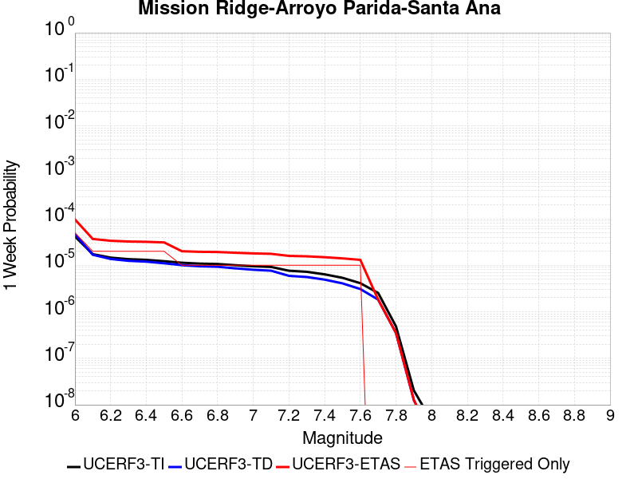 | 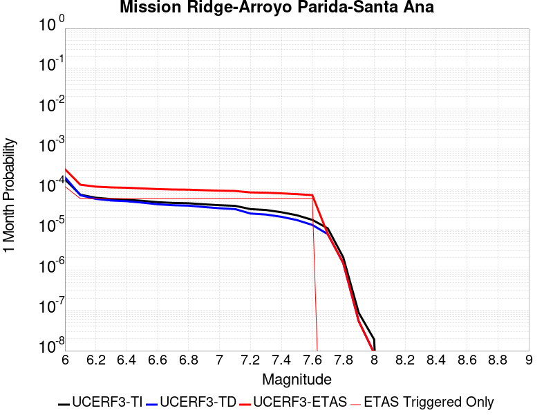 | 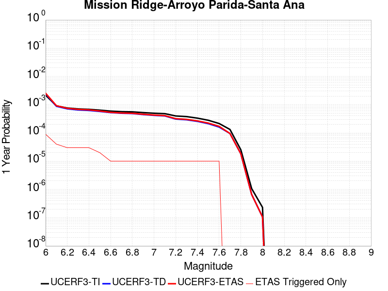 | 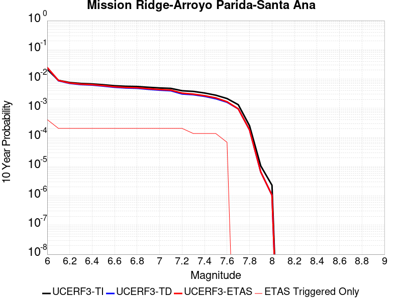 |

| Magnitude | 1 wk TI Prob | 1 wk TD Prob | 1 wk ETAS Prob | 1 wk ETAS/TD Gain | 1 wk ETAS Triggered Only | 1 mo TI Prob | 1 mo TD Prob | 1 mo ETAS Prob | 1 mo ETAS/TD Gain | 1 mo ETAS Triggered Only | 1 yr TI Prob | 1 yr TD Prob | 1 yr ETAS Prob | 1 yr ETAS/TD Gain | 1 yr ETAS Triggered Only | 10 yr TI Prob | 10 yr TD Prob | 10 yr ETAS Prob | 10 yr ETAS/TD Gain | 10 yr ETAS Triggered Only |
|-----|-----|-----|-----|-----|-----|-----|-----|-----|-----|-----|-----|-----|-----|-----|-----|-----|-----|-----|-----|-----|
| 6.0 | 4.169034E-5 | 4.7138263E-5 | 9.7135904E-5 | 2.0606594 | 5.0E-5 | 1.7866064E-4 | 2.0201034E-4 | 2.5200023E-4 | 1.247462 | 5.0E-5 | 0.0021730233 | 0.00245745 | 0.0025472287 | 1.0365334 | 9.0E-5 | 0.021518968 | 0.024384614 | 0.02455047 | 1.0068016 | 1.7E-4 |
| 6.1 | 1.73813E-5 | 1.6854226E-5 | 3.685389E-5 | 2.186626 | 2.0E-5 | 7.4489166E-5 | 7.223046E-5 | 9.222901E-5 | 1.2768714 | 2.0E-5 | 9.065282E-4 | 8.790618E-4 | 9.190267E-4 | 1.0454631 | 4.0E-5 | 0.009028391 | 0.008756988 | 0.008836287 | 1.0090556 | 8.0E-5 |
| 6.2 | 1.4622182E-5 | 1.367329E-5 | 3.3673015E-5 | 2.4626858 | 2.0E-5 | 6.2664985E-5 | 5.8598518E-5 | 7.8597346E-5 | 1.3412856 | 2.0E-5 | 7.6267915E-4 | 7.132073E-4 | 7.431859E-4 | 1.0420336 | 3.0E-5 | 0.007600669 | 0.007109627 | 0.0071692006 | 1.0083792 | 6.0E-5 |
| 6.3 | 1.3552434E-5 | 1.2482201E-5 | 3.2481952E-5 | 2.6022615 | 2.0E-5 | 5.8080568E-5 | 5.3494066E-5 | 7.3493E-5 | 1.3738532 | 2.0E-5 | 7.069015E-4 | 6.510988E-4 | 6.810793E-4 | 1.0460459 | 3.0E-5 | 0.00704657 | 0.006492275 | 0.0065518855 | 1.0091817 | 6.0E-5 |
| 6.4 | 1.30977305E-5 | 1.1979156E-5 | 3.1978918E-5 | 2.6695466 | 2.0E-5 | 5.613192E-5 | 5.1338247E-5 | 7.133722E-5 | 1.3895531 | 2.0E-5 | 6.831918E-4 | 6.248669E-4 | 6.548482E-4 | 1.0479802 | 3.0E-5 | 0.006810953 | 0.0062314444 | 0.0062910705 | 1.0095686 | 6.0E-5 |
| 6.5 | 1.225205E-5 | 1.1048803E-5 | 3.104858E-5 | 2.8101308 | 2.0E-5 | 5.2507727E-5 | 4.7351168E-5 | 6.735022E-5 | 1.422356 | 2.0E-5 | 6.3909404E-4 | 5.7635066E-4 | 5.963392E-4 | 1.0346811 | 2.0E-5 | 0.006372592 | 0.005748869 | 0.0057985815 | 1.0086473 | 5.0E-5 |
| 6.6 | 1.1352241E-5 | 1.0063535E-5 | 2.0063435E-5 | 1.9936767 | 1.0E-5 | 4.8651553E-5 | 4.3128734E-5 | 5.3128304E-5 | 1.231854 | 1.0E-5 | 5.921717E-4 | 5.2496797E-4 | 5.349627E-4 | 1.0190388 | 1.0E-5 | 0.0059059616 | 0.0052375244 | 0.0052773147 | 1.0075972 | 4.0E-5 |
| 6.7 | 1.0864116E-5 | 9.517027E-6 | 1.9516932E-5 | 2.0507383 | 1.0E-5 | 4.6559664E-5 | 4.0786632E-5 | 5.0786224E-5 | 1.2451683 | 1.0E-5 | 5.667165E-4 | 4.964661E-4 | 5.0646113E-4 | 1.0201323 | 1.0E-5 | 0.005652734 | 0.004953804 | 0.0049936054 | 1.0080346 | 4.0E-5 |
| 6.8 | 1.0666365E-5 | 9.299779E-6 | 1.9299685E-5 | 2.0752845 | 1.0E-5 | 4.571219E-5 | 3.9855597E-5 | 4.9855196E-5 | 1.2508957 | 1.0E-5 | 5.564038E-4 | 4.8513585E-4 | 4.95131E-4 | 1.0206028 | 1.0E-5 | 0.005550127 | 0.0048410003 | 0.0048808064 | 1.0082227 | 4.0E-5 |
| 6.9 | 1.0038665E-5 | 8.592046E-6 | 1.859196E-5 | 2.1638572 | 1.0E-5 | 4.302214E-5 | 3.682254E-5 | 4.6822173E-5 | 1.2715628 | 1.0E-5 | 5.236687E-4 | 4.4822405E-4 | 4.5821955E-4 | 1.0223002 | 1.0E-5 | 0.005224364 | 0.004473411 | 0.004513232 | 1.0089017 | 4.0E-5 |
| 7.0 | 9.5379955E-6 | 8.025073E-6 | 1.8024994E-5 | 2.2460845 | 1.0E-5 | 4.0876483E-5 | 3.4392728E-5 | 4.4392382E-5 | 1.2907492 | 1.0E-5 | 4.975576E-4 | 4.1865272E-4 | 4.2864852E-4 | 1.0238762 | 1.0E-5 | 0.00496445 | 0.0041788397 | 0.0042186724 | 1.0095321 | 4.0E-5 |
| 7.1 | 9.207389E-6 | 7.652375E-6 | 1.7652299E-5 | 2.306774 | 1.0E-5 | 3.945964E-5 | 3.279549E-5 | 4.2795164E-5 | 1.30491 | 1.0E-5 | 4.803152E-4 | 3.9921363E-4 | 4.0920964E-4 | 1.0250392 | 1.0E-5 | 0.004792784 | 0.003985161 | 0.0040250015 | 1.0099972 | 4.0E-5 |
| 7.2 | 7.638091E-6 | 5.9311183E-6 | 1.5931058E-5 | 2.6860127 | 1.0E-5 | 3.2734264E-5 | 2.541883E-5 | 3.5418576E-5 | 1.3933991 | 1.0E-5 | 3.984668E-4 | 3.0943064E-4 | 3.1942755E-4 | 1.0323074 | 1.0E-5 | 0.0039775306 | 0.0030900547 | 0.0031299312 | 1.0129048 | 4.0E-5 |
| 7.3 | 7.2500147E-6 | 5.5961527E-6 | 1.5596097E-5 | 2.786932 | 1.0E-5 | 3.1071122E-5 | 2.3983293E-5 | 3.3983055E-5 | 1.4169469 | 1.0E-5 | 3.7822526E-4 | 2.9195778E-4 | 3.0195486E-4 | 1.0342416 | 1.0E-5 | 0.0037758215 | 0.0029157975 | 0.00294571 | 1.0102588 | 3.0E-5 |
| 7.4 | 6.3899715E-6 | 4.9184964E-6 | 1.4918447E-5 | 3.0331318 | 1.0E-5 | 2.7385306E-5 | 2.10791E-5 | 3.107889E-5 | 1.4743936 | 1.0E-5 | 3.3336508E-4 | 2.5660804E-4 | 2.6660546E-4 | 1.03896 | 1.0E-5 | 0.0033286542 | 0.0025631618 | 0.0025930847 | 1.0116743 | 3.0E-5 |
| 7.5 | 5.379025E-6 | 4.0838527E-6 | 1.4083812E-5 | 3.4486582 | 1.0E-5 | 2.305276E-5 | 1.7502109E-5 | 2.7501934E-5 | 1.5713497 | 1.0E-5 | 2.806312E-4 | 2.1306744E-4 | 2.2306532E-4 | 1.0469235 | 1.0E-5 | 0.0028027708 | 0.002128643 | 0.0021585792 | 1.0140635 | 3.0E-5 |
| 7.6 | 4.1270696E-6 | 3.0883439E-6 | 1.3088313E-5 | 4.2379713 | 1.0E-5 | 1.768732E-5 | 1.3235693E-5 | 2.3235561E-5 | 1.7555227 | 1.0E-5 | 2.1532185E-4 | 1.6113273E-4 | 1.7113112E-4 | 1.0620506 | 1.0E-5 | 0.0021511333 | 0.001610167 | 0.0016201509 | 1.0062006 | 1.0E-5 |
| 7.7 | 2.5406805E-6 | 1.8282013E-6 | 1.8282013E-6 | 1.0 | 0.0 | 1.0888585E-5 | 7.835125E-6 | 7.835125E-6 | 1.0 | 0.0 | 1.3256045E-4 | 9.538854E-5 | 9.538854E-5 | 1.0 | 0.0 | 0.0013248142 | 9.534821E-4 | 9.534821E-4 | 1.0 | 0.0 |
| 7.8 | 4.8608285E-7 | 3.5098864E-7 | 3.5098864E-7 | 1.0 | 0.0 | 2.0832106E-6 | 1.5042363E-6 | 1.5042363E-6 | 1.0 | 0.0 | 2.5362791E-5 | 1.8313924E-5 | 1.8313924E-5 | 1.0 | 0.0 | 2.5359896E-4 | 1.8312426E-4 | 1.8312426E-4 | 1.0 | 0.0 |
| 7.9 | 2.0472514E-8 | 1.2688783E-8 | 1.2688783E-8 | 1.0 | 0.0 | 8.7739345E-8 | 5.43805E-8 | 5.43805E-8 | 1.0 | 0.0 | 1.068226E-6 | 6.6208236E-7 | 6.6208236E-7 | 1.0 | 0.0 | 1.0682209E-5 | 6.620805E-6 | 6.620805E-6 | 1.0 | 0.0 |
| 8.0 | 4.443582E-9 | 2.0321211E-9 | 2.0321211E-9 | 1.0 | 0.0 | 1.9043922E-8 | 8.70909E-9 | 8.70909E-9 | 1.0 | 0.0 | 2.3185973E-7 | 1.0603316E-7 | 1.0603316E-7 | 1.0 | 0.0 | 2.3185949E-6 | 1.0603312E-6 | 1.0603312E-6 | 1.0 | 0.0 |

## San Jacinto (San Jacinto Valley) rev
*[(top)](#table-of-contents)*

| 1 Week | 1 Month | 1 Year | 10 Year |
|-----|-----|-----|-----|
| 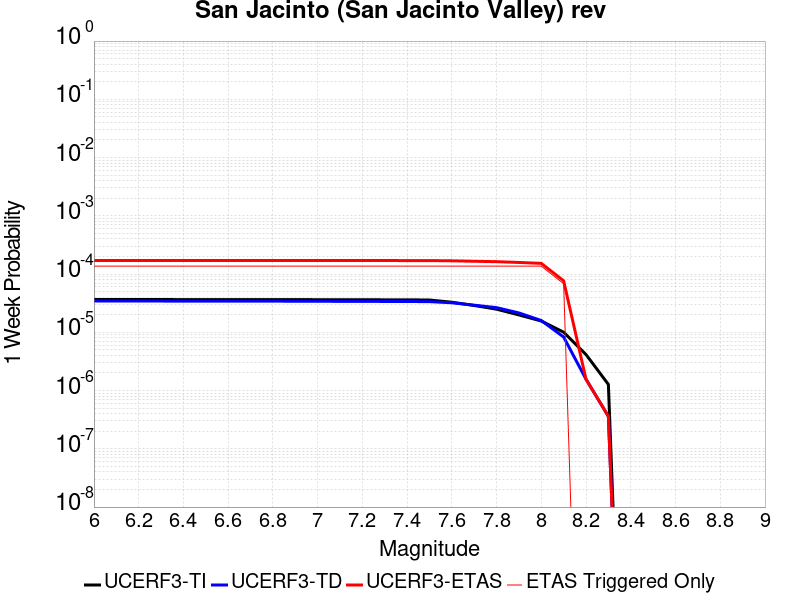 | 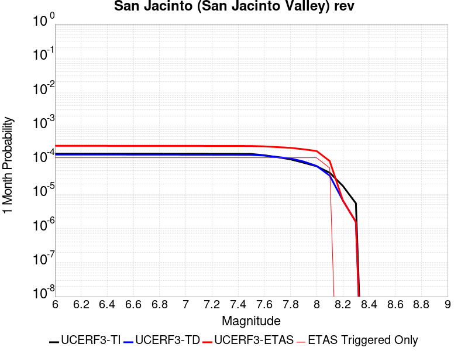 | 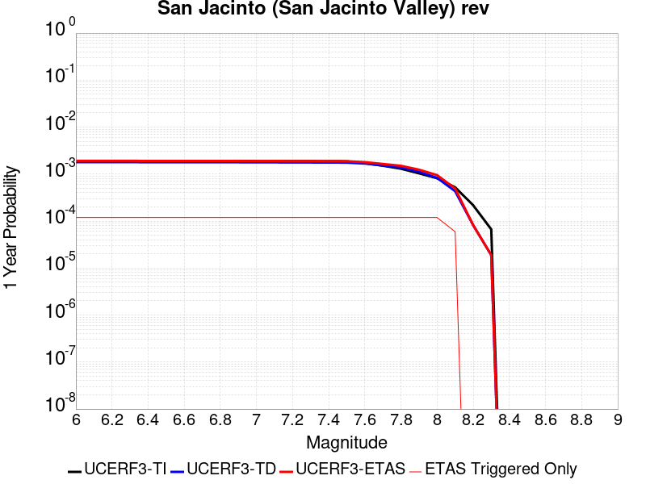 | 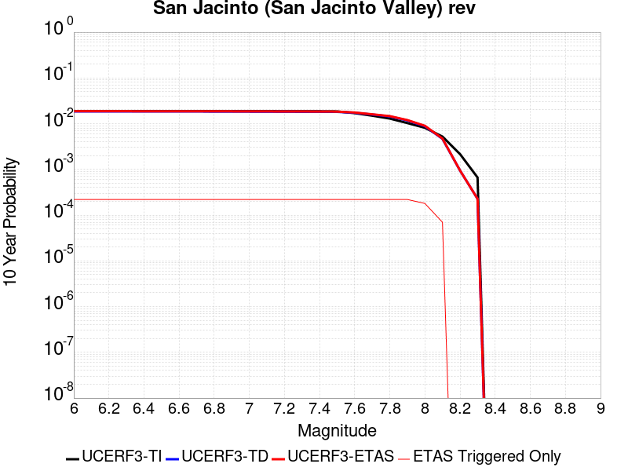 |

| Magnitude | 1 wk TI Prob | 1 wk TD Prob | 1 wk ETAS Prob | 1 wk ETAS/TD Gain | 1 wk ETAS Triggered Only | 1 mo TI Prob | 1 mo TD Prob | 1 mo ETAS Prob | 1 mo ETAS/TD Gain | 1 mo ETAS Triggered Only | 1 yr TI Prob | 1 yr TD Prob | 1 yr ETAS Prob | 1 yr ETAS/TD Gain | 1 yr ETAS Triggered Only | 10 yr TI Prob | 10 yr TD Prob | 10 yr ETAS Prob | 10 yr ETAS/TD Gain | 10 yr ETAS Triggered Only |
|-----|-----|-----|-----|-----|-----|-----|-----|-----|-----|-----|-----|-----|-----|-----|-----|-----|-----|-----|-----|-----|
| 6.0 | 3.652694E-5 | 3.4402394E-5 | 1.243993E-4 | 3.616007 | 9.0E-5 | 1.5653463E-4 | 1.474305E-4 | 2.574143E-4 | 1.7460042 | 1.1E-4 | 0.0019041431 | 0.00179349 | 0.001943221 | 1.0834858 | 1.5E-4 | 0.018879099 | 0.018526595 | 0.018742518 | 1.0116549 | 2.2E-4 |
| 6.1 | 3.652694E-5 | 3.4402394E-5 | 1.243993E-4 | 3.616007 | 9.0E-5 | 1.5653463E-4 | 1.474305E-4 | 2.574143E-4 | 1.7460042 | 1.1E-4 | 0.0019041431 | 0.00179349 | 0.001943221 | 1.0834858 | 1.5E-4 | 0.018879099 | 0.018526595 | 0.018742518 | 1.0116549 | 2.2E-4 |
| 6.2 | 3.652694E-5 | 3.4402394E-5 | 1.243993E-4 | 3.616007 | 9.0E-5 | 1.5653463E-4 | 1.474305E-4 | 2.574143E-4 | 1.7460042 | 1.1E-4 | 0.0019041431 | 0.00179349 | 0.001943221 | 1.0834858 | 1.5E-4 | 0.018879099 | 0.018526595 | 0.018742518 | 1.0116549 | 2.2E-4 |
| 6.3 | 3.652694E-5 | 3.4402394E-5 | 1.243993E-4 | 3.616007 | 9.0E-5 | 1.5653463E-4 | 1.474305E-4 | 2.574143E-4 | 1.7460042 | 1.1E-4 | 0.0019041431 | 0.00179349 | 0.001943221 | 1.0834858 | 1.5E-4 | 0.018879099 | 0.018526595 | 0.018742518 | 1.0116549 | 2.2E-4 |
| 6.4 | 3.646941E-5 | 3.432397E-5 | 1.2432088E-4 | 3.6219845 | 9.0E-5 | 1.5628811E-4 | 1.4709444E-4 | 2.5707827E-4 | 1.7477089 | 1.1E-4 | 0.0019011468 | 0.0017894056 | 0.0019391372 | 1.0836767 | 1.5E-4 | 0.018849645 | 0.018486476 | 0.018702408 | 1.0116806 | 2.2E-4 |
| 6.5 | 3.646941E-5 | 3.432397E-5 | 1.2432088E-4 | 3.6219845 | 9.0E-5 | 1.5628811E-4 | 1.4709444E-4 | 2.5707827E-4 | 1.7477089 | 1.1E-4 | 0.0019011468 | 0.0017894056 | 0.0019391372 | 1.0836767 | 1.5E-4 | 0.018849645 | 0.018486476 | 0.018702408 | 1.0116806 | 2.2E-4 |
| 6.6 | 3.6442503E-5 | 3.4287354E-5 | 1.2428427E-4 | 3.6247845 | 9.0E-5 | 1.561728E-4 | 1.4693754E-4 | 2.5692137E-4 | 1.7485074 | 1.1E-4 | 0.0018997455 | 0.0017874985 | 0.0019372304 | 1.0837661 | 1.5E-4 | 0.018835869 | 0.018467745 | 0.018683681 | 1.0116926 | 2.2E-4 |
| 6.7 | 3.6432113E-5 | 3.4272925E-5 | 1.2426983E-4 | 3.6258895 | 9.0E-5 | 1.5612828E-4 | 1.4687571E-4 | 2.5685955E-4 | 1.7488226 | 1.1E-4 | 0.0018992044 | 0.0017867472 | 0.0019364792 | 1.0838014 | 1.5E-4 | 0.018830549 | 0.018460369 | 0.018676307 | 1.0116974 | 2.2E-4 |
| 6.8 | 3.6409598E-5 | 3.424198E-5 | 1.242389E-4 | 3.6282625 | 9.0E-5 | 1.560318E-4 | 1.4674311E-4 | 2.5672695E-4 | 1.7494993 | 1.1E-4 | 0.0018980318 | 0.0017851355 | 0.0019348677 | 1.0838772 | 1.5E-4 | 0.018819023 | 0.018444523 | 0.018660465 | 1.0117077 | 2.2E-4 |
| 6.9 | 3.638078E-5 | 3.4202407E-5 | 1.2419933E-4 | 3.6313038 | 9.0E-5 | 1.5590832E-4 | 1.4657351E-4 | 2.565574E-4 | 1.7503667 | 1.1E-4 | 0.0018965311 | 0.001783074 | 0.0019328066 | 1.0839744 | 1.5E-4 | 0.018804269 | 0.018424258 | 0.018640203 | 1.0117208 | 2.2E-4 |
| 7.0 | 3.6294874E-5 | 3.408442E-5 | 1.2408136E-4 | 3.6404126 | 9.0E-5 | 1.5554018E-4 | 1.4606792E-4 | 2.5605186E-4 | 1.7529643 | 1.1E-4 | 0.0018920569 | 0.001776929 | 0.0019266624 | 1.0842654 | 1.5E-4 | 0.018760284 | 0.018363839 | 0.0185798 | 1.0117601 | 2.2E-4 |
| 7.1 | 3.6260717E-5 | 3.4040702E-5 | 1.2403764E-4 | 3.6438038 | 9.0E-5 | 1.5539382E-4 | 1.4588058E-4 | 2.5586452E-4 | 1.7539314 | 1.1E-4 | 0.001890278 | 0.0017746518 | 0.0019243857 | 1.0843736 | 1.5E-4 | 0.018742796 | 0.018341439 | 0.018557405 | 1.0117747 | 2.2E-4 |
| 7.2 | 3.6210204E-5 | 3.397492E-5 | 1.2397187E-4 | 3.6489227 | 9.0E-5 | 1.5517735E-4 | 1.455987E-4 | 2.5558268E-4 | 1.7553912 | 1.1E-4 | 0.001887647 | 0.0017712255 | 0.0019209598 | 1.0845371 | 1.5E-4 | 0.01871693 | 0.01830772 | 0.018523691 | 1.0117968 | 2.2E-4 |
| 7.3 | 3.6119454E-5 | 3.386321E-5 | 1.2386015E-4 | 3.6576617 | 9.0E-5 | 1.5478847E-4 | 1.4511998E-4 | 2.55104E-4 | 1.7578835 | 1.1E-4 | 0.0018829206 | 0.0017654065 | 0.0019151417 | 1.0848162 | 1.5E-4 | 0.018670462 | 0.018250274 | 0.018466258 | 1.0118346 | 2.2E-4 |
| 7.4 | 3.607848E-5 | 3.381071E-5 | 1.2380767E-4 | 3.6617885 | 9.0E-5 | 1.5461289E-4 | 1.44895E-4 | 2.5487907E-4 | 1.7590604 | 1.1E-4 | 0.0018807866 | 0.0017626719 | 0.0019124075 | 1.0849481 | 1.5E-4 | 0.018649481 | 0.018223269 | 0.01843926 | 1.0118525 | 2.2E-4 |
| 7.5 | 3.5856774E-5 | 3.3620483E-5 | 1.2361746E-4 | 3.6768496 | 9.0E-5 | 1.5366284E-4 | 1.4407984E-4 | 2.5406398E-4 | 1.7633556 | 1.1E-4 | 0.0018692396 | 0.0017527633 | 0.0019025003 | 1.0854292 | 1.5E-4 | 0.018535944 | 0.018124366 | 0.018340379 | 1.0119183 | 2.2E-4 |
| 7.6 | 3.286655E-5 | 3.2143445E-5 | 1.2214055E-4 | 3.7998586 | 9.0E-5 | 1.4084904E-4 | 1.3775036E-4 | 2.477352E-4 | 1.7984359 | 1.1E-4 | 0.001713488 | 0.0016758227 | 0.0018255712 | 1.0893583 | 1.5E-4 | 0.017003361 | 0.017344031 | 0.017560216 | 1.0124645 | 2.2E-4 |
| 7.7 | 2.8882527E-5 | 2.9236293E-5 | 1.19233664E-4 | 4.0782757 | 9.0E-5 | 1.237764E-4 | 1.2529238E-4 | 2.3527861E-4 | 1.8778363 | 1.1E-4 | 0.0015059357 | 0.0015243685 | 0.0016741399 | 1.0982513 | 1.5E-4 | 0.014957713 | 0.015830461 | 0.016046979 | 1.0136772 | 2.2E-4 |
| 7.8 | 2.4950225E-5 | 2.6527203E-5 | 1.1652482E-4 | 4.3926535 | 9.0E-5 | 1.0692515E-4 | 1.1368306E-4 | 2.2367056E-4 | 1.9674923 | 1.1E-4 | 0.0013010362 | 0.0013832134 | 0.001533006 | 1.1082932 | 1.5E-4 | 0.012934455 | 0.014411755 | 0.0146285845 | 1.0150453 | 2.2E-4 |
| 7.9 | 1.9881603E-5 | 2.1507445E-5 | 1.1150551E-4 | 5.1845074 | 9.0E-5 | 8.520408E-5 | 9.217151E-5 | 2.0216138E-4 | 2.1933174 | 1.1E-4 | 0.001036866 | 0.0011216112 | 0.001271443 | 1.1335862 | 1.5E-4 | 0.010320415 | 0.011777027 | 0.011994435 | 1.0184604 | 2.2E-4 |
| 8.0 | 1.563292E-5 | 1.5937347E-5 | 8.593623E-5 | 5.3921294 | 7.0E-5 | 6.6996516E-5 | 6.8301124E-5 | 1.5829498E-4 | 2.3176043 | 9.0E-5 | 8.153773E-4 | 8.3124964E-4 | 9.611416E-4 | 1.1562611 | 1.3E-4 | 0.00812392 | 0.008810506 | 0.008988921 | 1.0202502 | 1.8E-4 |
| 8.1 | 1.0045313E-5 | 8.301802E-6 | 4.830147E-5 | 5.8181906 | 4.0E-5 | 4.305063E-5 | 3.5578672E-5 | 8.5576896E-5 | 2.4052863 | 5.0E-5 | 5.2401534E-4 | 4.3308473E-4 | 4.9305876E-4 | 1.138481 | 6.0E-5 | 0.0052278144 | 0.0046591135 | 0.0047287876 | 1.0149543 | 7.0E-5 |
| 8.2 | 4.1554413E-6 | 1.5655598E-6 | 1.5655598E-6 | 1.0 | 0.0 | 1.7808914E-5 | 6.709525E-6 | 6.709525E-6 | 1.0 | 0.0 | 2.1680194E-4 | 8.168544E-5 | 8.168544E-5 | 1.0 | 0.0 | 0.0021659054 | 9.482903E-4 | 9.482903E-4 | 1.0 | 0.0 |
| 8.3 | 1.2758221E-6 | 3.6149942E-7 | 3.6149942E-7 | 1.0 | 0.0 | 5.4677976E-6 | 1.5492824E-6 | 1.5492824E-6 | 1.0 | 0.0 | 6.65684E-5 | 1.8862354E-5 | 1.8862354E-5 | 1.0 | 0.0 | 6.6548464E-4 | 2.2751294E-4 | 2.2751294E-4 | 1.0 | 0.0 |

## Cleghorn Lake
*[(top)](#table-of-contents)*

| 1 Week | 1 Month | 1 Year | 10 Year |
|-----|-----|-----|-----|
| 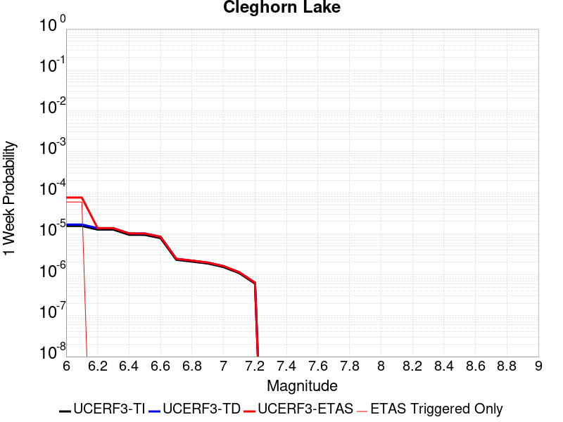 | 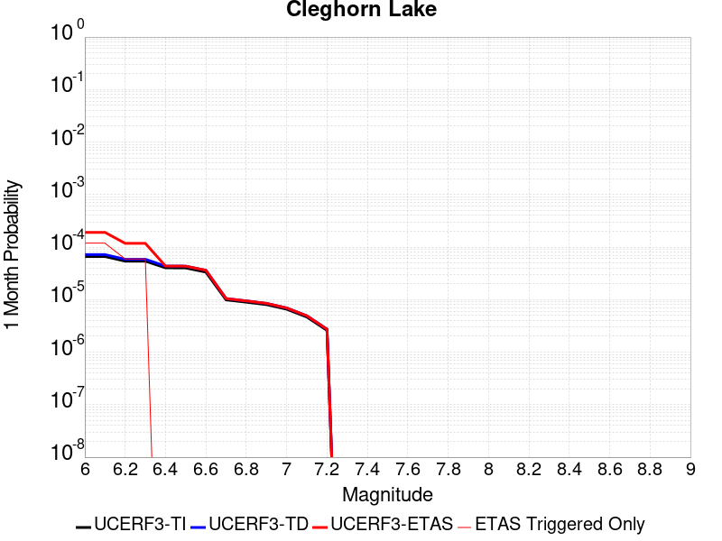 | 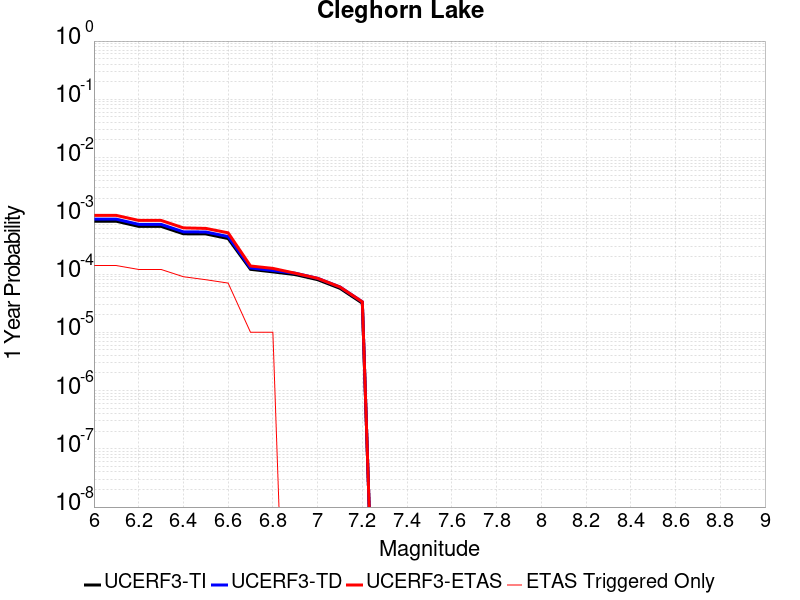 | 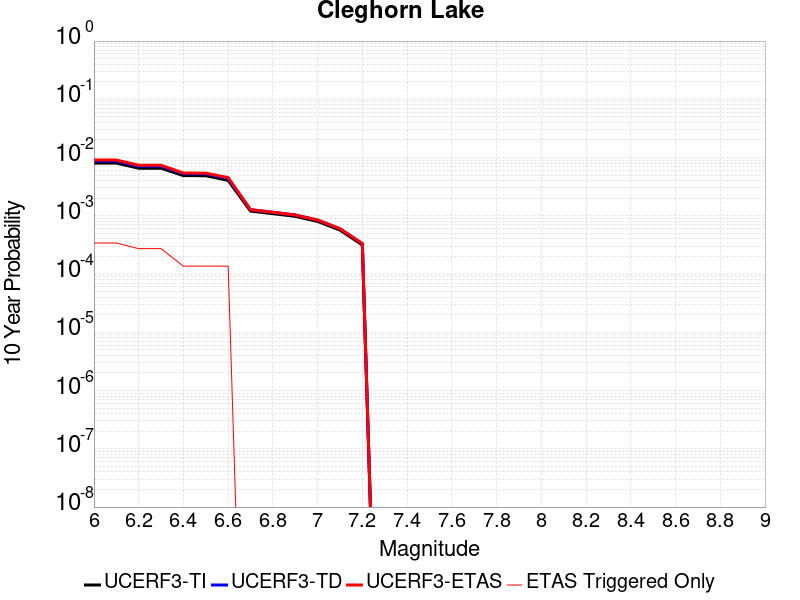 |

| Magnitude | 1 wk TI Prob | 1 wk TD Prob | 1 wk ETAS Prob | 1 wk ETAS/TD Gain | 1 wk ETAS Triggered Only | 1 mo TI Prob | 1 mo TD Prob | 1 mo ETAS Prob | 1 mo ETAS/TD Gain | 1 mo ETAS Triggered Only | 1 yr TI Prob | 1 yr TD Prob | 1 yr ETAS Prob | 1 yr ETAS/TD Gain | 1 yr ETAS Triggered Only | 10 yr TI Prob | 10 yr TD Prob | 10 yr ETAS Prob | 10 yr ETAS/TD Gain | 10 yr ETAS Triggered Only |
|-----|-----|-----|-----|-----|-----|-----|-----|-----|-----|-----|-----|-----|-----|-----|-----|-----|-----|-----|-----|-----|
| 6.0 | 1.5467183E-5 | 1.6794203E-5 | 7.67932E-5 | 4.5726013 | 6.0E-5 | 6.6286244E-5 | 7.197348E-5 | 1.6196701E-4 | 2.2503705 | 9.0E-5 | 8.067362E-4 | 8.759797E-4 | 0.0010158571 | 1.1596811 | 1.4E-4 | 0.008038137 | 0.008730696 | 0.008919037 | 1.0215724 | 1.9E-4 |
| 6.1 | 1.5467183E-5 | 1.6794203E-5 | 7.67932E-5 | 4.5726013 | 6.0E-5 | 6.6286244E-5 | 7.197348E-5 | 1.6196701E-4 | 2.2503705 | 9.0E-5 | 8.067362E-4 | 8.759797E-4 | 0.0010158571 | 1.1596811 | 1.4E-4 | 0.008038137 | 0.008730696 | 0.008919037 | 1.0215724 | 1.9E-4 |
| 6.2 | 1.2624631E-5 | 1.3681544E-5 | 6.368086E-5 | 4.654508 | 5.0E-5 | 5.410444E-5 | 5.863415E-5 | 1.3862946E-4 | 2.3643126 | 8.0E-5 | 6.585225E-4 | 7.1368564E-4 | 8.336E-4 | 1.1680212 | 1.2E-4 | 0.0065657445 | 0.0071187317 | 0.0072875214 | 1.0237106 | 1.7E-4 |
| 6.3 | 1.2624631E-5 | 1.3681544E-5 | 6.368086E-5 | 4.654508 | 5.0E-5 | 5.410444E-5 | 5.863415E-5 | 1.3862946E-4 | 2.3643126 | 8.0E-5 | 6.585225E-4 | 7.1368564E-4 | 8.336E-4 | 1.1680212 | 1.2E-4 | 0.0065657445 | 0.0071187317 | 0.0072875214 | 1.0237106 | 1.7E-4 |
| 6.4 | 9.417684E-6 | 1.0170118E-5 | 5.016971E-5 | 4.933051 | 4.0E-5 | 4.036088E-5 | 4.3585722E-5 | 1.0358311E-4 | 2.3765376 | 6.0E-5 | 4.912829E-4 | 5.3056807E-4 | 6.2052027E-4 | 1.1695396 | 9.0E-5 | 0.004901982 | 0.005297049 | 0.0054263603 | 1.0244119 | 1.3E-4 |
| 6.5 | 9.368219E-6 | 1.0117545E-5 | 5.0117138E-5 | 4.9534883 | 4.0E-5 | 4.014889E-5 | 4.3360415E-5 | 1.03357816E-4 | 2.3836906 | 6.0E-5 | 4.8870314E-4 | 5.2782625E-4 | 6.07784E-4 | 1.151485 | 8.0E-5 | 0.004876298 | 0.0052697617 | 0.0053891293 | 1.0226514 | 1.2E-4 |
| 6.6 | 7.803798E-6 | 8.441831E-6 | 3.8441576E-5 | 4.5537014 | 3.0E-5 | 3.3444423E-5 | 3.6179E-5 | 8.617719E-5 | 2.3819673 | 5.0E-5 | 4.0710976E-4 | 4.4043022E-4 | 5.103994E-4 | 1.1588655 | 7.0E-5 | 0.0040636472 | 0.0043994905 | 0.0045090066 | 1.0248929 | 1.1E-4 |
| 6.7 | 2.3108669E-6 | 2.4438336E-6 | 1.2443809E-5 | 5.0919213 | 1.0E-5 | 9.903678E-6 | 1.0473532E-5 | 2.0473428E-5 | 1.9547777 | 1.0E-5 | 1.205706E-4 | 1.2750797E-4 | 1.375067E-4 | 1.0784165 | 1.0E-5 | 0.001205052 | 0.0012743667 | 0.0012943413 | 1.0156741 | 2.0E-5 |
| 6.8 | 2.0882828E-6 | 2.2062823E-6 | 1.220626E-5 | 5.5325017 | 1.0E-5 | 8.949753E-6 | 9.455462E-6 | 1.9455367E-5 | 2.0575798 | 1.0E-5 | 1.08957785E-4 | 1.1511434E-4 | 1.2511319E-4 | 1.0868602 | 1.0E-5 | 0.0010890438 | 0.0011505639 | 0.0011705409 | 1.0173628 | 2.0E-5 |
| 6.9 | 1.876935E-6 | 1.981051E-6 | 1.981051E-6 | 1.0 | 0.0 | 8.043982E-6 | 8.490192E-6 | 8.490192E-6 | 1.0 | 0.0 | 9.7931086E-5 | 1.03363345E-4 | 1.03363345E-4 | 1.0 | 0.0 | 9.788794E-4 | 0.0010331686 | 0.0010431584 | 1.009669 | 1.0E-5 |
| 7.0 | 1.5357559E-6 | 1.6202807E-6 | 1.6202807E-6 | 1.0 | 0.0 | 6.5817944E-6 | 6.9440425E-6 | 6.9440425E-6 | 1.0 | 0.0 | 8.01304E-5 | 8.454057E-5 | 8.454057E-5 | 1.0 | 0.0 | 8.010151E-4 | 8.450965E-4 | 8.55088E-4 | 1.0118229 | 1.0E-5 |
| 7.1 | 1.0905424E-6 | 1.1497619E-6 | 1.1497619E-6 | 1.0 | 0.0 | 4.6737446E-6 | 4.9275427E-6 | 4.9275427E-6 | 1.0 | 0.0 | 5.6901354E-5 | 5.999128E-5 | 5.999128E-5 | 1.0 | 0.0 | 5.6886784E-4 | 5.997606E-4 | 6.0975464E-4 | 1.0166633 | 1.0E-5 |
| 7.2 | 6.06668E-7 | 6.387277E-7 | 6.387277E-7 | 1.0 | 0.0 | 2.600003E-6 | 2.7374022E-6 | 2.7374022E-6 | 1.0 | 0.0 | 3.1654577E-5 | 3.3327433E-5 | 3.3327433E-5 | 1.0 | 0.0 | 3.1650066E-4 | 3.3323118E-4 | 3.3323118E-4 | 1.0 | 0.0 |

## Santa Ynez (West)
*[(top)](#table-of-contents)*

| 1 Week | 1 Month | 1 Year | 10 Year |
|-----|-----|-----|-----|
| 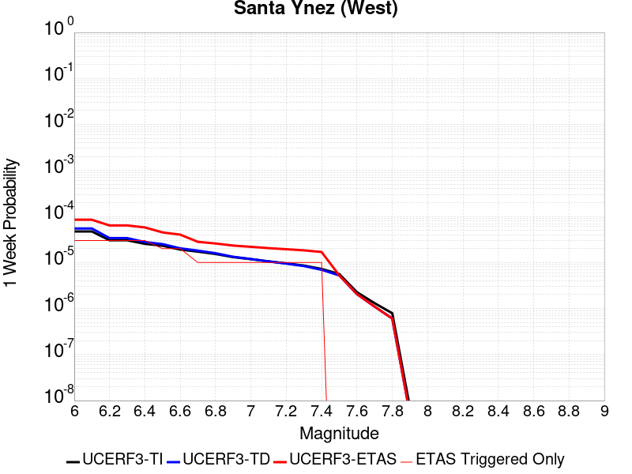 | 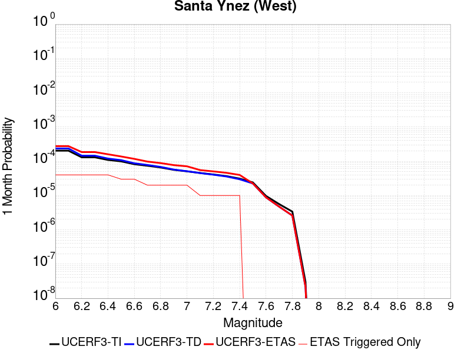 | 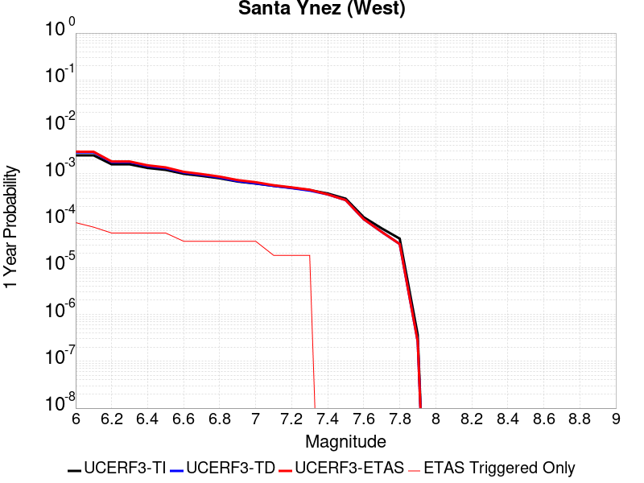 | 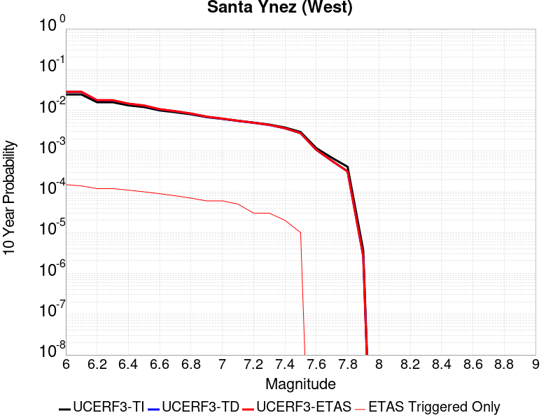 |

| Magnitude | 1 wk TI Prob | 1 wk TD Prob | 1 wk ETAS Prob | 1 wk ETAS/TD Gain | 1 wk ETAS Triggered Only | 1 mo TI Prob | 1 mo TD Prob | 1 mo ETAS Prob | 1 mo ETAS/TD Gain | 1 mo ETAS Triggered Only | 1 yr TI Prob | 1 yr TD Prob | 1 yr ETAS Prob | 1 yr ETAS/TD Gain | 1 yr ETAS Triggered Only | 10 yr TI Prob | 10 yr TD Prob | 10 yr ETAS Prob | 10 yr ETAS/TD Gain | 10 yr ETAS Triggered Only |
|-----|-----|-----|-----|-----|-----|-----|-----|-----|-----|-----|-----|-----|-----|-----|-----|-----|-----|-----|-----|-----|
| 6.0 | 4.7352758E-5 | 5.4972126E-5 | 8.4970474E-5 | 1.5457011 | 3.0E-5 | 2.0292461E-4 | 2.3557522E-4 | 2.755658E-4 | 1.1697571 | 4.0E-5 | 0.0024678076 | 0.0028645284 | 0.002964242 | 1.0348097 | 1.0E-4 | 0.024405818 | 0.028304417 | 0.028450172 | 1.0051495 | 1.5E-4 |
| 6.1 | 4.7352758E-5 | 5.4972126E-5 | 8.4970474E-5 | 1.5457011 | 3.0E-5 | 2.0292461E-4 | 2.3557522E-4 | 2.755658E-4 | 1.1697571 | 4.0E-5 | 0.0024678076 | 0.0028645284 | 0.0029542705 | 1.0313288 | 9.0E-5 | 0.024405818 | 0.028304417 | 0.028440455 | 1.0048063 | 1.4E-4 |
| 6.2 | 3.0415853E-5 | 3.392511E-5 | 6.392409E-5 | 1.8842708 | 3.0E-5 | 1.3034715E-4 | 1.4538545E-4 | 1.8537963E-4 | 1.2750907 | 4.0E-5 | 0.0015858212 | 0.0017686661 | 0.0018485246 | 1.0451518 | 8.0E-5 | 0.015745522 | 0.017549807 | 0.017667701 | 1.0067177 | 1.2E-4 |
| 6.3 | 3.0415853E-5 | 3.392511E-5 | 6.392409E-5 | 1.8842708 | 3.0E-5 | 1.3034715E-4 | 1.4538545E-4 | 1.8537963E-4 | 1.2750907 | 4.0E-5 | 0.0015858212 | 0.0017686661 | 0.0018485246 | 1.0451518 | 8.0E-5 | 0.015745522 | 0.017549807 | 0.017667701 | 1.0067177 | 1.2E-4 |
| 6.4 | 2.5452082E-5 | 2.7912422E-5 | 5.7911584E-5 | 2.0747602 | 3.0E-5 | 1.09075794E-4 | 1.196193E-4 | 1.5961452E-4 | 1.3343542 | 4.0E-5 | 0.0013271887 | 0.0014554089 | 0.0015352924 | 1.0548874 | 8.0E-5 | 0.013192902 | 0.014460951 | 0.014569361 | 1.0074967 | 1.1E-4 |
| 6.5 | 2.3143784E-5 | 2.5128256E-5 | 4.5127756E-5 | 1.7958968 | 2.0E-5 | 9.9183875E-5 | 1.0768817E-4 | 1.3768494E-4 | 1.2785522 | 3.0E-5 | 0.0012068948 | 0.0013103267 | 0.0013802351 | 1.0533518 | 7.0E-5 | 0.012003611 | 0.01302768 | 0.013126377 | 1.007576 | 1.0E-4 |
| 6.6 | 1.9118515E-5 | 2.035434E-5 | 4.0353934E-5 | 1.9825715 | 2.0E-5 | 8.193392E-5 | 8.7230015E-5 | 1.172274E-4 | 1.3438883 | 3.0E-5 | 9.97089E-4 | 0.001061516 | 0.0011214523 | 1.0564629 | 6.0E-5 | 0.00992627 | 0.010565365 | 0.010654414 | 1.0084285 | 9.0E-5 |
| 6.7 | 1.722807E-5 | 1.8146347E-5 | 2.8146165E-5 | 1.5510651 | 1.0E-5 | 7.3832496E-5 | 7.776777E-5 | 9.776622E-5 | 1.2571559 | 2.0E-5 | 8.985399E-4 | 9.464169E-4 | 9.963696E-4 | 1.0527809 | 5.0E-5 | 0.008949154 | 0.0094245095 | 0.009503756 | 1.0084085 | 8.0E-5 |
| 6.8 | 1.5317364E-5 | 1.5926486E-5 | 2.5926325E-5 | 1.627875 | 1.0E-5 | 6.56442E-5 | 6.82546E-5 | 8.825324E-5 | 1.2930006 | 2.0E-5 | 7.98925E-4 | 8.306873E-4 | 8.806457E-4 | 1.0601411 | 5.0E-5 | 0.007960589 | 0.00827631 | 0.008345731 | 1.0083879 | 7.0E-5 |
| 6.9 | 1.3071226E-5 | 1.3329624E-5 | 2.332949E-5 | 1.7501987 | 1.0E-5 | 5.6018336E-5 | 5.7125722E-5 | 7.7124576E-5 | 1.350085 | 2.0E-5 | 6.8180985E-4 | 6.9528597E-4 | 7.452512E-4 | 1.0718628 | 5.0E-5 | 0.0067972173 | 0.006931367 | 0.006990951 | 1.0085963 | 6.0E-5 |
| 7.0 | 1.1836986E-5 | 1.19327815E-5 | 2.1932663E-5 | 1.8380176 | 1.0E-5 | 5.0728955E-5 | 5.11395E-5 | 7.113848E-5 | 1.3910671 | 2.0E-5 | 6.1745E-4 | 6.2244723E-4 | 6.724161E-4 | 1.080278 | 5.0E-5 | 0.006157372 | 0.006207231 | 0.0062668584 | 1.0096061 | 6.0E-5 |
| 7.1 | 1.0597169E-5 | 1.0542201E-5 | 2.0542097E-5 | 1.9485586 | 1.0E-5 | 4.541565E-5 | 4.5180084E-5 | 5.5179633E-5 | 1.2213265 | 1.0E-5 | 5.5279525E-4 | 5.4992986E-4 | 5.8990787E-4 | 1.0726966 | 4.0E-5 | 0.0055142213 | 0.005485821 | 0.0055355467 | 1.0090644 | 5.0E-5 |
| 7.2 | 9.59113E-6 | 9.459144E-6 | 1.945905E-5 | 2.057168 | 1.0E-5 | 4.11042E-5 | 4.0538565E-5 | 5.0538158E-5 | 1.2466687 | 1.0E-5 | 5.0032866E-4 | 4.934463E-4 | 5.234315E-4 | 1.0607669 | 3.0E-5 | 0.004992037 | 0.0049236254 | 0.0049534775 | 1.0060631 | 3.0E-5 |
| 7.3 | 8.586084E-6 | 8.379583E-6 | 1.83795E-5 | 2.1933668 | 1.0E-5 | 3.679698E-5 | 3.5912013E-5 | 4.5911653E-5 | 1.2784483 | 1.0E-5 | 4.4791115E-4 | 4.3714207E-4 | 4.6712894E-4 | 1.0685976 | 3.0E-5 | 0.004470094 | 0.004362933 | 0.0043928022 | 1.0068461 | 3.0E-5 |
| 7.4 | 7.2622997E-6 | 6.9515427E-6 | 1.6951473E-5 | 2.4385197 | 1.0E-5 | 3.112377E-5 | 2.979199E-5 | 3.9791692E-5 | 1.3356507 | 1.0E-5 | 3.78866E-4 | 3.626581E-4 | 3.8265085E-4 | 1.0551283 | 2.0E-5 | 0.0037822074 | 0.0036207628 | 0.0036406906 | 1.0055037 | 2.0E-5 |
| 7.5 | 5.627296E-6 | 5.251588E-6 | 5.251588E-6 | 1.0 | 0.0 | 2.411676E-5 | 2.2506614E-5 | 2.2506614E-5 | 1.0 | 0.0 | 2.9358198E-4 | 2.739843E-4 | 2.8398156E-4 | 1.0364884 | 1.0E-5 | 0.0029319443 | 0.002736537 | 0.0027465096 | 1.0036442 | 1.0E-5 |
| 7.6 | 2.265244E-6 | 2.0608625E-6 | 2.0608625E-6 | 1.0 | 0.0 | 9.708152E-6 | 8.832238E-6 | 8.832238E-6 | 1.0 | 0.0 | 1.18190335E-4 | 1.0752728E-4 | 1.0752728E-4 | 1.0 | 0.0 | 0.001181275 | 0.0010747612 | 0.0010747612 | 1.0 | 0.0 |
| 7.7 | 1.3099874E-6 | 1.1016252E-6 | 1.1016252E-6 | 1.0 | 0.0 | 5.61422E-6 | 4.7212425E-6 | 4.7212425E-6 | 1.0 | 0.0 | 6.8350986E-5 | 5.7479636E-5 | 5.7479636E-5 | 1.0 | 0.0 | 6.832996E-4 | 5.7465007E-4 | 5.7465007E-4 | 1.0 | 0.0 |
| 7.8 | 7.903951E-7 | 6.0711415E-7 | 6.0711415E-7 | 1.0 | 0.0 | 3.3874032E-6 | 2.6019152E-6 | 2.6019152E-6 | 1.0 | 0.0 | 4.1240855E-5 | 3.167787E-5 | 3.167787E-5 | 1.0 | 0.0 | 4.12332E-4 | 3.167349E-4 | 3.167349E-4 | 1.0 | 0.0 |
| 7.9 | 7.0753297E-9 | 5.0899476E-9 | 5.0899476E-9 | 1.0 | 0.0 | 3.032284E-8 | 2.181406E-8 | 2.181406E-8 | 1.0 | 0.0 | 3.6918053E-7 | 2.6558615E-7 | 2.6558615E-7 | 1.0 | 0.0 | 3.691799E-6 | 2.6558594E-6 | 2.6558594E-6 | 1.0 | 0.0 |

## Deep Springs
*[(top)](#table-of-contents)*

| 1 Week | 1 Month | 1 Year | 10 Year |
|-----|-----|-----|-----|
| 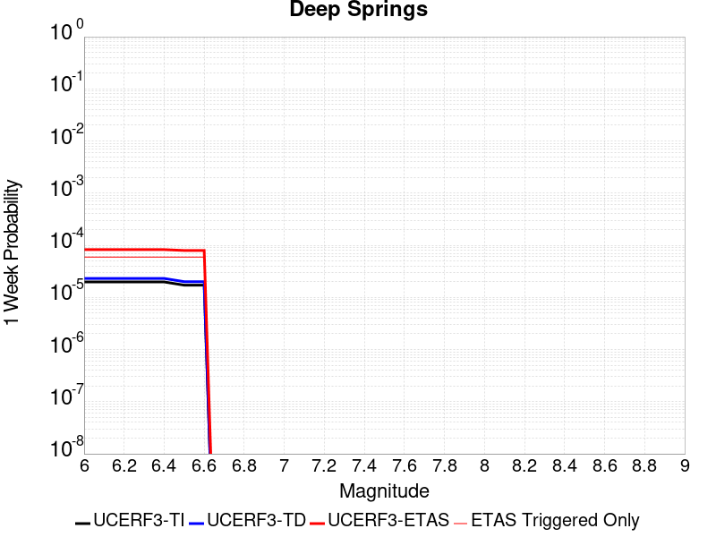 | 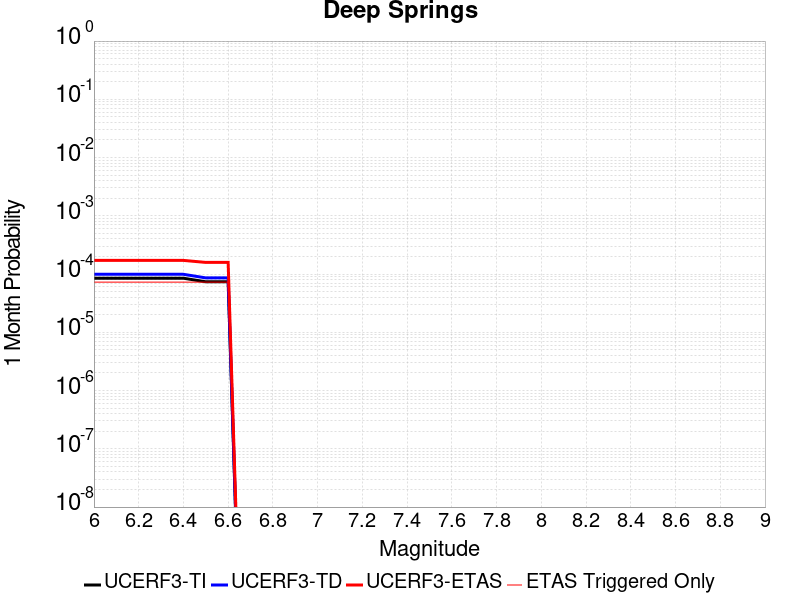 | 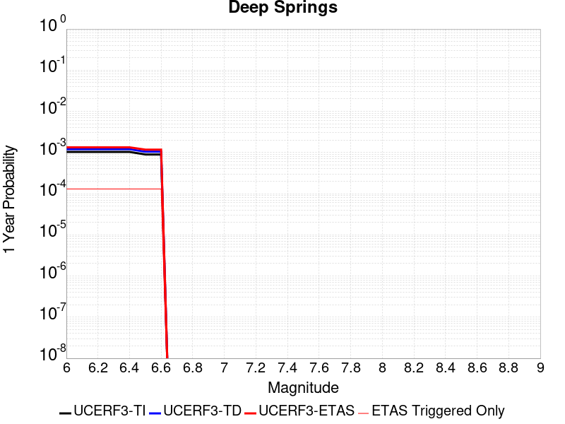 | 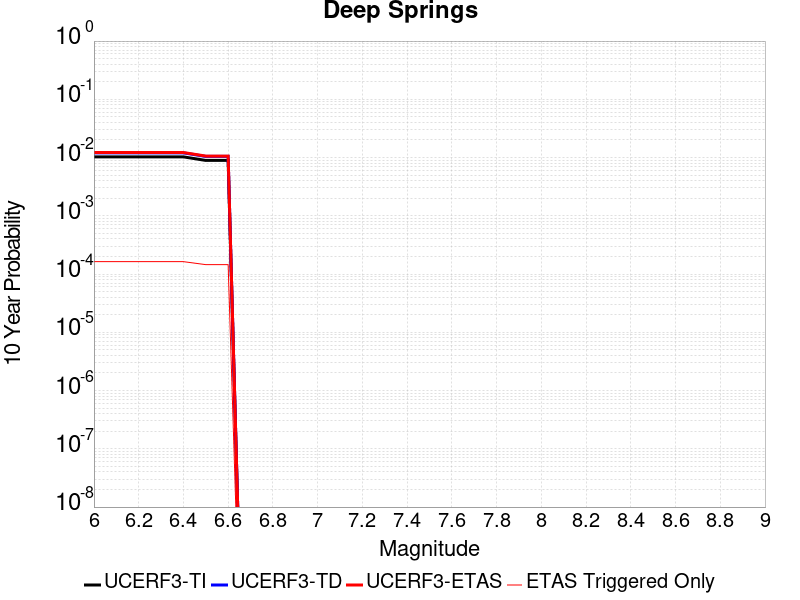 |

| Magnitude | 1 wk TI Prob | 1 wk TD Prob | 1 wk ETAS Prob | 1 wk ETAS/TD Gain | 1 wk ETAS Triggered Only | 1 mo TI Prob | 1 mo TD Prob | 1 mo ETAS Prob | 1 mo ETAS/TD Gain | 1 mo ETAS Triggered Only | 1 yr TI Prob | 1 yr TD Prob | 1 yr ETAS Prob | 1 yr ETAS/TD Gain | 1 yr ETAS Triggered Only | 10 yr TI Prob | 10 yr TD Prob | 10 yr ETAS Prob | 10 yr ETAS/TD Gain | 10 yr ETAS Triggered Only |
|-----|-----|-----|-----|-----|-----|-----|-----|-----|-----|-----|-----|-----|-----|-----|-----|-----|-----|-----|-----|-----|
| 6.0 | 1.9810619E-5 | 2.311252E-5 | 6.31116E-5 | 2.7306237 | 4.0E-5 | 8.489989E-5 | 9.905276E-5 | 1.6904583E-4 | 1.7066242 | 7.0E-5 | 0.001033166 | 0.0012058079 | 0.0013356511 | 1.1076815 | 1.3E-4 | 0.010283757 | 0.012042425 | 0.012240016 | 1.016408 | 2.0E-4 |
| 6.1 | 1.9810619E-5 | 2.311252E-5 | 6.31116E-5 | 2.7306237 | 4.0E-5 | 8.489989E-5 | 9.905276E-5 | 1.6904583E-4 | 1.7066242 | 7.0E-5 | 0.001033166 | 0.0012058079 | 0.0013356511 | 1.1076815 | 1.3E-4 | 0.010283757 | 0.012042425 | 0.012240016 | 1.016408 | 2.0E-4 |
| 6.2 | 1.9810619E-5 | 2.311252E-5 | 6.31116E-5 | 2.7306237 | 4.0E-5 | 8.489989E-5 | 9.905276E-5 | 1.6904583E-4 | 1.7066242 | 7.0E-5 | 0.001033166 | 0.0012058079 | 0.0013356511 | 1.1076815 | 1.3E-4 | 0.010283757 | 0.012042425 | 0.012240016 | 1.016408 | 2.0E-4 |
| 6.3 | 1.9810619E-5 | 2.311252E-5 | 6.31116E-5 | 2.7306237 | 4.0E-5 | 8.489989E-5 | 9.905276E-5 | 1.6904583E-4 | 1.7066242 | 7.0E-5 | 0.001033166 | 0.0012058079 | 0.0013356511 | 1.1076815 | 1.3E-4 | 0.010283757 | 0.012042425 | 0.012240016 | 1.016408 | 2.0E-4 |
| 6.4 | 1.9810619E-5 | 2.311252E-5 | 6.31116E-5 | 2.7306237 | 4.0E-5 | 8.489989E-5 | 9.905276E-5 | 1.6904583E-4 | 1.7066242 | 7.0E-5 | 0.001033166 | 0.0012058079 | 0.0013356511 | 1.1076815 | 1.3E-4 | 0.010283757 | 0.012042425 | 0.012240016 | 1.016408 | 2.0E-4 |
| 6.5 | 1.7190405E-5 | 2.0050555E-5 | 6.0049755E-5 | 2.9949172 | 4.0E-5 | 7.367108E-5 | 8.593095E-5 | 1.5592494E-4 | 1.8145375 | 7.0E-5 | 8.9657627E-4 | 0.0010462094 | 0.0011760733 | 1.1241281 | 1.3E-4 | 0.008929676 | 0.010462056 | 0.010640173 | 1.017025 | 1.8E-4 |
| 6.6 | 1.7190405E-5 | 2.0050555E-5 | 6.0049755E-5 | 2.9949172 | 4.0E-5 | 7.367108E-5 | 8.593095E-5 | 1.5592494E-4 | 1.8145375 | 7.0E-5 | 8.9657627E-4 | 0.0010462094 | 0.0011760733 | 1.1241281 | 1.3E-4 | 0.008929676 | 0.010462056 | 0.010640173 | 1.017025 | 1.8E-4 |

## San Jacinto (Stepovers Combined)
*[(top)](#table-of-contents)*

| 1 Week | 1 Month | 1 Year | 10 Year |
|-----|-----|-----|-----|
| 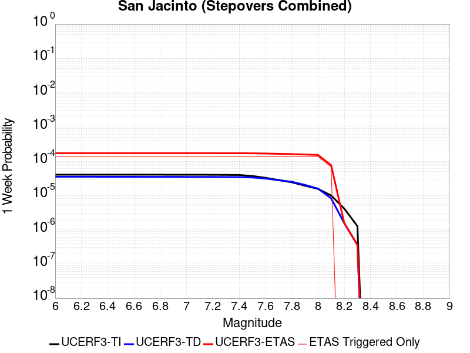 |  | 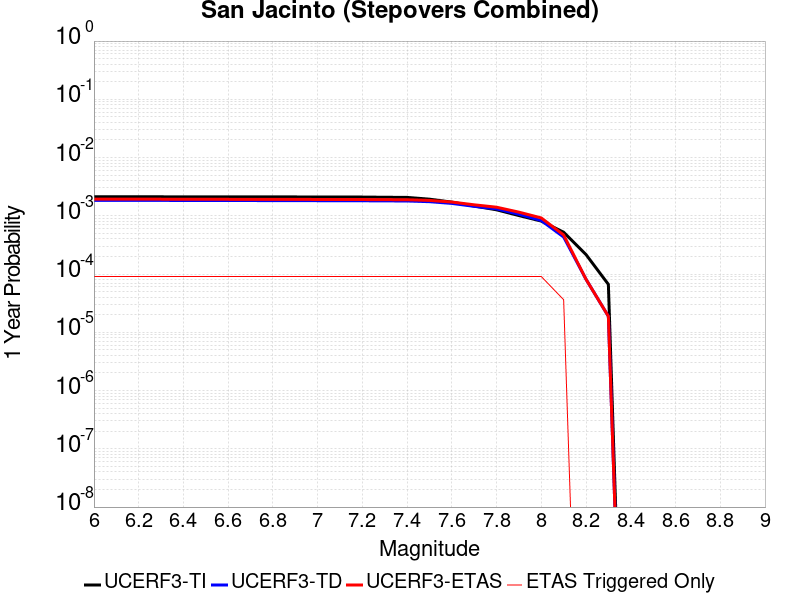 | 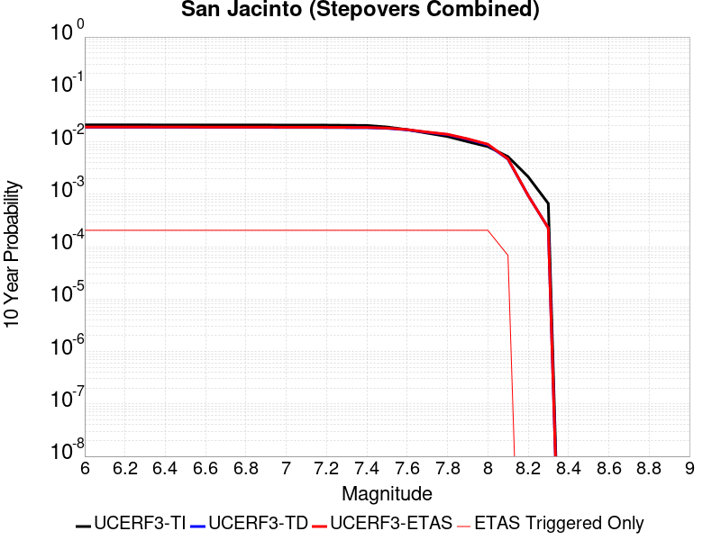 |

| Magnitude | 1 wk TI Prob | 1 wk TD Prob | 1 wk ETAS Prob | 1 wk ETAS/TD Gain | 1 wk ETAS Triggered Only | 1 mo TI Prob | 1 mo TD Prob | 1 mo ETAS Prob | 1 mo ETAS/TD Gain | 1 mo ETAS Triggered Only | 1 yr TI Prob | 1 yr TD Prob | 1 yr ETAS Prob | 1 yr ETAS/TD Gain | 1 yr ETAS Triggered Only | 10 yr TI Prob | 10 yr TD Prob | 10 yr ETAS Prob | 10 yr ETAS/TD Gain | 10 yr ETAS Triggered Only |
|-----|-----|-----|-----|-----|-----|-----|-----|-----|-----|-----|-----|-----|-----|-----|-----|-----|-----|-----|-----|-----|
| 6.0 | 4.0667746E-5 | 3.5272755E-5 | 1.0527029E-4 | 2.9844644 | 7.0E-5 | 1.742787E-4 | 1.5116022E-4 | 2.4114661E-4 | 1.5953047 | 9.0E-5 | 0.0021197782 | 0.0018388226 | 0.0019685836 | 1.0705674 | 1.3E-4 | 0.020996714 | 0.018986892 | 0.019173285 | 1.0098169 | 1.9E-4 |
| 6.1 | 4.0667746E-5 | 3.5272755E-5 | 1.0527029E-4 | 2.9844644 | 7.0E-5 | 1.742787E-4 | 1.5116022E-4 | 2.4114661E-4 | 1.5953047 | 9.0E-5 | 0.0021197782 | 0.0018388226 | 0.0019685836 | 1.0705674 | 1.3E-4 | 0.020996714 | 0.018986892 | 0.019173285 | 1.0098169 | 1.9E-4 |
| 6.2 | 4.0667746E-5 | 3.5272755E-5 | 1.0527029E-4 | 2.9844644 | 7.0E-5 | 1.742787E-4 | 1.5116022E-4 | 2.4114661E-4 | 1.5953047 | 9.0E-5 | 0.0021197782 | 0.0018388226 | 0.0019685836 | 1.0705674 | 1.3E-4 | 0.020996714 | 0.018986892 | 0.019173285 | 1.0098169 | 1.9E-4 |
| 6.3 | 4.0667746E-5 | 3.5272755E-5 | 1.0527029E-4 | 2.9844644 | 7.0E-5 | 1.742787E-4 | 1.5116022E-4 | 2.4114661E-4 | 1.5953047 | 9.0E-5 | 0.0021197782 | 0.0018388226 | 0.0019685836 | 1.0705674 | 1.3E-4 | 0.020996714 | 0.018986892 | 0.019173285 | 1.0098169 | 1.9E-4 |
| 6.4 | 4.0577226E-5 | 3.5144654E-5 | 1.0514219E-4 | 2.991698 | 7.0E-5 | 1.738908E-4 | 1.5061127E-4 | 2.4059771E-4 | 1.5974748 | 9.0E-5 | 0.0021150648 | 0.0018321523 | 0.0019619141 | 1.0708247 | 1.3E-4 | 0.020950472 | 0.018921461 | 0.019107865 | 1.0098515 | 1.9E-4 |
| 6.5 | 4.0577226E-5 | 3.5144654E-5 | 1.0514219E-4 | 2.991698 | 7.0E-5 | 1.738908E-4 | 1.5061127E-4 | 2.4059771E-4 | 1.5974748 | 9.0E-5 | 0.0021150648 | 0.0018321523 | 0.0019619141 | 1.0708247 | 1.3E-4 | 0.020950472 | 0.018921461 | 0.019107865 | 1.0098515 | 1.9E-4 |
| 6.6 | 4.053861E-5 | 3.509E-5 | 1.0508754E-4 | 2.9948003 | 7.0E-5 | 1.7372532E-4 | 1.5037706E-4 | 2.4036353E-4 | 1.5984055 | 9.0E-5 | 0.0021130538 | 0.0018293057 | 0.0019590678 | 1.0709352 | 1.3E-4 | 0.020930743 | 0.018893538 | 0.01907995 | 1.0098664 | 1.9E-4 |
| 6.7 | 4.0516545E-5 | 3.5059067E-5 | 1.0505661E-4 | 2.9965603 | 7.0E-5 | 1.7363077E-4 | 1.5024451E-4 | 2.4023099E-4 | 1.5989336 | 9.0E-5 | 0.002111905 | 0.001827695 | 0.0019574575 | 1.0709978 | 1.3E-4 | 0.020919468 | 0.018877735 | 0.019064149 | 1.0098748 | 1.9E-4 |
| 6.8 | 4.049434E-5 | 3.5030633E-5 | 1.0502818E-4 | 2.998181 | 7.0E-5 | 1.7353562E-4 | 1.5012265E-4 | 2.4010915E-4 | 1.5994198 | 9.0E-5 | 0.0021107488 | 0.0018262138 | 0.0019559765 | 1.0710555 | 1.3E-4 | 0.020908125 | 0.018863149 | 0.019049564 | 1.0098826 | 1.9E-4 |
| 6.9 | 4.046386E-5 | 3.499319E-5 | 1.04990744E-4 | 3.0003192 | 7.0E-5 | 1.73405E-4 | 1.4996222E-4 | 2.3994873E-4 | 1.6000612 | 9.0E-5 | 0.0021091616 | 0.0018242638 | 0.0019540268 | 1.0711316 | 1.3E-4 | 0.020892553 | 0.01884392 | 0.01903034 | 1.0098928 | 1.9E-4 |
| 7.0 | 4.036382E-5 | 3.487376E-5 | 1.0487132E-4 | 3.00717 | 7.0E-5 | 1.7297632E-4 | 1.4945042E-4 | 2.3943697E-4 | 1.6021165 | 9.0E-5 | 0.0021039525 | 0.0018180435 | 0.0019478073 | 1.0713755 | 1.3E-4 | 0.02084144 | 0.018782536 | 0.018968968 | 1.0099257 | 1.9E-4 |
| 7.1 | 4.0343282E-5 | 3.4852223E-5 | 1.0484978E-4 | 3.0084102 | 7.0E-5 | 1.7288832E-4 | 1.4935812E-4 | 2.3934469E-4 | 1.6024885 | 9.0E-5 | 0.002102883 | 0.0018169218 | 0.0019466856 | 1.0714196 | 1.3E-4 | 0.020830948 | 0.018771412 | 0.018957846 | 1.0099318 | 1.9E-4 |
| 7.2 | 4.0257353E-5 | 3.4756722E-5 | 1.0475429E-4 | 3.013929 | 7.0E-5 | 1.725201E-4 | 1.489489E-4 | 2.3893549E-4 | 1.6041441 | 9.0E-5 | 0.0020984085 | 0.0018119477 | 0.0019417121 | 1.071616 | 1.3E-4 | 0.020787042 | 0.018722152 | 0.018908596 | 1.0099584 | 1.9E-4 |
| 7.3 | 3.9940667E-5 | 3.4584376E-5 | 1.0458196E-4 | 3.0239654 | 7.0E-5 | 1.7116306E-4 | 1.4821035E-4 | 2.3819701E-4 | 1.607155 | 9.0E-5 | 0.0020819185 | 0.0018029709 | 0.0019327365 | 1.0719732 | 1.3E-4 | 0.020625217 | 0.018630784 | 0.018817244 | 1.0100082 | 1.9E-4 |
| 7.4 | 3.9721202E-5 | 3.4469766E-5 | 1.04467355E-4 | 3.0306952 | 7.0E-5 | 1.7022261E-4 | 1.4771923E-4 | 2.3770593E-4 | 1.609174 | 9.0E-5 | 0.0020704903 | 0.0017970012 | 0.0019267676 | 1.0722127 | 1.3E-4 | 0.020513052 | 0.018569905 | 0.018756378 | 1.0100416 | 1.9E-4 |
| 7.5 | 3.7036873E-5 | 3.3537188E-5 | 1.0353484E-4 | 3.0871654 | 7.0E-5 | 1.5871979E-4 | 1.437229E-4 | 2.3370996E-4 | 1.6261151 | 9.0E-5 | 0.0019307006 | 0.0017484248 | 0.0018781975 | 1.0742227 | 1.3E-4 | 0.019140124 | 0.018071463 | 0.01825803 | 1.0103238 | 1.9E-4 |
| 7.6 | 3.2940967E-5 | 3.1317984E-5 | 1.01315796E-4 | 3.2350674 | 7.0E-5 | 1.4116794E-4 | 1.3421304E-4 | 2.2420097E-4 | 1.6704856 | 9.0E-5 | 0.0017173645 | 0.0016328214 | 0.0017626091 | 1.0794868 | 1.3E-4 | 0.01704153 | 0.016904354 | 0.017091142 | 1.0110497 | 1.9E-4 |
| 7.7 | 2.8236149E-5 | 2.7883889E-5 | 9.788194E-5 | 3.5103402 | 7.0E-5 | 1.2100645E-4 | 1.19496915E-4 | 2.0948616E-4 | 1.7530675 | 9.0E-5 | 0.0014722579 | 0.001453905 | 0.001583716 | 1.0892844 | 1.3E-4 | 0.014625421 | 0.015115095 | 0.015302223 | 1.0123802 | 1.9E-4 |
| 7.8 | 2.4329287E-5 | 2.5207537E-5 | 9.5205774E-5 | 3.7768772 | 7.0E-5 | 1.042642E-4 | 1.0802783E-4 | 1.9801811E-4 | 1.8330287 | 9.0E-5 | 0.0012686774 | 0.0013144462 | 0.0014442753 | 1.098771 | 1.3E-4 | 0.012614589 | 0.013712396 | 0.01389979 | 1.013666 | 1.9E-4 |
| 7.9 | 1.9370926E-5 | 2.0421452E-5 | 9.042002E-5 | 4.427698 | 7.0E-5 | 8.301561E-5 | 8.7517576E-5 | 1.775097E-4 | 2.0282748 | 9.0E-5 | 0.0010102465 | 0.0010650064 | 0.0011948679 | 1.121935 | 1.3E-4 | 0.0100566605 | 0.011199483 | 0.011387355 | 1.016775 | 1.9E-4 |
| 8.0 | 1.5583017E-5 | 1.588647E-5 | 8.588536E-5 | 5.4061956 | 7.0E-5 | 6.6782646E-5 | 6.808309E-5 | 1.5807696E-4 | 2.321824 | 9.0E-5 | 8.127754E-4 | 8.285971E-4 | 9.5848937E-4 | 1.1567616 | 1.3E-4 | 0.008098091 | 0.008781809 | 0.008960229 | 1.020317 | 1.8E-4 |
| 8.1 | 1.0024873E-5 | 8.292404E-6 | 4.8292073E-5 | 5.823652 | 4.0E-5 | 4.2963035E-5 | 3.5538393E-5 | 8.5536616E-5 | 2.4068792 | 5.0E-5 | 5.229494E-4 | 4.3259456E-4 | 4.925686E-4 | 1.138638 | 6.0E-5 | 0.0052172043 | 0.0046534105 | 0.0047230846 | 1.0149727 | 7.0E-5 |
| 8.2 | 4.142796E-6 | 1.5610041E-6 | 1.5610041E-6 | 1.0 | 0.0 | 1.775472E-5 | 6.69E-6 | 6.69E-6 | 1.0 | 0.0 | 2.1614227E-4 | 8.144774E-5 | 8.144774E-5 | 1.0 | 0.0 | 0.0021593217 | 9.454649E-4 | 9.454649E-4 | 1.0 | 0.0 |
| 8.3 | 1.2750878E-6 | 3.612133E-7 | 3.612133E-7 | 1.0 | 0.0 | 5.4646503E-6 | 1.548056E-6 | 1.548056E-6 | 1.0 | 0.0 | 6.653009E-5 | 1.8847424E-5 | 1.8847424E-5 | 1.0 | 0.0 | 6.6510175E-4 | 2.2734253E-4 | 2.2734253E-4 | 1.0 | 0.0 |

## Coronado Bank alt1
*[(top)](#table-of-contents)*

| 1 Week | 1 Month | 1 Year | 10 Year |
|-----|-----|-----|-----|
| 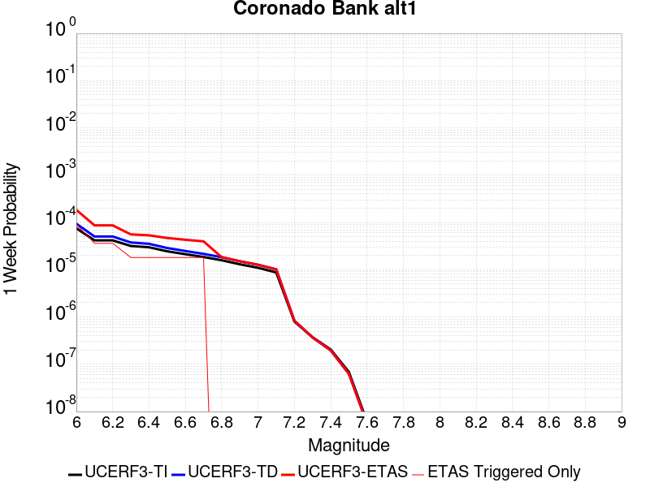 | 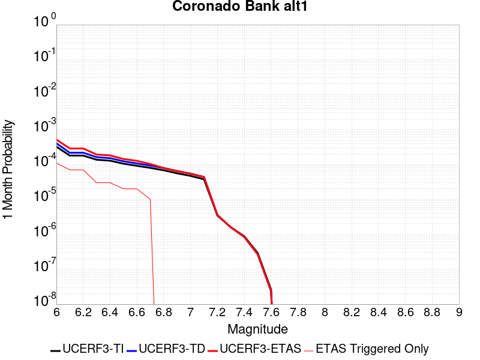 | 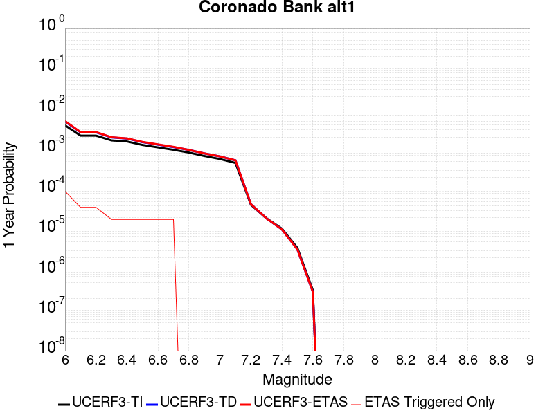 | 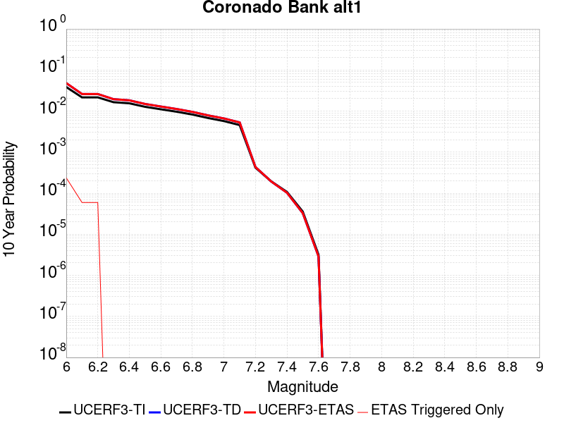 |

| Magnitude | 1 wk TI Prob | 1 wk TD Prob | 1 wk ETAS Prob | 1 wk ETAS/TD Gain | 1 wk ETAS Triggered Only | 1 mo TI Prob | 1 mo TD Prob | 1 mo ETAS Prob | 1 mo ETAS/TD Gain | 1 mo ETAS Triggered Only | 1 yr TI Prob | 1 yr TD Prob | 1 yr ETAS Prob | 1 yr ETAS/TD Gain | 1 yr ETAS Triggered Only | 10 yr TI Prob | 10 yr TD Prob | 10 yr ETAS Prob | 10 yr ETAS/TD Gain | 10 yr ETAS Triggered Only |
|-----|-----|-----|-----|-----|-----|-----|-----|-----|-----|-----|-----|-----|-----|-----|-----|-----|-----|-----|-----|-----|
| 6.0 | 7.533492E-5 | 9.394913E-5 | 2.0393879E-4 | 2.1707363 | 1.1E-4 | 3.22824E-4 | 4.0258127E-4 | 5.1253696E-4 | 1.2731267 | 1.1E-4 | 0.0039233007 | 0.0048909658 | 0.0050004274 | 1.0223805 | 1.1E-4 | 0.03854755 | 0.04790356 | 0.048065417 | 1.0033787 | 1.7E-4 |
| 6.1 | 4.1807285E-5 | 5.049283E-5 | 1.204893E-4 | 2.3862655 | 7.0E-5 | 1.7916178E-4 | 2.1638049E-4 | 2.8636534E-4 | 1.3234342 | 7.0E-5 | 0.0021791123 | 0.0026313474 | 0.0027011633 | 1.0265323 | 7.0E-5 | 0.021578677 | 0.026011046 | 0.026088966 | 1.0029956 | 8.0E-5 |
| 6.2 | 4.1807285E-5 | 5.049283E-5 | 1.204893E-4 | 2.3862655 | 7.0E-5 | 1.7916178E-4 | 2.1638049E-4 | 2.8636534E-4 | 1.3234342 | 7.0E-5 | 0.0021791123 | 0.0026313474 | 0.0027011633 | 1.0265323 | 7.0E-5 | 0.021578677 | 0.026011046 | 0.026088966 | 1.0029956 | 8.0E-5 |
| 6.3 | 3.1793104E-5 | 3.7711117E-5 | 6.770998E-5 | 1.7954915 | 3.0E-5 | 1.3624904E-4 | 1.6160926E-4 | 1.9160441E-4 | 1.1856029 | 3.0E-5 | 0.0016575698 | 0.001965848 | 0.0019957891 | 1.0152305 | 3.0E-5 | 0.016452603 | 0.019488465 | 0.019527685 | 1.0020125 | 4.0E-5 |
| 6.4 | 2.9878007E-5 | 3.5335794E-5 | 6.533474E-5 | 1.8489674 | 3.0E-5 | 1.2804232E-4 | 1.5143053E-4 | 1.8142599E-4 | 1.1980807 | 3.0E-5 | 0.0015578003 | 0.0018421387 | 0.0018720834 | 1.0162554 | 3.0E-5 | 0.015469253 | 0.01827244 | 0.018311711 | 1.0021491 | 4.0E-5 |
| 6.5 | 2.4512565E-5 | 2.8764043E-5 | 4.8763468E-5 | 1.6952926 | 2.0E-5 | 1.0504962E-4 | 1.2326881E-4 | 1.4326634E-4 | 1.162227 | 2.0E-5 | 0.0012782287 | 0.0014997921 | 0.0015197621 | 1.0133152 | 2.0E-5 | 0.012709012 | 0.014899683 | 0.014929236 | 1.0019835 | 3.0E-5 |
| 6.6 | 2.1317413E-5 | 2.490667E-5 | 4.490617E-5 | 1.8029778 | 2.0E-5 | 9.135714E-5 | 1.0673863E-4 | 1.267365E-4 | 1.1873536 | 2.0E-5 | 0.0011117056 | 0.0012987906 | 0.0013187645 | 1.015379 | 2.0E-5 | 0.011061605 | 0.012914404 | 0.012944018 | 1.002293 | 3.0E-5 |
| 6.7 | 1.8585655E-5 | 2.163488E-5 | 3.1634663E-5 | 1.4622066 | 1.0E-5 | 7.9650374E-5 | 9.271773E-5 | 1.02716804E-4 | 1.1078442 | 1.0E-5 | 9.6931186E-4 | 0.0011282742 | 0.001138263 | 1.0088531 | 1.0E-5 | 0.0096509475 | 0.011227623 | 0.011247397 | 1.0017613 | 2.0E-5 |
| 6.8 | 1.5862879E-5 | 1.8419474E-5 | 1.8419474E-5 | 1.0 | 0.0 | 6.798199E-5 | 7.893833E-5 | 7.893833E-5 | 1.0 | 0.0 | 8.273665E-4 | 9.6066965E-4 | 9.6066965E-4 | 1.0 | 0.0 | 0.008242928 | 0.00956715 | 0.0095770545 | 1.0010352 | 1.0E-5 |
| 6.9 | 1.3021509E-5 | 1.5095265E-5 | 1.5095265E-5 | 1.0 | 0.0 | 5.5805274E-5 | 6.469249E-5 | 6.469249E-5 | 1.0 | 0.0 | 6.792174E-4 | 7.8736455E-4 | 7.8736455E-4 | 1.0 | 0.0 | 0.006771452 | 0.007847573 | 0.007857494 | 1.0012643 | 1.0E-5 |
| 7.0 | 1.0974371E-5 | 1.2720104E-5 | 1.2720104E-5 | 1.0 | 0.0 | 4.7032172E-5 | 5.451369E-5 | 5.451369E-5 | 1.0 | 0.0 | 5.7246623E-4 | 6.6351966E-4 | 6.6351966E-4 | 1.0 | 0.0 | 0.0057099373 | 0.006617135 | 0.0066270684 | 1.0015012 | 1.0E-5 |
| 7.1 | 8.766221E-6 | 1.01638325E-5 | 1.01638325E-5 | 1.0 | 0.0 | 3.7568978E-5 | 4.355865E-5 | 4.355865E-5 | 1.0 | 0.0 | 4.573063E-4 | 5.3021475E-4 | 5.3021475E-4 | 1.0 | 0.0 | 0.0045636636 | 0.0052911965 | 0.0052911965 | 1.0 | 0.0 |
| 7.2 | 8.026024E-7 | 8.331765E-7 | 8.331765E-7 | 1.0 | 0.0 | 3.43972E-6 | 3.5707515E-6 | 3.5707515E-6 | 1.0 | 0.0 | 4.1877785E-5 | 4.3473043E-5 | 4.3473043E-5 | 1.0 | 0.0 | 4.1869894E-4 | 4.3464647E-4 | 4.3464647E-4 | 1.0 | 0.0 |
| 7.3 | 3.7293114E-7 | 3.7000953E-7 | 3.7000953E-7 | 1.0 | 0.0 | 1.5982754E-6 | 1.5857541E-6 | 1.5857541E-6 | 1.0 | 0.0 | 1.9458828E-5 | 1.9306386E-5 | 1.9306386E-5 | 1.0 | 0.0 | 1.9457124E-4 | 1.9304715E-4 | 1.9304715E-4 | 1.0 | 0.0 |
| 7.4 | 2.0557036E-7 | 1.9674363E-7 | 1.9674363E-7 | 1.0 | 0.0 | 8.810155E-7 | 8.431867E-7 | 8.431867E-7 | 1.0 | 0.0 | 1.0726311E-5 | 1.026575E-5 | 1.026575E-5 | 1.0 | 0.0 | 1.0725793E-4 | 1.0265279E-4 | 1.0265279E-4 | 1.0 | 0.0 |
| 7.5 | 6.845446E-8 | 6.279369E-8 | 6.279369E-8 | 1.0 | 0.0 | 2.9337625E-7 | 2.691158E-7 | 2.691158E-7 | 1.0 | 0.0 | 3.5718497E-6 | 3.2764797E-6 | 3.2764797E-6 | 1.0 | 0.0 | 3.5717923E-5 | 3.2764325E-5 | 3.2764325E-5 | 1.0 | 0.0 |
| 7.6 | 6.0975145E-9 | 5.53185E-9 | 5.53185E-9 | 1.0 | 0.0 | 2.6132206E-8 | 2.370793E-8 | 2.370793E-8 | 1.0 | 0.0 | 3.1815955E-7 | 2.88644E-7 | 2.88644E-7 | 1.0 | 0.0 | 3.181591E-6 | 2.8864374E-6 | 2.8864374E-6 | 1.0 | 0.0 |

## Pinto Mtn
*[(top)](#table-of-contents)*

| 1 Week | 1 Month | 1 Year | 10 Year |
|-----|-----|-----|-----|
| 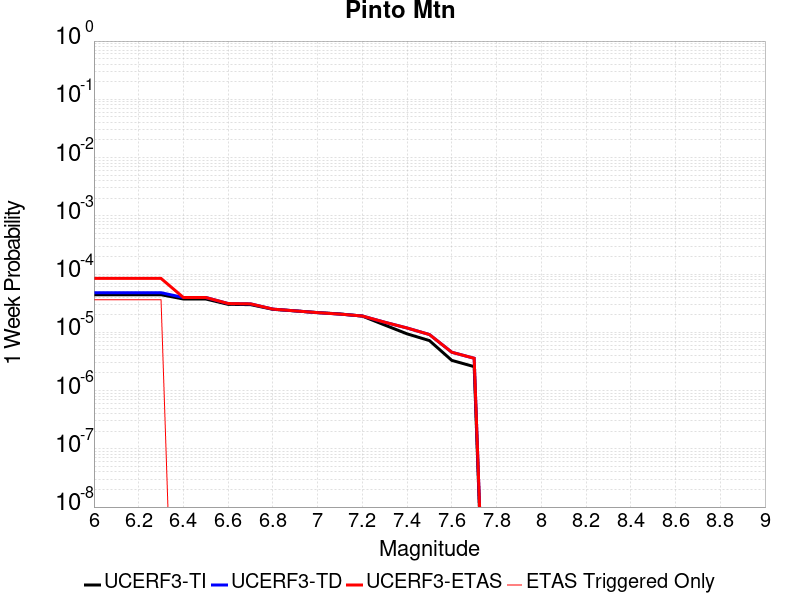 | 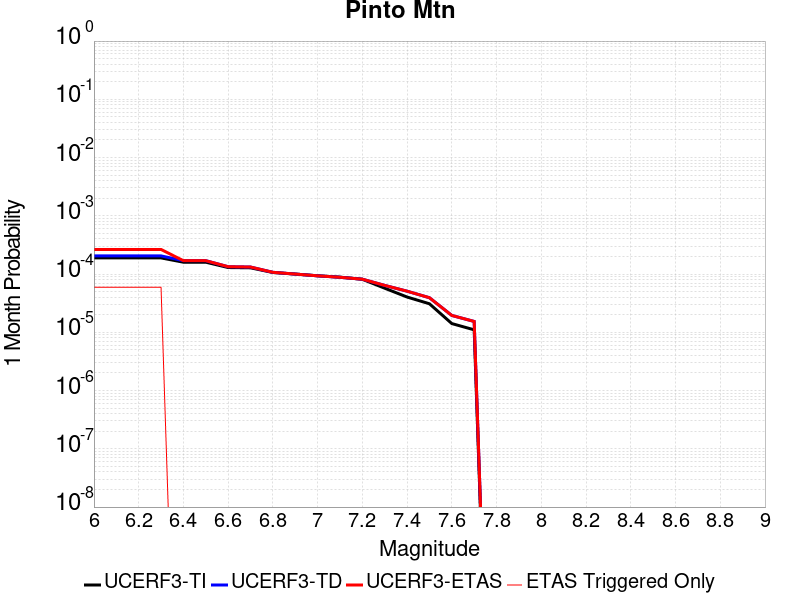 | 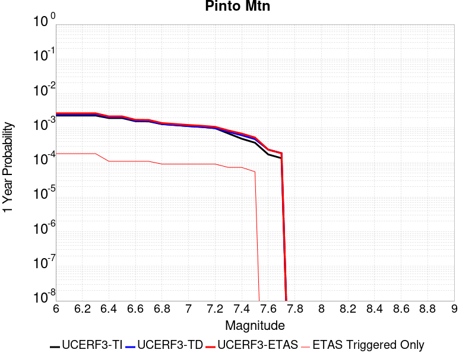 | 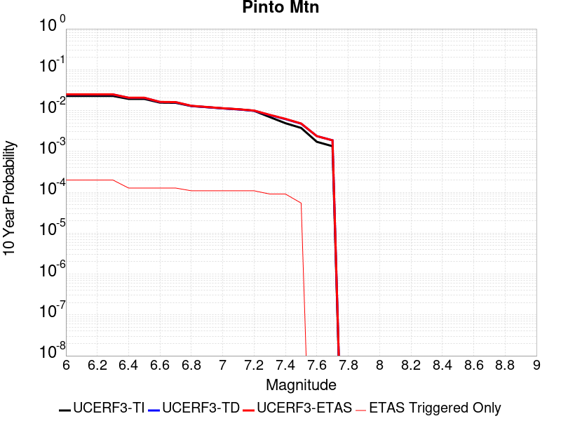 |

| Magnitude | 1 wk TI Prob | 1 wk TD Prob | 1 wk ETAS Prob | 1 wk ETAS/TD Gain | 1 wk ETAS Triggered Only | 1 mo TI Prob | 1 mo TD Prob | 1 mo ETAS Prob | 1 mo ETAS/TD Gain | 1 mo ETAS Triggered Only | 1 yr TI Prob | 1 yr TD Prob | 1 yr ETAS Prob | 1 yr ETAS/TD Gain | 1 yr ETAS Triggered Only | 10 yr TI Prob | 10 yr TD Prob | 10 yr ETAS Prob | 10 yr ETAS/TD Gain | 10 yr ETAS Triggered Only |
|-----|-----|-----|-----|-----|-----|-----|-----|-----|-----|-----|-----|-----|-----|-----|-----|-----|-----|-----|-----|-----|
| 6.0 | 4.4194956E-5 | 4.785362E-5 | 7.7852186E-5 | 1.6268818 | 3.0E-5 | 1.893932E-4 | 2.0507174E-4 | 2.350656E-4 | 1.1462603 | 3.0E-5 | 0.0023034236 | 0.0024940541 | 0.00264368 | 1.059993 | 1.5E-4 | 0.022796938 | 0.024678145 | 0.024853703 | 1.0071139 | 1.8E-4 |
| 6.1 | 4.4194956E-5 | 4.785362E-5 | 7.7852186E-5 | 1.6268818 | 3.0E-5 | 1.893932E-4 | 2.0507174E-4 | 2.350656E-4 | 1.1462603 | 3.0E-5 | 0.0023034236 | 0.0024940541 | 0.00264368 | 1.059993 | 1.5E-4 | 0.022796938 | 0.024678145 | 0.024853703 | 1.0071139 | 1.8E-4 |
| 6.2 | 4.4194956E-5 | 4.785362E-5 | 7.7852186E-5 | 1.6268818 | 3.0E-5 | 1.893932E-4 | 2.0507174E-4 | 2.350656E-4 | 1.1462603 | 3.0E-5 | 0.0023034236 | 0.0024940541 | 0.00264368 | 1.059993 | 1.5E-4 | 0.022796938 | 0.024678145 | 0.024853703 | 1.0071139 | 1.8E-4 |
| 6.3 | 4.4194956E-5 | 4.785362E-5 | 7.7852186E-5 | 1.6268818 | 3.0E-5 | 1.893932E-4 | 2.0507174E-4 | 2.350656E-4 | 1.1462603 | 3.0E-5 | 0.0023034236 | 0.0024940541 | 0.00264368 | 1.059993 | 1.5E-4 | 0.022796938 | 0.024678145 | 0.024853703 | 1.0071139 | 1.8E-4 |
| 6.4 | 3.729929E-5 | 3.9603186E-5 | 4.960279E-5 | 1.2524949 | 1.0E-5 | 1.5984432E-4 | 1.6971743E-4 | 1.7971573E-4 | 1.0589114 | 1.0E-5 | 0.0019443673 | 0.002064445 | 0.0021642386 | 1.0483391 | 1.0E-4 | 0.019274427 | 0.02046269 | 0.02059003 | 1.0062231 | 1.3E-4 |
| 6.5 | 3.729929E-5 | 3.9603186E-5 | 4.960279E-5 | 1.2524949 | 1.0E-5 | 1.5984432E-4 | 1.6971743E-4 | 1.7971573E-4 | 1.0589114 | 1.0E-5 | 0.0019443673 | 0.002064445 | 0.0021642386 | 1.0483391 | 1.0E-4 | 0.019274427 | 0.02046269 | 0.02059003 | 1.0062231 | 1.3E-4 |
| 6.6 | 3.0204548E-5 | 3.1205298E-5 | 4.1204985E-5 | 1.3204484 | 1.0E-5 | 1.2944164E-4 | 1.3373033E-4 | 1.4372899E-4 | 1.0747674 | 1.0E-5 | 0.0015748127 | 0.0016269855 | 0.0017268228 | 1.0613633 | 1.0E-4 | 0.015636992 | 0.01615461 | 0.016282508 | 1.0079173 | 1.3E-4 |
| 6.7 | 2.9857754E-5 | 3.081468E-5 | 4.0814375E-5 | 1.3245106 | 1.0E-5 | 1.2795553E-4 | 1.3205643E-4 | 1.4205511E-4 | 1.0757152 | 1.0E-5 | 0.0015567453 | 0.001606636 | 0.0017064753 | 1.0621419 | 1.0E-4 | 0.015458848 | 0.01595405 | 0.016081974 | 1.0080184 | 1.3E-4 |
| 6.8 | 2.4819734E-5 | 2.5009364E-5 | 3.5009114E-5 | 1.3998402 | 1.0E-5 | 1.0636595E-4 | 1.07178705E-4 | 1.1717763E-4 | 1.0932921 | 1.0E-5 | 0.0012942362 | 0.0013041412 | 0.0013840368 | 1.0612631 | 8.0E-5 | 0.012867244 | 0.0129672475 | 0.01305608 | 1.0068506 | 9.0E-5 |
| 6.9 | 2.331124E-5 | 2.3337643E-5 | 3.333741E-5 | 1.4284823 | 1.0E-5 | 9.990149E-5 | 1.00014746E-4 | 1.10013745E-4 | 1.0999752 | 1.0E-5 | 0.001215622 | 0.0012170197 | 0.0012869345 | 1.0574476 | 7.0E-5 | 0.012089936 | 0.012105742 | 0.012184773 | 1.0065284 | 8.0E-5 |
| 7.0 | 2.1818534E-5 | 2.1760772E-5 | 3.1760555E-5 | 1.4595325 | 1.0E-5 | 9.3504656E-5 | 9.325723E-5 | 1.032563E-4 | 1.1072203 | 1.0E-5 | 0.0011378246 | 0.0011348352 | 0.0012047557 | 1.061613 | 7.0E-5 | 0.011320163 | 0.011292503 | 0.0113716 | 1.0070044 | 8.0E-5 |
| 7.1 | 2.066081E-5 | 2.0540418E-5 | 3.0540214E-5 | 1.486835 | 1.0E-5 | 8.854332E-5 | 8.8027504E-5 | 9.802662E-5 | 1.1135908 | 1.0E-5 | 0.0010774818 | 0.0010712275 | 0.0011411525 | 1.0652755 | 7.0E-5 | 0.010722724 | 0.010662688 | 0.010741835 | 1.0074228 | 8.0E-5 |
| 7.2 | 1.8990233E-5 | 1.9053701E-5 | 2.9053512E-5 | 1.5248224 | 1.0E-5 | 8.138417E-5 | 8.1656275E-5 | 9.1655456E-5 | 1.1224545 | 1.0E-5 | 9.904018E-4 | 9.937311E-4 | 0.0010636615 | 1.0703716 | 7.0E-5 | 0.009859995 | 0.009894874 | 0.009974082 | 1.008005 | 8.0E-5 |
| 7.3 | 1.3335872E-5 | 1.4906372E-5 | 2.4906223E-5 | 1.6708441 | 1.0E-5 | 5.7152483E-5 | 6.388296E-5 | 7.388232E-5 | 1.1565263 | 1.0E-5 | 6.956093E-4 | 7.775102E-4 | 8.374636E-4 | 1.0771095 | 6.0E-5 | 0.006934359 | 0.0077491994 | 0.007818657 | 1.0089632 | 7.0E-5 |
| 7.4 | 9.414066E-6 | 1.186061E-5 | 2.1860491E-5 | 1.843117 | 1.0E-5 | 4.0345374E-5 | 5.0830247E-5 | 6.082974E-5 | 1.1967232 | 1.0E-5 | 4.910942E-4 | 6.1869196E-4 | 6.786549E-4 | 1.0969188 | 6.0E-5 | 0.0049001034 | 0.006170644 | 0.006240212 | 1.011274 | 7.0E-5 |
| 7.5 | 7.2101157E-6 | 9.157893E-6 | 1.9157802E-5 | 2.0919442 | 1.0E-5 | 3.090013E-5 | 3.924757E-5 | 4.9247177E-5 | 1.2547828 | 1.0E-5 | 3.7614413E-4 | 4.7774217E-4 | 5.277183E-4 | 1.104609 | 5.0E-5 | 0.0037550807 | 0.004767927 | 0.0048176884 | 1.0104368 | 5.0E-5 |
| 7.6 | 3.296375E-6 | 4.5453176E-6 | 4.5453176E-6 | 1.0 | 0.0 | 1.4127245E-5 | 1.9479796E-5 | 1.9479796E-5 | 1.0 | 0.0 | 1.7198564E-4 | 2.3714209E-4 | 2.4713972E-4 | 1.0421588 | 1.0E-5 | 0.0017185259 | 0.0023690276 | 0.002379004 | 1.0042112 | 1.0E-5 |
| 7.7 | 2.5741092E-6 | 3.584251E-6 | 3.584251E-6 | 1.0 | 0.0 | 1.103185E-5 | 1.5360993E-5 | 1.5360993E-5 | 1.0 | 0.0 | 1.3430449E-4 | 1.8700535E-4 | 1.8700535E-4 | 1.0 | 0.0 | 0.0013422335 | 0.0018686098 | 0.0018686098 | 1.0 | 0.0 |

## San Jacinto (Anza) rev
*[(top)](#table-of-contents)*

| 1 Week | 1 Month | 1 Year | 10 Year |
|-----|-----|-----|-----|
| 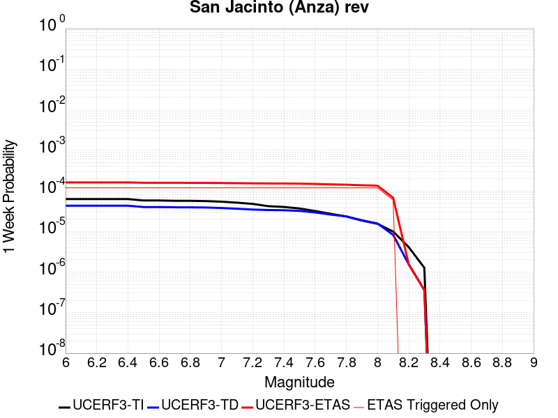 | 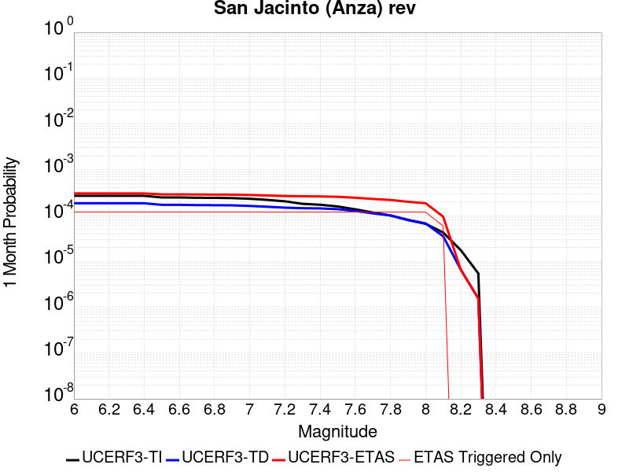 | 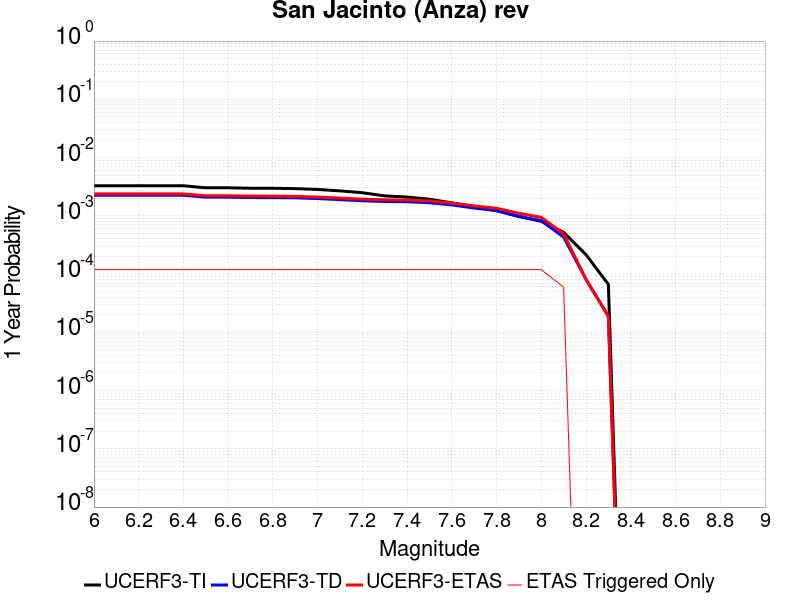 | 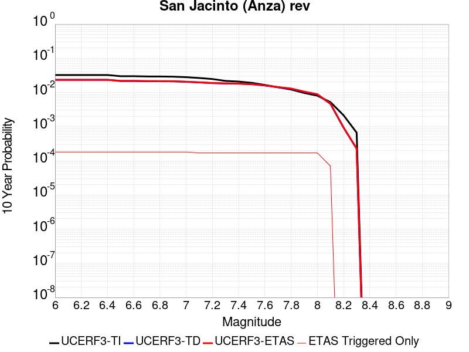 |

| Magnitude | 1 wk TI Prob | 1 wk TD Prob | 1 wk ETAS Prob | 1 wk ETAS/TD Gain | 1 wk ETAS Triggered Only | 1 mo TI Prob | 1 mo TD Prob | 1 mo ETAS Prob | 1 mo ETAS/TD Gain | 1 mo ETAS Triggered Only | 1 yr TI Prob | 1 yr TD Prob | 1 yr ETAS Prob | 1 yr ETAS/TD Gain | 1 yr ETAS Triggered Only | 10 yr TI Prob | 10 yr TD Prob | 10 yr ETAS Prob | 10 yr ETAS/TD Gain | 10 yr ETAS Triggered Only |
|-----|-----|-----|-----|-----|-----|-----|-----|-----|-----|-----|-----|-----|-----|-----|-----|-----|-----|-----|-----|-----|
| 6.0 | 6.3015636E-5 | 4.3302647E-5 | 1.1329962E-4 | 2.6164594 | 7.0E-5 | 2.7003905E-4 | 1.8556965E-4 | 2.7555294E-4 | 1.4849031 | 9.0E-5 | 0.0032827691 | 0.0022569813 | 0.0023966653 | 1.0618898 | 1.4E-4 | 0.032346968 | 0.023296192 | 0.023471998 | 1.0075465 | 1.8E-4 |
| 6.1 | 6.3015636E-5 | 4.3302647E-5 | 1.1329962E-4 | 2.6164594 | 7.0E-5 | 2.7003905E-4 | 1.8556965E-4 | 2.7555294E-4 | 1.4849031 | 9.0E-5 | 0.0032827691 | 0.0022569813 | 0.0023966653 | 1.0618898 | 1.4E-4 | 0.032346968 | 0.023296192 | 0.023471998 | 1.0075465 | 1.8E-4 |
| 6.2 | 6.3015636E-5 | 4.3302647E-5 | 1.1329962E-4 | 2.6164594 | 7.0E-5 | 2.7003905E-4 | 1.8556965E-4 | 2.7555294E-4 | 1.4849031 | 9.0E-5 | 0.0032827691 | 0.0022569813 | 0.0023966653 | 1.0618898 | 1.4E-4 | 0.032346968 | 0.023296192 | 0.023471998 | 1.0075465 | 1.8E-4 |
| 6.3 | 6.3015636E-5 | 4.3302647E-5 | 1.1329962E-4 | 2.6164594 | 7.0E-5 | 2.7003905E-4 | 1.8556965E-4 | 2.7555294E-4 | 1.4849031 | 9.0E-5 | 0.0032827691 | 0.0022569813 | 0.0023966653 | 1.0618898 | 1.4E-4 | 0.032346968 | 0.023296192 | 0.023471998 | 1.0075465 | 1.8E-4 |
| 6.4 | 6.3015636E-5 | 4.3302647E-5 | 1.1329962E-4 | 2.6164594 | 7.0E-5 | 2.7003905E-4 | 1.8556965E-4 | 2.7555294E-4 | 1.4849031 | 9.0E-5 | 0.0032827691 | 0.0022569813 | 0.0023966653 | 1.0618898 | 1.4E-4 | 0.032346968 | 0.023296192 | 0.023471998 | 1.0075465 | 1.8E-4 |
| 6.5 | 5.811017E-5 | 4.0082516E-5 | 1.1007971E-4 | 2.7463274 | 7.0E-5 | 2.4901982E-4 | 1.7177092E-4 | 2.6175546E-4 | 1.5238637 | 9.0E-5 | 0.0030276014 | 0.002089311 | 0.0022290184 | 1.0668677 | 1.4E-4 | 0.02986684 | 0.021593736 | 0.02176985 | 1.0081557 | 1.8E-4 |
| 6.6 | 5.811017E-5 | 4.0082516E-5 | 1.1007971E-4 | 2.7463274 | 7.0E-5 | 2.4901982E-4 | 1.7177092E-4 | 2.6175546E-4 | 1.5238637 | 9.0E-5 | 0.0030276014 | 0.002089311 | 0.0022290184 | 1.0668677 | 1.4E-4 | 0.02986684 | 0.021593736 | 0.02176985 | 1.0081557 | 1.8E-4 |
| 6.7 | 5.712442E-5 | 3.9505223E-5 | 1.09502456E-4 | 2.7718475 | 7.0E-5 | 2.4479596E-4 | 1.6929714E-4 | 2.592819E-4 | 1.5315197 | 9.0E-5 | 0.0029763177 | 0.0020592497 | 0.0021989613 | 1.067846 | 1.4E-4 | 0.029367693 | 0.021285562 | 0.02146173 | 1.0082765 | 1.8E-4 |
| 6.8 | 5.6967532E-5 | 3.9361643E-5 | 1.0935889E-4 | 2.778311 | 7.0E-5 | 2.4412372E-4 | 1.6868189E-4 | 2.586667E-4 | 1.5334587 | 9.0E-5 | 0.0029681553 | 0.002051773 | 0.0021914858 | 1.0680937 | 1.4E-4 | 0.029288229 | 0.021210281 | 0.021386463 | 1.0083065 | 1.8E-4 |
| 6.9 | 5.6211324E-5 | 3.9066435E-5 | 1.090637E-4 | 2.7917495 | 7.0E-5 | 2.4088343E-4 | 1.6741687E-4 | 2.574018E-4 | 1.5374902 | 9.0E-5 | 0.0029288116 | 0.0020364004 | 0.0021761153 | 1.0686088 | 1.4E-4 | 0.028905109 | 0.021049714 | 0.021225926 | 1.0083712 | 1.8E-4 |
| 7.0 | 5.4383527E-5 | 3.792697E-5 | 1.07924316E-4 | 2.8455822 | 7.0E-5 | 2.3305144E-4 | 1.6253405E-4 | 2.525194E-4 | 1.5536401 | 9.0E-5 | 0.0028337094 | 0.001977061 | 0.0021167842 | 1.0706722 | 1.4E-4 | 0.027978465 | 0.020440677 | 0.020616997 | 1.008626 | 1.8E-4 |
| 7.1 | 5.1393665E-5 | 3.6389913E-5 | 1.06387364E-4 | 2.92354 | 7.0E-5 | 2.2023996E-4 | 1.5594746E-4 | 2.4593342E-4 | 1.5770274 | 9.0E-5 | 0.0026781242 | 0.0018970112 | 0.0020267647 | 1.0683988 | 1.3E-4 | 0.026460782 | 0.019614287 | 0.019780952 | 1.0084971 | 1.7E-4 |
| 7.2 | 4.785222E-5 | 3.4741795E-5 | 1.0473937E-4 | 3.014794 | 7.0E-5 | 2.0506482E-4 | 1.4888494E-4 | 2.3887154E-4 | 1.6044036 | 9.0E-5 | 0.0024938055 | 0.0018111705 | 0.001940935 | 1.0716468 | 1.3E-4 | 0.024660049 | 0.018728992 | 0.018895807 | 1.0089068 | 1.7E-4 |
| 7.3 | 4.2143256E-5 | 3.383628E-5 | 1.0383391E-4 | 3.0687153 | 7.0E-5 | 1.8060145E-4 | 1.4500458E-4 | 2.3499153E-4 | 1.6205801 | 9.0E-5 | 0.002196605 | 0.0017640047 | 0.0018937753 | 1.073566 | 1.3E-4 | 0.02175019 | 0.01823724 | 0.018404141 | 1.0091516 | 1.7E-4 |
| 7.4 | 4.0264713E-5 | 3.347446E-5 | 1.0347212E-4 | 3.0910764 | 7.0E-5 | 1.7255165E-4 | 1.4345412E-4 | 2.334412E-4 | 1.6272883 | 9.0E-5 | 0.002098792 | 0.0017451581 | 0.0018749312 | 1.0743618 | 1.3E-4 | 0.020790804 | 0.018041821 | 0.018208753 | 1.0092525 | 1.7E-4 |
| 7.5 | 3.694492E-5 | 3.218847E-5 | 1.0218621E-4 | 3.1746218 | 7.0E-5 | 1.5832575E-4 | 1.379433E-4 | 2.2793088E-4 | 1.652352 | 9.0E-5 | 0.0019259118 | 0.001678169 | 0.0018079508 | 1.0773354 | 1.3E-4 | 0.01909306 | 0.01735827 | 0.017525319 | 1.0096236 | 1.7E-4 |
| 7.6 | 3.200565E-5 | 2.9504106E-5 | 9.950204E-5 | 3.372481 | 7.0E-5 | 1.3715986E-4 | 1.2644005E-4 | 2.1642867E-4 | 1.7117097 | 9.0E-5 | 0.001668642 | 0.0015383229 | 0.0016681228 | 1.0843776 | 1.3E-4 | 0.01656168 | 0.0159463 | 0.016113589 | 1.0104908 | 1.7E-4 |
| 7.7 | 2.731642E-5 | 2.6092788E-5 | 9.609096E-5 | 3.6826637 | 7.0E-5 | 1.1706512E-4 | 1.1182144E-4 | 2.0181139E-4 | 1.8047645 | 9.0E-5 | 0.001424336 | 0.0013605768 | 0.0014903999 | 1.0954177 | 1.3E-4 | 0.014152412 | 0.014167004 | 0.014334597 | 1.0118297 | 1.7E-4 |
| 7.8 | 2.3466424E-5 | 2.3504817E-5 | 9.350317E-5 | 3.9780428 | 7.0E-5 | 1.0056651E-4 | 1.0073105E-4 | 1.9072198E-4 | 1.8933783 | 9.0E-5 | 0.0012237094 | 0.0012257113 | 0.001355552 | 1.1059308 | 1.3E-4 | 0.012169928 | 0.012808893 | 0.012976715 | 1.013102 | 1.7E-4 |
| 7.9 | 1.8611925E-5 | 1.8908117E-5 | 8.8906796E-5 | 4.702044 | 7.0E-5 | 7.9762955E-5 | 8.1032274E-5 | 1.7102498E-4 | 2.1105785 | 9.0E-5 | 9.7068126E-4 | 9.861222E-4 | 0.001115994 | 1.1316996 | 1.3E-4 | 0.0096645225 | 0.010393824 | 0.010562058 | 1.0161859 | 1.7E-4 |
| 8.0 | 1.5460775E-5 | 1.5740965E-5 | 8.573986E-5 | 5.4469256 | 7.0E-5 | 6.6258784E-5 | 6.7459536E-5 | 1.5745347E-4 | 2.334043 | 9.0E-5 | 8.0640207E-4 | 8.21011E-4 | 9.5090433E-4 | 1.1582114 | 1.3E-4 | 0.008034821 | 0.0087028835 | 0.008871404 | 1.0193638 | 1.7E-4 |
| 8.1 | 9.983884E-6 | 8.269952E-6 | 4.826962E-5 | 5.8367476 | 4.0E-5 | 4.2787375E-5 | 3.544217E-5 | 8.54404E-5 | 2.410699 | 5.0E-5 | 5.2081177E-4 | 4.314235E-4 | 4.9139763E-4 | 1.1390145 | 6.0E-5 | 0.0051959283 | 0.004640022 | 0.0047096973 | 1.0150161 | 7.0E-5 |
| 8.2 | 4.1226E-6 | 1.5529788E-6 | 1.5529788E-6 | 1.0 | 0.0 | 1.7668166E-5 | 6.6556063E-6 | 6.6556063E-6 | 1.0 | 0.0 | 2.1508869E-4 | 8.102902E-5 | 8.102902E-5 | 1.0 | 0.0 | 0.0021488064 | 9.4050163E-4 | 9.4050163E-4 | 1.0 | 0.0 |
| 8.3 | 1.2750878E-6 | 3.612133E-7 | 3.612133E-7 | 1.0 | 0.0 | 5.4646503E-6 | 1.548056E-6 | 1.548056E-6 | 1.0 | 0.0 | 6.653009E-5 | 1.8847424E-5 | 1.8847424E-5 | 1.0 | 0.0 | 6.6510175E-4 | 2.2734253E-4 | 2.2734253E-4 | 1.0 | 0.0 |

## Santa Rosa Island
*[(top)](#table-of-contents)*

| 1 Week | 1 Month | 1 Year | 10 Year |
|-----|-----|-----|-----|
| 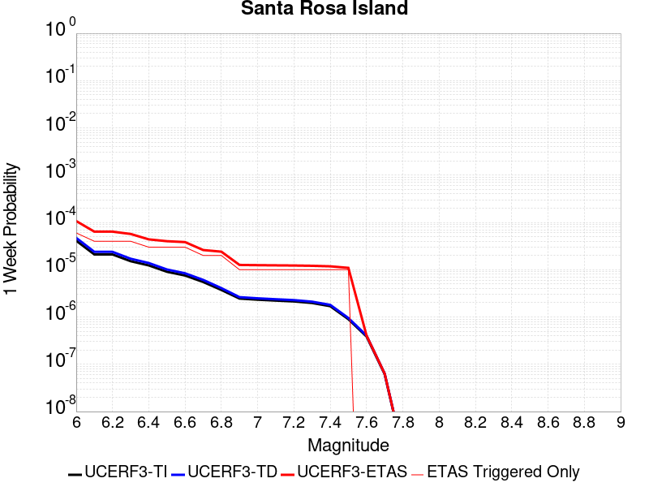 | 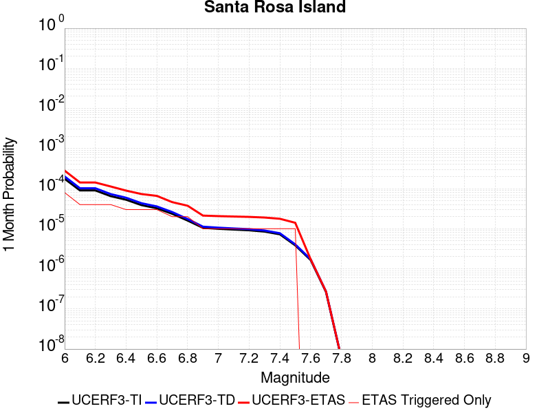 | 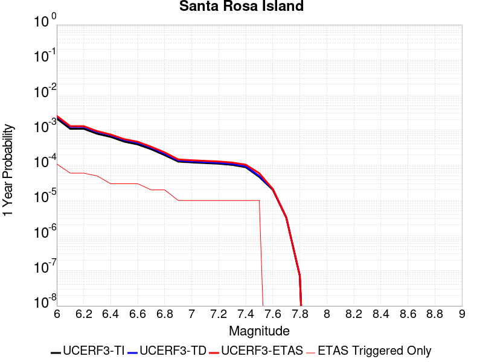 | 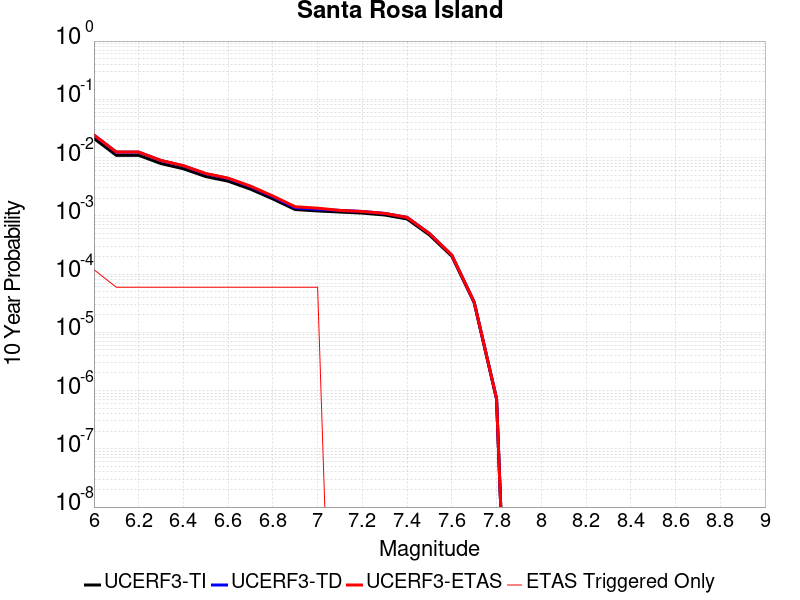 |

| Magnitude | 1 wk TI Prob | 1 wk TD Prob | 1 wk ETAS Prob | 1 wk ETAS/TD Gain | 1 wk ETAS Triggered Only | 1 mo TI Prob | 1 mo TD Prob | 1 mo ETAS Prob | 1 mo ETAS/TD Gain | 1 mo ETAS Triggered Only | 1 yr TI Prob | 1 yr TD Prob | 1 yr ETAS Prob | 1 yr ETAS/TD Gain | 1 yr ETAS Triggered Only | 10 yr TI Prob | 10 yr TD Prob | 10 yr ETAS Prob | 10 yr ETAS/TD Gain | 10 yr ETAS Triggered Only |
|-----|-----|-----|-----|-----|-----|-----|-----|-----|-----|-----|-----|-----|-----|-----|-----|-----|-----|-----|-----|-----|
| 6.0 | 4.1143165E-5 | 4.7091133E-5 | 1.0708831E-4 | 2.2740653 | 6.0E-5 | 1.7631594E-4 | 2.0180465E-4 | 2.817885E-4 | 1.396343 | 8.0E-5 | 0.002144533 | 0.0024544 | 0.00256413 | 1.0447074 | 1.1E-4 | 0.021239553 | 0.024293551 | 0.024449663 | 1.0064261 | 1.6E-4 |
| 6.1 | 2.1061249E-5 | 2.3864959E-5 | 6.3864005E-5 | 2.6760576 | 4.0E-5 | 9.0259375E-5 | 1.0227455E-4 | 1.4227047E-4 | 1.3910642 | 4.0E-5 | 0.0010983539 | 0.0012445104 | 0.0013044357 | 1.0481517 | 6.0E-5 | 0.01092941 | 0.012378449 | 0.012457458 | 1.0063828 | 8.0E-5 |
| 6.2 | 2.1061249E-5 | 2.3864959E-5 | 6.3864005E-5 | 2.6760576 | 4.0E-5 | 9.0259375E-5 | 1.0227455E-4 | 1.4227047E-4 | 1.3910642 | 4.0E-5 | 0.0010983539 | 0.0012445104 | 0.0013044357 | 1.0481517 | 6.0E-5 | 0.01092941 | 0.012378449 | 0.012457458 | 1.0063828 | 8.0E-5 |
| 6.3 | 1.5158236E-5 | 1.7074419E-5 | 5.7073736E-5 | 3.342646 | 4.0E-5 | 6.496225E-5 | 7.3174095E-5 | 1.1317117E-4 | 1.5466015 | 4.0E-5 | 7.906284E-4 | 8.905424E-4 | 9.404979E-4 | 1.0560956 | 5.0E-5 | 0.007878214 | 0.008870989 | 0.008930457 | 1.0067036 | 6.0E-5 |
| 6.4 | 1.2341918E-5 | 1.3852917E-5 | 4.3852502E-5 | 3.165579 | 3.0E-5 | 5.2892858E-5 | 5.9368336E-5 | 8.936656E-5 | 1.5052899 | 3.0E-5 | 6.437803E-4 | 7.225779E-4 | 7.5255625E-4 | 1.041488 | 3.0E-5 | 0.006419184 | 0.007203121 | 0.0072428333 | 1.0055132 | 4.0E-5 |
| 6.5 | 9.061158E-6 | 1.0117031E-5 | 4.0116727E-5 | 3.965267 | 3.0E-5 | 3.883296E-5 | 4.3358013E-5 | 7.3356714E-5 | 1.6918836 | 3.0E-5 | 4.726887E-4 | 5.277613E-4 | 5.5774546E-4 | 1.0568138 | 3.0E-5 | 0.004716845 | 0.0052656173 | 0.0053054066 | 1.0075564 | 4.0E-5 |
| 6.6 | 7.5461685E-6 | 8.400733E-6 | 3.840048E-5 | 4.571087 | 3.0E-5 | 3.2340322E-5 | 3.600267E-5 | 6.6001594E-5 | 1.8332415 | 3.0E-5 | 3.936723E-4 | 4.3824865E-4 | 4.6823552E-4 | 1.0684243 | 3.0E-5 | 0.003929756 | 0.0043742736 | 0.004414099 | 1.0091044 | 4.0E-5 |
| 6.7 | 5.5023775E-6 | 6.087381E-6 | 2.6087258E-5 | 4.2854652 | 2.0E-5 | 2.3581404E-5 | 2.6088532E-5 | 4.608801E-5 | 1.7666004 | 2.0E-5 | 2.8706578E-4 | 3.1758484E-4 | 3.3757847E-4 | 1.0629553 | 2.0E-5 | 0.0028669522 | 0.0031716314 | 0.0032015364 | 1.0094289 | 3.0E-5 |
| 6.8 | 3.7351679E-6 | 4.0831405E-6 | 2.408306E-5 | 5.8981705 | 2.0E-5 | 1.6007763E-5 | 1.749907E-5 | 3.749872E-5 | 2.1428978 | 2.0E-5 | 1.948771E-4 | 2.1303284E-4 | 2.3302858E-4 | 1.0938623 | 2.0E-5 | 0.0019470629 | 0.0021285315 | 0.0021584677 | 1.0140642 | 3.0E-5 |
| 6.9 | 2.456366E-6 | 2.6292705E-6 | 1.2629244E-5 | 4.803326 | 1.0E-5 | 1.0527241E-5 | 1.1268254E-5 | 2.126814E-5 | 1.8874389 | 1.0E-5 | 1.2816161E-4 | 1.3718237E-4 | 1.4718101E-4 | 1.0728856 | 1.0E-5 | 0.0012808773 | 0.0013709799 | 0.0013909525 | 1.0145681 | 2.0E-5 |
| 7.0 | 2.3245157E-6 | 2.4827782E-6 | 1.2482754E-5 | 5.0277357 | 1.0E-5 | 9.962172E-6 | 1.0640435E-5 | 2.064033E-5 | 1.9398012 | 1.0E-5 | 1.2128269E-4 | 1.2953962E-4 | 1.3953832E-4 | 1.0771865 | 1.0E-5 | 0.0012121652 | 0.0012946434 | 0.0013146175 | 1.0154283 | 2.0E-5 |
| 7.1 | 2.2248344E-6 | 2.37325E-6 | 1.2373226E-5 | 5.213621 | 1.0E-5 | 9.53497E-6 | 1.0171032E-5 | 2.017093E-5 | 1.9831744 | 1.0E-5 | 1.1608207E-4 | 1.2382529E-4 | 1.3382405E-4 | 1.0807489 | 1.0E-5 | 0.0011602144 | 0.001237565 | 0.0012475526 | 1.0080703 | 1.0E-5 |
| 7.2 | 2.1350402E-6 | 2.276154E-6 | 1.2276131E-5 | 5.393366 | 1.0E-5 | 9.150141E-6 | 9.754909E-6 | 1.975481E-5 | 2.0251148 | 1.0E-5 | 1.1139726E-4 | 1.1875956E-4 | 1.2875837E-4 | 1.0841937 | 1.0E-5 | 0.0011134144 | 0.0011869629 | 0.001196951 | 1.0084149 | 1.0E-5 |
| 7.3 | 1.9793572E-6 | 2.108719E-6 | 1.2108698E-5 | 5.7422056 | 1.0E-5 | 8.482932E-6 | 9.037336E-6 | 1.9037247E-5 | 2.1065106 | 1.0E-5 | 1.032748E-4 | 1.10024026E-4 | 1.2002293E-4 | 1.0908792 | 1.0E-5 | 0.0010322682 | 0.0010996973 | 0.0011096863 | 1.0090834 | 1.0E-5 |
| 7.4 | 1.6951194E-6 | 1.8045733E-6 | 1.18045555E-5 | 6.541466 | 1.0E-5 | 7.264777E-6 | 7.733863E-6 | 1.7733786E-5 | 2.293005 | 1.0E-5 | 8.844508E-5 | 9.415573E-5 | 1.0415479E-4 | 1.106197 | 1.0E-5 | 8.840988E-4 | 9.4116E-4 | 9.511506E-4 | 1.0106152 | 1.0E-5 |
| 7.5 | 8.987207E-7 | 9.5122147E-7 | 1.0951212E-5 | 11.512789 | 1.0E-5 | 3.8516546E-6 | 4.076657E-6 | 1.4076616E-5 | 3.4529803 | 1.0E-5 | 4.6892885E-5 | 4.963218E-5 | 5.9631686E-5 | 1.2014722 | 1.0E-5 | 4.688299E-4 | 4.9621216E-4 | 5.062072E-4 | 1.0201427 | 1.0E-5 |
| 7.6 | 3.8783037E-7 | 4.052932E-7 | 4.052932E-7 | 1.0 | 0.0 | 1.6621291E-6 | 1.7369698E-6 | 1.7369698E-6 | 1.0 | 0.0 | 2.0236233E-5 | 2.1147409E-5 | 2.1147409E-5 | 1.0 | 0.0 | 2.023439E-4 | 2.1145462E-4 | 2.1145462E-4 | 1.0 | 0.0 |
| 7.7 | 6.181804E-8 | 6.339035E-8 | 6.339035E-8 | 1.0 | 0.0 | 2.6493444E-7 | 2.7167292E-7 | 2.7167292E-7 | 1.0 | 0.0 | 3.225572E-6 | 3.3076128E-6 | 3.3076128E-6 | 1.0 | 0.0 | 3.225525E-5 | 3.307564E-5 | 3.307564E-5 | 1.0 | 0.0 |
| 7.8 | 1.3704449E-9 | 1.3964153E-9 | 1.3964153E-9 | 1.0 | 0.0 | 5.873335E-9 | 5.984637E-9 | 5.984637E-9 | 1.0 | 0.0 | 7.1507856E-8 | 7.286295E-8 | 7.286295E-8 | 1.0 | 0.0 | 7.1507833E-7 | 7.286294E-7 | 7.286294E-7 | 1.0 | 0.0 |

## Camp Rock 2011
*[(top)](#table-of-contents)*

| 1 Week | 1 Month | 1 Year | 10 Year |
|-----|-----|-----|-----|
| 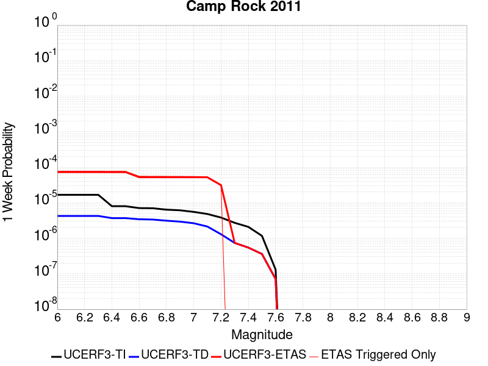 | 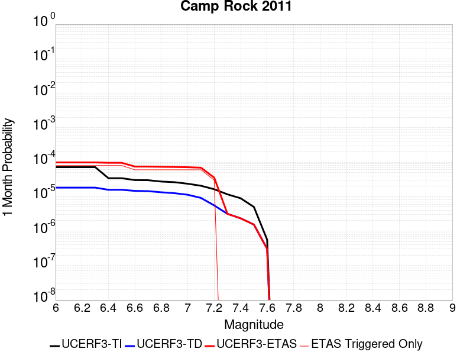 | 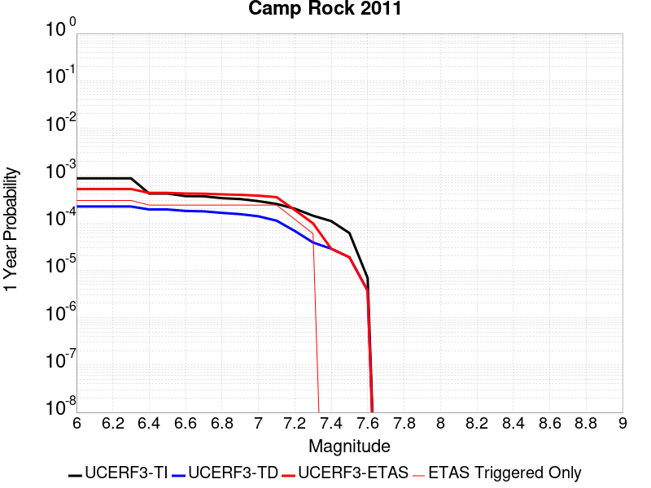 | 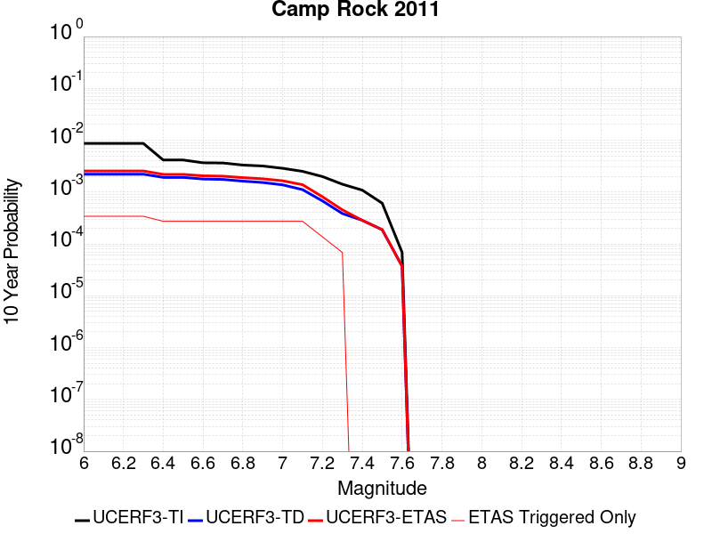 |

| Magnitude | 1 wk TI Prob | 1 wk TD Prob | 1 wk ETAS Prob | 1 wk ETAS/TD Gain | 1 wk ETAS Triggered Only | 1 mo TI Prob | 1 mo TD Prob | 1 mo ETAS Prob | 1 mo ETAS/TD Gain | 1 mo ETAS Triggered Only | 1 yr TI Prob | 1 yr TD Prob | 1 yr ETAS Prob | 1 yr ETAS/TD Gain | 1 yr ETAS Triggered Only | 10 yr TI Prob | 10 yr TD Prob | 10 yr ETAS Prob | 10 yr ETAS/TD Gain | 10 yr ETAS Triggered Only |
|-----|-----|-----|-----|-----|-----|-----|-----|-----|-----|-----|-----|-----|-----|-----|-----|-----|-----|-----|-----|-----|
| 6.0 | 1.6710783E-5 | 4.25026E-6 | 7.424996E-5 | 17.46951 | 7.0E-5 | 7.161568E-5 | 1.8215276E-5 | 9.821382E-5 | 5.391838 | 8.0E-5 | 8.7157206E-4 | 2.2174895E-4 | 3.717157E-4 | 1.6762906 | 1.5E-4 | 0.008681616 | 0.0022153298 | 0.0023849532 | 1.076568 | 1.7E-4 |
| 6.1 | 1.6710783E-5 | 4.25026E-6 | 7.424996E-5 | 17.46951 | 7.0E-5 | 7.161568E-5 | 1.8215276E-5 | 9.821382E-5 | 5.391838 | 8.0E-5 | 8.7157206E-4 | 2.2174895E-4 | 3.717157E-4 | 1.6762906 | 1.5E-4 | 0.008681616 | 0.0022153298 | 0.0023849532 | 1.076568 | 1.7E-4 |
| 6.2 | 1.6710783E-5 | 4.25026E-6 | 7.424996E-5 | 17.46951 | 7.0E-5 | 7.161568E-5 | 1.8215276E-5 | 9.821382E-5 | 5.391838 | 8.0E-5 | 8.7157206E-4 | 2.2174895E-4 | 3.717157E-4 | 1.6762906 | 1.5E-4 | 0.008681616 | 0.0022153298 | 0.0023849532 | 1.076568 | 1.7E-4 |
| 6.3 | 1.6710783E-5 | 4.25026E-6 | 7.424996E-5 | 17.46951 | 7.0E-5 | 7.161568E-5 | 1.8215276E-5 | 9.821382E-5 | 5.391838 | 8.0E-5 | 8.7157206E-4 | 2.2174895E-4 | 3.717157E-4 | 1.6762906 | 1.5E-4 | 0.008681616 | 0.0022153298 | 0.0023849532 | 1.076568 | 1.7E-4 |
| 6.4 | 7.982846E-6 | 3.6820884E-6 | 7.368183E-5 | 20.01088 | 7.0E-5 | 3.421175E-5 | 1.5780286E-5 | 9.5779025E-5 | 6.0695367 | 8.0E-5 | 4.1644843E-4 | 1.9210839E-4 | 3.320815E-4 | 1.7286153 | 1.4E-4 | 0.0041566887 | 0.001919458 | 0.0020691701 | 1.0779971 | 1.5E-4 |
| 6.5 | 7.982846E-6 | 3.6820884E-6 | 7.368183E-5 | 20.01088 | 7.0E-5 | 3.421175E-5 | 1.5780286E-5 | 9.5779025E-5 | 6.0695367 | 8.0E-5 | 4.1644843E-4 | 1.9210839E-4 | 3.320815E-4 | 1.7286153 | 1.4E-4 | 0.0041566887 | 0.001919458 | 0.0020691701 | 1.0779971 | 1.5E-4 |
| 6.6 | 7.048869E-6 | 3.4243571E-6 | 5.3424184E-5 | 15.601231 | 5.0E-5 | 3.0209088E-5 | 1.4675736E-5 | 7.4674856E-5 | 5.088321 | 6.0E-5 | 3.677336E-4 | 1.7866275E-4 | 2.986413E-4 | 1.6715366 | 1.2E-4 | 0.0036712566 | 0.0017852228 | 0.0019149907 | 1.07269 | 1.3E-4 |
| 6.7 | 6.987307E-6 | 3.3623348E-6 | 5.3362168E-5 | 15.870569 | 5.0E-5 | 2.9945259E-5 | 1.4409929E-5 | 7.4409065E-5 | 5.163736 | 6.0E-5 | 3.6452254E-4 | 1.7542706E-4 | 2.95406E-4 | 1.6839249 | 1.2E-4 | 0.0036392517 | 0.001752917 | 0.0018826891 | 1.0740321 | 1.3E-4 |
| 6.8 | 6.3737602E-6 | 3.1179077E-6 | 5.311775E-5 | 17.036345 | 5.0E-5 | 2.731583E-5 | 1.3362394E-5 | 7.3361596E-5 | 5.4901533 | 6.0E-5 | 3.3251947E-4 | 1.626753E-4 | 2.8265576E-4 | 1.7375458 | 1.2E-4 | 0.0033202237 | 0.0016255907 | 0.0017553794 | 1.0798409 | 1.3E-4 |
| 6.9 | 6.112211E-6 | 2.9331156E-6 | 5.293297E-5 | 18.04667 | 5.0E-5 | 2.6194928E-5 | 1.2570436E-5 | 7.256968E-5 | 5.773044 | 6.0E-5 | 3.1887658E-4 | 1.5303459E-4 | 2.6301775E-4 | 1.7186817 | 1.1E-4 | 0.003184194 | 0.0015293199 | 0.0016491363 | 1.0783463 | 1.2E-4 |
| 7.0 | 5.5140117E-6 | 2.641923E-6 | 5.264179E-5 | 19.925558 | 5.0E-5 | 2.3631264E-5 | 1.132248E-5 | 7.13218E-5 | 6.299133 | 6.0E-5 | 2.8767265E-4 | 1.3784273E-4 | 2.4782756E-4 | 1.7979009 | 1.1E-4 | 0.0028730053 | 0.0013775975 | 0.0014974321 | 1.0869882 | 1.2E-4 |
| 7.1 | 4.8151105E-6 | 2.1342705E-6 | 5.2134164E-5 | 24.42716 | 5.0E-5 | 2.0636026E-5 | 9.146843E-6 | 6.914629E-5 | 7.559581 | 6.0E-5 | 2.5121463E-4 | 1.1135734E-4 | 2.213451E-4 | 1.9877009 | 1.1E-4 | 0.0025093083 | 0.0011130372 | 0.0012329037 | 1.1076931 | 1.2E-4 |
| 7.2 | 3.818335E-6 | 1.2937425E-6 | 3.1293705E-5 | 24.18851 | 3.0E-5 | 1.6364189E-5 | 5.5445994E-6 | 3.554443E-5 | 6.4106407 | 3.0E-5 | 1.9921579E-4 | 6.750349E-5 | 1.2749944E-4 | 1.888783 | 6.0E-5 | 0.0019903728 | 6.748381E-4 | 7.3479756E-4 | 1.0888503 | 6.0E-5 |
| 7.3 | 2.7166698E-6 | 7.3835776E-7 | 7.3835776E-7 | 1.0 | 0.0 | 1.1642818E-5 | 3.1643867E-6 | 3.1643867E-6 | 1.0 | 0.0 | 1.4174209E-4 | 3.8525748E-5 | 4.8525362E-5 | 1.2595567 | 1.0E-5 | 0.0014165172 | 3.851927E-4 | 3.9518884E-4 | 1.025951 | 1.0E-5 |
| 7.4 | 2.0893426E-6 | 5.4618386E-7 | 5.4618386E-7 | 1.0 | 0.0 | 8.954295E-6 | 2.3407858E-6 | 2.3407858E-6 | 1.0 | 0.0 | 1.0901308E-4 | 2.84987E-5 | 2.84987E-5 | 1.0 | 0.0 | 0.0010895962 | 2.84951E-4 | 2.84951E-4 | 1.0 | 0.0 |
| 7.5 | 1.1681728E-6 | 3.6030585E-7 | 3.6030585E-7 | 1.0 | 0.0 | 5.0064455E-6 | 1.544167E-6 | 1.544167E-6 | 1.0 | 0.0 | 6.0951766E-5 | 1.8800076E-5 | 1.8800076E-5 | 1.0 | 0.0 | 6.093505E-4 | 1.8798532E-4 | 1.8798532E-4 | 1.0 | 0.0 |
| 7.6 | 1.3154387E-7 | 7.1197384E-8 | 7.1197384E-8 | 1.0 | 0.0 | 5.6375933E-7 | 3.051316E-7 | 3.051316E-7 | 1.0 | 0.0 | 6.863748E-6 | 3.7149728E-6 | 3.7149728E-6 | 1.0 | 0.0 | 6.863536E-5 | 3.7149264E-5 | 3.7149264E-5 | 1.0 | 0.0 |

## Cleghorn Pass
*[(top)](#table-of-contents)*

| 1 Week | 1 Month | 1 Year | 10 Year |
|-----|-----|-----|-----|
|  | 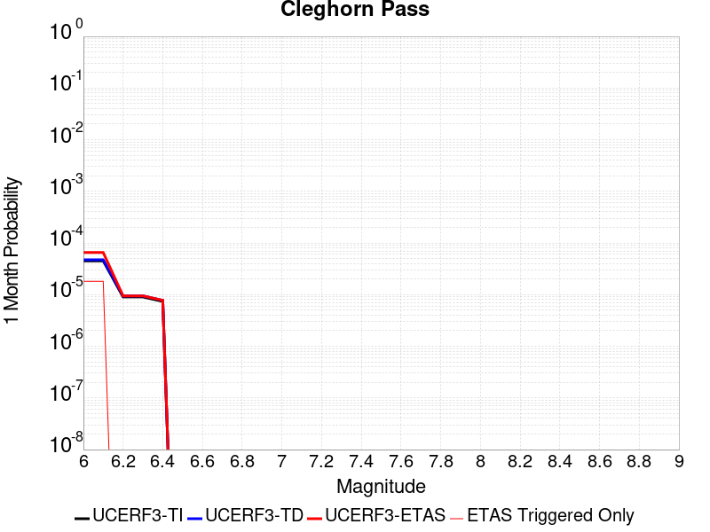 | 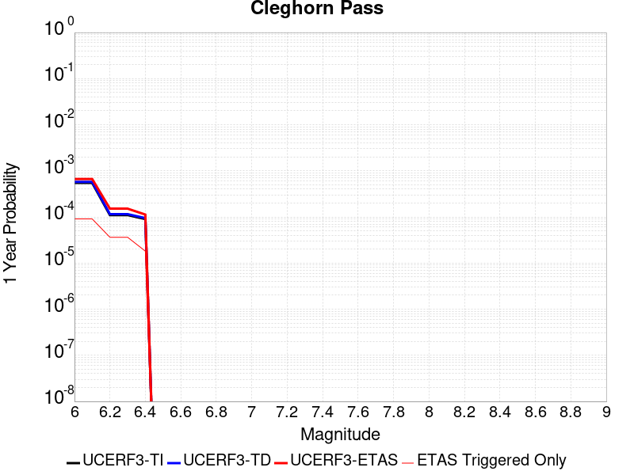 | 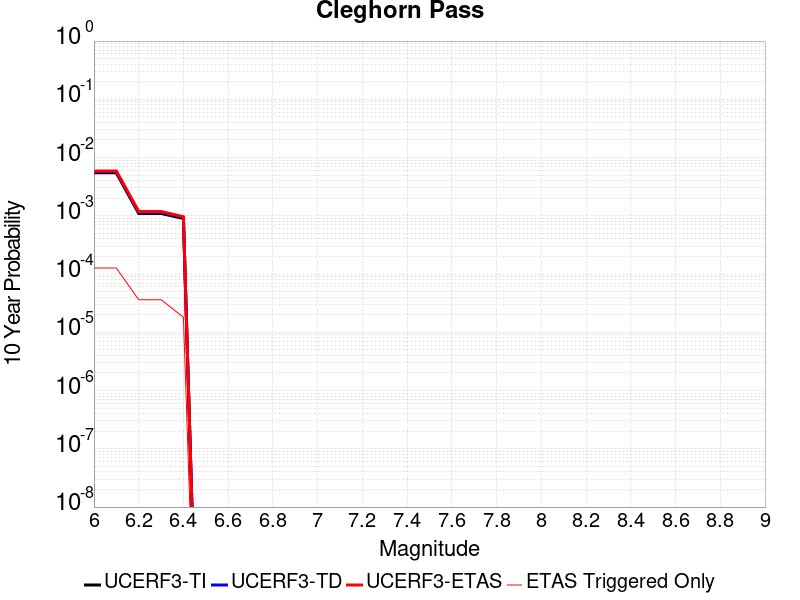 |

| Magnitude | 1 wk TI Prob | 1 wk TD Prob | 1 wk ETAS Prob | 1 wk ETAS/TD Gain | 1 wk ETAS Triggered Only | 1 mo TI Prob | 1 mo TD Prob | 1 mo ETAS Prob | 1 mo ETAS/TD Gain | 1 mo ETAS Triggered Only | 1 yr TI Prob | 1 yr TD Prob | 1 yr ETAS Prob | 1 yr ETAS/TD Gain | 1 yr ETAS Triggered Only | 10 yr TI Prob | 10 yr TD Prob | 10 yr ETAS Prob | 10 yr ETAS/TD Gain | 10 yr ETAS Triggered Only |
|-----|-----|-----|-----|-----|-----|-----|-----|-----|-----|-----|-----|-----|-----|-----|-----|-----|-----|-----|-----|-----|
| 6.0 | 1.0522846E-5 | 1.1040642E-5 | 3.104042E-5 | 2.8114688 | 2.0E-5 | 4.509713E-5 | 4.7316473E-5 | 8.7314584E-5 | 1.8453315 | 4.0E-5 | 5.4891926E-4 | 5.759784E-4 | 6.7592086E-4 | 1.1735176 | 1.0E-4 | 0.0054756533 | 0.005750022 | 0.0058991592 | 1.0259368 | 1.5E-4 |
| 6.1 | 1.0522846E-5 | 1.1040642E-5 | 3.104042E-5 | 2.8114688 | 2.0E-5 | 4.509713E-5 | 4.7316473E-5 | 8.7314584E-5 | 1.8453315 | 4.0E-5 | 5.4891926E-4 | 5.759784E-4 | 6.7592086E-4 | 1.1735176 | 1.0E-4 | 0.0054756533 | 0.005750022 | 0.0058991592 | 1.0259368 | 1.5E-4 |
| 6.2 | 2.1045846E-6 | 2.2082024E-6 | 1.220818E-5 | 5.52856 | 1.0E-5 | 9.019617E-6 | 9.463714E-6 | 1.946362E-5 | 2.0566576 | 1.0E-5 | 1.098083E-4 | 1.1521882E-4 | 1.5521422E-4 | 1.3471255 | 4.0E-5 | 0.0010975406 | 0.0011520023 | 0.0012019447 | 1.0433527 | 5.0E-5 |
| 6.3 | 2.1045846E-6 | 2.2082024E-6 | 1.220818E-5 | 5.52856 | 1.0E-5 | 9.019617E-6 | 9.463714E-6 | 1.946362E-5 | 2.0566576 | 1.0E-5 | 1.098083E-4 | 1.1521882E-4 | 1.5521422E-4 | 1.3471255 | 4.0E-5 | 0.0010975406 | 0.0011520023 | 0.0012019447 | 1.0433527 | 5.0E-5 |
| 6.4 | 1.7259927E-6 | 1.810877E-6 | 1.1810859E-5 | 6.522176 | 1.0E-5 | 7.3970905E-6 | 7.760902E-6 | 1.7760824E-5 | 2.2885 | 1.0E-5 | 9.005586E-5 | 9.4488976E-5 | 1.2448615E-4 | 1.3174673 | 3.0E-5 | 9.001937E-4 | 9.448898E-4 | 9.7486144E-4 | 1.0317197 | 3.0E-5 |

## Red Mountain
*[(top)](#table-of-contents)*

| 1 Week | 1 Month | 1 Year | 10 Year |
|-----|-----|-----|-----|
| 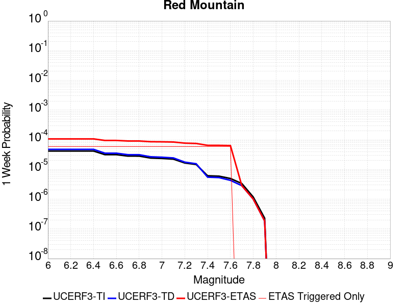 | 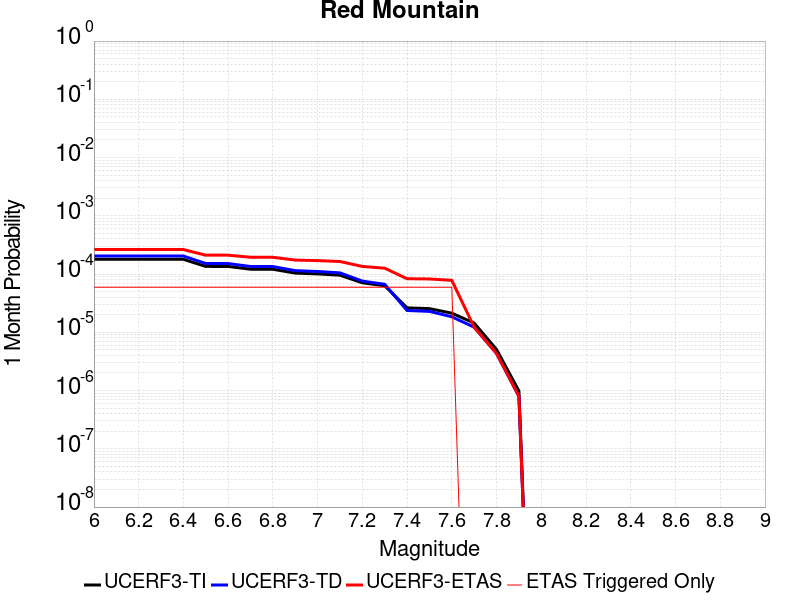 | 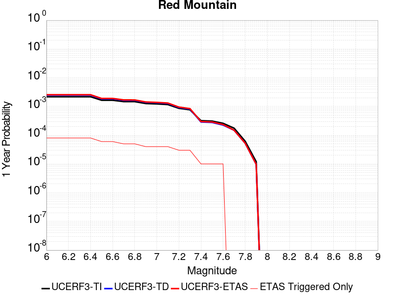 | 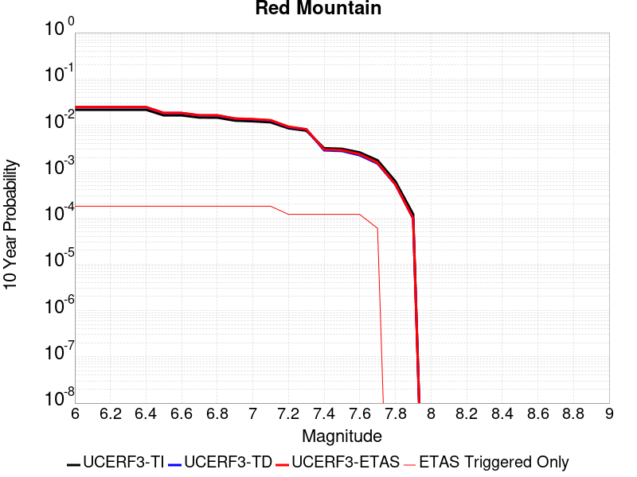 |

| Magnitude | 1 wk TI Prob | 1 wk TD Prob | 1 wk ETAS Prob | 1 wk ETAS/TD Gain | 1 wk ETAS Triggered Only | 1 mo TI Prob | 1 mo TD Prob | 1 mo ETAS Prob | 1 mo ETAS/TD Gain | 1 mo ETAS Triggered Only | 1 yr TI Prob | 1 yr TD Prob | 1 yr ETAS Prob | 1 yr ETAS/TD Gain | 1 yr ETAS Triggered Only | 10 yr TI Prob | 10 yr TD Prob | 10 yr ETAS Prob | 10 yr ETAS/TD Gain | 10 yr ETAS Triggered Only |
|-----|-----|-----|-----|-----|-----|-----|-----|-----|-----|-----|-----|-----|-----|-----|-----|-----|-----|-----|-----|-----|
| 6.0 | 4.1810763E-5 | 4.7589947E-5 | 9.758757E-5 | 2.0505922 | 5.0E-5 | 1.7917668E-4 | 2.039419E-4 | 2.6392966E-4 | 1.2941414 | 6.0E-5 | 0.0021792934 | 0.0024803306 | 0.0025601322 | 1.0321738 | 8.0E-5 | 0.021580452 | 0.024544092 | 0.024661146 | 1.0047692 | 1.2E-4 |
| 6.1 | 4.1810763E-5 | 4.7589947E-5 | 9.758757E-5 | 2.0505922 | 5.0E-5 | 1.7917668E-4 | 2.039419E-4 | 2.6392966E-4 | 1.2941414 | 6.0E-5 | 0.0021792934 | 0.0024803306 | 0.0025601322 | 1.0321738 | 8.0E-5 | 0.021580452 | 0.024544092 | 0.024661146 | 1.0047692 | 1.2E-4 |
| 6.2 | 4.1810763E-5 | 4.7589947E-5 | 9.758757E-5 | 2.0505922 | 5.0E-5 | 1.7917668E-4 | 2.039419E-4 | 2.6392966E-4 | 1.2941414 | 6.0E-5 | 0.0021792934 | 0.0024803306 | 0.0025601322 | 1.0321738 | 8.0E-5 | 0.021580452 | 0.024544092 | 0.024661146 | 1.0047692 | 1.2E-4 |
| 6.3 | 4.1810763E-5 | 4.7589947E-5 | 9.758757E-5 | 2.0505922 | 5.0E-5 | 1.7917668E-4 | 2.039419E-4 | 2.6392966E-4 | 1.2941414 | 6.0E-5 | 0.0021792934 | 0.0024803306 | 0.0025601322 | 1.0321738 | 8.0E-5 | 0.021580452 | 0.024544092 | 0.024661146 | 1.0047692 | 1.2E-4 |
| 6.4 | 4.1810763E-5 | 4.7589947E-5 | 9.758757E-5 | 2.0505922 | 5.0E-5 | 1.7917668E-4 | 2.039419E-4 | 2.6392966E-4 | 1.2941414 | 6.0E-5 | 0.0021792934 | 0.0024803306 | 0.0025601322 | 1.0321738 | 8.0E-5 | 0.021580452 | 0.024544092 | 0.024661146 | 1.0047692 | 1.2E-4 |
| 6.5 | 3.154503E-5 | 3.5359728E-5 | 6.535867E-5 | 1.8483928 | 3.0E-5 | 1.3518598E-4 | 1.5153342E-4 | 1.9152735E-4 | 1.2639282 | 4.0E-5 | 0.0016446467 | 0.0018434501 | 0.0019033395 | 1.0324876 | 6.0E-5 | 0.01632528 | 0.018291233 | 0.018389406 | 1.005367 | 1.0E-4 |
| 6.6 | 3.1535834E-5 | 3.534911E-5 | 6.534805E-5 | 1.8486477 | 3.0E-5 | 1.3514658E-4 | 1.5148791E-4 | 1.9148184E-4 | 1.2640074 | 4.0E-5 | 0.0016441676 | 0.001842897 | 0.0019027865 | 1.0324974 | 6.0E-5 | 0.01632056 | 0.018285794 | 0.018383967 | 1.0053687 | 1.0E-4 |
| 6.7 | 2.8267326E-5 | 3.146934E-5 | 6.1468396E-5 | 1.9532789 | 3.0E-5 | 1.2114006E-4 | 1.348621E-4 | 1.7485672E-4 | 1.2965592 | 4.0E-5 | 0.0014738824 | 0.0016407946 | 0.0016907125 | 1.030423 | 5.0E-5 | 0.014641452 | 0.016295563 | 0.016384097 | 1.005433 | 9.0E-5 |
| 6.8 | 2.8212884E-5 | 3.1407224E-5 | 6.140628E-5 | 1.9551642 | 3.0E-5 | 1.20906756E-4 | 1.3459593E-4 | 1.7459055E-4 | 1.2971458 | 4.0E-5 | 0.0014710457 | 0.0016375587 | 0.0016874769 | 1.0304832 | 5.0E-5 | 0.014613459 | 0.01626368 | 0.016352216 | 1.0054438 | 9.0E-5 |
| 6.9 | 2.4227871E-5 | 2.6706979E-5 | 4.6706446E-5 | 1.748848 | 2.0E-5 | 1.03829596E-4 | 1.14453884E-4 | 1.4445045E-4 | 1.2620842 | 3.0E-5 | 0.0012633923 | 0.0013926612 | 0.0014326056 | 1.028682 | 4.0E-5 | 0.012562336 | 0.013847026 | 0.013925918 | 1.0056974 | 8.0E-5 |
| 7.0 | 2.348524E-5 | 2.5835763E-5 | 4.5835248E-5 | 1.7741008 | 2.0E-5 | 1.0064714E-4 | 1.1072042E-4 | 1.4071711E-4 | 1.2709227 | 3.0E-5 | 0.0012246901 | 0.0013472632 | 0.0013872093 | 1.0296499 | 4.0E-5 | 0.012179627 | 0.01339859 | 0.013477517 | 1.0058907 | 8.0E-5 |
| 7.1 | 2.2311642E-5 | 2.4462828E-5 | 4.446234E-5 | 1.817547 | 2.0E-5 | 9.561782E-5 | 1.048369E-4 | 1.3483375E-4 | 1.2861288 | 3.0E-5 | 0.0011635252 | 0.0012757168 | 0.0013156658 | 1.031315 | 4.0E-5 | 0.01157452 | 0.012691451 | 0.012770436 | 1.0062234 | 8.0E-5 |
| 7.2 | 1.6533986E-5 | 1.7670347E-5 | 3.7669994E-5 | 2.1318197 | 2.0E-5 | 7.085802E-5 | 7.572822E-5 | 9.5726704E-5 | 1.2640823 | 2.0E-5 | 8.623549E-4 | 9.216645E-4 | 9.516369E-4 | 1.0325198 | 3.0E-5 | 0.008590161 | 0.009184699 | 0.009244148 | 1.0064726 | 6.0E-5 |
| 7.3 | 1.4703092E-5 | 1.555952E-5 | 3.555921E-5 | 2.2853665 | 2.0E-5 | 6.301173E-5 | 6.66823E-5 | 8.668097E-5 | 1.2999096 | 2.0E-5 | 7.668978E-4 | 8.1161625E-4 | 8.415919E-4 | 1.0369333 | 3.0E-5 | 0.0076425658 | 0.008092596 | 0.0081521105 | 1.0073541 | 6.0E-5 |
| 7.4 | 6.1331984E-6 | 5.528872E-6 | 1.5528816E-5 | 2.8086772 | 1.0E-5 | 2.6284872E-5 | 2.3694953E-5 | 3.3694716E-5 | 1.4220208 | 1.0E-5 | 3.199713E-4 | 2.8844838E-4 | 2.984455E-4 | 1.0346582 | 1.0E-5 | 0.0031951098 | 0.0028807942 | 0.0029107078 | 1.0103838 | 3.0E-5 |
| 7.5 | 5.954766E-6 | 5.3385015E-6 | 1.5338448E-5 | 2.873175 | 1.0E-5 | 2.5520176E-5 | 2.2879094E-5 | 3.2878866E-5 | 1.4370703 | 1.0E-5 | 3.1066386E-4 | 2.785179E-4 | 2.8851512E-4 | 1.0358944 | 1.0E-5 | 0.003102299 | 0.0027817423 | 0.002811659 | 1.0107546 | 3.0E-5 |
| 7.6 | 4.9726646E-6 | 4.315295E-6 | 1.4315252E-5 | 3.3173287 | 1.0E-5 | 2.1311245E-5 | 1.8493993E-5 | 2.8493807E-5 | 1.5407062 | 1.0E-5 | 2.5943352E-4 | 2.2514143E-4 | 2.3513917E-4 | 1.0444065 | 1.0E-5 | 0.0025913084 | 0.002249168 | 0.0022791005 | 1.0133083 | 3.0E-5 |
| 7.7 | 3.3613894E-6 | 2.8526642E-6 | 2.8526642E-6 | 1.0 | 0.0 | 1.4405875E-5 | 1.2225649E-5 | 1.2225649E-5 | 1.0 | 0.0 | 1.7537741E-4 | 1.4883737E-4 | 1.4883737E-4 | 1.0 | 0.0 | 0.0017523908 | 0.0014874031 | 0.0014973882 | 1.0067132 | 1.0E-5 |
| 7.8 | 1.1828961E-6 | 1.0122756E-6 | 1.0122756E-6 | 1.0 | 0.0 | 5.069545E-6 | 4.338317E-6 | 4.338317E-6 | 1.0 | 0.0 | 6.171996E-5 | 5.281776E-5 | 5.281776E-5 | 1.0 | 0.0 | 6.170282E-4 | 5.2805495E-4 | 5.2805495E-4 | 1.0 | 0.0 |
| 7.9 | 2.2967266E-7 | 1.8618952E-7 | 1.8618952E-7 | 1.0 | 0.0 | 9.843111E-7 | 7.9795484E-7 | 7.9795484E-7 | 1.0 | 0.0 | 1.19839215E-5 | 9.7150605E-6 | 9.7150605E-6 | 1.0 | 0.0 | 1.1983275E-4 | 9.714664E-5 | 9.714664E-5 | 1.0 | 0.0 |

## Brawley (Seismic Zone) alt 1
*[(top)](#table-of-contents)*

| 1 Week | 1 Month | 1 Year | 10 Year |
|-----|-----|-----|-----|
| 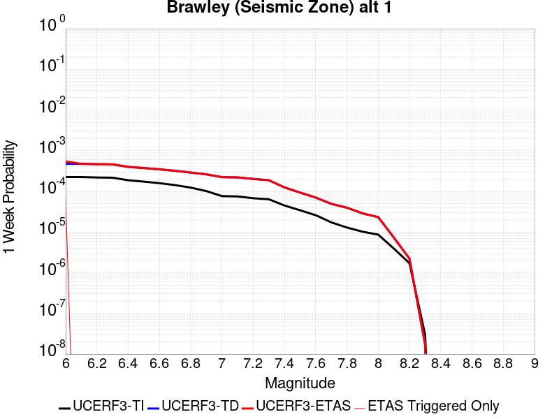 | 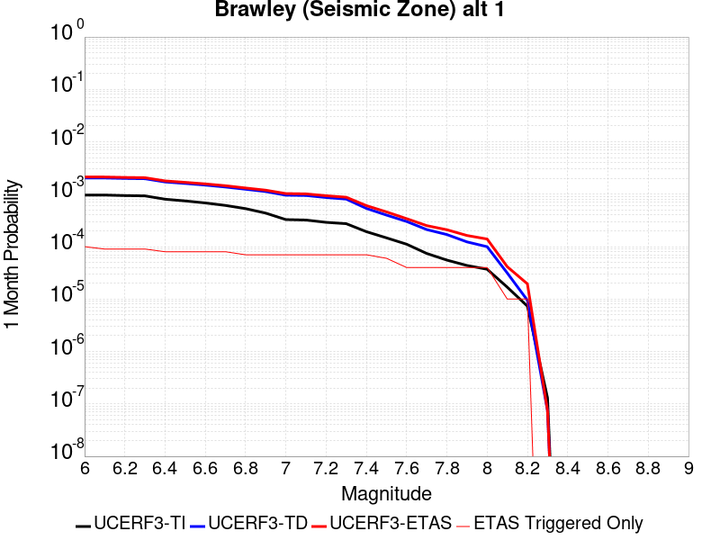 | 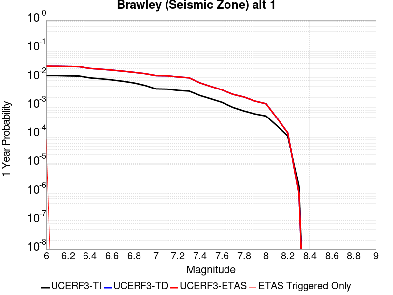 | 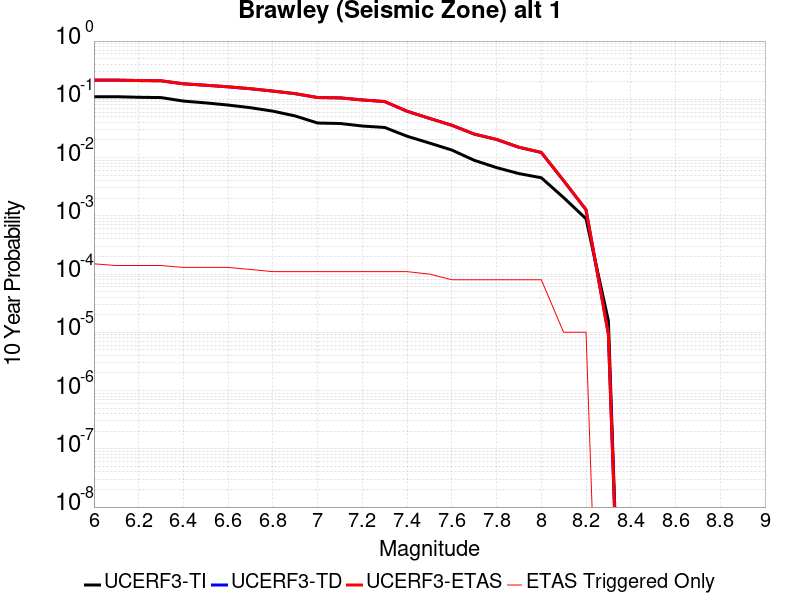 |

| Magnitude | 1 wk TI Prob | 1 wk TD Prob | 1 wk ETAS Prob | 1 wk ETAS/TD Gain | 1 wk ETAS Triggered Only | 1 mo TI Prob | 1 mo TD Prob | 1 mo ETAS Prob | 1 mo ETAS/TD Gain | 1 mo ETAS Triggered Only | 1 yr TI Prob | 1 yr TD Prob | 1 yr ETAS Prob | 1 yr ETAS/TD Gain | 1 yr ETAS Triggered Only | 10 yr TI Prob | 10 yr TD Prob | 10 yr ETAS Prob | 10 yr ETAS/TD Gain | 10 yr ETAS Triggered Only |
|-----|-----|-----|-----|-----|-----|-----|-----|-----|-----|-----|-----|-----|-----|-----|-----|-----|-----|-----|-----|-----|
| 6.0 | 2.2521618E-4 | 4.7632487E-4 | 5.462915E-4 | 1.1468885 | 7.0E-5 | 9.6485513E-4 | 0.0020398323 | 0.0021396284 | 1.0489236 | 1.0E-4 | 0.011683988 | 0.024546238 | 0.024663292 | 1.0047687 | 1.2E-4 | 0.11088423 | 0.21350002 | 0.213618 | 1.0005525 | 1.5E-4 |
| 6.1 | 2.2521618E-4 | 4.7632487E-4 | 5.362963E-4 | 1.1259044 | 6.0E-5 | 9.6485513E-4 | 0.0020398323 | 0.0021296488 | 1.0440313 | 9.0E-5 | 0.011683988 | 0.024546238 | 0.024653537 | 1.0043713 | 1.1E-4 | 0.11088423 | 0.21350002 | 0.21361013 | 1.0005157 | 1.4E-4 |
| 6.2 | 2.198148E-4 | 4.6717093E-4 | 5.271429E-4 | 1.1283727 | 6.0E-5 | 9.417233E-4 | 0.0020006616 | 0.0020904816 | 1.0448952 | 9.0E-5 | 0.011405343 | 0.024080504 | 0.024187854 | 1.0044581 | 1.1E-4 | 0.10837428 | 0.20993657 | 0.21004719 | 1.0005269 | 1.4E-4 |
| 6.3 | 2.1704129E-4 | 4.615278E-4 | 5.215001E-4 | 1.129943 | 6.0E-5 | 9.298453E-4 | 0.0019765133 | 0.0020663354 | 1.0454447 | 9.0E-5 | 0.011262234 | 0.02379366 | 0.023901043 | 1.004513 | 1.1E-4 | 0.107082725 | 0.20782755 | 0.20793845 | 1.0005336 | 1.4E-4 |
| 6.4 | 1.876142E-4 | 4.00449E-4 | 4.6042498E-4 | 1.1497718 | 6.0E-5 | 8.038131E-4 | 0.0017150956 | 0.0017949584 | 1.0465646 | 8.0E-5 | 0.00974259 | 0.020680401 | 0.020778334 | 1.0047355 | 1.0E-4 | 0.093263686 | 0.18457815 | 0.18468416 | 1.0005744 | 1.3E-4 |
| 6.5 | 1.7390939E-4 | 3.7477075E-4 | 4.3474828E-4 | 1.1600379 | 6.0E-5 | 7.45113E-4 | 0.0016051838 | 0.0016850554 | 1.0497586 | 8.0E-5 | 0.009034078 | 0.019368723 | 0.019466786 | 1.0050629 | 1.0E-4 | 0.086755216 | 0.17440031 | 0.17450765 | 1.0006154 | 1.3E-4 |
| 6.6 | 1.591791E-4 | 3.4891962E-4 | 4.088987E-4 | 1.1718993 | 6.0E-5 | 6.8201777E-4 | 0.0014945229 | 0.0015744034 | 1.0534488 | 8.0E-5 | 0.008271996 | 0.018045569 | 0.018143766 | 1.0054415 | 1.0E-4 | 0.07970774 | 0.16380852 | 0.16391723 | 1.0006636 | 1.3E-4 |
| 6.7 | 1.4268003E-4 | 3.20582E-4 | 3.8056276E-4 | 1.1870996 | 6.0E-5 | 6.1134255E-4 | 0.0013732077 | 0.0014530978 | 1.0581777 | 8.0E-5 | 0.007417723 | 0.016592601 | 0.016681109 | 1.0053341 | 9.0E-5 | 0.07174956 | 0.15193306 | 0.15203483 | 1.0006698 | 1.2E-4 |
| 6.8 | 1.239713E-4 | 2.9053655E-4 | 3.5051914E-4 | 1.2064545 | 6.0E-5 | 5.3119735E-4 | 0.0012445687 | 0.0013144816 | 1.0561744 | 7.0E-5 | 0.0064481674 | 0.015048777 | 0.015127573 | 1.005236 | 8.0E-5 | 0.06264243 | 0.13837762 | 0.13847241 | 1.000685 | 1.1E-4 |
| 6.9 | 1.0180238E-4 | 2.625439E-4 | 3.2252815E-4 | 1.2284732 | 6.0E-5 | 4.3622297E-4 | 0.0011247073 | 0.0011946285 | 1.0621684 | 7.0E-5 | 0.005298089 | 0.013608336 | 0.013687247 | 1.0057987 | 8.0E-5 | 0.05173543 | 0.124961674 | 0.12505792 | 1.0007702 | 1.1E-4 |
| 7.0 | 7.6619996E-5 | 2.23993E-4 | 2.8397955E-4 | 1.2678055 | 6.0E-5 | 3.283301E-4 | 9.5962E-4 | 0.0010295529 | 1.0728755 | 7.0E-5 | 0.0039900932 | 0.011621496 | 0.011700566 | 1.0068038 | 8.0E-5 | 0.039192066 | 0.107266866 | 0.107365064 | 1.0009155 | 1.1E-4 |
| 7.1 | 7.5127435E-5 | 2.2082464E-4 | 2.808114E-4 | 1.2716488 | 6.0E-5 | 3.2193496E-4 | 9.4605127E-4 | 0.001015985 | 1.0739218 | 7.0E-5 | 0.0039125155 | 0.011458045 | 0.011537128 | 1.006902 | 8.0E-5 | 0.038443442 | 0.10583085 | 0.10592921 | 1.0009294 | 1.1E-4 |
| 7.2 | 6.788582E-5 | 2.0210193E-4 | 2.620898E-4 | 1.2968199 | 6.0E-5 | 2.9090676E-4 | 8.6586666E-4 | 9.358061E-4 | 1.0807738 | 7.0E-5 | 0.0035360386 | 0.0104916105 | 0.010570771 | 1.0075451 | 8.0E-5 | 0.034803 | 0.09750131 | 0.09760059 | 1.0010182 | 1.1E-4 |
| 7.3 | 6.399602E-5 | 1.8841137E-4 | 2.4840006E-4 | 1.3183922 | 6.0E-5 | 2.7423984E-4 | 8.072303E-4 | 8.771738E-4 | 1.0866463 | 7.0E-5 | 0.0033337586 | 0.009784332 | 0.009863548 | 1.0080963 | 8.0E-5 | 0.03284188 | 0.09139617 | 0.09149611 | 1.0010935 | 1.1E-4 |
| 7.4 | 4.506759E-5 | 1.2529209E-4 | 1.8528457E-4 | 1.478821 | 6.0E-5 | 1.9313251E-4 | 5.368565E-4 | 6.068189E-4 | 1.1303186 | 7.0E-5 | 0.0023488526 | 0.0065168133 | 0.006596292 | 1.012196 | 8.0E-5 | 0.023241805 | 0.062363707 | 0.062466845 | 1.0016538 | 1.1E-4 |
| 7.5 | 3.43289E-5 | 9.33541E-5 | 1.4334943E-4 | 1.5355451 | 5.0E-5 | 1.4711556E-4 | 4.00028E-4 | 4.6000397E-4 | 1.1499295 | 6.0E-5 | 0.0017896603 | 0.0048595266 | 0.0049291863 | 1.0143347 | 7.0E-5 | 0.01775316 | 0.04705519 | 0.047150485 | 1.0020251 | 1.0E-4 |
| 7.6 | 2.5980507E-5 | 7.053101E-5 | 1.1052819E-4 | 1.5670865 | 4.0E-5 | 1.1134028E-4 | 3.0224086E-4 | 3.4222877E-4 | 1.1323048 | 4.0E-5 | 0.001354725 | 0.003673598 | 0.0037234141 | 1.0135607 | 5.0E-5 | 0.013464959 | 0.035840835 | 0.035917968 | 1.0021521 | 8.0E-5 |
| 7.7 | 1.7292105E-5 | 4.9407296E-5 | 8.940532E-5 | 1.809557 | 4.0E-5 | 7.4106916E-5 | 2.117284E-4 | 2.5171993E-4 | 1.1888813 | 4.0E-5 | 9.018782E-4 | 0.0025747516 | 0.002624623 | 1.0193694 | 5.0E-5 | 0.008982267 | 0.025290398 | 0.025368374 | 1.0030832 | 8.0E-5 |
| 7.8 | 1.2927471E-5 | 3.9693266E-5 | 7.969168E-5 | 2.0076876 | 4.0E-5 | 5.5402274E-5 | 1.7010293E-4 | 2.1009613E-4 | 1.2351117 | 4.0E-5 | 6.743139E-4 | 0.0020690386 | 0.002118935 | 1.0241158 | 5.0E-5 | 0.0067227143 | 0.020431727 | 0.020510094 | 1.0038354 | 8.0E-5 |
| 7.9 | 1.0200774E-5 | 2.874569E-5 | 6.874454E-5 | 2.391473 | 4.0E-5 | 4.371687E-5 | 1.2319001E-4 | 1.6318508E-4 | 1.3246617 | 4.0E-5 | 5.321229E-4 | 0.0014988075 | 0.0015487325 | 1.0333098 | 5.0E-5 | 0.005308505 | 0.014991644 | 0.015070445 | 1.0052563 | 8.0E-5 |
| 8.0 | 8.650396E-6 | 2.3277367E-5 | 6.3276435E-5 | 2.7183673 | 4.0E-5 | 3.70726E-5 | 9.975634E-5 | 1.3975234E-4 | 1.4009371 | 4.0E-5 | 4.5126543E-4 | 0.0012138576 | 0.0012637969 | 1.041141 | 5.0E-5 | 0.0045035016 | 0.012211097 | 0.01229012 | 1.0064714 | 8.0E-5 |
| 8.1 | 3.9368224E-6 | 7.3279825E-6 | 1.732791E-5 | 2.364622 | 1.0E-5 | 1.6871985E-5 | 3.140526E-5 | 4.1404946E-5 | 1.318408 | 1.0E-5 | 2.0539707E-4 | 3.8229208E-4 | 3.9228826E-4 | 1.026148 | 1.0E-5 | 0.0020520731 | 0.004001185 | 0.0040111444 | 1.0024892 | 1.0E-5 |
| 8.2 | 1.7101195E-6 | 2.217876E-6 | 1.22178535E-5 | 5.508808 | 1.0E-5 | 7.329063E-6 | 9.505149E-6 | 1.9505054E-5 | 2.0520513 | 1.0E-5 | 8.922769E-5 | 1.1571907E-4 | 1.2571791E-4 | 1.0864062 | 1.0E-5 | 8.9191867E-4 | 0.0012666774 | 0.0012766648 | 1.0078846 | 1.0E-5 |
| 8.3 | 3.0346666E-8 | 1.721586E-8 | 1.721586E-8 | 1.0 | 0.0 | 1.3005713E-7 | 7.378226E-8 | 7.378226E-8 | 1.0 | 0.0 | 1.5834444E-6 | 8.9829894E-7 | 8.9829894E-7 | 1.0 | 0.0 | 1.5834332E-5 | 9.367729E-6 | 9.367729E-6 | 1.0 | 0.0 |

## San Clemente
*[(top)](#table-of-contents)*

| 1 Week | 1 Month | 1 Year | 10 Year |
|-----|-----|-----|-----|
| 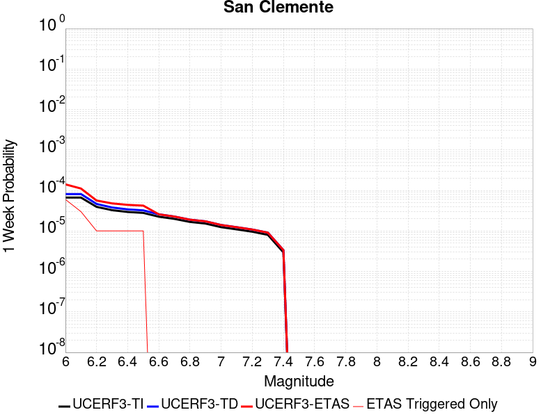 | 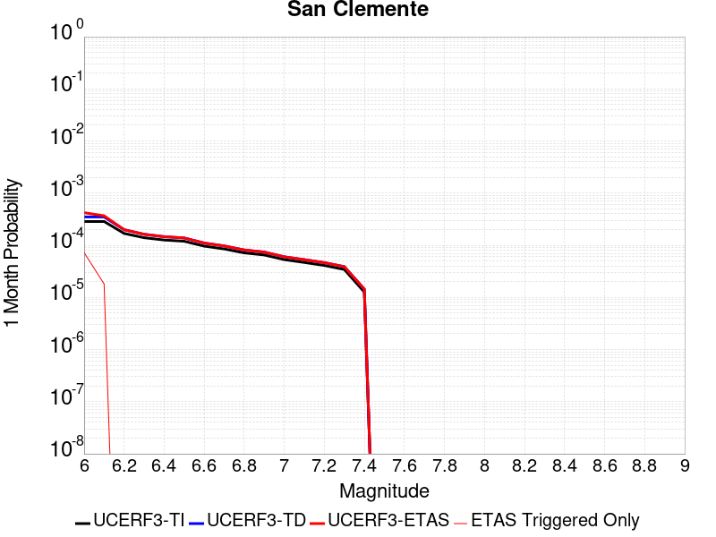 | 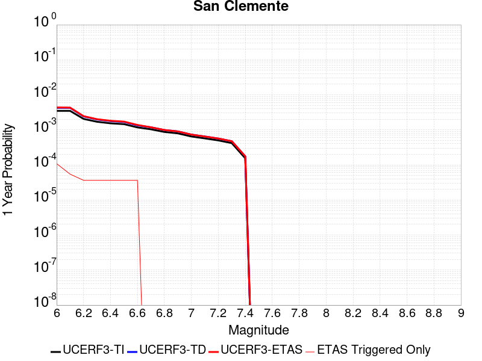 | 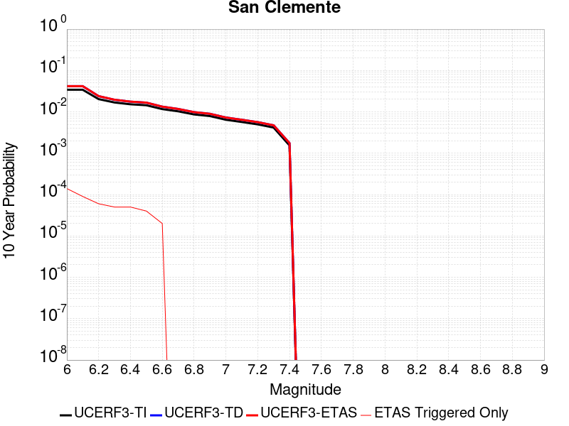 |

| Magnitude | 1 wk TI Prob | 1 wk TD Prob | 1 wk ETAS Prob | 1 wk ETAS/TD Gain | 1 wk ETAS Triggered Only | 1 mo TI Prob | 1 mo TD Prob | 1 mo ETAS Prob | 1 mo ETAS/TD Gain | 1 mo ETAS Triggered Only | 1 yr TI Prob | 1 yr TD Prob | 1 yr ETAS Prob | 1 yr ETAS/TD Gain | 1 yr ETAS Triggered Only | 10 yr TI Prob | 10 yr TD Prob | 10 yr ETAS Prob | 10 yr ETAS/TD Gain | 10 yr ETAS Triggered Only |
|-----|-----|-----|-----|-----|-----|-----|-----|-----|-----|-----|-----|-----|-----|-----|-----|-----|-----|-----|-----|-----|
| 6.0 | 6.681379E-5 | 8.163422E-5 | 1.4162932E-4 | 1.7349259 | 6.0E-5 | 2.8631336E-4 | 3.498173E-4 | 4.1979284E-4 | 1.2000345 | 7.0E-5 | 0.003480294 | 0.0042512873 | 0.0043508625 | 1.0234222 | 1.0E-4 | 0.03426291 | 0.041755714 | 0.04188987 | 1.0032128 | 1.4E-4 |
| 6.1 | 6.681379E-5 | 8.163422E-5 | 1.1163177E-4 | 1.3674629 | 3.0E-5 | 2.8631336E-4 | 3.498173E-4 | 3.7980682E-4 | 1.085729 | 3.0E-5 | 0.003480294 | 0.0042512873 | 0.0043110326 | 1.0140533 | 6.0E-5 | 0.03426291 | 0.041755714 | 0.041841954 | 1.0020654 | 9.0E-5 |
| 6.2 | 3.9400576E-5 | 4.6451984E-5 | 5.645152E-5 | 1.2152661 | 1.0E-5 | 1.6884868E-4 | 1.9906509E-4 | 2.090631E-4 | 1.0502248 | 1.0E-5 | 0.0020537945 | 0.002420985 | 0.002460888 | 1.0164822 | 4.0E-5 | 0.020349167 | 0.02395286 | 0.024011424 | 1.0024449 | 6.0E-5 |
| 6.3 | 3.2590255E-5 | 3.7929087E-5 | 4.792871E-5 | 1.2636399 | 1.0E-5 | 1.3966505E-4 | 1.6254328E-4 | 1.7254165E-4 | 1.0615121 | 1.0E-5 | 0.0016990956 | 0.0019771985 | 0.0020171194 | 1.0201906 | 4.0E-5 | 0.01686163 | 0.019599866 | 0.019648885 | 1.002501 | 5.0E-5 |
| 6.4 | 2.9454652E-5 | 3.4097775E-5 | 4.4097436E-5 | 1.2932643 | 1.0E-5 | 1.2622811E-4 | 1.4612528E-4 | 1.5612383E-4 | 1.0684245 | 1.0E-5 | 0.0015357438 | 0.0017776482 | 0.001817577 | 1.0224617 | 4.0E-5 | 0.015251739 | 0.017637458 | 0.017686576 | 1.0027848 | 5.0E-5 |
| 6.5 | 2.790836E-5 | 3.2247463E-5 | 4.224714E-5 | 1.310092 | 1.0E-5 | 1.1960178E-4 | 1.3819622E-4 | 1.4819484E-4 | 1.0723509 | 1.0E-5 | 0.001455179 | 0.0016812651 | 0.0017112147 | 1.0178137 | 3.0E-5 | 0.014456868 | 0.016688475 | 0.016727807 | 1.0023569 | 4.0E-5 |
| 6.6 | 2.2492153E-5 | 2.5762707E-5 | 2.5762707E-5 | 1.0 | 0.0 | 9.639138E-5 | 1.1040701E-4 | 1.1040701E-4 | 1.0 | 0.0 | 0.0011729331 | 0.0013433908 | 0.0013633639 | 1.0148677 | 2.0E-5 | 0.011667615 | 0.013354415 | 0.013374148 | 1.0014776 | 2.0E-5 |
| 6.7 | 1.9862755E-5 | 2.2666423E-5 | 2.2666423E-5 | 1.0 | 0.0 | 8.512331E-5 | 9.713826E-5 | 9.713826E-5 | 1.0 | 0.0 | 0.0010358836 | 0.0011820279 | 0.0011820279 | 1.0 | 0.0 | 0.010310682 | 0.011758701 | 0.011758701 | 1.0 | 0.0 |
| 6.8 | 1.6697575E-5 | 1.897771E-5 | 1.897771E-5 | 1.0 | 0.0 | 7.155907E-5 | 8.133056E-5 | 8.133056E-5 | 1.0 | 0.0 | 8.7088346E-4 | 9.897591E-4 | 9.897591E-4 | 1.0 | 0.0 | 0.008674784 | 0.0098545365 | 0.0098545365 | 1.0 | 0.0 |
| 6.9 | 1.5218415E-5 | 1.72694E-5 | 1.72694E-5 | 1.0 | 0.0 | 6.522015E-5 | 7.4009666E-5 | 7.4009666E-5 | 1.0 | 0.0 | 7.93766E-4 | 9.00704E-4 | 9.00704E-4 | 1.0 | 0.0 | 0.007909367 | 0.008971481 | 0.008971481 | 1.0 | 0.0 |
| 7.0 | 1.2392958E-5 | 1.4033016E-5 | 1.4033016E-5 | 1.0 | 0.0 | 5.3111595E-5 | 6.014015E-5 | 6.014015E-5 | 1.0 | 0.0 | 6.4644177E-4 | 7.319679E-4 | 7.319679E-4 | 1.0 | 0.0 | 0.0064456454 | 0.0072963564 | 0.0072963564 | 1.0 | 0.0 |
| 7.1 | 1.0934128E-5 | 1.2375138E-5 | 1.2375138E-5 | 1.0 | 0.0 | 4.6859706E-5 | 5.303527E-5 | 5.303527E-5 | 1.0 | 0.0 | 5.7036756E-4 | 6.455204E-4 | 6.455204E-4 | 1.0 | 0.0 | 0.0056890585 | 0.0064371997 | 0.0064371997 | 1.0 | 0.0 |
| 7.2 | 9.5798805E-6 | 1.0844935E-5 | 1.0844935E-5 | 1.0 | 0.0 | 4.1055984E-5 | 4.6477508E-5 | 4.6477508E-5 | 1.0 | 0.0 | 4.9974193E-4 | 5.657239E-4 | 5.657239E-4 | 1.0 | 0.0 | 0.0049861963 | 0.0056435615 | 0.0056435615 | 1.0 | 0.0 |
| 7.3 | 8.0167365E-6 | 9.083918E-6 | 9.083918E-6 | 1.0 | 0.0 | 3.4356988E-5 | 3.8930535E-5 | 3.8930535E-5 | 1.0 | 0.0 | 4.1821605E-4 | 4.7388324E-4 | 4.7388324E-4 | 1.0 | 0.0 | 0.0041742986 | 0.0047294297 | 0.0047294297 | 1.0 | 0.0 |
| 7.4 | 2.9581017E-6 | 3.3623792E-6 | 3.3623792E-6 | 1.0 | 0.0 | 1.2677518E-5 | 1.4410146E-5 | 1.4410146E-5 | 1.0 | 0.0 | 1.5433785E-4 | 1.7543444E-4 | 1.7543444E-4 | 1.0 | 0.0 | 0.001542307 | 0.0017534546 | 0.0017534546 | 1.0 | 0.0 |

## White Mountains
*[(top)](#table-of-contents)*

| 1 Week | 1 Month | 1 Year | 10 Year |
|-----|-----|-----|-----|
| 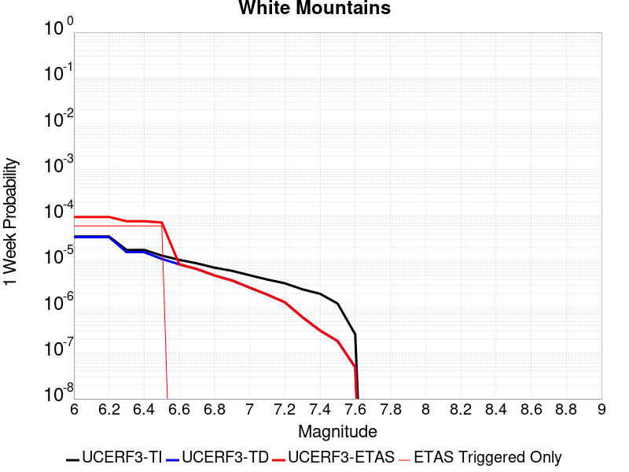 | 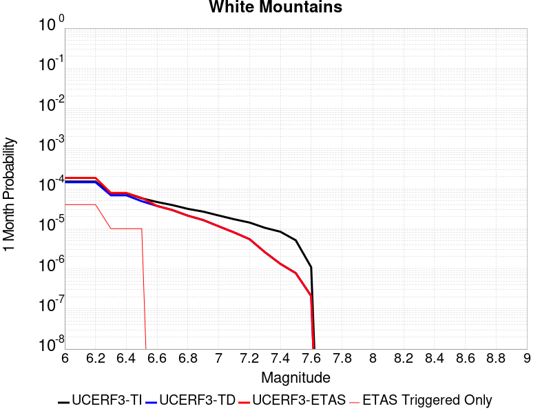 | 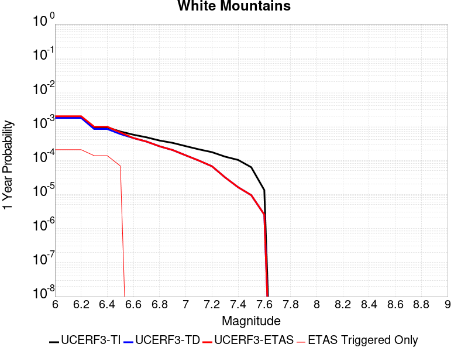 | 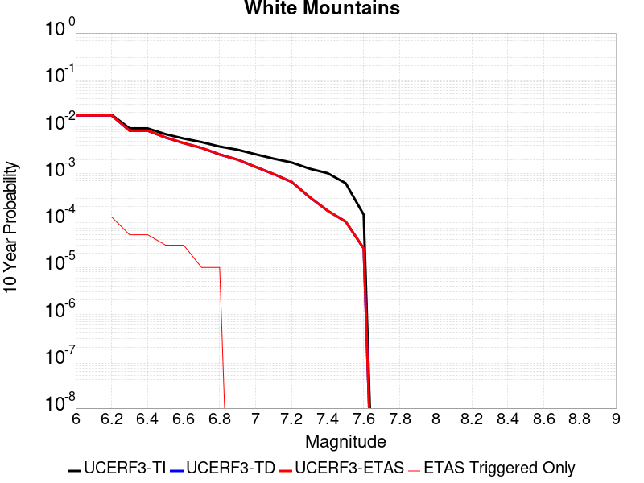 |

| Magnitude | 1 wk TI Prob | 1 wk TD Prob | 1 wk ETAS Prob | 1 wk ETAS/TD Gain | 1 wk ETAS Triggered Only | 1 mo TI Prob | 1 mo TD Prob | 1 mo ETAS Prob | 1 mo ETAS/TD Gain | 1 mo ETAS Triggered Only | 1 yr TI Prob | 1 yr TD Prob | 1 yr ETAS Prob | 1 yr ETAS/TD Gain | 1 yr ETAS Triggered Only | 10 yr TI Prob | 10 yr TD Prob | 10 yr ETAS Prob | 10 yr ETAS/TD Gain | 10 yr ETAS Triggered Only |
|-----|-----|-----|-----|-----|-----|-----|-----|-----|-----|-----|-----|-----|-----|-----|-----|-----|-----|-----|-----|-----|
| 6.0 | 3.503579E-5 | 3.378405E-5 | 5.3783377E-5 | 1.5919753 | 2.0E-5 | 1.5014476E-4 | 1.4478143E-4 | 1.8477565E-4 | 1.2762386 | 4.0E-5 | 0.0018264796 | 0.0017614096 | 0.0018712158 | 1.06234 | 1.1E-4 | 0.018115403 | 0.017486818 | 0.01760472 | 1.0067424 | 1.2E-4 |
| 6.1 | 3.503579E-5 | 3.378405E-5 | 5.3783377E-5 | 1.5919753 | 2.0E-5 | 1.5014476E-4 | 1.4478143E-4 | 1.8477565E-4 | 1.2762386 | 4.0E-5 | 0.0018264796 | 0.0017614096 | 0.0018712158 | 1.06234 | 1.1E-4 | 0.018115403 | 0.017486818 | 0.01760472 | 1.0067424 | 1.2E-4 |
| 6.2 | 3.503579E-5 | 3.378405E-5 | 5.3783377E-5 | 1.5919753 | 2.0E-5 | 1.5014476E-4 | 1.4478143E-4 | 1.8477565E-4 | 1.2762386 | 4.0E-5 | 0.0018264796 | 0.0017614096 | 0.0018712158 | 1.06234 | 1.1E-4 | 0.018115403 | 0.017486818 | 0.01760472 | 1.0067424 | 1.2E-4 |
| 6.3 | 1.7818425E-5 | 1.5916074E-5 | 2.5915915E-5 | 1.6282856 | 1.0E-5 | 7.636245E-5 | 6.821004E-5 | 7.820936E-5 | 1.146596 | 1.0E-5 | 9.293162E-4 | 8.301551E-4 | 8.801136E-4 | 1.0601797 | 5.0E-5 | 0.009254395 | 0.008271999 | 0.008321585 | 1.0059944 | 5.0E-5 |
| 6.4 | 1.7818425E-5 | 1.5916074E-5 | 2.5915915E-5 | 1.6282856 | 1.0E-5 | 7.636245E-5 | 6.821004E-5 | 7.820936E-5 | 1.146596 | 1.0E-5 | 9.293162E-4 | 8.301551E-4 | 8.801136E-4 | 1.0601797 | 5.0E-5 | 0.009254395 | 0.008271999 | 0.008321585 | 1.0059944 | 5.0E-5 |
| 6.5 | 1.3397557E-5 | 1.13362685E-5 | 2.1336155E-5 | 1.8821145 | 1.0E-5 | 5.741684E-5 | 4.858314E-5 | 5.8582656E-5 | 1.2058227 | 1.0E-5 | 6.988258E-4 | 5.913462E-4 | 6.213285E-4 | 1.0507017 | 3.0E-5 | 0.006966323 | 0.005898432 | 0.005928255 | 1.0050561 | 3.0E-5 |
| 6.6 | 1.0818695E-5 | 8.625366E-6 | 8.625366E-6 | 1.0 | 0.0 | 4.6365014E-5 | 3.6965357E-5 | 3.6965357E-5 | 1.0 | 0.0 | 5.6434784E-4 | 4.4996463E-4 | 4.6995562E-4 | 1.044428 | 2.0E-5 | 0.005629168 | 0.004490972 | 0.004520837 | 1.0066501 | 3.0E-5 |
| 6.7 | 9.067908E-6 | 6.802442E-6 | 6.802442E-6 | 1.0 | 0.0 | 3.8861883E-5 | 2.9153016E-5 | 2.9153016E-5 | 1.0 | 0.0 | 4.7304068E-4 | 3.5488335E-4 | 3.648798E-4 | 1.0281683 | 1.0E-5 | 0.00472035 | 0.0035434833 | 0.003553448 | 1.002812 | 1.0E-5 |
| 6.8 | 7.295947E-6 | 4.936391E-6 | 4.936391E-6 | 1.0 | 0.0 | 3.126797E-5 | 2.1155796E-5 | 2.1155796E-5 | 1.0 | 0.0 | 3.8062103E-4 | 2.575425E-4 | 2.6753993E-4 | 1.0388186 | 1.0E-5 | 0.0037996976 | 0.0025725532 | 0.0025825277 | 1.0038772 | 1.0E-5 |
| 6.9 | 6.2243444E-6 | 3.832213E-6 | 3.832213E-6 | 1.0 | 0.0 | 2.6675489E-5 | 1.642367E-5 | 1.642367E-5 | 1.0 | 0.0 | 3.2472567E-4 | 1.9994036E-4 | 1.9994036E-4 | 1.0 | 0.0 | 0.0032425157 | 0.0019976576 | 0.0019976576 | 1.0 | 0.0 |
| 7.0 | 4.9878413E-6 | 2.6795342E-6 | 2.6795342E-6 | 1.0 | 0.0 | 2.1376287E-5 | 1.14836685E-5 | 1.14836685E-5 | 1.0 | 0.0 | 2.602252E-4 | 1.3980496E-4 | 1.3980496E-4 | 1.0 | 0.0 | 0.002599207 | 0.0013971963 | 0.0013971963 | 1.0 | 0.0 |
| 7.1 | 4.0252844E-6 | 1.8857575E-6 | 1.8857575E-6 | 1.0 | 0.0 | 1.7251105E-5 | 8.081794E-6 | 8.081794E-6 | 1.0 | 0.0 | 2.1001195E-4 | 9.8391516E-5 | 9.8391516E-5 | 1.0 | 0.0 | 0.0020981359 | 9.834924E-4 | 9.834924E-4 | 1.0 | 0.0 |
| 7.2 | 3.3284066E-6 | 1.281964E-6 | 1.281964E-6 | 1.0 | 0.0 | 1.4264522E-5 | 5.494121E-6 | 5.494121E-6 | 1.0 | 0.0 | 1.736567E-4 | 6.688897E-5 | 6.688897E-5 | 1.0 | 0.0 | 0.0017352107 | 6.6869846E-4 | 6.6869846E-4 | 1.0 | 0.0 |
| 7.3 | 2.458226E-6 | 6.05722E-7 | 6.05722E-7 | 1.0 | 0.0 | 1.0535211E-5 | 2.5959491E-6 | 2.5959491E-6 | 1.0 | 0.0 | 1.2825865E-4 | 3.1605257E-5 | 3.1605257E-5 | 1.0 | 0.0 | 0.0012818464 | 3.160114E-4 | 3.160114E-4 | 1.0 | 0.0 |
| 7.4 | 1.965953E-6 | 3.1089303E-7 | 3.1089303E-7 | 1.0 | 0.0 | 8.425486E-6 | 1.332398E-6 | 1.332398E-6 | 1.0 | 0.0 | 1.0257547E-4 | 1.6221828E-5 | 1.6221828E-5 | 1.0 | 0.0 | 0.0010252813 | 1.6220656E-4 | 1.6220656E-4 | 1.0 | 0.0 |
| 7.5 | 1.2014192E-6 | 1.8244253E-7 | 1.8244253E-7 | 1.0 | 0.0 | 5.148929E-6 | 7.8189635E-7 | 7.8189635E-7 | 1.0 | 0.0 | 6.2686406E-5 | 9.519547E-6 | 9.519547E-6 | 1.0 | 0.0 | 6.266873E-4 | 9.519148E-5 | 9.519148E-5 | 1.0 | 0.0 |
| 7.6 | 2.5612175E-7 | 4.8946475E-8 | 4.8946475E-8 | 1.0 | 0.0 | 1.0976642E-6 | 2.0977059E-7 | 2.0977059E-7 | 1.0 | 0.0 | 1.3363979E-5 | 2.5539543E-6 | 2.5539543E-6 | 1.0 | 0.0 | 1.3363175E-4 | 2.5539286E-5 | 2.5539286E-5 | 1.0 | 0.0 |

## Owens Valley
*[(top)](#table-of-contents)*

| 1 Week | 1 Month | 1 Year | 10 Year |
|-----|-----|-----|-----|
| 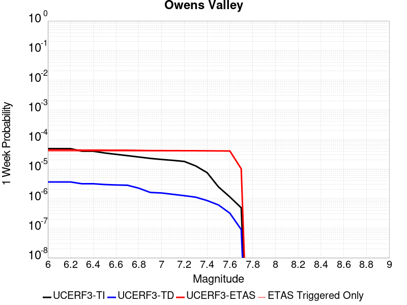 | 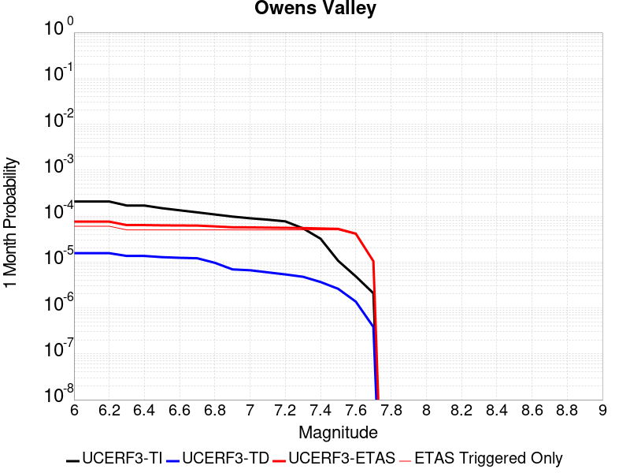 |  | 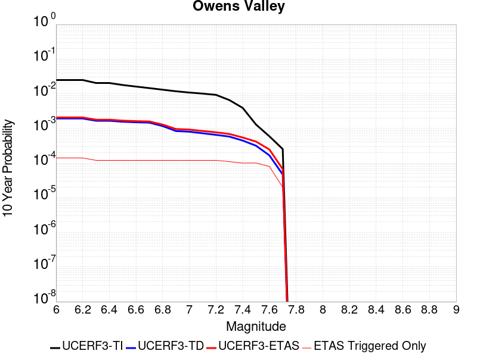 |

| Magnitude | 1 wk TI Prob | 1 wk TD Prob | 1 wk ETAS Prob | 1 wk ETAS/TD Gain | 1 wk ETAS Triggered Only | 1 mo TI Prob | 1 mo TD Prob | 1 mo ETAS Prob | 1 mo ETAS/TD Gain | 1 mo ETAS Triggered Only | 1 yr TI Prob | 1 yr TD Prob | 1 yr ETAS Prob | 1 yr ETAS/TD Gain | 1 yr ETAS Triggered Only | 10 yr TI Prob | 10 yr TD Prob | 10 yr ETAS Prob | 10 yr ETAS/TD Gain | 10 yr ETAS Triggered Only |
|-----|-----|-----|-----|-----|-----|-----|-----|-----|-----|-----|-----|-----|-----|-----|-----|-----|-----|-----|-----|-----|
| 6.0 | 4.83821E-5 | 3.626567E-6 | 4.3626424E-5 | 12.0296755 | 4.0E-5 | 2.0733538E-4 | 1.5542342E-5 | 7.554141E-5 | 4.860362 | 6.0E-5 | 0.002521386 | 1.8921259E-4 | 2.8919367E-4 | 1.528406 | 1.0E-4 | 0.024929691 | 0.001925011 | 0.0020647414 | 1.0725869 | 1.4E-4 |
| 6.1 | 4.83821E-5 | 3.626567E-6 | 4.3626424E-5 | 12.0296755 | 4.0E-5 | 2.0733538E-4 | 1.5542342E-5 | 7.554141E-5 | 4.860362 | 6.0E-5 | 0.002521386 | 1.8921259E-4 | 2.8919367E-4 | 1.528406 | 1.0E-4 | 0.024929691 | 0.001925011 | 0.0020647414 | 1.0725869 | 1.4E-4 |
| 6.2 | 4.83821E-5 | 3.626567E-6 | 4.3626424E-5 | 12.0296755 | 4.0E-5 | 2.0733538E-4 | 1.5542342E-5 | 7.554141E-5 | 4.860362 | 6.0E-5 | 0.002521386 | 1.8921259E-4 | 2.8919367E-4 | 1.528406 | 1.0E-4 | 0.024929691 | 0.001925011 | 0.0020647414 | 1.0725869 | 1.4E-4 |
| 6.3 | 3.953008E-5 | 3.1553948E-6 | 4.315527E-5 | 13.676662 | 4.0E-5 | 1.6940363E-4 | 1.3523055E-5 | 6.352238E-5 | 4.6973395 | 5.0E-5 | 0.002060538 | 1.6463149E-4 | 2.5461667E-4 | 1.5465854 | 9.0E-5 | 0.020415364 | 0.0016592 | 0.0017790009 | 1.072204 | 1.2E-4 |
| 6.4 | 3.953008E-5 | 3.1553948E-6 | 4.315527E-5 | 13.676662 | 4.0E-5 | 1.6940363E-4 | 1.3523055E-5 | 6.352238E-5 | 4.6973395 | 5.0E-5 | 0.002060538 | 1.6463149E-4 | 2.5461667E-4 | 1.5465854 | 9.0E-5 | 0.020415364 | 0.0016592 | 0.0017790009 | 1.072204 | 1.2E-4 |
| 6.5 | 3.457342E-5 | 2.9715961E-6 | 4.297148E-5 | 14.460739 | 4.0E-5 | 1.4816338E-4 | 1.2735354E-5 | 6.273472E-5 | 4.9260287 | 5.0E-5 | 0.0018023965 | 1.550426E-4 | 2.4502864E-4 | 1.5803956 | 9.0E-5 | 0.017878477 | 0.001555719 | 0.0016755323 | 1.0770148 | 1.2E-4 |
| 6.6 | 3.1127765E-5 | 2.8744932E-6 | 4.2874377E-5 | 14.915456 | 4.0E-5 | 1.3339789E-4 | 1.2319203E-5 | 6.2318584E-5 | 5.0586543 | 5.0E-5 | 0.0016229092 | 1.4997667E-4 | 2.3996316E-4 | 1.6000034 | 9.0E-5 | 0.016111081 | 0.0015012559 | 0.0016210757 | 1.0798131 | 1.2E-4 |
| 6.7 | 2.806885E-5 | 2.8104134E-6 | 4.28103E-5 | 15.232741 | 4.0E-5 | 1.2028952E-4 | 1.20445775E-5 | 6.2043975E-5 | 5.151196 | 5.0E-5 | 0.001463541 | 1.4663354E-4 | 2.3662034E-4 | 1.613685 | 9.0E-5 | 0.014539397 | 0.0014657511 | 0.0015855752 | 1.0817493 | 1.2E-4 |
| 6.8 | 2.524524E-5 | 2.2353688E-6 | 4.223528E-5 | 18.8941 | 4.0E-5 | 1.0818939E-4 | 9.580118E-6 | 5.957964E-5 | 6.2190924 | 5.0E-5 | 0.0013164099 | 1.16632E-4 | 2.0662151E-4 | 1.7715678 | 9.0E-5 | 0.01308639 | 0.0011659812 | 0.0012858412 | 1.1027976 | 1.2E-4 |
| 6.9 | 2.2704568E-5 | 1.6081682E-6 | 4.1608106E-5 | 25.87298 | 4.0E-5 | 9.730166E-5 | 6.8921313E-6 | 5.6891786E-5 | 8.2546 | 5.0E-5 | 0.0011840039 | 8.390849E-5 | 1.7390093E-4 | 2.0725071 | 9.0E-5 | 0.011777153 | 8.3897985E-4 | 9.588791E-4 | 1.1429108 | 1.2E-4 |
| 7.0 | 2.0871712E-5 | 1.5395453E-6 | 4.1539482E-5 | 26.981657 | 4.0E-5 | 8.944713E-5 | 6.598035E-6 | 5.6597706E-5 | 8.577964 | 5.0E-5 | 0.0010884746 | 8.032813E-5 | 1.703209E-4 | 2.1203146 | 9.0E-5 | 0.010831586 | 8.0316263E-4 | 9.230662E-4 | 1.1492894 | 1.2E-4 |
| 7.1 | 1.944928E-5 | 1.3864178E-6 | 4.1386364E-5 | 29.851292 | 4.0E-5 | 8.335139E-5 | 5.941777E-6 | 5.594148E-5 | 9.414941 | 5.0E-5 | 0.0010143308 | 7.233874E-5 | 1.6233223E-4 | 2.2440565 | 9.0E-5 | 0.010097133 | 7.2330976E-4 | 8.4322295E-4 | 1.165784 | 1.2E-4 |
| 7.2 | 1.7876306E-5 | 1.2489141E-6 | 4.1248863E-5 | 33.027782 | 4.0E-5 | 7.6610486E-5 | 5.352478E-6 | 5.535221E-5 | 10.341417 | 5.0E-5 | 9.3233347E-4 | 6.516448E-5 | 1.5515862E-4 | 2.3810306 | 9.0E-5 | 0.009284316 | 6.5159105E-4 | 7.7151286E-4 | 1.1840446 | 1.2E-4 |
| 7.3 | 1.2618672E-5 | 1.1115209E-6 | 4.1111478E-5 | 36.986687 | 4.0E-5 | 5.40789E-5 | 4.763652E-6 | 5.4763415E-5 | 11.4960985 | 5.0E-5 | 6.582117E-4 | 5.799593E-5 | 1.4799071E-4 | 2.551743 | 9.0E-5 | 0.0065626553 | 5.7994033E-4 | 6.8987656E-4 | 1.1895647 | 1.1E-4 |
| 7.4 | 7.4874442E-6 | 8.5486437E-7 | 4.085483E-5 | 47.791008 | 4.0E-5 | 3.208865E-5 | 3.6636993E-6 | 5.3663516E-5 | 14.647358 | 5.0E-5 | 3.906093E-4 | 4.4604632E-5 | 1.2460107E-4 | 2.7934556 | 8.0E-5 | 0.003899234 | 4.4604883E-4 | 5.460042E-4 | 1.2240907 | 1.0E-4 |
| 7.5 | 2.4734156E-6 | 6.068616E-7 | 4.0606836E-5 | 66.91285 | 4.0E-5 | 1.060031E-5 | 2.6008327E-6 | 5.2600702E-5 | 20.224562 | 5.0E-5 | 1.2905113E-4 | 3.166468E-5 | 1.1166215E-4 | 3.5263941 | 8.0E-5 | 0.0012897621 | 3.1660203E-4 | 4.1657037E-4 | 1.3157539 | 1.0E-4 |
| 7.6 | 1.1328841E-6 | 3.196531E-7 | 4.031964E-5 | 126.13561 | 4.0E-5 | 4.8552088E-6 | 1.3699412E-6 | 4.1369887E-5 | 30.198294 | 4.0E-5 | 5.9110564E-5 | 1.6678909E-5 | 7.6677905E-5 | 4.5972977 | 6.0E-5 | 5.9094845E-4 | 1.6677675E-4 | 2.467634E-4 | 1.4796032 | 8.0E-5 |
| 7.7 | 4.8613185E-7 | 8.964689E-8 | 1.0089646E-5 | 112.54876 | 1.0E-5 | 2.0834207E-6 | 3.8420092E-7 | 1.0384197E-5 | 27.02804 | 1.0E-5 | 2.536535E-5 | 4.6776368E-6 | 1.467759E-5 | 3.1378217 | 1.0E-5 | 2.5362454E-4 | 4.677545E-5 | 6.677451E-5 | 1.4275547 | 2.0E-5 |

## Rose Canyon
*[(top)](#table-of-contents)*

| 1 Week | 1 Month | 1 Year | 10 Year |
|-----|-----|-----|-----|
| 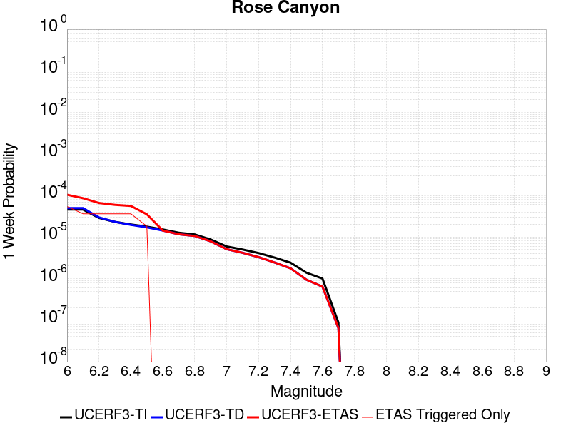 | 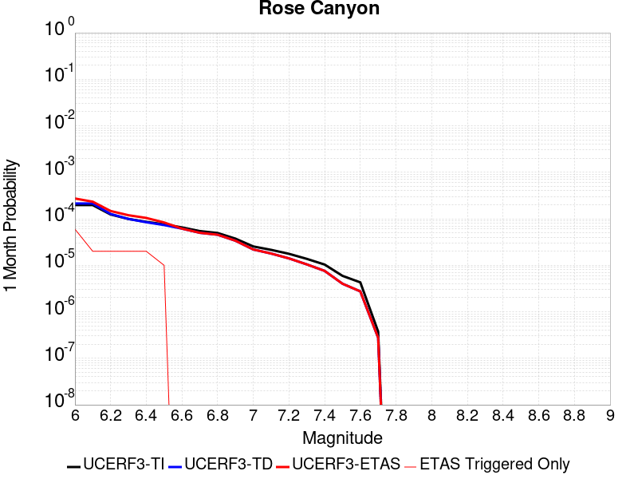 | 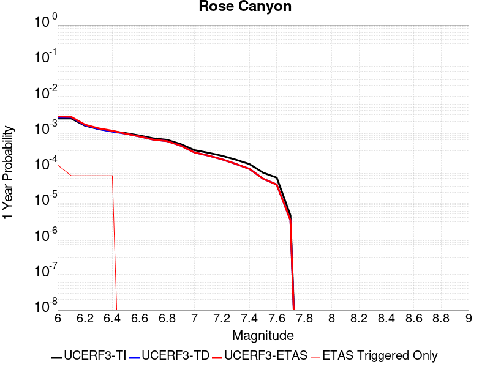 | 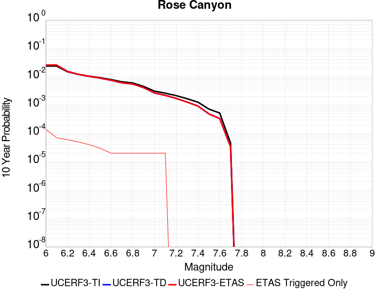 |

| Magnitude | 1 wk TI Prob | 1 wk TD Prob | 1 wk ETAS Prob | 1 wk ETAS/TD Gain | 1 wk ETAS Triggered Only | 1 mo TI Prob | 1 mo TD Prob | 1 mo ETAS Prob | 1 mo ETAS/TD Gain | 1 mo ETAS Triggered Only | 1 yr TI Prob | 1 yr TD Prob | 1 yr ETAS Prob | 1 yr ETAS/TD Gain | 1 yr ETAS Triggered Only | 10 yr TI Prob | 10 yr TD Prob | 10 yr ETAS Prob | 10 yr ETAS/TD Gain | 10 yr ETAS Triggered Only |
|-----|-----|-----|-----|-----|-----|-----|-----|-----|-----|-----|-----|-----|-----|-----|-----|-----|-----|-----|-----|-----|
| 6.0 | 4.5923203E-5 | 4.9714225E-5 | 9.971174E-5 | 2.0056984 | 5.0E-5 | 1.9679888E-4 | 2.1304491E-4 | 2.7303214E-4 | 1.2815708 | 6.0E-5 | 0.0023933933 | 0.0025909345 | 0.0026707272 | 1.0307969 | 8.0E-5 | 0.023677798 | 0.02563999 | 0.025776401 | 1.0053202 | 1.4E-4 |
| 6.1 | 4.5923203E-5 | 4.9714225E-5 | 6.9713235E-5 | 1.4022794 | 2.0E-5 | 1.9679888E-4 | 2.1304491E-4 | 2.3304066E-4 | 1.0938569 | 2.0E-5 | 0.0023933933 | 0.0025909345 | 0.0026208567 | 1.0115489 | 3.0E-5 | 0.023677798 | 0.02563999 | 0.025708197 | 1.0026602 | 7.0E-5 |
| 6.2 | 2.8844734E-5 | 2.9668723E-5 | 4.9668128E-5 | 1.6740906 | 2.0E-5 | 1.2361443E-4 | 1.2714567E-4 | 1.4714313E-4 | 1.1572798 | 2.0E-5 | 0.0015039665 | 0.0015468939 | 0.0015668629 | 1.0129092 | 2.0E-5 | 0.0149382865 | 0.015374276 | 0.015433353 | 1.0038426 | 6.0E-5 |
| 6.3 | 2.3171577E-5 | 2.3161238E-5 | 4.3160773E-5 | 1.8634917 | 2.0E-5 | 9.9302975E-5 | 9.9258745E-5 | 1.19256765E-4 | 1.2014736 | 2.0E-5 | 0.0012083431 | 0.0012078186 | 0.0012277944 | 1.0165387 | 2.0E-5 | 0.012017938 | 0.012022437 | 0.012071836 | 1.0041089 | 5.0E-5 |
| 6.4 | 2.0066604E-5 | 1.9667024E-5 | 3.9666633E-5 | 2.0169106 | 2.0E-5 | 8.599689E-5 | 8.4284584E-5 | 1.04282895E-4 | 1.2372713 | 2.0E-5 | 0.0010465092 | 0.0010256917 | 0.0010456712 | 1.019479 | 2.0E-5 | 0.010415946 | 0.010217559 | 0.01025715 | 1.0038748 | 4.0E-5 |
| 6.5 | 1.776989E-5 | 1.7113807E-5 | 2.7113636E-5 | 1.5843135 | 1.0E-5 | 7.615444E-5 | 7.334287E-5 | 8.334213E-5 | 1.136336 | 1.0E-5 | 9.267859E-4 | 8.925905E-4 | 9.025816E-4 | 1.0111934 | 1.0E-5 | 0.009229303 | 0.008896211 | 0.008925944 | 1.0033423 | 3.0E-5 |
| 6.6 | 1.5227364E-5 | 1.433926E-5 | 1.433926E-5 | 1.0 | 0.0 | 6.52585E-5 | 6.1452556E-5 | 6.1452556E-5 | 1.0 | 0.0 | 7.942326E-4 | 7.479332E-4 | 7.479332E-4 | 1.0 | 0.0 | 0.007914 | 0.007458359 | 0.00747821 | 1.0026616 | 2.0E-5 |
| 6.7 | 1.2703898E-5 | 1.1673274E-5 | 1.1673274E-5 | 1.0 | 0.0 | 5.4444143E-5 | 5.0027378E-5 | 5.0027378E-5 | 1.0 | 0.0 | 6.626558E-4 | 6.089174E-4 | 6.089174E-4 | 1.0 | 0.0 | 0.006606833 | 0.0060750856 | 0.006094964 | 1.0032722 | 2.0E-5 |
| 6.8 | 1.1554917E-5 | 1.0609337E-5 | 1.0609337E-5 | 1.0 | 0.0 | 4.9520135E-5 | 4.546782E-5 | 4.546782E-5 | 1.0 | 0.0 | 6.0274085E-4 | 5.5343413E-4 | 5.5343413E-4 | 1.0 | 0.0 | 0.0060110865 | 0.0055225673 | 0.005542457 | 1.0036016 | 2.0E-5 |
| 6.9 | 8.732078E-6 | 7.881357E-6 | 7.881357E-6 | 1.0 | 0.0 | 3.7422655E-5 | 3.3776825E-5 | 3.3776825E-5 | 1.0 | 0.0 | 4.5552556E-4 | 4.111582E-4 | 4.111582E-4 | 1.0 | 0.0 | 0.0045459294 | 0.0041048084 | 0.004124726 | 1.0048523 | 2.0E-5 |
| 7.0 | 5.9337494E-6 | 5.1074853E-6 | 5.1074853E-6 | 1.0 | 0.0 | 2.5430107E-5 | 2.188904E-5 | 2.188904E-5 | 1.0 | 0.0 | 3.0956755E-4 | 2.664666E-4 | 2.664666E-4 | 1.0 | 0.0 | 0.0030913667 | 0.0026614866 | 0.0026814335 | 1.0074946 | 2.0E-5 |
| 7.1 | 5.013409E-6 | 4.1773833E-6 | 4.1773833E-6 | 1.0 | 0.0 | 2.1485863E-5 | 1.7902948E-5 | 1.7902948E-5 | 1.0 | 0.0 | 2.6155898E-4 | 2.179467E-4 | 2.179467E-4 | 1.0 | 0.0 | 0.0026125133 | 0.0021773411 | 0.0021972978 | 1.0091655 | 2.0E-5 |
| 7.2 | 4.120763E-6 | 3.2821383E-6 | 3.2821383E-6 | 1.0 | 0.0 | 1.7660293E-5 | 1.4066231E-5 | 1.4066231E-5 | 1.0 | 0.0 | 2.1499286E-4 | 1.7124301E-4 | 1.7124301E-4 | 1.0 | 0.0 | 0.0021478499 | 0.00171112 | 0.00171112 | 1.0 | 0.0 |
| 7.3 | 3.2081239E-6 | 2.4405372E-6 | 2.4405372E-6 | 1.0 | 0.0 | 1.374903E-5 | 1.0459404E-5 | 1.0459404E-5 | 1.0 | 0.0 | 1.6738157E-4 | 1.2733586E-4 | 1.2733586E-4 | 1.0 | 0.0 | 0.0016725556 | 0.001272636 | 0.001272636 | 1.0 | 0.0 |
| 7.4 | 2.4194755E-6 | 1.7680634E-6 | 1.7680634E-6 | 1.0 | 0.0 | 1.0369139E-5 | 7.577393E-6 | 7.577393E-6 | 1.0 | 0.0 | 1.2623696E-4 | 9.2250906E-5 | 9.2250906E-5 | 1.0 | 0.0 | 0.0012616527 | 9.2213147E-4 | 9.2213147E-4 | 1.0 | 0.0 |
| 7.5 | 1.3842889E-6 | 9.3786275E-7 | 9.3786275E-7 | 1.0 | 0.0 | 5.9326535E-6 | 4.019406E-6 | 4.019406E-6 | 1.0 | 0.0 | 7.222766E-5 | 4.8935202E-5 | 4.8935202E-5 | 1.0 | 0.0 | 7.220419E-4 | 4.892478E-4 | 4.892478E-4 | 1.0 | 0.0 |
| 7.6 | 1.0021575E-6 | 6.411463E-7 | 6.411463E-7 | 1.0 | 0.0 | 4.2949537E-6 | 2.7477672E-6 | 2.7477672E-6 | 1.0 | 0.0 | 5.2289808E-5 | 3.3453573E-5 | 3.3453573E-5 | 1.0 | 0.0 | 5.2277505E-4 | 3.344875E-4 | 3.344875E-4 | 1.0 | 0.0 |
| 7.7 | 8.7620116E-8 | 6.4492404E-8 | 6.4492404E-8 | 1.0 | 0.0 | 3.7551473E-7 | 2.76396E-7 | 2.76396E-7 | 1.0 | 0.0 | 4.5718825E-6 | 3.3651165E-6 | 3.3651165E-6 | 1.0 | 0.0 | 4.5717883E-5 | 3.3650686E-5 | 3.3650686E-5 | 1.0 | 0.0 |

## Pleito
*[(top)](#table-of-contents)*

| 1 Week | 1 Month | 1 Year | 10 Year |
|-----|-----|-----|-----|
| 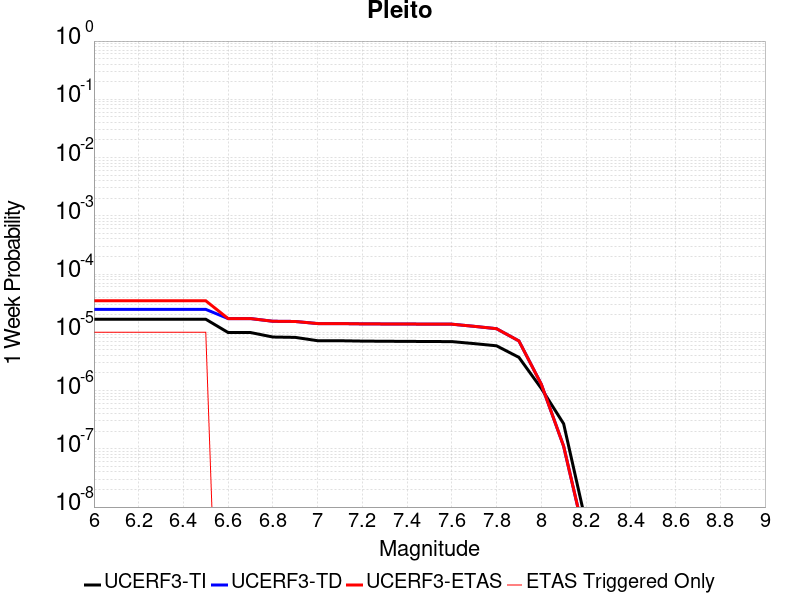 | 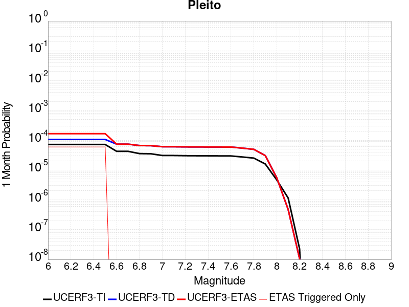 | 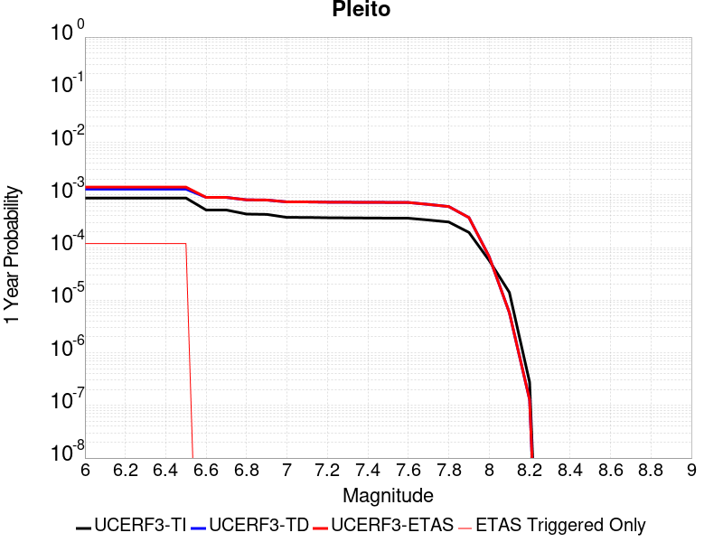 | 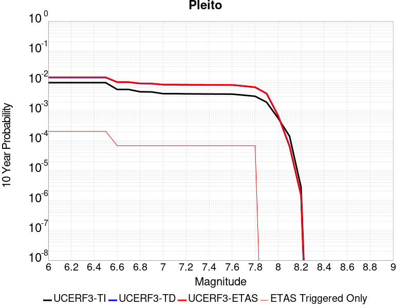 |

| Magnitude | 1 wk TI Prob | 1 wk TD Prob | 1 wk ETAS Prob | 1 wk ETAS/TD Gain | 1 wk ETAS Triggered Only | 1 mo TI Prob | 1 mo TD Prob | 1 mo ETAS Prob | 1 mo ETAS/TD Gain | 1 mo ETAS Triggered Only | 1 yr TI Prob | 1 yr TD Prob | 1 yr ETAS Prob | 1 yr ETAS/TD Gain | 1 yr ETAS Triggered Only | 10 yr TI Prob | 10 yr TD Prob | 10 yr ETAS Prob | 10 yr ETAS/TD Gain | 10 yr ETAS Triggered Only |
|-----|-----|-----|-----|-----|-----|-----|-----|-----|-----|-----|-----|-----|-----|-----|-----|-----|-----|-----|-----|-----|
| 6.0 | 1.6763008E-5 | 2.4763838E-5 | 3.476359E-5 | 1.4038047 | 1.0E-5 | 7.183948E-5 | 1.0612683E-4 | 1.2612471E-4 | 1.1884338 | 2.0E-5 | 8.742947E-4 | 0.0012914003 | 0.0013513229 | 1.0464011 | 6.0E-5 | 0.00870863 | 0.0129538905 | 0.013072336 | 1.0091436 | 1.2E-4 |
| 6.1 | 1.6763008E-5 | 2.4763838E-5 | 3.476359E-5 | 1.4038047 | 1.0E-5 | 7.183948E-5 | 1.0612683E-4 | 1.2612471E-4 | 1.1884338 | 2.0E-5 | 8.742947E-4 | 0.0012914003 | 0.0013513229 | 1.0464011 | 6.0E-5 | 0.00870863 | 0.0129538905 | 0.013072336 | 1.0091436 | 1.2E-4 |
| 6.2 | 1.6763008E-5 | 2.4763838E-5 | 3.476359E-5 | 1.4038047 | 1.0E-5 | 7.183948E-5 | 1.0612683E-4 | 1.2612471E-4 | 1.1884338 | 2.0E-5 | 8.742947E-4 | 0.0012914003 | 0.0013513229 | 1.0464011 | 6.0E-5 | 0.00870863 | 0.0129538905 | 0.013072336 | 1.0091436 | 1.2E-4 |
| 6.3 | 1.6763008E-5 | 2.4763838E-5 | 3.476359E-5 | 1.4038047 | 1.0E-5 | 7.183948E-5 | 1.0612683E-4 | 1.2612471E-4 | 1.1884338 | 2.0E-5 | 8.742947E-4 | 0.0012914003 | 0.0013513229 | 1.0464011 | 6.0E-5 | 0.00870863 | 0.0129538905 | 0.013072336 | 1.0091436 | 1.2E-4 |
| 6.4 | 1.6763008E-5 | 2.4763838E-5 | 3.476359E-5 | 1.4038047 | 1.0E-5 | 7.183948E-5 | 1.0612683E-4 | 1.2612471E-4 | 1.1884338 | 2.0E-5 | 8.742947E-4 | 0.0012914003 | 0.0013513229 | 1.0464011 | 6.0E-5 | 0.00870863 | 0.0129538905 | 0.013072336 | 1.0091436 | 1.2E-4 |
| 6.5 | 1.6763008E-5 | 2.4763838E-5 | 3.476359E-5 | 1.4038047 | 1.0E-5 | 7.183948E-5 | 1.0612683E-4 | 1.2612471E-4 | 1.1884338 | 2.0E-5 | 8.742947E-4 | 0.0012914003 | 0.0013513229 | 1.0464011 | 6.0E-5 | 0.00870863 | 0.0129538905 | 0.013072336 | 1.0091436 | 1.2E-4 |
| 6.6 | 9.910213E-6 | 1.7214623E-5 | 1.7214623E-5 | 1.0 | 0.0 | 4.247165E-5 | 7.377489E-5 | 7.377489E-5 | 1.0 | 0.0 | 5.169696E-4 | 8.978429E-4 | 9.178249E-4 | 1.0222557 | 2.0E-5 | 0.0051576863 | 0.009050702 | 0.009100249 | 1.0054744 | 5.0E-5 |
| 6.7 | 9.910213E-6 | 1.7214623E-5 | 1.7214623E-5 | 1.0 | 0.0 | 4.247165E-5 | 7.377489E-5 | 7.377489E-5 | 1.0 | 0.0 | 5.169696E-4 | 8.978429E-4 | 9.178249E-4 | 1.0222557 | 2.0E-5 | 0.0051576863 | 0.009050702 | 0.009100249 | 1.0054744 | 5.0E-5 |
| 6.8 | 8.300162E-6 | 1.5474232E-5 | 1.5474232E-5 | 1.0 | 0.0 | 3.557164E-5 | 6.631646E-5 | 6.631646E-5 | 1.0 | 0.0 | 4.3299864E-4 | 8.071053E-4 | 8.270891E-4 | 1.0247599 | 2.0E-5 | 0.004321559 | 0.008150139 | 0.008199732 | 1.0060849 | 5.0E-5 |
| 6.9 | 8.183114E-6 | 1.5345448E-5 | 1.5345448E-5 | 1.0 | 0.0 | 3.5070017E-5 | 6.576455E-5 | 6.576455E-5 | 1.0 | 0.0 | 4.2689382E-4 | 8.003907E-4 | 8.203747E-4 | 1.0249678 | 2.0E-5 | 0.0042607468 | 0.008083483 | 0.00813308 | 1.0061355 | 5.0E-5 |
| 7.0 | 7.1748823E-6 | 1.413244E-5 | 1.413244E-5 | 1.0 | 0.0 | 3.0749135E-5 | 6.0566195E-5 | 6.0566195E-5 | 1.0 | 0.0 | 3.743064E-4 | 7.371445E-4 | 7.5712975E-4 | 1.0271118 | 2.0E-5 | 0.0037367654 | 0.007454939 | 0.0075045666 | 1.006657 | 5.0E-5 |
| 7.1 | 7.1671807E-6 | 1.412281E-5 | 1.412281E-5 | 1.0 | 0.0 | 3.0716128E-5 | 6.052493E-5 | 6.052493E-5 | 1.0 | 0.0 | 3.7390468E-4 | 7.366424E-4 | 7.5662765E-4 | 1.0271302 | 2.0E-5 | 0.0037327618 | 0.0074499524 | 0.00749958 | 1.0066614 | 5.0E-5 |
| 7.2 | 7.0649667E-6 | 1.39701015E-5 | 1.39701015E-5 | 1.0 | 0.0 | 3.0278077E-5 | 5.9870494E-5 | 5.9870494E-5 | 1.0 | 0.0 | 3.6857324E-4 | 7.2868E-4 | 7.486654E-4 | 1.0274268 | 2.0E-5 | 0.0036796255 | 0.0073707094 | 0.007420341 | 1.0067337 | 5.0E-5 |
| 7.3 | 7.02082E-6 | 1.3913556E-5 | 1.3913556E-5 | 1.0 | 0.0 | 3.008888E-5 | 5.9628168E-5 | 5.9628168E-5 | 1.0 | 0.0 | 3.6627054E-4 | 7.2573166E-4 | 7.4571715E-4 | 1.0275384 | 2.0E-5 | 0.0036566744 | 0.007341209 | 0.007390842 | 1.0067608 | 5.0E-5 |
| 7.4 | 6.987146E-6 | 1.3873118E-5 | 1.3873118E-5 | 1.0 | 0.0 | 2.9944567E-5 | 5.945487E-5 | 5.945487E-5 | 1.0 | 0.0 | 3.6451413E-4 | 7.2362315E-4 | 7.436087E-4 | 1.0276186 | 2.0E-5 | 0.0036391679 | 0.007320144 | 0.0073598516 | 1.0054244 | 4.0E-5 |
| 7.5 | 6.9494554E-6 | 1.3830024E-5 | 1.3830024E-5 | 1.0 | 0.0 | 2.9783041E-5 | 5.9270187E-5 | 5.9270187E-5 | 1.0 | 0.0 | 3.625482E-4 | 7.2137616E-4 | 7.413617E-4 | 1.0277048 | 2.0E-5 | 0.0036195726 | 0.0072977724 | 0.007337481 | 1.0054411 | 4.0E-5 |
| 7.6 | 6.92694E-6 | 1.3789138E-5 | 1.3789138E-5 | 1.0 | 0.0 | 2.9686547E-5 | 5.909497E-5 | 5.909497E-5 | 1.0 | 0.0 | 3.6137376E-4 | 7.1924424E-4 | 7.392299E-4 | 1.027787 | 2.0E-5 | 0.0036078666 | 0.0072765257 | 0.0073162345 | 1.0054572 | 4.0E-5 |
| 7.7 | 6.395867E-6 | 1.2668219E-5 | 1.2668219E-5 | 1.0 | 0.0 | 2.741057E-5 | 5.429124E-5 | 5.429124E-5 | 1.0 | 0.0 | 3.336726E-4 | 6.6079566E-4 | 6.807825E-4 | 1.0302465 | 2.0E-5 | 0.0033317201 | 0.0066951844 | 0.0067349165 | 1.0059345 | 4.0E-5 |
| 7.8 | 5.8664327E-6 | 1.153586E-5 | 1.153586E-5 | 1.0 | 0.0 | 2.5141611E-5 | 4.9438466E-5 | 4.9438466E-5 | 1.0 | 0.0 | 3.060561E-4 | 6.017473E-4 | 6.2173523E-4 | 1.0332166 | 2.0E-5 | 0.0030563495 | 0.0061006667 | 0.0061404225 | 1.0065167 | 4.0E-5 |
| 7.9 | 3.7167474E-6 | 7.1140853E-6 | 7.1140853E-6 | 1.0 | 0.0 | 1.592882E-5 | 3.0488582E-5 | 3.0488582E-5 | 1.0 | 0.0 | 1.9391612E-4 | 3.7113542E-4 | 3.7113542E-4 | 1.0 | 0.0 | 0.0019374699 | 0.0037674906 | 0.0037674906 | 1.0 | 0.0 |
| 8.0 | 1.0903841E-6 | 1.2879392E-6 | 1.2879392E-6 | 1.0 | 0.0 | 4.6730665E-6 | 5.5197274E-6 | 5.5197274E-6 | 1.0 | 0.0 | 5.68931E-5 | 6.720063E-5 | 6.720063E-5 | 1.0 | 0.0 | 5.6878536E-4 | 6.941948E-4 | 6.941948E-4 | 1.0 | 0.0 |
| 8.1 | 2.6894583E-7 | 1.1060341E-7 | 1.1060341E-7 | 1.0 | 0.0 | 1.1526245E-6 | 4.740145E-7 | 4.740145E-7 | 1.0 | 0.0 | 1.4033113E-5 | 5.7711113E-6 | 5.7711113E-6 | 1.0 | 0.0 | 1.4032227E-4 | 6.456908E-5 | 6.456908E-5 | 1.0 | 0.0 |
| 8.2 | 5.2967013E-9 | 2.4578228E-9 | 2.4578228E-9 | 1.0 | 0.0 | 2.2700148E-8 | 1.0533527E-8 | 1.0533527E-8 | 1.0 | 0.0 | 2.7637427E-7 | 1.2824569E-7 | 1.2824569E-7 | 1.0 | 0.0 | 2.7637393E-6 | 1.4592787E-6 | 1.4592787E-6 | 1.0 | 0.0 |

## Palos Verdes
*[(top)](#table-of-contents)*

| 1 Week | 1 Month | 1 Year | 10 Year |
|-----|-----|-----|-----|
| 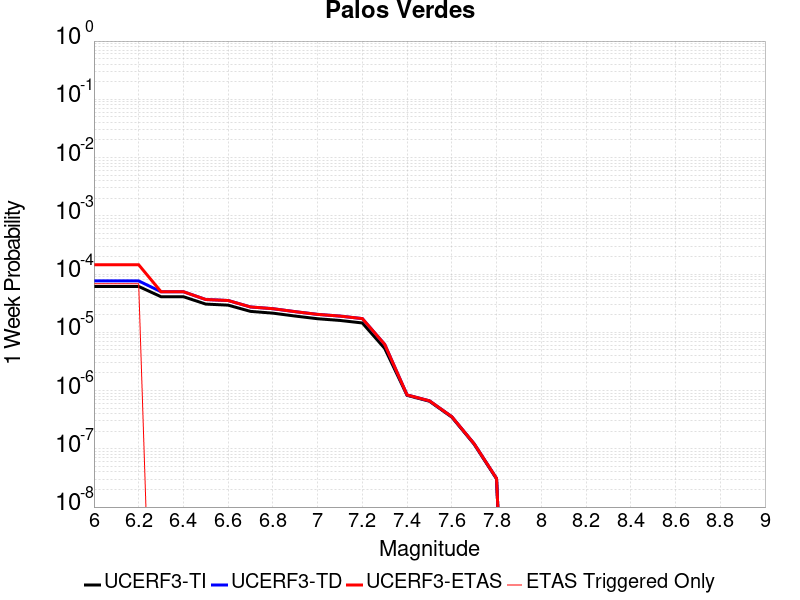 | 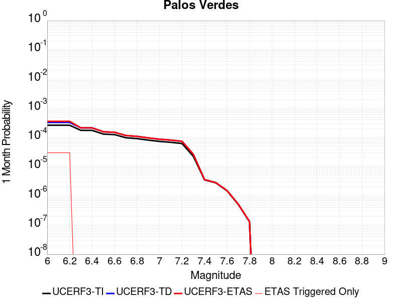 | 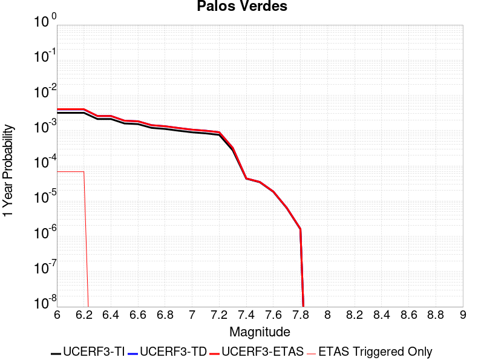 | 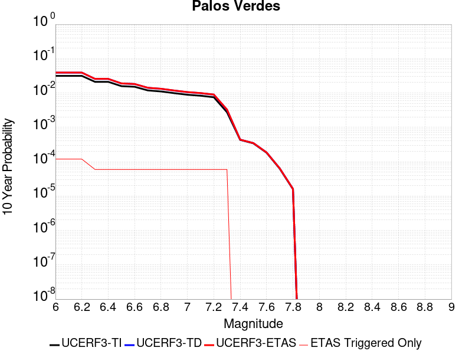 |

| Magnitude | 1 wk TI Prob | 1 wk TD Prob | 1 wk ETAS Prob | 1 wk ETAS/TD Gain | 1 wk ETAS Triggered Only | 1 mo TI Prob | 1 mo TD Prob | 1 mo ETAS Prob | 1 mo ETAS/TD Gain | 1 mo ETAS Triggered Only | 1 yr TI Prob | 1 yr TD Prob | 1 yr ETAS Prob | 1 yr ETAS/TD Gain | 1 yr ETAS Triggered Only | 10 yr TI Prob | 10 yr TD Prob | 10 yr ETAS Prob | 10 yr ETAS/TD Gain | 10 yr ETAS Triggered Only |
|-----|-----|-----|-----|-----|-----|-----|-----|-----|-----|-----|-----|-----|-----|-----|-----|-----|-----|-----|-----|-----|
| 6.0 | 6.126063E-5 | 7.622612E-5 | 9.62246E-5 | 1.2623572 | 2.0E-5 | 2.6251914E-4 | 3.2664582E-4 | 3.56636E-4 | 1.0918126 | 3.0E-5 | 0.0031914865 | 0.003970174 | 0.0040199757 | 1.0125439 | 5.0E-5 | 0.031460393 | 0.039048895 | 0.03917382 | 1.0031991 | 1.3E-4 |
| 6.1 | 6.126063E-5 | 7.622612E-5 | 9.62246E-5 | 1.2623572 | 2.0E-5 | 2.6251914E-4 | 3.2664582E-4 | 3.56636E-4 | 1.0918126 | 3.0E-5 | 0.0031914865 | 0.003970174 | 0.0040199757 | 1.0125439 | 5.0E-5 | 0.031460393 | 0.039048895 | 0.03917382 | 1.0031991 | 1.3E-4 |
| 6.2 | 6.126063E-5 | 7.622612E-5 | 9.62246E-5 | 1.2623572 | 2.0E-5 | 2.6251914E-4 | 3.2664582E-4 | 3.56636E-4 | 1.0918126 | 3.0E-5 | 0.0031914865 | 0.003970174 | 0.0040199757 | 1.0125439 | 5.0E-5 | 0.031460393 | 0.039048895 | 0.03917382 | 1.0031991 | 1.3E-4 |
| 6.3 | 4.0838047E-5 | 4.9749437E-5 | 4.9749437E-5 | 1.0 | 0.0 | 1.7500846E-4 | 2.1319572E-4 | 2.1319572E-4 | 1.0 | 0.0 | 0.0021286458 | 0.0025927818 | 0.00261273 | 1.0076938 | 2.0E-5 | 0.021083709 | 0.025646681 | 0.025734372 | 1.0034193 | 9.0E-5 |
| 6.4 | 4.0838047E-5 | 4.9749437E-5 | 4.9749437E-5 | 1.0 | 0.0 | 1.7500846E-4 | 2.1319572E-4 | 2.1319572E-4 | 1.0 | 0.0 | 0.0021286458 | 0.0025927818 | 0.00261273 | 1.0076938 | 2.0E-5 | 0.021083709 | 0.025646681 | 0.025734372 | 1.0034193 | 9.0E-5 |
| 6.5 | 3.0512005E-5 | 3.656162E-5 | 3.656162E-5 | 1.0 | 0.0 | 1.3075917E-4 | 1.5668393E-4 | 1.5668393E-4 | 1.0 | 0.0 | 0.0015908304 | 0.0019060767 | 0.0019260385 | 1.0104728 | 2.0E-5 | 0.015794903 | 0.018909154 | 0.018997451 | 1.0046695 | 9.0E-5 |
| 6.6 | 2.9255087E-5 | 3.515442E-5 | 3.515442E-5 | 1.0 | 0.0 | 1.2537291E-4 | 1.5065377E-4 | 1.5065377E-4 | 1.0 | 0.0 | 0.0015253464 | 0.0018327828 | 0.0018527461 | 1.0108924 | 2.0E-5 | 0.015149189 | 0.018188225 | 0.018276589 | 1.0048583 | 9.0E-5 |
| 6.7 | 2.287198E-5 | 2.7248278E-5 | 2.7248278E-5 | 1.0 | 0.0 | 9.801909E-5 | 1.16773626E-4 | 1.16773626E-4 | 1.0 | 0.0 | 0.001192729 | 0.0014208833 | 0.0014308691 | 1.0070279 | 1.0E-5 | 0.011863477 | 0.014127217 | 0.014206087 | 1.0055828 | 8.0E-5 |
| 6.8 | 2.1325764E-5 | 2.5431877E-5 | 2.5431877E-5 | 1.0 | 0.0 | 9.139293E-5 | 1.0898971E-4 | 1.0898971E-4 | 1.0 | 0.0 | 0.001112141 | 0.0013262323 | 0.001336219 | 1.0075302 | 1.0E-5 | 0.011065915 | 0.013192211 | 0.013271156 | 1.0059842 | 8.0E-5 |
| 6.9 | 1.9009392E-5 | 2.2613547E-5 | 2.2613547E-5 | 1.0 | 0.0 | 8.1466285E-5 | 9.6912096E-5 | 9.6912096E-5 | 1.0 | 0.0 | 9.914007E-4 | 0.0011793535 | 0.0011893417 | 1.0084692 | 1.0E-5 | 0.009869894 | 0.011739632 | 0.011818693 | 1.0067345 | 8.0E-5 |
| 7.0 | 1.7098473E-5 | 2.0319356E-5 | 2.0319356E-5 | 1.0 | 0.0 | 7.3277115E-5 | 8.708052E-5 | 8.708052E-5 | 1.0 | 0.0 | 8.917837E-4 | 0.001059775 | 0.0010697644 | 1.009426 | 1.0E-5 | 0.008882134 | 0.010555646 | 0.010624908 | 1.0065615 | 7.0E-5 |
| 7.1 | 1.5982785E-5 | 1.899476E-5 | 1.899476E-5 | 1.0 | 0.0 | 6.849585E-5 | 8.1404054E-5 | 8.1404054E-5 | 1.0 | 0.0 | 8.336179E-4 | 9.907284E-4 | 0.0010007184 | 1.0100836 | 1.0E-5 | 0.008304977 | 0.009871479 | 0.009930887 | 1.0060182 | 6.0E-5 |
| 7.2 | 1.4468002E-5 | 1.7197237E-5 | 1.7197237E-5 | 1.0 | 0.0 | 6.200425E-5 | 7.370083E-5 | 7.370083E-5 | 1.0 | 0.0 | 7.546402E-4 | 8.970222E-4 | 9.0701325E-4 | 1.011138 | 1.0E-5 | 0.007520827 | 0.008942284 | 0.009001747 | 1.0066497 | 6.0E-5 |
| 7.3 | 5.288233E-6 | 6.2036747E-6 | 6.2036747E-6 | 1.0 | 0.0 | 2.2663658E-5 | 2.6587102E-5 | 2.6587102E-5 | 1.0 | 0.0 | 2.7589512E-4 | 3.236848E-4 | 3.3368156E-4 | 1.0308843 | 1.0E-5 | 0.0027555283 | 0.0032355562 | 0.003265459 | 1.0092419 | 3.0E-5 |
| 7.4 | 8.279556E-7 | 8.408347E-7 | 8.408347E-7 | 1.0 | 0.0 | 3.5483763E-6 | 3.6035726E-6 | 3.6035726E-6 | 1.0 | 0.0 | 4.3200624E-5 | 4.3872686E-5 | 4.3872686E-5 | 1.0 | 0.0 | 4.3192226E-4 | 4.3864746E-4 | 4.3864746E-4 | 1.0 | 0.0 |
| 7.5 | 6.559831E-7 | 6.667229E-7 | 6.667229E-7 | 1.0 | 0.0 | 2.8113532E-6 | 2.857381E-6 | 2.857381E-6 | 1.0 | 0.0 | 3.4227687E-5 | 3.4788125E-5 | 3.4788125E-5 | 1.0 | 0.0 | 3.4222414E-4 | 3.4783344E-4 | 3.4783344E-4 | 1.0 | 0.0 |
| 7.6 | 3.5018968E-7 | 3.5620027E-7 | 3.5620027E-7 | 1.0 | 0.0 | 1.500812E-6 | 1.526572E-6 | 1.526572E-6 | 1.0 | 0.0 | 1.8272232E-5 | 1.8585903E-5 | 1.8585903E-5 | 1.0 | 0.0 | 1.8270731E-4 | 1.8584808E-4 | 1.8584808E-4 | 1.0 | 0.0 |
| 7.7 | 1.1986104E-7 | 1.2198376E-7 | 1.2198376E-7 | 1.0 | 0.0 | 5.1369005E-7 | 5.2278745E-7 | 5.2278745E-7 | 1.0 | 0.0 | 6.2541585E-6 | 6.364919E-6 | 6.364919E-6 | 1.0 | 0.0 | 6.2539824E-5 | 6.364741E-5 | 6.364741E-5 | 1.0 | 0.0 |
| 7.8 | 3.0445005E-8 | 3.1027582E-8 | 3.1027582E-8 | 1.0 | 0.0 | 1.3047858E-7 | 1.3297536E-7 | 1.3297536E-7 | 1.0 | 0.0 | 1.5885756E-6 | 1.6189739E-6 | 1.6189739E-6 | 1.0 | 0.0 | 1.5885644E-5 | 1.6189642E-5 | 1.6189642E-5 | 1.0 | 0.0 |

## Big Pine (Central)
*[(top)](#table-of-contents)*

| 1 Week | 1 Month | 1 Year | 10 Year |
|-----|-----|-----|-----|
| 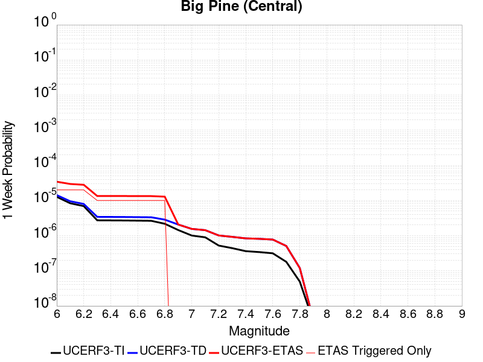 | 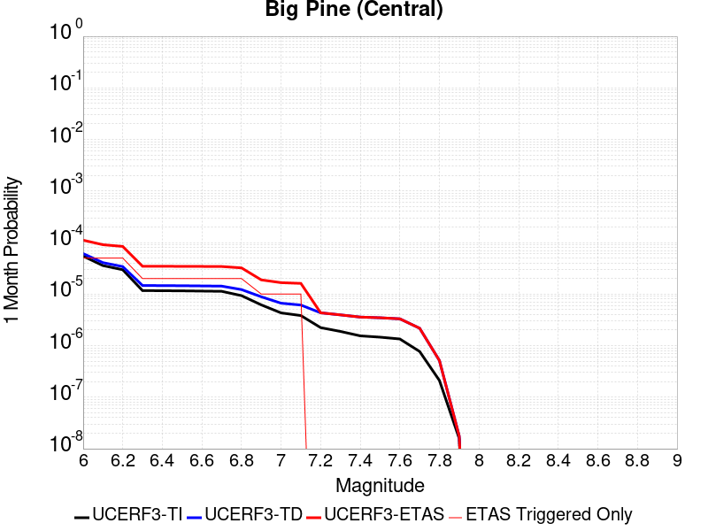 | 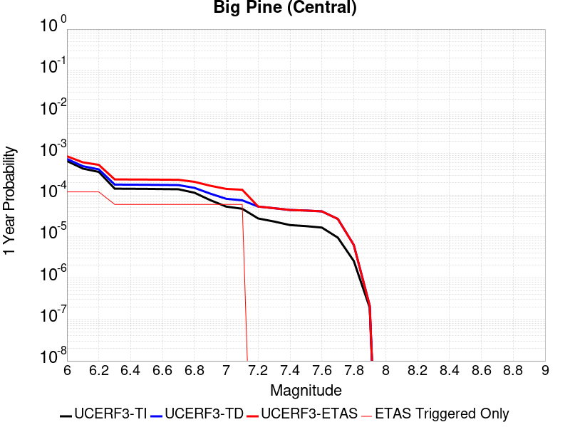 | 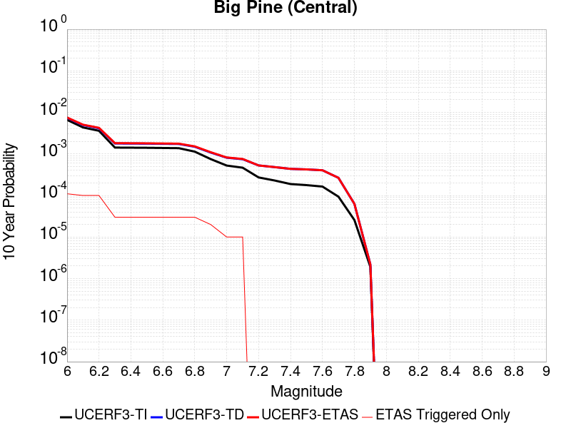 |

| Magnitude | 1 wk TI Prob | 1 wk TD Prob | 1 wk ETAS Prob | 1 wk ETAS/TD Gain | 1 wk ETAS Triggered Only | 1 mo TI Prob | 1 mo TD Prob | 1 mo ETAS Prob | 1 mo ETAS/TD Gain | 1 mo ETAS Triggered Only | 1 yr TI Prob | 1 yr TD Prob | 1 yr ETAS Prob | 1 yr ETAS/TD Gain | 1 yr ETAS Triggered Only | 10 yr TI Prob | 10 yr TD Prob | 10 yr ETAS Prob | 10 yr ETAS/TD Gain | 10 yr ETAS Triggered Only |
|-----|-----|-----|-----|-----|-----|-----|-----|-----|-----|-----|-----|-----|-----|-----|-----|-----|-----|-----|-----|-----|
| 6.0 | 1.2706755E-5 | 1.4250529E-5 | 3.4250243E-5 | 2.4034367 | 2.0E-5 | 5.4456385E-5 | 6.107247E-5 | 1.11069414E-4 | 1.8186495 | 5.0E-5 | 6.628048E-4 | 7.433402E-4 | 8.232807E-4 | 1.1075423 | 8.0E-5 | 0.006608314 | 0.0074135666 | 0.007522751 | 1.0147277 | 1.1E-4 |
| 6.1 | 8.342579E-6 | 9.510762E-6 | 2.9510571E-5 | 3.102861 | 2.0E-5 | 3.5753423E-5 | 4.0759893E-5 | 9.075786E-5 | 2.2266462 | 5.0E-5 | 4.3521097E-4 | 4.961604E-4 | 5.661257E-4 | 1.1410134 | 7.0E-5 | 0.0043435963 | 0.0049540824 | 0.005053587 | 1.0200853 | 1.0E-4 |
| 6.2 | 6.923899E-6 | 7.967147E-6 | 2.7966988E-5 | 3.5102887 | 2.0E-5 | 2.9673516E-5 | 3.4144578E-5 | 8.414287E-5 | 2.4643114 | 5.0E-5 | 3.6121515E-4 | 4.156502E-4 | 4.856211E-4 | 1.1683408 | 7.0E-5 | 0.003606286 | 0.0041520367 | 0.0042516217 | 1.0239846 | 1.0E-4 |
| 6.3 | 2.728396E-6 | 3.4242908E-6 | 1.3424256E-5 | 3.9203029 | 1.0E-5 | 1.1693074E-5 | 1.4675454E-5 | 3.4675162E-5 | 2.3628 | 2.0E-5 | 1.4235388E-4 | 1.7865987E-4 | 2.0865451E-4 | 1.1678869 | 3.0E-5 | 0.0014226272 | 0.0017866704 | 0.0018166169 | 1.0167611 | 3.0E-5 |
| 6.4 | 2.7136944E-6 | 3.408584E-6 | 1.340855E-5 | 3.9337595 | 1.0E-5 | 1.1630066E-5 | 1.4608141E-5 | 3.460785E-5 | 2.3690796 | 2.0E-5 | 1.4158686E-4 | 1.7784047E-4 | 2.0783514E-4 | 1.1686605 | 3.0E-5 | 0.0014149669 | 0.0017784894 | 0.0018084361 | 1.0168382 | 3.0E-5 |
| 6.5 | 2.6971882E-6 | 3.3909291E-6 | 1.3390895E-5 | 3.9490342 | 1.0E-5 | 1.1559327E-5 | 1.45324775E-5 | 3.4532186E-5 | 2.3762078 | 2.0E-5 | 1.4072572E-4 | 1.7691942E-4 | 2.0691412E-4 | 1.1695387 | 3.0E-5 | 0.0014063664 | 0.0017692937 | 0.0017992406 | 1.0169259 | 3.0E-5 |
| 6.6 | 2.669092E-6 | 3.3609497E-6 | 1.33609165E-5 | 3.9753394 | 1.0E-5 | 1.1438916E-5 | 1.4403995E-5 | 3.4403707E-5 | 2.3884835 | 2.0E-5 | 1.3925991E-4 | 1.753554E-4 | 2.0535014E-4 | 1.1710511 | 3.0E-5 | 0.0013917267 | 0.0017536782 | 0.0017836256 | 1.0170768 | 3.0E-5 |
| 6.7 | 2.6408059E-6 | 3.3309752E-6 | 1.3330942E-5 | 4.002114 | 1.0E-5 | 1.1317691E-5 | 1.4275535E-5 | 3.427525E-5 | 2.4009783 | 2.0E-5 | 1.3778417E-4 | 1.7379165E-4 | 2.0378643E-4 | 1.1725905 | 3.0E-5 | 0.0013769877 | 0.0017380653 | 0.0017680131 | 1.0172306 | 3.0E-5 |
| 6.8 | 2.1786943E-6 | 2.8544325E-6 | 1.2854404E-5 | 4.503313 | 1.0E-5 | 9.337228E-6 | 1.2233229E-5 | 3.2232983E-5 | 2.6348712 | 2.0E-5 | 1.1367482E-4 | 1.4893012E-4 | 1.7892565E-4 | 1.2014067 | 3.0E-5 | 0.0011361669 | 0.0014897975 | 0.0015197528 | 1.0201069 | 3.0E-5 |
| 6.9 | 1.4411696E-6 | 2.068499E-6 | 2.068499E-6 | 1.0 | 0.0 | 6.1764263E-6 | 8.864968E-6 | 1.886488E-5 | 2.1280258 | 1.0E-5 | 7.51954E-5 | 1.079259E-4 | 1.2792375E-4 | 1.1852924 | 2.0E-5 | 7.5169955E-4 | 0.0010801847 | 0.0011001631 | 1.0184953 | 2.0E-5 |
| 7.0 | 1.0073411E-6 | 1.554261E-6 | 1.554261E-6 | 1.0 | 0.0 | 4.317169E-6 | 6.6611024E-6 | 1.6661035E-5 | 2.501243 | 1.0E-5 | 5.2560266E-5 | 8.1096056E-5 | 9.1095244E-5 | 1.1233006 | 1.0E-5 | 5.2547833E-4 | 8.1210316E-4 | 8.22095E-4 | 1.0123037 | 1.0E-5 |
| 7.1 | 8.947104E-7 | 1.4302494E-6 | 1.4302494E-6 | 1.0 | 0.0 | 3.834468E-6 | 6.129627E-6 | 1.6129565E-5 | 2.6314108 | 1.0E-5 | 4.6683643E-5 | 7.46258E-5 | 8.4625055E-5 | 1.133992 | 1.0E-5 | 4.6673836E-4 | 7.474457E-4 | 7.5743825E-4 | 1.0133688 | 1.0E-5 |
| 7.2 | 5.215166E-7 | 1.0111678E-6 | 1.0111678E-6 | 1.0 | 0.0 | 2.2350691E-6 | 4.3335694E-6 | 4.3335694E-6 | 1.0 | 0.0 | 2.7211627E-5 | 5.2759973E-5 | 5.2759973E-5 | 1.0 | 0.0 | 2.7208295E-4 | 5.2890263E-4 | 5.2890263E-4 | 1.0 | 0.0 |
| 7.3 | 4.4024807E-7 | 9.219589E-7 | 9.219589E-7 | 1.0 | 0.0 | 1.8867761E-6 | 3.9512465E-6 | 3.9512465E-6 | 1.0 | 0.0 | 2.2971257E-5 | 4.810541E-5 | 4.810541E-5 | 1.0 | 0.0 | 2.2968883E-4 | 4.8237795E-4 | 4.8237795E-4 | 1.0 | 0.0 |
| 7.4 | 3.6130905E-7 | 8.358523E-7 | 8.358523E-7 | 1.0 | 0.0 | 1.5484665E-6 | 3.5822195E-6 | 3.5822195E-6 | 1.0 | 0.0 | 1.8852415E-5 | 4.3612687E-5 | 4.3612687E-5 | 1.0 | 0.0 | 1.8850817E-4 | 4.374597E-4 | 4.374597E-4 | 1.0 | 0.0 |
| 7.5 | 3.408184E-7 | 8.108147E-7 | 8.108147E-7 | 1.0 | 0.0 | 1.4606494E-6 | 3.4749157E-6 | 3.4749157E-6 | 1.0 | 0.0 | 1.7783263E-5 | 4.2306317E-5 | 4.2306317E-5 | 1.0 | 0.0 | 1.778184E-4 | 4.2437963E-4 | 4.2437963E-4 | 1.0 | 0.0 |
| 7.6 | 3.1428627E-7 | 7.7316E-7 | 7.7316E-7 | 1.0 | 0.0 | 1.3469405E-6 | 3.3135389E-6 | 3.3135389E-6 | 1.0 | 0.0 | 1.6398877E-5 | 4.0341627E-5 | 4.0341627E-5 | 1.0 | 0.0 | 1.6397667E-4 | 4.0471106E-4 | 4.0471106E-4 | 1.0 | 0.0 |
| 7.7 | 1.7972785E-7 | 5.077752E-7 | 5.077752E-7 | 1.0 | 0.0 | 7.70262E-7 | 2.1761778E-6 | 2.1761778E-6 | 1.0 | 0.0 | 9.377899E-6 | 2.6494654E-5 | 2.6494654E-5 | 1.0 | 0.0 | 9.377503E-5 | 2.662899E-4 | 2.662899E-4 | 1.0 | 0.0 |
| 7.8 | 4.9230927E-8 | 1.198079E-7 | 1.198079E-7 | 1.0 | 0.0 | 2.1098968E-7 | 5.134623E-7 | 5.134623E-7 | 1.0 | 0.0 | 2.5687964E-6 | 6.2513873E-6 | 6.2513873E-6 | 1.0 | 0.0 | 2.5687666E-5 | 6.295415E-5 | 6.295415E-5 | 1.0 | 0.0 |
| 7.9 | 3.6805972E-9 | 4.105293E-9 | 4.105293E-9 | 1.0 | 0.0 | 1.5773987E-8 | 1.7594115E-8 | 1.7594115E-8 | 1.0 | 0.0 | 1.9204828E-7 | 2.1420831E-7 | 2.1420831E-7 | 1.0 | 0.0 | 1.920481E-6 | 2.1900614E-6 | 2.1900614E-6 | 1.0 | 0.0 |

## Bullion Mountains
*[(top)](#table-of-contents)*

| 1 Week | 1 Month | 1 Year | 10 Year |
|-----|-----|-----|-----|
| 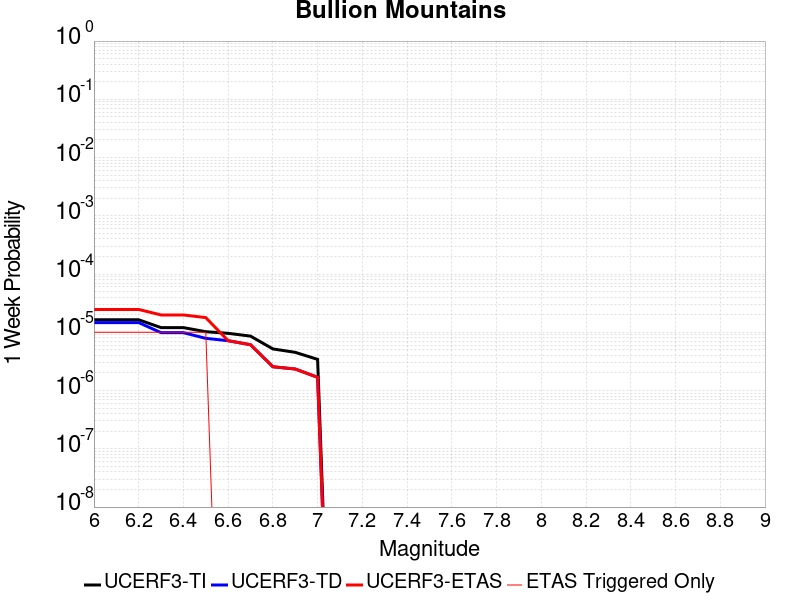 | 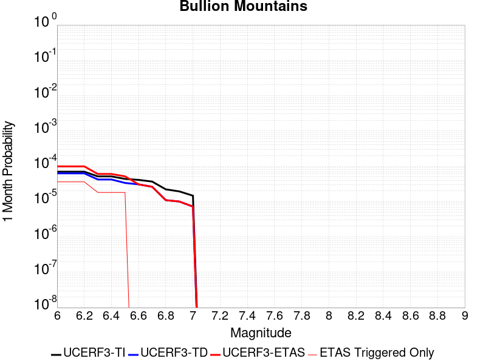 | 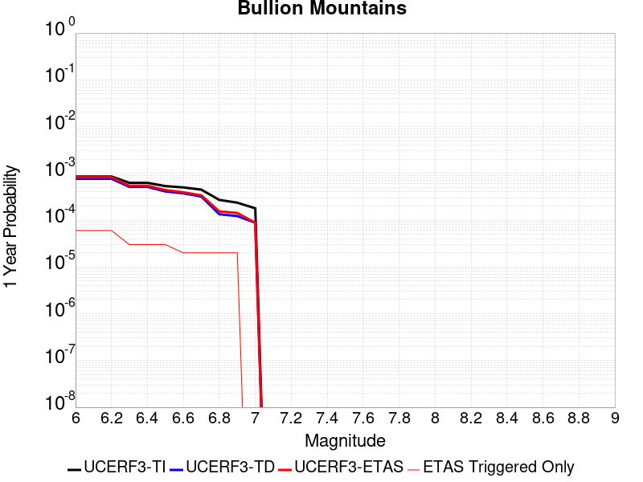 | 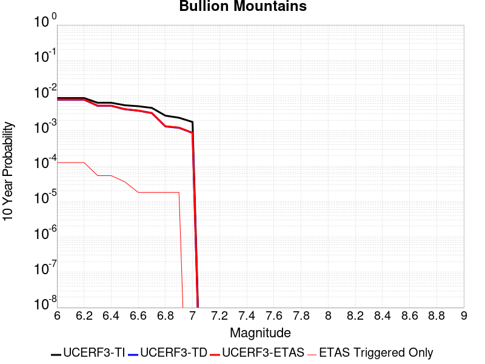 |

| Magnitude | 1 wk TI Prob | 1 wk TD Prob | 1 wk ETAS Prob | 1 wk ETAS/TD Gain | 1 wk ETAS Triggered Only | 1 mo TI Prob | 1 mo TD Prob | 1 mo ETAS Prob | 1 mo ETAS/TD Gain | 1 mo ETAS Triggered Only | 1 yr TI Prob | 1 yr TD Prob | 1 yr ETAS Prob | 1 yr ETAS/TD Gain | 1 yr ETAS Triggered Only | 10 yr TI Prob | 10 yr TD Prob | 10 yr ETAS Prob | 10 yr ETAS/TD Gain | 10 yr ETAS Triggered Only |
|-----|-----|-----|-----|-----|-----|-----|-----|-----|-----|-----|-----|-----|-----|-----|-----|-----|-----|-----|-----|-----|
| 6.0 | 1.6420427E-5 | 1.4692089E-5 | 2.4691943E-5 | 1.6806284 | 1.0E-5 | 7.037136E-5 | 6.296479E-5 | 9.29629E-5 | 1.4764267 | 3.0E-5 | 8.5643446E-4 | 7.663651E-4 | 8.263191E-4 | 1.0782317 | 6.0E-5 | 0.008531413 | 0.007641016 | 0.007770023 | 1.0168835 | 1.3E-4 |
| 6.1 | 1.6420427E-5 | 1.4692089E-5 | 2.4691943E-5 | 1.6806284 | 1.0E-5 | 7.037136E-5 | 6.296479E-5 | 9.29629E-5 | 1.4764267 | 3.0E-5 | 8.5643446E-4 | 7.663651E-4 | 8.263191E-4 | 1.0782317 | 6.0E-5 | 0.008531413 | 0.007641016 | 0.007770023 | 1.0168835 | 1.3E-4 |
| 6.2 | 1.6420427E-5 | 1.4692089E-5 | 2.4691943E-5 | 1.6806284 | 1.0E-5 | 7.037136E-5 | 6.296479E-5 | 9.29629E-5 | 1.4764267 | 3.0E-5 | 8.5643446E-4 | 7.663651E-4 | 8.263191E-4 | 1.0782317 | 6.0E-5 | 0.008531413 | 0.007641016 | 0.007770023 | 1.0168835 | 1.3E-4 |
| 6.3 | 1.2046778E-5 | 9.862335E-6 | 1.9862237E-5 | 2.0139487 | 1.0E-5 | 5.1628023E-5 | 4.2266598E-5 | 6.226575E-5 | 1.473167 | 2.0E-5 | 6.283899E-4 | 5.144975E-4 | 5.44482E-4 | 1.0582793 | 3.0E-5 | 0.0062661595 | 0.005135345 | 0.0051751393 | 1.0077492 | 4.0E-5 |
| 6.4 | 1.2046778E-5 | 9.862335E-6 | 1.9862237E-5 | 2.0139487 | 1.0E-5 | 5.1628023E-5 | 4.2266598E-5 | 6.226575E-5 | 1.473167 | 2.0E-5 | 6.283899E-4 | 5.144975E-4 | 5.44482E-4 | 1.0582793 | 3.0E-5 | 0.0062661595 | 0.005135345 | 0.0051751393 | 1.0077492 | 4.0E-5 |
| 6.5 | 1.0244343E-5 | 7.879458E-6 | 1.787938E-5 | 2.2691128 | 1.0E-5 | 4.390359E-5 | 3.3768785E-5 | 5.376811E-5 | 1.592243 | 2.0E-5 | 5.343951E-4 | 4.110781E-4 | 4.4106576E-4 | 1.0729488 | 3.0E-5 | 0.005331118 | 0.004105208 | 0.004135085 | 1.0072778 | 3.0E-5 |
| 6.6 | 9.605408E-6 | 7.1774966E-6 | 7.1774966E-6 | 1.0 | 0.0 | 4.1165385E-5 | 3.076045E-5 | 4.0760144E-5 | 1.3250828 | 1.0E-5 | 5.010733E-4 | 3.744645E-4 | 3.94457E-4 | 1.0533895 | 2.0E-5 | 0.00499945 | 0.003740332 | 0.0037602573 | 1.0053271 | 2.0E-5 |
| 6.7 | 8.60418E-6 | 6.1240044E-6 | 6.1240044E-6 | 1.0 | 0.0 | 3.687454E-5 | 2.624558E-5 | 3.6245317E-5 | 1.3810066 | 1.0E-5 | 4.48855E-4 | 3.1951256E-4 | 3.3950616E-4 | 1.0625753 | 2.0E-5 | 0.004479495 | 0.0031924439 | 0.00321238 | 1.0062448 | 2.0E-5 |
| 6.8 | 5.187994E-6 | 2.5631666E-6 | 2.5631666E-6 | 1.0 | 0.0 | 2.223407E-5 | 1.0984976E-5 | 2.0984866E-5 | 1.9103242 | 1.0E-5 | 2.7066618E-4 | 1.3373788E-4 | 1.537352E-4 | 1.1495262 | 2.0E-5 | 0.0027033675 | 0.0013369655 | 0.0013569387 | 1.0149393 | 2.0E-5 |
| 6.9 | 4.5302368E-6 | 2.3443165E-6 | 2.3443165E-6 | 1.0 | 0.0 | 1.9415156E-5 | 1.0047055E-5 | 2.0046955E-5 | 1.9953066 | 1.0E-5 | 2.3635388E-4 | 1.2232E-4 | 1.4231754E-4 | 1.1634855 | 2.0E-5 | 0.0023610266 | 0.0012229157 | 0.0012428913 | 1.0163344 | 2.0E-5 |
| 7.0 | 3.431668E-6 | 1.6882402E-6 | 1.6882402E-6 | 1.0 | 0.0 | 1.4707065E-5 | 7.235315E-6 | 7.235315E-6 | 1.0 | 0.0 | 1.7904381E-4 | 8.808996E-5 | 8.808996E-5 | 1.0 | 0.0 | 0.0017889962 | 8.808996E-4 | 8.808996E-4 | 1.0 | 0.0 |

## Ventura-Pitas Point
*[(top)](#table-of-contents)*

| 1 Week | 1 Month | 1 Year | 10 Year |
|-----|-----|-----|-----|
| 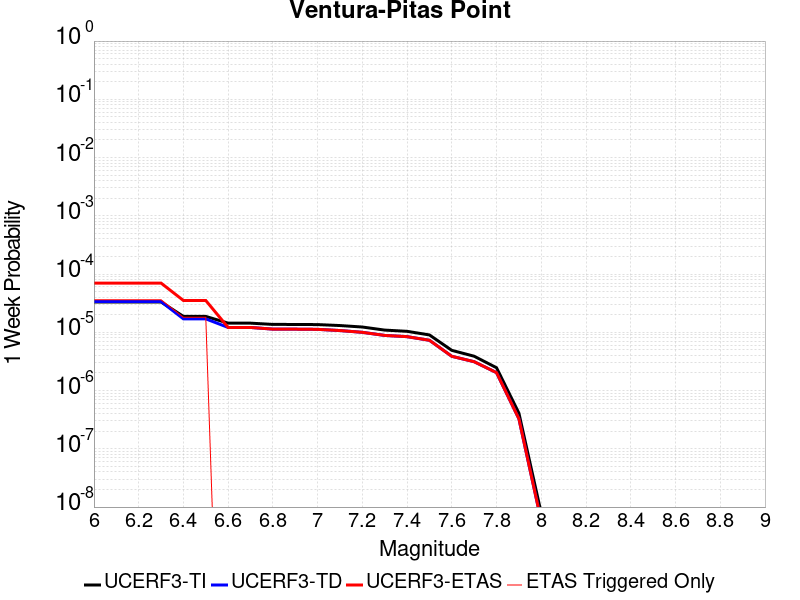 | 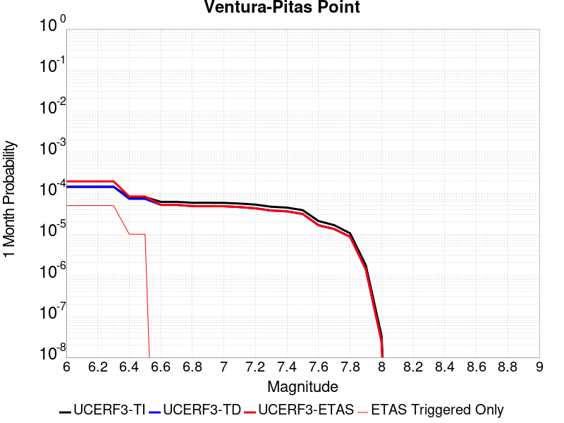 |  | 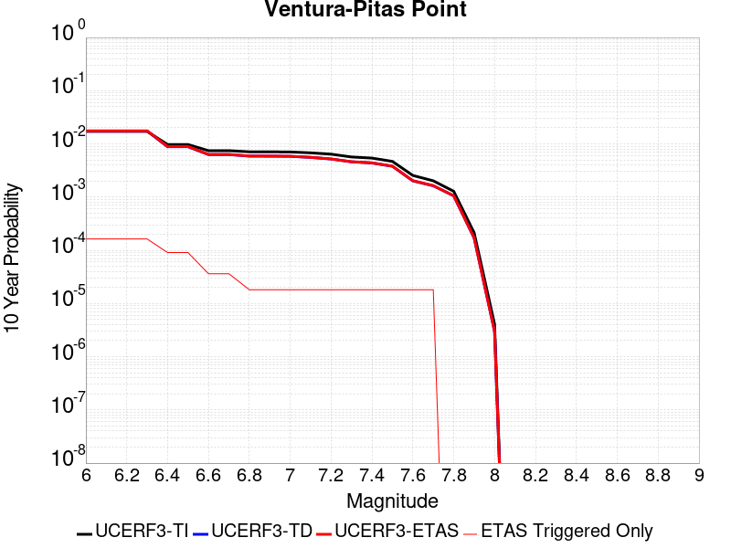 |

| Magnitude | 1 wk TI Prob | 1 wk TD Prob | 1 wk ETAS Prob | 1 wk ETAS/TD Gain | 1 wk ETAS Triggered Only | 1 mo TI Prob | 1 mo TD Prob | 1 mo ETAS Prob | 1 mo ETAS/TD Gain | 1 mo ETAS Triggered Only | 1 yr TI Prob | 1 yr TD Prob | 1 yr ETAS Prob | 1 yr ETAS/TD Gain | 1 yr ETAS Triggered Only | 10 yr TI Prob | 10 yr TD Prob | 10 yr ETAS Prob | 10 yr ETAS/TD Gain | 10 yr ETAS Triggered Only |
|-----|-----|-----|-----|-----|-----|-----|-----|-----|-----|-----|-----|-----|-----|-----|-----|-----|-----|-----|-----|-----|
| 6.0 | 3.3179622E-5 | 3.3735185E-5 | 6.373417E-5 | 1.8892493 | 3.0E-5 | 1.4219063E-4 | 1.445728E-4 | 1.9456557E-4 | 1.3457966 | 5.0E-5 | 0.0017297962 | 0.0017590096 | 0.0018089217 | 1.028375 | 5.0E-5 | 0.017163932 | 0.0174764 | 0.017594304 | 1.0067464 | 1.2E-4 |
| 6.1 | 3.3179622E-5 | 3.3735185E-5 | 6.373417E-5 | 1.8892493 | 3.0E-5 | 1.4219063E-4 | 1.445728E-4 | 1.9456557E-4 | 1.3457966 | 5.0E-5 | 0.0017297962 | 0.0017590096 | 0.0018089217 | 1.028375 | 5.0E-5 | 0.017163932 | 0.0174764 | 0.017594304 | 1.0067464 | 1.2E-4 |
| 6.2 | 3.3179622E-5 | 3.3735185E-5 | 6.373417E-5 | 1.8892493 | 3.0E-5 | 1.4219063E-4 | 1.445728E-4 | 1.9456557E-4 | 1.3457966 | 5.0E-5 | 0.0017297962 | 0.0017590096 | 0.0018089217 | 1.028375 | 5.0E-5 | 0.017163932 | 0.0174764 | 0.017594304 | 1.0067464 | 1.2E-4 |
| 6.3 | 3.3179622E-5 | 3.3735185E-5 | 6.373417E-5 | 1.8892493 | 3.0E-5 | 1.4219063E-4 | 1.445728E-4 | 1.9456557E-4 | 1.3457966 | 5.0E-5 | 0.0017297962 | 0.0017590096 | 0.0018089217 | 1.028375 | 5.0E-5 | 0.017163932 | 0.0174764 | 0.017594304 | 1.0067464 | 1.2E-4 |
| 6.4 | 1.8754668E-5 | 1.701961E-5 | 2.701944E-5 | 1.5875475 | 1.0E-5 | 8.037467E-5 | 7.293928E-5 | 8.293855E-5 | 1.1370903 | 1.0E-5 | 9.781223E-4 | 8.8769704E-4 | 8.9768815E-4 | 1.0112551 | 1.0E-5 | 0.009738282 | 0.008843848 | 0.008893406 | 1.0056037 | 5.0E-5 |
| 6.5 | 1.8754668E-5 | 1.701961E-5 | 2.701944E-5 | 1.5875475 | 1.0E-5 | 8.037467E-5 | 7.293928E-5 | 8.293855E-5 | 1.1370903 | 1.0E-5 | 9.781223E-4 | 8.8769704E-4 | 8.9768815E-4 | 1.0112551 | 1.0E-5 | 0.009738282 | 0.008843848 | 0.008893406 | 1.0056037 | 5.0E-5 |
| 6.6 | 1.4361558E-5 | 1.2122275E-5 | 1.2122275E-5 | 1.0 | 0.0 | 6.154808E-5 | 5.1951585E-5 | 5.1951585E-5 | 1.0 | 0.0 | 7.490902E-4 | 6.3232926E-4 | 6.3232926E-4 | 1.0 | 0.0 | 0.0074657016 | 0.0063055577 | 0.0063254316 | 1.0031518 | 2.0E-5 |
| 6.7 | 1.4361558E-5 | 1.2122275E-5 | 1.2122275E-5 | 1.0 | 0.0 | 6.154808E-5 | 5.1951585E-5 | 5.1951585E-5 | 1.0 | 0.0 | 7.490902E-4 | 6.3232926E-4 | 6.3232926E-4 | 1.0 | 0.0 | 0.0074657016 | 0.0063055577 | 0.0063254316 | 1.0031518 | 2.0E-5 |
| 6.8 | 1.3663846E-5 | 1.13444175E-5 | 1.13444175E-5 | 1.0 | 0.0 | 5.8558027E-5 | 4.861804E-5 | 4.861804E-5 | 1.0 | 0.0 | 7.127108E-4 | 5.917658E-4 | 5.917658E-4 | 1.0 | 0.0 | 0.007104293 | 0.005902116 | 0.005912057 | 1.0016843 | 1.0E-5 |
| 6.9 | 1.3644157E-5 | 1.1322519E-5 | 1.1322519E-5 | 1.0 | 0.0 | 5.8473648E-5 | 4.8524187E-5 | 4.8524187E-5 | 1.0 | 0.0 | 7.116841E-4 | 5.9062376E-4 | 5.9062376E-4 | 1.0 | 0.0 | 0.007094092 | 0.0058907564 | 0.005900698 | 1.0016875 | 1.0E-5 |
| 7.0 | 1.3568845E-5 | 1.1242086E-5 | 1.1242086E-5 | 1.0 | 0.0 | 5.8150898E-5 | 4.817949E-5 | 4.817949E-5 | 1.0 | 0.0 | 7.077572E-4 | 5.864293E-4 | 5.864293E-4 | 1.0 | 0.0 | 0.007055073 | 0.0058490336 | 0.005858975 | 1.0016997 | 1.0E-5 |
| 7.1 | 1.306572E-5 | 1.072054E-5 | 1.072054E-5 | 1.0 | 0.0 | 5.599474E-5 | 4.5944373E-5 | 4.5944373E-5 | 1.0 | 0.0 | 6.815227E-4 | 5.5923103E-4 | 5.5923103E-4 | 1.0 | 0.0 | 0.0067943637 | 0.0055784425 | 0.0055883867 | 1.0017827 | 1.0E-5 |
| 7.2 | 1.232604E-5 | 9.995143E-6 | 9.995143E-6 | 1.0 | 0.0 | 5.2824813E-5 | 4.2835632E-5 | 4.2835632E-5 | 1.0 | 0.0 | 6.429523E-4 | 5.214008E-4 | 5.214008E-4 | 1.0 | 0.0 | 0.0064109527 | 0.005201967 | 0.005211915 | 1.0019124 | 1.0E-5 |
| 7.3 | 1.0917261E-5 | 8.84384E-6 | 8.84384E-6 | 1.0 | 0.0 | 4.678742E-5 | 3.790163E-5 | 3.790163E-5 | 1.0 | 0.0 | 5.69488E-4 | 4.6135622E-4 | 4.6135622E-4 | 1.0 | 0.0 | 0.0056803077 | 0.00460415 | 0.004614104 | 1.002162 | 1.0E-5 |
| 7.4 | 1.039959E-5 | 8.423562E-6 | 8.423562E-6 | 1.0 | 0.0 | 4.456891E-5 | 3.610049E-5 | 3.610049E-5 | 1.0 | 0.0 | 5.424914E-4 | 4.3943635E-4 | 4.3943635E-4 | 1.0 | 0.0 | 0.0054116896 | 0.004385836 | 0.004395792 | 1.0022701 | 1.0E-5 |
| 7.5 | 9.015877E-6 | 7.2975445E-6 | 7.2975445E-6 | 1.0 | 0.0 | 3.86389E-5 | 3.1274823E-5 | 3.1274823E-5 | 1.0 | 0.0 | 4.7032707E-4 | 3.8070587E-4 | 3.8070587E-4 | 1.0 | 0.0 | 0.004693329 | 0.0038006818 | 0.0038106437 | 1.002621 | 1.0E-5 |
| 7.6 | 4.900162E-6 | 3.8741155E-6 | 3.8741155E-6 | 1.0 | 0.0 | 2.1000526E-5 | 1.6603248E-5 | 1.6603248E-5 | 1.0 | 0.0 | 2.556514E-4 | 2.0212591E-4 | 2.0212591E-4 | 1.0 | 0.0 | 0.0025535747 | 0.0020194345 | 0.0020294143 | 1.0049419 | 1.0E-5 |
| 7.7 | 3.8850626E-6 | 3.1267302E-6 | 3.1267302E-6 | 1.0 | 0.0 | 1.6650163E-5 | 1.3400205E-5 | 1.3400205E-5 | 1.0 | 0.0 | 2.0269687E-4 | 1.6313537E-4 | 1.6313537E-4 | 1.0 | 0.0 | 0.002025121 | 0.0016301654 | 0.001640149 | 1.0061244 | 1.0E-5 |
| 7.8 | 2.4654719E-6 | 2.029875E-6 | 2.029875E-6 | 1.0 | 0.0 | 1.0566265E-5 | 8.699436E-6 | 8.699436E-6 | 1.0 | 0.0 | 1.2863669E-4 | 1.0591053E-4 | 1.0591053E-4 | 1.0 | 0.0 | 0.0012856225 | 0.0010586053 | 0.0010586053 | 1.0 | 0.0 |
| 7.9 | 4.095894E-7 | 3.2764765E-7 | 3.2764765E-7 | 1.0 | 0.0 | 1.7553821E-6 | 1.4042034E-6 | 1.4042034E-6 | 1.0 | 0.0 | 2.1371567E-5 | 1.7096047E-5 | 1.7096047E-5 | 1.0 | 0.0 | 2.1369511E-4 | 1.7094762E-4 | 1.7094762E-4 | 1.0 | 0.0 |
| 8.0 | 7.791402E-9 | 5.683497E-9 | 5.683497E-9 | 1.0 | 0.0 | 3.3391725E-8 | 2.4357844E-8 | 2.4357844E-8 | 1.0 | 0.0 | 4.0654416E-7 | 2.9655675E-7 | 2.9655675E-7 | 1.0 | 0.0 | 4.065434E-6 | 2.9655655E-6 | 2.9655655E-6 | 1.0 | 0.0 |

## Pisgah-Bullion Mtn-Mesquite Lk
*[(top)](#table-of-contents)*

| 1 Week | 1 Month | 1 Year | 10 Year |
|-----|-----|-----|-----|
| 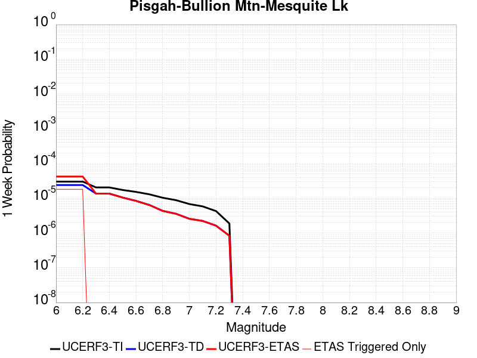 | 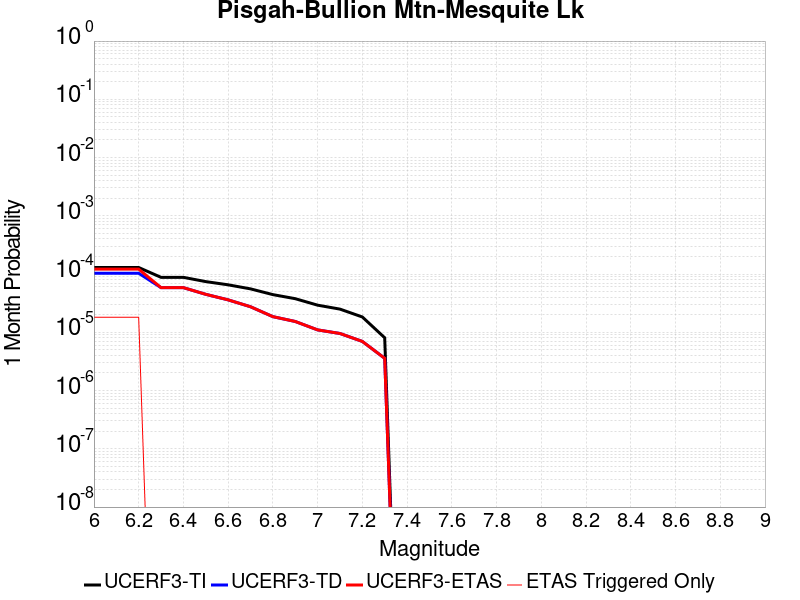 | 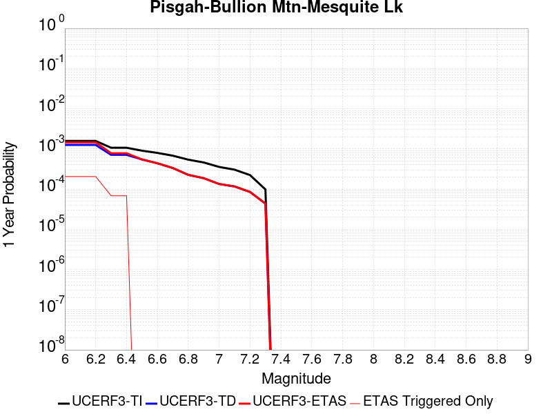 | 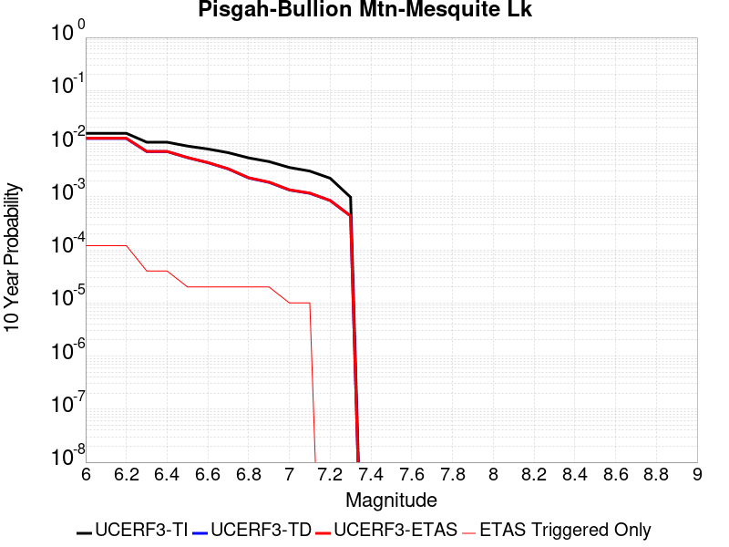 |

| Magnitude | 1 wk TI Prob | 1 wk TD Prob | 1 wk ETAS Prob | 1 wk ETAS/TD Gain | 1 wk ETAS Triggered Only | 1 mo TI Prob | 1 mo TD Prob | 1 mo ETAS Prob | 1 mo ETAS/TD Gain | 1 mo ETAS Triggered Only | 1 yr TI Prob | 1 yr TD Prob | 1 yr ETAS Prob | 1 yr ETAS/TD Gain | 1 yr ETAS Triggered Only | 10 yr TI Prob | 10 yr TD Prob | 10 yr ETAS Prob | 10 yr ETAS/TD Gain | 10 yr ETAS Triggered Only |
|-----|-----|-----|-----|-----|-----|-----|-----|-----|-----|-----|-----|-----|-----|-----|-----|-----|-----|-----|-----|-----|
| 6.0 | 3.0240792E-5 | 2.4091114E-5 | 7.408991E-5 | 3.075404 | 5.0E-5 | 1.2959696E-4 | 1.03244114E-4 | 1.5323896E-4 | 1.4842391 | 5.0E-5 | 0.0015767008 | 0.0012563728 | 0.0013662345 | 1.0874436 | 1.1E-4 | 0.015655609 | 0.012502721 | 0.01262122 | 1.0094779 | 1.2E-4 |
| 6.1 | 3.0240792E-5 | 2.4091114E-5 | 7.408991E-5 | 3.075404 | 5.0E-5 | 1.2959696E-4 | 1.03244114E-4 | 1.5323896E-4 | 1.4842391 | 5.0E-5 | 0.0015767008 | 0.0012563728 | 0.0013662345 | 1.0874436 | 1.1E-4 | 0.015655609 | 0.012502721 | 0.01262122 | 1.0094779 | 1.2E-4 |
| 6.2 | 3.0240792E-5 | 2.4091114E-5 | 7.408991E-5 | 3.075404 | 5.0E-5 | 1.2959696E-4 | 1.03244114E-4 | 1.5323896E-4 | 1.4842391 | 5.0E-5 | 0.0015767008 | 0.0012563728 | 0.0013662345 | 1.0874436 | 1.1E-4 | 0.015655609 | 0.012502721 | 0.01262122 | 1.0094779 | 1.2E-4 |
| 6.3 | 2.0498217E-5 | 1.36380695E-5 | 3.3637796E-5 | 2.4664633 | 2.0E-5 | 8.784654E-5 | 5.844765E-5 | 7.844648E-5 | 1.3421665 | 2.0E-5 | 0.0010690069 | 7.1138405E-4 | 7.413627E-4 | 1.0421413 | 3.0E-5 | 0.01063879 | 0.0070926943 | 0.0071324105 | 1.0055996 | 4.0E-5 |
| 6.4 | 2.0498217E-5 | 1.36380695E-5 | 3.3637796E-5 | 2.4664633 | 2.0E-5 | 8.784654E-5 | 5.844765E-5 | 7.844648E-5 | 1.3421665 | 2.0E-5 | 0.0010690069 | 7.1138405E-4 | 7.413627E-4 | 1.0421413 | 3.0E-5 | 0.01063879 | 0.0070926943 | 0.0071324105 | 1.0055996 | 4.0E-5 |
| 6.5 | 1.7316182E-5 | 1.0477042E-5 | 3.0476833E-5 | 2.9089155 | 2.0E-5 | 7.42101E-5 | 4.4900895E-5 | 6.49E-5 | 1.4454054 | 2.0E-5 | 9.0313336E-4 | 5.465413E-4 | 5.6653033E-4 | 1.0365738 | 2.0E-5 | 0.008994718 | 0.0054529672 | 0.005472858 | 1.0036477 | 2.0E-5 |
| 6.6 | 1.5251077E-5 | 8.414273E-6 | 2.8414104E-5 | 3.3768938 | 2.0E-5 | 6.536012E-5 | 3.6060712E-5 | 5.605999E-5 | 1.5546002 | 2.0E-5 | 7.9546886E-4 | 4.3895794E-4 | 4.589492E-4 | 1.0455425 | 2.0E-5 | 0.007926274 | 0.0043816264 | 0.0044015385 | 1.0045445 | 2.0E-5 |
| 6.7 | 1.2997425E-5 | 6.4114965E-6 | 2.6411368E-5 | 4.1193767 | 2.0E-5 | 5.570206E-5 | 2.7477578E-5 | 4.7477028E-5 | 1.7278461 | 2.0E-5 | 6.7796157E-4 | 3.3449283E-4 | 3.5448614E-4 | 1.059772 | 2.0E-5 | 0.0067589693 | 0.0033403537 | 0.0033602868 | 1.0059674 | 2.0E-5 |
| 6.8 | 1.035386E-5 | 4.3332193E-6 | 2.4333132E-5 | 5.615486 | 2.0E-5 | 4.437293E-5 | 1.8570812E-5 | 3.857044E-5 | 2.0769389 | 2.0E-5 | 5.401065E-4 | 2.2607706E-4 | 2.4607254E-4 | 1.0884454 | 2.0E-5 | 0.0053879567 | 0.0022585576 | 0.0022785123 | 1.0088352 | 2.0E-5 |
| 6.9 | 8.816252E-6 | 3.580638E-6 | 2.3580566E-5 | 6.585577 | 2.0E-5 | 3.778339E-5 | 1.5345504E-5 | 3.5345198E-5 | 2.3032935 | 2.0E-5 | 4.5991567E-4 | 1.8681608E-4 | 2.0681234E-4 | 1.1070372 | 2.0E-5 | 0.00458965 | 0.0018666488 | 0.0018866115 | 1.0106944 | 2.0E-5 |
| 7.0 | 6.8232207E-6 | 2.5675843E-6 | 1.2567559E-5 | 4.8947015 | 1.0E-5 | 2.9242048E-5 | 1.1003888E-5 | 2.1003778E-5 | 1.9087597 | 1.0E-5 | 3.5596377E-4 | 1.3396442E-4 | 1.4396307E-4 | 1.0746367 | 1.0E-5 | 0.0035539411 | 0.0013388677 | 0.0013488543 | 1.007459 | 1.0E-5 |
| 7.1 | 5.837013E-6 | 2.22738E-6 | 1.2227358E-5 | 5.4895697 | 1.0E-5 | 2.501553E-5 | 9.545881E-6 | 1.9545785E-5 | 2.0475621 | 1.0E-5 | 3.045215E-4 | 1.16215204E-4 | 1.2621404E-4 | 1.0860373 | 1.0E-5 | 0.0030410455 | 0.0011615733 | 0.0011715617 | 1.008599 | 1.0E-5 |
| 7.2 | 4.278052E-6 | 1.6275711E-6 | 1.6275711E-6 | 1.0 | 0.0 | 1.833438E-5 | 6.9752873E-6 | 6.9752873E-6 | 1.0 | 0.0 | 2.231982E-4 | 8.492105E-5 | 8.492105E-5 | 1.0 | 0.0 | 0.0022297418 | 8.489092E-4 | 8.489092E-4 | 1.0 | 0.0 |
| 7.3 | 1.8803692E-6 | 8.344926E-7 | 8.344926E-7 | 1.0 | 0.0 | 8.0587E-6 | 3.5763926E-6 | 3.5763926E-6 | 1.0 | 0.0 | 9.811026E-5 | 4.354186E-5 | 4.354186E-5 | 1.0 | 0.0 | 9.806695E-4 | 4.3534773E-4 | 4.3534773E-4 | 1.0 | 0.0 |

## Blue Cut
*[(top)](#table-of-contents)*

| 1 Week | 1 Month | 1 Year | 10 Year |
|-----|-----|-----|-----|
| 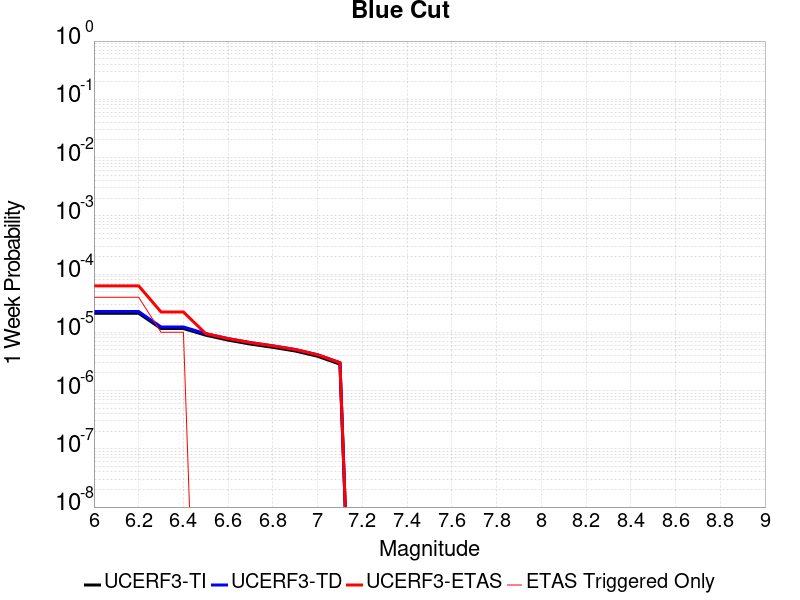 | 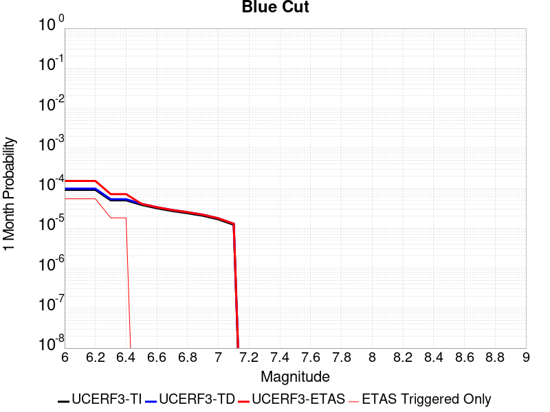 | 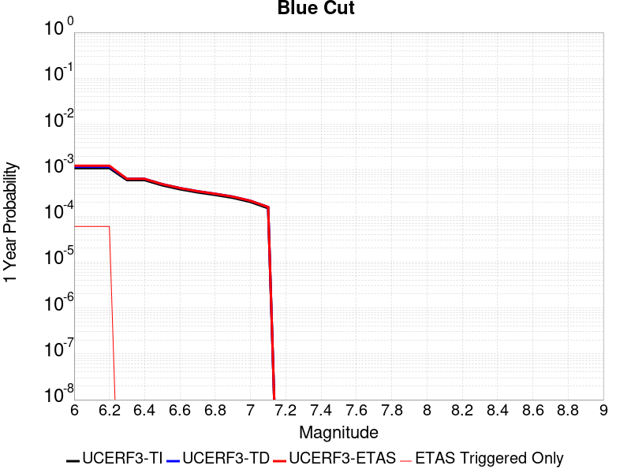 | 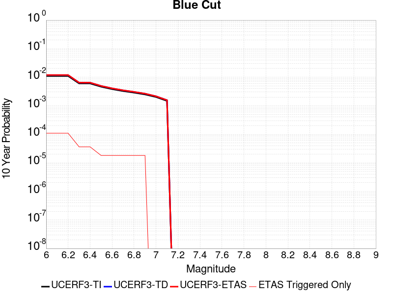 |

| Magnitude | 1 wk TI Prob | 1 wk TD Prob | 1 wk ETAS Prob | 1 wk ETAS/TD Gain | 1 wk ETAS Triggered Only | 1 mo TI Prob | 1 mo TD Prob | 1 mo ETAS Prob | 1 mo ETAS/TD Gain | 1 mo ETAS Triggered Only | 1 yr TI Prob | 1 yr TD Prob | 1 yr ETAS Prob | 1 yr ETAS/TD Gain | 1 yr ETAS Triggered Only | 10 yr TI Prob | 10 yr TD Prob | 10 yr ETAS Prob | 10 yr ETAS/TD Gain | 10 yr ETAS Triggered Only |
|-----|-----|-----|-----|-----|-----|-----|-----|-----|-----|-----|-----|-----|-----|-----|-----|-----|-----|-----|-----|-----|
| 6.0 | 2.1227985E-5 | 2.2719574E-5 | 6.271867E-5 | 2.7605565 | 4.0E-5 | 9.097391E-5 | 9.73663E-5 | 1.4736142E-4 | 1.5134747 | 5.0E-5 | 0.0011070445 | 0.0011848481 | 0.0012847296 | 1.084299 | 1.0E-4 | 0.011015458 | 0.011791152 | 0.011909736 | 1.0100571 | 1.2E-4 |
| 6.1 | 2.1227985E-5 | 2.2719574E-5 | 6.271867E-5 | 2.7605565 | 4.0E-5 | 9.097391E-5 | 9.73663E-5 | 1.4736142E-4 | 1.5134747 | 5.0E-5 | 0.0011070445 | 0.0011848481 | 0.0012847296 | 1.084299 | 1.0E-4 | 0.011015458 | 0.011791152 | 0.011909736 | 1.0100571 | 1.2E-4 |
| 6.2 | 2.1227985E-5 | 2.2719574E-5 | 6.271867E-5 | 2.7605565 | 4.0E-5 | 9.097391E-5 | 9.73663E-5 | 1.4736142E-4 | 1.5134747 | 5.0E-5 | 0.0011070445 | 0.0011848481 | 0.0012847296 | 1.084299 | 1.0E-4 | 0.011015458 | 0.011791152 | 0.011909736 | 1.0100571 | 1.2E-4 |
| 6.3 | 1.1613981E-5 | 1.2353542E-5 | 2.2353419E-5 | 1.8094745 | 1.0E-5 | 4.9773254E-5 | 5.2942745E-5 | 6.2942214E-5 | 1.1888733 | 1.0E-5 | 6.0582085E-4 | 6.443998E-4 | 6.84374E-4 | 1.0620333 | 4.0E-5 | 0.0060417196 | 0.0064265593 | 0.006466302 | 1.0061842 | 4.0E-5 |
| 6.4 | 1.1613981E-5 | 1.2353542E-5 | 2.2353419E-5 | 1.8094745 | 1.0E-5 | 4.9773254E-5 | 5.2942745E-5 | 6.2942214E-5 | 1.1888733 | 1.0E-5 | 6.0582085E-4 | 6.443998E-4 | 6.84374E-4 | 1.0620333 | 4.0E-5 | 0.0060417196 | 0.0064265593 | 0.006466302 | 1.0061842 | 4.0E-5 |
| 6.5 | 8.931326E-6 | 9.4816E-6 | 9.4816E-6 | 1.0 | 0.0 | 3.8276554E-5 | 4.0634844E-5 | 4.0634844E-5 | 1.0 | 0.0 | 4.6591737E-4 | 4.946261E-4 | 5.2461127E-4 | 1.0606219 | 3.0E-5 | 0.0046494175 | 0.004936161 | 0.004966013 | 1.0060476 | 3.0E-5 |
| 6.6 | 7.345353E-6 | 7.79028E-6 | 7.79028E-6 | 1.0 | 0.0 | 3.1479703E-5 | 3.338653E-5 | 3.338653E-5 | 1.0 | 0.0 | 3.83198E-4 | 4.064132E-4 | 4.36401E-4 | 1.0737865 | 3.0E-5 | 0.0038253788 | 0.0040574907 | 0.004087369 | 1.0073637 | 3.0E-5 |
| 6.7 | 6.2775666E-6 | 6.655149E-6 | 6.655149E-6 | 1.0 | 0.0 | 2.690358E-5 | 2.8521798E-5 | 2.8521798E-5 | 1.0 | 0.0 | 3.2750185E-4 | 3.472051E-4 | 3.7719466E-4 | 1.0863743 | 3.0E-5 | 0.0032701963 | 0.003467367 | 0.0034972632 | 1.008622 | 3.0E-5 |
| 6.8 | 5.5234095E-6 | 5.8551113E-6 | 5.8551113E-6 | 1.0 | 0.0 | 2.367154E-5 | 2.5093133E-5 | 2.5093133E-5 | 1.0 | 0.0 | 2.8816288E-4 | 3.0547334E-4 | 3.354642E-4 | 1.0981783 | 3.0E-5 | 0.002877895 | 0.0030512505 | 0.003081159 | 1.009802 | 3.0E-5 |
| 6.9 | 4.7780054E-6 | 5.0654203E-6 | 5.0654203E-6 | 1.0 | 0.0 | 2.0477004E-5 | 2.1708804E-5 | 2.1708804E-5 | 1.0 | 0.0 | 2.4927902E-4 | 2.642797E-4 | 2.842744E-4 | 1.0756574 | 2.0E-5 | 0.0024899957 | 0.002640346 | 0.0026602934 | 1.0075548 | 2.0E-5 |
| 7.0 | 3.883171E-6 | 4.118487E-6 | 4.118487E-6 | 1.0 | 0.0 | 1.6642054E-5 | 1.7650578E-5 | 1.7650578E-5 | 1.0 | 0.0 | 2.0259817E-4 | 2.1488148E-4 | 2.2487935E-4 | 1.0465273 | 1.0E-5 | 0.0020241356 | 0.0021474129 | 0.0021573913 | 1.0046468 | 1.0E-5 |
| 7.1 | 2.8358215E-6 | 3.0097158E-6 | 3.0097158E-6 | 1.0 | 0.0 | 1.2153464E-5 | 1.2898756E-5 | 1.2898756E-5 | 1.0 | 0.0 | 1.4795837E-4 | 1.5703762E-4 | 1.6703604E-4 | 1.063669 | 1.0E-5 | 0.001478599 | 0.0015699116 | 0.001579896 | 1.0063598 | 1.0E-5 |

## Independence rev 2011
*[(top)](#table-of-contents)*

| 1 Week | 1 Month | 1 Year | 10 Year |
|-----|-----|-----|-----|
| 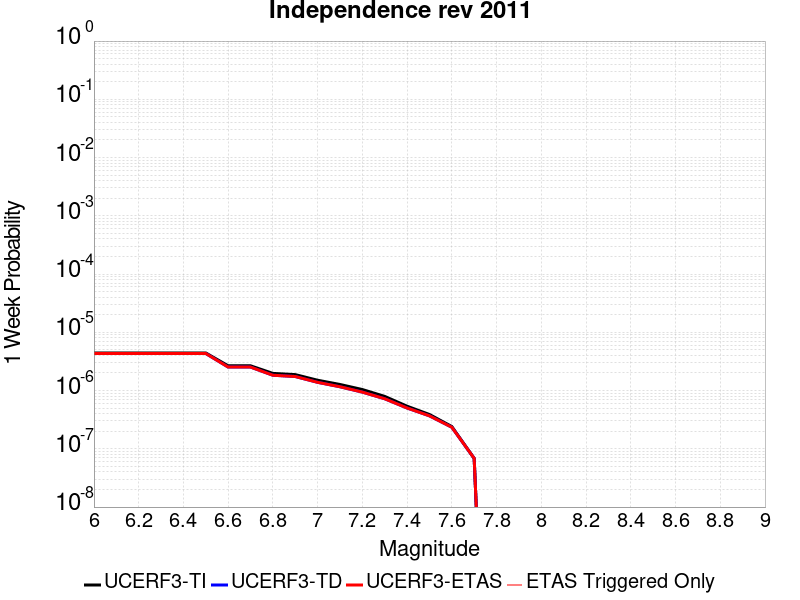 | 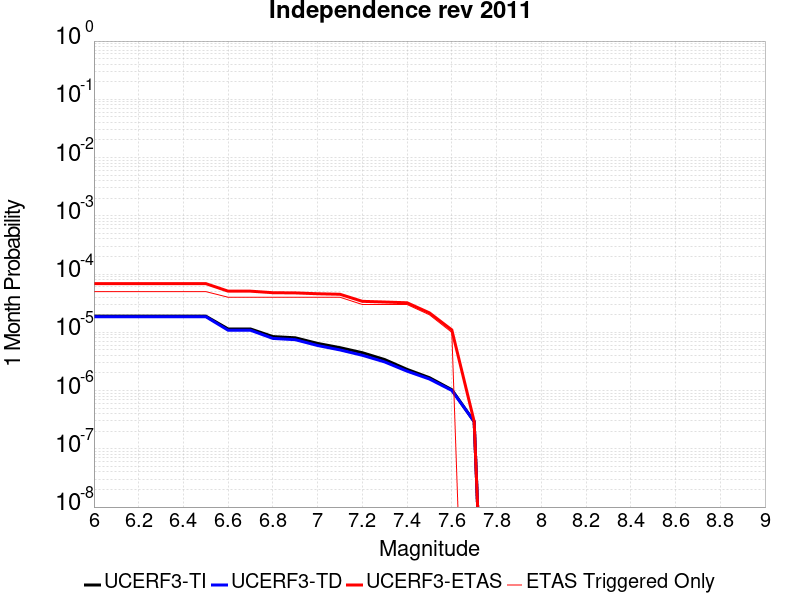 | 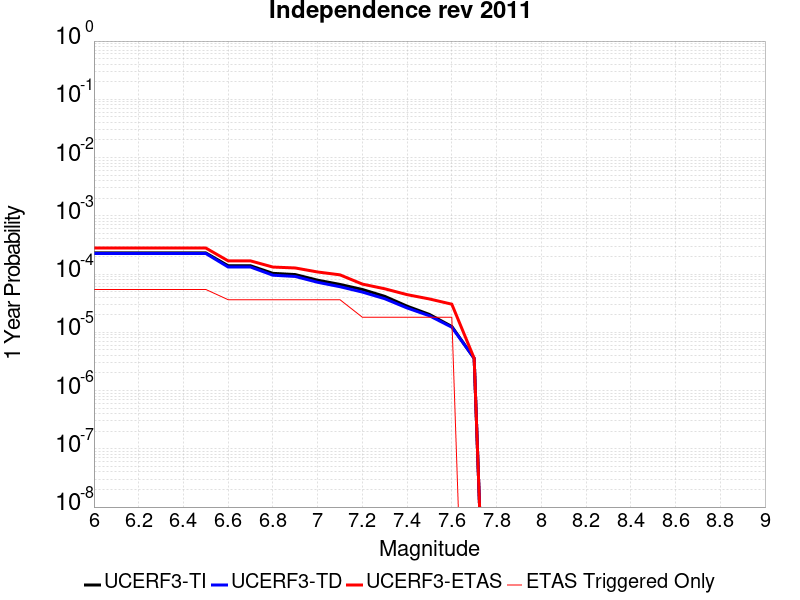 | 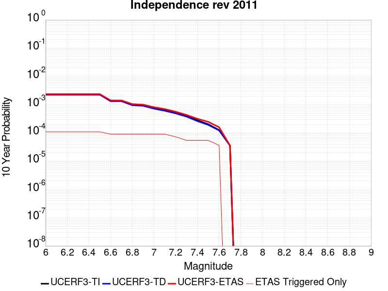 |

| Magnitude | 1 wk TI Prob | 1 wk TD Prob | 1 wk ETAS Prob | 1 wk ETAS/TD Gain | 1 wk ETAS Triggered Only | 1 mo TI Prob | 1 mo TD Prob | 1 mo ETAS Prob | 1 mo ETAS/TD Gain | 1 mo ETAS Triggered Only | 1 yr TI Prob | 1 yr TD Prob | 1 yr ETAS Prob | 1 yr ETAS/TD Gain | 1 yr ETAS Triggered Only | 10 yr TI Prob | 10 yr TD Prob | 10 yr ETAS Prob | 10 yr ETAS/TD Gain | 10 yr ETAS Triggered Only |
|-----|-----|-----|-----|-----|-----|-----|-----|-----|-----|-----|-----|-----|-----|-----|-----|-----|-----|-----|-----|-----|
| 6.0 | 4.422171E-6 | 4.326227E-6 | 4.4326054E-5 | 10.245892 | 4.0E-5 | 1.8952025E-5 | 1.8540857E-5 | 6.853993E-5 | 3.6966968 | 5.0E-5 | 2.3071647E-4 | 2.2571455E-4 | 3.0569648E-4 | 1.35435 | 8.0E-5 | 0.0023047708 | 0.0022551466 | 0.0023748758 | 1.0530916 | 1.2E-4 |
| 6.1 | 4.422171E-6 | 4.326227E-6 | 4.4326054E-5 | 10.245892 | 4.0E-5 | 1.8952025E-5 | 1.8540857E-5 | 6.853993E-5 | 3.6966968 | 5.0E-5 | 2.3071647E-4 | 2.2571455E-4 | 3.0569648E-4 | 1.35435 | 8.0E-5 | 0.0023047708 | 0.0022551466 | 0.0023748758 | 1.0530916 | 1.2E-4 |
| 6.2 | 4.422171E-6 | 4.326227E-6 | 4.4326054E-5 | 10.245892 | 4.0E-5 | 1.8952025E-5 | 1.8540857E-5 | 6.853993E-5 | 3.6966968 | 5.0E-5 | 2.3071647E-4 | 2.2571455E-4 | 3.0569648E-4 | 1.35435 | 8.0E-5 | 0.0023047708 | 0.0022551466 | 0.0023748758 | 1.0530916 | 1.2E-4 |
| 6.3 | 4.422171E-6 | 4.326227E-6 | 4.4326054E-5 | 10.245892 | 4.0E-5 | 1.8952025E-5 | 1.8540857E-5 | 6.853993E-5 | 3.6966968 | 5.0E-5 | 2.3071647E-4 | 2.2571455E-4 | 3.0569648E-4 | 1.35435 | 8.0E-5 | 0.0023047708 | 0.0022551466 | 0.0023748758 | 1.0530916 | 1.2E-4 |
| 6.4 | 4.422171E-6 | 4.326227E-6 | 4.4326054E-5 | 10.245892 | 4.0E-5 | 1.8952025E-5 | 1.8540857E-5 | 6.853993E-5 | 3.6966968 | 5.0E-5 | 2.3071647E-4 | 2.2571455E-4 | 3.0569648E-4 | 1.35435 | 8.0E-5 | 0.0023047708 | 0.0022551466 | 0.0023748758 | 1.0530916 | 1.2E-4 |
| 6.5 | 4.422171E-6 | 4.326227E-6 | 4.4326054E-5 | 10.245892 | 4.0E-5 | 1.8952025E-5 | 1.8540857E-5 | 6.853993E-5 | 3.6966968 | 5.0E-5 | 2.3071647E-4 | 2.2571455E-4 | 3.0569648E-4 | 1.35435 | 8.0E-5 | 0.0023047708 | 0.0022551466 | 0.0023748758 | 1.0530916 | 1.2E-4 |
| 6.6 | 2.663744E-6 | 2.5319862E-6 | 4.2531887E-5 | 16.797834 | 4.0E-5 | 1.1415996E-5 | 1.0851327E-5 | 5.0850893E-5 | 4.6861453 | 4.0E-5 | 1.3898089E-4 | 1.3210738E-4 | 1.8210078E-4 | 1.37843 | 5.0E-5 | 0.0013889399 | 0.0013203367 | 0.001410218 | 1.0680745 | 9.0E-5 |
| 6.7 | 2.663744E-6 | 2.5319862E-6 | 4.2531887E-5 | 16.797834 | 4.0E-5 | 1.1415996E-5 | 1.0851327E-5 | 5.0850893E-5 | 4.6861453 | 4.0E-5 | 1.3898089E-4 | 1.3210738E-4 | 1.8210078E-4 | 1.37843 | 5.0E-5 | 0.0013889399 | 0.0013203367 | 0.001410218 | 1.0680745 | 9.0E-5 |
| 6.8 | 1.9716529E-6 | 1.8322585E-6 | 4.1832183E-5 | 22.830942 | 4.0E-5 | 8.449913E-6 | 7.852514E-6 | 4.7852198E-5 | 6.0938706 | 4.0E-5 | 1.0287284E-4 | 9.5600284E-5 | 1.455955E-4 | 1.522961 | 5.0E-5 | 0.0010282523 | 9.556045E-4 | 0.0010455184 | 1.0940912 | 9.0E-5 |
| 6.9 | 1.8788617E-6 | 1.7429993E-6 | 4.174293E-5 | 23.948908 | 4.0E-5 | 8.0522395E-6 | 7.4699765E-6 | 4.746968E-5 | 6.354729 | 4.0E-5 | 9.80316E-5 | 9.0943286E-5 | 1.4093873E-4 | 1.5497432 | 5.0E-5 | 9.798837E-4 | 9.0907275E-4 | 9.98991E-4 | 1.098912 | 9.0E-5 |
| 7.0 | 1.5045488E-6 | 1.3849503E-6 | 4.1384894E-5 | 29.88186 | 4.0E-5 | 6.44805E-6 | 5.9354884E-6 | 4.5935252E-5 | 7.739085 | 4.0E-5 | 7.8502184E-5 | 7.226223E-5 | 1.2225861E-4 | 1.6918744 | 5.0E-5 | 7.8474457E-4 | 7.2239246E-4 | 8.1232743E-4 | 1.124496 | 9.0E-5 |
| 7.1 | 1.272341E-6 | 1.1625096E-6 | 4.1162464E-5 | 35.408276 | 4.0E-5 | 5.4528787E-6 | 4.982175E-6 | 4.4981974E-5 | 9.028582 | 4.0E-5 | 6.6386776E-5 | 6.0656326E-5 | 1.10653295E-4 | 1.8242663 | 5.0E-5 | 6.636695E-4 | 6.064009E-4 | 6.863524E-4 | 1.131846 | 8.0E-5 |
| 7.2 | 1.0416892E-6 | 9.4098806E-7 | 3.094096E-5 | 32.88135 | 3.0E-5 | 4.464375E-6 | 4.0328E-6 | 3.403268E-5 | 8.438971 | 3.0E-5 | 5.4352407E-5 | 4.909825E-5 | 8.9096284E-5 | 1.814653 | 4.0E-5 | 5.4339116E-4 | 4.9087586E-4 | 5.608415E-4 | 1.1425322 | 7.0E-5 |
| 7.3 | 7.9450155E-7 | 7.235002E-7 | 3.0723477E-5 | 42.46506 | 3.0E-5 | 3.4050022E-6 | 3.1007114E-6 | 3.310062E-5 | 10.675169 | 3.0E-5 | 4.1455114E-5 | 3.775052E-5 | 7.7749006E-5 | 2.0595481 | 4.0E-5 | 4.144738E-4 | 3.7744216E-4 | 4.3741954E-4 | 1.1589048 | 6.0E-5 |
| 7.4 | 5.3893444E-7 | 5.019512E-7 | 3.0501937E-5 | 60.766735 | 3.0E-5 | 2.309717E-6 | 2.1512178E-6 | 3.2151154E-5 | 14.9455595 | 3.0E-5 | 2.8120441E-5 | 2.6190766E-5 | 5.618998E-5 | 2.145412 | 3.0E-5 | 2.8116882E-4 | 2.6187726E-4 | 3.1186416E-4 | 1.1908791 | 5.0E-5 |
| 7.5 | 3.8852085E-7 | 3.682554E-7 | 2.0368248E-5 | 55.310116 | 2.0E-5 | 1.6650882E-6 | 1.5782365E-6 | 2.1578206E-5 | 13.672353 | 2.0E-5 | 2.027226E-5 | 1.9214862E-5 | 3.9214476E-5 | 2.040841 | 2.0E-5 | 2.0270412E-4 | 1.9213221E-4 | 2.3212453E-4 | 1.2081499 | 4.0E-5 |
| 7.6 | 2.414929E-7 | 2.345755E-7 | 1.0234573E-5 | 43.630188 | 1.0E-5 | 1.0349692E-6 | 1.0053232E-6 | 1.1005313E-5 | 10.94704 | 1.0E-5 | 1.2600677E-5 | 1.2239742E-5 | 2.223962E-5 | 1.8170006 | 1.0E-5 | 1.2599962E-4 | 1.223908E-4 | 1.4238835E-4 | 1.163391 | 2.0E-5 |
| 7.7 | 6.8298014E-8 | 6.85897E-8 | 6.85897E-8 | 1.0 | 0.0 | 2.9270575E-7 | 2.9395582E-7 | 2.9395582E-7 | 1.0 | 0.0 | 3.5636867E-6 | 3.5789067E-6 | 3.5789067E-6 | 1.0 | 0.0 | 3.5636294E-5 | 3.5788536E-5 | 3.5788536E-5 | 1.0 | 0.0 |

## Lost Hills
*[(top)](#table-of-contents)*

| 1 Week | 1 Month | 1 Year | 10 Year |
|-----|-----|-----|-----|
| 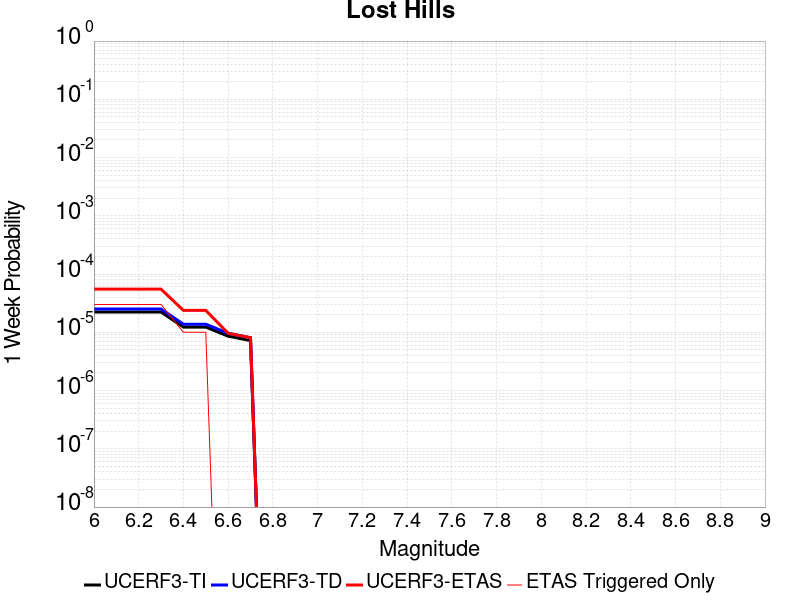 | 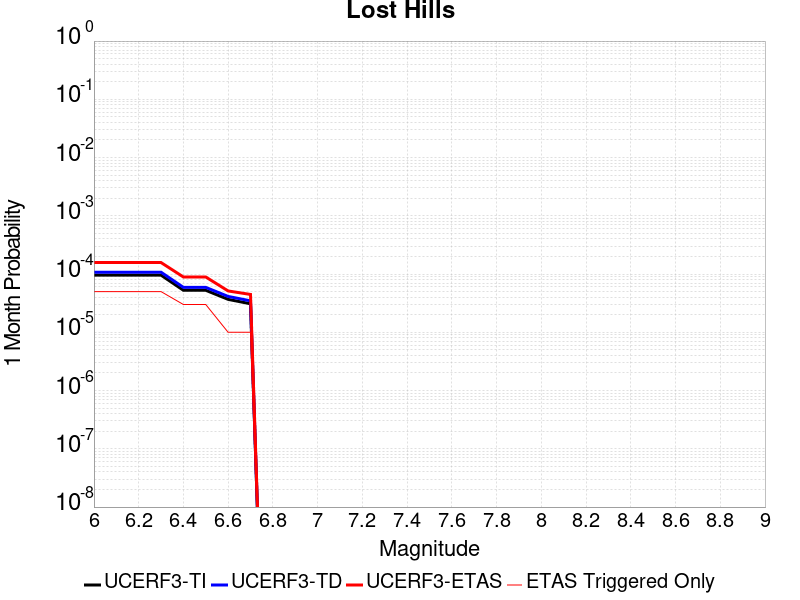 | 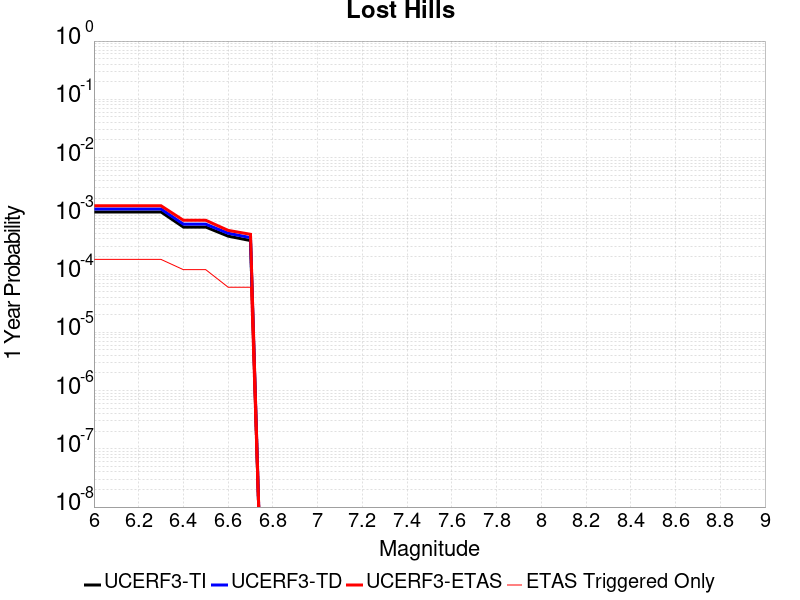 | 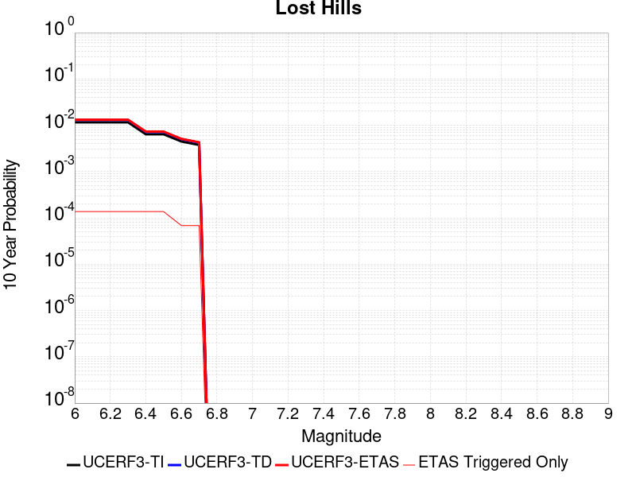 |

| Magnitude | 1 wk TI Prob | 1 wk TD Prob | 1 wk ETAS Prob | 1 wk ETAS/TD Gain | 1 wk ETAS Triggered Only | 1 mo TI Prob | 1 mo TD Prob | 1 mo ETAS Prob | 1 mo ETAS/TD Gain | 1 mo ETAS Triggered Only | 1 yr TI Prob | 1 yr TD Prob | 1 yr ETAS Prob | 1 yr ETAS/TD Gain | 1 yr ETAS Triggered Only | 10 yr TI Prob | 10 yr TD Prob | 10 yr ETAS Prob | 10 yr ETAS/TD Gain | 10 yr ETAS Triggered Only |
|-----|-----|-----|-----|-----|-----|-----|-----|-----|-----|-----|-----|-----|-----|-----|-----|-----|-----|-----|-----|-----|
| 6.0 | 2.233523E-5 | 2.5106583E-5 | 5.510583E-5 | 2.1948757 | 3.0E-5 | 9.571891E-5 | 1.0759615E-4 | 1.5759077E-4 | 1.4646506 | 5.0E-5 | 0.0011647546 | 0.001309364 | 0.0013792723 | 1.0533911 | 7.0E-5 | 0.011586686 | 0.013033091 | 0.013151526 | 1.0090873 | 1.2E-4 |
| 6.1 | 2.233523E-5 | 2.5106583E-5 | 5.510583E-5 | 2.1948757 | 3.0E-5 | 9.571891E-5 | 1.0759615E-4 | 1.5759077E-4 | 1.4646506 | 5.0E-5 | 0.0011647546 | 0.001309364 | 0.0013792723 | 1.0533911 | 7.0E-5 | 0.011586686 | 0.013033091 | 0.013151526 | 1.0090873 | 1.2E-4 |
| 6.2 | 2.233523E-5 | 2.5106583E-5 | 5.510583E-5 | 2.1948757 | 3.0E-5 | 9.571891E-5 | 1.0759615E-4 | 1.5759077E-4 | 1.4646506 | 5.0E-5 | 0.0011647546 | 0.001309364 | 0.0013792723 | 1.0533911 | 7.0E-5 | 0.011586686 | 0.013033091 | 0.013151526 | 1.0090873 | 1.2E-4 |
| 6.3 | 2.233523E-5 | 2.5106583E-5 | 5.510583E-5 | 2.1948757 | 3.0E-5 | 9.571891E-5 | 1.0759615E-4 | 1.5759077E-4 | 1.4646506 | 5.0E-5 | 0.0011647546 | 0.001309364 | 0.0013792723 | 1.0533911 | 7.0E-5 | 0.011586686 | 0.013033091 | 0.013151526 | 1.0090873 | 1.2E-4 |
| 6.4 | 1.2288092E-5 | 1.3781108E-5 | 2.3780969E-5 | 1.7256211 | 1.0E-5 | 5.2662188E-5 | 5.906108E-5 | 8.905931E-5 | 1.5079187 | 3.0E-5 | 6.409735E-4 | 7.189252E-4 | 7.4890367E-4 | 1.0416989 | 3.0E-5 | 0.006391279 | 0.0071752006 | 0.0072347703 | 1.0083021 | 6.0E-5 |
| 6.5 | 1.2288092E-5 | 1.3781108E-5 | 2.3780969E-5 | 1.7256211 | 1.0E-5 | 5.2662188E-5 | 5.906108E-5 | 8.905931E-5 | 1.5079187 | 3.0E-5 | 6.409735E-4 | 7.189252E-4 | 7.4890367E-4 | 1.0416989 | 3.0E-5 | 0.006391279 | 0.0071752006 | 0.0072347703 | 1.0083021 | 6.0E-5 |
| 6.6 | 8.58281E-6 | 9.63377E-6 | 9.63377E-6 | 1.0 | 0.0 | 3.6782953E-5 | 4.12874E-5 | 5.128699E-5 | 1.2421947 | 1.0E-5 | 4.4774043E-4 | 5.026414E-4 | 5.126363E-4 | 1.019885 | 1.0E-5 | 0.0044683935 | 0.005023205 | 0.0050630043 | 1.007923 | 4.0E-5 |
| 6.7 | 7.205685E-6 | 8.088302E-6 | 8.088302E-6 | 1.0 | 0.0 | 3.088114E-5 | 3.466415E-5 | 4.4663804E-5 | 1.2884725 | 1.0E-5 | 3.7591302E-4 | 4.2203604E-4 | 4.320318E-4 | 1.0236846 | 1.0E-5 | 0.0037527776 | 0.0042203604 | 0.004230318 | 1.0023595 | 1.0E-5 |

## Whittier alt 1
*[(top)](#table-of-contents)*

| 1 Week | 1 Month | 1 Year | 10 Year |
|-----|-----|-----|-----|
| 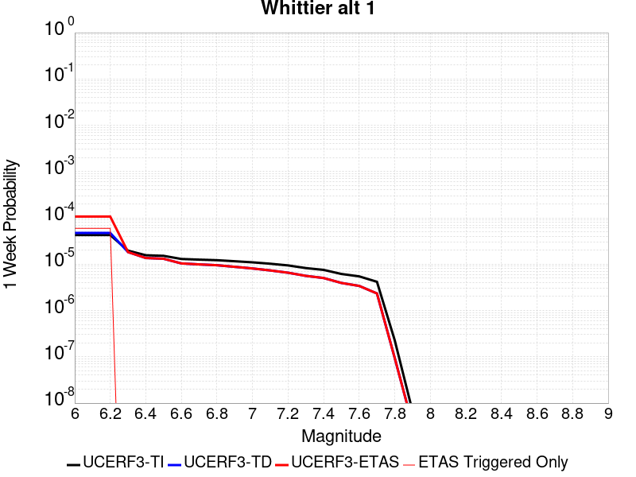 | 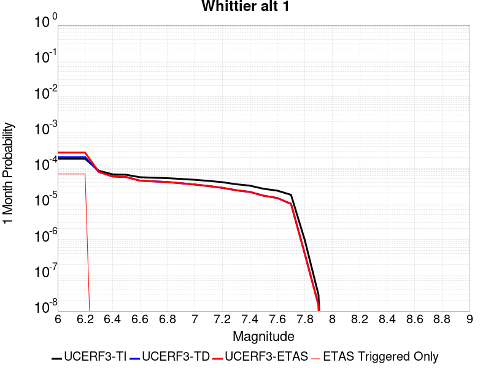 | 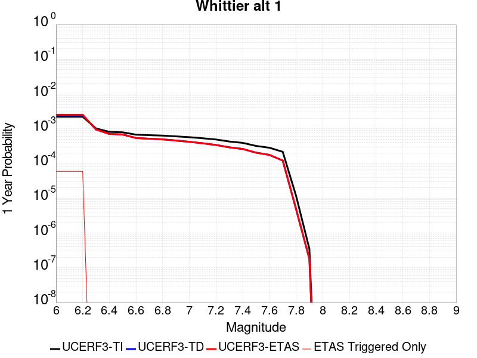 | 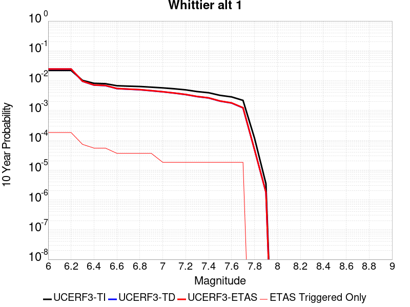 |

| Magnitude | 1 wk TI Prob | 1 wk TD Prob | 1 wk ETAS Prob | 1 wk ETAS/TD Gain | 1 wk ETAS Triggered Only | 1 mo TI Prob | 1 mo TD Prob | 1 mo ETAS Prob | 1 mo ETAS/TD Gain | 1 mo ETAS Triggered Only | 1 yr TI Prob | 1 yr TD Prob | 1 yr ETAS Prob | 1 yr ETAS/TD Gain | 1 yr ETAS Triggered Only | 10 yr TI Prob | 10 yr TD Prob | 10 yr ETAS Prob | 10 yr ETAS/TD Gain | 10 yr ETAS Triggered Only |
|-----|-----|-----|-----|-----|-----|-----|-----|-----|-----|-----|-----|-----|-----|-----|-----|-----|-----|-----|-----|-----|
| 6.0 | 4.2554693E-5 | 4.725218E-5 | 6.725123E-5 | 1.4232409 | 2.0E-5 | 1.8236451E-4 | 2.0249544E-4 | 2.524853E-4 | 1.2468691 | 5.0E-5 | 0.002218027 | 0.0024629154 | 0.0025227675 | 1.0243014 | 6.0E-5 | 0.02196019 | 0.024390234 | 0.024507308 | 1.0048 | 1.2E-4 |
| 6.1 | 4.2554693E-5 | 4.725218E-5 | 6.725123E-5 | 1.4232409 | 2.0E-5 | 1.8236451E-4 | 2.0249544E-4 | 2.524853E-4 | 1.2468691 | 5.0E-5 | 0.002218027 | 0.0024629154 | 0.0025227675 | 1.0243014 | 6.0E-5 | 0.02196019 | 0.024390234 | 0.024507308 | 1.0048 | 1.2E-4 |
| 6.2 | 4.2554693E-5 | 4.725218E-5 | 6.725123E-5 | 1.4232409 | 2.0E-5 | 1.8236451E-4 | 2.0249544E-4 | 2.524853E-4 | 1.2468691 | 5.0E-5 | 0.002218027 | 0.0024629154 | 0.0025227675 | 1.0243014 | 6.0E-5 | 0.02196019 | 0.024390234 | 0.024507308 | 1.0048 | 1.2E-4 |
| 6.3 | 1.9617712E-5 | 1.8268593E-5 | 2.8268409E-5 | 1.5473776 | 1.0E-5 | 8.40732E-5 | 7.829172E-5 | 9.8290155E-5 | 1.2554349 | 2.0E-5 | 0.0010231105 | 9.52804E-4 | 9.827754E-4 | 1.031456 | 3.0E-5 | 0.01018413 | 0.009490474 | 0.00954 | 1.0052184 | 5.0E-5 |
| 6.4 | 1.5611336E-5 | 1.3604271E-5 | 1.3604271E-5 | 1.0 | 0.0 | 6.690401E-5 | 5.8302747E-5 | 6.8302164E-5 | 1.1715086 | 1.0E-5 | 8.142519E-4 | 7.0961076E-4 | 7.295966E-4 | 1.0281645 | 2.0E-5 | 0.008112748 | 0.0070754145 | 0.0071052024 | 1.00421 | 3.0E-5 |
| 6.5 | 1.5150166E-5 | 1.3100925E-5 | 1.3100925E-5 | 1.0 | 0.0 | 6.492767E-5 | 5.6145647E-5 | 6.614508E-5 | 1.1780982 | 1.0E-5 | 7.9020765E-4 | 6.8336475E-4 | 7.0335105E-4 | 1.0292469 | 2.0E-5 | 0.007874036 | 0.0068145846 | 0.0068443804 | 1.0043724 | 3.0E-5 |
| 6.6 | 1.295588E-5 | 1.0380725E-5 | 1.0380725E-5 | 1.0 | 0.0 | 5.552402E-5 | 4.4488075E-5 | 4.4488075E-5 | 1.0 | 0.0 | 6.7579525E-4 | 5.4150965E-4 | 5.5150426E-4 | 1.0184569 | 1.0E-5 | 0.006737438 | 0.0054033357 | 0.0054232273 | 1.0036814 | 2.0E-5 |
| 6.7 | 1.2542085E-5 | 9.899369E-6 | 9.899369E-6 | 1.0 | 0.0 | 5.3750682E-5 | 4.242519E-5 | 4.242519E-5 | 1.0 | 0.0 | 6.542181E-4 | 5.164061E-4 | 5.264009E-4 | 1.0193546 | 1.0E-5 | 0.006522954 | 0.0051534795 | 0.0051733763 | 1.0038608 | 2.0E-5 |
| 6.8 | 1.2195878E-5 | 9.495415E-6 | 9.495415E-6 | 1.0 | 0.0 | 5.2267E-5 | 4.069401E-5 | 4.069401E-5 | 1.0 | 0.0 | 6.36165E-4 | 4.9533875E-4 | 5.053338E-4 | 1.0201782 | 1.0E-5 | 0.0063434686 | 0.004943688 | 0.0049635894 | 1.0040256 | 2.0E-5 |
| 6.9 | 1.1580298E-5 | 8.772933E-6 | 8.772933E-6 | 1.0 | 0.0 | 4.9628903E-5 | 3.7597754E-5 | 3.7597754E-5 | 1.0 | 0.0 | 6.040644E-4 | 4.5765814E-4 | 4.676536E-4 | 1.0218403 | 1.0E-5 | 0.00602425 | 0.0045684157 | 0.0045883246 | 1.0043579 | 2.0E-5 |
| 7.0 | 1.0964795E-5 | 8.083994E-6 | 8.083994E-6 | 1.0 | 0.0 | 4.6991136E-5 | 3.4645236E-5 | 3.4645236E-5 | 1.0 | 0.0 | 5.7196687E-4 | 4.2172565E-4 | 4.2172565E-4 | 1.0 | 0.0 | 0.0057049696 | 0.004210462 | 0.0042204196 | 1.002365 | 1.0E-5 |
| 7.1 | 1.0230601E-5 | 7.3266697E-6 | 7.3266697E-6 | 1.0 | 0.0 | 4.3844695E-5 | 3.1399642E-5 | 3.1399642E-5 | 1.0 | 0.0 | 5.336784E-4 | 3.8222488E-4 | 3.8222488E-4 | 1.0 | 0.0 | 0.005323986 | 0.0038168381 | 0.0038268 | 1.00261 | 1.0E-5 |
| 7.2 | 9.40865E-6 | 6.543289E-6 | 6.543289E-6 | 1.0 | 0.0 | 4.032216E-5 | 2.8042374E-5 | 2.8042374E-5 | 1.0 | 0.0 | 4.908117E-4 | 3.4136363E-4 | 3.4136363E-4 | 1.0 | 0.0 | 0.0048972913 | 0.003409485 | 0.0034194512 | 1.002923 | 1.0E-5 |
| 7.3 | 8.237384E-6 | 5.5977525E-6 | 5.5977525E-6 | 1.0 | 0.0 | 3.5302593E-5 | 2.3990153E-5 | 2.3990153E-5 | 1.0 | 0.0 | 4.2972428E-4 | 2.92042E-4 | 2.92042E-4 | 1.0 | 0.0 | 0.0042889426 | 0.002916903 | 0.002926874 | 1.0034183 | 1.0E-5 |
| 7.4 | 7.5316966E-6 | 5.027819E-6 | 5.027819E-6 | 1.0 | 0.0 | 3.2278298E-5 | 2.1547625E-5 | 2.1547625E-5 | 1.0 | 0.0 | 3.9291743E-4 | 2.6231175E-4 | 2.6231175E-4 | 1.0 | 0.0 | 0.0039222343 | 0.0026201333 | 0.002630107 | 1.0038066 | 1.0E-5 |
| 7.5 | 6.149649E-6 | 3.933841E-6 | 3.933841E-6 | 1.0 | 0.0 | 2.6355372E-5 | 1.6859214E-5 | 1.6859214E-5 | 1.0 | 0.0 | 3.208294E-4 | 2.052425E-4 | 2.052425E-4 | 1.0 | 0.0 | 0.003203666 | 0.0020506186 | 0.0020605982 | 1.0048666 | 1.0E-5 |
| 7.6 | 5.457711E-6 | 3.3953788E-6 | 3.3953788E-6 | 1.0 | 0.0 | 2.338998E-5 | 1.4551547E-5 | 1.4551547E-5 | 1.0 | 0.0 | 2.8473578E-4 | 1.771515E-4 | 1.771515E-4 | 1.0 | 0.0 | 0.0028437122 | 0.0017701836 | 0.0017801658 | 1.0056391 | 1.0E-5 |
| 7.7 | 4.1676276E-6 | 2.3331952E-6 | 2.3331952E-6 | 1.0 | 0.0 | 1.7861139E-5 | 9.999374E-6 | 9.999374E-6 | 1.0 | 0.0 | 2.1743766E-4 | 1.2173632E-4 | 1.2173632E-4 | 1.0 | 0.0 | 0.0021722503 | 0.0012167693 | 0.0012267572 | 1.0082085 | 1.0E-5 |
| 7.8 | 2.2692414E-7 | 9.3854695E-8 | 9.3854695E-8 | 1.0 | 0.0 | 9.725317E-7 | 4.0223435E-7 | 4.0223435E-7 | 1.0 | 0.0 | 1.1840509E-5 | 4.8971956E-6 | 4.8971956E-6 | 1.0 | 0.0 | 1.1839878E-4 | 4.8971204E-5 | 4.8971204E-5 | 1.0 | 0.0 |
| 7.9 | 6.676829E-9 | 3.439853E-9 | 3.439853E-9 | 1.0 | 0.0 | 2.861498E-8 | 1.4742227E-8 | 1.4742227E-8 | 1.0 | 0.0 | 3.4838732E-7 | 1.7948659E-7 | 1.7948659E-7 | 1.0 | 0.0 | 3.4838679E-6 | 1.7948646E-6 | 1.7948646E-6 | 1.0 | 0.0 |

## Kern Canyon (North Kern) 2011
*[(top)](#table-of-contents)*

| 1 Week | 1 Month | 1 Year | 10 Year |
|-----|-----|-----|-----|
| 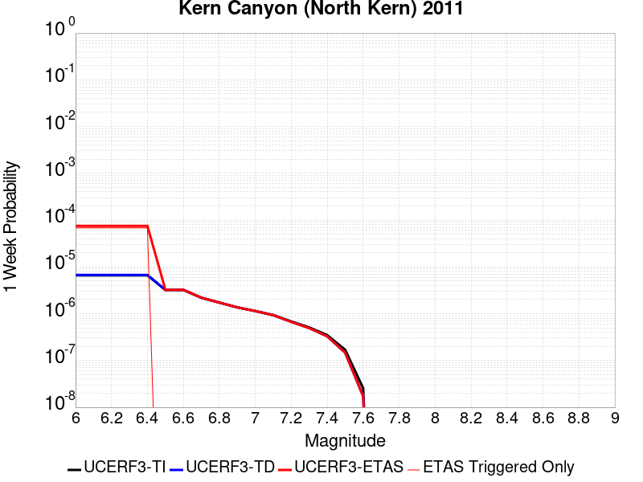 | 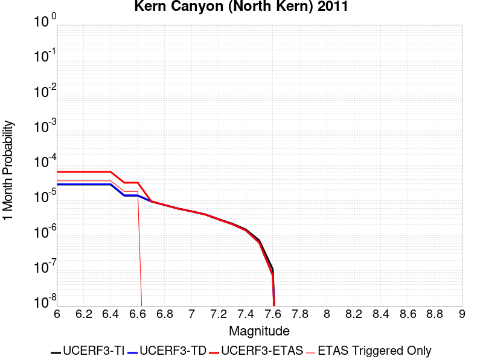 | 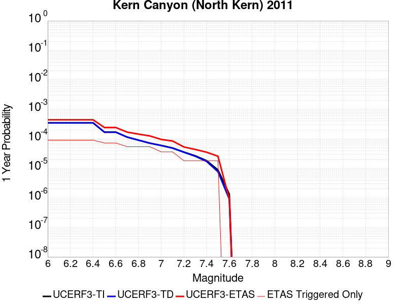 | 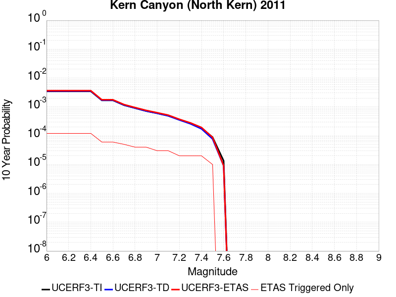 |

| Magnitude | 1 wk TI Prob | 1 wk TD Prob | 1 wk ETAS Prob | 1 wk ETAS/TD Gain | 1 wk ETAS Triggered Only | 1 mo TI Prob | 1 mo TD Prob | 1 mo ETAS Prob | 1 mo ETAS/TD Gain | 1 mo ETAS Triggered Only | 1 yr TI Prob | 1 yr TD Prob | 1 yr ETAS Prob | 1 yr ETAS/TD Gain | 1 yr ETAS Triggered Only | 10 yr TI Prob | 10 yr TD Prob | 10 yr ETAS Prob | 10 yr ETAS/TD Gain | 10 yr ETAS Triggered Only |
|-----|-----|-----|-----|-----|-----|-----|-----|-----|-----|-----|-----|-----|-----|-----|-----|-----|-----|-----|-----|-----|
| 6.0 | 6.6264497E-6 | 6.75733E-6 | 4.675706E-5 | 6.919458 | 4.0E-5 | 2.8398761E-5 | 2.895971E-5 | 7.895826E-5 | 2.7264867 | 5.0E-5 | 3.4570007E-4 | 3.5253543E-4 | 4.525002E-4 | 1.2835594 | 1.0E-4 | 0.0034516277 | 0.0035205502 | 0.0036401278 | 1.0339656 | 1.2E-4 |
| 6.1 | 6.6264497E-6 | 6.75733E-6 | 4.675706E-5 | 6.919458 | 4.0E-5 | 2.8398761E-5 | 2.895971E-5 | 7.895826E-5 | 2.7264867 | 5.0E-5 | 3.4570007E-4 | 3.5253543E-4 | 4.525002E-4 | 1.2835594 | 1.0E-4 | 0.0034516277 | 0.0035205502 | 0.0036401278 | 1.0339656 | 1.2E-4 |
| 6.2 | 6.6264497E-6 | 6.75733E-6 | 4.675706E-5 | 6.919458 | 4.0E-5 | 2.8398761E-5 | 2.895971E-5 | 7.895826E-5 | 2.7264867 | 5.0E-5 | 3.4570007E-4 | 3.5253543E-4 | 4.525002E-4 | 1.2835594 | 1.0E-4 | 0.0034516277 | 0.0035205502 | 0.0036401278 | 1.0339656 | 1.2E-4 |
| 6.3 | 6.6264497E-6 | 6.75733E-6 | 4.675706E-5 | 6.919458 | 4.0E-5 | 2.8398761E-5 | 2.895971E-5 | 7.895826E-5 | 2.7264867 | 5.0E-5 | 3.4570007E-4 | 3.5253543E-4 | 4.525002E-4 | 1.2835594 | 1.0E-4 | 0.0034516277 | 0.0035205502 | 0.0036401278 | 1.0339656 | 1.2E-4 |
| 6.4 | 6.6264497E-6 | 6.75733E-6 | 4.675706E-5 | 6.919458 | 4.0E-5 | 2.8398761E-5 | 2.895971E-5 | 7.895826E-5 | 2.7264867 | 5.0E-5 | 3.4570007E-4 | 3.5253543E-4 | 4.525002E-4 | 1.2835594 | 1.0E-4 | 0.0034516277 | 0.0035205502 | 0.0036401278 | 1.0339656 | 1.2E-4 |
| 6.5 | 3.2162225E-6 | 3.2570915E-6 | 1.32570585E-5 | 4.070214 | 1.0E-5 | 1.3783738E-5 | 1.3958893E-5 | 3.3958615E-5 | 2.4327583 | 2.0E-5 | 1.6780409E-4 | 1.6993708E-4 | 2.2992688E-4 | 1.3530118 | 6.0E-5 | 0.0016767744 | 0.001698151 | 0.0017580491 | 1.0352726 | 6.0E-5 |
| 6.6 | 3.2162225E-6 | 3.2570915E-6 | 1.32570585E-5 | 4.070214 | 1.0E-5 | 1.3783738E-5 | 1.3958893E-5 | 3.3958615E-5 | 2.4327583 | 2.0E-5 | 1.6780409E-4 | 1.6993708E-4 | 2.2992688E-4 | 1.3530118 | 6.0E-5 | 0.0016767744 | 0.001698151 | 0.0017580491 | 1.0352726 | 6.0E-5 |
| 6.7 | 2.1908265E-6 | 2.2071222E-6 | 1.22071E-5 | 5.530777 | 1.0E-5 | 9.389223E-6 | 9.459061E-6 | 1.9458967E-5 | 2.0571773 | 1.0E-5 | 1.1430779E-4 | 1.1515819E-4 | 1.6515242E-4 | 1.4341353 | 5.0E-5 | 0.0011424901 | 0.0011510046 | 0.001200947 | 1.0433903 | 5.0E-5 |
| 6.8 | 1.7303895E-6 | 1.7365529E-6 | 1.7365529E-6 | 1.0 | 0.0 | 7.415934E-6 | 7.4423488E-6 | 7.4423488E-6 | 1.0 | 0.0 | 9.028525E-5 | 9.0606925E-5 | 1.3060331E-4 | 1.4414274 | 4.0E-5 | 9.024858E-4 | 9.057096E-4 | 9.456734E-4 | 1.0441242 | 4.0E-5 |
| 6.9 | 1.3700314E-6 | 1.3688622E-6 | 1.3688622E-6 | 1.0 | 0.0 | 5.87155E-6 | 5.8665396E-6 | 5.8665396E-6 | 1.0 | 0.0 | 7.148377E-5 | 7.142282E-5 | 1.1141996E-4 | 1.5600051 | 4.0E-5 | 7.146078E-4 | 7.140032E-4 | 7.539747E-4 | 1.0559821 | 4.0E-5 |
| 7.0 | 1.1467797E-6 | 1.1413804E-6 | 1.1413804E-6 | 1.0 | 0.0 | 4.9147607E-6 | 4.8916213E-6 | 4.8916213E-6 | 1.0 | 0.0 | 5.983557E-5 | 5.9553895E-5 | 8.955211E-5 | 1.5037154 | 3.0E-5 | 5.981946E-4 | 5.953825E-4 | 6.2536466E-4 | 1.0503578 | 3.0E-5 |
| 7.1 | 9.3952065E-7 | 9.3026904E-7 | 9.3026904E-7 | 1.0 | 0.0 | 4.026511E-6 | 3.9868614E-6 | 3.9868614E-6 | 1.0 | 0.0 | 4.9021666E-5 | 4.8538972E-5 | 7.8537516E-5 | 1.6180301 | 3.0E-5 | 4.901085E-4 | 4.8528548E-4 | 5.152709E-4 | 1.0617893 | 3.0E-5 |
| 7.2 | 6.858055E-7 | 6.7193E-7 | 6.7193E-7 | 1.0 | 0.0 | 2.939163E-6 | 2.879697E-6 | 2.879697E-6 | 1.0 | 0.0 | 3.5783723E-5 | 3.5059755E-5 | 5.5059056E-5 | 1.5704346 | 2.0E-5 | 3.5777962E-4 | 3.5054312E-4 | 3.7053612E-4 | 1.0570344 | 2.0E-5 |
| 7.3 | 5.1101983E-7 | 4.9393E-7 | 4.9393E-7 | 1.0 | 0.0 | 2.1900833E-6 | 2.116841E-6 | 2.116841E-6 | 1.0 | 0.0 | 2.6663936E-5 | 2.5772239E-5 | 4.5771725E-5 | 1.7760088 | 2.0E-5 | 2.6660739E-4 | 2.57693E-4 | 2.7768782E-4 | 1.0775918 | 2.0E-5 |
| 7.4 | 3.4999414E-7 | 3.2995905E-7 | 3.2995905E-7 | 1.0 | 0.0 | 1.499974E-6 | 1.4141094E-6 | 1.4141094E-6 | 1.0 | 0.0 | 1.8262032E-5 | 1.721665E-5 | 3.7216305E-5 | 2.1616461 | 2.0E-5 | 1.826053E-4 | 1.7215339E-4 | 1.9214995E-4 | 1.1161555 | 2.0E-5 |
| 7.5 | 1.7021522E-7 | 1.4750044E-7 | 1.4750044E-7 | 1.0 | 0.0 | 7.2949354E-7 | 6.321446E-7 | 6.321446E-7 | 1.0 | 0.0 | 8.881548E-6 | 7.696334E-6 | 1.7696257E-5 | 2.29931 | 1.0E-5 | 8.8811925E-5 | 7.696076E-5 | 8.695999E-5 | 1.1299263 | 1.0E-5 |
| 7.6 | 2.572245E-8 | 1.7352555E-8 | 1.7352555E-8 | 1.0 | 0.0 | 1.10239064E-7 | 7.436809E-8 | 7.436809E-8 | 1.0 | 0.0 | 1.3421597E-6 | 9.054312E-7 | 9.054312E-7 | 1.0 | 0.0 | 1.3421517E-5 | 9.05428E-6 | 9.05428E-6 | 1.0 | 0.0 |

## Chino alt 1
*[(top)](#table-of-contents)*

| 1 Week | 1 Month | 1 Year | 10 Year |
|-----|-----|-----|-----|
|  | 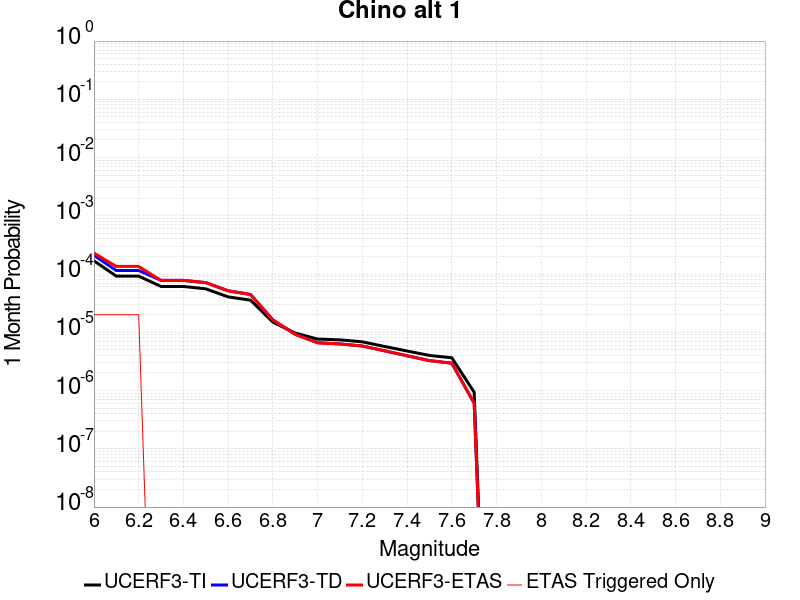 | 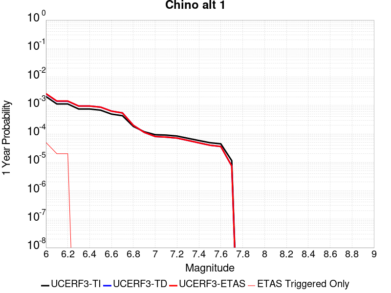 | 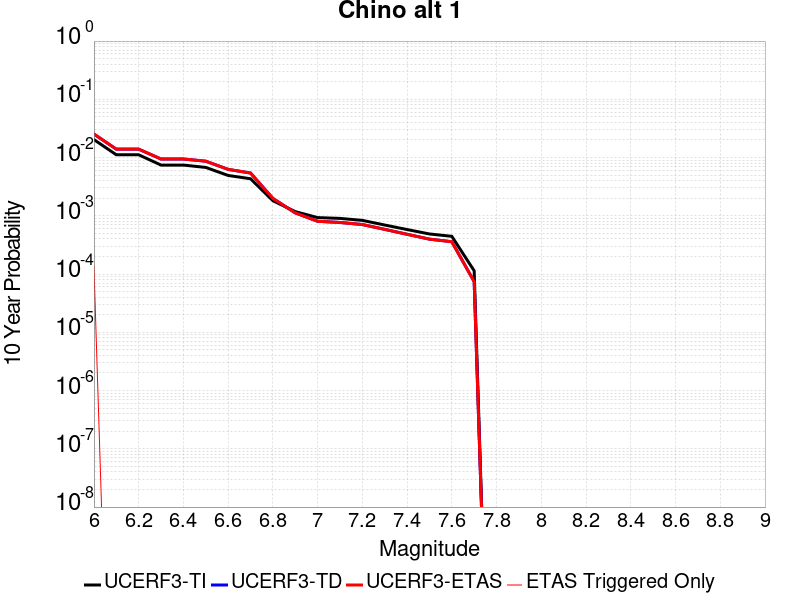 |

| Magnitude | 1 wk TI Prob | 1 wk TD Prob | 1 wk ETAS Prob | 1 wk ETAS/TD Gain | 1 wk ETAS Triggered Only | 1 mo TI Prob | 1 mo TD Prob | 1 mo ETAS Prob | 1 mo ETAS/TD Gain | 1 mo ETAS Triggered Only | 1 yr TI Prob | 1 yr TD Prob | 1 yr ETAS Prob | 1 yr ETAS/TD Gain | 1 yr ETAS Triggered Only | 10 yr TI Prob | 10 yr TD Prob | 10 yr ETAS Prob | 10 yr ETAS/TD Gain | 10 yr ETAS Triggered Only |
|-----|-----|-----|-----|-----|-----|-----|-----|-----|-----|-----|-----|-----|-----|-----|-----|-----|-----|-----|-----|-----|
| 6.0 | 3.939946E-5 | 4.8948554E-5 | 6.894758E-5 | 1.4085722 | 2.0E-5 | 1.6884391E-4 | 2.097656E-4 | 2.297614E-4 | 1.0953245 | 2.0E-5 | 0.0020537362 | 0.0025513945 | 0.002601267 | 1.0195471 | 5.0E-5 | 0.020348595 | 0.025277847 | 0.025394814 | 1.0046272 | 1.2E-4 |
| 6.1 | 2.1505624E-5 | 2.6879026E-5 | 4.687849E-5 | 1.7440546 | 2.0E-5 | 9.2163704E-5 | 1.1519137E-4 | 1.3518907E-4 | 1.1736041 | 2.0E-5 | 0.0011215154 | 0.001401664 | 0.001421636 | 1.0142487 | 2.0E-5 | 0.011158722 | 0.013945141 | 0.013964863 | 1.0014142 | 2.0E-5 |
| 6.2 | 2.1505624E-5 | 2.6879026E-5 | 4.687849E-5 | 1.7440546 | 2.0E-5 | 9.2163704E-5 | 1.1519137E-4 | 1.3518907E-4 | 1.1736041 | 2.0E-5 | 0.0011215154 | 0.001401664 | 0.001421636 | 1.0142487 | 2.0E-5 | 0.011158722 | 0.013945141 | 0.013964863 | 1.0014142 | 2.0E-5 |
| 6.3 | 1.4290785E-5 | 1.8165128E-5 | 1.8165128E-5 | 1.0 | 0.0 | 6.1244784E-5 | 7.784848E-5 | 7.784848E-5 | 1.0 | 0.0 | 7.454001E-4 | 9.4743853E-4 | 9.4743853E-4 | 1.0 | 0.0 | 0.007429048 | 0.0094444575 | 0.0094444575 | 1.0 | 0.0 |
| 6.4 | 1.4290785E-5 | 1.8165128E-5 | 1.8165128E-5 | 1.0 | 0.0 | 6.1244784E-5 | 7.784848E-5 | 7.784848E-5 | 1.0 | 0.0 | 7.454001E-4 | 9.4743853E-4 | 9.4743853E-4 | 1.0 | 0.0 | 0.007429048 | 0.0094444575 | 0.0094444575 | 1.0 | 0.0 |
| 6.5 | 1.3017944E-5 | 1.6652088E-5 | 1.6652088E-5 | 1.0 | 0.0 | 5.5789995E-5 | 7.136439E-5 | 7.136439E-5 | 1.0 | 0.0 | 6.790315E-4 | 8.685589E-4 | 8.685589E-4 | 1.0 | 0.0 | 0.0067696036 | 0.008661949 | 0.008661949 | 1.0 | 0.0 |
| 6.6 | 9.470016E-6 | 1.2039424E-5 | 1.2039424E-5 | 1.0 | 0.0 | 4.058515E-5 | 5.1596704E-5 | 5.1596704E-5 | 1.0 | 0.0 | 4.940122E-4 | 6.280428E-4 | 6.280428E-4 | 1.0 | 0.0 | 0.004929154 | 0.0062718987 | 0.0062718987 | 1.0 | 0.0 |
| 6.7 | 8.314155E-6 | 1.0407736E-5 | 1.0407736E-5 | 1.0 | 0.0 | 3.5631605E-5 | 4.4604003E-5 | 4.4604003E-5 | 1.0 | 0.0 | 4.3372845E-4 | 5.429507E-4 | 5.429507E-4 | 1.0 | 0.0 | 0.004328829 | 0.005425775 | 0.005425775 | 1.0 | 0.0 |
| 6.8 | 3.4856364E-6 | 3.8133708E-6 | 3.8133708E-6 | 1.0 | 0.0 | 1.4938357E-5 | 1.6342927E-5 | 1.6342927E-5 | 1.0 | 0.0 | 1.8185932E-4 | 1.9895904E-4 | 1.9895904E-4 | 1.0 | 0.0 | 0.0018171056 | 0.0019894864 | 0.0019894864 | 1.0 | 0.0 |
| 6.9 | 2.2645952E-6 | 2.1529022E-6 | 2.1529022E-6 | 1.0 | 0.0 | 9.705372E-6 | 9.226692E-6 | 9.226692E-6 | 1.0 | 0.0 | 1.18156495E-4 | 1.123294E-4 | 1.123294E-4 | 1.0 | 0.0 | 0.0011809369 | 0.0011233423 | 0.0011233423 | 1.0 | 0.0 |
| 7.0 | 1.7864003E-6 | 1.5430785E-6 | 1.5430785E-6 | 1.0 | 0.0 | 7.655979E-6 | 6.613177E-6 | 6.613177E-6 | 1.0 | 0.0 | 9.3207556E-5 | 8.051251E-5 | 8.051251E-5 | 1.0 | 0.0 | 9.316847E-4 | 8.0528046E-4 | 8.0528046E-4 | 1.0 | 0.0 |
| 7.1 | 1.7315456E-6 | 1.4733511E-6 | 1.4733511E-6 | 1.0 | 0.0 | 7.420889E-6 | 6.3143466E-6 | 6.3143466E-6 | 1.0 | 0.0 | 9.034557E-5 | 7.6874516E-5 | 7.6874516E-5 | 1.0 | 0.0 | 9.0308854E-4 | 7.6891703E-4 | 7.6891703E-4 | 1.0 | 0.0 |
| 7.2 | 1.6008337E-6 | 1.3574215E-6 | 1.3574215E-6 | 1.0 | 0.0 | 6.860698E-6 | 5.817508E-6 | 5.817508E-6 | 1.0 | 0.0 | 8.352579E-5 | 7.082591E-5 | 7.082591E-5 | 1.0 | 0.0 | 8.34944E-4 | 7.0845755E-4 | 7.0845755E-4 | 1.0 | 0.0 |
| 7.3 | 1.3320939E-6 | 1.121782E-6 | 1.121782E-6 | 1.0 | 0.0 | 5.7089615E-6 | 4.807629E-6 | 4.807629E-6 | 1.0 | 0.0 | 6.9504385E-5 | 5.8531357E-5 | 5.8531357E-5 | 1.0 | 0.0 | 6.9482654E-4 | 5.8530393E-4 | 5.8530393E-4 | 1.0 | 0.0 |
| 7.4 | 1.114294E-6 | 9.237111E-7 | 9.237111E-7 | 1.0 | 0.0 | 4.775537E-6 | 3.958756E-6 | 3.958756E-6 | 1.0 | 0.0 | 5.8140613E-5 | 4.8196827E-5 | 4.8196827E-5 | 1.0 | 0.0 | 5.81254E-4 | 4.8188053E-4 | 4.8188053E-4 | 1.0 | 0.0 |
| 7.5 | 9.354081E-7 | 7.6234323E-7 | 7.6234323E-7 | 1.0 | 0.0 | 4.0088858E-6 | 3.2671815E-6 | 3.2671815E-6 | 1.0 | 0.0 | 4.8807087E-5 | 3.9777242E-5 | 3.9777242E-5 | 1.0 | 0.0 | 4.879637E-4 | 3.977046E-4 | 3.977046E-4 | 1.0 | 0.0 |
| 7.6 | 8.521771E-7 | 6.88071E-7 | 6.88071E-7 | 1.0 | 0.0 | 3.6521824E-6 | 2.9488726E-6 | 2.9488726E-6 | 1.0 | 0.0 | 4.4464414E-5 | 3.5901965E-5 | 3.5901965E-5 | 1.0 | 0.0 | 4.4455516E-4 | 3.589648E-4 | 3.589648E-4 | 1.0 | 0.0 |
| 7.7 | 2.1803626E-7 | 1.418649E-7 | 1.418649E-7 | 1.0 | 0.0 | 9.344408E-7 | 6.079923E-7 | 6.079923E-7 | 1.0 | 0.0 | 1.1376757E-5 | 7.4022914E-6 | 7.4022914E-6 | 1.0 | 0.0 | 1.13761744E-4 | 7.402141E-5 | 7.402141E-5 | 1.0 | 0.0 |

## Imperial
*[(top)](#table-of-contents)*

| 1 Week | 1 Month | 1 Year | 10 Year |
|-----|-----|-----|-----|
| 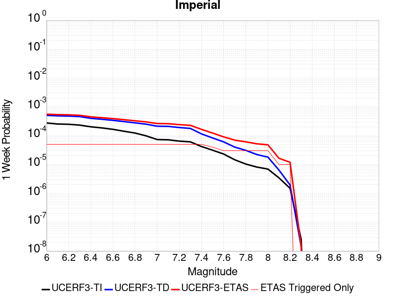 | 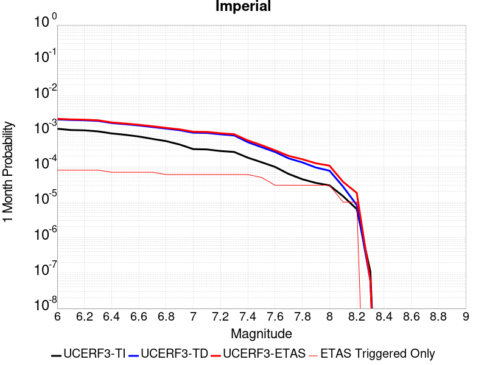 | 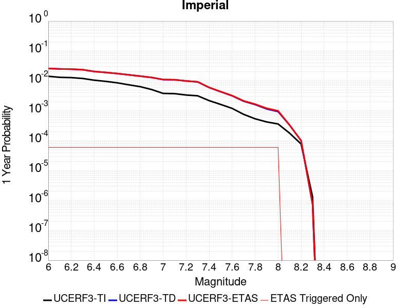 | 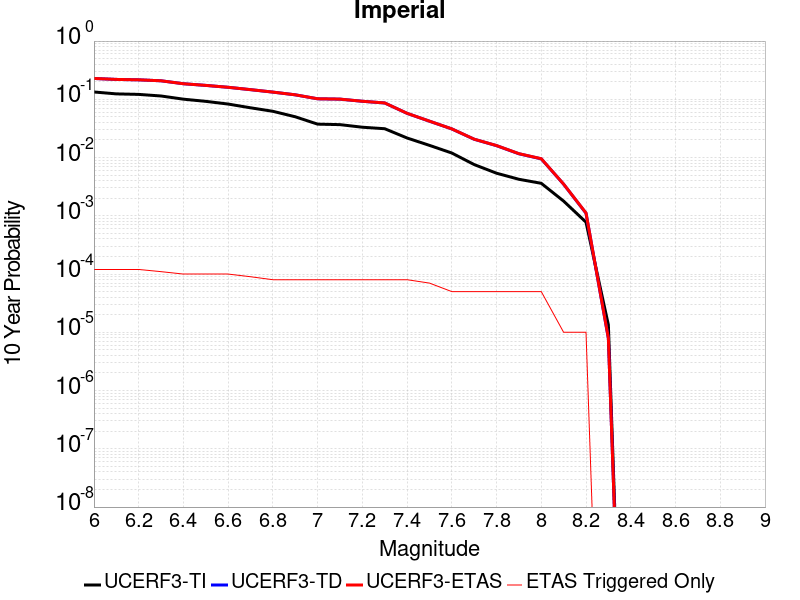 |

| Magnitude | 1 wk TI Prob | 1 wk TD Prob | 1 wk ETAS Prob | 1 wk ETAS/TD Gain | 1 wk ETAS Triggered Only | 1 mo TI Prob | 1 mo TD Prob | 1 mo ETAS Prob | 1 mo ETAS/TD Gain | 1 mo ETAS Triggered Only | 1 yr TI Prob | 1 yr TD Prob | 1 yr ETAS Prob | 1 yr ETAS/TD Gain | 1 yr ETAS Triggered Only | 10 yr TI Prob | 10 yr TD Prob | 10 yr ETAS Prob | 10 yr ETAS/TD Gain | 10 yr ETAS Triggered Only |
|-----|-----|-----|-----|-----|-----|-----|-----|-----|-----|-----|-----|-----|-----|-----|-----|-----|-----|-----|-----|-----|
| 6.0 | 2.7496446E-4 | 5.0552754E-4 | 5.5550225E-4 | 1.0988566 | 5.0E-5 | 0.0011778869 | 0.002164787 | 0.0022446138 | 1.0368751 | 8.0E-5 | 0.0142467655 | 0.026038699 | 0.026145834 | 1.0041145 | 1.1E-4 | 0.13367249 | 0.2280438 | 0.22813642 | 1.0004063 | 1.2E-4 |
| 6.1 | 2.5356023E-4 | 4.8656776E-4 | 5.3654343E-4 | 1.1027106 | 5.0E-5 | 0.001086234 | 0.0020836622 | 0.0021634956 | 1.038314 | 8.0E-5 | 0.013144928 | 0.025071215 | 0.025178457 | 1.0042775 | 1.1E-4 | 0.123940155 | 0.21947981 | 0.21957347 | 1.0004268 | 1.2E-4 |
| 6.2 | 2.4820742E-4 | 4.7752203E-4 | 5.2749814E-4 | 1.1046572 | 5.0E-5 | 0.0010633124 | 0.0020449557 | 0.0021247922 | 1.0390407 | 8.0E-5 | 0.01286919 | 0.024611235 | 0.024718529 | 1.0043595 | 1.1E-4 | 0.12148927 | 0.21598552 | 0.21607961 | 1.0004356 | 1.2E-4 |
| 6.3 | 2.3205351E-4 | 4.5890483E-4 | 5.088819E-4 | 1.1089051 | 5.0E-5 | 9.94136E-4 | 0.0019652895 | 0.0020451322 | 1.0406265 | 8.0E-5 | 0.012036599 | 0.02366133 | 0.023758965 | 1.0041263 | 1.0E-4 | 0.11405133 | 0.20793462 | 0.20802175 | 1.000419 | 1.1E-4 |
| 6.4 | 2.0304754E-4 | 3.987652E-4 | 4.4874524E-4 | 1.1253371 | 5.0E-5 | 8.6991355E-4 | 0.0017078889 | 0.0017777694 | 1.0409163 | 7.0E-5 | 0.010539869 | 0.020595672 | 0.020683818 | 1.0042799 | 9.0E-5 | 0.100537635 | 0.1850669 | 0.18514839 | 1.0004404 | 1.0E-4 |
| 6.5 | 1.854992E-4 | 3.6988858E-4 | 4.198701E-4 | 1.1351259 | 5.0E-5 | 7.9475436E-4 | 0.0015842861 | 0.0016541752 | 1.044114 | 7.0E-5 | 0.009633281 | 0.01911948 | 0.01920776 | 1.0046172 | 9.0E-5 | 0.0922623 | 0.173298 | 0.17338067 | 1.0004771 | 1.0E-4 |
| 6.6 | 1.6586106E-4 | 3.403506E-4 | 3.9033362E-4 | 1.1468574 | 5.0E-5 | 7.106394E-4 | 0.0014578402 | 0.0015277382 | 1.0479462 | 7.0E-5 | 0.008617763 | 0.01760642 | 0.017694835 | 1.0050218 | 9.0E-5 | 0.08291132 | 0.16077545 | 0.16085938 | 1.000522 | 1.0E-4 |
| 6.7 | 1.4224656E-4 | 3.076692E-4 | 3.576538E-4 | 1.1624622 | 5.0E-5 | 6.094856E-4 | 0.001317924 | 0.0013878318 | 1.0530438 | 7.0E-5 | 0.0073952693 | 0.015929576 | 0.016008303 | 1.004942 | 8.0E-5 | 0.07153955 | 0.14648417 | 0.14656098 | 1.0005244 | 9.0E-5 |
| 6.8 | 1.2317259E-4 | 2.779122E-4 | 3.2789828E-4 | 1.179863 | 5.0E-5 | 5.2777573E-4 | 0.0011905148 | 0.0012504433 | 1.0503384 | 6.0E-5 | 0.0064067547 | 0.0143995695 | 0.014468562 | 1.0047913 | 7.0E-5 | 0.06225166 | 0.13293684 | 0.1330062 | 1.0005218 | 8.0E-5 |
| 6.9 | 9.859898E-5 | 2.5014306E-4 | 3.0013054E-4 | 1.1998357 | 5.0E-5 | 4.2249862E-4 | 0.0010716055 | 0.0011315412 | 1.0559307 | 6.0E-5 | 0.0051317946 | 0.012969712 | 0.013038804 | 1.0053272 | 7.0E-5 | 0.05014893 | 0.11940631 | 0.11947676 | 1.00059 | 8.0E-5 |
| 7.0 | 7.3191884E-5 | 2.1266776E-4 | 2.6265712E-4 | 1.2350585 | 5.0E-5 | 3.136418E-4 | 9.1111806E-4 | 9.710634E-4 | 1.0657932 | 6.0E-5 | 0.003811904 | 0.011037128 | 0.011106355 | 1.0062722 | 7.0E-5 | 0.037471764 | 0.10206493 | 0.10213676 | 1.0007038 | 8.0E-5 |
| 7.1 | 7.1760296E-5 | 2.0968143E-4 | 2.5967092E-4 | 1.238407 | 5.0E-5 | 3.0750787E-4 | 8.983284E-4 | 9.5827447E-4 | 1.0667307 | 6.0E-5 | 0.003737482 | 0.010882978 | 0.010952217 | 1.0063621 | 7.0E-5 | 0.03675245 | 0.10070146 | 0.1007734 | 1.0007144 | 8.0E-5 |
| 7.2 | 6.46614E-5 | 1.9136685E-4 | 2.413573E-4 | 1.2612282 | 5.0E-5 | 2.7709085E-4 | 8.1988896E-4 | 8.7983976E-4 | 1.0731206 | 6.0E-5 | 0.0033683628 | 0.0099370815 | 0.010006386 | 1.0069743 | 7.0E-5 | 0.033177625 | 0.09250898 | 0.09258158 | 1.0007848 | 8.0E-5 |
| 7.3 | 6.088115E-5 | 1.78084E-4 | 2.2807509E-4 | 1.2807164 | 5.0E-5 | 2.6089314E-4 | 7.6299673E-4 | 8.2295097E-4 | 1.0785773 | 6.0E-5 | 0.0031717476 | 0.009250494 | 0.009319846 | 1.0074972 | 7.0E-5 | 0.031268585 | 0.08655989 | 0.08663297 | 1.0008442 | 8.0E-5 |
| 7.4 | 4.199346E-5 | 1.1510366E-4 | 1.6509791E-4 | 1.4343411 | 5.0E-5 | 1.7995955E-4 | 4.9320905E-4 | 5.531794E-4 | 1.1215923 | 6.0E-5 | 0.0021888057 | 0.0059884563 | 0.006058037 | 1.0116192 | 7.0E-5 | 0.02167372 | 0.057439793 | 0.0575152 | 1.0013127 | 8.0E-5 |
| 7.5 | 3.130448E-5 | 8.33328E-5 | 1.2332946E-4 | 1.4799631 | 4.0E-5 | 1.3415517E-4 | 3.57092E-4 | 4.0707414E-4 | 1.13997 | 5.0E-5 | 0.0016321153 | 0.004338988 | 0.004398728 | 1.0137681 | 6.0E-5 | 0.016201803 | 0.04213201 | 0.04219906 | 1.0015914 | 7.0E-5 |
| 7.6 | 2.3074248E-5 | 6.0844646E-5 | 9.084282E-5 | 1.493029 | 3.0E-5 | 9.888588E-5 | 2.6073685E-4 | 2.9072902E-4 | 1.1150285 | 3.0E-5 | 0.0012032706 | 0.0031698733 | 0.0032097467 | 1.0125788 | 4.0E-5 | 0.011967761 | 0.031026395 | 0.031074844 | 1.0015615 | 5.0E-5 |
| 7.7 | 1.45864815E-5 | 4.0124698E-5 | 7.01235E-5 | 1.7476392 | 3.0E-5 | 6.2511994E-5 | 1.7195169E-4 | 2.0194653E-4 | 1.1744376 | 3.0E-5 | 7.608177E-4 | 0.0020915072 | 0.0021314234 | 1.0190849 | 4.0E-5 | 0.007582182 | 0.020627763 | 0.020676732 | 1.0023739 | 5.0E-5 |
| 7.8 | 1.0352979E-5 | 3.0960902E-5 | 6.095997E-5 | 1.968934 | 3.0E-5 | 4.4369157E-5 | 1.3268284E-4 | 1.6267886E-4 | 1.2260731 | 3.0E-5 | 5.400606E-4 | 0.0016142189 | 0.0016541544 | 1.0247397 | 4.0E-5 | 0.0053875 | 0.016016833 | 0.016066032 | 1.0030717 | 5.0E-5 |
| 7.9 | 8.137906E-6 | 2.2149103E-5 | 5.2148436E-5 | 2.3544266 | 3.0E-5 | 3.4876273E-5 | 9.492128E-5 | 1.2491843E-4 | 1.3160213 | 3.0E-5 | 4.2453592E-4 | 0.0011550548 | 0.0011950086 | 1.0345904 | 4.0E-5 | 0.004237258 | 0.011617903 | 0.011667321 | 1.0042537 | 5.0E-5 |
| 8.0 | 6.93792E-6 | 1.8008766E-5 | 4.8008224E-5 | 2.6658254 | 3.0E-5 | 2.9733603E-5 | 7.717814E-5 | 1.0717583E-4 | 1.388681 | 3.0E-5 | 3.6194647E-4 | 9.3923963E-4 | 9.79202E-4 | 1.0425476 | 4.0E-5 | 0.0036135751 | 0.00950155 | 0.009551075 | 1.0052123 | 5.0E-5 |
| 8.1 | 3.4286315E-6 | 6.379872E-6 | 1.6379809E-5 | 2.5674195 | 1.0E-5 | 1.4694053E-5 | 2.7342023E-5 | 3.734175E-5 | 1.3657274 | 1.0E-5 | 1.7888541E-4 | 3.328384E-4 | 3.4283506E-4 | 1.0300347 | 1.0E-5 | 0.0017874148 | 0.003486031 | 0.003495996 | 1.0028586 | 1.0E-5 |
| 8.2 | 1.4906886E-6 | 1.9366646E-6 | 1.1936645E-5 | 6.1635065 | 1.0E-5 | 6.3886496E-6 | 8.299965E-6 | 1.8299883E-5 | 2.2048144 | 1.0E-5 | 7.7779034E-5 | 1.0104742E-4 | 1.1104641E-4 | 1.0989535 | 1.0E-5 | 7.775182E-4 | 0.0011075331 | 0.001117522 | 1.009019 | 1.0E-5 |
| 8.3 | 2.5758007E-8 | 1.4500102E-8 | 1.4500102E-8 | 1.0 | 0.0 | 1.10391454E-7 | 6.214329E-8 | 6.214329E-8 | 1.0 | 0.0 | 1.3440151E-6 | 7.565946E-7 | 7.565946E-7 | 1.0 | 0.0 | 1.344007E-5 | 7.887763E-6 | 7.887763E-6 | 1.0 | 0.0 |

## Elysian Park (Upper)
*[(top)](#table-of-contents)*

| 1 Week | 1 Month | 1 Year | 10 Year |
|-----|-----|-----|-----|
| 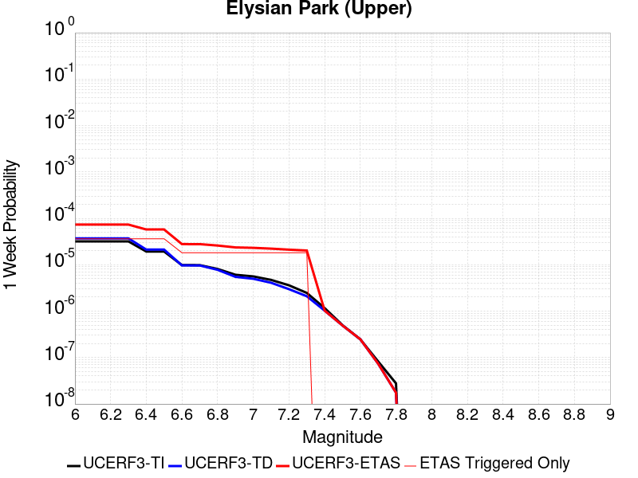 | 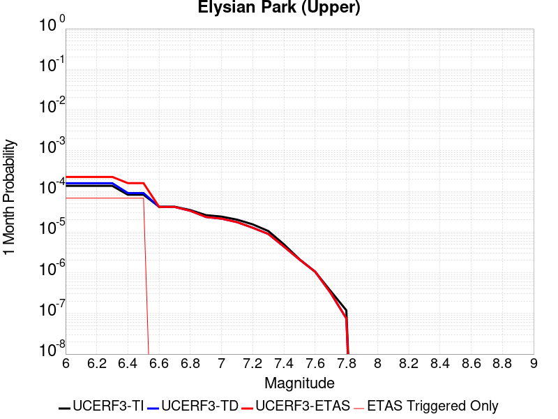 | 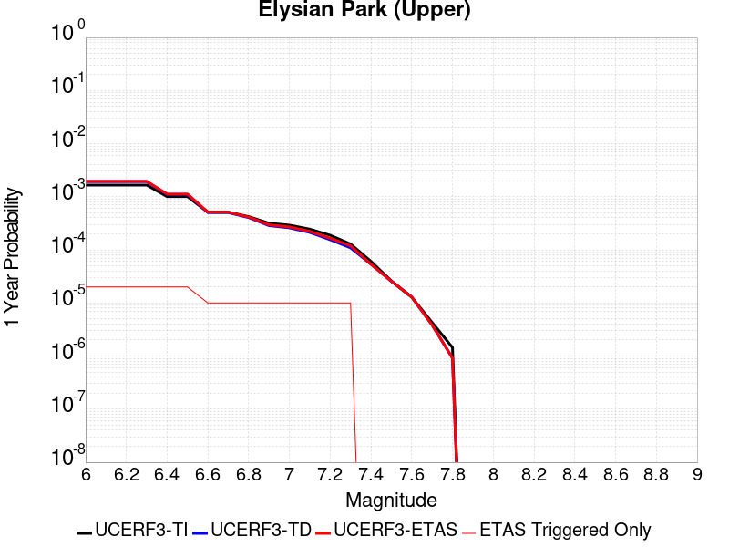 | 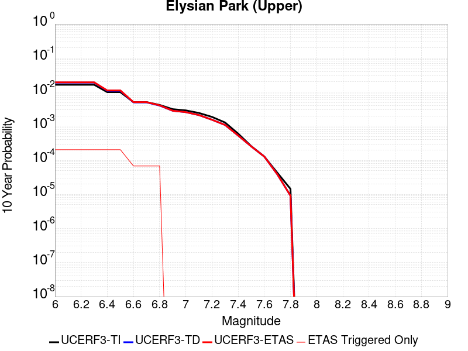 |

| Magnitude | 1 wk TI Prob | 1 wk TD Prob | 1 wk ETAS Prob | 1 wk ETAS/TD Gain | 1 wk ETAS Triggered Only | 1 mo TI Prob | 1 mo TD Prob | 1 mo ETAS Prob | 1 mo ETAS/TD Gain | 1 mo ETAS Triggered Only | 1 yr TI Prob | 1 yr TD Prob | 1 yr ETAS Prob | 1 yr ETAS/TD Gain | 1 yr ETAS Triggered Only | 10 yr TI Prob | 10 yr TD Prob | 10 yr ETAS Prob | 10 yr ETAS/TD Gain | 10 yr ETAS Triggered Only |
|-----|-----|-----|-----|-----|-----|-----|-----|-----|-----|-----|-----|-----|-----|-----|-----|-----|-----|-----|-----|-----|
| 6.0 | 3.1876025E-5 | 3.7035516E-5 | 5.7034773E-5 | 1.5400022 | 2.0E-5 | 1.3660437E-4 | 1.587167E-4 | 1.7871354E-4 | 1.1259906 | 2.0E-5 | 0.0016618895 | 0.0019311075 | 0.0019510689 | 1.0103368 | 2.0E-5 | 0.016495159 | 0.019189782 | 0.019268248 | 1.0040889 | 8.0E-5 |
| 6.1 | 3.1876025E-5 | 3.7035516E-5 | 5.7034773E-5 | 1.5400022 | 2.0E-5 | 1.3660437E-4 | 1.587167E-4 | 1.7871354E-4 | 1.1259906 | 2.0E-5 | 0.0016618895 | 0.0019311075 | 0.0019510689 | 1.0103368 | 2.0E-5 | 0.016495159 | 0.019189782 | 0.019268248 | 1.0040889 | 8.0E-5 |
| 6.2 | 3.1876025E-5 | 3.7035516E-5 | 5.7034773E-5 | 1.5400022 | 2.0E-5 | 1.3660437E-4 | 1.587167E-4 | 1.7871354E-4 | 1.1259906 | 2.0E-5 | 0.0016618895 | 0.0019311075 | 0.0019510689 | 1.0103368 | 2.0E-5 | 0.016495159 | 0.019189782 | 0.019268248 | 1.0040889 | 8.0E-5 |
| 6.3 | 3.1876025E-5 | 3.7035516E-5 | 5.7034773E-5 | 1.5400022 | 2.0E-5 | 1.3660437E-4 | 1.587167E-4 | 1.7871354E-4 | 1.1259906 | 2.0E-5 | 0.0016618895 | 0.0019311075 | 0.0019510689 | 1.0103368 | 2.0E-5 | 0.016495159 | 0.019189782 | 0.019268248 | 1.0040889 | 8.0E-5 |
| 6.4 | 1.9273462E-5 | 2.1202266E-5 | 4.120184E-5 | 1.9432755 | 2.0E-5 | 8.259794E-5 | 9.086466E-5 | 1.1086285E-4 | 1.2200875 | 2.0E-5 | 0.001005166 | 0.0011058892 | 0.0011258671 | 1.018065 | 2.0E-5 | 0.010006315 | 0.011020724 | 0.011089953 | 1.0062816 | 7.0E-5 |
| 6.5 | 1.9273462E-5 | 2.1202266E-5 | 4.120184E-5 | 1.9432755 | 2.0E-5 | 8.259794E-5 | 9.086466E-5 | 1.1086285E-4 | 1.2200875 | 2.0E-5 | 0.001005166 | 0.0011058892 | 0.0011258671 | 1.018065 | 2.0E-5 | 0.010006315 | 0.011020724 | 0.011089953 | 1.0062816 | 7.0E-5 |
| 6.6 | 9.813258E-6 | 9.665599E-6 | 1.9665502E-5 | 2.0345871 | 1.0E-5 | 4.205614E-5 | 4.1423376E-5 | 5.142296E-5 | 1.2413995 | 1.0E-5 | 5.119132E-4 | 5.0422014E-4 | 5.142151E-4 | 1.0198226 | 1.0E-5 | 0.005107356 | 0.0050314846 | 0.005061334 | 1.0059325 | 3.0E-5 |
| 6.7 | 9.801478E-6 | 9.653168E-6 | 1.9653071E-5 | 2.0359194 | 1.0E-5 | 4.2005657E-5 | 4.1370105E-5 | 5.136969E-5 | 1.2417104 | 1.0E-5 | 5.112989E-4 | 5.035719E-4 | 5.1356683E-4 | 1.0198481 | 1.0E-5 | 0.0051012407 | 0.0050250315 | 0.0050548804 | 1.0059401 | 3.0E-5 |
| 6.8 | 8.102489E-6 | 7.773004E-6 | 1.7772927E-5 | 2.2864938 | 1.0E-5 | 3.4724493E-5 | 3.3312477E-5 | 4.3312142E-5 | 1.3001778 | 1.0E-5 | 4.2268867E-4 | 4.055089E-4 | 4.1550485E-4 | 1.0246503 | 1.0E-5 | 0.004218856 | 0.0040481836 | 0.0040780623 | 1.0073807 | 3.0E-5 |
| 6.9 | 6.08275E-6 | 5.4814514E-6 | 1.5481397E-5 | 2.8243244 | 1.0E-5 | 2.6068668E-5 | 2.3491726E-5 | 3.349149E-5 | 1.4256718 | 1.0E-5 | 3.173398E-4 | 2.85975E-4 | 2.9597213E-4 | 1.0349581 | 1.0E-5 | 0.0031688702 | 0.0028561477 | 0.0028661191 | 1.0034912 | 1.0E-5 |
| 7.0 | 5.5995934E-6 | 4.98278E-6 | 1.498273E-5 | 3.0069017 | 1.0E-5 | 2.3998036E-5 | 2.13546E-5 | 3.1354386E-5 | 1.4682732 | 1.0E-5 | 2.9213692E-4 | 2.599619E-4 | 2.699593E-4 | 1.0384572 | 1.0E-5 | 0.0029175316 | 0.0025966454 | 0.0026066194 | 1.0038412 | 1.0E-5 |
| 7.1 | 4.709881E-6 | 4.0874015E-6 | 1.4087361E-5 | 3.4465322 | 1.0E-5 | 2.0185047E-5 | 1.7517319E-5 | 2.7517144E-5 | 1.5708536 | 1.0E-5 | 2.4572524E-4 | 2.132529E-4 | 2.2325077E-4 | 1.0468826 | 1.0E-5 | 0.002454537 | 0.002130524 | 0.0021405027 | 1.0046837 | 1.0E-5 |
| 7.2 | 3.6063436E-6 | 2.9779544E-6 | 1.2977925E-5 | 4.358 | 1.0E-5 | 1.5455667E-5 | 1.27626E-5 | 2.2762473E-5 | 1.7835294 | 1.0E-5 | 1.881565E-4 | 1.5537368E-4 | 1.6537213E-4 | 1.064351 | 1.0E-5 | 0.0018799726 | 0.0015526618 | 0.0015626462 | 1.0064305 | 1.0E-5 |
| 7.3 | 2.471135E-6 | 2.0954615E-6 | 1.2095441E-5 | 5.772208 | 1.0E-5 | 1.0590536E-5 | 8.980519E-6 | 1.8980429E-5 | 2.1135113 | 1.0E-5 | 1.2893214E-4 | 1.093324E-4 | 1.19331315E-4 | 1.0914541 | 1.0E-5 | 0.0012885736 | 0.0010927934 | 0.0011027824 | 1.0091408 | 1.0E-5 |
| 7.4 | 1.163943E-6 | 1.0275091E-6 | 1.0275091E-6 | 1.0 | 0.0 | 4.988318E-6 | 4.4036033E-6 | 4.4036033E-6 | 1.0 | 0.0 | 6.0731076E-5 | 5.3612584E-5 | 5.3612584E-5 | 1.0 | 0.0 | 6.071448E-4 | 5.359995E-4 | 5.359995E-4 | 1.0 | 0.0 |
| 7.5 | 4.99459E-7 | 4.917604E-7 | 4.917604E-7 | 1.0 | 0.0 | 2.140537E-6 | 2.1075427E-6 | 2.1075427E-6 | 1.0 | 0.0 | 2.6060725E-5 | 2.5659048E-5 | 2.5659048E-5 | 1.0 | 0.0 | 2.605767E-4 | 2.5656243E-4 | 2.5656243E-4 | 1.0 | 0.0 |
| 7.6 | 2.4667852E-7 | 2.4778336E-7 | 2.4778336E-7 | 1.0 | 0.0 | 1.0571932E-6 | 1.0619283E-6 | 1.0619283E-6 | 1.0 | 0.0 | 1.2871251E-5 | 1.2928905E-5 | 1.2928905E-5 | 1.0 | 0.0 | 1.2870505E-4 | 1.2928189E-4 | 1.2928189E-4 | 1.0 | 0.0 |
| 7.7 | 8.2312795E-8 | 7.3864456E-8 | 7.3864456E-8 | 1.0 | 0.0 | 3.527691E-7 | 3.165619E-7 | 3.165619E-7 | 1.0 | 0.0 | 4.294955E-6 | 3.8541357E-6 | 3.8541357E-6 | 1.0 | 0.0 | 4.2948723E-5 | 3.8540802E-5 | 3.8540802E-5 | 1.0 | 0.0 |
| 7.8 | 2.7819295E-8 | 1.7566023E-8 | 1.7566023E-8 | 1.0 | 0.0 | 1.1922555E-7 | 7.5282955E-8 | 7.5282955E-8 | 1.0 | 0.0 | 1.45157E-6 | 9.165697E-7 | 9.165697E-7 | 1.0 | 0.0 | 1.45156055E-5 | 9.165675E-6 | 9.165675E-6 | 1.0 | 0.0 |

## Mission Creek
*[(top)](#table-of-contents)*

| 1 Week | 1 Month | 1 Year | 10 Year |
|-----|-----|-----|-----|
| 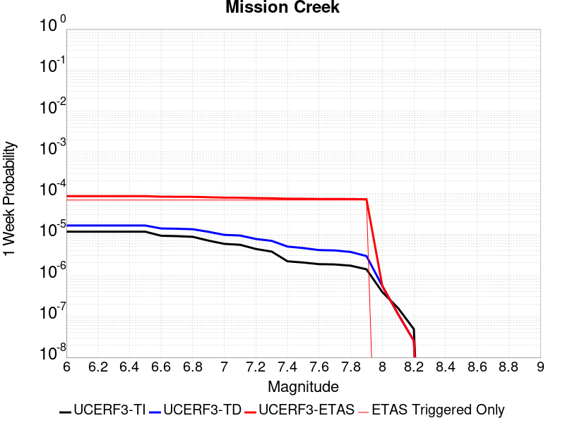 | 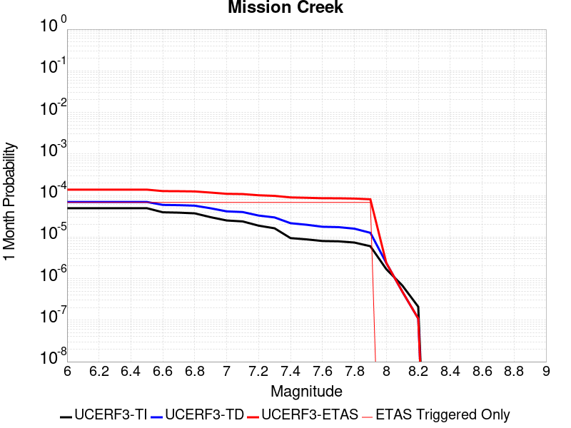 | 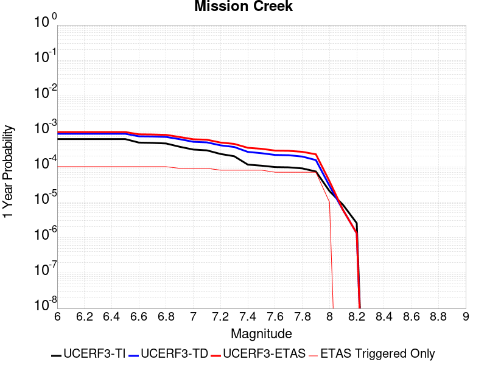 | 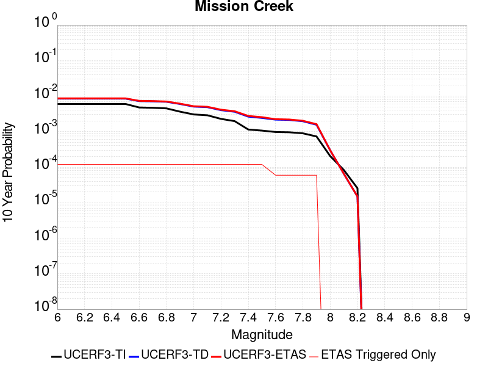 |

| Magnitude | 1 wk TI Prob | 1 wk TD Prob | 1 wk ETAS Prob | 1 wk ETAS/TD Gain | 1 wk ETAS Triggered Only | 1 mo TI Prob | 1 mo TD Prob | 1 mo ETAS Prob | 1 mo ETAS/TD Gain | 1 mo ETAS Triggered Only | 1 yr TI Prob | 1 yr TD Prob | 1 yr ETAS Prob | 1 yr ETAS/TD Gain | 1 yr ETAS Triggered Only | 10 yr TI Prob | 10 yr TD Prob | 10 yr ETAS Prob | 10 yr ETAS/TD Gain | 10 yr ETAS Triggered Only |
|-----|-----|-----|-----|-----|-----|-----|-----|-----|-----|-----|-----|-----|-----|-----|-----|-----|-----|-----|-----|-----|
| 6.0 | 1.1549387E-5 | 1.632237E-5 | 7.632139E-5 | 4.6758766 | 6.0E-5 | 4.9496433E-5 | 6.9951224E-5 | 1.2994703E-4 | 1.8576806 | 6.0E-5 | 6.0245243E-4 | 8.513384E-4 | 9.512532E-4 | 1.1173621 | 1.0E-4 | 0.006008218 | 0.008509998 | 0.008619062 | 1.012816 | 1.1E-4 |
| 6.1 | 1.1549387E-5 | 1.632237E-5 | 7.632139E-5 | 4.6758766 | 6.0E-5 | 4.9496433E-5 | 6.9951224E-5 | 1.2994703E-4 | 1.8576806 | 6.0E-5 | 6.0245243E-4 | 8.513384E-4 | 9.512532E-4 | 1.1173621 | 1.0E-4 | 0.006008218 | 0.008509998 | 0.008619062 | 1.012816 | 1.1E-4 |
| 6.2 | 1.1549387E-5 | 1.632237E-5 | 7.632139E-5 | 4.6758766 | 6.0E-5 | 4.9496433E-5 | 6.9951224E-5 | 1.2994703E-4 | 1.8576806 | 6.0E-5 | 6.0245243E-4 | 8.513384E-4 | 9.512532E-4 | 1.1173621 | 1.0E-4 | 0.006008218 | 0.008509998 | 0.008619062 | 1.012816 | 1.1E-4 |
| 6.3 | 1.1549387E-5 | 1.632237E-5 | 7.632139E-5 | 4.6758766 | 6.0E-5 | 4.9496433E-5 | 6.9951224E-5 | 1.2994703E-4 | 1.8576806 | 6.0E-5 | 6.0245243E-4 | 8.513384E-4 | 9.512532E-4 | 1.1173621 | 1.0E-4 | 0.006008218 | 0.008509998 | 0.008619062 | 1.012816 | 1.1E-4 |
| 6.4 | 1.1549387E-5 | 1.632237E-5 | 7.632139E-5 | 4.6758766 | 6.0E-5 | 4.9496433E-5 | 6.9951224E-5 | 1.2994703E-4 | 1.8576806 | 6.0E-5 | 6.0245243E-4 | 8.513384E-4 | 9.512532E-4 | 1.1173621 | 1.0E-4 | 0.006008218 | 0.008509998 | 0.008619062 | 1.012816 | 1.1E-4 |
| 6.5 | 1.1549387E-5 | 1.632237E-5 | 7.632139E-5 | 4.6758766 | 6.0E-5 | 4.9496433E-5 | 6.9951224E-5 | 1.2994703E-4 | 1.8576806 | 6.0E-5 | 6.0245243E-4 | 8.513384E-4 | 9.512532E-4 | 1.1173621 | 1.0E-4 | 0.006008218 | 0.008509998 | 0.008619062 | 1.012816 | 1.1E-4 |
| 6.6 | 9.202681E-6 | 1.3845646E-5 | 7.3844814E-5 | 5.333432 | 6.0E-5 | 3.9439463E-5 | 5.9337188E-5 | 1.1933363E-4 | 2.0111103 | 6.0E-5 | 4.800697E-4 | 7.221998E-4 | 8.221276E-4 | 1.1383659 | 1.0E-4 | 0.004790339 | 0.0072271815 | 0.0073363865 | 1.0151104 | 1.1E-4 |
| 6.7 | 9.019164E-6 | 1.3651316E-5 | 7.3650495E-5 | 5.3951206 | 6.0E-5 | 3.8652986E-5 | 5.8504378E-5 | 1.18500866E-4 | 2.0255044 | 6.0E-5 | 4.7049852E-4 | 7.12067E-4 | 8.119958E-4 | 1.1403363 | 1.0E-4 | 0.004695036 | 0.007126506 | 0.007235722 | 1.0153253 | 1.1E-4 |
| 6.8 | 8.673558E-6 | 1.3273427E-5 | 7.327263E-5 | 5.52025 | 6.0E-5 | 3.717186E-5 | 5.6884925E-5 | 1.16881514E-4 | 2.054701 | 6.0E-5 | 4.524734E-4 | 6.923627E-4 | 7.922935E-4 | 1.144333 | 1.0E-4 | 0.0045155324 | 0.006930694 | 0.0070399316 | 1.0157614 | 1.1E-4 |
| 6.9 | 7.002255E-6 | 1.1477657E-5 | 7.147697E-5 | 6.227488 | 6.0E-5 | 3.000932E-5 | 4.9189068E-5 | 1.0918612E-4 | 2.2197232 | 6.0E-5 | 3.653022E-4 | 5.9871917E-4 | 6.886653E-4 | 1.1502309 | 9.0E-5 | 0.0036470229 | 0.005999517 | 0.006098917 | 1.0165681 | 1.0E-4 |
| 7.0 | 5.84644E-6 | 9.67498E-6 | 6.96744E-5 | 7.2015033 | 6.0E-5 | 2.5055931E-5 | 4.1463565E-5 | 1.01461075E-4 | 2.4469936 | 6.0E-5 | 3.0501327E-4 | 5.047066E-4 | 5.946611E-4 | 1.1782315 | 9.0E-5 | 0.0030459496 | 0.0050638523 | 0.005163346 | 1.0196478 | 1.0E-4 |
| 7.1 | 5.54703E-6 | 9.329456E-6 | 6.93289E-5 | 7.4311833 | 6.0E-5 | 2.377277E-5 | 3.9982795E-5 | 9.9980396E-5 | 2.5005856 | 6.0E-5 | 2.8939504E-4 | 4.8668624E-4 | 5.7664246E-4 | 1.184834 | 9.0E-5 | 0.0028901845 | 0.004884446 | 0.004983958 | 1.0203731 | 1.0E-4 |
| 7.2 | 4.384709E-6 | 7.68157E-6 | 6.768111E-5 | 8.8108425 | 6.0E-5 | 1.8791474E-5 | 3.2920623E-5 | 9.291865E-5 | 2.8225057 | 6.0E-5 | 2.2876218E-4 | 4.0073853E-4 | 4.8070645E-4 | 1.1995515 | 8.0E-5 | 0.0022852682 | 0.004028366 | 0.004118003 | 1.0222516 | 9.0E-5 |
| 7.3 | 3.7888456E-6 | 6.915452E-6 | 6.691504E-5 | 9.676163 | 6.0E-5 | 1.623781E-5 | 2.9637333E-5 | 8.9635556E-5 | 3.0244136 | 6.0E-5 | 1.9767738E-4 | 3.6077813E-4 | 4.4074928E-4 | 1.2216629 | 8.0E-5 | 0.0019750162 | 0.0036301152 | 0.0037197885 | 1.0247025 | 9.0E-5 |
| 7.4 | 2.1982462E-6 | 5.0237763E-6 | 6.502347E-5 | 12.943147 | 6.0E-5 | 9.421021E-6 | 2.1530293E-5 | 8.1529004E-5 | 3.786711 | 6.0E-5 | 1.1469489E-4 | 2.621E-4 | 3.4207903E-4 | 1.305147 | 8.0E-5 | 0.0011463572 | 0.0026458844 | 0.0027356464 | 1.033925 | 9.0E-5 |
| 7.5 | 2.051923E-6 | 4.615016E-6 | 6.461474E-5 | 14.000978 | 6.0E-5 | 8.793926E-6 | 1.9778492E-5 | 7.97773E-5 | 4.0335383 | 6.0E-5 | 1.0706078E-4 | 2.4077666E-4 | 3.207574E-4 | 1.3321781 | 8.0E-5 | 0.0010700922 | 0.0024335422 | 0.002523323 | 1.0368931 | 9.0E-5 |
| 7.6 | 1.8733427E-6 | 4.1233748E-6 | 6.412313E-5 | 15.551127 | 6.0E-5 | 8.028587E-6 | 1.7671488E-5 | 7.7670426E-5 | 4.39524 | 6.0E-5 | 9.774366E-5 | 2.151292E-4 | 2.8511413E-4 | 1.3253158 | 7.0E-5 | 9.770069E-4 | 0.0021780801 | 0.002257906 | 1.0366496 | 8.0E-5 |
| 7.7 | 1.8411953E-6 | 4.0430496E-6 | 6.4042804E-5 | 15.840222 | 6.0E-5 | 7.890813E-6 | 1.732724E-5 | 7.73262E-5 | 4.4626956 | 6.0E-5 | 9.606641E-5 | 2.1093882E-4 | 2.8092405E-4 | 1.3317797 | 7.0E-5 | 9.6024893E-4 | 0.0021363653 | 0.0022161943 | 1.0373667 | 8.0E-5 |
| 7.8 | 1.7194251E-6 | 3.7104276E-6 | 6.3710206E-5 | 17.170584 | 6.0E-5 | 7.368944E-6 | 1.5901736E-5 | 7.590078E-5 | 4.773113 | 6.0E-5 | 8.97132E-5 | 1.9358651E-4 | 2.6357296E-4 | 1.3615254 | 7.0E-5 | 8.967699E-4 | 0.0019623525 | 0.0020421955 | 1.0406874 | 8.0E-5 |
| 7.9 | 1.4035052E-6 | 2.9500632E-6 | 6.294988E-5 | 21.338488 | 6.0E-5 | 6.0150082E-6 | 1.2643067E-5 | 7.264231E-5 | 5.745624 | 6.0E-5 | 7.3230265E-5 | 1.5391852E-4 | 2.2390774E-4 | 1.4547161 | 7.0E-5 | 7.3206134E-4 | 0.0015631086 | 0.0016429836 | 1.0511 | 8.0E-5 |
| 8.0 | 3.9318823E-7 | 5.528522E-7 | 1.0552847E-5 | 19.088007 | 1.0E-5 | 1.6850913E-6 | 2.3693647E-6 | 1.2369341E-5 | 5.220531 | 1.0E-5 | 2.0515794E-5 | 2.8846638E-5 | 3.884635E-5 | 1.3466508 | 1.0E-5 | 2.0513899E-4 | 2.9899E-4 | 3.0898702E-4 | 1.033436 | 1.0E-5 |
| 8.1 | 1.596793E-7 | 1.1380002E-7 | 1.1380002E-7 | 1.0 | 0.0 | 6.8433974E-7 | 4.877143E-7 | 4.877143E-7 | 1.0 | 0.0 | 8.331805E-6 | 5.937906E-6 | 5.937906E-6 | 1.0 | 0.0 | 8.331492E-5 | 6.549966E-5 | 6.549966E-5 | 1.0 | 0.0 |
| 8.2 | 4.9003038E-8 | 2.5444924E-8 | 2.5444924E-8 | 1.0 | 0.0 | 2.10013E-7 | 1.0904967E-7 | 1.0904967E-7 | 1.0 | 0.0 | 2.5569052E-6 | 1.327679E-6 | 1.327679E-6 | 1.0 | 0.0 | 2.556876E-5 | 1.495635E-5 | 1.495635E-5 | 1.0 | 0.0 |

## Santa Cruz Island
*[(top)](#table-of-contents)*

| 1 Week | 1 Month | 1 Year | 10 Year |
|-----|-----|-----|-----|
| 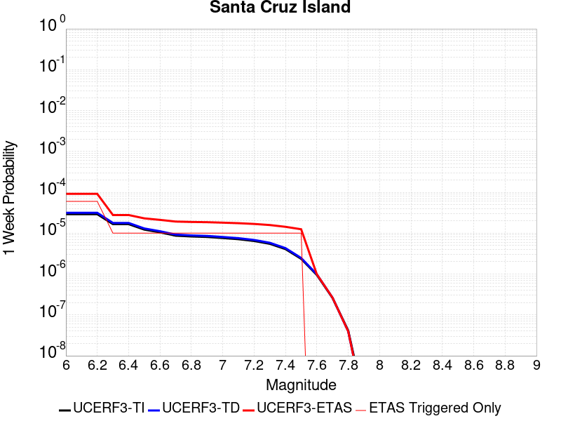 | 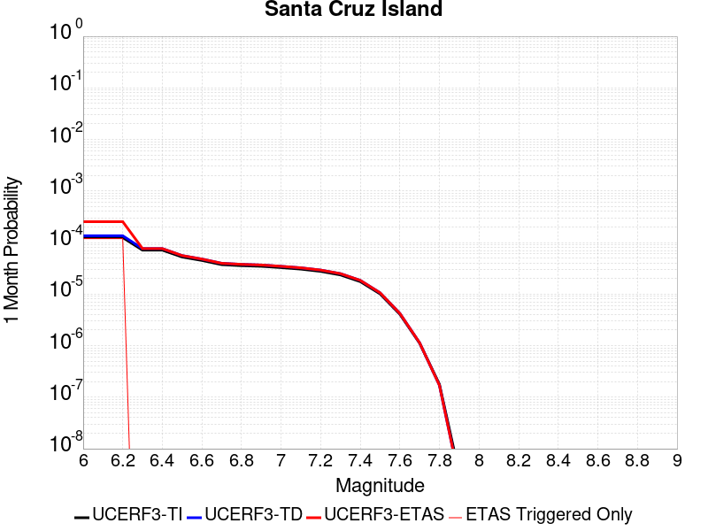 | 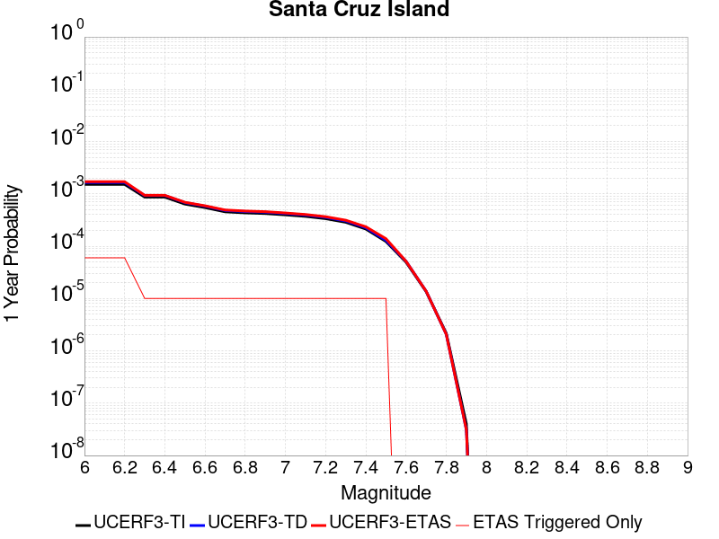 | 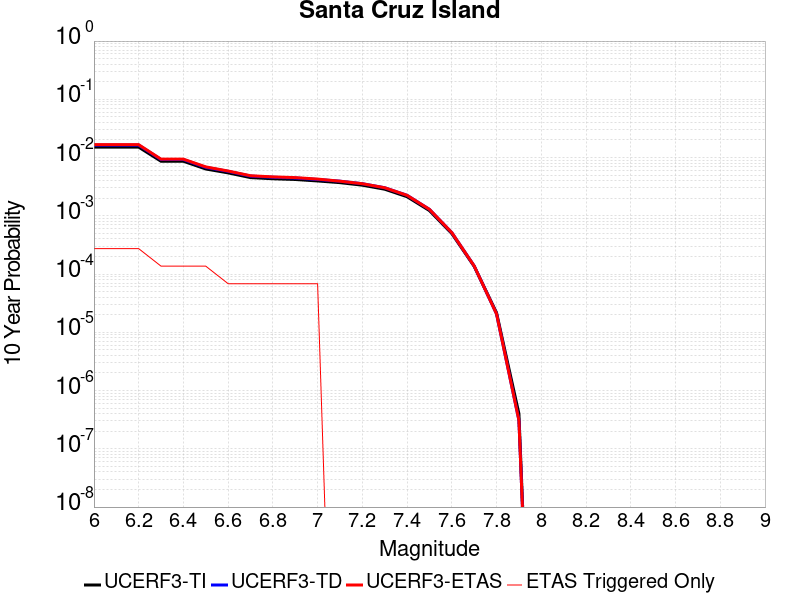 |

| Magnitude | 1 wk TI Prob | 1 wk TD Prob | 1 wk ETAS Prob | 1 wk ETAS/TD Gain | 1 wk ETAS Triggered Only | 1 mo TI Prob | 1 mo TD Prob | 1 mo ETAS Prob | 1 mo ETAS/TD Gain | 1 mo ETAS Triggered Only | 1 yr TI Prob | 1 yr TD Prob | 1 yr ETAS Prob | 1 yr ETAS/TD Gain | 1 yr ETAS Triggered Only | 10 yr TI Prob | 10 yr TD Prob | 10 yr ETAS Prob | 10 yr ETAS/TD Gain | 10 yr ETAS Triggered Only |
|-----|-----|-----|-----|-----|-----|-----|-----|-----|-----|-----|-----|-----|-----|-----|-----|-----|-----|-----|-----|-----|
| 6.0 | 2.9164563E-5 | 3.1599742E-5 | 9.1597845E-5 | 2.8986895 | 6.0E-5 | 1.2498499E-4 | 1.3542121E-4 | 1.9541309E-4 | 1.4430021 | 6.0E-5 | 0.0015206301 | 0.0016476426 | 0.0017075436 | 1.0363556 | 6.0E-5 | 0.015102667 | 0.016368 | 0.016456526 | 1.0054085 | 9.0E-5 |
| 6.1 | 2.9164563E-5 | 3.1599742E-5 | 9.1597845E-5 | 2.8986895 | 6.0E-5 | 1.2498499E-4 | 1.3542121E-4 | 1.9541309E-4 | 1.4430021 | 6.0E-5 | 0.0015206301 | 0.0016476426 | 0.0017075436 | 1.0363556 | 6.0E-5 | 0.015102667 | 0.016368 | 0.016456526 | 1.0054085 | 9.0E-5 |
| 6.2 | 2.9164563E-5 | 3.1599742E-5 | 9.1597845E-5 | 2.8986895 | 6.0E-5 | 1.2498499E-4 | 1.3542121E-4 | 1.9541309E-4 | 1.4430021 | 6.0E-5 | 0.0015206301 | 0.0016476426 | 0.0017075436 | 1.0363556 | 6.0E-5 | 0.015102667 | 0.016368 | 0.016456526 | 1.0054085 | 9.0E-5 |
| 6.3 | 1.6635553E-5 | 1.780436E-5 | 2.780418E-5 | 1.5616503 | 1.0E-5 | 7.1293274E-5 | 7.630226E-5 | 8.63015E-5 | 1.1310477 | 1.0E-5 | 8.6765E-4 | 9.2860236E-4 | 9.385931E-4 | 1.0107589 | 1.0E-5 | 0.008642701 | 0.009249094 | 0.009278816 | 1.0032135 | 3.0E-5 |
| 6.4 | 1.6635553E-5 | 1.780436E-5 | 2.780418E-5 | 1.5616503 | 1.0E-5 | 7.1293274E-5 | 7.630226E-5 | 8.63015E-5 | 1.1310477 | 1.0E-5 | 8.6765E-4 | 9.2860236E-4 | 9.385931E-4 | 1.0107589 | 1.0E-5 | 0.008642701 | 0.009249094 | 0.009278816 | 1.0032135 | 3.0E-5 |
| 6.5 | 1.2238748E-5 | 1.3042995E-5 | 2.3042865E-5 | 1.766685 | 1.0E-5 | 5.2450723E-5 | 5.5897377E-5 | 6.589681E-5 | 1.1788893 | 1.0E-5 | 6.3840044E-4 | 6.8034173E-4 | 6.9033494E-4 | 1.0146885 | 1.0E-5 | 0.0063656955 | 0.0067829876 | 0.0068127844 | 1.0043929 | 3.0E-5 |
| 6.6 | 1.0489767E-5 | 1.1156636E-5 | 2.1156524E-5 | 1.8963176 | 1.0E-5 | 4.495537E-5 | 4.781329E-5 | 5.7812813E-5 | 1.2091368 | 1.0E-5 | 5.4719415E-4 | 5.819735E-4 | 5.919677E-4 | 1.0171729 | 1.0E-5 | 0.005458487 | 0.0058047357 | 0.00582462 | 1.0034255 | 2.0E-5 |
| 6.7 | 8.699222E-6 | 9.236782E-6 | 1.923669E-5 | 2.0826182 | 1.0E-5 | 3.7281847E-5 | 3.958561E-5 | 4.9585215E-5 | 1.252607 | 1.0E-5 | 4.5381195E-4 | 4.8184878E-4 | 4.9184397E-4 | 1.0207434 | 1.0E-5 | 0.0045288634 | 0.004808108 | 0.0048280116 | 1.0041397 | 2.0E-5 |
| 6.8 | 8.307732E-6 | 8.8169045E-6 | 1.8816816E-5 | 2.134175 | 1.0E-5 | 3.560408E-5 | 3.7786187E-5 | 4.778581E-5 | 1.264637 | 1.0E-5 | 4.3339343E-4 | 4.5995016E-4 | 4.6994555E-4 | 1.0217315 | 1.0E-5 | 0.004325492 | 0.0045900354 | 0.0046099434 | 1.0043373 | 2.0E-5 |
| 6.9 | 8.073121E-6 | 8.564939E-6 | 1.8564853E-5 | 2.1675406 | 1.0E-5 | 3.459863E-5 | 3.6706366E-5 | 4.6706E-5 | 1.2724223 | 1.0E-5 | 4.2115687E-4 | 4.468088E-4 | 4.5680432E-4 | 1.0223709 | 1.0E-5 | 0.004203596 | 0.004459156 | 0.004479067 | 1.0044651 | 2.0E-5 |
| 7.0 | 7.617019E-6 | 8.074664E-6 | 1.8074583E-5 | 2.2384317 | 1.0E-5 | 3.264396E-5 | 3.4605247E-5 | 4.46049E-5 | 1.2889636 | 1.0E-5 | 3.9736772E-4 | 4.212378E-4 | 4.312336E-4 | 1.0237296 | 1.0E-5 | 0.003966579 | 0.0042044413 | 0.004224357 | 1.0047369 | 2.0E-5 |
| 7.1 | 7.1224836E-6 | 7.545788E-6 | 1.7545712E-5 | 2.3252327 | 1.0E-5 | 3.052457E-5 | 3.2338692E-5 | 4.2338368E-5 | 1.3092171 | 1.0E-5 | 3.715733E-4 | 3.936528E-4 | 4.0364885E-4 | 1.0253931 | 1.0E-5 | 0.003709526 | 0.003929598 | 0.0039395588 | 1.0025347 | 1.0E-5 |
| 7.2 | 6.441115E-6 | 6.8273835E-6 | 1.6827315E-5 | 2.46468 | 1.0E-5 | 2.7604487E-5 | 2.9259887E-5 | 3.9259594E-5 | 1.3417548 | 1.0E-5 | 3.360328E-4 | 3.5618112E-4 | 3.6617756E-4 | 1.0280656 | 1.0E-5 | 0.0033552512 | 0.003556131 | 0.0035660954 | 1.002802 | 1.0E-5 |
| 7.3 | 5.494274E-6 | 5.8199944E-6 | 1.5819936E-5 | 2.7182047 | 1.0E-5 | 2.3546674E-5 | 2.4942596E-5 | 3.4942346E-5 | 1.4009106 | 1.0E-5 | 2.8664304E-4 | 3.0363398E-4 | 3.1363094E-4 | 1.0329244 | 1.0E-5 | 0.002862736 | 0.0030322142 | 0.003042184 | 1.0032879 | 1.0E-5 |
| 7.4 | 4.0802624E-6 | 4.312256E-6 | 1.4312213E-5 | 3.3189619 | 1.0E-5 | 1.7486722E-5 | 1.8480967E-5 | 2.8480783E-5 | 1.5410873 | 1.0E-5 | 2.1288003E-4 | 2.2498262E-4 | 2.3498037E-4 | 1.0444379 | 1.0E-5 | 0.0021267622 | 0.0022475575 | 0.002257535 | 1.0044392 | 1.0E-5 |
| 7.5 | 2.3584746E-6 | 2.4753094E-6 | 1.2475285E-5 | 5.039889 | 1.0E-5 | 1.0107709E-5 | 1.0608426E-5 | 2.060832E-5 | 1.9426368 | 1.0E-5 | 1.2305441E-4 | 1.2915E-4 | 1.391487E-4 | 1.0774194 | 1.0E-5 | 0.0012298629 | 0.0012907543 | 0.0013007415 | 1.0077374 | 1.0E-5 |
| 7.6 | 9.4981914E-7 | 9.86093E-7 | 9.86093E-7 | 1.0 | 0.0 | 4.0706473E-6 | 4.2261063E-6 | 4.2261063E-6 | 1.0 | 0.0 | 4.9559E-5 | 5.145164E-5 | 5.145164E-5 | 1.0 | 0.0 | 4.954795E-4 | 5.1439856E-4 | 5.1439856E-4 | 1.0 | 0.0 |
| 7.7 | 2.6013532E-7 | 2.6416603E-7 | 2.6416603E-7 | 1.0 | 0.0 | 1.1148652E-6 | 1.1321397E-6 | 1.1321397E-6 | 1.0 | 0.0 | 1.3573399E-5 | 1.3783714E-5 | 1.3783714E-5 | 1.0 | 0.0 | 1.357257E-4 | 1.3782867E-4 | 1.3782867E-4 | 1.0 | 0.0 |
| 7.8 | 4.1522263E-8 | 3.965679E-8 | 3.965679E-8 | 1.0 | 0.0 | 1.7795254E-7 | 1.6995766E-7 | 1.6995766E-7 | 1.0 | 0.0 | 2.16657E-6 | 2.0692328E-6 | 2.0692328E-6 | 1.0 | 0.0 | 2.1665488E-5 | 2.0692156E-5 | 2.0692156E-5 | 1.0 | 0.0 |
| 7.9 | 7.7242046E-10 | 5.9468175E-10 | 5.9468175E-10 | 1.0 | 0.0 | 3.3103735E-9 | 2.5486364E-9 | 2.5486364E-9 | 1.0 | 0.0 | 4.0303796E-8 | 3.1029646E-8 | 3.1029646E-8 | 1.0 | 0.0 | 4.030379E-7 | 3.1029643E-7 | 3.1029643E-7 | 1.0 | 0.0 |

## San Jacinto (Coyote Creek)
*[(top)](#table-of-contents)*

| 1 Week | 1 Month | 1 Year | 10 Year |
|-----|-----|-----|-----|
| 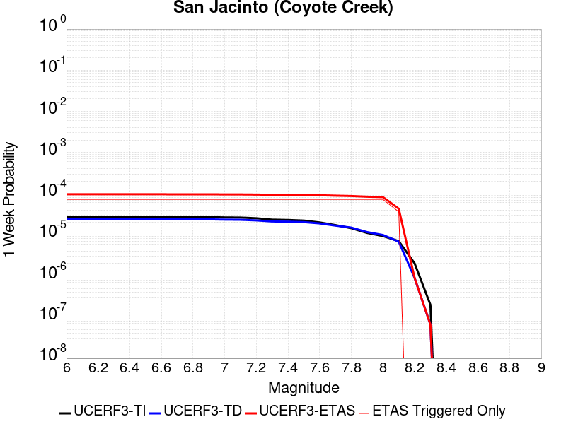 | 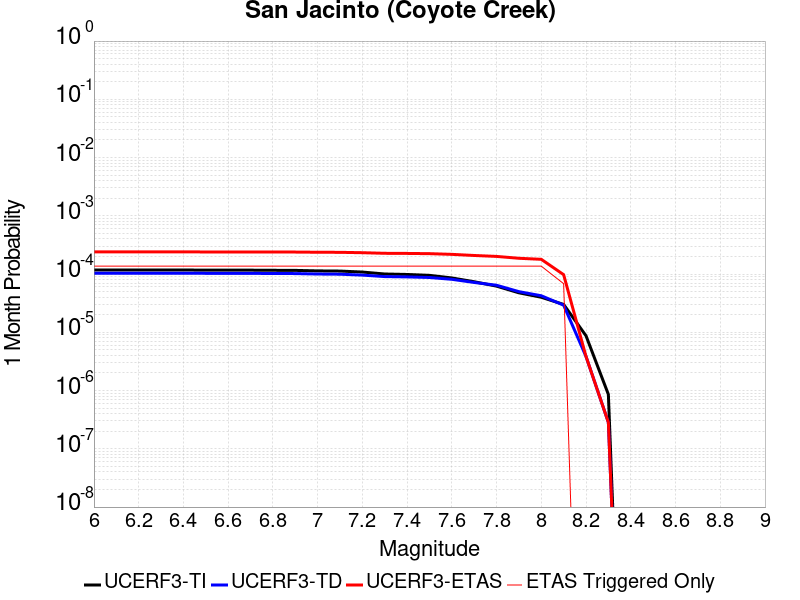 | 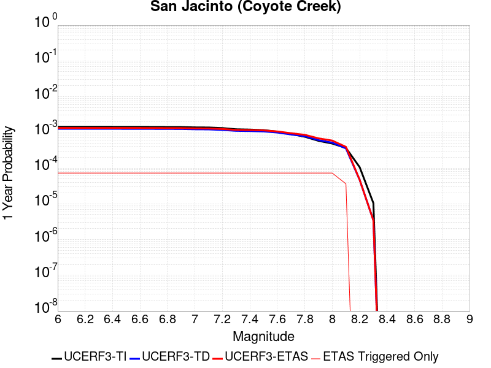 | 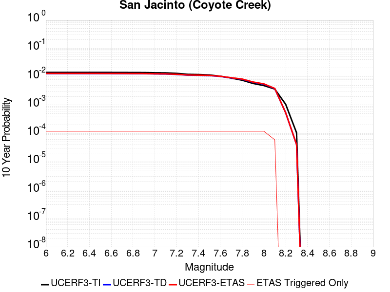 |

| Magnitude | 1 wk TI Prob | 1 wk TD Prob | 1 wk ETAS Prob | 1 wk ETAS/TD Gain | 1 wk ETAS Triggered Only | 1 mo TI Prob | 1 mo TD Prob | 1 mo ETAS Prob | 1 mo ETAS/TD Gain | 1 mo ETAS Triggered Only | 1 yr TI Prob | 1 yr TD Prob | 1 yr ETAS Prob | 1 yr ETAS/TD Gain | 1 yr ETAS Triggered Only | 10 yr TI Prob | 10 yr TD Prob | 10 yr ETAS Prob | 10 yr ETAS/TD Gain | 10 yr ETAS Triggered Only |
|-----|-----|-----|-----|-----|-----|-----|-----|-----|-----|-----|-----|-----|-----|-----|-----|-----|-----|-----|-----|-----|
| 6.0 | 2.7374346E-5 | 2.4145214E-5 | 8.4143765E-5 | 3.4849045 | 6.0E-5 | 1.1731335E-4 | 1.034754E-4 | 1.7346816E-4 | 1.6764193 | 7.0E-5 | 0.0014273542 | 0.0012590875 | 0.0013389868 | 1.0634581 | 8.0E-5 | 0.01418221 | 0.012928318 | 0.013027025 | 1.007635 | 1.0E-4 |
| 6.1 | 2.7374346E-5 | 2.4145214E-5 | 8.4143765E-5 | 3.4849045 | 6.0E-5 | 1.1731335E-4 | 1.034754E-4 | 1.7346816E-4 | 1.6764193 | 7.0E-5 | 0.0014273542 | 0.0012590875 | 0.0013389868 | 1.0634581 | 8.0E-5 | 0.01418221 | 0.012928318 | 0.013027025 | 1.007635 | 1.0E-4 |
| 6.2 | 2.7374346E-5 | 2.4145214E-5 | 8.4143765E-5 | 3.4849045 | 6.0E-5 | 1.1731335E-4 | 1.034754E-4 | 1.7346816E-4 | 1.6764193 | 7.0E-5 | 0.0014273542 | 0.0012590875 | 0.0013389868 | 1.0634581 | 8.0E-5 | 0.01418221 | 0.012928318 | 0.013027025 | 1.007635 | 1.0E-4 |
| 6.3 | 2.7374346E-5 | 2.4145214E-5 | 8.4143765E-5 | 3.4849045 | 6.0E-5 | 1.1731335E-4 | 1.034754E-4 | 1.7346816E-4 | 1.6764193 | 7.0E-5 | 0.0014273542 | 0.0012590875 | 0.0013389868 | 1.0634581 | 8.0E-5 | 0.01418221 | 0.012928318 | 0.013027025 | 1.007635 | 1.0E-4 |
| 6.4 | 2.7374346E-5 | 2.4145214E-5 | 8.4143765E-5 | 3.4849045 | 6.0E-5 | 1.1731335E-4 | 1.034754E-4 | 1.7346816E-4 | 1.6764193 | 7.0E-5 | 0.0014273542 | 0.0012590875 | 0.0013389868 | 1.0634581 | 8.0E-5 | 0.01418221 | 0.012928318 | 0.013027025 | 1.007635 | 1.0E-4 |
| 6.5 | 2.7282445E-5 | 2.4031293E-5 | 8.402985E-5 | 3.4966846 | 6.0E-5 | 1.16919524E-4 | 1.029872E-4 | 1.7298E-4 | 1.6796261 | 7.0E-5 | 0.0014225657 | 0.0012531505 | 0.0013330503 | 1.0637591 | 8.0E-5 | 0.014134934 | 0.012869646 | 0.012968359 | 1.0076702 | 1.0E-4 |
| 6.6 | 2.7282445E-5 | 2.4031293E-5 | 8.402985E-5 | 3.4966846 | 6.0E-5 | 1.16919524E-4 | 1.029872E-4 | 1.7298E-4 | 1.6796261 | 7.0E-5 | 0.0014225657 | 0.0012531505 | 0.0013330503 | 1.0637591 | 8.0E-5 | 0.014134934 | 0.012869646 | 0.012968359 | 1.0076702 | 1.0E-4 |
| 6.7 | 2.7216198E-5 | 2.3956412E-5 | 8.3954976E-5 | 3.5044885 | 6.0E-5 | 1.1663563E-4 | 1.02666316E-4 | 1.7265913E-4 | 1.6817505 | 7.0E-5 | 0.0014191137 | 0.0012492483 | 0.0013291484 | 1.0639585 | 8.0E-5 | 0.014100855 | 0.0128310565 | 0.012929774 | 1.0076936 | 1.0E-4 |
| 6.8 | 2.7078617E-5 | 2.387363E-5 | 8.38722E-5 | 3.513173 | 6.0E-5 | 1.1604605E-4 | 1.0231156E-4 | 1.723044E-4 | 1.6841147 | 7.0E-5 | 0.001411945 | 0.0012449342 | 0.0013248345 | 1.0641804 | 8.0E-5 | 0.014030075 | 0.012788199 | 0.01288692 | 1.0077198 | 1.0E-4 |
| 6.9 | 2.6982952E-5 | 2.3793142E-5 | 8.379171E-5 | 3.521675 | 6.0E-5 | 1.15636096E-4 | 1.0196664E-4 | 1.719595E-4 | 1.686429 | 7.0E-5 | 0.0014069602 | 0.0012407395 | 0.0013206402 | 1.0643977 | 8.0E-5 | 0.013980856 | 0.012746515 | 0.01284524 | 1.0077453 | 1.0E-4 |
| 7.0 | 2.6449972E-5 | 2.3370165E-5 | 8.336876E-5 | 3.567316 | 6.0E-5 | 1.1335209E-4 | 1.00154015E-4 | 1.70147E-4 | 1.6988535 | 7.0E-5 | 0.001379188 | 0.0012186957 | 0.0012985981 | 1.0655639 | 8.0E-5 | 0.0137065975 | 0.0125278765 | 0.012626624 | 1.0078822 | 1.0E-4 |
| 7.1 | 2.6257849E-5 | 2.3196202E-5 | 8.319481E-5 | 3.5865705 | 6.0E-5 | 1.1252879E-4 | 9.940852E-5 | 1.6940157E-4 | 1.704095 | 7.0E-5 | 0.0013691769 | 0.0012096294 | 0.0012895325 | 1.066056 | 8.0E-5 | 0.013607717 | 0.012437741 | 0.012536498 | 1.00794 | 1.0E-4 |
| 7.2 | 2.5270041E-5 | 2.2390966E-5 | 8.2389626E-5 | 3.6795921 | 6.0E-5 | 1.0829568E-4 | 9.595777E-5 | 1.6595105E-4 | 1.7294176 | 7.0E-5 | 0.0013177024 | 0.0011676621 | 0.0012475686 | 1.0684329 | 8.0E-5 | 0.013099162 | 0.012018777 | 0.012117576 | 1.0082203 | 1.0E-4 |
| 7.3 | 2.339701E-5 | 2.1122814E-5 | 8.112155E-5 | 3.8404706 | 6.0E-5 | 1.0026905E-4 | 9.0523215E-5 | 1.6051688E-4 | 1.7732123 | 7.0E-5 | 0.001220092 | 0.0011015651 | 0.0011814769 | 1.072544 | 8.0E-5 | 0.012134149 | 0.011357696 | 0.01145656 | 1.0087047 | 1.0E-4 |
| 7.4 | 2.296333E-5 | 2.0853171E-5 | 8.085192E-5 | 3.8772004 | 6.0E-5 | 9.841056E-5 | 8.936768E-5 | 1.5936143E-4 | 1.783211 | 7.0E-5 | 0.0011974899 | 0.0010875105 | 0.0011674234 | 1.0734825 | 8.0E-5 | 0.011910575 | 0.01121681 | 0.011315688 | 1.0088152 | 1.0E-4 |
| 7.5 | 2.2188895E-5 | 2.0376096E-5 | 8.037487E-5 | 3.944567 | 6.0E-5 | 9.50918E-5 | 8.732321E-5 | 1.573171E-4 | 1.8015497 | 7.0E-5 | 0.0011571277 | 0.0010626436 | 0.0011425585 | 1.0752039 | 8.0E-5 | 0.011511209 | 0.010966429 | 0.011065331 | 1.0090188 | 1.0E-4 |
| 7.6 | 2.0013189E-5 | 1.8962366E-5 | 7.896123E-5 | 4.164102 | 6.0E-5 | 8.5767984E-5 | 8.1264756E-5 | 1.5125907E-4 | 1.861312 | 7.0E-5 | 0.001043725 | 9.889511E-4 | 0.001068872 | 1.0808138 | 8.0E-5 | 0.010388365 | 0.010224434 | 0.010323411 | 1.0096805 | 1.0E-4 |
| 7.7 | 1.7230794E-5 | 1.674371E-5 | 7.6742705E-5 | 4.5833755 | 6.0E-5 | 7.384417E-5 | 7.175679E-5 | 1.4175176E-4 | 1.9754474 | 7.0E-5 | 8.986819E-4 | 8.7328954E-4 | 9.5321966E-4 | 1.0915277 | 8.0E-5 | 0.008950562 | 0.009062956 | 0.00916205 | 1.0109339 | 1.0E-4 |
| 7.8 | 1.4478809E-5 | 1.4990978E-5 | 7.499008E-5 | 5.0023475 | 6.0E-5 | 6.205057E-5 | 6.424547E-5 | 1.3424097E-4 | 2.089501 | 7.0E-5 | 7.552038E-4 | 7.819085E-4 | 8.6184597E-4 | 1.1022338 | 8.0E-5 | 0.0075264242 | 0.008141387 | 0.008240573 | 1.012183 | 1.0E-4 |
| 7.9 | 1.1114467E-5 | 1.1645102E-5 | 7.1644405E-5 | 6.152321 | 6.0E-5 | 4.7632562E-5 | 4.990663E-5 | 1.1990313E-4 | 2.4025493 | 7.0E-5 | 5.797721E-4 | 6.074444E-4 | 6.873958E-4 | 1.1316193 | 8.0E-5 | 0.0057826187 | 0.0063803247 | 0.0064796866 | 1.0155731 | 1.0E-4 |
| 8.0 | 9.327402E-6 | 9.899186E-6 | 6.989859E-5 | 7.061044 | 6.0E-5 | 3.9973966E-5 | 4.2424395E-5 | 1.12421425E-4 | 2.649924 | 7.0E-5 | 4.8657437E-4 | 5.1639514E-4 | 5.9635384E-4 | 1.1548401 | 8.0E-5 | 0.0048551033 | 0.0054499684 | 0.0055494234 | 1.0182487 | 1.0E-4 |
| 8.1 | 7.0235833E-6 | 6.827495E-6 | 4.6827223E-5 | 6.858624 | 4.0E-5 | 3.0100724E-5 | 2.9260367E-5 | 7.9258905E-5 | 2.708746 | 5.0E-5 | 3.664147E-4 | 3.5618723E-4 | 4.0616942E-4 | 1.1403255 | 5.0E-5 | 0.003658111 | 0.0037876023 | 0.003847375 | 1.0157812 | 6.0E-5 |
| 8.2 | 2.0358202E-6 | 8.994527E-7 | 8.994527E-7 | 1.0 | 0.0 | 8.724915E-6 | 3.854792E-6 | 3.854792E-6 | 1.0 | 0.0 | 1.06220665E-4 | 4.69311E-5 | 4.69311E-5 | 1.0 | 0.0 | 0.001061699 | 5.3254166E-4 | 5.3254166E-4 | 1.0 | 0.0 |
| 8.3 | 2.0051264E-7 | 6.617272E-8 | 6.617272E-8 | 1.0 | 0.0 | 8.5933965E-7 | 2.8359733E-7 | 2.8359733E-7 | 1.0 | 0.0 | 1.046241E-5 | 3.4527925E-6 | 3.4527925E-6 | 1.0 | 0.0 | 1.0461917E-4 | 4.01389E-5 | 4.01389E-5 | 1.0 | 0.0 |

## Kern Canyon (South Kern) 2011
*[(top)](#table-of-contents)*

| 1 Week | 1 Month | 1 Year | 10 Year |
|-----|-----|-----|-----|
| 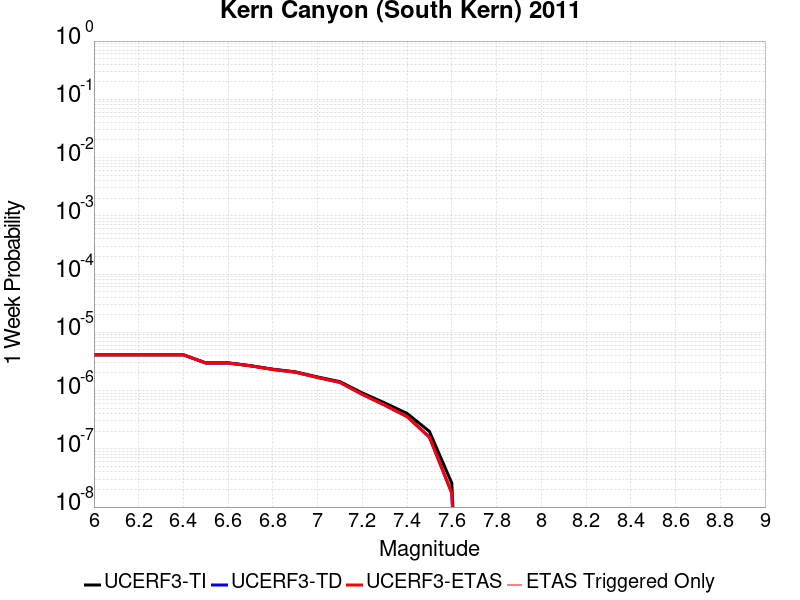 | 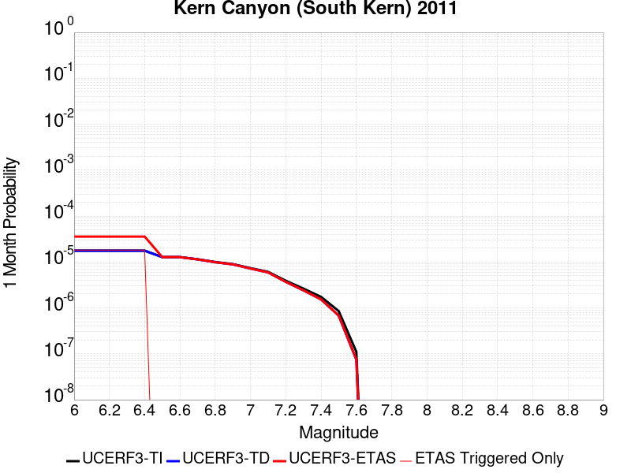 | 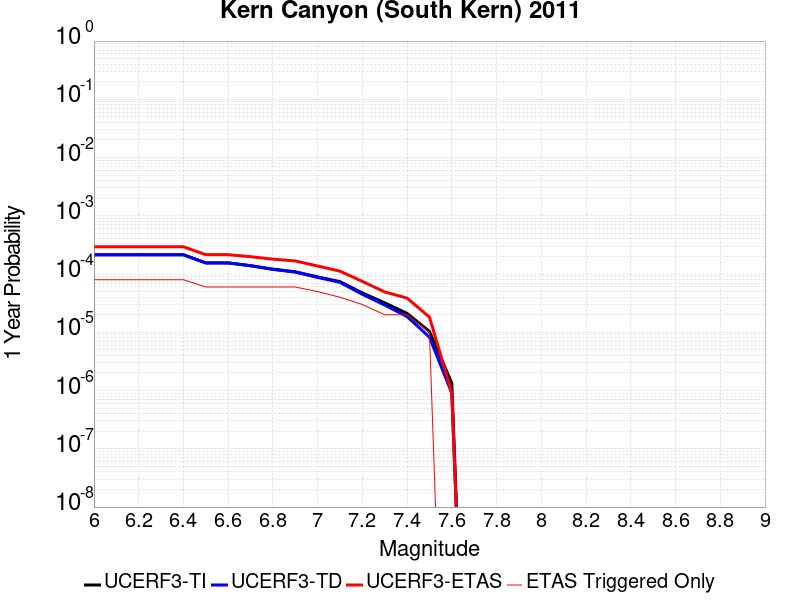 | 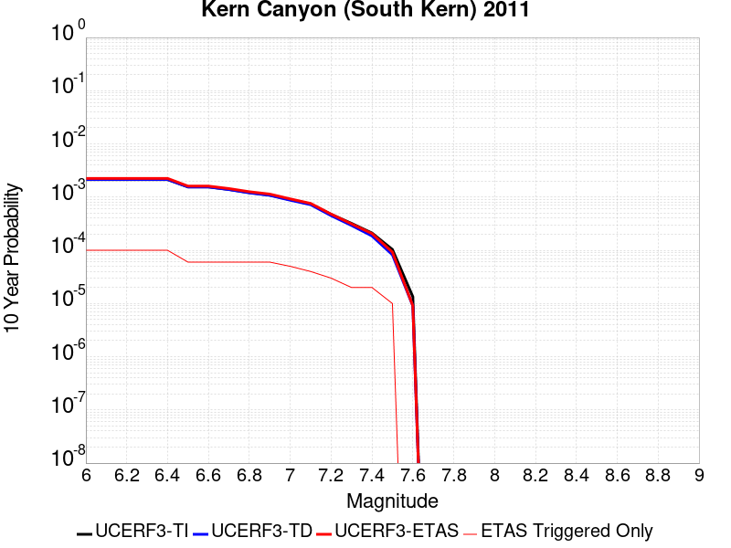 |

| Magnitude | 1 wk TI Prob | 1 wk TD Prob | 1 wk ETAS Prob | 1 wk ETAS/TD Gain | 1 wk ETAS Triggered Only | 1 mo TI Prob | 1 mo TD Prob | 1 mo ETAS Prob | 1 mo ETAS/TD Gain | 1 mo ETAS Triggered Only | 1 yr TI Prob | 1 yr TD Prob | 1 yr ETAS Prob | 1 yr ETAS/TD Gain | 1 yr ETAS Triggered Only | 10 yr TI Prob | 10 yr TD Prob | 10 yr ETAS Prob | 10 yr ETAS/TD Gain | 10 yr ETAS Triggered Only |
|-----|-----|-----|-----|-----|-----|-----|-----|-----|-----|-----|-----|-----|-----|-----|-----|-----|-----|-----|-----|-----|
| 6.0 | 4.105075E-6 | 4.1137264E-6 | 4.1137264E-6 | 1.0 | 0.0 | 1.7593058E-5 | 1.763014E-5 | 3.7629787E-5 | 2.1344008 | 2.0E-5 | 2.1417443E-4 | 2.1462646E-4 | 2.946093E-4 | 1.3726606 | 8.0E-5 | 0.0021396813 | 0.0021442557 | 0.0022440413 | 1.0465362 | 1.0E-4 |
| 6.1 | 4.105075E-6 | 4.1137264E-6 | 4.1137264E-6 | 1.0 | 0.0 | 1.7593058E-5 | 1.763014E-5 | 3.7629787E-5 | 2.1344008 | 2.0E-5 | 2.1417443E-4 | 2.1462646E-4 | 2.946093E-4 | 1.3726606 | 8.0E-5 | 0.0021396813 | 0.0021442557 | 0.0022440413 | 1.0465362 | 1.0E-4 |
| 6.2 | 4.105075E-6 | 4.1137264E-6 | 4.1137264E-6 | 1.0 | 0.0 | 1.7593058E-5 | 1.763014E-5 | 3.7629787E-5 | 2.1344008 | 2.0E-5 | 2.1417443E-4 | 2.1462646E-4 | 2.946093E-4 | 1.3726606 | 8.0E-5 | 0.0021396813 | 0.0021442557 | 0.0022440413 | 1.0465362 | 1.0E-4 |
| 6.3 | 4.105075E-6 | 4.1137264E-6 | 4.1137264E-6 | 1.0 | 0.0 | 1.7593058E-5 | 1.763014E-5 | 3.7629787E-5 | 2.1344008 | 2.0E-5 | 2.1417443E-4 | 2.1462646E-4 | 2.946093E-4 | 1.3726606 | 8.0E-5 | 0.0021396813 | 0.0021442557 | 0.0022440413 | 1.0465362 | 1.0E-4 |
| 6.4 | 4.105075E-6 | 4.1137264E-6 | 4.1137264E-6 | 1.0 | 0.0 | 1.7593058E-5 | 1.763014E-5 | 3.7629787E-5 | 2.1344008 | 2.0E-5 | 2.1417443E-4 | 2.1462646E-4 | 2.946093E-4 | 1.3726606 | 8.0E-5 | 0.0021396813 | 0.0021442557 | 0.0022440413 | 1.0465362 | 1.0E-4 |
| 6.5 | 2.9849807E-6 | 2.9731548E-6 | 2.9731548E-6 | 1.0 | 0.0 | 1.2792712E-5 | 1.274203E-5 | 1.274203E-5 | 1.0 | 0.0 | 1.5574014E-4 | 1.5512333E-4 | 2.1511402E-4 | 1.386729 | 6.0E-5 | 0.0015563103 | 0.0015501656 | 0.0016100726 | 1.0386455 | 6.0E-5 |
| 6.6 | 2.9849807E-6 | 2.9731548E-6 | 2.9731548E-6 | 1.0 | 0.0 | 1.2792712E-5 | 1.274203E-5 | 1.274203E-5 | 1.0 | 0.0 | 1.5574014E-4 | 1.5512333E-4 | 2.1511402E-4 | 1.386729 | 6.0E-5 | 0.0015563103 | 0.0015501656 | 0.0016100726 | 1.0386455 | 6.0E-5 |
| 6.7 | 2.6756725E-6 | 2.6582206E-6 | 2.6582206E-6 | 1.0 | 0.0 | 1.1467117E-5 | 1.1392325E-5 | 1.1392325E-5 | 1.0 | 0.0 | 1.396032E-4 | 1.3869285E-4 | 1.9868452E-4 | 1.4325507 | 6.0E-5 | 0.0013951553 | 0.0013860738 | 0.0014459906 | 1.0432278 | 6.0E-5 |
| 6.8 | 2.3283721E-6 | 2.3047787E-6 | 2.3047787E-6 | 1.0 | 0.0 | 9.9787E-6 | 9.877586E-6 | 9.877586E-6 | 1.0 | 0.0 | 1.214839E-4 | 1.20253055E-4 | 1.8024584E-4 | 1.4988878 | 6.0E-5 | 0.001214175 | 0.0012018873 | 0.0012618152 | 1.0498614 | 6.0E-5 |
| 6.9 | 2.0972677E-6 | 2.0696411E-6 | 2.0696411E-6 | 1.0 | 0.0 | 8.988259E-6 | 8.869861E-6 | 8.869861E-6 | 1.0 | 0.0 | 1.0942656E-4 | 1.0798526E-4 | 1.6797878E-4 | 1.5555714 | 6.0E-5 | 0.0010937268 | 0.0010793337 | 0.001139269 | 1.0555298 | 6.0E-5 |
| 7.0 | 1.7132242E-6 | 1.6787036E-6 | 1.6787036E-6 | 1.0 | 0.0 | 7.3423685E-6 | 7.194424E-6 | 7.194424E-6 | 1.0 | 0.0 | 8.938967E-5 | 8.758863E-5 | 1.3758425E-4 | 1.5708003 | 5.0E-5 | 8.935372E-4 | 8.7554497E-4 | 9.2550117E-4 | 1.0570573 | 5.0E-5 |
| 7.1 | 1.4215541E-6 | 1.3815752E-6 | 1.3815752E-6 | 1.0 | 0.0 | 6.0923603E-6 | 5.9210233E-6 | 5.9210233E-6 | 1.0 | 0.0 | 7.417196E-5 | 7.20861E-5 | 1.1208322E-4 | 1.554852 | 4.0E-5 | 7.414721E-4 | 7.206299E-4 | 7.606011E-4 | 1.055467 | 4.0E-5 |
| 7.2 | 9.097853E-7 | 8.6037755E-7 | 8.6037755E-7 | 1.0 | 0.0 | 3.899074E-6 | 3.6873273E-6 | 3.6873273E-6 | 1.0 | 0.0 | 4.7470192E-5 | 4.4892295E-5 | 7.489095E-5 | 1.6682361 | 3.0E-5 | 4.7460053E-4 | 4.4883334E-4 | 4.788199E-4 | 1.06681 | 3.0E-5 |
| 7.3 | 6.144169E-7 | 5.628206E-7 | 5.628206E-7 | 1.0 | 0.0 | 2.6332125E-6 | 2.4120861E-6 | 2.4120861E-6 | 1.0 | 0.0 | 3.205889E-5 | 2.9366758E-5 | 4.9366172E-5 | 1.6810222 | 2.0E-5 | 3.2054266E-4 | 2.936293E-4 | 3.1362343E-4 | 1.0680931 | 2.0E-5 |
| 7.4 | 4.049844E-7 | 3.5728314E-7 | 3.5728314E-7 | 1.0 | 0.0 | 1.7356463E-6 | 1.5312125E-6 | 1.5312125E-6 | 1.0 | 0.0 | 2.1131287E-5 | 1.8642357E-5 | 3.864198E-5 | 2.072806 | 2.0E-5 | 2.1129279E-4 | 1.8640817E-4 | 2.0640444E-4 | 1.1072714 | 2.0E-5 |
| 7.5 | 1.9871162E-7 | 1.583044E-7 | 1.583044E-7 | 1.0 | 0.0 | 8.5162094E-7 | 6.7844724E-7 | 6.7844724E-7 | 1.0 | 0.0 | 1.0368436E-5 | 8.260065E-6 | 1.8259982E-5 | 2.2106342 | 1.0E-5 | 1.0367952E-4 | 8.259767E-5 | 9.259684E-5 | 1.1210588 | 1.0E-5 |
| 7.6 | 2.572245E-8 | 1.7352555E-8 | 1.7352555E-8 | 1.0 | 0.0 | 1.10239064E-7 | 7.436809E-8 | 7.436809E-8 | 1.0 | 0.0 | 1.3421597E-6 | 9.054312E-7 | 9.054312E-7 | 1.0 | 0.0 | 1.3421517E-5 | 9.05428E-6 | 9.05428E-6 | 1.0 | 0.0 |

## Big Pine (East)
*[(top)](#table-of-contents)*

| 1 Week | 1 Month | 1 Year | 10 Year |
|-----|-----|-----|-----|
| 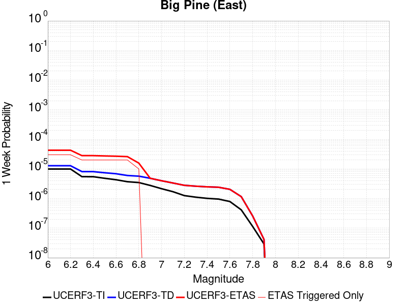 | 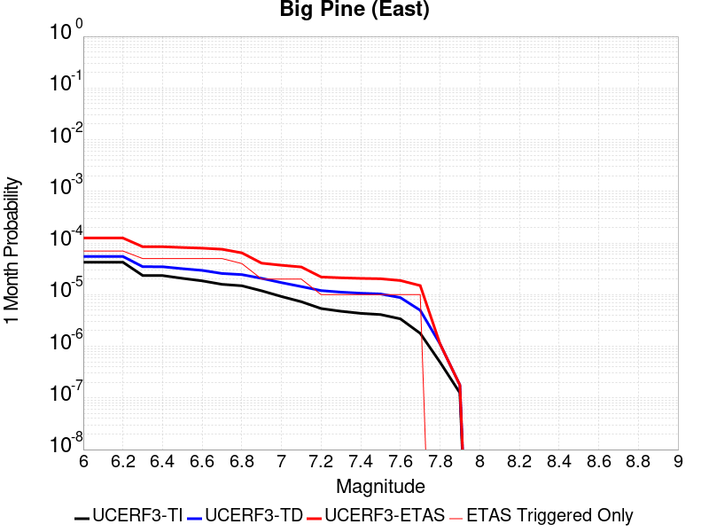 | 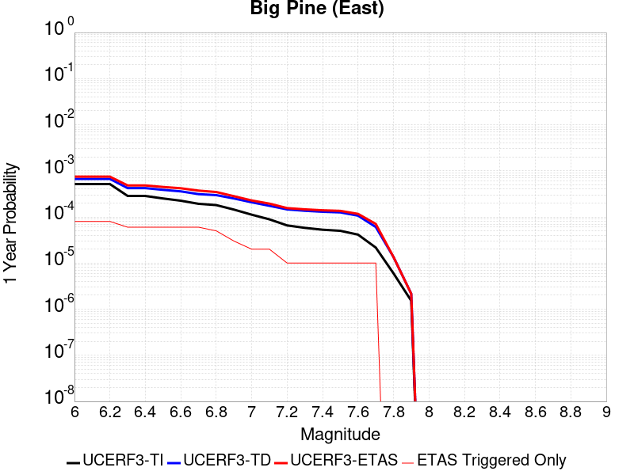 | 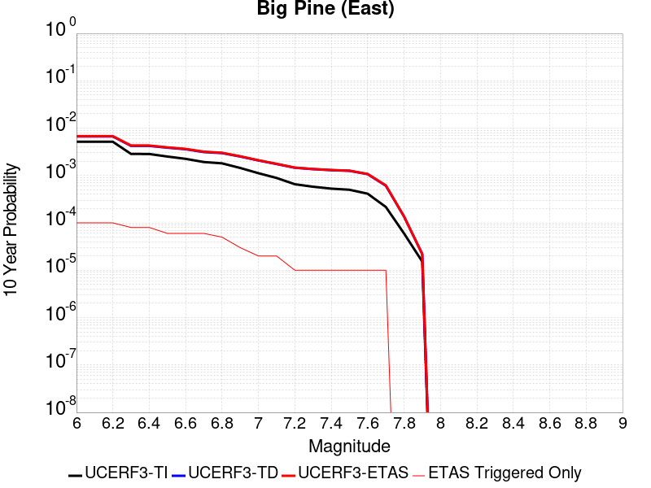 |

| Magnitude | 1 wk TI Prob | 1 wk TD Prob | 1 wk ETAS Prob | 1 wk ETAS/TD Gain | 1 wk ETAS Triggered Only | 1 mo TI Prob | 1 mo TD Prob | 1 mo ETAS Prob | 1 mo ETAS/TD Gain | 1 mo ETAS Triggered Only | 1 yr TI Prob | 1 yr TD Prob | 1 yr ETAS Prob | 1 yr ETAS/TD Gain | 1 yr ETAS Triggered Only | 10 yr TI Prob | 10 yr TD Prob | 10 yr ETAS Prob | 10 yr ETAS/TD Gain | 10 yr ETAS Triggered Only |
|-----|-----|-----|-----|-----|-----|-----|-----|-----|-----|-----|-----|-----|-----|-----|-----|-----|-----|-----|-----|-----|
| 6.0 | 9.916913E-6 | 1.2816984E-5 | 4.28166E-5 | 3.340614 | 3.0E-5 | 4.250036E-5 | 5.49289E-5 | 1.2492506E-4 | 2.2743046 | 7.0E-5 | 5.173191E-4 | 6.685763E-4 | 7.485228E-4 | 1.1195773 | 8.0E-5 | 0.0051611643 | 0.006670441 | 0.006769774 | 1.0148915 | 1.0E-4 |
| 6.1 | 9.916913E-6 | 1.2816984E-5 | 4.28166E-5 | 3.340614 | 3.0E-5 | 4.250036E-5 | 5.49289E-5 | 1.2492506E-4 | 2.2743046 | 7.0E-5 | 5.173191E-4 | 6.685763E-4 | 7.485228E-4 | 1.1195773 | 8.0E-5 | 0.0051611643 | 0.006670441 | 0.006769774 | 1.0148915 | 1.0E-4 |
| 6.2 | 9.916913E-6 | 1.2816984E-5 | 4.28166E-5 | 3.340614 | 3.0E-5 | 4.250036E-5 | 5.49289E-5 | 1.2492506E-4 | 2.2743046 | 7.0E-5 | 5.173191E-4 | 6.685763E-4 | 7.485228E-4 | 1.1195773 | 8.0E-5 | 0.0051611643 | 0.006670441 | 0.006769774 | 1.0148915 | 1.0E-4 |
| 6.3 | 5.479711E-6 | 8.112951E-6 | 2.8112789E-5 | 3.4651742 | 2.0E-5 | 2.3484265E-5 | 3.4769346E-5 | 8.4767606E-5 | 2.4379983 | 5.0E-5 | 2.858834E-4 | 4.2323777E-4 | 4.8321235E-4 | 1.1417043 | 6.0E-5 | 0.0028551589 | 0.004227244 | 0.0043069054 | 1.0188448 | 8.0E-5 |
| 6.4 | 5.465009E-6 | 8.097245E-6 | 2.8097083E-5 | 3.469956 | 2.0E-5 | 2.3421257E-5 | 3.4702036E-5 | 8.47003E-5 | 2.4407878 | 5.0E-5 | 2.851165E-4 | 4.2241855E-4 | 4.823932E-4 | 1.1419792 | 6.0E-5 | 0.0028475097 | 0.0042190826 | 0.004298745 | 1.0188814 | 8.0E-5 |
| 6.5 | 4.826767E-6 | 7.422301E-6 | 2.7422153E-5 | 3.6945622 | 2.0E-5 | 2.068598E-5 | 3.180949E-5 | 8.18079E-5 | 2.5718079 | 5.0E-5 | 2.518227E-4 | 3.872145E-4 | 4.4719127E-4 | 1.1548929 | 6.0E-5 | 0.0025153751 | 0.003868283 | 0.003928051 | 1.0154507 | 6.0E-5 |
| 6.6 | 4.3146847E-6 | 6.8822374E-6 | 2.68821E-5 | 3.9060118 | 2.0E-5 | 1.8491375E-5 | 2.9494982E-5 | 7.949351E-5 | 2.6951535 | 5.0E-5 | 2.2510924E-4 | 3.590447E-4 | 4.1902316E-4 | 1.1670501 | 6.0E-5 | 0.0022488134 | 0.0035874986 | 0.0036472832 | 1.0166647 | 6.0E-5 |
| 6.7 | 3.6968106E-6 | 5.9954727E-6 | 2.5995352E-5 | 4.33583 | 2.0E-5 | 1.5843378E-5 | 2.5694639E-5 | 7.569335E-5 | 2.9458814 | 5.0E-5 | 1.9287605E-4 | 3.1278885E-4 | 3.727701E-4 | 1.1917627 | 6.0E-5 | 0.0019270873 | 0.0031262483 | 0.0031860606 | 1.0191324 | 6.0E-5 |
| 6.8 | 3.4671132E-6 | 5.702177E-6 | 1.570212E-5 | 2.7537062 | 1.0E-5 | 1.4858972E-5 | 2.4437682E-5 | 6.44367E-5 | 2.6367764 | 4.0E-5 | 1.8089297E-4 | 2.974896E-4 | 3.4747474E-4 | 1.1680231 | 5.0E-5 | 0.0018074579 | 0.002973667 | 0.0030235185 | 1.0167643 | 5.0E-5 |
| 6.9 | 2.7686972E-6 | 4.825223E-6 | 4.825223E-6 | 1.0 | 0.0 | 1.1865792E-5 | 2.0679368E-5 | 4.0678955E-5 | 1.9671276 | 2.0E-5 | 1.4445644E-4 | 2.5174298E-4 | 2.817354E-4 | 1.1191392 | 3.0E-5 | 0.0014436257 | 0.0025172636 | 0.0025471882 | 1.0118877 | 3.0E-5 |
| 7.0 | 2.1472624E-6 | 3.9850406E-6 | 3.9850406E-6 | 1.0 | 0.0 | 9.20252E-6 | 1.7078637E-5 | 3.7078295E-5 | 2.1710336 | 2.0E-5 | 1.12034926E-4 | 2.079131E-4 | 2.2790894E-4 | 1.096174 | 2.0E-5 | 0.0011197845 | 0.0020798394 | 0.0020997976 | 1.0095961 | 2.0E-5 |
| 7.1 | 1.7018335E-6 | 3.344876E-6 | 3.344876E-6 | 1.0 | 0.0 | 7.293552E-6 | 1.4335106E-5 | 3.433482E-5 | 2.3951564 | 2.0E-5 | 8.879537E-5 | 1.7451629E-4 | 1.945128E-4 | 1.1145825 | 2.0E-5 | 8.87599E-4 | 0.0017464145 | 0.0017663795 | 1.011432 | 2.0E-5 |
| 7.2 | 1.25603E-6 | 2.794484E-6 | 2.794484E-6 | 1.0 | 0.0 | 5.3829745E-6 | 1.1976307E-5 | 2.1976188E-5 | 1.8349719 | 1.0E-5 | 6.553574E-5 | 1.4580201E-4 | 1.5580055E-4 | 1.0685762 | 1.0E-5 | 6.551642E-4 | 0.001459661 | 0.0014696465 | 1.006841 | 1.0E-5 |
| 7.3 | 1.112297E-6 | 2.610332E-6 | 2.610332E-6 | 1.0 | 0.0 | 4.7669787E-6 | 1.118709E-5 | 2.118698E-5 | 1.8938775 | 1.0E-5 | 5.803642E-5 | 1.3619453E-4 | 1.4619317E-4 | 1.0734144 | 1.0E-5 | 5.802127E-4 | 0.0013635408 | 0.0013735272 | 1.0073239 | 1.0E-5 |
| 7.4 | 1.0137181E-6 | 2.4834917E-6 | 2.4834917E-6 | 1.0 | 0.0 | 4.3444993E-6 | 1.0643494E-5 | 2.0643387E-5 | 1.9395311 | 1.0E-5 | 5.2892992E-5 | 1.2957705E-4 | 1.3957576E-4 | 1.0771642 | 1.0E-5 | 5.288041E-4 | 0.0012972289 | 0.0013072159 | 1.0076988 | 1.0E-5 |
| 7.5 | 9.598608E-7 | 2.4071483E-6 | 2.4071483E-6 | 1.0 | 0.0 | 4.1136827E-6 | 1.031631E-5 | 2.0316207E-5 | 1.9693289 | 1.0E-5 | 5.0082934E-5 | 1.2559404E-4 | 1.355928E-4 | 1.0796117 | 1.0E-5 | 5.007165E-4 | 0.0012572526 | 0.00126724 | 1.0079439 | 1.0E-5 |
| 7.6 | 7.929459E-7 | 2.0448588E-6 | 2.0448588E-6 | 1.0 | 0.0 | 3.3983351E-6 | 8.763653E-6 | 1.8763565E-5 | 2.1410668 | 1.0E-5 | 4.1373947E-5 | 1.06692416E-4 | 1.1669135E-4 | 1.0937173 | 1.0E-5 | 4.1366243E-4 | 0.0010685222 | 0.0010785116 | 1.0093488 | 1.0E-5 |
| 7.7 | 4.155788E-7 | 1.1605589E-6 | 1.1605589E-6 | 1.0 | 0.0 | 1.7810507E-6 | 4.9738146E-6 | 1.4973765E-5 | 3.0105193 | 1.0E-5 | 2.1684076E-5 | 6.0554554E-5 | 7.055395E-5 | 1.1651304 | 1.0E-5 | 2.1681961E-4 | 6.0857297E-4 | 6.185669E-4 | 1.0164219 | 1.0E-5 |
| 7.8 | 1.14666925E-7 | 2.592015E-7 | 2.592015E-7 | 1.0 | 0.0 | 4.914296E-7 | 1.1108631E-6 | 1.1108631E-6 | 1.0 | 0.0 | 5.9831386E-6 | 1.3524678E-5 | 1.3524678E-5 | 1.0 | 0.0 | 5.9829777E-5 | 1.3634123E-4 | 1.3634123E-4 | 1.0 | 0.0 |
| 7.9 | 2.9231824E-8 | 4.1463963E-8 | 4.1463963E-8 | 1.0 | 0.0 | 1.2527924E-7 | 1.7770269E-7 | 1.7770269E-7 | 1.0 | 0.0 | 1.5252737E-6 | 2.1635283E-6 | 2.1635283E-6 | 1.0 | 0.0 | 1.5252632E-5 | 2.1967755E-5 | 2.1967755E-5 | 1.0 | 0.0 |

## San Pedro Basin
*[(top)](#table-of-contents)*

| 1 Week | 1 Month | 1 Year | 10 Year |
|-----|-----|-----|-----|
| 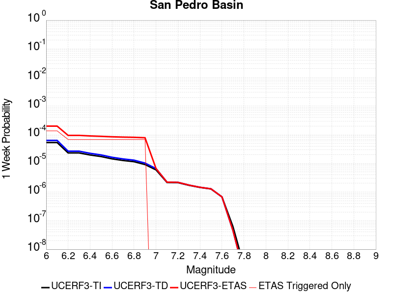 | 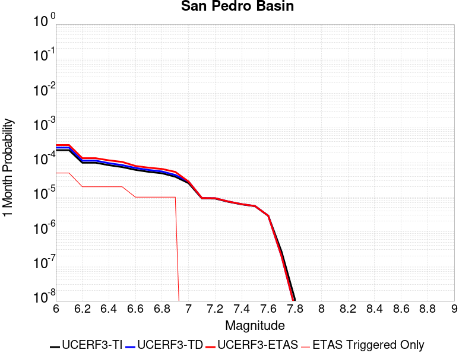 | 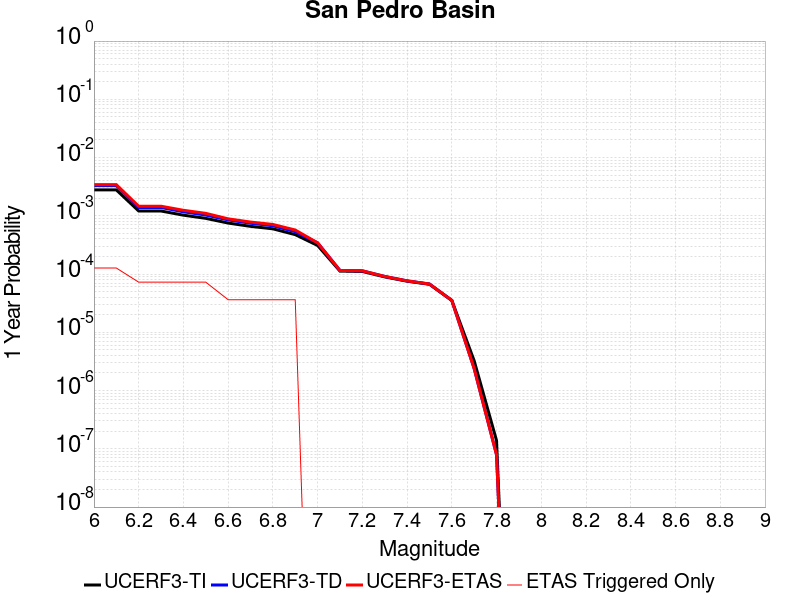 | 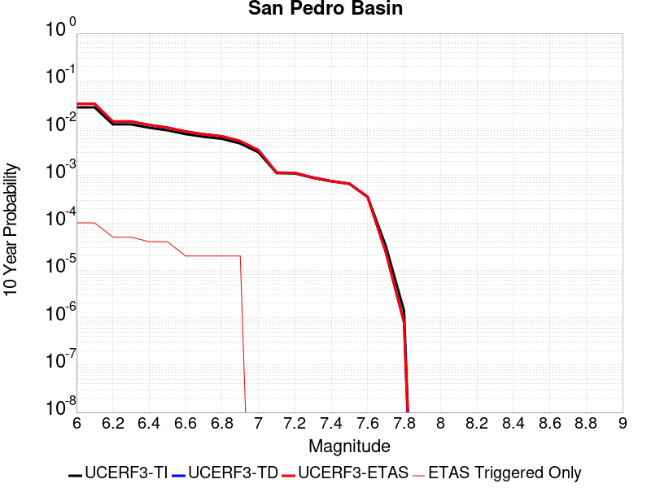 |

| Magnitude | 1 wk TI Prob | 1 wk TD Prob | 1 wk ETAS Prob | 1 wk ETAS/TD Gain | 1 wk ETAS Triggered Only | 1 mo TI Prob | 1 mo TD Prob | 1 mo ETAS Prob | 1 mo ETAS/TD Gain | 1 mo ETAS Triggered Only | 1 yr TI Prob | 1 yr TD Prob | 1 yr ETAS Prob | 1 yr ETAS/TD Gain | 1 yr ETAS Triggered Only | 10 yr TI Prob | 10 yr TD Prob | 10 yr ETAS Prob | 10 yr ETAS/TD Gain | 10 yr ETAS Triggered Only |
|-----|-----|-----|-----|-----|-----|-----|-----|-----|-----|-----|-----|-----|-----|-----|-----|-----|-----|-----|-----|-----|
| 6.0 | 5.3449043E-5 | 6.336954E-5 | 9.3367635E-5 | 1.4733835 | 3.0E-5 | 2.2904722E-4 | 2.715589E-4 | 3.2154535E-4 | 1.1840721 | 5.0E-5 | 0.0027850836 | 0.0033018254 | 0.0033815613 | 1.0241491 | 8.0E-5 | 0.027504366 | 0.03258945 | 0.032686193 | 1.0029684 | 1.0E-4 |
| 6.1 | 5.3449043E-5 | 6.336954E-5 | 9.3367635E-5 | 1.4733835 | 3.0E-5 | 2.2904722E-4 | 2.715589E-4 | 3.2154535E-4 | 1.1840721 | 5.0E-5 | 0.0027850836 | 0.0033018254 | 0.0033815613 | 1.0241491 | 8.0E-5 | 0.027504366 | 0.03258945 | 0.032686193 | 1.0029684 | 1.0E-4 |
| 6.2 | 2.3189454E-5 | 2.6642796E-5 | 3.664253E-5 | 1.375326 | 1.0E-5 | 9.9379584E-5 | 1.14178685E-4 | 1.341764E-4 | 1.1751441 | 2.0E-5 | 0.0012092749 | 0.0013892864 | 0.0014292308 | 1.0287517 | 4.0E-5 | 0.012027155 | 0.013810883 | 0.013860193 | 1.0035703 | 5.0E-5 |
| 6.3 | 2.3189454E-5 | 2.6642796E-5 | 3.664253E-5 | 1.375326 | 1.0E-5 | 9.9379584E-5 | 1.14178685E-4 | 1.341764E-4 | 1.1751441 | 2.0E-5 | 0.0012092749 | 0.0013892864 | 0.0014292308 | 1.0287517 | 4.0E-5 | 0.012027155 | 0.013810883 | 0.013860193 | 1.0035703 | 5.0E-5 |
| 6.4 | 1.966056E-5 | 2.2463413E-5 | 3.2463187E-5 | 1.4451584 | 1.0E-5 | 8.425682E-5 | 9.626844E-5 | 1.1626652E-4 | 1.2077324 | 2.0E-5 | 0.001025344 | 0.0011714783 | 0.0012114315 | 1.034105 | 4.0E-5 | 0.010206259 | 0.011657117 | 0.011696651 | 1.0033914 | 4.0E-5 |
| 6.5 | 1.7342953E-5 | 1.9745148E-5 | 2.9744951E-5 | 1.5064435 | 1.0E-5 | 7.4324824E-5 | 8.4619525E-5 | 1.0461784E-4 | 1.236332 | 2.0E-5 | 9.04529E-4 | 0.0010297928 | 0.0010697516 | 1.0388027 | 4.0E-5 | 0.009008561 | 0.010253931 | 0.010293521 | 1.003861 | 4.0E-5 |
| 6.6 | 1.439804E-5 | 1.6322716E-5 | 2.6322552E-5 | 1.6126331 | 1.0E-5 | 6.170443E-5 | 6.99528E-5 | 7.99521E-5 | 1.1429435 | 1.0E-5 | 7.509924E-4 | 8.513747E-4 | 8.713577E-4 | 1.0234715 | 2.0E-5 | 0.0074845953 | 0.008484332 | 0.008504163 | 1.0023373 | 2.0E-5 |
| 6.7 | 1.2634884E-5 | 1.4285297E-5 | 2.4285155E-5 | 1.7000104 | 1.0E-5 | 5.414838E-5 | 6.1221435E-5 | 7.122083E-5 | 1.1633315 | 1.0E-5 | 6.590571E-4 | 7.4514654E-4 | 7.6513167E-4 | 1.0268203 | 2.0E-5 | 0.006571059 | 0.007429501 | 0.0074493526 | 1.002672 | 2.0E-5 |
| 6.8 | 1.146091E-5 | 1.2933192E-5 | 2.2933062E-5 | 1.7731943 | 1.0E-5 | 4.911726E-5 | 5.5426954E-5 | 6.54264E-5 | 1.1804076 | 1.0E-5 | 5.9783855E-4 | 6.7464396E-4 | 6.946305E-4 | 1.0296253 | 2.0E-5 | 0.0059623276 | 0.006728899 | 0.0067487643 | 1.0029522 | 2.0E-5 |
| 6.9 | 9.109035E-6 | 1.0235011E-5 | 2.023491E-5 | 1.9770285 | 1.0E-5 | 3.9038136E-5 | 4.3863754E-5 | 5.3863318E-5 | 1.2279687 | 1.0E-5 | 4.7518566E-4 | 5.3393835E-4 | 5.539277E-4 | 1.0374376 | 2.0E-5 | 0.0047417083 | 0.005329309 | 0.0053492025 | 1.0037328 | 2.0E-5 |
| 7.0 | 5.9351028E-6 | 6.583964E-6 | 6.583964E-6 | 1.0 | 0.0 | 2.5435906E-5 | 2.8216817E-5 | 2.8216817E-5 | 1.0 | 0.0 | 3.0963816E-4 | 3.435092E-4 | 3.435092E-4 | 1.0 | 0.0 | 0.0030920706 | 0.0034320992 | 0.0034320992 | 1.0 | 0.0 |
| 7.1 | 2.1557585E-6 | 2.209648E-6 | 2.209648E-6 | 1.0 | 0.0 | 9.238933E-6 | 9.469887E-6 | 9.469887E-6 | 1.0 | 0.0 | 1.1247819E-4 | 1.1528993E-4 | 1.1528993E-4 | 1.0 | 0.0 | 0.0011242128 | 0.0011523166 | 0.0011523166 | 1.0 | 0.0 |
| 7.2 | 2.1251979E-6 | 2.1779945E-6 | 2.1779945E-6 | 1.0 | 0.0 | 9.107958E-6 | 9.334229E-6 | 9.334229E-6 | 1.0 | 0.0 | 1.1088375E-4 | 1.1363847E-4 | 1.1363847E-4 | 1.0 | 0.0 | 0.0011082845 | 0.0011358189 | 0.0011358189 | 1.0 | 0.0 |
| 7.3 | 1.7145798E-6 | 1.7442874E-6 | 1.7442874E-6 | 1.0 | 0.0 | 7.3481783E-6 | 7.4754967E-6 | 7.4754967E-6 | 1.0 | 0.0 | 8.94604E-5 | 9.1010465E-5 | 9.1010465E-5 | 1.0 | 0.0 | 8.9424395E-4 | 9.0974104E-4 | 9.0974104E-4 | 1.0 | 0.0 |
| 7.4 | 1.4467993E-6 | 1.4641868E-6 | 1.4641868E-6 | 1.0 | 0.0 | 6.200554E-6 | 6.2750714E-6 | 6.2750714E-6 | 1.0 | 0.0 | 7.548913E-5 | 7.639639E-5 | 7.639639E-5 | 1.0 | 0.0 | 7.546349E-4 | 7.6370855E-4 | 7.6370855E-4 | 1.0 | 0.0 |
| 7.5 | 1.2803735E-6 | 1.2931497E-6 | 1.2931497E-6 | 1.0 | 0.0 | 5.487303E-6 | 5.5420587E-6 | 5.5420587E-6 | 1.0 | 0.0 | 6.680587E-5 | 6.7472545E-5 | 6.7472545E-5 | 1.0 | 0.0 | 6.678579E-4 | 6.7452766E-4 | 6.7452766E-4 | 1.0 | 0.0 |
| 7.6 | 6.755009E-7 | 6.769465E-7 | 6.769465E-7 | 1.0 | 0.0 | 2.8950008E-6 | 2.9011965E-6 | 2.9011965E-6 | 1.0 | 0.0 | 3.5246063E-5 | 3.5321555E-5 | 3.5321555E-5 | 1.0 | 0.0 | 3.5240475E-4 | 3.5316512E-4 | 3.5316512E-4 | 1.0 | 0.0 |
| 7.7 | 6.211885E-8 | 4.569953E-8 | 4.569953E-8 | 1.0 | 0.0 | 2.6622362E-7 | 1.9585512E-7 | 1.9585512E-7 | 1.0 | 0.0 | 3.2412677E-6 | 2.3845337E-6 | 2.3845337E-6 | 1.0 | 0.0 | 3.2412205E-5 | 2.3845101E-5 | 2.3845101E-5 | 1.0 | 0.0 |
| 7.8 | 2.6580573E-9 | 1.5138163E-9 | 1.5138163E-9 | 1.0 | 0.0 | 1.1391674E-8 | 6.487784E-9 | 6.487784E-9 | 1.0 | 0.0 | 1.3869362E-7 | 7.898877E-8 | 7.898877E-8 | 1.0 | 0.0 | 1.3869354E-6 | 7.898877E-7 | 7.898877E-7 | 1.0 | 0.0 |

## Dry Mountain
*[(top)](#table-of-contents)*

| 1 Week | 1 Month | 1 Year | 10 Year |
|-----|-----|-----|-----|
| 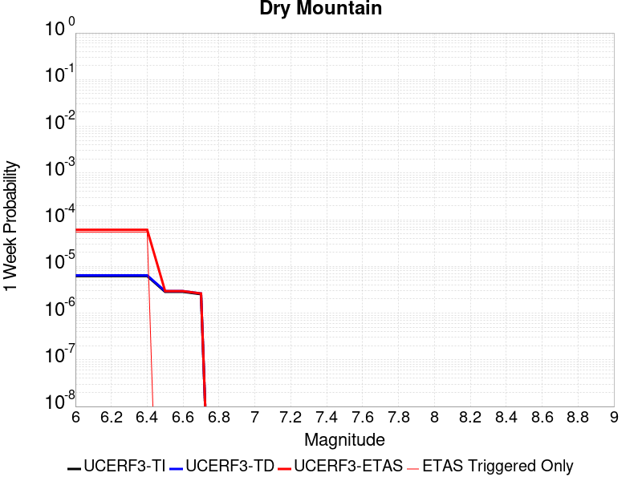 | 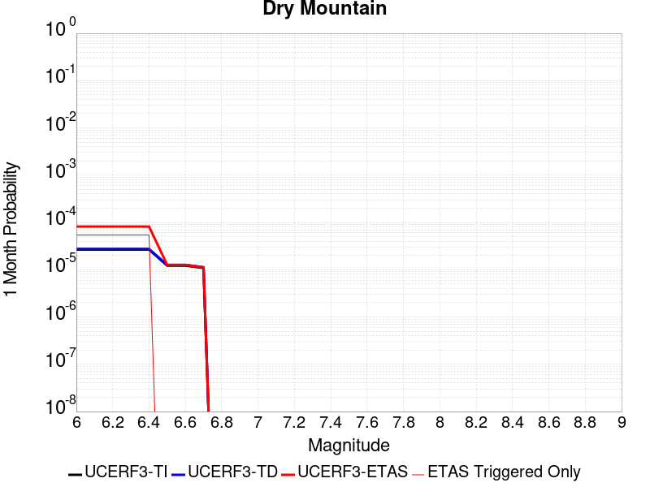 | 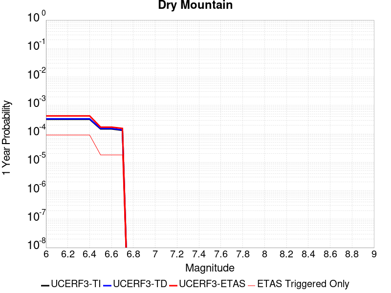 | 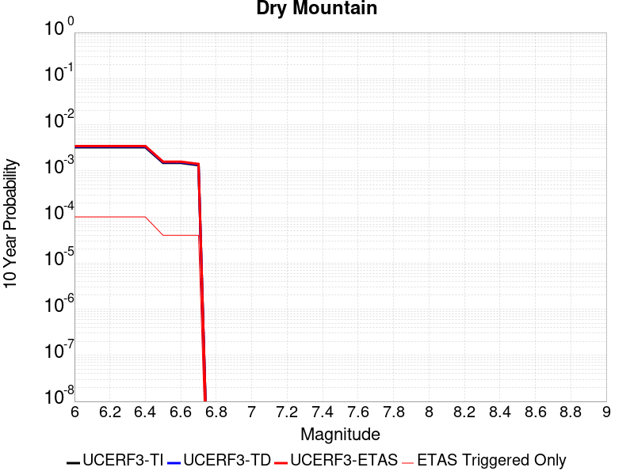 |

| Magnitude | 1 wk TI Prob | 1 wk TD Prob | 1 wk ETAS Prob | 1 wk ETAS/TD Gain | 1 wk ETAS Triggered Only | 1 mo TI Prob | 1 mo TD Prob | 1 mo ETAS Prob | 1 mo ETAS/TD Gain | 1 mo ETAS Triggered Only | 1 yr TI Prob | 1 yr TD Prob | 1 yr ETAS Prob | 1 yr ETAS/TD Gain | 1 yr ETAS Triggered Only | 10 yr TI Prob | 10 yr TD Prob | 10 yr ETAS Prob | 10 yr ETAS/TD Gain | 10 yr ETAS Triggered Only |
|-----|-----|-----|-----|-----|-----|-----|-----|-----|-----|-----|-----|-----|-----|-----|-----|-----|-----|-----|-----|-----|
| 6.0 | 6.222801E-6 | 6.439381E-6 | 3.643919E-5 | 5.6588025 | 3.0E-5 | 2.6668875E-5 | 2.7597147E-5 | 5.7596317E-5 | 2.087039 | 3.0E-5 | 3.2464517E-4 | 3.3595937E-4 | 3.8594258E-4 | 1.1487775 | 5.0E-5 | 0.0032417132 | 0.0033560768 | 0.0034557413 | 1.0296967 | 1.0E-4 |
| 6.1 | 6.222801E-6 | 6.439381E-6 | 3.643919E-5 | 5.6588025 | 3.0E-5 | 2.6668875E-5 | 2.7597147E-5 | 5.7596317E-5 | 2.087039 | 3.0E-5 | 3.2464517E-4 | 3.3595937E-4 | 3.8594258E-4 | 1.1487775 | 5.0E-5 | 0.0032417132 | 0.0033560768 | 0.0034557413 | 1.0296967 | 1.0E-4 |
| 6.2 | 6.222801E-6 | 6.439381E-6 | 3.643919E-5 | 5.6588025 | 3.0E-5 | 2.6668875E-5 | 2.7597147E-5 | 5.7596317E-5 | 2.087039 | 3.0E-5 | 3.2464517E-4 | 3.3595937E-4 | 3.8594258E-4 | 1.1487775 | 5.0E-5 | 0.0032417132 | 0.0033560768 | 0.0034557413 | 1.0296967 | 1.0E-4 |
| 6.3 | 6.222801E-6 | 6.439381E-6 | 3.643919E-5 | 5.6588025 | 3.0E-5 | 2.6668875E-5 | 2.7597147E-5 | 5.7596317E-5 | 2.087039 | 3.0E-5 | 3.2464517E-4 | 3.3595937E-4 | 3.8594258E-4 | 1.1487775 | 5.0E-5 | 0.0032417132 | 0.0033560768 | 0.0034557413 | 1.0296967 | 1.0E-4 |
| 6.4 | 6.222801E-6 | 6.439381E-6 | 3.643919E-5 | 5.6588025 | 3.0E-5 | 2.6668875E-5 | 2.7597147E-5 | 5.7596317E-5 | 2.087039 | 3.0E-5 | 3.2464517E-4 | 3.3595937E-4 | 3.8594258E-4 | 1.1487775 | 5.0E-5 | 0.0032417132 | 0.0033560768 | 0.0034557413 | 1.0296967 | 1.0E-4 |
| 6.5 | 2.8528623E-6 | 2.9521684E-6 | 2.9521684E-6 | 1.0 | 0.0 | 1.22264955E-5 | 1.2652138E-5 | 1.2652138E-5 | 1.0 | 0.0 | 1.4884741E-4 | 1.540376E-4 | 1.6403606E-4 | 1.0649092 | 1.0E-5 | 0.0014874774 | 0.0015401616 | 0.0015801 | 1.0259314 | 4.0E-5 |
| 6.6 | 2.8528623E-6 | 2.9521684E-6 | 2.9521684E-6 | 1.0 | 0.0 | 1.22264955E-5 | 1.2652138E-5 | 1.2652138E-5 | 1.0 | 0.0 | 1.4884741E-4 | 1.540376E-4 | 1.6403606E-4 | 1.0649092 | 1.0E-5 | 0.0014874774 | 0.0015401616 | 0.0015801 | 1.0259314 | 4.0E-5 |
| 6.7 | 2.541E-6 | 2.6293578E-6 | 2.6293578E-6 | 1.0 | 0.0 | 1.0889954E-5 | 1.1268677E-5 | 1.1268677E-5 | 1.0 | 0.0 | 1.3257713E-4 | 1.3719614E-4 | 1.4719476E-4 | 1.0728784 | 1.0E-5 | 0.0013249806 | 0.0013719613 | 0.0014119064 | 1.0291153 | 4.0E-5 |

## Santa Cruz Catalina Ridge alt1
*[(top)](#table-of-contents)*

| 1 Week | 1 Month | 1 Year | 10 Year |
|-----|-----|-----|-----|
| 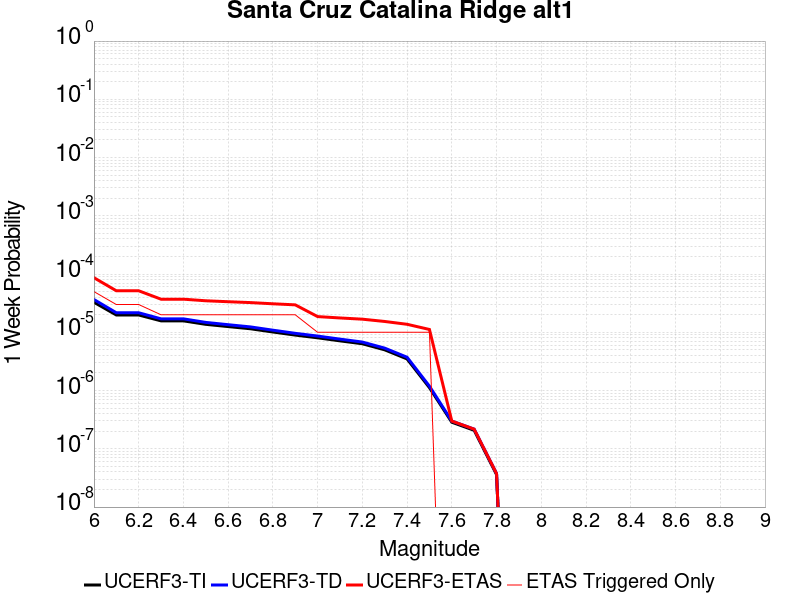 | 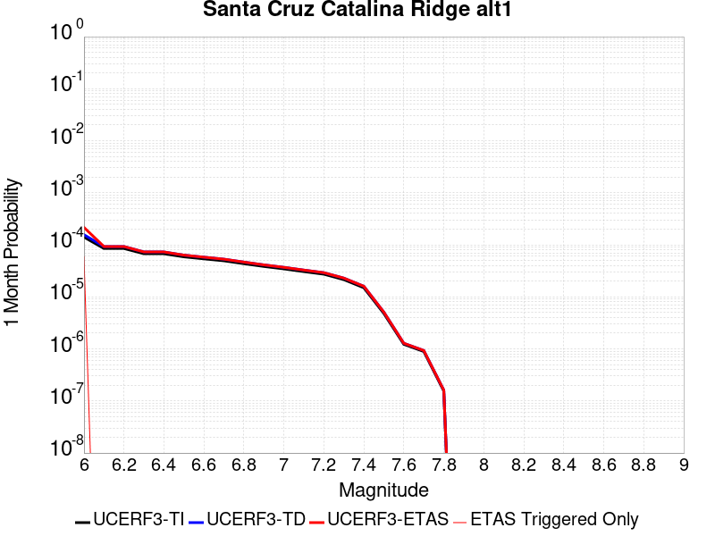 | 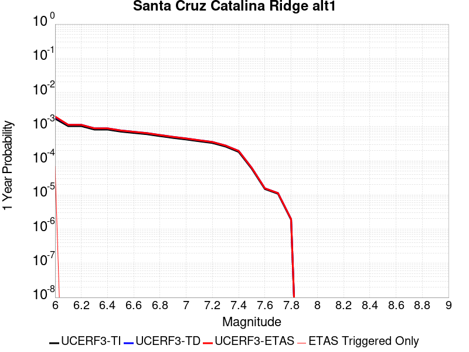 | 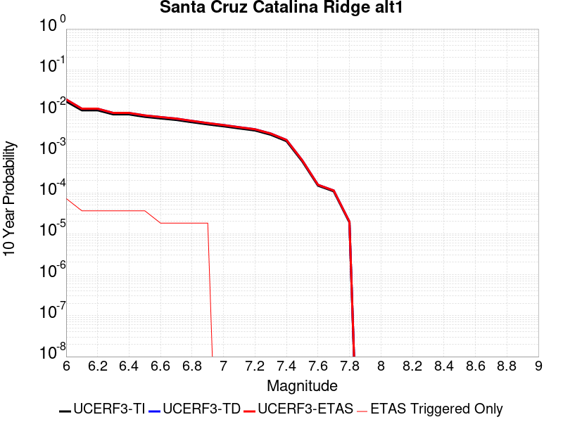 |

| Magnitude | 1 wk TI Prob | 1 wk TD Prob | 1 wk ETAS Prob | 1 wk ETAS/TD Gain | 1 wk ETAS Triggered Only | 1 mo TI Prob | 1 mo TD Prob | 1 mo ETAS Prob | 1 mo ETAS/TD Gain | 1 mo ETAS Triggered Only | 1 yr TI Prob | 1 yr TD Prob | 1 yr ETAS Prob | 1 yr ETAS/TD Gain | 1 yr ETAS Triggered Only | 10 yr TI Prob | 10 yr TD Prob | 10 yr ETAS Prob | 10 yr ETAS/TD Gain | 10 yr ETAS Triggered Only |
|-----|-----|-----|-----|-----|-----|-----|-----|-----|-----|-----|-----|-----|-----|-----|-----|-----|-----|-----|-----|-----|
| 6.0 | 3.2833184E-5 | 3.65584E-5 | 8.655657E-5 | 2.3676248 | 5.0E-5 | 1.4070606E-4 | 1.5667039E-4 | 2.1666098E-4 | 1.3829097 | 6.0E-5 | 0.00171175 | 0.0019059596 | 0.001995788 | 1.0471303 | 9.0E-5 | 0.016986247 | 0.018913029 | 0.019001327 | 1.0046686 | 9.0E-5 |
| 6.1 | 1.9835548E-5 | 2.1659505E-5 | 5.1658855E-5 | 2.3850431 | 3.0E-5 | 8.500672E-5 | 9.282326E-5 | 1.2282048E-4 | 1.3231648 | 3.0E-5 | 0.0010344655 | 0.0011295575 | 0.0011695123 | 1.0353721 | 4.0E-5 | 0.010296632 | 0.011240295 | 0.011279846 | 1.0035186 | 4.0E-5 |
| 6.2 | 1.9835548E-5 | 2.1659505E-5 | 5.1658855E-5 | 2.3850431 | 3.0E-5 | 8.500672E-5 | 9.282326E-5 | 1.2282048E-4 | 1.3231648 | 3.0E-5 | 0.0010344655 | 0.0011295575 | 0.0011695123 | 1.0353721 | 4.0E-5 | 0.010296632 | 0.011240295 | 0.011279846 | 1.0035186 | 4.0E-5 |
| 6.3 | 1.5728183E-5 | 1.703395E-5 | 3.703361E-5 | 2.174106 | 2.0E-5 | 6.7404755E-5 | 7.300063E-5 | 9.299917E-5 | 1.2739502 | 2.0E-5 | 8.2034385E-4 | 8.884264E-4 | 9.183997E-4 | 1.0337375 | 3.0E-5 | 0.008173222 | 0.008849427 | 0.008879161 | 1.00336 | 3.0E-5 |
| 6.4 | 1.5728183E-5 | 1.703395E-5 | 3.703361E-5 | 2.174106 | 2.0E-5 | 6.7404755E-5 | 7.300063E-5 | 9.299917E-5 | 1.2739502 | 2.0E-5 | 8.2034385E-4 | 8.884264E-4 | 9.183997E-4 | 1.0337375 | 3.0E-5 | 0.008173222 | 0.008849427 | 0.008879161 | 1.00336 | 3.0E-5 |
| 6.5 | 1.3707734E-5 | 1.4794522E-5 | 3.4794226E-5 | 2.3518317 | 2.0E-5 | 5.8746107E-5 | 6.3403575E-5 | 8.34023E-5 | 1.3154197 | 2.0E-5 | 7.1499916E-4 | 7.716686E-4 | 8.0164545E-4 | 1.0388469 | 3.0E-5 | 0.0071270303 | 0.0076902895 | 0.007720059 | 1.003871 | 3.0E-5 |
| 6.6 | 1.2539813E-5 | 1.3510219E-5 | 3.350995E-5 | 2.480341 | 2.0E-5 | 5.3740947E-5 | 5.789967E-5 | 7.789851E-5 | 1.3454051 | 2.0E-5 | 6.540996E-4 | 7.0470315E-4 | 7.2468905E-4 | 1.0283607 | 2.0E-5 | 0.0065217763 | 0.0070249885 | 0.007044848 | 1.0028269 | 2.0E-5 |
| 6.7 | 1.1504083E-5 | 1.2377375E-5 | 3.2377127E-5 | 2.6158316 | 2.0E-5 | 4.930228E-5 | 5.3044827E-5 | 7.304377E-5 | 1.3770196 | 2.0E-5 | 6.0008996E-4 | 6.456314E-4 | 6.6561846E-4 | 1.0309575 | 2.0E-5 | 0.005984721 | 0.006437786 | 0.006457657 | 1.0030867 | 2.0E-5 |
| 6.8 | 1.012739E-5 | 1.0877071E-5 | 3.0876854E-5 | 2.8387103 | 2.0E-5 | 4.340238E-5 | 4.6615194E-5 | 6.6614266E-5 | 1.4290247 | 2.0E-5 | 5.282958E-4 | 5.673937E-4 | 5.8738235E-4 | 1.0352288 | 2.0E-5 | 0.0052704164 | 0.0056596193 | 0.0056795063 | 1.0035138 | 2.0E-5 |
| 6.9 | 8.9607865E-6 | 9.609117E-6 | 2.9608926E-5 | 3.0813367 | 2.0E-5 | 3.8402806E-5 | 4.1181287E-5 | 6.1180464E-5 | 1.4856374 | 2.0E-5 | 4.6745385E-4 | 5.012679E-4 | 5.2125787E-4 | 1.0398788 | 2.0E-5 | 0.0046647177 | 0.005001492 | 0.005021392 | 1.0039788 | 2.0E-5 |
| 7.0 | 8.046829E-6 | 8.619746E-6 | 1.861966E-5 | 2.160117 | 1.0E-5 | 3.4485955E-5 | 3.694125E-5 | 4.694088E-5 | 1.2706901 | 1.0E-5 | 4.1978562E-4 | 4.496677E-4 | 4.5966322E-4 | 1.0222286 | 1.0E-5 | 0.004189935 | 0.0044876686 | 0.004497624 | 1.0022184 | 1.0E-5 |
| 7.1 | 7.136131E-6 | 7.637656E-6 | 1.763758E-5 | 2.3092923 | 1.0E-5 | 3.0583058E-5 | 3.2732405E-5 | 4.2732077E-5 | 1.3054976 | 1.0E-5 | 3.7228514E-4 | 3.9844486E-4 | 4.084409E-4 | 1.0250876 | 1.0E-5 | 0.0037166206 | 0.003977381 | 0.0039873417 | 1.0025042 | 1.0E-5 |
| 7.2 | 6.362014E-6 | 6.8049585E-6 | 1.680489E-5 | 2.4695067 | 1.0E-5 | 2.726549E-5 | 2.9163786E-5 | 3.9163493E-5 | 1.342881 | 1.0E-5 | 3.3190678E-4 | 3.550119E-4 | 3.6500834E-4 | 1.0281581 | 1.0E-5 | 0.0033141149 | 0.003544516 | 0.0035544806 | 1.0028113 | 1.0E-5 |
| 7.3 | 5.004101E-6 | 5.351715E-6 | 1.5351661E-5 | 2.8685498 | 1.0E-5 | 2.1445969E-5 | 2.2935723E-5 | 3.293549E-5 | 1.435991 | 1.0E-5 | 2.6107338E-4 | 2.792072E-4 | 2.8920438E-4 | 1.0358057 | 1.0E-5 | 0.002607669 | 0.0027886187 | 0.0027985908 | 1.003576 | 1.0E-5 |
| 7.4 | 3.4901443E-6 | 3.7320526E-6 | 1.3732015E-5 | 3.6794808 | 1.0E-5 | 1.4957676E-5 | 1.5994416E-5 | 2.5994255E-5 | 1.6252083 | 1.0E-5 | 1.8209449E-4 | 1.9471499E-4 | 2.0471304E-4 | 1.0513471 | 1.0E-5 | 0.0018194534 | 0.0019454823 | 0.0019554629 | 1.0051302 | 1.0E-5 |
| 7.5 | 1.1215045E-6 | 1.189387E-6 | 1.1189375E-5 | 9.407682 | 1.0E-5 | 4.806439E-6 | 5.097363E-6 | 1.5097312E-5 | 2.9617887 | 1.0E-5 | 5.851682E-5 | 6.205866E-5 | 7.205804E-5 | 1.1611278 | 1.0E-5 | 5.850142E-4 | 6.2041637E-4 | 6.3041016E-4 | 1.0161082 | 1.0E-5 |
| 7.6 | 2.8599047E-7 | 2.9951994E-7 | 2.9951994E-7 | 1.0 | 0.0 | 1.2256729E-6 | 1.2836562E-6 | 1.2836562E-6 | 1.0 | 0.0 | 1.4922465E-5 | 1.5628404E-5 | 1.5628404E-5 | 1.0 | 0.0 | 1.4921463E-4 | 1.5627318E-4 | 1.5627318E-4 | 1.0 | 0.0 |
| 7.7 | 2.0781519E-7 | 2.1744323E-7 | 2.1744323E-7 | 1.0 | 0.0 | 8.906362E-7 | 9.3189925E-7 | 9.3189925E-7 | 1.0 | 0.0 | 1.08434415E-5 | 1.13458145E-5 | 1.13458145E-5 | 1.0 | 0.0 | 1.0842913E-4 | 1.1345245E-4 | 1.1345245E-4 | 1.0 | 0.0 |
| 7.8 | 3.614776E-8 | 3.764102E-8 | 3.764102E-8 | 1.0 | 0.0 | 1.5491896E-7 | 1.6131864E-7 | 1.6131864E-7 | 1.0 | 0.0 | 1.8861368E-6 | 1.9640527E-6 | 1.9640527E-6 | 1.0 | 0.0 | 1.8861208E-5 | 1.9640367E-5 | 1.9640367E-5 | 1.0 | 0.0 |

## Sheephole
*[(top)](#table-of-contents)*

| 1 Week | 1 Month | 1 Year | 10 Year |
|-----|-----|-----|-----|
| 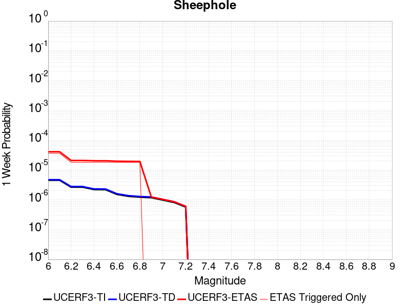 | 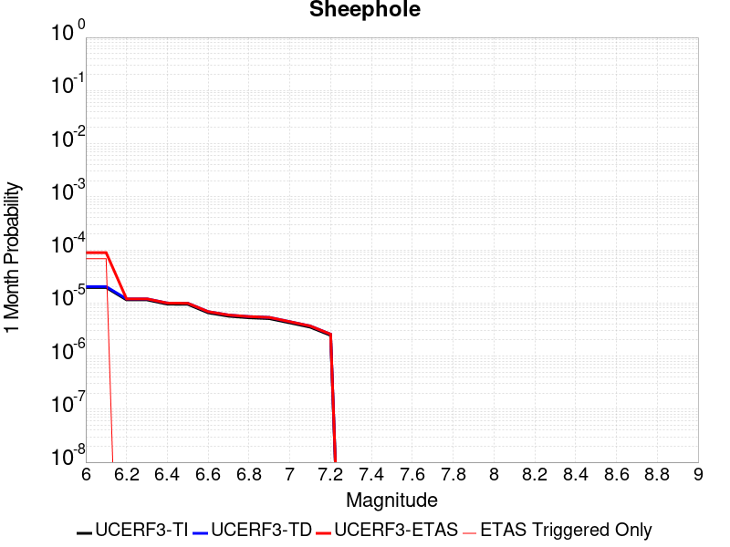 | 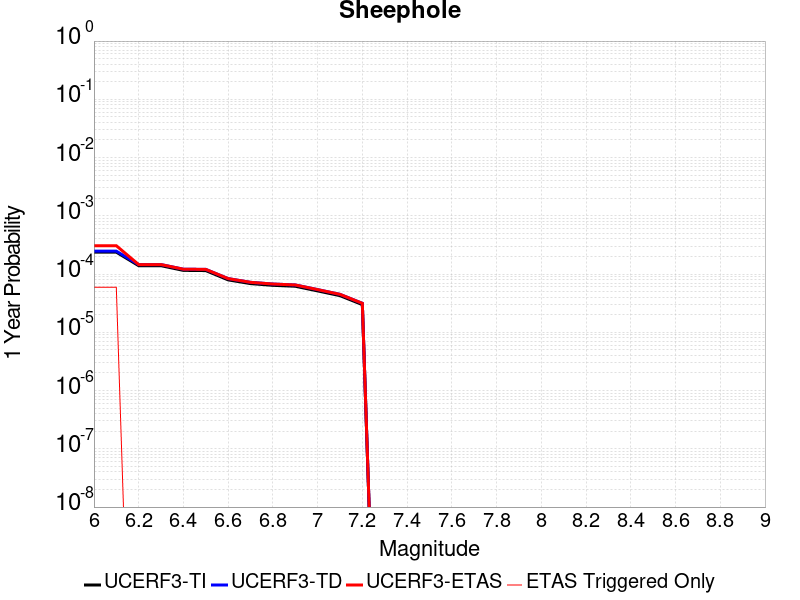 | 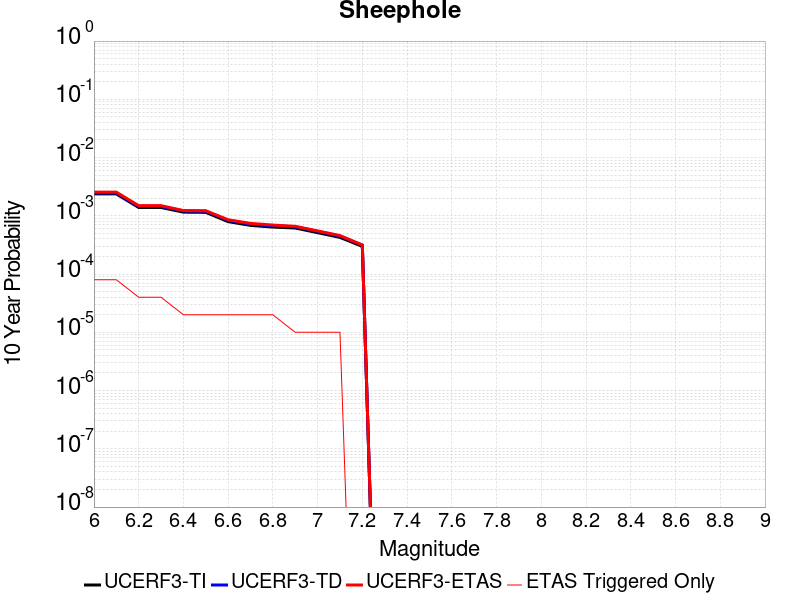 |

| Magnitude | 1 wk TI Prob | 1 wk TD Prob | 1 wk ETAS Prob | 1 wk ETAS/TD Gain | 1 wk ETAS Triggered Only | 1 mo TI Prob | 1 mo TD Prob | 1 mo ETAS Prob | 1 mo ETAS/TD Gain | 1 mo ETAS Triggered Only | 1 yr TI Prob | 1 yr TD Prob | 1 yr ETAS Prob | 1 yr ETAS/TD Gain | 1 yr ETAS Triggered Only | 10 yr TI Prob | 10 yr TD Prob | 10 yr ETAS Prob | 10 yr ETAS/TD Gain | 10 yr ETAS Triggered Only |
|-----|-----|-----|-----|-----|-----|-----|-----|-----|-----|-----|-----|-----|-----|-----|-----|-----|-----|-----|-----|-----|
| 6.0 | 4.5579695E-6 | 4.7412627E-6 | 2.4741168E-5 | 5.2182655 | 2.0E-5 | 1.9534009E-5 | 2.031957E-5 | 5.031896E-5 | 2.4763792 | 3.0E-5 | 2.3780059E-4 | 2.473682E-4 | 2.7736078E-4 | 1.1212467 | 3.0E-5 | 0.0023754628 | 0.002471473 | 0.0025512755 | 1.0322894 | 8.0E-5 |
| 6.1 | 4.5579695E-6 | 4.7412627E-6 | 2.4741168E-5 | 5.2182655 | 2.0E-5 | 1.9534009E-5 | 2.031957E-5 | 5.031896E-5 | 2.4763792 | 3.0E-5 | 2.3780059E-4 | 2.473682E-4 | 2.7736078E-4 | 1.1212467 | 3.0E-5 | 0.0023754628 | 0.002471473 | 0.0025512755 | 1.0322894 | 8.0E-5 |
| 6.2 | 2.6677674E-6 | 2.7873941E-6 | 1.2787366E-5 | 4.58757 | 1.0E-5 | 1.1433239E-5 | 1.1945926E-5 | 2.1945807E-5 | 1.8370954 | 1.0E-5 | 1.3919079E-4 | 1.4543302E-4 | 1.5543157E-4 | 1.0687501 | 1.0E-5 | 0.0013910364 | 0.0014534844 | 0.0014934263 | 1.0274801 | 4.0E-5 |
| 6.3 | 2.6677674E-6 | 2.7873941E-6 | 1.2787366E-5 | 4.58757 | 1.0E-5 | 1.1433239E-5 | 1.1945926E-5 | 2.1945807E-5 | 1.8370954 | 1.0E-5 | 1.3919079E-4 | 1.4543302E-4 | 1.5543157E-4 | 1.0687501 | 1.0E-5 | 0.0013910364 | 0.0014534844 | 0.0014934263 | 1.0274801 | 4.0E-5 |
| 6.4 | 2.2159759E-6 | 2.3228788E-6 | 1.2322856E-5 | 5.304993 | 1.0E-5 | 9.497005E-6 | 9.955161E-6 | 1.9955061E-5 | 2.0044942 | 1.0E-5 | 1.156199E-4 | 1.2119815E-4 | 1.3119694E-4 | 1.0824995 | 1.0E-5 | 0.0011555976 | 0.0012113999 | 0.0012313756 | 1.0164899 | 2.0E-5 |
| 6.5 | 2.1986082E-6 | 2.304759E-6 | 1.2304736E-5 | 5.3388386 | 1.0E-5 | 9.4225725E-6 | 9.877506E-6 | 1.9877407E-5 | 2.0123913 | 1.0E-5 | 1.1471378E-4 | 1.2025281E-4 | 1.302516E-4 | 1.0831481 | 1.0E-5 | 0.0011465458 | 0.0012019566 | 0.0012219326 | 1.0166196 | 2.0E-5 |
| 6.6 | 1.5232331E-6 | 1.6018919E-6 | 1.16018755E-5 | 7.2426085 | 1.0E-5 | 6.5281256E-6 | 6.865234E-6 | 1.6865166E-5 | 2.4566047 | 1.0E-5 | 7.947703E-5 | 8.35812E-5 | 9.358037E-5 | 1.1196342 | 1.0E-5 | 7.9448614E-4 | 8.3551643E-4 | 8.554997E-4 | 1.0239173 | 2.0E-5 |
| 6.7 | 1.3137362E-6 | 1.382819E-6 | 1.13828055E-5 | 8.231594 | 1.0E-5 | 5.6302856E-6 | 5.926355E-6 | 1.5926295E-5 | 2.687368 | 1.0E-5 | 6.854657E-5 | 7.215112E-5 | 8.21504E-5 | 1.138588 | 1.0E-5 | 6.8525434E-4 | 7.212908E-4 | 7.412764E-4 | 1.027708 | 2.0E-5 |
| 6.8 | 1.2275751E-6 | 1.2922847E-6 | 1.1292272E-5 | 8.738223 | 1.0E-5 | 5.2610258E-6 | 5.5383516E-6 | 1.5538297E-5 | 2.8055813 | 1.0E-5 | 6.4051106E-5 | 6.7427485E-5 | 7.7426805E-5 | 1.1482974 | 1.0E-5 | 6.4032647E-4 | 6.740836E-4 | 6.940701E-4 | 1.0296499 | 2.0E-5 |
| 6.9 | 1.1837088E-6 | 1.246102E-6 | 1.246102E-6 | 1.0 | 0.0 | 5.0730278E-6 | 5.340427E-6 | 5.340427E-6 | 1.0 | 0.0 | 6.176237E-5 | 6.501789E-5 | 6.501789E-5 | 1.0 | 0.0 | 6.17452E-4 | 6.5000186E-4 | 6.5999536E-4 | 1.0153745 | 1.0E-5 |
| 7.0 | 9.849371E-7 | 1.0366288E-6 | 1.0366288E-6 | 1.0 | 0.0 | 4.2211523E-6 | 4.442688E-6 | 4.442688E-6 | 1.0 | 0.0 | 5.1391315E-5 | 5.4088487E-5 | 5.4088487E-5 | 1.0 | 0.0 | 5.137943E-4 | 5.407633E-4 | 5.5075786E-4 | 1.0184823 | 1.0E-5 |
| 7.1 | 8.1643645E-7 | 8.591669E-7 | 8.591669E-7 | 1.0 | 0.0 | 3.4990085E-6 | 3.682139E-6 | 3.682139E-6 | 1.0 | 0.0 | 4.2599597E-5 | 4.482921E-5 | 4.482921E-5 | 1.0 | 0.0 | 4.259143E-4 | 4.4821028E-4 | 4.5820582E-4 | 1.022301 | 1.0E-5 |
| 7.2 | 5.7295756E-7 | 6.029502E-7 | 6.029502E-7 | 1.0 | 0.0 | 2.45553E-6 | 2.58407E-6 | 2.58407E-6 | 1.0 | 0.0 | 2.9895667E-5 | 3.1460666E-5 | 3.1460666E-5 | 1.0 | 0.0 | 2.9891645E-4 | 3.145688E-4 | 3.145688E-4 | 1.0 | 0.0 |

## Hosgri (Extension)
*[(top)](#table-of-contents)*

| 1 Week | 1 Month | 1 Year | 10 Year |
|-----|-----|-----|-----|
| 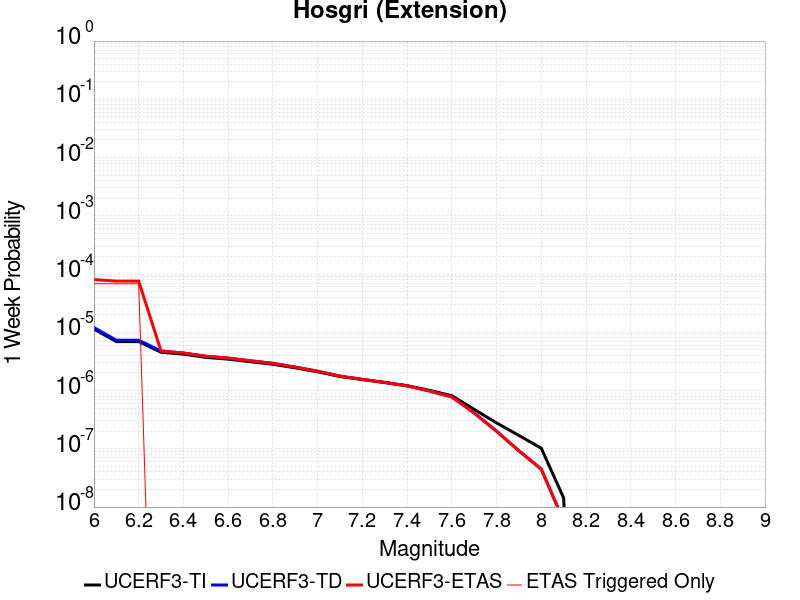 | 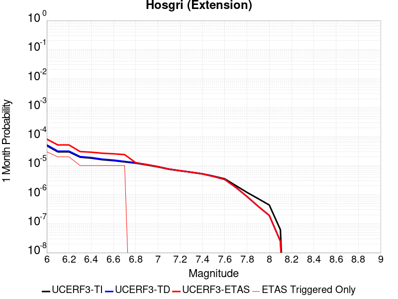 | 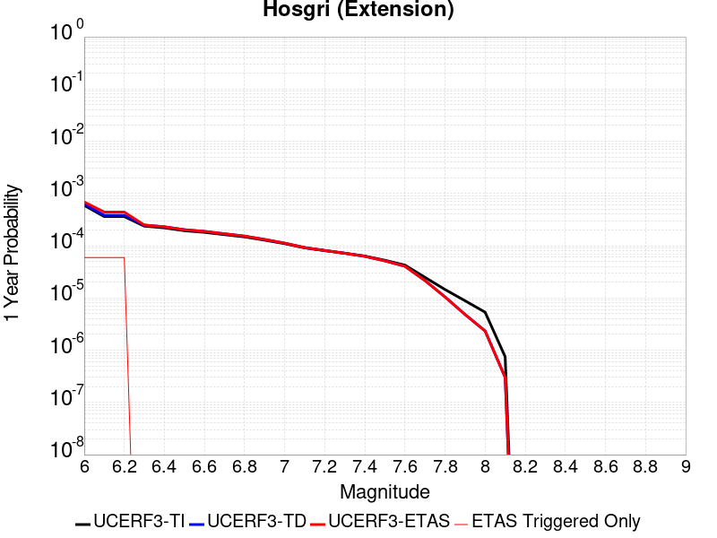 | 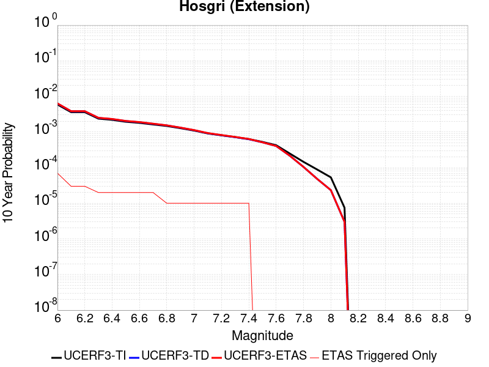 |

| Magnitude | 1 wk TI Prob | 1 wk TD Prob | 1 wk ETAS Prob | 1 wk ETAS/TD Gain | 1 wk ETAS Triggered Only | 1 mo TI Prob | 1 mo TD Prob | 1 mo ETAS Prob | 1 mo ETAS/TD Gain | 1 mo ETAS Triggered Only | 1 yr TI Prob | 1 yr TD Prob | 1 yr ETAS Prob | 1 yr ETAS/TD Gain | 1 yr ETAS Triggered Only | 10 yr TI Prob | 10 yr TD Prob | 10 yr ETAS Prob | 10 yr ETAS/TD Gain | 10 yr ETAS Triggered Only |
|-----|-----|-----|-----|-----|-----|-----|-----|-----|-----|-----|-----|-----|-----|-----|-----|-----|-----|-----|-----|-----|
| 6.0 | 1.1369135E-5 | 1.2083072E-5 | 3.208283E-5 | 2.6551883 | 2.0E-5 | 4.8723956E-5 | 5.1783692E-5 | 8.178214E-5 | 1.5793029 | 3.0E-5 | 5.9305265E-4 | 6.3030684E-4 | 6.702816E-4 | 1.0634211 | 4.0E-5 | 0.005914725 | 0.0062874397 | 0.0063569997 | 1.0110633 | 7.0E-5 |
| 6.1 | 6.934979E-6 | 7.324555E-6 | 1.7324483E-5 | 2.3652606 | 1.0E-5 | 2.9721E-5 | 3.1390595E-5 | 5.138997E-5 | 1.6371135 | 2.0E-5 | 3.617931E-4 | 3.8211764E-4 | 4.0211E-4 | 1.0523199 | 2.0E-5 | 0.0036120464 | 0.0038150186 | 0.003844904 | 1.0078336 | 3.0E-5 |
| 6.2 | 6.934979E-6 | 7.324555E-6 | 1.7324483E-5 | 2.3652606 | 1.0E-5 | 2.9721E-5 | 3.1390595E-5 | 5.138997E-5 | 1.6371135 | 2.0E-5 | 3.617931E-4 | 3.8211764E-4 | 4.0211E-4 | 1.0523199 | 2.0E-5 | 0.0036120464 | 0.0038150186 | 0.003844904 | 1.0078336 | 3.0E-5 |
| 6.3 | 4.5484676E-6 | 4.76933E-6 | 4.76933E-6 | 1.0 | 0.0 | 1.9493287E-5 | 2.043983E-5 | 3.0439625E-5 | 1.4892309 | 1.0E-5 | 2.3730492E-4 | 2.4882692E-4 | 2.5882444E-4 | 1.0401785 | 1.0E-5 | 0.0023705168 | 0.0024855258 | 0.0025054761 | 1.0080266 | 2.0E-5 |
| 6.4 | 4.218095E-6 | 4.4168614E-6 | 4.4168614E-6 | 1.0 | 0.0 | 1.8077424E-5 | 1.8929271E-5 | 2.8929082E-5 | 1.5282724 | 1.0E-5 | 2.2007042E-4 | 2.3043984E-4 | 2.4043753E-4 | 1.0433853 | 1.0E-5 | 0.002198526 | 0.0023020422 | 0.0023219963 | 1.008668 | 2.0E-5 |
| 6.5 | 3.717374E-6 | 3.8838775E-6 | 3.8838775E-6 | 1.0 | 0.0 | 1.5931506E-5 | 1.6645085E-5 | 2.6644919E-5 | 1.600768 | 1.0E-5 | 1.9394881E-4 | 2.0263524E-4 | 2.1263321E-4 | 1.0493398 | 1.0E-5 | 0.0019377962 | 0.0020245234 | 0.002044483 | 1.0098588 | 2.0E-5 |
| 6.6 | 3.4605036E-6 | 3.608306E-6 | 3.608306E-6 | 1.0 | 0.0 | 1.4830645E-5 | 1.5464078E-5 | 2.5463924E-5 | 1.64665 | 1.0E-5 | 1.8054814E-4 | 1.8825903E-4 | 1.9825714E-4 | 1.0531083 | 1.0E-5 | 0.0018040152 | 0.0018810101 | 0.0019009726 | 1.0106126 | 2.0E-5 |
| 6.7 | 3.123439E-6 | 3.2465687E-6 | 3.2465687E-6 | 1.0 | 0.0 | 1.33860985E-5 | 1.3913792E-5 | 2.3913653E-5 | 1.7187014 | 1.0E-5 | 1.6296357E-4 | 1.6938736E-4 | 1.7938566E-4 | 1.0590262 | 1.0E-5 | 0.001628441 | 0.0016925934 | 0.0017125596 | 1.0117962 | 2.0E-5 |
| 6.8 | 2.8290783E-6 | 2.9305404E-6 | 2.9305404E-6 | 1.0 | 0.0 | 1.2124565E-5 | 1.2559399E-5 | 1.2559399E-5 | 1.0 | 0.0 | 1.4760658E-4 | 1.5290003E-4 | 1.5290003E-4 | 1.0 | 0.0 | 0.0014750857 | 0.001527957 | 0.0015379417 | 1.0065347 | 1.0E-5 |
| 6.9 | 2.454112E-6 | 2.5283196E-6 | 2.5283196E-6 | 1.0 | 0.0 | 1.0517581E-5 | 1.0835611E-5 | 1.0835611E-5 | 1.0 | 0.0 | 1.2804402E-4 | 1.3191563E-4 | 1.3191563E-4 | 1.0 | 0.0 | 0.0012797028 | 0.0013183793 | 0.0013283662 | 1.007575 | 1.0E-5 |
| 7.0 | 2.1008145E-6 | 2.1498704E-6 | 2.1498704E-6 | 1.0 | 0.0 | 9.003459E-6 | 9.213698E-6 | 9.213698E-6 | 1.0 | 0.0 | 1.096116E-4 | 1.1217103E-4 | 1.1217103E-4 | 1.0 | 0.0 | 0.0010955755 | 0.0011211479 | 0.0011311367 | 1.0089095 | 1.0E-5 |
| 7.1 | 1.744384E-6 | 1.7686352E-6 | 1.7686352E-6 | 1.0 | 0.0 | 7.47591E-6 | 7.5798434E-6 | 7.5798434E-6 | 1.0 | 0.0 | 9.1015405E-5 | 9.22807E-5 | 9.22807E-5 | 1.0 | 0.0 | 9.097813E-4 | 9.2242553E-4 | 9.3241635E-4 | 1.010831 | 1.0E-5 |
| 7.2 | 1.5456587E-6 | 1.5562882E-6 | 1.5562882E-6 | 1.0 | 0.0 | 6.6242346E-6 | 6.66979E-6 | 6.66979E-6 | 1.0 | 0.0 | 8.064707E-5 | 8.120168E-5 | 8.120168E-5 | 1.0 | 0.0 | 8.0617814E-4 | 8.117213E-4 | 8.217132E-4 | 1.0123096 | 1.0E-5 |
| 7.3 | 1.3775123E-6 | 1.3766082E-6 | 1.3766082E-6 | 1.0 | 0.0 | 5.9036106E-6 | 5.899736E-6 | 5.899736E-6 | 1.0 | 0.0 | 7.187409E-5 | 7.182693E-5 | 7.182693E-5 | 1.0 | 0.0 | 7.185085E-4 | 7.180382E-4 | 7.28031E-4 | 1.0139169 | 1.0E-5 |
| 7.4 | 1.214491E-6 | 1.2023461E-6 | 1.2023461E-6 | 1.0 | 0.0 | 5.2049513E-6 | 5.1529014E-6 | 5.1529014E-6 | 1.0 | 0.0 | 6.336844E-5 | 6.2734776E-5 | 6.2734776E-5 | 1.0 | 0.0 | 6.335037E-4 | 6.271715E-4 | 6.371652E-4 | 1.0159346 | 1.0E-5 |
| 7.5 | 1.0101123E-6 | 9.842246E-7 | 9.842246E-7 | 1.0 | 0.0 | 4.3290456E-6 | 4.2180986E-6 | 4.2180986E-6 | 1.0 | 0.0 | 5.2704854E-5 | 5.1354145E-5 | 5.1354145E-5 | 1.0 | 0.0 | 5.2692357E-4 | 5.1342335E-4 | 5.1342335E-4 | 1.0 | 0.0 |
| 7.6 | 8.1558215E-7 | 7.765966E-7 | 7.765966E-7 | 1.0 | 0.0 | 3.4953473E-6 | 3.328267E-6 | 3.328267E-6 | 1.0 | 0.0 | 4.255502E-5 | 4.0520903E-5 | 4.0520903E-5 | 1.0 | 0.0 | 4.2546875E-4 | 4.0513556E-4 | 4.0513556E-4 | 1.0 | 0.0 |
| 7.7 | 4.757816E-7 | 4.1308888E-7 | 4.1308888E-7 | 1.0 | 0.0 | 2.0390623E-6 | 1.7703798E-6 | 1.7703798E-6 | 1.0 | 0.0 | 2.4825302E-5 | 2.155416E-5 | 2.155416E-5 | 1.0 | 0.0 | 2.482253E-4 | 2.1552083E-4 | 2.1552083E-4 | 1.0 | 0.0 |
| 7.8 | 2.782787E-7 | 2.0047722E-7 | 2.0047722E-7 | 1.0 | 0.0 | 1.1926223E-6 | 8.5918776E-7 | 8.5918776E-7 | 1.0 | 0.0 | 1.452008E-5 | 1.04605615E-5 | 1.04605615E-5 | 1.0 | 0.0 | 1.4519131E-4 | 1.04600724E-4 | 1.04600724E-4 | 1.0 | 0.0 |
| 7.9 | 1.6948086E-7 | 9.244227E-8 | 9.244227E-8 | 1.0 | 0.0 | 7.2634634E-7 | 3.961811E-7 | 3.961811E-7 | 1.0 | 0.0 | 8.843231E-6 | 4.8234942E-6 | 4.8234942E-6 | 1.0 | 0.0 | 8.842879E-5 | 4.8233902E-5 | 4.8233902E-5 | 1.0 | 0.0 |
| 8.0 | 1.0225492E-7 | 4.4738776E-8 | 4.4738776E-8 | 1.0 | 0.0 | 4.382353E-7 | 1.917376E-7 | 1.917376E-7 | 1.0 | 0.0 | 5.335502E-6 | 2.3344028E-6 | 2.3344028E-6 | 1.0 | 0.0 | 5.335374E-5 | 2.3343786E-5 | 2.3343786E-5 | 1.0 | 0.0 |
| 8.1 | 1.43711345E-8 | 5.787707E-9 | 5.787707E-9 | 1.0 | 0.0 | 6.1590576E-8 | 2.480446E-8 | 2.480446E-8 | 1.0 | 0.0 | 7.4986497E-7 | 3.0199428E-7 | 3.0199428E-7 | 1.0 | 0.0 | 7.4986247E-6 | 3.0199392E-6 | 3.0199392E-6 | 1.0 | 0.0 |

## Raymond
*[(top)](#table-of-contents)*

| 1 Week | 1 Month | 1 Year | 10 Year |
|-----|-----|-----|-----|
| 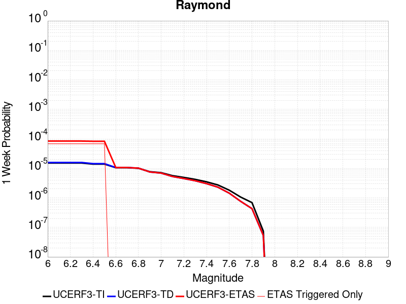 | 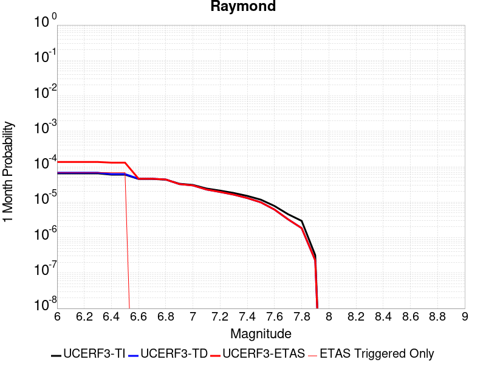 | 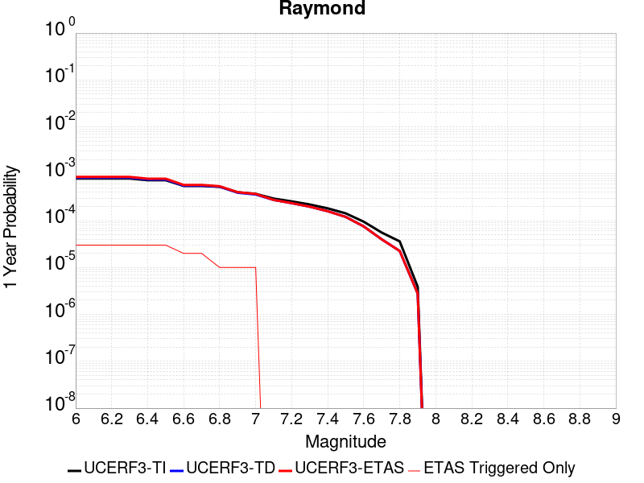 |  |

| Magnitude | 1 wk TI Prob | 1 wk TD Prob | 1 wk ETAS Prob | 1 wk ETAS/TD Gain | 1 wk ETAS Triggered Only | 1 mo TI Prob | 1 mo TD Prob | 1 mo ETAS Prob | 1 mo ETAS/TD Gain | 1 mo ETAS Triggered Only | 1 yr TI Prob | 1 yr TD Prob | 1 yr ETAS Prob | 1 yr ETAS/TD Gain | 1 yr ETAS Triggered Only | 10 yr TI Prob | 10 yr TD Prob | 10 yr ETAS Prob | 10 yr ETAS/TD Gain | 10 yr ETAS Triggered Only |
|-----|-----|-----|-----|-----|-----|-----|-----|-----|-----|-----|-----|-----|-----|-----|-----|-----|-----|-----|-----|-----|
| 6.0 | 1.5157413E-5 | 1.5810128E-5 | 2.580997E-5 | 1.632496 | 1.0E-5 | 6.4958724E-5 | 6.7756075E-5 | 7.7755394E-5 | 1.1475782 | 1.0E-5 | 7.905855E-4 | 8.2464307E-4 | 8.546183E-4 | 1.0363494 | 3.0E-5 | 0.007877788 | 0.008218348 | 0.008297691 | 1.0096543 | 8.0E-5 |
| 6.1 | 1.5157413E-5 | 1.5810128E-5 | 2.580997E-5 | 1.632496 | 1.0E-5 | 6.4958724E-5 | 6.7756075E-5 | 7.7755394E-5 | 1.1475782 | 1.0E-5 | 7.905855E-4 | 8.2464307E-4 | 8.546183E-4 | 1.0363494 | 3.0E-5 | 0.007877788 | 0.008218348 | 0.008297691 | 1.0096543 | 8.0E-5 |
| 6.2 | 1.5157413E-5 | 1.5810128E-5 | 2.580997E-5 | 1.632496 | 1.0E-5 | 6.4958724E-5 | 6.7756075E-5 | 7.7755394E-5 | 1.1475782 | 1.0E-5 | 7.905855E-4 | 8.2464307E-4 | 8.546183E-4 | 1.0363494 | 3.0E-5 | 0.007877788 | 0.008218348 | 0.008297691 | 1.0096543 | 8.0E-5 |
| 6.3 | 1.5157413E-5 | 1.5810128E-5 | 2.580997E-5 | 1.632496 | 1.0E-5 | 6.4958724E-5 | 6.7756075E-5 | 7.7755394E-5 | 1.1475782 | 1.0E-5 | 7.905855E-4 | 8.2464307E-4 | 8.546183E-4 | 1.0363494 | 3.0E-5 | 0.007877788 | 0.008218348 | 0.008297691 | 1.0096543 | 8.0E-5 |
| 6.4 | 1.3941944E-5 | 1.445469E-5 | 2.4454546E-5 | 1.6918069 | 1.0E-5 | 5.9749822E-5 | 6.1947336E-5 | 7.194671E-5 | 1.1614175 | 1.0E-5 | 7.2721124E-4 | 7.5397117E-4 | 7.839485E-4 | 1.0397593 | 3.0E-5 | 0.007248361 | 0.0075164647 | 0.0075958637 | 1.0105633 | 8.0E-5 |
| 6.5 | 1.3941944E-5 | 1.445469E-5 | 2.4454546E-5 | 1.6918069 | 1.0E-5 | 5.9749822E-5 | 6.1947336E-5 | 7.194671E-5 | 1.1614175 | 1.0E-5 | 7.2721124E-4 | 7.5397117E-4 | 7.839485E-4 | 1.0397593 | 3.0E-5 | 0.007248361 | 0.0075164647 | 0.0075958637 | 1.0105633 | 8.0E-5 |
| 6.6 | 1.0542609E-5 | 1.0671113E-5 | 1.0671113E-5 | 1.0 | 0.0 | 4.5181827E-5 | 4.573257E-5 | 4.573257E-5 | 1.0 | 0.0 | 5.499499E-4 | 5.5665727E-4 | 5.766461E-4 | 1.0359087 | 2.0E-5 | 0.005485909 | 0.00555319 | 0.0056228014 | 1.0125353 | 7.0E-5 |
| 6.7 | 1.0542609E-5 | 1.0671113E-5 | 1.0671113E-5 | 1.0 | 0.0 | 4.5181827E-5 | 4.573257E-5 | 4.573257E-5 | 1.0 | 0.0 | 5.499499E-4 | 5.5665727E-4 | 5.766461E-4 | 1.0359087 | 2.0E-5 | 0.005485909 | 0.00555319 | 0.0056228014 | 1.0125353 | 7.0E-5 |
| 6.8 | 1.0079132E-5 | 1.0176646E-5 | 1.0176646E-5 | 1.0 | 0.0 | 4.3195567E-5 | 4.3613498E-5 | 4.3613498E-5 | 1.0 | 0.0 | 5.257791E-4 | 5.3087034E-4 | 5.40865E-4 | 1.018827 | 1.0E-5 | 0.0052453685 | 0.005296571 | 0.0053463066 | 1.0093901 | 5.0E-5 |
| 6.9 | 7.721598E-6 | 7.5489047E-6 | 7.5489047E-6 | 1.0 | 0.0 | 3.3092143E-5 | 3.2352054E-5 | 3.2352054E-5 | 1.0 | 0.0 | 4.0282236E-4 | 3.9381627E-4 | 4.0381236E-4 | 1.0253825 | 1.0E-5 | 0.0040209293 | 0.0039313175 | 0.003951239 | 1.0050673 | 2.0E-5 |
| 7.0 | 7.137566E-6 | 6.9113057E-6 | 6.9113057E-6 | 1.0 | 0.0 | 3.058921E-5 | 2.961955E-5 | 2.961955E-5 | 1.0 | 0.0 | 3.7236E-4 | 3.6055944E-4 | 3.7055582E-4 | 1.0277246 | 1.0E-5 | 0.0037173668 | 0.0035998628 | 0.0036197908 | 1.0055357 | 2.0E-5 |
| 7.1 | 5.654976E-6 | 5.29954E-6 | 5.29954E-6 | 1.0 | 0.0 | 2.4235387E-5 | 2.2712118E-5 | 2.2712118E-5 | 1.0 | 0.0 | 2.9502588E-4 | 2.7648517E-4 | 2.7648517E-4 | 1.0 | 0.0 | 0.0029463451 | 0.002761443 | 0.0027714153 | 1.0036113 | 1.0E-5 |
| 7.2 | 4.9358455E-6 | 4.5266574E-6 | 4.5266574E-6 | 1.0 | 0.0 | 2.1153453E-5 | 1.9399817E-5 | 1.9399817E-5 | 1.0 | 0.0 | 2.5751285E-4 | 2.3616731E-4 | 2.3616731E-4 | 1.0 | 0.0 | 0.0025721465 | 0.0023591854 | 0.002369162 | 1.0042287 | 1.0E-5 |
| 7.3 | 4.2368597E-6 | 3.8056164E-6 | 3.8056164E-6 | 1.0 | 0.0 | 1.8157843E-5 | 1.6309683E-5 | 1.6309683E-5 | 1.0 | 0.0 | 2.2104931E-4 | 1.9855241E-4 | 1.9855241E-4 | 1.0 | 0.0 | 0.0022082955 | 0.0019837688 | 0.0019837688 | 1.0 | 0.0 |
| 7.4 | 3.4999923E-6 | 3.043744E-6 | 3.043744E-6 | 1.0 | 0.0 | 1.49998805E-5 | 1.3044552E-5 | 1.3044552E-5 | 1.0 | 0.0 | 1.8260824E-4 | 1.5880594E-4 | 1.5880594E-4 | 1.0 | 0.0 | 0.0018245826 | 0.0015869403 | 0.0015869403 | 1.0 | 0.0 |
| 7.5 | 2.738017E-6 | 2.3020468E-6 | 2.3020468E-6 | 1.0 | 0.0 | 1.1734306E-5 | 9.865878E-6 | 9.865878E-6 | 1.0 | 0.0 | 1.428558E-4 | 1.2011051E-4 | 1.2011051E-4 | 1.0 | 0.0 | 0.0014276401 | 0.0012004703 | 0.0012004703 | 1.0 | 0.0 |
| 7.6 | 1.8186392E-6 | 1.442312E-6 | 1.442312E-6 | 1.0 | 0.0 | 7.794145E-6 | 6.181323E-6 | 6.181323E-6 | 1.0 | 0.0 | 9.488958E-5 | 7.5255055E-5 | 7.5255055E-5 | 1.0 | 0.0 | 9.4849075E-4 | 7.523072E-4 | 7.523072E-4 | 1.0 | 0.0 |
| 7.7 | 1.0660348E-6 | 7.6438056E-7 | 7.6438056E-7 | 1.0 | 0.0 | 4.5687125E-6 | 3.2759126E-6 | 3.2759126E-6 | 1.0 | 0.0 | 5.5622655E-5 | 3.9883522E-5 | 3.9883522E-5 | 1.0 | 0.0 | 5.5608735E-4 | 3.9877277E-4 | 3.9877277E-4 | 1.0 | 0.0 |
| 7.8 | 6.913602E-7 | 4.3204133E-7 | 4.3204133E-7 | 1.0 | 0.0 | 2.962969E-6 | 1.8516045E-6 | 1.8516045E-6 | 1.0 | 0.0 | 3.607355E-5 | 2.2543056E-5 | 2.2543056E-5 | 1.0 | 0.0 | 3.6067693E-4 | 2.2541556E-4 | 2.2541556E-4 | 1.0 | 0.0 |
| 7.9 | 7.425201E-8 | 5.3222113E-8 | 5.3222113E-8 | 1.0 | 0.0 | 3.1822285E-7 | 2.2809476E-7 | 2.2809476E-7 | 1.0 | 0.0 | 3.874356E-6 | 2.7770516E-6 | 2.7770516E-6 | 1.0 | 0.0 | 3.8742884E-5 | 2.7770298E-5 | 2.7770298E-5 | 1.0 | 0.0 |

## Oak Ridge (Onshore)
*[(top)](#table-of-contents)*

| 1 Week | 1 Month | 1 Year | 10 Year |
|-----|-----|-----|-----|
|  |  | 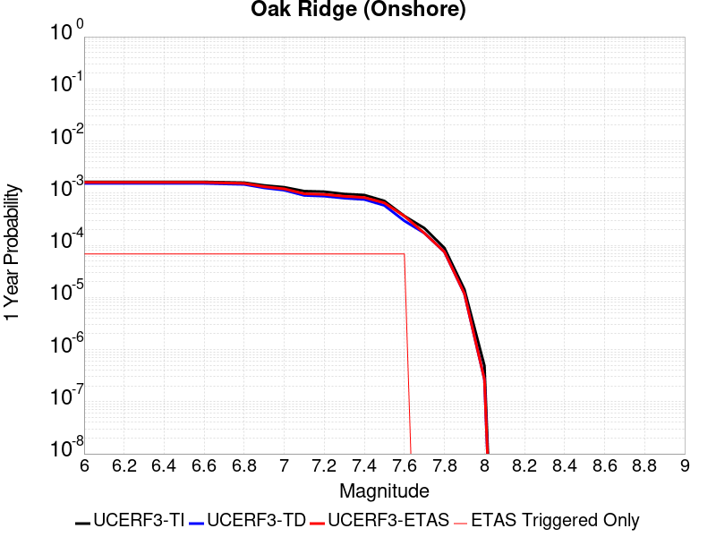 |  |

| Magnitude | 1 wk TI Prob | 1 wk TD Prob | 1 wk ETAS Prob | 1 wk ETAS/TD Gain | 1 wk ETAS Triggered Only | 1 mo TI Prob | 1 mo TD Prob | 1 mo ETAS Prob | 1 mo ETAS/TD Gain | 1 mo ETAS Triggered Only | 1 yr TI Prob | 1 yr TD Prob | 1 yr ETAS Prob | 1 yr ETAS/TD Gain | 1 yr ETAS Triggered Only | 10 yr TI Prob | 10 yr TD Prob | 10 yr ETAS Prob | 10 yr ETAS/TD Gain | 10 yr ETAS Triggered Only |
|-----|-----|-----|-----|-----|-----|-----|-----|-----|-----|-----|-----|-----|-----|-----|-----|-----|-----|-----|-----|-----|
| 6.0 | 3.155064E-5 | 2.9525974E-5 | 4.9525384E-5 | 1.6773497 | 2.0E-5 | 1.3521002E-4 | 1.2653397E-4 | 1.4653144E-4 | 1.1580403 | 2.0E-5 | 0.001644939 | 0.0015395004 | 0.0015694542 | 1.0194569 | 3.0E-5 | 0.01632816 | 0.015292859 | 0.015371636 | 1.0051512 | 8.0E-5 |
| 6.1 | 3.155064E-5 | 2.9525974E-5 | 4.9525384E-5 | 1.6773497 | 2.0E-5 | 1.3521002E-4 | 1.2653397E-4 | 1.4653144E-4 | 1.1580403 | 2.0E-5 | 0.001644939 | 0.0015395004 | 0.0015694542 | 1.0194569 | 3.0E-5 | 0.01632816 | 0.015292859 | 0.015371636 | 1.0051512 | 8.0E-5 |
| 6.2 | 3.155064E-5 | 2.9525974E-5 | 4.9525384E-5 | 1.6773497 | 2.0E-5 | 1.3521002E-4 | 1.2653397E-4 | 1.4653144E-4 | 1.1580403 | 2.0E-5 | 0.001644939 | 0.0015395004 | 0.0015694542 | 1.0194569 | 3.0E-5 | 0.01632816 | 0.015292859 | 0.015371636 | 1.0051512 | 8.0E-5 |
| 6.3 | 3.155064E-5 | 2.9525974E-5 | 4.9525384E-5 | 1.6773497 | 2.0E-5 | 1.3521002E-4 | 1.2653397E-4 | 1.4653144E-4 | 1.1580403 | 2.0E-5 | 0.001644939 | 0.0015395004 | 0.0015694542 | 1.0194569 | 3.0E-5 | 0.01632816 | 0.015292859 | 0.015371636 | 1.0051512 | 8.0E-5 |
| 6.4 | 3.155064E-5 | 2.9525974E-5 | 4.9525384E-5 | 1.6773497 | 2.0E-5 | 1.3521002E-4 | 1.2653397E-4 | 1.4653144E-4 | 1.1580403 | 2.0E-5 | 0.001644939 | 0.0015395004 | 0.0015694542 | 1.0194569 | 3.0E-5 | 0.01632816 | 0.015292859 | 0.015371636 | 1.0051512 | 8.0E-5 |
| 6.5 | 3.155064E-5 | 2.9525974E-5 | 4.9525384E-5 | 1.6773497 | 2.0E-5 | 1.3521002E-4 | 1.2653397E-4 | 1.4653144E-4 | 1.1580403 | 2.0E-5 | 0.001644939 | 0.0015395004 | 0.0015694542 | 1.0194569 | 3.0E-5 | 0.01632816 | 0.015292859 | 0.015371636 | 1.0051512 | 8.0E-5 |
| 6.6 | 3.155064E-5 | 2.9525974E-5 | 4.9525384E-5 | 1.6773497 | 2.0E-5 | 1.3521002E-4 | 1.2653397E-4 | 1.4653144E-4 | 1.1580403 | 2.0E-5 | 0.001644939 | 0.0015395004 | 0.0015694542 | 1.0194569 | 3.0E-5 | 0.01632816 | 0.015292859 | 0.015371636 | 1.0051512 | 8.0E-5 |
| 6.7 | 3.098897E-5 | 2.8864175E-5 | 4.8863596E-5 | 1.6928805 | 2.0E-5 | 1.328031E-4 | 1.2369796E-4 | 1.4369548E-4 | 1.1616641 | 2.0E-5 | 0.0016156785 | 0.0015050198 | 0.0015349747 | 1.0199033 | 3.0E-5 | 0.016039822 | 0.014952714 | 0.0150315175 | 1.0052702 | 8.0E-5 |
| 6.8 | 3.0449872E-5 | 2.8239372E-5 | 4.8238806E-5 | 1.7082111 | 2.0E-5 | 1.3049292E-4 | 1.2102048E-4 | 1.4101806E-4 | 1.1652412 | 2.0E-5 | 0.0015875935 | 0.0014724657 | 0.0015024215 | 1.020344 | 3.0E-5 | 0.015762992 | 0.014631462 | 0.014710291 | 1.0053877 | 8.0E-5 |
| 6.9 | 2.697928E-5 | 2.4219773E-5 | 4.421929E-5 | 1.8257515 | 2.0E-5 | 1.15620365E-4 | 1.0379502E-4 | 1.2379294E-4 | 1.1926675 | 2.0E-5 | 0.0014067689 | 0.0012629933 | 0.0012929555 | 1.0237231 | 3.0E-5 | 0.0139789665 | 0.01256087 | 0.012639865 | 1.006289 | 8.0E-5 |
| 7.0 | 2.4893961E-5 | 2.1862043E-5 | 4.1861604E-5 | 1.9148077 | 2.0E-5 | 1.0668404E-4 | 9.3691204E-5 | 1.13689326E-4 | 1.2134472 | 2.0E-5 | 0.0012981043 | 0.0011401111 | 0.0011600883 | 1.0175221 | 2.0E-5 | 0.012905477 | 0.011344905 | 0.011414112 | 1.0061002 | 7.0E-5 |
| 7.1 | 2.0945363E-5 | 1.7354487E-5 | 3.735414E-5 | 2.1524198 | 2.0E-5 | 8.976275E-5 | 7.437428E-5 | 9.4372794E-5 | 1.2688901 | 2.0E-5 | 0.0010923136 | 9.051354E-4 | 9.251173E-4 | 1.0220761 | 2.0E-5 | 0.0108696 | 0.009015423 | 0.009074882 | 1.0065953 | 6.0E-5 |
| 7.2 | 2.0439404E-5 | 1.6809423E-5 | 3.6809088E-5 | 2.1897888 | 2.0E-5 | 8.7594504E-5 | 7.203843E-5 | 9.2036986E-5 | 1.2776096 | 2.0E-5 | 0.0010659413 | 8.767196E-4 | 8.9670205E-4 | 1.0227923 | 2.0E-5 | 0.010608427 | 0.008733526 | 0.008793002 | 1.0068101 | 6.0E-5 |
| 7.3 | 1.8463334E-5 | 1.5381811E-5 | 3.53815E-5 | 2.3002172 | 2.0E-5 | 7.912617E-5 | 6.59204E-5 | 8.5919084E-5 | 1.3033762 | 2.0E-5 | 9.6293533E-4 | 8.0228975E-4 | 8.2227367E-4 | 1.0249087 | 2.0E-5 | 0.009587734 | 0.007994797 | 0.008044397 | 1.006204 | 5.0E-5 |
| 7.4 | 1.763139E-5 | 1.451684E-5 | 3.451655E-5 | 2.3776903 | 2.0E-5 | 7.556091E-5 | 6.221356E-5 | 8.221232E-5 | 1.3214533 | 2.0E-5 | 9.1956573E-4 | 7.571909E-4 | 7.7717577E-4 | 1.0263934 | 2.0E-5 | 0.009157699 | 0.007546914 | 0.007596536 | 1.0065752 | 5.0E-5 |
| 7.5 | 1.3594944E-5 | 1.1163356E-5 | 3.1163134E-5 | 2.791556 | 2.0E-5 | 5.8262744E-5 | 4.784209E-5 | 6.784114E-5 | 1.4180219 | 2.0E-5 | 7.0911803E-4 | 5.8232434E-4 | 6.023127E-4 | 1.0343251 | 2.0E-5 | 0.007068595 | 0.0058082556 | 0.0058579654 | 1.0085584 | 5.0E-5 |
| 7.6 | 6.9889534E-6 | 5.6367144E-6 | 1.5636659E-5 | 2.7740731 | 1.0E-5 | 2.9952313E-5 | 2.4157125E-5 | 3.4156885E-5 | 1.4139465 | 1.0E-5 | 3.646084E-4 | 2.9407372E-4 | 3.040708E-4 | 1.033995 | 1.0E-5 | 0.0036401073 | 0.0029368899 | 0.0029668016 | 1.0101849 | 3.0E-5 |
| 7.7 | 4.0824193E-6 | 3.2832586E-6 | 3.2832586E-6 | 1.0 | 0.0 | 1.7495966E-5 | 1.4071033E-5 | 1.4071033E-5 | 1.0 | 0.0 | 2.1299256E-4 | 1.713015E-4 | 1.713015E-4 | 1.0 | 0.0 | 0.0021278851 | 0.0017117079 | 0.0017216908 | 1.0058321 | 1.0E-5 |
| 7.8 | 1.7023609E-6 | 1.4370495E-6 | 1.4370495E-6 | 1.0 | 0.0 | 7.295812E-6 | 6.1587693E-6 | 6.1587693E-6 | 1.0 | 0.0 | 8.882289E-5 | 7.498047E-5 | 7.498047E-5 | 1.0 | 0.0 | 8.8787393E-4 | 7.495545E-4 | 7.495545E-4 | 1.0 | 0.0 |
| 7.9 | 2.721225E-7 | 2.2616497E-7 | 2.2616497E-7 | 1.0 | 0.0 | 1.1662388E-6 | 9.692781E-7 | 9.692781E-7 | 1.0 | 0.0 | 1.4198865E-5 | 1.1800899E-5 | 1.1800899E-5 | 1.0 | 0.0 | 1.4197957E-4 | 1.1800301E-4 | 1.1800301E-4 | 1.0 | 0.0 |
| 8.0 | 9.364255E-9 | 5.1206666E-9 | 5.1206666E-9 | 1.0 | 0.0 | 4.0132523E-8 | 2.1945715E-8 | 2.1945715E-8 | 1.0 | 0.0 | 4.8861335E-7 | 2.6718905E-7 | 2.6718905E-7 | 1.0 | 0.0 | 4.8861225E-6 | 2.6718876E-6 | 2.6718876E-6 | 1.0 | 0.0 |

## San Jacinto (Lytle Creek connector)
*[(top)](#table-of-contents)*

| 1 Week | 1 Month | 1 Year | 10 Year |
|-----|-----|-----|-----|
| 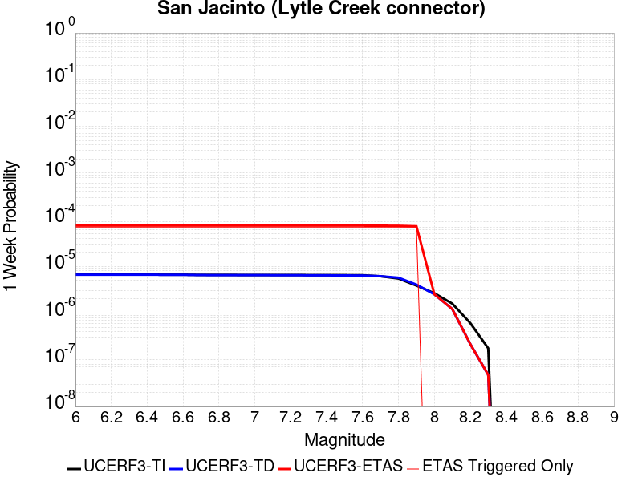 | 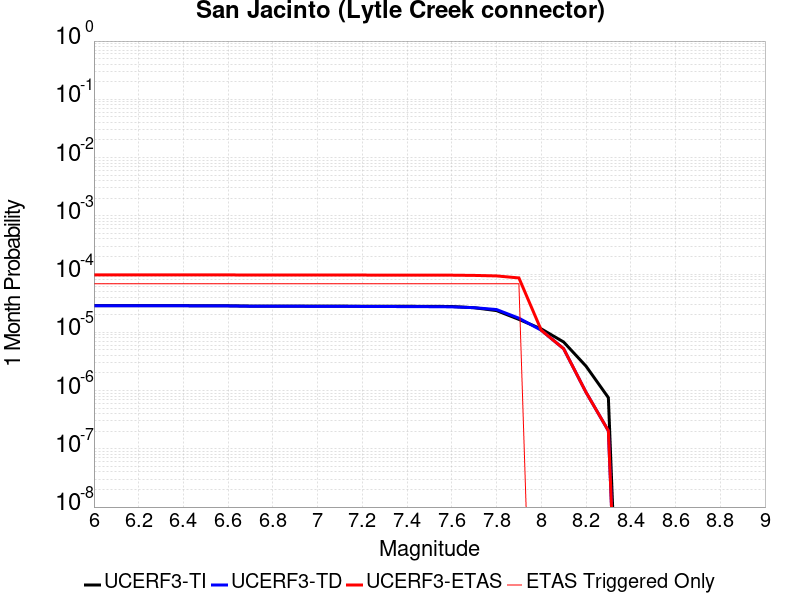 | 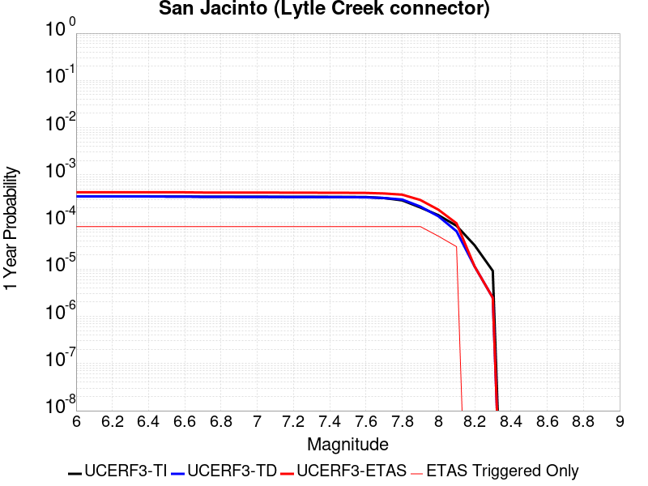 | 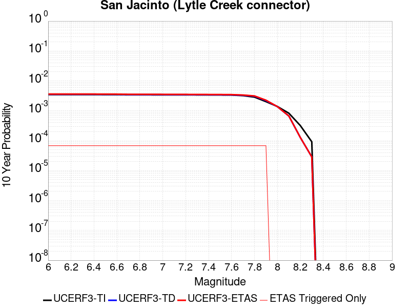 |

| Magnitude | 1 wk TI Prob | 1 wk TD Prob | 1 wk ETAS Prob | 1 wk ETAS/TD Gain | 1 wk ETAS Triggered Only | 1 mo TI Prob | 1 mo TD Prob | 1 mo ETAS Prob | 1 mo ETAS/TD Gain | 1 mo ETAS Triggered Only | 1 yr TI Prob | 1 yr TD Prob | 1 yr ETAS Prob | 1 yr ETAS/TD Gain | 1 yr ETAS Triggered Only | 10 yr TI Prob | 10 yr TD Prob | 10 yr ETAS Prob | 10 yr ETAS/TD Gain | 10 yr ETAS Triggered Only |
|-----|-----|-----|-----|-----|-----|-----|-----|-----|-----|-----|-----|-----|-----|-----|-----|-----|-----|-----|-----|-----|
| 6.0 | 6.693995E-6 | 6.660216E-6 | 5.6659883E-5 | 8.507214 | 5.0E-5 | 2.8688235E-5 | 2.854347E-5 | 9.854147E-5 | 3.4523296 | 7.0E-5 | 3.492233E-4 | 3.4746144E-4 | 4.2743364E-4 | 1.2301614 | 8.0E-5 | 0.00348675 | 0.0035493854 | 0.0036291014 | 1.0224591 | 8.0E-5 |
| 6.1 | 6.693995E-6 | 6.660216E-6 | 5.6659883E-5 | 8.507214 | 5.0E-5 | 2.8688235E-5 | 2.854347E-5 | 9.854147E-5 | 3.4523296 | 7.0E-5 | 3.492233E-4 | 3.4746144E-4 | 4.2743364E-4 | 1.2301614 | 8.0E-5 | 0.00348675 | 0.0035493854 | 0.0036291014 | 1.0224591 | 8.0E-5 |
| 6.2 | 6.693995E-6 | 6.660216E-6 | 5.6659883E-5 | 8.507214 | 5.0E-5 | 2.8688235E-5 | 2.854347E-5 | 9.854147E-5 | 3.4523296 | 7.0E-5 | 3.492233E-4 | 3.4746144E-4 | 4.2743364E-4 | 1.2301614 | 8.0E-5 | 0.00348675 | 0.0035493854 | 0.0036291014 | 1.0224591 | 8.0E-5 |
| 6.3 | 6.693995E-6 | 6.660216E-6 | 5.6659883E-5 | 8.507214 | 5.0E-5 | 2.8688235E-5 | 2.854347E-5 | 9.854147E-5 | 3.4523296 | 7.0E-5 | 3.492233E-4 | 3.4746144E-4 | 4.2743364E-4 | 1.2301614 | 8.0E-5 | 0.00348675 | 0.0035493854 | 0.0036291014 | 1.0224591 | 8.0E-5 |
| 6.4 | 6.693995E-6 | 6.660216E-6 | 5.6659883E-5 | 8.507214 | 5.0E-5 | 2.8688235E-5 | 2.854347E-5 | 9.854147E-5 | 3.4523296 | 7.0E-5 | 3.492233E-4 | 3.4746144E-4 | 4.2743364E-4 | 1.2301614 | 8.0E-5 | 0.00348675 | 0.0035493854 | 0.0036291014 | 1.0224591 | 8.0E-5 |
| 6.5 | 6.6561875E-6 | 6.6204343E-6 | 5.66201E-5 | 8.552324 | 5.0E-5 | 2.8526205E-5 | 2.837298E-5 | 9.8371E-5 | 3.4670658 | 7.0E-5 | 3.472512E-4 | 3.4538636E-4 | 4.2535874E-4 | 1.2315446 | 8.0E-5 | 0.0034670907 | 0.003528701 | 0.0036084186 | 1.0225912 | 8.0E-5 |
| 6.6 | 6.6561875E-6 | 6.6204343E-6 | 5.66201E-5 | 8.552324 | 5.0E-5 | 2.8526205E-5 | 2.837298E-5 | 9.8371E-5 | 3.4670658 | 7.0E-5 | 3.472512E-4 | 3.4538636E-4 | 4.2535874E-4 | 1.2315446 | 8.0E-5 | 0.0034670907 | 0.003528701 | 0.0036084186 | 1.0225912 | 8.0E-5 |
| 6.7 | 6.5802237E-6 | 6.539611E-6 | 5.6539284E-5 | 8.645664 | 5.0E-5 | 2.8200653E-5 | 2.8026603E-5 | 9.802464E-5 | 3.497557 | 7.0E-5 | 3.4328885E-4 | 3.4117055E-4 | 4.2114325E-4 | 1.2344068 | 8.0E-5 | 0.0034275902 | 0.0034866752 | 0.0035663964 | 1.0228645 | 8.0E-5 |
| 6.8 | 6.575632E-6 | 6.5341005E-6 | 5.6533772E-5 | 8.652112 | 5.0E-5 | 2.8180975E-5 | 2.8002989E-5 | 9.800103E-5 | 3.499663 | 7.0E-5 | 3.4304935E-4 | 3.4088313E-4 | 4.2085585E-4 | 1.2346046 | 8.0E-5 | 0.0034252026 | 0.00348381 | 0.0035635314 | 1.0228834 | 8.0E-5 |
| 6.9 | 6.570433E-6 | 6.525495E-6 | 5.652517E-5 | 8.662204 | 5.0E-5 | 2.8158694E-5 | 2.7966107E-5 | 9.796415E-5 | 3.5029597 | 7.0E-5 | 3.4277816E-4 | 3.4043423E-4 | 4.2040698E-4 | 1.234914 | 8.0E-5 | 0.0034224992 | 0.0034793352 | 0.003559057 | 1.0229129 | 8.0E-5 |
| 7.0 | 6.5643826E-6 | 6.515616E-6 | 5.651529E-5 | 8.673821 | 5.0E-5 | 2.8132765E-5 | 2.792377E-5 | 9.792182E-5 | 3.5067549 | 7.0E-5 | 3.424626E-4 | 3.3991894E-4 | 4.1989173E-4 | 1.2352703 | 8.0E-5 | 0.0034193532 | 0.0034741985 | 0.0035539204 | 1.022947 | 8.0E-5 |
| 7.1 | 6.557402E-6 | 6.5043278E-6 | 5.6504003E-5 | 8.6871395 | 5.0E-5 | 2.8102848E-5 | 2.7875392E-5 | 9.787344E-5 | 3.5111053 | 7.0E-5 | 3.4209844E-4 | 3.3933012E-4 | 4.19303E-4 | 1.2356786 | 8.0E-5 | 0.0034157229 | 0.0034683298 | 0.0035480524 | 1.0229858 | 8.0E-5 |
| 7.2 | 6.546394E-6 | 6.4862943E-6 | 5.648597E-5 | 8.708511 | 5.0E-5 | 2.8055672E-5 | 2.7798109E-5 | 9.779616E-5 | 3.518087 | 7.0E-5 | 3.4152428E-4 | 3.3838948E-4 | 4.183624E-4 | 1.236334 | 8.0E-5 | 0.0034099987 | 0.0034589572 | 0.0035386805 | 1.0230484 | 8.0E-5 |
| 7.3 | 6.5364216E-6 | 6.4670803E-6 | 5.6466757E-5 | 8.731414 | 5.0E-5 | 2.8012933E-5 | 2.7715765E-5 | 9.7713826E-5 | 3.5255685 | 7.0E-5 | 3.4100408E-4 | 3.3738726E-4 | 4.1736028E-4 | 1.2370362 | 8.0E-5 | 0.003404813 | 0.0034489788 | 0.0035287028 | 1.0231153 | 8.0E-5 |
| 7.4 | 6.5269523E-6 | 6.4481674E-6 | 5.6447847E-5 | 8.754091 | 5.0E-5 | 2.7972354E-5 | 2.7634711E-5 | 9.763278E-5 | 3.5329762 | 7.0E-5 | 3.4051016E-4 | 3.3640073E-4 | 4.1637383E-4 | 1.2377316 | 8.0E-5 | 0.0033998888 | 0.003439161 | 0.0035188857 | 1.0231814 | 8.0E-5 |
| 7.5 | 6.5111835E-6 | 6.424442E-6 | 5.642412E-5 | 8.782727 | 5.0E-5 | 2.7904773E-5 | 2.7533031E-5 | 9.7531105E-5 | 3.5423307 | 7.0E-5 | 3.3968766E-4 | 3.3516317E-4 | 4.1513637E-4 | 1.2386097 | 8.0E-5 | 0.0033916887 | 0.003426834 | 0.0035065599 | 1.0232651 | 8.0E-5 |
| 7.6 | 6.4768806E-6 | 6.383551E-6 | 5.6383233E-5 | 8.832581 | 5.0E-5 | 2.7757764E-5 | 2.735779E-5 | 9.735587E-5 | 3.5586162 | 7.0E-5 | 3.3789838E-4 | 3.3303024E-4 | 4.130036E-4 | 1.2401384 | 8.0E-5 | 0.0033738504 | 0.0034055663 | 0.0034852938 | 1.0234109 | 8.0E-5 |
| 7.7 | 6.1655364E-6 | 6.1760365E-6 | 5.6175726E-5 | 9.0957575 | 5.0E-5 | 2.642346E-5 | 2.646846E-5 | 9.64666E-5 | 3.644587 | 7.0E-5 | 3.2165812E-4 | 3.2220592E-4 | 4.0218013E-4 | 1.2482084 | 8.0E-5 | 0.0032119295 | 0.0032971818 | 0.003376918 | 1.0241832 | 8.0E-5 |
| 7.8 | 5.5043524E-6 | 5.737097E-6 | 5.573681E-5 | 9.715159 | 5.0E-5 | 2.3589868E-5 | 2.4587327E-5 | 9.458561E-5 | 3.8469253 | 7.0E-5 | 2.871688E-4 | 2.9930964E-4 | 3.792857E-4 | 1.2672018 | 8.0E-5 | 0.0028679797 | 0.0030672832 | 0.003147038 | 1.0260017 | 8.0E-5 |
| 7.9 | 3.889249E-6 | 4.076761E-6 | 5.4076558E-5 | 13.264588 | 5.0E-5 | 1.6668104E-5 | 1.7471715E-5 | 8.747049E-5 | 5.0064054 | 7.0E-5 | 2.0291525E-4 | 2.1269741E-4 | 2.926804E-4 | 1.3760412 | 8.0E-5 | 0.0020273007 | 0.0021943315 | 0.0022741558 | 1.0363775 | 8.0E-5 |
| 8.0 | 2.668535E-6 | 2.5315155E-6 | 4.2531414E-5 | 16.800772 | 4.0E-5 | 1.1436528E-5 | 1.0849307E-5 | 6.0848764E-5 | 5.6085396 | 5.0E-5 | 1.3923083E-4 | 1.3208234E-4 | 1.8207573E-4 | 1.3785018 | 5.0E-5 | 0.0013914363 | 0.0013757964 | 0.0014257275 | 1.0362926 | 5.0E-5 |
| 8.1 | 1.5911459E-6 | 1.218661E-6 | 2.1218637E-5 | 17.411434 | 2.0E-5 | 6.8191785E-6 | 5.2228224E-6 | 3.5222667E-5 | 6.7439904 | 3.0E-5 | 8.3020335E-5 | 6.3586034E-5 | 9.358412E-5 | 1.4717717 | 3.0E-5 | 8.298933E-4 | 6.6932244E-4 | 6.9930236E-4 | 1.0447915 | 3.0E-5 |
| 8.2 | 6.1294963E-7 | 2.1812275E-7 | 2.1812275E-7 | 1.0 | 0.0 | 2.6269242E-6 | 9.3481145E-7 | 9.3481145E-7 | 1.0 | 0.0 | 3.1982334E-5 | 1.138127E-5 | 1.138127E-5 | 1.0 | 0.0 | 3.1977732E-4 | 1.2784546E-4 | 1.2784546E-4 | 1.0 | 0.0 |
| 8.3 | 1.762871E-7 | 4.7546838E-8 | 4.7546838E-8 | 1.0 | 0.0 | 7.5551594E-7 | 2.0377215E-7 | 2.0377215E-7 | 1.0 | 0.0 | 9.1983675E-6 | 2.480923E-6 | 2.480923E-6 | 1.0 | 0.0 | 9.197987E-5 | 2.868753E-5 | 2.868753E-5 | 1.0 | 0.0 |

## Santa Ynez River
*[(top)](#table-of-contents)*

| 1 Week | 1 Month | 1 Year | 10 Year |
|-----|-----|-----|-----|
|  | 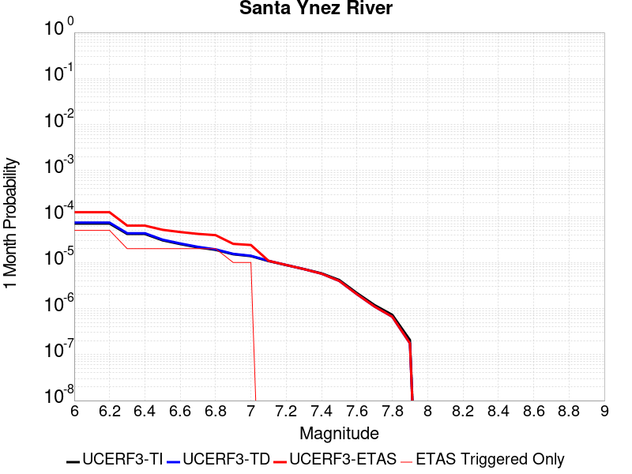 | 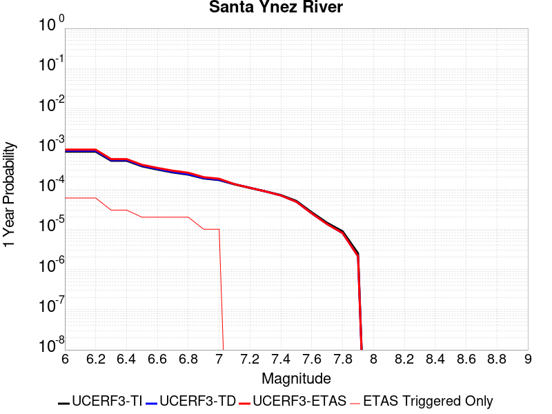 | 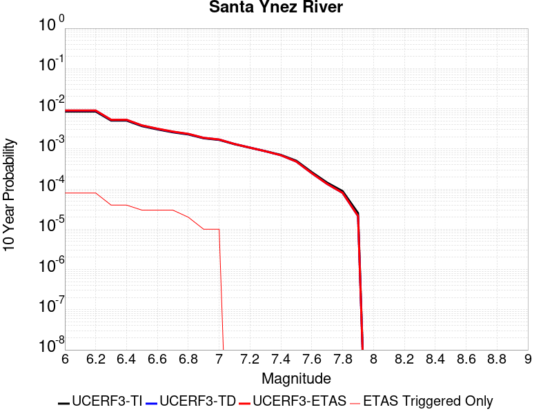 |

| Magnitude | 1 wk TI Prob | 1 wk TD Prob | 1 wk ETAS Prob | 1 wk ETAS/TD Gain | 1 wk ETAS Triggered Only | 1 mo TI Prob | 1 mo TD Prob | 1 mo ETAS Prob | 1 mo ETAS/TD Gain | 1 mo ETAS Triggered Only | 1 yr TI Prob | 1 yr TD Prob | 1 yr ETAS Prob | 1 yr ETAS/TD Gain | 1 yr ETAS Triggered Only | 10 yr TI Prob | 10 yr TD Prob | 10 yr ETAS Prob | 10 yr ETAS/TD Gain | 10 yr ETAS Triggered Only |
|-----|-----|-----|-----|-----|-----|-----|-----|-----|-----|-----|-----|-----|-----|-----|-----|-----|-----|-----|-----|-----|
| 6.0 | 1.6396456E-5 | 1.7209435E-5 | 4.720892E-5 | 2.7431998 | 3.0E-5 | 7.026863E-5 | 7.375284E-5 | 1.2374915E-4 | 1.67789 | 5.0E-5 | 8.551848E-4 | 8.976064E-4 | 9.575526E-4 | 1.0667844 | 6.0E-5 | 0.0085190125 | 0.008943358 | 0.009022643 | 1.0088652 | 8.0E-5 |
| 6.1 | 1.6396456E-5 | 1.7209435E-5 | 4.720892E-5 | 2.7431998 | 3.0E-5 | 7.026863E-5 | 7.375284E-5 | 1.2374915E-4 | 1.67789 | 5.0E-5 | 8.551848E-4 | 8.976064E-4 | 9.575526E-4 | 1.0667844 | 6.0E-5 | 0.0085190125 | 0.008943358 | 0.009022643 | 1.0088652 | 8.0E-5 |
| 6.2 | 1.6396456E-5 | 1.7209435E-5 | 4.720892E-5 | 2.7431998 | 3.0E-5 | 7.026863E-5 | 7.375284E-5 | 1.2374915E-4 | 1.67789 | 5.0E-5 | 8.551848E-4 | 8.976064E-4 | 9.575526E-4 | 1.0667844 | 6.0E-5 | 0.0085190125 | 0.008943358 | 0.009022643 | 1.0088652 | 8.0E-5 |
| 6.3 | 9.736976E-6 | 1.012233E-5 | 1.012233E-5 | 1.0 | 0.0 | 4.172923E-5 | 4.338072E-5 | 6.3379855E-5 | 1.4610143 | 2.0E-5 | 5.0793495E-4 | 5.280373E-4 | 5.580215E-4 | 1.0567842 | 3.0E-5 | 0.005067755 | 0.005268332 | 0.0053081214 | 1.0075525 | 4.0E-5 |
| 6.4 | 9.736976E-6 | 1.012233E-5 | 1.012233E-5 | 1.0 | 0.0 | 4.172923E-5 | 4.338072E-5 | 6.3379855E-5 | 1.4610143 | 2.0E-5 | 5.0793495E-4 | 5.280373E-4 | 5.580215E-4 | 1.0567842 | 3.0E-5 | 0.005067755 | 0.005268332 | 0.0053081214 | 1.0075525 | 4.0E-5 |
| 6.5 | 7.081964E-6 | 7.3298966E-6 | 7.3298966E-6 | 1.0 | 0.0 | 3.035092E-5 | 3.1413474E-5 | 5.1412844E-5 | 1.6366495 | 2.0E-5 | 3.694598E-4 | 3.8239348E-4 | 4.0238583E-4 | 1.0522821 | 2.0E-5 | 0.0036884616 | 0.0038175168 | 0.0038474023 | 1.0078285 | 3.0E-5 |
| 6.6 | 5.873247E-6 | 6.059743E-6 | 6.059743E-6 | 1.0 | 0.0 | 2.5170815E-5 | 2.5970074E-5 | 4.5969555E-5 | 1.7700971 | 2.0E-5 | 3.064116E-4 | 3.1614062E-4 | 3.361343E-4 | 1.063243 | 2.0E-5 | 0.0030598943 | 0.0031569963 | 0.0031869016 | 1.0094727 | 3.0E-5 |
| 6.7 | 4.973277E-6 | 5.115901E-6 | 5.115901E-6 | 1.0 | 0.0 | 2.1313872E-5 | 2.1925109E-5 | 4.192467E-5 | 1.9121761 | 2.0E-5 | 2.5946548E-4 | 2.66906E-4 | 2.8690064E-4 | 1.0749128 | 2.0E-5 | 0.0025916274 | 0.0026659032 | 0.002695823 | 1.0112232 | 3.0E-5 |
| 6.8 | 4.396492E-6 | 4.5109778E-6 | 4.5109778E-6 | 1.0 | 0.0 | 1.884197E-5 | 1.9332621E-5 | 3.9332233E-5 | 2.0345008 | 2.0E-5 | 2.2937685E-4 | 2.3534958E-4 | 2.5534487E-4 | 1.08496 | 2.0E-5 | 0.0022914023 | 0.0023510386 | 0.0023709917 | 1.0084869 | 2.0E-5 |
| 6.9 | 3.5255632E-6 | 3.6013332E-6 | 3.6013332E-6 | 1.0 | 0.0 | 1.5109469E-5 | 1.5434196E-5 | 2.5434041E-5 | 1.647902 | 1.0E-5 | 1.8394225E-4 | 1.8789528E-4 | 1.978934E-4 | 1.0532111 | 1.0E-5 | 0.0018379007 | 0.0018773803 | 0.0018873615 | 1.0053166 | 1.0E-5 |
| 7.0 | 3.211603E-6 | 3.273654E-6 | 3.273654E-6 | 1.0 | 0.0 | 1.376394E-5 | 1.4029872E-5 | 2.402973E-5 | 1.7127548 | 1.0E-5 | 1.6756308E-4 | 1.7080043E-4 | 1.8079873E-4 | 1.0585378 | 1.0E-5 | 0.0016743679 | 0.0017067058 | 0.0017166887 | 1.0058492 | 1.0E-5 |
| 7.1 | 2.5094619E-6 | 2.5409204E-6 | 2.5409204E-6 | 1.0 | 0.0 | 1.0754793E-5 | 1.0889614E-5 | 1.0889614E-5 | 1.0 | 0.0 | 1.3093173E-4 | 1.3257304E-4 | 1.3257304E-4 | 1.0 | 0.0 | 0.0013085462 | 0.0013249456 | 0.0013249456 | 1.0 | 0.0 |
| 7.2 | 2.0515774E-6 | 2.0619375E-6 | 2.0619375E-6 | 1.0 | 0.0 | 8.792445E-6 | 8.836846E-6 | 8.836846E-6 | 1.0 | 0.0 | 1.0704277E-4 | 1.0758333E-4 | 1.0758333E-4 | 1.0 | 0.0 | 0.0010699122 | 0.0010753168 | 0.0010753168 | 1.0 | 0.0 |
| 7.3 | 1.6845745E-6 | 1.6773907E-6 | 1.6773907E-6 | 1.0 | 0.0 | 7.219585E-6 | 7.1887976E-6 | 7.1887976E-6 | 1.0 | 0.0 | 8.78949E-5 | 8.752012E-5 | 8.752012E-5 | 1.0 | 0.0 | 8.7860145E-4 | 8.7485946E-4 | 8.7485946E-4 | 1.0 | 0.0 |
| 7.4 | 1.3600285E-6 | 1.3333357E-6 | 1.3333357E-6 | 1.0 | 0.0 | 5.82868E-6 | 5.714284E-6 | 5.714284E-6 | 1.0 | 0.0 | 7.096187E-5 | 6.956921E-5 | 6.956921E-5 | 1.0 | 0.0 | 7.0939213E-4 | 6.954765E-4 | 6.954765E-4 | 1.0 | 0.0 |
| 7.5 | 9.735342E-7 | 9.290103E-7 | 9.290103E-7 | 1.0 | 0.0 | 4.172283E-6 | 3.9814668E-6 | 3.9814668E-6 | 1.0 | 0.0 | 5.079636E-5 | 4.8473295E-5 | 4.8473295E-5 | 1.0 | 0.0 | 5.0784746E-4 | 4.8462892E-4 | 4.8462892E-4 | 1.0 | 0.0 |
| 7.6 | 5.067187E-7 | 4.77857E-7 | 4.77857E-7 | 1.0 | 0.0 | 2.1716498E-6 | 2.047957E-6 | 2.047957E-6 | 1.0 | 0.0 | 2.6439517E-5 | 2.4933597E-5 | 2.4933597E-5 | 1.0 | 0.0 | 2.643637E-4 | 2.4930874E-4 | 2.4930874E-4 | 1.0 | 0.0 |
| 7.7 | 2.769089E-7 | 2.5759124E-7 | 2.5759124E-7 | 1.0 | 0.0 | 1.1867519E-6 | 1.1039621E-6 | 1.1039621E-6 | 1.0 | 0.0 | 1.4448608E-5 | 1.34406555E-5 | 1.34406555E-5 | 1.0 | 0.0 | 1.444767E-4 | 1.3439846E-4 | 1.3439846E-4 | 1.0 | 0.0 |
| 7.8 | 1.7044663E-7 | 1.5449015E-7 | 1.5449015E-7 | 1.0 | 0.0 | 7.3048534E-7 | 6.621005E-7 | 6.621005E-7 | 1.0 | 0.0 | 8.893623E-6 | 8.061043E-6 | 8.061043E-6 | 1.0 | 0.0 | 8.893267E-5 | 8.060753E-5 | 8.060753E-5 | 1.0 | 0.0 |
| 7.9 | 4.8344287E-8 | 4.0910923E-8 | 4.0910923E-8 | 1.0 | 0.0 | 2.0718979E-7 | 1.7533252E-7 | 1.7533252E-7 | 1.0 | 0.0 | 2.5225327E-6 | 2.1346711E-6 | 2.1346711E-6 | 1.0 | 0.0 | 2.5225041E-5 | 2.1346512E-5 | 2.1346512E-5 | 1.0 | 0.0 |

## Kern Canyon (Lake Isabella) 2011
*[(top)](#table-of-contents)*

| 1 Week | 1 Month | 1 Year | 10 Year |
|-----|-----|-----|-----|
| 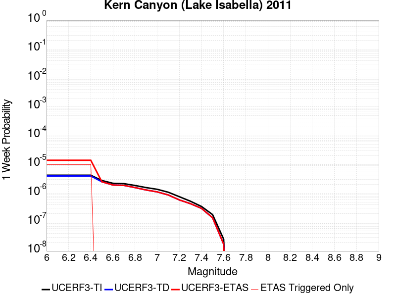 | 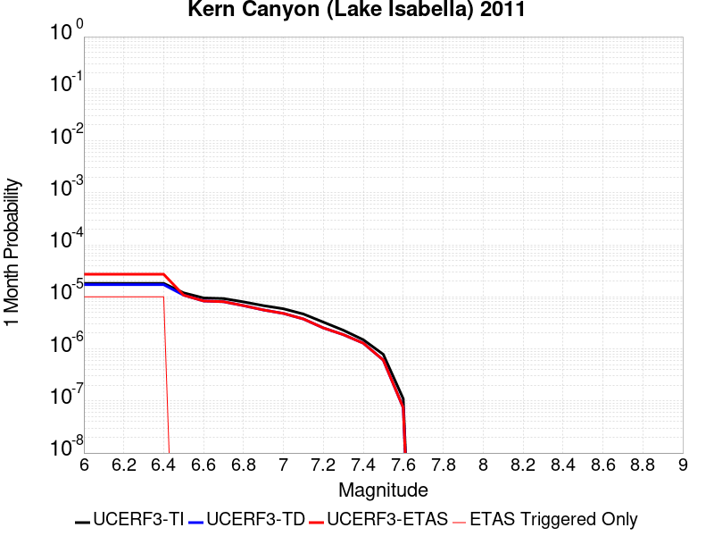 | 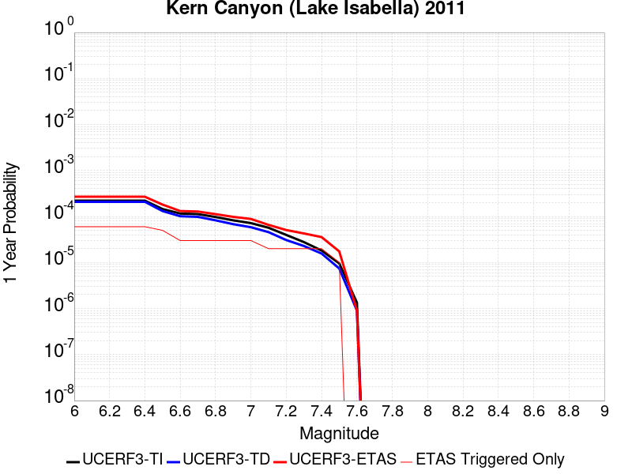 | 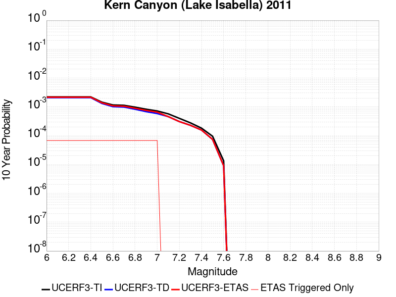 |

| Magnitude | 1 wk TI Prob | 1 wk TD Prob | 1 wk ETAS Prob | 1 wk ETAS/TD Gain | 1 wk ETAS Triggered Only | 1 mo TI Prob | 1 mo TD Prob | 1 mo ETAS Prob | 1 mo ETAS/TD Gain | 1 mo ETAS Triggered Only | 1 yr TI Prob | 1 yr TD Prob | 1 yr ETAS Prob | 1 yr ETAS/TD Gain | 1 yr ETAS Triggered Only | 10 yr TI Prob | 10 yr TD Prob | 10 yr ETAS Prob | 10 yr ETAS/TD Gain | 10 yr ETAS Triggered Only |
|-----|-----|-----|-----|-----|-----|-----|-----|-----|-----|-----|-----|-----|-----|-----|-----|-----|-----|-----|-----|-----|
| 6.0 | 4.2387383E-6 | 4.001639E-6 | 1.4001599E-5 | 3.4989662 | 1.0E-5 | 1.8165894E-5 | 1.7149778E-5 | 2.7149606E-5 | 1.5830879 | 1.0E-5 | 2.2114732E-4 | 2.087804E-4 | 2.6876788E-4 | 1.2873232 | 6.0E-5 | 0.0022092736 | 0.0020860266 | 0.0021558804 | 1.0334866 | 7.0E-5 |
| 6.1 | 4.2387383E-6 | 4.001639E-6 | 1.4001599E-5 | 3.4989662 | 1.0E-5 | 1.8165894E-5 | 1.7149778E-5 | 2.7149606E-5 | 1.5830879 | 1.0E-5 | 2.2114732E-4 | 2.087804E-4 | 2.6876788E-4 | 1.2873232 | 6.0E-5 | 0.0022092736 | 0.0020860266 | 0.0021558804 | 1.0334866 | 7.0E-5 |
| 6.2 | 4.2387383E-6 | 4.001639E-6 | 1.4001599E-5 | 3.4989662 | 1.0E-5 | 1.8165894E-5 | 1.7149778E-5 | 2.7149606E-5 | 1.5830879 | 1.0E-5 | 2.2114732E-4 | 2.087804E-4 | 2.6876788E-4 | 1.2873232 | 6.0E-5 | 0.0022092736 | 0.0020860266 | 0.0021558804 | 1.0334866 | 7.0E-5 |
| 6.3 | 4.2387383E-6 | 4.001639E-6 | 1.4001599E-5 | 3.4989662 | 1.0E-5 | 1.8165894E-5 | 1.7149778E-5 | 2.7149606E-5 | 1.5830879 | 1.0E-5 | 2.2114732E-4 | 2.087804E-4 | 2.6876788E-4 | 1.2873232 | 6.0E-5 | 0.0022092736 | 0.0020860266 | 0.0021558804 | 1.0334866 | 7.0E-5 |
| 6.4 | 4.2387383E-6 | 4.001639E-6 | 1.4001599E-5 | 3.4989662 | 1.0E-5 | 1.8165894E-5 | 1.7149778E-5 | 2.7149606E-5 | 1.5830879 | 1.0E-5 | 2.2114732E-4 | 2.087804E-4 | 2.6876788E-4 | 1.2873232 | 6.0E-5 | 0.0022092736 | 0.0020860266 | 0.0021558804 | 1.0334866 | 7.0E-5 |
| 6.5 | 2.7857532E-6 | 2.517867E-6 | 2.517867E-6 | 1.0 | 0.0 | 1.1938888E-5 | 1.0790815E-5 | 1.0790815E-5 | 1.0 | 0.0 | 1.4534626E-4 | 1.3137059E-4 | 1.8136403E-4 | 1.3805526 | 5.0E-5 | 0.0014525123 | 0.001312962 | 0.0013628964 | 1.0380318 | 5.0E-5 |
| 6.6 | 2.2233348E-6 | 1.9441236E-6 | 1.9441236E-6 | 1.0 | 0.0 | 9.528543E-6 | 8.331932E-6 | 8.331932E-6 | 1.0 | 0.0 | 1.1600384E-4 | 1.01436635E-4 | 1.314336E-4 | 1.2957212 | 3.0E-5 | 0.001159433 | 0.001013912 | 0.0010438815 | 1.0295584 | 3.0E-5 |
| 6.7 | 2.1635126E-6 | 1.8835036E-6 | 1.8835036E-6 | 1.0 | 0.0 | 9.272164E-6 | 8.072134E-6 | 8.072134E-6 | 1.0 | 0.0 | 1.1288274E-4 | 9.827388E-5 | 1.2827093E-4 | 1.3052393 | 3.0E-5 | 0.0011282542 | 9.823124E-4 | 0.0010122829 | 1.0305102 | 3.0E-5 |
| 6.8 | 1.8685711E-6 | 1.5831425E-6 | 1.5831425E-6 | 1.0 | 0.0 | 8.008137E-6 | 6.784879E-6 | 6.784879E-6 | 1.0 | 0.0 | 9.74947E-5 | 8.260282E-5 | 1.1260034E-4 | 1.3631537 | 3.0E-5 | 9.745194E-4 | 8.2572614E-4 | 8.5570134E-4 | 1.0363016 | 3.0E-5 |
| 6.9 | 1.5815071E-6 | 1.3064928E-6 | 1.3064928E-6 | 1.0 | 0.0 | 6.77787E-6 | 5.599243E-6 | 5.599243E-6 | 1.0 | 0.0 | 8.251744E-5 | 6.816868E-5 | 9.816663E-5 | 1.4400548 | 3.0E-5 | 8.248681E-4 | 6.8148033E-4 | 7.114599E-4 | 1.0439918 | 3.0E-5 |
| 7.0 | 1.3772564E-6 | 1.1210718E-6 | 1.1210718E-6 | 1.0 | 0.0 | 5.9025137E-6 | 4.8045845E-6 | 4.8045845E-6 | 1.0 | 0.0 | 7.186073E-5 | 5.8494268E-5 | 8.849251E-5 | 1.5128407 | 3.0E-5 | 7.18375E-4 | 5.847908E-4 | 6.1477325E-4 | 1.0512704 | 3.0E-5 |
| 7.1 | 1.0916998E-6 | 8.763777E-7 | 8.763777E-7 | 1.0 | 0.0 | 4.678705E-6 | 3.7558991E-6 | 3.7558991E-6 | 1.0 | 0.0 | 5.6961744E-5 | 4.5727127E-5 | 6.572621E-5 | 1.4373572 | 2.0E-5 | 5.6947145E-4 | 4.571785E-4 | 4.7716938E-4 | 1.0437266 | 2.0E-5 |
| 7.2 | 7.6277024E-7 | 5.901454E-7 | 5.901454E-7 | 1.0 | 0.0 | 3.2690114E-6 | 2.5291922E-6 | 2.5291922E-6 | 1.0 | 0.0 | 3.9799485E-5 | 3.0792486E-5 | 5.079187E-5 | 1.649489 | 2.0E-5 | 3.9792358E-4 | 3.0788282E-4 | 3.2787665E-4 | 1.0649397 | 2.0E-5 |
| 7.3 | 5.3265916E-7 | 4.3824414E-7 | 4.3824414E-7 | 1.0 | 0.0 | 2.282823E-6 | 1.878188E-6 | 1.878188E-6 | 1.0 | 0.0 | 2.7793016E-5 | 2.2866701E-5 | 4.2866246E-5 | 1.8746142 | 2.0E-5 | 2.778954E-4 | 2.2864387E-4 | 2.486393E-4 | 1.0874523 | 2.0E-5 |
| 7.4 | 3.4946007E-7 | 3.006571E-7 | 3.006571E-7 | 1.0 | 0.0 | 1.497685E-6 | 1.2885298E-6 | 1.2885298E-6 | 1.0 | 0.0 | 1.8234163E-5 | 1.568774E-5 | 3.5687426E-5 | 2.2748609 | 2.0E-5 | 1.8232666E-4 | 1.5686655E-4 | 1.768634E-4 | 1.1274769 | 2.0E-5 |
| 7.5 | 1.8317026E-7 | 1.4244812E-7 | 1.4244812E-7 | 1.0 | 0.0 | 7.850152E-7 | 6.104918E-7 | 6.104918E-7 | 1.0 | 0.0 | 9.557518E-6 | 7.432713E-6 | 1.743264E-5 | 2.3453937 | 1.0E-5 | 9.5571064E-5 | 7.432472E-5 | 8.432398E-5 | 1.1345347 | 1.0E-5 |
| 7.6 | 2.572245E-8 | 1.7352555E-8 | 1.7352555E-8 | 1.0 | 0.0 | 1.10239064E-7 | 7.436809E-8 | 7.436809E-8 | 1.0 | 0.0 | 1.3421597E-6 | 9.054312E-7 | 9.054312E-7 | 1.0 | 0.0 | 1.3421517E-5 | 9.05428E-6 | 9.05428E-6 | 1.0 | 0.0 |

## San Diego Trough south
*[(top)](#table-of-contents)*

| 1 Week | 1 Month | 1 Year | 10 Year |
|-----|-----|-----|-----|
| 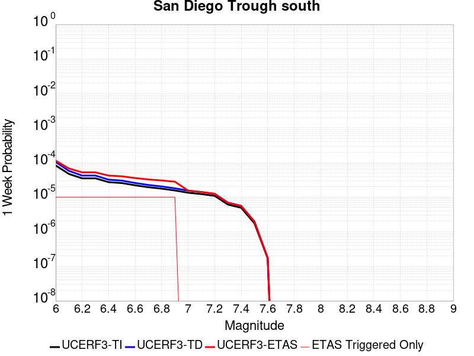 | 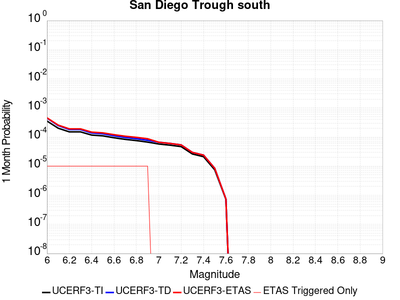 | 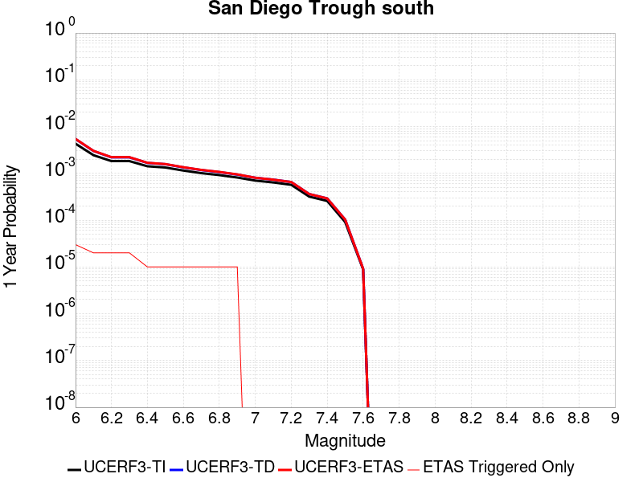 | 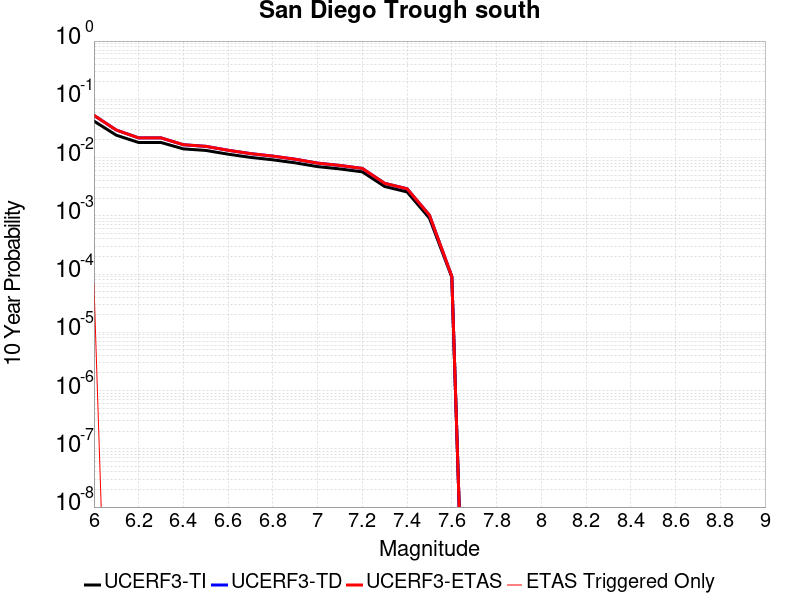 |

| Magnitude | 1 wk TI Prob | 1 wk TD Prob | 1 wk ETAS Prob | 1 wk ETAS/TD Gain | 1 wk ETAS Triggered Only | 1 mo TI Prob | 1 mo TD Prob | 1 mo ETAS Prob | 1 mo ETAS/TD Gain | 1 mo ETAS Triggered Only | 1 yr TI Prob | 1 yr TD Prob | 1 yr ETAS Prob | 1 yr ETAS/TD Gain | 1 yr ETAS Triggered Only | 10 yr TI Prob | 10 yr TD Prob | 10 yr ETAS Prob | 10 yr ETAS/TD Gain | 10 yr ETAS Triggered Only |
|-----|-----|-----|-----|-----|-----|-----|-----|-----|-----|-----|-----|-----|-----|-----|-----|-----|-----|-----|-----|-----|
| 6.0 | 8.279495E-5 | 1.04241306E-4 | 1.1424026E-4 | 1.0959213 | 1.0E-5 | 3.5478722E-4 | 4.4667677E-4 | 4.566723E-4 | 1.0223776 | 1.0E-5 | 0.004310982 | 0.0054256152 | 0.0054554525 | 1.0054994 | 3.0E-5 | 0.042283054 | 0.05299221 | 0.053049028 | 1.0010723 | 6.0E-5 |
| 6.1 | 4.6961468E-5 | 5.772944E-5 | 6.772886E-5 | 1.1732118 | 1.0E-5 | 2.0124791E-4 | 2.473894E-4 | 2.5738694E-4 | 1.0404121 | 1.0E-5 | 0.00244744 | 0.0030079768 | 0.0030279167 | 1.006629 | 2.0E-5 | 0.024206603 | 0.029679462 | 0.029727979 | 1.0016347 | 5.0E-5 |
| 6.2 | 3.5079658E-5 | 4.214154E-5 | 5.2141117E-5 | 1.2372856 | 1.0E-5 | 1.5033272E-4 | 1.8059435E-4 | 1.9059255E-4 | 1.0553627 | 1.0E-5 | 0.0018287642 | 0.0021965632 | 0.002216519 | 1.0090852 | 2.0E-5 | 0.018137876 | 0.021751117 | 0.021790247 | 1.001799 | 4.0E-5 |
| 6.3 | 3.5079658E-5 | 4.214154E-5 | 5.2141117E-5 | 1.2372856 | 1.0E-5 | 1.5033272E-4 | 1.8059435E-4 | 1.9059255E-4 | 1.0553627 | 1.0E-5 | 0.0018287642 | 0.0021965632 | 0.002216519 | 1.0090852 | 2.0E-5 | 0.018137876 | 0.021751117 | 0.021790247 | 1.001799 | 4.0E-5 |
| 6.4 | 2.7196904E-5 | 3.2087162E-5 | 4.2086842E-5 | 1.3116411 | 1.0E-5 | 1.16552954E-4 | 1.3750927E-4 | 1.4750789E-4 | 1.0727124 | 1.0E-5 | 0.0014181085 | 0.0016729041 | 0.0016828874 | 1.0059676 | 1.0E-5 | 0.014090929 | 0.016604643 | 0.016624311 | 1.0011845 | 2.0E-5 |
| 6.5 | 2.5584688E-5 | 3.010164E-5 | 4.010134E-5 | 1.3321978 | 1.0E-5 | 1.0964406E-4 | 1.2900073E-4 | 1.3899944E-4 | 1.0775089 | 1.0E-5 | 0.0013340989 | 0.0015694655 | 0.0015794499 | 1.0063616 | 1.0E-5 | 0.013261181 | 0.015585314 | 0.015605003 | 1.0012633 | 2.0E-5 |
| 6.6 | 2.2034688E-5 | 2.5742738E-5 | 3.574248E-5 | 1.3884491 | 1.0E-5 | 9.443096E-5 | 1.1032141E-4 | 1.2032031E-4 | 1.0906342 | 1.0E-5 | 0.0011490905 | 0.0013423424 | 0.0013523289 | 1.0074396 | 1.0E-5 | 0.011431668 | 0.013343317 | 0.013363051 | 1.0014789 | 2.0E-5 |
| 6.7 | 1.9394853E-5 | 2.254176E-5 | 3.2541535E-5 | 1.443611 | 1.0E-5 | 8.311815E-5 | 9.6603995E-5 | 1.0660303E-4 | 1.1035054 | 1.0E-5 | 0.0010114936 | 0.0011755243 | 0.0011855125 | 1.0084969 | 1.0E-5 | 0.01006902 | 0.011693766 | 0.011713532 | 1.0016903 | 2.0E-5 |
| 6.8 | 1.7615313E-5 | 2.0403182E-5 | 3.0402978E-5 | 1.4901096 | 1.0E-5 | 7.549201E-5 | 8.74393E-5 | 9.743843E-5 | 1.1143551 | 1.0E-5 | 9.1872766E-4 | 0.0010640579 | 0.0010740473 | 1.009388 | 1.0E-5 | 0.009149387 | 0.010590198 | 0.010609986 | 1.0018685 | 2.0E-5 |
| 6.9 | 1.5621423E-5 | 1.8026114E-5 | 2.8025934E-5 | 1.5547407 | 1.0E-5 | 6.6947236E-5 | 7.725251E-5 | 8.7251734E-5 | 1.1294357 | 1.0E-5 | 8.147778E-4 | 9.40147E-4 | 9.5013756E-4 | 1.0106267 | 1.0E-5 | 0.008117969 | 0.009362142 | 0.009381955 | 1.0021163 | 2.0E-5 |
| 7.0 | 1.3444376E-5 | 1.544809E-5 | 1.544809E-5 | 1.0 | 0.0 | 5.7617483E-5 | 6.620443E-5 | 6.620443E-5 | 1.0 | 0.0 | 7.0126704E-4 | 8.057436E-4 | 8.057436E-4 | 1.0 | 0.0 | 0.006990582 | 0.008028555 | 0.008038475 | 1.0012356 | 1.0E-5 |
| 7.1 | 1.2268361E-5 | 1.407303E-5 | 1.407303E-5 | 1.0 | 0.0 | 5.2577634E-5 | 6.0311606E-5 | 6.0311606E-5 | 1.0 | 0.0 | 6.399447E-4 | 7.3404907E-4 | 7.3404907E-4 | 1.0 | 0.0 | 0.0063810493 | 0.0073165493 | 0.007326476 | 1.0013567 | 1.0E-5 |
| 7.2 | 1.0922655E-5 | 1.2513563E-5 | 1.2513563E-5 | 1.0 | 0.0 | 4.681054E-5 | 5.3628468E-5 | 5.3628468E-5 | 1.0 | 0.0 | 5.697693E-4 | 6.5273355E-4 | 6.5273355E-4 | 1.0 | 0.0 | 0.0056831064 | 0.0065084435 | 0.006518379 | 1.0015265 | 1.0E-5 |
| 7.3 | 6.1106753E-6 | 6.928925E-6 | 6.928925E-6 | 1.0 | 0.0 | 2.6188345E-5 | 2.9695057E-5 | 2.9695057E-5 | 1.0 | 0.0 | 3.1879646E-4 | 3.6147775E-4 | 3.6147775E-4 | 1.0 | 0.0 | 0.0031833951 | 0.003608943 | 0.003608943 | 1.0 | 0.0 |
| 7.4 | 4.933187E-6 | 5.5895525E-6 | 5.5895525E-6 | 1.0 | 0.0 | 2.114206E-5 | 2.3955008E-5 | 2.3955008E-5 | 1.0 | 0.0 | 2.5737417E-4 | 2.9161357E-4 | 2.9161357E-4 | 1.0 | 0.0 | 0.002570763 | 0.0029123505 | 0.0029123505 | 1.0 | 0.0 |
| 7.5 | 1.7489613E-6 | 1.969678E-6 | 1.969678E-6 | 1.0 | 0.0 | 7.495527E-6 | 8.4414505E-6 | 8.4414505E-6 | 1.0 | 0.0 | 9.125422E-5 | 1.02770035E-4 | 1.02770035E-4 | 1.0 | 0.0 | 9.1216754E-4 | 0.0010272472 | 0.0010272472 | 1.0 | 0.0 |
| 7.6 | 1.6988751E-7 | 1.7533823E-7 | 1.7533823E-7 | 1.0 | 0.0 | 7.2808916E-7 | 7.5144936E-7 | 7.5144936E-7 | 1.0 | 0.0 | 8.864449E-6 | 9.14886E-6 | 9.14886E-6 | 1.0 | 0.0 | 8.8640954E-5 | 9.1485024E-5 | 9.1485024E-5 | 1.0 | 0.0 |

## Oceanic - West Huasna
*[(top)](#table-of-contents)*

| 1 Week | 1 Month | 1 Year | 10 Year |
|-----|-----|-----|-----|
| 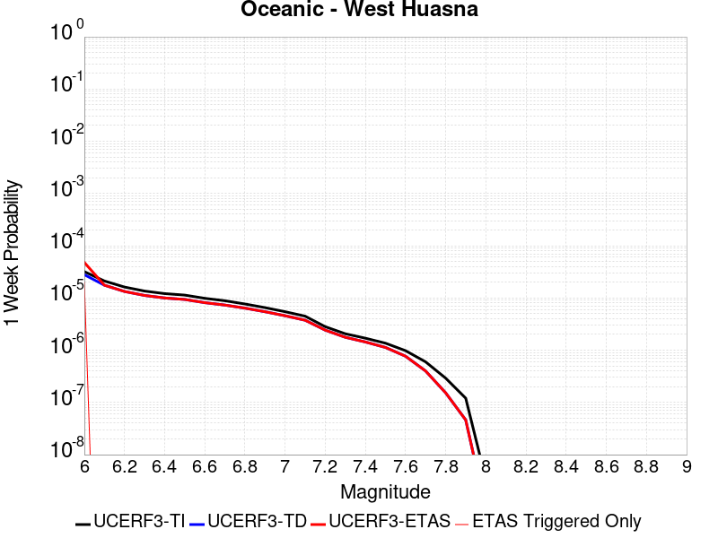 |  | 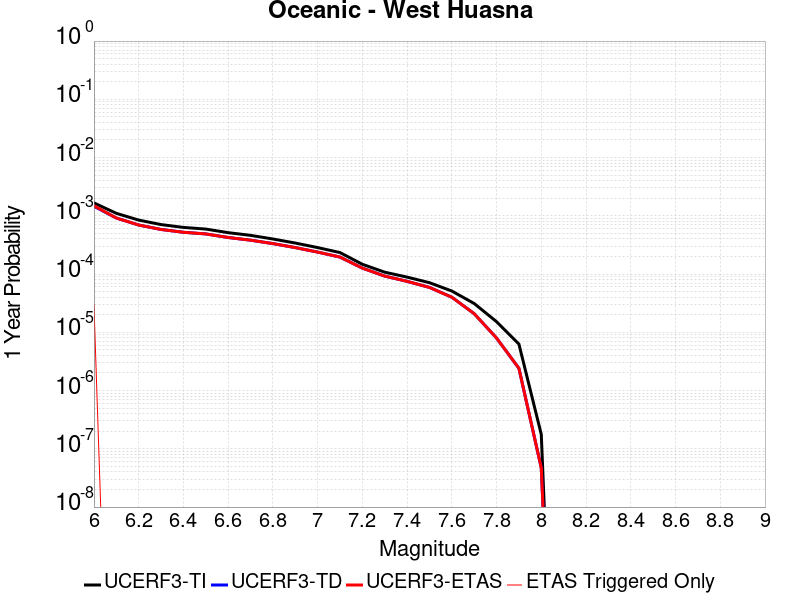 | 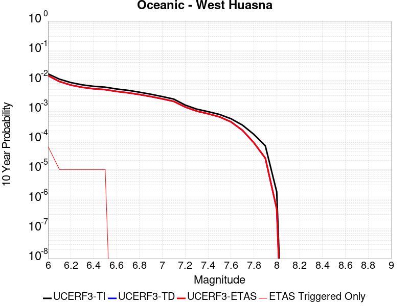 |

| Magnitude | 1 wk TI Prob | 1 wk TD Prob | 1 wk ETAS Prob | 1 wk ETAS/TD Gain | 1 wk ETAS Triggered Only | 1 mo TI Prob | 1 mo TD Prob | 1 mo ETAS Prob | 1 mo ETAS/TD Gain | 1 mo ETAS Triggered Only | 1 yr TI Prob | 1 yr TD Prob | 1 yr ETAS Prob | 1 yr ETAS/TD Gain | 1 yr ETAS Triggered Only | 10 yr TI Prob | 10 yr TD Prob | 10 yr ETAS Prob | 10 yr ETAS/TD Gain | 10 yr ETAS Triggered Only |
|-----|-----|-----|-----|-----|-----|-----|-----|-----|-----|-----|-----|-----|-----|-----|-----|-----|-----|-----|-----|-----|
| 6.0 | 3.195567E-5 | 2.7926868E-5 | 4.792631E-5 | 1.7161362 | 2.0E-5 | 1.3694567E-4 | 1.1968133E-4 | 1.3967893E-4 | 1.1670904 | 2.0E-5 | 0.0016660384 | 0.0014561893 | 0.0014861457 | 1.0205717 | 3.0E-5 | 0.016536033 | 0.014471028 | 0.0145301595 | 1.0040863 | 6.0E-5 |
| 6.1 | 2.1156782E-5 | 1.7573486E-5 | 1.7573486E-5 | 1.0 | 0.0 | 9.066878E-5 | 7.531282E-5 | 7.531282E-5 | 1.0 | 0.0 | 0.0011033333 | 9.165572E-4 | 9.165572E-4 | 1.0 | 0.0 | 0.010978713 | 0.009128777 | 0.009138687 | 1.0010854 | 1.0E-5 |
| 6.2 | 1.6195117E-5 | 1.3327152E-5 | 1.3327152E-5 | 1.0 | 0.0 | 6.9405796E-5 | 5.7115132E-5 | 5.7115132E-5 | 1.0 | 0.0 | 8.44688E-4 | 6.9515745E-4 | 6.9515745E-4 | 1.0 | 0.0 | 0.008414844 | 0.006930123 | 0.006940054 | 1.001433 | 1.0E-5 |
| 6.3 | 1.3559345E-5 | 1.1179142E-5 | 1.1179142E-5 | 1.0 | 0.0 | 5.811018E-5 | 4.7909736E-5 | 4.7909736E-5 | 1.0 | 0.0 | 7.072618E-4 | 5.831459E-4 | 5.831459E-4 | 1.0 | 0.0 | 0.0070501505 | 0.0058162753 | 0.005826217 | 1.0017093 | 1.0E-5 |
| 6.4 | 1.2120619E-5 | 1.0000977E-5 | 1.0000977E-5 | 1.0 | 0.0 | 5.1944477E-5 | 4.2860633E-5 | 4.2860633E-5 | 1.0 | 0.0 | 6.322405E-4 | 5.2170374E-4 | 5.2170374E-4 | 1.0 | 0.0 | 0.006304447 | 0.0052048573 | 0.0052148052 | 1.0019113 | 1.0E-5 |
| 6.5 | 1.13511915E-5 | 9.3674735E-6 | 9.3674735E-6 | 1.0 | 0.0 | 4.8647056E-5 | 4.01457E-5 | 4.01457E-5 | 1.0 | 0.0 | 5.9211696E-4 | 4.886647E-4 | 4.886647E-4 | 1.0 | 0.0 | 0.0059054173 | 0.0048759608 | 0.004885912 | 1.0020409 | 1.0E-5 |
| 6.6 | 9.850605E-6 | 8.135418E-6 | 8.135418E-6 | 1.0 | 0.0 | 4.2216197E-5 | 3.4865614E-5 | 3.4865614E-5 | 1.0 | 0.0 | 5.1386096E-4 | 4.2440637E-4 | 4.2440637E-4 | 1.0 | 0.0 | 0.0051267436 | 0.004235991 | 0.004235991 | 1.0 | 0.0 |
| 6.7 | 8.8558645E-6 | 7.318433E-6 | 7.318433E-6 | 1.0 | 0.0 | 3.7953152E-5 | 3.1364336E-5 | 3.1364336E-5 | 1.0 | 0.0 | 4.6198163E-4 | 3.8179406E-4 | 3.8179406E-4 | 1.0 | 0.0 | 0.004610224 | 0.0038114067 | 0.0038114067 | 1.0 | 0.0 |
| 6.8 | 7.67136E-6 | 6.391756E-6 | 6.391756E-6 | 1.0 | 0.0 | 3.2876844E-5 | 2.7392953E-5 | 2.7392953E-5 | 1.0 | 0.0 | 4.0020206E-4 | 3.3345833E-4 | 3.3345833E-4 | 1.0 | 0.0 | 0.003994821 | 0.0033296007 | 0.0033296007 | 1.0 | 0.0 |
| 6.9 | 6.534529E-6 | 5.4583297E-6 | 5.4583297E-6 | 1.0 | 0.0 | 2.8004823E-5 | 2.3392633E-5 | 2.3392633E-5 | 1.0 | 0.0 | 3.4090536E-4 | 2.847682E-4 | 2.847682E-4 | 1.0 | 0.0 | 0.0034038287 | 0.0028440498 | 0.0028440498 | 1.0 | 0.0 |
| 7.0 | 5.460525E-6 | 4.5699517E-6 | 4.5699517E-6 | 1.0 | 0.0 | 2.3402039E-5 | 1.958536E-5 | 1.958536E-5 | 1.0 | 0.0 | 2.8488258E-4 | 2.3842578E-4 | 2.3842578E-4 | 1.0 | 0.0 | 0.0028451765 | 0.0023817138 | 0.0023817138 | 1.0 | 0.0 |
| 7.1 | 4.4825083E-6 | 3.7524428E-6 | 3.7524428E-6 | 1.0 | 0.0 | 1.9210609E-5 | 1.60818E-5 | 1.60818E-5 | 1.0 | 0.0 | 2.3386406E-4 | 1.9577841E-4 | 1.9577841E-4 | 1.0 | 0.0 | 0.002336181 | 0.0019560715 | 0.0019560715 | 1.0 | 0.0 |
| 7.2 | 2.821708E-6 | 2.4249334E-6 | 2.4249334E-6 | 1.0 | 0.0 | 1.2092979E-5 | 1.039253E-5 | 1.039253E-5 | 1.0 | 0.0 | 1.4722206E-4 | 1.2652173E-4 | 1.2652173E-4 | 1.0 | 0.0 | 0.0014712457 | 0.0012644994 | 0.0012644994 | 1.0 | 0.0 |
| 7.3 | 2.0644757E-6 | 1.7687412E-6 | 1.7687412E-6 | 1.0 | 0.0 | 8.847723E-6 | 7.5802973E-6 | 7.5802973E-6 | 1.0 | 0.0 | 1.0771569E-4 | 9.228622E-5 | 9.228622E-5 | 1.0 | 0.0 | 0.001076635 | 9.2248066E-4 | 9.2248066E-4 | 1.0 | 0.0 |
| 7.4 | 1.6980367E-6 | 1.4379892E-6 | 1.4379892E-6 | 1.0 | 0.0 | 7.27728E-6 | 6.162796E-6 | 6.162796E-6 | 1.0 | 0.0 | 8.8597284E-5 | 7.5029464E-5 | 7.5029464E-5 | 1.0 | 0.0 | 8.8561967E-4 | 7.500429E-4 | 7.500429E-4 | 1.0 | 0.0 |
| 7.5 | 1.3637683E-6 | 1.1302635E-6 | 1.1302635E-6 | 1.0 | 0.0 | 5.844708E-6 | 4.8439774E-6 | 4.8439774E-6 | 1.0 | 0.0 | 7.1156996E-5 | 5.897383E-5 | 5.897383E-5 | 1.0 | 0.0 | 7.1134215E-4 | 5.895833E-4 | 5.895833E-4 | 1.0 | 0.0 |
| 7.6 | 9.802994E-7 | 7.677247E-7 | 7.677247E-7 | 1.0 | 0.0 | 4.2012766E-6 | 3.2902446E-6 | 3.2902446E-6 | 1.0 | 0.0 | 5.1149345E-5 | 4.0057992E-5 | 4.0057992E-5 | 1.0 | 0.0 | 5.113757E-4 | 4.0050913E-4 | 4.0050913E-4 | 1.0 | 0.0 |
| 7.7 | 5.986191E-7 | 4.0050548E-7 | 4.0050548E-7 | 1.0 | 0.0 | 2.5655079E-6 | 1.7164509E-6 | 1.7164509E-6 | 1.0 | 0.0 | 3.1234613E-5 | 2.089759E-5 | 2.089759E-5 | 1.0 | 0.0 | 3.123022E-4 | 2.089576E-4 | 2.089576E-4 | 1.0 | 0.0 |
| 7.8 | 2.9189815E-7 | 1.5285792E-7 | 1.5285792E-7 | 1.0 | 0.0 | 1.2509914E-6 | 6.5510517E-7 | 6.5510517E-7 | 1.0 | 0.0 | 1.5230714E-5 | 7.9758765E-6 | 7.9758765E-6 | 1.0 | 0.0 | 1.522967E-4 | 7.9757214E-5 | 7.9757214E-5 | 1.0 | 0.0 |
| 7.9 | 1.2057845E-7 | 4.621248E-8 | 4.621248E-8 | 1.0 | 0.0 | 5.1676466E-7 | 1.9805347E-7 | 1.9805347E-7 | 1.0 | 0.0 | 6.2915915E-6 | 2.4112983E-6 | 2.4112983E-6 | 1.0 | 0.0 | 6.2914136E-5 | 2.4114026E-5 | 2.4114026E-5 | 1.0 | 0.0 |
| 8.0 | 3.3806387E-9 | 9.011393E-10 | 9.011393E-10 | 1.0 | 0.0 | 1.4488451E-8 | 3.8620254E-9 | 3.8620254E-9 | 1.0 | 0.0 | 1.7639688E-7 | 4.702016E-8 | 4.702016E-8 | 1.0 | 0.0 | 1.7639674E-6 | 4.7129527E-7 | 4.7129527E-7 | 1.0 | 0.0 |

## Ortigalita (North)
*[(top)](#table-of-contents)*

| 1 Week | 1 Month | 1 Year | 10 Year |
|-----|-----|-----|-----|
| 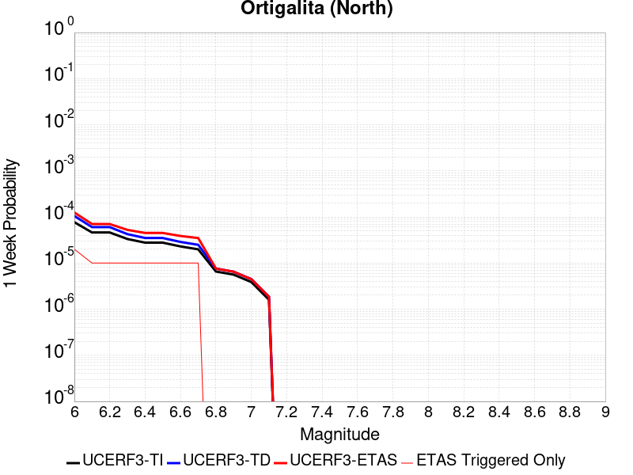 | 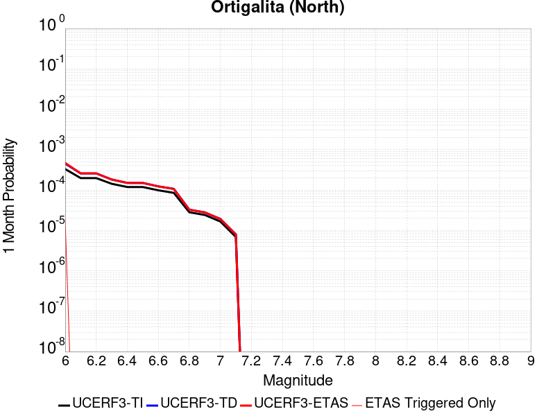 | 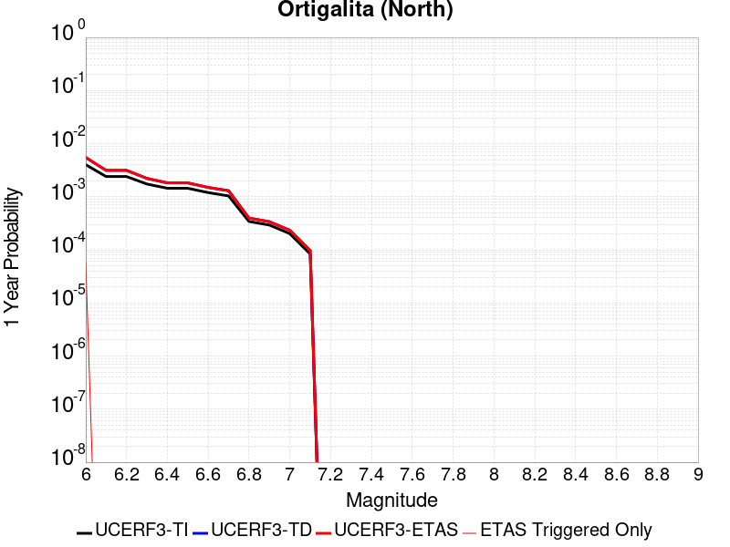 | 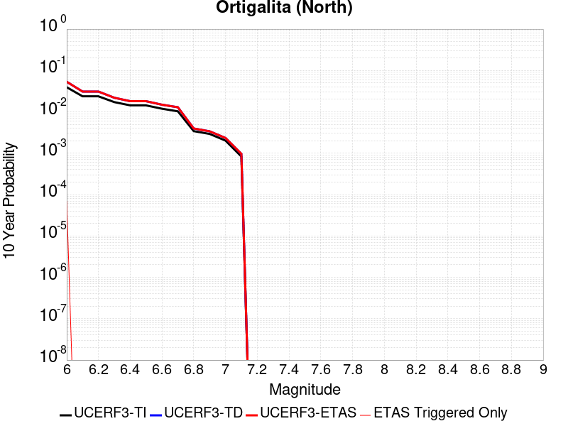 |

| Magnitude | 1 wk TI Prob | 1 wk TD Prob | 1 wk ETAS Prob | 1 wk ETAS/TD Gain | 1 wk ETAS Triggered Only | 1 mo TI Prob | 1 mo TD Prob | 1 mo ETAS Prob | 1 mo ETAS/TD Gain | 1 mo ETAS Triggered Only | 1 yr TI Prob | 1 yr TD Prob | 1 yr ETAS Prob | 1 yr ETAS/TD Gain | 1 yr ETAS Triggered Only | 10 yr TI Prob | 10 yr TD Prob | 10 yr ETAS Prob | 10 yr ETAS/TD Gain | 10 yr ETAS Triggered Only |
|-----|-----|-----|-----|-----|-----|-----|-----|-----|-----|-----|-----|-----|-----|-----|-----|-----|-----|-----|-----|-----|
| 6.0 | 7.711876E-5 | 1.05064966E-4 | 1.2506287E-4 | 1.1903384 | 2.0E-5 | 3.3046713E-4 | 4.502116E-4 | 4.901936E-4 | 1.0888071 | 4.0E-5 | 0.004016016 | 0.0054681194 | 0.0055377367 | 1.0127314 | 7.0E-5 | 0.039442103 | 0.053454787 | 0.053521045 | 1.0012395 | 7.0E-5 |
| 6.1 | 4.607858E-5 | 6.0239203E-5 | 7.02386E-5 | 1.1659949 | 1.0E-5 | 1.9746469E-4 | 2.5814527E-4 | 2.6814267E-4 | 1.0387279 | 1.0E-5 | 0.0024014818 | 0.0031387596 | 0.003158697 | 1.006352 | 2.0E-5 | 0.023756953 | 0.030975068 | 0.030994449 | 1.0006257 | 2.0E-5 |
| 6.2 | 4.607858E-5 | 6.0239203E-5 | 7.02386E-5 | 1.1659949 | 1.0E-5 | 1.9746469E-4 | 2.5814527E-4 | 2.6814267E-4 | 1.0387279 | 1.0E-5 | 0.0024014818 | 0.0031387596 | 0.003158697 | 1.006352 | 2.0E-5 | 0.023756953 | 0.030975068 | 0.030994449 | 1.0006257 | 2.0E-5 |
| 6.3 | 3.327423E-5 | 4.2475127E-5 | 5.2474705E-5 | 1.2354219 | 1.0E-5 | 1.4259605E-4 | 1.8202531E-4 | 1.920235E-4 | 1.0549275 | 1.0E-5 | 0.0017347244 | 0.002214197 | 0.0022341528 | 1.0090126 | 2.0E-5 | 0.017212452 | 0.021945644 | 0.021965206 | 1.0008913 | 2.0E-5 |
| 6.4 | 2.7732503E-5 | 3.4998593E-5 | 4.4998244E-5 | 1.2857158 | 1.0E-5 | 1.1884817E-4 | 1.4998685E-4 | 1.5998536E-4 | 1.0666625 | 1.0E-5 | 0.001446016 | 0.0018248095 | 0.0018447731 | 1.0109401 | 2.0E-5 | 0.014366428 | 0.018121224 | 0.018140862 | 1.0010837 | 2.0E-5 |
| 6.5 | 2.7689714E-5 | 3.4948407E-5 | 4.4948058E-5 | 1.286126 | 1.0E-5 | 1.186648E-4 | 1.497718E-4 | 1.597703E-4 | 1.0667583 | 1.0E-5 | 0.0014437864 | 0.0018221956 | 0.0018421591 | 1.0109558 | 2.0E-5 | 0.014344421 | 0.01809551 | 0.018115148 | 1.0010853 | 2.0E-5 |
| 6.6 | 2.2976905E-5 | 2.8718265E-5 | 3.871798E-5 | 1.3482004 | 1.0E-5 | 9.846873E-5 | 1.230739E-4 | 1.3307267E-4 | 1.081242 | 1.0E-5 | 0.0011981975 | 0.0014976363 | 0.0015176064 | 1.0133344 | 2.0E-5 | 0.011917574 | 0.014898697 | 0.014918399 | 1.0013224 | 2.0E-5 |
| 6.7 | 1.9871539E-5 | 2.4904411E-5 | 3.4904162E-5 | 1.4015253 | 1.0E-5 | 8.516096E-5 | 1.0673023E-4 | 1.1672916E-4 | 1.0936842 | 1.0E-5 | 0.0010363415 | 0.0012989145 | 0.0013188886 | 1.0153775 | 2.0E-5 | 0.010315218 | 0.012936919 | 0.01295666 | 1.001526 | 2.0E-5 |
| 6.8 | 6.5640475E-6 | 7.6054926E-6 | 7.6054926E-6 | 1.0 | 0.0 | 2.813133E-5 | 3.2594577E-5 | 3.2594577E-5 | 1.0 | 0.0 | 3.424451E-4 | 3.9676955E-4 | 3.9676955E-4 | 1.0 | 0.0 | 0.0034191788 | 0.003960899 | 0.003960899 | 1.0 | 0.0 |
| 6.9 | 5.6219683E-6 | 6.5018376E-6 | 6.5018376E-6 | 1.0 | 0.0 | 2.4093928E-5 | 2.7864735E-5 | 2.7864735E-5 | 1.0 | 0.0 | 2.933041E-4 | 3.3920293E-4 | 3.3920293E-4 | 1.0 | 0.0 | 0.0029291727 | 0.003387109 | 0.003387109 | 1.0 | 0.0 |
| 7.0 | 3.875591E-6 | 4.4847548E-6 | 4.4847548E-6 | 1.0 | 0.0 | 1.6609569E-5 | 1.9220248E-5 | 1.9220248E-5 | 1.0 | 0.0 | 2.0220275E-4 | 2.339835E-4 | 2.339835E-4 | 1.0 | 0.0 | 0.0020201886 | 0.0023375798 | 0.0023375798 | 1.0 | 0.0 |
| 7.1 | 1.6017933E-6 | 1.8570418E-6 | 1.8570418E-6 | 1.0 | 0.0 | 6.8648105E-6 | 7.958732E-6 | 7.958732E-6 | 1.0 | 0.0 | 8.357586E-5 | 9.689432E-5 | 9.689432E-5 | 1.0 | 0.0 | 8.3544437E-4 | 9.686254E-4 | 9.686254E-4 | 1.0 | 0.0 |

## Tin Mountain
*[(top)](#table-of-contents)*

| 1 Week | 1 Month | 1 Year | 10 Year |
|-----|-----|-----|-----|
| 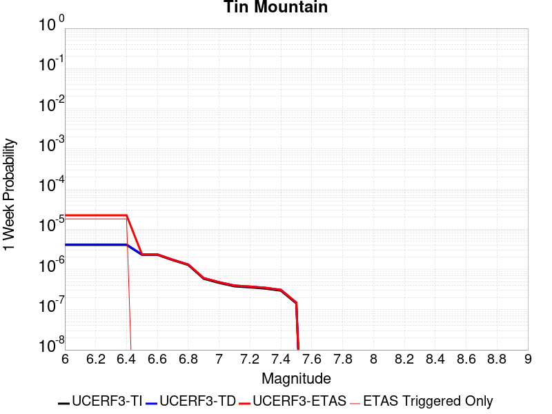 | 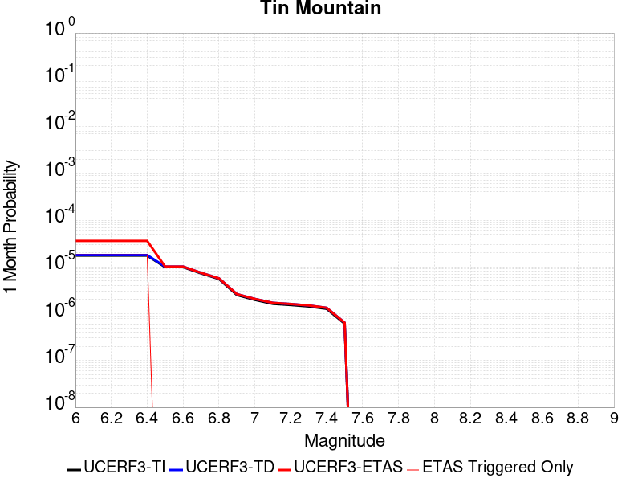 | 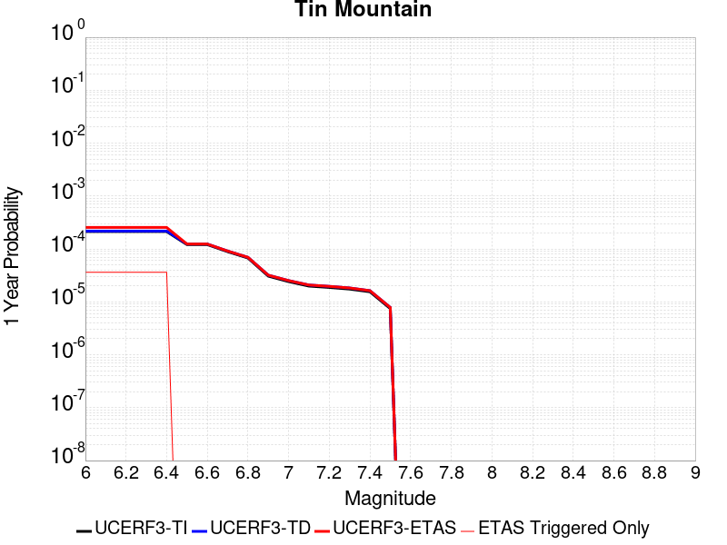 | 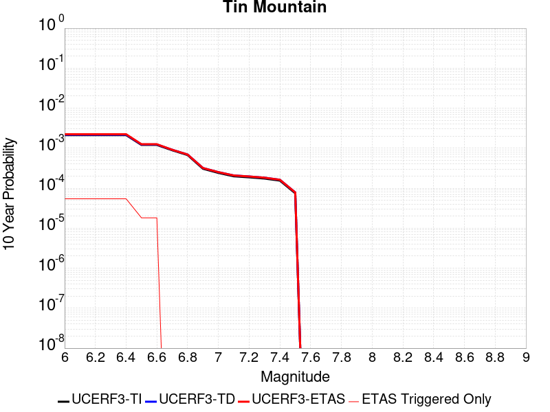 |

| Magnitude | 1 wk TI Prob | 1 wk TD Prob | 1 wk ETAS Prob | 1 wk ETAS/TD Gain | 1 wk ETAS Triggered Only | 1 mo TI Prob | 1 mo TD Prob | 1 mo ETAS Prob | 1 mo ETAS/TD Gain | 1 mo ETAS Triggered Only | 1 yr TI Prob | 1 yr TD Prob | 1 yr ETAS Prob | 1 yr ETAS/TD Gain | 1 yr ETAS Triggered Only | 10 yr TI Prob | 10 yr TD Prob | 10 yr ETAS Prob | 10 yr ETAS/TD Gain | 10 yr ETAS Triggered Only |
|-----|-----|-----|-----|-----|-----|-----|-----|-----|-----|-----|-----|-----|-----|-----|-----|-----|-----|-----|-----|-----|
| 6.0 | 4.083776E-6 | 4.1815365E-6 | 1.4181494E-5 | 3.3914554 | 1.0E-5 | 1.750178E-5 | 1.792077E-5 | 3.792041E-5 | 2.1160035 | 2.0E-5 | 2.1306332E-4 | 2.1816725E-4 | 2.581585E-4 | 1.1833056 | 4.0E-5 | 0.0021285915 | 0.0021798965 | 0.0022397656 | 1.0274643 | 6.0E-5 |
| 6.1 | 4.083776E-6 | 4.1815365E-6 | 1.4181494E-5 | 3.3914554 | 1.0E-5 | 1.750178E-5 | 1.792077E-5 | 3.792041E-5 | 2.1160035 | 2.0E-5 | 2.1306332E-4 | 2.1816725E-4 | 2.581585E-4 | 1.1833056 | 4.0E-5 | 0.0021285915 | 0.0021798965 | 0.0022397656 | 1.0274643 | 6.0E-5 |
| 6.2 | 4.083776E-6 | 4.1815365E-6 | 1.4181494E-5 | 3.3914554 | 1.0E-5 | 1.750178E-5 | 1.792077E-5 | 3.792041E-5 | 2.1160035 | 2.0E-5 | 2.1306332E-4 | 2.1816725E-4 | 2.581585E-4 | 1.1833056 | 4.0E-5 | 0.0021285915 | 0.0021798965 | 0.0022397656 | 1.0274643 | 6.0E-5 |
| 6.3 | 4.083776E-6 | 4.1815365E-6 | 1.4181494E-5 | 3.3914554 | 1.0E-5 | 1.750178E-5 | 1.792077E-5 | 3.792041E-5 | 2.1160035 | 2.0E-5 | 2.1306332E-4 | 2.1816725E-4 | 2.581585E-4 | 1.1833056 | 4.0E-5 | 0.0021285915 | 0.0021798965 | 0.0022397656 | 1.0274643 | 6.0E-5 |
| 6.4 | 4.083776E-6 | 4.1815365E-6 | 1.4181494E-5 | 3.3914554 | 1.0E-5 | 1.750178E-5 | 1.792077E-5 | 3.792041E-5 | 2.1160035 | 2.0E-5 | 2.1306332E-4 | 2.1816725E-4 | 2.581585E-4 | 1.1833056 | 4.0E-5 | 0.0021285915 | 0.0021798965 | 0.0022397656 | 1.0274643 | 6.0E-5 |
| 6.5 | 2.3143427E-6 | 2.3731573E-6 | 2.3731573E-6 | 1.0 | 0.0 | 9.9185745E-6 | 1.0170638E-5 | 1.0170638E-5 | 1.0 | 0.0 | 1.2075195E-4 | 1.2382126E-4 | 1.3382002E-4 | 1.0807515 | 1.0E-5 | 0.0012068636 | 0.0012375986 | 0.0012575738 | 1.0161403 | 2.0E-5 |
| 6.6 | 2.3143427E-6 | 2.3731573E-6 | 2.3731573E-6 | 1.0 | 0.0 | 9.9185745E-6 | 1.0170638E-5 | 1.0170638E-5 | 1.0 | 0.0 | 1.2075195E-4 | 1.2382126E-4 | 1.3382002E-4 | 1.0807515 | 1.0E-5 | 0.0012068636 | 0.0012375986 | 0.0012575738 | 1.0161403 | 2.0E-5 |
| 6.7 | 1.7029532E-6 | 1.7497915E-6 | 1.7497915E-6 | 1.0 | 0.0 | 7.2983503E-6 | 7.499088E-6 | 7.499088E-6 | 1.0 | 0.0 | 8.885379E-5 | 9.1298105E-5 | 1.0129719E-4 | 1.1095213 | 1.0E-5 | 8.881827E-4 | 9.1265864E-4 | 9.226495E-4 | 1.010947 | 1.0E-5 |
| 6.8 | 1.2914646E-6 | 1.3299378E-6 | 1.3299378E-6 | 1.0 | 0.0 | 5.534837E-6 | 5.6997237E-6 | 5.6997237E-6 | 1.0 | 0.0 | 6.738455E-5 | 6.939237E-5 | 6.939237E-5 | 1.0 | 0.0 | 6.736412E-4 | 6.9375033E-4 | 6.9375033E-4 | 1.0 | 0.0 |
| 6.9 | 5.8708974E-7 | 6.1169936E-7 | 6.1169936E-7 | 1.0 | 0.0 | 2.5160964E-6 | 2.6215664E-6 | 2.6215664E-6 | 1.0 | 0.0 | 3.0633044E-5 | 3.1917145E-5 | 3.1917145E-5 | 1.0 | 0.0 | 3.0628822E-4 | 3.191297E-4 | 3.191297E-4 | 1.0 | 0.0 |
| 7.0 | 4.6248786E-7 | 4.832015E-7 | 4.832015E-7 | 1.0 | 0.0 | 1.9820893E-6 | 2.0708624E-6 | 2.0708624E-6 | 1.0 | 0.0 | 2.413167E-5 | 2.5212494E-5 | 2.5212494E-5 | 1.0 | 0.0 | 2.412905E-4 | 2.5210003E-4 | 2.5210003E-4 | 1.0 | 0.0 |
| 7.1 | 3.804606E-7 | 3.987147E-7 | 3.987147E-7 | 1.0 | 0.0 | 1.6305444E-6 | 1.7087764E-6 | 1.7087764E-6 | 1.0 | 0.0 | 1.9851697E-5 | 2.0804187E-5 | 2.0804187E-5 | 1.0 | 0.0 | 1.9849923E-4 | 2.0802575E-4 | 2.0802575E-4 | 1.0 | 0.0 |
| 7.2 | 3.5864858E-7 | 3.7616863E-7 | 3.7616863E-7 | 1.0 | 0.0 | 1.5370645E-6 | 1.6121504E-6 | 1.6121504E-6 | 1.0 | 0.0 | 1.87136E-5 | 1.9627789E-5 | 1.9627789E-5 | 1.0 | 0.0 | 1.8712023E-4 | 1.9626386E-4 | 1.9626386E-4 | 1.0 | 0.0 |
| 7.3 | 3.342063E-7 | 3.506347E-7 | 3.506347E-7 | 1.0 | 0.0 | 1.4323119E-6 | 1.5027196E-6 | 1.5027196E-6 | 1.0 | 0.0 | 1.7438259E-5 | 1.829549E-5 | 1.829549E-5 | 1.0 | 0.0 | 1.743689E-4 | 1.8294314E-4 | 1.8294314E-4 | 1.0 | 0.0 |
| 7.4 | 2.971242E-7 | 3.1165817E-7 | 3.1165817E-7 | 1.0 | 0.0 | 1.2733886E-6 | 1.3356774E-6 | 1.3356774E-6 | 1.0 | 0.0 | 1.5503398E-5 | 1.6261785E-5 | 1.6261785E-5 | 1.0 | 0.0 | 1.5502315E-4 | 1.6260923E-4 | 1.6260923E-4 | 1.0 | 0.0 |
| 7.5 | 1.4326713E-7 | 1.5012525E-7 | 1.5012525E-7 | 1.0 | 0.0 | 6.140018E-7 | 6.433939E-7 | 6.433939E-7 | 1.0 | 0.0 | 7.4754466E-6 | 7.8333205E-6 | 7.8333205E-6 | 1.0 | 0.0 | 7.475195E-5 | 7.833321E-5 | 7.833321E-5 | 1.0 | 0.0 |

## White Wolf
*[(top)](#table-of-contents)*

| 1 Week | 1 Month | 1 Year | 10 Year |
|-----|-----|-----|-----|
| 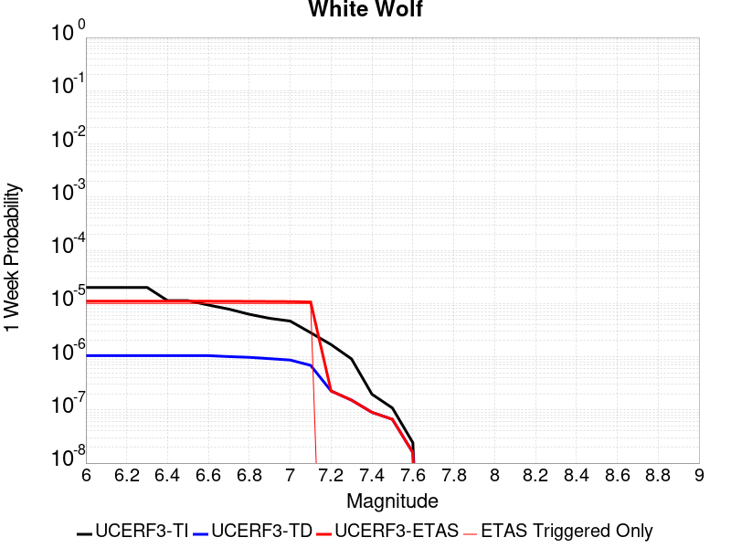 |  |  | 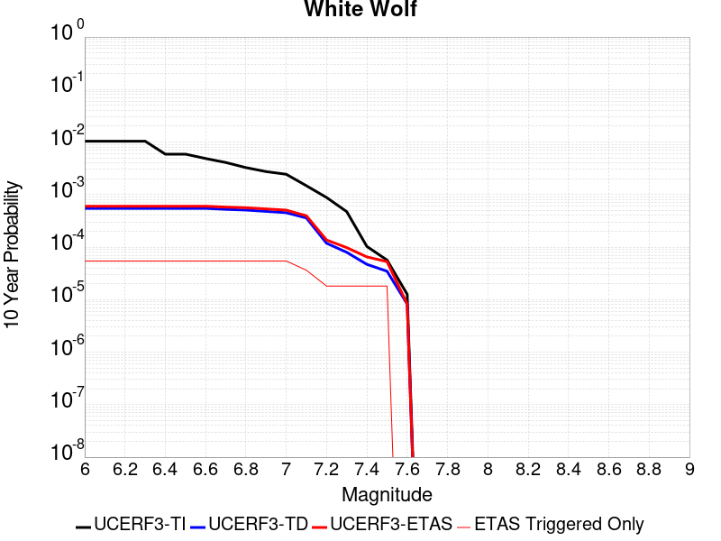 |

| Magnitude | 1 wk TI Prob | 1 wk TD Prob | 1 wk ETAS Prob | 1 wk ETAS/TD Gain | 1 wk ETAS Triggered Only | 1 mo TI Prob | 1 mo TD Prob | 1 mo ETAS Prob | 1 mo ETAS/TD Gain | 1 mo ETAS Triggered Only | 1 yr TI Prob | 1 yr TD Prob | 1 yr ETAS Prob | 1 yr ETAS/TD Gain | 1 yr ETAS Triggered Only | 10 yr TI Prob | 10 yr TD Prob | 10 yr ETAS Prob | 10 yr ETAS/TD Gain | 10 yr ETAS Triggered Only |
|-----|-----|-----|-----|-----|-----|-----|-----|-----|-----|-----|-----|-----|-----|-----|-----|-----|-----|-----|-----|-----|
| 6.0 | 2.0037822E-5 | 1.0469162E-6 | 1.10469055E-5 | 10.551853 | 1.0E-5 | 8.587355E-5 | 4.486776E-6 | 1.4486731E-5 | 3.2287617 | 1.0E-5 | 0.001045009 | 5.4625183E-5 | 8.462354E-5 | 1.5491673 | 3.0E-5 | 0.010401085 | 5.461226E-4 | 6.0608983E-4 | 1.1098055 | 6.0E-5 |
| 6.1 | 2.0037822E-5 | 1.0469162E-6 | 1.10469055E-5 | 10.551853 | 1.0E-5 | 8.587355E-5 | 4.486776E-6 | 1.4486731E-5 | 3.2287617 | 1.0E-5 | 0.001045009 | 5.4625183E-5 | 8.462354E-5 | 1.5491673 | 3.0E-5 | 0.010401085 | 5.461226E-4 | 6.0608983E-4 | 1.1098055 | 6.0E-5 |
| 6.2 | 2.0037822E-5 | 1.0469162E-6 | 1.10469055E-5 | 10.551853 | 1.0E-5 | 8.587355E-5 | 4.486776E-6 | 1.4486731E-5 | 3.2287617 | 1.0E-5 | 0.001045009 | 5.4625183E-5 | 8.462354E-5 | 1.5491673 | 3.0E-5 | 0.010401085 | 5.461226E-4 | 6.0608983E-4 | 1.1098055 | 6.0E-5 |
| 6.3 | 2.0037822E-5 | 1.0469162E-6 | 1.10469055E-5 | 10.551853 | 1.0E-5 | 8.587355E-5 | 4.486776E-6 | 1.4486731E-5 | 3.2287617 | 1.0E-5 | 0.001045009 | 5.4625183E-5 | 8.462354E-5 | 1.5491673 | 3.0E-5 | 0.010401085 | 5.461226E-4 | 6.0608983E-4 | 1.1098055 | 6.0E-5 |
| 6.4 | 1.132487E-5 | 1.0469162E-6 | 1.10469055E-5 | 10.551853 | 1.0E-5 | 4.8534253E-5 | 4.486776E-6 | 1.4486731E-5 | 3.2287617 | 1.0E-5 | 5.907443E-4 | 5.4625183E-5 | 8.462354E-5 | 1.5491673 | 3.0E-5 | 0.005891764 | 5.461226E-4 | 6.0608983E-4 | 1.1098055 | 6.0E-5 |
| 6.5 | 1.132487E-5 | 1.0469162E-6 | 1.10469055E-5 | 10.551853 | 1.0E-5 | 4.8534253E-5 | 4.486776E-6 | 1.4486731E-5 | 3.2287617 | 1.0E-5 | 5.907443E-4 | 5.4625183E-5 | 8.462354E-5 | 1.5491673 | 3.0E-5 | 0.005891764 | 5.461226E-4 | 6.0608983E-4 | 1.1098055 | 6.0E-5 |
| 6.6 | 9.347473E-6 | 1.0469162E-6 | 1.10469055E-5 | 10.551853 | 1.0E-5 | 4.0059982E-5 | 4.486776E-6 | 1.4486731E-5 | 3.2287617 | 1.0E-5 | 4.8762115E-4 | 5.4625183E-5 | 8.462354E-5 | 1.5491673 | 3.0E-5 | 0.0048655253 | 5.461226E-4 | 6.0608983E-4 | 1.1098055 | 6.0E-5 |
| 6.7 | 7.842647E-6 | 1.0048342E-6 | 1.1004824E-5 | 10.95188 | 1.0E-5 | 3.361091E-5 | 4.3064256E-6 | 1.4306383E-5 | 3.3221016 | 1.0E-5 | 4.0913603E-4 | 5.2429517E-5 | 8.242795E-5 | 1.5721668 | 3.0E-5 | 0.004083836 | 5.2417646E-4 | 5.84145E-4 | 1.1144053 | 6.0E-5 |
| 6.8 | 6.26597E-6 | 9.734822E-7 | 1.0973473E-5 | 11.272391 | 1.0E-5 | 2.685388E-5 | 4.17206E-6 | 1.4172018E-5 | 3.3968873 | 1.0E-5 | 3.2689696E-4 | 5.0793697E-5 | 8.0792175E-5 | 1.5905944 | 3.0E-5 | 0.003264165 | 5.078258E-4 | 5.677953E-4 | 1.1180907 | 6.0E-5 |
| 6.9 | 5.258436E-6 | 9.183254E-7 | 1.0918317E-5 | 11.889377 | 1.0E-5 | 2.2535958E-5 | 3.9356746E-6 | 1.3935635E-5 | 3.5408506 | 1.0E-5 | 2.7434074E-4 | 4.7915833E-5 | 7.7914396E-5 | 1.6260679 | 3.0E-5 | 0.0027400232 | 4.790598E-4 | 5.3903105E-4 | 1.1251854 | 6.0E-5 |
| 7.0 | 4.675028E-6 | 8.6611794E-7 | 1.086611E-5 | 12.545761 | 1.0E-5 | 2.003568E-5 | 3.7119291E-6 | 1.3711892E-5 | 3.694007 | 1.0E-5 | 2.4390711E-4 | 4.5191846E-5 | 7.519049E-5 | 1.6638066 | 3.0E-5 | 0.0024363957 | 4.518313E-4 | 5.118042E-4 | 1.132733 | 6.0E-5 |
| 7.1 | 2.8270078E-6 | 6.8741696E-7 | 1.068741E-5 | 15.547201 | 1.0E-5 | 1.2115692E-5 | 2.9460696E-6 | 1.294604E-5 | 4.394343 | 1.0E-5 | 1.4749856E-4 | 3.5867848E-5 | 5.586713E-5 | 1.5575825 | 2.0E-5 | 0.001474007 | 3.586247E-4 | 4.0860675E-4 | 1.1393715 | 5.0E-5 |
| 7.2 | 1.6881406E-6 | 2.2706382E-7 | 2.2706382E-7 | 1.0 | 0.0 | 7.2348685E-6 | 9.731303E-7 | 9.731303E-7 | 1.0 | 0.0 | 8.808096E-5 | 1.1847799E-5 | 2.184768E-5 | 1.8440286 | 1.0E-5 | 8.8046055E-4 | 1.1847183E-4 | 1.2847064E-4 | 1.0843983 | 1.0E-5 |
| 7.3 | 9.086107E-7 | 1.5266386E-7 | 1.5266386E-7 | 1.0 | 0.0 | 3.8940398E-6 | 6.5427355E-7 | 6.5427355E-7 | 1.0 | 0.0 | 4.7408903E-5 | 7.965752E-6 | 1.7965673E-5 | 2.2553642 | 1.0E-5 | 4.739879E-4 | 7.965475E-5 | 8.965395E-5 | 1.1255318 | 1.0E-5 |
| 7.4 | 1.9717383E-7 | 9.003913E-8 | 9.003913E-8 | 1.0 | 0.0 | 8.450304E-7 | 3.8588192E-7 | 3.8588192E-7 | 1.0 | 0.0 | 1.0288197E-5 | 4.6981027E-6 | 1.4698056E-5 | 3.1285088 | 1.0E-5 | 1.028772E-4 | 4.6980065E-5 | 5.6979592E-5 | 1.2128463 | 1.0E-5 |
| 7.5 | 1.086975E-7 | 6.6597195E-8 | 6.6597195E-8 | 1.0 | 0.0 | 4.6584634E-7 | 2.8541652E-7 | 2.8541652E-7 | 1.0 | 0.0 | 5.6716644E-6 | 3.474941E-6 | 1.3474906E-5 | 3.8777368 | 1.0E-5 | 5.6715195E-5 | 3.474889E-5 | 4.474854E-5 | 1.287769 | 1.0E-5 |
| 7.6 | 2.4217808E-8 | 1.5820765E-8 | 1.5820765E-8 | 1.0 | 0.0 | 1.03790605E-7 | 6.780328E-8 | 6.780328E-8 | 1.0 | 0.0 | 1.2636499E-6 | 8.255046E-7 | 8.255046E-7 | 1.0 | 0.0 | 1.2636427E-5 | 8.2550205E-6 | 8.2550205E-6 | 1.0 | 0.0 |

## Calaveras (So) - Paicines extension 2011 CFM
*[(top)](#table-of-contents)*

| 1 Week | 1 Month | 1 Year | 10 Year |
|-----|-----|-----|-----|
| 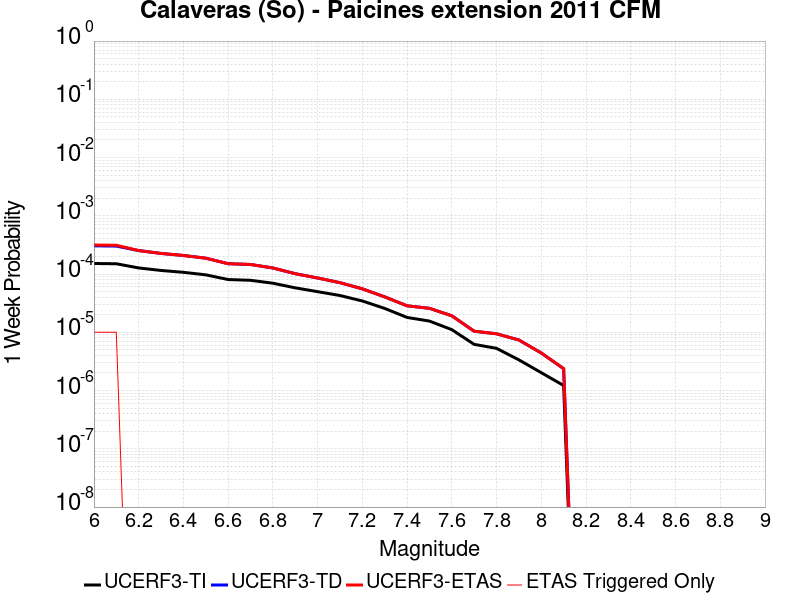 | 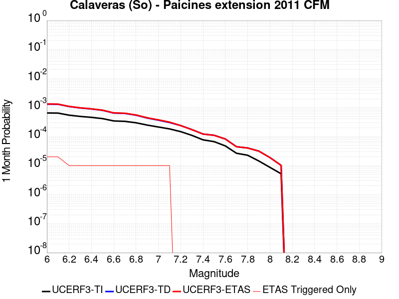 | 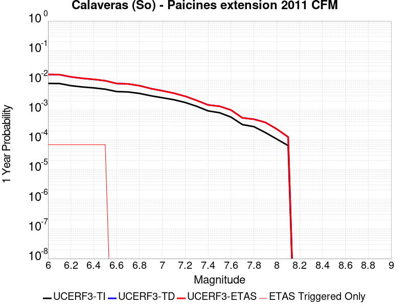 | 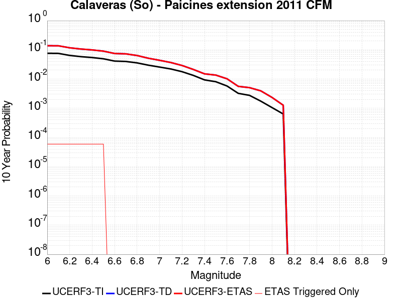 |

| Magnitude | 1 wk TI Prob | 1 wk TD Prob | 1 wk ETAS Prob | 1 wk ETAS/TD Gain | 1 wk ETAS Triggered Only | 1 mo TI Prob | 1 mo TD Prob | 1 mo ETAS Prob | 1 mo ETAS/TD Gain | 1 mo ETAS Triggered Only | 1 yr TI Prob | 1 yr TD Prob | 1 yr ETAS Prob | 1 yr ETAS/TD Gain | 1 yr ETAS Triggered Only | 10 yr TI Prob | 10 yr TD Prob | 10 yr ETAS Prob | 10 yr ETAS/TD Gain | 10 yr ETAS Triggered Only |
|-----|-----|-----|-----|-----|-----|-----|-----|-----|-----|-----|-----|-----|-----|-----|-----|-----|-----|-----|-----|-----|
| 6.0 | 1.5183659E-4 | 3.0533716E-4 | 3.153341E-4 | 1.0327407 | 1.0E-5 | 6.5056595E-4 | 0.0013069661 | 0.00132694 | 1.0152826 | 2.0E-5 | 0.007891912 | 0.01569571 | 0.01572524 | 1.0018814 | 3.0E-5 | 0.076174594 | 0.13848671 | 0.1385384 | 1.0003732 | 6.0E-5 |
| 6.1 | 1.5024997E-4 | 3.0227835E-4 | 3.1227534E-4 | 1.0330721 | 1.0E-5 | 6.437695E-4 | 0.00129387 | 0.0013138441 | 1.0154375 | 2.0E-5 | 0.0078097614 | 0.015539104 | 0.015568638 | 1.0019006 | 3.0E-5 | 0.075409345 | 0.13715632 | 0.13720809 | 1.0003774 | 6.0E-5 |
| 6.2 | 1.2743923E-4 | 2.5306802E-4 | 2.5306802E-4 | 1.0 | 0.0 | 5.460538E-4 | 0.0010841049 | 0.001094094 | 1.0092142 | 1.0E-5 | 0.0066279583 | 0.013046704 | 0.013066443 | 1.001513 | 2.0E-5 | 0.064337276 | 0.11725405 | 0.117298186 | 1.0003765 | 5.0E-5 |
| 6.3 | 1.1525114E-4 | 2.2595265E-4 | 2.2595265E-4 | 1.0 | 0.0 | 4.9383997E-4 | 9.6799526E-4 | 9.779856E-4 | 1.0103207 | 1.0E-5 | 0.0059959386 | 0.011667927 | 0.011687693 | 1.0016941 | 2.0E-5 | 0.058367174 | 0.10637007 | 0.10641475 | 1.0004201 | 5.0E-5 |
| 6.4 | 1.07200925E-4 | 2.0836305E-4 | 2.0836305E-4 | 1.0 | 0.0 | 4.5935164E-4 | 8.926636E-4 | 9.0265466E-4 | 1.0111924 | 1.0E-5 | 0.0055782744 | 0.010772766 | 0.01079255 | 1.0018365 | 2.0E-5 | 0.0544031 | 0.09919256 | 0.0992376 | 1.0004541 | 5.0E-5 |
| 6.5 | 9.69631E-5 | 1.8729115E-4 | 1.8729115E-4 | 1.0 | 0.0 | 4.1548995E-4 | 8.024135E-4 | 8.124055E-4 | 1.0124524 | 1.0E-5 | 0.0050468626 | 0.009694662 | 0.009714468 | 1.002043 | 2.0E-5 | 0.04933773 | 0.090084255 | 0.090129755 | 1.0005051 | 5.0E-5 |
| 6.6 | 8.0552316E-5 | 1.5070537E-4 | 1.5070537E-4 | 1.0 | 0.0 | 3.4517853E-4 | 6.456994E-4 | 6.556929E-4 | 1.0154771 | 1.0E-5 | 0.0041944524 | 0.007826256 | 0.007836178 | 1.0012678 | 1.0E-5 | 0.04116161 | 0.074854024 | 0.07488178 | 1.0003707 | 3.0E-5 |
| 6.7 | 7.815757E-5 | 1.4610609E-4 | 1.4610609E-4 | 1.0 | 0.0 | 3.34918E-4 | 6.260017E-4 | 6.359954E-4 | 1.0159644 | 1.0E-5 | 0.004070005 | 0.0075890915 | 0.0075990157 | 1.0013077 | 1.0E-5 | 0.039962657 | 0.072703585 | 0.072731405 | 1.0003827 | 3.0E-5 |
| 6.8 | 6.965264E-5 | 1.2721405E-4 | 1.2721405E-4 | 1.0 | 0.0 | 2.9847719E-4 | 5.450839E-4 | 5.5507844E-4 | 1.0183358 | 1.0E-5 | 0.0036279052 | 0.00661342 | 0.0066233533 | 1.001502 | 1.0E-5 | 0.03569247 | 0.06379891 | 0.06382699 | 1.0004402 | 3.0E-5 |
| 6.9 | 5.8000453E-5 | 1.01435086E-4 | 1.01435086E-4 | 1.0 | 0.0 | 2.4854968E-4 | 4.3464993E-4 | 4.446456E-4 | 1.022997 | 1.0E-5 | 0.0030218933 | 0.0052791284 | 0.005289076 | 1.0018842 | 1.0E-5 | 0.029811295 | 0.051501602 | 0.05153006 | 1.0005525 | 3.0E-5 |
| 7.0 | 4.9865852E-5 | 8.567692E-5 | 8.567692E-5 | 1.0 | 0.0 | 2.1369329E-4 | 3.671356E-4 | 3.7713192E-4 | 1.0272279 | 1.0E-5 | 0.0025986114 | 0.0044608037 | 0.004470759 | 1.0022317 | 1.0E-5 | 0.025684336 | 0.043781694 | 0.04381038 | 1.0006552 | 3.0E-5 |
| 7.1 | 4.283875E-5 | 7.112159E-5 | 7.112159E-5 | 1.0 | 0.0 | 1.8358172E-4 | 3.047715E-4 | 3.1476846E-4 | 1.0328015 | 1.0E-5 | 0.0022328163 | 0.003704336 | 0.003714299 | 1.0026895 | 1.0E-5 | 0.022105146 | 0.03673583 | 0.036764726 | 1.0007867 | 3.0E-5 |
| 7.2 | 3.450115E-5 | 5.5776054E-5 | 5.5776054E-5 | 1.0 | 0.0 | 1.478537E-4 | 2.390185E-4 | 2.390185E-4 | 1.0 | 0.0 | 0.0017986323 | 0.0029061958 | 0.0029061958 | 1.0 | 0.0 | 0.017841442 | 0.029079199 | 0.029098617 | 1.0006678 | 2.0E-5 |
| 7.3 | 2.5709045E-5 | 4.0588155E-5 | 4.0588155E-5 | 1.0 | 0.0 | 1.1017697E-4 | 1.7393773E-4 | 1.7393773E-4 | 1.0 | 0.0 | 0.0013405791 | 0.002115652 | 0.002115652 | 1.0 | 0.0 | 0.013325208 | 0.021297242 | 0.021316817 | 1.0009191 | 2.0E-5 |
| 7.4 | 1.8003093E-5 | 2.8509934E-5 | 2.8509934E-5 | 1.0 | 0.0 | 7.715383E-5 | 1.2217973E-4 | 1.2217973E-4 | 1.0 | 0.0 | 9.3894306E-4 | 0.0014865254 | 0.0014865254 | 1.0 | 0.0 | 0.009349857 | 0.015052196 | 0.015062045 | 1.0006543 | 1.0E-5 |
| 7.5 | 1.5595824E-5 | 2.5822499E-5 | 2.5822499E-5 | 1.0 | 0.0 | 6.683753E-5 | 1.1066317E-4 | 1.1066317E-4 | 1.0 | 0.0 | 8.134431E-4 | 0.0013464936 | 0.0013464936 | 1.0 | 0.0 | 0.008104719 | 0.01365213 | 0.013661994 | 1.0007225 | 1.0E-5 |
| 7.6 | 1.1110309E-5 | 1.9222098E-5 | 1.9222098E-5 | 1.0 | 0.0 | 4.761474E-5 | 8.2377825E-5 | 8.2377825E-5 | 1.0 | 0.0 | 5.795553E-4 | 0.0010024898 | 0.0010024898 | 1.0 | 0.0 | 0.0057804612 | 0.010203943 | 0.010213841 | 1.00097 | 1.0E-5 |
| 7.7 | 6.2140443E-6 | 1.0437076E-5 | 1.0437076E-5 | 1.0 | 0.0 | 2.6631347E-5 | 4.4729557E-5 | 4.4729557E-5 | 1.0 | 0.0 | 3.241884E-4 | 5.444464E-4 | 5.444464E-4 | 1.0 | 0.0 | 0.0032371588 | 0.005619835 | 0.005629779 | 1.0017694 | 1.0E-5 |
| 7.8 | 5.305533E-6 | 9.433038E-6 | 9.433038E-6 | 1.0 | 0.0 | 2.27378E-5 | 4.042668E-5 | 4.042668E-5 | 1.0 | 0.0 | 2.7679754E-4 | 4.920837E-4 | 4.920837E-4 | 1.0 | 0.0 | 0.0027645302 | 0.005074324 | 0.0050842734 | 1.0019608 | 1.0E-5 |
| 7.9 | 3.363505E-6 | 7.3848937E-6 | 7.3848937E-6 | 1.0 | 0.0 | 1.4414942E-5 | 3.164916E-5 | 3.164916E-5 | 1.0 | 0.0 | 1.7548777E-4 | 3.8526047E-4 | 3.8526047E-4 | 1.0 | 0.0 | 0.0017534926 | 0.003948527 | 0.0039584874 | 1.0025226 | 1.0E-5 |
| 8.0 | 2.0271132E-6 | 4.413104E-6 | 4.413104E-6 | 1.0 | 0.0 | 8.687599E-6 | 1.8913164E-5 | 1.8913164E-5 | 1.0 | 0.0 | 1.05766376E-4 | 2.302435E-4 | 2.302435E-4 | 1.0 | 0.0 | 0.0010571606 | 0.002351099 | 0.0023610755 | 1.0042434 | 1.0E-5 |
| 8.1 | 1.2206116E-6 | 2.3751331E-6 | 2.3751331E-6 | 1.0 | 0.0 | 5.2311816E-6 | 1.0179103E-5 | 1.0179103E-5 | 1.0 | 0.0 | 6.3687774E-5 | 1.2392356E-4 | 1.2392356E-4 | 1.0 | 0.0 | 6.366953E-4 | 0.0012705477 | 0.0012705477 | 1.0 | 0.0 |

## San Jacinto (Borrego)
*[(top)](#table-of-contents)*

| 1 Week | 1 Month | 1 Year | 10 Year |
|-----|-----|-----|-----|
| 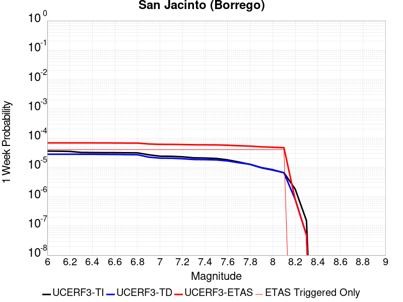 | 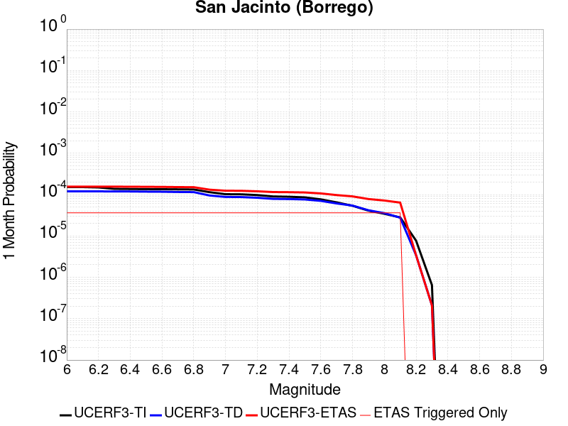 | 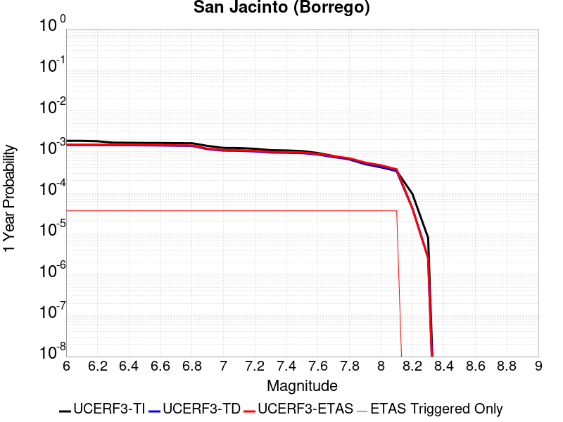 | 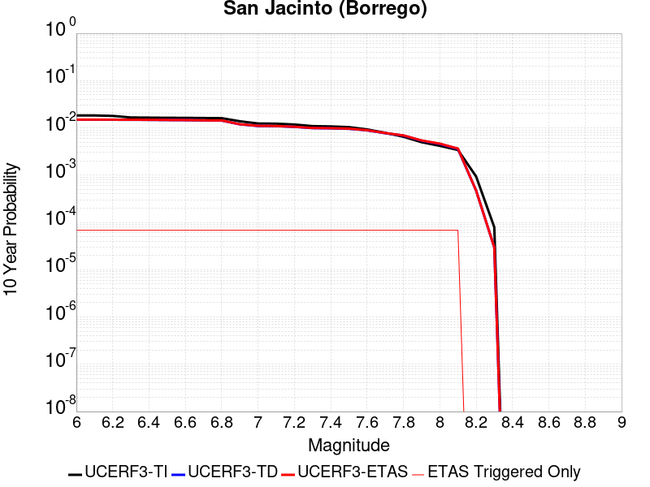 |

| Magnitude | 1 wk TI Prob | 1 wk TD Prob | 1 wk ETAS Prob | 1 wk ETAS/TD Gain | 1 wk ETAS Triggered Only | 1 mo TI Prob | 1 mo TD Prob | 1 mo ETAS Prob | 1 mo ETAS/TD Gain | 1 mo ETAS Triggered Only | 1 yr TI Prob | 1 yr TD Prob | 1 yr ETAS Prob | 1 yr ETAS/TD Gain | 1 yr ETAS Triggered Only | 10 yr TI Prob | 10 yr TD Prob | 10 yr ETAS Prob | 10 yr ETAS/TD Gain | 10 yr ETAS Triggered Only |
|-----|-----|-----|-----|-----|-----|-----|-----|-----|-----|-----|-----|-----|-----|-----|-----|-----|-----|-----|-----|-----|
| 6.0 | 3.543992E-5 | 2.7926513E-5 | 6.792539E-5 | 2.4322906 | 4.0E-5 | 1.5187653E-4 | 1.1967963E-4 | 1.6967364E-4 | 1.417732 | 5.0E-5 | 0.0018475284 | 0.0014561379 | 0.001506065 | 1.0342875 | 5.0E-5 | 0.018322436 | 0.014869647 | 0.014928755 | 1.003975 | 6.0E-5 |
| 6.1 | 3.542281E-5 | 2.7926513E-5 | 6.792539E-5 | 2.4322906 | 4.0E-5 | 1.5180321E-4 | 1.1967963E-4 | 1.6967364E-4 | 1.417732 | 5.0E-5 | 0.0018466372 | 0.0014561379 | 0.001506065 | 1.0342875 | 5.0E-5 | 0.018313672 | 0.014869647 | 0.014928755 | 1.003975 | 6.0E-5 |
| 6.2 | 3.4688688E-5 | 2.7926511E-5 | 6.792539E-5 | 2.4322908 | 4.0E-5 | 1.4865733E-4 | 1.1967963E-4 | 1.6967364E-4 | 1.417732 | 5.0E-5 | 0.0018084005 | 0.0014561379 | 0.001506065 | 1.0342875 | 5.0E-5 | 0.017937548 | 0.014869647 | 0.014928754 | 1.003975 | 6.0E-5 |
| 6.3 | 3.2087122E-5 | 2.7771865E-5 | 6.777075E-5 | 2.4402666 | 4.0E-5 | 1.3750899E-4 | 1.1901691E-4 | 1.6901096E-4 | 1.4200584 | 5.0E-5 | 0.0016728862 | 0.00144808 | 0.0014980076 | 1.0344784 | 5.0E-5 | 0.016603488 | 0.014790683 | 0.014849796 | 1.0039966 | 6.0E-5 |
| 6.4 | 3.1828724E-5 | 2.7738852E-5 | 6.773774E-5 | 2.4419808 | 4.0E-5 | 1.364017E-4 | 1.1887544E-4 | 1.6886949E-4 | 1.4205583 | 5.0E-5 | 0.0016594254 | 0.0014463598 | 0.0014962875 | 1.0345196 | 5.0E-5 | 0.016470885 | 0.014773762 | 0.014832876 | 1.0040013 | 6.0E-5 |
| 6.5 | 3.1563577E-5 | 2.747857E-5 | 6.747747E-5 | 2.4556398 | 4.0E-5 | 1.3526545E-4 | 1.1776006E-4 | 1.6775417E-4 | 1.4245422 | 5.0E-5 | 0.0016456128 | 0.0014327979 | 0.0014827263 | 1.0348468 | 5.0E-5 | 0.0163348 | 0.014640348 | 0.014699469 | 1.0040382 | 6.0E-5 |
| 6.6 | 3.1467625E-5 | 2.7322796E-5 | 6.73217E-5 | 2.463939 | 4.0E-5 | 1.3485427E-4 | 1.1709251E-4 | 1.6708665E-4 | 1.4269629 | 5.0E-5 | 0.0016406142 | 0.0014246812 | 0.00147461 | 1.0350456 | 5.0E-5 | 0.016285548 | 0.014560594 | 0.014619721 | 1.0040607 | 6.0E-5 |
| 6.7 | 3.1223695E-5 | 2.6940816E-5 | 6.6939734E-5 | 2.4846961 | 4.0E-5 | 1.3380898E-4 | 1.15455594E-4 | 1.6544982E-4 | 1.4330169 | 5.0E-5 | 0.0016279068 | 0.0014047775 | 0.0014547074 | 1.0355428 | 5.0E-5 | 0.01616033 | 0.014364966 | 0.014424104 | 1.0041168 | 6.0E-5 |
| 6.8 | 3.1015585E-5 | 2.6761822E-5 | 6.676075E-5 | 2.4946265 | 4.0E-5 | 1.3291716E-4 | 1.1468855E-4 | 1.6468282E-4 | 1.4359133 | 5.0E-5 | 0.001617065 | 0.0013954508 | 0.0014453811 | 1.0357807 | 5.0E-5 | 0.016053487 | 0.014272246 | 0.014331389 | 1.004144 | 6.0E-5 |
| 6.9 | 2.6641965E-5 | 2.2184247E-5 | 6.218336E-5 | 2.8030412 | 4.0E-5 | 1.1417485E-4 | 9.50719E-5 | 1.4506714E-4 | 1.5258677 | 5.0E-5 | 0.0013891924 | 0.0011568897 | 0.0012068318 | 1.0431694 | 5.0E-5 | 0.0138054015 | 0.011882438 | 0.011941725 | 1.0049895 | 6.0E-5 |
| 7.0 | 2.3854353E-5 | 2.0479023E-5 | 6.0478204E-5 | 2.9531782 | 4.0E-5 | 1.02228936E-4 | 8.77643E-5 | 1.3775991E-4 | 1.5696577 | 5.0E-5 | 0.0012439266 | 0.0010680092 | 0.0011179558 | 1.046766 | 5.0E-5 | 0.012369866 | 0.0109828 | 0.011042141 | 1.005403 | 6.0E-5 |
| 7.1 | 2.3672901E-5 | 2.031551E-5 | 6.03147E-5 | 2.968899 | 4.0E-5 | 1.0145135E-4 | 8.7063585E-5 | 1.3705924E-4 | 1.574243 | 5.0E-5 | 0.0012344702 | 0.0010594862 | 0.0011094332 | 1.0471427 | 5.0E-5 | 0.0122763505 | 0.010897976 | 0.010957322 | 1.0054456 | 6.0E-5 |
| 7.2 | 2.2717244E-5 | 1.9542893E-5 | 5.954211E-5 | 3.0467398 | 4.0E-5 | 9.735599E-5 | 8.375258E-5 | 1.3374838E-4 | 1.5969466 | 5.0E-5 | 0.0011846646 | 0.001019213 | 0.001069162 | 1.0490074 | 5.0E-5 | 0.01178369 | 0.010495341 | 0.010554711 | 1.0056568 | 6.0E-5 |
| 7.3 | 2.1016205E-5 | 1.8384526E-5 | 5.838379E-5 | 3.1757028 | 4.0E-5 | 9.006634E-5 | 7.878846E-5 | 1.2878451E-4 | 1.6345607 | 5.0E-5 | 0.001096006 | 9.5882936E-4 | 0.0010087814 | 1.052097 | 5.0E-5 | 0.010906163 | 0.009890967 | 0.009950373 | 1.0060061 | 6.0E-5 |
| 7.4 | 2.0683625E-5 | 1.8187047E-5 | 5.818632E-5 | 3.1993275 | 4.0E-5 | 8.86411E-5 | 7.794217E-5 | 1.2793827E-4 | 1.6414512 | 5.0E-5 | 0.001078671 | 9.485349E-4 | 9.984875E-4 | 1.0526628 | 5.0E-5 | 0.010734501 | 0.009787692 | 0.009847105 | 1.0060701 | 6.0E-5 |
| 7.5 | 1.9993966E-5 | 1.7782075E-5 | 5.7781363E-5 | 3.2494164 | 4.0E-5 | 8.568561E-5 | 7.620667E-5 | 1.2620287E-4 | 1.6560605 | 5.0E-5 | 0.001042723 | 9.2742336E-4 | 9.773769E-4 | 1.0538628 | 5.0E-5 | 0.010378438 | 0.009574614 | 0.00963404 | 1.0062065 | 6.0E-5 |
| 7.6 | 1.788966E-5 | 1.6435291E-5 | 5.6434634E-5 | 3.4337473 | 4.0E-5 | 7.666772E-5 | 7.043507E-5 | 1.2043155E-4 | 1.7098237 | 5.0E-5 | 9.3302975E-4 | 8.572113E-4 | 9.0716843E-4 | 1.0582787 | 5.0E-5 | 0.00929122 | 0.008866487 | 0.008925955 | 1.0067071 | 6.0E-5 |
| 7.7 | 1.5125781E-5 | 1.4237377E-5 | 5.4236807E-5 | 3.8094661 | 4.0E-5 | 6.4823165E-5 | 6.1015908E-5 | 1.1101286E-4 | 1.8194084 | 5.0E-5 | 7.889362E-4 | 7.426163E-4 | 7.925792E-4 | 1.0672796 | 5.0E-5 | 0.007861412 | 0.0077142045 | 0.0077737416 | 1.0077178 | 6.0E-5 |
| 7.8 | 1.250089E-5 | 1.26304985E-5 | 5.2629992E-5 | 4.166898 | 4.0E-5 | 5.3574146E-5 | 5.412959E-5 | 1.04126884E-4 | 1.9236592 | 5.0E-5 | 6.5207E-4 | 6.588291E-4 | 7.0879614E-4 | 1.0758423 | 5.0E-5 | 0.006501599 | 0.0068677636 | 0.0069273515 | 1.0086764 | 6.0E-5 |
| 7.9 | 9.561E-6 | 9.754616E-6 | 4.9754228E-5 | 5.1005826 | 4.0E-5 | 4.0975072E-5 | 4.1804833E-5 | 9.180274E-5 | 2.195984 | 5.0E-5 | 4.987573E-4 | 5.088555E-4 | 5.588301E-4 | 1.0982097 | 5.0E-5 | 0.0049763937 | 0.0053523467 | 0.0054120254 | 1.01115 | 6.0E-5 |
| 8.0 | 8.01699E-6 | 8.293488E-6 | 4.8293157E-5 | 5.8230214 | 4.0E-5 | 3.4358076E-5 | 3.554304E-5 | 8.554126E-5 | 2.4066954 | 5.0E-5 | 4.1822926E-4 | 4.3265108E-4 | 4.8262943E-4 | 1.1155165 | 5.0E-5 | 0.0041744304 | 0.004573375 | 0.0046331007 | 1.0130594 | 6.0E-5 |
| 8.1 | 6.541947E-6 | 6.4622354E-6 | 4.6461977E-5 | 7.189769 | 4.0E-5 | 2.8036617E-5 | 2.7695003E-5 | 7.769362E-5 | 2.8053298 | 5.0E-5 | 3.4129233E-4 | 3.37135E-4 | 3.8711814E-4 | 1.1482586 | 5.0E-5 | 0.0034076865 | 0.0035806994 | 0.0036404845 | 1.0166965 | 6.0E-5 |
| 8.2 | 1.7968189E-6 | 7.9713476E-7 | 7.9713476E-7 | 1.0 | 0.0 | 7.70063E-6 | 3.4162877E-6 | 3.4162877E-6 | 1.0 | 0.0 | 9.3751136E-5 | 4.159253E-5 | 4.159253E-5 | 1.0 | 0.0 | 9.371159E-4 | 4.712058E-4 | 4.712058E-4 | 1.0 | 0.0 |
| 8.3 | 1.5167889E-7 | 4.897714E-8 | 4.897714E-8 | 1.0 | 0.0 | 6.500522E-7 | 2.09902E-7 | 2.09902E-7 | 1.0 | 0.0 | 7.9143565E-6 | 2.5555544E-6 | 2.5555544E-6 | 1.0 | 0.0 | 7.914075E-5 | 2.969505E-5 | 2.969505E-5 | 1.0 | 0.0 |

## Newport-Inglewood alt 1
*[(top)](#table-of-contents)*

| 1 Week | 1 Month | 1 Year | 10 Year |
|-----|-----|-----|-----|
|  |  | 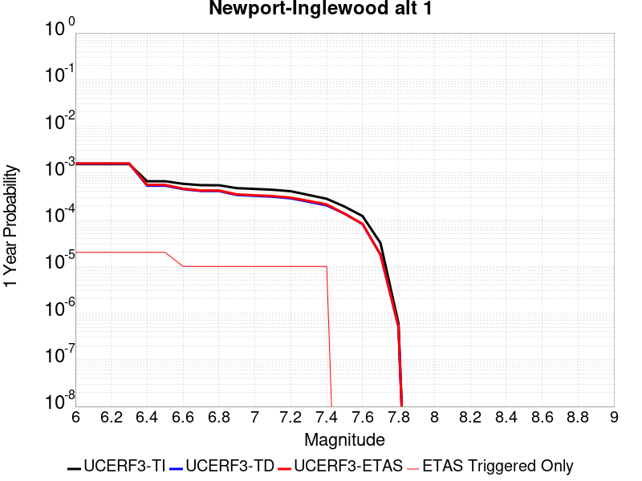 | 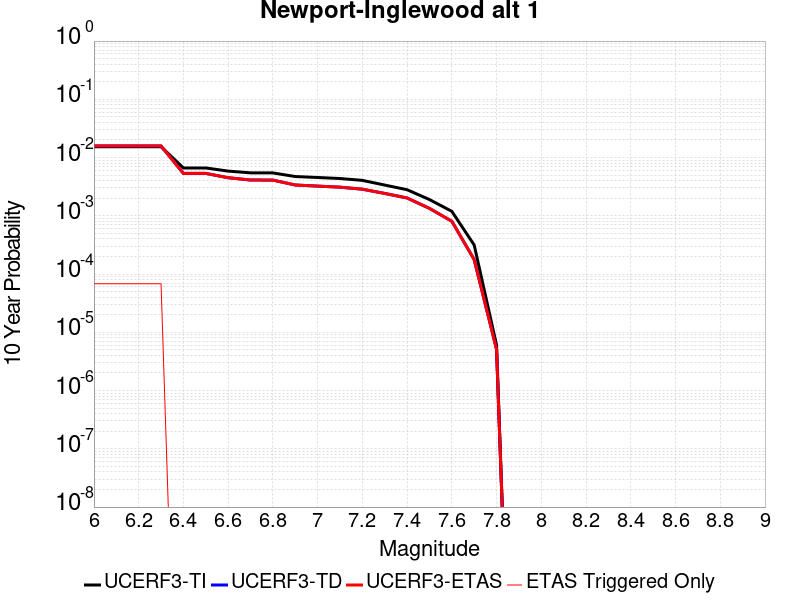 |

| Magnitude | 1 wk TI Prob | 1 wk TD Prob | 1 wk ETAS Prob | 1 wk ETAS/TD Gain | 1 wk ETAS Triggered Only | 1 mo TI Prob | 1 mo TD Prob | 1 mo ETAS Prob | 1 mo ETAS/TD Gain | 1 mo ETAS Triggered Only | 1 yr TI Prob | 1 yr TD Prob | 1 yr ETAS Prob | 1 yr ETAS/TD Gain | 1 yr ETAS Triggered Only | 10 yr TI Prob | 10 yr TD Prob | 10 yr ETAS Prob | 10 yr ETAS/TD Gain | 10 yr ETAS Triggered Only |
|-----|-----|-----|-----|-----|-----|-----|-----|-----|-----|-----|-----|-----|-----|-----|-----|-----|-----|-----|-----|-----|
| 6.0 | 2.9668912E-5 | 3.0404817E-5 | 3.0404817E-5 | 1.0 | 0.0 | 1.2714628E-4 | 1.303026E-4 | 1.303026E-4 | 1.0 | 0.0 | 0.0015469068 | 0.0015857625 | 0.0016057307 | 1.0125922 | 2.0E-5 | 0.015361829 | 0.015792042 | 0.01583141 | 1.0024929 | 4.0E-5 |
| 6.1 | 2.9668912E-5 | 3.0404817E-5 | 3.0404817E-5 | 1.0 | 0.0 | 1.2714628E-4 | 1.303026E-4 | 1.303026E-4 | 1.0 | 0.0 | 0.0015469068 | 0.0015857625 | 0.0016057307 | 1.0125922 | 2.0E-5 | 0.015361829 | 0.015792042 | 0.01583141 | 1.0024929 | 4.0E-5 |
| 6.2 | 2.9668912E-5 | 3.0404817E-5 | 3.0404817E-5 | 1.0 | 0.0 | 1.2714628E-4 | 1.303026E-4 | 1.303026E-4 | 1.0 | 0.0 | 0.0015469068 | 0.0015857625 | 0.0016057307 | 1.0125922 | 2.0E-5 | 0.015361829 | 0.015792042 | 0.01583141 | 1.0024929 | 4.0E-5 |
| 6.3 | 2.9668912E-5 | 3.0404817E-5 | 3.0404817E-5 | 1.0 | 0.0 | 1.2714628E-4 | 1.303026E-4 | 1.303026E-4 | 1.0 | 0.0 | 0.0015469068 | 0.0015857625 | 0.0016057307 | 1.0125922 | 2.0E-5 | 0.015361829 | 0.015792042 | 0.01583141 | 1.0024929 | 4.0E-5 |
| 6.4 | 1.275942E-5 | 1.0272503E-5 | 1.0272503E-5 | 1.0 | 0.0 | 5.4682085E-5 | 4.402429E-5 | 4.402429E-5 | 1.0 | 0.0 | 6.65551E-4 | 5.358681E-4 | 5.558574E-4 | 1.0373026 | 2.0E-5 | 0.0066356123 | 0.005346184 | 0.0053760237 | 1.0055815 | 3.0E-5 |
| 6.5 | 1.275942E-5 | 1.0272503E-5 | 1.0272503E-5 | 1.0 | 0.0 | 5.4682085E-5 | 4.402429E-5 | 4.402429E-5 | 1.0 | 0.0 | 6.65551E-4 | 5.358681E-4 | 5.558574E-4 | 1.0373026 | 2.0E-5 | 0.0066356123 | 0.005346184 | 0.0053760237 | 1.0055815 | 3.0E-5 |
| 6.6 | 1.1255358E-5 | 8.661884E-6 | 8.661884E-6 | 1.0 | 0.0 | 4.8236358E-5 | 3.712184E-5 | 3.712184E-5 | 1.0 | 0.0 | 5.871194E-4 | 4.518664E-4 | 4.6186187E-4 | 1.0221205 | 1.0E-5 | 0.005855706 | 0.004509653 | 0.004529563 | 1.0044149 | 2.0E-5 |
| 6.7 | 1.0504745E-5 | 7.8997955E-6 | 7.8997955E-6 | 1.0 | 0.0 | 4.5019555E-5 | 3.3855835E-5 | 3.3855835E-5 | 1.0 | 0.0 | 5.4797524E-4 | 4.1211807E-4 | 4.2211395E-4 | 1.0242549 | 1.0E-5 | 0.0054662596 | 0.004113668 | 0.0041236267 | 1.0024209 | 1.0E-5 |
| 6.8 | 1.0476007E-5 | 7.881176E-6 | 7.881176E-6 | 1.0 | 0.0 | 4.4896402E-5 | 3.3776043E-5 | 3.3776043E-5 | 1.0 | 0.0 | 5.464766E-4 | 4.1114696E-4 | 4.2114285E-4 | 1.0243123 | 1.0E-5 | 0.005451347 | 0.0041039926 | 0.0041139517 | 1.0024266 | 1.0E-5 |
| 6.9 | 9.076797E-6 | 6.4896312E-6 | 6.4896312E-6 | 1.0 | 0.0 | 3.889998E-5 | 2.781241E-5 | 2.781241E-5 | 1.0 | 0.0 | 4.7350433E-4 | 3.385638E-4 | 3.4856042E-4 | 1.0295265 | 1.0E-5 | 0.004724967 | 0.0033805177 | 0.0033904838 | 1.0029482 | 1.0E-5 |
| 7.0 | 8.73795E-6 | 6.2120125E-6 | 6.2120125E-6 | 1.0 | 0.0 | 3.7447822E-5 | 2.6622642E-5 | 2.6622642E-5 | 1.0 | 0.0 | 4.5583185E-4 | 3.2408274E-4 | 3.340795E-4 | 1.0308464 | 1.0E-5 | 0.0045489795 | 0.0032361327 | 0.0032461004 | 1.0030801 | 1.0E-5 |
| 7.1 | 8.391299E-6 | 5.95579E-6 | 5.95579E-6 | 1.0 | 0.0 | 3.5962214E-5 | 2.5524565E-5 | 2.5524565E-5 | 1.0 | 0.0 | 4.37752E-4 | 3.1071753E-4 | 3.2071443E-4 | 1.0321735 | 1.0E-5 | 0.004368907 | 0.0031028606 | 0.0031128295 | 1.0032128 | 1.0E-5 |
| 7.2 | 7.796882E-6 | 5.4965344E-6 | 5.4965344E-6 | 1.0 | 0.0 | 3.341478E-5 | 2.3556364E-5 | 2.3556364E-5 | 1.0 | 0.0 | 4.06749E-4 | 2.867612E-4 | 2.9675834E-4 | 1.0348623 | 1.0E-5 | 0.0040600533 | 0.0028639357 | 0.002873907 | 1.0034817 | 1.0E-5 |
| 7.3 | 6.4738833E-6 | 4.6478162E-6 | 4.6478162E-6 | 1.0 | 0.0 | 2.774492E-5 | 1.9919062E-5 | 1.9919062E-5 | 1.0 | 0.0 | 3.3774204E-4 | 2.4248775E-4 | 2.524853E-4 | 1.0412292 | 1.0E-5 | 0.0033722918 | 0.0024222482 | 0.0024322239 | 1.0041184 | 1.0E-5 |
| 7.4 | 5.382145E-6 | 3.8857597E-6 | 3.8857597E-6 | 1.0 | 0.0 | 2.3066134E-5 | 1.665315E-5 | 1.665315E-5 | 1.0 | 0.0 | 2.8079396E-4 | 2.0273338E-4 | 2.1273135E-4 | 1.0493158 | 1.0E-5 | 0.0028043943 | 0.0020254988 | 0.0020354786 | 1.004927 | 1.0E-5 |
| 7.5 | 3.648244E-6 | 2.5737843E-6 | 2.5737843E-6 | 1.0 | 0.0 | 1.5635238E-5 | 1.1030458E-5 | 1.1030458E-5 | 1.0 | 0.0 | 1.9034238E-4 | 1.3428765E-4 | 1.3428765E-4 | 1.0 | 0.0 | 0.0019017943 | 0.0013420755 | 0.0013420755 | 1.0 | 0.0 |
| 7.6 | 2.2906888E-6 | 1.5479842E-6 | 1.5479842E-6 | 1.0 | 0.0 | 9.817201E-6 | 6.634202E-6 | 6.634202E-6 | 1.0 | 0.0 | 1.1951787E-4 | 8.076848E-5 | 8.076848E-5 | 1.0 | 0.0 | 0.0011945361 | 8.07398E-4 | 8.07398E-4 | 1.0 | 0.0 |
| 7.7 | 6.0479874E-7 | 3.397512E-7 | 3.397512E-7 | 1.0 | 0.0 | 2.5919921E-6 | 1.4560758E-6 | 1.4560758E-6 | 1.0 | 0.0 | 3.1557047E-5 | 1.7727592E-5 | 1.7727592E-5 | 1.0 | 0.0 | 3.1552566E-4 | 1.7726317E-4 | 1.7726317E-4 | 1.0 | 0.0 |
| 7.8 | 1.16056995E-8 | 9.782373E-9 | 9.782373E-9 | 1.0 | 0.0 | 4.9738713E-8 | 4.1924455E-8 | 4.1924455E-8 | 1.0 | 0.0 | 6.0556863E-7 | 5.1043025E-7 | 5.1043025E-7 | 1.0 | 0.0 | 6.05567E-6 | 5.1043025E-6 | 5.1043025E-6 | 1.0 | 0.0 |

## San Luis Range 2011 CFM
*[(top)](#table-of-contents)*

| 1 Week | 1 Month | 1 Year | 10 Year |
|-----|-----|-----|-----|
| 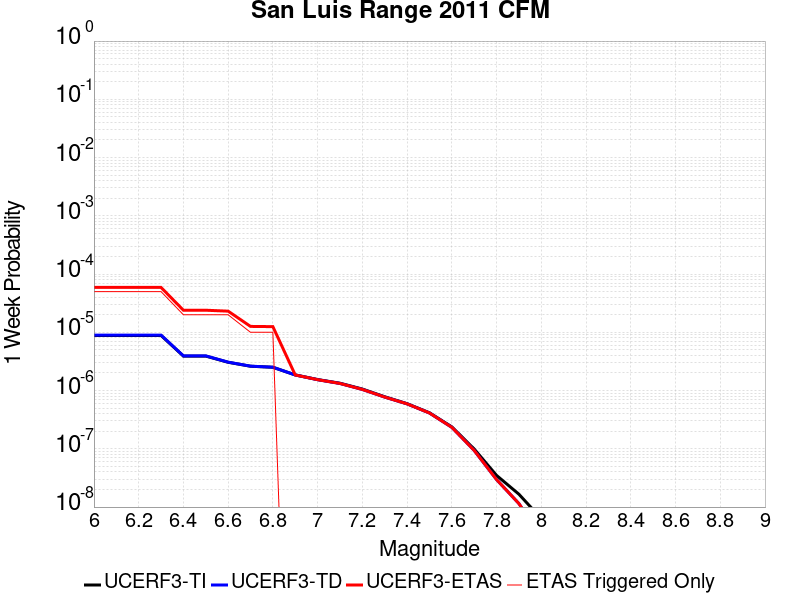 | 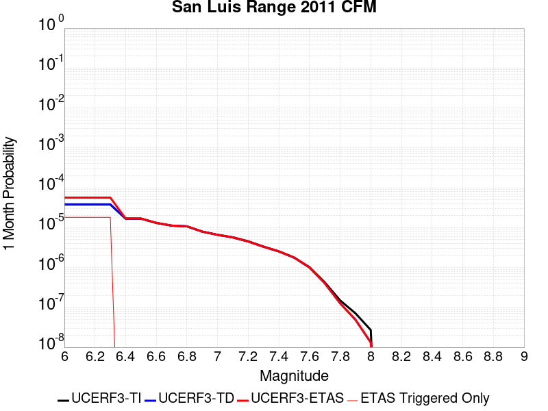 | 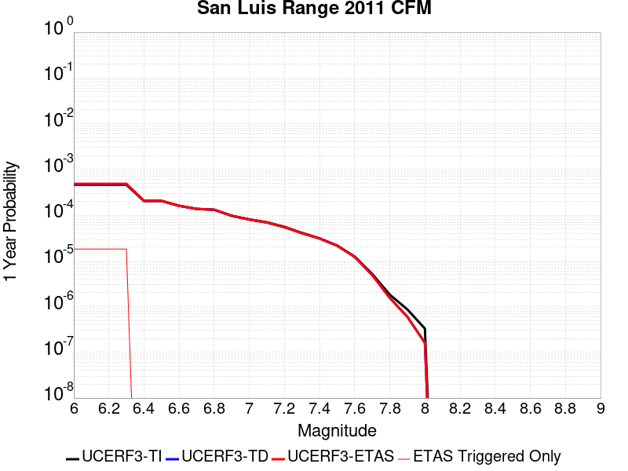 | 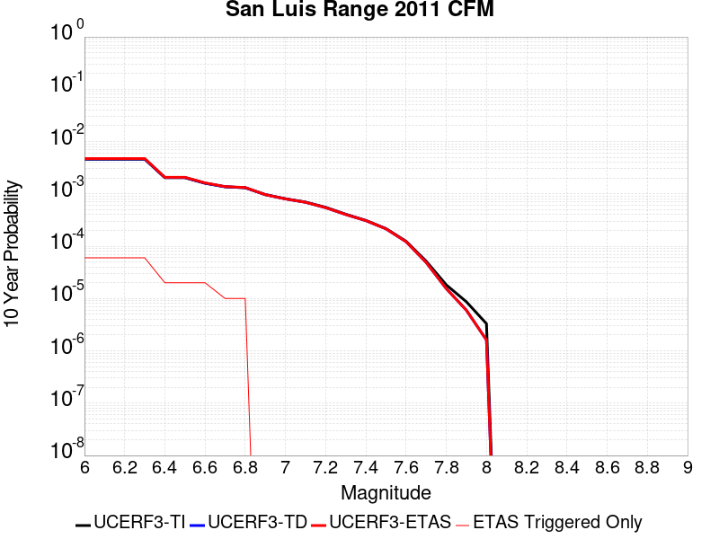 |

| Magnitude | 1 wk TI Prob | 1 wk TD Prob | 1 wk ETAS Prob | 1 wk ETAS/TD Gain | 1 wk ETAS Triggered Only | 1 mo TI Prob | 1 mo TD Prob | 1 mo ETAS Prob | 1 mo ETAS/TD Gain | 1 mo ETAS Triggered Only | 1 yr TI Prob | 1 yr TD Prob | 1 yr ETAS Prob | 1 yr ETAS/TD Gain | 1 yr ETAS Triggered Only | 10 yr TI Prob | 10 yr TD Prob | 10 yr ETAS Prob | 10 yr ETAS/TD Gain | 10 yr ETAS Triggered Only |
|-----|-----|-----|-----|-----|-----|-----|-----|-----|-----|-----|-----|-----|-----|-----|-----|-----|-----|-----|-----|-----|
| 6.0 | 8.8368415E-6 | 8.965454E-6 | 5.8965004E-5 | 6.5769124 | 5.0E-5 | 3.787163E-5 | 3.842285E-5 | 8.842093E-5 | 2.301259 | 5.0E-5 | 4.609895E-4 | 4.677057E-4 | 5.176823E-4 | 1.1068548 | 5.0E-5 | 0.0046003438 | 0.0046679964 | 0.004727716 | 1.0127934 | 6.0E-5 |
| 6.1 | 8.8368415E-6 | 8.965454E-6 | 5.8965004E-5 | 6.5769124 | 5.0E-5 | 3.787163E-5 | 3.842285E-5 | 8.842093E-5 | 2.301259 | 5.0E-5 | 4.609895E-4 | 4.677057E-4 | 5.176823E-4 | 1.1068548 | 5.0E-5 | 0.0046003438 | 0.0046679964 | 0.004727716 | 1.0127934 | 6.0E-5 |
| 6.2 | 8.8368415E-6 | 8.965454E-6 | 5.8965004E-5 | 6.5769124 | 5.0E-5 | 3.787163E-5 | 3.842285E-5 | 8.842093E-5 | 2.301259 | 5.0E-5 | 4.609895E-4 | 4.677057E-4 | 5.176823E-4 | 1.1068548 | 5.0E-5 | 0.0046003438 | 0.0046679964 | 0.004727716 | 1.0127934 | 6.0E-5 |
| 6.3 | 8.8368415E-6 | 8.965454E-6 | 5.8965004E-5 | 6.5769124 | 5.0E-5 | 3.787163E-5 | 3.842285E-5 | 8.842093E-5 | 2.301259 | 5.0E-5 | 4.609895E-4 | 4.677057E-4 | 5.176823E-4 | 1.1068548 | 5.0E-5 | 0.0046003438 | 0.0046679964 | 0.004727716 | 1.0127934 | 6.0E-5 |
| 6.4 | 3.9094193E-6 | 3.9412025E-6 | 2.3941124E-5 | 6.074573 | 2.0E-5 | 1.6754546E-5 | 1.689076E-5 | 3.6890422E-5 | 2.1840594 | 2.0E-5 | 2.039675E-4 | 2.056259E-4 | 2.2562178E-4 | 1.097244 | 2.0E-5 | 0.0020378039 | 0.0020543851 | 0.002074344 | 1.0097153 | 2.0E-5 |
| 6.5 | 3.9094193E-6 | 3.9412025E-6 | 2.3941124E-5 | 6.074573 | 2.0E-5 | 1.6754546E-5 | 1.689076E-5 | 3.6890422E-5 | 2.1840594 | 2.0E-5 | 2.039675E-4 | 2.056259E-4 | 2.2562178E-4 | 1.097244 | 2.0E-5 | 0.0020378039 | 0.0020543851 | 0.002074344 | 1.0097153 | 2.0E-5 |
| 6.6 | 3.0587726E-6 | 3.0753883E-6 | 2.3075327E-5 | 7.503224 | 2.0E-5 | 1.3108959E-5 | 1.318017E-5 | 3.3179906E-5 | 2.5174112 | 2.0E-5 | 1.595899E-4 | 1.6045687E-4 | 1.8045366E-4 | 1.1246241 | 2.0E-5 | 0.0015947534 | 0.0016034221 | 0.00162339 | 1.0124533 | 2.0E-5 |
| 6.7 | 2.6160574E-6 | 2.6251273E-6 | 1.2625101E-5 | 4.809329 | 1.0E-5 | 1.1211626E-5 | 1.1250498E-5 | 2.1250386E-5 | 1.8888396 | 1.0E-5 | 1.3649299E-4 | 1.3696625E-4 | 1.4696489E-4 | 1.0730007 | 1.0E-5 | 0.0013640919 | 0.0013688246 | 0.0013788108 | 1.0072955 | 1.0E-5 |
| 6.8 | 2.5110312E-6 | 2.51814E-6 | 1.2518115E-5 | 4.9711747 | 1.0E-5 | 1.0761518E-5 | 1.0791985E-5 | 2.0791877E-5 | 1.9266036 | 1.0E-5 | 1.310136E-4 | 1.3138456E-4 | 1.4138324E-4 | 1.0761025 | 1.0E-5 | 0.0013093639 | 0.0013130746 | 0.0013230615 | 1.0076057 | 1.0E-5 |
| 6.9 | 1.8564405E-6 | 1.852487E-6 | 1.852487E-6 | 1.0 | 0.0 | 7.95615E-6 | 7.939206E-6 | 7.939206E-6 | 1.0 | 0.0 | 9.686181E-5 | 9.665557E-5 | 9.665557E-5 | 1.0 | 0.0 | 9.68196E-4 | 9.661373E-4 | 9.661373E-4 | 1.0 | 0.0 |
| 7.0 | 1.546127E-6 | 1.5369537E-6 | 1.5369537E-6 | 1.0 | 0.0 | 6.626242E-6 | 6.586928E-6 | 6.586928E-6 | 1.0 | 0.0 | 8.06715E-5 | 8.0192905E-5 | 8.0192905E-5 | 1.0 | 0.0 | 8.0642226E-4 | 8.016404E-4 | 8.016404E-4 | 1.0 | 0.0 |
| 7.1 | 1.3368208E-6 | 1.3235326E-6 | 1.3235326E-6 | 1.0 | 0.0 | 5.7292195E-6 | 5.67227E-6 | 5.67227E-6 | 1.0 | 0.0 | 6.975101E-5 | 6.905771E-5 | 6.905771E-5 | 1.0 | 0.0 | 6.972912E-4 | 6.9036294E-4 | 6.9036294E-4 | 1.0 | 0.0 |
| 7.2 | 1.0623363E-6 | 1.0454368E-6 | 1.0454368E-6 | 1.0 | 0.0 | 4.5528623E-6 | 4.4804356E-6 | 4.4804356E-6 | 1.0 | 0.0 | 5.5429686E-5 | 5.4547938E-5 | 5.4547938E-5 | 1.0 | 0.0 | 5.5415864E-4 | 5.4534577E-4 | 5.4534577E-4 | 1.0 | 0.0 |
| 7.3 | 7.831679E-7 | 7.7273904E-7 | 7.7273904E-7 | 1.0 | 0.0 | 3.3564295E-6 | 3.3117344E-6 | 3.3117344E-6 | 1.0 | 0.0 | 4.086376E-5 | 4.0319625E-5 | 4.0319625E-5 | 1.0 | 0.0 | 4.0856248E-4 | 4.031232E-4 | 4.031232E-4 | 1.0 | 0.0 |
| 7.4 | 5.9558846E-7 | 5.910636E-7 | 5.910636E-7 | 1.0 | 0.0 | 2.5525194E-6 | 2.5331274E-6 | 2.5331274E-6 | 1.0 | 0.0 | 3.107648E-5 | 3.084039E-5 | 3.084039E-5 | 1.0 | 0.0 | 3.1072134E-4 | 3.083612E-4 | 3.083612E-4 | 1.0 | 0.0 |
| 7.5 | 4.1616502E-7 | 4.119631E-7 | 4.119631E-7 | 1.0 | 0.0 | 1.7835631E-6 | 1.7655549E-6 | 1.7655549E-6 | 1.0 | 0.0 | 2.1714664E-5 | 2.149542E-5 | 2.149542E-5 | 1.0 | 0.0 | 2.1712543E-4 | 2.1493346E-4 | 2.1493346E-4 | 1.0 | 0.0 |
| 7.6 | 2.3816014E-7 | 2.3376548E-7 | 2.3376548E-7 | 1.0 | 0.0 | 1.0206859E-6 | 1.0018516E-6 | 1.0018516E-6 | 1.0 | 0.0 | 1.242678E-5 | 1.2197475E-5 | 1.2197475E-5 | 1.0 | 0.0 | 1.2426086E-4 | 1.2196808E-4 | 1.2196808E-4 | 1.0 | 0.0 |
| 7.7 | 9.918777E-8 | 9.3867584E-8 | 9.3867584E-8 | 1.0 | 0.0 | 4.2509038E-7 | 4.0228957E-7 | 4.0228957E-7 | 1.0 | 0.0 | 5.1754632E-6 | 4.8978645E-6 | 4.8978645E-6 | 1.0 | 0.0 | 5.1753424E-5 | 4.897757E-5 | 4.897757E-5 | 1.0 | 0.0 |
| 7.8 | 3.4982556E-8 | 2.968655E-8 | 2.968655E-8 | 1.0 | 0.0 | 1.4992524E-7 | 1.2722806E-7 | 1.2722806E-7 | 1.0 | 0.0 | 1.8253382E-6 | 1.5490006E-6 | 1.5490006E-6 | 1.0 | 0.0 | 1.8253233E-5 | 1.5489897E-5 | 1.5489897E-5 | 1.0 | 0.0 |
| 7.9 | 1.6624908E-8 | 1.1477036E-8 | 1.1477036E-8 | 1.0 | 0.0 | 7.12496E-8 | 4.91873E-8 | 4.91873E-8 | 1.0 | 0.0 | 8.6746354E-7 | 5.988552E-7 | 5.988552E-7 | 1.0 | 0.0 | 8.674601E-6 | 5.988536E-6 | 5.988536E-6 | 1.0 | 0.0 |
| 8.0 | 6.3352315E-9 | 3.0888412E-9 | 3.0888412E-9 | 1.0 | 0.0 | 2.715099E-8 | 1.3237893E-8 | 1.3237893E-8 | 1.0 | 0.0 | 3.3056327E-7 | 1.6117131E-7 | 1.6117131E-7 | 1.0 | 0.0 | 3.3056278E-6 | 1.611712E-6 | 1.611712E-6 | 1.0 | 0.0 |

## Pine Mtn
*[(top)](#table-of-contents)*

| 1 Week | 1 Month | 1 Year | 10 Year |
|-----|-----|-----|-----|
| 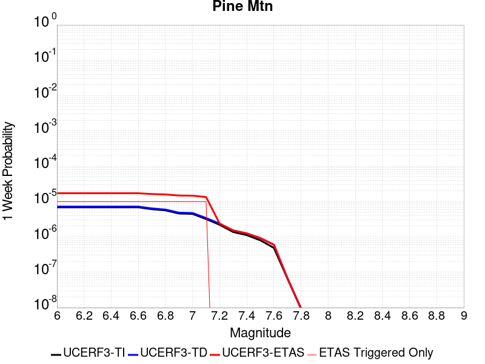 | 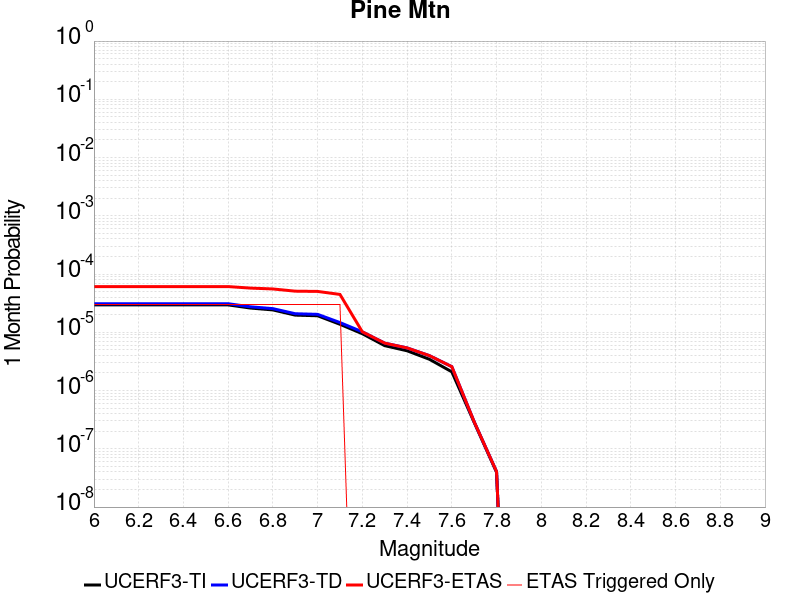 | 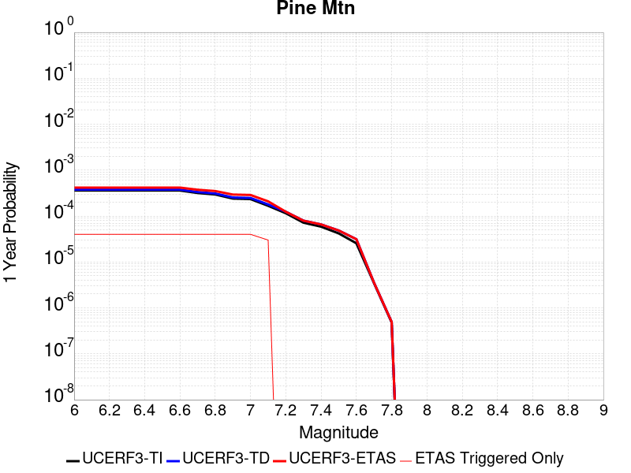 | 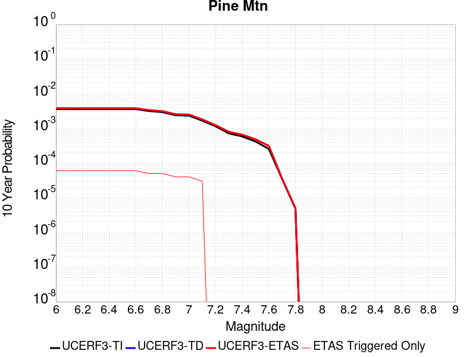 |

| Magnitude | 1 wk TI Prob | 1 wk TD Prob | 1 wk ETAS Prob | 1 wk ETAS/TD Gain | 1 wk ETAS Triggered Only | 1 mo TI Prob | 1 mo TD Prob | 1 mo ETAS Prob | 1 mo ETAS/TD Gain | 1 mo ETAS Triggered Only | 1 yr TI Prob | 1 yr TD Prob | 1 yr ETAS Prob | 1 yr ETAS/TD Gain | 1 yr ETAS Triggered Only | 10 yr TI Prob | 10 yr TD Prob | 10 yr ETAS Prob | 10 yr ETAS/TD Gain | 10 yr ETAS Triggered Only |
|-----|-----|-----|-----|-----|-----|-----|-----|-----|-----|-----|-----|-----|-----|-----|-----|-----|-----|-----|-----|-----|
| 6.0 | 6.894797E-6 | 7.225461E-6 | 1.722539E-5 | 2.3839846 | 1.0E-5 | 2.9548795E-5 | 3.096591E-5 | 6.0964983E-5 | 1.9687773 | 3.0E-5 | 3.596972E-4 | 3.7694772E-4 | 4.1693266E-4 | 1.1060755 | 4.0E-5 | 0.0035911554 | 0.003763381 | 0.003823155 | 1.0158831 | 6.0E-5 |
| 6.1 | 6.894797E-6 | 7.225461E-6 | 1.722539E-5 | 2.3839846 | 1.0E-5 | 2.9548795E-5 | 3.096591E-5 | 6.0964983E-5 | 1.9687773 | 3.0E-5 | 3.596972E-4 | 3.7694772E-4 | 4.1693266E-4 | 1.1060755 | 4.0E-5 | 0.0035911554 | 0.003763381 | 0.003823155 | 1.0158831 | 6.0E-5 |
| 6.2 | 6.894797E-6 | 7.225461E-6 | 1.722539E-5 | 2.3839846 | 1.0E-5 | 2.9548795E-5 | 3.096591E-5 | 6.0964983E-5 | 1.9687773 | 3.0E-5 | 3.596972E-4 | 3.7694772E-4 | 4.1693266E-4 | 1.1060755 | 4.0E-5 | 0.0035911554 | 0.003763381 | 0.003823155 | 1.0158831 | 6.0E-5 |
| 6.3 | 6.894797E-6 | 7.225461E-6 | 1.722539E-5 | 2.3839846 | 1.0E-5 | 2.9548795E-5 | 3.096591E-5 | 6.0964983E-5 | 1.9687773 | 3.0E-5 | 3.596972E-4 | 3.7694772E-4 | 4.1693266E-4 | 1.1060755 | 4.0E-5 | 0.0035911554 | 0.003763381 | 0.003823155 | 1.0158831 | 6.0E-5 |
| 6.4 | 6.894797E-6 | 7.225461E-6 | 1.722539E-5 | 2.3839846 | 1.0E-5 | 2.9548795E-5 | 3.096591E-5 | 6.0964983E-5 | 1.9687773 | 3.0E-5 | 3.596972E-4 | 3.7694772E-4 | 4.1693266E-4 | 1.1060755 | 4.0E-5 | 0.0035911554 | 0.003763381 | 0.003823155 | 1.0158831 | 6.0E-5 |
| 6.5 | 6.894797E-6 | 7.225461E-6 | 1.722539E-5 | 2.3839846 | 1.0E-5 | 2.9548795E-5 | 3.096591E-5 | 6.0964983E-5 | 1.9687773 | 3.0E-5 | 3.596972E-4 | 3.7694772E-4 | 4.1693266E-4 | 1.1060755 | 4.0E-5 | 0.0035911554 | 0.003763381 | 0.003823155 | 1.0158831 | 6.0E-5 |
| 6.6 | 6.894797E-6 | 7.225461E-6 | 1.722539E-5 | 2.3839846 | 1.0E-5 | 2.9548795E-5 | 3.096591E-5 | 6.0964983E-5 | 1.9687773 | 3.0E-5 | 3.596972E-4 | 3.7694772E-4 | 4.1693266E-4 | 1.1060755 | 4.0E-5 | 0.0035911554 | 0.003763381 | 0.003823155 | 1.0158831 | 6.0E-5 |
| 6.7 | 6.0867933E-6 | 6.3971133E-6 | 1.6397049E-5 | 2.563195 | 1.0E-5 | 2.6085996E-5 | 2.7415923E-5 | 5.74151E-5 | 2.0942247 | 3.0E-5 | 3.1755073E-4 | 3.3373994E-4 | 3.737266E-4 | 1.1198138 | 4.0E-5 | 0.0031709734 | 0.0033326065 | 0.0033824397 | 1.0149533 | 5.0E-5 |
| 6.8 | 5.6530425E-6 | 5.9505956E-6 | 1.5950536E-5 | 2.680494 | 1.0E-5 | 2.42271E-5 | 2.5502315E-5 | 5.550155E-5 | 2.176334 | 3.0E-5 | 2.94925E-4 | 3.104485E-4 | 3.5043608E-4 | 1.1288059 | 4.0E-5 | 0.002945339 | 0.0031003528 | 0.003150198 | 1.0160772 | 5.0E-5 |
| 6.9 | 4.6015225E-6 | 4.863834E-6 | 1.48637855E-5 | 3.0559812 | 1.0E-5 | 1.9720663E-5 | 2.0844845E-5 | 5.084422E-5 | 2.439175 | 3.0E-5 | 2.4007261E-4 | 2.5375787E-4 | 2.9374773E-4 | 1.1575906 | 4.0E-5 | 0.0023981342 | 0.0025348254 | 0.002574724 | 1.0157402 | 4.0E-5 |
| 7.0 | 4.4875965E-6 | 4.747473E-6 | 1.4747426E-5 | 3.1063738 | 1.0E-5 | 1.9232413E-5 | 2.0346162E-5 | 5.0345552E-5 | 2.4744496 | 3.0E-5 | 2.3412947E-4 | 2.4768783E-4 | 2.8767792E-4 | 1.1614536 | 4.0E-5 | 0.0023388295 | 0.0024742614 | 0.0025141623 | 1.0161264 | 4.0E-5 |
| 7.1 | 3.203907E-6 | 3.4294096E-6 | 1.3429375E-5 | 3.9159439 | 1.0E-5 | 1.3730958E-5 | 1.4697391E-5 | 4.469695E-5 | 3.0411487 | 3.0E-5 | 1.6716159E-4 | 1.789267E-4 | 2.0892134E-4 | 1.1676364 | 3.0E-5 | 0.0016703589 | 0.0017878925 | 0.0018178389 | 1.0167495 | 3.0E-5 |
| 7.2 | 2.2060601E-6 | 2.3784817E-6 | 2.3784817E-6 | 1.0 | 0.0 | 9.4545085E-6 | 1.0193455E-5 | 1.0193455E-5 | 1.0 | 0.0 | 1.15102564E-4 | 1.240987E-4 | 1.240987E-4 | 1.0 | 0.0 | 0.0011504296 | 0.0012403389 | 0.0012403389 | 1.0 | 0.0 |
| 7.3 | 1.3765207E-6 | 1.5216481E-6 | 1.5216481E-6 | 1.0 | 0.0 | 5.899361E-6 | 6.521333E-6 | 6.521333E-6 | 1.0 | 0.0 | 7.182235E-5 | 7.939443E-5 | 7.939443E-5 | 1.0 | 0.0 | 7.1799144E-4 | 7.936697E-4 | 7.936697E-4 | 1.0 | 0.0 |
| 7.4 | 1.1245983E-6 | 1.2587075E-6 | 1.2587075E-6 | 1.0 | 0.0 | 4.819698E-6 | 5.39445E-6 | 5.39445E-6 | 1.0 | 0.0 | 5.8678244E-5 | 6.567554E-5 | 6.567554E-5 | 1.0 | 0.0 | 5.866275E-4 | 6.5656955E-4 | 6.5656955E-4 | 1.0 | 0.0 |
| 7.5 | 8.031682E-7 | 9.276951E-7 | 9.276951E-7 | 1.0 | 0.0 | 3.4421448E-6 | 3.9758306E-6 | 3.9758306E-6 | 1.0 | 0.0 | 4.1907308E-5 | 4.840473E-5 | 4.840473E-5 | 1.0 | 0.0 | 4.1899405E-4 | 4.8394862E-4 | 4.8394862E-4 | 1.0 | 0.0 |
| 7.6 | 4.8953444E-7 | 6.003009E-7 | 6.003009E-7 | 1.0 | 0.0 | 2.098003E-6 | 2.5727159E-6 | 2.5727159E-6 | 1.0 | 0.0 | 2.5542888E-5 | 3.1322415E-5 | 3.1322415E-5 | 1.0 | 0.0 | 2.5539953E-4 | 3.1318486E-4 | 3.1318486E-4 | 1.0 | 0.0 |
| 7.7 | 6.634529E-8 | 6.788826E-8 | 6.788826E-8 | 1.0 | 0.0 | 2.843369E-7 | 2.9094966E-7 | 2.9094966E-7 | 1.0 | 0.0 | 3.4617963E-6 | 3.5423066E-6 | 3.5423066E-6 | 1.0 | 0.0 | 3.4617424E-5 | 3.542255E-5 | 3.542255E-5 | 1.0 | 0.0 |
| 7.8 | 9.235578E-9 | 9.488566E-9 | 9.488566E-9 | 1.0 | 0.0 | 3.9581046E-8 | 4.0665284E-8 | 4.0665284E-8 | 1.0 | 0.0 | 4.818991E-7 | 4.950997E-7 | 4.950997E-7 | 1.0 | 0.0 | 4.8189804E-6 | 4.950988E-6 | 4.950988E-6 | 1.0 | 0.0 |

## San Cayetano
*[(top)](#table-of-contents)*

| 1 Week | 1 Month | 1 Year | 10 Year |
|-----|-----|-----|-----|
| 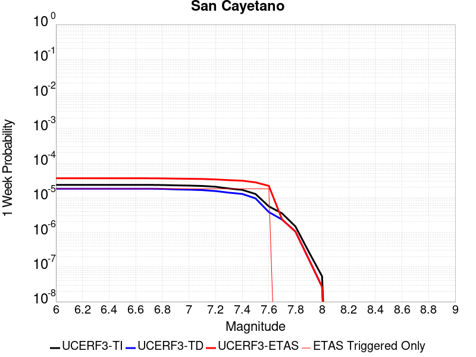 | 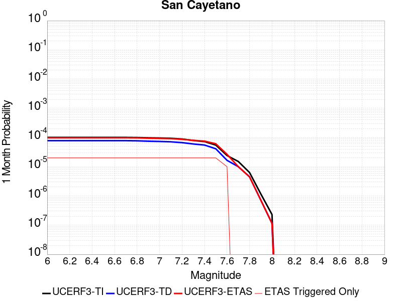 | 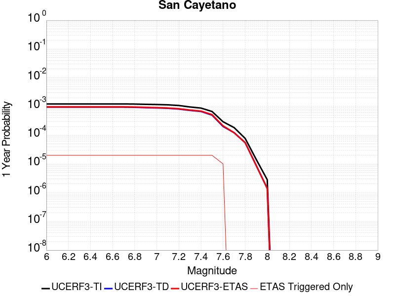 | 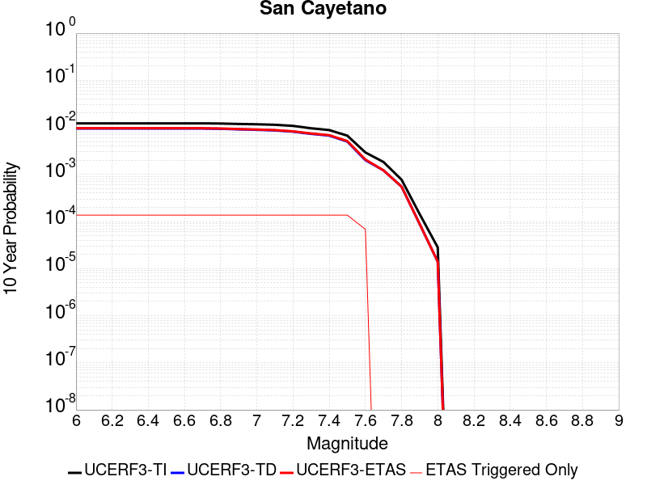 |

| Magnitude | 1 wk TI Prob | 1 wk TD Prob | 1 wk ETAS Prob | 1 wk ETAS/TD Gain | 1 wk ETAS Triggered Only | 1 mo TI Prob | 1 mo TD Prob | 1 mo ETAS Prob | 1 mo ETAS/TD Gain | 1 mo ETAS Triggered Only | 1 yr TI Prob | 1 yr TD Prob | 1 yr ETAS Prob | 1 yr ETAS/TD Gain | 1 yr ETAS Triggered Only | 10 yr TI Prob | 10 yr TD Prob | 10 yr ETAS Prob | 10 yr ETAS/TD Gain | 10 yr ETAS Triggered Only |
|-----|-----|-----|-----|-----|-----|-----|-----|-----|-----|-----|-----|-----|-----|-----|-----|-----|-----|-----|-----|-----|
| 6.0 | 2.3476267E-5 | 1.816928E-5 | 3.8168917E-5 | 2.1007392 | 2.0E-5 | 1.0060869E-4 | 7.786603E-5 | 9.7864475E-5 | 1.2568314 | 2.0E-5 | 0.0012242225 | 9.476103E-4 | 9.6759136E-4 | 1.0210857 | 2.0E-5 | 0.012175002 | 0.009436584 | 0.009496018 | 1.0062982 | 6.0E-5 |
| 6.1 | 2.3476267E-5 | 1.816928E-5 | 3.8168917E-5 | 2.1007392 | 2.0E-5 | 1.0060869E-4 | 7.786603E-5 | 9.7864475E-5 | 1.2568314 | 2.0E-5 | 0.0012242225 | 9.476103E-4 | 9.6759136E-4 | 1.0210857 | 2.0E-5 | 0.012175002 | 0.009436584 | 0.009496018 | 1.0062982 | 6.0E-5 |
| 6.2 | 2.3476267E-5 | 1.816928E-5 | 3.8168917E-5 | 2.1007392 | 2.0E-5 | 1.0060869E-4 | 7.786603E-5 | 9.7864475E-5 | 1.2568314 | 2.0E-5 | 0.0012242225 | 9.476103E-4 | 9.6759136E-4 | 1.0210857 | 2.0E-5 | 0.012175002 | 0.009436584 | 0.009496018 | 1.0062982 | 6.0E-5 |
| 6.3 | 2.3476267E-5 | 1.816928E-5 | 3.8168917E-5 | 2.1007392 | 2.0E-5 | 1.0060869E-4 | 7.786603E-5 | 9.7864475E-5 | 1.2568314 | 2.0E-5 | 0.0012242225 | 9.476103E-4 | 9.6759136E-4 | 1.0210857 | 2.0E-5 | 0.012175002 | 0.009436584 | 0.009496018 | 1.0062982 | 6.0E-5 |
| 6.4 | 2.3476267E-5 | 1.816928E-5 | 3.8168917E-5 | 2.1007392 | 2.0E-5 | 1.0060869E-4 | 7.786603E-5 | 9.7864475E-5 | 1.2568314 | 2.0E-5 | 0.0012242225 | 9.476103E-4 | 9.6759136E-4 | 1.0210857 | 2.0E-5 | 0.012175002 | 0.009436584 | 0.009496018 | 1.0062982 | 6.0E-5 |
| 6.5 | 2.3476267E-5 | 1.816928E-5 | 3.8168917E-5 | 2.1007392 | 2.0E-5 | 1.0060869E-4 | 7.786603E-5 | 9.7864475E-5 | 1.2568314 | 2.0E-5 | 0.0012242225 | 9.476103E-4 | 9.6759136E-4 | 1.0210857 | 2.0E-5 | 0.012175002 | 0.009436584 | 0.009496018 | 1.0062982 | 6.0E-5 |
| 6.6 | 2.3476267E-5 | 1.816928E-5 | 3.8168917E-5 | 2.1007392 | 2.0E-5 | 1.0060869E-4 | 7.786603E-5 | 9.7864475E-5 | 1.2568314 | 2.0E-5 | 0.0012242225 | 9.476103E-4 | 9.6759136E-4 | 1.0210857 | 2.0E-5 | 0.012175002 | 0.009436584 | 0.009496018 | 1.0062982 | 6.0E-5 |
| 6.7 | 2.3476267E-5 | 1.816928E-5 | 3.8168917E-5 | 2.1007392 | 2.0E-5 | 1.0060869E-4 | 7.786603E-5 | 9.7864475E-5 | 1.2568314 | 2.0E-5 | 0.0012242225 | 9.476103E-4 | 9.6759136E-4 | 1.0210857 | 2.0E-5 | 0.012175002 | 0.009436584 | 0.009496018 | 1.0062982 | 6.0E-5 |
| 6.8 | 2.3241924E-5 | 1.7936987E-5 | 3.793663E-5 | 2.1149945 | 2.0E-5 | 9.960445E-5 | 7.687056E-5 | 9.686902E-5 | 1.2601576 | 2.0E-5 | 0.0012120095 | 9.3550084E-4 | 9.5548213E-4 | 1.021359 | 2.0E-5 | 0.012054204 | 0.009316482 | 0.009375923 | 1.0063802 | 6.0E-5 |
| 6.9 | 2.2761007E-5 | 1.7432423E-5 | 3.7432073E-5 | 2.1472673 | 2.0E-5 | 9.7543525E-5 | 7.470827E-5 | 9.4706775E-5 | 1.267688 | 2.0E-5 | 0.0011869454 | 9.09197E-4 | 9.2917884E-4 | 1.0219774 | 2.0E-5 | 0.011806256 | 0.009055603 | 0.00911506 | 1.0065657 | 6.0E-5 |
| 7.0 | 2.240283E-5 | 1.7066168E-5 | 3.7065827E-5 | 2.1718893 | 2.0E-5 | 9.600859E-5 | 7.313869E-5 | 9.313723E-5 | 1.2734331 | 2.0E-5 | 0.0011682777 | 8.9010317E-4 | 9.100854E-4 | 1.0224493 | 2.0E-5 | 0.011621549 | 0.008866196 | 0.008925663 | 1.0067073 | 6.0E-5 |
| 7.1 | 2.1871154E-5 | 1.6586018E-5 | 3.6585687E-5 | 2.2058148 | 2.0E-5 | 9.373015E-5 | 7.108101E-5 | 9.107959E-5 | 1.2813491 | 2.0E-5 | 0.0011405671 | 8.6507114E-4 | 8.850538E-4 | 1.0230995 | 2.0E-5 | 0.011347309 | 0.008617838 | 0.0086773215 | 1.0069023 | 6.0E-5 |
| 7.2 | 2.0714133E-5 | 1.5564561E-5 | 3.5564248E-5 | 2.2849505 | 2.0E-5 | 8.8771834E-5 | 6.670357E-5 | 8.670224E-5 | 1.299814 | 2.0E-5 | 0.0010802611 | 8.1181666E-4 | 8.3180045E-4 | 1.0246161 | 2.0E-5 | 0.010750249 | 0.008089285 | 0.008138881 | 1.006131 | 5.0E-5 |
| 7.3 | 1.8408395E-5 | 1.3996864E-5 | 3.3996585E-5 | 2.4288714 | 2.0E-5 | 7.8890735E-5 | 5.99852E-5 | 7.9984E-5 | 1.3333956 | 2.0E-5 | 9.600714E-4 | 7.300781E-4 | 7.500635E-4 | 1.0273744 | 2.0E-5 | 0.009559342 | 0.0072775153 | 0.0073271515 | 1.0068204 | 5.0E-5 |
| 7.4 | 1.6856795E-5 | 1.28500815E-5 | 3.2849824E-5 | 2.5563905 | 2.0E-5 | 7.2241404E-5 | 5.5070628E-5 | 7.5069525E-5 | 1.36315 | 2.0E-5 | 8.7918417E-4 | 6.7028153E-4 | 6.902681E-4 | 1.0298182 | 2.0E-5 | 0.00875714 | 0.0066832784 | 0.0067329444 | 1.0074314 | 5.0E-5 |
| 7.5 | 1.2822778E-5 | 9.577542E-6 | 2.957735E-5 | 3.0881984 | 2.0E-5 | 5.495361E-5 | 4.1045972E-5 | 6.104515E-5 | 1.4872385 | 2.0E-5 | 6.688548E-4 | 4.996217E-4 | 5.196117E-4 | 1.0400103 | 2.0E-5 | 0.006668452 | 0.0049851555 | 0.005024956 | 1.0079838 | 4.0E-5 |
| 7.6 | 5.6272684E-6 | 3.854903E-6 | 1.3854865E-5 | 3.594089 | 1.0E-5 | 2.4116642E-5 | 1.652091E-5 | 2.6520744E-5 | 1.6052836 | 1.0E-5 | 2.9358055E-4 | 2.0112359E-4 | 2.1112159E-4 | 1.0497106 | 1.0E-5 | 0.0029319301 | 0.0020094267 | 0.0020194065 | 1.0049665 | 1.0E-5 |
| 7.7 | 3.5261346E-6 | 2.3407013E-6 | 2.3407013E-6 | 1.0 | 0.0 | 1.5111918E-5 | 1.0031539E-5 | 1.0031539E-5 | 1.0 | 0.0 | 1.8397206E-4 | 1.2212721E-4 | 1.2212721E-4 | 1.0 | 0.0 | 0.0018381984 | 0.0012206084 | 0.0012206084 | 1.0 | 0.0 |
| 7.8 | 1.4826929E-6 | 1.056428E-6 | 1.056428E-6 | 1.0 | 0.0 | 6.354383E-6 | 4.5275406E-6 | 4.5275406E-6 | 1.0 | 0.0 | 7.736187E-5 | 5.5121433E-5 | 5.5121433E-5 | 1.0 | 0.0 | 7.733494E-4 | 5.5107963E-4 | 5.5107963E-4 | 1.0 | 0.0 |
| 7.9 | 2.7568166E-7 | 1.6978244E-7 | 1.6978244E-7 | 1.0 | 0.0 | 1.1814923E-6 | 7.2763885E-7 | 7.2763885E-7 | 1.0 | 0.0 | 1.4384574E-5 | 8.858967E-6 | 8.858967E-6 | 1.0 | 0.0 | 1.4383643E-4 | 8.8586174E-5 | 8.8586174E-5 | 1.0 | 0.0 |
| 8.0 | 5.407832E-8 | 2.6887697E-8 | 2.6887697E-8 | 1.0 | 0.0 | 2.3176422E-7 | 1.15232986E-7 | 1.15232986E-7 | 1.0 | 0.0 | 2.8217257E-6 | 1.4029607E-6 | 1.4029607E-6 | 1.0 | 0.0 | 2.8216898E-5 | 1.4029522E-5 | 1.4029522E-5 | 1.0 | 0.0 |

## San Jacinto (Clark) rev
*[(top)](#table-of-contents)*

| 1 Week | 1 Month | 1 Year | 10 Year |
|-----|-----|-----|-----|
|  | 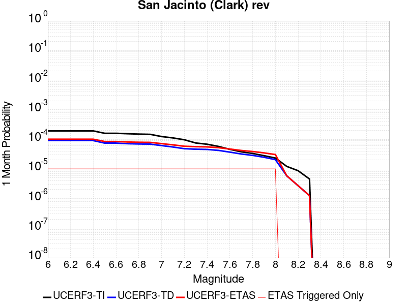 | 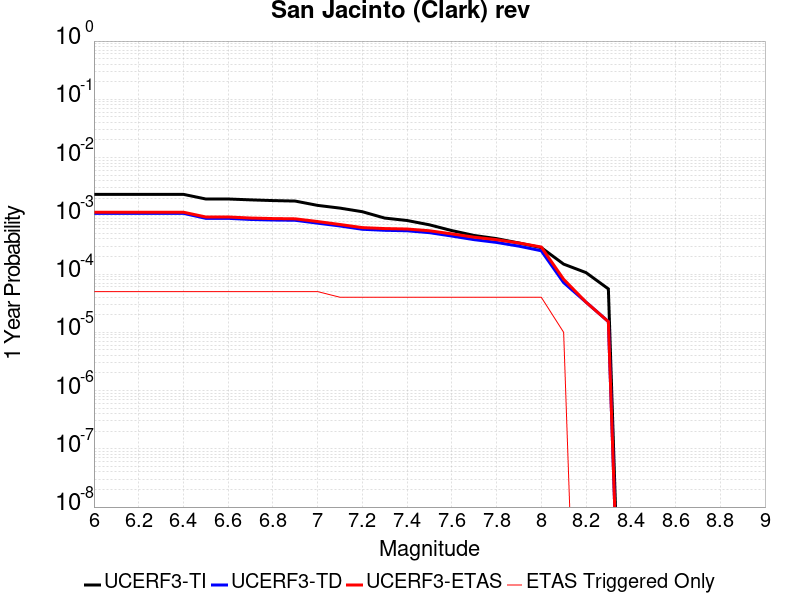 | 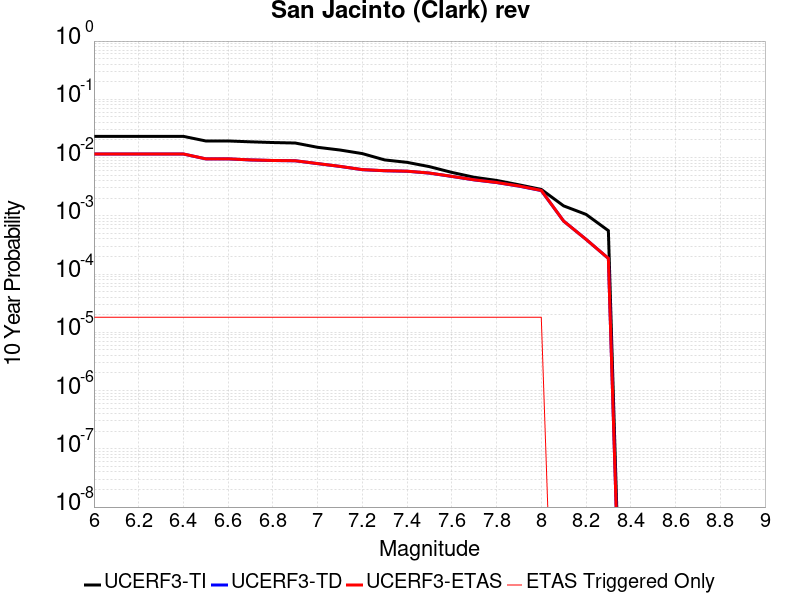 |

| Magnitude | 1 wk TI Prob | 1 wk TD Prob | 1 wk ETAS Prob | 1 wk ETAS/TD Gain | 1 wk ETAS Triggered Only | 1 mo TI Prob | 1 mo TD Prob | 1 mo ETAS Prob | 1 mo ETAS/TD Gain | 1 mo ETAS Triggered Only | 1 yr TI Prob | 1 yr TD Prob | 1 yr ETAS Prob | 1 yr ETAS/TD Gain | 1 yr ETAS Triggered Only | 10 yr TI Prob | 10 yr TD Prob | 10 yr ETAS Prob | 10 yr ETAS/TD Gain | 10 yr ETAS Triggered Only |
|-----|-----|-----|-----|-----|-----|-----|-----|-----|-----|-----|-----|-----|-----|-----|-----|-----|-----|-----|-----|-----|
| 6.0 | 4.482615E-5 | 2.1154196E-5 | 2.1154196E-5 | 1.0 | 0.0 | 1.9209793E-4 | 9.065773E-5 | 1.0065683E-4 | 1.1102949 | 1.0E-5 | 0.0023362834 | 0.0011032083 | 0.0011531531 | 1.0452724 | 5.0E-5 | 0.02311874 | 0.011503847 | 0.011553272 | 1.0042964 | 5.0E-5 |
| 6.1 | 4.482615E-5 | 2.1154196E-5 | 2.1154196E-5 | 1.0 | 0.0 | 1.9209793E-4 | 9.065773E-5 | 1.0065683E-4 | 1.1102949 | 1.0E-5 | 0.0023362834 | 0.0011032083 | 0.0011531531 | 1.0452724 | 5.0E-5 | 0.02311874 | 0.011503847 | 0.011553272 | 1.0042964 | 5.0E-5 |
| 6.2 | 4.482615E-5 | 2.1154196E-5 | 2.1154196E-5 | 1.0 | 0.0 | 1.9209793E-4 | 9.065773E-5 | 1.0065683E-4 | 1.1102949 | 1.0E-5 | 0.0023362834 | 0.0011032083 | 0.0011531531 | 1.0452724 | 5.0E-5 | 0.02311874 | 0.011503847 | 0.011553272 | 1.0042964 | 5.0E-5 |
| 6.3 | 4.482615E-5 | 2.1154196E-5 | 2.1154196E-5 | 1.0 | 0.0 | 1.9209793E-4 | 9.065773E-5 | 1.0065683E-4 | 1.1102949 | 1.0E-5 | 0.0023362834 | 0.0011032083 | 0.0011531531 | 1.0452724 | 5.0E-5 | 0.02311874 | 0.011503847 | 0.011553272 | 1.0042964 | 5.0E-5 |
| 6.4 | 4.482615E-5 | 2.1154196E-5 | 2.1154196E-5 | 1.0 | 0.0 | 1.9209793E-4 | 9.065773E-5 | 1.0065683E-4 | 1.1102949 | 1.0E-5 | 0.0023362834 | 0.0011032083 | 0.0011531531 | 1.0452724 | 5.0E-5 | 0.02311874 | 0.011503847 | 0.011553272 | 1.0042964 | 5.0E-5 |
| 6.5 | 3.7294863E-5 | 1.7356087E-5 | 1.7356087E-5 | 1.0 | 0.0 | 1.5982533E-4 | 7.438113E-5 | 8.4380394E-5 | 1.1344327 | 1.0E-5 | 0.0019441366 | 9.052186E-4 | 9.551733E-4 | 1.0551853 | 5.0E-5 | 0.01927216 | 0.0094941035 | 0.009543628 | 1.0052165 | 5.0E-5 |
| 6.6 | 3.7294863E-5 | 1.7356087E-5 | 1.7356087E-5 | 1.0 | 0.0 | 1.5982533E-4 | 7.438113E-5 | 8.4380394E-5 | 1.1344327 | 1.0E-5 | 0.0019441366 | 9.052186E-4 | 9.551733E-4 | 1.0551853 | 5.0E-5 | 0.01927216 | 0.0094941035 | 0.009543628 | 1.0052165 | 5.0E-5 |
| 6.7 | 3.6039248E-5 | 1.6604314E-5 | 1.6604314E-5 | 1.0 | 0.0 | 1.5444479E-4 | 7.1159426E-5 | 8.115871E-5 | 1.1405195 | 1.0E-5 | 0.0018787434 | 8.6602574E-4 | 9.1598247E-4 | 1.057685 | 5.0E-5 | 0.01862939 | 0.009096047 | 0.009145592 | 1.0054469 | 5.0E-5 |
| 6.8 | 3.5031844E-5 | 1.6232942E-5 | 1.6232942E-5 | 1.0 | 0.0 | 1.5012783E-4 | 6.956792E-5 | 7.9567224E-5 | 1.1437345 | 1.0E-5 | 0.0018262739 | 8.4666436E-4 | 8.96622E-4 | 1.0590053 | 5.0E-5 | 0.01811338 | 0.008895969 | 0.008945525 | 1.0055705 | 5.0E-5 |
| 6.9 | 3.435112E-5 | 1.6063195E-5 | 1.6063195E-5 | 1.0 | 0.0 | 1.4721078E-4 | 6.884047E-5 | 7.883978E-5 | 1.1452534 | 1.0E-5 | 0.0017908178 | 8.3781447E-4 | 8.877726E-4 | 1.0596291 | 5.0E-5 | 0.017764548 | 0.008804181 | 0.00885374 | 1.0056291 | 5.0E-5 |
| 7.0 | 2.8959772E-5 | 1.4336745E-5 | 1.4336745E-5 | 1.0 | 0.0 | 1.241074E-4 | 6.144176E-5 | 7.144115E-5 | 1.1627457 | 1.0E-5 | 0.0015099603 | 7.477995E-4 | 7.977621E-4 | 1.0668129 | 5.0E-5 | 0.014997416 | 0.007868037 | 0.007917643 | 1.0063049 | 5.0E-5 |
| 7.1 | 2.6002877E-5 | 1.2829002E-5 | 1.2829002E-5 | 1.0 | 0.0 | 1.11436144E-4 | 5.498029E-5 | 6.497974E-5 | 1.1818733 | 1.0E-5 | 0.0013558907 | 6.691816E-4 | 7.091548E-4 | 1.0597345 | 4.0E-5 | 0.013476475 | 0.0070465137 | 0.007086232 | 1.0056366 | 4.0E-5 |
| 7.2 | 2.2544838E-5 | 1.1262543E-5 | 1.1262543E-5 | 1.0 | 0.0 | 9.661716E-5 | 4.8267157E-5 | 5.8266676E-5 | 1.2071702 | 1.0E-5 | 0.001175679 | 5.874956E-4 | 6.274721E-4 | 1.0680456 | 4.0E-5 | 0.011694785 | 0.0061927503 | 0.0062325024 | 1.0064192 | 4.0E-5 |
| 7.3 | 1.75334E-5 | 1.0811715E-5 | 1.0811715E-5 | 1.0 | 0.0 | 7.514098E-5 | 4.6335106E-5 | 5.633464E-5 | 1.2158091 | 1.0E-5 | 9.144575E-4 | 5.6398526E-4 | 6.039627E-4 | 1.0708839 | 4.0E-5 | 0.009107036 | 0.0059337732 | 0.005973536 | 1.0067011 | 4.0E-5 |
| 7.4 | 1.5924552E-5 | 1.0611516E-5 | 1.0611516E-5 | 1.0 | 0.0 | 6.82463E-5 | 4.547714E-5 | 5.547669E-5 | 1.2198807 | 1.0E-5 | 8.305819E-4 | 5.535449E-4 | 5.935228E-4 | 1.0722215 | 4.0E-5 | 0.008274844 | 0.0058210334 | 0.0058608004 | 1.0068316 | 4.0E-5 |
| 7.5 | 1.3428931E-5 | 9.8519E-6 | 9.8519E-6 | 1.0 | 0.0 | 5.7551293E-5 | 4.2221753E-5 | 5.222133E-5 | 1.2368348 | 1.0E-5 | 7.004617E-4 | 5.1392964E-4 | 5.539091E-4 | 1.0777917 | 4.0E-5 | 0.006982579 | 0.0054066023 | 0.005446386 | 1.0073583 | 4.0E-5 |
| 7.6 | 1.0688787E-5 | 8.614839E-6 | 8.614839E-6 | 1.0 | 0.0 | 4.5808283E-5 | 3.692022E-5 | 4.6919853E-5 | 1.2708442 | 1.0E-5 | 5.5757316E-4 | 4.4941145E-4 | 4.893935E-4 | 1.0889653 | 4.0E-5 | 0.005561762 | 0.0047416524 | 0.0047814627 | 1.0083959 | 4.0E-5 |
| 7.7 | 8.81236E-6 | 7.4680274E-6 | 7.4680274E-6 | 1.0 | 0.0 | 3.776671E-5 | 3.2005442E-5 | 4.2005122E-5 | 1.3124368 | 1.0E-5 | 4.597127E-4 | 3.8959677E-4 | 4.2958118E-4 | 1.1026303 | 4.0E-5 | 0.0045876284 | 0.0041346536 | 0.004174488 | 1.0096344 | 4.0E-5 |
| 7.8 | 7.780431E-6 | 6.696579E-6 | 6.696579E-6 | 1.0 | 0.0 | 3.3344273E-5 | 2.8699309E-5 | 3.869902E-5 | 1.3484304 | 1.0E-5 | 4.0589093E-4 | 3.4935825E-4 | 3.893443E-4 | 1.1144557 | 4.0E-5 | 0.0040515037 | 0.0037227906 | 0.0037626417 | 1.0107046 | 4.0E-5 |
| 7.9 | 6.5437994E-6 | 5.780382E-6 | 5.780382E-6 | 1.0 | 0.0 | 2.8044553E-5 | 2.477283E-5 | 3.4772584E-5 | 1.403658 | 1.0E-5 | 3.4138895E-4 | 3.0156763E-4 | 3.4155557E-4 | 1.1326002 | 4.0E-5 | 0.0034086495 | 0.0032344845 | 0.003274355 | 1.0123267 | 4.0E-5 |
| 8.0 | 5.4488164E-6 | 4.8133406E-6 | 4.8133406E-6 | 1.0 | 0.0 | 2.3351862E-5 | 2.062844E-5 | 3.0628235E-5 | 1.4847577 | 1.0E-5 | 2.8427184E-4 | 2.5112246E-4 | 2.9111243E-4 | 1.1592448 | 4.0E-5 | 0.0028390845 | 0.002710839 | 0.0027507306 | 1.0147156 | 4.0E-5 |
| 8.1 | 2.8397242E-6 | 1.3670389E-6 | 1.3670389E-6 | 1.0 | 0.0 | 1.217019E-5 | 5.858725E-6 | 5.858725E-6 | 1.0 | 0.0 | 1.4816198E-4 | 7.132765E-5 | 8.132694E-5 | 1.1401881 | 1.0E-5 | 0.0014806325 | 8.115382E-4 | 8.2153006E-4 | 1.0123123 | 1.0E-5 |
| 8.2 | 2.030244E-6 | 6.318974E-7 | 6.318974E-7 | 1.0 | 0.0 | 8.701017E-6 | 2.708129E-6 | 2.708129E-6 | 1.0 | 0.0 | 1.05929736E-4 | 3.2970976E-5 | 3.2970976E-5 | 1.0 | 0.0 | 0.0010587925 | 3.9486602E-4 | 3.9486602E-4 | 1.0 | 0.0 |
| 8.3 | 1.0659804E-6 | 2.9250086E-7 | 2.9250086E-7 | 1.0 | 0.0 | 4.568479E-6 | 1.2535745E-6 | 1.2535745E-6 | 1.0 | 0.0 | 5.5619817E-5 | 1.5262167E-5 | 1.5262167E-5 | 1.0 | 0.0 | 5.5605895E-4 | 1.8566217E-4 | 1.8566217E-4 | 1.0 | 0.0 |

## San Diego Trough north alt1
*[(top)](#table-of-contents)*

| 1 Week | 1 Month | 1 Year | 10 Year |
|-----|-----|-----|-----|
| 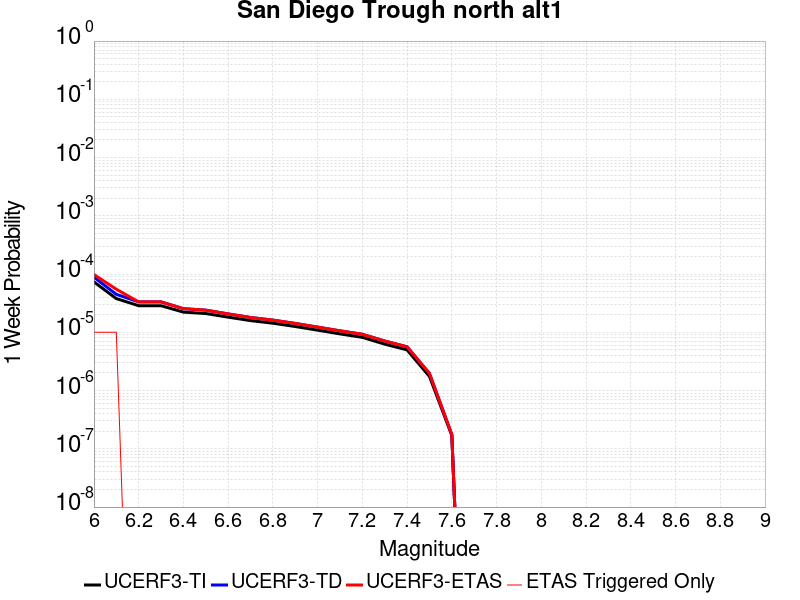 | 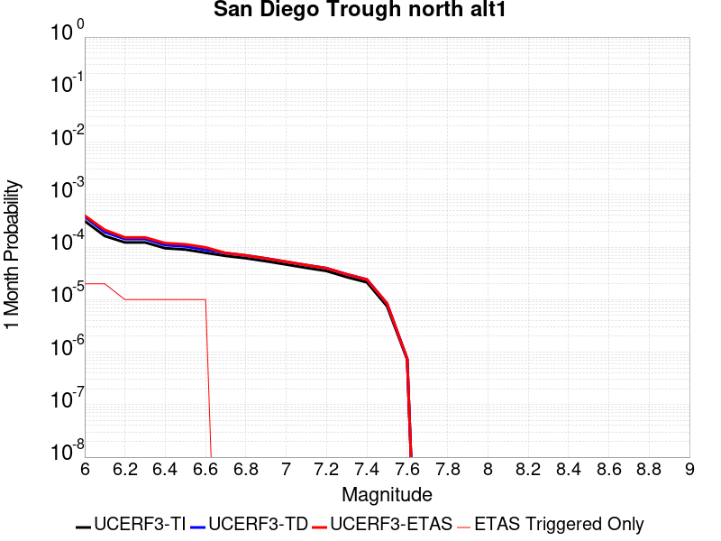 | 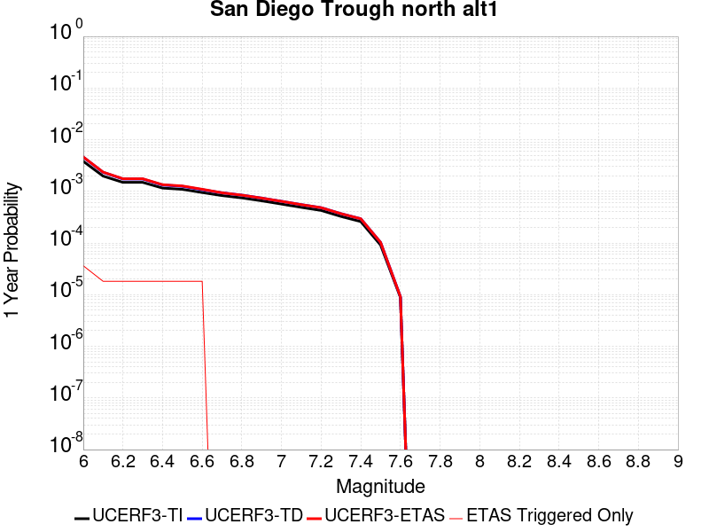 | 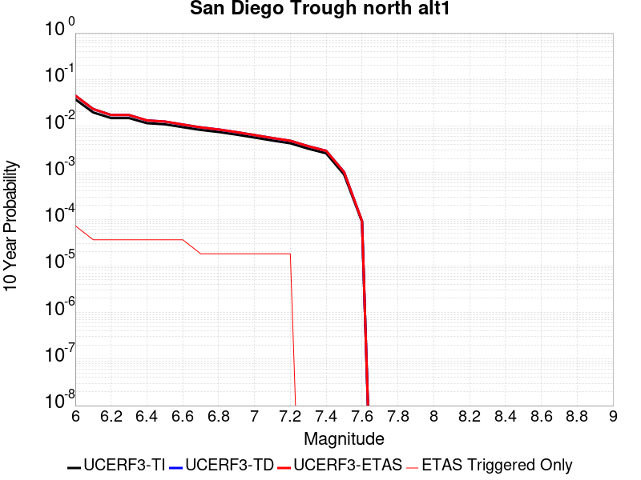 |

| Magnitude | 1 wk TI Prob | 1 wk TD Prob | 1 wk ETAS Prob | 1 wk ETAS/TD Gain | 1 wk ETAS Triggered Only | 1 mo TI Prob | 1 mo TD Prob | 1 mo ETAS Prob | 1 mo ETAS/TD Gain | 1 mo ETAS Triggered Only | 1 yr TI Prob | 1 yr TD Prob | 1 yr ETAS Prob | 1 yr ETAS/TD Gain | 1 yr ETAS Triggered Only | 10 yr TI Prob | 10 yr TD Prob | 10 yr ETAS Prob | 10 yr ETAS/TD Gain | 10 yr ETAS Triggered Only |
|-----|-----|-----|-----|-----|-----|-----|-----|-----|-----|-----|-----|-----|-----|-----|-----|-----|-----|-----|-----|-----|
| 6.0 | 7.329252E-5 | 8.821093E-5 | 9.821005E-5 | 1.1133547 | 1.0E-5 | 3.14073E-4 | 3.7799572E-4 | 3.9798816E-4 | 1.0528907 | 2.0E-5 | 0.0038171355 | 0.004593027 | 0.004622889 | 1.0065017 | 3.0E-5 | 0.03752231 | 0.045044992 | 0.04509274 | 1.00106 | 5.0E-5 |
| 6.1 | 3.7940346E-5 | 4.4885E-5 | 5.4884553E-5 | 1.2227815 | 1.0E-5 | 1.6259136E-4 | 1.9235066E-4 | 2.1234681E-4 | 1.1039568 | 2.0E-5 | 0.0019777524 | 0.0023394432 | 0.0023593963 | 1.0085291 | 2.0E-5 | 0.019602431 | 0.023156688 | 0.023185993 | 1.0012655 | 3.0E-5 |
| 6.2 | 2.8645263E-5 | 3.329678E-5 | 3.329678E-5 | 1.0 | 0.0 | 1.2275964E-4 | 1.4269284E-4 | 1.5269141E-4 | 1.0700706 | 1.0E-5 | 0.0014935739 | 0.0017359189 | 0.0017459015 | 1.0057507 | 1.0E-5 | 0.0148357535 | 0.017226247 | 0.017245904 | 1.0011411 | 2.0E-5 |
| 6.3 | 2.8645263E-5 | 3.329678E-5 | 3.329678E-5 | 1.0 | 0.0 | 1.2275964E-4 | 1.4269284E-4 | 1.5269141E-4 | 1.0700706 | 1.0E-5 | 0.0014935739 | 0.0017359189 | 0.0017459015 | 1.0057507 | 1.0E-5 | 0.0148357535 | 0.017226247 | 0.017245904 | 1.0011411 | 2.0E-5 |
| 6.4 | 2.2204576E-5 | 2.5448318E-5 | 2.5448318E-5 | 1.0 | 0.0 | 9.5159E-5 | 1.0905972E-4 | 1.19058626E-4 | 1.0916829 | 1.0E-5 | 0.001157945 | 0.0013270034 | 0.00133699 | 1.0075258 | 1.0E-5 | 0.011519298 | 0.013191955 | 0.013211691 | 1.0014961 | 2.0E-5 |
| 6.5 | 2.1004838E-5 | 2.4024694E-5 | 2.4024694E-5 | 1.0 | 0.0 | 9.0017624E-5 | 1.0295896E-4 | 1.1295793E-4 | 1.0971161 | 1.0E-5 | 0.0010954136 | 0.0012528138 | 0.0012628014 | 1.007972 | 1.0E-5 | 0.010900296 | 0.012458589 | 0.0124783395 | 1.0015854 | 2.0E-5 |
| 6.6 | 1.820557E-5 | 2.0704787E-5 | 2.0704787E-5 | 1.0 | 0.0 | 7.802154E-5 | 8.873181E-5 | 9.8730925E-5 | 1.1126891 | 1.0E-5 | 9.4949827E-4 | 0.0010797799 | 0.0010897691 | 1.0092511 | 1.0E-5 | 0.009454516 | 0.010746004 | 0.010765789 | 1.0018412 | 2.0E-5 |
| 6.7 | 1.5884485E-5 | 1.7983646E-5 | 1.7983646E-5 | 1.0 | 0.0 | 6.807459E-5 | 7.707051E-5 | 7.707051E-5 | 1.0 | 0.0 | 8.284929E-4 | 9.3793223E-4 | 9.3793223E-4 | 1.0 | 0.0 | 0.008254109 | 0.009340104 | 0.00935001 | 1.0010606 | 1.0E-5 |
| 6.8 | 1.4331171E-5 | 1.6201066E-5 | 1.6201066E-5 | 1.0 | 0.0 | 6.141786E-5 | 6.94313E-5 | 6.94313E-5 | 1.0 | 0.0 | 7.4750587E-4 | 8.450002E-4 | 8.450002E-4 | 1.0 | 0.0 | 0.0074499645 | 0.008418139 | 0.008428055 | 1.0011779 | 1.0E-5 |
| 6.9 | 1.2574203E-5 | 1.4205835E-5 | 1.4205835E-5 | 1.0 | 0.0 | 5.3888325E-5 | 6.0880735E-5 | 6.0880735E-5 | 1.0 | 0.0 | 6.558929E-4 | 7.409723E-4 | 7.409723E-4 | 1.0 | 0.0 | 0.0065396037 | 0.007385203 | 0.0073951297 | 1.0013441 | 1.0E-5 |
| 7.0 | 1.0883844E-5 | 1.2289262E-5 | 1.2289262E-5 | 1.0 | 0.0 | 4.664421E-5 | 5.2667205E-5 | 5.2667205E-5 | 1.0 | 0.0 | 5.677453E-4 | 6.4103556E-4 | 6.4103556E-4 | 1.0 | 0.0 | 0.00566297 | 0.006391993 | 0.0064019286 | 1.0015545 | 1.0E-5 |
| 7.1 | 9.393088E-6 | 1.060702E-5 | 1.060702E-5 | 1.0 | 0.0 | 4.025547E-5 | 4.545787E-5 | 4.545787E-5 | 1.0 | 0.0 | 4.900001E-4 | 5.533098E-4 | 5.533098E-4 | 1.0 | 0.0 | 0.0048892107 | 0.005519418 | 0.0055293627 | 1.0018017 | 1.0E-5 |
| 7.2 | 8.190791E-6 | 9.258625E-6 | 9.258625E-6 | 1.0 | 0.0 | 3.510292E-5 | 3.9679224E-5 | 3.9679224E-5 | 1.0 | 0.0 | 4.2729423E-4 | 4.8298817E-4 | 4.8298817E-4 | 1.0 | 0.0 | 0.0042647356 | 0.004819465 | 0.0048294165 | 1.002065 | 1.0E-5 |
| 7.3 | 6.268162E-6 | 7.089716E-6 | 7.089716E-6 | 1.0 | 0.0 | 2.6863276E-5 | 3.0384144E-5 | 3.0384144E-5 | 1.0 | 0.0 | 3.2701128E-4 | 3.6986457E-4 | 3.6986457E-4 | 1.0 | 0.0 | 0.003265305 | 0.003692536 | 0.003692536 | 1.0 | 0.0 |
| 7.4 | 4.985186E-6 | 5.6426816E-6 | 5.6426816E-6 | 1.0 | 0.0 | 2.1364907E-5 | 2.4182698E-5 | 2.4182698E-5 | 1.0 | 0.0 | 2.600867E-4 | 2.9438498E-4 | 2.9438498E-4 | 1.0 | 0.0 | 0.002597825 | 0.0029399914 | 0.0029399914 | 1.0 | 0.0 |
| 7.5 | 1.7489613E-6 | 1.969678E-6 | 1.969678E-6 | 1.0 | 0.0 | 7.495527E-6 | 8.4414505E-6 | 8.4414505E-6 | 1.0 | 0.0 | 9.125422E-5 | 1.02770035E-4 | 1.02770035E-4 | 1.0 | 0.0 | 9.1216754E-4 | 0.0010272472 | 0.0010272472 | 1.0 | 0.0 |
| 7.6 | 1.6988751E-7 | 1.7533823E-7 | 1.7533823E-7 | 1.0 | 0.0 | 7.2808916E-7 | 7.5144936E-7 | 7.5144936E-7 | 1.0 | 0.0 | 8.864449E-6 | 9.14886E-6 | 9.14886E-6 | 1.0 | 0.0 | 8.8640954E-5 | 9.1485024E-5 | 9.1485024E-5 | 1.0 | 0.0 |

## Hosgri
*[(top)](#table-of-contents)*

| 1 Week | 1 Month | 1 Year | 10 Year |
|-----|-----|-----|-----|
| 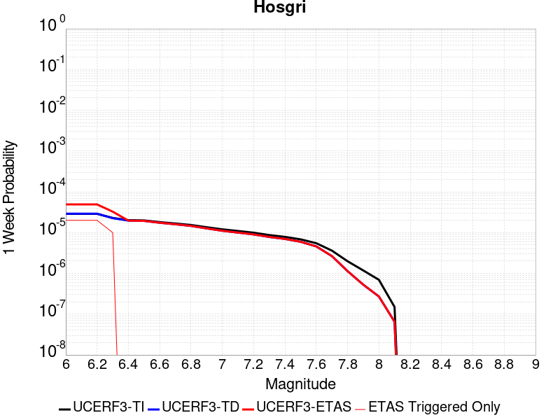 | 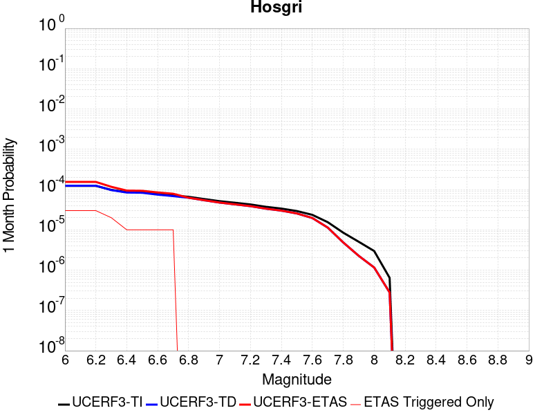 | 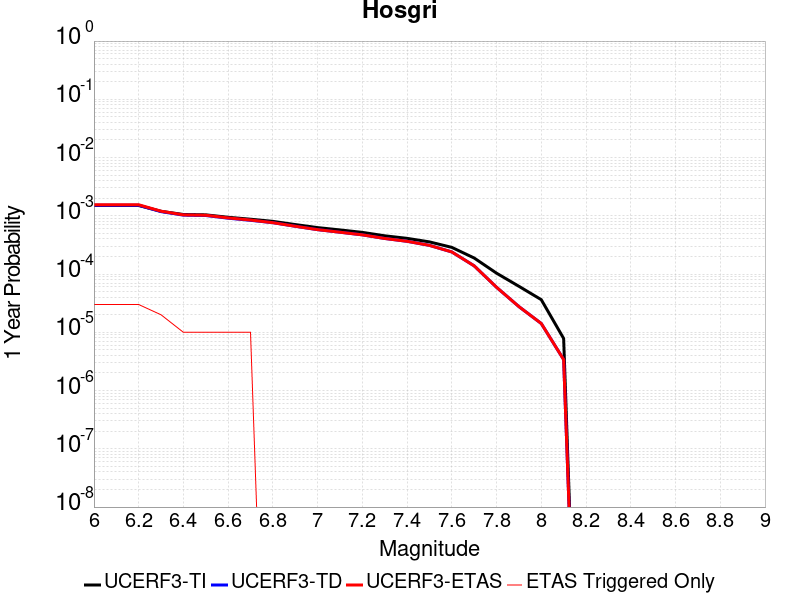 | 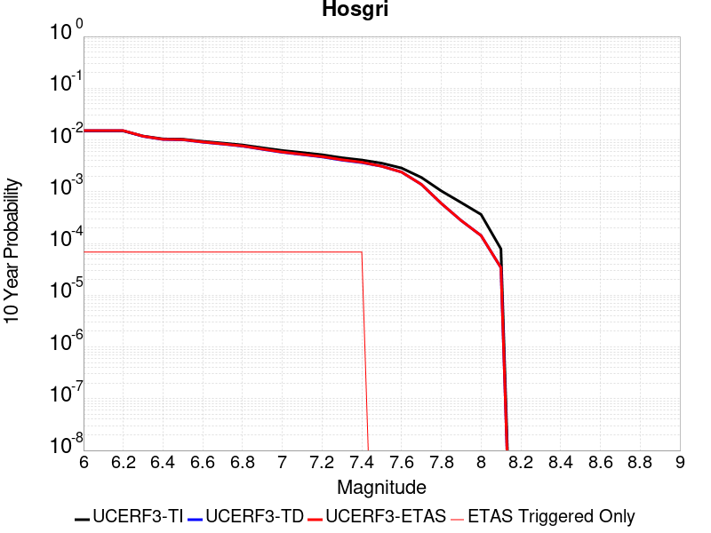 |

| Magnitude | 1 wk TI Prob | 1 wk TD Prob | 1 wk ETAS Prob | 1 wk ETAS/TD Gain | 1 wk ETAS Triggered Only | 1 mo TI Prob | 1 mo TD Prob | 1 mo ETAS Prob | 1 mo ETAS/TD Gain | 1 mo ETAS Triggered Only | 1 yr TI Prob | 1 yr TD Prob | 1 yr ETAS Prob | 1 yr ETAS/TD Gain | 1 yr ETAS Triggered Only | 10 yr TI Prob | 10 yr TD Prob | 10 yr ETAS Prob | 10 yr ETAS/TD Gain | 10 yr ETAS Triggered Only |
|-----|-----|-----|-----|-----|-----|-----|-----|-----|-----|-----|-----|-----|-----|-----|-----|-----|-----|-----|-----|-----|
| 6.0 | 2.883978E-5 | 2.9128416E-5 | 4.9127833E-5 | 1.6865947 | 2.0E-5 | 1.235932E-4 | 1.2483024E-4 | 1.548265E-4 | 1.2402964 | 3.0E-5 | 0.0015037085 | 0.001518776 | 0.0015487304 | 1.0197227 | 3.0E-5 | 0.01493574 | 0.01508774 | 0.015136985 | 1.003264 | 5.0E-5 |
| 6.1 | 2.883978E-5 | 2.9128416E-5 | 4.9127833E-5 | 1.6865947 | 2.0E-5 | 1.235932E-4 | 1.2483024E-4 | 1.548265E-4 | 1.2402964 | 3.0E-5 | 0.0015037085 | 0.001518776 | 0.0015487304 | 1.0197227 | 3.0E-5 | 0.01493574 | 0.01508774 | 0.015136985 | 1.003264 | 5.0E-5 |
| 6.2 | 2.883978E-5 | 2.9128416E-5 | 4.9127833E-5 | 1.6865947 | 2.0E-5 | 1.235932E-4 | 1.2483024E-4 | 1.548265E-4 | 1.2402964 | 3.0E-5 | 0.0015037085 | 0.001518776 | 0.0015487304 | 1.0197227 | 3.0E-5 | 0.01493574 | 0.01508774 | 0.015136985 | 1.003264 | 5.0E-5 |
| 6.3 | 2.2914428E-5 | 2.2641969E-5 | 3.2641743E-5 | 1.4416476 | 1.0E-5 | 9.8200995E-5 | 9.703343E-5 | 1.17031486E-4 | 1.2060945 | 2.0E-5 | 0.0011949413 | 0.0011807467 | 0.0012007231 | 1.0169184 | 2.0E-5 | 0.011885363 | 0.011746133 | 0.011785663 | 1.0033654 | 4.0E-5 |
| 6.4 | 2.0195741E-5 | 1.969656E-5 | 1.969656E-5 | 1.0 | 0.0 | 8.65503E-5 | 8.4411105E-5 | 9.4410265E-5 | 1.1184578 | 1.0E-5 | 0.0010532405 | 0.0010272227 | 0.0010372124 | 1.009725 | 1.0E-5 | 0.010482626 | 0.010225792 | 0.010245589 | 1.0019358 | 2.0E-5 |
| 6.5 | 1.9924333E-5 | 1.940898E-5 | 1.940898E-5 | 1.0 | 0.0 | 8.53872E-5 | 8.3178704E-5 | 9.317788E-5 | 1.120213 | 1.0E-5 | 0.0010390934 | 0.0010122322 | 0.0010222221 | 1.0098691 | 1.0E-5 | 0.010342481 | 0.010077253 | 0.010097052 | 1.0019647 | 2.0E-5 |
| 6.6 | 1.809694E-5 | 1.74583E-5 | 1.74583E-5 | 1.0 | 0.0 | 7.7556004E-5 | 7.4819145E-5 | 8.48184E-5 | 1.1336457 | 1.0E-5 | 9.438353E-4 | 9.105437E-4 | 9.2053466E-4 | 1.0109725 | 1.0E-5 | 0.009398366 | 0.009069073 | 0.009088892 | 1.0021853 | 2.0E-5 |
| 6.7 | 1.675989E-5 | 1.6042764E-5 | 1.6042764E-5 | 1.0 | 0.0 | 7.182612E-5 | 6.87529E-5 | 7.8752215E-5 | 1.1454384 | 1.0E-5 | 8.7413215E-4 | 8.3674624E-4 | 8.467379E-4 | 1.0119411 | 1.0E-5 | 0.008707017 | 0.0083368635 | 0.008356696 | 1.002379 | 2.0E-5 |
| 6.8 | 1.5401129E-5 | 1.4614083E-5 | 1.4614083E-5 | 1.0 | 0.0 | 6.6003166E-5 | 6.2630286E-5 | 6.2630286E-5 | 1.0 | 0.0 | 8.032922E-4 | 7.622578E-4 | 7.622578E-4 | 1.0 | 0.0 | 0.008003947 | 0.007597296 | 0.00760722 | 1.0013063 | 1.0E-5 |
| 6.9 | 1.356559E-5 | 1.2689968E-5 | 1.2689968E-5 | 1.0 | 0.0 | 5.8136946E-5 | 5.4384444E-5 | 5.4384444E-5 | 1.0 | 0.0 | 7.0758746E-4 | 6.619299E-4 | 6.619299E-4 | 1.0 | 0.0 | 0.007053386 | 0.006600388 | 0.006610322 | 1.001505 | 1.0E-5 |
| 7.0 | 1.2030819E-5 | 1.1095962E-5 | 1.1095962E-5 | 1.0 | 0.0 | 5.155963E-5 | 4.7553254E-5 | 4.7553254E-5 | 1.0 | 0.0 | 6.275577E-4 | 5.7880714E-4 | 5.7880714E-4 | 1.0 | 0.0 | 0.006257884 | 0.005773757 | 0.0057836995 | 1.001722 | 1.0E-5 |
| 7.1 | 1.0972698E-5 | 1.0022179E-5 | 1.0022179E-5 | 1.0 | 0.0 | 4.7025E-5 | 4.2951488E-5 | 4.2951488E-5 | 1.0 | 0.0 | 5.72379E-4 | 5.22809E-4 | 5.22809E-4 | 1.0 | 0.0 | 0.0057090693 | 0.005216542 | 0.00522649 | 1.001907 | 1.0E-5 |
| 7.2 | 9.961926E-6 | 9.034746E-6 | 9.034746E-6 | 1.0 | 0.0 | 4.2693267E-5 | 3.8719765E-5 | 3.8719765E-5 | 1.0 | 0.0 | 5.1966653E-4 | 4.713112E-4 | 4.713112E-4 | 1.0 | 0.0 | 0.00518453 | 0.0047038626 | 0.0047138156 | 1.002116 | 1.0E-5 |
| 7.3 | 8.700929E-6 | 7.8281E-6 | 7.8281E-6 | 1.0 | 0.0 | 3.7289166E-5 | 3.354857E-5 | 3.354857E-5 | 1.0 | 0.0 | 4.53901E-4 | 4.0837732E-4 | 4.0837732E-4 | 1.0 | 0.0 | 0.00452975 | 0.004077008 | 0.0040869676 | 1.0024428 | 1.0E-5 |
| 7.4 | 7.866285E-6 | 6.998739E-6 | 6.998739E-6 | 1.0 | 0.0 | 3.3712215E-5 | 2.9994251E-5 | 2.9994251E-5 | 1.0 | 0.0 | 4.103689E-4 | 3.6511885E-4 | 3.6511885E-4 | 1.0 | 0.0 | 0.004096119 | 0.0036459267 | 0.0036558902 | 1.0027328 | 1.0E-5 |
| 7.5 | 6.8381305E-6 | 5.9596955E-6 | 5.9596955E-6 | 1.0 | 0.0 | 2.9305946E-5 | 2.5541302E-5 | 2.5541302E-5 | 1.0 | 0.0 | 3.5674145E-4 | 3.10921E-4 | 3.10921E-4 | 1.0 | 0.0 | 0.0035616932 | 0.0031055948 | 0.0031055948 | 1.0 | 0.0 |
| 7.6 | 5.503376E-6 | 4.5952443E-6 | 4.5952443E-6 | 1.0 | 0.0 | 2.3585684E-5 | 1.9693754E-5 | 1.9693754E-5 | 1.0 | 0.0 | 2.8711787E-4 | 2.397451E-4 | 2.397451E-4 | 1.0 | 0.0 | 0.002867472 | 0.0023955975 | 0.0023955975 | 1.0 | 0.0 |
| 7.7 | 3.6144982E-6 | 2.6522112E-6 | 2.6522112E-6 | 1.0 | 0.0 | 1.5490614E-5 | 1.1366569E-5 | 1.1366569E-5 | 1.0 | 0.0 | 1.8858191E-4 | 1.383792E-4 | 1.383792E-4 | 1.0 | 0.0 | 0.0018842196 | 0.0013836613 | 0.0013836613 | 1.0 | 0.0 |
| 7.8 | 1.9853494E-6 | 1.1361129E-6 | 1.1361129E-6 | 1.0 | 0.0 | 8.508612E-6 | 4.8690463E-6 | 4.8690463E-6 | 1.0 | 0.0 | 1.0358743E-4 | 5.9279027E-5 | 5.9279027E-5 | 1.0 | 0.0 | 0.0010353916 | 5.9336185E-4 | 5.9336185E-4 | 1.0 | 0.0 |
| 7.9 | 1.1818757E-6 | 5.2951856E-7 | 5.2951856E-7 | 1.0 | 0.0 | 5.0651715E-6 | 2.2693632E-6 | 2.2693632E-6 | 1.0 | 0.0 | 6.1666724E-5 | 2.7629147E-5 | 2.7629147E-5 | 1.0 | 0.0 | 6.1649614E-4 | 2.7694515E-4 | 2.7694515E-4 | 1.0 | 0.0 |
| 8.0 | 6.962958E-7 | 2.7139782E-7 | 2.7139782E-7 | 1.0 | 0.0 | 2.9841215E-6 | 1.163133E-6 | 1.163133E-6 | 1.0 | 0.0 | 3.6331072E-5 | 1.4161053E-5 | 1.4161053E-5 | 1.0 | 0.0 | 3.6325134E-4 | 1.4217179E-4 | 1.4217179E-4 | 1.0 | 0.0 |
| 8.1 | 1.5033264E-7 | 6.527624E-8 | 6.527624E-8 | 1.0 | 0.0 | 6.442826E-7 | 2.7975528E-7 | 2.7975528E-7 | 1.0 | 0.0 | 7.844113E-6 | 3.4060151E-6 | 3.4060151E-6 | 1.0 | 0.0 | 7.843835E-5 | 3.407693E-5 | 3.407693E-5 | 1.0 | 0.0 |

## Great Valley 09 (Laguna Seca)
*[(top)](#table-of-contents)*

| 1 Week | 1 Month | 1 Year | 10 Year |
|-----|-----|-----|-----|
| 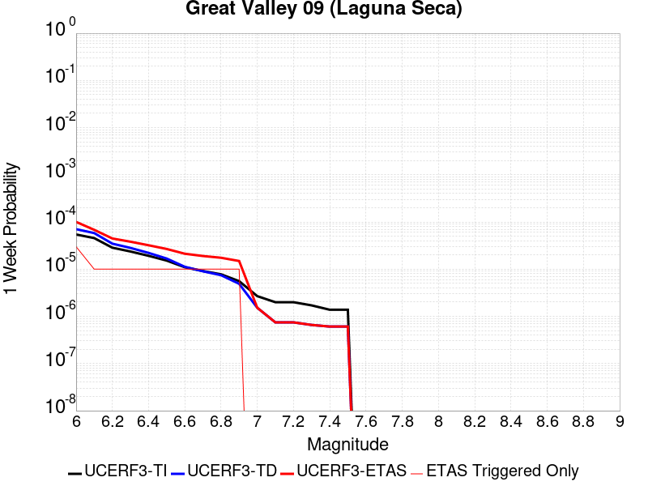 | 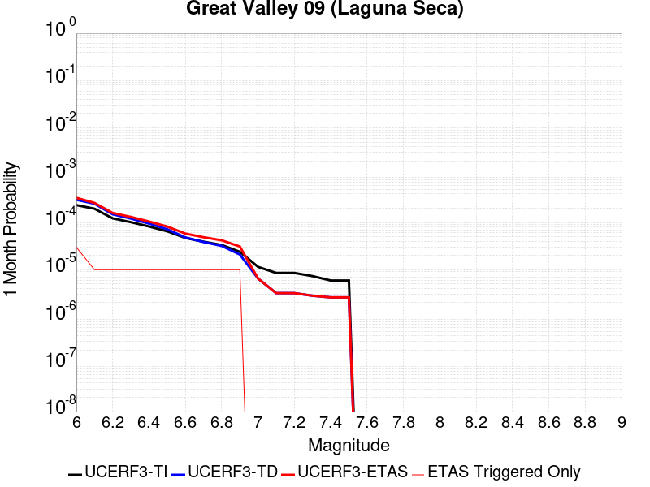 | 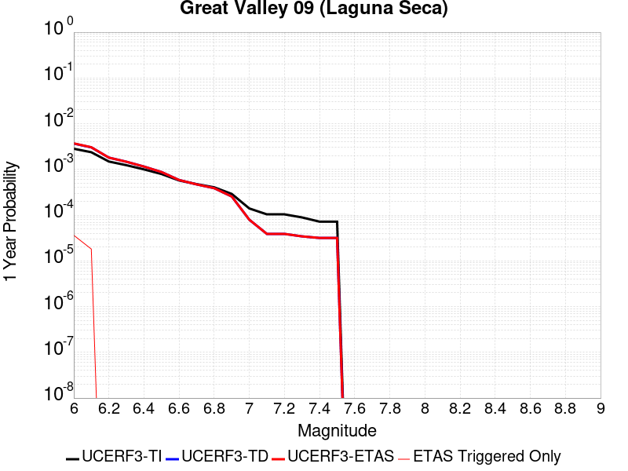 | 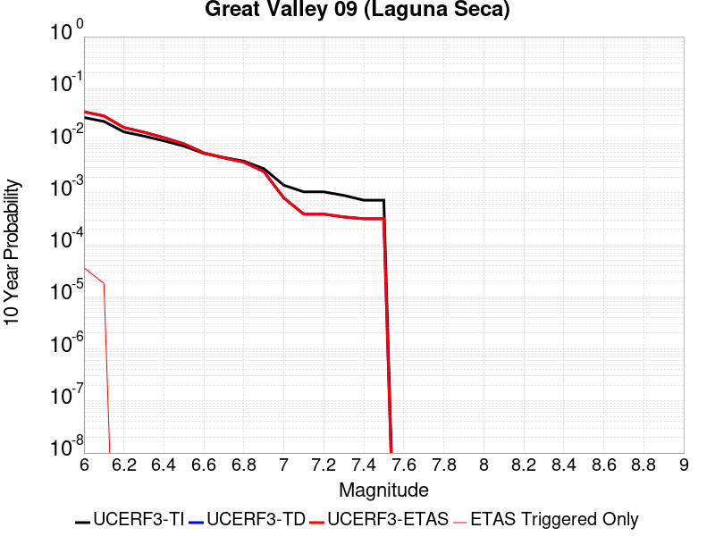 |

| Magnitude | 1 wk TI Prob | 1 wk TD Prob | 1 wk ETAS Prob | 1 wk ETAS/TD Gain | 1 wk ETAS Triggered Only | 1 mo TI Prob | 1 mo TD Prob | 1 mo ETAS Prob | 1 mo ETAS/TD Gain | 1 mo ETAS Triggered Only | 1 yr TI Prob | 1 yr TD Prob | 1 yr ETAS Prob | 1 yr ETAS/TD Gain | 1 yr ETAS Triggered Only | 10 yr TI Prob | 10 yr TD Prob | 10 yr ETAS Prob | 10 yr ETAS/TD Gain | 10 yr ETAS Triggered Only |
|-----|-----|-----|-----|-----|-----|-----|-----|-----|-----|-----|-----|-----|-----|-----|-----|-----|-----|-----|-----|-----|
| 6.0 | 5.4353277E-5 | 7.05022E-5 | 1.0050009E-4 | 1.4254886 | 3.0E-5 | 2.3292181E-4 | 3.0211566E-4 | 3.321066E-4 | 1.0992697 | 3.0E-5 | 0.0028321352 | 0.0036721937 | 0.0037220102 | 1.0135659 | 5.0E-5 | 0.02796312 | 0.03611547 | 0.036163665 | 1.0013344 | 5.0E-5 |
| 6.1 | 4.5578287E-5 | 5.822118E-5 | 6.82206E-5 | 1.1717488 | 1.0E-5 | 1.953209E-4 | 2.4949326E-4 | 2.5949077E-4 | 1.0400712 | 1.0E-5 | 0.0023754383 | 0.003033432 | 0.003063341 | 1.0098598 | 3.0E-5 | 0.023502063 | 0.029919548 | 0.02994865 | 1.0009727 | 3.0E-5 |
| 6.2 | 2.8536782E-5 | 3.4737273E-5 | 4.4736928E-5 | 1.2878652 | 1.0E-5 | 1.2229476E-4 | 1.4886224E-4 | 1.5886074E-4 | 1.0671662 | 1.0E-5 | 0.0014879217 | 0.001810813 | 0.0018207949 | 1.0055124 | 1.0E-5 | 0.014779986 | 0.017958116 | 0.017967938 | 1.0005468 | 1.0E-5 |
| 6.3 | 2.3698774E-5 | 2.8213295E-5 | 3.8213013E-5 | 1.3544328 | 1.0E-5 | 1.01562226E-4 | 1.20905075E-4 | 1.3090386E-4 | 1.0826995 | 1.0E-5 | 0.0012358186 | 0.0014710218 | 0.0014810071 | 1.006788 | 1.0E-5 | 0.012289686 | 0.014611342 | 0.014621195 | 1.0006744 | 1.0E-5 |
| 6.4 | 1.9191197E-5 | 2.2123184E-5 | 3.2122964E-5 | 1.4520046 | 1.0E-5 | 8.2245395E-5 | 9.4806666E-5 | 1.0480572E-4 | 1.1054678 | 1.0E-5 | 0.0010008777 | 0.0011536429 | 0.0011636313 | 1.0086582 | 1.0E-5 | 0.009963818 | 0.011476948 | 0.011486833 | 1.0008613 | 1.0E-5 |
| 6.5 | 1.5203241E-5 | 1.6802203E-5 | 2.6802036E-5 | 1.59515 | 1.0E-5 | 6.5155116E-5 | 7.200386E-5 | 8.200314E-5 | 1.1388714 | 1.0E-5 | 7.9297484E-4 | 8.7626575E-4 | 8.8625704E-4 | 1.011402 | 1.0E-5 | 0.007901512 | 0.0087295165 | 0.0087394295 | 1.0011356 | 1.0E-5 |
| 6.6 | 1.0984925E-5 | 1.1242595E-5 | 2.1242482E-5 | 1.8894644 | 1.0E-5 | 4.70774E-5 | 4.8181686E-5 | 5.8181202E-5 | 1.2075378 | 1.0E-5 | 5.730166E-4 | 5.8645656E-4 | 5.9645064E-4 | 1.0170416 | 1.0E-5 | 0.005715413 | 0.0058494853 | 0.0058594267 | 1.0016996 | 1.0E-5 |
| 6.7 | 9.134616E-6 | 9.019894E-6 | 1.9019804E-5 | 2.1086504 | 1.0E-5 | 3.9147766E-5 | 3.865613E-5 | 4.8655744E-5 | 1.2586812 | 1.0E-5 | 4.7651984E-4 | 4.7053912E-4 | 4.8053442E-4 | 1.0212423 | 1.0E-5 | 0.004754993 | 0.0046956735 | 0.0047056265 | 1.0021197 | 1.0E-5 |
| 6.8 | 7.785589E-6 | 7.4519444E-6 | 1.745187E-5 | 2.3419216 | 1.0E-5 | 3.3366385E-5 | 3.1936524E-5 | 4.1936204E-5 | 1.3131111 | 1.0E-5 | 4.0616E-4 | 3.8875983E-4 | 3.9875595E-4 | 1.0257128 | 1.0E-5 | 0.0040541845 | 0.0038810016 | 0.0038909628 | 1.0025667 | 1.0E-5 |
| 6.9 | 5.579095E-6 | 4.898492E-6 | 1.4898444E-5 | 3.0414345 | 1.0E-5 | 2.3910188E-5 | 2.0993377E-5 | 3.0993167E-5 | 1.4763308 | 1.0E-5 | 2.9106764E-4 | 2.5556577E-4 | 2.6556323E-4 | 1.0391189 | 1.0E-5 | 0.002906867 | 0.002552856 | 0.0025628305 | 1.0039072 | 1.0E-5 |
| 7.0 | 2.6816688E-6 | 1.5216126E-6 | 1.5216126E-6 | 1.0 | 0.0 | 1.1492816E-5 | 6.521181E-6 | 6.521181E-6 | 1.0 | 0.0 | 1.3991605E-4 | 7.939258E-5 | 7.939258E-5 | 1.0 | 0.0 | 0.0013982799 | 7.9365086E-4 | 7.9365086E-4 | 1.0 | 0.0 |
| 7.1 | 1.9951021E-6 | 7.453827E-7 | 7.453827E-7 | 1.0 | 0.0 | 8.55041E-6 | 3.1944935E-6 | 3.1944935E-6 | 1.0 | 0.0 | 1.0409627E-4 | 3.8892307E-5 | 3.8892307E-5 | 1.0 | 0.0 | 0.0010404752 | 3.8885913E-4 | 3.8885913E-4 | 1.0 | 0.0 |
| 7.2 | 1.9951021E-6 | 7.453827E-7 | 7.453827E-7 | 1.0 | 0.0 | 8.55041E-6 | 3.1944935E-6 | 3.1944935E-6 | 1.0 | 0.0 | 1.0409627E-4 | 3.8892307E-5 | 3.8892307E-5 | 1.0 | 0.0 | 0.0010404752 | 3.8885913E-4 | 3.8885913E-4 | 1.0 | 0.0 |
| 7.3 | 1.7087556E-6 | 6.578881E-7 | 6.578881E-7 | 1.0 | 0.0 | 7.3232177E-6 | 2.8195177E-6 | 2.8195177E-6 | 1.0 | 0.0 | 8.915652E-5 | 3.4327128E-5 | 3.4327128E-5 | 1.0 | 0.0 | 8.9120766E-4 | 3.432223E-4 | 3.432223E-4 | 1.0 | 0.0 |
| 7.4 | 1.3804846E-6 | 6.073852E-7 | 6.073852E-7 | 1.0 | 0.0 | 5.916349E-6 | 2.6030768E-6 | 2.6030768E-6 | 1.0 | 0.0 | 7.2029165E-5 | 3.169204E-5 | 3.169204E-5 | 1.0 | 0.0 | 7.200583E-4 | 3.1687922E-4 | 3.1687922E-4 | 1.0 | 0.0 |
| 7.5 | 1.3804846E-6 | 6.073852E-7 | 6.073852E-7 | 1.0 | 0.0 | 5.916349E-6 | 2.6030768E-6 | 2.6030768E-6 | 1.0 | 0.0 | 7.2029165E-5 | 3.169204E-5 | 3.169204E-5 | 1.0 | 0.0 | 7.200583E-4 | 3.1687922E-4 | 3.1687922E-4 | 1.0 | 0.0 |

## Hollywood
*[(top)](#table-of-contents)*

| 1 Week | 1 Month | 1 Year | 10 Year |
|-----|-----|-----|-----|
| 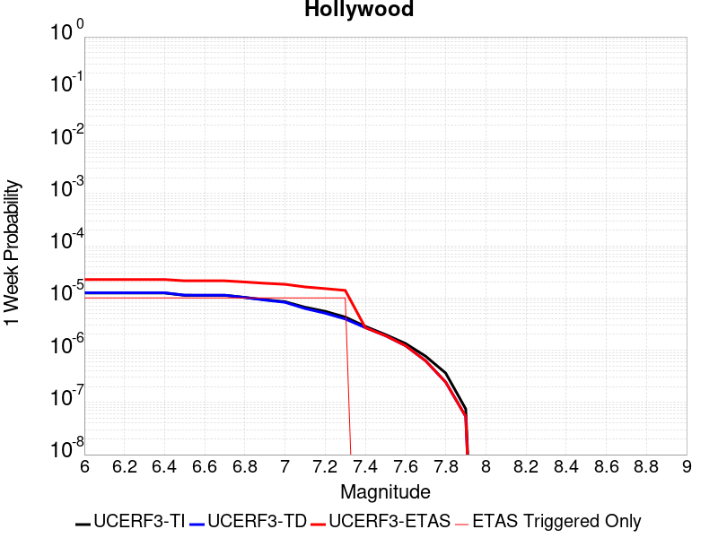 | 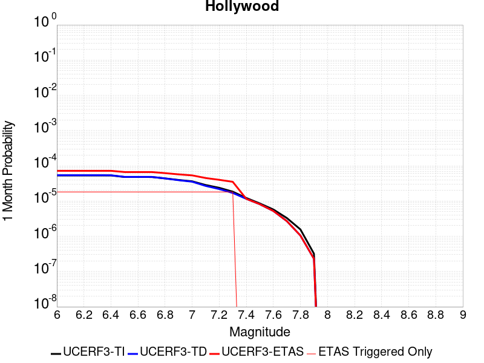 | 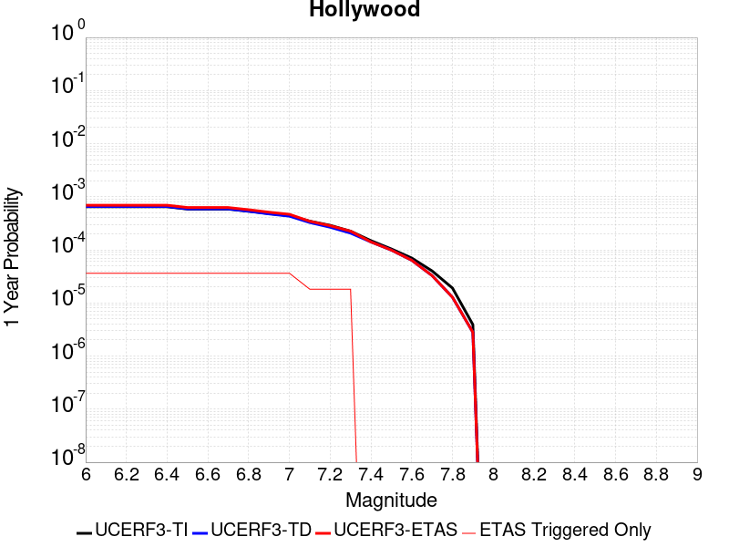 | 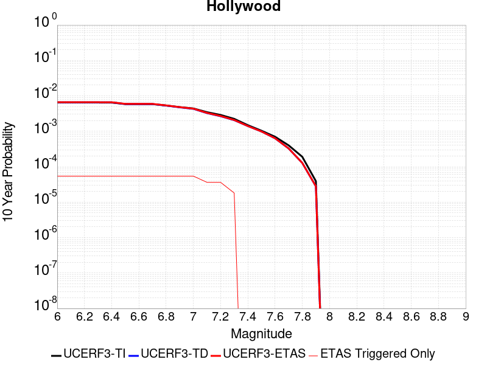 |

| Magnitude | 1 wk TI Prob | 1 wk TD Prob | 1 wk ETAS Prob | 1 wk ETAS/TD Gain | 1 wk ETAS Triggered Only | 1 mo TI Prob | 1 mo TD Prob | 1 mo ETAS Prob | 1 mo ETAS/TD Gain | 1 mo ETAS Triggered Only | 1 yr TI Prob | 1 yr TD Prob | 1 yr ETAS Prob | 1 yr ETAS/TD Gain | 1 yr ETAS Triggered Only | 10 yr TI Prob | 10 yr TD Prob | 10 yr ETAS Prob | 10 yr ETAS/TD Gain | 10 yr ETAS Triggered Only |
|-----|-----|-----|-----|-----|-----|-----|-----|-----|-----|-----|-----|-----|-----|-----|-----|-----|-----|-----|-----|-----|
| 6.0 | 1.24487615E-5 | 1.2593226E-5 | 2.25931E-5 | 1.7940677 | 1.0E-5 | 5.3350745E-5 | 5.3969878E-5 | 6.396934E-5 | 1.1852785 | 1.0E-5 | 6.4935174E-4 | 6.568898E-4 | 6.768767E-4 | 1.0304265 | 2.0E-5 | 0.0064745755 | 0.006549969 | 0.0065996414 | 1.0075836 | 5.0E-5 |
| 6.1 | 1.24487615E-5 | 1.2593226E-5 | 2.25931E-5 | 1.7940677 | 1.0E-5 | 5.3350745E-5 | 5.3969878E-5 | 6.396934E-5 | 1.1852785 | 1.0E-5 | 6.4935174E-4 | 6.568898E-4 | 6.768767E-4 | 1.0304265 | 2.0E-5 | 0.0064745755 | 0.006549969 | 0.0065996414 | 1.0075836 | 5.0E-5 |
| 6.2 | 1.24487615E-5 | 1.2593226E-5 | 2.25931E-5 | 1.7940677 | 1.0E-5 | 5.3350745E-5 | 5.3969878E-5 | 6.396934E-5 | 1.1852785 | 1.0E-5 | 6.4935174E-4 | 6.568898E-4 | 6.768767E-4 | 1.0304265 | 2.0E-5 | 0.0064745755 | 0.006549969 | 0.0065996414 | 1.0075836 | 5.0E-5 |
| 6.3 | 1.24487615E-5 | 1.2593226E-5 | 2.25931E-5 | 1.7940677 | 1.0E-5 | 5.3350745E-5 | 5.3969878E-5 | 6.396934E-5 | 1.1852785 | 1.0E-5 | 6.4935174E-4 | 6.568898E-4 | 6.768767E-4 | 1.0304265 | 2.0E-5 | 0.0064745755 | 0.006549969 | 0.0065996414 | 1.0075836 | 5.0E-5 |
| 6.4 | 1.2431024E-5 | 1.2573839E-5 | 2.2573713E-5 | 1.795292 | 1.0E-5 | 5.327473E-5 | 5.3886797E-5 | 6.3886255E-5 | 1.1855642 | 1.0E-5 | 6.4842677E-4 | 6.558789E-4 | 6.758658E-4 | 1.0304735 | 2.0E-5 | 0.0064653796 | 0.0065399194 | 0.0065895924 | 1.0075953 | 5.0E-5 |
| 6.5 | 1.1242222E-5 | 1.13178E-5 | 2.1317686E-5 | 1.8835539 | 1.0E-5 | 4.8180063E-5 | 4.850397E-5 | 5.8503487E-5 | 1.2061586 | 1.0E-5 | 5.864344E-4 | 5.9037853E-4 | 6.103667E-4 | 1.0338565 | 2.0E-5 | 0.0058488925 | 0.005888388 | 0.0059380936 | 1.0084413 | 5.0E-5 |
| 6.6 | 1.1234066E-5 | 1.13089145E-5 | 2.13088E-5 | 1.8842481 | 1.0E-5 | 4.8145106E-5 | 4.846589E-5 | 5.8465404E-5 | 1.2063206 | 1.0E-5 | 5.86009E-4 | 5.8991514E-4 | 6.099033E-4 | 1.0338832 | 2.0E-5 | 0.005844661 | 0.0058837784 | 0.0059334845 | 1.0084479 | 5.0E-5 |
| 6.7 | 1.12294E-5 | 1.1303658E-5 | 2.1303544E-5 | 1.8846594 | 1.0E-5 | 4.812511E-5 | 4.8443362E-5 | 5.8442878E-5 | 1.2064166 | 1.0E-5 | 5.857657E-4 | 5.89641E-4 | 6.096292E-4 | 1.033899 | 2.0E-5 | 0.0058422405 | 0.005881052 | 0.0059307576 | 1.0084519 | 5.0E-5 |
| 6.8 | 1.0252819E-5 | 1.0218445E-5 | 2.0218342E-5 | 1.9786125 | 1.0E-5 | 4.3939912E-5 | 4.379261E-5 | 5.3792173E-5 | 1.2283391 | 1.0E-5 | 5.3483713E-4 | 5.330467E-4 | 5.5303605E-4 | 1.0375001 | 2.0E-5 | 0.005335517 | 0.005317908 | 0.005367642 | 1.0093522 | 5.0E-5 |
| 6.9 | 9.252289E-6 | 9.110306E-6 | 1.9110215E-5 | 2.097648 | 1.0E-5 | 3.9652066E-5 | 3.9043593E-5 | 4.9043203E-5 | 1.256114 | 1.0E-5 | 4.8265693E-4 | 4.752537E-4 | 4.952442E-4 | 1.0420628 | 2.0E-5 | 0.0048161 | 0.004742547 | 0.0047823573 | 1.0083942 | 4.0E-5 |
| 7.0 | 8.474604E-6 | 8.258257E-6 | 1.8258175E-5 | 2.2108994 | 1.0E-5 | 3.6319227E-5 | 3.539206E-5 | 4.5391705E-5 | 1.2825392 | 1.0E-5 | 4.4209688E-4 | 4.3081454E-4 | 4.5080594E-4 | 1.0464036 | 2.0E-5 | 0.004412184 | 0.004299944 | 0.004339772 | 1.0092624 | 4.0E-5 |
| 7.1 | 6.643643E-6 | 6.2683675E-6 | 1.6268305E-5 | 2.5953016 | 1.0E-5 | 2.8472443E-5 | 2.6864158E-5 | 3.686389E-5 | 1.3722332 | 1.0E-5 | 3.4659685E-4 | 3.2702246E-4 | 3.3701918E-4 | 1.030569 | 1.0E-5 | 0.0034605677 | 0.0032654584 | 0.0032953604 | 1.0091571 | 3.0E-5 |
| 7.2 | 5.549002E-6 | 5.108709E-6 | 1.5108658E-5 | 2.9574316 | 1.0E-5 | 2.378122E-5 | 2.1894284E-5 | 3.1894066E-5 | 1.4567302 | 1.0E-5 | 2.8949787E-4 | 2.6653046E-4 | 2.7652777E-4 | 1.0375092 | 1.0E-5 | 0.0028912104 | 0.0026621243 | 0.0026920445 | 1.0112392 | 3.0E-5 |
| 7.3 | 4.3059727E-6 | 3.9598885E-6 | 1.3959849E-5 | 3.5253136 | 1.0E-5 | 1.8454039E-5 | 1.6970842E-5 | 2.6970672E-5 | 1.589236 | 1.0E-5 | 2.2465475E-4 | 2.066005E-4 | 2.1659843E-4 | 1.0483925 | 1.0E-5 | 0.0022442779 | 0.0020640944 | 0.0020840531 | 1.0096694 | 2.0E-5 |
| 7.4 | 2.8550733E-6 | 2.7012966E-6 | 2.7012966E-6 | 1.0 | 0.0 | 1.2235971E-5 | 1.1576934E-5 | 1.1576934E-5 | 1.0 | 0.0 | 1.4896276E-4 | 1.409401E-4 | 1.409401E-4 | 1.0 | 0.0 | 0.0014886294 | 0.0014085122 | 0.0014184982 | 1.0070897 | 1.0E-5 |
| 7.5 | 1.9927045E-6 | 1.8976367E-6 | 1.8976367E-6 | 1.0 | 0.0 | 8.540134E-6 | 8.132703E-6 | 8.132703E-6 | 1.0 | 0.0 | 1.0397117E-4 | 9.90112E-5 | 9.90112E-5 | 1.0 | 0.0 | 0.0010392254 | 9.896745E-4 | 9.996645E-4 | 1.0100943 | 1.0E-5 |
| 7.6 | 1.345084E-6 | 1.2216007E-6 | 1.2216007E-6 | 1.0 | 0.0 | 5.764633E-6 | 5.235421E-6 | 5.235421E-6 | 1.0 | 0.0 | 7.018215E-5 | 6.3739404E-5 | 6.3739404E-5 | 1.0 | 0.0 | 7.0159987E-4 | 6.3721323E-4 | 6.4720685E-4 | 1.0156833 | 1.0E-5 |
| 7.7 | 7.6835164E-7 | 6.277697E-7 | 6.277697E-7 | 1.0 | 0.0 | 3.2929315E-6 | 2.6904388E-6 | 2.6904388E-6 | 1.0 | 0.0 | 4.00907E-5 | 3.2755615E-5 | 3.2755615E-5 | 1.0 | 0.0 | 4.0083472E-4 | 3.2750933E-4 | 3.2750933E-4 | 1.0 | 0.0 |
| 7.8 | 3.6562128E-7 | 2.453479E-7 | 2.453479E-7 | 1.0 | 0.0 | 1.5669474E-6 | 1.0514907E-6 | 1.0514907E-6 | 1.0 | 0.0 | 1.9077417E-5 | 1.2801827E-5 | 1.2801827E-5 | 1.0 | 0.0 | 1.907578E-4 | 1.2801126E-4 | 1.2801126E-4 | 1.0 | 0.0 |
| 7.9 | 7.5024424E-8 | 5.3816795E-8 | 5.3816795E-8 | 1.0 | 0.0 | 3.215332E-7 | 2.306434E-7 | 2.306434E-7 | 1.0 | 0.0 | 3.91466E-6 | 2.808081E-6 | 2.808081E-6 | 1.0 | 0.0 | 3.9145907E-5 | 2.8080585E-5 | 2.8080585E-5 | 1.0 | 0.0 |

## Northridge
*[(top)](#table-of-contents)*

| 1 Week | 1 Month | 1 Year | 10 Year |
|-----|-----|-----|-----|
|  |  | 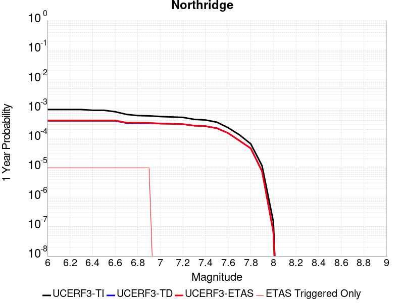 | 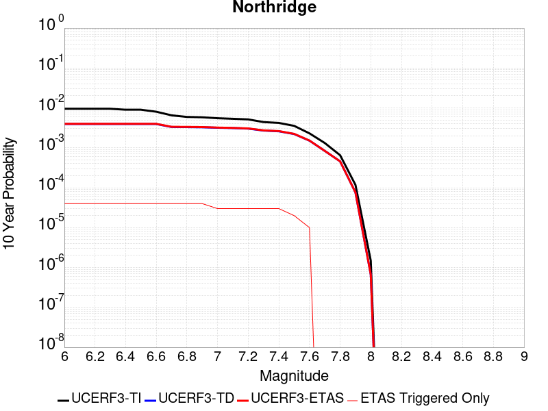 |

| Magnitude | 1 wk TI Prob | 1 wk TD Prob | 1 wk ETAS Prob | 1 wk ETAS/TD Gain | 1 wk ETAS Triggered Only | 1 mo TI Prob | 1 mo TD Prob | 1 mo ETAS Prob | 1 mo ETAS/TD Gain | 1 mo ETAS Triggered Only | 1 yr TI Prob | 1 yr TD Prob | 1 yr ETAS Prob | 1 yr ETAS/TD Gain | 1 yr ETAS Triggered Only | 10 yr TI Prob | 10 yr TD Prob | 10 yr ETAS Prob | 10 yr ETAS/TD Gain | 10 yr ETAS Triggered Only |
|-----|-----|-----|-----|-----|-----|-----|-----|-----|-----|-----|-----|-----|-----|-----|-----|-----|-----|-----|-----|-----|
| 6.0 | 1.8340852E-5 | 7.5880193E-6 | 7.5880193E-6 | 1.0 | 0.0 | 7.860128E-5 | 3.251969E-5 | 3.251969E-5 | 1.0 | 0.0 | 9.565505E-4 | 3.958575E-4 | 4.0585353E-4 | 1.0252516 | 1.0E-5 | 0.009524435 | 0.003951746 | 0.003991588 | 1.0100821 | 4.0E-5 |
| 6.1 | 1.8340852E-5 | 7.5880193E-6 | 7.5880193E-6 | 1.0 | 0.0 | 7.860128E-5 | 3.251969E-5 | 3.251969E-5 | 1.0 | 0.0 | 9.565505E-4 | 3.958575E-4 | 4.0585353E-4 | 1.0252516 | 1.0E-5 | 0.009524435 | 0.003951746 | 0.003991588 | 1.0100821 | 4.0E-5 |
| 6.2 | 1.8340852E-5 | 7.5880193E-6 | 7.5880193E-6 | 1.0 | 0.0 | 7.860128E-5 | 3.251969E-5 | 3.251969E-5 | 1.0 | 0.0 | 9.565505E-4 | 3.958575E-4 | 4.0585353E-4 | 1.0252516 | 1.0E-5 | 0.009524435 | 0.003951746 | 0.003991588 | 1.0100821 | 4.0E-5 |
| 6.3 | 1.8340852E-5 | 7.5880193E-6 | 7.5880193E-6 | 1.0 | 0.0 | 7.860128E-5 | 3.251969E-5 | 3.251969E-5 | 1.0 | 0.0 | 9.565505E-4 | 3.958575E-4 | 4.0585353E-4 | 1.0252516 | 1.0E-5 | 0.009524435 | 0.003951746 | 0.003991588 | 1.0100821 | 4.0E-5 |
| 6.4 | 1.7361892E-5 | 7.5880193E-6 | 7.5880193E-6 | 1.0 | 0.0 | 7.440598E-5 | 3.251969E-5 | 3.251969E-5 | 1.0 | 0.0 | 9.055163E-4 | 3.958575E-4 | 4.0585353E-4 | 1.0252516 | 1.0E-5 | 0.009018354 | 0.003951746 | 0.003991588 | 1.0100821 | 4.0E-5 |
| 6.5 | 1.7361892E-5 | 7.5880193E-6 | 7.5880193E-6 | 1.0 | 0.0 | 7.440598E-5 | 3.251969E-5 | 3.251969E-5 | 1.0 | 0.0 | 9.055163E-4 | 3.958575E-4 | 4.0585353E-4 | 1.0252516 | 1.0E-5 | 0.009018354 | 0.003951746 | 0.003991588 | 1.0100821 | 4.0E-5 |
| 6.6 | 1.5458201E-5 | 7.5880193E-6 | 7.5880193E-6 | 1.0 | 0.0 | 6.624775E-5 | 3.251969E-5 | 3.251969E-5 | 1.0 | 0.0 | 8.0626784E-4 | 3.958575E-4 | 4.0585353E-4 | 1.0252516 | 1.0E-5 | 0.008033488 | 0.003951746 | 0.003991588 | 1.0100821 | 4.0E-5 |
| 6.7 | 1.2538368E-5 | 6.381603E-6 | 6.381603E-6 | 1.0 | 0.0 | 5.3734755E-5 | 2.7349442E-5 | 2.7349442E-5 | 1.0 | 0.0 | 6.5402425E-4 | 3.3292902E-4 | 3.429257E-4 | 1.0300264 | 1.0E-5 | 0.0065210275 | 0.0033243506 | 0.0033642175 | 1.0119925 | 4.0E-5 |
| 6.8 | 1.1438097E-5 | 6.3502566E-6 | 6.3502566E-6 | 1.0 | 0.0 | 4.9019498E-5 | 2.7215105E-5 | 2.7215105E-5 | 1.0 | 0.0 | 5.9664896E-4 | 3.3129397E-4 | 3.4129064E-4 | 1.0301747 | 1.0E-5 | 0.005950495 | 0.0033080487 | 0.0033479163 | 1.0120517 | 4.0E-5 |
| 6.9 | 1.1204891E-5 | 6.2867084E-6 | 6.2867084E-6 | 1.0 | 0.0 | 4.8020076E-5 | 2.694276E-5 | 2.694276E-5 | 1.0 | 0.0 | 5.8448757E-4 | 3.2797916E-4 | 3.379759E-4 | 1.0304798 | 1.0E-5 | 0.0058295266 | 0.0032749989 | 0.0033148678 | 1.0121738 | 4.0E-5 |
| 7.0 | 1.061046E-5 | 6.115359E-6 | 6.115359E-6 | 1.0 | 0.0 | 4.5472607E-5 | 2.6208421E-5 | 2.6208421E-5 | 1.0 | 0.0 | 5.534883E-4 | 3.1904122E-4 | 3.1904122E-4 | 1.0 | 0.0 | 0.0055211177 | 0.0031858785 | 0.003215783 | 1.0093865 | 3.0E-5 |
| 7.1 | 1.0266979E-5 | 6.004274E-6 | 6.004274E-6 | 1.0 | 0.0 | 4.40006E-5 | 2.5732352E-5 | 2.5732352E-5 | 1.0 | 0.0 | 5.355756E-4 | 3.1324677E-4 | 3.1324677E-4 | 1.0 | 0.0 | 0.0053428668 | 0.003128098 | 0.0031580043 | 1.0095605 | 3.0E-5 |
| 7.2 | 9.91273E-6 | 5.819984E-6 | 5.819984E-6 | 1.0 | 0.0 | 4.248244E-5 | 2.4942554E-5 | 2.4942554E-5 | 1.0 | 0.0 | 5.171009E-4 | 3.036337E-4 | 3.036337E-4 | 1.0 | 0.0 | 0.0051589934 | 0.0030322333 | 0.0030621423 | 1.0098637 | 3.0E-5 |
| 7.3 | 8.4959265E-6 | 5.193062E-6 | 5.193062E-6 | 1.0 | 0.0 | 3.6410605E-5 | 2.225579E-5 | 2.225579E-5 | 1.0 | 0.0 | 4.4320893E-4 | 2.709308E-4 | 2.709308E-4 | 1.0 | 0.0 | 0.00442326 | 0.0027060313 | 0.0027359503 | 1.0110563 | 3.0E-5 |
| 7.4 | 8.0847185E-6 | 4.9819355E-6 | 4.9819355E-6 | 1.0 | 0.0 | 3.4648332E-5 | 2.135098E-5 | 2.135098E-5 | 1.0 | 0.0 | 4.2176177E-4 | 2.599174E-4 | 2.599174E-4 | 1.0 | 0.0 | 0.0042096223 | 0.00259616 | 0.0026260822 | 1.0115255 | 3.0E-5 |
| 7.5 | 6.8220684E-6 | 4.2533075E-6 | 4.2533075E-6 | 1.0 | 0.0 | 2.9237108E-5 | 1.8228335E-5 | 1.8228335E-5 | 1.0 | 0.0 | 3.5590364E-4 | 2.2190758E-4 | 2.2190758E-4 | 1.0 | 0.0 | 0.0035533418 | 0.002216881 | 0.0022368366 | 1.0090017 | 2.0E-5 |
| 7.6 | 4.4224143E-6 | 2.8999582E-6 | 2.8999582E-6 | 1.0 | 0.0 | 1.8953066E-5 | 1.2428334E-5 | 1.2428334E-5 | 1.0 | 0.0 | 2.3072914E-4 | 1.5130457E-4 | 1.5130457E-4 | 1.0 | 0.0 | 0.0023048974 | 0.0015120271 | 0.001522012 | 1.0066036 | 1.0E-5 |
| 7.7 | 2.5297056E-6 | 1.6045905E-6 | 1.6045905E-6 | 1.0 | 0.0 | 1.0841551E-5 | 6.8767986E-6 | 6.8767986E-6 | 1.0 | 0.0 | 1.319879E-4 | 8.3721854E-5 | 8.3721854E-5 | 1.0 | 0.0 | 0.0013190953 | 8.369078E-4 | 8.369078E-4 | 1.0 | 0.0 |
| 7.8 | 1.2508156E-6 | 8.780076E-7 | 8.780076E-7 | 1.0 | 0.0 | 5.3606273E-6 | 3.7628845E-6 | 3.7628845E-6 | 1.0 | 0.0 | 6.526368E-5 | 4.581217E-5 | 4.581217E-5 | 1.0 | 0.0 | 6.524452E-4 | 4.5802852E-4 | 4.5802852E-4 | 1.0 | 0.0 |
| 7.9 | 2.262199E-7 | 1.4664671E-7 | 1.4664671E-7 | 1.0 | 0.0 | 9.695135E-7 | 6.284858E-7 | 6.284858E-7 | 1.0 | 0.0 | 1.1803763E-5 | 7.651788E-6 | 7.651788E-6 | 1.0 | 0.0 | 1.1803136E-4 | 7.651533E-5 | 7.651533E-5 | 1.0 | 0.0 |
| 8.0 | 2.865362E-9 | 1.2753101E-9 | 1.2753101E-9 | 1.0 | 0.0 | 1.2280123E-8 | 5.4656146E-9 | 5.4656146E-9 | 1.0 | 0.0 | 1.4951048E-7 | 6.654386E-8 | 6.654386E-8 | 1.0 | 0.0 | 1.4951038E-6 | 6.654386E-7 | 6.654386E-7 | 1.0 | 0.0 |

## Robinson Creek
*[(top)](#table-of-contents)*

| 1 Week | 1 Month | 1 Year | 10 Year |
|-----|-----|-----|-----|
|  |  | 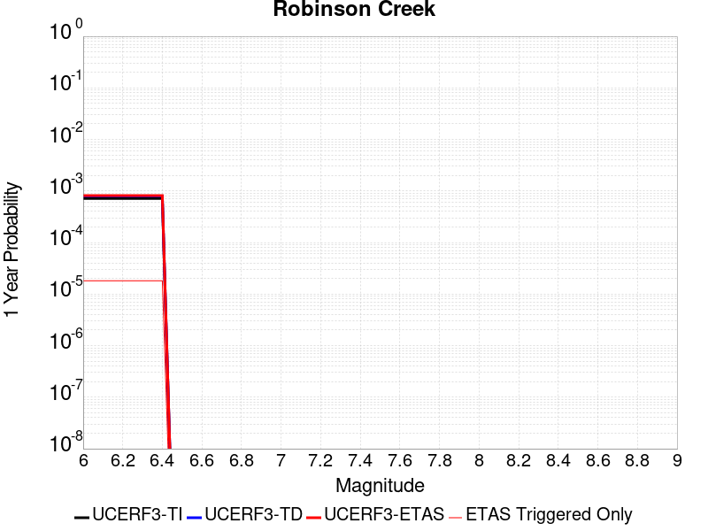 | 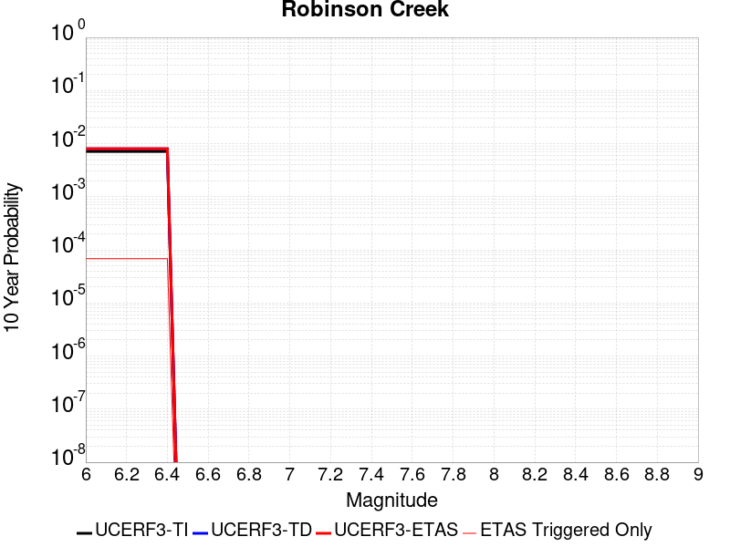 |

| Magnitude | 1 wk TI Prob | 1 wk TD Prob | 1 wk ETAS Prob | 1 wk ETAS/TD Gain | 1 wk ETAS Triggered Only | 1 mo TI Prob | 1 mo TD Prob | 1 mo ETAS Prob | 1 mo ETAS/TD Gain | 1 mo ETAS Triggered Only | 1 yr TI Prob | 1 yr TD Prob | 1 yr ETAS Prob | 1 yr ETAS/TD Gain | 1 yr ETAS Triggered Only | 10 yr TI Prob | 10 yr TD Prob | 10 yr ETAS Prob | 10 yr ETAS/TD Gain | 10 yr ETAS Triggered Only |
|-----|-----|-----|-----|-----|-----|-----|-----|-----|-----|-----|-----|-----|-----|-----|-----|-----|-----|-----|-----|-----|
| 6.0 | 1.3705327E-5 | 1.5285013E-5 | 1.5285013E-5 | 1.0 | 0.0 | 5.8735794E-5 | 6.55072E-5 | 6.55072E-5 | 1.0 | 0.0 | 7.1487366E-4 | 7.9755014E-4 | 8.075422E-4 | 1.0125284 | 1.0E-5 | 0.0071257832 | 0.007975501 | 0.008015183 | 1.0049753 | 4.0E-5 |
| 6.1 | 1.3705327E-5 | 1.5285013E-5 | 1.5285013E-5 | 1.0 | 0.0 | 5.8735794E-5 | 6.55072E-5 | 6.55072E-5 | 1.0 | 0.0 | 7.1487366E-4 | 7.9755014E-4 | 8.075422E-4 | 1.0125284 | 1.0E-5 | 0.0071257832 | 0.007975501 | 0.008015183 | 1.0049753 | 4.0E-5 |
| 6.2 | 1.3705327E-5 | 1.5285013E-5 | 1.5285013E-5 | 1.0 | 0.0 | 5.8735794E-5 | 6.55072E-5 | 6.55072E-5 | 1.0 | 0.0 | 7.1487366E-4 | 7.9755014E-4 | 8.075422E-4 | 1.0125284 | 1.0E-5 | 0.0071257832 | 0.007975501 | 0.008015183 | 1.0049753 | 4.0E-5 |
| 6.3 | 1.3705327E-5 | 1.5285013E-5 | 1.5285013E-5 | 1.0 | 0.0 | 5.8735794E-5 | 6.55072E-5 | 6.55072E-5 | 1.0 | 0.0 | 7.1487366E-4 | 7.9755014E-4 | 8.075422E-4 | 1.0125284 | 1.0E-5 | 0.0071257832 | 0.007975501 | 0.008015183 | 1.0049753 | 4.0E-5 |
| 6.4 | 1.3705327E-5 | 1.5285013E-5 | 1.5285013E-5 | 1.0 | 0.0 | 5.8735794E-5 | 6.55072E-5 | 6.55072E-5 | 1.0 | 0.0 | 7.1487366E-4 | 7.9755014E-4 | 8.075422E-4 | 1.0125284 | 1.0E-5 | 0.0071257832 | 0.007975501 | 0.008015183 | 1.0049753 | 4.0E-5 |

## Rinconada 2011 CFM
*[(top)](#table-of-contents)*

| 1 Week | 1 Month | 1 Year | 10 Year |
|-----|-----|-----|-----|
| 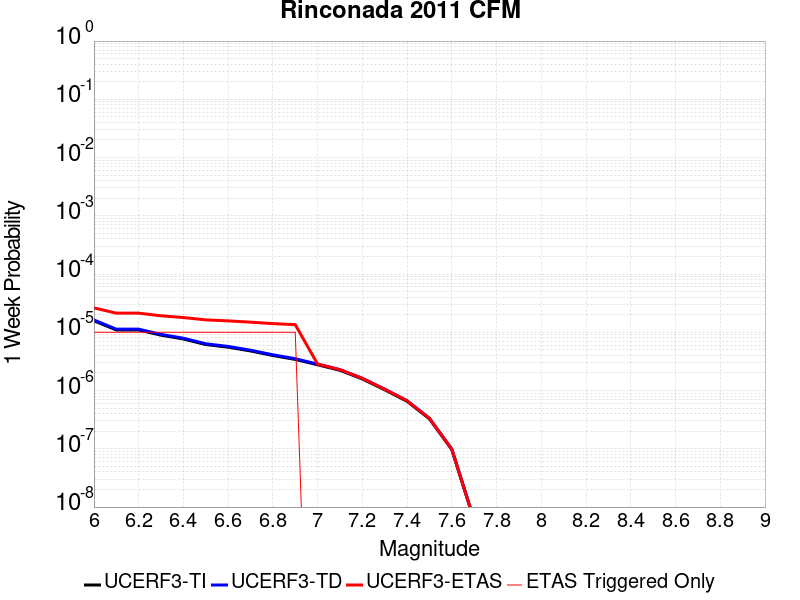 | 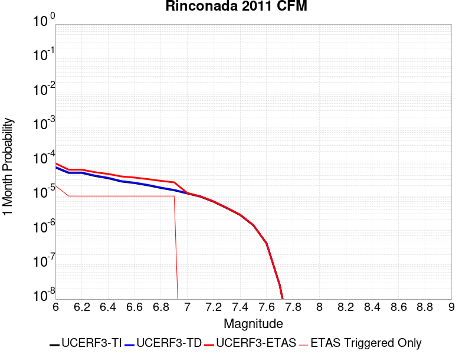 | 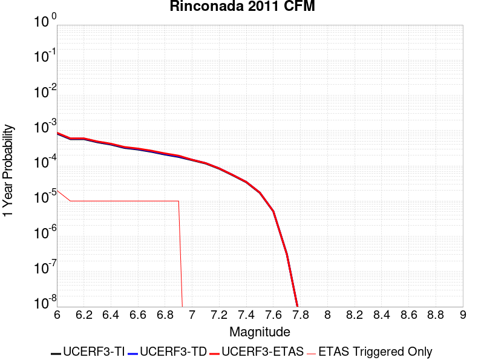 | 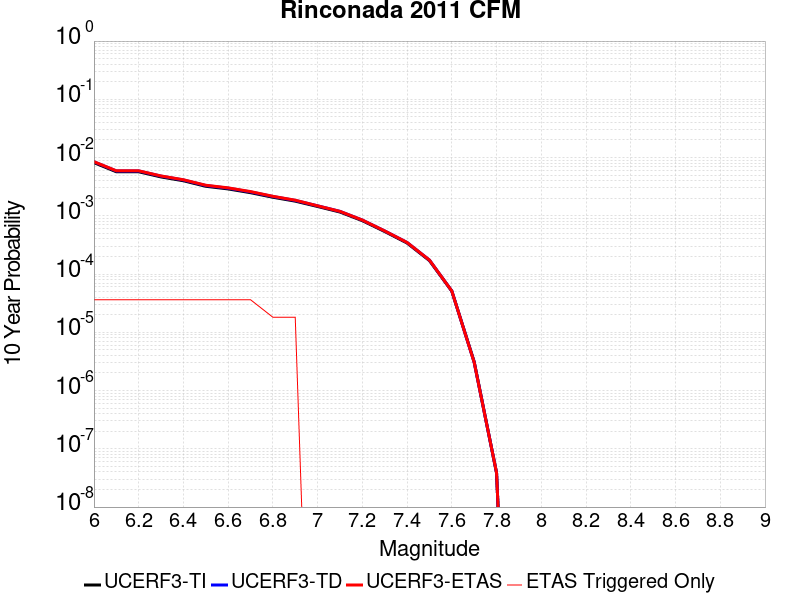 |

| Magnitude | 1 wk TI Prob | 1 wk TD Prob | 1 wk ETAS Prob | 1 wk ETAS/TD Gain | 1 wk ETAS Triggered Only | 1 mo TI Prob | 1 mo TD Prob | 1 mo ETAS Prob | 1 mo ETAS/TD Gain | 1 mo ETAS Triggered Only | 1 yr TI Prob | 1 yr TD Prob | 1 yr ETAS Prob | 1 yr ETAS/TD Gain | 1 yr ETAS Triggered Only | 10 yr TI Prob | 10 yr TD Prob | 10 yr ETAS Prob | 10 yr ETAS/TD Gain | 10 yr ETAS Triggered Only |
|-----|-----|-----|-----|-----|-----|-----|-----|-----|-----|-----|-----|-----|-----|-----|-----|-----|-----|-----|-----|-----|
| 6.0 | 1.5752368E-5 | 1.6274716E-5 | 2.6274553E-5 | 1.6144401 | 1.0E-5 | 6.75084E-5 | 6.974694E-5 | 8.974554E-5 | 1.286731 | 2.0E-5 | 8.2160486E-4 | 8.488412E-4 | 8.6882425E-4 | 1.0235416 | 2.0E-5 | 0.008185739 | 0.00845637 | 0.008496032 | 1.0046902 | 4.0E-5 |
| 6.1 | 1.0966133E-5 | 1.1323029E-5 | 2.1322916E-5 | 1.8831459 | 1.0E-5 | 4.6996865E-5 | 4.852637E-5 | 5.8525882E-5 | 1.2060635 | 1.0E-5 | 5.720366E-4 | 5.906491E-4 | 6.006432E-4 | 1.0169206 | 1.0E-5 | 0.0057056635 | 0.0058908886 | 0.005920712 | 1.0050626 | 3.0E-5 |
| 6.2 | 1.0966133E-5 | 1.1323029E-5 | 2.1322916E-5 | 1.8831459 | 1.0E-5 | 4.6996865E-5 | 4.852637E-5 | 5.8525882E-5 | 1.2060635 | 1.0E-5 | 5.720366E-4 | 5.906491E-4 | 6.006432E-4 | 1.0169206 | 1.0E-5 | 0.0057056635 | 0.0058908886 | 0.005920712 | 1.0050626 | 3.0E-5 |
| 6.3 | 8.926149E-6 | 9.212771E-6 | 1.9212679E-5 | 2.0854397 | 1.0E-5 | 3.8254362E-5 | 3.948271E-5 | 4.9482314E-5 | 1.2532654 | 1.0E-5 | 4.6564735E-4 | 4.805963E-4 | 4.905915E-4 | 1.0207975 | 1.0E-5 | 0.0046467283 | 0.0047956146 | 0.0048254705 | 1.0062257 | 3.0E-5 |
| 6.4 | 7.676955E-6 | 7.920191E-6 | 1.7920112E-5 | 2.2625859 | 1.0E-5 | 3.290082E-5 | 3.3943234E-5 | 4.3942895E-5 | 1.2945995 | 1.0E-5 | 4.0049385E-4 | 4.1318068E-4 | 4.2317656E-4 | 1.0241925 | 1.0E-5 | 0.0039977287 | 0.004124151 | 0.0041540274 | 1.0072442 | 3.0E-5 |
| 6.5 | 6.1671026E-6 | 6.3589546E-6 | 1.6358892E-5 | 2.5725756 | 1.0E-5 | 2.6430173E-5 | 2.725238E-5 | 3.7252106E-5 | 1.3669305 | 1.0E-5 | 3.2173982E-4 | 3.317473E-4 | 3.4174396E-4 | 1.0301335 | 1.0E-5 | 0.003212744 | 0.0033125326 | 0.0033324661 | 1.0060177 | 2.0E-5 |
| 6.6 | 5.553456E-6 | 5.7248126E-6 | 1.5724756E-5 | 2.746772 | 1.0E-5 | 2.3800309E-5 | 2.453468E-5 | 3.4534434E-5 | 1.4075763 | 1.0E-5 | 2.897302E-4 | 2.9866883E-4 | 3.0866585E-4 | 1.033472 | 1.0E-5 | 0.0028935277 | 0.002982683 | 0.0030026236 | 1.0066854 | 2.0E-5 |
| 6.7 | 4.787857E-6 | 4.9333094E-6 | 1.493326E-5 | 3.027027 | 1.0E-5 | 2.0519226E-5 | 2.1142583E-5 | 3.1142372E-5 | 1.472969 | 1.0E-5 | 2.4979294E-4 | 2.573806E-4 | 2.6737803E-4 | 1.0388429 | 1.0E-5 | 0.0024951235 | 0.0025708308 | 0.0025907794 | 1.0077596 | 2.0E-5 |
| 6.8 | 3.9955166E-6 | 4.1134763E-6 | 1.4113435E-5 | 3.4310238 | 1.0E-5 | 1.7123532E-5 | 1.7629065E-5 | 2.7628888E-5 | 1.5672351 | 1.0E-5 | 2.0845905E-4 | 2.1461274E-4 | 2.246106E-4 | 1.0465856 | 1.0E-5 | 0.002082636 | 0.0021440585 | 0.0021540371 | 1.004654 | 1.0E-5 |
| 6.9 | 3.4250072E-6 | 3.5224464E-6 | 1.3522411E-5 | 3.838926 | 1.0E-5 | 1.46785205E-5 | 1.5096111E-5 | 2.509596E-5 | 1.6624123 | 1.0E-5 | 1.7869633E-4 | 1.8377967E-4 | 1.9377783E-4 | 1.054403 | 1.0E-5 | 0.001785527 | 0.0018362794 | 0.001846261 | 1.0054358 | 1.0E-5 |
| 7.0 | 2.7712713E-6 | 2.8467E-6 | 2.8467E-6 | 1.0 | 0.0 | 1.1876823E-5 | 1.2200086E-5 | 1.2200086E-5 | 1.0 | 0.0 | 1.4459073E-4 | 1.4852593E-4 | 1.4852593E-4 | 1.0 | 0.0 | 0.0014449668 | 0.0014842682 | 0.0014842682 | 1.0 | 0.0 |
| 7.1 | 2.227358E-6 | 2.2856984E-6 | 2.2856984E-6 | 1.0 | 0.0 | 9.545785E-6 | 9.795814E-6 | 9.795814E-6 | 1.0 | 0.0 | 1.16213734E-4 | 1.19257515E-4 | 1.19257515E-4 | 1.0 | 0.0 | 0.0011615298 | 0.0011919362 | 0.0011919362 | 1.0 | 0.0 |
| 7.2 | 1.581796E-6 | 1.6209011E-6 | 1.6209011E-6 | 1.0 | 0.0 | 6.779108E-6 | 6.9467005E-6 | 6.9467005E-6 | 1.0 | 0.0 | 8.253252E-5 | 8.457281E-5 | 8.457281E-5 | 1.0 | 0.0 | 8.250187E-4 | 8.454067E-4 | 8.454067E-4 | 1.0 | 0.0 |
| 7.3 | 1.0306567E-6 | 1.0546477E-6 | 1.0546477E-6 | 1.0 | 0.0 | 4.4170924E-6 | 4.519911E-6 | 4.519911E-6 | 1.0 | 0.0 | 5.3776774E-5 | 5.5028526E-5 | 5.5028526E-5 | 1.0 | 0.0 | 5.376376E-4 | 5.5014924E-4 | 5.5014924E-4 | 1.0 | 0.0 |
| 7.4 | 6.535541E-7 | 6.682742E-7 | 6.682742E-7 | 1.0 | 0.0 | 2.800943E-6 | 2.864029E-6 | 2.864029E-6 | 1.0 | 0.0 | 3.4100947E-5 | 3.4868997E-5 | 3.4868997E-5 | 1.0 | 0.0 | 3.4095717E-4 | 3.4863537E-4 | 3.4863537E-4 | 1.0 | 0.0 |
| 7.5 | 3.2656962E-7 | 3.3316687E-7 | 3.3316687E-7 | 1.0 | 0.0 | 1.3995833E-6 | 1.4278572E-6 | 1.4278572E-6 | 1.0 | 0.0 | 1.7039794E-5 | 1.7384024E-5 | 1.7384024E-5 | 1.0 | 0.0 | 1.7038487E-4 | 1.7382667E-4 | 1.7382667E-4 | 1.0 | 0.0 |
| 7.6 | 9.754343E-8 | 9.82099E-8 | 9.82099E-8 | 1.0 | 0.0 | 4.180432E-7 | 4.208995E-7 | 4.208995E-7 | 1.0 | 0.0 | 5.089664E-6 | 5.1244397E-6 | 5.1244397E-6 | 1.0 | 0.0 | 5.0895473E-5 | 5.1243223E-5 | 5.1243223E-5 | 1.0 | 0.0 |
| 7.7 | 6.0001453E-9 | 5.8490435E-9 | 5.8490435E-9 | 1.0 | 0.0 | 2.5714908E-8 | 2.506733E-8 | 2.506733E-8 | 1.0 | 0.0 | 3.1307894E-7 | 3.051947E-7 | 3.051947E-7 | 1.0 | 0.0 | 3.1307852E-6 | 3.051943E-6 | 3.051943E-6 | 1.0 | 0.0 |
| 7.8 | 7.400003E-11 | 7.4654505E-11 | 7.4654505E-11 | 1.0 | 0.0 | 3.171432E-10 | 3.1994773E-10 | 3.1994773E-10 | 1.0 | 0.0 | 3.861218E-9 | 3.895363E-9 | 3.895363E-9 | 1.0 | 0.0 | 3.861218E-8 | 3.895363E-8 | 3.895363E-8 | 1.0 | 0.0 |

## Channel Islands Thrust
*[(top)](#table-of-contents)*

| 1 Week | 1 Month | 1 Year | 10 Year |
|-----|-----|-----|-----|
| 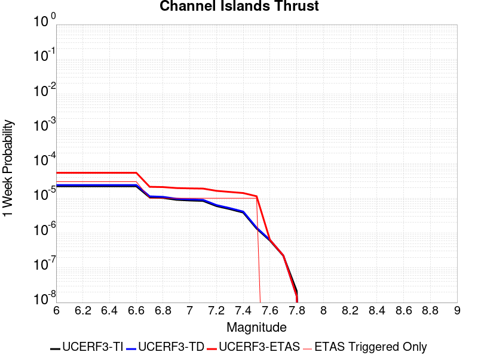 | 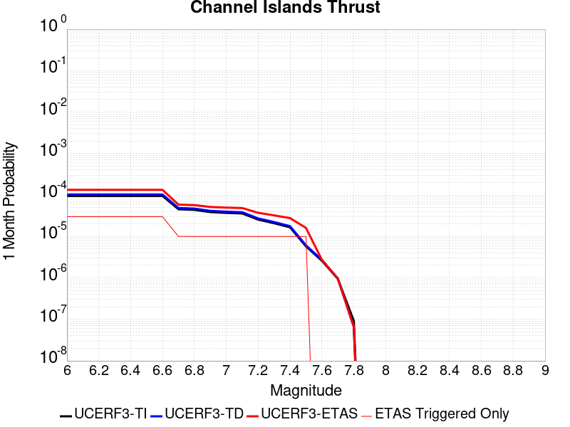 | 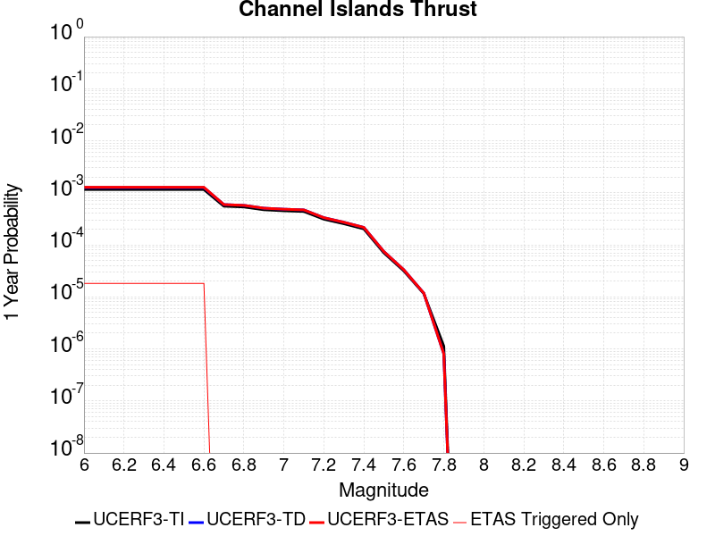 |  |

| Magnitude | 1 wk TI Prob | 1 wk TD Prob | 1 wk ETAS Prob | 1 wk ETAS/TD Gain | 1 wk ETAS Triggered Only | 1 mo TI Prob | 1 mo TD Prob | 1 mo ETAS Prob | 1 mo ETAS/TD Gain | 1 mo ETAS Triggered Only | 1 yr TI Prob | 1 yr TD Prob | 1 yr ETAS Prob | 1 yr ETAS/TD Gain | 1 yr ETAS Triggered Only | 10 yr TI Prob | 10 yr TD Prob | 10 yr ETAS Prob | 10 yr ETAS/TD Gain | 10 yr ETAS Triggered Only |
|-----|-----|-----|-----|-----|-----|-----|-----|-----|-----|-----|-----|-----|-----|-----|-----|-----|-----|-----|-----|-----|
| 6.0 | 2.2156251E-5 | 2.4092022E-5 | 5.40913E-5 | 2.2451954 | 3.0E-5 | 9.495191E-5 | 1.03248036E-4 | 1.3324495E-4 | 1.2905325 | 3.0E-5 | 0.0011554264 | 0.0012564264 | 0.0012863888 | 1.0238472 | 3.0E-5 | 0.011494373 | 0.0125038205 | 0.012543321 | 1.003159 | 4.0E-5 |
| 6.1 | 2.2156251E-5 | 2.4092022E-5 | 5.40913E-5 | 2.2451954 | 3.0E-5 | 9.495191E-5 | 1.03248036E-4 | 1.3324495E-4 | 1.2905325 | 3.0E-5 | 0.0011554264 | 0.0012564264 | 0.0012863888 | 1.0238472 | 3.0E-5 | 0.011494373 | 0.0125038205 | 0.012543321 | 1.003159 | 4.0E-5 |
| 6.2 | 2.2156251E-5 | 2.4092022E-5 | 5.40913E-5 | 2.2451954 | 3.0E-5 | 9.495191E-5 | 1.03248036E-4 | 1.3324495E-4 | 1.2905325 | 3.0E-5 | 0.0011554264 | 0.0012564264 | 0.0012863888 | 1.0238472 | 3.0E-5 | 0.011494373 | 0.0125038205 | 0.012543321 | 1.003159 | 4.0E-5 |
| 6.3 | 2.2156251E-5 | 2.4092022E-5 | 5.40913E-5 | 2.2451954 | 3.0E-5 | 9.495191E-5 | 1.03248036E-4 | 1.3324495E-4 | 1.2905325 | 3.0E-5 | 0.0011554264 | 0.0012564264 | 0.0012863888 | 1.0238472 | 3.0E-5 | 0.011494373 | 0.0125038205 | 0.012543321 | 1.003159 | 4.0E-5 |
| 6.4 | 2.2156251E-5 | 2.4092022E-5 | 5.40913E-5 | 2.2451954 | 3.0E-5 | 9.495191E-5 | 1.03248036E-4 | 1.3324495E-4 | 1.2905325 | 3.0E-5 | 0.0011554264 | 0.0012564264 | 0.0012863888 | 1.0238472 | 3.0E-5 | 0.011494373 | 0.0125038205 | 0.012543321 | 1.003159 | 4.0E-5 |
| 6.5 | 2.2156251E-5 | 2.4092022E-5 | 5.40913E-5 | 2.2451954 | 3.0E-5 | 9.495191E-5 | 1.03248036E-4 | 1.3324495E-4 | 1.2905325 | 3.0E-5 | 0.0011554264 | 0.0012564264 | 0.0012863888 | 1.0238472 | 3.0E-5 | 0.011494373 | 0.0125038205 | 0.012543321 | 1.003159 | 4.0E-5 |
| 6.6 | 2.2156251E-5 | 2.4092022E-5 | 5.40913E-5 | 2.2451954 | 3.0E-5 | 9.495191E-5 | 1.03248036E-4 | 1.3324495E-4 | 1.2905325 | 3.0E-5 | 0.0011554264 | 0.0012564264 | 0.0012863888 | 1.0238472 | 3.0E-5 | 0.011494373 | 0.0125038205 | 0.012543321 | 1.003159 | 4.0E-5 |
| 6.7 | 1.0601296E-5 | 1.1379544E-5 | 2.137943E-5 | 1.8787599 | 1.0E-5 | 4.5433335E-5 | 4.876859E-5 | 5.8768102E-5 | 1.20504 | 1.0E-5 | 5.5301044E-4 | 5.936007E-4 | 6.0359476E-4 | 1.0168363 | 1.0E-5 | 0.005516363 | 0.005920653 | 0.005930594 | 1.001679 | 1.0E-5 |
| 6.8 | 1.0246747E-5 | 1.0996669E-5 | 2.0996558E-5 | 1.9093564 | 1.0E-5 | 4.391389E-5 | 4.7127756E-5 | 5.7127283E-5 | 1.2121792 | 1.0E-5 | 5.345204E-4 | 5.7363417E-4 | 5.836284E-4 | 1.0174227 | 1.0E-5 | 0.0053323656 | 0.005722025 | 0.0057319677 | 1.0017376 | 1.0E-5 |
| 6.9 | 9.049551E-6 | 9.699645E-6 | 1.9699548E-5 | 2.0309556 | 1.0E-5 | 3.878322E-5 | 4.1569267E-5 | 5.1568848E-5 | 1.2405523 | 1.0E-5 | 4.7208337E-4 | 5.059924E-4 | 5.1598734E-4 | 1.0197531 | 1.0E-5 | 0.0047108172 | 0.0050488203 | 0.0050587696 | 1.0019706 | 1.0E-5 |
| 7.0 | 8.6542195E-6 | 9.274603E-6 | 1.927451E-5 | 2.0782032 | 1.0E-5 | 3.7088983E-5 | 3.9747716E-5 | 4.974732E-5 | 1.2515768 | 1.0E-5 | 4.5146482E-4 | 4.8382508E-4 | 4.9382023E-4 | 1.0206586 | 1.0E-5 | 0.004505487 | 0.004828129 | 0.004838081 | 1.0020612 | 1.0E-5 |
| 7.1 | 8.391028E-6 | 8.992924E-6 | 1.8992834E-5 | 2.1119752 | 1.0E-5 | 3.5961057E-5 | 3.854056E-5 | 4.8540176E-5 | 1.2594569 | 1.0E-5 | 4.3773788E-4 | 4.6913436E-4 | 4.7912967E-4 | 1.0213058 | 1.0E-5 | 0.004368766 | 0.0046818503 | 0.0046918034 | 1.0021259 | 1.0E-5 |
| 7.2 | 5.965188E-6 | 6.3716952E-6 | 1.6371632E-5 | 2.569431 | 1.0E-5 | 2.556484E-5 | 2.7306982E-5 | 3.730671E-5 | 1.3661968 | 1.0E-5 | 3.1120746E-4 | 3.3241234E-4 | 3.42409E-4 | 1.0300732 | 1.0E-5 | 0.00310772 | 0.0033192092 | 0.003329176 | 1.0030028 | 1.0E-5 |
| 7.3 | 4.877518E-6 | 5.2060063E-6 | 1.5205955E-5 | 2.9208481 | 1.0E-5 | 2.0903482E-5 | 2.2311267E-5 | 3.2311043E-5 | 1.448194 | 1.0E-5 | 2.5447016E-4 | 2.716063E-4 | 2.8160357E-4 | 1.036808 | 1.0E-5 | 0.0025417898 | 0.0027127895 | 0.0027227623 | 1.0036763 | 1.0E-5 |
| 7.4 | 3.8829853E-6 | 4.141863E-6 | 1.4141821E-5 | 3.4143627 | 1.0E-5 | 1.664126E-5 | 1.7750723E-5 | 2.7750544E-5 | 1.5633473 | 1.0E-5 | 2.0258849E-4 | 2.1609402E-4 | 2.2609186E-4 | 1.0462662 | 1.0E-5 | 0.002024039 | 0.0021588807 | 0.0021688591 | 1.004622 | 1.0E-5 |
| 7.5 | 1.3489616E-6 | 1.4277903E-6 | 1.1427776E-5 | 8.003819 | 1.0E-5 | 5.7812517E-6 | 6.119087E-6 | 1.6119026E-5 | 2.6342206 | 1.0E-5 | 7.038446E-5 | 7.449738E-5 | 8.4496634E-5 | 1.1342229 | 1.0E-5 | 7.036218E-4 | 7.44728E-4 | 7.547206E-4 | 1.0134177 | 1.0E-5 |
| 7.6 | 6.058192E-7 | 6.353778E-7 | 6.353778E-7 | 1.0 | 0.0 | 2.5963652E-6 | 2.7230449E-6 | 2.7230449E-6 | 1.0 | 0.0 | 3.161029E-5 | 3.3152584E-5 | 3.3152584E-5 | 1.0 | 0.0 | 3.1605794E-4 | 3.31478E-4 | 3.31478E-4 | 1.0 | 0.0 |
| 7.7 | 2.2170494E-7 | 2.2607902E-7 | 2.2607902E-7 | 1.0 | 0.0 | 9.5016367E-7 | 9.689098E-7 | 9.689098E-7 | 1.0 | 0.0 | 1.1568181E-5 | 1.1796425E-5 | 1.1796425E-5 | 1.0 | 0.0 | 1.1567579E-4 | 1.1795909E-4 | 1.1795909E-4 | 1.0 | 0.0 |
| 7.8 | 2.1613102E-8 | 1.5466682E-8 | 1.5466682E-8 | 1.0 | 0.0 | 9.262757E-8 | 6.628578E-8 | 6.628578E-8 | 1.0 | 0.0 | 1.1277401E-6 | 8.070291E-7 | 8.070291E-7 | 1.0 | 0.0 | 1.1277344E-5 | 8.070269E-6 | 8.070269E-6 | 1.0 | 0.0 |

## Santa Monica alt 1
*[(top)](#table-of-contents)*

| 1 Week | 1 Month | 1 Year | 10 Year |
|-----|-----|-----|-----|
| 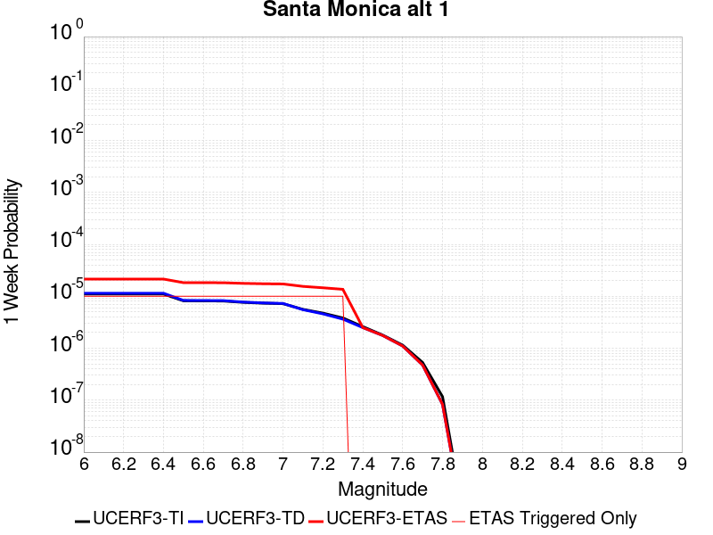 | 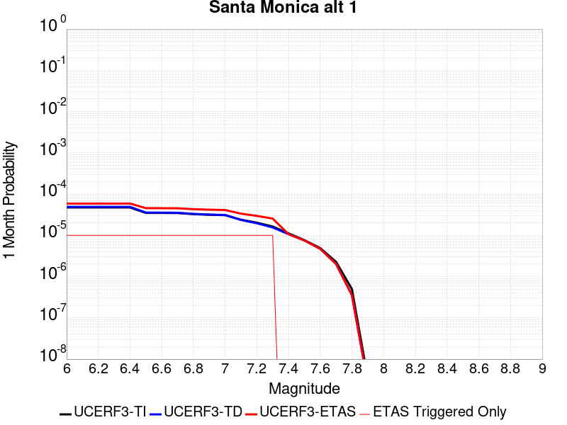 | 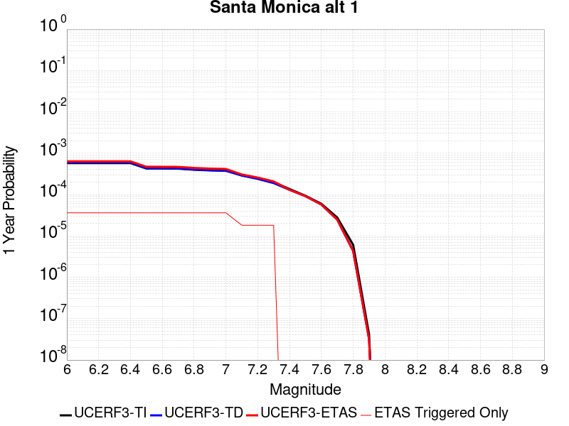 | 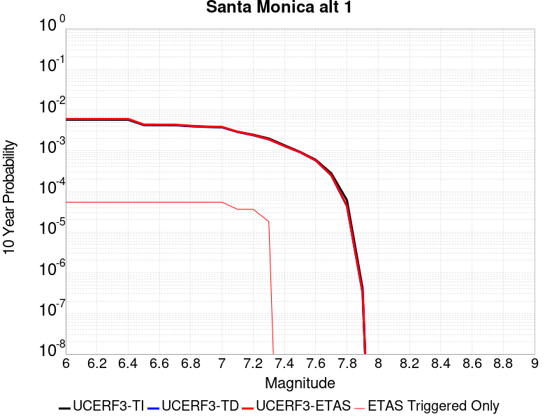 |

| Magnitude | 1 wk TI Prob | 1 wk TD Prob | 1 wk ETAS Prob | 1 wk ETAS/TD Gain | 1 wk ETAS Triggered Only | 1 mo TI Prob | 1 mo TD Prob | 1 mo ETAS Prob | 1 mo ETAS/TD Gain | 1 mo ETAS Triggered Only | 1 yr TI Prob | 1 yr TD Prob | 1 yr ETAS Prob | 1 yr ETAS/TD Gain | 1 yr ETAS Triggered Only | 10 yr TI Prob | 10 yr TD Prob | 10 yr ETAS Prob | 10 yr ETAS/TD Gain | 10 yr ETAS Triggered Only |
|-----|-----|-----|-----|-----|-----|-----|-----|-----|-----|-----|-----|-----|-----|-----|-----|-----|-----|-----|-----|-----|
| 6.0 | 1.1066008E-5 | 1.148031E-5 | 2.1480195E-5 | 1.8710467 | 1.0E-5 | 4.742488E-5 | 4.920048E-5 | 5.919999E-5 | 1.20324 | 1.0E-5 | 5.7724497E-4 | 5.9886515E-4 | 6.1885314E-4 | 1.0333765 | 2.0E-5 | 0.005757478 | 0.0059739 | 0.006013661 | 1.0066558 | 4.0E-5 |
| 6.1 | 1.1066008E-5 | 1.148031E-5 | 2.1480195E-5 | 1.8710467 | 1.0E-5 | 4.742488E-5 | 4.920048E-5 | 5.919999E-5 | 1.20324 | 1.0E-5 | 5.7724497E-4 | 5.9886515E-4 | 6.1885314E-4 | 1.0333765 | 2.0E-5 | 0.005757478 | 0.0059739 | 0.006013661 | 1.0066558 | 4.0E-5 |
| 6.2 | 1.1066008E-5 | 1.148031E-5 | 2.1480195E-5 | 1.8710467 | 1.0E-5 | 4.742488E-5 | 4.920048E-5 | 5.919999E-5 | 1.20324 | 1.0E-5 | 5.7724497E-4 | 5.9886515E-4 | 6.1885314E-4 | 1.0333765 | 2.0E-5 | 0.005757478 | 0.0059739 | 0.006013661 | 1.0066558 | 4.0E-5 |
| 6.3 | 1.1066008E-5 | 1.148031E-5 | 2.1480195E-5 | 1.8710467 | 1.0E-5 | 4.742488E-5 | 4.920048E-5 | 5.919999E-5 | 1.20324 | 1.0E-5 | 5.7724497E-4 | 5.9886515E-4 | 6.1885314E-4 | 1.0333765 | 2.0E-5 | 0.005757478 | 0.0059739 | 0.006013661 | 1.0066558 | 4.0E-5 |
| 6.4 | 1.1066008E-5 | 1.148031E-5 | 2.1480195E-5 | 1.8710467 | 1.0E-5 | 4.742488E-5 | 4.920048E-5 | 5.919999E-5 | 1.20324 | 1.0E-5 | 5.7724497E-4 | 5.9886515E-4 | 6.1885314E-4 | 1.0333765 | 2.0E-5 | 0.005757478 | 0.0059739 | 0.006013661 | 1.0066558 | 4.0E-5 |
| 6.5 | 8.183544E-6 | 8.335432E-6 | 1.8335348E-5 | 2.199688 | 1.0E-5 | 3.5071862E-5 | 3.57228E-5 | 4.572244E-5 | 1.2799233 | 1.0E-5 | 4.2691626E-4 | 4.3483984E-4 | 4.5483114E-4 | 1.0459739 | 2.0E-5 | 0.0042609703 | 0.0043400554 | 0.004379882 | 1.0091765 | 4.0E-5 |
| 6.6 | 8.1543285E-6 | 8.303646E-6 | 1.8303563E-5 | 2.2042804 | 1.0E-5 | 3.4946657E-5 | 3.5586578E-5 | 4.558622E-5 | 1.2809949 | 1.0E-5 | 4.2539247E-4 | 4.3318202E-4 | 4.5317336E-4 | 1.04615 | 2.0E-5 | 0.0042457907 | 0.004323542 | 0.0043633687 | 1.0092117 | 4.0E-5 |
| 6.7 | 8.110878E-6 | 8.257042E-6 | 1.825696E-5 | 2.2110775 | 1.0E-5 | 3.4760444E-5 | 3.5386853E-5 | 4.53865E-5 | 1.2825809 | 1.0E-5 | 4.231262E-4 | 4.3075136E-4 | 4.5074275E-4 | 1.0464104 | 2.0E-5 | 0.0042232145 | 0.0042993296 | 0.0043391576 | 1.0092638 | 4.0E-5 |
| 6.8 | 7.644036E-6 | 7.75106E-6 | 1.7750983E-5 | 2.290136 | 1.0E-5 | 3.275974E-5 | 3.3218414E-5 | 4.3218082E-5 | 1.3010279 | 1.0E-5 | 3.9877684E-4 | 4.0436056E-4 | 4.2435247E-4 | 1.0494409 | 2.0E-5 | 0.00398062 | 0.0040363944 | 0.004076233 | 1.0098698 | 4.0E-5 |
| 6.9 | 7.3698293E-6 | 7.455719E-6 | 1.7455644E-5 | 2.3412423 | 1.0E-5 | 3.15846E-5 | 3.19527E-5 | 4.195238E-5 | 1.3129526 | 1.0E-5 | 3.8447464E-4 | 3.8895605E-4 | 4.0894828E-4 | 1.0513997 | 2.0E-5 | 0.0038381014 | 0.0038828964 | 0.003922741 | 1.0102615 | 4.0E-5 |
| 7.0 | 7.209872E-6 | 7.2856255E-6 | 1.7285553E-5 | 2.3725557 | 1.0E-5 | 3.0899086E-5 | 3.1223743E-5 | 4.1223433E-5 | 1.3202591 | 1.0E-5 | 3.7613141E-4 | 3.8008415E-4 | 4.0007656E-4 | 1.0525999 | 2.0E-5 | 0.0037549543 | 0.0037944836 | 0.0038343319 | 1.0105016 | 4.0E-5 |
| 7.1 | 5.603456E-6 | 5.5238925E-6 | 1.5523838E-5 | 2.8103077 | 1.0E-5 | 2.4014591E-5 | 2.3673612E-5 | 3.3673376E-5 | 1.4224013 | 1.0E-5 | 2.923384E-4 | 2.881885E-4 | 2.9818562E-4 | 1.0346895 | 1.0E-5 | 0.0029195412 | 0.0028781896 | 0.0029081032 | 1.0103933 | 3.0E-5 |
| 7.2 | 4.7483613E-6 | 4.5911324E-6 | 1.4591086E-5 | 3.1781018 | 1.0E-5 | 2.0349962E-5 | 1.9676136E-5 | 2.9675937E-5 | 1.50822 | 1.0E-5 | 2.4773262E-4 | 2.3953074E-4 | 2.4952833E-4 | 1.0417383 | 1.0E-5 | 0.0024745662 | 0.0023927398 | 0.002422668 | 1.0125079 | 3.0E-5 |
| 7.3 | 3.829015E-6 | 3.6342253E-6 | 1.3634189E-5 | 3.7516081 | 1.0E-5 | 1.6409962E-5 | 1.5575159E-5 | 2.5575002E-5 | 1.642038 | 1.0E-5 | 1.9977297E-4 | 1.8961114E-4 | 1.9960925E-4 | 1.0527295 | 1.0E-5 | 0.0019959346 | 0.0018945024 | 0.0019144645 | 1.0105369 | 2.0E-5 |
| 7.4 | 2.610755E-6 | 2.4995716E-6 | 2.4995716E-6 | 1.0 | 0.0 | 1.1188902E-5 | 1.0712406E-5 | 1.0712406E-5 | 1.0 | 0.0 | 1.3621636E-4 | 1.3041578E-4 | 1.3041578E-4 | 1.0 | 0.0 | 0.001361329 | 0.0013033969 | 0.0013133838 | 1.0076623 | 1.0E-5 |
| 7.5 | 1.792146E-6 | 1.7584184E-6 | 1.7584184E-6 | 1.0 | 0.0 | 7.680603E-6 | 7.536057E-6 | 7.536057E-6 | 1.0 | 0.0 | 9.3507326E-5 | 9.1747665E-5 | 9.1747665E-5 | 1.0 | 0.0 | 9.3467993E-4 | 9.1710105E-4 | 9.2709187E-4 | 1.010894 | 1.0E-5 |
| 7.6 | 1.1473018E-6 | 1.1029152E-6 | 1.1029152E-6 | 1.0 | 0.0 | 4.9169985E-6 | 4.726771E-6 | 4.726771E-6 | 1.0 | 0.0 | 5.986281E-5 | 5.7546935E-5 | 5.7546935E-5 | 1.0 | 0.0 | 5.984669E-4 | 5.7532196E-4 | 5.853162E-4 | 1.0173715 | 1.0E-5 |
| 7.7 | 5.330919E-7 | 4.7452556E-7 | 4.7452556E-7 | 1.0 | 0.0 | 2.2846775E-6 | 2.0336795E-6 | 2.0336795E-6 | 1.0 | 0.0 | 2.7815593E-5 | 2.4759778E-5 | 2.4759778E-5 | 1.0 | 0.0 | 2.7812112E-4 | 2.4757133E-4 | 2.4757133E-4 | 1.0 | 0.0 |
| 7.8 | 1.1668574E-7 | 8.2966224E-8 | 8.2966224E-8 | 1.0 | 0.0 | 5.000816E-7 | 3.5556948E-7 | 3.5556948E-7 | 1.0 | 0.0 | 6.0884768E-6 | 4.32905E-6 | 4.32905E-6 | 1.0 | 0.0 | 6.08831E-5 | 4.3289692E-5 | 4.3289692E-5 | 1.0 | 0.0 |
| 7.9 | 8.007447E-10 | 6.1608785E-10 | 6.1608785E-10 | 1.0 | 0.0 | 3.4317629E-9 | 2.6403764E-9 | 2.6403764E-9 | 1.0 | 0.0 | 4.1781714E-8 | 3.2146584E-8 | 3.2146584E-8 | 1.0 | 0.0 | 4.1781706E-7 | 3.214658E-7 | 3.214658E-7 | 1.0 | 0.0 |

## Cerro Prieto
*[(top)](#table-of-contents)*

| 1 Week | 1 Month | 1 Year | 10 Year |
|-----|-----|-----|-----|
| 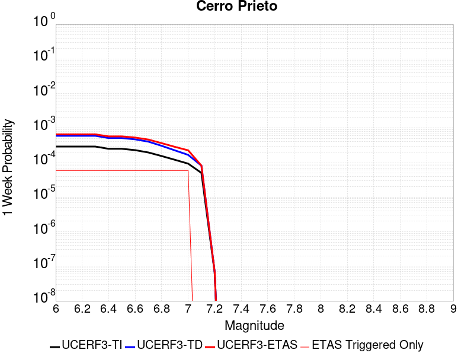 | 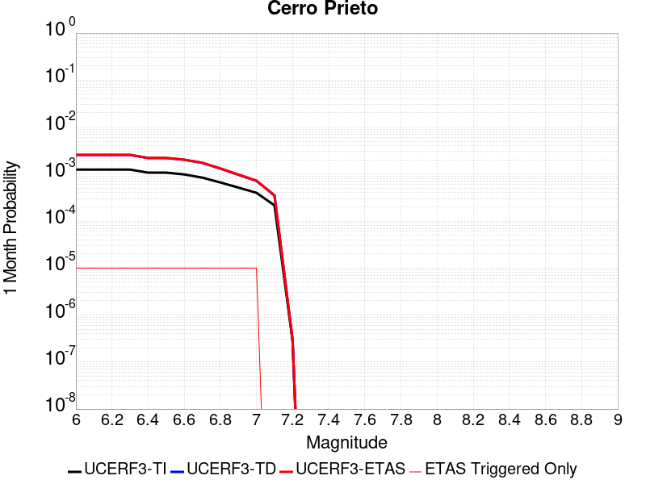 | 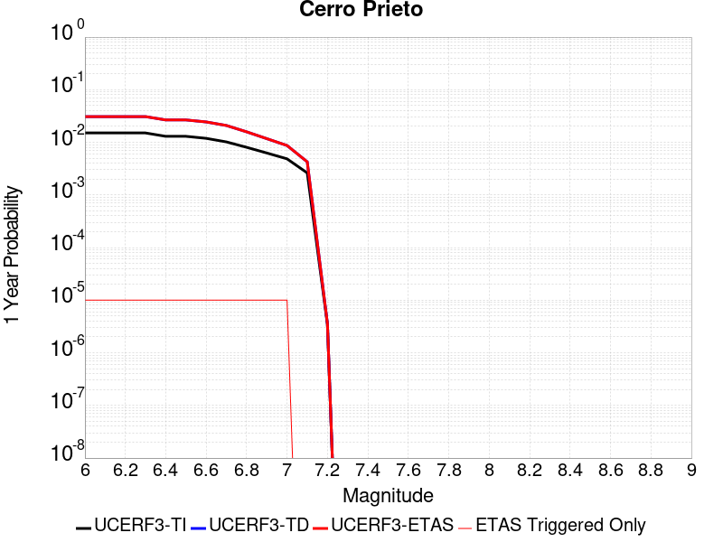 | 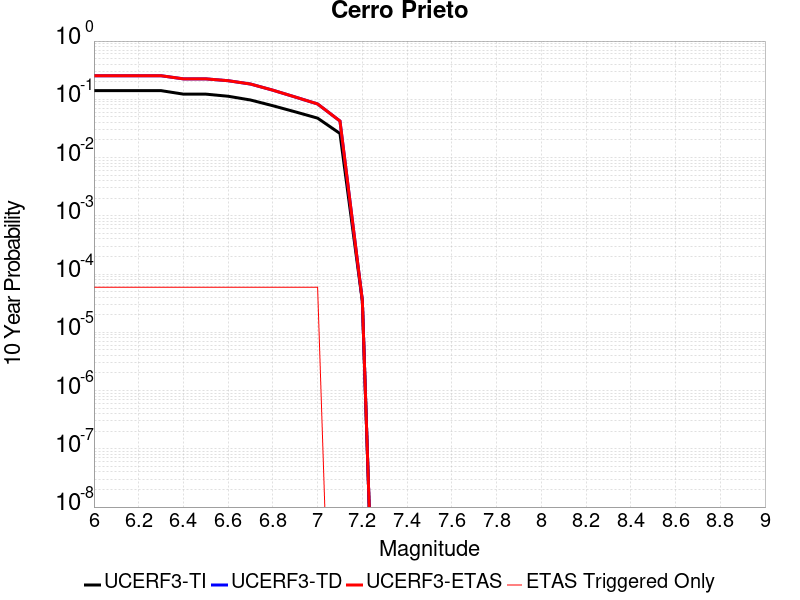 |

| Magnitude | 1 wk TI Prob | 1 wk TD Prob | 1 wk ETAS Prob | 1 wk ETAS/TD Gain | 1 wk ETAS Triggered Only | 1 mo TI Prob | 1 mo TD Prob | 1 mo ETAS Prob | 1 mo ETAS/TD Gain | 1 mo ETAS Triggered Only | 1 yr TI Prob | 1 yr TD Prob | 1 yr ETAS Prob | 1 yr ETAS/TD Gain | 1 yr ETAS Triggered Only | 10 yr TI Prob | 10 yr TD Prob | 10 yr ETAS Prob | 10 yr ETAS/TD Gain | 10 yr ETAS Triggered Only |
|-----|-----|-----|-----|-----|-----|-----|-----|-----|-----|-----|-----|-----|-----|-----|-----|-----|-----|-----|-----|-----|
| 6.0 | 2.9101528E-4 | 5.964804E-4 | 6.064744E-4 | 1.016755 | 1.0E-5 | 0.0012466122 | 0.002554082 | 0.0025640565 | 1.0039053 | 1.0E-5 | 0.015072231 | 0.03064807 | 0.030657765 | 1.0003163 | 1.0E-5 | 0.14089979 | 0.25397858 | 0.2540084 | 1.0001175 | 4.0E-5 |
| 6.1 | 2.9101528E-4 | 5.964804E-4 | 6.064744E-4 | 1.016755 | 1.0E-5 | 0.0012466122 | 0.002554082 | 0.0025640565 | 1.0039053 | 1.0E-5 | 0.015072231 | 0.03064807 | 0.030657765 | 1.0003163 | 1.0E-5 | 0.14089979 | 0.25397858 | 0.2540084 | 1.0001175 | 4.0E-5 |
| 6.2 | 2.9101528E-4 | 5.964804E-4 | 6.064744E-4 | 1.016755 | 1.0E-5 | 0.0012466122 | 0.002554082 | 0.0025640565 | 1.0039053 | 1.0E-5 | 0.015072231 | 0.03064807 | 0.030657765 | 1.0003163 | 1.0E-5 | 0.14089979 | 0.25397858 | 0.2540084 | 1.0001175 | 4.0E-5 |
| 6.3 | 2.9101528E-4 | 5.964804E-4 | 6.064744E-4 | 1.016755 | 1.0E-5 | 0.0012466122 | 0.002554082 | 0.0025640565 | 1.0039053 | 1.0E-5 | 0.015072231 | 0.03064807 | 0.030657765 | 1.0003163 | 1.0E-5 | 0.14089979 | 0.25397858 | 0.2540084 | 1.0001175 | 4.0E-5 |
| 6.4 | 2.508648E-4 | 5.1397446E-4 | 5.239693E-4 | 1.0194463 | 1.0E-5 | 0.0010746918 | 0.0022010866 | 0.0022110646 | 1.0045332 | 1.0E-5 | 0.013006088 | 0.026471792 | 0.026481528 | 1.0003678 | 1.0E-5 | 0.12270685 | 0.22440416 | 0.22443518 | 1.0001383 | 4.0E-5 |
| 6.5 | 2.508648E-4 | 5.1397446E-4 | 5.239693E-4 | 1.0194463 | 1.0E-5 | 0.0010746918 | 0.0022010866 | 0.0022110646 | 1.0045332 | 1.0E-5 | 0.013006088 | 0.026471792 | 0.026481528 | 1.0003678 | 1.0E-5 | 0.12270685 | 0.22440416 | 0.22443518 | 1.0001383 | 4.0E-5 |
| 6.6 | 2.294914E-4 | 4.7116808E-4 | 4.8116336E-4 | 1.0212139 | 1.0E-5 | 9.831638E-4 | 0.0020179166 | 0.0020278965 | 1.0049456 | 1.0E-5 | 0.011904482 | 0.02429866 | 0.024308417 | 1.0004015 | 1.0E-5 | 0.11286586 | 0.20858558 | 0.20861723 | 1.0001518 | 4.0E-5 |
| 6.7 | 1.9621674E-4 | 4.0419117E-4 | 4.1418715E-4 | 1.0247308 | 1.0E-5 | 8.4065786E-4 | 0.0017312564 | 0.001741239 | 1.0057662 | 1.0E-5 | 0.010187071 | 0.020884845 | 0.020894635 | 1.0004689 | 1.0E-5 | 0.09732539 | 0.18290249 | 0.18291883 | 1.0000894 | 2.0E-5 |
| 6.8 | 1.5476145E-4 | 3.056516E-4 | 3.1564853E-4 | 1.032707 | 1.0E-5 | 6.6309475E-4 | 0.00130938 | 0.0013193669 | 1.0076272 | 1.0E-5 | 0.008043335 | 0.015836509 | 0.01584635 | 1.0006214 | 1.0E-5 | 0.07758363 | 0.14336355 | 0.14338069 | 1.0001194 | 2.0E-5 |
| 6.9 | 1.20509176E-4 | 2.2582515E-4 | 2.358229E-4 | 1.0442721 | 1.0E-5 | 5.1636563E-4 | 9.6752634E-4 | 9.775166E-4 | 1.0103257 | 1.0E-5 | 0.006268645 | 0.011726342 | 0.011736225 | 1.0008428 | 1.0E-5 | 0.060947374 | 0.109451205 | 0.10946901 | 1.0001627 | 2.0E-5 |
| 7.0 | 9.3269155E-5 | 1.6716642E-4 | 1.7716475E-4 | 1.0598106 | 1.0E-5 | 3.9966372E-4 | 7.162739E-4 | 7.2626676E-4 | 1.0139512 | 1.0E-5 | 0.0048550544 | 0.008693418 | 0.008703331 | 1.0011402 | 1.0E-5 | 0.04750344 | 0.08315912 | 0.083177455 | 1.0002205 | 2.0E-5 |
| 7.1 | 5.029709E-5 | 8.1718936E-5 | 8.1718936E-5 | 1.0 | 0.0 | 2.1554115E-4 | 3.5019626E-4 | 3.5019626E-4 | 1.0 | 0.0 | 0.0026210553 | 0.0042587193 | 0.0042587193 | 1.0 | 0.0 | 0.025903556 | 0.042365108 | 0.042365108 | 1.0 | 0.0 |
| 7.2 | 6.5445185E-8 | 6.814903E-8 | 6.814903E-8 | 1.0 | 0.0 | 2.8047933E-7 | 2.9206726E-7 | 2.9206726E-7 | 1.0 | 0.0 | 3.4148304E-6 | 3.555919E-6 | 3.555919E-6 | 1.0 | 0.0 | 3.414778E-5 | 3.5559187E-5 | 3.5559187E-5 | 1.0 | 0.0 |

## Calaveras (So) 2011 CFM
*[(top)](#table-of-contents)*

| 1 Week | 1 Month | 1 Year | 10 Year |
|-----|-----|-----|-----|
| 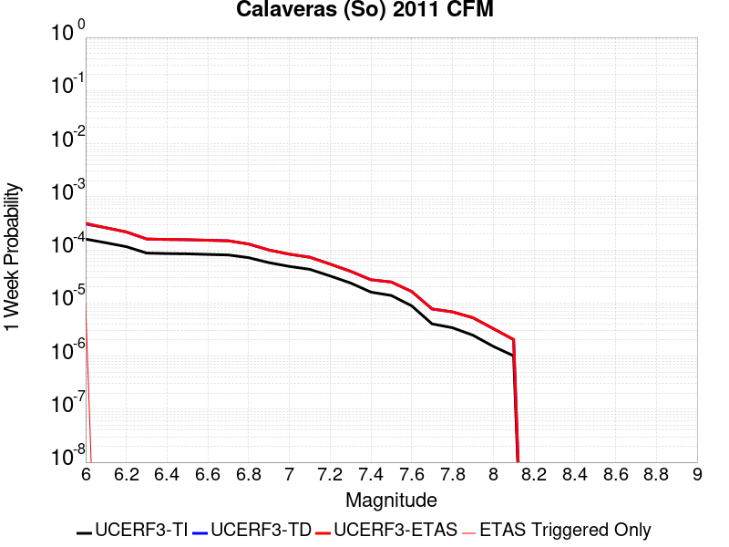 | 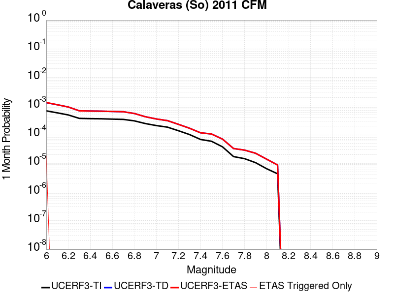 | 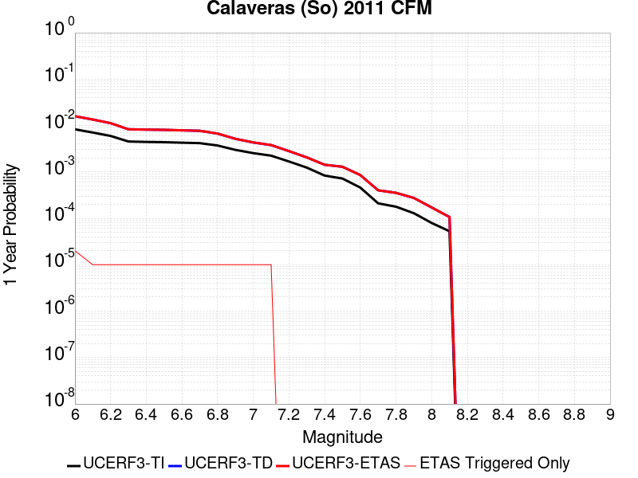 | 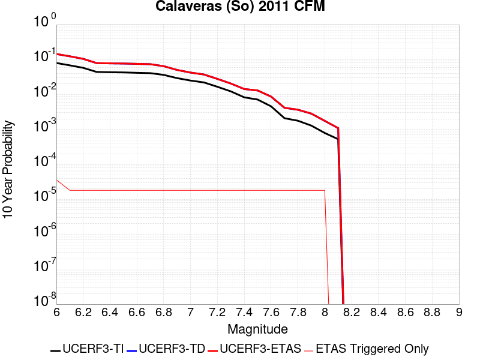 |

| Magnitude | 1 wk TI Prob | 1 wk TD Prob | 1 wk ETAS Prob | 1 wk ETAS/TD Gain | 1 wk ETAS Triggered Only | 1 mo TI Prob | 1 mo TD Prob | 1 mo ETAS Prob | 1 mo ETAS/TD Gain | 1 mo ETAS Triggered Only | 1 yr TI Prob | 1 yr TD Prob | 1 yr ETAS Prob | 1 yr ETAS/TD Gain | 1 yr ETAS Triggered Only | 10 yr TI Prob | 10 yr TD Prob | 10 yr ETAS Prob | 10 yr ETAS/TD Gain | 10 yr ETAS Triggered Only |
|-----|-----|-----|-----|-----|-----|-----|-----|-----|-----|-----|-----|-----|-----|-----|-----|-----|-----|-----|-----|-----|
| 6.0 | 1.5950744E-4 | 3.071188E-4 | 3.1711574E-4 | 1.0325507 | 1.0E-5 | 6.834242E-4 | 0.0013155643 | 0.001335538 | 1.0151826 | 2.0E-5 | 0.00828899 | 0.01585904 | 0.015878722 | 1.0012411 | 2.0E-5 | 0.079865426 | 0.14440064 | 0.14443487 | 1.000237 | 4.0E-5 |
| 6.1 | 1.3584697E-4 | 2.6036944E-4 | 2.6036944E-4 | 1.0 | 0.0 | 5.8207137E-4 | 0.0011153965 | 0.0011253853 | 1.0089555 | 1.0E-5 | 0.007063716 | 0.013462106 | 0.013471971 | 1.0007328 | 1.0E-5 | 0.06843361 | 0.12402854 | 0.12405483 | 1.0002118 | 3.0E-5 |
| 6.2 | 1.14676266E-4 | 2.1726108E-4 | 2.1726108E-4 | 1.0 | 0.0 | 4.9137714E-4 | 9.307893E-4 | 9.4078E-4 | 1.0107336 | 1.0E-5 | 0.0059661185 | 0.011245592 | 0.011255479 | 1.0008793 | 1.0E-5 | 0.058084648 | 0.105019294 | 0.10504614 | 1.0002557 | 3.0E-5 |
| 6.3 | 8.691518E-5 | 1.5987165E-4 | 1.5987165E-4 | 1.0 | 0.0 | 3.7244044E-4 | 6.8496726E-4 | 6.949604E-4 | 1.0145892 | 1.0E-5 | 0.004525038 | 0.008300893 | 0.008310811 | 1.0011947 | 1.0E-5 | 0.044339992 | 0.0793347 | 0.07936232 | 1.0003481 | 3.0E-5 |
| 6.4 | 8.50982E-5 | 1.5693568E-4 | 1.5693568E-4 | 1.0 | 0.0 | 3.646556E-4 | 6.7239115E-4 | 6.823844E-4 | 1.0148623 | 1.0E-5 | 0.0044306475 | 0.008148931 | 0.008158849 | 1.0012171 | 1.0E-5 | 0.04343345 | 0.077940844 | 0.07796851 | 1.0003549 | 3.0E-5 |
| 6.5 | 8.4062965E-5 | 1.5518135E-4 | 1.5518135E-4 | 1.0 | 0.0 | 3.602201E-4 | 6.648764E-4 | 6.7486975E-4 | 1.0150304 | 1.0E-5 | 0.004376863 | 0.008058134 | 0.008068052 | 1.001231 | 1.0E-5 | 0.042916555 | 0.077112116 | 0.0771398 | 1.000359 | 3.0E-5 |
| 6.6 | 8.194716E-5 | 1.5154095E-4 | 1.5154095E-4 | 1.0 | 0.0 | 3.5115483E-4 | 6.492825E-4 | 6.5927603E-4 | 1.0153916 | 1.0E-5 | 0.0042669317 | 0.007869979 | 0.007879901 | 1.0012606 | 1.0E-5 | 0.04185927 | 0.07539739 | 0.075425126 | 1.0003679 | 3.0E-5 |
| 6.7 | 8.012326E-5 | 1.4821833E-4 | 1.4821833E-4 | 1.0 | 0.0 | 3.433402E-4 | 6.350497E-4 | 6.450433E-4 | 1.0157368 | 1.0E-5 | 0.004172157 | 0.007698474 | 0.007708397 | 1.001289 | 1.0E-5 | 0.040946912 | 0.073839515 | 0.0738673 | 1.0003763 | 3.0E-5 |
| 6.8 | 7.119773E-5 | 1.2880519E-4 | 1.2880519E-4 | 1.0 | 0.0 | 3.0509746E-4 | 5.519001E-4 | 5.618946E-4 | 1.0181092 | 1.0E-5 | 0.0037082357 | 0.0066958875 | 0.0067058206 | 1.0014834 | 1.0E-5 | 0.036469642 | 0.06468402 | 0.06471208 | 1.0004338 | 3.0E-5 |
| 6.9 | 5.7343088E-5 | 9.9189E-5 | 9.9189E-5 | 1.0 | 0.0 | 2.4573295E-4 | 4.2502693E-4 | 4.3502267E-4 | 1.023518 | 1.0E-5 | 0.0029876942 | 0.0051625078 | 0.005172456 | 1.001927 | 1.0E-5 | 0.02947844 | 0.050509132 | 0.05053762 | 1.000564 | 3.0E-5 |
| 7.0 | 4.8746577E-5 | 8.284751E-5 | 8.284751E-5 | 1.0 | 0.0 | 2.0889717E-4 | 3.550128E-4 | 3.6500924E-4 | 1.028158 | 1.0E-5 | 0.0025403565 | 0.004313781 | 0.0043237377 | 1.0023081 | 1.0E-5 | 0.025115121 | 0.04248505 | 0.042513777 | 1.0006762 | 3.0E-5 |
| 7.1 | 4.2998014E-5 | 7.264914E-5 | 7.264914E-5 | 1.0 | 0.0 | 1.8426418E-4 | 3.1131663E-4 | 3.213135E-4 | 1.0321116 | 1.0E-5 | 0.002241108 | 0.0037837527 | 0.003793715 | 1.0026329 | 1.0E-5 | 0.022186412 | 0.037423246 | 0.03745212 | 1.0007716 | 3.0E-5 |
| 7.2 | 3.221292E-5 | 5.390566E-5 | 5.390566E-5 | 1.0 | 0.0 | 1.3804805E-4 | 2.3100396E-4 | 2.3100396E-4 | 1.0 | 0.0 | 0.0016794393 | 0.0028088738 | 0.0028088738 | 1.0 | 0.0 | 0.016668037 | 0.028035998 | 0.028055437 | 1.0006933 | 2.0E-5 |
| 7.3 | 2.3756531E-5 | 3.9471706E-5 | 3.9471706E-5 | 1.0 | 0.0 | 1.0180973E-4 | 1.6915359E-4 | 1.6915359E-4 | 1.0 | 0.0 | 0.0012388286 | 0.0020575167 | 0.0020575167 | 1.0 | 0.0 | 0.012319452 | 0.02064345 | 0.020663038 | 1.0009488 | 2.0E-5 |
| 7.4 | 1.5997684E-5 | 2.734085E-5 | 2.734085E-5 | 1.0 | 0.0 | 6.8559704E-5 | 1.1716982E-4 | 1.1716982E-4 | 1.0 | 0.0 | 8.343947E-4 | 0.0014256114 | 0.0014256114 | 1.0 | 0.0 | 0.008312687 | 0.014376549 | 0.014386405 | 1.0006856 | 1.0E-5 |
| 7.5 | 1.3814293E-5 | 2.4782603E-5 | 2.4782603E-5 | 1.0 | 0.0 | 5.9202768E-5 | 1.0620684E-4 | 1.0620684E-4 | 1.0 | 0.0 | 7.205553E-4 | 0.0012923037 | 0.0012923037 | 1.0 | 0.0 | 0.007182234 | 0.013055766 | 0.013065635 | 1.0007559 | 1.0E-5 |
| 7.6 | 8.817309E-6 | 1.6429829E-5 | 1.6429829E-5 | 1.0 | 0.0 | 3.7787922E-5 | 7.041166E-5 | 7.041166E-5 | 1.0 | 0.0 | 4.5997082E-4 | 8.5692614E-4 | 8.5692614E-4 | 1.0 | 0.0 | 0.004590199 | 0.008719863 | 0.008729776 | 1.0011368 | 1.0E-5 |
| 7.7 | 4.0352206E-6 | 7.706877E-6 | 7.706877E-6 | 1.0 | 0.0 | 1.7293689E-5 | 3.3029053E-5 | 3.3029053E-5 | 1.0 | 0.0 | 2.1053031E-4 | 4.020546E-4 | 4.020546E-4 | 1.0 | 0.0 | 0.0021033096 | 0.0041649863 | 0.0041749445 | 1.002391 | 1.0E-5 |
| 7.8 | 3.413169E-6 | 6.7868646E-6 | 6.7868646E-6 | 1.0 | 0.0 | 1.4627784E-5 | 2.9086239E-5 | 2.9086239E-5 | 1.0 | 0.0 | 1.7807873E-4 | 3.5406748E-4 | 3.5406748E-4 | 1.0 | 0.0 | 0.0017793609 | 0.0036663096 | 0.003676273 | 1.0027175 | 1.0E-5 |
| 7.9 | 2.4740732E-6 | 5.278809E-6 | 5.278809E-6 | 1.0 | 0.0 | 1.06031275E-5 | 2.2623271E-5 | 2.2623271E-5 | 1.0 | 0.0 | 1.2908543E-4 | 2.7540355E-4 | 2.7540355E-4 | 1.0 | 0.0 | 0.0012901047 | 0.002834638 | 0.0028446098 | 1.0035177 | 1.0E-5 |
| 8.0 | 1.5231818E-6 | 3.2887135E-6 | 3.2887135E-6 | 1.0 | 0.0 | 6.527906E-6 | 1.409441E-5 | 1.409441E-5 | 1.0 | 0.0 | 7.9474354E-5 | 1.7158597E-4 | 1.7158597E-4 | 1.0 | 0.0 | 7.944594E-4 | 0.001756374 | 0.0017663564 | 1.0056835 | 1.0E-5 |
| 8.1 | 1.0104524E-6 | 2.0456548E-6 | 2.0456548E-6 | 1.0 | 0.0 | 4.330503E-6 | 8.767062E-6 | 8.767062E-6 | 1.0 | 0.0 | 5.2722597E-5 | 1.06733794E-4 | 1.06733794E-4 | 1.0 | 0.0 | 5.271009E-4 | 0.0010929212 | 0.0010929212 | 1.0 | 0.0 |

## Newport-Inglewood (Offshore)
*[(top)](#table-of-contents)*

| 1 Week | 1 Month | 1 Year | 10 Year |
|-----|-----|-----|-----|
| 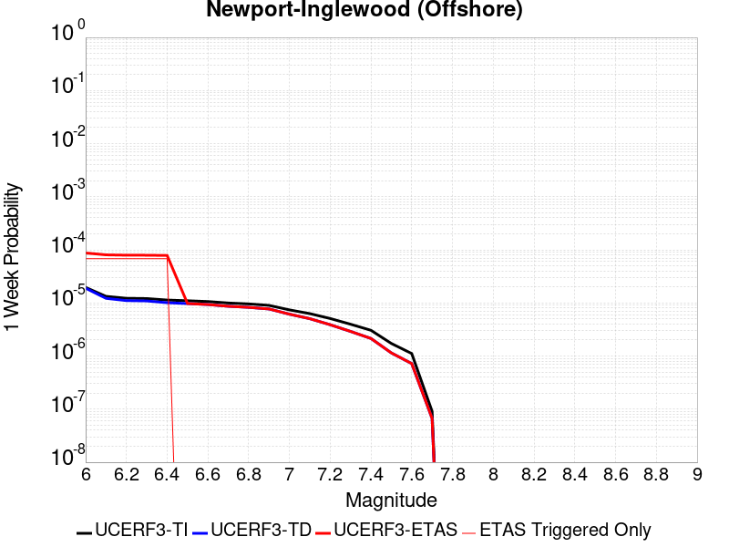 |  | 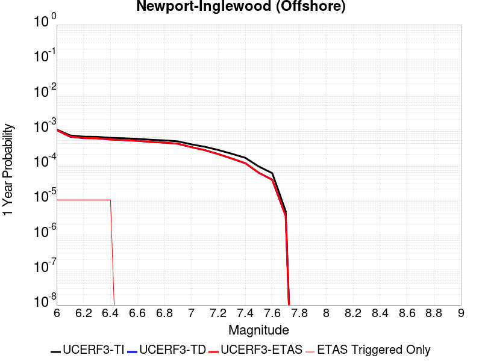 | 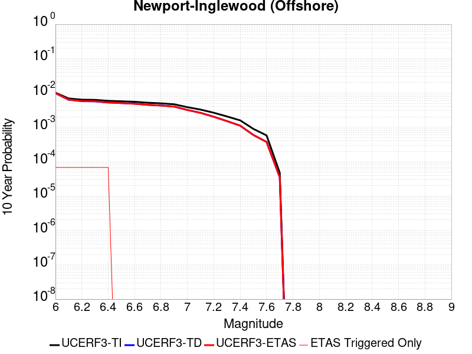 |

| Magnitude | 1 wk TI Prob | 1 wk TD Prob | 1 wk ETAS Prob | 1 wk ETAS/TD Gain | 1 wk ETAS Triggered Only | 1 mo TI Prob | 1 mo TD Prob | 1 mo ETAS Prob | 1 mo ETAS/TD Gain | 1 mo ETAS Triggered Only | 1 yr TI Prob | 1 yr TD Prob | 1 yr ETAS Prob | 1 yr ETAS/TD Gain | 1 yr ETAS Triggered Only | 10 yr TI Prob | 10 yr TD Prob | 10 yr ETAS Prob | 10 yr ETAS/TD Gain | 10 yr ETAS Triggered Only |
|-----|-----|-----|-----|-----|-----|-----|-----|-----|-----|-----|-----|-----|-----|-----|-----|-----|-----|-----|-----|-----|
| 6.0 | 1.9626508E-5 | 1.8965357E-5 | 2.8965167E-5 | 1.5272672 | 1.0E-5 | 8.411089E-5 | 8.1277634E-5 | 9.127682E-5 | 1.1230251 | 1.0E-5 | 0.001023569 | 9.891186E-4 | 9.991087E-4 | 1.0101 | 1.0E-5 | 0.010188672 | 0.009848503 | 0.00988811 | 1.0040215 | 4.0E-5 |
| 6.1 | 1.331886E-5 | 1.2218092E-5 | 2.221797E-5 | 1.8184484 | 1.0E-5 | 5.707958E-5 | 5.2362207E-5 | 6.236169E-5 | 1.1909674 | 1.0E-5 | 6.947222E-4 | 6.3732493E-4 | 6.4731855E-4 | 1.0156806 | 1.0E-5 | 0.006925544 | 0.006355149 | 0.0063849585 | 1.0046905 | 3.0E-5 |
| 6.2 | 1.2250852E-5 | 1.1076029E-5 | 2.1075919E-5 | 1.9028406 | 1.0E-5 | 5.2502597E-5 | 4.7467838E-5 | 5.7467365E-5 | 1.2106589 | 1.0E-5 | 6.3903164E-4 | 5.777687E-4 | 5.877629E-4 | 1.017298 | 1.0E-5 | 0.006371971 | 0.0057627866 | 0.0057926136 | 1.0051758 | 3.0E-5 |
| 6.3 | 1.2106258E-5 | 1.0918891E-5 | 2.0918782E-5 | 1.915834 | 1.0E-5 | 5.1882926E-5 | 4.6794412E-5 | 5.6793946E-5 | 1.2136908 | 1.0E-5 | 6.3149154E-4 | 5.69574E-4 | 5.795683E-4 | 1.017547 | 1.0E-5 | 0.0062970007 | 0.005681259 | 0.005711089 | 1.0052506 | 3.0E-5 |
| 6.4 | 1.1348758E-5 | 1.0109362E-5 | 2.010926E-5 | 1.9891721 | 1.0E-5 | 4.8636626E-5 | 4.3325123E-5 | 5.332469E-5 | 1.230803 | 1.0E-5 | 5.919901E-4 | 5.273565E-4 | 5.3735124E-4 | 1.0189525 | 1.0E-5 | 0.005904155 | 0.0052611465 | 0.0052909884 | 1.0056722 | 3.0E-5 |
| 6.5 | 1.100837E-5 | 9.7433895E-6 | 9.7433895E-6 | 1.0 | 0.0 | 4.7177873E-5 | 4.1756717E-5 | 4.1756717E-5 | 1.0 | 0.0 | 5.7423924E-4 | 5.082702E-4 | 5.082702E-4 | 1.0 | 0.0 | 0.005727576 | 0.0050711688 | 0.0050910674 | 1.0039239 | 2.0E-5 |
| 6.6 | 1.0634696E-5 | 9.345544E-6 | 9.345544E-6 | 1.0 | 0.0 | 4.557647E-5 | 4.0051716E-5 | 4.0051716E-5 | 1.0 | 0.0 | 5.5475225E-4 | 4.8752132E-4 | 4.8752132E-4 | 1.0 | 0.0 | 0.0055336943 | 0.0048646047 | 0.0048845075 | 1.0040914 | 2.0E-5 |
| 6.7 | 9.9780855E-6 | 8.667911E-6 | 8.667911E-6 | 1.0 | 0.0 | 4.276252E-5 | 3.7147664E-5 | 3.7147664E-5 | 1.0 | 0.0 | 5.205093E-4 | 4.5217964E-4 | 4.5217964E-4 | 1.0 | 0.0 | 0.0051929182 | 0.004512675 | 0.0045325845 | 1.0044119 | 2.0E-5 |
| 6.8 | 9.59546E-6 | 8.27295E-6 | 8.27295E-6 | 1.0 | 0.0 | 4.1122752E-5 | 3.5455025E-5 | 3.5455025E-5 | 1.0 | 0.0 | 5.0055445E-4 | 4.315801E-4 | 4.315801E-4 | 1.0 | 0.0 | 0.004994285 | 0.004307495 | 0.004327409 | 1.004623 | 2.0E-5 |
| 6.9 | 9.000614E-6 | 7.70684E-6 | 7.70684E-6 | 1.0 | 0.0 | 3.857349E-5 | 3.30289E-5 | 3.30289E-5 | 1.0 | 0.0 | 4.6953102E-4 | 4.0205332E-4 | 4.0205332E-4 | 1.0 | 0.0 | 0.004685402 | 0.0040133307 | 0.0040332507 | 1.0049634 | 2.0E-5 |
| 7.0 | 7.4070194E-6 | 6.148904E-6 | 6.148904E-6 | 1.0 | 0.0 | 3.1743984E-5 | 2.635218E-5 | 2.635218E-5 | 1.0 | 0.0 | 3.8641447E-4 | 3.207907E-4 | 3.207907E-4 | 1.0 | 0.0 | 0.0038574322 | 0.0032032963 | 0.0032232322 | 1.0062236 | 2.0E-5 |
| 7.1 | 6.299615E-6 | 5.0565927E-6 | 5.0565927E-6 | 1.0 | 0.0 | 2.699807E-5 | 2.1670932E-5 | 2.1670932E-5 | 1.0 | 0.0 | 3.2865192E-4 | 2.638118E-4 | 2.638118E-4 | 1.0 | 0.0 | 0.003281663 | 0.002635001 | 0.0026549483 | 1.0075701 | 2.0E-5 |
| 7.2 | 5.096653E-6 | 3.892769E-6 | 3.892769E-6 | 1.0 | 0.0 | 2.1842614E-5 | 1.668319E-5 | 1.668319E-5 | 1.0 | 0.0 | 2.6590136E-4 | 2.0309901E-4 | 2.0309901E-4 | 1.0 | 0.0 | 0.0026558342 | 0.0020291451 | 0.0020291451 | 1.0 | 0.0 |
| 7.3 | 3.9753018E-6 | 2.9099103E-6 | 2.9099103E-6 | 1.0 | 0.0 | 1.7036897E-5 | 1.2470985E-5 | 1.2470985E-5 | 1.0 | 0.0 | 2.0740448E-4 | 1.5182374E-4 | 1.5182374E-4 | 1.0 | 0.0 | 0.00207211 | 0.0015172083 | 0.0015172083 | 1.0 | 0.0 |
| 7.4 | 3.0568392E-6 | 2.1449955E-6 | 2.1449955E-6 | 1.0 | 0.0 | 1.3100675E-5 | 9.192806E-6 | 9.192806E-6 | 1.0 | 0.0 | 1.5948903E-4 | 1.1191672E-4 | 1.1191672E-4 | 1.0 | 0.0 | 0.0015937461 | 0.0011186098 | 0.0011186098 | 1.0 | 0.0 |
| 7.5 | 1.7279019E-6 | 1.1469883E-6 | 1.1469883E-6 | 1.0 | 0.0 | 7.405273E-6 | 4.915655E-6 | 4.915655E-6 | 1.0 | 0.0 | 9.015547E-5 | 5.9846494E-5 | 5.9846494E-5 | 1.0 | 0.0 | 9.01189E-4 | 5.9830764E-4 | 5.9830764E-4 | 1.0 | 0.0 |
| 7.6 | 1.1156416E-6 | 7.223012E-7 | 7.223012E-7 | 1.0 | 0.0 | 4.7813123E-6 | 3.095573E-6 | 3.095573E-6 | 1.0 | 0.0 | 5.821092E-5 | 3.7687976E-5 | 3.7687976E-5 | 1.0 | 0.0 | 5.8195676E-4 | 3.7681818E-4 | 3.7681818E-4 | 1.0 | 0.0 |
| 7.7 | 9.117973E-8 | 6.734145E-8 | 6.734145E-8 | 1.0 | 0.0 | 3.907702E-7 | 2.886062E-7 | 2.886062E-7 | 1.0 | 0.0 | 4.757617E-6 | 3.513775E-6 | 3.513775E-6 | 1.0 | 0.0 | 4.7575148E-5 | 3.5137225E-5 | 3.5137225E-5 | 1.0 | 0.0 |

## Pitas Point (Lower West)
*[(top)](#table-of-contents)*

| 1 Week | 1 Month | 1 Year | 10 Year |
|-----|-----|-----|-----|
| 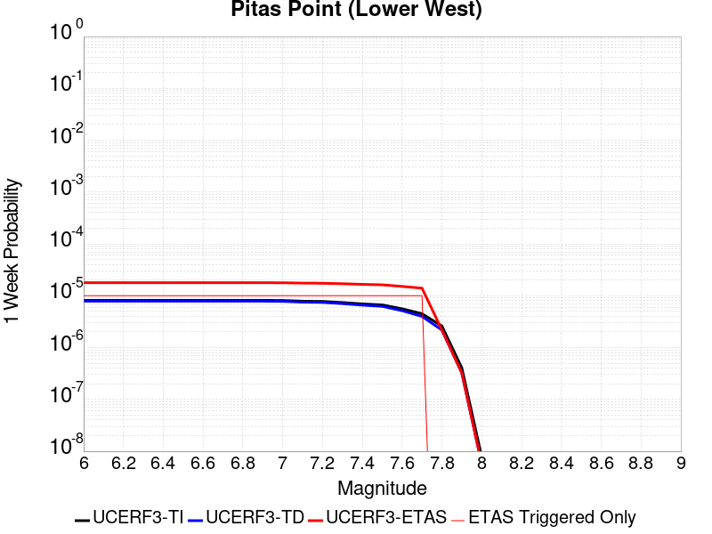 |  | 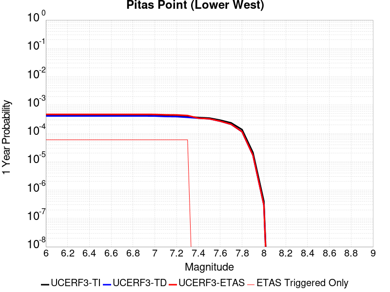 |  |

| Magnitude | 1 wk TI Prob | 1 wk TD Prob | 1 wk ETAS Prob | 1 wk ETAS/TD Gain | 1 wk ETAS Triggered Only | 1 mo TI Prob | 1 mo TD Prob | 1 mo ETAS Prob | 1 mo ETAS/TD Gain | 1 mo ETAS Triggered Only | 1 yr TI Prob | 1 yr TD Prob | 1 yr ETAS Prob | 1 yr ETAS/TD Gain | 1 yr ETAS Triggered Only | 10 yr TI Prob | 10 yr TD Prob | 10 yr ETAS Prob | 10 yr ETAS/TD Gain | 10 yr ETAS Triggered Only |
|-----|-----|-----|-----|-----|-----|-----|-----|-----|-----|-----|-----|-----|-----|-----|-----|-----|-----|-----|-----|-----|
| 6.0 | 8.151497E-6 | 7.855762E-6 | 1.7855684E-5 | 2.2729409 | 1.0E-5 | 3.493452E-5 | 3.3667122E-5 | 4.3666787E-5 | 1.2970157 | 1.0E-5 | 4.252448E-4 | 4.0982084E-4 | 4.2981267E-4 | 1.0487818 | 2.0E-5 | 0.0042443196 | 0.0040907315 | 0.004130568 | 1.0097382 | 4.0E-5 |
| 6.1 | 8.151497E-6 | 7.855762E-6 | 1.7855684E-5 | 2.2729409 | 1.0E-5 | 3.493452E-5 | 3.3667122E-5 | 4.3666787E-5 | 1.2970157 | 1.0E-5 | 4.252448E-4 | 4.0982084E-4 | 4.2981267E-4 | 1.0487818 | 2.0E-5 | 0.0042443196 | 0.0040907315 | 0.004130568 | 1.0097382 | 4.0E-5 |
| 6.2 | 8.151497E-6 | 7.855762E-6 | 1.7855684E-5 | 2.2729409 | 1.0E-5 | 3.493452E-5 | 3.3667122E-5 | 4.3666787E-5 | 1.2970157 | 1.0E-5 | 4.252448E-4 | 4.0982084E-4 | 4.2981267E-4 | 1.0487818 | 2.0E-5 | 0.0042443196 | 0.0040907315 | 0.004130568 | 1.0097382 | 4.0E-5 |
| 6.3 | 8.151497E-6 | 7.855762E-6 | 1.7855684E-5 | 2.2729409 | 1.0E-5 | 3.493452E-5 | 3.3667122E-5 | 4.3666787E-5 | 1.2970157 | 1.0E-5 | 4.252448E-4 | 4.0982084E-4 | 4.2981267E-4 | 1.0487818 | 2.0E-5 | 0.0042443196 | 0.0040907315 | 0.004130568 | 1.0097382 | 4.0E-5 |
| 6.4 | 8.151497E-6 | 7.855762E-6 | 1.7855684E-5 | 2.2729409 | 1.0E-5 | 3.493452E-5 | 3.3667122E-5 | 4.3666787E-5 | 1.2970157 | 1.0E-5 | 4.252448E-4 | 4.0982084E-4 | 4.2981267E-4 | 1.0487818 | 2.0E-5 | 0.0042443196 | 0.0040907315 | 0.004130568 | 1.0097382 | 4.0E-5 |
| 6.5 | 8.151497E-6 | 7.855762E-6 | 1.7855684E-5 | 2.2729409 | 1.0E-5 | 3.493452E-5 | 3.3667122E-5 | 4.3666787E-5 | 1.2970157 | 1.0E-5 | 4.252448E-4 | 4.0982084E-4 | 4.2981267E-4 | 1.0487818 | 2.0E-5 | 0.0042443196 | 0.0040907315 | 0.004130568 | 1.0097382 | 4.0E-5 |
| 6.6 | 8.151497E-6 | 7.855762E-6 | 1.7855684E-5 | 2.2729409 | 1.0E-5 | 3.493452E-5 | 3.3667122E-5 | 4.3666787E-5 | 1.2970157 | 1.0E-5 | 4.252448E-4 | 4.0982084E-4 | 4.2981267E-4 | 1.0487818 | 2.0E-5 | 0.0042443196 | 0.0040907315 | 0.004130568 | 1.0097382 | 4.0E-5 |
| 6.7 | 8.151497E-6 | 7.855762E-6 | 1.7855684E-5 | 2.2729409 | 1.0E-5 | 3.493452E-5 | 3.3667122E-5 | 4.3666787E-5 | 1.2970157 | 1.0E-5 | 4.252448E-4 | 4.0982084E-4 | 4.2981267E-4 | 1.0487818 | 2.0E-5 | 0.0042443196 | 0.0040907315 | 0.004130568 | 1.0097382 | 4.0E-5 |
| 6.8 | 8.151497E-6 | 7.855762E-6 | 1.7855684E-5 | 2.2729409 | 1.0E-5 | 3.493452E-5 | 3.3667122E-5 | 4.3666787E-5 | 1.2970157 | 1.0E-5 | 4.252448E-4 | 4.0982084E-4 | 4.2981267E-4 | 1.0487818 | 2.0E-5 | 0.0042443196 | 0.0040907315 | 0.004130568 | 1.0097382 | 4.0E-5 |
| 6.9 | 8.151497E-6 | 7.855762E-6 | 1.7855684E-5 | 2.2729409 | 1.0E-5 | 3.493452E-5 | 3.3667122E-5 | 4.3666787E-5 | 1.2970157 | 1.0E-5 | 4.252448E-4 | 4.0982084E-4 | 4.2981267E-4 | 1.0487818 | 2.0E-5 | 0.0042443196 | 0.0040907315 | 0.004130568 | 1.0097382 | 4.0E-5 |
| 7.0 | 8.103535E-6 | 7.805192E-6 | 1.7805114E-5 | 2.2811885 | 1.0E-5 | 3.4728975E-5 | 3.3450397E-5 | 4.3450065E-5 | 1.2989401 | 1.0E-5 | 4.2274324E-4 | 4.0718322E-4 | 4.2717508E-4 | 1.0490979 | 2.0E-5 | 0.0042193993 | 0.004064452 | 0.004104289 | 1.0098014 | 4.0E-5 |
| 7.1 | 7.853298E-6 | 7.540883E-6 | 1.7540808E-5 | 2.3260946 | 1.0E-5 | 3.3656554E-5 | 3.2317676E-5 | 4.231735E-5 | 1.3094182 | 1.0E-5 | 4.096915E-4 | 3.9339735E-4 | 4.1338947E-4 | 1.0508192 | 2.0E-5 | 0.00408937 | 0.0039270855 | 0.0039669285 | 1.0101457 | 4.0E-5 |
| 7.2 | 7.771102E-6 | 7.453165E-6 | 1.745309E-5 | 2.341702 | 1.0E-5 | 3.33043E-5 | 3.194175E-5 | 4.194143E-5 | 1.3130599 | 1.0E-5 | 4.0540437E-4 | 3.8882208E-4 | 4.0881432E-4 | 1.0514174 | 2.0E-5 | 0.0040466557 | 0.0038814936 | 0.0039213384 | 1.0102654 | 4.0E-5 |
| 7.3 | 7.3945344E-6 | 7.0492697E-6 | 1.7049199E-5 | 2.4185767 | 1.0E-5 | 3.1690477E-5 | 3.021081E-5 | 4.0210507E-5 | 1.3309973 | 1.0E-5 | 3.8576324E-4 | 3.6775516E-4 | 3.877478E-4 | 1.054364 | 2.0E-5 | 0.0038509427 | 0.0036715334 | 0.0037113866 | 1.0108546 | 4.0E-5 |
| 7.4 | 6.964645E-6 | 6.5901186E-6 | 1.6590053E-5 | 2.5174134 | 1.0E-5 | 2.9848137E-5 | 2.8243063E-5 | 3.824278E-5 | 1.3540592 | 1.0E-5 | 3.6334046E-4 | 3.4380553E-4 | 3.5380208E-4 | 1.0290762 | 1.0E-5 | 0.0036274698 | 0.0034327896 | 0.0034626867 | 1.0087092 | 3.0E-5 |
| 7.5 | 6.6525035E-6 | 6.259157E-6 | 1.6259095E-5 | 2.597649 | 1.0E-5 | 2.851042E-5 | 2.6824686E-5 | 3.682442E-5 | 1.3727809 | 1.0E-5 | 3.4705905E-4 | 3.265421E-4 | 3.3653883E-4 | 1.0306139 | 1.0E-5 | 0.0034651754 | 0.0032606742 | 0.0032905764 | 1.0091705 | 3.0E-5 |
| 7.6 | 5.613338E-6 | 5.151386E-6 | 1.5151335E-5 | 2.941215 | 1.0E-5 | 2.405694E-5 | 2.2077185E-5 | 3.2076965E-5 | 1.4529463 | 1.0E-5 | 2.928539E-4 | 2.6875688E-4 | 2.787542E-4 | 1.0371983 | 1.0E-5 | 0.0029246826 | 0.0026843501 | 0.0027142696 | 1.0111458 | 3.0E-5 |
| 7.7 | 4.494704E-6 | 3.996911E-6 | 1.3996871E-5 | 3.5019221 | 1.0E-5 | 1.9262876E-5 | 1.7129507E-5 | 2.7129336E-5 | 1.5837779 | 1.0E-5 | 2.3450027E-4 | 2.0853203E-4 | 2.1852994E-4 | 1.0479443 | 1.0E-5 | 0.0023425296 | 0.0020833875 | 0.002103346 | 1.0095798 | 2.0E-5 |
| 7.8 | 2.6075882E-6 | 2.1836374E-6 | 2.1836374E-6 | 1.0 | 0.0 | 1.117533E-5 | 9.358413E-6 | 9.358413E-6 | 1.0 | 0.0 | 1.3605114E-4 | 1.1393277E-4 | 1.1393277E-4 | 1.0 | 0.0 | 0.0013596788 | 0.0011387484 | 0.0011387484 | 1.0 | 0.0 |
| 7.9 | 4.045984E-7 | 3.242375E-7 | 3.242375E-7 | 1.0 | 0.0 | 1.733992E-6 | 1.3895885E-6 | 1.3895885E-6 | 1.0 | 0.0 | 2.1111147E-5 | 1.6918111E-5 | 1.6918111E-5 | 1.0 | 0.0 | 2.1109142E-4 | 1.6916855E-4 | 1.6916855E-4 | 1.0 | 0.0 |
| 8.0 | 7.791402E-9 | 5.683497E-9 | 5.683497E-9 | 1.0 | 0.0 | 3.3391725E-8 | 2.4357844E-8 | 2.4357844E-8 | 1.0 | 0.0 | 4.0654416E-7 | 2.9655675E-7 | 2.9655675E-7 | 1.0 | 0.0 | 4.065434E-6 | 2.9655655E-6 | 2.9655655E-6 | 1.0 | 0.0 |

## Sisar
*[(top)](#table-of-contents)*

| 1 Week | 1 Month | 1 Year | 10 Year |
|-----|-----|-----|-----|
| 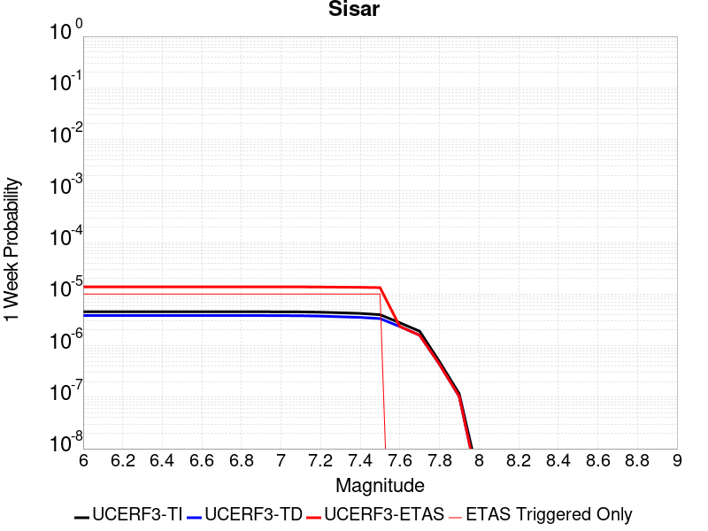 | 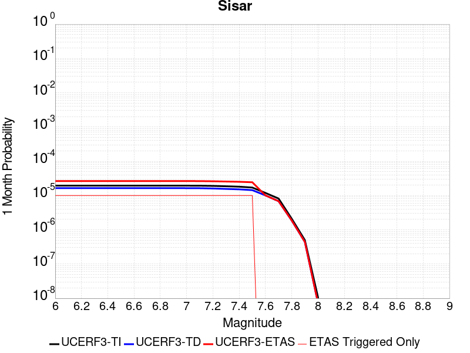 | 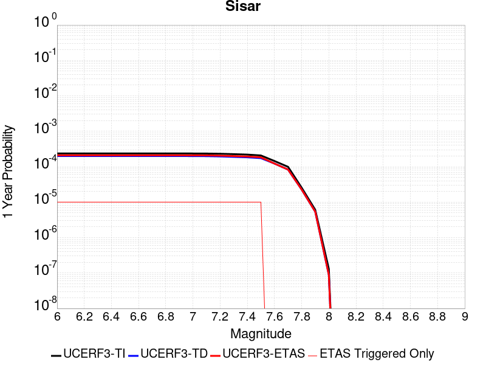 |  |

| Magnitude | 1 wk TI Prob | 1 wk TD Prob | 1 wk ETAS Prob | 1 wk ETAS/TD Gain | 1 wk ETAS Triggered Only | 1 mo TI Prob | 1 mo TD Prob | 1 mo ETAS Prob | 1 mo ETAS/TD Gain | 1 mo ETAS Triggered Only | 1 yr TI Prob | 1 yr TD Prob | 1 yr ETAS Prob | 1 yr ETAS/TD Gain | 1 yr ETAS Triggered Only | 10 yr TI Prob | 10 yr TD Prob | 10 yr ETAS Prob | 10 yr ETAS/TD Gain | 10 yr ETAS Triggered Only |
|-----|-----|-----|-----|-----|-----|-----|-----|-----|-----|-----|-----|-----|-----|-----|-----|-----|-----|-----|-----|-----|
| 6.0 | 4.544193E-6 | 3.839576E-6 | 1.3839538E-5 | 3.604444 | 1.0E-5 | 1.9474966E-5 | 1.6455224E-5 | 2.645506E-5 | 1.6076998 | 1.0E-5 | 2.3708193E-4 | 2.0032428E-4 | 2.1032228E-4 | 1.0499091 | 1.0E-5 | 0.0023682916 | 0.002001471 | 0.0020314108 | 1.014959 | 3.0E-5 |
| 6.1 | 4.544193E-6 | 3.839576E-6 | 1.3839538E-5 | 3.604444 | 1.0E-5 | 1.9474966E-5 | 1.6455224E-5 | 2.645506E-5 | 1.6076998 | 1.0E-5 | 2.3708193E-4 | 2.0032428E-4 | 2.1032228E-4 | 1.0499091 | 1.0E-5 | 0.0023682916 | 0.002001471 | 0.0020314108 | 1.014959 | 3.0E-5 |
| 6.2 | 4.544193E-6 | 3.839576E-6 | 1.3839538E-5 | 3.604444 | 1.0E-5 | 1.9474966E-5 | 1.6455224E-5 | 2.645506E-5 | 1.6076998 | 1.0E-5 | 2.3708193E-4 | 2.0032428E-4 | 2.1032228E-4 | 1.0499091 | 1.0E-5 | 0.0023682916 | 0.002001471 | 0.0020314108 | 1.014959 | 3.0E-5 |
| 6.3 | 4.544193E-6 | 3.839576E-6 | 1.3839538E-5 | 3.604444 | 1.0E-5 | 1.9474966E-5 | 1.6455224E-5 | 2.645506E-5 | 1.6076998 | 1.0E-5 | 2.3708193E-4 | 2.0032428E-4 | 2.1032228E-4 | 1.0499091 | 1.0E-5 | 0.0023682916 | 0.002001471 | 0.0020314108 | 1.014959 | 3.0E-5 |
| 6.4 | 4.544193E-6 | 3.839576E-6 | 1.3839538E-5 | 3.604444 | 1.0E-5 | 1.9474966E-5 | 1.6455224E-5 | 2.645506E-5 | 1.6076998 | 1.0E-5 | 2.3708193E-4 | 2.0032428E-4 | 2.1032228E-4 | 1.0499091 | 1.0E-5 | 0.0023682916 | 0.002001471 | 0.0020314108 | 1.014959 | 3.0E-5 |
| 6.5 | 4.544193E-6 | 3.839576E-6 | 1.3839538E-5 | 3.604444 | 1.0E-5 | 1.9474966E-5 | 1.6455224E-5 | 2.645506E-5 | 1.6076998 | 1.0E-5 | 2.3708193E-4 | 2.0032428E-4 | 2.1032228E-4 | 1.0499091 | 1.0E-5 | 0.0023682916 | 0.002001471 | 0.0020314108 | 1.014959 | 3.0E-5 |
| 6.6 | 4.544193E-6 | 3.839576E-6 | 1.3839538E-5 | 3.604444 | 1.0E-5 | 1.9474966E-5 | 1.6455224E-5 | 2.645506E-5 | 1.6076998 | 1.0E-5 | 2.3708193E-4 | 2.0032428E-4 | 2.1032228E-4 | 1.0499091 | 1.0E-5 | 0.0023682916 | 0.002001471 | 0.0020314108 | 1.014959 | 3.0E-5 |
| 6.7 | 4.544193E-6 | 3.839576E-6 | 1.3839538E-5 | 3.604444 | 1.0E-5 | 1.9474966E-5 | 1.6455224E-5 | 2.645506E-5 | 1.6076998 | 1.0E-5 | 2.3708193E-4 | 2.0032428E-4 | 2.1032228E-4 | 1.0499091 | 1.0E-5 | 0.0023682916 | 0.002001471 | 0.0020314108 | 1.014959 | 3.0E-5 |
| 6.8 | 4.544193E-6 | 3.839576E-6 | 1.3839538E-5 | 3.604444 | 1.0E-5 | 1.9474966E-5 | 1.6455224E-5 | 2.645506E-5 | 1.6076998 | 1.0E-5 | 2.3708193E-4 | 2.0032428E-4 | 2.1032228E-4 | 1.0499091 | 1.0E-5 | 0.0023682916 | 0.002001471 | 0.0020314108 | 1.014959 | 3.0E-5 |
| 6.9 | 4.542225E-6 | 3.8375383E-6 | 1.38375E-5 | 3.6058273 | 1.0E-5 | 1.9466532E-5 | 1.6446491E-5 | 2.6446325E-5 | 1.6080225 | 1.0E-5 | 2.3697925E-4 | 2.0021795E-4 | 2.1021595E-4 | 1.0499356 | 1.0E-5 | 0.002367267 | 0.0020004094 | 0.0020303493 | 1.014967 | 3.0E-5 |
| 7.0 | 4.5278484E-6 | 3.822602E-6 | 1.3822564E-5 | 3.616009 | 1.0E-5 | 1.940492E-5 | 1.638248E-5 | 2.6382317E-5 | 1.6103982 | 1.0E-5 | 2.3622929E-4 | 1.9943877E-4 | 2.0943678E-4 | 1.0501307 | 1.0E-5 | 0.0023597833 | 0.0019926317 | 0.0020225719 | 1.0150255 | 3.0E-5 |
| 7.1 | 4.5132488E-6 | 3.8073897E-6 | 1.3807352E-5 | 3.6264615 | 1.0E-5 | 1.9342351E-5 | 1.6317284E-5 | 2.631712E-5 | 1.6128371 | 1.0E-5 | 2.3546767E-4 | 1.9864515E-4 | 2.0864318E-4 | 1.050331 | 1.0E-5 | 0.0023521832 | 0.0019847096 | 0.00201465 | 1.0150856 | 3.0E-5 |
| 7.2 | 4.448859E-6 | 3.7398502E-6 | 1.3739813E-5 | 3.673894 | 1.0E-5 | 1.9066398E-5 | 1.6027832E-5 | 2.6027672E-5 | 1.6239047 | 1.0E-5 | 2.3210866E-4 | 1.9512173E-4 | 2.0511977E-4 | 1.0512401 | 1.0E-5 | 0.0023186638 | 0.0019495375 | 0.001979479 | 1.0153582 | 3.0E-5 |
| 7.3 | 4.3424366E-6 | 3.6336846E-6 | 1.3633648E-5 | 3.7520175 | 1.0E-5 | 1.861031E-5 | 1.5572843E-5 | 2.5572686E-5 | 1.6421335 | 1.0E-5 | 2.2655698E-4 | 1.895832E-4 | 1.995813E-4 | 1.0527372 | 1.0E-5 | 0.0022632615 | 0.0018942481 | 0.0019142103 | 1.0105382 | 2.0E-5 |
| 7.4 | 4.218641E-6 | 3.5330384E-6 | 1.3533003E-5 | 3.830415 | 1.0E-5 | 1.8079765E-5 | 1.5141507E-5 | 2.5141357E-5 | 1.6604263 | 1.0E-5 | 2.2009891E-4 | 1.8433259E-4 | 1.9433074E-4 | 1.0542397 | 1.0E-5 | 0.0021988105 | 0.0018418302 | 0.0018617935 | 1.0108387 | 2.0E-5 |
| 7.5 | 3.983779E-6 | 3.3478068E-6 | 1.3347773E-5 | 3.9870203 | 1.0E-5 | 1.7073227E-5 | 1.4347666E-5 | 2.4347522E-5 | 1.6969675 | 1.0E-5 | 2.0784672E-4 | 1.7466917E-4 | 1.8466743E-4 | 1.0572411 | 1.0E-5 | 0.0020765243 | 0.0017453518 | 0.0017553343 | 1.0057195 | 1.0E-5 |
| 7.6 | 2.777393E-6 | 2.35225E-6 | 2.35225E-6 | 1.0 | 0.0 | 1.1903058E-5 | 1.0081033E-5 | 1.0081033E-5 | 1.0 | 0.0 | 1.449101E-4 | 1.2272975E-4 | 1.2272975E-4 | 1.0 | 0.0 | 0.0014481564 | 0.0012266274 | 0.0012266274 | 1.0 | 0.0 |
| 7.7 | 1.9028433E-6 | 1.593867E-6 | 1.593867E-6 | 1.0 | 0.0 | 8.155017E-6 | 6.8308404E-6 | 6.8308404E-6 | 1.0 | 0.0 | 9.928281E-5 | 8.3162355E-5 | 8.3162355E-5 | 1.0 | 0.0 | 9.923846E-4 | 8.313171E-4 | 8.313171E-4 | 1.0 | 0.0 |
| 7.8 | 4.9095956E-7 | 4.3583708E-7 | 4.3583708E-7 | 1.0 | 0.0 | 2.1041105E-6 | 1.8678718E-6 | 1.8678718E-6 | 1.0 | 0.0 | 2.5617246E-5 | 2.2741104E-5 | 2.2741104E-5 | 1.0 | 0.0 | 2.5614293E-4 | 2.2738794E-4 | 2.2738794E-4 | 1.0 | 0.0 |
| 7.9 | 1.16657894E-7 | 1.0335569E-7 | 1.0335569E-7 | 1.0 | 0.0 | 4.999623E-7 | 4.4295288E-7 | 4.4295288E-7 | 1.0 | 0.0 | 6.087024E-6 | 5.3929384E-6 | 5.3929384E-6 | 1.0 | 0.0 | 6.0868573E-5 | 5.3928103E-5 | 5.3928103E-5 | 1.0 | 0.0 |
| 8.0 | 2.5100346E-9 | 1.7067566E-9 | 1.7067566E-9 | 1.0 | 0.0 | 1.0757291E-8 | 7.3146724E-9 | 7.3146724E-9 | 1.0 | 0.0 | 1.3097001E-7 | 8.905613E-8 | 8.905613E-8 | 1.0 | 0.0 | 1.3096993E-6 | 8.9056095E-7 | 8.9056095E-7 | 1.0 | 0.0 |

## Los Alamos extension
*[(top)](#table-of-contents)*

| 1 Week | 1 Month | 1 Year | 10 Year |
|-----|-----|-----|-----|
| 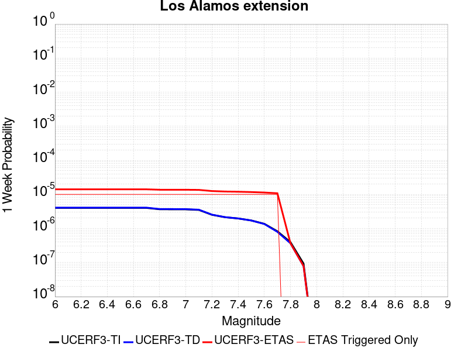 | 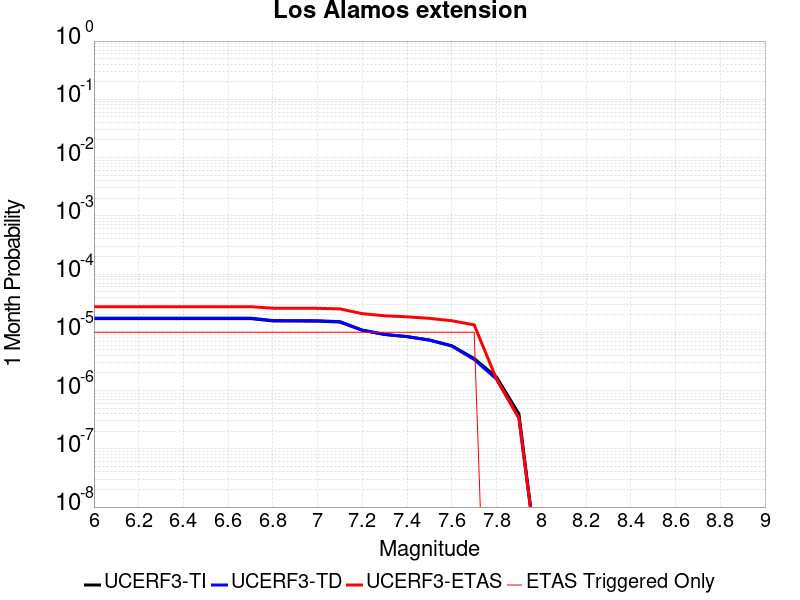 | 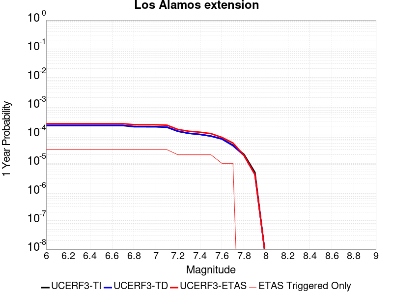 | 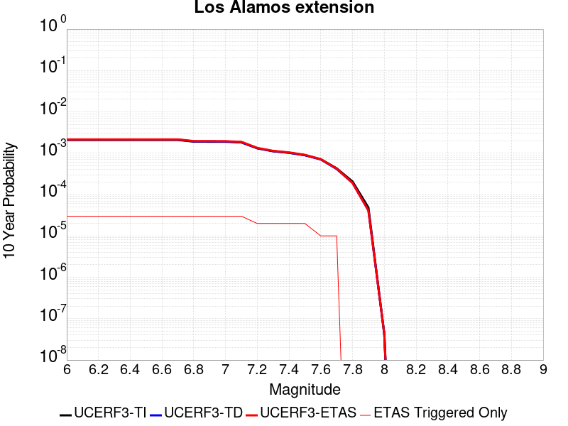 |

| Magnitude | 1 wk TI Prob | 1 wk TD Prob | 1 wk ETAS Prob | 1 wk ETAS/TD Gain | 1 wk ETAS Triggered Only | 1 mo TI Prob | 1 mo TD Prob | 1 mo ETAS Prob | 1 mo ETAS/TD Gain | 1 mo ETAS Triggered Only | 1 yr TI Prob | 1 yr TD Prob | 1 yr ETAS Prob | 1 yr ETAS/TD Gain | 1 yr ETAS Triggered Only | 10 yr TI Prob | 10 yr TD Prob | 10 yr ETAS Prob | 10 yr ETAS/TD Gain | 10 yr ETAS Triggered Only |
|-----|-----|-----|-----|-----|-----|-----|-----|-----|-----|-----|-----|-----|-----|-----|-----|-----|-----|-----|-----|-----|
| 6.0 | 4.0146506E-6 | 4.0861596E-6 | 1.4086118E-5 | 3.4472756 | 1.0E-5 | 1.7205533E-5 | 1.7512002E-5 | 2.7511827E-5 | 1.5710269 | 1.0E-5 | 2.0945723E-4 | 2.1318886E-4 | 2.4318247E-4 | 1.1406903 | 3.0E-5 | 0.0020925992 | 0.0021299527 | 0.0021598889 | 1.0140548 | 3.0E-5 |
| 6.1 | 4.0146506E-6 | 4.0861596E-6 | 1.4086118E-5 | 3.4472756 | 1.0E-5 | 1.7205533E-5 | 1.7512002E-5 | 2.7511827E-5 | 1.5710269 | 1.0E-5 | 2.0945723E-4 | 2.1318886E-4 | 2.4318247E-4 | 1.1406903 | 3.0E-5 | 0.0020925992 | 0.0021299527 | 0.0021598889 | 1.0140548 | 3.0E-5 |
| 6.2 | 4.0146506E-6 | 4.0861596E-6 | 1.4086118E-5 | 3.4472756 | 1.0E-5 | 1.7205533E-5 | 1.7512002E-5 | 2.7511827E-5 | 1.5710269 | 1.0E-5 | 2.0945723E-4 | 2.1318886E-4 | 2.4318247E-4 | 1.1406903 | 3.0E-5 | 0.0020925992 | 0.0021299527 | 0.0021598889 | 1.0140548 | 3.0E-5 |
| 6.3 | 4.0146506E-6 | 4.0861596E-6 | 1.4086118E-5 | 3.4472756 | 1.0E-5 | 1.7205533E-5 | 1.7512002E-5 | 2.7511827E-5 | 1.5710269 | 1.0E-5 | 2.0945723E-4 | 2.1318886E-4 | 2.4318247E-4 | 1.1406903 | 3.0E-5 | 0.0020925992 | 0.0021299527 | 0.0021598889 | 1.0140548 | 3.0E-5 |
| 6.4 | 4.0146506E-6 | 4.0861596E-6 | 1.4086118E-5 | 3.4472756 | 1.0E-5 | 1.7205533E-5 | 1.7512002E-5 | 2.7511827E-5 | 1.5710269 | 1.0E-5 | 2.0945723E-4 | 2.1318886E-4 | 2.4318247E-4 | 1.1406903 | 3.0E-5 | 0.0020925992 | 0.0021299527 | 0.0021598889 | 1.0140548 | 3.0E-5 |
| 6.5 | 4.0146506E-6 | 4.0861596E-6 | 1.4086118E-5 | 3.4472756 | 1.0E-5 | 1.7205533E-5 | 1.7512002E-5 | 2.7511827E-5 | 1.5710269 | 1.0E-5 | 2.0945723E-4 | 2.1318886E-4 | 2.4318247E-4 | 1.1406903 | 3.0E-5 | 0.0020925992 | 0.0021299527 | 0.0021598889 | 1.0140548 | 3.0E-5 |
| 6.6 | 4.0146506E-6 | 4.0861596E-6 | 1.4086118E-5 | 3.4472756 | 1.0E-5 | 1.7205533E-5 | 1.7512002E-5 | 2.7511827E-5 | 1.5710269 | 1.0E-5 | 2.0945723E-4 | 2.1318886E-4 | 2.4318247E-4 | 1.1406903 | 3.0E-5 | 0.0020925992 | 0.0021299527 | 0.0021598889 | 1.0140548 | 3.0E-5 |
| 6.7 | 4.0146506E-6 | 4.0861596E-6 | 1.4086118E-5 | 3.4472756 | 1.0E-5 | 1.7205533E-5 | 1.7512002E-5 | 2.7511827E-5 | 1.5710269 | 1.0E-5 | 2.0945723E-4 | 2.1318886E-4 | 2.4318247E-4 | 1.1406903 | 3.0E-5 | 0.0020925992 | 0.0021299527 | 0.0021598889 | 1.0140548 | 3.0E-5 |
| 6.8 | 3.6584688E-6 | 3.7188588E-6 | 1.3718822E-5 | 3.6889868 | 1.0E-5 | 1.5679057E-5 | 1.5937874E-5 | 2.5937716E-5 | 1.6274263 | 1.0E-5 | 1.9087581E-4 | 1.9402728E-4 | 2.2402145E-4 | 1.1545874 | 3.0E-5 | 0.0019071194 | 0.0019386712 | 0.0019686131 | 1.0154445 | 3.0E-5 |
| 6.9 | 3.644631E-6 | 3.7045688E-6 | 1.3704532E-5 | 3.6993594 | 1.0E-5 | 1.5619753E-5 | 1.5876632E-5 | 2.5876474E-5 | 1.6298465 | 1.0E-5 | 1.901539E-4 | 1.9328178E-4 | 2.2327599E-4 | 1.1551838 | 3.0E-5 | 0.0018999127 | 0.0019312293 | 0.0019611714 | 1.0155041 | 3.0E-5 |
| 7.0 | 3.6318522E-6 | 3.6913295E-6 | 1.3691292E-5 | 3.709041 | 1.0E-5 | 1.5564989E-5 | 1.5819893E-5 | 2.5819734E-5 | 1.6321056 | 1.0E-5 | 1.8948725E-4 | 1.925911E-4 | 2.2258532E-4 | 1.1557404 | 3.0E-5 | 0.0018932576 | 0.0019243343 | 0.0019542766 | 1.0155598 | 3.0E-5 |
| 7.1 | 3.5001724E-6 | 3.5554E-6 | 1.3555365E-5 | 3.812613 | 1.0E-5 | 1.5000653E-5 | 1.5237345E-5 | 2.5237192E-5 | 1.6562723 | 1.0E-5 | 1.8261763E-4 | 1.854998E-4 | 2.1549423E-4 | 1.1616952 | 3.0E-5 | 0.0018246764 | 0.0018535402 | 0.0018834847 | 1.0161552 | 3.0E-5 |
| 7.2 | 2.5204702E-6 | 2.5436943E-6 | 1.2543669E-5 | 4.93128 | 1.0E-5 | 1.080197E-5 | 1.0901502E-5 | 2.0901392E-5 | 1.9172949 | 1.0E-5 | 1.3150605E-4 | 1.3271775E-4 | 1.527151E-4 | 1.1506758 | 2.0E-5 | 0.0013142825 | 0.0013263905 | 0.001346364 | 1.0150585 | 2.0E-5 |
| 7.3 | 2.1399692E-6 | 2.1501316E-6 | 1.215011E-5 | 5.650868 | 1.0E-5 | 9.1712645E-6 | 9.2148175E-6 | 1.9214725E-5 | 2.0851986 | 1.0E-5 | 1.1165442E-4 | 1.1218466E-4 | 1.3218241E-4 | 1.1782575 | 2.0E-5 | 0.0011159834 | 0.0011212835 | 0.0011412611 | 1.0178167 | 2.0E-5 |
| 7.4 | 1.9660122E-6 | 1.9702363E-6 | 1.1970216E-5 | 6.0755234 | 1.0E-5 | 8.42574E-6 | 8.4438425E-6 | 1.8443758E-5 | 2.184285 | 1.0E-5 | 1.0257855E-4 | 1.0279897E-4 | 1.2279692E-4 | 1.1945345 | 2.0E-5 | 0.0010253121 | 0.0010275173 | 0.0010474967 | 1.0194443 | 2.0E-5 |
| 7.5 | 1.7204633E-6 | 1.7150983E-6 | 1.1715081E-5 | 6.8305597 | 1.0E-5 | 7.373393E-6 | 7.3504007E-6 | 1.7350327E-5 | 2.36046 | 1.0E-5 | 8.976737E-5 | 8.948748E-5 | 1.0948569E-4 | 1.223475 | 2.0E-5 | 8.9731114E-4 | 8.9451746E-4 | 9.144996E-4 | 1.0223384 | 2.0E-5 |
| 7.6 | 1.3717638E-6 | 1.3535827E-6 | 1.1353569E-5 | 8.387792 | 1.0E-5 | 5.878974E-6 | 5.8010555E-6 | 1.5800997E-5 | 2.7238142 | 1.0E-5 | 7.157416E-5 | 7.062559E-5 | 8.0624886E-5 | 1.1415818 | 1.0E-5 | 7.1551115E-4 | 7.060341E-4 | 7.16027E-4 | 1.0141536 | 1.0E-5 |
| 7.7 | 8.272564E-7 | 7.957636E-7 | 1.0795756E-5 | 13.566536 | 1.0E-5 | 3.5453797E-6 | 3.410411E-6 | 1.3410377E-5 | 3.932188 | 1.0E-5 | 4.3164142E-5 | 4.1520965E-5 | 5.152055E-5 | 1.2408322 | 1.0E-5 | 4.315576E-4 | 4.1513226E-4 | 4.2512812E-4 | 1.0240787 | 1.0E-5 |
| 7.8 | 3.9708277E-7 | 3.6719027E-7 | 3.6719027E-7 | 1.0 | 0.0 | 1.7017821E-6 | 1.5736716E-6 | 1.5736716E-6 | 1.0 | 0.0 | 2.0719E-5 | 1.9159284E-5 | 1.9159284E-5 | 1.0 | 0.0 | 2.071707E-4 | 1.9157639E-4 | 1.9157639E-4 | 1.0 | 0.0 |
| 7.9 | 9.292528E-8 | 7.889087E-8 | 7.889087E-8 | 1.0 | 0.0 | 3.9825116E-7 | 3.381037E-7 | 3.381037E-7 | 1.0 | 0.0 | 4.848697E-6 | 4.116405E-6 | 4.116405E-6 | 1.0 | 0.0 | 4.8485912E-5 | 4.1163294E-5 | 4.1163294E-5 | 1.0 | 0.0 |
| 8.0 | 7.880441E-11 | 8.2353124E-11 | 8.2353124E-11 | 1.0 | 0.0 | 3.3773329E-10 | 3.52942E-10 | 3.52942E-10 | 1.0 | 0.0 | 4.1119033E-9 | 4.2970694E-9 | 4.2970694E-9 | 1.0 | 0.0 | 4.1119034E-8 | 4.2970694E-8 | 4.2970694E-8 | 1.0 | 0.0 |

## Elsinore (Coyote Mountains)
*[(top)](#table-of-contents)*

| 1 Week | 1 Month | 1 Year | 10 Year |
|-----|-----|-----|-----|
| 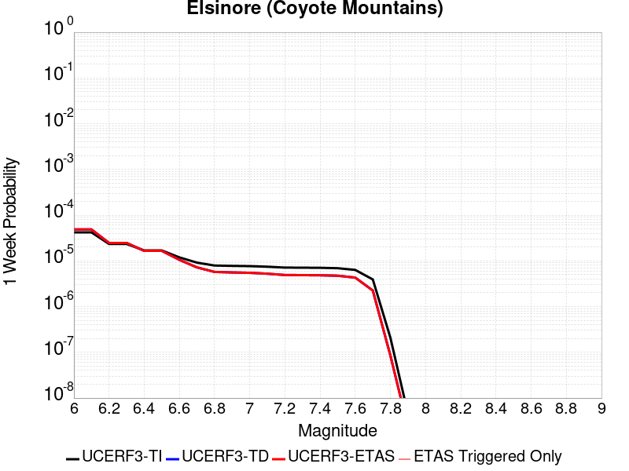 | 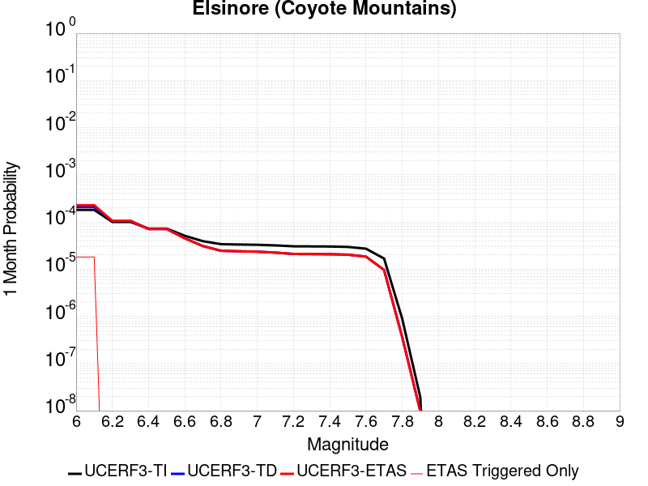 | 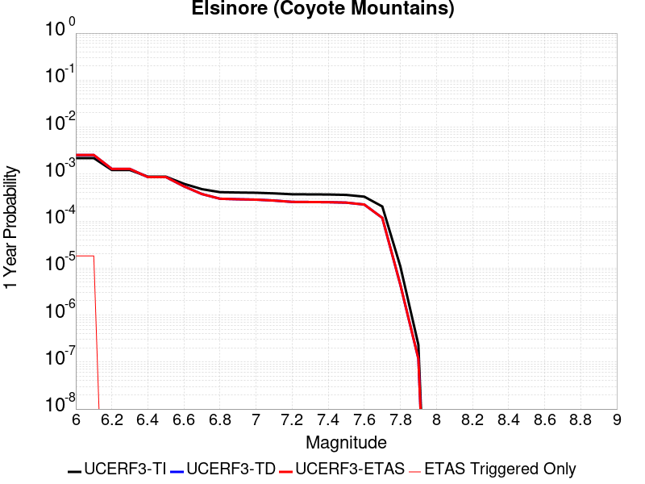 | 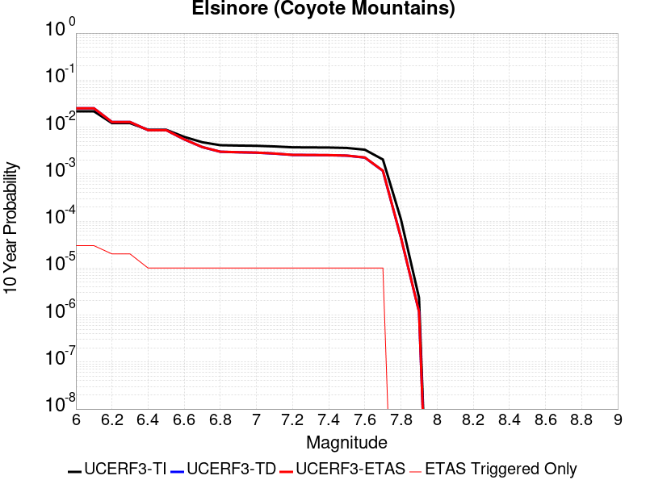 |

| Magnitude | 1 wk TI Prob | 1 wk TD Prob | 1 wk ETAS Prob | 1 wk ETAS/TD Gain | 1 wk ETAS Triggered Only | 1 mo TI Prob | 1 mo TD Prob | 1 mo ETAS Prob | 1 mo ETAS/TD Gain | 1 mo ETAS Triggered Only | 1 yr TI Prob | 1 yr TD Prob | 1 yr ETAS Prob | 1 yr ETAS/TD Gain | 1 yr ETAS Triggered Only | 10 yr TI Prob | 10 yr TD Prob | 10 yr ETAS Prob | 10 yr ETAS/TD Gain | 10 yr ETAS Triggered Only |
|-----|-----|-----|-----|-----|-----|-----|-----|-----|-----|-----|-----|-----|-----|-----|-----|-----|-----|-----|-----|-----|
| 6.0 | 4.20513E-5 | 4.8631882E-5 | 4.8631882E-5 | 1.0 | 0.0 | 1.8020741E-4 | 2.0840895E-4 | 2.1840687E-4 | 1.0479726 | 1.0E-5 | 0.0021918174 | 0.002535 | 0.0025449747 | 1.0039347 | 1.0E-5 | 0.021703249 | 0.025111282 | 0.02514053 | 1.0011647 | 3.0E-5 |
| 6.1 | 4.20513E-5 | 4.8631882E-5 | 4.8631882E-5 | 1.0 | 0.0 | 1.8020741E-4 | 2.0840895E-4 | 2.1840687E-4 | 1.0479726 | 1.0E-5 | 0.0021918174 | 0.002535 | 0.0025449747 | 1.0039347 | 1.0E-5 | 0.021703249 | 0.025111282 | 0.02514053 | 1.0011647 | 3.0E-5 |
| 6.2 | 2.3413893E-5 | 2.469566E-5 | 2.469566E-5 | 1.0 | 0.0 | 1.0034139E-4 | 1.0583479E-4 | 1.0583479E-4 | 1.0 | 0.0 | 0.0012209718 | 0.0012878707 | 0.0012878707 | 1.0 | 0.0 | 0.012142851 | 0.01281264 | 0.012832384 | 1.0015409 | 2.0E-5 |
| 6.3 | 2.3413893E-5 | 2.469566E-5 | 2.469566E-5 | 1.0 | 0.0 | 1.0034139E-4 | 1.0583479E-4 | 1.0583479E-4 | 1.0 | 0.0 | 0.0012209718 | 0.0012878707 | 0.0012878707 | 1.0 | 0.0 | 0.012142851 | 0.01281264 | 0.012832384 | 1.0015409 | 2.0E-5 |
| 6.4 | 1.6894814E-5 | 1.6568361E-5 | 1.6568361E-5 | 1.0 | 0.0 | 7.240433E-5 | 7.1005554E-5 | 7.1005554E-5 | 1.0 | 0.0 | 8.811662E-4 | 8.6418656E-4 | 8.6418656E-4 | 1.0 | 0.0 | 0.0087768035 | 0.00861194 | 0.008621854 | 1.0011512 | 1.0E-5 |
| 6.5 | 1.6894814E-5 | 1.6568361E-5 | 1.6568361E-5 | 1.0 | 0.0 | 7.240433E-5 | 7.1005554E-5 | 7.1005554E-5 | 1.0 | 0.0 | 8.811662E-4 | 8.6418656E-4 | 8.6418656E-4 | 1.0 | 0.0 | 0.0087768035 | 0.00861194 | 0.008621854 | 1.0011512 | 1.0E-5 |
| 6.6 | 1.1910969E-5 | 1.0530774E-5 | 1.0530774E-5 | 1.0 | 0.0 | 5.1046012E-5 | 4.5131183E-5 | 4.5131183E-5 | 1.0 | 0.0 | 6.21308E-4 | 5.4934516E-4 | 5.4934516E-4 | 1.0 | 0.0 | 0.0061957375 | 0.005481174 | 0.0054911193 | 1.0018145 | 1.0E-5 |
| 6.7 | 9.1486E-6 | 7.2028593E-6 | 7.2028593E-6 | 1.0 | 0.0 | 3.9207694E-5 | 3.0869054E-5 | 3.0869054E-5 | 1.0 | 0.0 | 4.7724912E-4 | 3.757697E-4 | 3.757697E-4 | 1.0 | 0.0 | 0.0047622547 | 0.0037517229 | 0.0037616852 | 1.0026554 | 1.0E-5 |
| 6.8 | 7.90441E-6 | 5.7290276E-6 | 5.7290276E-6 | 1.0 | 0.0 | 3.3875604E-5 | 2.4552752E-5 | 2.4552752E-5 | 1.0 | 0.0 | 4.1235742E-4 | 2.9889002E-4 | 2.9889002E-4 | 1.0 | 0.0 | 0.0041159308 | 0.002985009 | 0.002994979 | 1.0033401 | 1.0E-5 |
| 6.9 | 7.77015E-6 | 5.582982E-6 | 5.582982E-6 | 1.0 | 0.0 | 3.3300217E-5 | 2.3926852E-5 | 2.3926852E-5 | 1.0 | 0.0 | 4.0535472E-4 | 2.9127175E-4 | 2.9127175E-4 | 1.0 | 0.0 | 0.004046161 | 0.002909027 | 0.002918998 | 1.0034276 | 1.0E-5 |
| 7.0 | 7.675798E-6 | 5.47984E-6 | 5.47984E-6 | 1.0 | 0.0 | 3.289586E-5 | 2.3484827E-5 | 2.3484827E-5 | 1.0 | 0.0 | 4.004335E-4 | 2.858915E-4 | 2.858915E-4 | 1.0 | 0.0 | 0.003997127 | 0.0028553635 | 0.0028653352 | 1.0034922 | 1.0E-5 |
| 7.1 | 7.447814E-6 | 5.238714E-6 | 5.238714E-6 | 1.0 | 0.0 | 3.191881E-5 | 2.2451446E-5 | 2.2451446E-5 | 1.0 | 0.0 | 3.8854225E-4 | 2.7331332E-4 | 2.7331332E-4 | 1.0 | 0.0 | 0.003878636 | 0.0027298962 | 0.0027398688 | 1.0036532 | 1.0E-5 |
| 7.2 | 7.128185E-6 | 4.905372E-6 | 4.905372E-6 | 1.0 | 0.0 | 3.0549007E-5 | 2.102286E-5 | 2.102286E-5 | 1.0 | 0.0 | 3.7187067E-4 | 2.5592445E-4 | 2.5592445E-4 | 1.0 | 0.0 | 0.00371249 | 0.0025564157 | 0.00256639 | 1.0039017 | 1.0E-5 |
| 7.3 | 7.0913875E-6 | 4.874047E-6 | 4.874047E-6 | 1.0 | 0.0 | 3.0391306E-5 | 2.0888614E-5 | 2.0888614E-5 | 1.0 | 0.0 | 3.6995133E-4 | 2.5429038E-4 | 2.5429038E-4 | 1.0 | 0.0 | 0.0036933604 | 0.0025401122 | 0.002550087 | 1.0039269 | 1.0E-5 |
| 7.4 | 7.051521E-6 | 4.837899E-6 | 4.837899E-6 | 1.0 | 0.0 | 3.0220453E-5 | 2.0733693E-5 | 2.0733693E-5 | 1.0 | 0.0 | 3.6787192E-4 | 2.5240466E-4 | 2.5240466E-4 | 1.0 | 0.0 | 0.0036726352 | 0.0025212981 | 0.0025312728 | 1.0039562 | 1.0E-5 |
| 7.5 | 6.910666E-6 | 4.733448E-6 | 4.733448E-6 | 1.0 | 0.0 | 2.9616802E-5 | 2.0286056E-5 | 2.0286056E-5 | 1.0 | 0.0 | 3.605249E-4 | 2.4695593E-4 | 2.4695593E-4 | 1.0 | 0.0 | 0.0035994058 | 0.0024669329 | 0.002476908 | 1.0040436 | 1.0E-5 |
| 7.6 | 6.341753E-6 | 4.3065565E-6 | 4.3065565E-6 | 1.0 | 0.0 | 2.7178658E-5 | 1.8456547E-5 | 1.8456547E-5 | 1.0 | 0.0 | 3.3084993E-4 | 2.2468645E-4 | 2.2468645E-4 | 1.0 | 0.0 | 0.0033035777 | 0.002244708 | 0.0022546856 | 1.004445 | 1.0E-5 |
| 7.7 | 3.9205916E-6 | 2.2439415E-6 | 2.2439415E-6 | 1.0 | 0.0 | 1.6802427E-5 | 9.616861E-6 | 9.616861E-6 | 1.0 | 0.0 | 2.0455034E-4 | 1.1707973E-4 | 1.1707973E-4 | 1.0 | 0.0 | 0.0020436216 | 0.0011702535 | 0.0011802417 | 1.0085351 | 1.0E-5 |
| 7.8 | 2.0846227E-7 | 8.486417E-8 | 8.486417E-8 | 1.0 | 0.0 | 8.9340944E-7 | 3.6370355E-7 | 3.6370355E-7 | 1.0 | 0.0 | 1.0877206E-5 | 4.428085E-6 | 4.428085E-6 | 1.0 | 0.0 | 1.0876673E-4 | 4.4280296E-5 | 4.4280296E-5 | 1.0 | 0.0 |
| 7.9 | 4.4969806E-9 | 2.2691855E-9 | 2.2691855E-9 | 1.0 | 0.0 | 1.9272775E-8 | 9.72508E-9 | 9.72508E-9 | 1.0 | 0.0 | 2.3464601E-7 | 1.18402845E-7 | 1.18402845E-7 | 1.0 | 0.0 | 2.3464577E-6 | 1.184028E-6 | 1.184028E-6 | 1.0 | 0.0 |

## San Jacinto (Superstition Mtn)
*[(top)](#table-of-contents)*

| 1 Week | 1 Month | 1 Year | 10 Year |
|-----|-----|-----|-----|
| 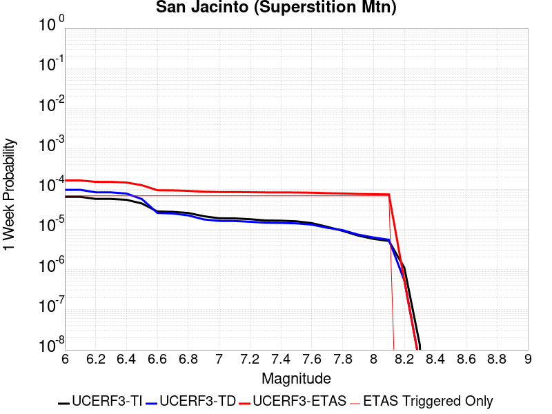 | 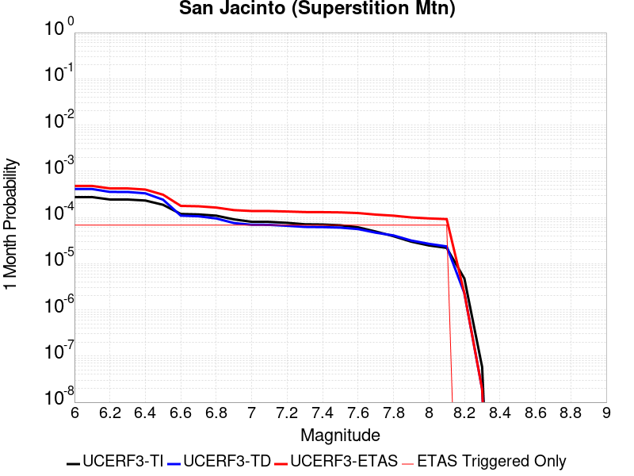 | 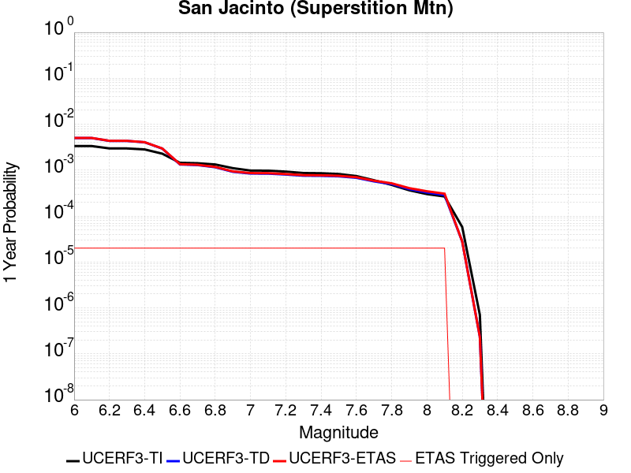 | 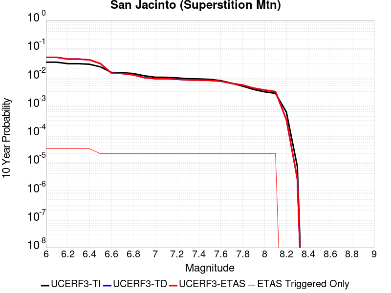 |

| Magnitude | 1 wk TI Prob | 1 wk TD Prob | 1 wk ETAS Prob | 1 wk ETAS/TD Gain | 1 wk ETAS Triggered Only | 1 mo TI Prob | 1 mo TD Prob | 1 mo ETAS Prob | 1 mo ETAS/TD Gain | 1 mo ETAS Triggered Only | 1 yr TI Prob | 1 yr TD Prob | 1 yr ETAS Prob | 1 yr ETAS/TD Gain | 1 yr ETAS Triggered Only | 10 yr TI Prob | 10 yr TD Prob | 10 yr ETAS Prob | 10 yr ETAS/TD Gain | 10 yr ETAS Triggered Only |
|-----|-----|-----|-----|-----|-----|-----|-----|-----|-----|-----|-----|-----|-----|-----|-----|-----|-----|-----|-----|-----|
| 6.0 | 6.4193904E-5 | 9.599367E-5 | 1.1599175E-4 | 1.208327 | 2.0E-5 | 2.7508775E-4 | 4.1134638E-4 | 4.3133815E-4 | 1.0486008 | 2.0E-5 | 0.0033440501 | 0.0049980893 | 0.0050179893 | 1.0039815 | 2.0E-5 | 0.03294174 | 0.048823986 | 0.04885252 | 1.0005845 | 3.0E-5 |
| 6.1 | 6.4193904E-5 | 9.599367E-5 | 1.1599175E-4 | 1.208327 | 2.0E-5 | 2.7508775E-4 | 4.1134638E-4 | 4.3133815E-4 | 1.0486008 | 2.0E-5 | 0.0033440501 | 0.0049980893 | 0.0050179893 | 1.0039815 | 2.0E-5 | 0.03294174 | 0.048823986 | 0.04885252 | 1.0005845 | 3.0E-5 |
| 6.2 | 5.7023593E-5 | 8.3144434E-5 | 1.0314277E-4 | 1.2405252 | 2.0E-5 | 2.4436394E-4 | 3.5629404E-4 | 3.762869E-4 | 1.0561134 | 2.0E-5 | 0.002971072 | 0.0043308944 | 0.004350808 | 1.004598 | 2.0E-5 | 0.029316625 | 0.04250403 | 0.042532753 | 1.0006758 | 3.0E-5 |
| 6.3 | 5.6940098E-5 | 8.298979E-5 | 1.0298813E-4 | 1.2409735 | 2.0E-5 | 2.4400617E-4 | 3.5563146E-4 | 3.7562437E-4 | 1.056218 | 2.0E-5 | 0.002966728 | 0.00432286 | 0.0043427735 | 1.0046066 | 2.0E-5 | 0.029274331 | 0.042427283 | 0.04245601 | 1.0006771 | 3.0E-5 |
| 6.4 | 5.4171585E-5 | 7.7483564E-5 | 9.7482014E-5 | 1.2580993 | 2.0E-5 | 2.3214328E-4 | 3.3203943E-4 | 3.520328E-4 | 1.0602138 | 2.0E-5 | 0.0028226813 | 0.0040367353 | 0.0040566544 | 1.0049345 | 2.0E-5 | 0.02787096 | 0.03971653 | 0.03974534 | 1.0007254 | 3.0E-5 |
| 6.5 | 4.375144E-5 | 5.642133E-5 | 7.64202E-5 | 1.3544558 | 2.0E-5 | 1.874927E-4 | 2.4178992E-4 | 2.6178508E-4 | 1.0826964 | 2.0E-5 | 0.0022803338 | 0.002940994 | 0.0029609352 | 1.0067804 | 2.0E-5 | 0.022570757 | 0.029236801 | 0.029256217 | 1.0006641 | 2.0E-5 |
| 6.6 | 2.772192E-5 | 2.5488358E-5 | 4.5487846E-5 | 1.784652 | 2.0E-5 | 1.1880282E-4 | 1.09231354E-4 | 1.2922917E-4 | 1.1830776 | 2.0E-5 | 0.0014454646 | 0.0013290998 | 0.0013490731 | 1.0150278 | 2.0E-5 | 0.014360986 | 0.01354049 | 0.01356022 | 1.0014571 | 2.0E-5 |
| 6.7 | 2.7124124E-5 | 2.4699386E-5 | 4.4698892E-5 | 1.8097167 | 2.0E-5 | 1.1624106E-4 | 1.05850326E-4 | 1.2584821E-4 | 1.188926 | 2.0E-5 | 0.0014143161 | 0.001287985 | 0.0013079593 | 1.0155082 | 2.0E-5 | 0.014053487 | 0.013133943 | 0.013153681 | 1.0015028 | 2.0E-5 |
| 6.8 | 2.5475807E-5 | 2.216446E-5 | 4.2164018E-5 | 1.9023255 | 2.0E-5 | 1.0917746E-4 | 9.4987154E-5 | 1.14985254E-4 | 1.2105348 | 2.0E-5 | 0.001328425 | 0.001155867 | 0.0011758439 | 1.0172831 | 2.0E-5 | 0.0132051185 | 0.011822182 | 0.011841945 | 1.0016718 | 2.0E-5 |
| 6.9 | 2.1162023E-5 | 1.7626244E-5 | 3.762589E-5 | 2.1346517 | 2.0E-5 | 9.069123E-5 | 7.5538876E-5 | 9.553737E-5 | 1.2647443 | 2.0E-5 | 0.0011036064 | 9.193016E-4 | 9.3928317E-4 | 1.0217357 | 2.0E-5 | 0.010981417 | 0.00944688 | 0.009466691 | 1.0020971 | 2.0E-5 |
| 7.0 | 1.8754288E-5 | 1.6161559E-5 | 3.6161236E-5 | 2.2374845 | 2.0E-5 | 8.037304E-5 | 6.9261994E-5 | 8.926061E-5 | 1.2887386 | 2.0E-5 | 9.781026E-4 | 8.4294105E-4 | 8.629242E-4 | 1.0237064 | 2.0E-5 | 0.009738087 | 0.008670042 | 0.008689868 | 1.0022868 | 2.0E-5 |
| 7.1 | 1.8678527E-5 | 1.6086702E-5 | 3.608638E-5 | 2.243243 | 2.0E-5 | 8.0048376E-5 | 6.89412E-5 | 8.893982E-5 | 1.2900823 | 2.0E-5 | 9.7415317E-4 | 8.3903834E-4 | 8.5902156E-4 | 1.0238168 | 2.0E-5 | 0.009698939 | 0.008630998 | 0.008650825 | 1.0022973 | 2.0E-5 |
| 7.2 | 1.7804578E-5 | 1.5381282E-5 | 3.5380974E-5 | 2.3002617 | 2.0E-5 | 7.6303106E-5 | 6.5918124E-5 | 8.591681E-5 | 1.3033867 | 2.0E-5 | 9.285943E-4 | 8.022599E-4 | 8.2224386E-4 | 1.0249096 | 2.0E-5 | 0.009247236 | 0.008262311 | 0.008282146 | 1.0024006 | 2.0E-5 |
| 7.3 | 1.6583685E-5 | 1.4530388E-5 | 3.4530098E-5 | 2.3764057 | 2.0E-5 | 7.1070994E-5 | 6.227162E-5 | 8.227037E-5 | 1.3211536 | 2.0E-5 | 8.649459E-4 | 7.5789524E-4 | 7.778801E-4 | 1.0263689 | 2.0E-5 | 0.00861587 | 0.007817623 | 0.007837467 | 1.0025383 | 2.0E-5 |
| 7.4 | 1.6387552E-5 | 1.4395274E-5 | 3.4394987E-5 | 2.389325 | 2.0E-5 | 7.023047E-5 | 6.169258E-5 | 8.169135E-5 | 1.3241681 | 2.0E-5 | 8.5472054E-4 | 7.5085036E-4 | 7.708353E-4 | 1.0266165 | 2.0E-5 | 0.008514405 | 0.0077470057 | 0.0077668508 | 1.0025617 | 2.0E-5 |
| 7.5 | 1.5790754E-5 | 1.4035962E-5 | 3.4035682E-5 | 2.4248912 | 2.0E-5 | 6.767291E-5 | 6.0152746E-5 | 8.015154E-5 | 1.332467 | 2.0E-5 | 8.236062E-4 | 7.321156E-4 | 7.5210095E-4 | 1.0272981 | 2.0E-5 | 0.008205604 | 0.007557569 | 0.007577418 | 1.0026263 | 2.0E-5 |
| 7.6 | 1.4248672E-5 | 1.3054932E-5 | 3.305467E-5 | 2.531968 | 2.0E-5 | 6.106431E-5 | 5.594852E-5 | 7.59474E-5 | 1.3574514 | 2.0E-5 | 7.432043E-4 | 6.8096205E-4 | 7.0094847E-4 | 1.0293502 | 2.0E-5 | 0.007407237 | 0.0070401574 | 0.0070600165 | 1.0028208 | 2.0E-5 |
| 7.7 | 1.15449975E-5 | 1.090368E-5 | 3.0903462E-5 | 2.8342233 | 2.0E-5 | 4.947762E-5 | 4.6729223E-5 | 6.672829E-5 | 1.4279777 | 2.0E-5 | 6.022235E-4 | 5.687805E-4 | 5.8876915E-4 | 1.0351429 | 2.0E-5 | 0.006005941 | 0.0059101824 | 0.0059300642 | 1.003364 | 2.0E-5 |
| 7.8 | 9.1391985E-6 | 9.514299E-6 | 2.9514109E-5 | 3.1020792 | 2.0E-5 | 3.9167408E-5 | 4.0774932E-5 | 6.0774117E-5 | 1.4904774 | 2.0E-5 | 4.767588E-4 | 4.963223E-4 | 5.163124E-4 | 1.0402764 | 2.0E-5 | 0.0047573727 | 0.0051766867 | 0.005196583 | 1.0038434 | 2.0E-5 |
| 7.9 | 6.973017E-6 | 7.3821784E-6 | 2.7382031E-5 | 3.7092073 | 2.0E-5 | 2.9884017E-5 | 3.1637526E-5 | 5.1636893E-5 | 1.6321406 | 2.0E-5 | 3.6377716E-4 | 3.8511935E-4 | 4.0511164E-4 | 1.051912 | 2.0E-5 | 0.0036318225 | 0.0040517948 | 0.0040717134 | 1.0049161 | 2.0E-5 |
| 8.0 | 5.7638235E-6 | 6.259972E-6 | 2.6259846E-5 | 4.1948824 | 2.0E-5 | 2.4701867E-5 | 2.6828178E-5 | 4.682764E-5 | 1.7454648 | 2.0E-5 | 3.0070372E-4 | 3.2658462E-4 | 3.4657808E-4 | 1.0612199 | 2.0E-5 | 0.0030029714 | 0.0034534496 | 0.0034733803 | 1.0057713 | 2.0E-5 |
| 8.1 | 5.1124434E-6 | 5.4956718E-6 | 2.5495561E-5 | 4.6392074 | 2.0E-5 | 2.1910288E-5 | 2.355267E-5 | 4.3552198E-5 | 1.8491406 | 2.0E-5 | 2.6672508E-4 | 2.867165E-4 | 3.0671078E-4 | 1.0697353 | 2.0E-5 | 0.0026640517 | 0.003040336 | 0.0030602752 | 1.0065582 | 2.0E-5 |
| 8.2 | 1.1075938E-6 | 5.336568E-7 | 5.336568E-7 | 1.0 | 0.0 | 4.7468216E-6 | 2.2870988E-6 | 2.2870988E-6 | 1.0 | 0.0 | 5.779102E-5 | 2.7845093E-5 | 2.7845093E-5 | 1.0 | 0.0 | 5.777599E-4 | 3.1346595E-4 | 3.1346595E-4 | 1.0 | 0.0 |
| 8.3 | 1.3584393E-8 | 4.473836E-9 | 4.473836E-9 | 1.0 | 0.0 | 5.8218827E-8 | 1.9173582E-8 | 1.9173582E-8 | 1.0 | 0.0 | 7.0881396E-7 | 2.3343837E-7 | 2.3343837E-7 | 1.0 | 0.0 | 7.0881174E-6 | 2.6163038E-6 | 2.6163038E-6 | 1.0 | 0.0 |

## Cleghorn
*[(top)](#table-of-contents)*

| 1 Week | 1 Month | 1 Year | 10 Year |
|-----|-----|-----|-----|
| 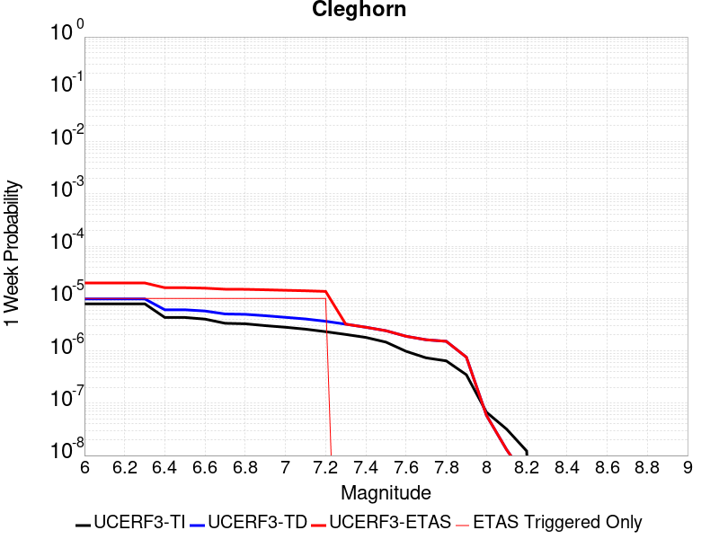 | 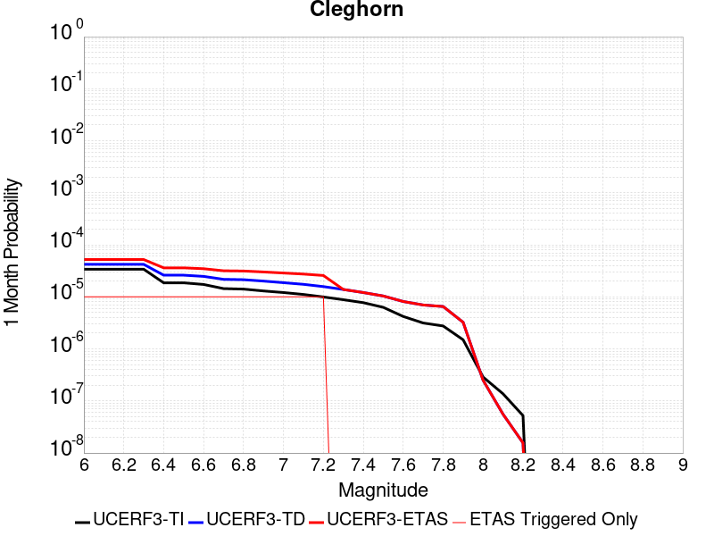 | 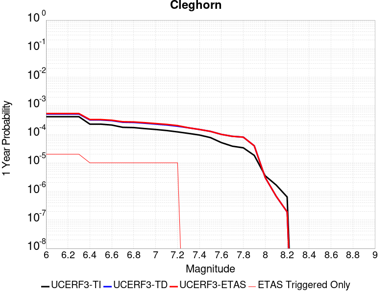 | 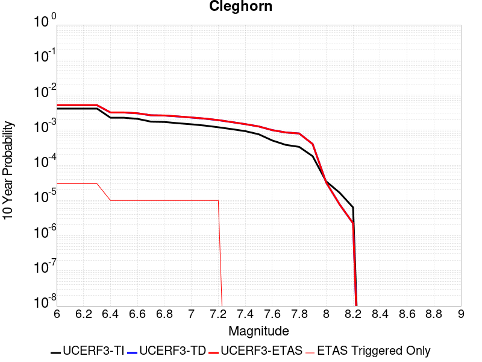 |

| Magnitude | 1 wk TI Prob | 1 wk TD Prob | 1 wk ETAS Prob | 1 wk ETAS/TD Gain | 1 wk ETAS Triggered Only | 1 mo TI Prob | 1 mo TD Prob | 1 mo ETAS Prob | 1 mo ETAS/TD Gain | 1 mo ETAS Triggered Only | 1 yr TI Prob | 1 yr TD Prob | 1 yr ETAS Prob | 1 yr ETAS/TD Gain | 1 yr ETAS Triggered Only | 10 yr TI Prob | 10 yr TD Prob | 10 yr ETAS Prob | 10 yr ETAS/TD Gain | 10 yr ETAS Triggered Only |
|-----|-----|-----|-----|-----|-----|-----|-----|-----|-----|-----|-----|-----|-----|-----|-----|-----|-----|-----|-----|-----|
| 6.0 | 7.9267165E-6 | 9.831582E-6 | 1.9831485E-5 | 2.0171201 | 1.0E-5 | 3.39712E-5 | 4.2134732E-5 | 5.2134314E-5 | 1.2373239 | 1.0E-5 | 4.1352084E-4 | 5.128803E-4 | 5.3287E-4 | 1.0389755 | 2.0E-5 | 0.004127522 | 0.0051320773 | 0.0051619234 | 1.0058156 | 3.0E-5 |
| 6.1 | 7.9267165E-6 | 9.831582E-6 | 1.9831485E-5 | 2.0171201 | 1.0E-5 | 3.39712E-5 | 4.2134732E-5 | 5.2134314E-5 | 1.2373239 | 1.0E-5 | 4.1352084E-4 | 5.128803E-4 | 5.3287E-4 | 1.0389755 | 2.0E-5 | 0.004127522 | 0.0051320773 | 0.0051619234 | 1.0058156 | 3.0E-5 |
| 6.2 | 7.9267165E-6 | 9.831582E-6 | 1.9831485E-5 | 2.0171201 | 1.0E-5 | 3.39712E-5 | 4.2134732E-5 | 5.2134314E-5 | 1.2373239 | 1.0E-5 | 4.1352084E-4 | 5.128803E-4 | 5.3287E-4 | 1.0389755 | 2.0E-5 | 0.004127522 | 0.0051320773 | 0.0051619234 | 1.0058156 | 3.0E-5 |
| 6.3 | 7.9267165E-6 | 9.831582E-6 | 1.9831485E-5 | 2.0171201 | 1.0E-5 | 3.39712E-5 | 4.2134732E-5 | 5.2134314E-5 | 1.2373239 | 1.0E-5 | 4.1352084E-4 | 5.128803E-4 | 5.3287E-4 | 1.0389755 | 2.0E-5 | 0.004127522 | 0.0051320773 | 0.0051619234 | 1.0058156 | 3.0E-5 |
| 6.4 | 4.3445207E-6 | 6.0914435E-6 | 1.6091382E-5 | 2.641637 | 1.0E-5 | 1.8619241E-5 | 2.610593E-5 | 3.610567E-5 | 1.3830447 | 1.0E-5 | 2.2666567E-4 | 3.1779436E-4 | 3.2779117E-4 | 1.031457 | 1.0E-5 | 0.0022643462 | 0.0031875873 | 0.0031975554 | 1.0031272 | 1.0E-5 |
| 6.5 | 4.3445207E-6 | 6.0914435E-6 | 1.6091382E-5 | 2.641637 | 1.0E-5 | 1.8619241E-5 | 2.610593E-5 | 3.610567E-5 | 1.3830447 | 1.0E-5 | 2.2666567E-4 | 3.1779436E-4 | 3.2779117E-4 | 1.031457 | 1.0E-5 | 0.0022643462 | 0.0031875873 | 0.0031975554 | 1.0031272 | 1.0E-5 |
| 6.6 | 4.040109E-6 | 5.773851E-6 | 1.5773794E-5 | 2.7319362 | 1.0E-5 | 1.7314638E-5 | 2.4744846E-5 | 3.47446E-5 | 1.4041145 | 1.0E-5 | 2.1078532E-4 | 3.012278E-4 | 3.1122478E-4 | 1.0331875 | 1.0E-5 | 0.002105855 | 0.003022377 | 0.0030323467 | 1.0032986 | 1.0E-5 |
| 6.7 | 3.3632055E-6 | 5.067348E-6 | 1.5067298E-5 | 2.973409 | 1.0E-5 | 1.4413658E-5 | 2.1717027E-5 | 3.171681E-5 | 1.4604582 | 1.0E-5 | 1.7547216E-4 | 2.6437303E-4 | 2.743704E-4 | 1.0378153 | 1.0E-5 | 0.0017533366 | 0.0026547113 | 0.0026646846 | 1.0037569 | 1.0E-5 |
| 6.8 | 3.2902772E-6 | 4.9892556E-6 | 1.4989206E-5 | 3.004297 | 1.0E-5 | 1.4101111E-5 | 2.1382351E-5 | 3.1382137E-5 | 1.4676654 | 1.0E-5 | 1.716675E-4 | 2.6029933E-4 | 2.7029673E-4 | 1.0384073 | 1.0E-5 | 0.0017153495 | 0.0026140702 | 0.002624044 | 1.0038154 | 1.0E-5 |
| 6.9 | 3.031547E-6 | 4.6910186E-6 | 1.46909715E-5 | 3.1317232 | 1.0E-5 | 1.299228E-5 | 2.0104211E-5 | 3.010401E-5 | 1.4973983 | 1.0E-5 | 1.5816953E-4 | 2.4474156E-4 | 2.547391E-4 | 1.0408494 | 1.0E-5 | 0.00158057 | 0.0024588439 | 0.0024688193 | 1.0040569 | 1.0E-5 |
| 7.0 | 2.8259715E-6 | 4.3705895E-6 | 1.4370546E-5 | 3.288011 | 1.0E-5 | 1.211125E-5 | 1.8730963E-5 | 2.8730776E-5 | 1.5338653 | 1.0E-5 | 1.4744449E-4 | 2.2802586E-4 | 2.3802358E-4 | 1.0438447 | 1.0E-5 | 0.001473467 | 0.0022920412 | 0.0023020182 | 1.0043529 | 1.0E-5 |
| 7.1 | 2.5962665E-6 | 4.0658106E-6 | 1.406577E-5 | 3.4595242 | 1.0E-5 | 1.1126809E-5 | 1.7424789E-5 | 2.7424614E-5 | 1.5738851 | 1.0E-5 | 1.3546048E-4 | 2.1212637E-4 | 2.2212425E-4 | 1.0471317 | 1.0E-5 | 0.0013537793 | 0.002133366 | 0.0021433446 | 1.0046774 | 1.0E-5 |
| 7.2 | 2.3247253E-6 | 3.6763672E-6 | 1.367633E-5 | 3.7200665 | 1.0E-5 | 9.96307E-6 | 1.5755764E-5 | 2.5755608E-5 | 1.6346784 | 1.0E-5 | 1.21293626E-4 | 1.9180974E-4 | 2.0180782E-4 | 1.052125 | 1.0E-5 | 0.0012122744 | 0.0019305905 | 0.0019405711 | 1.0051697 | 1.0E-5 |
| 7.3 | 2.056928E-6 | 3.2350938E-6 | 3.2350938E-6 | 1.0 | 0.0 | 8.815376E-6 | 1.3864615E-5 | 1.3864615E-5 | 1.0 | 0.0 | 1.0732192E-4 | 1.6878877E-4 | 1.6878877E-4 | 1.0 | 0.0 | 0.001072701 | 0.0017008206 | 0.0017008206 | 1.0 | 0.0 |
| 7.4 | 1.8055999E-6 | 2.8255042E-6 | 2.8255042E-6 | 1.0 | 0.0 | 7.738263E-6 | 1.2109249E-5 | 1.2109249E-5 | 1.0 | 0.0 | 9.4209274E-5 | 1.4742027E-4 | 1.4742027E-4 | 1.0 | 0.0 | 9.4169343E-4 | 0.0014875771 | 0.0014875771 | 1.0 | 0.0 |
| 7.5 | 1.4683443E-6 | 2.4247483E-6 | 2.4247483E-6 | 1.0 | 0.0 | 6.292889E-6 | 1.0391738E-5 | 1.0391738E-5 | 1.0 | 0.0 | 7.661323E-5 | 1.2651215E-4 | 1.2651215E-4 | 1.0 | 0.0 | 7.658682E-4 | 0.0012787961 | 0.0012787961 | 1.0 | 0.0 |
| 7.6 | 9.804088E-7 | 1.900266E-6 | 1.900266E-6 | 1.0 | 0.0 | 4.201745E-6 | 8.143972E-6 | 8.143972E-6 | 1.0 | 0.0 | 5.1155046E-5 | 9.91484E-5 | 9.91484E-5 | 1.0 | 0.0 | 5.114327E-4 | 0.001005471 | 0.001005471 | 1.0 | 0.0 |
| 7.7 | 7.3434086E-7 | 1.6284146E-6 | 1.6284146E-6 | 1.0 | 0.0 | 3.1471714E-6 | 6.978901E-6 | 6.978901E-6 | 1.0 | 0.0 | 3.831614E-5 | 8.4964835E-5 | 8.4964835E-5 | 1.0 | 0.0 | 3.8309532E-4 | 8.6378685E-4 | 8.6378685E-4 | 1.0 | 0.0 |
| 7.8 | 6.434184E-7 | 1.5220047E-6 | 1.5220047E-6 | 1.0 | 0.0 | 2.7575045E-6 | 6.5228614E-6 | 6.5228614E-6 | 1.0 | 0.0 | 3.35721E-5 | 7.941297E-5 | 7.941297E-5 | 1.0 | 0.0 | 3.3567028E-4 | 8.079678E-4 | 8.079678E-4 | 1.0 | 0.0 |
| 7.9 | 3.4943926E-7 | 7.574459E-7 | 7.574459E-7 | 1.0 | 0.0 | 1.497596E-6 | 3.2461926E-6 | 3.2461926E-6 | 1.0 | 0.0 | 1.8233079E-5 | 3.952169E-5 | 3.952169E-5 | 1.0 | 0.0 | 1.8231584E-4 | 4.040099E-4 | 4.040099E-4 | 1.0 | 0.0 |
| 8.0 | 6.717524E-8 | 5.838828E-8 | 5.838828E-8 | 1.0 | 0.0 | 2.8789387E-7 | 2.5023547E-7 | 2.5023547E-7 | 1.0 | 0.0 | 3.505102E-6 | 3.0466126E-6 | 3.0466126E-6 | 1.0 | 0.0 | 3.5050467E-5 | 3.273506E-5 | 3.273506E-5 | 1.0 | 0.0 |
| 8.1 | 3.1984914E-8 | 1.2956093E-8 | 1.2956093E-8 | 1.0 | 0.0 | 1.370782E-7 | 5.552611E-8 | 5.552611E-8 | 1.0 | 0.0 | 1.6689258E-6 | 6.760302E-7 | 6.760302E-7 | 1.0 | 0.0 | 1.6689133E-5 | 7.74454E-6 | 7.74454E-6 | 1.0 | 0.0 |
| 8.2 | 1.21887656E-8 | 3.6495305E-9 | 3.6495305E-9 | 1.0 | 0.0 | 5.2237567E-8 | 1.5640845E-8 | 1.5640845E-8 | 1.0 | 0.0 | 6.359922E-7 | 1.9042727E-7 | 1.9042727E-7 | 1.0 | 0.0 | 6.3599036E-6 | 2.2470974E-6 | 2.2470974E-6 | 1.0 | 0.0 |

## Malibu Coast alt 1
*[(top)](#table-of-contents)*

| 1 Week | 1 Month | 1 Year | 10 Year |
|-----|-----|-----|-----|
| 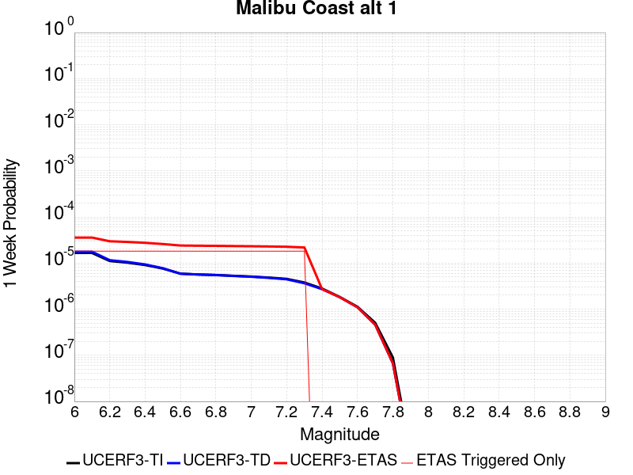 | 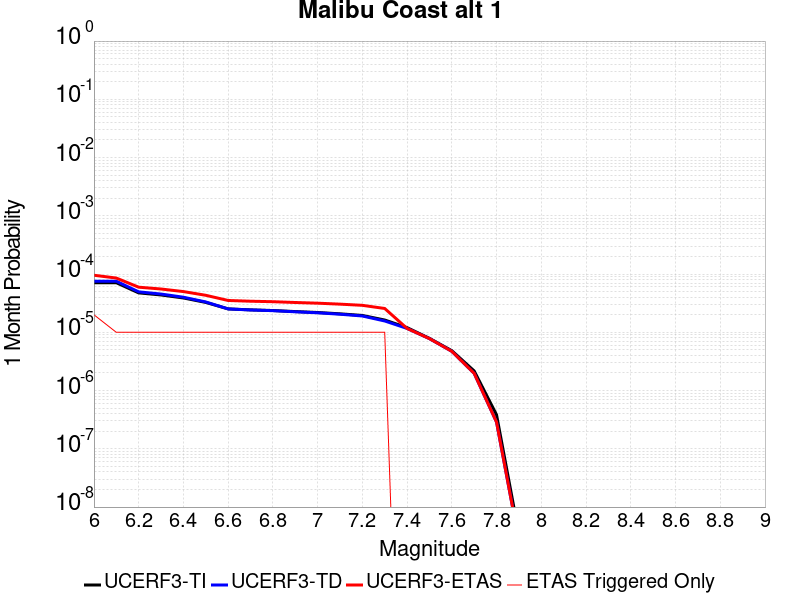 | 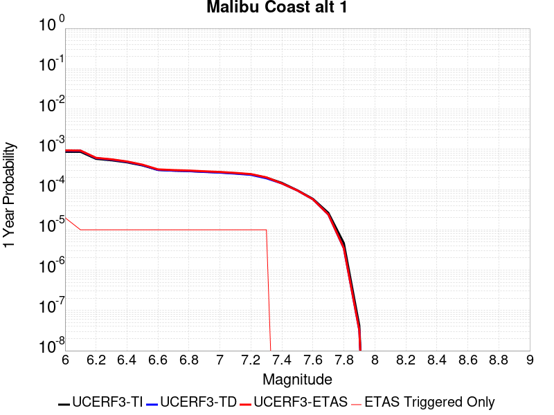 | 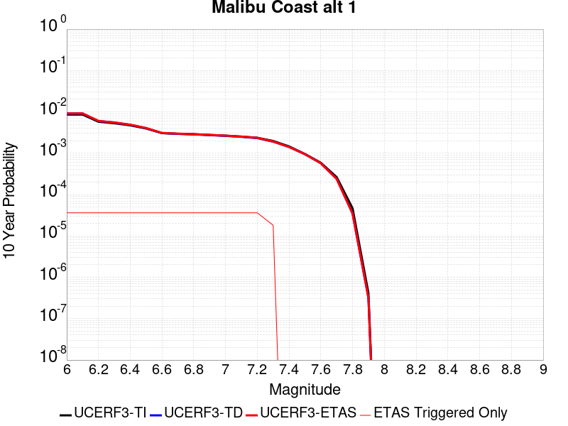 |

| Magnitude | 1 wk TI Prob | 1 wk TD Prob | 1 wk ETAS Prob | 1 wk ETAS/TD Gain | 1 wk ETAS Triggered Only | 1 mo TI Prob | 1 mo TD Prob | 1 mo ETAS Prob | 1 mo ETAS/TD Gain | 1 mo ETAS Triggered Only | 1 yr TI Prob | 1 yr TD Prob | 1 yr ETAS Prob | 1 yr ETAS/TD Gain | 1 yr ETAS Triggered Only | 10 yr TI Prob | 10 yr TD Prob | 10 yr ETAS Prob | 10 yr ETAS/TD Gain | 10 yr ETAS Triggered Only |
|-----|-----|-----|-----|-----|-----|-----|-----|-----|-----|-----|-----|-----|-----|-----|-----|-----|-----|-----|-----|-----|
| 6.0 | 1.6572556E-5 | 1.7598066E-5 | 3.7597714E-5 | 2.1364684 | 2.0E-5 | 7.102331E-5 | 7.541821E-5 | 9.5416704E-5 | 1.265168 | 2.0E-5 | 8.6436566E-4 | 9.178488E-4 | 9.378304E-4 | 1.0217701 | 2.0E-5 | 0.0086101135 | 0.009142512 | 0.009172238 | 1.0032513 | 3.0E-5 |
| 6.1 | 1.6572556E-5 | 1.7598066E-5 | 2.7597891E-5 | 1.5682342 | 1.0E-5 | 7.102331E-5 | 7.541821E-5 | 8.541746E-5 | 1.132584 | 1.0E-5 | 8.6436566E-4 | 9.178488E-4 | 9.278396E-4 | 1.010885 | 1.0E-5 | 0.0086101135 | 0.009142512 | 0.00916233 | 1.0021676 | 2.0E-5 |
| 6.2 | 1.1085717E-5 | 1.1557147E-5 | 2.155703E-5 | 1.8652555 | 1.0E-5 | 4.750935E-5 | 4.952971E-5 | 5.9529215E-5 | 1.201889 | 1.0E-5 | 5.782728E-4 | 6.028609E-4 | 6.128549E-4 | 1.0165776 | 1.0E-5 | 0.0057677035 | 0.0060126255 | 0.0060325055 | 1.0033064 | 2.0E-5 |
| 6.3 | 1.0208568E-5 | 1.0592237E-5 | 2.0592131E-5 | 1.9440776 | 1.0E-5 | 4.375027E-5 | 4.539453E-5 | 5.5394077E-5 | 1.2202809 | 1.0E-5 | 5.325294E-4 | 5.5254117E-4 | 5.6253566E-4 | 1.0180882 | 1.0E-5 | 0.0053125503 | 0.0055119814 | 0.005531871 | 1.0036085 | 2.0E-5 |
| 6.4 | 9.0682315E-6 | 9.342637E-6 | 1.9342544E-5 | 2.0703516 | 1.0E-5 | 3.8863272E-5 | 4.003927E-5 | 5.003887E-5 | 1.2497448 | 1.0E-5 | 4.730576E-4 | 4.8737114E-4 | 4.9736624E-4 | 1.0205083 | 1.0E-5 | 0.0047205184 | 0.004863236 | 0.004883139 | 1.0040925 | 2.0E-5 |
| 6.5 | 7.605796E-6 | 7.748587E-6 | 1.774851E-5 | 2.2905478 | 1.0E-5 | 3.259586E-5 | 3.3207816E-5 | 4.3207485E-5 | 1.301124 | 1.0E-5 | 3.9678233E-4 | 4.0423148E-4 | 4.1422746E-4 | 1.0247283 | 1.0E-5 | 0.0039607463 | 0.0040351 | 0.004055019 | 1.0049365 | 2.0E-5 |
| 6.6 | 5.889873E-6 | 5.8795385E-6 | 1.587948E-5 | 2.7008038 | 1.0E-5 | 2.5242069E-5 | 2.519778E-5 | 3.519753E-5 | 1.3968503 | 1.0E-5 | 3.0727885E-4 | 3.0673988E-4 | 3.167368E-4 | 1.0325909 | 1.0E-5 | 0.003068543 | 0.0030631777 | 0.0030831164 | 1.0065092 | 2.0E-5 |
| 6.7 | 5.66586E-6 | 5.641641E-6 | 1.5641584E-5 | 2.7725239 | 1.0E-5 | 2.428203E-5 | 2.417824E-5 | 3.4177996E-5 | 1.4135851 | 1.0E-5 | 2.955936E-4 | 2.9433038E-4 | 3.0432743E-4 | 1.0339655 | 1.0E-5 | 0.0029520073 | 0.0029394177 | 0.002959359 | 1.0067841 | 2.0E-5 |
| 6.8 | 5.521556E-6 | 5.489427E-6 | 1.5489371E-5 | 2.8216739 | 1.0E-5 | 2.3663597E-5 | 2.3525903E-5 | 3.352567E-5 | 1.4250534 | 1.0E-5 | 2.880662E-4 | 2.8639034E-4 | 2.9638747E-4 | 1.0349073 | 1.0E-5 | 0.0028769306 | 0.002860224 | 0.002880167 | 1.0069724 | 2.0E-5 |
| 6.9 | 5.29752E-6 | 5.2499317E-6 | 1.5249879E-5 | 2.9047768 | 1.0E-5 | 2.270346E-5 | 2.2499513E-5 | 3.2499287E-5 | 1.4444441 | 1.0E-5 | 2.7637955E-4 | 2.7389723E-4 | 2.8389448E-4 | 1.0365001 | 1.0E-5 | 0.0027603607 | 0.0027356069 | 0.002755552 | 1.007291 | 2.0E-5 |
| 7.0 | 5.106743E-6 | 5.0476788E-6 | 1.5047628E-5 | 2.9810987 | 1.0E-5 | 2.1885859E-5 | 2.163273E-5 | 3.1632513E-5 | 1.4622525 | 1.0E-5 | 2.6642776E-4 | 2.6334674E-4 | 2.7334408E-4 | 1.0379628 | 1.0E-5 | 0.0026610855 | 0.0026303562 | 0.0026503035 | 1.0075835 | 2.0E-5 |
| 7.1 | 4.8469647E-6 | 4.770373E-6 | 1.4770325E-5 | 3.0962622 | 1.0E-5 | 2.0772539E-5 | 2.0444295E-5 | 3.0444091E-5 | 1.489124 | 1.0E-5 | 2.528763E-4 | 2.4888094E-4 | 2.5887846E-4 | 1.0401698 | 1.0E-5 | 0.0025258875 | 0.00248603 | 0.0025059804 | 1.0080249 | 2.0E-5 |
| 7.2 | 4.545514E-6 | 4.4481935E-6 | 1.4448149E-5 | 3.2480936 | 1.0E-5 | 1.9480629E-5 | 1.9063547E-5 | 2.9063358E-5 | 1.5245513 | 1.0E-5 | 2.3715083E-4 | 2.3207403E-4 | 2.4207172E-4 | 1.0430797 | 1.0E-5 | 0.0023689792 | 0.0023183243 | 0.0023382779 | 1.0086069 | 2.0E-5 |
| 7.3 | 3.794097E-6 | 3.6519348E-6 | 1.3651898E-5 | 3.7382646 | 1.0E-5 | 1.6260314E-5 | 1.5651056E-5 | 2.56509E-5 | 1.6389245 | 1.0E-5 | 1.9795135E-4 | 1.9053498E-4 | 2.0053308E-4 | 1.0524738 | 1.0E-5 | 0.001977751 | 0.0019037209 | 0.0019137019 | 1.0052428 | 1.0E-5 |
| 7.4 | 2.808217E-6 | 2.719077E-6 | 2.719077E-6 | 1.0 | 0.0 | 1.203516E-5 | 1.1653135E-5 | 1.1653135E-5 | 1.0 | 0.0 | 1.4651821E-4 | 1.418677E-4 | 1.418677E-4 | 1.0 | 0.0 | 0.0014642165 | 0.001417774 | 0.001417774 | 1.0 | 0.0 |
| 7.5 | 1.83809E-6 | 1.8190691E-6 | 1.8190691E-6 | 1.0 | 0.0 | 7.877505E-6 | 7.795988E-6 | 7.795988E-6 | 1.0 | 0.0 | 9.59044E-5 | 9.491203E-5 | 9.491203E-5 | 1.0 | 0.0 | 9.5863023E-4 | 9.48717E-4 | 9.48717E-4 | 1.0 | 0.0 |
| 7.6 | 1.1292672E-6 | 1.1001447E-6 | 1.1001447E-6 | 1.0 | 0.0 | 4.839708E-6 | 4.714897E-6 | 4.714897E-6 | 1.0 | 0.0 | 5.8921847E-5 | 5.7402376E-5 | 5.7402376E-5 | 1.0 | 0.0 | 5.890623E-4 | 5.738771E-4 | 5.738771E-4 | 1.0 | 0.0 |
| 7.7 | 5.065272E-7 | 4.609151E-7 | 4.609151E-7 | 1.0 | 0.0 | 2.170829E-6 | 1.975349E-6 | 1.975349E-6 | 1.0 | 0.0 | 2.6429525E-5 | 2.404962E-5 | 2.404962E-5 | 1.0 | 0.0 | 2.642638E-4 | 2.4047129E-4 | 2.4047129E-4 | 1.0 | 0.0 |
| 7.8 | 8.952991E-8 | 6.707874E-8 | 6.707874E-8 | 1.0 | 0.0 | 3.8369956E-7 | 2.8748025E-7 | 2.8748025E-7 | 1.0 | 0.0 | 4.671532E-6 | 3.5000667E-6 | 3.5000667E-6 | 1.0 | 0.0 | 4.671434E-5 | 3.5000136E-5 | 3.5000136E-5 | 1.0 | 0.0 |
| 7.9 | 8.007447E-10 | 6.1608785E-10 | 6.1608785E-10 | 1.0 | 0.0 | 3.4317629E-9 | 2.6403764E-9 | 2.6403764E-9 | 1.0 | 0.0 | 4.1781714E-8 | 3.2146584E-8 | 3.2146584E-8 | 1.0 | 0.0 | 4.1781706E-7 | 3.214658E-7 | 3.214658E-7 | 1.0 | 0.0 |

## Pitas Point (Lower)-Montalvo
*[(top)](#table-of-contents)*

| 1 Week | 1 Month | 1 Year | 10 Year |
|-----|-----|-----|-----|
|  |  | 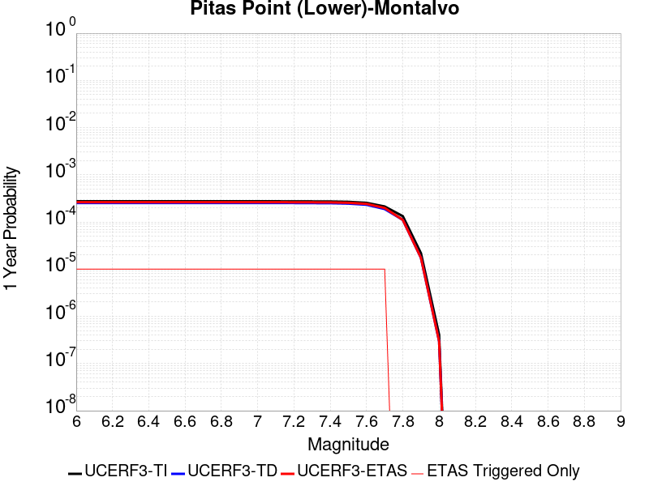 | 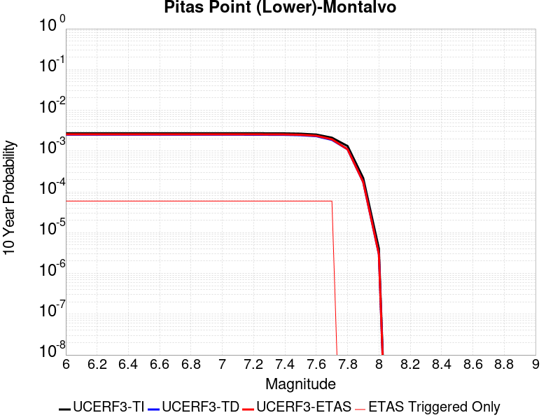 |

| Magnitude | 1 wk TI Prob | 1 wk TD Prob | 1 wk ETAS Prob | 1 wk ETAS/TD Gain | 1 wk ETAS Triggered Only | 1 mo TI Prob | 1 mo TD Prob | 1 mo ETAS Prob | 1 mo ETAS/TD Gain | 1 mo ETAS Triggered Only | 1 yr TI Prob | 1 yr TD Prob | 1 yr ETAS Prob | 1 yr ETAS/TD Gain | 1 yr ETAS Triggered Only | 10 yr TI Prob | 10 yr TD Prob | 10 yr ETAS Prob | 10 yr ETAS/TD Gain | 10 yr ETAS Triggered Only |
|-----|-----|-----|-----|-----|-----|-----|-----|-----|-----|-----|-----|-----|-----|-----|-----|-----|-----|-----|-----|-----|
| 6.0 | 5.2543637E-6 | 4.8378706E-6 | 1.4837822E-5 | 3.0670152 | 1.0E-5 | 2.2518509E-5 | 2.0733567E-5 | 3.073336E-5 | 1.4822997 | 1.0E-5 | 2.7412834E-4 | 2.5240227E-4 | 2.6239973E-4 | 1.0396093 | 1.0E-5 | 0.0027379042 | 0.0025211885 | 0.0025511128 | 1.0118692 | 3.0E-5 |
| 6.1 | 5.2543637E-6 | 4.8378706E-6 | 1.4837822E-5 | 3.0670152 | 1.0E-5 | 2.2518509E-5 | 2.0733567E-5 | 3.073336E-5 | 1.4822997 | 1.0E-5 | 2.7412834E-4 | 2.5240227E-4 | 2.6239973E-4 | 1.0396093 | 1.0E-5 | 0.0027379042 | 0.0025211885 | 0.0025511128 | 1.0118692 | 3.0E-5 |
| 6.2 | 5.2543637E-6 | 4.8378706E-6 | 1.4837822E-5 | 3.0670152 | 1.0E-5 | 2.2518509E-5 | 2.0733567E-5 | 3.073336E-5 | 1.4822997 | 1.0E-5 | 2.7412834E-4 | 2.5240227E-4 | 2.6239973E-4 | 1.0396093 | 1.0E-5 | 0.0027379042 | 0.0025211885 | 0.0025511128 | 1.0118692 | 3.0E-5 |
| 6.3 | 5.2543637E-6 | 4.8378706E-6 | 1.4837822E-5 | 3.0670152 | 1.0E-5 | 2.2518509E-5 | 2.0733567E-5 | 3.073336E-5 | 1.4822997 | 1.0E-5 | 2.7412834E-4 | 2.5240227E-4 | 2.6239973E-4 | 1.0396093 | 1.0E-5 | 0.0027379042 | 0.0025211885 | 0.0025511128 | 1.0118692 | 3.0E-5 |
| 6.4 | 5.2543637E-6 | 4.8378706E-6 | 1.4837822E-5 | 3.0670152 | 1.0E-5 | 2.2518509E-5 | 2.0733567E-5 | 3.073336E-5 | 1.4822997 | 1.0E-5 | 2.7412834E-4 | 2.5240227E-4 | 2.6239973E-4 | 1.0396093 | 1.0E-5 | 0.0027379042 | 0.0025211885 | 0.0025511128 | 1.0118692 | 3.0E-5 |
| 6.5 | 5.2543637E-6 | 4.8378706E-6 | 1.4837822E-5 | 3.0670152 | 1.0E-5 | 2.2518509E-5 | 2.0733567E-5 | 3.073336E-5 | 1.4822997 | 1.0E-5 | 2.7412834E-4 | 2.5240227E-4 | 2.6239973E-4 | 1.0396093 | 1.0E-5 | 0.0027379042 | 0.0025211885 | 0.0025511128 | 1.0118692 | 3.0E-5 |
| 6.6 | 5.2543637E-6 | 4.8378706E-6 | 1.4837822E-5 | 3.0670152 | 1.0E-5 | 2.2518509E-5 | 2.0733567E-5 | 3.073336E-5 | 1.4822997 | 1.0E-5 | 2.7412834E-4 | 2.5240227E-4 | 2.6239973E-4 | 1.0396093 | 1.0E-5 | 0.0027379042 | 0.0025211885 | 0.0025511128 | 1.0118692 | 3.0E-5 |
| 6.7 | 5.2543637E-6 | 4.8378706E-6 | 1.4837822E-5 | 3.0670152 | 1.0E-5 | 2.2518509E-5 | 2.0733567E-5 | 3.073336E-5 | 1.4822997 | 1.0E-5 | 2.7412834E-4 | 2.5240227E-4 | 2.6239973E-4 | 1.0396093 | 1.0E-5 | 0.0027379042 | 0.0025211885 | 0.0025511128 | 1.0118692 | 3.0E-5 |
| 6.8 | 5.2543637E-6 | 4.8378706E-6 | 1.4837822E-5 | 3.0670152 | 1.0E-5 | 2.2518509E-5 | 2.0733567E-5 | 3.073336E-5 | 1.4822997 | 1.0E-5 | 2.7412834E-4 | 2.5240227E-4 | 2.6239973E-4 | 1.0396093 | 1.0E-5 | 0.0027379042 | 0.0025211885 | 0.0025511128 | 1.0118692 | 3.0E-5 |
| 6.9 | 5.2543637E-6 | 4.8378706E-6 | 1.4837822E-5 | 3.0670152 | 1.0E-5 | 2.2518509E-5 | 2.0733567E-5 | 3.073336E-5 | 1.4822997 | 1.0E-5 | 2.7412834E-4 | 2.5240227E-4 | 2.6239973E-4 | 1.0396093 | 1.0E-5 | 0.0027379042 | 0.0025211885 | 0.0025511128 | 1.0118692 | 3.0E-5 |
| 7.0 | 5.2543637E-6 | 4.8378706E-6 | 1.4837822E-5 | 3.0670152 | 1.0E-5 | 2.2518509E-5 | 2.0733567E-5 | 3.073336E-5 | 1.4822997 | 1.0E-5 | 2.7412834E-4 | 2.5240227E-4 | 2.6239973E-4 | 1.0396093 | 1.0E-5 | 0.0027379042 | 0.0025211885 | 0.0025511128 | 1.0118692 | 3.0E-5 |
| 7.1 | 5.2543637E-6 | 4.8378706E-6 | 1.4837822E-5 | 3.0670152 | 1.0E-5 | 2.2518509E-5 | 2.0733567E-5 | 3.073336E-5 | 1.4822997 | 1.0E-5 | 2.7412834E-4 | 2.5240227E-4 | 2.6239973E-4 | 1.0396093 | 1.0E-5 | 0.0027379042 | 0.0025211885 | 0.0025511128 | 1.0118692 | 3.0E-5 |
| 7.2 | 5.2458695E-6 | 4.8290244E-6 | 1.48289755E-5 | 3.0708017 | 1.0E-5 | 2.2482105E-5 | 2.0695656E-5 | 3.069545E-5 | 1.4831831 | 1.0E-5 | 2.7368523E-4 | 2.519408E-4 | 2.6193826E-4 | 1.0396819 | 1.0E-5 | 0.0027334841 | 0.0025165842 | 0.0025465086 | 1.0118909 | 3.0E-5 |
| 7.3 | 5.22665E-6 | 4.8089414E-6 | 1.4808894E-5 | 3.0794497 | 1.0E-5 | 2.2399736E-5 | 2.0609588E-5 | 3.0609383E-5 | 1.485201 | 1.0E-5 | 2.7268266E-4 | 2.5089315E-4 | 2.6089067E-4 | 1.0398476 | 1.0E-5 | 0.002723483 | 0.0025061315 | 0.0025360563 | 1.0119406 | 3.0E-5 |
| 7.4 | 5.210642E-6 | 4.792154E-6 | 1.4792106E-5 | 3.0867343 | 1.0E-5 | 2.233113E-5 | 2.0537642E-5 | 3.0537438E-5 | 1.4869008 | 1.0E-5 | 2.718476E-4 | 2.5001742E-4 | 2.6001493E-4 | 1.0399872 | 1.0E-5 | 0.002715153 | 0.0024973939 | 0.002527319 | 1.0119826 | 3.0E-5 |
| 7.5 | 5.1226016E-6 | 4.7000403E-6 | 1.4699994E-5 | 3.1276312 | 1.0E-5 | 2.1953823E-5 | 2.0142877E-5 | 3.0142675E-5 | 1.4964434 | 1.0E-5 | 2.67255E-4 | 2.4521223E-4 | 2.5520977E-4 | 1.040771 | 1.0E-5 | 0.0026693381 | 0.0024494485 | 0.0024793749 | 1.0122176 | 3.0E-5 |
| 7.6 | 4.8796987E-6 | 4.4449403E-6 | 1.4444896E-5 | 3.249739 | 1.0E-5 | 2.0912828E-5 | 1.9049607E-5 | 2.9049417E-5 | 1.5249352 | 1.0E-5 | 2.5458392E-4 | 2.3190459E-4 | 2.4190226E-4 | 1.0431112 | 1.0E-5 | 0.0025429246 | 0.0023166565 | 0.002346587 | 1.0129197 | 3.0E-5 |
| 7.7 | 4.0834398E-6 | 3.6091124E-6 | 1.3609077E-5 | 3.7707543 | 1.0E-5 | 1.7500339E-5 | 1.5467534E-5 | 2.546738E-5 | 1.6465055 | 1.0E-5 | 2.1304579E-4 | 1.8830119E-4 | 1.982993E-4 | 1.0530964 | 1.0E-5 | 0.0021284167 | 0.00188144 | 0.0019014025 | 1.0106101 | 2.0E-5 |
| 7.8 | 2.5445438E-6 | 2.121228E-6 | 2.121228E-6 | 1.0 | 0.0 | 1.0905142E-5 | 9.090945E-6 | 9.090945E-6 | 1.0 | 0.0 | 1.3276201E-4 | 1.1067669E-4 | 1.1067669E-4 | 1.0 | 0.0 | 0.0013268272 | 0.0011062203 | 0.0011062203 | 1.0 | 0.0 |
| 7.9 | 4.1677114E-7 | 3.3293693E-7 | 3.3293693E-7 | 1.0 | 0.0 | 1.7861609E-6 | 1.4268718E-6 | 1.4268718E-6 | 1.0 | 0.0 | 2.1746291E-5 | 1.737203E-5 | 1.737203E-5 | 1.0 | 0.0 | 2.1744163E-4 | 1.7370703E-4 | 1.7370703E-4 | 1.0 | 0.0 |
| 8.0 | 7.791402E-9 | 5.683497E-9 | 5.683497E-9 | 1.0 | 0.0 | 3.3391725E-8 | 2.4357844E-8 | 2.4357844E-8 | 1.0 | 0.0 | 4.0654416E-7 | 2.9655675E-7 | 2.9655675E-7 | 1.0 | 0.0 | 4.065434E-6 | 2.9655655E-6 | 2.9655655E-6 | 1.0 | 0.0 |

## San Andreas (Santa Cruz Mts) 2011 CFM
*[(top)](#table-of-contents)*

| 1 Week | 1 Month | 1 Year | 10 Year |
|-----|-----|-----|-----|
| 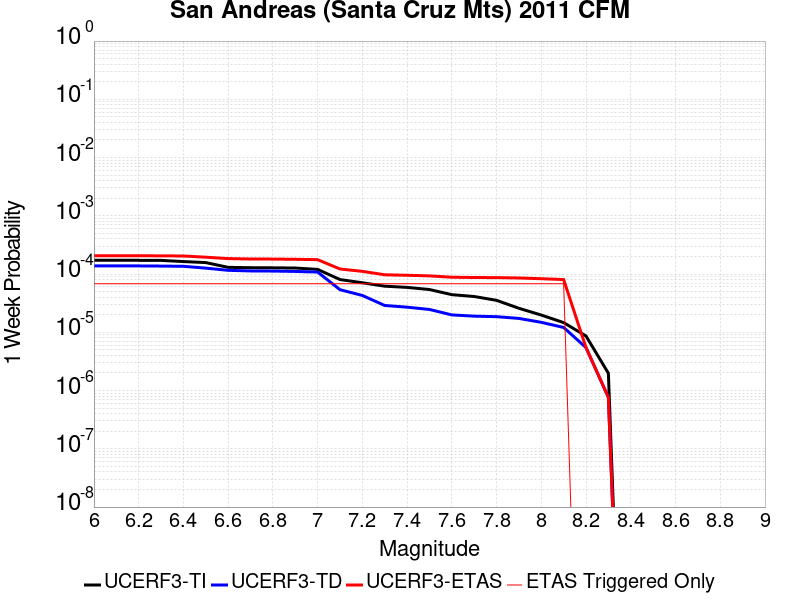 | 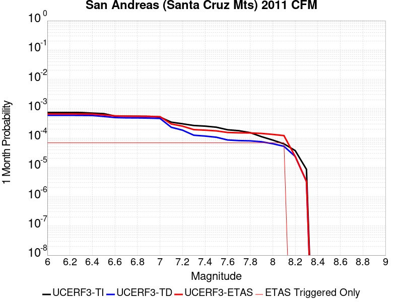 | 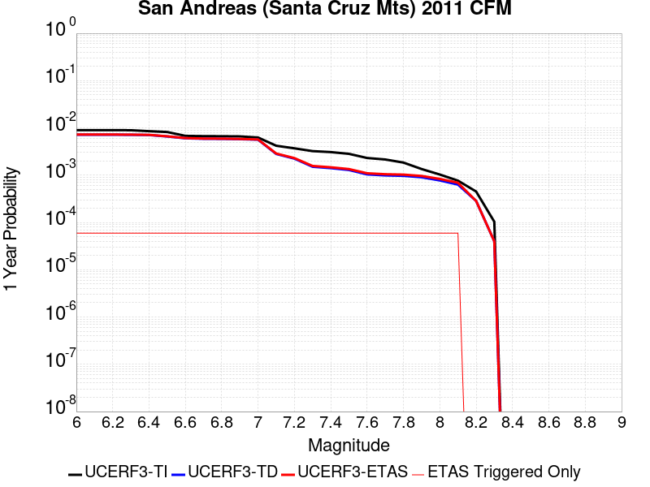 | 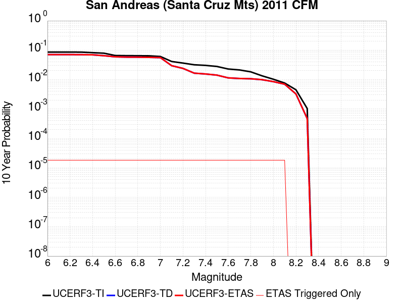 |

| Magnitude | 1 wk TI Prob | 1 wk TD Prob | 1 wk ETAS Prob | 1 wk ETAS/TD Gain | 1 wk ETAS Triggered Only | 1 mo TI Prob | 1 mo TD Prob | 1 mo ETAS Prob | 1 mo ETAS/TD Gain | 1 mo ETAS Triggered Only | 1 yr TI Prob | 1 yr TD Prob | 1 yr ETAS Prob | 1 yr ETAS/TD Gain | 1 yr ETAS Triggered Only | 10 yr TI Prob | 10 yr TD Prob | 10 yr ETAS Prob | 10 yr ETAS/TD Gain | 10 yr ETAS Triggered Only |
|-----|-----|-----|-----|-----|-----|-----|-----|-----|-----|-----|-----|-----|-----|-----|-----|-----|-----|-----|-----|-----|
| 6.0 | 1.7221631E-4 | 1.3793171E-4 | 1.5792895E-4 | 1.1449792 | 2.0E-5 | 7.378611E-4 | 5.9100403E-4 | 6.109922E-4 | 1.0338207 | 2.0E-5 | 0.008946515 | 0.007172124 | 0.0071919803 | 1.0027685 | 2.0E-5 | 0.08594794 | 0.0705551 | 0.07058298 | 1.0003952 | 3.0E-5 |
| 6.1 | 1.7221631E-4 | 1.3793171E-4 | 1.5792895E-4 | 1.1449792 | 2.0E-5 | 7.378611E-4 | 5.9100403E-4 | 6.109922E-4 | 1.0338207 | 2.0E-5 | 0.008946515 | 0.007172124 | 0.0071919803 | 1.0027685 | 2.0E-5 | 0.08594794 | 0.0705551 | 0.07058298 | 1.0003952 | 3.0E-5 |
| 6.2 | 1.7221631E-4 | 1.3793171E-4 | 1.5792895E-4 | 1.1449792 | 2.0E-5 | 7.378611E-4 | 5.9100403E-4 | 6.109922E-4 | 1.0338207 | 2.0E-5 | 0.008946515 | 0.007172124 | 0.0071919803 | 1.0027685 | 2.0E-5 | 0.08594794 | 0.0705551 | 0.07058298 | 1.0003952 | 3.0E-5 |
| 6.3 | 1.716926E-4 | 1.3712609E-4 | 1.5712334E-4 | 1.1458312 | 2.0E-5 | 7.3561794E-4 | 5.875529E-4 | 6.075411E-4 | 1.0340195 | 2.0E-5 | 0.008919428 | 0.0071303817 | 0.007150239 | 1.0027848 | 2.0E-5 | 0.08569809 | 0.070167266 | 0.07019516 | 1.0003976 | 3.0E-5 |
| 6.4 | 1.6392978E-4 | 1.3588481E-4 | 1.558821E-4 | 1.1471635 | 2.0E-5 | 7.02367E-4 | 5.822355E-4 | 6.0222385E-4 | 1.0343304 | 2.0E-5 | 0.008517839 | 0.007066063 | 0.0070859217 | 1.0028105 | 2.0E-5 | 0.08198654 | 0.06940135 | 0.06942927 | 1.0004022 | 3.0E-5 |
| 6.5 | 1.5742714E-4 | 1.2648388E-4 | 1.4648134E-4 | 1.1581029 | 2.0E-5 | 6.745133E-4 | 5.4196286E-4 | 5.61952E-4 | 1.0368829 | 2.0E-5 | 0.00818132 | 0.0065787593 | 0.0065986277 | 1.00302 | 2.0E-5 | 0.078865945 | 0.06486309 | 0.06489115 | 1.0004325 | 3.0E-5 |
| 6.6 | 1.3038084E-4 | 1.1588213E-4 | 1.3587982E-4 | 1.1725692 | 2.0E-5 | 5.5865536E-4 | 4.9654447E-4 | 5.1653455E-4 | 1.0402584 | 2.0E-5 | 0.006780438 | 0.0060289134 | 0.0060487925 | 1.0032973 | 2.0E-5 | 0.0657725 | 0.05932738 | 0.059355598 | 1.0004756 | 3.0E-5 |
| 6.7 | 1.2867592E-4 | 1.1314701E-4 | 1.3314474E-4 | 1.1767412 | 2.0E-5 | 5.5135164E-4 | 4.8482692E-4 | 5.0481723E-4 | 1.0412319 | 2.0E-5 | 0.0066920654 | 0.00588703 | 0.0059069125 | 1.0033773 | 2.0E-5 | 0.06494093 | 0.058038417 | 0.058066677 | 1.0004869 | 3.0E-5 |
| 6.8 | 1.2801298E-4 | 1.1252261E-4 | 1.3252036E-4 | 1.1777221 | 2.0E-5 | 5.485117E-4 | 4.8215193E-4 | 5.021423E-4 | 1.0414608 | 2.0E-5 | 0.0066577005 | 0.0058546383 | 0.005874521 | 1.0033962 | 2.0E-5 | 0.06461738 | 0.057752274 | 0.057780538 | 1.0004895 | 3.0E-5 |
| 6.9 | 1.269149E-4 | 1.1094465E-4 | 1.3094244E-4 | 1.18025 | 2.0E-5 | 5.4380763E-4 | 4.7539172E-4 | 4.9538224E-4 | 1.0420506 | 2.0E-5 | 0.006600777 | 0.005772772 | 0.0057926564 | 1.0034446 | 2.0E-5 | 0.06408122 | 0.0570241 | 0.057052385 | 1.0004961 | 3.0E-5 |
| 7.0 | 1.2030331E-4 | 1.0824504E-4 | 1.2824287E-4 | 1.184746 | 2.0E-5 | 5.154837E-4 | 4.638261E-4 | 4.838168E-4 | 1.0430996 | 2.0E-5 | 0.006257969 | 0.0056326967 | 0.0056525837 | 1.0035307 | 2.0E-5 | 0.06084648 | 0.055696685 | 0.055725016 | 1.0005087 | 3.0E-5 |
| 7.1 | 8.049617E-5 | 5.3926604E-5 | 7.392553E-5 | 1.3708545 | 2.0E-5 | 3.4493793E-4 | 2.3109373E-4 | 2.510891E-4 | 1.086525 | 2.0E-5 | 0.0041915346 | 0.0028099709 | 0.0028299147 | 1.0070975 | 2.0E-5 | 0.041133516 | 0.029618956 | 0.029638365 | 1.0006553 | 2.0E-5 |
| 7.2 | 7.093979E-5 | 4.2937932E-5 | 6.293707E-5 | 1.4657686 | 2.0E-5 | 3.0399222E-4 | 1.8400686E-4 | 2.0400317E-4 | 1.1086715 | 2.0E-5 | 0.0036948253 | 0.0022380045 | 0.0022579597 | 1.0089165 | 2.0E-5 | 0.03633994 | 0.023941692 | 0.023961212 | 1.0008154 | 2.0E-5 |
| 7.3 | 6.193693E-5 | 2.8894141E-5 | 4.8893562E-5 | 1.6921618 | 2.0E-5 | 2.6541698E-4 | 1.2382616E-4 | 1.438237E-4 | 1.1614968 | 2.0E-5 | 0.0032266637 | 0.0015065427 | 0.0015265126 | 1.0132555 | 2.0E-5 | 0.031802133 | 0.016499156 | 0.016518826 | 1.0011922 | 2.0E-5 |
| 7.4 | 5.906492E-5 | 2.702346E-5 | 4.702292E-5 | 1.7400776 | 2.0E-5 | 2.5311083E-4 | 1.1580969E-4 | 1.3580738E-4 | 1.1726772 | 2.0E-5 | 0.0030772698 | 0.0014090725 | 0.0014290443 | 1.0141737 | 2.0E-5 | 0.030350044 | 0.015471023 | 0.015490713 | 1.0012728 | 2.0E-5 |
| 7.5 | 5.424296E-5 | 2.4678277E-5 | 4.467778E-5 | 1.8104094 | 2.0E-5 | 2.324491E-4 | 1.05759755E-4 | 1.2575764E-4 | 1.1890879 | 2.0E-5 | 0.002826395 | 0.0012868657 | 0.00130684 | 1.0155216 | 2.0E-5 | 0.027907165 | 0.014163188 | 0.014182904 | 1.0013921 | 2.0E-5 |
| 7.6 | 4.43084E-5 | 1.990431E-5 | 3.9903913E-5 | 2.0047874 | 2.0E-5 | 1.8987931E-4 | 8.53014E-5 | 1.0529969E-4 | 1.2344427 | 2.0E-5 | 0.0023093296 | 0.0010380499 | 0.0010580292 | 1.0192469 | 2.0E-5 | 0.022854783 | 0.011412679 | 0.011432451 | 1.0017325 | 2.0E-5 |
| 7.7 | 4.118098E-5 | 1.8936442E-5 | 3.8936065E-5 | 2.0561447 | 2.0E-5 | 1.7647797E-4 | 8.115366E-5 | 1.01152036E-4 | 1.2464261 | 2.0E-5 | 0.002146502 | 9.875982E-4 | 0.0010075785 | 1.0202311 | 2.0E-5 | 0.021258866 | 0.010870468 | 0.01089025 | 1.0018198 | 2.0E-5 |
| 7.8 | 3.5408906E-5 | 1.856446E-5 | 3.856409E-5 | 2.0773072 | 2.0E-5 | 1.5174363E-4 | 7.955955E-5 | 9.9557954E-5 | 1.251364 | 2.0E-5 | 0.0018459131 | 9.682073E-4 | 9.88188E-4 | 1.0206367 | 2.0E-5 | 0.018306552 | 0.010652021 | 0.010671807 | 1.0018575 | 2.0E-5 |
| 7.9 | 2.5860836E-5 | 1.7315993E-5 | 3.7315647E-5 | 2.1549816 | 2.0E-5 | 1.10827445E-4 | 7.420929E-5 | 9.4207804E-5 | 1.2694881 | 2.0E-5 | 0.001348489 | 9.031238E-4 | 9.2310575E-4 | 1.0221254 | 2.0E-5 | 0.013403354 | 0.009907599 | 0.0099274 | 1.0019987 | 2.0E-5 |
| 8.0 | 1.9777332E-5 | 1.4839596E-5 | 3.48393E-5 | 2.3477256 | 2.0E-5 | 8.4757245E-5 | 6.3596715E-5 | 8.359545E-5 | 1.3144616 | 2.0E-5 | 0.0010314309 | 7.740152E-4 | 7.939997E-4 | 1.0258193 | 2.0E-5 | 0.010266567 | 0.008508967 | 0.008528798 | 1.0023304 | 2.0E-5 |
| 8.1 | 1.468494E-5 | 1.2107374E-5 | 3.210713E-5 | 2.651866 | 2.0E-5 | 6.293394E-5 | 5.1887713E-5 | 7.188667E-5 | 1.3854277 | 2.0E-5 | 7.6595135E-4 | 6.3155E-4 | 6.515373E-4 | 1.0316482 | 2.0E-5 | 0.0076331664 | 0.006969149 | 0.0069890097 | 1.0028498 | 2.0E-5 |
| 8.2 | 8.63836E-6 | 5.469061E-6 | 1.5469006E-5 | 2.8284576 | 1.0E-5 | 3.7021015E-5 | 2.3438623E-5 | 3.3438388E-5 | 1.4266362 | 1.0E-5 | 4.5063766E-4 | 2.8532793E-4 | 2.953251E-4 | 1.0350374 | 1.0E-5 | 0.004497249 | 0.00324569 | 0.0032556574 | 1.003071 | 1.0E-5 |
| 8.3 | 1.983087E-6 | 7.6599065E-7 | 7.6599065E-7 | 1.0 | 0.0 | 8.498917E-6 | 3.282813E-6 | 3.282813E-6 | 1.0 | 0.0 | 1.034694E-4 | 3.9967534E-5 | 3.9967534E-5 | 1.0 | 0.0 | 0.0010342124 | 4.719687E-4 | 4.719687E-4 | 1.0 | 0.0 |

## Morales (East)
*[(top)](#table-of-contents)*

| 1 Week | 1 Month | 1 Year | 10 Year |
|-----|-----|-----|-----|
| 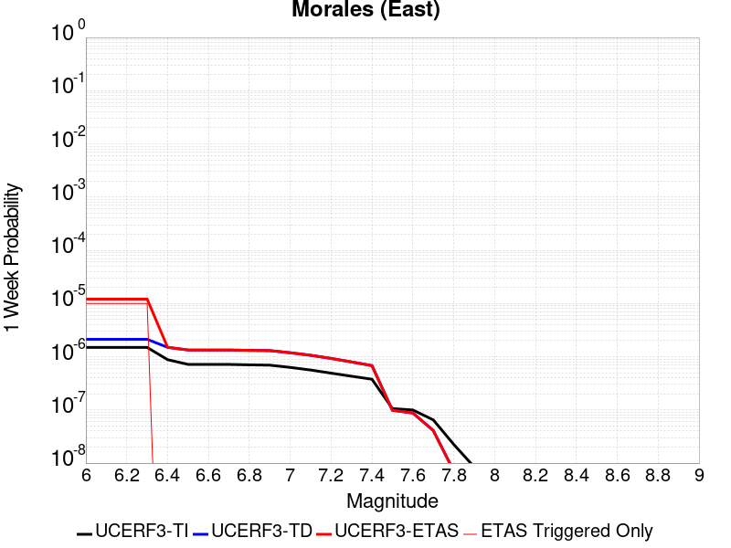 | 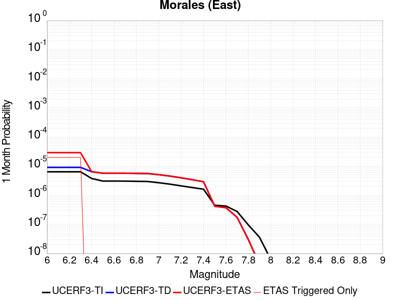 | 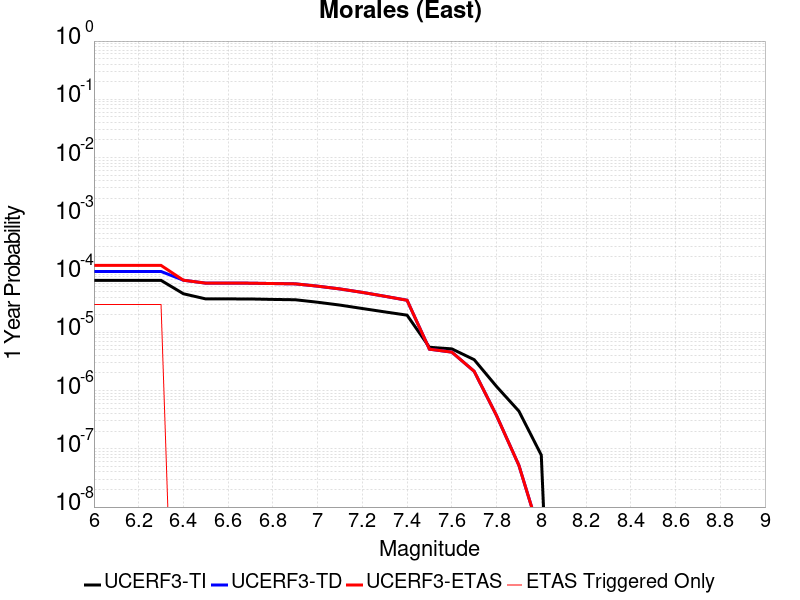 | 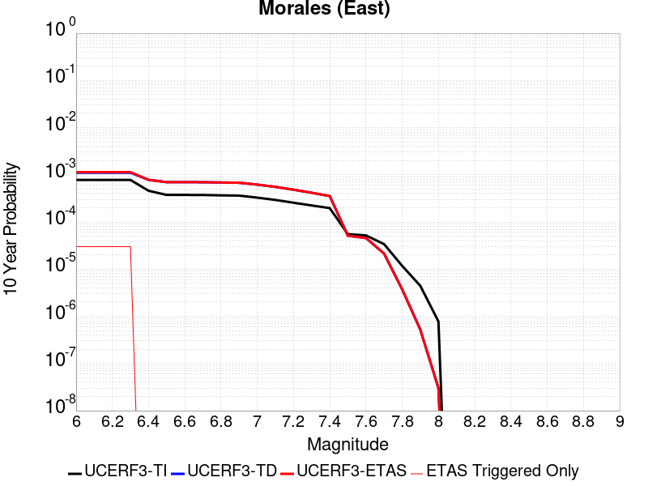 |

| Magnitude | 1 wk TI Prob | 1 wk TD Prob | 1 wk ETAS Prob | 1 wk ETAS/TD Gain | 1 wk ETAS Triggered Only | 1 mo TI Prob | 1 mo TD Prob | 1 mo ETAS Prob | 1 mo ETAS/TD Gain | 1 mo ETAS Triggered Only | 1 yr TI Prob | 1 yr TD Prob | 1 yr ETAS Prob | 1 yr ETAS/TD Gain | 1 yr ETAS Triggered Only | 10 yr TI Prob | 10 yr TD Prob | 10 yr ETAS Prob | 10 yr ETAS/TD Gain | 10 yr ETAS Triggered Only |
|-----|-----|-----|-----|-----|-----|-----|-----|-----|-----|-----|-----|-----|-----|-----|-----|-----|-----|-----|-----|-----|
| 6.0 | 1.4942771E-6 | 2.123479E-6 | 1.2123458E-5 | 5.7092433 | 1.0E-5 | 6.404029E-6 | 9.100596E-6 | 2.9100414E-5 | 3.1976383 | 2.0E-5 | 7.7966266E-5 | 1.107947E-4 | 1.4079138E-4 | 1.2707411 | 3.0E-5 | 7.793892E-4 | 0.0011074544 | 0.0011374211 | 1.0270592 | 3.0E-5 |
| 6.1 | 1.4942771E-6 | 2.123479E-6 | 1.2123458E-5 | 5.7092433 | 1.0E-5 | 6.404029E-6 | 9.100596E-6 | 2.9100414E-5 | 3.1976383 | 2.0E-5 | 7.7966266E-5 | 1.107947E-4 | 1.4079138E-4 | 1.2707411 | 3.0E-5 | 7.793892E-4 | 0.0011074544 | 0.0011374211 | 1.0270592 | 3.0E-5 |
| 6.2 | 1.4942771E-6 | 2.123479E-6 | 1.2123458E-5 | 5.7092433 | 1.0E-5 | 6.404029E-6 | 9.100596E-6 | 2.9100414E-5 | 3.1976383 | 2.0E-5 | 7.7966266E-5 | 1.107947E-4 | 1.4079138E-4 | 1.2707411 | 3.0E-5 | 7.793892E-4 | 0.0011074544 | 0.0011374211 | 1.0270592 | 3.0E-5 |
| 6.3 | 1.4942771E-6 | 2.123479E-6 | 1.2123458E-5 | 5.7092433 | 1.0E-5 | 6.404029E-6 | 9.100596E-6 | 2.9100414E-5 | 3.1976383 | 2.0E-5 | 7.7966266E-5 | 1.107947E-4 | 1.4079138E-4 | 1.2707411 | 3.0E-5 | 7.793892E-4 | 0.0011074544 | 0.0011374211 | 1.0270592 | 3.0E-5 |
| 6.4 | 8.798845E-7 | 1.5022731E-6 | 1.5022731E-6 | 1.0 | 0.0 | 3.7709283E-6 | 6.438298E-6 | 6.438298E-6 | 1.0 | 0.0 | 4.5910085E-5 | 7.8383564E-5 | 7.8383564E-5 | 1.0 | 0.0 | 4.59006E-4 | 7.835727E-4 | 7.835727E-4 | 1.0 | 0.0 |
| 6.5 | 7.1751725E-7 | 1.3384229E-6 | 1.3384229E-6 | 1.0 | 0.0 | 3.0750705E-6 | 5.7360858E-6 | 5.7360858E-6 | 1.0 | 0.0 | 3.7438338E-5 | 6.9834685E-5 | 6.9834685E-5 | 1.0 | 0.0 | 3.743203E-4 | 6.9813756E-4 | 6.9813756E-4 | 1.0 | 0.0 |
| 6.6 | 7.1751725E-7 | 1.3384229E-6 | 1.3384229E-6 | 1.0 | 0.0 | 3.0750705E-6 | 5.7360858E-6 | 5.7360858E-6 | 1.0 | 0.0 | 3.7438338E-5 | 6.9834685E-5 | 6.9834685E-5 | 1.0 | 0.0 | 3.743203E-4 | 6.9813756E-4 | 6.9813756E-4 | 1.0 | 0.0 |
| 6.7 | 7.159057E-7 | 1.3358889E-6 | 1.3358889E-6 | 1.0 | 0.0 | 3.0681638E-6 | 5.725226E-6 | 5.725226E-6 | 1.0 | 0.0 | 3.7354253E-5 | 6.970247E-5 | 6.970247E-5 | 1.0 | 0.0 | 3.7347974E-4 | 6.968163E-4 | 6.968163E-4 | 1.0 | 0.0 |
| 6.8 | 7.032203E-7 | 1.3174443E-6 | 1.3174443E-6 | 1.0 | 0.0 | 3.0137978E-6 | 5.646178E-6 | 5.646178E-6 | 1.0 | 0.0 | 3.669237E-5 | 6.8740126E-5 | 6.8740126E-5 | 1.0 | 0.0 | 3.6686313E-4 | 6.871988E-4 | 6.871988E-4 | 1.0 | 0.0 |
| 6.9 | 6.941549E-7 | 1.3025061E-6 | 1.3025061E-6 | 1.0 | 0.0 | 2.974946E-6 | 5.582158E-6 | 5.582158E-6 | 1.0 | 0.0 | 3.6219368E-5 | 6.7960726E-5 | 6.7960726E-5 | 1.0 | 0.0 | 3.6213463E-4 | 6.7940954E-4 | 6.7940954E-4 | 1.0 | 0.0 |
| 7.0 | 6.2932247E-7 | 1.18774E-6 | 1.18774E-6 | 1.0 | 0.0 | 2.6970936E-6 | 5.090305E-6 | 5.090305E-6 | 1.0 | 0.0 | 3.283662E-5 | 6.1972765E-5 | 6.1972765E-5 | 1.0 | 0.0 | 3.283177E-4 | 6.1956374E-4 | 6.1956374E-4 | 1.0 | 0.0 |
| 7.1 | 5.6200963E-7 | 1.0640374E-6 | 1.0640374E-6 | 1.0 | 0.0 | 2.4086105E-6 | 4.5601523E-6 | 4.5601523E-6 | 1.0 | 0.0 | 2.9324437E-5 | 5.551849E-5 | 5.551849E-5 | 1.0 | 0.0 | 2.9320567E-4 | 5.550534E-4 | 5.550534E-4 | 1.0 | 0.0 |
| 7.2 | 4.91044E-7 | 9.285713E-7 | 9.285713E-7 | 1.0 | 0.0 | 2.1044725E-6 | 3.9795855E-6 | 3.9795855E-6 | 1.0 | 0.0 | 2.5621652E-5 | 4.8450413E-5 | 4.8450413E-5 | 1.0 | 0.0 | 2.56187E-4 | 4.8440482E-4 | 4.8440482E-4 | 1.0 | 0.0 |
| 7.3 | 4.2978448E-7 | 7.9739846E-7 | 7.9739846E-7 | 1.0 | 0.0 | 1.8419321E-6 | 3.4174175E-6 | 3.4174175E-6 | 1.0 | 0.0 | 2.2425293E-5 | 4.1606294E-5 | 4.1606294E-5 | 1.0 | 0.0 | 2.242303E-4 | 4.1599068E-4 | 4.1599068E-4 | 1.0 | 0.0 |
| 7.4 | 3.774317E-7 | 6.806746E-7 | 6.806746E-7 | 1.0 | 0.0 | 1.6175634E-6 | 2.9171736E-6 | 2.9171736E-6 | 1.0 | 0.0 | 1.9693656E-5 | 3.5516037E-5 | 3.5516037E-5 | 1.0 | 0.0 | 1.969191E-4 | 3.551089E-4 | 3.551089E-4 | 1.0 | 0.0 |
| 7.5 | 1.0603232E-7 | 9.840901E-8 | 9.840901E-8 | 1.0 | 0.0 | 4.5442414E-7 | 4.2175284E-7 | 4.2175284E-7 | 1.0 | 0.0 | 5.5326E-6 | 5.134829E-6 | 5.134829E-6 | 1.0 | 0.0 | 5.532462E-5 | 5.134967E-5 | 5.134967E-5 | 1.0 | 0.0 |
| 7.6 | 9.960384E-8 | 8.755334E-8 | 8.755334E-8 | 1.0 | 0.0 | 4.2687353E-7 | 3.7522852E-7 | 3.7522852E-7 | 1.0 | 0.0 | 5.197173E-6 | 4.568398E-6 | 4.568398E-6 | 1.0 | 0.0 | 5.1970514E-5 | 4.5685607E-5 | 4.5685607E-5 | 1.0 | 0.0 |
| 7.7 | 6.499468E-8 | 4.1038682E-8 | 4.1038682E-8 | 1.0 | 0.0 | 2.785486E-7 | 1.7588006E-7 | 1.7588006E-7 | 1.0 | 0.0 | 3.3913238E-6 | 2.1413375E-6 | 2.1413375E-6 | 1.0 | 0.0 | 3.3912722E-5 | 2.1415728E-5 | 2.1415728E-5 | 1.0 | 0.0 |
| 7.8 | 2.2517119E-8 | 7.1312614E-9 | 7.1312614E-9 | 1.0 | 0.0 | 9.6501935E-8 | 3.0562546E-8 | 3.0562546E-8 | 1.0 | 0.0 | 1.1749105E-6 | 3.7209892E-7 | 3.7209892E-7 | 1.0 | 0.0 | 1.1749043E-5 | 3.7235213E-6 | 3.7235213E-6 | 1.0 | 0.0 |
| 7.9 | 8.493023E-9 | 9.970124E-10 | 9.970124E-10 | 1.0 | 0.0 | 3.639867E-8 | 4.2729082E-9 | 4.2729082E-9 | 1.0 | 0.0 | 4.4315374E-7 | 5.202266E-8 | 5.202266E-8 | 1.0 | 0.0 | 4.4315284E-6 | 5.2233156E-7 | 5.2233156E-7 | 1.0 | 0.0 |
| 8.0 | 1.4971842E-9 | 5.5458416E-11 | 5.5458416E-11 | 1.0 | 0.0 | 6.4165038E-9 | 2.376762E-10 | 2.376762E-10 | 1.0 | 0.0 | 7.812093E-8 | 2.8937068E-9 | 2.8937068E-9 | 1.0 | 0.0 | 7.81209E-7 | 3.019288E-8 | 3.019288E-8 | 1.0 | 0.0 |

## Santa Susana alt 1
*[(top)](#table-of-contents)*

| 1 Week | 1 Month | 1 Year | 10 Year |
|-----|-----|-----|-----|
| 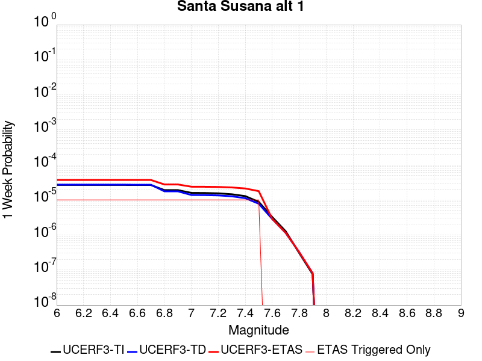 | 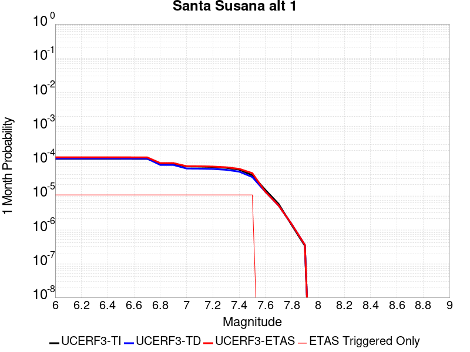 | 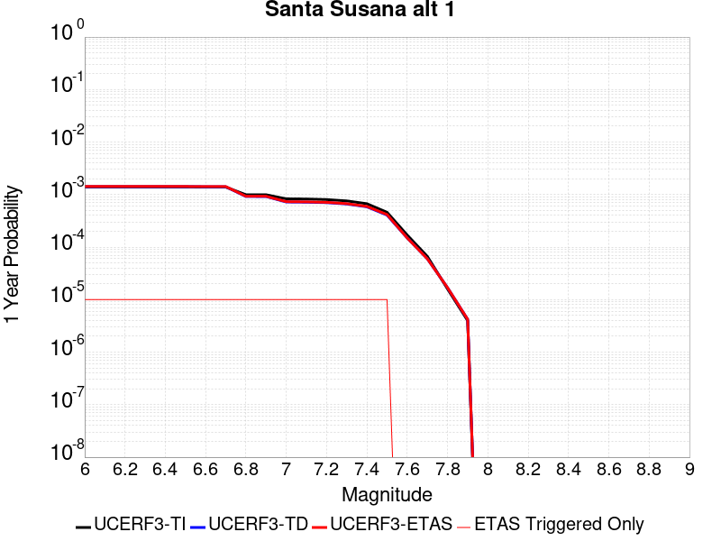 | 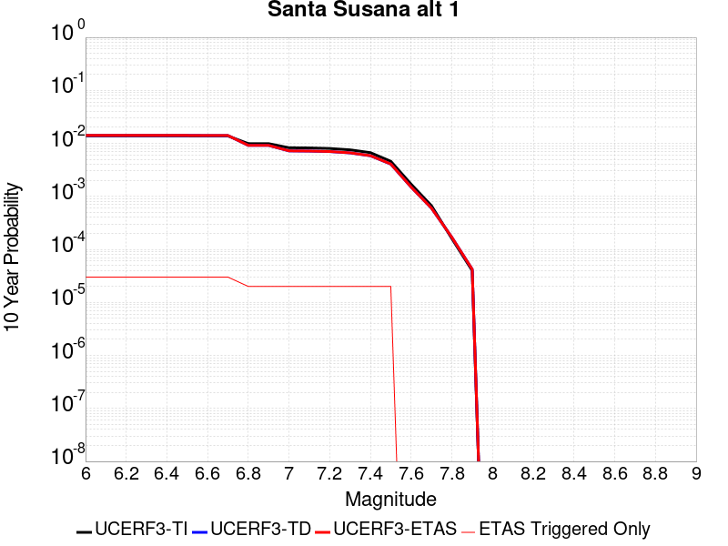 |

| Magnitude | 1 wk TI Prob | 1 wk TD Prob | 1 wk ETAS Prob | 1 wk ETAS/TD Gain | 1 wk ETAS Triggered Only | 1 mo TI Prob | 1 mo TD Prob | 1 mo ETAS Prob | 1 mo ETAS/TD Gain | 1 mo ETAS Triggered Only | 1 yr TI Prob | 1 yr TD Prob | 1 yr ETAS Prob | 1 yr ETAS/TD Gain | 1 yr ETAS Triggered Only | 10 yr TI Prob | 10 yr TD Prob | 10 yr ETAS Prob | 10 yr ETAS/TD Gain | 10 yr ETAS Triggered Only |
|-----|-----|-----|-----|-----|-----|-----|-----|-----|-----|-----|-----|-----|-----|-----|-----|-----|-----|-----|-----|-----|
| 6.0 | 2.674877E-5 | 2.7198023E-5 | 3.719775E-5 | 1.3676637 | 1.0E-5 | 1.1463255E-4 | 1.1655839E-4 | 1.2655722E-4 | 1.085784 | 1.0E-5 | 0.0013947578 | 0.0014182882 | 0.001428274 | 1.0070407 | 1.0E-5 | 0.013860362 | 0.014104128 | 0.014133705 | 1.002097 | 3.0E-5 |
| 6.1 | 2.674877E-5 | 2.7198023E-5 | 3.719775E-5 | 1.3676637 | 1.0E-5 | 1.1463255E-4 | 1.1655839E-4 | 1.2655722E-4 | 1.085784 | 1.0E-5 | 0.0013947578 | 0.0014182882 | 0.001428274 | 1.0070407 | 1.0E-5 | 0.013860362 | 0.014104128 | 0.014133705 | 1.002097 | 3.0E-5 |
| 6.2 | 2.674877E-5 | 2.7198023E-5 | 3.719775E-5 | 1.3676637 | 1.0E-5 | 1.1463255E-4 | 1.1655839E-4 | 1.2655722E-4 | 1.085784 | 1.0E-5 | 0.0013947578 | 0.0014182882 | 0.001428274 | 1.0070407 | 1.0E-5 | 0.013860362 | 0.014104128 | 0.014133705 | 1.002097 | 3.0E-5 |
| 6.3 | 2.674877E-5 | 2.7198023E-5 | 3.719775E-5 | 1.3676637 | 1.0E-5 | 1.1463255E-4 | 1.1655839E-4 | 1.2655722E-4 | 1.085784 | 1.0E-5 | 0.0013947578 | 0.0014182882 | 0.001428274 | 1.0070407 | 1.0E-5 | 0.013860362 | 0.014104128 | 0.014133705 | 1.002097 | 3.0E-5 |
| 6.4 | 2.674877E-5 | 2.7198023E-5 | 3.719775E-5 | 1.3676637 | 1.0E-5 | 1.1463255E-4 | 1.1655839E-4 | 1.2655722E-4 | 1.085784 | 1.0E-5 | 0.0013947578 | 0.0014182882 | 0.001428274 | 1.0070407 | 1.0E-5 | 0.013860362 | 0.014104128 | 0.014133705 | 1.002097 | 3.0E-5 |
| 6.5 | 2.674877E-5 | 2.7198023E-5 | 3.719775E-5 | 1.3676637 | 1.0E-5 | 1.1463255E-4 | 1.1655839E-4 | 1.2655722E-4 | 1.085784 | 1.0E-5 | 0.0013947578 | 0.0014182882 | 0.001428274 | 1.0070407 | 1.0E-5 | 0.013860362 | 0.014104128 | 0.014133705 | 1.002097 | 3.0E-5 |
| 6.6 | 2.6647976E-5 | 2.7074359E-5 | 3.707409E-5 | 1.3693432 | 1.0E-5 | 1.14200615E-4 | 1.1602845E-4 | 1.2602728E-4 | 1.0861758 | 1.0E-5 | 0.0013895056 | 0.0014118447 | 0.0014218307 | 1.0070729 | 1.0E-5 | 0.013808494 | 0.014040513 | 0.014070092 | 1.0021067 | 3.0E-5 |
| 6.7 | 2.6647976E-5 | 2.7074359E-5 | 3.707409E-5 | 1.3693432 | 1.0E-5 | 1.14200615E-4 | 1.1602845E-4 | 1.2602728E-4 | 1.0861758 | 1.0E-5 | 0.0013895056 | 0.0014118447 | 0.0014218307 | 1.0070729 | 1.0E-5 | 0.013808494 | 0.014040513 | 0.014070092 | 1.0021067 | 3.0E-5 |
| 6.8 | 1.9073179E-5 | 1.7637283E-5 | 2.7637108E-5 | 1.5669707 | 1.0E-5 | 8.1739636E-5 | 7.558627E-5 | 8.558552E-5 | 1.1322892 | 1.0E-5 | 9.947256E-4 | 9.198925E-4 | 9.298833E-4 | 1.0108608 | 1.0E-5 | 0.009902848 | 0.009163101 | 0.009182918 | 1.0021627 | 2.0E-5 |
| 6.9 | 1.9041876E-5 | 1.7619415E-5 | 2.7619239E-5 | 1.5675458 | 1.0E-5 | 8.160549E-5 | 7.55097E-5 | 8.550894E-5 | 1.1324233 | 1.0E-5 | 9.930939E-4 | 9.1896096E-4 | 9.289518E-4 | 1.0108719 | 1.0E-5 | 0.0098866755 | 0.0091538625 | 0.009173679 | 1.0021648 | 2.0E-5 |
| 7.0 | 1.5917482E-5 | 1.3863864E-5 | 2.3863726E-5 | 1.7212896 | 1.0E-5 | 6.8215995E-5 | 5.9415237E-5 | 6.9414644E-5 | 1.168297 | 1.0E-5 | 8.302132E-4 | 7.231451E-4 | 7.3313783E-4 | 1.0138185 | 1.0E-5 | 0.008271185 | 0.0072088144 | 0.00722867 | 1.0027543 | 2.0E-5 |
| 7.1 | 1.577788E-5 | 1.3743872E-5 | 2.3743734E-5 | 1.727587 | 1.0E-5 | 6.761774E-5 | 5.8901005E-5 | 6.8900415E-5 | 1.1697664 | 1.0E-5 | 8.2293496E-4 | 7.1688846E-4 | 7.2688126E-4 | 1.0139391 | 1.0E-5 | 0.008198941 | 0.007146652 | 0.007166509 | 1.0027785 | 2.0E-5 |
| 7.2 | 1.5416446E-5 | 1.3469944E-5 | 2.346981E-5 | 1.7423836 | 1.0E-5 | 6.606882E-5 | 5.772708E-5 | 6.7726505E-5 | 1.173219 | 1.0E-5 | 8.0409093E-4 | 7.026052E-4 | 7.1259815E-4 | 1.0142227 | 1.0E-5 | 0.008011877 | 0.0070047234 | 0.0070245834 | 1.0028353 | 2.0E-5 |
| 7.3 | 1.4534083E-5 | 1.2717879E-5 | 2.2717752E-5 | 1.7862847 | 1.0E-5 | 6.228744E-5 | 5.4504082E-5 | 6.450354E-5 | 1.1834625 | 1.0E-5 | 7.580857E-4 | 6.633896E-4 | 6.7338295E-4 | 1.0150641 | 1.0E-5 | 0.007555048 | 0.0066149444 | 0.006634812 | 1.0030035 | 2.0E-5 |
| 7.4 | 1.2858995E-5 | 1.1229652E-5 | 2.122954E-5 | 1.8904896 | 1.0E-5 | 5.5108816E-5 | 4.8126214E-5 | 5.8125734E-5 | 1.2077769 | 1.0E-5 | 6.7074323E-4 | 5.857831E-4 | 5.9577724E-4 | 1.0170611 | 1.0E-5 | 0.0066872234 | 0.005843165 | 0.005863048 | 1.0034028 | 2.0E-5 |
| 7.5 | 8.827668E-6 | 7.805457E-6 | 1.780538E-5 | 2.2811449 | 1.0E-5 | 3.7832317E-5 | 3.3451546E-5 | 4.345121E-5 | 1.2989298 | 1.0E-5 | 4.605111E-4 | 4.071989E-4 | 4.1719482E-4 | 1.024548 | 1.0E-5 | 0.0045955796 | 0.0040647765 | 0.004084695 | 1.0049003 | 2.0E-5 |
| 7.6 | 3.2533426E-6 | 2.871988E-6 | 2.871988E-6 | 1.0 | 0.0 | 1.3942822E-5 | 1.2308465E-5 | 1.2308465E-5 | 1.0 | 0.0 | 1.6974064E-4 | 1.4984563E-4 | 1.4984563E-4 | 1.0 | 0.0 | 0.0016961104 | 0.0014974826 | 0.0014974826 | 1.0 | 0.0 |
| 7.7 | 1.2751709E-6 | 1.1491089E-6 | 1.1491089E-6 | 1.0 | 0.0 | 5.4650063E-6 | 4.9247437E-6 | 4.9247437E-6 | 1.0 | 0.0 | 6.653442E-5 | 5.9957198E-5 | 5.9957198E-5 | 1.0 | 0.0 | 6.6514505E-4 | 5.994191E-4 | 5.994191E-4 | 1.0 | 0.0 |
| 7.8 | 3.067544E-7 | 3.2400436E-7 | 3.2400436E-7 | 1.0 | 0.0 | 1.3146611E-6 | 1.3885895E-6 | 1.3885895E-6 | 1.0 | 0.0 | 1.600588E-5 | 1.6905957E-5 | 1.6905957E-5 | 1.0 | 0.0 | 1.6004729E-4 | 1.6904772E-4 | 1.6904772E-4 | 1.0 | 0.0 |
| 7.9 | 7.622999E-8 | 8.087964E-8 | 8.087964E-8 | 1.0 | 0.0 | 3.2669993E-7 | 3.4662696E-7 | 3.4662696E-7 | 1.0 | 0.0 | 3.977564E-6 | 4.2201773E-6 | 4.2201773E-6 | 1.0 | 0.0 | 3.977493E-5 | 4.220118E-5 | 4.220118E-5 | 1.0 | 0.0 |

## Del Valle
*[(top)](#table-of-contents)*

| 1 Week | 1 Month | 1 Year | 10 Year |
|-----|-----|-----|-----|
|  |  | 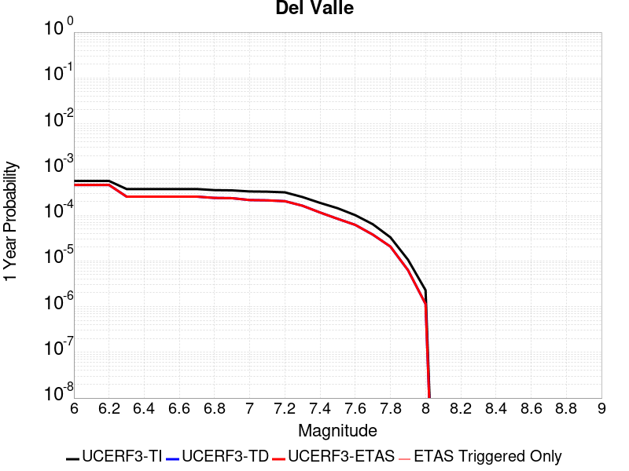 | 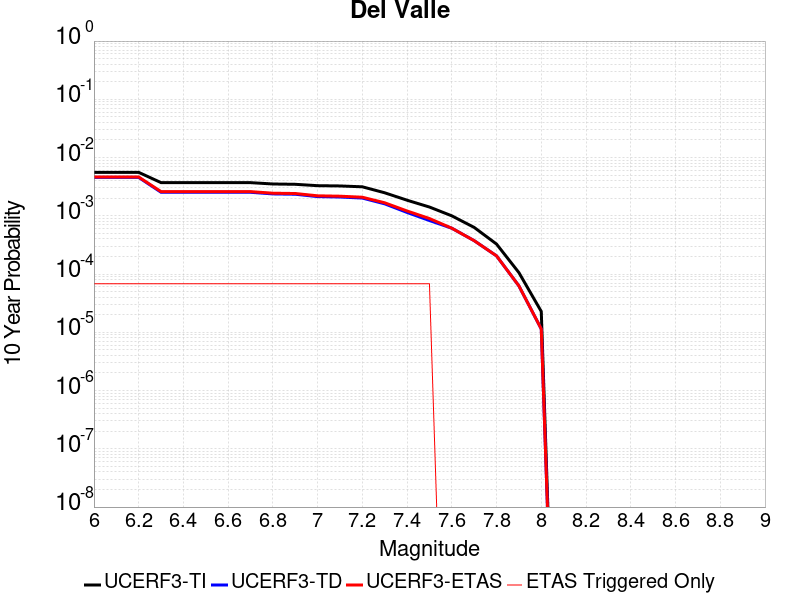 |

| Magnitude | 1 wk TI Prob | 1 wk TD Prob | 1 wk ETAS Prob | 1 wk ETAS/TD Gain | 1 wk ETAS Triggered Only | 1 mo TI Prob | 1 mo TD Prob | 1 mo ETAS Prob | 1 mo ETAS/TD Gain | 1 mo ETAS Triggered Only | 1 yr TI Prob | 1 yr TD Prob | 1 yr ETAS Prob | 1 yr ETAS/TD Gain | 1 yr ETAS Triggered Only | 10 yr TI Prob | 10 yr TD Prob | 10 yr ETAS Prob | 10 yr ETAS/TD Gain | 10 yr ETAS Triggered Only |
|-----|-----|-----|-----|-----|-----|-----|-----|-----|-----|-----|-----|-----|-----|-----|-----|-----|-----|-----|-----|-----|
| 6.0 | 1.0716125E-5 | 8.767882E-6 | 8.767882E-6 | 1.0 | 0.0 | 4.592544E-5 | 3.7576207E-5 | 3.7576207E-5 | 1.0 | 0.0 | 5.589988E-4 | 4.5741405E-4 | 4.5741405E-4 | 1.0 | 0.0 | 0.0055759475 | 0.00456668 | 0.0045965435 | 1.0065393 | 3.0E-5 |
| 6.1 | 1.0716125E-5 | 8.767882E-6 | 8.767882E-6 | 1.0 | 0.0 | 4.592544E-5 | 3.7576207E-5 | 3.7576207E-5 | 1.0 | 0.0 | 5.589988E-4 | 4.5741405E-4 | 4.5741405E-4 | 1.0 | 0.0 | 0.0055759475 | 0.00456668 | 0.0045965435 | 1.0065393 | 3.0E-5 |
| 6.2 | 1.0716125E-5 | 8.767882E-6 | 8.767882E-6 | 1.0 | 0.0 | 4.592544E-5 | 3.7576207E-5 | 3.7576207E-5 | 1.0 | 0.0 | 5.589988E-4 | 4.5741405E-4 | 4.5741405E-4 | 1.0 | 0.0 | 0.0055759475 | 0.00456668 | 0.0045965435 | 1.0065393 | 3.0E-5 |
| 6.3 | 7.1293784E-6 | 4.865823E-6 | 4.865823E-6 | 1.0 | 0.0 | 3.055412E-5 | 2.0853364E-5 | 2.0853364E-5 | 1.0 | 0.0 | 3.7193293E-4 | 2.5386087E-4 | 2.5386087E-4 | 1.0 | 0.0 | 0.0037131102 | 0.0025357946 | 0.002555744 | 1.0078671 | 2.0E-5 |
| 6.4 | 7.1293784E-6 | 4.865823E-6 | 4.865823E-6 | 1.0 | 0.0 | 3.055412E-5 | 2.0853364E-5 | 2.0853364E-5 | 1.0 | 0.0 | 3.7193293E-4 | 2.5386087E-4 | 2.5386087E-4 | 1.0 | 0.0 | 0.0037131102 | 0.0025357946 | 0.002555744 | 1.0078671 | 2.0E-5 |
| 6.5 | 7.1293784E-6 | 4.865823E-6 | 4.865823E-6 | 1.0 | 0.0 | 3.055412E-5 | 2.0853364E-5 | 2.0853364E-5 | 1.0 | 0.0 | 3.7193293E-4 | 2.5386087E-4 | 2.5386087E-4 | 1.0 | 0.0 | 0.0037131102 | 0.0025357946 | 0.002555744 | 1.0078671 | 2.0E-5 |
| 6.6 | 7.1293784E-6 | 4.865823E-6 | 4.865823E-6 | 1.0 | 0.0 | 3.055412E-5 | 2.0853364E-5 | 2.0853364E-5 | 1.0 | 0.0 | 3.7193293E-4 | 2.5386087E-4 | 2.5386087E-4 | 1.0 | 0.0 | 0.0037131102 | 0.0025357946 | 0.002555744 | 1.0078671 | 2.0E-5 |
| 6.7 | 7.12272E-6 | 4.8631987E-6 | 4.8631987E-6 | 1.0 | 0.0 | 3.0525585E-5 | 2.0842117E-5 | 2.0842117E-5 | 1.0 | 0.0 | 3.7158563E-4 | 2.5372396E-4 | 2.5372396E-4 | 1.0 | 0.0 | 0.003709649 | 0.0025344288 | 0.002554378 | 1.0078713 | 2.0E-5 |
| 6.8 | 6.7558703E-6 | 4.5594015E-6 | 4.5594015E-6 | 1.0 | 0.0 | 2.895341E-5 | 1.9540148E-5 | 1.9540148E-5 | 1.0 | 0.0 | 3.5245073E-4 | 2.3787597E-4 | 2.3787597E-4 | 1.0 | 0.0 | 0.0035189227 | 0.0023762889 | 0.0023962413 | 1.0083965 | 2.0E-5 |
| 6.9 | 6.6700386E-6 | 4.502539E-6 | 4.502539E-6 | 1.0 | 0.0 | 2.8585566E-5 | 1.9296456E-5 | 1.9296456E-5 | 1.0 | 0.0 | 3.479737E-4 | 2.3490966E-4 | 2.3490966E-4 | 1.0 | 0.0 | 0.003474293 | 0.0023466884 | 0.0023666415 | 1.0085026 | 2.0E-5 |
| 7.0 | 6.3181424E-6 | 4.0987034E-6 | 4.0987034E-6 | 1.0 | 0.0 | 2.7077473E-5 | 1.7565755E-5 | 1.7565755E-5 | 1.0 | 0.0 | 3.2961834E-4 | 2.1384252E-4 | 2.1384252E-4 | 1.0 | 0.0 | 0.0032912986 | 0.002136422 | 0.0021563794 | 1.0093415 | 2.0E-5 |
| 7.1 | 6.248759E-6 | 4.033895E-6 | 4.033895E-6 | 1.0 | 0.0 | 2.678012E-5 | 1.7288008E-5 | 1.7288008E-5 | 1.0 | 0.0 | 3.2599916E-4 | 2.104616E-4 | 2.104616E-4 | 1.0 | 0.0 | 0.0032552136 | 0.0021026772 | 0.0021226353 | 1.0094917 | 2.0E-5 |
| 7.2 | 6.0411944E-6 | 3.869888E-6 | 3.869888E-6 | 1.0 | 0.0 | 2.5890577E-5 | 1.658513E-5 | 1.658513E-5 | 1.0 | 0.0 | 3.1517216E-4 | 2.0190567E-4 | 2.0190567E-4 | 1.0 | 0.0 | 0.0031472554 | 0.0020172757 | 0.0020372353 | 1.0098944 | 2.0E-5 |
| 7.3 | 4.7691183E-6 | 3.0781202E-6 | 3.0781202E-6 | 1.0 | 0.0 | 2.0438918E-5 | 1.3191879E-5 | 1.3191879E-5 | 1.0 | 0.0 | 2.488154E-4 | 1.605995E-4 | 1.605995E-4 | 1.0 | 0.0 | 0.00248537 | 0.0016048603 | 0.0016248282 | 1.0124421 | 2.0E-5 |
| 7.4 | 3.5524722E-6 | 2.1893363E-6 | 2.1893363E-6 | 1.0 | 0.0 | 1.5224792E-5 | 9.382837E-6 | 9.382837E-6 | 1.0 | 0.0 | 1.8534607E-4 | 1.1423013E-4 | 1.1423013E-4 | 1.0 | 0.0 | 0.0018519156 | 0.0011417224 | 0.0011616995 | 1.0174974 | 2.0E-5 |
| 7.5 | 2.7133442E-6 | 1.5916097E-6 | 1.5916097E-6 | 1.0 | 0.0 | 1.1628566E-5 | 6.821167E-6 | 6.821167E-6 | 1.0 | 0.0 | 1.415686E-4 | 8.304456E-5 | 8.304456E-5 | 1.0 | 0.0 | 0.0014147845 | 8.301372E-4 | 8.401289E-4 | 1.0120362 | 1.0E-5 |
| 7.6 | 1.915338E-6 | 1.173914E-6 | 1.173914E-6 | 1.0 | 0.0 | 8.208566E-6 | 5.0310505E-6 | 5.0310505E-6 | 1.0 | 0.0 | 9.993471E-5 | 6.125133E-5 | 6.125133E-5 | 1.0 | 0.0 | 9.988978E-4 | 6.123454E-4 | 6.123454E-4 | 1.0 | 0.0 |
| 7.7 | 1.2120448E-6 | 7.180313E-7 | 7.180313E-7 | 1.0 | 0.0 | 5.194467E-6 | 3.0772733E-6 | 3.0772733E-6 | 1.0 | 0.0 | 6.3240805E-5 | 3.746516E-5 | 3.746516E-5 | 1.0 | 0.0 | 6.322281E-4 | 3.7458882E-4 | 3.7458882E-4 | 1.0 | 0.0 |
| 7.8 | 6.272381E-7 | 3.932549E-7 | 3.932549E-7 | 1.0 | 0.0 | 2.6881603E-6 | 1.6853771E-6 | 1.6853771E-6 | 1.0 | 0.0 | 3.272786E-5 | 2.0519275E-5 | 2.0519275E-5 | 1.0 | 0.0 | 3.272304E-4 | 2.0517396E-4 | 2.0517396E-4 | 1.0 | 0.0 |
| 7.9 | 2.0292627E-7 | 1.2004622E-7 | 1.2004622E-7 | 1.0 | 0.0 | 8.6968373E-7 | 5.1448376E-7 | 5.1448376E-7 | 1.0 | 0.0 | 1.0588348E-5 | 6.263822E-6 | 6.263822E-6 | 1.0 | 0.0 | 1.0587843E-4 | 6.263647E-5 | 6.263647E-5 | 1.0 | 0.0 |
| 8.0 | 4.374492E-8 | 2.189964E-8 | 2.189964E-8 | 1.0 | 0.0 | 1.8747821E-7 | 9.385559E-8 | 9.385559E-8 | 1.0 | 0.0 | 2.2825448E-6 | 1.1426913E-6 | 1.1426913E-6 | 1.0 | 0.0 | 2.2825214E-5 | 1.1426858E-5 | 1.1426858E-5 | 1.0 | 0.0 |

## Santa Susana East (connector)
*[(top)](#table-of-contents)*

| 1 Week | 1 Month | 1 Year | 10 Year |
|-----|-----|-----|-----|
|  | 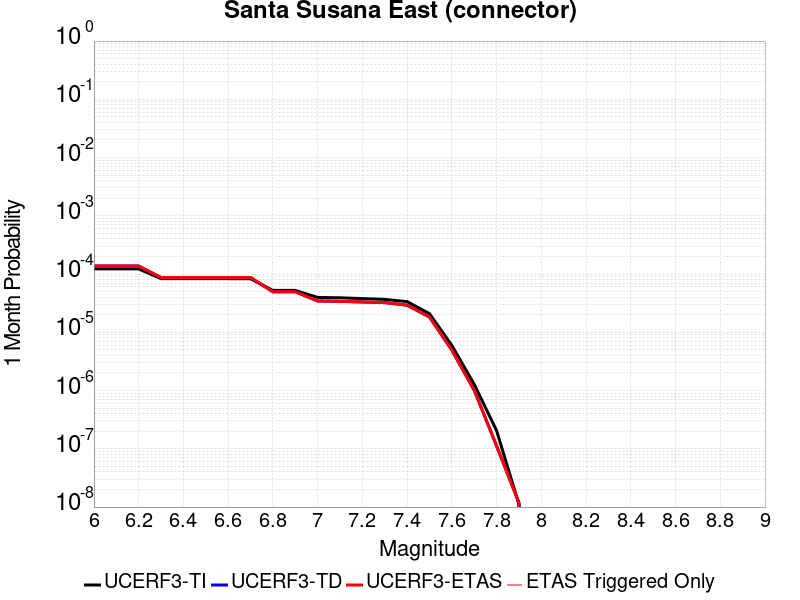 | 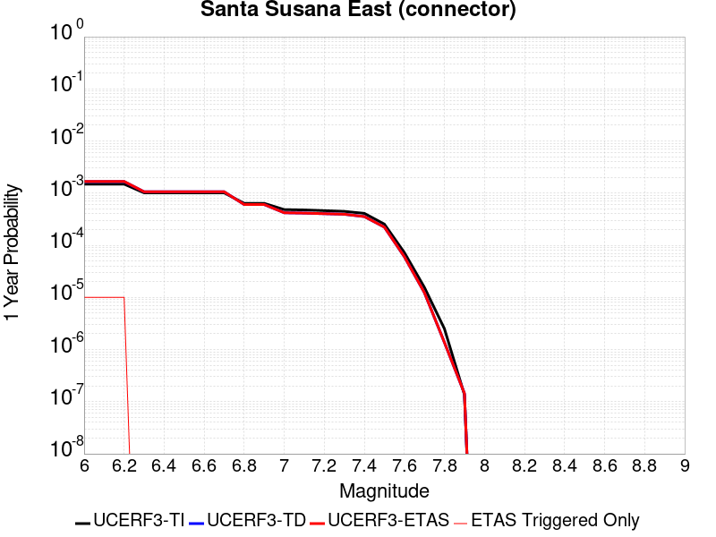 | 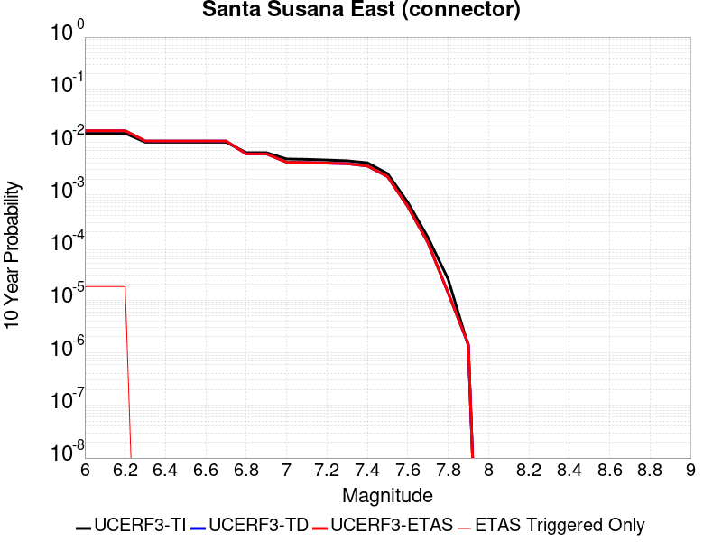 |

| Magnitude | 1 wk TI Prob | 1 wk TD Prob | 1 wk ETAS Prob | 1 wk ETAS/TD Gain | 1 wk ETAS Triggered Only | 1 mo TI Prob | 1 mo TD Prob | 1 mo ETAS Prob | 1 mo ETAS/TD Gain | 1 mo ETAS Triggered Only | 1 yr TI Prob | 1 yr TD Prob | 1 yr ETAS Prob | 1 yr ETAS/TD Gain | 1 yr ETAS Triggered Only | 10 yr TI Prob | 10 yr TD Prob | 10 yr ETAS Prob | 10 yr ETAS/TD Gain | 10 yr ETAS Triggered Only |
|-----|-----|-----|-----|-----|-----|-----|-----|-----|-----|-----|-----|-----|-----|-----|-----|-----|-----|-----|-----|-----|
| 6.0 | 2.858397E-5 | 3.202091E-5 | 3.202091E-5 | 1.0 | 0.0 | 1.2249697E-4 | 1.3722685E-4 | 1.3722685E-4 | 1.0 | 0.0 | 0.0014903803 | 0.0016697381 | 0.0016797214 | 1.005979 | 1.0E-5 | 0.014804244 | 0.016599052 | 0.016628554 | 1.0017773 | 3.0E-5 |
| 6.1 | 2.858397E-5 | 3.202091E-5 | 3.202091E-5 | 1.0 | 0.0 | 1.2249697E-4 | 1.3722685E-4 | 1.3722685E-4 | 1.0 | 0.0 | 0.0014903803 | 0.0016697381 | 0.0016797214 | 1.005979 | 1.0E-5 | 0.014804244 | 0.016599052 | 0.016628554 | 1.0017773 | 3.0E-5 |
| 6.2 | 2.858397E-5 | 3.202091E-5 | 3.202091E-5 | 1.0 | 0.0 | 1.2249697E-4 | 1.3722685E-4 | 1.3722685E-4 | 1.0 | 0.0 | 0.0014903803 | 0.0016697381 | 0.0016797214 | 1.005979 | 1.0E-5 | 0.014804244 | 0.016599052 | 0.016628554 | 1.0017773 | 3.0E-5 |
| 6.3 | 1.943582E-5 | 2.036718E-5 | 2.036718E-5 | 1.0 | 0.0 | 8.329371E-5 | 8.7285625E-5 | 8.7285625E-5 | 1.0 | 0.0 | 0.001013629 | 0.0010622967 | 0.0010622967 | 1.0 | 0.0 | 0.010090181 | 0.010583619 | 0.010593513 | 1.0009348 | 1.0E-5 |
| 6.4 | 1.943582E-5 | 2.036718E-5 | 2.036718E-5 | 1.0 | 0.0 | 8.329371E-5 | 8.7285625E-5 | 8.7285625E-5 | 1.0 | 0.0 | 0.001013629 | 0.0010622967 | 0.0010622967 | 1.0 | 0.0 | 0.010090181 | 0.010583619 | 0.010593513 | 1.0009348 | 1.0E-5 |
| 6.5 | 1.943582E-5 | 2.036718E-5 | 2.036718E-5 | 1.0 | 0.0 | 8.329371E-5 | 8.7285625E-5 | 8.7285625E-5 | 1.0 | 0.0 | 0.001013629 | 0.0010622967 | 0.0010622967 | 1.0 | 0.0 | 0.010090181 | 0.010583619 | 0.010593513 | 1.0009348 | 1.0E-5 |
| 6.6 | 1.943582E-5 | 2.036718E-5 | 2.036718E-5 | 1.0 | 0.0 | 8.329371E-5 | 8.7285625E-5 | 8.7285625E-5 | 1.0 | 0.0 | 0.001013629 | 0.0010622967 | 0.0010622967 | 1.0 | 0.0 | 0.010090181 | 0.010583619 | 0.010593513 | 1.0009348 | 1.0E-5 |
| 6.7 | 1.9404439E-5 | 2.03546E-5 | 2.03546E-5 | 1.0 | 0.0 | 8.3159226E-5 | 8.723172E-5 | 8.723172E-5 | 1.0 | 0.0 | 0.0010119933 | 0.0010616409 | 0.0010616409 | 1.0 | 0.0 | 0.010073971 | 0.010577125 | 0.010587019 | 1.0009354 | 1.0E-5 |
| 6.8 | 1.2217526E-5 | 1.1592998E-5 | 1.1592998E-5 | 1.0 | 0.0 | 5.2359774E-5 | 4.9683425E-5 | 4.9683425E-5 | 1.0 | 0.0 | 6.372938E-4 | 6.0474465E-4 | 6.0474465E-4 | 1.0 | 0.0 | 0.0063546924 | 0.006033037 | 0.006033037 | 1.0 | 0.0 |
| 6.9 | 1.2217526E-5 | 1.1592998E-5 | 1.1592998E-5 | 1.0 | 0.0 | 5.2359774E-5 | 4.9683425E-5 | 4.9683425E-5 | 1.0 | 0.0 | 6.372938E-4 | 6.0474465E-4 | 6.0474465E-4 | 1.0 | 0.0 | 0.0063546924 | 0.006033037 | 0.006033037 | 1.0 | 0.0 |
| 7.0 | 9.276017E-6 | 8.059113E-6 | 8.059113E-6 | 1.0 | 0.0 | 3.9753755E-5 | 3.4538618E-5 | 3.4538618E-5 | 1.0 | 0.0 | 4.8389446E-4 | 4.2042998E-4 | 4.2042998E-4 | 1.0 | 0.0 | 0.0048284214 | 0.0041970722 | 0.0041970722 | 1.0 | 0.0 |
| 7.1 | 9.130355E-6 | 7.942286E-6 | 7.942286E-6 | 1.0 | 0.0 | 3.9129503E-5 | 3.4037945E-5 | 3.4037945E-5 | 1.0 | 0.0 | 4.7629757E-4 | 4.1433662E-4 | 4.1433662E-4 | 1.0 | 0.0 | 0.00475278 | 0.004136367 | 0.004136367 | 1.0 | 0.0 |
| 7.2 | 8.851015E-6 | 7.741445E-6 | 7.741445E-6 | 1.0 | 0.0 | 3.7932372E-5 | 3.317722E-5 | 3.317722E-5 | 1.0 | 0.0 | 4.6172875E-4 | 4.038612E-4 | 4.038612E-4 | 1.0 | 0.0 | 0.0046077054 | 0.0040319953 | 0.0040319953 | 1.0 | 0.0 |
| 7.3 | 8.573006E-6 | 7.550166E-6 | 7.550166E-6 | 1.0 | 0.0 | 3.6740938E-5 | 3.2357475E-5 | 3.2357475E-5 | 1.0 | 0.0 | 4.472291E-4 | 3.9388443E-4 | 3.9388443E-4 | 1.0 | 0.0 | 0.004463301 | 0.0039325804 | 0.0039325804 | 1.0 | 0.0 |
| 7.4 | 7.852282E-6 | 6.817687E-6 | 6.817687E-6 | 1.0 | 0.0 | 3.36522E-5 | 2.9218349E-5 | 2.9218349E-5 | 1.0 | 0.0 | 4.096385E-4 | 3.5567835E-4 | 3.5567835E-4 | 1.0 | 0.0 | 0.0040888423 | 0.0035517553 | 0.0035517553 | 1.0 | 0.0 |
| 7.5 | 4.8869324E-6 | 4.279055E-6 | 4.279055E-6 | 1.0 | 0.0 | 2.0943828E-5 | 1.8338687E-5 | 1.8338687E-5 | 1.0 | 0.0 | 2.5496128E-4 | 2.232523E-4 | 2.232523E-4 | 1.0 | 0.0 | 0.0025466895 | 0.0022304445 | 0.0022304445 | 1.0 | 0.0 |
| 7.6 | 1.3894544E-6 | 1.1568179E-6 | 1.1568179E-6 | 1.0 | 0.0 | 5.954791E-6 | 4.957783E-6 | 4.957783E-6 | 1.0 | 0.0 | 7.249717E-5 | 6.0359558E-5 | 6.0359558E-5 | 1.0 | 0.0 | 7.247352E-4 | 6.0345343E-4 | 6.0345343E-4 | 1.0 | 0.0 |
| 7.7 | 2.9924632E-7 | 2.371928E-7 | 2.371928E-7 | 1.0 | 0.0 | 1.2824837E-6 | 1.0165402E-6 | 1.0165402E-6 | 1.0 | 0.0 | 1.5614127E-5 | 1.2376314E-5 | 1.2376314E-5 | 1.0 | 0.0 | 1.5613029E-4 | 1.2375697E-4 | 1.2375697E-4 | 1.0 | 0.0 |
| 7.8 | 4.8188564E-8 | 2.6323061E-8 | 2.6323061E-8 | 1.0 | 0.0 | 2.065224E-7 | 1.1281311E-7 | 1.1281311E-7 | 1.0 | 0.0 | 2.5144072E-6 | 1.3734989E-6 | 1.3734989E-6 | 1.0 | 0.0 | 2.5143789E-5 | 1.3734912E-5 | 1.3734912E-5 | 1.0 | 0.0 |
| 7.9 | 2.6127251E-9 | 2.7681102E-9 | 2.7681102E-9 | 1.0 | 0.0 | 1.1197393E-8 | 1.186333E-8 | 1.186333E-8 | 1.0 | 0.0 | 1.3632825E-7 | 1.4443603E-7 | 1.4443603E-7 | 1.0 | 0.0 | 1.3632817E-6 | 1.4443604E-6 | 1.4443604E-6 | 1.0 | 0.0 |

## Laguna Salada
*[(top)](#table-of-contents)*

| 1 Week | 1 Month | 1 Year | 10 Year |
|-----|-----|-----|-----|
| 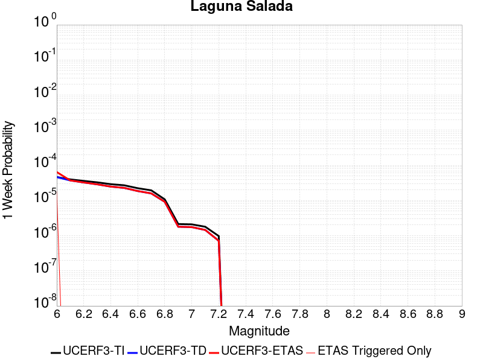 |  | 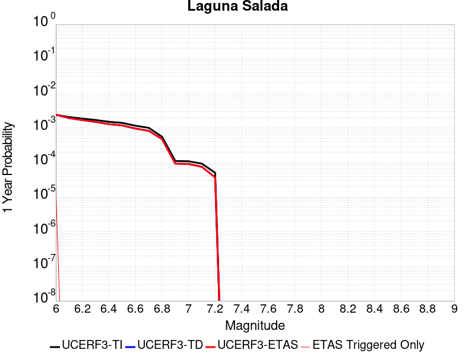 | 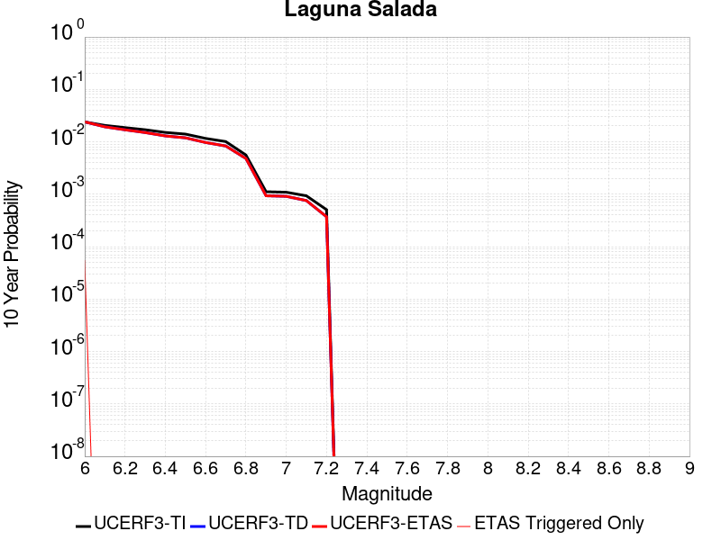 |

| Magnitude | 1 wk TI Prob | 1 wk TD Prob | 1 wk ETAS Prob | 1 wk ETAS/TD Gain | 1 wk ETAS Triggered Only | 1 mo TI Prob | 1 mo TD Prob | 1 mo ETAS Prob | 1 mo ETAS/TD Gain | 1 mo ETAS Triggered Only | 1 yr TI Prob | 1 yr TD Prob | 1 yr ETAS Prob | 1 yr ETAS/TD Gain | 1 yr ETAS Triggered Only | 10 yr TI Prob | 10 yr TD Prob | 10 yr ETAS Prob | 10 yr ETAS/TD Gain | 10 yr ETAS Triggered Only |
|-----|-----|-----|-----|-----|-----|-----|-----|-----|-----|-----|-----|-----|-----|-----|-----|-----|-----|-----|-----|-----|
| 6.0 | 4.6465593E-5 | 4.634639E-5 | 5.634593E-5 | 1.2157565 | 1.0E-5 | 1.9912305E-4 | 1.9861311E-4 | 2.0861112E-4 | 1.0503391 | 1.0E-5 | 0.0024216278 | 0.002415429 | 0.0024353808 | 1.0082601 | 2.0E-5 | 0.02395408 | 0.023975259 | 0.02400454 | 1.0012213 | 3.0E-5 |
| 6.1 | 3.982297E-5 | 3.7246125E-5 | 3.7246125E-5 | 1.0 | 0.0 | 1.706587E-4 | 1.5961716E-4 | 1.5961716E-4 | 1.0 | 0.0 | 0.0020757897 | 0.0019417295 | 0.0019417295 | 1.0 | 0.0 | 0.020565065 | 0.019331863 | 0.019331863 | 1.0 | 0.0 |
| 6.2 | 3.6067784E-5 | 3.2602693E-5 | 3.2602693E-5 | 1.0 | 0.0 | 1.5456705E-4 | 1.3971896E-4 | 1.3971896E-4 | 1.0 | 0.0 | 0.0018802295 | 0.0016998611 | 0.0016998611 | 1.0 | 0.0 | 0.018644003 | 0.016949628 | 0.016949628 | 1.0 | 0.0 |
| 6.3 | 3.2859112E-5 | 2.8849448E-5 | 2.8849448E-5 | 1.0 | 0.0 | 1.4081717E-4 | 1.2363521E-4 | 1.2363521E-4 | 1.0 | 0.0 | 0.0017131006 | 0.0015043203 | 0.0015043203 | 1.0 | 0.0 | 0.016999546 | 0.015018767 | 0.015018767 | 1.0 | 0.0 |
| 6.4 | 2.9132116E-5 | 2.4852965E-5 | 2.4852965E-5 | 1.0 | 0.0 | 1.2484594E-4 | 1.0650887E-4 | 1.0650887E-4 | 1.0 | 0.0 | 0.0015189396 | 0.001296065 | 0.001296065 | 1.0 | 0.0 | 0.015085992 | 0.012956262 | 0.012956262 | 1.0 | 0.0 |
| 6.5 | 2.7075037E-5 | 2.2825836E-5 | 2.2825836E-5 | 1.0 | 0.0 | 1.1603071E-4 | 9.7821845E-5 | 9.7821845E-5 | 1.0 | 0.0 | 0.0014117584 | 0.0011904186 | 0.0011904186 | 1.0 | 0.0 | 0.014028233 | 0.011907749 | 0.011907749 | 1.0 | 0.0 |
| 6.6 | 2.2367465E-5 | 1.8573526E-5 | 1.8573526E-5 | 1.0 | 0.0 | 9.5857045E-5 | 7.959886E-5 | 7.959886E-5 | 1.0 | 0.0 | 0.0011664346 | 9.6876756E-4 | 9.6876756E-4 | 1.0 | 0.0 | 0.011603311 | 0.009702191 | 0.009702191 | 1.0 | 0.0 |
| 6.7 | 1.9458053E-5 | 1.5914242E-5 | 1.5914242E-5 | 1.0 | 0.0 | 8.338899E-5 | 6.8202564E-5 | 6.8202564E-5 | 1.0 | 0.0 | 0.001014788 | 8.3013024E-4 | 8.3013024E-4 | 1.0 | 0.0 | 0.010101665 | 0.0083209425 | 0.0083209425 | 1.0 | 0.0 |
| 6.8 | 1.0767866E-5 | 9.18435E-6 | 9.18435E-6 | 1.0 | 0.0 | 4.614718E-5 | 3.9361294E-5 | 3.9361294E-5 | 1.0 | 0.0 | 5.6169706E-4 | 4.7918706E-4 | 4.7918706E-4 | 1.0 | 0.0 | 0.0056027942 | 0.0048096925 | 0.0048096925 | 1.0 | 0.0 |
| 6.9 | 2.1384765E-6 | 1.7913675E-6 | 1.7913675E-6 | 1.0 | 0.0 | 9.164866E-6 | 7.677269E-6 | 7.677269E-6 | 1.0 | 0.0 | 1.1157654E-4 | 9.346713E-5 | 9.346713E-5 | 1.0 | 0.0 | 0.0011152053 | 9.343165E-4 | 9.343165E-4 | 1.0 | 0.0 |
| 7.0 | 2.0952946E-6 | 1.7493046E-6 | 1.7493046E-6 | 1.0 | 0.0 | 8.979802E-6 | 7.4970003E-6 | 7.4970003E-6 | 1.0 | 0.0 | 1.0932361E-4 | 9.1272545E-5 | 9.1272545E-5 | 1.0 | 0.0 | 0.0010926984 | 9.123888E-4 | 9.123888E-4 | 1.0 | 0.0 |
| 7.1 | 1.7887576E-6 | 1.4500254E-6 | 1.4500254E-6 | 1.0 | 0.0 | 7.666081E-6 | 6.2143813E-6 | 6.2143813E-6 | 1.0 | 0.0 | 9.333054E-5 | 7.565777E-5 | 7.565777E-5 | 1.0 | 0.0 | 9.329135E-4 | 7.563506E-4 | 7.563506E-4 | 1.0 | 0.0 |
| 7.2 | 9.723109E-7 | 7.135619E-7 | 7.135619E-7 | 1.0 | 0.0 | 4.16704E-6 | 3.0581198E-6 | 3.0581198E-6 | 1.0 | 0.0 | 5.073253E-5 | 3.7232137E-5 | 3.7232137E-5 | 1.0 | 0.0 | 5.072095E-4 | 3.7227524E-4 | 3.7227524E-4 | 1.0 | 0.0 |

## Los Alamos 2011 CFM
*[(top)](#table-of-contents)*

| 1 Week | 1 Month | 1 Year | 10 Year |
|-----|-----|-----|-----|
| 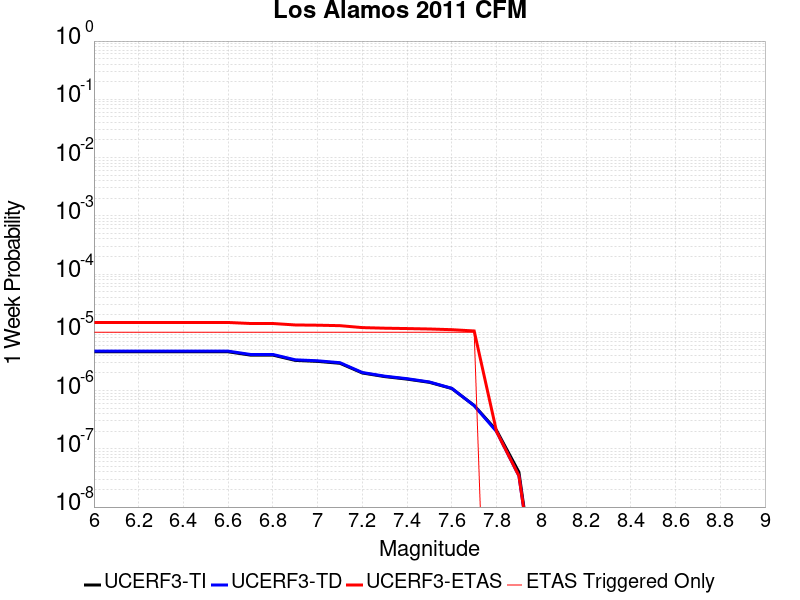 | 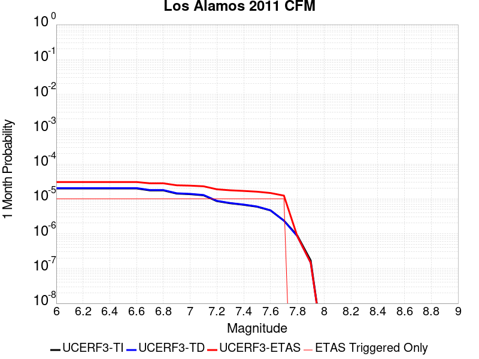 | 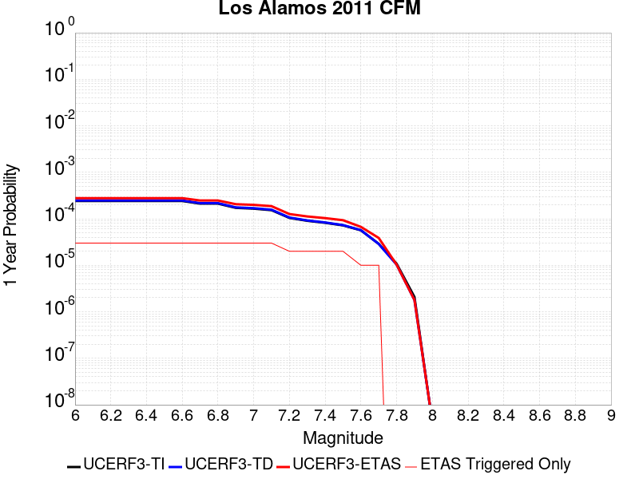 | 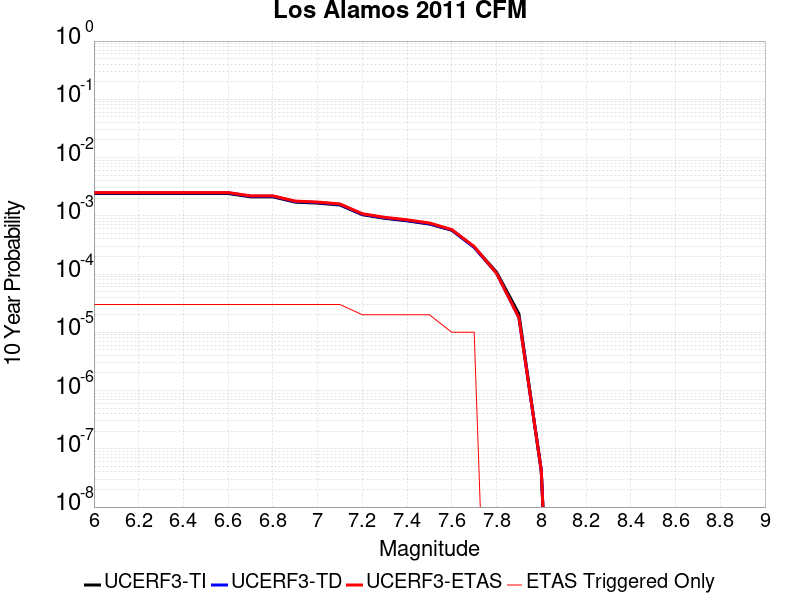 |

| Magnitude | 1 wk TI Prob | 1 wk TD Prob | 1 wk ETAS Prob | 1 wk ETAS/TD Gain | 1 wk ETAS Triggered Only | 1 mo TI Prob | 1 mo TD Prob | 1 mo ETAS Prob | 1 mo ETAS/TD Gain | 1 mo ETAS Triggered Only | 1 yr TI Prob | 1 yr TD Prob | 1 yr ETAS Prob | 1 yr ETAS/TD Gain | 1 yr ETAS Triggered Only | 10 yr TI Prob | 10 yr TD Prob | 10 yr ETAS Prob | 10 yr ETAS/TD Gain | 10 yr ETAS Triggered Only |
|-----|-----|-----|-----|-----|-----|-----|-----|-----|-----|-----|-----|-----|-----|-----|-----|-----|-----|-----|-----|-----|
| 6.0 | 4.6284417E-6 | 4.751731E-6 | 1.4751684E-5 | 3.1044862 | 1.0E-5 | 1.9836029E-5 | 2.0364414E-5 | 3.036421E-5 | 1.4910427 | 1.0E-5 | 2.4147688E-4 | 2.4791027E-4 | 2.7790284E-4 | 1.1209816 | 3.0E-5 | 0.0024121467 | 0.0024765113 | 0.002506437 | 1.0120838 | 3.0E-5 |
| 6.1 | 4.6284417E-6 | 4.751731E-6 | 1.4751684E-5 | 3.1044862 | 1.0E-5 | 1.9836029E-5 | 2.0364414E-5 | 3.036421E-5 | 1.4910427 | 1.0E-5 | 2.4147688E-4 | 2.4791027E-4 | 2.7790284E-4 | 1.1209816 | 3.0E-5 | 0.0024121467 | 0.0024765113 | 0.002506437 | 1.0120838 | 3.0E-5 |
| 6.2 | 4.6284417E-6 | 4.751731E-6 | 1.4751684E-5 | 3.1044862 | 1.0E-5 | 1.9836029E-5 | 2.0364414E-5 | 3.036421E-5 | 1.4910427 | 1.0E-5 | 2.4147688E-4 | 2.4791027E-4 | 2.7790284E-4 | 1.1209816 | 3.0E-5 | 0.0024121467 | 0.0024765113 | 0.002506437 | 1.0120838 | 3.0E-5 |
| 6.3 | 4.6284417E-6 | 4.751731E-6 | 1.4751684E-5 | 3.1044862 | 1.0E-5 | 1.9836029E-5 | 2.0364414E-5 | 3.036421E-5 | 1.4910427 | 1.0E-5 | 2.4147688E-4 | 2.4791027E-4 | 2.7790284E-4 | 1.1209816 | 3.0E-5 | 0.0024121467 | 0.0024765113 | 0.002506437 | 1.0120838 | 3.0E-5 |
| 6.4 | 4.6284417E-6 | 4.751731E-6 | 1.4751684E-5 | 3.1044862 | 1.0E-5 | 1.9836029E-5 | 2.0364414E-5 | 3.036421E-5 | 1.4910427 | 1.0E-5 | 2.4147688E-4 | 2.4791027E-4 | 2.7790284E-4 | 1.1209816 | 3.0E-5 | 0.0024121467 | 0.0024765113 | 0.002506437 | 1.0120838 | 3.0E-5 |
| 6.5 | 4.6284417E-6 | 4.751731E-6 | 1.4751684E-5 | 3.1044862 | 1.0E-5 | 1.9836029E-5 | 2.0364414E-5 | 3.036421E-5 | 1.4910427 | 1.0E-5 | 2.4147688E-4 | 2.4791027E-4 | 2.7790284E-4 | 1.1209816 | 3.0E-5 | 0.0024121467 | 0.0024765113 | 0.002506437 | 1.0120838 | 3.0E-5 |
| 6.6 | 4.6284417E-6 | 4.751731E-6 | 1.4751684E-5 | 3.1044862 | 1.0E-5 | 1.9836029E-5 | 2.0364414E-5 | 3.036421E-5 | 1.4910427 | 1.0E-5 | 2.4147688E-4 | 2.4791027E-4 | 2.7790284E-4 | 1.1209816 | 3.0E-5 | 0.0024121467 | 0.0024765113 | 0.002506437 | 1.0120838 | 3.0E-5 |
| 6.7 | 4.062321E-6 | 4.166349E-6 | 1.4166307E-5 | 3.4001732 | 1.0E-5 | 1.7409831E-5 | 1.7855667E-5 | 2.7855489E-5 | 1.5600363 | 1.0E-5 | 2.1194408E-4 | 2.1737257E-4 | 2.4736606E-4 | 1.1379819 | 3.0E-5 | 0.0021174205 | 0.0021717492 | 0.002201684 | 1.0137837 | 3.0E-5 |
| 6.8 | 4.062321E-6 | 4.166349E-6 | 1.4166307E-5 | 3.4001732 | 1.0E-5 | 1.7409831E-5 | 1.7855667E-5 | 2.7855489E-5 | 1.5600363 | 1.0E-5 | 2.1194408E-4 | 2.1737257E-4 | 2.4736606E-4 | 1.1379819 | 3.0E-5 | 0.0021174205 | 0.0021717492 | 0.002201684 | 1.0137837 | 3.0E-5 |
| 6.9 | 3.2936077E-6 | 3.372958E-6 | 1.33729245E-5 | 3.964747 | 1.0E-5 | 1.4115385E-5 | 1.4455459E-5 | 2.4455314E-5 | 1.6917702 | 1.0E-5 | 1.7184127E-4 | 1.7598194E-4 | 2.0597666E-4 | 1.170442 | 3.0E-5 | 0.0017170844 | 0.0017585184 | 0.0017884657 | 1.0170298 | 3.0E-5 |
| 7.0 | 3.1687898E-6 | 3.2448156E-6 | 1.3244783E-5 | 4.081829 | 1.0E-5 | 1.3580457E-5 | 1.3906283E-5 | 2.3906145E-5 | 1.7190894 | 1.0E-5 | 1.6532952E-4 | 1.6929678E-4 | 1.992917E-4 | 1.1771736 | 3.0E-5 | 0.0016520657 | 0.0016917696 | 0.0017217188 | 1.0177029 | 3.0E-5 |
| 7.1 | 2.9379228E-6 | 3.0073259E-6 | 1.3007296E-5 | 4.3252034 | 1.0E-5 | 1.25910365E-5 | 1.288848E-5 | 2.2888351E-5 | 1.7758766 | 1.0E-5 | 1.5328509E-4 | 1.5690686E-4 | 1.8690215E-4 | 1.1911663 | 3.0E-5 | 0.001531794 | 0.0015680499 | 0.0015980029 | 1.0191021 | 3.0E-5 |
| 7.2 | 2.0020686E-6 | 2.0416298E-6 | 1.204161E-5 | 5.8980374 | 1.0E-5 | 8.580266E-6 | 8.749813E-6 | 1.8749726E-5 | 2.1428716 | 1.0E-5 | 1.0445973E-4 | 1.0652381E-4 | 1.2652167E-4 | 1.1877315 | 2.0E-5 | 0.0010441064 | 0.001064732 | 0.0010847106 | 1.018764 | 2.0E-5 |
| 7.3 | 1.7364243E-6 | 1.7678802E-6 | 1.1767863E-5 | 6.6564817 | 1.0E-5 | 7.441797E-6 | 7.576608E-6 | 1.7576533E-5 | 2.3198419 | 1.0E-5 | 9.0600115E-5 | 9.2241324E-5 | 1.1223948E-4 | 1.2168026 | 2.0E-5 | 9.0563187E-4 | 9.2203356E-4 | 9.420151E-4 | 1.0216712 | 2.0E-5 |
| 7.4 | 1.5718434E-6 | 1.5983177E-6 | 1.1598302E-5 | 7.2565684 | 1.0E-5 | 6.7364545E-6 | 6.849915E-6 | 1.6849846E-5 | 2.4598622 | 1.0E-5 | 8.201325E-5 | 8.339455E-5 | 1.03392886E-4 | 1.2398038 | 2.0E-5 | 8.198299E-4 | 8.3363557E-4 | 8.536189E-4 | 1.0239713 | 2.0E-5 |
| 7.5 | 1.3841119E-6 | 1.4042793E-6 | 1.1404265E-5 | 8.12108 | 1.0E-5 | 5.9318945E-6 | 6.0183256E-6 | 1.6018266E-5 | 2.6615818 | 1.0E-5 | 7.221842E-5 | 7.327068E-5 | 9.326922E-5 | 1.2729405 | 2.0E-5 | 7.2194956E-4 | 7.324681E-4 | 7.5245346E-4 | 1.027285 | 2.0E-5 |
| 7.6 | 1.0843726E-6 | 1.093442E-6 | 1.1093432E-5 | 10.145422 | 1.0E-5 | 4.647303E-6 | 4.6861724E-6 | 1.4686126E-5 | 3.1339278 | 1.0E-5 | 5.6579443E-5 | 5.705268E-5 | 6.705211E-5 | 1.1752666 | 1.0E-5 | 5.656504E-4 | 5.703829E-4 | 5.803772E-4 | 1.0175221 | 1.0E-5 |
| 7.7 | 5.544814E-7 | 5.5018705E-7 | 1.0550181E-5 | 19.175627 | 1.0E-5 | 2.3763469E-6 | 2.3579425E-6 | 1.2357919E-5 | 5.2409754 | 1.0E-5 | 2.8931638E-5 | 2.8707573E-5 | 3.8707287E-5 | 1.3483301 | 1.0E-5 | 2.8927872E-4 | 2.870388E-4 | 2.9703593E-4 | 1.0348285 | 1.0E-5 |
| 7.8 | 2.0707465E-7 | 1.977846E-7 | 1.977846E-7 | 1.0 | 0.0 | 8.874625E-7 | 8.4764804E-7 | 8.4764804E-7 | 1.0 | 0.0 | 1.08048025E-5 | 1.0320066E-5 | 1.0320066E-5 | 1.0 | 0.0 | 1.0804277E-4 | 1.0319592E-4 | 1.0319592E-4 | 1.0 | 0.0 |
| 7.9 | 3.9821284E-8 | 3.433109E-8 | 3.433109E-8 | 1.0 | 0.0 | 1.7066264E-7 | 1.4713324E-7 | 1.4713324E-7 | 1.0 | 0.0 | 2.0778157E-6 | 1.7913457E-6 | 1.7913457E-6 | 1.0 | 0.0 | 2.0777963E-5 | 1.7913319E-5 | 1.7913319E-5 | 1.0 | 0.0 |
| 8.0 | 7.880441E-11 | 8.2353124E-11 | 8.2353124E-11 | 1.0 | 0.0 | 3.3773329E-10 | 3.52942E-10 | 3.52942E-10 | 1.0 | 0.0 | 4.1119033E-9 | 4.2970694E-9 | 4.2970694E-9 | 1.0 | 0.0 | 4.1119034E-8 | 4.2970694E-8 | 4.2970694E-8 | 1.0 | 0.0 |

## Simi-Santa Rosa
*[(top)](#table-of-contents)*

| 1 Week | 1 Month | 1 Year | 10 Year |
|-----|-----|-----|-----|
|  | 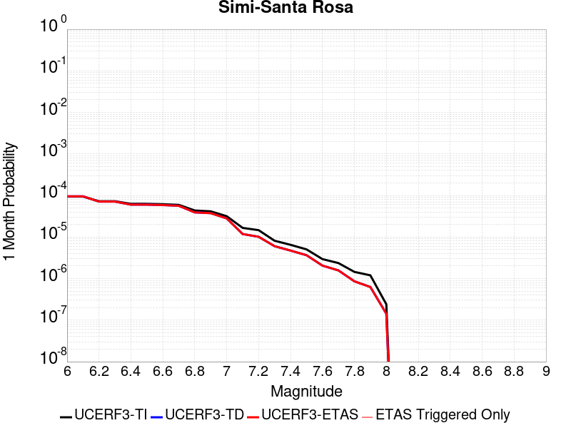 | 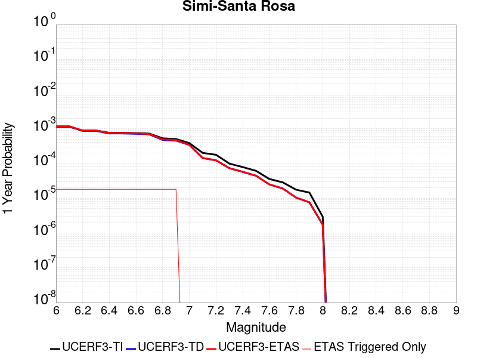 | 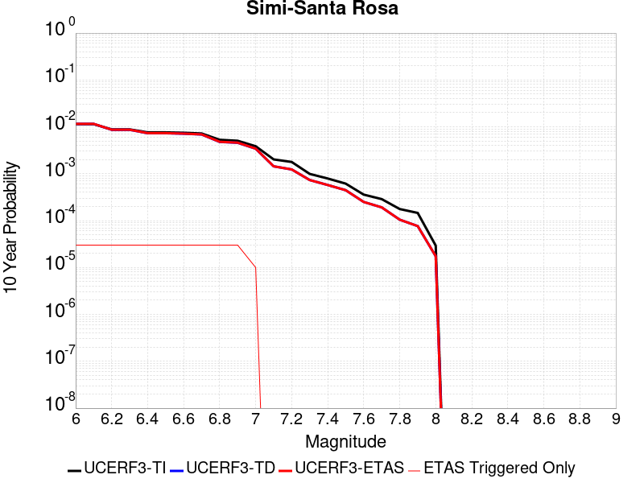 |

| Magnitude | 1 wk TI Prob | 1 wk TD Prob | 1 wk ETAS Prob | 1 wk ETAS/TD Gain | 1 wk ETAS Triggered Only | 1 mo TI Prob | 1 mo TD Prob | 1 mo ETAS Prob | 1 mo ETAS/TD Gain | 1 mo ETAS Triggered Only | 1 yr TI Prob | 1 yr TD Prob | 1 yr ETAS Prob | 1 yr ETAS/TD Gain | 1 yr ETAS Triggered Only | 10 yr TI Prob | 10 yr TD Prob | 10 yr ETAS Prob | 10 yr ETAS/TD Gain | 10 yr ETAS Triggered Only |
|-----|-----|-----|-----|-----|-----|-----|-----|-----|-----|-----|-----|-----|-----|-----|-----|-----|-----|-----|-----|-----|
| 6.0 | 2.198912E-5 | 2.2275442E-5 | 2.2275442E-5 | 1.0 | 0.0 | 9.4235686E-5 | 9.5462936E-5 | 9.5462936E-5 | 1.0 | 0.0 | 0.0011467156 | 0.0011616853 | 0.0011816622 | 1.0171964 | 2.0E-5 | 0.011408163 | 0.011560575 | 0.011590228 | 1.002565 | 3.0E-5 |
| 6.1 | 2.198912E-5 | 2.2275442E-5 | 2.2275442E-5 | 1.0 | 0.0 | 9.4235686E-5 | 9.5462936E-5 | 9.5462936E-5 | 1.0 | 0.0 | 0.0011467156 | 0.0011616853 | 0.0011816622 | 1.0171964 | 2.0E-5 | 0.011408163 | 0.011560575 | 0.011590228 | 1.002565 | 3.0E-5 |
| 6.2 | 1.69983E-5 | 1.6668559E-5 | 1.6668559E-5 | 1.0 | 0.0 | 7.284782E-5 | 7.143489E-5 | 7.143489E-5 | 1.0 | 0.0 | 8.865613E-4 | 8.6940196E-4 | 8.8938454E-4 | 1.0229843 | 2.0E-5 | 0.008830327 | 0.008662928 | 0.008692668 | 1.003433 | 3.0E-5 |
| 6.3 | 1.69983E-5 | 1.6668559E-5 | 1.6668559E-5 | 1.0 | 0.0 | 7.284782E-5 | 7.143489E-5 | 7.143489E-5 | 1.0 | 0.0 | 8.865613E-4 | 8.6940196E-4 | 8.8938454E-4 | 1.0229843 | 2.0E-5 | 0.008830327 | 0.008662928 | 0.008692668 | 1.003433 | 3.0E-5 |
| 6.4 | 1.4666188E-5 | 1.4052543E-5 | 1.4052543E-5 | 1.0 | 0.0 | 6.285358E-5 | 6.0223934E-5 | 6.0223934E-5 | 1.0 | 0.0 | 7.6497364E-4 | 7.3300465E-4 | 7.5298996E-4 | 1.027265 | 2.0E-5 | 0.0076234564 | 0.007308344 | 0.007338125 | 1.0040749 | 3.0E-5 |
| 6.5 | 1.4666188E-5 | 1.4052543E-5 | 1.4052543E-5 | 1.0 | 0.0 | 6.285358E-5 | 6.0223934E-5 | 6.0223934E-5 | 1.0 | 0.0 | 7.6497364E-4 | 7.3300465E-4 | 7.5298996E-4 | 1.027265 | 2.0E-5 | 0.0076234564 | 0.007308344 | 0.007338125 | 1.0040749 | 3.0E-5 |
| 6.6 | 1.4377586E-5 | 1.3729583E-5 | 1.3729583E-5 | 1.0 | 0.0 | 6.1616774E-5 | 5.883988E-5 | 5.883988E-5 | 1.0 | 0.0 | 7.4992597E-4 | 7.1616494E-4 | 7.361506E-4 | 1.0279065 | 2.0E-5 | 0.007474003 | 0.0071410383 | 0.0071708243 | 1.004171 | 3.0E-5 |
| 6.7 | 1.3881404E-5 | 1.320755E-5 | 1.320755E-5 | 1.0 | 0.0 | 5.9490372E-5 | 5.66027E-5 | 5.66027E-5 | 1.0 | 0.0 | 7.240546E-4 | 6.8894465E-4 | 7.089309E-4 | 1.0290099 | 2.0E-5 | 0.007217 | 0.006870538 | 0.006900332 | 1.0043365 | 3.0E-5 |
| 6.8 | 1.0176516E-5 | 9.154151E-6 | 9.154151E-6 | 1.0 | 0.0 | 4.3612912E-5 | 3.9231574E-5 | 3.9231574E-5 | 1.0 | 0.0 | 5.308578E-4 | 4.7755634E-4 | 4.975468E-4 | 1.0418599 | 2.0E-5 | 0.0052959146 | 0.004766934 | 0.0047967914 | 1.0062634 | 3.0E-5 |
| 6.9 | 9.699797E-6 | 8.774719E-6 | 8.774719E-6 | 1.0 | 0.0 | 4.15699E-5 | 3.7605492E-5 | 3.7605492E-5 | 1.0 | 0.0 | 5.05996E-4 | 4.577671E-4 | 4.7775797E-4 | 1.0436703 | 2.0E-5 | 0.005048454 | 0.0045698597 | 0.0045997226 | 1.0065347 | 3.0E-5 |
| 7.0 | 7.4049476E-6 | 6.559333E-6 | 6.559333E-6 | 1.0 | 0.0 | 3.1735104E-5 | 2.8111197E-5 | 2.8111197E-5 | 1.0 | 0.0 | 3.8630638E-4 | 3.422127E-4 | 3.422127E-4 | 1.0 | 0.0 | 0.0038563553 | 0.0034180996 | 0.0034280655 | 1.0029156 | 1.0E-5 |
| 7.1 | 3.873439E-6 | 2.7595095E-6 | 2.7595095E-6 | 1.0 | 0.0 | 1.6600346E-5 | 1.1826417E-5 | 1.1826417E-5 | 1.0 | 0.0 | 2.0209046E-4 | 1.4397735E-4 | 1.4397735E-4 | 1.0 | 0.0 | 0.0020190678 | 0.0014388643 | 0.0014388643 | 1.0 | 0.0 |
| 7.2 | 3.417706E-6 | 2.3676484E-6 | 2.3676484E-6 | 1.0 | 0.0 | 1.4647229E-5 | 1.0147027E-5 | 1.0147027E-5 | 1.0 | 0.0 | 1.7831543E-4 | 1.2353327E-4 | 1.2353327E-4 | 1.0 | 0.0 | 0.0017817242 | 0.0012346683 | 0.0012346683 | 1.0 | 0.0 |
| 7.3 | 1.90225E-6 | 1.4073753E-6 | 1.4073753E-6 | 1.0 | 0.0 | 8.152474E-6 | 6.0315947E-6 | 6.0315947E-6 | 1.0 | 0.0 | 9.9251854E-5 | 7.343221E-5 | 7.343221E-5 | 1.0 | 0.0 | 9.920754E-4 | 7.340817E-4 | 7.340817E-4 | 1.0 | 0.0 |
| 7.4 | 1.5170556E-6 | 1.1024773E-6 | 1.1024773E-6 | 1.0 | 0.0 | 6.5016507E-6 | 4.724894E-6 | 4.724894E-6 | 1.0 | 0.0 | 7.915472E-5 | 5.7524077E-5 | 5.7524077E-5 | 1.0 | 0.0 | 7.9126534E-4 | 5.7509297E-4 | 5.7509297E-4 | 1.0 | 0.0 |
| 7.5 | 1.178732E-6 | 8.535102E-7 | 8.535102E-7 | 1.0 | 0.0 | 5.0516987E-6 | 3.6578958E-6 | 3.6578958E-6 | 1.0 | 0.0 | 6.1502695E-5 | 4.453398E-5 | 4.453398E-5 | 1.0 | 0.0 | 6.148568E-4 | 4.452515E-4 | 4.452515E-4 | 1.0 | 0.0 |
| 7.6 | 6.8722386E-7 | 4.793198E-7 | 4.793198E-7 | 1.0 | 0.0 | 2.9452417E-6 | 2.054226E-6 | 2.054226E-6 | 1.0 | 0.0 | 3.5857727E-5 | 2.5009915E-5 | 2.5009915E-5 | 1.0 | 0.0 | 3.5851944E-4 | 2.5007114E-4 | 2.5007114E-4 | 1.0 | 0.0 |
| 7.7 | 5.5126515E-7 | 3.6731157E-7 | 3.6731157E-7 | 1.0 | 0.0 | 2.3625628E-6 | 1.5741915E-6 | 1.5741915E-6 | 1.0 | 0.0 | 2.8763823E-5 | 1.9165615E-5 | 1.9165615E-5 | 1.0 | 0.0 | 2.87601E-4 | 1.9163972E-4 | 1.9163972E-4 | 1.0 | 0.0 |
| 7.8 | 3.3860243E-7 | 2.0075942E-7 | 2.0075942E-7 | 1.0 | 0.0 | 1.4511525E-6 | 8.6039717E-7 | 8.6039717E-7 | 1.0 | 0.0 | 1.7667637E-5 | 1.0475286E-5 | 1.0475286E-5 | 1.0 | 0.0 | 1.7666233E-4 | 1.04747975E-4 | 1.04747975E-4 | 1.0 | 0.0 |
| 7.9 | 2.7955386E-7 | 1.4649108E-7 | 1.4649108E-7 | 1.0 | 0.0 | 1.1980875E-6 | 6.278188E-7 | 6.278188E-7 | 1.0 | 0.0 | 1.4586617E-5 | 7.643667E-6 | 7.643667E-6 | 1.0 | 0.0 | 1.458566E-4 | 7.643409E-5 | 7.643409E-5 | 1.0 | 0.0 |
| 8.0 | 5.6259015E-8 | 3.3355324E-8 | 3.3355324E-8 | 1.0 | 0.0 | 2.4111003E-7 | 1.4295138E-7 | 1.4295138E-7 | 1.0 | 0.0 | 2.9355108E-6 | 1.7404317E-6 | 1.7404317E-6 | 1.0 | 0.0 | 2.935472E-5 | 1.7404194E-5 | 1.7404194E-5 | 1.0 | 0.0 |

## Hayward (So) 2011 CFM
*[(top)](#table-of-contents)*

| 1 Week | 1 Month | 1 Year | 10 Year |
|-----|-----|-----|-----|
| 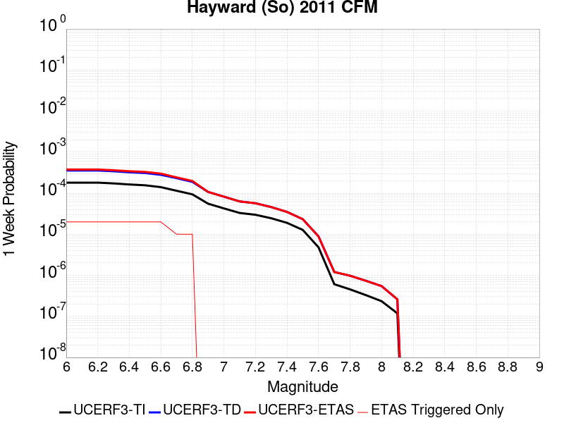 | 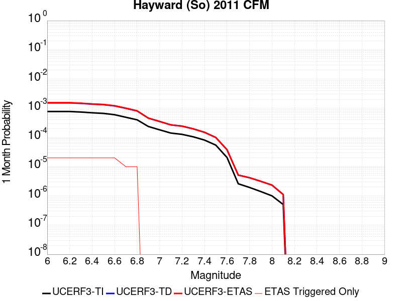 | 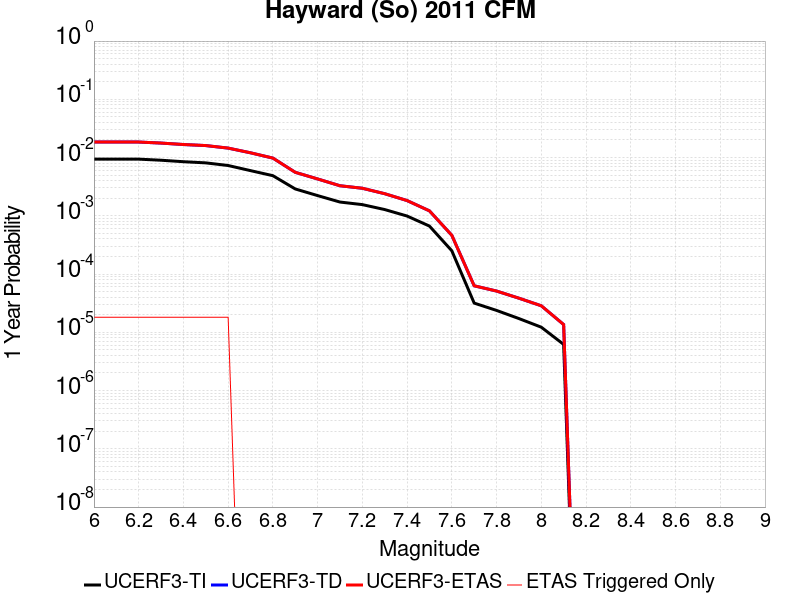 | 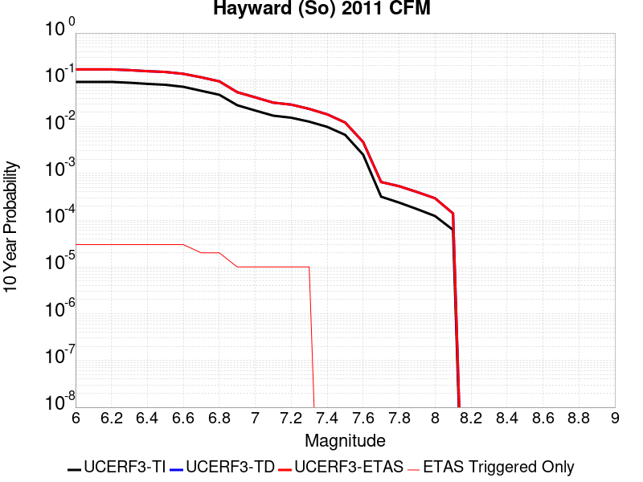 |

| Magnitude | 1 wk TI Prob | 1 wk TD Prob | 1 wk ETAS Prob | 1 wk ETAS/TD Gain | 1 wk ETAS Triggered Only | 1 mo TI Prob | 1 mo TD Prob | 1 mo ETAS Prob | 1 mo ETAS/TD Gain | 1 mo ETAS Triggered Only | 1 yr TI Prob | 1 yr TD Prob | 1 yr ETAS Prob | 1 yr ETAS/TD Gain | 1 yr ETAS Triggered Only | 10 yr TI Prob | 10 yr TD Prob | 10 yr ETAS Prob | 10 yr ETAS/TD Gain | 10 yr ETAS Triggered Only |
|-----|-----|-----|-----|-----|-----|-----|-----|-----|-----|-----|-----|-----|-----|-----|-----|-----|-----|-----|-----|-----|
| 6.0 | 1.8091932E-4 | 3.570541E-4 | 3.7704693E-4 | 1.0559939 | 2.0E-5 | 7.751381E-4 | 0.0015293444 | 0.0015493138 | 1.0130575 | 2.0E-5 | 0.00939654 | 0.018463207 | 0.01848284 | 1.0010632 | 2.0E-5 | 0.090090066 | 0.16673161 | 0.16675662 | 1.00015 | 3.0E-5 |
| 6.1 | 1.8091932E-4 | 3.570541E-4 | 3.7704693E-4 | 1.0559939 | 2.0E-5 | 7.751381E-4 | 0.0015293444 | 0.0015493138 | 1.0130575 | 2.0E-5 | 0.00939654 | 0.018463207 | 0.01848284 | 1.0010632 | 2.0E-5 | 0.090090066 | 0.16673161 | 0.16675662 | 1.00015 | 3.0E-5 |
| 6.2 | 1.8091932E-4 | 3.570541E-4 | 3.7704693E-4 | 1.0559939 | 2.0E-5 | 7.751381E-4 | 0.0015293444 | 0.0015493138 | 1.0130575 | 2.0E-5 | 0.00939654 | 0.018463207 | 0.01848284 | 1.0010632 | 2.0E-5 | 0.090090066 | 0.16673161 | 0.16675662 | 1.00015 | 3.0E-5 |
| 6.3 | 1.7322872E-4 | 3.426234E-4 | 3.6261656E-4 | 1.0583532 | 2.0E-5 | 7.4219756E-4 | 0.0014675693 | 0.00148754 | 1.013608 | 2.0E-5 | 0.0089988755 | 0.017723544 | 0.01774319 | 1.0011084 | 2.0E-5 | 0.08643075 | 0.16066726 | 0.16069244 | 1.0001568 | 3.0E-5 |
| 6.4 | 1.6334097E-4 | 3.234411E-4 | 3.4343463E-4 | 1.061815 | 2.0E-5 | 6.998449E-4 | 0.0013854484 | 0.0014054207 | 1.0144157 | 2.0E-5 | 0.008487372 | 0.016739385 | 0.016759051 | 1.0011748 | 2.0E-5 | 0.081704415 | 0.15255594 | 0.15258136 | 1.0001667 | 3.0E-5 |
| 6.5 | 1.5600289E-4 | 3.1018828E-4 | 3.3018205E-4 | 1.0644569 | 2.0E-5 | 6.684125E-4 | 0.0013287093 | 0.0013486828 | 1.0150322 | 2.0E-5 | 0.008107598 | 0.016058935 | 0.016078614 | 1.0012255 | 2.0E-5 | 0.078181036 | 0.14683272 | 0.1468583 | 1.0001743 | 3.0E-5 |
| 6.6 | 1.4046066E-4 | 2.8032906E-4 | 3.0032345E-4 | 1.0713247 | 2.0E-5 | 6.018354E-4 | 0.0012008639 | 0.0012208399 | 1.0166347 | 2.0E-5 | 0.0073027555 | 0.014524006 | 0.014543716 | 1.0013571 | 2.0E-5 | 0.07067384 | 0.13391982 | 0.13394581 | 1.0001941 | 3.0E-5 |
| 6.7 | 1.14696966E-4 | 2.3271477E-4 | 2.4271243E-4 | 1.042961 | 1.0E-5 | 4.914658E-4 | 9.969729E-4 | 0.0010069628 | 1.0100204 | 1.0E-5 | 0.0059671924 | 0.012071652 | 0.012081532 | 1.0008184 | 1.0E-5 | 0.058094822 | 0.11274672 | 0.11276447 | 1.0001574 | 2.0E-5 |
| 6.8 | 9.3874296E-5 | 1.8861453E-4 | 1.9861264E-4 | 1.0530082 | 1.0E-5 | 4.0225635E-4 | 8.0810126E-4 | 8.180932E-4 | 1.0123647 | 1.0E-5 | 0.0048864787 | 0.009794984 | 0.009804886 | 1.0010109 | 1.0E-5 | 0.047804173 | 0.09259856 | 0.09261671 | 1.000196 | 2.0E-5 |
| 6.9 | 5.551852E-5 | 1.072948E-4 | 1.072948E-4 | 1.0 | 0.0 | 2.3791482E-4 | 4.5975443E-4 | 4.5975443E-4 | 1.0 | 0.0 | 0.0028927654 | 0.0055832625 | 0.0055832625 | 1.0 | 0.0 | 0.028553981 | 0.054245494 | 0.05425495 | 1.0001744 | 1.0E-5 |
| 7.0 | 4.2662363E-5 | 8.2464416E-5 | 8.2464416E-5 | 1.0 | 0.0 | 1.8282588E-4 | 3.5337146E-4 | 3.5337146E-4 | 1.0 | 0.0 | 0.0022236328 | 0.0042938837 | 0.0042938837 | 1.0 | 0.0 | 0.022015138 | 0.042064495 | 0.042074073 | 1.0002277 | 1.0E-5 |
| 7.1 | 3.305886E-5 | 6.3019055E-5 | 6.3019055E-5 | 1.0 | 0.0 | 1.4167312E-4 | 2.700538E-4 | 2.700538E-4 | 1.0 | 0.0 | 0.0017235056 | 0.0032829668 | 0.0032829668 | 1.0 | 0.0 | 0.017101998 | 0.032452874 | 0.03246255 | 1.0002981 | 1.0E-5 |
| 7.2 | 2.9856887E-5 | 5.7013647E-5 | 5.7013647E-5 | 1.0 | 0.0 | 1.2795182E-4 | 2.4432142E-4 | 2.4432142E-4 | 1.0 | 0.0 | 0.0015567001 | 0.0029705726 | 0.0029705726 | 1.0 | 0.0 | 0.015458403 | 0.029453589 | 0.029463293 | 1.0003295 | 1.0E-5 |
| 7.3 | 2.4559737E-5 | 4.599088E-5 | 4.599088E-5 | 1.0 | 0.0 | 1.0525176E-4 | 1.9708896E-4 | 1.9708896E-4 | 1.0 | 0.0 | 0.0012806869 | 0.0023969305 | 0.0023969305 | 1.0 | 0.0 | 0.012733313 | 0.023857482 | 0.023867244 | 1.0004091 | 1.0E-5 |
| 7.4 | 1.9002231E-5 | 3.5049303E-5 | 3.5049303E-5 | 1.0 | 0.0 | 8.143559E-5 | 1.502027E-4 | 1.502027E-4 | 1.0 | 0.0 | 9.910273E-4 | 0.0018271938 | 0.0018271938 | 1.0 | 0.0 | 0.009866194 | 0.018258283 | 0.018258283 | 1.0 | 0.0 |
| 7.5 | 1.2783333E-5 | 2.3330069E-5 | 2.3330069E-5 | 1.0 | 0.0 | 5.4784563E-5 | 9.998221E-5 | 9.998221E-5 | 1.0 | 0.0 | 6.667979E-4 | 0.0012166094 | 0.0012166094 | 1.0 | 0.0 | 0.006648007 | 0.012209582 | 0.012209582 | 1.0 | 0.0 |
| 7.6 | 4.8149627E-6 | 8.887544E-6 | 8.887544E-6 | 1.0 | 0.0 | 2.063539E-5 | 3.8088925E-5 | 3.8088925E-5 | 1.0 | 0.0 | 2.5120692E-4 | 4.636352E-4 | 4.636352E-4 | 1.0 | 0.0 | 0.0025092314 | 0.0046812436 | 0.0046812436 | 1.0 | 0.0 |
| 7.7 | 6.0838227E-7 | 1.2056693E-6 | 1.2056693E-6 | 1.0 | 0.0 | 2.6073499E-6 | 5.1671436E-6 | 5.1671436E-6 | 1.0 | 0.0 | 3.174402E-5 | 6.290816E-5 | 6.290816E-5 | 1.0 | 0.0 | 3.1739488E-4 | 6.5293367E-4 | 6.5293367E-4 | 1.0 | 0.0 |
| 7.8 | 4.5542808E-7 | 9.792182E-7 | 9.792182E-7 | 1.0 | 0.0 | 1.9518332E-6 | 4.1966427E-6 | 4.1966427E-6 | 1.0 | 0.0 | 2.376331E-5 | 5.1092928E-5 | 5.1092928E-5 | 1.0 | 0.0 | 2.3760769E-4 | 5.321372E-4 | 5.321372E-4 | 1.0 | 0.0 |
| 7.9 | 3.3016747E-7 | 7.386335E-7 | 7.386335E-7 | 1.0 | 0.0 | 1.4150027E-6 | 3.1655684E-6 | 3.1655684E-6 | 1.0 | 0.0 | 1.7227521E-5 | 3.8540114E-5 | 3.8540114E-5 | 1.0 | 0.0 | 1.7226185E-4 | 3.9930744E-4 | 3.9930744E-4 | 1.0 | 0.0 |
| 8.0 | 2.347038E-7 | 5.4714894E-7 | 5.4714894E-7 | 1.0 | 0.0 | 1.0058731E-6 | 2.344922E-6 | 2.344922E-6 | 1.0 | 0.0 | 1.2246436E-5 | 2.8549053E-5 | 2.8549053E-5 | 1.0 | 0.0 | 1.2245761E-4 | 2.9355253E-4 | 2.9355253E-4 | 1.0 | 0.0 |
| 8.1 | 1.18822804E-7 | 2.6058973E-7 | 2.6058973E-7 | 1.0 | 0.0 | 5.092405E-7 | 1.1168127E-6 | 1.1168127E-6 | 1.0 | 0.0 | 6.1999854E-6 | 1.359711E-5 | 1.359711E-5 | 1.0 | 0.0 | 6.199812E-5 | 1.3917852E-4 | 1.3917852E-4 | 1.0 | 0.0 |

## Verdugo
*[(top)](#table-of-contents)*

| 1 Week | 1 Month | 1 Year | 10 Year |
|-----|-----|-----|-----|
|  |  | 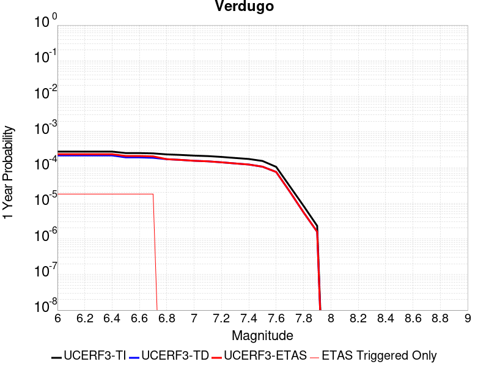 | 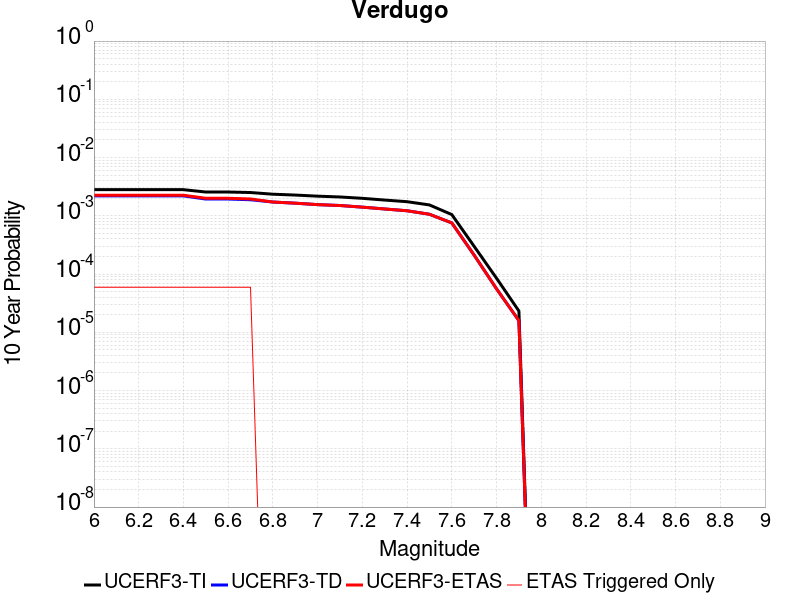 |

| Magnitude | 1 wk TI Prob | 1 wk TD Prob | 1 wk ETAS Prob | 1 wk ETAS/TD Gain | 1 wk ETAS Triggered Only | 1 mo TI Prob | 1 mo TD Prob | 1 mo ETAS Prob | 1 mo ETAS/TD Gain | 1 mo ETAS Triggered Only | 1 yr TI Prob | 1 yr TD Prob | 1 yr ETAS Prob | 1 yr ETAS/TD Gain | 1 yr ETAS Triggered Only | 10 yr TI Prob | 10 yr TD Prob | 10 yr ETAS Prob | 10 yr ETAS/TD Gain | 10 yr ETAS Triggered Only |
|-----|-----|-----|-----|-----|-----|-----|-----|-----|-----|-----|-----|-----|-----|-----|-----|-----|-----|-----|-----|-----|
| 6.0 | 5.392987E-6 | 4.216517E-6 | 4.216517E-6 | 1.0 | 0.0 | 2.3112598E-5 | 1.8070665E-5 | 1.8070665E-5 | 1.0 | 0.0 | 2.8135953E-4 | 2.1998861E-4 | 2.2998641E-4 | 1.0454469 | 1.0E-5 | 0.0028100356 | 0.0021977562 | 0.0022276903 | 1.0136203 | 3.0E-5 |
| 6.1 | 5.392987E-6 | 4.216517E-6 | 4.216517E-6 | 1.0 | 0.0 | 2.3112598E-5 | 1.8070665E-5 | 1.8070665E-5 | 1.0 | 0.0 | 2.8135953E-4 | 2.1998861E-4 | 2.2998641E-4 | 1.0454469 | 1.0E-5 | 0.0028100356 | 0.0021977562 | 0.0022276903 | 1.0136203 | 3.0E-5 |
| 6.2 | 5.392987E-6 | 4.216517E-6 | 4.216517E-6 | 1.0 | 0.0 | 2.3112598E-5 | 1.8070665E-5 | 1.8070665E-5 | 1.0 | 0.0 | 2.8135953E-4 | 2.1998861E-4 | 2.2998641E-4 | 1.0454469 | 1.0E-5 | 0.0028100356 | 0.0021977562 | 0.0022276903 | 1.0136203 | 3.0E-5 |
| 6.3 | 5.392987E-6 | 4.216517E-6 | 4.216517E-6 | 1.0 | 0.0 | 2.3112598E-5 | 1.8070665E-5 | 1.8070665E-5 | 1.0 | 0.0 | 2.8135953E-4 | 2.1998861E-4 | 2.2998641E-4 | 1.0454469 | 1.0E-5 | 0.0028100356 | 0.0021977562 | 0.0022276903 | 1.0136203 | 3.0E-5 |
| 6.4 | 5.392987E-6 | 4.216517E-6 | 4.216517E-6 | 1.0 | 0.0 | 2.3112598E-5 | 1.8070665E-5 | 1.8070665E-5 | 1.0 | 0.0 | 2.8135953E-4 | 2.1998861E-4 | 2.2998641E-4 | 1.0454469 | 1.0E-5 | 0.0028100356 | 0.0021977562 | 0.0022276903 | 1.0136203 | 3.0E-5 |
| 6.5 | 4.9154837E-6 | 3.722465E-6 | 3.722465E-6 | 1.0 | 0.0 | 2.1066187E-5 | 1.5953325E-5 | 1.5953325E-5 | 1.0 | 0.0 | 2.5645064E-4 | 1.9421462E-4 | 2.0421269E-4 | 1.0514795 | 1.0E-5 | 0.002561549 | 0.0019404698 | 0.0019704115 | 1.0154302 | 3.0E-5 |
| 6.6 | 4.9154837E-6 | 3.722465E-6 | 3.722465E-6 | 1.0 | 0.0 | 2.1066187E-5 | 1.5953325E-5 | 1.5953325E-5 | 1.0 | 0.0 | 2.5645064E-4 | 1.9421462E-4 | 2.0421269E-4 | 1.0514795 | 1.0E-5 | 0.002561549 | 0.0019404698 | 0.0019704115 | 1.0154302 | 3.0E-5 |
| 6.7 | 4.817006E-6 | 3.6206518E-6 | 3.6206518E-6 | 1.0 | 0.0 | 2.0644147E-5 | 1.5516987E-5 | 1.5516987E-5 | 1.0 | 0.0 | 2.513135E-4 | 1.8890314E-4 | 1.9890125E-4 | 1.0529271 | 1.0E-5 | 0.0025102948 | 0.0018874453 | 0.0019173886 | 1.0158645 | 3.0E-5 |
| 6.8 | 4.507407E-6 | 3.3071042E-6 | 3.3071042E-6 | 1.0 | 0.0 | 1.9317316E-5 | 1.4173227E-5 | 1.4173227E-5 | 1.0 | 0.0 | 2.3516294E-4 | 1.7254551E-4 | 1.7254551E-4 | 1.0 | 0.0 | 0.0023491425 | 0.0017241298 | 0.0017341125 | 1.00579 | 1.0E-5 |
| 6.9 | 4.3573054E-6 | 3.161011E-6 | 3.161011E-6 | 1.0 | 0.0 | 1.8674033E-5 | 1.354712E-5 | 1.354712E-5 | 1.0 | 0.0 | 2.2733262E-4 | 1.6492383E-4 | 1.6492383E-4 | 1.0 | 0.0 | 0.0022710022 | 0.0016480266 | 0.0016580102 | 1.0060579 | 1.0E-5 |
| 7.0 | 4.171527E-6 | 2.9836704E-6 | 2.9836704E-6 | 1.0 | 0.0 | 1.787785E-5 | 1.2787096E-5 | 1.2787096E-5 | 1.0 | 0.0 | 2.1764109E-4 | 1.5567189E-4 | 1.5567189E-4 | 1.0 | 0.0 | 0.0021742806 | 0.0015556397 | 0.0015656241 | 1.0064182 | 1.0E-5 |
| 7.1 | 4.0405484E-6 | 2.882261E-6 | 2.882261E-6 | 1.0 | 0.0 | 1.731652E-5 | 1.235249E-5 | 1.235249E-5 | 1.0 | 0.0 | 2.1080824E-4 | 1.503813E-4 | 1.503813E-4 | 1.0 | 0.0 | 0.0021060838 | 0.0015028063 | 0.0015127913 | 1.0066442 | 1.0E-5 |
| 7.2 | 3.8306007E-6 | 2.7018452E-6 | 2.7018452E-6 | 1.0 | 0.0 | 1.6416758E-5 | 1.15792855E-5 | 1.15792855E-5 | 1.0 | 0.0 | 1.9985568E-4 | 1.4096878E-4 | 1.4096878E-4 | 1.0 | 0.0 | 0.0019967605 | 0.0014088044 | 0.0014187903 | 1.0070882 | 1.0E-5 |
| 7.3 | 3.5750938E-6 | 2.5121758E-6 | 2.5121758E-6 | 1.0 | 0.0 | 1.532174E-5 | 1.0766424E-5 | 1.0766424E-5 | 1.0 | 0.0 | 1.8652623E-4 | 1.3107344E-4 | 1.3107344E-4 | 1.0 | 0.0 | 0.0018636974 | 0.0013099718 | 0.0013099718 | 1.0 | 0.0 |
| 7.4 | 3.3510041E-6 | 2.3408586E-6 | 2.3408586E-6 | 1.0 | 0.0 | 1.4361368E-5 | 1.0032213E-5 | 1.0032213E-5 | 1.0 | 0.0 | 1.7483562E-4 | 1.2213545E-4 | 1.2213545E-4 | 1.0 | 0.0 | 0.0017469813 | 0.0012206937 | 0.0012206937 | 1.0 | 0.0 |
| 7.5 | 2.948287E-6 | 2.0391124E-6 | 2.0391124E-6 | 1.0 | 0.0 | 1.2635454E-5 | 8.739024E-6 | 8.739024E-6 | 1.0 | 0.0 | 1.538258E-4 | 1.0639253E-4 | 1.0639253E-4 | 1.0 | 0.0 | 0.0015371935 | 0.0010634261 | 0.0010634261 | 1.0 | 0.0 |
| 7.6 | 2.0134323E-6 | 1.4471265E-6 | 1.4471265E-6 | 1.0 | 0.0 | 8.628967E-6 | 6.2019562E-6 | 6.2019562E-6 | 1.0 | 0.0 | 1.05052604E-4 | 7.550629E-5 | 7.550629E-5 | 1.0 | 0.0 | 0.0010500296 | 7.548152E-4 | 7.548152E-4 | 1.0 | 0.0 |
| 7.7 | 5.726436E-7 | 4.045248E-7 | 4.045248E-7 | 1.0 | 0.0 | 2.4541846E-6 | 1.7336766E-6 | 1.7336766E-6 | 1.0 | 0.0 | 2.9879287E-5 | 2.1107335E-5 | 2.1107335E-5 | 1.0 | 0.0 | 2.987527E-4 | 2.1105584E-4 | 2.1105584E-4 | 1.0 | 0.0 |
| 7.8 | 1.6248204E-7 | 1.0687696E-7 | 1.0687696E-7 | 1.0 | 0.0 | 6.963514E-7 | 4.5804404E-7 | 4.5804404E-7 | 1.0 | 0.0 | 8.478045E-6 | 5.5766723E-6 | 5.5766723E-6 | 1.0 | 0.0 | 8.477722E-5 | 5.5765355E-5 | 5.5765355E-5 | 1.0 | 0.0 |
| 7.9 | 4.4475744E-8 | 3.0375546E-8 | 3.0375546E-8 | 1.0 | 0.0 | 1.9061031E-7 | 1.301809E-7 | 1.301809E-7 | 1.0 | 0.0 | 2.320678E-6 | 1.5849514E-6 | 1.5849514E-6 | 1.0 | 0.0 | 2.3206538E-5 | 1.5849415E-5 | 1.5849415E-5 | 1.0 | 0.0 |

## Green Valley 2011 CFM
*[(top)](#table-of-contents)*

| 1 Week | 1 Month | 1 Year | 10 Year |
|-----|-----|-----|-----|
| 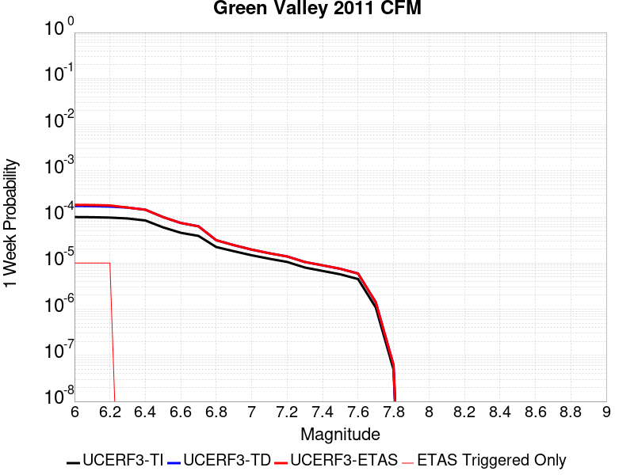 | 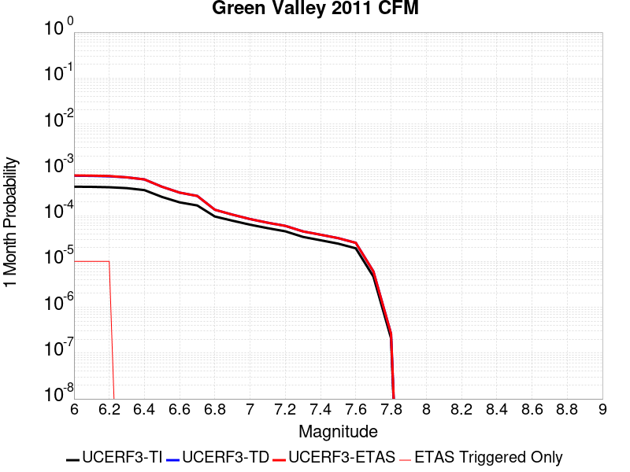 | 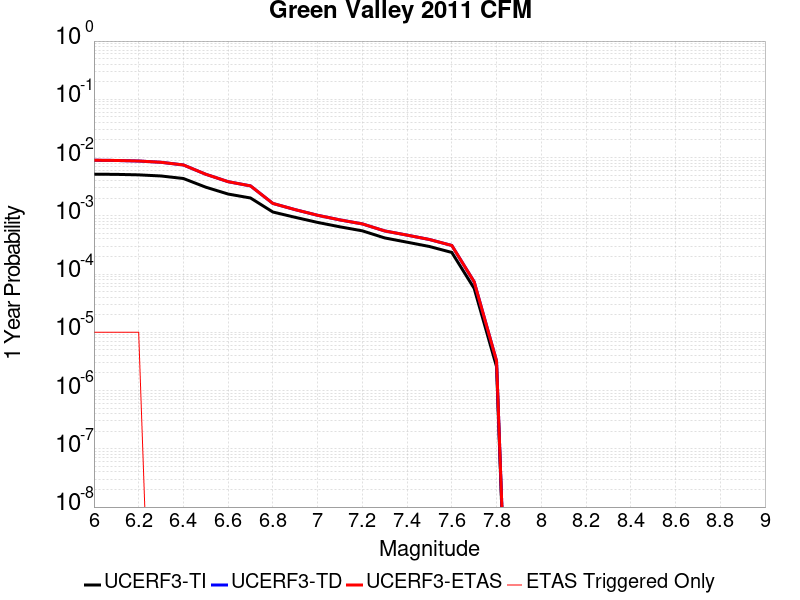 | 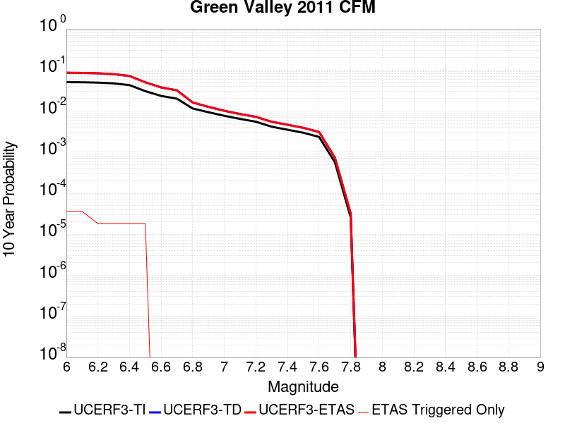 |

| Magnitude | 1 wk TI Prob | 1 wk TD Prob | 1 wk ETAS Prob | 1 wk ETAS/TD Gain | 1 wk ETAS Triggered Only | 1 mo TI Prob | 1 mo TD Prob | 1 mo ETAS Prob | 1 mo ETAS/TD Gain | 1 mo ETAS Triggered Only | 1 yr TI Prob | 1 yr TD Prob | 1 yr ETAS Prob | 1 yr ETAS/TD Gain | 1 yr ETAS Triggered Only | 10 yr TI Prob | 10 yr TD Prob | 10 yr ETAS Prob | 10 yr ETAS/TD Gain | 10 yr ETAS Triggered Only |
|-----|-----|-----|-----|-----|-----|-----|-----|-----|-----|-----|-----|-----|-----|-----|-----|-----|-----|-----|-----|-----|
| 6.0 | 9.9629346E-5 | 1.7305532E-4 | 1.8305359E-4 | 1.057775 | 1.0E-5 | 4.2691303E-4 | 7.4143766E-4 | 7.514302E-4 | 1.0134773 | 1.0E-5 | 0.0051852856 | 0.008986705 | 0.008996615 | 1.0011028 | 1.0E-5 | 0.050659515 | 0.085522056 | 0.085549496 | 1.0003208 | 3.0E-5 |
| 6.1 | 9.88615E-5 | 1.7152846E-4 | 1.8152675E-4 | 1.0582894 | 1.0E-5 | 4.2362334E-4 | 7.348976E-4 | 7.448903E-4 | 1.0135974 | 1.0E-5 | 0.0051454236 | 0.0089077335 | 0.008917645 | 1.0011126 | 1.0E-5 | 0.050279044 | 0.084809676 | 0.08483713 | 1.0003238 | 3.0E-5 |
| 6.2 | 9.696895E-5 | 1.6791887E-4 | 1.779172E-4 | 1.0595425 | 1.0E-5 | 4.15515E-4 | 7.194366E-4 | 7.294294E-4 | 1.0138898 | 1.0E-5 | 0.0050471667 | 0.008721114 | 0.008731027 | 1.0011367 | 1.0E-5 | 0.04934063 | 0.0831186 | 0.083136946 | 1.0002207 | 2.0E-5 |
| 6.3 | 9.275224E-5 | 1.5971228E-4 | 1.5971228E-4 | 1.0 | 0.0 | 3.9744904E-4 | 6.842841E-4 | 6.842841E-4 | 1.0 | 0.0 | 0.0048282105 | 0.008296439 | 0.008296439 | 1.0 | 0.0 | 0.047246475 | 0.07925707 | 0.07926627 | 1.0001162 | 1.0E-5 |
| 6.4 | 8.391499E-5 | 1.4367796E-4 | 1.4367796E-4 | 1.0 | 0.0 | 3.595861E-4 | 6.156248E-4 | 6.156248E-4 | 1.0 | 0.0 | 0.004369175 | 0.0074670846 | 0.0074670846 | 1.0 | 0.0 | 0.04284265 | 0.071630865 | 0.07164015 | 1.0001296 | 1.0E-5 |
| 6.5 | 5.9519385E-5 | 9.9340905E-5 | 9.9340905E-5 | 1.0 | 0.0 | 2.5505814E-4 | 4.2568138E-4 | 4.2568138E-4 | 1.0 | 0.0 | 0.0031009112 | 0.005168295 | 0.005168295 | 1.0 | 0.0 | 0.030579966 | 0.050145864 | 0.05015536 | 1.0001894 | 1.0E-5 |
| 6.6 | 4.5361558E-5 | 7.402609E-5 | 7.402609E-5 | 1.0 | 0.0 | 1.9439218E-4 | 3.1721895E-4 | 3.1721895E-4 | 1.0 | 0.0 | 0.0023641558 | 0.0038539418 | 0.0038539418 | 1.0 | 0.0 | 0.023391623 | 0.037665963 | 0.037665963 | 1.0 | 0.0 |
| 6.7 | 3.8808106E-5 | 6.2651976E-5 | 6.2651976E-5 | 1.0 | 0.0 | 1.6630985E-4 | 2.6848342E-4 | 2.6848342E-4 | 1.0 | 0.0 | 0.0020229418 | 0.0032626586 | 0.0032626586 | 1.0 | 0.0 | 0.020046256 | 0.032005914 | 0.032005914 | 1.0 | 0.0 |
| 6.8 | 2.2284667E-5 | 3.1285235E-5 | 3.1285235E-5 | 1.0 | 0.0 | 9.550222E-5 | 1.3407279E-4 | 1.3407279E-4 | 1.0 | 0.0 | 0.0011621192 | 0.0016311078 | 0.0016311078 | 1.0 | 0.0 | 0.011560607 | 0.016165998 | 0.016165998 | 1.0 | 0.0 |
| 6.9 | 1.8050168E-5 | 2.4448054E-5 | 2.4448054E-5 | 1.0 | 0.0 | 7.735557E-5 | 1.047732E-4 | 1.047732E-4 | 1.0 | 0.0 | 9.4139716E-4 | 0.0012748708 | 0.0012748708 | 1.0 | 0.0 | 0.009374191 | 0.012667833 | 0.012667833 | 1.0 | 0.0 |
| 7.0 | 1.4763166E-5 | 1.9582854E-5 | 1.9582854E-5 | 1.0 | 0.0 | 6.326917E-5 | 8.3923835E-5 | 8.3923835E-5 | 1.0 | 0.0 | 7.7002996E-4 | 0.0010212966 | 0.0010212966 | 1.0 | 0.0 | 0.007673672 | 0.010165343 | 0.010165343 | 1.0 | 0.0 |
| 7.1 | 1.2399713E-5 | 1.6303715E-5 | 1.6303715E-5 | 1.0 | 0.0 | 5.3140546E-5 | 6.98712E-5 | 6.98712E-5 | 1.0 | 0.0 | 6.467941E-4 | 8.503518E-4 | 8.503518E-4 | 1.0 | 0.0 | 0.006449148 | 0.008471259 | 0.008471259 | 1.0 | 0.0 |
| 7.2 | 1.0584195E-5 | 1.3921742E-5 | 1.3921742E-5 | 1.0 | 0.0 | 4.5360044E-5 | 5.9663253E-5 | 5.9663253E-5 | 1.0 | 0.0 | 5.521186E-4 | 7.261596E-4 | 7.261596E-4 | 1.0 | 0.0 | 0.0055074887 | 0.007238285 | 0.007238285 | 1.0 | 0.0 |
| 7.3 | 7.998173E-6 | 1.054402E-5 | 1.054402E-5 | 1.0 | 0.0 | 3.4277433E-5 | 4.518788E-5 | 4.518788E-5 | 1.0 | 0.0 | 4.1724785E-4 | 5.500247E-4 | 5.500247E-4 | 1.0 | 0.0 | 0.004164653 | 0.0054868995 | 0.0054868995 | 1.0 | 0.0 |
| 7.4 | 6.7571127E-6 | 8.932697E-6 | 8.932697E-6 | 1.0 | 0.0 | 2.8958733E-5 | 3.828243E-5 | 3.828243E-5 | 1.0 | 0.0 | 3.5251552E-4 | 4.6598984E-4 | 4.6598984E-4 | 1.0 | 0.0 | 0.0035195686 | 0.0046503306 | 0.0046503306 | 1.0 | 0.0 |
| 7.5 | 5.69878E-6 | 7.516314E-6 | 7.516314E-6 | 1.0 | 0.0 | 2.4423114E-5 | 3.221238E-5 | 3.221238E-5 | 1.0 | 0.0 | 2.9731085E-4 | 3.9211605E-4 | 3.9211605E-4 | 1.0 | 0.0 | 0.002969134 | 0.0039143935 | 0.0039143935 | 1.0 | 0.0 |
| 7.6 | 4.503664E-6 | 5.9356807E-6 | 5.9356807E-6 | 1.0 | 0.0 | 1.9301275E-5 | 2.5438389E-5 | 2.5438389E-5 | 1.0 | 0.0 | 2.3496768E-4 | 3.096692E-4 | 3.096692E-4 | 1.0 | 0.0 | 0.002347194 | 0.003092502 | 0.003092502 | 1.0 | 0.0 |
| 7.7 | 1.0873546E-6 | 1.4106979E-6 | 1.4106979E-6 | 1.0 | 0.0 | 4.6600826E-6 | 6.045834E-6 | 6.045834E-6 | 1.0 | 0.0 | 5.6735033E-5 | 7.360557E-5 | 7.360557E-5 | 1.0 | 0.0 | 5.672055E-4 | 7.35814E-4 | 7.35814E-4 | 1.0 | 0.0 |
| 7.8 | 4.9373917E-8 | 6.1777136E-8 | 6.1777136E-8 | 1.0 | 0.0 | 2.1160248E-7 | 2.6475914E-7 | 2.6475914E-7 | 1.0 | 0.0 | 2.5762572E-6 | 3.223439E-6 | 3.223439E-6 | 1.0 | 0.0 | 2.5762274E-5 | 3.2232296E-5 | 3.2232296E-5 | 1.0 | 0.0 |

## Owens Valley Keough Hot Springs
*[(top)](#table-of-contents)*

| 1 Week | 1 Month | 1 Year | 10 Year |
|-----|-----|-----|-----|
| 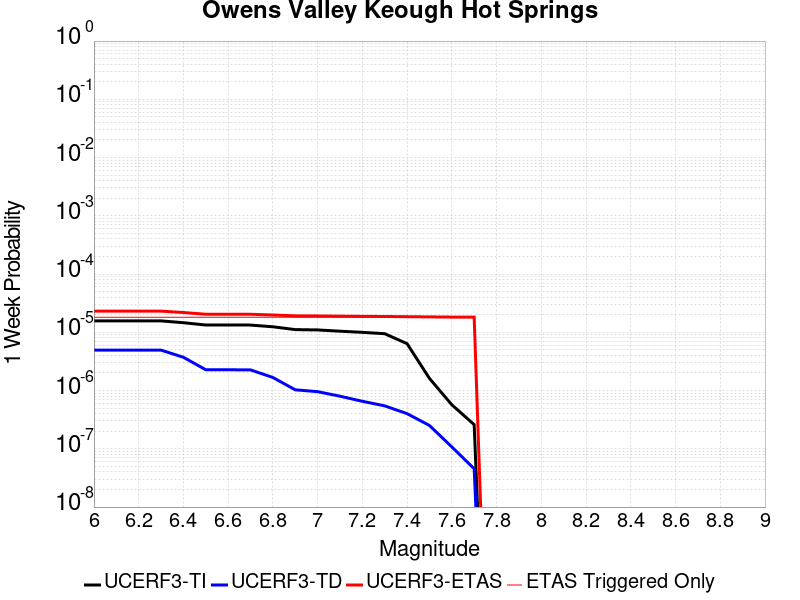 | 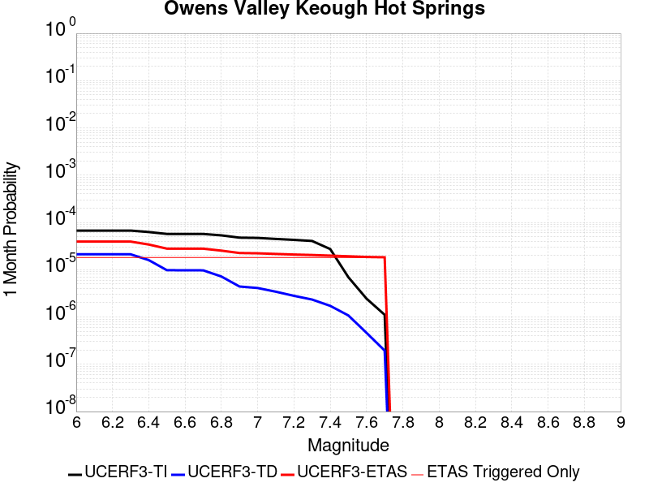 | 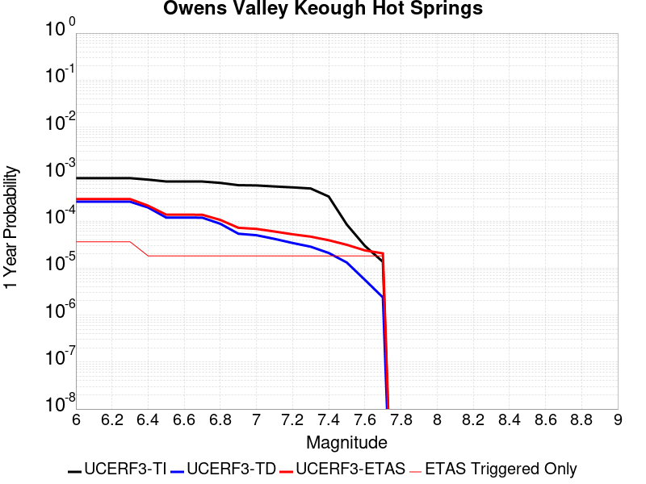 | 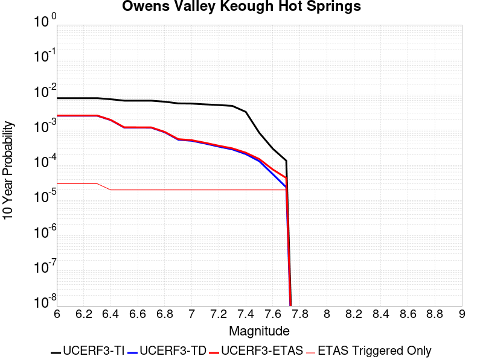 |

| Magnitude | 1 wk TI Prob | 1 wk TD Prob | 1 wk ETAS Prob | 1 wk ETAS/TD Gain | 1 wk ETAS Triggered Only | 1 mo TI Prob | 1 mo TD Prob | 1 mo ETAS Prob | 1 mo ETAS/TD Gain | 1 mo ETAS Triggered Only | 1 yr TI Prob | 1 yr TD Prob | 1 yr ETAS Prob | 1 yr ETAS/TD Gain | 1 yr ETAS Triggered Only | 10 yr TI Prob | 10 yr TD Prob | 10 yr ETAS Prob | 10 yr ETAS/TD Gain | 10 yr ETAS Triggered Only |
|-----|-----|-----|-----|-----|-----|-----|-----|-----|-----|-----|-----|-----|-----|-----|-----|-----|-----|-----|-----|-----|
| 6.0 | 1.5708529E-5 | 4.950656E-6 | 1.4950607E-5 | 3.0199244 | 1.0E-5 | 6.7320536E-5 | 2.1216953E-5 | 3.121674E-5 | 1.4713112 | 1.0E-5 | 8.193192E-4 | 2.582909E-4 | 2.7828573E-4 | 1.0774121 | 2.0E-5 | 0.008163051 | 0.0025805652 | 0.0026104876 | 1.0115954 | 3.0E-5 |
| 6.1 | 1.5708529E-5 | 4.950656E-6 | 1.4950607E-5 | 3.0199244 | 1.0E-5 | 6.7320536E-5 | 2.1216953E-5 | 3.121674E-5 | 1.4713112 | 1.0E-5 | 8.193192E-4 | 2.582909E-4 | 2.7828573E-4 | 1.0774121 | 2.0E-5 | 0.008163051 | 0.0025805652 | 0.0026104876 | 1.0115954 | 3.0E-5 |
| 6.2 | 1.5708529E-5 | 4.950656E-6 | 1.4950607E-5 | 3.0199244 | 1.0E-5 | 6.7320536E-5 | 2.1216953E-5 | 3.121674E-5 | 1.4713112 | 1.0E-5 | 8.193192E-4 | 2.582909E-4 | 2.7828573E-4 | 1.0774121 | 2.0E-5 | 0.008163051 | 0.0025805652 | 0.0026104876 | 1.0115954 | 3.0E-5 |
| 6.3 | 1.5708529E-5 | 4.950656E-6 | 1.4950607E-5 | 3.0199244 | 1.0E-5 | 6.7320536E-5 | 2.1216953E-5 | 3.121674E-5 | 1.4713112 | 1.0E-5 | 8.193192E-4 | 2.582909E-4 | 2.7828573E-4 | 1.0774121 | 2.0E-5 | 0.008163051 | 0.0025805652 | 0.0026104876 | 1.0115954 | 3.0E-5 |
| 6.4 | 1.4622509E-5 | 3.7265204E-6 | 1.3726483E-5 | 3.6834583 | 1.0E-5 | 6.266639E-5 | 1.5970723E-5 | 2.5970563E-5 | 1.6261357 | 1.0E-5 | 7.626962E-4 | 1.944295E-4 | 2.0442756E-4 | 1.0514225 | 1.0E-5 | 0.007600839 | 0.0019430731 | 0.0019630343 | 1.010273 | 2.0E-5 |
| 6.5 | 1.3335527E-5 | 2.2777172E-6 | 1.2277695E-5 | 5.390351 | 1.0E-5 | 5.7151006E-5 | 9.761612E-6 | 1.9761514E-5 | 2.024411 | 1.0E-5 | 6.955913E-4 | 1.18841825E-4 | 1.2884063E-4 | 1.0841354 | 1.0E-5 | 0.0069341804 | 0.0011880046 | 0.0012079809 | 1.016815 | 2.0E-5 |
| 6.6 | 1.3332855E-5 | 2.2748663E-6 | 1.2274843E-5 | 5.3958526 | 1.0E-5 | 5.7139558E-5 | 9.749395E-6 | 1.9749297E-5 | 2.0256948 | 1.0E-5 | 6.9545204E-4 | 1.186931E-4 | 1.2869191E-4 | 1.0842409 | 1.0E-5 | 0.0069327964 | 0.0011865189 | 0.0012064951 | 1.016836 | 2.0E-5 |
| 6.7 | 1.3318214E-5 | 2.2640966E-6 | 1.2264074E-5 | 5.416763 | 1.0E-5 | 5.707681E-5 | 9.703239E-6 | 1.9703142E-5 | 2.0305736 | 1.0E-5 | 6.946886E-4 | 1.1813121E-4 | 1.2813004E-4 | 1.0846416 | 1.0E-5 | 0.0069252094 | 0.001180906 | 0.0012008824 | 1.0169162 | 2.0E-5 |
| 6.8 | 1.2441338E-5 | 1.6777863E-6 | 1.1677769E-5 | 6.9602246 | 1.0E-5 | 5.331893E-5 | 7.1904947E-6 | 1.7190423E-5 | 2.390715 | 1.0E-5 | 6.489646E-4 | 8.7541055E-5 | 9.754018E-5 | 1.1142222 | 1.0E-5 | 0.0064707273 | 8.752499E-4 | 8.9523237E-4 | 1.0228306 | 2.0E-5 |
| 6.9 | 1.1130476E-5 | 1.0303868E-6 | 1.1030376E-5 | 10.705084 | 1.0E-5 | 4.7701167E-5 | 4.415936E-6 | 1.4415892E-5 | 3.2645156 | 1.0E-5 | 5.806069E-4 | 5.3762706E-5 | 6.376217E-5 | 1.1859926 | 1.0E-5 | 0.0057909233 | 5.37651E-4 | 5.576402E-4 | 1.0371789 | 2.0E-5 |
| 7.0 | 1.0986073E-5 | 9.579413E-7 | 1.0957931E-5 | 11.439043 | 1.0E-5 | 4.7082318E-5 | 4.1054564E-6 | 1.4105415E-5 | 3.435773 | 1.0E-5 | 5.730765E-4 | 4.99828E-5 | 5.9982296E-5 | 1.2000588 | 1.0E-5 | 0.0057160086 | 4.9986853E-4 | 5.198585E-4 | 1.0399905 | 2.0E-5 |
| 7.1 | 1.0451338E-5 | 8.0002656E-7 | 1.0800019E-5 | 13.499576 | 1.0E-5 | 4.4790682E-5 | 3.4286807E-6 | 1.34286465E-5 | 3.9165637 | 1.0E-5 | 5.451901E-4 | 4.1743395E-5 | 5.1742976E-5 | 1.2395489 | 1.0E-5 | 0.005438545 | 4.1750458E-4 | 4.3749623E-4 | 1.0478836 | 2.0E-5 |
| 7.2 | 9.989061E-6 | 6.544956E-7 | 1.0654489E-5 | 16.278933 | 1.0E-5 | 4.280956E-5 | 2.804978E-6 | 1.280495E-5 | 4.56508 | 1.0E-5 | 5.2108173E-4 | 3.4150078E-5 | 4.4149736E-5 | 1.2928151 | 1.0E-5 | 0.0051986156 | 3.415851E-4 | 3.6157828E-4 | 1.0585306 | 2.0E-5 |
| 7.3 | 9.465365E-6 | 5.4600474E-7 | 1.0545999E-5 | 19.31485 | 1.0E-5 | 4.056522E-5 | 2.3400182E-6 | 1.2339995E-5 | 5.273461 | 1.0E-5 | 4.937696E-4 | 2.8489352E-5 | 3.8489066E-5 | 1.3509983 | 1.0E-5 | 0.0049267393 | 2.8498896E-4 | 3.0498326E-4 | 1.0701581 | 2.0E-5 |
| 7.4 | 6.3824805E-6 | 4.016335E-7 | 1.040163E-5 | 25.898312 | 1.0E-5 | 2.73532E-5 | 1.7212853E-6 | 1.17212685E-5 | 6.8096023 | 1.0E-5 | 3.3297433E-4 | 2.095645E-5 | 3.095624E-5 | 1.4771701 | 1.0E-5 | 0.0033247585 | 2.0963654E-4 | 2.2963234E-4 | 1.0953832 | 2.0E-5 |
| 7.5 | 1.6192645E-6 | 2.516124E-7 | 1.025161E-5 | 40.74366 | 1.0E-5 | 6.9396865E-6 | 1.0783383E-6 | 1.1078328E-5 | 10.273518 | 1.0E-5 | 8.448741E-5 | 1.31286915E-5 | 2.3128561E-5 | 1.7616805 | 1.0E-5 | 8.4455294E-4 | 1.3127929E-4 | 1.5127666E-4 | 1.152327 | 2.0E-5 |
| 7.6 | 5.7062545E-7 | 1.07924045E-7 | 1.0107923E-5 | 93.65775 | 1.0E-5 | 2.4455355E-6 | 4.6253152E-7 | 1.0462527E-5 | 22.620138 | 1.0E-5 | 2.9773988E-5 | 5.6313074E-6 | 1.563125E-5 | 2.7757764 | 1.0E-5 | 2.977E-4 | 5.6311732E-5 | 7.631061E-5 | 1.3551458 | 2.0E-5 |
| 7.7 | 2.5988817E-7 | 4.5457977E-8 | 1.0045457E-5 | 220.98338 | 1.0E-5 | 1.113806E-6 | 1.9481989E-7 | 1.0194818E-5 | 52.32945 | 1.0E-5 | 1.3560503E-5 | 2.3719301E-6 | 1.2371906E-5 | 5.2159657 | 1.0E-5 | 1.3559677E-4 | 2.371909E-5 | 4.3718617E-5 | 1.8431827 | 2.0E-5 |

## Homestead Valley 2011
*[(top)](#table-of-contents)*

| 1 Week | 1 Month | 1 Year | 10 Year |
|-----|-----|-----|-----|
| 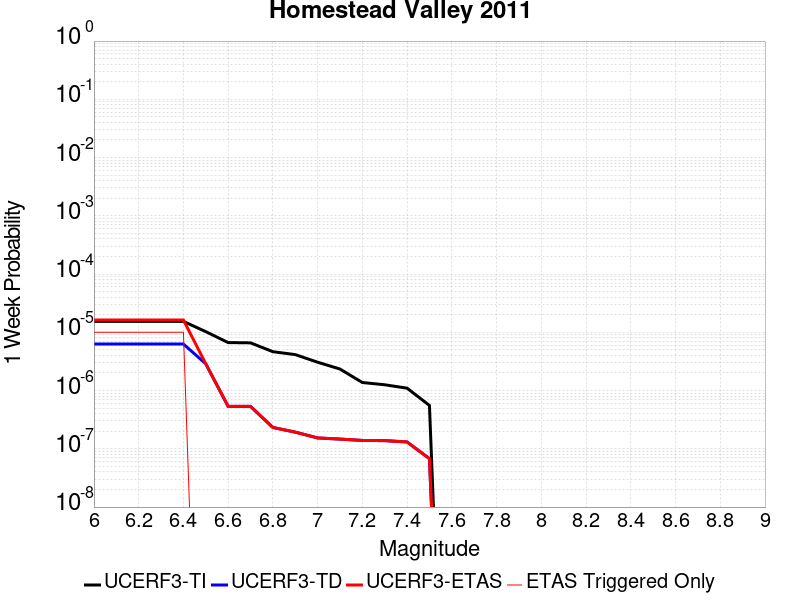 |  | 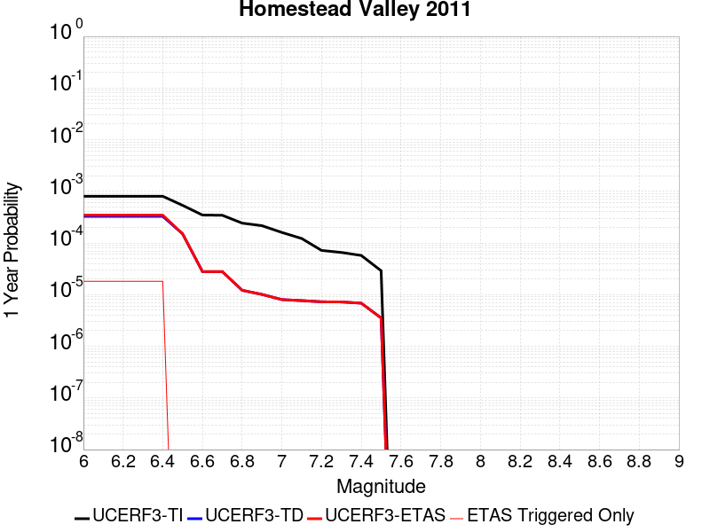 | 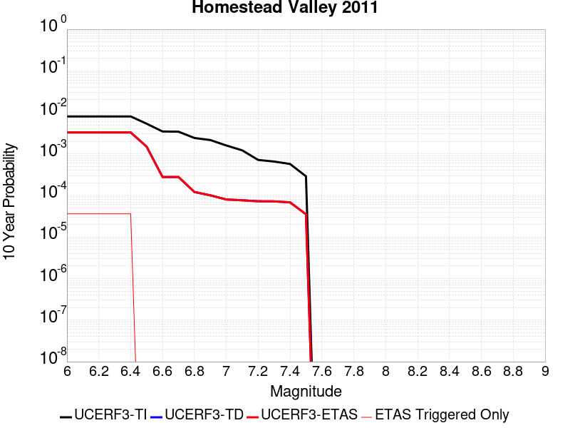 |

| Magnitude | 1 wk TI Prob | 1 wk TD Prob | 1 wk ETAS Prob | 1 wk ETAS/TD Gain | 1 wk ETAS Triggered Only | 1 mo TI Prob | 1 mo TD Prob | 1 mo ETAS Prob | 1 mo ETAS/TD Gain | 1 mo ETAS Triggered Only | 1 yr TI Prob | 1 yr TD Prob | 1 yr ETAS Prob | 1 yr ETAS/TD Gain | 1 yr ETAS Triggered Only | 10 yr TI Prob | 10 yr TD Prob | 10 yr ETAS Prob | 10 yr ETAS/TD Gain | 10 yr ETAS Triggered Only |
|-----|-----|-----|-----|-----|-----|-----|-----|-----|-----|-----|-----|-----|-----|-----|-----|-----|-----|-----|-----|-----|
| 6.0 | 1.539795E-5 | 6.286606E-6 | 1.6286544E-5 | 2.5906734 | 1.0E-5 | 6.5989545E-5 | 2.6942436E-5 | 3.6942165E-5 | 1.3711517 | 1.0E-5 | 8.0312655E-4 | 3.279954E-4 | 3.379921E-4 | 1.0304782 | 1.0E-5 | 0.008002302 | 0.0032771337 | 0.0032970682 | 1.0060829 | 2.0E-5 |
| 6.1 | 1.539795E-5 | 6.286606E-6 | 1.6286544E-5 | 2.5906734 | 1.0E-5 | 6.5989545E-5 | 2.6942436E-5 | 3.6942165E-5 | 1.3711517 | 1.0E-5 | 8.0312655E-4 | 3.279954E-4 | 3.379921E-4 | 1.0304782 | 1.0E-5 | 0.008002302 | 0.0032771337 | 0.0032970682 | 1.0060829 | 2.0E-5 |
| 6.2 | 1.539795E-5 | 6.286606E-6 | 1.6286544E-5 | 2.5906734 | 1.0E-5 | 6.5989545E-5 | 2.6942436E-5 | 3.6942165E-5 | 1.3711517 | 1.0E-5 | 8.0312655E-4 | 3.279954E-4 | 3.379921E-4 | 1.0304782 | 1.0E-5 | 0.008002302 | 0.0032771337 | 0.0032970682 | 1.0060829 | 2.0E-5 |
| 6.3 | 1.539795E-5 | 6.286606E-6 | 1.6286544E-5 | 2.5906734 | 1.0E-5 | 6.5989545E-5 | 2.6942436E-5 | 3.6942165E-5 | 1.3711517 | 1.0E-5 | 8.0312655E-4 | 3.279954E-4 | 3.379921E-4 | 1.0304782 | 1.0E-5 | 0.008002302 | 0.0032771337 | 0.0032970682 | 1.0060829 | 2.0E-5 |
| 6.4 | 1.539795E-5 | 6.286606E-6 | 1.6286544E-5 | 2.5906734 | 1.0E-5 | 6.5989545E-5 | 2.6942436E-5 | 3.6942165E-5 | 1.3711517 | 1.0E-5 | 8.0312655E-4 | 3.279954E-4 | 3.379921E-4 | 1.0304782 | 1.0E-5 | 0.008002302 | 0.0032771337 | 0.0032970682 | 1.0060829 | 2.0E-5 |
| 6.5 | 1.0265258E-5 | 2.8788488E-6 | 2.8788488E-6 | 1.0 | 0.0 | 4.3993223E-5 | 1.2337905E-5 | 1.2337905E-5 | 1.0 | 0.0 | 5.3548586E-4 | 1.5021059E-4 | 1.5021059E-4 | 1.0 | 0.0 | 0.005341973 | 0.0015017724 | 0.0015017724 | 1.0 | 0.0 |
| 6.6 | 6.664671E-6 | 5.348204E-7 | 5.348204E-7 | 1.0 | 0.0 | 2.8562565E-5 | 2.2920863E-6 | 2.2920863E-6 | 1.0 | 0.0 | 3.476937E-4 | 2.7905911E-5 | 2.7905911E-5 | 1.0 | 0.0 | 0.003471502 | 2.790357E-4 | 2.790357E-4 | 1.0 | 0.0 |
| 6.7 | 6.5954046E-6 | 5.348204E-7 | 5.348204E-7 | 1.0 | 0.0 | 2.8265715E-5 | 2.2920863E-6 | 2.2920863E-6 | 1.0 | 0.0 | 3.4408073E-4 | 2.7905911E-5 | 2.7905911E-5 | 1.0 | 0.0 | 0.0034354846 | 2.790357E-4 | 2.790357E-4 | 1.0 | 0.0 |
| 6.8 | 4.648189E-6 | 2.3265572E-7 | 2.3265572E-7 | 1.0 | 0.0 | 1.9920659E-5 | 9.970956E-7 | 9.970956E-7 | 1.0 | 0.0 | 2.4250703E-4 | 1.2139576E-5 | 1.2139576E-5 | 1.0 | 0.0 | 0.0024224254 | 1.2138961E-4 | 1.2138961E-4 | 1.0 | 0.0 |
| 6.9 | 4.1428534E-6 | 1.9344557E-7 | 1.9344557E-7 | 1.0 | 0.0 | 1.7754966E-5 | 8.290522E-7 | 8.290522E-7 | 1.0 | 0.0 | 2.1614527E-4 | 1.0093667E-5 | 1.0093667E-5 | 1.0 | 0.0 | 0.0021593515 | 1.0093238E-4 | 1.0093238E-4 | 1.0 | 0.0 |
| 7.0 | 3.0673707E-6 | 1.5367603E-7 | 1.5367603E-7 | 1.0 | 0.0 | 1.3145808E-5 | 6.586114E-7 | 6.586114E-7 | 1.0 | 0.0 | 1.6003846E-4 | 8.0185655E-6 | 8.0185655E-6 | 1.0 | 0.0 | 0.0015992324 | 8.0182865E-5 | 8.0182865E-5 | 1.0 | 0.0 |
| 7.1 | 2.340854E-6 | 1.468766E-7 | 1.468766E-7 | 1.0 | 0.0 | 1.0032193E-5 | 6.29471E-7 | 6.29471E-7 | 1.0 | 0.0 | 1.221351E-4 | 7.663783E-6 | 7.663783E-6 | 1.0 | 0.0 | 0.00122068 | 7.663529E-5 | 7.663529E-5 | 1.0 | 0.0 |
| 7.2 | 1.3754182E-6 | 1.3922634E-7 | 1.3922634E-7 | 1.0 | 0.0 | 5.8946357E-6 | 5.966842E-7 | 5.966842E-7 | 1.0 | 0.0 | 7.176483E-5 | 7.2646067E-6 | 7.2646067E-6 | 1.0 | 0.0 | 7.174166E-4 | 7.264379E-5 | 7.264379E-5 | 1.0 | 0.0 |
| 7.3 | 1.2573237E-6 | 1.3827146E-7 | 1.3827146E-7 | 1.0 | 0.0 | 5.388519E-6 | 5.9259185E-7 | 5.9259185E-7 | 1.0 | 0.0 | 6.560324E-5 | 7.2147827E-6 | 7.2147827E-6 | 1.0 | 0.0 | 6.558388E-4 | 7.214558E-5 | 7.214558E-5 | 1.0 | 0.0 |
| 7.4 | 1.0994207E-6 | 1.3106106E-7 | 1.3106106E-7 | 1.0 | 0.0 | 4.7117946E-6 | 5.616901E-7 | 5.616901E-7 | 1.0 | 0.0 | 5.736459E-5 | 6.8385566E-6 | 6.8385566E-6 | 1.0 | 0.0 | 5.734978E-4 | 6.838355E-5 | 6.838355E-5 | 1.0 | 0.0 |
| 7.5 | 5.5569126E-7 | 6.772991E-8 | 6.772991E-8 | 1.0 | 0.0 | 2.3815317E-6 | 2.90271E-7 | 2.90271E-7 | 1.0 | 0.0 | 2.8994764E-5 | 3.5340445E-6 | 3.5340445E-6 | 1.0 | 0.0 | 2.899098E-4 | 3.5339945E-5 | 3.5339945E-5 | 1.0 | 0.0 |

## Great Valley 03 Mysterious Ridge
*[(top)](#table-of-contents)*

| 1 Week | 1 Month | 1 Year | 10 Year |
|-----|-----|-----|-----|
|  | 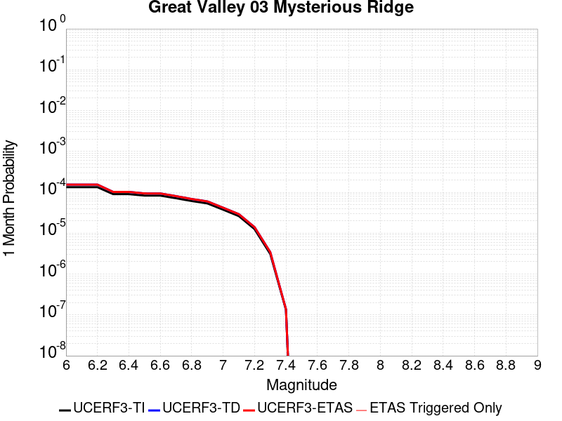 | 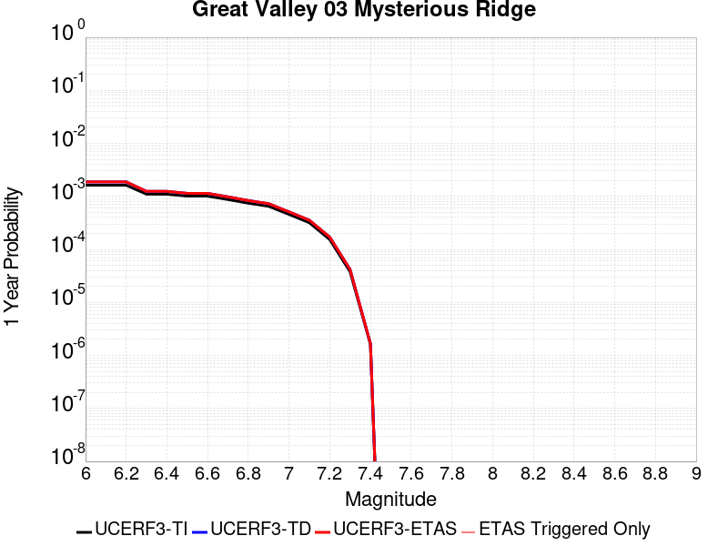 | 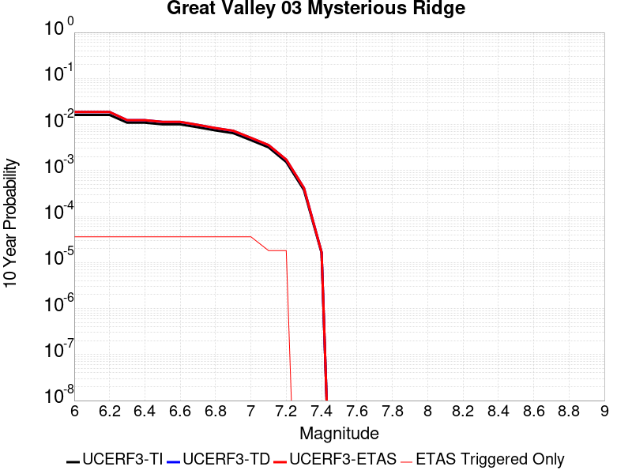 |

| Magnitude | 1 wk TI Prob | 1 wk TD Prob | 1 wk ETAS Prob | 1 wk ETAS/TD Gain | 1 wk ETAS Triggered Only | 1 mo TI Prob | 1 mo TD Prob | 1 mo ETAS Prob | 1 mo ETAS/TD Gain | 1 mo ETAS Triggered Only | 1 yr TI Prob | 1 yr TD Prob | 1 yr ETAS Prob | 1 yr ETAS/TD Gain | 1 yr ETAS Triggered Only | 10 yr TI Prob | 10 yr TD Prob | 10 yr ETAS Prob | 10 yr ETAS/TD Gain | 10 yr ETAS Triggered Only |
|-----|-----|-----|-----|-----|-----|-----|-----|-----|-----|-----|-----|-----|-----|-----|-----|-----|-----|-----|-----|-----|
| 6.0 | 3.1182444E-5 | 3.603423E-5 | 3.603423E-5 | 1.0 | 0.0 | 1.336322E-4 | 1.544242E-4 | 1.544242E-4 | 1.0 | 0.0 | 0.0016257578 | 0.0018786696 | 0.0018786696 | 1.0 | 0.0 | 0.016139153 | 0.018646652 | 0.018666279 | 1.0010526 | 2.0E-5 |
| 6.1 | 3.1182444E-5 | 3.603423E-5 | 3.603423E-5 | 1.0 | 0.0 | 1.336322E-4 | 1.544242E-4 | 1.544242E-4 | 1.0 | 0.0 | 0.0016257578 | 0.0018786696 | 0.0018786696 | 1.0 | 0.0 | 0.016139153 | 0.018646652 | 0.018666279 | 1.0010526 | 2.0E-5 |
| 6.2 | 3.1182444E-5 | 3.603423E-5 | 3.603423E-5 | 1.0 | 0.0 | 1.336322E-4 | 1.544242E-4 | 1.544242E-4 | 1.0 | 0.0 | 0.0016257578 | 0.0018786696 | 0.0018786696 | 1.0 | 0.0 | 0.016139153 | 0.018646652 | 0.018666279 | 1.0010526 | 2.0E-5 |
| 6.3 | 2.106934E-5 | 2.3850307E-5 | 2.3850307E-5 | 1.0 | 0.0 | 9.0294045E-5 | 1.0221177E-4 | 1.0221177E-4 | 1.0 | 0.0 | 0.0010987755 | 0.0012437489 | 0.0012437489 | 1.0 | 0.0 | 0.010933585 | 0.012371127 | 0.012390879 | 1.0015967 | 2.0E-5 |
| 6.4 | 2.106934E-5 | 2.3850307E-5 | 2.3850307E-5 | 1.0 | 0.0 | 9.0294045E-5 | 1.0221177E-4 | 1.0221177E-4 | 1.0 | 0.0 | 0.0010987755 | 0.0012437489 | 0.0012437489 | 1.0 | 0.0 | 0.010933585 | 0.012371127 | 0.012390879 | 1.0015967 | 2.0E-5 |
| 6.5 | 1.9389783E-5 | 2.1884984E-5 | 2.1884984E-5 | 1.0 | 0.0 | 8.309642E-5 | 9.3789575E-5 | 9.3789575E-5 | 1.0 | 0.0 | 0.0010112294 | 0.0011413174 | 0.0011413174 | 1.0 | 0.0 | 0.010066401 | 0.011357434 | 0.011377207 | 1.0017409 | 2.0E-5 |
| 6.6 | 1.9370193E-5 | 2.1864906E-5 | 2.1864906E-5 | 1.0 | 0.0 | 8.301247E-5 | 9.370353E-5 | 9.370353E-5 | 1.0 | 0.0 | 0.0010102082 | 0.001140271 | 0.001140271 | 1.0 | 0.0 | 0.010056281 | 0.011347076 | 0.011366849 | 1.0017426 | 2.0E-5 |
| 6.7 | 1.6723505E-5 | 1.8799281E-5 | 1.8799281E-5 | 1.0 | 0.0 | 7.16702E-5 | 8.056597E-5 | 8.056597E-5 | 1.0 | 0.0 | 8.722353E-4 | 9.804688E-4 | 9.804688E-4 | 1.0 | 0.0 | 0.008688197 | 0.009763439 | 0.009783244 | 1.0020285 | 2.0E-5 |
| 6.8 | 1.426937E-5 | 1.599721E-5 | 1.599721E-5 | 1.0 | 0.0 | 6.115301E-5 | 6.855775E-5 | 6.855775E-5 | 1.0 | 0.0 | 7.4428355E-4 | 8.343854E-4 | 8.343854E-4 | 1.0 | 0.0 | 0.007417957 | 0.008314005 | 0.008333839 | 1.0023856 | 2.0E-5 |
| 6.9 | 1.2469891E-5 | 1.3956928E-5 | 1.3956928E-5 | 1.0 | 0.0 | 5.3441294E-5 | 5.9814105E-5 | 5.9814105E-5 | 1.0 | 0.0 | 6.504535E-4 | 7.280055E-4 | 7.280055E-4 | 1.0 | 0.0 | 0.006485529 | 0.00725743 | 0.0072772847 | 1.0027359 | 2.0E-5 |
| 7.0 | 8.7746275E-6 | 9.791734E-6 | 9.791734E-6 | 1.0 | 0.0 | 3.7605005E-5 | 4.196394E-5 | 4.196394E-5 | 1.0 | 0.0 | 4.5774475E-4 | 5.1079853E-4 | 5.1079853E-4 | 1.0 | 0.0 | 0.00456803 | 0.005096977 | 0.0051168753 | 1.0039039 | 2.0E-5 |
| 7.1 | 6.1067153E-6 | 6.813725E-6 | 6.813725E-6 | 1.0 | 0.0 | 2.6171374E-5 | 2.9201385E-5 | 2.9201385E-5 | 1.0 | 0.0 | 3.1858988E-4 | 3.5547445E-4 | 3.5547445E-4 | 1.0 | 0.0 | 0.0031813353 | 0.003549609 | 0.0035595736 | 1.0028073 | 1.0E-5 |
| 7.2 | 2.939283E-6 | 3.2741057E-6 | 3.2741057E-6 | 1.0 | 0.0 | 1.2596866E-5 | 1.4031816E-5 | 1.4031816E-5 | 1.0 | 0.0 | 1.5335606E-4 | 1.7082572E-4 | 1.7082572E-4 | 1.0 | 0.0 | 0.0015325027 | 0.001707116 | 0.001717099 | 1.0058478 | 1.0E-5 |
| 7.3 | 7.2387763E-7 | 8.008505E-7 | 8.008505E-7 | 1.0 | 0.0 | 3.102329E-6 | 3.4322145E-6 | 3.4322145E-6 | 1.0 | 0.0 | 3.77702E-5 | 4.178687E-5 | 4.178687E-5 | 1.0 | 0.0 | 3.7763783E-4 | 4.1783508E-4 | 4.1783508E-4 | 1.0 | 0.0 |
| 7.4 | 3.112171E-8 | 3.2068368E-8 | 3.2068368E-8 | 1.0 | 0.0 | 1.3337875E-7 | 1.3743585E-7 | 1.3743585E-7 | 1.0 | 0.0 | 1.6238852E-6 | 1.6732803E-6 | 1.6732803E-6 | 1.0 | 0.0 | 1.6238733E-5 | 1.6732685E-5 | 1.6732685E-5 | 1.0 | 0.0 |

## Oceanside alt1
*[(top)](#table-of-contents)*

| 1 Week | 1 Month | 1 Year | 10 Year |
|-----|-----|-----|-----|
|  | 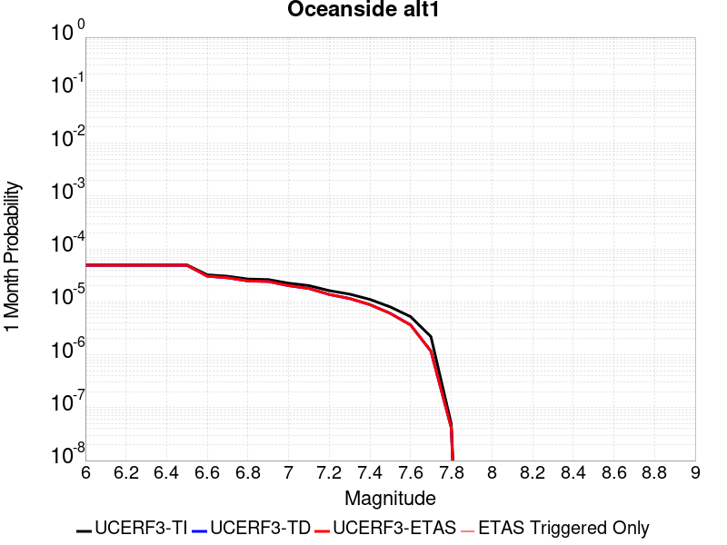 | 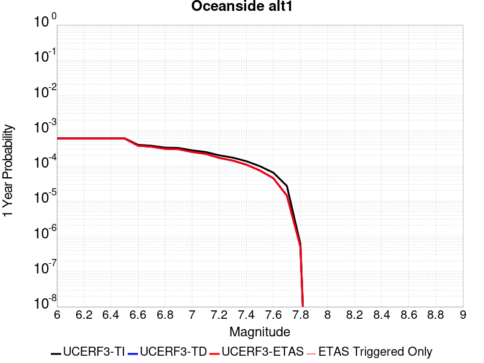 | 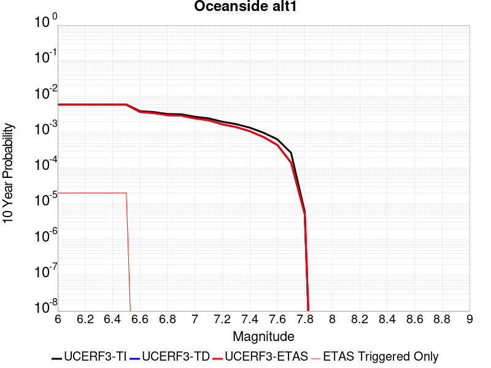 |

| Magnitude | 1 wk TI Prob | 1 wk TD Prob | 1 wk ETAS Prob | 1 wk ETAS/TD Gain | 1 wk ETAS Triggered Only | 1 mo TI Prob | 1 mo TD Prob | 1 mo ETAS Prob | 1 mo ETAS/TD Gain | 1 mo ETAS Triggered Only | 1 yr TI Prob | 1 yr TD Prob | 1 yr ETAS Prob | 1 yr ETAS/TD Gain | 1 yr ETAS Triggered Only | 10 yr TI Prob | 10 yr TD Prob | 10 yr ETAS Prob | 10 yr ETAS/TD Gain | 10 yr ETAS Triggered Only |
|-----|-----|-----|-----|-----|-----|-----|-----|-----|-----|-----|-----|-----|-----|-----|-----|-----|-----|-----|-----|-----|
| 6.0 | 1.1617542E-5 | 1.1423493E-5 | 1.1423493E-5 | 1.0 | 0.0 | 4.9788516E-5 | 4.8956997E-5 | 4.8956997E-5 | 1.0 | 0.0 | 6.060066E-4 | 5.9590454E-4 | 5.9590454E-4 | 1.0 | 0.0 | 0.0060435664 | 0.005944664 | 0.0059645455 | 1.0033444 | 2.0E-5 |
| 6.1 | 1.1617542E-5 | 1.1423493E-5 | 1.1423493E-5 | 1.0 | 0.0 | 4.9788516E-5 | 4.8956997E-5 | 4.8956997E-5 | 1.0 | 0.0 | 6.060066E-4 | 5.9590454E-4 | 5.9590454E-4 | 1.0 | 0.0 | 0.0060435664 | 0.005944664 | 0.0059645455 | 1.0033444 | 2.0E-5 |
| 6.2 | 1.1617542E-5 | 1.1423493E-5 | 1.1423493E-5 | 1.0 | 0.0 | 4.9788516E-5 | 4.8956997E-5 | 4.8956997E-5 | 1.0 | 0.0 | 6.060066E-4 | 5.9590454E-4 | 5.9590454E-4 | 1.0 | 0.0 | 0.0060435664 | 0.005944664 | 0.0059645455 | 1.0033444 | 2.0E-5 |
| 6.3 | 1.1617542E-5 | 1.1423493E-5 | 1.1423493E-5 | 1.0 | 0.0 | 4.9788516E-5 | 4.8956997E-5 | 4.8956997E-5 | 1.0 | 0.0 | 6.060066E-4 | 5.9590454E-4 | 5.9590454E-4 | 1.0 | 0.0 | 0.0060435664 | 0.005944664 | 0.0059645455 | 1.0033444 | 2.0E-5 |
| 6.4 | 1.1617542E-5 | 1.1423493E-5 | 1.1423493E-5 | 1.0 | 0.0 | 4.9788516E-5 | 4.8956997E-5 | 4.8956997E-5 | 1.0 | 0.0 | 6.060066E-4 | 5.9590454E-4 | 5.9590454E-4 | 1.0 | 0.0 | 0.0060435664 | 0.005944664 | 0.0059645455 | 1.0033444 | 2.0E-5 |
| 6.5 | 1.1617542E-5 | 1.1423493E-5 | 1.1423493E-5 | 1.0 | 0.0 | 4.9788516E-5 | 4.8956997E-5 | 4.8956997E-5 | 1.0 | 0.0 | 6.060066E-4 | 5.9590454E-4 | 5.9590454E-4 | 1.0 | 0.0 | 0.0060435664 | 0.005944664 | 0.0059645455 | 1.0033444 | 2.0E-5 |
| 6.6 | 7.561768E-6 | 7.1336153E-6 | 7.1336153E-6 | 1.0 | 0.0 | 3.2407173E-5 | 3.0572286E-5 | 3.0572286E-5 | 1.0 | 0.0 | 3.9448592E-4 | 3.7215507E-4 | 3.7215507E-4 | 1.0 | 0.0 | 0.0039378637 | 0.00371543 | 0.00371543 | 1.0 | 0.0 |
| 6.7 | 7.1042605E-6 | 6.6556854E-6 | 6.6556854E-6 | 1.0 | 0.0 | 3.0446476E-5 | 2.8524059E-5 | 2.8524059E-5 | 1.0 | 0.0 | 3.706228E-4 | 3.472259E-4 | 3.472259E-4 | 1.0 | 0.0 | 0.0037000529 | 0.003466917 | 0.003466917 | 1.0 | 0.0 |
| 6.8 | 6.285554E-6 | 5.799706E-6 | 5.799706E-6 | 1.0 | 0.0 | 2.693781E-5 | 2.4855648E-5 | 2.4855648E-5 | 1.0 | 0.0 | 3.2791847E-4 | 3.0257605E-4 | 3.0257605E-4 | 1.0 | 0.0 | 0.0032743502 | 0.0030216982 | 0.0030216982 | 1.0 | 0.0 |
| 6.9 | 6.148883E-6 | 5.6565445E-6 | 5.6565445E-6 | 1.0 | 0.0 | 2.635209E-5 | 2.424211E-5 | 2.424211E-5 | 1.0 | 0.0 | 3.2078946E-4 | 2.9510827E-4 | 2.9510827E-4 | 1.0 | 0.0 | 0.003203268 | 0.0029472208 | 0.0029472208 | 1.0 | 0.0 |
| 7.0 | 5.253857E-6 | 4.722404E-6 | 4.722404E-6 | 1.0 | 0.0 | 2.2516335E-5 | 2.0238718E-5 | 2.0238718E-5 | 1.0 | 0.0 | 2.7410188E-4 | 2.4637886E-4 | 2.4637886E-4 | 1.0 | 0.0 | 0.0027376404 | 0.0024610884 | 0.0024610884 | 1.0 | 0.0 |
| 7.1 | 4.730754E-6 | 4.17851E-6 | 4.17851E-6 | 1.0 | 0.0 | 2.0274503E-5 | 1.7907778E-5 | 1.7907778E-5 | 1.0 | 0.0 | 2.468141E-4 | 2.1800565E-4 | 2.1800565E-4 | 1.0 | 0.0 | 0.0024654015 | 0.0021779444 | 0.0021779444 | 1.0 | 0.0 |
| 7.2 | 3.7998386E-6 | 3.214026E-6 | 3.214026E-6 | 1.0 | 0.0 | 1.6284921E-5 | 1.37743245E-5 | 1.37743245E-5 | 1.0 | 0.0 | 1.9825088E-4 | 1.6768962E-4 | 1.6768962E-4 | 1.0 | 0.0 | 0.001980741 | 0.001675643 | 0.001675643 | 1.0 | 0.0 |
| 7.3 | 3.2656465E-6 | 2.698376E-6 | 2.698376E-6 | 1.0 | 0.0 | 1.3995553E-5 | 1.1564418E-5 | 1.1564418E-5 | 1.0 | 0.0 | 1.7038253E-4 | 1.407878E-4 | 1.407878E-4 | 1.0 | 0.0 | 0.0017025196 | 0.0014069972 | 0.0014069972 | 1.0 | 0.0 |
| 7.4 | 2.593703E-6 | 2.0680277E-6 | 2.0680277E-6 | 1.0 | 0.0 | 1.1115822E-5 | 8.862946E-6 | 8.862946E-6 | 1.0 | 0.0 | 1.3532673E-4 | 1.0790111E-4 | 1.0790111E-4 | 1.0 | 0.0 | 0.0013524436 | 0.0010784961 | 0.0010784961 | 1.0 | 0.0 |
| 7.5 | 1.8715585E-6 | 1.4137177E-6 | 1.4137177E-6 | 1.0 | 0.0 | 8.020941E-6 | 6.0587763E-6 | 6.0587763E-6 | 1.0 | 0.0 | 9.7650576E-5 | 7.376316E-5 | 7.376316E-5 | 1.0 | 0.0 | 9.7607676E-4 | 7.3739287E-4 | 7.3739287E-4 | 1.0 | 0.0 |
| 7.6 | 1.2246786E-6 | 8.5268175E-7 | 8.5268175E-7 | 1.0 | 0.0 | 5.248612E-6 | 3.6543456E-6 | 3.6543456E-6 | 1.0 | 0.0 | 6.389998E-5 | 4.4490793E-5 | 4.4490793E-5 | 1.0 | 0.0 | 6.3881604E-4 | 4.4482335E-4 | 4.4482335E-4 | 1.0 | 0.0 |
| 7.7 | 5.140719E-7 | 2.734703E-7 | 2.734703E-7 | 1.0 | 0.0 | 2.2031636E-6 | 1.1720151E-6 | 1.1720151E-6 | 1.0 | 0.0 | 2.6823185E-5 | 1.4269205E-5 | 1.4269205E-5 | 1.0 | 0.0 | 2.6819948E-4 | 1.4268424E-4 | 1.4268424E-4 | 1.0 | 0.0 |
| 7.8 | 1.16056995E-8 | 9.782373E-9 | 9.782373E-9 | 1.0 | 0.0 | 4.9738713E-8 | 4.1924455E-8 | 4.1924455E-8 | 1.0 | 0.0 | 6.0556863E-7 | 5.1043025E-7 | 5.1043025E-7 | 1.0 | 0.0 | 6.05567E-6 | 5.1043025E-6 | 5.1043025E-6 | 1.0 | 0.0 |

## Calaveras (Central) 2011 CFM
*[(top)](#table-of-contents)*

| 1 Week | 1 Month | 1 Year | 10 Year |
|-----|-----|-----|-----|
|  | 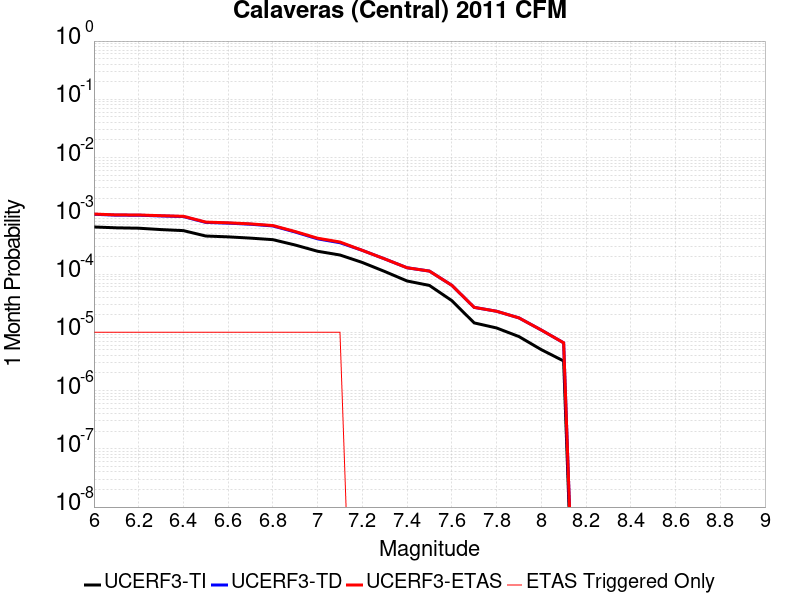 | 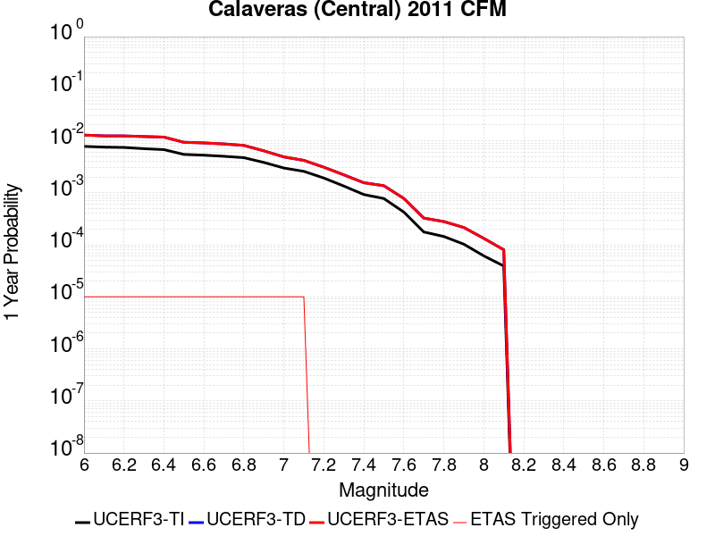 | 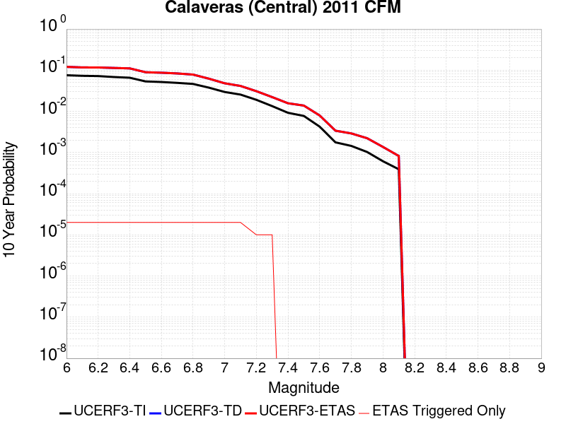 |

| Magnitude | 1 wk TI Prob | 1 wk TD Prob | 1 wk ETAS Prob | 1 wk ETAS/TD Gain | 1 wk ETAS Triggered Only | 1 mo TI Prob | 1 mo TD Prob | 1 mo ETAS Prob | 1 mo ETAS/TD Gain | 1 mo ETAS Triggered Only | 1 yr TI Prob | 1 yr TD Prob | 1 yr ETAS Prob | 1 yr ETAS/TD Gain | 1 yr ETAS Triggered Only | 10 yr TI Prob | 10 yr TD Prob | 10 yr ETAS Prob | 10 yr ETAS/TD Gain | 10 yr ETAS Triggered Only |
|-----|-----|-----|-----|-----|-----|-----|-----|-----|-----|-----|-----|-----|-----|-----|-----|-----|-----|-----|-----|-----|
| 6.0 | 1.5010907E-4 | 2.481574E-4 | 2.481574E-4 | 1.0 | 0.0 | 6.4316596E-4 | 0.0010621005 | 0.0010720899 | 1.0094053 | 1.0E-5 | 0.0078024664 | 0.012850073 | 0.012859945 | 1.0007682 | 1.0E-5 | 0.07534136 | 0.120401435 | 0.120419025 | 1.0001462 | 2.0E-5 |
| 6.1 | 1.4521465E-4 | 2.397987E-4 | 2.397987E-4 | 1.0 | 0.0 | 6.222001E-4 | 0.0010263061 | 0.0010362958 | 1.0097337 | 1.0E-5 | 0.0075490056 | 0.012419341 | 0.012429217 | 1.0007952 | 1.0E-5 | 0.07297657 | 0.11667323 | 0.1166909 | 1.0001514 | 2.0E-5 |
| 6.2 | 1.429998E-4 | 2.3911126E-4 | 2.3911126E-4 | 1.0 | 0.0 | 6.127123E-4 | 0.0010233623 | 0.001033352 | 1.0097617 | 1.0E-5 | 0.007434286 | 0.01238394 | 0.012393816 | 1.0007975 | 1.0E-5 | 0.07190444 | 0.1163272 | 0.11634487 | 1.0001519 | 2.0E-5 |
| 6.3 | 1.3536277E-4 | 2.3242626E-4 | 2.3242626E-4 | 1.0 | 0.0 | 5.799972E-4 | 9.947343E-4 | 0.0010047244 | 1.0100429 | 1.0E-5 | 0.0070386264 | 0.012040132 | 0.012050011 | 1.0008205 | 1.0E-5 | 0.0681982 | 0.11323977 | 0.11325751 | 1.0001566 | 2.0E-5 |
| 6.4 | 1.2993296E-4 | 2.2666177E-4 | 2.2666177E-4 | 1.0 | 0.0 | 5.5673666E-4 | 9.700479E-4 | 9.800382E-4 | 1.0102987 | 1.0E-5 | 0.006757223 | 0.011742937 | 0.01175282 | 1.0008416 | 1.0E-5 | 0.06555412 | 0.11051771 | 0.1105355 | 1.0001609 | 2.0E-5 |
| 6.5 | 1.0498927E-4 | 1.7981697E-4 | 1.7981697E-4 | 1.0 | 0.0 | 4.498764E-4 | 7.704157E-4 | 7.80408E-4 | 1.01297 | 1.0E-5 | 0.005463498 | 0.00933924 | 0.009349148 | 1.0010607 | 1.0E-5 | 0.053311124 | 0.089199215 | 0.08921743 | 1.0002042 | 2.0E-5 |
| 6.6 | 1.0157505E-4 | 1.7469203E-4 | 1.7469203E-4 | 1.0 | 0.0 | 4.35249E-4 | 7.484645E-4 | 7.58457E-4 | 1.0133507 | 1.0E-5 | 0.0052862884 | 0.009074297 | 0.009084206 | 1.001092 | 1.0E-5 | 0.05162293 | 0.08677671 | 0.08679497 | 1.0002105 | 2.0E-5 |
| 6.7 | 9.660386E-5 | 1.6728524E-4 | 1.6728524E-4 | 1.0 | 0.0 | 4.1395082E-4 | 7.1673887E-4 | 7.2673167E-4 | 1.0139421 | 1.0E-5 | 0.0050282106 | 0.008691208 | 0.008701121 | 1.0011406 | 1.0E-5 | 0.049159497 | 0.083266065 | 0.0832844 | 1.0002202 | 2.0E-5 |
| 6.8 | 9.089927E-5 | 1.5643016E-4 | 1.5643016E-4 | 1.0 | 0.0 | 3.8951015E-4 | 6.702439E-4 | 6.802372E-4 | 1.01491 | 1.0E-5 | 0.0047319788 | 0.008129478 | 0.008139397 | 1.0012201 | 1.0E-5 | 0.046324775 | 0.078159414 | 0.078177854 | 1.0002359 | 2.0E-5 |
| 6.9 | 7.353187E-5 | 1.2295354E-4 | 1.2295354E-4 | 1.0 | 0.0 | 3.150985E-4 | 5.2683795E-4 | 5.3683267E-4 | 1.0189712 | 1.0E-5 | 0.0038295772 | 0.006395508 | 0.006405444 | 1.0015537 | 1.0E-5 | 0.037642512 | 0.062187865 | 0.06220662 | 1.0003016 | 2.0E-5 |
| 7.0 | 5.746064E-5 | 9.3887444E-5 | 9.3887444E-5 | 1.0 | 0.0 | 2.4623662E-4 | 4.0231308E-4 | 4.1230905E-4 | 1.0248463 | 1.0E-5 | 0.0029938098 | 0.004887232 | 0.0048971833 | 1.0020361 | 1.0E-5 | 0.02953797 | 0.04798685 | 0.04800589 | 1.0003967 | 2.0E-5 |
| 7.1 | 4.9557195E-5 | 8.052461E-5 | 8.052461E-5 | 1.0 | 0.0 | 2.123707E-4 | 3.4506017E-4 | 3.5505672E-4 | 1.0289705 | 1.0E-5 | 0.0025825473 | 0.0041930773 | 0.0042030355 | 1.0023749 | 1.0E-5 | 0.0255274 | 0.041373078 | 0.04139225 | 1.0004634 | 2.0E-5 |
| 7.2 | 3.687595E-5 | 5.9524526E-5 | 5.9524526E-5 | 1.0 | 0.0 | 1.5803022E-4 | 2.5508032E-4 | 2.5508032E-4 | 1.0 | 0.0 | 0.0019223199 | 0.0031012094 | 0.0031012094 | 1.0 | 0.0 | 0.01905776 | 0.030883716 | 0.030893408 | 1.0003138 | 1.0E-5 |
| 7.3 | 2.5846984E-5 | 4.247213E-5 | 4.247213E-5 | 1.0 | 0.0 | 1.1076809E-4 | 1.8201082E-4 | 1.8201082E-4 | 1.0 | 0.0 | 0.0013477671 | 0.002213747 | 0.002213747 | 1.0 | 0.0 | 0.013396223 | 0.02217554 | 0.022185316 | 1.000441 | 1.0E-5 |
| 7.4 | 1.7747854E-5 | 2.9936204E-5 | 2.9936204E-5 | 1.0 | 0.0 | 7.6060016E-5 | 1.2829172E-4 | 1.2829172E-4 | 1.0 | 0.0 | 9.2563726E-4 | 0.0015608355 | 0.0015608355 | 1.0 | 0.0 | 0.009217911 | 0.015709236 | 0.015709236 | 1.0 | 0.0 |
| 7.5 | 1.4883479E-5 | 2.6243379E-5 | 2.6243379E-5 | 1.0 | 0.0 | 6.378478E-5 | 1.1246678E-4 | 1.1246678E-4 | 1.0 | 0.0 | 7.76303E-4 | 0.0013684258 | 0.0013684258 | 1.0 | 0.0 | 0.0077359667 | 0.013802425 | 0.013802425 | 1.0 | 0.0 |
| 7.6 | 8.166975E-6 | 1.4963478E-5 | 1.4963478E-5 | 1.0 | 0.0 | 3.5000852E-5 | 6.412763E-5 | 6.412763E-5 | 1.0 | 0.0 | 4.2605202E-4 | 7.804755E-4 | 7.804755E-4 | 1.0 | 0.0 | 0.004252361 | 0.00793984 | 0.00793984 | 1.0 | 0.0 |
| 7.7 | 3.3858064E-6 | 6.253914E-6 | 6.253914E-6 | 1.0 | 0.0 | 1.4510518E-5 | 2.6802214E-5 | 2.6802214E-5 | 1.0 | 0.0 | 1.7665124E-4 | 3.2626814E-4 | 3.2626814E-4 | 1.0 | 0.0 | 0.0017651088 | 0.0033882293 | 0.0033882293 | 1.0 | 0.0 |
| 7.8 | 2.7721615E-6 | 5.3663807E-6 | 5.3663807E-6 | 1.0 | 0.0 | 1.1880637E-5 | 2.2998573E-5 | 2.2998573E-5 | 1.0 | 0.0 | 1.4463716E-4 | 2.799717E-4 | 2.799717E-4 | 1.0 | 0.0 | 0.0014454306 | 0.0029074624 | 0.0029074624 | 1.0 | 0.0 |
| 7.9 | 1.9736292E-6 | 4.1284193E-6 | 4.1284193E-6 | 1.0 | 0.0 | 8.4583835E-6 | 1.7693106E-5 | 1.7693106E-5 | 1.0 | 0.0 | 1.0297595E-4 | 2.1539231E-4 | 2.1539231E-4 | 1.0 | 0.0 | 0.0010292825 | 0.0022236116 | 0.0022236116 | 1.0 | 0.0 |
| 8.0 | 1.1767289E-6 | 2.5544743E-6 | 2.5544743E-6 | 1.0 | 0.0 | 5.0431145E-6 | 1.0947701E-5 | 1.0947701E-5 | 1.0 | 0.0 | 6.139818E-5 | 1.3328013E-4 | 1.3328013E-4 | 1.0 | 0.0 | 6.1381224E-4 | 0.0013660848 | 0.0013660848 | 1.0 | 0.0 |
| 8.1 | 7.5112825E-7 | 1.5409794E-6 | 1.5409794E-6 | 1.0 | 0.0 | 3.2191172E-6 | 6.6041807E-6 | 6.6041807E-6 | 1.0 | 0.0 | 3.9192048E-5 | 8.0402955E-5 | 8.0402955E-5 | 1.0 | 0.0 | 3.9185135E-4 | 8.235564E-4 | 8.235564E-4 | 1.0 | 0.0 |

## Elmore Ranch
*[(top)](#table-of-contents)*

| 1 Week | 1 Month | 1 Year | 10 Year |
|-----|-----|-----|-----|
| 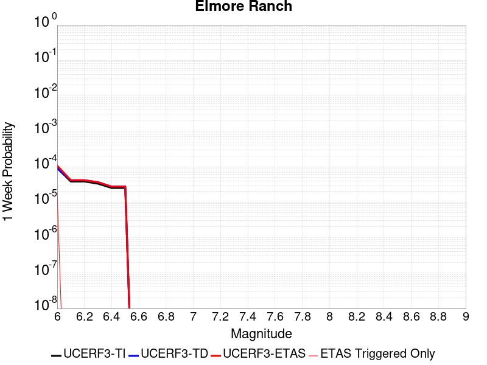 | 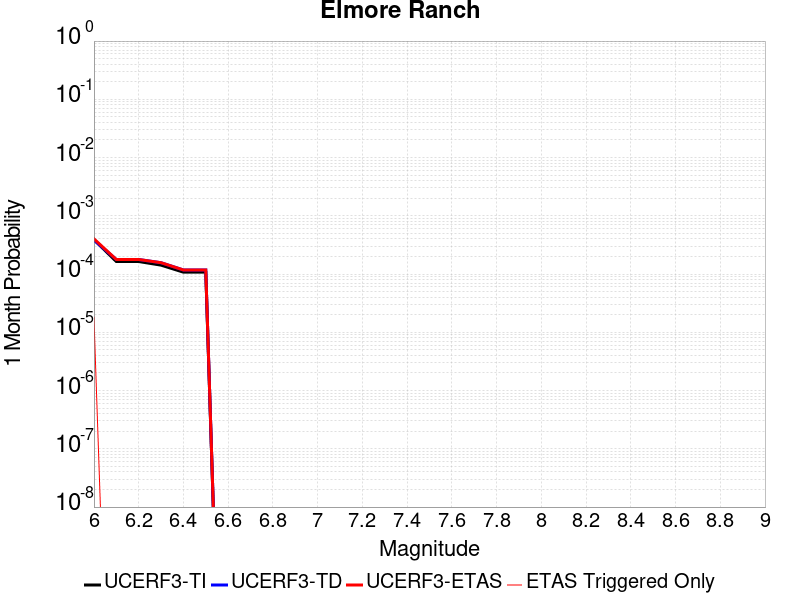 | 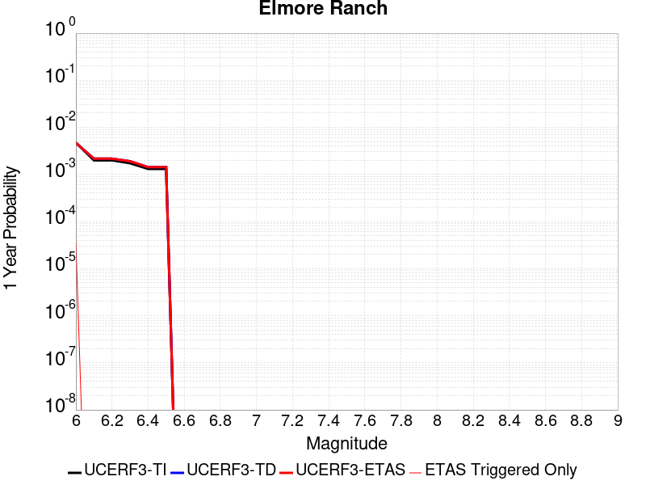 | 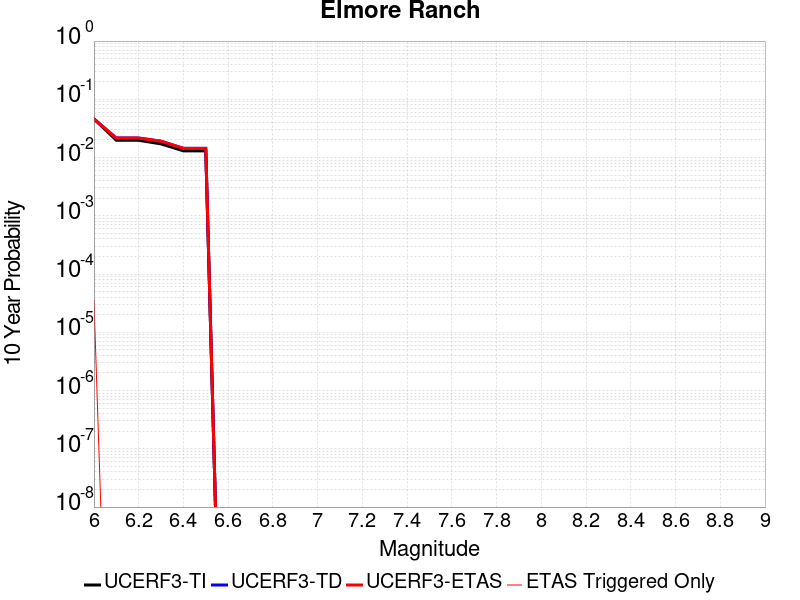 |

| Magnitude | 1 wk TI Prob | 1 wk TD Prob | 1 wk ETAS Prob | 1 wk ETAS/TD Gain | 1 wk ETAS Triggered Only | 1 mo TI Prob | 1 mo TD Prob | 1 mo ETAS Prob | 1 mo ETAS/TD Gain | 1 mo ETAS Triggered Only | 1 yr TI Prob | 1 yr TD Prob | 1 yr ETAS Prob | 1 yr ETAS/TD Gain | 1 yr ETAS Triggered Only | 10 yr TI Prob | 10 yr TD Prob | 10 yr ETAS Prob | 10 yr ETAS/TD Gain | 10 yr ETAS Triggered Only |
|-----|-----|-----|-----|-----|-----|-----|-----|-----|-----|-----|-----|-----|-----|-----|-----|-----|-----|-----|-----|-----|
| 6.0 | 9.102099E-5 | 8.952015E-5 | 9.951925E-5 | 1.1116967 | 1.0E-5 | 3.9003167E-4 | 3.8361453E-4 | 3.9361068E-4 | 1.0260578 | 1.0E-5 | 0.0047383 | 0.004662009 | 0.0046819155 | 1.00427 | 2.0E-5 | 0.046385348 | 0.045870975 | 0.045890056 | 1.000416 | 2.0E-5 |
| 6.1 | 3.8306698E-5 | 4.1498504E-5 | 4.1498504E-5 | 1.0 | 0.0 | 1.6416123E-4 | 1.7784268E-4 | 1.7784268E-4 | 1.0 | 0.0 | 0.0019968306 | 0.0021631396 | 0.0021631396 | 1.0 | 0.0 | 0.019789828 | 0.021628205 | 0.021628205 | 1.0 | 0.0 |
| 6.2 | 3.8306698E-5 | 4.1498504E-5 | 4.1498504E-5 | 1.0 | 0.0 | 1.6416123E-4 | 1.7784268E-4 | 1.7784268E-4 | 1.0 | 0.0 | 0.0019968306 | 0.0021631396 | 0.0021631396 | 1.0 | 0.0 | 0.019789828 | 0.021628205 | 0.021628205 | 1.0 | 0.0 |
| 6.3 | 3.3197924E-5 | 3.6554302E-5 | 3.6554302E-5 | 1.0 | 0.0 | 1.4226905E-4 | 1.5665586E-4 | 1.5665586E-4 | 1.0 | 0.0 | 0.0017307495 | 0.001905917 | 0.001905917 | 1.0 | 0.0 | 0.017173318 | 0.01908996 | 0.01908996 | 1.0 | 0.0 |
| 6.4 | 2.5148964E-5 | 2.7420487E-5 | 2.7420487E-5 | 1.0 | 0.0 | 1.0777682E-4 | 1.17514726E-4 | 1.17514726E-4 | 1.0 | 0.0 | 0.0013113929 | 0.0014304507 | 0.0014304507 | 1.0 | 0.0 | 0.01303681 | 0.014387194 | 0.014387194 | 1.0 | 0.0 |
| 6.5 | 2.5148964E-5 | 2.7420487E-5 | 2.7420487E-5 | 1.0 | 0.0 | 1.0777682E-4 | 1.17514726E-4 | 1.17514726E-4 | 1.0 | 0.0 | 0.0013113929 | 0.0014304507 | 0.0014304507 | 1.0 | 0.0 | 0.01303681 | 0.014387194 | 0.014387194 | 1.0 | 0.0 |

## Great Valley 07 (Orestimba)
*[(top)](#table-of-contents)*

| 1 Week | 1 Month | 1 Year | 10 Year |
|-----|-----|-----|-----|
|  |  | 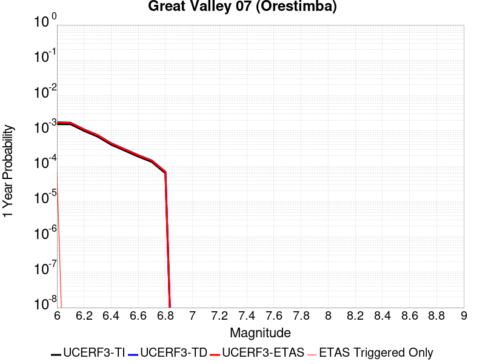 | 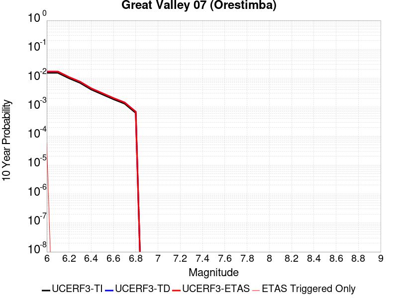 |

| Magnitude | 1 wk TI Prob | 1 wk TD Prob | 1 wk ETAS Prob | 1 wk ETAS/TD Gain | 1 wk ETAS Triggered Only | 1 mo TI Prob | 1 mo TD Prob | 1 mo ETAS Prob | 1 mo ETAS/TD Gain | 1 mo ETAS Triggered Only | 1 yr TI Prob | 1 yr TD Prob | 1 yr ETAS Prob | 1 yr ETAS/TD Gain | 1 yr ETAS Triggered Only | 10 yr TI Prob | 10 yr TD Prob | 10 yr ETAS Prob | 10 yr ETAS/TD Gain | 10 yr ETAS Triggered Only |
|-----|-----|-----|-----|-----|-----|-----|-----|-----|-----|-----|-----|-----|-----|-----|-----|-----|-----|-----|-----|-----|
| 6.0 | 2.9687902E-5 | 3.27575E-5 | 3.27575E-5 | 1.0 | 0.0 | 1.2722766E-4 | 1.4038214E-4 | 1.5038073E-4 | 1.0712241 | 1.0E-5 | 0.0015478961 | 0.0017078844 | 0.0017278503 | 1.0116904 | 2.0E-5 | 0.015371585 | 0.016955135 | 0.016974797 | 1.0011595 | 2.0E-5 |
| 6.1 | 2.9687902E-5 | 3.27575E-5 | 3.27575E-5 | 1.0 | 0.0 | 1.2722766E-4 | 1.4038214E-4 | 1.5038073E-4 | 1.0712241 | 1.0E-5 | 0.0015478961 | 0.0017078844 | 0.0017178673 | 1.0058452 | 1.0E-5 | 0.015371585 | 0.016955135 | 0.016964966 | 1.0005798 | 1.0E-5 |
| 6.2 | 1.9231524E-5 | 2.1159167E-5 | 2.1159167E-5 | 1.0 | 0.0 | 8.2418206E-5 | 9.067912E-5 | 9.067912E-5 | 1.0 | 0.0 | 0.0010029797 | 0.0011034822 | 0.0011034822 | 1.0 | 0.0 | 0.00998465 | 0.01098244 | 0.01098244 | 1.0 | 0.0 |
| 6.3 | 1.324766E-5 | 1.4548534E-5 | 1.4548534E-5 | 1.0 | 0.0 | 5.6774446E-5 | 6.234942E-5 | 6.234942E-5 | 1.0 | 0.0 | 6.910097E-4 | 7.5884897E-4 | 7.5884897E-4 | 1.0 | 0.0 | 0.006888649 | 0.0075635235 | 0.0075635235 | 1.0 | 0.0 |
| 6.4 | 7.818645E-6 | 8.57284E-6 | 8.57284E-6 | 1.0 | 0.0 | 3.3508048E-5 | 3.6740246E-5 | 3.6740246E-5 | 1.0 | 0.0 | 4.078841E-4 | 4.4722404E-4 | 4.4722404E-4 | 1.0 | 0.0 | 0.004071363 | 0.0044635804 | 0.0044635804 | 1.0 | 0.0 |
| 6.5 | 5.3076565E-6 | 5.8178007E-6 | 5.8178007E-6 | 1.0 | 0.0 | 2.27469E-5 | 2.4933206E-5 | 2.4933206E-5 | 1.0 | 0.0 | 2.7690834E-4 | 3.035216E-4 | 3.035216E-4 | 1.0 | 0.0 | 0.0027656353 | 0.00303128 | 0.00303128 | 1.0 | 0.0 |
| 6.6 | 3.6003578E-6 | 3.9484953E-6 | 3.9484953E-6 | 1.0 | 0.0 | 1.5430012E-5 | 1.6922022E-5 | 1.6922022E-5 | 1.0 | 0.0 | 1.8784421E-4 | 2.0600771E-4 | 2.0600771E-4 | 1.0 | 0.0 | 0.0018768552 | 0.0020583214 | 0.0020583214 | 1.0 | 0.0 |
| 6.7 | 2.5361826E-6 | 2.7834678E-6 | 2.7834678E-6 | 1.0 | 0.0 | 1.0869308E-5 | 1.1929101E-5 | 1.1929101E-5 | 1.0 | 0.0 | 1.3232579E-4 | 1.4522845E-4 | 1.4522845E-4 | 1.0 | 0.0 | 0.0013224703 | 0.0014514653 | 0.0014514653 | 1.0 | 0.0 |
| 6.8 | 1.2115831E-6 | 1.3313797E-6 | 1.3313797E-6 | 1.0 | 0.0 | 5.1924885E-6 | 5.7059065E-6 | 5.7059065E-6 | 1.0 | 0.0 | 6.3216714E-5 | 6.9468166E-5 | 6.9468166E-5 | 1.0 | 0.0 | 6.3198735E-4 | 6.945596E-4 | 6.945596E-4 | 1.0 | 0.0 |

## Great Valley 06 (Midland) 2011 CFM alt1
*[(top)](#table-of-contents)*

| 1 Week | 1 Month | 1 Year | 10 Year |
|-----|-----|-----|-----|
|  | 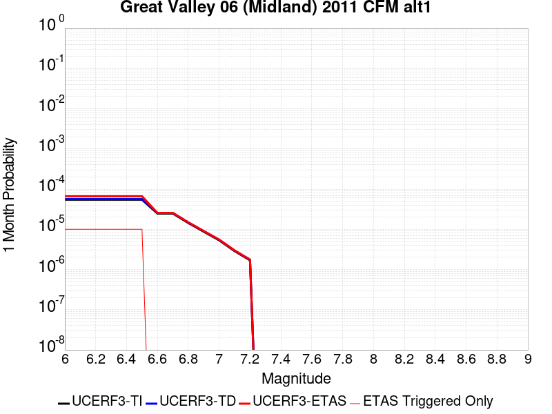 | 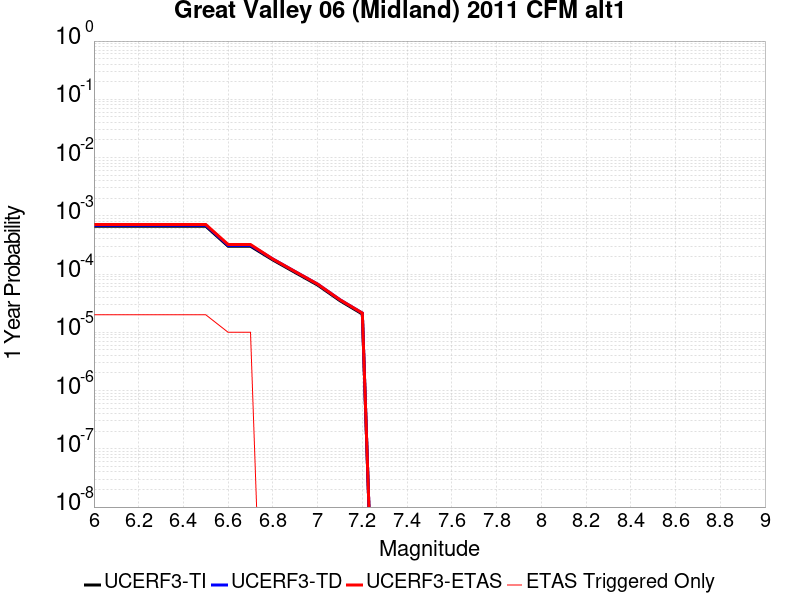 | 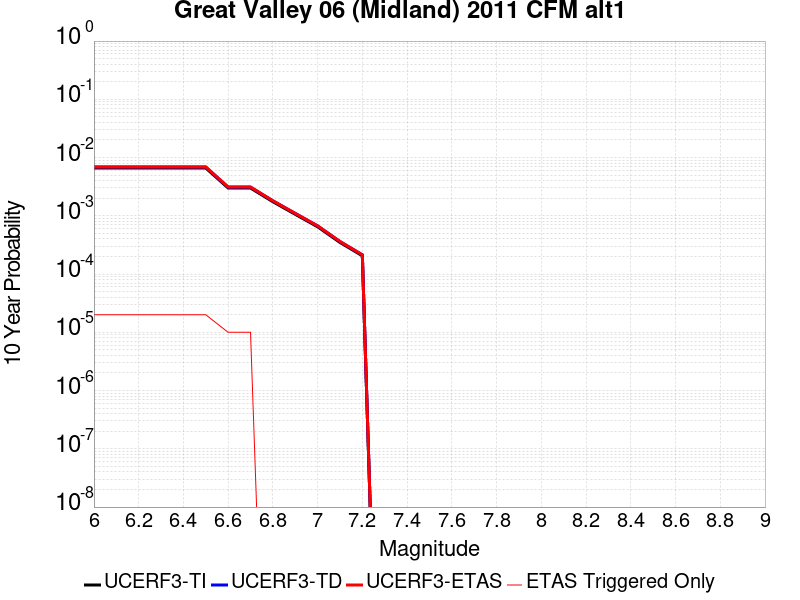 |

| Magnitude | 1 wk TI Prob | 1 wk TD Prob | 1 wk ETAS Prob | 1 wk ETAS/TD Gain | 1 wk ETAS Triggered Only | 1 mo TI Prob | 1 mo TD Prob | 1 mo ETAS Prob | 1 mo ETAS/TD Gain | 1 mo ETAS Triggered Only | 1 yr TI Prob | 1 yr TD Prob | 1 yr ETAS Prob | 1 yr ETAS/TD Gain | 1 yr ETAS Triggered Only | 10 yr TI Prob | 10 yr TD Prob | 10 yr ETAS Prob | 10 yr ETAS/TD Gain | 10 yr ETAS Triggered Only |
|-----|-----|-----|-----|-----|-----|-----|-----|-----|-----|-----|-----|-----|-----|-----|-----|-----|-----|-----|-----|-----|
| 6.0 | 1.2712525E-5 | 1.3210576E-5 | 2.3210443E-5 | 1.7569593 | 1.0E-5 | 5.4481112E-5 | 5.6615667E-5 | 6.66151E-5 | 1.1766195 | 1.0E-5 | 6.6310563E-4 | 6.8910315E-4 | 7.090894E-4 | 1.0290033 | 2.0E-5 | 0.0066113044 | 0.006872179 | 0.0068920413 | 1.0028902 | 2.0E-5 |
| 6.1 | 1.2712525E-5 | 1.3210576E-5 | 2.3210443E-5 | 1.7569593 | 1.0E-5 | 5.4481112E-5 | 5.6615667E-5 | 6.66151E-5 | 1.1766195 | 1.0E-5 | 6.6310563E-4 | 6.8910315E-4 | 7.090894E-4 | 1.0290033 | 2.0E-5 | 0.0066113044 | 0.006872179 | 0.0068920413 | 1.0028902 | 2.0E-5 |
| 6.2 | 1.2712525E-5 | 1.3210576E-5 | 2.3210443E-5 | 1.7569593 | 1.0E-5 | 5.4481112E-5 | 5.6615667E-5 | 6.66151E-5 | 1.1766195 | 1.0E-5 | 6.6310563E-4 | 6.8910315E-4 | 7.090894E-4 | 1.0290033 | 2.0E-5 | 0.0066113044 | 0.006872179 | 0.0068920413 | 1.0028902 | 2.0E-5 |
| 6.3 | 1.2712525E-5 | 1.3210576E-5 | 2.3210443E-5 | 1.7569593 | 1.0E-5 | 5.4481112E-5 | 5.6615667E-5 | 6.66151E-5 | 1.1766195 | 1.0E-5 | 6.6310563E-4 | 6.8910315E-4 | 7.090894E-4 | 1.0290033 | 2.0E-5 | 0.0066113044 | 0.006872179 | 0.0068920413 | 1.0028902 | 2.0E-5 |
| 6.4 | 1.2712525E-5 | 1.3210576E-5 | 2.3210443E-5 | 1.7569593 | 1.0E-5 | 5.4481112E-5 | 5.6615667E-5 | 6.66151E-5 | 1.1766195 | 1.0E-5 | 6.6310563E-4 | 6.8910315E-4 | 7.090894E-4 | 1.0290033 | 2.0E-5 | 0.0066113044 | 0.006872179 | 0.0068920413 | 1.0028902 | 2.0E-5 |
| 6.5 | 1.2712525E-5 | 1.3210576E-5 | 2.3210443E-5 | 1.7569593 | 1.0E-5 | 5.4481112E-5 | 5.6615667E-5 | 6.66151E-5 | 1.1766195 | 1.0E-5 | 6.6310563E-4 | 6.8910315E-4 | 7.090894E-4 | 1.0290033 | 2.0E-5 | 0.0066113044 | 0.006872179 | 0.0068920413 | 1.0028902 | 2.0E-5 |
| 6.6 | 5.7574384E-6 | 5.9706463E-6 | 5.9706463E-6 | 1.0 | 0.0 | 2.4674504E-5 | 2.5588255E-5 | 2.5588255E-5 | 1.0 | 0.0 | 3.0037065E-4 | 3.1149638E-4 | 3.2149328E-4 | 1.032093 | 1.0E-5 | 0.0029996498 | 0.0031109843 | 0.0031209532 | 1.0032045 | 1.0E-5 |
| 6.7 | 5.7574384E-6 | 5.9706463E-6 | 5.9706463E-6 | 1.0 | 0.0 | 2.4674504E-5 | 2.5588255E-5 | 2.5588255E-5 | 1.0 | 0.0 | 3.0037065E-4 | 3.1149638E-4 | 3.2149328E-4 | 1.032093 | 1.0E-5 | 0.0029996498 | 0.0031109843 | 0.0031209532 | 1.0032045 | 1.0E-5 |
| 6.8 | 3.3474828E-6 | 3.4693849E-6 | 3.4693849E-6 | 1.0 | 0.0 | 1.4346277E-5 | 1.4868716E-5 | 1.4868716E-5 | 1.0 | 0.0 | 1.7465191E-4 | 1.8101306E-4 | 1.8101306E-4 | 1.0 | 0.0 | 0.0017451472 | 0.0018088033 | 0.0018088033 | 1.0 | 0.0 |
| 6.9 | 2.035106E-6 | 2.1090357E-6 | 2.1090357E-6 | 1.0 | 0.0 | 8.721853E-6 | 9.038697E-6 | 9.038697E-6 | 1.0 | 0.0 | 1.0618339E-4 | 1.10041314E-4 | 1.10041314E-4 | 1.0 | 0.0 | 0.0010613267 | 0.0010999405 | 0.0010999405 | 1.0 | 0.0 |
| 7.0 | 1.2424716E-6 | 1.2878762E-6 | 1.2878762E-6 | 1.0 | 0.0 | 5.3248673E-6 | 5.51946E-6 | 5.51946E-6 | 1.0 | 0.0 | 6.482833E-5 | 6.7197805E-5 | 6.7197805E-5 | 1.0 | 0.0 | 6.480942E-4 | 6.718192E-4 | 6.718192E-4 | 1.0 | 0.0 |
| 7.1 | 6.6904556E-7 | 6.939035E-7 | 6.939035E-7 | 1.0 | 0.0 | 2.867335E-6 | 2.97387E-6 | 2.97387E-6 | 1.0 | 0.0 | 3.4909244E-5 | 3.6206526E-5 | 3.6206526E-5 | 1.0 | 0.0 | 3.490376E-4 | 3.6203177E-4 | 3.6203177E-4 | 1.0 | 0.0 |
| 7.2 | 3.948168E-7 | 4.095705E-7 | 4.095705E-7 | 1.0 | 0.0 | 1.6920709E-6 | 1.7553022E-6 | 1.7553022E-6 | 1.0 | 0.0 | 2.0600768E-5 | 2.1370803E-5 | 2.1370803E-5 | 1.0 | 0.0 | 2.0598859E-4 | 2.1370803E-4 | 2.1370803E-4 | 1.0 | 0.0 |

## Monterey Bay-Tularcitos
*[(top)](#table-of-contents)*

| 1 Week | 1 Month | 1 Year | 10 Year |
|-----|-----|-----|-----|
| 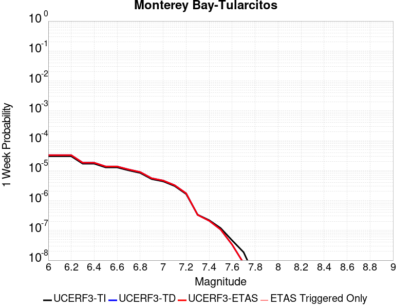 | 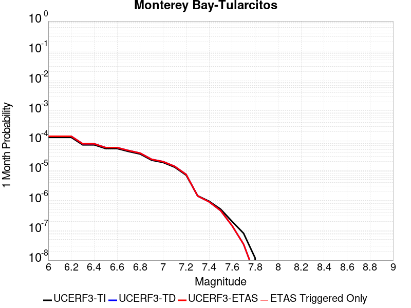 | 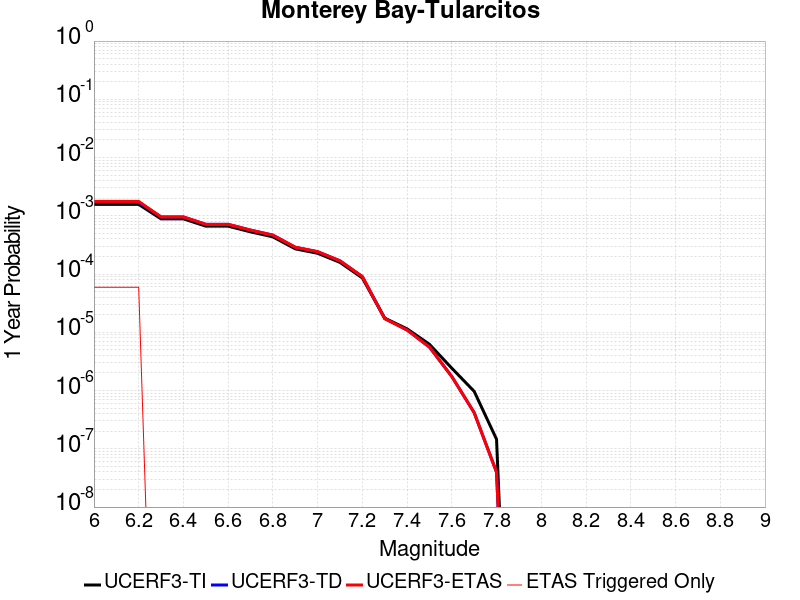 | 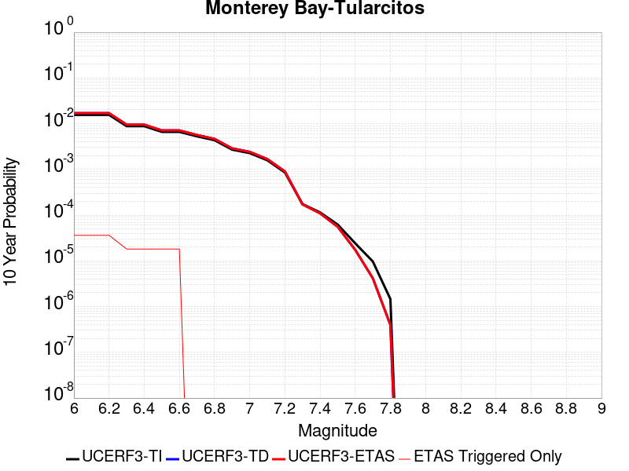 |

| Magnitude | 1 wk TI Prob | 1 wk TD Prob | 1 wk ETAS Prob | 1 wk ETAS/TD Gain | 1 wk ETAS Triggered Only | 1 mo TI Prob | 1 mo TD Prob | 1 mo ETAS Prob | 1 mo ETAS/TD Gain | 1 mo ETAS Triggered Only | 1 yr TI Prob | 1 yr TD Prob | 1 yr ETAS Prob | 1 yr ETAS/TD Gain | 1 yr ETAS Triggered Only | 10 yr TI Prob | 10 yr TD Prob | 10 yr ETAS Prob | 10 yr ETAS/TD Gain | 10 yr ETAS Triggered Only |
|-----|-----|-----|-----|-----|-----|-----|-----|-----|-----|-----|-----|-----|-----|-----|-----|-----|-----|-----|-----|-----|
| 6.0 | 3.0131365E-5 | 3.279877E-5 | 3.279877E-5 | 1.0 | 0.0 | 1.2912804E-4 | 1.4055918E-4 | 1.4055918E-4 | 1.0 | 0.0 | 0.001571 | 0.0017100703 | 0.0017200531 | 1.0058377 | 1.0E-5 | 0.015599402 | 0.016979916 | 0.016999578 | 1.0011579 | 2.0E-5 |
| 6.1 | 3.0131365E-5 | 3.279877E-5 | 3.279877E-5 | 1.0 | 0.0 | 1.2912804E-4 | 1.4055918E-4 | 1.4055918E-4 | 1.0 | 0.0 | 0.001571 | 0.0017100703 | 0.0017200531 | 1.0058377 | 1.0E-5 | 0.015599402 | 0.016979916 | 0.016999578 | 1.0011579 | 2.0E-5 |
| 6.2 | 3.0131365E-5 | 3.279877E-5 | 3.279877E-5 | 1.0 | 0.0 | 1.2912804E-4 | 1.4055918E-4 | 1.4055918E-4 | 1.0 | 0.0 | 0.001571 | 0.0017100703 | 0.0017200531 | 1.0058377 | 1.0E-5 | 0.015599402 | 0.016979916 | 0.016999578 | 1.0011579 | 2.0E-5 |
| 6.3 | 1.6998249E-5 | 1.8330798E-5 | 1.8330798E-5 | 1.0 | 0.0 | 7.28476E-5 | 7.85583E-5 | 7.85583E-5 | 1.0 | 0.0 | 8.865586E-4 | 9.5604634E-4 | 9.5604634E-4 | 1.0 | 0.0 | 0.0088303005 | 0.009521258 | 0.009531163 | 1.0010403 | 1.0E-5 |
| 6.4 | 1.6998249E-5 | 1.8330798E-5 | 1.8330798E-5 | 1.0 | 0.0 | 7.28476E-5 | 7.85583E-5 | 7.85583E-5 | 1.0 | 0.0 | 8.865586E-4 | 9.5604634E-4 | 9.5604634E-4 | 1.0 | 0.0 | 0.0088303005 | 0.009521258 | 0.009531163 | 1.0010403 | 1.0E-5 |
| 6.5 | 1.27470785E-5 | 1.3693312E-5 | 1.3693312E-5 | 1.0 | 0.0 | 5.4629192E-5 | 5.8684363E-5 | 5.8684363E-5 | 1.0 | 0.0 | 6.649074E-4 | 7.1425823E-4 | 7.1425823E-4 | 1.0 | 0.0 | 0.0066292146 | 0.007120678 | 0.007130607 | 1.0013944 | 1.0E-5 |
| 6.6 | 1.2739422E-5 | 1.36854E-5 | 1.36854E-5 | 1.0 | 0.0 | 5.4596385E-5 | 5.8650454E-5 | 5.8650454E-5 | 1.0 | 0.0 | 6.645082E-4 | 7.1384566E-4 | 7.1384566E-4 | 1.0 | 0.0 | 0.0066252467 | 0.007116579 | 0.007126508 | 1.0013952 | 1.0E-5 |
| 6.7 | 1.0160109E-5 | 1.0885755E-5 | 1.0885755E-5 | 1.0 | 0.0 | 4.35426E-5 | 4.665244E-5 | 4.665244E-5 | 1.0 | 0.0 | 5.300022E-4 | 5.6785246E-4 | 5.6785246E-4 | 1.0 | 0.0 | 0.005287399 | 0.0056647263 | 0.0056647263 | 1.0 | 0.0 |
| 6.8 | 8.349859E-6 | 8.932587E-6 | 8.932587E-6 | 1.0 | 0.0 | 3.578462E-5 | 3.8281985E-5 | 3.8281985E-5 | 1.0 | 0.0 | 4.3559066E-4 | 4.6598914E-4 | 4.6598914E-4 | 1.0 | 0.0 | 0.004347378 | 0.004650685 | 0.004650685 | 1.0 | 0.0 |
| 6.9 | 5.193639E-6 | 5.53643E-6 | 5.53643E-6 | 1.0 | 0.0 | 2.2258262E-5 | 2.372736E-5 | 2.372736E-5 | 1.0 | 0.0 | 2.7096065E-4 | 2.8884556E-4 | 2.8884556E-4 | 1.0 | 0.0 | 0.0027063051 | 0.0028850222 | 0.0028850222 | 1.0 | 0.0 |
| 7.0 | 4.359381E-6 | 4.643366E-6 | 4.643366E-6 | 1.0 | 0.0 | 1.8682927E-5 | 1.9900004E-5 | 1.9900004E-5 | 1.0 | 0.0 | 2.274409E-4 | 2.422586E-4 | 2.422586E-4 | 1.0 | 0.0 | 0.0022720827 | 0.002420238 | 0.002420238 | 1.0 | 0.0 |
| 7.1 | 3.0398533E-6 | 3.2310427E-6 | 3.2310427E-6 | 1.0 | 0.0 | 1.3027877E-5 | 1.3847267E-5 | 1.3847267E-5 | 1.0 | 0.0 | 1.5860285E-4 | 1.6858005E-4 | 1.6858005E-4 | 1.0 | 0.0 | 0.001584897 | 0.0016847793 | 0.0016847793 | 1.0 | 0.0 |
| 7.2 | 1.642335E-6 | 1.7333153E-6 | 1.7333153E-6 | 1.0 | 0.0 | 7.0385595E-6 | 7.428485E-6 | 7.428485E-6 | 1.0 | 0.0 | 8.569109E-5 | 9.044012E-5 | 9.044012E-5 | 1.0 | 0.0 | 8.5658056E-4 | 9.042358E-4 | 9.042358E-4 | 1.0 | 0.0 |
| 7.3 | 3.356842E-7 | 3.2952389E-7 | 3.2952389E-7 | 1.0 | 0.0 | 1.4386458E-6 | 1.4122444E-6 | 1.4122444E-6 | 1.0 | 0.0 | 1.7515373E-5 | 1.7193941E-5 | 1.7193941E-5 | 1.0 | 0.0 | 1.7513991E-4 | 1.719262E-4 | 1.719262E-4 | 1.0 | 0.0 |
| 7.4 | 2.1973483E-7 | 2.1006413E-7 | 2.1006413E-7 | 1.0 | 0.0 | 9.417204E-7 | 9.0027453E-7 | 9.0027453E-7 | 1.0 | 0.0 | 1.1465385E-5 | 1.0960787E-5 | 1.0960787E-5 | 1.0 | 0.0 | 1.1464794E-4 | 1.096025E-4 | 1.096025E-4 | 1.0 | 0.0 |
| 7.5 | 1.1944135E-7 | 1.0696043E-7 | 1.0696043E-7 | 1.0 | 0.0 | 5.118914E-7 | 4.5840173E-7 | 4.5840173E-7 | 1.0 | 0.0 | 6.23226E-6 | 5.581027E-6 | 5.581027E-6 | 1.0 | 0.0 | 6.2320854E-5 | 5.5808883E-5 | 5.5808883E-5 | 1.0 | 0.0 |
| 7.6 | 4.636058E-8 | 3.336489E-8 | 3.336489E-8 | 1.0 | 0.0 | 1.9868818E-7 | 1.4299238E-7 | 1.4299238E-7 | 1.0 | 0.0 | 2.419026E-6 | 1.7409308E-6 | 1.7409308E-6 | 1.0 | 0.0 | 2.4189996E-5 | 1.7409173E-5 | 1.7409173E-5 | 1.0 | 0.0 |
| 7.7 | 1.8588572E-8 | 8.003744E-9 | 8.003744E-9 | 1.0 | 0.0 | 7.9665305E-8 | 3.430176E-8 | 3.430176E-8 | 1.0 | 0.0 | 9.699246E-7 | 4.1762385E-7 | 4.1762385E-7 | 1.0 | 0.0 | 9.699204E-6 | 4.176231E-6 | 4.176231E-6 | 1.0 | 0.0 |
| 7.8 | 2.7960154E-9 | 7.6099427E-10 | 7.6099427E-10 | 1.0 | 0.0 | 1.1982923E-8 | 3.2614043E-9 | 3.2614043E-9 | 1.0 | 0.0 | 1.4589209E-7 | 3.9707597E-8 | 3.9707597E-8 | 1.0 | 0.0 | 1.4589199E-6 | 3.9707595E-7 | 3.9707595E-7 | 1.0 | 0.0 |

## Hunting Creek - Berryessa 2011 CFM
*[(top)](#table-of-contents)*

| 1 Week | 1 Month | 1 Year | 10 Year |
|-----|-----|-----|-----|
|  | 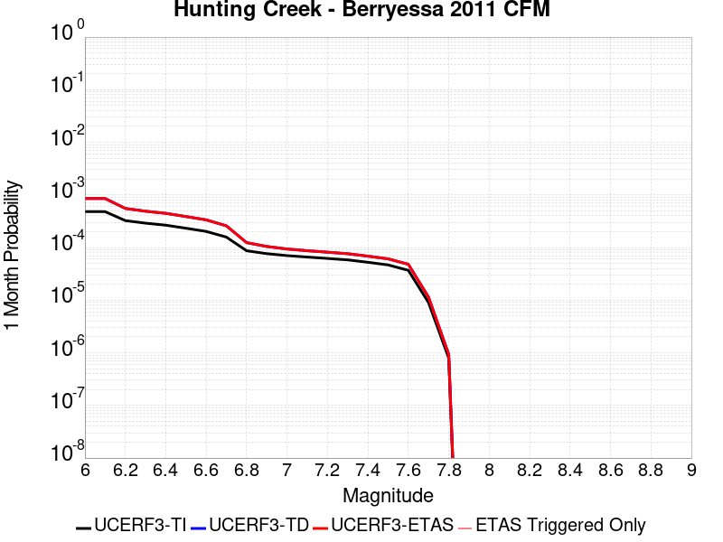 | 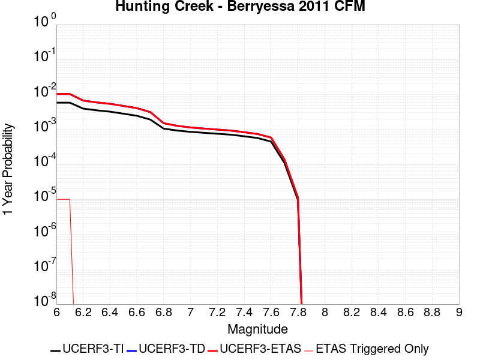 | 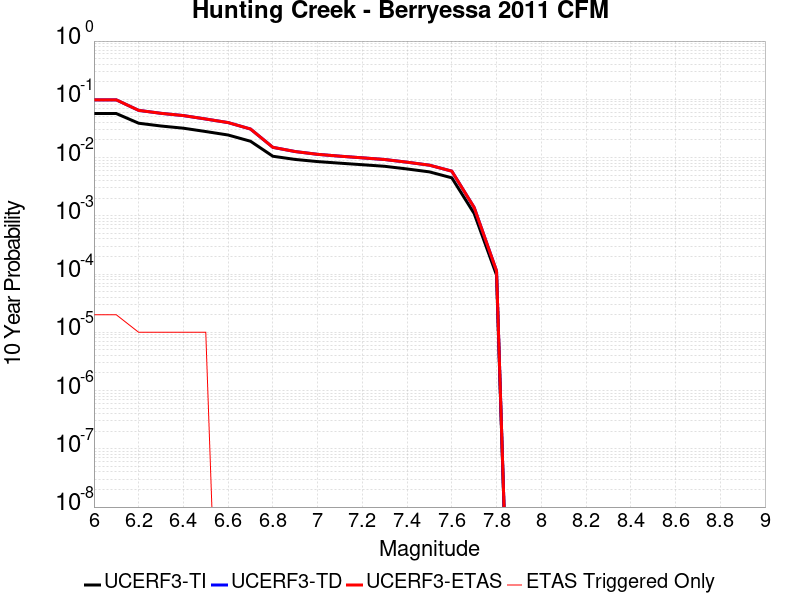 |

| Magnitude | 1 wk TI Prob | 1 wk TD Prob | 1 wk ETAS Prob | 1 wk ETAS/TD Gain | 1 wk ETAS Triggered Only | 1 mo TI Prob | 1 mo TD Prob | 1 mo ETAS Prob | 1 mo ETAS/TD Gain | 1 mo ETAS Triggered Only | 1 yr TI Prob | 1 yr TD Prob | 1 yr ETAS Prob | 1 yr ETAS/TD Gain | 1 yr ETAS Triggered Only | 10 yr TI Prob | 10 yr TD Prob | 10 yr ETAS Prob | 10 yr ETAS/TD Gain | 10 yr ETAS Triggered Only |
|-----|-----|-----|-----|-----|-----|-----|-----|-----|-----|-----|-----|-----|-----|-----|-----|-----|-----|-----|-----|-----|
| 6.0 | 1.1270982E-4 | 2.0012174E-4 | 2.0012174E-4 | 1.0 | 0.0 | 4.8295266E-4 | 8.5739547E-4 | 8.5739547E-4 | 1.0 | 0.0 | 0.0058641075 | 0.010386313 | 0.010396209 | 1.0009528 | 1.0E-5 | 0.057117578 | 0.09803703 | 0.098055065 | 1.000184 | 2.0E-5 |
| 6.1 | 1.1239393E-4 | 1.9960315E-4 | 1.9960315E-4 | 1.0 | 0.0 | 4.8159933E-4 | 8.551744E-4 | 8.551744E-4 | 1.0 | 0.0 | 0.0058477195 | 0.010359551 | 0.010369447 | 1.0009553 | 1.0E-5 | 0.056962132 | 0.09779551 | 0.09781355 | 1.0001845 | 2.0E-5 |
| 6.2 | 7.596265E-5 | 1.2940196E-4 | 1.2940196E-4 | 1.0 | 0.0 | 3.2551357E-4 | 5.5444165E-4 | 5.5444165E-4 | 1.0 | 0.0 | 0.0039559277 | 0.0067210156 | 0.0067210156 | 1.0 | 0.0 | 0.038862433 | 0.0645915 | 0.064600855 | 1.0001448 | 1.0E-5 |
| 6.3 | 6.78794E-5 | 1.145119E-4 | 1.145119E-4 | 1.0 | 0.0 | 2.9087928E-4 | 4.906513E-4 | 4.906513E-4 | 1.0 | 0.0 | 0.003535705 | 0.005952679 | 0.005952679 | 1.0 | 0.0 | 0.034799766 | 0.057465393 | 0.057474818 | 1.000164 | 1.0E-5 |
| 6.4 | 6.2165134E-5 | 1.0436625E-4 | 1.0436625E-4 | 1.0 | 0.0 | 2.6639478E-4 | 4.4721062E-4 | 4.4721062E-4 | 1.0 | 0.0 | 0.0032385332 | 0.005427573 | 0.005427573 | 1.0 | 0.0 | 0.03191742 | 0.052550517 | 0.05255999 | 1.0001802 | 1.0E-5 |
| 6.5 | 5.4368087E-5 | 9.071415E-5 | 9.071415E-5 | 1.0 | 0.0 | 2.3298527E-4 | 3.8872007E-4 | 3.8872007E-4 | 1.0 | 0.0 | 0.0028329059 | 0.0047198683 | 0.0047198683 | 1.0 | 0.0 | 0.027970633 | 0.045880128 | 0.04588967 | 1.0002079 | 1.0E-5 |
| 6.6 | 4.729947E-5 | 7.847572E-5 | 7.847572E-5 | 1.0 | 0.0 | 2.0269625E-4 | 3.362842E-4 | 3.362842E-4 | 1.0 | 0.0 | 0.002465034 | 0.0040849647 | 0.0040849647 | 1.0 | 0.0 | 0.02437869 | 0.03985155 | 0.03985155 | 1.0 | 0.0 |
| 6.7 | 3.6875328E-5 | 6.0451803E-5 | 6.0451803E-5 | 1.0 | 0.0 | 1.5802756E-4 | 2.59056E-4 | 2.59056E-4 | 1.0 | 0.0 | 0.0019222875 | 0.0031482063 | 0.0031482063 | 1.0 | 0.0 | 0.019057442 | 0.03089237 | 0.03089237 | 1.0 | 0.0 |
| 6.8 | 2.0292036E-5 | 2.8976308E-5 | 2.8976308E-5 | 1.0 | 0.0 | 8.6962966E-5 | 1.2417832E-4 | 1.2417832E-4 | 1.0 | 0.0 | 0.0010582599 | 0.0015108072 | 0.0015108072 | 1.0 | 0.0 | 0.010532344 | 0.014978523 | 0.014978523 | 1.0 | 0.0 |
| 6.9 | 1.7871042E-5 | 2.4472254E-5 | 2.4472254E-5 | 1.0 | 0.0 | 7.658793E-5 | 1.048769E-4 | 1.048769E-4 | 1.0 | 0.0 | 9.320591E-4 | 0.0012761299 | 0.0012761299 | 1.0 | 0.0 | 0.009281595 | 0.012679775 | 0.012679775 | 1.0 | 0.0 |
| 7.0 | 1.6415532E-5 | 2.1906277E-5 | 2.1906277E-5 | 1.0 | 0.0 | 7.035038E-5 | 9.3880684E-5 | 9.3880684E-5 | 1.0 | 0.0 | 8.561793E-4 | 0.0011424015 | 0.0011424015 | 1.0 | 0.0 | 0.008528882 | 0.01136452 | 0.01136452 | 1.0 | 0.0 |
| 7.1 | 1.5409885E-5 | 2.0346342E-5 | 2.0346342E-5 | 1.0 | 0.0 | 6.6040695E-5 | 8.7195716E-5 | 8.7195716E-5 | 1.0 | 0.0 | 8.0374884E-4 | 0.0010610938 | 0.0010610938 | 1.0 | 0.0 | 0.00800848 | 0.010560595 | 0.010560595 | 1.0 | 0.0 |
| 7.2 | 1.4497423E-5 | 1.9054964E-5 | 1.9054964E-5 | 1.0 | 0.0 | 6.213033E-5 | 8.166159E-5 | 8.166159E-5 | 1.0 | 0.0 | 7.5617427E-4 | 9.937795E-4 | 9.937795E-4 | 1.0 | 0.0 | 0.0075360634 | 0.009893929 | 0.009893929 | 1.0 | 0.0 |
| 7.3 | 1.3615175E-5 | 1.7826127E-5 | 1.7826127E-5 | 1.0 | 0.0 | 5.8349444E-5 | 7.639547E-5 | 7.639547E-5 | 1.0 | 0.0 | 7.101729E-4 | 9.297209E-4 | 9.297209E-4 | 1.0 | 0.0 | 0.0070790765 | 0.009258823 | 0.009258823 | 1.0 | 0.0 |
| 7.4 | 1.2252825E-5 | 1.602625E-5 | 1.602625E-5 | 1.0 | 0.0 | 5.251105E-5 | 6.868213E-5 | 6.868213E-5 | 1.0 | 0.0 | 6.391345E-4 | 8.35887E-4 | 8.35887E-4 | 1.0 | 0.0 | 0.0063729943 | 0.008327872 | 0.008327872 | 1.0 | 0.0 |
| 7.5 | 1.0913301E-5 | 1.4241117E-5 | 1.4241117E-5 | 1.0 | 0.0 | 4.6770452E-5 | 6.1031948E-5 | 6.1031948E-5 | 1.0 | 0.0 | 5.6928146E-4 | 7.4281334E-4 | 7.4281334E-4 | 1.0 | 0.0 | 0.0056782532 | 0.0074036797 | 0.0074036797 | 1.0 | 0.0 |
| 7.6 | 8.623192E-6 | 1.12346415E-5 | 1.12346415E-5 | 1.0 | 0.0 | 3.6956015E-5 | 4.814759E-5 | 4.814759E-5 | 1.0 | 0.0 | 4.4984656E-4 | 5.8604183E-4 | 5.8604183E-4 | 1.0 | 0.0 | 0.00448937 | 0.0058452785 | 0.0058452785 | 1.0 | 0.0 |
| 7.7 | 2.0993634E-6 | 2.662584E-6 | 2.662584E-6 | 1.0 | 0.0 | 8.997241E-6 | 1.1411025E-5 | 1.1411025E-5 | 1.0 | 0.0 | 1.09535904E-4 | 1.3892044E-4 | 1.3892044E-4 | 1.0 | 0.0 | 0.0010948193 | 0.0013883426 | 0.0013883426 | 1.0 | 0.0 |
| 7.8 | 1.8428308E-7 | 2.167437E-7 | 2.167437E-7 | 1.0 | 0.0 | 7.897844E-7 | 9.289013E-7 | 9.289013E-7 | 1.0 | 0.0 | 9.615583E-6 | 1.1309318E-5 | 1.1309318E-5 | 1.0 | 0.0 | 9.615166E-5 | 1.13086026E-4 | 1.13086026E-4 | 1.0 | 0.0 |

## Compton
*[(top)](#table-of-contents)*

| 1 Week | 1 Month | 1 Year | 10 Year |
|-----|-----|-----|-----|
|  |  | 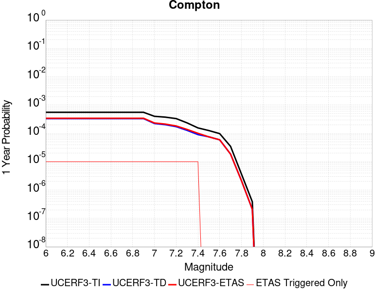 | 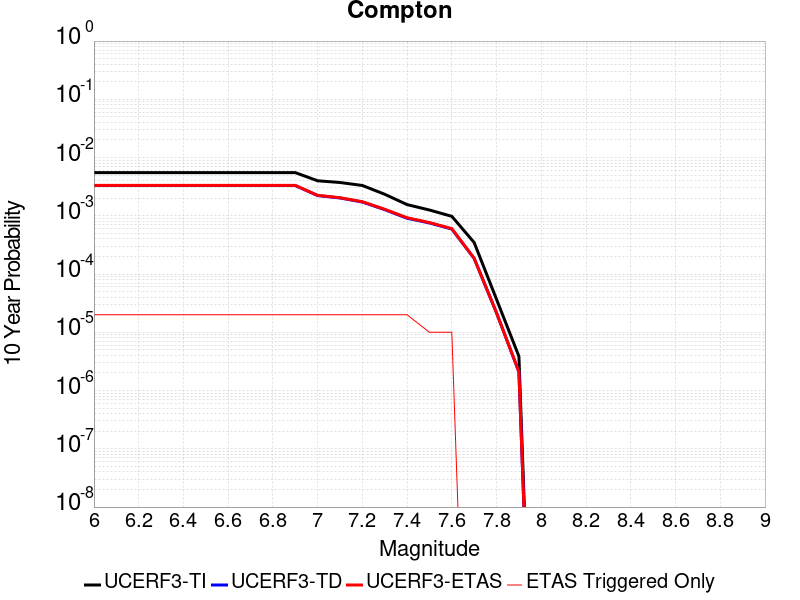 |

| Magnitude | 1 wk TI Prob | 1 wk TD Prob | 1 wk ETAS Prob | 1 wk ETAS/TD Gain | 1 wk ETAS Triggered Only | 1 mo TI Prob | 1 mo TD Prob | 1 mo ETAS Prob | 1 mo ETAS/TD Gain | 1 mo ETAS Triggered Only | 1 yr TI Prob | 1 yr TD Prob | 1 yr ETAS Prob | 1 yr ETAS/TD Gain | 1 yr ETAS Triggered Only | 10 yr TI Prob | 10 yr TD Prob | 10 yr ETAS Prob | 10 yr ETAS/TD Gain | 10 yr ETAS Triggered Only |
|-----|-----|-----|-----|-----|-----|-----|-----|-----|-----|-----|-----|-----|-----|-----|-----|-----|-----|-----|-----|-----|
| 6.0 | 1.06050875E-5 | 6.358671E-6 | 6.358671E-6 | 1.0 | 0.0 | 4.5449582E-5 | 2.7251177E-5 | 2.7251177E-5 | 1.0 | 0.0 | 5.5320817E-4 | 3.317354E-4 | 3.417321E-4 | 1.0301346 | 1.0E-5 | 0.0055183303 | 0.0033126862 | 0.0033326198 | 1.0060174 | 2.0E-5 |
| 6.1 | 1.06050875E-5 | 6.358671E-6 | 6.358671E-6 | 1.0 | 0.0 | 4.5449582E-5 | 2.7251177E-5 | 2.7251177E-5 | 1.0 | 0.0 | 5.5320817E-4 | 3.317354E-4 | 3.417321E-4 | 1.0301346 | 1.0E-5 | 0.0055183303 | 0.0033126862 | 0.0033326198 | 1.0060174 | 2.0E-5 |
| 6.2 | 1.06050875E-5 | 6.358671E-6 | 6.358671E-6 | 1.0 | 0.0 | 4.5449582E-5 | 2.7251177E-5 | 2.7251177E-5 | 1.0 | 0.0 | 5.5320817E-4 | 3.317354E-4 | 3.417321E-4 | 1.0301346 | 1.0E-5 | 0.0055183303 | 0.0033126862 | 0.0033326198 | 1.0060174 | 2.0E-5 |
| 6.3 | 1.06050875E-5 | 6.358671E-6 | 6.358671E-6 | 1.0 | 0.0 | 4.5449582E-5 | 2.7251177E-5 | 2.7251177E-5 | 1.0 | 0.0 | 5.5320817E-4 | 3.317354E-4 | 3.417321E-4 | 1.0301346 | 1.0E-5 | 0.0055183303 | 0.0033126862 | 0.0033326198 | 1.0060174 | 2.0E-5 |
| 6.4 | 1.06050875E-5 | 6.358671E-6 | 6.358671E-6 | 1.0 | 0.0 | 4.5449582E-5 | 2.7251177E-5 | 2.7251177E-5 | 1.0 | 0.0 | 5.5320817E-4 | 3.317354E-4 | 3.417321E-4 | 1.0301346 | 1.0E-5 | 0.0055183303 | 0.0033126862 | 0.0033326198 | 1.0060174 | 2.0E-5 |
| 6.5 | 1.06050875E-5 | 6.358671E-6 | 6.358671E-6 | 1.0 | 0.0 | 4.5449582E-5 | 2.7251177E-5 | 2.7251177E-5 | 1.0 | 0.0 | 5.5320817E-4 | 3.317354E-4 | 3.417321E-4 | 1.0301346 | 1.0E-5 | 0.0055183303 | 0.0033126862 | 0.0033326198 | 1.0060174 | 2.0E-5 |
| 6.6 | 1.06050875E-5 | 6.358671E-6 | 6.358671E-6 | 1.0 | 0.0 | 4.5449582E-5 | 2.7251177E-5 | 2.7251177E-5 | 1.0 | 0.0 | 5.5320817E-4 | 3.317354E-4 | 3.417321E-4 | 1.0301346 | 1.0E-5 | 0.0055183303 | 0.0033126862 | 0.0033326198 | 1.0060174 | 2.0E-5 |
| 6.7 | 1.06050875E-5 | 6.358671E-6 | 6.358671E-6 | 1.0 | 0.0 | 4.5449582E-5 | 2.7251177E-5 | 2.7251177E-5 | 1.0 | 0.0 | 5.5320817E-4 | 3.317354E-4 | 3.417321E-4 | 1.0301346 | 1.0E-5 | 0.0055183303 | 0.0033126862 | 0.0033326198 | 1.0060174 | 2.0E-5 |
| 6.8 | 1.06050875E-5 | 6.358671E-6 | 6.358671E-6 | 1.0 | 0.0 | 4.5449582E-5 | 2.7251177E-5 | 2.7251177E-5 | 1.0 | 0.0 | 5.5320817E-4 | 3.317354E-4 | 3.417321E-4 | 1.0301346 | 1.0E-5 | 0.0055183303 | 0.0033126862 | 0.0033326198 | 1.0060174 | 2.0E-5 |
| 6.9 | 1.06050875E-5 | 6.358671E-6 | 6.358671E-6 | 1.0 | 0.0 | 4.5449582E-5 | 2.7251177E-5 | 2.7251177E-5 | 1.0 | 0.0 | 5.5320817E-4 | 3.317354E-4 | 3.417321E-4 | 1.0301346 | 1.0E-5 | 0.0055183303 | 0.0033126862 | 0.0033326198 | 1.0060174 | 2.0E-5 |
| 7.0 | 7.672486E-6 | 4.2720512E-6 | 4.2720512E-6 | 1.0 | 0.0 | 3.288167E-5 | 1.8308665E-5 | 1.8308665E-5 | 1.0 | 0.0 | 4.0026082E-4 | 2.2288582E-4 | 2.328836E-4 | 1.0448561 | 1.0E-5 | 0.0039954064 | 0.002226685 | 0.0022466404 | 1.0089619 | 2.0E-5 |
| 7.1 | 7.163992E-6 | 3.883762E-6 | 3.883762E-6 | 1.0 | 0.0 | 3.0702464E-5 | 1.6644592E-5 | 1.6644592E-5 | 1.0 | 0.0 | 3.7373835E-4 | 2.0262963E-4 | 2.126276E-4 | 1.0493411 | 1.0E-5 | 0.0037311043 | 0.0020245055 | 0.0020444652 | 1.009859 | 2.0E-5 |
| 7.2 | 6.3689185E-6 | 3.3102428E-6 | 3.3102428E-6 | 1.0 | 0.0 | 2.729508E-5 | 1.418668E-5 | 1.418668E-5 | 1.0 | 0.0 | 3.322669E-4 | 1.7270957E-4 | 1.8270784E-4 | 1.0578907 | 1.0E-5 | 0.0033177056 | 0.0017257951 | 0.0017457607 | 1.0115689 | 2.0E-5 |
| 7.3 | 4.4987873E-6 | 2.4480942E-6 | 2.4480942E-6 | 1.0 | 0.0 | 1.9280375E-5 | 1.0491792E-5 | 1.0491792E-5 | 1.0 | 0.0 | 2.3471327E-4 | 1.2773038E-4 | 1.377291E-4 | 1.0782799 | 1.0E-5 | 0.002344655 | 0.0012765999 | 0.0012965744 | 1.0156466 | 2.0E-5 |
| 7.4 | 2.987296E-6 | 1.7394335E-6 | 1.7394335E-6 | 1.0 | 0.0 | 1.2802635E-5 | 7.454694E-6 | 7.454694E-6 | 1.0 | 0.0 | 1.5586092E-4 | 9.0757174E-5 | 1.0075627E-4 | 1.1101742 | 1.0E-5 | 0.0015575165 | 9.072069E-4 | 9.271887E-4 | 1.0220257 | 2.0E-5 |
| 7.5 | 2.4111696E-6 | 1.4472155E-6 | 1.4472155E-6 | 1.0 | 0.0 | 1.0333543E-5 | 6.2023378E-6 | 6.2023378E-6 | 1.0 | 0.0 | 1.2580362E-4 | 7.551089E-5 | 7.551089E-5 | 1.0 | 0.0 | 0.0012573242 | 7.54857E-4 | 7.648495E-4 | 1.0132376 | 1.0E-5 |
| 7.6 | 1.8783096E-6 | 1.1360459E-6 | 1.1360459E-6 | 1.0 | 0.0 | 8.049874E-6 | 4.8687593E-6 | 4.8687593E-6 | 1.0 | 0.0 | 9.8002805E-5 | 5.927557E-5 | 5.927557E-5 | 1.0 | 0.0 | 9.795959E-4 | 5.926016E-4 | 6.025956E-4 | 1.0168648 | 1.0E-5 |
| 7.7 | 6.6646817E-7 | 3.560237E-7 | 3.560237E-7 | 1.0 | 0.0 | 2.856289E-6 | 1.525815E-6 | 1.525815E-6 | 1.0 | 0.0 | 3.4774763E-5 | 1.8576653E-5 | 1.8576653E-5 | 1.0 | 0.0 | 3.4769322E-4 | 1.8575235E-4 | 1.8575235E-4 | 1.0 | 0.0 |
| 7.8 | 7.054689E-8 | 4.1342968E-8 | 4.1342968E-8 | 1.0 | 0.0 | 3.0234378E-7 | 1.7718413E-7 | 1.7718413E-7 | 1.0 | 0.0 | 3.6810293E-6 | 2.1572148E-6 | 2.1572148E-6 | 1.0 | 0.0 | 3.6809684E-5 | 2.1571948E-5 | 2.1571948E-5 | 1.0 | 0.0 |
| 7.9 | 7.420925E-9 | 4.0131285E-9 | 4.0131285E-9 | 1.0 | 0.0 | 3.1803964E-8 | 1.7199122E-8 | 1.7199122E-8 | 1.0 | 0.0 | 3.872132E-7 | 2.093993E-7 | 2.093993E-7 | 1.0 | 0.0 | 3.872125E-6 | 2.0939913E-6 | 2.0939913E-6 | 1.0 | 0.0 |

## San Juan
*[(top)](#table-of-contents)*

| 1 Week | 1 Month | 1 Year | 10 Year |
|-----|-----|-----|-----|
|  |  | 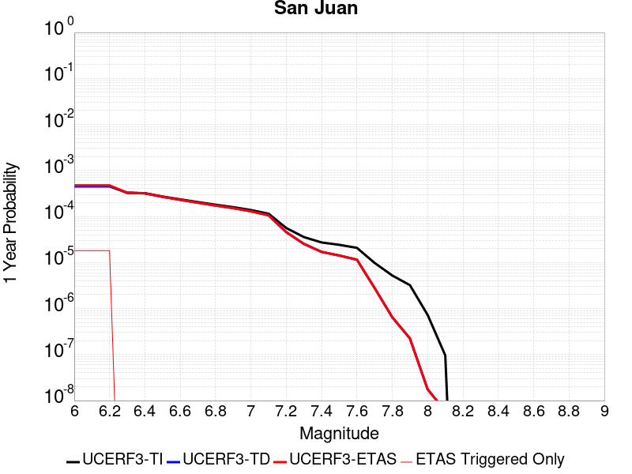 | 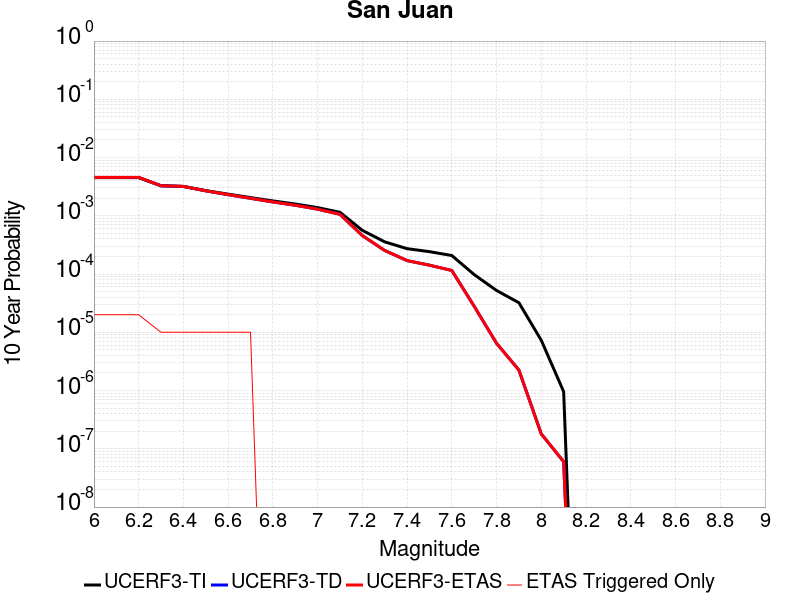 |

| Magnitude | 1 wk TI Prob | 1 wk TD Prob | 1 wk ETAS Prob | 1 wk ETAS/TD Gain | 1 wk ETAS Triggered Only | 1 mo TI Prob | 1 mo TD Prob | 1 mo ETAS Prob | 1 mo ETAS/TD Gain | 1 mo ETAS Triggered Only | 1 yr TI Prob | 1 yr TD Prob | 1 yr ETAS Prob | 1 yr ETAS/TD Gain | 1 yr ETAS Triggered Only | 10 yr TI Prob | 10 yr TD Prob | 10 yr ETAS Prob | 10 yr ETAS/TD Gain | 10 yr ETAS Triggered Only |
|-----|-----|-----|-----|-----|-----|-----|-----|-----|-----|-----|-----|-----|-----|-----|-----|-----|-----|-----|-----|-----|
| 6.0 | 8.682808E-6 | 8.7491635E-6 | 8.7491635E-6 | 1.0 | 0.0 | 3.72115E-5 | 3.74959E-5 | 3.74959E-5 | 1.0 | 0.0 | 4.5295584E-4 | 4.564218E-4 | 4.6641726E-4 | 1.0218996 | 1.0E-5 | 0.004520337 | 0.004555385 | 0.004575294 | 1.0043705 | 2.0E-5 |
| 6.1 | 8.682808E-6 | 8.7491635E-6 | 8.7491635E-6 | 1.0 | 0.0 | 3.72115E-5 | 3.74959E-5 | 3.74959E-5 | 1.0 | 0.0 | 4.5295584E-4 | 4.564218E-4 | 4.6641726E-4 | 1.0218996 | 1.0E-5 | 0.004520337 | 0.004555385 | 0.004575294 | 1.0043705 | 2.0E-5 |
| 6.2 | 8.682808E-6 | 8.7491635E-6 | 8.7491635E-6 | 1.0 | 0.0 | 3.72115E-5 | 3.74959E-5 | 3.74959E-5 | 1.0 | 0.0 | 4.5295584E-4 | 4.564218E-4 | 4.6641726E-4 | 1.0218996 | 1.0E-5 | 0.004520337 | 0.004555385 | 0.004575294 | 1.0043705 | 2.0E-5 |
| 6.3 | 6.3054235E-6 | 6.2825848E-6 | 6.2825848E-6 | 1.0 | 0.0 | 2.7022963E-5 | 2.6925094E-5 | 2.6925094E-5 | 1.0 | 0.0 | 3.2895492E-4 | 3.2776513E-4 | 3.2776513E-4 | 1.0 | 0.0 | 0.003284684 | 0.003273017 | 0.0032829843 | 1.0030453 | 1.0E-5 |
| 6.4 | 6.1490473E-6 | 6.1144656E-6 | 6.1144656E-6 | 1.0 | 0.0 | 2.6352795E-5 | 2.6204598E-5 | 2.6204598E-5 | 1.0 | 0.0 | 3.2079802E-4 | 3.1899565E-4 | 3.1899565E-4 | 1.0 | 0.0 | 0.0032033534 | 0.0031855737 | 0.003195542 | 1.0031291 | 1.0E-5 |
| 6.5 | 5.204848E-6 | 5.137233E-6 | 5.137233E-6 | 1.0 | 0.0 | 2.23063E-5 | 2.2016533E-5 | 2.2016533E-5 | 1.0 | 0.0 | 2.7154534E-4 | 2.6801927E-4 | 2.6801927E-4 | 1.0 | 0.0 | 0.0027121378 | 0.0026771144 | 0.0026870877 | 1.0037254 | 1.0E-5 |
| 6.6 | 4.5179986E-6 | 4.4150297E-6 | 4.4150297E-6 | 1.0 | 0.0 | 1.9362706E-5 | 1.8921424E-5 | 1.8921424E-5 | 1.0 | 0.0 | 2.3571544E-4 | 2.3034477E-4 | 2.3034477E-4 | 1.0 | 0.0 | 0.0023546559 | 0.0023011973 | 0.0023111743 | 1.0043355 | 1.0E-5 |
| 6.7 | 3.9442616E-6 | 3.819828E-6 | 3.819828E-6 | 1.0 | 0.0 | 1.6903869E-5 | 1.6370592E-5 | 1.6370592E-5 | 1.0 | 0.0 | 2.0578515E-4 | 1.992944E-4 | 1.992944E-4 | 1.0 | 0.0 | 0.002055947 | 0.0019912818 | 0.0020012618 | 1.0050119 | 1.0E-5 |
| 6.8 | 3.4536245E-6 | 3.3163353E-6 | 3.3163353E-6 | 1.0 | 0.0 | 1.4801163E-5 | 1.4212792E-5 | 1.4212792E-5 | 1.0 | 0.0 | 1.8018926E-4 | 1.7302761E-4 | 1.7302761E-4 | 1.0 | 0.0 | 0.0018004322 | 0.0017290477 | 0.0017290477 | 1.0 | 0.0 |
| 6.9 | 3.059865E-6 | 2.9120315E-6 | 2.9120315E-6 | 1.0 | 0.0 | 1.3113641E-5 | 1.2480078E-5 | 1.2480078E-5 | 1.0 | 0.0 | 1.596469E-4 | 1.5193493E-4 | 1.5193493E-4 | 1.0 | 0.0 | 0.0015953224 | 0.0015184252 | 0.0015184252 | 1.0 | 0.0 |
| 7.0 | 2.6504351E-6 | 2.4920002E-6 | 2.4920002E-6 | 1.0 | 0.0 | 1.1358958E-5 | 1.0679961E-5 | 1.0679961E-5 | 1.0 | 0.0 | 1.3828653E-4 | 1.300213E-4 | 1.300213E-4 | 1.0 | 0.0 | 0.0013820052 | 0.0012995641 | 0.0012995641 | 1.0 | 0.0 |
| 7.1 | 2.2039317E-6 | 2.0338296E-6 | 2.0338296E-6 | 1.0 | 0.0 | 9.445387E-6 | 8.716386E-6 | 8.716386E-6 | 1.0 | 0.0 | 1.1499152E-4 | 1.0611736E-4 | 1.0611736E-4 | 1.0 | 0.0 | 0.0011493203 | 0.0010607769 | 0.0010607769 | 1.0 | 0.0 |
| 7.2 | 1.0786707E-6 | 8.7701903E-7 | 8.7701903E-7 | 1.0 | 0.0 | 4.622866E-6 | 3.7586476E-6 | 3.7586476E-6 | 1.0 | 0.0 | 5.628194E-5 | 4.5760586E-5 | 4.5760586E-5 | 1.0 | 0.0 | 5.6267687E-4 | 4.5757066E-4 | 4.5757066E-4 | 1.0 | 0.0 |
| 7.3 | 6.846433E-7 | 4.868805E-7 | 4.868805E-7 | 1.0 | 0.0 | 2.9341822E-6 | 2.086629E-6 | 2.086629E-6 | 1.0 | 0.0 | 3.5723086E-5 | 2.5404412E-5 | 2.5404412E-5 | 1.0 | 0.0 | 3.571734E-4 | 2.540486E-4 | 2.540486E-4 | 1.0 | 0.0 |
| 7.4 | 5.23043E-7 | 3.2628162E-7 | 3.2628162E-7 | 1.0 | 0.0 | 2.2416111E-6 | 1.398349E-6 | 1.398349E-6 | 1.0 | 0.0 | 2.7291273E-5 | 1.7024766E-5 | 1.7024766E-5 | 1.0 | 0.0 | 2.7287923E-4 | 1.7026656E-4 | 1.7026656E-4 | 1.0 | 0.0 |
| 7.5 | 4.648444E-7 | 2.7234944E-7 | 2.7234944E-7 | 1.0 | 0.0 | 1.9921886E-6 | 1.1672114E-6 | 1.1672114E-6 | 1.0 | 0.0 | 2.4254627E-5 | 1.42107065E-5 | 1.42107065E-5 | 1.0 | 0.0 | 2.425198E-4 | 1.421276E-4 | 1.421276E-4 | 1.0 | 0.0 |
| 7.6 | 3.9906567E-7 | 2.2083314E-7 | 2.2083314E-7 | 1.0 | 0.0 | 1.7102802E-6 | 9.464274E-7 | 9.464274E-7 | 1.0 | 0.0 | 2.0822463E-5 | 1.1522693E-5 | 1.1522693E-5 | 1.0 | 0.0 | 2.0820512E-4 | 1.15245566E-4 | 1.15245566E-4 | 1.0 | 0.0 |
| 7.7 | 1.8784601E-7 | 5.3666906E-8 | 5.3666906E-8 | 1.0 | 0.0 | 8.0505407E-7 | 2.30001E-7 | 2.30001E-7 | 1.0 | 0.0 | 9.80149E-6 | 2.8002585E-6 | 2.8002585E-6 | 1.0 | 0.0 | 9.801057E-5 | 2.8011282E-5 | 2.8011282E-5 | 1.0 | 0.0 |
| 7.8 | 1.00154914E-7 | 1.2415832E-8 | 1.2415832E-8 | 1.0 | 0.0 | 4.2923529E-7 | 5.3210716E-8 | 5.3210716E-8 | 1.0 | 0.0 | 5.225927E-6 | 6.4784024E-7 | 6.4784024E-7 | 1.0 | 0.0 | 5.225804E-5 | 6.484273E-6 | 6.484273E-6 | 1.0 | 0.0 |
| 7.9 | 6.171429E-8 | 4.2966155E-9 | 4.2966155E-9 | 1.0 | 0.0 | 2.6448978E-7 | 1.8414067E-8 | 1.8414067E-8 | 1.0 | 0.0 | 3.2201583E-6 | 2.2419121E-7 | 2.2419121E-7 | 1.0 | 0.0 | 3.2201115E-5 | 2.2472002E-6 | 2.2472002E-6 | 1.0 | 0.0 |
| 8.0 | 1.3974572E-8 | 3.3788217E-10 | 3.3788217E-10 | 1.0 | 0.0 | 5.989102E-8 | 1.448067E-9 | 1.448067E-9 | 1.0 | 0.0 | 7.2917294E-7 | 1.763022E-8 | 1.763022E-8 | 1.0 | 0.0 | 7.2917055E-6 | 1.8060365E-7 | 1.8060365E-7 | 1.0 | 0.0 |
| 8.1 | 1.8403477E-9 | 1.1302803E-10 | 1.1302803E-10 | 1.0 | 0.0 | 7.887204E-9 | 4.844063E-10 | 4.844063E-10 | 1.0 | 0.0 | 9.602671E-8 | 5.8976446E-9 | 5.8976446E-9 | 1.0 | 0.0 | 9.602667E-7 | 6.021993E-8 | 6.021993E-8 | 1.0 | 0.0 |

## Hat Creek-McArthur-Mayfield
*[(top)](#table-of-contents)*

| 1 Week | 1 Month | 1 Year | 10 Year |
|-----|-----|-----|-----|
| 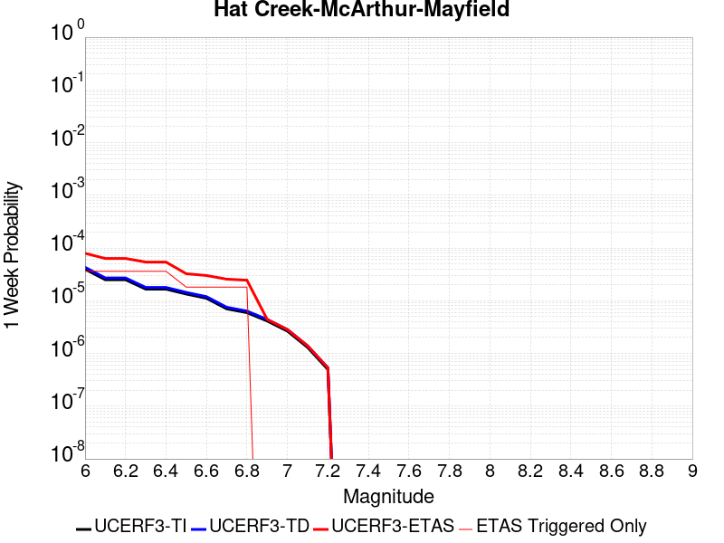 | 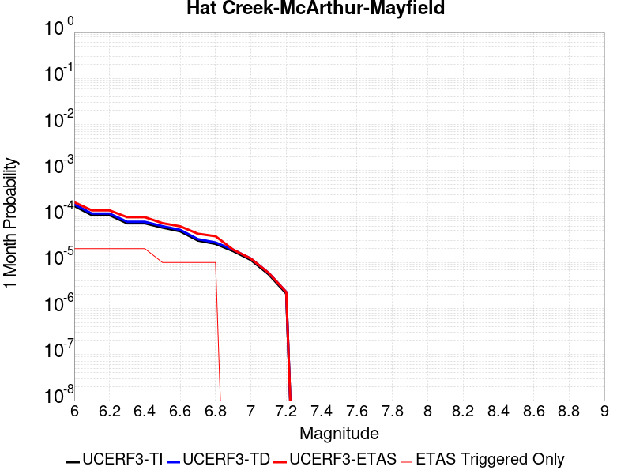 | 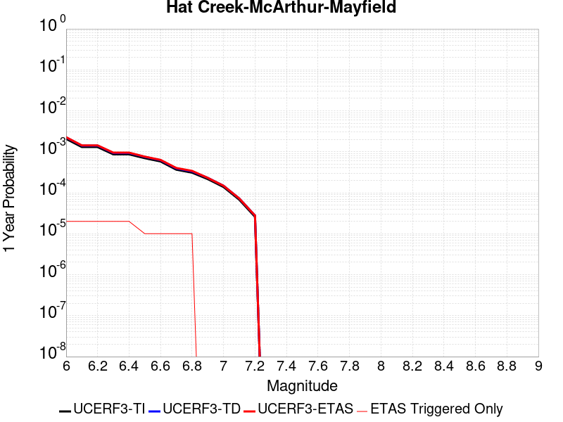 | 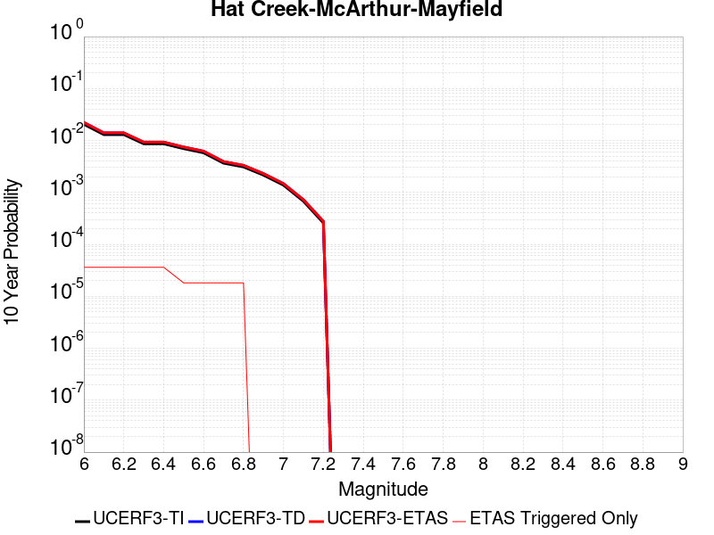 |

| Magnitude | 1 wk TI Prob | 1 wk TD Prob | 1 wk ETAS Prob | 1 wk ETAS/TD Gain | 1 wk ETAS Triggered Only | 1 mo TI Prob | 1 mo TD Prob | 1 mo ETAS Prob | 1 mo ETAS/TD Gain | 1 mo ETAS Triggered Only | 1 yr TI Prob | 1 yr TD Prob | 1 yr ETAS Prob | 1 yr ETAS/TD Gain | 1 yr ETAS Triggered Only | 10 yr TI Prob | 10 yr TD Prob | 10 yr ETAS Prob | 10 yr ETAS/TD Gain | 10 yr ETAS Triggered Only |
|-----|-----|-----|-----|-----|-----|-----|-----|-----|-----|-----|-----|-----|-----|-----|-----|-----|-----|-----|-----|-----|
| 6.0 | 3.967457E-5 | 4.315831E-5 | 6.3157444E-5 | 1.4633902 | 2.0E-5 | 1.7002279E-4 | 1.8495171E-4 | 2.0494802E-4 | 1.1081164 | 2.0E-5 | 0.002068062 | 0.002249576 | 0.002269531 | 1.0088706 | 2.0E-5 | 0.02048922 | 0.022280399 | 0.022299953 | 1.0008776 | 2.0E-5 |
| 6.1 | 2.5044013E-5 | 2.7071164E-5 | 4.707062E-5 | 1.7387735 | 2.0E-5 | 1.0732707E-4 | 1.1601429E-4 | 1.3601198E-4 | 1.1723726 | 2.0E-5 | 0.0013059238 | 0.0014115906 | 0.0014315624 | 1.0141484 | 2.0E-5 | 0.01298276 | 0.01402966 | 0.01404938 | 1.0014056 | 2.0E-5 |
| 6.2 | 2.5044013E-5 | 2.7071164E-5 | 4.707062E-5 | 1.7387735 | 2.0E-5 | 1.0732707E-4 | 1.1601429E-4 | 1.3601198E-4 | 1.1723726 | 2.0E-5 | 0.0013059238 | 0.0014115906 | 0.0014315624 | 1.0141484 | 2.0E-5 | 0.01298276 | 0.01402966 | 0.01404938 | 1.0014056 | 2.0E-5 |
| 6.3 | 1.6624012E-5 | 1.7891072E-5 | 3.7890713E-5 | 2.117856 | 2.0E-5 | 7.124382E-5 | 7.6673816E-5 | 9.667228E-5 | 1.2608253 | 2.0E-5 | 8.670483E-4 | 9.331125E-4 | 9.5309387E-4 | 1.0214137 | 2.0E-5 | 0.008636732 | 0.009292879 | 0.009312693 | 1.0021322 | 2.0E-5 |
| 6.4 | 1.6624012E-5 | 1.7891072E-5 | 3.7890713E-5 | 2.117856 | 2.0E-5 | 7.124382E-5 | 7.6673816E-5 | 9.667228E-5 | 1.2608253 | 2.0E-5 | 8.670483E-4 | 9.331125E-4 | 9.5309387E-4 | 1.0214137 | 2.0E-5 | 0.008636732 | 0.009292879 | 0.009312693 | 1.0021322 | 2.0E-5 |
| 6.5 | 1.3394842E-5 | 1.4392137E-5 | 2.4391993E-5 | 1.6948138 | 1.0E-5 | 5.7405203E-5 | 6.167916E-5 | 7.167854E-5 | 1.1621193 | 1.0E-5 | 6.986842E-4 | 7.506906E-4 | 7.606831E-4 | 1.013311 | 1.0E-5 | 0.006964916 | 0.0074821403 | 0.007492066 | 1.0013266 | 1.0E-5 |
| 6.6 | 1.1137514E-5 | 1.1954546E-5 | 2.1954425E-5 | 1.8364918 | 1.0E-5 | 4.7731326E-5 | 5.1232782E-5 | 6.123227E-5 | 1.1951776 | 1.0E-5 | 5.809739E-4 | 6.2358467E-4 | 6.335784E-4 | 1.0160263 | 1.0E-5 | 0.005794574 | 0.00621877 | 0.0062287077 | 1.001598 | 1.0E-5 |
| 6.7 | 7.0200663E-6 | 7.5242897E-6 | 1.7524215E-5 | 2.329019 | 1.0E-5 | 3.008565E-5 | 3.2246568E-5 | 4.2246244E-5 | 1.3101006 | 1.0E-5 | 3.6623122E-4 | 3.925328E-4 | 4.0252888E-4 | 1.0254656 | 1.0E-5 | 0.0036562826 | 0.0039185574 | 0.003928518 | 1.002542 | 1.0E-5 |
| 6.8 | 5.940172E-6 | 6.3654766E-6 | 1.6365413E-5 | 2.5709643 | 1.0E-5 | 2.545763E-5 | 2.7280335E-5 | 3.7280064E-5 | 1.3665544 | 1.0E-5 | 3.0990256E-4 | 3.3208873E-4 | 3.420854E-4 | 1.0301025 | 1.0E-5 | 0.0030947074 | 0.0033160534 | 0.0033260202 | 1.0030056 | 1.0E-5 |
| 6.9 | 4.129831E-6 | 4.423547E-6 | 4.423547E-6 | 1.0 | 0.0 | 1.7699154E-5 | 1.8957926E-5 | 1.8957926E-5 | 1.0 | 0.0 | 2.154659E-4 | 2.3078908E-4 | 2.3078908E-4 | 1.0 | 0.0 | 0.002152571 | 0.0023055724 | 0.0023055724 | 1.0 | 0.0 |
| 7.0 | 2.6512955E-6 | 2.8374002E-6 | 2.8374002E-6 | 1.0 | 0.0 | 1.1362646E-5 | 1.2160232E-5 | 1.2160232E-5 | 1.0 | 0.0 | 1.3833142E-4 | 1.480412E-4 | 1.480412E-4 | 1.0 | 0.0 | 0.0013824535 | 0.0014794683 | 0.0014794683 | 1.0 | 0.0 |
| 7.1 | 1.2992575E-6 | 1.3909317E-6 | 1.3909317E-6 | 1.0 | 0.0 | 5.568235E-6 | 5.961124E-6 | 5.961124E-6 | 1.0 | 0.0 | 6.779115E-5 | 7.257448E-5 | 7.257448E-5 | 1.0 | 0.0 | 6.7770475E-4 | 7.2552945E-4 | 7.2552945E-4 | 1.0 | 0.0 |
| 7.2 | 4.968191E-7 | 5.3271475E-7 | 5.3271475E-7 | 1.0 | 0.0 | 2.1292228E-6 | 2.283062E-6 | 2.283062E-6 | 1.0 | 0.0 | 2.592298E-5 | 2.7796052E-5 | 2.7796052E-5 | 1.0 | 0.0 | 2.5919956E-4 | 2.7793812E-4 | 2.7793812E-4 | 1.0 | 0.0 |

## Puente Hills
*[(top)](#table-of-contents)*

| 1 Week | 1 Month | 1 Year | 10 Year |
|-----|-----|-----|-----|
| 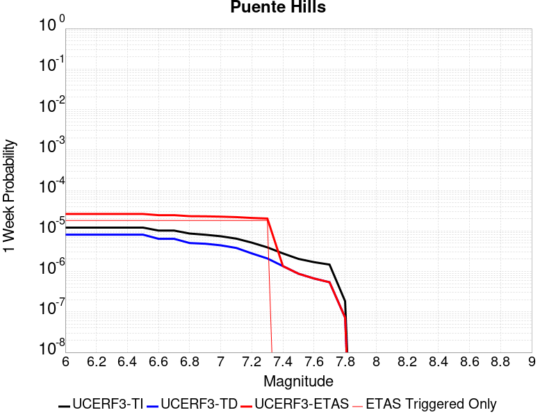 | 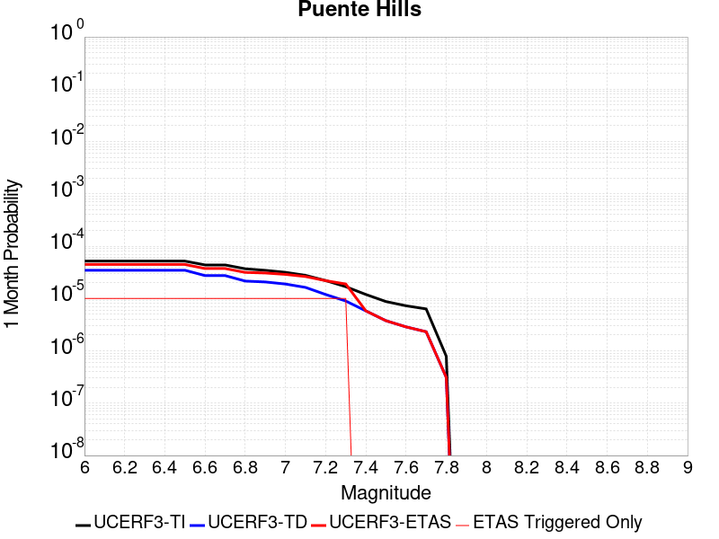 | 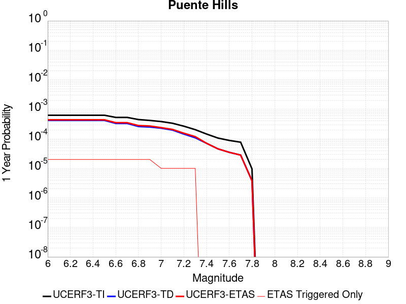 | 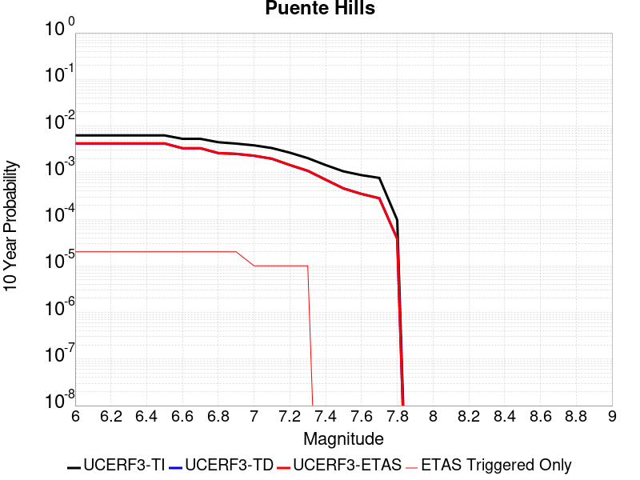 |

| Magnitude | 1 wk TI Prob | 1 wk TD Prob | 1 wk ETAS Prob | 1 wk ETAS/TD Gain | 1 wk ETAS Triggered Only | 1 mo TI Prob | 1 mo TD Prob | 1 mo ETAS Prob | 1 mo ETAS/TD Gain | 1 mo ETAS Triggered Only | 1 yr TI Prob | 1 yr TD Prob | 1 yr ETAS Prob | 1 yr ETAS/TD Gain | 1 yr ETAS Triggered Only | 10 yr TI Prob | 10 yr TD Prob | 10 yr ETAS Prob | 10 yr ETAS/TD Gain | 10 yr ETAS Triggered Only |
|-----|-----|-----|-----|-----|-----|-----|-----|-----|-----|-----|-----|-----|-----|-----|-----|-----|-----|-----|-----|-----|
| 6.0 | 1.2101656E-5 | 8.098625E-6 | 1.8098544E-5 | 2.2347674 | 1.0E-5 | 5.1863204E-5 | 3.4707962E-5 | 4.4707616E-5 | 1.2881083 | 1.0E-5 | 6.312516E-4 | 4.2249315E-4 | 4.4248468E-4 | 1.0473181 | 2.0E-5 | 0.0062946146 | 0.0042174594 | 0.004237375 | 1.0047222 | 2.0E-5 |
| 6.1 | 1.2101656E-5 | 8.098625E-6 | 1.8098544E-5 | 2.2347674 | 1.0E-5 | 5.1863204E-5 | 3.4707962E-5 | 4.4707616E-5 | 1.2881083 | 1.0E-5 | 6.312516E-4 | 4.2249315E-4 | 4.4248468E-4 | 1.0473181 | 2.0E-5 | 0.0062946146 | 0.0042174594 | 0.004237375 | 1.0047222 | 2.0E-5 |
| 6.2 | 1.2101656E-5 | 8.098625E-6 | 1.8098544E-5 | 2.2347674 | 1.0E-5 | 5.1863204E-5 | 3.4707962E-5 | 4.4707616E-5 | 1.2881083 | 1.0E-5 | 6.312516E-4 | 4.2249315E-4 | 4.4248468E-4 | 1.0473181 | 2.0E-5 | 0.0062946146 | 0.0042174594 | 0.004237375 | 1.0047222 | 2.0E-5 |
| 6.3 | 1.2101656E-5 | 8.098625E-6 | 1.8098544E-5 | 2.2347674 | 1.0E-5 | 5.1863204E-5 | 3.4707962E-5 | 4.4707616E-5 | 1.2881083 | 1.0E-5 | 6.312516E-4 | 4.2249315E-4 | 4.4248468E-4 | 1.0473181 | 2.0E-5 | 0.0062946146 | 0.0042174594 | 0.004237375 | 1.0047222 | 2.0E-5 |
| 6.4 | 1.2101656E-5 | 8.098625E-6 | 1.8098544E-5 | 2.2347674 | 1.0E-5 | 5.1863204E-5 | 3.4707962E-5 | 4.4707616E-5 | 1.2881083 | 1.0E-5 | 6.312516E-4 | 4.2249315E-4 | 4.4248468E-4 | 1.0473181 | 2.0E-5 | 0.0062946146 | 0.0042174594 | 0.004237375 | 1.0047222 | 2.0E-5 |
| 6.5 | 1.2101656E-5 | 8.098625E-6 | 1.8098544E-5 | 2.2347674 | 1.0E-5 | 5.1863204E-5 | 3.4707962E-5 | 4.4707616E-5 | 1.2881083 | 1.0E-5 | 6.312516E-4 | 4.2249315E-4 | 4.4248468E-4 | 1.0473181 | 2.0E-5 | 0.0062946146 | 0.0042174594 | 0.004237375 | 1.0047222 | 2.0E-5 |
| 6.6 | 1.0222488E-5 | 6.3991847E-6 | 1.639912E-5 | 2.562689 | 1.0E-5 | 4.3809923E-5 | 2.7424803E-5 | 3.742453E-5 | 1.3646234 | 1.0E-5 | 5.332553E-4 | 3.3384826E-4 | 3.538416E-4 | 1.0598874 | 2.0E-5 | 0.0053197746 | 0.0033337125 | 0.0033536458 | 1.0059793 | 2.0E-5 |
| 6.7 | 1.0222488E-5 | 6.3991847E-6 | 1.639912E-5 | 2.562689 | 1.0E-5 | 4.3809923E-5 | 2.7424803E-5 | 3.742453E-5 | 1.3646234 | 1.0E-5 | 5.332553E-4 | 3.3384826E-4 | 3.538416E-4 | 1.0598874 | 2.0E-5 | 0.0053197746 | 0.0033337125 | 0.0033536458 | 1.0059793 | 2.0E-5 |
| 6.8 | 8.6367845E-6 | 5.0282533E-6 | 1.5028203E-5 | 2.9887521 | 1.0E-5 | 3.7014266E-5 | 2.1549482E-5 | 3.1549265E-5 | 1.4640383 | 1.0E-5 | 4.505555E-4 | 2.623339E-4 | 2.8232866E-4 | 1.0762187 | 2.0E-5 | 0.004496431 | 0.0026202986 | 0.0026402462 | 1.0076127 | 2.0E-5 |
| 6.9 | 8.066481E-6 | 4.836117E-6 | 1.4836069E-5 | 3.0677648 | 1.0E-5 | 3.4570177E-5 | 2.0726053E-5 | 3.0725845E-5 | 1.4824746 | 1.0E-5 | 4.2081063E-4 | 2.52311E-4 | 2.7230597E-4 | 1.0792472 | 2.0E-5 | 0.0042001465 | 0.0025202993 | 0.002540249 | 1.0079156 | 2.0E-5 |
| 7.0 | 7.393828E-6 | 4.417296E-6 | 1.4417252E-5 | 3.2638183 | 1.0E-5 | 3.168745E-5 | 1.8931134E-5 | 2.8930945E-5 | 1.5282203 | 1.0E-5 | 3.857264E-4 | 2.3046264E-4 | 2.4046033E-4 | 1.043381 | 1.0E-5 | 0.0038505755 | 0.0023022818 | 0.0023122588 | 1.0043335 | 1.0E-5 |
| 7.1 | 6.4660953E-6 | 3.8044495E-6 | 1.38044115E-5 | 3.6284912 | 1.0E-5 | 2.7711543E-5 | 1.6304684E-5 | 2.630452E-5 | 1.6133107 | 1.0E-5 | 3.373358E-4 | 1.984918E-4 | 2.0848982E-4 | 1.0503699 | 1.0E-5 | 0.0033682417 | 0.001983181 | 0.0019931612 | 1.0050324 | 1.0E-5 |
| 7.2 | 5.143232E-6 | 2.7865456E-6 | 1.2786518E-5 | 4.5886626 | 1.0E-5 | 2.2042237E-5 | 1.1942284E-5 | 2.1942164E-5 | 1.8373507 | 1.0E-5 | 2.6833118E-4 | 1.453877E-4 | 1.5538624E-4 | 1.0687716 | 1.0E-5 | 0.002680074 | 0.0014529356 | 0.001462921 | 1.0068727 | 1.0E-5 |
| 7.3 | 3.928255E-6 | 2.0913774E-6 | 1.2091356E-5 | 5.781528 | 1.0E-5 | 1.683527E-5 | 8.963015E-6 | 1.8962926E-5 | 2.115686 | 1.0E-5 | 2.0495013E-4 | 1.0911931E-4 | 1.1911822E-4 | 1.0916328 | 1.0E-5 | 0.002047612 | 0.001090664 | 0.0011006531 | 1.0091587 | 1.0E-5 |
| 7.4 | 2.7894434E-6 | 1.3546753E-6 | 1.3546753E-6 | 1.0 | 0.0 | 1.1954703E-5 | 5.8057385E-6 | 5.8057385E-6 | 1.0 | 0.0 | 1.4553878E-4 | 7.068262E-5 | 7.068262E-5 | 1.0 | 0.0 | 0.001454435 | 7.066058E-4 | 7.066058E-4 | 1.0 | 0.0 |
| 7.5 | 2.041735E-6 | 8.787305E-7 | 8.787305E-7 | 1.0 | 0.0 | 8.750263E-6 | 3.7659825E-6 | 3.7659825E-6 | 1.0 | 0.0 | 1.06529245E-4 | 4.5849905E-5 | 4.5849905E-5 | 1.0 | 0.0 | 0.0010647819 | 4.5840783E-4 | 4.5840783E-4 | 1.0 | 0.0 |
| 7.6 | 1.6959062E-6 | 6.6986263E-7 | 6.6986263E-7 | 1.0 | 0.0 | 7.268149E-6 | 2.8708366E-6 | 2.8708366E-6 | 1.0 | 0.0 | 8.848612E-5 | 3.4951907E-5 | 3.4951907E-5 | 1.0 | 0.0 | 8.84509E-4 | 3.4946698E-4 | 3.4946698E-4 | 1.0 | 0.0 |
| 7.7 | 1.4767965E-6 | 5.407607E-7 | 5.407607E-7 | 1.0 | 0.0 | 6.3291122E-6 | 2.317544E-6 | 2.317544E-6 | 1.0 | 0.0 | 7.705422E-5 | 2.8215758E-5 | 2.8215758E-5 | 1.0 | 0.0 | 7.702751E-4 | 2.8212433E-4 | 2.8212433E-4 | 1.0 | 0.0 |
| 7.8 | 1.8432911E-7 | 7.28201E-8 | 7.28201E-8 | 1.0 | 0.0 | 7.8998164E-7 | 3.1208612E-7 | 3.1208612E-7 | 1.0 | 0.0 | 9.617985E-6 | 3.7996451E-6 | 3.7996451E-6 | 1.0 | 0.0 | 9.617568E-5 | 3.7996128E-5 | 3.7996128E-5 | 1.0 | 0.0 |

## Redondo Canyon alt 1
*[(top)](#table-of-contents)*

| 1 Week | 1 Month | 1 Year | 10 Year |
|-----|-----|-----|-----|
|  |  | 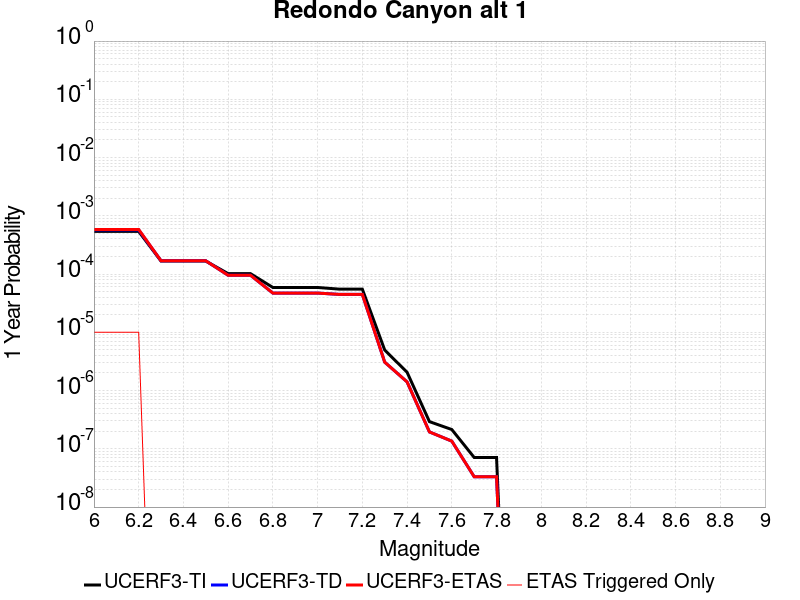 | 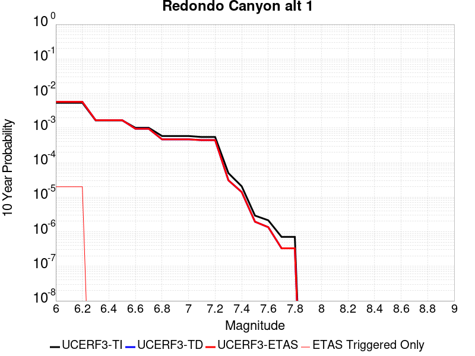 |

| Magnitude | 1 wk TI Prob | 1 wk TD Prob | 1 wk ETAS Prob | 1 wk ETAS/TD Gain | 1 wk ETAS Triggered Only | 1 mo TI Prob | 1 mo TD Prob | 1 mo ETAS Prob | 1 mo ETAS/TD Gain | 1 mo ETAS Triggered Only | 1 yr TI Prob | 1 yr TD Prob | 1 yr ETAS Prob | 1 yr ETAS/TD Gain | 1 yr ETAS Triggered Only | 10 yr TI Prob | 10 yr TD Prob | 10 yr ETAS Prob | 10 yr ETAS/TD Gain | 10 yr ETAS Triggered Only |
|-----|-----|-----|-----|-----|-----|-----|-----|-----|-----|-----|-----|-----|-----|-----|-----|-----|-----|-----|-----|-----|
| 6.0 | 1.0346246E-5 | 1.09813445E-5 | 2.0981235E-5 | 1.9106253 | 1.0E-5 | 4.43403E-5 | 4.7062502E-5 | 5.7062032E-5 | 1.2124734 | 1.0E-5 | 5.3970946E-4 | 5.729142E-4 | 5.829085E-4 | 1.0174446 | 1.0E-5 | 0.0053840056 | 0.005722111 | 0.0057419967 | 1.0034752 | 2.0E-5 |
| 6.1 | 1.0346246E-5 | 1.09813445E-5 | 2.0981235E-5 | 1.9106253 | 1.0E-5 | 4.43403E-5 | 4.7062502E-5 | 5.7062032E-5 | 1.2124734 | 1.0E-5 | 5.3970946E-4 | 5.729142E-4 | 5.829085E-4 | 1.0174446 | 1.0E-5 | 0.0053840056 | 0.005722111 | 0.0057419967 | 1.0034752 | 2.0E-5 |
| 6.2 | 1.0346246E-5 | 1.09813445E-5 | 2.0981235E-5 | 1.9106253 | 1.0E-5 | 4.43403E-5 | 4.7062502E-5 | 5.7062032E-5 | 1.2124734 | 1.0E-5 | 5.3970946E-4 | 5.729142E-4 | 5.829085E-4 | 1.0174446 | 1.0E-5 | 0.0053840056 | 0.005722111 | 0.0057419967 | 1.0034752 | 2.0E-5 |
| 6.3 | 3.2052794E-6 | 3.2361174E-6 | 3.2361174E-6 | 1.0 | 0.0 | 1.373684E-5 | 1.3869023E-5 | 1.3869023E-5 | 1.0 | 0.0 | 1.6723319E-4 | 1.6884625E-4 | 1.6884625E-4 | 1.0 | 0.0 | 0.001671074 | 0.0016875692 | 0.0016875692 | 1.0 | 0.0 |
| 6.4 | 3.2052794E-6 | 3.2361174E-6 | 3.2361174E-6 | 1.0 | 0.0 | 1.373684E-5 | 1.3869023E-5 | 1.3869023E-5 | 1.0 | 0.0 | 1.6723319E-4 | 1.6884625E-4 | 1.6884625E-4 | 1.0 | 0.0 | 0.001671074 | 0.0016875692 | 0.0016875692 | 1.0 | 0.0 |
| 6.5 | 3.2052794E-6 | 3.2361174E-6 | 3.2361174E-6 | 1.0 | 0.0 | 1.373684E-5 | 1.3869023E-5 | 1.3869023E-5 | 1.0 | 0.0 | 1.6723319E-4 | 1.6884625E-4 | 1.6884625E-4 | 1.0 | 0.0 | 0.001671074 | 0.0016875692 | 0.0016875692 | 1.0 | 0.0 |
| 6.6 | 1.948328E-6 | 1.8288681E-6 | 1.8288681E-6 | 1.0 | 0.0 | 8.349951E-6 | 7.837991E-6 | 7.837991E-6 | 1.0 | 0.0 | 1.016559E-4 | 9.542486E-5 | 9.542486E-5 | 1.0 | 0.0 | 0.0010160941 | 9.539858E-4 | 9.539858E-4 | 1.0 | 0.0 |
| 6.7 | 1.948328E-6 | 1.8288681E-6 | 1.8288681E-6 | 1.0 | 0.0 | 8.349951E-6 | 7.837991E-6 | 7.837991E-6 | 1.0 | 0.0 | 1.016559E-4 | 9.542486E-5 | 9.542486E-5 | 1.0 | 0.0 | 0.0010160941 | 9.539858E-4 | 9.539858E-4 | 1.0 | 0.0 |
| 6.8 | 1.1278219E-6 | 9.033076E-7 | 9.033076E-7 | 1.0 | 0.0 | 4.8335132E-6 | 3.871315E-6 | 3.871315E-6 | 1.0 | 0.0 | 5.8846435E-5 | 4.7132668E-5 | 4.7132668E-5 | 1.0 | 0.0 | 5.8830855E-4 | 4.7126875E-4 | 4.7126875E-4 | 1.0 | 0.0 |
| 6.9 | 1.1278219E-6 | 9.033076E-7 | 9.033076E-7 | 1.0 | 0.0 | 4.8335132E-6 | 3.871315E-6 | 3.871315E-6 | 1.0 | 0.0 | 5.8846435E-5 | 4.7132668E-5 | 4.7132668E-5 | 1.0 | 0.0 | 5.8830855E-4 | 4.7126875E-4 | 4.7126875E-4 | 1.0 | 0.0 |
| 7.0 | 1.1278219E-6 | 9.033076E-7 | 9.033076E-7 | 1.0 | 0.0 | 4.8335132E-6 | 3.871315E-6 | 3.871315E-6 | 1.0 | 0.0 | 5.8846435E-5 | 4.7132668E-5 | 4.7132668E-5 | 1.0 | 0.0 | 5.8830855E-4 | 4.7126875E-4 | 4.7126875E-4 | 1.0 | 0.0 |
| 7.1 | 1.0545139E-6 | 8.5692716E-7 | 8.5692716E-7 | 1.0 | 0.0 | 4.5193374E-6 | 3.6725423E-6 | 3.6725423E-6 | 1.0 | 0.0 | 5.5021545E-5 | 4.471271E-5 | 4.471271E-5 | 1.0 | 0.0 | 5.500792E-4 | 4.470789E-4 | 4.470789E-4 | 1.0 | 0.0 |
| 7.2 | 1.0545139E-6 | 8.5692716E-7 | 8.5692716E-7 | 1.0 | 0.0 | 4.5193374E-6 | 3.6725423E-6 | 3.6725423E-6 | 1.0 | 0.0 | 5.5021545E-5 | 4.471271E-5 | 4.471271E-5 | 1.0 | 0.0 | 5.500792E-4 | 4.470789E-4 | 4.470789E-4 | 1.0 | 0.0 |
| 7.3 | 9.505161E-8 | 5.8957607E-8 | 5.8957607E-8 | 1.0 | 0.0 | 4.0736398E-7 | 2.5267545E-7 | 2.5267545E-7 | 1.0 | 0.0 | 4.959645E-6 | 3.0763204E-6 | 3.0763204E-6 | 1.0 | 0.0 | 4.9595343E-5 | 3.0762894E-5 | 3.0762894E-5 | 1.0 | 0.0 |
| 7.4 | 3.9520785E-8 | 2.6987191E-8 | 2.6987191E-8 | 1.0 | 0.0 | 1.6937479E-7 | 1.1565938E-7 | 1.1565938E-7 | 1.0 | 0.0 | 2.062136E-6 | 1.4081523E-6 | 1.4081523E-6 | 1.0 | 0.0 | 2.062117E-5 | 1.4081461E-5 | 1.4081461E-5 | 1.0 | 0.0 |
| 7.5 | 5.6133214E-9 | 3.7368215E-9 | 3.7368215E-9 | 1.0 | 0.0 | 2.4057092E-8 | 1.601495E-8 | 1.601495E-8 | 1.0 | 0.0 | 2.9289507E-7 | 1.9498201E-7 | 1.9498201E-7 | 1.0 | 0.0 | 2.9289467E-6 | 1.9498186E-6 | 1.9498186E-6 | 1.0 | 0.0 |
| 7.6 | 4.1064334E-9 | 2.5957634E-9 | 2.5957634E-9 | 1.0 | 0.0 | 1.7599E-8 | 1.11247E-8 | 1.11247E-8 | 1.0 | 0.0 | 2.142678E-7 | 1.3544322E-7 | 1.3544322E-7 | 1.0 | 0.0 | 2.1426758E-6 | 1.3544316E-6 | 1.3544316E-6 | 1.0 | 0.0 |
| 7.7 | 1.361975E-9 | 6.360824E-10 | 6.360824E-10 | 1.0 | 0.0 | 5.8370353E-9 | 2.7260674E-9 | 2.7260674E-9 | 1.0 | 0.0 | 7.1065905E-8 | 3.318987E-8 | 3.318987E-8 | 1.0 | 0.0 | 7.106588E-7 | 3.318987E-7 | 3.318987E-7 | 1.0 | 0.0 |
| 7.8 | 1.361975E-9 | 6.360824E-10 | 6.360824E-10 | 1.0 | 0.0 | 5.8370353E-9 | 2.7260674E-9 | 2.7260674E-9 | 1.0 | 0.0 | 7.1065905E-8 | 3.318987E-8 | 3.318987E-8 | 1.0 | 0.0 | 7.106588E-7 | 3.318987E-7 | 3.318987E-7 | 1.0 | 0.0 |

## Great Valley 11
*[(top)](#table-of-contents)*

| 1 Week | 1 Month | 1 Year | 10 Year |
|-----|-----|-----|-----|
| 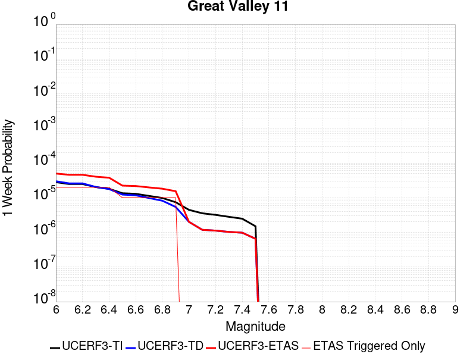 | 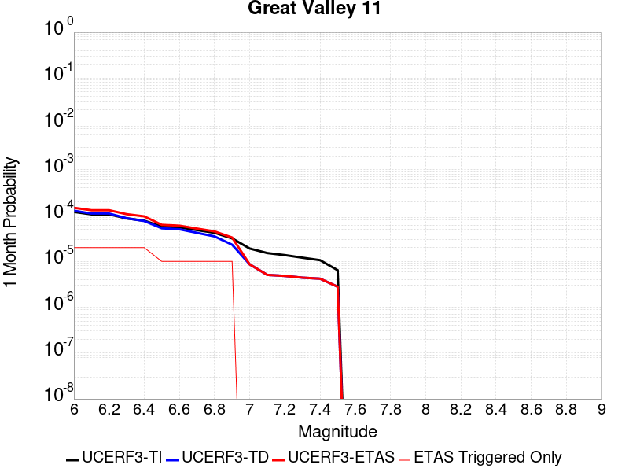 | 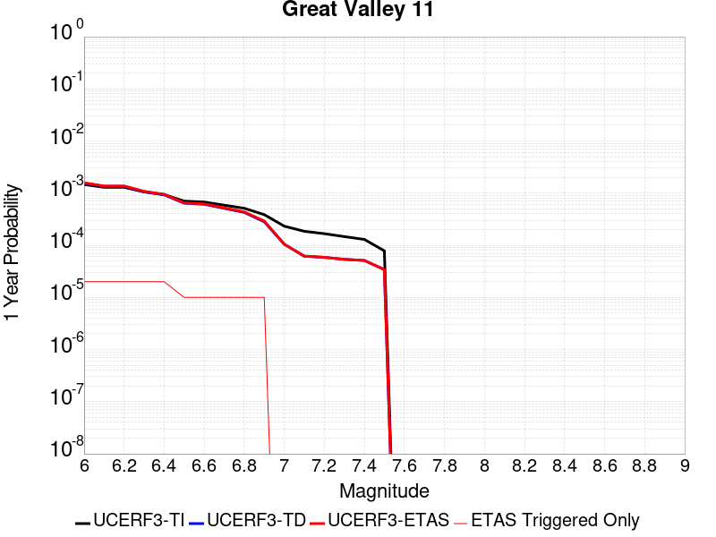 |  |

| Magnitude | 1 wk TI Prob | 1 wk TD Prob | 1 wk ETAS Prob | 1 wk ETAS/TD Gain | 1 wk ETAS Triggered Only | 1 mo TI Prob | 1 mo TD Prob | 1 mo ETAS Prob | 1 mo ETAS/TD Gain | 1 mo ETAS Triggered Only | 1 yr TI Prob | 1 yr TD Prob | 1 yr ETAS Prob | 1 yr ETAS/TD Gain | 1 yr ETAS Triggered Only | 10 yr TI Prob | 10 yr TD Prob | 10 yr ETAS Prob | 10 yr ETAS/TD Gain | 10 yr ETAS Triggered Only |
|-----|-----|-----|-----|-----|-----|-----|-----|-----|-----|-----|-----|-----|-----|-----|-----|-----|-----|-----|-----|-----|
| 6.0 | 2.8099583E-5 | 2.9832152E-5 | 4.9831553E-5 | 1.6703976 | 2.0E-5 | 1.20421224E-4 | 1.278462E-4 | 1.4784365E-4 | 1.156418 | 2.0E-5 | 0.0014651422 | 0.0015554909 | 0.0015754598 | 1.0128376 | 2.0E-5 | 0.0145552 | 0.01545356 | 0.015473251 | 1.0012742 | 2.0E-5 |
| 6.1 | 2.483194E-5 | 2.590715E-5 | 4.5906632E-5 | 1.7719676 | 2.0E-5 | 1.0641825E-4 | 1.11026246E-4 | 1.3102402E-4 | 1.1801176 | 2.0E-5 | 0.0012948721 | 0.0013509706 | 0.0013709435 | 1.0147842 | 2.0E-5 | 0.012873529 | 0.013433994 | 0.013453725 | 1.0014688 | 2.0E-5 |
| 6.2 | 2.483194E-5 | 2.590715E-5 | 4.5906632E-5 | 1.7719676 | 2.0E-5 | 1.0641825E-4 | 1.11026246E-4 | 1.3102402E-4 | 1.1801176 | 2.0E-5 | 0.0012948721 | 0.0013509706 | 0.0013709435 | 1.0147842 | 2.0E-5 | 0.012873529 | 0.013433994 | 0.013453725 | 1.0014688 | 2.0E-5 |
| 6.3 | 2.0257901E-5 | 2.0398922E-5 | 4.0398514E-5 | 1.9804239 | 2.0E-5 | 8.681669E-5 | 8.742122E-5 | 1.0741947E-4 | 1.2287574 | 2.0E-5 | 0.0010564806 | 0.0010638756 | 0.0010838542 | 1.0187792 | 2.0E-5 | 0.01051472 | 0.010592012 | 0.0106118 | 1.0018682 | 2.0E-5 |
| 6.4 | 1.8054898E-5 | 1.7780874E-5 | 3.778052E-5 | 2.124784 | 2.0E-5 | 7.737584E-5 | 7.62017E-5 | 9.620018E-5 | 1.2624413 | 2.0E-5 | 9.416436E-4 | 9.2739856E-4 | 9.4738003E-4 | 1.0215456 | 2.0E-5 | 0.009376635 | 0.009239036 | 0.0092588505 | 1.0021447 | 2.0E-5 |
| 6.5 | 1.34804895E-5 | 1.2321055E-5 | 2.2320932E-5 | 1.8116088 | 1.0E-5 | 5.777225E-5 | 5.2803476E-5 | 6.2802945E-5 | 1.1893715 | 1.0E-5 | 7.031501E-4 | 6.4269686E-4 | 6.526904E-4 | 1.0155494 | 1.0E-5 | 0.007009294 | 0.0064088185 | 0.0064187543 | 1.0015503 | 1.0E-5 |
| 6.6 | 1.294883E-5 | 1.1732312E-5 | 2.1732194E-5 | 1.852337 | 1.0E-5 | 5.5493805E-5 | 5.028039E-5 | 6.0279886E-5 | 1.1988747 | 1.0E-5 | 6.754276E-4 | 6.1199587E-4 | 6.219898E-4 | 1.01633 | 1.0E-5 | 0.006733784 | 0.0061035305 | 0.0061134696 | 1.0016284 | 1.0E-5 |
| 6.7 | 1.1272237E-5 | 9.811886E-6 | 1.9811787E-5 | 2.0191622 | 1.0E-5 | 4.8308695E-5 | 4.2050277E-5 | 5.2049858E-5 | 1.2378006 | 1.0E-5 | 5.879996E-4 | 5.118446E-4 | 5.218395E-4 | 1.0195272 | 1.0E-5 | 0.005864462 | 0.0051069413 | 0.00511689 | 1.0019481 | 1.0E-5 |
| 6.8 | 9.8337505E-6 | 8.19377E-6 | 1.8193688E-5 | 2.2204294 | 1.0E-5 | 4.2143965E-5 | 3.5115696E-5 | 4.5115343E-5 | 1.284763 | 1.0E-5 | 5.1298196E-4 | 4.2745177E-4 | 4.374475E-4 | 1.0233845 | 1.0E-5 | 0.005117994 | 0.0042665056 | 0.0042764633 | 1.0023339 | 1.0E-5 |
| 6.9 | 7.4224813E-6 | 5.4131347E-6 | 1.5413081E-5 | 2.8473485 | 1.0E-5 | 3.1810247E-5 | 2.319895E-5 | 3.3198718E-5 | 1.431044 | 1.0E-5 | 3.872209E-4 | 2.8241202E-4 | 2.924092E-4 | 1.0353992 | 1.0E-5 | 0.0038654688 | 0.0028206722 | 0.002830644 | 1.0035353 | 1.0E-5 |
| 7.0 | 4.4628923E-6 | 2.0110795E-6 | 2.0110795E-6 | 1.0 | 0.0 | 1.912654E-5 | 8.618884E-6 | 8.618884E-6 | 1.0 | 0.0 | 2.3284076E-4 | 1.04929975E-4 | 1.04929975E-4 | 1.0 | 0.0 | 0.0023259693 | 0.0010488159 | 0.0010488159 | 1.0 | 0.0 |
| 7.1 | 3.5546527E-6 | 1.1855836E-6 | 1.1855836E-6 | 1.0 | 0.0 | 1.5234136E-5 | 5.081063E-6 | 5.081063E-6 | 1.0 | 0.0 | 1.8545982E-4 | 6.186026E-5 | 6.186026E-5 | 1.0 | 0.0 | 0.0018530512 | 6.1843713E-4 | 6.1843713E-4 | 1.0 | 0.0 |
| 7.2 | 3.2039936E-6 | 1.1254128E-6 | 1.1254128E-6 | 1.0 | 0.0 | 1.3731329E-5 | 4.823189E-6 | 4.823189E-6 | 1.0 | 0.0 | 1.671661E-4 | 5.8720816E-5 | 5.8720816E-5 | 1.0 | 0.0 | 0.0016704041 | 5.870597E-4 | 5.870597E-4 | 1.0 | 0.0 |
| 7.3 | 2.8120473E-6 | 1.0305612E-6 | 1.0305612E-6 | 1.0 | 0.0 | 1.2051575E-5 | 4.4166836E-6 | 4.4166836E-6 | 1.0 | 0.0 | 1.4671806E-4 | 5.3771862E-5 | 5.3771862E-5 | 1.0 | 0.0 | 0.0014662122 | 5.3759513E-4 | 5.3759513E-4 | 1.0 | 0.0 |
| 7.4 | 2.4837766E-6 | 9.800582E-7 | 9.800582E-7 | 1.0 | 0.0 | 1.0644713E-5 | 4.200243E-6 | 4.200243E-6 | 1.0 | 0.0 | 1.2959167E-4 | 5.1136827E-5 | 5.1136827E-5 | 1.0 | 0.0 | 0.0012951613 | 5.112572E-4 | 5.112572E-4 | 1.0 | 0.0 |
| 7.5 | 1.5002679E-6 | 6.546144E-7 | 6.546144E-7 | 1.0 | 0.0 | 6.4297037E-6 | 2.8054874E-6 | 2.8054874E-6 | 1.0 | 0.0 | 7.827883E-5 | 3.4156317E-5 | 3.4156317E-5 | 1.0 | 0.0 | 7.825126E-4 | 3.4151482E-4 | 3.4151482E-4 | 1.0 | 0.0 |

## Round Valley
*[(top)](#table-of-contents)*

| 1 Week | 1 Month | 1 Year | 10 Year |
|-----|-----|-----|-----|
| 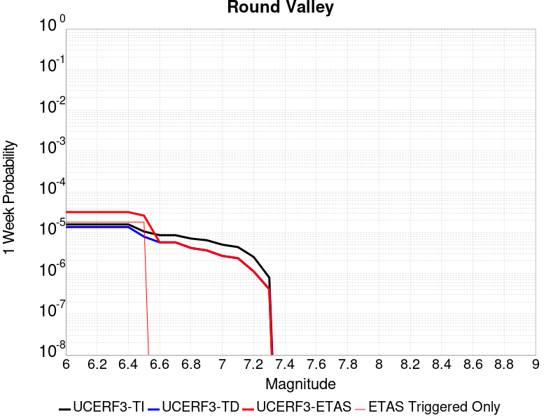 | 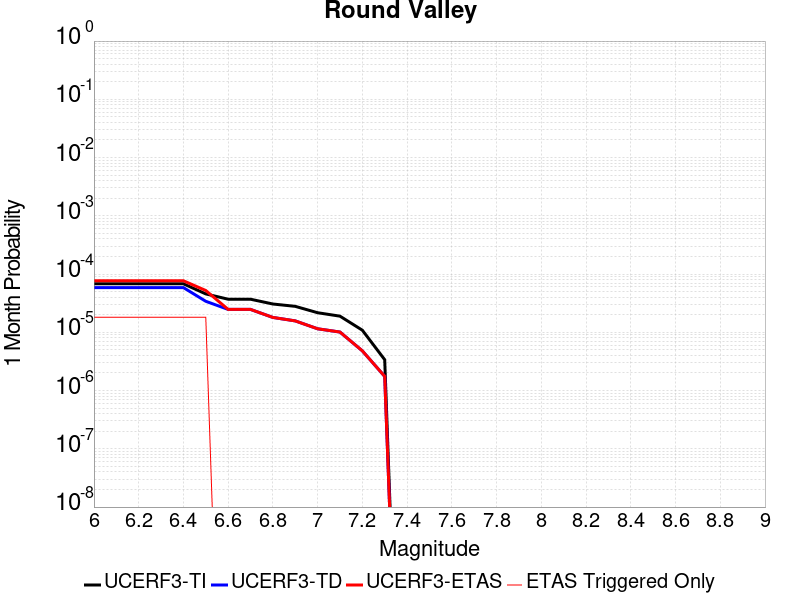 | 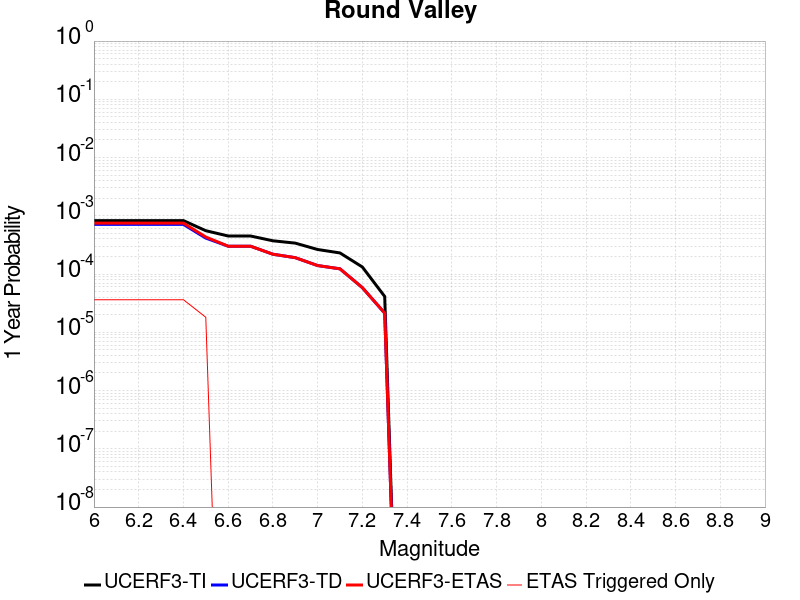 | 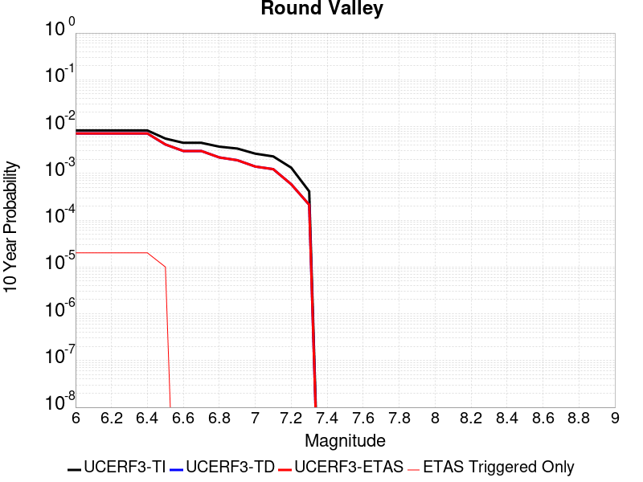 |

| Magnitude | 1 wk TI Prob | 1 wk TD Prob | 1 wk ETAS Prob | 1 wk ETAS/TD Gain | 1 wk ETAS Triggered Only | 1 mo TI Prob | 1 mo TD Prob | 1 mo ETAS Prob | 1 mo ETAS/TD Gain | 1 mo ETAS Triggered Only | 1 yr TI Prob | 1 yr TD Prob | 1 yr ETAS Prob | 1 yr ETAS/TD Gain | 1 yr ETAS Triggered Only | 10 yr TI Prob | 10 yr TD Prob | 10 yr ETAS Prob | 10 yr ETAS/TD Gain | 10 yr ETAS Triggered Only |
|-----|-----|-----|-----|-----|-----|-----|-----|-----|-----|-----|-----|-----|-----|-----|-----|-----|-----|-----|-----|-----|
| 6.0 | 1.588152E-5 | 1.3670716E-5 | 2.3670578E-5 | 1.7314806 | 1.0E-5 | 6.806188E-5 | 5.8587688E-5 | 6.85871E-5 | 1.1706743 | 1.0E-5 | 8.283384E-4 | 7.13111E-4 | 7.330968E-4 | 1.0280261 | 2.0E-5 | 0.008252576 | 0.0071121147 | 0.007131973 | 1.0027921 | 2.0E-5 |
| 6.1 | 1.588152E-5 | 1.3670716E-5 | 2.3670578E-5 | 1.7314806 | 1.0E-5 | 6.806188E-5 | 5.8587688E-5 | 6.85871E-5 | 1.1706743 | 1.0E-5 | 8.283384E-4 | 7.13111E-4 | 7.330968E-4 | 1.0280261 | 2.0E-5 | 0.008252576 | 0.0071121147 | 0.007131973 | 1.0027921 | 2.0E-5 |
| 6.2 | 1.588152E-5 | 1.3670716E-5 | 2.3670578E-5 | 1.7314806 | 1.0E-5 | 6.806188E-5 | 5.8587688E-5 | 6.85871E-5 | 1.1706743 | 1.0E-5 | 8.283384E-4 | 7.13111E-4 | 7.330968E-4 | 1.0280261 | 2.0E-5 | 0.008252576 | 0.0071121147 | 0.007131973 | 1.0027921 | 2.0E-5 |
| 6.3 | 1.588152E-5 | 1.3670716E-5 | 2.3670578E-5 | 1.7314806 | 1.0E-5 | 6.806188E-5 | 5.8587688E-5 | 6.85871E-5 | 1.1706743 | 1.0E-5 | 8.283384E-4 | 7.13111E-4 | 7.330968E-4 | 1.0280261 | 2.0E-5 | 0.008252576 | 0.0071121147 | 0.007131973 | 1.0027921 | 2.0E-5 |
| 6.4 | 1.588152E-5 | 1.3670716E-5 | 2.3670578E-5 | 1.7314806 | 1.0E-5 | 6.806188E-5 | 5.8587688E-5 | 6.85871E-5 | 1.1706743 | 1.0E-5 | 8.283384E-4 | 7.13111E-4 | 7.330968E-4 | 1.0280261 | 2.0E-5 | 0.008252576 | 0.0071121147 | 0.007131973 | 1.0027921 | 2.0E-5 |
| 6.5 | 1.0646776E-5 | 7.953037E-6 | 1.7952958E-5 | 2.2573712 | 1.0E-5 | 4.5628243E-5 | 3.408405E-5 | 4.4083707E-5 | 1.2933824 | 1.0E-5 | 5.553823E-4 | 4.1490266E-4 | 4.2489852E-4 | 1.0240921 | 1.0E-5 | 0.005539963 | 0.0041421093 | 0.004152068 | 1.0024042 | 1.0E-5 |
| 6.6 | 8.632956E-6 | 5.768742E-6 | 5.768742E-6 | 1.0 | 0.0 | 3.6997862E-5 | 2.4722967E-5 | 2.4722967E-5 | 1.0 | 0.0 | 4.5035584E-4 | 3.009644E-4 | 3.009644E-4 | 1.0 | 0.0 | 0.0044944426 | 0.003005946 | 0.003005946 | 1.0 | 0.0 |
| 6.7 | 8.632956E-6 | 5.768742E-6 | 5.768742E-6 | 1.0 | 0.0 | 3.6997862E-5 | 2.4722967E-5 | 2.4722967E-5 | 1.0 | 0.0 | 4.5035584E-4 | 3.009644E-4 | 3.009644E-4 | 1.0 | 0.0 | 0.0044944426 | 0.003005946 | 0.003005946 | 1.0 | 0.0 |
| 6.8 | 7.143895E-6 | 4.2018346E-6 | 4.2018346E-6 | 1.0 | 0.0 | 3.0616335E-5 | 1.8007748E-5 | 1.8007748E-5 | 1.0 | 0.0 | 3.726901E-4 | 2.1922393E-4 | 2.1922393E-4 | 1.0 | 0.0 | 0.0037206567 | 0.0021902416 | 0.0021902416 | 1.0 | 0.0 |
| 6.9 | 6.5120694E-6 | 3.6644687E-6 | 3.6644687E-6 | 1.0 | 0.0 | 2.790857E-5 | 1.570478E-5 | 1.570478E-5 | 1.0 | 0.0 | 3.3973387E-4 | 1.9119044E-4 | 1.9119044E-4 | 1.0 | 0.0 | 0.0033921495 | 0.0019104085 | 0.0019104085 | 1.0 | 0.0 |
| 7.0 | 5.0614435E-6 | 2.6836676E-6 | 2.6836676E-6 | 1.0 | 0.0 | 2.169172E-5 | 1.1501388E-5 | 1.1501388E-5 | 1.0 | 0.0 | 2.6406467E-4 | 1.4002144E-4 | 1.4002144E-4 | 1.0 | 0.0 | 0.0026375111 | 0.0013994334 | 0.0013994334 | 1.0 | 0.0 |
| 7.1 | 4.41728E-6 | 2.3575074E-6 | 2.3575074E-6 | 1.0 | 0.0 | 1.8931061E-5 | 1.0103569E-5 | 1.0103569E-5 | 1.0 | 0.0 | 2.304613E-4 | 1.23005E-4 | 1.23005E-4 | 1.0 | 0.0 | 0.0023022245 | 0.0012294657 | 0.0012294657 | 1.0 | 0.0 |
| 7.2 | 2.535495E-6 | 1.1208391E-6 | 1.1208391E-6 | 1.0 | 0.0 | 1.0866362E-5 | 4.8035904E-6 | 4.8035904E-6 | 1.0 | 0.0 | 1.3228992E-4 | 5.8482667E-5 | 5.8482667E-5 | 1.0 | 0.0 | 0.0013221119 | 5.84724E-4 | 5.84724E-4 | 1.0 | 0.0 |
| 7.3 | 7.900015E-7 | 4.0889498E-7 | 4.0889498E-7 | 1.0 | 0.0 | 3.3857161E-6 | 1.752407E-6 | 1.752407E-6 | 1.0 | 0.0 | 4.1220315E-5 | 2.1335554E-5 | 2.1335554E-5 | 1.0 | 0.0 | 4.121267E-4 | 2.1335555E-4 | 2.1335555E-4 | 1.0 | 0.0 |

## Sierra Madre
*[(top)](#table-of-contents)*

| 1 Week | 1 Month | 1 Year | 10 Year |
|-----|-----|-----|-----|
|  |  | 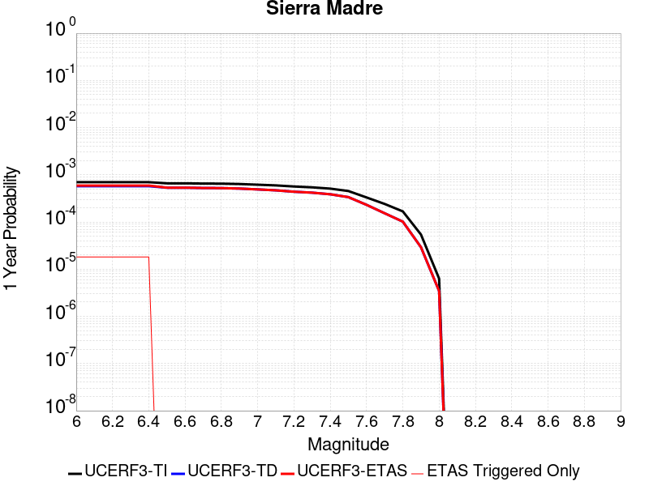 | 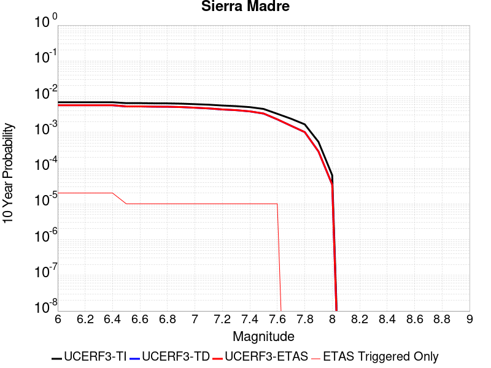 |

| Magnitude | 1 wk TI Prob | 1 wk TD Prob | 1 wk ETAS Prob | 1 wk ETAS/TD Gain | 1 wk ETAS Triggered Only | 1 mo TI Prob | 1 mo TD Prob | 1 mo ETAS Prob | 1 mo ETAS/TD Gain | 1 mo ETAS Triggered Only | 1 yr TI Prob | 1 yr TD Prob | 1 yr ETAS Prob | 1 yr ETAS/TD Gain | 1 yr ETAS Triggered Only | 10 yr TI Prob | 10 yr TD Prob | 10 yr ETAS Prob | 10 yr ETAS/TD Gain | 10 yr ETAS Triggered Only |
|-----|-----|-----|-----|-----|-----|-----|-----|-----|-----|-----|-----|-----|-----|-----|-----|-----|-----|-----|-----|-----|
| 6.0 | 1.3379373E-5 | 1.10007395E-5 | 1.10007395E-5 | 1.0 | 0.0 | 5.7338908E-5 | 4.7145186E-5 | 4.7145186E-5 | 1.0 | 0.0 | 6.978776E-4 | 5.738429E-4 | 5.8383716E-4 | 1.0174164 | 1.0E-5 | 0.0069569005 | 0.0057239756 | 0.005743861 | 1.0034741 | 2.0E-5 |
| 6.1 | 1.3379373E-5 | 1.10007395E-5 | 1.10007395E-5 | 1.0 | 0.0 | 5.7338908E-5 | 4.7145186E-5 | 4.7145186E-5 | 1.0 | 0.0 | 6.978776E-4 | 5.738429E-4 | 5.8383716E-4 | 1.0174164 | 1.0E-5 | 0.0069569005 | 0.0057239756 | 0.005743861 | 1.0034741 | 2.0E-5 |
| 6.2 | 1.3379373E-5 | 1.10007395E-5 | 1.10007395E-5 | 1.0 | 0.0 | 5.7338908E-5 | 4.7145186E-5 | 4.7145186E-5 | 1.0 | 0.0 | 6.978776E-4 | 5.738429E-4 | 5.8383716E-4 | 1.0174164 | 1.0E-5 | 0.0069569005 | 0.0057239756 | 0.005743861 | 1.0034741 | 2.0E-5 |
| 6.3 | 1.3379373E-5 | 1.10007395E-5 | 1.10007395E-5 | 1.0 | 0.0 | 5.7338908E-5 | 4.7145186E-5 | 4.7145186E-5 | 1.0 | 0.0 | 6.978776E-4 | 5.738429E-4 | 5.8383716E-4 | 1.0174164 | 1.0E-5 | 0.0069569005 | 0.0057239756 | 0.005743861 | 1.0034741 | 2.0E-5 |
| 6.4 | 1.3379373E-5 | 1.10007395E-5 | 1.10007395E-5 | 1.0 | 0.0 | 5.7338908E-5 | 4.7145186E-5 | 4.7145186E-5 | 1.0 | 0.0 | 6.978776E-4 | 5.738429E-4 | 5.8383716E-4 | 1.0174164 | 1.0E-5 | 0.0069569005 | 0.0057239756 | 0.005743861 | 1.0034741 | 2.0E-5 |
| 6.5 | 1.26563245E-5 | 1.0230196E-5 | 1.0230196E-5 | 1.0 | 0.0 | 5.4240263E-5 | 4.3842967E-5 | 4.3842967E-5 | 1.0 | 0.0 | 6.601751E-4 | 5.336584E-4 | 5.336584E-4 | 1.0 | 0.0 | 0.006582173 | 0.0053240913 | 0.005334038 | 1.0018682 | 1.0E-5 |
| 6.6 | 1.26563245E-5 | 1.0230196E-5 | 1.0230196E-5 | 1.0 | 0.0 | 5.4240263E-5 | 4.3842967E-5 | 4.3842967E-5 | 1.0 | 0.0 | 6.601751E-4 | 5.336584E-4 | 5.336584E-4 | 1.0 | 0.0 | 0.006582173 | 0.0053240913 | 0.005334038 | 1.0018682 | 1.0E-5 |
| 6.7 | 1.2502474E-5 | 1.006634E-5 | 1.006634E-5 | 1.0 | 0.0 | 5.3580934E-5 | 4.314075E-5 | 4.314075E-5 | 1.0 | 0.0 | 6.521526E-4 | 5.251131E-4 | 5.251131E-4 | 1.0 | 0.0 | 0.0065024206 | 0.0052390425 | 0.00524899 | 1.0018988 | 1.0E-5 |
| 6.8 | 1.2454966E-5 | 1.0018625E-5 | 1.0018625E-5 | 1.0 | 0.0 | 5.3377335E-5 | 4.2936266E-5 | 4.2936266E-5 | 1.0 | 0.0 | 6.4967526E-4 | 5.226247E-4 | 5.226247E-4 | 1.0 | 0.0 | 0.006477792 | 0.0052142753 | 0.0052242232 | 1.0019078 | 1.0E-5 |
| 6.9 | 1.2225574E-5 | 9.792602E-6 | 9.792602E-6 | 1.0 | 0.0 | 5.2394265E-5 | 4.1967625E-5 | 4.1967625E-5 | 1.0 | 0.0 | 6.3771347E-4 | 5.108371E-4 | 5.108371E-4 | 1.0 | 0.0 | 0.006358865 | 0.0050969445 | 0.005106894 | 1.0019519 | 1.0E-5 |
| 7.0 | 1.182946E-5 | 9.399144E-6 | 9.399144E-6 | 1.0 | 0.0 | 5.06967E-5 | 4.0281426E-5 | 4.0281426E-5 | 1.0 | 0.0 | 6.1705755E-4 | 4.9031706E-4 | 4.9031706E-4 | 1.0 | 0.0 | 0.006153469 | 0.004892664 | 0.004902615 | 1.0020338 | 1.0E-5 |
| 7.1 | 1.14369095E-5 | 8.986159E-6 | 8.986159E-6 | 1.0 | 0.0 | 4.9014405E-5 | 3.8511545E-5 | 3.8511545E-5 | 1.0 | 0.0 | 5.9658696E-4 | 4.687782E-4 | 4.687782E-4 | 1.0 | 0.0 | 0.005949879 | 0.004678199 | 0.0046881526 | 1.0021275 | 1.0E-5 |
| 7.2 | 1.0836419E-5 | 8.3995565E-6 | 8.3995565E-6 | 1.0 | 0.0 | 4.644097E-5 | 3.5997607E-5 | 3.5997607E-5 | 1.0 | 0.0 | 5.652721E-4 | 4.3818366E-4 | 4.3818366E-4 | 1.0 | 0.0 | 0.0056383642 | 0.004373494 | 0.0043834504 | 1.0022765 | 1.0E-5 |
| 7.3 | 1.0403439E-5 | 8.02082E-6 | 8.02082E-6 | 1.0 | 0.0 | 4.4585406E-5 | 3.4374494E-5 | 3.4374494E-5 | 1.0 | 0.0 | 5.426921E-4 | 4.1843E-4 | 4.1843E-4 | 1.0 | 0.0 | 0.005413687 | 0.004176717 | 0.004186675 | 1.0023842 | 1.0E-5 |
| 7.4 | 9.768864E-6 | 7.414448E-6 | 7.414448E-6 | 1.0 | 0.0 | 4.186589E-5 | 3.1775824E-5 | 3.1775824E-5 | 1.0 | 0.0 | 5.09598E-4 | 3.868029E-4 | 3.868029E-4 | 1.0 | 0.0 | 0.0050843097 | 0.0038615882 | 0.0038715496 | 1.0025796 | 1.0E-5 |
| 7.5 | 8.687089E-6 | 6.4501564E-6 | 6.4501564E-6 | 1.0 | 0.0 | 3.722985E-5 | 2.764324E-5 | 2.764324E-5 | 1.0 | 0.0 | 4.5317915E-4 | 3.3650533E-4 | 3.3650533E-4 | 1.0 | 0.0 | 0.004522561 | 0.0033602451 | 0.0033702117 | 1.0029659 | 1.0E-5 |
| 7.6 | 6.3506063E-6 | 4.4303215E-6 | 4.4303215E-6 | 1.0 | 0.0 | 2.72166E-5 | 1.8986955E-5 | 1.8986955E-5 | 1.0 | 0.0 | 3.3131172E-4 | 2.3114192E-4 | 2.3114192E-4 | 1.0 | 0.0 | 0.003308182 | 0.0023092402 | 0.002319217 | 1.0043204 | 1.0E-5 |
| 7.7 | 4.62223E-6 | 2.932967E-6 | 2.932967E-6 | 1.0 | 0.0 | 1.9809406E-5 | 1.2569798E-5 | 1.2569798E-5 | 1.0 | 0.0 | 2.4115283E-4 | 1.5302657E-4 | 1.5302657E-4 | 1.0 | 0.0 | 0.0024089129 | 0.001529413 | 0.001529413 | 1.0 | 0.0 |
| 7.8 | 3.2145008E-6 | 1.9494332E-6 | 1.9494332E-6 | 1.0 | 0.0 | 1.3776359E-5 | 8.3546865E-6 | 8.3546865E-6 | 1.0 | 0.0 | 1.6771426E-4 | 1.0171358E-4 | 1.0171358E-4 | 1.0 | 0.0 | 0.0016758774 | 0.0010168145 | 0.0010168145 | 1.0 | 0.0 |
| 7.9 | 1.0391769E-6 | 5.6026335E-7 | 5.6026335E-7 | 1.0 | 0.0 | 4.4536077E-6 | 2.4011265E-6 | 2.4011265E-6 | 1.0 | 0.0 | 5.4221324E-5 | 2.9233326E-5 | 2.9233326E-5 | 1.0 | 0.0 | 5.4208096E-4 | 2.9229524E-4 | 2.9229524E-4 | 1.0 | 0.0 |
| 8.0 | 1.210983E-7 | 6.613821E-8 | 6.613821E-8 | 1.0 | 0.0 | 5.1899264E-7 | 2.8344945E-7 | 2.8344945E-7 | 1.0 | 0.0 | 6.3187167E-6 | 3.4509917E-6 | 3.4509917E-6 | 1.0 | 0.0 | 6.318537E-5 | 3.45094E-5 | 3.45094E-5 | 1.0 | 0.0 |

## Ortigalita (South)
*[(top)](#table-of-contents)*

| 1 Week | 1 Month | 1 Year | 10 Year |
|-----|-----|-----|-----|
| 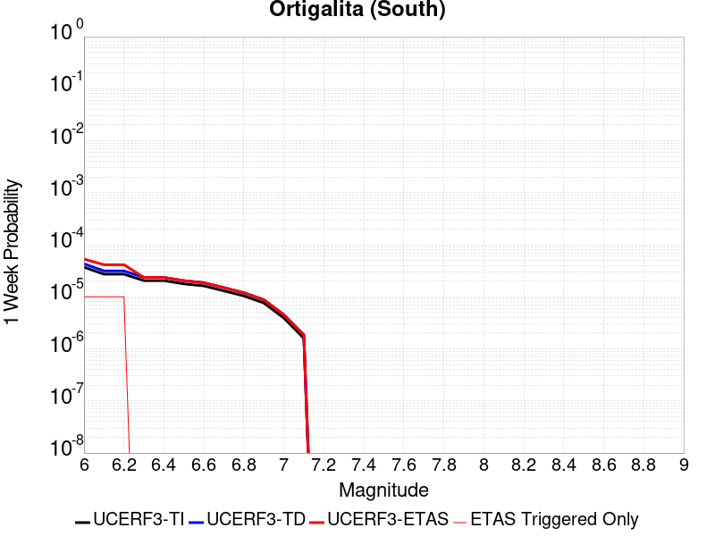 | 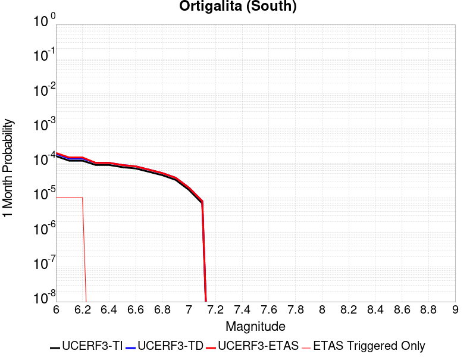 | 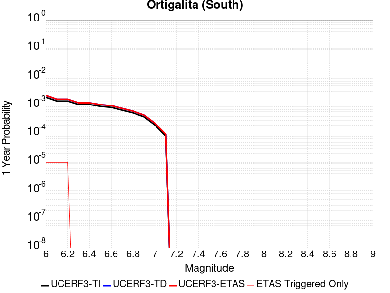 | 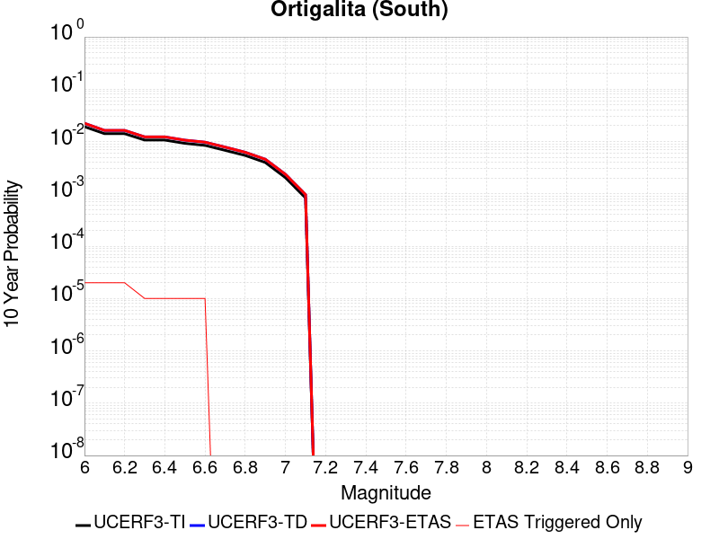 |

| Magnitude | 1 wk TI Prob | 1 wk TD Prob | 1 wk ETAS Prob | 1 wk ETAS/TD Gain | 1 wk ETAS Triggered Only | 1 mo TI Prob | 1 mo TD Prob | 1 mo ETAS Prob | 1 mo ETAS/TD Gain | 1 mo ETAS Triggered Only | 1 yr TI Prob | 1 yr TD Prob | 1 yr ETAS Prob | 1 yr ETAS/TD Gain | 1 yr ETAS Triggered Only | 10 yr TI Prob | 10 yr TD Prob | 10 yr ETAS Prob | 10 yr ETAS/TD Gain | 10 yr ETAS Triggered Only |
|-----|-----|-----|-----|-----|-----|-----|-----|-----|-----|-----|-----|-----|-----|-----|-----|-----|-----|-----|-----|-----|
| 6.0 | 3.72394E-5 | 4.325562E-5 | 5.3255186E-5 | 1.2311739 | 1.0E-5 | 1.5958765E-4 | 1.8536893E-4 | 1.9536707E-4 | 1.0539365 | 1.0E-5 | 0.0019412481 | 0.0022546875 | 0.002264665 | 1.0044252 | 1.0E-5 | 0.019243775 | 0.022334497 | 0.02235405 | 1.0008755 | 2.0E-5 |
| 6.1 | 2.7299884E-5 | 3.149204E-5 | 4.1491727E-5 | 1.3175305 | 1.0E-5 | 1.16994255E-4 | 1.3495922E-4 | 1.4495787E-4 | 1.0740864 | 1.0E-5 | 0.0014234743 | 0.0016419457 | 0.0016519292 | 1.0060804 | 1.0E-5 | 0.014143906 | 0.01630407 | 0.016323743 | 1.0012066 | 2.0E-5 |
| 6.2 | 2.7299884E-5 | 3.149204E-5 | 4.1491727E-5 | 1.3175305 | 1.0E-5 | 1.16994255E-4 | 1.3495922E-4 | 1.4495787E-4 | 1.0740864 | 1.0E-5 | 0.0014234743 | 0.0016419457 | 0.0016519292 | 1.0060804 | 1.0E-5 | 0.014143906 | 0.01630407 | 0.016323743 | 1.0012066 | 2.0E-5 |
| 6.3 | 2.0546433E-5 | 2.363145E-5 | 2.363145E-5 | 1.0 | 0.0 | 8.805317E-5 | 1.0127382E-4 | 1.0127382E-4 | 1.0 | 0.0 | 0.00107152 | 0.0012323303 | 0.0012323303 | 1.0 | 0.0 | 0.010663681 | 0.01225703 | 0.012266908 | 1.0008059 | 1.0E-5 |
| 6.4 | 2.0546433E-5 | 2.363145E-5 | 2.363145E-5 | 1.0 | 0.0 | 8.805317E-5 | 1.0127382E-4 | 1.0127382E-4 | 1.0 | 0.0 | 0.00107152 | 0.0012323303 | 0.0012323303 | 1.0 | 0.0 | 0.010663681 | 0.01225703 | 0.012266908 | 1.0008059 | 1.0E-5 |
| 6.5 | 1.7779594E-5 | 2.0446974E-5 | 2.0446974E-5 | 1.0 | 0.0 | 7.619603E-5 | 8.762702E-5 | 8.762702E-5 | 1.0 | 0.0 | 9.272918E-4 | 0.0010663504 | 0.0010663504 | 1.0 | 0.0 | 0.009234319 | 0.010613803 | 0.010623697 | 1.0009322 | 1.0E-5 |
| 6.6 | 1.6272212E-5 | 1.8714967E-5 | 1.8714967E-5 | 1.0 | 0.0 | 6.973618E-5 | 8.0204605E-5 | 8.0204605E-5 | 1.0 | 0.0 | 8.487073E-4 | 9.760658E-4 | 9.760658E-4 | 1.0 | 0.0 | 0.008454733 | 0.009719091 | 0.009728993 | 1.0010189 | 1.0E-5 |
| 6.7 | 1.3051484E-5 | 1.5038758E-5 | 1.5038758E-5 | 1.0 | 0.0 | 5.593373E-5 | 6.445028E-5 | 6.445028E-5 | 1.0 | 0.0 | 6.807804E-4 | 7.844092E-4 | 7.844092E-4 | 1.0 | 0.0 | 0.006786986 | 0.007817388 | 0.007817388 | 1.0 | 0.0 |
| 6.8 | 1.04277415E-5 | 1.1987235E-5 | 1.1987235E-5 | 1.0 | 0.0 | 4.4689557E-5 | 5.1372896E-5 | 5.1372896E-5 | 1.0 | 0.0 | 5.439595E-4 | 6.2529295E-4 | 6.2529295E-4 | 1.0 | 0.0 | 0.0054262993 | 0.00623609 | 0.00623609 | 1.0 | 0.0 |
| 6.9 | 7.639968E-6 | 8.791503E-6 | 8.791503E-6 | 1.0 | 0.0 | 3.274231E-5 | 3.767736E-5 | 3.767736E-5 | 1.0 | 0.0 | 3.9856473E-4 | 4.586312E-4 | 4.586312E-4 | 1.0 | 0.0 | 0.003978506 | 0.004577433 | 0.004577433 | 1.0 | 0.0 |
| 7.0 | 3.919831E-6 | 4.5334014E-6 | 4.5334014E-6 | 1.0 | 0.0 | 1.679917E-5 | 1.942873E-5 | 1.942873E-5 | 1.0 | 0.0 | 2.045107E-4 | 2.3652123E-4 | 2.3652123E-4 | 1.0 | 0.0 | 0.0020432258 | 0.0023629034 | 0.0023629034 | 1.0 | 0.0 |
| 7.1 | 1.6017933E-6 | 1.8570418E-6 | 1.8570418E-6 | 1.0 | 0.0 | 6.8648105E-6 | 7.958732E-6 | 7.958732E-6 | 1.0 | 0.0 | 8.357586E-5 | 9.689432E-5 | 9.689432E-5 | 1.0 | 0.0 | 8.3544437E-4 | 9.686254E-4 | 9.686254E-4 | 1.0 | 0.0 |

## Greenville (No) 2011 CFM
*[(top)](#table-of-contents)*

| 1 Week | 1 Month | 1 Year | 10 Year |
|-----|-----|-----|-----|
| 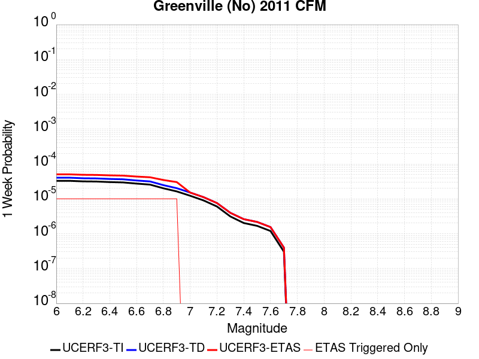 | 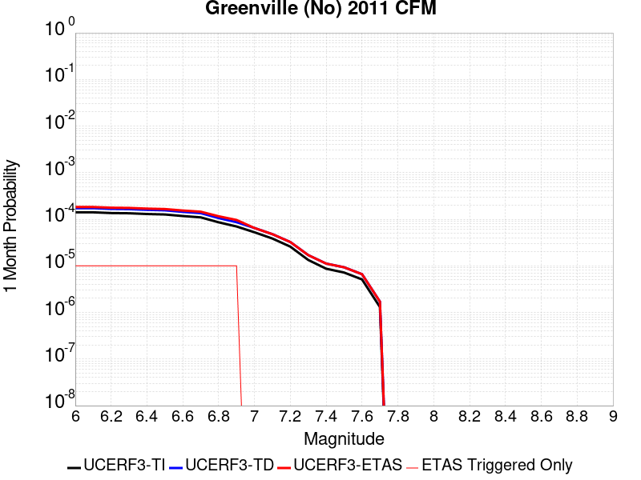 | 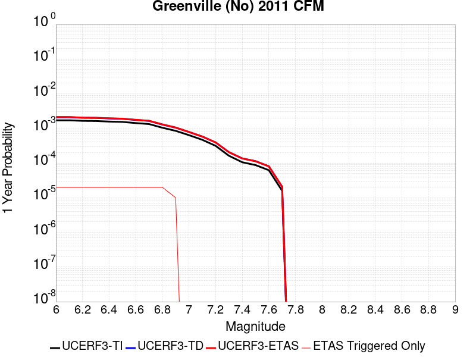 | 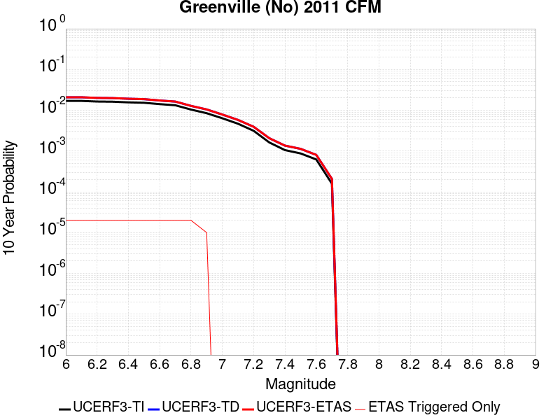 |

| Magnitude | 1 wk TI Prob | 1 wk TD Prob | 1 wk ETAS Prob | 1 wk ETAS/TD Gain | 1 wk ETAS Triggered Only | 1 mo TI Prob | 1 mo TD Prob | 1 mo ETAS Prob | 1 mo ETAS/TD Gain | 1 mo ETAS Triggered Only | 1 yr TI Prob | 1 yr TD Prob | 1 yr ETAS Prob | 1 yr ETAS/TD Gain | 1 yr ETAS Triggered Only | 10 yr TI Prob | 10 yr TD Prob | 10 yr ETAS Prob | 10 yr ETAS/TD Gain | 10 yr ETAS Triggered Only |
|-----|-----|-----|-----|-----|-----|-----|-----|-----|-----|-----|-----|-----|-----|-----|-----|-----|-----|-----|-----|-----|
| 6.0 | 3.286654E-5 | 4.036648E-5 | 5.0366078E-5 | 1.2477202 | 1.0E-5 | 1.4084899E-4 | 1.7298796E-4 | 1.8298623E-4 | 1.0577976 | 1.0E-5 | 0.0017134876 | 0.002104132 | 0.00212409 | 1.0094851 | 2.0E-5 | 0.017003356 | 0.020846982 | 0.020866565 | 1.0009394 | 2.0E-5 |
| 6.1 | 3.286654E-5 | 4.036648E-5 | 5.0366078E-5 | 1.2477202 | 1.0E-5 | 1.4084899E-4 | 1.7298796E-4 | 1.8298623E-4 | 1.0577976 | 1.0E-5 | 0.0017134876 | 0.002104132 | 0.00212409 | 1.0094851 | 2.0E-5 | 0.017003356 | 0.020846982 | 0.020866565 | 1.0009394 | 2.0E-5 |
| 6.2 | 3.1697953E-5 | 3.8929385E-5 | 4.8928996E-5 | 1.2568654 | 1.0E-5 | 1.358413E-4 | 1.6682976E-4 | 1.7682809E-4 | 1.0599314 | 1.0E-5 | 0.0016526132 | 0.002029298 | 0.0020492575 | 1.0098356 | 2.0E-5 | 0.01640377 | 0.020112377 | 0.020131974 | 1.0009744 | 2.0E-5 |
| 6.3 | 3.1363317E-5 | 3.851826E-5 | 4.8517875E-5 | 1.2596071 | 1.0E-5 | 1.344073E-4 | 1.6506804E-4 | 1.7506638E-4 | 1.0605711 | 1.0E-5 | 0.0016351803 | 0.0020078886 | 0.0020278485 | 1.0099407 | 2.0E-5 | 0.016232004 | 0.019902144 | 0.019921746 | 1.0009849 | 2.0E-5 |
| 6.4 | 3.0228604E-5 | 3.7125395E-5 | 4.7125024E-5 | 1.2693474 | 1.0E-5 | 1.2954473E-4 | 1.5909935E-4 | 1.6909775E-4 | 1.0628438 | 1.0E-5 | 0.0015760659 | 0.0019353506 | 0.0019553117 | 1.010314 | 2.0E-5 | 0.015649348 | 0.019189484 | 0.019209102 | 1.0010222 | 2.0E-5 |
| 6.5 | 2.9537814E-5 | 3.6280853E-5 | 4.628049E-5 | 1.2756175 | 1.0E-5 | 1.2658449E-4 | 1.554803E-4 | 1.6547875E-4 | 1.0643069 | 1.0E-5 | 0.0015400766 | 0.0018913659 | 0.001911328 | 1.0105543 | 2.0E-5 | 0.01529447 | 0.018757146 | 0.01877677 | 1.0010463 | 2.0E-5 |
| 6.6 | 2.7345395E-5 | 3.3590182E-5 | 4.3589847E-5 | 1.297696 | 1.0E-5 | 1.1718928E-4 | 1.4395016E-4 | 1.5394873E-4 | 1.0694585 | 1.0E-5 | 0.0014258457 | 0.0017512152 | 0.0017711802 | 1.0114007 | 2.0E-5 | 0.014167317 | 0.01737797 | 0.017397622 | 1.0011309 | 2.0E-5 |
| 6.7 | 2.5615784E-5 | 3.1567088E-5 | 4.156677E-5 | 1.3167757 | 1.0E-5 | 1.09777306E-4 | 1.3528067E-4 | 1.4527932E-4 | 1.0739104 | 1.0E-5 | 0.0013357193 | 0.0016458282 | 0.0016657953 | 1.0121319 | 2.0E-5 | 0.013277191 | 0.016340064 | 0.016359737 | 1.001204 | 2.0E-5 |
| 6.8 | 2.0059057E-5 | 2.4712073E-5 | 3.4711826E-5 | 1.4046504 | 1.0E-5 | 8.596455E-5 | 1.0590468E-4 | 1.1590362E-4 | 1.0944146 | 1.0E-5 | 0.0010461159 | 0.001288643 | 0.0013086173 | 1.0155002 | 2.0E-5 | 0.0104120495 | 0.012813724 | 0.012833467 | 1.0015408 | 2.0E-5 |
| 6.9 | 1.6321746E-5 | 2.018467E-5 | 3.0184468E-5 | 1.4954154 | 1.0E-5 | 6.9948466E-5 | 8.650293E-5 | 9.6502066E-5 | 1.1155931 | 1.0E-5 | 8.5128983E-4 | 0.0010526767 | 0.0010626662 | 1.0094895 | 1.0E-5 | 0.008480361 | 0.010478431 | 0.010488327 | 1.0009444 | 1.0E-5 |
| 7.0 | 1.22527645E-5 | 1.5135633E-5 | 1.5135633E-5 | 1.0 | 0.0 | 5.2510793E-5 | 6.486541E-5 | 6.486541E-5 | 1.0 | 0.0 | 6.3913135E-4 | 7.894544E-4 | 7.894544E-4 | 1.0 | 0.0 | 0.0063729626 | 0.007867137 | 0.007867137 | 1.0 | 0.0 |
| 7.1 | 8.996482E-6 | 1.1164954E-5 | 1.1164954E-5 | 1.0 | 0.0 | 3.8555783E-5 | 4.7848935E-5 | 4.7848935E-5 | 1.0 | 0.0 | 4.6931554E-4 | 5.824063E-4 | 5.824063E-4 | 1.0 | 0.0 | 0.004683256 | 0.0058090906 | 0.0058090906 | 1.0 | 0.0 |
| 7.2 | 6.0273087E-6 | 7.569474E-6 | 7.569474E-6 | 1.0 | 0.0 | 2.5831067E-5 | 3.2440203E-5 | 3.2440203E-5 | 1.0 | 0.0 | 3.1444785E-4 | 3.9488857E-4 | 3.9488857E-4 | 1.0 | 0.0 | 0.0031400328 | 0.003942066 | 0.003942066 | 1.0 | 0.0 |
| 7.3 | 3.1209995E-6 | 3.9663746E-6 | 3.9663746E-6 | 1.0 | 0.0 | 1.3375643E-5 | 1.699864E-5 | 1.699864E-5 | 1.0 | 0.0 | 1.6283628E-4 | 2.0693893E-4 | 2.0693893E-4 | 1.0 | 0.0 | 0.0016271701 | 0.0020675526 | 0.0020675526 | 1.0 | 0.0 |
| 7.4 | 2.0254208E-6 | 2.6096043E-6 | 2.6096043E-6 | 1.0 | 0.0 | 8.680347E-6 | 1.1183971E-5 | 1.1183971E-5 | 1.0 | 0.0 | 1.0567809E-4 | 1.361564E-4 | 1.361564E-4 | 1.0 | 0.0 | 0.0010562785 | 0.0013607866 | 0.0013607866 | 1.0 | 0.0 |
| 7.5 | 1.6763418E-6 | 2.173353E-6 | 2.173353E-6 | 1.0 | 0.0 | 7.184302E-6 | 9.314337E-6 | 9.314337E-6 | 1.0 | 0.0 | 8.746537E-5 | 1.1339621E-4 | 1.1339621E-4 | 1.0 | 0.0 | 8.743095E-4 | 0.0011334305 | 0.0011334305 | 1.0 | 0.0 |
| 7.6 | 1.1935462E-6 | 1.5458467E-6 | 1.5458467E-6 | 1.0 | 0.0 | 5.115188E-6 | 6.6250404E-6 | 6.6250404E-6 | 1.0 | 0.0 | 6.2275634E-5 | 8.065693E-5 | 8.065693E-5 | 1.0 | 0.0 | 6.2258187E-4 | 8.0630725E-4 | 8.0630725E-4 | 1.0 | 0.0 |
| 7.7 | 3.0464201E-7 | 3.9846822E-7 | 3.9846822E-7 | 1.0 | 0.0 | 1.3056081E-6 | 1.7077199E-6 | 1.7077199E-6 | 1.0 | 0.0 | 1.589566E-5 | 2.0791296E-5 | 2.0791296E-5 | 1.0 | 0.0 | 1.5894524E-4 | 2.0789822E-4 | 2.0789822E-4 | 1.0 | 0.0 |

## Maacama 2011 CFM
*[(top)](#table-of-contents)*

| 1 Week | 1 Month | 1 Year | 10 Year |
|-----|-----|-----|-----|
| 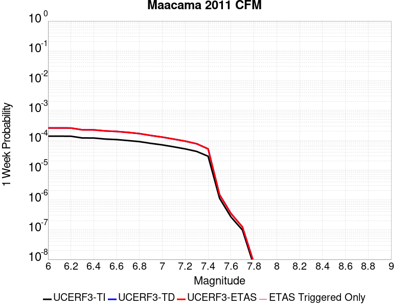 |  | 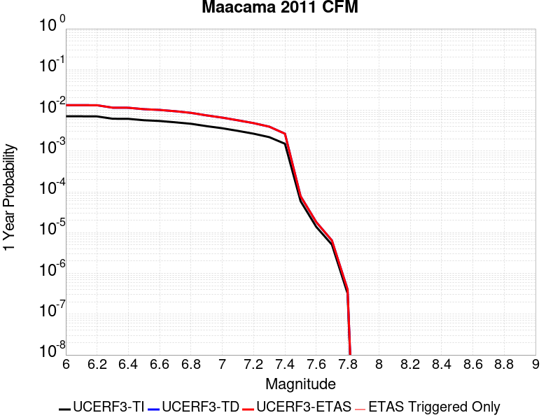 | 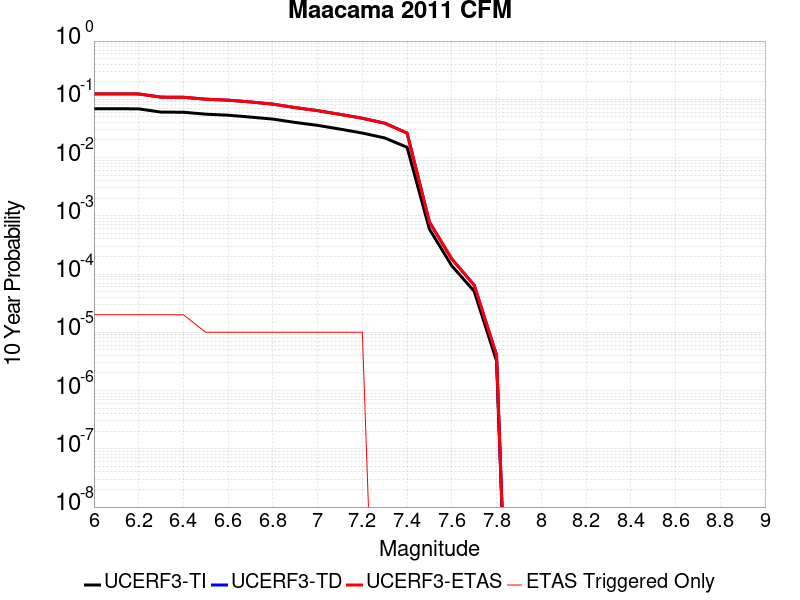 |

| Magnitude | 1 wk TI Prob | 1 wk TD Prob | 1 wk ETAS Prob | 1 wk ETAS/TD Gain | 1 wk ETAS Triggered Only | 1 mo TI Prob | 1 mo TD Prob | 1 mo ETAS Prob | 1 mo ETAS/TD Gain | 1 mo ETAS Triggered Only | 1 yr TI Prob | 1 yr TD Prob | 1 yr ETAS Prob | 1 yr ETAS/TD Gain | 1 yr ETAS Triggered Only | 10 yr TI Prob | 10 yr TD Prob | 10 yr ETAS Prob | 10 yr ETAS/TD Gain | 10 yr ETAS Triggered Only |
|-----|-----|-----|-----|-----|-----|-----|-----|-----|-----|-----|-----|-----|-----|-----|-----|-----|-----|-----|-----|-----|
| 6.0 | 1.368203E-4 | 2.5787868E-4 | 2.5787868E-4 | 1.0 | 0.0 | 5.862409E-4 | 0.0011047312 | 0.0011047312 | 1.0 | 0.0 | 0.0071141496 | 0.013350483 | 0.013350483 | 1.0 | 0.0 | 0.06890667 | 0.124189645 | 0.12420716 | 1.000141 | 2.0E-5 |
| 6.1 | 1.368203E-4 | 2.5787868E-4 | 2.5787868E-4 | 1.0 | 0.0 | 5.862409E-4 | 0.0011047312 | 0.0011047312 | 1.0 | 0.0 | 0.0071141496 | 0.013350483 | 0.013350483 | 1.0 | 0.0 | 0.06890667 | 0.124189645 | 0.12420716 | 1.000141 | 2.0E-5 |
| 6.2 | 1.360743E-4 | 2.566255E-4 | 2.566255E-4 | 1.0 | 0.0 | 5.8304524E-4 | 0.001099365 | 0.001099365 | 1.0 | 0.0 | 0.007075496 | 0.013286048 | 0.013286048 | 1.0 | 0.0 | 0.06854413 | 0.12362404 | 0.12364157 | 1.0001417 | 2.0E-5 |
| 6.3 | 1.1917239E-4 | 2.235362E-4 | 2.235362E-4 | 1.0 | 0.0 | 5.1063887E-4 | 9.5765886E-4 | 9.5765886E-4 | 1.0 | 0.0 | 0.0061993203 | 0.011587509 | 0.011587509 | 1.0 | 0.0 | 0.060292065 | 0.10884413 | 0.10886196 | 1.0001638 | 2.0E-5 |
| 6.4 | 1.1859289E-4 | 2.2257185E-4 | 2.2257185E-4 | 1.0 | 0.0 | 5.0815626E-4 | 9.535289E-4 | 9.535289E-4 | 1.0 | 0.0 | 0.006169266 | 0.0115378285 | 0.0115378285 | 1.0 | 0.0 | 0.06000784 | 0.108401 | 0.10841883 | 1.0001645 | 2.0E-5 |
| 6.5 | 1.09512424E-4 | 2.0515872E-4 | 2.0515872E-4 | 1.0 | 0.0 | 4.6925453E-4 | 8.789523E-4 | 8.789523E-4 | 1.0 | 0.0 | 0.005698218 | 0.01063927 | 0.01063927 | 1.0 | 0.0 | 0.055543028 | 0.100493506 | 0.1005025 | 1.0000895 | 1.0E-5 |
| 6.6 | 1.0502928E-4 | 1.9674368E-4 | 1.9674368E-4 | 1.0 | 0.0 | 4.500478E-4 | 8.4291224E-4 | 8.4291224E-4 | 1.0 | 0.0 | 0.0054655746 | 0.01020536 | 0.01020536 | 1.0 | 0.0 | 0.053330887 | 0.096646085 | 0.09665512 | 1.0000935 | 1.0E-5 |
| 6.7 | 9.739358E-5 | 1.825636E-4 | 1.825636E-4 | 1.0 | 0.0 | 4.173343E-4 | 7.821781E-4 | 7.821781E-4 | 1.0 | 0.0 | 0.0050692135 | 0.009475501 | 0.009475501 | 1.0 | 0.0 | 0.049551267 | 0.090118766 | 0.09012787 | 1.000101 | 1.0E-5 |
| 6.8 | 8.969524E-5 | 1.6657855E-4 | 1.6657855E-4 | 1.0 | 0.0 | 3.8435153E-4 | 7.1370887E-4 | 7.1370887E-4 | 1.0 | 0.0 | 0.0046694432 | 0.008649083 | 0.008649083 | 1.0 | 0.0 | 0.045725387 | 0.082651116 | 0.08266029 | 1.000111 | 1.0E-5 |
| 6.9 | 7.838291E-5 | 1.4417822E-4 | 1.4417822E-4 | 1.0 | 0.0 | 3.358835E-4 | 6.177581E-4 | 6.177581E-4 | 1.0 | 0.0 | 0.0040817154 | 0.007491799 | 0.007491799 | 1.0 | 0.0 | 0.04007554 | 0.07205178 | 0.072061054 | 1.0001287 | 1.0E-5 |
| 7.0 | 6.961957E-5 | 1.270709E-4 | 1.270709E-4 | 1.0 | 0.0 | 2.9833548E-4 | 5.4447335E-4 | 5.4447335E-4 | 1.0 | 0.0 | 0.0036261857 | 0.006606736 | 0.006606736 | 1.0 | 0.0 | 0.035675827 | 0.063870616 | 0.063879974 | 1.0001465 | 1.0E-5 |
| 7.1 | 5.999398E-5 | 1.0904674E-4 | 1.0904674E-4 | 1.0 | 0.0 | 2.570917E-4 | 4.6726142E-4 | 4.6726142E-4 | 1.0 | 0.0 | 0.0031255994 | 0.0056728474 | 0.0056728474 | 1.0 | 0.0 | 0.030820016 | 0.055138282 | 0.055147734 | 1.0001713 | 1.0E-5 |
| 7.2 | 5.116532E-5 | 9.3055336E-5 | 9.3055336E-5 | 1.0 | 0.0 | 2.1926152E-4 | 3.9875024E-4 | 3.9875024E-4 | 1.0 | 0.0 | 0.002666241 | 0.004843103 | 0.004843103 | 1.0 | 0.0 | 0.026344774 | 0.04730284 | 0.047312364 | 1.0002013 | 1.0E-5 |
| 7.3 | 4.2087835E-5 | 7.617328E-5 | 7.617328E-5 | 1.0 | 0.0 | 1.8036396E-4 | 3.2641852E-4 | 3.2641852E-4 | 1.0 | 0.0 | 0.0021937196 | 0.0039661685 | 0.0039661685 | 1.0 | 0.0 | 0.0217219 | 0.038904376 | 0.038904376 | 1.0 | 0.0 |
| 7.4 | 2.8991652E-5 | 5.1167233E-5 | 5.1167233E-5 | 1.0 | 0.0 | 1.2424402E-4 | 2.1927188E-4 | 2.1927188E-4 | 1.0 | 0.0 | 0.0015116213 | 0.0026660617 | 0.0026660617 | 1.0 | 0.0 | 0.015013801 | 0.026331667 | 0.026331667 | 1.0 | 0.0 |
| 7.5 | 1.1292299E-6 | 1.4950161E-6 | 1.4950161E-6 | 1.0 | 0.0 | 4.8395473E-6 | 6.4072037E-6 | 6.4072037E-6 | 1.0 | 0.0 | 5.8919897E-5 | 7.800615E-5 | 7.800615E-5 | 1.0 | 0.0 | 5.890428E-4 | 7.8048074E-4 | 7.8048074E-4 | 1.0 | 0.0 |
| 7.6 | 2.6535366E-7 | 3.4720597E-7 | 3.4720597E-7 | 1.0 | 0.0 | 1.1372296E-6 | 1.4880247E-6 | 1.4880247E-6 | 1.0 | 0.0 | 1.3845682E-5 | 1.8116552E-5 | 1.8116552E-5 | 1.0 | 0.0 | 1.3844819E-4 | 1.816747E-4 | 1.816747E-4 | 1.0 | 0.0 |
| 7.7 | 9.727789E-8 | 1.2302169E-7 | 1.2302169E-7 | 1.0 | 0.0 | 4.1690518E-7 | 5.2723567E-7 | 5.2723567E-7 | 1.0 | 0.0 | 5.0758085E-6 | 6.419076E-6 | 6.419076E-6 | 1.0 | 0.0 | 5.0756928E-5 | 6.45712E-5 | 6.45712E-5 | 1.0 | 0.0 |
| 7.8 | 6.1939325E-9 | 7.711523E-9 | 7.711523E-9 | 1.0 | 0.0 | 2.6545425E-8 | 3.3049385E-8 | 3.3049385E-8 | 1.0 | 0.0 | 3.231905E-7 | 4.0237617E-7 | 4.0237617E-7 | 1.0 | 0.0 | 3.2319003E-6 | 4.0598557E-6 | 4.0598557E-6 | 1.0 | 0.0 |

## Hector Mine
*[(top)](#table-of-contents)*

| 1 Week | 1 Month | 1 Year | 10 Year |
|-----|-----|-----|-----|
|  | 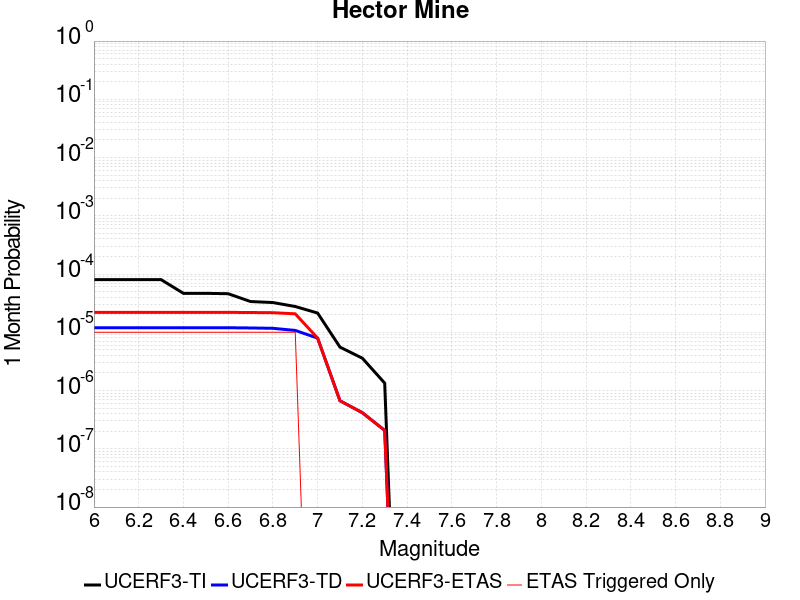 | 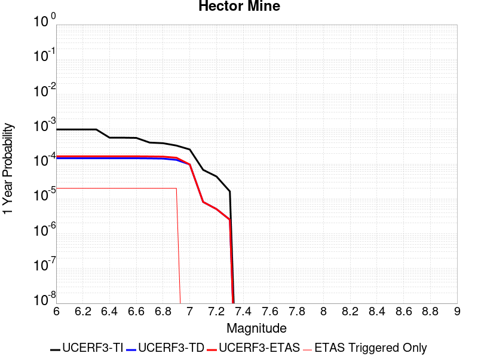 | 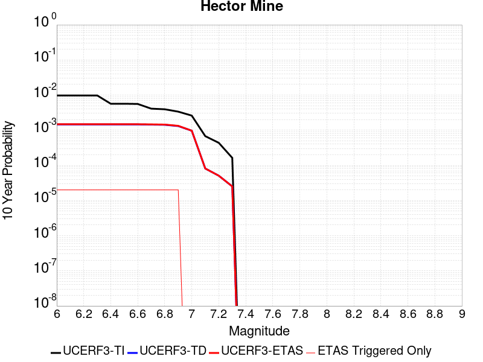 |

| Magnitude | 1 wk TI Prob | 1 wk TD Prob | 1 wk ETAS Prob | 1 wk ETAS/TD Gain | 1 wk ETAS Triggered Only | 1 mo TI Prob | 1 mo TD Prob | 1 mo ETAS Prob | 1 mo ETAS/TD Gain | 1 mo ETAS Triggered Only | 1 yr TI Prob | 1 yr TD Prob | 1 yr ETAS Prob | 1 yr ETAS/TD Gain | 1 yr ETAS Triggered Only | 10 yr TI Prob | 10 yr TD Prob | 10 yr ETAS Prob | 10 yr ETAS/TD Gain | 10 yr ETAS Triggered Only |
|-----|-----|-----|-----|-----|-----|-----|-----|-----|-----|-----|-----|-----|-----|-----|-----|-----|-----|-----|-----|-----|
| 6.0 | 1.8760093E-5 | 2.7963818E-6 | 2.7963818E-6 | 1.0 | 0.0 | 8.039792E-5 | 1.1984461E-5 | 2.198434E-5 | 1.8344039 | 1.0E-5 | 9.78405E-4 | 1.4590504E-4 | 1.6590212E-4 | 1.1370555 | 2.0E-5 | 0.009741086 | 0.0014584847 | 0.0014784555 | 1.0136929 | 2.0E-5 |
| 6.1 | 1.8760093E-5 | 2.7963818E-6 | 2.7963818E-6 | 1.0 | 0.0 | 8.039792E-5 | 1.1984461E-5 | 2.198434E-5 | 1.8344039 | 1.0E-5 | 9.78405E-4 | 1.4590504E-4 | 1.6590212E-4 | 1.1370555 | 2.0E-5 | 0.009741086 | 0.0014584847 | 0.0014784555 | 1.0136929 | 2.0E-5 |
| 6.2 | 1.8760093E-5 | 2.7963818E-6 | 2.7963818E-6 | 1.0 | 0.0 | 8.039792E-5 | 1.1984461E-5 | 2.198434E-5 | 1.8344039 | 1.0E-5 | 9.78405E-4 | 1.4590504E-4 | 1.6590212E-4 | 1.1370555 | 2.0E-5 | 0.009741086 | 0.0014584847 | 0.0014784555 | 1.0136929 | 2.0E-5 |
| 6.3 | 1.8760093E-5 | 2.7963818E-6 | 2.7963818E-6 | 1.0 | 0.0 | 8.039792E-5 | 1.1984461E-5 | 2.198434E-5 | 1.8344039 | 1.0E-5 | 9.78405E-4 | 1.4590504E-4 | 1.6590212E-4 | 1.1370555 | 2.0E-5 | 0.009741086 | 0.0014584847 | 0.0014784555 | 1.0136929 | 2.0E-5 |
| 6.4 | 1.0888055E-5 | 2.7963818E-6 | 2.7963818E-6 | 1.0 | 0.0 | 4.666226E-5 | 1.1984461E-5 | 2.198434E-5 | 1.8344039 | 1.0E-5 | 5.679649E-4 | 1.4590504E-4 | 1.6590212E-4 | 1.1370555 | 2.0E-5 | 0.0056651547 | 0.0014584847 | 0.0014784555 | 1.0136929 | 2.0E-5 |
| 6.5 | 1.0888055E-5 | 2.7963818E-6 | 2.7963818E-6 | 1.0 | 0.0 | 4.666226E-5 | 1.1984461E-5 | 2.198434E-5 | 1.8344039 | 1.0E-5 | 5.679649E-4 | 1.4590504E-4 | 1.6590212E-4 | 1.1370555 | 2.0E-5 | 0.0056651547 | 0.0014584847 | 0.0014784555 | 1.0136929 | 2.0E-5 |
| 6.6 | 1.0730738E-5 | 2.7963818E-6 | 2.7963818E-6 | 1.0 | 0.0 | 4.5988065E-5 | 1.1984461E-5 | 2.198434E-5 | 1.8344039 | 1.0E-5 | 5.5976084E-4 | 1.4590504E-4 | 1.6590212E-4 | 1.1370555 | 2.0E-5 | 0.0055835294 | 0.0014584847 | 0.0014784555 | 1.0136929 | 2.0E-5 |
| 6.7 | 7.881326E-6 | 2.7710626E-6 | 2.7710626E-6 | 1.0 | 0.0 | 3.3776672E-5 | 1.1875951E-5 | 2.1875832E-5 | 1.8420279 | 1.0E-5 | 4.111534E-4 | 1.445841E-4 | 1.6458122E-4 | 1.1383078 | 2.0E-5 | 0.0041039353 | 0.0014452925 | 0.0014652635 | 1.013818 | 2.0E-5 |
| 6.8 | 7.5683483E-6 | 2.7328138E-6 | 2.7328138E-6 | 1.0 | 0.0 | 3.2435375E-5 | 1.1712029E-5 | 2.1711912E-5 | 1.853813 | 1.0E-5 | 3.9482914E-4 | 1.4258861E-4 | 1.6258577E-4 | 1.1402436 | 2.0E-5 | 0.0039412836 | 0.0014253634 | 0.0014453348 | 1.0140115 | 2.0E-5 |
| 6.9 | 6.473048E-6 | 2.5138945E-6 | 2.5138945E-6 | 1.0 | 0.0 | 2.7741338E-5 | 1.07738115E-5 | 2.0773705E-5 | 1.9281666 | 1.0E-5 | 3.3769844E-4 | 1.3116724E-4 | 1.5116461E-4 | 1.1524571 | 2.0E-5 | 0.0033718573 | 0.0013112876 | 0.0013312615 | 1.0152322 | 2.0E-5 |
| 7.0 | 4.9959954E-6 | 1.8565124E-6 | 1.8565124E-6 | 1.0 | 0.0 | 2.1411232E-5 | 7.956478E-6 | 7.956478E-6 | 1.0 | 0.0 | 2.6065056E-4 | 9.686937E-5 | 9.686937E-5 | 1.0 | 0.0 | 0.0026034506 | 9.6862105E-4 | 9.6862105E-4 | 1.0 | 0.0 |
| 7.1 | 1.2997541E-6 | 1.5602147E-7 | 1.5602147E-7 | 1.0 | 0.0 | 5.5703626E-6 | 6.686633E-7 | 6.686633E-7 | 1.0 | 0.0 | 6.7817055E-5 | 8.140949E-6 | 8.140949E-6 | 1.0 | 0.0 | 6.779636E-4 | 8.1406906E-5 | 8.1406906E-5 | 1.0 | 0.0 |
| 7.2 | 8.392699E-7 | 9.727592E-8 | 9.727592E-8 | 1.0 | 0.0 | 3.596866E-6 | 4.1689677E-7 | 4.1689677E-7 | 1.0 | 0.0 | 4.3790962E-5 | 5.0757085E-6 | 5.0757085E-6 | 1.0 | 0.0 | 4.3782333E-4 | 5.0756116E-5 | 5.0756116E-5 | 1.0 | 0.0 |
| 7.3 | 3.13015E-7 | 4.829262E-8 | 4.829262E-8 | 1.0 | 0.0 | 1.3414921E-6 | 2.0696835E-7 | 2.0696835E-7 | 1.0 | 0.0 | 1.6332544E-5 | 2.5198376E-6 | 2.5198376E-6 | 1.0 | 0.0 | 1.6331344E-4 | 2.5198176E-5 | 2.5198176E-5 | 1.0 | 0.0 |

## Breckenridge 2011
*[(top)](#table-of-contents)*

| 1 Week | 1 Month | 1 Year | 10 Year |
|-----|-----|-----|-----|
|  |  | 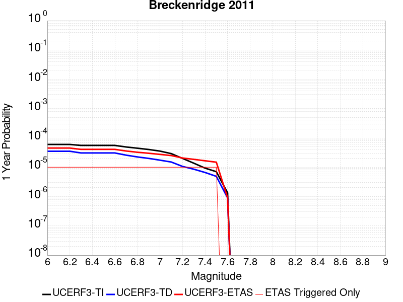 |  |

| Magnitude | 1 wk TI Prob | 1 wk TD Prob | 1 wk ETAS Prob | 1 wk ETAS/TD Gain | 1 wk ETAS Triggered Only | 1 mo TI Prob | 1 mo TD Prob | 1 mo ETAS Prob | 1 mo ETAS/TD Gain | 1 mo ETAS Triggered Only | 1 yr TI Prob | 1 yr TD Prob | 1 yr ETAS Prob | 1 yr ETAS/TD Gain | 1 yr ETAS Triggered Only | 10 yr TI Prob | 10 yr TD Prob | 10 yr ETAS Prob | 10 yr ETAS/TD Gain | 10 yr ETAS Triggered Only |
|-----|-----|-----|-----|-----|-----|-----|-----|-----|-----|-----|-----|-----|-----|-----|-----|-----|-----|-----|-----|-----|
| 6.0 | 1.1490393E-6 | 6.7380773E-7 | 6.7380773E-7 | 1.0 | 0.0 | 4.924445E-6 | 2.8877444E-6 | 2.8877444E-6 | 1.0 | 0.0 | 5.995347E-5 | 3.515774E-5 | 4.515739E-5 | 1.2844224 | 1.0E-5 | 5.9937296E-4 | 3.5152383E-4 | 3.715168E-4 | 1.0568751 | 2.0E-5 |
| 6.1 | 1.1490393E-6 | 6.7380773E-7 | 6.7380773E-7 | 1.0 | 0.0 | 4.924445E-6 | 2.8877444E-6 | 2.8877444E-6 | 1.0 | 0.0 | 5.995347E-5 | 3.515774E-5 | 4.515739E-5 | 1.2844224 | 1.0E-5 | 5.9937296E-4 | 3.5152383E-4 | 3.715168E-4 | 1.0568751 | 2.0E-5 |
| 6.2 | 1.1490393E-6 | 6.7380773E-7 | 6.7380773E-7 | 1.0 | 0.0 | 4.924445E-6 | 2.8877444E-6 | 2.8877444E-6 | 1.0 | 0.0 | 5.995347E-5 | 3.515774E-5 | 4.515739E-5 | 1.2844224 | 1.0E-5 | 5.9937296E-4 | 3.5152383E-4 | 3.715168E-4 | 1.0568751 | 2.0E-5 |
| 6.3 | 1.064617E-6 | 5.886475E-7 | 5.886475E-7 | 1.0 | 0.0 | 4.5626366E-6 | 2.5227728E-6 | 2.5227728E-6 | 1.0 | 0.0 | 5.5548684E-5 | 3.0714335E-5 | 4.071403E-5 | 1.3255708 | 1.0E-5 | 5.55348E-4 | 3.0710208E-4 | 3.2709594E-4 | 1.065105 | 2.0E-5 |
| 6.4 | 1.064617E-6 | 5.886475E-7 | 5.886475E-7 | 1.0 | 0.0 | 4.5626366E-6 | 2.5227728E-6 | 2.5227728E-6 | 1.0 | 0.0 | 5.5548684E-5 | 3.0714335E-5 | 4.071403E-5 | 1.3255708 | 1.0E-5 | 5.55348E-4 | 3.0710208E-4 | 3.2709594E-4 | 1.065105 | 2.0E-5 |
| 6.5 | 1.064617E-6 | 5.886475E-7 | 5.886475E-7 | 1.0 | 0.0 | 4.5626366E-6 | 2.5227728E-6 | 2.5227728E-6 | 1.0 | 0.0 | 5.5548684E-5 | 3.0714335E-5 | 4.071403E-5 | 1.3255708 | 1.0E-5 | 5.55348E-4 | 3.0710208E-4 | 3.2709594E-4 | 1.065105 | 2.0E-5 |
| 6.6 | 1.064617E-6 | 5.886475E-7 | 5.886475E-7 | 1.0 | 0.0 | 4.5626366E-6 | 2.5227728E-6 | 2.5227728E-6 | 1.0 | 0.0 | 5.5548684E-5 | 3.0714335E-5 | 4.071403E-5 | 1.3255708 | 1.0E-5 | 5.55348E-4 | 3.0710208E-4 | 3.2709594E-4 | 1.065105 | 2.0E-5 |
| 6.7 | 9.4219524E-7 | 4.954078E-7 | 4.954078E-7 | 1.0 | 0.0 | 4.037973E-6 | 2.1231745E-6 | 2.1231745E-6 | 1.0 | 0.0 | 4.916122E-5 | 2.5849351E-5 | 3.584909E-5 | 1.3868469 | 1.0E-5 | 4.9150345E-4 | 2.5846408E-4 | 2.784589E-4 | 1.0773602 | 2.0E-5 |
| 6.8 | 8.556422E-7 | 4.311975E-7 | 4.311975E-7 | 1.0 | 0.0 | 3.667033E-6 | 1.847988E-6 | 1.847988E-6 | 1.0 | 0.0 | 4.464521E-5 | 2.2499025E-5 | 3.24988E-5 | 1.4444537 | 1.0E-5 | 4.4636242E-4 | 2.2496787E-4 | 2.4496336E-4 | 1.0888816 | 2.0E-5 |
| 6.9 | 7.7357794E-7 | 3.8420345E-7 | 3.8420345E-7 | 1.0 | 0.0 | 3.3153299E-6 | 1.6465851E-6 | 1.6465851E-6 | 1.0 | 0.0 | 4.0363393E-5 | 2.0046993E-5 | 3.0046793E-5 | 1.4988179 | 1.0E-5 | 4.035606E-4 | 2.0045215E-4 | 2.2044814E-4 | 1.0997545 | 2.0E-5 |
| 7.0 | 6.8172454E-7 | 3.3471417E-7 | 3.3471417E-7 | 1.0 | 0.0 | 2.9216735E-6 | 1.4344886E-6 | 1.4344886E-6 | 1.0 | 0.0 | 3.5570793E-5 | 1.7464761E-5 | 2.7464586E-5 | 1.5725715 | 1.0E-5 | 3.55651E-4 | 1.746341E-4 | 1.9463061E-4 | 1.1145052 | 2.0E-5 |
| 7.1 | 5.5936397E-7 | 2.890966E-7 | 2.890966E-7 | 1.0 | 0.0 | 2.397272E-6 | 1.2389849E-6 | 1.2389849E-6 | 1.0 | 0.0 | 2.9186394E-5 | 1.5084538E-5 | 2.5084388E-5 | 1.6629205 | 1.0E-5 | 2.9182562E-4 | 1.5083532E-4 | 1.7083231E-4 | 1.1325749 | 2.0E-5 |
| 7.2 | 3.8420822E-7 | 2.0468339E-7 | 2.0468339E-7 | 1.0 | 0.0 | 1.6466057E-6 | 8.7721423E-7 | 8.7721423E-7 | 1.0 | 0.0 | 2.004724E-5 | 1.0680032E-5 | 2.0679925E-5 | 1.9363168 | 1.0E-5 | 2.004543E-4 | 1.0679527E-4 | 1.167942E-4 | 1.0936271 | 1.0E-5 |
| 7.3 | 2.6405158E-7 | 1.647323E-7 | 1.647323E-7 | 1.0 | 0.0 | 1.1316491E-6 | 7.059954E-7 | 7.059954E-7 | 1.0 | 0.0 | 1.37777415E-5 | 8.595461E-6 | 1.8595374E-5 | 2.163395 | 1.0E-5 | 1.3776887E-4 | 8.5951346E-5 | 9.595048E-5 | 1.1163349 | 1.0E-5 |
| 7.4 | 1.792114E-7 | 1.2725314E-7 | 1.2725314E-7 | 1.0 | 0.0 | 7.6804866E-7 | 5.4537054E-7 | 5.4537054E-7 | 1.0 | 0.0 | 9.3509525E-6 | 6.6398666E-6 | 1.66398E-5 | 2.5060444 | 1.0E-5 | 9.350559E-5 | 6.639673E-5 | 7.639606E-5 | 1.1505998 | 1.0E-5 |
| 7.5 | 1.3548703E-7 | 9.3854034E-8 | 9.3854034E-8 | 1.0 | 0.0 | 5.8065854E-7 | 4.022315E-7 | 4.022315E-7 | 1.0 | 0.0 | 7.0694946E-6 | 4.897158E-6 | 1.48971085E-5 | 3.0419908 | 1.0E-5 | 7.0692695E-5 | 4.8970534E-5 | 5.8970047E-5 | 1.2041944 | 1.0E-5 |
| 7.6 | 2.572245E-8 | 1.7352555E-8 | 1.7352555E-8 | 1.0 | 0.0 | 1.10239064E-7 | 7.436809E-8 | 7.436809E-8 | 1.0 | 0.0 | 1.3421597E-6 | 9.054312E-7 | 9.054312E-7 | 1.0 | 0.0 | 1.3421517E-5 | 9.05428E-6 | 9.05428E-6 | 1.0 | 0.0 |

## Mono Lake 2011 CFM
*[(top)](#table-of-contents)*

| 1 Week | 1 Month | 1 Year | 10 Year |
|-----|-----|-----|-----|
|  |  | 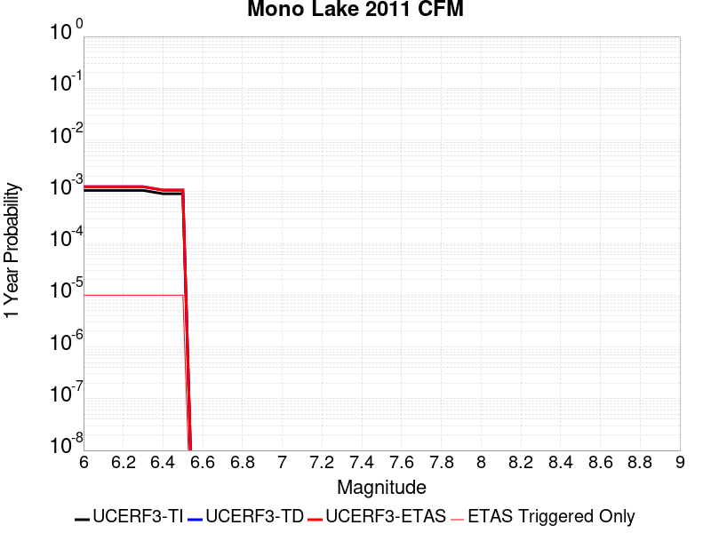 |  |

| Magnitude | 1 wk TI Prob | 1 wk TD Prob | 1 wk ETAS Prob | 1 wk ETAS/TD Gain | 1 wk ETAS Triggered Only | 1 mo TI Prob | 1 mo TD Prob | 1 mo ETAS Prob | 1 mo ETAS/TD Gain | 1 mo ETAS Triggered Only | 1 yr TI Prob | 1 yr TD Prob | 1 yr ETAS Prob | 1 yr ETAS/TD Gain | 1 yr ETAS Triggered Only | 10 yr TI Prob | 10 yr TD Prob | 10 yr ETAS Prob | 10 yr ETAS/TD Gain | 10 yr ETAS Triggered Only |
|-----|-----|-----|-----|-----|-----|-----|-----|-----|-----|-----|-----|-----|-----|-----|-----|-----|-----|-----|-----|-----|
| 6.0 | 2.0341662E-5 | 2.3828166E-5 | 2.3828166E-5 | 1.0 | 0.0 | 8.717564E-5 | 1.0211971E-4 | 1.0211971E-4 | 1.0 | 0.0 | 0.0010608466 | 0.0012431298 | 0.0012531173 | 1.0080342 | 1.0E-5 | 0.010557966 | 0.012413835 | 0.012433587 | 1.0015911 | 2.0E-5 |
| 6.1 | 2.0341662E-5 | 2.3828166E-5 | 2.3828166E-5 | 1.0 | 0.0 | 8.717564E-5 | 1.0211971E-4 | 1.0211971E-4 | 1.0 | 0.0 | 0.0010608466 | 0.0012431298 | 0.0012531173 | 1.0080342 | 1.0E-5 | 0.010557966 | 0.012413835 | 0.012433587 | 1.0015911 | 2.0E-5 |
| 6.2 | 2.0341662E-5 | 2.3828166E-5 | 2.3828166E-5 | 1.0 | 0.0 | 8.717564E-5 | 1.0211971E-4 | 1.0211971E-4 | 1.0 | 0.0 | 0.0010608466 | 0.0012431298 | 0.0012531173 | 1.0080342 | 1.0E-5 | 0.010557966 | 0.012413835 | 0.012433587 | 1.0015911 | 2.0E-5 |
| 6.3 | 2.0341662E-5 | 2.3828166E-5 | 2.3828166E-5 | 1.0 | 0.0 | 8.717564E-5 | 1.0211971E-4 | 1.0211971E-4 | 1.0 | 0.0 | 0.0010608466 | 0.0012431298 | 0.0012531173 | 1.0080342 | 1.0E-5 | 0.010557966 | 0.012413835 | 0.012433587 | 1.0015911 | 2.0E-5 |
| 6.4 | 1.749821E-5 | 2.0490985E-5 | 2.0490985E-5 | 1.0 | 0.0 | 7.499018E-5 | 8.781851E-5 | 8.781851E-5 | 1.0 | 0.0 | 9.1262296E-4 | 0.0010691903 | 0.0010791797 | 1.0093429 | 1.0E-5 | 0.009088841 | 0.010691865 | 0.010711651 | 1.0018506 | 2.0E-5 |
| 6.5 | 1.749821E-5 | 2.0490985E-5 | 2.0490985E-5 | 1.0 | 0.0 | 7.499018E-5 | 8.781851E-5 | 8.781851E-5 | 1.0 | 0.0 | 9.1262296E-4 | 0.0010691903 | 0.0010791797 | 1.0093429 | 1.0E-5 | 0.009088841 | 0.010691865 | 0.010711651 | 1.0018506 | 2.0E-5 |

## Almanor 2011 CFM
*[(top)](#table-of-contents)*

| 1 Week | 1 Month | 1 Year | 10 Year |
|-----|-----|-----|-----|
|  | 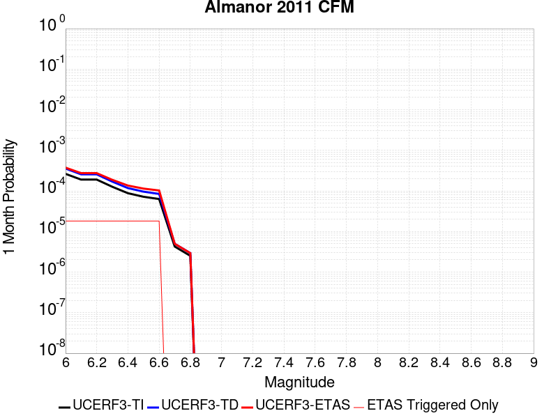 | 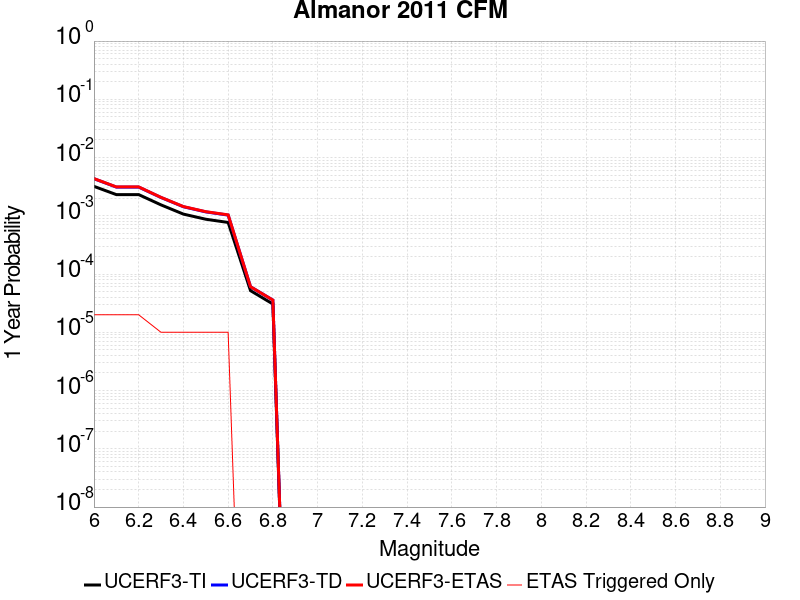 | 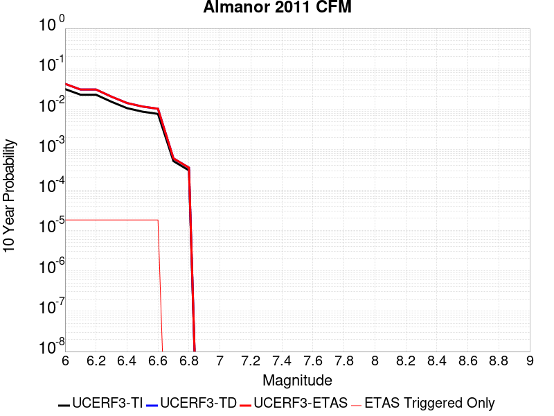 |

| Magnitude | 1 wk TI Prob | 1 wk TD Prob | 1 wk ETAS Prob | 1 wk ETAS/TD Gain | 1 wk ETAS Triggered Only | 1 mo TI Prob | 1 mo TD Prob | 1 mo ETAS Prob | 1 mo ETAS/TD Gain | 1 mo ETAS Triggered Only | 1 yr TI Prob | 1 yr TD Prob | 1 yr ETAS Prob | 1 yr ETAS/TD Gain | 1 yr ETAS Triggered Only | 10 yr TI Prob | 10 yr TD Prob | 10 yr ETAS Prob | 10 yr ETAS/TD Gain | 10 yr ETAS Triggered Only |
|-----|-----|-----|-----|-----|-----|-----|-----|-----|-----|-----|-----|-----|-----|-----|-----|-----|-----|-----|-----|-----|
| 6.0 | 6.1479834E-5 | 8.32787E-5 | 8.32787E-5 | 1.0 | 0.0 | 2.6345838E-4 | 3.5686578E-4 | 3.7685863E-4 | 1.0560235 | 2.0E-5 | 0.0032028882 | 0.0043366123 | 0.0043565254 | 1.004592 | 2.0E-5 | 0.031571172 | 0.04258577 | 0.04260492 | 1.0004497 | 2.0E-5 |
| 6.1 | 4.4387216E-5 | 5.9770442E-5 | 5.9770442E-5 | 1.0 | 0.0 | 1.9021705E-4 | 2.561381E-4 | 2.7613295E-4 | 1.0780629 | 2.0E-5 | 0.0023134327 | 0.003114426 | 0.0031343638 | 1.0064018 | 2.0E-5 | 0.022894967 | 0.030755036 | 0.03077442 | 1.0006303 | 2.0E-5 |
| 6.2 | 4.4387216E-5 | 5.9770442E-5 | 5.9770442E-5 | 1.0 | 0.0 | 1.9021705E-4 | 2.561381E-4 | 2.7613295E-4 | 1.0780629 | 2.0E-5 | 0.0023134327 | 0.003114426 | 0.0031343638 | 1.0064018 | 2.0E-5 | 0.022894967 | 0.030755036 | 0.03077442 | 1.0006303 | 2.0E-5 |
| 6.3 | 2.9523822E-5 | 3.954719E-5 | 3.954719E-5 | 1.0 | 0.0 | 1.2652454E-4 | 1.6947983E-4 | 1.7947814E-4 | 1.058994 | 1.0E-5 | 0.0015393476 | 0.0020618725 | 0.0020718519 | 1.00484 | 1.0E-5 | 0.015287281 | 0.020460794 | 0.02047059 | 1.0004787 | 1.0E-5 |
| 6.4 | 2.0512744E-5 | 2.7431617E-5 | 2.7431617E-5 | 1.0 | 0.0 | 8.79088E-5 | 1.175612E-4 | 1.2756002E-4 | 1.0850521 | 1.0E-5 | 0.001069764 | 0.0014307408 | 0.0014407266 | 1.0069793 | 1.0E-5 | 0.010646289 | 0.014244413 | 0.014254271 | 1.000692 | 1.0E-5 |
| 6.5 | 1.6750226E-5 | 2.23913E-5 | 2.23913E-5 | 1.0 | 0.0 | 7.178471E-5 | 9.596152E-5 | 1.0596056E-4 | 1.1041985 | 1.0E-5 | 8.7362836E-4 | 0.0011680633 | 0.0011780516 | 1.0085511 | 1.0E-5 | 0.008702018 | 0.011649038 | 0.011658922 | 1.0008484 | 1.0E-5 |
| 6.6 | 1.4745303E-5 | 1.9707952E-5 | 1.9707952E-5 | 1.0 | 0.0 | 6.319262E-5 | 8.446223E-5 | 9.4461386E-5 | 1.1183861 | 1.0E-5 | 7.690986E-4 | 0.0010281964 | 0.0010381861 | 1.0097158 | 1.0E-5 | 0.0076644225 | 0.010264971 | 0.010274868 | 1.0009642 | 1.0E-5 |
| 6.7 | 9.951145E-7 | 1.1616347E-6 | 1.1616347E-6 | 1.0 | 0.0 | 4.26477E-6 | 4.9784257E-6 | 4.9784257E-6 | 1.0 | 0.0 | 5.1922336E-5 | 6.0610826E-5 | 6.0610826E-5 | 1.0 | 0.0 | 5.1910203E-4 | 6.059602E-4 | 6.059602E-4 | 1.0 | 0.0 |
| 6.8 | 5.866312E-7 | 6.849384E-7 | 6.849384E-7 | 1.0 | 0.0 | 2.5141312E-6 | 2.9354478E-6 | 2.9354478E-6 | 1.0 | 0.0 | 3.0609117E-5 | 3.5738623E-5 | 3.5738623E-5 | 1.0 | 0.0 | 3.06049E-4 | 3.5734157E-4 | 3.5734157E-4 | 1.0 | 0.0 |

## Elsinore (Temecula) rev
*[(top)](#table-of-contents)*

| 1 Week | 1 Month | 1 Year | 10 Year |
|-----|-----|-----|-----|
| 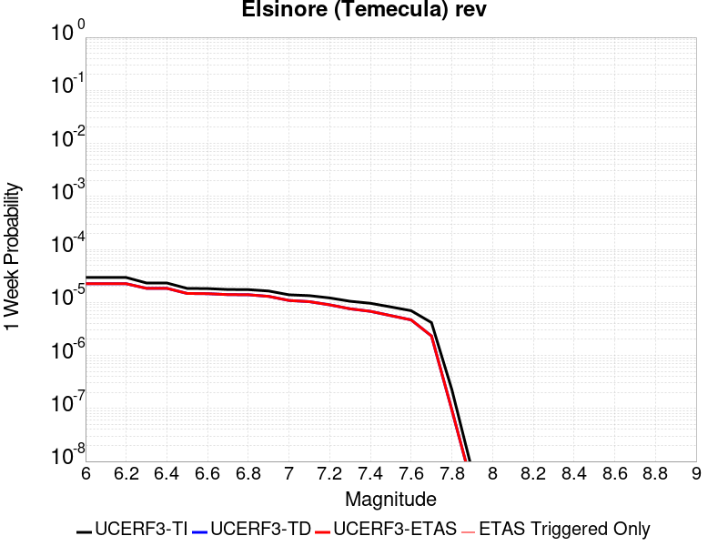 |  | 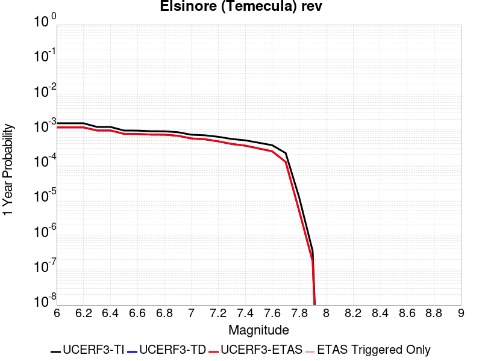 | 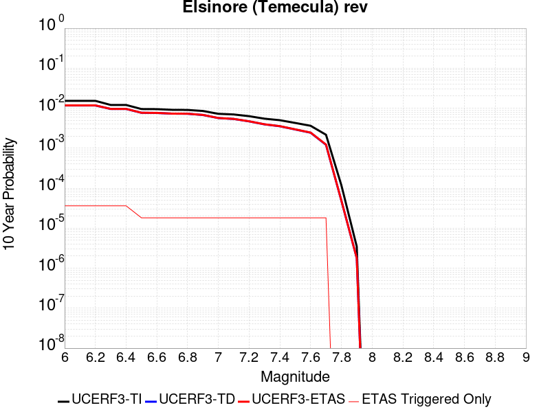 |

| Magnitude | 1 wk TI Prob | 1 wk TD Prob | 1 wk ETAS Prob | 1 wk ETAS/TD Gain | 1 wk ETAS Triggered Only | 1 mo TI Prob | 1 mo TD Prob | 1 mo ETAS Prob | 1 mo ETAS/TD Gain | 1 mo ETAS Triggered Only | 1 yr TI Prob | 1 yr TD Prob | 1 yr ETAS Prob | 1 yr ETAS/TD Gain | 1 yr ETAS Triggered Only | 10 yr TI Prob | 10 yr TD Prob | 10 yr ETAS Prob | 10 yr ETAS/TD Gain | 10 yr ETAS Triggered Only |
|-----|-----|-----|-----|-----|-----|-----|-----|-----|-----|-----|-----|-----|-----|-----|-----|-----|-----|-----|-----|-----|
| 6.0 | 2.9514995E-5 | 2.2517117E-5 | 2.2517117E-5 | 1.0 | 0.0 | 1.264867E-4 | 9.649849E-5 | 9.649849E-5 | 1.0 | 0.0 | 0.0015388876 | 0.0011742581 | 0.0011742581 | 1.0 | 0.0 | 0.015282745 | 0.011696897 | 0.011716664 | 1.0016899 | 2.0E-5 |
| 6.1 | 2.9514995E-5 | 2.2517117E-5 | 2.2517117E-5 | 1.0 | 0.0 | 1.264867E-4 | 9.649849E-5 | 9.649849E-5 | 1.0 | 0.0 | 0.0015388876 | 0.0011742581 | 0.0011742581 | 1.0 | 0.0 | 0.015282745 | 0.011696897 | 0.011716664 | 1.0016899 | 2.0E-5 |
| 6.2 | 2.9514995E-5 | 2.2517117E-5 | 2.2517117E-5 | 1.0 | 0.0 | 1.264867E-4 | 9.649849E-5 | 9.649849E-5 | 1.0 | 0.0 | 0.0015388876 | 0.0011742581 | 0.0011742581 | 1.0 | 0.0 | 0.015282745 | 0.011696897 | 0.011716664 | 1.0016899 | 2.0E-5 |
| 6.3 | 2.3223649E-5 | 1.8406454E-5 | 1.8406454E-5 | 1.0 | 0.0 | 9.952613E-5 | 7.888251E-5 | 7.888251E-5 | 1.0 | 0.0 | 0.001211057 | 9.599888E-4 | 9.599888E-4 | 1.0 | 0.0 | 0.012044783 | 0.009569948 | 0.009589756 | 1.0020698 | 2.0E-5 |
| 6.4 | 2.3223649E-5 | 1.8406454E-5 | 1.8406454E-5 | 1.0 | 0.0 | 9.952613E-5 | 7.888251E-5 | 7.888251E-5 | 1.0 | 0.0 | 0.001211057 | 9.599888E-4 | 9.599888E-4 | 1.0 | 0.0 | 0.012044783 | 0.009569948 | 0.009589756 | 1.0020698 | 2.0E-5 |
| 6.5 | 1.8338875E-5 | 1.4750118E-5 | 1.4750118E-5 | 1.0 | 0.0 | 7.8592806E-5 | 6.321331E-5 | 6.321331E-5 | 1.0 | 0.0 | 9.5644733E-4 | 7.69359E-4 | 7.69359E-4 | 1.0 | 0.0 | 0.009523412 | 0.0076739118 | 0.007683835 | 1.0012931 | 1.0E-5 |
| 6.6 | 1.8223333E-5 | 1.4612673E-5 | 1.4612673E-5 | 1.0 | 0.0 | 7.809766E-5 | 6.262429E-5 | 6.262429E-5 | 1.0 | 0.0 | 9.504242E-4 | 7.6219277E-4 | 7.6219277E-4 | 1.0 | 0.0 | 0.009463696 | 0.0076027405 | 0.0076126647 | 1.0013053 | 1.0E-5 |
| 6.7 | 1.7512752E-5 | 1.402721E-5 | 1.402721E-5 | 1.0 | 0.0 | 7.505249E-5 | 6.011528E-5 | 6.011528E-5 | 1.0 | 0.0 | 9.13381E-4 | 7.3166634E-4 | 7.3166634E-4 | 1.0 | 0.0 | 0.00909636 | 0.00729892 | 0.007308847 | 1.00136 | 1.0E-5 |
| 6.8 | 1.7417142E-5 | 1.3951195E-5 | 1.3951195E-5 | 1.0 | 0.0 | 7.4642754E-5 | 5.9789512E-5 | 5.9789512E-5 | 1.0 | 0.0 | 9.083966E-4 | 7.277028E-4 | 7.277028E-4 | 1.0 | 0.0 | 0.009046922 | 0.0072594886 | 0.007269416 | 1.0013674 | 1.0E-5 |
| 6.9 | 1.6402591E-5 | 1.2988613E-5 | 1.2988613E-5 | 1.0 | 0.0 | 7.0294926E-5 | 5.5664343E-5 | 5.5664343E-5 | 1.0 | 0.0 | 8.5550465E-4 | 6.775103E-4 | 6.775103E-4 | 1.0 | 0.0 | 0.008522186 | 0.006760169 | 0.0067701014 | 1.0014693 | 1.0E-5 |
| 7.0 | 1.3912486E-5 | 1.0878233E-5 | 1.0878233E-5 | 1.0 | 0.0 | 5.9623577E-5 | 4.6620182E-5 | 4.6620182E-5 | 1.0 | 0.0 | 7.2567526E-4 | 5.674556E-4 | 5.674556E-4 | 1.0 | 0.0 | 0.0072331014 | 0.005663986 | 0.005673929 | 1.0017556 | 1.0E-5 |
| 7.1 | 1.3405147E-5 | 1.03274215E-5 | 1.03274215E-5 | 1.0 | 0.0 | 5.7449364E-5 | 4.425964E-5 | 4.425964E-5 | 1.0 | 0.0 | 6.9922156E-4 | 5.3873047E-4 | 5.3873047E-4 | 1.0 | 0.0 | 0.0069702556 | 0.005377577 | 0.005387523 | 1.0018495 | 1.0E-5 |
| 7.2 | 1.21402E-5 | 8.996737E-6 | 8.996737E-6 | 1.0 | 0.0 | 5.202839E-5 | 3.8556886E-5 | 3.8556886E-5 | 1.0 | 0.0 | 6.332616E-4 | 4.6933076E-4 | 4.6933076E-4 | 1.0 | 0.0 | 0.0063146 | 0.004684821 | 0.004694774 | 1.0021245 | 1.0E-5 |
| 7.3 | 1.05047775E-5 | 7.571771E-6 | 7.571771E-6 | 1.0 | 0.0 | 4.5019697E-5 | 3.245005E-5 | 3.245005E-5 | 1.0 | 0.0 | 5.4797693E-4 | 3.950092E-4 | 3.950092E-4 | 1.0 | 0.0 | 0.005466277 | 0.00394346 | 0.003953421 | 1.0025258 | 1.0E-5 |
| 7.4 | 9.624483E-6 | 6.7868696E-6 | 6.7868696E-6 | 1.0 | 0.0 | 4.124713E-5 | 2.9086266E-5 | 2.9086266E-5 | 1.0 | 0.0 | 5.0206814E-4 | 3.5406914E-4 | 3.5406914E-4 | 1.0 | 0.0 | 0.005009353 | 0.003535204 | 0.0035451688 | 1.0028187 | 1.0E-5 |
| 7.5 | 8.215151E-6 | 5.635538E-6 | 5.635538E-6 | 1.0 | 0.0 | 3.5207315E-5 | 2.4152088E-5 | 2.4152088E-5 | 1.0 | 0.0 | 4.2856473E-4 | 2.9401327E-4 | 2.9401327E-4 | 1.0 | 0.0 | 0.004277392 | 0.002936371 | 0.0029463414 | 1.0033956 | 1.0E-5 |
| 7.6 | 6.975058E-6 | 4.676045E-6 | 4.676045E-6 | 1.0 | 0.0 | 2.9892764E-5 | 2.0040046E-5 | 2.0040046E-5 | 1.0 | 0.0 | 3.6388362E-4 | 2.439614E-4 | 2.439614E-4 | 1.0 | 0.0 | 0.0036328835 | 0.002437052 | 0.0024470277 | 1.0040933 | 1.0E-5 |
| 7.7 | 4.159604E-6 | 2.3269924E-6 | 2.3269924E-6 | 1.0 | 0.0 | 1.7826753E-5 | 9.97279E-6 | 9.97279E-6 | 1.0 | 0.0 | 2.1701909E-4 | 1.21412704E-4 | 1.21412704E-4 | 1.0 | 0.0 | 0.0021680726 | 0.0012135367 | 0.0012235246 | 1.0082303 | 1.0E-5 |
| 7.8 | 2.2692414E-7 | 9.3854695E-8 | 9.3854695E-8 | 1.0 | 0.0 | 9.725317E-7 | 4.0223435E-7 | 4.0223435E-7 | 1.0 | 0.0 | 1.1840509E-5 | 4.8971956E-6 | 4.8971956E-6 | 1.0 | 0.0 | 1.1839878E-4 | 4.8971204E-5 | 4.8971204E-5 | 1.0 | 0.0 |
| 7.9 | 6.676829E-9 | 3.439853E-9 | 3.439853E-9 | 1.0 | 0.0 | 2.861498E-8 | 1.4742227E-8 | 1.4742227E-8 | 1.0 | 0.0 | 3.4838732E-7 | 1.7948659E-7 | 1.7948659E-7 | 1.0 | 0.0 | 3.4838679E-6 | 1.7948646E-6 | 1.7948646E-6 | 1.0 | 0.0 |

## Hayward (So) extension 2011 CFM
*[(top)](#table-of-contents)*

| 1 Week | 1 Month | 1 Year | 10 Year |
|-----|-----|-----|-----|
| 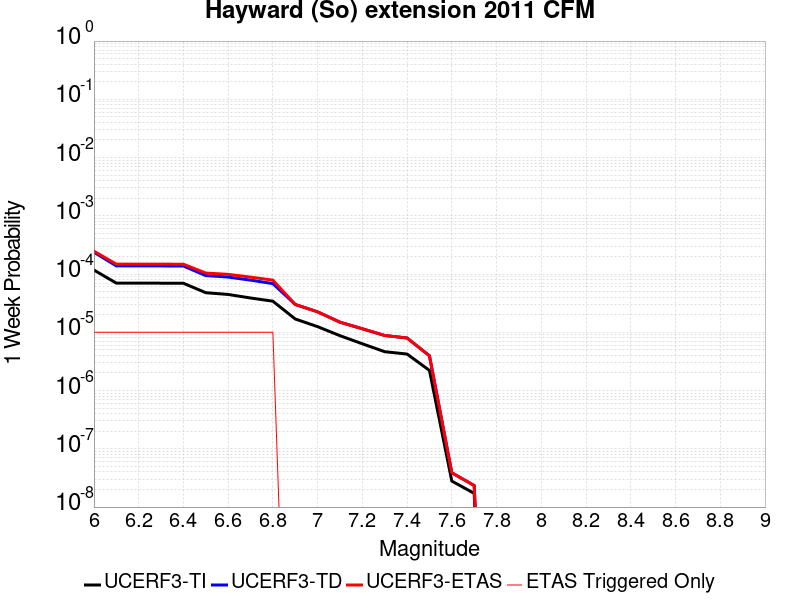 | 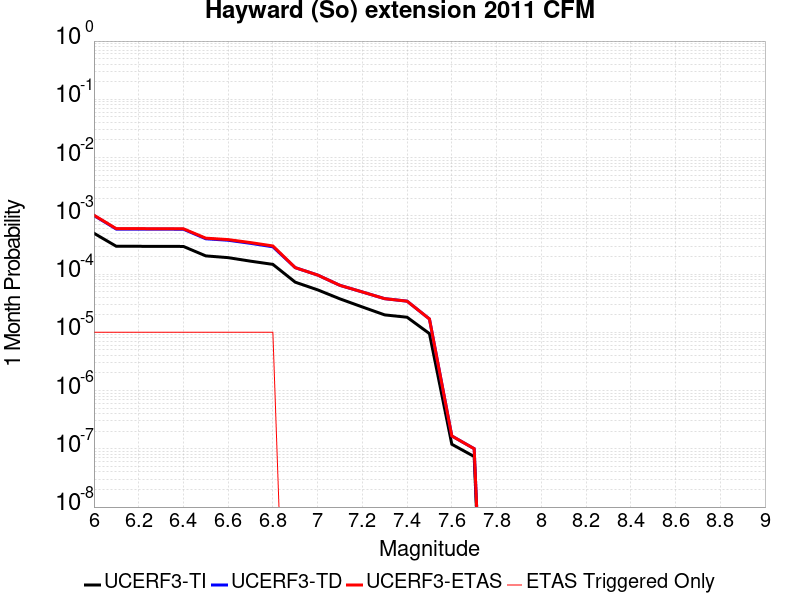 | 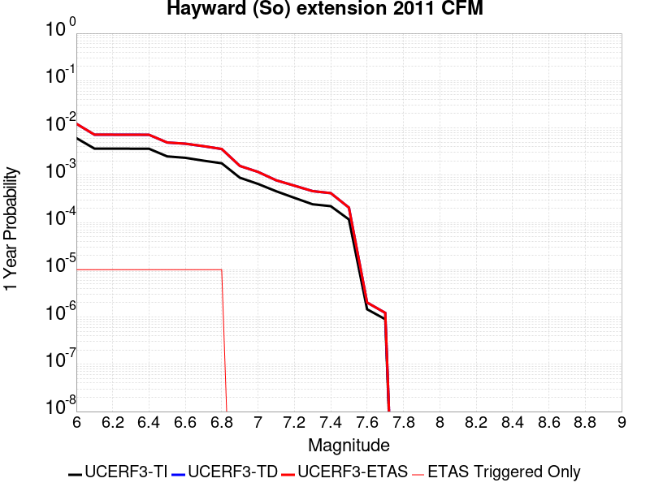 | 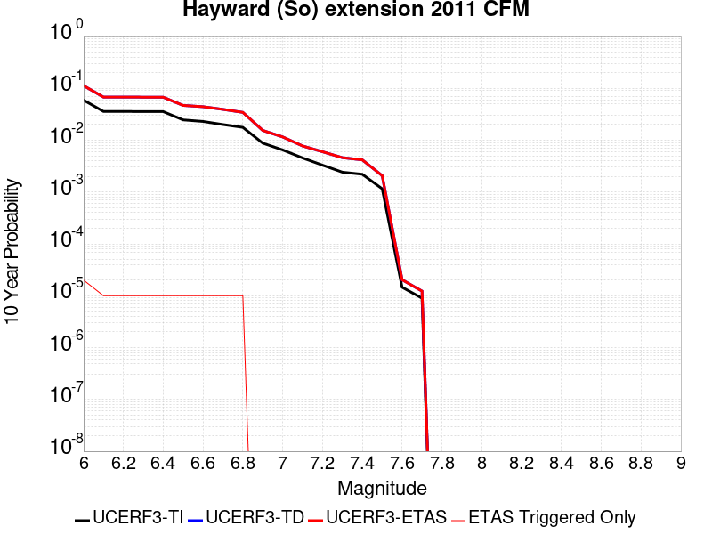 |

| Magnitude | 1 wk TI Prob | 1 wk TD Prob | 1 wk ETAS Prob | 1 wk ETAS/TD Gain | 1 wk ETAS Triggered Only | 1 mo TI Prob | 1 mo TD Prob | 1 mo ETAS Prob | 1 mo ETAS/TD Gain | 1 mo ETAS Triggered Only | 1 yr TI Prob | 1 yr TD Prob | 1 yr ETAS Prob | 1 yr ETAS/TD Gain | 1 yr ETAS Triggered Only | 10 yr TI Prob | 10 yr TD Prob | 10 yr ETAS Prob | 10 yr ETAS/TD Gain | 10 yr ETAS Triggered Only |
|-----|-----|-----|-----|-----|-----|-----|-----|-----|-----|-----|-----|-----|-----|-----|-----|-----|-----|-----|-----|-----|
| 6.0 | 1.1721256E-4 | 2.3697627E-4 | 2.469739E-4 | 1.0421883 | 1.0E-5 | 5.022428E-4 | 0.0010129517 | 0.0010229415 | 1.0098622 | 1.0E-5 | 0.0060976758 | 0.012248711 | 0.012258588 | 1.0008065 | 1.0E-5 | 0.0593305 | 0.112843215 | 0.112860955 | 1.0001572 | 2.0E-5 |
| 6.1 | 6.99169E-5 | 1.3822885E-4 | 1.4822747E-4 | 1.0723338 | 1.0E-5 | 2.9960944E-4 | 5.9128006E-4 | 6.0127414E-4 | 1.0169024 | 1.0E-5 | 0.0036416445 | 0.0071720886 | 0.007182017 | 1.0013843 | 1.0E-5 | 0.035825435 | 0.067803554 | 0.067812875 | 1.0001374 | 1.0E-5 |
| 6.2 | 6.99169E-5 | 1.3822885E-4 | 1.4822747E-4 | 1.0723338 | 1.0E-5 | 2.9960944E-4 | 5.9128006E-4 | 6.0127414E-4 | 1.0169024 | 1.0E-5 | 0.0036416445 | 0.0071720886 | 0.007182017 | 1.0013843 | 1.0E-5 | 0.035825435 | 0.067803554 | 0.067812875 | 1.0001374 | 1.0E-5 |
| 6.3 | 6.970908E-5 | 1.379104E-4 | 1.4790903E-4 | 1.0725008 | 1.0E-5 | 2.9871898E-4 | 5.899159E-4 | 5.9991E-4 | 1.0169415 | 1.0E-5 | 0.0036308395 | 0.007155625 | 0.0071655535 | 1.0013875 | 1.0E-5 | 0.035720866 | 0.067652516 | 0.06766184 | 1.0001378 | 1.0E-5 |
| 6.4 | 6.9517155E-5 | 1.375792E-4 | 1.4757783E-4 | 1.0726753 | 1.0E-5 | 2.9789665E-4 | 5.884971E-4 | 5.984912E-4 | 1.0169824 | 1.0E-5 | 0.0036208609 | 0.0071385372 | 0.007148466 | 1.0013908 | 1.0E-5 | 0.03562429 | 0.06749655 | 0.06750588 | 1.0001382 | 1.0E-5 |
| 6.5 | 4.786248E-5 | 9.41498E-5 | 1.0414886E-4 | 1.1062037 | 1.0E-5 | 2.0510878E-4 | 4.034394E-4 | 4.1343534E-4 | 1.0247768 | 1.0E-5 | 0.0024943394 | 0.004901227 | 0.0049111783 | 1.0020303 | 1.0E-5 | 0.02466527 | 0.046901822 | 0.04691135 | 1.0002033 | 1.0E-5 |
| 6.6 | 4.4662214E-5 | 8.881654E-5 | 9.881565E-5 | 1.1125816 | 1.0E-5 | 1.9139545E-4 | 3.805894E-4 | 3.9058557E-4 | 1.026265 | 1.0E-5 | 0.0023277493 | 0.0046242937 | 0.004634247 | 1.0021524 | 1.0E-5 | 0.02303517 | 0.044293344 | 0.044302903 | 1.0002158 | 1.0E-5 |
| 6.7 | 3.884542E-5 | 7.8648096E-5 | 8.8647306E-5 | 1.1271386 | 1.0E-5 | 1.6646975E-4 | 3.370222E-4 | 3.4701882E-4 | 1.0296617 | 1.0E-5 | 0.002024885 | 0.0040959697 | 0.004105929 | 1.0024314 | 1.0E-5 | 0.020065336 | 0.039333146 | 0.039342754 | 1.0002443 | 1.0E-5 |
| 6.8 | 3.4221863E-5 | 6.855653E-5 | 7.855585E-5 | 1.1458551 | 1.0E-5 | 1.4665688E-4 | 2.93783E-4 | 3.0378008E-4 | 1.0340288 | 1.0E-5 | 0.0017840851 | 0.0035713627 | 0.003581327 | 1.0027901 | 1.0E-5 | 0.017698295 | 0.034421004 | 0.034430657 | 1.0002805 | 1.0E-5 |
| 6.9 | 1.6927712E-5 | 3.0061563E-5 | 3.0061563E-5 | 1.0 | 0.0 | 7.2545314E-5 | 1.2882923E-4 | 1.2882923E-4 | 1.0 | 0.0 | 8.828813E-4 | 0.0015674243 | 0.0015674243 | 1.0 | 0.0 | 0.008793819 | 0.01546327 | 0.01546327 | 1.0 | 0.0 |
| 7.0 | 1.2509653E-5 | 2.2462571E-5 | 2.2462571E-5 | 1.0 | 0.0 | 5.3611697E-5 | 9.6264856E-5 | 9.6264856E-5 | 1.0 | 0.0 | 6.525269E-4 | 0.0011714385 | 0.0011714385 | 1.0 | 0.0 | 0.0065061417 | 0.01158231 | 0.01158231 | 1.0 | 0.0 |
| 7.1 | 8.751583E-6 | 1.4925648E-5 | 1.4925648E-5 | 1.0 | 0.0 | 3.750624E-5 | 6.3965526E-5 | 6.3965526E-5 | 1.0 | 0.0 | 4.5654282E-4 | 7.785079E-4 | 7.785079E-4 | 1.0 | 0.0 | 0.0045560603 | 0.007763496 | 0.007763496 | 1.0 | 0.0 |
| 7.2 | 6.354379E-6 | 1.1498636E-5 | 1.1498636E-5 | 1.0 | 0.0 | 2.7232769E-5 | 4.9278966E-5 | 4.9278966E-5 | 1.0 | 0.0 | 3.3150852E-4 | 5.99811E-4 | 5.99811E-4 | 1.0 | 0.0 | 0.0033101442 | 0.0060003046 | 0.0060003046 | 1.0 | 0.0 |
| 7.3 | 4.645554E-6 | 8.818172E-6 | 8.818172E-6 | 1.0 | 0.0 | 1.9909365E-5 | 3.779164E-5 | 3.779164E-5 | 1.0 | 0.0 | 2.4236954E-4 | 4.6002E-4 | 4.6002E-4 | 1.0 | 0.0 | 0.0024210536 | 0.004610708 | 0.004610708 | 1.0 | 0.0 |
| 7.4 | 4.23437E-6 | 7.992532E-6 | 7.992532E-6 | 1.0 | 0.0 | 1.8147173E-5 | 3.425328E-5 | 3.425328E-5 | 1.0 | 0.0 | 2.2091944E-4 | 4.1695772E-4 | 4.1695772E-4 | 1.0 | 0.0 | 0.0022069993 | 0.004181972 | 0.004181972 | 1.0 | 0.0 |
| 7.5 | 2.2187417E-6 | 3.9522306E-6 | 3.9522306E-6 | 1.0 | 0.0 | 9.508858E-6 | 1.6938036E-5 | 1.6938036E-5 | 1.0 | 0.0 | 1.157642E-4 | 2.0620368E-4 | 2.0620368E-4 | 1.0 | 0.0 | 0.0011570391 | 0.0020734754 | 0.0020734754 | 1.0 | 0.0 |
| 7.6 | 2.7952495E-8 | 3.878529E-8 | 3.878529E-8 | 1.0 | 0.0 | 1.1979641E-7 | 1.6622266E-7 | 1.6622266E-7 | 1.0 | 0.0 | 1.4585203E-6 | 2.0237592E-6 | 2.0237592E-6 | 1.0 | 0.0 | 1.4585107E-5 | 2.0328182E-5 | 2.0328182E-5 | 1.0 | 0.0 |
| 7.7 | 1.7192724E-8 | 2.3436517E-8 | 2.3436517E-8 | 1.0 | 0.0 | 7.36831E-8 | 1.0044221E-7 | 1.0044221E-7 | 1.0 | 0.0 | 8.9709135E-7 | 1.2228833E-6 | 1.2228833E-6 | 1.0 | 0.0 | 8.970877E-6 | 1.2296933E-5 | 1.2296933E-5 | 1.0 | 0.0 |

## Point Reyes 2011 CFM
*[(top)](#table-of-contents)*

| 1 Week | 1 Month | 1 Year | 10 Year |
|-----|-----|-----|-----|
|  | 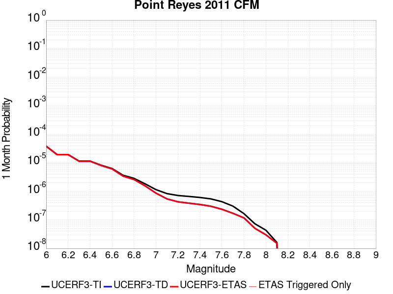 | 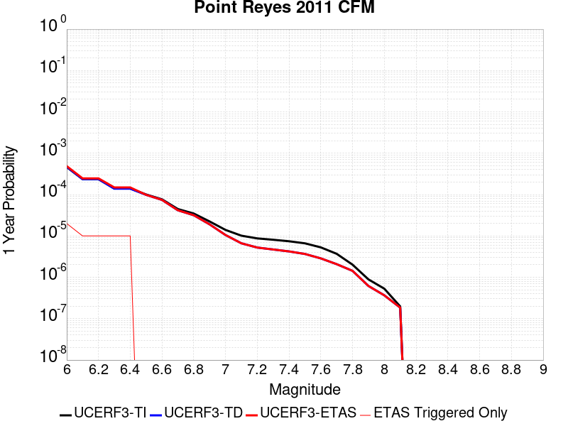 | 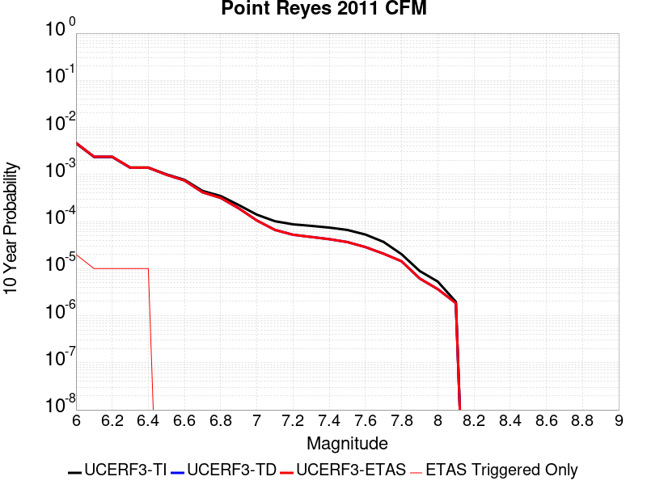 |

| Magnitude | 1 wk TI Prob | 1 wk TD Prob | 1 wk ETAS Prob | 1 wk ETAS/TD Gain | 1 wk ETAS Triggered Only | 1 mo TI Prob | 1 mo TD Prob | 1 mo ETAS Prob | 1 mo ETAS/TD Gain | 1 mo ETAS Triggered Only | 1 yr TI Prob | 1 yr TD Prob | 1 yr ETAS Prob | 1 yr ETAS/TD Gain | 1 yr ETAS Triggered Only | 10 yr TI Prob | 10 yr TD Prob | 10 yr ETAS Prob | 10 yr ETAS/TD Gain | 10 yr ETAS Triggered Only |
|-----|-----|-----|-----|-----|-----|-----|-----|-----|-----|-----|-----|-----|-----|-----|-----|-----|-----|-----|-----|-----|
| 6.0 | 8.8644965E-6 | 8.967163E-6 | 8.967163E-6 | 1.0 | 0.0 | 3.7990147E-5 | 3.843017E-5 | 4.8429785E-5 | 1.2602022 | 1.0E-5 | 4.624319E-4 | 4.6779314E-4 | 4.8778378E-4 | 1.0427339 | 2.0E-5 | 0.0046147075 | 0.004668713 | 0.0046886196 | 1.0042639 | 2.0E-5 |
| 6.1 | 4.526405E-6 | 4.5392185E-6 | 4.5392185E-6 | 1.0 | 0.0 | 1.9398734E-5 | 1.9453653E-5 | 1.9453653E-5 | 1.0 | 0.0 | 2.36154E-4 | 2.3682354E-4 | 2.4682118E-4 | 1.0422156 | 1.0E-5 | 0.002359032 | 0.0023658178 | 0.002375794 | 1.0042169 | 1.0E-5 |
| 6.2 | 4.526405E-6 | 4.5392185E-6 | 4.5392185E-6 | 1.0 | 0.0 | 1.9398734E-5 | 1.9453653E-5 | 1.9453653E-5 | 1.0 | 0.0 | 2.36154E-4 | 2.3682354E-4 | 2.4682118E-4 | 1.0422156 | 1.0E-5 | 0.002359032 | 0.0023658178 | 0.002375794 | 1.0042169 | 1.0E-5 |
| 6.3 | 2.6842322E-6 | 2.660676E-6 | 2.660676E-6 | 1.0 | 0.0 | 1.1503801E-5 | 1.1402849E-5 | 1.1402849E-5 | 1.0 | 0.0 | 1.4004979E-4 | 1.3882104E-4 | 1.4881964E-4 | 1.0720252 | 1.0E-5 | 0.0013996155 | 0.0013873649 | 0.001397351 | 1.0071979 | 1.0E-5 |
| 6.4 | 2.6842322E-6 | 2.660676E-6 | 2.660676E-6 | 1.0 | 0.0 | 1.1503801E-5 | 1.1402849E-5 | 1.1402849E-5 | 1.0 | 0.0 | 1.4004979E-4 | 1.3882104E-4 | 1.4881964E-4 | 1.0720252 | 1.0E-5 | 0.0013996155 | 0.0013873649 | 0.001397351 | 1.0071979 | 1.0E-5 |
| 6.5 | 1.9281833E-6 | 1.8906262E-6 | 1.8906262E-6 | 1.0 | 0.0 | 8.263617E-6 | 8.102659E-6 | 8.102659E-6 | 1.0 | 0.0 | 1.0060489E-4 | 9.86455E-5 | 9.86455E-5 | 1.0 | 0.0 | 0.0010055936 | 9.860279E-4 | 9.860279E-4 | 1.0 | 0.0 |
| 6.6 | 1.4726726E-6 | 1.4269577E-6 | 1.4269577E-6 | 1.0 | 0.0 | 6.3114385E-6 | 6.1155188E-6 | 6.1155188E-6 | 1.0 | 0.0 | 7.683905E-5 | 7.445395E-5 | 7.445395E-5 | 1.0 | 0.0 | 7.6812494E-4 | 7.4429717E-4 | 7.4429717E-4 | 1.0 | 0.0 |
| 6.7 | 8.572307E-7 | 8.007212E-7 | 8.007212E-7 | 1.0 | 0.0 | 3.6738406E-6 | 3.431658E-6 | 3.431658E-6 | 1.0 | 0.0 | 4.472809E-5 | 4.1779647E-5 | 4.1779647E-5 | 1.0 | 0.0 | 4.471909E-4 | 4.1772184E-4 | 4.1772184E-4 | 1.0 | 0.0 |
| 6.8 | 6.6745434E-7 | 6.0773E-7 | 6.0773E-7 | 1.0 | 0.0 | 2.8605155E-6 | 2.6045543E-6 | 2.6045543E-6 | 1.0 | 0.0 | 3.482622E-5 | 3.171E-5 | 3.171E-5 | 1.0 | 0.0 | 3.4820763E-4 | 3.1705803E-4 | 3.1705803E-4 | 1.0 | 0.0 |
| 6.9 | 4.291521E-7 | 3.6535937E-7 | 3.6535937E-7 | 1.0 | 0.0 | 1.839222E-6 | 1.565825E-6 | 1.565825E-6 | 1.0 | 0.0 | 2.2392298E-5 | 1.9063755E-5 | 1.9063755E-5 | 1.0 | 0.0 | 2.2390042E-4 | 1.9062385E-4 | 1.9062385E-4 | 1.0 | 0.0 |
| 7.0 | 2.6812808E-7 | 2.0187414E-7 | 2.0187414E-7 | 1.0 | 0.0 | 1.1491198E-6 | 8.651746E-7 | 8.651746E-7 | 1.0 | 0.0 | 1.3990444E-5 | 1.0533451E-5 | 1.0533451E-5 | 1.0 | 0.0 | 1.3989564E-4 | 1.0533186E-4 | 1.0533186E-4 | 1.0 | 0.0 |
| 7.1 | 1.9451231E-7 | 1.2725499E-7 | 1.2725499E-7 | 1.0 | 0.0 | 8.336239E-7 | 5.453784E-7 | 5.453784E-7 | 1.0 | 0.0 | 1.0149324E-5 | 6.6399616E-6 | 6.6399616E-6 | 1.0 | 0.0 | 1.014886E-4 | 6.639991E-5 | 6.639991E-5 | 1.0 | 0.0 |
| 7.2 | 1.6715143E-7 | 1.00428394E-7 | 1.00428394E-7 | 1.0 | 0.0 | 7.1636305E-7 | 4.3040734E-7 | 4.3040734E-7 | 1.0 | 0.0 | 8.721685E-6 | 5.2401965E-6 | 5.2401965E-6 | 1.0 | 0.0 | 8.721343E-5 | 5.2402997E-5 | 5.2402997E-5 | 1.0 | 0.0 |
| 7.3 | 1.5503173E-7 | 9.0131024E-8 | 9.0131024E-8 | 1.0 | 0.0 | 6.644215E-7 | 3.8627576E-7 | 3.8627576E-7 | 1.0 | 0.0 | 8.089301E-6 | 4.702897E-6 | 4.702897E-6 | 1.0 | 0.0 | 8.089007E-5 | 4.7030244E-5 | 4.7030244E-5 | 1.0 | 0.0 |
| 7.4 | 1.4251614E-7 | 8.097624E-8 | 8.097624E-8 | 1.0 | 0.0 | 6.1078333E-7 | 3.47041E-7 | 3.47041E-7 | 1.0 | 0.0 | 7.4362615E-6 | 4.225216E-6 | 4.225216E-6 | 1.0 | 0.0 | 7.436013E-5 | 4.2253625E-5 | 4.2253625E-5 | 1.0 | 0.0 |
| 7.5 | 1.2710186E-7 | 7.0296394E-8 | 7.0296394E-8 | 1.0 | 0.0 | 5.447221E-7 | 3.0127023E-7 | 3.0127023E-7 | 1.0 | 0.0 | 6.6319717E-6 | 3.667959E-6 | 3.667959E-6 | 1.0 | 0.0 | 6.6317734E-5 | 3.6681253E-5 | 3.6681253E-5 | 1.0 | 0.0 |
| 7.6 | 1.0144708E-7 | 5.4952274E-8 | 5.4952274E-8 | 1.0 | 0.0 | 4.347731E-7 | 2.3550973E-7 | 2.3550973E-7 | 1.0 | 0.0 | 5.2933497E-6 | 2.8673273E-6 | 2.8673273E-6 | 1.0 | 0.0 | 5.293224E-5 | 2.8675171E-5 | 2.8675171E-5 | 1.0 | 0.0 |
| 7.7 | 7.090527E-8 | 3.98231E-8 | 3.98231E-8 | 1.0 | 0.0 | 3.038797E-7 | 1.7067042E-7 | 1.7067042E-7 | 1.0 | 0.0 | 3.699729E-6 | 2.0779103E-6 | 2.0779103E-6 | 1.0 | 0.0 | 3.6996673E-5 | 2.0781177E-5 | 2.0781177E-5 | 1.0 | 0.0 |
| 7.8 | 3.8712045E-8 | 2.7440025E-8 | 2.7440025E-8 | 1.0 | 0.0 | 1.6590876E-7 | 1.176001E-7 | 1.176001E-7 | 1.0 | 0.0 | 2.0199373E-6 | 1.4317802E-6 | 1.4317802E-6 | 1.0 | 0.0 | 2.0199188E-5 | 1.4319979E-5 | 1.4319979E-5 | 1.0 | 0.0 |
| 7.9 | 1.7068782E-8 | 1.1833354E-8 | 1.1833354E-8 | 1.0 | 0.0 | 7.315192E-8 | 5.0714362E-8 | 5.0714362E-8 | 1.0 | 0.0 | 8.906242E-7 | 6.174472E-7 | 6.174472E-7 | 1.0 | 0.0 | 8.906207E-6 | 6.1767228E-6 | 6.1767228E-6 | 1.0 | 0.0 |
| 8.0 | 1.0172592E-8 | 7.0280843E-9 | 7.0280843E-9 | 1.0 | 0.0 | 4.359682E-8 | 3.0120354E-8 | 3.0120354E-8 | 1.0 | 0.0 | 5.3079117E-7 | 3.6671526E-7 | 3.6671526E-7 | 1.0 | 0.0 | 5.307899E-6 | 3.6694146E-6 | 3.6694146E-6 | 1.0 | 0.0 |
| 8.1 | 3.7861243E-9 | 3.5452439E-9 | 3.5452439E-9 | 1.0 | 0.0 | 1.6226247E-8 | 1.5193901E-8 | 1.5193901E-8 | 1.0 | 0.0 | 1.9755454E-7 | 1.8498575E-7 | 1.8498575E-7 | 1.0 | 0.0 | 1.9755437E-6 | 1.8518531E-6 | 1.8518531E-6 | 1.0 | 0.0 |

## Mission Hills 2011
*[(top)](#table-of-contents)*

| 1 Week | 1 Month | 1 Year | 10 Year |
|-----|-----|-----|-----|
| 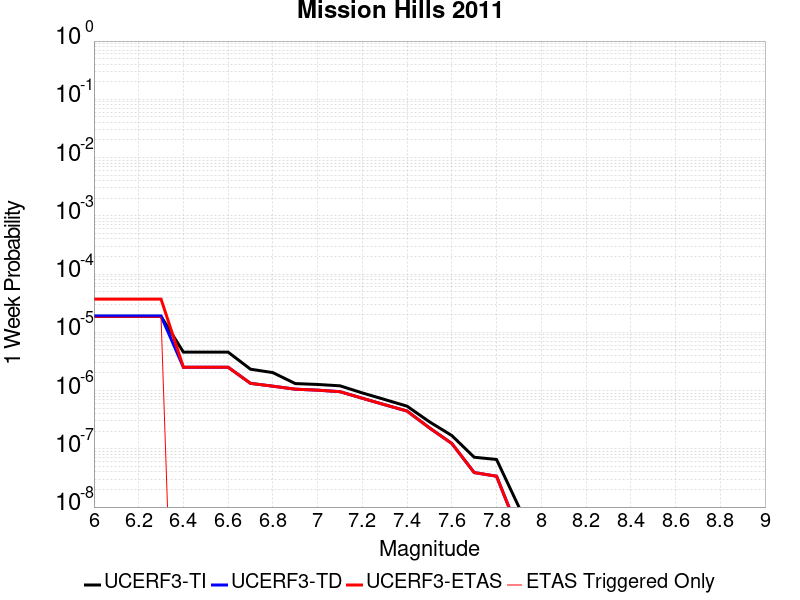 | 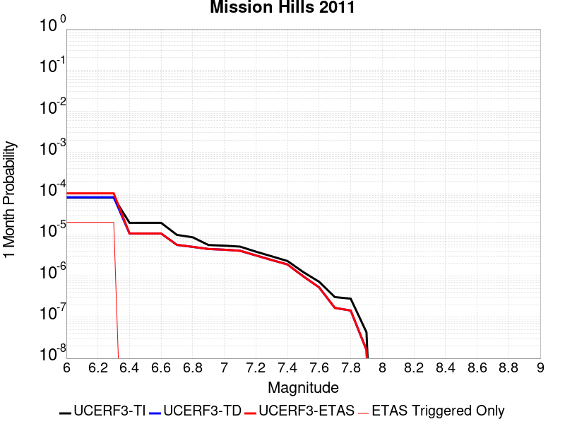 | 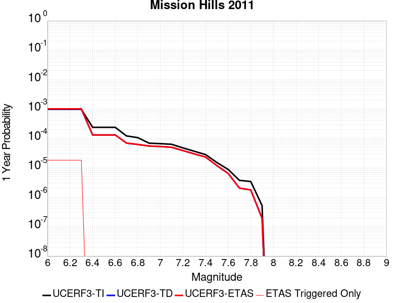 | 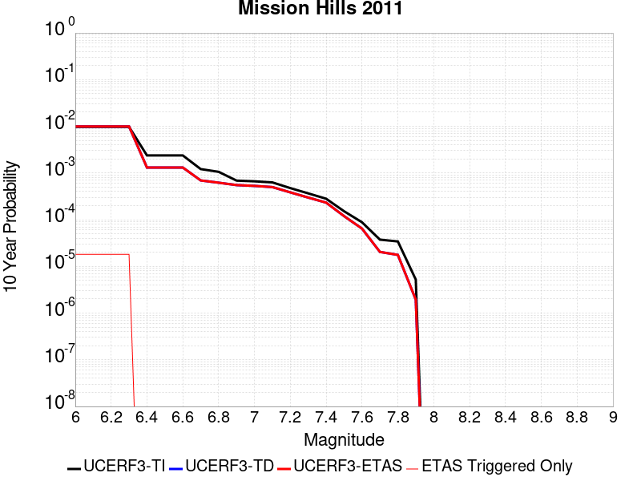 |

| Magnitude | 1 wk TI Prob | 1 wk TD Prob | 1 wk ETAS Prob | 1 wk ETAS/TD Gain | 1 wk ETAS Triggered Only | 1 mo TI Prob | 1 mo TD Prob | 1 mo ETAS Prob | 1 mo ETAS/TD Gain | 1 mo ETAS Triggered Only | 1 yr TI Prob | 1 yr TD Prob | 1 yr ETAS Prob | 1 yr ETAS/TD Gain | 1 yr ETAS Triggered Only | 10 yr TI Prob | 10 yr TD Prob | 10 yr ETAS Prob | 10 yr ETAS/TD Gain | 10 yr ETAS Triggered Only |
|-----|-----|-----|-----|-----|-----|-----|-----|-----|-----|-----|-----|-----|-----|-----|-----|-----|-----|-----|-----|-----|
| 6.0 | 1.8765717E-5 | 1.9054645E-5 | 2.9054456E-5 | 1.5247964 | 1.0E-5 | 8.0422025E-5 | 8.166215E-5 | 1.0166052E-4 | 1.2448915 | 2.0E-5 | 9.786983E-4 | 9.941267E-4 | 0.0010141068 | 1.0200982 | 2.0E-5 | 0.009743992 | 0.009930461 | 0.009950262 | 1.001994 | 2.0E-5 |
| 6.1 | 1.8765717E-5 | 1.9054645E-5 | 2.9054456E-5 | 1.5247964 | 1.0E-5 | 8.0422025E-5 | 8.166215E-5 | 1.0166052E-4 | 1.2448915 | 2.0E-5 | 9.786983E-4 | 9.941267E-4 | 0.0010141068 | 1.0200982 | 2.0E-5 | 0.009743992 | 0.009930461 | 0.009950262 | 1.001994 | 2.0E-5 |
| 6.2 | 1.8765717E-5 | 1.9054645E-5 | 2.9054456E-5 | 1.5247964 | 1.0E-5 | 8.0422025E-5 | 8.166215E-5 | 1.0166052E-4 | 1.2448915 | 2.0E-5 | 9.786983E-4 | 9.941267E-4 | 0.0010141068 | 1.0200982 | 2.0E-5 | 0.009743992 | 0.009930461 | 0.009950262 | 1.001994 | 2.0E-5 |
| 6.3 | 1.8765717E-5 | 1.9054645E-5 | 2.9054456E-5 | 1.5247964 | 1.0E-5 | 8.0422025E-5 | 8.166215E-5 | 1.0166052E-4 | 1.2448915 | 2.0E-5 | 9.786983E-4 | 9.941267E-4 | 0.0010141068 | 1.0200982 | 2.0E-5 | 0.009743992 | 0.009930461 | 0.009950262 | 1.001994 | 2.0E-5 |
| 6.4 | 4.566357E-6 | 2.5148488E-6 | 2.5148488E-6 | 1.0 | 0.0 | 1.9569954E-5 | 1.0777889E-5 | 1.0777889E-5 | 1.0 | 0.0 | 2.3823815E-4 | 1.3121472E-4 | 1.3121472E-4 | 1.0 | 0.0 | 0.002379829 | 0.0013115506 | 0.0013115506 | 1.0 | 0.0 |
| 6.5 | 4.566357E-6 | 2.5148488E-6 | 2.5148488E-6 | 1.0 | 0.0 | 1.9569954E-5 | 1.0777889E-5 | 1.0777889E-5 | 1.0 | 0.0 | 2.3823815E-4 | 1.3121472E-4 | 1.3121472E-4 | 1.0 | 0.0 | 0.002379829 | 0.0013115506 | 0.0013115506 | 1.0 | 0.0 |
| 6.6 | 4.566357E-6 | 2.5148488E-6 | 2.5148488E-6 | 1.0 | 0.0 | 1.9569954E-5 | 1.0777889E-5 | 1.0777889E-5 | 1.0 | 0.0 | 2.3823815E-4 | 1.3121472E-4 | 1.3121472E-4 | 1.0 | 0.0 | 0.002379829 | 0.0013115506 | 0.0013115506 | 1.0 | 0.0 |
| 6.7 | 2.3266773E-6 | 1.3296187E-6 | 1.3296187E-6 | 1.0 | 0.0 | 9.971435E-6 | 5.698354E-6 | 5.698354E-6 | 1.0 | 0.0 | 1.2139547E-4 | 6.937531E-5 | 6.937531E-5 | 1.0 | 0.0 | 0.0012132917 | 6.9354265E-4 | 6.9354265E-4 | 1.0 | 0.0 |
| 6.8 | 2.032735E-6 | 1.1894115E-6 | 1.1894115E-6 | 1.0 | 0.0 | 8.711692E-6 | 5.097468E-6 | 5.097468E-6 | 1.0 | 0.0 | 1.06059684E-4 | 6.205996E-5 | 6.205996E-5 | 1.0 | 0.0 | 0.0010600908 | 6.2043115E-4 | 6.2043115E-4 | 1.0 | 0.0 |
| 6.9 | 1.3186259E-6 | 1.0561778E-6 | 1.0561778E-6 | 1.0 | 0.0 | 5.6512413E-6 | 4.5264687E-6 | 4.5264687E-6 | 1.0 | 0.0 | 6.8801695E-5 | 5.5108394E-5 | 5.5108394E-5 | 1.0 | 0.0 | 6.8780396E-4 | 5.5095024E-4 | 5.5095024E-4 | 1.0 | 0.0 |
| 7.0 | 1.2726016E-6 | 1.0159088E-6 | 1.0159088E-6 | 1.0 | 0.0 | 5.4539955E-6 | 4.3538876E-6 | 4.3538876E-6 | 1.0 | 0.0 | 6.6400375E-5 | 5.300732E-5 | 5.300732E-5 | 1.0 | 0.0 | 6.6380535E-4 | 5.299496E-4 | 5.299496E-4 | 1.0 | 0.0 |
| 7.1 | 1.2063913E-6 | 9.570072E-7 | 9.570072E-7 | 1.0 | 0.0 | 5.170238E-6 | 4.101453E-6 | 4.101453E-6 | 1.0 | 0.0 | 6.294583E-5 | 4.9934075E-5 | 4.9934075E-5 | 1.0 | 0.0 | 6.2928005E-4 | 4.992311E-4 | 4.992311E-4 | 1.0 | 0.0 |
| 7.2 | 9.105806E-7 | 7.3765557E-7 | 7.3765557E-7 | 1.0 | 0.0 | 3.9024826E-6 | 3.1613772E-6 | 3.1613772E-6 | 1.0 | 0.0 | 4.7511687E-5 | 3.8489103E-5 | 3.8489103E-5 | 1.0 | 0.0 | 4.7501532E-4 | 3.8482592E-4 | 3.8482592E-4 | 1.0 | 0.0 |
| 7.3 | 7.020432E-7 | 5.710089E-7 | 5.710089E-7 | 1.0 | 0.0 | 3.0087533E-6 | 2.447179E-6 | 2.447179E-6 | 1.0 | 0.0 | 3.6630954E-5 | 2.979401E-5 | 2.979401E-5 | 1.0 | 0.0 | 3.6624918E-4 | 2.9790145E-4 | 2.9790145E-4 | 1.0 | 0.0 |
| 7.4 | 5.3900635E-7 | 4.4480825E-7 | 4.4480825E-7 | 1.0 | 0.0 | 2.3100251E-6 | 1.9063198E-6 | 1.9063198E-6 | 1.0 | 0.0 | 2.8124194E-5 | 2.3209208E-5 | 2.3209208E-5 | 1.0 | 0.0 | 2.8120633E-4 | 2.3206905E-4 | 2.3206905E-4 | 1.0 | 0.0 |
| 7.5 | 2.907075E-7 | 2.2875415E-7 | 2.2875415E-7 | 1.0 | 0.0 | 1.2458887E-6 | 9.803746E-7 | 9.803746E-7 | 1.0 | 0.0 | 1.5168589E-5 | 1.1935997E-5 | 1.1935997E-5 | 1.0 | 0.0 | 1.5167553E-4 | 1.1935373E-4 | 1.1935373E-4 | 1.0 | 0.0 |
| 7.6 | 1.6903675E-7 | 1.2353402E-7 | 1.2353402E-7 | 1.0 | 0.0 | 7.2444305E-7 | 5.294314E-7 | 5.294314E-7 | 1.0 | 0.0 | 8.820059E-6 | 6.4458095E-6 | 6.4458095E-6 | 1.0 | 0.0 | 8.8197085E-5 | 6.445635E-5 | 6.445635E-5 | 1.0 | 0.0 |
| 7.7 | 7.168073E-8 | 3.9135116E-8 | 3.9135116E-8 | 1.0 | 0.0 | 3.072031E-7 | 1.6772192E-7 | 1.6772192E-7 | 1.0 | 0.0 | 3.7401915E-6 | 2.0420127E-6 | 2.0420127E-6 | 1.0 | 0.0 | 3.7401285E-5 | 2.041995E-5 | 2.041995E-5 | 1.0 | 0.0 |
| 7.8 | 6.564101E-8 | 3.3835356E-8 | 3.3835356E-8 | 1.0 | 0.0 | 2.813186E-7 | 1.4500866E-7 | 1.4500866E-7 | 1.0 | 0.0 | 3.4250486E-6 | 1.7654792E-6 | 1.7654792E-6 | 1.0 | 0.0 | 3.424996E-5 | 1.7654662E-5 | 1.7654662E-5 | 1.0 | 0.0 |
| 7.9 | 1.0029074E-8 | 3.7292542E-9 | 3.7292542E-9 | 1.0 | 0.0 | 4.2981743E-8 | 1.5982518E-8 | 1.5982518E-8 | 1.0 | 0.0 | 5.2330256E-7 | 1.9458714E-7 | 1.9458714E-7 | 1.0 | 0.0 | 5.2330133E-6 | 1.945871E-6 | 1.945871E-6 | 1.0 | 0.0 |

## Earthquake Valley (No  Extension)
*[(top)](#table-of-contents)*

| 1 Week | 1 Month | 1 Year | 10 Year |
|-----|-----|-----|-----|
| 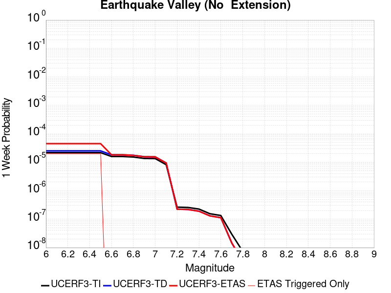 | 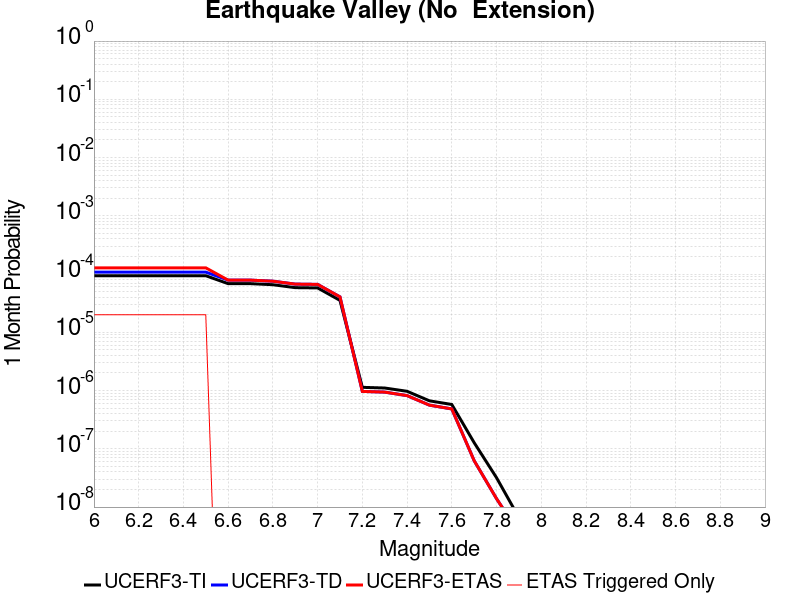 | 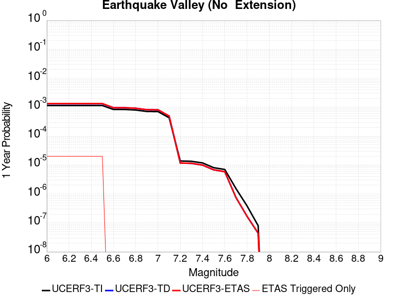 | 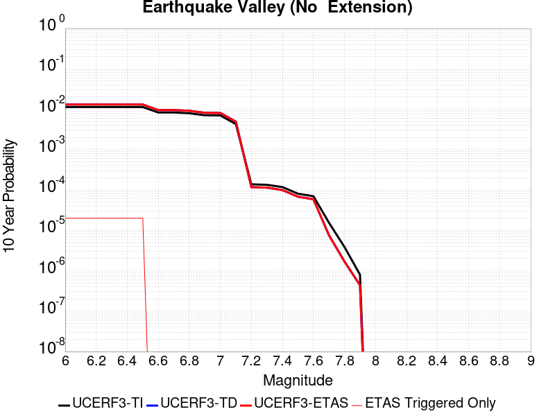 |

| Magnitude | 1 wk TI Prob | 1 wk TD Prob | 1 wk ETAS Prob | 1 wk ETAS/TD Gain | 1 wk ETAS Triggered Only | 1 mo TI Prob | 1 mo TD Prob | 1 mo ETAS Prob | 1 mo ETAS/TD Gain | 1 mo ETAS Triggered Only | 1 yr TI Prob | 1 yr TD Prob | 1 yr ETAS Prob | 1 yr ETAS/TD Gain | 1 yr ETAS Triggered Only | 10 yr TI Prob | 10 yr TD Prob | 10 yr ETAS Prob | 10 yr ETAS/TD Gain | 10 yr ETAS Triggered Only |
|-----|-----|-----|-----|-----|-----|-----|-----|-----|-----|-----|-----|-----|-----|-----|-----|-----|-----|-----|-----|-----|
| 6.0 | 2.1859703E-5 | 2.5198362E-5 | 4.5197856E-5 | 1.7936825 | 2.0E-5 | 9.3681076E-5 | 1.07989326E-4 | 1.2798716E-4 | 1.1851835 | 2.0E-5 | 0.0011399703 | 0.001314122 | 0.0013340957 | 1.0151993 | 2.0E-5 | 0.011341401 | 0.013077871 | 0.013097609 | 1.0015093 | 2.0E-5 |
| 6.1 | 2.1859703E-5 | 2.5198362E-5 | 4.5197856E-5 | 1.7936825 | 2.0E-5 | 9.3681076E-5 | 1.07989326E-4 | 1.2798716E-4 | 1.1851835 | 2.0E-5 | 0.0011399703 | 0.001314122 | 0.0013340957 | 1.0151993 | 2.0E-5 | 0.011341401 | 0.013077871 | 0.013097609 | 1.0015093 | 2.0E-5 |
| 6.2 | 2.1859703E-5 | 2.5198362E-5 | 4.5197856E-5 | 1.7936825 | 2.0E-5 | 9.3681076E-5 | 1.07989326E-4 | 1.2798716E-4 | 1.1851835 | 2.0E-5 | 0.0011399703 | 0.001314122 | 0.0013340957 | 1.0151993 | 2.0E-5 | 0.011341401 | 0.013077871 | 0.013097609 | 1.0015093 | 2.0E-5 |
| 6.3 | 2.1859703E-5 | 2.5198362E-5 | 4.5197856E-5 | 1.7936825 | 2.0E-5 | 9.3681076E-5 | 1.07989326E-4 | 1.2798716E-4 | 1.1851835 | 2.0E-5 | 0.0011399703 | 0.001314122 | 0.0013340957 | 1.0151993 | 2.0E-5 | 0.011341401 | 0.013077871 | 0.013097609 | 1.0015093 | 2.0E-5 |
| 6.4 | 2.1859703E-5 | 2.5198362E-5 | 4.5197856E-5 | 1.7936825 | 2.0E-5 | 9.3681076E-5 | 1.07989326E-4 | 1.2798716E-4 | 1.1851835 | 2.0E-5 | 0.0011399703 | 0.001314122 | 0.0013340957 | 1.0151993 | 2.0E-5 | 0.011341401 | 0.013077871 | 0.013097609 | 1.0015093 | 2.0E-5 |
| 6.5 | 2.1859703E-5 | 2.5198362E-5 | 4.5197856E-5 | 1.7936825 | 2.0E-5 | 9.3681076E-5 | 1.07989326E-4 | 1.2798716E-4 | 1.1851835 | 2.0E-5 | 0.0011399703 | 0.001314122 | 0.0013340957 | 1.0151993 | 2.0E-5 | 0.011341401 | 0.013077871 | 0.013097609 | 1.0015093 | 2.0E-5 |
| 6.6 | 1.597E-5 | 1.8356275E-5 | 1.8356275E-5 | 1.0 | 0.0 | 6.8441055E-5 | 7.866787E-5 | 7.866787E-5 | 1.0 | 0.0 | 8.329513E-4 | 9.574478E-4 | 9.574478E-4 | 1.0 | 0.0 | 0.008298361 | 0.009541836 | 0.009541836 | 1.0 | 0.0 |
| 6.7 | 1.597E-5 | 1.8356275E-5 | 1.8356275E-5 | 1.0 | 0.0 | 6.8441055E-5 | 7.866787E-5 | 7.866787E-5 | 1.0 | 0.0 | 8.329513E-4 | 9.574478E-4 | 9.574478E-4 | 1.0 | 0.0 | 0.008298361 | 0.009541836 | 0.009541836 | 1.0 | 0.0 |
| 6.8 | 1.5315149E-5 | 1.7602091E-5 | 1.7602091E-5 | 1.0 | 0.0 | 6.5634704E-5 | 7.543584E-5 | 7.543584E-5 | 1.0 | 0.0 | 7.988095E-4 | 9.181311E-4 | 9.181311E-4 | 1.0 | 0.0 | 0.007959441 | 0.009151919 | 0.009151919 | 1.0 | 0.0 |
| 6.9 | 1.3634728E-5 | 1.5675821E-5 | 1.5675821E-5 | 1.0 | 0.0 | 5.8433237E-5 | 6.718082E-5 | 6.718082E-5 | 1.0 | 0.0 | 7.1119244E-4 | 8.177017E-4 | 8.177017E-4 | 1.0 | 0.0 | 0.007089207 | 0.008155 | 0.008155 | 1.0 | 0.0 |
| 7.0 | 1.3496271E-5 | 1.5517853E-5 | 1.5517853E-5 | 1.0 | 0.0 | 5.783988E-5 | 6.650385E-5 | 6.650385E-5 | 1.0 | 0.0 | 7.03973E-4 | 8.094657E-4 | 8.094657E-4 | 1.0 | 0.0 | 0.007017471 | 0.0080732405 | 0.0080732405 | 1.0 | 0.0 |
| 7.1 | 8.242798E-6 | 9.4726E-6 | 9.4726E-6 | 1.0 | 0.0 | 3.53258E-5 | 4.0596606E-5 | 4.0596606E-5 | 1.0 | 0.0 | 4.300067E-4 | 4.9421866E-4 | 4.9421866E-4 | 1.0 | 0.0 | 0.004291756 | 0.0049377717 | 0.0049377717 | 1.0 | 0.0 |
| 7.2 | 2.6506527E-7 | 2.2560312E-7 | 2.2560312E-7 | 1.0 | 0.0 | 1.1359936E-6 | 9.668702E-7 | 9.668702E-7 | 1.0 | 0.0 | 1.3830633E-5 | 1.17715845E-5 | 1.17715845E-5 | 1.0 | 0.0 | 1.3829772E-4 | 1.1771003E-4 | 1.1771003E-4 | 1.0 | 0.0 |
| 7.3 | 2.5810488E-7 | 2.1955442E-7 | 2.1955442E-7 | 1.0 | 0.0 | 1.1061633E-6 | 9.409472E-7 | 9.409472E-7 | 1.0 | 0.0 | 1.3467455E-5 | 1.1455976E-5 | 1.1455976E-5 | 1.0 | 0.0 | 1.3466639E-4 | 1.1455427E-4 | 1.1455427E-4 | 1.0 | 0.0 |
| 7.4 | 2.2676066E-7 | 1.9110601E-7 | 1.9110601E-7 | 1.0 | 0.0 | 9.71831E-7 | 8.190255E-7 | 8.190255E-7 | 1.0 | 0.0 | 1.1831979E-5 | 9.9715935E-6 | 9.9715935E-6 | 1.0 | 0.0 | 1.1831349E-4 | 9.9711855E-5 | 9.9711855E-5 | 1.0 | 0.0 |
| 7.5 | 1.5553917E-7 | 1.3112096E-7 | 1.3112096E-7 | 1.0 | 0.0 | 6.6659624E-7 | 5.619469E-7 | 5.619469E-7 | 1.0 | 0.0 | 8.115779E-6 | 6.8416834E-6 | 6.8416834E-6 | 1.0 | 0.0 | 8.115482E-5 | 6.841495E-5 | 6.841495E-5 | 1.0 | 0.0 |
| 7.6 | 1.3448629E-7 | 1.1288419E-7 | 1.1288419E-7 | 1.0 | 0.0 | 5.7636964E-7 | 4.837893E-7 | 4.837893E-7 | 1.0 | 0.0 | 7.017278E-6 | 5.890121E-6 | 5.890121E-6 | 1.0 | 0.0 | 7.0170565E-5 | 5.889986E-5 | 5.889986E-5 | 1.0 | 0.0 |
| 7.7 | 2.9719402E-8 | 1.458206E-8 | 1.458206E-8 | 1.0 | 0.0 | 1.2736886E-7 | 6.249454E-8 | 6.249454E-8 | 1.0 | 0.0 | 1.5507147E-6 | 7.608708E-7 | 7.608708E-7 | 1.0 | 0.0 | 1.550704E-5 | 7.6086876E-6 | 7.6086876E-6 | 1.0 | 0.0 |
| 7.8 | 7.4390196E-9 | 3.2502152E-9 | 3.2502152E-9 | 1.0 | 0.0 | 3.1881513E-8 | 1.3929493E-8 | 1.3929493E-8 | 1.0 | 0.0 | 3.8815733E-7 | 1.6959156E-7 | 1.6959156E-7 | 1.0 | 0.0 | 3.8815665E-6 | 1.6959145E-6 | 1.6959145E-6 | 1.0 | 0.0 |
| 7.9 | 1.5373532E-9 | 8.440161E-10 | 8.440161E-10 | 1.0 | 0.0 | 6.5886567E-9 | 3.6172119E-9 | 3.6172119E-9 | 1.0 | 0.0 | 8.021689E-8 | 4.4039556E-8 | 4.4039556E-8 | 1.0 | 0.0 | 8.0216864E-7 | 4.4039552E-7 | 4.4039552E-7 | 1.0 | 0.0 |

## Great Valley 04a Trout Creek
*[(top)](#table-of-contents)*

| 1 Week | 1 Month | 1 Year | 10 Year |
|-----|-----|-----|-----|
| 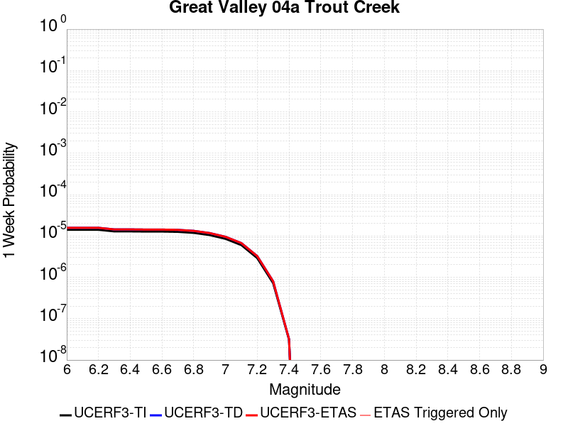 |  | 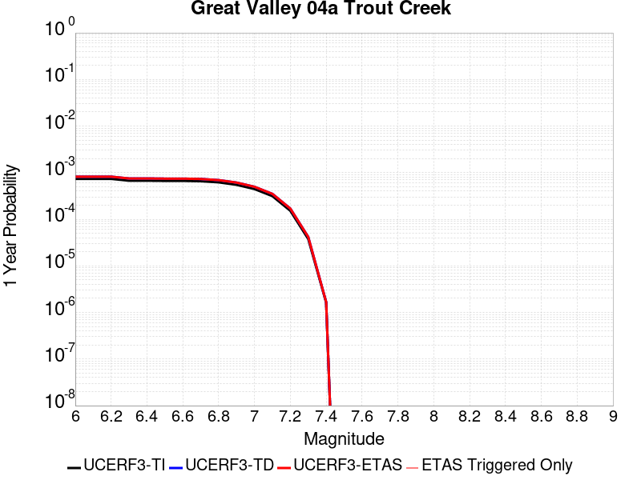 | 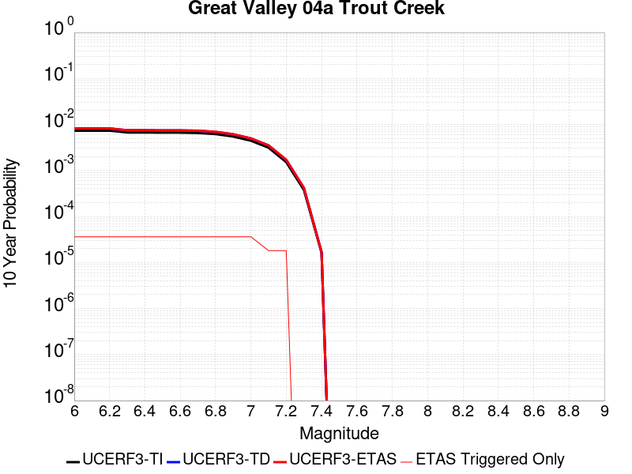 |

| Magnitude | 1 wk TI Prob | 1 wk TD Prob | 1 wk ETAS Prob | 1 wk ETAS/TD Gain | 1 wk ETAS Triggered Only | 1 mo TI Prob | 1 mo TD Prob | 1 mo ETAS Prob | 1 mo ETAS/TD Gain | 1 mo ETAS Triggered Only | 1 yr TI Prob | 1 yr TD Prob | 1 yr ETAS Prob | 1 yr ETAS/TD Gain | 1 yr ETAS Triggered Only | 10 yr TI Prob | 10 yr TD Prob | 10 yr ETAS Prob | 10 yr ETAS/TD Gain | 10 yr ETAS Triggered Only |
|-----|-----|-----|-----|-----|-----|-----|-----|-----|-----|-----|-----|-----|-----|-----|-----|-----|-----|-----|-----|-----|
| 6.0 | 1.4088538E-5 | 1.5719554E-5 | 1.5719554E-5 | 1.0 | 0.0 | 6.037805E-5 | 6.7367844E-5 | 6.7367844E-5 | 1.0 | 0.0 | 7.3485484E-4 | 8.199074E-4 | 8.199074E-4 | 1.0 | 0.0 | 0.007324295 | 0.008170108 | 0.008189945 | 1.0024279 | 2.0E-5 |
| 6.1 | 1.4088538E-5 | 1.5719554E-5 | 1.5719554E-5 | 1.0 | 0.0 | 6.037805E-5 | 6.7367844E-5 | 6.7367844E-5 | 1.0 | 0.0 | 7.3485484E-4 | 8.199074E-4 | 8.199074E-4 | 1.0 | 0.0 | 0.007324295 | 0.008170108 | 0.008189945 | 1.0024279 | 2.0E-5 |
| 6.2 | 1.4088538E-5 | 1.5719554E-5 | 1.5719554E-5 | 1.0 | 0.0 | 6.037805E-5 | 6.7367844E-5 | 6.7367844E-5 | 1.0 | 0.0 | 7.3485484E-4 | 8.199074E-4 | 8.199074E-4 | 1.0 | 0.0 | 0.007324295 | 0.008170108 | 0.008189945 | 1.0024279 | 2.0E-5 |
| 6.3 | 1.2882862E-5 | 1.4378603E-5 | 1.4378603E-5 | 1.0 | 0.0 | 5.5211098E-5 | 6.1621184E-5 | 6.1621184E-5 | 1.0 | 0.0 | 6.7198783E-4 | 7.4999005E-4 | 7.4999005E-4 | 1.0 | 0.0 | 0.0066995937 | 0.0074756527 | 0.0074955034 | 1.0026554 | 2.0E-5 |
| 6.4 | 1.2882862E-5 | 1.4378603E-5 | 1.4378603E-5 | 1.0 | 0.0 | 5.5211098E-5 | 6.1621184E-5 | 6.1621184E-5 | 1.0 | 0.0 | 6.7198783E-4 | 7.4999005E-4 | 7.4999005E-4 | 1.0 | 0.0 | 0.0066995937 | 0.0074756527 | 0.0074955034 | 1.0026554 | 2.0E-5 |
| 6.5 | 1.2762329E-5 | 1.424516E-5 | 1.424516E-5 | 1.0 | 0.0 | 5.469455E-5 | 6.1049315E-5 | 6.1049315E-5 | 1.0 | 0.0 | 6.657027E-4 | 7.430323E-4 | 7.430323E-4 | 1.0 | 0.0 | 0.00663712 | 0.0074065393 | 0.007426391 | 1.0026803 | 2.0E-5 |
| 6.6 | 1.2762329E-5 | 1.424516E-5 | 1.424516E-5 | 1.0 | 0.0 | 5.469455E-5 | 6.1049315E-5 | 6.1049315E-5 | 1.0 | 0.0 | 6.657027E-4 | 7.430323E-4 | 7.430323E-4 | 1.0 | 0.0 | 0.00663712 | 0.0074065393 | 0.007426391 | 1.0026803 | 2.0E-5 |
| 6.7 | 1.2557959E-5 | 1.4019395E-5 | 1.4019395E-5 | 1.0 | 0.0 | 5.3818712E-5 | 6.0081795E-5 | 6.0081795E-5 | 1.0 | 0.0 | 6.5504585E-4 | 7.312607E-4 | 7.312607E-4 | 1.0 | 0.0 | 0.006531183 | 0.007289598 | 0.0073094526 | 1.0027237 | 2.0E-5 |
| 6.8 | 1.1871544E-5 | 1.3258823E-5 | 1.3258823E-5 | 1.0 | 0.0 | 5.0877054E-5 | 5.6822348E-5 | 5.6822348E-5 | 1.0 | 0.0 | 6.1925204E-4 | 6.916025E-4 | 6.916025E-4 | 1.0 | 0.0 | 0.0061752927 | 0.0068955184 | 0.0069153807 | 1.0028805 | 2.0E-5 |
| 6.9 | 1.0500373E-5 | 1.1731261E-5 | 1.1731261E-5 | 1.0 | 0.0 | 4.5000823E-5 | 5.0275914E-5 | 5.0275914E-5 | 1.0 | 0.0 | 5.4774724E-4 | 6.119459E-4 | 6.119459E-4 | 1.0 | 0.0 | 0.005463991 | 0.0061034737 | 0.006123352 | 1.0032568 | 2.0E-5 |
| 7.0 | 8.524332E-6 | 9.5334835E-6 | 9.5334835E-6 | 1.0 | 0.0 | 3.653234E-5 | 4.0857187E-5 | 4.0857187E-5 | 1.0 | 0.0 | 4.4469046E-4 | 4.9733004E-4 | 4.9733004E-4 | 1.0 | 0.0 | 0.0044380166 | 0.004962902 | 0.004982803 | 1.0040098 | 2.0E-5 |
| 7.1 | 6.006849E-6 | 6.711559E-6 | 6.711559E-6 | 1.0 | 0.0 | 2.5743384E-5 | 2.876354E-5 | 2.876354E-5 | 1.0 | 0.0 | 3.1338062E-4 | 3.501454E-4 | 3.501454E-4 | 1.0 | 0.0 | 0.0031293905 | 0.0034964874 | 0.0035064525 | 1.00285 | 1.0E-5 |
| 7.2 | 2.9122193E-6 | 3.2465305E-6 | 3.2465305E-6 | 1.0 | 0.0 | 1.248088E-5 | 1.3913637E-5 | 1.3913637E-5 | 1.0 | 0.0 | 1.5194413E-4 | 1.6938712E-4 | 1.6938712E-4 | 1.0 | 0.0 | 0.0015184027 | 0.0016927521 | 0.0017027352 | 1.0058975 | 1.0E-5 |
| 7.3 | 7.2194007E-7 | 7.988761E-7 | 7.988761E-7 | 1.0 | 0.0 | 3.0940253E-6 | 3.4237528E-6 | 3.4237528E-6 | 1.0 | 0.0 | 3.7669106E-5 | 4.1683852E-5 | 4.1683852E-5 | 1.0 | 0.0 | 3.766272E-4 | 4.168053E-4 | 4.168053E-4 | 1.0 | 0.0 |
| 7.4 | 3.112171E-8 | 3.2068368E-8 | 3.2068368E-8 | 1.0 | 0.0 | 1.3337875E-7 | 1.3743585E-7 | 1.3743585E-7 | 1.0 | 0.0 | 1.6238852E-6 | 1.6732803E-6 | 1.6732803E-6 | 1.0 | 0.0 | 1.6238733E-5 | 1.6732685E-5 | 1.6732685E-5 | 1.0 | 0.0 |

## Greenville (So) 2011 CFM
*[(top)](#table-of-contents)*

| 1 Week | 1 Month | 1 Year | 10 Year |
|-----|-----|-----|-----|
| 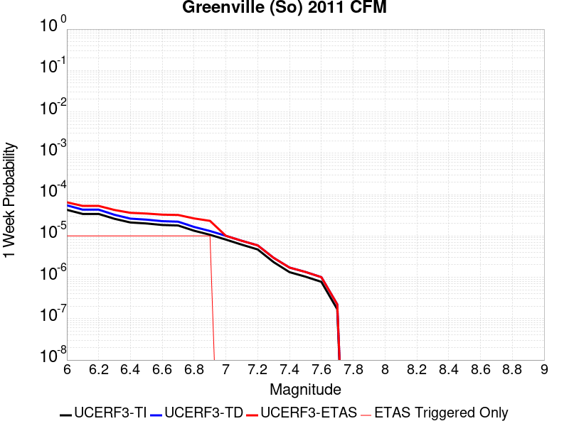 | 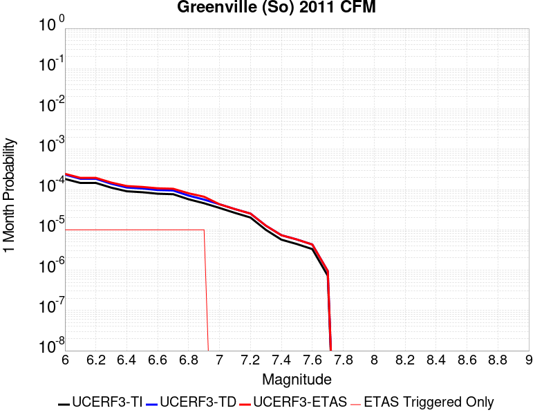 | 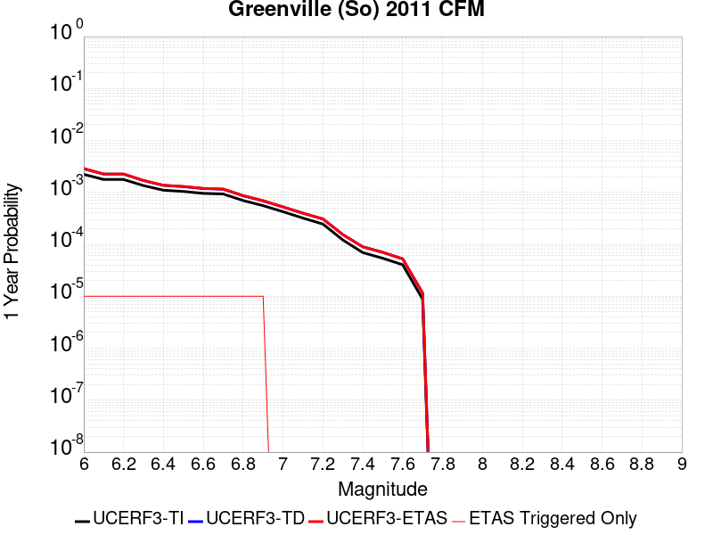 | 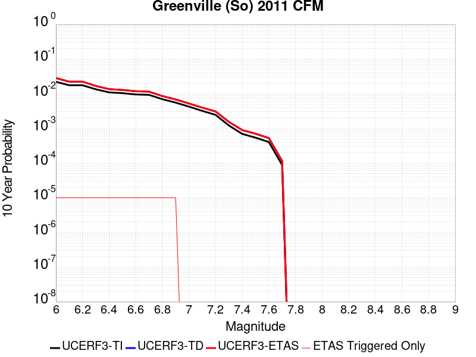 |

| Magnitude | 1 wk TI Prob | 1 wk TD Prob | 1 wk ETAS Prob | 1 wk ETAS/TD Gain | 1 wk ETAS Triggered Only | 1 mo TI Prob | 1 mo TD Prob | 1 mo ETAS Prob | 1 mo ETAS/TD Gain | 1 mo ETAS Triggered Only | 1 yr TI Prob | 1 yr TD Prob | 1 yr ETAS Prob | 1 yr ETAS/TD Gain | 1 yr ETAS Triggered Only | 10 yr TI Prob | 10 yr TD Prob | 10 yr ETAS Prob | 10 yr ETAS/TD Gain | 10 yr ETAS Triggered Only |
|-----|-----|-----|-----|-----|-----|-----|-----|-----|-----|-----|-----|-----|-----|-----|-----|-----|-----|-----|-----|-----|
| 6.0 | 4.279693E-5 | 5.5040087E-5 | 6.503954E-5 | 1.1816758 | 1.0E-5 | 1.8340252E-4 | 2.3586681E-4 | 2.4586444E-4 | 1.0423868 | 1.0E-5 | 0.0022306389 | 0.0028682416 | 0.0028782128 | 1.0034765 | 1.0E-5 | 0.022083808 | 0.028338138 | 0.028347854 | 1.0003428 | 1.0E-5 |
| 6.1 | 3.4037297E-5 | 4.3192387E-5 | 5.3191958E-5 | 1.2315123 | 1.0E-5 | 1.4586597E-4 | 1.8509831E-4 | 1.9509645E-4 | 1.0540154 | 1.0E-5 | 0.0017744715 | 0.0022514379 | 0.0022614154 | 1.0044316 | 1.0E-5 | 0.01760369 | 0.022302566 | 0.022312343 | 1.0004383 | 1.0E-5 |
| 6.2 | 3.4037297E-5 | 4.3192387E-5 | 5.3191958E-5 | 1.2315123 | 1.0E-5 | 1.4586597E-4 | 1.8509831E-4 | 1.9509645E-4 | 1.0540154 | 1.0E-5 | 0.0017744715 | 0.0022514379 | 0.0022614154 | 1.0044316 | 1.0E-5 | 0.01760369 | 0.022302566 | 0.022312343 | 1.0004383 | 1.0E-5 |
| 6.3 | 2.5956324E-5 | 3.2428903E-5 | 4.242858E-5 | 1.3083569 | 1.0E-5 | 1.11236644E-4 | 1.3897405E-4 | 1.4897266E-4 | 1.0719459 | 1.0E-5 | 0.0013534647 | 0.0016907708 | 0.0017007539 | 1.0059044 | 1.0E-5 | 0.013452509 | 0.016785882 | 0.016795715 | 1.0005858 | 1.0E-5 |
| 6.4 | 2.1145053E-5 | 2.6197677E-5 | 3.6197416E-5 | 1.3817033 | 1.0E-5 | 9.061851E-5 | 1.1227112E-4 | 1.2227E-4 | 1.0890601 | 1.0E-5 | 0.0011027219 | 0.0013660751 | 0.0013760615 | 1.0073103 | 1.0E-5 | 0.01097266 | 0.01358018 | 0.013590044 | 1.0007263 | 1.0E-5 |
| 6.5 | 2.0030959E-5 | 2.479578E-5 | 3.4795532E-5 | 1.4032844 | 1.0E-5 | 8.584414E-5 | 1.06263484E-4 | 1.1626242E-4 | 1.0940957 | 1.0E-5 | 0.0010446513 | 0.0012930221 | 0.0013030092 | 1.0077238 | 1.0E-5 | 0.010397541 | 0.012858339 | 0.01286821 | 1.0007677 | 1.0E-5 |
| 6.6 | 1.8395405E-5 | 2.2754466E-5 | 3.2754237E-5 | 1.4394642 | 1.0E-5 | 7.8835066E-5 | 9.751565E-5 | 1.0751468E-4 | 1.1025376 | 1.0E-5 | 9.5939427E-4 | 0.0011866348 | 0.001196623 | 1.0084172 | 1.0E-5 | 0.009552629 | 0.011806041 | 0.011815923 | 1.000837 | 1.0E-5 |
| 6.7 | 1.7883482E-5 | 2.212551E-5 | 3.212529E-5 | 1.451957 | 1.0E-5 | 7.664124E-5 | 9.482033E-5 | 1.0481938E-4 | 1.1054527 | 1.0E-5 | 9.3270757E-4 | 0.0011538545 | 0.001163843 | 1.0086566 | 1.0E-5 | 0.009288026 | 0.011481688 | 0.011491573 | 1.0008609 | 1.0E-5 |
| 6.8 | 1.3373564E-5 | 1.6505966E-5 | 2.65058E-5 | 1.6058315 | 1.0E-5 | 5.7314013E-5 | 7.073802E-5 | 8.073731E-5 | 1.1413567 | 1.0E-5 | 6.975747E-4 | 8.609098E-4 | 8.709012E-4 | 1.0116056 | 1.0E-5 | 0.0069538904 | 0.008577357 | 0.008587271 | 1.0011559 | 1.0E-5 |
| 6.9 | 1.06692905E-5 | 1.3152582E-5 | 2.315245E-5 | 1.760297 | 1.0E-5 | 4.5724726E-5 | 5.6367055E-5 | 6.636649E-5 | 1.1773986 | 1.0E-5 | 5.5655633E-4 | 6.86064E-4 | 6.9605716E-4 | 1.014566 | 1.0E-5 | 0.005551645 | 0.006840693 | 0.0068506245 | 1.0014518 | 1.0E-5 |
| 7.0 | 8.157512E-6 | 1.0062639E-5 | 1.0062639E-5 | 1.0 | 0.0 | 3.4960296E-5 | 4.3124903E-5 | 4.3124903E-5 | 1.0 | 0.0 | 4.2555845E-4 | 5.2492286E-4 | 5.2492286E-4 | 1.0 | 0.0 | 0.004247444 | 0.0052373074 | 0.0052373074 | 1.0 | 0.0 |
| 7.1 | 6.1467113E-6 | 7.6274314E-6 | 7.6274314E-6 | 1.0 | 0.0 | 2.6342783E-5 | 3.268859E-5 | 3.268859E-5 | 1.0 | 0.0 | 3.206762E-4 | 3.9791173E-4 | 3.9791173E-4 | 1.0 | 0.0 | 0.0032021382 | 0.0039721807 | 0.0039721807 | 1.0 | 0.0 |
| 7.2 | 4.713467E-6 | 5.9141557E-6 | 5.9141557E-6 | 1.0 | 0.0 | 2.0200418E-5 | 2.5346139E-5 | 2.5346139E-5 | 1.0 | 0.0 | 2.4591232E-4 | 3.0854615E-4 | 3.0854615E-4 | 1.0 | 0.0 | 0.0024564038 | 0.0030813308 | 0.0030813308 | 1.0 | 0.0 |
| 7.3 | 2.3266216E-6 | 2.954009E-6 | 2.954009E-6 | 1.0 | 0.0 | 9.971197E-6 | 1.2659978E-5 | 1.2659978E-5 | 1.0 | 0.0 | 1.2139256E-4 | 1.5412449E-4 | 1.5412449E-4 | 1.0 | 0.0 | 0.0012132627 | 0.0015402455 | 0.0015402455 | 1.0 | 0.0 |
| 7.4 | 1.3314E-6 | 1.7179472E-6 | 1.7179472E-6 | 1.0 | 0.0 | 5.7059874E-6 | 7.36261E-6 | 7.36261E-6 | 1.0 | 0.0 | 6.946818E-5 | 8.963614E-5 | 8.963614E-5 | 1.0 | 0.0 | 6.9446466E-4 | 8.9603866E-4 | 8.9603866E-4 | 1.0 | 0.0 |
| 7.5 | 1.0362941E-6 | 1.3468821E-6 | 1.3468821E-6 | 1.0 | 0.0 | 4.4412527E-6 | 5.772339E-6 | 5.772339E-6 | 1.0 | 0.0 | 5.407091E-5 | 7.027601E-5 | 7.027601E-5 | 1.0 | 0.0 | 5.405776E-4 | 7.025681E-4 | 7.025681E-4 | 1.0 | 0.0 |
| 7.6 | 7.764784E-7 | 1.0088593E-6 | 1.0088593E-6 | 1.0 | 0.0 | 3.3277602E-6 | 4.323676E-6 | 4.323676E-6 | 1.0 | 0.0 | 4.0514726E-5 | 5.263952E-5 | 5.263952E-5 | 1.0 | 0.0 | 4.050734E-4 | 5.262919E-4 | 5.262919E-4 | 1.0 | 0.0 |
| 7.7 | 1.6927763E-7 | 2.2139248E-7 | 2.2139248E-7 | 1.0 | 0.0 | 7.2547533E-7 | 9.4882455E-7 | 9.4882455E-7 | 1.0 | 0.0 | 8.832627E-6 | 1.15518815E-5 | 1.15518815E-5 | 1.0 | 0.0 | 8.8322755E-5 | 1.15515526E-4 | 1.15515526E-4 | 1.0 | 0.0 |

## Johnson Valley (No) 2011 rev
*[(top)](#table-of-contents)*

| 1 Week | 1 Month | 1 Year | 10 Year |
|-----|-----|-----|-----|
|  |  |  | 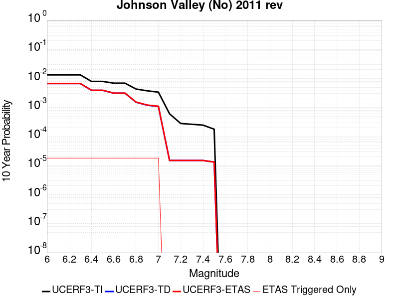 |

| Magnitude | 1 wk TI Prob | 1 wk TD Prob | 1 wk ETAS Prob | 1 wk ETAS/TD Gain | 1 wk ETAS Triggered Only | 1 mo TI Prob | 1 mo TD Prob | 1 mo ETAS Prob | 1 mo ETAS/TD Gain | 1 mo ETAS Triggered Only | 1 yr TI Prob | 1 yr TD Prob | 1 yr ETAS Prob | 1 yr ETAS/TD Gain | 1 yr ETAS Triggered Only | 10 yr TI Prob | 10 yr TD Prob | 10 yr ETAS Prob | 10 yr ETAS/TD Gain | 10 yr ETAS Triggered Only |
|-----|-----|-----|-----|-----|-----|-----|-----|-----|-----|-----|-----|-----|-----|-----|-----|-----|-----|-----|-----|-----|
| 6.0 | 2.577707E-5 | 1.2900938E-5 | 1.2900938E-5 | 1.0 | 0.0 | 1.1046848E-4 | 5.5288787E-5 | 5.5288787E-5 | 1.0 | 0.0 | 0.0013441239 | 6.7297276E-4 | 6.7297276E-4 | 1.0 | 0.0 | 0.013360229 | 0.006713257 | 0.0067231897 | 1.0014796 | 1.0E-5 |
| 6.1 | 2.577707E-5 | 1.2900938E-5 | 1.2900938E-5 | 1.0 | 0.0 | 1.1046848E-4 | 5.5288787E-5 | 5.5288787E-5 | 1.0 | 0.0 | 0.0013441239 | 6.7297276E-4 | 6.7297276E-4 | 1.0 | 0.0 | 0.013360229 | 0.006713257 | 0.0067231897 | 1.0014796 | 1.0E-5 |
| 6.2 | 2.577707E-5 | 1.2900938E-5 | 1.2900938E-5 | 1.0 | 0.0 | 1.1046848E-4 | 5.5288787E-5 | 5.5288787E-5 | 1.0 | 0.0 | 0.0013441239 | 6.7297276E-4 | 6.7297276E-4 | 1.0 | 0.0 | 0.013360229 | 0.006713257 | 0.0067231897 | 1.0014796 | 1.0E-5 |
| 6.3 | 2.577707E-5 | 1.2900938E-5 | 1.2900938E-5 | 1.0 | 0.0 | 1.1046848E-4 | 5.5288787E-5 | 5.5288787E-5 | 1.0 | 0.0 | 0.0013441239 | 6.7297276E-4 | 6.7297276E-4 | 1.0 | 0.0 | 0.013360229 | 0.006713257 | 0.0067231897 | 1.0014796 | 1.0E-5 |
| 6.4 | 1.5296591E-5 | 7.536742E-6 | 7.536742E-6 | 1.0 | 0.0 | 6.555518E-5 | 3.2300028E-5 | 3.2300028E-5 | 1.0 | 0.0 | 7.97842E-4 | 3.9320064E-4 | 3.9320064E-4 | 1.0 | 0.0 | 0.007949836 | 0.0039268904 | 0.0039368514 | 1.0025365 | 1.0E-5 |
| 6.5 | 1.5296591E-5 | 7.536742E-6 | 7.536742E-6 | 1.0 | 0.0 | 6.555518E-5 | 3.2300028E-5 | 3.2300028E-5 | 1.0 | 0.0 | 7.97842E-4 | 3.9320064E-4 | 3.9320064E-4 | 1.0 | 0.0 | 0.007949836 | 0.0039268904 | 0.0039368514 | 1.0025365 | 1.0E-5 |
| 6.6 | 1.3289383E-5 | 5.9917306E-6 | 5.9917306E-6 | 1.0 | 0.0 | 5.6953253E-5 | 2.5678688E-5 | 2.5678688E-5 | 1.0 | 0.0 | 6.9318525E-4 | 3.1261015E-4 | 3.1261015E-4 | 1.0 | 0.0 | 0.0069102696 | 0.0031233684 | 0.003133337 | 1.0031917 | 1.0E-5 |
| 6.7 | 1.3289383E-5 | 5.9917306E-6 | 5.9917306E-6 | 1.0 | 0.0 | 5.6953253E-5 | 2.5678688E-5 | 2.5678688E-5 | 1.0 | 0.0 | 6.9318525E-4 | 3.1261015E-4 | 3.1261015E-4 | 1.0 | 0.0 | 0.0069102696 | 0.0031233684 | 0.003133337 | 1.0031917 | 1.0E-5 |
| 6.8 | 8.330789E-6 | 2.9211888E-6 | 2.9211888E-6 | 1.0 | 0.0 | 3.570289E-5 | 1.2519352E-5 | 1.2519352E-5 | 1.0 | 0.0 | 4.34596E-4 | 1.5241816E-4 | 1.5241816E-4 | 1.0 | 0.0 | 0.0043374705 | 0.0015236961 | 0.001533681 | 1.0065529 | 1.0E-5 |
| 6.9 | 7.2359003E-6 | 2.3013247E-6 | 2.3013247E-6 | 1.0 | 0.0 | 3.1010633E-5 | 9.8628125E-6 | 9.8628125E-6 | 1.0 | 0.0 | 3.7748902E-4 | 1.2007845E-4 | 1.2007845E-4 | 1.0 | 0.0 | 0.0037684843 | 0.0012006586 | 0.0012106466 | 1.0083188 | 1.0E-5 |
| 7.0 | 6.5149957E-6 | 2.088482E-6 | 2.088482E-6 | 1.0 | 0.0 | 2.792111E-5 | 8.950637E-6 | 8.950637E-6 | 1.0 | 0.0 | 3.398865E-4 | 1.0897385E-4 | 1.0897385E-4 | 1.0 | 0.0 | 0.003393671 | 0.0010897239 | 0.001099713 | 1.0091666 | 1.0E-5 |
| 7.1 | 1.1662233E-6 | 2.8802024E-8 | 2.8802024E-8 | 1.0 | 0.0 | 4.9980904E-6 | 1.2343725E-7 | 1.2343725E-7 | 1.0 | 0.0 | 6.0850052E-5 | 1.5028476E-6 | 1.5028476E-6 | 1.0 | 0.0 | 6.083339E-4 | 1.50283895E-5 | 1.50283895E-5 | 1.0 | 0.0 |
| 7.2 | 5.413881E-7 | 2.8802024E-8 | 2.8802024E-8 | 1.0 | 0.0 | 2.3202326E-6 | 1.2343725E-7 | 1.2343725E-7 | 1.0 | 0.0 | 2.8248465E-5 | 1.5028476E-6 | 1.5028476E-6 | 1.0 | 0.0 | 2.8244875E-4 | 1.50283895E-5 | 1.50283895E-5 | 1.0 | 0.0 |
| 7.3 | 5.076821E-7 | 2.8802024E-8 | 2.8802024E-8 | 1.0 | 0.0 | 2.1757785E-6 | 1.2343723E-7 | 1.2343723E-7 | 1.0 | 0.0 | 2.648978E-5 | 1.5028475E-6 | 1.5028475E-6 | 1.0 | 0.0 | 2.6486625E-4 | 1.50283895E-5 | 1.50283895E-5 | 1.0 | 0.0 |
| 7.4 | 4.7568687E-7 | 2.8783948E-8 | 2.8783948E-8 | 1.0 | 0.0 | 2.0386565E-6 | 1.2335977E-7 | 1.2335977E-7 | 1.0 | 0.0 | 2.482036E-5 | 1.5019043E-6 | 1.5019043E-6 | 1.0 | 0.0 | 2.4817587E-4 | 1.5018958E-5 | 1.5018958E-5 | 1.0 | 0.0 |
| 7.5 | 3.435626E-7 | 2.5357679E-8 | 2.5357679E-8 | 1.0 | 0.0 | 1.4724103E-6 | 1.0867576E-7 | 1.0867576E-7 | 1.0 | 0.0 | 1.7926448E-5 | 1.3231268E-6 | 1.3231268E-6 | 1.0 | 0.0 | 1.7925001E-4 | 1.3231205E-5 | 1.3231205E-5 | 1.0 | 0.0 |

## San Jose
*[(top)](#table-of-contents)*

| 1 Week | 1 Month | 1 Year | 10 Year |
|-----|-----|-----|-----|
| 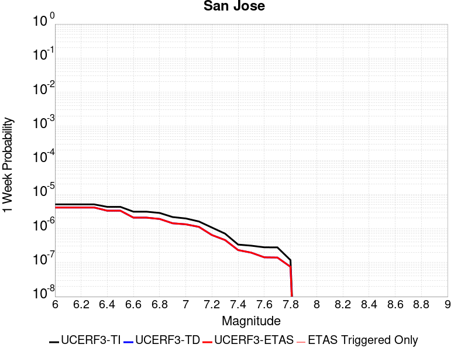 | 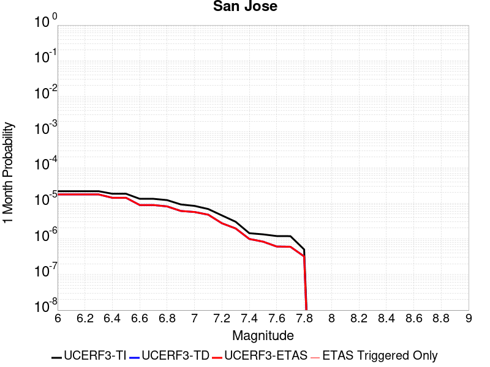 | 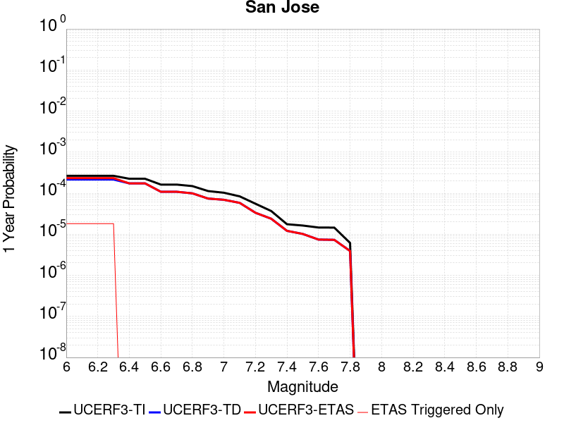 | 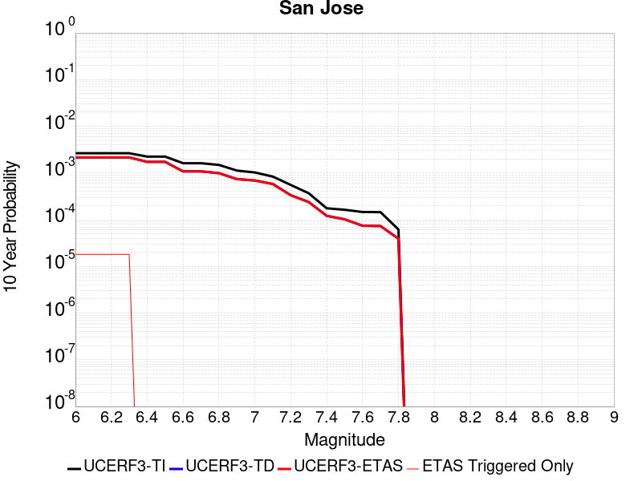 |

| Magnitude | 1 wk TI Prob | 1 wk TD Prob | 1 wk ETAS Prob | 1 wk ETAS/TD Gain | 1 wk ETAS Triggered Only | 1 mo TI Prob | 1 mo TD Prob | 1 mo ETAS Prob | 1 mo ETAS/TD Gain | 1 mo ETAS Triggered Only | 1 yr TI Prob | 1 yr TD Prob | 1 yr ETAS Prob | 1 yr ETAS/TD Gain | 1 yr ETAS Triggered Only | 10 yr TI Prob | 10 yr TD Prob | 10 yr ETAS Prob | 10 yr ETAS/TD Gain | 10 yr ETAS Triggered Only |
|-----|-----|-----|-----|-----|-----|-----|-----|-----|-----|-----|-----|-----|-----|-----|-----|-----|-----|-----|-----|-----|
| 6.0 | 5.0851277E-6 | 4.1256726E-6 | 4.1256726E-6 | 1.0 | 0.0 | 2.1793223E-5 | 1.768135E-5 | 1.768135E-5 | 1.0 | 0.0 | 2.653002E-4 | 2.152518E-4 | 2.2524965E-4 | 1.0464473 | 1.0E-5 | 0.0026498367 | 0.0021507242 | 0.0021607026 | 1.0046396 | 1.0E-5 |
| 6.1 | 5.0851277E-6 | 4.1256726E-6 | 4.1256726E-6 | 1.0 | 0.0 | 2.1793223E-5 | 1.768135E-5 | 1.768135E-5 | 1.0 | 0.0 | 2.653002E-4 | 2.152518E-4 | 2.2524965E-4 | 1.0464473 | 1.0E-5 | 0.0026498367 | 0.0021507242 | 0.0021607026 | 1.0046396 | 1.0E-5 |
| 6.2 | 5.0851277E-6 | 4.1256726E-6 | 4.1256726E-6 | 1.0 | 0.0 | 2.1793223E-5 | 1.768135E-5 | 1.768135E-5 | 1.0 | 0.0 | 2.653002E-4 | 2.152518E-4 | 2.2524965E-4 | 1.0464473 | 1.0E-5 | 0.0026498367 | 0.0021507242 | 0.0021607026 | 1.0046396 | 1.0E-5 |
| 6.3 | 5.0851277E-6 | 4.1256726E-6 | 4.1256726E-6 | 1.0 | 0.0 | 2.1793223E-5 | 1.768135E-5 | 1.768135E-5 | 1.0 | 0.0 | 2.653002E-4 | 2.152518E-4 | 2.2524965E-4 | 1.0464473 | 1.0E-5 | 0.0026498367 | 0.0021507242 | 0.0021607026 | 1.0046396 | 1.0E-5 |
| 6.4 | 4.3115124E-6 | 3.3237832E-6 | 3.3237832E-6 | 1.0 | 0.0 | 1.8477778E-5 | 1.424472E-5 | 1.424472E-5 | 1.0 | 0.0 | 2.2494372E-4 | 1.7341787E-4 | 1.7341787E-4 | 1.0 | 0.0 | 0.0022471617 | 0.0017330751 | 0.0017330751 | 1.0 | 0.0 |
| 6.5 | 4.3115124E-6 | 3.3237832E-6 | 3.3237832E-6 | 1.0 | 0.0 | 1.8477778E-5 | 1.424472E-5 | 1.424472E-5 | 1.0 | 0.0 | 2.2494372E-4 | 1.7341787E-4 | 1.7341787E-4 | 1.0 | 0.0 | 0.0022471617 | 0.0017330751 | 0.0017330751 | 1.0 | 0.0 |
| 6.6 | 3.110396E-6 | 2.0799866E-6 | 2.0799866E-6 | 1.0 | 0.0 | 1.33302E-5 | 8.9141995E-6 | 8.9141995E-6 | 1.0 | 0.0 | 1.622831E-4 | 1.0852526E-4 | 1.0852526E-4 | 1.0 | 0.0 | 0.0016216465 | 0.0010847825 | 0.0010847825 | 1.0 | 0.0 |
| 6.7 | 3.110396E-6 | 2.0799866E-6 | 2.0799866E-6 | 1.0 | 0.0 | 1.33302E-5 | 8.9141995E-6 | 8.9141995E-6 | 1.0 | 0.0 | 1.622831E-4 | 1.0852526E-4 | 1.0852526E-4 | 1.0 | 0.0 | 0.0016216465 | 0.0010847825 | 0.0010847825 | 1.0 | 0.0 |
| 6.8 | 2.856651E-6 | 1.902435E-6 | 1.902435E-6 | 1.0 | 0.0 | 1.2242733E-5 | 8.153269E-6 | 8.153269E-6 | 1.0 | 0.0 | 1.4904508E-4 | 9.926178E-5 | 9.926178E-5 | 1.0 | 0.0 | 0.0014894515 | 9.922314E-4 | 9.922314E-4 | 1.0 | 0.0 |
| 6.9 | 2.1618725E-6 | 1.4186642E-6 | 1.4186642E-6 | 1.0 | 0.0 | 9.265135E-6 | 6.0799757E-6 | 6.0799757E-6 | 1.0 | 0.0 | 1.12797185E-4 | 7.402128E-5 | 7.402128E-5 | 1.0 | 0.0 | 0.0011273995 | 7.4000744E-4 | 7.4000744E-4 | 1.0 | 0.0 |
| 7.0 | 1.9684312E-6 | 1.3256331E-6 | 1.3256331E-6 | 1.0 | 0.0 | 8.436106E-6 | 5.681273E-6 | 5.681273E-6 | 1.0 | 0.0 | 1.02704755E-4 | 6.9167385E-5 | 6.9167385E-5 | 1.0 | 0.0 | 0.001026573 | 6.914992E-4 | 6.914992E-4 | 1.0 | 0.0 |
| 7.1 | 1.6070337E-6 | 1.1155087E-6 | 1.1155087E-6 | 1.0 | 0.0 | 6.887269E-6 | 4.780743E-6 | 4.780743E-6 | 1.0 | 0.0 | 8.384928E-5 | 5.8204052E-5 | 5.8204052E-5 | 1.0 | 0.0 | 8.3817646E-4 | 5.819267E-4 | 5.819267E-4 | 1.0 | 0.0 |
| 7.2 | 1.0631658E-6 | 6.4037624E-7 | 6.4037624E-7 | 1.0 | 0.0 | 4.556417E-6 | 2.7444669E-6 | 2.7444669E-6 | 1.0 | 0.0 | 5.5472963E-5 | 3.3413387E-5 | 3.3413387E-5 | 1.0 | 0.0 | 5.545912E-4 | 3.3411747E-4 | 3.3411747E-4 | 1.0 | 0.0 |
| 7.3 | 7.060711E-7 | 4.5824706E-7 | 4.5824706E-7 | 1.0 | 0.0 | 3.0260155E-6 | 1.9639147E-6 | 1.9639147E-6 | 1.0 | 0.0 | 3.6841117E-5 | 2.3910407E-5 | 2.3910407E-5 | 1.0 | 0.0 | 3.6835007E-4 | 2.3911172E-4 | 2.3911172E-4 | 1.0 | 0.0 |
| 7.4 | 3.3677085E-7 | 2.3233133E-7 | 2.3233133E-7 | 1.0 | 0.0 | 1.4433028E-6 | 9.957054E-7 | 9.957054E-7 | 1.0 | 0.0 | 1.757207E-5 | 1.21226485E-5 | 1.21226485E-5 | 1.0 | 0.0 | 1.7570681E-4 | 1.2125263E-4 | 1.2125263E-4 | 1.0 | 0.0 |
| 7.5 | 3.129161E-7 | 1.9530925E-7 | 1.9530925E-7 | 1.0 | 0.0 | 1.3410682E-6 | 8.370394E-7 | 8.370394E-7 | 1.0 | 0.0 | 1.6327383E-5 | 1.0190909E-5 | 1.0190909E-5 | 1.0 | 0.0 | 1.6326184E-4 | 1.0193714E-4 | 1.0193714E-4 | 1.0 | 0.0 |
| 7.6 | 2.8008668E-7 | 1.4242323E-7 | 1.4242323E-7 | 1.0 | 0.0 | 1.2003709E-6 | 6.1038514E-7 | 6.1038514E-7 | 1.0 | 0.0 | 1.46144175E-5 | 7.4314153E-6 | 7.4314153E-6 | 1.0 | 0.0 | 1.4613457E-4 | 7.434427E-5 | 7.434427E-5 | 1.0 | 0.0 |
| 7.7 | 2.7852005E-7 | 1.4016913E-7 | 1.4016913E-7 | 1.0 | 0.0 | 1.1936568E-6 | 6.007248E-7 | 6.007248E-7 | 1.0 | 0.0 | 1.4532674E-5 | 7.3138012E-6 | 7.3138012E-6 | 1.0 | 0.0 | 1.4531724E-4 | 7.316821E-5 | 7.316821E-5 | 1.0 | 0.0 |
| 7.8 | 1.1810797E-7 | 7.5190094E-8 | 7.5190094E-8 | 1.0 | 0.0 | 5.0617695E-7 | 3.222432E-7 | 3.222432E-7 | 1.0 | 0.0 | 6.1626865E-6 | 3.9233046E-6 | 3.9233046E-6 | 1.0 | 0.0 | 6.162516E-5 | 3.9250725E-5 | 3.9250725E-5 | 1.0 | 0.0 |

## Carlsbad
*[(top)](#table-of-contents)*

| 1 Week | 1 Month | 1 Year | 10 Year |
|-----|-----|-----|-----|
| 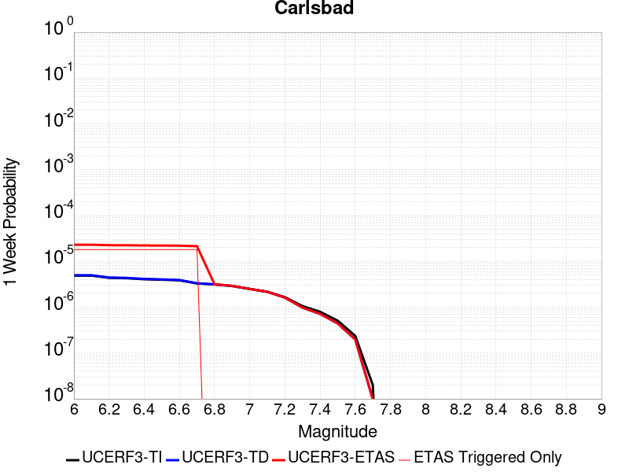 | 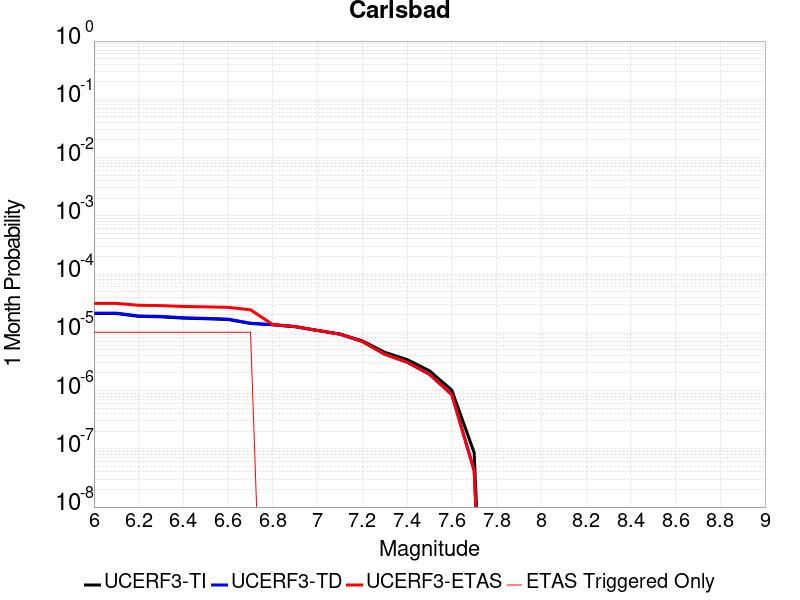 | 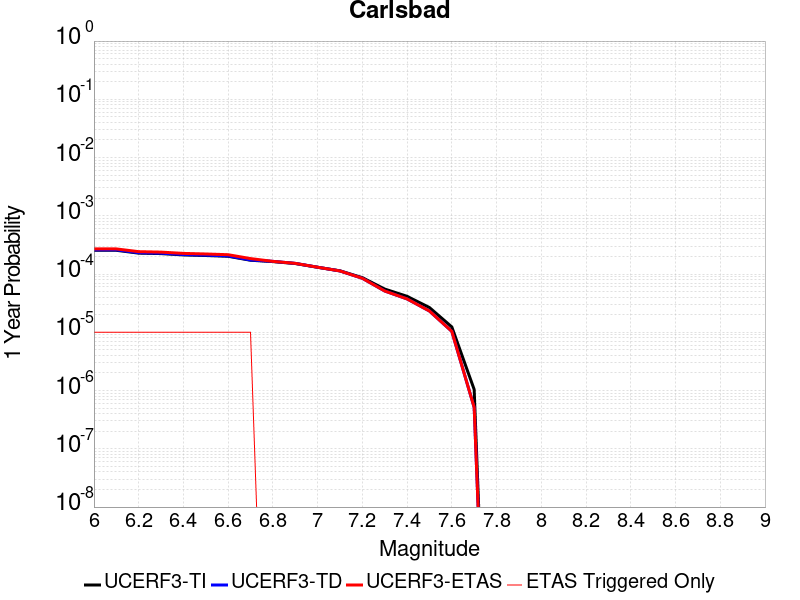 | 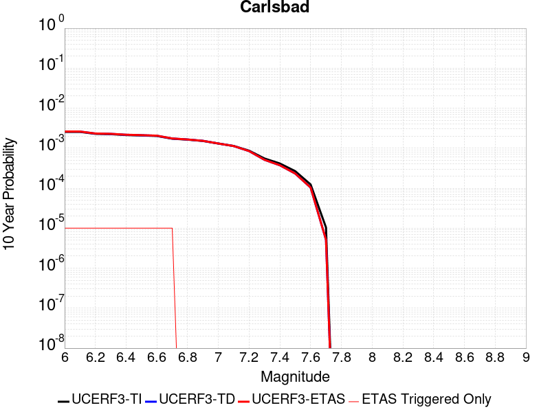 |

| Magnitude | 1 wk TI Prob | 1 wk TD Prob | 1 wk ETAS Prob | 1 wk ETAS/TD Gain | 1 wk ETAS Triggered Only | 1 mo TI Prob | 1 mo TD Prob | 1 mo ETAS Prob | 1 mo ETAS/TD Gain | 1 mo ETAS Triggered Only | 1 yr TI Prob | 1 yr TD Prob | 1 yr ETAS Prob | 1 yr ETAS/TD Gain | 1 yr ETAS Triggered Only | 10 yr TI Prob | 10 yr TD Prob | 10 yr ETAS Prob | 10 yr ETAS/TD Gain | 10 yr ETAS Triggered Only |
|-----|-----|-----|-----|-----|-----|-----|-----|-----|-----|-----|-----|-----|-----|-----|-----|-----|-----|-----|-----|-----|
| 6.0 | 4.9038536E-6 | 4.9872565E-6 | 1.4987207E-5 | 3.0051005 | 1.0E-5 | 2.1016345E-5 | 2.1373784E-5 | 3.137357E-5 | 1.4678528 | 1.0E-5 | 2.5584397E-4 | 2.601952E-4 | 2.701926E-4 | 1.0384227 | 1.0E-5 | 0.002555496 | 0.0025989525 | 0.0026089265 | 1.0038377 | 1.0E-5 |
| 6.1 | 4.9038536E-6 | 4.9872565E-6 | 1.4987207E-5 | 3.0051005 | 1.0E-5 | 2.1016345E-5 | 2.1373784E-5 | 3.137357E-5 | 1.4678528 | 1.0E-5 | 2.5584397E-4 | 2.601952E-4 | 2.701926E-4 | 1.0384227 | 1.0E-5 | 0.002555496 | 0.0025989525 | 0.0026089265 | 1.0038377 | 1.0E-5 |
| 6.2 | 4.3820614E-6 | 4.4547687E-6 | 1.4454724E-5 | 3.2447755 | 1.0E-5 | 1.8780129E-5 | 1.9091729E-5 | 2.9091538E-5 | 1.523777 | 1.0E-5 | 2.2862408E-4 | 2.3241735E-4 | 2.4241503E-4 | 1.0430161 | 1.0E-5 | 0.00228389 | 0.0023217786 | 0.0023317554 | 1.004297 | 1.0E-5 |
| 6.3 | 4.302872E-6 | 4.373006E-6 | 1.4372962E-5 | 3.2867463 | 1.0E-5 | 1.8440749E-5 | 1.8741322E-5 | 2.8741135E-5 | 1.5335703 | 1.0E-5 | 2.24493E-4 | 2.2815206E-4 | 2.3814978E-4 | 1.0438204 | 1.0E-5 | 0.0022426634 | 0.0022792136 | 0.0022891907 | 1.0043775 | 1.0E-5 |
| 6.4 | 4.0835243E-6 | 4.1476546E-6 | 1.4147613E-5 | 3.4109912 | 1.0E-5 | 1.75007E-5 | 1.7775543E-5 | 2.7775364E-5 | 1.5625607 | 1.0E-5 | 2.1305021E-4 | 2.1639607E-4 | 2.2639391E-4 | 1.0462016 | 1.0E-5 | 0.0021284607 | 0.0021618877 | 0.0021718661 | 1.0046155 | 1.0E-5 |
| 6.5 | 3.987806E-6 | 4.0488867E-6 | 1.4048846E-5 | 3.4698048 | 1.0E-5 | 1.7090486E-5 | 1.7352257E-5 | 2.7352084E-5 | 1.5762839 | 1.0E-5 | 2.080568E-4 | 2.1124359E-4 | 2.2124147E-4 | 1.0473287 | 1.0E-5 | 0.002078621 | 0.0021104617 | 0.0021204406 | 1.0047283 | 1.0E-5 |
| 6.6 | 3.8707576E-6 | 3.927488E-6 | 1.3927449E-5 | 3.5461469 | 1.0E-5 | 1.6588854E-5 | 1.6831984E-5 | 2.6831816E-5 | 1.594097 | 1.0E-5 | 2.0195059E-4 | 2.0491047E-4 | 2.1490842E-4 | 1.0487918 | 1.0E-5 | 0.0020176715 | 0.0020472489 | 0.0020572285 | 1.0048746 | 1.0E-5 |
| 6.7 | 3.3093434E-6 | 3.3423917E-6 | 1.3342358E-5 | 3.9918597 | 1.0E-5 | 1.4182823E-5 | 1.4324457E-5 | 2.4324314E-5 | 1.6980968 | 1.0E-5 | 1.7266218E-4 | 1.7438637E-4 | 1.8438463E-4 | 1.057334 | 1.0E-5 | 0.001725281 | 0.0017425013 | 0.0017524839 | 1.0057288 | 1.0E-5 |
| 6.8 | 3.136983E-6 | 3.1664536E-6 | 3.1664536E-6 | 1.0 | 0.0 | 1.3444143E-5 | 1.3570445E-5 | 1.3570445E-5 | 1.0 | 0.0 | 1.6367015E-4 | 1.6520769E-4 | 1.6520769E-4 | 1.0 | 0.0 | 0.0016354966 | 0.0016508545 | 0.0016508545 | 1.0 | 0.0 |
| 6.9 | 2.9056644E-6 | 2.9267585E-6 | 2.9267585E-6 | 1.0 | 0.0 | 1.2452788E-5 | 1.2543191E-5 | 1.2543191E-5 | 1.0 | 0.0 | 1.5160214E-4 | 1.5270269E-4 | 1.5270269E-4 | 1.0 | 0.0 | 0.0015149876 | 0.001525983 | 0.001525983 | 1.0 | 0.0 |
| 7.0 | 2.5071035E-6 | 2.5113977E-6 | 2.5113977E-6 | 1.0 | 0.0 | 1.0744685E-5 | 1.07630885E-5 | 1.07630885E-5 | 1.0 | 0.0 | 1.308087E-4 | 1.3103275E-4 | 1.3103275E-4 | 1.0 | 0.0 | 0.0013073172 | 0.0013095582 | 0.0013095582 | 1.0 | 0.0 |
| 7.1 | 2.1786877E-6 | 2.1678832E-6 | 2.1678832E-6 | 1.0 | 0.0 | 9.3372E-6 | 9.290896E-6 | 9.290896E-6 | 1.0 | 0.0 | 1.13674476E-4 | 1.1311081E-4 | 1.1311081E-4 | 1.0 | 0.0 | 0.0011361635 | 0.0011305353 | 0.0011305353 | 1.0 | 0.0 |
| 7.2 | 1.6628418E-6 | 1.6213872E-6 | 1.6213872E-6 | 1.0 | 0.0 | 7.1264453E-6 | 6.948784E-6 | 6.948784E-6 | 1.0 | 0.0 | 8.676102E-5 | 8.4598185E-5 | 8.4598185E-5 | 1.0 | 0.0 | 8.672715E-4 | 8.45662E-4 | 8.45662E-4 | 1.0 | 0.0 |
| 7.3 | 1.0595926E-6 | 9.816804E-7 | 9.816804E-7 | 1.0 | 0.0 | 4.541103E-6 | 4.2071947E-6 | 4.2071947E-6 | 1.0 | 0.0 | 5.5286528E-5 | 5.1221403E-5 | 5.1221403E-5 | 1.0 | 0.0 | 5.527277E-4 | 5.1209686E-4 | 5.1209686E-4 | 1.0 | 0.0 |
| 7.4 | 7.956623E-7 | 7.1737975E-7 | 7.1737975E-7 | 1.0 | 0.0 | 3.4099767E-6 | 3.074481E-6 | 3.074481E-6 | 1.0 | 0.0 | 4.1515676E-5 | 3.743117E-5 | 3.743117E-5 | 1.0 | 0.0 | 4.150792E-4 | 3.7424936E-4 | 3.7424936E-4 | 1.0 | 0.0 |
| 7.5 | 5.1043804E-7 | 4.4483627E-7 | 4.4483627E-7 | 1.0 | 0.0 | 2.1875896E-6 | 1.9064398E-6 | 1.9064398E-6 | 1.0 | 0.0 | 2.663358E-5 | 2.3210663E-5 | 2.3210663E-5 | 1.0 | 0.0 | 2.6630386E-4 | 2.3208297E-4 | 2.3208297E-4 | 1.0 | 0.0 |
| 7.6 | 2.3723294E-7 | 1.989569E-7 | 1.989569E-7 | 1.0 | 0.0 | 1.0167122E-6 | 8.5267214E-7 | 8.5267214E-7 | 1.0 | 0.0 | 1.2378401E-5 | 1.0381237E-5 | 1.0381237E-5 | 1.0 | 0.0 | 1.237771E-4 | 1.038078E-4 | 1.038078E-4 | 1.0 | 0.0 |
| 7.7 | 1.9992152E-8 | 9.8601785E-9 | 9.8601785E-9 | 1.0 | 0.0 | 8.568065E-8 | 4.225791E-8 | 4.225791E-8 | 1.0 | 0.0 | 1.0431614E-6 | 5.1449E-7 | 5.1449E-7 | 1.0 | 0.0 | 1.0431565E-5 | 5.1449E-6 | 5.1449E-6 | 1.0 | 0.0 |

## Reliz 2011 CFM
*[(top)](#table-of-contents)*

| 1 Week | 1 Month | 1 Year | 10 Year |
|-----|-----|-----|-----|
|  |  | 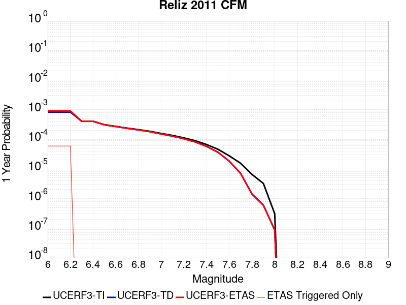 | 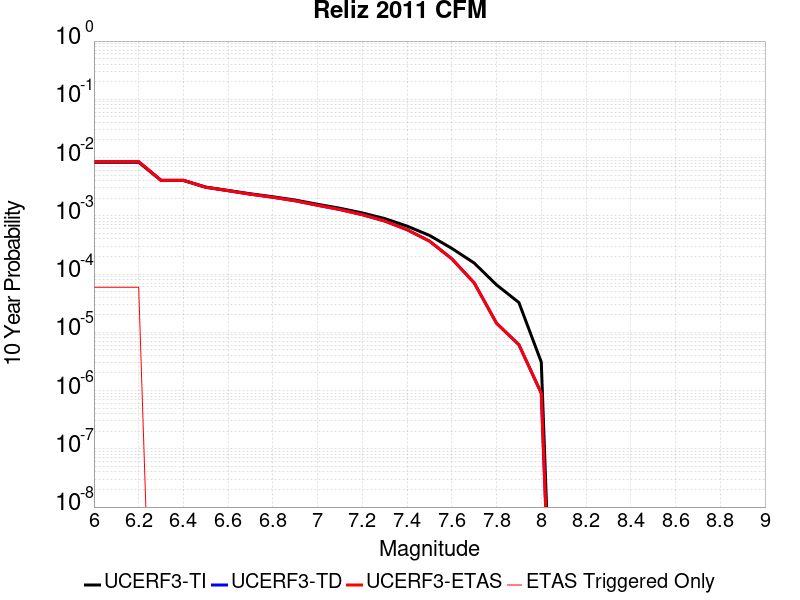 |

| Magnitude | 1 wk TI Prob | 1 wk TD Prob | 1 wk ETAS Prob | 1 wk ETAS/TD Gain | 1 wk ETAS Triggered Only | 1 mo TI Prob | 1 mo TD Prob | 1 mo ETAS Prob | 1 mo ETAS/TD Gain | 1 mo ETAS Triggered Only | 1 yr TI Prob | 1 yr TD Prob | 1 yr ETAS Prob | 1 yr ETAS/TD Gain | 1 yr ETAS Triggered Only | 10 yr TI Prob | 10 yr TD Prob | 10 yr ETAS Prob | 10 yr ETAS/TD Gain | 10 yr ETAS Triggered Only |
|-----|-----|-----|-----|-----|-----|-----|-----|-----|-----|-----|-----|-----|-----|-----|-----|-----|-----|-----|-----|-----|
| 6.0 | 1.6002472E-5 | 1.6282804E-5 | 1.6282804E-5 | 1.0 | 0.0 | 6.8580215E-5 | 6.9781694E-5 | 6.9781694E-5 | 1.0 | 0.0 | 8.3464425E-4 | 8.4928074E-4 | 8.5927226E-4 | 1.0117646 | 1.0E-5 | 0.008315164 | 0.008462547 | 0.008472463 | 1.0011717 | 1.0E-5 |
| 6.1 | 1.6002472E-5 | 1.6282804E-5 | 1.6282804E-5 | 1.0 | 0.0 | 6.8580215E-5 | 6.9781694E-5 | 6.9781694E-5 | 1.0 | 0.0 | 8.3464425E-4 | 8.4928074E-4 | 8.5927226E-4 | 1.0117646 | 1.0E-5 | 0.008315164 | 0.008462547 | 0.008472463 | 1.0011717 | 1.0E-5 |
| 6.2 | 1.6002472E-5 | 1.6282804E-5 | 1.6282804E-5 | 1.0 | 0.0 | 6.8580215E-5 | 6.9781694E-5 | 6.9781694E-5 | 1.0 | 0.0 | 8.3464425E-4 | 8.4928074E-4 | 8.5927226E-4 | 1.0117646 | 1.0E-5 | 0.008315164 | 0.008462547 | 0.008472463 | 1.0011717 | 1.0E-5 |
| 6.3 | 7.792404E-6 | 7.803802E-6 | 7.803802E-6 | 1.0 | 0.0 | 3.339559E-5 | 3.344444E-5 | 3.344444E-5 | 1.0 | 0.0 | 4.0651546E-4 | 4.0711078E-4 | 4.0711078E-4 | 1.0 | 0.0 | 0.0040577264 | 0.004063926 | 0.004063926 | 1.0 | 0.0 |
| 6.4 | 7.792404E-6 | 7.803802E-6 | 7.803802E-6 | 1.0 | 0.0 | 3.339559E-5 | 3.344444E-5 | 3.344444E-5 | 1.0 | 0.0 | 4.0651546E-4 | 4.0711078E-4 | 4.0711078E-4 | 1.0 | 0.0 | 0.0040577264 | 0.004063926 | 0.004063926 | 1.0 | 0.0 |
| 6.5 | 5.9659374E-6 | 5.928738E-6 | 5.928738E-6 | 1.0 | 0.0 | 2.5568053E-5 | 2.5408632E-5 | 2.5408632E-5 | 1.0 | 0.0 | 3.1124658E-4 | 3.093064E-4 | 3.093064E-4 | 1.0 | 0.0 | 0.00310811 | 0.0030889767 | 0.0030889767 | 1.0 | 0.0 |
| 6.6 | 5.2350692E-6 | 5.178986E-6 | 5.178986E-6 | 1.0 | 0.0 | 2.2435817E-5 | 2.2195467E-5 | 2.2195467E-5 | 1.0 | 0.0 | 2.7312184E-4 | 2.7019644E-4 | 2.7019644E-4 | 1.0 | 0.0 | 0.002727864 | 0.0026988892 | 0.0026988892 | 1.0 | 0.0 |
| 6.7 | 4.580206E-6 | 4.5061206E-6 | 4.5061206E-6 | 1.0 | 0.0 | 1.9629308E-5 | 1.9311801E-5 | 1.9311801E-5 | 1.0 | 0.0 | 2.389606E-4 | 2.350959E-4 | 2.350959E-4 | 1.0 | 0.0 | 0.002387038 | 0.0023486738 | 0.0023486738 | 1.0 | 0.0 |
| 6.8 | 4.0765017E-6 | 3.9882384E-6 | 3.9882384E-6 | 1.0 | 0.0 | 1.7470604E-5 | 1.7092338E-5 | 1.7092338E-5 | 1.0 | 0.0 | 2.1268385E-4 | 2.0807938E-4 | 2.0807938E-4 | 1.0 | 0.0 | 0.002124804 | 0.0020790435 | 0.0020790435 | 1.0 | 0.0 |
| 6.9 | 3.5752896E-6 | 3.4725176E-6 | 3.4725176E-6 | 1.0 | 0.0 | 1.532258E-5 | 1.4882134E-5 | 1.4882134E-5 | 1.0 | 0.0 | 1.8653645E-4 | 1.8117494E-4 | 1.8117494E-4 | 1.0 | 0.0 | 0.0018637994 | 0.0018104686 | 0.0018104686 | 1.0 | 0.0 |
| 7.0 | 3.0259848E-6 | 2.9079417E-6 | 2.9079417E-6 | 1.0 | 0.0 | 1.2968442E-5 | 1.2462548E-5 | 1.2462548E-5 | 1.0 | 0.0 | 1.5787935E-4 | 1.5172097E-4 | 1.5172097E-4 | 1.0 | 0.0 | 0.0015776722 | 0.001516369 | 0.001516369 | 1.0 | 0.0 |
| 7.1 | 2.5861116E-6 | 2.455167E-6 | 2.455167E-6 | 1.0 | 0.0 | 1.1083288E-5 | 1.05221025E-5 | 1.05221025E-5 | 1.0 | 0.0 | 1.3493067E-4 | 1.2809907E-4 | 1.2809907E-4 | 1.0 | 0.0 | 0.0013484878 | 0.001280447 | 0.001280447 | 1.0 | 0.0 |
| 7.2 | 2.1482588E-6 | 2.003237E-6 | 2.003237E-6 | 1.0 | 0.0 | 9.20679E-6 | 8.585273E-6 | 8.585273E-6 | 1.0 | 0.0 | 1.12086906E-4 | 1.0452068E-4 | 1.0452068E-4 | 1.0 | 0.0 | 0.0011203039 | 0.0010449095 | 0.0010449095 | 1.0 | 0.0 |
| 7.3 | 1.7194744E-6 | 1.5611241E-6 | 1.5611241E-6 | 1.0 | 0.0 | 7.3691554E-6 | 6.690515E-6 | 6.690515E-6 | 1.0 | 0.0 | 8.971577E-5 | 8.1453974E-5 | 8.1453974E-5 | 1.0 | 0.0 | 8.967956E-4 | 8.1443513E-4 | 8.1443513E-4 | 1.0 | 0.0 |
| 7.4 | 1.2755178E-6 | 1.10563E-6 | 1.10563E-6 | 1.0 | 0.0 | 5.4664933E-6 | 4.7384056E-6 | 4.7384056E-6 | 1.0 | 0.0 | 6.655252E-5 | 5.768856E-5 | 5.768856E-5 | 1.0 | 0.0 | 6.6532596E-4 | 5.7692965E-4 | 5.7692965E-4 | 1.0 | 0.0 |
| 7.5 | 8.8463224E-7 | 7.0580273E-7 | 7.0580273E-7 | 1.0 | 0.0 | 3.7912755E-6 | 3.0248652E-6 | 3.0248652E-6 | 1.0 | 0.0 | 4.6157802E-5 | 3.6827114E-5 | 3.6827114E-5 | 1.0 | 0.0 | 4.6148215E-4 | 3.684038E-4 | 3.684038E-4 | 1.0 | 0.0 |
| 7.6 | 5.291355E-7 | 3.500777E-7 | 3.500777E-7 | 1.0 | 0.0 | 2.2677216E-6 | 1.5003321E-6 | 1.5003321E-6 | 1.0 | 0.0 | 2.760916E-5 | 1.8266392E-5 | 1.8266392E-5 | 1.0 | 0.0 | 2.760573E-4 | 1.8284164E-4 | 1.8284164E-4 | 1.0 | 0.0 |
| 7.7 | 2.9663357E-7 | 1.351113E-7 | 1.351113E-7 | 1.0 | 0.0 | 1.2712861E-6 | 5.7904833E-7 | 5.7904833E-7 | 1.0 | 0.0 | 1.5477797E-5 | 7.049891E-6 | 7.049891E-6 | 1.0 | 0.0 | 1.547672E-4 | 7.068132E-5 | 7.068132E-5 | 1.0 | 0.0 |
| 7.8 | 1.2509386E-7 | 2.7157126E-8 | 2.7157126E-8 | 1.0 | 0.0 | 5.3611643E-7 | 1.1638769E-7 | 1.1638769E-7 | 1.0 | 0.0 | 6.527198E-6 | 1.4170191E-6 | 1.4170191E-6 | 1.0 | 0.0 | 6.527006E-5 | 1.4326506E-5 | 1.4326506E-5 | 1.0 | 0.0 |
| 7.9 | 6.213493E-8 | 1.1482114E-8 | 1.1482114E-8 | 1.0 | 0.0 | 2.6629255E-7 | 4.920906E-8 | 4.920906E-8 | 1.0 | 0.0 | 3.242107E-6 | 5.9912014E-7 | 5.9912014E-7 | 1.0 | 0.0 | 3.2420594E-5 | 6.1224223E-6 | 6.1224223E-6 | 1.0 | 0.0 |
| 8.0 | 5.92383E-9 | 1.677887E-9 | 1.677887E-9 | 1.0 | 0.0 | 2.5387841E-8 | 7.190944E-9 | 7.190944E-9 | 1.0 | 0.0 | 3.0909692E-7 | 8.754974E-8 | 8.754974E-8 | 1.0 | 0.0 | 3.090965E-6 | 9.003061E-7 | 9.003061E-7 | 1.0 | 0.0 |

## Great Valley 10 (Panoche)
*[(top)](#table-of-contents)*

| 1 Week | 1 Month | 1 Year | 10 Year |
|-----|-----|-----|-----|
| 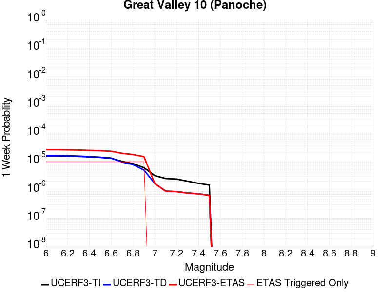 | 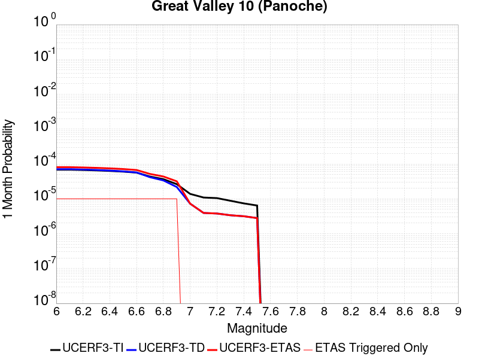 | 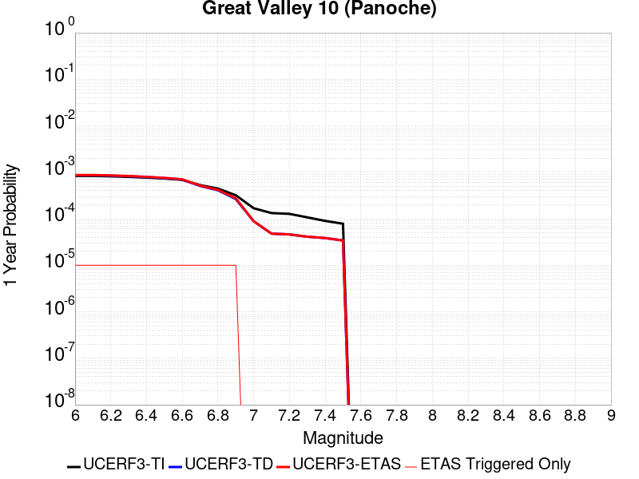 | 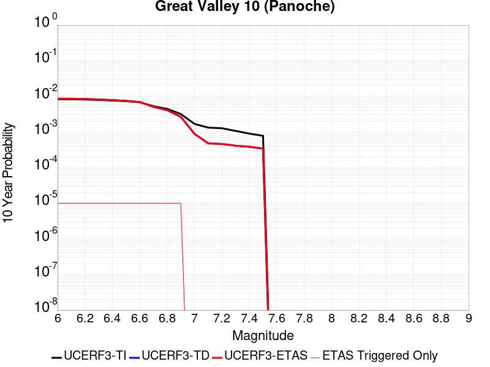 |

| Magnitude | 1 wk TI Prob | 1 wk TD Prob | 1 wk ETAS Prob | 1 wk ETAS/TD Gain | 1 wk ETAS Triggered Only | 1 mo TI Prob | 1 mo TD Prob | 1 mo ETAS Prob | 1 mo ETAS/TD Gain | 1 mo ETAS Triggered Only | 1 yr TI Prob | 1 yr TD Prob | 1 yr ETAS Prob | 1 yr ETAS/TD Gain | 1 yr ETAS Triggered Only | 10 yr TI Prob | 10 yr TD Prob | 10 yr ETAS Prob | 10 yr ETAS/TD Gain | 10 yr ETAS Triggered Only |
|-----|-----|-----|-----|-----|-----|-----|-----|-----|-----|-----|-----|-----|-----|-----|-----|-----|-----|-----|-----|-----|
| 6.0 | 1.6014626E-5 | 1.6575399E-5 | 2.6575233E-5 | 1.6032938 | 1.0E-5 | 6.863231E-5 | 7.103552E-5 | 8.1034814E-5 | 1.1407646 | 1.0E-5 | 8.35278E-4 | 8.645185E-4 | 8.7450986E-4 | 1.0115571 | 1.0E-5 | 0.008321454 | 0.008612172 | 0.008622086 | 1.0011512 | 1.0E-5 |
| 6.1 | 1.6014626E-5 | 1.6575399E-5 | 2.6575233E-5 | 1.6032938 | 1.0E-5 | 6.863231E-5 | 7.103552E-5 | 8.1034814E-5 | 1.1407646 | 1.0E-5 | 8.35278E-4 | 8.645185E-4 | 8.7450986E-4 | 1.0115571 | 1.0E-5 | 0.008321454 | 0.008612172 | 0.008622086 | 1.0011512 | 1.0E-5 |
| 6.2 | 1.56782E-5 | 1.6198446E-5 | 2.6198284E-5 | 1.6173332 | 1.0E-5 | 6.719056E-5 | 6.94201E-5 | 7.9419406E-5 | 1.1440405 | 1.0E-5 | 8.17738E-4 | 8.4486604E-4 | 8.548576E-4 | 1.0118262 | 1.0E-5 | 0.008147354 | 0.008417147 | 0.008427063 | 1.001178 | 1.0E-5 |
| 6.3 | 1.5263338E-5 | 1.5723514E-5 | 2.5723357E-5 | 1.6359801 | 1.0E-5 | 6.541267E-5 | 6.738478E-5 | 7.738411E-5 | 1.1483915 | 1.0E-5 | 7.961082E-4 | 8.201049E-4 | 8.300967E-4 | 1.0121835 | 1.0E-5 | 0.007932622 | 0.008171377 | 0.008181295 | 1.0012138 | 1.0E-5 |
| 6.4 | 1.4720723E-5 | 1.5099376E-5 | 2.5099225E-5 | 1.662269 | 1.0E-5 | 6.308728E-5 | 6.471004E-5 | 7.470939E-5 | 1.1545255 | 1.0E-5 | 7.67817E-4 | 7.8756385E-4 | 7.9755596E-4 | 1.0126873 | 1.0E-5 | 0.007651695 | 0.007848303 | 0.007858224 | 1.0012642 | 1.0E-5 |
| 6.5 | 1.408264E-5 | 1.4355969E-5 | 2.4355826E-5 | 1.6965643 | 1.0E-5 | 6.0352773E-5 | 6.1524166E-5 | 7.152355E-5 | 1.1625278 | 1.0E-5 | 7.3454727E-4 | 7.488031E-4 | 7.587956E-4 | 1.0133446 | 1.0E-5 | 0.0073212404 | 0.0074633555 | 0.007473281 | 1.0013299 | 1.0E-5 |
| 6.6 | 1.3197086E-5 | 1.3321889E-5 | 2.3321756E-5 | 1.7506343 | 1.0E-5 | 5.6557717E-5 | 5.709259E-5 | 6.709202E-5 | 1.1751441 | 1.0E-5 | 6.8837265E-4 | 6.9488434E-4 | 7.0487737E-4 | 1.0143809 | 1.0E-5 | 0.006862442 | 0.0069276537 | 0.0069375844 | 1.0014335 | 1.0E-5 |
| 6.7 | 1.017583E-5 | 9.745382E-6 | 1.9745285E-5 | 2.026117 | 1.0E-5 | 4.360997E-5 | 4.176527E-5 | 5.176485E-5 | 1.2394234 | 1.0E-5 | 5.30822E-4 | 5.0837593E-4 | 5.183708E-4 | 1.0196605 | 1.0E-5 | 0.0052955584 | 0.005072382 | 0.005082331 | 1.0019615 | 1.0E-5 |
| 6.8 | 8.557912E-6 | 7.872707E-6 | 1.787263E-5 | 2.270201 | 1.0E-5 | 3.667625E-5 | 3.373975E-5 | 4.3739412E-5 | 1.2963763 | 1.0E-5 | 4.4644187E-4 | 4.1070607E-4 | 4.2070195E-4 | 1.0243384 | 1.0E-5 | 0.0044554602 | 0.004099677 | 0.004109636 | 1.0024292 | 1.0E-5 |
| 6.9 | 6.14664E-6 | 5.092071E-6 | 1.50920205E-5 | 2.9638274 | 1.0E-5 | 2.6342475E-5 | 2.1822989E-5 | 3.182277E-5 | 1.4582224 | 1.0E-5 | 3.2067244E-4 | 2.6566387E-4 | 2.7566124E-4 | 1.0376315 | 1.0E-5 | 0.003202101 | 0.002653601 | 0.0026635746 | 1.0037584 | 1.0E-5 |
| 7.0 | 3.2310581E-6 | 1.6951219E-6 | 1.6951219E-6 | 1.0 | 0.0 | 1.3847319E-5 | 7.264788E-6 | 7.264788E-6 | 1.0 | 0.0 | 1.6857806E-4 | 8.8445304E-5 | 8.8445304E-5 | 1.0 | 0.0 | 0.0016845023 | 8.841104E-4 | 8.841104E-4 | 1.0 | 0.0 |
| 7.1 | 2.544492E-6 | 9.1889206E-7 | 9.1889206E-7 | 1.0 | 0.0 | 1.090492E-5 | 3.938103E-6 | 3.938103E-6 | 1.0 | 0.0 | 1.327593E-4 | 4.79454E-5 | 4.79454E-5 | 1.0 | 0.0 | 0.0013268003 | 4.793553E-4 | 4.793553E-4 | 1.0 | 0.0 |
| 7.2 | 2.4479045E-6 | 8.841304E-7 | 8.841304E-7 | 1.0 | 0.0 | 1.0490977E-5 | 3.789125E-6 | 3.789125E-6 | 1.0 | 0.0 | 1.2772017E-4 | 4.6131667E-5 | 4.6131667E-5 | 1.0 | 0.0 | 0.0012764678 | 4.6122566E-4 | 4.6122566E-4 | 1.0 | 0.0 |
| 7.3 | 2.0559578E-6 | 7.892787E-7 | 7.892787E-7 | 1.0 | 0.0 | 8.811218E-6 | 3.3826188E-6 | 3.3826188E-6 | 1.0 | 0.0 | 1.072713E-4 | 4.1182655E-5 | 4.1182655E-5 | 1.0 | 0.0 | 0.0010721954 | 4.1175485E-4 | 4.1175485E-4 | 1.0 | 0.0 |
| 7.4 | 1.727687E-6 | 7.387757E-7 | 7.387757E-7 | 1.0 | 0.0 | 7.404352E-6 | 3.1661782E-6 | 3.1661782E-6 | 1.0 | 0.0 | 9.0144255E-5 | 3.8547583E-5 | 3.8547583E-5 | 1.0 | 0.0 | 9.0107694E-4 | 3.854136E-4 | 3.854136E-4 | 1.0 | 0.0 |
| 7.5 | 1.5002679E-6 | 6.546144E-7 | 6.546144E-7 | 1.0 | 0.0 | 6.4297037E-6 | 2.8054874E-6 | 2.8054874E-6 | 1.0 | 0.0 | 7.827883E-5 | 3.4156317E-5 | 3.4156317E-5 | 1.0 | 0.0 | 7.825126E-4 | 3.4151482E-4 | 3.4151482E-4 | 1.0 | 0.0 |

## West Napa 2011 CFM
*[(top)](#table-of-contents)*

| 1 Week | 1 Month | 1 Year | 10 Year |
|-----|-----|-----|-----|
|  | 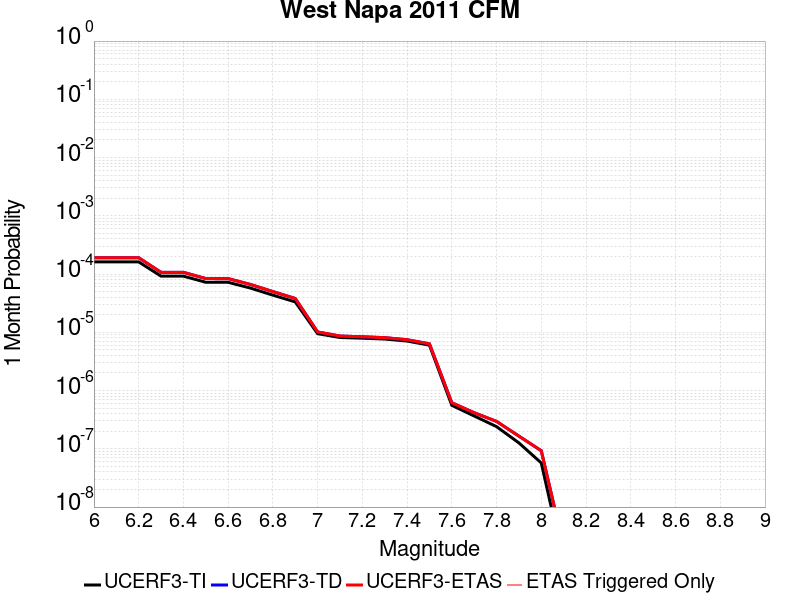 | 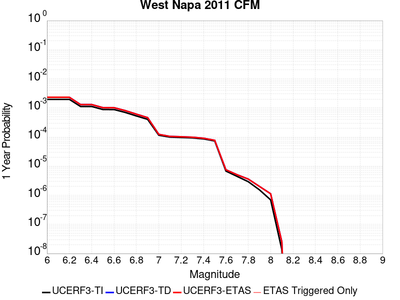 | 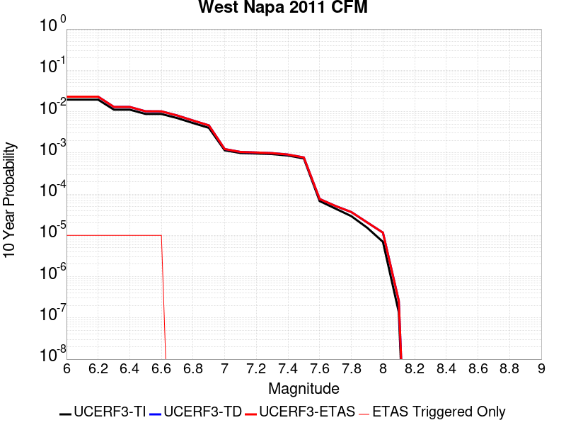 |

| Magnitude | 1 wk TI Prob | 1 wk TD Prob | 1 wk ETAS Prob | 1 wk ETAS/TD Gain | 1 wk ETAS Triggered Only | 1 mo TI Prob | 1 mo TD Prob | 1 mo ETAS Prob | 1 mo ETAS/TD Gain | 1 mo ETAS Triggered Only | 1 yr TI Prob | 1 yr TD Prob | 1 yr ETAS Prob | 1 yr ETAS/TD Gain | 1 yr ETAS Triggered Only | 10 yr TI Prob | 10 yr TD Prob | 10 yr ETAS Prob | 10 yr ETAS/TD Gain | 10 yr ETAS Triggered Only |
|-----|-----|-----|-----|-----|-----|-----|-----|-----|-----|-----|-----|-----|-----|-----|-----|-----|-----|-----|-----|-----|
| 6.0 | 3.773104E-5 | 4.452845E-5 | 4.452845E-5 | 1.0 | 0.0 | 1.6169442E-4 | 1.9082405E-4 | 1.9082405E-4 | 1.0 | 0.0 | 0.001966852 | 0.0023211248 | 0.0023211248 | 1.0 | 0.0 | 0.019495348 | 0.023002245 | 0.023012016 | 1.0004247 | 1.0E-5 |
| 6.1 | 3.773104E-5 | 4.452845E-5 | 4.452845E-5 | 1.0 | 0.0 | 1.6169442E-4 | 1.9082405E-4 | 1.9082405E-4 | 1.0 | 0.0 | 0.001966852 | 0.0023211248 | 0.0023211248 | 1.0 | 0.0 | 0.019495348 | 0.023002245 | 0.023012016 | 1.0004247 | 1.0E-5 |
| 6.2 | 3.773104E-5 | 4.452845E-5 | 4.452845E-5 | 1.0 | 0.0 | 1.6169442E-4 | 1.9082405E-4 | 1.9082405E-4 | 1.0 | 0.0 | 0.001966852 | 0.0023211248 | 0.0023211248 | 1.0 | 0.0 | 0.019495348 | 0.023002245 | 0.023012016 | 1.0004247 | 1.0E-5 |
| 6.3 | 2.147964E-5 | 2.4987039E-5 | 2.4987039E-5 | 1.0 | 0.0 | 9.2052345E-5 | 1.0708343E-4 | 1.0708343E-4 | 1.0 | 0.0 | 0.001120161 | 0.0013030528 | 0.0013030528 | 1.0 | 0.0 | 0.011145315 | 0.0129647385 | 0.012974609 | 1.0007613 | 1.0E-5 |
| 6.4 | 2.147964E-5 | 2.4987039E-5 | 2.4987039E-5 | 1.0 | 0.0 | 9.2052345E-5 | 1.0708343E-4 | 1.0708343E-4 | 1.0 | 0.0 | 0.001120161 | 0.0013030528 | 0.0013030528 | 1.0 | 0.0 | 0.011145315 | 0.0129647385 | 0.012974609 | 1.0007613 | 1.0E-5 |
| 6.5 | 1.688201E-5 | 1.9547346E-5 | 1.9547346E-5 | 1.0 | 0.0 | 7.234947E-5 | 8.377206E-5 | 8.377206E-5 | 1.0 | 0.0 | 8.804988E-4 | 0.0010195201 | 0.0010195201 | 1.0 | 0.0 | 0.008770182 | 0.010157098 | 0.010166996 | 1.0009745 | 1.0E-5 |
| 6.6 | 1.6846381E-5 | 1.9507039E-5 | 1.9507039E-5 | 1.0 | 0.0 | 7.219678E-5 | 8.359933E-5 | 8.359933E-5 | 1.0 | 0.0 | 8.7864127E-4 | 0.001017419 | 0.001017419 | 1.0 | 0.0 | 0.008751754 | 0.010136279 | 0.010146177 | 1.0009766 | 1.0E-5 |
| 6.7 | 1.3396501E-5 | 1.5467655E-5 | 1.5467655E-5 | 1.0 | 0.0 | 5.7412315E-5 | 6.628862E-5 | 6.628862E-5 | 1.0 | 0.0 | 6.9877075E-4 | 8.0682867E-4 | 8.0682867E-4 | 1.0 | 0.0 | 0.0069657755 | 0.008046719 | 0.008046719 | 1.0 | 0.0 |
| 6.8 | 1.0139058E-5 | 1.1672149E-5 | 1.1672149E-5 | 1.0 | 0.0 | 4.3452383E-5 | 5.0022853E-5 | 5.0022853E-5 | 1.0 | 0.0 | 5.289043E-4 | 6.0891354E-4 | 6.0891354E-4 | 1.0 | 0.0 | 0.005276473 | 0.006079373 | 0.006079373 | 1.0 | 0.0 |
| 6.9 | 7.761281E-6 | 8.890694E-6 | 8.890694E-6 | 1.0 | 0.0 | 3.326221E-5 | 3.8102706E-5 | 3.8102706E-5 | 1.0 | 0.0 | 4.0489217E-4 | 4.6385307E-4 | 4.6385307E-4 | 1.0 | 0.0 | 0.0040415525 | 0.004635363 | 0.004635363 | 1.0 | 0.0 |
| 7.0 | 2.2109202E-6 | 2.3666025E-6 | 2.3666025E-6 | 1.0 | 0.0 | 9.475338E-6 | 1.0142544E-5 | 1.0142544E-5 | 1.0 | 0.0 | 1.1535613E-4 | 1.2347854E-4 | 1.2347854E-4 | 1.0 | 0.0 | 0.0011529627 | 0.0012355851 | 0.0012355851 | 1.0 | 0.0 |
| 7.1 | 1.9008926E-6 | 2.0132914E-6 | 2.0132914E-6 | 1.0 | 0.0 | 8.146657E-6 | 8.6283635E-6 | 8.6283635E-6 | 1.0 | 0.0 | 9.918104E-5 | 1.05045285E-4 | 1.05045285E-4 | 1.0 | 0.0 | 9.913679E-4 | 0.001051437 | 0.001051437 | 1.0 | 0.0 |
| 7.2 | 1.8495944E-6 | 1.9560982E-6 | 1.9560982E-6 | 1.0 | 0.0 | 7.926808E-6 | 8.383251E-6 | 8.383251E-6 | 1.0 | 0.0 | 9.650462E-5 | 1.0206133E-4 | 1.0206133E-4 | 1.0 | 0.0 | 9.6462725E-4 | 0.0010216252 | 0.0010216252 | 1.0 | 0.0 |
| 7.3 | 1.7883189E-6 | 1.8880608E-6 | 1.8880608E-6 | 1.0 | 0.0 | 7.664201E-6 | 8.091664E-6 | 8.091664E-6 | 1.0 | 0.0 | 9.330765E-5 | 9.8511584E-5 | 9.8511584E-5 | 1.0 | 0.0 | 9.3268487E-4 | 9.861597E-4 | 9.861597E-4 | 1.0 | 0.0 |
| 7.4 | 1.6520572E-6 | 1.741484E-6 | 1.741484E-6 | 1.0 | 0.0 | 7.0802257E-6 | 7.463482E-6 | 7.463482E-6 | 1.0 | 0.0 | 8.6198335E-5 | 9.086413E-5 | 9.086413E-5 | 1.0 | 0.0 | 8.616491E-4 | 9.0974604E-4 | 9.0974604E-4 | 1.0 | 0.0 |
| 7.5 | 1.4040345E-6 | 1.4800074E-6 | 1.4800074E-6 | 1.0 | 0.0 | 6.0172765E-6 | 6.3428733E-6 | 6.3428733E-6 | 1.0 | 0.0 | 7.325788E-5 | 7.7221775E-5 | 7.7221775E-5 | 1.0 | 0.0 | 7.3233736E-4 | 7.7339396E-4 | 7.7339396E-4 | 1.0 | 0.0 |
| 7.6 | 1.3013842E-7 | 1.4415936E-7 | 1.4415936E-7 | 1.0 | 0.0 | 5.57736E-7 | 6.1782566E-7 | 6.1782566E-7 | 1.0 | 0.0 | 6.790414E-6 | 7.5220014E-6 | 7.5220014E-6 | 1.0 | 0.0 | 6.790207E-5 | 7.614869E-5 | 7.614869E-5 | 1.0 | 0.0 |
| 7.7 | 8.541512E-8 | 9.716316E-8 | 9.716316E-8 | 1.0 | 0.0 | 3.6606474E-7 | 4.1641349E-7 | 4.1641349E-7 | 1.0 | 0.0 | 4.456829E-6 | 5.0698222E-6 | 5.0698222E-6 | 1.0 | 0.0 | 4.4567398E-5 | 5.160297E-5 | 5.160297E-5 | 1.0 | 0.0 |
| 7.8 | 5.6074793E-8 | 6.89534E-8 | 6.89534E-8 | 1.0 | 0.0 | 2.403205E-7 | 2.9551452E-7 | 2.9551452E-7 | 1.0 | 0.0 | 2.9258983E-6 | 3.5978833E-6 | 3.5978833E-6 | 1.0 | 0.0 | 2.9258597E-5 | 3.681433E-5 | 3.681433E-5 | 1.0 | 0.0 |
| 7.9 | 2.9475839E-8 | 3.8566046E-8 | 3.8566046E-8 | 1.0 | 0.0 | 1.2632502E-7 | 1.6528305E-7 | 1.6528305E-7 | 1.0 | 0.0 | 1.538006E-6 | 2.0123193E-6 | 2.0123193E-6 | 1.0 | 0.0 | 1.5379954E-5 | 2.0665891E-5 | 2.0665891E-5 | 1.0 | 0.0 |
| 8.0 | 1.3337122E-8 | 2.163124E-8 | 2.163124E-8 | 1.0 | 0.0 | 5.7159088E-8 | 9.270532E-8 | 9.270532E-8 | 1.0 | 0.0 | 6.959117E-7 | 1.1286867E-6 | 1.1286867E-6 | 1.0 | 0.0 | 6.959095E-6 | 1.1645628E-5 | 1.1645628E-5 | 1.0 | 0.0 |
| 8.1 | 2.6589986E-10 | 4.8615456E-10 | 4.8615456E-10 | 1.0 | 0.0 | 1.1395708E-9 | 2.0835205E-9 | 2.0835205E-9 | 1.0 | 0.0 | 1.3874274E-8 | 2.536686E-8 | 2.536686E-8 | 1.0 | 0.0 | 1.3874273E-7 | 2.6035906E-7 | 2.6035906E-7 | 1.0 | 0.0 |

## Yorba Linda
*[(top)](#table-of-contents)*

| 1 Week | 1 Month | 1 Year | 10 Year |
|-----|-----|-----|-----|
| 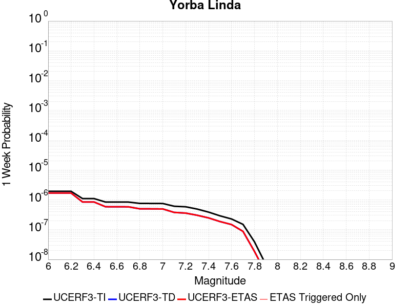 | 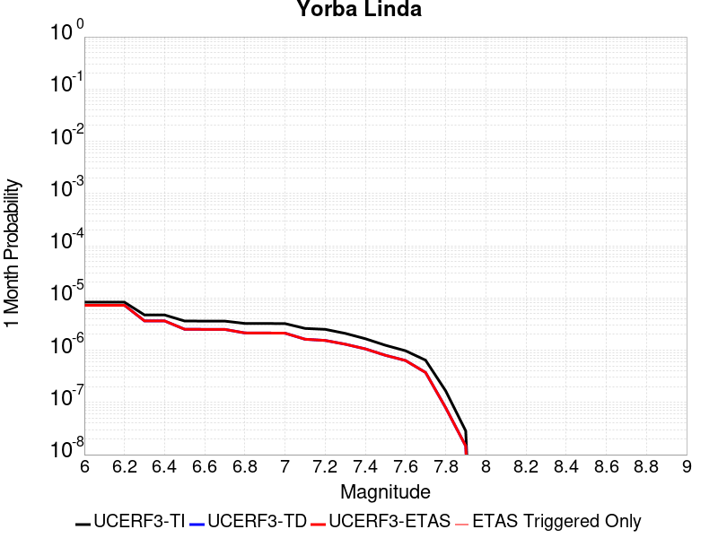 | 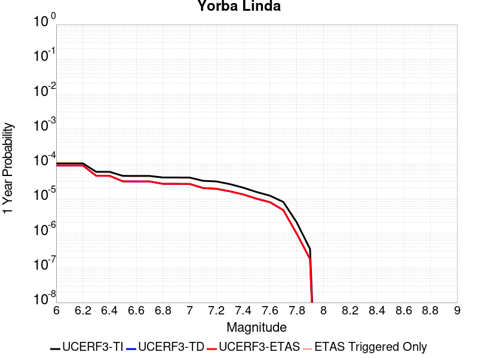 | 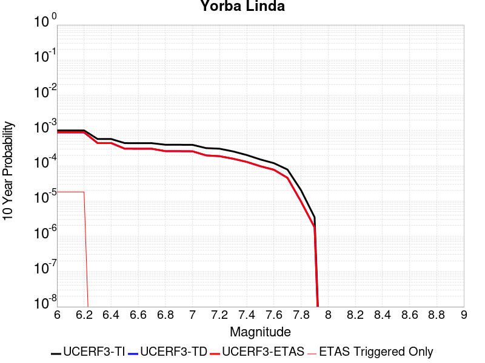 |

| Magnitude | 1 wk TI Prob | 1 wk TD Prob | 1 wk ETAS Prob | 1 wk ETAS/TD Gain | 1 wk ETAS Triggered Only | 1 mo TI Prob | 1 mo TD Prob | 1 mo ETAS Prob | 1 mo ETAS/TD Gain | 1 mo ETAS Triggered Only | 1 yr TI Prob | 1 yr TD Prob | 1 yr ETAS Prob | 1 yr ETAS/TD Gain | 1 yr ETAS Triggered Only | 10 yr TI Prob | 10 yr TD Prob | 10 yr ETAS Prob | 10 yr ETAS/TD Gain | 10 yr ETAS Triggered Only |
|-----|-----|-----|-----|-----|-----|-----|-----|-----|-----|-----|-----|-----|-----|-----|-----|-----|-----|-----|-----|-----|
| 6.0 | 1.9346849E-6 | 1.6909235E-6 | 1.6909235E-6 | 1.0 | 0.0 | 8.29148E-6 | 7.2468E-6 | 7.2468E-6 | 1.0 | 0.0 | 1.009441E-4 | 8.822717E-5 | 8.822717E-5 | 1.0 | 0.0 | 0.0010089825 | 8.820145E-4 | 8.920057E-4 | 1.0113276 | 1.0E-5 |
| 6.1 | 1.9346849E-6 | 1.6909235E-6 | 1.6909235E-6 | 1.0 | 0.0 | 8.29148E-6 | 7.2468E-6 | 7.2468E-6 | 1.0 | 0.0 | 1.009441E-4 | 8.822717E-5 | 8.822717E-5 | 1.0 | 0.0 | 0.0010089825 | 8.820145E-4 | 8.920057E-4 | 1.0113276 | 1.0E-5 |
| 6.2 | 1.9346849E-6 | 1.6909235E-6 | 1.6909235E-6 | 1.0 | 0.0 | 8.29148E-6 | 7.2468E-6 | 7.2468E-6 | 1.0 | 0.0 | 1.009441E-4 | 8.822717E-5 | 8.822717E-5 | 1.0 | 0.0 | 0.0010089825 | 8.820145E-4 | 8.920057E-4 | 1.0113276 | 1.0E-5 |
| 6.3 | 1.1028608E-6 | 8.481986E-7 | 8.481986E-7 | 1.0 | 0.0 | 4.7265376E-6 | 3.6351323E-6 | 3.6351323E-6 | 1.0 | 0.0 | 5.754407E-5 | 4.4256903E-5 | 4.4256903E-5 | 1.0 | 0.0 | 5.7529175E-4 | 4.4248742E-4 | 4.4248742E-4 | 1.0 | 0.0 |
| 6.4 | 1.1028608E-6 | 8.481986E-7 | 8.481986E-7 | 1.0 | 0.0 | 4.7265376E-6 | 3.6351323E-6 | 3.6351323E-6 | 1.0 | 0.0 | 5.754407E-5 | 4.4256903E-5 | 4.4256903E-5 | 1.0 | 0.0 | 5.7529175E-4 | 4.4248742E-4 | 4.4248742E-4 | 1.0 | 0.0 |
| 6.5 | 8.4451364E-7 | 5.8692325E-7 | 5.8692325E-7 | 1.0 | 0.0 | 3.619339E-6 | 2.5153831E-6 | 2.5153831E-6 | 1.0 | 0.0 | 4.406456E-5 | 3.0624382E-5 | 3.0624382E-5 | 1.0 | 0.0 | 4.4055824E-4 | 3.0620373E-4 | 3.0620373E-4 | 1.0 | 0.0 |
| 6.6 | 8.422957E-7 | 5.8447665E-7 | 5.8447665E-7 | 1.0 | 0.0 | 3.6098338E-6 | 2.5048976E-6 | 2.5048976E-6 | 1.0 | 0.0 | 4.3948843E-5 | 3.0496723E-5 | 3.0496723E-5 | 1.0 | 0.0 | 4.394015E-4 | 3.0492753E-4 | 3.0492753E-4 | 1.0 | 0.0 |
| 6.7 | 8.4119705E-7 | 5.832608E-7 | 5.832608E-7 | 1.0 | 0.0 | 3.6051254E-6 | 2.499687E-6 | 2.499687E-6 | 1.0 | 0.0 | 4.3891516E-5 | 3.0433286E-5 | 3.0433286E-5 | 1.0 | 0.0 | 4.388285E-4 | 3.0429332E-4 | 3.0429332E-4 | 1.0 | 0.0 |
| 6.8 | 7.5919155E-7 | 4.995118E-7 | 4.995118E-7 | 1.0 | 0.0 | 3.253674E-6 | 2.1407632E-6 | 2.1407632E-6 | 1.0 | 0.0 | 3.961276E-5 | 2.6063499E-5 | 2.6063499E-5 | 1.0 | 0.0 | 3.9605703E-4 | 2.6060612E-4 | 2.6060612E-4 | 1.0 | 0.0 |
| 6.9 | 7.5804564E-7 | 4.981302E-7 | 4.981302E-7 | 1.0 | 0.0 | 3.248763E-6 | 2.134842E-6 | 2.134842E-6 | 1.0 | 0.0 | 3.955297E-5 | 2.5991409E-5 | 2.5991409E-5 | 1.0 | 0.0 | 3.9545933E-4 | 2.598854E-4 | 2.598854E-4 | 1.0 | 0.0 |
| 7.0 | 7.539293E-7 | 4.943436E-7 | 4.943436E-7 | 1.0 | 0.0 | 3.2311218E-6 | 2.118614E-6 | 2.118614E-6 | 1.0 | 0.0 | 3.9338196E-5 | 2.5793837E-5 | 2.5793837E-5 | 1.0 | 0.0 | 3.9331234E-4 | 2.5791014E-4 | 2.5791014E-4 | 1.0 | 0.0 |
| 7.1 | 6.0900885E-7 | 3.781838E-7 | 3.781838E-7 | 1.0 | 0.0 | 2.6100352E-6 | 1.6207867E-6 | 1.6207867E-6 | 1.0 | 0.0 | 3.1776715E-5 | 1.9732903E-5 | 1.9732903E-5 | 1.0 | 0.0 | 3.1772171E-4 | 1.9731186E-4 | 1.9731186E-4 | 1.0 | 0.0 |
| 7.2 | 5.849925E-7 | 3.5880063E-7 | 3.5880063E-7 | 1.0 | 0.0 | 2.5071083E-6 | 1.5377161E-6 | 1.5377161E-6 | 1.0 | 0.0 | 3.0523614E-5 | 1.8721537E-5 | 1.8721537E-5 | 1.0 | 0.0 | 3.0519423E-4 | 1.8719993E-4 | 1.8719993E-4 | 1.0 | 0.0 |
| 7.3 | 4.89808E-7 | 3.038045E-7 | 3.038045E-7 | 1.0 | 0.0 | 2.0991754E-6 | 1.3020187E-6 | 1.3020187E-6 | 1.0 | 0.0 | 2.5557161E-5 | 1.5851965E-5 | 1.5851965E-5 | 1.0 | 0.0 | 2.5554223E-4 | 1.5850857E-4 | 1.5850857E-4 | 1.0 | 0.0 |
| 7.4 | 3.8700415E-7 | 2.4723E-7 | 2.4723E-7 | 1.0 | 0.0 | 1.6585881E-6 | 1.0595568E-6 | 1.0595568E-6 | 1.0 | 0.0 | 2.0193123E-5 | 1.2900028E-5 | 1.2900028E-5 | 1.0 | 0.0 | 2.0191289E-4 | 1.2899292E-4 | 1.2899292E-4 | 1.0 | 0.0 |
| 7.5 | 2.900565E-7 | 1.8637812E-7 | 1.8637812E-7 | 1.0 | 0.0 | 1.2430987E-6 | 7.987631E-7 | 7.987631E-7 | 1.0 | 0.0 | 1.5134622E-5 | 9.7248985E-6 | 9.7248985E-6 | 1.0 | 0.0 | 1.5133592E-4 | 9.724481E-5 | 9.724481E-5 | 1.0 | 0.0 |
| 7.6 | 2.2770318E-7 | 1.4814457E-7 | 1.4814457E-7 | 1.0 | 0.0 | 9.758704E-7 | 6.349051E-7 | 6.349051E-7 | 1.0 | 0.0 | 1.1881158E-5 | 7.729943E-6 | 7.729943E-6 | 1.0 | 0.0 | 1.1880523E-4 | 7.729679E-5 | 7.729679E-5 | 1.0 | 0.0 |
| 7.7 | 1.5017194E-7 | 8.735719E-8 | 8.735719E-8 | 1.0 | 0.0 | 6.4359386E-7 | 3.743879E-7 | 3.743879E-7 | 1.0 | 0.0 | 7.835727E-6 | 4.5581633E-6 | 4.5581633E-6 | 1.0 | 0.0 | 7.835451E-5 | 4.5580728E-5 | 4.5580728E-5 | 1.0 | 0.0 |
| 7.8 | 3.895753E-8 | 1.8533399E-8 | 1.8533399E-8 | 1.0 | 0.0 | 1.6696083E-7 | 7.9428844E-8 | 7.9428844E-8 | 1.0 | 0.0 | 2.0327461E-6 | 9.670458E-7 | 9.670458E-7 | 1.0 | 0.0 | 2.0327276E-5 | 9.670418E-6 | 9.670418E-6 | 1.0 | 0.0 |
| 7.9 | 6.648505E-9 | 3.4184469E-9 | 3.4184469E-9 | 1.0 | 0.0 | 2.8493591E-8 | 1.4650486E-8 | 1.4650486E-8 | 1.0 | 0.0 | 3.4690942E-7 | 1.7836966E-7 | 1.7836966E-7 | 1.0 | 0.0 | 3.4690888E-6 | 1.7836953E-6 | 1.7836953E-6 | 1.0 | 0.0 |

## Superstition Hills
*[(top)](#table-of-contents)*

| 1 Week | 1 Month | 1 Year | 10 Year |
|-----|-----|-----|-----|
| 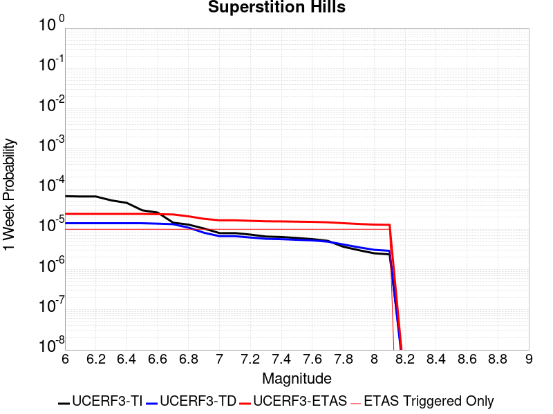 |  |  |  |

| Magnitude | 1 wk TI Prob | 1 wk TD Prob | 1 wk ETAS Prob | 1 wk ETAS/TD Gain | 1 wk ETAS Triggered Only | 1 mo TI Prob | 1 mo TD Prob | 1 mo ETAS Prob | 1 mo ETAS/TD Gain | 1 mo ETAS Triggered Only | 1 yr TI Prob | 1 yr TD Prob | 1 yr ETAS Prob | 1 yr ETAS/TD Gain | 1 yr ETAS Triggered Only | 10 yr TI Prob | 10 yr TD Prob | 10 yr ETAS Prob | 10 yr ETAS/TD Gain | 10 yr ETAS Triggered Only |
|-----|-----|-----|-----|-----|-----|-----|-----|-----|-----|-----|-----|-----|-----|-----|-----|-----|-----|-----|-----|-----|
| 6.0 | 6.6865185E-5 | 1.41376995E-5 | 2.4137558E-5 | 1.7073187 | 1.0E-5 | 2.8653358E-4 | 6.0588824E-5 | 7.058822E-5 | 1.1650369 | 1.0E-5 | 0.0034829667 | 7.374355E-4 | 7.474281E-4 | 1.0135505 | 1.0E-5 | 0.03428881 | 0.0075204074 | 0.007530332 | 1.0013198 | 1.0E-5 |
| 6.1 | 6.544851E-5 | 1.41376995E-5 | 2.4137558E-5 | 1.7073187 | 1.0E-5 | 2.8046346E-4 | 6.0588824E-5 | 7.058822E-5 | 1.1650369 | 1.0E-5 | 0.0034092965 | 7.374355E-4 | 7.474281E-4 | 1.0135505 | 1.0E-5 | 0.033574644 | 0.007520407 | 0.0075303316 | 1.0013198 | 1.0E-5 |
| 6.2 | 6.544851E-5 | 1.41376995E-5 | 2.4137558E-5 | 1.7073187 | 1.0E-5 | 2.8046346E-4 | 6.0588824E-5 | 7.058822E-5 | 1.1650369 | 1.0E-5 | 0.0034092965 | 7.374355E-4 | 7.474281E-4 | 1.0135505 | 1.0E-5 | 0.033574644 | 0.007520407 | 0.0075303316 | 1.0013198 | 1.0E-5 |
| 6.3 | 5.2402065E-5 | 1.4137698E-5 | 2.4137556E-5 | 1.7073188 | 1.0E-5 | 2.2456095E-4 | 6.058882E-5 | 7.058821E-5 | 1.1650369 | 1.0E-5 | 0.0027306017 | 7.374354E-4 | 7.4742804E-4 | 1.0135505 | 1.0E-5 | 0.02697292 | 0.007520402 | 0.0075303265 | 1.0013198 | 1.0E-5 |
| 6.4 | 4.542238E-5 | 1.4137698E-5 | 2.4137556E-5 | 1.7073188 | 1.0E-5 | 1.9465282E-4 | 6.0588816E-5 | 7.058821E-5 | 1.1650369 | 1.0E-5 | 0.0023673223 | 7.3743536E-4 | 7.47428E-4 | 1.0135505 | 1.0E-5 | 0.023422617 | 0.0075203986 | 0.007530323 | 1.0013198 | 1.0E-5 |
| 6.5 | 2.9672969E-5 | 1.4137696E-5 | 2.4137555E-5 | 1.7073188 | 1.0E-5 | 1.2716366E-4 | 6.058881E-5 | 7.0588205E-5 | 1.1650369 | 1.0E-5 | 0.0015471181 | 7.374353E-4 | 7.474279E-4 | 1.0135505 | 1.0E-5 | 0.015363912 | 0.007520392 | 0.007530317 | 1.0013198 | 1.0E-5 |
| 6.6 | 2.6056105E-5 | 1.3803458E-5 | 2.380332E-5 | 1.7244462 | 1.0E-5 | 1.1166424E-4 | 5.9156428E-5 | 6.915584E-5 | 1.1690333 | 1.0E-5 | 0.0013586642 | 7.200076E-4 | 7.300004E-4 | 1.0138787 | 1.0E-5 | 0.013503874 | 0.0073448285 | 0.007354755 | 1.0013515 | 1.0E-5 |
| 6.7 | 1.4611248E-5 | 1.3383359E-5 | 2.3383225E-5 | 1.7471865 | 1.0E-5 | 6.261813E-5 | 5.7356083E-5 | 6.735551E-5 | 1.1743394 | 1.0E-5 | 7.6210906E-4 | 6.981025E-4 | 7.0809555E-4 | 1.0143145 | 1.0E-5 | 0.0075950073 | 0.00712602 | 0.0071359486 | 1.0013933 | 1.0E-5 |
| 6.8 | 1.30607E-5 | 1.09787925E-5 | 2.0978683E-5 | 1.9108369 | 1.0E-5 | 5.597323E-5 | 4.705117E-5 | 5.70507E-5 | 1.2125245 | 1.0E-5 | 6.8126095E-4 | 5.7270617E-4 | 5.827004E-4 | 1.0174509 | 1.0E-5 | 0.006791762 | 0.00587438 | 0.0058843214 | 1.0016923 | 1.0E-5 |
| 6.9 | 1.0443096E-5 | 8.195349E-6 | 1.8195267E-5 | 2.220194 | 1.0E-5 | 4.4755358E-5 | 3.5122466E-5 | 4.5122117E-5 | 1.284708 | 1.0E-5 | 5.447602E-4 | 4.2753448E-4 | 4.375302E-4 | 1.0233799 | 1.0E-5 | 0.005434267 | 0.0044094524 | 0.0044194083 | 1.0022578 | 1.0E-5 |
| 7.0 | 8.045912E-6 | 6.739692E-6 | 1.6739625E-5 | 2.4837375 | 1.0E-5 | 3.4482026E-5 | 2.888408E-5 | 3.888379E-5 | 1.3462014 | 1.0E-5 | 4.197378E-4 | 3.5160795E-4 | 3.6160444E-4 | 1.0284308 | 1.0E-5 | 0.0041894587 | 0.0036334093 | 0.003643373 | 1.0027423 | 1.0E-5 |
| 7.1 | 8.045912E-6 | 6.739692E-6 | 1.6739625E-5 | 2.4837375 | 1.0E-5 | 3.4482026E-5 | 2.888408E-5 | 3.888379E-5 | 1.3462014 | 1.0E-5 | 4.197378E-4 | 3.5160795E-4 | 3.6160444E-4 | 1.0284308 | 1.0E-5 | 0.0041894587 | 0.0036334093 | 0.003643373 | 1.0027423 | 1.0E-5 |
| 7.2 | 7.375506E-6 | 6.2466297E-6 | 1.6246568E-5 | 2.6008532 | 1.0E-5 | 3.1608928E-5 | 2.6771E-5 | 3.6770733E-5 | 1.3735285 | 1.0E-5 | 3.8477074E-4 | 3.2588904E-4 | 3.358858E-4 | 1.0306753 | 1.0E-5 | 0.003841052 | 0.003373887 | 0.0033838532 | 1.0029539 | 1.0E-5 |
| 7.3 | 6.6063913E-6 | 5.7990574E-6 | 1.5799E-5 | 2.7244081 | 1.0E-5 | 2.8312797E-5 | 2.485287E-5 | 3.4852623E-5 | 1.402358 | 1.0E-5 | 3.446538E-4 | 3.025424E-4 | 3.1253937E-4 | 1.0330433 | 1.0E-5 | 0.0034411973 | 0.003138153 | 0.0031481218 | 1.0031766 | 1.0E-5 |
| 7.4 | 6.4313126E-6 | 5.680481E-6 | 1.5680425E-5 | 2.760404 | 1.0E-5 | 2.7562477E-5 | 2.4344696E-5 | 3.434445E-5 | 1.4107571 | 1.0E-5 | 3.355215E-4 | 2.9635706E-4 | 3.063541E-4 | 1.0337331 | 1.0E-5 | 0.0033501536 | 0.0030759154 | 0.0030858845 | 1.0032411 | 1.0E-5 |
| 7.5 | 6.0742927E-6 | 5.4763104E-6 | 1.5476255E-5 | 2.826037 | 1.0E-5 | 2.6032423E-5 | 2.3469694E-5 | 3.346946E-5 | 1.4260714 | 1.0E-5 | 3.1689866E-4 | 2.8570674E-4 | 2.9570388E-4 | 1.0349909 | 1.0E-5 | 0.0031644711 | 0.002967756 | 0.0029777263 | 1.0033596 | 1.0E-5 |
| 7.6 | 5.6987187E-6 | 5.294521E-6 | 1.5294469E-5 | 2.888735 | 1.0E-5 | 2.4422852E-5 | 2.269061E-5 | 3.2690383E-5 | 1.4407009 | 1.0E-5 | 2.9730765E-4 | 2.7622381E-4 | 2.8622107E-4 | 1.0361925 | 1.0E-5 | 0.002969102 | 0.0028710118 | 0.002880983 | 1.003473 | 1.0E-5 |
| 7.7 | 5.1658035E-6 | 4.925535E-6 | 1.4925486E-5 | 3.0302262 | 1.0E-5 | 2.2138971E-5 | 2.1109268E-5 | 3.110906E-5 | 1.4737155 | 1.0E-5 | 2.6950863E-4 | 2.5697565E-4 | 2.6697307E-4 | 1.0389042 | 1.0E-5 | 0.00269182 | 0.0026760625 | 0.0026860356 | 1.0037268 | 1.0E-5 |
| 7.8 | 3.6864697E-6 | 4.1964995E-6 | 1.4196457E-5 | 3.3829286 | 1.0E-5 | 1.579906E-5 | 1.7984876E-5 | 2.7984695E-5 | 1.5560127 | 1.0E-5 | 1.9233658E-4 | 2.1894433E-4 | 2.2894214E-4 | 1.0456637 | 1.0E-5 | 0.0019217018 | 0.0022892624 | 0.0022992396 | 1.0043582 | 1.0E-5 |
| 7.9 | 3.0265903E-6 | 3.5637288E-6 | 1.3563693E-5 | 3.8060396 | 1.0E-5 | 1.2971037E-5 | 1.5273037E-5 | 2.5272884E-5 | 1.6547387 | 1.0E-5 | 1.5791094E-4 | 1.859338E-4 | 1.9593193E-4 | 1.0537726 | 1.0E-5 | 0.0015779877 | 0.0019534735 | 0.001963454 | 1.0051091 | 1.0E-5 |
| 8.0 | 2.5271493E-6 | 3.0867361E-6 | 1.3086706E-5 | 4.239658 | 1.0E-5 | 1.0830595E-5 | 1.3228804E-5 | 2.3228673E-5 | 1.7559162 | 1.0E-5 | 1.3185451E-4 | 1.610492E-4 | 1.7104759E-4 | 1.0620828 | 1.0E-5 | 0.0013177631 | 0.0016973554 | 0.0017073384 | 1.0058815 | 1.0E-5 |
| 8.1 | 2.3749135E-6 | 2.917377E-6 | 1.2917348E-5 | 4.4277267 | 1.0E-5 | 1.0178161E-5 | 1.25029865E-5 | 2.2502862E-5 | 1.7997988 | 1.0E-5 | 1.2391206E-4 | 1.5221364E-4 | 1.6221212E-4 | 1.0656872 | 1.0E-5 | 0.0012384299 | 0.001604949 | 0.001614933 | 1.0062207 | 1.0E-5 |
| 8.2 | 1.7186406E-9 | 1.1440594E-9 | 1.1440594E-9 | 1.0 | 0.0 | 7.3656024E-9 | 4.9031117E-9 | 4.9031117E-9 | 1.0 | 0.0 | 8.9676206E-8 | 5.969538E-8 | 5.969538E-8 | 1.0 | 0.0 | 8.9676166E-7 | 6.389059E-7 | 6.389059E-7 | 1.0 | 0.0 |

## Hayward (No) 2011 CFM
*[(top)](#table-of-contents)*

| 1 Week | 1 Month | 1 Year | 10 Year |
|-----|-----|-----|-----|
|  |  |  | 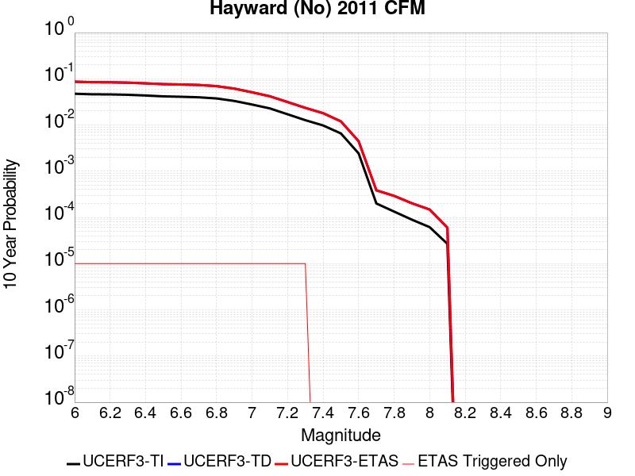 |

| Magnitude | 1 wk TI Prob | 1 wk TD Prob | 1 wk ETAS Prob | 1 wk ETAS/TD Gain | 1 wk ETAS Triggered Only | 1 mo TI Prob | 1 mo TD Prob | 1 mo ETAS Prob | 1 mo ETAS/TD Gain | 1 mo ETAS Triggered Only | 1 yr TI Prob | 1 yr TD Prob | 1 yr ETAS Prob | 1 yr ETAS/TD Gain | 1 yr ETAS Triggered Only | 10 yr TI Prob | 10 yr TD Prob | 10 yr ETAS Prob | 10 yr ETAS/TD Gain | 10 yr ETAS Triggered Only |
|-----|-----|-----|-----|-----|-----|-----|-----|-----|-----|-----|-----|-----|-----|-----|-----|-----|-----|-----|-----|-----|
| 6.0 | 9.3068506E-5 | 1.739599E-4 | 1.739599E-4 | 1.0 | 0.0 | 3.9880406E-4 | 7.453244E-4 | 7.453244E-4 | 1.0 | 0.0 | 0.0048446343 | 0.009036438 | 0.009036438 | 1.0 | 0.0 | 0.047403704 | 0.08637534 | 0.086384475 | 1.0001057 | 1.0E-5 |
| 6.1 | 9.055486E-5 | 1.6947114E-4 | 1.6947114E-4 | 1.0 | 0.0 | 3.880345E-4 | 7.261021E-4 | 7.261021E-4 | 1.0 | 0.0 | 0.0047140904 | 0.008804537 | 0.008804537 | 1.0 | 0.0 | 0.046153355 | 0.08426854 | 0.0842777 | 1.0001087 | 1.0E-5 |
| 6.2 | 9.006742E-5 | 1.6867711E-4 | 1.6867711E-4 | 1.0 | 0.0 | 3.859461E-4 | 7.22701E-4 | 7.22701E-4 | 1.0 | 0.0 | 0.0046887742 | 0.008763513 | 0.008763513 | 1.0 | 0.0 | 0.0459107 | 0.083892785 | 0.08390194 | 1.0001092 | 1.0E-5 |
| 6.3 | 8.8336754E-5 | 1.6547246E-4 | 1.6547246E-4 | 1.0 | 0.0 | 3.7853114E-4 | 7.089758E-4 | 7.089758E-4 | 1.0 | 0.0 | 0.004598882 | 0.008597788 | 0.008597788 | 1.0 | 0.0 | 0.04504866 | 0.08238599 | 0.082395166 | 1.0001113 | 1.0E-5 |
| 6.4 | 8.526157E-5 | 1.5974249E-4 | 1.5974249E-4 | 1.0 | 0.0 | 3.6535555E-4 | 6.8443175E-4 | 6.8443175E-4 | 1.0 | 0.0 | 0.0044391346 | 0.008301278 | 0.008301278 | 1.0 | 0.0 | 0.043514993 | 0.079682834 | 0.07969204 | 1.0001155 | 1.0E-5 |
| 6.5 | 8.152396E-5 | 1.530663E-4 | 1.530663E-4 | 1.0 | 0.0 | 3.493416E-4 | 6.558342E-4 | 6.558342E-4 | 1.0 | 0.0 | 0.0042449418 | 0.007955698 | 0.007955698 | 1.0 | 0.0 | 0.04164765 | 0.07651369 | 0.076522924 | 1.0001206 | 1.0E-5 |
| 6.6 | 7.987405E-5 | 1.5010842E-4 | 1.5010842E-4 | 1.0 | 0.0 | 3.4227243E-4 | 6.4316386E-4 | 6.4316386E-4 | 1.0 | 0.0 | 0.0041592065 | 0.0078025614 | 0.0078025614 | 1.0 | 0.0 | 0.04082218 | 0.07510622 | 0.075115465 | 1.0001231 | 1.0E-5 |
| 6.7 | 7.777665E-5 | 1.4650106E-4 | 1.4650106E-4 | 1.0 | 0.0 | 3.332859E-4 | 6.277113E-4 | 6.277113E-4 | 1.0 | 0.0 | 0.004050208 | 0.00761576 | 0.00761576 | 1.0 | 0.0 | 0.039771806 | 0.073382616 | 0.073391885 | 1.0001262 | 1.0E-5 |
| 6.8 | 7.3284005E-5 | 1.3800753E-4 | 1.3800753E-4 | 1.0 | 0.0 | 3.140365E-4 | 5.913274E-4 | 5.913274E-4 | 1.0 | 0.0 | 0.0038166929 | 0.0071757827 | 0.0071757827 | 1.0 | 0.0 | 0.037518036 | 0.06929621 | 0.06930552 | 1.0001343 | 1.0E-5 |
| 6.9 | 6.458263E-5 | 1.2131439E-4 | 1.2131439E-4 | 1.0 | 0.0 | 2.7675333E-4 | 5.198157E-4 | 5.198157E-4 | 1.0 | 0.0 | 0.0033642664 | 0.0063104923 | 0.0063104923 | 1.0 | 0.0 | 0.033137884 | 0.061225023 | 0.06123441 | 1.0001533 | 1.0E-5 |
| 7.0 | 5.3853604E-5 | 1.00250414E-4 | 1.00250414E-4 | 1.0 | 0.0 | 2.3078074E-4 | 4.295742E-4 | 4.295742E-4 | 1.0 | 0.0 | 0.0028061352 | 0.0052175885 | 0.0052175885 | 1.0 | 0.0 | 0.027709642 | 0.0509578 | 0.05096729 | 1.0001862 | 1.0E-5 |
| 7.1 | 4.4308683E-5 | 8.170626E-5 | 8.170626E-5 | 1.0 | 0.0 | 1.8988053E-4 | 3.501229E-4 | 3.501229E-4 | 1.0 | 0.0 | 0.0023093442 | 0.0042544557 | 0.0042544557 | 1.0 | 0.0 | 0.022854926 | 0.04182473 | 0.041834313 | 1.0002291 | 1.0E-5 |
| 7.2 | 3.295973E-5 | 6.0771144E-5 | 6.0771144E-5 | 1.0 | 0.0 | 1.4124835E-4 | 2.604219E-4 | 2.604219E-4 | 1.0 | 0.0 | 0.0017183421 | 0.0031660495 | 0.0031660495 | 1.0 | 0.0 | 0.017051157 | 0.031369876 | 0.031379562 | 1.0003088 | 1.0E-5 |
| 7.3 | 2.452256E-5 | 4.5180346E-5 | 4.5180346E-5 | 1.0 | 0.0 | 1.05092455E-4 | 1.9361576E-4 | 1.9361576E-4 | 1.0 | 0.0 | 0.0012787496 | 0.0023547374 | 0.0023547374 | 1.0 | 0.0 | 0.0127141625 | 0.02344111 | 0.023450876 | 1.0004166 | 1.0E-5 |
| 7.4 | 1.8829967E-5 | 3.4602548E-5 | 3.4602548E-5 | 1.0 | 0.0 | 8.069736E-5 | 1.4828827E-4 | 1.4828827E-4 | 1.0 | 0.0 | 9.820475E-4 | 0.0018039243 | 0.0018039243 | 1.0 | 0.0 | 0.009777189 | 0.0180195 | 0.0180195 | 1.0 | 0.0 |
| 7.5 | 1.26374125E-5 | 2.2921116E-5 | 2.2921116E-5 | 1.0 | 0.0 | 5.4159216E-5 | 9.822969E-5 | 9.822969E-5 | 1.0 | 0.0 | 6.5918895E-4 | 0.0011952962 | 0.0011952962 | 1.0 | 0.0 | 0.00657237 | 0.011988836 | 0.011988836 | 1.0 | 0.0 |
| 7.6 | 4.666429E-6 | 8.4791645E-6 | 8.4791645E-6 | 1.0 | 0.0 | 1.9998828E-5 | 3.6338777E-5 | 3.6338777E-5 | 1.0 | 0.0 | 2.4345852E-4 | 4.4233602E-4 | 4.4233602E-4 | 1.0 | 0.0 | 0.0024319198 | 0.0044591012 | 0.0044591012 | 1.0 | 0.0 |
| 7.7 | 3.8399318E-7 | 7.133867E-7 | 7.133867E-7 | 1.0 | 0.0 | 1.6456839E-6 | 3.057368E-6 | 3.057368E-6 | 1.0 | 0.0 | 2.003602E-5 | 3.722282E-5 | 3.722282E-5 | 1.0 | 0.0 | 2.0034213E-4 | 3.8614936E-4 | 3.8614936E-4 | 1.0 | 0.0 |
| 7.8 | 2.5637698E-7 | 5.3662194E-7 | 5.3662194E-7 | 1.0 | 0.0 | 1.098758E-6 | 2.299806E-6 | 2.299806E-6 | 1.0 | 0.0 | 1.3377297E-5 | 2.7999782E-5 | 2.7999782E-5 | 1.0 | 0.0 | 1.3376492E-4 | 2.9244382E-4 | 2.9244382E-4 | 1.0 | 0.0 |
| 7.9 | 1.7141245E-7 | 3.7290573E-7 | 3.7290573E-7 | 1.0 | 0.0 | 7.3462456E-7 | 1.5981665E-6 | 1.5981665E-6 | 1.0 | 0.0 | 8.944017E-6 | 1.9457504E-5 | 1.9457504E-5 | 1.0 | 0.0 | 8.943657E-5 | 2.0245428E-4 | 2.0245428E-4 | 1.0 | 0.0 |
| 8.0 | 1.1808895E-7 | 2.7509762E-7 | 2.7509762E-7 | 1.0 | 0.0 | 5.060954E-7 | 1.1789892E-6 | 1.1789892E-6 | 1.0 | 0.0 | 6.161694E-6 | 1.43541E-5 | 1.43541E-5 | 1.0 | 0.0 | 6.161523E-5 | 1.4816441E-4 | 1.4816441E-4 | 1.0 | 0.0 |
| 8.1 | 5.138535E-8 | 1.1229867E-7 | 1.1229867E-7 | 1.0 | 0.0 | 2.2022292E-7 | 4.812799E-7 | 4.812799E-7 | 1.0 | 0.0 | 2.6812106E-6 | 5.8595674E-6 | 5.8595674E-6 | 1.0 | 0.0 | 2.6811784E-5 | 6.0158476E-5 | 6.0158476E-5 | 1.0 | 0.0 |

## Collayami 2011 CFM
*[(top)](#table-of-contents)*

| 1 Week | 1 Month | 1 Year | 10 Year |
|-----|-----|-----|-----|
| 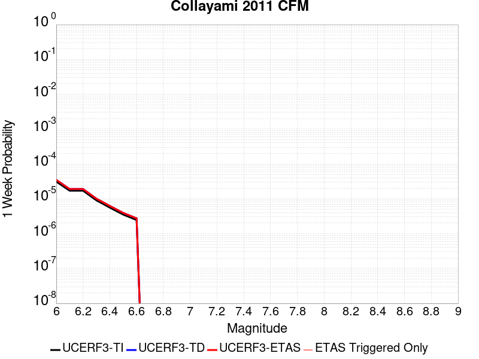 | 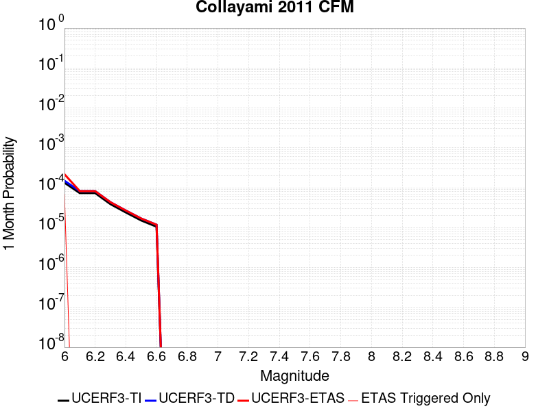 | 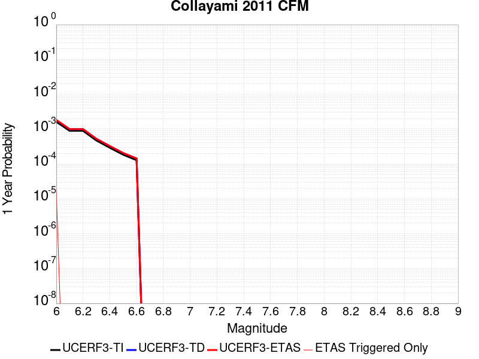 | 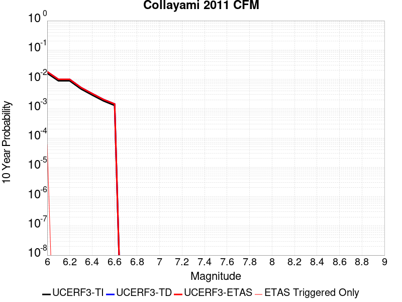 |

| Magnitude | 1 wk TI Prob | 1 wk TD Prob | 1 wk ETAS Prob | 1 wk ETAS/TD Gain | 1 wk ETAS Triggered Only | 1 mo TI Prob | 1 mo TD Prob | 1 mo ETAS Prob | 1 mo ETAS/TD Gain | 1 mo ETAS Triggered Only | 1 yr TI Prob | 1 yr TD Prob | 1 yr ETAS Prob | 1 yr ETAS/TD Gain | 1 yr ETAS Triggered Only | 10 yr TI Prob | 10 yr TD Prob | 10 yr ETAS Prob | 10 yr ETAS/TD Gain | 10 yr ETAS Triggered Only |
|-----|-----|-----|-----|-----|-----|-----|-----|-----|-----|-----|-----|-----|-----|-----|-----|-----|-----|-----|-----|-----|
| 6.0 | 3.112429E-5 | 3.493857E-5 | 3.493857E-5 | 1.0 | 0.0 | 1.33383E-4 | 1.4972912E-4 | 1.5972763E-4 | 1.0667772 | 1.0E-5 | 0.0016227282 | 0.0018216016 | 0.0018315834 | 1.0054797 | 1.0E-5 | 0.016109297 | 0.018084232 | 0.018094052 | 1.000543 | 1.0E-5 |
| 6.1 | 1.7119446E-5 | 1.9156616E-5 | 1.9156616E-5 | 1.0 | 0.0 | 7.336699E-5 | 8.209753E-5 | 8.209753E-5 | 1.0 | 0.0 | 8.92877E-4 | 9.991383E-4 | 9.991383E-4 | 1.0 | 0.0 | 0.00889298 | 0.009952341 | 0.009952341 | 1.0 | 0.0 |
| 6.2 | 1.7119446E-5 | 1.9156616E-5 | 1.9156616E-5 | 1.0 | 0.0 | 7.336699E-5 | 8.209753E-5 | 8.209753E-5 | 1.0 | 0.0 | 8.92877E-4 | 9.991383E-4 | 9.991383E-4 | 1.0 | 0.0 | 0.00889298 | 0.009952341 | 0.009952341 | 1.0 | 0.0 |
| 6.3 | 9.041288E-6 | 1.0106096E-5 | 1.0106096E-5 | 1.0 | 0.0 | 3.87478E-5 | 4.3311244E-5 | 4.3311244E-5 | 1.0 | 0.0 | 4.7165234E-4 | 5.2720873E-4 | 5.2720873E-4 | 1.0 | 0.0 | 0.0047065257 | 0.005261738 | 0.005261738 | 1.0 | 0.0 |
| 6.4 | 5.5972064E-6 | 6.2580466E-6 | 6.2580466E-6 | 1.0 | 0.0 | 2.3987806E-5 | 2.6820002E-5 | 2.6820002E-5 | 1.0 | 0.0 | 2.920124E-4 | 3.2649818E-4 | 3.2649818E-4 | 1.0 | 0.0 | 0.0029162897 | 0.0032615191 | 0.0032615191 | 1.0 | 0.0 |
| 6.5 | 3.530659E-6 | 3.9520487E-6 | 3.9520487E-6 | 1.0 | 0.0 | 1.5131307E-5 | 1.69373E-5 | 1.69373E-5 | 1.0 | 0.0 | 1.842081E-4 | 2.062025E-4 | 2.062025E-4 | 1.0 | 0.0 | 0.0018405546 | 0.0020611305 | 0.0020611305 | 1.0 | 0.0 |
| 6.6 | 2.4625563E-6 | 2.7572657E-6 | 2.7572657E-6 | 1.0 | 0.0 | 1.0553769E-5 | 1.1816854E-5 | 1.1816854E-5 | 1.0 | 0.0 | 1.2848456E-4 | 1.4387019E-4 | 1.4387019E-4 | 1.0 | 0.0 | 0.001284103 | 0.0014387019 | 0.0014387019 | 1.0 | 0.0 |

## Keddie Ridge 2011 CFM
*[(top)](#table-of-contents)*

| 1 Week | 1 Month | 1 Year | 10 Year |
|-----|-----|-----|-----|
| 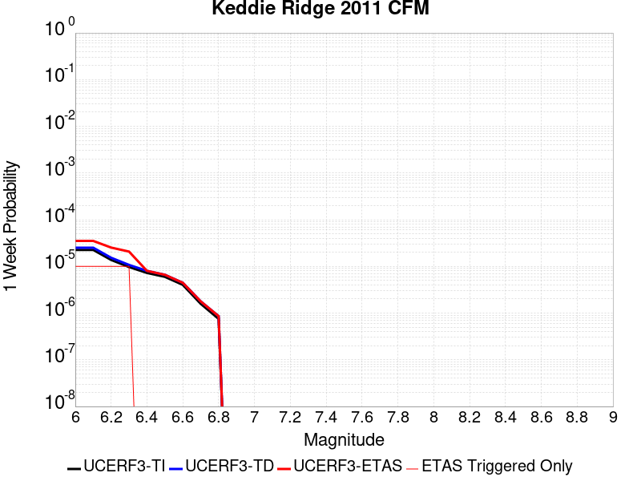 | 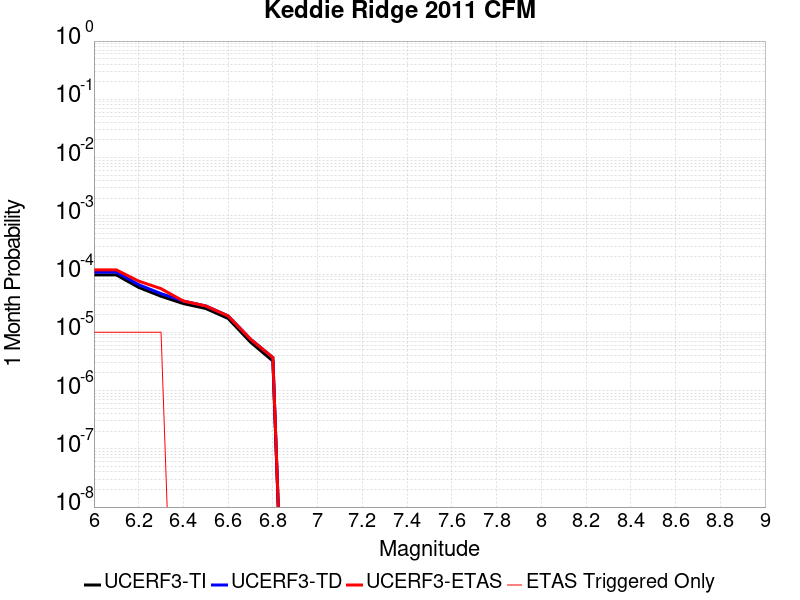 |  | 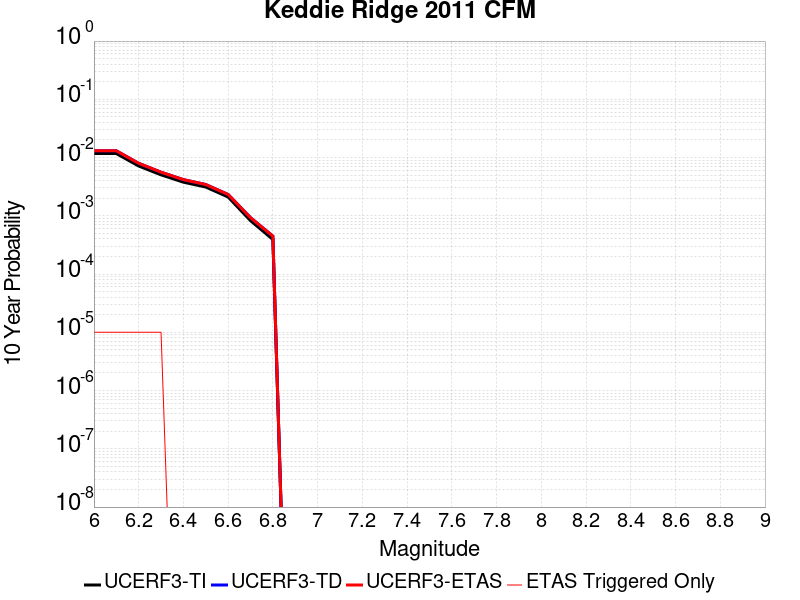 |

| Magnitude | 1 wk TI Prob | 1 wk TD Prob | 1 wk ETAS Prob | 1 wk ETAS/TD Gain | 1 wk ETAS Triggered Only | 1 mo TI Prob | 1 mo TD Prob | 1 mo ETAS Prob | 1 mo ETAS/TD Gain | 1 mo ETAS Triggered Only | 1 yr TI Prob | 1 yr TD Prob | 1 yr ETAS Prob | 1 yr ETAS/TD Gain | 1 yr ETAS Triggered Only | 10 yr TI Prob | 10 yr TD Prob | 10 yr ETAS Prob | 10 yr ETAS/TD Gain | 10 yr ETAS Triggered Only |
|-----|-----|-----|-----|-----|-----|-----|-----|-----|-----|-----|-----|-----|-----|-----|-----|-----|-----|-----|-----|-----|
| 6.0 | 2.2591947E-5 | 2.5189187E-5 | 3.5188936E-5 | 1.3969858 | 1.0E-5 | 9.6819036E-5 | 1.07949636E-4 | 1.17948555E-4 | 1.0926257 | 1.0E-5 | 0.0011781343 | 0.0013135736 | 0.0013235604 | 1.0076028 | 1.0E-5 | 0.011719079 | 0.013066036 | 0.013075906 | 1.0007553 | 1.0E-5 |
| 6.1 | 2.2591947E-5 | 2.5189187E-5 | 3.5188936E-5 | 1.3969858 | 1.0E-5 | 9.6819036E-5 | 1.07949636E-4 | 1.17948555E-4 | 1.0926257 | 1.0E-5 | 0.0011781343 | 0.0013135736 | 0.0013235604 | 1.0076028 | 1.0E-5 | 0.011719079 | 0.013066036 | 0.013075906 | 1.0007553 | 1.0E-5 |
| 6.2 | 1.3775145E-5 | 1.5322817E-5 | 2.5322664E-5 | 1.6526115 | 1.0E-5 | 5.9035E-5 | 6.566771E-5 | 7.566705E-5 | 1.1522719 | 1.0E-5 | 7.185141E-4 | 7.9923525E-4 | 8.0922723E-4 | 1.012502 | 1.0E-5 | 0.0071619535 | 0.007966028 | 0.007975947 | 1.0012454 | 1.0E-5 |
| 6.3 | 9.705435E-6 | 1.0768351E-5 | 2.0768244E-5 | 1.9286373 | 1.0E-5 | 4.1594063E-5 | 4.614933E-5 | 5.6148867E-5 | 1.2166779 | 1.0E-5 | 5.0629E-4 | 5.6173565E-4 | 5.7173E-4 | 1.017792 | 1.0E-5 | 0.005051381 | 0.0056043873 | 0.0056143315 | 1.0017743 | 1.0E-5 |
| 6.4 | 7.2549733E-6 | 8.027269E-6 | 8.027269E-6 | 1.0 | 0.0 | 3.109237E-5 | 3.4402172E-5 | 3.4402172E-5 | 1.0 | 0.0 | 3.7848388E-4 | 4.187739E-4 | 4.187739E-4 | 1.0 | 0.0 | 0.003778399 | 0.0041806344 | 0.0041806344 | 1.0 | 0.0 |
| 6.5 | 5.983293E-6 | 6.613024E-6 | 6.613024E-6 | 1.0 | 0.0 | 2.5642432E-5 | 2.8341263E-5 | 2.8341263E-5 | 1.0 | 0.0 | 3.1215188E-4 | 3.4500696E-4 | 3.4500696E-4 | 1.0 | 0.0 | 0.0031171376 | 0.0034453757 | 0.0034453757 | 1.0 | 0.0 |
| 6.6 | 4.0336154E-6 | 4.4578046E-6 | 4.4578046E-6 | 1.0 | 0.0 | 1.728681E-5 | 1.9104758E-5 | 1.9104758E-5 | 1.0 | 0.0 | 2.1044657E-4 | 2.3257964E-4 | 2.3257964E-4 | 1.0 | 0.0 | 0.002102474 | 0.0023237579 | 0.0023237579 | 1.0 | 0.0 |
| 6.7 | 1.5832104E-6 | 1.7816087E-6 | 1.7816087E-6 | 1.0 | 0.0 | 6.7851697E-6 | 7.635445E-6 | 7.635445E-6 | 1.0 | 0.0 | 8.260631E-5 | 9.295785E-5 | 9.295785E-5 | 1.0 | 0.0 | 8.2575605E-4 | 9.2921633E-4 | 9.2921633E-4 | 1.0 | 0.0 |
| 6.8 | 7.5177275E-7 | 8.5902946E-7 | 8.5902946E-7 | 1.0 | 0.0 | 3.221879E-6 | 3.6815507E-6 | 3.6815507E-6 | 1.0 | 0.0 | 3.9225673E-5 | 4.4822125E-5 | 4.4822125E-5 | 1.0 | 0.0 | 3.921875E-4 | 4.481474E-4 | 4.481474E-4 | 1.0 | 0.0 |

## Emerson-Copper Mtn 2011
*[(top)](#table-of-contents)*

| 1 Week | 1 Month | 1 Year | 10 Year |
|-----|-----|-----|-----|
|  |  |  | 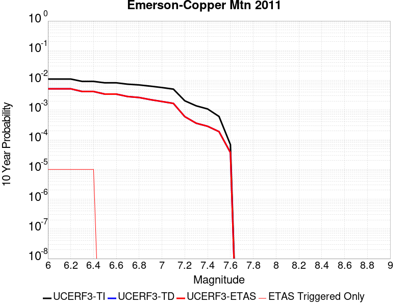 |

| Magnitude | 1 wk TI Prob | 1 wk TD Prob | 1 wk ETAS Prob | 1 wk ETAS/TD Gain | 1 wk ETAS Triggered Only | 1 mo TI Prob | 1 mo TD Prob | 1 mo ETAS Prob | 1 mo ETAS/TD Gain | 1 mo ETAS Triggered Only | 1 yr TI Prob | 1 yr TD Prob | 1 yr ETAS Prob | 1 yr ETAS/TD Gain | 1 yr ETAS Triggered Only | 10 yr TI Prob | 10 yr TD Prob | 10 yr ETAS Prob | 10 yr ETAS/TD Gain | 10 yr ETAS Triggered Only |
|-----|-----|-----|-----|-----|-----|-----|-----|-----|-----|-----|-----|-----|-----|-----|-----|-----|-----|-----|-----|-----|
| 6.0 | 2.1364202E-5 | 9.968114E-6 | 9.968114E-6 | 1.0 | 0.0 | 9.1557646E-5 | 4.2719836E-5 | 4.2719836E-5 | 1.0 | 0.0 | 0.0011141442 | 5.199986E-4 | 5.299934E-4 | 1.0192208 | 1.0E-5 | 0.011085749 | 0.005188688 | 0.005198636 | 1.0019172 | 1.0E-5 |
| 6.1 | 2.1364202E-5 | 9.968114E-6 | 9.968114E-6 | 1.0 | 0.0 | 9.1557646E-5 | 4.2719836E-5 | 4.2719836E-5 | 1.0 | 0.0 | 0.0011141442 | 5.199986E-4 | 5.299934E-4 | 1.0192208 | 1.0E-5 | 0.011085749 | 0.005188688 | 0.005198636 | 1.0019172 | 1.0E-5 |
| 6.2 | 2.1364202E-5 | 9.968114E-6 | 9.968114E-6 | 1.0 | 0.0 | 9.1557646E-5 | 4.2719836E-5 | 4.2719836E-5 | 1.0 | 0.0 | 0.0011141442 | 5.199986E-4 | 5.299934E-4 | 1.0192208 | 1.0E-5 | 0.011085749 | 0.005188688 | 0.005198636 | 1.0019172 | 1.0E-5 |
| 6.3 | 1.7751237E-5 | 8.089227E-6 | 8.089227E-6 | 1.0 | 0.0 | 7.607452E-5 | 3.466769E-5 | 3.466769E-5 | 1.0 | 0.0 | 9.258136E-4 | 4.2200365E-4 | 4.3199942E-4 | 1.0236865 | 1.0E-5 | 0.00921966 | 0.0042126453 | 0.004222603 | 1.0023638 | 1.0E-5 |
| 6.4 | 1.7751237E-5 | 8.089227E-6 | 8.089227E-6 | 1.0 | 0.0 | 7.607452E-5 | 3.466769E-5 | 3.466769E-5 | 1.0 | 0.0 | 9.258136E-4 | 4.2200365E-4 | 4.3199942E-4 | 1.0236865 | 1.0E-5 | 0.00921966 | 0.0042126453 | 0.004222603 | 1.0023638 | 1.0E-5 |
| 6.5 | 1.5886664E-5 | 6.603819E-6 | 6.603819E-6 | 1.0 | 0.0 | 6.808392E-5 | 2.8301802E-5 | 2.8301802E-5 | 1.0 | 0.0 | 8.286065E-4 | 3.4452465E-4 | 3.4452465E-4 | 1.0 | 0.0 | 0.008255237 | 0.0034403696 | 0.0034403696 | 1.0 | 0.0 |
| 6.6 | 1.5886664E-5 | 6.603819E-6 | 6.603819E-6 | 1.0 | 0.0 | 6.808392E-5 | 2.8301802E-5 | 2.8301802E-5 | 1.0 | 0.0 | 8.286065E-4 | 3.4452465E-4 | 3.4452465E-4 | 1.0 | 0.0 | 0.008255237 | 0.0034403696 | 0.0034403696 | 1.0 | 0.0 |
| 6.7 | 1.428471E-5 | 5.470403E-6 | 5.470403E-6 | 1.0 | 0.0 | 6.121875E-5 | 2.3444394E-5 | 2.3444394E-5 | 1.0 | 0.0 | 7.450834E-4 | 2.8540206E-4 | 2.8540206E-4 | 1.0 | 0.0 | 0.007425902 | 0.0028507432 | 0.0028507432 | 1.0 | 0.0 |
| 6.8 | 1.3490684E-5 | 5.073699E-6 | 5.073699E-6 | 1.0 | 0.0 | 5.7815934E-5 | 2.1744265E-5 | 2.1744265E-5 | 1.0 | 0.0 | 7.0368167E-4 | 2.6470813E-4 | 2.6470813E-4 | 1.0 | 0.0 | 0.007014576 | 0.002644309 | 0.002644309 | 1.0 | 0.0 |
| 6.9 | 1.2235421E-5 | 4.289677E-6 | 4.289677E-6 | 1.0 | 0.0 | 5.2436466E-5 | 1.838422E-5 | 1.838422E-5 | 1.0 | 0.0 | 6.38227E-4 | 2.238085E-4 | 2.238085E-4 | 1.0 | 0.0 | 0.0063639707 | 0.0022361854 | 0.0022361854 | 1.0 | 0.0 |
| 7.0 | 1.1009851E-5 | 3.7189886E-6 | 3.7189886E-6 | 1.0 | 0.0 | 4.7184225E-5 | 1.5938444E-5 | 1.5938444E-5 | 1.0 | 0.0 | 5.743165E-4 | 1.9403672E-4 | 1.9403672E-4 | 1.0 | 0.0 | 0.005728345 | 0.0019390108 | 0.0019390108 | 1.0 | 0.0 |
| 7.1 | 9.726373E-6 | 3.2117953E-6 | 3.2117953E-6 | 1.0 | 0.0 | 4.168379E-5 | 1.3764783E-5 | 1.3764783E-5 | 1.0 | 0.0 | 5.07382E-4 | 1.6757673E-4 | 1.6757673E-4 | 1.0 | 0.0 | 0.0050622504 | 0.0016748349 | 0.0016748349 | 1.0 | 0.0 |
| 7.2 | 3.9335127E-6 | 1.1524792E-6 | 1.1524792E-6 | 1.0 | 0.0 | 1.6857803E-5 | 4.9391874E-6 | 4.9391874E-6 | 1.0 | 0.0 | 2.0522442E-4 | 6.0133007E-5 | 6.0133007E-5 | 1.0 | 0.0 | 0.00205035 | 6.011733E-4 | 6.011733E-4 | 1.0 | 0.0 |
| 7.3 | 2.661632E-6 | 6.911505E-7 | 6.911505E-7 | 1.0 | 0.0 | 1.14069435E-5 | 2.9620703E-6 | 2.9620703E-6 | 1.0 | 0.0 | 1.3887069E-4 | 3.6062618E-5 | 3.6062618E-5 | 1.0 | 0.0 | 0.0013878393 | 3.605687E-4 | 3.605687E-4 | 1.0 | 0.0 |
| 7.4 | 2.0893426E-6 | 5.4618386E-7 | 5.4618386E-7 | 1.0 | 0.0 | 8.954295E-6 | 2.3407858E-6 | 2.3407858E-6 | 1.0 | 0.0 | 1.0901308E-4 | 2.84987E-5 | 2.84987E-5 | 1.0 | 0.0 | 0.0010895962 | 2.84951E-4 | 2.84951E-4 | 1.0 | 0.0 |
| 7.5 | 1.1681728E-6 | 3.6030585E-7 | 3.6030585E-7 | 1.0 | 0.0 | 5.0064455E-6 | 1.544167E-6 | 1.544167E-6 | 1.0 | 0.0 | 6.0951766E-5 | 1.8800076E-5 | 1.8800076E-5 | 1.0 | 0.0 | 6.093505E-4 | 1.8798532E-4 | 1.8798532E-4 | 1.0 | 0.0 |
| 7.6 | 1.3154387E-7 | 7.1197384E-8 | 7.1197384E-8 | 1.0 | 0.0 | 5.6375933E-7 | 3.051316E-7 | 3.051316E-7 | 1.0 | 0.0 | 6.863748E-6 | 3.7149728E-6 | 3.7149728E-6 | 1.0 | 0.0 | 6.863536E-5 | 3.7149264E-5 | 3.7149264E-5 | 1.0 | 0.0 |

## Pittville 2011 CFM
*[(top)](#table-of-contents)*

| 1 Week | 1 Month | 1 Year | 10 Year |
|-----|-----|-----|-----|
| 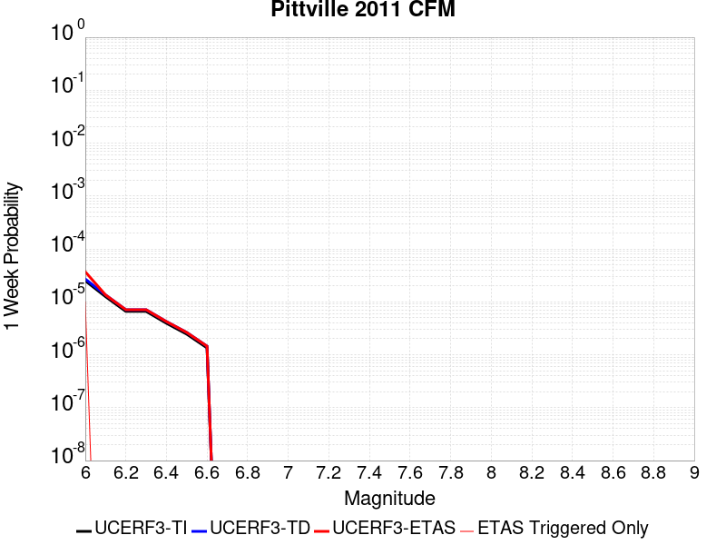 |  | 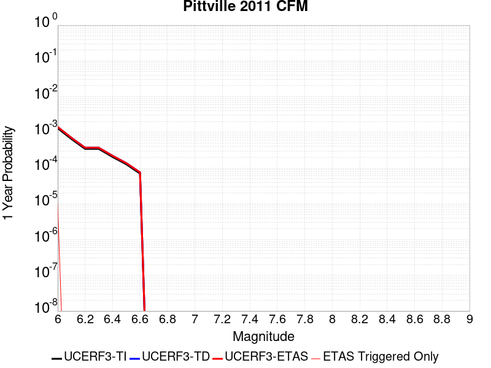 |  |

| Magnitude | 1 wk TI Prob | 1 wk TD Prob | 1 wk ETAS Prob | 1 wk ETAS/TD Gain | 1 wk ETAS Triggered Only | 1 mo TI Prob | 1 mo TD Prob | 1 mo ETAS Prob | 1 mo ETAS/TD Gain | 1 mo ETAS Triggered Only | 1 yr TI Prob | 1 yr TD Prob | 1 yr ETAS Prob | 1 yr ETAS/TD Gain | 1 yr ETAS Triggered Only | 10 yr TI Prob | 10 yr TD Prob | 10 yr ETAS Prob | 10 yr ETAS/TD Gain | 10 yr ETAS Triggered Only |
|-----|-----|-----|-----|-----|-----|-----|-----|-----|-----|-----|-----|-----|-----|-----|-----|-----|-----|-----|-----|-----|
| 6.0 | 2.5031832E-5 | 2.7056969E-5 | 3.70567E-5 | 1.3695805 | 1.0E-5 | 1.0727487E-4 | 1.1595384E-4 | 1.2595268E-4 | 1.0862312 | 1.0E-5 | 0.001305289 | 0.0014109211 | 0.001420907 | 1.0070776 | 1.0E-5 | 0.012976485 | 0.014029415 | 0.014039275 | 1.0007027 | 1.0E-5 |
| 6.1 | 1.2540113E-5 | 1.3513067E-5 | 1.3513067E-5 | 1.0 | 0.0 | 5.3742235E-5 | 5.7911984E-5 | 5.7911984E-5 | 1.0 | 0.0 | 6.541153E-4 | 7.048728E-4 | 7.048728E-4 | 1.0 | 0.0 | 0.0065219323 | 0.0070286044 | 0.0070286044 | 1.0 | 0.0 |
| 6.2 | 6.603218E-6 | 7.107189E-6 | 7.107189E-6 | 1.0 | 0.0 | 2.8299199E-5 | 3.0459063E-5 | 3.0459063E-5 | 1.0 | 0.0 | 3.4448825E-4 | 3.7078248E-4 | 3.7078248E-4 | 1.0 | 0.0 | 0.0034395473 | 0.0037022792 | 0.0037022792 | 1.0 | 0.0 |
| 6.3 | 6.603218E-6 | 7.107189E-6 | 7.107189E-6 | 1.0 | 0.0 | 2.8299199E-5 | 3.0459063E-5 | 3.0459063E-5 | 1.0 | 0.0 | 3.4448825E-4 | 3.7078248E-4 | 3.7078248E-4 | 1.0 | 0.0 | 0.0034395473 | 0.0037022792 | 0.0037022792 | 1.0 | 0.0 |
| 6.4 | 3.9389015E-6 | 4.239175E-6 | 4.239175E-6 | 1.0 | 0.0 | 1.6880897E-5 | 1.8167784E-5 | 1.8167784E-5 | 1.0 | 0.0 | 2.0550552E-4 | 2.2117342E-4 | 2.2117342E-4 | 1.0 | 0.0 | 0.0020531558 | 0.002209838 | 0.002209838 | 1.0 | 0.0 |
| 6.5 | 2.4533072E-6 | 2.6412686E-6 | 2.6412686E-6 | 1.0 | 0.0 | 1.0514132E-5 | 1.1319685E-5 | 1.1319685E-5 | 1.0 | 0.0 | 1.2800204E-4 | 1.3781038E-4 | 1.3781038E-4 | 1.0 | 0.0 | 0.0012792832 | 0.0013774394 | 0.0013774394 | 1.0 | 0.0 |
| 6.6 | 1.3482367E-6 | 1.452993E-6 | 1.452993E-6 | 1.0 | 0.0 | 5.778144E-6 | 6.2271047E-6 | 6.2271047E-6 | 1.0 | 0.0 | 7.0346636E-5 | 7.58135E-5 | 7.58135E-5 | 1.0 | 0.0 | 7.032437E-4 | 7.5798744E-4 | 7.5798744E-4 | 1.0 | 0.0 |

## San Gregorio (South) 2011 CFM
*[(top)](#table-of-contents)*

| 1 Week | 1 Month | 1 Year | 10 Year |
|-----|-----|-----|-----|
| 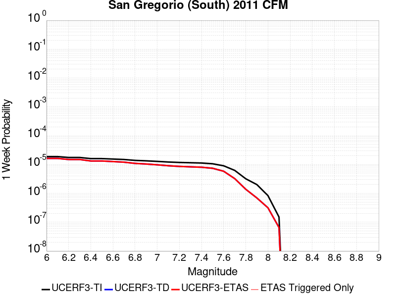 |  | 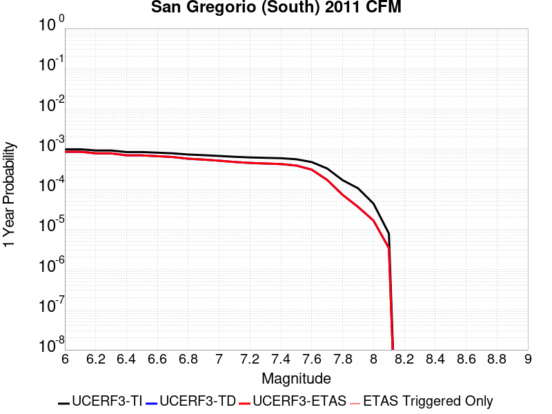 | 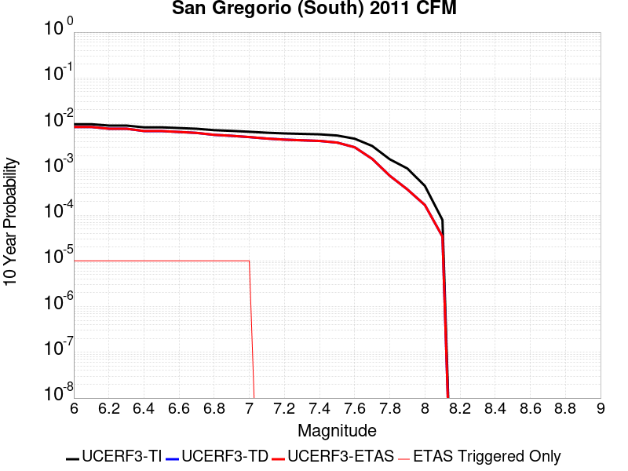 |

| Magnitude | 1 wk TI Prob | 1 wk TD Prob | 1 wk ETAS Prob | 1 wk ETAS/TD Gain | 1 wk ETAS Triggered Only | 1 mo TI Prob | 1 mo TD Prob | 1 mo ETAS Prob | 1 mo ETAS/TD Gain | 1 mo ETAS Triggered Only | 1 yr TI Prob | 1 yr TD Prob | 1 yr ETAS Prob | 1 yr ETAS/TD Gain | 1 yr ETAS Triggered Only | 10 yr TI Prob | 10 yr TD Prob | 10 yr ETAS Prob | 10 yr ETAS/TD Gain | 10 yr ETAS Triggered Only |
|-----|-----|-----|-----|-----|-----|-----|-----|-----|-----|-----|-----|-----|-----|-----|-----|-----|-----|-----|-----|-----|
| 6.0 | 1.8770423E-5 | 1.6279751E-5 | 1.6279751E-5 | 1.0 | 0.0 | 8.044219E-5 | 6.976852E-5 | 6.976852E-5 | 1.0 | 0.0 | 9.789435E-4 | 8.491044E-4 | 8.491044E-4 | 1.0 | 0.0 | 0.009746423 | 0.008471312 | 0.008481227 | 1.0011704 | 1.0E-5 |
| 6.1 | 1.8770423E-5 | 1.6279751E-5 | 1.6279751E-5 | 1.0 | 0.0 | 8.044219E-5 | 6.976852E-5 | 6.976852E-5 | 1.0 | 0.0 | 9.789435E-4 | 8.491044E-4 | 8.491044E-4 | 1.0 | 0.0 | 0.009746423 | 0.008471312 | 0.008481227 | 1.0011704 | 1.0E-5 |
| 6.2 | 1.7508692E-5 | 1.4899257E-5 | 1.4899257E-5 | 1.0 | 0.0 | 7.5035096E-5 | 6.3852414E-5 | 6.3852414E-5 | 1.0 | 0.0 | 9.1316935E-4 | 7.7712885E-4 | 7.7712885E-4 | 1.0 | 0.0 | 0.00909426 | 0.00775674 | 0.007766662 | 1.0012792 | 1.0E-5 |
| 6.3 | 1.7508692E-5 | 1.4899257E-5 | 1.4899257E-5 | 1.0 | 0.0 | 7.5035096E-5 | 6.3852414E-5 | 6.3852414E-5 | 1.0 | 0.0 | 9.1316935E-4 | 7.7712885E-4 | 7.7712885E-4 | 1.0 | 0.0 | 0.00909426 | 0.00775674 | 0.007766662 | 1.0012792 | 1.0E-5 |
| 6.4 | 1.6004591E-5 | 1.3249094E-5 | 1.3249094E-5 | 1.0 | 0.0 | 6.85893E-5 | 5.6780602E-5 | 5.6780602E-5 | 1.0 | 0.0 | 8.347548E-4 | 6.910856E-4 | 6.910856E-4 | 1.0 | 0.0 | 0.008316261 | 0.006901791 | 0.006911722 | 1.0014389 | 1.0E-5 |
| 6.5 | 1.6004591E-5 | 1.3249094E-5 | 1.3249094E-5 | 1.0 | 0.0 | 6.85893E-5 | 5.6780602E-5 | 5.6780602E-5 | 1.0 | 0.0 | 8.347548E-4 | 6.910856E-4 | 6.910856E-4 | 1.0 | 0.0 | 0.008316261 | 0.006901791 | 0.006911722 | 1.0014389 | 1.0E-5 |
| 6.6 | 1.5442201E-5 | 1.2633725E-5 | 1.2633725E-5 | 1.0 | 0.0 | 6.617918E-5 | 5.4143416E-5 | 5.4143416E-5 | 1.0 | 0.0 | 8.0543366E-4 | 6.5899757E-4 | 6.5899757E-4 | 1.0 | 0.0 | 0.008025207 | 0.006582842 | 0.0065927766 | 1.0015091 | 1.0E-5 |
| 6.7 | 1.489921E-5 | 1.2042234E-5 | 1.2042234E-5 | 1.0 | 0.0 | 6.3852196E-5 | 5.1608557E-5 | 5.1608557E-5 | 1.0 | 0.0 | 7.7712315E-4 | 6.2815374E-4 | 6.2815374E-4 | 1.0 | 0.0 | 0.0077441116 | 0.006276176 | 0.006286113 | 1.0015833 | 1.0E-5 |
| 6.8 | 1.3876024E-5 | 1.0921184E-5 | 1.0921184E-5 | 1.0 | 0.0 | 5.9467322E-5 | 4.6804238E-5 | 4.6804238E-5 | 1.0 | 0.0 | 7.237741E-4 | 5.69693E-4 | 5.69693E-4 | 1.0 | 0.0 | 0.0072142133 | 0.0056946846 | 0.005704628 | 1.001746 | 1.0E-5 |
| 6.9 | 1.33922495E-5 | 1.0392687E-5 | 1.0392687E-5 | 1.0 | 0.0 | 5.7394092E-5 | 4.4539327E-5 | 4.4539327E-5 | 1.0 | 0.0 | 6.9854903E-4 | 5.4213166E-4 | 5.4213166E-4 | 1.0 | 0.0 | 0.0069635725 | 0.005420442 | 0.005430388 | 1.0018349 | 1.0E-5 |
| 7.0 | 1.2807324E-5 | 9.752649E-6 | 9.752649E-6 | 1.0 | 0.0 | 5.4887376E-5 | 4.1796397E-5 | 4.1796397E-5 | 1.0 | 0.0 | 6.680489E-4 | 5.087525E-4 | 5.087525E-4 | 1.0 | 0.0 | 0.006660442 | 0.0050882204 | 0.0050981697 | 1.0019553 | 1.0E-5 |
| 7.1 | 1.2191438E-5 | 9.061537E-6 | 9.061537E-6 | 1.0 | 0.0 | 5.224797E-5 | 3.8834576E-5 | 3.8834576E-5 | 1.0 | 0.0 | 6.3593336E-4 | 4.727085E-4 | 4.727085E-4 | 1.0 | 0.0 | 0.0063411663 | 0.0047293645 | 0.0047293645 | 1.0 | 0.0 |
| 7.2 | 1.1769438E-5 | 8.581731E-6 | 8.581731E-6 | 1.0 | 0.0 | 5.0439474E-5 | 3.677833E-5 | 3.677833E-5 | 1.0 | 0.0 | 6.1392755E-4 | 4.4768423E-4 | 4.4768423E-4 | 1.0 | 0.0 | 0.0061223423 | 0.004480157 | 0.004480157 | 1.0 | 0.0 |
| 7.3 | 1.150374E-5 | 8.29716E-6 | 8.29716E-6 | 1.0 | 0.0 | 4.9300812E-5 | 3.5558773E-5 | 3.5558773E-5 | 1.0 | 0.0 | 6.0007203E-4 | 4.3284212E-4 | 4.3284212E-4 | 1.0 | 0.0 | 0.0059845424 | 0.0043323063 | 0.0043323063 | 1.0 | 0.0 |
| 7.4 | 1.12514E-5 | 8.042902E-6 | 8.042902E-6 | 1.0 | 0.0 | 4.8219394E-5 | 3.4469125E-5 | 3.4469125E-5 | 1.0 | 0.0 | 5.8691297E-4 | 4.1958084E-4 | 4.1958084E-4 | 1.0 | 0.0 | 0.005853653 | 0.0042001884 | 0.0042001884 | 1.0 | 0.0 |
| 7.5 | 1.059696E-5 | 7.3931915E-6 | 7.3931915E-6 | 1.0 | 0.0 | 4.5414752E-5 | 3.168472E-5 | 3.168472E-5 | 1.0 | 0.0 | 5.5278436E-4 | 3.8569325E-4 | 3.8569325E-4 | 1.0 | 0.0 | 0.0055141128 | 0.0038624762 | 0.0038624762 | 1.0 | 0.0 |
| 7.6 | 9.018592E-6 | 5.8369624E-6 | 5.8369624E-6 | 1.0 | 0.0 | 3.8650534E-5 | 2.5015313E-5 | 2.5015313E-5 | 1.0 | 0.0 | 4.7046866E-4 | 3.045189E-4 | 3.045189E-4 | 1.0 | 0.0 | 0.004694739 | 0.0030528754 | 0.0030528754 | 1.0 | 0.0 |
| 7.7 | 6.243489E-6 | 3.2395455E-6 | 3.2395455E-6 | 1.0 | 0.0 | 2.6757538E-5 | 1.3883692E-5 | 1.3883692E-5 | 1.0 | 0.0 | 3.257243E-4 | 1.6902086E-4 | 1.6902086E-4 | 1.0 | 0.0 | 0.003252473 | 0.001699108 | 0.001699108 | 1.0 | 0.0 |
| 7.8 | 3.1941963E-6 | 1.3809986E-6 | 1.3809986E-6 | 1.0 | 0.0 | 1.368934E-5 | 5.9185513E-6 | 5.9185513E-6 | 1.0 | 0.0 | 1.6665498E-4 | 7.2055984E-5 | 7.2055984E-5 | 1.0 | 0.0 | 0.0016653005 | 7.263174E-4 | 7.263174E-4 | 1.0 | 0.0 |
| 7.9 | 2.0098398E-6 | 6.9161155E-7 | 6.9161155E-7 | 1.0 | 0.0 | 8.6135715E-6 | 2.964046E-6 | 2.964046E-6 | 1.0 | 0.0 | 1.0486518E-4 | 3.608666E-5 | 3.608666E-5 | 1.0 | 0.0 | 0.0010481571 | 3.657225E-4 | 3.657225E-4 | 1.0 | 0.0 |
| 8.0 | 8.353119E-7 | 3.1623412E-7 | 3.1623412E-7 | 1.0 | 0.0 | 3.579903E-6 | 1.3552883E-6 | 1.3552883E-6 | 1.0 | 0.0 | 4.358445E-5 | 1.6500511E-5 | 1.6500511E-5 | 1.0 | 0.0 | 4.3575902E-4 | 1.6619264E-4 | 1.6619264E-4 | 1.0 | 0.0 |
| 8.1 | 1.5033264E-7 | 6.527624E-8 | 6.527624E-8 | 1.0 | 0.0 | 6.442826E-7 | 2.7975528E-7 | 2.7975528E-7 | 1.0 | 0.0 | 7.844113E-6 | 3.4060151E-6 | 3.4060151E-6 | 1.0 | 0.0 | 7.843835E-5 | 3.407693E-5 | 3.407693E-5 | 1.0 | 0.0 |

## Las Positas
*[(top)](#table-of-contents)*

| 1 Week | 1 Month | 1 Year | 10 Year |
|-----|-----|-----|-----|
| 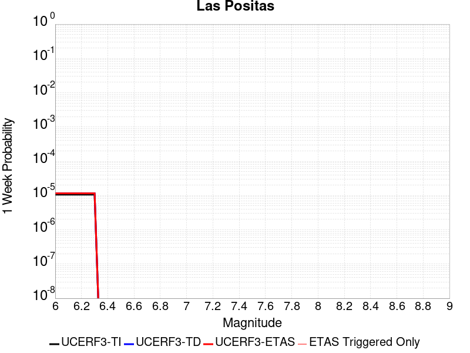 | 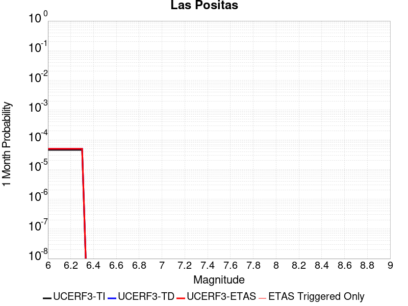 | 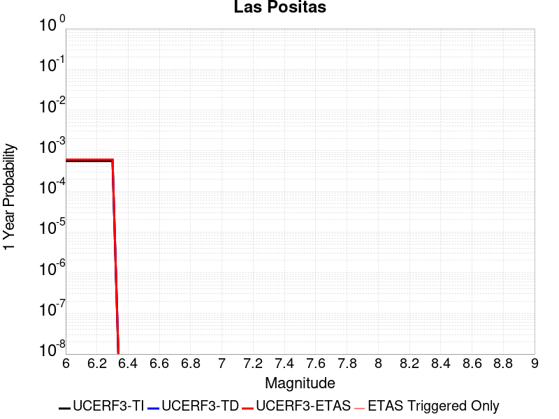 | 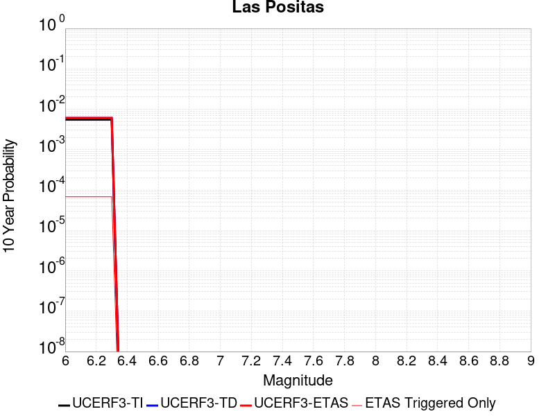 |

| Magnitude | 1 wk TI Prob | 1 wk TD Prob | 1 wk ETAS Prob | 1 wk ETAS/TD Gain | 1 wk ETAS Triggered Only | 1 mo TI Prob | 1 mo TD Prob | 1 mo ETAS Prob | 1 mo ETAS/TD Gain | 1 mo ETAS Triggered Only | 1 yr TI Prob | 1 yr TD Prob | 1 yr ETAS Prob | 1 yr ETAS/TD Gain | 1 yr ETAS Triggered Only | 10 yr TI Prob | 10 yr TD Prob | 10 yr ETAS Prob | 10 yr ETAS/TD Gain | 10 yr ETAS Triggered Only |
|-----|-----|-----|-----|-----|-----|-----|-----|-----|-----|-----|-----|-----|-----|-----|-----|-----|-----|-----|-----|-----|
| 6.0 | 1.0659424E-5 | 1.15911225E-5 | 1.15911225E-5 | 1.0 | 0.0 | 4.568245E-5 | 4.9676237E-5 | 4.9676237E-5 | 1.0 | 0.0 | 5.560419E-4 | 6.048082E-4 | 6.048082E-4 | 1.0 | 0.0 | 0.005546526 | 0.006048082 | 0.0060580214 | 1.0016434 | 1.0E-5 |
| 6.1 | 1.0659424E-5 | 1.15911225E-5 | 1.15911225E-5 | 1.0 | 0.0 | 4.568245E-5 | 4.9676237E-5 | 4.9676237E-5 | 1.0 | 0.0 | 5.560419E-4 | 6.048082E-4 | 6.048082E-4 | 1.0 | 0.0 | 0.005546526 | 0.006048082 | 0.0060580214 | 1.0016434 | 1.0E-5 |
| 6.2 | 1.0659424E-5 | 1.15911225E-5 | 1.15911225E-5 | 1.0 | 0.0 | 4.568245E-5 | 4.9676237E-5 | 4.9676237E-5 | 1.0 | 0.0 | 5.560419E-4 | 6.048082E-4 | 6.048082E-4 | 1.0 | 0.0 | 0.005546526 | 0.006048082 | 0.0060580214 | 1.0016434 | 1.0E-5 |
| 6.3 | 1.0659424E-5 | 1.15911225E-5 | 1.15911225E-5 | 1.0 | 0.0 | 4.568245E-5 | 4.9676237E-5 | 4.9676237E-5 | 1.0 | 0.0 | 5.560419E-4 | 6.048082E-4 | 6.048082E-4 | 1.0 | 0.0 | 0.005546526 | 0.006048082 | 0.0060580214 | 1.0016434 | 1.0E-5 |

## Rodgers Creek - Healdsburg 2011 CFM
*[(top)](#table-of-contents)*

| 1 Week | 1 Month | 1 Year | 10 Year |
|-----|-----|-----|-----|
| 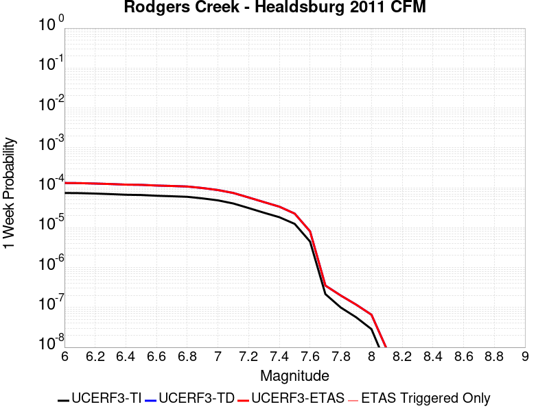 | 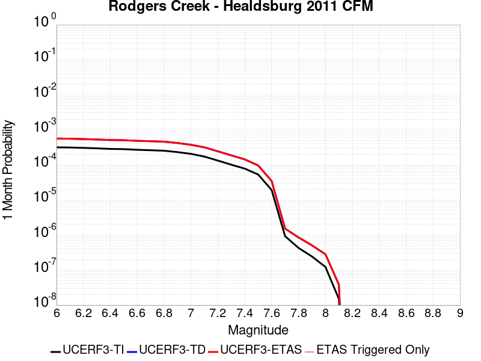 | 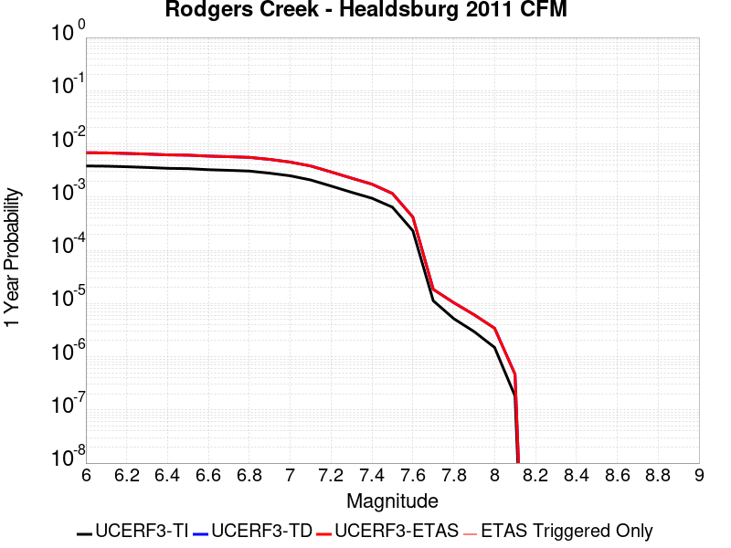 | 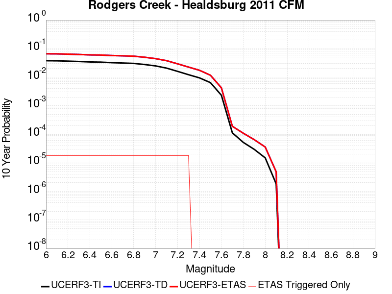 |

| Magnitude | 1 wk TI Prob | 1 wk TD Prob | 1 wk ETAS Prob | 1 wk ETAS/TD Gain | 1 wk ETAS Triggered Only | 1 mo TI Prob | 1 mo TD Prob | 1 mo ETAS Prob | 1 mo ETAS/TD Gain | 1 mo ETAS Triggered Only | 1 yr TI Prob | 1 yr TD Prob | 1 yr ETAS Prob | 1 yr ETAS/TD Gain | 1 yr ETAS Triggered Only | 10 yr TI Prob | 10 yr TD Prob | 10 yr ETAS Prob | 10 yr ETAS/TD Gain | 10 yr ETAS Triggered Only |
|-----|-----|-----|-----|-----|-----|-----|-----|-----|-----|-----|-----|-----|-----|-----|-----|-----|-----|-----|-----|-----|
| 6.0 | 7.390182E-5 | 1.3136698E-4 | 1.3136698E-4 | 1.0 | 0.0 | 3.1668364E-4 | 5.6287815E-4 | 5.6287815E-4 | 1.0 | 0.0 | 0.0038488081 | 0.0068315 | 0.0068315 | 1.0 | 0.0 | 0.037828278 | 0.06619178 | 0.06620111 | 1.000141 | 1.0E-5 |
| 6.1 | 7.318768E-5 | 1.3034661E-4 | 1.3034661E-4 | 1.0 | 0.0 | 3.1362378E-4 | 5.585081E-4 | 5.585081E-4 | 1.0 | 0.0 | 0.0038116854 | 0.0067786723 | 0.0067786723 | 1.0 | 0.0 | 0.037469655 | 0.06569639 | 0.06570573 | 1.0001422 | 1.0E-5 |
| 6.2 | 7.1379836E-5 | 1.2727521E-4 | 1.2727521E-4 | 1.0 | 0.0 | 3.058777E-4 | 5.453505E-4 | 5.453505E-4 | 1.0 | 0.0 | 0.003717703 | 0.0066194604 | 0.0066194604 | 1.0 | 0.0 | 0.0365612 | 0.06421462 | 0.064223975 | 1.0001457 | 1.0E-5 |
| 6.3 | 6.9255926E-5 | 1.2382054E-4 | 1.2382054E-4 | 1.0 | 0.0 | 2.9677735E-4 | 5.3055194E-4 | 5.3055194E-4 | 1.0 | 0.0 | 0.0036072785 | 0.006440372 | 0.006440372 | 1.0 | 0.0 | 0.035492823 | 0.06254096 | 0.062550336 | 1.0001498 | 1.0E-5 |
| 6.4 | 6.6757144E-5 | 1.1958744E-4 | 1.1958744E-4 | 1.0 | 0.0 | 2.8607066E-4 | 5.1241735E-4 | 5.1241735E-4 | 1.0 | 0.0 | 0.0034773487 | 0.0062209065 | 0.0062209065 | 1.0 | 0.0 | 0.034234364 | 0.060490217 | 0.060499612 | 1.0001553 | 1.0E-5 |
| 6.5 | 6.5735134E-5 | 1.1808043E-4 | 1.1808043E-4 | 1.0 | 0.0 | 2.8169158E-4 | 5.0596124E-4 | 5.0596124E-4 | 1.0 | 0.0 | 0.003424202 | 0.0061427657 | 0.0061427657 | 1.0 | 0.0 | 0.03371918 | 0.059755135 | 0.059764538 | 1.0001574 | 1.0E-5 |
| 6.6 | 6.289601E-5 | 1.1343802E-4 | 1.1343802E-4 | 1.0 | 0.0 | 2.6952647E-4 | 4.8607276E-4 | 4.8607276E-4 | 1.0 | 0.0 | 0.0032765474 | 0.005901959 | 0.005901959 | 1.0 | 0.0 | 0.032286562 | 0.057494484 | 0.05750391 | 1.0001639 | 1.0E-5 |
| 6.7 | 6.115274E-5 | 1.1060895E-4 | 1.1060895E-4 | 1.0 | 0.0 | 2.6205686E-4 | 4.7395262E-4 | 4.7395262E-4 | 1.0 | 0.0 | 0.0031858748 | 0.0057551847 | 0.0057551847 | 1.0 | 0.0 | 0.031405866 | 0.05611298 | 0.05612242 | 1.0001682 | 1.0E-5 |
| 6.8 | 5.9232367E-5 | 1.0728244E-4 | 1.0728244E-4 | 1.0 | 0.0 | 2.538283E-4 | 4.597012E-4 | 4.597012E-4 | 1.0 | 0.0 | 0.0030859804 | 0.0055825757 | 0.0055825757 | 1.0 | 0.0 | 0.030434765 | 0.054479737 | 0.05448919 | 1.0001736 | 1.0E-5 |
| 6.9 | 5.4030377E-5 | 9.8224424E-5 | 9.8224424E-5 | 1.0 | 0.0 | 2.315382E-4 | 4.2089424E-4 | 4.2089424E-4 | 1.0 | 0.0 | 0.0028153337 | 0.005112413 | 0.005112413 | 1.0 | 0.0 | 0.027799325 | 0.05001516 | 0.05002466 | 1.0001899 | 1.0E-5 |
| 7.0 | 4.8260714E-5 | 8.740524E-5 | 8.740524E-5 | 1.0 | 0.0 | 2.0681522E-4 | 3.745404E-4 | 3.745404E-4 | 1.0 | 0.0 | 0.0025150678 | 0.004550549 | 0.004550549 | 1.0 | 0.0 | 0.024867928 | 0.044667665 | 0.044677217 | 1.0002139 | 1.0E-5 |
| 7.1 | 4.0294493E-5 | 7.389041E-5 | 7.389041E-5 | 1.0 | 0.0 | 1.7267925E-4 | 3.1663495E-4 | 3.1663495E-4 | 1.0 | 0.0 | 0.0021003427 | 0.0038482544 | 0.0038482544 | 1.0 | 0.0 | 0.02080602 | 0.037923392 | 0.03793301 | 1.0002537 | 1.0E-5 |
| 7.2 | 3.096388E-5 | 5.697752E-5 | 5.697752E-5 | 1.0 | 0.0 | 1.326956E-4 | 2.4416664E-4 | 2.4416664E-4 | 1.0 | 0.0 | 0.0016143717 | 0.0029686983 | 0.0029686983 | 1.0 | 0.0 | 0.01602694 | 0.029436996 | 0.0294467 | 1.0003297 | 1.0E-5 |
| 7.3 | 2.3615226E-5 | 4.3628002E-5 | 4.3628002E-5 | 1.0 | 0.0 | 1.0120418E-4 | 1.8696384E-4 | 1.8696384E-4 | 1.0 | 0.0 | 0.0012314644 | 0.002273922 | 0.002273922 | 1.0 | 0.0 | 0.0122466255 | 0.022636993 | 0.022646766 | 1.0004318 | 1.0E-5 |
| 7.4 | 1.8251132E-5 | 3.3541033E-5 | 3.3541033E-5 | 1.0 | 0.0 | 7.821679E-5 | 1.4373941E-4 | 1.4373941E-4 | 1.0 | 0.0 | 9.518733E-4 | 0.0017486324 | 0.0017486324 | 1.0 | 0.0 | 0.009478063 | 0.017465532 | 0.017465532 | 1.0 | 0.0 |
| 7.5 | 1.2411432E-5 | 2.246003E-5 | 2.246003E-5 | 1.0 | 0.0 | 5.3190768E-5 | 9.625375E-5 | 9.625375E-5 | 1.0 | 0.0 | 6.4740516E-4 | 0.0011712653 | 0.0011712653 | 1.0 | 0.0 | 0.006455223 | 0.011743283 | 0.011743283 | 1.0 | 0.0 |
| 7.6 | 4.4771446E-6 | 8.083989E-6 | 8.083989E-6 | 1.0 | 0.0 | 1.918762E-5 | 3.4645214E-5 | 3.4645214E-5 | 1.0 | 0.0 | 2.3358424E-4 | 4.2172507E-4 | 4.2172507E-4 | 1.0 | 0.0 | 0.0023333887 | 0.004246066 | 0.004246066 | 1.0 | 0.0 |
| 7.7 | 2.157941E-7 | 3.5349316E-7 | 3.5349316E-7 | 1.0 | 0.0 | 9.248315E-7 | 1.5149698E-6 | 1.5149698E-6 | 1.0 | 0.0 | 1.1259765E-5 | 1.8444602E-5 | 1.8444602E-5 | 1.0 | 0.0 | 1.1259195E-4 | 1.9069147E-4 | 1.9069147E-4 | 1.0 | 0.0 |
| 7.8 | 9.9623286E-8 | 1.989979E-7 | 1.989979E-7 | 1.0 | 0.0 | 4.269569E-7 | 8.528478E-7 | 8.528478E-7 | 1.0 | 0.0 | 5.1981874E-6 | 1.0383373E-5 | 1.0383373E-5 | 1.0 | 0.0 | 5.198066E-5 | 1.09018714E-4 | 1.09018714E-4 | 1.0 | 0.0 |
| 7.9 | 5.6745257E-8 | 1.1773924E-7 | 1.1773924E-7 | 1.0 | 0.0 | 2.4319394E-7 | 5.0459664E-7 | 5.0459664E-7 | 1.0 | 0.0 | 2.960882E-6 | 6.1434466E-6 | 6.1434466E-6 | 1.0 | 0.0 | 2.9608427E-5 | 6.470911E-5 | 6.470911E-5 | 1.0 | 0.0 |
| 8.0 | 2.8614323E-8 | 6.57845E-8 | 6.57845E-8 | 1.0 | 0.0 | 1.2263281E-7 | 2.8193355E-7 | 2.8193355E-7 | 1.0 | 0.0 | 1.4930534E-6 | 3.4325356E-6 | 3.4325356E-6 | 1.0 | 0.0 | 1.4930434E-5 | 3.582588E-5 | 3.582588E-5 | 1.0 | 0.0 |
| 8.1 | 3.5045191E-9 | 8.965783E-9 | 8.965783E-9 | 1.0 | 0.0 | 1.5019367E-8 | 3.8424783E-8 | 3.8424783E-8 | 1.0 | 0.0 | 1.8286079E-7 | 4.6782165E-7 | 4.6782165E-7 | 1.0 | 0.0 | 1.8286064E-6 | 4.8327956E-6 | 4.8327956E-6 | 1.0 | 0.0 |

## North Tahoe 2011 CFM
*[(top)](#table-of-contents)*

| 1 Week | 1 Month | 1 Year | 10 Year |
|-----|-----|-----|-----|
| 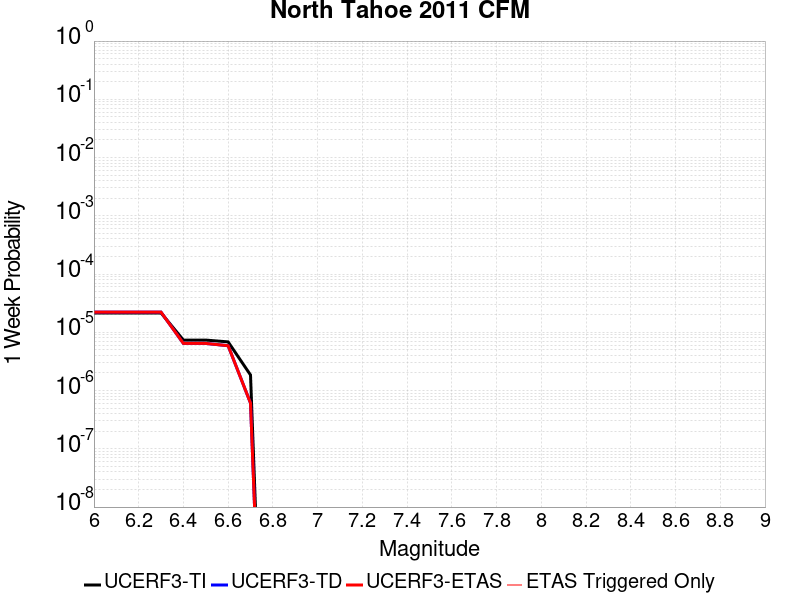 | 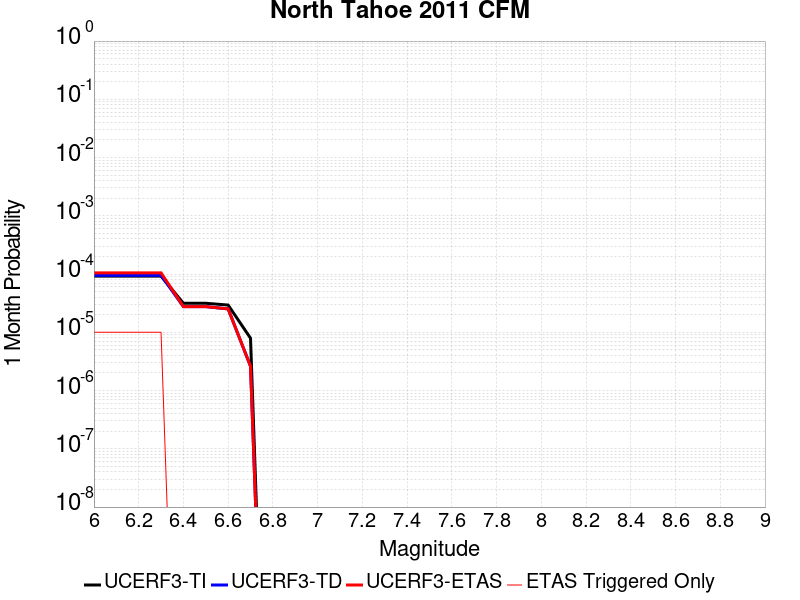 | 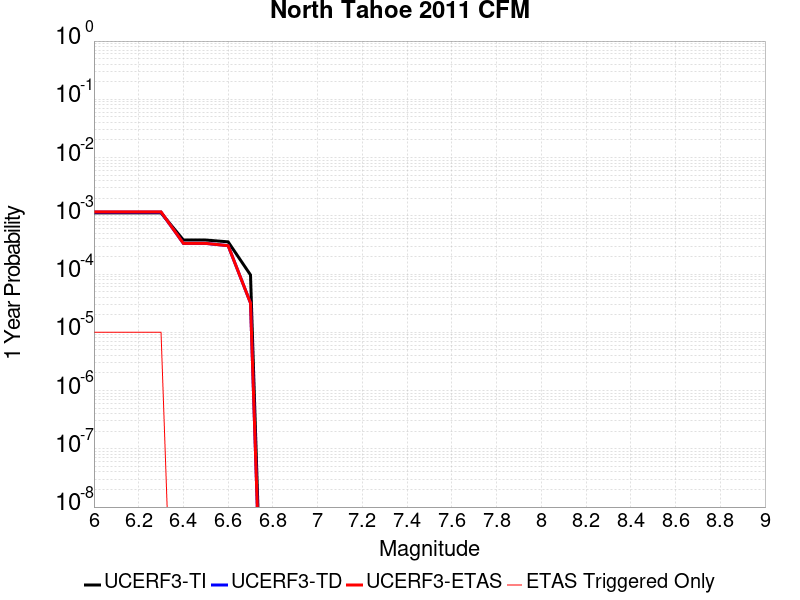 | 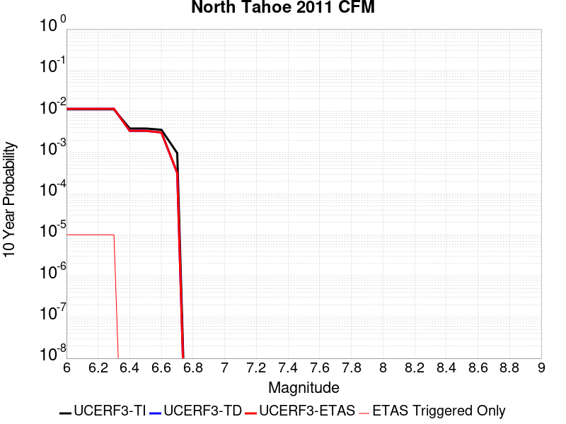 |

| Magnitude | 1 wk TI Prob | 1 wk TD Prob | 1 wk ETAS Prob | 1 wk ETAS/TD Gain | 1 wk ETAS Triggered Only | 1 mo TI Prob | 1 mo TD Prob | 1 mo ETAS Prob | 1 mo ETAS/TD Gain | 1 mo ETAS Triggered Only | 1 yr TI Prob | 1 yr TD Prob | 1 yr ETAS Prob | 1 yr ETAS/TD Gain | 1 yr ETAS Triggered Only | 10 yr TI Prob | 10 yr TD Prob | 10 yr ETAS Prob | 10 yr ETAS/TD Gain | 10 yr ETAS Triggered Only |
|-----|-----|-----|-----|-----|-----|-----|-----|-----|-----|-----|-----|-----|-----|-----|-----|-----|-----|-----|-----|-----|
| 6.0 | 2.150391E-5 | 2.216523E-5 | 2.216523E-5 | 1.0 | 0.0 | 9.215636E-5 | 9.499148E-5 | 1.0499053E-4 | 1.1052626 | 1.0E-5 | 0.0011214261 | 0.0011561037 | 0.0011660921 | 1.0086397 | 1.0E-5 | 0.011157839 | 0.011520148 | 0.011530032 | 1.0008581 | 1.0E-5 |
| 6.1 | 2.150391E-5 | 2.216523E-5 | 2.216523E-5 | 1.0 | 0.0 | 9.215636E-5 | 9.499148E-5 | 1.0499053E-4 | 1.1052626 | 1.0E-5 | 0.0011214261 | 0.0011561037 | 0.0011660921 | 1.0086397 | 1.0E-5 | 0.011157839 | 0.011520148 | 0.011530032 | 1.0008581 | 1.0E-5 |
| 6.2 | 2.150391E-5 | 2.216523E-5 | 2.216523E-5 | 1.0 | 0.0 | 9.215636E-5 | 9.499148E-5 | 1.0499053E-4 | 1.1052626 | 1.0E-5 | 0.0011214261 | 0.0011561037 | 0.0011660921 | 1.0086397 | 1.0E-5 | 0.011157839 | 0.011520148 | 0.011530032 | 1.0008581 | 1.0E-5 |
| 6.3 | 2.150391E-5 | 2.216523E-5 | 2.216523E-5 | 1.0 | 0.0 | 9.215636E-5 | 9.499148E-5 | 1.0499053E-4 | 1.1052626 | 1.0E-5 | 0.0011214261 | 0.0011561037 | 0.0011660921 | 1.0086397 | 1.0E-5 | 0.011157839 | 0.011520148 | 0.011530032 | 1.0008581 | 1.0E-5 |
| 6.4 | 7.3563056E-6 | 6.445093E-6 | 6.445093E-6 | 1.0 | 0.0 | 3.1526644E-5 | 2.7621705E-5 | 2.7621705E-5 | 1.0 | 0.0 | 3.8376928E-4 | 3.3627293E-4 | 3.3627293E-4 | 1.0 | 0.0 | 0.003831072 | 0.0033606375 | 0.0033606375 | 1.0 | 0.0 |
| 6.5 | 7.3563056E-6 | 6.445093E-6 | 6.445093E-6 | 1.0 | 0.0 | 3.1526644E-5 | 2.7621705E-5 | 2.7621705E-5 | 1.0 | 0.0 | 3.8376928E-4 | 3.3627293E-4 | 3.3627293E-4 | 1.0 | 0.0 | 0.003831072 | 0.0033606375 | 0.0033606375 | 1.0 | 0.0 |
| 6.6 | 6.8508816E-6 | 5.8842634E-6 | 5.8842634E-6 | 1.0 | 0.0 | 2.936059E-5 | 2.52182E-5 | 2.52182E-5 | 1.0 | 0.0 | 3.5740656E-4 | 3.070187E-4 | 3.070187E-4 | 1.0 | 0.0 | 0.0035683226 | 0.0030689223 | 0.0030689223 | 1.0 | 0.0 |
| 6.7 | 1.8511148E-6 | 6.1015777E-7 | 6.1015777E-7 | 1.0 | 0.0 | 7.933325E-6 | 2.6149619E-6 | 2.6149619E-6 | 1.0 | 0.0 | 9.658395E-5 | 3.183716E-5 | 3.183716E-5 | 1.0 | 0.0 | 9.6541987E-4 | 3.183716E-4 | 3.183716E-4 | 1.0 | 0.0 |

## Elsinore (Julian)
*[(top)](#table-of-contents)*

| 1 Week | 1 Month | 1 Year | 10 Year |
|-----|-----|-----|-----|
| 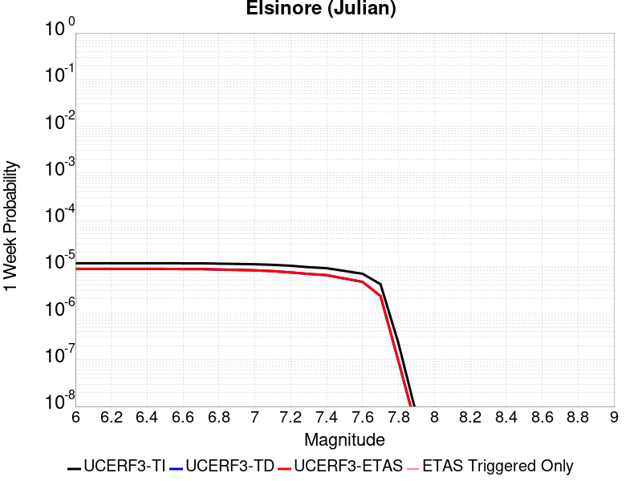 |  | 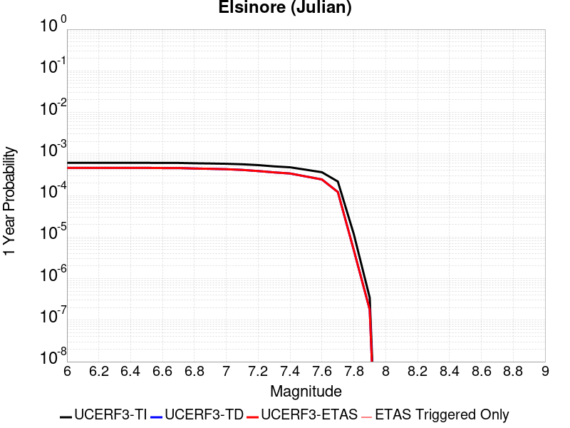 | 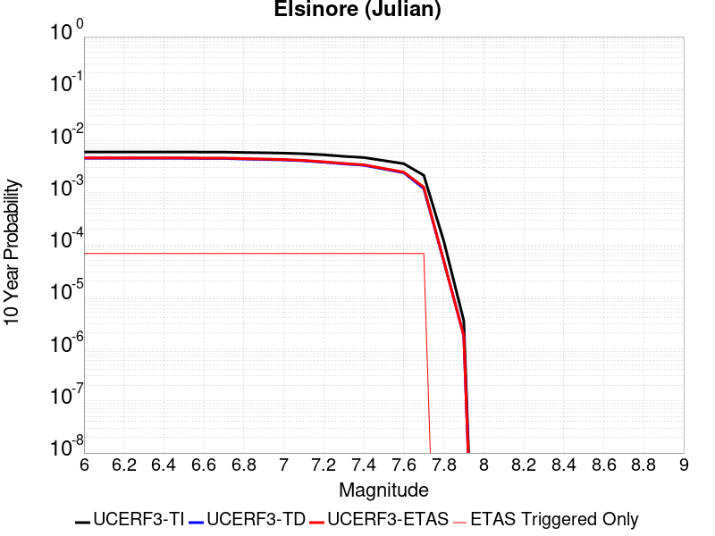 |

| Magnitude | 1 wk TI Prob | 1 wk TD Prob | 1 wk ETAS Prob | 1 wk ETAS/TD Gain | 1 wk ETAS Triggered Only | 1 mo TI Prob | 1 mo TD Prob | 1 mo ETAS Prob | 1 mo ETAS/TD Gain | 1 mo ETAS Triggered Only | 1 yr TI Prob | 1 yr TD Prob | 1 yr ETAS Prob | 1 yr ETAS/TD Gain | 1 yr ETAS Triggered Only | 10 yr TI Prob | 10 yr TD Prob | 10 yr ETAS Prob | 10 yr ETAS/TD Gain | 10 yr ETAS Triggered Only |
|-----|-----|-----|-----|-----|-----|-----|-----|-----|-----|-----|-----|-----|-----|-----|-----|-----|-----|-----|-----|-----|
| 6.0 | 1.1710231E-5 | 8.845509E-6 | 8.845509E-6 | 1.0 | 0.0 | 5.0185736E-5 | 3.7908783E-5 | 3.7908783E-5 | 1.0 | 0.0 | 6.1084004E-4 | 4.614434E-4 | 4.614434E-4 | 1.0 | 0.0 | 0.006091637 | 0.0046050567 | 0.0046150107 | 1.0021615 | 1.0E-5 |
| 6.1 | 1.1710231E-5 | 8.845509E-6 | 8.845509E-6 | 1.0 | 0.0 | 5.0185736E-5 | 3.7908783E-5 | 3.7908783E-5 | 1.0 | 0.0 | 6.1084004E-4 | 4.614434E-4 | 4.614434E-4 | 1.0 | 0.0 | 0.006091637 | 0.0046050567 | 0.0046150107 | 1.0021615 | 1.0E-5 |
| 6.2 | 1.1710231E-5 | 8.845509E-6 | 8.845509E-6 | 1.0 | 0.0 | 5.0185736E-5 | 3.7908783E-5 | 3.7908783E-5 | 1.0 | 0.0 | 6.1084004E-4 | 4.614434E-4 | 4.614434E-4 | 1.0 | 0.0 | 0.006091637 | 0.0046050567 | 0.0046150107 | 1.0021615 | 1.0E-5 |
| 6.3 | 1.1710231E-5 | 8.845509E-6 | 8.845509E-6 | 1.0 | 0.0 | 5.0185736E-5 | 3.7908783E-5 | 3.7908783E-5 | 1.0 | 0.0 | 6.1084004E-4 | 4.614434E-4 | 4.614434E-4 | 1.0 | 0.0 | 0.006091637 | 0.0046050567 | 0.0046150107 | 1.0021615 | 1.0E-5 |
| 6.4 | 1.1710231E-5 | 8.845509E-6 | 8.845509E-6 | 1.0 | 0.0 | 5.0185736E-5 | 3.7908783E-5 | 3.7908783E-5 | 1.0 | 0.0 | 6.1084004E-4 | 4.614434E-4 | 4.614434E-4 | 1.0 | 0.0 | 0.006091637 | 0.0046050567 | 0.0046150107 | 1.0021615 | 1.0E-5 |
| 6.5 | 1.1710231E-5 | 8.845509E-6 | 8.845509E-6 | 1.0 | 0.0 | 5.0185736E-5 | 3.7908783E-5 | 3.7908783E-5 | 1.0 | 0.0 | 6.1084004E-4 | 4.614434E-4 | 4.614434E-4 | 1.0 | 0.0 | 0.006091637 | 0.0046050567 | 0.0046150107 | 1.0021615 | 1.0E-5 |
| 6.6 | 1.1650619E-5 | 8.777881E-6 | 8.777881E-6 | 1.0 | 0.0 | 4.993027E-5 | 3.7618956E-5 | 3.7618956E-5 | 1.0 | 0.0 | 6.0773146E-4 | 4.5791623E-4 | 4.5791623E-4 | 1.0 | 0.0 | 0.0060607214 | 0.004569931 | 0.004579885 | 1.0021782 | 1.0E-5 |
| 6.7 | 1.1650619E-5 | 8.777881E-6 | 8.777881E-6 | 1.0 | 0.0 | 4.993027E-5 | 3.7618956E-5 | 3.7618956E-5 | 1.0 | 0.0 | 6.0773146E-4 | 4.5791623E-4 | 4.5791623E-4 | 1.0 | 0.0 | 0.0060607214 | 0.004569931 | 0.004579885 | 1.0021782 | 1.0E-5 |
| 6.8 | 1.1442698E-5 | 8.561041E-6 | 8.561041E-6 | 1.0 | 0.0 | 4.9039216E-5 | 3.6689667E-5 | 3.6689667E-5 | 1.0 | 0.0 | 5.968889E-4 | 4.4660683E-4 | 4.4660683E-4 | 1.0 | 0.0 | 0.0059528816 | 0.004457295 | 0.0044672503 | 1.0022335 | 1.0E-5 |
| 6.9 | 1.1300589E-5 | 8.408907E-6 | 8.408907E-6 | 1.0 | 0.0 | 4.8430196E-5 | 3.6037683E-5 | 3.6037683E-5 | 1.0 | 0.0 | 5.894781E-4 | 4.3867214E-4 | 4.3867214E-4 | 1.0 | 0.0 | 0.005879169 | 0.0043782624 | 0.0043882183 | 1.002274 | 1.0E-5 |
| 7.0 | 1.1117729E-5 | 8.226087E-6 | 8.226087E-6 | 1.0 | 0.0 | 4.764654E-5 | 3.525419E-5 | 3.525419E-5 | 1.0 | 0.0 | 5.799422E-4 | 4.291369E-4 | 4.291369E-4 | 1.0 | 0.0 | 0.0057843104 | 0.004283281 | 0.004293238 | 1.0023247 | 1.0E-5 |
| 7.1 | 1.08053955E-5 | 7.9117535E-6 | 7.9117535E-6 | 1.0 | 0.0 | 4.6308014E-5 | 3.3907087E-5 | 3.3907087E-5 | 1.0 | 0.0 | 5.6365423E-4 | 4.127422E-4 | 4.127422E-4 | 1.0 | 0.0 | 0.005622267 | 0.0041199517 | 0.004129911 | 1.0024172 | 1.0E-5 |
| 7.2 | 1.032804E-5 | 7.433021E-6 | 7.433021E-6 | 1.0 | 0.0 | 4.4262277E-5 | 3.1855423E-5 | 3.1855423E-5 | 1.0 | 0.0 | 5.387599E-4 | 3.8777234E-4 | 3.8777234E-4 | 1.0 | 0.0 | 0.0053745564 | 0.0038711445 | 0.0038811057 | 1.0025733 | 1.0E-5 |
| 7.3 | 9.622426E-6 | 6.8978457E-6 | 6.8978457E-6 | 1.0 | 0.0 | 4.1238312E-5 | 2.9561868E-5 | 2.9561868E-5 | 1.0 | 0.0 | 5.019608E-4 | 3.5985775E-4 | 3.5985775E-4 | 1.0 | 0.0 | 0.005008285 | 0.0035929221 | 0.003602886 | 1.0027733 | 1.0E-5 |
| 7.4 | 9.144434E-6 | 6.4963933E-6 | 6.4963933E-6 | 1.0 | 0.0 | 3.9189843E-5 | 2.7841395E-5 | 2.7841395E-5 | 1.0 | 0.0 | 4.7703186E-4 | 3.3891766E-4 | 3.3891766E-4 | 1.0 | 0.0 | 0.0047600917 | 0.0033841513 | 0.0033941176 | 1.002945 | 1.0E-5 |
| 7.5 | 7.988981E-6 | 5.4983307E-6 | 5.4983307E-6 | 1.0 | 0.0 | 3.4238044E-5 | 2.356407E-5 | 2.356407E-5 | 1.0 | 0.0 | 4.1676845E-4 | 2.8685606E-4 | 2.8685606E-4 | 1.0 | 0.0 | 0.0041598766 | 0.002864985 | 0.0028749565 | 1.0034804 | 1.0E-5 |
| 7.6 | 6.9554876E-6 | 4.6625346E-6 | 4.6625346E-6 | 1.0 | 0.0 | 2.9808893E-5 | 1.9982144E-5 | 1.9982144E-5 | 1.0 | 0.0 | 3.6286283E-4 | 2.4325661E-4 | 2.4325661E-4 | 1.0 | 0.0 | 0.0036227088 | 0.0024300197 | 0.0024399953 | 1.0041052 | 1.0E-5 |
| 7.7 | 4.1557314E-6 | 2.3246462E-6 | 2.3246462E-6 | 1.0 | 0.0 | 1.7810156E-5 | 9.962735E-6 | 9.962735E-6 | 1.0 | 0.0 | 2.1681708E-4 | 1.2129029E-4 | 1.2129029E-4 | 1.0 | 0.0 | 0.0021660565 | 0.001212314 | 0.0012223019 | 1.0082387 | 1.0E-5 |
| 7.8 | 2.2597293E-7 | 9.332915E-8 | 9.332915E-8 | 1.0 | 0.0 | 9.684551E-7 | 3.99982E-7 | 3.99982E-7 | 1.0 | 0.0 | 1.1790877E-5 | 4.8697734E-6 | 4.8697734E-6 | 1.0 | 0.0 | 1.17902506E-4 | 4.8696995E-5 | 4.8696995E-5 | 1.0 | 0.0 |
| 7.9 | 6.676829E-9 | 3.439853E-9 | 3.439853E-9 | 1.0 | 0.0 | 2.861498E-8 | 1.4742227E-8 | 1.4742227E-8 | 1.0 | 0.0 | 3.4838732E-7 | 1.7948659E-7 | 1.7948659E-7 | 1.0 | 0.0 | 3.4838679E-6 | 1.7948646E-6 | 1.7948646E-6 | 1.0 | 0.0 |

## Burnt Mtn
*[(top)](#table-of-contents)*

| 1 Week | 1 Month | 1 Year | 10 Year |
|-----|-----|-----|-----|
| 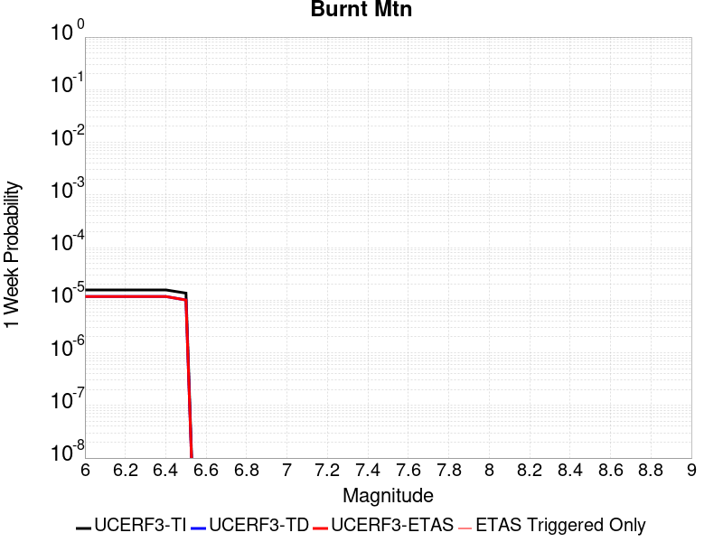 | 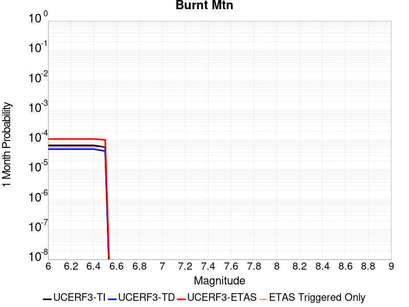 | 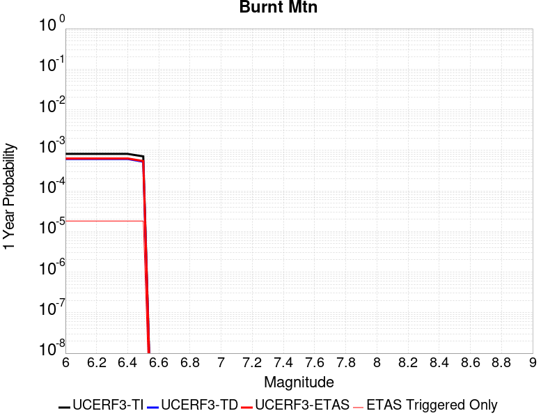 | 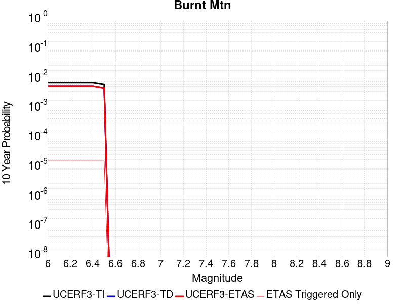 |

| Magnitude | 1 wk TI Prob | 1 wk TD Prob | 1 wk ETAS Prob | 1 wk ETAS/TD Gain | 1 wk ETAS Triggered Only | 1 mo TI Prob | 1 mo TD Prob | 1 mo ETAS Prob | 1 mo ETAS/TD Gain | 1 mo ETAS Triggered Only | 1 yr TI Prob | 1 yr TD Prob | 1 yr ETAS Prob | 1 yr ETAS/TD Gain | 1 yr ETAS Triggered Only | 10 yr TI Prob | 10 yr TD Prob | 10 yr ETAS Prob | 10 yr ETAS/TD Gain | 10 yr ETAS Triggered Only |
|-----|-----|-----|-----|-----|-----|-----|-----|-----|-----|-----|-----|-----|-----|-----|-----|-----|-----|-----|-----|-----|
| 6.0 | 1.5673151E-5 | 1.1749407E-5 | 1.1749407E-5 | 1.0 | 0.0 | 6.716892E-5 | 5.0354356E-5 | 6.0353854E-5 | 1.1985825 | 1.0E-5 | 8.1747473E-4 | 6.1302073E-4 | 6.2301464E-4 | 1.0163027 | 1.0E-5 | 0.008144741 | 0.006125938 | 0.0061358768 | 1.0016224 | 1.0E-5 |
| 6.1 | 1.5673151E-5 | 1.1749407E-5 | 1.1749407E-5 | 1.0 | 0.0 | 6.716892E-5 | 5.0354356E-5 | 6.0353854E-5 | 1.1985825 | 1.0E-5 | 8.1747473E-4 | 6.1302073E-4 | 6.2301464E-4 | 1.0163027 | 1.0E-5 | 0.008144741 | 0.006125938 | 0.0061358768 | 1.0016224 | 1.0E-5 |
| 6.2 | 1.5673151E-5 | 1.1749407E-5 | 1.1749407E-5 | 1.0 | 0.0 | 6.716892E-5 | 5.0354356E-5 | 6.0353854E-5 | 1.1985825 | 1.0E-5 | 8.1747473E-4 | 6.1302073E-4 | 6.2301464E-4 | 1.0163027 | 1.0E-5 | 0.008144741 | 0.006125938 | 0.0061358768 | 1.0016224 | 1.0E-5 |
| 6.3 | 1.5673151E-5 | 1.1749407E-5 | 1.1749407E-5 | 1.0 | 0.0 | 6.716892E-5 | 5.0354356E-5 | 6.0353854E-5 | 1.1985825 | 1.0E-5 | 8.1747473E-4 | 6.1302073E-4 | 6.2301464E-4 | 1.0163027 | 1.0E-5 | 0.008144741 | 0.006125938 | 0.0061358768 | 1.0016224 | 1.0E-5 |
| 6.4 | 1.5673151E-5 | 1.1749407E-5 | 1.1749407E-5 | 1.0 | 0.0 | 6.716892E-5 | 5.0354356E-5 | 6.0353854E-5 | 1.1985825 | 1.0E-5 | 8.1747473E-4 | 6.1302073E-4 | 6.2301464E-4 | 1.0163027 | 1.0E-5 | 0.008144741 | 0.006125938 | 0.0061358768 | 1.0016224 | 1.0E-5 |
| 6.5 | 1.36191375E-5 | 1.0078299E-5 | 1.0078299E-5 | 1.0 | 0.0 | 5.8366426E-5 | 4.3192707E-5 | 5.3192278E-5 | 1.2315105 | 1.0E-5 | 7.103795E-4 | 5.2587123E-4 | 5.3586595E-4 | 1.019006 | 1.0E-5 | 0.0070811296 | 0.0052587125 | 0.0052686594 | 1.0018916 | 1.0E-5 |

## Skinner Flat 2011 CFM
*[(top)](#table-of-contents)*

| 1 Week | 1 Month | 1 Year | 10 Year |
|-----|-----|-----|-----|
|  | 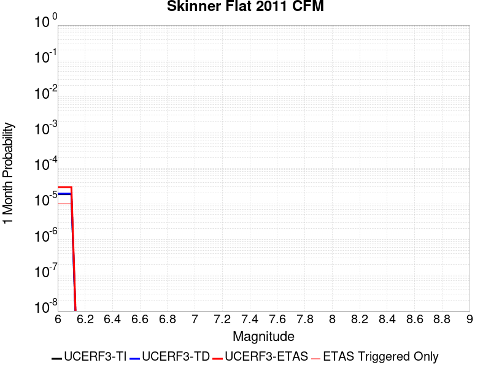 | 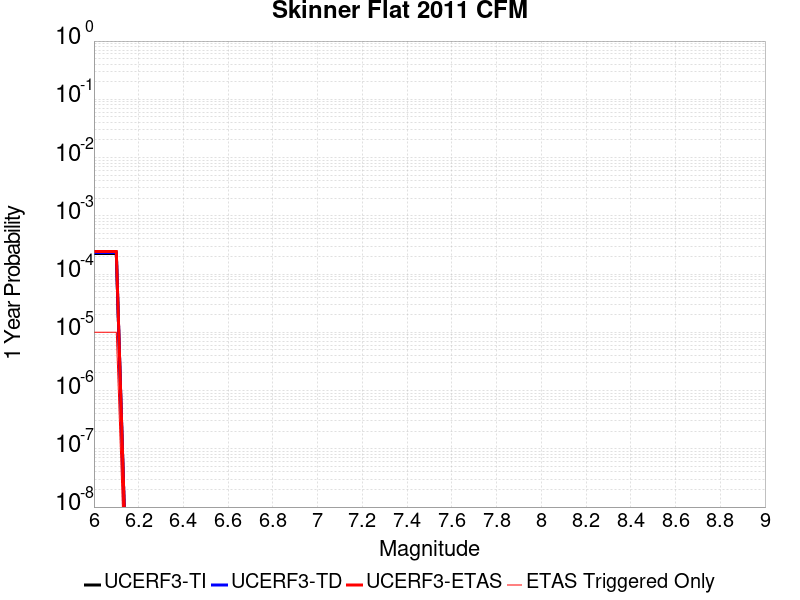 |  |

| Magnitude | 1 wk TI Prob | 1 wk TD Prob | 1 wk ETAS Prob | 1 wk ETAS/TD Gain | 1 wk ETAS Triggered Only | 1 mo TI Prob | 1 mo TD Prob | 1 mo ETAS Prob | 1 mo ETAS/TD Gain | 1 mo ETAS Triggered Only | 1 yr TI Prob | 1 yr TD Prob | 1 yr ETAS Prob | 1 yr ETAS/TD Gain | 1 yr ETAS Triggered Only | 10 yr TI Prob | 10 yr TD Prob | 10 yr ETAS Prob | 10 yr ETAS/TD Gain | 10 yr ETAS Triggered Only |
|-----|-----|-----|-----|-----|-----|-----|-----|-----|-----|-----|-----|-----|-----|-----|-----|-----|-----|-----|-----|-----|
| 6.0 | 4.3279074E-6 | 4.484953E-6 | 4.484953E-6 | 1.0 | 0.0 | 1.8548042E-5 | 1.9221226E-5 | 2.9221035E-5 | 1.5202482 | 1.0E-5 | 2.2579901E-4 | 2.3401844E-4 | 2.440161E-4 | 1.0427216 | 1.0E-5 | 0.002255697 | 0.0023401843 | 0.002350161 | 1.0042632 | 1.0E-5 |
| 6.1 | 4.3279074E-6 | 4.484953E-6 | 4.484953E-6 | 1.0 | 0.0 | 1.8548042E-5 | 1.9221226E-5 | 2.9221035E-5 | 1.5202482 | 1.0E-5 | 2.2579901E-4 | 2.3401844E-4 | 2.440161E-4 | 1.0427216 | 1.0E-5 | 0.002255697 | 0.0023401843 | 0.002350161 | 1.0042632 | 1.0E-5 |

## Northridge Hills
*[(top)](#table-of-contents)*

| 1 Week | 1 Month | 1 Year | 10 Year |
|-----|-----|-----|-----|
| 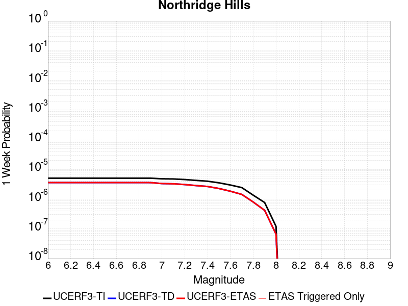 |  | 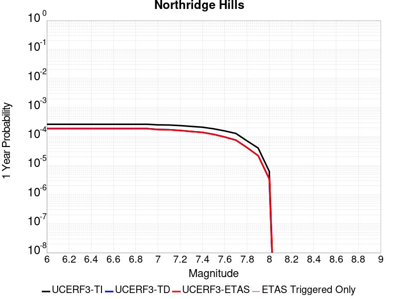 | 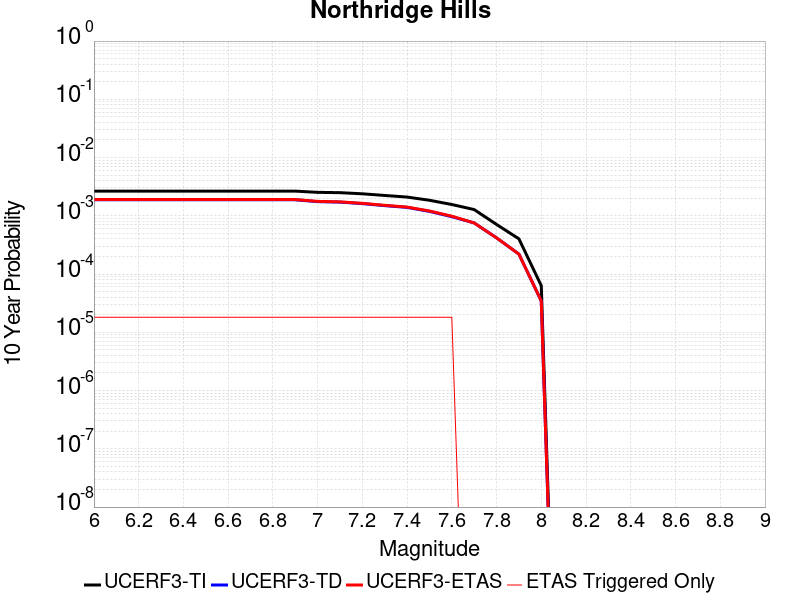 |

| Magnitude | 1 wk TI Prob | 1 wk TD Prob | 1 wk ETAS Prob | 1 wk ETAS/TD Gain | 1 wk ETAS Triggered Only | 1 mo TI Prob | 1 mo TD Prob | 1 mo ETAS Prob | 1 mo ETAS/TD Gain | 1 mo ETAS Triggered Only | 1 yr TI Prob | 1 yr TD Prob | 1 yr ETAS Prob | 1 yr ETAS/TD Gain | 1 yr ETAS Triggered Only | 10 yr TI Prob | 10 yr TD Prob | 10 yr ETAS Prob | 10 yr ETAS/TD Gain | 10 yr ETAS Triggered Only |
|-----|-----|-----|-----|-----|-----|-----|-----|-----|-----|-----|-----|-----|-----|-----|-----|-----|-----|-----|-----|-----|
| 6.0 | 5.095982E-6 | 3.6152098E-6 | 3.6152098E-6 | 1.0 | 0.0 | 2.183974E-5 | 1.5493664E-5 | 1.5493664E-5 | 1.0 | 0.0 | 2.658664E-4 | 1.8861916E-4 | 1.8861916E-4 | 1.0 | 0.0 | 0.0026554854 | 0.001884603 | 0.0018945843 | 1.0052961 | 1.0E-5 |
| 6.1 | 5.095982E-6 | 3.6152098E-6 | 3.6152098E-6 | 1.0 | 0.0 | 2.183974E-5 | 1.5493664E-5 | 1.5493664E-5 | 1.0 | 0.0 | 2.658664E-4 | 1.8861916E-4 | 1.8861916E-4 | 1.0 | 0.0 | 0.0026554854 | 0.001884603 | 0.0018945843 | 1.0052961 | 1.0E-5 |
| 6.2 | 5.095982E-6 | 3.6152098E-6 | 3.6152098E-6 | 1.0 | 0.0 | 2.183974E-5 | 1.5493664E-5 | 1.5493664E-5 | 1.0 | 0.0 | 2.658664E-4 | 1.8861916E-4 | 1.8861916E-4 | 1.0 | 0.0 | 0.0026554854 | 0.001884603 | 0.0018945843 | 1.0052961 | 1.0E-5 |
| 6.3 | 5.095982E-6 | 3.6152098E-6 | 3.6152098E-6 | 1.0 | 0.0 | 2.183974E-5 | 1.5493664E-5 | 1.5493664E-5 | 1.0 | 0.0 | 2.658664E-4 | 1.8861916E-4 | 1.8861916E-4 | 1.0 | 0.0 | 0.0026554854 | 0.001884603 | 0.0018945843 | 1.0052961 | 1.0E-5 |
| 6.4 | 5.095982E-6 | 3.6152098E-6 | 3.6152098E-6 | 1.0 | 0.0 | 2.183974E-5 | 1.5493664E-5 | 1.5493664E-5 | 1.0 | 0.0 | 2.658664E-4 | 1.8861916E-4 | 1.8861916E-4 | 1.0 | 0.0 | 0.0026554854 | 0.001884603 | 0.0018945843 | 1.0052961 | 1.0E-5 |
| 6.5 | 5.095982E-6 | 3.6152098E-6 | 3.6152098E-6 | 1.0 | 0.0 | 2.183974E-5 | 1.5493664E-5 | 1.5493664E-5 | 1.0 | 0.0 | 2.658664E-4 | 1.8861916E-4 | 1.8861916E-4 | 1.0 | 0.0 | 0.0026554854 | 0.001884603 | 0.0018945843 | 1.0052961 | 1.0E-5 |
| 6.6 | 5.095982E-6 | 3.6152098E-6 | 3.6152098E-6 | 1.0 | 0.0 | 2.183974E-5 | 1.5493664E-5 | 1.5493664E-5 | 1.0 | 0.0 | 2.658664E-4 | 1.8861916E-4 | 1.8861916E-4 | 1.0 | 0.0 | 0.0026554854 | 0.001884603 | 0.0018945843 | 1.0052961 | 1.0E-5 |
| 6.7 | 5.095982E-6 | 3.6152098E-6 | 3.6152098E-6 | 1.0 | 0.0 | 2.183974E-5 | 1.5493664E-5 | 1.5493664E-5 | 1.0 | 0.0 | 2.658664E-4 | 1.8861916E-4 | 1.8861916E-4 | 1.0 | 0.0 | 0.0026554854 | 0.001884603 | 0.0018945843 | 1.0052961 | 1.0E-5 |
| 6.8 | 5.095982E-6 | 3.6152098E-6 | 3.6152098E-6 | 1.0 | 0.0 | 2.183974E-5 | 1.5493664E-5 | 1.5493664E-5 | 1.0 | 0.0 | 2.658664E-4 | 1.8861916E-4 | 1.8861916E-4 | 1.0 | 0.0 | 0.0026554854 | 0.001884603 | 0.0018945843 | 1.0052961 | 1.0E-5 |
| 6.9 | 5.0942654E-6 | 3.6134247E-6 | 3.6134247E-6 | 1.0 | 0.0 | 2.1832384E-5 | 1.5486015E-5 | 1.5486015E-5 | 1.0 | 0.0 | 2.6577685E-4 | 1.8852603E-4 | 1.8852603E-4 | 1.0 | 0.0 | 0.002654592 | 0.0018836735 | 0.0018936546 | 1.0052987 | 1.0E-5 |
| 7.0 | 4.851143E-6 | 3.3587396E-6 | 3.3587396E-6 | 1.0 | 0.0 | 2.0790447E-5 | 1.4394519E-5 | 1.4394519E-5 | 1.0 | 0.0 | 2.5309427E-4 | 1.7523921E-4 | 1.7523921E-4 | 1.0 | 0.0 | 0.0025280623 | 0.0017510147 | 0.0017609972 | 1.005701 | 1.0E-5 |
| 7.1 | 4.7910607E-6 | 3.2970208E-6 | 3.2970208E-6 | 1.0 | 0.0 | 2.0532956E-5 | 1.4130013E-5 | 1.4130013E-5 | 1.0 | 0.0 | 2.4996005E-4 | 1.7201937E-4 | 1.7201937E-4 | 1.0 | 0.0 | 0.0024967908 | 0.0017188663 | 0.001728849 | 1.0058078 | 1.0E-5 |
| 7.2 | 4.580079E-6 | 3.1067987E-6 | 3.1067987E-6 | 1.0 | 0.0 | 1.9628762E-5 | 1.3314784E-5 | 1.3314784E-5 | 1.0 | 0.0 | 2.3895396E-4 | 1.6209547E-4 | 1.6209547E-4 | 1.0 | 0.0 | 0.0023869718 | 0.0016197758 | 0.0016297597 | 1.0061637 | 1.0E-5 |
| 7.3 | 4.290062E-6 | 2.8682275E-6 | 2.8682275E-6 | 1.0 | 0.0 | 1.838585E-5 | 1.2292346E-5 | 1.2292346E-5 | 1.0 | 0.0 | 2.2382473E-4 | 1.4964906E-4 | 1.4964906E-4 | 1.0 | 0.0 | 0.0022359942 | 0.0014954859 | 0.0015054708 | 1.0066768 | 1.0E-5 |
| 7.4 | 4.0259683E-6 | 2.673904E-6 | 2.673904E-6 | 1.0 | 0.0 | 1.7254037E-5 | 1.1459538E-5 | 1.1459538E-5 | 1.0 | 0.0 | 2.1004764E-4 | 1.3951097E-4 | 1.3951097E-4 | 1.0 | 0.0 | 0.002098492 | 0.0013942367 | 0.0014042228 | 1.0071623 | 1.0E-5 |
| 7.5 | 3.5477108E-6 | 2.285216E-6 | 2.285216E-6 | 1.0 | 0.0 | 1.5204386E-5 | 9.793746E-6 | 9.793746E-6 | 1.0 | 0.0 | 1.8509767E-4 | 1.1923235E-4 | 1.1923235E-4 | 1.0 | 0.0 | 0.0018494357 | 0.0011916853 | 0.0012016734 | 1.0083815 | 1.0E-5 |
| 7.6 | 2.9990608E-6 | 1.8528339E-6 | 1.8528339E-6 | 1.0 | 0.0 | 1.2853055E-5 | 7.940693E-6 | 7.940693E-6 | 1.0 | 0.0 | 1.564747E-4 | 9.667365E-5 | 9.667365E-5 | 1.0 | 0.0 | 0.0015636457 | 9.663168E-4 | 9.763071E-4 | 1.0103385 | 1.0E-5 |
| 7.7 | 2.4542855E-6 | 1.4461344E-6 | 1.4461344E-6 | 1.0 | 0.0 | 1.05183235E-5 | 6.197704E-6 | 6.197704E-6 | 1.0 | 0.0 | 1.2805307E-4 | 7.545444E-5 | 7.545444E-5 | 1.0 | 0.0 | 0.001279793 | 7.5428875E-4 | 7.5428875E-4 | 1.0 | 0.0 |
| 7.8 | 1.3623128E-6 | 8.016168E-7 | 8.016168E-7 | 1.0 | 0.0 | 5.8384703E-6 | 3.4354962E-6 | 3.4354962E-6 | 1.0 | 0.0 | 7.108106E-5 | 4.1826366E-5 | 4.1826366E-5 | 1.0 | 0.0 | 7.1058323E-4 | 4.1818514E-4 | 4.1818514E-4 | 1.0 | 0.0 |
| 7.9 | 7.716622E-7 | 4.218757E-7 | 4.218757E-7 | 1.0 | 0.0 | 3.3071194E-6 | 1.8080375E-6 | 1.8080375E-6 | 1.0 | 0.0 | 4.0263436E-5 | 2.2012635E-5 | 2.2012635E-5 | 1.0 | 0.0 | 4.0256142E-4 | 2.2010466E-4 | 2.2010466E-4 | 1.0 | 0.0 |
| 8.0 | 1.2117711E-7 | 6.6220565E-8 | 6.6220565E-8 | 1.0 | 0.0 | 5.1933034E-7 | 2.838024E-7 | 2.838024E-7 | 1.0 | 0.0 | 6.3228285E-6 | 3.4552888E-6 | 3.4552888E-6 | 1.0 | 0.0 | 6.3226486E-5 | 3.455237E-5 | 3.455237E-5 | 1.0 | 0.0 |

## Cucamonga
*[(top)](#table-of-contents)*

| 1 Week | 1 Month | 1 Year | 10 Year |
|-----|-----|-----|-----|
| 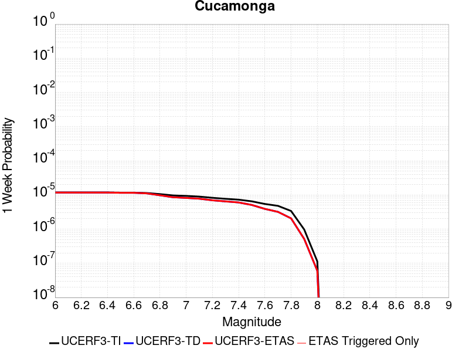 | 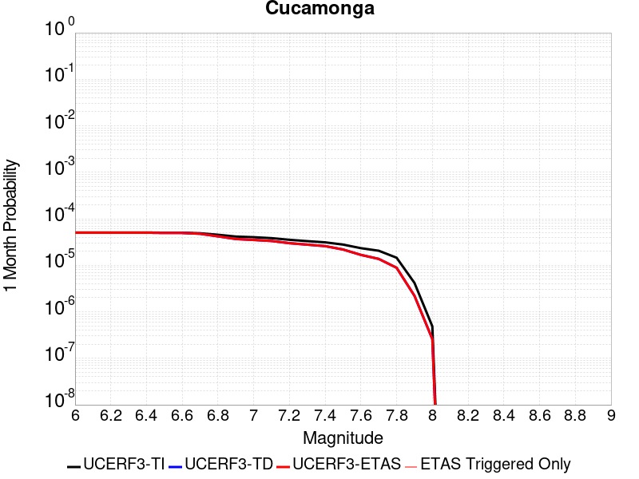 | 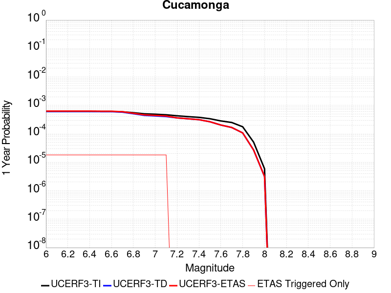 |  |

| Magnitude | 1 wk TI Prob | 1 wk TD Prob | 1 wk ETAS Prob | 1 wk ETAS/TD Gain | 1 wk ETAS Triggered Only | 1 mo TI Prob | 1 mo TD Prob | 1 mo ETAS Prob | 1 mo ETAS/TD Gain | 1 mo ETAS Triggered Only | 1 yr TI Prob | 1 yr TD Prob | 1 yr ETAS Prob | 1 yr ETAS/TD Gain | 1 yr ETAS Triggered Only | 10 yr TI Prob | 10 yr TD Prob | 10 yr ETAS Prob | 10 yr ETAS/TD Gain | 10 yr ETAS Triggered Only |
|-----|-----|-----|-----|-----|-----|-----|-----|-----|-----|-----|-----|-----|-----|-----|-----|-----|-----|-----|-----|-----|
| 6.0 | 1.1848348E-5 | 1.1737008E-5 | 1.1737008E-5 | 1.0 | 0.0 | 5.0777642E-5 | 5.030051E-5 | 5.030051E-5 | 1.0 | 0.0 | 6.180424E-4 | 6.1223935E-4 | 6.222332E-4 | 1.0163234 | 1.0E-5 | 0.0061632637 | 0.0061067017 | 0.0061166408 | 1.0016276 | 1.0E-5 |
| 6.1 | 1.1848348E-5 | 1.1737008E-5 | 1.1737008E-5 | 1.0 | 0.0 | 5.0777642E-5 | 5.030051E-5 | 5.030051E-5 | 1.0 | 0.0 | 6.180424E-4 | 6.1223935E-4 | 6.222332E-4 | 1.0163234 | 1.0E-5 | 0.0061632637 | 0.0061067017 | 0.0061166408 | 1.0016276 | 1.0E-5 |
| 6.2 | 1.1848348E-5 | 1.1737008E-5 | 1.1737008E-5 | 1.0 | 0.0 | 5.0777642E-5 | 5.030051E-5 | 5.030051E-5 | 1.0 | 0.0 | 6.180424E-4 | 6.1223935E-4 | 6.222332E-4 | 1.0163234 | 1.0E-5 | 0.0061632637 | 0.0061067017 | 0.0061166408 | 1.0016276 | 1.0E-5 |
| 6.3 | 1.1848348E-5 | 1.1737008E-5 | 1.1737008E-5 | 1.0 | 0.0 | 5.0777642E-5 | 5.030051E-5 | 5.030051E-5 | 1.0 | 0.0 | 6.180424E-4 | 6.1223935E-4 | 6.222332E-4 | 1.0163234 | 1.0E-5 | 0.0061632637 | 0.0061067017 | 0.0061166408 | 1.0016276 | 1.0E-5 |
| 6.4 | 1.1848348E-5 | 1.1737008E-5 | 1.1737008E-5 | 1.0 | 0.0 | 5.0777642E-5 | 5.030051E-5 | 5.030051E-5 | 1.0 | 0.0 | 6.180424E-4 | 6.1223935E-4 | 6.222332E-4 | 1.0163234 | 1.0E-5 | 0.0061632637 | 0.0061067017 | 0.0061166408 | 1.0016276 | 1.0E-5 |
| 6.5 | 1.16988695E-5 | 1.15760395E-5 | 1.15760395E-5 | 1.0 | 0.0 | 5.013705E-5 | 4.9610666E-5 | 4.9610666E-5 | 1.0 | 0.0 | 6.102476E-4 | 6.0384517E-4 | 6.1383913E-4 | 1.0165505 | 1.0E-5 | 0.006085745 | 0.006023216 | 0.006033156 | 1.0016502 | 1.0E-5 |
| 6.6 | 1.16988695E-5 | 1.15760395E-5 | 1.15760395E-5 | 1.0 | 0.0 | 5.013705E-5 | 4.9610666E-5 | 4.9610666E-5 | 1.0 | 0.0 | 6.102476E-4 | 6.0384517E-4 | 6.1383913E-4 | 1.0165505 | 1.0E-5 | 0.006085745 | 0.006023216 | 0.006033156 | 1.0016502 | 1.0E-5 |
| 6.7 | 1.1397107E-5 | 1.11149475E-5 | 1.11149475E-5 | 1.0 | 0.0 | 4.884383E-5 | 4.7634636E-5 | 4.7634636E-5 | 1.0 | 0.0 | 5.9451134E-4 | 5.797998E-4 | 5.897941E-4 | 1.0172373 | 1.0E-5 | 0.005929234 | 0.0057840226 | 0.005793965 | 1.0017189 | 1.0E-5 |
| 6.8 | 1.058387E-5 | 9.784992E-6 | 9.784992E-6 | 1.0 | 0.0 | 4.5358654E-5 | 4.193501E-5 | 4.193501E-5 | 1.0 | 0.0 | 5.521017E-4 | 5.1044027E-4 | 5.2043516E-4 | 1.019581 | 1.0E-5 | 0.00550732 | 0.0050936877 | 0.0051036365 | 1.0019532 | 1.0E-5 |
| 6.9 | 9.690046E-6 | 8.57948E-6 | 8.57948E-6 | 1.0 | 0.0 | 4.1528107E-5 | 3.6768684E-5 | 3.6768684E-5 | 1.0 | 0.0 | 5.054874E-4 | 4.475672E-4 | 4.575627E-4 | 1.022333 | 1.0E-5 | 0.005043391 | 0.004467594 | 0.0044775493 | 1.0022284 | 1.0E-5 |
| 7.0 | 9.381461E-6 | 8.187101E-6 | 8.187101E-6 | 1.0 | 0.0 | 4.020564E-5 | 3.5087105E-5 | 3.5087105E-5 | 1.0 | 0.0 | 4.893937E-4 | 4.2710215E-4 | 4.370979E-4 | 1.0234036 | 1.0E-5 | 0.0048831734 | 0.0042637475 | 0.0042737047 | 1.0023353 | 1.0E-5 |
| 7.1 | 8.946492E-6 | 7.781886E-6 | 7.781886E-6 | 1.0 | 0.0 | 3.8341543E-5 | 3.3350516E-5 | 3.3350516E-5 | 1.0 | 0.0 | 4.667083E-4 | 4.0596718E-4 | 4.1596312E-4 | 1.0246226 | 1.0E-5 | 0.0046572937 | 0.004053192 | 0.004063152 | 1.0024571 | 1.0E-5 |
| 7.2 | 8.251016E-6 | 6.9752796E-6 | 6.9752796E-6 | 1.0 | 0.0 | 3.5361016E-5 | 2.9893714E-5 | 2.9893714E-5 | 1.0 | 0.0 | 4.3043532E-4 | 3.6389544E-4 | 3.6389544E-4 | 1.0 | 0.0 | 0.0042960253 | 0.0036339292 | 0.0036339292 | 1.0 | 0.0 |
| 7.3 | 7.717881E-6 | 6.4863502E-6 | 6.4863502E-6 | 1.0 | 0.0 | 3.3076216E-5 | 2.7798349E-5 | 2.7798349E-5 | 1.0 | 0.0 | 4.026285E-4 | 3.3839257E-4 | 3.3839257E-4 | 1.0 | 0.0 | 0.004018998 | 0.00337971 | 0.00337971 | 1.0 | 0.0 |
| 7.4 | 7.275623E-6 | 6.031997E-6 | 6.031997E-6 | 1.0 | 0.0 | 3.118087E-5 | 2.585116E-5 | 2.585116E-5 | 1.0 | 0.0 | 3.7956095E-4 | 3.1469265E-4 | 3.1469265E-4 | 1.0 | 0.0 | 0.0037891332 | 0.0031434062 | 0.0031434062 | 1.0 | 0.0 |
| 7.5 | 6.5109502E-6 | 5.1006014E-6 | 5.1006014E-6 | 1.0 | 0.0 | 2.7903774E-5 | 2.1859538E-5 | 2.1859538E-5 | 1.0 | 0.0 | 3.3967546E-4 | 2.661075E-4 | 2.661075E-4 | 1.0 | 0.0 | 0.0033915674 | 0.002658813 | 0.002658813 | 1.0 | 0.0 |
| 7.6 | 5.4495326E-6 | 3.90857E-6 | 3.90857E-6 | 1.0 | 0.0 | 2.335493E-5 | 1.6750908E-5 | 1.6750908E-5 | 1.0 | 0.0 | 2.8430918E-4 | 2.0392328E-4 | 2.0392328E-4 | 1.0 | 0.0 | 0.0028394572 | 0.002038282 | 0.002038282 | 1.0 | 0.0 |
| 7.7 | 4.7997164E-6 | 3.2002547E-6 | 3.2002547E-6 | 1.0 | 0.0 | 2.057005E-5 | 1.3715306E-5 | 1.3715306E-5 | 1.0 | 0.0 | 2.504116E-4 | 1.6697108E-4 | 1.6697108E-4 | 1.0 | 0.0 | 0.002501296 | 0.0016693877 | 0.0016693877 | 1.0 | 0.0 |
| 7.8 | 3.3941733E-6 | 2.0641899E-6 | 2.0641899E-6 | 1.0 | 0.0 | 1.4546376E-5 | 8.846498E-6 | 8.846498E-6 | 1.0 | 0.0 | 1.7708774E-4 | 1.07700806E-4 | 1.07700806E-4 | 1.0 | 0.0 | 0.0017694668 | 0.001076723 | 0.001076723 | 1.0 | 0.0 |
| 7.9 | 9.750552E-7 | 5.155946E-7 | 5.155946E-7 | 1.0 | 0.0 | 4.178801E-6 | 2.2096892E-6 | 2.2096892E-6 | 1.0 | 0.0 | 5.0875715E-5 | 2.690264E-5 | 2.690264E-5 | 1.0 | 0.0 | 5.086407E-4 | 2.6899425E-4 | 2.6899425E-4 | 1.0 | 0.0 |
| 8.0 | 1.133857E-7 | 6.053707E-8 | 6.053707E-8 | 1.0 | 0.0 | 4.8593864E-7 | 2.5944456E-7 | 2.5944456E-7 | 1.0 | 0.0 | 5.9162867E-6 | 3.158733E-6 | 3.158733E-6 | 1.0 | 0.0 | 5.916129E-5 | 3.1586897E-5 | 3.1586897E-5 | 1.0 | 0.0 |

## Quien Sabe 2011 CFM
*[(top)](#table-of-contents)*

| 1 Week | 1 Month | 1 Year | 10 Year |
|-----|-----|-----|-----|
| 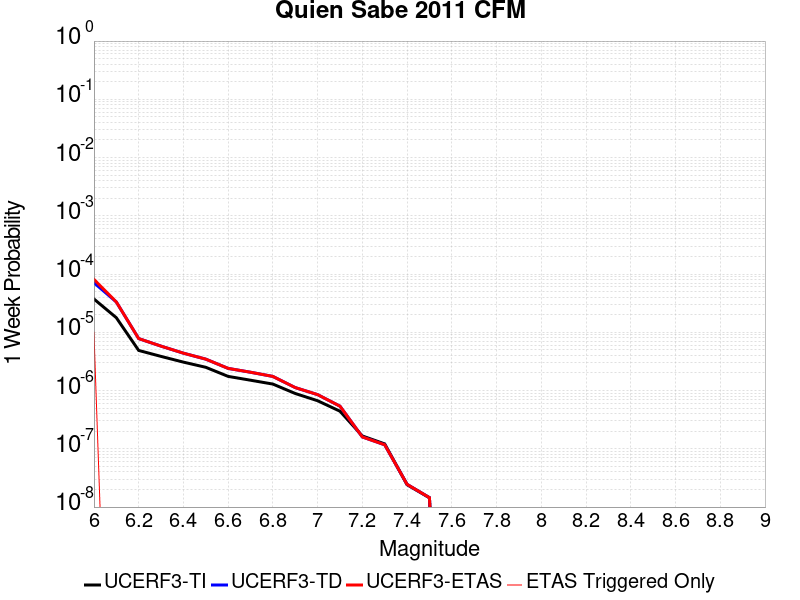 | 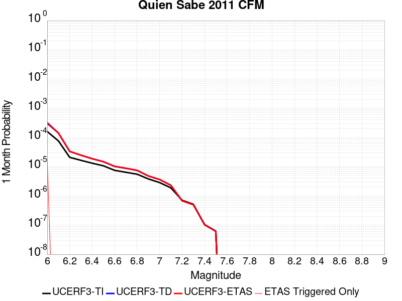 | 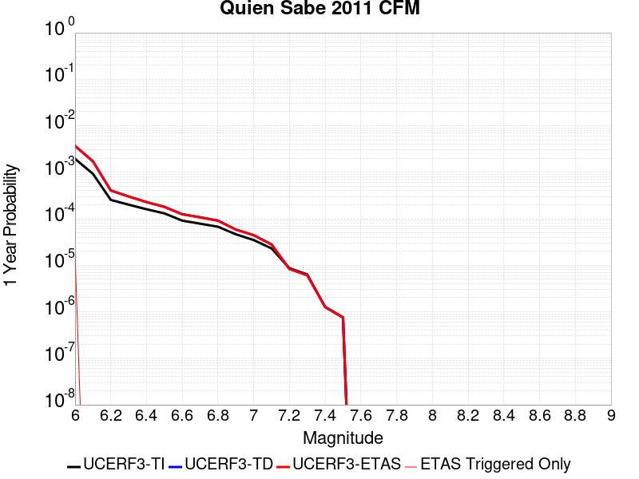 | 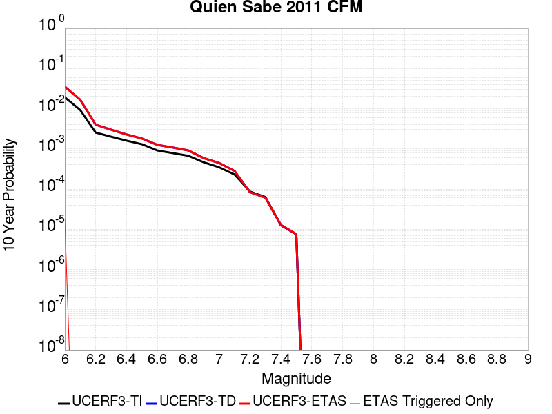 |

| Magnitude | 1 wk TI Prob | 1 wk TD Prob | 1 wk ETAS Prob | 1 wk ETAS/TD Gain | 1 wk ETAS Triggered Only | 1 mo TI Prob | 1 mo TD Prob | 1 mo ETAS Prob | 1 mo ETAS/TD Gain | 1 mo ETAS Triggered Only | 1 yr TI Prob | 1 yr TD Prob | 1 yr ETAS Prob | 1 yr ETAS/TD Gain | 1 yr ETAS Triggered Only | 10 yr TI Prob | 10 yr TD Prob | 10 yr ETAS Prob | 10 yr ETAS/TD Gain | 10 yr ETAS Triggered Only |
|-----|-----|-----|-----|-----|-----|-----|-----|-----|-----|-----|-----|-----|-----|-----|-----|-----|-----|-----|-----|-----|
| 6.0 | 3.729899E-5 | 7.087805E-5 | 8.087735E-5 | 1.1410774 | 1.0E-5 | 1.5984301E-4 | 3.037322E-4 | 3.1372916E-4 | 1.0329137 | 1.0E-5 | 0.0019443515 | 0.0036852323 | 0.0036951953 | 1.0027035 | 1.0E-5 | 0.019274272 | 0.035349756 | 0.0353594 | 1.0002729 | 1.0E-5 |
| 6.1 | 1.7825725E-5 | 3.31456E-5 | 3.31456E-5 | 1.0 | 0.0 | 7.639373E-5 | 1.4204586E-4 | 1.4204586E-4 | 1.0 | 0.0 | 9.296967E-4 | 0.0017267246 | 0.0017267246 | 1.0 | 0.0 | 0.009258169 | 0.016698597 | 0.016698597 | 1.0 | 0.0 |
| 6.2 | 4.8865336E-6 | 7.804963E-6 | 7.804963E-6 | 1.0 | 0.0 | 2.0942118E-5 | 3.344947E-5 | 3.344947E-5 | 1.0 | 0.0 | 2.5494045E-4 | 4.0691497E-4 | 4.0691497E-4 | 1.0 | 0.0 | 0.0025464818 | 0.0040135453 | 0.0040135453 | 1.0 | 0.0 |
| 6.3 | 3.858491E-6 | 5.789573E-6 | 5.789573E-6 | 1.0 | 0.0 | 1.6536285E-5 | 2.4812247E-5 | 2.4812247E-5 | 1.0 | 0.0 | 2.0131067E-4 | 3.0205192E-4 | 3.0205192E-4 | 1.0 | 0.0 | 0.002011284 | 0.0030019816 | 0.0030019816 | 1.0 | 0.0 |
| 6.4 | 3.0771805E-6 | 4.384806E-6 | 4.384806E-6 | 1.0 | 0.0 | 1.318785E-5 | 1.8791905E-5 | 1.8791905E-5 | 1.0 | 0.0 | 1.6055023E-4 | 2.2876984E-4 | 2.2876984E-4 | 1.0 | 0.0 | 0.001604343 | 0.002286477 | 0.002286477 | 1.0 | 0.0 |
| 6.5 | 2.5081235E-6 | 3.463511E-6 | 3.463511E-6 | 1.0 | 0.0 | 1.0749056E-5 | 1.4843542E-5 | 1.4843542E-5 | 1.0 | 0.0 | 1.308619E-4 | 1.807066E-4 | 1.807066E-4 | 1.0 | 0.0 | 0.0013078486 | 0.0018123116 | 0.0018123116 | 1.0 | 0.0 |
| 6.6 | 1.7505364E-6 | 2.4023168E-6 | 2.4023168E-6 | 1.0 | 0.0 | 7.502277E-6 | 1.0295607E-5 | 1.0295607E-5 | 1.0 | 0.0 | 9.13364E-5 | 1.2534253E-4 | 1.2534253E-4 | 1.0 | 0.0 | 9.129886E-4 | 0.0012582915 | 0.0012582915 | 1.0 | 0.0 |
| 6.7 | 1.505737E-6 | 2.0637349E-6 | 2.0637349E-6 | 1.0 | 0.0 | 6.4531428E-6 | 8.844551E-6 | 8.844551E-6 | 1.0 | 0.0 | 7.8564175E-5 | 1.0767768E-4 | 1.0767768E-4 | 1.0 | 0.0 | 7.853641E-4 | 0.0010818138 | 0.0010818138 | 1.0 | 0.0 |
| 6.8 | 1.2924105E-6 | 1.7484025E-6 | 1.7484025E-6 | 1.0 | 0.0 | 5.5388905E-6 | 7.4931354E-6 | 7.4931354E-6 | 1.0 | 0.0 | 6.74339E-5 | 9.122565E-5 | 9.122565E-5 | 1.0 | 0.0 | 6.741344E-4 | 9.1609603E-4 | 9.1609603E-4 | 1.0 | 0.0 |
| 6.9 | 8.9075286E-7 | 1.1249955E-6 | 1.1249955E-6 | 1.0 | 0.0 | 3.8175067E-6 | 4.8214015E-6 | 4.8214015E-6 | 1.0 | 0.0 | 4.6477155E-5 | 5.8699206E-5 | 5.8699206E-5 | 1.0 | 0.0 | 4.6467435E-4 | 5.903947E-4 | 5.903947E-4 | 1.0 | 0.0 |
| 7.0 | 6.6891175E-7 | 8.51663E-7 | 8.51663E-7 | 1.0 | 0.0 | 2.8667614E-6 | 3.6499803E-6 | 3.6499803E-6 | 1.0 | 0.0 | 3.4902263E-5 | 4.44378E-5 | 4.44378E-5 | 1.0 | 0.0 | 3.4896782E-4 | 4.4678617E-4 | 4.4678617E-4 | 1.0 | 0.0 |
| 7.1 | 4.4205015E-7 | 5.3919683E-7 | 5.3919683E-7 | 1.0 | 0.0 | 1.8944993E-6 | 2.3108425E-6 | 2.3108425E-6 | 1.0 | 0.0 | 2.3065284E-5 | 2.8134315E-5 | 2.8134315E-5 | 1.0 | 0.0 | 2.3062891E-4 | 2.826926E-4 | 2.826926E-4 | 1.0 | 0.0 |
| 7.2 | 1.6620965E-7 | 1.5987598E-7 | 1.5987598E-7 | 1.0 | 0.0 | 7.123269E-7 | 6.851826E-7 | 6.851826E-7 | 1.0 | 0.0 | 8.672545E-6 | 8.34207E-6 | 8.34207E-6 | 1.0 | 0.0 | 8.6722066E-5 | 8.3573126E-5 | 8.3573126E-5 | 1.0 | 0.0 |
| 7.3 | 1.2142488E-7 | 1.1726492E-7 | 1.1726492E-7 | 1.0 | 0.0 | 5.2039223E-7 | 5.0256386E-7 | 5.0256386E-7 | 1.0 | 0.0 | 6.335757E-6 | 6.118701E-6 | 6.118701E-6 | 1.0 | 0.0 | 6.3355765E-5 | 6.124848E-5 | 6.124848E-5 | 1.0 | 0.0 |
| 7.4 | 2.4192937E-8 | 2.4543448E-8 | 2.4543448E-8 | 1.0 | 0.0 | 1.0368401E-7 | 1.051862E-7 | 1.051862E-7 | 1.0 | 0.0 | 1.2623522E-6 | 1.2806413E-6 | 1.2806413E-6 | 1.0 | 0.0 | 1.2623449E-5 | 1.2812683E-5 | 1.2812683E-5 | 1.0 | 0.0 |
| 7.5 | 1.4432802E-8 | 1.4506471E-8 | 1.4506471E-8 | 1.0 | 0.0 | 6.185486E-8 | 6.2170585E-8 | 6.2170585E-8 | 1.0 | 0.0 | 7.530827E-7 | 7.5692674E-7 | 7.5692674E-7 | 1.0 | 0.0 | 7.530801E-6 | 7.5735175E-6 | 7.5735175E-6 | 1.0 | 0.0 |

## La Panza 2011
*[(top)](#table-of-contents)*

| 1 Week | 1 Month | 1 Year | 10 Year |
|-----|-----|-----|-----|
|  | 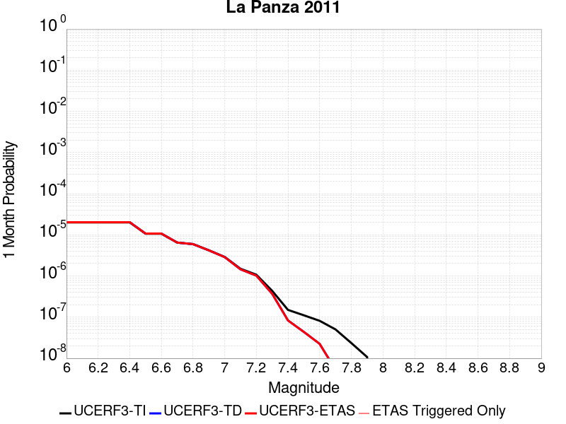 | 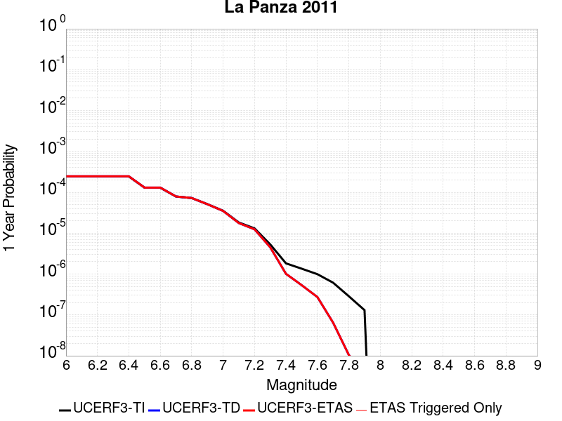 | 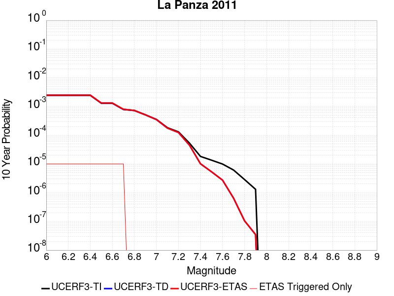 |

| Magnitude | 1 wk TI Prob | 1 wk TD Prob | 1 wk ETAS Prob | 1 wk ETAS/TD Gain | 1 wk ETAS Triggered Only | 1 mo TI Prob | 1 mo TD Prob | 1 mo ETAS Prob | 1 mo ETAS/TD Gain | 1 mo ETAS Triggered Only | 1 yr TI Prob | 1 yr TD Prob | 1 yr ETAS Prob | 1 yr ETAS/TD Gain | 1 yr ETAS Triggered Only | 10 yr TI Prob | 10 yr TD Prob | 10 yr ETAS Prob | 10 yr ETAS/TD Gain | 10 yr ETAS Triggered Only |
|-----|-----|-----|-----|-----|-----|-----|-----|-----|-----|-----|-----|-----|-----|-----|-----|-----|-----|-----|-----|-----|
| 6.0 | 4.6754544E-6 | 4.717587E-6 | 4.717587E-6 | 1.0 | 0.0 | 2.0037509E-5 | 2.0218084E-5 | 2.0218084E-5 | 1.0 | 0.0 | 2.4392935E-4 | 2.4612935E-4 | 2.4612935E-4 | 1.0 | 0.0 | 0.0024366176 | 0.002458762 | 0.0024687373 | 1.004057 | 1.0E-5 |
| 6.1 | 4.6754544E-6 | 4.717587E-6 | 4.717587E-6 | 1.0 | 0.0 | 2.0037509E-5 | 2.0218084E-5 | 2.0218084E-5 | 1.0 | 0.0 | 2.4392935E-4 | 2.4612935E-4 | 2.4612935E-4 | 1.0 | 0.0 | 0.0024366176 | 0.002458762 | 0.0024687373 | 1.004057 | 1.0E-5 |
| 6.2 | 4.6754544E-6 | 4.717587E-6 | 4.717587E-6 | 1.0 | 0.0 | 2.0037509E-5 | 2.0218084E-5 | 2.0218084E-5 | 1.0 | 0.0 | 2.4392935E-4 | 2.4612935E-4 | 2.4612935E-4 | 1.0 | 0.0 | 0.0024366176 | 0.002458762 | 0.0024687373 | 1.004057 | 1.0E-5 |
| 6.3 | 4.6754544E-6 | 4.717587E-6 | 4.717587E-6 | 1.0 | 0.0 | 2.0037509E-5 | 2.0218084E-5 | 2.0218084E-5 | 1.0 | 0.0 | 2.4392935E-4 | 2.4612935E-4 | 2.4612935E-4 | 1.0 | 0.0 | 0.0024366176 | 0.002458762 | 0.0024687373 | 1.004057 | 1.0E-5 |
| 6.4 | 4.6754544E-6 | 4.717587E-6 | 4.717587E-6 | 1.0 | 0.0 | 2.0037509E-5 | 2.0218084E-5 | 2.0218084E-5 | 1.0 | 0.0 | 2.4392935E-4 | 2.4612935E-4 | 2.4612935E-4 | 1.0 | 0.0 | 0.0024366176 | 0.002458762 | 0.0024687373 | 1.004057 | 1.0E-5 |
| 6.5 | 2.485343E-6 | 2.5005988E-6 | 2.5005988E-6 | 1.0 | 0.0 | 1.0651426E-5 | 1.0716811E-5 | 1.0716811E-5 | 1.0 | 0.0 | 1.296734E-4 | 1.3046975E-4 | 1.3046975E-4 | 1.0 | 0.0 | 0.0012959775 | 0.0013039699 | 0.0013139568 | 1.0076588 | 1.0E-5 |
| 6.6 | 2.485343E-6 | 2.5005988E-6 | 2.5005988E-6 | 1.0 | 0.0 | 1.0651426E-5 | 1.0716811E-5 | 1.0716811E-5 | 1.0 | 0.0 | 1.296734E-4 | 1.3046975E-4 | 1.3046975E-4 | 1.0 | 0.0 | 0.0012959775 | 0.0013039699 | 0.0013139568 | 1.0076588 | 1.0E-5 |
| 6.7 | 1.5108508E-6 | 1.5146375E-6 | 1.5146375E-6 | 1.0 | 0.0 | 6.4750584E-6 | 6.491288E-6 | 6.491288E-6 | 1.0 | 0.0 | 7.8830984E-5 | 7.902867E-5 | 7.902867E-5 | 1.0 | 0.0 | 7.880303E-4 | 7.900165E-4 | 8.000086E-4 | 1.012648 | 1.0E-5 |
| 6.8 | 1.3865837E-6 | 1.3885102E-6 | 1.3885102E-6 | 1.0 | 0.0 | 5.942488E-6 | 5.9507447E-6 | 5.9507447E-6 | 1.0 | 0.0 | 7.234739E-5 | 7.244801E-5 | 7.244801E-5 | 1.0 | 0.0 | 7.232384E-4 | 7.242537E-4 | 7.242537E-4 | 1.0 | 0.0 |
| 6.9 | 9.826583E-7 | 9.796287E-7 | 9.796287E-7 | 1.0 | 0.0 | 4.2113857E-6 | 4.198402E-6 | 4.198402E-6 | 1.0 | 0.0 | 5.1272415E-5 | 5.11144E-5 | 5.11144E-5 | 1.0 | 0.0 | 5.126059E-4 | 5.110318E-4 | 5.110318E-4 | 1.0 | 0.0 |
| 7.0 | 6.7797646E-7 | 6.7102144E-7 | 6.7102144E-7 | 1.0 | 0.0 | 2.9056102E-6 | 2.8758034E-6 | 2.8758034E-6 | 1.0 | 0.0 | 3.537523E-5 | 3.5012374E-5 | 3.5012374E-5 | 1.0 | 0.0 | 3.5369597E-4 | 3.5007167E-4 | 3.5007167E-4 | 1.0 | 0.0 |
| 7.1 | 3.4979826E-7 | 3.387388E-7 | 3.387388E-7 | 1.0 | 0.0 | 1.4991346E-6 | 1.4517369E-6 | 1.4517369E-6 | 1.0 | 0.0 | 1.825181E-5 | 1.7674765E-5 | 1.7674765E-5 | 1.0 | 0.0 | 1.825031E-4 | 1.7673477E-4 | 1.7673477E-4 | 1.0 | 0.0 |
| 7.2 | 2.5088332E-7 | 2.3831899E-7 | 2.3831899E-7 | 1.0 | 0.0 | 1.0752137E-6 | 1.0213668E-6 | 1.0213668E-6 | 1.0 | 0.0 | 1.3090649E-5 | 1.2435077E-5 | 1.2435077E-5 | 1.0 | 0.0 | 1.3089878E-4 | 1.2434467E-4 | 1.2434467E-4 | 1.0 | 0.0 |
| 7.3 | 1.0159086E-7 | 8.64462E-8 | 8.64462E-8 | 1.0 | 0.0 | 4.3538932E-7 | 3.7048366E-7 | 3.7048366E-7 | 1.0 | 0.0 | 5.300852E-6 | 4.5106294E-6 | 4.5106294E-6 | 1.0 | 0.0 | 5.3007258E-5 | 4.5105422E-5 | 4.5105422E-5 | 1.0 | 0.0 |
| 7.4 | 3.5006252E-8 | 1.9404325E-8 | 1.9404325E-8 | 1.0 | 0.0 | 1.5002678E-7 | 8.3161396E-8 | 8.3161396E-8 | 1.0 | 0.0 | 1.8265745E-6 | 1.0124895E-6 | 1.0124895E-6 | 1.0 | 0.0 | 1.8265595E-5 | 1.01248515E-5 | 1.01248515E-5 | 1.0 | 0.0 |
| 7.5 | 2.592274E-8 | 1.0239094E-8 | 1.0239094E-8 | 1.0 | 0.0 | 1.1109746E-7 | 4.388183E-8 | 4.388183E-8 | 1.0 | 0.0 | 1.3526106E-6 | 5.342612E-7 | 5.342612E-7 | 1.0 | 0.0 | 1.3526024E-5 | 5.3425997E-6 | 5.3425997E-6 | 1.0 | 0.0 |
| 7.6 | 1.9016717E-8 | 5.244801E-9 | 5.244801E-9 | 1.0 | 0.0 | 8.150022E-8 | 2.247772E-8 | 2.247772E-8 | 1.0 | 0.0 | 9.922647E-7 | 2.736662E-7 | 2.736662E-7 | 1.0 | 0.0 | 9.922603E-6 | 2.7366589E-6 | 2.7366589E-6 | 1.0 | 0.0 |
| 7.7 | 1.17738495E-8 | 1.2398075E-9 | 1.2398075E-9 | 1.0 | 0.0 | 5.0459356E-8 | 5.3134603E-9 | 5.3134603E-9 | 1.0 | 0.0 | 6.1434247E-7 | 6.469138E-8 | 6.469138E-8 | 1.0 | 0.0 | 6.143408E-6 | 6.469136E-7 | 6.469136E-7 | 1.0 | 0.0 |
| 7.8 | 5.489079E-9 | 2.0111768E-10 | 2.0111768E-10 | 1.0 | 0.0 | 2.3524624E-8 | 8.6193275E-10 | 8.6193275E-10 | 1.0 | 0.0 | 2.8641225E-7 | 1.04940305E-8 | 1.04940305E-8 | 1.0 | 0.0 | 2.8641189E-6 | 1.04940305E-7 | 1.04940305E-7 | 1.0 | 0.0 |
| 7.9 | 2.5081048E-9 | 6.683887E-11 | 6.683887E-11 | 1.0 | 0.0 | 1.0749021E-8 | 2.8645197E-10 | 2.8645197E-10 | 1.0 | 0.0 | 1.3086932E-7 | 3.487552E-9 | 3.487552E-9 | 1.0 | 0.0 | 1.3086925E-6 | 3.487552E-8 | 3.487552E-8 | 1.0 | 0.0 |

## Bennett Valley 2011 CFM
*[(top)](#table-of-contents)*

| 1 Week | 1 Month | 1 Year | 10 Year |
|-----|-----|-----|-----|
|  | 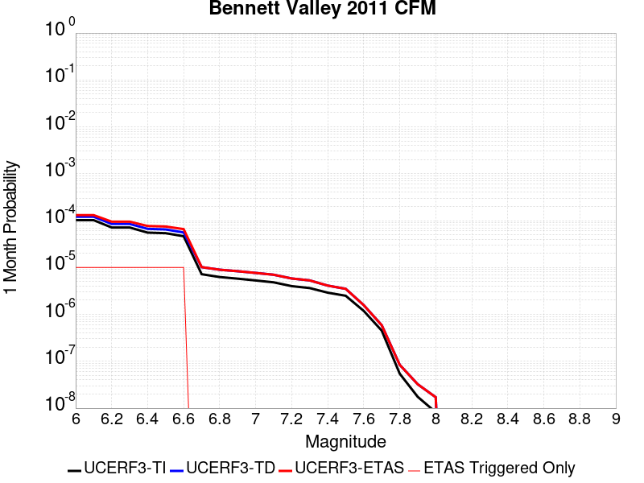 | 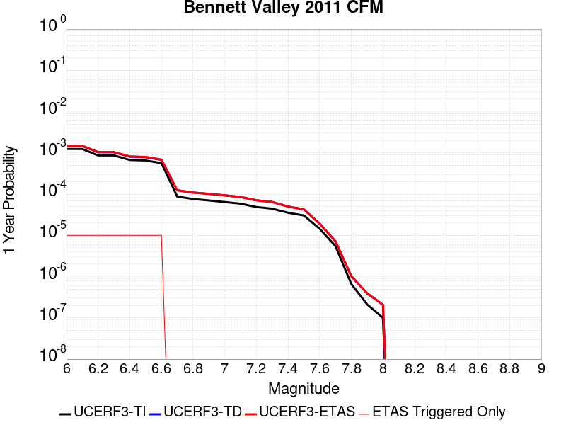 | 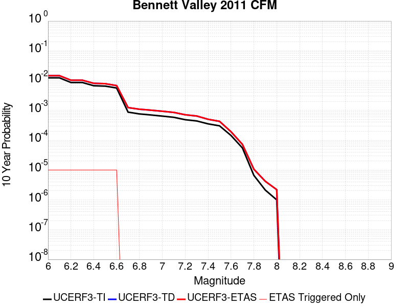 |

| Magnitude | 1 wk TI Prob | 1 wk TD Prob | 1 wk ETAS Prob | 1 wk ETAS/TD Gain | 1 wk ETAS Triggered Only | 1 mo TI Prob | 1 mo TD Prob | 1 mo ETAS Prob | 1 mo ETAS/TD Gain | 1 mo ETAS Triggered Only | 1 yr TI Prob | 1 yr TD Prob | 1 yr ETAS Prob | 1 yr ETAS/TD Gain | 1 yr ETAS Triggered Only | 10 yr TI Prob | 10 yr TD Prob | 10 yr ETAS Prob | 10 yr ETAS/TD Gain | 10 yr ETAS Triggered Only |
|-----|-----|-----|-----|-----|-----|-----|-----|-----|-----|-----|-----|-----|-----|-----|-----|-----|-----|-----|-----|-----|
| 6.0 | 2.3893934E-5 | 2.8238892E-5 | 3.823861E-5 | 1.3541116 | 1.0E-5 | 1.0239855E-4 | 1.2101925E-4 | 1.3101804E-4 | 1.0826215 | 1.0E-5 | 0.0012459893 | 0.0014725985 | 0.0014825837 | 1.0067807 | 1.0E-5 | 0.012390262 | 0.014651061 | 0.014660914 | 1.0006726 | 1.0E-5 |
| 6.1 | 2.3893934E-5 | 2.8238892E-5 | 3.823861E-5 | 1.3541116 | 1.0E-5 | 1.0239855E-4 | 1.2101925E-4 | 1.3101804E-4 | 1.0826215 | 1.0E-5 | 0.0012459893 | 0.0014725985 | 0.0014825837 | 1.0067807 | 1.0E-5 | 0.012390262 | 0.014651061 | 0.014660914 | 1.0006726 | 1.0E-5 |
| 6.2 | 1.6657146E-5 | 1.9853778E-5 | 2.985358E-5 | 1.5036725 | 1.0E-5 | 7.138582E-5 | 8.508564E-5 | 9.508479E-5 | 1.1175187 | 1.0E-5 | 8.6877577E-4 | 0.0010355669 | 0.0010455565 | 1.0096465 | 1.0E-5 | 0.008653872 | 0.010325688 | 0.010335585 | 1.0009584 | 1.0E-5 |
| 6.3 | 1.6657146E-5 | 1.9853778E-5 | 2.985358E-5 | 1.5036725 | 1.0E-5 | 7.138582E-5 | 8.508564E-5 | 9.508479E-5 | 1.1175187 | 1.0E-5 | 8.6877577E-4 | 0.0010355669 | 0.0010455565 | 1.0096465 | 1.0E-5 | 0.008653872 | 0.010325688 | 0.010335585 | 1.0009584 | 1.0E-5 |
| 6.4 | 1.29418495E-5 | 1.5567497E-5 | 2.5567342E-5 | 1.642354 | 1.0E-5 | 5.546389E-5 | 6.671687E-5 | 7.6716206E-5 | 1.1498771 | 1.0E-5 | 6.7506364E-4 | 8.121055E-4 | 8.220974E-4 | 1.0123037 | 1.0E-5 | 0.0067301663 | 0.008108527 | 0.008118446 | 1.0012233 | 1.0E-5 |
| 6.5 | 1.2582504E-5 | 1.5134528E-5 | 2.5134377E-5 | 1.6607307 | 1.0E-5 | 5.39239E-5 | 6.4861386E-5 | 7.486074E-5 | 1.1541649 | 1.0E-5 | 6.563257E-4 | 7.895315E-4 | 7.995236E-4 | 1.0126557 | 1.0E-5 | 0.006543907 | 0.007884431 | 0.007894352 | 1.0012584 | 1.0E-5 |
| 6.6 | 1.0846706E-5 | 1.3036779E-5 | 2.3036648E-5 | 1.7670506 | 1.0E-5 | 4.6485053E-5 | 5.5871435E-5 | 6.5870874E-5 | 1.1789724 | 1.0E-5 | 5.6580856E-4 | 6.801508E-4 | 6.9014396E-4 | 1.0146927 | 1.0E-5 | 0.005643701 | 0.0067976876 | 0.0068076197 | 1.001461 | 1.0E-5 |
| 6.7 | 1.6803231E-6 | 2.377857E-6 | 2.377857E-6 | 1.0 | 0.0 | 7.2013645E-6 | 1.0190777E-5 | 1.0190777E-5 | 1.0 | 0.0 | 8.7673085E-5 | 1.2406579E-4 | 1.2406579E-4 | 1.0 | 0.0 | 8.76385E-4 | 0.0012444059 | 0.0012444059 | 1.0 | 0.0 |
| 6.8 | 1.4609833E-6 | 2.0939308E-6 | 2.0939308E-6 | 1.0 | 0.0 | 6.261342E-6 | 8.973958E-6 | 8.973958E-6 | 1.0 | 0.0 | 7.6229175E-5 | 1.09252534E-4 | 1.09252534E-4 | 1.0 | 0.0 | 7.620303E-4 | 0.0010963855 | 0.0010963855 | 1.0 | 0.0 |
| 6.9 | 1.3492396E-6 | 1.945872E-6 | 1.945872E-6 | 1.0 | 0.0 | 5.7824427E-6 | 8.339425E-6 | 8.339425E-6 | 1.0 | 0.0 | 7.0398964E-5 | 1.0152783E-4 | 1.0152783E-4 | 1.0 | 0.0 | 7.037667E-4 | 0.001019182 | 0.001019182 | 1.0 | 0.0 |
| 7.0 | 1.2347921E-6 | 1.7888614E-6 | 1.7888614E-6 | 1.0 | 0.0 | 5.291955E-6 | 7.6665265E-6 | 7.6665265E-6 | 1.0 | 0.0 | 6.442765E-5 | 9.333601E-5 | 9.333601E-5 | 1.0 | 0.0 | 6.440897E-4 | 9.373206E-4 | 9.373206E-4 | 1.0 | 0.0 |
| 7.1 | 1.1262973E-6 | 1.6358822E-6 | 1.6358822E-6 | 1.0 | 0.0 | 4.8269794E-6 | 7.010905E-6 | 7.010905E-6 | 1.0 | 0.0 | 5.876689E-5 | 8.535448E-5 | 8.535448E-5 | 1.0 | 0.0 | 5.875135E-4 | 8.575462E-4 | 8.575462E-4 | 1.0 | 0.0 |
| 7.2 | 9.351744E-7 | 1.3611456E-6 | 1.3611456E-6 | 1.0 | 0.0 | 4.007884E-6 | 5.8334676E-6 | 5.8334676E-6 | 1.0 | 0.0 | 4.8794896E-5 | 7.102018E-5 | 7.102018E-5 | 1.0 | 0.0 | 4.878418E-4 | 7.1425125E-4 | 7.1425125E-4 | 1.0 | 0.0 |
| 7.3 | 8.5039534E-7 | 1.2386469E-6 | 1.2386469E-6 | 1.0 | 0.0 | 3.6445463E-6 | 5.308476E-6 | 5.308476E-6 | 1.0 | 0.0 | 4.437145E-5 | 6.4628795E-5 | 6.4628795E-5 | 1.0 | 0.0 | 4.436259E-4 | 6.50087E-4 | 6.50087E-4 | 1.0 | 0.0 |
| 7.4 | 6.7875015E-7 | 9.600462E-7 | 9.600462E-7 | 1.0 | 0.0 | 2.908926E-6 | 4.114477E-6 | 4.114477E-6 | 1.0 | 0.0 | 3.54156E-5 | 5.0092618E-5 | 5.0092618E-5 | 1.0 | 0.0 | 3.5409955E-4 | 5.0410116E-4 | 5.0410116E-4 | 1.0 | 0.0 |
| 7.5 | 5.826867E-7 | 8.188238E-7 | 8.188238E-7 | 1.0 | 0.0 | 2.4972264E-6 | 3.5092403E-6 | 3.5092403E-6 | 1.0 | 0.0 | 3.0403306E-5 | 4.2724172E-5 | 4.2724172E-5 | 1.0 | 0.0 | 3.0399146E-4 | 4.3002292E-4 | 4.3002292E-4 | 1.0 | 0.0 |
| 7.6 | 2.7734902E-7 | 3.682212E-7 | 3.682212E-7 | 1.0 | 0.0 | 1.1886381E-6 | 1.5780898E-6 | 1.5780898E-6 | 1.0 | 0.0 | 1.4471572E-5 | 1.9213076E-5 | 1.9213076E-5 | 1.0 | 0.0 | 1.447063E-4 | 1.9312318E-4 | 1.9312318E-4 | 1.0 | 0.0 |
| 7.7 | 1.0530888E-7 | 1.3748802E-7 | 1.3748802E-7 | 1.0 | 0.0 | 4.513237E-7 | 5.892342E-7 | 5.892342E-7 | 1.0 | 0.0 | 5.4948523E-6 | 7.1739028E-6 | 7.1739028E-6 | 1.0 | 0.0 | 5.4947162E-5 | 7.256238E-5 | 7.256238E-5 | 1.0 | 0.0 |
| 7.8 | 1.2714258E-8 | 1.9632653E-8 | 1.9632653E-8 | 1.0 | 0.0 | 5.448968E-8 | 8.413994E-8 | 8.413994E-8 | 1.0 | 0.0 | 6.6341164E-7 | 1.0244033E-6 | 1.0244033E-6 | 1.0 | 0.0 | 6.6340967E-6 | 1.0658104E-5 | 1.0658104E-5 | 1.0 | 0.0 |
| 7.9 | 4.075888E-9 | 7.559692E-9 | 7.559692E-9 | 1.0 | 0.0 | 1.7468091E-8 | 3.239868E-8 | 3.239868E-8 | 1.0 | 0.0 | 2.12674E-7 | 3.9445388E-7 | 3.9445388E-7 | 1.0 | 0.0 | 2.1267379E-6 | 4.194808E-6 | 4.194808E-6 | 1.0 | 0.0 |
| 8.0 | 1.9126138E-9 | 3.995532E-9 | 3.995532E-9 | 1.0 | 0.0 | 8.196917E-9 | 1.7123707E-8 | 1.7123707E-8 | 1.0 | 0.0 | 9.9797454E-8 | 2.0848113E-7 | 2.0848113E-7 | 1.0 | 0.0 | 9.979741E-7 | 2.197992E-6 | 2.197992E-6 | 1.0 | 0.0 |

## North Frontal  (West)
*[(top)](#table-of-contents)*

| 1 Week | 1 Month | 1 Year | 10 Year |
|-----|-----|-----|-----|
| 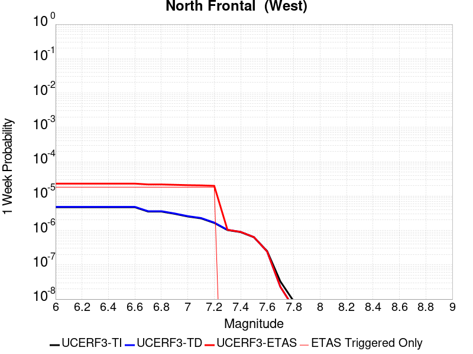 | 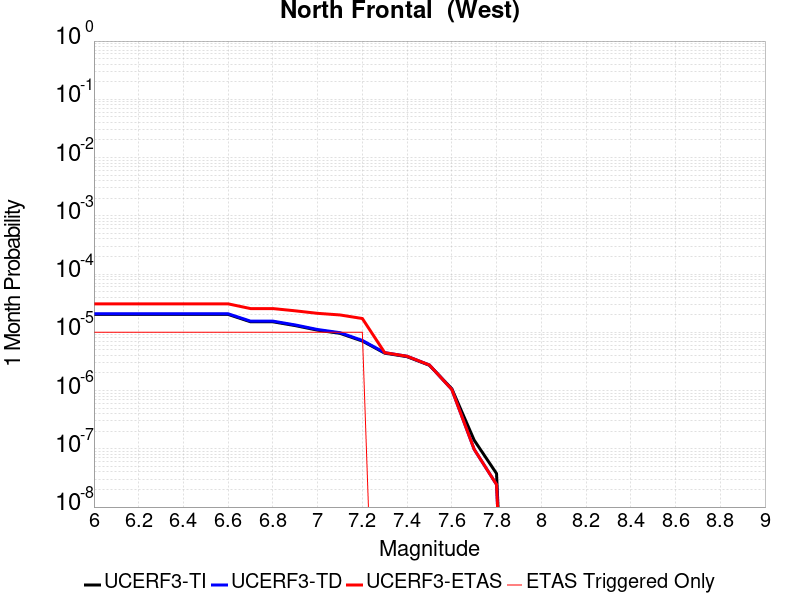 | 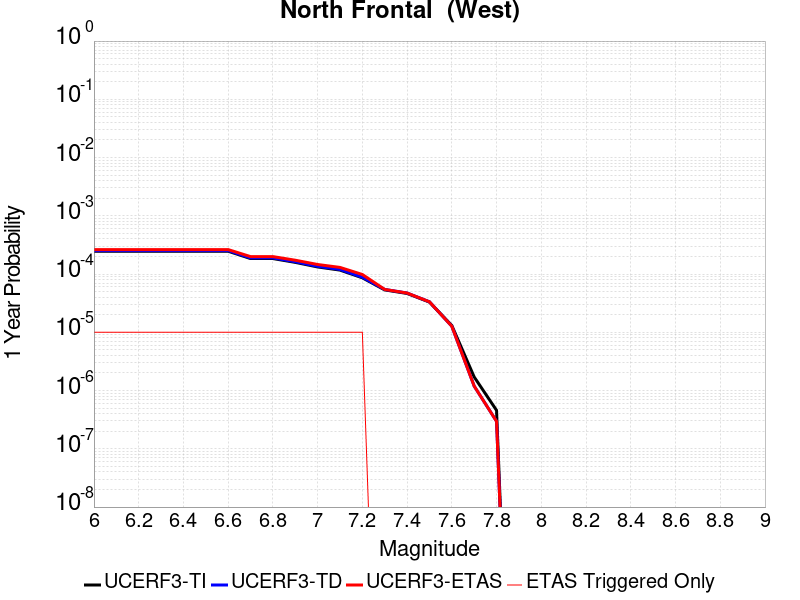 | 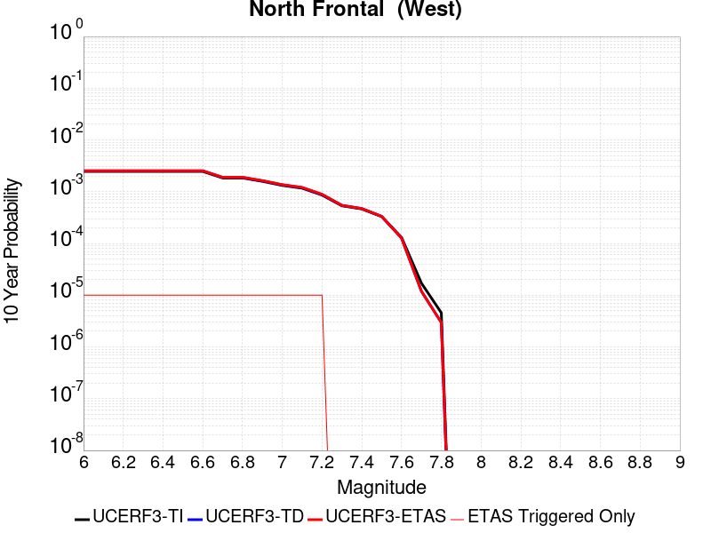 |

| Magnitude | 1 wk TI Prob | 1 wk TD Prob | 1 wk ETAS Prob | 1 wk ETAS/TD Gain | 1 wk ETAS Triggered Only | 1 mo TI Prob | 1 mo TD Prob | 1 mo ETAS Prob | 1 mo ETAS/TD Gain | 1 mo ETAS Triggered Only | 1 yr TI Prob | 1 yr TD Prob | 1 yr ETAS Prob | 1 yr ETAS/TD Gain | 1 yr ETAS Triggered Only | 10 yr TI Prob | 10 yr TD Prob | 10 yr ETAS Prob | 10 yr ETAS/TD Gain | 10 yr ETAS Triggered Only |
|-----|-----|-----|-----|-----|-----|-----|-----|-----|-----|-----|-----|-----|-----|-----|-----|-----|-----|-----|-----|-----|
| 6.0 | 4.7316266E-6 | 4.8526726E-6 | 1.4852624E-5 | 3.0607102 | 1.0E-5 | 2.0278241E-5 | 2.0797012E-5 | 3.0796804E-5 | 1.4808283 | 1.0E-5 | 2.4685962E-4 | 2.5317568E-4 | 2.6317313E-4 | 1.0394883 | 1.0E-5 | 0.0024658558 | 0.0025290183 | 0.002538993 | 1.0039442 | 1.0E-5 |
| 6.1 | 4.7316266E-6 | 4.8526726E-6 | 1.4852624E-5 | 3.0607102 | 1.0E-5 | 2.0278241E-5 | 2.0797012E-5 | 3.0796804E-5 | 1.4808283 | 1.0E-5 | 2.4685962E-4 | 2.5317568E-4 | 2.6317313E-4 | 1.0394883 | 1.0E-5 | 0.0024658558 | 0.0025290183 | 0.002538993 | 1.0039442 | 1.0E-5 |
| 6.2 | 4.7316266E-6 | 4.8526726E-6 | 1.4852624E-5 | 3.0607102 | 1.0E-5 | 2.0278241E-5 | 2.0797012E-5 | 3.0796804E-5 | 1.4808283 | 1.0E-5 | 2.4685962E-4 | 2.5317568E-4 | 2.6317313E-4 | 1.0394883 | 1.0E-5 | 0.0024658558 | 0.0025290183 | 0.002538993 | 1.0039442 | 1.0E-5 |
| 6.3 | 4.7316266E-6 | 4.8526726E-6 | 1.4852624E-5 | 3.0607102 | 1.0E-5 | 2.0278241E-5 | 2.0797012E-5 | 3.0796804E-5 | 1.4808283 | 1.0E-5 | 2.4685962E-4 | 2.5317568E-4 | 2.6317313E-4 | 1.0394883 | 1.0E-5 | 0.0024658558 | 0.0025290183 | 0.002538993 | 1.0039442 | 1.0E-5 |
| 6.4 | 4.7316266E-6 | 4.8526726E-6 | 1.4852624E-5 | 3.0607102 | 1.0E-5 | 2.0278241E-5 | 2.0797012E-5 | 3.0796804E-5 | 1.4808283 | 1.0E-5 | 2.4685962E-4 | 2.5317568E-4 | 2.6317313E-4 | 1.0394883 | 1.0E-5 | 0.0024658558 | 0.0025290183 | 0.002538993 | 1.0039442 | 1.0E-5 |
| 6.5 | 4.7316266E-6 | 4.8526726E-6 | 1.4852624E-5 | 3.0607102 | 1.0E-5 | 2.0278241E-5 | 2.0797012E-5 | 3.0796804E-5 | 1.4808283 | 1.0E-5 | 2.4685962E-4 | 2.5317568E-4 | 2.6317313E-4 | 1.0394883 | 1.0E-5 | 0.0024658558 | 0.0025290183 | 0.002538993 | 1.0039442 | 1.0E-5 |
| 6.6 | 4.7316266E-6 | 4.8526726E-6 | 1.4852624E-5 | 3.0607102 | 1.0E-5 | 2.0278241E-5 | 2.0797012E-5 | 3.0796804E-5 | 1.4808283 | 1.0E-5 | 2.4685962E-4 | 2.5317568E-4 | 2.6317313E-4 | 1.0394883 | 1.0E-5 | 0.0024658558 | 0.0025290183 | 0.002538993 | 1.0039442 | 1.0E-5 |
| 6.7 | 3.5382777E-6 | 3.6308859E-6 | 1.363085E-5 | 3.7541387 | 1.0E-5 | 1.516396E-5 | 1.5560852E-5 | 2.5560696E-5 | 1.6426283 | 1.0E-5 | 1.8460557E-4 | 1.8943768E-4 | 1.9943577E-4 | 1.0527778 | 1.0E-5 | 0.0018445229 | 0.0018928389 | 0.00190282 | 1.0052731 | 1.0E-5 |
| 6.8 | 3.5382777E-6 | 3.6308859E-6 | 1.363085E-5 | 3.7541387 | 1.0E-5 | 1.516396E-5 | 1.5560852E-5 | 2.5560696E-5 | 1.6426283 | 1.0E-5 | 1.8460557E-4 | 1.8943768E-4 | 1.9943577E-4 | 1.0527778 | 1.0E-5 | 0.0018445229 | 0.0018928389 | 0.00190282 | 1.0052731 | 1.0E-5 |
| 6.9 | 3.0428037E-6 | 3.1227605E-6 | 1.312273E-5 | 4.202285 | 1.0E-5 | 1.30405215E-5 | 1.33831945E-5 | 2.3383061E-5 | 1.7471957 | 1.0E-5 | 1.5875678E-4 | 1.6292889E-4 | 1.7292726E-4 | 1.0613664 | 1.0E-5 | 0.0015864341 | 0.0016281615 | 0.0016381453 | 1.0061319 | 1.0E-5 |
| 7.0 | 2.538778E-6 | 2.6060904E-6 | 1.2606064E-5 | 4.8371553 | 1.0E-5 | 1.0880432E-5 | 1.1168913E-5 | 2.1168802E-5 | 1.8953322 | 1.0E-5 | 1.324612E-4 | 1.3597352E-4 | 1.4597215E-4 | 1.0735338 | 1.0E-5 | 0.0013238228 | 0.0013589499 | 0.0013689363 | 1.0073487 | 1.0E-5 |
| 7.1 | 2.2418935E-6 | 2.3012074E-6 | 1.2301184E-5 | 5.3455353 | 1.0E-5 | 9.60808E-6 | 9.862282E-6 | 1.9862184E-5 | 2.0139542 | 1.0E-5 | 1.1697209E-4 | 1.2006712E-4 | 1.3006592E-4 | 1.0832767 | 1.0E-5 | 0.0011691054 | 0.0012000664 | 0.0012100544 | 1.0083228 | 1.0E-5 |
| 7.2 | 1.6526745E-6 | 1.6924851E-6 | 1.1692468E-5 | 6.9084616 | 1.0E-5 | 7.082872E-6 | 7.253489E-6 | 1.7253416E-5 | 2.3786368 | 1.0E-5 | 8.623055E-5 | 8.8307905E-5 | 9.830702E-5 | 1.1132301 | 1.0E-5 | 8.61971E-4 | 8.827532E-4 | 8.9274434E-4 | 1.0113182 | 1.0E-5 |
| 7.3 | 1.0246019E-6 | 1.0442261E-6 | 1.0442261E-6 | 1.0 | 0.0 | 4.391144E-6 | 4.4752474E-6 | 4.4752474E-6 | 1.0 | 0.0 | 5.3460866E-5 | 5.448489E-5 | 5.448489E-5 | 1.0 | 0.0 | 5.344801E-4 | 5.4472685E-4 | 5.4472685E-4 | 1.0 | 0.0 |
| 7.4 | 8.9045164E-7 | 9.0565584E-7 | 9.0565584E-7 | 1.0 | 0.0 | 3.8162157E-6 | 3.8813773E-6 | 3.8813773E-6 | 1.0 | 0.0 | 4.646144E-5 | 4.7254853E-5 | 4.7254853E-5 | 1.0 | 0.0 | 4.6451724E-4 | 4.7245892E-4 | 4.7245892E-4 | 1.0 | 0.0 |
| 7.5 | 6.3357E-7 | 6.4027006E-7 | 6.4027006E-7 | 1.0 | 0.0 | 2.7152971E-6 | 2.744012E-6 | 2.744012E-6 | 1.0 | 0.0 | 3.305824E-5 | 3.34079E-5 | 3.34079E-5 | 1.0 | 0.0 | 3.3053322E-4 | 3.3403534E-4 | 3.3403534E-4 | 1.0 | 0.0 |
| 7.6 | 2.5087024E-7 | 2.4361097E-7 | 2.4361097E-7 | 1.0 | 0.0 | 1.0751578E-6 | 1.0440467E-6 | 1.0440467E-6 | 1.0 | 0.0 | 1.3089967E-5 | 1.2711216E-5 | 1.2711216E-5 | 1.0 | 0.0 | 1.3089196E-4 | 1.2710695E-4 | 1.2710695E-4 | 1.0 | 0.0 |
| 7.7 | 3.282987E-8 | 2.2874195E-8 | 2.2874195E-8 | 1.0 | 0.0 | 1.4069944E-7 | 9.803227E-8 | 9.803227E-8 | 1.0 | 0.0 | 1.7130144E-6 | 1.1935423E-6 | 1.1935423E-6 | 1.0 | 0.0 | 1.7130013E-5 | 1.1935367E-5 | 1.1935367E-5 | 1.0 | 0.0 |
| 7.8 | 8.77499E-9 | 5.6815956E-9 | 5.6815956E-9 | 1.0 | 0.0 | 3.7607098E-8 | 2.4349696E-8 | 2.4349696E-8 | 1.0 | 0.0 | 4.578663E-7 | 2.9645753E-7 | 2.9645753E-7 | 1.0 | 0.0 | 4.5786537E-6 | 2.9645726E-6 | 2.9645726E-6 | 1.0 | 0.0 |

## San Gorgonio Pass
*[(top)](#table-of-contents)*

| 1 Week | 1 Month | 1 Year | 10 Year |
|-----|-----|-----|-----|
|  |  | 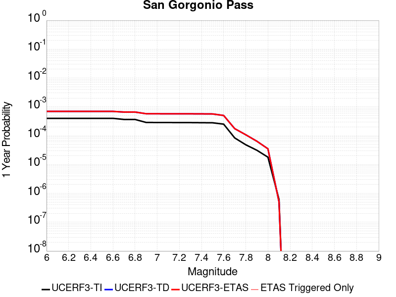 | 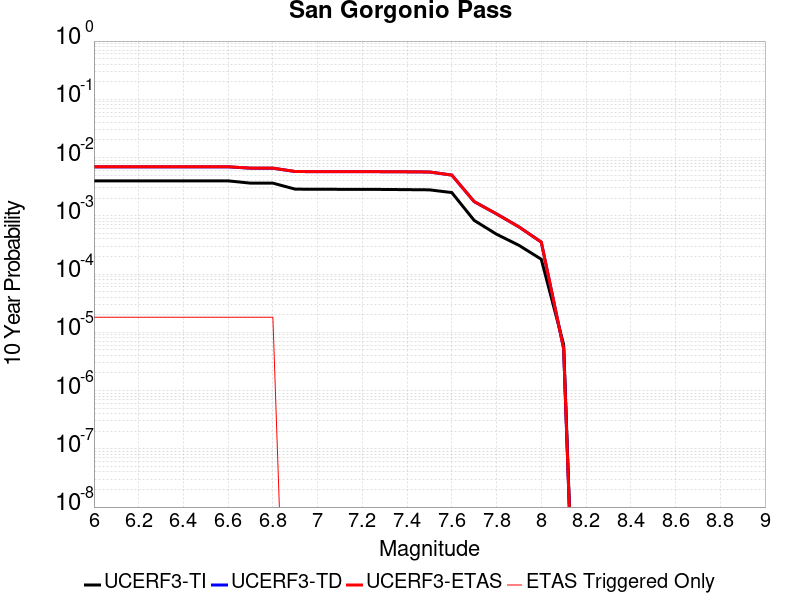 |

| Magnitude | 1 wk TI Prob | 1 wk TD Prob | 1 wk ETAS Prob | 1 wk ETAS/TD Gain | 1 wk ETAS Triggered Only | 1 mo TI Prob | 1 mo TD Prob | 1 mo ETAS Prob | 1 mo ETAS/TD Gain | 1 mo ETAS Triggered Only | 1 yr TI Prob | 1 yr TD Prob | 1 yr ETAS Prob | 1 yr ETAS/TD Gain | 1 yr ETAS Triggered Only | 10 yr TI Prob | 10 yr TD Prob | 10 yr ETAS Prob | 10 yr ETAS/TD Gain | 10 yr ETAS Triggered Only |
|-----|-----|-----|-----|-----|-----|-----|-----|-----|-----|-----|-----|-----|-----|-----|-----|-----|-----|-----|-----|-----|
| 6.0 | 7.644328E-6 | 1.3314231E-5 | 1.3314231E-5 | 1.0 | 0.0 | 3.2760996E-5 | 5.705979E-5 | 5.705979E-5 | 1.0 | 0.0 | 3.987921E-4 | 6.944901E-4 | 6.944901E-4 | 1.0 | 0.0 | 0.003980772 | 0.0069299806 | 0.0069399113 | 1.001433 | 1.0E-5 |
| 6.1 | 7.644328E-6 | 1.3314231E-5 | 1.3314231E-5 | 1.0 | 0.0 | 3.2760996E-5 | 5.705979E-5 | 5.705979E-5 | 1.0 | 0.0 | 3.987921E-4 | 6.944901E-4 | 6.944901E-4 | 1.0 | 0.0 | 0.003980772 | 0.0069299806 | 0.0069399113 | 1.001433 | 1.0E-5 |
| 6.2 | 7.644328E-6 | 1.3314231E-5 | 1.3314231E-5 | 1.0 | 0.0 | 3.2760996E-5 | 5.705979E-5 | 5.705979E-5 | 1.0 | 0.0 | 3.987921E-4 | 6.944901E-4 | 6.944901E-4 | 1.0 | 0.0 | 0.003980772 | 0.0069299806 | 0.0069399113 | 1.001433 | 1.0E-5 |
| 6.3 | 7.644328E-6 | 1.3314231E-5 | 1.3314231E-5 | 1.0 | 0.0 | 3.2760996E-5 | 5.705979E-5 | 5.705979E-5 | 1.0 | 0.0 | 3.987921E-4 | 6.944901E-4 | 6.944901E-4 | 1.0 | 0.0 | 0.003980772 | 0.0069299806 | 0.0069399113 | 1.001433 | 1.0E-5 |
| 6.4 | 7.644328E-6 | 1.3314231E-5 | 1.3314231E-5 | 1.0 | 0.0 | 3.2760996E-5 | 5.705979E-5 | 5.705979E-5 | 1.0 | 0.0 | 3.987921E-4 | 6.944901E-4 | 6.944901E-4 | 1.0 | 0.0 | 0.003980772 | 0.0069299806 | 0.0069399113 | 1.001433 | 1.0E-5 |
| 6.5 | 7.644328E-6 | 1.3314231E-5 | 1.3314231E-5 | 1.0 | 0.0 | 3.2760996E-5 | 5.705979E-5 | 5.705979E-5 | 1.0 | 0.0 | 3.987921E-4 | 6.944901E-4 | 6.944901E-4 | 1.0 | 0.0 | 0.003980772 | 0.0069299806 | 0.0069399113 | 1.001433 | 1.0E-5 |
| 6.6 | 7.644328E-6 | 1.3314231E-5 | 1.3314231E-5 | 1.0 | 0.0 | 3.2760996E-5 | 5.705979E-5 | 5.705979E-5 | 1.0 | 0.0 | 3.987921E-4 | 6.944901E-4 | 6.944901E-4 | 1.0 | 0.0 | 0.003980772 | 0.0069299806 | 0.0069399113 | 1.001433 | 1.0E-5 |
| 6.7 | 6.987586E-6 | 1.2618505E-5 | 1.2618505E-5 | 1.0 | 0.0 | 2.9946454E-5 | 5.4078235E-5 | 5.4078235E-5 | 1.0 | 0.0 | 3.645371E-4 | 6.582117E-4 | 6.582117E-4 | 1.0 | 0.0 | 0.0036393967 | 0.0065693567 | 0.006579291 | 1.0015122 | 1.0E-5 |
| 6.8 | 6.987586E-6 | 1.2618505E-5 | 1.2618505E-5 | 1.0 | 0.0 | 2.9946454E-5 | 5.4078235E-5 | 5.4078235E-5 | 1.0 | 0.0 | 3.645371E-4 | 6.582117E-4 | 6.582117E-4 | 1.0 | 0.0 | 0.0036393967 | 0.0065693567 | 0.006579291 | 1.0015122 | 1.0E-5 |
| 6.9 | 5.504702E-6 | 1.1049368E-5 | 1.1049368E-5 | 1.0 | 0.0 | 2.3591367E-5 | 4.7353606E-5 | 4.7353606E-5 | 1.0 | 0.0 | 2.8718702E-4 | 5.7638274E-4 | 5.7638274E-4 | 1.0 | 0.0 | 0.0028681618 | 0.005755309 | 0.005755309 | 1.0 | 0.0 |
| 7.0 | 5.4825764E-6 | 1.102571E-5 | 1.102571E-5 | 1.0 | 0.0 | 2.3496545E-5 | 4.7252215E-5 | 4.7252215E-5 | 1.0 | 0.0 | 2.8603288E-4 | 5.751489E-4 | 5.751489E-4 | 1.0 | 0.0 | 0.00285665 | 0.005743035 | 0.005743035 | 1.0 | 0.0 |
| 7.1 | 5.4692787E-6 | 1.101142E-5 | 1.101142E-5 | 1.0 | 0.0 | 2.3439556E-5 | 4.7190973E-5 | 4.7190973E-5 | 1.0 | 0.0 | 2.8533922E-4 | 5.744037E-4 | 5.744037E-4 | 1.0 | 0.0 | 0.0028497311 | 0.0057356213 | 0.0057356213 | 1.0 | 0.0 |
| 7.2 | 5.453661E-6 | 1.0994446E-5 | 1.0994446E-5 | 1.0 | 0.0 | 2.3372622E-5 | 4.7118232E-5 | 4.7118232E-5 | 1.0 | 0.0 | 2.8452452E-4 | 5.7351857E-4 | 5.7351857E-4 | 1.0 | 0.0 | 0.002841605 | 0.0057268157 | 0.0057268157 | 1.0 | 0.0 |
| 7.3 | 5.4422303E-6 | 1.0981369E-5 | 1.0981369E-5 | 1.0 | 0.0 | 2.3323635E-5 | 4.706219E-5 | 4.706219E-5 | 1.0 | 0.0 | 2.8392827E-4 | 5.728366E-4 | 5.728366E-4 | 1.0 | 0.0 | 0.0028356577 | 0.005720031 | 0.005720031 | 1.0 | 0.0 |
| 7.4 | 5.398595E-6 | 1.0928734E-5 | 1.0928734E-5 | 1.0 | 0.0 | 2.313663E-5 | 4.683662E-5 | 4.683662E-5 | 1.0 | 0.0 | 2.8165206E-4 | 5.700917E-4 | 5.700917E-4 | 1.0 | 0.0 | 0.0028129534 | 0.005692723 | 0.005692723 | 1.0 | 0.0 |
| 7.5 | 5.3578788E-6 | 1.0855281E-5 | 1.0855281E-5 | 1.0 | 0.0 | 2.2962136E-5 | 4.6521833E-5 | 4.6521833E-5 | 1.0 | 0.0 | 2.7952815E-4 | 5.662612E-4 | 5.662612E-4 | 1.0 | 0.0 | 0.002791768 | 0.0056546377 | 0.0056546377 | 1.0 | 0.0 |
| 7.6 | 4.8091474E-6 | 9.60368E-6 | 9.60368E-6 | 1.0 | 0.0 | 2.0610469E-5 | 4.1158008E-5 | 4.1158008E-5 | 1.0 | 0.0 | 2.5090357E-4 | 5.0098833E-4 | 5.0098833E-4 | 1.0 | 0.0 | 0.0025062046 | 0.0050053033 | 0.0050053033 | 1.0 | 0.0 |
| 7.7 | 1.5991155E-6 | 3.352866E-6 | 3.352866E-6 | 1.0 | 0.0 | 6.853334E-6 | 1.4369349E-5 | 1.4369349E-5 | 1.0 | 0.0 | 8.343615E-5 | 1.7493303E-4 | 1.7493303E-4 | 1.0 | 0.0 | 8.340483E-4 | 0.0017534072 | 0.0017534072 | 1.0 | 0.0 |
| 7.8 | 9.258398E-7 | 2.0579948E-6 | 2.0579948E-6 | 1.0 | 0.0 | 3.967879E-6 | 8.819949E-6 | 8.819949E-6 | 1.0 | 0.0 | 4.8307855E-5 | 1.073776E-4 | 1.073776E-4 | 1.0 | 0.0 | 4.8297356E-4 | 0.001078687 | 0.001078687 | 1.0 | 0.0 |
| 7.9 | 5.975575E-7 | 1.2291794E-6 | 1.2291794E-6 | 1.0 | 0.0 | 2.5609581E-6 | 5.2679006E-6 | 5.2679006E-6 | 1.0 | 0.0 | 3.117922E-5 | 6.4134816E-5 | 6.4134816E-5 | 1.0 | 0.0 | 3.1174847E-4 | 6.463092E-4 | 6.463092E-4 | 1.0 | 0.0 |
| 8.0 | 3.4413725E-7 | 6.7148494E-7 | 6.7148494E-7 | 1.0 | 0.0 | 1.4748731E-6 | 2.8777895E-6 | 2.8777895E-6 | 1.0 | 0.0 | 1.7956432E-5 | 3.503653E-5 | 3.503653E-5 | 1.0 | 0.0 | 1.7954981E-4 | 3.5373896E-4 | 3.5373896E-4 | 1.0 | 0.0 |
| 8.1 | 1.1787731E-8 | 9.634385E-9 | 9.634385E-9 | 1.0 | 0.0 | 5.0518846E-8 | 4.129022E-8 | 4.129022E-8 | 1.0 | 0.0 | 6.1506677E-7 | 5.027083E-7 | 5.027083E-7 | 1.0 | 0.0 | 6.1506507E-6 | 5.2424944E-6 | 5.2424944E-6 | 1.0 | 0.0 |

## Los Osos 2011
*[(top)](#table-of-contents)*

| 1 Week | 1 Month | 1 Year | 10 Year |
|-----|-----|-----|-----|
|  |  |  | 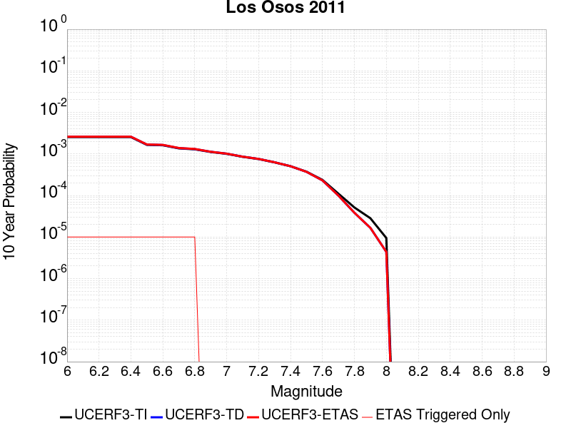 |

| Magnitude | 1 wk TI Prob | 1 wk TD Prob | 1 wk ETAS Prob | 1 wk ETAS/TD Gain | 1 wk ETAS Triggered Only | 1 mo TI Prob | 1 mo TD Prob | 1 mo ETAS Prob | 1 mo ETAS/TD Gain | 1 mo ETAS Triggered Only | 1 yr TI Prob | 1 yr TD Prob | 1 yr ETAS Prob | 1 yr ETAS/TD Gain | 1 yr ETAS Triggered Only | 10 yr TI Prob | 10 yr TD Prob | 10 yr ETAS Prob | 10 yr ETAS/TD Gain | 10 yr ETAS Triggered Only |
|-----|-----|-----|-----|-----|-----|-----|-----|-----|-----|-----|-----|-----|-----|-----|-----|-----|-----|-----|-----|-----|
| 6.0 | 4.8871775E-6 | 4.9814835E-6 | 4.9814835E-6 | 1.0 | 0.0 | 2.0944879E-5 | 2.1349055E-5 | 2.1349055E-5 | 1.0 | 0.0 | 2.5497406E-4 | 2.5989654E-4 | 2.5989654E-4 | 1.0 | 0.0 | 0.002546817 | 0.0025962002 | 0.0026061744 | 1.0038418 | 1.0E-5 |
| 6.1 | 4.8871775E-6 | 4.9814835E-6 | 4.9814835E-6 | 1.0 | 0.0 | 2.0944879E-5 | 2.1349055E-5 | 2.1349055E-5 | 1.0 | 0.0 | 2.5497406E-4 | 2.5989654E-4 | 2.5989654E-4 | 1.0 | 0.0 | 0.002546817 | 0.0025962002 | 0.0026061744 | 1.0038418 | 1.0E-5 |
| 6.2 | 4.8871775E-6 | 4.9814835E-6 | 4.9814835E-6 | 1.0 | 0.0 | 2.0944879E-5 | 2.1349055E-5 | 2.1349055E-5 | 1.0 | 0.0 | 2.5497406E-4 | 2.5989654E-4 | 2.5989654E-4 | 1.0 | 0.0 | 0.002546817 | 0.0025962002 | 0.0026061744 | 1.0038418 | 1.0E-5 |
| 6.3 | 4.8871775E-6 | 4.9814835E-6 | 4.9814835E-6 | 1.0 | 0.0 | 2.0944879E-5 | 2.1349055E-5 | 2.1349055E-5 | 1.0 | 0.0 | 2.5497406E-4 | 2.5989654E-4 | 2.5989654E-4 | 1.0 | 0.0 | 0.002546817 | 0.0025962002 | 0.0026061744 | 1.0038418 | 1.0E-5 |
| 6.4 | 4.8871775E-6 | 4.9814835E-6 | 4.9814835E-6 | 1.0 | 0.0 | 2.0944879E-5 | 2.1349055E-5 | 2.1349055E-5 | 1.0 | 0.0 | 2.5497406E-4 | 2.5989654E-4 | 2.5989654E-4 | 1.0 | 0.0 | 0.002546817 | 0.0025962002 | 0.0026061744 | 1.0038418 | 1.0E-5 |
| 6.5 | 3.1724062E-6 | 3.223395E-6 | 3.223395E-6 | 1.0 | 0.0 | 1.3595956E-5 | 1.3814477E-5 | 1.3814477E-5 | 1.0 | 0.0 | 1.6551818E-4 | 1.681784E-4 | 1.681784E-4 | 1.0 | 0.0 | 0.0016539496 | 0.0016805249 | 0.0016905081 | 1.0059406 | 1.0E-5 |
| 6.6 | 3.1022591E-6 | 3.1511045E-6 | 3.1511045E-6 | 1.0 | 0.0 | 1.3295328E-5 | 1.3504664E-5 | 1.3504664E-5 | 1.0 | 0.0 | 1.618586E-4 | 1.64407E-4 | 1.64407E-4 | 1.0 | 0.0 | 0.0016174077 | 0.0016428665 | 0.0016528501 | 1.0060769 | 1.0E-5 |
| 6.7 | 2.611518E-6 | 2.6491832E-6 | 2.6491832E-6 | 1.0 | 0.0 | 1.1192172E-5 | 1.1353593E-5 | 1.1353593E-5 | 1.0 | 0.0 | 1.3625617E-4 | 1.3822126E-4 | 1.3822126E-4 | 1.0 | 0.0 | 0.0013617266 | 0.0013813575 | 0.0013913437 | 1.0072292 | 1.0E-5 |
| 6.8 | 2.4780884E-6 | 2.5121592E-6 | 2.5121592E-6 | 1.0 | 0.0 | 1.0620336E-5 | 1.0766353E-5 | 1.0766353E-5 | 1.0 | 0.0 | 1.2929492E-4 | 1.3107249E-4 | 1.3107249E-4 | 1.0 | 0.0 | 0.0012921972 | 0.001309956 | 0.0013199429 | 1.0076238 | 1.0E-5 |
| 6.9 | 2.1376322E-6 | 2.1635055E-6 | 2.1635055E-6 | 1.0 | 0.0 | 9.161248E-6 | 9.272134E-6 | 9.272134E-6 | 1.0 | 0.0 | 1.1153249E-4 | 1.128824E-4 | 1.128824E-4 | 1.0 | 0.0 | 0.0011147653 | 0.0011282525 | 0.0011282525 | 1.0 | 0.0 |
| 7.0 | 1.9282882E-6 | 1.9494585E-6 | 1.9494585E-6 | 1.0 | 0.0 | 8.264066E-6 | 8.354796E-6 | 8.354796E-6 | 1.0 | 0.0 | 1.0061036E-4 | 1.017149E-4 | 1.017149E-4 | 1.0 | 0.0 | 0.0010056482 | 0.0010166848 | 0.0010166848 | 1.0 | 0.0 |
| 7.1 | 1.6353226E-6 | 1.6501118E-6 | 1.6501118E-6 | 1.0 | 0.0 | 7.0085066E-6 | 7.0718884E-6 | 7.0718884E-6 | 1.0 | 0.0 | 8.532523E-5 | 8.609685E-5 | 8.609685E-5 | 1.0 | 0.0 | 8.529247E-4 | 8.6063566E-4 | 8.6063566E-4 | 1.0 | 0.0 |
| 7.2 | 1.4446276E-6 | 1.4553341E-6 | 1.4553341E-6 | 1.0 | 0.0 | 6.191247E-6 | 6.237131E-6 | 6.237131E-6 | 1.0 | 0.0 | 7.537582E-5 | 7.593443E-5 | 7.593443E-5 | 1.0 | 0.0 | 7.535026E-4 | 7.590854E-4 | 7.590854E-4 | 1.0 | 0.0 |
| 7.3 | 1.2014582E-6 | 1.2069073E-6 | 1.2069073E-6 | 1.0 | 0.0 | 5.149096E-6 | 5.1724496E-6 | 5.1724496E-6 | 1.0 | 0.0 | 6.268844E-5 | 6.297276E-5 | 6.297276E-5 | 1.0 | 0.0 | 6.267076E-4 | 6.295495E-4 | 6.295495E-4 | 1.0 | 0.0 |
| 7.4 | 9.707733E-7 | 9.709773E-7 | 9.709773E-7 | 1.0 | 0.0 | 4.16045E-6 | 4.161325E-6 | 4.161325E-6 | 1.0 | 0.0 | 5.0652303E-5 | 5.066295E-5 | 5.066295E-5 | 1.0 | 0.0 | 5.064076E-4 | 5.065143E-4 | 5.065143E-4 | 1.0 | 0.0 |
| 7.5 | 7.174908E-7 | 7.1149134E-7 | 7.1149134E-7 | 1.0 | 0.0 | 3.074957E-6 | 3.0492452E-6 | 3.0492452E-6 | 1.0 | 0.0 | 3.743696E-5 | 3.712393E-5 | 3.712393E-5 | 1.0 | 0.0 | 3.7430652E-4 | 3.7117745E-4 | 3.7117745E-4 | 1.0 | 0.0 |
| 7.6 | 4.5535776E-7 | 4.420792E-7 | 4.420792E-7 | 1.0 | 0.0 | 1.9515319E-6 | 1.8946238E-6 | 1.8946238E-6 | 1.0 | 0.0 | 2.3759641E-5 | 2.3066801E-5 | 2.3066801E-5 | 1.0 | 0.0 | 2.37571E-4 | 2.3064416E-4 | 2.3064416E-4 | 1.0 | 0.0 |
| 7.7 | 2.1173553E-7 | 1.9060796E-7 | 1.9060796E-7 | 1.0 | 0.0 | 9.0743765E-7 | 8.1689103E-7 | 8.1689103E-7 | 1.0 | 0.0 | 1.1047998E-5 | 9.945603E-6 | 9.945603E-6 | 1.0 | 0.0 | 1.1047449E-4 | 9.945161E-5 | 9.945161E-5 | 1.0 | 0.0 |
| 7.8 | 9.873608E-8 | 7.3675665E-8 | 7.3675665E-8 | 1.0 | 0.0 | 4.2315455E-7 | 3.157528E-7 | 3.157528E-7 | 1.0 | 0.0 | 5.1518946E-6 | 3.8442836E-6 | 3.8442836E-6 | 1.0 | 0.0 | 5.1517753E-5 | 3.8442176E-5 | 3.8442176E-5 | 1.0 | 0.0 |
| 7.9 | 5.4399106E-8 | 3.1880155E-8 | 3.1880155E-8 | 1.0 | 0.0 | 2.33139E-7 | 1.3662923E-7 | 1.3662923E-7 | 1.0 | 0.0 | 2.8384638E-6 | 1.6634596E-6 | 1.6634596E-6 | 1.0 | 0.0 | 2.8384275E-5 | 1.6634473E-5 | 1.6634473E-5 | 1.0 | 0.0 |
| 8.0 | 1.817203E-8 | 8.420727E-9 | 8.420727E-9 | 1.0 | 0.0 | 7.7880124E-8 | 3.608883E-8 | 3.608883E-8 | 1.0 | 0.0 | 9.481901E-7 | 4.393814E-7 | 4.393814E-7 | 1.0 | 0.0 | 9.481861E-6 | 4.3938057E-6 | 4.3938057E-6 | 1.0 | 0.0 |

## San Andreas (Peninsula) 2011 CFM
*[(top)](#table-of-contents)*

| 1 Week | 1 Month | 1 Year | 10 Year |
|-----|-----|-----|-----|
| 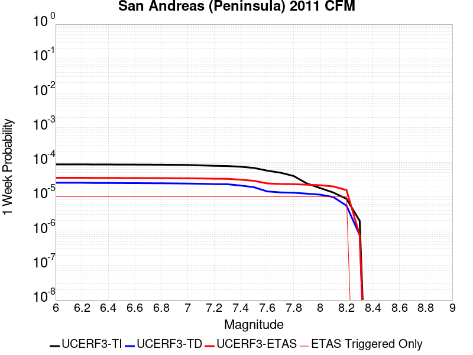 |  | 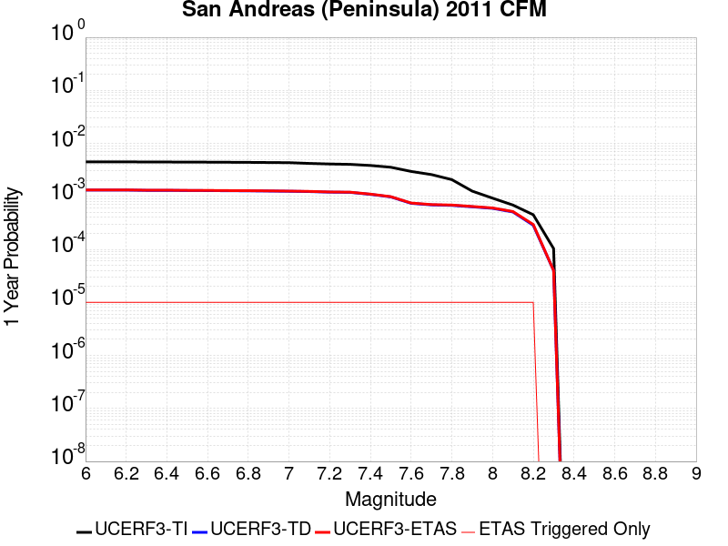 | 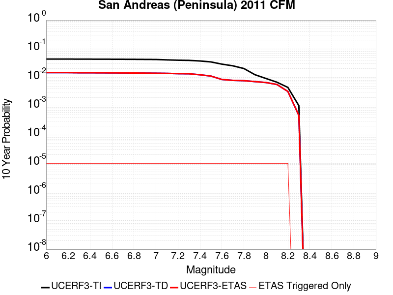 |

| Magnitude | 1 wk TI Prob | 1 wk TD Prob | 1 wk ETAS Prob | 1 wk ETAS/TD Gain | 1 wk ETAS Triggered Only | 1 mo TI Prob | 1 mo TD Prob | 1 mo ETAS Prob | 1 mo ETAS/TD Gain | 1 mo ETAS Triggered Only | 1 yr TI Prob | 1 yr TD Prob | 1 yr ETAS Prob | 1 yr ETAS/TD Gain | 1 yr ETAS Triggered Only | 10 yr TI Prob | 10 yr TD Prob | 10 yr ETAS Prob | 10 yr ETAS/TD Gain | 10 yr ETAS Triggered Only |
|-----|-----|-----|-----|-----|-----|-----|-----|-----|-----|-----|-----|-----|-----|-----|-----|-----|-----|-----|-----|-----|
| 6.0 | 8.6200685E-5 | 2.52136E-5 | 3.5213347E-5 | 1.3966013 | 1.0E-5 | 3.6937918E-4 | 1.0805382E-4 | 1.1805274E-4 | 1.0925364 | 1.0E-5 | 0.0044879215 | 0.001314763 | 0.0013247498 | 1.0075959 | 1.0E-5 | 0.043983612 | 0.014774441 | 0.014784293 | 1.0006669 | 1.0E-5 |
| 6.1 | 8.6200685E-5 | 2.52136E-5 | 3.5213347E-5 | 1.3966013 | 1.0E-5 | 3.6937918E-4 | 1.0805382E-4 | 1.1805274E-4 | 1.0925364 | 1.0E-5 | 0.0044879215 | 0.001314763 | 0.0013247498 | 1.0075959 | 1.0E-5 | 0.043983612 | 0.014774441 | 0.014784293 | 1.0006669 | 1.0E-5 |
| 6.2 | 8.6200685E-5 | 2.52136E-5 | 3.5213347E-5 | 1.3966013 | 1.0E-5 | 3.6937918E-4 | 1.0805382E-4 | 1.1805274E-4 | 1.0925364 | 1.0E-5 | 0.0044879215 | 0.001314763 | 0.0013247498 | 1.0075959 | 1.0E-5 | 0.043983612 | 0.014774441 | 0.014784293 | 1.0006669 | 1.0E-5 |
| 6.3 | 8.551163E-5 | 2.490552E-5 | 3.490527E-5 | 1.4015074 | 1.0E-5 | 3.6642692E-4 | 1.06733576E-4 | 1.1673251E-4 | 1.0936812 | 1.0E-5 | 0.004452125 | 0.0012987083 | 0.0013086953 | 1.00769 | 1.0E-5 | 0.043639794 | 0.014601416 | 0.01461127 | 1.0006748 | 1.0E-5 |
| 6.4 | 8.551163E-5 | 2.490552E-5 | 3.490527E-5 | 1.4015074 | 1.0E-5 | 3.6642692E-4 | 1.06733576E-4 | 1.1673251E-4 | 1.0936812 | 1.0E-5 | 0.004452125 | 0.0012987083 | 0.0013086953 | 1.00769 | 1.0E-5 | 0.043639794 | 0.014601416 | 0.01461127 | 1.0006748 | 1.0E-5 |
| 6.5 | 8.511146E-5 | 2.4726973E-5 | 3.4726723E-5 | 1.4044067 | 1.0E-5 | 3.647124E-4 | 1.05968444E-4 | 1.1596738E-4 | 1.0943577 | 1.0E-5 | 0.004431336 | 0.0012894038 | 0.0012993909 | 1.0077455 | 1.0E-5 | 0.04344007 | 0.0145011945 | 0.014511049 | 1.0006796 | 1.0E-5 |
| 6.6 | 8.4985084E-5 | 2.4657606E-5 | 3.4657358E-5 | 1.4055444 | 1.0E-5 | 3.6417096E-4 | 1.05671184E-4 | 1.15670126E-4 | 1.0946232 | 1.0E-5 | 0.0044247704 | 0.001285789 | 0.0012957761 | 1.0077673 | 1.0E-5 | 0.043376986 | 0.014463263 | 0.014473118 | 1.0006814 | 1.0E-5 |
| 6.7 | 8.462618E-5 | 2.4486113E-5 | 3.4485867E-5 | 1.4083848 | 1.0E-5 | 3.6263323E-4 | 1.0493627E-4 | 1.1493522E-4 | 1.0952859 | 1.0E-5 | 0.004406125 | 0.0012768519 | 0.0012868391 | 1.0078218 | 1.0E-5 | 0.043197807 | 0.01436807 | 0.0143779265 | 1.0006859 | 1.0E-5 |
| 6.8 | 8.42337E-5 | 2.438192E-5 | 3.4381676E-5 | 1.41013 | 1.0E-5 | 3.6095164E-4 | 1.04489765E-4 | 1.1448872E-4 | 1.0956931 | 1.0E-5 | 0.004385734 | 0.0012714221 | 0.0012814094 | 1.0078552 | 1.0E-5 | 0.043001823 | 0.014308756 | 0.014318613 | 1.0006889 | 1.0E-5 |
| 6.9 | 8.365989E-5 | 2.4186513E-5 | 3.4186272E-5 | 1.4134436 | 1.0E-5 | 3.5849313E-4 | 1.03652375E-4 | 1.1365134E-4 | 1.0964663 | 1.0E-5 | 0.004355922 | 0.0012612387 | 0.0012712261 | 1.0079187 | 1.0E-5 | 0.04271523 | 0.014201242 | 0.0142111 | 1.0006942 | 1.0E-5 |
| 7.0 | 8.30936E-5 | 2.3948E-5 | 3.394776E-5 | 1.4175614 | 1.0E-5 | 3.560668E-4 | 1.02630256E-4 | 1.12629226E-4 | 1.0974271 | 1.0E-5 | 0.004326499 | 0.0012488087 | 0.0012587962 | 1.0079976 | 1.0E-5 | 0.042432297 | 0.014072227 | 0.014082086 | 1.0007006 | 1.0E-5 |
| 7.1 | 8.041264E-5 | 2.3634402E-5 | 3.3634165E-5 | 1.423102 | 1.0E-5 | 3.4458007E-4 | 1.0128637E-4 | 1.1128536E-4 | 1.09872 | 1.0E-5 | 0.0041871946 | 0.0012324656 | 0.0012424532 | 1.0081038 | 1.0E-5 | 0.041091725 | 0.013895032 | 0.013904893 | 1.0007097 | 1.0E-5 |
| 7.2 | 7.8427016E-5 | 2.3058019E-5 | 3.3057786E-5 | 1.4336786 | 1.0E-5 | 3.3607247E-4 | 9.8816345E-5 | 1.0881535E-4 | 1.1011878 | 1.0E-5 | 0.004084008 | 0.0012024266 | 0.0012124146 | 1.0083065 | 1.0E-5 | 0.040097635 | 0.013579085 | 0.013588949 | 1.0007265 | 1.0E-5 |
| 7.3 | 7.721087E-5 | 2.2842805E-5 | 3.2842578E-5 | 1.4377646 | 1.0E-5 | 3.3086175E-4 | 9.7894066E-5 | 1.0789309E-4 | 1.1021413 | 1.0E-5 | 0.004020803 | 0.0011912102 | 0.0012011983 | 1.0083848 | 1.0E-5 | 0.03948827 | 0.013462781 | 0.0134726465 | 1.0007328 | 1.0E-5 |
| 7.4 | 7.3536525E-5 | 2.0960428E-5 | 3.096022E-5 | 1.4770795 | 1.0E-5 | 3.1511846E-4 | 8.982732E-5 | 9.982642E-5 | 1.1113147 | 1.0E-5 | 0.0038298194 | 0.0010931002 | 0.0011030893 | 1.0091383 | 1.0E-5 | 0.037644852 | 0.012419564 | 0.012429439 | 1.0007951 | 1.0E-5 |
| 7.5 | 6.806207E-5 | 1.876674E-5 | 2.8766552E-5 | 1.5328476 | 1.0E-5 | 2.9166197E-4 | 8.042641E-5 | 9.042561E-5 | 1.1243273 | 1.0E-5 | 0.0035452035 | 9.787527E-4 | 9.887429E-4 | 1.010207 | 1.0E-5 | 0.034891766 | 0.01117254 | 0.011182427 | 1.000885 | 1.0E-5 |
| 7.6 | 5.6731416E-5 | 1.4177827E-5 | 2.4177685E-5 | 1.7053167 | 1.0E-5 | 2.43112E-4 | 6.07607E-5 | 7.076009E-5 | 1.1645701 | 1.0E-5 | 0.0029558712 | 7.395106E-4 | 7.495032E-4 | 1.0135125 | 1.0E-5 | 0.02916862 | 0.008485565 | 0.00849548 | 1.0011685 | 1.0E-5 |
| 7.7 | 4.946994E-5 | 1.3246218E-5 | 2.3246086E-5 | 1.7549225 | 1.0E-5 | 2.1199681E-4 | 5.6768273E-5 | 6.67677E-5 | 1.1761447 | 1.0E-5 | 0.002578006 | 6.9093466E-4 | 7.0092775E-4 | 1.0144632 | 1.0E-5 | 0.02548303 | 0.0079078935 | 0.007917815 | 1.0012546 | 1.0E-5 |
| 7.8 | 3.9718198E-5 | 1.2982541E-5 | 2.298241E-5 | 1.7702552 | 1.0E-5 | 1.7020974E-4 | 5.5638273E-5 | 6.5637716E-5 | 1.1797224 | 1.0E-5 | 0.0020703338 | 6.771856E-4 | 6.871788E-4 | 1.014757 | 1.0E-5 | 0.020511515 | 0.0077184658 | 0.007728389 | 1.0012856 | 1.0E-5 |
| 7.9 | 2.4115114E-5 | 1.218559E-5 | 2.2185468E-5 | 1.8206314 | 1.0E-5 | 1.0334639E-4 | 5.2222913E-5 | 6.222239E-5 | 1.1914768 | 1.0E-5 | 0.001257516 | 6.3562865E-4 | 6.4562226E-4 | 1.0157225 | 1.0E-5 | 0.012504238 | 0.007159044 | 0.0071689724 | 1.0013869 | 1.0E-5 |
| 8.0 | 1.7756569E-5 | 1.1410005E-5 | 2.140989E-5 | 1.8764138 | 1.0E-5 | 7.6097356E-5 | 4.8899106E-5 | 5.8898615E-5 | 1.2044927 | 1.0E-5 | 9.260915E-4 | 5.951841E-4 | 6.051782E-4 | 1.0167916 | 1.0E-5 | 0.009222416 | 0.006659493 | 0.0066694263 | 1.0014917 | 1.0E-5 |
| 8.1 | 1.3159258E-5 | 9.746194E-6 | 1.9746098E-5 | 2.0260315 | 1.0E-5 | 5.6395602E-5 | 4.1768737E-5 | 5.176832E-5 | 1.2394035 | 1.0E-5 | 6.864001E-4 | 5.0841586E-4 | 5.1841076E-4 | 1.0196589 | 1.0E-5 | 0.0068428386 | 0.005689538 | 0.005699481 | 1.0017476 | 1.0E-5 |
| 8.2 | 8.635426E-6 | 5.466912E-6 | 1.5466858E-5 | 2.8291762 | 1.0E-5 | 3.700844E-5 | 2.3429413E-5 | 3.342918E-5 | 1.426804 | 1.0E-5 | 4.5048463E-4 | 2.8521585E-4 | 2.95213E-4 | 1.0350511 | 1.0E-5 | 0.004495725 | 0.0032445018 | 0.0032544693 | 1.0030721 | 1.0E-5 |
| 8.3 | 1.983087E-6 | 7.6599065E-7 | 7.6599065E-7 | 1.0 | 0.0 | 8.498917E-6 | 3.282813E-6 | 3.282813E-6 | 1.0 | 0.0 | 1.034694E-4 | 3.9967534E-5 | 3.9967534E-5 | 1.0 | 0.0 | 0.0010342124 | 4.719687E-4 | 4.719687E-4 | 1.0 | 0.0 |

## Ozena
*[(top)](#table-of-contents)*

| 1 Week | 1 Month | 1 Year | 10 Year |
|-----|-----|-----|-----|
|  | 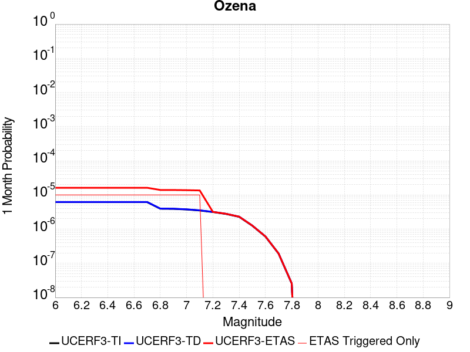 | 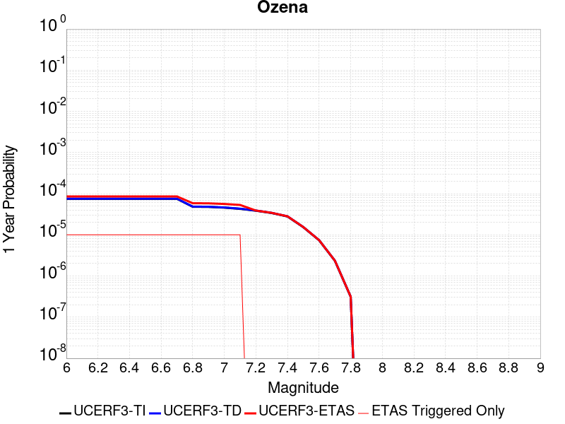 | 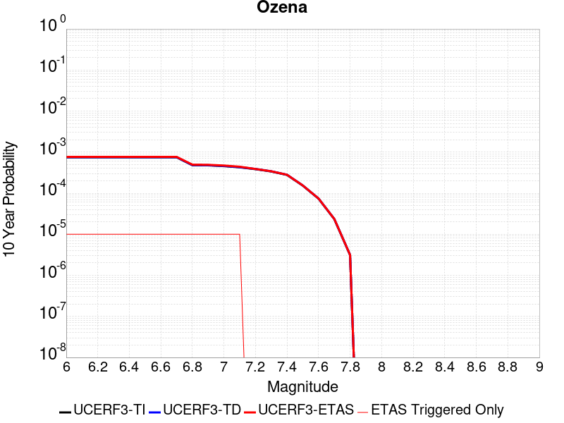 |

| Magnitude | 1 wk TI Prob | 1 wk TD Prob | 1 wk ETAS Prob | 1 wk ETAS/TD Gain | 1 wk ETAS Triggered Only | 1 mo TI Prob | 1 mo TD Prob | 1 mo ETAS Prob | 1 mo ETAS/TD Gain | 1 mo ETAS Triggered Only | 1 yr TI Prob | 1 yr TD Prob | 1 yr ETAS Prob | 1 yr ETAS/TD Gain | 1 yr ETAS Triggered Only | 10 yr TI Prob | 10 yr TD Prob | 10 yr ETAS Prob | 10 yr ETAS/TD Gain | 10 yr ETAS Triggered Only |
|-----|-----|-----|-----|-----|-----|-----|-----|-----|-----|-----|-----|-----|-----|-----|-----|-----|-----|-----|-----|-----|
| 6.0 | 1.4377547E-6 | 1.4513782E-6 | 1.4513782E-6 | 1.0 | 0.0 | 6.161791E-6 | 6.2201793E-6 | 1.6220118E-5 | 2.6076608 | 1.0E-5 | 7.5017226E-5 | 7.572832E-5 | 8.5727566E-5 | 1.132041 | 1.0E-5 | 7.4991904E-4 | 7.570518E-4 | 7.670442E-4 | 1.0131991 | 1.0E-5 |
| 6.1 | 1.4377547E-6 | 1.4513782E-6 | 1.4513782E-6 | 1.0 | 0.0 | 6.161791E-6 | 6.2201793E-6 | 1.6220118E-5 | 2.6076608 | 1.0E-5 | 7.5017226E-5 | 7.572832E-5 | 8.5727566E-5 | 1.132041 | 1.0E-5 | 7.4991904E-4 | 7.570518E-4 | 7.670442E-4 | 1.0131991 | 1.0E-5 |
| 6.2 | 1.4377547E-6 | 1.4513782E-6 | 1.4513782E-6 | 1.0 | 0.0 | 6.161791E-6 | 6.2201793E-6 | 1.6220118E-5 | 2.6076608 | 1.0E-5 | 7.5017226E-5 | 7.572832E-5 | 8.5727566E-5 | 1.132041 | 1.0E-5 | 7.4991904E-4 | 7.570518E-4 | 7.670442E-4 | 1.0131991 | 1.0E-5 |
| 6.3 | 1.4377547E-6 | 1.4513782E-6 | 1.4513782E-6 | 1.0 | 0.0 | 6.161791E-6 | 6.2201793E-6 | 1.6220118E-5 | 2.6076608 | 1.0E-5 | 7.5017226E-5 | 7.572832E-5 | 8.5727566E-5 | 1.132041 | 1.0E-5 | 7.4991904E-4 | 7.570518E-4 | 7.670442E-4 | 1.0131991 | 1.0E-5 |
| 6.4 | 1.4377547E-6 | 1.4513782E-6 | 1.4513782E-6 | 1.0 | 0.0 | 6.161791E-6 | 6.2201793E-6 | 1.6220118E-5 | 2.6076608 | 1.0E-5 | 7.5017226E-5 | 7.572832E-5 | 8.5727566E-5 | 1.132041 | 1.0E-5 | 7.4991904E-4 | 7.570518E-4 | 7.670442E-4 | 1.0131991 | 1.0E-5 |
| 6.5 | 1.4377547E-6 | 1.4513782E-6 | 1.4513782E-6 | 1.0 | 0.0 | 6.161791E-6 | 6.2201793E-6 | 1.6220118E-5 | 2.6076608 | 1.0E-5 | 7.5017226E-5 | 7.572832E-5 | 8.5727566E-5 | 1.132041 | 1.0E-5 | 7.4991904E-4 | 7.570518E-4 | 7.670442E-4 | 1.0131991 | 1.0E-5 |
| 6.6 | 1.4377547E-6 | 1.4513782E-6 | 1.4513782E-6 | 1.0 | 0.0 | 6.161791E-6 | 6.2201793E-6 | 1.6220118E-5 | 2.6076608 | 1.0E-5 | 7.5017226E-5 | 7.572832E-5 | 8.5727566E-5 | 1.132041 | 1.0E-5 | 7.4991904E-4 | 7.570518E-4 | 7.670442E-4 | 1.0131991 | 1.0E-5 |
| 6.7 | 1.4377547E-6 | 1.4513782E-6 | 1.4513782E-6 | 1.0 | 0.0 | 6.161791E-6 | 6.2201793E-6 | 1.6220118E-5 | 2.6076608 | 1.0E-5 | 7.5017226E-5 | 7.572832E-5 | 8.5727566E-5 | 1.132041 | 1.0E-5 | 7.4991904E-4 | 7.570518E-4 | 7.670442E-4 | 1.0131991 | 1.0E-5 |
| 6.8 | 9.223257E-7 | 9.317624E-7 | 9.317624E-7 | 1.0 | 0.0 | 3.9528186E-6 | 3.9932615E-6 | 1.3993222E-5 | 3.5042088 | 1.0E-5 | 4.81245E-5 | 4.8616912E-5 | 5.8616428E-5 | 1.2056798 | 1.0E-5 | 4.811408E-4 | 4.860668E-4 | 4.960619E-4 | 1.0205632 | 1.0E-5 |
| 6.9 | 9.141515E-7 | 9.235371E-7 | 9.235371E-7 | 1.0 | 0.0 | 3.917786E-6 | 3.9580104E-6 | 1.3957971E-5 | 3.526512 | 1.0E-5 | 4.7698002E-5 | 4.818775E-5 | 5.818727E-5 | 1.2075117 | 1.0E-5 | 4.7687767E-4 | 4.8177704E-4 | 4.917722E-4 | 1.0207465 | 1.0E-5 |
| 7.0 | 8.767648E-7 | 8.8585773E-7 | 8.8585773E-7 | 1.0 | 0.0 | 3.757558E-6 | 3.7965276E-6 | 1.379649E-5 | 3.6339757 | 1.0E-5 | 4.5747307E-5 | 4.6221783E-5 | 5.622132E-5 | 1.2163382 | 1.0E-5 | 4.5737892E-4 | 4.6212564E-4 | 4.7212103E-4 | 1.0216291 | 1.0E-5 |
| 7.1 | 8.199402E-7 | 8.2853984E-7 | 8.2853984E-7 | 1.0 | 0.0 | 3.5140247E-6 | 3.5508804E-6 | 1.3550845E-5 | 3.8161929 | 1.0E-5 | 4.2782412E-5 | 4.323115E-5 | 5.3230717E-5 | 1.2313046 | 1.0E-5 | 4.2774176E-4 | 4.322311E-4 | 4.422268E-4 | 1.0231258 | 1.0E-5 |
| 7.2 | 7.38705E-7 | 7.464262E-7 | 7.464262E-7 | 1.0 | 0.0 | 3.1658747E-6 | 3.198966E-6 | 3.198966E-6 | 1.0 | 0.0 | 3.8543843E-5 | 3.894675E-5 | 3.894675E-5 | 1.0 | 0.0 | 3.853716E-4 | 3.8940276E-4 | 3.8940276E-4 | 1.0 | 0.0 |
| 7.3 | 6.490017E-7 | 6.557802E-7 | 6.557802E-7 | 1.0 | 0.0 | 2.7814328E-6 | 2.8104837E-6 | 2.8104837E-6 | 1.0 | 0.0 | 3.386342E-5 | 3.4217133E-5 | 3.4217133E-5 | 1.0 | 0.0 | 3.3858258E-4 | 3.4212202E-4 | 3.4212202E-4 | 1.0 | 0.0 |
| 7.4 | 5.346736E-7 | 5.4022604E-7 | 5.4022604E-7 | 1.0 | 0.0 | 2.291456E-6 | 2.3152527E-6 | 2.3152527E-6 | 1.0 | 0.0 | 2.789812E-5 | 2.8187867E-5 | 2.8187867E-5 | 1.0 | 0.0 | 2.789462E-4 | 2.8184598E-4 | 2.8184598E-4 | 1.0 | 0.0 |
| 7.5 | 2.939325E-7 | 2.9666057E-7 | 2.9666057E-7 | 1.0 | 0.0 | 1.25971E-6 | 1.271402E-6 | 1.271402E-6 | 1.0 | 0.0 | 1.5336862E-5 | 1.5479225E-5 | 1.5479225E-5 | 1.0 | 0.0 | 1.5335804E-4 | 1.5478309E-4 | 1.5478309E-4 | 1.0 | 0.0 |
| 7.6 | 1.4151905E-7 | 1.4253266E-7 | 1.4253266E-7 | 1.0 | 0.0 | 6.065101E-7 | 6.108541E-7 | 6.108541E-7 | 1.0 | 0.0 | 7.3842357E-6 | 7.4371237E-6 | 7.4371237E-6 | 1.0 | 0.0 | 7.38399E-5 | 7.436883E-5 | 7.436883E-5 | 1.0 | 0.0 |
| 7.7 | 4.4957577E-8 | 4.5252243E-8 | 4.5252243E-8 | 1.0 | 0.0 | 1.9267533E-7 | 1.9393818E-7 | 1.9393818E-7 | 1.0 | 0.0 | 2.3458194E-6 | 2.3611947E-6 | 2.3611947E-6 | 1.0 | 0.0 | 2.3457947E-5 | 2.3611707E-5 | 2.3611707E-5 | 1.0 | 0.0 |
| 7.8 | 5.9993255E-9 | 6.0412972E-9 | 6.0412972E-9 | 1.0 | 0.0 | 2.5711394E-8 | 2.5891273E-8 | 2.5891273E-8 | 1.0 | 0.0 | 3.1303617E-7 | 3.1522623E-7 | 3.1522623E-7 | 1.0 | 0.0 | 3.1303573E-6 | 3.1522588E-6 | 3.1522588E-6 | 1.0 | 0.0 |

## Clayton
*[(top)](#table-of-contents)*

| 1 Week | 1 Month | 1 Year | 10 Year |
|-----|-----|-----|-----|
| 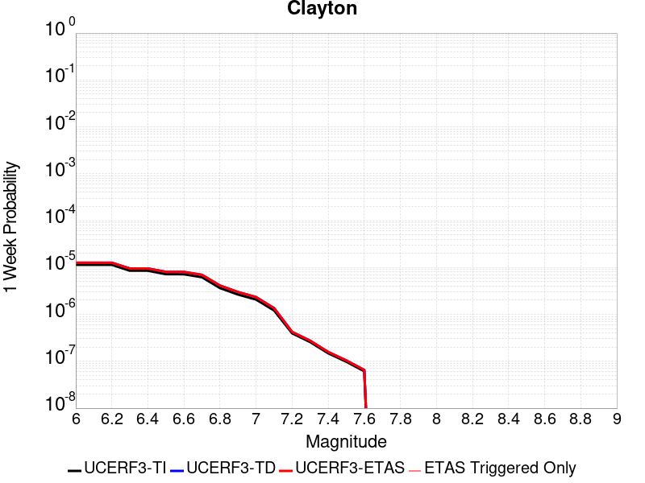 |  | 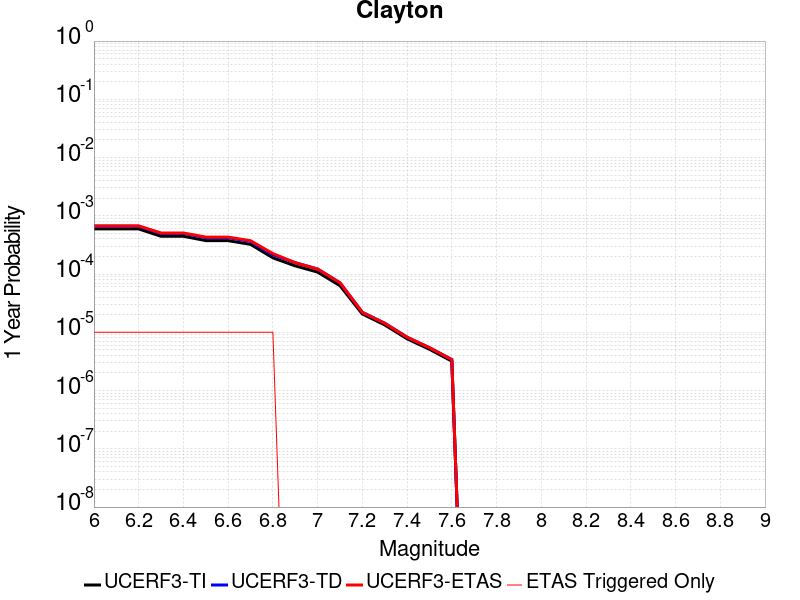 | 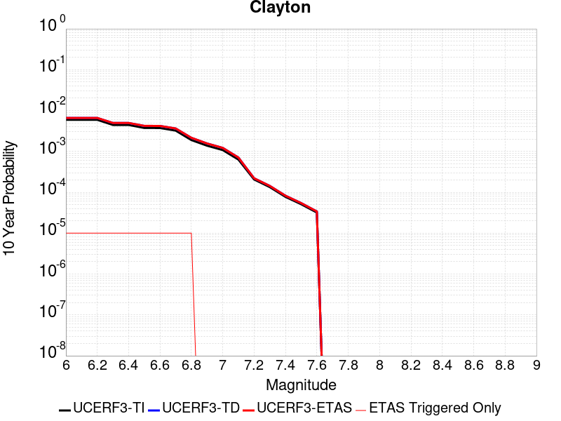 |

| Magnitude | 1 wk TI Prob | 1 wk TD Prob | 1 wk ETAS Prob | 1 wk ETAS/TD Gain | 1 wk ETAS Triggered Only | 1 mo TI Prob | 1 mo TD Prob | 1 mo ETAS Prob | 1 mo ETAS/TD Gain | 1 mo ETAS Triggered Only | 1 yr TI Prob | 1 yr TD Prob | 1 yr ETAS Prob | 1 yr ETAS/TD Gain | 1 yr ETAS Triggered Only | 10 yr TI Prob | 10 yr TD Prob | 10 yr ETAS Prob | 10 yr ETAS/TD Gain | 10 yr ETAS Triggered Only |
|-----|-----|-----|-----|-----|-----|-----|-----|-----|-----|-----|-----|-----|-----|-----|-----|-----|-----|-----|-----|-----|
| 6.0 | 1.1413061E-5 | 1.2667059E-5 | 1.2667059E-5 | 1.0 | 0.0 | 4.89122E-5 | 5.4286393E-5 | 5.4286393E-5 | 1.0 | 0.0 | 5.953433E-4 | 6.607586E-4 | 6.70752E-4 | 1.0151241 | 1.0E-5 | 0.005937509 | 0.0065901424 | 0.0066000763 | 1.0015074 | 1.0E-5 |
| 6.1 | 1.1413061E-5 | 1.2667059E-5 | 1.2667059E-5 | 1.0 | 0.0 | 4.89122E-5 | 5.4286393E-5 | 5.4286393E-5 | 1.0 | 0.0 | 5.953433E-4 | 6.607586E-4 | 6.70752E-4 | 1.0151241 | 1.0E-5 | 0.005937509 | 0.0065901424 | 0.0066000763 | 1.0015074 | 1.0E-5 |
| 6.2 | 1.1413061E-5 | 1.2667059E-5 | 1.2667059E-5 | 1.0 | 0.0 | 4.89122E-5 | 5.4286393E-5 | 5.4286393E-5 | 1.0 | 0.0 | 5.953433E-4 | 6.607586E-4 | 6.70752E-4 | 1.0151241 | 1.0E-5 | 0.005937509 | 0.0065901424 | 0.0066000763 | 1.0015074 | 1.0E-5 |
| 6.3 | 8.538689E-6 | 9.532753E-6 | 9.532753E-6 | 1.0 | 0.0 | 3.659387E-5 | 4.0854076E-5 | 4.0854076E-5 | 1.0 | 0.0 | 4.4543925E-4 | 4.9729564E-4 | 5.0729065E-4 | 1.0200988 | 1.0E-5 | 0.0044454746 | 0.0049628937 | 0.004972844 | 1.002005 | 1.0E-5 |
| 6.4 | 8.538689E-6 | 9.532753E-6 | 9.532753E-6 | 1.0 | 0.0 | 3.659387E-5 | 4.0854076E-5 | 4.0854076E-5 | 1.0 | 0.0 | 4.4543925E-4 | 4.9729564E-4 | 5.0729065E-4 | 1.0200988 | 1.0E-5 | 0.0044454746 | 0.0049628937 | 0.004972844 | 1.002005 | 1.0E-5 |
| 6.5 | 7.197462E-6 | 8.080952E-6 | 8.080952E-6 | 1.0 | 0.0 | 3.08459E-5 | 3.4632238E-5 | 3.4632238E-5 | 1.0 | 0.0 | 3.7548412E-4 | 4.2157414E-4 | 4.315699E-4 | 1.0237106 | 1.0E-5 | 0.003748503 | 0.004208556 | 0.0042185136 | 1.0023661 | 1.0E-5 |
| 6.6 | 7.1760483E-6 | 8.056968E-6 | 8.056968E-6 | 1.0 | 0.0 | 3.075413E-5 | 3.4529454E-5 | 3.4529454E-5 | 1.0 | 0.0 | 3.743672E-4 | 4.203232E-4 | 4.30319E-4 | 1.0237812 | 1.0E-5 | 0.0037373714 | 0.004196094 | 0.004206052 | 1.0023732 | 1.0E-5 |
| 6.7 | 6.202582E-6 | 6.9766934E-6 | 6.9766934E-6 | 1.0 | 0.0 | 2.6582224E-5 | 2.9899817E-5 | 2.9899817E-5 | 1.0 | 0.0 | 3.235905E-4 | 3.6397713E-4 | 3.7397348E-4 | 1.0274643 | 1.0E-5 | 0.0032311971 | 0.0036345655 | 0.0036445293 | 1.0027413 | 1.0E-5 |
| 6.8 | 3.6417277E-6 | 4.1212957E-6 | 4.1212957E-6 | 1.0 | 0.0 | 1.5607311E-5 | 1.766258E-5 | 1.766258E-5 | 1.0 | 0.0 | 1.9000245E-4 | 2.1502146E-4 | 2.250193E-4 | 1.046497 | 1.0E-5 | 0.0018984007 | 0.0021482105 | 0.002158189 | 1.004645 | 1.0E-5 |
| 6.9 | 2.6498485E-6 | 2.9995201E-6 | 2.9995201E-6 | 1.0 | 0.0 | 1.1356444E-5 | 1.2855025E-5 | 1.2855025E-5 | 1.0 | 0.0 | 1.3825593E-4 | 1.5649908E-4 | 1.5649908E-4 | 1.0 | 0.0 | 0.0013816995 | 0.0015639283 | 0.0015639283 | 1.0 | 0.0 |
| 7.0 | 2.070442E-6 | 2.3407233E-6 | 2.3407233E-6 | 1.0 | 0.0 | 8.873292E-6 | 1.0031635E-5 | 1.0031635E-5 | 1.0 | 0.0 | 1.0802698E-4 | 1.2212861E-4 | 1.2212861E-4 | 1.0 | 0.0 | 0.0010797448 | 0.0012206447 | 0.0012206447 | 1.0 | 0.0 |
| 7.1 | 1.2111691E-6 | 1.3588725E-6 | 1.3588725E-6 | 1.0 | 0.0 | 5.190714E-6 | 5.8237274E-6 | 5.8237274E-6 | 1.0 | 0.0 | 6.319511E-5 | 7.090174E-5 | 7.090174E-5 | 1.0 | 0.0 | 6.3177146E-4 | 7.0880755E-4 | 7.0880755E-4 | 1.0 | 0.0 |
| 7.2 | 3.9541607E-7 | 4.2227694E-7 | 4.2227694E-7 | 1.0 | 0.0 | 1.6946392E-6 | 1.8097571E-6 | 1.8097571E-6 | 1.0 | 0.0 | 2.0632036E-5 | 2.2033571E-5 | 2.2033571E-5 | 1.0 | 0.0 | 2.063012E-4 | 2.2031402E-4 | 2.2031402E-4 | 1.0 | 0.0 |
| 7.3 | 2.5685637E-7 | 2.745679E-7 | 2.745679E-7 | 1.0 | 0.0 | 1.1008126E-6 | 1.176719E-6 | 1.176719E-6 | 1.0 | 0.0 | 1.3402311E-5 | 1.4326461E-5 | 1.4326461E-5 | 1.0 | 0.0 | 1.3401502E-4 | 1.4325544E-4 | 1.4325544E-4 | 1.0 | 0.0 |
| 7.4 | 1.482299E-7 | 1.5807963E-7 | 1.5807963E-7 | 1.0 | 0.0 | 6.3527085E-7 | 6.7748397E-7 | 6.7748397E-7 | 1.0 | 0.0 | 7.734395E-6 | 8.248337E-6 | 8.248337E-6 | 1.0 | 0.0 | 7.734126E-5 | 8.248033E-5 | 8.248033E-5 | 1.0 | 0.0 |
| 7.5 | 9.7969505E-8 | 1.04382096E-7 | 1.04382096E-7 | 1.0 | 0.0 | 4.1986925E-7 | 4.4735177E-7 | 4.4735177E-7 | 1.0 | 0.0 | 5.111896E-6 | 5.446494E-6 | 5.446494E-6 | 1.0 | 0.0 | 5.1117782E-5 | 5.4463624E-5 | 5.4463624E-5 | 1.0 | 0.0 |
| 7.6 | 6.125415E-8 | 6.5231326E-8 | 6.5231326E-8 | 1.0 | 0.0 | 2.6251774E-7 | 2.7956278E-7 | 2.7956278E-7 | 1.0 | 0.0 | 3.196149E-6 | 3.4036718E-6 | 3.4036718E-6 | 1.0 | 0.0 | 3.196103E-5 | 3.403621E-5 | 3.403621E-5 | 1.0 | 0.0 |

## Channel Islands Western Deep Ramp
*[(top)](#table-of-contents)*

| 1 Week | 1 Month | 1 Year | 10 Year |
|-----|-----|-----|-----|
| 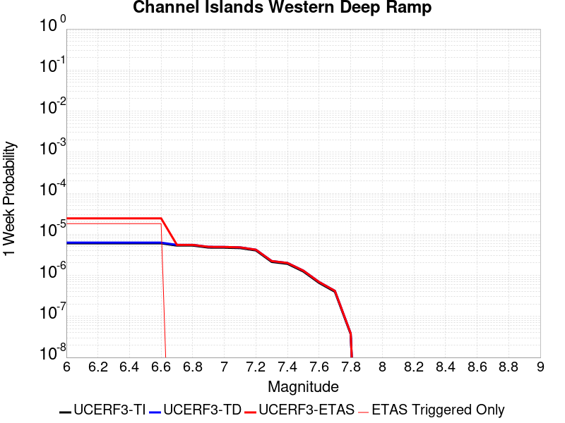 | 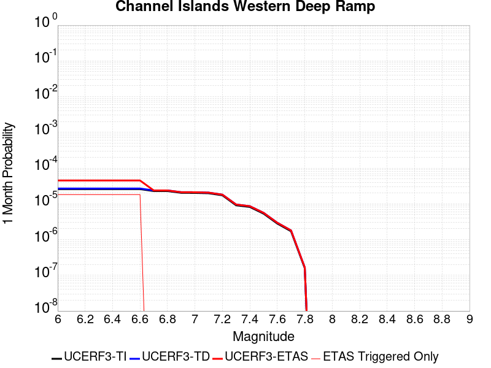 | 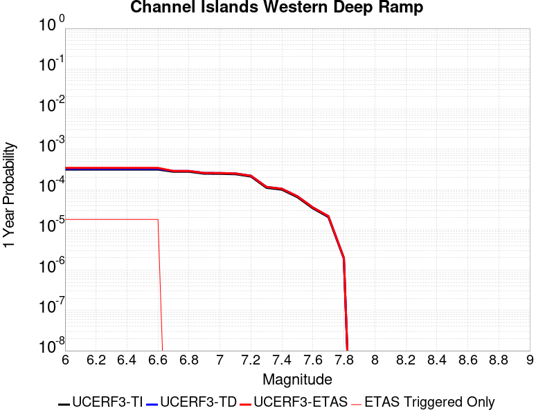 | 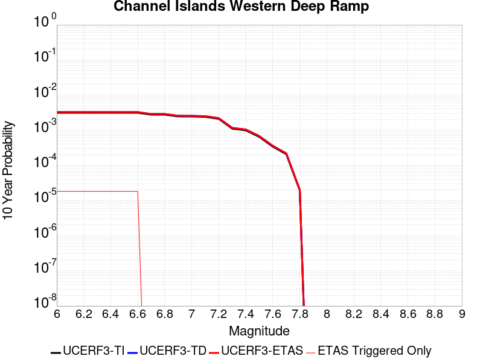 |

| Magnitude | 1 wk TI Prob | 1 wk TD Prob | 1 wk ETAS Prob | 1 wk ETAS/TD Gain | 1 wk ETAS Triggered Only | 1 mo TI Prob | 1 mo TD Prob | 1 mo ETAS Prob | 1 mo ETAS/TD Gain | 1 mo ETAS Triggered Only | 1 yr TI Prob | 1 yr TD Prob | 1 yr ETAS Prob | 1 yr ETAS/TD Gain | 1 yr ETAS Triggered Only | 10 yr TI Prob | 10 yr TD Prob | 10 yr ETAS Prob | 10 yr ETAS/TD Gain | 10 yr ETAS Triggered Only |
|-----|-----|-----|-----|-----|-----|-----|-----|-----|-----|-----|-----|-----|-----|-----|-----|-----|-----|-----|-----|-----|
| 6.0 | 6.0213506E-6 | 6.2548684E-6 | 1.6254806E-5 | 2.5987446 | 1.0E-5 | 2.5805533E-5 | 2.6806329E-5 | 3.680606E-5 | 1.3730363 | 1.0E-5 | 3.1413708E-4 | 3.2632265E-4 | 3.3631938E-4 | 1.0306345 | 1.0E-5 | 0.0031369338 | 0.0032588763 | 0.0032688437 | 1.0030586 | 1.0E-5 |
| 6.1 | 6.0213506E-6 | 6.2548684E-6 | 1.6254806E-5 | 2.5987446 | 1.0E-5 | 2.5805533E-5 | 2.6806329E-5 | 3.680606E-5 | 1.3730363 | 1.0E-5 | 3.1413708E-4 | 3.2632265E-4 | 3.3631938E-4 | 1.0306345 | 1.0E-5 | 0.0031369338 | 0.0032588763 | 0.0032688437 | 1.0030586 | 1.0E-5 |
| 6.2 | 6.0213506E-6 | 6.2548684E-6 | 1.6254806E-5 | 2.5987446 | 1.0E-5 | 2.5805533E-5 | 2.6806329E-5 | 3.680606E-5 | 1.3730363 | 1.0E-5 | 3.1413708E-4 | 3.2632265E-4 | 3.3631938E-4 | 1.0306345 | 1.0E-5 | 0.0031369338 | 0.0032588763 | 0.0032688437 | 1.0030586 | 1.0E-5 |
| 6.3 | 6.0213506E-6 | 6.2548684E-6 | 1.6254806E-5 | 2.5987446 | 1.0E-5 | 2.5805533E-5 | 2.6806329E-5 | 3.680606E-5 | 1.3730363 | 1.0E-5 | 3.1413708E-4 | 3.2632265E-4 | 3.3631938E-4 | 1.0306345 | 1.0E-5 | 0.0031369338 | 0.0032588763 | 0.0032688437 | 1.0030586 | 1.0E-5 |
| 6.4 | 6.0213506E-6 | 6.2548684E-6 | 1.6254806E-5 | 2.5987446 | 1.0E-5 | 2.5805533E-5 | 2.6806329E-5 | 3.680606E-5 | 1.3730363 | 1.0E-5 | 3.1413708E-4 | 3.2632265E-4 | 3.3631938E-4 | 1.0306345 | 1.0E-5 | 0.0031369338 | 0.0032588763 | 0.0032688437 | 1.0030586 | 1.0E-5 |
| 6.5 | 6.0213506E-6 | 6.2548684E-6 | 1.6254806E-5 | 2.5987446 | 1.0E-5 | 2.5805533E-5 | 2.6806329E-5 | 3.680606E-5 | 1.3730363 | 1.0E-5 | 3.1413708E-4 | 3.2632265E-4 | 3.3631938E-4 | 1.0306345 | 1.0E-5 | 0.0031369338 | 0.0032588763 | 0.0032688437 | 1.0030586 | 1.0E-5 |
| 6.6 | 6.0213506E-6 | 6.2548684E-6 | 1.6254806E-5 | 2.5987446 | 1.0E-5 | 2.5805533E-5 | 2.6806329E-5 | 3.680606E-5 | 1.3730363 | 1.0E-5 | 3.1413708E-4 | 3.2632265E-4 | 3.3631938E-4 | 1.0306345 | 1.0E-5 | 0.0031369338 | 0.0032588763 | 0.0032688437 | 1.0030586 | 1.0E-5 |
| 6.7 | 5.313309E-6 | 5.5252403E-6 | 5.5252403E-6 | 1.0 | 0.0 | 2.2771126E-5 | 2.367941E-5 | 2.367941E-5 | 1.0 | 0.0 | 2.772032E-4 | 2.8826276E-4 | 2.8826276E-4 | 1.0 | 0.0 | 0.0027685766 | 0.0028792918 | 0.0028792918 | 1.0 | 0.0 |
| 6.8 | 5.313309E-6 | 5.5252403E-6 | 5.5252403E-6 | 1.0 | 0.0 | 2.2771126E-5 | 2.367941E-5 | 2.367941E-5 | 1.0 | 0.0 | 2.772032E-4 | 2.8826276E-4 | 2.8826276E-4 | 1.0 | 0.0 | 0.0027685766 | 0.0028792918 | 0.0028792918 | 1.0 | 0.0 |
| 6.9 | 4.744377E-6 | 4.9394303E-6 | 4.9394303E-6 | 1.0 | 0.0 | 2.0332885E-5 | 2.1168837E-5 | 2.1168837E-5 | 1.0 | 0.0 | 2.4752476E-4 | 2.5770385E-4 | 2.5770385E-4 | 1.0 | 0.0 | 0.0024724922 | 0.0025744175 | 0.0025744175 | 1.0 | 0.0 |
| 7.0 | 4.722209E-6 | 4.9164732E-6 | 4.9164732E-6 | 1.0 | 0.0 | 2.0237881E-5 | 2.107045E-5 | 2.107045E-5 | 1.0 | 0.0 | 2.4636835E-4 | 2.5650626E-4 | 2.5650626E-4 | 1.0 | 0.0 | 0.002460954 | 0.0025624693 | 0.0025624693 | 1.0 | 0.0 |
| 7.1 | 4.611174E-6 | 4.801409E-6 | 4.801409E-6 | 1.0 | 0.0 | 1.9762025E-5 | 2.0577325E-5 | 2.0577325E-5 | 1.0 | 0.0 | 2.4057609E-4 | 2.5050386E-4 | 2.5050386E-4 | 1.0 | 0.0 | 0.002403158 | 0.002502582 | 0.002502582 | 1.0 | 0.0 |
| 7.2 | 4.043994E-6 | 4.2120264E-6 | 4.2120264E-6 | 1.0 | 0.0 | 1.7331287E-5 | 1.8051438E-5 | 1.8051438E-5 | 1.0 | 0.0 | 2.10988E-4 | 2.1975765E-4 | 2.1975765E-4 | 1.0 | 0.0 | 0.002107878 | 0.0021957543 | 0.0021957543 | 1.0 | 0.0 |
| 7.3 | 2.1233036E-6 | 2.2297875E-6 | 2.2297875E-6 | 1.0 | 0.0 | 9.099841E-6 | 9.556197E-6 | 9.556197E-6 | 1.0 | 0.0 | 1.1078493E-4 | 1.1634055E-4 | 1.1634055E-4 | 1.0 | 0.0 | 0.0011072971 | 0.001162802 | 0.001162802 | 1.0 | 0.0 |
| 7.4 | 1.9051884E-6 | 2.0014973E-6 | 2.0014973E-6 | 1.0 | 0.0 | 8.165067E-6 | 8.577817E-6 | 8.577817E-6 | 1.0 | 0.0 | 9.940516E-5 | 1.0442998E-4 | 1.0442998E-4 | 1.0 | 0.0 | 9.93607E-4 | 0.0010438144 | 0.0010438144 | 1.0 | 0.0 |
| 7.5 | 1.2408497E-6 | 1.3038839E-6 | 1.3038839E-6 | 1.0 | 0.0 | 5.317916E-6 | 5.588062E-6 | 5.588062E-6 | 1.0 | 0.0 | 6.4743705E-5 | 6.8032554E-5 | 6.8032554E-5 | 1.0 | 0.0 | 6.4724847E-4 | 6.8011944E-4 | 6.8011944E-4 | 1.0 | 0.0 |
| 7.6 | 6.5440025E-7 | 6.886718E-7 | 6.886718E-7 | 1.0 | 0.0 | 2.8045695E-6 | 2.9514472E-6 | 2.9514472E-6 | 1.0 | 0.0 | 3.4145098E-5 | 3.593329E-5 | 3.593329E-5 | 1.0 | 0.0 | 3.4139853E-4 | 3.5927625E-4 | 3.5927625E-4 | 1.0 | 0.0 |
| 7.7 | 3.985963E-7 | 4.1930787E-7 | 4.1930787E-7 | 1.0 | 0.0 | 1.7082689E-6 | 1.7970326E-6 | 1.7970326E-6 | 1.0 | 0.0 | 2.0797976E-5 | 2.1878664E-5 | 2.1878664E-5 | 1.0 | 0.0 | 2.0796029E-4 | 2.1876628E-4 | 2.1876628E-4 | 1.0 | 0.0 |
| 7.8 | 3.706329E-8 | 3.8591796E-8 | 3.8591796E-8 | 1.0 | 0.0 | 1.5884267E-7 | 1.653934E-7 | 1.653934E-7 | 1.0 | 0.0 | 1.9339077E-6 | 2.0136629E-6 | 2.0136629E-6 | 1.0 | 0.0 | 1.933891E-5 | 2.0136458E-5 | 2.0136458E-5 | 1.0 | 0.0 |

## San Gabriel (Extension)
*[(top)](#table-of-contents)*

| 1 Week | 1 Month | 1 Year | 10 Year |
|-----|-----|-----|-----|
| 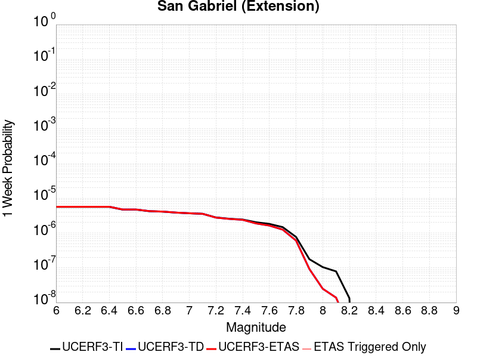 |  | 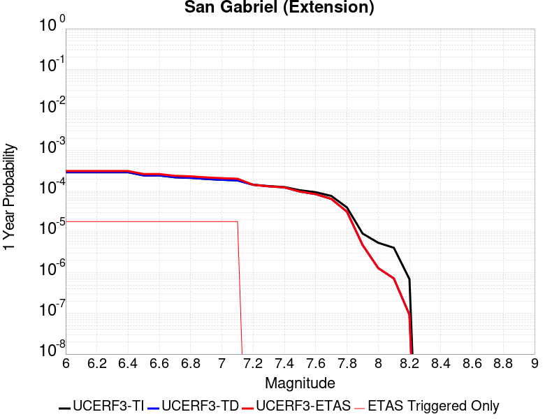 |  |

| Magnitude | 1 wk TI Prob | 1 wk TD Prob | 1 wk ETAS Prob | 1 wk ETAS/TD Gain | 1 wk ETAS Triggered Only | 1 mo TI Prob | 1 mo TD Prob | 1 mo ETAS Prob | 1 mo ETAS/TD Gain | 1 mo ETAS Triggered Only | 1 yr TI Prob | 1 yr TD Prob | 1 yr ETAS Prob | 1 yr ETAS/TD Gain | 1 yr ETAS Triggered Only | 10 yr TI Prob | 10 yr TD Prob | 10 yr ETAS Prob | 10 yr ETAS/TD Gain | 10 yr ETAS Triggered Only |
|-----|-----|-----|-----|-----|-----|-----|-----|-----|-----|-----|-----|-----|-----|-----|-----|-----|-----|-----|-----|-----|
| 6.0 | 5.6486106E-6 | 5.7168304E-6 | 5.7168304E-6 | 1.0 | 0.0 | 2.4208108E-5 | 2.450048E-5 | 2.450048E-5 | 1.0 | 0.0 | 2.9469383E-4 | 2.9825376E-4 | 3.0825078E-4 | 1.0335186 | 1.0E-5 | 0.0029430336 | 0.0029786653 | 0.0029886353 | 1.0033472 | 1.0E-5 |
| 6.1 | 5.6486106E-6 | 5.7168304E-6 | 5.7168304E-6 | 1.0 | 0.0 | 2.4208108E-5 | 2.450048E-5 | 2.450048E-5 | 1.0 | 0.0 | 2.9469383E-4 | 2.9825376E-4 | 3.0825078E-4 | 1.0335186 | 1.0E-5 | 0.0029430336 | 0.0029786653 | 0.0029886353 | 1.0033472 | 1.0E-5 |
| 6.2 | 5.6486106E-6 | 5.7168304E-6 | 5.7168304E-6 | 1.0 | 0.0 | 2.4208108E-5 | 2.450048E-5 | 2.450048E-5 | 1.0 | 0.0 | 2.9469383E-4 | 2.9825376E-4 | 3.0825078E-4 | 1.0335186 | 1.0E-5 | 0.0029430336 | 0.0029786653 | 0.0029886353 | 1.0033472 | 1.0E-5 |
| 6.3 | 5.6486106E-6 | 5.7168304E-6 | 5.7168304E-6 | 1.0 | 0.0 | 2.4208108E-5 | 2.450048E-5 | 2.450048E-5 | 1.0 | 0.0 | 2.9469383E-4 | 2.9825376E-4 | 3.0825078E-4 | 1.0335186 | 1.0E-5 | 0.0029430336 | 0.0029786653 | 0.0029886353 | 1.0033472 | 1.0E-5 |
| 6.4 | 5.6486106E-6 | 5.7168304E-6 | 5.7168304E-6 | 1.0 | 0.0 | 2.4208108E-5 | 2.450048E-5 | 2.450048E-5 | 1.0 | 0.0 | 2.9469383E-4 | 2.9825376E-4 | 3.0825078E-4 | 1.0335186 | 1.0E-5 | 0.0029430336 | 0.0029786653 | 0.0029886353 | 1.0033472 | 1.0E-5 |
| 6.5 | 4.7134554E-6 | 4.7542544E-6 | 4.7542544E-6 | 1.0 | 0.0 | 2.0200367E-5 | 2.0375222E-5 | 2.0375222E-5 | 1.0 | 0.0 | 2.459117E-4 | 2.4804095E-4 | 2.5803846E-4 | 1.040306 | 1.0E-5 | 0.0024563975 | 0.002477729 | 0.0024877044 | 1.0040259 | 1.0E-5 |
| 6.6 | 4.7134554E-6 | 4.7542544E-6 | 4.7542544E-6 | 1.0 | 0.0 | 2.0200367E-5 | 2.0375222E-5 | 2.0375222E-5 | 1.0 | 0.0 | 2.459117E-4 | 2.4804095E-4 | 2.5803846E-4 | 1.040306 | 1.0E-5 | 0.0024563975 | 0.002477729 | 0.0024877044 | 1.0040259 | 1.0E-5 |
| 6.7 | 4.2468837E-6 | 4.2740717E-6 | 4.2740717E-6 | 1.0 | 0.0 | 1.8200803E-5 | 1.8317325E-5 | 1.8317325E-5 | 1.0 | 0.0 | 2.2157225E-4 | 2.2299135E-4 | 2.3298911E-4 | 1.0448347 | 1.0E-5 | 0.0022135144 | 0.0022277518 | 0.0022377295 | 1.0044788 | 1.0E-5 |
| 6.8 | 4.1180615E-6 | 4.1414614E-6 | 4.1414614E-6 | 1.0 | 0.0 | 1.7648716E-5 | 1.7749004E-5 | 1.7749004E-5 | 1.0 | 0.0 | 2.1485193E-4 | 2.160734E-4 | 2.2607125E-4 | 1.0462706 | 1.0E-5 | 0.0021464431 | 0.0021587082 | 0.0021686866 | 1.0046225 | 1.0E-5 |
| 6.9 | 3.863861E-6 | 3.8797766E-6 | 3.8797766E-6 | 1.0 | 0.0 | 1.65593E-5 | 1.6627511E-5 | 1.6627511E-5 | 1.0 | 0.0 | 2.0159081E-4 | 2.0242184E-4 | 2.124198E-4 | 1.0493917 | 1.0E-5 | 0.0020140803 | 0.002022446 | 0.0020324257 | 1.0049345 | 1.0E-5 |
| 7.0 | 3.6947372E-6 | 3.705676E-6 | 3.705676E-6 | 1.0 | 0.0 | 1.5834492E-5 | 1.5881375E-5 | 1.5881375E-5 | 1.0 | 0.0 | 1.9276788E-4 | 1.9333926E-4 | 2.0333733E-4 | 1.0517125 | 1.0E-5 | 0.0019260074 | 0.0019317807 | 0.0019417615 | 1.0051665 | 1.0E-5 |
| 7.1 | 3.5686835E-6 | 3.5728963E-6 | 3.5728963E-6 | 1.0 | 0.0 | 1.5294268E-5 | 1.5312327E-5 | 1.5312327E-5 | 1.0 | 0.0 | 1.861918E-4 | 1.8641229E-4 | 1.9641043E-4 | 1.0536345 | 1.0E-5 | 0.0018603588 | 0.0018626289 | 0.0018726103 | 1.0053588 | 1.0E-5 |
| 7.2 | 2.8023446E-6 | 2.7767885E-6 | 2.7767885E-6 | 1.0 | 0.0 | 1.2009994E-5 | 1.1900468E-5 | 1.1900468E-5 | 1.0 | 0.0 | 1.4621185E-4 | 1.4487868E-4 | 1.4487868E-4 | 1.0 | 0.0 | 0.001461157 | 0.0014478569 | 0.0014478569 | 1.0 | 0.0 |
| 7.3 | 2.5843012E-6 | 2.5459642E-6 | 2.5459642E-6 | 1.0 | 0.0 | 1.1075529E-5 | 1.0911231E-5 | 1.0911231E-5 | 1.0 | 0.0 | 1.3483623E-4 | 1.3283623E-4 | 1.3283623E-4 | 1.0 | 0.0 | 0.0013475444 | 0.0013275818 | 0.0013275818 | 1.0 | 0.0 |
| 7.4 | 2.4464468E-6 | 2.396665E-6 | 2.396665E-6 | 1.0 | 0.0 | 1.04847295E-5 | 1.0271382E-5 | 1.0271382E-5 | 1.0 | 0.0 | 1.276441E-4 | 1.25047E-4 | 1.25047E-4 | 1.0 | 0.0 | 0.0012757082 | 0.0012497796 | 0.0012497796 | 1.0 | 0.0 |
| 7.5 | 2.0420266E-6 | 1.8910426E-6 | 1.8910426E-6 | 1.0 | 0.0 | 8.751514E-6 | 8.104444E-6 | 8.104444E-6 | 1.0 | 0.0 | 1.0654447E-4 | 9.8667166E-5 | 9.8667166E-5 | 1.0 | 0.0 | 0.001064934 | 9.862408E-4 | 9.862408E-4 | 1.0 | 0.0 |
| 7.6 | 1.8326596E-6 | 1.6398341E-6 | 1.6398341E-6 | 1.0 | 0.0 | 7.854232E-6 | 7.0278415E-6 | 7.0278415E-6 | 1.0 | 0.0 | 9.562107E-5 | 8.5560634E-5 | 8.5560634E-5 | 1.0 | 0.0 | 9.5579936E-4 | 8.5528276E-4 | 8.5528276E-4 | 1.0 | 0.0 |
| 7.7 | 1.4786998E-6 | 1.2523838E-6 | 1.2523838E-6 | 1.0 | 0.0 | 6.3372695E-6 | 5.367348E-6 | 5.367348E-6 | 1.0 | 0.0 | 7.715353E-5 | 6.534551E-5 | 6.534551E-5 | 1.0 | 0.0 | 7.7126746E-4 | 6.532707E-4 | 6.532707E-4 | 1.0 | 0.0 |
| 7.8 | 7.6975533E-7 | 6.0693884E-7 | 6.0693884E-7 | 1.0 | 0.0 | 3.2989474E-6 | 2.601164E-6 | 2.601164E-6 | 1.0 | 0.0 | 4.0163945E-5 | 3.166871E-5 | 3.166871E-5 | 1.0 | 0.0 | 4.0156685E-4 | 3.1664805E-4 | 3.1664805E-4 | 1.0 | 0.0 |
| 7.9 | 1.7645915E-7 | 9.213256E-8 | 9.213256E-8 | 1.0 | 0.0 | 7.562533E-7 | 3.9485377E-7 | 3.9485377E-7 | 1.0 | 0.0 | 9.207345E-6 | 4.807334E-6 | 4.807334E-6 | 1.0 | 0.0 | 9.206964E-5 | 4.807699E-5 | 4.807699E-5 | 1.0 | 0.0 |
| 8.0 | 1.0463461E-7 | 2.4949307E-8 | 2.4949307E-8 | 1.0 | 0.0 | 4.4843398E-7 | 1.0692559E-7 | 1.0692559E-7 | 1.0 | 0.0 | 5.45967E-6 | 1.3018183E-6 | 1.3018183E-6 | 1.0 | 0.0 | 5.459536E-5 | 1.3022789E-5 | 1.3022789E-5 | 1.0 | 0.0 |
| 8.1 | 7.875717E-8 | 1.3866874E-8 | 1.3866874E-8 | 1.0 | 0.0 | 3.3753068E-7 | 5.942946E-8 | 5.942946E-8 | 1.0 | 0.0 | 4.109428E-6 | 7.235534E-7 | 7.235534E-7 | 1.0 | 0.0 | 4.109352E-5 | 7.2401926E-6 | 7.2401926E-6 | 1.0 | 0.0 |
| 8.2 | 1.33163E-8 | 1.7733891E-9 | 1.7733891E-9 | 1.0 | 0.0 | 5.7069855E-8 | 7.600239E-9 | 7.600239E-9 | 1.0 | 0.0 | 6.9482525E-7 | 9.25329E-8 | 9.25329E-8 | 1.0 | 0.0 | 6.9482307E-6 | 9.272953E-7 | 9.272953E-7 | 1.0 | 0.0 |

## San Andreas (North Coast) 2011 CFM
*[(top)](#table-of-contents)*

| 1 Week | 1 Month | 1 Year | 10 Year |
|-----|-----|-----|-----|
| 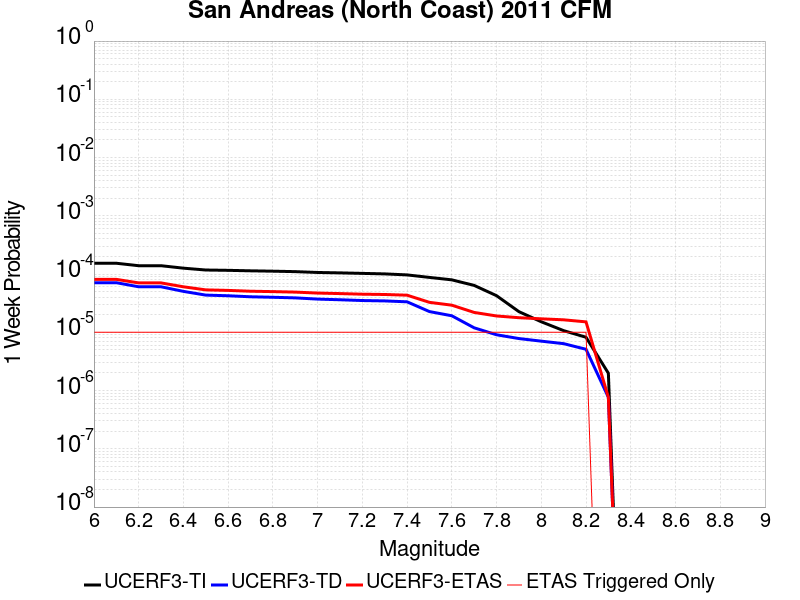 | 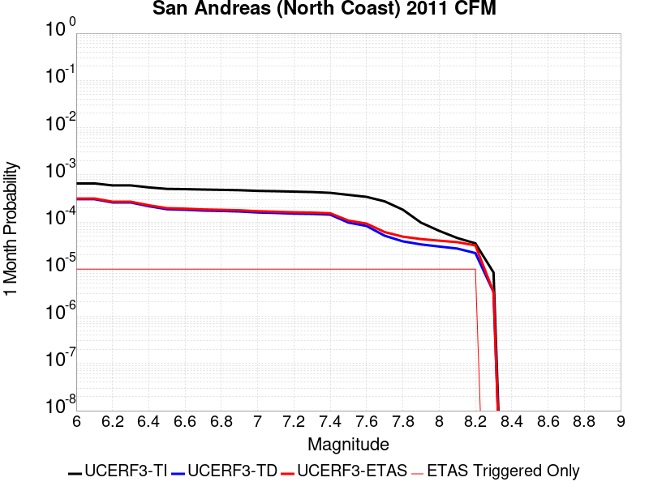 |  | 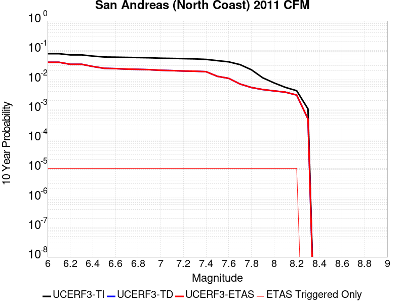 |

| Magnitude | 1 wk TI Prob | 1 wk TD Prob | 1 wk ETAS Prob | 1 wk ETAS/TD Gain | 1 wk ETAS Triggered Only | 1 mo TI Prob | 1 mo TD Prob | 1 mo ETAS Prob | 1 mo ETAS/TD Gain | 1 mo ETAS Triggered Only | 1 yr TI Prob | 1 yr TD Prob | 1 yr ETAS Prob | 1 yr ETAS/TD Gain | 1 yr ETAS Triggered Only | 10 yr TI Prob | 10 yr TD Prob | 10 yr ETAS Prob | 10 yr ETAS/TD Gain | 10 yr ETAS Triggered Only |
|-----|-----|-----|-----|-----|-----|-----|-----|-----|-----|-----|-----|-----|-----|-----|-----|-----|-----|-----|-----|-----|
| 6.0 | 1.5333705E-4 | 7.1106435E-5 | 8.1105725E-5 | 1.1406243 | 1.0E-5 | 6.5699324E-4 | 3.0470645E-4 | 3.147034E-4 | 1.0328084 | 1.0E-5 | 0.007969595 | 0.0037035241 | 0.0037134872 | 1.0026901 | 1.0E-5 | 0.0768977 | 0.03935284 | 0.03936245 | 1.0002441 | 1.0E-5 |
| 6.1 | 1.5333705E-4 | 7.1106435E-5 | 8.1105725E-5 | 1.1406243 | 1.0E-5 | 6.5699324E-4 | 3.0470645E-4 | 3.147034E-4 | 1.0328084 | 1.0E-5 | 0.007969595 | 0.0037035241 | 0.0037134872 | 1.0026901 | 1.0E-5 | 0.0768977 | 0.03935284 | 0.03936245 | 1.0002441 | 1.0E-5 |
| 6.2 | 1.3912938E-4 | 6.050204E-5 | 7.050143E-5 | 1.1652737 | 1.0E-5 | 5.961325E-4 | 2.5926883E-4 | 2.6926622E-4 | 1.03856 | 1.0E-5 | 0.007233787 | 0.003152056 | 0.0031620245 | 1.0031625 | 1.0E-5 | 0.07002798 | 0.03369227 | 0.033701934 | 1.0002868 | 1.0E-5 |
| 6.3 | 1.3912938E-4 | 6.050204E-5 | 7.050143E-5 | 1.1652737 | 1.0E-5 | 5.961325E-4 | 2.5926883E-4 | 2.6926622E-4 | 1.03856 | 1.0E-5 | 0.007233787 | 0.003152056 | 0.0031620245 | 1.0031625 | 1.0E-5 | 0.07002798 | 0.03369227 | 0.033701934 | 1.0002868 | 1.0E-5 |
| 6.4 | 1.2623647E-4 | 5.0442024E-5 | 6.0441518E-5 | 1.1982374 | 1.0E-5 | 5.4090127E-4 | 2.161623E-4 | 2.2616013E-4 | 1.0462515 | 1.0E-5 | 0.0065656058 | 0.0026286195 | 0.0026385933 | 1.0037943 | 1.0E-5 | 0.06374981 | 0.028303223 | 0.02831294 | 1.0003433 | 1.0E-5 |
| 6.5 | 1.1736096E-4 | 4.3523814E-5 | 5.3523378E-5 | 1.2297493 | 1.0E-5 | 5.028786E-4 | 1.8651738E-4 | 1.9651551E-4 | 1.0536044 | 1.0E-5 | 0.006105373 | 0.0022685004 | 0.0022784777 | 1.0043982 | 1.0E-5 | 0.05940335 | 0.024579322 | 0.024589075 | 1.0003968 | 1.0E-5 |
| 6.6 | 1.1586959E-4 | 4.2423668E-5 | 5.2423246E-5 | 1.2357075 | 1.0E-5 | 4.964894E-4 | 1.8180315E-4 | 1.9180133E-4 | 1.0549946 | 1.0E-5 | 0.006028018 | 0.0022112224 | 0.0022212004 | 1.0045124 | 1.0E-5 | 0.058671024 | 0.023984991 | 0.023994751 | 1.000407 | 1.0E-5 |
| 6.7 | 1.13693764E-4 | 4.073593E-5 | 5.073552E-5 | 1.2454735 | 1.0E-5 | 4.87168E-4 | 1.7457096E-4 | 1.8456922E-4 | 1.0572733 | 1.0E-5 | 0.005915152 | 0.0021233456 | 0.0021333243 | 1.0046996 | 1.0E-5 | 0.057601593 | 0.023076393 | 0.023086162 | 1.0004233 | 1.0E-5 |
| 6.8 | 1.1204889E-4 | 3.9953447E-5 | 4.995305E-5 | 1.2502813 | 1.0E-5 | 4.8012115E-4 | 1.7121792E-4 | 1.8121621E-4 | 1.0583951 | 1.0E-5 | 0.005829819 | 0.002082601 | 0.0020925803 | 1.0047917 | 1.0E-5 | 0.05679232 | 0.022636656 | 0.022646429 | 1.0004318 | 1.0E-5 |
| 6.9 | 1.1005794E-4 | 3.900957E-5 | 4.900918E-5 | 1.2563374 | 1.0E-5 | 4.7159163E-4 | 1.6717325E-4 | 1.7717158E-4 | 1.0598081 | 1.0E-5 | 0.0057265228 | 0.0020334502 | 0.0020434298 | 1.0049077 | 1.0E-5 | 0.055811852 | 0.022102542 | 0.022112321 | 1.0004424 | 1.0E-5 |
| 7.0 | 1.0647948E-4 | 3.7166337E-5 | 4.7165966E-5 | 1.2690507 | 1.0E-5 | 4.562608E-4 | 1.5927466E-4 | 1.6927307E-4 | 1.0627747 | 1.0E-5 | 0.0055408357 | 0.0019374598 | 0.0019474404 | 1.0051514 | 1.0E-5 | 0.054047033 | 0.021062272 | 0.021072062 | 1.0004648 | 1.0E-5 |
| 7.1 | 1.04795035E-4 | 3.6215948E-5 | 4.6215588E-5 | 1.2761115 | 1.0E-5 | 4.4904428E-4 | 1.5520205E-4 | 1.652005E-4 | 1.0644221 | 1.0E-5 | 0.0054534175 | 0.0018879628 | 0.001897944 | 1.0052867 | 1.0E-5 | 0.053215165 | 0.020530313 | 0.020540107 | 1.0004771 | 1.0E-5 |
| 7.2 | 1.02724036E-4 | 3.5124547E-5 | 4.5124194E-5 | 1.2846912 | 1.0E-5 | 4.401716E-4 | 1.5052517E-4 | 1.6052366E-4 | 1.066424 | 1.0E-5 | 0.0053459285 | 0.0018311188 | 0.0018411005 | 1.0054511 | 1.0E-5 | 0.052191395 | 0.019919246 | 0.019929048 | 1.000492 | 1.0E-5 |
| 7.3 | 1.00650694E-4 | 3.4592013E-5 | 4.4591667E-5 | 1.2890741 | 1.0E-5 | 4.312888E-4 | 1.4824314E-4 | 1.5824166E-4 | 1.0674467 | 1.0E-5 | 0.005238306 | 0.0018033815 | 0.0018133634 | 1.0055351 | 1.0E-5 | 0.051165357 | 0.019596443 | 0.019606246 | 1.0005003 | 1.0E-5 |
| 7.4 | 9.672919E-5 | 3.338123E-5 | 4.3380896E-5 | 1.2995596 | 1.0E-5 | 4.144878E-4 | 1.4305465E-4 | 1.5305322E-4 | 1.0698934 | 1.0E-5 | 0.005034718 | 0.0017403142 | 0.0017502968 | 1.0057361 | 1.0E-5 | 0.049221683 | 0.018869769 | 0.01887958 | 1.00052 | 1.0E-5 |
| 7.5 | 8.7600405E-5 | 2.2700917E-5 | 3.270069E-5 | 1.4405009 | 1.0E-5 | 3.753763E-4 | 9.728602E-5 | 1.0728505E-4 | 1.1027797 | 1.0E-5 | 0.0045606326 | 0.0011838155 | 0.0011938037 | 1.0084373 | 1.0E-5 | 0.04468165 | 0.013130207 | 0.013140076 | 1.0007516 | 1.0E-5 |
| 7.6 | 7.9562284E-5 | 1.9226305E-5 | 2.9226114E-5 | 1.5201107 | 1.0E-5 | 3.4093665E-4 | 8.239586E-5 | 9.2395036E-5 | 1.1213553 | 1.0E-5 | 0.0041430052 | 0.0010027094 | 0.0010126993 | 1.009963 | 1.0E-5 | 0.040666126 | 0.011221658 | 0.011231546 | 1.0008811 | 1.0E-5 |
| 7.7 | 6.3866544E-5 | 1.1941707E-5 | 2.1941587E-5 | 1.8373913 | 1.0E-5 | 2.7368503E-4 | 5.117774E-5 | 6.117723E-5 | 1.1953875 | 1.0E-5 | 0.0033270244 | 6.2291115E-4 | 6.329049E-4 | 1.0160437 | 1.0E-5 | 0.032776527 | 0.007210334 | 0.0072202617 | 1.0013769 | 1.0E-5 |
| 7.8 | 4.2543215E-5 | 9.076524E-6 | 1.9076433E-5 | 2.1017332 | 1.0E-5 | 1.8231533E-4 | 3.8898812E-5 | 4.8898422E-5 | 1.2570673 | 1.0E-5 | 0.0022174292 | 4.7349022E-4 | 4.8348546E-4 | 1.0211098 | 1.0E-5 | 0.021954332 | 0.005490525 | 0.0055004703 | 1.0018113 | 1.0E-5 |
| 7.9 | 2.2636612E-5 | 7.81435E-6 | 1.7814273E-5 | 2.279687 | 1.0E-5 | 9.7010445E-5 | 3.3489643E-5 | 4.3489308E-5 | 1.2985898 | 1.0E-5 | 0.0011804621 | 4.076602E-4 | 4.1765612E-4 | 1.0245203 | 1.0E-5 | 0.011742111 | 0.0046832846 | 0.0046932376 | 1.0021253 | 1.0E-5 |
| 8.0 | 1.5167874E-5 | 7.0494675E-6 | 1.7049397E-5 | 2.418537 | 1.0E-5 | 6.500356E-5 | 3.0211655E-5 | 4.021135E-5 | 1.330988 | 1.0E-5 | 7.9113094E-4 | 3.677649E-4 | 3.7776123E-4 | 1.0271813 | 1.0E-5 | 0.007883203 | 0.004215588 | 0.0042255456 | 1.0023621 | 1.0E-5 |
| 8.1 | 1.0681047E-5 | 6.386992E-6 | 1.6386928E-5 | 2.5656722 | 1.0E-5 | 4.5775112E-5 | 2.7372536E-5 | 3.737226E-5 | 1.3653197 | 1.0E-5 | 5.5716943E-4 | 3.3320975E-4 | 3.4320643E-4 | 1.0300012 | 1.0E-5 | 0.0055577457 | 0.003817393 | 0.0038273546 | 1.0026096 | 1.0E-5 |
| 8.2 | 8.226114E-6 | 5.1150587E-6 | 1.5115007E-5 | 2.9550018 | 1.0E-5 | 3.52543E-5 | 2.1921496E-5 | 3.1921278E-5 | 1.4561633 | 1.0E-5 | 4.2913653E-4 | 2.668616E-4 | 2.7685892E-4 | 1.0374626 | 1.0E-5 | 0.004283088 | 0.0030450926 | 0.0030550621 | 1.003274 | 1.0E-5 |
| 8.3 | 1.983087E-6 | 7.6599065E-7 | 7.6599065E-7 | 1.0 | 0.0 | 8.498917E-6 | 3.282813E-6 | 3.282813E-6 | 1.0 | 0.0 | 1.034694E-4 | 3.9967534E-5 | 3.9967534E-5 | 1.0 | 0.0 | 0.0010342124 | 4.719687E-4 | 4.719687E-4 | 1.0 | 0.0 |

## Hartley Springs 2011 CFM
*[(top)](#table-of-contents)*

| 1 Week | 1 Month | 1 Year | 10 Year |
|-----|-----|-----|-----|
|  | 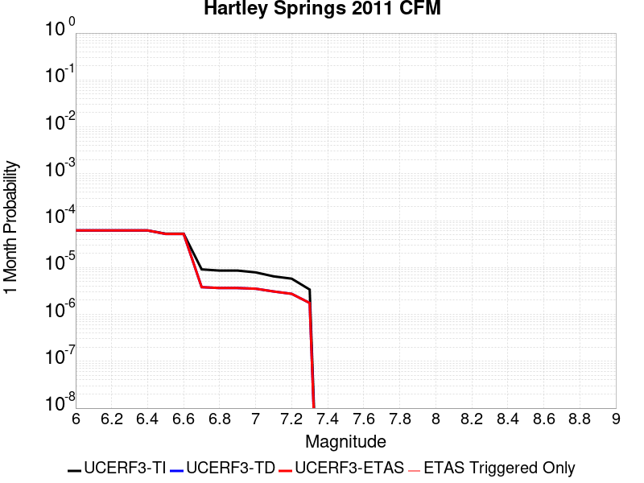 |  | 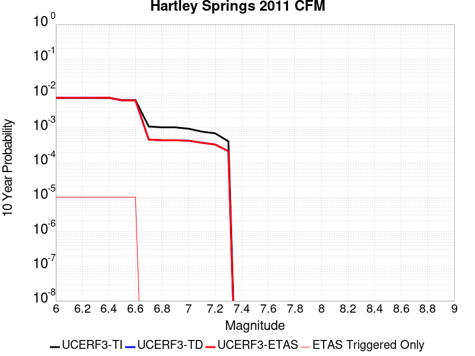 |

| Magnitude | 1 wk TI Prob | 1 wk TD Prob | 1 wk ETAS Prob | 1 wk ETAS/TD Gain | 1 wk ETAS Triggered Only | 1 mo TI Prob | 1 mo TD Prob | 1 mo ETAS Prob | 1 mo ETAS/TD Gain | 1 mo ETAS Triggered Only | 1 yr TI Prob | 1 yr TD Prob | 1 yr ETAS Prob | 1 yr ETAS/TD Gain | 1 yr ETAS Triggered Only | 10 yr TI Prob | 10 yr TD Prob | 10 yr ETAS Prob | 10 yr ETAS/TD Gain | 10 yr ETAS Triggered Only |
|-----|-----|-----|-----|-----|-----|-----|-----|-----|-----|-----|-----|-----|-----|-----|-----|-----|-----|-----|-----|-----|
| 6.0 | 1.4352418E-5 | 1.4434182E-5 | 1.4434182E-5 | 1.0 | 0.0 | 6.1508916E-5 | 6.1860235E-5 | 6.1860235E-5 | 1.0 | 0.0 | 7.486137E-4 | 7.5305253E-4 | 7.5305253E-4 | 1.0 | 0.0 | 0.007460968 | 0.0075211283 | 0.0075310534 | 1.0013196 | 1.0E-5 |
| 6.1 | 1.4352418E-5 | 1.4434182E-5 | 1.4434182E-5 | 1.0 | 0.0 | 6.1508916E-5 | 6.1860235E-5 | 6.1860235E-5 | 1.0 | 0.0 | 7.486137E-4 | 7.5305253E-4 | 7.5305253E-4 | 1.0 | 0.0 | 0.007460968 | 0.0075211283 | 0.0075310534 | 1.0013196 | 1.0E-5 |
| 6.2 | 1.4352418E-5 | 1.4434182E-5 | 1.4434182E-5 | 1.0 | 0.0 | 6.1508916E-5 | 6.1860235E-5 | 6.1860235E-5 | 1.0 | 0.0 | 7.486137E-4 | 7.5305253E-4 | 7.5305253E-4 | 1.0 | 0.0 | 0.007460968 | 0.0075211283 | 0.0075310534 | 1.0013196 | 1.0E-5 |
| 6.3 | 1.4352418E-5 | 1.4434182E-5 | 1.4434182E-5 | 1.0 | 0.0 | 6.1508916E-5 | 6.1860235E-5 | 6.1860235E-5 | 1.0 | 0.0 | 7.486137E-4 | 7.5305253E-4 | 7.5305253E-4 | 1.0 | 0.0 | 0.007460968 | 0.0075211283 | 0.0075310534 | 1.0013196 | 1.0E-5 |
| 6.4 | 1.4352418E-5 | 1.4434182E-5 | 1.4434182E-5 | 1.0 | 0.0 | 6.1508916E-5 | 6.1860235E-5 | 6.1860235E-5 | 1.0 | 0.0 | 7.486137E-4 | 7.5305253E-4 | 7.5305253E-4 | 1.0 | 0.0 | 0.007460968 | 0.0075211283 | 0.0075310534 | 1.0013196 | 1.0E-5 |
| 6.5 | 1.2279858E-5 | 1.2133106E-5 | 1.2133106E-5 | 1.0 | 0.0 | 5.26269E-5 | 5.1998883E-5 | 5.1998883E-5 | 1.0 | 0.0 | 6.4054417E-4 | 6.3306064E-4 | 6.3306064E-4 | 1.0 | 0.0 | 0.0063870098 | 0.006328085 | 0.0063380217 | 1.0015702 | 1.0E-5 |
| 6.6 | 1.2279858E-5 | 1.2133106E-5 | 1.2133106E-5 | 1.0 | 0.0 | 5.26269E-5 | 5.1998883E-5 | 5.1998883E-5 | 1.0 | 0.0 | 6.4054417E-4 | 6.3306064E-4 | 6.3306064E-4 | 1.0 | 0.0 | 0.0063870098 | 0.006328085 | 0.0063380217 | 1.0015702 | 1.0E-5 |
| 6.7 | 2.1282601E-6 | 8.8948315E-7 | 8.8948315E-7 | 1.0 | 0.0 | 9.121083E-6 | 3.8120663E-6 | 3.8120663E-6 | 1.0 | 0.0 | 1.11043526E-4 | 4.641118E-5 | 4.641118E-5 | 1.0 | 0.0 | 0.0011098806 | 4.6404017E-4 | 4.6404017E-4 | 1.0 | 0.0 |
| 6.8 | 2.00516E-6 | 8.517597E-7 | 8.517597E-7 | 1.0 | 0.0 | 8.593515E-6 | 3.650395E-6 | 3.650395E-6 | 1.0 | 0.0 | 1.04621024E-4 | 4.444291E-5 | 4.444291E-5 | 1.0 | 0.0 | 0.0010457177 | 4.4436535E-4 | 4.4436535E-4 | 1.0 | 0.0 |
| 6.9 | 2.00516E-6 | 8.517597E-7 | 8.517597E-7 | 1.0 | 0.0 | 8.593515E-6 | 3.650395E-6 | 3.650395E-6 | 1.0 | 0.0 | 1.04621024E-4 | 4.444291E-5 | 4.444291E-5 | 1.0 | 0.0 | 0.0010457177 | 4.4436535E-4 | 4.4436535E-4 | 1.0 | 0.0 |
| 7.0 | 1.8366732E-6 | 8.237307E-7 | 8.237307E-7 | 1.0 | 0.0 | 7.871433E-6 | 3.5302712E-6 | 3.5302712E-6 | 1.0 | 0.0 | 9.583048E-5 | 4.298046E-5 | 4.298046E-5 | 1.0 | 0.0 | 9.5789164E-4 | 4.2974652E-4 | 4.2974652E-4 | 1.0 | 0.0 |
| 7.1 | 1.5097997E-6 | 7.1902616E-7 | 7.1902616E-7 | 1.0 | 0.0 | 6.470554E-6 | 3.0815384E-6 | 3.0815384E-6 | 1.0 | 0.0 | 7.877615E-5 | 3.7517326E-5 | 3.7517326E-5 | 1.0 | 0.0 | 7.874823E-4 | 3.7513362E-4 | 3.7513362E-4 | 1.0 | 0.0 |
| 7.2 | 1.3490993E-6 | 6.405254E-7 | 6.405254E-7 | 1.0 | 0.0 | 5.7818415E-6 | 2.7451074E-6 | 2.7451074E-6 | 1.0 | 0.0 | 7.0391645E-5 | 3.3421402E-5 | 3.3421402E-5 | 1.0 | 0.0 | 7.0369354E-4 | 3.341867E-4 | 3.341867E-4 | 1.0 | 0.0 |
| 7.3 | 7.900015E-7 | 4.0889498E-7 | 4.0889498E-7 | 1.0 | 0.0 | 3.3857161E-6 | 1.752407E-6 | 1.752407E-6 | 1.0 | 0.0 | 4.1220315E-5 | 2.1335554E-5 | 2.1335554E-5 | 1.0 | 0.0 | 4.121267E-4 | 2.1335555E-4 | 2.1335555E-4 | 1.0 | 0.0 |

## East Huasna 2011 CFM
*[(top)](#table-of-contents)*

| 1 Week | 1 Month | 1 Year | 10 Year |
|-----|-----|-----|-----|
|  | 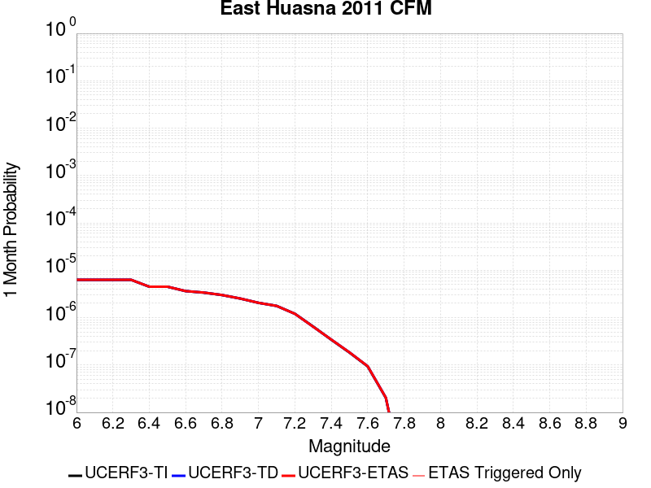 |  | 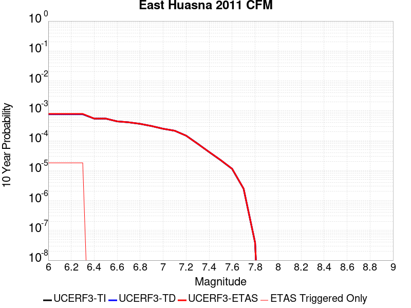 |

| Magnitude | 1 wk TI Prob | 1 wk TD Prob | 1 wk ETAS Prob | 1 wk ETAS/TD Gain | 1 wk ETAS Triggered Only | 1 mo TI Prob | 1 mo TD Prob | 1 mo ETAS Prob | 1 mo ETAS/TD Gain | 1 mo ETAS Triggered Only | 1 yr TI Prob | 1 yr TD Prob | 1 yr ETAS Prob | 1 yr ETAS/TD Gain | 1 yr ETAS Triggered Only | 10 yr TI Prob | 10 yr TD Prob | 10 yr ETAS Prob | 10 yr ETAS/TD Gain | 10 yr ETAS Triggered Only |
|-----|-----|-----|-----|-----|-----|-----|-----|-----|-----|-----|-----|-----|-----|-----|-----|-----|-----|-----|-----|-----|
| 6.0 | 1.4658423E-6 | 1.4715657E-6 | 1.4715657E-6 | 1.0 | 0.0 | 6.282166E-6 | 6.3066955E-6 | 6.3066955E-6 | 1.0 | 0.0 | 7.6482684E-5 | 7.678138E-5 | 7.678138E-5 | 1.0 | 0.0 | 7.645637E-4 | 7.6755555E-4 | 7.775479E-4 | 1.0130184 | 1.0E-5 |
| 6.1 | 1.4658423E-6 | 1.4715657E-6 | 1.4715657E-6 | 1.0 | 0.0 | 6.282166E-6 | 6.3066955E-6 | 6.3066955E-6 | 1.0 | 0.0 | 7.6482684E-5 | 7.678138E-5 | 7.678138E-5 | 1.0 | 0.0 | 7.645637E-4 | 7.6755555E-4 | 7.775479E-4 | 1.0130184 | 1.0E-5 |
| 6.2 | 1.4658423E-6 | 1.4715657E-6 | 1.4715657E-6 | 1.0 | 0.0 | 6.282166E-6 | 6.3066955E-6 | 6.3066955E-6 | 1.0 | 0.0 | 7.6482684E-5 | 7.678138E-5 | 7.678138E-5 | 1.0 | 0.0 | 7.645637E-4 | 7.6755555E-4 | 7.775479E-4 | 1.0130184 | 1.0E-5 |
| 6.3 | 1.4658423E-6 | 1.4715657E-6 | 1.4715657E-6 | 1.0 | 0.0 | 6.282166E-6 | 6.3066955E-6 | 6.3066955E-6 | 1.0 | 0.0 | 7.6482684E-5 | 7.678138E-5 | 7.678138E-5 | 1.0 | 0.0 | 7.645637E-4 | 7.6755555E-4 | 7.775479E-4 | 1.0130184 | 1.0E-5 |
| 6.4 | 1.0488257E-6 | 1.0527513E-6 | 1.0527513E-6 | 1.0 | 0.0 | 4.4949593E-6 | 4.5117836E-6 | 4.5117836E-6 | 1.0 | 0.0 | 5.472476E-5 | 5.49296E-5 | 5.49296E-5 | 1.0 | 0.0 | 5.4711284E-4 | 5.491621E-4 | 5.491621E-4 | 1.0 | 0.0 |
| 6.5 | 1.0488257E-6 | 1.0527513E-6 | 1.0527513E-6 | 1.0 | 0.0 | 4.4949593E-6 | 4.5117836E-6 | 4.5117836E-6 | 1.0 | 0.0 | 5.472476E-5 | 5.49296E-5 | 5.49296E-5 | 1.0 | 0.0 | 5.4711284E-4 | 5.491621E-4 | 5.491621E-4 | 1.0 | 0.0 |
| 6.6 | 8.463064E-7 | 8.49363E-7 | 8.49363E-7 | 1.0 | 0.0 | 3.6270226E-6 | 3.6401223E-6 | 3.6401223E-6 | 1.0 | 0.0 | 4.4158103E-5 | 4.4317596E-5 | 4.4317596E-5 | 1.0 | 0.0 | 4.414933E-4 | 4.4308844E-4 | 4.4308844E-4 | 1.0 | 0.0 |
| 6.7 | 7.876149E-7 | 7.902531E-7 | 7.902531E-7 | 1.0 | 0.0 | 3.375488E-6 | 3.3867946E-6 | 3.3867946E-6 | 1.0 | 0.0 | 4.109579E-5 | 4.1233452E-5 | 4.1233452E-5 | 1.0 | 0.0 | 4.108819E-4 | 4.1225864E-4 | 4.1225864E-4 | 1.0 | 0.0 |
| 6.8 | 6.9940785E-7 | 7.0165754E-7 | 7.0165754E-7 | 1.0 | 0.0 | 2.9974588E-6 | 3.0071003E-6 | 3.0071003E-6 | 1.0 | 0.0 | 3.649345E-5 | 3.6610836E-5 | 3.6610836E-5 | 1.0 | 0.0 | 3.6487455E-4 | 3.660485E-4 | 3.660485E-4 | 1.0 | 0.0 |
| 6.9 | 5.899658E-7 | 5.9155974E-7 | 5.9155974E-7 | 1.0 | 0.0 | 2.5284223E-6 | 2.5352535E-6 | 2.5352535E-6 | 1.0 | 0.0 | 3.0783107E-5 | 3.086628E-5 | 3.086628E-5 | 1.0 | 0.0 | 3.0778843E-4 | 3.086202E-4 | 3.086202E-4 | 1.0 | 0.0 |
| 7.0 | 4.793814E-7 | 4.8032706E-7 | 4.8032706E-7 | 1.0 | 0.0 | 2.05449E-6 | 2.058543E-6 | 2.058543E-6 | 1.0 | 0.0 | 2.501313E-5 | 2.5062474E-5 | 2.5062474E-5 | 1.0 | 0.0 | 2.5010316E-4 | 2.5059667E-4 | 2.5059667E-4 | 1.0 | 0.0 |
| 7.1 | 4.1256908E-7 | 4.129939E-7 | 4.129939E-7 | 1.0 | 0.0 | 1.768152E-6 | 1.7699726E-6 | 1.7699726E-6 | 1.0 | 0.0 | 2.1527037E-5 | 2.1549205E-5 | 2.1549205E-5 | 1.0 | 0.0 | 2.1524953E-4 | 2.154713E-4 | 2.154713E-4 | 1.0 | 0.0 |
| 7.2 | 2.822599E-7 | 2.8161398E-7 | 2.8161398E-7 | 1.0 | 0.0 | 1.2096847E-6 | 1.2069165E-6 | 1.2069165E-6 | 1.0 | 0.0 | 1.47278115E-5 | 1.469411E-5 | 1.469411E-5 | 1.0 | 0.0 | 1.4726835E-4 | 1.4693146E-4 | 1.4693146E-4 | 1.0 | 0.0 |
| 7.3 | 1.5261652E-7 | 1.5075E-7 | 1.5075E-7 | 1.0 | 0.0 | 6.540707E-7 | 6.4607127E-7 | 6.4607127E-7 | 1.0 | 0.0 | 7.963281E-6 | 7.8658895E-6 | 7.8658895E-6 | 1.0 | 0.0 | 7.962996E-5 | 7.865613E-5 | 7.865613E-5 | 1.0 | 0.0 |
| 7.4 | 7.976414E-8 | 8.057865E-8 | 8.057865E-8 | 1.0 | 0.0 | 3.418463E-7 | 3.45337E-7 | 3.45337E-7 | 1.0 | 0.0 | 4.1619705E-6 | 4.2044703E-6 | 4.2044703E-6 | 1.0 | 0.0 | 4.161893E-5 | 4.2043914E-5 | 4.2043914E-5 | 1.0 | 0.0 |
| 7.5 | 4.2715055E-8 | 4.3202512E-8 | 4.3202512E-8 | 1.0 | 0.0 | 1.830645E-7 | 1.8515361E-7 | 1.8515361E-7 | 1.0 | 0.0 | 2.228808E-6 | 2.2542429E-6 | 2.2542429E-6 | 1.0 | 0.0 | 2.2287857E-5 | 2.2542203E-5 | 2.2542203E-5 | 1.0 | 0.0 |
| 7.6 | 2.1807532E-8 | 2.2057476E-8 | 2.2057476E-8 | 1.0 | 0.0 | 9.346085E-8 | 9.4532034E-8 | 9.4532034E-8 | 1.0 | 0.0 | 1.1378852E-6 | 1.1509269E-6 | 1.1509269E-6 | 1.0 | 0.0 | 1.1378794E-5 | 1.1509211E-5 | 1.1509211E-5 | 1.0 | 0.0 |
| 7.7 | 4.7196043E-9 | 4.767283E-9 | 4.767283E-9 | 1.0 | 0.0 | 2.0226874E-8 | 2.0431212E-8 | 2.0431212E-8 | 1.0 | 0.0 | 2.4626218E-7 | 2.4874998E-7 | 2.4874998E-7 | 1.0 | 0.0 | 2.462619E-6 | 2.487497E-6 | 2.487497E-6 | 1.0 | 0.0 |
| 7.8 | 7.400003E-11 | 7.4654505E-11 | 7.4654505E-11 | 1.0 | 0.0 | 3.171432E-10 | 3.1994773E-10 | 3.1994773E-10 | 1.0 | 0.0 | 3.861218E-9 | 3.895363E-9 | 3.895363E-9 | 1.0 | 0.0 | 3.861218E-8 | 3.895363E-8 | 3.895363E-8 | 1.0 | 0.0 |

## Garberville - Briceland 2011 CFM
*[(top)](#table-of-contents)*

| 1 Week | 1 Month | 1 Year | 10 Year |
|-----|-----|-----|-----|
|  |  | 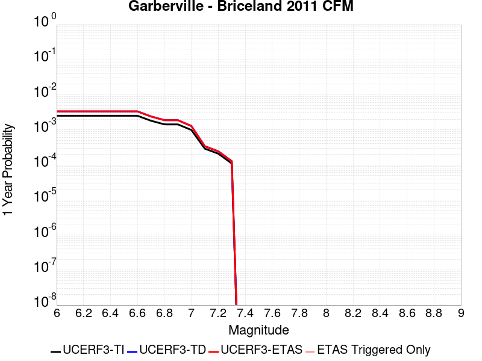 | 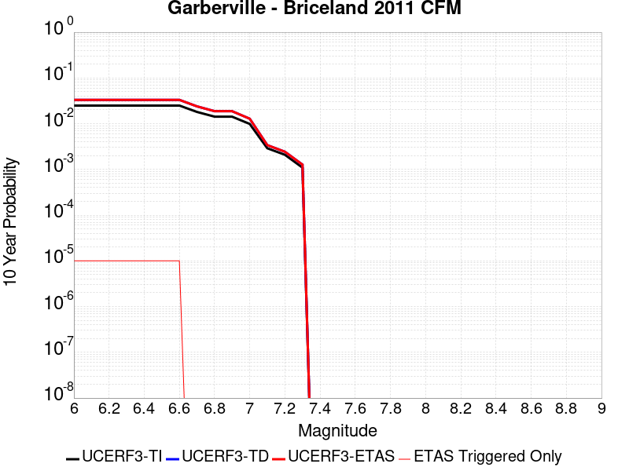 |

| Magnitude | 1 wk TI Prob | 1 wk TD Prob | 1 wk ETAS Prob | 1 wk ETAS/TD Gain | 1 wk ETAS Triggered Only | 1 mo TI Prob | 1 mo TD Prob | 1 mo ETAS Prob | 1 mo ETAS/TD Gain | 1 mo ETAS Triggered Only | 1 yr TI Prob | 1 yr TD Prob | 1 yr ETAS Prob | 1 yr ETAS/TD Gain | 1 yr ETAS Triggered Only | 10 yr TI Prob | 10 yr TD Prob | 10 yr ETAS Prob | 10 yr ETAS/TD Gain | 10 yr ETAS Triggered Only |
|-----|-----|-----|-----|-----|-----|-----|-----|-----|-----|-----|-----|-----|-----|-----|-----|-----|-----|-----|-----|-----|
| 6.0 | 4.8399295E-5 | 6.452381E-5 | 6.452381E-5 | 1.0 | 0.0 | 2.0740906E-4 | 2.7650563E-4 | 2.7650563E-4 | 1.0 | 0.0 | 0.002522281 | 0.003362017 | 0.003362017 | 1.0 | 0.0 | 0.024938442 | 0.03317861 | 0.03318828 | 1.0002913 | 1.0E-5 |
| 6.1 | 4.8399295E-5 | 6.452381E-5 | 6.452381E-5 | 1.0 | 0.0 | 2.0740906E-4 | 2.7650563E-4 | 2.7650563E-4 | 1.0 | 0.0 | 0.002522281 | 0.003362017 | 0.003362017 | 1.0 | 0.0 | 0.024938442 | 0.03317861 | 0.03318828 | 1.0002913 | 1.0E-5 |
| 6.2 | 4.8399295E-5 | 6.452381E-5 | 6.452381E-5 | 1.0 | 0.0 | 2.0740906E-4 | 2.7650563E-4 | 2.7650563E-4 | 1.0 | 0.0 | 0.002522281 | 0.003362017 | 0.003362017 | 1.0 | 0.0 | 0.024938442 | 0.03317861 | 0.03318828 | 1.0002913 | 1.0E-5 |
| 6.3 | 4.8399295E-5 | 6.452381E-5 | 6.452381E-5 | 1.0 | 0.0 | 2.0740906E-4 | 2.7650563E-4 | 2.7650563E-4 | 1.0 | 0.0 | 0.002522281 | 0.003362017 | 0.003362017 | 1.0 | 0.0 | 0.024938442 | 0.03317861 | 0.03318828 | 1.0002913 | 1.0E-5 |
| 6.4 | 4.8399295E-5 | 6.452381E-5 | 6.452381E-5 | 1.0 | 0.0 | 2.0740906E-4 | 2.7650563E-4 | 2.7650563E-4 | 1.0 | 0.0 | 0.002522281 | 0.003362017 | 0.003362017 | 1.0 | 0.0 | 0.024938442 | 0.03317861 | 0.03318828 | 1.0002913 | 1.0E-5 |
| 6.5 | 4.8399295E-5 | 6.452381E-5 | 6.452381E-5 | 1.0 | 0.0 | 2.0740906E-4 | 2.7650563E-4 | 2.7650563E-4 | 1.0 | 0.0 | 0.002522281 | 0.003362017 | 0.003362017 | 1.0 | 0.0 | 0.024938442 | 0.03317861 | 0.03318828 | 1.0002913 | 1.0E-5 |
| 6.6 | 4.8399295E-5 | 6.452381E-5 | 6.452381E-5 | 1.0 | 0.0 | 2.0740906E-4 | 2.7650563E-4 | 2.7650563E-4 | 1.0 | 0.0 | 0.002522281 | 0.003362017 | 0.003362017 | 1.0 | 0.0 | 0.024938442 | 0.03317861 | 0.03318828 | 1.0002913 | 1.0E-5 |
| 6.7 | 3.495179E-5 | 4.6308873E-5 | 4.6308873E-5 | 1.0 | 0.0 | 1.4978478E-4 | 1.9845461E-4 | 1.9845461E-4 | 1.0 | 0.0 | 0.0018221042 | 0.002414053 | 0.002414053 | 1.0 | 0.0 | 0.018072363 | 0.023930617 | 0.023930617 | 1.0 | 0.0 |
| 6.8 | 2.7517597E-5 | 3.6241618E-5 | 3.6241618E-5 | 1.0 | 0.0 | 1.1792722E-4 | 1.5531474E-4 | 1.5531474E-4 | 1.0 | 0.0 | 0.0014348183 | 0.0018897996 | 0.0018897996 | 1.0 | 0.0 | 0.014255894 | 0.018783508 | 0.018783508 | 1.0 | 0.0 |
| 6.9 | 2.74461E-5 | 3.6159345E-5 | 3.6159345E-5 | 1.0 | 0.0 | 1.1762084E-4 | 1.5496218E-4 | 1.5496218E-4 | 1.0 | 0.0 | 0.001431093 | 0.0018855145 | 0.0018855145 | 1.0 | 0.0 | 0.014219119 | 0.018741382 | 0.018741382 | 1.0 | 0.0 |
| 7.0 | 1.9023773E-5 | 2.4707579E-5 | 2.4707579E-5 | 1.0 | 0.0 | 8.152791E-5 | 1.0588763E-4 | 1.0588763E-4 | 1.0 | 0.0 | 9.921503E-4 | 0.0012888284 | 0.0012888284 | 1.0 | 0.0 | 0.009877323 | 0.012852574 | 0.012852574 | 1.0 | 0.0 |
| 7.1 | 5.566844E-6 | 6.512147E-6 | 6.512147E-6 | 1.0 | 0.0 | 2.3857683E-5 | 2.7908927E-5 | 2.7908927E-5 | 1.0 | 0.0 | 2.9042858E-4 | 3.3974246E-4 | 3.3974246E-4 | 1.0 | 0.0 | 0.002900493 | 0.0033926512 | 0.0033926512 | 1.0 | 0.0 |
| 7.2 | 4.011353E-6 | 4.6746213E-6 | 4.6746213E-6 | 1.0 | 0.0 | 1.7191402E-5 | 2.0033956E-5 | 2.0033956E-5 | 1.0 | 0.0 | 2.0928521E-4 | 2.4388955E-4 | 2.4388955E-4 | 1.0 | 0.0 | 0.0020908823 | 0.0024365564 | 0.0024365564 | 1.0 | 0.0 |
| 7.3 | 2.0974871E-6 | 2.4395908E-6 | 2.4395908E-6 | 1.0 | 0.0 | 8.989199E-6 | 1.0455362E-5 | 1.0455362E-5 | 1.0 | 0.0 | 1.09438006E-4 | 1.272891E-4 | 1.272891E-4 | 1.0 | 0.0 | 0.0010938413 | 0.0012724071 | 0.0012724071 | 1.0 | 0.0 |

## San Pedro Escarpment
*[(top)](#table-of-contents)*

| 1 Week | 1 Month | 1 Year | 10 Year |
|-----|-----|-----|-----|
| 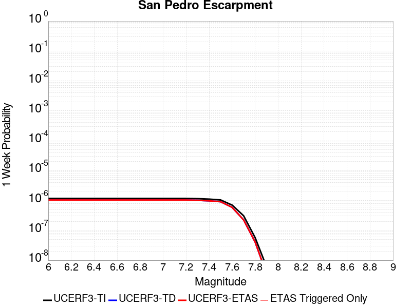 | 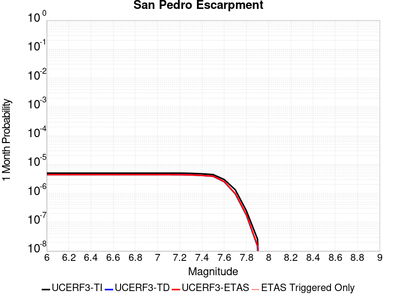 | 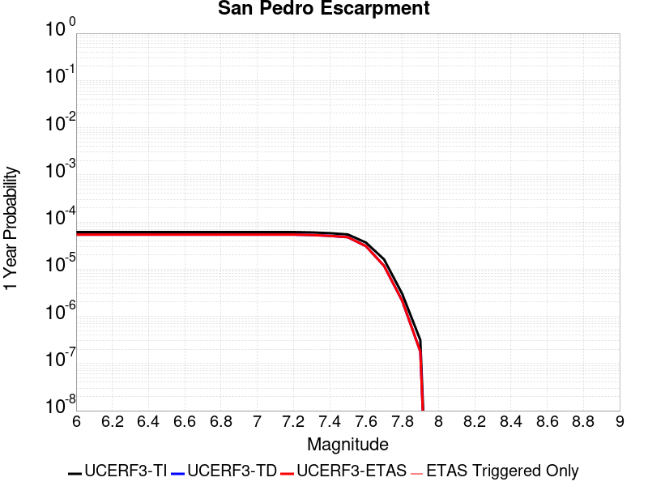 | 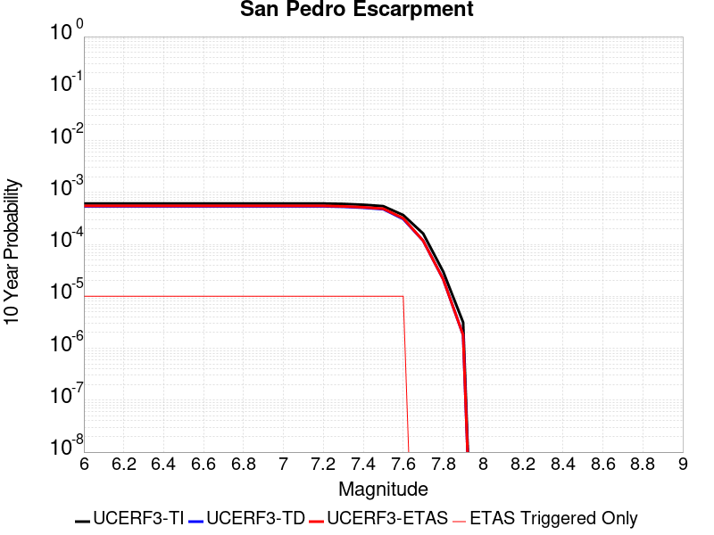 |

| Magnitude | 1 wk TI Prob | 1 wk TD Prob | 1 wk ETAS Prob | 1 wk ETAS/TD Gain | 1 wk ETAS Triggered Only | 1 mo TI Prob | 1 mo TD Prob | 1 mo ETAS Prob | 1 mo ETAS/TD Gain | 1 mo ETAS Triggered Only | 1 yr TI Prob | 1 yr TD Prob | 1 yr ETAS Prob | 1 yr ETAS/TD Gain | 1 yr ETAS Triggered Only | 10 yr TI Prob | 10 yr TD Prob | 10 yr ETAS Prob | 10 yr ETAS/TD Gain | 10 yr ETAS Triggered Only |
|-----|-----|-----|-----|-----|-----|-----|-----|-----|-----|-----|-----|-----|-----|-----|-----|-----|-----|-----|-----|-----|
| 6.0 | 1.1740281E-6 | 1.0380262E-6 | 1.0380262E-6 | 1.0 | 0.0 | 5.031539E-6 | 4.4486765E-6 | 4.4486765E-6 | 1.0 | 0.0 | 6.125726E-5 | 5.416135E-5 | 5.416135E-5 | 1.0 | 0.0 | 6.124038E-4 | 5.4148794E-4 | 5.514825E-4 | 1.0184577 | 1.0E-5 |
| 6.1 | 1.1740281E-6 | 1.0380262E-6 | 1.0380262E-6 | 1.0 | 0.0 | 5.031539E-6 | 4.4486765E-6 | 4.4486765E-6 | 1.0 | 0.0 | 6.125726E-5 | 5.416135E-5 | 5.416135E-5 | 1.0 | 0.0 | 6.124038E-4 | 5.4148794E-4 | 5.514825E-4 | 1.0184577 | 1.0E-5 |
| 6.2 | 1.1740281E-6 | 1.0380262E-6 | 1.0380262E-6 | 1.0 | 0.0 | 5.031539E-6 | 4.4486765E-6 | 4.4486765E-6 | 1.0 | 0.0 | 6.125726E-5 | 5.416135E-5 | 5.416135E-5 | 1.0 | 0.0 | 6.124038E-4 | 5.4148794E-4 | 5.514825E-4 | 1.0184577 | 1.0E-5 |
| 6.3 | 1.1740281E-6 | 1.0380262E-6 | 1.0380262E-6 | 1.0 | 0.0 | 5.031539E-6 | 4.4486765E-6 | 4.4486765E-6 | 1.0 | 0.0 | 6.125726E-5 | 5.416135E-5 | 5.416135E-5 | 1.0 | 0.0 | 6.124038E-4 | 5.4148794E-4 | 5.514825E-4 | 1.0184577 | 1.0E-5 |
| 6.4 | 1.1740281E-6 | 1.0380262E-6 | 1.0380262E-6 | 1.0 | 0.0 | 5.031539E-6 | 4.4486765E-6 | 4.4486765E-6 | 1.0 | 0.0 | 6.125726E-5 | 5.416135E-5 | 5.416135E-5 | 1.0 | 0.0 | 6.124038E-4 | 5.4148794E-4 | 5.514825E-4 | 1.0184577 | 1.0E-5 |
| 6.5 | 1.1740281E-6 | 1.0380262E-6 | 1.0380262E-6 | 1.0 | 0.0 | 5.031539E-6 | 4.4486765E-6 | 4.4486765E-6 | 1.0 | 0.0 | 6.125726E-5 | 5.416135E-5 | 5.416135E-5 | 1.0 | 0.0 | 6.124038E-4 | 5.4148794E-4 | 5.514825E-4 | 1.0184577 | 1.0E-5 |
| 6.6 | 1.1740281E-6 | 1.0380262E-6 | 1.0380262E-6 | 1.0 | 0.0 | 5.031539E-6 | 4.4486765E-6 | 4.4486765E-6 | 1.0 | 0.0 | 6.125726E-5 | 5.416135E-5 | 5.416135E-5 | 1.0 | 0.0 | 6.124038E-4 | 5.4148794E-4 | 5.514825E-4 | 1.0184577 | 1.0E-5 |
| 6.7 | 1.1740281E-6 | 1.0380262E-6 | 1.0380262E-6 | 1.0 | 0.0 | 5.031539E-6 | 4.4486765E-6 | 4.4486765E-6 | 1.0 | 0.0 | 6.125726E-5 | 5.416135E-5 | 5.416135E-5 | 1.0 | 0.0 | 6.124038E-4 | 5.4148794E-4 | 5.514825E-4 | 1.0184577 | 1.0E-5 |
| 6.8 | 1.1740281E-6 | 1.0380262E-6 | 1.0380262E-6 | 1.0 | 0.0 | 5.031539E-6 | 4.4486765E-6 | 4.4486765E-6 | 1.0 | 0.0 | 6.125726E-5 | 5.416135E-5 | 5.416135E-5 | 1.0 | 0.0 | 6.124038E-4 | 5.4148794E-4 | 5.514825E-4 | 1.0184577 | 1.0E-5 |
| 6.9 | 1.1740281E-6 | 1.0380262E-6 | 1.0380262E-6 | 1.0 | 0.0 | 5.031539E-6 | 4.4486765E-6 | 4.4486765E-6 | 1.0 | 0.0 | 6.125726E-5 | 5.416135E-5 | 5.416135E-5 | 1.0 | 0.0 | 6.124038E-4 | 5.4148794E-4 | 5.514825E-4 | 1.0184577 | 1.0E-5 |
| 7.0 | 1.1740281E-6 | 1.0380262E-6 | 1.0380262E-6 | 1.0 | 0.0 | 5.031539E-6 | 4.4486765E-6 | 4.4486765E-6 | 1.0 | 0.0 | 6.125726E-5 | 5.416135E-5 | 5.416135E-5 | 1.0 | 0.0 | 6.124038E-4 | 5.4148794E-4 | 5.514825E-4 | 1.0184577 | 1.0E-5 |
| 7.1 | 1.1740281E-6 | 1.0380262E-6 | 1.0380262E-6 | 1.0 | 0.0 | 5.031539E-6 | 4.4486765E-6 | 4.4486765E-6 | 1.0 | 0.0 | 6.125726E-5 | 5.416135E-5 | 5.416135E-5 | 1.0 | 0.0 | 6.124038E-4 | 5.4148794E-4 | 5.514825E-4 | 1.0184577 | 1.0E-5 |
| 7.2 | 1.1722314E-6 | 1.0362135E-6 | 1.0362135E-6 | 1.0 | 0.0 | 5.023839E-6 | 4.4409076E-6 | 4.4409076E-6 | 1.0 | 0.0 | 6.116352E-5 | 5.406677E-5 | 5.406677E-5 | 1.0 | 0.0 | 6.114669E-4 | 5.405426E-4 | 5.5053714E-4 | 1.01849 | 1.0E-5 |
| 7.3 | 1.1515234E-6 | 1.0152875E-6 | 1.0152875E-6 | 1.0 | 0.0 | 4.935091E-6 | 4.351225E-6 | 4.351225E-6 | 1.0 | 0.0 | 6.008308E-5 | 5.2974945E-5 | 5.2974945E-5 | 1.0 | 0.0 | 6.0066837E-4 | 5.296295E-4 | 5.3962425E-4 | 1.0188711 | 1.0E-5 |
| 7.4 | 1.1103637E-6 | 9.736466E-7 | 9.736466E-7 | 1.0 | 0.0 | 4.7586927E-6 | 4.172765E-6 | 4.172765E-6 | 1.0 | 0.0 | 5.793554E-5 | 5.0802293E-5 | 5.0802293E-5 | 1.0 | 0.0 | 5.792044E-4 | 5.079131E-4 | 5.179081E-4 | 1.0196784 | 1.0E-5 |
| 7.5 | 1.0425391E-6 | 9.1189133E-7 | 9.1189133E-7 | 1.0 | 0.0 | 4.4680173E-6 | 3.9081E-6 | 3.9081E-6 | 1.0 | 0.0 | 5.439675E-5 | 4.7580146E-5 | 4.7580146E-5 | 1.0 | 0.0 | 5.438344E-4 | 4.7570592E-4 | 4.8570117E-4 | 1.0210114 | 1.0E-5 |
| 7.6 | 7.0184194E-7 | 5.886514E-7 | 5.886514E-7 | 1.0 | 0.0 | 3.0078907E-6 | 2.5227896E-6 | 2.5227896E-6 | 1.0 | 0.0 | 3.6620455E-5 | 3.071458E-5 | 3.071458E-5 | 1.0 | 0.0 | 3.661442E-4 | 3.071081E-4 | 3.17105E-4 | 1.0325519 | 1.0E-5 |
| 7.7 | 3.0871365E-7 | 2.2456044E-7 | 2.2456044E-7 | 1.0 | 0.0 | 1.3230577E-6 | 9.624015E-7 | 9.624015E-7 | 1.0 | 0.0 | 1.610811E-5 | 1.1717177E-5 | 1.1717177E-5 | 1.0 | 0.0 | 1.6106942E-4 | 1.171657E-4 | 1.171657E-4 | 1.0 | 0.0 |
| 7.8 | 5.7512665E-8 | 4.1053042E-8 | 4.1053042E-8 | 1.0 | 0.0 | 2.464828E-7 | 1.759416E-7 | 1.759416E-7 | 1.0 | 0.0 | 3.0009242E-6 | 2.142087E-6 | 2.142087E-6 | 1.0 | 0.0 | 3.0008836E-5 | 2.1420683E-5 | 2.1420683E-5 | 1.0 | 0.0 |
| 7.9 | 6.040053E-9 | 3.4534322E-9 | 3.4534322E-9 | 1.0 | 0.0 | 2.5885942E-8 | 1.4800423E-8 | 1.4800423E-8 | 1.0 | 0.0 | 3.151613E-7 | 1.8019513E-7 | 1.8019513E-7 | 1.0 | 0.0 | 3.1516086E-6 | 1.80195E-6 | 1.80195E-6 | 1.0 | 0.0 |

## Surprise Valley 2011 CFM
*[(top)](#table-of-contents)*

| 1 Week | 1 Month | 1 Year | 10 Year |
|-----|-----|-----|-----|
|  | 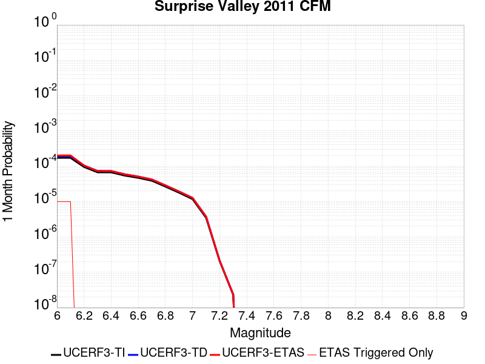 | 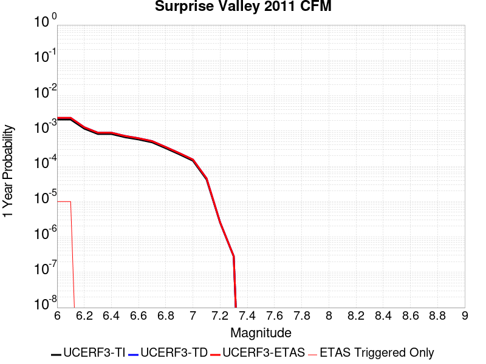 |  |

| Magnitude | 1 wk TI Prob | 1 wk TD Prob | 1 wk ETAS Prob | 1 wk ETAS/TD Gain | 1 wk ETAS Triggered Only | 1 mo TI Prob | 1 mo TD Prob | 1 mo ETAS Prob | 1 mo ETAS/TD Gain | 1 mo ETAS Triggered Only | 1 yr TI Prob | 1 yr TD Prob | 1 yr ETAS Prob | 1 yr ETAS/TD Gain | 1 yr ETAS Triggered Only | 10 yr TI Prob | 10 yr TD Prob | 10 yr ETAS Prob | 10 yr ETAS/TD Gain | 10 yr ETAS Triggered Only |
|-----|-----|-----|-----|-----|-----|-----|-----|-----|-----|-----|-----|-----|-----|-----|-----|-----|-----|-----|-----|-----|
| 6.0 | 4.0396248E-5 | 4.485131E-5 | 5.485086E-5 | 1.2229489 | 1.0E-5 | 1.7311527E-4 | 1.9220692E-4 | 2.02205E-4 | 1.0520172 | 1.0E-5 | 0.002105641 | 0.0023378176 | 0.0023477944 | 1.0042675 | 1.0E-5 | 0.020858008 | 0.023153966 | 0.023163734 | 1.0004219 | 1.0E-5 |
| 6.1 | 4.0396248E-5 | 4.485131E-5 | 5.485086E-5 | 1.2229489 | 1.0E-5 | 1.7311527E-4 | 1.9220692E-4 | 2.02205E-4 | 1.0520172 | 1.0E-5 | 0.002105641 | 0.0023378176 | 0.0023477944 | 1.0042675 | 1.0E-5 | 0.020858008 | 0.023153966 | 0.023163734 | 1.0004219 | 1.0E-5 |
| 6.2 | 2.2295266E-5 | 2.440125E-5 | 2.440125E-5 | 1.0 | 0.0 | 9.554764E-5 | 1.0457276E-4 | 1.0457276E-4 | 1.0 | 0.0 | 0.0011626717 | 0.0012724606 | 0.0012724606 | 1.0 | 0.0 | 0.011566074 | 0.012654981 | 0.012654981 | 1.0 | 0.0 |
| 6.3 | 1.572643E-5 | 1.7096807E-5 | 1.7096807E-5 | 1.0 | 0.0 | 6.7397246E-5 | 7.327003E-5 | 7.327003E-5 | 1.0 | 0.0 | 8.202525E-4 | 8.91708E-4 | 8.91708E-4 | 1.0 | 0.0 | 0.008172315 | 0.008882407 | 0.008882407 | 1.0 | 0.0 |
| 6.4 | 1.5714395E-5 | 1.7084629E-5 | 1.7084629E-5 | 1.0 | 0.0 | 6.734567E-5 | 7.3217845E-5 | 7.3217845E-5 | 1.0 | 0.0 | 8.1962504E-4 | 8.9107314E-4 | 8.9107314E-4 | 1.0 | 0.0 | 0.008166086 | 0.008876109 | 0.008876109 | 1.0 | 0.0 |
| 6.5 | 1.2733495E-5 | 1.38016E-5 | 1.38016E-5 | 1.0 | 0.0 | 5.457098E-5 | 5.9148413E-5 | 5.9148413E-5 | 1.0 | 0.0 | 6.641992E-4 | 7.1990065E-4 | 7.1990065E-4 | 1.0 | 0.0 | 0.0066221743 | 0.0071763797 | 0.0071763797 | 1.0 | 0.0 |
| 6.6 | 1.0983784E-5 | 1.1886554E-5 | 1.1886554E-5 | 1.0 | 0.0 | 4.7072506E-5 | 5.094141E-5 | 5.094141E-5 | 1.0 | 0.0 | 5.7295704E-4 | 6.200405E-4 | 6.200405E-4 | 1.0 | 0.0 | 0.0057148207 | 0.0061836545 | 0.0061836545 | 1.0 | 0.0 |
| 6.7 | 9.104806E-6 | 9.839491E-6 | 9.839491E-6 | 1.0 | 0.0 | 3.902001E-5 | 4.2168587E-5 | 4.2168587E-5 | 1.0 | 0.0 | 4.7496508E-4 | 5.132855E-4 | 5.132855E-4 | 1.0 | 0.0 | 0.004739512 | 0.005121397 | 0.005121397 | 1.0 | 0.0 |
| 6.8 | 6.2162403E-6 | 6.7041337E-6 | 6.7041337E-6 | 1.0 | 0.0 | 2.6640759E-5 | 2.8731698E-5 | 2.8731698E-5 | 1.0 | 0.0 | 3.2430296E-4 | 3.497545E-4 | 3.497545E-4 | 1.0 | 0.0 | 0.003238301 | 0.0034922638 | 0.0034922638 | 1.0 | 0.0 |
| 6.9 | 4.1792696E-6 | 4.50323E-6 | 4.50323E-6 | 1.0 | 0.0 | 1.7911032E-5 | 1.9299423E-5 | 1.9299423E-5 | 1.0 | 0.0 | 2.1804498E-4 | 2.3494668E-4 | 2.3494668E-4 | 1.0 | 0.0 | 0.0021783116 | 0.0023471361 | 0.0023471361 | 1.0 | 0.0 |
| 7.0 | 2.7478413E-6 | 2.9622424E-6 | 2.9622424E-6 | 1.0 | 0.0 | 1.177641E-5 | 1.269527E-5 | 1.269527E-5 | 1.0 | 0.0 | 1.4336836E-4 | 1.545552E-4 | 1.545552E-4 | 1.0 | 0.0 | 0.001432759 | 0.0015445995 | 0.0015445995 | 1.0 | 0.0 |
| 7.1 | 8.128648E-7 | 8.724922E-7 | 8.724922E-7 | 1.0 | 0.0 | 3.4837017E-6 | 3.7392501E-6 | 3.7392501E-6 | 1.0 | 0.0 | 4.2413245E-5 | 4.552502E-5 | 4.552502E-5 | 1.0 | 0.0 | 4.2405148E-4 | 4.5521575E-4 | 4.5521575E-4 | 1.0 | 0.0 |
| 7.2 | 4.8641045E-8 | 4.9402068E-8 | 4.9402068E-8 | 1.0 | 0.0 | 2.084616E-7 | 2.1172312E-7 | 2.1172312E-7 | 1.0 | 0.0 | 2.538017E-6 | 2.577726E-6 | 2.577726E-6 | 1.0 | 0.0 | 2.537988E-5 | 2.5776973E-5 | 2.5776973E-5 | 1.0 | 0.0 |
| 7.3 | 5.3911844E-9 | 5.4758145E-9 | 5.4758145E-9 | 1.0 | 0.0 | 2.3105075E-8 | 2.3467775E-8 | 2.3467775E-8 | 1.0 | 0.0 | 2.8130427E-7 | 2.8572015E-7 | 2.8572015E-7 | 1.0 | 0.0 | 2.8130391E-6 | 2.8571992E-6 | 2.8571992E-6 | 1.0 | 0.0 |

## San Andreas (Offshore) 2011 CFM
*[(top)](#table-of-contents)*

| 1 Week | 1 Month | 1 Year | 10 Year |
|-----|-----|-----|-----|
|  |  | 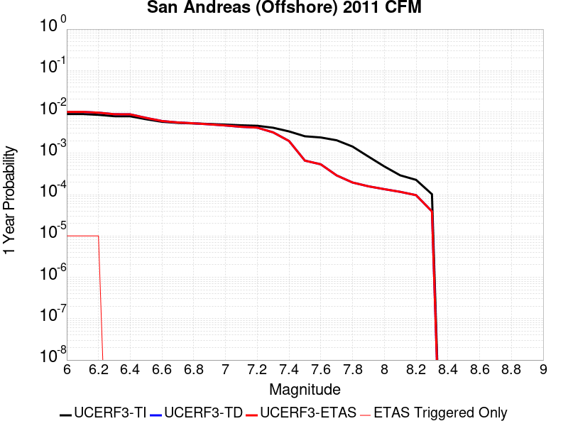 | 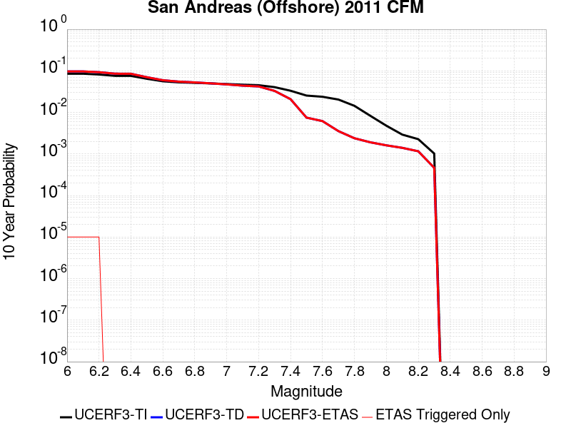 |

| Magnitude | 1 wk TI Prob | 1 wk TD Prob | 1 wk ETAS Prob | 1 wk ETAS/TD Gain | 1 wk ETAS Triggered Only | 1 mo TI Prob | 1 mo TD Prob | 1 mo ETAS Prob | 1 mo ETAS/TD Gain | 1 mo ETAS Triggered Only | 1 yr TI Prob | 1 yr TD Prob | 1 yr ETAS Prob | 1 yr ETAS/TD Gain | 1 yr ETAS Triggered Only | 10 yr TI Prob | 10 yr TD Prob | 10 yr ETAS Prob | 10 yr ETAS/TD Gain | 10 yr ETAS Triggered Only |
|-----|-----|-----|-----|-----|-----|-----|-----|-----|-----|-----|-----|-----|-----|-----|-----|-----|-----|-----|-----|-----|
| 6.0 | 1.7072787E-4 | 1.9226041E-4 | 2.022585E-4 | 1.0520028 | 1.0E-5 | 7.3148566E-4 | 8.237154E-4 | 8.337072E-4 | 1.0121301 | 1.0E-5 | 0.008869528 | 0.0099831335 | 0.009993034 | 1.0009917 | 1.0E-5 | 0.085237645 | 0.09682738 | 0.09683641 | 1.0000932 | 1.0E-5 |
| 6.1 | 1.7072787E-4 | 1.9226041E-4 | 2.022585E-4 | 1.0520028 | 1.0E-5 | 7.3148566E-4 | 8.237154E-4 | 8.337072E-4 | 1.0121301 | 1.0E-5 | 0.008869528 | 0.0099831335 | 0.009993034 | 1.0009917 | 1.0E-5 | 0.085237645 | 0.09682738 | 0.09683641 | 1.0000932 | 1.0E-5 |
| 6.2 | 1.6312556E-4 | 1.8407789E-4 | 1.9407604E-4 | 1.0543149 | 1.0E-5 | 6.989222E-4 | 7.8866904E-4 | 7.986612E-4 | 1.0126696 | 1.0E-5 | 0.008476226 | 0.009560268 | 0.009570173 | 1.001036 | 1.0E-5 | 0.08160117 | 0.09284818 | 0.09285726 | 1.0000978 | 1.0E-5 |
| 6.3 | 1.5103363E-4 | 1.6880741E-4 | 1.6880741E-4 | 1.0 | 0.0 | 6.471264E-4 | 7.232619E-4 | 7.232619E-4 | 1.0 | 0.0 | 0.007850339 | 0.008770605 | 0.008770605 | 1.0 | 0.0 | 0.075787395 | 0.085489064 | 0.085489064 | 1.0 | 0.0 |
| 6.4 | 1.5047993E-4 | 1.676667E-4 | 1.676667E-4 | 1.0 | 0.0 | 6.4475456E-4 | 7.1837584E-4 | 7.1837584E-4 | 1.0 | 0.0 | 0.007821669 | 0.008711592 | 0.008711592 | 1.0 | 0.0 | 0.0755203 | 0.08496926 | 0.08496926 | 1.0 | 0.0 |
| 6.5 | 1.2760791E-4 | 1.3735025E-4 | 1.3735025E-4 | 1.0 | 0.0 | 5.467764E-4 | 5.885125E-4 | 5.885125E-4 | 1.0 | 0.0 | 0.0066367025 | 0.0071418737 | 0.0071418737 | 1.0 | 0.0 | 0.064419635 | 0.07025001 | 0.07025001 | 1.0 | 0.0 |
| 6.6 | 1.1063525E-4 | 1.15566356E-4 | 1.15566356E-4 | 1.0 | 0.0 | 4.740649E-4 | 4.9519143E-4 | 4.9519143E-4 | 1.0 | 0.0 | 0.0057564764 | 0.006012491 | 0.006012491 | 1.0 | 0.0 | 0.05609626 | 0.05948894 | 0.05948894 | 1.0 | 0.0 |
| 6.7 | 1.0391049E-4 | 1.0645922E-4 | 1.0645922E-4 | 1.0 | 0.0 | 4.4525467E-4 | 4.5617504E-4 | 4.5617504E-4 | 1.0 | 0.0 | 0.0054075094 | 0.005539975 | 0.005539975 | 1.0 | 0.0 | 0.052778035 | 0.05498876 | 0.05498876 | 1.0 | 0.0 |
| 6.8 | 1.0096706E-4 | 1.01582686E-4 | 1.01582686E-4 | 1.0 | 0.0 | 4.3264418E-4 | 4.3528268E-4 | 4.3528268E-4 | 1.0 | 0.0 | 0.0052547283 | 0.005286866 | 0.005286866 | 1.0 | 0.0 | 0.051321987 | 0.052687574 | 0.052687574 | 1.0 | 0.0 |
| 6.9 | 9.800265E-5 | 9.588748E-5 | 9.588748E-5 | 1.0 | 0.0 | 4.1994374E-4 | 4.1088252E-4 | 4.1088252E-4 | 1.0 | 0.0 | 0.0051008356 | 0.0049911886 | 0.0049911886 | 1.0 | 0.0 | 0.049853306 | 0.05001504 | 0.05001504 | 1.0 | 0.0 |
| 7.0 | 9.4642375E-5 | 9.002143E-5 | 9.002143E-5 | 1.0 | 0.0 | 4.0554712E-4 | 3.8574997E-4 | 3.8574997E-4 | 1.0 | 0.0 | 0.004926363 | 0.0046865544 | 0.0046865544 | 1.0 | 0.0 | 0.048185747 | 0.047196057 | 0.047196057 | 1.0 | 0.0 |
| 7.1 | 9.0996844E-5 | 8.354169E-5 | 8.354169E-5 | 1.0 | 0.0 | 3.8992817E-4 | 3.5798753E-4 | 3.5798753E-4 | 1.0 | 0.0 | 0.004737046 | 0.004349944 | 0.004349944 | 1.0 | 0.0 | 0.04637333 | 0.044047635 | 0.044047635 | 1.0 | 0.0 |
| 7.2 | 8.848287E-5 | 7.9818135E-5 | 7.9818135E-5 | 1.0 | 0.0 | 3.791572E-4 | 3.4203375E-4 | 3.4203375E-4 | 1.0 | 0.0 | 0.004606472 | 0.0041564633 | 0.0041564633 | 1.0 | 0.0 | 0.045121472 | 0.042191572 | 0.042191572 | 1.0 | 0.0 |
| 7.3 | 7.9280784E-5 | 6.1276216E-5 | 6.1276216E-5 | 1.0 | 0.0 | 3.3973053E-4 | 2.625865E-4 | 2.625865E-4 | 1.0 | 0.0 | 0.004128377 | 0.0031924061 | 0.0031924061 | 1.0 | 0.0 | 0.040525194 | 0.032904375 | 0.032904375 | 1.0 | 0.0 |
| 7.4 | 6.468038E-5 | 3.7933212E-5 | 3.7933212E-5 | 1.0 | 0.0 | 2.771722E-4 | 1.625611E-4 | 1.625611E-4 | 1.0 | 0.0 | 0.0033693502 | 0.0019774425 | 0.0019774425 | 1.0 | 0.0 | 0.0331872 | 0.02082181 | 0.02082181 | 1.0 | 0.0 |
| 7.5 | 4.930574E-5 | 1.2703362E-5 | 1.2703362E-5 | 1.0 | 0.0 | 2.1129321E-4 | 5.444185E-5 | 5.444185E-5 | 1.0 | 0.0 | 0.0025694598 | 6.6262955E-4 | 6.6262955E-4 | 1.0 | 0.0 | 0.02539953 | 0.007481418 | 0.007481418 | 1.0 | 0.0 |
| 7.6 | 4.612566E-5 | 1.0336213E-5 | 1.0336213E-5 | 1.0 | 0.0 | 1.9766642E-4 | 4.429731E-5 | 4.429731E-5 | 1.0 | 0.0 | 0.0024039324 | 5.391877E-4 | 5.391877E-4 | 1.0 | 0.0 | 0.023780935 | 0.006172099 | 0.006172099 | 1.0 | 0.0 |
| 7.7 | 3.9435414E-5 | 5.574925E-6 | 5.574925E-6 | 1.0 | 0.0 | 1.6899795E-4 | 2.3892318E-5 | 2.3892318E-5 | 1.0 | 0.0 | 0.0020556084 | 2.9085035E-4 | 2.9085035E-4 | 1.0 | 0.0 | 0.020366974 | 0.0035420412 | 0.0035420412 | 1.0 | 0.0 |
| 7.8 | 2.7787428E-5 | 3.7553348E-6 | 3.7553348E-6 | 1.0 | 0.0 | 1.1908354E-4 | 1.6094193E-5 | 1.6094193E-5 | 1.0 | 0.0 | 0.0014488777 | 1.9592921E-4 | 1.9592921E-4 | 1.0 | 0.0 | 0.014394675 | 0.0023877125 | 0.0023877125 | 1.0 | 0.0 |
| 7.9 | 1.590671E-5 | 3.04085E-6 | 3.04085E-6 | 1.0 | 0.0 | 6.816983E-5 | 1.303215E-5 | 1.303215E-5 | 1.0 | 0.0 | 8.2965166E-4 | 1.586549E-4 | 1.586549E-4 | 1.0 | 0.0 | 0.008265611 | 0.001904262 | 0.001904262 | 1.0 | 0.0 |
| 8.0 | 9.193638E-6 | 2.5920847E-6 | 2.5920847E-6 | 1.0 | 0.0 | 3.940071E-5 | 1.1108887E-5 | 1.1108887E-5 | 1.0 | 0.0 | 4.7959806E-4 | 1.3524233E-4 | 1.3524233E-4 | 1.0 | 0.0 | 0.0047856434 | 0.0016115032 | 0.0016115032 | 1.0 | 0.0 |
| 8.1 | 5.601576E-6 | 2.2343472E-6 | 2.2343472E-6 | 1.0 | 0.0 | 2.4006533E-5 | 9.575739E-6 | 9.575739E-6 | 1.0 | 0.0 | 2.9224035E-4 | 1.16578405E-4 | 1.16578405E-4 | 1.0 | 0.0 | 0.0029185633 | 0.0014020674 | 0.0014020674 | 1.0 | 0.0 |
| 8.2 | 4.3508785E-6 | 1.857566E-6 | 1.857566E-6 | 1.0 | 0.0 | 1.864649E-5 | 7.960973E-6 | 7.960973E-6 | 1.0 | 0.0 | 2.2699735E-4 | 9.692056E-5 | 9.692056E-5 | 1.0 | 0.0 | 0.0022676561 | 0.0011594221 | 0.0011594221 | 1.0 | 0.0 |
| 8.3 | 1.9573292E-6 | 7.514906E-7 | 7.514906E-7 | 1.0 | 0.0 | 8.388526E-6 | 3.22067E-6 | 3.22067E-6 | 1.0 | 0.0 | 1.0212552E-4 | 3.921097E-5 | 3.921097E-5 | 1.0 | 0.0 | 0.001020786 | 4.640846E-4 | 4.640846E-4 | 1.0 | 0.0 |

## Calaveras (No) 2011 CFM
*[(top)](#table-of-contents)*

| 1 Week | 1 Month | 1 Year | 10 Year |
|-----|-----|-----|-----|
|  | 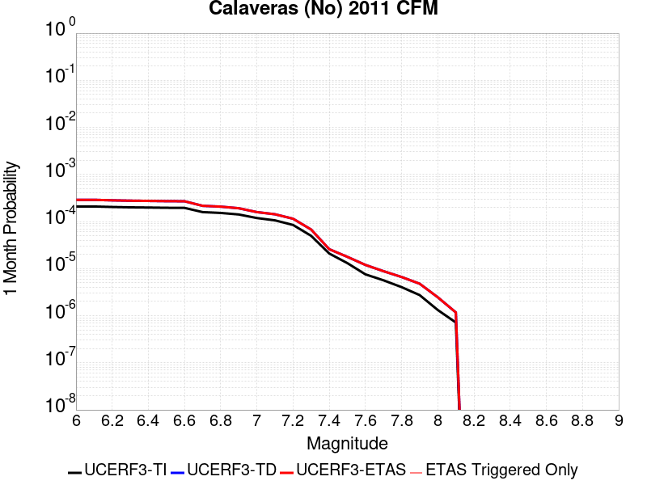 | 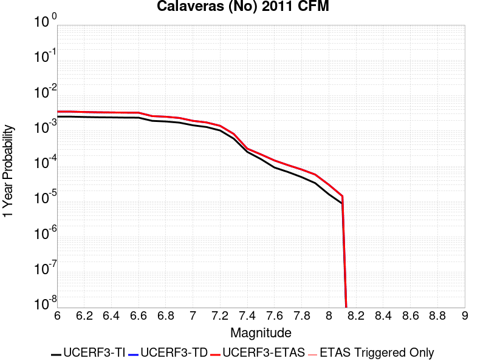 | 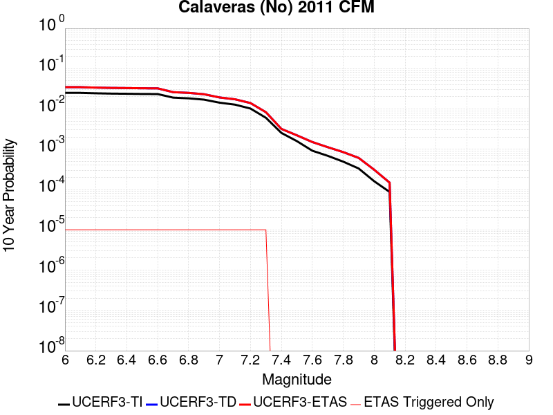 |

| Magnitude | 1 wk TI Prob | 1 wk TD Prob | 1 wk ETAS Prob | 1 wk ETAS/TD Gain | 1 wk ETAS Triggered Only | 1 mo TI Prob | 1 mo TD Prob | 1 mo ETAS Prob | 1 mo ETAS/TD Gain | 1 mo ETAS Triggered Only | 1 yr TI Prob | 1 yr TD Prob | 1 yr ETAS Prob | 1 yr ETAS/TD Gain | 1 yr ETAS Triggered Only | 10 yr TI Prob | 10 yr TD Prob | 10 yr ETAS Prob | 10 yr ETAS/TD Gain | 10 yr ETAS Triggered Only |
|-----|-----|-----|-----|-----|-----|-----|-----|-----|-----|-----|-----|-----|-----|-----|-----|-----|-----|-----|-----|-----|
| 6.0 | 4.8694856E-5 | 6.747121E-5 | 6.747121E-5 | 1.0 | 0.0 | 2.0867554E-4 | 2.8913133E-4 | 2.8913133E-4 | 1.0 | 0.0 | 0.0025376645 | 0.003514627 | 0.003514627 | 1.0 | 0.0 | 0.02508881 | 0.034771245 | 0.034780897 | 1.0002776 | 1.0E-5 |
| 6.1 | 4.8694856E-5 | 6.747121E-5 | 6.747121E-5 | 1.0 | 0.0 | 2.0867554E-4 | 2.8913133E-4 | 2.8913133E-4 | 1.0 | 0.0 | 0.0025376645 | 0.003514627 | 0.003514627 | 1.0 | 0.0 | 0.02508881 | 0.034771245 | 0.034780897 | 1.0002776 | 1.0E-5 |
| 6.2 | 4.7541962E-5 | 6.580218E-5 | 6.580218E-5 | 1.0 | 0.0 | 2.0373536E-4 | 2.8197994E-4 | 2.8197994E-4 | 1.0 | 0.0 | 0.0024776561 | 0.003427859 | 0.003427859 | 1.0 | 0.0 | 0.024502134 | 0.033932675 | 0.033942334 | 1.0002847 | 1.0E-5 |
| 6.3 | 4.6717287E-5 | 6.4635555E-5 | 6.4635555E-5 | 1.0 | 0.0 | 2.0020158E-4 | 2.7698115E-4 | 2.7698115E-4 | 1.0 | 0.0 | 0.0024347296 | 0.0033672103 | 0.0033672103 | 1.0 | 0.0 | 0.024082264 | 0.033345193 | 0.03335486 | 1.0002899 | 1.0E-5 |
| 6.4 | 4.6276386E-5 | 6.399742E-5 | 6.399742E-5 | 1.0 | 0.0 | 1.983123E-4 | 2.7424688E-4 | 2.7424688E-4 | 1.0 | 0.0 | 0.0024117786 | 0.0033340224 | 0.0033340224 | 1.0 | 0.0 | 0.02385771 | 0.033024073 | 0.03303374 | 1.0002928 | 1.0E-5 |
| 6.5 | 4.5720994E-5 | 6.319881E-5 | 6.319881E-5 | 1.0 | 0.0 | 1.9593239E-4 | 2.70825E-4 | 2.70825E-4 | 1.0 | 0.0 | 0.002382867 | 0.0032924965 | 0.0032924965 | 1.0 | 0.0 | 0.023574775 | 0.032622032 | 0.032631706 | 1.0002966 | 1.0E-5 |
| 6.6 | 4.549134E-5 | 6.28519E-5 | 6.28519E-5 | 1.0 | 0.0 | 1.949483E-4 | 2.6933852E-4 | 2.6933852E-4 | 1.0 | 0.0 | 0.0023709119 | 0.0032744533 | 0.0032744533 | 1.0 | 0.0 | 0.023457756 | 0.032447387 | 0.032457065 | 1.0002981 | 1.0E-5 |
| 6.7 | 3.701047E-5 | 5.0359427E-5 | 5.0359427E-5 | 1.0 | 0.0 | 1.5860666E-4 | 2.1580851E-4 | 2.1580851E-4 | 1.0 | 0.0 | 0.0019293258 | 0.002624346 | 0.002624346 | 1.0 | 0.0 | 0.019126613 | 0.026125323 | 0.026135063 | 1.0003728 | 1.0E-5 |
| 6.8 | 3.5523568E-5 | 4.8341022E-5 | 4.8341022E-5 | 1.0 | 0.0 | 1.5223498E-4 | 2.071596E-4 | 2.071596E-4 | 1.0 | 0.0 | 0.0018518851 | 0.0025192937 | 0.0025192937 | 1.0 | 0.0 | 0.018365284 | 0.025097553 | 0.025107302 | 1.0003885 | 1.0E-5 |
| 6.9 | 3.2946147E-5 | 4.466269E-5 | 4.466269E-5 | 1.0 | 0.0 | 1.4119013E-4 | 1.9139773E-4 | 1.9139773E-4 | 1.0 | 0.0 | 0.0017176344 | 0.0023278191 | 0.0023278191 | 1.0 | 0.0 | 0.017044188 | 0.023219598 | 0.023229366 | 1.0004207 | 1.0E-5 |
| 7.0 | 2.7682381E-5 | 3.702223E-5 | 3.702223E-5 | 1.0 | 0.0 | 1.1863338E-4 | 1.5865723E-4 | 1.5865723E-4 | 1.0 | 0.0 | 0.0014434044 | 0.0019299705 | 0.0019299705 | 1.0 | 0.0 | 0.01434065 | 0.01931092 | 0.019320726 | 1.0005078 | 1.0E-5 |
| 7.1 | 2.471967E-5 | 3.328669E-5 | 3.328669E-5 | 1.0 | 0.0 | 1.05937135E-4 | 1.4264962E-4 | 1.4264962E-4 | 1.0 | 0.0 | 0.0012890215 | 0.0017354045 | 0.0017354045 | 1.0 | 0.0 | 0.0128157 | 0.017385952 | 0.017395778 | 1.0005652 | 1.0E-5 |
| 7.2 | 1.9748062E-5 | 2.6774684E-5 | 2.6774684E-5 | 1.0 | 0.0 | 8.463181E-5 | 1.1474373E-4 | 1.1474373E-4 | 1.0 | 0.0 | 0.0010299052 | 0.0013961331 | 0.0013961331 | 1.0 | 0.0 | 0.01025145 | 0.014030739 | 0.014040599 | 1.0007027 | 1.0E-5 |
| 7.3 | 1.1603734E-5 | 1.5783844E-5 | 1.5783844E-5 | 1.0 | 0.0 | 4.9729337E-5 | 6.764337E-5 | 6.764337E-5 | 1.0 | 0.0 | 6.052865E-4 | 8.232611E-4 | 8.232611E-4 | 1.0 | 0.0 | 0.0060364045 | 0.008308666 | 0.008318583 | 1.0011935 | 1.0E-5 |
| 7.4 | 4.885381E-6 | 6.0349853E-6 | 6.0349853E-6 | 1.0 | 0.0 | 2.0937177E-5 | 2.5863968E-5 | 2.5863968E-5 | 1.0 | 0.0 | 2.5488032E-4 | 3.148485E-4 | 3.148485E-4 | 1.0 | 0.0 | 0.0025458818 | 0.0032010598 | 0.0032010598 | 1.0 | 0.0 |
| 7.5 | 3.0571264E-6 | 4.155299E-6 | 4.155299E-6 | 1.0 | 0.0 | 1.3101904E-5 | 1.7808303E-5 | 1.7808303E-5 | 1.0 | 0.0 | 1.5950401E-4 | 2.1679462E-4 | 2.1679462E-4 | 1.0 | 0.0 | 0.0015938957 | 0.002221121 | 0.002221121 | 1.0 | 0.0 |
| 7.6 | 1.764948E-6 | 2.7955498E-6 | 2.7955498E-6 | 1.0 | 0.0 | 7.564041E-6 | 1.1980874E-5 | 1.1980874E-5 | 1.0 | 0.0 | 9.208831E-5 | 1.4585744E-4 | 1.4585744E-4 | 1.0 | 0.0 | 9.205016E-4 | 0.0015123509 | 0.0015123509 | 1.0 | 0.0 |
| 7.7 | 1.3173734E-6 | 2.058471E-6 | 2.058471E-6 | 1.0 | 0.0 | 5.645874E-6 | 8.8219895E-6 | 8.8219895E-6 | 1.0 | 0.0 | 6.873634E-5 | 1.0740245E-4 | 1.0740245E-4 | 1.0 | 0.0 | 6.8715087E-4 | 0.0011261401 | 0.0011261401 | 1.0 | 0.0 |
| 7.8 | 9.4429885E-7 | 1.5489635E-6 | 1.5489635E-6 | 1.0 | 0.0 | 4.0469886E-6 | 6.638398E-6 | 6.638398E-6 | 1.0 | 0.0 | 4.9270973E-5 | 8.081952E-5 | 8.081952E-5 | 1.0 | 0.0 | 4.926005E-4 | 8.5014524E-4 | 8.5014524E-4 | 1.0 | 0.0 |
| 7.9 | 6.388233E-7 | 1.1148749E-6 | 1.1148749E-6 | 1.0 | 0.0 | 2.7378112E-6 | 4.7780263E-6 | 4.7780263E-6 | 1.0 | 0.0 | 3.3332344E-5 | 5.817093E-5 | 5.817093E-5 | 1.0 | 0.0 | 3.3327343E-4 | 6.0963054E-4 | 6.0963054E-4 | 1.0 | 0.0 |
| 8.0 | 3.087986E-7 | 5.7543696E-7 | 5.7543696E-7 | 1.0 | 0.0 | 1.323422E-6 | 2.466156E-6 | 2.466156E-6 | 1.0 | 0.0 | 1.6112543E-5 | 3.002504E-5 | 3.002504E-5 | 1.0 | 0.0 | 1.6111376E-4 | 3.110302E-4 | 3.110302E-4 | 1.0 | 0.0 |
| 8.1 | 1.6725647E-7 | 2.7410047E-7 | 2.7410047E-7 | 1.0 | 0.0 | 7.168133E-7 | 1.1747159E-6 | 1.1747159E-6 | 1.0 | 0.0 | 8.7271665E-6 | 1.4302073E-5 | 1.4302073E-5 | 1.0 | 0.0 | 8.726824E-5 | 1.48486E-4 | 1.48486E-4 | 1.0 | 0.0 |

## Mount Diablo Thrust South
*[(top)](#table-of-contents)*

| 1 Week | 1 Month | 1 Year | 10 Year |
|-----|-----|-----|-----|
|  | 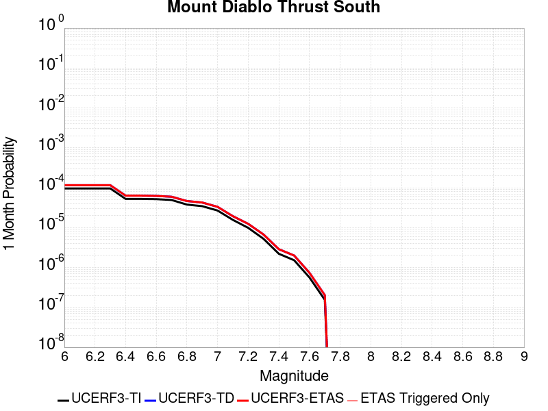 | 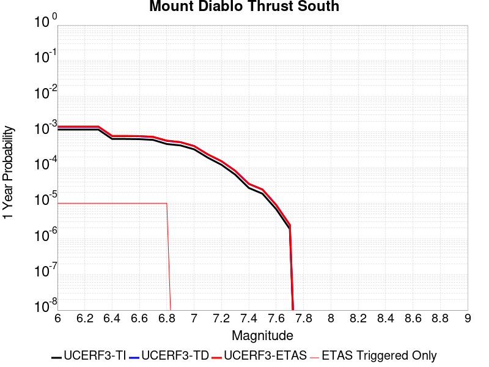 | 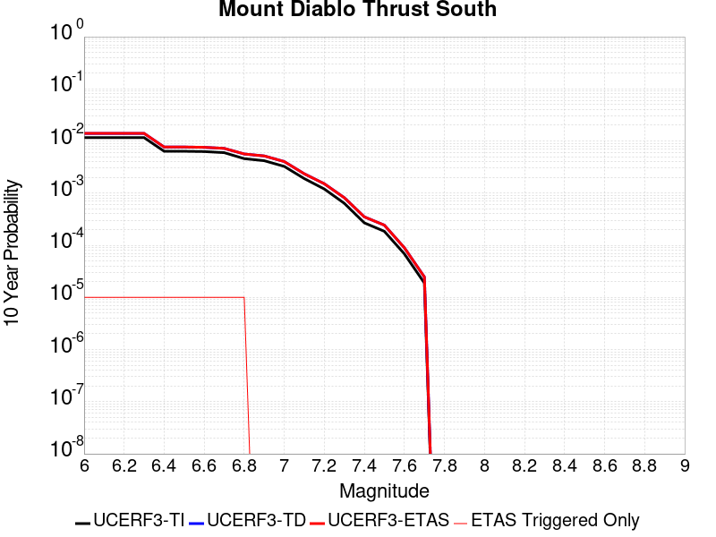 |

| Magnitude | 1 wk TI Prob | 1 wk TD Prob | 1 wk ETAS Prob | 1 wk ETAS/TD Gain | 1 wk ETAS Triggered Only | 1 mo TI Prob | 1 mo TD Prob | 1 mo ETAS Prob | 1 mo ETAS/TD Gain | 1 mo ETAS Triggered Only | 1 yr TI Prob | 1 yr TD Prob | 1 yr ETAS Prob | 1 yr ETAS/TD Gain | 1 yr ETAS Triggered Only | 10 yr TI Prob | 10 yr TD Prob | 10 yr ETAS Prob | 10 yr ETAS/TD Gain | 10 yr ETAS Triggered Only |
|-----|-----|-----|-----|-----|-----|-----|-----|-----|-----|-----|-----|-----|-----|-----|-----|-----|-----|-----|-----|-----|
| 6.0 | 2.2377444E-5 | 2.695623E-5 | 2.695623E-5 | 1.0 | 0.0 | 9.5899806E-5 | 1.1552271E-4 | 1.1552271E-4 | 1.0 | 0.0 | 0.0011669548 | 0.0014057803 | 0.0014157663 | 1.0071034 | 1.0E-5 | 0.011608457 | 0.013988447 | 0.013998307 | 1.0007049 | 1.0E-5 |
| 6.1 | 2.2377444E-5 | 2.695623E-5 | 2.695623E-5 | 1.0 | 0.0 | 9.5899806E-5 | 1.1552271E-4 | 1.1552271E-4 | 1.0 | 0.0 | 0.0011669548 | 0.0014057803 | 0.0014157663 | 1.0071034 | 1.0E-5 | 0.011608457 | 0.013988447 | 0.013998307 | 1.0007049 | 1.0E-5 |
| 6.2 | 2.2377444E-5 | 2.695623E-5 | 2.695623E-5 | 1.0 | 0.0 | 9.5899806E-5 | 1.1552271E-4 | 1.1552271E-4 | 1.0 | 0.0 | 0.0011669548 | 0.0014057803 | 0.0014157663 | 1.0071034 | 1.0E-5 | 0.011608457 | 0.013988447 | 0.013998307 | 1.0007049 | 1.0E-5 |
| 6.3 | 2.2377444E-5 | 2.695623E-5 | 2.695623E-5 | 1.0 | 0.0 | 9.5899806E-5 | 1.1552271E-4 | 1.1552271E-4 | 1.0 | 0.0 | 0.0011669548 | 0.0014057803 | 0.0014157663 | 1.0071034 | 1.0E-5 | 0.011608457 | 0.013988447 | 0.013998307 | 1.0007049 | 1.0E-5 |
| 6.4 | 1.2228463E-5 | 1.4747655E-5 | 1.4747655E-5 | 1.0 | 0.0 | 5.2406645E-5 | 6.320278E-5 | 6.320278E-5 | 1.0 | 0.0 | 6.378641E-4 | 7.6923496E-4 | 7.7922724E-4 | 1.0129899 | 1.0E-5 | 0.0063603627 | 0.0076671084 | 0.0076770317 | 1.0012943 | 1.0E-5 |
| 6.5 | 1.2228463E-5 | 1.4747655E-5 | 1.4747655E-5 | 1.0 | 0.0 | 5.2406645E-5 | 6.320278E-5 | 6.320278E-5 | 1.0 | 0.0 | 6.378641E-4 | 7.6923496E-4 | 7.7922724E-4 | 1.0129899 | 1.0E-5 | 0.0063603627 | 0.0076671084 | 0.0076770317 | 1.0012943 | 1.0E-5 |
| 6.6 | 1.2068118E-5 | 1.4552453E-5 | 1.4552453E-5 | 1.0 | 0.0 | 5.1719482E-5 | 6.2366234E-5 | 6.2366234E-5 | 1.0 | 0.0 | 6.2950276E-4 | 7.590571E-4 | 7.6904957E-4 | 1.0131643 | 1.0E-5 | 0.006277225 | 0.0075660287 | 0.007575953 | 1.0013117 | 1.0E-5 |
| 6.7 | 1.1499428E-5 | 1.3875117E-5 | 1.3875117E-5 | 1.0 | 0.0 | 4.9282335E-5 | 5.94635E-5 | 5.94635E-5 | 1.0 | 0.0 | 5.9984723E-4 | 7.237403E-4 | 7.3373306E-4 | 1.013807 | 1.0E-5 | 0.0059823063 | 0.0072152023 | 0.0072251298 | 1.0013759 | 1.0E-5 |
| 6.8 | 8.82118E-6 | 1.0830408E-5 | 1.0830408E-5 | 1.0 | 0.0 | 3.780451E-5 | 4.641524E-5 | 4.641524E-5 | 1.0 | 0.0 | 4.601727E-4 | 5.6496455E-4 | 5.749589E-4 | 1.0176902 | 1.0E-5 | 0.0045922096 | 0.005635934 | 0.0056458777 | 1.0017643 | 1.0E-5 |
| 6.9 | 8.047112E-6 | 9.9393765E-6 | 9.9393765E-6 | 1.0 | 0.0 | 3.4487166E-5 | 4.259666E-5 | 4.259666E-5 | 1.0 | 0.0 | 4.1980037E-4 | 5.1849615E-4 | 5.1849615E-4 | 1.0 | 0.0 | 0.004190082 | 0.0051734787 | 0.0051734787 | 1.0 | 0.0 |
| 7.0 | 6.2574763E-6 | 7.748453E-6 | 7.748453E-6 | 1.0 | 0.0 | 2.681748E-5 | 3.3207252E-5 | 3.3207252E-5 | 1.0 | 0.0 | 3.264539E-4 | 4.0422694E-4 | 4.0422694E-4 | 1.0 | 0.0 | 0.0032597475 | 0.004035359 | 0.004035359 | 1.0 | 0.0 |
| 7.1 | 3.6485903E-6 | 4.512883E-6 | 4.512883E-6 | 1.0 | 0.0 | 1.5636722E-5 | 1.9340787E-5 | 1.9340787E-5 | 1.0 | 0.0 | 1.9036046E-4 | 2.3544904E-4 | 2.3544904E-4 | 1.0 | 0.0 | 0.0019019748 | 0.0023520947 | 0.0023520947 | 1.0 | 0.0 |
| 7.2 | 2.3034274E-6 | 2.9054847E-6 | 2.9054847E-6 | 1.0 | 0.0 | 9.871795E-6 | 1.2452019E-5 | 1.2452019E-5 | 1.0 | 0.0 | 1.2018247E-4 | 1.5159303E-4 | 1.5159303E-4 | 1.0 | 0.0 | 0.0012011749 | 0.0015149695 | 0.0015149695 | 1.0 | 0.0 |
| 7.3 | 1.224035E-6 | 1.567953E-6 | 1.567953E-6 | 1.0 | 0.0 | 5.245854E-6 | 6.7197816E-6 | 6.7197816E-6 | 1.0 | 0.0 | 6.38664E-5 | 8.181038E-5 | 8.181038E-5 | 1.0 | 0.0 | 6.384805E-4 | 8.1784575E-4 | 8.1784575E-4 | 1.0 | 0.0 |
| 7.4 | 5.1601154E-7 | 6.72323E-7 | 6.72323E-7 | 1.0 | 0.0 | 2.2114762E-6 | 2.8813813E-6 | 2.8813813E-6 | 1.0 | 0.0 | 2.6924388E-5 | 3.508027E-5 | 3.508027E-5 | 1.0 | 0.0 | 2.6921128E-4 | 3.507647E-4 | 3.507647E-4 | 1.0 | 0.0 |
| 7.5 | 3.552894E-7 | 4.6652323E-7 | 4.6652323E-7 | 1.0 | 0.0 | 1.5226678E-6 | 1.9993838E-6 | 1.9993838E-6 | 1.0 | 0.0 | 1.8538323E-5 | 2.434224E-5 | 2.434224E-5 | 1.0 | 0.0 | 1.8536777E-4 | 2.4340794E-4 | 2.4340794E-4 | 1.0 | 0.0 |
| 7.6 | 1.3124082E-7 | 1.7191535E-7 | 1.7191535E-7 | 1.0 | 0.0 | 5.6246057E-7 | 7.367799E-7 | 7.367799E-7 | 1.0 | 0.0 | 6.8479358E-6 | 8.970267E-6 | 8.970267E-6 | 1.0 | 0.0 | 6.8477246E-5 | 8.9703215E-5 | 8.9703215E-5 | 1.0 | 0.0 |
| 7.7 | 3.6193022E-8 | 4.733273E-8 | 4.733273E-8 | 1.0 | 0.0 | 1.5511293E-7 | 2.0285455E-7 | 2.0285455E-7 | 1.0 | 0.0 | 1.8884983E-6 | 2.4697524E-6 | 2.4697524E-6 | 1.0 | 0.0 | 1.8884823E-5 | 2.4697838E-5 | 2.4697838E-5 | 1.0 | 0.0 |

## Great Valley 08 (Quinto)
*[(top)](#table-of-contents)*

| 1 Week | 1 Month | 1 Year | 10 Year |
|-----|-----|-----|-----|
|  |  | 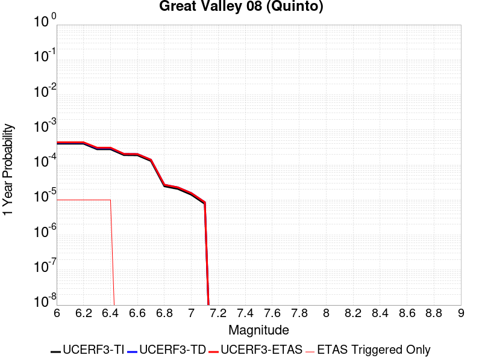 | 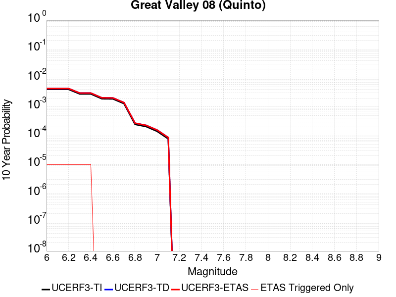 |

| Magnitude | 1 wk TI Prob | 1 wk TD Prob | 1 wk ETAS Prob | 1 wk ETAS/TD Gain | 1 wk ETAS Triggered Only | 1 mo TI Prob | 1 mo TD Prob | 1 mo ETAS Prob | 1 mo ETAS/TD Gain | 1 mo ETAS Triggered Only | 1 yr TI Prob | 1 yr TD Prob | 1 yr ETAS Prob | 1 yr ETAS/TD Gain | 1 yr ETAS Triggered Only | 10 yr TI Prob | 10 yr TD Prob | 10 yr ETAS Prob | 10 yr ETAS/TD Gain | 10 yr ETAS Triggered Only |
|-----|-----|-----|-----|-----|-----|-----|-----|-----|-----|-----|-----|-----|-----|-----|-----|-----|-----|-----|-----|-----|
| 6.0 | 7.737697E-6 | 8.253038E-6 | 8.253038E-6 | 1.0 | 0.0 | 3.3161137E-5 | 3.536979E-5 | 4.5369437E-5 | 1.2827171 | 1.0E-5 | 4.0366207E-4 | 4.3056096E-4 | 4.4055664E-4 | 1.0232155 | 1.0E-5 | 0.004029296 | 0.0042991205 | 0.0043090777 | 1.002316 | 1.0E-5 |
| 6.1 | 7.737697E-6 | 8.253038E-6 | 8.253038E-6 | 1.0 | 0.0 | 3.3161137E-5 | 3.536979E-5 | 4.5369437E-5 | 1.2827171 | 1.0E-5 | 4.0366207E-4 | 4.3056096E-4 | 4.4055664E-4 | 1.0232155 | 1.0E-5 | 0.004029296 | 0.0042991205 | 0.0043090777 | 1.002316 | 1.0E-5 |
| 6.2 | 7.737697E-6 | 8.253038E-6 | 8.253038E-6 | 1.0 | 0.0 | 3.3161137E-5 | 3.536979E-5 | 4.5369437E-5 | 1.2827171 | 1.0E-5 | 4.0366207E-4 | 4.3056096E-4 | 4.4055664E-4 | 1.0232155 | 1.0E-5 | 0.004029296 | 0.0042991205 | 0.0043090777 | 1.002316 | 1.0E-5 |
| 6.3 | 5.374012E-6 | 5.7505736E-6 | 5.7505736E-6 | 1.0 | 0.0 | 2.3031276E-5 | 2.4645145E-5 | 3.4644898E-5 | 1.4057494 | 1.0E-5 | 2.803697E-4 | 3.0002446E-4 | 3.1002148E-4 | 1.0333207 | 1.0E-5 | 0.0028001624 | 0.0029972875 | 0.0030072576 | 1.0033263 | 1.0E-5 |
| 6.4 | 5.374012E-6 | 5.7505736E-6 | 5.7505736E-6 | 1.0 | 0.0 | 2.3031276E-5 | 2.4645145E-5 | 3.4644898E-5 | 1.4057494 | 1.0E-5 | 2.803697E-4 | 3.0002446E-4 | 3.1002148E-4 | 1.0333207 | 1.0E-5 | 0.0028001624 | 0.0029972875 | 0.0030072576 | 1.0033263 | 1.0E-5 |
| 6.5 | 3.65427E-6 | 3.941324E-6 | 3.941324E-6 | 1.0 | 0.0 | 1.5661062E-5 | 1.689132E-5 | 1.689132E-5 | 1.0 | 0.0 | 1.9065675E-4 | 2.0563944E-4 | 2.0563944E-4 | 1.0 | 0.0 | 0.0019049325 | 0.0020551833 | 0.0020551833 | 1.0 | 0.0 |
| 6.6 | 3.6143538E-6 | 3.8985104E-6 | 3.8985104E-6 | 1.0 | 0.0 | 1.5489995E-5 | 1.6707834E-5 | 1.6707834E-5 | 1.0 | 0.0 | 1.8857437E-4 | 2.0340596E-4 | 2.0340596E-4 | 1.0 | 0.0 | 0.0018841444 | 0.0020328893 | 0.0020328893 | 1.0 | 0.0 |
| 6.7 | 2.4821015E-6 | 2.6857067E-6 | 2.6857067E-6 | 1.0 | 0.0 | 1.0637535E-5 | 1.1510153E-5 | 1.1510153E-5 | 1.0 | 0.0 | 1.2950429E-4 | 1.4013276E-4 | 1.4013276E-4 | 1.0 | 0.0 | 0.0012942884 | 0.0014009989 | 0.0014009989 | 1.0 | 0.0 |
| 6.8 | 4.7110538E-7 | 5.193021E-7 | 5.193021E-7 | 1.0 | 0.0 | 2.0190216E-6 | 2.2255786E-6 | 2.2255786E-6 | 1.0 | 0.0 | 2.458131E-5 | 2.70961E-5 | 2.70961E-5 | 1.0 | 0.0 | 2.457859E-4 | 2.7092977E-4 | 2.7092977E-4 | 1.0 | 0.0 |
| 6.9 | 3.958685E-7 | 4.3703452E-7 | 4.3703452E-7 | 1.0 | 0.0 | 1.6965782E-6 | 1.8730038E-6 | 1.8730038E-6 | 1.0 | 0.0 | 2.0655643E-5 | 2.28036E-5 | 2.28036E-5 | 1.0 | 0.0 | 2.0653724E-4 | 2.2801422E-4 | 2.2801422E-4 | 1.0 | 0.0 |
| 7.0 | 2.70294E-7 | 2.9920008E-7 | 2.9920008E-7 | 1.0 | 0.0 | 1.1584025E-6 | 1.2822856E-6 | 1.2822856E-6 | 1.0 | 0.0 | 1.4103458E-5 | 1.5611728E-5 | 1.5611728E-5 | 1.0 | 0.0 | 1.4102564E-4 | 1.5610759E-4 | 1.5610759E-4 | 1.0 | 0.0 |
| 7.1 | 1.4828602E-7 | 1.6469107E-7 | 1.6469107E-7 | 1.0 | 0.0 | 6.3551136E-7 | 7.058187E-7 | 7.058187E-7 | 1.0 | 0.0 | 7.737323E-6 | 8.593317E-6 | 8.593317E-6 | 1.0 | 0.0 | 7.737054E-5 | 8.593065E-5 | 8.593065E-5 | 1.0 | 0.0 |

## Great Valley 05 Pittsburg - Kirby Hills alt1
*[(top)](#table-of-contents)*

| 1 Week | 1 Month | 1 Year | 10 Year |
|-----|-----|-----|-----|
|  |  | 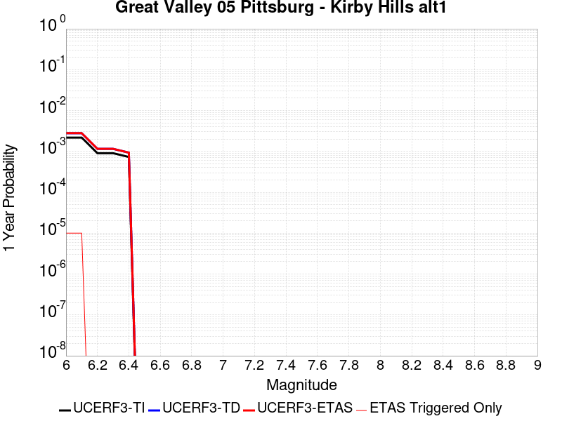 | 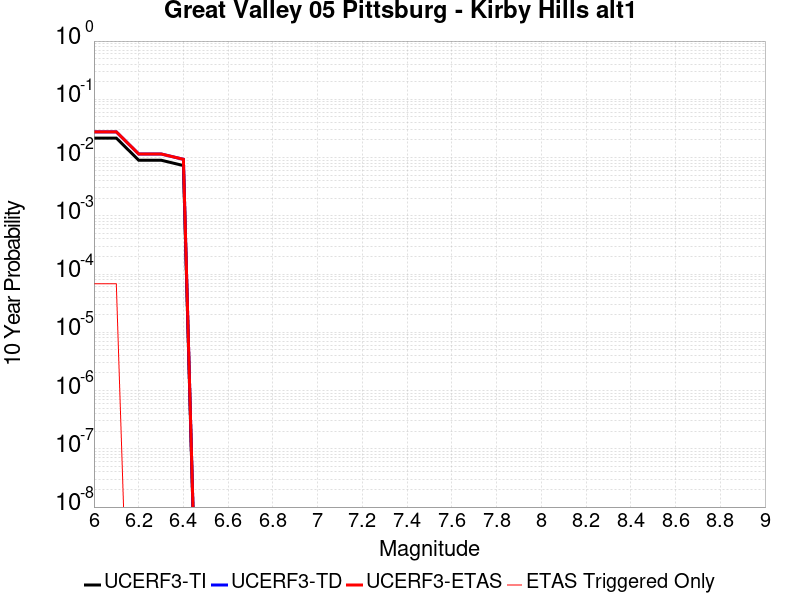 |

| Magnitude | 1 wk TI Prob | 1 wk TD Prob | 1 wk ETAS Prob | 1 wk ETAS/TD Gain | 1 wk ETAS Triggered Only | 1 mo TI Prob | 1 mo TD Prob | 1 mo ETAS Prob | 1 mo ETAS/TD Gain | 1 mo ETAS Triggered Only | 1 yr TI Prob | 1 yr TD Prob | 1 yr ETAS Prob | 1 yr ETAS/TD Gain | 1 yr ETAS Triggered Only | 10 yr TI Prob | 10 yr TD Prob | 10 yr ETAS Prob | 10 yr ETAS/TD Gain | 10 yr ETAS Triggered Only |
|-----|-----|-----|-----|-----|-----|-----|-----|-----|-----|-----|-----|-----|-----|-----|-----|-----|-----|-----|-----|-----|
| 6.0 | 4.187212E-5 | 5.3442072E-5 | 5.3442072E-5 | 1.0 | 0.0 | 1.794396E-4 | 2.290231E-4 | 2.290231E-4 | 1.0 | 0.0 | 0.002182488 | 0.0027857882 | 0.0027957603 | 1.0035796 | 1.0E-5 | 0.021611776 | 0.02760304 | 0.027612763 | 1.0003523 | 1.0E-5 |
| 6.1 | 4.187212E-5 | 5.3442072E-5 | 5.3442072E-5 | 1.0 | 0.0 | 1.794396E-4 | 2.290231E-4 | 2.290231E-4 | 1.0 | 0.0 | 0.002182488 | 0.0027857882 | 0.0027957603 | 1.0035796 | 1.0E-5 | 0.021611776 | 0.02760304 | 0.027612763 | 1.0003523 | 1.0E-5 |
| 6.2 | 1.7353306E-5 | 2.2154374E-5 | 2.2154374E-5 | 1.0 | 0.0 | 7.436919E-5 | 9.494618E-5 | 9.494618E-5 | 1.0 | 0.0 | 9.050688E-4 | 0.0011557543 | 0.0011557543 | 1.0 | 0.0 | 0.009013915 | 0.011535114 | 0.011535114 | 1.0 | 0.0 |
| 6.3 | 1.7353306E-5 | 2.2154374E-5 | 2.2154374E-5 | 1.0 | 0.0 | 7.436919E-5 | 9.494618E-5 | 9.494618E-5 | 1.0 | 0.0 | 9.050688E-4 | 0.0011557543 | 0.0011557543 | 1.0 | 0.0 | 0.009013915 | 0.011535114 | 0.011535114 | 1.0 | 0.0 |
| 6.4 | 1.4028824E-5 | 1.7900597E-5 | 1.7900597E-5 | 1.0 | 0.0 | 6.0122147E-5 | 7.671684E-5 | 7.671684E-5 | 1.0 | 0.0 | 7.3174125E-4 | 9.340275E-4 | 9.340275E-4 | 1.0 | 0.0 | 0.0072933645 | 0.009338138 | 0.009338138 | 1.0 | 0.0 |

## Monte Vista - Shannon 2011 CFM
*[(top)](#table-of-contents)*

| 1 Week | 1 Month | 1 Year | 10 Year |
|-----|-----|-----|-----|
| 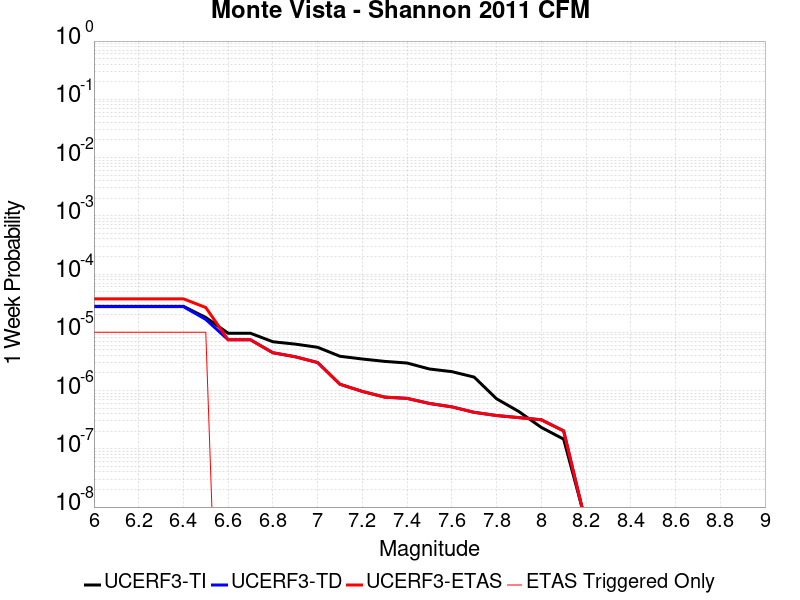 | 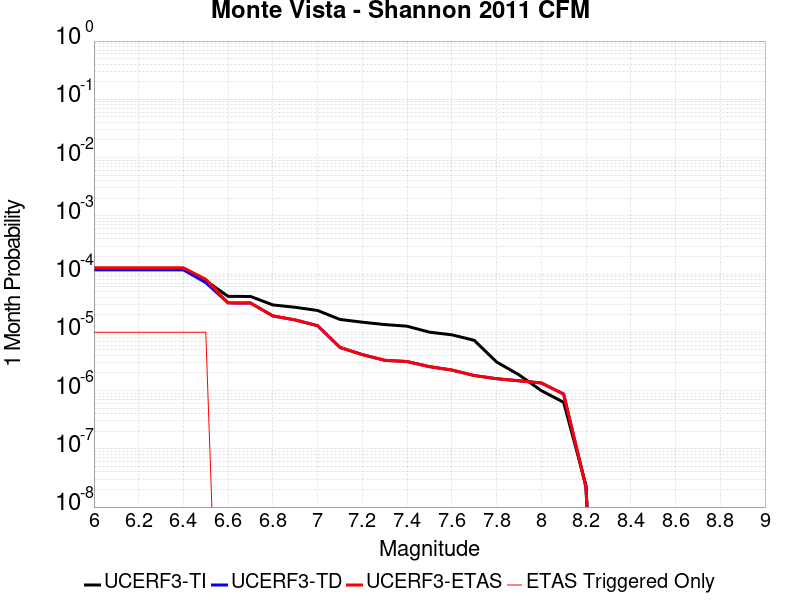 | 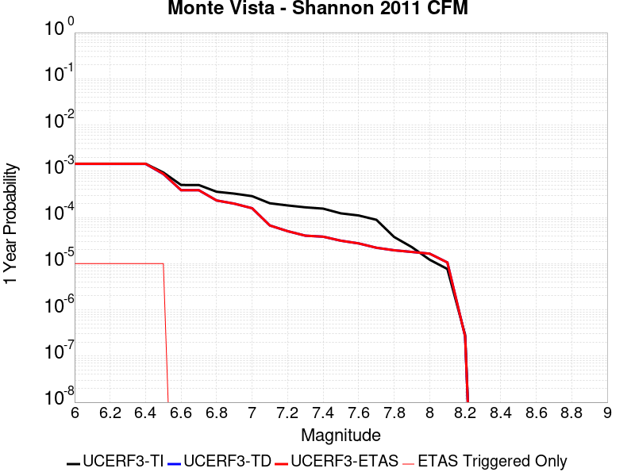 | 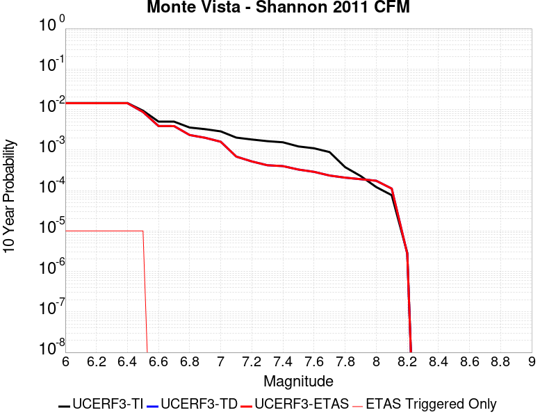 |

| Magnitude | 1 wk TI Prob | 1 wk TD Prob | 1 wk ETAS Prob | 1 wk ETAS/TD Gain | 1 wk ETAS Triggered Only | 1 mo TI Prob | 1 mo TD Prob | 1 mo ETAS Prob | 1 mo ETAS/TD Gain | 1 mo ETAS Triggered Only | 1 yr TI Prob | 1 yr TD Prob | 1 yr ETAS Prob | 1 yr ETAS/TD Gain | 1 yr ETAS Triggered Only | 10 yr TI Prob | 10 yr TD Prob | 10 yr ETAS Prob | 10 yr ETAS/TD Gain | 10 yr ETAS Triggered Only |
|-----|-----|-----|-----|-----|-----|-----|-----|-----|-----|-----|-----|-----|-----|-----|-----|-----|-----|-----|-----|-----|
| 6.0 | 2.7907707E-5 | 2.7584209E-5 | 3.7583934E-5 | 1.3625163 | 1.0E-5 | 1.19598975E-4 | 1.1821338E-4 | 1.282122E-4 | 1.0845828 | 1.0E-5 | 0.0014551448 | 0.0014384214 | 0.001448407 | 1.006942 | 1.0E-5 | 0.014456532 | 0.014320195 | 0.014330052 | 1.0006883 | 1.0E-5 |
| 6.1 | 2.7907707E-5 | 2.7584209E-5 | 3.7583934E-5 | 1.3625163 | 1.0E-5 | 1.19598975E-4 | 1.1821338E-4 | 1.282122E-4 | 1.0845828 | 1.0E-5 | 0.0014551448 | 0.0014384214 | 0.001448407 | 1.006942 | 1.0E-5 | 0.014456532 | 0.014320195 | 0.014330052 | 1.0006883 | 1.0E-5 |
| 6.2 | 2.7907707E-5 | 2.7584209E-5 | 3.7583934E-5 | 1.3625163 | 1.0E-5 | 1.19598975E-4 | 1.1821338E-4 | 1.282122E-4 | 1.0845828 | 1.0E-5 | 0.0014551448 | 0.0014384214 | 0.001448407 | 1.006942 | 1.0E-5 | 0.014456532 | 0.014320195 | 0.014330052 | 1.0006883 | 1.0E-5 |
| 6.3 | 2.7907707E-5 | 2.7584209E-5 | 3.7583934E-5 | 1.3625163 | 1.0E-5 | 1.19598975E-4 | 1.1821338E-4 | 1.282122E-4 | 1.0845828 | 1.0E-5 | 0.0014551448 | 0.0014384214 | 0.001448407 | 1.006942 | 1.0E-5 | 0.014456532 | 0.014320195 | 0.014330052 | 1.0006883 | 1.0E-5 |
| 6.4 | 2.7907707E-5 | 2.7584209E-5 | 3.7583934E-5 | 1.3625163 | 1.0E-5 | 1.19598975E-4 | 1.1821338E-4 | 1.282122E-4 | 1.0845828 | 1.0E-5 | 0.0014551448 | 0.0014384214 | 0.001448407 | 1.006942 | 1.0E-5 | 0.014456532 | 0.014320195 | 0.014330052 | 1.0006883 | 1.0E-5 |
| 6.5 | 1.7990213E-5 | 1.6639884E-5 | 2.6639718E-5 | 1.6009557 | 1.0E-5 | 7.709863E-5 | 7.131221E-5 | 8.1311504E-5 | 1.1402184 | 1.0E-5 | 9.382716E-4 | 8.679467E-4 | 8.77938E-4 | 1.0115114 | 1.0E-5 | 0.0093431985 | 0.008668941 | 0.008678854 | 1.0011436 | 1.0E-5 |
| 6.6 | 9.650407E-6 | 7.4571435E-6 | 7.4571435E-6 | 1.0 | 0.0 | 4.135823E-5 | 3.195884E-5 | 3.195884E-5 | 1.0 | 0.0 | 5.0342013E-4 | 3.8903722E-4 | 3.8903722E-4 | 1.0 | 0.0 | 0.005022812 | 0.0039012418 | 0.0039012418 | 1.0 | 0.0 |
| 6.7 | 9.62828E-6 | 7.4350583E-6 | 7.4350583E-6 | 1.0 | 0.0 | 4.1263404E-5 | 3.186419E-5 | 3.186419E-5 | 1.0 | 0.0 | 5.022661E-4 | 3.878853E-4 | 3.878853E-4 | 1.0 | 0.0 | 0.0050113243 | 0.003889763 | 0.003889763 | 1.0 | 0.0 |
| 6.8 | 6.887523E-6 | 4.4615676E-6 | 4.4615676E-6 | 1.0 | 0.0 | 2.9517621E-5 | 1.9120876E-5 | 1.9120876E-5 | 1.0 | 0.0 | 3.5931775E-4 | 2.3277402E-4 | 2.3277402E-4 | 1.0 | 0.0 | 0.0035873733 | 0.0023424553 | 0.0023424553 | 1.0 | 0.0 |
| 6.9 | 6.2722347E-6 | 3.8034377E-6 | 3.8034377E-6 | 1.0 | 0.0 | 2.6880729E-5 | 1.6300357E-5 | 1.6300357E-5 | 1.0 | 0.0 | 3.2722374E-4 | 1.984408E-4 | 1.984408E-4 | 1.0 | 0.0 | 0.003267423 | 0.0019997752 | 0.0019997752 | 1.0 | 0.0 |
| 7.0 | 5.5320347E-6 | 3.0305885E-6 | 3.0305885E-6 | 1.0 | 0.0 | 2.3708504E-5 | 1.2988182E-5 | 1.2988182E-5 | 1.0 | 0.0 | 2.8861282E-4 | 1.5812147E-4 | 1.5812147E-4 | 1.0 | 0.0 | 0.0028823826 | 0.001597215 | 0.001597215 | 1.0 | 0.0 |
| 7.1 | 3.8794055E-6 | 1.2837862E-6 | 1.2837862E-6 | 1.0 | 0.0 | 1.6625918E-5 | 5.5019295E-6 | 5.5019295E-6 | 1.0 | 0.0 | 2.0240174E-4 | 6.698394E-5 | 6.698394E-5 | 1.0 | 0.0 | 0.002022175 | 6.865884E-4 | 6.865884E-4 | 1.0 | 0.0 |
| 7.2 | 3.4813652E-6 | 9.671046E-7 | 9.671046E-7 | 1.0 | 0.0 | 1.49200505E-5 | 4.1447274E-6 | 4.1447274E-6 | 1.0 | 0.0 | 1.8163648E-4 | 5.0460894E-5 | 5.0460894E-5 | 1.0 | 0.0 | 0.0018148809 | 5.214329E-4 | 5.214329E-4 | 1.0 | 0.0 |
| 7.3 | 3.1682148E-6 | 7.719097E-7 | 7.719097E-7 | 1.0 | 0.0 | 1.3577992E-5 | 3.30818E-6 | 3.30818E-6 | 1.0 | 0.0 | 1.6529951E-4 | 4.027635E-5 | 4.027635E-5 | 1.0 | 0.0 | 0.0016517661 | 4.1960424E-4 | 4.1960424E-4 | 1.0 | 0.0 |
| 7.4 | 2.9707667E-6 | 7.3457204E-7 | 7.3457204E-7 | 1.0 | 0.0 | 1.2731795E-5 | 3.148162E-6 | 3.148162E-6 | 1.0 | 0.0 | 1.5499859E-4 | 3.8328202E-5 | 3.8328202E-5 | 1.0 | 0.0 | 0.0015489052 | 3.9992164E-4 | 3.9992164E-4 | 1.0 | 0.0 |
| 7.5 | 2.3462758E-6 | 6.007889E-7 | 6.007889E-7 | 1.0 | 0.0 | 1.0055429E-5 | 2.574807E-6 | 2.574807E-6 | 1.0 | 0.0 | 1.2241797E-4 | 3.1347827E-5 | 3.1347827E-5 | 1.0 | 0.0 | 0.0012235056 | 3.2839534E-4 | 3.2839534E-4 | 1.0 | 0.0 |
| 7.6 | 2.112783E-6 | 5.251582E-7 | 5.251582E-7 | 1.0 | 0.0 | 9.054753E-6 | 2.250676E-6 | 2.250676E-6 | 1.0 | 0.0 | 1.1023604E-4 | 2.7401638E-5 | 2.7401638E-5 | 1.0 | 0.0 | 0.0011018137 | 2.885138E-4 | 2.885138E-4 | 1.0 | 0.0 |
| 7.7 | 1.7022471E-6 | 4.231601E-7 | 4.231601E-7 | 1.0 | 0.0 | 7.2953244E-6 | 1.8135419E-6 | 1.8135419E-6 | 1.0 | 0.0 | 8.881695E-5 | 2.207965E-5 | 2.207965E-5 | 1.0 | 0.0 | 8.878146E-4 | 2.3398738E-4 | 2.3398738E-4 | 1.0 | 0.0 |
| 7.8 | 7.230914E-7 | 3.7285864E-7 | 3.7285864E-7 | 1.0 | 0.0 | 3.0989595E-6 | 1.5979647E-6 | 1.5979647E-6 | 1.0 | 0.0 | 3.772918E-5 | 1.9455047E-5 | 1.9455047E-5 | 1.0 | 0.0 | 3.7722773E-4 | 2.0726922E-4 | 2.0726922E-4 | 1.0 | 0.0 |
| 7.9 | 4.3588446E-7 | 3.4305793E-7 | 3.4305793E-7 | 1.0 | 0.0 | 1.868075E-6 | 1.4702474E-6 | 1.4702474E-6 | 1.0 | 0.0 | 2.2743576E-5 | 1.7900116E-5 | 1.7900116E-5 | 1.0 | 0.0 | 2.2741247E-4 | 1.8995286E-4 | 1.8995286E-4 | 1.0 | 0.0 |
| 8.0 | 2.3317523E-7 | 3.1513588E-7 | 3.1513588E-7 | 1.0 | 0.0 | 9.99322E-7 | 1.3505817E-6 | 1.3505817E-6 | 1.0 | 0.0 | 1.2166677E-5 | 1.644321E-5 | 1.644321E-5 | 1.0 | 0.0 | 1.21660116E-4 | 1.7399415E-4 | 1.7399415E-4 | 1.0 | 0.0 |
| 8.1 | 1.4662456E-7 | 2.030774E-7 | 2.030774E-7 | 1.0 | 0.0 | 6.283908E-7 | 8.703314E-7 | 8.703314E-7 | 1.0 | 0.0 | 7.650631E-6 | 1.05962345E-5 | 1.05962345E-5 | 1.0 | 0.0 | 7.650368E-5 | 1.113227E-4 | 1.113227E-4 | 1.0 | 0.0 |
| 8.2 | 5.4931775E-9 | 5.07573E-9 | 5.07573E-9 | 1.0 | 0.0 | 2.3542189E-8 | 2.1753127E-8 | 2.1753127E-8 | 1.0 | 0.0 | 2.8662612E-7 | 2.6484432E-7 | 2.6484432E-7 | 1.0 | 0.0 | 2.8662573E-6 | 2.7539324E-6 | 2.7539324E-6 | 1.0 | 0.0 |

## Elsinore (Stepovers Combined)
*[(top)](#table-of-contents)*

| 1 Week | 1 Month | 1 Year | 10 Year |
|-----|-----|-----|-----|
|  |  |  | 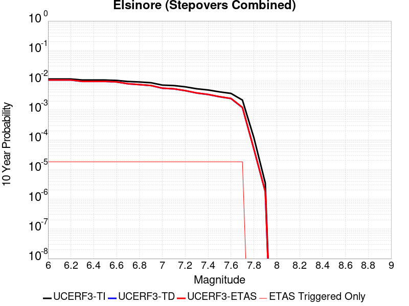 |

| Magnitude | 1 wk TI Prob | 1 wk TD Prob | 1 wk ETAS Prob | 1 wk ETAS/TD Gain | 1 wk ETAS Triggered Only | 1 mo TI Prob | 1 mo TD Prob | 1 mo ETAS Prob | 1 mo ETAS/TD Gain | 1 mo ETAS Triggered Only | 1 yr TI Prob | 1 yr TD Prob | 1 yr ETAS Prob | 1 yr ETAS/TD Gain | 1 yr ETAS Triggered Only | 10 yr TI Prob | 10 yr TD Prob | 10 yr ETAS Prob | 10 yr ETAS/TD Gain | 10 yr ETAS Triggered Only |
|-----|-----|-----|-----|-----|-----|-----|-----|-----|-----|-----|-----|-----|-----|-----|-----|-----|-----|-----|-----|-----|
| 6.0 | 2.144392E-5 | 1.9760193E-5 | 1.9760193E-5 | 1.0 | 0.0 | 9.189928E-5 | 8.468392E-5 | 8.468392E-5 | 1.0 | 0.0 | 0.0011182994 | 0.0010305607 | 0.0010305607 | 1.0 | 0.0 | 0.011126885 | 0.010264917 | 0.010274814 | 1.0009642 | 1.0E-5 |
| 6.1 | 2.144392E-5 | 1.9760193E-5 | 1.9760193E-5 | 1.0 | 0.0 | 9.189928E-5 | 8.468392E-5 | 8.468392E-5 | 1.0 | 0.0 | 0.0011182994 | 0.0010305607 | 0.0010305607 | 1.0 | 0.0 | 0.011126885 | 0.010264917 | 0.010274814 | 1.0009642 | 1.0E-5 |
| 6.2 | 2.144392E-5 | 1.9760193E-5 | 1.9760193E-5 | 1.0 | 0.0 | 9.189928E-5 | 8.468392E-5 | 8.468392E-5 | 1.0 | 0.0 | 0.0011182994 | 0.0010305607 | 0.0010305607 | 1.0 | 0.0 | 0.011126885 | 0.010264917 | 0.010274814 | 1.0009642 | 1.0E-5 |
| 6.3 | 1.9751555E-5 | 1.7741453E-5 | 1.7741453E-5 | 1.0 | 0.0 | 8.4646774E-5 | 7.603267E-5 | 7.603267E-5 | 1.0 | 0.0 | 0.0010300872 | 9.253213E-4 | 9.253213E-4 | 1.0 | 0.0 | 0.010253254 | 0.009221276 | 0.009231185 | 1.0010744 | 1.0E-5 |
| 6.4 | 1.9751555E-5 | 1.7741453E-5 | 1.7741453E-5 | 1.0 | 0.0 | 8.4646774E-5 | 7.603267E-5 | 7.603267E-5 | 1.0 | 0.0 | 0.0010300872 | 9.253213E-4 | 9.253213E-4 | 1.0 | 0.0 | 0.010253254 | 0.009221276 | 0.009231185 | 1.0010744 | 1.0E-5 |
| 6.5 | 1.9751555E-5 | 1.7741453E-5 | 1.7741453E-5 | 1.0 | 0.0 | 8.4646774E-5 | 7.603267E-5 | 7.603267E-5 | 1.0 | 0.0 | 0.0010300872 | 9.253213E-4 | 9.253213E-4 | 1.0 | 0.0 | 0.010253254 | 0.009221276 | 0.009231185 | 1.0010744 | 1.0E-5 |
| 6.6 | 1.9188685E-5 | 1.7003393E-5 | 1.7003393E-5 | 1.0 | 0.0 | 8.2234634E-5 | 7.286974E-5 | 7.286974E-5 | 1.0 | 0.0 | 0.0010007467 | 8.868442E-4 | 8.868442E-4 | 1.0 | 0.0 | 0.00996252 | 0.0088398475 | 0.008849759 | 1.0011213 | 1.0E-5 |
| 6.7 | 1.7608272E-5 | 1.4732616E-5 | 1.4732616E-5 | 1.0 | 0.0 | 7.546184E-5 | 6.3138315E-5 | 6.3138315E-5 | 1.0 | 0.0 | 9.183606E-4 | 7.684476E-4 | 7.684476E-4 | 1.0 | 0.0 | 0.009145746 | 0.00766491 | 0.0076748333 | 1.0012946 | 1.0E-5 |
| 6.8 | 1.697165E-5 | 1.3783365E-5 | 1.3783365E-5 | 1.0 | 0.0 | 7.273361E-5 | 5.9070277E-5 | 5.9070277E-5 | 1.0 | 0.0 | 8.8517193E-4 | 7.18952E-4 | 7.18952E-4 | 1.0 | 0.0 | 0.008816543 | 0.007172675 | 0.0071826032 | 1.0013841 | 1.0E-5 |
| 6.9 | 1.600365E-5 | 1.2846671E-5 | 1.2846671E-5 | 1.0 | 0.0 | 6.858527E-5 | 5.5056043E-5 | 5.5056043E-5 | 1.0 | 0.0 | 8.347058E-4 | 6.7010894E-4 | 6.7010894E-4 | 1.0 | 0.0 | 0.008315775 | 0.0066867657 | 0.006696699 | 1.0014855 | 1.0E-5 |
| 7.0 | 1.3314581E-5 | 1.0447548E-5 | 1.0447548E-5 | 1.0 | 0.0 | 5.7061243E-5 | 4.4774453E-5 | 4.4774453E-5 | 1.0 | 0.0 | 6.944992E-4 | 5.449953E-4 | 5.449953E-4 | 1.0 | 0.0 | 0.006923327 | 0.0054405155 | 0.005450461 | 1.0018281 | 1.0E-5 |
| 7.1 | 1.2865345E-5 | 9.937536E-6 | 9.937536E-6 | 1.0 | 0.0 | 5.5136024E-5 | 4.258876E-5 | 4.258876E-5 | 1.0 | 0.0 | 6.710743E-4 | 5.183973E-4 | 5.183973E-4 | 1.0 | 0.0 | 0.0066905143 | 0.0051752133 | 0.0051851617 | 1.0019222 | 1.0E-5 |
| 7.2 | 1.1650051E-5 | 8.633809E-6 | 8.633809E-6 | 1.0 | 0.0 | 4.9927836E-5 | 3.7001522E-5 | 3.7001522E-5 | 1.0 | 0.0 | 6.0770183E-4 | 4.504022E-4 | 4.504022E-4 | 1.0 | 0.0 | 0.0060604266 | 0.0044963174 | 0.0045062723 | 1.0022141 | 1.0E-5 |
| 7.3 | 1.0008533E-5 | 7.2010425E-6 | 7.2010425E-6 | 1.0 | 0.0 | 4.2893007E-5 | 3.0861254E-5 | 3.0861254E-5 | 1.0 | 0.0 | 5.220972E-4 | 3.7567242E-4 | 3.7567242E-4 | 1.0 | 0.0 | 0.005208723 | 0.003750761 | 0.0037607234 | 1.0026561 | 1.0E-5 |
| 7.4 | 9.116759E-6 | 6.410068E-6 | 6.410068E-6 | 1.0 | 0.0 | 3.907124E-5 | 2.747144E-5 | 2.747144E-5 | 1.0 | 0.0 | 4.7558855E-4 | 3.3441483E-4 | 3.3441483E-4 | 1.0 | 0.0 | 0.00474572 | 0.0033392678 | 0.0033492346 | 1.0029846 | 1.0E-5 |
| 7.5 | 7.870524E-6 | 5.3825365E-6 | 5.3825365E-6 | 1.0 | 0.0 | 3.3730383E-5 | 2.3067816E-5 | 2.3067816E-5 | 1.0 | 0.0 | 4.1059E-4 | 2.8081573E-4 | 2.8081573E-4 | 1.0 | 0.0 | 0.0040983222 | 0.0028047354 | 0.0028147076 | 1.0035554 | 1.0E-5 |
| 7.6 | 6.9774537E-6 | 4.6776067E-6 | 4.6776067E-6 | 1.0 | 0.0 | 2.990303E-5 | 2.0046738E-5 | 2.0046738E-5 | 1.0 | 0.0 | 3.640086E-4 | 2.4404288E-4 | 2.4404288E-4 | 1.0 | 0.0 | 0.003634129 | 0.0024378651 | 0.0024478408 | 1.004092 | 1.0E-5 |
| 7.7 | 4.1616954E-6 | 2.32834E-6 | 2.32834E-6 | 1.0 | 0.0 | 1.7835715E-5 | 9.978567E-6 | 9.978567E-6 | 1.0 | 0.0 | 2.171282E-4 | 1.2148302E-4 | 1.2148302E-4 | 1.0 | 0.0 | 0.0021691616 | 0.0012142392 | 0.001224227 | 1.0082256 | 1.0E-5 |
| 7.8 | 2.2692414E-7 | 9.3854695E-8 | 9.3854695E-8 | 1.0 | 0.0 | 9.725317E-7 | 4.0223435E-7 | 4.0223435E-7 | 1.0 | 0.0 | 1.1840509E-5 | 4.8971956E-6 | 4.8971956E-6 | 1.0 | 0.0 | 1.1839878E-4 | 4.8971204E-5 | 4.8971204E-5 | 1.0 | 0.0 |
| 7.9 | 6.676829E-9 | 3.439853E-9 | 3.439853E-9 | 1.0 | 0.0 | 2.861498E-8 | 1.4742227E-8 | 1.4742227E-8 | 1.0 | 0.0 | 3.4838732E-7 | 1.7948659E-7 | 1.7948659E-7 | 1.0 | 0.0 | 3.4838679E-6 | 1.7948646E-6 | 1.7948646E-6 | 1.0 | 0.0 |

## Great Valley 04b Gordon Valley
*[(top)](#table-of-contents)*

| 1 Week | 1 Month | 1 Year | 10 Year |
|-----|-----|-----|-----|
|  | 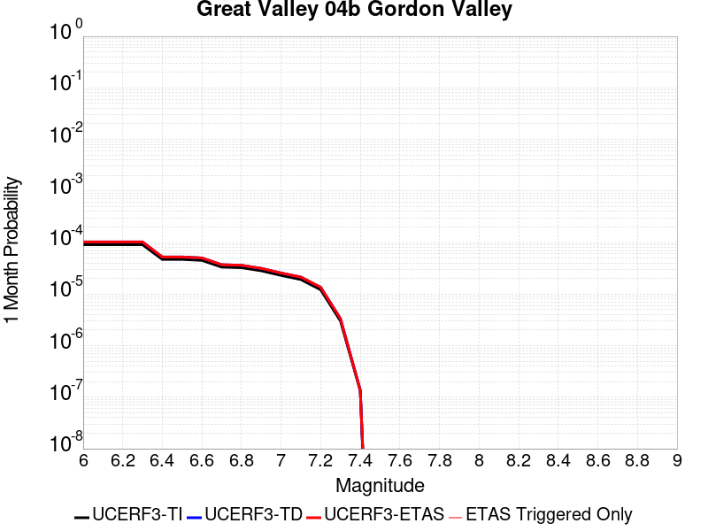 |  | 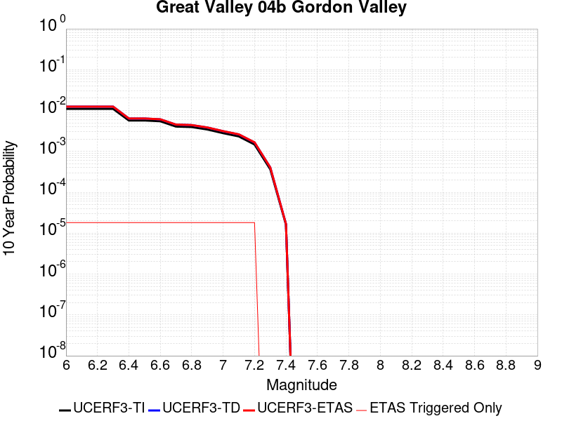 |

| Magnitude | 1 wk TI Prob | 1 wk TD Prob | 1 wk ETAS Prob | 1 wk ETAS/TD Gain | 1 wk ETAS Triggered Only | 1 mo TI Prob | 1 mo TD Prob | 1 mo ETAS Prob | 1 mo ETAS/TD Gain | 1 mo ETAS Triggered Only | 1 yr TI Prob | 1 yr TD Prob | 1 yr ETAS Prob | 1 yr ETAS/TD Gain | 1 yr ETAS Triggered Only | 10 yr TI Prob | 10 yr TD Prob | 10 yr ETAS Prob | 10 yr ETAS/TD Gain | 10 yr ETAS Triggered Only |
|-----|-----|-----|-----|-----|-----|-----|-----|-----|-----|-----|-----|-----|-----|-----|-----|-----|-----|-----|-----|-----|
| 6.0 | 2.1181217E-5 | 2.3981953E-5 | 2.3981953E-5 | 1.0 | 0.0 | 9.077348E-5 | 1.0277669E-4 | 1.0277669E-4 | 1.0 | 0.0 | 0.0011046068 | 0.0012507546 | 0.0012507546 | 1.0 | 0.0 | 0.010991322 | 0.012453599 | 0.012463475 | 1.000793 | 1.0E-5 |
| 6.1 | 2.1181217E-5 | 2.3981953E-5 | 2.3981953E-5 | 1.0 | 0.0 | 9.077348E-5 | 1.0277669E-4 | 1.0277669E-4 | 1.0 | 0.0 | 0.0011046068 | 0.0012507546 | 0.0012507546 | 1.0 | 0.0 | 0.010991322 | 0.012453599 | 0.012463475 | 1.000793 | 1.0E-5 |
| 6.2 | 2.1181217E-5 | 2.3981953E-5 | 2.3981953E-5 | 1.0 | 0.0 | 9.077348E-5 | 1.0277669E-4 | 1.0277669E-4 | 1.0 | 0.0 | 0.0011046068 | 0.0012507546 | 0.0012507546 | 1.0 | 0.0 | 0.010991322 | 0.012453599 | 0.012463475 | 1.000793 | 1.0E-5 |
| 6.3 | 2.1181217E-5 | 2.3981953E-5 | 2.3981953E-5 | 1.0 | 0.0 | 9.077348E-5 | 1.0277669E-4 | 1.0277669E-4 | 1.0 | 0.0 | 0.0011046068 | 0.0012507546 | 0.0012507546 | 1.0 | 0.0 | 0.010991322 | 0.012453599 | 0.012463475 | 1.000793 | 1.0E-5 |
| 6.4 | 1.0988268E-5 | 1.2254499E-5 | 1.2254499E-5 | 1.0 | 0.0 | 4.7091726E-5 | 5.2518313E-5 | 5.2518313E-5 | 1.0 | 0.0 | 5.731909E-4 | 6.392388E-4 | 6.392388E-4 | 1.0 | 0.0 | 0.005717147 | 0.0063755875 | 0.006385524 | 1.0015585 | 1.0E-5 |
| 6.5 | 1.0988268E-5 | 1.2254499E-5 | 1.2254499E-5 | 1.0 | 0.0 | 4.7091726E-5 | 5.2518313E-5 | 5.2518313E-5 | 1.0 | 0.0 | 5.731909E-4 | 6.392388E-4 | 6.392388E-4 | 1.0 | 0.0 | 0.005717147 | 0.0063755875 | 0.006385524 | 1.0015585 | 1.0E-5 |
| 6.6 | 1.0517822E-5 | 1.1724062E-5 | 1.1724062E-5 | 1.0 | 0.0 | 4.5075605E-5 | 5.02451E-5 | 5.02451E-5 | 1.0 | 0.0 | 5.4865726E-4 | 6.11578E-4 | 6.11578E-4 | 1.0 | 0.0 | 0.0054730466 | 0.0061005033 | 0.0061104423 | 1.0016292 | 1.0E-5 |
| 6.7 | 7.789219E-6 | 8.6776445E-6 | 8.6776445E-6 | 1.0 | 0.0 | 3.3381937E-5 | 3.7189402E-5 | 3.7189402E-5 | 1.0 | 0.0 | 4.063493E-4 | 4.526921E-4 | 4.526921E-4 | 1.0 | 0.0 | 0.004056071 | 0.0045182165 | 0.0045281714 | 1.0022032 | 1.0E-5 |
| 6.8 | 7.5850853E-6 | 8.452389E-6 | 8.452389E-6 | 1.0 | 0.0 | 3.2507105E-5 | 3.622405E-5 | 3.622405E-5 | 1.0 | 0.0 | 3.957021E-4 | 4.409437E-4 | 4.409437E-4 | 1.0 | 0.0 | 0.0039499826 | 0.0044012 | 0.0044111563 | 1.0022621 | 1.0E-5 |
| 6.9 | 6.604105E-6 | 7.3585493E-6 | 7.3585493E-6 | 1.0 | 0.0 | 2.8303E-5 | 3.153628E-5 | 3.153628E-5 | 1.0 | 0.0 | 3.4453452E-4 | 3.8389044E-4 | 3.8389044E-4 | 1.0 | 0.0 | 0.0034400085 | 0.0038326595 | 0.003842621 | 1.0025991 | 1.0E-5 |
| 7.0 | 5.3701115E-6 | 5.9884183E-6 | 5.9884183E-6 | 1.0 | 0.0 | 2.301456E-5 | 2.5664414E-5 | 2.5664414E-5 | 1.0 | 0.0 | 2.8016625E-4 | 3.1242234E-4 | 3.1242234E-4 | 1.0 | 0.0 | 0.0027981328 | 0.00312012 | 0.0031300886 | 1.003195 | 1.0E-5 |
| 7.1 | 4.4685607E-6 | 4.986478E-6 | 4.986478E-6 | 1.0 | 0.0 | 1.9150835E-5 | 2.1370459E-5 | 2.1370459E-5 | 1.0 | 0.0 | 2.3313647E-4 | 2.6015675E-4 | 2.6015675E-4 | 1.0 | 0.0 | 0.0023289204 | 0.0025987667 | 0.002608741 | 1.003838 | 1.0E-5 |
| 7.2 | 2.833378E-6 | 3.164419E-6 | 3.164419E-6 | 1.0 | 0.0 | 1.2142991E-5 | 1.3561736E-5 | 1.3561736E-5 | 1.0 | 0.0 | 1.4783088E-4 | 1.6510337E-4 | 1.6510337E-4 | 1.0 | 0.0 | 0.0014773258 | 0.0016499789 | 0.0016599623 | 1.0060507 | 1.0E-5 |
| 7.3 | 7.0087293E-7 | 7.7728157E-7 | 7.7728157E-7 | 1.0 | 0.0 | 3.0037377E-6 | 3.3312049E-6 | 3.3312049E-6 | 1.0 | 0.0 | 3.656989E-5 | 4.0557123E-5 | 4.0557123E-5 | 1.0 | 0.0 | 3.6563876E-4 | 4.055422E-4 | 4.055422E-4 | 1.0 | 0.0 |
| 7.4 | 3.112171E-8 | 3.2068368E-8 | 3.2068368E-8 | 1.0 | 0.0 | 1.3337875E-7 | 1.3743585E-7 | 1.3743585E-7 | 1.0 | 0.0 | 1.6238852E-6 | 1.6732803E-6 | 1.6732803E-6 | 1.0 | 0.0 | 1.6238733E-5 | 1.6732685E-5 | 1.6732685E-5 | 1.0 | 0.0 |

## Thirty Mile Bank
*[(top)](#table-of-contents)*

| 1 Week | 1 Month | 1 Year | 10 Year |
|-----|-----|-----|-----|
|  | 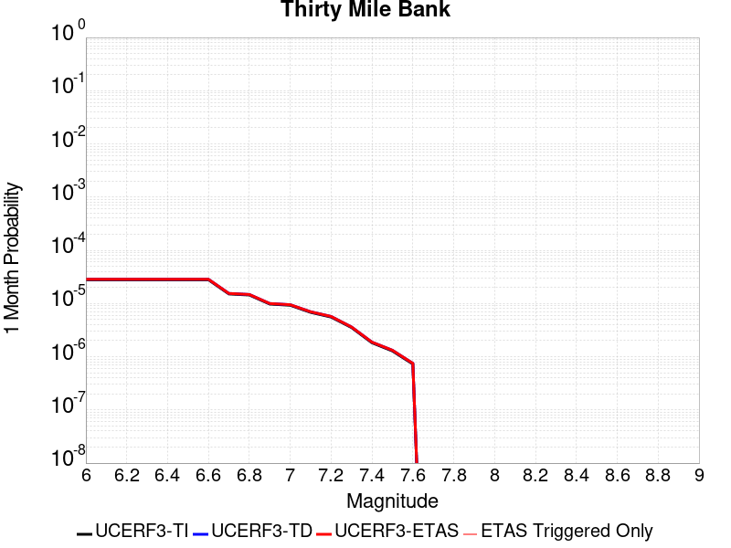 | 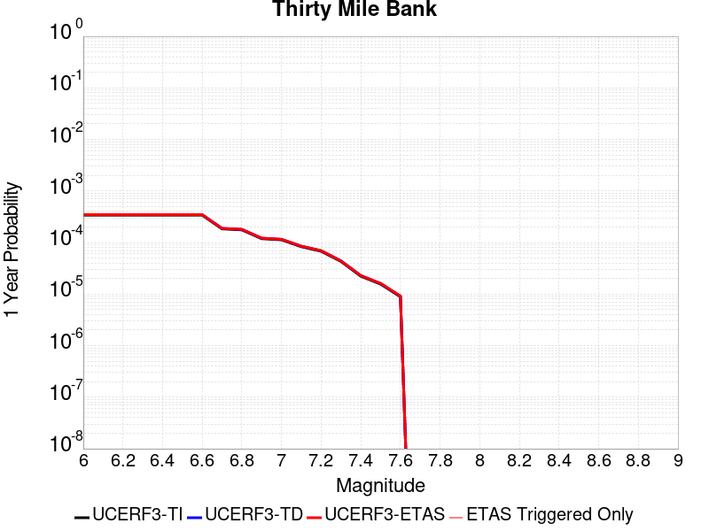 | 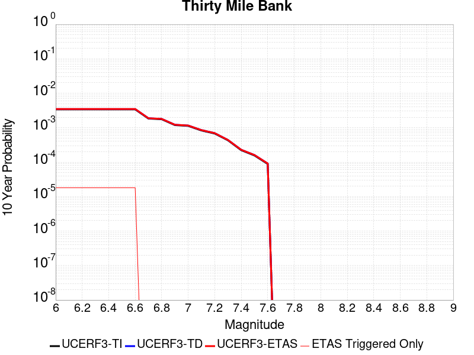 |

| Magnitude | 1 wk TI Prob | 1 wk TD Prob | 1 wk ETAS Prob | 1 wk ETAS/TD Gain | 1 wk ETAS Triggered Only | 1 mo TI Prob | 1 mo TD Prob | 1 mo ETAS Prob | 1 mo ETAS/TD Gain | 1 mo ETAS Triggered Only | 1 yr TI Prob | 1 yr TD Prob | 1 yr ETAS Prob | 1 yr ETAS/TD Gain | 1 yr ETAS Triggered Only | 10 yr TI Prob | 10 yr TD Prob | 10 yr ETAS Prob | 10 yr ETAS/TD Gain | 10 yr ETAS Triggered Only |
|-----|-----|-----|-----|-----|-----|-----|-----|-----|-----|-----|-----|-----|-----|-----|-----|-----|-----|-----|-----|-----|
| 6.0 | 6.5124755E-6 | 6.6592643E-6 | 6.6592643E-6 | 1.0 | 0.0 | 2.791031E-5 | 2.8539416E-5 | 2.8539416E-5 | 1.0 | 0.0 | 3.3975503E-4 | 3.4741635E-4 | 3.4741635E-4 | 1.0 | 0.0 | 0.0033923604 | 0.003469164 | 0.0034791294 | 1.0028726 | 1.0E-5 |
| 6.1 | 6.5124755E-6 | 6.6592643E-6 | 6.6592643E-6 | 1.0 | 0.0 | 2.791031E-5 | 2.8539416E-5 | 2.8539416E-5 | 1.0 | 0.0 | 3.3975503E-4 | 3.4741635E-4 | 3.4741635E-4 | 1.0 | 0.0 | 0.0033923604 | 0.003469164 | 0.0034791294 | 1.0028726 | 1.0E-5 |
| 6.2 | 6.5124755E-6 | 6.6592643E-6 | 6.6592643E-6 | 1.0 | 0.0 | 2.791031E-5 | 2.8539416E-5 | 2.8539416E-5 | 1.0 | 0.0 | 3.3975503E-4 | 3.4741635E-4 | 3.4741635E-4 | 1.0 | 0.0 | 0.0033923604 | 0.003469164 | 0.0034791294 | 1.0028726 | 1.0E-5 |
| 6.3 | 6.5124755E-6 | 6.6592643E-6 | 6.6592643E-6 | 1.0 | 0.0 | 2.791031E-5 | 2.8539416E-5 | 2.8539416E-5 | 1.0 | 0.0 | 3.3975503E-4 | 3.4741635E-4 | 3.4741635E-4 | 1.0 | 0.0 | 0.0033923604 | 0.003469164 | 0.0034791294 | 1.0028726 | 1.0E-5 |
| 6.4 | 6.5124755E-6 | 6.6592643E-6 | 6.6592643E-6 | 1.0 | 0.0 | 2.791031E-5 | 2.8539416E-5 | 2.8539416E-5 | 1.0 | 0.0 | 3.3975503E-4 | 3.4741635E-4 | 3.4741635E-4 | 1.0 | 0.0 | 0.0033923604 | 0.003469164 | 0.0034791294 | 1.0028726 | 1.0E-5 |
| 6.5 | 6.5124755E-6 | 6.6592643E-6 | 6.6592643E-6 | 1.0 | 0.0 | 2.791031E-5 | 2.8539416E-5 | 2.8539416E-5 | 1.0 | 0.0 | 3.3975503E-4 | 3.4741635E-4 | 3.4741635E-4 | 1.0 | 0.0 | 0.0033923604 | 0.003469164 | 0.0034791294 | 1.0028726 | 1.0E-5 |
| 6.6 | 6.5124755E-6 | 6.6592643E-6 | 6.6592643E-6 | 1.0 | 0.0 | 2.791031E-5 | 2.8539416E-5 | 2.8539416E-5 | 1.0 | 0.0 | 3.3975503E-4 | 3.4741635E-4 | 3.4741635E-4 | 1.0 | 0.0 | 0.0033923604 | 0.003469164 | 0.0034791294 | 1.0028726 | 1.0E-5 |
| 6.7 | 3.5261137E-6 | 3.6098995E-6 | 3.6098995E-6 | 1.0 | 0.0 | 1.5111828E-5 | 1.547091E-5 | 1.547091E-5 | 1.0 | 0.0 | 1.8397097E-4 | 1.883427E-4 | 1.883427E-4 | 1.0 | 0.0 | 0.0018381875 | 0.0018818958 | 0.0018818958 | 1.0 | 0.0 |
| 6.8 | 3.370743E-6 | 3.4509355E-6 | 3.4509355E-6 | 1.0 | 0.0 | 1.4445961E-5 | 1.47896435E-5 | 1.47896435E-5 | 1.0 | 0.0 | 1.7586538E-4 | 1.8004965E-4 | 1.8004965E-4 | 1.0 | 0.0 | 0.0017572626 | 0.0017990996 | 0.0017990996 | 1.0 | 0.0 |
| 6.9 | 2.2756835E-6 | 2.333161E-6 | 2.333161E-6 | 1.0 | 0.0 | 9.752893E-6 | 9.999225E-6 | 9.999225E-6 | 1.0 | 0.0 | 1.18735006E-4 | 1.2173401E-4 | 1.2173401E-4 | 1.0 | 0.0 | 0.0011867158 | 0.0012166979 | 0.0012166979 | 1.0 | 0.0 |
| 7.0 | 2.1617404E-6 | 2.21598E-6 | 2.21598E-6 | 1.0 | 0.0 | 9.264569E-6 | 9.497024E-6 | 9.497024E-6 | 1.0 | 0.0 | 1.1279029E-4 | 1.1562037E-4 | 1.1562037E-4 | 1.0 | 0.0 | 0.0011273306 | 0.0011556263 | 0.0011556263 | 1.0 | 0.0 |
| 7.1 | 1.5900777E-6 | 1.6327014E-6 | 1.6327014E-6 | 1.0 | 0.0 | 6.814601E-6 | 6.997274E-6 | 6.997274E-6 | 1.0 | 0.0 | 8.296461E-5 | 8.518861E-5 | 8.518861E-5 | 1.0 | 0.0 | 8.293364E-4 | 8.5157226E-4 | 8.5157226E-4 | 1.0 | 0.0 |
| 7.2 | 1.2971728E-6 | 1.3328992E-6 | 1.3328992E-6 | 1.0 | 0.0 | 5.5593005E-6 | 5.712413E-6 | 5.712413E-6 | 1.0 | 0.0 | 6.768238E-5 | 6.954651E-5 | 6.954651E-5 | 1.0 | 0.0 | 6.7661767E-4 | 6.952578E-4 | 6.952578E-4 | 1.0 | 0.0 |
| 7.3 | 8.2454284E-7 | 8.448891E-7 | 8.448891E-7 | 1.0 | 0.0 | 3.5337503E-6 | 3.6209485E-6 | 3.6209485E-6 | 1.0 | 0.0 | 4.302256E-5 | 4.408422E-5 | 4.408422E-5 | 1.0 | 0.0 | 4.301423E-4 | 4.4076078E-4 | 4.4076078E-4 | 1.0 | 0.0 |
| 7.4 | 4.2619024E-7 | 4.3863466E-7 | 4.3863466E-7 | 1.0 | 0.0 | 1.8265283E-6 | 1.8798615E-6 | 1.8798615E-6 | 1.0 | 0.0 | 2.2237757E-5 | 2.2887078E-5 | 2.2887078E-5 | 1.0 | 0.0 | 2.223553E-4 | 2.288476E-4 | 2.288476E-4 | 1.0 | 0.0 |
| 7.5 | 2.993922E-7 | 3.086453E-7 | 3.086453E-7 | 1.0 | 0.0 | 1.2831089E-6 | 1.3227649E-6 | 1.3227649E-6 | 1.0 | 0.0 | 1.5621737E-5 | 1.6104546E-5 | 1.6104546E-5 | 1.0 | 0.0 | 1.562064E-4 | 1.6103406E-4 | 1.6103406E-4 | 1.0 | 0.0 |
| 7.6 | 1.6988751E-7 | 1.7533823E-7 | 1.7533823E-7 | 1.0 | 0.0 | 7.2808916E-7 | 7.5144936E-7 | 7.5144936E-7 | 1.0 | 0.0 | 8.864449E-6 | 9.14886E-6 | 9.14886E-6 | 1.0 | 0.0 | 8.8640954E-5 | 9.1485024E-5 | 9.1485024E-5 | 1.0 | 0.0 |

## Fontana (Seismicity)
*[(top)](#table-of-contents)*

| 1 Week | 1 Month | 1 Year | 10 Year |
|-----|-----|-----|-----|
|  |  |  |  |

| Magnitude | 1 wk TI Prob | 1 wk TD Prob | 1 wk ETAS Prob | 1 wk ETAS/TD Gain | 1 wk ETAS Triggered Only | 1 mo TI Prob | 1 mo TD Prob | 1 mo ETAS Prob | 1 mo ETAS/TD Gain | 1 mo ETAS Triggered Only | 1 yr TI Prob | 1 yr TD Prob | 1 yr ETAS Prob | 1 yr ETAS/TD Gain | 1 yr ETAS Triggered Only | 10 yr TI Prob | 10 yr TD Prob | 10 yr ETAS Prob | 10 yr ETAS/TD Gain | 10 yr ETAS Triggered Only |
|-----|-----|-----|-----|-----|-----|-----|-----|-----|-----|-----|-----|-----|-----|-----|-----|-----|-----|-----|-----|-----|
| 6.0 | 7.1789214E-6 | 7.5520006E-6 | 1.7551925E-5 | 2.3241425 | 1.0E-5 | 3.076644E-5 | 3.2365548E-5 | 4.2365224E-5 | 1.3089606 | 1.0E-5 | 3.7451705E-4 | 3.9402005E-4 | 4.0401611E-4 | 1.0253694 | 1.0E-5 | 0.003738865 | 0.003937214 | 0.0039471746 | 1.0025299 | 1.0E-5 |
| 6.1 | 7.1789214E-6 | 7.5520006E-6 | 1.7551925E-5 | 2.3241425 | 1.0E-5 | 3.076644E-5 | 3.2365548E-5 | 4.2365224E-5 | 1.3089606 | 1.0E-5 | 3.7451705E-4 | 3.9402005E-4 | 4.0401611E-4 | 1.0253694 | 1.0E-5 | 0.003738865 | 0.003937214 | 0.0039471746 | 1.0025299 | 1.0E-5 |
| 6.2 | 7.1789214E-6 | 7.5520006E-6 | 1.7551925E-5 | 2.3241425 | 1.0E-5 | 3.076644E-5 | 3.2365548E-5 | 4.2365224E-5 | 1.3089606 | 1.0E-5 | 3.7451705E-4 | 3.9402005E-4 | 4.0401611E-4 | 1.0253694 | 1.0E-5 | 0.003738865 | 0.003937214 | 0.0039471746 | 1.0025299 | 1.0E-5 |
| 6.3 | 7.1789214E-6 | 7.5520006E-6 | 1.7551925E-5 | 2.3241425 | 1.0E-5 | 3.076644E-5 | 3.2365548E-5 | 4.2365224E-5 | 1.3089606 | 1.0E-5 | 3.7451705E-4 | 3.9402005E-4 | 4.0401611E-4 | 1.0253694 | 1.0E-5 | 0.003738865 | 0.003937214 | 0.0039471746 | 1.0025299 | 1.0E-5 |
| 6.4 | 7.1789214E-6 | 7.5520006E-6 | 1.7551925E-5 | 2.3241425 | 1.0E-5 | 3.076644E-5 | 3.2365548E-5 | 4.2365224E-5 | 1.3089606 | 1.0E-5 | 3.7451705E-4 | 3.9402005E-4 | 4.0401611E-4 | 1.0253694 | 1.0E-5 | 0.003738865 | 0.003937214 | 0.0039471746 | 1.0025299 | 1.0E-5 |
| 6.5 | 5.2611317E-6 | 5.532726E-6 | 1.553267E-5 | 2.8074174 | 1.0E-5 | 2.2547512E-5 | 2.3711682E-5 | 3.3711443E-5 | 1.421723 | 1.0E-5 | 2.744814E-4 | 2.8868974E-4 | 2.9868685E-4 | 1.0346292 | 1.0E-5 | 0.002741426 | 0.0028868972 | 0.0028968684 | 1.003454 | 1.0E-5 |
| 6.6 | 5.2611317E-6 | 5.532726E-6 | 1.553267E-5 | 2.8074174 | 1.0E-5 | 2.2547512E-5 | 2.3711682E-5 | 3.3711443E-5 | 1.421723 | 1.0E-5 | 2.744814E-4 | 2.8868974E-4 | 2.9868685E-4 | 1.0346292 | 1.0E-5 | 0.002741426 | 0.0028868972 | 0.0028968684 | 1.003454 | 1.0E-5 |

## Cedar Mtn-Mahogany Mtn
*[(top)](#table-of-contents)*

| 1 Week | 1 Month | 1 Year | 10 Year |
|-----|-----|-----|-----|
| 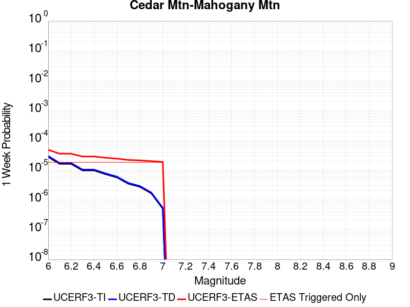 | 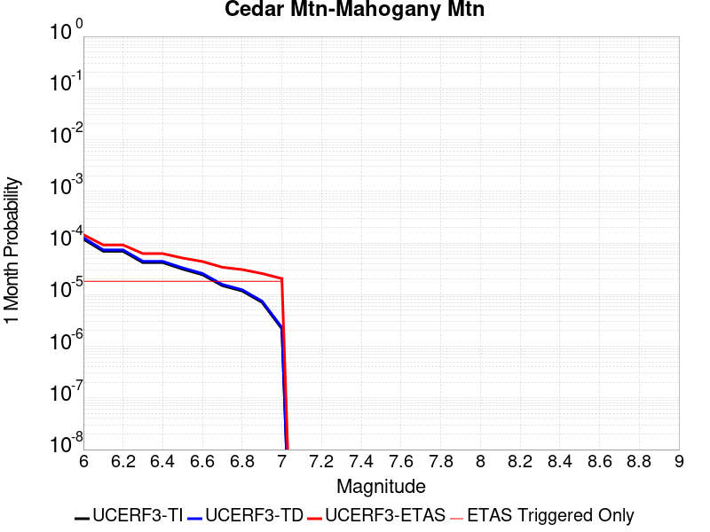 | 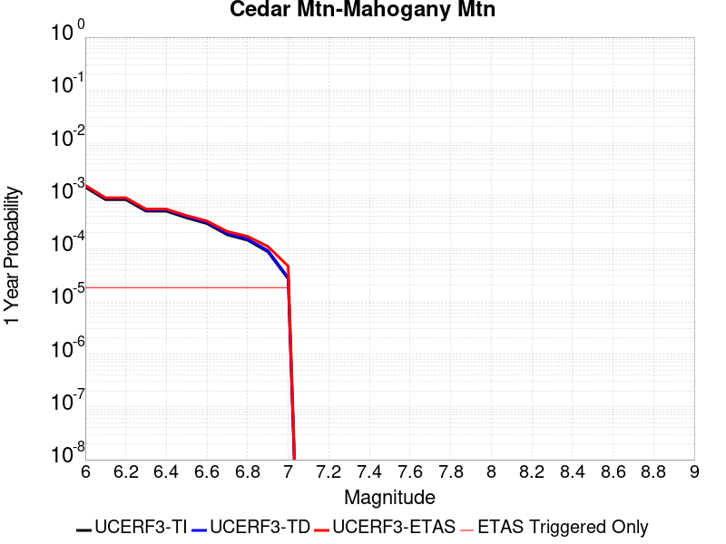 | 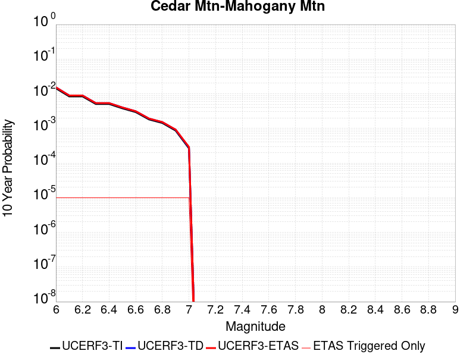 |

| Magnitude | 1 wk TI Prob | 1 wk TD Prob | 1 wk ETAS Prob | 1 wk ETAS/TD Gain | 1 wk ETAS Triggered Only | 1 mo TI Prob | 1 mo TD Prob | 1 mo ETAS Prob | 1 mo ETAS/TD Gain | 1 mo ETAS Triggered Only | 1 yr TI Prob | 1 yr TD Prob | 1 yr ETAS Prob | 1 yr ETAS/TD Gain | 1 yr ETAS Triggered Only | 10 yr TI Prob | 10 yr TD Prob | 10 yr ETAS Prob | 10 yr ETAS/TD Gain | 10 yr ETAS Triggered Only |
|-----|-----|-----|-----|-----|-----|-----|-----|-----|-----|-----|-----|-----|-----|-----|-----|-----|-----|-----|-----|-----|
| 6.0 | 2.7763876E-5 | 2.9588866E-5 | 3.958857E-5 | 1.337955 | 1.0E-5 | 1.1898261E-4 | 1.2680366E-4 | 1.3680238E-4 | 1.078852 | 1.0E-5 | 0.0014476506 | 0.0015428112 | 0.0015527958 | 1.0064716 | 1.0E-5 | 0.0143825635 | 0.015328225 | 0.015338072 | 1.0006424 | 1.0E-5 |
| 6.1 | 1.6162443E-5 | 1.7142966E-5 | 2.7142794E-5 | 1.5833197 | 1.0E-5 | 6.926578E-5 | 7.346788E-5 | 8.346715E-5 | 1.1361039 | 1.0E-5 | 8.4298453E-4 | 8.941221E-4 | 9.0411317E-4 | 1.0111742 | 1.0E-5 | 0.008397939 | 0.008907059 | 0.008916969 | 1.0011127 | 1.0E-5 |
| 6.2 | 1.6162443E-5 | 1.7142966E-5 | 2.7142794E-5 | 1.5833197 | 1.0E-5 | 6.926578E-5 | 7.346788E-5 | 8.346715E-5 | 1.1361039 | 1.0E-5 | 8.4298453E-4 | 8.941221E-4 | 9.0411317E-4 | 1.0111742 | 1.0E-5 | 0.008397939 | 0.008907059 | 0.008916969 | 1.0011127 | 1.0E-5 |
| 6.3 | 9.746053E-6 | 1.0303152E-5 | 2.0303049E-5 | 1.9705667 | 1.0E-5 | 4.1768133E-5 | 4.415564E-5 | 5.41552E-5 | 1.2264616 | 1.0E-5 | 5.0840835E-4 | 5.3746643E-4 | 5.4746104E-4 | 1.0185958 | 1.0E-5 | 0.0050724675 | 0.005362084 | 0.0053720307 | 1.0018549 | 1.0E-5 |
| 6.4 | 9.746053E-6 | 1.0303152E-5 | 2.0303049E-5 | 1.9705667 | 1.0E-5 | 4.1768133E-5 | 4.415564E-5 | 5.41552E-5 | 1.2264616 | 1.0E-5 | 5.0840835E-4 | 5.3746643E-4 | 5.4746104E-4 | 1.0185958 | 1.0E-5 | 0.0050724675 | 0.005362084 | 0.0053720307 | 1.0018549 | 1.0E-5 |
| 6.5 | 7.290083E-6 | 7.695325E-6 | 1.7695247E-5 | 2.2994804 | 1.0E-5 | 3.124284E-5 | 3.297956E-5 | 4.2979227E-5 | 1.3032081 | 1.0E-5 | 3.8031515E-4 | 4.014543E-4 | 4.1145028E-4 | 1.0248995 | 1.0E-5 | 0.0037966494 | 0.004007511 | 0.004017471 | 1.0024853 | 1.0E-5 |
| 6.6 | 5.67907E-6 | 5.9891527E-6 | 1.5989093E-5 | 2.6696754 | 1.0E-5 | 2.4338644E-5 | 2.5667552E-5 | 3.5667297E-5 | 1.3895869 | 1.0E-5 | 2.962827E-4 | 3.12459E-4 | 3.2245586E-4 | 1.0319942 | 1.0E-5 | 0.0029588798 | 0.003120333 | 0.0031303016 | 1.0031948 | 1.0E-5 |
| 6.7 | 3.4853963E-6 | 3.672631E-6 | 1.3672594E-5 | 3.7228336 | 1.0E-5 | 1.4937327E-5 | 1.5739755E-5 | 2.5739599E-5 | 1.6353239 | 1.0E-5 | 1.8184677E-4 | 1.916153E-4 | 2.0161338E-4 | 1.0521779 | 1.0E-5 | 0.0018169804 | 0.0019145629 | 0.0019245436 | 1.0052131 | 1.0E-5 |
| 6.8 | 2.7535168E-6 | 2.9015764E-6 | 1.2901547E-5 | 4.4463925 | 1.0E-5 | 1.1800733E-5 | 1.2435271E-5 | 2.2435146E-5 | 1.8041543 | 1.0E-5 | 1.4366445E-4 | 1.5138938E-4 | 1.6138787E-4 | 1.0660448 | 1.0E-5 | 0.0014357162 | 0.0015129098 | 0.0015228946 | 1.0065998 | 1.0E-5 |
| 6.9 | 1.6594106E-6 | 1.7496985E-6 | 1.1749681E-5 | 6.71526 | 1.0E-5 | 7.1117406E-6 | 7.4986883E-6 | 1.7498613E-5 | 2.3335567 | 1.0E-5 | 8.6582E-5 | 9.129302E-5 | 1.01292106E-4 | 1.1095273 | 1.0E-5 | 8.654827E-4 | 9.125856E-4 | 9.2257647E-4 | 1.0109478 | 1.0E-5 |
| 7.0 | 5.10215E-7 | 5.389254E-7 | 1.053892E-5 | 19.555435 | 1.0E-5 | 2.186634E-6 | 2.3096788E-6 | 1.2309656E-5 | 5.329596 | 1.0E-5 | 2.6621943E-5 | 2.8120105E-5 | 3.8119826E-5 | 1.3556074 | 1.0E-5 | 2.6618753E-4 | 2.81178E-4 | 2.911752E-4 | 1.0355546 | 1.0E-5 |

## San Gabriel
*[(top)](#table-of-contents)*

| 1 Week | 1 Month | 1 Year | 10 Year |
|-----|-----|-----|-----|
|  |  | 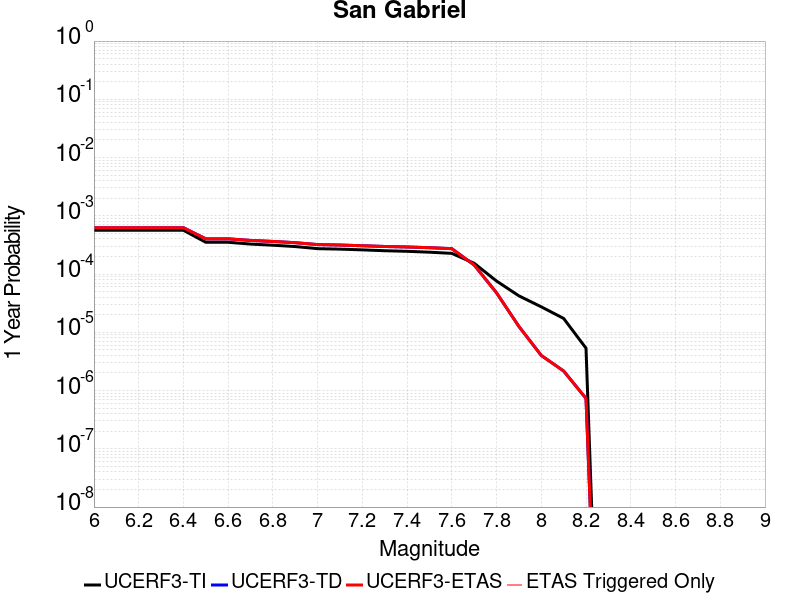 | 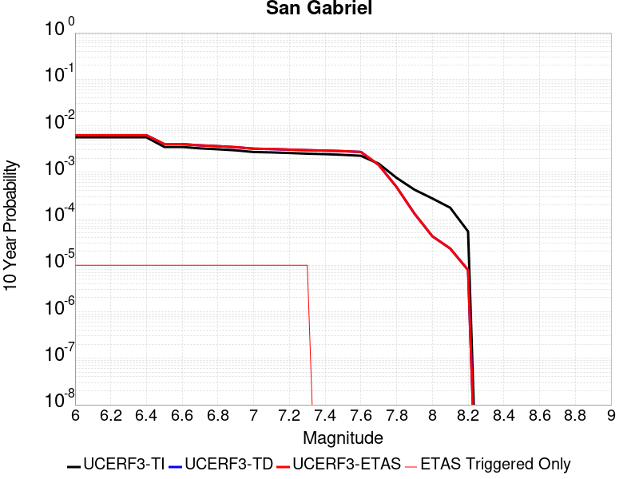 |

| Magnitude | 1 wk TI Prob | 1 wk TD Prob | 1 wk ETAS Prob | 1 wk ETAS/TD Gain | 1 wk ETAS Triggered Only | 1 mo TI Prob | 1 mo TD Prob | 1 mo ETAS Prob | 1 mo ETAS/TD Gain | 1 mo ETAS Triggered Only | 1 yr TI Prob | 1 yr TD Prob | 1 yr ETAS Prob | 1 yr ETAS/TD Gain | 1 yr ETAS Triggered Only | 10 yr TI Prob | 10 yr TD Prob | 10 yr ETAS Prob | 10 yr ETAS/TD Gain | 10 yr ETAS Triggered Only |
|-----|-----|-----|-----|-----|-----|-----|-----|-----|-----|-----|-----|-----|-----|-----|-----|-----|-----|-----|-----|-----|
| 6.0 | 1.083775E-5 | 1.19851875E-5 | 1.19851875E-5 | 1.0 | 0.0 | 4.6446676E-5 | 5.1364143E-5 | 5.1364143E-5 | 1.0 | 0.0 | 5.653415E-4 | 6.251903E-4 | 6.251903E-4 | 1.0 | 0.0 | 0.0056390543 | 0.006246409 | 0.0062563466 | 1.001591 | 1.0E-5 |
| 6.1 | 1.083775E-5 | 1.19851875E-5 | 1.19851875E-5 | 1.0 | 0.0 | 4.6446676E-5 | 5.1364143E-5 | 5.1364143E-5 | 1.0 | 0.0 | 5.653415E-4 | 6.251903E-4 | 6.251903E-4 | 1.0 | 0.0 | 0.0056390543 | 0.006246409 | 0.0062563466 | 1.001591 | 1.0E-5 |
| 6.2 | 1.083775E-5 | 1.19851875E-5 | 1.19851875E-5 | 1.0 | 0.0 | 4.6446676E-5 | 5.1364143E-5 | 5.1364143E-5 | 1.0 | 0.0 | 5.653415E-4 | 6.251903E-4 | 6.251903E-4 | 1.0 | 0.0 | 0.0056390543 | 0.006246409 | 0.0062563466 | 1.001591 | 1.0E-5 |
| 6.3 | 1.083775E-5 | 1.19851875E-5 | 1.19851875E-5 | 1.0 | 0.0 | 4.6446676E-5 | 5.1364143E-5 | 5.1364143E-5 | 1.0 | 0.0 | 5.653415E-4 | 6.251903E-4 | 6.251903E-4 | 1.0 | 0.0 | 0.0056390543 | 0.006246409 | 0.0062563466 | 1.001591 | 1.0E-5 |
| 6.4 | 1.083775E-5 | 1.19851875E-5 | 1.19851875E-5 | 1.0 | 0.0 | 4.6446676E-5 | 5.1364143E-5 | 5.1364143E-5 | 1.0 | 0.0 | 5.653415E-4 | 6.251903E-4 | 6.251903E-4 | 1.0 | 0.0 | 0.0056390543 | 0.006246409 | 0.0062563466 | 1.001591 | 1.0E-5 |
| 6.5 | 6.7317824E-6 | 7.716944E-6 | 7.716944E-6 | 1.0 | 0.0 | 2.8850178E-5 | 3.3072207E-5 | 3.3072207E-5 | 1.0 | 0.0 | 3.511943E-4 | 4.0258077E-4 | 4.0258077E-4 | 1.0 | 0.0 | 0.003506398 | 0.0040296097 | 0.0040395693 | 1.0024717 | 1.0E-5 |
| 6.6 | 6.7317824E-6 | 7.716944E-6 | 7.716944E-6 | 1.0 | 0.0 | 2.8850178E-5 | 3.3072207E-5 | 3.3072207E-5 | 1.0 | 0.0 | 3.511943E-4 | 4.0258077E-4 | 4.0258077E-4 | 1.0 | 0.0 | 0.003506398 | 0.0040296097 | 0.0040395693 | 1.0024717 | 1.0E-5 |
| 6.7 | 6.274881E-6 | 7.2458647E-6 | 7.2458647E-6 | 1.0 | 0.0 | 2.6892068E-5 | 3.1053343E-5 | 3.1053343E-5 | 1.0 | 0.0 | 3.2736175E-4 | 3.780098E-4 | 3.780098E-4 | 1.0 | 0.0 | 0.0032687993 | 0.0037847564 | 0.0037947185 | 1.0026321 | 1.0E-5 |
| 6.8 | 5.996209E-6 | 6.958585E-6 | 6.958585E-6 | 1.0 | 0.0 | 2.5697784E-5 | 2.9822171E-5 | 2.9822171E-5 | 1.0 | 0.0 | 3.128256E-4 | 3.6302538E-4 | 3.6302538E-4 | 1.0 | 0.0 | 0.003123856 | 0.0036354093 | 0.003645373 | 1.0027407 | 1.0E-5 |
| 6.9 | 5.686331E-6 | 6.6236316E-6 | 6.6236316E-6 | 1.0 | 0.0 | 2.4369761E-5 | 2.8386688E-5 | 2.8386688E-5 | 1.0 | 0.0 | 2.9666146E-4 | 3.4555403E-4 | 3.4555403E-4 | 1.0 | 0.0 | 0.0029626573 | 0.0034612515 | 0.003471217 | 1.0028791 | 1.0E-5 |
| 7.0 | 5.2329838E-6 | 6.147514E-6 | 6.147514E-6 | 1.0 | 0.0 | 2.242688E-5 | 2.6346226E-5 | 2.6346226E-5 | 1.0 | 0.0 | 2.7301308E-4 | 3.2071886E-4 | 3.2071886E-4 | 1.0 | 0.0 | 0.002726779 | 0.0032136322 | 0.0032235999 | 1.0031017 | 1.0E-5 |
| 7.1 | 5.135671E-6 | 6.03764E-6 | 6.03764E-6 | 1.0 | 0.0 | 2.2009834E-5 | 2.5875348E-5 | 2.5875348E-5 | 1.0 | 0.0 | 2.6793676E-4 | 3.1498758E-4 | 3.1498758E-4 | 1.0 | 0.0 | 0.0026761394 | 0.0031564834 | 0.0031664518 | 1.0031581 | 1.0E-5 |
| 7.2 | 4.989062E-6 | 5.87102E-6 | 5.87102E-6 | 1.0 | 0.0 | 2.1381518E-5 | 2.5161276E-5 | 2.5161276E-5 | 1.0 | 0.0 | 2.6028889E-4 | 3.0629625E-4 | 3.0629625E-4 | 1.0 | 0.0 | 0.0025998424 | 0.003069813 | 0.0030797822 | 1.0032475 | 1.0E-5 |
| 7.3 | 4.8219395E-6 | 5.702574E-6 | 5.702574E-6 | 1.0 | 0.0 | 2.0665291E-5 | 2.443938E-5 | 2.443938E-5 | 1.0 | 0.0 | 2.5157086E-4 | 2.9750957E-4 | 2.9750957E-4 | 1.0 | 0.0 | 0.0025128627 | 0.0029821852 | 0.0029921555 | 1.0033432 | 1.0E-5 |
| 7.4 | 4.7118383E-6 | 5.5911332E-6 | 5.5911332E-6 | 1.0 | 0.0 | 2.0193436E-5 | 2.3961782E-5 | 2.3961782E-5 | 1.0 | 0.0 | 2.4582737E-4 | 2.916964E-4 | 2.916964E-4 | 1.0 | 0.0 | 0.002455556 | 0.0029242067 | 0.0029242067 | 1.0 | 0.0 |
| 7.5 | 4.5506545E-6 | 5.4365014E-6 | 5.4365014E-6 | 1.0 | 0.0 | 1.9502659E-5 | 2.3299088E-5 | 2.3299088E-5 | 1.0 | 0.0 | 2.37419E-4 | 2.8363022E-4 | 2.8363022E-4 | 1.0 | 0.0 | 0.002371655 | 0.002843753 | 0.002843753 | 1.0 | 0.0 |
| 7.6 | 4.343636E-6 | 5.2293817E-6 | 5.2293817E-6 | 1.0 | 0.0 | 1.861545E-5 | 2.2411448E-5 | 2.2411448E-5 | 1.0 | 0.0 | 2.2661954E-4 | 2.7282597E-4 | 2.7282597E-4 | 1.0 | 0.0 | 0.0022638857 | 0.0027359722 | 0.0027359722 | 1.0 | 0.0 |
| 7.7 | 2.936235E-6 | 2.7440458E-6 | 2.7440458E-6 | 1.0 | 0.0 | 1.2583803E-5 | 1.1760143E-5 | 1.1760143E-5 | 1.0 | 0.0 | 1.5319703E-4 | 1.4317037E-4 | 1.4317037E-4 | 1.0 | 0.0 | 0.0015309147 | 0.0014380751 | 0.0014380751 | 1.0 | 0.0 |
| 7.8 | 1.4541639E-6 | 9.1237047E-7 | 9.1237047E-7 | 1.0 | 0.0 | 6.232116E-6 | 3.9101533E-6 | 3.9101533E-6 | 1.0 | 0.0 | 7.587337E-5 | 4.7605077E-5 | 4.7605077E-5 | 1.0 | 0.0 | 7.584747E-4 | 4.8085177E-4 | 4.8085177E-4 | 1.0 | 0.0 |
| 7.9 | 8.098958E-7 | 2.41753E-7 | 2.41753E-7 | 1.0 | 0.0 | 3.4709774E-6 | 1.0360839E-6 | 1.0360839E-6 | 1.0 | 0.0 | 4.225833E-5 | 1.2614248E-5 | 1.2614248E-5 | 1.0 | 0.0 | 4.2250296E-4 | 1.2921814E-4 | 1.2921814E-4 | 1.0 | 0.0 |
| 8.0 | 5.2473234E-7 | 7.6792055E-8 | 7.6792055E-8 | 1.0 | 0.0 | 2.248851E-6 | 3.2910876E-7 | 3.2910876E-7 | 1.0 | 0.0 | 2.7379416E-5 | 4.0068917E-6 | 4.0068917E-6 | 1.0 | 0.0 | 2.7376044E-4 | 4.21918E-5 | 4.21918E-5 | 1.0 | 0.0 |
| 8.1 | 3.3162388E-7 | 4.1496126E-8 | 4.1496126E-8 | 1.0 | 0.0 | 1.4212444E-6 | 1.7784053E-7 | 1.7784053E-7 | 1.0 | 0.0 | 1.7303513E-5 | 2.1652063E-6 | 2.1652063E-6 | 1.0 | 0.0 | 1.7302166E-4 | 2.2965523E-5 | 2.2965523E-5 | 1.0 | 0.0 |
| 8.2 | 1.0235345E-7 | 1.4043474E-8 | 1.4043474E-8 | 1.0 | 0.0 | 4.3865757E-7 | 6.0186316E-8 | 6.0186316E-8 | 1.0 | 0.0 | 5.340643E-6 | 7.327681E-7 | 7.327681E-7 | 1.0 | 0.0 | 5.3405143E-5 | 7.9273705E-6 | 7.9273705E-6 | 1.0 | 0.0 |

## Eaton Roughs 2011 CFM
*[(top)](#table-of-contents)*

| 1 Week | 1 Month | 1 Year | 10 Year |
|-----|-----|-----|-----|
|  |  |  | 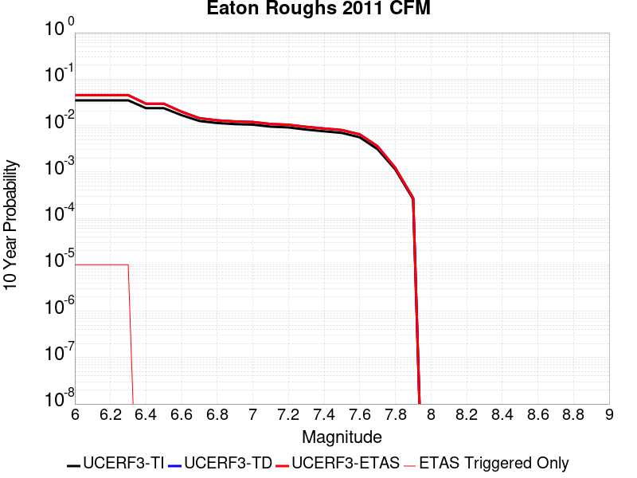 |

| Magnitude | 1 wk TI Prob | 1 wk TD Prob | 1 wk ETAS Prob | 1 wk ETAS/TD Gain | 1 wk ETAS Triggered Only | 1 mo TI Prob | 1 mo TD Prob | 1 mo ETAS Prob | 1 mo ETAS/TD Gain | 1 mo ETAS Triggered Only | 1 yr TI Prob | 1 yr TD Prob | 1 yr ETAS Prob | 1 yr ETAS/TD Gain | 1 yr ETAS Triggered Only | 10 yr TI Prob | 10 yr TD Prob | 10 yr ETAS Prob | 10 yr ETAS/TD Gain | 10 yr ETAS Triggered Only |
|-----|-----|-----|-----|-----|-----|-----|-----|-----|-----|-----|-----|-----|-----|-----|-----|-----|-----|-----|-----|-----|
| 6.0 | 6.8044945E-5 | 8.843646E-5 | 8.843646E-5 | 1.0 | 0.0 | 2.9158857E-4 | 3.7896493E-4 | 3.7896493E-4 | 1.0 | 0.0 | 0.0035443127 | 0.0046050907 | 0.0046050907 | 1.0 | 0.0 | 0.03488314 | 0.04516335 | 0.045172896 | 1.0002115 | 1.0E-5 |
| 6.1 | 6.8044945E-5 | 8.843646E-5 | 8.843646E-5 | 1.0 | 0.0 | 2.9158857E-4 | 3.7896493E-4 | 3.7896493E-4 | 1.0 | 0.0 | 0.0035443127 | 0.0046050907 | 0.0046050907 | 1.0 | 0.0 | 0.03488314 | 0.04516335 | 0.045172896 | 1.0002115 | 1.0E-5 |
| 6.2 | 6.8044945E-5 | 8.843646E-5 | 8.843646E-5 | 1.0 | 0.0 | 2.9158857E-4 | 3.7896493E-4 | 3.7896493E-4 | 1.0 | 0.0 | 0.0035443127 | 0.0046050907 | 0.0046050907 | 1.0 | 0.0 | 0.03488314 | 0.04516335 | 0.045172896 | 1.0002115 | 1.0E-5 |
| 6.3 | 6.8044945E-5 | 8.843646E-5 | 8.843646E-5 | 1.0 | 0.0 | 2.9158857E-4 | 3.7896493E-4 | 3.7896493E-4 | 1.0 | 0.0 | 0.0035443127 | 0.0046050907 | 0.0046050907 | 1.0 | 0.0 | 0.03488314 | 0.04516335 | 0.045172896 | 1.0002115 | 1.0E-5 |
| 6.4 | 4.5830013E-5 | 5.715427E-5 | 5.715427E-5 | 1.0 | 0.0 | 1.9639956E-4 | 2.4492692E-4 | 2.4492692E-4 | 1.0 | 0.0 | 0.0023885423 | 0.0029784471 | 0.0029784471 | 1.0 | 0.0 | 0.023630321 | 0.029421588 | 0.029421588 | 1.0 | 0.0 |
| 6.5 | 4.5830013E-5 | 5.715427E-5 | 5.715427E-5 | 1.0 | 0.0 | 1.9639956E-4 | 2.4492692E-4 | 2.4492692E-4 | 1.0 | 0.0 | 0.0023885423 | 0.0029784471 | 0.0029784471 | 1.0 | 0.0 | 0.023630321 | 0.029421588 | 0.029421588 | 1.0 | 0.0 |
| 6.6 | 3.222194E-5 | 3.8261504E-5 | 3.8261504E-5 | 1.0 | 0.0 | 1.3808672E-4 | 1.639682E-4 | 1.639682E-4 | 1.0 | 0.0 | 0.0016799092 | 0.001994599 | 0.001994599 | 1.0 | 0.0 | 0.016672665 | 0.019776601 | 0.019776601 | 1.0 | 0.0 |
| 6.7 | 2.4155654E-5 | 2.7786238E-5 | 2.7786238E-5 | 1.0 | 0.0 | 1.0352012E-4 | 1.1907848E-4 | 1.1907848E-4 | 1.0 | 0.0 | 0.0012596287 | 0.0014488247 | 0.0014488247 | 1.0 | 0.0 | 0.012525126 | 0.014394943 | 0.014394943 | 1.0 | 0.0 |
| 6.8 | 2.1814667E-5 | 2.4940868E-5 | 2.4940868E-5 | 1.0 | 0.0 | 9.348808E-5 | 1.06885076E-4 | 1.06885076E-4 | 1.0 | 0.0 | 0.001137623 | 0.0013005526 | 0.0013005526 | 1.0 | 0.0 | 0.011318169 | 0.012930038 | 0.012930038 | 1.0 | 0.0 |
| 6.9 | 2.0700467E-5 | 2.3628932E-5 | 2.3628932E-5 | 1.0 | 0.0 | 8.871327E-5 | 1.01262944E-4 | 1.01262944E-4 | 1.0 | 0.0 | 0.0010795488 | 0.0012321823 | 0.0012321823 | 1.0 | 0.0 | 0.010743194 | 0.012254035 | 0.012254035 | 1.0 | 0.0 |
| 7.0 | 2.0104066E-5 | 2.29365E-5 | 2.29365E-5 | 1.0 | 0.0 | 8.615744E-5 | 9.82956E-5 | 9.82956E-5 | 1.0 | 0.0 | 0.0010484619 | 0.0011960949 | 0.0011960949 | 1.0 | 0.0 | 0.010435291 | 0.011897073 | 0.011897073 | 1.0 | 0.0 |
| 7.1 | 1.8225232E-5 | 2.0773046E-5 | 2.0773046E-5 | 1.0 | 0.0 | 7.81058E-5 | 8.902431E-5 | 8.902431E-5 | 1.0 | 0.0 | 9.5052324E-4 | 0.0010833336 | 0.0010833336 | 1.0 | 0.0 | 0.009464677 | 0.010780825 | 0.010780825 | 1.0 | 0.0 |
| 7.2 | 1.7526572E-5 | 1.9993488E-5 | 1.9993488E-5 | 1.0 | 0.0 | 7.511172E-5 | 8.5683576E-5 | 8.5683576E-5 | 1.0 | 0.0 | 9.141015E-4 | 0.0010426997 | 0.0010426997 | 1.0 | 0.0 | 0.009103506 | 0.010378351 | 0.010378351 | 1.0 | 0.0 |
| 7.3 | 1.5727232E-5 | 1.8021507E-5 | 1.8021507E-5 | 1.0 | 0.0 | 6.740067E-5 | 7.723275E-5 | 7.723275E-5 | 1.0 | 0.0 | 8.2029426E-4 | 9.399043E-4 | 9.399043E-4 | 1.0 | 0.0 | 0.008172729 | 0.009359511 | 0.009359511 | 1.0 | 0.0 |
| 7.4 | 1.4457361E-5 | 1.6598358E-5 | 1.6598358E-5 | 1.0 | 0.0 | 6.195865E-5 | 7.113389E-5 | 7.113389E-5 | 1.0 | 0.0 | 7.540854E-4 | 8.657119E-4 | 8.657119E-4 | 1.0 | 0.0 | 0.007515317 | 0.008623555 | 0.008623555 | 1.0 | 0.0 |
| 7.5 | 1.33280955E-5 | 1.5345435E-5 | 1.5345435E-5 | 1.0 | 0.0 | 5.711916E-5 | 6.57645E-5 | 6.57645E-5 | 1.0 | 0.0 | 6.9520384E-4 | 8.0038945E-4 | 8.0038945E-4 | 1.0 | 0.0 | 0.00693033 | 0.007975209 | 0.007975209 | 1.0 | 0.0 |
| 7.6 | 1.0699478E-5 | 1.2387815E-5 | 1.2387815E-5 | 1.0 | 0.0 | 4.5854096E-5 | 5.308956E-5 | 5.308956E-5 | 1.0 | 0.0 | 5.581306E-4 | 6.4617425E-4 | 6.4617425E-4 | 1.0 | 0.0 | 0.005567309 | 0.0064430353 | 0.0064430353 | 1.0 | 0.0 |
| 7.7 | 5.9390236E-6 | 6.852951E-6 | 6.852951E-6 | 1.0 | 0.0 | 2.545271E-5 | 2.9369461E-5 | 2.9369461E-5 | 1.0 | 0.0 | 3.0984267E-4 | 3.5751477E-4 | 3.5751477E-4 | 1.0 | 0.0 | 0.0030941102 | 0.0035694204 | 0.0035694204 | 1.0 | 0.0 |
| 7.8 | 2.1622036E-6 | 2.3296996E-6 | 2.3296996E-6 | 1.0 | 0.0 | 9.266554E-6 | 9.984388E-6 | 9.984388E-6 | 1.0 | 0.0 | 1.1281446E-4 | 1.21553225E-4 | 1.21553225E-4 | 1.0 | 0.0 | 0.001127572 | 0.001214873 | 0.001214873 | 1.0 | 0.0 |
| 7.9 | 4.9586197E-7 | 5.2189216E-7 | 5.2189216E-7 | 1.0 | 0.0 | 2.125121E-6 | 2.2366787E-6 | 2.2366787E-6 | 1.0 | 0.0 | 2.5873042E-5 | 2.7231245E-5 | 2.7231245E-5 | 1.0 | 0.0 | 2.5870028E-4 | 2.7228118E-4 | 2.7228118E-4 | 1.0 | 0.0 |

## Sierra Madre (San Fernando)
*[(top)](#table-of-contents)*

| 1 Week | 1 Month | 1 Year | 10 Year |
|-----|-----|-----|-----|
|  |  |  | 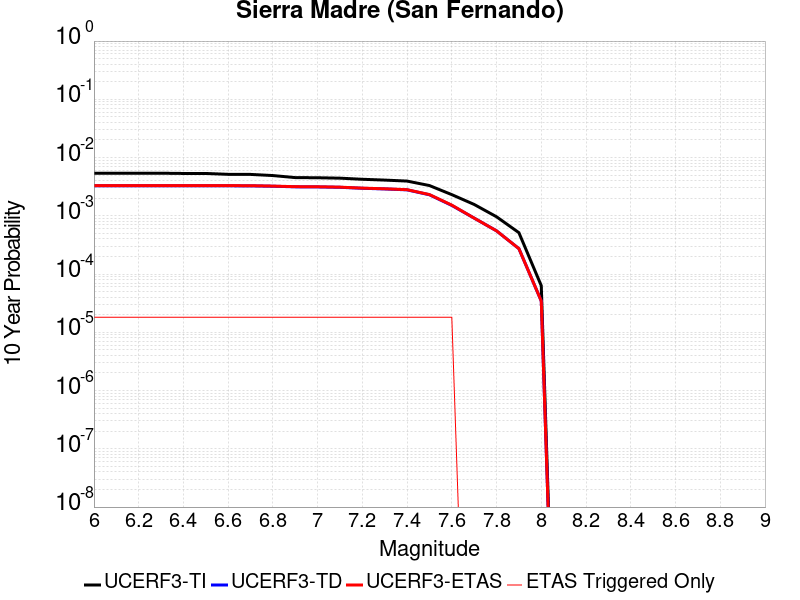 |

| Magnitude | 1 wk TI Prob | 1 wk TD Prob | 1 wk ETAS Prob | 1 wk ETAS/TD Gain | 1 wk ETAS Triggered Only | 1 mo TI Prob | 1 mo TD Prob | 1 mo ETAS Prob | 1 mo ETAS/TD Gain | 1 mo ETAS Triggered Only | 1 yr TI Prob | 1 yr TD Prob | 1 yr ETAS Prob | 1 yr ETAS/TD Gain | 1 yr ETAS Triggered Only | 10 yr TI Prob | 10 yr TD Prob | 10 yr ETAS Prob | 10 yr ETAS/TD Gain | 10 yr ETAS Triggered Only |
|-----|-----|-----|-----|-----|-----|-----|-----|-----|-----|-----|-----|-----|-----|-----|-----|-----|-----|-----|-----|-----|
| 6.0 | 1.0346413E-5 | 6.2872605E-6 | 6.2872605E-6 | 1.0 | 0.0 | 4.4341014E-5 | 2.694513E-5 | 2.694513E-5 | 1.0 | 0.0 | 5.3971814E-4 | 3.280087E-4 | 3.280087E-4 | 1.0 | 0.0 | 0.0053840918 | 0.0032753581 | 0.0032853254 | 1.003043 | 1.0E-5 |
| 6.1 | 1.0346413E-5 | 6.2872605E-6 | 6.2872605E-6 | 1.0 | 0.0 | 4.4341014E-5 | 2.694513E-5 | 2.694513E-5 | 1.0 | 0.0 | 5.3971814E-4 | 3.280087E-4 | 3.280087E-4 | 1.0 | 0.0 | 0.0053840918 | 0.0032753581 | 0.0032853254 | 1.003043 | 1.0E-5 |
| 6.2 | 1.0346413E-5 | 6.2872605E-6 | 6.2872605E-6 | 1.0 | 0.0 | 4.4341014E-5 | 2.694513E-5 | 2.694513E-5 | 1.0 | 0.0 | 5.3971814E-4 | 3.280087E-4 | 3.280087E-4 | 1.0 | 0.0 | 0.0053840918 | 0.0032753581 | 0.0032853254 | 1.003043 | 1.0E-5 |
| 6.3 | 1.0346413E-5 | 6.2872605E-6 | 6.2872605E-6 | 1.0 | 0.0 | 4.4341014E-5 | 2.694513E-5 | 2.694513E-5 | 1.0 | 0.0 | 5.3971814E-4 | 3.280087E-4 | 3.280087E-4 | 1.0 | 0.0 | 0.0053840918 | 0.0032753581 | 0.0032853254 | 1.003043 | 1.0E-5 |
| 6.4 | 1.0249558E-5 | 6.2872605E-6 | 6.2872605E-6 | 1.0 | 0.0 | 4.392594E-5 | 2.694513E-5 | 2.694513E-5 | 1.0 | 0.0 | 5.3466705E-4 | 3.280087E-4 | 3.280087E-4 | 1.0 | 0.0 | 0.0053338245 | 0.0032753581 | 0.0032853254 | 1.003043 | 1.0E-5 |
| 6.5 | 1.0249558E-5 | 6.2872605E-6 | 6.2872605E-6 | 1.0 | 0.0 | 4.392594E-5 | 2.694513E-5 | 2.694513E-5 | 1.0 | 0.0 | 5.3466705E-4 | 3.280087E-4 | 3.280087E-4 | 1.0 | 0.0 | 0.0053338245 | 0.0032753581 | 0.0032853254 | 1.003043 | 1.0E-5 |
| 6.6 | 9.9035515E-6 | 6.2872605E-6 | 6.2872605E-6 | 1.0 | 0.0 | 4.2443102E-5 | 2.694513E-5 | 2.694513E-5 | 1.0 | 0.0 | 5.166222E-4 | 3.280087E-4 | 3.280087E-4 | 1.0 | 0.0 | 0.0051542283 | 0.0032753581 | 0.0032853254 | 1.003043 | 1.0E-5 |
| 6.7 | 9.87217E-6 | 6.2746817E-6 | 6.2746817E-6 | 1.0 | 0.0 | 4.2308613E-5 | 2.689122E-5 | 2.689122E-5 | 1.0 | 0.0 | 5.149856E-4 | 3.2735255E-4 | 3.2735255E-4 | 1.0 | 0.0 | 0.005137938 | 0.0032688158 | 0.0032787833 | 1.0030493 | 1.0E-5 |
| 6.8 | 9.4359175E-6 | 6.1786586E-6 | 6.1786586E-6 | 1.0 | 0.0 | 4.043902E-5 | 2.6479704E-5 | 2.6479704E-5 | 1.0 | 0.0 | 4.9223384E-4 | 3.2234378E-4 | 3.2234378E-4 | 1.0 | 0.0 | 0.0049114493 | 0.0032188739 | 0.0032288418 | 1.0030967 | 1.0E-5 |
| 6.9 | 8.700447E-6 | 6.039922E-6 | 6.039922E-6 | 1.0 | 0.0 | 3.72871E-5 | 2.5885129E-5 | 2.5885129E-5 | 1.0 | 0.0 | 4.5387587E-4 | 3.1510694E-4 | 3.1510694E-4 | 1.0 | 0.0 | 0.0045295 | 0.003146711 | 0.0031566794 | 1.0031679 | 1.0E-5 |
| 7.0 | 8.648878E-6 | 6.0148373E-6 | 6.0148373E-6 | 1.0 | 0.0 | 3.7066096E-5 | 2.5777625E-5 | 2.5777625E-5 | 1.0 | 0.0 | 4.5118626E-4 | 3.1379846E-4 | 3.1379846E-4 | 1.0 | 0.0 | 0.004502713 | 0.003133663 | 0.0031436319 | 1.0031811 | 1.0E-5 |
| 7.1 | 8.505786E-6 | 5.9244676E-6 | 5.9244676E-6 | 1.0 | 0.0 | 3.645286E-5 | 2.5390334E-5 | 2.5390334E-5 | 1.0 | 0.0 | 4.437232E-4 | 3.0908454E-4 | 3.0908454E-4 | 1.0 | 0.0 | 0.0044283825 | 0.0030866556 | 0.0030966247 | 1.0032297 | 1.0E-5 |
| 7.2 | 8.139752E-6 | 5.6987624E-6 | 5.6987624E-6 | 1.0 | 0.0 | 3.4884186E-5 | 2.4423045E-5 | 2.4423045E-5 | 1.0 | 0.0 | 4.246322E-4 | 2.9731105E-4 | 2.9731105E-4 | 1.0 | 0.0 | 0.004238217 | 0.0029692391 | 0.0029792094 | 1.0033579 | 1.0E-5 |
| 7.3 | 7.8816E-6 | 5.552077E-6 | 5.552077E-6 | 1.0 | 0.0 | 3.3777847E-5 | 2.3794404E-5 | 2.3794404E-5 | 1.0 | 0.0 | 4.111677E-4 | 2.896594E-4 | 2.896594E-4 | 1.0 | 0.0 | 0.004104078 | 0.0028929242 | 0.0029028952 | 1.0034467 | 1.0E-5 |
| 7.4 | 7.5810603E-6 | 5.3563126E-6 | 5.3563126E-6 | 1.0 | 0.0 | 3.2489854E-5 | 2.2955428E-5 | 2.2955428E-5 | 1.0 | 0.0 | 3.9549218E-4 | 2.7944756E-4 | 2.7944756E-4 | 1.0 | 0.0 | 0.0039478904 | 0.0027910667 | 0.0028010388 | 1.0035728 | 1.0E-5 |
| 7.5 | 6.349153E-6 | 4.407576E-6 | 4.407576E-6 | 1.0 | 0.0 | 2.7210372E-5 | 1.888948E-5 | 1.888948E-5 | 1.0 | 0.0 | 3.312359E-4 | 2.2995596E-4 | 2.2995596E-4 | 1.0 | 0.0 | 0.0033074263 | 0.0022972622 | 0.0023072392 | 1.004343 | 1.0E-5 |
| 7.6 | 4.430576E-6 | 2.8905868E-6 | 2.8905868E-6 | 1.0 | 0.0 | 1.8988047E-5 | 1.2388171E-5 | 1.2388171E-5 | 1.0 | 0.0 | 2.3115493E-4 | 1.5081577E-4 | 1.5081577E-4 | 1.0 | 0.0 | 0.0023091463 | 0.0015071568 | 0.0015171417 | 1.006625 | 1.0E-5 |
| 7.7 | 3.005066E-6 | 1.7510115E-6 | 1.7510115E-6 | 1.0 | 0.0 | 1.2878791E-5 | 7.504313E-6 | 7.504313E-6 | 1.0 | 0.0 | 1.56788E-4 | 9.1361195E-5 | 9.1361195E-5 | 1.0 | 0.0 | 0.0015667742 | 9.132375E-4 | 9.132375E-4 | 1.0 | 0.0 |
| 7.8 | 1.8459098E-6 | 1.0582091E-6 | 1.0582091E-6 | 1.0 | 0.0 | 7.911018E-6 | 4.535174E-6 | 4.535174E-6 | 1.0 | 0.0 | 9.631238E-5 | 5.5214347E-5 | 5.5214347E-5 | 1.0 | 0.0 | 9.627065E-4 | 5.5200676E-4 | 5.5200676E-4 | 1.0 | 0.0 |
| 7.9 | 9.839262E-7 | 5.23421E-7 | 5.23421E-7 | 1.0 | 0.0 | 4.2168194E-6 | 2.2432312E-6 | 2.2432312E-6 | 1.0 | 0.0 | 5.1338568E-5 | 2.7310998E-5 | 2.7310998E-5 | 1.0 | 0.0 | 5.132671E-4 | 2.730767E-4 | 2.730767E-4 | 1.0 | 0.0 |
| 8.0 | 1.210983E-7 | 6.613821E-8 | 6.613821E-8 | 1.0 | 0.0 | 5.1899264E-7 | 2.8344945E-7 | 2.8344945E-7 | 1.0 | 0.0 | 6.3187167E-6 | 3.4509917E-6 | 3.4509917E-6 | 1.0 | 0.0 | 6.318537E-5 | 3.45094E-5 | 3.45094E-5 | 1.0 | 0.0 |

## Clamshell-Sawpit
*[(top)](#table-of-contents)*

| 1 Week | 1 Month | 1 Year | 10 Year |
|-----|-----|-----|-----|
| 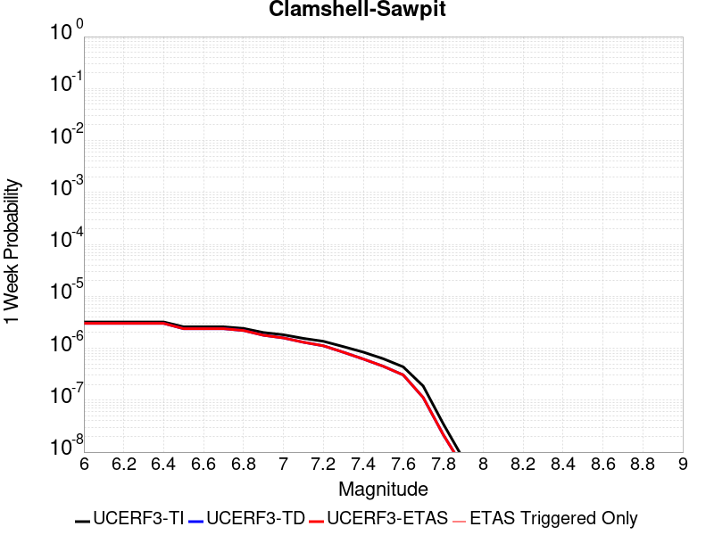 |  | 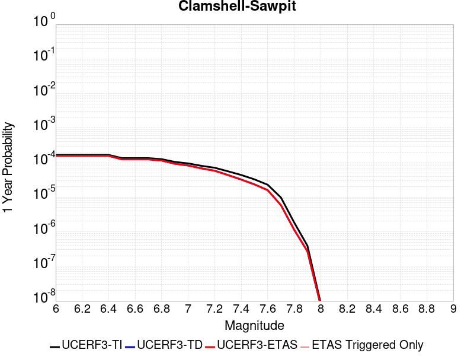 | 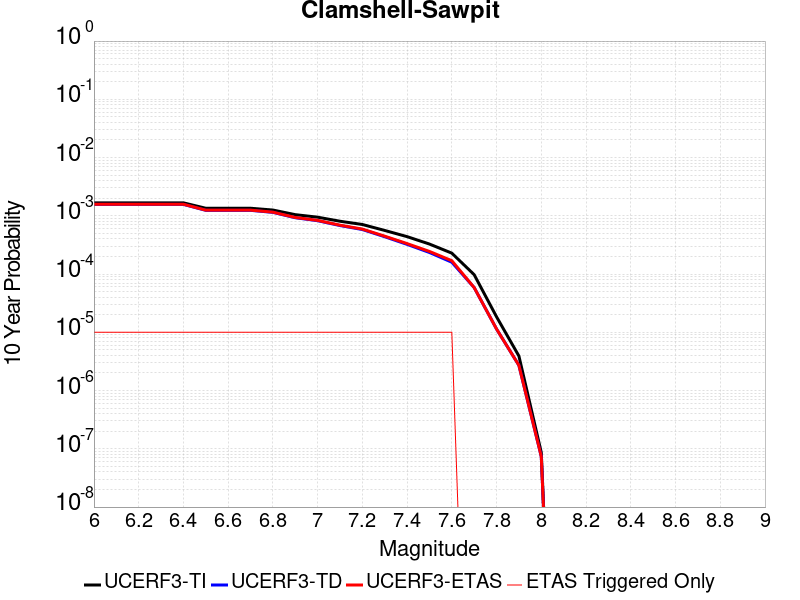 |

| Magnitude | 1 wk TI Prob | 1 wk TD Prob | 1 wk ETAS Prob | 1 wk ETAS/TD Gain | 1 wk ETAS Triggered Only | 1 mo TI Prob | 1 mo TD Prob | 1 mo ETAS Prob | 1 mo ETAS/TD Gain | 1 mo ETAS Triggered Only | 1 yr TI Prob | 1 yr TD Prob | 1 yr ETAS Prob | 1 yr ETAS/TD Gain | 1 yr ETAS Triggered Only | 10 yr TI Prob | 10 yr TD Prob | 10 yr ETAS Prob | 10 yr ETAS/TD Gain | 10 yr ETAS Triggered Only |
|-----|-----|-----|-----|-----|-----|-----|-----|-----|-----|-----|-----|-----|-----|-----|-----|-----|-----|-----|-----|-----|
| 6.0 | 3.202998E-6 | 3.0127644E-6 | 3.0127644E-6 | 1.0 | 0.0 | 1.3727062E-5 | 1.2911788E-5 | 1.2911788E-5 | 1.0 | 0.0 | 1.6711417E-4 | 1.5719049E-4 | 1.5719049E-4 | 1.0 | 0.0 | 0.0016698855 | 0.0015708724 | 0.0015808566 | 1.0063559 | 1.0E-5 |
| 6.1 | 3.202998E-6 | 3.0127644E-6 | 3.0127644E-6 | 1.0 | 0.0 | 1.3727062E-5 | 1.2911788E-5 | 1.2911788E-5 | 1.0 | 0.0 | 1.6711417E-4 | 1.5719049E-4 | 1.5719049E-4 | 1.0 | 0.0 | 0.0016698855 | 0.0015708724 | 0.0015808566 | 1.0063559 | 1.0E-5 |
| 6.2 | 3.202998E-6 | 3.0127644E-6 | 3.0127644E-6 | 1.0 | 0.0 | 1.3727062E-5 | 1.2911788E-5 | 1.2911788E-5 | 1.0 | 0.0 | 1.6711417E-4 | 1.5719049E-4 | 1.5719049E-4 | 1.0 | 0.0 | 0.0016698855 | 0.0015708724 | 0.0015808566 | 1.0063559 | 1.0E-5 |
| 6.3 | 3.202998E-6 | 3.0127644E-6 | 3.0127644E-6 | 1.0 | 0.0 | 1.3727062E-5 | 1.2911788E-5 | 1.2911788E-5 | 1.0 | 0.0 | 1.6711417E-4 | 1.5719049E-4 | 1.5719049E-4 | 1.0 | 0.0 | 0.0016698855 | 0.0015708724 | 0.0015808566 | 1.0063559 | 1.0E-5 |
| 6.4 | 3.202998E-6 | 3.0127644E-6 | 3.0127644E-6 | 1.0 | 0.0 | 1.3727062E-5 | 1.2911788E-5 | 1.2911788E-5 | 1.0 | 0.0 | 1.6711417E-4 | 1.5719049E-4 | 1.5719049E-4 | 1.0 | 0.0 | 0.0016698855 | 0.0015708724 | 0.0015808566 | 1.0063559 | 1.0E-5 |
| 6.5 | 2.5862723E-6 | 2.380775E-6 | 2.380775E-6 | 1.0 | 0.0 | 1.1083977E-5 | 1.0203283E-5 | 1.0203283E-5 | 1.0 | 0.0 | 1.3493907E-4 | 1.2421819E-4 | 1.2421819E-4 | 1.0 | 0.0 | 0.0013485716 | 0.0012415178 | 0.0012515055 | 1.0080446 | 1.0E-5 |
| 6.6 | 2.5862723E-6 | 2.380775E-6 | 2.380775E-6 | 1.0 | 0.0 | 1.1083977E-5 | 1.0203283E-5 | 1.0203283E-5 | 1.0 | 0.0 | 1.3493907E-4 | 1.2421819E-4 | 1.2421819E-4 | 1.0 | 0.0 | 0.0013485716 | 0.0012415178 | 0.0012515055 | 1.0080446 | 1.0E-5 |
| 6.7 | 2.5862723E-6 | 2.380775E-6 | 2.380775E-6 | 1.0 | 0.0 | 1.1083977E-5 | 1.0203283E-5 | 1.0203283E-5 | 1.0 | 0.0 | 1.3493907E-4 | 1.2421819E-4 | 1.2421819E-4 | 1.0 | 0.0 | 0.0013485716 | 0.0012415178 | 0.0012515055 | 1.0080446 | 1.0E-5 |
| 6.8 | 2.4098806E-6 | 2.1977307E-6 | 2.1977307E-6 | 1.0 | 0.0 | 1.0328019E-5 | 9.4188135E-6 | 9.4188135E-6 | 1.0 | 0.0 | 1.2573638E-4 | 1.1466829E-4 | 1.1466829E-4 | 1.0 | 0.0 | 0.0012566525 | 0.0011461178 | 0.0011561064 | 1.0087152 | 1.0E-5 |
| 6.9 | 2.0073985E-6 | 1.7784248E-6 | 1.7784248E-6 | 1.0 | 0.0 | 8.603109E-6 | 7.621799E-6 | 7.621799E-6 | 1.0 | 0.0 | 1.0473781E-4 | 9.279157E-5 | 9.279157E-5 | 1.0 | 0.0 | 0.0010468846 | 9.275401E-4 | 9.3753083E-4 | 1.0107712 | 1.0E-5 |
| 7.0 | 1.8166766E-6 | 1.5807095E-6 | 1.5807095E-6 | 1.0 | 0.0 | 7.785734E-6 | 6.7744522E-6 | 6.7744522E-6 | 1.0 | 0.0 | 9.478718E-5 | 8.247593E-5 | 8.247593E-5 | 1.0 | 0.0 | 9.4746763E-4 | 8.244633E-4 | 8.344551E-4 | 1.012119 | 1.0E-5 |
| 7.1 | 1.5471421E-6 | 1.3052961E-6 | 1.3052961E-6 | 1.0 | 0.0 | 6.6305925E-6 | 5.5941146E-6 | 5.5941146E-6 | 1.0 | 0.0 | 8.072447E-5 | 6.8106274E-5 | 6.8106274E-5 | 1.0 | 0.0 | 8.0695155E-4 | 6.808595E-4 | 6.908527E-4 | 1.0146773 | 1.0E-5 |
| 7.2 | 1.3608037E-6 | 1.1153443E-6 | 1.1153443E-6 | 1.0 | 0.0 | 5.8320024E-6 | 4.7800386E-6 | 4.7800386E-6 | 1.0 | 0.0 | 7.1002316E-5 | 5.8195463E-5 | 5.8195463E-5 | 1.0 | 0.0 | 7.097964E-4 | 5.818069E-4 | 5.91801E-4 | 1.0171778 | 1.0E-5 |
| 7.3 | 1.0749634E-6 | 8.384254E-7 | 8.384254E-7 | 1.0 | 0.0 | 4.6069777E-6 | 3.593247E-6 | 3.593247E-6 | 1.0 | 0.0 | 5.608851E-5 | 4.374693E-5 | 4.374693E-5 | 1.0 | 0.0 | 5.6074356E-4 | 4.37386E-4 | 4.4738164E-4 | 1.0228531 | 1.0E-5 |
| 7.4 | 8.416856E-7 | 6.200048E-7 | 6.200048E-7 | 1.0 | 0.0 | 3.607219E-6 | 2.6571608E-6 | 2.6571608E-6 | 1.0 | 0.0 | 4.3917007E-5 | 3.2350472E-5 | 3.2350472E-5 | 1.0 | 0.0 | 4.390833E-4 | 3.2345962E-4 | 3.3345638E-4 | 1.0309057 | 1.0E-5 |
| 7.5 | 6.2779594E-7 | 4.496886E-7 | 4.496886E-7 | 1.0 | 0.0 | 2.6905511E-6 | 1.9272356E-6 | 1.9272356E-6 | 1.0 | 0.0 | 3.275697E-5 | 2.346386E-5 | 2.346386E-5 | 1.0 | 0.0 | 3.275214E-4 | 2.346157E-4 | 2.4461336E-4 | 1.0426129 | 1.0E-5 |
| 7.6 | 4.3822078E-7 | 3.0595405E-7 | 3.0595405E-7 | 1.0 | 0.0 | 1.8780877E-6 | 1.311231E-6 | 1.311231E-6 | 1.0 | 0.0 | 2.2865479E-5 | 1.5964137E-5 | 1.5964137E-5 | 1.0 | 0.0 | 2.2863125E-4 | 1.5963144E-4 | 1.6962986E-4 | 1.0626343 | 1.0E-5 |
| 7.7 | 1.8704569E-7 | 1.12379205E-7 | 1.12379205E-7 | 1.0 | 0.0 | 8.0162414E-7 | 4.816251E-7 | 4.816251E-7 | 1.0 | 0.0 | 9.75973E-6 | 5.86377E-6 | 5.86377E-6 | 1.0 | 0.0 | 9.7593016E-5 | 5.863622E-5 | 5.863622E-5 | 1.0 | 0.0 |
| 7.8 | 3.5378733E-8 | 2.1838144E-8 | 2.1838144E-8 | 1.0 | 0.0 | 1.5162313E-7 | 9.359204E-8 | 9.359204E-8 | 1.0 | 0.0 | 1.84601E-6 | 1.1394826E-6 | 1.1394826E-6 | 1.0 | 0.0 | 1.8459947E-5 | 1.139477E-5 | 1.139477E-5 | 1.0 | 0.0 |
| 7.9 | 7.504945E-9 | 5.1920326E-9 | 5.1920326E-9 | 1.0 | 0.0 | 3.2164053E-8 | 2.225157E-8 | 2.225157E-8 | 1.0 | 0.0 | 3.9159727E-7 | 2.7091284E-7 | 2.7091284E-7 | 1.0 | 0.0 | 3.915966E-6 | 2.7091257E-6 | 2.7091257E-6 | 1.0 | 0.0 |
| 8.0 | 1.6554036E-10 | 1.4180768E-10 | 1.4180768E-10 | 1.0 | 0.0 | 7.0945894E-10 | 6.077475E-10 | 6.077475E-10 | 1.0 | 0.0 | 8.637662E-9 | 7.3993256E-9 | 7.3993256E-9 | 1.0 | 0.0 | 8.6376616E-8 | 7.3993256E-8 | 7.3993256E-8 | 1.0 | 0.0 |

