# Parent Section Magnitude-Probability Distributions

Only fault sections with at least one triggered aftershock are plotted. Sections are sorted by total supraseismogenic trigger rate (decreasing)

## Table Of Contents

* [Garlock (Central)](#garlock-central)
* [Tank Canyon](#tank-canyon)
* [Little Lake](#little-lake)
* [Airport Lake](#airport-lake)
* [Owl Lake](#owl-lake)
* [Garlock (East)](#garlock-east)
* [Panamint Valley](#panamint-valley)
* [Hunter Mountain-Saline Valley](#hunter-mountain-saline-valley)
* [Ash Hill](#ash-hill)
* [Blackwater](#blackwater)
* [McLean Lake](#mclean-lake)
* [Garlock (West)](#garlock-west)
* [Goldstone Lake](#goldstone-lake)
* [Gravel Hills-Harper Lk](#gravel-hills-harper-lk)
* [Coyote Canyon](#coyote-canyon)
* [So Sierra Nevada](#so-sierra-nevada)
* [San Andreas (Mojave S)](#san-andreas-mojave-s)
* [Death Valley (So)](#death-valley-so)
* [Lenwood-Lockhart-Old Woman Springs](#lenwood-lockhart-old-woman-springs)
* [San Andreas (Mojave N)](#san-andreas-mojave-n)
* [Towne Pass](#towne-pass)
* [Nelson Lake](#nelson-lake)
* [Bicycle Lake](#bicycle-lake)
* [San Andreas (San Bernardino N)](#san-andreas-san-bernardino-n)
* [Paradise](#paradise)
* [Garlic Springs](#garlic-springs)
* [San Andreas (San Bernardino S)](#san-andreas-san-bernardino-s)
* [Helendale-So Lockhart](#helendale-so-lockhart)
* [Coyote Lake](#coyote-lake)
* [Death Valley (Black Mtns Frontal)](#death-valley-black-mtns-frontal)
* [San Andreas (Big Bend)](#san-andreas-big-bend)
* [White Wolf (Extension)](#white-wolf-extension)
* [Cady](#cady)
* [Red Pass](#red-pass)
* [Death Valley (No)](#death-valley-no)
* [San Andreas (Creeping Section) 2011 CFM](#san-andreas-creeping-section-2011-cfm)
* [Lake Isabella (Seismicity)](#lake-isabella-seismicity)
* [Calico-Hidalgo](#calico-hidalgo)
* [San Andreas (San Gorgonio Pass-Garnet HIll)](#san-andreas-san-gorgonio-pass-garnet-hill)
* [San Andreas (Parkfield)](#san-andreas-parkfield)
* [San Andreas (Carrizo) rev](#san-andreas-carrizo-rev)
* [Mission Ridge-Arroyo Parida-Santa Ana](#mission-ridge-arroyo-parida-santa-ana)
* [San Andreas (Cholame) rev](#san-andreas-cholame-rev)
* [San Andreas (North Branch Mill Creek)](#san-andreas-north-branch-mill-creek)
* [Camp Rock 2011](#camp-rock-2011)
* [Cleghorn Lake](#cleghorn-lake)
* [Santa Ynez (West)](#santa-ynez-west)
* [Manix-Afton Hills](#manix-afton-hills)
* [Baker](#baker)
* [Death Valley (Fish Lake Valley)](#death-valley-fish-lake-valley)
* [Red Mountain](#red-mountain)
* [San Andreas (Coachella) rev](#san-andreas-coachella-rev)
* [Elsinore (Glen Ivy) rev](#elsinore-glen-ivy-rev)
* [White Mountains](#white-mountains)
* [Big Pine (Central)](#big-pine-central)
* [San Jacinto (San Bernardino)](#san-jacinto-san-bernardino)
* [Elysian Park (Upper)](#elysian-park-upper)
* [Santa Cruz Island](#santa-cruz-island)
* [Pinto Mtn](#pinto-mtn)
* [Scodie Lineament](#scodie-lineament)
* [Pleito](#pleito)
* [San Jacinto (Stepovers Combined)](#san-jacinto-stepovers-combined)
* [San Jacinto (Anza) rev](#san-jacinto-anza-rev)
* [Hosgri (Extension)](#hosgri-extension)
* [Santa Ynez River](#santa-ynez-river)
* [San Jacinto (San Jacinto Valley) rev](#san-jacinto-san-jacinto-valley-rev)
* [Santa Rosa Island](#santa-rosa-island)
* [Pisgah-Bullion Mtn-Mesquite Lk](#pisgah-bullion-mtn-mesquite-lk)
* [Raymond](#raymond)
* [Ventura-Pitas Point](#ventura-pitas-point)
* [Oak Ridge (Onshore)](#oak-ridge-onshore)
* [Coronado Bank alt1](#coronado-bank-alt1)
* [San Pedro Basin](#san-pedro-basin)
* [Ludlow](#ludlow)
* [Northridge](#northridge)
* [Brawley (Seismic Zone) alt 1](#brawley-seismic-zone-alt-1)
* [Whittier alt 1](#whittier-alt-1)
* [Sierra Nevada  (No Extension)](#sierra-nevada--no-extension)
* [Kern Canyon (North Kern) 2011](#kern-canyon-north-kern-2011)
* [San Jacinto (Coyote Creek)](#san-jacinto-coyote-creek)
* [Palos Verdes](#palos-verdes)
* [Mission Creek](#mission-creek)
* [Chino alt 1](#chino-alt-1)
* [Deep Springs](#deep-springs)
* [Sheephole](#sheephole)
* [Pitas Point (Lower West)](#pitas-point-lower-west)
* [San Cayetano](#san-cayetano)
* [Rose Canyon](#rose-canyon)
* [Santa Ynez (East)](#santa-ynez-east)
* [Independence rev 2011](#independence-rev-2011)
* [Lost Hills](#lost-hills)
* [Pitas Point (Lower)-Montalvo](#pitas-point-lower-montalvo)
* [Kern Canyon (Lake Isabella) 2011](#kern-canyon-lake-isabella-2011)
* [Channel Islands Thrust](#channel-islands-thrust)
* [Sisar](#sisar)
* [San Andreas (Santa Cruz Mts) 2011 CFM](#san-andreas-santa-cruz-mts-2011-cfm)
* [Great Valley 07 (Orestimba)](#great-valley-07-orestimba)
* [White Wolf](#white-wolf)
* [San Jacinto (Lytle Creek connector)](#san-jacinto-lytle-creek-connector)
* [Reliz 2011 CFM](#reliz-2011-cfm)
* [Cleghorn Pass](#cleghorn-pass)
* [Elsinore (Coyote Mountains)](#elsinore-coyote-mountains)
* [Elsinore (Temecula) rev](#elsinore-temecula-rev)
* [Calaveras (So) - Paicines extension 2011 CFM](#calaveras-so---paicines-extension-2011-cfm)
* [Robinson Creek](#robinson-creek)
* [Del Valle](#del-valle)
* [San Jacinto (Superstition Mtn)](#san-jacinto-superstition-mtn)
* [Ortigalita (North)](#ortigalita-north)
* [San Juan](#san-juan)
* [Pine Mtn](#pine-mtn)
* [Collayami 2011 CFM](#collayami-2011-cfm)
* [Kern Canyon (South Kern) 2011](#kern-canyon-south-kern-2011)
* [Cerro Prieto](#cerro-prieto)
* [Laguna Salada](#laguna-salada)
* [San Gregorio (South) 2011 CFM](#san-gregorio-south-2011-cfm)
* [Las Positas](#las-positas)
* [San Jacinto (Borrego)](#san-jacinto-borrego)
* [Big Pine (East)](#big-pine-east)
* [Santa Cruz Catalina Ridge alt1](#santa-cruz-catalina-ridge-alt1)
* [Great Valley 05 Pittsburg - Kirby Hills alt1](#great-valley-05-pittsburg---kirby-hills-alt1)
* [Newport-Inglewood (Offshore)](#newport-inglewood-offshore)
* [Newport-Inglewood alt 1](#newport-inglewood-alt-1)
* [Elsinore (Stepovers Combined)](#elsinore-stepovers-combined)
* [Simi-Santa Rosa](#simi-santa-rosa)
* [Round Valley](#round-valley)
* [Elsinore (Julian)](#elsinore-julian)
* [San Diego Trough south](#san-diego-trough-south)
* [Verdugo](#verdugo)
* [Hosgri](#hosgri)
* [Dry Mountain](#dry-mountain)
* [Rinconada 2011 CFM](#rinconada-2011-cfm)
* [Los Osos 2011](#los-osos-2011)

## Garlock (Central)
*[(top)](#table-of-contents)*

| 1 Week | 1 Month | 1 Year | 10 Year |
|-----|-----|-----|-----|
|  |  |  | 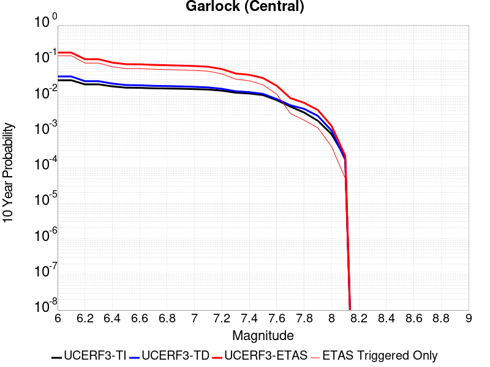 |

| Magnitude | 1 wk TI Prob | 1 wk TD Prob | 1 wk ETAS Prob | 1 wk ETAS/TD Gain | 1 wk ETAS Triggered Only | 1 mo TI Prob | 1 mo TD Prob | 1 mo ETAS Prob | 1 mo ETAS/TD Gain | 1 mo ETAS Triggered Only | 1 yr TI Prob | 1 yr TD Prob | 1 yr ETAS Prob | 1 yr ETAS/TD Gain | 1 yr ETAS Triggered Only | 10 yr TI Prob | 10 yr TD Prob | 10 yr ETAS Prob | 10 yr ETAS/TD Gain | 10 yr ETAS Triggered Only |
|-----|-----|-----|-----|-----|-----|-----|-----|-----|-----|-----|-----|-----|-----|-----|-----|-----|-----|-----|-----|-----|
| 6.0 | 5.5131142E-5 | 7.024681E-5 | 0.06950222 | 989.4003 | 0.06943685 | 2.3625491E-4 | 3.010234E-4 | 0.08645605 | 287.2071 | 0.08618097 | 0.0028726095 | 0.0036588663 | 0.11839607 | 32.358677 | 0.11515856 | 0.028357591 | 0.036079824 | 0.16928421 | 4.6919355 | 0.13819027 |
| 6.1 | 5.5131142E-5 | 7.024681E-5 | 0.06950222 | 989.4003 | 0.06943685 | 2.3625491E-4 | 3.010234E-4 | 0.08645605 | 287.2071 | 0.08618097 | 0.0028726095 | 0.0036588663 | 0.11839607 | 32.358677 | 0.11515856 | 0.028357591 | 0.036079824 | 0.16928421 | 4.6919355 | 0.13819027 |
| 6.2 | 4.216245E-5 | 5.1661493E-5 | 0.041670617 | 806.6088 | 0.041621104 | 1.806837E-4 | 2.2138779E-4 | 0.052014183 | 234.94604 | 0.051804263 | 0.0021976046 | 0.0026920962 | 0.07323705 | 27.204468 | 0.07073537 | 0.021759989 | 0.026689773 | 0.11010496 | 4.1253614 | 0.08570257 |
| 6.3 | 4.216245E-5 | 5.1661493E-5 | 0.041670617 | 806.6088 | 0.041621104 | 1.806837E-4 | 2.2138779E-4 | 0.052014183 | 234.94604 | 0.051804263 | 0.0021976046 | 0.0026920962 | 0.07323705 | 27.204468 | 0.07073537 | 0.021759989 | 0.026689773 | 0.11010496 | 4.1253614 | 0.08570257 |
| 6.4 | 3.6858168E-5 | 4.411054E-5 | 0.032642454 | 740.01483 | 0.03259978 | 1.5795401E-4 | 1.8903162E-4 | 0.040845644 | 216.07835 | 0.040664297 | 0.0019213937 | 0.002299056 | 0.057529904 | 25.023273 | 0.05535812 | 0.019048655 | 0.02284894 | 0.088428654 | 3.8701425 | 0.067113176 |
| 6.5 | 3.39199E-5 | 4.0018083E-5 | 0.029426485 | 735.3297 | 0.029387644 | 1.453629E-4 | 1.7149492E-4 | 0.03713891 | 216.55983 | 0.036973756 | 0.0017683565 | 0.002085973 | 0.051395148 | 24.638453 | 0.049412247 | 0.017543508 | 0.020759864 | 0.07958655 | 3.833674 | 0.06007381 |
| 6.6 | 3.3571985E-5 | 3.9472274E-5 | 0.029289275 | 742.0215 | 0.029250957 | 1.4387199E-4 | 1.6915603E-4 | 0.036999993 | 218.73293 | 0.03683707 | 0.0017502342 | 0.0020575512 | 0.051231723 | 24.899368 | 0.049275562 | 0.017365133 | 0.020481179 | 0.07919072 | 3.8665118 | 0.059937123 |
| 6.7 | 3.2580007E-5 | 3.8088703E-5 | 0.02833116 | 743.8206 | 0.02829415 | 1.3962112E-4 | 1.632272E-4 | 0.03562764 | 218.27023 | 0.035470203 | 0.0016985617 | 0.0019855013 | 0.04952624 | 24.943949 | 0.04763532 | 0.016856372 | 0.019773813 | 0.07638201 | 3.862786 | 0.057750136 |
| 6.8 | 3.2185937E-5 | 3.7515918E-5 | 0.027647197 | 736.94574 | 0.027610715 | 1.3793244E-4 | 1.6077272E-4 | 0.03466862 | 215.63745 | 0.034513395 | 0.0016780337 | 0.001955672 | 0.04792901 | 24.507692 | 0.046063423 | 0.016654192 | 0.019480614 | 0.074497454 | 3.8241842 | 0.056109898 |
| 6.9 | 3.165394E-5 | 3.6720503E-5 | 0.027031355 | 736.13794 | 0.026995625 | 1.3565269E-4 | 1.5736422E-4 | 0.03384534 | 215.07645 | 0.033693276 | 0.0016503202 | 0.001914247 | 0.046866305 | 24.482891 | 0.04503827 | 0.01638118 | 0.019073246 | 0.072705105 | 3.8118894 | 0.054674685 |
| 7.0 | 3.0903822E-5 | 3.5625766E-5 | 0.025936835 | 728.0359 | 0.025902132 | 1.3243823E-4 | 1.5267303E-4 | 0.03254248 | 213.15144 | 0.032394752 | 0.0016112428 | 0.0018572307 | 0.04544753 | 24.470589 | 0.043671407 | 0.015996104 | 0.018512413 | 0.07063214 | 3.8153934 | 0.053102788 |
| 7.1 | 3.0069863E-5 | 3.4392073E-5 | 0.025115542 | 730.27124 | 0.025082013 | 1.2886449E-4 | 1.4738638E-4 | 0.031512365 | 213.80783 | 0.0313696 | 0.0015677959 | 0.0017929734 | 0.04402166 | 24.552322 | 0.04230454 | 0.01556781 | 0.017880075 | 0.06828823 | 3.819236 | 0.05132586 |
| 7.2 | 2.7957109E-5 | 3.128145E-5 | 0.021490425 | 687.00214 | 0.021459814 | 1.1981068E-4 | 1.340566E-4 | 0.027194398 | 202.85759 | 0.02706397 | 0.0014577188 | 0.0016309366 | 0.038271464 | 23.465942 | 0.036700383 | 0.014481937 | 0.016283695 | 0.05971458 | 3.6671395 | 0.04414981 |
| 7.3 | 2.4519275E-5 | 2.6714795E-5 | 0.014788485 | 553.56915 | 0.014762165 | 1.0507837E-4 | 1.1448703E-4 | 0.019316772 | 168.72453 | 0.019204482 | 0.0012785783 | 0.001393003 | 0.02739555 | 19.66654 | 0.02603882 | 0.012712469 | 0.013928054 | 0.045265086 | 3.2499218 | 0.03177966 |
| 7.4 | 2.3225532E-5 | 2.51994E-5 | 0.01301011 | 516.2865 | 0.012985238 | 9.95342E-5 | 1.0799304E-4 | 0.01712365 | 158.56255 | 0.017017497 | 0.0012111551 | 0.0013140367 | 0.02424723 | 18.452477 | 0.022963367 | 0.012045753 | 0.013145725 | 0.04093304 | 3.1137908 | 0.028157463 |
| 7.5 | 2.097765E-5 | 2.2483688E-5 | 0.009453655 | 420.4673 | 0.009431384 | 8.9901114E-5 | 9.635517E-5 | 0.012465311 | 129.36836 | 0.012370148 | 0.0010939965 | 0.0011725046 | 0.018170048 | 15.49678 | 0.017017497 | 0.010886264 | 0.011740365 | 0.032340363 | 2.75463 | 0.020844724 |
| 7.6 | 1.511254E-5 | 1.5991332E-5 | 0.0059617683 | 372.81247 | 0.005945872 | 6.476642E-5 | 6.853253E-5 | 0.0076541253 | 111.68602 | 0.0075861127 | 7.882459E-4 | 8.3407195E-4 | 0.010599021 | 12.7075615 | 0.0097731 | 0.007854558 | 0.008383559 | 0.020243378 | 2.414652 | 0.011960087 |
| 7.7 | 9.934069E-6 | 1.0678794E-5 | 0.0015825592 | 148.19644 | 0.0015718972 | 4.2573887E-5 | 4.5765457E-5 | 0.002300993 | 50.277943 | 0.0022553308 | 5.182138E-4 | 5.570524E-4 | 0.0032209586 | 5.782147 | 0.002665391 | 0.00517007 | 0.005627684 | 0.008957663 | 1.5917138 | 0.0033488246 |
| 7.8 | 6.7562896E-6 | 8.428449E-6 | 8.285418E-4 | 98.303 | 8.201203E-4 | 2.8955206E-5 | 3.6121426E-5 | 0.0014712801 | 40.731506 | 0.0014352105 | 3.5247262E-4 | 4.3968976E-4 | 0.002079209 | 4.7288094 | 0.0016402405 | 0.0035191406 | 0.004446654 | 0.006487838 | 1.4590381 | 0.0020503006 |
| 7.9 | 3.975453E-6 | 5.37103E-6 | 5.52115E-4 | 102.79498 | 5.467468E-4 | 1.7037546E-5 | 2.3018498E-5 | 9.798035E-4 | 42.565914 | 9.56807E-4 | 2.0741238E-4 | 2.8021427E-4 | 0.0013734016 | 4.9012547 | 0.0010934937 | 0.002072189 | 0.0028336283 | 0.0041966224 | 1.4810066 | 0.0013668671 |
| 8.0 | 1.6729537E-6 | 2.0775144E-6 | 2.7545038E-4 | 132.5865 | 2.733734E-4 | 7.169782E-6 | 8.903603E-6 | 2.822746E-4 | 31.703413 | 2.733734E-4 | 8.7288594E-5 | 1.0839601E-4 | 3.817398E-4 | 3.5217147 | 2.733734E-4 | 8.7254314E-4 | 0.0010969337 | 0.0015748125 | 1.4356495 | 4.784035E-4 |
| 8.1 | 3.6733252E-7 | 3.1489964E-7 | 3.1489964E-7 | 1.0 | 0.0 | 1.5742813E-6 | 1.3495693E-6 | 1.3495693E-6 | 1.0 | 0.0 | 1.9166706E-5 | 1.6430899E-5 | 1.6430899E-5 | 1.0 | 0.0 | 1.9165053E-4 | 1.6638759E-4 | 1.6638759E-4 | 1.0 | 0.0 |

## Tank Canyon
*[(top)](#table-of-contents)*

| 1 Week | 1 Month | 1 Year | 10 Year |
|-----|-----|-----|-----|
| 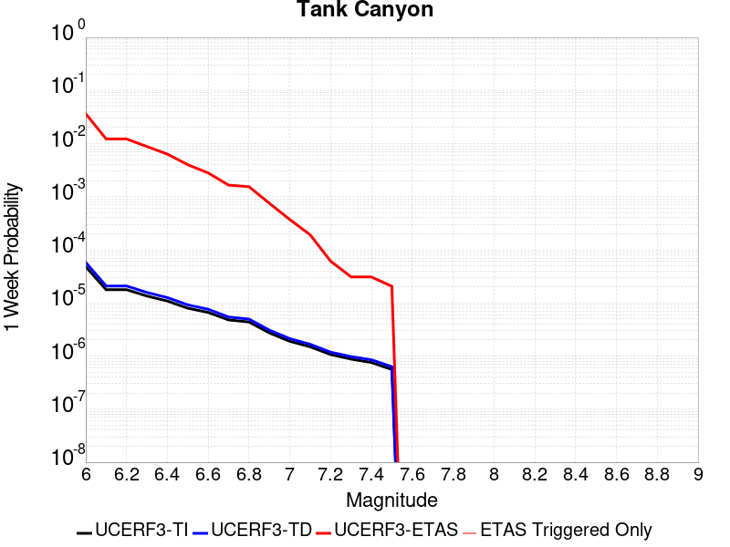 |  |  |  |

| Magnitude | 1 wk TI Prob | 1 wk TD Prob | 1 wk ETAS Prob | 1 wk ETAS/TD Gain | 1 wk ETAS Triggered Only | 1 mo TI Prob | 1 mo TD Prob | 1 mo ETAS Prob | 1 mo ETAS/TD Gain | 1 mo ETAS Triggered Only | 1 yr TI Prob | 1 yr TD Prob | 1 yr ETAS Prob | 1 yr ETAS/TD Gain | 1 yr ETAS Triggered Only | 10 yr TI Prob | 10 yr TD Prob | 10 yr ETAS Prob | 10 yr ETAS/TD Gain | 10 yr ETAS Triggered Only |
|-----|-----|-----|-----|-----|-----|-----|-----|-----|-----|-----|-----|-----|-----|-----|-----|-----|-----|-----|-----|-----|
| 6.0 | 4.8284557E-5 | 5.7964822E-5 | 0.03450102 | 595.2062 | 0.03444505 | 2.0691741E-4 | 2.4840087E-4 | 0.047735237 | 192.17017 | 0.047498632 | 0.0025163088 | 0.0030207601 | 0.07660862 | 25.36071 | 0.07381082 | 0.02488006 | 0.029863637 | 0.13011283 | 4.3568983 | 0.10333516 |
| 6.1 | 1.7796336E-5 | 2.0873314E-5 | 0.011023924 | 528.1348 | 0.01100328 | 7.626778E-5 | 8.945422E-5 | 0.016217044 | 181.28876 | 0.016129032 | 9.281647E-4 | 0.0010885983 | 0.026211575 | 24.078281 | 0.025150355 | 0.009242975 | 0.010836744 | 0.047815442 | 4.412344 | 0.037383817 |
| 6.2 | 1.7796336E-5 | 2.0873314E-5 | 0.011023924 | 528.1348 | 0.01100328 | 7.626778E-5 | 8.945422E-5 | 0.016217044 | 181.28876 | 0.016129032 | 9.281647E-4 | 0.0010885983 | 0.026211575 | 24.078281 | 0.025150355 | 0.009242975 | 0.010836744 | 0.047815442 | 4.412344 | 0.037383817 |
| 6.3 | 1.3515912E-5 | 1.5759564E-5 | 0.0078067794 | 495.3677 | 0.007791143 | 5.792405E-5 | 6.753938E-5 | 0.011616787 | 172.0002 | 0.011550027 | 7.049971E-4 | 8.2200574E-4 | 0.018918108 | 23.014568 | 0.01811099 | 0.007027647 | 0.0081922645 | 0.0342889 | 4.1855216 | 0.026312193 |
| 6.4 | 1.0870146E-5 | 1.2618021E-5 | 0.005890073 | 466.79846 | 0.005877529 | 4.658551E-5 | 5.4076212E-5 | 0.008869893 | 164.02577 | 0.008816293 | 5.67031E-4 | 6.581969E-4 | 0.014044678 | 21.33811 | 0.013395298 | 0.005655863 | 0.0065644905 | 0.025846591 | 3.9373338 | 0.019409513 |
| 6.5 | 7.964826E-6 | 9.196094E-6 | 0.0034263325 | 372.58563 | 0.0034171678 | 3.4134522E-5 | 3.9411298E-5 | 0.0048915986 | 124.11666 | 0.0048523783 | 4.1550855E-4 | 4.7973756E-4 | 0.007857279 | 16.378286 | 0.0073810825 | 0.0041473247 | 0.004788321 | 0.01580693 | 3.3011425 | 0.011071624 |
| 6.6 | 6.6317E-6 | 7.6122988E-6 | 0.0021262402 | 279.31644 | 0.002118644 | 2.8421264E-5 | 3.2623782E-5 | 0.0033813391 | 103.64645 | 0.0033488246 | 3.4597394E-4 | 3.9713128E-4 | 0.0054525314 | 13.729795 | 0.0050574085 | 0.0034543579 | 0.003965368 | 0.011861761 | 2.9913392 | 0.007927829 |
| 6.7 | 4.793663E-6 | 5.4307857E-6 | 0.0013722905 | 252.68729 | 0.0013668671 | 2.0544108E-5 | 2.3274613E-5 | 0.0022102112 | 94.96232 | 0.0021869873 | 2.500958E-4 | 2.8333595E-4 | 0.0032212676 | 11.369075 | 0.0029387644 | 0.0024981452 | 0.0028304397 | 0.0073283343 | 2.5891151 | 0.0045106616 |
| 6.8 | 4.382823E-6 | 4.9692567E-6 | 0.0013034866 | 262.31015 | 0.0012985237 | 1.8783392E-5 | 2.1296666E-5 | 0.0021398957 | 100.480316 | 0.002118644 | 2.286638E-4 | 2.5926033E-4 | 0.0030606114 | 11.805167 | 0.0028020777 | 0.0022842865 | 0.002590253 | 0.006884732 | 2.657938 | 0.0043056314 |
| 6.9 | 2.729601E-6 | 3.0735416E-6 | 6.86505E-4 | 223.35959 | 6.8343355E-4 | 1.1698237E-5 | 1.3172262E-5 | 0.001174994 | 89.20215 | 0.001161837 | 1.4241673E-4 | 1.6036171E-4 | 0.001937004 | 12.078968 | 0.0017769273 | 0.001423255 | 0.0016026258 | 0.003922576 | 2.4475932 | 0.002323674 |
| 7.0 | 1.8987357E-6 | 2.126939E-6 | 4.121862E-4 | 193.79315 | 4.1006014E-4 | 8.137413E-6 | 9.115425E-6 | 6.2420004E-4 | 68.47733 | 6.150902E-4 | 9.90685E-5 | 1.1097535E-4 | 8.6266885E-4 | 7.7735176 | 7.517769E-4 | 9.902435E-4 | 0.0011092679 | 0.0020650136 | 1.8616003 | 9.56807E-4 |
| 7.1 | 1.4928986E-6 | 1.6641272E-6 | 2.0669386E-4 | 124.20557 | 2.0503007E-4 | 6.398121E-6 | 7.1319573E-6 | 2.8050345E-4 | 39.330498 | 2.733734E-4 | 7.789434E-5 | 8.682871E-5 | 4.9685326E-4 | 5.722223 | 4.1006014E-4 | 7.786704E-4 | 8.6800574E-4 | 0.001345994 | 1.5506741 | 4.784035E-4 |
| 7.2 | 1.069082E-6 | 1.1828573E-6 | 6.952613E-5 | 58.778126 | 6.834335E-5 | 4.581772E-6 | 5.0693816E-6 | 7.341239E-5 | 14.481528 | 6.834335E-5 | 5.5781646E-5 | 6.171851E-5 | 1.9839678E-4 | 3.2145429 | 1.366867E-4 | 5.576765E-4 | 6.170659E-4 | 7.5366825E-4 | 1.221374 | 1.366867E-4 |
| 7.3 | 8.776551E-7 | 9.770005E-7 | 6.932029E-5 | 70.952156 | 6.834335E-5 | 3.7613736E-6 | 4.1871413E-6 | 7.253021E-5 | 17.322132 | 6.834335E-5 | 4.579376E-5 | 5.097777E-5 | 1.8765751E-4 | 3.6811635 | 1.366867E-4 | 4.5784327E-4 | 5.097118E-4 | 6.4632884E-4 | 1.268028 | 1.366867E-4 |
| 7.4 | 7.55721E-7 | 8.510244E-7 | 6.919432E-5 | 81.30709 | 6.834335E-5 | 3.2388E-6 | 3.6472454E-6 | 7.1990355E-5 | 19.738281 | 6.834335E-5 | 3.9431678E-5 | 4.4404827E-5 | 1.8108547E-4 | 4.0780582 | 1.366867E-4 | 3.942468E-4 | 4.440104E-4 | 5.8063644E-4 | 1.3077091 | 1.366867E-4 |
| 7.5 | 5.587665E-7 | 6.305619E-7 | 6.897387E-5 | 109.38478 | 6.834335E-5 | 2.3947114E-6 | 2.702408E-6 | 7.104558E-5 | 26.28973 | 6.834335E-5 | 2.915522E-5 | 3.290182E-5 | 1.6958403E-4 | 5.154245 | 1.366867E-4 | 2.9151395E-4 | 3.290182E-4 | 4.6565992E-4 | 1.4153014 | 1.366867E-4 |

## Little Lake
*[(top)](#table-of-contents)*

| 1 Week | 1 Month | 1 Year | 10 Year |
|-----|-----|-----|-----|
|  | 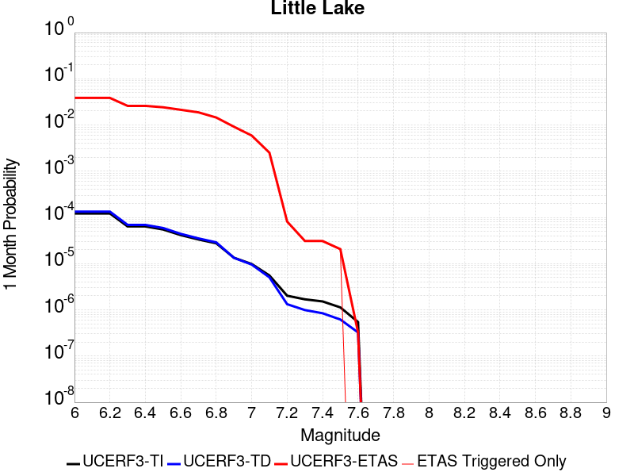 |  | 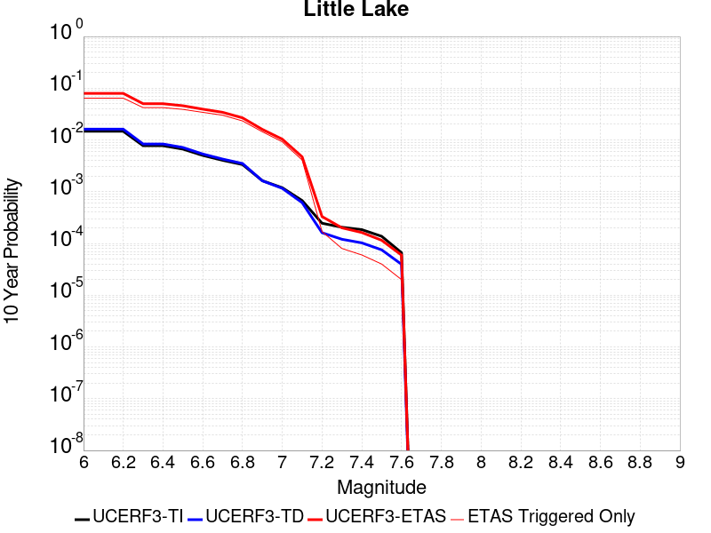 |

| Magnitude | 1 wk TI Prob | 1 wk TD Prob | 1 wk ETAS Prob | 1 wk ETAS/TD Gain | 1 wk ETAS Triggered Only | 1 mo TI Prob | 1 mo TD Prob | 1 mo ETAS Prob | 1 mo ETAS/TD Gain | 1 mo ETAS Triggered Only | 1 yr TI Prob | 1 yr TD Prob | 1 yr ETAS Prob | 1 yr ETAS/TD Gain | 1 yr ETAS Triggered Only | 10 yr TI Prob | 10 yr TD Prob | 10 yr ETAS Prob | 10 yr ETAS/TD Gain | 10 yr ETAS Triggered Only |
|-----|-----|-----|-----|-----|-----|-----|-----|-----|-----|-----|-----|-----|-----|-----|-----|-----|-----|-----|-----|-----|
| 6.0 | 2.8424427E-5 | 3.120572E-5 | 0.027982766 | 896.7191 | 0.027952433 | 1.2181328E-4 | 1.337327E-4 | 0.037307546 | 278.971 | 0.037178785 | 0.0014820677 | 0.0016271127 | 0.050822496 | 31.234772 | 0.049275562 | 0.014722223 | 0.016165402 | 0.07728525 | 4.7809052 | 0.06212411 |
| 6.1 | 2.8424427E-5 | 3.120572E-5 | 0.027982766 | 896.7191 | 0.027952433 | 1.2181328E-4 | 1.337327E-4 | 0.037307546 | 278.971 | 0.037178785 | 0.0014820677 | 0.0016271127 | 0.050822496 | 31.234772 | 0.049275562 | 0.014722223 | 0.016165402 | 0.07728525 | 4.7809052 | 0.06212411 |
| 6.2 | 2.8424427E-5 | 3.120572E-5 | 0.027982766 | 896.7191 | 0.027952433 | 1.2181328E-4 | 1.337327E-4 | 0.037307546 | 278.971 | 0.037178785 | 0.0014820677 | 0.0016271127 | 0.050822496 | 31.234772 | 0.049275562 | 0.014722223 | 0.016165402 | 0.07728525 | 4.7809052 | 0.06212411 |
| 6.3 | 1.48860645E-5 | 1.6081389E-5 | 0.018741861 | 1165.4379 | 0.01872608 | 6.379586E-5 | 6.8918576E-5 | 0.024875848 | 360.94543 | 0.024808638 | 7.7643775E-4 | 8.3878887E-4 | 0.033616085 | 40.07693 | 0.03280481 | 0.007737305 | 0.008359048 | 0.048818976 | 5.8402553 | 0.040800985 |
| 6.4 | 1.48860645E-5 | 1.6081389E-5 | 0.018741861 | 1165.4379 | 0.01872608 | 6.379586E-5 | 6.8918576E-5 | 0.024875848 | 360.94543 | 0.024808638 | 7.7643775E-4 | 8.3878887E-4 | 0.033616085 | 40.07693 | 0.03280481 | 0.007737305 | 0.008359048 | 0.048818976 | 5.8402553 | 0.040800985 |
| 6.5 | 1.2797581E-5 | 1.3765565E-5 | 0.017714452 | 1286.8671 | 0.01770093 | 5.4845623E-5 | 5.899409E-5 | 0.023157686 | 392.54248 | 0.023100054 | 6.675408E-4 | 7.18042E-4 | 0.03145047 | 43.80032 | 0.03075451 | 0.006655392 | 0.00715977 | 0.045225885 | 6.316667 | 0.038340624 |
| 6.6 | 9.661896E-6 | 1.0289038E-5 | 0.015934126 | 1548.6509 | 0.015924003 | 4.1407468E-5 | 4.409522E-5 | 0.020614538 | 467.50052 | 0.020571351 | 5.040193E-4 | 5.367433E-4 | 0.027449572 | 51.14097 | 0.026927283 | 0.005028777 | 0.0053560743 | 0.03880091 | 7.2442813 | 0.033624932 |
| 6.7 | 7.767871E-6 | 8.199687E-6 | 0.013881788 | 1692.9656 | 0.013873702 | 3.329045E-5 | 3.5141118E-5 | 0.018008813 | 512.47125 | 0.017974302 | 4.0523586E-4 | 4.2777284E-4 | 0.023791203 | 55.61644 | 0.023373429 | 0.004044977 | 0.004270846 | 0.033737134 | 7.899403 | 0.029592674 |
| 6.8 | 6.4235196E-6 | 6.7357446E-6 | 0.010804913 | 1604.1157 | 0.01079825 | 2.752908E-5 | 2.8867229E-5 | 0.014380557 | 498.16205 | 0.014352105 | 3.35115E-4 | 3.5141467E-4 | 0.018797636 | 53.491325 | 0.018452706 | 0.003346101 | 0.00350985 | 0.026801242 | 7.6360073 | 0.023373429 |
| 6.9 | 3.1283696E-6 | 3.1121804E-6 | 0.0062906817 | 2021.31 | 0.0062875887 | 1.3407229E-5 | 1.3337856E-5 | 0.008624486 | 646.61707 | 0.008611263 | 1.6322079E-4 | 1.6237781E-4 | 0.011573865 | 71.27738 | 0.01141334 | 0.0016310095 | 0.00162274 | 0.016156252 | 9.956156 | 0.014557135 |
| 7.0 | 2.290603E-6 | 2.2286815E-6 | 0.0038977913 | 1748.9225 | 0.0038955715 | 9.816834E-6 | 9.551463E-6 | 0.0052719396 | 551.951 | 0.0052624387 | 1.19513395E-4 | 1.162839E-4 | 0.007633179 | 65.64261 | 0.0075177695 | 0.0011944914 | 0.0011623327 | 0.010787546 | 9.280945 | 0.009636413 |
| 7.1 | 1.293693E-6 | 1.1776827E-6 | 0.0014363865 | 1219.6718 | 0.0014352105 | 5.5443866E-6 | 5.0472063E-6 | 0.0021236807 | 420.7636 | 0.002118644 | 6.750081E-5 | 6.14487E-5 | 0.0037517631 | 61.05521 | 0.0036905413 | 6.7480316E-4 | 6.143856E-4 | 0.005122276 | 8.337234 | 0.0045106616 |
| 7.2 | 4.715842E-7 | 3.0917857E-7 | 3.0917857E-7 | 1.0 | 0.0 | 2.0210737E-6 | 1.3250503E-6 | 1.3250503E-6 | 1.0 | 0.0 | 2.4606294E-5 | 1.6132375E-5 | 1.6132375E-5 | 1.0 | 0.0 | 2.460357E-4 | 1.6131258E-4 | 1.6131258E-4 | 1.0 | 0.0 |
| 7.3 | 3.9430947E-7 | 2.3097488E-7 | 2.3097488E-7 | 1.0 | 0.0 | 1.6898966E-6 | 9.89892E-7 | 9.89892E-7 | 1.0 | 0.0 | 2.0574296E-5 | 1.2051869E-5 | 1.2051869E-5 | 1.0 | 0.0 | 2.0572392E-4 | 1.20512224E-4 | 1.20512224E-4 | 1.0 | 0.0 |
| 7.4 | 3.547123E-7 | 1.9679135E-7 | 1.9679135E-7 | 1.0 | 0.0 | 1.5201948E-6 | 8.4339126E-7 | 8.4339126E-7 | 1.0 | 0.0 | 1.8508214E-5 | 1.0268241E-5 | 1.0268241E-5 | 1.0 | 0.0 | 1.8506673E-4 | 1.02677724E-4 | 1.02677724E-4 | 1.0 | 0.0 |
| 7.5 | 2.6354266E-7 | 1.4423138E-7 | 1.4423138E-7 | 1.0 | 0.0 | 1.129468E-6 | 6.181344E-7 | 6.181344E-7 | 1.0 | 0.0 | 1.3751187E-5 | 7.5257603E-6 | 7.5257603E-6 | 1.0 | 0.0 | 1.3750336E-4 | 7.5255106E-5 | 7.5255106E-5 | 1.0 | 0.0 |
| 7.6 | 1.269913E-7 | 7.572556E-8 | 7.572556E-8 | 1.0 | 0.0 | 5.4424834E-7 | 3.245381E-7 | 3.245381E-7 | 1.0 | 0.0 | 6.6262032E-6 | 3.9512443E-6 | 3.9512443E-6 | 1.0 | 0.0 | 6.626006E-5 | 3.9511775E-5 | 3.9511775E-5 | 1.0 | 0.0 |

## Airport Lake
*[(top)](#table-of-contents)*

| 1 Week | 1 Month | 1 Year | 10 Year |
|-----|-----|-----|-----|
|  |  |  |  |

| Magnitude | 1 wk TI Prob | 1 wk TD Prob | 1 wk ETAS Prob | 1 wk ETAS/TD Gain | 1 wk ETAS Triggered Only | 1 mo TI Prob | 1 mo TD Prob | 1 mo ETAS Prob | 1 mo ETAS/TD Gain | 1 mo ETAS Triggered Only | 1 yr TI Prob | 1 yr TD Prob | 1 yr ETAS Prob | 1 yr ETAS/TD Gain | 1 yr ETAS Triggered Only | 10 yr TI Prob | 10 yr TD Prob | 10 yr ETAS Prob | 10 yr ETAS/TD Gain | 10 yr ETAS Triggered Only |
|-----|-----|-----|-----|-----|-----|-----|-----|-----|-----|-----|-----|-----|-----|-----|-----|-----|-----|-----|-----|-----|
| 6.0 | 1.2387061E-5 | 1.3103157E-5 | 0.0276918 | 2113.3687 | 0.02767906 | 5.3086325E-5 | 5.615534E-5 | 0.03470429 | 618.0052 | 0.034650084 | 6.461343E-4 | 6.8350515E-4 | 0.045622695 | 66.74814 | 0.044969928 | 0.0064425888 | 0.0068168393 | 0.06105094 | 8.955901 | 0.05460634 |
| 6.1 | 1.2387061E-5 | 1.3103157E-5 | 0.0276918 | 2113.3687 | 0.02767906 | 5.3086325E-5 | 5.615534E-5 | 0.03470429 | 618.0052 | 0.034650084 | 6.461343E-4 | 6.8350515E-4 | 0.045622695 | 66.74814 | 0.044969928 | 0.0064425888 | 0.0068168393 | 0.06105094 | 8.955901 | 0.05460634 |
| 6.2 | 1.2387061E-5 | 1.3103157E-5 | 0.0276918 | 2113.3687 | 0.02767906 | 5.3086325E-5 | 5.615534E-5 | 0.03470429 | 618.0052 | 0.034650084 | 6.461343E-4 | 6.8350515E-4 | 0.045622695 | 66.74814 | 0.044969928 | 0.0064425888 | 0.0068168393 | 0.06105094 | 8.955901 | 0.05460634 |
| 6.3 | 1.2387061E-5 | 1.3103157E-5 | 0.0276918 | 2113.3687 | 0.02767906 | 5.3086325E-5 | 5.615534E-5 | 0.03470429 | 618.0052 | 0.034650084 | 6.461343E-4 | 6.8350515E-4 | 0.045622695 | 66.74814 | 0.044969928 | 0.0064425888 | 0.0068168393 | 0.06105094 | 8.955901 | 0.05460634 |
| 6.4 | 1.2387061E-5 | 1.3103157E-5 | 0.0276918 | 2113.3687 | 0.02767906 | 5.3086325E-5 | 5.615534E-5 | 0.03470429 | 618.0052 | 0.034650084 | 6.461343E-4 | 6.8350515E-4 | 0.045622695 | 66.74814 | 0.044969928 | 0.0064425888 | 0.0068168393 | 0.06105094 | 8.955901 | 0.05460634 |
| 6.5 | 6.9922594E-6 | 7.384925E-6 | 0.019690126 | 2666.2595 | 0.019682886 | 2.996648E-5 | 3.1649324E-5 | 0.024566138 | 776.1978 | 0.024535265 | 3.6478083E-4 | 3.8526783E-4 | 0.03249427 | 84.342026 | 0.03212138 | 0.003641826 | 0.0038465366 | 0.04374169 | 11.371709 | 0.040049206 |
| 6.6 | 6.9922594E-6 | 7.384925E-6 | 0.019690126 | 2666.2595 | 0.019682886 | 2.996648E-5 | 3.1649324E-5 | 0.024566138 | 776.1978 | 0.024535265 | 3.6478083E-4 | 3.8526783E-4 | 0.03249427 | 84.342026 | 0.03212138 | 0.003641826 | 0.0038465366 | 0.04374169 | 11.371709 | 0.040049206 |
| 6.7 | 5.477277E-6 | 5.7860684E-6 | 0.016886497 | 2918.4753 | 0.016880808 | 2.3473833E-5 | 2.4797222E-5 | 0.021347396 | 860.8785 | 0.021323128 | 2.8575645E-4 | 3.0186825E-4 | 0.028314186 | 93.7965 | 0.028020777 | 0.0028538927 | 0.003014966 | 0.037764993 | 12.525844 | 0.034855112 |
| 6.8 | 3.9950432E-6 | 4.2190873E-6 | 0.012511001 | 2965.3335 | 0.012506834 | 1.7121502E-5 | 1.8081691E-5 | 0.016010137 | 885.4336 | 0.015992345 | 2.0843433E-4 | 2.2012512E-4 | 0.021196917 | 96.29486 | 0.02098141 | 0.0020823893 | 0.0021993418 | 0.028385472 | 12.906349 | 0.026243849 |
| 6.9 | 2.95695E-6 | 3.1230243E-6 | 0.008751045 | 2802.106 | 0.008747949 | 1.2672582E-5 | 1.3384334E-5 | 0.011426572 | 853.72736 | 0.01141334 | 1.5427776E-4 | 1.6294434E-4 | 0.015196033 | 93.25904 | 0.015035539 | 0.001541707 | 0.0016284712 | 0.020528752 | 12.606151 | 0.01893111 |
| 7.0 | 1.456072E-6 | 1.540812E-6 | 0.0038287628 | 2484.8994 | 0.003827228 | 6.2402937E-6 | 6.603469E-6 | 0.0051323213 | 777.21594 | 0.0051257517 | 7.597293E-5 | 8.039528E-5 | 0.0073242085 | 91.10248 | 0.007244396 | 7.594696E-4 | 8.0376083E-4 | 0.010090986 | 12.554713 | 0.009294696 |
| 7.1 | 6.995192E-7 | 7.4089746E-7 | 0.0014359503 | 1938.1229 | 0.0014352105 | 2.997936E-6 | 3.1752747E-6 | 0.0021218127 | 668.2296 | 0.002118644 | 3.649926E-5 | 3.865897E-5 | 0.0035923761 | 92.924774 | 0.0035538545 | 3.6493264E-4 | 3.865897E-4 | 0.0047588735 | 12.309882 | 0.0043739746 |

## Owl Lake
*[(top)](#table-of-contents)*

| 1 Week | 1 Month | 1 Year | 10 Year |
|-----|-----|-----|-----|
|  |  |  |  |

| Magnitude | 1 wk TI Prob | 1 wk TD Prob | 1 wk ETAS Prob | 1 wk ETAS/TD Gain | 1 wk ETAS Triggered Only | 1 mo TI Prob | 1 mo TD Prob | 1 mo ETAS Prob | 1 mo ETAS/TD Gain | 1 mo ETAS Triggered Only | 1 yr TI Prob | 1 yr TD Prob | 1 yr ETAS Prob | 1 yr ETAS/TD Gain | 1 yr ETAS Triggered Only | 10 yr TI Prob | 10 yr TD Prob | 10 yr ETAS Prob | 10 yr ETAS/TD Gain | 10 yr ETAS Triggered Only |
|-----|-----|-----|-----|-----|-----|-----|-----|-----|-----|-----|-----|-----|-----|-----|-----|-----|-----|-----|-----|-----|
| 6.0 | 5.0320643E-5 | 6.635816E-5 | 0.016672691 | 251.2531 | 0.016607435 | 2.1564208E-4 | 2.843674E-4 | 0.02262629 | 79.56711 | 0.022348277 | 0.0026222812 | 0.0034577388 | 0.03546805 | 10.257585 | 0.03212138 | 0.02591553 | 0.034140717 | 0.0740108 | 2.1678162 | 0.041279387 |
| 6.1 | 5.0320643E-5 | 6.635816E-5 | 0.016672691 | 251.2531 | 0.016607435 | 2.1564208E-4 | 2.843674E-4 | 0.02262629 | 79.56711 | 0.022348277 | 0.0026222812 | 0.0034577388 | 0.03546805 | 10.257585 | 0.03212138 | 0.02591553 | 0.034140717 | 0.0740108 | 2.1678162 | 0.041279387 |
| 6.2 | 2.4125871E-5 | 3.0981035E-5 | 0.013562546 | 437.7693 | 0.013531985 | 1.0339249E-4 | 1.3277028E-4 | 0.017626347 | 132.75822 | 0.017495899 | 0.0012580766 | 0.001615439 | 0.026179302 | 16.205688 | 0.024603609 | 0.012509781 | 0.016070465 | 0.047070432 | 2.9290025 | 0.03150629 |
| 6.3 | 1.7433485E-5 | 2.2355514E-5 | 0.0121872015 | 545.1542 | 0.012165118 | 7.471279E-5 | 9.580672E-5 | 0.016291631 | 170.04684 | 0.016197376 | 9.0924866E-4 | 0.0011659743 | 0.023146877 | 19.851961 | 0.02200656 | 0.009055373 | 0.011628896 | 0.03932382 | 3.381561 | 0.028020777 |
| 6.4 | 1.7433485E-5 | 2.2355514E-5 | 0.0121872015 | 545.1542 | 0.012165118 | 7.471279E-5 | 9.580672E-5 | 0.016291631 | 170.04684 | 0.016197376 | 9.0924866E-4 | 0.0011659743 | 0.023146877 | 19.851961 | 0.02200656 | 0.009055373 | 0.011628896 | 0.03932382 | 3.381561 | 0.028020777 |
| 6.5 | 1.5182742E-5 | 1.9429144E-5 | 0.011910942 | 613.0451 | 0.011891744 | 6.506727E-5 | 8.326596E-5 | 0.015869267 | 190.5853 | 0.015787315 | 7.919061E-4 | 0.0010134429 | 0.02231496 | 22.018963 | 0.021323128 | 0.0078909 | 0.010118429 | 0.0368409 | 3.6409707 | 0.026995625 |
| 6.6 | 6.7271576E-6 | 8.547361E-6 | 0.009644878 | 1128.4042 | 0.009636413 | 2.8830356E-5 | 3.6631063E-5 | 0.011791258 | 321.8923 | 0.011755058 | 3.5095305E-4 | 4.458976E-4 | 0.016089547 | 36.083504 | 0.015650628 | 0.0035039932 | 0.004467813 | 0.022838077 | 5.1116905 | 0.018452706 |
| 6.7 | 6.682835E-6 | 8.479807E-6 | 0.009644811 | 1137.3857 | 0.009636413 | 2.8640408E-5 | 3.6341557E-5 | 0.011722631 | 322.5682 | 0.011686714 | 3.4864116E-4 | 4.4237426E-4 | 0.016017767 | 36.20863 | 0.015582286 | 0.003480947 | 0.0044327388 | 0.022735609 | 5.1290207 | 0.018384364 |
| 6.8 | 6.5774975E-6 | 8.32628E-6 | 0.009644659 | 1158.3395 | 0.009636413 | 2.8188972E-5 | 3.5683603E-5 | 0.011721981 | 328.49768 | 0.011686714 | 3.4314668E-4 | 4.343669E-4 | 0.016009884 | 36.857975 | 0.015582286 | 0.0034261728 | 0.004352885 | 0.022657223 | 5.2051053 | 0.018384364 |
| 6.9 | 6.363419E-6 | 7.999454E-6 | 0.009644336 | 1205.6241 | 0.009636413 | 2.727151E-5 | 3.428296E-5 | 0.011720597 | 341.8782 | 0.011686714 | 3.3198006E-4 | 4.1732067E-4 | 0.015924789 | 38.159595 | 0.015513942 | 0.0033148455 | 0.0041828766 | 0.022354225 | 5.344223 | 0.018247677 |
| 7.0 | 6.1342453E-6 | 7.6316555E-6 | 0.009575629 | 1254.725 | 0.00956807 | 2.6289357E-5 | 3.2706717E-5 | 0.011650697 | 356.2173 | 0.011618371 | 3.2002592E-4 | 3.9813702E-4 | 0.015837586 | 39.779236 | 0.015445598 | 0.0031956544 | 0.003991571 | 0.02203027 | 5.519198 | 0.01811099 |
| 7.1 | 5.842926E-6 | 7.142211E-6 | 0.009165087 | 1283.2281 | 0.00915801 | 2.504087E-5 | 3.0609146E-5 | 0.011101894 | 362.69858 | 0.011071624 | 3.0482994E-4 | 3.7260808E-4 | 0.015129273 | 40.603718 | 0.014762165 | 0.0030441214 | 0.0037370329 | 0.021031374 | 5.6278267 | 0.017359212 |
| 7.2 | 4.77173E-6 | 5.358483E-6 | 0.006497943 | 1212.6459 | 0.006492619 | 2.045011E-5 | 2.2964748E-5 | 0.007950612 | 346.2094 | 0.007927829 | 2.4895166E-4 | 2.79564E-4 | 0.010938147 | 39.125736 | 0.010661564 | 0.0024867293 | 0.002808645 | 0.014939595 | 5.3191466 | 0.012165118 |
| 7.3 | 3.0494948E-6 | 2.710463E-6 | 0.0015746034 | 580.93524 | 0.0015718972 | 1.3069198E-5 | 1.1616219E-5 | 0.0021985783 | 189.26797 | 0.0021869873 | 1.5910587E-4 | 1.4141845E-4 | 0.0028064325 | 19.844881 | 0.002665391 | 0.0015899199 | 0.0014232415 | 0.0046308073 | 3.2537048 | 0.0032121378 |
| 7.4 | 2.7263884E-6 | 2.3056762E-6 | 8.224241E-4 | 356.69537 | 8.201203E-4 | 1.1684469E-5 | 9.881433E-6 | 0.0011717071 | 118.57663 | 0.001161837 | 1.4224913E-4 | 1.20299905E-4 | 0.0015553378 | 12.928836 | 0.0014352105 | 0.0014215811 | 0.0012112238 | 0.0030542593 | 2.521631 | 0.0018452706 |
| 7.5 | 2.6090431E-6 | 2.1656133E-6 | 6.855977E-4 | 316.58362 | 6.8343355E-4 | 1.1181565E-5 | 9.281167E-6 | 0.001034422 | 111.45387 | 0.0010251503 | 1.3612706E-4 | 1.1299244E-4 | 0.0014113695 | 12.49083 | 0.0012985237 | 0.001360437 | 0.0011379806 | 0.0027763546 | 2.4397204 | 0.0016402405 |
| 7.6 | 2.3008756E-6 | 1.8727933E-6 | 5.486186E-4 | 292.94135 | 5.467468E-4 | 9.860858E-6 | 8.0262325E-6 | 8.2813995E-4 | 103.17915 | 8.201203E-4 | 1.20049335E-4 | 9.7715085E-5 | 0.0011227652 | 11.490193 | 0.0010251503 | 0.001199845 | 9.849932E-4 | 0.002350514 | 2.3863251 | 0.0013668671 |
| 7.7 | 1.7184348E-6 | 1.3419171E-6 | 2.0637171E-4 | 153.78873 | 2.0503007E-4 | 7.3646997E-6 | 5.7510606E-6 | 4.1580884E-4 | 72.30125 | 4.1006014E-4 | 8.966153E-5 | 7.0016955E-5 | 6.850641E-4 | 9.78426 | 6.150902E-4 | 8.962536E-4 | 7.078345E-4 | 0.0014590793 | 2.0613284 | 7.517769E-4 |
| 7.8 | 8.4612907E-7 | 8.4058576E-7 | 8.4058576E-7 | 1.0 | 0.0 | 3.6262625E-6 | 3.6025056E-6 | 2.0863184E-4 | 57.912983 | 2.0503007E-4 | 4.4148852E-5 | 4.3859643E-5 | 3.1722107E-4 | 7.2326417 | 2.733734E-4 | 4.414008E-4 | 4.4398365E-4 | 7.1723567E-4 | 1.6154553 | 2.733734E-4 |
| 7.9 | 2.716738E-7 | 3.768106E-7 | 3.768106E-7 | 1.0 | 0.0 | 1.1643157E-6 | 1.6149015E-6 | 1.3830139E-4 | 85.64076 | 1.366867E-4 | 1.4175452E-5 | 1.966126E-5 | 2.246873E-4 | 11.42792 | 2.0503007E-4 | 1.4174548E-4 | 1.9836679E-4 | 4.0335619E-4 | 2.0333858 | 2.0503007E-4 |
| 8.0 | 2.1995428E-8 | 3.384878E-8 | 3.384878E-8 | 1.0 | 0.0 | 9.426611E-8 | 1.4506621E-7 | 1.4506621E-7 | 1.0 | 0.0 | 1.1476893E-6 | 1.7661803E-6 | 1.7661803E-6 | 1.0 | 0.0 | 1.14768345E-5 | 1.7963059E-5 | 1.7963059E-5 | 1.0 | 0.0 |

## Garlock (East)
*[(top)](#table-of-contents)*

| 1 Week | 1 Month | 1 Year | 10 Year |
|-----|-----|-----|-----|
|  |  |  |  |

| Magnitude | 1 wk TI Prob | 1 wk TD Prob | 1 wk ETAS Prob | 1 wk ETAS/TD Gain | 1 wk ETAS Triggered Only | 1 mo TI Prob | 1 mo TD Prob | 1 mo ETAS Prob | 1 mo ETAS/TD Gain | 1 mo ETAS Triggered Only | 1 yr TI Prob | 1 yr TD Prob | 1 yr ETAS Prob | 1 yr ETAS/TD Gain | 1 yr ETAS Triggered Only | 10 yr TI Prob | 10 yr TD Prob | 10 yr ETAS Prob | 10 yr ETAS/TD Gain | 10 yr ETAS Triggered Only |
|-----|-----|-----|-----|-----|-----|-----|-----|-----|-----|-----|-----|-----|-----|-----|-----|-----|-----|-----|-----|-----|
| 6.0 | 4.5092507E-5 | 6.290325E-5 | 0.011680543 | 185.69061 | 0.011618371 | 1.9323928E-4 | 2.6956003E-4 | 0.01591597 | 59.044254 | 0.015650628 | 0.0023501497 | 0.0032774 | 0.025756791 | 7.85891 | 0.022553308 | 0.023254504 | 0.032351844 | 0.06098714 | 1.885121 | 0.029592674 |
| 6.1 | 4.5092507E-5 | 6.290325E-5 | 0.011680543 | 185.69061 | 0.011618371 | 1.9323928E-4 | 2.6956003E-4 | 0.01591597 | 59.044254 | 0.015650628 | 0.0023501497 | 0.0032774 | 0.025756791 | 7.85891 | 0.022553308 | 0.023254504 | 0.032351844 | 0.06098714 | 1.885121 | 0.029592674 |
| 6.2 | 2.6674514E-5 | 3.4509674E-5 | 0.008987181 | 260.42496 | 0.00895298 | 1.1431433E-4 | 1.4789042E-4 | 0.011764543 | 79.54906 | 0.011618371 | 0.0013908884 | 0.0017991117 | 0.017830906 | 9.91095 | 0.01606069 | 0.01382215 | 0.017890299 | 0.038093623 | 2.1292894 | 0.020571351 |
| 6.3 | 2.6674514E-5 | 3.4509674E-5 | 0.008987181 | 260.42496 | 0.00895298 | 1.1431433E-4 | 1.4789042E-4 | 0.011764543 | 79.54906 | 0.011618371 | 0.0013908884 | 0.0017991117 | 0.017830906 | 9.91095 | 0.01606069 | 0.01382215 | 0.017890299 | 0.038093623 | 2.1292894 | 0.020571351 |
| 6.4 | 2.5312667E-5 | 3.233893E-5 | 0.008916688 | 275.72614 | 0.008884637 | 1.0847834E-4 | 1.3858822E-4 | 0.011687015 | 84.32906 | 0.011550027 | 0.0013199237 | 0.0016860351 | 0.01758319 | 10.42872 | 0.015924003 | 0.013121112 | 0.016778335 | 0.03687014 | 2.197485 | 0.020434665 |
| 6.5 | 2.5312667E-5 | 3.233893E-5 | 0.008916688 | 275.72614 | 0.008884637 | 1.0847834E-4 | 1.3858822E-4 | 0.011687015 | 84.32906 | 0.011550027 | 0.0013199237 | 0.0016860351 | 0.01758319 | 10.42872 | 0.015924003 | 0.013121112 | 0.016778335 | 0.03687014 | 2.197485 | 0.020434665 |
| 6.6 | 2.246556E-5 | 2.8133776E-5 | 0.008570813 | 304.64496 | 0.0085429195 | 9.627742E-5 | 1.20567885E-4 | 0.011054186 | 91.68433 | 0.010934937 | 0.0011715472 | 0.0014669491 | 0.01668516 | 11.374055 | 0.015240569 | 0.011653901 | 0.01461866 | 0.033811778 | 2.312919 | 0.019477857 |
| 6.7 | 2.2241198E-5 | 2.7803519E-5 | 0.008570486 | 308.25183 | 0.0085429195 | 9.531594E-5 | 1.1915263E-4 | 0.011052786 | 92.76159 | 0.010934937 | 0.0011598538 | 0.0014497414 | 0.016668215 | 11.497372 | 0.015240569 | 0.011538187 | 0.014448853 | 0.033645276 | 2.3285778 | 0.019477857 |
| 6.8 | 1.9528685E-5 | 2.389819E-5 | 0.008361588 | 349.88373 | 0.00833789 | 8.369167E-5 | 1.0241691E-4 | 0.010831225 | 105.75622 | 0.010729907 | 0.0010184698 | 0.0012462323 | 0.015853483 | 12.721131 | 0.014625479 | 0.010138147 | 0.012436427 | 0.030794635 | 2.476164 | 0.018589392 |
| 6.9 | 1.3318621E-5 | 1.5198884E-5 | 0.0078062234 | 513.605 | 0.007791143 | 5.7078556E-5 | 6.513648E-5 | 0.010042617 | 154.17805 | 0.00997813 | 6.9470983E-4 | 7.927538E-4 | 0.014040855 | 17.711493 | 0.013258611 | 0.0069254204 | 0.007939888 | 0.02414426 | 3.0408816 | 0.016334062 |
| 7.0 | 1.1760853E-5 | 1.31077895E-5 | 0.0078041484 | 595.3825 | 0.007791143 | 5.0402683E-5 | 5.6175057E-5 | 0.009965405 | 177.39911 | 0.009909787 | 6.134799E-4 | 6.8372174E-4 | 0.013728378 | 20.078896 | 0.013053581 | 0.0061178906 | 0.00685652 | 0.02267134 | 3.3065372 | 0.015924003 |
| 7.1 | 1.0064758E-5 | 1.0902931E-5 | 0.007596933 | 696.779 | 0.0075861127 | 4.3133965E-5 | 4.672603E-5 | 0.009682689 | 207.22261 | 0.009636413 | 5.2502943E-4 | 5.687444E-4 | 0.013273379 | 23.33804 | 0.012711864 | 0.005237907 | 0.0057129986 | 0.020798545 | 3.6405654 | 0.015172225 |
| 7.2 | 9.768808E-6 | 1.0498807E-5 | 0.0074598463 | 710.5423 | 0.0074494258 | 4.186565E-5 | 4.499413E-5 | 0.009544293 | 212.12308 | 0.009499727 | 5.095951E-4 | 5.4766936E-4 | 0.013047654 | 23.823963 | 0.012506834 | 0.0050842804 | 0.0055032647 | 0.020388091 | 3.7047267 | 0.014967195 |
| 7.3 | 9.344516E-6 | 9.944468E-6 | 0.0069808974 | 701.9881 | 0.0069710226 | 4.004731E-5 | 4.261847E-5 | 0.008926876 | 209.46027 | 0.008884637 | 4.8746695E-4 | 5.1875977E-4 | 0.012267719 | 23.648169 | 0.011755058 | 0.0048639905 | 0.0052149445 | 0.019220257 | 3.6856108 | 0.014078732 |
| 7.4 | 9.023491E-6 | 9.490661E-6 | 0.006160334 | 649.09436 | 0.0061509022 | 3.867153E-5 | 4.0673647E-5 | 0.007968181 | 195.90524 | 0.007927829 | 4.7072413E-4 | 4.950925E-4 | 0.01080983 | 21.833961 | 0.010319847 | 0.004697283 | 0.0049783974 | 0.017422969 | 3.4997141 | 0.012506834 |
| 7.5 | 7.081253E-6 | 7.087672E-6 | 0.0028091455 | 396.34247 | 0.0028020777 | 3.0347876E-5 | 3.0375388E-5 | 0.0034474395 | 113.4945 | 0.0034171678 | 3.6942272E-4 | 3.6975832E-4 | 0.004878752 | 13.194434 | 0.0045106616 | 0.003688092 | 0.0037243143 | 0.00917142 | 2.4625795 | 0.0054674684 |
| 7.6 | 6.116396E-6 | 5.959245E-6 | 0.001782876 | 299.17816 | 0.0017769273 | 2.6212863E-5 | 2.5539372E-5 | 0.002349154 | 91.981674 | 0.002323674 | 3.1909486E-4 | 3.1089774E-4 | 0.0030437822 | 9.7903 | 0.0027337342 | 0.0031863707 | 0.0031357552 | 0.0065422077 | 2.0863261 | 0.0034171678 |
| 7.7 | 4.797145E-6 | 4.757281E-6 | 9.615597E-4 | 202.1238 | 9.56807E-4 | 2.055903E-5 | 2.0388188E-5 | 0.0013872274 | 68.04074 | 0.0013668671 | 2.5027743E-4 | 2.4819805E-4 | 0.0017513788 | 7.056376 | 0.0015035538 | 0.0024999576 | 0.0025093474 | 0.0044863313 | 1.7878479 | 0.0019819573 |
| 7.8 | 3.4028885E-6 | 3.978462E-6 | 4.1403697E-4 | 104.06961 | 4.1006014E-4 | 1.4583726E-5 | 1.7050439E-5 | 7.688145E-4 | 45.0906 | 7.517769E-4 | 1.775424E-4 | 2.0756939E-4 | 0.0010275195 | 4.9502454 | 8.201203E-4 | 0.0017740062 | 0.0021012232 | 0.003260619 | 1.5517719 | 0.001161837 |
| 7.9 | 2.5928412E-6 | 3.3724489E-6 | 3.4508808E-4 | 102.32567 | 3.4171678E-4 | 1.1112129E-5 | 1.4453272E-5 | 5.611922E-4 | 38.828037 | 5.467468E-4 | 1.3528178E-4 | 1.7595445E-4 | 7.226051E-4 | 4.106774 | 5.467468E-4 | 0.0013519945 | 0.0017812408 | 0.0025999004 | 1.4596007 | 8.201203E-4 |
| 8.0 | 1.3743648E-6 | 1.6734747E-6 | 2.067032E-4 | 123.51738 | 2.0503007E-4 | 5.8901214E-6 | 7.1720146E-6 | 2.1220061E-4 | 29.587309 | 2.0503007E-4 | 7.1709874E-5 | 8.731581E-5 | 2.9232798E-4 | 3.3479388 | 2.0503007E-4 | 7.1686733E-4 | 8.837234E-4 | 0.0012934211 | 1.4636041 | 4.1006014E-4 |
| 8.1 | 3.6733252E-7 | 3.1489964E-7 | 3.1489964E-7 | 1.0 | 0.0 | 1.5742813E-6 | 1.3495693E-6 | 1.3495693E-6 | 1.0 | 0.0 | 1.9166706E-5 | 1.6430899E-5 | 1.6430899E-5 | 1.0 | 0.0 | 1.9165053E-4 | 1.6638759E-4 | 1.6638759E-4 | 1.0 | 0.0 |

## Panamint Valley
*[(top)](#table-of-contents)*

| 1 Week | 1 Month | 1 Year | 10 Year |
|-----|-----|-----|-----|
|  |  |  |  |

| Magnitude | 1 wk TI Prob | 1 wk TD Prob | 1 wk ETAS Prob | 1 wk ETAS/TD Gain | 1 wk ETAS Triggered Only | 1 mo TI Prob | 1 mo TD Prob | 1 mo ETAS Prob | 1 mo ETAS/TD Gain | 1 mo ETAS Triggered Only | 1 yr TI Prob | 1 yr TD Prob | 1 yr ETAS Prob | 1 yr ETAS/TD Gain | 1 yr ETAS Triggered Only | 10 yr TI Prob | 10 yr TD Prob | 10 yr ETAS Prob | 10 yr ETAS/TD Gain | 10 yr ETAS Triggered Only |
|-----|-----|-----|-----|-----|-----|-----|-----|-----|-----|-----|-----|-----|-----|-----|-----|-----|-----|-----|-----|-----|
| 6.0 | 3.0211835E-5 | 3.3984514E-5 | 0.011856983 | 348.89374 | 0.011823401 | 1.2947287E-4 | 1.4563995E-4 | 0.016340656 | 112.199005 | 0.016197376 | 0.0015751923 | 0.0017717537 | 0.025308436 | 14.284399 | 0.023578458 | 0.015640736 | 0.017583137 | 0.048199736 | 2.741248 | 0.031164572 |
| 6.1 | 3.0211835E-5 | 3.3984514E-5 | 0.011856983 | 348.89374 | 0.011823401 | 1.2947287E-4 | 1.4563995E-4 | 0.016340656 | 112.199005 | 0.016197376 | 0.0015751923 | 0.0017717537 | 0.025308436 | 14.284399 | 0.023578458 | 0.015640736 | 0.017583137 | 0.048199736 | 2.741248 | 0.031164572 |
| 6.2 | 3.0211835E-5 | 3.3984514E-5 | 0.011856983 | 348.89374 | 0.011823401 | 1.2947287E-4 | 1.4563995E-4 | 0.016340656 | 112.199005 | 0.016197376 | 0.0015751923 | 0.0017717537 | 0.025308436 | 14.284399 | 0.023578458 | 0.015640736 | 0.017583137 | 0.048199736 | 2.741248 | 0.031164572 |
| 6.3 | 2.8573924E-5 | 3.210268E-5 | 0.011171713 | 347.99936 | 0.0111399675 | 1.2245393E-4 | 1.3757581E-4 | 0.015649384 | 113.75098 | 0.015513942 | 0.001489857 | 0.0016737265 | 0.024052829 | 14.370824 | 0.022416621 | 0.01479908 | 0.016617801 | 0.045651503 | 2.7471445 | 0.02952433 |
| 6.4 | 2.8573924E-5 | 3.210268E-5 | 0.011171713 | 347.99936 | 0.0111399675 | 1.2245393E-4 | 1.3757581E-4 | 0.015649384 | 113.75098 | 0.015513942 | 0.001489857 | 0.0016737265 | 0.024052829 | 14.370824 | 0.022416621 | 0.01479908 | 0.016617801 | 0.045651503 | 2.7471445 | 0.02952433 |
| 6.5 | 2.7468774E-5 | 3.0828433E-5 | 0.01103377 | 357.90887 | 0.01100328 | 1.1771801E-4 | 1.3211532E-4 | 0.015370671 | 116.34283 | 0.015240569 | 0.0014322745 | 0.0016073446 | 0.0235103 | 14.626795 | 0.021938218 | 0.014230782 | 0.015963677 | 0.04447867 | 2.7862422 | 0.028977584 |
| 6.6 | 2.6135967E-5 | 2.925248E-5 | 0.010827187 | 370.12885 | 0.01079825 | 1.1200648E-4 | 1.253619E-4 | 0.014954011 | 119.286736 | 0.014830508 | 0.0013628257 | 0.0015252391 | 0.022884082 | 15.003604 | 0.02139147 | 0.013544982 | 0.015154043 | 0.04301942 | 2.838808 | 0.02829415 |
| 6.7 | 2.4498746E-5 | 2.7341335E-5 | 0.010620272 | 388.43283 | 0.010593221 | 1.04990395E-4 | 1.1717203E-4 | 0.01439926 | 122.88991 | 0.014283761 | 0.0012775084 | 0.0014256609 | 0.022104176 | 15.504511 | 0.020708038 | 0.012701893 | 0.014171274 | 0.04112121 | 2.90173 | 0.027337343 |
| 6.8 | 2.2244329E-5 | 2.4935423E-5 | 0.010002817 | 401.14886 | 0.00997813 | 9.532935E-5 | 1.0686185E-4 | 0.013569064 | 126.97763 | 0.0134636415 | 0.0011600169 | 0.0013002884 | 0.020411545 | 15.697708 | 0.01913614 | 0.011539802 | 0.0129325185 | 0.037892535 | 2.9300199 | 0.025287041 |
| 6.9 | 1.9902658E-5 | 2.2290267E-5 | 0.009043412 | 405.71127 | 0.009021323 | 8.529431E-5 | 9.552632E-5 | 0.012191145 | 127.6208 | 0.012096774 | 0.0010379635 | 0.0011624309 | 0.018706257 | 16.09236 | 0.017564243 | 0.010331288 | 0.011568608 | 0.03392856 | 2.9328125 | 0.02262165 |
| 7.0 | 1.8353881E-5 | 2.0566185E-5 | 0.008426626 | 409.7321 | 0.008406233 | 7.865712E-5 | 8.813792E-5 | 0.011227123 | 127.3813 | 0.0111399675 | 9.5722964E-4 | 0.0010725686 | 0.016911222 | 15.76703 | 0.015855659 | 0.009531168 | 0.010678849 | 0.030760067 | 2.8804665 | 0.020297976 |
| 7.1 | 1.7667631E-5 | 1.9772613E-5 | 0.008015787 | 405.3985 | 0.007996173 | 7.571623E-5 | 8.473711E-5 | 0.01067706 | 126.00217 | 0.010593221 | 9.2145515E-4 | 0.0010312037 | 0.016187783 | 15.69795 | 0.015172225 | 0.009176437 | 0.010269073 | 0.029411627 | 2.8640976 | 0.01934117 |
| 7.2 | 1.6381597E-5 | 1.8158249E-5 | 0.0071940804 | 396.188 | 0.0071760523 | 7.020495E-5 | 7.781885E-5 | 0.009508468 | 122.18722 | 0.009431384 | 8.544101E-4 | 9.4704994E-4 | 0.01446622 | 15.275033 | 0.013531985 | 0.008511325 | 0.009434792 | 0.02642713 | 2.8010292 | 0.017154183 |
| 7.3 | 1.4520491E-5 | 1.5966476E-5 | 0.006030086 | 377.6717 | 0.0060142153 | 6.222919E-5 | 6.842605E-5 | 0.008064052 | 117.85061 | 0.007996173 | 7.57377E-4 | 8.327849E-4 | 0.012509766 | 15.021605 | 0.011686714 | 0.0075480095 | 0.00829975 | 0.022871617 | 2.7556994 | 0.014693822 |
| 7.4 | 1.2852287E-5 | 1.4145411E-5 | 0.0058232485 | 411.6705 | 0.0058091856 | 5.5080065E-5 | 6.062187E-5 | 0.007851292 | 129.51254 | 0.007791143 | 6.7039346E-4 | 7.378371E-4 | 0.012006171 | 16.272116 | 0.011276654 | 0.0066837464 | 0.0073567946 | 0.021264112 | 2.8904045 | 0.014010388 |
| 7.5 | 1.1637851E-5 | 1.2836797E-5 | 0.0058219475 | 453.53583 | 0.0058091856 | 4.987555E-5 | 5.5013777E-5 | 0.007845728 | 142.61388 | 0.007791143 | 6.070656E-4 | 6.6960254E-4 | 0.011870408 | 17.727543 | 0.011208311 | 0.006054099 | 0.0066787465 | 0.020527676 | 3.0735822 | 0.013942045 |
| 7.6 | 3.0068115E-6 | 3.3330316E-6 | 0.0031471169 | 944.2206 | 0.0031437944 | 1.2886271E-5 | 1.4284384E-5 | 0.0039098 | 273.7115 | 0.0038955715 | 1.5687906E-4 | 1.7390578E-4 | 0.005435429 | 31.255024 | 0.0052624387 | 0.0015676835 | 0.0017391363 | 0.008084015 | 4.648293 | 0.006355932 |

## Hunter Mountain-Saline Valley
*[(top)](#table-of-contents)*

| 1 Week | 1 Month | 1 Year | 10 Year |
|-----|-----|-----|-----|
|  |  |  |  |

| Magnitude | 1 wk TI Prob | 1 wk TD Prob | 1 wk ETAS Prob | 1 wk ETAS/TD Gain | 1 wk ETAS Triggered Only | 1 mo TI Prob | 1 mo TD Prob | 1 mo ETAS Prob | 1 mo ETAS/TD Gain | 1 mo ETAS Triggered Only | 1 yr TI Prob | 1 yr TD Prob | 1 yr ETAS Prob | 1 yr ETAS/TD Gain | 1 yr ETAS Triggered Only | 10 yr TI Prob | 10 yr TD Prob | 10 yr ETAS Prob | 10 yr ETAS/TD Gain | 10 yr ETAS Triggered Only |
|-----|-----|-----|-----|-----|-----|-----|-----|-----|-----|-----|-----|-----|-----|-----|-----|-----|-----|-----|-----|-----|
| 6.0 | 4.5103672E-5 | 5.4570177E-5 | 0.006136797 | 112.45698 | 0.006082559 | 1.9328714E-4 | 2.3385242E-4 | 0.00836481 | 35.76961 | 0.008132859 | 0.002350731 | 0.0028435152 | 0.014633296 | 5.146199 | 0.011823401 | 0.023260195 | 0.028091887 | 0.04230651 | 1.5060045 | 0.014625479 |
| 6.1 | 4.5103672E-5 | 5.4570177E-5 | 0.006136797 | 112.45698 | 0.006082559 | 1.9328714E-4 | 2.3385242E-4 | 0.00836481 | 35.76961 | 0.008132859 | 0.002350731 | 0.0028435152 | 0.014633296 | 5.146199 | 0.011823401 | 0.023260195 | 0.028091887 | 0.04230651 | 1.5060045 | 0.014625479 |
| 6.2 | 3.9363465E-5 | 4.706337E-5 | 0.0060609956 | 128.78372 | 0.0060142153 | 1.6868966E-4 | 2.0168544E-4 | 0.008264575 | 40.97755 | 0.008064516 | 0.002051862 | 0.0024528175 | 0.014179042 | 5.7807164 | 0.011755058 | 0.020330196 | 0.024273481 | 0.038477264 | 1.5851564 | 0.014557135 |
| 6.3 | 3.9363465E-5 | 4.706337E-5 | 0.0060609956 | 128.78372 | 0.0060142153 | 1.6868966E-4 | 2.0168544E-4 | 0.008264575 | 40.97755 | 0.008064516 | 0.002051862 | 0.0024528175 | 0.014179042 | 5.7807164 | 0.011755058 | 0.020330196 | 0.024273481 | 0.038477264 | 1.5851564 | 0.014557135 |
| 6.4 | 3.2311684E-5 | 3.795099E-5 | 0.0059835976 | 157.66644 | 0.005945872 | 1.384713E-4 | 1.6263737E-4 | 0.008157509 | 50.157658 | 0.007996173 | 0.0016845843 | 0.0019783843 | 0.013505561 | 6.826561 | 0.011550027 | 0.016718714 | 0.019616475 | 0.03368704 | 1.7172831 | 0.014352105 |
| 6.5 | 3.2311684E-5 | 3.795099E-5 | 0.0059835976 | 157.66644 | 0.005945872 | 1.384713E-4 | 1.6263737E-4 | 0.008157509 | 50.157658 | 0.007996173 | 0.0016845843 | 0.0019783843 | 0.013505561 | 6.826561 | 0.011550027 | 0.016718714 | 0.019616475 | 0.03368704 | 1.7172831 | 0.014352105 |
| 6.6 | 2.9305844E-5 | 3.418183E-5 | 0.0059798504 | 174.94237 | 0.005945872 | 1.2559042E-4 | 1.4648569E-4 | 0.008141487 | 55.57872 | 0.007996173 | 0.0015279909 | 0.001782067 | 0.013311512 | 7.469703 | 0.011550027 | 0.015175272 | 0.01768569 | 0.03178397 | 1.7971573 | 0.014352105 |
| 6.7 | 2.7826512E-5 | 3.2344276E-5 | 0.005978024 | 184.8248 | 0.005945872 | 1.19251024E-4 | 1.386113E-4 | 0.008133676 | 58.679745 | 0.007996173 | 0.0014509142 | 0.0016863465 | 0.013216896 | 7.8375926 | 0.011550027 | 0.014414776 | 0.016743187 | 0.03085499 | 1.8428386 | 0.014352105 |
| 6.8 | 2.3389874E-5 | 2.6866714E-5 | 0.0059042377 | 219.76031 | 0.005877529 | 1.0023846E-4 | 1.15138246E-4 | 0.008042055 | 69.84695 | 0.007927829 | 0.00121972 | 0.001400954 | 0.012730057 | 9.086706 | 0.011344997 | 0.01213047 | 0.013927434 | 0.027810086 | 1.9967846 | 0.014078732 |
| 6.9 | 2.069209E-5 | 2.3570032E-5 | 0.0059009604 | 250.35861 | 0.005877529 | 8.867737E-5 | 1.01010715E-4 | 0.00802804 | 79.477104 | 0.007927829 | 0.0010791123 | 0.0012291478 | 0.0125602 | 10.218625 | 0.011344997 | 0.010738871 | 0.012228523 | 0.026135093 | 2.137224 | 0.014078732 |
| 7.0 | 1.7462342E-5 | 1.9633546E-5 | 0.005897047 | 300.35568 | 0.005877529 | 7.483646E-5 | 8.414118E-5 | 0.008011304 | 95.21263 | 0.007927829 | 9.1075303E-4 | 0.0010239601 | 0.01235734 | 12.068186 | 0.011344997 | 0.009070295 | 0.0101960525 | 0.024131237 | 2.3667235 | 0.014078732 |
| 7.1 | 1.4807709E-5 | 1.6441749E-5 | 0.005893874 | 358.47 | 0.005877529 | 6.3460066E-5 | 7.046283E-5 | 0.007929395 | 112.53302 | 0.007859486 | 7.723524E-4 | 8.575638E-4 | 0.012124547 | 14.138362 | 0.011276654 | 0.007696735 | 0.008545532 | 0.022436194 | 2.6254883 | 0.014010388 |
| 7.2 | 1.4180048E-5 | 1.5698337E-5 | 0.0058247927 | 371.0452 | 0.0058091856 | 6.077022E-5 | 6.727694E-5 | 0.007857895 | 116.79924 | 0.007791143 | 7.396263E-4 | 8.188051E-4 | 0.012017938 | 14.677409 | 0.011208311 | 0.0073716943 | 0.008160833 | 0.0219891 | 2.6944673 | 0.013942045 |
| 7.3 | 1.3730402E-5 | 1.5172075E-5 | 0.0058242693 | 383.88086 | 0.0058091856 | 5.8843252E-5 | 6.502165E-5 | 0.0078556575 | 120.81603 | 0.007791143 | 7.161811E-4 | 7.9136714E-4 | 0.011990808 | 15.152016 | 0.011208311 | 0.007138774 | 0.007888422 | 0.021720488 | 2.7534637 | 0.013942045 |
| 7.4 | 1.2810095E-5 | 1.4109277E-5 | 0.0058232127 | 412.72226 | 0.0058091856 | 5.489925E-5 | 6.0467017E-5 | 0.007851139 | 129.84167 | 0.007791143 | 6.681934E-4 | 7.359531E-4 | 0.0119360145 | 16.218445 | 0.011208311 | 0.006661878 | 0.007338053 | 0.021177791 | 2.886023 | 0.013942045 |
| 7.5 | 1.1595659E-5 | 1.2800664E-5 | 0.0058219116 | 454.81326 | 0.0058091856 | 4.9694736E-5 | 5.4858923E-5 | 0.007845574 | 143.01364 | 0.007791143 | 6.0486543E-4 | 6.6771836E-4 | 0.011800247 | 17.672491 | 0.0111399675 | 0.006032217 | 0.0066599925 | 0.020441296 | 3.069267 | 0.013873702 |
| 7.6 | 2.997694E-6 | 3.3251579E-6 | 0.0031471092 | 946.45404 | 0.0031437944 | 1.28471975E-5 | 1.425064E-5 | 0.0039097667 | 274.35727 | 0.0038955715 | 1.564034E-4 | 1.73495E-4 | 0.0054350207 | 31.326668 | 0.0052624387 | 0.0015629337 | 0.001735031 | 0.008079936 | 4.65694 | 0.006355932 |

## Ash Hill
*[(top)](#table-of-contents)*

| 1 Week | 1 Month | 1 Year | 10 Year |
|-----|-----|-----|-----|
|  |  |  | 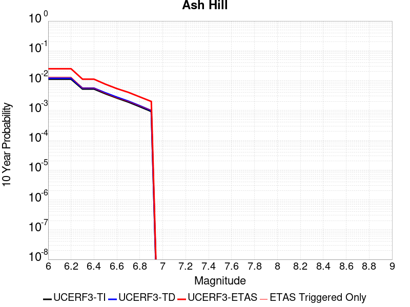 |

| Magnitude | 1 wk TI Prob | 1 wk TD Prob | 1 wk ETAS Prob | 1 wk ETAS/TD Gain | 1 wk ETAS Triggered Only | 1 mo TI Prob | 1 mo TD Prob | 1 mo ETAS Prob | 1 mo ETAS/TD Gain | 1 mo ETAS Triggered Only | 1 yr TI Prob | 1 yr TD Prob | 1 yr ETAS Prob | 1 yr ETAS/TD Gain | 1 yr ETAS Triggered Only | 10 yr TI Prob | 10 yr TD Prob | 10 yr ETAS Prob | 10 yr ETAS/TD Gain | 10 yr ETAS Triggered Only |
|-----|-----|-----|-----|-----|-----|-----|-----|-----|-----|-----|-----|-----|-----|-----|-----|-----|-----|-----|-----|-----|
| 6.0 | 2.1545662E-5 | 2.3194447E-5 | 0.0041920426 | 180.73476 | 0.004168945 | 9.2335285E-5 | 9.940143E-5 | 0.0060446826 | 60.810818 | 0.005945872 | 0.0011236023 | 0.0012096206 | 0.010561335 | 8.731113 | 0.00936304 | 0.011179381 | 0.012038348 | 0.025069827 | 2.0824971 | 0.013190268 |
| 6.1 | 2.1545662E-5 | 2.3194447E-5 | 0.0041920426 | 180.73476 | 0.004168945 | 9.2335285E-5 | 9.940143E-5 | 0.0060446826 | 60.810818 | 0.005945872 | 0.0011236023 | 0.0012096206 | 0.010561335 | 8.731113 | 0.00936304 | 0.011179381 | 0.012038348 | 0.025069827 | 2.0824971 | 0.013190268 |
| 6.2 | 2.1545662E-5 | 2.3194447E-5 | 0.0041920426 | 180.73476 | 0.004168945 | 9.2335285E-5 | 9.940143E-5 | 0.0060446826 | 60.810818 | 0.005945872 | 0.0011236023 | 0.0012096206 | 0.010561335 | 8.731113 | 0.00936304 | 0.011179381 | 0.012038348 | 0.025069827 | 2.0824971 | 0.013190268 |
| 6.3 | 1.0025529E-5 | 1.0746934E-5 | 0.0015142846 | 140.90387 | 0.0015035538 | 4.2965847E-5 | 4.605755E-5 | 0.0021646041 | 46.99781 | 0.002118644 | 5.229836E-4 | 5.6061964E-4 | 0.004522312 | 8.066631 | 0.0039639147 | 0.005217545 | 0.0055933665 | 0.011641903 | 2.0813768 | 0.006082559 |
| 6.4 | 1.0025529E-5 | 1.0746934E-5 | 0.0015142846 | 140.90387 | 0.0015035538 | 4.2965847E-5 | 4.605755E-5 | 0.0021646041 | 46.99781 | 0.002118644 | 5.229836E-4 | 5.6061964E-4 | 0.004522312 | 8.066631 | 0.0039639147 | 0.005217545 | 0.0055933665 | 0.011641903 | 2.0813768 | 0.006082559 |
| 6.5 | 6.9617327E-6 | 7.456634E-6 | 9.6425647E-4 | 129.31525 | 9.56807E-4 | 2.9835655E-5 | 3.195666E-5 | 0.001330439 | 41.632603 | 0.0012985237 | 3.6318856E-4 | 3.8901155E-4 | 0.002916732 | 7.497803 | 0.0025287042 | 0.0036259557 | 0.0038841602 | 0.00810499 | 2.0866776 | 0.004237288 |
| 6.6 | 4.9919777E-6 | 5.3466883E-6 | 8.938056E-4 | 167.16994 | 8.8846363E-4 | 2.1394015E-5 | 2.2914215E-5 | 0.001048041 | 45.737595 | 0.0010251503 | 2.60441E-4 | 2.7895154E-4 | 0.0021237074 | 7.613177 | 0.0018452706 | 0.0026013597 | 0.0027866727 | 0.0055809417 | 2.002726 | 0.0028020777 |
| 6.7 | 3.6630722E-6 | 3.924624E-6 | 6.873555E-4 | 175.13922 | 6.8343355E-4 | 1.5698786E-5 | 1.681974E-5 | 7.68584E-4 | 45.69536 | 7.517769E-4 | 1.9111596E-4 | 2.0476682E-4 | 0.0015030247 | 7.340177 | 0.0012985237 | 0.0019095168 | 0.0020463446 | 0.0040242462 | 1.9665536 | 0.0019819573 |
| 6.8 | 2.5599613E-6 | 2.744925E-6 | 4.1280393E-4 | 150.38805 | 4.1006014E-4 | 1.0971216E-5 | 1.1763939E-5 | 4.901618E-4 | 41.66647 | 4.784035E-4 | 1.3356637E-4 | 1.4322149E-4 | 9.6322433E-4 | 6.725417 | 8.201203E-4 | 0.0013348613 | 0.0014317769 | 0.0027284415 | 1.9056331 | 0.0012985237 |
| 6.9 | 1.7684905E-6 | 1.8968707E-6 | 3.43613E-4 | 181.1473 | 3.4171678E-4 | 7.579223E-6 | 8.129446E-6 | 4.1818625E-4 | 51.44093 | 4.1006014E-4 | 9.2273134E-5 | 9.8976E-5 | 7.140053E-4 | 7.2139235 | 6.150902E-4 | 9.223483E-4 | 9.8976E-4 | 0.00194562 | 1.9657493 | 9.56807E-4 |

## Blackwater
*[(top)](#table-of-contents)*

| 1 Week | 1 Month | 1 Year | 10 Year |
|-----|-----|-----|-----|
|  |  | 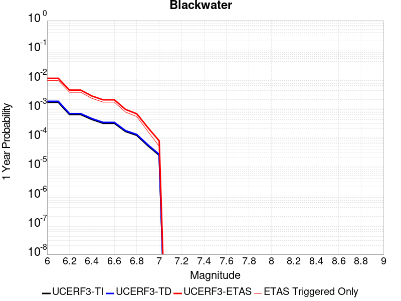 |  |

| Magnitude | 1 wk TI Prob | 1 wk TD Prob | 1 wk ETAS Prob | 1 wk ETAS/TD Gain | 1 wk ETAS Triggered Only | 1 mo TI Prob | 1 mo TD Prob | 1 mo ETAS Prob | 1 mo ETAS/TD Gain | 1 mo ETAS Triggered Only | 1 yr TI Prob | 1 yr TD Prob | 1 yr ETAS Prob | 1 yr ETAS/TD Gain | 1 yr ETAS Triggered Only | 10 yr TI Prob | 10 yr TD Prob | 10 yr ETAS Prob | 10 yr ETAS/TD Gain | 10 yr ETAS Triggered Only |
|-----|-----|-----|-----|-----|-----|-----|-----|-----|-----|-----|-----|-----|-----|-----|-----|-----|-----|-----|-----|-----|
| 6.0 | 3.0708583E-5 | 3.3095846E-5 | 0.0033134683 | 100.11735 | 0.003280481 | 1.3160157E-4 | 1.4183241E-4 | 0.0049935225 | 35.207203 | 0.0048523783 | 0.0016010714 | 0.0017255784 | 0.010594884 | 6.1399026 | 0.008884637 | 0.015895851 | 0.017135633 | 0.030368567 | 1.7722465 | 0.0134636415 |
| 6.1 | 3.0708583E-5 | 3.3095846E-5 | 0.0033134683 | 100.11735 | 0.003280481 | 1.3160157E-4 | 1.4183241E-4 | 0.0049935225 | 35.207203 | 0.0048523783 | 0.0016010714 | 0.0017255784 | 0.010594884 | 6.1399026 | 0.008884637 | 0.015895851 | 0.017135633 | 0.030368567 | 1.7722465 | 0.0134636415 |
| 6.2 | 1.1707779E-5 | 1.2545122E-5 | 8.326551E-4 | 66.37282 | 8.201203E-4 | 5.017523E-5 | 5.3763757E-5 | 0.0014888971 | 27.693323 | 0.0014352105 | 6.107122E-4 | 6.5438676E-4 | 0.0037278254 | 5.69667 | 0.0030754511 | 0.006090366 | 0.0065255696 | 0.011006797 | 1.6867181 | 0.0045106616 |
| 6.3 | 1.1707779E-5 | 1.2545122E-5 | 8.326551E-4 | 66.37282 | 8.201203E-4 | 5.017523E-5 | 5.3763757E-5 | 0.0014888971 | 27.693323 | 0.0014352105 | 6.107122E-4 | 6.5438676E-4 | 0.0037278254 | 5.69667 | 0.0030754511 | 0.006090366 | 0.0065255696 | 0.011006797 | 1.6867181 | 0.0045106616 |
| 6.4 | 7.929244E-6 | 8.480098E-6 | 4.1853677E-4 | 49.35518 | 4.1006014E-4 | 3.3982033E-5 | 3.6342793E-5 | 7.880924E-4 | 21.68497 | 7.517769E-4 | 4.136527E-4 | 4.423877E-4 | 0.0022185289 | 5.0148973 | 0.0017769273 | 0.0041288356 | 0.0044154758 | 0.007069098 | 1.6009821 | 0.002665391 |
| 6.5 | 5.8832115E-6 | 6.285991E-6 | 2.796577E-4 | 44.48904 | 2.733734E-4 | 2.521352E-5 | 2.6939697E-5 | 5.0533033E-4 | 18.757832 | 4.784035E-4 | 3.0693135E-4 | 3.27944E-4 | 0.0016943628 | 5.1666226 | 0.0013668671 | 0.0030650778 | 0.0032748538 | 0.00531844 | 1.6240237 | 0.0020503006 |
| 6.6 | 5.8832115E-6 | 6.285991E-6 | 2.796577E-4 | 44.48904 | 2.733734E-4 | 2.521352E-5 | 2.6939697E-5 | 5.0533033E-4 | 18.757832 | 4.784035E-4 | 3.0693135E-4 | 3.27944E-4 | 0.0016943628 | 5.1666226 | 0.0013668671 | 0.0030650778 | 0.0032748538 | 0.00531844 | 1.6240237 | 0.0020503006 |
| 6.7 | 3.0715053E-6 | 3.2814662E-6 | 1.3996773E-4 | 42.654022 | 1.366867E-4 | 1.3163528E-5 | 1.4063357E-5 | 2.1909055E-4 | 15.578822 | 2.0503007E-4 | 1.6025416E-4 | 1.7120909E-4 | 6.495307E-4 | 3.7937863 | 4.784035E-4 | 0.0016013865 | 0.0017108864 | 0.0026660564 | 1.5582895 | 9.56807E-4 |
| 6.8 | 2.2722281E-6 | 2.4287538E-6 | 1.3911513E-4 | 57.278404 | 1.366867E-4 | 9.738084E-6 | 1.0408908E-5 | 2.1543684E-4 | 20.697353 | 2.0503007E-4 | 1.1855473E-4 | 1.26722E-4 | 6.0506485E-4 | 4.774742 | 4.784035E-4 | 0.001184915 | 0.0012665876 | 0.0020856692 | 1.6466837 | 8.201203E-4 |
| 6.9 | 9.952399E-7 | 1.0653489E-6 | 1.0653489E-6 | 1.0 | 0.0 | 4.265307E-6 | 4.5657757E-6 | 7.290882E-5 | 15.968551 | 6.834335E-5 | 5.1928873E-5 | 5.5587418E-5 | 2.606061E-4 | 4.688221 | 2.0503007E-4 | 5.191674E-4 | 5.557858E-4 | 8.2900724E-4 | 1.491595 | 2.733734E-4 |
| 7.0 | 4.7385504E-7 | 5.0755597E-7 | 5.0755597E-7 | 1.0 | 0.0 | 2.0308057E-6 | 2.1752398E-6 | 2.1752398E-6 | 1.0 | 0.0 | 2.4724779E-5 | 2.6483543E-5 | 9.482509E-5 | 3.5805287 | 6.834335E-5 | 2.4722028E-4 | 2.6483546E-4 | 3.331607E-4 | 1.2579913 | 6.834335E-5 |

## McLean Lake
*[(top)](#table-of-contents)*

| 1 Week | 1 Month | 1 Year | 10 Year |
|-----|-----|-----|-----|
|  |  |  |  |

| Magnitude | 1 wk TI Prob | 1 wk TD Prob | 1 wk ETAS Prob | 1 wk ETAS/TD Gain | 1 wk ETAS Triggered Only | 1 mo TI Prob | 1 mo TD Prob | 1 mo ETAS Prob | 1 mo ETAS/TD Gain | 1 mo ETAS Triggered Only | 1 yr TI Prob | 1 yr TD Prob | 1 yr ETAS Prob | 1 yr ETAS/TD Gain | 1 yr ETAS Triggered Only | 10 yr TI Prob | 10 yr TD Prob | 10 yr ETAS Prob | 10 yr ETAS/TD Gain | 10 yr ETAS Triggered Only |
|-----|-----|-----|-----|-----|-----|-----|-----|-----|-----|-----|-----|-----|-----|-----|-----|-----|-----|-----|-----|-----|
| 6.0 | 1.7360222E-5 | 1.8501627E-5 | 0.0022737908 | 122.89679 | 0.0022553308 | 7.439883E-5 | 7.9290556E-5 | 0.0033595115 | 42.369633 | 0.003280481 | 9.0542925E-4 | 9.6498354E-4 | 0.0063588987 | 6.5896444 | 0.005399125 | 0.009017491 | 0.0096127745 | 0.018479692 | 1.9224098 | 0.00895298 |
| 6.1 | 9.062689E-6 | 9.592193E-6 | 0.0013081036 | 136.37167 | 0.0012985237 | 3.8839516E-5 | 4.1108804E-5 | 0.0016129414 | 39.235912 | 0.0015718972 | 4.727685E-4 | 5.003936E-4 | 0.00323276 | 6.460434 | 0.0027337342 | 0.0047176396 | 0.004993552 | 0.009617693 | 1.9260225 | 0.004647348 |
| 6.2 | 9.062689E-6 | 9.592193E-6 | 0.0013081036 | 136.37167 | 0.0012985237 | 3.8839516E-5 | 4.1108804E-5 | 0.0016129414 | 39.235912 | 0.0015718972 | 4.727685E-4 | 5.003936E-4 | 0.00323276 | 6.460434 | 0.0027337342 | 0.0047176396 | 0.004993552 | 0.009617693 | 1.9260225 | 0.004647348 |
| 6.3 | 7.2575485E-6 | 7.66771E-6 | 0.0011011531 | 143.60913 | 0.0010934937 | 3.110341E-5 | 3.2861237E-5 | 0.0013996834 | 42.593754 | 0.0013668671 | 3.786182E-4 | 4.0001926E-4 | 0.002517816 | 6.2942367 | 0.002118644 | 0.0037797375 | 0.0039936965 | 0.0075333584 | 1.886312 | 0.0035538545 |
| 6.4 | 7.2575485E-6 | 7.66771E-6 | 0.0011011531 | 143.60913 | 0.0010934937 | 3.110341E-5 | 3.2861237E-5 | 0.0013996834 | 42.593754 | 0.0013668671 | 3.786182E-4 | 4.0001926E-4 | 0.002517816 | 6.2942367 | 0.002118644 | 0.0037797375 | 0.0039936965 | 0.0075333584 | 1.886312 | 0.0035538545 |
| 6.5 | 6.06582E-6 | 6.4038773E-6 | 0.0010998906 | 171.75386 | 0.0010934937 | 2.5996113E-5 | 2.7444936E-5 | 0.0013942745 | 50.802616 | 0.0013668671 | 3.164567E-4 | 3.3409733E-4 | 0.0024520336 | 7.339279 | 0.002118644 | 0.0031600643 | 0.0033365893 | 0.0064017787 | 1.9186596 | 0.0030754511 |
| 6.6 | 5.598744E-6 | 5.910262E-6 | 8.943686E-4 | 151.32469 | 8.8846363E-4 | 2.3994397E-5 | 2.5329486E-5 | 0.0011871371 | 46.867794 | 0.001161837 | 2.9209262E-4 | 3.0834923E-4 | 0.0021530509 | 6.9825077 | 0.0018452706 | 0.0029170897 | 0.003079843 | 0.005805158 | 1.8848876 | 0.0027337342 |
| 6.7 | 5.246996E-6 | 5.539162E-6 | 8.939979E-4 | 161.39587 | 8.8846363E-4 | 2.2486933E-5 | 2.3739085E-5 | 0.0011855486 | 49.940784 | 0.001161837 | 2.73744E-4 | 2.8899137E-4 | 0.0021337287 | 7.3833647 | 0.0018452706 | 0.0027340704 | 0.0028867796 | 0.00547633 | 1.8970379 | 0.0025970475 |
| 6.8 | 4.02324E-6 | 4.2469046E-6 | 7.5602066E-4 | 178.01688 | 7.517769E-4 | 1.7242342E-5 | 1.8200926E-5 | 9.066484E-4 | 49.813313 | 8.8846363E-4 | 2.099053E-4 | 2.2157968E-4 | 0.0016564722 | 7.47574 | 0.0014352105 | 0.0020970714 | 0.002214172 | 0.004328125 | 1.9547375 | 0.002118644 |
| 6.9 | 6.835972E-7 | 7.1399285E-7 | 7.1399285E-7 | 1.0 | 0.0 | 2.9296991E-6 | 3.0599674E-6 | 3.0599674E-6 | 1.0 | 0.0 | 3.56685E-5 | 3.7254784E-5 | 3.7254784E-5 | 1.0 | 0.0 | 3.5662777E-4 | 3.7251666E-4 | 5.091525E-4 | 1.3667911 | 1.366867E-4 |

## Garlock (West)
*[(top)](#table-of-contents)*

| 1 Week | 1 Month | 1 Year | 10 Year |
|-----|-----|-----|-----|
|  |  | 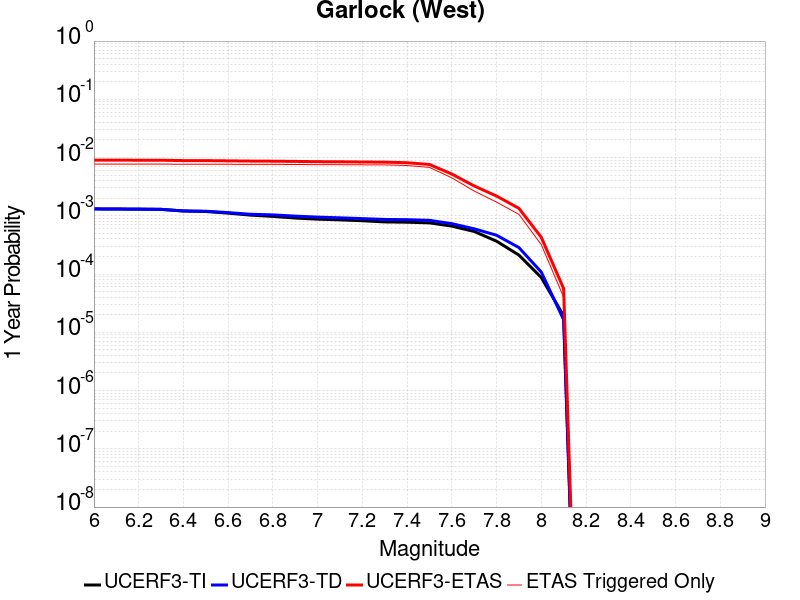 |  |

| Magnitude | 1 wk TI Prob | 1 wk TD Prob | 1 wk ETAS Prob | 1 wk ETAS/TD Gain | 1 wk ETAS Triggered Only | 1 mo TI Prob | 1 mo TD Prob | 1 mo ETAS Prob | 1 mo ETAS/TD Gain | 1 mo ETAS Triggered Only | 1 yr TI Prob | 1 yr TD Prob | 1 yr ETAS Prob | 1 yr ETAS/TD Gain | 1 yr ETAS Triggered Only | 10 yr TI Prob | 10 yr TD Prob | 10 yr ETAS Prob | 10 yr ETAS/TD Gain | 10 yr ETAS Triggered Only |
|-----|-----|-----|-----|-----|-----|-----|-----|-----|-----|-----|-----|-----|-----|-----|-----|-----|-----|-----|-----|-----|
| 6.0 | 2.5181727E-5 | 2.51973E-5 | 0.004399062 | 174.58466 | 0.0043739746 | 1.0791722E-4 | 1.0798398E-4 | 0.00577987 | 53.525257 | 0.0056724986 | 0.0013131002 | 0.0013139155 | 0.0086853 | 6.6102424 | 0.0073810825 | 0.013053683 | 0.013141977 | 0.022381967 | 1.70309 | 0.00936304 |
| 6.1 | 2.5077732E-5 | 2.5098372E-5 | 0.0043989634 | 175.26888 | 0.0043739746 | 1.0747157E-4 | 1.0756004E-4 | 0.0057794484 | 53.732304 | 0.0056724986 | 0.001307681 | 0.0013087603 | 0.0086801825 | 6.6323705 | 0.0073810825 | 0.013000126 | 0.013091032 | 0.0223315 | 1.7058624 | 0.00936304 |
| 6.2 | 2.494612E-5 | 2.498005E-5 | 0.0043988456 | 176.09435 | 0.0043739746 | 1.0690756E-4 | 1.0705298E-4 | 0.0057789446 | 53.982094 | 0.0056724986 | 0.0013008224 | 0.0013025942 | 0.008674062 | 6.659067 | 0.0073810825 | 0.012932341 | 0.013030097 | 0.022271136 | 1.7092072 | 0.00936304 |
| 6.3 | 2.4733758E-5 | 2.479942E-5 | 0.004398666 | 177.3697 | 0.0043739746 | 1.0599751E-4 | 1.06278916E-4 | 0.005778175 | 54.368027 | 0.0056724986 | 0.0012897556 | 0.0012931811 | 0.008664719 | 6.700313 | 0.0073810825 | 0.012822957 | 0.012937066 | 0.022178976 | 1.7143744 | 0.00936304 |
| 6.4 | 2.3237335E-5 | 2.317873E-5 | 0.0043970523 | 189.70203 | 0.0043739746 | 9.958477E-5 | 9.933365E-5 | 0.0057712686 | 58.09984 | 0.0056724986 | 0.0012117702 | 0.001208719 | 0.00858088 | 7.099152 | 0.0073810825 | 0.012051838 | 0.012101916 | 0.02128413 | 1.7587404 | 0.009294696 |
| 6.5 | 2.2732203E-5 | 2.2993298E-5 | 0.0043968675 | 191.22388 | 0.0043739746 | 9.742009E-5 | 9.8539E-5 | 0.005770479 | 58.560352 | 0.0056724986 | 0.0011854442 | 0.0011990548 | 0.008571287 | 7.14837 | 0.0073810825 | 0.011791403 | 0.012006322 | 0.021189423 | 1.7648555 | 0.009294696 |
| 6.6 | 2.1319436E-5 | 2.17735E-5 | 0.004395653 | 201.88087 | 0.0043739746 | 9.136581E-5 | 9.331167E-5 | 0.005765281 | 61.785206 | 0.0056724986 | 0.001111811 | 0.0011354799 | 0.008508181 | 7.493027 | 0.0073810825 | 0.011062649 | 0.011377227 | 0.020566175 | 1.8076617 | 0.009294696 |
| 6.7 | 1.970802E-5 | 2.0393396E-5 | 0.004394279 | 215.47559 | 0.0043739746 | 8.446021E-5 | 8.739735E-5 | 0.0057594003 | 65.899025 | 0.0056724986 | 0.001027818 | 0.001063545 | 0.008436778 | 7.932694 | 0.0073810825 | 0.010230771 | 0.010664964 | 0.019860534 | 1.8622222 | 0.009294696 |
| 6.8 | 1.8744462E-5 | 1.9901045E-5 | 0.004393789 | 220.78181 | 0.0043739746 | 8.033094E-5 | 8.5287415E-5 | 0.005688965 | 66.70345 | 0.0056041554 | 9.775903E-4 | 0.0010378812 | 0.008343031 | 8.038521 | 0.0073127393 | 0.009733009 | 0.01041075 | 0.019541051 | 1.8770069 | 0.009226353 |
| 6.9 | 1.7559682E-5 | 1.8953415E-5 | 0.0043928456 | 231.77066 | 0.0043739746 | 7.5253614E-5 | 8.12264E-5 | 0.0056849266 | 69.988655 | 0.0056041554 | 9.158276E-4 | 9.884841E-4 | 0.008293995 | 8.390619 | 0.0073127393 | 0.0091206245 | 0.009921231 | 0.019056048 | 1.9207342 | 0.009226353 |
| 7.0 | 1.6794445E-5 | 1.8216237E-5 | 0.004392111 | 241.1097 | 0.0043739746 | 7.197421E-5 | 7.8067256E-5 | 0.005681785 | 72.78064 | 0.0056041554 | 8.759337E-4 | 9.5005584E-4 | 0.008255848 | 8.689856 | 0.0073127393 | 0.008724891 | 0.009540141 | 0.018610781 | 1.950787 | 0.00915801 |
| 7.1 | 1.6337795E-5 | 1.7717046E-5 | 0.0043916143 | 247.8751 | 0.0043739746 | 7.0017246E-5 | 7.5927994E-5 | 0.0056796577 | 74.803215 | 0.0056041554 | 8.521265E-4 | 9.240326E-4 | 0.008230015 | 8.906628 | 0.0073127393 | 0.008488664 | 0.009281996 | 0.018287292 | 1.9701896 | 0.009089666 |
| 7.2 | 1.5780008E-5 | 1.7165687E-5 | 0.0043910653 | 255.80482 | 0.0043739746 | 6.762685E-5 | 7.356516E-5 | 0.005677308 | 77.173874 | 0.0056041554 | 8.2304585E-4 | 8.9528906E-4 | 0.008201481 | 9.160707 | 0.0073127393 | 0.008200042 | 0.008996838 | 0.018004727 | 2.0012283 | 0.009089666 |
| 7.3 | 1.5058865E-5 | 1.6618762E-5 | 0.004390521 | 264.1906 | 0.0043739746 | 6.45364E-5 | 7.122133E-5 | 0.005606639 | 78.72135 | 0.005535812 | 7.854473E-4 | 8.667759E-4 | 0.008104892 | 9.35062 | 0.007244396 | 0.00782677 | 0.008713539 | 0.017588506 | 2.0185263 | 0.00895298 |
| 7.4 | 1.4887923E-5 | 1.6454731E-5 | 0.004322015 | 262.66095 | 0.0043056314 | 6.380382E-5 | 7.051838E-5 | 0.005537601 | 78.52706 | 0.0054674684 | 7.7653467E-4 | 8.582243E-4 | 0.008028118 | 9.354336 | 0.0071760523 | 0.0077382675 | 0.008628399 | 0.017368622 | 2.01296 | 0.008816293 |
| 7.5 | 1.4509299E-5 | 1.6046748E-5 | 0.003979898 | 248.01897 | 0.0039639147 | 6.218123E-5 | 6.876997E-5 | 0.0051941695 | 75.52961 | 0.0051257517 | 7.567935E-4 | 8.36954E-4 | 0.0076655694 | 9.158891 | 0.0068343356 | 0.0075422134 | 0.008416704 | 0.01654888 | 1.9661947 | 0.008201202 |
| 7.6 | 1.2756717E-5 | 1.4050848E-5 | 0.0028160892 | 200.42128 | 0.0028020777 | 5.4670498E-5 | 6.0216535E-5 | 0.0037505357 | 62.28415 | 0.0036905413 | 6.6541E-4 | 7.328904E-4 | 0.005240246 | 7.1501093 | 0.0045106616 | 0.006634211 | 0.0073816874 | 0.012944475 | 1.7535928 | 0.0056041554 |
| 7.7 | 1.0328985E-5 | 1.1460557E-5 | 0.0015833398 | 138.15556 | 0.0015718972 | 4.4266326E-5 | 4.911575E-5 | 0.0023043358 | 46.91643 | 0.0022553308 | 5.388092E-4 | 5.978206E-4 | 0.003261618 | 5.4558477 | 0.002665391 | 0.0053750467 | 0.006038511 | 0.009367114 | 1.551229 | 0.0033488246 |
| 7.8 | 7.0306583E-6 | 8.899601E-6 | 8.290126E-4 | 93.15166 | 8.201203E-4 | 3.0131043E-5 | 3.814059E-5 | 0.0014732963 | 38.628044 | 0.0014352105 | 3.667837E-4 | 4.642629E-4 | 0.002103742 | 4.531359 | 0.0016402405 | 0.003661789 | 0.0046952725 | 0.0067359465 | 1.4346231 | 0.0020503006 |
| 7.9 | 4.060633E-6 | 5.4653938E-6 | 5.5220927E-4 | 101.037415 | 5.467468E-4 | 1.7402595E-5 | 2.3422906E-5 | 9.802075E-4 | 41.848244 | 9.56807E-4 | 2.11856E-4 | 2.851367E-4 | 0.0013783186 | 4.8338876 | 0.0010934937 | 0.0021165414 | 0.002884201 | 0.0042471257 | 1.4725485 | 0.0013668671 |
| 8.0 | 1.6729537E-6 | 2.0775144E-6 | 2.7545038E-4 | 132.5865 | 2.733734E-4 | 7.169782E-6 | 8.903603E-6 | 2.822746E-4 | 31.703413 | 2.733734E-4 | 8.7288594E-5 | 1.0839601E-4 | 3.817398E-4 | 3.5217147 | 2.733734E-4 | 8.7254314E-4 | 0.0010969337 | 0.0015748125 | 1.4356495 | 4.784035E-4 |
| 8.1 | 3.6733252E-7 | 3.1489964E-7 | 3.1489964E-7 | 1.0 | 0.0 | 1.5742813E-6 | 1.3495693E-6 | 1.3495693E-6 | 1.0 | 0.0 | 1.9166706E-5 | 1.6430899E-5 | 1.6430899E-5 | 1.0 | 0.0 | 1.9165053E-4 | 1.6638759E-4 | 1.6638759E-4 | 1.0 | 0.0 |

## Goldstone Lake
*[(top)](#table-of-contents)*

| 1 Week | 1 Month | 1 Year | 10 Year |
|-----|-----|-----|-----|
|  |  |  |  |

| Magnitude | 1 wk TI Prob | 1 wk TD Prob | 1 wk ETAS Prob | 1 wk ETAS/TD Gain | 1 wk ETAS Triggered Only | 1 mo TI Prob | 1 mo TD Prob | 1 mo ETAS Prob | 1 mo ETAS/TD Gain | 1 mo ETAS Triggered Only | 1 yr TI Prob | 1 yr TD Prob | 1 yr ETAS Prob | 1 yr ETAS/TD Gain | 1 yr ETAS Triggered Only | 10 yr TI Prob | 10 yr TD Prob | 10 yr ETAS Prob | 10 yr ETAS/TD Gain | 10 yr ETAS Triggered Only |
|-----|-----|-----|-----|-----|-----|-----|-----|-----|-----|-----|-----|-----|-----|-----|-----|-----|-----|-----|-----|-----|
| 6.0 | 2.671352E-5 | 3.037609E-5 | 0.0016022256 | 52.746273 | 0.0015718972 | 1.1448149E-4 | 1.3017785E-4 | 0.0027952217 | 21.47233 | 0.002665391 | 0.001392921 | 0.0015839594 | 0.0056780656 | 3.5847292 | 0.004100601 | 0.013842222 | 0.015746197 | 0.022607451 | 1.4357405 | 0.0069710226 |
| 6.1 | 2.671352E-5 | 3.037609E-5 | 0.0016022256 | 52.746273 | 0.0015718972 | 1.1448149E-4 | 1.3017785E-4 | 0.0027952217 | 21.47233 | 0.002665391 | 0.001392921 | 0.0015839594 | 0.0056780656 | 3.5847292 | 0.004100601 | 0.013842222 | 0.015746197 | 0.022607451 | 1.4357405 | 0.0069710226 |
| 6.2 | 1.4197047E-5 | 1.6096245E-5 | 6.311766E-4 | 39.212658 | 6.150902E-4 | 6.0843064E-5 | 6.8982634E-5 | 0.0012990782 | 18.831959 | 0.0012301804 | 7.4051257E-4 | 8.3963864E-4 | 0.002615074 | 3.1145232 | 0.0017769273 | 0.007380498 | 0.0083743585 | 0.011627368 | 1.3884487 | 0.003280481 |
| 6.3 | 1.4197047E-5 | 1.6096245E-5 | 6.311766E-4 | 39.212658 | 6.150902E-4 | 6.0843064E-5 | 6.8982634E-5 | 0.0012990782 | 18.831959 | 0.0012301804 | 7.4051257E-4 | 8.3963864E-4 | 0.002615074 | 3.1145232 | 0.0017769273 | 0.007380498 | 0.0083743585 | 0.011627368 | 1.3884487 | 0.003280481 |
| 6.4 | 1.3238931E-5 | 1.500846E-5 | 6.3008943E-4 | 41.982285 | 6.150902E-4 | 5.6737044E-5 | 6.4320935E-5 | 0.0012260833 | 19.061962 | 0.001161837 | 6.9055456E-4 | 7.82924E-4 | 0.0024218804 | 3.0933785 | 0.0016402405 | 0.006884126 | 0.0078112837 | 0.010794902 | 1.3819627 | 0.0030071076 |
| 6.5 | 1.3238931E-5 | 1.500846E-5 | 6.3008943E-4 | 41.982285 | 6.150902E-4 | 5.6737044E-5 | 6.4320935E-5 | 0.0012260833 | 19.061962 | 0.001161837 | 6.9055456E-4 | 7.82924E-4 | 0.0024218804 | 3.0933785 | 0.0016402405 | 0.006884126 | 0.0078112837 | 0.010794902 | 1.3819627 | 0.0030071076 |
| 6.6 | 1.1328278E-5 | 1.2855166E-5 | 5.59595E-4 | 43.53075 | 5.467468E-4 | 4.8548856E-5 | 5.5092944E-5 | 0.0011485264 | 20.84707 | 0.0010934937 | 5.90922E-4 | 6.7064585E-4 | 0.0021048938 | 3.1386073 | 0.0014352105 | 0.0058935313 | 0.0066956086 | 0.009275267 | 1.3852762 | 0.0025970475 |
| 6.7 | 8.651175E-6 | 9.824565E-6 | 4.8822336E-4 | 49.69415 | 4.784035E-4 | 3.707594E-5 | 4.2105108E-5 | 7.938504E-4 | 18.854017 | 7.517769E-4 | 4.5130608E-4 | 5.1259965E-4 | 0.0016055328 | 3.132138 | 0.0010934937 | 0.0045039062 | 0.005123051 | 0.0070268614 | 1.3716165 | 0.001913614 |
| 6.8 | 1.0215377E-6 | 1.1754702E-6 | 1.1754702E-6 | 1.0 | 0.0 | 4.378012E-6 | 5.0377203E-6 | 5.0377203E-6 | 1.0 | 0.0 | 5.3300988E-5 | 6.1332634E-5 | 6.1332634E-5 | 1.0 | 0.0 | 5.3288206E-4 | 6.1316835E-4 | 6.1316835E-4 | 1.0 | 0.0 |
| 6.9 | 7.9360774E-7 | 9.2833966E-7 | 9.2833966E-7 | 1.0 | 0.0 | 3.4011714E-6 | 3.9785928E-6 | 3.9785928E-6 | 1.0 | 0.0 | 4.1408475E-5 | 4.843836E-5 | 4.843836E-5 | 1.0 | 0.0 | 4.140076E-4 | 4.8428503E-4 | 4.8428503E-4 | 1.0 | 0.0 |
| 7.0 | 7.4382757E-7 | 8.7473285E-7 | 8.7473285E-7 | 1.0 | 0.0 | 3.1878285E-6 | 3.74885E-6 | 3.74885E-6 | 1.0 | 0.0 | 3.8811122E-5 | 4.564136E-5 | 4.564136E-5 | 1.0 | 0.0 | 3.8804344E-4 | 4.5632652E-4 | 4.5632652E-4 | 1.0 | 0.0 |
| 7.1 | 6.4709513E-7 | 7.7113E-7 | 7.7113E-7 | 1.0 | 0.0 | 2.773262E-6 | 3.3048389E-6 | 3.3048389E-6 | 1.0 | 0.0 | 3.376394E-5 | 4.0235733E-5 | 4.0235733E-5 | 1.0 | 0.0 | 3.375881E-4 | 4.0229043E-4 | 4.0229043E-4 | 1.0 | 0.0 |
| 7.2 | 6.356704E-7 | 7.5883594E-7 | 7.5883594E-7 | 1.0 | 0.0 | 2.7242988E-6 | 3.2521505E-6 | 3.2521505E-6 | 1.0 | 0.0 | 3.3167835E-5 | 3.959427E-5 | 3.959427E-5 | 1.0 | 0.0 | 3.3162883E-4 | 3.958781E-4 | 3.958781E-4 | 1.0 | 0.0 |
| 7.3 | 5.7695723E-7 | 6.8965653E-7 | 6.8965653E-7 | 1.0 | 0.0 | 2.4726714E-6 | 2.9556677E-6 | 2.9556677E-6 | 1.0 | 0.0 | 3.0104358E-5 | 3.5984718E-5 | 3.5984718E-5 | 1.0 | 0.0 | 3.0100282E-4 | 3.5979465E-4 | 3.5979465E-4 | 1.0 | 0.0 |
| 7.4 | 5.209647E-7 | 6.193514E-7 | 6.193514E-7 | 1.0 | 0.0 | 2.232704E-6 | 2.6543607E-6 | 2.6543607E-6 | 1.0 | 0.0 | 2.718283E-5 | 3.2316417E-5 | 3.2316417E-5 | 1.0 | 0.0 | 2.7179506E-4 | 3.2312275E-4 | 3.2312275E-4 | 1.0 | 0.0 |
| 7.5 | 4.512955E-7 | 5.348885E-7 | 5.348885E-7 | 1.0 | 0.0 | 1.934122E-6 | 2.2923775E-6 | 2.2923775E-6 | 1.0 | 0.0 | 2.3547682E-5 | 2.7909393E-5 | 2.7909393E-5 | 1.0 | 0.0 | 2.3545188E-4 | 2.7906417E-4 | 2.7906417E-4 | 1.0 | 0.0 |
| 7.6 | 2.21172E-7 | 2.603961E-7 | 2.603961E-7 | 1.0 | 0.0 | 9.478797E-7 | 1.1159829E-6 | 1.1159829E-6 | 1.0 | 0.0 | 1.1540374E-5 | 1.3587036E-5 | 1.3587036E-5 | 1.0 | 0.0 | 1.1539775E-4 | 1.3586486E-4 | 1.3586486E-4 | 1.0 | 0.0 |

## Gravel Hills-Harper Lk
*[(top)](#table-of-contents)*

| 1 Week | 1 Month | 1 Year | 10 Year |
|-----|-----|-----|-----|
|  |  |  |  |

| Magnitude | 1 wk TI Prob | 1 wk TD Prob | 1 wk ETAS Prob | 1 wk ETAS/TD Gain | 1 wk ETAS Triggered Only | 1 mo TI Prob | 1 mo TD Prob | 1 mo ETAS Prob | 1 mo ETAS/TD Gain | 1 mo ETAS Triggered Only | 1 yr TI Prob | 1 yr TD Prob | 1 yr ETAS Prob | 1 yr ETAS/TD Gain | 1 yr ETAS Triggered Only | 10 yr TI Prob | 10 yr TD Prob | 10 yr ETAS Prob | 10 yr ETAS/TD Gain | 10 yr ETAS Triggered Only |
|-----|-----|-----|-----|-----|-----|-----|-----|-----|-----|-----|-----|-----|-----|-----|-----|-----|-----|-----|-----|-----|
| 6.0 | 3.0679566E-5 | 3.1464646E-5 | 0.0024234068 | 77.02 | 0.0023920175 | 1.3147724E-4 | 1.3484273E-4 | 0.0030732108 | 22.791075 | 0.0029387644 | 0.0015995599 | 0.0016406906 | 0.006280414 | 3.8279088 | 0.004647348 | 0.015880952 | 0.01630734 | 0.022559622 | 1.3834031 | 0.006355932 |
| 6.1 | 3.0679566E-5 | 3.1464646E-5 | 0.0024234068 | 77.02 | 0.0023920175 | 1.3147724E-4 | 1.3484273E-4 | 0.0030732108 | 22.791075 | 0.0029387644 | 0.0015995599 | 0.0016406906 | 0.006280414 | 3.8279088 | 0.004647348 | 0.015880952 | 0.01630734 | 0.022559622 | 1.3834031 | 0.006355932 |
| 6.2 | 1.514536E-5 | 1.3635206E-5 | 0.0010387716 | 76.183044 | 0.0010251503 | 6.490707E-5 | 5.843536E-5 | 0.0011518651 | 19.711784 | 0.0010934937 | 7.8995706E-4 | 7.1123015E-4 | 0.0025551883 | 3.5926323 | 0.0018452706 | 0.007871548 | 0.0070907404 | 0.009397938 | 1.3253818 | 0.002323674 |
| 6.3 | 1.514536E-5 | 1.3635206E-5 | 0.0010387716 | 76.183044 | 0.0010251503 | 6.490707E-5 | 5.843536E-5 | 0.0011518651 | 19.711784 | 0.0010934937 | 7.8995706E-4 | 7.1123015E-4 | 0.0025551883 | 3.5926323 | 0.0018452706 | 0.007871548 | 0.0070907404 | 0.009397938 | 1.3253818 | 0.002323674 |
| 6.4 | 1.2532521E-5 | 1.06896905E-5 | 7.624586E-4 | 71.32653 | 7.517769E-4 | 5.37097E-5 | 4.581219E-5 | 8.658949E-4 | 18.900972 | 8.201203E-4 | 6.537194E-4 | 5.576265E-4 | 0.001787121 | 3.204871 | 0.0012301804 | 0.0065179965 | 0.005562863 | 0.0069221263 | 1.244346 | 0.0013668671 |
| 6.5 | 1.1094058E-5 | 9.083664E-6 | 4.8748282E-4 | 53.665882 | 4.784035E-4 | 4.7545094E-5 | 3.892943E-5 | 5.85655E-4 | 15.044018 | 5.467468E-4 | 5.787078E-4 | 4.7386673E-4 | 0.0013619093 | 2.8740344 | 8.8846363E-4 | 0.0057720304 | 0.0047289706 | 0.005749273 | 1.2157557 | 0.0010251503 |
| 6.6 | 9.688328E-6 | 7.5316952E-6 | 2.8090307E-4 | 37.296127 | 2.733734E-4 | 4.1520743E-5 | 3.227831E-5 | 3.7398408E-4 | 11.586235 | 3.4171678E-4 | 5.053978E-4 | 3.9292008E-4 | 9.394521E-4 | 2.3909495 | 5.467468E-4 | 0.0050424994 | 0.0039225104 | 0.004535188 | 1.1561953 | 6.150902E-4 |
| 6.7 | 8.974824E-6 | 6.749413E-6 | 2.117781E-4 | 31.377262 | 2.0503007E-4 | 3.8462964E-5 | 2.8925748E-5 | 3.0229127E-4 | 10.450595 | 2.733734E-4 | 4.6818596E-4 | 3.5211627E-4 | 8.303513E-4 | 2.3581736 | 4.784035E-4 | 0.004672008 | 0.0035158044 | 0.003992526 | 1.1355939 | 4.784035E-4 |
| 6.8 | 7.4780046E-6 | 5.1161933E-6 | 7.34592E-5 | 14.358175 | 6.834335E-5 | 3.20482E-5 | 2.1926366E-5 | 1.5861008E-4 | 7.233761 | 1.366867E-4 | 3.9011694E-4 | 2.669222E-4 | 6.0854777E-4 | 2.2798696 | 3.4171678E-4 | 0.0038943281 | 0.0026661542 | 0.0030069598 | 1.1278267 | 3.4171678E-4 |
| 6.9 | 6.3409307E-6 | 3.9074966E-6 | 7.225059E-5 | 18.490248 | 6.834335E-5 | 2.7175134E-5 | 1.6746313E-5 | 1.5343074E-4 | 9.162061 | 1.366867E-4 | 3.3080703E-4 | 2.0386827E-4 | 4.7718597E-4 | 2.3406582 | 2.733734E-4 | 0.0033031502 | 0.0020369107 | 0.0023097272 | 1.1339364 | 2.733734E-4 |
| 7.0 | 5.1239335E-6 | 2.6058565E-6 | 7.0949034E-5 | 27.226763 | 6.834335E-5 | 2.195953E-5 | 1.116791E-5 | 1.4785309E-4 | 13.239102 | 1.366867E-4 | 2.6732447E-4 | 1.3596108E-4 | 4.0929732E-4 | 3.0104008 | 2.733734E-4 | 0.0026700313 | 0.0013588042 | 0.0016318061 | 1.2009134 | 2.733734E-4 |
| 7.1 | 4.438899E-6 | 2.0984728E-6 | 7.044169E-5 | 33.568073 | 6.834335E-5 | 1.9023713E-5 | 8.993425E-6 | 1.456789E-4 | 16.19838 | 1.366867E-4 | 2.315891E-4 | 1.0948967E-4 | 3.8283315E-4 | 3.4965231 | 2.733734E-4 | 0.002313479 | 0.0010943791 | 0.0013674534 | 1.2495244 | 2.733734E-4 |
| 7.2 | 3.50367E-6 | 1.2615716E-6 | 1.2615716E-6 | 1.0 | 0.0 | 1.5015643E-5 | 5.4067245E-6 | 5.4067245E-6 | 1.0 | 0.0 | 1.8280011E-4 | 6.582497E-5 | 2.0250269E-4 | 3.076381 | 1.366867E-4 | 0.0018264982 | 6.580629E-4 | 7.946597E-4 | 1.207574 | 1.366867E-4 |
| 7.3 | 2.561638E-6 | 7.1191585E-7 | 7.1191585E-7 | 1.0 | 0.0 | 1.0978401E-5 | 3.0510646E-6 | 3.0510646E-6 | 1.0 | 0.0 | 1.3365384E-4 | 3.71461E-5 | 1.0548691E-4 | 2.8397846 | 6.834335E-5 | 0.0013357349 | 3.7140088E-4 | 4.3971886E-4 | 1.1839467 | 6.834335E-5 |
| 7.4 | 2.0368864E-6 | 5.304837E-7 | 5.304837E-7 | 1.0 | 0.0 | 8.729483E-6 | 2.2734996E-6 | 2.2734996E-6 | 1.0 | 0.0 | 1.06276275E-4 | 2.7679513E-5 | 2.7679513E-5 | 1.0 | 0.0 | 0.0010622547 | 2.767612E-4 | 2.767612E-4 | 1.0 | 0.0 |
| 7.5 | 1.1681728E-6 | 3.6030585E-7 | 3.6030585E-7 | 1.0 | 0.0 | 5.0064455E-6 | 1.544167E-6 | 1.544167E-6 | 1.0 | 0.0 | 6.0951766E-5 | 1.8800076E-5 | 1.8800076E-5 | 1.0 | 0.0 | 6.093505E-4 | 1.8798532E-4 | 1.8798532E-4 | 1.0 | 0.0 |
| 7.6 | 1.3154387E-7 | 7.1197384E-8 | 7.1197384E-8 | 1.0 | 0.0 | 5.6375933E-7 | 3.051316E-7 | 3.051316E-7 | 1.0 | 0.0 | 6.863748E-6 | 3.7149728E-6 | 3.7149728E-6 | 1.0 | 0.0 | 6.863536E-5 | 3.7149264E-5 | 3.7149264E-5 | 1.0 | 0.0 |

## Coyote Canyon
*[(top)](#table-of-contents)*

| 1 Week | 1 Month | 1 Year | 10 Year |
|-----|-----|-----|-----|
|  | 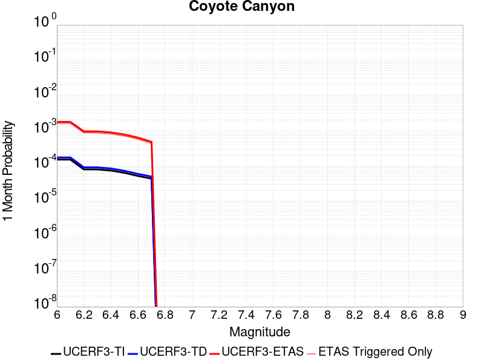 |  |  |

| Magnitude | 1 wk TI Prob | 1 wk TD Prob | 1 wk ETAS Prob | 1 wk ETAS/TD Gain | 1 wk ETAS Triggered Only | 1 mo TI Prob | 1 mo TD Prob | 1 mo ETAS Prob | 1 mo ETAS/TD Gain | 1 mo ETAS Triggered Only | 1 yr TI Prob | 1 yr TD Prob | 1 yr ETAS Prob | 1 yr ETAS/TD Gain | 1 yr ETAS Triggered Only | 10 yr TI Prob | 10 yr TD Prob | 10 yr ETAS Prob | 10 yr ETAS/TD Gain | 10 yr ETAS Triggered Only |
|-----|-----|-----|-----|-----|-----|-----|-----|-----|-----|-----|-----|-----|-----|-----|-----|-----|-----|-----|-----|-----|
| 6.0 | 3.5090034E-5 | 4.0364324E-5 | 0.0010654733 | 26.396412 | 0.0010251503 | 1.503772E-4 | 1.7297994E-4 | 0.002086263 | 12.060721 | 0.001913614 | 0.0018293047 | 0.0021042528 | 0.004968634 | 2.3612342 | 0.002870421 | 0.018143194 | 0.020869201 | 0.025821066 | 1.237281 | 0.0050574085 |
| 6.1 | 3.5090034E-5 | 4.0364324E-5 | 0.0010654733 | 26.396412 | 0.0010251503 | 1.503772E-4 | 1.7297994E-4 | 0.002086263 | 12.060721 | 0.001913614 | 0.0018293047 | 0.0021042528 | 0.004968634 | 2.3612342 | 0.002870421 | 0.018143194 | 0.020869201 | 0.025821066 | 1.237281 | 0.0050574085 |
| 6.2 | 1.841879E-5 | 2.1059794E-5 | 7.728209E-4 | 36.69651 | 7.517769E-4 | 7.8935285E-5 | 9.0253714E-5 | 0.0013203231 | 14.629018 | 0.0012301804 | 9.606133E-4 | 0.001098387 | 0.003009899 | 2.7402902 | 0.001913614 | 0.0095647145 | 0.010939667 | 0.013913878 | 1.271874 | 0.0030071076 |
| 6.3 | 1.841879E-5 | 2.1059794E-5 | 7.728209E-4 | 36.69651 | 7.517769E-4 | 7.8935285E-5 | 9.0253714E-5 | 0.0013203231 | 14.629018 | 0.0012301804 | 9.606133E-4 | 0.001098387 | 0.003009899 | 2.7402902 | 0.001913614 | 0.0095647145 | 0.010939667 | 0.013913878 | 1.271874 | 0.0030071076 |
| 6.4 | 1.712201E-5 | 1.9565212E-5 | 7.713274E-4 | 39.423412 | 7.517769E-4 | 7.337798E-5 | 8.3848776E-5 | 0.0013139261 | 15.670187 | 0.0012301804 | 8.930107E-4 | 0.0010204813 | 0.0029321425 | 2.8732936 | 0.001913614 | 0.008894307 | 0.010167871 | 0.013144403 | 1.2927389 | 0.0030071076 |
| 6.5 | 1.4744935E-5 | 1.6836972E-5 | 7.6860125E-4 | 45.649612 | 7.517769E-4 | 6.3191044E-5 | 7.215698E-5 | 0.0012339102 | 17.100359 | 0.001161837 | 7.6907943E-4 | 8.7825063E-4 | 0.0027219006 | 3.0992298 | 0.0018452706 | 0.007664232 | 0.008756994 | 0.011534534 | 1.3171796 | 0.0028020777 |
| 6.6 | 1.2017839E-5 | 1.37240895E-5 | 6.9714827E-4 | 50.797417 | 6.8343355E-4 | 5.150401E-5 | 5.88167E-5 | 0.0010155675 | 17.266651 | 9.56807E-4 | 6.268809E-4 | 7.159466E-4 | 0.0022867185 | 3.193979 | 0.0015718972 | 0.0062511545 | 0.0071450938 | 0.009452165 | 1.3228889 | 0.002323674 |
| 6.7 | 1.00956095E-5 | 1.1533517E-5 | 5.5827404E-4 | 48.404495 | 5.467468E-4 | 4.326618E-5 | 4.942891E-5 | 8.011687E-4 | 16.208504 | 7.517769E-4 | 5.266384E-4 | 6.017178E-4 | 0.0018994602 | 3.1567295 | 0.0012985237 | 0.005253921 | 0.0060094125 | 0.007639796 | 1.271305 | 0.0016402405 |

## So Sierra Nevada
*[(top)](#table-of-contents)*

| 1 Week | 1 Month | 1 Year | 10 Year |
|-----|-----|-----|-----|
|  |  |  |  |

| Magnitude | 1 wk TI Prob | 1 wk TD Prob | 1 wk ETAS Prob | 1 wk ETAS/TD Gain | 1 wk ETAS Triggered Only | 1 mo TI Prob | 1 mo TD Prob | 1 mo ETAS Prob | 1 mo ETAS/TD Gain | 1 mo ETAS Triggered Only | 1 yr TI Prob | 1 yr TD Prob | 1 yr ETAS Prob | 1 yr ETAS/TD Gain | 1 yr ETAS Triggered Only | 10 yr TI Prob | 10 yr TD Prob | 10 yr ETAS Prob | 10 yr ETAS/TD Gain | 10 yr ETAS Triggered Only |
|-----|-----|-----|-----|-----|-----|-----|-----|-----|-----|-----|-----|-----|-----|-----|-----|-----|-----|-----|-----|-----|
| 6.0 | 1.15488665E-5 | 1.1079643E-5 | 0.0017879872 | 161.3759 | 0.0017769273 | 4.9494203E-5 | 4.748339E-5 | 0.0023710472 | 49.934246 | 0.002323674 | 6.024253E-4 | 5.7796965E-4 | 0.0044712895 | 7.736201 | 0.0038955715 | 0.006007948 | 0.005765934 | 0.011337776 | 1.9663382 | 0.0056041554 |
| 6.1 | 1.15488665E-5 | 1.1079643E-5 | 0.0017879872 | 161.3759 | 0.0017769273 | 4.9494203E-5 | 4.748339E-5 | 0.0023710472 | 49.934246 | 0.002323674 | 6.024253E-4 | 5.7796965E-4 | 0.0044712895 | 7.736201 | 0.0038955715 | 0.006007948 | 0.005765934 | 0.011337776 | 1.9663382 | 0.0056041554 |
| 6.2 | 1.15488665E-5 | 1.1079643E-5 | 0.0017879872 | 161.3759 | 0.0017769273 | 4.9494203E-5 | 4.748339E-5 | 0.0023710472 | 49.934246 | 0.002323674 | 6.024253E-4 | 5.7796965E-4 | 0.0044712895 | 7.736201 | 0.0038955715 | 0.006007948 | 0.005765934 | 0.011337776 | 1.9663382 | 0.0056041554 |
| 6.3 | 1.15488665E-5 | 1.1079643E-5 | 0.0017879872 | 161.3759 | 0.0017769273 | 4.9494203E-5 | 4.748339E-5 | 0.0023710472 | 49.934246 | 0.002323674 | 6.024253E-4 | 5.7796965E-4 | 0.0044712895 | 7.736201 | 0.0038955715 | 0.006007948 | 0.005765934 | 0.011337776 | 1.9663382 | 0.0056041554 |
| 6.4 | 1.15488665E-5 | 1.1079643E-5 | 0.0017879872 | 161.3759 | 0.0017769273 | 4.9494203E-5 | 4.748339E-5 | 0.0023710472 | 49.934246 | 0.002323674 | 6.024253E-4 | 5.7796965E-4 | 0.0044712895 | 7.736201 | 0.0038955715 | 0.006007948 | 0.005765934 | 0.011337776 | 1.9663382 | 0.0056041554 |
| 6.5 | 1.15488665E-5 | 1.1079643E-5 | 0.0017879872 | 161.3759 | 0.0017769273 | 4.9494203E-5 | 4.748339E-5 | 0.0023710472 | 49.934246 | 0.002323674 | 6.024253E-4 | 5.7796965E-4 | 0.0044712895 | 7.736201 | 0.0038955715 | 0.006007948 | 0.005765934 | 0.011337776 | 1.9663382 | 0.0056041554 |
| 6.6 | 7.587044E-6 | 6.935635E-6 | 0.0010320789 | 148.80812 | 0.0010251503 | 3.2515498E-5 | 2.9723828E-5 | 0.0013282091 | 44.68499 | 0.0012985237 | 3.9580427E-4 | 3.6183043E-4 | 0.0026163452 | 7.2308598 | 0.0022553308 | 0.003951 | 0.0036127048 | 0.006677045 | 1.8482122 | 0.0030754511 |
| 6.7 | 7.587044E-6 | 6.935635E-6 | 0.0010320789 | 148.80812 | 0.0010251503 | 3.2515498E-5 | 2.9723828E-5 | 0.0013282091 | 44.68499 | 0.0012985237 | 3.9580427E-4 | 3.6183043E-4 | 0.0026163452 | 7.2308598 | 0.0022553308 | 0.003951 | 0.0036127048 | 0.006677045 | 1.8482122 | 0.0030754511 |
| 6.8 | 5.9026956E-6 | 5.1793927E-6 | 8.2529546E-4 | 159.34212 | 8.201203E-4 | 2.5297022E-5 | 2.2197215E-5 | 0.0010473249 | 47.182713 | 0.0010251503 | 3.0794772E-4 | 2.7021873E-4 | 0.001978341 | 7.3212576 | 0.0017085839 | 0.0030752132 | 0.002699018 | 0.0050164205 | 1.8586096 | 0.002323674 |
| 6.9 | 5.0118915E-6 | 4.2524252E-6 | 5.50997E-4 | 129.5724 | 5.467468E-4 | 2.1479358E-5 | 1.8224557E-5 | 7.6998776E-4 | 42.250015 | 7.517769E-4 | 2.614798E-4 | 2.2186211E-4 | 0.0013834414 | 6.235591 | 0.001161837 | 0.0026117235 | 0.0022164788 | 0.0038530838 | 1.7383807 | 0.0016402405 |
| 7.0 | 4.4924795E-6 | 3.7139177E-6 | 2.7708634E-4 | 74.60756 | 2.733734E-4 | 1.925334E-5 | 1.5916696E-5 | 4.259703E-4 | 26.762482 | 4.1006014E-4 | 2.3438422E-4 | 1.9376918E-4 | 9.4540045E-4 | 4.879003 | 7.517769E-4 | 0.0023413717 | 0.0019360651 | 0.003027442 | 1.5637087 | 0.0010934937 |
| 7.1 | 3.9118436E-6 | 3.1119775E-6 | 2.0814141E-4 | 66.883965 | 2.0503007E-4 | 1.6764936E-5 | 1.3336982E-5 | 2.8670675E-4 | 21.497126 | 2.733734E-4 | 2.0409399E-4 | 1.6236622E-4 | 7.090243E-4 | 4.3668213 | 5.467468E-4 | 0.0020390663 | 0.001622532 | 0.0024413217 | 1.504637 | 8.201203E-4 |
| 7.2 | 3.4200818E-6 | 2.6054543E-6 | 2.0763499E-4 | 79.69244 | 2.0503007E-4 | 1.4657411E-5 | 1.11661875E-5 | 2.8453657E-4 | 25.48198 | 2.733734E-4 | 1.7843937E-4 | 1.3594035E-4 | 5.459448E-4 | 4.016061 | 4.1006014E-4 | 0.0017829615 | 0.0013586218 | 0.0019728763 | 1.4521159 | 6.150902E-4 |
| 7.3 | 2.6593618E-6 | 1.8284203E-6 | 1.3851488E-4 | 75.75659 | 1.366867E-4 | 1.13972155E-5 | 7.836065E-6 | 1.445217E-4 | 18.443148 | 1.366867E-4 | 1.3875226E-4 | 9.540021E-5 | 3.0041073E-4 | 3.1489525 | 2.0503007E-4 | 0.0013866565 | 9.5362146E-4 | 0.0012267343 | 1.2863953 | 2.733734E-4 |
| 7.4 | 2.2577992E-6 | 1.436438E-6 | 1.436438E-6 | 1.0 | 0.0 | 9.676246E-6 | 6.15615E-6 | 6.15615E-6 | 1.0 | 0.0 | 1.1780193E-4 | 7.49488E-5 | 1.4328703E-4 | 1.911799 | 6.834335E-5 | 0.001177395 | 7.492603E-4 | 8.858446E-4 | 1.1822922 | 1.366867E-4 |
| 7.5 | 1.489319E-6 | 7.353936E-7 | 7.353936E-7 | 1.0 | 0.0 | 6.3827797E-6 | 3.1516831E-6 | 3.1516831E-6 | 1.0 | 0.0 | 7.770758E-5 | 3.8371072E-5 | 3.8371072E-5 | 1.0 | 0.0 | 7.7680405E-4 | 3.836449E-4 | 4.5196203E-4 | 1.1780739 | 6.834335E-5 |
| 7.6 | 1.0680322E-6 | 4.6596554E-7 | 4.6596554E-7 | 1.0 | 0.0 | 4.577273E-6 | 1.9969937E-6 | 1.9969937E-6 | 1.0 | 0.0 | 5.5726876E-5 | 2.4313129E-5 | 2.4313129E-5 | 1.0 | 0.0 | 5.5712904E-4 | 2.4310495E-4 | 2.4310495E-4 | 1.0 | 0.0 |
| 7.7 | 5.509146E-7 | 1.5580486E-7 | 1.5580486E-7 | 1.0 | 0.0 | 2.3610605E-6 | 6.677349E-7 | 6.677349E-7 | 1.0 | 0.0 | 2.8745531E-5 | 8.129644E-6 | 8.129644E-6 | 1.0 | 0.0 | 2.8741814E-4 | 8.1293576E-5 | 8.1293576E-5 | 1.0 | 0.0 |

## San Andreas (Mojave S)
*[(top)](#table-of-contents)*

| 1 Week | 1 Month | 1 Year | 10 Year |
|-----|-----|-----|-----|
|  |  |  |  |

| Magnitude | 1 wk TI Prob | 1 wk TD Prob | 1 wk ETAS Prob | 1 wk ETAS/TD Gain | 1 wk ETAS Triggered Only | 1 mo TI Prob | 1 mo TD Prob | 1 mo ETAS Prob | 1 mo ETAS/TD Gain | 1 mo ETAS Triggered Only | 1 yr TI Prob | 1 yr TD Prob | 1 yr ETAS Prob | 1 yr ETAS/TD Gain | 1 yr ETAS Triggered Only | 10 yr TI Prob | 10 yr TD Prob | 10 yr ETAS Prob | 10 yr ETAS/TD Gain | 10 yr ETAS Triggered Only |
|-----|-----|-----|-----|-----|-----|-----|-----|-----|-----|-----|-----|-----|-----|-----|-----|-----|-----|-----|-----|-----|
| 6.0 | 3.1064058E-4 | 6.7460834E-4 | 0.002177148 | 3.227277 | 0.0015035538 | 0.0013306376 | 0.0028881032 | 0.0050687743 | 1.755053 | 0.0021869873 | 0.016080605 | 0.03462235 | 0.0376573 | 1.0876586 | 0.0031437944 | 0.1496549 | 0.28660452 | 0.28948113 | 1.0100368 | 0.004032258 |
| 6.1 | 3.1064058E-4 | 6.7460834E-4 | 0.002177148 | 3.227277 | 0.0015035538 | 0.0013306376 | 0.0028881032 | 0.0050687743 | 1.755053 | 0.0021869873 | 0.016080605 | 0.03462235 | 0.0376573 | 1.0876586 | 0.0031437944 | 0.1496549 | 0.28660452 | 0.28948113 | 1.0100368 | 0.004032258 |
| 6.2 | 3.1064058E-4 | 6.7460834E-4 | 0.002177148 | 3.227277 | 0.0015035538 | 0.0013306376 | 0.0028881032 | 0.0050687743 | 1.755053 | 0.0021869873 | 0.016080605 | 0.03462235 | 0.0376573 | 1.0876586 | 0.0031437944 | 0.1496549 | 0.28660452 | 0.28948113 | 1.0100368 | 0.004032258 |
| 6.3 | 3.1064058E-4 | 6.7460834E-4 | 0.002177148 | 3.227277 | 0.0015035538 | 0.0013306376 | 0.0028881032 | 0.0050687743 | 1.755053 | 0.0021869873 | 0.016080605 | 0.03462235 | 0.0376573 | 1.0876586 | 0.0031437944 | 0.1496549 | 0.28660452 | 0.28948113 | 1.0100368 | 0.004032258 |
| 6.4 | 1.9872203E-4 | 4.3179357E-4 | 0.0017980705 | 4.1641903 | 0.0013668671 | 8.5138786E-4 | 0.0018492596 | 0.0038275518 | 2.0697753 | 0.0019819573 | 0.010316478 | 0.02228844 | 0.024894424 | 1.1169208 | 0.002665391 | 0.098504856 | 0.19699748 | 0.19979635 | 1.0142077 | 0.0034855113 |
| 6.5 | 1.291105E-4 | 2.875267E-4 | 0.0015856771 | 5.514887 | 0.0012985237 | 5.5321335E-4 | 0.0012316781 | 0.0031429352 | 2.5517504 | 0.001913614 | 0.006714592 | 0.0148934 | 0.017317118 | 1.1627377 | 0.0024603608 | 0.065152965 | 0.13803436 | 0.14074421 | 1.0196316 | 0.0031437944 |
| 6.6 | 1.291105E-4 | 2.875267E-4 | 0.0015856771 | 5.514887 | 0.0012985237 | 5.5321335E-4 | 0.0012316781 | 0.0031429352 | 2.5517504 | 0.001913614 | 0.006714592 | 0.0148934 | 0.017317118 | 1.1627377 | 0.0024603608 | 0.065152965 | 0.13803436 | 0.14074421 | 1.0196316 | 0.0031437944 |
| 6.7 | 1.08001186E-4 | 2.4333889E-4 | 0.0014048932 | 5.773402 | 0.001161837 | 4.6278012E-4 | 0.0010424647 | 0.0028175395 | 2.7027674 | 0.0017769273 | 0.0056198016 | 0.012618446 | 0.014777837 | 1.1711297 | 0.0021869873 | 0.054797906 | 0.119176775 | 0.12170511 | 1.021215 | 0.002870421 |
| 6.8 | 1.0624356E-4 | 2.3851555E-4 | 0.0014000755 | 5.8699546 | 0.001161837 | 4.5525006E-4 | 0.0010218095 | 0.0027969212 | 2.7372236 | 0.0017769273 | 0.0055285925 | 0.012369843 | 0.014529778 | 1.174613 | 0.0021869873 | 0.053930566 | 0.11712591 | 0.11966013 | 1.0216367 | 0.002870421 |
| 6.9 | 1.0393785E-4 | 2.3221898E-4 | 0.0013937863 | 6.002034 | 0.001161837 | 4.4537184E-4 | 9.948451E-4 | 0.0027700046 | 2.7843578 | 0.0017769273 | 0.0054089287 | 0.012045221 | 0.014205866 | 1.1793778 | 0.0021869873 | 0.05279156 | 0.11442335 | 0.11696533 | 1.0222156 | 0.002870421 |
| 7.0 | 1.0155622E-4 | 2.2591476E-4 | 0.0013874894 | 6.1416497 | 0.001161837 | 4.3516833E-4 | 9.6784724E-4 | 0.0027430546 | 2.8341815 | 0.0017769273 | 0.005285311 | 0.0117200995 | 0.013881455 | 1.1844145 | 0.0021869873 | 0.05161361 | 0.111683756 | 0.11423359 | 1.022831 | 0.002870421 |
| 7.1 | 9.885595E-5 | 2.1879886E-4 | 0.0013803818 | 6.3089075 | 0.001161837 | 4.2359953E-4 | 9.3737274E-4 | 0.0027126344 | 2.8938694 | 0.0017769273 | 0.0051451353 | 0.011352993 | 0.013515151 | 1.1904483 | 0.0021869873 | 0.05027629 | 0.1085682 | 0.111066066 | 1.0230073 | 0.0028020777 |
| 7.2 | 9.6411415E-5 | 2.124288E-4 | 0.0013740191 | 6.468139 | 0.001161837 | 4.1312634E-4 | 9.1009185E-4 | 0.002685402 | 2.9506934 | 0.0017769273 | 0.005018219 | 0.011024255 | 0.013187133 | 1.1961926 | 0.0021869873 | 0.049064007 | 0.105758004 | 0.10826374 | 1.0236931 | 0.0028020777 |
| 7.3 | 9.1180635E-5 | 1.9471257E-4 | 0.0013563234 | 6.965772 | 0.001161837 | 3.907156E-4 | 8.342157E-4 | 0.0026096606 | 3.1282804 | 0.0017769273 | 0.004746591 | 0.01010939 | 0.012274268 | 1.2141453 | 0.0021869873 | 0.046464786 | 0.09795115 | 0.10047876 | 1.0258048 | 0.0028020777 |
| 7.4 | 8.887388E-5 | 1.8719878E-4 | 0.0013488183 | 7.205273 | 0.001161837 | 3.8083247E-4 | 8.020339E-4 | 0.002577536 | 3.2137494 | 0.0017769273 | 0.0046267817 | 0.00972114 | 0.011886868 | 1.2227854 | 0.0021869873 | 0.045316286 | 0.09458615 | 0.097061306 | 1.0261683 | 0.0027337342 |
| 7.5 | 8.6750515E-5 | 1.8051457E-4 | 0.0013421419 | 7.435089 | 0.001161837 | 3.7173493E-4 | 7.7340455E-4 | 0.0025489575 | 3.2957623 | 0.0017769273 | 0.004516484 | 0.009375632 | 0.011542115 | 1.231076 | 0.0021869873 | 0.04425787 | 0.091549896 | 0.09403335 | 1.0271269 | 0.0027337342 |
| 7.6 | 8.453092E-5 | 1.7439072E-4 | 0.0013360252 | 7.6611023 | 0.001161837 | 3.6222505E-4 | 7.471748E-4 | 0.0025227745 | 3.376418 | 0.0017769273 | 0.0044011753 | 0.009058985 | 0.011158436 | 1.2317535 | 0.002118644 | 0.04315024 | 0.08870898 | 0.09113793 | 1.0273811 | 0.002665391 |
| 7.7 | 8.259102E-5 | 1.6961215E-4 | 0.0013312522 | 7.8488016 | 0.001161837 | 3.539135E-4 | 7.2670676E-4 | 0.0025023427 | 3.4434009 | 0.0017769273 | 0.004300386 | 0.008811831 | 0.010911806 | 1.2383132 | 0.002118644 | 0.042181134 | 0.08645982 | 0.08889477 | 1.0281627 | 0.002665391 |
| 7.8 | 7.444844E-5 | 1.5283503E-4 | 0.0010411629 | 6.8123317 | 8.8846363E-4 | 3.1902574E-4 | 6.548429E-4 | 0.0021574122 | 3.2945492 | 0.0015035538 | 0.0038772223 | 0.007943616 | 0.009638628 | 1.2133803 | 0.0017085839 | 0.03810269 | 0.078290746 | 0.0803695 | 1.0265518 | 0.0022553308 |
| 7.9 | 5.2586525E-5 | 1.00064186E-4 | 7.150929E-4 | 7.1463413 | 6.150902E-4 | 2.2535135E-4 | 4.2877605E-4 | 0.0014534869 | 3.3898509 | 0.0010251503 | 0.0027402006 | 0.005207864 | 0.0063636503 | 1.221931 | 0.001161837 | 0.027066574 | 0.052200034 | 0.053625103 | 1.0273001 | 0.0015035538 |
| 8.0 | 3.379877E-5 | 5.4074168E-5 | 3.9577248E-4 | 7.3190675 | 3.4171678E-4 | 1.4484383E-4 | 2.3172585E-4 | 5.7336345E-4 | 2.474318 | 3.4171678E-4 | 0.0017620471 | 0.002817614 | 0.003158368 | 1.1209371 | 3.4171678E-4 | 0.017481409 | 0.028834904 | 0.029432258 | 1.0207163 | 6.150902E-4 |
| 8.1 | 1.8668277E-5 | 1.9309397E-5 | 8.765143E-5 | 4.5393147 | 6.834335E-5 | 8.000444E-5 | 8.275194E-5 | 1.5108964E-4 | 1.8258139 | 6.834335E-5 | 9.736188E-4 | 0.0010070398 | 0.0010753144 | 1.0677973 | 6.834335E-5 | 0.009693642 | 0.010798888 | 0.010866494 | 1.0062604 | 6.834335E-5 |
| 8.2 | 8.541571E-6 | 5.460819E-6 | 5.460819E-6 | 1.0 | 0.0 | 3.660622E-5 | 2.3403301E-5 | 2.3403301E-5 | 1.0 | 0.0 | 4.455896E-4 | 2.84898E-4 | 2.84898E-4 | 1.0 | 0.0 | 0.0044469717 | 0.0032408056 | 0.0032408056 | 1.0 | 0.0 |
| 8.3 | 1.983087E-6 | 7.6599065E-7 | 7.6599065E-7 | 1.0 | 0.0 | 8.498917E-6 | 3.282813E-6 | 3.282813E-6 | 1.0 | 0.0 | 1.034694E-4 | 3.9967534E-5 | 3.9967534E-5 | 1.0 | 0.0 | 0.0010342124 | 4.719687E-4 | 4.719687E-4 | 1.0 | 0.0 |

## Death Valley (So)
*[(top)](#table-of-contents)*

| 1 Week | 1 Month | 1 Year | 10 Year |
|-----|-----|-----|-----|
|  |  |  |  |

| Magnitude | 1 wk TI Prob | 1 wk TD Prob | 1 wk ETAS Prob | 1 wk ETAS/TD Gain | 1 wk ETAS Triggered Only | 1 mo TI Prob | 1 mo TD Prob | 1 mo ETAS Prob | 1 mo ETAS/TD Gain | 1 mo ETAS Triggered Only | 1 yr TI Prob | 1 yr TD Prob | 1 yr ETAS Prob | 1 yr ETAS/TD Gain | 1 yr ETAS Triggered Only | 10 yr TI Prob | 10 yr TD Prob | 10 yr ETAS Prob | 10 yr ETAS/TD Gain | 10 yr ETAS Triggered Only |
|-----|-----|-----|-----|-----|-----|-----|-----|-----|-----|-----|-----|-----|-----|-----|-----|-----|-----|-----|-----|-----|
| 6.0 | 2.0684236E-5 | 2.5617775E-5 | 9.1405865E-4 | 35.68064 | 8.8846363E-4 | 8.864371E-5 | 1.0978594E-4 | 0.0016815106 | 15.316265 | 0.0015718972 | 0.0010787029 | 0.0013358411 | 0.0043389318 | 3.2480896 | 0.0030071076 | 0.010734817 | 0.013281397 | 0.017597279 | 1.324957 | 0.0043739746 |
| 6.1 | 2.0684236E-5 | 2.5617775E-5 | 9.1405865E-4 | 35.68064 | 8.8846363E-4 | 8.864371E-5 | 1.0978594E-4 | 0.0016815106 | 15.316265 | 0.0015718972 | 0.0010787029 | 0.0013358411 | 0.0043389318 | 3.2480896 | 0.0030071076 | 0.010734817 | 0.013281397 | 0.017597279 | 1.324957 | 0.0043739746 |
| 6.2 | 2.0684236E-5 | 2.5617775E-5 | 9.1405865E-4 | 35.68064 | 8.8846363E-4 | 8.864371E-5 | 1.0978594E-4 | 0.0016815106 | 15.316265 | 0.0015718972 | 0.0010787029 | 0.0013358411 | 0.0043389318 | 3.2480896 | 0.0030071076 | 0.010734817 | 0.013281397 | 0.017597279 | 1.324957 | 0.0043739746 |
| 6.3 | 2.0240292E-5 | 2.511786E-5 | 7.768759E-4 | 30.929222 | 7.517769E-4 | 8.6741224E-5 | 1.07643624E-4 | 0.0014743636 | 13.696711 | 0.0013668671 | 0.0010555626 | 0.00130979 | 0.003903436 | 2.9801998 | 0.0025970475 | 0.010505628 | 0.013023956 | 0.016801339 | 1.2900335 | 0.003827228 |
| 6.4 | 2.0240292E-5 | 2.511786E-5 | 7.768759E-4 | 30.929222 | 7.517769E-4 | 8.6741224E-5 | 1.07643624E-4 | 0.0014743636 | 13.696711 | 0.0013668671 | 0.0010555626 | 0.00130979 | 0.003903436 | 2.9801998 | 0.0025970475 | 0.010505628 | 0.013023956 | 0.016801339 | 1.2900335 | 0.003827228 |
| 6.5 | 1.9962767E-5 | 2.4807114E-5 | 7.765654E-4 | 31.304142 | 7.517769E-4 | 8.55519E-5 | 1.0631196E-4 | 0.0014730338 | 13.855767 | 0.0013668671 | 0.0010410968 | 0.0012935963 | 0.0038872843 | 3.005021 | 0.0025970475 | 0.010362327 | 0.012863902 | 0.016641898 | 1.2936896 | 0.003827228 |
| 6.6 | 1.8937297E-5 | 2.3310964E-5 | 7.067286E-4 | 30.317432 | 6.8343355E-4 | 8.115732E-5 | 9.990039E-5 | 0.0011932849 | 11.944747 | 0.0010934937 | 9.876423E-4 | 0.0012156231 | 0.003399952 | 2.79688 | 0.0021869873 | 0.009832645 | 0.012092789 | 0.015468634 | 1.2791618 | 0.0034171678 |
| 6.7 | 1.8621096E-5 | 2.2911607E-5 | 7.0632953E-4 | 30.828459 | 6.8343355E-4 | 7.980225E-5 | 9.818898E-5 | 0.0011915753 | 12.1355295 | 0.0010934937 | 9.711593E-4 | 0.0011948098 | 0.0033791843 | 2.8282194 | 0.0021869873 | 0.009669261 | 0.011886904 | 0.015263452 | 1.2840562 | 0.0034171678 |
| 6.8 | 1.7830353E-5 | 2.1805688E-5 | 7.0522435E-4 | 32.3413 | 6.8343355E-4 | 7.641356E-5 | 9.344968E-5 | 0.0011868412 | 12.700324 | 0.0010934937 | 9.29938E-4 | 0.00113717 | 0.0031851393 | 2.8009348 | 0.0020503006 | 0.009260561 | 0.011316354 | 0.014559712 | 1.286608 | 0.003280481 |
| 6.9 | 1.3135183E-5 | 1.5303925E-5 | 5.620424E-4 | 36.725376 | 5.467468E-4 | 5.6292425E-5 | 6.558664E-5 | 9.53992E-4 | 14.545524 | 8.8846363E-4 | 6.8514474E-4 | 7.982312E-4 | 0.0020274296 | 2.5399027 | 0.0012301804 | 0.006830362 | 0.007954649 | 0.009853041 | 1.2386519 | 0.001913614 |
| 7.0 | 1.1507512E-5 | 1.3154199E-5 | 5.5989384E-4 | 42.56389 | 5.467468E-4 | 4.9316975E-5 | 5.6373956E-5 | 8.76448E-4 | 15.547038 | 8.201203E-4 | 6.002687E-4 | 6.8614254E-4 | 0.0017105895 | 2.4930527 | 0.0010251503 | 0.0059864987 | 0.0068409415 | 0.008334209 | 1.218284 | 0.0015035538 |
| 7.1 | 9.715903E-6 | 1.0865278E-5 | 2.8423575E-4 | 26.160006 | 2.733734E-4 | 4.1638916E-5 | 4.656467E-5 | 4.5660572E-4 | 9.8058405 | 4.1006014E-4 | 5.068359E-4 | 5.667817E-4 | 0.0011132186 | 1.9641049 | 5.467468E-4 | 0.0050568148 | 0.0056538144 | 0.006265427 | 1.108177 | 6.150902E-4 |
| 7.2 | 9.233269E-6 | 1.02863105E-5 | 2.8365693E-4 | 27.576159 | 2.733734E-4 | 3.9570554E-5 | 4.4083466E-5 | 4.5412552E-4 | 10.301494 | 4.1006014E-4 | 4.81665E-4 | 5.3658825E-4 | 0.0010830418 | 2.0183852 | 5.467468E-4 | 0.0048062233 | 0.0053533576 | 0.005965155 | 1.114283 | 6.150902E-4 |
| 7.3 | 8.8041315E-6 | 9.808164E-6 | 2.831789E-4 | 28.871756 | 2.733734E-4 | 3.7731446E-5 | 4.2034335E-5 | 3.8373677E-4 | 9.129127 | 3.4171678E-4 | 4.592835E-4 | 5.1165203E-4 | 9.2150236E-4 | 1.8010333 | 4.1006014E-4 | 0.0045833546 | 0.005105167 | 0.0055811284 | 1.0932312 | 4.784035E-4 |
| 7.4 | 8.708749E-6 | 9.707175E-6 | 2.1473525E-4 | 22.121292 | 2.0503007E-4 | 3.7322676E-5 | 4.160154E-5 | 3.149636E-4 | 7.57096 | 2.733734E-4 | 4.5430884E-4 | 5.0638523E-4 | 8.47929E-4 | 1.6744741 | 3.4171678E-4 | 0.004533812 | 0.0050527398 | 0.005460728 | 1.0807459 | 4.1006014E-4 |
| 7.5 | 8.612678E-6 | 9.604817E-6 | 2.1463292E-4 | 22.346382 | 2.0503007E-4 | 3.6910955E-5 | 4.1162875E-5 | 3.1452504E-4 | 7.6409883 | 2.733734E-4 | 4.492982E-4 | 5.01047E-4 | 8.4259256E-4 | 1.6816638 | 3.4171678E-4 | 0.004483909 | 0.0049995985 | 0.0054076086 | 1.0816085 | 4.1006014E-4 |
| 7.6 | 8.319024E-6 | 9.283916E-6 | 2.1431208E-4 | 23.084232 | 2.0503007E-4 | 3.5652476E-5 | 3.978763E-5 | 2.4480955E-4 | 6.152906 | 2.0503007E-4 | 4.3398244E-4 | 4.8431093E-4 | 7.575519E-4 | 1.5641851 | 2.733734E-4 | 0.0043313587 | 0.0048329784 | 0.005173044 | 1.0703635 | 3.4171678E-4 |
| 7.7 | 7.4718328E-6 | 8.34517E-6 | 1.4503075E-4 | 17.379004 | 1.366867E-4 | 3.2021748E-5 | 3.5764548E-5 | 1.7244637E-4 | 4.821713 | 1.366867E-4 | 3.8979502E-4 | 4.353504E-4 | 6.402912E-4 | 1.4707491 | 2.0503007E-4 | 0.00389112 | 0.0043453807 | 0.0046175662 | 1.0626379 | 2.733734E-4 |
| 7.8 | 3.4586725E-7 | 3.6482615E-7 | 3.6482615E-7 | 1.0 | 0.0 | 1.4822873E-6 | 1.5635396E-6 | 1.5635396E-6 | 1.0 | 0.0 | 1.80467E-5 | 1.9035933E-5 | 1.9035933E-5 | 1.0 | 0.0 | 1.8045233E-4 | 1.9034347E-4 | 1.9034347E-4 | 1.0 | 0.0 |
| 7.9 | 2.5591178E-9 | 2.6696718E-9 | 2.6696718E-9 | 1.0 | 0.0 | 1.0967647E-8 | 1.14414505E-8 | 1.14414505E-8 | 1.0 | 0.0 | 1.335311E-7 | 1.3929966E-7 | 1.3929966E-7 | 1.0 | 0.0 | 1.3353102E-6 | 1.3929966E-6 | 1.3929966E-6 | 1.0 | 0.0 |

## Lenwood-Lockhart-Old Woman Springs
*[(top)](#table-of-contents)*

| 1 Week | 1 Month | 1 Year | 10 Year |
|-----|-----|-----|-----|
|  |  |  |  |

| Magnitude | 1 wk TI Prob | 1 wk TD Prob | 1 wk ETAS Prob | 1 wk ETAS/TD Gain | 1 wk ETAS Triggered Only | 1 mo TI Prob | 1 mo TD Prob | 1 mo ETAS Prob | 1 mo ETAS/TD Gain | 1 mo ETAS Triggered Only | 1 yr TI Prob | 1 yr TD Prob | 1 yr ETAS Prob | 1 yr ETAS/TD Gain | 1 yr ETAS Triggered Only | 10 yr TI Prob | 10 yr TD Prob | 10 yr ETAS Prob | 10 yr ETAS/TD Gain | 10 yr ETAS Triggered Only |
|-----|-----|-----|-----|-----|-----|-----|-----|-----|-----|-----|-----|-----|-----|-----|-----|-----|-----|-----|-----|-----|
| 6.0 | 3.744542E-5 | 4.396252E-5 | 0.0010007274 | 22.763197 | 9.56807E-4 | 1.604705E-4 | 1.8839816E-4 | 0.0016233383 | 8.616529 | 0.0014352105 | 0.0019519776 | 0.0022915069 | 0.005223537 | 2.2795205 | 0.0029387644 | 0.019349206 | 0.022696787 | 0.026637526 | 1.1736253 | 0.004032258 |
| 6.1 | 3.744542E-5 | 4.396252E-5 | 0.0010007274 | 22.763197 | 9.56807E-4 | 1.604705E-4 | 1.8839816E-4 | 0.0016233383 | 8.616529 | 0.0014352105 | 0.0019519776 | 0.0022915069 | 0.005223537 | 2.2795205 | 0.0029387644 | 0.019349206 | 0.022696787 | 0.026637526 | 1.1736253 | 0.004032258 |
| 6.2 | 3.744542E-5 | 4.396252E-5 | 0.0010007274 | 22.763197 | 9.56807E-4 | 1.604705E-4 | 1.8839816E-4 | 0.0016233383 | 8.616529 | 0.0014352105 | 0.0019519776 | 0.0022915069 | 0.005223537 | 2.2795205 | 0.0029387644 | 0.019349206 | 0.022696787 | 0.026637526 | 1.1736253 | 0.004032258 |
| 6.3 | 2.1079984E-5 | 2.5353434E-5 | 6.4042804E-4 | 25.260012 | 6.150902E-4 | 9.0339665E-5 | 1.0865316E-4 | 7.920125E-4 | 7.2893643 | 6.8343355E-4 | 0.0010993304 | 0.0013220694 | 0.0028236355 | 2.1357694 | 0.0015035538 | 0.010939079 | 0.0131442575 | 0.015032719 | 1.143672 | 0.001913614 |
| 6.4 | 2.1079984E-5 | 2.5353434E-5 | 6.4042804E-4 | 25.260012 | 6.150902E-4 | 9.0339665E-5 | 1.0865316E-4 | 7.920125E-4 | 7.2893643 | 6.8343355E-4 | 0.0010993304 | 0.0013220694 | 0.0028236355 | 2.1357694 | 0.0015035538 | 0.010939079 | 0.0131442575 | 0.015032719 | 1.143672 | 0.001913614 |
| 6.5 | 1.7397282E-5 | 2.066241E-5 | 2.9403018E-4 | 14.230198 | 2.733734E-4 | 7.455765E-5 | 8.8550245E-5 | 4.3023677E-4 | 4.858674 | 3.4171678E-4 | 9.073613E-4 | 0.0010775778 | 0.0018968143 | 1.7602575 | 8.201203E-4 | 0.009036654 | 0.010724821 | 0.011806587 | 1.1008657 | 0.0010934937 |
| 6.6 | 1.52050325E-5 | 1.7679693E-5 | 2.910483E-4 | 16.462292 | 2.733734E-4 | 6.51628E-5 | 7.576796E-5 | 4.1745885E-4 | 5.5097017 | 3.4171678E-4 | 7.9306826E-4 | 9.220924E-4 | 0.0016731761 | 1.8145428 | 7.517769E-4 | 0.007902439 | 0.009183526 | 0.010199262 | 1.1106042 | 0.0010251503 |
| 6.7 | 1.332523E-5 | 1.5264002E-5 | 2.8863325E-4 | 18.909409 | 2.733734E-4 | 5.7106878E-5 | 6.5415545E-5 | 4.0710997E-4 | 6.223444 | 3.4171678E-4 | 6.950544E-4 | 7.961491E-4 | 0.0015473275 | 1.9435147 | 7.517769E-4 | 0.006928845 | 0.007933599 | 0.008815014 | 1.111099 | 8.8846363E-4 |
| 6.8 | 1.1525329E-5 | 1.3030979E-5 | 2.8640084E-4 | 21.97846 | 2.733734E-4 | 4.9393333E-5 | 5.584588E-5 | 3.975436E-4 | 7.1185837 | 3.4171678E-4 | 6.011979E-4 | 6.797157E-4 | 0.0010894971 | 1.6028718 | 4.1006014E-4 | 0.00599574 | 0.006776819 | 0.0073198606 | 1.0801322 | 5.467468E-4 |
| 6.9 | 1.0253909E-5 | 1.15144385E-5 | 1.4819959E-4 | 12.87076 | 1.366867E-4 | 4.3944583E-5 | 4.9346683E-5 | 2.5436663E-4 | 5.1546855 | 2.0503007E-4 | 5.3489394E-4 | 6.0063385E-4 | 8.738431E-4 | 1.4548682 | 2.733734E-4 | 0.0053360825 | 0.0059904843 | 0.006398088 | 1.0680418 | 4.1006014E-4 |
| 7.0 | 8.104563E-6 | 8.991279E-6 | 7.733402E-5 | 8.601004 | 6.834335E-5 | 3.4733377E-5 | 3.8533497E-5 | 1.7521494E-4 | 4.5470815 | 1.366867E-4 | 4.2279682E-4 | 4.6904673E-4 | 6.0566934E-4 | 1.2912772 | 1.366867E-4 | 0.0042199334 | 0.0046808156 | 0.004884886 | 1.0435972 | 2.0503007E-4 |
| 7.1 | 6.7986157E-6 | 7.515816E-6 | 7.585866E-5 | 10.093204 | 6.834335E-5 | 2.91366E-5 | 3.2210253E-5 | 1.00551406E-4 | 3.1217206 | 6.834335E-5 | 3.5468035E-4 | 3.920914E-4 | 4.6040796E-4 | 1.1742363 | 6.834335E-5 | 0.003541148 | 0.003914213 | 0.0040503643 | 1.034784 | 1.366867E-4 |
| 7.2 | 5.6893327E-6 | 6.2800136E-6 | 7.462294E-5 | 11.882608 | 6.834335E-5 | 2.4382627E-5 | 2.6914078E-5 | 9.525559E-5 | 3.539248 | 6.834335E-5 | 2.9681803E-4 | 3.2763163E-4 | 3.9595258E-4 | 1.2085298 | 6.834335E-5 | 0.002964219 | 0.0032716845 | 0.0033398042 | 1.020821 | 6.834335E-5 |
| 7.3 | 4.253348E-6 | 4.7069107E-6 | 7.3049945E-5 | 15.519723 | 6.834335E-5 | 1.8228506E-5 | 2.0172329E-5 | 8.851431E-5 | 4.3879075 | 6.834335E-5 | 2.2190946E-4 | 2.4557224E-4 | 3.138988E-4 | 1.2782341 | 6.834335E-5 | 0.00221688 | 0.0024531898 | 0.0025213654 | 1.0277907 | 6.834335E-5 |
| 7.4 | 2.5448119E-6 | 2.852045E-6 | 7.119521E-5 | 24.962862 | 6.834335E-5 | 1.0906291E-5 | 1.2223002E-5 | 8.056552E-5 | 6.5913043 | 6.834335E-5 | 1.3277601E-4 | 1.4880655E-4 | 2.1713972E-4 | 1.4592083 | 6.834335E-5 | 0.001326967 | 0.0014872311 | 0.0015554728 | 1.0458851 | 6.834335E-5 |
| 7.5 | 4.3706837E-8 | 4.562909E-8 | 4.562909E-8 | 1.0 | 0.0 | 1.8731501E-7 | 1.9555324E-7 | 1.9555324E-7 | 1.0 | 0.0 | 2.2805577E-6 | 2.3808586E-6 | 2.3808586E-6 | 1.0 | 0.0 | 2.2805343E-5 | 2.3808387E-5 | 2.3808387E-5 | 1.0 | 0.0 |

## San Andreas (Mojave N)
*[(top)](#table-of-contents)*

| 1 Week | 1 Month | 1 Year | 10 Year |
|-----|-----|-----|-----|
|  |  |  |  |

| Magnitude | 1 wk TI Prob | 1 wk TD Prob | 1 wk ETAS Prob | 1 wk ETAS/TD Gain | 1 wk ETAS Triggered Only | 1 mo TI Prob | 1 mo TD Prob | 1 mo ETAS Prob | 1 mo ETAS/TD Gain | 1 mo ETAS Triggered Only | 1 yr TI Prob | 1 yr TD Prob | 1 yr ETAS Prob | 1 yr ETAS/TD Gain | 1 yr ETAS Triggered Only | 10 yr TI Prob | 10 yr TD Prob | 10 yr ETAS Prob | 10 yr ETAS/TD Gain | 10 yr ETAS Triggered Only |
|-----|-----|-----|-----|-----|-----|-----|-----|-----|-----|-----|-----|-----|-----|-----|-----|-----|-----|-----|-----|-----|
| 6.0 | 9.877682E-5 | 1.9400702E-4 | 0.0020389196 | 10.509515 | 0.0018452706 | 4.2326056E-4 | 8.311939E-4 | 0.0033577962 | 4.0397267 | 0.0025287042 | 0.0051410277 | 0.010072956 | 0.013252738 | 1.3156751 | 0.0032121378 | 0.05023708 | 0.09831428 | 0.1019501 | 1.0369817 | 0.004032258 |
| 6.1 | 9.877682E-5 | 1.9400702E-4 | 0.0020389196 | 10.509515 | 0.0018452706 | 4.2326056E-4 | 8.311939E-4 | 0.0033577962 | 4.0397267 | 0.0025287042 | 0.0051410277 | 0.010072956 | 0.013252738 | 1.3156751 | 0.0032121378 | 0.05023708 | 0.09831428 | 0.1019501 | 1.0369817 | 0.004032258 |
| 6.2 | 9.877682E-5 | 1.9400702E-4 | 0.0020389196 | 10.509515 | 0.0018452706 | 4.2326056E-4 | 8.311939E-4 | 0.0033577962 | 4.0397267 | 0.0025287042 | 0.0051410277 | 0.010072956 | 0.013252738 | 1.3156751 | 0.0032121378 | 0.05023708 | 0.09831428 | 0.1019501 | 1.0369817 | 0.004032258 |
| 6.3 | 9.877682E-5 | 1.9400702E-4 | 0.0020389196 | 10.509515 | 0.0018452706 | 4.2326056E-4 | 8.311939E-4 | 0.0033577962 | 4.0397267 | 0.0025287042 | 0.0051410277 | 0.010072956 | 0.013252738 | 1.3156751 | 0.0032121378 | 0.05023708 | 0.09831428 | 0.1019501 | 1.0369817 | 0.004032258 |
| 6.4 | 9.877682E-5 | 1.9400702E-4 | 0.0020389196 | 10.509515 | 0.0018452706 | 4.2326056E-4 | 8.311939E-4 | 0.0033577962 | 4.0397267 | 0.0025287042 | 0.0051410277 | 0.010072956 | 0.013252738 | 1.3156751 | 0.0032121378 | 0.05023708 | 0.09831428 | 0.1019501 | 1.0369817 | 0.004032258 |
| 6.5 | 9.861474E-5 | 1.9374468E-4 | 0.002038658 | 10.522393 | 0.0018452706 | 4.2256617E-4 | 8.300703E-4 | 0.0033566756 | 4.0438447 | 0.0025287042 | 0.0051326132 | 0.010059402 | 0.013239228 | 1.3161048 | 0.0032121378 | 0.050156746 | 0.098192066 | 0.10182839 | 1.0370327 | 0.004032258 |
| 6.6 | 9.861474E-5 | 1.9374468E-4 | 0.002038658 | 10.522393 | 0.0018452706 | 4.2256617E-4 | 8.300703E-4 | 0.0033566756 | 4.0438447 | 0.0025287042 | 0.0051326132 | 0.010059402 | 0.013239228 | 1.3161048 | 0.0032121378 | 0.050156746 | 0.098192066 | 0.10182839 | 1.0370327 | 0.004032258 |
| 6.7 | 9.8552715E-5 | 1.9364421E-4 | 0.0020385575 | 10.527335 | 0.0018452706 | 4.223004E-4 | 8.2964E-4 | 0.0033562463 | 4.045425 | 0.0025287042 | 0.0051293927 | 0.010054212 | 0.013234055 | 1.3162696 | 0.0032121378 | 0.050125998 | 0.098145254 | 0.10178177 | 1.0370524 | 0.004032258 |
| 6.8 | 9.8464974E-5 | 1.9349584E-4 | 0.0020384095 | 10.534642 | 0.0018452706 | 4.219245E-4 | 8.290045E-4 | 0.0033556125 | 4.0477614 | 0.0025287042 | 0.0051248376 | 0.010046546 | 0.013226413 | 1.3165134 | 0.0032121378 | 0.05008251 | 0.09807528 | 0.10171207 | 1.0370816 | 0.004032258 |
| 6.9 | 9.825824E-5 | 1.9317595E-4 | 0.00203809 | 10.550434 | 0.0018452706 | 4.2103877E-4 | 8.276344E-4 | 0.0033542458 | 4.052811 | 0.0025287042 | 0.0051141046 | 0.010030019 | 0.013209939 | 1.3170403 | 0.0032121378 | 0.049980022 | 0.09792438 | 0.101561785 | 1.037145 | 0.004032258 |
| 7.0 | 9.781462E-5 | 1.924896E-4 | 0.002037405 | 10.584494 | 0.0018452706 | 4.1913814E-4 | 8.246948E-4 | 0.0033513135 | 4.0637016 | 0.0025287042 | 0.005091073 | 0.009994558 | 0.0131745925 | 1.3181765 | 0.0032121378 | 0.04976007 | 0.09760077 | 0.10123948 | 1.0372815 | 0.004032258 |
| 7.1 | 9.7121134E-5 | 1.9150671E-4 | 0.002036424 | 10.633695 | 0.0018452706 | 4.1616702E-4 | 8.204851E-4 | 0.0033471147 | 4.0794334 | 0.0025287042 | 0.005055068 | 0.009943774 | 0.013123971 | 1.3198179 | 0.0032121378 | 0.04941613 | 0.09713728 | 0.10077786 | 1.0374787 | 0.004032258 |
| 7.2 | 9.663819E-5 | 1.9081456E-4 | 0.002035733 | 10.668646 | 0.0018452706 | 4.1409794E-4 | 8.175206E-4 | 0.0033441575 | 4.0906096 | 0.0025287042 | 0.0050299936 | 0.00990801 | 0.013088322 | 1.3209839 | 0.0032121378 | 0.049176537 | 0.09681055 | 0.10045244 | 1.0376188 | 0.004032258 |
| 7.3 | 9.6277574E-5 | 1.9033969E-4 | 0.002035259 | 10.692773 | 0.0018452706 | 4.125529E-4 | 8.154867E-4 | 0.0033421288 | 4.098324 | 0.0025287042 | 0.0050112694 | 0.009883473 | 0.013063864 | 1.3217888 | 0.0032121378 | 0.04899759 | 0.09658401 | 0.10022681 | 1.0377165 | 0.004032258 |
| 7.4 | 9.593308E-5 | 1.897375E-4 | 0.002034658 | 10.723541 | 0.0018452706 | 4.1107697E-4 | 8.129075E-4 | 0.003339556 | 4.1081624 | 0.0025287042 | 0.0049933824 | 0.009852355 | 0.013032846 | 1.3228153 | 0.0032121378 | 0.04882661 | 0.09630218 | 0.09994613 | 1.0378386 | 0.004032258 |
| 7.5 | 9.561707E-5 | 1.8919831E-4 | 0.0020341198 | 10.751258 | 0.0018452706 | 4.0972308E-4 | 8.1059814E-4 | 0.0033372527 | 4.117025 | 0.0025287042 | 0.0049769743 | 0.009824493 | 0.013005073 | 1.3237399 | 0.0032121378 | 0.048669744 | 0.09604836 | 0.09969333 | 1.0379493 | 0.004032258 |
| 7.6 | 9.418194E-5 | 1.8572104E-4 | 0.002030649 | 10.933866 | 0.0018452706 | 4.0357444E-4 | 7.957047E-4 | 0.003322397 | 4.175414 | 0.0025287042 | 0.004902454 | 0.009644784 | 0.012825942 | 1.3298318 | 0.0032121378 | 0.047957025 | 0.094430685 | 0.09808218 | 1.0386685 | 0.004032258 |
| 7.7 | 8.202141E-5 | 1.6021315E-4 | 0.0018001909 | 11.236224 | 0.0016402405 | 3.51473E-4 | 6.8644714E-4 | 0.0030085263 | 4.38275 | 0.002323674 | 0.00427079 | 0.008325525 | 0.011036499 | 1.3256221 | 0.0027337342 | 0.04189639 | 0.08223219 | 0.08549381 | 1.0396634 | 0.0035538545 |
| 7.8 | 7.2859846E-5 | 1.4516473E-4 | 0.0010334994 | 7.1194944 | 8.8846363E-4 | 3.1221908E-4 | 6.219862E-4 | 0.0021246048 | 3.4158392 | 0.0015035538 | 0.003794643 | 0.0075464295 | 0.00924212 | 1.224701 | 0.0017085839 | 0.037304975 | 0.07472468 | 0.076811485 | 1.0279266 | 0.0022553308 |
| 7.9 | 5.3874453E-5 | 1.0045676E-4 | 7.154852E-4 | 7.1223197 | 6.150902E-4 | 2.3087008E-4 | 4.3045796E-4 | 0.0014551671 | 3.3805091 | 0.0010251503 | 0.0028072202 | 0.0052282433 | 0.006384006 | 1.2210613 | 0.001161837 | 0.02772022 | 0.05242443 | 0.05384916 | 1.0271769 | 0.0015035538 |
| 8.0 | 3.468538E-5 | 5.4260272E-5 | 3.9595852E-4 | 7.297393 | 3.4171678E-4 | 1.4864317E-4 | 2.325233E-4 | 5.741606E-4 | 2.4692607 | 3.4171678E-4 | 0.0018082283 | 0.002827298 | 0.0031680486 | 1.1205217 | 3.4171678E-4 | 0.017935853 | 0.028947512 | 0.029544797 | 1.0206333 | 6.150902E-4 |
| 8.1 | 1.9152367E-5 | 1.940263E-5 | 8.774466E-5 | 4.5223074 | 6.834335E-5 | 8.207899E-5 | 8.3151484E-5 | 1.5148916E-4 | 1.8218455 | 6.834335E-5 | 9.988535E-4 | 0.0010118998 | 0.001080174 | 1.0674713 | 6.834335E-5 | 0.009943757 | 0.01085625 | 0.010923851 | 1.006227 | 6.834335E-5 |
| 8.2 | 8.643924E-6 | 5.4748625E-6 | 5.4748625E-6 | 1.0 | 0.0 | 3.704486E-5 | 2.3463486E-5 | 2.3463486E-5 | 1.0 | 0.0 | 4.5092785E-4 | 2.8563058E-4 | 2.8563058E-4 | 1.0 | 0.0 | 0.0045001395 | 0.0032487072 | 0.0032487072 | 1.0 | 0.0 |
| 8.3 | 1.983087E-6 | 7.6599065E-7 | 7.6599065E-7 | 1.0 | 0.0 | 8.498917E-6 | 3.282813E-6 | 3.282813E-6 | 1.0 | 0.0 | 1.034694E-4 | 3.9967534E-5 | 3.9967534E-5 | 1.0 | 0.0 | 0.0010342124 | 4.719687E-4 | 4.719687E-4 | 1.0 | 0.0 |

## Towne Pass
*[(top)](#table-of-contents)*

| 1 Week | 1 Month | 1 Year | 10 Year |
|-----|-----|-----|-----|
|  |  |  |  |

| Magnitude | 1 wk TI Prob | 1 wk TD Prob | 1 wk ETAS Prob | 1 wk ETAS/TD Gain | 1 wk ETAS Triggered Only | 1 mo TI Prob | 1 mo TD Prob | 1 mo ETAS Prob | 1 mo ETAS/TD Gain | 1 mo ETAS Triggered Only | 1 yr TI Prob | 1 yr TD Prob | 1 yr ETAS Prob | 1 yr ETAS/TD Gain | 1 yr ETAS Triggered Only | 10 yr TI Prob | 10 yr TD Prob | 10 yr ETAS Prob | 10 yr ETAS/TD Gain | 10 yr ETAS Triggered Only |
|-----|-----|-----|-----|-----|-----|-----|-----|-----|-----|-----|-----|-----|-----|-----|-----|-----|-----|-----|-----|-----|
| 6.0 | 3.849728E-6 | 3.8945414E-6 | 9.606978E-4 | 246.67804 | 9.56807E-4 | 1.649873E-5 | 1.669081E-5 | 0.0013835351 | 82.89204 | 0.0013668671 | 2.0085352E-4 | 2.0319603E-4 | 0.0024580685 | 12.097031 | 0.0022553308 | 0.0020067208 | 0.0020305314 | 0.00557717 | 2.7466552 | 0.0035538545 |
| 6.1 | 3.849728E-6 | 3.8945414E-6 | 9.606978E-4 | 246.67804 | 9.56807E-4 | 1.649873E-5 | 1.669081E-5 | 0.0013835351 | 82.89204 | 0.0013668671 | 2.0085352E-4 | 2.0319603E-4 | 0.0024580685 | 12.097031 | 0.0022553308 | 0.0020067208 | 0.0020305314 | 0.00557717 | 2.7466552 | 0.0035538545 |
| 6.2 | 3.849728E-6 | 3.8945414E-6 | 9.606978E-4 | 246.67804 | 9.56807E-4 | 1.649873E-5 | 1.669081E-5 | 0.0013835351 | 82.89204 | 0.0013668671 | 2.0085352E-4 | 2.0319603E-4 | 0.0024580685 | 12.097031 | 0.0022553308 | 0.0020067208 | 0.0020305314 | 0.00557717 | 2.7466552 | 0.0035538545 |
| 6.3 | 3.849728E-6 | 3.8945414E-6 | 9.606978E-4 | 246.67804 | 9.56807E-4 | 1.649873E-5 | 1.669081E-5 | 0.0013835351 | 82.89204 | 0.0013668671 | 2.0085352E-4 | 2.0319603E-4 | 0.0024580685 | 12.097031 | 0.0022553308 | 0.0020067208 | 0.0020305314 | 0.00557717 | 2.7466552 | 0.0035538545 |
| 6.4 | 3.849728E-6 | 3.8945414E-6 | 9.606978E-4 | 246.67804 | 9.56807E-4 | 1.649873E-5 | 1.669081E-5 | 0.0013835351 | 82.89204 | 0.0013668671 | 2.0085352E-4 | 2.0319603E-4 | 0.0024580685 | 12.097031 | 0.0022553308 | 0.0020067208 | 0.0020305314 | 0.00557717 | 2.7466552 | 0.0035538545 |
| 6.5 | 1.1953545E-6 | 1.203052E-6 | 1.378896E-4 | 114.61649 | 1.366867E-4 | 5.1229376E-6 | 5.1559277E-6 | 2.1018494E-4 | 40.76569 | 2.0503007E-4 | 6.236998E-5 | 6.277173E-5 | 4.0446708E-4 | 6.443459 | 3.4171678E-4 | 6.235248E-4 | 6.275517E-4 | 0.0011739555 | 1.8706912 | 5.467468E-4 |
| 6.6 | 1.1953545E-6 | 1.203052E-6 | 1.378896E-4 | 114.61649 | 1.366867E-4 | 5.1229376E-6 | 5.1559277E-6 | 2.1018494E-4 | 40.76569 | 2.0503007E-4 | 6.236998E-5 | 6.277173E-5 | 4.0446708E-4 | 6.443459 | 3.4171678E-4 | 6.235248E-4 | 6.275517E-4 | 0.0011739555 | 1.8706912 | 5.467468E-4 |
| 6.7 | 8.375951E-7 | 8.4106705E-7 | 1.3752766E-4 | 163.5157 | 1.366867E-4 | 3.5896885E-6 | 3.6045683E-6 | 2.086339E-4 | 57.880413 | 2.0503007E-4 | 4.370358E-5 | 4.3884793E-5 | 3.8558658E-4 | 8.786337 | 3.4171678E-4 | 4.3694986E-4 | 4.38767E-4 | 9.85274E-4 | 2.2455516 | 5.467468E-4 |
| 6.8 | 6.38041E-7 | 6.392156E-7 | 1.3732584E-4 | 214.83492 | 1.366867E-4 | 2.7344586E-6 | 2.7394929E-6 | 2.07769E-4 | 75.84214 | 2.0503007E-4 | 3.3291526E-5 | 3.3352855E-5 | 3.0671718E-4 | 9.196129 | 2.733734E-4 | 3.3286537E-4 | 3.334823E-4 | 7.434057E-4 | 2.2292209 | 4.1006014E-4 |
| 6.9 | 5.3460053E-7 | 5.345333E-7 | 1.3722117E-4 | 256.7121 | 1.366867E-4 | 2.2911431E-6 | 2.2908553E-6 | 2.0732045E-4 | 90.49915 | 2.0503007E-4 | 2.789431E-5 | 2.789084E-5 | 3.0125663E-4 | 10.801276 | 2.733734E-4 | 2.789081E-4 | 2.7887672E-4 | 6.888225E-4 | 2.4699893 | 4.1006014E-4 |
| 7.0 | 3.557783E-7 | 3.5324226E-7 | 6.869657E-5 | 194.4744 | 6.834335E-5 | 1.5247632E-6 | 1.5138945E-6 | 6.9857146E-5 | 46.143997 | 6.834335E-5 | 1.8563835E-5 | 1.843152E-5 | 8.6773616E-5 | 4.707893 | 6.834335E-5 | 1.8562283E-4 | 1.8430075E-4 | 3.2096228E-4 | 1.7415137 | 1.366867E-4 |
| 7.1 | 3.037942E-7 | 3.0002218E-7 | 6.8643356E-5 | 228.79428 | 6.834335E-5 | 1.3019744E-6 | 1.2858087E-6 | 6.962908E-5 | 54.15197 | 6.834335E-5 | 1.5851423E-5 | 1.5654618E-5 | 8.399691E-5 | 5.3656316 | 6.834335E-5 | 1.5850292E-4 | 1.5653588E-4 | 2.932012E-4 | 1.8730606 | 1.366867E-4 |
| 7.2 | 2.0808248E-7 | 2.0217689E-7 | 6.854552E-5 | 339.03738 | 6.834335E-5 | 8.917818E-7 | 8.6647213E-7 | 6.920977E-5 | 79.87536 | 6.834335E-5 | 1.0857389E-5 | 1.0549252E-5 | 7.8891884E-5 | 7.4784346 | 6.834335E-5 | 1.0856859E-4 | 1.0548797E-4 | 2.4216027E-4 | 2.2956197 | 1.366867E-4 |
| 7.3 | 1.1162073E-7 | 1.0636894E-7 | 6.844972E-5 | 643.5123 | 6.834335E-5 | 4.7837443E-7 | 4.558668E-7 | 6.879919E-5 | 150.91951 | 6.834335E-5 | 5.8241935E-6 | 5.550166E-6 | 7.389314E-5 | 13.313682 | 6.834335E-5 | 5.8240406E-5 | 5.5500474E-5 | 1.921796E-4 | 3.4626658 | 1.366867E-4 |

## Nelson Lake
*[(top)](#table-of-contents)*

| 1 Week | 1 Month | 1 Year | 10 Year |
|-----|-----|-----|-----|
|  |  | 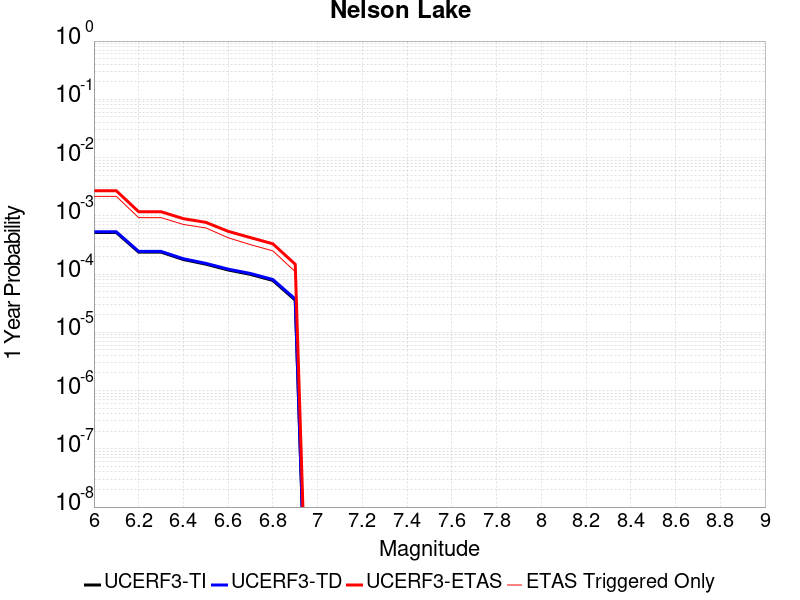 |  |

| Magnitude | 1 wk TI Prob | 1 wk TD Prob | 1 wk ETAS Prob | 1 wk ETAS/TD Gain | 1 wk ETAS Triggered Only | 1 mo TI Prob | 1 mo TD Prob | 1 mo ETAS Prob | 1 mo ETAS/TD Gain | 1 mo ETAS Triggered Only | 1 yr TI Prob | 1 yr TD Prob | 1 yr ETAS Prob | 1 yr ETAS/TD Gain | 1 yr ETAS Triggered Only | 10 yr TI Prob | 10 yr TD Prob | 10 yr ETAS Prob | 10 yr ETAS/TD Gain | 10 yr ETAS Triggered Only |
|-----|-----|-----|-----|-----|-----|-----|-----|-----|-----|-----|-----|-----|-----|-----|-----|-----|-----|-----|-----|-----|
| 6.0 | 9.913453E-6 | 1.0192255E-5 | 5.569335E-4 | 54.642815 | 5.467468E-4 | 4.2485535E-5 | 4.3680422E-5 | 8.637649E-4 | 19.774647 | 8.201203E-4 | 5.1713863E-4 | 5.316897E-4 | 0.0020344441 | 3.826375 | 0.0015035538 | 0.0051593683 | 0.005305204 | 0.008296358 | 1.5638151 | 0.0030071076 |
| 6.1 | 9.913453E-6 | 1.0192255E-5 | 5.569335E-4 | 54.642815 | 5.467468E-4 | 4.2485535E-5 | 4.3680422E-5 | 8.637649E-4 | 19.774647 | 8.201203E-4 | 5.1713863E-4 | 5.316897E-4 | 0.0020344441 | 3.826375 | 0.0015035538 | 0.0051593683 | 0.005305204 | 0.008296358 | 1.5638151 | 0.0030071076 |
| 6.2 | 4.5596407E-6 | 4.696313E-6 | 4.1475453E-4 | 88.314926 | 4.1006014E-4 | 1.954117E-5 | 2.0126909E-5 | 5.6686276E-4 | 28.164423 | 5.467468E-4 | 2.3788778E-4 | 2.4501883E-4 | 0.0010649381 | 4.3463526 | 8.201203E-4 | 0.0023763329 | 0.0024476128 | 0.0040156627 | 1.6406446 | 0.0015718972 |
| 6.3 | 4.5596407E-6 | 4.696313E-6 | 4.1475453E-4 | 88.314926 | 4.1006014E-4 | 1.954117E-5 | 2.0126909E-5 | 5.6686276E-4 | 28.164423 | 5.467468E-4 | 2.3788778E-4 | 2.4501883E-4 | 0.0010649381 | 4.3463526 | 8.201203E-4 | 0.0023763329 | 0.0024476128 | 0.0040156627 | 1.6406446 | 0.0015718972 |
| 6.4 | 3.4025713E-6 | 3.5098972E-6 | 3.4522548E-4 | 98.35772 | 3.4171678E-4 | 1.4582367E-5 | 1.5042335E-5 | 4.250963E-4 | 28.259995 | 4.1006014E-4 | 1.7752586E-4 | 1.8312587E-4 | 7.9810346E-4 | 4.3582234 | 6.150902E-4 | 0.001773841 | 0.0018298327 | 0.0029213254 | 1.5964987 | 0.0010934937 |
| 6.5 | 2.8352947E-6 | 2.927856E-6 | 3.4464363E-4 | 117.711945 | 3.4171678E-4 | 1.2151207E-5 | 1.2547898E-5 | 4.226029E-4 | 33.679176 | 4.1006014E-4 | 1.479309E-4 | 1.5276071E-4 | 7.6775695E-4 | 5.02588 | 6.150902E-4 | 0.0014783246 | 0.0015266308 | 0.0025502162 | 1.6704865 | 0.0010251503 |
| 6.6 | 2.251518E-6 | 2.3290677E-6 | 2.7570187E-4 | 118.37435 | 2.733734E-4 | 9.649328E-6 | 9.981683E-6 | 2.833524E-4 | 28.387234 | 2.733734E-4 | 1.1747423E-4 | 1.2152085E-4 | 4.631961E-4 | 3.8116596 | 3.4171678E-4 | 0.0011741214 | 0.0012146058 | 0.0018972092 | 1.561996 | 6.8343355E-4 |
| 6.7 | 1.8911853E-6 | 1.9591396E-6 | 1.3864558E-4 | 70.76861 | 1.366867E-4 | 8.105055E-6 | 8.39629E-6 | 1.4508185E-4 | 17.279284 | 1.366867E-4 | 9.867457E-5 | 1.0222061E-4 | 3.0722973E-4 | 3.0055556 | 2.0503007E-4 | 9.863076E-4 | 0.0010217935 | 0.001499708 | 1.4677215 | 4.784035E-4 |
| 6.8 | 1.4874814E-6 | 1.5438305E-6 | 1.5438305E-6 | 1.0 | 0.0 | 6.374905E-6 | 6.6164025E-6 | 7.495931E-5 | 11.329315 | 6.834335E-5 | 7.76117E-5 | 8.055224E-5 | 1.4889009E-4 | 1.8483669 | 6.834335E-5 | 7.75846E-4 | 8.0528157E-4 | 0.0010784349 | 1.3392022 | 2.733734E-4 |
| 6.9 | 6.835972E-7 | 7.1399285E-7 | 7.1399285E-7 | 1.0 | 0.0 | 2.9296991E-6 | 3.0599674E-6 | 3.0599674E-6 | 1.0 | 0.0 | 3.56685E-5 | 3.7254784E-5 | 3.7254784E-5 | 1.0 | 0.0 | 3.5662777E-4 | 3.7251666E-4 | 5.091525E-4 | 1.3667911 | 1.366867E-4 |

## Bicycle Lake
*[(top)](#table-of-contents)*

| 1 Week | 1 Month | 1 Year | 10 Year |
|-----|-----|-----|-----|
|  |  |  |  |

| Magnitude | 1 wk TI Prob | 1 wk TD Prob | 1 wk ETAS Prob | 1 wk ETAS/TD Gain | 1 wk ETAS Triggered Only | 1 mo TI Prob | 1 mo TD Prob | 1 mo ETAS Prob | 1 mo ETAS/TD Gain | 1 mo ETAS Triggered Only | 1 yr TI Prob | 1 yr TD Prob | 1 yr ETAS Prob | 1 yr ETAS/TD Gain | 1 yr ETAS Triggered Only | 10 yr TI Prob | 10 yr TD Prob | 10 yr ETAS Prob | 10 yr ETAS/TD Gain | 10 yr ETAS Triggered Only |
|-----|-----|-----|-----|-----|-----|-----|-----|-----|-----|-----|-----|-----|-----|-----|-----|-----|-----|-----|-----|-----|
| 6.0 | 1.9621975E-5 | 2.2097078E-5 | 7.738574E-4 | 35.0208 | 7.517769E-4 | 8.4091465E-5 | 9.4699084E-5 | 9.830786E-4 | 10.381078 | 8.8846363E-4 | 0.0010233327 | 0.0011524865 | 0.002722572 | 2.3623462 | 0.0015718972 | 0.01018633 | 0.011478408 | 0.014180764 | 1.2354294 | 0.0027337342 |
| 6.1 | 1.9621975E-5 | 2.2097078E-5 | 7.738574E-4 | 35.0208 | 7.517769E-4 | 8.4091465E-5 | 9.4699084E-5 | 9.830786E-4 | 10.381078 | 8.8846363E-4 | 0.0010233327 | 0.0011524865 | 0.002722572 | 2.3623462 | 0.0015718972 | 0.01018633 | 0.011478408 | 0.014180764 | 1.2354294 | 0.0027337342 |
| 6.2 | 9.9971285E-6 | 1.1255639E-5 | 4.896537E-4 | 43.50297 | 4.784035E-4 | 4.2844134E-5 | 4.8237856E-5 | 6.632984E-4 | 13.750578 | 6.150902E-4 | 5.2150246E-4 | 5.871896E-4 | 0.0016800413 | 2.8611562 | 0.0010934937 | 0.0052028033 | 0.005861487 | 0.007763884 | 1.3245589 | 0.001913614 |
| 6.3 | 9.589428E-6 | 1.0798346E-5 | 4.2085405E-4 | 38.973938 | 4.1006014E-4 | 4.10969E-5 | 4.62781E-5 | 5.929996E-4 | 12.813829 | 5.467468E-4 | 5.002399E-4 | 5.6334207E-4 | 0.00151961 | 2.697491 | 9.56807E-4 | 0.0049911533 | 0.0056242296 | 0.007391163 | 1.3141645 | 0.0017769273 |
| 6.4 | 9.589428E-6 | 1.0798346E-5 | 4.2085405E-4 | 38.973938 | 4.1006014E-4 | 4.10969E-5 | 4.62781E-5 | 5.929996E-4 | 12.813829 | 5.467468E-4 | 5.002399E-4 | 5.6334207E-4 | 0.00151961 | 2.697491 | 9.56807E-4 | 0.0049911533 | 0.0056242296 | 0.007391163 | 1.3141645 | 0.0017769273 |
| 6.5 | 5.557707E-6 | 6.2856016E-6 | 1.4297146E-4 | 22.745867 | 1.366867E-4 | 2.3818526E-5 | 2.6938165E-5 | 3.0030424E-4 | 11.147909 | 2.733734E-4 | 2.8995197E-4 | 3.2794967E-4 | 8.7451725E-4 | 2.66662 | 5.467468E-4 | 0.0028957394 | 0.0032772934 | 0.004299084 | 1.3117788 | 0.0010251503 |
| 6.6 | 4.8742945E-6 | 5.5132896E-6 | 7.385627E-5 | 13.396044 | 6.834335E-5 | 2.0889667E-5 | 2.3628318E-5 | 2.2865355E-4 | 9.677097 | 2.0503007E-4 | 2.54302E-4 | 2.87663E-4 | 7.659289E-4 | 2.662591 | 4.784035E-4 | 0.002540112 | 0.0028754752 | 0.003829531 | 1.3317907 | 9.56807E-4 |
| 6.7 | 3.991108E-6 | 4.5159104E-6 | 4.5159104E-6 | 1.0 | 0.0 | 1.7104636E-5 | 1.9353902E-5 | 8.769594E-5 | 4.531176 | 6.834335E-5 | 2.0822904E-4 | 2.3563375E-4 | 5.7727E-4 | 2.4498613 | 3.4171678E-4 | 0.0020803404 | 0.0023563374 | 0.002901796 | 1.2314857 | 5.467468E-4 |

## San Andreas (San Bernardino N)
*[(top)](#table-of-contents)*

| 1 Week | 1 Month | 1 Year | 10 Year |
|-----|-----|-----|-----|
| 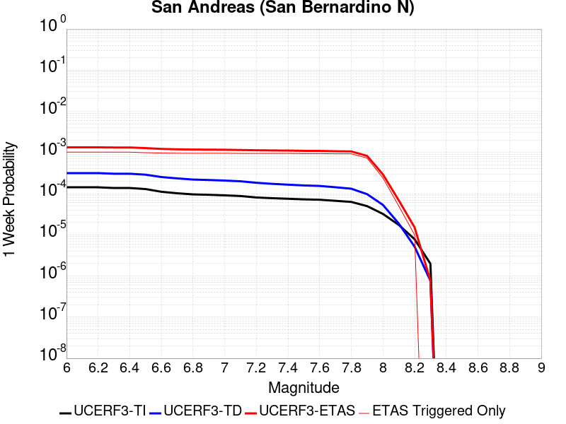 |  |  |  |

| Magnitude | 1 wk TI Prob | 1 wk TD Prob | 1 wk ETAS Prob | 1 wk ETAS/TD Gain | 1 wk ETAS Triggered Only | 1 mo TI Prob | 1 mo TD Prob | 1 mo ETAS Prob | 1 mo ETAS/TD Gain | 1 mo ETAS Triggered Only | 1 yr TI Prob | 1 yr TD Prob | 1 yr ETAS Prob | 1 yr ETAS/TD Gain | 1 yr ETAS Triggered Only | 10 yr TI Prob | 10 yr TD Prob | 10 yr ETAS Prob | 10 yr ETAS/TD Gain | 10 yr ETAS Triggered Only |
|-----|-----|-----|-----|-----|-----|-----|-----|-----|-----|-----|-----|-----|-----|-----|-----|-----|-----|-----|-----|-----|
| 6.0 | 1.4273766E-4 | 3.1606483E-4 | 0.0011359259 | 3.5939648 | 8.201203E-4 | 6.115894E-4 | 0.0013538664 | 0.002650632 | 1.957824 | 0.0012985237 | 0.0074207084 | 0.016360244 | 0.017906424 | 1.0945084 | 0.0015718972 | 0.07177748 | 0.15026689 | 0.1520091 | 1.011594 | 0.0020503006 |
| 6.1 | 1.4273766E-4 | 3.1606483E-4 | 0.0011359259 | 3.5939648 | 8.201203E-4 | 6.115894E-4 | 0.0013538664 | 0.002650632 | 1.957824 | 0.0012985237 | 0.0074207084 | 0.016360244 | 0.017906424 | 1.0945084 | 0.0015718972 | 0.07177748 | 0.15026689 | 0.1520091 | 1.011594 | 0.0020503006 |
| 6.2 | 1.4273766E-4 | 3.1606483E-4 | 0.0011359259 | 3.5939648 | 8.201203E-4 | 6.115894E-4 | 0.0013538664 | 0.002650632 | 1.957824 | 0.0012985237 | 0.0074207084 | 0.016360244 | 0.017906424 | 1.0945084 | 0.0015718972 | 0.07177748 | 0.15026689 | 0.1520091 | 1.011594 | 0.0020503006 |
| 6.3 | 1.3730655E-4 | 3.0511338E-4 | 0.0011249834 | 3.6870997 | 8.201203E-4 | 5.883239E-4 | 0.0013069791 | 0.0026038059 | 1.9922321 | 0.0012985237 | 0.0071393442 | 0.015797773 | 0.017344838 | 1.0979292 | 0.0015718972 | 0.06914291 | 0.14556676 | 0.14731862 | 1.0120347 | 0.0020503006 |
| 6.4 | 1.3730655E-4 | 3.0511338E-4 | 0.0011249834 | 3.6870997 | 8.201203E-4 | 5.883239E-4 | 0.0013069791 | 0.0026038059 | 1.9922321 | 0.0012985237 | 0.0071393442 | 0.015797773 | 0.017344838 | 1.0979292 | 0.0015718972 | 0.06914291 | 0.14556676 | 0.14731862 | 1.0120347 | 0.0020503006 |
| 6.5 | 1.2942807E-4 | 2.8925808E-4 | 0.0011091412 | 3.8344345 | 8.201203E-4 | 5.545738E-4 | 0.0012390936 | 0.0024677499 | 1.9915764 | 0.0012301804 | 0.0067310524 | 0.01498286 | 0.016463887 | 1.098848 | 0.0015035538 | 0.06530788 | 0.13870941 | 0.14041646 | 1.0123066 | 0.0019819573 |
| 6.6 | 1.1125901E-4 | 2.536472E-4 | 0.0010735595 | 4.232491 | 8.201203E-4 | 4.767372E-4 | 0.0010866089 | 0.0023154526 | 2.130898 | 0.0012301804 | 0.005788839 | 0.013149847 | 0.0146336295 | 1.1128365 | 0.0015035538 | 0.056403454 | 0.122999296 | 0.12473747 | 1.0141317 | 0.0019819573 |
| 6.7 | 1.02209575E-4 | 2.3499702E-4 | 0.0010549246 | 4.4890976 | 8.201203E-4 | 4.3796748E-4 | 0.0010067427 | 0.0022356848 | 2.220711 | 0.0012301804 | 0.0053192247 | 0.012188629 | 0.013673857 | 1.1218536 | 0.0015035538 | 0.051936906 | 0.114790924 | 0.11654537 | 1.0152838 | 0.0019819573 |
| 6.8 | 9.610582E-5 | 2.2025521E-4 | 0.0010401949 | 4.72268 | 8.201203E-4 | 4.1181705E-4 | 9.436101E-4 | 0.0021726298 | 2.3024654 | 0.0012301804 | 0.0050023515 | 0.011428202 | 0.012914572 | 1.1300616 | 0.0015035538 | 0.048912346 | 0.1081929 | 0.10996042 | 1.0163368 | 0.0019819573 |
| 6.9 | 9.3877505E-5 | 2.1481077E-4 | 0.0010347549 | 4.817053 | 8.201203E-4 | 4.0227012E-4 | 9.2029345E-4 | 0.0021493419 | 2.3354962 | 0.0012301804 | 0.0048866454 | 0.011147255 | 0.012634049 | 1.1333776 | 0.0015035538 | 0.04780577 | 0.10578323 | 0.10755553 | 1.016754 | 0.0019819573 |
| 7.0 | 9.1019785E-5 | 2.0808022E-4 | 0.0010280298 | 4.9405456 | 8.201203E-4 | 3.900265E-4 | 8.914682E-4 | 0.002120552 | 2.3787186 | 0.0012301804 | 0.0047382377 | 0.010799837 | 0.012287153 | 1.1377165 | 0.0015035538 | 0.046384744 | 0.102753714 | 0.10453202 | 1.0173064 | 0.0019819573 |
| 7.1 | 8.771155E-5 | 1.9982594E-4 | 0.0010197824 | 5.103353 | 8.201203E-4 | 3.758525E-4 | 8.5611636E-4 | 0.0020852436 | 2.4357011 | 0.0012301804 | 0.0045664064 | 0.0103736 | 0.011861556 | 1.1434369 | 0.0015035538 | 0.044737056 | 0.09906527 | 0.10085088 | 1.0180247 | 0.0019819573 |
| 7.2 | 8.0830236E-5 | 1.8388197E-4 | 0.0010038514 | 5.459216 | 8.201203E-4 | 3.4636928E-4 | 7.8782777E-4 | 0.002017039 | 2.5602539 | 0.0012301804 | 0.0042088944 | 0.009549725 | 0.01103892 | 1.1559411 | 0.0015035538 | 0.041300658 | 0.09179615 | 0.093596175 | 1.0196089 | 0.0019819573 |
| 7.3 | 7.7668235E-5 | 1.7331762E-4 | 9.932958E-4 | 5.731072 | 8.201203E-4 | 3.328214E-4 | 7.425784E-4 | 0.0019718453 | 2.6554034 | 0.0012301804 | 0.0040445733 | 0.009003494 | 0.01049351 | 1.1654931 | 0.0015035538 | 0.03971748 | 0.08706327 | 0.08887266 | 1.0207826 | 0.0019819573 |
| 7.4 | 7.520177E-5 | 1.6551897E-4 | 9.855035E-4 | 5.9540215 | 8.201203E-4 | 3.2225347E-4 | 7.0917426E-4 | 0.0019384823 | 2.7334356 | 0.0012301804 | 0.0039163795 | 0.008600081 | 0.010090705 | 1.1733266 | 0.0015035538 | 0.038480744 | 0.08351955 | 0.08527334 | 1.0209986 | 0.001913614 |
| 7.5 | 7.274697E-5 | 1.5839566E-4 | 9.78386E-4 | 6.176849 | 8.201203E-4 | 3.1173544E-4 | 6.78662E-4 | 0.0019080075 | 2.8114254 | 0.0012301804 | 0.003788775 | 0.008231463 | 0.00972264 | 1.1811558 | 0.0015035538 | 0.03724827 | 0.08023631 | 0.08199638 | 1.021936 | 0.001913614 |
| 7.6 | 7.1185845E-5 | 1.540943E-4 | 9.740882E-4 | 6.3213773 | 8.201203E-4 | 3.0504653E-4 | 6.6023704E-4 | 0.0018896053 | 2.8620102 | 0.0012301804 | 0.0037076178 | 0.008008812 | 0.009432527 | 1.1777687 | 0.0014352105 | 0.036463667 | 0.07822598 | 0.0799269 | 1.0217437 | 0.0018452706 |
| 7.7 | 6.709961E-5 | 1.4318313E-4 | 9.63186E-4 | 6.7269516 | 8.201203E-4 | 2.8753807E-4 | 6.1349774E-4 | 0.0018429235 | 3.0039613 | 0.0012301804 | 0.003495157 | 0.0074437927 | 0.00886832 | 1.1913712 | 0.0014352105 | 0.034406938 | 0.07305469 | 0.07476516 | 1.0234135 | 0.0018452706 |
| 7.8 | 6.300812E-5 | 1.3202413E-4 | 9.520361E-4 | 7.2110767 | 8.201203E-4 | 2.7000686E-4 | 5.65695E-4 | 0.0017951796 | 3.1734052 | 0.0012301804 | 0.0032823787 | 0.006865616 | 0.008290973 | 1.207608 | 0.0014352105 | 0.032343175 | 0.06771354 | 0.06943386 | 1.0254059 | 0.0018452706 |
| 7.9 | 4.983037E-5 | 9.723488E-5 | 7.1226526E-4 | 7.3252034 | 6.150902E-4 | 2.1354125E-4 | 4.1665437E-4 | 0.0014413776 | 3.4594083 | 0.0010251503 | 0.0025967648 | 0.0050609782 | 0.0062169353 | 1.2284058 | 0.001161837 | 0.025666296 | 0.05064886 | 0.05207626 | 1.0281823 | 0.0015035538 |
| 8.0 | 3.2211527E-5 | 5.3304586E-5 | 3.9500315E-4 | 7.4103036 | 3.4171678E-4 | 1.380421E-4 | 2.2842824E-4 | 5.70067E-4 | 2.4956064 | 3.4171678E-4 | 0.0016793669 | 0.0027775685 | 0.0031183362 | 1.1226856 | 3.4171678E-4 | 0.016667323 | 0.028361378 | 0.028959025 | 1.0210725 | 6.150902E-4 |
| 8.1 | 1.743376E-5 | 1.8824427E-5 | 8.7166496E-5 | 4.6304994 | 6.834335E-5 | 7.471398E-5 | 8.067362E-5 | 1.4901147E-4 | 1.8470904 | 6.834335E-5 | 9.0926304E-4 | 9.817594E-4 | 0.0010500357 | 1.0695448 | 6.834335E-5 | 0.009055517 | 0.010484105 | 0.010551732 | 1.0064504 | 6.834335E-5 |
| 8.2 | 7.831616E-6 | 5.1551065E-6 | 5.1551065E-6 | 1.0 | 0.0 | 3.3563636E-5 | 2.2093127E-5 | 2.2093127E-5 | 1.0 | 0.0 | 4.0856065E-4 | 2.6895068E-4 | 2.6895068E-4 | 1.0 | 0.0 | 0.004078103 | 0.0030418145 | 0.0030418145 | 1.0 | 0.0 |
| 8.3 | 1.983087E-6 | 7.6599065E-7 | 7.6599065E-7 | 1.0 | 0.0 | 8.498917E-6 | 3.282813E-6 | 3.282813E-6 | 1.0 | 0.0 | 1.034694E-4 | 3.9967534E-5 | 3.9967534E-5 | 1.0 | 0.0 | 0.0010342124 | 4.719687E-4 | 4.719687E-4 | 1.0 | 0.0 |

## Paradise
*[(top)](#table-of-contents)*

| 1 Week | 1 Month | 1 Year | 10 Year |
|-----|-----|-----|-----|
|  |  |  |  |

| Magnitude | 1 wk TI Prob | 1 wk TD Prob | 1 wk ETAS Prob | 1 wk ETAS/TD Gain | 1 wk ETAS Triggered Only | 1 mo TI Prob | 1 mo TD Prob | 1 mo ETAS Prob | 1 mo ETAS/TD Gain | 1 mo ETAS Triggered Only | 1 yr TI Prob | 1 yr TD Prob | 1 yr ETAS Prob | 1 yr ETAS/TD Gain | 1 yr ETAS Triggered Only | 10 yr TI Prob | 10 yr TD Prob | 10 yr ETAS Prob | 10 yr ETAS/TD Gain | 10 yr ETAS Triggered Only |
|-----|-----|-----|-----|-----|-----|-----|-----|-----|-----|-----|-----|-----|-----|-----|-----|-----|-----|-----|-----|-----|
| 6.0 | 1.4851273E-5 | 1.6694692E-5 | 7.0011686E-4 | 41.936497 | 6.8343355E-4 | 6.364676E-5 | 7.154685E-5 | 0.0010282854 | 14.372197 | 9.56807E-4 | 7.7462377E-4 | 8.707584E-4 | 0.002304719 | 2.6467953 | 0.0014352105 | 0.0077192914 | 0.008675844 | 0.010572856 | 1.2186544 | 0.001913614 |
| 6.1 | 1.4851273E-5 | 1.6694692E-5 | 7.0011686E-4 | 41.936497 | 6.8343355E-4 | 6.364676E-5 | 7.154685E-5 | 0.0010282854 | 14.372197 | 9.56807E-4 | 7.7462377E-4 | 8.707584E-4 | 0.002304719 | 2.6467953 | 0.0014352105 | 0.0077192914 | 0.008675844 | 0.010572856 | 1.2186544 | 0.001913614 |
| 6.2 | 1.4851273E-5 | 1.6694692E-5 | 7.0011686E-4 | 41.936497 | 6.8343355E-4 | 6.364676E-5 | 7.154685E-5 | 0.0010282854 | 14.372197 | 9.56807E-4 | 7.7462377E-4 | 8.707584E-4 | 0.002304719 | 2.6467953 | 0.0014352105 | 0.0077192914 | 0.008675844 | 0.010572856 | 1.2186544 | 0.001913614 |
| 6.3 | 1.0426831E-5 | 1.188862E-5 | 1.4857372E-4 | 12.497136 | 1.366867E-4 | 4.4685654E-5 | 5.0950268E-5 | 3.2430977E-4 | 6.365222 | 2.733734E-4 | 5.43912E-4 | 6.201489E-4 | 0.0010982557 | 1.7709548 | 4.784035E-4 | 0.0054258266 | 0.0061847917 | 0.0068639982 | 1.1098188 | 6.8343355E-4 |
| 6.4 | 1.0426831E-5 | 1.188862E-5 | 1.4857372E-4 | 12.497136 | 1.366867E-4 | 4.4685654E-5 | 5.0950268E-5 | 3.2430977E-4 | 6.365222 | 2.733734E-4 | 5.43912E-4 | 6.201489E-4 | 0.0010982557 | 1.7709548 | 4.784035E-4 | 0.0054258266 | 0.0061847917 | 0.0068639982 | 1.1098188 | 6.8343355E-4 |
| 6.5 | 9.25027E-6 | 1.06199595E-5 | 1.4730523E-4 | 13.870601 | 1.366867E-4 | 3.964341E-5 | 4.551335E-5 | 1.8219383E-4 | 4.003086 | 1.366867E-4 | 4.8255164E-4 | 5.53989E-4 | 8.955165E-4 | 1.6164879 | 3.4171678E-4 | 0.0048150513 | 0.0055265795 | 0.0060703047 | 1.0983837 | 5.467468E-4 |
| 6.6 | 7.904275E-6 | 9.159525E-6 | 1.4584498E-4 | 15.922768 | 1.366867E-4 | 3.3875025E-5 | 3.9254537E-5 | 1.7593589E-4 | 4.4819245 | 1.366867E-4 | 4.1235037E-4 | 4.7782314E-4 | 6.8275526E-4 | 1.4288869 | 2.0503007E-4 | 0.0041158604 | 0.0047683544 | 0.0050404244 | 1.0570574 | 2.733734E-4 |
| 6.7 | 7.2061953E-6 | 8.407248E-6 | 7.675003E-5 | 9.129031 | 6.834335E-5 | 3.088333E-5 | 3.6030586E-5 | 1.0437148E-4 | 2.8967466 | 6.834335E-5 | 3.7593965E-4 | 4.3858777E-4 | 5.7521457E-4 | 1.3115152 | 1.366867E-4 | 0.003753043 | 0.004377591 | 0.0045817234 | 1.0466312 | 2.0503007E-4 |
| 6.8 | 6.6948724E-6 | 7.842166E-6 | 7.842166E-6 | 1.0 | 0.0 | 2.8691995E-5 | 3.360887E-5 | 3.360887E-5 | 1.0 | 0.0 | 3.4926904E-4 | 4.0911473E-4 | 4.7743012E-4 | 1.1669835 | 6.834335E-5 | 0.003487206 | 0.0040839734 | 0.0042201015 | 1.0333323 | 1.366867E-4 |
| 6.9 | 6.0421025E-6 | 7.130621E-6 | 7.130621E-6 | 1.0 | 0.0 | 2.5894467E-5 | 3.0559466E-5 | 3.0559466E-5 | 1.0 | 0.0 | 3.1521954E-4 | 3.7200135E-4 | 4.403193E-4 | 1.1836497 | 6.834335E-5 | 0.0031477278 | 0.0037141247 | 0.0038503038 | 1.0366652 | 1.366867E-4 |
| 7.0 | 4.134091E-6 | 5.0803087E-6 | 5.0803087E-6 | 1.0 | 0.0 | 1.7717413E-5 | 2.177258E-5 | 2.177258E-5 | 1.0 | 0.0 | 2.1568815E-4 | 2.6505045E-4 | 3.333757E-4 | 1.257782 | 6.834335E-5 | 0.0021547892 | 0.0026474963 | 0.0027156589 | 1.025746 | 6.834335E-5 |
| 7.1 | 3.7674888E-6 | 4.6318696E-6 | 4.6318696E-6 | 1.0 | 0.0 | 1.6146281E-5 | 1.9850726E-5 | 1.9850726E-5 | 1.0 | 0.0 | 1.9656324E-4 | 2.4165731E-4 | 3.0998414E-4 | 1.2827427 | 6.834335E-5 | 0.0019638946 | 0.002414096 | 0.0024822743 | 1.0282418 | 6.834335E-5 |
| 7.2 | 3.4065345E-6 | 4.156723E-6 | 4.156723E-6 | 1.0 | 0.0 | 1.4599351E-5 | 1.7814415E-5 | 1.7814415E-5 | 1.0 | 0.0 | 1.777326E-4 | 2.1687041E-4 | 2.8519894E-4 | 1.3150662 | 6.834335E-5 | 0.0017759053 | 0.002166736 | 0.002234931 | 1.0314738 | 6.834335E-5 |
| 7.3 | 2.9934936E-6 | 3.6293168E-6 | 3.6293168E-6 | 1.0 | 0.0 | 1.2829195E-5 | 1.555413E-5 | 1.555413E-5 | 1.0 | 0.0 | 1.5618425E-4 | 1.8935655E-4 | 2.5768697E-4 | 1.3608558 | 6.834335E-5 | 0.0015607453 | 0.0018920974 | 0.0019603116 | 1.0360521 | 6.834335E-5 |
| 7.4 | 2.4049796E-6 | 2.8889842E-6 | 2.8889842E-6 | 1.0 | 0.0 | 1.0307015E-5 | 1.238131E-5 | 1.238131E-5 | 1.0 | 0.0 | 1.2548068E-4 | 1.5073347E-4 | 1.5073347E-4 | 1.0 | 0.0 | 0.0012540985 | 0.0015064536 | 0.0015064536 | 1.0 | 0.0 |
| 7.5 | 1.2710091E-6 | 1.5134682E-6 | 1.5134682E-6 | 1.0 | 0.0 | 5.44717E-6 | 6.4862834E-6 | 6.4862834E-6 | 1.0 | 0.0 | 6.631728E-5 | 7.8968886E-5 | 7.8968886E-5 | 1.0 | 0.0 | 6.6297496E-4 | 7.8953087E-4 | 7.8953087E-4 | 1.0 | 0.0 |
| 7.6 | 2.21172E-7 | 2.603961E-7 | 2.603961E-7 | 1.0 | 0.0 | 9.478797E-7 | 1.1159829E-6 | 1.1159829E-6 | 1.0 | 0.0 | 1.1540374E-5 | 1.3587036E-5 | 1.3587036E-5 | 1.0 | 0.0 | 1.1539775E-4 | 1.3586486E-4 | 1.3586486E-4 | 1.0 | 0.0 |

## Garlic Springs
*[(top)](#table-of-contents)*

| 1 Week | 1 Month | 1 Year | 10 Year |
|-----|-----|-----|-----|
| 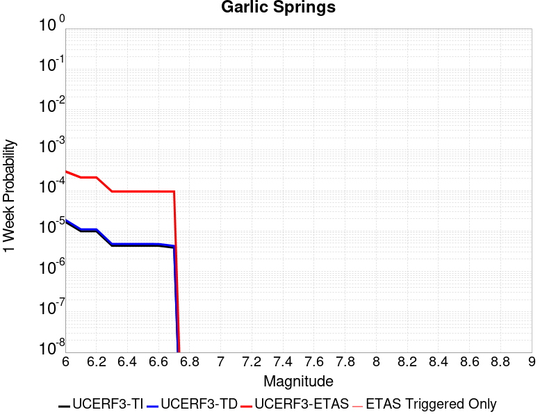 |  |  |  |

| Magnitude | 1 wk TI Prob | 1 wk TD Prob | 1 wk ETAS Prob | 1 wk ETAS/TD Gain | 1 wk ETAS Triggered Only | 1 mo TI Prob | 1 mo TD Prob | 1 mo ETAS Prob | 1 mo ETAS/TD Gain | 1 mo ETAS Triggered Only | 1 yr TI Prob | 1 yr TD Prob | 1 yr ETAS Prob | 1 yr ETAS/TD Gain | 1 yr ETAS Triggered Only | 10 yr TI Prob | 10 yr TD Prob | 10 yr ETAS Prob | 10 yr ETAS/TD Gain | 10 yr ETAS Triggered Only |
|-----|-----|-----|-----|-----|-----|-----|-----|-----|-----|-----|-----|-----|-----|-----|-----|-----|-----|-----|-----|-----|
| 6.0 | 1.6760017E-5 | 1.8776833E-5 | 3.604872E-4 | 19.19851 | 3.4171678E-4 | 7.182667E-5 | 8.0470316E-5 | 6.9551106E-4 | 8.643075 | 6.150902E-4 | 8.7413884E-4 | 9.794032E-4 | 0.0018669966 | 1.9062595 | 8.8846363E-4 | 0.008707083 | 0.009762413 | 0.01138664 | 1.1663756 | 0.0016402405 |
| 6.1 | 9.852767E-6 | 1.09735865E-5 | 2.8434402E-4 | 25.911674 | 2.733734E-4 | 4.222546E-5 | 4.702921E-5 | 3.8872994E-4 | 8.265713 | 3.4171678E-4 | 5.139737E-4 | 5.7250116E-4 | 0.0011189351 | 1.9544677 | 5.467468E-4 | 0.005127866 | 0.005717221 | 0.006736511 | 1.178284 | 0.0010251503 |
| 6.2 | 9.852767E-6 | 1.09735865E-5 | 2.8434402E-4 | 25.911674 | 2.733734E-4 | 4.222546E-5 | 4.702921E-5 | 3.8872994E-4 | 8.265713 | 3.4171678E-4 | 5.139737E-4 | 5.7250116E-4 | 0.0011189351 | 1.9544677 | 5.467468E-4 | 0.005127866 | 0.005717221 | 0.006736511 | 1.178284 | 0.0010251503 |
| 6.3 | 4.3167724E-6 | 4.7780286E-6 | 7.312106E-5 | 15.303604 | 6.834335E-5 | 1.8500323E-5 | 2.0477235E-5 | 1.5716115E-4 | 7.6749206 | 1.366867E-4 | 2.2521814E-4 | 2.4930484E-4 | 4.5428379E-4 | 1.8222021 | 2.0503007E-4 | 0.0022499003 | 0.00249251 | 0.002833375 | 1.1367557 | 3.4171678E-4 |
| 6.4 | 4.3167724E-6 | 4.7780286E-6 | 7.312106E-5 | 15.303604 | 6.834335E-5 | 1.8500323E-5 | 2.0477235E-5 | 1.5716115E-4 | 7.6749206 | 1.366867E-4 | 2.2521814E-4 | 2.4930484E-4 | 4.5428379E-4 | 1.8222021 | 2.0503007E-4 | 0.0022499003 | 0.00249251 | 0.002833375 | 1.1367557 | 3.4171678E-4 |
| 6.5 | 4.3167724E-6 | 4.7780286E-6 | 7.312106E-5 | 15.303604 | 6.834335E-5 | 1.8500323E-5 | 2.0477235E-5 | 1.5716115E-4 | 7.6749206 | 1.366867E-4 | 2.2521814E-4 | 2.4930484E-4 | 4.5428379E-4 | 1.8222021 | 2.0503007E-4 | 0.0022499003 | 0.00249251 | 0.002833375 | 1.1367557 | 3.4171678E-4 |
| 6.6 | 4.301311E-6 | 4.760897E-6 | 7.3103925E-5 | 15.355075 | 6.834335E-5 | 1.8434059E-5 | 2.0403815E-5 | 1.5708774E-4 | 7.69894 | 1.366867E-4 | 2.2441156E-4 | 2.4841115E-4 | 4.533903E-4 | 1.8251607 | 2.0503007E-4 | 0.0022418506 | 0.002483593 | 0.002824461 | 1.1372479 | 3.4171678E-4 |
| 6.7 | 3.8599724E-6 | 4.27106E-6 | 7.261412E-5 | 17.00143 | 6.834335E-5 | 1.6542634E-5 | 1.8304541E-5 | 1.5498875E-4 | 8.467229 | 1.366867E-4 | 2.0138794E-4 | 2.228578E-4 | 4.2784217E-4 | 1.919799 | 2.0503007E-4 | 0.0020120554 | 0.002228578 | 0.0025013422 | 1.1223938 | 2.733734E-4 |

## San Andreas (San Bernardino S)
*[(top)](#table-of-contents)*

| 1 Week | 1 Month | 1 Year | 10 Year |
|-----|-----|-----|-----|
|  |  |  |  |

| Magnitude | 1 wk TI Prob | 1 wk TD Prob | 1 wk ETAS Prob | 1 wk ETAS/TD Gain | 1 wk ETAS Triggered Only | 1 mo TI Prob | 1 mo TD Prob | 1 mo ETAS Prob | 1 mo ETAS/TD Gain | 1 mo ETAS Triggered Only | 1 yr TI Prob | 1 yr TD Prob | 1 yr ETAS Prob | 1 yr ETAS/TD Gain | 1 yr ETAS Triggered Only | 10 yr TI Prob | 10 yr TD Prob | 10 yr ETAS Prob | 10 yr ETAS/TD Gain | 10 yr ETAS Triggered Only |
|-----|-----|-----|-----|-----|-----|-----|-----|-----|-----|-----|-----|-----|-----|-----|-----|-----|-----|-----|-----|-----|
| 6.0 | 1.2336002E-4 | 3.0004102E-4 | 7.78301E-4 | 2.593982 | 4.784035E-4 | 5.2857865E-4 | 0.0012852824 | 0.0019678376 | 1.5310546 | 6.8343355E-4 | 0.006416472 | 0.015540994 | 0.01634837 | 1.0519513 | 8.201203E-4 | 0.06234337 | 0.14283717 | 0.14389163 | 1.0073823 | 0.0012301804 |
| 6.1 | 1.2336002E-4 | 3.0004102E-4 | 7.78301E-4 | 2.593982 | 4.784035E-4 | 5.2857865E-4 | 0.0012852824 | 0.0019678376 | 1.5310546 | 6.8343355E-4 | 0.006416472 | 0.015540994 | 0.01634837 | 1.0519513 | 8.201203E-4 | 0.06234337 | 0.14283717 | 0.14389163 | 1.0073823 | 0.0012301804 |
| 6.2 | 1.2336002E-4 | 3.0004102E-4 | 7.78301E-4 | 2.593982 | 4.784035E-4 | 5.2857865E-4 | 0.0012852824 | 0.0019678376 | 1.5310546 | 6.8343355E-4 | 0.006416472 | 0.015540994 | 0.01634837 | 1.0519513 | 8.201203E-4 | 0.06234337 | 0.14283717 | 0.14389163 | 1.0073823 | 0.0012301804 |
| 6.3 | 1.1712257E-4 | 2.8792414E-4 | 7.661899E-4 | 2.6610825 | 4.784035E-4 | 5.018573E-4 | 0.0012334028 | 0.0019159934 | 1.5534207 | 6.8343355E-4 | 0.006093008 | 0.014918125 | 0.015726011 | 1.0541546 | 8.201203E-4 | 0.059286322 | 0.13754563 | 0.13860661 | 1.0077137 | 0.0012301804 |
| 6.4 | 1.1712257E-4 | 2.8792414E-4 | 7.661899E-4 | 2.6610825 | 4.784035E-4 | 5.018573E-4 | 0.0012334028 | 0.0019159934 | 1.5534207 | 6.8343355E-4 | 0.006093008 | 0.014918125 | 0.015726011 | 1.0541546 | 8.201203E-4 | 0.059286322 | 0.13754563 | 0.13860661 | 1.0077137 | 0.0012301804 |
| 6.5 | 1.0689076E-4 | 2.680528E-4 | 7.4632803E-4 | 2.7842577 | 4.784035E-4 | 4.5802278E-4 | 0.0011483167 | 0.0018309654 | 1.5944778 | 6.8343355E-4 | 0.0055621783 | 0.01389575 | 0.014637081 | 1.0533494 | 7.517769E-4 | 0.05425003 | 0.12879294 | 0.12980515 | 1.0078591 | 0.001161837 |
| 6.6 | 9.7648895E-5 | 2.50501E-4 | 7.2878465E-4 | 2.9093082 | 4.784035E-4 | 4.1842813E-4 | 0.0010731576 | 0.0017558578 | 1.6361601 | 6.8343355E-4 | 0.005082469 | 0.012991785 | 0.013733795 | 1.0571138 | 7.517769E-4 | 0.049677886 | 0.12095292 | 0.12197422 | 1.0084438 | 0.001161837 |
| 6.7 | 8.757013E-5 | 2.3120902E-4 | 6.411744E-4 | 2.7731373 | 4.1006014E-4 | 3.7524657E-4 | 9.905418E-4 | 0.0016050227 | 1.6203483 | 6.150902E-4 | 0.00455906 | 0.011997245 | 0.012672479 | 1.0562824 | 6.8343355E-4 | 0.04466656 | 0.11226123 | 0.113231964 | 1.0086471 | 0.0010934937 |
| 6.8 | 8.562978E-5 | 2.2680782E-4 | 6.36775E-4 | 2.8075528 | 4.1006014E-4 | 3.6693315E-4 | 9.7169366E-4 | 0.0015861862 | 1.6323932 | 6.150902E-4 | 0.004458263 | 0.011770263 | 0.012445653 | 1.057381 | 6.8343355E-4 | 0.043698758 | 0.11027153 | 0.11124445 | 1.0088229 | 0.0010934937 |
| 6.9 | 6.124075E-5 | 1.7065753E-4 | 5.8064767E-4 | 3.4024148 | 4.1006014E-4 | 2.6243398E-4 | 7.311852E-4 | 0.0013458257 | 1.8406085 | 6.150902E-4 | 0.0031904527 | 0.008866051 | 0.009543425 | 1.0764009 | 6.8343355E-4 | 0.031450346 | 0.08418263 | 0.08505889 | 1.010409 | 9.56807E-4 |
| 7.0 | 5.8598747E-5 | 1.649477E-4 | 5.7494023E-4 | 3.4855907 | 4.1006014E-4 | 2.5111332E-4 | 7.06728E-4 | 0.0013213835 | 1.86972 | 6.150902E-4 | 0.0030530186 | 0.008570663 | 0.009248239 | 1.0790576 | 6.8343355E-4 | 0.03011414 | 0.081500374 | 0.0823792 | 1.0107831 | 9.56807E-4 |
| 7.1 | 5.613814E-5 | 1.5913323E-4 | 5.6912814E-4 | 3.5764253 | 4.1006014E-4 | 2.4056983E-4 | 6.818221E-4 | 0.0012964929 | 1.9015121 | 6.150902E-4 | 0.0029250039 | 0.008269769 | 0.00894755 | 1.081959 | 6.8343355E-4 | 0.028868021 | 0.07879931 | 0.07968072 | 1.0111855 | 9.56807E-4 |
| 7.2 | 4.991222E-5 | 1.4519796E-4 | 5.551986E-4 | 3.8237355 | 4.1006014E-4 | 2.1389198E-4 | 6.2212895E-4 | 0.0012368365 | 1.988071 | 6.150902E-4 | 0.002601025 | 0.007548217 | 0.008226492 | 1.089859 | 6.8343355E-4 | 0.025707912 | 0.07225321 | 0.07314088 | 1.0122856 | 9.56807E-4 |
| 7.3 | 4.7410045E-5 | 1.3714004E-4 | 5.471439E-4 | 3.9896734 | 4.1006014E-4 | 2.0317009E-4 | 5.8761094E-4 | 0.0012023398 | 2.0461493 | 6.150902E-4 | 0.0024707897 | 0.0071307817 | 0.0078093414 | 1.0951593 | 6.8343355E-4 | 0.024434982 | 0.06853558 | 0.06942681 | 1.013004 | 9.56807E-4 |
| 7.4 | 4.5556746E-5 | 1.3121912E-4 | 5.412254E-4 | 4.124593 | 4.1006014E-4 | 1.952286E-4 | 5.622468E-4 | 0.0011769912 | 2.0933712 | 6.150902E-4 | 0.002374317 | 0.0068239477 | 0.0075027174 | 1.0994688 | 6.8343355E-4 | 0.023491086 | 0.065788016 | 0.066618025 | 1.0126165 | 8.8846363E-4 |
| 7.5 | 4.3084514E-5 | 1.2357246E-4 | 5.3358194E-4 | 4.317968 | 4.1006014E-4 | 1.8463485E-4 | 5.2948913E-4 | 0.0011442536 | 2.1610522 | 6.150902E-4 | 0.0022456115 | 0.0064275465 | 0.0071065873 | 1.1056454 | 6.8343355E-4 | 0.022230545 | 0.062188786 | 0.063021995 | 1.013398 | 8.8846363E-4 |
| 7.6 | 3.408608E-5 | 9.83552E-5 | 5.08375E-4 | 5.168766 | 4.1006014E-4 | 1.4607502E-4 | 4.214543E-4 | 0.0010362853 | 2.458832 | 6.150902E-4 | 0.0017770125 | 0.0051191594 | 0.0057311007 | 1.1195395 | 6.150902E-4 | 0.017628696 | 0.050020292 | 0.05079939 | 1.0155756 | 8.201203E-4 |
| 7.7 | 2.8315713E-5 | 8.248679E-5 | 4.925131E-4 | 5.970812 | 4.1006014E-4 | 1.2134742E-4 | 3.5346695E-4 | 9.6833974E-4 | 2.7395482 | 6.150902E-4 | 0.0014764034 | 0.0042949775 | 0.004907426 | 1.1425964 | 6.150902E-4 | 0.01466633 | 0.0422714 | 0.043056857 | 1.0185812 | 8.201203E-4 |
| 7.8 | 2.6222975E-5 | 7.463088E-5 | 4.846604E-4 | 6.4941006 | 4.1006014E-4 | 1.1237934E-4 | 3.1980744E-4 | 9.3470095E-4 | 2.9226992 | 6.150902E-4 | 0.0013673597 | 0.0038867102 | 0.00449941 | 1.1576396 | 6.150902E-4 | 0.013589768 | 0.03843674 | 0.03922534 | 1.0205168 | 8.201203E-4 |
| 7.9 | 2.1469694E-5 | 5.787864E-5 | 3.9957566E-4 | 6.903681 | 3.4171678E-4 | 9.200973E-5 | 2.4802773E-4 | 7.94639E-4 | 3.203831 | 5.467468E-4 | 0.0011196428 | 0.0030155594 | 0.0035606574 | 1.1807618 | 5.467468E-4 | 0.011140184 | 0.030152109 | 0.030814936 | 1.0219828 | 6.8343355E-4 |
| 8.0 | 1.2420249E-5 | 3.131896E-5 | 2.363426E-4 | 7.5463114 | 2.0503007E-4 | 5.322855E-5 | 1.342172E-4 | 3.3921975E-4 | 2.527394 | 2.0503007E-4 | 6.478649E-4 | 0.0016328706 | 0.0018375659 | 1.1253592 | 2.0503007E-4 | 0.0064597935 | 0.016522504 | 0.01679136 | 1.0162722 | 2.733734E-4 |
| 8.1 | 4.9197724E-6 | 7.822348E-6 | 7.822348E-6 | 1.0 | 0.0 | 2.1084568E-5 | 3.352392E-5 | 3.352392E-5 | 1.0 | 0.0 | 2.566744E-4 | 4.0807744E-4 | 4.0807744E-4 | 1.0 | 0.0 | 0.002563781 | 0.0043843705 | 0.0043843705 | 1.0 | 0.0 |
| 8.2 | 2.5634774E-6 | 2.9067196E-6 | 2.9067196E-6 | 1.0 | 0.0 | 1.0986286E-5 | 1.2457311E-5 | 1.2457311E-5 | 1.0 | 0.0 | 1.3374983E-4 | 1.5165724E-4 | 1.5165724E-4 | 1.0 | 0.0 | 0.0013366934 | 0.0017049741 | 0.0017049741 | 1.0 | 0.0 |
| 8.3 | 5.2850464E-7 | 3.2088764E-7 | 3.2088764E-7 | 1.0 | 0.0 | 2.2650179E-6 | 1.375232E-6 | 1.375232E-6 | 1.0 | 0.0 | 2.7576245E-5 | 1.6743334E-5 | 1.6743334E-5 | 1.0 | 0.0 | 2.7572823E-4 | 1.9870348E-4 | 1.9870348E-4 | 1.0 | 0.0 |

## Helendale-So Lockhart
*[(top)](#table-of-contents)*

| 1 Week | 1 Month | 1 Year | 10 Year |
|-----|-----|-----|-----|
|  |  |  |  |

| Magnitude | 1 wk TI Prob | 1 wk TD Prob | 1 wk ETAS Prob | 1 wk ETAS/TD Gain | 1 wk ETAS Triggered Only | 1 mo TI Prob | 1 mo TD Prob | 1 mo ETAS Prob | 1 mo ETAS/TD Gain | 1 mo ETAS Triggered Only | 1 yr TI Prob | 1 yr TD Prob | 1 yr ETAS Prob | 1 yr ETAS/TD Gain | 1 yr ETAS Triggered Only | 10 yr TI Prob | 10 yr TD Prob | 10 yr ETAS Prob | 10 yr ETAS/TD Gain | 10 yr ETAS Triggered Only |
|-----|-----|-----|-----|-----|-----|-----|-----|-----|-----|-----|-----|-----|-----|-----|-----|-----|-----|-----|-----|-----|
| 6.0 | 1.7296055E-5 | 1.8103729E-5 | 8.644585E-5 | 4.77503 | 6.834335E-5 | 7.412385E-5 | 7.7585224E-5 | 3.5093745E-4 | 4.523251 | 2.733734E-4 | 9.0208417E-4 | 9.4421144E-4 | 0.0018318362 | 1.9400699 | 8.8846363E-4 | 0.008984311 | 0.009404116 | 0.010555027 | 1.1223837 | 0.001161837 |
| 6.1 | 1.7296055E-5 | 1.8103729E-5 | 8.644585E-5 | 4.77503 | 6.834335E-5 | 7.412385E-5 | 7.7585224E-5 | 3.5093745E-4 | 4.523251 | 2.733734E-4 | 9.0208417E-4 | 9.4421144E-4 | 0.0018318362 | 1.9400699 | 8.8846363E-4 | 0.008984311 | 0.009404116 | 0.010555027 | 1.1223837 | 0.001161837 |
| 6.2 | 1.7296055E-5 | 1.8103729E-5 | 8.644585E-5 | 4.77503 | 6.834335E-5 | 7.412385E-5 | 7.7585224E-5 | 3.5093745E-4 | 4.523251 | 2.733734E-4 | 9.0208417E-4 | 9.4421144E-4 | 0.0018318362 | 1.9400699 | 8.8846363E-4 | 0.008984311 | 0.009404116 | 0.010555027 | 1.1223837 | 0.001161837 |
| 6.3 | 1.0669118E-5 | 1.1135425E-5 | 7.947802E-5 | 7.137404 | 6.834335E-5 | 4.5723988E-5 | 4.772239E-5 | 1.8440258E-4 | 3.8640685 | 1.366867E-4 | 5.5654737E-4 | 5.80868E-4 | 9.9069E-4 | 1.7055337 | 4.1006014E-4 | 0.0055515557 | 0.0057937936 | 0.0063373726 | 1.0938209 | 5.467468E-4 |
| 6.4 | 1.0669118E-5 | 1.1135425E-5 | 7.947802E-5 | 7.137404 | 6.834335E-5 | 4.5723988E-5 | 4.772239E-5 | 1.8440258E-4 | 3.8640685 | 1.366867E-4 | 5.5654737E-4 | 5.80868E-4 | 9.9069E-4 | 1.7055337 | 4.1006014E-4 | 0.0055515557 | 0.0057937936 | 0.0063373726 | 1.0938209 | 5.467468E-4 |
| 6.5 | 8.790038E-6 | 9.170197E-6 | 7.751293E-5 | 8.452701 | 6.834335E-5 | 3.767105E-5 | 3.930026E-5 | 1.7598161E-4 | 4.477874 | 1.366867E-4 | 4.585485E-4 | 4.7837716E-4 | 8.8824116E-4 | 1.8567799 | 4.1006014E-4 | 0.0045760344 | 0.004773638 | 0.005317775 | 1.1139879 | 5.467468E-4 |
| 6.6 | 7.396949E-6 | 7.715537E-6 | 7.6058364E-5 | 9.857819 | 6.834335E-5 | 3.1700827E-5 | 3.3066175E-5 | 1.0140727E-4 | 3.066798 | 6.834335E-5 | 3.858892E-4 | 4.025073E-4 | 6.757707E-4 | 1.678903 | 2.733734E-4 | 0.003852198 | 0.00401789 | 0.0044263024 | 1.1016486 | 4.1006014E-4 |
| 6.7 | 6.4600285E-6 | 6.738031E-6 | 7.508093E-5 | 11.1428585 | 6.834335E-5 | 2.7685543E-5 | 2.887696E-5 | 9.721834E-5 | 3.3666406 | 6.834335E-5 | 3.3701936E-4 | 3.5152107E-4 | 6.247984E-4 | 1.7774138 | 2.733734E-4 | 0.0033650869 | 0.003509732 | 0.003918353 | 1.1164252 | 4.1006014E-4 |
| 6.8 | 5.600104E-6 | 5.836009E-6 | 7.417897E-5 | 12.710564 | 6.834335E-5 | 2.4000226E-5 | 2.5011232E-5 | 9.335288E-5 | 3.7324383 | 6.834335E-5 | 2.9216358E-4 | 3.044698E-4 | 4.4111488E-4 | 1.4487969 | 1.366867E-4 | 0.0029177975 | 0.003040588 | 0.0033131302 | 1.0896347 | 2.733734E-4 |
| 6.9 | 4.839122E-6 | 5.0395092E-6 | 7.338252E-5 | 14.561442 | 6.834335E-5 | 2.0738931E-5 | 2.159772E-5 | 8.9939604E-5 | 4.16431 | 6.834335E-5 | 2.5246723E-4 | 2.6292098E-4 | 3.9957176E-4 | 1.5197408 | 1.366867E-4 | 0.002521806 | 0.002626147 | 0.0028988023 | 1.1038234 | 2.733734E-4 |
| 7.0 | 3.6937633E-6 | 3.845208E-6 | 7.2188304E-5 | 18.773575 | 6.834335E-5 | 1.5830317E-5 | 1.647936E-5 | 8.482159E-5 | 5.147141 | 6.834335E-5 | 1.9271708E-4 | 2.0061806E-4 | 3.3727734E-4 | 1.6811914 | 1.366867E-4 | 0.0019255003 | 0.002004401 | 0.00220902 | 1.1020849 | 2.0503007E-4 |
| 7.1 | 2.7858857E-6 | 2.8978538E-6 | 7.124101E-5 | 24.58406 | 6.834335E-5 | 1.1939455E-5 | 1.2419316E-5 | 8.076183E-5 | 6.5029206 | 6.834335E-5 | 1.4535317E-4 | 1.511949E-4 | 2.1952791E-4 | 1.4519533 | 6.834335E-5 | 0.0014525814 | 0.0015109418 | 0.001647422 | 1.0903279 | 1.366867E-4 |
| 7.2 | 2.1672065E-6 | 2.2540128E-6 | 2.2540128E-6 | 1.0 | 0.0 | 9.2879945E-6 | 9.66002E-6 | 9.66002E-6 | 1.0 | 0.0 | 1.1307546E-4 | 1.1760458E-4 | 1.1760458E-4 | 1.0 | 0.0 | 0.0011301794 | 0.0011754417 | 0.0011754417 | 1.0 | 0.0 |
| 7.3 | 1.4823496E-6 | 1.5422102E-6 | 1.5422102E-6 | 1.0 | 0.0 | 6.3529114E-6 | 6.6094562E-6 | 6.6094562E-6 | 1.0 | 0.0 | 7.734395E-5 | 8.046731E-5 | 8.046731E-5 | 1.0 | 0.0 | 7.731704E-4 | 8.0439687E-4 | 8.0439687E-4 | 1.0 | 0.0 |
| 7.4 | 4.2321457E-7 | 4.4108765E-7 | 4.4108765E-7 | 1.0 | 0.0 | 1.8137755E-6 | 1.8903745E-6 | 1.8903745E-6 | 1.0 | 0.0 | 2.2082493E-5 | 2.3015113E-5 | 2.3015113E-5 | 1.0 | 0.0 | 2.2080299E-4 | 2.3013182E-4 | 2.3013182E-4 | 1.0 | 0.0 |
| 7.5 | 5.6942316E-8 | 5.9415648E-8 | 5.9415648E-8 | 1.0 | 0.0 | 2.440385E-7 | 2.5463845E-7 | 2.5463845E-7 | 1.0 | 0.0 | 2.9711643E-6 | 3.1002196E-6 | 3.1002196E-6 | 1.0 | 0.0 | 2.9711247E-5 | 3.1001844E-5 | 3.1001844E-5 | 1.0 | 0.0 |

## Coyote Lake
*[(top)](#table-of-contents)*

| 1 Week | 1 Month | 1 Year | 10 Year |
|-----|-----|-----|-----|
|  |  |  |  |

| Magnitude | 1 wk TI Prob | 1 wk TD Prob | 1 wk ETAS Prob | 1 wk ETAS/TD Gain | 1 wk ETAS Triggered Only | 1 mo TI Prob | 1 mo TD Prob | 1 mo ETAS Prob | 1 mo ETAS/TD Gain | 1 mo ETAS Triggered Only | 1 yr TI Prob | 1 yr TD Prob | 1 yr ETAS Prob | 1 yr ETAS/TD Gain | 1 yr ETAS Triggered Only | 10 yr TI Prob | 10 yr TD Prob | 10 yr ETAS Prob | 10 yr ETAS/TD Gain | 10 yr ETAS Triggered Only |
|-----|-----|-----|-----|-----|-----|-----|-----|-----|-----|-----|-----|-----|-----|-----|-----|-----|-----|-----|-----|-----|
| 6.0 | 1.980352E-5 | 2.1706745E-5 | 5.0009985E-4 | 23.038916 | 4.784035E-4 | 8.486947E-5 | 9.302599E-5 | 6.39722E-4 | 6.8768086 | 5.467468E-4 | 0.0010327959 | 0.0011320751 | 0.001746469 | 1.5427148 | 6.150902E-4 | 0.010280091 | 0.011270258 | 0.012283855 | 1.0899355 | 0.0010251503 |
| 6.1 | 1.980352E-5 | 2.1706745E-5 | 5.0009985E-4 | 23.038916 | 4.784035E-4 | 8.486947E-5 | 9.302599E-5 | 6.39722E-4 | 6.8768086 | 5.467468E-4 | 0.0010327959 | 0.0011320751 | 0.001746469 | 1.5427148 | 6.150902E-4 | 0.010280091 | 0.011270258 | 0.012283855 | 1.0899355 | 0.0010251503 |
| 6.2 | 1.980352E-5 | 2.1706745E-5 | 5.0009985E-4 | 23.038916 | 4.784035E-4 | 8.486947E-5 | 9.302599E-5 | 6.39722E-4 | 6.8768086 | 5.467468E-4 | 0.0010327959 | 0.0011320751 | 0.001746469 | 1.5427148 | 6.150902E-4 | 0.010280091 | 0.011270258 | 0.012283855 | 1.0899355 | 0.0010251503 |
| 6.3 | 1.5344787E-5 | 1.682067E-5 | 2.901895E-4 | 17.251959 | 2.733734E-4 | 6.576172E-5 | 7.2086936E-5 | 4.1377908E-4 | 5.740001 | 3.4171678E-4 | 8.003548E-4 | 8.773662E-4 | 0.0012870666 | 1.4669662 | 4.1006014E-4 | 0.007974784 | 0.00874507 | 0.009558017 | 1.0929607 | 8.201203E-4 |
| 6.4 | 1.5344787E-5 | 1.682067E-5 | 2.901895E-4 | 17.251959 | 2.733734E-4 | 6.576172E-5 | 7.2086936E-5 | 4.1377908E-4 | 5.740001 | 3.4171678E-4 | 8.003548E-4 | 8.773662E-4 | 0.0012870666 | 1.4669662 | 4.1006014E-4 | 0.007974784 | 0.00874507 | 0.009558017 | 1.0929607 | 8.201203E-4 |
| 6.5 | 1.4189697E-5 | 1.5557987E-5 | 2.8892717E-4 | 18.570986 | 2.733734E-4 | 6.081157E-5 | 6.6675726E-5 | 4.0836973E-4 | 6.124714 | 3.4171678E-4 | 7.401293E-4 | 8.115349E-4 | 0.0012212623 | 1.5048796 | 4.1006014E-4 | 0.0073766913 | 0.008091656 | 0.00890514 | 1.1005337 | 8.201203E-4 |
| 6.6 | 1.3469301E-5 | 1.4771577E-5 | 2.8814096E-4 | 19.506445 | 2.733734E-4 | 5.7724297E-5 | 6.330556E-5 | 4.0500073E-4 | 6.3975534 | 3.4171678E-4 | 7.025667E-4 | 7.7053264E-4 | 0.0011802769 | 1.5317675 | 4.1006014E-4 | 0.0070034964 | 0.0076845144 | 0.008498332 | 1.1059036 | 8.201203E-4 |
| 6.7 | 1.3027966E-5 | 1.4281745E-5 | 2.8765126E-4 | 20.141186 | 2.733734E-4 | 5.5832945E-5 | 6.120638E-5 | 4.0290225E-4 | 6.582684 | 3.4171678E-4 | 6.7955407E-4 | 7.4499263E-4 | 0.0011547473 | 1.5500116 | 4.1006014E-4 | 0.006774798 | 0.0074308286 | 0.00817702 | 1.1004182 | 7.517769E-4 |
| 6.8 | 5.695434E-6 | 6.2244176E-6 | 1.4291028E-4 | 22.959621 | 1.366867E-4 | 2.4408775E-5 | 2.6675973E-5 | 1.6335904E-4 | 6.123827 | 1.366867E-4 | 2.971363E-4 | 3.2476155E-4 | 4.6140386E-4 | 1.4207466 | 1.366867E-4 | 0.0029673933 | 0.0032458105 | 0.003586418 | 1.1049377 | 3.4171678E-4 |
| 6.9 | 4.385688E-6 | 4.7930553E-6 | 4.7930553E-6 | 1.0 | 0.0 | 1.879567E-5 | 2.0541665E-5 | 2.0541665E-5 | 1.0 | 0.0 | 2.2881327E-4 | 2.5009477E-4 | 2.5009477E-4 | 1.0 | 0.0 | 0.002285778 | 0.0025009478 | 0.0026372927 | 1.0545173 | 1.366867E-4 |

## Death Valley (Black Mtns Frontal)
*[(top)](#table-of-contents)*

| 1 Week | 1 Month | 1 Year | 10 Year |
|-----|-----|-----|-----|
| 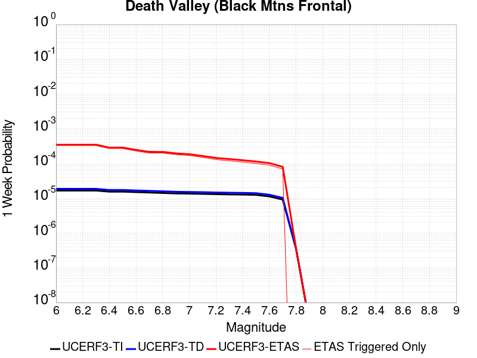 | 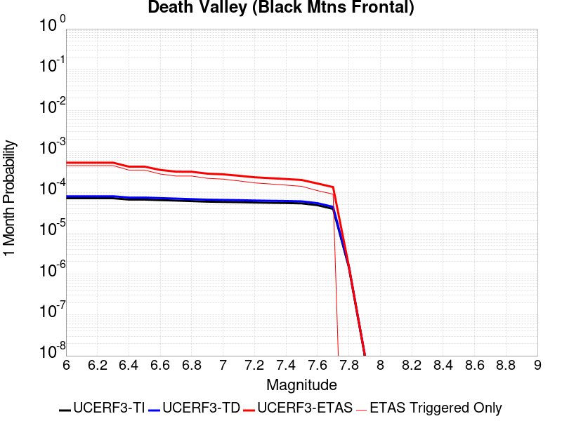 |  |  |

| Magnitude | 1 wk TI Prob | 1 wk TD Prob | 1 wk ETAS Prob | 1 wk ETAS/TD Gain | 1 wk ETAS Triggered Only | 1 mo TI Prob | 1 mo TD Prob | 1 mo ETAS Prob | 1 mo ETAS/TD Gain | 1 mo ETAS Triggered Only | 1 yr TI Prob | 1 yr TD Prob | 1 yr ETAS Prob | 1 yr ETAS/TD Gain | 1 yr ETAS Triggered Only | 10 yr TI Prob | 10 yr TD Prob | 10 yr ETAS Prob | 10 yr ETAS/TD Gain | 10 yr ETAS Triggered Only |
|-----|-----|-----|-----|-----|-----|-----|-----|-----|-----|-----|-----|-----|-----|-----|-----|-----|-----|-----|-----|-----|
| 6.0 | 1.6707214E-5 | 1.867027E-5 | 3.6038068E-4 | 19.302383 | 3.4171678E-4 | 7.160038E-5 | 8.001302E-5 | 6.267161E-4 | 7.8326764 | 5.467468E-4 | 8.71386E-4 | 9.737309E-4 | 0.0017247758 | 1.7713065 | 7.517769E-4 | 0.00867977 | 0.009695496 | 0.010643027 | 1.0977288 | 9.56807E-4 |
| 6.1 | 1.6707214E-5 | 1.867027E-5 | 3.6038068E-4 | 19.302383 | 3.4171678E-4 | 7.160038E-5 | 8.001302E-5 | 6.267161E-4 | 7.8326764 | 5.467468E-4 | 8.71386E-4 | 9.737309E-4 | 0.0017247758 | 1.7713065 | 7.517769E-4 | 0.00867977 | 0.009695496 | 0.010643027 | 1.0977288 | 9.56807E-4 |
| 6.2 | 1.6707214E-5 | 1.867027E-5 | 3.6038068E-4 | 19.302383 | 3.4171678E-4 | 7.160038E-5 | 8.001302E-5 | 6.267161E-4 | 7.8326764 | 5.467468E-4 | 8.71386E-4 | 9.737309E-4 | 0.0017247758 | 1.7713065 | 7.517769E-4 | 0.00867977 | 0.009695496 | 0.010643027 | 1.0977288 | 9.56807E-4 |
| 6.3 | 1.6707214E-5 | 1.867027E-5 | 3.6038068E-4 | 19.302383 | 3.4171678E-4 | 7.160038E-5 | 8.001302E-5 | 6.267161E-4 | 7.8326764 | 5.467468E-4 | 8.71386E-4 | 9.737309E-4 | 0.0017247758 | 1.7713065 | 7.517769E-4 | 0.00867977 | 0.009695496 | 0.010643027 | 1.0977288 | 9.56807E-4 |
| 6.4 | 1.5515609E-5 | 1.7338214E-5 | 3.5904907E-4 | 20.70854 | 3.4171678E-4 | 6.649377E-5 | 7.4304546E-5 | 5.526725E-4 | 7.4379363 | 4.784035E-4 | 8.0926094E-4 | 9.042885E-4 | 0.0015188225 | 1.6795774 | 6.150902E-4 | 0.008063202 | 0.009006773 | 0.009751779 | 1.0827162 | 7.517769E-4 |
| 6.5 | 1.5515609E-5 | 1.7338214E-5 | 3.5904907E-4 | 20.70854 | 3.4171678E-4 | 6.649377E-5 | 7.4304546E-5 | 5.526725E-4 | 7.4379363 | 4.784035E-4 | 8.0926094E-4 | 9.042885E-4 | 0.0015188225 | 1.6795774 | 6.150902E-4 | 0.008063202 | 0.009006773 | 0.009751779 | 1.0827162 | 7.517769E-4 |
| 6.6 | 1.5041828E-5 | 1.6809145E-5 | 3.585202E-4 | 21.328878 | 3.4171678E-4 | 6.4463384E-5 | 7.203723E-5 | 5.504063E-4 | 7.64058 | 4.784035E-4 | 7.8455906E-4 | 8.767063E-4 | 0.0014912573 | 1.700977 | 6.150902E-4 | 0.00781795 | 0.008733132 | 0.009478344 | 1.0853316 | 7.517769E-4 |
| 6.7 | 1.4634985E-5 | 1.6356016E-5 | 2.8972497E-4 | 17.713663 | 2.733734E-4 | 6.271985E-5 | 7.009536E-5 | 4.8012676E-4 | 6.8496222 | 4.1006014E-4 | 7.6334673E-4 | 8.5308263E-4 | 0.001399363 | 1.6403605 | 5.467468E-4 | 0.007607299 | 0.008498715 | 0.009176341 | 1.0797327 | 6.8343355E-4 |
| 6.8 | 1.4209158E-5 | 1.5882048E-5 | 2.8925113E-4 | 18.212458 | 2.733734E-4 | 6.089497E-5 | 6.8064175E-5 | 4.780964E-4 | 7.0242004 | 4.1006014E-4 | 7.4114406E-4 | 8.2837185E-4 | 0.0013746658 | 1.6594791 | 5.467468E-4 | 0.007386771 | 0.008253456 | 0.008931249 | 1.0821223 | 6.8343355E-4 |
| 6.9 | 1.3780098E-5 | 1.5404594E-5 | 2.8877382E-4 | 18.745955 | 2.733734E-4 | 5.9056227E-5 | 6.6018045E-5 | 4.7605112E-4 | 7.210924 | 4.1006014E-4 | 7.1877235E-4 | 8.0347876E-4 | 0.0013497863 | 1.6799278 | 5.467468E-4 | 0.0071645193 | 0.008006332 | 0.008616499 | 1.0762104 | 6.150902E-4 |
| 7.0 | 1.3585064E-5 | 1.5188155E-5 | 2.8855744E-4 | 18.998846 | 2.733734E-4 | 5.8220405E-5 | 6.50905E-5 | 4.7512396E-4 | 7.299436 | 4.1006014E-4 | 7.086029E-4 | 7.9219416E-4 | 0.0013385079 | 1.689621 | 5.467468E-4 | 0.007063476 | 0.007894293 | 0.008504529 | 1.0773007 | 6.150902E-4 |
| 7.1 | 1.3398601E-5 | 1.49813395E-5 | 2.2000834E-4 | 14.685492 | 2.0503007E-4 | 5.742131E-5 | 6.420419E-5 | 4.0589905E-4 | 6.3220024 | 3.4171678E-4 | 6.9888023E-4 | 7.8141113E-4 | 0.0012594408 | 1.6117518 | 4.784035E-4 | 0.0069668638 | 0.007787224 | 0.008329714 | 1.069664 | 5.467468E-4 |
| 7.2 | 1.3126312E-5 | 1.4679561E-5 | 2.1970662E-4 | 14.966839 | 2.0503007E-4 | 5.6254412E-5 | 6.291092E-5 | 4.046062E-4 | 6.431415 | 3.4171678E-4 | 6.846822E-4 | 7.6567667E-4 | 0.0012437139 | 1.624333 | 4.784035E-4 | 0.006825765 | 0.00763097 | 0.008173545 | 1.0711017 | 5.467468E-4 |
| 7.3 | 1.2922429E-5 | 1.4453788E-5 | 2.1948089E-4 | 15.185009 | 2.0503007E-4 | 5.5380664E-5 | 6.194336E-5 | 4.03639E-4 | 6.5162587 | 3.4171678E-4 | 6.74051E-4 | 7.53905E-4 | 0.0012319478 | 1.634089 | 4.784035E-4 | 0.006720101 | 0.007514055 | 0.008056694 | 1.0722165 | 5.467468E-4 |
| 7.4 | 1.2768878E-5 | 1.4283772E-5 | 2.1931091E-4 | 15.353852 | 2.0503007E-4 | 5.4722615E-5 | 6.1214756E-5 | 4.0291063E-4 | 6.5819197 | 3.4171678E-4 | 6.660441E-4 | 7.4504025E-4 | 0.0012230873 | 1.6416392 | 4.784035E-4 | 0.0066405144 | 0.0074260035 | 0.00796869 | 1.0730792 | 5.467468E-4 |
| 7.5 | 1.2521929E-5 | 1.40120155E-5 | 2.1903921E-4 | 15.632242 | 2.0503007E-4 | 5.366431E-5 | 6.005014E-5 | 4.017464E-4 | 6.6901827 | 3.4171678E-4 | 6.531671E-4 | 7.3087064E-4 | 0.0012089245 | 1.6540881 | 4.784035E-4 | 0.006512506 | 0.0072852457 | 0.007828009 | 1.0745018 | 5.467468E-4 |
| 7.6 | 1.1301089E-5 | 1.2648149E-5 | 2.1767562E-4 | 17.210077 | 2.0503007E-4 | 4.8432343E-5 | 5.4205255E-5 | 3.2756387E-4 | 6.043028 | 2.733734E-4 | 5.895042E-4 | 6.5975444E-4 | 0.0010012458 | 1.5176036 | 3.4171678E-4 | 0.0058794282 | 0.00657851 | 0.006985873 | 1.0619233 | 4.1006014E-4 |
| 7.7 | 9.189108E-6 | 1.0283358E-5 | 1.4696867E-4 | 14.291894 | 1.366867E-4 | 3.93813E-5 | 4.407082E-5 | 2.4909186E-4 | 5.6520815 | 2.0503007E-4 | 4.7936183E-4 | 5.3643517E-4 | 8.096619E-4 | 1.5093379 | 2.733734E-4 | 0.004783291 | 0.005351914 | 0.0056918017 | 1.0635078 | 3.4171678E-4 |
| 7.8 | 3.4586725E-7 | 3.6482615E-7 | 3.6482615E-7 | 1.0 | 0.0 | 1.4822873E-6 | 1.5635396E-6 | 1.5635396E-6 | 1.0 | 0.0 | 1.80467E-5 | 1.9035933E-5 | 1.9035933E-5 | 1.0 | 0.0 | 1.8045233E-4 | 1.9034347E-4 | 1.9034347E-4 | 1.0 | 0.0 |
| 7.9 | 2.5591178E-9 | 2.6696718E-9 | 2.6696718E-9 | 1.0 | 0.0 | 1.0967647E-8 | 1.14414505E-8 | 1.14414505E-8 | 1.0 | 0.0 | 1.335311E-7 | 1.3929966E-7 | 1.3929966E-7 | 1.0 | 0.0 | 1.3353102E-6 | 1.3929966E-6 | 1.3929966E-6 | 1.0 | 0.0 |

## San Andreas (Big Bend)
*[(top)](#table-of-contents)*

| 1 Week | 1 Month | 1 Year | 10 Year |
|-----|-----|-----|-----|
|  |  |  |  |

| Magnitude | 1 wk TI Prob | 1 wk TD Prob | 1 wk ETAS Prob | 1 wk ETAS/TD Gain | 1 wk ETAS Triggered Only | 1 mo TI Prob | 1 mo TD Prob | 1 mo ETAS Prob | 1 mo ETAS/TD Gain | 1 mo ETAS Triggered Only | 1 yr TI Prob | 1 yr TD Prob | 1 yr ETAS Prob | 1 yr ETAS/TD Gain | 1 yr ETAS Triggered Only | 10 yr TI Prob | 10 yr TD Prob | 10 yr ETAS Prob | 10 yr ETAS/TD Gain | 10 yr ETAS Triggered Only |
|-----|-----|-----|-----|-----|-----|-----|-----|-----|-----|-----|-----|-----|-----|-----|-----|-----|-----|-----|-----|-----|
| 6.0 | 1.0179969E-4 | 2.0072258E-4 | 2.6905222E-4 | 1.3404182 | 6.834335E-5 | 4.362114E-4 | 8.599571E-4 | 0.0010648109 | 1.2382139 | 2.0503007E-4 | 0.0052979486 | 0.010419999 | 0.010758155 | 1.0324526 | 3.4171678E-4 | 0.051734097 | 0.10144902 | 0.102124535 | 1.0066587 | 7.517769E-4 |
| 6.1 | 1.0179969E-4 | 2.0072258E-4 | 2.6905222E-4 | 1.3404182 | 6.834335E-5 | 4.362114E-4 | 8.599571E-4 | 0.0010648109 | 1.2382139 | 2.0503007E-4 | 0.0052979486 | 0.010419999 | 0.010758155 | 1.0324526 | 3.4171678E-4 | 0.051734097 | 0.10144902 | 0.102124535 | 1.0066587 | 7.517769E-4 |
| 6.2 | 1.0179969E-4 | 2.0072258E-4 | 2.6905222E-4 | 1.3404182 | 6.834335E-5 | 4.362114E-4 | 8.599571E-4 | 0.0010648109 | 1.2382139 | 2.0503007E-4 | 0.0052979486 | 0.010419999 | 0.010758155 | 1.0324526 | 3.4171678E-4 | 0.051734097 | 0.10144902 | 0.102124535 | 1.0066587 | 7.517769E-4 |
| 6.3 | 1.0179969E-4 | 2.0072258E-4 | 2.6905222E-4 | 1.3404182 | 6.834335E-5 | 4.362114E-4 | 8.599571E-4 | 0.0010648109 | 1.2382139 | 2.0503007E-4 | 0.0052979486 | 0.010419999 | 0.010758155 | 1.0324526 | 3.4171678E-4 | 0.051734097 | 0.10144902 | 0.102124535 | 1.0066587 | 7.517769E-4 |
| 6.4 | 9.1639464E-5 | 1.8429532E-4 | 2.5262608E-4 | 1.3707677 | 6.834335E-5 | 3.9268145E-4 | 7.895982E-4 | 9.26177E-4 | 1.1729726 | 1.366867E-4 | 0.0047704205 | 0.009571102 | 0.009841859 | 1.028289 | 2.733734E-4 | 0.046693064 | 0.09377527 | 0.094208814 | 1.0046232 | 4.784035E-4 |
| 6.5 | 9.1639464E-5 | 1.8429532E-4 | 2.5262608E-4 | 1.3707677 | 6.834335E-5 | 3.9268145E-4 | 7.895982E-4 | 9.26177E-4 | 1.1729726 | 1.366867E-4 | 0.0047704205 | 0.009571102 | 0.009841859 | 1.028289 | 2.733734E-4 | 0.046693064 | 0.09377527 | 0.094208814 | 1.0046232 | 4.784035E-4 |
| 6.6 | 9.042622E-5 | 1.823659E-4 | 2.506968E-4 | 1.3746911 | 6.834335E-5 | 3.8748336E-4 | 7.8133424E-4 | 9.1791415E-4 | 1.1748035 | 1.366867E-4 | 0.0047074095 | 0.009471365 | 0.009742149 | 1.0285897 | 2.733734E-4 | 0.046089325 | 0.092869274 | 0.09324125 | 1.0040054 | 4.1006014E-4 |
| 6.7 | 8.9836685E-5 | 1.8150927E-4 | 2.498402E-4 | 1.3764598 | 6.834335E-5 | 3.8495753E-4 | 7.776651E-4 | 9.1424555E-4 | 1.1756288 | 1.366867E-4 | 0.00467679 | 0.00942708 | 0.009697877 | 1.0287254 | 2.733734E-4 | 0.045795817 | 0.09246355 | 0.092835695 | 1.0040247 | 4.1006014E-4 |
| 6.8 | 8.9471854E-5 | 1.8097709E-4 | 2.4930807E-4 | 1.377567 | 6.834335E-5 | 3.8339442E-4 | 7.7538576E-4 | 9.119665E-4 | 1.1761456 | 1.366867E-4 | 0.004657841 | 0.009399569 | 0.009670372 | 1.0288103 | 2.733734E-4 | 0.04561414 | 0.092210755 | 0.09258301 | 1.0040369 | 4.1006014E-4 |
| 6.9 | 8.858234E-5 | 1.7979681E-4 | 2.4812788E-4 | 1.380046 | 6.834335E-5 | 3.7958333E-4 | 7.703304E-4 | 9.0691185E-4 | 1.1773024 | 1.366867E-4 | 0.004611638 | 0.009338548 | 0.00960937 | 1.0290003 | 2.733734E-4 | 0.04517103 | 0.09165087 | 0.09202335 | 1.0040641 | 4.1006014E-4 |
| 7.0 | 8.7433385E-5 | 1.7818481E-4 | 2.46516E-4 | 1.3834848 | 6.834335E-5 | 3.746607E-4 | 7.634259E-4 | 9.0000825E-4 | 1.1789072 | 1.366867E-4 | 0.004551957 | 0.009255203 | 0.009526047 | 1.0292639 | 2.733734E-4 | 0.044598386 | 0.09088532 | 0.09125811 | 1.0041018 | 4.1006014E-4 |
| 7.1 | 8.684964E-5 | 1.7730435E-4 | 2.456356E-4 | 1.3853896 | 6.834335E-5 | 3.7215967E-4 | 7.596547E-4 | 8.9623756E-4 | 1.179796 | 1.366867E-4 | 0.0045216335 | 0.009209678 | 0.009480533 | 1.0294099 | 2.733734E-4 | 0.04430731 | 0.09046686 | 0.090839826 | 1.0041226 | 4.1006014E-4 |
| 7.2 | 8.606521E-5 | 1.762105E-4 | 2.4454182E-4 | 1.3877823 | 6.834335E-5 | 3.6879873E-4 | 7.549695E-4 | 8.232613E-4 | 1.0904564 | 6.834335E-5 | 0.0044808835 | 0.0091531165 | 0.00935627 | 1.022195 | 2.0503007E-4 | 0.043916024 | 0.089947365 | 0.09025835 | 1.0034573 | 3.4171678E-4 |
| 7.3 | 8.568266E-5 | 1.7563057E-4 | 2.4396191E-4 | 1.389063 | 6.834335E-5 | 3.6715972E-4 | 7.524855E-4 | 8.2077744E-4 | 1.0907551 | 6.834335E-5 | 0.0044610105 | 0.009123127 | 0.009326287 | 1.0222687 | 2.0503007E-4 | 0.043725148 | 0.08966853 | 0.089979604 | 1.0034692 | 3.4171678E-4 |
| 7.4 | 8.5432206E-5 | 1.7525644E-4 | 2.4358783E-4 | 1.3898937 | 6.834335E-5 | 3.6608664E-4 | 7.50883E-4 | 8.1917504E-4 | 1.0909489 | 6.834335E-5 | 0.004447999 | 0.009103781 | 0.009306944 | 1.0223163 | 2.0503007E-4 | 0.043600157 | 0.08948871 | 0.089799844 | 1.0034769 | 3.4171678E-4 |
| 7.5 | 8.4791965E-5 | 1.7394972E-4 | 2.422812E-4 | 1.3928231 | 6.834335E-5 | 3.633435E-4 | 7.4528606E-4 | 8.135785E-4 | 1.0916325 | 6.834335E-5 | 0.0044147377 | 0.009036204 | 0.009239382 | 1.0224848 | 2.0503007E-4 | 0.043280575 | 0.088866346 | 0.08917769 | 1.0035036 | 3.4171678E-4 |
| 7.6 | 8.241105E-5 | 1.6840403E-4 | 2.3673588E-4 | 1.4057614 | 6.834335E-5 | 3.531424E-4 | 7.215321E-4 | 7.8982615E-4 | 1.0946515 | 6.834335E-5 | 0.0042910352 | 0.008749358 | 0.008952594 | 1.0232286 | 2.0503007E-4 | 0.042091176 | 0.086243294 | 0.08655554 | 1.0036205 | 3.4171678E-4 |
| 7.7 | 7.00432E-5 | 1.42045E-4 | 2.1037865E-4 | 1.4810704 | 6.834335E-5 | 3.001506E-4 | 6.0862233E-4 | 6.769241E-4 | 1.1122235 | 6.834335E-5 | 0.0036482112 | 0.0073848404 | 0.007452679 | 1.0091861 | 6.834335E-5 | 0.035888977 | 0.07351733 | 0.07370728 | 1.0025839 | 2.0503007E-4 |
| 7.8 | 6.415362E-5 | 1.2968935E-4 | 1.9802383E-4 | 1.5269091 | 6.834335E-5 | 2.749151E-4 | 5.556931E-4 | 6.2399847E-4 | 1.1229192 | 6.834335E-5 | 0.0033419547 | 0.0067446055 | 0.006812488 | 1.0100647 | 6.834335E-5 | 0.03292141 | 0.06725231 | 0.06744355 | 1.0028436 | 2.0503007E-4 |
| 7.9 | 4.939911E-5 | 9.3411545E-5 | 1.6174851E-4 | 1.7315688 | 6.834335E-5 | 2.116933E-4 | 4.0027377E-4 | 4.6858977E-4 | 1.1706731 | 6.834335E-5 | 0.0025743195 | 0.004862453 | 0.0049304636 | 1.013987 | 6.834335E-5 | 0.025447013 | 0.048914436 | 0.049044438 | 1.0026578 | 1.366867E-4 |
| 8.0 | 3.344983E-5 | 5.222685E-5 | 1.2056664E-4 | 2.3085182 | 6.834335E-5 | 1.4334853E-4 | 2.2381016E-4 | 2.9213823E-4 | 1.3052948 | 6.834335E-5 | 0.0017438711 | 0.0027214854 | 0.002789643 | 1.0250442 | 6.834335E-5 | 0.017302496 | 0.027922187 | 0.028055057 | 1.0047586 | 1.366867E-4 |
| 8.1 | 1.9104898E-5 | 1.9173063E-5 | 8.751511E-5 | 4.564482 | 6.834335E-5 | 8.1875565E-5 | 8.216769E-5 | 1.5050542E-4 | 1.8316863 | 6.834335E-5 | 9.963791E-4 | 9.999331E-4 | 0.0010682081 | 1.0682796 | 6.834335E-5 | 0.009919235 | 0.010749801 | 0.0108174095 | 1.0062892 | 6.834335E-5 |
| 8.2 | 8.643924E-6 | 5.4748625E-6 | 5.4748625E-6 | 1.0 | 0.0 | 3.704486E-5 | 2.3463486E-5 | 2.3463486E-5 | 1.0 | 0.0 | 4.5092785E-4 | 2.8563058E-4 | 2.8563058E-4 | 1.0 | 0.0 | 0.0045001395 | 0.0032487072 | 0.0032487072 | 1.0 | 0.0 |
| 8.3 | 1.983087E-6 | 7.6599065E-7 | 7.6599065E-7 | 1.0 | 0.0 | 8.498917E-6 | 3.282813E-6 | 3.282813E-6 | 1.0 | 0.0 | 1.034694E-4 | 3.9967534E-5 | 3.9967534E-5 | 1.0 | 0.0 | 0.0010342124 | 4.719687E-4 | 4.719687E-4 | 1.0 | 0.0 |

## White Wolf (Extension)
*[(top)](#table-of-contents)*

| 1 Week | 1 Month | 1 Year | 10 Year |
|-----|-----|-----|-----|
|  |  |  | 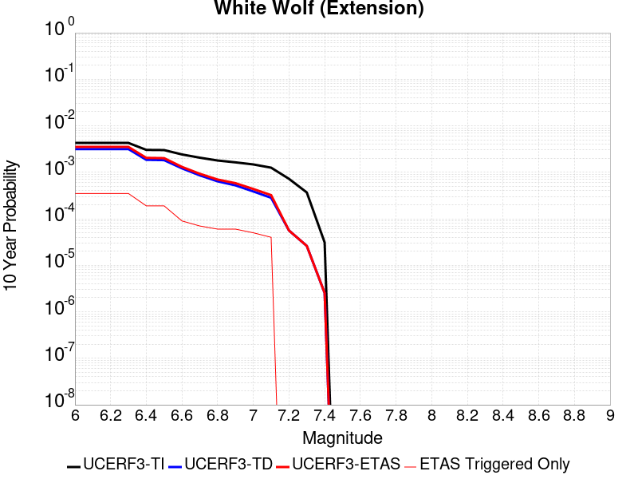 |

| Magnitude | 1 wk TI Prob | 1 wk TD Prob | 1 wk ETAS Prob | 1 wk ETAS/TD Gain | 1 wk ETAS Triggered Only | 1 mo TI Prob | 1 mo TD Prob | 1 mo ETAS Prob | 1 mo ETAS/TD Gain | 1 mo ETAS Triggered Only | 1 yr TI Prob | 1 yr TD Prob | 1 yr ETAS Prob | 1 yr ETAS/TD Gain | 1 yr ETAS Triggered Only | 10 yr TI Prob | 10 yr TD Prob | 10 yr ETAS Prob | 10 yr ETAS/TD Gain | 10 yr ETAS Triggered Only |
|-----|-----|-----|-----|-----|-----|-----|-----|-----|-----|-----|-----|-----|-----|-----|-----|-----|-----|-----|-----|-----|
| 6.0 | 8.222555E-6 | 6.0666657E-6 | 2.110955E-4 | 34.795967 | 2.0503007E-4 | 3.5239045E-5 | 2.5999774E-5 | 2.993661E-4 | 11.51418 | 2.733734E-4 | 4.289509E-4 | 3.1650788E-4 | 8.630817E-4 | 2.7268884 | 5.467468E-4 | 0.0042812387 | 0.003161223 | 0.0039106235 | 1.2370603 | 7.517769E-4 |
| 6.1 | 8.222555E-6 | 6.0666657E-6 | 2.110955E-4 | 34.795967 | 2.0503007E-4 | 3.5239045E-5 | 2.5999774E-5 | 2.993661E-4 | 11.51418 | 2.733734E-4 | 4.289509E-4 | 3.1650788E-4 | 8.630817E-4 | 2.7268884 | 5.467468E-4 | 0.0042812387 | 0.003161223 | 0.0039106235 | 1.2370603 | 7.517769E-4 |
| 6.2 | 8.222555E-6 | 6.0666657E-6 | 2.110955E-4 | 34.795967 | 2.0503007E-4 | 3.5239045E-5 | 2.5999774E-5 | 2.993661E-4 | 11.51418 | 2.733734E-4 | 4.289509E-4 | 3.1650788E-4 | 8.630817E-4 | 2.7268884 | 5.467468E-4 | 0.0042812387 | 0.003161223 | 0.0039106235 | 1.2370603 | 7.517769E-4 |
| 6.3 | 8.222555E-6 | 6.0666657E-6 | 2.110955E-4 | 34.795967 | 2.0503007E-4 | 3.5239045E-5 | 2.5999774E-5 | 2.993661E-4 | 11.51418 | 2.733734E-4 | 4.289509E-4 | 3.1650788E-4 | 8.630817E-4 | 2.7268884 | 5.467468E-4 | 0.0042812387 | 0.003161223 | 0.0039106235 | 1.2370603 | 7.517769E-4 |
| 6.4 | 5.821773E-6 | 3.5571766E-6 | 3.5571766E-6 | 1.0 | 0.0 | 2.4950215E-5 | 1.5244959E-5 | 8.358728E-5 | 5.482945 | 6.834335E-5 | 3.0372653E-4 | 1.8559267E-4 | 3.905847E-4 | 2.1045265 | 2.0503007E-4 | 0.0030331176 | 0.001854485 | 0.0021273515 | 1.1471387 | 2.733734E-4 |
| 6.5 | 5.766023E-6 | 3.4991106E-6 | 3.4991106E-6 | 1.0 | 0.0 | 2.4711293E-5 | 1.4996108E-5 | 8.333844E-5 | 5.5573378 | 6.834335E-5 | 3.0081844E-4 | 1.8256342E-4 | 3.8755607E-4 | 2.122857 | 2.0503007E-4 | 0.0030041158 | 0.0018242426 | 0.0020971172 | 1.1495825 | 2.733734E-4 |
| 6.6 | 4.643576E-6 | 2.332624E-6 | 2.332624E-6 | 1.0 | 0.0 | 1.9900888E-5 | 9.996925E-6 | 9.996925E-6 | 1.0 | 0.0 | 2.4226638E-4 | 1.2170619E-4 | 1.9004123E-4 | 1.5614755 | 6.834335E-5 | 0.0024200242 | 0.0012164378 | 0.001284698 | 1.0561148 | 6.834335E-5 |
| 6.7 | 3.9529173E-6 | 1.6483477E-6 | 1.6483477E-6 | 1.0 | 0.0 | 1.6940963E-5 | 7.0643296E-6 | 7.0643296E-6 | 1.0 | 0.0 | 2.0623671E-4 | 8.6005006E-5 | 1.5434249E-4 | 1.7945756 | 6.834335E-5 | 0.002060454 | 8.597357E-4 | 9.2802034E-4 | 1.0794251 | 6.834335E-5 |
| 6.8 | 3.4377522E-6 | 1.2245237E-6 | 1.2245237E-6 | 1.0 | 0.0 | 1.473314E-5 | 5.2479486E-6 | 5.2479486E-6 | 1.0 | 0.0 | 1.7936122E-4 | 6.3891996E-5 | 1.3223098E-4 | 2.0696018 | 6.834335E-5 | 0.0017921652 | 6.387454E-4 | 7.070451E-4 | 1.1069279 | 6.834335E-5 |
| 6.9 | 3.1367306E-6 | 1.0033783E-6 | 1.0033783E-6 | 1.0 | 0.0 | 1.3443062E-5 | 4.3001864E-6 | 4.3001864E-6 | 1.0 | 0.0 | 1.63657E-4 | 5.235359E-5 | 1.2069337E-4 | 2.3053505 | 6.834335E-5 | 0.0016353652 | 5.2342017E-4 | 5.917278E-4 | 1.1305023 | 6.834335E-5 |
| 7.0 | 2.8298145E-6 | 7.4286646E-7 | 7.4286646E-7 | 1.0 | 0.0 | 1.2127721E-5 | 3.1837099E-6 | 3.1837099E-6 | 1.0 | 0.0 | 1.47645E-4 | 3.8761027E-5 | 1.0710174E-4 | 2.7631295 | 6.834335E-5 | 0.0014754693 | 3.8754768E-4 | 4.5586453E-4 | 1.1762799 | 6.834335E-5 |
| 7.1 | 2.4091064E-6 | 5.4227525E-7 | 5.4227525E-7 | 1.0 | 0.0 | 1.03247E-5 | 2.3240348E-6 | 2.3240348E-6 | 1.0 | 0.0 | 1.2569598E-4 | 2.8294799E-5 | 2.8294799E-5 | 1.0 | 0.0 | 0.001256249 | 2.8291598E-4 | 2.8291598E-4 | 1.0 | 0.0 |
| 7.2 | 1.3875518E-6 | 1.0743063E-7 | 1.0743063E-7 | 1.0 | 0.0 | 5.9466374E-6 | 4.6041689E-7 | 4.6041689E-7 | 1.0 | 0.0 | 7.23979E-5 | 5.6055624E-6 | 5.6055624E-6 | 1.0 | 0.0 | 7.2374323E-4 | 5.6054323E-5 | 5.6054323E-5 | 1.0 | 0.0 |
| 7.3 | 7.056077E-7 | 5.002034E-8 | 5.002034E-8 | 1.0 | 0.0 | 3.0240296E-6 | 2.1437286E-7 | 2.1437286E-7 | 1.0 | 0.0 | 3.681694E-5 | 2.609987E-6 | 2.609987E-6 | 1.0 | 0.0 | 3.681084E-4 | 2.609961E-5 | 2.609961E-5 | 1.0 | 0.0 |
| 7.4 | 5.9334678E-8 | 4.8683537E-9 | 4.8683537E-9 | 1.0 | 0.0 | 2.5429145E-7 | 2.0864372E-8 | 2.0864372E-8 | 1.0 | 0.0 | 3.095994E-6 | 2.5402372E-7 | 2.5402372E-7 | 1.0 | 0.0 | 3.095951E-5 | 2.5402353E-6 | 2.5402353E-6 | 1.0 | 0.0 |

## Cady
*[(top)](#table-of-contents)*

| 1 Week | 1 Month | 1 Year | 10 Year |
|-----|-----|-----|-----|
|  | 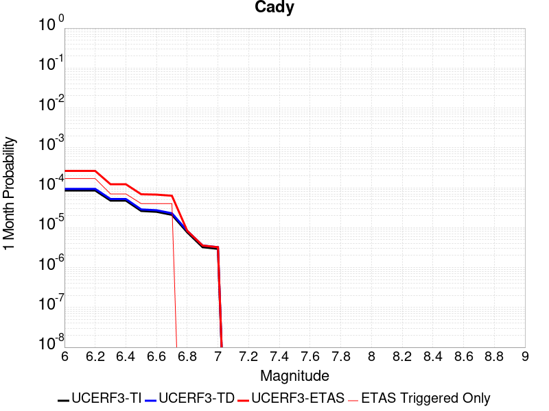 | 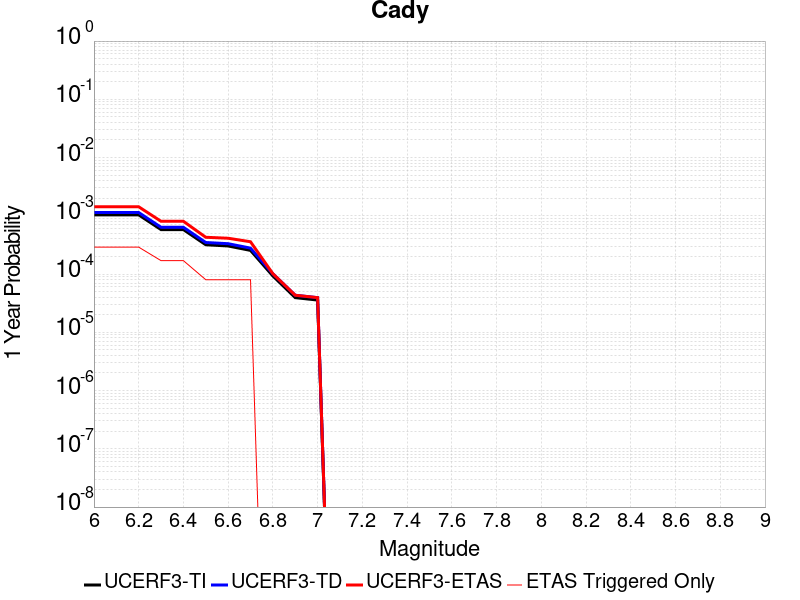 |  |

| Magnitude | 1 wk TI Prob | 1 wk TD Prob | 1 wk ETAS Prob | 1 wk ETAS/TD Gain | 1 wk ETAS Triggered Only | 1 mo TI Prob | 1 mo TD Prob | 1 mo ETAS Prob | 1 mo ETAS/TD Gain | 1 mo ETAS Triggered Only | 1 yr TI Prob | 1 yr TD Prob | 1 yr ETAS Prob | 1 yr ETAS/TD Gain | 1 yr ETAS Triggered Only | 10 yr TI Prob | 10 yr TD Prob | 10 yr ETAS Prob | 10 yr ETAS/TD Gain | 10 yr ETAS Triggered Only |
|-----|-----|-----|-----|-----|-----|-----|-----|-----|-----|-----|-----|-----|-----|-----|-----|-----|-----|-----|-----|-----|
| 6.0 | 1.9892565E-5 | 2.1858728E-5 | 2.2688432E-4 | 10.379575 | 2.0503007E-4 | 8.525106E-5 | 9.3677416E-5 | 5.036991E-4 | 5.376954 | 4.1006014E-4 | 0.0010374374 | 0.0011400167 | 0.0016861403 | 1.4790487 | 5.467468E-4 | 0.010326075 | 0.011350701 | 0.012026377 | 1.0595273 | 6.8343355E-4 |
| 6.1 | 1.9892565E-5 | 2.1858728E-5 | 2.2688432E-4 | 10.379575 | 2.0503007E-4 | 8.525106E-5 | 9.3677416E-5 | 5.036991E-4 | 5.376954 | 4.1006014E-4 | 0.0010374374 | 0.0011400167 | 0.0016861403 | 1.4790487 | 5.467468E-4 | 0.010326075 | 0.011350701 | 0.012026377 | 1.0595273 | 6.8343355E-4 |
| 6.2 | 1.9892565E-5 | 2.1858728E-5 | 2.2688432E-4 | 10.379575 | 2.0503007E-4 | 8.525106E-5 | 9.3677416E-5 | 5.036991E-4 | 5.376954 | 4.1006014E-4 | 0.0010374374 | 0.0011400167 | 0.0016861403 | 1.4790487 | 5.467468E-4 | 0.010326075 | 0.011350701 | 0.012026377 | 1.0595273 | 6.8343355E-4 |
| 6.3 | 1.1117327E-5 | 1.2176583E-5 | 1.2176583E-5 | 1.0 | 0.0 | 4.764482E-5 | 5.2184492E-5 | 1.8886407E-4 | 3.619161 | 1.366867E-4 | 5.7992124E-4 | 6.351925E-4 | 9.0839225E-4 | 1.4301054 | 2.733734E-4 | 0.0057841022 | 0.0063368753 | 0.0066085164 | 1.0428667 | 2.733734E-4 |
| 6.4 | 1.1117327E-5 | 1.2176583E-5 | 1.2176583E-5 | 1.0 | 0.0 | 4.764482E-5 | 5.2184492E-5 | 1.8886407E-4 | 3.619161 | 1.366867E-4 | 5.7992124E-4 | 6.351925E-4 | 9.0839225E-4 | 1.4301054 | 2.733734E-4 | 0.0057841022 | 0.0063368753 | 0.0066085164 | 1.0428667 | 2.733734E-4 |
| 6.5 | 6.103093E-6 | 6.672021E-6 | 6.672021E-6 | 1.0 | 0.0 | 2.615585E-5 | 2.8594131E-5 | 9.693553E-5 | 3.39005 | 6.834335E-5 | 3.1840094E-4 | 3.480905E-4 | 5.530492E-4 | 1.5888087 | 2.0503007E-4 | 0.0031794512 | 0.0034766865 | 0.0036810038 | 1.0587678 | 2.0503007E-4 |
| 6.6 | 5.817237E-6 | 6.3656585E-6 | 6.3656585E-6 | 1.0 | 0.0 | 2.4930776E-5 | 2.728118E-5 | 9.562267E-5 | 3.5050786 | 6.834335E-5 | 3.034899E-4 | 3.3211018E-4 | 5.3707213E-4 | 1.6171505 | 2.0503007E-4 | 0.0030307577 | 0.0033173605 | 0.0035217104 | 1.0616002 | 2.0503007E-4 |
| 6.7 | 4.8846314E-6 | 5.3405684E-6 | 5.3405684E-6 | 1.0 | 0.0 | 2.0933967E-5 | 2.2888014E-5 | 9.1229806E-5 | 3.9859204 | 6.834335E-5 | 2.5484123E-4 | 2.7863772E-4 | 4.8361067E-4 | 1.7356253 | 2.0503007E-4 | 0.0025454918 | 0.0027840391 | 0.0029884984 | 1.0734398 | 2.0503007E-4 |
| 6.8 | 1.7788773E-6 | 1.9399079E-6 | 1.9399079E-6 | 1.0 | 0.0 | 7.6237375E-6 | 8.313874E-6 | 8.313874E-6 | 1.0 | 0.0 | 9.281505E-5 | 1.01218284E-4 | 1.01218284E-4 | 1.0 | 0.0 | 9.2776294E-4 | 0.0010118765 | 0.0010118765 | 1.0 | 0.0 |
| 6.9 | 7.5455404E-7 | 8.297092E-7 | 8.297092E-7 | 1.0 | 0.0 | 3.233799E-6 | 3.5558937E-6 | 3.5558937E-6 | 1.0 | 0.0 | 3.937079E-5 | 4.3292483E-5 | 4.3292483E-5 | 1.0 | 0.0 | 3.9363815E-4 | 4.3287344E-4 | 4.3287344E-4 | 1.0 | 0.0 |
| 7.0 | 6.8578805E-7 | 7.541816E-7 | 7.541816E-7 | 1.0 | 0.0 | 2.9390883E-6 | 3.2322048E-6 | 3.2322048E-6 | 1.0 | 0.0 | 3.578281E-5 | 3.9351715E-5 | 3.9351715E-5 | 1.0 | 0.0 | 3.577705E-4 | 3.9347992E-4 | 3.9347992E-4 | 1.0 | 0.0 |

## Red Pass
*[(top)](#table-of-contents)*

| 1 Week | 1 Month | 1 Year | 10 Year |
|-----|-----|-----|-----|
|  |  |  |  |

| Magnitude | 1 wk TI Prob | 1 wk TD Prob | 1 wk ETAS Prob | 1 wk ETAS/TD Gain | 1 wk ETAS Triggered Only | 1 mo TI Prob | 1 mo TD Prob | 1 mo ETAS Prob | 1 mo ETAS/TD Gain | 1 mo ETAS Triggered Only | 1 yr TI Prob | 1 yr TD Prob | 1 yr ETAS Prob | 1 yr ETAS/TD Gain | 1 yr ETAS Triggered Only | 10 yr TI Prob | 10 yr TD Prob | 10 yr ETAS Prob | 10 yr ETAS/TD Gain | 10 yr ETAS Triggered Only |
|-----|-----|-----|-----|-----|-----|-----|-----|-----|-----|-----|-----|-----|-----|-----|-----|-----|-----|-----|-----|-----|
| 6.0 | 8.258278E-6 | 8.551265E-6 | 2.1357958E-4 | 24.976374 | 2.0503007E-4 | 3.539214E-5 | 3.6647863E-5 | 4.4669298E-4 | 12.1887865 | 4.1006014E-4 | 4.308141E-4 | 4.4611428E-4 | 9.926172E-4 | 2.225029 | 5.467468E-4 | 0.0042997985 | 0.004453945 | 0.0051343343 | 1.1527611 | 6.8343355E-4 |
| 6.1 | 3.649988E-6 | 3.7753161E-6 | 7.211841E-5 | 19.102617 | 6.834335E-5 | 1.5642712E-5 | 1.6179853E-5 | 2.212066E-4 | 13.671732 | 2.0503007E-4 | 1.9043336E-4 | 1.9697666E-4 | 4.0196633E-4 | 2.0406802 | 2.0503007E-4 | 0.0019027026 | 0.001968488 | 0.0021731146 | 1.1039511 | 2.0503007E-4 |
| 6.2 | 3.649988E-6 | 3.7753161E-6 | 7.211841E-5 | 19.102617 | 6.834335E-5 | 1.5642712E-5 | 1.6179853E-5 | 2.212066E-4 | 13.671732 | 2.0503007E-4 | 1.9043336E-4 | 1.9697666E-4 | 4.0196633E-4 | 2.0406802 | 2.0503007E-4 | 0.0019027026 | 0.001968488 | 0.0021731146 | 1.1039511 | 2.0503007E-4 |
| 6.3 | 1.3924937E-6 | 1.4411166E-6 | 1.4411166E-6 | 1.0 | 0.0 | 5.9678164E-6 | 6.1762075E-6 | 7.451914E-5 | 12.065518 | 6.834335E-5 | 7.265574E-5 | 7.519415E-5 | 1.4353236E-4 | 1.9088236 | 6.834335E-5 | 7.263199E-4 | 7.518258E-4 | 8.2011777E-4 | 1.0908349 | 6.834335E-5 |
| 6.4 | 1.3924937E-6 | 1.4411166E-6 | 1.4411166E-6 | 1.0 | 0.0 | 5.9678164E-6 | 6.1762075E-6 | 7.451914E-5 | 12.065518 | 6.834335E-5 | 7.265574E-5 | 7.519415E-5 | 1.4353236E-4 | 1.9088236 | 6.834335E-5 | 7.263199E-4 | 7.518258E-4 | 8.2011777E-4 | 1.0908349 | 6.834335E-5 |
| 6.5 | 9.876812E-7 | 1.0221912E-6 | 1.0221912E-6 | 1.0 | 0.0 | 4.2329125E-6 | 4.3808195E-6 | 7.272388E-5 | 16.60052 | 6.834335E-5 | 5.153449E-5 | 5.3336476E-5 | 1.2167619E-4 | 2.281294 | 6.834335E-5 | 5.1522546E-4 | 5.333648E-4 | 6.016717E-4 | 1.1280679 | 6.834335E-5 |

## Death Valley (No)
*[(top)](#table-of-contents)*

| 1 Week | 1 Month | 1 Year | 10 Year |
|-----|-----|-----|-----|
|  |  |  | 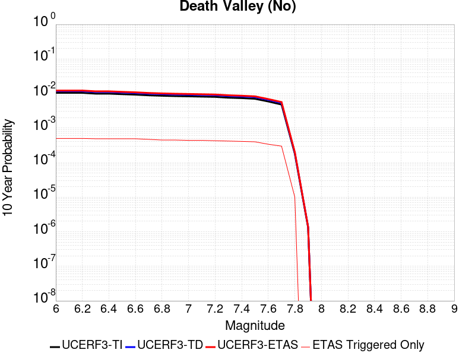 |

| Magnitude | 1 wk TI Prob | 1 wk TD Prob | 1 wk ETAS Prob | 1 wk ETAS/TD Gain | 1 wk ETAS Triggered Only | 1 mo TI Prob | 1 mo TD Prob | 1 mo ETAS Prob | 1 mo ETAS/TD Gain | 1 mo ETAS Triggered Only | 1 yr TI Prob | 1 yr TD Prob | 1 yr ETAS Prob | 1 yr ETAS/TD Gain | 1 yr ETAS Triggered Only | 10 yr TI Prob | 10 yr TD Prob | 10 yr ETAS Prob | 10 yr ETAS/TD Gain | 10 yr ETAS Triggered Only |
|-----|-----|-----|-----|-----|-----|-----|-----|-----|-----|-----|-----|-----|-----|-----|-----|-----|-----|-----|-----|-----|
| 6.0 | 2.0074807E-5 | 2.2500084E-5 | 2.9586736E-4 | 13.149611 | 2.733734E-4 | 8.603206E-5 | 9.642541E-5 | 5.06446E-4 | 5.252205 | 4.1006014E-4 | 0.001046937 | 0.0011733545 | 0.0017194598 | 1.4654223 | 5.467468E-4 | 0.010420183 | 0.011672506 | 0.012280417 | 1.0520805 | 6.150902E-4 |
| 6.1 | 2.0074807E-5 | 2.2500084E-5 | 2.9586736E-4 | 13.149611 | 2.733734E-4 | 8.603206E-5 | 9.642541E-5 | 5.06446E-4 | 5.252205 | 4.1006014E-4 | 0.001046937 | 0.0011733545 | 0.0017194598 | 1.4654223 | 5.467468E-4 | 0.010420183 | 0.011672506 | 0.012280417 | 1.0520805 | 6.150902E-4 |
| 6.2 | 2.0074807E-5 | 2.2500084E-5 | 2.9586736E-4 | 13.149611 | 2.733734E-4 | 8.603206E-5 | 9.642541E-5 | 5.06446E-4 | 5.252205 | 4.1006014E-4 | 0.001046937 | 0.0011733545 | 0.0017194598 | 1.4654223 | 5.467468E-4 | 0.010420183 | 0.011672506 | 0.012280417 | 1.0520805 | 6.150902E-4 |
| 6.3 | 1.9050609E-5 | 2.1336948E-5 | 2.9470454E-4 | 13.811935 | 2.733734E-4 | 8.164292E-5 | 9.1440896E-5 | 5.0146354E-4 | 5.4840183 | 4.1006014E-4 | 9.935491E-4 | 0.001112731 | 0.0016588696 | 1.4908091 | 5.467468E-4 | 0.009891188 | 0.011072419 | 0.011680698 | 1.0549365 | 6.150902E-4 |
| 6.4 | 1.9050609E-5 | 2.1336948E-5 | 2.9470454E-4 | 13.811935 | 2.733734E-4 | 8.164292E-5 | 9.1440896E-5 | 5.0146354E-4 | 5.4840183 | 4.1006014E-4 | 9.935491E-4 | 0.001112731 | 0.0016588696 | 1.4908091 | 5.467468E-4 | 0.009891188 | 0.011072419 | 0.011680698 | 1.0549365 | 6.150902E-4 |
| 6.5 | 1.8367004E-5 | 2.0561009E-5 | 2.939288E-4 | 14.295447 | 2.733734E-4 | 7.8713354E-5 | 8.811567E-5 | 4.9813965E-4 | 5.6532474 | 4.1006014E-4 | 9.5791375E-4 | 0.0010722869 | 0.0016184474 | 1.5093418 | 5.467468E-4 | 0.009537951 | 0.0106719155 | 0.011280442 | 1.0570213 | 6.150902E-4 |
| 6.6 | 1.779439E-5 | 1.9910927E-5 | 2.9327892E-4 | 14.729546 | 2.733734E-4 | 7.625944E-5 | 8.53298E-5 | 4.9535494E-4 | 5.8051815 | 4.1006014E-4 | 9.280632E-4 | 0.0010384015 | 0.0015845806 | 1.5259807 | 5.467468E-4 | 0.009241969 | 0.010336253 | 0.010944985 | 1.058893 | 6.150902E-4 |
| 6.7 | 1.7025437E-5 | 1.9043426E-5 | 2.9241166E-4 | 15.354992 | 2.733734E-4 | 7.296412E-5 | 8.161216E-5 | 4.9163884E-4 | 6.024088 | 4.1006014E-4 | 8.87976E-4 | 9.931813E-4 | 0.0015393852 | 1.5499538 | 5.467468E-4 | 0.008844362 | 0.009888145 | 0.010497154 | 1.0615897 | 6.150902E-4 |
| 6.8 | 1.6545107E-5 | 1.8512545E-5 | 2.2353882E-4 | 12.074991 | 2.0503007E-4 | 7.090568E-5 | 7.93371E-5 | 4.2102678E-4 | 5.306808 | 3.4171678E-4 | 8.629347E-4 | 9.655073E-4 | 0.0014434488 | 1.4950161 | 4.784035E-4 | 0.008595915 | 0.009613829 | 0.010155319 | 1.0563241 | 5.467468E-4 |
| 6.9 | 1.615478E-5 | 1.8087594E-5 | 2.2311395E-4 | 12.335193 | 2.0503007E-4 | 6.9232934E-5 | 7.751599E-5 | 4.1920628E-4 | 5.4079976 | 3.4171678E-4 | 8.4258494E-4 | 9.433546E-4 | 0.0014213069 | 1.5066516 | 4.784035E-4 | 0.008393973 | 0.009394196 | 0.0099358065 | 1.0576538 | 5.467468E-4 |
| 7.0 | 1.5894311E-5 | 1.780555E-5 | 2.2283196E-4 | 12.514748 | 2.0503007E-4 | 6.81167E-5 | 7.6307304E-5 | 4.17998E-4 | 5.4778247 | 3.4171678E-4 | 8.2900526E-4 | 9.286515E-4 | 0.0014066107 | 1.514681 | 4.784035E-4 | 0.008259195 | 0.009248397 | 0.009790088 | 1.0585712 | 5.467468E-4 |
| 7.1 | 1.5602263E-5 | 1.7483504E-5 | 2.2250999E-4 | 12.726853 | 2.0503007E-4 | 6.6865134E-5 | 7.492718E-5 | 4.1661836E-4 | 5.56031 | 3.4171678E-4 | 8.137789E-4 | 9.118627E-4 | 0.00138983 | 1.5241659 | 4.784035E-4 | 0.008108052 | 0.009081894 | 0.009623676 | 1.0596551 | 5.467468E-4 |
| 7.2 | 1.5323829E-5 | 1.717063E-5 | 2.2219718E-4 | 12.940537 | 2.0503007E-4 | 6.56719E-5 | 7.358637E-5 | 4.1527802E-4 | 5.6434093 | 3.4171678E-4 | 7.99262E-4 | 8.9555193E-4 | 0.001373527 | 1.5337212 | 4.784035E-4 | 0.007963934 | 0.008920107 | 0.009461977 | 1.060747 | 5.467468E-4 |
| 7.3 | 1.4556212E-5 | 1.6302456E-5 | 2.2132919E-4 | 13.576432 | 2.0503007E-4 | 6.238227E-5 | 6.9865826E-5 | 4.1155875E-4 | 5.890702 | 3.4171678E-4 | 7.592395E-4 | 8.5029035E-4 | 0.0013282871 | 1.562157 | 4.784035E-4 | 0.0075665074 | 0.008471014 | 0.009013129 | 1.0639966 | 5.467468E-4 |
| 7.4 | 1.411725E-5 | 1.580796E-5 | 2.2083479E-4 | 13.969848 | 2.0503007E-4 | 6.0501097E-5 | 6.7746674E-5 | 4.094403E-4 | 6.043696 | 3.4171678E-4 | 7.363519E-4 | 8.245094E-4 | 0.0013025185 | 1.5797496 | 4.784035E-4 | 0.0073391674 | 0.008215138 | 0.008757394 | 1.0660068 | 5.467468E-4 |
| 7.5 | 1.3503312E-5 | 1.5126289E-5 | 2.2015326E-4 | 14.554347 | 2.0503007E-4 | 5.7870053E-5 | 6.482538E-5 | 4.0652E-4 | 6.2710013 | 3.4171678E-4 | 7.043401E-4 | 7.8896893E-4 | 0.001266995 | 1.605887 | 4.784035E-4 | 0.007021119 | 0.007862304 | 0.008404752 | 1.0689936 | 5.467468E-4 |
| 7.6 | 1.1279839E-5 | 1.2626327E-5 | 2.1765381E-4 | 17.238094 | 2.0503007E-4 | 4.834127E-5 | 5.4111737E-5 | 3.2747036E-4 | 6.051744 | 2.733734E-4 | 5.88396E-4 | 6.5861654E-4 | 0.0010001083 | 1.5184985 | 3.4171678E-4 | 0.005868405 | 0.006567199 | 0.006974566 | 1.0620306 | 4.1006014E-4 |
| 7.7 | 9.189108E-6 | 1.0283358E-5 | 1.4696867E-4 | 14.291894 | 1.366867E-4 | 3.93813E-5 | 4.407082E-5 | 2.4909186E-4 | 5.6520815 | 2.0503007E-4 | 4.7936183E-4 | 5.3643517E-4 | 8.096619E-4 | 1.5093379 | 2.733734E-4 | 0.004783291 | 0.005351914 | 0.0056918017 | 1.0635078 | 3.4171678E-4 |
| 7.8 | 3.4586725E-7 | 3.6482615E-7 | 3.6482615E-7 | 1.0 | 0.0 | 1.4822873E-6 | 1.5635396E-6 | 1.5635396E-6 | 1.0 | 0.0 | 1.80467E-5 | 1.9035933E-5 | 1.9035933E-5 | 1.0 | 0.0 | 1.8045233E-4 | 1.9034347E-4 | 1.9034347E-4 | 1.0 | 0.0 |
| 7.9 | 2.5591178E-9 | 2.6696718E-9 | 2.6696718E-9 | 1.0 | 0.0 | 1.0967647E-8 | 1.14414505E-8 | 1.14414505E-8 | 1.0 | 0.0 | 1.335311E-7 | 1.3929966E-7 | 1.3929966E-7 | 1.0 | 0.0 | 1.3353102E-6 | 1.3929966E-6 | 1.3929966E-6 | 1.0 | 0.0 |

## San Andreas (Creeping Section) 2011 CFM
*[(top)](#table-of-contents)*

| 1 Week | 1 Month | 1 Year | 10 Year |
|-----|-----|-----|-----|
|  |  |  |  |

| Magnitude | 1 wk TI Prob | 1 wk TD Prob | 1 wk ETAS Prob | 1 wk ETAS/TD Gain | 1 wk ETAS Triggered Only | 1 mo TI Prob | 1 mo TD Prob | 1 mo ETAS Prob | 1 mo ETAS/TD Gain | 1 mo ETAS Triggered Only | 1 yr TI Prob | 1 yr TD Prob | 1 yr ETAS Prob | 1 yr ETAS/TD Gain | 1 yr ETAS Triggered Only | 10 yr TI Prob | 10 yr TD Prob | 10 yr ETAS Prob | 10 yr ETAS/TD Gain | 10 yr ETAS Triggered Only |
|-----|-----|-----|-----|-----|-----|-----|-----|-----|-----|-----|-----|-----|-----|-----|-----|-----|-----|-----|-----|-----|
| 6.0 | 5.986481E-4 | 0.001228691 | 0.0013652098 | 1.1111091 | 1.366867E-4 | 0.0025631124 | 0.005246795 | 0.0053827646 | 1.0259148 | 1.366867E-4 | 0.030762846 | 0.061203245 | 0.06165237 | 1.0073383 | 4.784035E-4 | 0.26835477 | 0.425928 | 0.42624187 | 1.000737 | 5.467468E-4 |
| 6.1 | 5.015945E-4 | 0.0010230356 | 0.0011595825 | 1.1334723 | 1.366867E-4 | 0.00214792 | 0.004369436 | 0.0045055253 | 1.0311458 | 1.366867E-4 | 0.025839351 | 0.051246606 | 0.051635653 | 1.0075916 | 4.1006014E-4 | 0.23032776 | 0.37284943 | 0.37314948 | 1.0008047 | 4.784035E-4 |
| 6.2 | 4.073338E-4 | 8.1157376E-4 | 8.7986165E-4 | 1.0841426 | 6.834335E-5 | 0.0017445484 | 0.0034683137 | 0.00353642 | 1.0196368 | 6.834335E-5 | 0.021034058 | 0.04093177 | 0.041259497 | 1.0080067 | 3.4171678E-4 | 0.19150782 | 0.31302592 | 0.3133076 | 1.0008999 | 4.1006014E-4 |
| 6.3 | 3.464099E-4 | 6.7455834E-4 | 7.428556E-4 | 1.1012473 | 6.834335E-5 | 0.0014837692 | 0.0028832308 | 0.002951377 | 1.0236354 | 6.834335E-5 | 0.017915873 | 0.034187846 | 0.03451788 | 1.0096536 | 3.4171678E-4 | 0.16538359 | 0.27130842 | 0.27160722 | 1.0011014 | 4.1006014E-4 |
| 6.4 | 2.935057E-4 | 5.5516965E-4 | 6.2347506E-4 | 1.1230352 | 6.834335E-5 | 0.0012572751 | 0.0023727308 | 0.002440912 | 1.0287353 | 6.834335E-5 | 0.015200248 | 0.02826279 | 0.02859485 | 1.011749 | 3.4171678E-4 | 0.14201577 | 0.23297668 | 0.2332912 | 1.00135 | 4.1006014E-4 |
| 6.5 | 2.3409708E-4 | 4.2132285E-4 | 4.8963743E-4 | 1.162143 | 6.834335E-5 | 0.0010028875 | 0.0018017791 | 0.0018699995 | 1.0378627 | 6.834335E-5 | 0.012141965 | 0.021586355 | 0.021920694 | 1.0154885 | 3.4171678E-4 | 0.11499573 | 0.1868149 | 0.18714836 | 1.0017849 | 4.1006014E-4 |
| 6.6 | 1.5842178E-4 | 2.5068692E-4 | 3.1901314E-4 | 1.272556 | 6.834335E-5 | 6.7877385E-4 | 0.0010739256 | 0.0011421955 | 1.0635705 | 6.834335E-5 | 0.0082328 | 0.012995283 | 0.013197648 | 1.0155722 | 2.0503007E-4 | 0.07934396 | 0.12313759 | 0.12337731 | 1.0019467 | 2.733734E-4 |
| 6.7 | 1.5616413E-4 | 2.4605254E-4 | 3.1437908E-4 | 1.2776909 | 6.834335E-5 | 6.691031E-4 | 0.0010540807 | 0.001122352 | 1.0647686 | 6.834335E-5 | 0.0081159435 | 0.012757154 | 0.012959569 | 1.0158668 | 2.0503007E-4 | 0.0782586 | 0.12116472 | 0.12140497 | 1.0019828 | 2.733734E-4 |
| 6.8 | 1.5538467E-4 | 2.442914E-4 | 3.126181E-4 | 1.2796932 | 6.834335E-5 | 6.6576427E-4 | 0.001046539 | 0.0011148109 | 1.0652359 | 6.834335E-5 | 0.008075596 | 0.012666538 | 0.012868971 | 1.0159817 | 2.0503007E-4 | 0.07788358 | 0.12039561 | 0.12063607 | 1.0019972 | 2.733734E-4 |
| 6.9 | 1.5153569E-4 | 2.3538464E-4 | 3.0371192E-4 | 1.2902793 | 6.834335E-5 | 6.49277E-4 | 0.0010084033 | 0.0010766777 | 1.0677055 | 6.834335E-5 | 0.007876333 | 0.012208726 | 0.0124112535 | 1.0165887 | 2.0503007E-4 | 0.07602952 | 0.11646574 | 0.11670728 | 1.0020739 | 2.733734E-4 |
| 7.0 | 1.4588932E-4 | 2.2395732E-4 | 2.9228537E-4 | 1.3050941 | 6.834335E-5 | 6.250901E-4 | 9.59466E-4 | 0.0010277438 | 1.0711622 | 6.834335E-5 | 0.0075839474 | 0.011619428 | 0.011822076 | 1.0174404 | 2.0503007E-4 | 0.073302895 | 0.11131206 | 0.11155501 | 1.0021826 | 2.733734E-4 |
| 7.1 | 1.1565079E-4 | 1.6281323E-4 | 2.3114546E-4 | 1.419697 | 6.834335E-5 | 4.955521E-4 | 6.9758523E-4 | 7.658809E-4 | 1.097903 | 6.834335E-5 | 0.006016669 | 0.008460228 | 0.008663524 | 1.0240295 | 2.0503007E-4 | 0.058563538 | 0.08366478 | 0.083915286 | 1.0029941 | 2.733734E-4 |
| 7.2 | 1.0393792E-4 | 1.4615392E-4 | 2.1448729E-4 | 1.4675438 | 6.834335E-5 | 4.4537216E-4 | 6.262243E-4 | 6.945249E-4 | 1.1090672 | 6.834335E-5 | 0.005408933 | 0.0075977976 | 0.00780127 | 1.0267805 | 2.0503007E-4 | 0.052791595 | 0.07561503 | 0.07586774 | 1.0033419 | 2.733734E-4 |
| 7.3 | 9.332884E-5 | 1.2780601E-4 | 1.9614062E-4 | 1.5346746 | 6.834335E-5 | 3.999194E-4 | 5.4762565E-4 | 6.159316E-4 | 1.1247311 | 6.834335E-5 | 0.0048581534 | 0.0066470946 | 0.006850762 | 1.03064 | 2.0503007E-4 | 0.047533102 | 0.06647954 | 0.06673474 | 1.0038388 | 2.733734E-4 |
| 7.4 | 8.670252E-5 | 1.1702972E-4 | 1.8536508E-4 | 1.5839146 | 6.834335E-5 | 3.715293E-4 | 5.014601E-4 | 5.697692E-4 | 1.1362203 | 6.834335E-5 | 0.004513991 | 0.0060883067 | 0.0062920884 | 1.033471 | 2.0503007E-4 | 0.044233937 | 0.061148684 | 0.061405342 | 1.0041972 | 2.733734E-4 |
| 7.5 | 7.3036405E-5 | 9.005699E-5 | 1.5839419E-4 | 1.7588218 | 6.834335E-5 | 3.129756E-4 | 3.859015E-4 | 4.5421848E-4 | 1.1770322 | 6.834335E-5 | 0.0038038217 | 0.0046882504 | 0.0048923194 | 1.0435277 | 2.0503007E-4 | 0.03739367 | 0.047875606 | 0.04813589 | 1.0054367 | 2.733734E-4 |
| 7.6 | 6.3935775E-5 | 8.280209E-5 | 1.5113979E-4 | 1.8253137 | 6.834335E-5 | 2.7398168E-4 | 3.5481792E-4 | 4.2313704E-4 | 1.192547 | 6.834335E-5 | 0.0033306254 | 0.00431137 | 0.004515516 | 1.0473506 | 2.0503007E-4 | 0.032811474 | 0.043990135 | 0.044251483 | 1.005941 | 2.733734E-4 |
| 7.7 | 5.5050095E-5 | 6.661729E-5 | 1.3495609E-4 | 2.0258417 | 6.834335E-5 | 2.3590765E-4 | 2.8547147E-4 | 3.537953E-4 | 1.2393368 | 6.834335E-5 | 0.0028683927 | 0.0034700802 | 0.0035381862 | 1.0196267 | 6.834335E-5 | 0.0283165 | 0.03579509 | 0.035926882 | 1.0036819 | 1.366867E-4 |
| 7.8 | 5.027131E-5 | 6.1627725E-5 | 1.2996687E-4 | 2.1089027 | 6.834335E-5 | 2.1543067E-4 | 2.640921E-4 | 3.324174E-4 | 1.2587178 | 6.834335E-5 | 0.0026197135 | 0.003210584 | 0.0032787079 | 1.0212185 | 6.834335E-5 | 0.025890453 | 0.03312572 | 0.03325788 | 1.0039896 | 1.366867E-4 |
| 7.9 | 3.7271806E-5 | 5.0224386E-5 | 1.1856431E-4 | 2.360692 | 6.834335E-5 | 1.5972654E-4 | 2.1522962E-4 | 2.8355827E-4 | 1.3174686 | 6.834335E-5 | 0.0019429359 | 0.0026172737 | 0.0026854381 | 1.0260441 | 6.834335E-5 | 0.019260362 | 0.027066687 | 0.027199674 | 1.0049133 | 1.366867E-4 |
| 8.0 | 2.7310243E-5 | 3.1428404E-5 | 9.976961E-5 | 3.1745045 | 6.834335E-5 | 1.17038646E-4 | 1.3468621E-4 | 2.0302036E-4 | 1.5073582 | 6.834335E-5 | 0.0014240141 | 0.0016385721 | 0.0017068035 | 1.0416408 | 6.834335E-5 | 0.014149235 | 0.01721387 | 0.017348202 | 1.0078038 | 1.366867E-4 |
| 8.1 | 1.7940547E-5 | 1.7400796E-5 | 8.574296E-5 | 4.9275312 | 6.834335E-5 | 7.688579E-5 | 7.457271E-5 | 1.4291097E-4 | 1.9163977 | 6.834335E-5 | 9.3568244E-4 | 9.075451E-4 | 9.7582646E-4 | 1.0752374 | 6.834335E-5 | 0.009317525 | 0.009799073 | 0.009866747 | 1.0069062 | 6.834335E-5 |
| 8.2 | 8.643924E-6 | 5.4748625E-6 | 5.4748625E-6 | 1.0 | 0.0 | 3.704486E-5 | 2.3463486E-5 | 2.3463486E-5 | 1.0 | 0.0 | 4.5092785E-4 | 2.8563058E-4 | 2.8563058E-4 | 1.0 | 0.0 | 0.0045001395 | 0.0032487072 | 0.0032487072 | 1.0 | 0.0 |
| 8.3 | 1.983087E-6 | 7.6599065E-7 | 7.6599065E-7 | 1.0 | 0.0 | 8.498917E-6 | 3.282813E-6 | 3.282813E-6 | 1.0 | 0.0 | 1.034694E-4 | 3.9967534E-5 | 3.9967534E-5 | 1.0 | 0.0 | 0.0010342124 | 4.719687E-4 | 4.719687E-4 | 1.0 | 0.0 |

## Lake Isabella (Seismicity)
*[(top)](#table-of-contents)*

| 1 Week | 1 Month | 1 Year | 10 Year |
|-----|-----|-----|-----|
|  |  |  |  |

| Magnitude | 1 wk TI Prob | 1 wk TD Prob | 1 wk ETAS Prob | 1 wk ETAS/TD Gain | 1 wk ETAS Triggered Only | 1 mo TI Prob | 1 mo TD Prob | 1 mo ETAS Prob | 1 mo ETAS/TD Gain | 1 mo ETAS Triggered Only | 1 yr TI Prob | 1 yr TD Prob | 1 yr ETAS Prob | 1 yr ETAS/TD Gain | 1 yr ETAS Triggered Only | 10 yr TI Prob | 10 yr TD Prob | 10 yr ETAS Prob | 10 yr ETAS/TD Gain | 10 yr ETAS Triggered Only |
|-----|-----|-----|-----|-----|-----|-----|-----|-----|-----|-----|-----|-----|-----|-----|-----|-----|-----|-----|-----|-----|
| 6.0 | 9.431637E-6 | 9.741651E-6 | 1.4642703E-4 | 15.031028 | 1.366867E-4 | 4.0420677E-5 | 4.1749343E-5 | 1.7843035E-4 | 4.273848 | 1.366867E-4 | 4.920106E-4 | 5.0819275E-4 | 9.1804453E-4 | 1.8064888 | 4.1006014E-4 | 0.004909227 | 0.005071599 | 0.005615573 | 1.1072589 | 5.467468E-4 |
| 6.1 | 9.431637E-6 | 9.741651E-6 | 1.4642703E-4 | 15.031028 | 1.366867E-4 | 4.0420677E-5 | 4.1749343E-5 | 1.7843035E-4 | 4.273848 | 1.366867E-4 | 4.920106E-4 | 5.0819275E-4 | 9.1804453E-4 | 1.8064888 | 4.1006014E-4 | 0.004909227 | 0.005071599 | 0.005615573 | 1.1072589 | 5.467468E-4 |
| 6.2 | 9.431637E-6 | 9.741651E-6 | 1.4642703E-4 | 15.031028 | 1.366867E-4 | 4.0420677E-5 | 4.1749343E-5 | 1.7843035E-4 | 4.273848 | 1.366867E-4 | 4.920106E-4 | 5.0819275E-4 | 9.1804453E-4 | 1.8064888 | 4.1006014E-4 | 0.004909227 | 0.005071599 | 0.005615573 | 1.1072589 | 5.467468E-4 |
| 6.3 | 9.431637E-6 | 9.741651E-6 | 1.4642703E-4 | 15.031028 | 1.366867E-4 | 4.0420677E-5 | 4.1749343E-5 | 1.7843035E-4 | 4.273848 | 1.366867E-4 | 4.920106E-4 | 5.0819275E-4 | 9.1804453E-4 | 1.8064888 | 4.1006014E-4 | 0.004909227 | 0.005071599 | 0.005615573 | 1.1072589 | 5.467468E-4 |
| 6.4 | 5.144063E-6 | 5.3000763E-6 | 1.4198606E-4 | 26.789438 | 1.366867E-4 | 2.2045799E-5 | 2.2714434E-5 | 1.5939804E-4 | 7.017478 | 1.366867E-4 | 2.6837454E-4 | 2.765166E-4 | 6.181389E-4 | 2.2354496 | 3.4171678E-4 | 0.0026805066 | 0.0027620657 | 0.0031709932 | 1.1480514 | 4.1006014E-4 |
| 6.5 | 5.144063E-6 | 5.3000763E-6 | 1.4198606E-4 | 26.789438 | 1.366867E-4 | 2.2045799E-5 | 2.2714434E-5 | 1.5939804E-4 | 7.017478 | 1.366867E-4 | 2.6837454E-4 | 2.765166E-4 | 6.181389E-4 | 2.2354496 | 3.4171678E-4 | 0.0026805066 | 0.0027620657 | 0.0031709932 | 1.1480514 | 4.1006014E-4 |
| 6.6 | 3.4009804E-6 | 3.498786E-6 | 3.498786E-6 | 1.0 | 0.0 | 1.4575549E-5 | 1.4994721E-5 | 1.4994721E-5 | 1.0 | 0.0 | 1.7744285E-4 | 1.8254704E-4 | 3.8753968E-4 | 2.122958 | 2.0503007E-4 | 0.0017730123 | 0.0018241286 | 0.0020970034 | 1.1495918 | 2.733734E-4 |
| 6.7 | 3.3880428E-6 | 3.4856528E-6 | 3.4856528E-6 | 1.0 | 0.0 | 1.4520103E-5 | 1.4938435E-5 | 1.4938435E-5 | 1.0 | 0.0 | 1.767679E-4 | 1.8186188E-4 | 3.8685466E-4 | 2.1271894 | 2.0503007E-4 | 0.0017662736 | 0.0018172882 | 0.002090165 | 1.1501559 | 2.733734E-4 |
| 6.8 | 2.6582E-6 | 2.7337003E-6 | 2.7337003E-6 | 1.0 | 0.0 | 1.1392236E-5 | 1.1715813E-5 | 1.1715813E-5 | 1.0 | 0.0 | 1.3869164E-4 | 1.4263204E-4 | 3.4763286E-4 | 2.4372706 | 2.0503007E-4 | 0.0013860512 | 0.0014255369 | 0.0016302747 | 1.1436216 | 2.0503007E-4 |
| 6.9 | 2.406011E-6 | 2.4743288E-6 | 2.4743288E-6 | 1.0 | 0.0 | 1.0311434E-5 | 1.0604231E-5 | 1.0604231E-5 | 1.0 | 0.0 | 1.2553448E-4 | 1.2910018E-4 | 3.341038E-4 | 2.5879421 | 2.0503007E-4 | 0.0012546359 | 0.0012903814 | 0.0014951469 | 1.158686 | 2.0503007E-4 |
| 7.0 | 1.6953097E-6 | 1.7429371E-6 | 1.7429371E-6 | 1.0 | 0.0 | 7.265593E-6 | 7.469715E-6 | 7.469715E-6 | 1.0 | 0.0 | 8.8455E-5 | 9.094104E-5 | 2.2761532E-4 | 2.502889 | 1.366867E-4 | 8.84198E-4 | 9.09141E-4 | 0.0010457034 | 1.1502104 | 1.366867E-4 |
| 7.1 | 3.5013824E-7 | 3.5714822E-7 | 3.5714822E-7 | 1.0 | 0.0 | 1.5005916E-6 | 1.5306344E-6 | 1.5306344E-6 | 1.0 | 0.0 | 1.826955E-5 | 1.8635317E-5 | 8.69774E-5 | 4.667342 | 6.834335E-5 | 1.8268047E-4 | 1.863378E-4 | 2.546684E-4 | 1.3667029 | 6.834335E-5 |
| 7.2 | 2.2321095E-7 | 2.2750574E-7 | 2.2750574E-7 | 1.0 | 0.0 | 9.56618E-7 | 9.750242E-7 | 9.750242E-7 | 1.0 | 0.0 | 1.1646762E-5 | 1.1870856E-5 | 8.02134E-5 | 6.7571707 | 6.834335E-5 | 1.1646151E-4 | 1.1870232E-4 | 1.8703757E-4 | 1.5756859 | 6.834335E-5 |
| 7.3 | 1.5760406E-7 | 1.6060922E-7 | 1.6060922E-7 | 1.0 | 0.0 | 6.7544585E-7 | 6.8832503E-7 | 6.8832503E-7 | 1.0 | 0.0 | 8.223522E-6 | 8.380326E-6 | 8.380326E-6 | 1.0 | 0.0 | 8.2232174E-5 | 8.3800165E-5 | 8.3800165E-5 | 1.0 | 0.0 |
| 7.4 | 1.1216497E-7 | 1.1431706E-7 | 1.1431706E-7 | 1.0 | 0.0 | 4.8070694E-7 | 4.899302E-7 | 4.899302E-7 | 1.0 | 0.0 | 5.852591E-6 | 5.964884E-6 | 5.964884E-6 | 1.0 | 0.0 | 5.8524372E-5 | 5.9647282E-5 | 5.9647282E-5 | 1.0 | 0.0 |
| 7.5 | 4.885185E-8 | 4.9787737E-8 | 4.9787737E-8 | 1.0 | 0.0 | 2.0936506E-7 | 2.13376E-7 | 2.13376E-7 | 1.0 | 0.0 | 2.5490165E-6 | 2.59785E-6 | 2.59785E-6 | 1.0 | 0.0 | 2.5489873E-5 | 2.5978214E-5 | 2.5978214E-5 | 1.0 | 0.0 |
| 7.6 | 1.504641E-9 | 1.5317903E-9 | 1.5317903E-9 | 1.0 | 0.0 | 6.4484613E-9 | 6.5648154E-9 | 6.5648154E-9 | 1.0 | 0.0 | 7.851001E-8 | 7.992663E-8 | 7.992663E-8 | 1.0 | 0.0 | 7.8509987E-7 | 7.992663E-7 | 7.992663E-7 | 1.0 | 0.0 |

## Calico-Hidalgo
*[(top)](#table-of-contents)*

| 1 Week | 1 Month | 1 Year | 10 Year |
|-----|-----|-----|-----|
|  |  |  |  |

| Magnitude | 1 wk TI Prob | 1 wk TD Prob | 1 wk ETAS Prob | 1 wk ETAS/TD Gain | 1 wk ETAS Triggered Only | 1 mo TI Prob | 1 mo TD Prob | 1 mo ETAS Prob | 1 mo ETAS/TD Gain | 1 mo ETAS Triggered Only | 1 yr TI Prob | 1 yr TD Prob | 1 yr ETAS Prob | 1 yr ETAS/TD Gain | 1 yr ETAS Triggered Only | 10 yr TI Prob | 10 yr TD Prob | 10 yr ETAS Prob | 10 yr ETAS/TD Gain | 10 yr ETAS Triggered Only |
|-----|-----|-----|-----|-----|-----|-----|-----|-----|-----|-----|-----|-----|-----|-----|-----|-----|-----|-----|-----|-----|
| 6.0 | 4.0906612E-5 | 5.0703686E-5 | 1.8738347E-4 | 3.6956577 | 1.366867E-4 | 1.7530227E-4 | 2.172857E-4 | 4.2227123E-4 | 1.9433917 | 2.0503007E-4 | 0.0021322158 | 0.002642648 | 0.0030516246 | 1.1547601 | 4.1006014E-4 | 0.02111873 | 0.026152607 | 0.026685055 | 1.0203593 | 5.467468E-4 |
| 6.1 | 4.0906612E-5 | 5.0703686E-5 | 1.8738347E-4 | 3.6956577 | 1.366867E-4 | 1.7530227E-4 | 2.172857E-4 | 4.2227123E-4 | 1.9433917 | 2.0503007E-4 | 0.0021322158 | 0.002642648 | 0.0030516246 | 1.1547601 | 4.1006014E-4 | 0.02111873 | 0.026152607 | 0.026685055 | 1.0203593 | 5.467468E-4 |
| 6.2 | 4.0906612E-5 | 5.0703686E-5 | 1.8738347E-4 | 3.6956577 | 1.366867E-4 | 1.7530227E-4 | 2.172857E-4 | 4.2227123E-4 | 1.9433917 | 2.0503007E-4 | 0.0021322158 | 0.002642648 | 0.0030516246 | 1.1547601 | 4.1006014E-4 | 0.02111873 | 0.026152607 | 0.026685055 | 1.0203593 | 5.467468E-4 |
| 6.3 | 2.4242801E-5 | 3.0090669E-5 | 9.843197E-5 | 3.2711792 | 6.834335E-5 | 1.0389358E-4 | 1.2895382E-4 | 2.6562292E-4 | 2.0598297 | 1.366867E-4 | 0.0012641704 | 0.0015689151 | 0.0018418597 | 1.1739702 | 2.733734E-4 | 0.01257003 | 0.01558206 | 0.015985731 | 1.0259061 | 4.1006014E-4 |
| 6.4 | 2.4242801E-5 | 3.0090669E-5 | 9.843197E-5 | 3.2711792 | 6.834335E-5 | 1.0389358E-4 | 1.2895382E-4 | 2.6562292E-4 | 2.0598297 | 1.366867E-4 | 0.0012641704 | 0.0015689151 | 0.0018418597 | 1.1739702 | 2.733734E-4 | 0.01257003 | 0.01558206 | 0.015985731 | 1.0259061 | 4.1006014E-4 |
| 6.5 | 2.0286952E-5 | 2.5315738E-5 | 9.365736E-5 | 3.699571 | 6.834335E-5 | 8.694118E-5 | 1.0849161E-4 | 2.4516348E-4 | 2.259746 | 1.366867E-4 | 0.0010579949 | 0.001320102 | 0.0015931146 | 1.2068117 | 2.733734E-4 | 0.010529719 | 0.013124538 | 0.01346177 | 1.0256947 | 3.4171678E-4 |
| 6.6 | 2.0269223E-5 | 2.5296687E-5 | 9.3638315E-5 | 3.701604 | 6.834335E-5 | 8.6865206E-5 | 1.08409964E-4 | 2.4508187E-4 | 2.260695 | 1.366867E-4 | 0.0010570707 | 0.0013191093 | 0.0015921221 | 1.2069676 | 2.733734E-4 | 0.010520565 | 0.013114728 | 0.013451963 | 1.0257143 | 3.4171678E-4 |
| 6.7 | 1.799852E-5 | 2.25406E-5 | 9.0882415E-5 | 4.031943 | 6.834335E-5 | 7.713423E-5 | 9.659908E-5 | 2.3327259E-4 | 2.414853 | 1.366867E-4 | 9.3870464E-4 | 0.0011754738 | 0.0014485259 | 1.2322911 | 2.733734E-4 | 0.009347493 | 0.011694173 | 0.012031894 | 1.0288794 | 3.4171678E-4 |
| 6.8 | 1.7458793E-5 | 2.184212E-5 | 9.018398E-5 | 4.1289024 | 6.834335E-5 | 7.4821255E-5 | 9.3605806E-5 | 2.3027972E-4 | 2.460101 | 1.366867E-4 | 9.10568E-4 | 0.0011390693 | 0.0014121314 | 1.2397238 | 2.733734E-4 | 0.009068459 | 0.011333893 | 0.011671737 | 1.0298083 | 3.4171678E-4 |
| 6.9 | 1.542884E-5 | 1.9025927E-5 | 1.9025927E-5 | 1.0 | 0.0 | 6.612192E-5 | 8.153721E-5 | 1.4987499E-4 | 1.8381177 | 6.834335E-5 | 8.04737E-4 | 9.922766E-4 | 0.0011971032 | 1.2064209 | 2.0503007E-4 | 0.008018291 | 0.009879857 | 0.01015053 | 1.0273964 | 2.733734E-4 |
| 7.0 | 1.468253E-5 | 1.8030598E-5 | 1.8030598E-5 | 1.0 | 0.0 | 6.292361E-5 | 7.7271776E-5 | 1.4560985E-4 | 1.884386 | 6.834335E-5 | 7.658257E-4 | 9.4039086E-4 | 0.0011452282 | 1.2178214 | 2.0503007E-4 | 0.0076319184 | 0.009365481 | 0.009636294 | 1.0289161 | 2.733734E-4 |
| 7.1 | 1.3139281E-5 | 1.6200942E-5 | 1.6200942E-5 | 1.0 | 0.0 | 5.6309986E-5 | 6.943083E-5 | 1.3776944E-4 | 1.9842689 | 6.834335E-5 | 6.853584E-4 | 8.4500515E-4 | 0.001049862 | 1.2424326 | 2.0503007E-4 | 0.0068324856 | 0.0084192185 | 0.00869029 | 1.0321968 | 2.733734E-4 |
| 7.2 | 1.1127404E-5 | 1.3866597E-5 | 1.3866597E-5 | 1.0 | 0.0 | 4.7688E-5 | 5.942698E-5 | 5.942698E-5 | 1.0 | 0.0 | 5.8044674E-4 | 7.232942E-4 | 8.5988204E-4 | 1.1888413 | 1.366867E-4 | 0.0057893298 | 0.0072105085 | 0.00741406 | 1.0282298 | 2.0503007E-4 |
| 7.3 | 9.808154E-6 | 1.2176215E-5 | 1.2176215E-5 | 1.0 | 0.0 | 4.2034266E-5 | 5.2182797E-5 | 5.2182797E-5 | 1.0 | 0.0 | 5.11647E-4 | 6.3515105E-4 | 7.717509E-4 | 1.2150668 | 1.366867E-4 | 0.0051047057 | 0.006334433 | 0.0065381643 | 1.0321625 | 2.0503007E-4 |
| 7.4 | 7.942452E-6 | 9.792144E-6 | 9.792144E-6 | 1.0 | 0.0 | 3.4038632E-5 | 4.1965708E-5 | 4.1965708E-5 | 1.0 | 0.0 | 4.1434157E-4 | 5.1082217E-4 | 5.791306E-4 | 1.1337225 | 6.834335E-5 | 0.0041356985 | 0.005097421 | 0.005233411 | 1.0266782 | 1.366867E-4 |
| 7.5 | 4.7121216E-6 | 5.772836E-6 | 5.772836E-6 | 1.0 | 0.0 | 2.019465E-5 | 2.4740535E-5 | 2.4740535E-5 | 1.0 | 0.0 | 2.4584212E-4 | 3.0118204E-4 | 3.6950482E-4 | 1.2268487 | 6.834335E-5 | 0.0024557032 | 0.0030084911 | 0.0030766288 | 1.0226485 | 6.834335E-5 |
| 7.6 | 2.21172E-7 | 2.603961E-7 | 2.603961E-7 | 1.0 | 0.0 | 9.478797E-7 | 1.1159829E-6 | 1.1159829E-6 | 1.0 | 0.0 | 1.1540374E-5 | 1.3587036E-5 | 1.3587036E-5 | 1.0 | 0.0 | 1.1539775E-4 | 1.3586486E-4 | 1.3586486E-4 | 1.0 | 0.0 |

## San Andreas (San Gorgonio Pass-Garnet HIll)
*[(top)](#table-of-contents)*

| 1 Week | 1 Month | 1 Year | 10 Year |
|-----|-----|-----|-----|
|  |  |  |  |

| Magnitude | 1 wk TI Prob | 1 wk TD Prob | 1 wk ETAS Prob | 1 wk ETAS/TD Gain | 1 wk ETAS Triggered Only | 1 mo TI Prob | 1 mo TD Prob | 1 mo ETAS Prob | 1 mo ETAS/TD Gain | 1 mo ETAS Triggered Only | 1 yr TI Prob | 1 yr TD Prob | 1 yr ETAS Prob | 1 yr ETAS/TD Gain | 1 yr ETAS Triggered Only | 10 yr TI Prob | 10 yr TD Prob | 10 yr ETAS Prob | 10 yr ETAS/TD Gain | 10 yr ETAS Triggered Only |
|-----|-----|-----|-----|-----|-----|-----|-----|-----|-----|-----|-----|-----|-----|-----|-----|-----|-----|-----|-----|-----|
| 6.0 | 8.31567E-5 | 2.3382473E-4 | 5.754616E-4 | 2.461081 | 3.4171678E-4 | 3.5633717E-4 | 0.0010017233 | 0.0013430979 | 1.3407872 | 3.4171678E-4 | 0.004329778 | 0.012127888 | 0.012465461 | 1.0278344 | 3.4171678E-4 | 0.042463828 | 0.11257892 | 0.11300346 | 1.0037711 | 4.784035E-4 |
| 6.1 | 8.31567E-5 | 2.3382473E-4 | 5.754616E-4 | 2.461081 | 3.4171678E-4 | 3.5633717E-4 | 0.0010017233 | 0.0013430979 | 1.3407872 | 3.4171678E-4 | 0.004329778 | 0.012127888 | 0.012465461 | 1.0278344 | 3.4171678E-4 | 0.042463828 | 0.11257892 | 0.11300346 | 1.0037711 | 4.784035E-4 |
| 6.2 | 8.31567E-5 | 2.3382473E-4 | 5.754616E-4 | 2.461081 | 3.4171678E-4 | 3.5633717E-4 | 0.0010017233 | 0.0013430979 | 1.3407872 | 3.4171678E-4 | 0.004329778 | 0.012127888 | 0.012465461 | 1.0278344 | 3.4171678E-4 | 0.042463828 | 0.11257892 | 0.11300346 | 1.0037711 | 4.784035E-4 |
| 6.3 | 8.31567E-5 | 2.3382473E-4 | 5.754616E-4 | 2.461081 | 3.4171678E-4 | 3.5633717E-4 | 0.0010017233 | 0.0013430979 | 1.3407872 | 3.4171678E-4 | 0.004329778 | 0.012127888 | 0.012465461 | 1.0278344 | 3.4171678E-4 | 0.042463828 | 0.11257892 | 0.11300346 | 1.0037711 | 4.784035E-4 |
| 6.4 | 8.059055E-5 | 2.2940808E-4 | 5.710465E-4 | 2.4892168 | 3.4171678E-4 | 3.4534236E-4 | 9.828096E-4 | 0.0013241905 | 1.347352 | 3.4171678E-4 | 0.0041964394 | 0.011900152 | 0.012237802 | 1.0283736 | 3.4171678E-4 | 0.041180745 | 0.11056015 | 0.11098566 | 1.0038487 | 4.784035E-4 |
| 6.5 | 8.059055E-5 | 2.2940808E-4 | 5.710465E-4 | 2.4892168 | 3.4171678E-4 | 3.4534236E-4 | 9.828096E-4 | 0.0013241905 | 1.347352 | 3.4171678E-4 | 0.0041964394 | 0.011900152 | 0.012237802 | 1.0283736 | 3.4171678E-4 | 0.041180745 | 0.11056015 | 0.11098566 | 1.0038487 | 4.784035E-4 |
| 6.6 | 7.619237E-5 | 2.218517E-4 | 5.634927E-4 | 2.539952 | 3.4171678E-4 | 3.2649786E-4 | 9.5044886E-4 | 0.0012918409 | 1.3591902 | 3.4171678E-4 | 0.0039678677 | 0.01151087 | 0.011848654 | 1.0293447 | 3.4171678E-4 | 0.03897764 | 0.10709683 | 0.107524 | 1.0039886 | 4.784035E-4 |
| 6.7 | 7.440636E-5 | 2.1860997E-4 | 4.9192365E-4 | 2.2502341 | 2.733734E-4 | 3.188454E-4 | 9.3656575E-4 | 0.0012096831 | 1.2916158 | 2.733734E-4 | 0.0038750346 | 0.011343609 | 0.01161388 | 1.023826 | 2.733734E-4 | 0.038081564 | 0.105605274 | 0.10597203 | 1.0034729 | 4.1006014E-4 |
| 6.8 | 7.3735864E-5 | 2.1708169E-4 | 4.9039576E-4 | 2.259038 | 2.733734E-4 | 3.1597257E-4 | 9.3002064E-4 | 0.0012031398 | 1.29367 | 2.733734E-4 | 0.0038401815 | 0.011264749 | 0.011535043 | 1.0239947 | 2.733734E-4 | 0.03774495 | 0.10490683 | 0.105273865 | 1.0034988 | 4.1006014E-4 |
| 6.9 | 7.27575E-5 | 2.1477141E-4 | 4.8808614E-4 | 2.2725842 | 2.733734E-4 | 3.117806E-4 | 9.201265E-4 | 0.0011932484 | 1.2968308 | 2.733734E-4 | 0.003789323 | 0.011145527 | 0.011415852 | 1.0242543 | 2.733734E-4 | 0.037253562 | 0.103854746 | 0.104222216 | 1.0035384 | 4.1006014E-4 |
| 7.0 | 7.102591E-5 | 2.1061185E-4 | 4.839277E-4 | 2.297723 | 2.733734E-4 | 3.0436125E-4 | 9.023122E-4 | 0.001175439 | 1.3026965 | 2.733734E-4 | 0.003699303 | 0.010930831 | 0.011201216 | 1.024736 | 2.733734E-4 | 0.03638325 | 0.10195695 | 0.1023252 | 1.0036118 | 4.1006014E-4 |
| 7.1 | 7.028513E-5 | 2.0896831E-4 | 4.822846E-4 | 2.307932 | 2.733734E-4 | 3.0118722E-4 | 8.9527335E-4 | 0.001168402 | 1.3050785 | 2.733734E-4 | 0.0036607897 | 0.010845989 | 0.011116398 | 1.0249317 | 2.733734E-4 | 0.036010686 | 0.101199985 | 0.10156855 | 1.003642 | 4.1006014E-4 |
| 7.2 | 6.8498244E-5 | 2.0504706E-4 | 4.7836444E-4 | 2.3329494 | 2.733734E-4 | 2.9353087E-4 | 8.784794E-4 | 0.0011516126 | 1.310916 | 2.733734E-4 | 0.003567883 | 0.010643536 | 0.010914 | 1.0254111 | 2.733734E-4 | 0.035111405 | 0.09939202 | 0.09976132 | 1.0037156 | 4.1006014E-4 |
| 7.3 | 6.622592E-5 | 1.9732013E-4 | 4.706396E-4 | 2.3851576 | 2.733734E-4 | 2.8379448E-4 | 8.453858E-4 | 0.0011185281 | 1.3230978 | 2.733734E-4 | 0.0034497243 | 0.0102444785 | 0.010515052 | 1.0264115 | 2.733734E-4 | 0.033966612 | 0.095888525 | 0.096259266 | 1.0038663 | 4.1006014E-4 |
| 7.4 | 5.1050705E-5 | 1.4689034E-4 | 4.202236E-4 | 2.8607984 | 2.733734E-4 | 2.1877038E-4 | 6.29379E-4 | 9.025804E-4 | 1.4340808 | 2.733734E-4 | 0.002660276 | 0.0076359594 | 0.007907245 | 1.0355275 | 2.733734E-4 | 0.02628654 | 0.07286301 | 0.0732432 | 1.0052178 | 4.1006014E-4 |
| 7.5 | 3.9302922E-5 | 1.1129847E-4 | 3.8464146E-4 | 3.4559457 | 2.733734E-4 | 1.6843023E-4 | 4.7690657E-4 | 7.501496E-4 | 1.5729488 | 2.733734E-4 | 0.0020487092 | 0.005790949 | 0.006062739 | 1.0469337 | 2.733734E-4 | 0.020299247 | 0.05600951 | 0.056396604 | 1.0069112 | 4.1006014E-4 |
| 7.6 | 2.9851626E-5 | 8.4949745E-5 | 3.5829993E-4 | 4.2177873 | 2.733734E-4 | 1.2792926E-4 | 3.6401965E-4 | 6.3729356E-4 | 1.750712 | 2.733734E-4 | 0.0015564259 | 0.0044229585 | 0.0046951226 | 1.0615344 | 2.733734E-4 | 0.0154556995 | 0.04319374 | 0.043586086 | 1.0090834 | 4.1006014E-4 |
| 7.7 | 2.1135214E-5 | 6.3529005E-5 | 3.3688507E-4 | 5.3028545 | 2.733734E-4 | 9.0576345E-5 | 2.7223877E-4 | 5.455378E-4 | 2.0038946 | 2.733734E-4 | 0.0011022091 | 0.0033094748 | 0.0035819435 | 1.0823299 | 2.733734E-4 | 0.010967582 | 0.032582592 | 0.032979295 | 1.0121752 | 4.1006014E-4 |
| 7.8 | 1.883379E-5 | 5.564028E-5 | 3.289985E-4 | 5.9129553 | 2.733734E-4 | 8.0713755E-5 | 2.3843657E-4 | 5.117448E-4 | 2.1462514 | 2.733734E-4 | 9.822468E-4 | 0.0028991038 | 0.0031716847 | 1.0940225 | 2.733734E-4 | 0.0097791655 | 0.028695205 | 0.0290935 | 1.0138801 | 4.1006014E-4 |
| 7.9 | 1.5156185E-5 | 4.1658426E-5 | 3.1502047E-4 | 7.561987 | 2.733734E-4 | 6.495346E-5 | 1.785239E-4 | 4.5184852E-4 | 2.5310254 | 2.733734E-4 | 7.9052144E-4 | 0.0021713632 | 0.002444143 | 1.1256261 | 2.733734E-4 | 0.007877152 | 0.021759422 | 0.02216056 | 1.0184351 | 4.1006014E-4 |
| 8.0 | 1.1405907E-5 | 2.9974231E-5 | 2.3499815E-4 | 7.8400064 | 2.0503007E-4 | 4.8881542E-5 | 1.2845467E-4 | 3.3345842E-4 | 2.5959227 | 2.0503007E-4 | 5.9497025E-4 | 0.0015628147 | 0.0017675243 | 1.1309878 | 2.0503007E-4 | 0.005933798 | 0.015772851 | 0.016041912 | 1.0170585 | 2.733734E-4 |
| 8.1 | 4.3511436E-6 | 7.369219E-6 | 7.369219E-6 | 1.0 | 0.0 | 1.8647626E-5 | 3.1581985E-5 | 3.1581985E-5 | 1.0 | 0.0 | 2.2701119E-4 | 3.8444297E-4 | 3.8444297E-4 | 1.0 | 0.0 | 0.0022677942 | 0.0041163345 | 0.0041163345 | 1.0 | 0.0 |
| 8.2 | 2.3042528E-6 | 2.7329415E-6 | 2.7329415E-6 | 1.0 | 0.0 | 9.875332E-6 | 1.1712554E-5 | 1.1712554E-5 | 1.0 | 0.0 | 1.2022553E-4 | 1.4259106E-4 | 1.4259106E-4 | 1.0 | 0.0 | 0.0012016051 | 0.0015979785 | 0.0015979785 | 1.0 | 0.0 |
| 8.3 | 5.202968E-7 | 3.1598344E-7 | 3.1598344E-7 | 1.0 | 0.0 | 2.2298414E-6 | 1.3542141E-6 | 1.3542141E-6 | 1.0 | 0.0 | 2.714798E-5 | 1.6487444E-5 | 1.6487444E-5 | 1.0 | 0.0 | 2.7144665E-4 | 1.9563142E-4 | 1.9563142E-4 | 1.0 | 0.0 |

## San Andreas (Parkfield)
*[(top)](#table-of-contents)*

| 1 Week | 1 Month | 1 Year | 10 Year |
|-----|-----|-----|-----|
|  |  |  |  |

| Magnitude | 1 wk TI Prob | 1 wk TD Prob | 1 wk ETAS Prob | 1 wk ETAS/TD Gain | 1 wk ETAS Triggered Only | 1 mo TI Prob | 1 mo TD Prob | 1 mo ETAS Prob | 1 mo ETAS/TD Gain | 1 mo ETAS Triggered Only | 1 yr TI Prob | 1 yr TD Prob | 1 yr ETAS Prob | 1 yr ETAS/TD Gain | 1 yr ETAS Triggered Only | 10 yr TI Prob | 10 yr TD Prob | 10 yr ETAS Prob | 10 yr ETAS/TD Gain | 10 yr ETAS Triggered Only |
|-----|-----|-----|-----|-----|-----|-----|-----|-----|-----|-----|-----|-----|-----|-----|-----|-----|-----|-----|-----|-----|
| 6.0 | 5.556969E-4 | 7.7782426E-4 | 9.1440463E-4 | 1.1755929 | 1.366867E-4 | 0.0023793848 | 0.0033298214 | 0.0035341687 | 1.0613688 | 2.0503007E-4 | 0.028586963 | 0.040191233 | 0.040519215 | 1.0081606 | 3.4171678E-4 | 0.25176284 | 0.33716413 | 0.33748126 | 1.0009404 | 4.784035E-4 |
| 6.1 | 1.925858E-4 | 3.0276453E-4 | 3.710872E-4 | 1.2256627 | 6.834335E-5 | 8.2510663E-4 | 0.0012970108 | 0.0013652655 | 1.0526246 | 6.834335E-5 | 0.0099994885 | 0.015778083 | 0.015979879 | 1.0127896 | 2.0503007E-4 | 0.095613256 | 0.1497237 | 0.14995614 | 1.0015525 | 2.733734E-4 |
| 6.2 | 9.4306815E-5 | 1.8242796E-4 | 2.5075887E-4 | 1.3745637 | 6.834335E-5 | 4.0410945E-4 | 7.816011E-4 | 8.4989105E-4 | 1.0873718 | 6.834335E-5 | 0.0049089384 | 0.009474681 | 0.009677768 | 1.0214348 | 2.0503007E-4 | 0.048019063 | 0.09185409 | 0.09210235 | 1.0027028 | 2.733734E-4 |
| 6.3 | 9.283051E-5 | 1.7939322E-4 | 2.477243E-4 | 1.3809012 | 6.834335E-5 | 3.9778434E-4 | 7.686027E-4 | 8.3689357E-4 | 1.0888506 | 6.834335E-5 | 0.0048322747 | 0.009317789 | 0.009520909 | 1.0217991 | 2.0503007E-4 | 0.047285385 | 0.09050704 | 0.090755664 | 1.002747 | 2.733734E-4 |
| 6.4 | 9.138826E-5 | 1.770153E-4 | 2.4534657E-4 | 1.3860189 | 6.834335E-5 | 3.916052E-4 | 7.5841765E-4 | 8.267092E-4 | 1.0900447 | 6.834335E-5 | 0.0047573745 | 0.00919484 | 0.0093979845 | 1.0220933 | 2.0503007E-4 | 0.046568092 | 0.08940927 | 0.0896582 | 1.0027841 | 2.733734E-4 |
| 6.5 | 9.000255E-5 | 1.7459576E-4 | 2.4292718E-4 | 1.3913693 | 6.834335E-5 | 3.8566816E-4 | 7.480541E-4 | 8.163464E-4 | 1.0912932 | 6.834335E-5 | 0.0046854047 | 0.009069731 | 0.009272902 | 1.022401 | 2.0503007E-4 | 0.045878403 | 0.088295065 | 0.0885443 | 1.0028228 | 2.733734E-4 |
| 6.6 | 8.8109264E-5 | 1.7140752E-4 | 2.3973917E-4 | 1.3986502 | 6.834335E-5 | 3.7755648E-4 | 7.3439797E-4 | 8.0269115E-4 | 1.0929921 | 6.834335E-5 | 0.0045870654 | 0.008904854 | 0.009108058 | 1.0228195 | 2.0503007E-4 | 0.04493529 | 0.0868267 | 0.08707633 | 1.0028751 | 2.733734E-4 |
| 6.7 | 8.738073E-5 | 1.7007832E-4 | 2.3841005E-4 | 1.4017663 | 6.834335E-5 | 3.7443507E-4 | 7.287046E-4 | 7.9699815E-4 | 1.0937191 | 6.834335E-5 | 0.0045492216 | 0.008836143 | 0.009039361 | 1.0229986 | 2.0503007E-4 | 0.04457213 | 0.08622707 | 0.08647687 | 1.002897 | 2.733734E-4 |
| 6.8 | 8.710195E-5 | 1.6953335E-4 | 2.3786511E-4 | 1.403058 | 6.834335E-5 | 3.7324068E-4 | 7.263703E-4 | 7.94664E-4 | 1.0940205 | 6.834335E-5 | 0.0045347405 | 0.008807961 | 0.009011185 | 1.0230728 | 2.0503007E-4 | 0.04443313 | 0.08597467 | 0.08622454 | 1.0029063 | 2.733734E-4 |
| 6.9 | 8.6801556E-5 | 1.689429E-4 | 2.3727471E-4 | 1.4044669 | 6.834335E-5 | 3.7195362E-4 | 7.2384125E-4 | 7.9213514E-4 | 1.0943493 | 6.834335E-5 | 0.0045191357 | 0.008777418 | 0.008980649 | 1.0231538 | 2.0503007E-4 | 0.044283327 | 0.085700735 | 0.08595068 | 1.0029165 | 2.733734E-4 |
| 7.0 | 8.5571606E-5 | 1.6647128E-4 | 2.3480326E-4 | 1.4104731 | 6.834335E-5 | 3.6668387E-4 | 7.132544E-4 | 7.81549E-4 | 1.0957507 | 6.834335E-5 | 0.004455241 | 0.008649553 | 0.008852811 | 1.0234991 | 2.0503007E-4 | 0.043669727 | 0.08454914 | 0.0847994 | 1.00296 | 2.733734E-4 |
| 7.1 | 7.82589E-5 | 1.5128135E-4 | 2.1961438E-4 | 1.451695 | 6.834335E-5 | 3.3535215E-4 | 6.481883E-4 | 7.1648735E-4 | 1.1053692 | 6.834335E-5 | 0.0040752706 | 0.007863307 | 0.008066725 | 1.0258693 | 2.0503007E-4 | 0.040013418 | 0.07746111 | 0.0777133 | 1.0032558 | 2.733734E-4 |
| 7.2 | 7.690929E-5 | 1.4865391E-4 | 2.1698711E-4 | 1.4596798 | 6.834335E-5 | 3.2956956E-4 | 6.369334E-4 | 7.052332E-4 | 1.1072323 | 6.834335E-5 | 0.004005129 | 0.007727258 | 0.007930703 | 1.0263283 | 2.0503007E-4 | 0.0393371 | 0.07623427 | 0.0764868 | 1.0033126 | 2.733734E-4 |
| 7.3 | 7.5543794E-5 | 1.4561978E-4 | 2.1395319E-4 | 1.4692591 | 6.834335E-5 | 3.2371894E-4 | 6.2393624E-4 | 6.9223694E-4 | 1.1094675 | 6.834335E-5 | 0.003934157 | 0.007570127 | 0.007773605 | 1.0268791 | 2.0503007E-4 | 0.038652334 | 0.074797355 | 0.07505028 | 1.0033815 | 2.733734E-4 |
| 7.4 | 7.4214564E-5 | 1.4262961E-4 | 2.1096322E-4 | 1.4790983 | 6.834335E-5 | 3.1802364E-4 | 6.111273E-4 | 6.7942886E-4 | 1.1117632 | 6.834335E-5 | 0.003865065 | 0.00741525 | 0.0076187598 | 1.0274447 | 2.0503007E-4 | 0.03798529 | 0.07337123 | 0.07362455 | 1.0034525 | 2.733734E-4 |
| 7.5 | 6.149578E-5 | 1.11907226E-4 | 1.8024293E-4 | 1.6106461 | 6.834335E-5 | 2.6352672E-4 | 4.7951436E-4 | 5.4782495E-4 | 1.1424578 | 6.834335E-5 | 0.0032037178 | 0.0058224914 | 0.0060263276 | 1.0350084 | 2.0503007E-4 | 0.03157923 | 0.058557566 | 0.05881493 | 1.0043951 | 2.733734E-4 |
| 7.6 | 6.0643448E-5 | 1.10193796E-4 | 1.7852962E-4 | 1.6201422 | 6.834335E-5 | 2.598746E-4 | 4.7217376E-4 | 5.4048485E-4 | 1.1446736 | 6.834335E-5 | 0.0031593828 | 0.0057335934 | 0.0059374482 | 1.0355544 | 2.0503007E-4 | 0.031148417 | 0.057718582 | 0.057976175 | 1.004463 | 2.733734E-4 |
| 7.7 | 5.1652263E-5 | 9.174698E-5 | 1.6008406E-4 | 1.7448429 | 6.834335E-5 | 2.2134806E-4 | 3.931421E-4 | 4.614586E-4 | 1.1737704 | 6.834335E-5 | 0.002691582 | 0.0047760103 | 0.004844027 | 1.0142413 | 6.834335E-5 | 0.026592141 | 0.04853623 | 0.04866628 | 1.0026795 | 1.366867E-4 |
| 7.8 | 4.8090482E-5 | 8.559635E-5 | 1.5393386E-4 | 1.7983694 | 6.834335E-5 | 2.060858E-4 | 3.6678996E-4 | 4.3510826E-4 | 1.18626 | 6.834335E-5 | 0.0025062072 | 0.0044565317 | 0.004524571 | 1.0152673 | 6.834335E-5 | 0.024781305 | 0.04530245 | 0.045432944 | 1.0028806 | 1.366867E-4 |
| 7.9 | 3.970278E-5 | 6.750426E-5 | 1.35843E-4 | 2.012362 | 6.834335E-5 | 1.7014367E-4 | 2.892719E-4 | 3.5759548E-4 | 1.2361916 | 6.834335E-5 | 0.002069531 | 0.0035162016 | 0.0035843046 | 1.0193684 | 6.834335E-5 | 0.020503636 | 0.035881363 | 0.036013145 | 1.0036727 | 1.366867E-4 |
| 8.0 | 2.8982335E-5 | 4.069796E-5 | 1.09038534E-4 | 2.6792138 | 6.834335E-5 | 1.2420409E-4 | 1.7440817E-4 | 2.4273961E-4 | 1.3917904 | 6.834335E-5 | 0.0015111357 | 0.0021213528 | 0.002189551 | 1.0321485 | 6.834335E-5 | 0.015009012 | 0.022010697 | 0.022144375 | 1.0060734 | 1.366867E-4 |
| 8.1 | 1.8836186E-5 | 1.8681134E-5 | 8.702322E-5 | 4.6583476 | 6.834335E-5 | 8.0724014E-5 | 8.005955E-5 | 1.4839743E-4 | 1.8535881 | 6.834335E-5 | 9.823717E-4 | 9.742898E-4 | 0.0010425665 | 1.0700785 | 6.834335E-5 | 0.009780403 | 0.010488115 | 0.010555742 | 1.0064479 | 6.834335E-5 |
| 8.2 | 8.643924E-6 | 5.4748625E-6 | 5.4748625E-6 | 1.0 | 0.0 | 3.704486E-5 | 2.3463486E-5 | 2.3463486E-5 | 1.0 | 0.0 | 4.5092785E-4 | 2.8563058E-4 | 2.8563058E-4 | 1.0 | 0.0 | 0.0045001395 | 0.0032487072 | 0.0032487072 | 1.0 | 0.0 |
| 8.3 | 1.983087E-6 | 7.6599065E-7 | 7.6599065E-7 | 1.0 | 0.0 | 8.498917E-6 | 3.282813E-6 | 3.282813E-6 | 1.0 | 0.0 | 1.034694E-4 | 3.9967534E-5 | 3.9967534E-5 | 1.0 | 0.0 | 0.0010342124 | 4.719687E-4 | 4.719687E-4 | 1.0 | 0.0 |

## San Andreas (Carrizo) rev
*[(top)](#table-of-contents)*

| 1 Week | 1 Month | 1 Year | 10 Year |
|-----|-----|-----|-----|
|  |  |  |  |

| Magnitude | 1 wk TI Prob | 1 wk TD Prob | 1 wk ETAS Prob | 1 wk ETAS/TD Gain | 1 wk ETAS Triggered Only | 1 mo TI Prob | 1 mo TD Prob | 1 mo ETAS Prob | 1 mo ETAS/TD Gain | 1 mo ETAS Triggered Only | 1 yr TI Prob | 1 yr TD Prob | 1 yr ETAS Prob | 1 yr ETAS/TD Gain | 1 yr ETAS Triggered Only | 10 yr TI Prob | 10 yr TD Prob | 10 yr ETAS Prob | 10 yr ETAS/TD Gain | 10 yr ETAS Triggered Only |
|-----|-----|-----|-----|-----|-----|-----|-----|-----|-----|-----|-----|-----|-----|-----|-----|-----|-----|-----|-----|-----|
| 6.0 | 1.1674632E-4 | 2.432302E-4 | 3.7988368E-4 | 1.5618277 | 1.366867E-4 | 5.002454E-4 | 0.0010420004 | 0.0012468168 | 1.1965609 | 2.0503007E-4 | 0.006073493 | 0.012613042 | 0.012950449 | 1.0267506 | 3.4171678E-4 | 0.0591016 | 0.12061418 | 0.12103488 | 1.003488 | 4.784035E-4 |
| 6.1 | 1.1674632E-4 | 2.432302E-4 | 3.7988368E-4 | 1.5618277 | 1.366867E-4 | 5.002454E-4 | 0.0010420004 | 0.0012468168 | 1.1965609 | 2.0503007E-4 | 0.006073493 | 0.012613042 | 0.012950449 | 1.0267506 | 3.4171678E-4 | 0.0591016 | 0.12061418 | 0.12103488 | 1.003488 | 4.784035E-4 |
| 6.2 | 1.1674632E-4 | 2.432302E-4 | 3.7988368E-4 | 1.5618277 | 1.366867E-4 | 5.002454E-4 | 0.0010420004 | 0.0012468168 | 1.1965609 | 2.0503007E-4 | 0.006073493 | 0.012613042 | 0.012950449 | 1.0267506 | 3.4171678E-4 | 0.0591016 | 0.12061418 | 0.12103488 | 1.003488 | 4.784035E-4 |
| 6.3 | 1.1674632E-4 | 2.432302E-4 | 3.7988368E-4 | 1.5618277 | 1.366867E-4 | 5.002454E-4 | 0.0010420004 | 0.0012468168 | 1.1965609 | 2.0503007E-4 | 0.006073493 | 0.012613042 | 0.012950449 | 1.0267506 | 3.4171678E-4 | 0.0591016 | 0.12061418 | 0.12103488 | 1.003488 | 4.784035E-4 |
| 6.4 | 1.1674632E-4 | 2.432302E-4 | 3.7988368E-4 | 1.5618277 | 1.366867E-4 | 5.002454E-4 | 0.0010420004 | 0.0012468168 | 1.1965609 | 2.0503007E-4 | 0.006073493 | 0.012613042 | 0.012950449 | 1.0267506 | 3.4171678E-4 | 0.0591016 | 0.12061418 | 0.12103488 | 1.003488 | 4.784035E-4 |
| 6.5 | 1.13136164E-4 | 2.3643032E-4 | 3.730847E-4 | 1.5779902 | 1.366867E-4 | 4.847792E-4 | 0.0010128808 | 0.0012177032 | 1.2022177 | 2.0503007E-4 | 0.0058862255 | 0.012262545 | 0.012600071 | 1.027525 | 3.4171678E-4 | 0.057327334 | 0.117585555 | 0.118007705 | 1.0035901 | 4.784035E-4 |
| 6.6 | 1.13136164E-4 | 2.3643032E-4 | 3.730847E-4 | 1.5779902 | 1.366867E-4 | 4.847792E-4 | 0.0010128808 | 0.0012177032 | 1.2022177 | 2.0503007E-4 | 0.0058862255 | 0.012262545 | 0.012600071 | 1.027525 | 3.4171678E-4 | 0.057327334 | 0.117585555 | 0.118007705 | 1.0035901 | 4.784035E-4 |
| 6.7 | 1.1149675E-4 | 2.3334254E-4 | 3.6999735E-4 | 1.5856404 | 1.366867E-4 | 4.777557E-4 | 9.996577E-4 | 0.0012044827 | 1.2048953 | 2.0503007E-4 | 0.0058011734 | 0.012103349 | 0.01244093 | 1.0278915 | 3.4171678E-4 | 0.05652051 | 0.1162071 | 0.116629906 | 1.0036384 | 4.784035E-4 |
| 6.8 | 1.1103589E-4 | 2.3236412E-4 | 3.6901908E-4 | 1.588107 | 1.366867E-4 | 4.7578133E-4 | 9.954676E-4 | 0.0012002937 | 1.2057586 | 2.0503007E-4 | 0.005777263 | 0.012052901 | 0.0123905 | 1.0280097 | 3.4171678E-4 | 0.056293584 | 0.1157674 | 0.11619042 | 1.003654 | 4.784035E-4 |
| 6.9 | 1.1053259E-4 | 2.3128795E-4 | 3.6794305E-4 | 1.590844 | 1.366867E-4 | 4.7362508E-4 | 9.90859E-4 | 0.0011956859 | 1.2067165 | 2.0503007E-4 | 0.0057511497 | 0.01199741 | 0.012335028 | 1.0281408 | 3.4171678E-4 | 0.05604569 | 0.11528359 | 0.115706846 | 1.0036714 | 4.784035E-4 |
| 7.0 | 1.1005377E-4 | 2.3029637E-4 | 3.669516E-4 | 1.5933886 | 1.366867E-4 | 4.7157376E-4 | 9.866126E-4 | 0.0011914404 | 1.2076072 | 2.0503007E-4 | 0.0057263062 | 0.011946279 | 0.012283913 | 1.0282627 | 3.4171678E-4 | 0.055809796 | 0.11483591 | 0.11525938 | 1.0036876 | 4.784035E-4 |
| 7.1 | 1.0308142E-4 | 2.1539345E-4 | 3.520507E-4 | 1.6344543 | 1.366867E-4 | 4.417027E-4 | 9.227892E-4 | 0.0010593497 | 1.1479868 | 1.366867E-4 | 0.0053644776 | 0.011177397 | 0.011447716 | 1.0241843 | 2.733734E-4 | 0.052368138 | 0.108092256 | 0.10845799 | 1.0033835 | 4.1006014E-4 |
| 7.2 | 1.0027479E-4 | 2.094724E-4 | 3.461305E-4 | 1.6523918 | 1.366867E-4 | 4.296783E-4 | 8.9743105E-4 | 0.0010339951 | 1.1521722 | 1.366867E-4 | 0.0052187922 | 0.010871782 | 0.011142184 | 1.0248718 | 2.733734E-4 | 0.050979212 | 0.10539625 | 0.10576309 | 1.0034806 | 4.1006014E-4 |
| 7.3 | 9.816942E-5 | 2.0422463E-4 | 3.4088345E-4 | 1.6691592 | 1.366867E-4 | 4.2065824E-4 | 8.7495585E-4 | 0.001011523 | 1.1560845 | 1.366867E-4 | 0.005109493 | 0.010600842 | 0.010871317 | 1.0255145 | 2.733734E-4 | 0.049935985 | 0.102979995 | 0.10334783 | 1.0035719 | 4.1006014E-4 |
| 7.4 | 9.5634205E-5 | 1.9791997E-4 | 3.345796E-4 | 1.6904794 | 1.366867E-4 | 4.0979648E-4 | 8.479536E-4 | 9.845244E-4 | 1.1610593 | 1.366867E-4 | 0.0049778637 | 0.010275229 | 0.010545793 | 1.0263317 | 2.733734E-4 | 0.048678253 | 0.10006632 | 0.10043535 | 1.0036879 | 4.1006014E-4 |
| 7.5 | 8.052417E-5 | 1.611261E-4 | 2.2945844E-4 | 1.4240923 | 6.834335E-5 | 3.4505792E-4 | 6.903579E-4 | 7.5865403E-4 | 1.0989287 | 6.834335E-5 | 0.0041929903 | 0.008372796 | 0.008576109 | 1.0242826 | 2.0503007E-4 | 0.04114753 | 0.08281049 | 0.08312391 | 1.0037848 | 3.4171678E-4 |
| 7.6 | 7.897024E-5 | 1.5765853E-4 | 2.2599111E-4 | 1.4334214 | 6.834335E-5 | 3.384E-4 | 6.755046E-4 | 7.438018E-4 | 1.1011055 | 6.834335E-5 | 0.0041122385 | 0.008193332 | 0.008396682 | 1.024819 | 2.0503007E-4 | 0.040369697 | 0.08115171 | 0.08146569 | 1.0038692 | 3.4171678E-4 |
| 7.7 | 6.707427E-5 | 1.3276102E-4 | 2.0109532E-4 | 1.5147164 | 6.834335E-5 | 2.8742946E-4 | 5.688518E-4 | 6.371563E-4 | 1.1200743 | 6.834335E-5 | 0.003493839 | 0.00690381 | 0.0069716815 | 1.0098311 | 6.834335E-5 | 0.034394164 | 0.069048055 | 0.06923893 | 1.0027643 | 2.0503007E-4 |
| 7.8 | 6.147705E-5 | 1.2197486E-4 | 1.9030989E-4 | 1.5602386 | 6.834335E-5 | 2.6344648E-4 | 5.226447E-4 | 5.9095235E-4 | 1.1306962 | 6.834335E-5 | 0.0032027436 | 0.006344659 | 0.006412569 | 1.0107034 | 6.834335E-5 | 0.031569764 | 0.06351457 | 0.06370657 | 1.003023 | 2.0503007E-4 |
| 7.9 | 4.7636717E-5 | 8.87977E-5 | 1.5713499E-4 | 1.769584 | 6.834335E-5 | 2.0414138E-4 | 3.8050607E-4 | 4.4882344E-4 | 1.1795434 | 6.834335E-5 | 0.0024825884 | 0.0046228287 | 0.004690856 | 1.0147156 | 6.834335E-5 | 0.024550365 | 0.046628095 | 0.046758406 | 1.0027947 | 1.366867E-4 |
| 8.0 | 3.3554235E-5 | 5.2136907E-5 | 1.204767E-4 | 2.3107758 | 6.834335E-5 | 1.4379594E-4 | 2.2342477E-4 | 2.9175286E-4 | 1.3058214 | 6.834335E-5 | 0.0017493097 | 0.002716805 | 0.0027849628 | 1.0250875 | 6.834335E-5 | 0.017356034 | 0.027880952 | 0.02801383 | 1.0047659 | 1.366867E-4 |
| 8.1 | 1.9175432E-5 | 1.9184976E-5 | 8.752702E-5 | 4.562269 | 6.834335E-5 | 8.217783E-5 | 8.2218736E-5 | 1.5055647E-4 | 1.8311698 | 6.834335E-5 | 0.0010000558 | 0.0010005541 | 0.001068829 | 1.0682372 | 6.834335E-5 | 0.009955673 | 0.0107580265 | 0.010825635 | 1.0062845 | 6.834335E-5 |
| 8.2 | 8.643924E-6 | 5.4748625E-6 | 5.4748625E-6 | 1.0 | 0.0 | 3.704486E-5 | 2.3463486E-5 | 2.3463486E-5 | 1.0 | 0.0 | 4.5092785E-4 | 2.8563058E-4 | 2.8563058E-4 | 1.0 | 0.0 | 0.0045001395 | 0.0032487072 | 0.0032487072 | 1.0 | 0.0 |
| 8.3 | 1.983087E-6 | 7.6599065E-7 | 7.6599065E-7 | 1.0 | 0.0 | 8.498917E-6 | 3.282813E-6 | 3.282813E-6 | 1.0 | 0.0 | 1.034694E-4 | 3.9967534E-5 | 3.9967534E-5 | 1.0 | 0.0 | 0.0010342124 | 4.719687E-4 | 4.719687E-4 | 1.0 | 0.0 |

## Mission Ridge-Arroyo Parida-Santa Ana
*[(top)](#table-of-contents)*

| 1 Week | 1 Month | 1 Year | 10 Year |
|-----|-----|-----|-----|
|  |  | 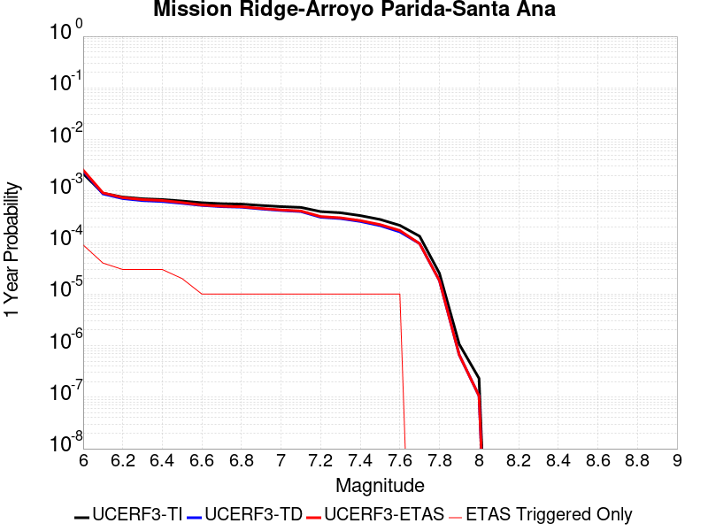 |  |

| Magnitude | 1 wk TI Prob | 1 wk TD Prob | 1 wk ETAS Prob | 1 wk ETAS/TD Gain | 1 wk ETAS Triggered Only | 1 mo TI Prob | 1 mo TD Prob | 1 mo ETAS Prob | 1 mo ETAS/TD Gain | 1 mo ETAS Triggered Only | 1 yr TI Prob | 1 yr TD Prob | 1 yr ETAS Prob | 1 yr ETAS/TD Gain | 1 yr ETAS Triggered Only | 10 yr TI Prob | 10 yr TD Prob | 10 yr ETAS Prob | 10 yr ETAS/TD Gain | 10 yr ETAS Triggered Only |
|-----|-----|-----|-----|-----|-----|-----|-----|-----|-----|-----|-----|-----|-----|-----|-----|-----|-----|-----|-----|-----|
| 6.0 | 4.169034E-5 | 4.7138263E-5 | 1.8381853E-4 | 3.899561 | 1.366867E-4 | 1.7866064E-4 | 2.0201034E-4 | 3.3866943E-4 | 1.6764956 | 1.366867E-4 | 0.0021730233 | 0.00245745 | 0.0026619763 | 1.083227 | 2.0503007E-4 | 0.021518968 | 0.024384614 | 0.024784675 | 1.0164063 | 4.1006014E-4 |
| 6.1 | 1.73813E-5 | 1.6854226E-5 | 8.519643E-5 | 5.0549 | 6.834335E-5 | 7.4489166E-5 | 7.223046E-5 | 1.4056888E-4 | 1.9461163 | 6.834335E-5 | 9.065282E-4 | 8.790618E-4 | 9.473451E-4 | 1.0776775 | 6.834335E-5 | 0.009028391 | 0.008756988 | 0.008960223 | 1.0232083 | 2.0503007E-4 |
| 6.2 | 1.4622182E-5 | 1.367329E-5 | 8.2015715E-5 | 5.998243 | 6.834335E-5 | 6.2664985E-5 | 5.8598518E-5 | 1.2693787E-4 | 2.16623 | 6.834335E-5 | 7.6267915E-4 | 7.132073E-4 | 7.8150193E-4 | 1.095757 | 6.834335E-5 | 0.007600669 | 0.007109627 | 0.0073132 | 1.0286334 | 2.0503007E-4 |
| 6.3 | 1.3552434E-5 | 1.2482201E-5 | 8.0824706E-5 | 6.475197 | 6.834335E-5 | 5.8080568E-5 | 5.3494066E-5 | 1.2183377E-4 | 2.2775192 | 6.834335E-5 | 7.069015E-4 | 6.510988E-4 | 7.193977E-4 | 1.1048979 | 6.834335E-5 | 0.00704657 | 0.006492275 | 0.0066959737 | 1.0313756 | 2.0503007E-4 |
| 6.4 | 1.30977305E-5 | 1.1979156E-5 | 8.03217E-5 | 6.7051215 | 6.834335E-5 | 5.613192E-5 | 5.1338247E-5 | 1.19678094E-4 | 2.3311684 | 6.834335E-5 | 6.831918E-4 | 6.248669E-4 | 6.9316756E-4 | 1.1093043 | 6.834335E-5 | 0.006810953 | 0.0062314444 | 0.006435197 | 1.0326974 | 2.0503007E-4 |
| 6.5 | 1.225205E-5 | 1.1048803E-5 | 7.939141E-5 | 7.185521 | 6.834335E-5 | 5.2507727E-5 | 4.7351168E-5 | 1.1569129E-4 | 2.4432616 | 6.834335E-5 | 6.3909404E-4 | 5.7635066E-4 | 6.446547E-4 | 1.1185111 | 6.834335E-5 | 0.006372592 | 0.005748869 | 0.0059527205 | 1.0354594 | 2.0503007E-4 |
| 6.6 | 1.1352241E-5 | 1.0063535E-5 | 7.840621E-5 | 7.7911196 | 6.834335E-5 | 4.8651553E-5 | 4.3128734E-5 | 1.1146914E-4 | 2.584568 | 6.834335E-5 | 5.921717E-4 | 5.2496797E-4 | 5.932754E-4 | 1.1301174 | 6.834335E-5 | 0.0059059616 | 0.0052375244 | 0.005441481 | 1.0389414 | 2.0503007E-4 |
| 6.7 | 1.0864116E-5 | 9.517027E-6 | 7.785973E-5 | 8.181098 | 6.834335E-5 | 4.6559664E-5 | 4.0786632E-5 | 1.091272E-4 | 2.6755629 | 6.834335E-5 | 5.667165E-4 | 4.964661E-4 | 5.6477555E-4 | 1.1375914 | 6.834335E-5 | 0.005652734 | 0.004953804 | 0.005157818 | 1.0411834 | 2.0503007E-4 |
| 6.8 | 1.0666365E-5 | 9.299779E-6 | 7.76425E-5 | 8.348855 | 6.834335E-5 | 4.571219E-5 | 3.9855597E-5 | 1.0819623E-4 | 2.7147062 | 6.834335E-5 | 5.564038E-4 | 4.8513585E-4 | 5.5344607E-4 | 1.1408063 | 6.834335E-5 | 0.005550127 | 0.0048410003 | 0.0050450377 | 1.0421478 | 2.0503007E-4 |
| 6.9 | 1.0038665E-5 | 8.592046E-6 | 7.693481E-5 | 8.954191 | 6.834335E-5 | 4.302214E-5 | 3.682254E-5 | 1.0516338E-4 | 2.855951 | 6.834335E-5 | 5.236687E-4 | 4.4822405E-4 | 5.1653676E-4 | 1.1524075 | 6.834335E-5 | 0.005224364 | 0.004473411 | 0.004677524 | 1.0456281 | 2.0503007E-4 |
| 7.0 | 9.5379955E-6 | 8.025073E-6 | 7.636788E-5 | 9.51616 | 6.834335E-5 | 4.0876483E-5 | 3.4392728E-5 | 1.02733735E-4 | 2.9870772 | 6.834335E-5 | 4.975576E-4 | 4.1865272E-4 | 4.8696744E-4 | 1.1631776 | 6.834335E-5 | 0.00496445 | 0.0041788397 | 0.004383013 | 1.0488589 | 2.0503007E-4 |
| 7.1 | 9.207389E-6 | 7.652375E-6 | 7.599521E-5 | 9.930931 | 6.834335E-5 | 3.945964E-5 | 3.279549E-5 | 1.01136604E-4 | 3.083857 | 6.834335E-5 | 4.803152E-4 | 3.9921363E-4 | 4.675297E-4 | 1.1711266 | 6.834335E-5 | 0.004792784 | 0.003985161 | 0.004189374 | 1.0512433 | 2.0503007E-4 |
| 7.2 | 7.638091E-6 | 5.9311183E-6 | 7.427407E-5 | 12.522777 | 6.834335E-5 | 3.2734264E-5 | 2.541883E-5 | 9.376045E-5 | 3.6886215 | 6.834335E-5 | 3.984668E-4 | 3.0943064E-4 | 3.7775285E-4 | 1.2207998 | 6.834335E-5 | 0.0039775306 | 0.0030900547 | 0.0032944512 | 1.0661466 | 2.0503007E-4 |
| 7.3 | 7.2500147E-6 | 5.5961527E-6 | 7.3939125E-5 | 13.212493 | 6.834335E-5 | 3.1071122E-5 | 2.3983293E-5 | 9.232501E-5 | 3.8495553 | 6.834335E-5 | 3.7822526E-4 | 2.9195778E-4 | 3.6028118E-4 | 1.2340181 | 6.834335E-5 | 0.0037758215 | 0.0029157975 | 0.0030520856 | 1.0467412 | 1.366867E-4 |
| 7.4 | 6.3899715E-6 | 4.9184964E-6 | 7.3261515E-5 | 14.895104 | 6.834335E-5 | 2.7385306E-5 | 2.10791E-5 | 8.942102E-5 | 4.2421646 | 6.834335E-5 | 3.3336508E-4 | 2.5660804E-4 | 3.2493385E-4 | 1.2662653 | 6.834335E-5 | 0.0033286542 | 0.0025631618 | 0.002699498 | 1.0531907 | 1.366867E-4 |
| 7.5 | 5.379025E-6 | 4.0838527E-6 | 7.2426934E-5 | 17.734951 | 6.834335E-5 | 2.305276E-5 | 1.7502109E-5 | 8.584427E-5 | 4.9047956 | 6.834335E-5 | 2.806312E-4 | 2.1306744E-4 | 2.8139623E-4 | 1.3206909 | 6.834335E-5 | 0.0028027708 | 0.002128643 | 0.0022650387 | 1.0640764 | 1.366867E-4 |
| 7.6 | 4.1270696E-6 | 3.0883439E-6 | 7.143149E-5 | 23.129383 | 6.834335E-5 | 1.768732E-5 | 1.3235693E-5 | 8.1578146E-5 | 6.1634965 | 6.834335E-5 | 2.1532185E-4 | 1.6113273E-4 | 2.2946506E-4 | 1.4240749 | 6.834335E-5 | 0.0021511333 | 0.001610167 | 0.0016784003 | 1.0423765 | 6.834335E-5 |
| 7.7 | 2.5406805E-6 | 1.8282013E-6 | 1.8282013E-6 | 1.0 | 0.0 | 1.0888585E-5 | 7.835125E-6 | 7.835125E-6 | 1.0 | 0.0 | 1.3256045E-4 | 9.538854E-5 | 9.538854E-5 | 1.0 | 0.0 | 0.0013248142 | 9.534821E-4 | 9.534821E-4 | 1.0 | 0.0 |
| 7.8 | 4.8608285E-7 | 3.5098864E-7 | 3.5098864E-7 | 1.0 | 0.0 | 2.0832106E-6 | 1.5042363E-6 | 1.5042363E-6 | 1.0 | 0.0 | 2.5362791E-5 | 1.8313924E-5 | 1.8313924E-5 | 1.0 | 0.0 | 2.5359896E-4 | 1.8312426E-4 | 1.8312426E-4 | 1.0 | 0.0 |
| 7.9 | 2.0472514E-8 | 1.2688783E-8 | 1.2688783E-8 | 1.0 | 0.0 | 8.7739345E-8 | 5.43805E-8 | 5.43805E-8 | 1.0 | 0.0 | 1.068226E-6 | 6.6208236E-7 | 6.6208236E-7 | 1.0 | 0.0 | 1.0682209E-5 | 6.620805E-6 | 6.620805E-6 | 1.0 | 0.0 |
| 8.0 | 4.443582E-9 | 2.0321211E-9 | 2.0321211E-9 | 1.0 | 0.0 | 1.9043922E-8 | 8.70909E-9 | 8.70909E-9 | 1.0 | 0.0 | 2.3185973E-7 | 1.0603316E-7 | 1.0603316E-7 | 1.0 | 0.0 | 2.3185949E-6 | 1.0603312E-6 | 1.0603312E-6 | 1.0 | 0.0 |

## San Andreas (Cholame) rev
*[(top)](#table-of-contents)*

| 1 Week | 1 Month | 1 Year | 10 Year |
|-----|-----|-----|-----|
|  |  |  |  |

| Magnitude | 1 wk TI Prob | 1 wk TD Prob | 1 wk ETAS Prob | 1 wk ETAS/TD Gain | 1 wk ETAS Triggered Only | 1 mo TI Prob | 1 mo TD Prob | 1 mo ETAS Prob | 1 mo ETAS/TD Gain | 1 mo ETAS Triggered Only | 1 yr TI Prob | 1 yr TD Prob | 1 yr ETAS Prob | 1 yr ETAS/TD Gain | 1 yr ETAS Triggered Only | 10 yr TI Prob | 10 yr TD Prob | 10 yr ETAS Prob | 10 yr ETAS/TD Gain | 10 yr ETAS Triggered Only |
|-----|-----|-----|-----|-----|-----|-----|-----|-----|-----|-----|-----|-----|-----|-----|-----|-----|-----|-----|-----|-----|
| 6.0 | 1.2302514E-4 | 2.5204287E-4 | 3.8869513E-4 | 1.5421786 | 1.366867E-4 | 5.27144E-4 | 0.0010797381 | 0.0012162774 | 1.1264558 | 1.366867E-4 | 0.0063991086 | 0.0130670825 | 0.013336884 | 1.0206474 | 2.733734E-4 | 0.06217949 | 0.12439073 | 0.12474978 | 1.0028865 | 4.1006014E-4 |
| 6.1 | 1.2302514E-4 | 2.5204287E-4 | 3.8869513E-4 | 1.5421786 | 1.366867E-4 | 5.27144E-4 | 0.0010797381 | 0.0012162774 | 1.1264558 | 1.366867E-4 | 0.0063991086 | 0.0130670825 | 0.013336884 | 1.0206474 | 2.733734E-4 | 0.06217949 | 0.12439073 | 0.12474978 | 1.0028865 | 4.1006014E-4 |
| 6.2 | 1.2203569E-4 | 2.5021084E-4 | 3.8686336E-4 | 1.5461495 | 1.366867E-4 | 5.2290526E-4 | 0.0010718931 | 0.0012084333 | 1.1273823 | 1.366867E-4 | 0.006347804 | 0.01297271 | 0.013242537 | 1.0207996 | 2.733734E-4 | 0.061695136 | 0.12357691 | 0.123936296 | 1.0029082 | 4.1006014E-4 |
| 6.3 | 1.2142645E-4 | 2.4907055E-4 | 3.8572322E-4 | 1.5486504 | 1.366867E-4 | 5.202953E-4 | 0.0010670102 | 0.0012035511 | 1.1279658 | 1.366867E-4 | 0.006316212 | 0.012913967 | 0.01318381 | 1.0208955 | 2.733734E-4 | 0.06139677 | 0.12307103 | 0.123430625 | 1.0029218 | 4.1006014E-4 |
| 6.4 | 1.1865206E-4 | 2.44126E-4 | 3.8077935E-4 | 1.5597656 | 1.366867E-4 | 5.0840975E-4 | 0.0010458364 | 0.0011823801 | 1.1305594 | 1.366867E-4 | 0.006172335 | 0.012659196 | 0.012929109 | 1.0213214 | 2.733734E-4 | 0.060036868 | 0.1208638 | 0.12122431 | 1.0029827 | 4.1006014E-4 |
| 6.5 | 1.17443946E-4 | 2.4205919E-4 | 3.787128E-4 | 1.5645463 | 1.366867E-4 | 5.032341E-4 | 0.0010369857 | 0.0011735306 | 1.1316749 | 1.366867E-4 | 0.006109677 | 0.012552682 | 0.012822624 | 1.0215048 | 2.733734E-4 | 0.059444077 | 0.11993805 | 0.12029893 | 1.0030088 | 4.1006014E-4 |
| 6.6 | 1.13579066E-4 | 2.3514954E-4 | 3.718041E-4 | 1.581139 | 1.366867E-4 | 4.866766E-4 | 0.001007396 | 0.001143945 | 1.1355466 | 1.366867E-4 | 0.0059092017 | 0.012196515 | 0.012466554 | 1.0221407 | 2.733734E-4 | 0.057545185 | 0.11685214 | 0.117214285 | 1.0030992 | 4.1006014E-4 |
| 6.7 | 1.1271412E-4 | 2.3359268E-4 | 3.7024746E-4 | 1.5850132 | 1.366867E-4 | 4.829711E-4 | 0.0010007289 | 0.0011372789 | 1.1364504 | 1.366867E-4 | 0.005864331 | 0.012116249 | 0.01238631 | 1.0222892 | 2.733734E-4 | 0.057119697 | 0.116155714 | 0.11651814 | 1.0031202 | 4.1006014E-4 |
| 6.8 | 1.1217975E-4 | 2.3247694E-4 | 3.6913189E-4 | 1.5878215 | 1.366867E-4 | 4.8068175E-4 | 9.959509E-4 | 0.0011325014 | 1.1371057 | 1.366867E-4 | 0.005836608 | 0.012058721 | 0.012328798 | 1.0223968 | 2.733734E-4 | 0.056856725 | 0.11565396 | 0.116016604 | 1.0031356 | 4.1006014E-4 |
| 6.9 | 1.1146753E-4 | 2.3096445E-4 | 3.676196E-4 | 1.5916718 | 1.366867E-4 | 4.7763053E-4 | 9.894737E-4 | 0.0011260251 | 1.1380042 | 1.366867E-4 | 0.0057996577 | 0.011980731 | 0.0122508295 | 1.0225444 | 2.733734E-4 | 0.056506127 | 0.11497439 | 0.115337305 | 1.0031564 | 4.1006014E-4 |
| 7.0 | 1.0965793E-4 | 2.2719789E-4 | 3.6385356E-4 | 1.601483 | 1.366867E-4 | 4.698779E-4 | 9.733434E-4 | 0.001109897 | 1.1402934 | 1.366867E-4 | 0.005705768 | 0.011786487 | 0.0120566385 | 1.0229204 | 2.733734E-4 | 0.055614736 | 0.11327597 | 0.11363958 | 1.00321 | 4.1006014E-4 |
| 7.1 | 9.927982E-5 | 2.0538924E-4 | 3.4204786E-4 | 1.6653641 | 1.366867E-4 | 4.2541555E-4 | 8.7994366E-4 | 0.0010165101 | 1.155199 | 1.366867E-4 | 0.0051671406 | 0.010660981 | 0.01093144 | 1.025369 | 2.733734E-4 | 0.05048634 | 0.1033706 | 0.10373827 | 1.0035568 | 4.1006014E-4 |
| 7.2 | 9.696786E-5 | 2.0043184E-4 | 3.3709116E-4 | 1.6818244 | 1.366867E-4 | 4.1551032E-4 | 8.5871184E-4 | 9.952812E-4 | 1.1590397 | 1.366867E-4 | 0.00504711 | 0.010404981 | 0.010675509 | 1.0259999 | 2.733734E-4 | 0.04934009 | 0.1011086 | 0.1014772 | 1.0036455 | 4.1006014E-4 |
| 7.3 | 9.4727984E-5 | 1.9472468E-4 | 3.3138477E-4 | 1.7018119 | 1.366867E-4 | 4.0591392E-4 | 8.3426846E-4 | 9.7084115E-4 | 1.1637036 | 1.366867E-4 | 0.0049308087 | 0.010110183 | 0.010380792 | 1.0267661 | 2.733734E-4 | 0.048228268 | 0.09847952 | 0.09884919 | 1.0037539 | 4.1006014E-4 |
| 7.4 | 9.220358E-5 | 1.8843076E-4 | 3.250917E-4 | 1.7252582 | 1.366867E-4 | 3.9509835E-4 | 8.073114E-4 | 9.4388775E-4 | 1.1691743 | 1.366867E-4 | 0.004799717 | 0.009784967 | 0.010055665 | 1.0276648 | 2.733734E-4 | 0.046973653 | 0.095557496 | 0.09592837 | 1.0038812 | 4.1006014E-4 |
| 7.5 | 7.71631E-5 | 1.5177966E-4 | 2.2011265E-4 | 1.4502118 | 6.834335E-5 | 3.306571E-4 | 6.503223E-4 | 7.186212E-4 | 1.1050231 | 6.834335E-5 | 0.0040183207 | 0.007889002 | 0.008092414 | 1.0257844 | 2.0503007E-4 | 0.03946433 | 0.07828531 | 0.07860027 | 1.0040233 | 3.4171678E-4 |
| 7.6 | 7.5634416E-5 | 1.483744E-4 | 2.1670762E-4 | 1.4605459 | 6.834335E-5 | 3.241072E-4 | 6.3573546E-4 | 7.040354E-4 | 1.1074345 | 6.834335E-5 | 0.0039388672 | 0.0077126776 | 0.007916126 | 1.0263785 | 2.0503007E-4 | 0.038697794 | 0.07664872 | 0.076964244 | 1.0041165 | 3.4171678E-4 |
| 7.7 | 6.3783E-5 | 1.235872E-4 | 1.9192211E-4 | 1.5529287 | 6.834335E-5 | 2.7332708E-4 | 5.29552E-4 | 5.9785915E-4 | 1.1289905 | 6.834335E-5 | 0.0033226798 | 0.0064282627 | 0.006496167 | 1.0105634 | 6.834335E-5 | 0.032734364 | 0.06454029 | 0.06473209 | 1.0029718 | 2.0503007E-4 |
| 7.8 | 5.863422E-5 | 1.1416107E-4 | 1.8249663E-4 | 1.598589 | 6.834335E-5 | 2.512653E-4 | 4.8917E-4 | 5.5748E-4 | 1.1396445 | 6.834335E-5 | 0.003054864 | 0.0059394026 | 0.0060073403 | 1.0114385 | 6.834335E-5 | 0.030132094 | 0.059659187 | 0.059851985 | 1.0032316 | 2.0503007E-4 |
| 7.9 | 4.595283E-5 | 8.426331E-5 | 1.5260091E-4 | 1.8110006 | 6.834335E-5 | 1.9692584E-4 | 3.610785E-4 | 4.293972E-4 | 1.1892073 | 6.834335E-5 | 0.0023949358 | 0.0043872762 | 0.0044553196 | 1.0155092 | 6.834335E-5 | 0.023692891 | 0.044362005 | 0.04449263 | 1.0029445 | 1.366867E-4 |
| 8.0 | 3.2950178E-5 | 5.0772942E-5 | 1.1911283E-4 | 2.3459902 | 6.834335E-5 | 1.412074E-4 | 2.1758018E-4 | 2.8590867E-4 | 1.3140382 | 6.834335E-5 | 0.0017178444 | 0.0026458222 | 0.0027139848 | 1.0257623 | 6.834335E-5 | 0.017046256 | 0.027180137 | 0.02731311 | 1.0048922 | 1.366867E-4 |
| 8.1 | 1.9177472E-5 | 1.9185145E-5 | 8.7527194E-5 | 4.5622377 | 6.834335E-5 | 8.218658E-5 | 8.221946E-5 | 1.505572E-4 | 1.8311626 | 6.834335E-5 | 0.0010001622 | 0.0010005629 | 0.0010688379 | 1.0682366 | 6.834335E-5 | 0.009956728 | 0.010758142 | 0.01082575 | 1.0062844 | 6.834335E-5 |
| 8.2 | 8.643924E-6 | 5.4748625E-6 | 5.4748625E-6 | 1.0 | 0.0 | 3.704486E-5 | 2.3463486E-5 | 2.3463486E-5 | 1.0 | 0.0 | 4.5092785E-4 | 2.8563058E-4 | 2.8563058E-4 | 1.0 | 0.0 | 0.0045001395 | 0.0032487072 | 0.0032487072 | 1.0 | 0.0 |
| 8.3 | 1.983087E-6 | 7.6599065E-7 | 7.6599065E-7 | 1.0 | 0.0 | 8.498917E-6 | 3.282813E-6 | 3.282813E-6 | 1.0 | 0.0 | 1.034694E-4 | 3.9967534E-5 | 3.9967534E-5 | 1.0 | 0.0 | 0.0010342124 | 4.719687E-4 | 4.719687E-4 | 1.0 | 0.0 |

## San Andreas (North Branch Mill Creek)
*[(top)](#table-of-contents)*

| 1 Week | 1 Month | 1 Year | 10 Year |
|-----|-----|-----|-----|
|  |  |  |  |

| Magnitude | 1 wk TI Prob | 1 wk TD Prob | 1 wk ETAS Prob | 1 wk ETAS/TD Gain | 1 wk ETAS Triggered Only | 1 mo TI Prob | 1 mo TD Prob | 1 mo ETAS Prob | 1 mo ETAS/TD Gain | 1 mo ETAS Triggered Only | 1 yr TI Prob | 1 yr TD Prob | 1 yr ETAS Prob | 1 yr ETAS/TD Gain | 1 yr ETAS Triggered Only | 10 yr TI Prob | 10 yr TD Prob | 10 yr ETAS Prob | 10 yr ETAS/TD Gain | 10 yr ETAS Triggered Only |
|-----|-----|-----|-----|-----|-----|-----|-----|-----|-----|-----|-----|-----|-----|-----|-----|-----|-----|-----|-----|-----|
| 6.0 | 1.3461156E-5 | 2.3499893E-5 | 2.3499893E-5 | 1.0 | 0.0 | 5.7689394E-5 | 1.00709956E-4 | 2.373829E-4 | 2.3570948 | 1.366867E-4 | 7.02142E-4 | 0.0012254574 | 0.0014984958 | 1.2228053 | 2.733734E-4 | 0.0069992766 | 0.01222957 | 0.012634615 | 1.0331202 | 4.1006014E-4 |
| 6.1 | 1.3461156E-5 | 2.3499893E-5 | 2.3499893E-5 | 1.0 | 0.0 | 5.7689394E-5 | 1.00709956E-4 | 2.373829E-4 | 2.3570948 | 1.366867E-4 | 7.02142E-4 | 0.0012254574 | 0.0014984958 | 1.2228053 | 2.733734E-4 | 0.0069992766 | 0.01222957 | 0.012634615 | 1.0331202 | 4.1006014E-4 |
| 6.2 | 1.3461156E-5 | 2.3499893E-5 | 2.3499893E-5 | 1.0 | 0.0 | 5.7689394E-5 | 1.00709956E-4 | 2.373829E-4 | 2.3570948 | 1.366867E-4 | 7.02142E-4 | 0.0012254574 | 0.0014984958 | 1.2228053 | 2.733734E-4 | 0.0069992766 | 0.01222957 | 0.012634615 | 1.0331202 | 4.1006014E-4 |
| 6.3 | 1.3461156E-5 | 2.3499893E-5 | 2.3499893E-5 | 1.0 | 0.0 | 5.7689394E-5 | 1.00709956E-4 | 2.373829E-4 | 2.3570948 | 1.366867E-4 | 7.02142E-4 | 0.0012254574 | 0.0014984958 | 1.2228053 | 2.733734E-4 | 0.0069992766 | 0.01222957 | 0.012634615 | 1.0331202 | 4.1006014E-4 |
| 6.4 | 1.3461156E-5 | 2.3499893E-5 | 2.3499893E-5 | 1.0 | 0.0 | 5.7689394E-5 | 1.00709956E-4 | 2.373829E-4 | 2.3570948 | 1.366867E-4 | 7.02142E-4 | 0.0012254574 | 0.0014984958 | 1.2228053 | 2.733734E-4 | 0.0069992766 | 0.01222957 | 0.012634615 | 1.0331202 | 4.1006014E-4 |
| 6.5 | 1.3450706E-5 | 2.3488852E-5 | 2.3488852E-5 | 1.0 | 0.0 | 5.764461E-5 | 1.0066265E-4 | 2.373356E-4 | 2.3577325 | 1.366867E-4 | 7.0159714E-4 | 0.001224882 | 0.0014979206 | 1.2229102 | 2.733734E-4 | 0.006993862 | 0.01222388 | 0.012628927 | 1.0331358 | 4.1006014E-4 |
| 6.6 | 1.3074523E-5 | 2.3103135E-5 | 2.3103135E-5 | 1.0 | 0.0 | 5.6032466E-5 | 9.9009696E-5 | 2.3568288E-4 | 2.3804018 | 1.366867E-4 | 6.8198174E-4 | 0.0012047797 | 0.0014778238 | 1.226634 | 2.733734E-4 | 0.006798926 | 0.012025044 | 0.012430173 | 1.0336905 | 4.1006014E-4 |
| 6.7 | 1.3050216E-5 | 2.3078432E-5 | 2.3078432E-5 | 1.0 | 0.0 | 5.59283E-5 | 9.890384E-5 | 2.3557703E-4 | 2.3818796 | 1.366867E-4 | 6.8071426E-4 | 0.0012034923 | 0.0014765366 | 1.2268767 | 2.733734E-4 | 0.0067863287 | 0.012012309 | 0.012417443 | 1.0337266 | 4.1006014E-4 |
| 6.8 | 1.29049395E-5 | 2.292684E-5 | 2.292684E-5 | 1.0 | 0.0 | 5.530571E-5 | 9.825421E-5 | 2.3492749E-4 | 2.3910172 | 1.366867E-4 | 6.73139E-4 | 0.0011955918 | 0.0014686383 | 1.2283778 | 2.733734E-4 | 0.0067110364 | 0.011934154 | 0.012339321 | 1.0339502 | 4.1006014E-4 |
| 6.9 | 1.2867369E-5 | 2.2886245E-5 | 2.2886245E-5 | 1.0 | 0.0 | 5.51447E-5 | 9.8080236E-5 | 2.3475355E-4 | 2.3934846 | 1.366867E-4 | 6.711799E-4 | 0.0011934759 | 0.0014665232 | 1.2287831 | 2.733734E-4 | 0.006691564 | 0.011913223 | 0.012318399 | 1.0340105 | 4.1006014E-4 |
| 7.0 | 1.2495996E-5 | 2.2286325E-5 | 2.2286325E-5 | 1.0 | 0.0 | 5.3553173E-5 | 9.550934E-5 | 2.32183E-4 | 2.4309978 | 1.366867E-4 | 6.518148E-4 | 0.0011622087 | 0.0014352645 | 1.2349455 | 2.733734E-4 | 0.0064990623 | 0.0116038285 | 0.012009131 | 1.0349283 | 4.1006014E-4 |
| 7.1 | 1.2452067E-5 | 2.2231397E-5 | 2.2231397E-5 | 1.0 | 0.0 | 5.3364907E-5 | 9.527396E-5 | 2.3194765E-4 | 2.4345336 | 1.366867E-4 | 6.4952404E-4 | 0.0011593461 | 0.0014324025 | 1.2355263 | 2.733734E-4 | 0.0064762887 | 0.0115755 | 0.011980813 | 1.0350147 | 4.1006014E-4 |
| 7.2 | 1.2002777E-5 | 2.1609963E-5 | 2.1609963E-5 | 1.0 | 0.0 | 5.143946E-5 | 9.2610855E-5 | 2.2928491E-4 | 2.4757886 | 1.366867E-4 | 6.2609545E-4 | 0.0011269567 | 0.001400022 | 1.2423034 | 2.733734E-4 | 0.006243344 | 0.011254923 | 0.011660368 | 1.0360237 | 4.1006014E-4 |
| 7.3 | 1.1923425E-5 | 2.1479793E-5 | 2.1479793E-5 | 1.0 | 0.0 | 5.109939E-5 | 9.205302E-5 | 2.2872715E-4 | 2.4847326 | 1.366867E-4 | 6.219575E-4 | 0.001120172 | 0.0013932391 | 1.2437726 | 2.733734E-4 | 0.0062021962 | 0.011187789 | 0.011593262 | 1.0362424 | 4.1006014E-4 |
| 7.4 | 1.16105175E-5 | 2.0853771E-5 | 2.0853771E-5 | 1.0 | 0.0 | 4.975841E-5 | 8.937026E-5 | 2.2604477E-4 | 2.5293062 | 1.366867E-4 | 6.0564023E-4 | 0.0010875424 | 0.0013606185 | 1.2510947 | 2.733734E-4 | 0.006039923 | 0.010865397 | 0.011271001 | 1.0373299 | 4.1006014E-4 |
| 7.5 | 1.1037265E-5 | 1.9553907E-5 | 1.9553907E-5 | 1.0 | 0.0 | 4.7301706E-5 | 8.379978E-5 | 2.2047503E-4 | 2.630974 | 1.366867E-4 | 5.757461E-4 | 0.0010197869 | 0.0012928816 | 1.2677958 | 2.733734E-4 | 0.005742567 | 0.010194898 | 0.010600777 | 1.0398121 | 4.1006014E-4 |
| 7.6 | 1.0720915E-5 | 1.899582E-5 | 1.899582E-5 | 1.0 | 0.0 | 4.5945973E-5 | 8.140812E-5 | 2.180837E-4 | 2.6788938 | 1.366867E-4 | 5.592486E-4 | 9.906954E-4 | 0.001263798 | 1.2756675 | 2.733734E-4 | 0.005578433 | 0.009906623 | 0.01031262 | 1.0409825 | 4.1006014E-4 |
| 7.7 | 9.276279E-6 | 1.6441649E-5 | 1.6441649E-5 | 1.0 | 0.0 | 3.9754876E-5 | 7.0462316E-5 | 2.071394E-4 | 2.939719 | 1.366867E-4 | 4.839081E-4 | 8.575427E-4 | 0.0011306817 | 1.3185136 | 2.733734E-4 | 0.0048285574 | 0.008586041 | 0.008992581 | 1.0473489 | 4.1006014E-4 |
| 7.8 | 5.8346777E-6 | 1.1155013E-5 | 1.1155013E-5 | 1.0 | 0.0 | 2.5005522E-5 | 4.7806327E-5 | 1.844865E-4 | 3.8590398 | 1.366867E-4 | 3.043997E-4 | 5.818867E-4 | 8.5510104E-4 | 1.4695319 | 2.733734E-4 | 0.0030398308 | 0.0058469265 | 0.006254589 | 1.0697225 | 4.1006014E-4 |
| 7.9 | 4.690204E-6 | 8.509093E-6 | 8.509093E-6 | 1.0 | 0.0 | 2.0100719E-5 | 3.6467034E-5 | 1.7314876E-4 | 4.7480903 | 1.366867E-4 | 2.4469878E-4 | 4.4389578E-4 | 7.1714784E-4 | 1.6155771 | 2.733734E-4 | 0.002444295 | 0.0044707474 | 0.004878974 | 1.0913106 | 4.1006014E-4 |
| 8.0 | 2.9570454E-6 | 4.846947E-6 | 4.846947E-6 | 1.0 | 0.0 | 1.267299E-5 | 2.0772464E-5 | 2.0772464E-5 | 1.0 | 0.0 | 1.5428272E-4 | 2.5287544E-4 | 2.5287544E-4 | 1.0 | 0.0 | 0.0015417566 | 0.002549644 | 0.0026859823 | 1.0534735 | 1.366867E-4 |
| 8.1 | 1.6376824E-6 | 2.1968929E-6 | 2.1968929E-6 | 1.0 | 0.0 | 7.01862E-6 | 9.41522E-6 | 9.41522E-6 | 1.0 | 0.0 | 8.544835E-5 | 1.14624294E-4 | 1.14624294E-4 | 1.0 | 0.0 | 8.54155E-4 | 0.0011606582 | 0.0011606582 | 1.0 | 0.0 |
| 8.2 | 6.9631557E-7 | 4.5360213E-7 | 4.5360213E-7 | 1.0 | 0.0 | 2.984206E-6 | 1.9440076E-6 | 1.9440076E-6 | 1.0 | 0.0 | 3.63321E-5 | 2.3668037E-5 | 2.3668037E-5 | 1.0 | 0.0 | 3.6326164E-4 | 2.451564E-4 | 2.451564E-4 | 1.0 | 0.0 |
| 8.3 | 1.7876137E-7 | 8.360375E-8 | 8.360375E-8 | 1.0 | 0.0 | 7.661199E-7 | 3.5830175E-7 | 3.5830175E-7 | 1.0 | 0.0 | 9.32747E-6 | 4.3623154E-6 | 4.3623154E-6 | 1.0 | 0.0 | 9.3270784E-5 | 4.5817014E-5 | 4.5817014E-5 | 1.0 | 0.0 |

## Camp Rock 2011
*[(top)](#table-of-contents)*

| 1 Week | 1 Month | 1 Year | 10 Year |
|-----|-----|-----|-----|
|  |  |  |  |

| Magnitude | 1 wk TI Prob | 1 wk TD Prob | 1 wk ETAS Prob | 1 wk ETAS/TD Gain | 1 wk ETAS Triggered Only | 1 mo TI Prob | 1 mo TD Prob | 1 mo ETAS Prob | 1 mo ETAS/TD Gain | 1 mo ETAS Triggered Only | 1 yr TI Prob | 1 yr TD Prob | 1 yr ETAS Prob | 1 yr ETAS/TD Gain | 1 yr ETAS Triggered Only | 10 yr TI Prob | 10 yr TD Prob | 10 yr ETAS Prob | 10 yr ETAS/TD Gain | 10 yr ETAS Triggered Only |
|-----|-----|-----|-----|-----|-----|-----|-----|-----|-----|-----|-----|-----|-----|-----|-----|-----|-----|-----|-----|-----|
| 6.0 | 1.6710783E-5 | 4.25026E-6 | 7.259333E-5 | 17.079737 | 6.834335E-5 | 7.161568E-5 | 1.8215276E-5 | 1.548995E-4 | 8.503823 | 1.366867E-4 | 8.7157206E-4 | 2.2174895E-4 | 5.6339E-4 | 2.5406656 | 3.4171678E-4 | 0.008681616 | 0.0022153298 | 0.0025562895 | 1.1539093 | 3.4171678E-4 |
| 6.1 | 1.6710783E-5 | 4.25026E-6 | 7.259333E-5 | 17.079737 | 6.834335E-5 | 7.161568E-5 | 1.8215276E-5 | 1.548995E-4 | 8.503823 | 1.366867E-4 | 8.7157206E-4 | 2.2174895E-4 | 5.6339E-4 | 2.5406656 | 3.4171678E-4 | 0.008681616 | 0.0022153298 | 0.0025562895 | 1.1539093 | 3.4171678E-4 |
| 6.2 | 1.6710783E-5 | 4.25026E-6 | 7.259333E-5 | 17.079737 | 6.834335E-5 | 7.161568E-5 | 1.8215276E-5 | 1.548995E-4 | 8.503823 | 1.366867E-4 | 8.7157206E-4 | 2.2174895E-4 | 5.6339E-4 | 2.5406656 | 3.4171678E-4 | 0.008681616 | 0.0022153298 | 0.0025562895 | 1.1539093 | 3.4171678E-4 |
| 6.3 | 1.6710783E-5 | 4.25026E-6 | 7.259333E-5 | 17.079737 | 6.834335E-5 | 7.161568E-5 | 1.8215276E-5 | 1.548995E-4 | 8.503823 | 1.366867E-4 | 8.7157206E-4 | 2.2174895E-4 | 5.6339E-4 | 2.5406656 | 3.4171678E-4 | 0.008681616 | 0.0022153298 | 0.0025562895 | 1.1539093 | 3.4171678E-4 |
| 6.4 | 7.982846E-6 | 3.6820884E-6 | 7.202519E-5 | 19.560963 | 6.834335E-5 | 3.421175E-5 | 1.5780286E-5 | 1.5246484E-4 | 9.661729 | 1.366867E-4 | 4.1644843E-4 | 1.9210839E-4 | 4.654293E-4 | 2.4227433 | 2.733734E-4 | 0.0041566887 | 0.001919458 | 0.0021923068 | 1.1421489 | 2.733734E-4 |
| 6.5 | 7.982846E-6 | 3.6820884E-6 | 7.202519E-5 | 19.560963 | 6.834335E-5 | 3.421175E-5 | 1.5780286E-5 | 1.5246484E-4 | 9.661729 | 1.366867E-4 | 4.1644843E-4 | 1.9210839E-4 | 4.654293E-4 | 2.4227433 | 2.733734E-4 | 0.0041566887 | 0.001919458 | 0.0021923068 | 1.1421489 | 2.733734E-4 |
| 6.6 | 7.048869E-6 | 3.4243571E-6 | 7.176748E-5 | 20.957943 | 6.834335E-5 | 3.0209088E-5 | 1.4675736E-5 | 1.5136044E-4 | 10.313653 | 1.366867E-4 | 3.677336E-4 | 1.7866275E-4 | 4.5198735E-4 | 2.5298352 | 2.733734E-4 | 0.0036712566 | 0.0017852228 | 0.002058108 | 1.1528579 | 2.733734E-4 |
| 6.7 | 6.987307E-6 | 3.3623348E-6 | 7.1705465E-5 | 21.326092 | 6.834335E-5 | 2.9945259E-5 | 1.4409929E-5 | 1.5109467E-4 | 10.485456 | 1.366867E-4 | 3.6452254E-4 | 1.7542706E-4 | 4.4875254E-4 | 2.5580575 | 2.733734E-4 | 0.0036392517 | 0.001752917 | 0.0020258112 | 1.1556801 | 2.733734E-4 |
| 6.8 | 6.3737602E-6 | 3.1179077E-6 | 7.146105E-5 | 22.919554 | 6.834335E-5 | 2.731583E-5 | 1.3362394E-5 | 1.5004729E-4 | 11.229072 | 1.366867E-4 | 3.3251947E-4 | 1.626753E-4 | 4.3600425E-4 | 2.6802118 | 2.733734E-4 | 0.0033202237 | 0.0016255907 | 0.0018985198 | 1.1678953 | 2.733734E-4 |
| 6.9 | 6.112211E-6 | 2.9331156E-6 | 7.127627E-5 | 24.300533 | 6.834335E-5 | 2.6194928E-5 | 1.2570436E-5 | 1.4925543E-4 | 11.8735285 | 1.366867E-4 | 3.1887658E-4 | 1.5303459E-4 | 4.263662E-4 | 2.7860773 | 2.733734E-4 | 0.003184194 | 0.0015293199 | 0.0018022752 | 1.1784816 | 2.733734E-4 |
| 7.0 | 5.5140117E-6 | 2.641923E-6 | 7.09851E-5 | 26.868725 | 6.834335E-5 | 2.3631264E-5 | 1.132248E-5 | 1.4800765E-4 | 13.072018 | 1.366867E-4 | 2.8767265E-4 | 1.3784273E-4 | 4.1117845E-4 | 2.9829538 | 2.733734E-4 | 0.0028730053 | 0.0013775975 | 0.0016505943 | 1.1981688 | 2.733734E-4 |
| 7.1 | 4.8151105E-6 | 2.1342705E-6 | 7.047748E-5 | 33.021816 | 6.834335E-5 | 2.0636026E-5 | 9.146843E-6 | 1.4583231E-4 | 15.943459 | 1.366867E-4 | 2.5121463E-4 | 1.1135734E-4 | 3.847003E-4 | 3.4546473 | 2.733734E-4 | 0.0025093083 | 0.0011130372 | 0.0013861064 | 1.2453369 | 2.733734E-4 |
| 7.2 | 3.818335E-6 | 1.2937425E-6 | 1.2937425E-6 | 1.0 | 0.0 | 1.6364189E-5 | 5.5445994E-6 | 5.5445994E-6 | 1.0 | 0.0 | 1.9921579E-4 | 6.750349E-5 | 2.0418098E-4 | 3.0247471 | 1.366867E-4 | 0.0019903728 | 6.748381E-4 | 8.1143255E-4 | 1.2024107 | 1.366867E-4 |
| 7.3 | 2.7166698E-6 | 7.3835776E-7 | 7.3835776E-7 | 1.0 | 0.0 | 1.1642818E-5 | 3.1643867E-6 | 3.1643867E-6 | 1.0 | 0.0 | 1.4174209E-4 | 3.8525748E-5 | 1.0686647E-4 | 2.7738974 | 6.834335E-5 | 0.0014165172 | 3.851927E-4 | 4.535097E-4 | 1.177358 | 6.834335E-5 |
| 7.4 | 2.0893426E-6 | 5.4618386E-7 | 5.4618386E-7 | 1.0 | 0.0 | 8.954295E-6 | 2.3407858E-6 | 2.3407858E-6 | 1.0 | 0.0 | 1.0901308E-4 | 2.84987E-5 | 2.84987E-5 | 1.0 | 0.0 | 0.0010895962 | 2.84951E-4 | 2.84951E-4 | 1.0 | 0.0 |
| 7.5 | 1.1681728E-6 | 3.6030585E-7 | 3.6030585E-7 | 1.0 | 0.0 | 5.0064455E-6 | 1.544167E-6 | 1.544167E-6 | 1.0 | 0.0 | 6.0951766E-5 | 1.8800076E-5 | 1.8800076E-5 | 1.0 | 0.0 | 6.093505E-4 | 1.8798532E-4 | 1.8798532E-4 | 1.0 | 0.0 |
| 7.6 | 1.3154387E-7 | 7.1197384E-8 | 7.1197384E-8 | 1.0 | 0.0 | 5.6375933E-7 | 3.051316E-7 | 3.051316E-7 | 1.0 | 0.0 | 6.863748E-6 | 3.7149728E-6 | 3.7149728E-6 | 1.0 | 0.0 | 6.863536E-5 | 3.7149264E-5 | 3.7149264E-5 | 1.0 | 0.0 |

## Cleghorn Lake
*[(top)](#table-of-contents)*

| 1 Week | 1 Month | 1 Year | 10 Year |
|-----|-----|-----|-----|
|  |  |  |  |

| Magnitude | 1 wk TI Prob | 1 wk TD Prob | 1 wk ETAS Prob | 1 wk ETAS/TD Gain | 1 wk ETAS Triggered Only | 1 mo TI Prob | 1 mo TD Prob | 1 mo ETAS Prob | 1 mo ETAS/TD Gain | 1 mo ETAS Triggered Only | 1 yr TI Prob | 1 yr TD Prob | 1 yr ETAS Prob | 1 yr ETAS/TD Gain | 1 yr ETAS Triggered Only | 10 yr TI Prob | 10 yr TD Prob | 10 yr ETAS Prob | 10 yr ETAS/TD Gain | 10 yr ETAS Triggered Only |
|-----|-----|-----|-----|-----|-----|-----|-----|-----|-----|-----|-----|-----|-----|-----|-----|-----|-----|-----|-----|-----|
| 6.0 | 1.5467183E-5 | 1.6794203E-5 | 8.513642E-5 | 5.0693927 | 6.834335E-5 | 6.6286244E-5 | 7.197348E-5 | 2.0865035E-4 | 2.8989894 | 1.366867E-4 | 8.067362E-4 | 8.759797E-4 | 0.0011491136 | 1.3118039 | 2.733734E-4 | 0.008038137 | 0.008730696 | 0.009069429 | 1.038798 | 3.4171678E-4 |
| 6.1 | 1.5467183E-5 | 1.6794203E-5 | 8.513642E-5 | 5.0693927 | 6.834335E-5 | 6.6286244E-5 | 7.197348E-5 | 2.0865035E-4 | 2.8989894 | 1.366867E-4 | 8.067362E-4 | 8.759797E-4 | 0.0011491136 | 1.3118039 | 2.733734E-4 | 0.008038137 | 0.008730696 | 0.009069429 | 1.038798 | 3.4171678E-4 |
| 6.2 | 1.2624631E-5 | 1.3681544E-5 | 1.3681544E-5 | 1.0 | 0.0 | 5.410444E-5 | 5.863415E-5 | 1.269735E-4 | 2.1655214 | 6.834335E-5 | 6.585225E-4 | 7.1368564E-4 | 9.1856933E-4 | 1.2870784 | 2.0503007E-4 | 0.0065657445 | 0.0071187317 | 0.007390159 | 1.0381286 | 2.733734E-4 |
| 6.3 | 1.2624631E-5 | 1.3681544E-5 | 1.3681544E-5 | 1.0 | 0.0 | 5.410444E-5 | 5.863415E-5 | 1.269735E-4 | 2.1655214 | 6.834335E-5 | 6.585225E-4 | 7.1368564E-4 | 9.1856933E-4 | 1.2870784 | 2.0503007E-4 | 0.0065657445 | 0.0071187317 | 0.007390159 | 1.0381286 | 2.733734E-4 |
| 6.4 | 9.417684E-6 | 1.0170118E-5 | 1.0170118E-5 | 1.0 | 0.0 | 4.036088E-5 | 4.3585722E-5 | 4.3585722E-5 | 1.0 | 0.0 | 4.912829E-4 | 5.3056807E-4 | 5.9887517E-4 | 1.1287433 | 6.834335E-5 | 0.004901982 | 0.005297049 | 0.005433012 | 1.0256677 | 1.366867E-4 |
| 6.5 | 9.368219E-6 | 1.0117545E-5 | 1.0117545E-5 | 1.0 | 0.0 | 4.014889E-5 | 4.3360415E-5 | 4.3360415E-5 | 1.0 | 0.0 | 4.8870314E-4 | 5.2782625E-4 | 5.961335E-4 | 1.1294124 | 6.834335E-5 | 0.004876298 | 0.0052697617 | 0.005405728 | 1.0258013 | 1.366867E-4 |
| 6.6 | 7.803798E-6 | 8.441831E-6 | 8.441831E-6 | 1.0 | 0.0 | 3.3444423E-5 | 3.6179E-5 | 3.6179E-5 | 1.0 | 0.0 | 4.0710976E-4 | 4.4043022E-4 | 5.0874345E-4 | 1.1551057 | 6.834335E-5 | 0.0040636472 | 0.0043994905 | 0.004535576 | 1.0309321 | 1.366867E-4 |
| 6.7 | 2.3108669E-6 | 2.4438336E-6 | 2.4438336E-6 | 1.0 | 0.0 | 9.903678E-6 | 1.0473532E-5 | 1.0473532E-5 | 1.0 | 0.0 | 1.205706E-4 | 1.2750797E-4 | 1.2750797E-4 | 1.0 | 0.0 | 0.001205052 | 0.0012743667 | 0.0012743667 | 1.0 | 0.0 |
| 6.8 | 2.0882828E-6 | 2.2062823E-6 | 2.2062823E-6 | 1.0 | 0.0 | 8.949753E-6 | 9.455462E-6 | 9.455462E-6 | 1.0 | 0.0 | 1.08957785E-4 | 1.1511434E-4 | 1.1511434E-4 | 1.0 | 0.0 | 0.0010890438 | 0.0011505639 | 0.0011505639 | 1.0 | 0.0 |
| 6.9 | 1.876935E-6 | 1.981051E-6 | 1.981051E-6 | 1.0 | 0.0 | 8.043982E-6 | 8.490192E-6 | 8.490192E-6 | 1.0 | 0.0 | 9.7931086E-5 | 1.03363345E-4 | 1.03363345E-4 | 1.0 | 0.0 | 9.788794E-4 | 0.0010331686 | 0.0010331686 | 1.0 | 0.0 |
| 7.0 | 1.5357559E-6 | 1.6202807E-6 | 1.6202807E-6 | 1.0 | 0.0 | 6.5817944E-6 | 6.9440425E-6 | 6.9440425E-6 | 1.0 | 0.0 | 8.01304E-5 | 8.454057E-5 | 8.454057E-5 | 1.0 | 0.0 | 8.010151E-4 | 8.450965E-4 | 8.450965E-4 | 1.0 | 0.0 |
| 7.1 | 1.0905424E-6 | 1.1497619E-6 | 1.1497619E-6 | 1.0 | 0.0 | 4.6737446E-6 | 4.9275427E-6 | 4.9275427E-6 | 1.0 | 0.0 | 5.6901354E-5 | 5.999128E-5 | 5.999128E-5 | 1.0 | 0.0 | 5.6886784E-4 | 5.997606E-4 | 5.997606E-4 | 1.0 | 0.0 |
| 7.2 | 6.06668E-7 | 6.387277E-7 | 6.387277E-7 | 1.0 | 0.0 | 2.600003E-6 | 2.7374022E-6 | 2.7374022E-6 | 1.0 | 0.0 | 3.1654577E-5 | 3.3327433E-5 | 3.3327433E-5 | 1.0 | 0.0 | 3.1650066E-4 | 3.3323118E-4 | 3.3323118E-4 | 1.0 | 0.0 |

## Santa Ynez (West)
*[(top)](#table-of-contents)*

| 1 Week | 1 Month | 1 Year | 10 Year |
|-----|-----|-----|-----|
|  |  |  |  |

| Magnitude | 1 wk TI Prob | 1 wk TD Prob | 1 wk ETAS Prob | 1 wk ETAS/TD Gain | 1 wk ETAS Triggered Only | 1 mo TI Prob | 1 mo TD Prob | 1 mo ETAS Prob | 1 mo ETAS/TD Gain | 1 mo ETAS Triggered Only | 1 yr TI Prob | 1 yr TD Prob | 1 yr ETAS Prob | 1 yr ETAS/TD Gain | 1 yr ETAS Triggered Only | 10 yr TI Prob | 10 yr TD Prob | 10 yr ETAS Prob | 10 yr ETAS/TD Gain | 10 yr ETAS Triggered Only |
|-----|-----|-----|-----|-----|-----|-----|-----|-----|-----|-----|-----|-----|-----|-----|-----|-----|-----|-----|-----|-----|
| 6.0 | 4.7352758E-5 | 5.4972126E-5 | 5.4972126E-5 | 1.0 | 0.0 | 2.0292461E-4 | 2.3557522E-4 | 2.3557522E-4 | 1.0 | 0.0 | 0.0024678076 | 0.0028645284 | 0.0029326759 | 1.0237901 | 6.834335E-5 | 0.024405818 | 0.028304417 | 0.028503643 | 1.0070387 | 2.0503007E-4 |
| 6.1 | 4.7352758E-5 | 5.4972126E-5 | 5.4972126E-5 | 1.0 | 0.0 | 2.0292461E-4 | 2.3557522E-4 | 2.3557522E-4 | 1.0 | 0.0 | 0.0024678076 | 0.0028645284 | 0.0029326759 | 1.0237901 | 6.834335E-5 | 0.024405818 | 0.028304417 | 0.028503643 | 1.0070387 | 2.0503007E-4 |
| 6.2 | 3.0415853E-5 | 3.392511E-5 | 3.392511E-5 | 1.0 | 0.0 | 1.3034715E-4 | 1.4538545E-4 | 1.4538545E-4 | 1.0 | 0.0 | 0.0015858212 | 0.0017686661 | 0.0018368886 | 1.0385728 | 6.834335E-5 | 0.015745522 | 0.017549807 | 0.017684095 | 1.0076518 | 1.366867E-4 |
| 6.3 | 3.0415853E-5 | 3.392511E-5 | 3.392511E-5 | 1.0 | 0.0 | 1.3034715E-4 | 1.4538545E-4 | 1.4538545E-4 | 1.0 | 0.0 | 0.0015858212 | 0.0017686661 | 0.0018368886 | 1.0385728 | 6.834335E-5 | 0.015745522 | 0.017549807 | 0.017684095 | 1.0076518 | 1.366867E-4 |
| 6.4 | 2.5452082E-5 | 2.7912422E-5 | 2.7912422E-5 | 1.0 | 0.0 | 1.09075794E-4 | 1.196193E-4 | 1.196193E-4 | 1.0 | 0.0 | 0.0013271887 | 0.0014554089 | 0.0015236527 | 1.0468899 | 6.834335E-5 | 0.013192902 | 0.014460951 | 0.014595661 | 1.0093155 | 1.366867E-4 |
| 6.5 | 2.3143784E-5 | 2.5128256E-5 | 2.5128256E-5 | 1.0 | 0.0 | 9.9183875E-5 | 1.0768817E-4 | 1.0768817E-4 | 1.0 | 0.0 | 0.0012068948 | 0.0013103267 | 0.0013785806 | 1.0520891 | 6.834335E-5 | 0.012003611 | 0.01302768 | 0.013162586 | 1.0103554 | 1.366867E-4 |
| 6.6 | 1.9118515E-5 | 2.035434E-5 | 2.035434E-5 | 1.0 | 0.0 | 8.193392E-5 | 8.7230015E-5 | 8.7230015E-5 | 1.0 | 0.0 | 9.97089E-4 | 0.001061516 | 0.0011297868 | 1.0643145 | 6.834335E-5 | 0.00992627 | 0.010565365 | 0.010700608 | 1.0128006 | 1.366867E-4 |
| 6.7 | 1.722807E-5 | 1.8146347E-5 | 1.8146347E-5 | 1.0 | 0.0 | 7.3832496E-5 | 7.776777E-5 | 7.776777E-5 | 1.0 | 0.0 | 8.985399E-4 | 9.464169E-4 | 0.0010146956 | 1.0721444 | 6.834335E-5 | 0.008949154 | 0.0094245095 | 0.009559908 | 1.0143666 | 1.366867E-4 |
| 6.8 | 1.5317364E-5 | 1.5926486E-5 | 1.5926486E-5 | 1.0 | 0.0 | 6.56442E-5 | 6.82546E-5 | 6.82546E-5 | 1.0 | 0.0 | 7.98925E-4 | 8.306873E-4 | 8.9897384E-4 | 1.0822049 | 6.834335E-5 | 0.007960589 | 0.00827631 | 0.008344088 | 1.0081893 | 6.834335E-5 |
| 6.9 | 1.3071226E-5 | 1.3329624E-5 | 1.3329624E-5 | 1.0 | 0.0 | 5.6018336E-5 | 5.7125722E-5 | 5.7125722E-5 | 1.0 | 0.0 | 6.8180985E-4 | 6.9528597E-4 | 7.6358183E-4 | 1.098227 | 6.834335E-5 | 0.0067972173 | 0.006931367 | 0.0069992365 | 1.0097916 | 6.834335E-5 |
| 7.0 | 1.1836986E-5 | 1.19327815E-5 | 1.19327815E-5 | 1.0 | 0.0 | 5.0728955E-5 | 5.11395E-5 | 5.11395E-5 | 1.0 | 0.0 | 6.1745E-4 | 6.2244723E-4 | 6.9074804E-4 | 1.1097295 | 6.834335E-5 | 0.006157372 | 0.006207231 | 0.00627515 | 1.010942 | 6.834335E-5 |
| 7.1 | 1.0597169E-5 | 1.0542201E-5 | 1.0542201E-5 | 1.0 | 0.0 | 4.541565E-5 | 4.5180084E-5 | 4.5180084E-5 | 1.0 | 0.0 | 5.5279525E-4 | 5.4992986E-4 | 5.4992986E-4 | 1.0 | 0.0 | 0.0055142213 | 0.005485821 | 0.005485821 | 1.0 | 0.0 |
| 7.2 | 9.59113E-6 | 9.459144E-6 | 9.459144E-6 | 1.0 | 0.0 | 4.11042E-5 | 4.0538565E-5 | 4.0538565E-5 | 1.0 | 0.0 | 5.0032866E-4 | 4.934463E-4 | 4.934463E-4 | 1.0 | 0.0 | 0.004992037 | 0.0049236254 | 0.0049236254 | 1.0 | 0.0 |
| 7.3 | 8.586084E-6 | 8.379583E-6 | 8.379583E-6 | 1.0 | 0.0 | 3.679698E-5 | 3.5912013E-5 | 3.5912013E-5 | 1.0 | 0.0 | 4.4791115E-4 | 4.3714207E-4 | 4.3714207E-4 | 1.0 | 0.0 | 0.004470094 | 0.004362933 | 0.004362933 | 1.0 | 0.0 |
| 7.4 | 7.2622997E-6 | 6.9515427E-6 | 6.9515427E-6 | 1.0 | 0.0 | 3.112377E-5 | 2.979199E-5 | 2.979199E-5 | 1.0 | 0.0 | 3.78866E-4 | 3.626581E-4 | 3.626581E-4 | 1.0 | 0.0 | 0.0037822074 | 0.0036207628 | 0.0036207628 | 1.0 | 0.0 |
| 7.5 | 5.627296E-6 | 5.251588E-6 | 5.251588E-6 | 1.0 | 0.0 | 2.411676E-5 | 2.2506614E-5 | 2.2506614E-5 | 1.0 | 0.0 | 2.9358198E-4 | 2.739843E-4 | 2.739843E-4 | 1.0 | 0.0 | 0.0029319443 | 0.002736537 | 0.002736537 | 1.0 | 0.0 |
| 7.6 | 2.265244E-6 | 2.0608625E-6 | 2.0608625E-6 | 1.0 | 0.0 | 9.708152E-6 | 8.832238E-6 | 8.832238E-6 | 1.0 | 0.0 | 1.18190335E-4 | 1.0752728E-4 | 1.0752728E-4 | 1.0 | 0.0 | 0.001181275 | 0.0010747612 | 0.0010747612 | 1.0 | 0.0 |
| 7.7 | 1.3099874E-6 | 1.1016252E-6 | 1.1016252E-6 | 1.0 | 0.0 | 5.61422E-6 | 4.7212425E-6 | 4.7212425E-6 | 1.0 | 0.0 | 6.8350986E-5 | 5.7479636E-5 | 5.7479636E-5 | 1.0 | 0.0 | 6.832996E-4 | 5.7465007E-4 | 5.7465007E-4 | 1.0 | 0.0 |
| 7.8 | 7.903951E-7 | 6.0711415E-7 | 6.0711415E-7 | 1.0 | 0.0 | 3.3874032E-6 | 2.6019152E-6 | 2.6019152E-6 | 1.0 | 0.0 | 4.1240855E-5 | 3.167787E-5 | 3.167787E-5 | 1.0 | 0.0 | 4.12332E-4 | 3.167349E-4 | 3.167349E-4 | 1.0 | 0.0 |
| 7.9 | 7.0753297E-9 | 5.0899476E-9 | 5.0899476E-9 | 1.0 | 0.0 | 3.032284E-8 | 2.181406E-8 | 2.181406E-8 | 1.0 | 0.0 | 3.6918053E-7 | 2.6558615E-7 | 2.6558615E-7 | 1.0 | 0.0 | 3.691799E-6 | 2.6558594E-6 | 2.6558594E-6 | 1.0 | 0.0 |

## Manix-Afton Hills
*[(top)](#table-of-contents)*

| 1 Week | 1 Month | 1 Year | 10 Year |
|-----|-----|-----|-----|
|  |  | 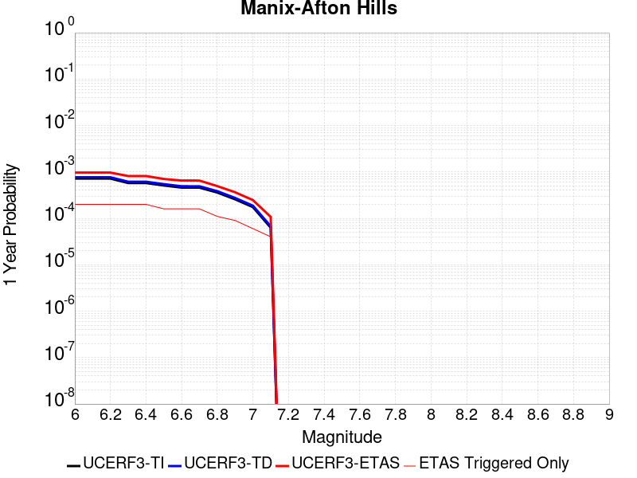 |  |

| Magnitude | 1 wk TI Prob | 1 wk TD Prob | 1 wk ETAS Prob | 1 wk ETAS/TD Gain | 1 wk ETAS Triggered Only | 1 mo TI Prob | 1 mo TD Prob | 1 mo ETAS Prob | 1 mo ETAS/TD Gain | 1 mo ETAS Triggered Only | 1 yr TI Prob | 1 yr TD Prob | 1 yr ETAS Prob | 1 yr ETAS/TD Gain | 1 yr ETAS Triggered Only | 10 yr TI Prob | 10 yr TD Prob | 10 yr ETAS Prob | 10 yr ETAS/TD Gain | 10 yr ETAS Triggered Only |
|-----|-----|-----|-----|-----|-----|-----|-----|-----|-----|-----|-----|-----|-----|-----|-----|-----|-----|-----|-----|-----|
| 6.0 | 1.3783202E-5 | 1.47110895E-5 | 8.305344E-5 | 5.6456347 | 6.834335E-5 | 5.906953E-5 | 6.30461E-5 | 1.9972419E-4 | 3.1679072 | 1.366867E-4 | 7.189342E-4 | 7.6733343E-4 | 0.0011087881 | 1.4449885 | 3.4171678E-4 | 0.0071661277 | 0.007648596 | 0.0079876995 | 1.0443354 | 3.4171678E-4 |
| 6.1 | 1.3783202E-5 | 1.47110895E-5 | 8.305344E-5 | 5.6456347 | 6.834335E-5 | 5.906953E-5 | 6.30461E-5 | 1.9972419E-4 | 3.1679072 | 1.366867E-4 | 7.189342E-4 | 7.6733343E-4 | 0.0011087881 | 1.4449885 | 3.4171678E-4 | 0.0071661277 | 0.007648596 | 0.0079876995 | 1.0443354 | 3.4171678E-4 |
| 6.2 | 1.3783202E-5 | 1.47110895E-5 | 8.305344E-5 | 5.6456347 | 6.834335E-5 | 5.906953E-5 | 6.30461E-5 | 1.9972419E-4 | 3.1679072 | 1.366867E-4 | 7.189342E-4 | 7.6733343E-4 | 0.0011087881 | 1.4449885 | 3.4171678E-4 | 0.0071661277 | 0.007648596 | 0.0079876995 | 1.0443354 | 3.4171678E-4 |
| 6.3 | 1.10494875E-5 | 1.1793136E-5 | 8.013569E-5 | 6.7951126 | 6.834335E-5 | 4.7354086E-5 | 5.054109E-5 | 1.872209E-4 | 3.7043304 | 1.366867E-4 | 5.763835E-4 | 6.151744E-4 | 9.56681E-4 | 1.5551378 | 3.4171678E-4 | 0.005748908 | 0.0061357557 | 0.0064753755 | 1.055351 | 3.4171678E-4 |
| 6.4 | 1.10494875E-5 | 1.1793136E-5 | 8.013569E-5 | 6.7951126 | 6.834335E-5 | 4.7354086E-5 | 5.054109E-5 | 1.872209E-4 | 3.7043304 | 1.366867E-4 | 5.763835E-4 | 6.151744E-4 | 9.56681E-4 | 1.5551378 | 3.4171678E-4 | 0.005748908 | 0.0061357557 | 0.0064753755 | 1.055351 | 3.4171678E-4 |
| 6.5 | 9.788949E-6 | 1.045432E-5 | 7.879696E-5 | 7.5372634 | 6.834335E-5 | 4.1951964E-5 | 4.480351E-5 | 1.814841E-4 | 4.050667 | 1.366867E-4 | 5.1064545E-4 | 5.453555E-4 | 7.5027376E-4 | 1.3757517 | 2.0503007E-4 | 0.0050947363 | 0.0054410985 | 0.005645013 | 1.0374767 | 2.0503007E-4 |
| 6.6 | 8.810006E-6 | 9.4136285E-6 | 7.775634E-5 | 8.259976 | 6.834335E-5 | 3.775662E-5 | 4.0343548E-5 | 1.7702475E-4 | 4.3879323 | 1.366867E-4 | 4.5958988E-4 | 4.9108086E-4 | 6.9601025E-4 | 1.4173027 | 2.0503007E-4 | 0.0045864056 | 0.004900839 | 0.0051048645 | 1.0416306 | 2.0503007E-4 |
| 6.7 | 8.80128E-6 | 9.404108E-6 | 7.774682E-5 | 8.267325 | 6.834335E-5 | 3.7719226E-5 | 4.0302748E-5 | 1.7698396E-4 | 4.391362 | 1.366867E-4 | 4.591348E-4 | 4.9058435E-4 | 6.9551385E-4 | 1.4177253 | 2.0503007E-4 | 0.004581874 | 0.0048958957 | 0.005099922 | 1.041673 | 2.0503007E-4 |
| 6.8 | 6.8994877E-6 | 7.380076E-6 | 7.572293E-5 | 10.260454 | 6.834335E-5 | 2.9568899E-5 | 3.162856E-5 | 1.6831094E-4 | 5.3214865 | 1.366867E-4 | 3.5994186E-4 | 3.8501783E-4 | 5.89969E-4 | 1.532316 | 2.0503007E-4 | 0.003593594 | 0.0038443129 | 0.0040485547 | 1.0531284 | 2.0503007E-4 |
| 6.9 | 4.9328037E-6 | 5.2709615E-6 | 7.3613955E-5 | 13.965945 | 6.834335E-5 | 2.1140417E-5 | 2.2589675E-5 | 1.592733E-4 | 7.0507126 | 1.366867E-4 | 2.5735417E-4 | 2.7500073E-4 | 4.799744E-4 | 1.7453569 | 2.0503007E-4 | 0.0025705635 | 0.0027472095 | 0.0029516763 | 1.0744271 | 2.0503007E-4 |
| 7.0 | 3.347973E-6 | 3.59003E-6 | 7.1933144E-5 | 20.036919 | 6.834335E-5 | 1.4348378E-5 | 1.5385775E-5 | 1.5207038E-4 | 9.88383 | 1.366867E-4 | 1.746775E-4 | 1.8730981E-4 | 3.2397092E-4 | 1.7295994 | 1.366867E-4 | 0.0017454025 | 0.0018719219 | 0.002008353 | 1.0728828 | 1.366867E-4 |
| 7.1 | 1.2073567E-6 | 1.293482E-6 | 1.293482E-6 | 1.0 | 0.0 | 5.1743755E-6 | 5.543492E-6 | 7.388647E-5 | 13.328506 | 6.834335E-5 | 6.29962E-5 | 6.749156E-5 | 1.358303E-4 | 2.0125525 | 6.834335E-5 | 6.297835E-4 | 6.7487074E-4 | 7.43168E-4 | 1.1012005 | 6.834335E-5 |

## Baker
*[(top)](#table-of-contents)*

| 1 Week | 1 Month | 1 Year | 10 Year |
|-----|-----|-----|-----|
|  |  |  |  |

| Magnitude | 1 wk TI Prob | 1 wk TD Prob | 1 wk ETAS Prob | 1 wk ETAS/TD Gain | 1 wk ETAS Triggered Only | 1 mo TI Prob | 1 mo TD Prob | 1 mo ETAS Prob | 1 mo ETAS/TD Gain | 1 mo ETAS Triggered Only | 1 yr TI Prob | 1 yr TD Prob | 1 yr ETAS Prob | 1 yr ETAS/TD Gain | 1 yr ETAS Triggered Only | 10 yr TI Prob | 10 yr TD Prob | 10 yr ETAS Prob | 10 yr ETAS/TD Gain | 10 yr ETAS Triggered Only |
|-----|-----|-----|-----|-----|-----|-----|-----|-----|-----|-----|-----|-----|-----|-----|-----|-----|-----|-----|-----|-----|
| 6.0 | 5.695525E-6 | 5.8348373E-6 | 2.1086371E-4 | 36.13875 | 2.0503007E-4 | 2.4409164E-5 | 2.5006228E-5 | 2.9837282E-4 | 11.93194 | 2.733734E-4 | 2.9714106E-4 | 3.044123E-4 | 5.7770254E-4 | 1.8977634 | 2.733734E-4 | 0.0029674405 | 0.0030403486 | 0.0033810267 | 1.1120522 | 3.4171678E-4 |
| 6.1 | 5.695525E-6 | 5.8348373E-6 | 2.1086371E-4 | 36.13875 | 2.0503007E-4 | 2.4409164E-5 | 2.5006228E-5 | 2.9837282E-4 | 11.93194 | 2.733734E-4 | 2.9714106E-4 | 3.044123E-4 | 5.7770254E-4 | 1.8977634 | 2.733734E-4 | 0.0029674405 | 0.0030403486 | 0.0033810267 | 1.1120522 | 3.4171678E-4 |
| 6.2 | 5.695525E-6 | 5.8348373E-6 | 2.1086371E-4 | 36.13875 | 2.0503007E-4 | 2.4409164E-5 | 2.5006228E-5 | 2.9837282E-4 | 11.93194 | 2.733734E-4 | 2.9714106E-4 | 3.044123E-4 | 5.7770254E-4 | 1.8977634 | 2.733734E-4 | 0.0029674405 | 0.0030403486 | 0.0033810267 | 1.1120522 | 3.4171678E-4 |
| 6.3 | 3.2995713E-6 | 3.383667E-6 | 7.172679E-5 | 21.197947 | 6.834335E-5 | 1.4140943E-5 | 1.4501353E-5 | 1.5118609E-4 | 10.425654 | 1.366867E-4 | 1.7215237E-4 | 1.7654014E-4 | 3.1320273E-4 | 1.7741163 | 1.366867E-4 | 0.0017201907 | 0.001764046 | 0.0019687144 | 1.1160221 | 2.0503007E-4 |
| 6.4 | 3.2995713E-6 | 3.383667E-6 | 7.172679E-5 | 21.197947 | 6.834335E-5 | 1.4140943E-5 | 1.4501353E-5 | 1.5118609E-4 | 10.425654 | 1.366867E-4 | 1.7215237E-4 | 1.7654014E-4 | 3.1320273E-4 | 1.7741163 | 1.366867E-4 | 0.0017201907 | 0.001764046 | 0.0019687144 | 1.1160221 | 2.0503007E-4 |
| 6.5 | 2.782202E-6 | 2.8558404E-6 | 7.1199E-5 | 24.931015 | 6.834335E-5 | 1.1923668E-5 | 1.223926E-5 | 1.489243E-4 | 12.167753 | 1.366867E-4 | 1.4516099E-4 | 1.4900314E-4 | 2.856695E-4 | 1.9172045 | 1.366867E-4 | 0.001450662 | 0.0014890651 | 0.0016937898 | 1.1374854 | 2.0503007E-4 |
| 6.6 | 2.3163404E-6 | 2.38092E-6 | 7.072411E-5 | 29.704533 | 6.834335E-5 | 9.927136E-6 | 1.0203904E-5 | 7.854657E-5 | 7.697697 | 6.834335E-5 | 1.20856166E-4 | 1.2422565E-4 | 1.9256052E-4 | 1.5500866 | 6.834335E-5 | 0.0012079047 | 0.0012415823 | 0.0013780993 | 1.109954 | 1.366867E-4 |
| 6.7 | 2.037056E-6 | 2.0965003E-6 | 7.043972E-5 | 33.598713 | 6.834335E-5 | 8.7302105E-6 | 8.984972E-6 | 7.732771E-5 | 8.606339 | 6.834335E-5 | 1.0628513E-4 | 1.093867E-4 | 1.7772258E-4 | 1.6247183 | 6.834335E-5 | 0.0010623431 | 0.0010933448 | 0.001229882 | 1.1248803 | 1.366867E-4 |
| 6.8 | 1.8356744E-6 | 1.8915287E-6 | 7.023475E-5 | 37.131214 | 6.834335E-5 | 7.867153E-6 | 8.106527E-6 | 7.644933E-5 | 9.43059 | 6.834335E-5 | 9.577837E-5 | 9.869264E-5 | 1.6702925E-4 | 1.6924186 | 6.834335E-5 | 9.57371E-4 | 9.86502E-4 | 0.001123054 | 1.1384202 | 1.366867E-4 |
| 6.9 | 1.6310546E-6 | 1.6832072E-6 | 7.002645E-5 | 41.60299 | 6.834335E-5 | 6.9902153E-6 | 7.213726E-6 | 7.555659E-5 | 10.474004 | 6.834335E-5 | 8.510255E-5 | 8.782368E-5 | 1.5616104E-4 | 1.7781199 | 6.834335E-5 | 8.5069967E-4 | 8.7790104E-4 | 0.0010144678 | 1.1555605 | 1.366867E-4 |
| 7.0 | 1.2058036E-6 | 1.2508665E-6 | 6.959414E-5 | 55.63674 | 6.834335E-5 | 5.1677193E-6 | 5.3608455E-6 | 7.3703835E-5 | 13.748547 | 6.834335E-5 | 6.291517E-5 | 6.5266366E-5 | 1.3360527E-4 | 2.0470767 | 6.834335E-5 | 6.289736E-4 | 6.524743E-4 | 7.8907184E-4 | 1.2093531 | 1.366867E-4 |
| 7.1 | 1.052382E-6 | 1.0951609E-6 | 6.943844E-5 | 63.40479 | 6.834335E-5 | 4.5102006E-6 | 4.693538E-6 | 7.303657E-5 | 15.561091 | 6.834335E-5 | 5.491031E-5 | 5.7142337E-5 | 1.2548179E-4 | 2.1959512 | 6.834335E-5 | 5.4896745E-4 | 5.7127734E-4 | 6.3958165E-4 | 1.1195642 | 6.834335E-5 |
| 7.2 | 1.0067454E-6 | 1.0487711E-6 | 6.939206E-5 | 66.165115 | 6.834335E-5 | 4.3146156E-6 | 4.4947255E-6 | 7.283778E-5 | 16.205168 | 6.834335E-5 | 5.252918E-5 | 5.4721917E-5 | 1.2306153E-4 | 2.2488527 | 6.834335E-5 | 5.251676E-4 | 5.470853E-4 | 6.1539124E-4 | 1.1248543 | 6.834335E-5 |
| 7.3 | 9.3596316E-7 | 9.767723E-7 | 6.932006E-5 | 70.9685 | 6.834335E-5 | 4.0112645E-6 | 4.1861604E-6 | 7.2529234E-5 | 17.325956 | 6.834335E-5 | 4.8836053E-5 | 5.096532E-5 | 1.19305194E-4 | 2.3409092 | 6.834335E-5 | 4.8825322E-4 | 5.095371E-4 | 5.778456E-4 | 1.13406 | 6.834335E-5 |
| 7.4 | 8.8117395E-7 | 9.2076635E-7 | 9.2076635E-7 | 1.0 | 0.0 | 3.7764542E-6 | 3.9461356E-6 | 3.9461356E-6 | 1.0 | 0.0 | 4.5977362E-5 | 4.8043148E-5 | 4.8043148E-5 | 1.0 | 0.0 | 4.596785E-4 | 4.8032837E-4 | 4.8032837E-4 | 1.0 | 0.0 |
| 7.5 | 8.292386E-7 | 8.6745956E-7 | 8.6745956E-7 | 1.0 | 0.0 | 3.5538749E-6 | 3.7176785E-6 | 3.7176785E-6 | 1.0 | 0.0 | 4.326757E-5 | 4.5261804E-5 | 4.5261804E-5 | 1.0 | 0.0 | 4.3259145E-4 | 4.5252658E-4 | 4.5252658E-4 | 1.0 | 0.0 |
| 7.6 | 7.553842E-7 | 7.9144706E-7 | 7.9144706E-7 | 1.0 | 0.0 | 3.2373566E-6 | 3.3919116E-6 | 3.3919116E-6 | 1.0 | 0.0 | 3.9414106E-5 | 4.129575E-5 | 4.129575E-5 | 1.0 | 0.0 | 3.9407116E-4 | 4.1288146E-4 | 4.1288146E-4 | 1.0 | 0.0 |
| 7.7 | 6.5285366E-7 | 6.852797E-7 | 6.852797E-7 | 1.0 | 0.0 | 2.797941E-6 | 2.9369096E-6 | 2.9369096E-6 | 1.0 | 0.0 | 3.40644E-5 | 3.5756293E-5 | 3.5756293E-5 | 1.0 | 0.0 | 3.405918E-4 | 3.5750607E-4 | 3.5750607E-4 | 1.0 | 0.0 |
| 7.8 | 3.4586725E-7 | 3.6482615E-7 | 3.6482615E-7 | 1.0 | 0.0 | 1.4822873E-6 | 1.5635396E-6 | 1.5635396E-6 | 1.0 | 0.0 | 1.80467E-5 | 1.9035933E-5 | 1.9035933E-5 | 1.0 | 0.0 | 1.8045233E-4 | 1.9034347E-4 | 1.9034347E-4 | 1.0 | 0.0 |
| 7.9 | 2.5591178E-9 | 2.6696718E-9 | 2.6696718E-9 | 1.0 | 0.0 | 1.0967647E-8 | 1.14414505E-8 | 1.14414505E-8 | 1.0 | 0.0 | 1.335311E-7 | 1.3929966E-7 | 1.3929966E-7 | 1.0 | 0.0 | 1.3353102E-6 | 1.3929966E-6 | 1.3929966E-6 | 1.0 | 0.0 |

## Death Valley (Fish Lake Valley)
*[(top)](#table-of-contents)*

| 1 Week | 1 Month | 1 Year | 10 Year |
|-----|-----|-----|-----|
|  |  |  |  |

| Magnitude | 1 wk TI Prob | 1 wk TD Prob | 1 wk ETAS Prob | 1 wk ETAS/TD Gain | 1 wk ETAS Triggered Only | 1 mo TI Prob | 1 mo TD Prob | 1 mo ETAS Prob | 1 mo ETAS/TD Gain | 1 mo ETAS Triggered Only | 1 yr TI Prob | 1 yr TD Prob | 1 yr ETAS Prob | 1 yr ETAS/TD Gain | 1 yr ETAS Triggered Only | 10 yr TI Prob | 10 yr TD Prob | 10 yr ETAS Prob | 10 yr ETAS/TD Gain | 10 yr ETAS Triggered Only |
|-----|-----|-----|-----|-----|-----|-----|-----|-----|-----|-----|-----|-----|-----|-----|-----|-----|-----|-----|-----|-----|
| 6.0 | 3.872328E-5 | 4.7267473E-5 | 1.8394772E-4 | 3.8916345 | 1.366867E-4 | 1.6594635E-4 | 2.0256084E-4 | 4.0754938E-4 | 2.011985 | 2.0503007E-4 | 0.0020185246 | 0.002463534 | 0.0027362339 | 1.1106946 | 2.733734E-4 | 0.02000288 | 0.024388181 | 0.024721565 | 1.0136698 | 3.4171678E-4 |
| 6.1 | 3.872328E-5 | 4.7267473E-5 | 1.8394772E-4 | 3.8916345 | 1.366867E-4 | 1.6594635E-4 | 2.0256084E-4 | 4.0754938E-4 | 2.011985 | 2.0503007E-4 | 0.0020185246 | 0.002463534 | 0.0027362339 | 1.1106946 | 2.733734E-4 | 0.02000288 | 0.024388181 | 0.024721565 | 1.0136698 | 3.4171678E-4 |
| 6.2 | 3.872328E-5 | 4.7267473E-5 | 1.8394772E-4 | 3.8916345 | 1.366867E-4 | 1.6594635E-4 | 2.0256084E-4 | 4.0754938E-4 | 2.011985 | 2.0503007E-4 | 0.0020185246 | 0.002463534 | 0.0027362339 | 1.1106946 | 2.733734E-4 | 0.02000288 | 0.024388181 | 0.024721565 | 1.0136698 | 3.4171678E-4 |
| 6.3 | 2.8356371E-5 | 3.3609853E-5 | 1.7029197E-4 | 5.066728 | 1.366867E-4 | 1.2152165E-4 | 1.4403471E-4 | 3.4903525E-4 | 2.4232717 | 2.0503007E-4 | 0.0014785219 | 0.0017522911 | 0.0020251854 | 1.1557357 | 2.733734E-4 | 0.014687235 | 0.017391782 | 0.017727556 | 1.0193064 | 3.4171678E-4 |
| 6.4 | 2.8356371E-5 | 3.3609853E-5 | 1.7029197E-4 | 5.066728 | 1.366867E-4 | 1.2152165E-4 | 1.4403471E-4 | 3.4903525E-4 | 2.4232717 | 2.0503007E-4 | 0.0014785219 | 0.0017522911 | 0.0020251854 | 1.1557357 | 2.733734E-4 | 0.014687235 | 0.017391782 | 0.017727556 | 1.0193064 | 3.4171678E-4 |
| 6.5 | 2.4448687E-5 | 2.8607552E-5 | 1.6529036E-4 | 5.7778573 | 1.366867E-4 | 1.0477588E-4 | 1.2259831E-4 | 3.2760325E-4 | 2.6721675 | 2.0503007E-4 | 0.0012748998 | 0.0014916632 | 0.0017646288 | 1.1829941 | 2.733734E-4 | 0.012676105 | 0.014821377 | 0.015158028 | 1.0227139 | 3.4171678E-4 |
| 6.6 | 2.1298161E-5 | 2.4660083E-5 | 1.6134343E-4 | 6.542696 | 1.366867E-4 | 9.127464E-5 | 1.0568198E-4 | 3.1069038E-4 | 2.9398615 | 2.0503007E-4 | 0.0011107022 | 0.0012859525 | 0.0015589744 | 1.212311 | 2.733734E-4 | 0.011051672 | 0.012788526 | 0.013125872 | 1.0263789 | 3.4171678E-4 |
| 6.7 | 1.8959729E-5 | 2.1781025E-5 | 1.5846477E-4 | 7.275358 | 1.366867E-4 | 8.125345E-5 | 9.334405E-5 | 2.9835498E-4 | 3.1962934 | 2.0503007E-4 | 9.888117E-4 | 0.001135897 | 0.0014089599 | 1.2403941 | 2.733734E-4 | 0.009844234 | 0.01130357 | 0.011641424 | 1.0298891 | 3.4171678E-4 |
| 6.8 | 1.6691629E-5 | 1.9018353E-5 | 1.5570247E-4 | 8.186959 | 1.366867E-4 | 7.153359E-5 | 8.150477E-5 | 2.8651813E-4 | 3.5153542 | 2.0503007E-4 | 8.7057345E-4 | 9.918857E-4 | 0.001264988 | 1.2753364 | 2.733734E-4 | 0.008671708 | 0.009876343 | 0.010214685 | 1.0342578 | 3.4171678E-4 |
| 6.9 | 1.450505E-5 | 1.638954E-5 | 1.5307401E-4 | 9.339739 | 1.366867E-4 | 6.216302E-5 | 7.0239046E-5 | 2.7525472E-4 | 3.9188278 | 2.0503007E-4 | 7.5657194E-4 | 8.5483363E-4 | 0.0011279733 | 1.3195238 | 2.733734E-4 | 0.007540013 | 0.008516385 | 0.008855192 | 1.0397829 | 3.4171678E-4 |
| 7.0 | 1.2940855E-5 | 1.4537972E-5 | 1.512227E-4 | 10.401912 | 1.366867E-4 | 5.545963E-5 | 6.230414E-5 | 2.6732145E-4 | 4.290589 | 2.0503007E-4 | 6.750118E-4 | 7.5829466E-4 | 0.0010314608 | 1.3602375 | 2.733734E-4 | 0.006729651 | 0.0075576897 | 0.007896824 | 1.0448728 | 3.4171678E-4 |
| 7.1 | 1.2544658E-5 | 1.4078208E-5 | 1.50763E-4 | 10.708962 | 1.366867E-4 | 5.3761712E-5 | 6.0333812E-5 | 2.6535153E-4 | 4.3980565 | 2.0503007E-4 | 6.5435225E-4 | 7.343222E-4 | 0.0010074949 | 1.3720065 | 2.733734E-4 | 0.006524288 | 0.007319551 | 0.0076587666 | 1.0463438 | 3.4171678E-4 |
| 7.2 | 1.2489416E-5 | 1.4015674E-5 | 1.5070048E-4 | 10.752281 | 1.366867E-4 | 5.3524967E-5 | 6.0065824E-5 | 2.6508357E-4 | 4.413218 | 2.0503007E-4 | 6.514716E-4 | 7.310616E-4 | 0.0010042352 | 1.373667 | 2.733734E-4 | 0.006495651 | 0.0072871596 | 0.0076263864 | 1.0465512 | 3.4171678E-4 |
| 7.3 | 1.2368307E-5 | 1.3879812E-5 | 1.5056464E-4 | 10.847742 | 1.366867E-4 | 5.3005948E-5 | 5.9483587E-5 | 2.6450146E-4 | 4.4466295 | 2.0503007E-4 | 6.451563E-4 | 7.2397763E-4 | 9.971531E-4 | 1.3773259 | 2.733734E-4 | 0.0064328653 | 0.007216782 | 0.0075560324 | 1.0470086 | 3.4171678E-4 |
| 7.4 | 1.2161707E-5 | 1.36478675E-5 | 1.5033272E-4 | 11.015106 | 1.366867E-4 | 5.212056E-5 | 5.8489582E-5 | 2.6350765E-4 | 4.5052066 | 2.0503007E-4 | 6.3438306E-4 | 7.118836E-4 | 9.850624E-4 | 1.3837409 | 2.733734E-4 | 0.006325751 | 0.0070966207 | 0.0074359123 | 1.0478103 | 3.4171678E-4 |
| 7.5 | 1.1707948E-5 | 1.3145515E-5 | 1.4983043E-4 | 11.397837 | 1.366867E-4 | 5.0175953E-5 | 5.6336736E-5 | 2.6135525E-4 | 4.639162 | 2.0503007E-4 | 6.10721E-4 | 6.856895E-4 | 9.5887546E-4 | 1.3984107 | 2.733734E-4 | 0.0060904534 | 0.006836321 | 0.007175702 | 1.0496438 | 3.4171678E-4 |
| 7.6 | 1.0319538E-5 | 1.1579622E-5 | 1.4826475E-4 | 12.803937 | 1.366867E-4 | 4.4225842E-5 | 4.9626036E-5 | 2.5464594E-4 | 5.131297 | 2.0503007E-4 | 5.383166E-4 | 6.040347E-4 | 8.77243E-4 | 1.4523057 | 2.733734E-4 | 0.0053701443 | 0.0060244603 | 0.0063641183 | 1.0563798 | 3.4171678E-4 |
| 7.7 | 8.937764E-6 | 1.0022779E-5 | 1.4670812E-4 | 14.637469 | 1.366867E-4 | 3.830414E-5 | 4.295409E-5 | 2.4797535E-4 | 5.7730327 | 2.0503007E-4 | 4.6625308E-4 | 5.228456E-4 | 7.960761E-4 | 1.5225835 | 2.733734E-4 | 0.0046527605 | 0.005216664 | 0.0055565983 | 1.0651631 | 3.4171678E-4 |
| 7.8 | 3.108007E-7 | 3.284654E-7 | 3.284654E-7 | 1.0 | 0.0 | 1.3320023E-6 | 1.407708E-6 | 1.407708E-6 | 1.0 | 0.0 | 1.6217007E-5 | 1.7138715E-5 | 1.7138715E-5 | 1.0 | 0.0 | 1.6215823E-4 | 1.7137431E-4 | 1.7137431E-4 | 1.0 | 0.0 |
| 7.9 | 2.5591178E-9 | 2.6696718E-9 | 2.6696718E-9 | 1.0 | 0.0 | 1.0967647E-8 | 1.14414505E-8 | 1.14414505E-8 | 1.0 | 0.0 | 1.335311E-7 | 1.3929966E-7 | 1.3929966E-7 | 1.0 | 0.0 | 1.3353102E-6 | 1.3929966E-6 | 1.3929966E-6 | 1.0 | 0.0 |

## Red Mountain
*[(top)](#table-of-contents)*

| 1 Week | 1 Month | 1 Year | 10 Year |
|-----|-----|-----|-----|
|  | 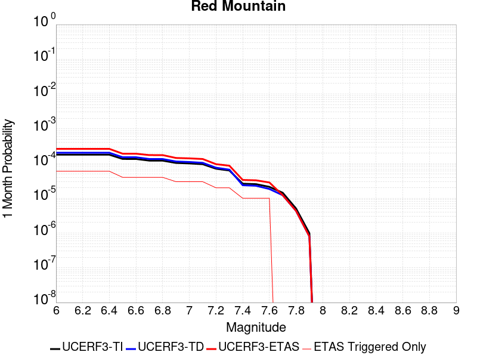 |  |  |

| Magnitude | 1 wk TI Prob | 1 wk TD Prob | 1 wk ETAS Prob | 1 wk ETAS/TD Gain | 1 wk ETAS Triggered Only | 1 mo TI Prob | 1 mo TD Prob | 1 mo ETAS Prob | 1 mo ETAS/TD Gain | 1 mo ETAS Triggered Only | 1 yr TI Prob | 1 yr TD Prob | 1 yr ETAS Prob | 1 yr ETAS/TD Gain | 1 yr ETAS Triggered Only | 10 yr TI Prob | 10 yr TD Prob | 10 yr ETAS Prob | 10 yr ETAS/TD Gain | 10 yr ETAS Triggered Only |
|-----|-----|-----|-----|-----|-----|-----|-----|-----|-----|-----|-----|-----|-----|-----|-----|-----|-----|-----|-----|-----|
| 6.0 | 4.1810763E-5 | 4.7589947E-5 | 1.1593005E-4 | 2.43602 | 6.834335E-5 | 1.7917668E-4 | 2.039419E-4 | 2.722713E-4 | 1.3350435 | 6.834335E-5 | 0.0021792934 | 0.0024803306 | 0.0025485044 | 1.0274858 | 6.834335E-5 | 0.021580452 | 0.024544092 | 0.024677424 | 1.0054324 | 1.366867E-4 |
| 6.1 | 4.1810763E-5 | 4.7589947E-5 | 1.1593005E-4 | 2.43602 | 6.834335E-5 | 1.7917668E-4 | 2.039419E-4 | 2.722713E-4 | 1.3350435 | 6.834335E-5 | 0.0021792934 | 0.0024803306 | 0.0025485044 | 1.0274858 | 6.834335E-5 | 0.021580452 | 0.024544092 | 0.024677424 | 1.0054324 | 1.366867E-4 |
| 6.2 | 4.1810763E-5 | 4.7589947E-5 | 1.1593005E-4 | 2.43602 | 6.834335E-5 | 1.7917668E-4 | 2.039419E-4 | 2.722713E-4 | 1.3350435 | 6.834335E-5 | 0.0021792934 | 0.0024803306 | 0.0025485044 | 1.0274858 | 6.834335E-5 | 0.021580452 | 0.024544092 | 0.024677424 | 1.0054324 | 1.366867E-4 |
| 6.3 | 4.1810763E-5 | 4.7589947E-5 | 1.1593005E-4 | 2.43602 | 6.834335E-5 | 1.7917668E-4 | 2.039419E-4 | 2.722713E-4 | 1.3350435 | 6.834335E-5 | 0.0021792934 | 0.0024803306 | 0.0025485044 | 1.0274858 | 6.834335E-5 | 0.021580452 | 0.024544092 | 0.024677424 | 1.0054324 | 1.366867E-4 |
| 6.4 | 4.1810763E-5 | 4.7589947E-5 | 1.1593005E-4 | 2.43602 | 6.834335E-5 | 1.7917668E-4 | 2.039419E-4 | 2.722713E-4 | 1.3350435 | 6.834335E-5 | 0.0021792934 | 0.0024803306 | 0.0025485044 | 1.0274858 | 6.834335E-5 | 0.021580452 | 0.024544092 | 0.024677424 | 1.0054324 | 1.366867E-4 |
| 6.5 | 3.154503E-5 | 3.5359728E-5 | 1.03700666E-4 | 2.9327338 | 6.834335E-5 | 1.3518598E-4 | 1.5153342E-4 | 2.1986642E-4 | 1.4509435 | 6.834335E-5 | 0.0016446467 | 0.0018434501 | 0.0019116675 | 1.0370053 | 6.834335E-5 | 0.01632528 | 0.018291233 | 0.01842542 | 1.0073361 | 1.366867E-4 |
| 6.6 | 3.1535834E-5 | 3.534911E-5 | 1.0369005E-4 | 2.9333143 | 6.834335E-5 | 1.3514658E-4 | 1.5148791E-4 | 2.1982091E-4 | 1.4510789 | 6.834335E-5 | 0.0016441676 | 0.001842897 | 0.0019111146 | 1.0370164 | 6.834335E-5 | 0.01632056 | 0.018285794 | 0.018419983 | 1.0073383 | 1.366867E-4 |
| 6.7 | 2.8267326E-5 | 3.146934E-5 | 9.9810546E-5 | 3.171676 | 6.834335E-5 | 1.2114006E-4 | 1.348621E-4 | 2.0319625E-4 | 1.5066963 | 6.834335E-5 | 0.0014738824 | 0.0016407946 | 0.0017090258 | 1.0415843 | 6.834335E-5 | 0.014641452 | 0.016295563 | 0.016430022 | 1.0082513 | 1.366867E-4 |
| 6.8 | 2.8212884E-5 | 3.1407224E-5 | 9.974844E-5 | 3.175971 | 6.834335E-5 | 1.20906756E-4 | 1.3459593E-4 | 2.0293008E-4 | 1.5076985 | 6.834335E-5 | 0.0014710457 | 0.0016375587 | 0.0017057902 | 1.0416665 | 6.834335E-5 | 0.014613459 | 0.01626368 | 0.016398143 | 1.0082678 | 1.366867E-4 |
| 6.9 | 2.4227871E-5 | 2.6706979E-5 | 9.504851E-5 | 3.5589392 | 6.834335E-5 | 1.03829596E-4 | 1.14453884E-4 | 1.8278942E-4 | 1.5970573 | 6.834335E-5 | 0.0012633923 | 0.0013926612 | 0.0014609094 | 1.0490056 | 6.834335E-5 | 0.012562336 | 0.013847026 | 0.01398182 | 1.0097345 | 1.366867E-4 |
| 7.0 | 2.348524E-5 | 2.5835763E-5 | 9.4177354E-5 | 3.6452322 | 6.834335E-5 | 1.0064714E-4 | 1.1072042E-4 | 1.7905621E-4 | 1.6171923 | 6.834335E-5 | 0.0012246901 | 0.0013472632 | 0.0014155145 | 1.0506592 | 6.834335E-5 | 0.012179627 | 0.01339859 | 0.013533445 | 1.0100648 | 1.366867E-4 |
| 7.1 | 2.2311642E-5 | 2.4462828E-5 | 9.280451E-5 | 3.793695 | 6.834335E-5 | 9.561782E-5 | 1.048369E-4 | 1.731731E-4 | 1.6518334 | 6.834335E-5 | 0.0011635252 | 0.0012757168 | 0.001343973 | 1.0535042 | 6.834335E-5 | 0.01157452 | 0.012691451 | 0.012826404 | 1.0106333 | 1.366867E-4 |
| 7.2 | 1.6533986E-5 | 1.7670347E-5 | 8.601249E-5 | 4.867618 | 6.834335E-5 | 7.085802E-5 | 7.572822E-5 | 1.440664E-4 | 1.9024137 | 6.834335E-5 | 8.623549E-4 | 9.216645E-4 | 9.899449E-4 | 1.0740838 | 6.834335E-5 | 0.008590161 | 0.009184699 | 0.009320131 | 1.0147454 | 1.366867E-4 |
| 7.3 | 1.4703092E-5 | 1.555952E-5 | 8.390182E-5 | 5.3923135 | 6.834335E-5 | 6.301173E-5 | 6.66823E-5 | 1.3502111E-4 | 2.0248415 | 6.834335E-5 | 7.668978E-4 | 8.1161625E-4 | 8.7990414E-4 | 1.0841382 | 6.834335E-5 | 0.0076425658 | 0.008092596 | 0.008228176 | 1.0167537 | 1.366867E-4 |
| 7.4 | 6.1331984E-6 | 5.528872E-6 | 7.387185E-5 | 13.361108 | 6.834335E-5 | 2.6284872E-5 | 2.3694953E-5 | 9.203669E-5 | 3.8842318 | 6.834335E-5 | 3.199713E-4 | 2.8844838E-4 | 3.56772E-4 | 1.2368661 | 6.834335E-5 | 0.0031951098 | 0.0028807942 | 0.0030170872 | 1.047311 | 1.366867E-4 |
| 7.5 | 5.954766E-6 | 5.3385015E-6 | 7.368149E-5 | 13.801906 | 6.834335E-5 | 2.5520176E-5 | 2.2879094E-5 | 9.1220885E-5 | 3.9870846 | 6.834335E-5 | 3.1066386E-4 | 2.785179E-4 | 3.4684222E-4 | 1.2453139 | 6.834335E-5 | 0.003102299 | 0.0027817423 | 0.0029180488 | 1.0490004 | 1.366867E-4 |
| 7.6 | 4.9726646E-6 | 4.315295E-6 | 7.265836E-5 | 16.837402 | 6.834335E-5 | 2.1311245E-5 | 1.8493993E-5 | 8.683609E-5 | 4.6953673 | 6.834335E-5 | 2.5943352E-4 | 2.2514143E-4 | 2.934694E-4 | 1.3034891 | 6.834335E-5 | 0.0025913084 | 0.002249168 | 0.0023855474 | 1.0606354 | 1.366867E-4 |
| 7.7 | 3.3613894E-6 | 2.8526642E-6 | 2.8526642E-6 | 1.0 | 0.0 | 1.4405875E-5 | 1.2225649E-5 | 1.2225649E-5 | 1.0 | 0.0 | 1.7537741E-4 | 1.4883737E-4 | 1.4883737E-4 | 1.0 | 0.0 | 0.0017523908 | 0.0014874031 | 0.0015556448 | 1.0458797 | 6.834335E-5 |
| 7.8 | 1.1828961E-6 | 1.0122756E-6 | 1.0122756E-6 | 1.0 | 0.0 | 5.069545E-6 | 4.338317E-6 | 4.338317E-6 | 1.0 | 0.0 | 6.171996E-5 | 5.281776E-5 | 5.281776E-5 | 1.0 | 0.0 | 6.170282E-4 | 5.2805495E-4 | 5.2805495E-4 | 1.0 | 0.0 |
| 7.9 | 2.2967266E-7 | 1.8618952E-7 | 1.8618952E-7 | 1.0 | 0.0 | 9.843111E-7 | 7.9795484E-7 | 7.9795484E-7 | 1.0 | 0.0 | 1.19839215E-5 | 9.7150605E-6 | 9.7150605E-6 | 1.0 | 0.0 | 1.1983275E-4 | 9.714664E-5 | 9.714664E-5 | 1.0 | 0.0 |

## San Andreas (Coachella) rev
*[(top)](#table-of-contents)*

| 1 Week | 1 Month | 1 Year | 10 Year |
|-----|-----|-----|-----|
|  |  |  | 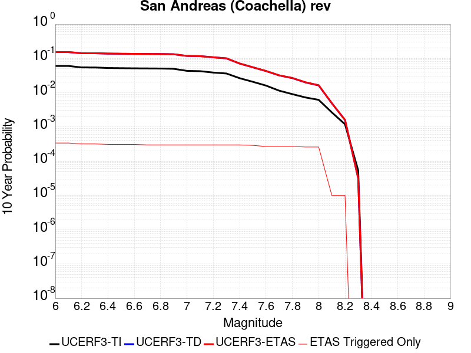 |

| Magnitude | 1 wk TI Prob | 1 wk TD Prob | 1 wk ETAS Prob | 1 wk ETAS/TD Gain | 1 wk ETAS Triggered Only | 1 mo TI Prob | 1 mo TD Prob | 1 mo ETAS Prob | 1 mo ETAS/TD Gain | 1 mo ETAS Triggered Only | 1 yr TI Prob | 1 yr TD Prob | 1 yr ETAS Prob | 1 yr ETAS/TD Gain | 1 yr ETAS Triggered Only | 10 yr TI Prob | 10 yr TD Prob | 10 yr ETAS Prob | 10 yr ETAS/TD Gain | 10 yr ETAS Triggered Only |
|-----|-----|-----|-----|-----|-----|-----|-----|-----|-----|-----|-----|-----|-----|-----|-----|-----|-----|-----|-----|-----|
| 6.0 | 1.1925945E-4 | 3.2729402E-4 | 4.6393598E-4 | 1.41749 | 1.366867E-4 | 5.110118E-4 | 0.0014019393 | 0.0015384344 | 1.0973617 | 1.366867E-4 | 0.0062038354 | 0.016936364 | 0.017070735 | 1.007934 | 1.366867E-4 | 0.060334753 | 0.15265316 | 0.1529427 | 1.0018969 | 3.4171678E-4 |
| 6.1 | 1.1925945E-4 | 3.2729402E-4 | 4.6393598E-4 | 1.41749 | 1.366867E-4 | 5.110118E-4 | 0.0014019393 | 0.0015384344 | 1.0973617 | 1.366867E-4 | 0.0062038354 | 0.016936364 | 0.017070735 | 1.007934 | 1.366867E-4 | 0.060334753 | 0.15265316 | 0.1529427 | 1.0018969 | 3.4171678E-4 |
| 6.2 | 1.07432395E-4 | 3.0230157E-4 | 4.3894697E-4 | 1.4520168 | 1.366867E-4 | 4.603433E-4 | 0.0012949388 | 0.0014314485 | 1.1054178 | 1.366867E-4 | 0.005590286 | 0.015653009 | 0.015787555 | 1.0085956 | 1.366867E-4 | 0.05451731 | 0.14182423 | 0.14211749 | 1.0020677 | 3.4171678E-4 |
| 6.3 | 1.0718766E-4 | 3.0175463E-4 | 4.3840008E-4 | 1.4528364 | 1.366867E-4 | 4.592948E-4 | 0.0012925972 | 0.0014291072 | 1.105609 | 1.366867E-4 | 0.005577586 | 0.015624908 | 0.015759459 | 1.0086113 | 1.366867E-4 | 0.054396555 | 0.14159249 | 0.14188583 | 1.0020716 | 3.4171678E-4 |
| 6.4 | 1.0355944E-4 | 2.9383553E-4 | 4.304821E-4 | 1.4650444 | 1.366867E-4 | 4.4375064E-4 | 0.0012586913 | 0.001395206 | 1.1084576 | 1.366867E-4 | 0.0053892885 | 0.015217941 | 0.015352548 | 1.0088452 | 1.366867E-4 | 0.052604496 | 0.13815255 | 0.13844706 | 1.0021317 | 3.4171678E-4 |
| 6.5 | 1.0227914E-4 | 2.9102986E-4 | 4.276768E-4 | 1.4695289 | 1.366867E-4 | 4.382655E-4 | 0.0012466786 | 0.0013831949 | 1.109504 | 1.366867E-4 | 0.0053228354 | 0.01507372 | 0.015208347 | 1.0089312 | 1.366867E-4 | 0.051971316 | 0.13693172 | 0.13722664 | 1.0021538 | 3.4171678E-4 |
| 6.6 | 1.0116757E-4 | 2.8868738E-4 | 4.2533464E-4 | 1.4733399 | 1.366867E-4 | 4.3350324E-4 | 0.0012366489 | 0.0013731666 | 1.1103933 | 1.366867E-4 | 0.0052651367 | 0.01495329 | 0.015087933 | 1.0090042 | 1.366867E-4 | 0.051421247 | 0.1359099 | 0.13620517 | 1.0021726 | 3.4171678E-4 |
| 6.7 | 1.0050676E-4 | 2.8727303E-4 | 4.2392046E-4 | 1.475671 | 1.366867E-4 | 4.3067214E-4 | 0.0012305931 | 0.0013671116 | 1.1109371 | 1.366867E-4 | 0.005230834 | 0.014880571 | 0.015015223 | 1.0090489 | 1.366867E-4 | 0.051094085 | 0.13529462 | 0.1355901 | 1.002184 | 3.4171678E-4 |
| 6.8 | 9.976819E-5 | 2.853096E-4 | 4.2195732E-4 | 1.4789454 | 1.366867E-4 | 4.2750788E-4 | 0.0012221863 | 0.0013587059 | 1.1117011 | 1.366867E-4 | 0.0051924936 | 0.0147796115 | 0.014914278 | 1.0091116 | 1.366867E-4 | 0.050728295 | 0.13444631 | 0.13474208 | 1.0021999 | 3.4171678E-4 |
| 6.9 | 9.77719E-5 | 2.8027873E-4 | 4.1692716E-4 | 1.4875447 | 1.366867E-4 | 4.1895514E-4 | 0.0012006456 | 0.0013371682 | 1.1137077 | 1.366867E-4 | 0.0050888555 | 0.014520878 | 0.01465558 | 1.0092764 | 1.366867E-4 | 0.049738888 | 0.1322748 | 0.13257132 | 1.0022416 | 3.4171678E-4 |
| 7.0 | 8.500761E-5 | 2.4762485E-4 | 3.8427772E-4 | 1.5518544 | 1.366867E-4 | 3.6426744E-4 | 0.001060821 | 0.0011973627 | 1.1287133 | 1.366867E-4 | 0.0044259406 | 0.012839786 | 0.012974718 | 1.0105089 | 1.366867E-4 | 0.04338823 | 0.11813272 | 0.11843407 | 1.002551 | 3.4171678E-4 |
| 7.1 | 8.319876E-5 | 2.4365232E-4 | 3.8030572E-4 | 1.5608541 | 1.366867E-4 | 3.5651738E-4 | 0.0010438096 | 0.0011803536 | 1.1308131 | 1.366867E-4 | 0.004331963 | 0.012635092 | 0.012770052 | 1.0106814 | 1.366867E-4 | 0.042484846 | 0.116353 | 0.116654955 | 1.0025952 | 3.4171678E-4 |
| 7.2 | 7.563917E-5 | 2.2413683E-4 | 3.607929E-4 | 1.6096994 | 1.366867E-4 | 3.2412758E-4 | 9.602359E-4 | 0.0010967914 | 1.1422104 | 1.366867E-4 | 0.0039391145 | 0.011628893 | 0.011763991 | 1.0116174 | 1.366867E-4 | 0.03870018 | 0.10775925 | 0.108064145 | 1.0028294 | 3.4171678E-4 |
| 7.3 | 7.082985E-5 | 2.0729867E-4 | 3.4395704E-4 | 1.6592343 | 1.366867E-4 | 3.0352117E-4 | 8.881233E-4 | 0.0010246886 | 1.1537684 | 1.366867E-4 | 0.0036891096 | 0.010759917 | 0.010895133 | 1.0125667 | 1.366867E-4 | 0.03628465 | 0.100282 | 0.10058945 | 1.0030658 | 3.4171678E-4 |
| 7.4 | 5.146215E-5 | 1.4273795E-4 | 2.7940515E-4 | 1.9574693 | 1.366867E-4 | 2.2053342E-4 | 6.115915E-4 | 7.4819464E-4 | 1.2233568 | 1.366867E-4 | 0.0026816884 | 0.0074208933 | 0.0075565656 | 1.0182825 | 1.366867E-4 | 0.02649557 | 0.070849575 | 0.07116708 | 1.0044814 | 3.4171678E-4 |
| 7.5 | 4.0285166E-5 | 1.09416E-4 | 2.4608776E-4 | 2.249102 | 1.366867E-4 | 1.7263928E-4 | 4.6884175E-4 | 6.054644E-4 | 1.2914046 | 1.366867E-4 | 0.002099857 | 0.0056932783 | 0.0058291866 | 1.0238718 | 1.366867E-4 | 0.020801254 | 0.055011146 | 0.055334065 | 1.0058701 | 3.4171678E-4 |
| 7.6 | 3.1168736E-5 | 8.4389096E-5 | 2.2106427E-4 | 2.6195834 | 1.366867E-4 | 1.3357346E-4 | 3.6161754E-4 | 4.9825484E-4 | 1.3778503 | 1.366867E-4 | 0.0016250437 | 0.0043938323 | 0.0045299185 | 1.0309721 | 1.366867E-4 | 0.016132116 | 0.04281005 | 0.043137137 | 1.0076405 | 3.4171678E-4 |
| 7.7 | 2.2100989E-5 | 6.238755E-5 | 1.9906573E-4 | 3.1907926 | 1.366867E-4 | 9.4715084E-5 | 2.6734784E-4 | 4.0399804E-4 | 1.5111325 | 1.366867E-4 | 0.001152546 | 0.0032501083 | 0.0033863508 | 1.0419194 | 1.366867E-4 | 0.011465867 | 0.0319002 | 0.032231014 | 1.0103704 | 3.4171678E-4 |
| 7.8 | 1.7484861E-5 | 5.179572E-5 | 1.8847536E-4 | 3.6388211 | 1.366867E-4 | 7.493296E-5 | 2.2196278E-4 | 3.5861915E-4 | 1.6156725 | 1.366867E-4 | 9.1192697E-4 | 0.0026990508 | 0.0028353685 | 1.0505059 | 1.366867E-4 | 0.009081938 | 0.026640115 | 0.02697273 | 1.0124854 | 3.4171678E-4 |
| 7.9 | 1.3967285E-5 | 3.822255E-5 | 1.7490404E-4 | 4.575938 | 1.366867E-4 | 5.985842E-5 | 1.6380067E-4 | 3.0046498E-4 | 1.8343332 | 1.366867E-4 | 7.2853256E-4 | 0.00199245 | 0.0021288644 | 1.0684656 | 1.366867E-4 | 0.0072614877 | 0.019909438 | 0.02024435 | 1.0168219 | 3.4171678E-4 |
| 8.0 | 1.1887396E-5 | 3.106521E-5 | 1.6774768E-4 | 5.3998566 | 1.366867E-4 | 5.094499E-5 | 1.3312983E-4 | 2.6979836E-4 | 2.0265808 | 1.366867E-4 | 6.200787E-4 | 0.0016196516 | 0.0017561169 | 1.0842559 | 1.366867E-4 | 0.006183513 | 0.016279267 | 0.01661542 | 1.0206492 | 3.4171678E-4 |
| 8.1 | 5.100864E-6 | 8.973418E-6 | 8.973418E-6 | 1.0 | 0.0 | 2.1860664E-5 | 3.8456936E-5 | 3.8456936E-5 | 1.0 | 0.0 | 2.6612106E-4 | 4.6811273E-4 | 4.6811273E-4 | 1.0 | 0.0 | 0.002658026 | 0.004917731 | 0.004917731 | 1.0 | 0.0 |
| 8.2 | 2.3004484E-6 | 2.7864487E-6 | 2.7864487E-6 | 1.0 | 0.0 | 9.859027E-6 | 1.1941868E-5 | 1.1941868E-5 | 1.0 | 0.0 | 1.2002704E-4 | 1.4538258E-4 | 1.4538258E-4 | 1.0 | 0.0 | 0.0011996223 | 0.0015973912 | 0.0015973912 | 1.0 | 0.0 |
| 8.3 | 1.0424446E-7 | 5.8161504E-8 | 5.8161504E-8 | 1.0 | 0.0 | 4.4676187E-7 | 2.4926356E-7 | 2.4926356E-7 | 1.0 | 0.0 | 5.439312E-6 | 3.03478E-6 | 3.03478E-6 | 1.0 | 0.0 | 5.4391792E-5 | 3.190716E-5 | 3.190716E-5 | 1.0 | 0.0 |

## Elsinore (Glen Ivy) rev
*[(top)](#table-of-contents)*

| 1 Week | 1 Month | 1 Year | 10 Year |
|-----|-----|-----|-----|
|  |  | 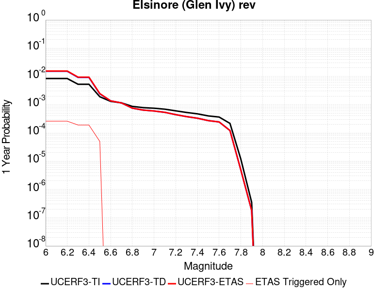 |  |

| Magnitude | 1 wk TI Prob | 1 wk TD Prob | 1 wk ETAS Prob | 1 wk ETAS/TD Gain | 1 wk ETAS Triggered Only | 1 mo TI Prob | 1 mo TD Prob | 1 mo ETAS Prob | 1 mo ETAS/TD Gain | 1 mo ETAS Triggered Only | 1 yr TI Prob | 1 yr TD Prob | 1 yr ETAS Prob | 1 yr ETAS/TD Gain | 1 yr ETAS Triggered Only | 10 yr TI Prob | 10 yr TD Prob | 10 yr ETAS Prob | 10 yr ETAS/TD Gain | 10 yr ETAS Triggered Only |
|-----|-----|-----|-----|-----|-----|-----|-----|-----|-----|-----|-----|-----|-----|-----|-----|-----|-----|-----|-----|-----|
| 6.0 | 1.6204086E-4 | 2.9360707E-4 | 4.3025365E-4 | 1.4654063 | 1.366867E-4 | 6.94276E-4 | 0.0012578638 | 0.001462636 | 1.1627936 | 2.0503007E-4 | 0.008420097 | 0.015234485 | 0.015436391 | 1.0132532 | 2.0503007E-4 | 0.081081145 | 0.13969168 | 0.13998565 | 1.0021045 | 3.4171678E-4 |
| 6.1 | 1.6204086E-4 | 2.9360707E-4 | 4.3025365E-4 | 1.4654063 | 1.366867E-4 | 6.94276E-4 | 0.0012578638 | 0.001462636 | 1.1627936 | 2.0503007E-4 | 0.008420097 | 0.015234485 | 0.015436391 | 1.0132532 | 2.0503007E-4 | 0.081081145 | 0.13969168 | 0.13998565 | 1.0021045 | 3.4171678E-4 |
| 6.2 | 1.6204086E-4 | 2.9360707E-4 | 4.3025365E-4 | 1.4654063 | 1.366867E-4 | 6.94276E-4 | 0.0012578638 | 0.001462636 | 1.1627936 | 2.0503007E-4 | 0.008420097 | 0.015234485 | 0.015436391 | 1.0132532 | 2.0503007E-4 | 0.081081145 | 0.13969168 | 0.13998565 | 1.0021045 | 3.4171678E-4 |
| 6.3 | 1.0111737E-4 | 1.7703383E-4 | 3.1369634E-4 | 1.7719572 | 1.366867E-4 | 4.332882E-4 | 7.5861247E-4 | 9.6348696E-4 | 1.2700648 | 2.0503007E-4 | 0.005262531 | 0.009217682 | 0.009420822 | 1.0220381 | 2.0503007E-4 | 0.0513964 | 0.0870191 | 0.08726868 | 1.0028682 | 2.733734E-4 |
| 6.4 | 1.0111737E-4 | 1.7703383E-4 | 3.1369634E-4 | 1.7719572 | 1.366867E-4 | 4.332882E-4 | 7.5861247E-4 | 9.6348696E-4 | 1.2700648 | 2.0503007E-4 | 0.005262531 | 0.009217682 | 0.009420822 | 1.0220381 | 2.0503007E-4 | 0.0513964 | 0.0870191 | 0.08726868 | 1.0028682 | 2.733734E-4 |
| 6.5 | 3.6624708E-5 | 4.6391084E-5 | 4.6391084E-5 | 1.0 | 0.0 | 1.569536E-4 | 1.9880582E-4 | 2.671356E-4 | 1.343701 | 6.834335E-5 | 0.001909235 | 0.0024181372 | 0.002486315 | 1.0281944 | 6.834335E-5 | 0.01892915 | 0.023739954 | 0.023873396 | 1.005621 | 1.366867E-4 |
| 6.6 | 2.5051324E-5 | 2.614772E-5 | 2.614772E-5 | 1.0 | 0.0 | 1.073584E-4 | 1.12057096E-4 | 1.12057096E-4 | 1.0 | 0.0 | 0.0013063047 | 0.0013634858 | 0.0013634858 | 1.0 | 0.0 | 0.012986525 | 0.013564618 | 0.013632035 | 1.00497 | 6.834335E-5 |
| 6.7 | 2.2189772E-5 | 2.2072849E-5 | 2.2072849E-5 | 1.0 | 0.0 | 9.509556E-5 | 9.4594696E-5 | 9.4594696E-5 | 1.0 | 0.0 | 0.0011571734 | 0.0011511183 | 0.0011511183 | 1.0 | 0.0 | 0.011511663 | 0.011465415 | 0.011532975 | 1.0058925 | 6.834335E-5 |
| 6.8 | 1.6654378E-5 | 1.4437705E-5 | 1.4437705E-5 | 1.0 | 0.0 | 7.137396E-5 | 6.187444E-5 | 6.187444E-5 | 1.0 | 0.0 | 8.686314E-4 | 7.530661E-4 | 7.530661E-4 | 1.0 | 0.0 | 0.008652439 | 0.00751048 | 0.00757831 | 1.0090314 | 6.834335E-5 |
| 6.9 | 1.5042909E-5 | 1.2332022E-5 | 1.2332022E-5 | 1.0 | 0.0 | 6.446802E-5 | 5.285047E-5 | 5.285047E-5 | 1.0 | 0.0 | 7.8461546E-4 | 6.4326765E-4 | 6.4326765E-4 | 1.0 | 0.0 | 0.007818509 | 0.00641828 | 0.006486185 | 1.01058 | 6.834335E-5 |
| 7.0 | 1.4361385E-5 | 1.1451324E-5 | 1.1451324E-5 | 1.0 | 0.0 | 6.154734E-5 | 4.9076196E-5 | 4.9076196E-5 | 1.0 | 0.0 | 7.490812E-4 | 5.973418E-4 | 5.973418E-4 | 1.0 | 0.0 | 0.007465612 | 0.0059613534 | 0.006029289 | 1.011396 | 6.834335E-5 |
| 7.1 | 1.3265571E-5 | 1.0244926E-5 | 1.0244926E-5 | 1.0 | 0.0 | 5.6851208E-5 | 4.39061E-5 | 4.39061E-5 | 1.0 | 0.0 | 6.919436E-4 | 5.344282E-4 | 5.344282E-4 | 1.0 | 0.0 | 0.006897931 | 0.0053347866 | 0.0054027652 | 1.0127425 | 6.834335E-5 |
| 7.2 | 1.1596403E-5 | 8.505067E-6 | 8.505067E-6 | 1.0 | 0.0 | 4.9697923E-5 | 3.6449786E-5 | 3.6449786E-5 | 1.0 | 0.0 | 6.049042E-4 | 4.436875E-4 | 4.436875E-4 | 1.0 | 0.0 | 0.006032603 | 0.0044294316 | 0.004497472 | 1.0153611 | 6.834335E-5 |
| 7.3 | 1.0150827E-5 | 7.2387597E-6 | 7.2387597E-6 | 1.0 | 0.0 | 4.3502816E-5 | 3.1022897E-5 | 3.1022897E-5 | 1.0 | 0.0 | 5.2951806E-4 | 3.7763975E-4 | 3.7763975E-4 | 1.0 | 0.0 | 0.005282581 | 0.0037703665 | 0.0038384523 | 1.0180581 | 6.834335E-5 |
| 7.4 | 9.080705E-6 | 6.352519E-6 | 6.352519E-6 | 1.0 | 0.0 | 3.8916725E-5 | 2.7224805E-5 | 2.7224805E-5 | 1.0 | 0.0 | 4.7370812E-4 | 3.3141294E-4 | 3.3141294E-4 | 1.0 | 0.0 | 0.004726996 | 0.0033093381 | 0.0033774553 | 1.0205833 | 6.834335E-5 |
| 7.5 | 7.671649E-6 | 5.2256332E-6 | 5.2256332E-6 | 1.0 | 0.0 | 3.287808E-5 | 2.2395385E-5 | 2.2395385E-5 | 1.0 | 0.0 | 4.0021708E-4 | 2.7263095E-4 | 2.7263095E-4 | 1.0 | 0.0 | 0.0039949706 | 0.00272309 | 0.002791247 | 1.0250294 | 6.834335E-5 |
| 7.6 | 6.990086E-6 | 4.687545E-6 | 4.687545E-6 | 1.0 | 0.0 | 2.9957167E-5 | 2.008933E-5 | 2.008933E-5 | 1.0 | 0.0 | 3.6466747E-4 | 2.445613E-4 | 2.445613E-4 | 1.0 | 0.0 | 0.0036406964 | 0.002443038 | 0.0025112142 | 1.0279064 | 6.834335E-5 |
| 7.7 | 4.163505E-6 | 2.3295343E-6 | 2.3295343E-6 | 1.0 | 0.0 | 1.7843471E-5 | 9.983683E-6 | 9.983683E-6 | 1.0 | 0.0 | 2.172226E-4 | 1.21545316E-4 | 1.21545316E-4 | 1.0 | 0.0 | 0.0021701038 | 0.0012148614 | 0.0012831218 | 1.0561877 | 6.834335E-5 |
| 7.8 | 2.2692414E-7 | 9.3854695E-8 | 9.3854695E-8 | 1.0 | 0.0 | 9.725317E-7 | 4.0223435E-7 | 4.0223435E-7 | 1.0 | 0.0 | 1.1840509E-5 | 4.8971956E-6 | 4.8971956E-6 | 1.0 | 0.0 | 1.1839878E-4 | 4.8971204E-5 | 4.8971204E-5 | 1.0 | 0.0 |
| 7.9 | 6.676829E-9 | 3.439853E-9 | 3.439853E-9 | 1.0 | 0.0 | 2.861498E-8 | 1.4742227E-8 | 1.4742227E-8 | 1.0 | 0.0 | 3.4838732E-7 | 1.7948659E-7 | 1.7948659E-7 | 1.0 | 0.0 | 3.4838679E-6 | 1.7948646E-6 | 1.7948646E-6 | 1.0 | 0.0 |

## White Mountains
*[(top)](#table-of-contents)*

| 1 Week | 1 Month | 1 Year | 10 Year |
|-----|-----|-----|-----|
|  |  |  |  |

| Magnitude | 1 wk TI Prob | 1 wk TD Prob | 1 wk ETAS Prob | 1 wk ETAS/TD Gain | 1 wk ETAS Triggered Only | 1 mo TI Prob | 1 mo TD Prob | 1 mo ETAS Prob | 1 mo ETAS/TD Gain | 1 mo ETAS Triggered Only | 1 yr TI Prob | 1 yr TD Prob | 1 yr ETAS Prob | 1 yr ETAS/TD Gain | 1 yr ETAS Triggered Only | 10 yr TI Prob | 10 yr TD Prob | 10 yr ETAS Prob | 10 yr ETAS/TD Gain | 10 yr ETAS Triggered Only |
|-----|-----|-----|-----|-----|-----|-----|-----|-----|-----|-----|-----|-----|-----|-----|-----|-----|-----|-----|-----|-----|
| 6.0 | 3.503579E-5 | 3.378405E-5 | 1.021251E-4 | 3.0228791 | 6.834335E-5 | 1.5014476E-4 | 1.4478143E-4 | 2.131149E-4 | 1.4719766 | 6.834335E-5 | 0.0018264796 | 0.0017614096 | 0.0019660785 | 1.1161962 | 2.0503007E-4 | 0.018115403 | 0.017486818 | 0.017688263 | 1.0115198 | 2.0503007E-4 |
| 6.1 | 3.503579E-5 | 3.378405E-5 | 1.021251E-4 | 3.0228791 | 6.834335E-5 | 1.5014476E-4 | 1.4478143E-4 | 2.131149E-4 | 1.4719766 | 6.834335E-5 | 0.0018264796 | 0.0017614096 | 0.0019660785 | 1.1161962 | 2.0503007E-4 | 0.018115403 | 0.017486818 | 0.017688263 | 1.0115198 | 2.0503007E-4 |
| 6.2 | 3.503579E-5 | 3.378405E-5 | 1.021251E-4 | 3.0228791 | 6.834335E-5 | 1.5014476E-4 | 1.4478143E-4 | 2.131149E-4 | 1.4719766 | 6.834335E-5 | 0.0018264796 | 0.0017614096 | 0.0019660785 | 1.1161962 | 2.0503007E-4 | 0.018115403 | 0.017486818 | 0.017688263 | 1.0115198 | 2.0503007E-4 |
| 6.3 | 1.7818425E-5 | 1.5916074E-5 | 8.425835E-5 | 5.293915 | 6.834335E-5 | 7.636245E-5 | 6.821004E-5 | 1.3654874E-4 | 2.0018861 | 6.834335E-5 | 9.293162E-4 | 8.301551E-4 | 9.667284E-4 | 1.1645154 | 1.366867E-4 | 0.009254395 | 0.008271999 | 0.008407555 | 1.0163873 | 1.366867E-4 |
| 6.4 | 1.7818425E-5 | 1.5916074E-5 | 8.425835E-5 | 5.293915 | 6.834335E-5 | 7.636245E-5 | 6.821004E-5 | 1.3654874E-4 | 2.0018861 | 6.834335E-5 | 9.293162E-4 | 8.301551E-4 | 9.667284E-4 | 1.1645154 | 1.366867E-4 | 0.009254395 | 0.008271999 | 0.008407555 | 1.0163873 | 1.366867E-4 |
| 6.5 | 1.3397557E-5 | 1.13362685E-5 | 7.967885E-5 | 7.0286665 | 6.834335E-5 | 5.741684E-5 | 4.858314E-5 | 1.1692318E-4 | 2.4066615 | 6.834335E-5 | 6.988258E-4 | 5.913462E-4 | 6.5964914E-4 | 1.1155041 | 6.834335E-5 | 0.006966323 | 0.005898432 | 0.0059663723 | 1.0115184 | 6.834335E-5 |
| 6.6 | 1.0818695E-5 | 8.625366E-6 | 8.625366E-6 | 1.0 | 0.0 | 4.6365014E-5 | 3.6965357E-5 | 3.6965357E-5 | 1.0 | 0.0 | 5.6434784E-4 | 4.4996463E-4 | 4.4996463E-4 | 1.0 | 0.0 | 0.005629168 | 0.004490972 | 0.0045590084 | 1.0151496 | 6.834335E-5 |
| 6.7 | 9.067908E-6 | 6.802442E-6 | 6.802442E-6 | 1.0 | 0.0 | 3.8861883E-5 | 2.9153016E-5 | 2.9153016E-5 | 1.0 | 0.0 | 4.7304068E-4 | 3.5488335E-4 | 3.5488335E-4 | 1.0 | 0.0 | 0.00472035 | 0.0035434833 | 0.0035434833 | 1.0 | 0.0 |
| 6.8 | 7.295947E-6 | 4.936391E-6 | 4.936391E-6 | 1.0 | 0.0 | 3.126797E-5 | 2.1155796E-5 | 2.1155796E-5 | 1.0 | 0.0 | 3.8062103E-4 | 2.575425E-4 | 2.575425E-4 | 1.0 | 0.0 | 0.0037996976 | 0.0025725532 | 0.0025725532 | 1.0 | 0.0 |
| 6.9 | 6.2243444E-6 | 3.832213E-6 | 3.832213E-6 | 1.0 | 0.0 | 2.6675489E-5 | 1.642367E-5 | 1.642367E-5 | 1.0 | 0.0 | 3.2472567E-4 | 1.9994036E-4 | 1.9994036E-4 | 1.0 | 0.0 | 0.0032425157 | 0.0019976576 | 0.0019976576 | 1.0 | 0.0 |
| 7.0 | 4.9878413E-6 | 2.6795342E-6 | 2.6795342E-6 | 1.0 | 0.0 | 2.1376287E-5 | 1.14836685E-5 | 1.14836685E-5 | 1.0 | 0.0 | 2.602252E-4 | 1.3980496E-4 | 1.3980496E-4 | 1.0 | 0.0 | 0.002599207 | 0.0013971963 | 0.0013971963 | 1.0 | 0.0 |
| 7.1 | 4.0252844E-6 | 1.8857575E-6 | 1.8857575E-6 | 1.0 | 0.0 | 1.7251105E-5 | 8.081794E-6 | 8.081794E-6 | 1.0 | 0.0 | 2.1001195E-4 | 9.8391516E-5 | 9.8391516E-5 | 1.0 | 0.0 | 0.0020981359 | 9.834924E-4 | 9.834924E-4 | 1.0 | 0.0 |
| 7.2 | 3.3284066E-6 | 1.281964E-6 | 1.281964E-6 | 1.0 | 0.0 | 1.4264522E-5 | 5.494121E-6 | 5.494121E-6 | 1.0 | 0.0 | 1.736567E-4 | 6.688897E-5 | 6.688897E-5 | 1.0 | 0.0 | 0.0017352107 | 6.6869846E-4 | 6.6869846E-4 | 1.0 | 0.0 |
| 7.3 | 2.458226E-6 | 6.05722E-7 | 6.05722E-7 | 1.0 | 0.0 | 1.0535211E-5 | 2.5959491E-6 | 2.5959491E-6 | 1.0 | 0.0 | 1.2825865E-4 | 3.1605257E-5 | 3.1605257E-5 | 1.0 | 0.0 | 0.0012818464 | 3.160114E-4 | 3.160114E-4 | 1.0 | 0.0 |
| 7.4 | 1.965953E-6 | 3.1089303E-7 | 3.1089303E-7 | 1.0 | 0.0 | 8.425486E-6 | 1.332398E-6 | 1.332398E-6 | 1.0 | 0.0 | 1.0257547E-4 | 1.6221828E-5 | 1.6221828E-5 | 1.0 | 0.0 | 0.0010252813 | 1.6220656E-4 | 1.6220656E-4 | 1.0 | 0.0 |
| 7.5 | 1.2014192E-6 | 1.8244253E-7 | 1.8244253E-7 | 1.0 | 0.0 | 5.148929E-6 | 7.8189635E-7 | 7.8189635E-7 | 1.0 | 0.0 | 6.2686406E-5 | 9.519547E-6 | 9.519547E-6 | 1.0 | 0.0 | 6.266873E-4 | 9.519148E-5 | 9.519148E-5 | 1.0 | 0.0 |
| 7.6 | 2.5612175E-7 | 4.8946475E-8 | 4.8946475E-8 | 1.0 | 0.0 | 1.0976642E-6 | 2.0977059E-7 | 2.0977059E-7 | 1.0 | 0.0 | 1.3363979E-5 | 2.5539543E-6 | 2.5539543E-6 | 1.0 | 0.0 | 1.3363175E-4 | 2.5539286E-5 | 2.5539286E-5 | 1.0 | 0.0 |

## Big Pine (Central)
*[(top)](#table-of-contents)*

| 1 Week | 1 Month | 1 Year | 10 Year |
|-----|-----|-----|-----|
|  |  |  |  |

| Magnitude | 1 wk TI Prob | 1 wk TD Prob | 1 wk ETAS Prob | 1 wk ETAS/TD Gain | 1 wk ETAS Triggered Only | 1 mo TI Prob | 1 mo TD Prob | 1 mo ETAS Prob | 1 mo ETAS/TD Gain | 1 mo ETAS Triggered Only | 1 yr TI Prob | 1 yr TD Prob | 1 yr ETAS Prob | 1 yr ETAS/TD Gain | 1 yr ETAS Triggered Only | 10 yr TI Prob | 10 yr TD Prob | 10 yr ETAS Prob | 10 yr ETAS/TD Gain | 10 yr ETAS Triggered Only |
|-----|-----|-----|-----|-----|-----|-----|-----|-----|-----|-----|-----|-----|-----|-----|-----|-----|-----|-----|-----|-----|
| 6.0 | 1.2706755E-5 | 1.4250529E-5 | 1.4250529E-5 | 1.0 | 0.0 | 5.4456385E-5 | 6.107247E-5 | 1.2941165E-4 | 2.1189852 | 6.834335E-5 | 6.628048E-4 | 7.433402E-4 | 8.799253E-4 | 1.183745 | 1.366867E-4 | 0.006608314 | 0.0074135666 | 0.007617077 | 1.027451 | 2.0503007E-4 |
| 6.1 | 8.342579E-6 | 9.510762E-6 | 9.510762E-6 | 1.0 | 0.0 | 3.5753423E-5 | 4.0759893E-5 | 1.0910047E-4 | 2.6766622 | 6.834335E-5 | 4.3521097E-4 | 4.961604E-4 | 6.327793E-4 | 1.2753522 | 1.366867E-4 | 0.0043435963 | 0.0049540824 | 0.0051580966 | 1.0411811 | 2.0503007E-4 |
| 6.2 | 6.923899E-6 | 7.967147E-6 | 7.967147E-6 | 1.0 | 0.0 | 2.9673516E-5 | 3.4144578E-5 | 1.024856E-4 | 3.001519 | 6.834335E-5 | 3.6121515E-4 | 4.156502E-4 | 5.522801E-4 | 1.3287137 | 1.366867E-4 | 0.003606286 | 0.0041520367 | 0.0043562157 | 1.0491756 | 2.0503007E-4 |
| 6.3 | 2.728396E-6 | 3.4242908E-6 | 3.4242908E-6 | 1.0 | 0.0 | 1.1693074E-5 | 1.4675454E-5 | 8.301781E-5 | 5.6569157 | 6.834335E-5 | 1.4235388E-4 | 1.7865987E-4 | 2.4699103E-4 | 1.382465 | 6.834335E-5 | 0.0014226272 | 0.0017866704 | 0.0018548917 | 1.0381835 | 6.834335E-5 |
| 6.4 | 2.7136944E-6 | 3.408584E-6 | 3.408584E-6 | 1.0 | 0.0 | 1.1630066E-5 | 1.4608141E-5 | 8.29505E-5 | 5.678375 | 6.834335E-5 | 1.4158686E-4 | 1.7784047E-4 | 2.4617166E-4 | 1.3842275 | 6.834335E-5 | 0.0014149669 | 0.0017784894 | 0.0018467113 | 1.0383594 | 6.834335E-5 |
| 6.5 | 2.6971882E-6 | 3.3909291E-6 | 3.3909291E-6 | 1.0 | 0.0 | 1.1559327E-5 | 1.45324775E-5 | 8.287484E-5 | 5.702733 | 6.834335E-5 | 1.4072572E-4 | 1.7691942E-4 | 2.4525067E-4 | 1.3862282 | 6.834335E-5 | 0.0014063664 | 0.0017692937 | 0.0018375161 | 1.0385591 | 6.834335E-5 |
| 6.6 | 2.669092E-6 | 3.3609497E-6 | 3.3609497E-6 | 1.0 | 0.0 | 1.1438916E-5 | 1.4403995E-5 | 8.274637E-5 | 5.744682 | 6.834335E-5 | 1.3925991E-4 | 1.753554E-4 | 2.4368678E-4 | 1.3896736 | 6.834335E-5 | 0.0013917267 | 0.0017536782 | 0.0018219018 | 1.0389031 | 6.834335E-5 |
| 6.7 | 2.6408059E-6 | 3.3309752E-6 | 3.3309752E-6 | 1.0 | 0.0 | 1.1317691E-5 | 1.4275535E-5 | 8.261792E-5 | 5.787378 | 6.834335E-5 | 1.3778417E-4 | 1.7379165E-4 | 2.4212313E-4 | 1.3931805 | 6.834335E-5 | 0.0013769877 | 0.0017380653 | 0.0018062898 | 1.0392531 | 6.834335E-5 |
| 6.8 | 2.1786943E-6 | 2.8544325E-6 | 2.8544325E-6 | 1.0 | 0.0 | 9.337228E-6 | 1.2233229E-5 | 8.057575E-5 | 6.5866294 | 6.834335E-5 | 1.1367482E-4 | 1.4893012E-4 | 2.172633E-4 | 1.4588271 | 6.834335E-5 | 0.0011361669 | 0.0014897975 | 0.001558039 | 1.0458059 | 6.834335E-5 |
| 6.9 | 1.4411696E-6 | 2.068499E-6 | 2.068499E-6 | 1.0 | 0.0 | 6.1764263E-6 | 8.864968E-6 | 7.720772E-5 | 8.709307 | 6.834335E-5 | 7.51954E-5 | 1.079259E-4 | 1.7626188E-4 | 1.633175 | 6.834335E-5 | 7.5169955E-4 | 0.0010801847 | 0.0011484543 | 1.0632017 | 6.834335E-5 |
| 7.0 | 1.0073411E-6 | 1.554261E-6 | 1.554261E-6 | 1.0 | 0.0 | 4.317169E-6 | 6.6611024E-6 | 7.5004005E-5 | 11.259999 | 6.834335E-5 | 5.2560266E-5 | 8.1096056E-5 | 1.4943386E-4 | 1.8426775 | 6.834335E-5 | 5.2547833E-4 | 8.1210316E-4 | 8.80391E-4 | 1.0840876 | 6.834335E-5 |
| 7.1 | 8.947104E-7 | 1.4302494E-6 | 1.4302494E-6 | 1.0 | 0.0 | 3.834468E-6 | 6.129627E-6 | 7.447256E-5 | 12.149609 | 6.834335E-5 | 4.6683643E-5 | 7.46258E-5 | 1.4296405E-4 | 1.9157457 | 6.834335E-5 | 4.6673836E-4 | 7.474457E-4 | 8.15738E-4 | 1.0913675 | 6.834335E-5 |
| 7.2 | 5.215166E-7 | 1.0111678E-6 | 1.0111678E-6 | 1.0 | 0.0 | 2.2350691E-6 | 4.3335694E-6 | 4.3335694E-6 | 1.0 | 0.0 | 2.7211627E-5 | 5.2759973E-5 | 5.2759973E-5 | 1.0 | 0.0 | 2.7208295E-4 | 5.2890263E-4 | 5.2890263E-4 | 1.0 | 0.0 |
| 7.3 | 4.4024807E-7 | 9.219589E-7 | 9.219589E-7 | 1.0 | 0.0 | 1.8867761E-6 | 3.9512465E-6 | 3.9512465E-6 | 1.0 | 0.0 | 2.2971257E-5 | 4.810541E-5 | 4.810541E-5 | 1.0 | 0.0 | 2.2968883E-4 | 4.8237795E-4 | 4.8237795E-4 | 1.0 | 0.0 |
| 7.4 | 3.6130905E-7 | 8.358523E-7 | 8.358523E-7 | 1.0 | 0.0 | 1.5484665E-6 | 3.5822195E-6 | 3.5822195E-6 | 1.0 | 0.0 | 1.8852415E-5 | 4.3612687E-5 | 4.3612687E-5 | 1.0 | 0.0 | 1.8850817E-4 | 4.374597E-4 | 4.374597E-4 | 1.0 | 0.0 |
| 7.5 | 3.408184E-7 | 8.108147E-7 | 8.108147E-7 | 1.0 | 0.0 | 1.4606494E-6 | 3.4749157E-6 | 3.4749157E-6 | 1.0 | 0.0 | 1.7783263E-5 | 4.2306317E-5 | 4.2306317E-5 | 1.0 | 0.0 | 1.778184E-4 | 4.2437963E-4 | 4.2437963E-4 | 1.0 | 0.0 |
| 7.6 | 3.1428627E-7 | 7.7316E-7 | 7.7316E-7 | 1.0 | 0.0 | 1.3469405E-6 | 3.3135389E-6 | 3.3135389E-6 | 1.0 | 0.0 | 1.6398877E-5 | 4.0341627E-5 | 4.0341627E-5 | 1.0 | 0.0 | 1.6397667E-4 | 4.0471106E-4 | 4.0471106E-4 | 1.0 | 0.0 |
| 7.7 | 1.7972785E-7 | 5.077752E-7 | 5.077752E-7 | 1.0 | 0.0 | 7.70262E-7 | 2.1761778E-6 | 2.1761778E-6 | 1.0 | 0.0 | 9.377899E-6 | 2.6494654E-5 | 2.6494654E-5 | 1.0 | 0.0 | 9.377503E-5 | 2.662899E-4 | 2.662899E-4 | 1.0 | 0.0 |
| 7.8 | 4.9230927E-8 | 1.198079E-7 | 1.198079E-7 | 1.0 | 0.0 | 2.1098968E-7 | 5.134623E-7 | 5.134623E-7 | 1.0 | 0.0 | 2.5687964E-6 | 6.2513873E-6 | 6.2513873E-6 | 1.0 | 0.0 | 2.5687666E-5 | 6.295415E-5 | 6.295415E-5 | 1.0 | 0.0 |
| 7.9 | 3.6805972E-9 | 4.105293E-9 | 4.105293E-9 | 1.0 | 0.0 | 1.5773987E-8 | 1.7594115E-8 | 1.7594115E-8 | 1.0 | 0.0 | 1.9204828E-7 | 2.1420831E-7 | 2.1420831E-7 | 1.0 | 0.0 | 1.920481E-6 | 2.1900614E-6 | 2.1900614E-6 | 1.0 | 0.0 |

## San Jacinto (San Bernardino)
*[(top)](#table-of-contents)*

| 1 Week | 1 Month | 1 Year | 10 Year |
|-----|-----|-----|-----|
| 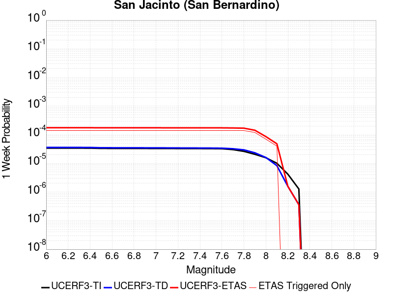 |  |  |  |

| Magnitude | 1 wk TI Prob | 1 wk TD Prob | 1 wk ETAS Prob | 1 wk ETAS/TD Gain | 1 wk ETAS Triggered Only | 1 mo TI Prob | 1 mo TD Prob | 1 mo ETAS Prob | 1 mo ETAS/TD Gain | 1 mo ETAS Triggered Only | 1 yr TI Prob | 1 yr TD Prob | 1 yr ETAS Prob | 1 yr ETAS/TD Gain | 1 yr ETAS Triggered Only | 10 yr TI Prob | 10 yr TD Prob | 10 yr ETAS Prob | 10 yr ETAS/TD Gain | 10 yr ETAS Triggered Only |
|-----|-----|-----|-----|-----|-----|-----|-----|-----|-----|-----|-----|-----|-----|-----|-----|-----|-----|-----|-----|-----|
| 6.0 | 3.409352E-5 | 3.5986508E-5 | 1.7266831E-4 | 4.79814 | 1.366867E-4 | 1.461069E-4 | 1.542188E-4 | 3.5921726E-4 | 2.3292701 | 2.0503007E-4 | 0.0017774 | 0.0018759987 | 0.0020806442 | 1.1090862 | 2.0503007E-4 | 0.01763251 | 0.019349935 | 0.01961802 | 1.0138545 | 2.733734E-4 |
| 6.1 | 3.409352E-5 | 3.5986508E-5 | 1.7266831E-4 | 4.79814 | 1.366867E-4 | 1.461069E-4 | 1.542188E-4 | 3.5921726E-4 | 2.3292701 | 2.0503007E-4 | 0.0017774 | 0.0018759987 | 0.0020806442 | 1.1090862 | 2.0503007E-4 | 0.01763251 | 0.019349935 | 0.01961802 | 1.0138545 | 2.733734E-4 |
| 6.2 | 3.409352E-5 | 3.5986508E-5 | 1.7266831E-4 | 4.79814 | 1.366867E-4 | 1.461069E-4 | 1.542188E-4 | 3.5921726E-4 | 2.3292701 | 2.0503007E-4 | 0.0017774 | 0.0018759987 | 0.0020806442 | 1.1090862 | 2.0503007E-4 | 0.01763251 | 0.019349935 | 0.01961802 | 1.0138545 | 2.733734E-4 |
| 6.3 | 3.409352E-5 | 3.5986508E-5 | 1.7266831E-4 | 4.79814 | 1.366867E-4 | 1.461069E-4 | 1.542188E-4 | 3.5921726E-4 | 2.3292701 | 2.0503007E-4 | 0.0017774 | 0.0018759987 | 0.0020806442 | 1.1090862 | 2.0503007E-4 | 0.01763251 | 0.019349935 | 0.01961802 | 1.0138545 | 2.733734E-4 |
| 6.4 | 3.400795E-5 | 3.5879173E-5 | 1.7256098E-4 | 4.809503 | 1.366867E-4 | 1.4574021E-4 | 1.5375883E-4 | 3.587574E-4 | 2.3332474 | 2.0503007E-4 | 0.0017729428 | 0.0018704084 | 0.002075055 | 1.1094128 | 2.0503007E-4 | 0.017588645 | 0.019295016 | 0.019563116 | 1.0138947 | 2.733734E-4 |
| 6.5 | 3.341482E-5 | 3.5139812E-5 | 1.7182172E-4 | 4.88966 | 1.366867E-4 | 1.4319851E-4 | 1.5059051E-4 | 3.555897E-4 | 2.3613024 | 2.0503007E-4 | 0.0017420477 | 0.0018318989 | 0.0020365533 | 1.1117171 | 2.0503007E-4 | 0.017284546 | 0.018916558 | 0.01918476 | 1.0141782 | 2.733734E-4 |
| 6.6 | 3.3364955E-5 | 3.5077028E-5 | 1.7175895E-4 | 4.8966217 | 1.366867E-4 | 1.4298483E-4 | 1.5032147E-4 | 3.5532072E-4 | 2.363739 | 2.0503007E-4 | 0.0017394501 | 0.001828629 | 0.0020332842 | 1.1119173 | 2.0503007E-4 | 0.017258976 | 0.018884424 | 0.019152634 | 1.0142027 | 2.733734E-4 |
| 6.7 | 3.335922E-5 | 3.5066805E-5 | 1.7174872E-4 | 4.897758 | 1.366867E-4 | 1.4296026E-4 | 1.5027766E-4 | 3.5527692E-4 | 2.3641367 | 2.0503007E-4 | 0.0017391514 | 0.0018280965 | 0.0020327517 | 1.1119499 | 2.0503007E-4 | 0.017256035 | 0.018879214 | 0.019147428 | 1.0142068 | 2.733734E-4 |
| 6.8 | 3.327683E-5 | 3.496087E-5 | 1.7164281E-4 | 4.9095693 | 1.366867E-4 | 1.4260718E-4 | 1.498237E-4 | 3.5482305E-4 | 2.3682704 | 2.0503007E-4 | 0.0017348597 | 0.0018225788 | 0.0020272352 | 1.1122894 | 2.0503007E-4 | 0.017213784 | 0.018824987 | 0.019093214 | 1.0142485 | 2.733734E-4 |
| 6.9 | 3.3235785E-5 | 3.4901823E-5 | 1.7158377E-4 | 4.9161835 | 1.366867E-4 | 1.4243131E-4 | 1.4957068E-4 | 3.5457007E-4 | 2.3705854 | 2.0503007E-4 | 0.0017327217 | 0.0018195034 | 0.0020241605 | 1.1124796 | 2.0503007E-4 | 0.017192734 | 0.018794855 | 0.01906309 | 1.0142717 | 2.733734E-4 |
| 7.0 | 3.3197095E-5 | 3.4841752E-5 | 1.715237E-4 | 4.9229355 | 1.366867E-4 | 1.422655E-4 | 1.4931326E-4 | 3.543127E-4 | 2.3729486 | 2.0503007E-4 | 0.0017307063 | 0.0018163746 | 0.0020210324 | 1.1126738 | 2.0503007E-4 | 0.017172894 | 0.018764233 | 0.019032476 | 1.0142955 | 2.733734E-4 |
| 7.1 | 3.3129716E-5 | 3.4721965E-5 | 1.7140394E-4 | 4.93647 | 1.366867E-4 | 1.4197677E-4 | 1.4879994E-4 | 3.537995E-4 | 2.3776858 | 2.0503007E-4 | 0.0017271966 | 0.0018101353 | 0.0020147944 | 1.1130627 | 2.0503007E-4 | 0.017138338 | 0.018703312 | 0.018971574 | 1.0143429 | 2.733734E-4 |
| 7.2 | 3.3034008E-5 | 3.458941E-5 | 1.712714E-4 | 4.9515557 | 1.366867E-4 | 1.4156665E-4 | 1.4823192E-4 | 3.532316E-4 | 2.3829658 | 2.0503007E-4 | 0.0017222111 | 0.0018032312 | 0.0020078914 | 1.1134964 | 2.0503007E-4 | 0.017089253 | 0.018635705 | 0.018903984 | 1.014396 | 2.733734E-4 |
| 7.3 | 3.2956614E-5 | 3.445717E-5 | 1.7113917E-4 | 4.9667215 | 1.366867E-4 | 1.4123498E-4 | 1.4766524E-4 | 3.5266503E-4 | 2.388274 | 2.0503007E-4 | 0.0017181796 | 0.0017963431 | 0.002001005 | 1.1139325 | 2.0503007E-4 | 0.017049557 | 0.018568452 | 0.01883675 | 1.0144491 | 2.733734E-4 |
| 7.4 | 3.2915937E-5 | 3.4378863E-5 | 1.7106088E-4 | 4.975757 | 1.366867E-4 | 1.4106068E-4 | 1.4732967E-4 | 3.5232955E-4 | 2.3914363 | 2.0503007E-4 | 0.0017160608 | 0.0017922645 | 0.0019969272 | 1.1141921 | 2.0503007E-4 | 0.017028693 | 0.018528719 | 0.018797027 | 1.0144807 | 2.733734E-4 |
| 7.5 | 3.281791E-5 | 3.4243778E-5 | 1.709258E-4 | 4.9914412 | 1.366867E-4 | 1.406406E-4 | 1.4675081E-4 | 3.517508E-4 | 2.3969257 | 2.0503007E-4 | 0.0017109542 | 0.0017852283 | 0.0019898925 | 1.1146431 | 2.0503007E-4 | 0.016978411 | 0.018459605 | 0.018727932 | 1.0145359 | 2.733734E-4 |
| 7.6 | 3.2521442E-5 | 3.396873E-5 | 1.706508E-4 | 5.0237617 | 1.366867E-4 | 1.3937015E-4 | 1.4557215E-4 | 3.5057237E-4 | 2.408238 | 2.0503007E-4 | 0.0016955109 | 0.0017709016 | 0.0019755687 | 1.1155722 | 2.0503007E-4 | 0.016826328 | 0.018317232 | 0.018585598 | 1.0146511 | 2.733734E-4 |
| 7.7 | 3.0287873E-5 | 3.245276E-5 | 1.6913503E-4 | 5.21173 | 1.366867E-4 | 1.297987E-4 | 1.3907586E-4 | 3.4407742E-4 | 2.474027 | 2.0503007E-4 | 0.0015791537 | 0.0016919347 | 0.0018966178 | 1.1209759 | 2.0503007E-4 | 0.01567979 | 0.01752809 | 0.017796673 | 1.0153229 | 2.733734E-4 |
| 7.8 | 2.6316151E-5 | 2.9663592E-5 | 1.6634625E-4 | 5.6077585 | 1.366867E-4 | 1.1277862E-4 | 1.2712348E-4 | 3.321275E-4 | 2.6126368 | 2.0503007E-4 | 0.0013722149 | 0.0015466306 | 0.0017513436 | 1.1323606 | 2.0503007E-4 | 0.013637724 | 0.016069634 | 0.016338615 | 1.0167384 | 2.733734E-4 |
| 7.9 | 2.0761147E-5 | 2.34181E-5 | 1.6010161E-4 | 6.836661 | 1.366867E-4 | 8.897331E-5 | 1.0035944E-4 | 3.0536894E-4 | 3.0427525 | 2.0503007E-4 | 0.0010827117 | 0.0012211921 | 0.0014259717 | 1.1676884 | 2.0503007E-4 | 0.010774517 | 0.012793174 | 0.01306305 | 1.0210953 | 2.733734E-4 |
| 8.0 | 1.5738568E-5 | 1.6033575E-5 | 1.527181E-4 | 9.524894 | 1.366867E-4 | 6.744926E-5 | 6.871352E-5 | 2.0539084E-4 | 2.9890893 | 1.366867E-4 | 8.2088535E-4 | 8.3626667E-4 | 9.728391E-4 | 1.1633121 | 1.366867E-4 | 0.008178596 | 0.008865921 | 0.009069133 | 1.0229206 | 2.0503007E-4 |
| 8.1 | 1.0105832E-5 | 8.3304985E-6 | 7.6673285E-5 | 9.203925 | 6.834335E-5 | 4.3309992E-5 | 3.570165E-5 | 1.0404256E-4 | 2.914223 | 6.834335E-5 | 5.2717153E-4 | 4.345814E-4 | 5.0289504E-4 | 1.1571941 | 6.834335E-5 | 0.005259227 | 0.004677232 | 0.0047452557 | 1.0145435 | 6.834335E-5 |
| 8.2 | 4.189207E-6 | 1.5784357E-6 | 1.5784357E-6 | 1.0 | 0.0 | 1.7953622E-5 | 6.7647065E-6 | 6.7647065E-6 | 1.0 | 0.0 | 2.1856341E-4 | 8.235722E-5 | 8.235722E-5 | 1.0 | 0.0 | 0.0021834858 | 9.565867E-4 | 9.565867E-4 | 1.0 | 0.0 |
| 8.3 | 1.2758221E-6 | 3.6149942E-7 | 3.6149942E-7 | 1.0 | 0.0 | 5.4677976E-6 | 1.5492824E-6 | 1.5492824E-6 | 1.0 | 0.0 | 6.65684E-5 | 1.8862354E-5 | 1.8862354E-5 | 1.0 | 0.0 | 6.6548464E-4 | 2.2751294E-4 | 2.2751294E-4 | 1.0 | 0.0 |

## Elysian Park (Upper)
*[(top)](#table-of-contents)*

| 1 Week | 1 Month | 1 Year | 10 Year |
|-----|-----|-----|-----|
|  |  |  |  |

| Magnitude | 1 wk TI Prob | 1 wk TD Prob | 1 wk ETAS Prob | 1 wk ETAS/TD Gain | 1 wk ETAS Triggered Only | 1 mo TI Prob | 1 mo TD Prob | 1 mo ETAS Prob | 1 mo ETAS/TD Gain | 1 mo ETAS Triggered Only | 1 yr TI Prob | 1 yr TD Prob | 1 yr ETAS Prob | 1 yr ETAS/TD Gain | 1 yr ETAS Triggered Only | 10 yr TI Prob | 10 yr TD Prob | 10 yr ETAS Prob | 10 yr ETAS/TD Gain | 10 yr ETAS Triggered Only |
|-----|-----|-----|-----|-----|-----|-----|-----|-----|-----|-----|-----|-----|-----|-----|-----|-----|-----|-----|-----|-----|
| 6.0 | 3.1876025E-5 | 3.7035516E-5 | 1.0537634E-4 | 2.8452783 | 6.834335E-5 | 1.3660437E-4 | 1.587167E-4 | 2.2704923E-4 | 1.4305313 | 6.834335E-5 | 0.0016618895 | 0.0019311075 | 0.0019993188 | 1.0353224 | 6.834335E-5 | 0.016495159 | 0.019189782 | 0.01939088 | 1.0104793 | 2.0503007E-4 |
| 6.1 | 3.1876025E-5 | 3.7035516E-5 | 1.0537634E-4 | 2.8452783 | 6.834335E-5 | 1.3660437E-4 | 1.587167E-4 | 2.2704923E-4 | 1.4305313 | 6.834335E-5 | 0.0016618895 | 0.0019311075 | 0.0019993188 | 1.0353224 | 6.834335E-5 | 0.016495159 | 0.019189782 | 0.01939088 | 1.0104793 | 2.0503007E-4 |
| 6.2 | 3.1876025E-5 | 3.7035516E-5 | 1.0537634E-4 | 2.8452783 | 6.834335E-5 | 1.3660437E-4 | 1.587167E-4 | 2.2704923E-4 | 1.4305313 | 6.834335E-5 | 0.0016618895 | 0.0019311075 | 0.0019993188 | 1.0353224 | 6.834335E-5 | 0.016495159 | 0.019189782 | 0.01939088 | 1.0104793 | 2.0503007E-4 |
| 6.3 | 3.1876025E-5 | 3.7035516E-5 | 1.0537634E-4 | 2.8452783 | 6.834335E-5 | 1.3660437E-4 | 1.587167E-4 | 2.2704923E-4 | 1.4305313 | 6.834335E-5 | 0.0016618895 | 0.0019311075 | 0.0019993188 | 1.0353224 | 6.834335E-5 | 0.016495159 | 0.019189782 | 0.01939088 | 1.0104793 | 2.0503007E-4 |
| 6.4 | 1.9273462E-5 | 2.1202266E-5 | 8.954417E-5 | 4.2233305 | 6.834335E-5 | 8.259794E-5 | 9.086466E-5 | 1.5920181E-4 | 1.7520761 | 6.834335E-5 | 0.001005166 | 0.0011058892 | 0.001174157 | 1.0617311 | 6.834335E-5 | 0.010006315 | 0.011020724 | 0.011223494 | 1.018399 | 2.0503007E-4 |
| 6.5 | 1.9273462E-5 | 2.1202266E-5 | 8.954417E-5 | 4.2233305 | 6.834335E-5 | 8.259794E-5 | 9.086466E-5 | 1.5920181E-4 | 1.7520761 | 6.834335E-5 | 0.001005166 | 0.0011058892 | 0.001174157 | 1.0617311 | 6.834335E-5 | 0.010006315 | 0.011020724 | 0.011223494 | 1.018399 | 2.0503007E-4 |
| 6.6 | 9.813258E-6 | 9.665599E-6 | 9.665599E-6 | 1.0 | 0.0 | 4.205614E-5 | 4.1423376E-5 | 4.1423376E-5 | 1.0 | 0.0 | 5.119132E-4 | 5.0422014E-4 | 5.0422014E-4 | 1.0 | 0.0 | 0.005107356 | 0.0050314846 | 0.005099484 | 1.0135148 | 6.834335E-5 |
| 6.7 | 9.801478E-6 | 9.653168E-6 | 9.653168E-6 | 1.0 | 0.0 | 4.2005657E-5 | 4.1370105E-5 | 4.1370105E-5 | 1.0 | 0.0 | 5.112989E-4 | 5.035719E-4 | 5.035719E-4 | 1.0 | 0.0 | 0.0051012407 | 0.0050250315 | 0.005093031 | 1.0135323 | 6.834335E-5 |
| 6.8 | 8.102489E-6 | 7.773004E-6 | 7.773004E-6 | 1.0 | 0.0 | 3.4724493E-5 | 3.3312477E-5 | 3.3312477E-5 | 1.0 | 0.0 | 4.2268867E-4 | 4.055089E-4 | 4.055089E-4 | 1.0 | 0.0 | 0.004218856 | 0.0040481836 | 0.00411625 | 1.0168141 | 6.834335E-5 |
| 6.9 | 6.08275E-6 | 5.4814514E-6 | 5.4814514E-6 | 1.0 | 0.0 | 2.6068668E-5 | 2.3491726E-5 | 2.3491726E-5 | 1.0 | 0.0 | 3.173398E-4 | 2.85975E-4 | 2.85975E-4 | 1.0 | 0.0 | 0.0031688702 | 0.0028561477 | 0.0028561477 | 1.0 | 0.0 |
| 7.0 | 5.5995934E-6 | 4.98278E-6 | 4.98278E-6 | 1.0 | 0.0 | 2.3998036E-5 | 2.13546E-5 | 2.13546E-5 | 1.0 | 0.0 | 2.9213692E-4 | 2.599619E-4 | 2.599619E-4 | 1.0 | 0.0 | 0.0029175316 | 0.0025966454 | 0.0025966454 | 1.0 | 0.0 |
| 7.1 | 4.709881E-6 | 4.0874015E-6 | 4.0874015E-6 | 1.0 | 0.0 | 2.0185047E-5 | 1.7517319E-5 | 1.7517319E-5 | 1.0 | 0.0 | 2.4572524E-4 | 2.132529E-4 | 2.132529E-4 | 1.0 | 0.0 | 0.002454537 | 0.002130524 | 0.002130524 | 1.0 | 0.0 |
| 7.2 | 3.6063436E-6 | 2.9779544E-6 | 2.9779544E-6 | 1.0 | 0.0 | 1.5455667E-5 | 1.27626E-5 | 1.27626E-5 | 1.0 | 0.0 | 1.881565E-4 | 1.5537368E-4 | 1.5537368E-4 | 1.0 | 0.0 | 0.0018799726 | 0.0015526618 | 0.0015526618 | 1.0 | 0.0 |
| 7.3 | 2.471135E-6 | 2.0954615E-6 | 2.0954615E-6 | 1.0 | 0.0 | 1.0590536E-5 | 8.980519E-6 | 8.980519E-6 | 1.0 | 0.0 | 1.2893214E-4 | 1.093324E-4 | 1.093324E-4 | 1.0 | 0.0 | 0.0012885736 | 0.0010927934 | 0.0010927934 | 1.0 | 0.0 |
| 7.4 | 1.163943E-6 | 1.0275091E-6 | 1.0275091E-6 | 1.0 | 0.0 | 4.988318E-6 | 4.4036033E-6 | 4.4036033E-6 | 1.0 | 0.0 | 6.0731076E-5 | 5.3612584E-5 | 5.3612584E-5 | 1.0 | 0.0 | 6.071448E-4 | 5.359995E-4 | 5.359995E-4 | 1.0 | 0.0 |
| 7.5 | 4.99459E-7 | 4.917604E-7 | 4.917604E-7 | 1.0 | 0.0 | 2.140537E-6 | 2.1075427E-6 | 2.1075427E-6 | 1.0 | 0.0 | 2.6060725E-5 | 2.5659048E-5 | 2.5659048E-5 | 1.0 | 0.0 | 2.605767E-4 | 2.5656243E-4 | 2.5656243E-4 | 1.0 | 0.0 |
| 7.6 | 2.4667852E-7 | 2.4778336E-7 | 2.4778336E-7 | 1.0 | 0.0 | 1.0571932E-6 | 1.0619283E-6 | 1.0619283E-6 | 1.0 | 0.0 | 1.2871251E-5 | 1.2928905E-5 | 1.2928905E-5 | 1.0 | 0.0 | 1.2870505E-4 | 1.2928189E-4 | 1.2928189E-4 | 1.0 | 0.0 |
| 7.7 | 8.2312795E-8 | 7.3864456E-8 | 7.3864456E-8 | 1.0 | 0.0 | 3.527691E-7 | 3.165619E-7 | 3.165619E-7 | 1.0 | 0.0 | 4.294955E-6 | 3.8541357E-6 | 3.8541357E-6 | 1.0 | 0.0 | 4.2948723E-5 | 3.8540802E-5 | 3.8540802E-5 | 1.0 | 0.0 |
| 7.8 | 2.7819295E-8 | 1.7566023E-8 | 1.7566023E-8 | 1.0 | 0.0 | 1.1922555E-7 | 7.5282955E-8 | 7.5282955E-8 | 1.0 | 0.0 | 1.45157E-6 | 9.165697E-7 | 9.165697E-7 | 1.0 | 0.0 | 1.45156055E-5 | 9.165675E-6 | 9.165675E-6 | 1.0 | 0.0 |

## Santa Cruz Island
*[(top)](#table-of-contents)*

| 1 Week | 1 Month | 1 Year | 10 Year |
|-----|-----|-----|-----|
|  |  |  | 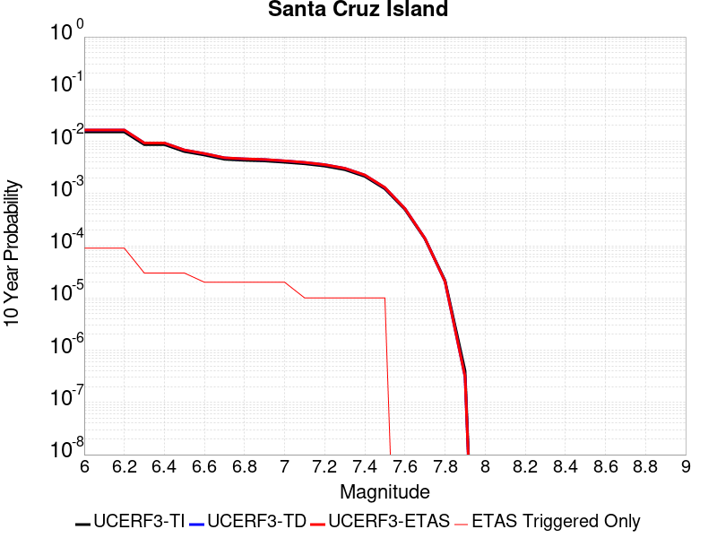 |

| Magnitude | 1 wk TI Prob | 1 wk TD Prob | 1 wk ETAS Prob | 1 wk ETAS/TD Gain | 1 wk ETAS Triggered Only | 1 mo TI Prob | 1 mo TD Prob | 1 mo ETAS Prob | 1 mo ETAS/TD Gain | 1 mo ETAS Triggered Only | 1 yr TI Prob | 1 yr TD Prob | 1 yr ETAS Prob | 1 yr ETAS/TD Gain | 1 yr ETAS Triggered Only | 10 yr TI Prob | 10 yr TD Prob | 10 yr ETAS Prob | 10 yr ETAS/TD Gain | 10 yr ETAS Triggered Only |
|-----|-----|-----|-----|-----|-----|-----|-----|-----|-----|-----|-----|-----|-----|-----|-----|-----|-----|-----|-----|-----|
| 6.0 | 2.9164563E-5 | 3.1599742E-5 | 1.6828213E-4 | 5.3254275 | 1.366867E-4 | 1.2498499E-4 | 1.3542121E-4 | 2.720894E-4 | 2.0092082 | 1.366867E-4 | 0.0015206301 | 0.0016476426 | 0.001784104 | 1.0828223 | 1.366867E-4 | 0.015102667 | 0.016368 | 0.016636899 | 1.0164284 | 2.733734E-4 |
| 6.1 | 2.9164563E-5 | 3.1599742E-5 | 1.6828213E-4 | 5.3254275 | 1.366867E-4 | 1.2498499E-4 | 1.3542121E-4 | 2.720894E-4 | 2.0092082 | 1.366867E-4 | 0.0015206301 | 0.0016476426 | 0.001784104 | 1.0828223 | 1.366867E-4 | 0.015102667 | 0.016368 | 0.016636899 | 1.0164284 | 2.733734E-4 |
| 6.2 | 2.9164563E-5 | 3.1599742E-5 | 1.6828213E-4 | 5.3254275 | 1.366867E-4 | 1.2498499E-4 | 1.3542121E-4 | 2.720894E-4 | 2.0092082 | 1.366867E-4 | 0.0015206301 | 0.0016476426 | 0.001784104 | 1.0828223 | 1.366867E-4 | 0.015102667 | 0.016368 | 0.016636899 | 1.0164284 | 2.733734E-4 |
| 6.3 | 1.6635553E-5 | 1.780436E-5 | 1.780436E-5 | 1.0 | 0.0 | 7.1293274E-5 | 7.630226E-5 | 7.630226E-5 | 1.0 | 0.0 | 8.6765E-4 | 9.2860236E-4 | 9.2860236E-4 | 1.0 | 0.0 | 0.008642701 | 0.009249094 | 0.009384516 | 1.0146418 | 1.366867E-4 |
| 6.4 | 1.6635553E-5 | 1.780436E-5 | 1.780436E-5 | 1.0 | 0.0 | 7.1293274E-5 | 7.630226E-5 | 7.630226E-5 | 1.0 | 0.0 | 8.6765E-4 | 9.2860236E-4 | 9.2860236E-4 | 1.0 | 0.0 | 0.008642701 | 0.009249094 | 0.009384516 | 1.0146418 | 1.366867E-4 |
| 6.5 | 1.2238748E-5 | 1.3042995E-5 | 1.3042995E-5 | 1.0 | 0.0 | 5.2450723E-5 | 5.5897377E-5 | 5.5897377E-5 | 1.0 | 0.0 | 6.3840044E-4 | 6.8034173E-4 | 6.8034173E-4 | 1.0 | 0.0 | 0.0063656955 | 0.0067829876 | 0.0069187474 | 1.0200148 | 1.366867E-4 |
| 6.6 | 1.0489767E-5 | 1.1156636E-5 | 1.1156636E-5 | 1.0 | 0.0 | 4.495537E-5 | 4.781329E-5 | 4.781329E-5 | 1.0 | 0.0 | 5.4719415E-4 | 5.819735E-4 | 5.819735E-4 | 1.0 | 0.0 | 0.005458487 | 0.0058047357 | 0.005872682 | 1.0117054 | 6.834335E-5 |
| 6.7 | 8.699222E-6 | 9.236782E-6 | 9.236782E-6 | 1.0 | 0.0 | 3.7281847E-5 | 3.958561E-5 | 3.958561E-5 | 1.0 | 0.0 | 4.5381195E-4 | 4.8184878E-4 | 4.8184878E-4 | 1.0 | 0.0 | 0.0045288634 | 0.004808108 | 0.004876123 | 1.0141459 | 6.834335E-5 |
| 6.8 | 8.307732E-6 | 8.8169045E-6 | 8.8169045E-6 | 1.0 | 0.0 | 3.560408E-5 | 3.7786187E-5 | 3.7786187E-5 | 1.0 | 0.0 | 4.3339343E-4 | 4.5995016E-4 | 4.5995016E-4 | 1.0 | 0.0 | 0.004325492 | 0.0045900354 | 0.004658065 | 1.0148212 | 6.834335E-5 |
| 6.9 | 8.073121E-6 | 8.564939E-6 | 8.564939E-6 | 1.0 | 0.0 | 3.459863E-5 | 3.6706366E-5 | 3.6706366E-5 | 1.0 | 0.0 | 4.2115687E-4 | 4.468088E-4 | 4.468088E-4 | 1.0 | 0.0 | 0.004203596 | 0.004459156 | 0.0045271944 | 1.0152582 | 6.834335E-5 |
| 7.0 | 7.617019E-6 | 8.074664E-6 | 8.074664E-6 | 1.0 | 0.0 | 3.264396E-5 | 3.4605247E-5 | 3.4605247E-5 | 1.0 | 0.0 | 3.9736772E-4 | 4.212378E-4 | 4.212378E-4 | 1.0 | 0.0 | 0.003966579 | 0.0042044413 | 0.0042724973 | 1.0161867 | 6.834335E-5 |
| 7.1 | 7.1224836E-6 | 7.545788E-6 | 7.545788E-6 | 1.0 | 0.0 | 3.052457E-5 | 3.2338692E-5 | 3.2338692E-5 | 1.0 | 0.0 | 3.715733E-4 | 3.936528E-4 | 3.936528E-4 | 1.0 | 0.0 | 0.003709526 | 0.003929598 | 0.003929598 | 1.0 | 0.0 |
| 7.2 | 6.441115E-6 | 6.8273835E-6 | 6.8273835E-6 | 1.0 | 0.0 | 2.7604487E-5 | 2.9259887E-5 | 2.9259887E-5 | 1.0 | 0.0 | 3.360328E-4 | 3.5618112E-4 | 3.5618112E-4 | 1.0 | 0.0 | 0.0033552512 | 0.003556131 | 0.003556131 | 1.0 | 0.0 |
| 7.3 | 5.494274E-6 | 5.8199944E-6 | 5.8199944E-6 | 1.0 | 0.0 | 2.3546674E-5 | 2.4942596E-5 | 2.4942596E-5 | 1.0 | 0.0 | 2.8664304E-4 | 3.0363398E-4 | 3.0363398E-4 | 1.0 | 0.0 | 0.002862736 | 0.0030322142 | 0.0030322142 | 1.0 | 0.0 |
| 7.4 | 4.0802624E-6 | 4.312256E-6 | 4.312256E-6 | 1.0 | 0.0 | 1.7486722E-5 | 1.8480967E-5 | 1.8480967E-5 | 1.0 | 0.0 | 2.1288003E-4 | 2.2498262E-4 | 2.2498262E-4 | 1.0 | 0.0 | 0.0021267622 | 0.0022475575 | 0.0022475575 | 1.0 | 0.0 |
| 7.5 | 2.3584746E-6 | 2.4753094E-6 | 2.4753094E-6 | 1.0 | 0.0 | 1.0107709E-5 | 1.0608426E-5 | 1.0608426E-5 | 1.0 | 0.0 | 1.2305441E-4 | 1.2915E-4 | 1.2915E-4 | 1.0 | 0.0 | 0.0012298629 | 0.0012907543 | 0.0012907543 | 1.0 | 0.0 |
| 7.6 | 9.4981914E-7 | 9.86093E-7 | 9.86093E-7 | 1.0 | 0.0 | 4.0706473E-6 | 4.2261063E-6 | 4.2261063E-6 | 1.0 | 0.0 | 4.9559E-5 | 5.145164E-5 | 5.145164E-5 | 1.0 | 0.0 | 4.954795E-4 | 5.1439856E-4 | 5.1439856E-4 | 1.0 | 0.0 |
| 7.7 | 2.6013532E-7 | 2.6416603E-7 | 2.6416603E-7 | 1.0 | 0.0 | 1.1148652E-6 | 1.1321397E-6 | 1.1321397E-6 | 1.0 | 0.0 | 1.3573399E-5 | 1.3783714E-5 | 1.3783714E-5 | 1.0 | 0.0 | 1.357257E-4 | 1.3782867E-4 | 1.3782867E-4 | 1.0 | 0.0 |
| 7.8 | 4.1522263E-8 | 3.965679E-8 | 3.965679E-8 | 1.0 | 0.0 | 1.7795254E-7 | 1.6995766E-7 | 1.6995766E-7 | 1.0 | 0.0 | 2.16657E-6 | 2.0692328E-6 | 2.0692328E-6 | 1.0 | 0.0 | 2.1665488E-5 | 2.0692156E-5 | 2.0692156E-5 | 1.0 | 0.0 |
| 7.9 | 7.7242046E-10 | 5.9468175E-10 | 5.9468175E-10 | 1.0 | 0.0 | 3.3103735E-9 | 2.5486364E-9 | 2.5486364E-9 | 1.0 | 0.0 | 4.0303796E-8 | 3.1029646E-8 | 3.1029646E-8 | 1.0 | 0.0 | 4.030379E-7 | 3.1029643E-7 | 3.1029643E-7 | 1.0 | 0.0 |

## Pinto Mtn
*[(top)](#table-of-contents)*

| 1 Week | 1 Month | 1 Year | 10 Year |
|-----|-----|-----|-----|
| 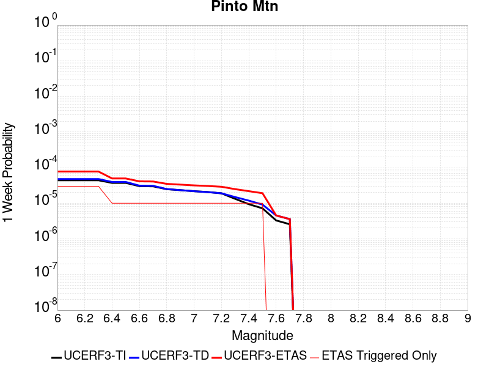 | 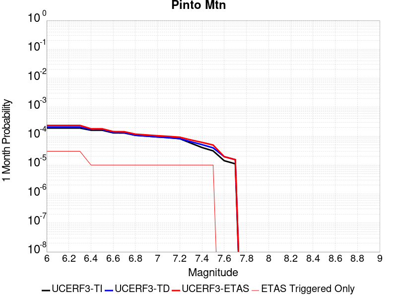 |  |  |

| Magnitude | 1 wk TI Prob | 1 wk TD Prob | 1 wk ETAS Prob | 1 wk ETAS/TD Gain | 1 wk ETAS Triggered Only | 1 mo TI Prob | 1 mo TD Prob | 1 mo ETAS Prob | 1 mo ETAS/TD Gain | 1 mo ETAS Triggered Only | 1 yr TI Prob | 1 yr TD Prob | 1 yr ETAS Prob | 1 yr ETAS/TD Gain | 1 yr ETAS Triggered Only | 10 yr TI Prob | 10 yr TD Prob | 10 yr ETAS Prob | 10 yr ETAS/TD Gain | 10 yr ETAS Triggered Only |
|-----|-----|-----|-----|-----|-----|-----|-----|-----|-----|-----|-----|-----|-----|-----|-----|-----|-----|-----|-----|-----|
| 6.0 | 4.4194956E-5 | 4.785362E-5 | 1.161937E-4 | 2.428107 | 6.834335E-5 | 1.893932E-4 | 2.0507174E-4 | 2.734011E-4 | 1.3331972 | 6.834335E-5 | 0.0023034236 | 0.0024940541 | 0.0026985728 | 1.0820025 | 2.0503007E-4 | 0.022796938 | 0.024678145 | 0.024944771 | 1.0108042 | 2.733734E-4 |
| 6.1 | 4.4194956E-5 | 4.785362E-5 | 1.161937E-4 | 2.428107 | 6.834335E-5 | 1.893932E-4 | 2.0507174E-4 | 2.734011E-4 | 1.3331972 | 6.834335E-5 | 0.0023034236 | 0.0024940541 | 0.0026985728 | 1.0820025 | 2.0503007E-4 | 0.022796938 | 0.024678145 | 0.024944771 | 1.0108042 | 2.733734E-4 |
| 6.2 | 4.4194956E-5 | 4.785362E-5 | 1.161937E-4 | 2.428107 | 6.834335E-5 | 1.893932E-4 | 2.0507174E-4 | 2.734011E-4 | 1.3331972 | 6.834335E-5 | 0.0023034236 | 0.0024940541 | 0.0026985728 | 1.0820025 | 2.0503007E-4 | 0.022796938 | 0.024678145 | 0.024944771 | 1.0108042 | 2.733734E-4 |
| 6.3 | 4.4194956E-5 | 4.785362E-5 | 1.161937E-4 | 2.428107 | 6.834335E-5 | 1.893932E-4 | 2.0507174E-4 | 2.734011E-4 | 1.3331972 | 6.834335E-5 | 0.0023034236 | 0.0024940541 | 0.0026985728 | 1.0820025 | 2.0503007E-4 | 0.022796938 | 0.024678145 | 0.024944771 | 1.0108042 | 2.733734E-4 |
| 6.4 | 3.729929E-5 | 3.9603186E-5 | 3.9603186E-5 | 1.0 | 0.0 | 1.5984432E-4 | 1.6971743E-4 | 1.6971743E-4 | 1.0 | 0.0 | 0.0019443673 | 0.002064445 | 0.0021326472 | 1.0330366 | 6.834335E-5 | 0.019274427 | 0.02046269 | 0.02059658 | 1.0065432 | 1.366867E-4 |
| 6.5 | 3.729929E-5 | 3.9603186E-5 | 3.9603186E-5 | 1.0 | 0.0 | 1.5984432E-4 | 1.6971743E-4 | 1.6971743E-4 | 1.0 | 0.0 | 0.0019443673 | 0.002064445 | 0.0021326472 | 1.0330366 | 6.834335E-5 | 0.019274427 | 0.02046269 | 0.02059658 | 1.0065432 | 1.366867E-4 |
| 6.6 | 3.0204548E-5 | 3.1205298E-5 | 3.1205298E-5 | 1.0 | 0.0 | 1.2944164E-4 | 1.3373033E-4 | 1.3373033E-4 | 1.0 | 0.0 | 0.0015748127 | 0.0016269855 | 0.0016952176 | 1.0419378 | 6.834335E-5 | 0.015636992 | 0.01615461 | 0.016289087 | 1.0083245 | 1.366867E-4 |
| 6.7 | 2.9857754E-5 | 3.081468E-5 | 3.081468E-5 | 1.0 | 0.0 | 1.2795553E-4 | 1.3205643E-4 | 1.3205643E-4 | 1.0 | 0.0 | 0.0015567453 | 0.001606636 | 0.0016748694 | 1.0424699 | 6.834335E-5 | 0.015458848 | 0.01595405 | 0.016088555 | 1.0084308 | 1.366867E-4 |
| 6.8 | 2.4819734E-5 | 2.5009364E-5 | 2.5009364E-5 | 1.0 | 0.0 | 1.0636595E-4 | 1.07178705E-4 | 1.07178705E-4 | 1.0 | 0.0 | 0.0012942362 | 0.0013041412 | 0.0013723954 | 1.0523366 | 6.834335E-5 | 0.012867244 | 0.0129672475 | 0.013102162 | 1.0104042 | 1.366867E-4 |
| 6.9 | 2.331124E-5 | 2.3337643E-5 | 2.3337643E-5 | 1.0 | 0.0 | 9.990149E-5 | 1.00014746E-4 | 1.00014746E-4 | 1.0 | 0.0 | 0.001215622 | 0.0012170197 | 0.0012852799 | 1.056088 | 6.834335E-5 | 0.012089936 | 0.012105742 | 0.012240773 | 1.0111544 | 1.366867E-4 |
| 7.0 | 2.1818534E-5 | 2.1760772E-5 | 2.1760772E-5 | 1.0 | 0.0 | 9.3504656E-5 | 9.325723E-5 | 9.325723E-5 | 1.0 | 0.0 | 0.0011378246 | 0.0011348352 | 0.001203101 | 1.0601548 | 6.834335E-5 | 0.011320163 | 0.011292503 | 0.0114276465 | 1.0119675 | 1.366867E-4 |
| 7.1 | 2.066081E-5 | 2.0540418E-5 | 2.0540418E-5 | 1.0 | 0.0 | 8.854332E-5 | 8.8027504E-5 | 8.8027504E-5 | 1.0 | 0.0 | 0.0010774818 | 0.0010712275 | 0.0011394976 | 1.0637307 | 6.834335E-5 | 0.010722724 | 0.010662688 | 0.010797918 | 1.0126824 | 1.366867E-4 |
| 7.2 | 1.8990233E-5 | 1.9053701E-5 | 1.9053701E-5 | 1.0 | 0.0 | 8.138417E-5 | 8.1656275E-5 | 8.1656275E-5 | 1.0 | 0.0 | 9.904018E-4 | 9.937311E-4 | 0.0010620065 | 1.0687062 | 6.834335E-5 | 0.009859995 | 0.009894874 | 0.010030208 | 1.0136772 | 1.366867E-4 |
| 7.3 | 1.3335872E-5 | 1.4906372E-5 | 1.4906372E-5 | 1.0 | 0.0 | 5.7152483E-5 | 6.388296E-5 | 6.388296E-5 | 1.0 | 0.0 | 6.956093E-4 | 7.775102E-4 | 8.4580044E-4 | 1.087832 | 6.834335E-5 | 0.006934359 | 0.0077491994 | 0.0078848265 | 1.0175022 | 1.366867E-4 |
| 7.4 | 9.414066E-6 | 1.186061E-5 | 1.186061E-5 | 1.0 | 0.0 | 4.0345374E-5 | 5.0830247E-5 | 5.0830247E-5 | 1.0 | 0.0 | 4.910942E-4 | 6.1869196E-4 | 6.8699307E-4 | 1.1103959 | 6.834335E-5 | 0.0049001034 | 0.006170644 | 0.006306487 | 1.0220145 | 1.366867E-4 |
| 7.5 | 7.2101157E-6 | 9.157893E-6 | 9.157893E-6 | 1.0 | 0.0 | 3.090013E-5 | 3.924757E-5 | 3.924757E-5 | 1.0 | 0.0 | 3.7614413E-4 | 4.7774217E-4 | 5.460529E-4 | 1.1429865 | 6.834335E-5 | 0.0037550807 | 0.004767927 | 0.004835944 | 1.0142657 | 6.834335E-5 |
| 7.6 | 3.296375E-6 | 4.5453176E-6 | 4.5453176E-6 | 1.0 | 0.0 | 1.4127245E-5 | 1.9479796E-5 | 1.9479796E-5 | 1.0 | 0.0 | 1.7198564E-4 | 2.3714209E-4 | 2.3714209E-4 | 1.0 | 0.0 | 0.0017185259 | 0.0023690276 | 0.0023690276 | 1.0 | 0.0 |
| 7.7 | 2.5741092E-6 | 3.584251E-6 | 3.584251E-6 | 1.0 | 0.0 | 1.103185E-5 | 1.5360993E-5 | 1.5360993E-5 | 1.0 | 0.0 | 1.3430449E-4 | 1.8700535E-4 | 1.8700535E-4 | 1.0 | 0.0 | 0.0013422335 | 0.0018686098 | 0.0018686098 | 1.0 | 0.0 |

## Scodie Lineament
*[(top)](#table-of-contents)*

| 1 Week | 1 Month | 1 Year | 10 Year |
|-----|-----|-----|-----|
|  |  |  |  |

| Magnitude | 1 wk TI Prob | 1 wk TD Prob | 1 wk ETAS Prob | 1 wk ETAS/TD Gain | 1 wk ETAS Triggered Only | 1 mo TI Prob | 1 mo TD Prob | 1 mo ETAS Prob | 1 mo ETAS/TD Gain | 1 mo ETAS Triggered Only | 1 yr TI Prob | 1 yr TD Prob | 1 yr ETAS Prob | 1 yr ETAS/TD Gain | 1 yr ETAS Triggered Only | 10 yr TI Prob | 10 yr TD Prob | 10 yr ETAS Prob | 10 yr ETAS/TD Gain | 10 yr ETAS Triggered Only |
|-----|-----|-----|-----|-----|-----|-----|-----|-----|-----|-----|-----|-----|-----|-----|-----|-----|-----|-----|-----|-----|
| 6.0 | 3.2919327E-6 | 3.0133422E-6 | 7.1356495E-5 | 23.680182 | 6.834335E-5 | 1.4108206E-5 | 1.2914278E-5 | 8.125675E-5 | 6.292009 | 6.834335E-5 | 1.7175387E-4 | 1.5722317E-4 | 2.9388838E-4 | 1.8692436 | 1.366867E-4 | 0.0017162118 | 0.0015714309 | 0.0017761388 | 1.1302685 | 2.0503007E-4 |
| 6.1 | 1.8663811E-6 | 1.5490499E-6 | 1.5490499E-6 | 1.0 | 0.0 | 7.998751E-6 | 6.6387715E-6 | 6.6387715E-6 | 1.0 | 0.0 | 9.738045E-5 | 8.082454E-5 | 1.4916237E-4 | 1.8455085 | 6.834335E-5 | 9.7337784E-4 | 8.080003E-4 | 8.762884E-4 | 1.084515 | 6.834335E-5 |
| 6.2 | 1.8663811E-6 | 1.5490499E-6 | 1.5490499E-6 | 1.0 | 0.0 | 7.998751E-6 | 6.6387715E-6 | 6.6387715E-6 | 1.0 | 0.0 | 9.738045E-5 | 8.082454E-5 | 1.4916237E-4 | 1.8455085 | 6.834335E-5 | 9.7337784E-4 | 8.080003E-4 | 8.762884E-4 | 1.084515 | 6.834335E-5 |
| 6.3 | 1.8663811E-6 | 1.5490499E-6 | 1.5490499E-6 | 1.0 | 0.0 | 7.998751E-6 | 6.6387715E-6 | 6.6387715E-6 | 1.0 | 0.0 | 9.738045E-5 | 8.082454E-5 | 1.4916237E-4 | 1.8455085 | 6.834335E-5 | 9.7337784E-4 | 8.080003E-4 | 8.762884E-4 | 1.084515 | 6.834335E-5 |
| 6.4 | 1.8663811E-6 | 1.5490499E-6 | 1.5490499E-6 | 1.0 | 0.0 | 7.998751E-6 | 6.6387715E-6 | 6.6387715E-6 | 1.0 | 0.0 | 9.738045E-5 | 8.082454E-5 | 1.4916237E-4 | 1.8455085 | 6.834335E-5 | 9.7337784E-4 | 8.080003E-4 | 8.762884E-4 | 1.084515 | 6.834335E-5 |
| 6.5 | 1.8106311E-6 | 1.4909839E-6 | 1.4909839E-6 | 1.0 | 0.0 | 7.759824E-6 | 6.3899183E-6 | 6.3899183E-6 | 1.0 | 0.0 | 9.447177E-5 | 7.7794975E-5 | 1.4613301E-4 | 1.8784378 | 6.834335E-5 | 9.4431615E-4 | 7.7772606E-4 | 8.460163E-4 | 1.0878075 | 6.834335E-5 |
| 6.6 | 1.2414679E-6 | 8.997558E-7 | 8.997558E-7 | 1.0 | 0.0 | 5.320566E-6 | 3.856091E-6 | 3.856091E-6 | 1.0 | 0.0 | 6.477596E-5 | 4.6946985E-5 | 4.6946985E-5 | 1.0 | 0.0 | 6.475708E-4 | 4.693793E-4 | 4.693793E-4 | 1.0 | 0.0 |
| 6.7 | 1.1062215E-6 | 7.594311E-7 | 7.594311E-7 | 1.0 | 0.0 | 4.7409408E-6 | 3.2547011E-6 | 3.2547011E-6 | 1.0 | 0.0 | 5.7719422E-5 | 3.9625334E-5 | 3.9625334E-5 | 1.0 | 0.0 | 5.770443E-4 | 3.961897E-4 | 3.961897E-4 | 1.0 | 0.0 |
| 6.8 | 1.0006736E-6 | 6.500397E-7 | 6.500397E-7 | 1.0 | 0.0 | 4.288594E-6 | 2.7858816E-6 | 2.7858816E-6 | 1.0 | 0.0 | 5.221238E-5 | 3.3917644E-5 | 3.3917644E-5 | 1.0 | 0.0 | 5.220012E-4 | 3.3913075E-4 | 3.3913075E-4 | 1.0 | 0.0 |
| 6.9 | 9.167364E-7 | 5.631625E-7 | 5.631625E-7 | 1.0 | 0.0 | 3.9288643E-6 | 2.4135516E-6 | 2.4135516E-6 | 1.0 | 0.0 | 4.7832873E-5 | 2.9384651E-5 | 2.9384651E-5 | 1.0 | 0.0 | 4.782258E-4 | 2.9381333E-4 | 2.9381333E-4 | 1.0 | 0.0 |
| 7.0 | 7.6987664E-7 | 4.113383E-7 | 4.113383E-7 | 1.0 | 0.0 | 3.2994672E-6 | 1.7628774E-6 | 1.7628774E-6 | 1.0 | 0.0 | 4.0170275E-5 | 2.1462862E-5 | 2.1462862E-5 | 1.0 | 0.0 | 4.0163012E-4 | 2.1461173E-4 | 2.1461173E-4 | 1.0 | 0.0 |
| 7.1 | 7.1038727E-7 | 3.5211494E-7 | 3.5211494E-7 | 1.0 | 0.0 | 3.0445133E-6 | 1.5090633E-6 | 1.5090633E-6 | 1.0 | 0.0 | 3.706632E-5 | 1.8372726E-5 | 1.8372726E-5 | 1.0 | 0.0 | 3.7060137E-4 | 1.8371557E-4 | 1.8371557E-4 | 1.0 | 0.0 |
| 7.2 | 2.0799602E-7 | 3.1186854E-8 | 3.1186854E-8 | 1.0 | 0.0 | 8.914113E-7 | 1.3365793E-7 | 1.3365793E-7 | 1.0 | 0.0 | 1.0852878E-5 | 1.6272843E-6 | 1.6272843E-6 | 1.0 | 0.0 | 1.08523476E-4 | 1.627273E-5 | 1.627273E-5 | 1.0 | 0.0 |
| 7.3 | 1.5048182E-7 | 1.5945696E-8 | 1.5945696E-8 | 1.0 | 0.0 | 6.449219E-7 | 6.83387E-8 | 6.83387E-8 | 1.0 | 0.0 | 7.851896E-6 | 8.320234E-7 | 8.320234E-7 | 1.0 | 0.0 | 7.851618E-5 | 8.320206E-6 | 8.320206E-6 | 1.0 | 0.0 |
| 7.4 | 5.9334678E-8 | 4.8683537E-9 | 4.8683537E-9 | 1.0 | 0.0 | 2.5429145E-7 | 2.0864372E-8 | 2.0864372E-8 | 1.0 | 0.0 | 3.095994E-6 | 2.5402372E-7 | 2.5402372E-7 | 1.0 | 0.0 | 3.095951E-5 | 2.5402353E-6 | 2.5402353E-6 | 1.0 | 0.0 |

## Pleito
*[(top)](#table-of-contents)*

| 1 Week | 1 Month | 1 Year | 10 Year |
|-----|-----|-----|-----|
|  |  |  |  |

| Magnitude | 1 wk TI Prob | 1 wk TD Prob | 1 wk ETAS Prob | 1 wk ETAS/TD Gain | 1 wk ETAS Triggered Only | 1 mo TI Prob | 1 mo TD Prob | 1 mo ETAS Prob | 1 mo ETAS/TD Gain | 1 mo ETAS Triggered Only | 1 yr TI Prob | 1 yr TD Prob | 1 yr ETAS Prob | 1 yr ETAS/TD Gain | 1 yr ETAS Triggered Only | 10 yr TI Prob | 10 yr TD Prob | 10 yr ETAS Prob | 10 yr ETAS/TD Gain | 10 yr ETAS Triggered Only |
|-----|-----|-----|-----|-----|-----|-----|-----|-----|-----|-----|-----|-----|-----|-----|-----|-----|-----|-----|-----|-----|
| 6.0 | 1.6763008E-5 | 2.4763838E-5 | 2.4763838E-5 | 1.0 | 0.0 | 7.183948E-5 | 1.0612683E-4 | 1.7446293E-4 | 1.6439098 | 6.834335E-5 | 8.742947E-4 | 0.0012914003 | 0.0013596554 | 1.0528536 | 6.834335E-5 | 0.00870863 | 0.0129538905 | 0.013156264 | 1.0156226 | 2.0503007E-4 |
| 6.1 | 1.6763008E-5 | 2.4763838E-5 | 2.4763838E-5 | 1.0 | 0.0 | 7.183948E-5 | 1.0612683E-4 | 1.7446293E-4 | 1.6439098 | 6.834335E-5 | 8.742947E-4 | 0.0012914003 | 0.0013596554 | 1.0528536 | 6.834335E-5 | 0.00870863 | 0.0129538905 | 0.013156264 | 1.0156226 | 2.0503007E-4 |
| 6.2 | 1.6763008E-5 | 2.4763838E-5 | 2.4763838E-5 | 1.0 | 0.0 | 7.183948E-5 | 1.0612683E-4 | 1.7446293E-4 | 1.6439098 | 6.834335E-5 | 8.742947E-4 | 0.0012914003 | 0.0013596554 | 1.0528536 | 6.834335E-5 | 0.00870863 | 0.0129538905 | 0.013156264 | 1.0156226 | 2.0503007E-4 |
| 6.3 | 1.6763008E-5 | 2.4763838E-5 | 2.4763838E-5 | 1.0 | 0.0 | 7.183948E-5 | 1.0612683E-4 | 1.7446293E-4 | 1.6439098 | 6.834335E-5 | 8.742947E-4 | 0.0012914003 | 0.0013596554 | 1.0528536 | 6.834335E-5 | 0.00870863 | 0.0129538905 | 0.013156264 | 1.0156226 | 2.0503007E-4 |
| 6.4 | 1.6763008E-5 | 2.4763838E-5 | 2.4763838E-5 | 1.0 | 0.0 | 7.183948E-5 | 1.0612683E-4 | 1.7446293E-4 | 1.6439098 | 6.834335E-5 | 8.742947E-4 | 0.0012914003 | 0.0013596554 | 1.0528536 | 6.834335E-5 | 0.00870863 | 0.0129538905 | 0.013156264 | 1.0156226 | 2.0503007E-4 |
| 6.5 | 1.6763008E-5 | 2.4763838E-5 | 2.4763838E-5 | 1.0 | 0.0 | 7.183948E-5 | 1.0612683E-4 | 1.7446293E-4 | 1.6439098 | 6.834335E-5 | 8.742947E-4 | 0.0012914003 | 0.0013596554 | 1.0528536 | 6.834335E-5 | 0.00870863 | 0.0129538905 | 0.013156264 | 1.0156226 | 2.0503007E-4 |
| 6.6 | 9.910213E-6 | 1.7214623E-5 | 1.7214623E-5 | 1.0 | 0.0 | 4.247165E-5 | 7.377489E-5 | 7.377489E-5 | 1.0 | 0.0 | 5.169696E-4 | 8.978429E-4 | 8.978429E-4 | 1.0 | 0.0 | 0.0051576863 | 0.009050702 | 0.009118427 | 1.0074828 | 6.834335E-5 |
| 6.7 | 9.910213E-6 | 1.7214623E-5 | 1.7214623E-5 | 1.0 | 0.0 | 4.247165E-5 | 7.377489E-5 | 7.377489E-5 | 1.0 | 0.0 | 5.169696E-4 | 8.978429E-4 | 8.978429E-4 | 1.0 | 0.0 | 0.0051576863 | 0.009050702 | 0.009118427 | 1.0074828 | 6.834335E-5 |
| 6.8 | 8.300162E-6 | 1.5474232E-5 | 1.5474232E-5 | 1.0 | 0.0 | 3.557164E-5 | 6.631646E-5 | 6.631646E-5 | 1.0 | 0.0 | 4.3299864E-4 | 8.071053E-4 | 8.071053E-4 | 1.0 | 0.0 | 0.004321559 | 0.008150139 | 0.008217925 | 1.0083172 | 6.834335E-5 |
| 6.9 | 8.183114E-6 | 1.5345448E-5 | 1.5345448E-5 | 1.0 | 0.0 | 3.5070017E-5 | 6.576455E-5 | 6.576455E-5 | 1.0 | 0.0 | 4.2689382E-4 | 8.003907E-4 | 8.003907E-4 | 1.0 | 0.0 | 0.0042607468 | 0.008083483 | 0.008151274 | 1.0083864 | 6.834335E-5 |
| 7.0 | 7.1748823E-6 | 1.413244E-5 | 1.413244E-5 | 1.0 | 0.0 | 3.0749135E-5 | 6.0566195E-5 | 6.0566195E-5 | 1.0 | 0.0 | 3.743064E-4 | 7.371445E-4 | 7.371445E-4 | 1.0 | 0.0 | 0.0037367654 | 0.007454939 | 0.007522773 | 1.0090991 | 6.834335E-5 |
| 7.1 | 7.1671807E-6 | 1.412281E-5 | 1.412281E-5 | 1.0 | 0.0 | 3.0716128E-5 | 6.052493E-5 | 6.052493E-5 | 1.0 | 0.0 | 3.7390468E-4 | 7.366424E-4 | 7.366424E-4 | 1.0 | 0.0 | 0.0037327618 | 0.0074499524 | 0.007517786 | 1.0091053 | 6.834335E-5 |
| 7.2 | 7.0649667E-6 | 1.39701015E-5 | 1.39701015E-5 | 1.0 | 0.0 | 3.0278077E-5 | 5.9870494E-5 | 5.9870494E-5 | 1.0 | 0.0 | 3.6857324E-4 | 7.2868E-4 | 7.2868E-4 | 1.0 | 0.0 | 0.0036796255 | 0.0073707094 | 0.007438549 | 1.0092039 | 6.834335E-5 |
| 7.3 | 7.02082E-6 | 1.3913556E-5 | 1.3913556E-5 | 1.0 | 0.0 | 3.008888E-5 | 5.9628168E-5 | 5.9628168E-5 | 1.0 | 0.0 | 3.6627054E-4 | 7.2573166E-4 | 7.2573166E-4 | 1.0 | 0.0 | 0.0036566744 | 0.007341209 | 0.0074090506 | 1.0092412 | 6.834335E-5 |
| 7.4 | 6.987146E-6 | 1.3873118E-5 | 1.3873118E-5 | 1.0 | 0.0 | 2.9944567E-5 | 5.945487E-5 | 5.945487E-5 | 1.0 | 0.0 | 3.6451413E-4 | 7.2362315E-4 | 7.2362315E-4 | 1.0 | 0.0 | 0.0036391679 | 0.007320144 | 0.0073879873 | 1.009268 | 6.834335E-5 |
| 7.5 | 6.9494554E-6 | 1.3830024E-5 | 1.3830024E-5 | 1.0 | 0.0 | 2.9783041E-5 | 5.9270187E-5 | 5.9270187E-5 | 1.0 | 0.0 | 3.625482E-4 | 7.2137616E-4 | 7.2137616E-4 | 1.0 | 0.0 | 0.0036195726 | 0.0072977724 | 0.0073656174 | 1.0092967 | 6.834335E-5 |
| 7.6 | 6.92694E-6 | 1.3789138E-5 | 1.3789138E-5 | 1.0 | 0.0 | 2.9686547E-5 | 5.909497E-5 | 5.909497E-5 | 1.0 | 0.0 | 3.6137376E-4 | 7.1924424E-4 | 7.1924424E-4 | 1.0 | 0.0 | 0.0036078666 | 0.0072765257 | 0.0073443716 | 1.009324 | 6.834335E-5 |
| 7.7 | 6.395867E-6 | 1.2668219E-5 | 1.2668219E-5 | 1.0 | 0.0 | 2.741057E-5 | 5.429124E-5 | 5.429124E-5 | 1.0 | 0.0 | 3.336726E-4 | 6.6079566E-4 | 6.6079566E-4 | 1.0 | 0.0 | 0.0033317201 | 0.0066951844 | 0.0067630704 | 1.0101395 | 6.834335E-5 |
| 7.8 | 5.8664327E-6 | 1.153586E-5 | 1.153586E-5 | 1.0 | 0.0 | 2.5141611E-5 | 4.9438466E-5 | 4.9438466E-5 | 1.0 | 0.0 | 3.060561E-4 | 6.017473E-4 | 6.017473E-4 | 1.0 | 0.0 | 0.0030563495 | 0.0061006667 | 0.0061685927 | 1.0111343 | 6.834335E-5 |
| 7.9 | 3.7167474E-6 | 7.1140853E-6 | 7.1140853E-6 | 1.0 | 0.0 | 1.592882E-5 | 3.0488582E-5 | 3.0488582E-5 | 1.0 | 0.0 | 1.9391612E-4 | 3.7113542E-4 | 3.7113542E-4 | 1.0 | 0.0 | 0.0019374699 | 0.0037674906 | 0.0037674906 | 1.0 | 0.0 |
| 8.0 | 1.0903841E-6 | 1.2879392E-6 | 1.2879392E-6 | 1.0 | 0.0 | 4.6730665E-6 | 5.5197274E-6 | 5.5197274E-6 | 1.0 | 0.0 | 5.68931E-5 | 6.720063E-5 | 6.720063E-5 | 1.0 | 0.0 | 5.6878536E-4 | 6.941948E-4 | 6.941948E-4 | 1.0 | 0.0 |
| 8.1 | 2.6894583E-7 | 1.1060341E-7 | 1.1060341E-7 | 1.0 | 0.0 | 1.1526245E-6 | 4.740145E-7 | 4.740145E-7 | 1.0 | 0.0 | 1.4033113E-5 | 5.7711113E-6 | 5.7711113E-6 | 1.0 | 0.0 | 1.4032227E-4 | 6.456908E-5 | 6.456908E-5 | 1.0 | 0.0 |
| 8.2 | 5.2967013E-9 | 2.4578228E-9 | 2.4578228E-9 | 1.0 | 0.0 | 2.2700148E-8 | 1.0533527E-8 | 1.0533527E-8 | 1.0 | 0.0 | 2.7637427E-7 | 1.2824569E-7 | 1.2824569E-7 | 1.0 | 0.0 | 2.7637393E-6 | 1.4592787E-6 | 1.4592787E-6 | 1.0 | 0.0 |

## San Jacinto (Stepovers Combined)
*[(top)](#table-of-contents)*

| 1 Week | 1 Month | 1 Year | 10 Year |
|-----|-----|-----|-----|
|  |  | 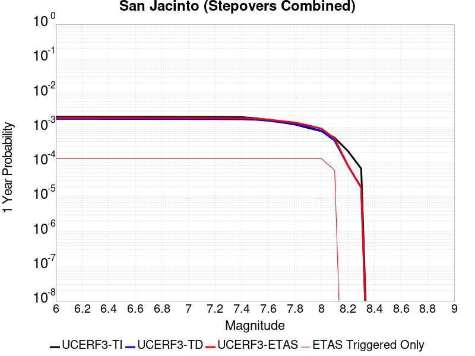 |  |

| Magnitude | 1 wk TI Prob | 1 wk TD Prob | 1 wk ETAS Prob | 1 wk ETAS/TD Gain | 1 wk ETAS Triggered Only | 1 mo TI Prob | 1 mo TD Prob | 1 mo ETAS Prob | 1 mo ETAS/TD Gain | 1 mo ETAS Triggered Only | 1 yr TI Prob | 1 yr TD Prob | 1 yr ETAS Prob | 1 yr ETAS/TD Gain | 1 yr ETAS Triggered Only | 10 yr TI Prob | 10 yr TD Prob | 10 yr ETAS Prob | 10 yr ETAS/TD Gain | 10 yr ETAS Triggered Only |
|-----|-----|-----|-----|-----|-----|-----|-----|-----|-----|-----|-----|-----|-----|-----|-----|-----|-----|-----|-----|-----|
| 6.0 | 4.0667746E-5 | 3.5272755E-5 | 1.7195464E-4 | 4.874999 | 1.366867E-4 | 1.742787E-4 | 1.5116022E-4 | 2.8782626E-4 | 1.9041139 | 1.366867E-4 | 0.0021197782 | 0.0018388226 | 0.001975258 | 1.0741972 | 1.366867E-4 | 0.020996714 | 0.018986892 | 0.01918803 | 1.0105935 | 2.0503007E-4 |
| 6.1 | 4.0667746E-5 | 3.5272755E-5 | 1.7195464E-4 | 4.874999 | 1.366867E-4 | 1.742787E-4 | 1.5116022E-4 | 2.8782626E-4 | 1.9041139 | 1.366867E-4 | 0.0021197782 | 0.0018388226 | 0.001975258 | 1.0741972 | 1.366867E-4 | 0.020996714 | 0.018986892 | 0.01918803 | 1.0105935 | 2.0503007E-4 |
| 6.2 | 4.0667746E-5 | 3.5272755E-5 | 1.7195464E-4 | 4.874999 | 1.366867E-4 | 1.742787E-4 | 1.5116022E-4 | 2.8782626E-4 | 1.9041139 | 1.366867E-4 | 0.0021197782 | 0.0018388226 | 0.001975258 | 1.0741972 | 1.366867E-4 | 0.020996714 | 0.018986892 | 0.01918803 | 1.0105935 | 2.0503007E-4 |
| 6.3 | 4.0667746E-5 | 3.5272755E-5 | 1.7195464E-4 | 4.874999 | 1.366867E-4 | 1.742787E-4 | 1.5116022E-4 | 2.8782626E-4 | 1.9041139 | 1.366867E-4 | 0.0021197782 | 0.0018388226 | 0.001975258 | 1.0741972 | 1.366867E-4 | 0.020996714 | 0.018986892 | 0.01918803 | 1.0105935 | 2.0503007E-4 |
| 6.4 | 4.0577226E-5 | 3.5144654E-5 | 1.7182657E-4 | 4.8891234 | 1.366867E-4 | 1.738908E-4 | 1.5061127E-4 | 2.872774E-4 | 1.9074097 | 1.366867E-4 | 0.0021150648 | 0.0018321523 | 0.0019685884 | 1.0744678 | 1.366867E-4 | 0.020950472 | 0.018921461 | 0.019122612 | 1.0106308 | 2.0503007E-4 |
| 6.5 | 4.0577226E-5 | 3.5144654E-5 | 1.7182657E-4 | 4.8891234 | 1.366867E-4 | 1.738908E-4 | 1.5061127E-4 | 2.872774E-4 | 1.9074097 | 1.366867E-4 | 0.0021150648 | 0.0018321523 | 0.0019685884 | 1.0744678 | 1.366867E-4 | 0.020950472 | 0.018921461 | 0.019122612 | 1.0106308 | 2.0503007E-4 |
| 6.6 | 4.053861E-5 | 3.509E-5 | 1.7177191E-4 | 4.895181 | 1.366867E-4 | 1.7372532E-4 | 1.5037706E-4 | 2.8704322E-4 | 1.9088231 | 1.366867E-4 | 0.0021130538 | 0.0018293057 | 0.0019657423 | 1.0745839 | 1.366867E-4 | 0.020930743 | 0.018893538 | 0.019094694 | 1.0106468 | 2.0503007E-4 |
| 6.7 | 4.0516545E-5 | 3.5059067E-5 | 1.7174099E-4 | 4.898618 | 1.366867E-4 | 1.7363077E-4 | 1.5024451E-4 | 2.8691068E-4 | 1.909625 | 1.366867E-4 | 0.002111905 | 0.001827695 | 0.0019641318 | 1.0746497 | 1.366867E-4 | 0.020919468 | 0.018877735 | 0.019078895 | 1.0106559 | 2.0503007E-4 |
| 6.8 | 4.049434E-5 | 3.5030633E-5 | 1.7171256E-4 | 4.901783 | 1.366867E-4 | 1.7353562E-4 | 1.5012265E-4 | 2.8678885E-4 | 1.9103636 | 1.366867E-4 | 0.0021107488 | 0.0018262138 | 0.001962651 | 1.0747104 | 1.366867E-4 | 0.020908125 | 0.018863149 | 0.019064311 | 1.0106643 | 2.0503007E-4 |
| 6.9 | 4.046386E-5 | 3.499319E-5 | 1.7167513E-4 | 4.9059577 | 1.366867E-4 | 1.73405E-4 | 1.4996222E-4 | 2.8662843E-4 | 1.9113376 | 1.366867E-4 | 0.0021091616 | 0.0018242638 | 0.001960701 | 1.0747904 | 1.366867E-4 | 0.020892553 | 0.01884392 | 0.019045087 | 1.0106754 | 2.0503007E-4 |
| 7.0 | 4.036382E-5 | 3.487376E-5 | 1.715557E-4 | 4.9193354 | 1.366867E-4 | 1.7297632E-4 | 1.4945042E-4 | 2.861167E-4 | 1.914459 | 1.366867E-4 | 0.0021039525 | 0.0018180435 | 0.0019544817 | 1.0750468 | 1.366867E-4 | 0.02084144 | 0.018782536 | 0.018983714 | 1.010711 | 2.0503007E-4 |
| 7.1 | 4.0343282E-5 | 3.4852223E-5 | 1.7153416E-4 | 4.921757 | 1.366867E-4 | 1.7288832E-4 | 1.4935812E-4 | 2.860244E-4 | 1.9150242 | 1.366867E-4 | 0.002102883 | 0.0018169218 | 0.0019533602 | 1.0750932 | 1.366867E-4 | 0.020830948 | 0.018771412 | 0.018972594 | 1.0107174 | 2.0503007E-4 |
| 7.2 | 4.0257353E-5 | 3.4756722E-5 | 1.7143869E-4 | 4.9325333 | 1.366867E-4 | 1.725201E-4 | 1.489489E-4 | 2.8561524E-4 | 1.9175385 | 1.366867E-4 | 0.0020984085 | 0.0018119477 | 0.0019483867 | 1.0752996 | 1.366867E-4 | 0.020787042 | 0.018722152 | 0.018923344 | 1.0107461 | 2.0503007E-4 |
| 7.3 | 3.9940667E-5 | 3.4584376E-5 | 1.7126637E-4 | 4.952131 | 1.366867E-4 | 1.7116306E-4 | 1.4821035E-4 | 2.8487682E-4 | 1.9221114 | 1.366867E-4 | 0.0020819185 | 0.0018029709 | 0.0019394112 | 1.0756752 | 1.366867E-4 | 0.020625217 | 0.018630784 | 0.018831994 | 1.0107999 | 2.0503007E-4 |
| 7.4 | 3.9721202E-5 | 3.4469766E-5 | 1.7115177E-4 | 4.965272 | 1.366867E-4 | 1.7022261E-4 | 1.4771923E-4 | 2.8438575E-4 | 1.9251777 | 1.366867E-4 | 0.0020704903 | 0.0017970012 | 0.0019334423 | 1.0759271 | 1.366867E-4 | 0.020513052 | 0.018569905 | 0.018771129 | 1.010836 | 2.0503007E-4 |
| 7.5 | 3.7036873E-5 | 3.3537188E-5 | 1.7021931E-4 | 5.0755396 | 1.366867E-4 | 1.5871979E-4 | 1.437229E-4 | 2.8038997E-4 | 1.9509068 | 1.366867E-4 | 0.0019307006 | 0.0017484248 | 0.0018848726 | 1.0780404 | 1.366867E-4 | 0.019140124 | 0.018071463 | 0.01827279 | 1.0111405 | 2.0503007E-4 |
| 7.6 | 3.2940967E-5 | 3.1317984E-5 | 1.6800042E-4 | 5.364343 | 1.366867E-4 | 1.4116794E-4 | 1.3421304E-4 | 2.7088143E-4 | 2.0182943 | 1.366867E-4 | 0.0017173645 | 0.0016328214 | 0.0017692848 | 1.0835752 | 1.366867E-4 | 0.01704153 | 0.016904354 | 0.017105918 | 1.0119238 | 2.0503007E-4 |
| 7.7 | 2.8236149E-5 | 2.7883889E-5 | 1.645668E-4 | 5.9018593 | 1.366867E-4 | 1.2100645E-4 | 1.19496915E-4 | 2.561673E-4 | 2.1437147 | 1.366867E-4 | 0.0014722579 | 0.001453905 | 0.001590393 | 1.0938768 | 1.366867E-4 | 0.014625421 | 0.015115095 | 0.0153170265 | 1.0133595 | 2.0503007E-4 |
| 7.8 | 2.4329287E-5 | 2.5207537E-5 | 1.618908E-4 | 6.4223175 | 1.366867E-4 | 1.042642E-4 | 1.0802783E-4 | 2.4469977E-4 | 2.265155 | 1.366867E-4 | 0.0012686774 | 0.0013144462 | 0.0014509532 | 1.1038514 | 1.366867E-4 | 0.012614589 | 0.013712396 | 0.013914614 | 1.0147471 | 2.0503007E-4 |
| 7.9 | 1.9370926E-5 | 2.0421452E-5 | 1.5710537E-4 | 7.693154 | 1.366867E-4 | 8.301561E-5 | 8.7517576E-5 | 2.2419232E-4 | 2.5616834 | 1.366867E-4 | 0.0010102465 | 0.0010650064 | 0.0012015476 | 1.1282068 | 1.366867E-4 | 0.0100566605 | 0.011199483 | 0.011402216 | 1.018102 | 2.0503007E-4 |
| 8.0 | 1.5583017E-5 | 1.588647E-5 | 1.5257101E-4 | 9.603834 | 1.366867E-4 | 6.6782646E-5 | 6.808309E-5 | 2.047605E-4 | 3.0075088 | 1.366867E-4 | 8.127754E-4 | 8.285971E-4 | 9.6517056E-4 | 1.164825 | 1.366867E-4 | 0.008098091 | 0.008781809 | 0.008985039 | 1.0231421 | 2.0503007E-4 |
| 8.1 | 1.0024873E-5 | 8.292404E-6 | 7.6635195E-5 | 9.241613 | 6.834335E-5 | 4.2963035E-5 | 3.5538393E-5 | 1.0387932E-4 | 2.9230168 | 6.834335E-5 | 5.229494E-4 | 4.3259456E-4 | 5.0090835E-4 | 1.1579164 | 6.834335E-5 | 0.0052172043 | 0.0046534105 | 0.0047214357 | 1.0146184 | 6.834335E-5 |
| 8.2 | 4.142796E-6 | 1.5610041E-6 | 1.5610041E-6 | 1.0 | 0.0 | 1.775472E-5 | 6.69E-6 | 6.69E-6 | 1.0 | 0.0 | 2.1614227E-4 | 8.144774E-5 | 8.144774E-5 | 1.0 | 0.0 | 0.0021593217 | 9.454649E-4 | 9.454649E-4 | 1.0 | 0.0 |
| 8.3 | 1.2750878E-6 | 3.612133E-7 | 3.612133E-7 | 1.0 | 0.0 | 5.4646503E-6 | 1.548056E-6 | 1.548056E-6 | 1.0 | 0.0 | 6.653009E-5 | 1.8847424E-5 | 1.8847424E-5 | 1.0 | 0.0 | 6.6510175E-4 | 2.2734253E-4 | 2.2734253E-4 | 1.0 | 0.0 |

## San Jacinto (Anza) rev
*[(top)](#table-of-contents)*

| 1 Week | 1 Month | 1 Year | 10 Year |
|-----|-----|-----|-----|
|  |  |  |  |

| Magnitude | 1 wk TI Prob | 1 wk TD Prob | 1 wk ETAS Prob | 1 wk ETAS/TD Gain | 1 wk ETAS Triggered Only | 1 mo TI Prob | 1 mo TD Prob | 1 mo ETAS Prob | 1 mo ETAS/TD Gain | 1 mo ETAS Triggered Only | 1 yr TI Prob | 1 yr TD Prob | 1 yr ETAS Prob | 1 yr ETAS/TD Gain | 1 yr ETAS Triggered Only | 10 yr TI Prob | 10 yr TD Prob | 10 yr ETAS Prob | 10 yr ETAS/TD Gain | 10 yr ETAS Triggered Only |
|-----|-----|-----|-----|-----|-----|-----|-----|-----|-----|-----|-----|-----|-----|-----|-----|-----|-----|-----|-----|-----|
| 6.0 | 6.3015636E-5 | 4.3302647E-5 | 1.7998344E-4 | 4.1564074 | 1.366867E-4 | 2.7003905E-4 | 1.8556965E-4 | 3.2223098E-4 | 1.7364424 | 1.366867E-4 | 0.0032827691 | 0.0022569813 | 0.0023933596 | 1.060425 | 1.366867E-4 | 0.032346968 | 0.023296192 | 0.023496445 | 1.008596 | 2.0503007E-4 |
| 6.1 | 6.3015636E-5 | 4.3302647E-5 | 1.7998344E-4 | 4.1564074 | 1.366867E-4 | 2.7003905E-4 | 1.8556965E-4 | 3.2223098E-4 | 1.7364424 | 1.366867E-4 | 0.0032827691 | 0.0022569813 | 0.0023933596 | 1.060425 | 1.366867E-4 | 0.032346968 | 0.023296192 | 0.023496445 | 1.008596 | 2.0503007E-4 |
| 6.2 | 6.3015636E-5 | 4.3302647E-5 | 1.7998344E-4 | 4.1564074 | 1.366867E-4 | 2.7003905E-4 | 1.8556965E-4 | 3.2223098E-4 | 1.7364424 | 1.366867E-4 | 0.0032827691 | 0.0022569813 | 0.0023933596 | 1.060425 | 1.366867E-4 | 0.032346968 | 0.023296192 | 0.023496445 | 1.008596 | 2.0503007E-4 |
| 6.3 | 6.3015636E-5 | 4.3302647E-5 | 1.7998344E-4 | 4.1564074 | 1.366867E-4 | 2.7003905E-4 | 1.8556965E-4 | 3.2223098E-4 | 1.7364424 | 1.366867E-4 | 0.0032827691 | 0.0022569813 | 0.0023933596 | 1.060425 | 1.366867E-4 | 0.032346968 | 0.023296192 | 0.023496445 | 1.008596 | 2.0503007E-4 |
| 6.4 | 6.3015636E-5 | 4.3302647E-5 | 1.7998344E-4 | 4.1564074 | 1.366867E-4 | 2.7003905E-4 | 1.8556965E-4 | 3.2223098E-4 | 1.7364424 | 1.366867E-4 | 0.0032827691 | 0.0022569813 | 0.0023933596 | 1.060425 | 1.366867E-4 | 0.032346968 | 0.023296192 | 0.023496445 | 1.008596 | 2.0503007E-4 |
| 6.5 | 5.811017E-5 | 4.0082516E-5 | 1.7676374E-4 | 4.4099965 | 1.366867E-4 | 2.4901982E-4 | 1.7177092E-4 | 3.0843416E-4 | 1.7956133 | 1.366867E-4 | 0.0030276014 | 0.002089311 | 0.002225712 | 1.0652852 | 1.366867E-4 | 0.02986684 | 0.021593736 | 0.02179434 | 1.0092899 | 2.0503007E-4 |
| 6.6 | 5.811017E-5 | 4.0082516E-5 | 1.7676374E-4 | 4.4099965 | 1.366867E-4 | 2.4901982E-4 | 1.7177092E-4 | 3.0843416E-4 | 1.7956133 | 1.366867E-4 | 0.0030276014 | 0.002089311 | 0.002225712 | 1.0652852 | 1.366867E-4 | 0.02986684 | 0.021593736 | 0.02179434 | 1.0092899 | 2.0503007E-4 |
| 6.7 | 5.712442E-5 | 3.9505223E-5 | 1.7618654E-4 | 4.459829 | 1.366867E-4 | 2.4479596E-4 | 1.6929714E-4 | 3.059607E-4 | 1.8072408 | 1.366867E-4 | 0.0029763177 | 0.0020592497 | 0.002195655 | 1.0662403 | 1.366867E-4 | 0.029367693 | 0.021285562 | 0.021486228 | 1.0094273 | 2.0503007E-4 |
| 6.8 | 5.6967532E-5 | 3.9361643E-5 | 1.7604297E-4 | 4.47245 | 1.366867E-4 | 2.4412372E-4 | 1.6868189E-4 | 3.0534554E-4 | 1.8101858 | 1.366867E-4 | 0.0029681553 | 0.002051773 | 0.0021881792 | 1.0664822 | 1.366867E-4 | 0.029288229 | 0.021210281 | 0.021410963 | 1.0094615 | 2.0503007E-4 |
| 6.9 | 5.6211324E-5 | 3.9066435E-5 | 1.7574782E-4 | 4.4986906 | 1.366867E-4 | 2.4088343E-4 | 1.6741687E-4 | 3.040807E-4 | 1.8163086 | 1.366867E-4 | 0.0029288116 | 0.0020364004 | 0.0021728086 | 1.066985 | 1.366867E-4 | 0.028905109 | 0.021049714 | 0.021250429 | 1.0095352 | 2.0503007E-4 |
| 7.0 | 5.4383527E-5 | 3.792697E-5 | 1.746085E-4 | 4.6038084 | 1.366867E-4 | 2.3305144E-4 | 1.6253405E-4 | 2.9919855E-4 | 1.840836 | 1.366867E-4 | 0.0028337094 | 0.001977061 | 0.0021134773 | 1.0689996 | 1.366867E-4 | 0.027978465 | 0.020440677 | 0.020641515 | 1.0098255 | 2.0503007E-4 |
| 7.1 | 5.1393665E-5 | 3.6389913E-5 | 1.7307165E-4 | 4.756034 | 1.366867E-4 | 2.2023996E-4 | 1.5594746E-4 | 2.9261288E-4 | 1.8763554 | 1.366867E-4 | 0.0026781242 | 0.0018970112 | 0.0020334385 | 1.071917 | 1.366867E-4 | 0.026460782 | 0.019614287 | 0.019815296 | 1.0102481 | 2.0503007E-4 |
| 7.2 | 4.785222E-5 | 3.4741795E-5 | 1.7142376E-4 | 4.9342227 | 1.366867E-4 | 2.0506482E-4 | 1.4888494E-4 | 2.855513E-4 | 1.9179327 | 1.366867E-4 | 0.0024938055 | 0.0018111705 | 0.0019476097 | 1.075332 | 1.366867E-4 | 0.024660049 | 0.018728992 | 0.018930182 | 1.0107422 | 2.0503007E-4 |
| 7.3 | 4.2143256E-5 | 3.383628E-5 | 1.7051837E-4 | 5.039513 | 1.366867E-4 | 1.8060145E-4 | 1.4500458E-4 | 2.8167147E-4 | 1.9425005 | 1.366867E-4 | 0.002196605 | 0.0017640047 | 0.0019004502 | 1.0773499 | 1.366867E-4 | 0.02175019 | 0.01823724 | 0.018438533 | 1.0110373 | 2.0503007E-4 |
| 7.4 | 4.0264713E-5 | 3.347446E-5 | 1.701566E-4 | 5.0831766 | 1.366867E-4 | 1.7255165E-4 | 1.4345412E-4 | 2.8012122E-4 | 1.9526887 | 1.366867E-4 | 0.002098792 | 0.0017451581 | 0.0018816063 | 1.0781868 | 1.366867E-4 | 0.020790804 | 0.018041821 | 0.01824315 | 1.0111592 | 2.0503007E-4 |
| 7.5 | 3.694492E-5 | 3.218847E-5 | 1.6887079E-4 | 5.246313 | 1.366867E-4 | 1.5832575E-4 | 1.379433E-4 | 2.7461114E-4 | 1.9907539 | 1.366867E-4 | 0.0019259118 | 0.001678169 | 0.0018146263 | 1.0813133 | 1.366867E-4 | 0.01909306 | 0.01735827 | 0.01755974 | 1.0116067 | 2.0503007E-4 |
| 7.6 | 3.200565E-5 | 2.9504106E-5 | 1.6618679E-4 | 5.632666 | 1.366867E-4 | 1.3715986E-4 | 1.2644005E-4 | 2.6310948E-4 | 2.080903 | 1.366867E-4 | 0.001668642 | 0.0015383229 | 0.0016747994 | 1.0887177 | 1.366867E-4 | 0.01656168 | 0.0159463 | 0.01614806 | 1.0126525 | 2.0503007E-4 |
| 7.7 | 2.731642E-5 | 2.6092788E-5 | 1.6277593E-4 | 6.23835 | 1.366867E-4 | 1.1706512E-4 | 1.1182144E-4 | 2.4849287E-4 | 2.2222292 | 1.366867E-4 | 0.001424336 | 0.0013605768 | 0.0014970776 | 1.1003256 | 1.366867E-4 | 0.014152412 | 0.014167004 | 0.01436913 | 1.0142673 | 2.0503007E-4 |
| 7.8 | 2.3466424E-5 | 2.3504817E-5 | 1.6018831E-4 | 6.815127 | 1.366867E-4 | 1.0056651E-4 | 1.0073105E-4 | 2.3740399E-4 | 2.3568106 | 1.366867E-4 | 0.0012237094 | 0.0012257113 | 0.0013622305 | 1.1113795 | 1.366867E-4 | 0.012169928 | 0.012808893 | 0.013011297 | 1.0158018 | 2.0503007E-4 |
| 7.9 | 1.8611925E-5 | 1.8908117E-5 | 1.5559225E-4 | 8.22886 | 1.366867E-4 | 7.9762955E-5 | 8.1032274E-5 | 2.1770791E-4 | 2.6866815 | 1.366867E-4 | 9.7068126E-4 | 9.861222E-4 | 0.0011226741 | 1.1384736 | 1.366867E-4 | 0.0096645225 | 0.010393824 | 0.010596723 | 1.0195211 | 2.0503007E-4 |
| 8.0 | 1.5460775E-5 | 1.5740965E-5 | 1.5242552E-4 | 9.683367 | 1.366867E-4 | 6.6258784E-5 | 6.7459536E-5 | 2.0413703E-4 | 3.0260663 | 1.366867E-4 | 8.0640207E-4 | 8.21011E-4 | 9.575855E-4 | 1.1663492 | 1.366867E-4 | 0.008034821 | 0.0087028835 | 0.008906129 | 1.0233538 | 2.0503007E-4 |
| 8.1 | 9.983884E-6 | 8.269952E-6 | 7.661274E-5 | 9.263989 | 6.834335E-5 | 4.2787375E-5 | 3.544217E-5 | 1.0378311E-4 | 2.928238 | 6.834335E-5 | 5.2081177E-4 | 4.314235E-4 | 4.997374E-4 | 1.1583452 | 6.834335E-5 | 0.0051959283 | 0.004640022 | 0.0047080484 | 1.0146607 | 6.834335E-5 |
| 8.2 | 4.1226E-6 | 1.5529788E-6 | 1.5529788E-6 | 1.0 | 0.0 | 1.7668166E-5 | 6.6556063E-6 | 6.6556063E-6 | 1.0 | 0.0 | 2.1508869E-4 | 8.102902E-5 | 8.102902E-5 | 1.0 | 0.0 | 0.0021488064 | 9.4050163E-4 | 9.4050163E-4 | 1.0 | 0.0 |
| 8.3 | 1.2750878E-6 | 3.612133E-7 | 3.612133E-7 | 1.0 | 0.0 | 5.4646503E-6 | 1.548056E-6 | 1.548056E-6 | 1.0 | 0.0 | 6.653009E-5 | 1.8847424E-5 | 1.8847424E-5 | 1.0 | 0.0 | 6.6510175E-4 | 2.2734253E-4 | 2.2734253E-4 | 1.0 | 0.0 |

## Hosgri (Extension)
*[(top)](#table-of-contents)*

| 1 Week | 1 Month | 1 Year | 10 Year |
|-----|-----|-----|-----|
|  |  |  |  |

| Magnitude | 1 wk TI Prob | 1 wk TD Prob | 1 wk ETAS Prob | 1 wk ETAS/TD Gain | 1 wk ETAS Triggered Only | 1 mo TI Prob | 1 mo TD Prob | 1 mo ETAS Prob | 1 mo ETAS/TD Gain | 1 mo ETAS Triggered Only | 1 yr TI Prob | 1 yr TD Prob | 1 yr ETAS Prob | 1 yr ETAS/TD Gain | 1 yr ETAS Triggered Only | 10 yr TI Prob | 10 yr TD Prob | 10 yr ETAS Prob | 10 yr ETAS/TD Gain | 10 yr ETAS Triggered Only |
|-----|-----|-----|-----|-----|-----|-----|-----|-----|-----|-----|-----|-----|-----|-----|-----|-----|-----|-----|-----|-----|
| 6.0 | 1.1369135E-5 | 1.2083072E-5 | 8.0425605E-5 | 6.656056 | 6.834335E-5 | 4.8723956E-5 | 5.1783692E-5 | 1.2012351E-4 | 2.319717 | 6.834335E-5 | 5.9305265E-4 | 6.3030684E-4 | 6.986071E-4 | 1.1083604 | 6.834335E-5 | 0.005914725 | 0.0062874397 | 0.006423267 | 1.021603 | 1.366867E-4 |
| 6.1 | 6.934979E-6 | 7.324555E-6 | 7.566741E-5 | 10.330649 | 6.834335E-5 | 2.9721E-5 | 3.1390595E-5 | 9.9731806E-5 | 3.1771238 | 6.834335E-5 | 3.617931E-4 | 3.8211764E-4 | 4.5043486E-4 | 1.1787859 | 6.834335E-5 | 0.0036120464 | 0.0038150186 | 0.003951184 | 1.0356919 | 1.366867E-4 |
| 6.2 | 6.934979E-6 | 7.324555E-6 | 7.566741E-5 | 10.330649 | 6.834335E-5 | 2.9721E-5 | 3.1390595E-5 | 9.9731806E-5 | 3.1771238 | 6.834335E-5 | 3.617931E-4 | 3.8211764E-4 | 4.5043486E-4 | 1.1787859 | 6.834335E-5 | 0.0036120464 | 0.0038150186 | 0.003951184 | 1.0356919 | 1.366867E-4 |
| 6.3 | 4.5484676E-6 | 4.76933E-6 | 4.76933E-6 | 1.0 | 0.0 | 1.9493287E-5 | 2.043983E-5 | 2.043983E-5 | 1.0 | 0.0 | 2.3730492E-4 | 2.4882692E-4 | 2.4882692E-4 | 1.0 | 0.0 | 0.0023705168 | 0.0024855258 | 0.0025536993 | 1.0274282 | 6.834335E-5 |
| 6.4 | 4.218095E-6 | 4.4168614E-6 | 4.4168614E-6 | 1.0 | 0.0 | 1.8077424E-5 | 1.8929271E-5 | 1.8929271E-5 | 1.0 | 0.0 | 2.2007042E-4 | 2.3043984E-4 | 2.3043984E-4 | 1.0 | 0.0 | 0.002198526 | 0.0023020422 | 0.0023702283 | 1.0296198 | 6.834335E-5 |
| 6.5 | 3.717374E-6 | 3.8838775E-6 | 3.8838775E-6 | 1.0 | 0.0 | 1.5931506E-5 | 1.6645085E-5 | 1.6645085E-5 | 1.0 | 0.0 | 1.9394881E-4 | 2.0263524E-4 | 2.0263524E-4 | 1.0 | 0.0 | 0.0019377962 | 0.0020245234 | 0.0020927286 | 1.0336894 | 6.834335E-5 |
| 6.6 | 3.4605036E-6 | 3.608306E-6 | 3.608306E-6 | 1.0 | 0.0 | 1.4830645E-5 | 1.5464078E-5 | 1.5464078E-5 | 1.0 | 0.0 | 1.8054814E-4 | 1.8825903E-4 | 1.8825903E-4 | 1.0 | 0.0 | 0.0018040152 | 0.0018810101 | 0.001949225 | 1.036265 | 6.834335E-5 |
| 6.7 | 3.123439E-6 | 3.2465687E-6 | 3.2465687E-6 | 1.0 | 0.0 | 1.33860985E-5 | 1.3913792E-5 | 1.3913792E-5 | 1.0 | 0.0 | 1.6296357E-4 | 1.6938736E-4 | 1.6938736E-4 | 1.0 | 0.0 | 0.001628441 | 0.0016925934 | 0.0017608211 | 1.0403095 | 6.834335E-5 |
| 6.8 | 2.8290783E-6 | 2.9305404E-6 | 2.9305404E-6 | 1.0 | 0.0 | 1.2124565E-5 | 1.2559399E-5 | 1.2559399E-5 | 1.0 | 0.0 | 1.4760658E-4 | 1.5290003E-4 | 1.5290003E-4 | 1.0 | 0.0 | 0.0014750857 | 0.001527957 | 0.001596196 | 1.0446602 | 6.834335E-5 |
| 6.9 | 2.454112E-6 | 2.5283196E-6 | 2.5283196E-6 | 1.0 | 0.0 | 1.0517581E-5 | 1.0835611E-5 | 1.0835611E-5 | 1.0 | 0.0 | 1.2804402E-4 | 1.3191563E-4 | 1.3191563E-4 | 1.0 | 0.0 | 0.0012797028 | 0.0013183793 | 0.0013866326 | 1.0517706 | 6.834335E-5 |
| 7.0 | 2.1008145E-6 | 2.1498704E-6 | 2.1498704E-6 | 1.0 | 0.0 | 9.003459E-6 | 9.213698E-6 | 9.213698E-6 | 1.0 | 0.0 | 1.096116E-4 | 1.1217103E-4 | 1.1217103E-4 | 1.0 | 0.0 | 0.0010955755 | 0.0011211479 | 0.0011894146 | 1.0608901 | 6.834335E-5 |
| 7.1 | 1.744384E-6 | 1.7686352E-6 | 1.7686352E-6 | 1.0 | 0.0 | 7.47591E-6 | 7.5798434E-6 | 7.5798434E-6 | 1.0 | 0.0 | 9.1015405E-5 | 9.22807E-5 | 9.22807E-5 | 1.0 | 0.0 | 9.097813E-4 | 9.2242553E-4 | 9.907059E-4 | 1.0740225 | 6.834335E-5 |
| 7.2 | 1.5456587E-6 | 1.5562882E-6 | 1.5562882E-6 | 1.0 | 0.0 | 6.6242346E-6 | 6.66979E-6 | 6.66979E-6 | 1.0 | 0.0 | 8.064707E-5 | 8.120168E-5 | 8.120168E-5 | 1.0 | 0.0 | 8.0617814E-4 | 8.117213E-4 | 8.800092E-4 | 1.0841273 | 6.834335E-5 |
| 7.3 | 1.3775123E-6 | 1.3766082E-6 | 1.3766082E-6 | 1.0 | 0.0 | 5.9036106E-6 | 5.899736E-6 | 5.899736E-6 | 1.0 | 0.0 | 7.187409E-5 | 7.182693E-5 | 7.182693E-5 | 1.0 | 0.0 | 7.185085E-4 | 7.180382E-4 | 7.863324E-4 | 1.0951123 | 6.834335E-5 |
| 7.4 | 1.214491E-6 | 1.2023461E-6 | 1.2023461E-6 | 1.0 | 0.0 | 5.2049513E-6 | 5.1529014E-6 | 5.1529014E-6 | 1.0 | 0.0 | 6.336844E-5 | 6.2734776E-5 | 6.2734776E-5 | 1.0 | 0.0 | 6.335037E-4 | 6.271715E-4 | 6.95472E-4 | 1.1089025 | 6.834335E-5 |
| 7.5 | 1.0101123E-6 | 9.842246E-7 | 9.842246E-7 | 1.0 | 0.0 | 4.3290456E-6 | 4.2180986E-6 | 4.2180986E-6 | 1.0 | 0.0 | 5.2704854E-5 | 5.1354145E-5 | 5.1354145E-5 | 1.0 | 0.0 | 5.2692357E-4 | 5.1342335E-4 | 5.1342335E-4 | 1.0 | 0.0 |
| 7.6 | 8.1558215E-7 | 7.765966E-7 | 7.765966E-7 | 1.0 | 0.0 | 3.4953473E-6 | 3.328267E-6 | 3.328267E-6 | 1.0 | 0.0 | 4.255502E-5 | 4.0520903E-5 | 4.0520903E-5 | 1.0 | 0.0 | 4.2546875E-4 | 4.0513556E-4 | 4.0513556E-4 | 1.0 | 0.0 |
| 7.7 | 4.757816E-7 | 4.1308888E-7 | 4.1308888E-7 | 1.0 | 0.0 | 2.0390623E-6 | 1.7703798E-6 | 1.7703798E-6 | 1.0 | 0.0 | 2.4825302E-5 | 2.155416E-5 | 2.155416E-5 | 1.0 | 0.0 | 2.482253E-4 | 2.1552083E-4 | 2.1552083E-4 | 1.0 | 0.0 |
| 7.8 | 2.782787E-7 | 2.0047722E-7 | 2.0047722E-7 | 1.0 | 0.0 | 1.1926223E-6 | 8.5918776E-7 | 8.5918776E-7 | 1.0 | 0.0 | 1.452008E-5 | 1.04605615E-5 | 1.04605615E-5 | 1.0 | 0.0 | 1.4519131E-4 | 1.04600724E-4 | 1.04600724E-4 | 1.0 | 0.0 |
| 7.9 | 1.6948086E-7 | 9.244227E-8 | 9.244227E-8 | 1.0 | 0.0 | 7.2634634E-7 | 3.961811E-7 | 3.961811E-7 | 1.0 | 0.0 | 8.843231E-6 | 4.8234942E-6 | 4.8234942E-6 | 1.0 | 0.0 | 8.842879E-5 | 4.8233902E-5 | 4.8233902E-5 | 1.0 | 0.0 |
| 8.0 | 1.0225492E-7 | 4.4738776E-8 | 4.4738776E-8 | 1.0 | 0.0 | 4.382353E-7 | 1.917376E-7 | 1.917376E-7 | 1.0 | 0.0 | 5.335502E-6 | 2.3344028E-6 | 2.3344028E-6 | 1.0 | 0.0 | 5.335374E-5 | 2.3343786E-5 | 2.3343786E-5 | 1.0 | 0.0 |
| 8.1 | 1.43711345E-8 | 5.787707E-9 | 5.787707E-9 | 1.0 | 0.0 | 6.1590576E-8 | 2.480446E-8 | 2.480446E-8 | 1.0 | 0.0 | 7.4986497E-7 | 3.0199428E-7 | 3.0199428E-7 | 1.0 | 0.0 | 7.4986247E-6 | 3.0199392E-6 | 3.0199392E-6 | 1.0 | 0.0 |

## Santa Ynez River
*[(top)](#table-of-contents)*

| 1 Week | 1 Month | 1 Year | 10 Year |
|-----|-----|-----|-----|
| 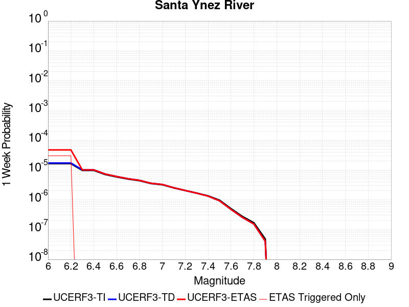 |  |  |  |

| Magnitude | 1 wk TI Prob | 1 wk TD Prob | 1 wk ETAS Prob | 1 wk ETAS/TD Gain | 1 wk ETAS Triggered Only | 1 mo TI Prob | 1 mo TD Prob | 1 mo ETAS Prob | 1 mo ETAS/TD Gain | 1 mo ETAS Triggered Only | 1 yr TI Prob | 1 yr TD Prob | 1 yr ETAS Prob | 1 yr ETAS/TD Gain | 1 yr ETAS Triggered Only | 10 yr TI Prob | 10 yr TD Prob | 10 yr ETAS Prob | 10 yr ETAS/TD Gain | 10 yr ETAS Triggered Only |
|-----|-----|-----|-----|-----|-----|-----|-----|-----|-----|-----|-----|-----|-----|-----|-----|-----|-----|-----|-----|-----|
| 6.0 | 1.6396456E-5 | 1.7209435E-5 | 1.7209435E-5 | 1.0 | 0.0 | 7.026863E-5 | 7.375284E-5 | 7.375284E-5 | 1.0 | 0.0 | 8.551848E-4 | 8.976064E-4 | 9.6588844E-4 | 1.0760713 | 6.834335E-5 | 0.0085190125 | 0.008943358 | 0.009146554 | 1.0227203 | 2.0503007E-4 |
| 6.1 | 1.6396456E-5 | 1.7209435E-5 | 1.7209435E-5 | 1.0 | 0.0 | 7.026863E-5 | 7.375284E-5 | 7.375284E-5 | 1.0 | 0.0 | 8.551848E-4 | 8.976064E-4 | 9.6588844E-4 | 1.0760713 | 6.834335E-5 | 0.0085190125 | 0.008943358 | 0.009146554 | 1.0227203 | 2.0503007E-4 |
| 6.2 | 1.6396456E-5 | 1.7209435E-5 | 1.7209435E-5 | 1.0 | 0.0 | 7.026863E-5 | 7.375284E-5 | 7.375284E-5 | 1.0 | 0.0 | 8.551848E-4 | 8.976064E-4 | 9.6588844E-4 | 1.0760713 | 6.834335E-5 | 0.0085190125 | 0.008943358 | 0.009146554 | 1.0227203 | 2.0503007E-4 |
| 6.3 | 9.736976E-6 | 1.012233E-5 | 1.012233E-5 | 1.0 | 0.0 | 4.172923E-5 | 4.338072E-5 | 4.338072E-5 | 1.0 | 0.0 | 5.0793495E-4 | 5.280373E-4 | 5.963446E-4 | 1.1293607 | 6.834335E-5 | 0.005067755 | 0.005268332 | 0.0054042987 | 1.0258083 | 1.366867E-4 |
| 6.4 | 9.736976E-6 | 1.012233E-5 | 1.012233E-5 | 1.0 | 0.0 | 4.172923E-5 | 4.338072E-5 | 4.338072E-5 | 1.0 | 0.0 | 5.0793495E-4 | 5.280373E-4 | 5.963446E-4 | 1.1293607 | 6.834335E-5 | 0.005067755 | 0.005268332 | 0.0054042987 | 1.0258083 | 1.366867E-4 |
| 6.5 | 7.081964E-6 | 7.3298966E-6 | 7.3298966E-6 | 1.0 | 0.0 | 3.035092E-5 | 3.1413474E-5 | 3.1413474E-5 | 1.0 | 0.0 | 3.694598E-4 | 3.8239348E-4 | 3.8239348E-4 | 1.0 | 0.0 | 0.0036884616 | 0.0038175168 | 0.0038855993 | 1.0178342 | 6.834335E-5 |
| 6.6 | 5.873247E-6 | 6.059743E-6 | 6.059743E-6 | 1.0 | 0.0 | 2.5170815E-5 | 2.5970074E-5 | 2.5970074E-5 | 1.0 | 0.0 | 3.064116E-4 | 3.1614062E-4 | 3.1614062E-4 | 1.0 | 0.0 | 0.0030598943 | 0.0031569963 | 0.003225124 | 1.0215799 | 6.834335E-5 |
| 6.7 | 4.973277E-6 | 5.115901E-6 | 5.115901E-6 | 1.0 | 0.0 | 2.1313872E-5 | 2.1925109E-5 | 2.1925109E-5 | 1.0 | 0.0 | 2.5946548E-4 | 2.66906E-4 | 2.66906E-4 | 1.0 | 0.0 | 0.0025916274 | 0.0026659032 | 0.0027340644 | 1.0255678 | 6.834335E-5 |
| 6.8 | 4.396492E-6 | 4.5109778E-6 | 4.5109778E-6 | 1.0 | 0.0 | 1.884197E-5 | 1.9332621E-5 | 1.9332621E-5 | 1.0 | 0.0 | 2.2937685E-4 | 2.3534958E-4 | 2.3534958E-4 | 1.0 | 0.0 | 0.0022914023 | 0.0023510386 | 0.0023510386 | 1.0 | 0.0 |
| 6.9 | 3.5255632E-6 | 3.6013332E-6 | 3.6013332E-6 | 1.0 | 0.0 | 1.5109469E-5 | 1.5434196E-5 | 1.5434196E-5 | 1.0 | 0.0 | 1.8394225E-4 | 1.8789528E-4 | 1.8789528E-4 | 1.0 | 0.0 | 0.0018379007 | 0.0018773803 | 0.0018773803 | 1.0 | 0.0 |
| 7.0 | 3.211603E-6 | 3.273654E-6 | 3.273654E-6 | 1.0 | 0.0 | 1.376394E-5 | 1.4029872E-5 | 1.4029872E-5 | 1.0 | 0.0 | 1.6756308E-4 | 1.7080043E-4 | 1.7080043E-4 | 1.0 | 0.0 | 0.0016743679 | 0.0017067058 | 0.0017067058 | 1.0 | 0.0 |
| 7.1 | 2.5094619E-6 | 2.5409204E-6 | 2.5409204E-6 | 1.0 | 0.0 | 1.0754793E-5 | 1.0889614E-5 | 1.0889614E-5 | 1.0 | 0.0 | 1.3093173E-4 | 1.3257304E-4 | 1.3257304E-4 | 1.0 | 0.0 | 0.0013085462 | 0.0013249456 | 0.0013249456 | 1.0 | 0.0 |
| 7.2 | 2.0515774E-6 | 2.0619375E-6 | 2.0619375E-6 | 1.0 | 0.0 | 8.792445E-6 | 8.836846E-6 | 8.836846E-6 | 1.0 | 0.0 | 1.0704277E-4 | 1.0758333E-4 | 1.0758333E-4 | 1.0 | 0.0 | 0.0010699122 | 0.0010753168 | 0.0010753168 | 1.0 | 0.0 |
| 7.3 | 1.6845745E-6 | 1.6773907E-6 | 1.6773907E-6 | 1.0 | 0.0 | 7.219585E-6 | 7.1887976E-6 | 7.1887976E-6 | 1.0 | 0.0 | 8.78949E-5 | 8.752012E-5 | 8.752012E-5 | 1.0 | 0.0 | 8.7860145E-4 | 8.7485946E-4 | 8.7485946E-4 | 1.0 | 0.0 |
| 7.4 | 1.3600285E-6 | 1.3333357E-6 | 1.3333357E-6 | 1.0 | 0.0 | 5.82868E-6 | 5.714284E-6 | 5.714284E-6 | 1.0 | 0.0 | 7.096187E-5 | 6.956921E-5 | 6.956921E-5 | 1.0 | 0.0 | 7.0939213E-4 | 6.954765E-4 | 6.954765E-4 | 1.0 | 0.0 |
| 7.5 | 9.735342E-7 | 9.290103E-7 | 9.290103E-7 | 1.0 | 0.0 | 4.172283E-6 | 3.9814668E-6 | 3.9814668E-6 | 1.0 | 0.0 | 5.079636E-5 | 4.8473295E-5 | 4.8473295E-5 | 1.0 | 0.0 | 5.0784746E-4 | 4.8462892E-4 | 4.8462892E-4 | 1.0 | 0.0 |
| 7.6 | 5.067187E-7 | 4.77857E-7 | 4.77857E-7 | 1.0 | 0.0 | 2.1716498E-6 | 2.047957E-6 | 2.047957E-6 | 1.0 | 0.0 | 2.6439517E-5 | 2.4933597E-5 | 2.4933597E-5 | 1.0 | 0.0 | 2.643637E-4 | 2.4930874E-4 | 2.4930874E-4 | 1.0 | 0.0 |
| 7.7 | 2.769089E-7 | 2.5759124E-7 | 2.5759124E-7 | 1.0 | 0.0 | 1.1867519E-6 | 1.1039621E-6 | 1.1039621E-6 | 1.0 | 0.0 | 1.4448608E-5 | 1.34406555E-5 | 1.34406555E-5 | 1.0 | 0.0 | 1.444767E-4 | 1.3439846E-4 | 1.3439846E-4 | 1.0 | 0.0 |
| 7.8 | 1.7044663E-7 | 1.5449015E-7 | 1.5449015E-7 | 1.0 | 0.0 | 7.3048534E-7 | 6.621005E-7 | 6.621005E-7 | 1.0 | 0.0 | 8.893623E-6 | 8.061043E-6 | 8.061043E-6 | 1.0 | 0.0 | 8.893267E-5 | 8.060753E-5 | 8.060753E-5 | 1.0 | 0.0 |
| 7.9 | 4.8344287E-8 | 4.0910923E-8 | 4.0910923E-8 | 1.0 | 0.0 | 2.0718979E-7 | 1.7533252E-7 | 1.7533252E-7 | 1.0 | 0.0 | 2.5225327E-6 | 2.1346711E-6 | 2.1346711E-6 | 1.0 | 0.0 | 2.5225041E-5 | 2.1346512E-5 | 2.1346512E-5 | 1.0 | 0.0 |

## San Jacinto (San Jacinto Valley) rev
*[(top)](#table-of-contents)*

| 1 Week | 1 Month | 1 Year | 10 Year |
|-----|-----|-----|-----|
|  |  |  |  |

| Magnitude | 1 wk TI Prob | 1 wk TD Prob | 1 wk ETAS Prob | 1 wk ETAS/TD Gain | 1 wk ETAS Triggered Only | 1 mo TI Prob | 1 mo TD Prob | 1 mo ETAS Prob | 1 mo ETAS/TD Gain | 1 mo ETAS Triggered Only | 1 yr TI Prob | 1 yr TD Prob | 1 yr ETAS Prob | 1 yr ETAS/TD Gain | 1 yr ETAS Triggered Only | 10 yr TI Prob | 10 yr TD Prob | 10 yr ETAS Prob | 10 yr ETAS/TD Gain | 10 yr ETAS Triggered Only |
|-----|-----|-----|-----|-----|-----|-----|-----|-----|-----|-----|-----|-----|-----|-----|-----|-----|-----|-----|-----|-----|
| 6.0 | 3.652694E-5 | 3.4402394E-5 | 1.7108441E-4 | 4.973038 | 1.366867E-4 | 1.5653463E-4 | 1.474305E-4 | 2.8409707E-4 | 1.9269897 | 1.366867E-4 | 0.0019041431 | 0.00179349 | 0.0019299316 | 1.076076 | 1.366867E-4 | 0.018879099 | 0.018526595 | 0.018727826 | 1.0108618 | 2.0503007E-4 |
| 6.1 | 3.652694E-5 | 3.4402394E-5 | 1.7108441E-4 | 4.973038 | 1.366867E-4 | 1.5653463E-4 | 1.474305E-4 | 2.8409707E-4 | 1.9269897 | 1.366867E-4 | 0.0019041431 | 0.00179349 | 0.0019299316 | 1.076076 | 1.366867E-4 | 0.018879099 | 0.018526595 | 0.018727826 | 1.0108618 | 2.0503007E-4 |
| 6.2 | 3.652694E-5 | 3.4402394E-5 | 1.7108441E-4 | 4.973038 | 1.366867E-4 | 1.5653463E-4 | 1.474305E-4 | 2.8409707E-4 | 1.9269897 | 1.366867E-4 | 0.0019041431 | 0.00179349 | 0.0019299316 | 1.076076 | 1.366867E-4 | 0.018879099 | 0.018526595 | 0.018727826 | 1.0108618 | 2.0503007E-4 |
| 6.3 | 3.652694E-5 | 3.4402394E-5 | 1.7108441E-4 | 4.973038 | 1.366867E-4 | 1.5653463E-4 | 1.474305E-4 | 2.8409707E-4 | 1.9269897 | 1.366867E-4 | 0.0019041431 | 0.00179349 | 0.0019299316 | 1.076076 | 1.366867E-4 | 0.018879099 | 0.018526595 | 0.018727826 | 1.0108618 | 2.0503007E-4 |
| 6.4 | 3.646941E-5 | 3.432397E-5 | 1.7100599E-4 | 4.9821157 | 1.366867E-4 | 1.5628811E-4 | 1.4709444E-4 | 2.8376104E-4 | 1.9291079 | 1.366867E-4 | 0.0019011468 | 0.0017894056 | 0.0019258477 | 1.07625 | 1.366867E-4 | 0.018849645 | 0.018486476 | 0.018687716 | 1.0108858 | 2.0503007E-4 |
| 6.5 | 3.646941E-5 | 3.432397E-5 | 1.7100599E-4 | 4.9821157 | 1.366867E-4 | 1.5628811E-4 | 1.4709444E-4 | 2.8376104E-4 | 1.9291079 | 1.366867E-4 | 0.0019011468 | 0.0017894056 | 0.0019258477 | 1.07625 | 1.366867E-4 | 0.018849645 | 0.018486476 | 0.018687716 | 1.0108858 | 2.0503007E-4 |
| 6.6 | 3.6442503E-5 | 3.4287354E-5 | 1.7096938E-4 | 4.9863687 | 1.366867E-4 | 1.561728E-4 | 1.4693754E-4 | 2.8360417E-4 | 1.9301002 | 1.366867E-4 | 0.0018997455 | 0.0017874985 | 0.0019239408 | 1.0763315 | 1.366867E-4 | 0.018835869 | 0.018467745 | 0.018668989 | 1.010897 | 2.0503007E-4 |
| 6.7 | 3.6432113E-5 | 3.4272925E-5 | 1.7095495E-4 | 4.9880466 | 1.366867E-4 | 1.5612828E-4 | 1.4687571E-4 | 2.8354235E-4 | 1.9304917 | 1.366867E-4 | 0.0018992044 | 0.0017867472 | 0.0019231897 | 1.0763636 | 1.366867E-4 | 0.018830549 | 0.018460369 | 0.018661615 | 1.0109015 | 2.0503007E-4 |
| 6.8 | 3.6409598E-5 | 3.424198E-5 | 1.7092402E-4 | 4.9916506 | 1.366867E-4 | 1.560318E-4 | 1.4674311E-4 | 2.8340975E-4 | 1.9313327 | 1.366867E-4 | 0.0018980318 | 0.0017851355 | 0.0019215782 | 1.0764327 | 1.366867E-4 | 0.018819023 | 0.018444523 | 0.01864577 | 1.010911 | 2.0503007E-4 |
| 6.9 | 3.638078E-5 | 3.4202407E-5 | 1.7088445E-4 | 4.9962697 | 1.366867E-4 | 1.5590832E-4 | 1.4657351E-4 | 2.832402E-4 | 1.9324105 | 1.366867E-4 | 0.0018965311 | 0.001783074 | 0.0019195171 | 1.0765212 | 1.366867E-4 | 0.018804269 | 0.018424258 | 0.018625509 | 1.0109233 | 2.0503007E-4 |
| 7.0 | 3.6294874E-5 | 3.408442E-5 | 1.7076648E-4 | 5.0101037 | 1.366867E-4 | 1.5554018E-4 | 1.4606792E-4 | 2.8273466E-4 | 1.9356383 | 1.366867E-4 | 0.0018920569 | 0.001776929 | 0.0019133728 | 1.0767863 | 1.366867E-4 | 0.018760284 | 0.018363839 | 0.018565103 | 1.0109599 | 2.0503007E-4 |
| 7.1 | 3.6260717E-5 | 3.4040702E-5 | 1.7072276E-4 | 5.015254 | 1.366867E-4 | 1.5539382E-4 | 1.4588058E-4 | 2.8254735E-4 | 1.93684 | 1.366867E-4 | 0.001890278 | 0.0017746518 | 0.0019110959 | 1.076885 | 1.366867E-4 | 0.018742796 | 0.018341439 | 0.018542709 | 1.0109735 | 2.0503007E-4 |
| 7.2 | 3.6210204E-5 | 3.397492E-5 | 1.7065699E-4 | 5.0230284 | 1.366867E-4 | 1.5517735E-4 | 1.455987E-4 | 2.822655E-4 | 1.9386541 | 1.366867E-4 | 0.001887647 | 0.0017712255 | 0.00190767 | 1.077034 | 1.366867E-4 | 0.01871693 | 0.01830772 | 0.018508995 | 1.0109941 | 2.0503007E-4 |
| 7.3 | 3.6119454E-5 | 3.386321E-5 | 1.7054529E-4 | 5.0363007 | 1.366867E-4 | 1.5478847E-4 | 1.4511998E-4 | 2.8178687E-4 | 1.941751 | 1.366867E-4 | 0.0018829206 | 0.0017654065 | 0.0019018519 | 1.0772884 | 1.366867E-4 | 0.018670462 | 0.018250274 | 0.01845156 | 1.0110294 | 2.0503007E-4 |
| 7.4 | 3.607848E-5 | 3.381071E-5 | 1.704928E-4 | 5.042568 | 1.366867E-4 | 1.5461289E-4 | 1.44895E-4 | 2.8156192E-4 | 1.9432135 | 1.366867E-4 | 0.0018807866 | 0.0017626719 | 0.0018991177 | 1.0774086 | 1.366867E-4 | 0.018649481 | 0.018223269 | 0.018424561 | 1.0110459 | 2.0503007E-4 |
| 7.5 | 3.5856774E-5 | 3.3620483E-5 | 1.703026E-4 | 5.065442 | 1.366867E-4 | 1.5366284E-4 | 1.4407984E-4 | 2.8074684E-4 | 1.9485507 | 1.366867E-4 | 0.0018692396 | 0.0017527633 | 0.0018892104 | 1.0778469 | 1.366867E-4 | 0.018535944 | 0.018124366 | 0.01832568 | 1.0111073 | 2.0503007E-4 |
| 7.6 | 3.286655E-5 | 3.2143445E-5 | 1.6882576E-4 | 5.2522607 | 1.366867E-4 | 1.4084904E-4 | 1.3775036E-4 | 2.7441824E-4 | 1.9921417 | 1.366867E-4 | 0.001713488 | 0.0016758227 | 0.0018122803 | 1.0814272 | 1.366867E-4 | 0.017003361 | 0.017344031 | 0.017545504 | 1.0116163 | 2.0503007E-4 |
| 7.7 | 2.8882527E-5 | 2.9236293E-5 | 1.6591902E-4 | 5.675104 | 1.366867E-4 | 1.237764E-4 | 1.2529238E-4 | 2.6196198E-4 | 2.0908053 | 1.366867E-4 | 0.0015059357 | 0.0015243685 | 0.0016608469 | 1.0895311 | 1.366867E-4 | 0.014957713 | 0.015830461 | 0.016032245 | 1.0127466 | 2.0503007E-4 |
| 7.8 | 2.4950225E-5 | 2.6527203E-5 | 1.632103E-4 | 6.152563 | 1.366867E-4 | 1.0692515E-4 | 1.1368306E-4 | 2.5035423E-4 | 2.2022123 | 1.366867E-4 | 0.0013010362 | 0.0013832134 | 0.0015197111 | 1.0986816 | 1.366867E-4 | 0.012934455 | 0.014411755 | 0.01461383 | 1.0140215 | 2.0503007E-4 |
| 7.9 | 1.9881603E-5 | 2.1507445E-5 | 1.5819122E-4 | 7.355184 | 1.366867E-4 | 8.520408E-5 | 9.217151E-5 | 2.2884563E-4 | 2.4828238 | 1.366867E-4 | 0.001036866 | 0.0011216112 | 0.0012581446 | 1.1217297 | 1.366867E-4 | 0.010320415 | 0.011777027 | 0.011979642 | 1.0172043 | 2.0503007E-4 |
| 8.0 | 1.563292E-5 | 1.5937347E-5 | 1.5262188E-4 | 9.576367 | 1.366867E-4 | 6.6996516E-5 | 6.8301124E-5 | 2.0497851E-4 | 3.0010998 | 1.366867E-4 | 8.153773E-4 | 8.3124964E-4 | 9.6782274E-4 | 1.1642985 | 1.366867E-4 | 0.00812392 | 0.008810506 | 0.00901373 | 1.023066 | 2.0503007E-4 |
| 8.1 | 1.0045313E-5 | 8.301802E-6 | 7.6644596E-5 | 9.232284 | 6.834335E-5 | 4.305063E-5 | 3.5578672E-5 | 1.039196E-4 | 2.9208398 | 6.834335E-5 | 5.2401534E-4 | 4.3308473E-4 | 5.013985E-4 | 1.1577376 | 6.834335E-5 | 0.0052278144 | 0.0046591135 | 0.0047271387 | 1.0146004 | 6.834335E-5 |
| 8.2 | 4.1554413E-6 | 1.5655598E-6 | 1.5655598E-6 | 1.0 | 0.0 | 1.7808914E-5 | 6.709525E-6 | 6.709525E-6 | 1.0 | 0.0 | 2.1680194E-4 | 8.168544E-5 | 8.168544E-5 | 1.0 | 0.0 | 0.0021659054 | 9.482903E-4 | 9.482903E-4 | 1.0 | 0.0 |
| 8.3 | 1.2758221E-6 | 3.6149942E-7 | 3.6149942E-7 | 1.0 | 0.0 | 5.4677976E-6 | 1.5492824E-6 | 1.5492824E-6 | 1.0 | 0.0 | 6.65684E-5 | 1.8862354E-5 | 1.8862354E-5 | 1.0 | 0.0 | 6.6548464E-4 | 2.2751294E-4 | 2.2751294E-4 | 1.0 | 0.0 |

## Santa Rosa Island
*[(top)](#table-of-contents)*

| 1 Week | 1 Month | 1 Year | 10 Year |
|-----|-----|-----|-----|
|  |  |  | 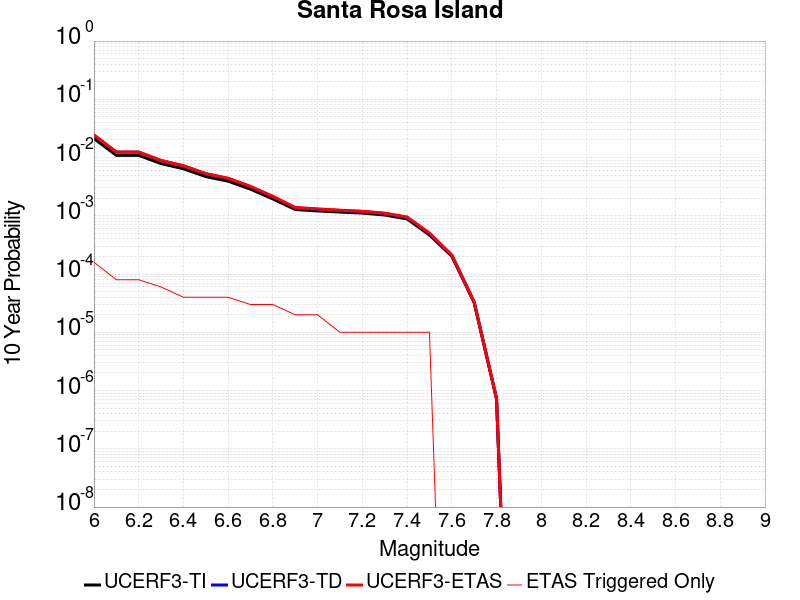 |

| Magnitude | 1 wk TI Prob | 1 wk TD Prob | 1 wk ETAS Prob | 1 wk ETAS/TD Gain | 1 wk ETAS Triggered Only | 1 mo TI Prob | 1 mo TD Prob | 1 mo ETAS Prob | 1 mo ETAS/TD Gain | 1 mo ETAS Triggered Only | 1 yr TI Prob | 1 yr TD Prob | 1 yr ETAS Prob | 1 yr ETAS/TD Gain | 1 yr ETAS Triggered Only | 10 yr TI Prob | 10 yr TD Prob | 10 yr ETAS Prob | 10 yr ETAS/TD Gain | 10 yr ETAS Triggered Only |
|-----|-----|-----|-----|-----|-----|-----|-----|-----|-----|-----|-----|-----|-----|-----|-----|-----|-----|-----|-----|-----|
| 6.0 | 4.1143165E-5 | 4.7091133E-5 | 1.1543127E-4 | 2.4512315 | 6.834335E-5 | 1.7631594E-4 | 2.0180465E-4 | 2.7013422E-4 | 1.3385926 | 6.834335E-5 | 0.002144533 | 0.0024544 | 0.0025225757 | 1.0277768 | 6.834335E-5 | 0.021239553 | 0.024293551 | 0.024426917 | 1.0054898 | 1.366867E-4 |
| 6.1 | 2.1061249E-5 | 2.3864959E-5 | 2.3864959E-5 | 1.0 | 0.0 | 9.0259375E-5 | 1.0227455E-4 | 1.0227455E-4 | 1.0 | 0.0 | 0.0010983539 | 0.0012445104 | 0.0012445104 | 1.0 | 0.0 | 0.01092941 | 0.012378449 | 0.012445945 | 1.0054529 | 6.834335E-5 |
| 6.2 | 2.1061249E-5 | 2.3864959E-5 | 2.3864959E-5 | 1.0 | 0.0 | 9.0259375E-5 | 1.0227455E-4 | 1.0227455E-4 | 1.0 | 0.0 | 0.0010983539 | 0.0012445104 | 0.0012445104 | 1.0 | 0.0 | 0.01092941 | 0.012378449 | 0.012445945 | 1.0054529 | 6.834335E-5 |
| 6.3 | 1.5158236E-5 | 1.7074419E-5 | 1.7074419E-5 | 1.0 | 0.0 | 6.496225E-5 | 7.3174095E-5 | 7.3174095E-5 | 1.0 | 0.0 | 7.906284E-4 | 8.905424E-4 | 8.905424E-4 | 1.0 | 0.0 | 0.007878214 | 0.008870989 | 0.008938727 | 1.0076358 | 6.834335E-5 |
| 6.4 | 1.2341918E-5 | 1.3852917E-5 | 1.3852917E-5 | 1.0 | 0.0 | 5.2892858E-5 | 5.9368336E-5 | 5.9368336E-5 | 1.0 | 0.0 | 6.437803E-4 | 7.225779E-4 | 7.225779E-4 | 1.0 | 0.0 | 0.006419184 | 0.007203121 | 0.0072709722 | 1.0094197 | 6.834335E-5 |
| 6.5 | 9.061158E-6 | 1.0117031E-5 | 1.0117031E-5 | 1.0 | 0.0 | 3.883296E-5 | 4.3358013E-5 | 4.3358013E-5 | 1.0 | 0.0 | 4.726887E-4 | 5.277613E-4 | 5.277613E-4 | 1.0 | 0.0 | 0.004716845 | 0.0052656173 | 0.005333601 | 1.0129108 | 6.834335E-5 |
| 6.6 | 7.5461685E-6 | 8.400733E-6 | 8.400733E-6 | 1.0 | 0.0 | 3.2340322E-5 | 3.600267E-5 | 3.600267E-5 | 1.0 | 0.0 | 3.936723E-4 | 4.3824865E-4 | 4.3824865E-4 | 1.0 | 0.0 | 0.003929756 | 0.0043742736 | 0.004442318 | 1.0155556 | 6.834335E-5 |
| 6.7 | 5.5023775E-6 | 6.087381E-6 | 6.087381E-6 | 1.0 | 0.0 | 2.3581404E-5 | 2.6088532E-5 | 2.6088532E-5 | 1.0 | 0.0 | 2.8706578E-4 | 3.1758484E-4 | 3.1758484E-4 | 1.0 | 0.0 | 0.0028669522 | 0.0031716314 | 0.003239758 | 1.02148 | 6.834335E-5 |
| 6.8 | 3.7351679E-6 | 4.0831405E-6 | 4.0831405E-6 | 1.0 | 0.0 | 1.6007763E-5 | 1.749907E-5 | 1.749907E-5 | 1.0 | 0.0 | 1.948771E-4 | 2.1303284E-4 | 2.1303284E-4 | 1.0 | 0.0 | 0.0019470629 | 0.0021285315 | 0.0021967292 | 1.0320399 | 6.834335E-5 |
| 6.9 | 2.456366E-6 | 2.6292705E-6 | 2.6292705E-6 | 1.0 | 0.0 | 1.0527241E-5 | 1.1268254E-5 | 1.1268254E-5 | 1.0 | 0.0 | 1.2816161E-4 | 1.3718237E-4 | 1.3718237E-4 | 1.0 | 0.0 | 0.0012808773 | 0.0013709799 | 0.0014392296 | 1.0497817 | 6.834335E-5 |
| 7.0 | 2.3245157E-6 | 2.4827782E-6 | 2.4827782E-6 | 1.0 | 0.0 | 9.962172E-6 | 1.0640435E-5 | 1.0640435E-5 | 1.0 | 0.0 | 1.2128269E-4 | 1.2953962E-4 | 1.2953962E-4 | 1.0 | 0.0 | 0.0012121652 | 0.0012946434 | 0.0013628982 | 1.052721 | 6.834335E-5 |
| 7.1 | 2.2248344E-6 | 2.37325E-6 | 2.37325E-6 | 1.0 | 0.0 | 9.53497E-6 | 1.0171032E-5 | 1.0171032E-5 | 1.0 | 0.0 | 1.1608207E-4 | 1.2382529E-4 | 1.2382529E-4 | 1.0 | 0.0 | 0.0011602144 | 0.001237565 | 0.001237565 | 1.0 | 0.0 |
| 7.2 | 2.1350402E-6 | 2.276154E-6 | 2.276154E-6 | 1.0 | 0.0 | 9.150141E-6 | 9.754909E-6 | 9.754909E-6 | 1.0 | 0.0 | 1.1139726E-4 | 1.1875956E-4 | 1.1875956E-4 | 1.0 | 0.0 | 0.0011134144 | 0.0011869629 | 0.0011869629 | 1.0 | 0.0 |
| 7.3 | 1.9793572E-6 | 2.108719E-6 | 2.108719E-6 | 1.0 | 0.0 | 8.482932E-6 | 9.037336E-6 | 9.037336E-6 | 1.0 | 0.0 | 1.032748E-4 | 1.10024026E-4 | 1.10024026E-4 | 1.0 | 0.0 | 0.0010322682 | 0.0010996973 | 0.0010996973 | 1.0 | 0.0 |
| 7.4 | 1.6951194E-6 | 1.8045733E-6 | 1.8045733E-6 | 1.0 | 0.0 | 7.264777E-6 | 7.733863E-6 | 7.733863E-6 | 1.0 | 0.0 | 8.844508E-5 | 9.415573E-5 | 9.415573E-5 | 1.0 | 0.0 | 8.840988E-4 | 9.4116E-4 | 9.4116E-4 | 1.0 | 0.0 |
| 7.5 | 8.987207E-7 | 9.5122147E-7 | 9.5122147E-7 | 1.0 | 0.0 | 3.8516546E-6 | 4.076657E-6 | 4.076657E-6 | 1.0 | 0.0 | 4.6892885E-5 | 4.963218E-5 | 4.963218E-5 | 1.0 | 0.0 | 4.688299E-4 | 4.9621216E-4 | 4.9621216E-4 | 1.0 | 0.0 |
| 7.6 | 3.8783037E-7 | 4.052932E-7 | 4.052932E-7 | 1.0 | 0.0 | 1.6621291E-6 | 1.7369698E-6 | 1.7369698E-6 | 1.0 | 0.0 | 2.0236233E-5 | 2.1147409E-5 | 2.1147409E-5 | 1.0 | 0.0 | 2.023439E-4 | 2.1145462E-4 | 2.1145462E-4 | 1.0 | 0.0 |
| 7.7 | 6.181804E-8 | 6.339035E-8 | 6.339035E-8 | 1.0 | 0.0 | 2.6493444E-7 | 2.7167292E-7 | 2.7167292E-7 | 1.0 | 0.0 | 3.225572E-6 | 3.3076128E-6 | 3.3076128E-6 | 1.0 | 0.0 | 3.225525E-5 | 3.307564E-5 | 3.307564E-5 | 1.0 | 0.0 |
| 7.8 | 1.3704449E-9 | 1.3964153E-9 | 1.3964153E-9 | 1.0 | 0.0 | 5.873335E-9 | 5.984637E-9 | 5.984637E-9 | 1.0 | 0.0 | 7.1507856E-8 | 7.286295E-8 | 7.286295E-8 | 1.0 | 0.0 | 7.1507833E-7 | 7.286294E-7 | 7.286294E-7 | 1.0 | 0.0 |

## Pisgah-Bullion Mtn-Mesquite Lk
*[(top)](#table-of-contents)*

| 1 Week | 1 Month | 1 Year | 10 Year |
|-----|-----|-----|-----|
|  |  |  |  |

| Magnitude | 1 wk TI Prob | 1 wk TD Prob | 1 wk ETAS Prob | 1 wk ETAS/TD Gain | 1 wk ETAS Triggered Only | 1 mo TI Prob | 1 mo TD Prob | 1 mo ETAS Prob | 1 mo ETAS/TD Gain | 1 mo ETAS Triggered Only | 1 yr TI Prob | 1 yr TD Prob | 1 yr ETAS Prob | 1 yr ETAS/TD Gain | 1 yr ETAS Triggered Only | 10 yr TI Prob | 10 yr TD Prob | 10 yr ETAS Prob | 10 yr ETAS/TD Gain | 10 yr ETAS Triggered Only |
|-----|-----|-----|-----|-----|-----|-----|-----|-----|-----|-----|-----|-----|-----|-----|-----|-----|-----|-----|-----|-----|
| 6.0 | 3.0240792E-5 | 2.4091114E-5 | 2.4091114E-5 | 1.0 | 0.0 | 1.2959696E-4 | 1.03244114E-4 | 1.03244114E-4 | 1.0 | 0.0 | 0.0015767008 | 0.0012563728 | 0.0014611452 | 1.162987 | 2.0503007E-4 | 0.015655609 | 0.012502721 | 0.012705187 | 1.0161937 | 2.0503007E-4 |
| 6.1 | 3.0240792E-5 | 2.4091114E-5 | 2.4091114E-5 | 1.0 | 0.0 | 1.2959696E-4 | 1.03244114E-4 | 1.03244114E-4 | 1.0 | 0.0 | 0.0015767008 | 0.0012563728 | 0.0014611452 | 1.162987 | 2.0503007E-4 | 0.015655609 | 0.012502721 | 0.012705187 | 1.0161937 | 2.0503007E-4 |
| 6.2 | 3.0240792E-5 | 2.4091114E-5 | 2.4091114E-5 | 1.0 | 0.0 | 1.2959696E-4 | 1.03244114E-4 | 1.03244114E-4 | 1.0 | 0.0 | 0.0015767008 | 0.0012563728 | 0.0014611452 | 1.162987 | 2.0503007E-4 | 0.015655609 | 0.012502721 | 0.012705187 | 1.0161937 | 2.0503007E-4 |
| 6.3 | 2.0498217E-5 | 1.36380695E-5 | 1.36380695E-5 | 1.0 | 0.0 | 8.784654E-5 | 5.844765E-5 | 5.844765E-5 | 1.0 | 0.0 | 0.0010690069 | 7.1138405E-4 | 7.7967875E-4 | 1.0960026 | 6.834335E-5 | 0.01063879 | 0.0070926943 | 0.0071605532 | 1.0095674 | 6.834335E-5 |
| 6.4 | 2.0498217E-5 | 1.36380695E-5 | 1.36380695E-5 | 1.0 | 0.0 | 8.784654E-5 | 5.844765E-5 | 5.844765E-5 | 1.0 | 0.0 | 0.0010690069 | 7.1138405E-4 | 7.7967875E-4 | 1.0960026 | 6.834335E-5 | 0.01063879 | 0.0070926943 | 0.0071605532 | 1.0095674 | 6.834335E-5 |
| 6.5 | 1.7316182E-5 | 1.0477042E-5 | 1.0477042E-5 | 1.0 | 0.0 | 7.42101E-5 | 4.4900895E-5 | 4.4900895E-5 | 1.0 | 0.0 | 9.0313336E-4 | 5.465413E-4 | 5.465413E-4 | 1.0 | 0.0 | 0.008994718 | 0.0054529672 | 0.0054529672 | 1.0 | 0.0 |
| 6.6 | 1.5251077E-5 | 8.414273E-6 | 8.414273E-6 | 1.0 | 0.0 | 6.536012E-5 | 3.6060712E-5 | 3.6060712E-5 | 1.0 | 0.0 | 7.9546886E-4 | 4.3895794E-4 | 4.3895794E-4 | 1.0 | 0.0 | 0.007926274 | 0.0043816264 | 0.0043816264 | 1.0 | 0.0 |
| 6.7 | 1.2997425E-5 | 6.4114965E-6 | 6.4114965E-6 | 1.0 | 0.0 | 5.570206E-5 | 2.7477578E-5 | 2.7477578E-5 | 1.0 | 0.0 | 6.7796157E-4 | 3.3449283E-4 | 3.3449283E-4 | 1.0 | 0.0 | 0.0067589693 | 0.0033403537 | 0.0033403537 | 1.0 | 0.0 |
| 6.8 | 1.035386E-5 | 4.3332193E-6 | 4.3332193E-6 | 1.0 | 0.0 | 4.437293E-5 | 1.8570812E-5 | 1.8570812E-5 | 1.0 | 0.0 | 5.401065E-4 | 2.2607706E-4 | 2.2607706E-4 | 1.0 | 0.0 | 0.0053879567 | 0.0022585576 | 0.0022585576 | 1.0 | 0.0 |
| 6.9 | 8.816252E-6 | 3.580638E-6 | 3.580638E-6 | 1.0 | 0.0 | 3.778339E-5 | 1.5345504E-5 | 1.5345504E-5 | 1.0 | 0.0 | 4.5991567E-4 | 1.8681608E-4 | 1.8681608E-4 | 1.0 | 0.0 | 0.00458965 | 0.0018666488 | 0.0018666488 | 1.0 | 0.0 |
| 7.0 | 6.8232207E-6 | 2.5675843E-6 | 2.5675843E-6 | 1.0 | 0.0 | 2.9242048E-5 | 1.1003888E-5 | 1.1003888E-5 | 1.0 | 0.0 | 3.5596377E-4 | 1.3396442E-4 | 1.3396442E-4 | 1.0 | 0.0 | 0.0035539411 | 0.0013388677 | 0.0013388677 | 1.0 | 0.0 |
| 7.1 | 5.837013E-6 | 2.22738E-6 | 2.22738E-6 | 1.0 | 0.0 | 2.501553E-5 | 9.545881E-6 | 9.545881E-6 | 1.0 | 0.0 | 3.045215E-4 | 1.16215204E-4 | 1.16215204E-4 | 1.0 | 0.0 | 0.0030410455 | 0.0011615733 | 0.0011615733 | 1.0 | 0.0 |
| 7.2 | 4.278052E-6 | 1.6275711E-6 | 1.6275711E-6 | 1.0 | 0.0 | 1.833438E-5 | 6.9752873E-6 | 6.9752873E-6 | 1.0 | 0.0 | 2.231982E-4 | 8.492105E-5 | 8.492105E-5 | 1.0 | 0.0 | 0.0022297418 | 8.489092E-4 | 8.489092E-4 | 1.0 | 0.0 |
| 7.3 | 1.8803692E-6 | 8.344926E-7 | 8.344926E-7 | 1.0 | 0.0 | 8.0587E-6 | 3.5763926E-6 | 3.5763926E-6 | 1.0 | 0.0 | 9.811026E-5 | 4.354186E-5 | 4.354186E-5 | 1.0 | 0.0 | 9.806695E-4 | 4.3534773E-4 | 4.3534773E-4 | 1.0 | 0.0 |

## Raymond
*[(top)](#table-of-contents)*

| 1 Week | 1 Month | 1 Year | 10 Year |
|-----|-----|-----|-----|
|  |  |  | 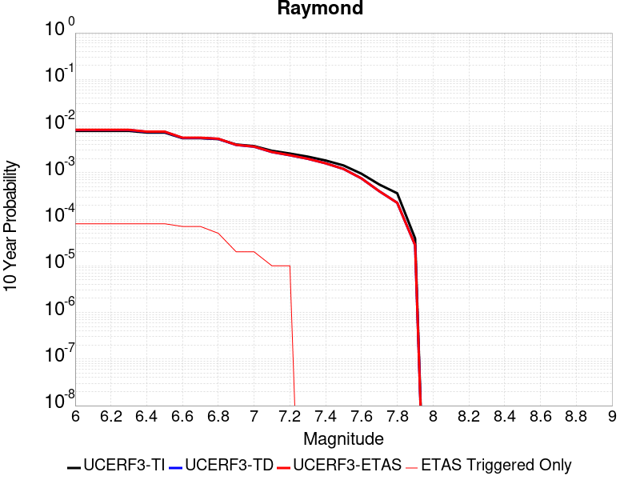 |

| Magnitude | 1 wk TI Prob | 1 wk TD Prob | 1 wk ETAS Prob | 1 wk ETAS/TD Gain | 1 wk ETAS Triggered Only | 1 mo TI Prob | 1 mo TD Prob | 1 mo ETAS Prob | 1 mo ETAS/TD Gain | 1 mo ETAS Triggered Only | 1 yr TI Prob | 1 yr TD Prob | 1 yr ETAS Prob | 1 yr ETAS/TD Gain | 1 yr ETAS Triggered Only | 10 yr TI Prob | 10 yr TD Prob | 10 yr ETAS Prob | 10 yr ETAS/TD Gain | 10 yr ETAS Triggered Only |
|-----|-----|-----|-----|-----|-----|-----|-----|-----|-----|-----|-----|-----|-----|-----|-----|-----|-----|-----|-----|-----|
| 6.0 | 1.5157413E-5 | 1.5810128E-5 | 8.41524E-5 | 5.3226895 | 6.834335E-5 | 6.4958724E-5 | 6.7756075E-5 | 1.360948E-4 | 2.0085993 | 6.834335E-5 | 7.905855E-4 | 8.2464307E-4 | 8.9293E-4 | 1.0828079 | 6.834335E-5 | 0.007877788 | 0.008218348 | 0.008421693 | 1.0247428 | 2.0503007E-4 |
| 6.1 | 1.5157413E-5 | 1.5810128E-5 | 8.41524E-5 | 5.3226895 | 6.834335E-5 | 6.4958724E-5 | 6.7756075E-5 | 1.360948E-4 | 2.0085993 | 6.834335E-5 | 7.905855E-4 | 8.2464307E-4 | 8.9293E-4 | 1.0828079 | 6.834335E-5 | 0.007877788 | 0.008218348 | 0.008421693 | 1.0247428 | 2.0503007E-4 |
| 6.2 | 1.5157413E-5 | 1.5810128E-5 | 8.41524E-5 | 5.3226895 | 6.834335E-5 | 6.4958724E-5 | 6.7756075E-5 | 1.360948E-4 | 2.0085993 | 6.834335E-5 | 7.905855E-4 | 8.2464307E-4 | 8.9293E-4 | 1.0828079 | 6.834335E-5 | 0.007877788 | 0.008218348 | 0.008421693 | 1.0247428 | 2.0503007E-4 |
| 6.3 | 1.5157413E-5 | 1.5810128E-5 | 8.41524E-5 | 5.3226895 | 6.834335E-5 | 6.4958724E-5 | 6.7756075E-5 | 1.360948E-4 | 2.0085993 | 6.834335E-5 | 7.905855E-4 | 8.2464307E-4 | 8.9293E-4 | 1.0828079 | 6.834335E-5 | 0.007877788 | 0.008218348 | 0.008421693 | 1.0247428 | 2.0503007E-4 |
| 6.4 | 1.3941944E-5 | 1.445469E-5 | 8.279706E-5 | 5.728041 | 6.834335E-5 | 5.9749822E-5 | 6.1947336E-5 | 1.3028645E-4 | 2.1031811 | 6.834335E-5 | 7.2721124E-4 | 7.5397117E-4 | 8.2226295E-4 | 1.0905762 | 6.834335E-5 | 0.007248361 | 0.0075164647 | 0.0077199535 | 1.0270724 | 2.0503007E-4 |
| 6.5 | 1.3941944E-5 | 1.445469E-5 | 8.279706E-5 | 5.728041 | 6.834335E-5 | 5.9749822E-5 | 6.1947336E-5 | 1.3028645E-4 | 2.1031811 | 6.834335E-5 | 7.2721124E-4 | 7.5397117E-4 | 8.2226295E-4 | 1.0905762 | 6.834335E-5 | 0.007248361 | 0.0075164647 | 0.0077199535 | 1.0270724 | 2.0503007E-4 |
| 6.6 | 1.0542609E-5 | 1.0671113E-5 | 1.0671113E-5 | 1.0 | 0.0 | 4.5181827E-5 | 4.573257E-5 | 4.573257E-5 | 1.0 | 0.0 | 5.499499E-4 | 5.5665727E-4 | 5.5665727E-4 | 1.0 | 0.0 | 0.005485909 | 0.00555319 | 0.005689118 | 1.0244774 | 1.366867E-4 |
| 6.7 | 1.0542609E-5 | 1.0671113E-5 | 1.0671113E-5 | 1.0 | 0.0 | 4.5181827E-5 | 4.573257E-5 | 4.573257E-5 | 1.0 | 0.0 | 5.499499E-4 | 5.5665727E-4 | 5.5665727E-4 | 1.0 | 0.0 | 0.005485909 | 0.00555319 | 0.005689118 | 1.0244774 | 1.366867E-4 |
| 6.8 | 1.0079132E-5 | 1.0176646E-5 | 1.0176646E-5 | 1.0 | 0.0 | 4.3195567E-5 | 4.3613498E-5 | 4.3613498E-5 | 1.0 | 0.0 | 5.257791E-4 | 5.3087034E-4 | 5.3087034E-4 | 1.0 | 0.0 | 0.0052453685 | 0.005296571 | 0.0053645526 | 1.012835 | 6.834335E-5 |
| 6.9 | 7.721598E-6 | 7.5489047E-6 | 7.5489047E-6 | 1.0 | 0.0 | 3.3092143E-5 | 3.2352054E-5 | 3.2352054E-5 | 1.0 | 0.0 | 4.0282236E-4 | 3.9381627E-4 | 3.9381627E-4 | 1.0 | 0.0 | 0.0040209293 | 0.0039313175 | 0.0039313175 | 1.0 | 0.0 |
| 7.0 | 7.137566E-6 | 6.9113057E-6 | 6.9113057E-6 | 1.0 | 0.0 | 3.058921E-5 | 2.961955E-5 | 2.961955E-5 | 1.0 | 0.0 | 3.7236E-4 | 3.6055944E-4 | 3.6055944E-4 | 1.0 | 0.0 | 0.0037173668 | 0.0035998628 | 0.0035998628 | 1.0 | 0.0 |
| 7.1 | 5.654976E-6 | 5.29954E-6 | 5.29954E-6 | 1.0 | 0.0 | 2.4235387E-5 | 2.2712118E-5 | 2.2712118E-5 | 1.0 | 0.0 | 2.9502588E-4 | 2.7648517E-4 | 2.7648517E-4 | 1.0 | 0.0 | 0.0029463451 | 0.002761443 | 0.002761443 | 1.0 | 0.0 |
| 7.2 | 4.9358455E-6 | 4.5266574E-6 | 4.5266574E-6 | 1.0 | 0.0 | 2.1153453E-5 | 1.9399817E-5 | 1.9399817E-5 | 1.0 | 0.0 | 2.5751285E-4 | 2.3616731E-4 | 2.3616731E-4 | 1.0 | 0.0 | 0.0025721465 | 0.0023591854 | 0.0023591854 | 1.0 | 0.0 |
| 7.3 | 4.2368597E-6 | 3.8056164E-6 | 3.8056164E-6 | 1.0 | 0.0 | 1.8157843E-5 | 1.6309683E-5 | 1.6309683E-5 | 1.0 | 0.0 | 2.2104931E-4 | 1.9855241E-4 | 1.9855241E-4 | 1.0 | 0.0 | 0.0022082955 | 0.0019837688 | 0.0019837688 | 1.0 | 0.0 |
| 7.4 | 3.4999923E-6 | 3.043744E-6 | 3.043744E-6 | 1.0 | 0.0 | 1.49998805E-5 | 1.3044552E-5 | 1.3044552E-5 | 1.0 | 0.0 | 1.8260824E-4 | 1.5880594E-4 | 1.5880594E-4 | 1.0 | 0.0 | 0.0018245826 | 0.0015869403 | 0.0015869403 | 1.0 | 0.0 |
| 7.5 | 2.738017E-6 | 2.3020468E-6 | 2.3020468E-6 | 1.0 | 0.0 | 1.1734306E-5 | 9.865878E-6 | 9.865878E-6 | 1.0 | 0.0 | 1.428558E-4 | 1.2011051E-4 | 1.2011051E-4 | 1.0 | 0.0 | 0.0014276401 | 0.0012004703 | 0.0012004703 | 1.0 | 0.0 |
| 7.6 | 1.8186392E-6 | 1.442312E-6 | 1.442312E-6 | 1.0 | 0.0 | 7.794145E-6 | 6.181323E-6 | 6.181323E-6 | 1.0 | 0.0 | 9.488958E-5 | 7.5255055E-5 | 7.5255055E-5 | 1.0 | 0.0 | 9.4849075E-4 | 7.523072E-4 | 7.523072E-4 | 1.0 | 0.0 |
| 7.7 | 1.0660348E-6 | 7.6438056E-7 | 7.6438056E-7 | 1.0 | 0.0 | 4.5687125E-6 | 3.2759126E-6 | 3.2759126E-6 | 1.0 | 0.0 | 5.5622655E-5 | 3.9883522E-5 | 3.9883522E-5 | 1.0 | 0.0 | 5.5608735E-4 | 3.9877277E-4 | 3.9877277E-4 | 1.0 | 0.0 |
| 7.8 | 6.913602E-7 | 4.3204133E-7 | 4.3204133E-7 | 1.0 | 0.0 | 2.962969E-6 | 1.8516045E-6 | 1.8516045E-6 | 1.0 | 0.0 | 3.607355E-5 | 2.2543056E-5 | 2.2543056E-5 | 1.0 | 0.0 | 3.6067693E-4 | 2.2541556E-4 | 2.2541556E-4 | 1.0 | 0.0 |
| 7.9 | 7.425201E-8 | 5.3222113E-8 | 5.3222113E-8 | 1.0 | 0.0 | 3.1822285E-7 | 2.2809476E-7 | 2.2809476E-7 | 1.0 | 0.0 | 3.874356E-6 | 2.7770516E-6 | 2.7770516E-6 | 1.0 | 0.0 | 3.8742884E-5 | 2.7770298E-5 | 2.7770298E-5 | 1.0 | 0.0 |

## Ventura-Pitas Point
*[(top)](#table-of-contents)*

| 1 Week | 1 Month | 1 Year | 10 Year |
|-----|-----|-----|-----|
|  |  |  | 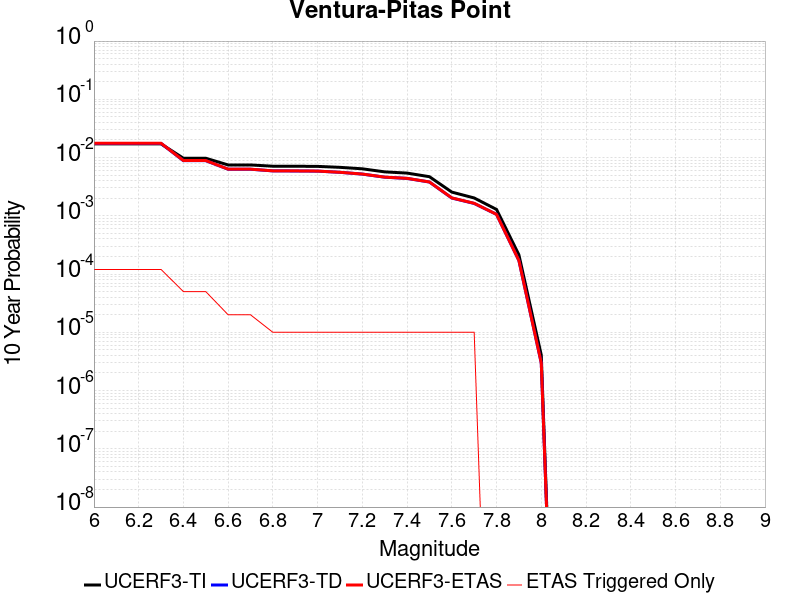 |

| Magnitude | 1 wk TI Prob | 1 wk TD Prob | 1 wk ETAS Prob | 1 wk ETAS/TD Gain | 1 wk ETAS Triggered Only | 1 mo TI Prob | 1 mo TD Prob | 1 mo ETAS Prob | 1 mo ETAS/TD Gain | 1 mo ETAS Triggered Only | 1 yr TI Prob | 1 yr TD Prob | 1 yr ETAS Prob | 1 yr ETAS/TD Gain | 1 yr ETAS Triggered Only | 10 yr TI Prob | 10 yr TD Prob | 10 yr ETAS Prob | 10 yr ETAS/TD Gain | 10 yr ETAS Triggered Only |
|-----|-----|-----|-----|-----|-----|-----|-----|-----|-----|-----|-----|-----|-----|-----|-----|-----|-----|-----|-----|-----|
| 6.0 | 3.3179622E-5 | 3.3735185E-5 | 3.3735185E-5 | 1.0 | 0.0 | 1.4219063E-4 | 1.445728E-4 | 1.445728E-4 | 1.0 | 0.0 | 0.0017297962 | 0.0017590096 | 0.0017590096 | 1.0 | 0.0 | 0.017163932 | 0.0174764 | 0.017610699 | 1.0076846 | 1.366867E-4 |
| 6.1 | 3.3179622E-5 | 3.3735185E-5 | 3.3735185E-5 | 1.0 | 0.0 | 1.4219063E-4 | 1.445728E-4 | 1.445728E-4 | 1.0 | 0.0 | 0.0017297962 | 0.0017590096 | 0.0017590096 | 1.0 | 0.0 | 0.017163932 | 0.0174764 | 0.017610699 | 1.0076846 | 1.366867E-4 |
| 6.2 | 3.3179622E-5 | 3.3735185E-5 | 3.3735185E-5 | 1.0 | 0.0 | 1.4219063E-4 | 1.445728E-4 | 1.445728E-4 | 1.0 | 0.0 | 0.0017297962 | 0.0017590096 | 0.0017590096 | 1.0 | 0.0 | 0.017163932 | 0.0174764 | 0.017610699 | 1.0076846 | 1.366867E-4 |
| 6.3 | 3.3179622E-5 | 3.3735185E-5 | 3.3735185E-5 | 1.0 | 0.0 | 1.4219063E-4 | 1.445728E-4 | 1.445728E-4 | 1.0 | 0.0 | 0.0017297962 | 0.0017590096 | 0.0017590096 | 1.0 | 0.0 | 0.017163932 | 0.0174764 | 0.017610699 | 1.0076846 | 1.366867E-4 |
| 6.4 | 1.8754668E-5 | 1.701961E-5 | 1.701961E-5 | 1.0 | 0.0 | 8.037467E-5 | 7.293928E-5 | 7.293928E-5 | 1.0 | 0.0 | 9.781223E-4 | 8.8769704E-4 | 8.8769704E-4 | 1.0 | 0.0 | 0.009738282 | 0.008843848 | 0.008979326 | 1.0153189 | 1.366867E-4 |
| 6.5 | 1.8754668E-5 | 1.701961E-5 | 1.701961E-5 | 1.0 | 0.0 | 8.037467E-5 | 7.293928E-5 | 7.293928E-5 | 1.0 | 0.0 | 9.781223E-4 | 8.8769704E-4 | 8.8769704E-4 | 1.0 | 0.0 | 0.009738282 | 0.008843848 | 0.008979326 | 1.0153189 | 1.366867E-4 |
| 6.6 | 1.4361558E-5 | 1.2122275E-5 | 1.2122275E-5 | 1.0 | 0.0 | 6.154808E-5 | 5.1951585E-5 | 5.1951585E-5 | 1.0 | 0.0 | 7.490902E-4 | 6.3232926E-4 | 6.3232926E-4 | 1.0 | 0.0 | 0.0074657016 | 0.0063055577 | 0.0063734697 | 1.0107702 | 6.834335E-5 |
| 6.7 | 1.4361558E-5 | 1.2122275E-5 | 1.2122275E-5 | 1.0 | 0.0 | 6.154808E-5 | 5.1951585E-5 | 5.1951585E-5 | 1.0 | 0.0 | 7.490902E-4 | 6.3232926E-4 | 6.3232926E-4 | 1.0 | 0.0 | 0.0074657016 | 0.0063055577 | 0.0063734697 | 1.0107702 | 6.834335E-5 |
| 6.8 | 1.3663846E-5 | 1.13444175E-5 | 1.13444175E-5 | 1.0 | 0.0 | 5.8558027E-5 | 4.861804E-5 | 4.861804E-5 | 1.0 | 0.0 | 7.127108E-4 | 5.917658E-4 | 5.917658E-4 | 1.0 | 0.0 | 0.007104293 | 0.005902116 | 0.005970056 | 1.0115111 | 6.834335E-5 |
| 6.9 | 1.3644157E-5 | 1.1322519E-5 | 1.1322519E-5 | 1.0 | 0.0 | 5.8473648E-5 | 4.8524187E-5 | 4.8524187E-5 | 1.0 | 0.0 | 7.116841E-4 | 5.9062376E-4 | 5.9062376E-4 | 1.0 | 0.0 | 0.007094092 | 0.0058907564 | 0.0059586973 | 1.0115335 | 6.834335E-5 |
| 7.0 | 1.3568845E-5 | 1.1242086E-5 | 1.1242086E-5 | 1.0 | 0.0 | 5.8150898E-5 | 4.817949E-5 | 4.817949E-5 | 1.0 | 0.0 | 7.077572E-4 | 5.864293E-4 | 5.864293E-4 | 1.0 | 0.0 | 0.007055073 | 0.0058490336 | 0.005916977 | 1.0116162 | 6.834335E-5 |
| 7.1 | 1.306572E-5 | 1.072054E-5 | 1.072054E-5 | 1.0 | 0.0 | 5.599474E-5 | 4.5944373E-5 | 4.5944373E-5 | 1.0 | 0.0 | 6.815227E-4 | 5.5923103E-4 | 5.5923103E-4 | 1.0 | 0.0 | 0.0067943637 | 0.0055784425 | 0.0056464043 | 1.012183 | 6.834335E-5 |
| 7.2 | 1.232604E-5 | 9.995143E-6 | 9.995143E-6 | 1.0 | 0.0 | 5.2824813E-5 | 4.2835632E-5 | 4.2835632E-5 | 1.0 | 0.0 | 6.429523E-4 | 5.214008E-4 | 5.214008E-4 | 1.0 | 0.0 | 0.0064109527 | 0.005201967 | 0.005269955 | 1.0130696 | 6.834335E-5 |
| 7.3 | 1.0917261E-5 | 8.84384E-6 | 8.84384E-6 | 1.0 | 0.0 | 4.678742E-5 | 3.790163E-5 | 3.790163E-5 | 1.0 | 0.0 | 5.69488E-4 | 4.6135622E-4 | 4.6135622E-4 | 1.0 | 0.0 | 0.0056803077 | 0.00460415 | 0.004672179 | 1.0147755 | 6.834335E-5 |
| 7.4 | 1.039959E-5 | 8.423562E-6 | 8.423562E-6 | 1.0 | 0.0 | 4.456891E-5 | 3.610049E-5 | 3.610049E-5 | 1.0 | 0.0 | 5.424914E-4 | 4.3943635E-4 | 4.3943635E-4 | 1.0 | 0.0 | 0.0054116896 | 0.004385836 | 0.0044538793 | 1.0155144 | 6.834335E-5 |
| 7.5 | 9.015877E-6 | 7.2975445E-6 | 7.2975445E-6 | 1.0 | 0.0 | 3.86389E-5 | 3.1274823E-5 | 3.1274823E-5 | 1.0 | 0.0 | 4.7032707E-4 | 3.8070587E-4 | 3.8070587E-4 | 1.0 | 0.0 | 0.004693329 | 0.0038006818 | 0.0038687654 | 1.0179136 | 6.834335E-5 |
| 7.6 | 4.900162E-6 | 3.8741155E-6 | 3.8741155E-6 | 1.0 | 0.0 | 2.1000526E-5 | 1.6603248E-5 | 1.6603248E-5 | 1.0 | 0.0 | 2.556514E-4 | 2.0212591E-4 | 2.0212591E-4 | 1.0 | 0.0 | 0.0025535747 | 0.0020194345 | 0.0020876399 | 1.0337745 | 6.834335E-5 |
| 7.7 | 3.8850626E-6 | 3.1267302E-6 | 3.1267302E-6 | 1.0 | 0.0 | 1.6650163E-5 | 1.3400205E-5 | 1.3400205E-5 | 1.0 | 0.0 | 2.0269687E-4 | 1.6313537E-4 | 1.6313537E-4 | 1.0 | 0.0 | 0.002025121 | 0.0016301654 | 0.0016983973 | 1.0418558 | 6.834335E-5 |
| 7.8 | 2.4654719E-6 | 2.029875E-6 | 2.029875E-6 | 1.0 | 0.0 | 1.0566265E-5 | 8.699436E-6 | 8.699436E-6 | 1.0 | 0.0 | 1.2863669E-4 | 1.0591053E-4 | 1.0591053E-4 | 1.0 | 0.0 | 0.0012856225 | 0.0010586053 | 0.0010586053 | 1.0 | 0.0 |
| 7.9 | 4.095894E-7 | 3.2764765E-7 | 3.2764765E-7 | 1.0 | 0.0 | 1.7553821E-6 | 1.4042034E-6 | 1.4042034E-6 | 1.0 | 0.0 | 2.1371567E-5 | 1.7096047E-5 | 1.7096047E-5 | 1.0 | 0.0 | 2.1369511E-4 | 1.7094762E-4 | 1.7094762E-4 | 1.0 | 0.0 |
| 8.0 | 7.791402E-9 | 5.683497E-9 | 5.683497E-9 | 1.0 | 0.0 | 3.3391725E-8 | 2.4357844E-8 | 2.4357844E-8 | 1.0 | 0.0 | 4.0654416E-7 | 2.9655675E-7 | 2.9655675E-7 | 1.0 | 0.0 | 4.065434E-6 | 2.9655655E-6 | 2.9655655E-6 | 1.0 | 0.0 |

## Oak Ridge (Onshore)
*[(top)](#table-of-contents)*

| 1 Week | 1 Month | 1 Year | 10 Year |
|-----|-----|-----|-----|
|  |  |  |  |

| Magnitude | 1 wk TI Prob | 1 wk TD Prob | 1 wk ETAS Prob | 1 wk ETAS/TD Gain | 1 wk ETAS Triggered Only | 1 mo TI Prob | 1 mo TD Prob | 1 mo ETAS Prob | 1 mo ETAS/TD Gain | 1 mo ETAS Triggered Only | 1 yr TI Prob | 1 yr TD Prob | 1 yr ETAS Prob | 1 yr ETAS/TD Gain | 1 yr ETAS Triggered Only | 10 yr TI Prob | 10 yr TD Prob | 10 yr ETAS Prob | 10 yr ETAS/TD Gain | 10 yr ETAS Triggered Only |
|-----|-----|-----|-----|-----|-----|-----|-----|-----|-----|-----|-----|-----|-----|-----|-----|-----|-----|-----|-----|-----|
| 6.0 | 3.155064E-5 | 2.9525974E-5 | 9.786731E-5 | 3.3146176 | 6.834335E-5 | 1.3521002E-4 | 1.2653397E-4 | 1.9486867E-4 | 1.5400503 | 6.834335E-5 | 0.001644939 | 0.0015395004 | 0.0016077386 | 1.0443249 | 6.834335E-5 | 0.01632816 | 0.015292859 | 0.015494754 | 1.0132018 | 2.0503007E-4 |
| 6.1 | 3.155064E-5 | 2.9525974E-5 | 9.786731E-5 | 3.3146176 | 6.834335E-5 | 1.3521002E-4 | 1.2653397E-4 | 1.9486867E-4 | 1.5400503 | 6.834335E-5 | 0.001644939 | 0.0015395004 | 0.0016077386 | 1.0443249 | 6.834335E-5 | 0.01632816 | 0.015292859 | 0.015494754 | 1.0132018 | 2.0503007E-4 |
| 6.2 | 3.155064E-5 | 2.9525974E-5 | 9.786731E-5 | 3.3146176 | 6.834335E-5 | 1.3521002E-4 | 1.2653397E-4 | 1.9486867E-4 | 1.5400503 | 6.834335E-5 | 0.001644939 | 0.0015395004 | 0.0016077386 | 1.0443249 | 6.834335E-5 | 0.01632816 | 0.015292859 | 0.015494754 | 1.0132018 | 2.0503007E-4 |
| 6.3 | 3.155064E-5 | 2.9525974E-5 | 9.786731E-5 | 3.3146176 | 6.834335E-5 | 1.3521002E-4 | 1.2653397E-4 | 1.9486867E-4 | 1.5400503 | 6.834335E-5 | 0.001644939 | 0.0015395004 | 0.0016077386 | 1.0443249 | 6.834335E-5 | 0.01632816 | 0.015292859 | 0.015494754 | 1.0132018 | 2.0503007E-4 |
| 6.4 | 3.155064E-5 | 2.9525974E-5 | 9.786731E-5 | 3.3146176 | 6.834335E-5 | 1.3521002E-4 | 1.2653397E-4 | 1.9486867E-4 | 1.5400503 | 6.834335E-5 | 0.001644939 | 0.0015395004 | 0.0016077386 | 1.0443249 | 6.834335E-5 | 0.01632816 | 0.015292859 | 0.015494754 | 1.0132018 | 2.0503007E-4 |
| 6.5 | 3.155064E-5 | 2.9525974E-5 | 9.786731E-5 | 3.3146176 | 6.834335E-5 | 1.3521002E-4 | 1.2653397E-4 | 1.9486867E-4 | 1.5400503 | 6.834335E-5 | 0.001644939 | 0.0015395004 | 0.0016077386 | 1.0443249 | 6.834335E-5 | 0.01632816 | 0.015292859 | 0.015494754 | 1.0132018 | 2.0503007E-4 |
| 6.6 | 3.155064E-5 | 2.9525974E-5 | 9.786731E-5 | 3.3146176 | 6.834335E-5 | 1.3521002E-4 | 1.2653397E-4 | 1.9486867E-4 | 1.5400503 | 6.834335E-5 | 0.001644939 | 0.0015395004 | 0.0016077386 | 1.0443249 | 6.834335E-5 | 0.01632816 | 0.015292859 | 0.015494754 | 1.0132018 | 2.0503007E-4 |
| 6.7 | 3.098897E-5 | 2.8864175E-5 | 9.720556E-5 | 3.367689 | 6.834335E-5 | 1.328031E-4 | 1.2369796E-4 | 1.9203285E-4 | 1.5524336 | 6.834335E-5 | 0.0016156785 | 0.0015050198 | 0.0015732603 | 1.045342 | 6.834335E-5 | 0.016039822 | 0.014952714 | 0.015154678 | 1.0135069 | 2.0503007E-4 |
| 6.8 | 3.0449872E-5 | 2.8239372E-5 | 9.65808E-5 | 3.420076 | 6.834335E-5 | 1.3049292E-4 | 1.2102048E-4 | 1.8935556E-4 | 1.5646572 | 6.834335E-5 | 0.0015875935 | 0.0014724657 | 0.0015407084 | 1.0463458 | 6.834335E-5 | 0.015762992 | 0.014631462 | 0.014833492 | 1.0138079 | 2.0503007E-4 |
| 6.9 | 2.697928E-5 | 2.4219773E-5 | 9.256147E-5 | 3.8217316 | 6.834335E-5 | 1.15620365E-4 | 1.0379502E-4 | 1.7213129E-4 | 1.658377 | 6.834335E-5 | 0.0014067689 | 0.0012629933 | 0.0013312504 | 1.0540439 | 6.834335E-5 | 0.0139789665 | 0.01256087 | 0.012763324 | 1.0161179 | 2.0503007E-4 |
| 7.0 | 2.4893961E-5 | 2.1862043E-5 | 9.02039E-5 | 4.1260514 | 6.834335E-5 | 1.0668404E-4 | 9.3691204E-5 | 1.6202815E-4 | 1.729385 | 6.834335E-5 | 0.0012981043 | 0.0011401111 | 0.0012083766 | 1.0598761 | 6.834335E-5 | 0.012905477 | 0.011344905 | 0.011547609 | 1.0178674 | 2.0503007E-4 |
| 7.1 | 2.0945363E-5 | 1.7354487E-5 | 8.569666E-5 | 4.9380116 | 6.834335E-5 | 8.976275E-5 | 7.437428E-5 | 1.4271255E-4 | 1.9188428 | 6.834335E-5 | 0.0010923136 | 9.051354E-4 | 9.734169E-4 | 1.0754379 | 6.834335E-5 | 0.0108696 | 0.009015423 | 0.009218604 | 1.0225371 | 2.0503007E-4 |
| 7.2 | 2.0439404E-5 | 1.6809423E-5 | 8.515163E-5 | 5.065708 | 6.834335E-5 | 8.7594504E-5 | 7.203843E-5 | 1.4037685E-4 | 1.9486387 | 6.834335E-5 | 0.0010659413 | 8.767196E-4 | 9.45003E-4 | 1.0778852 | 6.834335E-5 | 0.010608427 | 0.008733526 | 0.008936766 | 1.0232712 | 2.0503007E-4 |
| 7.3 | 1.8463334E-5 | 1.5381811E-5 | 8.372412E-5 | 5.44306 | 6.834335E-5 | 7.912617E-5 | 6.59204E-5 | 1.3425926E-4 | 2.0366874 | 6.834335E-5 | 9.6293533E-4 | 8.0228975E-4 | 8.705783E-4 | 1.085117 | 6.834335E-5 | 0.009587734 | 0.007994797 | 0.008130391 | 1.0169603 | 1.366867E-4 |
| 7.4 | 1.763139E-5 | 1.451684E-5 | 8.28592E-5 | 5.707799 | 6.834335E-5 | 7.556091E-5 | 6.221356E-5 | 1.3055267E-4 | 2.09846 | 6.834335E-5 | 9.1956573E-4 | 7.571909E-4 | 8.254825E-4 | 1.0901908 | 6.834335E-5 | 0.009157699 | 0.007546914 | 0.007682569 | 1.017975 | 1.366867E-4 |
| 7.5 | 1.3594944E-5 | 1.1163356E-5 | 7.950595E-5 | 7.1220474 | 6.834335E-5 | 5.8262744E-5 | 4.784209E-5 | 1.1618218E-4 | 2.428451 | 6.834335E-5 | 7.0911803E-4 | 5.8232434E-4 | 6.506279E-4 | 1.1172947 | 6.834335E-5 | 0.007068595 | 0.0058082556 | 0.0059441486 | 1.0233965 | 1.366867E-4 |
| 7.6 | 6.9889534E-6 | 5.6367144E-6 | 7.397969E-5 | 13.124612 | 6.834335E-5 | 2.9952313E-5 | 2.4157125E-5 | 9.2498834E-5 | 3.8290496 | 6.834335E-5 | 3.646084E-4 | 2.9407372E-4 | 3.62397E-4 | 1.2323338 | 6.834335E-5 | 0.0036401073 | 0.0029368899 | 0.0030731752 | 1.0464046 | 1.366867E-4 |
| 7.7 | 4.0824193E-6 | 3.2832586E-6 | 3.2832586E-6 | 1.0 | 0.0 | 1.7495966E-5 | 1.4071033E-5 | 1.4071033E-5 | 1.0 | 0.0 | 2.1299256E-4 | 1.713015E-4 | 1.713015E-4 | 1.0 | 0.0 | 0.0021278851 | 0.0017117079 | 0.0017799343 | 1.0398587 | 6.834335E-5 |
| 7.8 | 1.7023609E-6 | 1.4370495E-6 | 1.4370495E-6 | 1.0 | 0.0 | 7.295812E-6 | 6.1587693E-6 | 6.1587693E-6 | 1.0 | 0.0 | 8.882289E-5 | 7.498047E-5 | 7.498047E-5 | 1.0 | 0.0 | 8.8787393E-4 | 7.495545E-4 | 7.495545E-4 | 1.0 | 0.0 |
| 7.9 | 2.721225E-7 | 2.2616497E-7 | 2.2616497E-7 | 1.0 | 0.0 | 1.1662388E-6 | 9.692781E-7 | 9.692781E-7 | 1.0 | 0.0 | 1.4198865E-5 | 1.1800899E-5 | 1.1800899E-5 | 1.0 | 0.0 | 1.4197957E-4 | 1.1800301E-4 | 1.1800301E-4 | 1.0 | 0.0 |
| 8.0 | 9.364255E-9 | 5.1206666E-9 | 5.1206666E-9 | 1.0 | 0.0 | 4.0132523E-8 | 2.1945715E-8 | 2.1945715E-8 | 1.0 | 0.0 | 4.8861335E-7 | 2.6718905E-7 | 2.6718905E-7 | 1.0 | 0.0 | 4.8861225E-6 | 2.6718876E-6 | 2.6718876E-6 | 1.0 | 0.0 |

## Coronado Bank alt1
*[(top)](#table-of-contents)*

| 1 Week | 1 Month | 1 Year | 10 Year |
|-----|-----|-----|-----|
|  |  |  |  |

| Magnitude | 1 wk TI Prob | 1 wk TD Prob | 1 wk ETAS Prob | 1 wk ETAS/TD Gain | 1 wk ETAS Triggered Only | 1 mo TI Prob | 1 mo TD Prob | 1 mo ETAS Prob | 1 mo ETAS/TD Gain | 1 mo ETAS Triggered Only | 1 yr TI Prob | 1 yr TD Prob | 1 yr ETAS Prob | 1 yr ETAS/TD Gain | 1 yr ETAS Triggered Only | 10 yr TI Prob | 10 yr TD Prob | 10 yr ETAS Prob | 10 yr ETAS/TD Gain | 10 yr ETAS Triggered Only |
|-----|-----|-----|-----|-----|-----|-----|-----|-----|-----|-----|-----|-----|-----|-----|-----|-----|-----|-----|-----|-----|
| 6.0 | 7.533492E-5 | 9.394913E-5 | 2.30623E-4 | 2.4547646 | 1.366867E-4 | 3.22824E-4 | 4.0258127E-4 | 5.3921295E-4 | 1.3393891 | 1.366867E-4 | 0.0039233007 | 0.0048909658 | 0.0050269836 | 1.0278101 | 1.366867E-4 | 0.03854755 | 0.04790356 | 0.04809877 | 1.004075 | 2.0503007E-4 |
| 6.1 | 4.1807285E-5 | 5.049283E-5 | 1.1883274E-4 | 2.3534577 | 6.834335E-5 | 1.7916178E-4 | 2.1638049E-4 | 2.8470907E-4 | 1.3157797 | 6.834335E-5 | 0.0021791123 | 0.0026313474 | 0.002699511 | 1.0259044 | 6.834335E-5 | 0.021578677 | 0.026011046 | 0.026077613 | 1.0025592 | 6.834335E-5 |
| 6.2 | 4.1807285E-5 | 5.049283E-5 | 1.1883274E-4 | 2.3534577 | 6.834335E-5 | 1.7916178E-4 | 2.1638049E-4 | 2.8470907E-4 | 1.3157797 | 6.834335E-5 | 0.0021791123 | 0.0026313474 | 0.002699511 | 1.0259044 | 6.834335E-5 | 0.021578677 | 0.026011046 | 0.026077613 | 1.0025592 | 6.834335E-5 |
| 6.3 | 3.1793104E-5 | 3.7711117E-5 | 3.7711117E-5 | 1.0 | 0.0 | 1.3624904E-4 | 1.6160926E-4 | 1.6160926E-4 | 1.0 | 0.0 | 0.0016575698 | 0.001965848 | 0.001965848 | 1.0 | 0.0 | 0.016452603 | 0.019488465 | 0.019488465 | 1.0 | 0.0 |
| 6.4 | 2.9878007E-5 | 3.5335794E-5 | 3.5335794E-5 | 1.0 | 0.0 | 1.2804232E-4 | 1.5143053E-4 | 1.5143053E-4 | 1.0 | 0.0 | 0.0015578003 | 0.0018421387 | 0.0018421387 | 1.0 | 0.0 | 0.015469253 | 0.01827244 | 0.01827244 | 1.0 | 0.0 |
| 6.5 | 2.4512565E-5 | 2.8764043E-5 | 2.8764043E-5 | 1.0 | 0.0 | 1.0504962E-4 | 1.2326881E-4 | 1.2326881E-4 | 1.0 | 0.0 | 0.0012782287 | 0.0014997921 | 0.0014997921 | 1.0 | 0.0 | 0.012709012 | 0.014899683 | 0.014899683 | 1.0 | 0.0 |
| 6.6 | 2.1317413E-5 | 2.490667E-5 | 2.490667E-5 | 1.0 | 0.0 | 9.135714E-5 | 1.0673863E-4 | 1.0673863E-4 | 1.0 | 0.0 | 0.0011117056 | 0.0012987906 | 0.0012987906 | 1.0 | 0.0 | 0.011061605 | 0.012914404 | 0.012914404 | 1.0 | 0.0 |
| 6.7 | 1.8585655E-5 | 2.163488E-5 | 2.163488E-5 | 1.0 | 0.0 | 7.9650374E-5 | 9.271773E-5 | 9.271773E-5 | 1.0 | 0.0 | 9.6931186E-4 | 0.0011282742 | 0.0011282742 | 1.0 | 0.0 | 0.0096509475 | 0.011227623 | 0.011227623 | 1.0 | 0.0 |
| 6.8 | 1.5862879E-5 | 1.8419474E-5 | 1.8419474E-5 | 1.0 | 0.0 | 6.798199E-5 | 7.893833E-5 | 7.893833E-5 | 1.0 | 0.0 | 8.273665E-4 | 9.6066965E-4 | 9.6066965E-4 | 1.0 | 0.0 | 0.008242928 | 0.00956715 | 0.00956715 | 1.0 | 0.0 |
| 6.9 | 1.3021509E-5 | 1.5095265E-5 | 1.5095265E-5 | 1.0 | 0.0 | 5.5805274E-5 | 6.469249E-5 | 6.469249E-5 | 1.0 | 0.0 | 6.792174E-4 | 7.8736455E-4 | 7.8736455E-4 | 1.0 | 0.0 | 0.006771452 | 0.007847573 | 0.007847573 | 1.0 | 0.0 |
| 7.0 | 1.0974371E-5 | 1.2720104E-5 | 1.2720104E-5 | 1.0 | 0.0 | 4.7032172E-5 | 5.451369E-5 | 5.451369E-5 | 1.0 | 0.0 | 5.7246623E-4 | 6.6351966E-4 | 6.6351966E-4 | 1.0 | 0.0 | 0.0057099373 | 0.006617135 | 0.006617135 | 1.0 | 0.0 |
| 7.1 | 8.766221E-6 | 1.01638325E-5 | 1.01638325E-5 | 1.0 | 0.0 | 3.7568978E-5 | 4.355865E-5 | 4.355865E-5 | 1.0 | 0.0 | 4.573063E-4 | 5.3021475E-4 | 5.3021475E-4 | 1.0 | 0.0 | 0.0045636636 | 0.0052911965 | 0.0052911965 | 1.0 | 0.0 |
| 7.2 | 8.026024E-7 | 8.331765E-7 | 8.331765E-7 | 1.0 | 0.0 | 3.43972E-6 | 3.5707515E-6 | 3.5707515E-6 | 1.0 | 0.0 | 4.1877785E-5 | 4.3473043E-5 | 4.3473043E-5 | 1.0 | 0.0 | 4.1869894E-4 | 4.3464647E-4 | 4.3464647E-4 | 1.0 | 0.0 |
| 7.3 | 3.7293114E-7 | 3.7000953E-7 | 3.7000953E-7 | 1.0 | 0.0 | 1.5982754E-6 | 1.5857541E-6 | 1.5857541E-6 | 1.0 | 0.0 | 1.9458828E-5 | 1.9306386E-5 | 1.9306386E-5 | 1.0 | 0.0 | 1.9457124E-4 | 1.9304715E-4 | 1.9304715E-4 | 1.0 | 0.0 |
| 7.4 | 2.0557036E-7 | 1.9674363E-7 | 1.9674363E-7 | 1.0 | 0.0 | 8.810155E-7 | 8.431867E-7 | 8.431867E-7 | 1.0 | 0.0 | 1.0726311E-5 | 1.026575E-5 | 1.026575E-5 | 1.0 | 0.0 | 1.0725793E-4 | 1.0265279E-4 | 1.0265279E-4 | 1.0 | 0.0 |
| 7.5 | 6.845446E-8 | 6.279369E-8 | 6.279369E-8 | 1.0 | 0.0 | 2.9337625E-7 | 2.691158E-7 | 2.691158E-7 | 1.0 | 0.0 | 3.5718497E-6 | 3.2764797E-6 | 3.2764797E-6 | 1.0 | 0.0 | 3.5717923E-5 | 3.2764325E-5 | 3.2764325E-5 | 1.0 | 0.0 |
| 7.6 | 6.0975145E-9 | 5.53185E-9 | 5.53185E-9 | 1.0 | 0.0 | 2.6132206E-8 | 2.370793E-8 | 2.370793E-8 | 1.0 | 0.0 | 3.1815955E-7 | 2.88644E-7 | 2.88644E-7 | 1.0 | 0.0 | 3.181591E-6 | 2.8864374E-6 | 2.8864374E-6 | 1.0 | 0.0 |

## San Pedro Basin
*[(top)](#table-of-contents)*

| 1 Week | 1 Month | 1 Year | 10 Year |
|-----|-----|-----|-----|
|  |  |  |  |

| Magnitude | 1 wk TI Prob | 1 wk TD Prob | 1 wk ETAS Prob | 1 wk ETAS/TD Gain | 1 wk ETAS Triggered Only | 1 mo TI Prob | 1 mo TD Prob | 1 mo ETAS Prob | 1 mo ETAS/TD Gain | 1 mo ETAS Triggered Only | 1 yr TI Prob | 1 yr TD Prob | 1 yr ETAS Prob | 1 yr ETAS/TD Gain | 1 yr ETAS Triggered Only | 10 yr TI Prob | 10 yr TD Prob | 10 yr ETAS Prob | 10 yr ETAS/TD Gain | 10 yr ETAS Triggered Only |
|-----|-----|-----|-----|-----|-----|-----|-----|-----|-----|-----|-----|-----|-----|-----|-----|-----|-----|-----|-----|-----|
| 6.0 | 5.3449043E-5 | 6.336954E-5 | 2.000476E-4 | 3.1568415 | 1.366867E-4 | 2.2904722E-4 | 2.715589E-4 | 4.765333E-4 | 1.7548063 | 2.0503007E-4 | 0.0027850836 | 0.0033018254 | 0.0035061785 | 1.061891 | 2.0503007E-4 | 0.027504366 | 0.03258945 | 0.0327878 | 1.0060862 | 2.0503007E-4 |
| 6.1 | 5.3449043E-5 | 6.336954E-5 | 2.000476E-4 | 3.1568415 | 1.366867E-4 | 2.2904722E-4 | 2.715589E-4 | 4.765333E-4 | 1.7548063 | 2.0503007E-4 | 0.0027850836 | 0.0033018254 | 0.0035061785 | 1.061891 | 2.0503007E-4 | 0.027504366 | 0.03258945 | 0.0327878 | 1.0060862 | 2.0503007E-4 |
| 6.2 | 2.3189454E-5 | 2.6642796E-5 | 9.498433E-5 | 3.5651038 | 6.834335E-5 | 9.9379584E-5 | 1.14178685E-4 | 1.8251424E-4 | 1.5984966 | 6.834335E-5 | 0.0012092749 | 0.0013892864 | 0.0014575348 | 1.0491248 | 6.834335E-5 | 0.012027155 | 0.013810883 | 0.013878283 | 1.0048802 | 6.834335E-5 |
| 6.3 | 2.3189454E-5 | 2.6642796E-5 | 9.498433E-5 | 3.5651038 | 6.834335E-5 | 9.9379584E-5 | 1.14178685E-4 | 1.8251424E-4 | 1.5984966 | 6.834335E-5 | 0.0012092749 | 0.0013892864 | 0.0014575348 | 1.0491248 | 6.834335E-5 | 0.012027155 | 0.013810883 | 0.013878283 | 1.0048802 | 6.834335E-5 |
| 6.4 | 1.966056E-5 | 2.2463413E-5 | 9.080523E-5 | 4.0423613 | 6.834335E-5 | 8.425682E-5 | 9.626844E-5 | 1.6460523E-4 | 1.7098565 | 6.834335E-5 | 0.001025344 | 0.0011714783 | 0.0012397416 | 1.058271 | 6.834335E-5 | 0.010206259 | 0.011657117 | 0.011724663 | 1.0057944 | 6.834335E-5 |
| 6.5 | 1.7342953E-5 | 1.9745148E-5 | 8.808716E-5 | 4.461205 | 6.834335E-5 | 7.4324824E-5 | 8.4619525E-5 | 1.529571E-4 | 1.8075863 | 6.834335E-5 | 9.04529E-4 | 0.0010297928 | 0.0010980658 | 1.0662978 | 6.834335E-5 | 0.009008561 | 0.010253931 | 0.010321573 | 1.0065968 | 6.834335E-5 |
| 6.6 | 1.439804E-5 | 1.6322716E-5 | 8.466496E-5 | 5.1869407 | 6.834335E-5 | 6.170443E-5 | 6.99528E-5 | 1.3829138E-4 | 1.9769241 | 6.834335E-5 | 7.509924E-4 | 8.513747E-4 | 9.1965985E-4 | 1.0802058 | 6.834335E-5 | 0.0074845953 | 0.008484332 | 0.008552096 | 1.0079869 | 6.834335E-5 |
| 6.7 | 1.2634884E-5 | 1.4285297E-5 | 8.262768E-5 | 5.7841063 | 6.834335E-5 | 5.414838E-5 | 6.1221435E-5 | 1.295606E-4 | 2.1162622 | 6.834335E-5 | 6.590571E-4 | 7.4514654E-4 | 8.1343896E-4 | 1.0916497 | 6.834335E-5 | 0.006571059 | 0.007429501 | 0.0074973367 | 1.0091306 | 6.834335E-5 |
| 6.8 | 1.146091E-5 | 1.2933192E-5 | 8.127566E-5 | 6.28427 | 6.834335E-5 | 4.911726E-5 | 5.5426954E-5 | 1.2376653E-4 | 2.2329664 | 6.834335E-5 | 5.9783855E-4 | 6.7464396E-4 | 7.429412E-4 | 1.1012346 | 6.834335E-5 | 0.0059623276 | 0.006728899 | 0.0067967824 | 1.0100883 | 6.834335E-5 |
| 6.9 | 9.109035E-6 | 1.0235011E-5 | 7.857767E-5 | 7.6773405 | 6.834335E-5 | 3.9038136E-5 | 4.3863754E-5 | 1.12204114E-4 | 2.5580144 | 6.834335E-5 | 4.7518566E-4 | 5.3393835E-4 | 6.022452E-4 | 1.1279303 | 6.834335E-5 | 0.0047417083 | 0.005329309 | 0.005397288 | 1.0127558 | 6.834335E-5 |
| 7.0 | 5.9351028E-6 | 6.583964E-6 | 6.583964E-6 | 1.0 | 0.0 | 2.5435906E-5 | 2.8216817E-5 | 2.8216817E-5 | 1.0 | 0.0 | 3.0963816E-4 | 3.435092E-4 | 3.435092E-4 | 1.0 | 0.0 | 0.0030920706 | 0.0034320992 | 0.0034320992 | 1.0 | 0.0 |
| 7.1 | 2.1557585E-6 | 2.209648E-6 | 2.209648E-6 | 1.0 | 0.0 | 9.238933E-6 | 9.469887E-6 | 9.469887E-6 | 1.0 | 0.0 | 1.1247819E-4 | 1.1528993E-4 | 1.1528993E-4 | 1.0 | 0.0 | 0.0011242128 | 0.0011523166 | 0.0011523166 | 1.0 | 0.0 |
| 7.2 | 2.1251979E-6 | 2.1779945E-6 | 2.1779945E-6 | 1.0 | 0.0 | 9.107958E-6 | 9.334229E-6 | 9.334229E-6 | 1.0 | 0.0 | 1.1088375E-4 | 1.1363847E-4 | 1.1363847E-4 | 1.0 | 0.0 | 0.0011082845 | 0.0011358189 | 0.0011358189 | 1.0 | 0.0 |
| 7.3 | 1.7145798E-6 | 1.7442874E-6 | 1.7442874E-6 | 1.0 | 0.0 | 7.3481783E-6 | 7.4754967E-6 | 7.4754967E-6 | 1.0 | 0.0 | 8.94604E-5 | 9.1010465E-5 | 9.1010465E-5 | 1.0 | 0.0 | 8.9424395E-4 | 9.0974104E-4 | 9.0974104E-4 | 1.0 | 0.0 |
| 7.4 | 1.4467993E-6 | 1.4641868E-6 | 1.4641868E-6 | 1.0 | 0.0 | 6.200554E-6 | 6.2750714E-6 | 6.2750714E-6 | 1.0 | 0.0 | 7.548913E-5 | 7.639639E-5 | 7.639639E-5 | 1.0 | 0.0 | 7.546349E-4 | 7.6370855E-4 | 7.6370855E-4 | 1.0 | 0.0 |
| 7.5 | 1.2803735E-6 | 1.2931497E-6 | 1.2931497E-6 | 1.0 | 0.0 | 5.487303E-6 | 5.5420587E-6 | 5.5420587E-6 | 1.0 | 0.0 | 6.680587E-5 | 6.7472545E-5 | 6.7472545E-5 | 1.0 | 0.0 | 6.678579E-4 | 6.7452766E-4 | 6.7452766E-4 | 1.0 | 0.0 |
| 7.6 | 6.755009E-7 | 6.769465E-7 | 6.769465E-7 | 1.0 | 0.0 | 2.8950008E-6 | 2.9011965E-6 | 2.9011965E-6 | 1.0 | 0.0 | 3.5246063E-5 | 3.5321555E-5 | 3.5321555E-5 | 1.0 | 0.0 | 3.5240475E-4 | 3.5316512E-4 | 3.5316512E-4 | 1.0 | 0.0 |
| 7.7 | 6.211885E-8 | 4.569953E-8 | 4.569953E-8 | 1.0 | 0.0 | 2.6622362E-7 | 1.9585512E-7 | 1.9585512E-7 | 1.0 | 0.0 | 3.2412677E-6 | 2.3845337E-6 | 2.3845337E-6 | 1.0 | 0.0 | 3.2412205E-5 | 2.3845101E-5 | 2.3845101E-5 | 1.0 | 0.0 |
| 7.8 | 2.6580573E-9 | 1.5138163E-9 | 1.5138163E-9 | 1.0 | 0.0 | 1.1391674E-8 | 6.487784E-9 | 6.487784E-9 | 1.0 | 0.0 | 1.3869362E-7 | 7.898877E-8 | 7.898877E-8 | 1.0 | 0.0 | 1.3869354E-6 | 7.898877E-7 | 7.898877E-7 | 1.0 | 0.0 |

## Ludlow
*[(top)](#table-of-contents)*

| 1 Week | 1 Month | 1 Year | 10 Year |
|-----|-----|-----|-----|
|  |  |  |  |

| Magnitude | 1 wk TI Prob | 1 wk TD Prob | 1 wk ETAS Prob | 1 wk ETAS/TD Gain | 1 wk ETAS Triggered Only | 1 mo TI Prob | 1 mo TD Prob | 1 mo ETAS Prob | 1 mo ETAS/TD Gain | 1 mo ETAS Triggered Only | 1 yr TI Prob | 1 yr TD Prob | 1 yr ETAS Prob | 1 yr ETAS/TD Gain | 1 yr ETAS Triggered Only | 10 yr TI Prob | 10 yr TD Prob | 10 yr ETAS Prob | 10 yr ETAS/TD Gain | 10 yr ETAS Triggered Only |
|-----|-----|-----|-----|-----|-----|-----|-----|-----|-----|-----|-----|-----|-----|-----|-----|-----|-----|-----|-----|-----|
| 6.0 | 2.2407607E-5 | 2.3657254E-5 | 2.3657254E-5 | 1.0 | 0.0 | 9.602906E-5 | 1.0138454E-4 | 1.0138454E-4 | 1.0 | 0.0 | 0.0011685267 | 0.001233702 | 0.001233702 | 1.0 | 0.0 | 0.011624013 | 0.012273042 | 0.012408052 | 1.0110005 | 1.366867E-4 |
| 6.1 | 2.2407607E-5 | 2.3657254E-5 | 2.3657254E-5 | 1.0 | 0.0 | 9.602906E-5 | 1.0138454E-4 | 1.0138454E-4 | 1.0 | 0.0 | 0.0011685267 | 0.001233702 | 0.001233702 | 1.0 | 0.0 | 0.011624013 | 0.012273042 | 0.012408052 | 1.0110005 | 1.366867E-4 |
| 6.2 | 1.0781252E-5 | 1.1365663E-5 | 1.1365663E-5 | 1.0 | 0.0 | 4.620455E-5 | 4.8709102E-5 | 4.8709102E-5 | 1.0 | 0.0 | 5.623952E-4 | 5.9287593E-4 | 5.9287593E-4 | 1.0 | 0.0 | 0.00560974 | 0.0059133614 | 0.0059133614 | 1.0 | 0.0 |
| 6.3 | 1.0781252E-5 | 1.1365663E-5 | 1.1365663E-5 | 1.0 | 0.0 | 4.620455E-5 | 4.8709102E-5 | 4.8709102E-5 | 1.0 | 0.0 | 5.623952E-4 | 5.9287593E-4 | 5.9287593E-4 | 1.0 | 0.0 | 0.00560974 | 0.0059133614 | 0.0059133614 | 1.0 | 0.0 |
| 6.4 | 7.814439E-6 | 8.237729E-6 | 8.237729E-6 | 1.0 | 0.0 | 3.3490025E-5 | 3.530408E-5 | 3.530408E-5 | 1.0 | 0.0 | 4.0766477E-4 | 4.2974384E-4 | 4.2974384E-4 | 1.0 | 0.0 | 0.0040691774 | 0.0042892746 | 0.0042892746 | 1.0 | 0.0 |
| 6.5 | 6.4986366E-6 | 6.85092E-6 | 6.85092E-6 | 1.0 | 0.0 | 2.7851002E-5 | 2.9360759E-5 | 2.9360759E-5 | 1.0 | 0.0 | 3.390332E-4 | 3.5740953E-4 | 3.5740953E-4 | 1.0 | 0.0 | 0.003385164 | 0.0035684432 | 0.0035684432 | 1.0 | 0.0 |
| 6.6 | 5.582177E-6 | 5.8860055E-6 | 5.8860055E-6 | 1.0 | 0.0 | 2.3923398E-5 | 2.5225498E-5 | 2.5225498E-5 | 1.0 | 0.0 | 2.9122844E-4 | 3.0707786E-4 | 3.0707786E-4 | 1.0 | 0.0 | 0.0029084706 | 0.003066609 | 0.003066609 | 1.0 | 0.0 |
| 6.7 | 4.6858763E-6 | 4.940427E-6 | 4.940427E-6 | 1.0 | 0.0 | 2.0082172E-5 | 2.1173091E-5 | 2.1173091E-5 | 1.0 | 0.0 | 2.4447302E-4 | 2.5775246E-4 | 2.5775246E-4 | 1.0 | 0.0 | 0.0024420423 | 0.0025745912 | 0.0025745912 | 1.0 | 0.0 |
| 6.8 | 3.5584908E-6 | 3.7520183E-6 | 3.7520183E-6 | 1.0 | 0.0 | 1.5250586E-5 | 1.6079981E-5 | 1.6079981E-5 | 1.0 | 0.0 | 1.8566006E-4 | 1.957566E-4 | 1.957566E-4 | 1.0 | 0.0 | 0.0018550502 | 0.0019558826 | 0.0019558826 | 1.0 | 0.0 |
| 6.9 | 2.532834E-6 | 2.6710034E-6 | 2.6710034E-6 | 1.0 | 0.0 | 1.0854958E-5 | 1.1447109E-5 | 1.1447109E-5 | 1.0 | 0.0 | 1.3215111E-4 | 1.3935992E-4 | 1.3935992E-4 | 1.0 | 0.0 | 0.0013207254 | 0.0013927529 | 0.0013927529 | 1.0 | 0.0 |
| 7.0 | 1.7083285E-6 | 1.8019439E-6 | 1.8019439E-6 | 1.0 | 0.0 | 7.3213873E-6 | 7.722595E-6 | 7.722595E-6 | 1.0 | 0.0 | 8.913424E-5 | 9.40187E-5 | 9.40187E-5 | 1.0 | 0.0 | 8.9098496E-4 | 9.3980576E-4 | 9.3980576E-4 | 1.0 | 0.0 |
| 7.1 | 1.0905424E-6 | 1.1497619E-6 | 1.1497619E-6 | 1.0 | 0.0 | 4.6737446E-6 | 4.9275427E-6 | 4.9275427E-6 | 1.0 | 0.0 | 5.6901354E-5 | 5.999128E-5 | 5.999128E-5 | 1.0 | 0.0 | 5.6886784E-4 | 5.997606E-4 | 5.997606E-4 | 1.0 | 0.0 |
| 7.2 | 6.06668E-7 | 6.387277E-7 | 6.387277E-7 | 1.0 | 0.0 | 2.600003E-6 | 2.7374022E-6 | 2.7374022E-6 | 1.0 | 0.0 | 3.1654577E-5 | 3.3327433E-5 | 3.3327433E-5 | 1.0 | 0.0 | 3.1650066E-4 | 3.3323118E-4 | 3.3323118E-4 | 1.0 | 0.0 |

## Northridge
*[(top)](#table-of-contents)*

| 1 Week | 1 Month | 1 Year | 10 Year |
|-----|-----|-----|-----|
|  |  |  |  |

| Magnitude | 1 wk TI Prob | 1 wk TD Prob | 1 wk ETAS Prob | 1 wk ETAS/TD Gain | 1 wk ETAS Triggered Only | 1 mo TI Prob | 1 mo TD Prob | 1 mo ETAS Prob | 1 mo ETAS/TD Gain | 1 mo ETAS Triggered Only | 1 yr TI Prob | 1 yr TD Prob | 1 yr ETAS Prob | 1 yr ETAS/TD Gain | 1 yr ETAS Triggered Only | 10 yr TI Prob | 10 yr TD Prob | 10 yr ETAS Prob | 10 yr ETAS/TD Gain | 10 yr ETAS Triggered Only |
|-----|-----|-----|-----|-----|-----|-----|-----|-----|-----|-----|-----|-----|-----|-----|-----|-----|-----|-----|-----|-----|
| 6.0 | 1.8340852E-5 | 7.5880193E-6 | 7.5880193E-6 | 1.0 | 0.0 | 7.860128E-5 | 3.251969E-5 | 3.251969E-5 | 1.0 | 0.0 | 9.565505E-4 | 3.958575E-4 | 4.641738E-4 | 1.172578 | 6.834335E-5 | 0.009524435 | 0.003951746 | 0.0040878924 | 1.0344522 | 1.366867E-4 |
| 6.1 | 1.8340852E-5 | 7.5880193E-6 | 7.5880193E-6 | 1.0 | 0.0 | 7.860128E-5 | 3.251969E-5 | 3.251969E-5 | 1.0 | 0.0 | 9.565505E-4 | 3.958575E-4 | 4.641738E-4 | 1.172578 | 6.834335E-5 | 0.009524435 | 0.003951746 | 0.0040878924 | 1.0344522 | 1.366867E-4 |
| 6.2 | 1.8340852E-5 | 7.5880193E-6 | 7.5880193E-6 | 1.0 | 0.0 | 7.860128E-5 | 3.251969E-5 | 3.251969E-5 | 1.0 | 0.0 | 9.565505E-4 | 3.958575E-4 | 4.641738E-4 | 1.172578 | 6.834335E-5 | 0.009524435 | 0.003951746 | 0.0040878924 | 1.0344522 | 1.366867E-4 |
| 6.3 | 1.8340852E-5 | 7.5880193E-6 | 7.5880193E-6 | 1.0 | 0.0 | 7.860128E-5 | 3.251969E-5 | 3.251969E-5 | 1.0 | 0.0 | 9.565505E-4 | 3.958575E-4 | 4.641738E-4 | 1.172578 | 6.834335E-5 | 0.009524435 | 0.003951746 | 0.0040878924 | 1.0344522 | 1.366867E-4 |
| 6.4 | 1.7361892E-5 | 7.5880193E-6 | 7.5880193E-6 | 1.0 | 0.0 | 7.440598E-5 | 3.251969E-5 | 3.251969E-5 | 1.0 | 0.0 | 9.055163E-4 | 3.958575E-4 | 4.641738E-4 | 1.172578 | 6.834335E-5 | 0.009018354 | 0.003951746 | 0.0040878924 | 1.0344522 | 1.366867E-4 |
| 6.5 | 1.7361892E-5 | 7.5880193E-6 | 7.5880193E-6 | 1.0 | 0.0 | 7.440598E-5 | 3.251969E-5 | 3.251969E-5 | 1.0 | 0.0 | 9.055163E-4 | 3.958575E-4 | 4.641738E-4 | 1.172578 | 6.834335E-5 | 0.009018354 | 0.003951746 | 0.0040878924 | 1.0344522 | 1.366867E-4 |
| 6.6 | 1.5458201E-5 | 7.5880193E-6 | 7.5880193E-6 | 1.0 | 0.0 | 6.624775E-5 | 3.251969E-5 | 3.251969E-5 | 1.0 | 0.0 | 8.0626784E-4 | 3.958575E-4 | 4.641738E-4 | 1.172578 | 6.834335E-5 | 0.008033488 | 0.003951746 | 0.0040878924 | 1.0344522 | 1.366867E-4 |
| 6.7 | 1.2538368E-5 | 6.381603E-6 | 6.381603E-6 | 1.0 | 0.0 | 5.3734755E-5 | 2.7349442E-5 | 2.7349442E-5 | 1.0 | 0.0 | 6.5402425E-4 | 3.3292902E-4 | 4.0124962E-4 | 1.2052107 | 6.834335E-5 | 0.0065210275 | 0.0033243506 | 0.0034605828 | 1.0409801 | 1.366867E-4 |
| 6.8 | 1.1438097E-5 | 6.3502566E-6 | 6.3502566E-6 | 1.0 | 0.0 | 4.9019498E-5 | 2.7215105E-5 | 2.7215105E-5 | 1.0 | 0.0 | 5.9664896E-4 | 3.3129397E-4 | 3.9961468E-4 | 1.2062238 | 6.834335E-5 | 0.005950495 | 0.0033080487 | 0.0034442833 | 1.0411828 | 1.366867E-4 |
| 6.9 | 1.1204891E-5 | 6.2867084E-6 | 6.2867084E-6 | 1.0 | 0.0 | 4.8020076E-5 | 2.694276E-5 | 2.694276E-5 | 1.0 | 0.0 | 5.8448757E-4 | 3.2797916E-4 | 3.963001E-4 | 1.2083088 | 6.834335E-5 | 0.0058295266 | 0.0032749989 | 0.0034112378 | 1.0415998 | 1.366867E-4 |
| 7.0 | 1.061046E-5 | 6.115359E-6 | 6.115359E-6 | 1.0 | 0.0 | 4.5472607E-5 | 2.6208421E-5 | 2.6208421E-5 | 1.0 | 0.0 | 5.534883E-4 | 3.1904122E-4 | 3.1904122E-4 | 1.0 | 0.0 | 0.0055211177 | 0.0031858785 | 0.0032540043 | 1.0213836 | 6.834335E-5 |
| 7.1 | 1.0266979E-5 | 6.004274E-6 | 6.004274E-6 | 1.0 | 0.0 | 4.40006E-5 | 2.5732352E-5 | 2.5732352E-5 | 1.0 | 0.0 | 5.355756E-4 | 3.1324677E-4 | 3.1324677E-4 | 1.0 | 0.0 | 0.0053428668 | 0.003128098 | 0.0031962278 | 1.0217799 | 6.834335E-5 |
| 7.2 | 9.91273E-6 | 5.819984E-6 | 5.819984E-6 | 1.0 | 0.0 | 4.248244E-5 | 2.4942554E-5 | 2.4942554E-5 | 1.0 | 0.0 | 5.171009E-4 | 3.036337E-4 | 3.036337E-4 | 1.0 | 0.0 | 0.0051589934 | 0.0030322333 | 0.0031003696 | 1.0224706 | 6.834335E-5 |
| 7.3 | 8.4959265E-6 | 5.193062E-6 | 5.193062E-6 | 1.0 | 0.0 | 3.6410605E-5 | 2.225579E-5 | 2.225579E-5 | 1.0 | 0.0 | 4.4320893E-4 | 2.709308E-4 | 2.709308E-4 | 1.0 | 0.0 | 0.00442326 | 0.0027060313 | 0.00277419 | 1.0251876 | 6.834335E-5 |
| 7.4 | 8.0847185E-6 | 4.9819355E-6 | 4.9819355E-6 | 1.0 | 0.0 | 3.4648332E-5 | 2.135098E-5 | 2.135098E-5 | 1.0 | 0.0 | 4.2176177E-4 | 2.599174E-4 | 2.599174E-4 | 1.0 | 0.0 | 0.0042096223 | 0.00259616 | 0.0026643258 | 1.0262564 | 6.834335E-5 |
| 7.5 | 6.8220684E-6 | 4.2533075E-6 | 4.2533075E-6 | 1.0 | 0.0 | 2.9237108E-5 | 1.8228335E-5 | 1.8228335E-5 | 1.0 | 0.0 | 3.5590364E-4 | 2.2190758E-4 | 2.2190758E-4 | 1.0 | 0.0 | 0.0035533418 | 0.002216881 | 0.0022850728 | 1.0307603 | 6.834335E-5 |
| 7.6 | 4.4224143E-6 | 2.8999582E-6 | 2.8999582E-6 | 1.0 | 0.0 | 1.8953066E-5 | 1.2428334E-5 | 1.2428334E-5 | 1.0 | 0.0 | 2.3072914E-4 | 1.5130457E-4 | 1.5130457E-4 | 1.0 | 0.0 | 0.0023048974 | 0.0015120271 | 0.0015120271 | 1.0 | 0.0 |
| 7.7 | 2.5297056E-6 | 1.6045905E-6 | 1.6045905E-6 | 1.0 | 0.0 | 1.0841551E-5 | 6.8767986E-6 | 6.8767986E-6 | 1.0 | 0.0 | 1.319879E-4 | 8.3721854E-5 | 8.3721854E-5 | 1.0 | 0.0 | 0.0013190953 | 8.369078E-4 | 8.369078E-4 | 1.0 | 0.0 |
| 7.8 | 1.2508156E-6 | 8.780076E-7 | 8.780076E-7 | 1.0 | 0.0 | 5.3606273E-6 | 3.7628845E-6 | 3.7628845E-6 | 1.0 | 0.0 | 6.526368E-5 | 4.581217E-5 | 4.581217E-5 | 1.0 | 0.0 | 6.524452E-4 | 4.5802852E-4 | 4.5802852E-4 | 1.0 | 0.0 |
| 7.9 | 2.262199E-7 | 1.4664671E-7 | 1.4664671E-7 | 1.0 | 0.0 | 9.695135E-7 | 6.284858E-7 | 6.284858E-7 | 1.0 | 0.0 | 1.1803763E-5 | 7.651788E-6 | 7.651788E-6 | 1.0 | 0.0 | 1.1803136E-4 | 7.651533E-5 | 7.651533E-5 | 1.0 | 0.0 |
| 8.0 | 2.865362E-9 | 1.2753101E-9 | 1.2753101E-9 | 1.0 | 0.0 | 1.2280123E-8 | 5.4656146E-9 | 5.4656146E-9 | 1.0 | 0.0 | 1.4951048E-7 | 6.654386E-8 | 6.654386E-8 | 1.0 | 0.0 | 1.4951038E-6 | 6.654386E-7 | 6.654386E-7 | 1.0 | 0.0 |

## Brawley (Seismic Zone) alt 1
*[(top)](#table-of-contents)*

| 1 Week | 1 Month | 1 Year | 10 Year |
|-----|-----|-----|-----|
|  |  |  |  |

| Magnitude | 1 wk TI Prob | 1 wk TD Prob | 1 wk ETAS Prob | 1 wk ETAS/TD Gain | 1 wk ETAS Triggered Only | 1 mo TI Prob | 1 mo TD Prob | 1 mo ETAS Prob | 1 mo ETAS/TD Gain | 1 mo ETAS Triggered Only | 1 yr TI Prob | 1 yr TD Prob | 1 yr ETAS Prob | 1 yr ETAS/TD Gain | 1 yr ETAS Triggered Only | 10 yr TI Prob | 10 yr TD Prob | 10 yr ETAS Prob | 10 yr ETAS/TD Gain | 10 yr ETAS Triggered Only |
|-----|-----|-----|-----|-----|-----|-----|-----|-----|-----|-----|-----|-----|-----|-----|-----|-----|-----|-----|-----|-----|
| 6.0 | 2.2521618E-4 | 4.7632487E-4 | 5.446357E-4 | 1.1434122 | 6.834335E-5 | 9.6485513E-4 | 0.0020398323 | 0.0021080363 | 1.0334361 | 6.834335E-5 | 0.011683988 | 0.024546238 | 0.024612902 | 1.002716 | 6.834335E-5 | 0.11088423 | 0.21350002 | 0.21360752 | 1.0005035 | 1.366867E-4 |
| 6.1 | 2.2521618E-4 | 4.7632487E-4 | 4.7632487E-4 | 1.0 | 0.0 | 9.6485513E-4 | 0.0020398323 | 0.0020398323 | 1.0 | 0.0 | 0.011683988 | 0.024546238 | 0.024546238 | 1.0 | 0.0 | 0.11088423 | 0.21350002 | 0.21355377 | 1.0002518 | 6.834335E-5 |
| 6.2 | 2.198148E-4 | 4.6717093E-4 | 4.6717093E-4 | 1.0 | 0.0 | 9.417233E-4 | 0.0020006616 | 0.0020006616 | 1.0 | 0.0 | 0.011405343 | 0.024080504 | 0.024080504 | 1.0 | 0.0 | 0.10837428 | 0.20993657 | 0.20999056 | 1.0002573 | 6.834335E-5 |
| 6.3 | 2.1704129E-4 | 4.615278E-4 | 4.615278E-4 | 1.0 | 0.0 | 9.298453E-4 | 0.0019765133 | 0.0019765133 | 1.0 | 0.0 | 0.011262234 | 0.02379366 | 0.02379366 | 1.0 | 0.0 | 0.107082725 | 0.20782755 | 0.20788169 | 1.0002605 | 6.834335E-5 |
| 6.4 | 1.876142E-4 | 4.00449E-4 | 4.00449E-4 | 1.0 | 0.0 | 8.038131E-4 | 0.0017150956 | 0.0017150956 | 1.0 | 0.0 | 0.00974259 | 0.020680401 | 0.020680401 | 1.0 | 0.0 | 0.093263686 | 0.18457815 | 0.18463388 | 1.000302 | 6.834335E-5 |
| 6.5 | 1.7390939E-4 | 3.7477075E-4 | 3.7477075E-4 | 1.0 | 0.0 | 7.45113E-4 | 0.0016051838 | 0.0016051838 | 1.0 | 0.0 | 0.009034078 | 0.019368723 | 0.019368723 | 1.0 | 0.0 | 0.086755216 | 0.17440031 | 0.17445675 | 1.0003235 | 6.834335E-5 |
| 6.6 | 1.591791E-4 | 3.4891962E-4 | 3.4891962E-4 | 1.0 | 0.0 | 6.8201777E-4 | 0.0014945229 | 0.0014945229 | 1.0 | 0.0 | 0.008271996 | 0.018045569 | 0.018045569 | 1.0 | 0.0 | 0.07970774 | 0.16380852 | 0.16386567 | 1.0003489 | 6.834335E-5 |
| 6.7 | 1.4268003E-4 | 3.20582E-4 | 3.20582E-4 | 1.0 | 0.0 | 6.1134255E-4 | 0.0013732077 | 0.0013732077 | 1.0 | 0.0 | 0.007417723 | 0.016592601 | 0.016592601 | 1.0 | 0.0 | 0.07174956 | 0.15193306 | 0.15199102 | 1.0003815 | 6.834335E-5 |
| 6.8 | 1.239713E-4 | 2.9053655E-4 | 2.9053655E-4 | 1.0 | 0.0 | 5.3119735E-4 | 0.0012445687 | 0.0012445687 | 1.0 | 0.0 | 0.0064481674 | 0.015048777 | 0.015048777 | 1.0 | 0.0 | 0.06264243 | 0.13837762 | 0.13843651 | 1.0004256 | 6.834335E-5 |
| 6.9 | 1.0180238E-4 | 2.625439E-4 | 2.625439E-4 | 1.0 | 0.0 | 4.3622297E-4 | 0.0011247073 | 0.0011247073 | 1.0 | 0.0 | 0.005298089 | 0.013608336 | 0.013608336 | 1.0 | 0.0 | 0.05173543 | 0.124961674 | 0.12502147 | 1.0004786 | 6.834335E-5 |
| 7.0 | 7.6619996E-5 | 2.23993E-4 | 2.23993E-4 | 1.0 | 0.0 | 3.283301E-4 | 9.5962E-4 | 9.5962E-4 | 1.0 | 0.0 | 0.0039900932 | 0.011621496 | 0.011621496 | 1.0 | 0.0 | 0.039192066 | 0.107266866 | 0.10732788 | 1.0005687 | 6.834335E-5 |
| 7.1 | 7.5127435E-5 | 2.2082464E-4 | 2.2082464E-4 | 1.0 | 0.0 | 3.2193496E-4 | 9.4605127E-4 | 9.4605127E-4 | 1.0 | 0.0 | 0.0039125155 | 0.011458045 | 0.011458045 | 1.0 | 0.0 | 0.038443442 | 0.10583085 | 0.10589196 | 1.0005774 | 6.834335E-5 |
| 7.2 | 6.788582E-5 | 2.0210193E-4 | 2.0210193E-4 | 1.0 | 0.0 | 2.9090676E-4 | 8.6586666E-4 | 8.6586666E-4 | 1.0 | 0.0 | 0.0035360386 | 0.0104916105 | 0.0104916105 | 1.0 | 0.0 | 0.034803 | 0.09750131 | 0.09756299 | 1.0006326 | 6.834335E-5 |
| 7.3 | 6.399602E-5 | 1.8841137E-4 | 1.8841137E-4 | 1.0 | 0.0 | 2.7423984E-4 | 8.072303E-4 | 8.072303E-4 | 1.0 | 0.0 | 0.0033337586 | 0.009784332 | 0.009784332 | 1.0 | 0.0 | 0.03284188 | 0.09139617 | 0.09145826 | 1.0006794 | 6.834335E-5 |
| 7.4 | 4.506759E-5 | 1.2529209E-4 | 1.2529209E-4 | 1.0 | 0.0 | 1.9313251E-4 | 5.368565E-4 | 5.368565E-4 | 1.0 | 0.0 | 0.0023488526 | 0.0065168133 | 0.0065168133 | 1.0 | 0.0 | 0.023241805 | 0.062363707 | 0.062427785 | 1.0010276 | 6.834335E-5 |
| 7.5 | 3.43289E-5 | 9.33541E-5 | 9.33541E-5 | 1.0 | 0.0 | 1.4711556E-4 | 4.00028E-4 | 4.00028E-4 | 1.0 | 0.0 | 0.0017896603 | 0.0048595266 | 0.0048595266 | 1.0 | 0.0 | 0.01775316 | 0.04705519 | 0.047120318 | 1.001384 | 6.834335E-5 |
| 7.6 | 2.5980507E-5 | 7.053101E-5 | 7.053101E-5 | 1.0 | 0.0 | 1.1134028E-4 | 3.0224086E-4 | 3.0224086E-4 | 1.0 | 0.0 | 0.001354725 | 0.003673598 | 0.003673598 | 1.0 | 0.0 | 0.013464959 | 0.035840835 | 0.03590673 | 1.0018386 | 6.834335E-5 |
| 7.7 | 1.7292105E-5 | 4.9407296E-5 | 4.9407296E-5 | 1.0 | 0.0 | 7.4106916E-5 | 2.117284E-4 | 2.117284E-4 | 1.0 | 0.0 | 9.018782E-4 | 0.0025747516 | 0.0025747516 | 1.0 | 0.0 | 0.008982267 | 0.025290398 | 0.025357012 | 1.002634 | 6.834335E-5 |
| 7.8 | 1.2927471E-5 | 3.9693266E-5 | 3.9693266E-5 | 1.0 | 0.0 | 5.5402274E-5 | 1.7010293E-4 | 1.7010293E-4 | 1.0 | 0.0 | 6.743139E-4 | 0.0020690386 | 0.0020690386 | 1.0 | 0.0 | 0.0067227143 | 0.020431727 | 0.020498674 | 1.0032766 | 6.834335E-5 |
| 7.9 | 1.0200774E-5 | 2.874569E-5 | 2.874569E-5 | 1.0 | 0.0 | 4.371687E-5 | 1.2319001E-4 | 1.2319001E-4 | 1.0 | 0.0 | 5.321229E-4 | 0.0014988075 | 0.0014988075 | 1.0 | 0.0 | 0.005308505 | 0.014991644 | 0.015058963 | 1.0044904 | 6.834335E-5 |
| 8.0 | 8.650396E-6 | 2.3277367E-5 | 2.3277367E-5 | 1.0 | 0.0 | 3.70726E-5 | 9.975634E-5 | 9.975634E-5 | 1.0 | 0.0 | 4.5126543E-4 | 0.0012138576 | 0.0012138576 | 1.0 | 0.0 | 0.0045035016 | 0.012211097 | 0.012278606 | 1.0055285 | 6.834335E-5 |
| 8.1 | 3.9368224E-6 | 7.3279825E-6 | 7.3279825E-6 | 1.0 | 0.0 | 1.6871985E-5 | 3.140526E-5 | 3.140526E-5 | 1.0 | 0.0 | 2.0539707E-4 | 3.8229208E-4 | 3.8229208E-4 | 1.0 | 0.0 | 0.0020520731 | 0.004001185 | 0.004001185 | 1.0 | 0.0 |
| 8.2 | 1.7101195E-6 | 2.217876E-6 | 2.217876E-6 | 1.0 | 0.0 | 7.329063E-6 | 9.505149E-6 | 9.505149E-6 | 1.0 | 0.0 | 8.922769E-5 | 1.1571907E-4 | 1.1571907E-4 | 1.0 | 0.0 | 8.9191867E-4 | 0.0012666774 | 0.0012666774 | 1.0 | 0.0 |
| 8.3 | 3.0346666E-8 | 1.721586E-8 | 1.721586E-8 | 1.0 | 0.0 | 1.3005713E-7 | 7.378226E-8 | 7.378226E-8 | 1.0 | 0.0 | 1.5834444E-6 | 8.9829894E-7 | 8.9829894E-7 | 1.0 | 0.0 | 1.5834332E-5 | 9.367729E-6 | 9.367729E-6 | 1.0 | 0.0 |

## Whittier alt 1
*[(top)](#table-of-contents)*

| 1 Week | 1 Month | 1 Year | 10 Year |
|-----|-----|-----|-----|
|  |  |  |  |

| Magnitude | 1 wk TI Prob | 1 wk TD Prob | 1 wk ETAS Prob | 1 wk ETAS/TD Gain | 1 wk ETAS Triggered Only | 1 mo TI Prob | 1 mo TD Prob | 1 mo ETAS Prob | 1 mo ETAS/TD Gain | 1 mo ETAS Triggered Only | 1 yr TI Prob | 1 yr TD Prob | 1 yr ETAS Prob | 1 yr ETAS/TD Gain | 1 yr ETAS Triggered Only | 10 yr TI Prob | 10 yr TD Prob | 10 yr ETAS Prob | 10 yr ETAS/TD Gain | 10 yr ETAS Triggered Only |
|-----|-----|-----|-----|-----|-----|-----|-----|-----|-----|-----|-----|-----|-----|-----|-----|-----|-----|-----|-----|-----|
| 6.0 | 4.2554693E-5 | 4.725218E-5 | 1.1559231E-4 | 2.4462852 | 6.834335E-5 | 1.8236451E-4 | 2.0249544E-4 | 2.7082497E-4 | 1.3374373 | 6.834335E-5 | 0.002218027 | 0.0024629154 | 0.0025310903 | 1.0276806 | 6.834335E-5 | 0.02196019 | 0.024390234 | 0.024523588 | 1.0054674 | 1.366867E-4 |
| 6.1 | 4.2554693E-5 | 4.725218E-5 | 1.1559231E-4 | 2.4462852 | 6.834335E-5 | 1.8236451E-4 | 2.0249544E-4 | 2.7082497E-4 | 1.3374373 | 6.834335E-5 | 0.002218027 | 0.0024629154 | 0.0025310903 | 1.0276806 | 6.834335E-5 | 0.02196019 | 0.024390234 | 0.024523588 | 1.0054674 | 1.366867E-4 |
| 6.2 | 4.2554693E-5 | 4.725218E-5 | 1.1559231E-4 | 2.4462852 | 6.834335E-5 | 1.8236451E-4 | 2.0249544E-4 | 2.7082497E-4 | 1.3374373 | 6.834335E-5 | 0.002218027 | 0.0024629154 | 0.0025310903 | 1.0276806 | 6.834335E-5 | 0.02196019 | 0.024390234 | 0.024523588 | 1.0054674 | 1.366867E-4 |
| 6.3 | 1.9617712E-5 | 1.8268593E-5 | 1.8268593E-5 | 1.0 | 0.0 | 8.40732E-5 | 7.829172E-5 | 7.829172E-5 | 1.0 | 0.0 | 0.0010231105 | 9.52804E-4 | 9.52804E-4 | 1.0 | 0.0 | 0.01018413 | 0.009490474 | 0.009558169 | 1.0071329 | 6.834335E-5 |
| 6.4 | 1.5611336E-5 | 1.3604271E-5 | 1.3604271E-5 | 1.0 | 0.0 | 6.690401E-5 | 5.8302747E-5 | 5.8302747E-5 | 1.0 | 0.0 | 8.142519E-4 | 7.0961076E-4 | 7.0961076E-4 | 1.0 | 0.0 | 0.008112748 | 0.0070754145 | 0.0071432744 | 1.009591 | 6.834335E-5 |
| 6.5 | 1.5150166E-5 | 1.3100925E-5 | 1.3100925E-5 | 1.0 | 0.0 | 6.492767E-5 | 5.6145647E-5 | 5.6145647E-5 | 1.0 | 0.0 | 7.9020765E-4 | 6.8336475E-4 | 6.8336475E-4 | 1.0 | 0.0 | 0.007874036 | 0.0068145846 | 0.006882462 | 1.0099607 | 6.834335E-5 |
| 6.6 | 1.295588E-5 | 1.0380725E-5 | 1.0380725E-5 | 1.0 | 0.0 | 5.552402E-5 | 4.4488075E-5 | 4.4488075E-5 | 1.0 | 0.0 | 6.7579525E-4 | 5.4150965E-4 | 5.4150965E-4 | 1.0 | 0.0 | 0.006737438 | 0.0054033357 | 0.0054713096 | 1.01258 | 6.834335E-5 |
| 6.7 | 1.2542085E-5 | 9.899369E-6 | 9.899369E-6 | 1.0 | 0.0 | 5.3750682E-5 | 4.242519E-5 | 4.242519E-5 | 1.0 | 0.0 | 6.542181E-4 | 5.164061E-4 | 5.164061E-4 | 1.0 | 0.0 | 0.006522954 | 0.0051534795 | 0.0052214703 | 1.0131932 | 6.834335E-5 |
| 6.8 | 1.2195878E-5 | 9.495415E-6 | 9.495415E-6 | 1.0 | 0.0 | 5.2267E-5 | 4.069401E-5 | 4.069401E-5 | 1.0 | 0.0 | 6.36165E-4 | 4.9533875E-4 | 4.9533875E-4 | 1.0 | 0.0 | 0.0063434686 | 0.004943688 | 0.0050116936 | 1.013756 | 6.834335E-5 |
| 6.9 | 1.1580298E-5 | 8.772933E-6 | 8.772933E-6 | 1.0 | 0.0 | 4.9628903E-5 | 3.7597754E-5 | 3.7597754E-5 | 1.0 | 0.0 | 6.040644E-4 | 4.5765814E-4 | 4.5765814E-4 | 1.0 | 0.0 | 0.00602425 | 0.0045684157 | 0.004636447 | 1.0148916 | 6.834335E-5 |
| 7.0 | 1.0964795E-5 | 8.083994E-6 | 8.083994E-6 | 1.0 | 0.0 | 4.6991136E-5 | 3.4645236E-5 | 3.4645236E-5 | 1.0 | 0.0 | 5.7196687E-4 | 4.2172565E-4 | 4.2172565E-4 | 1.0 | 0.0 | 0.0057049696 | 0.004210462 | 0.0042785173 | 1.0161635 | 6.834335E-5 |
| 7.1 | 1.0230601E-5 | 7.3266697E-6 | 7.3266697E-6 | 1.0 | 0.0 | 4.3844695E-5 | 3.1399642E-5 | 3.1399642E-5 | 1.0 | 0.0 | 5.336784E-4 | 3.8222488E-4 | 3.8222488E-4 | 1.0 | 0.0 | 0.005323986 | 0.0038168381 | 0.0038849206 | 1.0178374 | 6.834335E-5 |
| 7.2 | 9.40865E-6 | 6.543289E-6 | 6.543289E-6 | 1.0 | 0.0 | 4.032216E-5 | 2.8042374E-5 | 2.8042374E-5 | 1.0 | 0.0 | 4.908117E-4 | 3.4136363E-4 | 3.4136363E-4 | 1.0 | 0.0 | 0.0048972913 | 0.003409485 | 0.0034775955 | 1.0199767 | 6.834335E-5 |
| 7.3 | 8.237384E-6 | 5.5977525E-6 | 5.5977525E-6 | 1.0 | 0.0 | 3.5302593E-5 | 2.3990153E-5 | 2.3990153E-5 | 1.0 | 0.0 | 4.2972428E-4 | 2.92042E-4 | 2.92042E-4 | 1.0 | 0.0 | 0.0042889426 | 0.002916903 | 0.0029850472 | 1.0233618 | 6.834335E-5 |
| 7.4 | 7.5316966E-6 | 5.027819E-6 | 5.027819E-6 | 1.0 | 0.0 | 3.2278298E-5 | 2.1547625E-5 | 2.1547625E-5 | 1.0 | 0.0 | 3.9291743E-4 | 2.6231175E-4 | 2.6231175E-4 | 1.0 | 0.0 | 0.0039222343 | 0.0026201333 | 0.0026882975 | 1.0260156 | 6.834335E-5 |
| 7.5 | 6.149649E-6 | 3.933841E-6 | 3.933841E-6 | 1.0 | 0.0 | 2.6355372E-5 | 1.6859214E-5 | 1.6859214E-5 | 1.0 | 0.0 | 3.208294E-4 | 2.052425E-4 | 2.052425E-4 | 1.0 | 0.0 | 0.003203666 | 0.0020506186 | 0.002118822 | 1.0332599 | 6.834335E-5 |
| 7.6 | 5.457711E-6 | 3.3953788E-6 | 3.3953788E-6 | 1.0 | 0.0 | 2.338998E-5 | 1.4551547E-5 | 1.4551547E-5 | 1.0 | 0.0 | 2.8473578E-4 | 1.771515E-4 | 1.771515E-4 | 1.0 | 0.0 | 0.0028437122 | 0.0017701836 | 0.0018384058 | 1.0385398 | 6.834335E-5 |
| 7.7 | 4.1676276E-6 | 2.3331952E-6 | 2.3331952E-6 | 1.0 | 0.0 | 1.7861139E-5 | 9.999374E-6 | 9.999374E-6 | 1.0 | 0.0 | 2.1743766E-4 | 1.2173632E-4 | 1.2173632E-4 | 1.0 | 0.0 | 0.0021722503 | 0.0012167693 | 0.0012850296 | 1.0560995 | 6.834335E-5 |
| 7.8 | 2.2692414E-7 | 9.3854695E-8 | 9.3854695E-8 | 1.0 | 0.0 | 9.725317E-7 | 4.0223435E-7 | 4.0223435E-7 | 1.0 | 0.0 | 1.1840509E-5 | 4.8971956E-6 | 4.8971956E-6 | 1.0 | 0.0 | 1.1839878E-4 | 4.8971204E-5 | 4.8971204E-5 | 1.0 | 0.0 |
| 7.9 | 6.676829E-9 | 3.439853E-9 | 3.439853E-9 | 1.0 | 0.0 | 2.861498E-8 | 1.4742227E-8 | 1.4742227E-8 | 1.0 | 0.0 | 3.4838732E-7 | 1.7948659E-7 | 1.7948659E-7 | 1.0 | 0.0 | 3.4838679E-6 | 1.7948646E-6 | 1.7948646E-6 | 1.0 | 0.0 |

## Sierra Nevada  (No Extension)
*[(top)](#table-of-contents)*

| 1 Week | 1 Month | 1 Year | 10 Year |
|-----|-----|-----|-----|
|  | 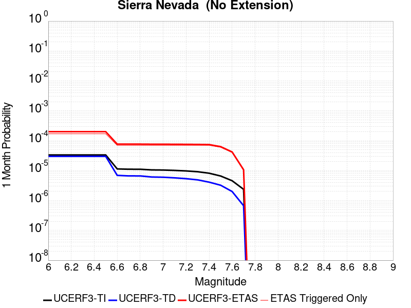 |  |  |

| Magnitude | 1 wk TI Prob | 1 wk TD Prob | 1 wk ETAS Prob | 1 wk ETAS/TD Gain | 1 wk ETAS Triggered Only | 1 mo TI Prob | 1 mo TD Prob | 1 mo ETAS Prob | 1 mo ETAS/TD Gain | 1 mo ETAS Triggered Only | 1 yr TI Prob | 1 yr TD Prob | 1 yr ETAS Prob | 1 yr ETAS/TD Gain | 1 yr ETAS Triggered Only | 10 yr TI Prob | 10 yr TD Prob | 10 yr ETAS Prob | 10 yr ETAS/TD Gain | 10 yr ETAS Triggered Only |
|-----|-----|-----|-----|-----|-----|-----|-----|-----|-----|-----|-----|-----|-----|-----|-----|-----|-----|-----|-----|-----|
| 6.0 | 7.7690465E-6 | 6.976322E-6 | 6.976322E-6 | 1.0 | 0.0 | 3.329549E-5 | 2.9898381E-5 | 2.9898381E-5 | 1.0 | 0.0 | 4.0529718E-4 | 3.6398784E-4 | 4.3230632E-4 | 1.1876944 | 6.834335E-5 | 0.004045588 | 0.0036374326 | 0.0037736222 | 1.0374411 | 1.366867E-4 |
| 6.1 | 7.7690465E-6 | 6.976322E-6 | 6.976322E-6 | 1.0 | 0.0 | 3.329549E-5 | 2.9898381E-5 | 2.9898381E-5 | 1.0 | 0.0 | 4.0529718E-4 | 3.6398784E-4 | 4.3230632E-4 | 1.1876944 | 6.834335E-5 | 0.004045588 | 0.0036374326 | 0.0037736222 | 1.0374411 | 1.366867E-4 |
| 6.2 | 7.7690465E-6 | 6.976322E-6 | 6.976322E-6 | 1.0 | 0.0 | 3.329549E-5 | 2.9898381E-5 | 2.9898381E-5 | 1.0 | 0.0 | 4.0529718E-4 | 3.6398784E-4 | 4.3230632E-4 | 1.1876944 | 6.834335E-5 | 0.004045588 | 0.0036374326 | 0.0037736222 | 1.0374411 | 1.366867E-4 |
| 6.3 | 7.7690465E-6 | 6.976322E-6 | 6.976322E-6 | 1.0 | 0.0 | 3.329549E-5 | 2.9898381E-5 | 2.9898381E-5 | 1.0 | 0.0 | 4.0529718E-4 | 3.6398784E-4 | 4.3230632E-4 | 1.1876944 | 6.834335E-5 | 0.004045588 | 0.0036374326 | 0.0037736222 | 1.0374411 | 1.366867E-4 |
| 6.4 | 7.7690465E-6 | 6.976322E-6 | 6.976322E-6 | 1.0 | 0.0 | 3.329549E-5 | 2.9898381E-5 | 2.9898381E-5 | 1.0 | 0.0 | 4.0529718E-4 | 3.6398784E-4 | 4.3230632E-4 | 1.1876944 | 6.834335E-5 | 0.004045588 | 0.0036374326 | 0.0037736222 | 1.0374411 | 1.366867E-4 |
| 6.5 | 7.7690465E-6 | 6.976322E-6 | 6.976322E-6 | 1.0 | 0.0 | 3.329549E-5 | 2.9898381E-5 | 2.9898381E-5 | 1.0 | 0.0 | 4.0529718E-4 | 3.6398784E-4 | 4.3230632E-4 | 1.1876944 | 6.834335E-5 | 0.004045588 | 0.0036374326 | 0.0037736222 | 1.0374411 | 1.366867E-4 |
| 6.6 | 2.653E-6 | 1.614854E-6 | 1.614854E-6 | 1.0 | 0.0 | 1.136995E-5 | 6.9207845E-6 | 6.9207845E-6 | 1.0 | 0.0 | 1.3842035E-4 | 8.425733E-5 | 8.425733E-5 | 1.0 | 0.0 | 0.0013833415 | 8.422573E-4 | 9.105431E-4 | 1.0810747 | 6.834335E-5 |
| 6.7 | 2.5902466E-6 | 1.5501876E-6 | 1.5501876E-6 | 1.0 | 0.0 | 1.11010095E-5 | 6.643644E-6 | 6.643644E-6 | 1.0 | 0.0 | 1.351464E-4 | 8.0883394E-5 | 8.0883394E-5 | 1.0 | 0.0 | 0.0013506424 | 8.0854254E-4 | 8.7683066E-4 | 1.0844582 | 6.834335E-5 |
| 6.8 | 2.5853892E-6 | 1.5469877E-6 | 1.5469877E-6 | 1.0 | 0.0 | 1.1080193E-5 | 6.629931E-6 | 6.629931E-6 | 1.0 | 0.0 | 1.34893E-4 | 8.071645E-5 | 8.071645E-5 | 1.0 | 0.0 | 0.0013481114 | 8.068743E-4 | 8.751625E-4 | 1.084633 | 6.834335E-5 |
| 6.9 | 2.458257E-6 | 1.4220619E-6 | 1.4220619E-6 | 1.0 | 0.0 | 1.0535345E-5 | 6.094537E-6 | 6.094537E-6 | 1.0 | 0.0 | 1.2826028E-4 | 7.4198484E-5 | 7.4198484E-5 | 1.0 | 0.0 | 0.0012818627 | 7.4173906E-4 | 8.100317E-4 | 1.092071 | 6.834335E-5 |
| 7.0 | 2.4341468E-6 | 1.3990258E-6 | 1.3990258E-6 | 1.0 | 0.0 | 1.0432016E-5 | 5.9958115E-6 | 5.9958115E-6 | 1.0 | 0.0 | 1.270024E-4 | 7.2996576E-5 | 7.2996576E-5 | 1.0 | 0.0 | 0.0012692984 | 7.297279E-4 | 7.980214E-4 | 1.0935876 | 6.834335E-5 |
| 7.1 | 2.3652476E-6 | 1.3339754E-6 | 1.3339754E-6 | 1.0 | 0.0 | 1.0136736E-5 | 5.717025E-6 | 5.717025E-6 | 1.0 | 0.0 | 1.2340778E-4 | 6.9602575E-5 | 6.9602575E-5 | 1.0 | 0.0 | 0.0012333926 | 6.9580943E-4 | 7.6410524E-4 | 1.098153 | 6.834335E-5 |
| 7.2 | 2.272158E-6 | 1.2502821E-6 | 1.2502821E-6 | 1.0 | 0.0 | 9.737784E-6 | 5.3583412E-6 | 5.3583412E-6 | 1.0 | 0.0 | 1.1855107E-4 | 6.5235865E-5 | 6.5235865E-5 | 1.0 | 0.0 | 0.0011848784 | 6.5216864E-4 | 7.204674E-4 | 1.1047256 | 6.834335E-5 |
| 7.3 | 2.1382127E-6 | 1.1419703E-6 | 1.1419703E-6 | 1.0 | 0.0 | 9.163737E-6 | 4.8941492E-6 | 4.8941492E-6 | 1.0 | 0.0 | 1.1156279E-4 | 5.958465E-5 | 5.958465E-5 | 1.0 | 0.0 | 0.001115068 | 5.956879E-4 | 6.6399056E-4 | 1.1146618 | 6.834335E-5 |
| 7.4 | 1.9048055E-6 | 9.575242E-7 | 9.575242E-7 | 1.0 | 0.0 | 8.163426E-6 | 4.1036687E-6 | 4.1036687E-6 | 1.0 | 0.0 | 9.9385186E-5 | 4.996103E-5 | 4.996103E-5 | 1.0 | 0.0 | 9.934074E-4 | 4.994987E-4 | 5.678079E-4 | 1.1367556 | 6.834335E-5 |
| 7.5 | 1.5373403E-6 | 7.560042E-7 | 7.560042E-7 | 1.0 | 0.0 | 6.5885843E-6 | 3.2400142E-6 | 3.2400142E-6 | 1.0 | 0.0 | 8.021306E-5 | 3.9446462E-5 | 3.9446462E-5 | 1.0 | 0.0 | 8.0184115E-4 | 3.943951E-4 | 4.627115E-4 | 1.1732181 | 6.834335E-5 |
| 7.6 | 1.0680322E-6 | 4.6596554E-7 | 4.6596554E-7 | 1.0 | 0.0 | 4.577273E-6 | 1.9969937E-6 | 1.9969937E-6 | 1.0 | 0.0 | 5.5726876E-5 | 2.4313129E-5 | 2.4313129E-5 | 1.0 | 0.0 | 5.5712904E-4 | 2.4310495E-4 | 2.4310495E-4 | 1.0 | 0.0 |
| 7.7 | 5.509146E-7 | 1.5580486E-7 | 1.5580486E-7 | 1.0 | 0.0 | 2.3610605E-6 | 6.677349E-7 | 6.677349E-7 | 1.0 | 0.0 | 2.8745531E-5 | 8.129644E-6 | 8.129644E-6 | 1.0 | 0.0 | 2.8741814E-4 | 8.1293576E-5 | 8.1293576E-5 | 1.0 | 0.0 |

## Kern Canyon (North Kern) 2011
*[(top)](#table-of-contents)*

| 1 Week | 1 Month | 1 Year | 10 Year |
|-----|-----|-----|-----|
|  |  |  |  |

| Magnitude | 1 wk TI Prob | 1 wk TD Prob | 1 wk ETAS Prob | 1 wk ETAS/TD Gain | 1 wk ETAS Triggered Only | 1 mo TI Prob | 1 mo TD Prob | 1 mo ETAS Prob | 1 mo ETAS/TD Gain | 1 mo ETAS Triggered Only | 1 yr TI Prob | 1 yr TD Prob | 1 yr ETAS Prob | 1 yr ETAS/TD Gain | 1 yr ETAS Triggered Only | 10 yr TI Prob | 10 yr TD Prob | 10 yr ETAS Prob | 10 yr ETAS/TD Gain | 10 yr ETAS Triggered Only |
|-----|-----|-----|-----|-----|-----|-----|-----|-----|-----|-----|-----|-----|-----|-----|-----|-----|-----|-----|-----|-----|
| 6.0 | 6.6264497E-6 | 6.75733E-6 | 7.510022E-5 | 11.113891 | 6.834335E-5 | 2.8398761E-5 | 2.895971E-5 | 9.730109E-5 | 3.3598778 | 6.834335E-5 | 3.4570007E-4 | 3.5253543E-4 | 4.208547E-4 | 1.193794 | 6.834335E-5 | 0.0034516277 | 0.0035205502 | 0.0036567557 | 1.0386887 | 1.366867E-4 |
| 6.1 | 6.6264497E-6 | 6.75733E-6 | 7.510022E-5 | 11.113891 | 6.834335E-5 | 2.8398761E-5 | 2.895971E-5 | 9.730109E-5 | 3.3598778 | 6.834335E-5 | 3.4570007E-4 | 3.5253543E-4 | 4.208547E-4 | 1.193794 | 6.834335E-5 | 0.0034516277 | 0.0035205502 | 0.0036567557 | 1.0386887 | 1.366867E-4 |
| 6.2 | 6.6264497E-6 | 6.75733E-6 | 7.510022E-5 | 11.113891 | 6.834335E-5 | 2.8398761E-5 | 2.895971E-5 | 9.730109E-5 | 3.3598778 | 6.834335E-5 | 3.4570007E-4 | 3.5253543E-4 | 4.208547E-4 | 1.193794 | 6.834335E-5 | 0.0034516277 | 0.0035205502 | 0.0036567557 | 1.0386887 | 1.366867E-4 |
| 6.3 | 6.6264497E-6 | 6.75733E-6 | 7.510022E-5 | 11.113891 | 6.834335E-5 | 2.8398761E-5 | 2.895971E-5 | 9.730109E-5 | 3.3598778 | 6.834335E-5 | 3.4570007E-4 | 3.5253543E-4 | 4.208547E-4 | 1.193794 | 6.834335E-5 | 0.0034516277 | 0.0035205502 | 0.0036567557 | 1.0386887 | 1.366867E-4 |
| 6.4 | 6.6264497E-6 | 6.75733E-6 | 7.510022E-5 | 11.113891 | 6.834335E-5 | 2.8398761E-5 | 2.895971E-5 | 9.730109E-5 | 3.3598778 | 6.834335E-5 | 3.4570007E-4 | 3.5253543E-4 | 4.208547E-4 | 1.193794 | 6.834335E-5 | 0.0034516277 | 0.0035205502 | 0.0036567557 | 1.0386887 | 1.366867E-4 |
| 6.5 | 3.2162225E-6 | 3.2570915E-6 | 3.2570915E-6 | 1.0 | 0.0 | 1.3783738E-5 | 1.3958893E-5 | 1.3958893E-5 | 1.0 | 0.0 | 1.6780409E-4 | 1.6993708E-4 | 1.6993708E-4 | 1.0 | 0.0 | 0.0016767744 | 0.001698151 | 0.001698151 | 1.0 | 0.0 |
| 6.6 | 3.2162225E-6 | 3.2570915E-6 | 3.2570915E-6 | 1.0 | 0.0 | 1.3783738E-5 | 1.3958893E-5 | 1.3958893E-5 | 1.0 | 0.0 | 1.6780409E-4 | 1.6993708E-4 | 1.6993708E-4 | 1.0 | 0.0 | 0.0016767744 | 0.001698151 | 0.001698151 | 1.0 | 0.0 |
| 6.7 | 2.1908265E-6 | 2.2071222E-6 | 2.2071222E-6 | 1.0 | 0.0 | 9.389223E-6 | 9.459061E-6 | 9.459061E-6 | 1.0 | 0.0 | 1.1430779E-4 | 1.1515819E-4 | 1.1515819E-4 | 1.0 | 0.0 | 0.0011424901 | 0.0011510046 | 0.0011510046 | 1.0 | 0.0 |
| 6.8 | 1.7303895E-6 | 1.7365529E-6 | 1.7365529E-6 | 1.0 | 0.0 | 7.415934E-6 | 7.4423488E-6 | 7.4423488E-6 | 1.0 | 0.0 | 9.028525E-5 | 9.0606925E-5 | 9.0606925E-5 | 1.0 | 0.0 | 9.024858E-4 | 9.057096E-4 | 9.057096E-4 | 1.0 | 0.0 |
| 6.9 | 1.3700314E-6 | 1.3688622E-6 | 1.3688622E-6 | 1.0 | 0.0 | 5.87155E-6 | 5.8665396E-6 | 5.8665396E-6 | 1.0 | 0.0 | 7.148377E-5 | 7.142282E-5 | 7.142282E-5 | 1.0 | 0.0 | 7.146078E-4 | 7.140032E-4 | 7.140032E-4 | 1.0 | 0.0 |
| 7.0 | 1.1467797E-6 | 1.1413804E-6 | 1.1413804E-6 | 1.0 | 0.0 | 4.9147607E-6 | 4.8916213E-6 | 4.8916213E-6 | 1.0 | 0.0 | 5.983557E-5 | 5.9553895E-5 | 5.9553895E-5 | 1.0 | 0.0 | 5.981946E-4 | 5.953825E-4 | 5.953825E-4 | 1.0 | 0.0 |
| 7.1 | 9.3952065E-7 | 9.3026904E-7 | 9.3026904E-7 | 1.0 | 0.0 | 4.026511E-6 | 3.9868614E-6 | 3.9868614E-6 | 1.0 | 0.0 | 4.9021666E-5 | 4.8538972E-5 | 4.8538972E-5 | 1.0 | 0.0 | 4.901085E-4 | 4.8528548E-4 | 4.8528548E-4 | 1.0 | 0.0 |
| 7.2 | 6.858055E-7 | 6.7193E-7 | 6.7193E-7 | 1.0 | 0.0 | 2.939163E-6 | 2.879697E-6 | 2.879697E-6 | 1.0 | 0.0 | 3.5783723E-5 | 3.5059755E-5 | 3.5059755E-5 | 1.0 | 0.0 | 3.5777962E-4 | 3.5054312E-4 | 3.5054312E-4 | 1.0 | 0.0 |
| 7.3 | 5.1101983E-7 | 4.9393E-7 | 4.9393E-7 | 1.0 | 0.0 | 2.1900833E-6 | 2.116841E-6 | 2.116841E-6 | 1.0 | 0.0 | 2.6663936E-5 | 2.5772239E-5 | 2.5772239E-5 | 1.0 | 0.0 | 2.6660739E-4 | 2.57693E-4 | 2.57693E-4 | 1.0 | 0.0 |
| 7.4 | 3.4999414E-7 | 3.2995905E-7 | 3.2995905E-7 | 1.0 | 0.0 | 1.499974E-6 | 1.4141094E-6 | 1.4141094E-6 | 1.0 | 0.0 | 1.8262032E-5 | 1.721665E-5 | 1.721665E-5 | 1.0 | 0.0 | 1.826053E-4 | 1.7215339E-4 | 1.7215339E-4 | 1.0 | 0.0 |
| 7.5 | 1.7021522E-7 | 1.4750044E-7 | 1.4750044E-7 | 1.0 | 0.0 | 7.2949354E-7 | 6.321446E-7 | 6.321446E-7 | 1.0 | 0.0 | 8.881548E-6 | 7.696334E-6 | 7.696334E-6 | 1.0 | 0.0 | 8.8811925E-5 | 7.696076E-5 | 7.696076E-5 | 1.0 | 0.0 |
| 7.6 | 2.572245E-8 | 1.7352555E-8 | 1.7352555E-8 | 1.0 | 0.0 | 1.10239064E-7 | 7.436809E-8 | 7.436809E-8 | 1.0 | 0.0 | 1.3421597E-6 | 9.054312E-7 | 9.054312E-7 | 1.0 | 0.0 | 1.3421517E-5 | 9.05428E-6 | 9.05428E-6 | 1.0 | 0.0 |

## San Jacinto (Coyote Creek)
*[(top)](#table-of-contents)*

| 1 Week | 1 Month | 1 Year | 10 Year |
|-----|-----|-----|-----|
|  |  |  |  |

| Magnitude | 1 wk TI Prob | 1 wk TD Prob | 1 wk ETAS Prob | 1 wk ETAS/TD Gain | 1 wk ETAS Triggered Only | 1 mo TI Prob | 1 mo TD Prob | 1 mo ETAS Prob | 1 mo ETAS/TD Gain | 1 mo ETAS Triggered Only | 1 yr TI Prob | 1 yr TD Prob | 1 yr ETAS Prob | 1 yr ETAS/TD Gain | 1 yr ETAS Triggered Only | 10 yr TI Prob | 10 yr TD Prob | 10 yr ETAS Prob | 10 yr ETAS/TD Gain | 10 yr ETAS Triggered Only |
|-----|-----|-----|-----|-----|-----|-----|-----|-----|-----|-----|-----|-----|-----|-----|-----|-----|-----|-----|-----|-----|
| 6.0 | 2.7374346E-5 | 2.4145214E-5 | 1.6082863E-4 | 6.6608906 | 1.366867E-4 | 1.1731335E-4 | 1.034754E-4 | 2.4014797E-4 | 2.3208218 | 1.366867E-4 | 0.0014273542 | 0.0012590875 | 0.0013956021 | 1.1084235 | 1.366867E-4 | 0.01418221 | 0.012928318 | 0.013063238 | 1.0104359 | 1.366867E-4 |
| 6.1 | 2.7374346E-5 | 2.4145214E-5 | 1.6082863E-4 | 6.6608906 | 1.366867E-4 | 1.1731335E-4 | 1.034754E-4 | 2.4014797E-4 | 2.3208218 | 1.366867E-4 | 0.0014273542 | 0.0012590875 | 0.0013956021 | 1.1084235 | 1.366867E-4 | 0.01418221 | 0.012928318 | 0.013063238 | 1.0104359 | 1.366867E-4 |
| 6.2 | 2.7374346E-5 | 2.4145214E-5 | 1.6082863E-4 | 6.6608906 | 1.366867E-4 | 1.1731335E-4 | 1.034754E-4 | 2.4014797E-4 | 2.3208218 | 1.366867E-4 | 0.0014273542 | 0.0012590875 | 0.0013956021 | 1.1084235 | 1.366867E-4 | 0.01418221 | 0.012928318 | 0.013063238 | 1.0104359 | 1.366867E-4 |
| 6.3 | 2.7374346E-5 | 2.4145214E-5 | 1.6082863E-4 | 6.6608906 | 1.366867E-4 | 1.1731335E-4 | 1.034754E-4 | 2.4014797E-4 | 2.3208218 | 1.366867E-4 | 0.0014273542 | 0.0012590875 | 0.0013956021 | 1.1084235 | 1.366867E-4 | 0.01418221 | 0.012928318 | 0.013063238 | 1.0104359 | 1.366867E-4 |
| 6.4 | 2.7374346E-5 | 2.4145214E-5 | 1.6082863E-4 | 6.6608906 | 1.366867E-4 | 1.1731335E-4 | 1.034754E-4 | 2.4014797E-4 | 2.3208218 | 1.366867E-4 | 0.0014273542 | 0.0012590875 | 0.0013956021 | 1.1084235 | 1.366867E-4 | 0.01418221 | 0.012928318 | 0.013063238 | 1.0104359 | 1.366867E-4 |
| 6.5 | 2.7282445E-5 | 2.4031293E-5 | 1.6071473E-4 | 6.687727 | 1.366867E-4 | 1.16919524E-4 | 1.029872E-4 | 2.3965984E-4 | 2.3270836 | 1.366867E-4 | 0.0014225657 | 0.0012531505 | 0.001389666 | 1.1089377 | 1.366867E-4 | 0.014134934 | 0.012869646 | 0.013004573 | 1.0104842 | 1.366867E-4 |
| 6.6 | 2.7282445E-5 | 2.4031293E-5 | 1.6071473E-4 | 6.687727 | 1.366867E-4 | 1.16919524E-4 | 1.029872E-4 | 2.3965984E-4 | 2.3270836 | 1.366867E-4 | 0.0014225657 | 0.0012531505 | 0.001389666 | 1.1089377 | 1.366867E-4 | 0.014134934 | 0.012869646 | 0.013004573 | 1.0104842 | 1.366867E-4 |
| 6.7 | 2.7216198E-5 | 2.3956412E-5 | 1.6063986E-4 | 6.7055054 | 1.366867E-4 | 1.1663563E-4 | 1.02666316E-4 | 2.39339E-4 | 2.331232 | 1.366867E-4 | 0.0014191137 | 0.0012492483 | 0.0013857642 | 1.1092784 | 1.366867E-4 | 0.014100855 | 0.0128310565 | 0.012965989 | 1.0105162 | 1.366867E-4 |
| 6.8 | 2.7078617E-5 | 2.387363E-5 | 1.6055709E-4 | 6.72529 | 1.366867E-4 | 1.1604605E-4 | 1.0231156E-4 | 2.3898428E-4 | 2.3358483 | 1.366867E-4 | 0.001411945 | 0.0012449342 | 0.0013814507 | 1.1096576 | 1.366867E-4 | 0.014030075 | 0.012788199 | 0.012923137 | 1.0105518 | 1.366867E-4 |
| 6.9 | 2.6982952E-5 | 2.3793142E-5 | 1.604766E-4 | 6.744658 | 1.366867E-4 | 1.15636096E-4 | 1.0196664E-4 | 2.3863942E-4 | 2.3403676 | 1.366867E-4 | 0.0014069602 | 0.0012407395 | 0.0013772566 | 1.1100289 | 1.366867E-4 | 0.013980856 | 0.012746515 | 0.012881459 | 1.0105867 | 1.366867E-4 |
| 7.0 | 2.6449972E-5 | 2.3370165E-5 | 1.6005368E-4 | 6.8486333 | 1.366867E-4 | 1.1335209E-4 | 1.00154015E-4 | 2.3682704E-4 | 2.3646286 | 1.366867E-4 | 0.001379188 | 0.0012186957 | 0.0013552158 | 1.1120216 | 1.366867E-4 | 0.0137065975 | 0.0125278765 | 0.012662851 | 1.0107739 | 1.366867E-4 |
| 7.1 | 2.6257849E-5 | 2.3196202E-5 | 1.5987974E-4 | 6.892497 | 1.366867E-4 | 1.1252879E-4 | 9.940852E-5 | 2.3608164E-4 | 2.3748634 | 1.366867E-4 | 0.0013691769 | 0.0012096294 | 0.0013461506 | 1.1128621 | 1.366867E-4 | 0.013607717 | 0.012437741 | 0.012572728 | 1.0108529 | 1.366867E-4 |
| 7.2 | 2.5270041E-5 | 2.2390966E-5 | 1.5907463E-4 | 7.1044106 | 1.366867E-4 | 1.0829568E-4 | 9.595777E-5 | 2.3263137E-4 | 2.42431 | 1.366867E-4 | 0.0013177024 | 0.0011676621 | 0.0013041892 | 1.1169235 | 1.366867E-4 | 0.013099162 | 0.012018777 | 0.012153821 | 1.0112361 | 1.366867E-4 |
| 7.3 | 2.339701E-5 | 2.1122814E-5 | 1.5780664E-4 | 7.4709096 | 1.366867E-4 | 1.0026905E-4 | 9.0523215E-5 | 2.2719755E-4 | 2.5098264 | 1.366867E-4 | 0.001220092 | 0.0011015651 | 0.0012381012 | 1.1239474 | 1.366867E-4 | 0.012134149 | 0.011357696 | 0.01149283 | 1.011898 | 1.366867E-4 |
| 7.4 | 2.296333E-5 | 2.0853171E-5 | 1.5753704E-4 | 7.5545845 | 1.366867E-4 | 9.841056E-5 | 8.936768E-5 | 2.2604218E-4 | 2.5293505 | 1.366867E-4 | 0.0011974899 | 0.0010875105 | 0.0012240486 | 1.125551 | 1.366867E-4 | 0.011910575 | 0.01121681 | 0.0113519635 | 1.0120492 | 1.366867E-4 |
| 7.5 | 2.2188895E-5 | 2.0376096E-5 | 1.5706003E-4 | 7.708053 | 1.366867E-4 | 9.50918E-5 | 8.732321E-5 | 2.23998E-4 | 2.5651598 | 1.366867E-4 | 0.0011571277 | 0.0010626436 | 0.001199185 | 1.1284922 | 1.366867E-4 | 0.011511209 | 0.010966429 | 0.011101617 | 1.0123274 | 1.366867E-4 |
| 7.6 | 2.0013189E-5 | 1.8962366E-5 | 1.5564648E-4 | 8.2081785 | 1.366867E-4 | 8.5767984E-5 | 8.1264756E-5 | 2.1794037E-4 | 2.6818557 | 1.366867E-4 | 0.001043725 | 9.889511E-4 | 0.0011255026 | 1.1380771 | 1.366867E-4 | 0.010388365 | 0.010224434 | 0.010359723 | 1.013232 | 1.366867E-4 |
| 7.7 | 1.7230794E-5 | 1.674371E-5 | 1.5342813E-4 | 9.16333 | 1.366867E-4 | 7.384417E-5 | 7.175679E-5 | 2.0843369E-4 | 2.9047244 | 1.366867E-4 | 8.986819E-4 | 8.7328954E-4 | 0.0010098569 | 1.1563827 | 1.366867E-4 | 0.008950562 | 0.009062956 | 0.009198404 | 1.0149453 | 1.366867E-4 |
| 7.8 | 1.4478809E-5 | 1.4990978E-5 | 1.5167565E-4 | 10.117795 | 1.366867E-4 | 6.205057E-5 | 6.424547E-5 | 2.009234E-4 | 3.127433 | 1.366867E-4 | 7.552038E-4 | 7.819085E-4 | 9.1848837E-4 | 1.174675 | 1.366867E-4 | 0.0075264242 | 0.008141387 | 0.008276961 | 1.0166525 | 1.366867E-4 |
| 7.9 | 1.1114467E-5 | 1.1645102E-5 | 1.4833022E-4 | 12.737563 | 1.366867E-4 | 4.7632562E-5 | 4.990663E-5 | 1.8658652E-4 | 3.738712 | 1.366867E-4 | 5.797721E-4 | 6.074444E-4 | 7.4404804E-4 | 1.2248826 | 1.366867E-4 | 0.0057826187 | 0.0063803247 | 0.0065161395 | 1.0212865 | 1.366867E-4 |
| 8.0 | 9.327402E-6 | 9.899186E-6 | 1.4658454E-4 | 14.807737 | 1.366867E-4 | 3.9973966E-5 | 4.2424395E-5 | 1.7910531E-4 | 4.2217526 | 1.366867E-4 | 4.8657437E-4 | 5.1639514E-4 | 6.530113E-4 | 1.2645574 | 1.366867E-4 | 0.0048551033 | 0.0054499684 | 0.0055859103 | 1.0249436 | 1.366867E-4 |
| 8.1 | 7.0235833E-6 | 6.827495E-6 | 7.5170385E-5 | 11.009951 | 6.834335E-5 | 3.0100724E-5 | 2.9260367E-5 | 9.7601725E-5 | 3.3356287 | 6.834335E-5 | 3.664147E-4 | 3.5618723E-4 | 4.2450626E-4 | 1.1918064 | 6.834335E-5 | 0.003658111 | 0.0037876023 | 0.0038556869 | 1.0179756 | 6.834335E-5 |
| 8.2 | 2.0358202E-6 | 8.994527E-7 | 8.994527E-7 | 1.0 | 0.0 | 8.724915E-6 | 3.854792E-6 | 3.854792E-6 | 1.0 | 0.0 | 1.06220665E-4 | 4.69311E-5 | 4.69311E-5 | 1.0 | 0.0 | 0.001061699 | 5.3254166E-4 | 5.3254166E-4 | 1.0 | 0.0 |
| 8.3 | 2.0051264E-7 | 6.617272E-8 | 6.617272E-8 | 1.0 | 0.0 | 8.5933965E-7 | 2.8359733E-7 | 2.8359733E-7 | 1.0 | 0.0 | 1.046241E-5 | 3.4527925E-6 | 3.4527925E-6 | 1.0 | 0.0 | 1.0461917E-4 | 4.01389E-5 | 4.01389E-5 | 1.0 | 0.0 |

## Palos Verdes
*[(top)](#table-of-contents)*

| 1 Week | 1 Month | 1 Year | 10 Year |
|-----|-----|-----|-----|
| 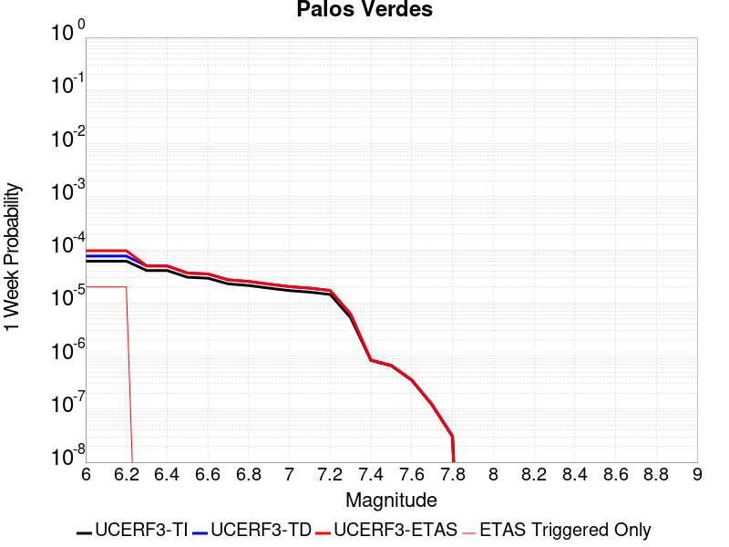 | 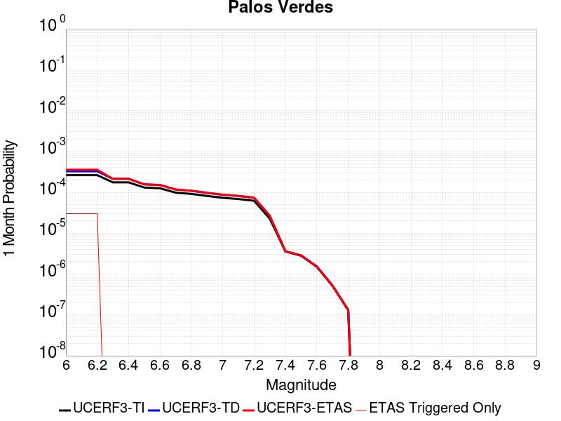 |  |  |

| Magnitude | 1 wk TI Prob | 1 wk TD Prob | 1 wk ETAS Prob | 1 wk ETAS/TD Gain | 1 wk ETAS Triggered Only | 1 mo TI Prob | 1 mo TD Prob | 1 mo ETAS Prob | 1 mo ETAS/TD Gain | 1 mo ETAS Triggered Only | 1 yr TI Prob | 1 yr TD Prob | 1 yr ETAS Prob | 1 yr ETAS/TD Gain | 1 yr ETAS Triggered Only | 10 yr TI Prob | 10 yr TD Prob | 10 yr ETAS Prob | 10 yr ETAS/TD Gain | 10 yr ETAS Triggered Only |
|-----|-----|-----|-----|-----|-----|-----|-----|-----|-----|-----|-----|-----|-----|-----|-----|-----|-----|-----|-----|-----|
| 6.0 | 6.126063E-5 | 7.622612E-5 | 1.4456427E-4 | 1.8965188 | 6.834335E-5 | 2.6251914E-4 | 3.2664582E-4 | 3.9496686E-4 | 1.2091594 | 6.834335E-5 | 0.0031914865 | 0.003970174 | 0.0040382463 | 1.0171459 | 6.834335E-5 | 0.031460393 | 0.039048895 | 0.039180245 | 1.0033637 | 1.366867E-4 |
| 6.1 | 6.126063E-5 | 7.622612E-5 | 1.4456427E-4 | 1.8965188 | 6.834335E-5 | 2.6251914E-4 | 3.2664582E-4 | 3.9496686E-4 | 1.2091594 | 6.834335E-5 | 0.0031914865 | 0.003970174 | 0.0040382463 | 1.0171459 | 6.834335E-5 | 0.031460393 | 0.039048895 | 0.039180245 | 1.0033637 | 1.366867E-4 |
| 6.2 | 6.126063E-5 | 7.622612E-5 | 1.4456427E-4 | 1.8965188 | 6.834335E-5 | 2.6251914E-4 | 3.2664582E-4 | 3.9496686E-4 | 1.2091594 | 6.834335E-5 | 0.0031914865 | 0.003970174 | 0.0040382463 | 1.0171459 | 6.834335E-5 | 0.031460393 | 0.039048895 | 0.039180245 | 1.0033637 | 1.366867E-4 |
| 6.3 | 4.0838047E-5 | 4.9749437E-5 | 4.9749437E-5 | 1.0 | 0.0 | 1.7500846E-4 | 2.1319572E-4 | 2.1319572E-4 | 1.0 | 0.0 | 0.0021286458 | 0.0025927818 | 0.0025927818 | 1.0 | 0.0 | 0.021083709 | 0.025646681 | 0.02571327 | 1.0025965 | 6.834335E-5 |
| 6.4 | 4.0838047E-5 | 4.9749437E-5 | 4.9749437E-5 | 1.0 | 0.0 | 1.7500846E-4 | 2.1319572E-4 | 2.1319572E-4 | 1.0 | 0.0 | 0.0021286458 | 0.0025927818 | 0.0025927818 | 1.0 | 0.0 | 0.021083709 | 0.025646681 | 0.02571327 | 1.0025965 | 6.834335E-5 |
| 6.5 | 3.0512005E-5 | 3.656162E-5 | 3.656162E-5 | 1.0 | 0.0 | 1.3075917E-4 | 1.5668393E-4 | 1.5668393E-4 | 1.0 | 0.0 | 0.0015908304 | 0.0019060767 | 0.0019060767 | 1.0 | 0.0 | 0.015794903 | 0.018909154 | 0.018976204 | 1.003546 | 6.834335E-5 |
| 6.6 | 2.9255087E-5 | 3.515442E-5 | 3.515442E-5 | 1.0 | 0.0 | 1.2537291E-4 | 1.5065377E-4 | 1.5065377E-4 | 1.0 | 0.0 | 0.0015253464 | 0.0018327828 | 0.0018327828 | 1.0 | 0.0 | 0.015149189 | 0.018188225 | 0.018255325 | 1.0036892 | 6.834335E-5 |
| 6.7 | 2.287198E-5 | 2.7248278E-5 | 2.7248278E-5 | 1.0 | 0.0 | 9.801909E-5 | 1.16773626E-4 | 1.16773626E-4 | 1.0 | 0.0 | 0.001192729 | 0.0014208833 | 0.0014208833 | 1.0 | 0.0 | 0.011863477 | 0.014127217 | 0.014194595 | 1.0047693 | 6.834335E-5 |
| 6.8 | 2.1325764E-5 | 2.5431877E-5 | 2.5431877E-5 | 1.0 | 0.0 | 9.139293E-5 | 1.0898971E-4 | 1.0898971E-4 | 1.0 | 0.0 | 0.001112141 | 0.0013262323 | 0.0013262323 | 1.0 | 0.0 | 0.011065915 | 0.013192211 | 0.013259653 | 1.0051123 | 6.834335E-5 |
| 6.9 | 1.9009392E-5 | 2.2613547E-5 | 2.2613547E-5 | 1.0 | 0.0 | 8.1466285E-5 | 9.6912096E-5 | 9.6912096E-5 | 1.0 | 0.0 | 9.914007E-4 | 0.0011793535 | 0.0011793535 | 1.0 | 0.0 | 0.009869894 | 0.011739632 | 0.0118071735 | 1.0057533 | 6.834335E-5 |
| 7.0 | 1.7098473E-5 | 2.0319356E-5 | 2.0319356E-5 | 1.0 | 0.0 | 7.3277115E-5 | 8.708052E-5 | 8.708052E-5 | 1.0 | 0.0 | 8.917837E-4 | 0.001059775 | 0.001059775 | 1.0 | 0.0 | 0.008882134 | 0.010555646 | 0.010623269 | 1.0064062 | 6.834335E-5 |
| 7.1 | 1.5982785E-5 | 1.899476E-5 | 1.899476E-5 | 1.0 | 0.0 | 6.849585E-5 | 8.1404054E-5 | 8.1404054E-5 | 1.0 | 0.0 | 8.336179E-4 | 9.907284E-4 | 9.907284E-4 | 1.0 | 0.0 | 0.008304977 | 0.009871479 | 0.009939148 | 1.006855 | 6.834335E-5 |
| 7.2 | 1.4468002E-5 | 1.7197237E-5 | 1.7197237E-5 | 1.0 | 0.0 | 6.200425E-5 | 7.370083E-5 | 7.370083E-5 | 1.0 | 0.0 | 7.546402E-4 | 8.970222E-4 | 8.970222E-4 | 1.0 | 0.0 | 0.007520827 | 0.008942284 | 0.009010016 | 1.0075743 | 6.834335E-5 |
| 7.3 | 5.288233E-6 | 6.2036747E-6 | 6.2036747E-6 | 1.0 | 0.0 | 2.2663658E-5 | 2.6587102E-5 | 2.6587102E-5 | 1.0 | 0.0 | 2.7589512E-4 | 3.236848E-4 | 3.236848E-4 | 1.0 | 0.0 | 0.0027555283 | 0.0032355562 | 0.0033036785 | 1.0210543 | 6.834335E-5 |
| 7.4 | 8.279556E-7 | 8.408347E-7 | 8.408347E-7 | 1.0 | 0.0 | 3.5483763E-6 | 3.6035726E-6 | 3.6035726E-6 | 1.0 | 0.0 | 4.3200624E-5 | 4.3872686E-5 | 4.3872686E-5 | 1.0 | 0.0 | 4.3192226E-4 | 4.3864746E-4 | 4.3864746E-4 | 1.0 | 0.0 |
| 7.5 | 6.559831E-7 | 6.667229E-7 | 6.667229E-7 | 1.0 | 0.0 | 2.8113532E-6 | 2.857381E-6 | 2.857381E-6 | 1.0 | 0.0 | 3.4227687E-5 | 3.4788125E-5 | 3.4788125E-5 | 1.0 | 0.0 | 3.4222414E-4 | 3.4783344E-4 | 3.4783344E-4 | 1.0 | 0.0 |
| 7.6 | 3.5018968E-7 | 3.5620027E-7 | 3.5620027E-7 | 1.0 | 0.0 | 1.500812E-6 | 1.526572E-6 | 1.526572E-6 | 1.0 | 0.0 | 1.8272232E-5 | 1.8585903E-5 | 1.8585903E-5 | 1.0 | 0.0 | 1.8270731E-4 | 1.8584808E-4 | 1.8584808E-4 | 1.0 | 0.0 |
| 7.7 | 1.1986104E-7 | 1.2198376E-7 | 1.2198376E-7 | 1.0 | 0.0 | 5.1369005E-7 | 5.2278745E-7 | 5.2278745E-7 | 1.0 | 0.0 | 6.2541585E-6 | 6.364919E-6 | 6.364919E-6 | 1.0 | 0.0 | 6.2539824E-5 | 6.364741E-5 | 6.364741E-5 | 1.0 | 0.0 |
| 7.8 | 3.0445005E-8 | 3.1027582E-8 | 3.1027582E-8 | 1.0 | 0.0 | 1.3047858E-7 | 1.3297536E-7 | 1.3297536E-7 | 1.0 | 0.0 | 1.5885756E-6 | 1.6189739E-6 | 1.6189739E-6 | 1.0 | 0.0 | 1.5885644E-5 | 1.6189642E-5 | 1.6189642E-5 | 1.0 | 0.0 |

## Mission Creek
*[(top)](#table-of-contents)*

| 1 Week | 1 Month | 1 Year | 10 Year |
|-----|-----|-----|-----|
|  | 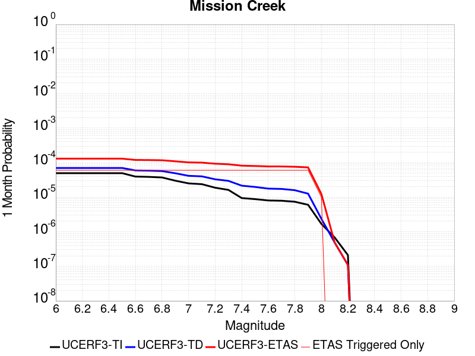 |  |  |

| Magnitude | 1 wk TI Prob | 1 wk TD Prob | 1 wk ETAS Prob | 1 wk ETAS/TD Gain | 1 wk ETAS Triggered Only | 1 mo TI Prob | 1 mo TD Prob | 1 mo ETAS Prob | 1 mo ETAS/TD Gain | 1 mo ETAS Triggered Only | 1 yr TI Prob | 1 yr TD Prob | 1 yr ETAS Prob | 1 yr ETAS/TD Gain | 1 yr ETAS Triggered Only | 10 yr TI Prob | 10 yr TD Prob | 10 yr ETAS Prob | 10 yr ETAS/TD Gain | 10 yr ETAS Triggered Only |
|-----|-----|-----|-----|-----|-----|-----|-----|-----|-----|-----|-----|-----|-----|-----|-----|-----|-----|-----|-----|-----|
| 6.0 | 1.1549387E-5 | 1.632237E-5 | 8.4664614E-5 | 5.1870294 | 6.834335E-5 | 4.9496433E-5 | 6.9951224E-5 | 1.382898E-4 | 1.9769461 | 6.834335E-5 | 6.0245243E-4 | 8.513384E-4 | 9.879087E-4 | 1.1604184 | 1.366867E-4 | 0.006008218 | 0.008509998 | 0.0086455215 | 1.0159252 | 1.366867E-4 |
| 6.1 | 1.1549387E-5 | 1.632237E-5 | 8.4664614E-5 | 5.1870294 | 6.834335E-5 | 4.9496433E-5 | 6.9951224E-5 | 1.382898E-4 | 1.9769461 | 6.834335E-5 | 6.0245243E-4 | 8.513384E-4 | 9.879087E-4 | 1.1604184 | 1.366867E-4 | 0.006008218 | 0.008509998 | 0.0086455215 | 1.0159252 | 1.366867E-4 |
| 6.2 | 1.1549387E-5 | 1.632237E-5 | 8.4664614E-5 | 5.1870294 | 6.834335E-5 | 4.9496433E-5 | 6.9951224E-5 | 1.382898E-4 | 1.9769461 | 6.834335E-5 | 6.0245243E-4 | 8.513384E-4 | 9.879087E-4 | 1.1604184 | 1.366867E-4 | 0.006008218 | 0.008509998 | 0.0086455215 | 1.0159252 | 1.366867E-4 |
| 6.3 | 1.1549387E-5 | 1.632237E-5 | 8.4664614E-5 | 5.1870294 | 6.834335E-5 | 4.9496433E-5 | 6.9951224E-5 | 1.382898E-4 | 1.9769461 | 6.834335E-5 | 6.0245243E-4 | 8.513384E-4 | 9.879087E-4 | 1.1604184 | 1.366867E-4 | 0.006008218 | 0.008509998 | 0.0086455215 | 1.0159252 | 1.366867E-4 |
| 6.4 | 1.1549387E-5 | 1.632237E-5 | 8.4664614E-5 | 5.1870294 | 6.834335E-5 | 4.9496433E-5 | 6.9951224E-5 | 1.382898E-4 | 1.9769461 | 6.834335E-5 | 6.0245243E-4 | 8.513384E-4 | 9.879087E-4 | 1.1604184 | 1.366867E-4 | 0.006008218 | 0.008509998 | 0.0086455215 | 1.0159252 | 1.366867E-4 |
| 6.5 | 1.1549387E-5 | 1.632237E-5 | 8.4664614E-5 | 5.1870294 | 6.834335E-5 | 4.9496433E-5 | 6.9951224E-5 | 1.382898E-4 | 1.9769461 | 6.834335E-5 | 6.0245243E-4 | 8.513384E-4 | 9.879087E-4 | 1.1604184 | 1.366867E-4 | 0.006008218 | 0.008509998 | 0.0086455215 | 1.0159252 | 1.366867E-4 |
| 6.6 | 9.202681E-6 | 1.3845646E-5 | 8.218806E-5 | 5.936022 | 6.834335E-5 | 3.9439463E-5 | 5.9337188E-5 | 1.2767648E-4 | 2.1517112 | 6.834335E-5 | 4.800697E-4 | 7.221998E-4 | 8.587878E-4 | 1.1891277 | 1.366867E-4 | 0.004790339 | 0.0072271815 | 0.0073628803 | 1.0187762 | 1.366867E-4 |
| 6.7 | 9.019164E-6 | 1.3651316E-5 | 8.199374E-5 | 6.0062885 | 6.834335E-5 | 3.8652986E-5 | 5.8504378E-5 | 1.2684373E-4 | 2.1681068 | 6.834335E-5 | 4.7049852E-4 | 7.12067E-4 | 8.486564E-4 | 1.191821 | 1.366867E-4 | 0.004695036 | 0.007126506 | 0.0072622183 | 1.0190433 | 1.366867E-4 |
| 6.8 | 8.673558E-6 | 1.3273427E-5 | 8.161588E-5 | 6.148817 | 6.834335E-5 | 3.717186E-5 | 5.6884925E-5 | 1.252244E-4 | 2.2013633 | 6.834335E-5 | 4.524734E-4 | 6.923627E-4 | 8.289548E-4 | 1.197284 | 1.366867E-4 | 0.0045155324 | 0.006930694 | 0.0070664333 | 1.0195853 | 1.366867E-4 |
| 6.9 | 7.002255E-6 | 1.1477657E-5 | 7.982023E-5 | 6.954401 | 6.834335E-5 | 3.000932E-5 | 4.9189068E-5 | 1.1752906E-4 | 2.389333 | 6.834335E-5 | 3.653022E-4 | 5.9871917E-4 | 7.3532405E-4 | 1.2281618 | 1.366867E-4 | 0.0036470229 | 0.005999517 | 0.006135384 | 1.0226463 | 1.366867E-4 |
| 7.0 | 5.84644E-6 | 9.67498E-6 | 7.801768E-5 | 8.063859 | 6.834335E-5 | 2.5055931E-5 | 4.1463565E-5 | 1.0980409E-4 | 2.6482065 | 6.834335E-5 | 3.0501327E-4 | 5.047066E-4 | 6.4132427E-4 | 1.2706875 | 1.366867E-4 | 0.0030459496 | 0.0050638523 | 0.005199847 | 1.026856 | 1.366867E-4 |
| 7.1 | 5.54703E-6 | 9.329456E-6 | 7.767218E-5 | 8.325478 | 6.834335E-5 | 2.377277E-5 | 3.9982795E-5 | 1.0832342E-4 | 2.7092507 | 6.834335E-5 | 2.8939504E-4 | 4.8668624E-4 | 6.2330643E-4 | 1.2807151 | 1.366867E-4 | 0.0028901845 | 0.004884446 | 0.0050204652 | 1.0278474 | 1.366867E-4 |
| 7.2 | 4.384709E-6 | 7.68157E-6 | 7.60244E-5 | 9.896987 | 6.834335E-5 | 1.8791474E-5 | 3.2920623E-5 | 1.0126173E-4 | 3.075936 | 6.834335E-5 | 2.2876218E-4 | 4.0073853E-4 | 5.3737045E-4 | 1.3409504 | 1.366867E-4 | 0.0022852682 | 0.004028366 | 0.004164502 | 1.0337944 | 1.366867E-4 |
| 7.3 | 3.7888456E-6 | 6.915452E-6 | 7.525834E-5 | 10.882634 | 6.834335E-5 | 1.623781E-5 | 2.9637333E-5 | 9.7978664E-5 | 3.3059204 | 6.834335E-5 | 1.9767738E-4 | 3.6077813E-4 | 4.9741555E-4 | 1.3787297 | 1.366867E-4 | 0.0019750162 | 0.0036301152 | 0.0037663057 | 1.0375168 | 1.366867E-4 |
| 7.4 | 2.1982462E-6 | 5.0237763E-6 | 7.336679E-5 | 14.603912 | 6.834335E-5 | 9.421021E-6 | 2.1530293E-5 | 8.987218E-5 | 4.1742196 | 6.834335E-5 | 1.1469489E-4 | 2.621E-4 | 3.9875088E-4 | 1.5213693 | 1.366867E-4 | 0.0011463572 | 0.0026458844 | 0.0027822095 | 1.0515234 | 1.366867E-4 |
| 7.5 | 2.051923E-6 | 4.615016E-6 | 7.295806E-5 | 15.808842 | 6.834335E-5 | 8.793926E-6 | 1.9778492E-5 | 8.81205E-5 | 4.45537 | 6.834335E-5 | 1.0706078E-4 | 2.4077666E-4 | 3.7743046E-4 | 1.5675542 | 1.366867E-4 | 0.0010700922 | 0.0024335422 | 0.0025698962 | 1.0560311 | 1.366867E-4 |
| 7.6 | 1.8733427E-6 | 4.1233748E-6 | 7.246645E-5 | 17.574549 | 6.834335E-5 | 8.028587E-6 | 1.7671488E-5 | 8.6013635E-5 | 4.867368 | 6.834335E-5 | 9.774366E-5 | 2.151292E-4 | 2.8345786E-4 | 1.3176168 | 6.834335E-5 | 9.770069E-4 | 0.0021780801 | 0.0022462746 | 1.0313095 | 6.834335E-5 |
| 7.7 | 1.8411953E-6 | 4.0430496E-6 | 7.238613E-5 | 17.903845 | 6.834335E-5 | 7.890813E-6 | 1.732724E-5 | 8.566942E-5 | 4.944204 | 6.834335E-5 | 9.606641E-5 | 2.1093882E-4 | 2.7926776E-4 | 1.3239278 | 6.834335E-5 | 9.6024893E-4 | 0.0021363653 | 0.0022045625 | 1.0319221 | 6.834335E-5 |
| 7.8 | 1.7194251E-6 | 3.7104276E-6 | 7.205353E-5 | 19.419199 | 6.834335E-5 | 7.368944E-6 | 1.5901736E-5 | 8.4244006E-5 | 5.2977867 | 6.834335E-5 | 8.97132E-5 | 1.9358651E-4 | 2.6191663E-4 | 1.3529694 | 6.834335E-5 | 8.967699E-4 | 0.0019623525 | 0.0020305617 | 1.0347589 | 6.834335E-5 |
| 7.9 | 1.4035052E-6 | 2.9500632E-6 | 7.1293216E-5 | 24.166676 | 6.834335E-5 | 6.0150082E-6 | 1.2643067E-5 | 8.098556E-5 | 6.4055314 | 6.834335E-5 | 7.3230265E-5 | 1.5391852E-4 | 2.2225136E-4 | 1.4439546 | 6.834335E-5 | 7.3206134E-4 | 0.0015631086 | 0.0016313453 | 1.0436543 | 6.834335E-5 |
| 8.0 | 3.9318823E-7 | 5.528522E-7 | 5.528522E-7 | 1.0 | 0.0 | 1.6850913E-6 | 2.3693647E-6 | 2.3693647E-6 | 1.0 | 0.0 | 2.0515794E-5 | 2.8846638E-5 | 2.8846638E-5 | 1.0 | 0.0 | 2.0513899E-4 | 2.9899E-4 | 2.9899E-4 | 1.0 | 0.0 |
| 8.1 | 1.596793E-7 | 1.1380002E-7 | 1.1380002E-7 | 1.0 | 0.0 | 6.8433974E-7 | 4.877143E-7 | 4.877143E-7 | 1.0 | 0.0 | 8.331805E-6 | 5.937906E-6 | 5.937906E-6 | 1.0 | 0.0 | 8.331492E-5 | 6.549966E-5 | 6.549966E-5 | 1.0 | 0.0 |
| 8.2 | 4.9003038E-8 | 2.5444924E-8 | 2.5444924E-8 | 1.0 | 0.0 | 2.10013E-7 | 1.0904967E-7 | 1.0904967E-7 | 1.0 | 0.0 | 2.5569052E-6 | 1.327679E-6 | 1.327679E-6 | 1.0 | 0.0 | 2.556876E-5 | 1.495635E-5 | 1.495635E-5 | 1.0 | 0.0 |

## Chino alt 1
*[(top)](#table-of-contents)*

| 1 Week | 1 Month | 1 Year | 10 Year |
|-----|-----|-----|-----|
|  |  |  |  |

| Magnitude | 1 wk TI Prob | 1 wk TD Prob | 1 wk ETAS Prob | 1 wk ETAS/TD Gain | 1 wk ETAS Triggered Only | 1 mo TI Prob | 1 mo TD Prob | 1 mo ETAS Prob | 1 mo ETAS/TD Gain | 1 mo ETAS Triggered Only | 1 yr TI Prob | 1 yr TD Prob | 1 yr ETAS Prob | 1 yr ETAS/TD Gain | 1 yr ETAS Triggered Only | 10 yr TI Prob | 10 yr TD Prob | 10 yr ETAS Prob | 10 yr ETAS/TD Gain | 10 yr ETAS Triggered Only |
|-----|-----|-----|-----|-----|-----|-----|-----|-----|-----|-----|-----|-----|-----|-----|-----|-----|-----|-----|-----|-----|
| 6.0 | 3.939946E-5 | 4.8948554E-5 | 4.8948554E-5 | 1.0 | 0.0 | 1.6884391E-4 | 2.097656E-4 | 2.097656E-4 | 1.0 | 0.0 | 0.0020537362 | 0.0025513945 | 0.0025513945 | 1.0 | 0.0 | 0.020348595 | 0.025277847 | 0.025411079 | 1.0052707 | 1.366867E-4 |
| 6.1 | 2.1505624E-5 | 2.6879026E-5 | 2.6879026E-5 | 1.0 | 0.0 | 9.2163704E-5 | 1.1519137E-4 | 1.1519137E-4 | 1.0 | 0.0 | 0.0011215154 | 0.001401664 | 0.001401664 | 1.0 | 0.0 | 0.011158722 | 0.013945141 | 0.013945141 | 1.0 | 0.0 |
| 6.2 | 2.1505624E-5 | 2.6879026E-5 | 2.6879026E-5 | 1.0 | 0.0 | 9.2163704E-5 | 1.1519137E-4 | 1.1519137E-4 | 1.0 | 0.0 | 0.0011215154 | 0.001401664 | 0.001401664 | 1.0 | 0.0 | 0.011158722 | 0.013945141 | 0.013945141 | 1.0 | 0.0 |
| 6.3 | 1.4290785E-5 | 1.8165128E-5 | 1.8165128E-5 | 1.0 | 0.0 | 6.1244784E-5 | 7.784848E-5 | 7.784848E-5 | 1.0 | 0.0 | 7.454001E-4 | 9.4743853E-4 | 9.4743853E-4 | 1.0 | 0.0 | 0.007429048 | 0.0094444575 | 0.0094444575 | 1.0 | 0.0 |
| 6.4 | 1.4290785E-5 | 1.8165128E-5 | 1.8165128E-5 | 1.0 | 0.0 | 6.1244784E-5 | 7.784848E-5 | 7.784848E-5 | 1.0 | 0.0 | 7.454001E-4 | 9.4743853E-4 | 9.4743853E-4 | 1.0 | 0.0 | 0.007429048 | 0.0094444575 | 0.0094444575 | 1.0 | 0.0 |
| 6.5 | 1.3017944E-5 | 1.6652088E-5 | 1.6652088E-5 | 1.0 | 0.0 | 5.5789995E-5 | 7.136439E-5 | 7.136439E-5 | 1.0 | 0.0 | 6.790315E-4 | 8.685589E-4 | 8.685589E-4 | 1.0 | 0.0 | 0.0067696036 | 0.008661949 | 0.008661949 | 1.0 | 0.0 |
| 6.6 | 9.470016E-6 | 1.2039424E-5 | 1.2039424E-5 | 1.0 | 0.0 | 4.058515E-5 | 5.1596704E-5 | 5.1596704E-5 | 1.0 | 0.0 | 4.940122E-4 | 6.280428E-4 | 6.280428E-4 | 1.0 | 0.0 | 0.004929154 | 0.0062718987 | 0.0062718987 | 1.0 | 0.0 |
| 6.7 | 8.314155E-6 | 1.0407736E-5 | 1.0407736E-5 | 1.0 | 0.0 | 3.5631605E-5 | 4.4604003E-5 | 4.4604003E-5 | 1.0 | 0.0 | 4.3372845E-4 | 5.429507E-4 | 5.429507E-4 | 1.0 | 0.0 | 0.004328829 | 0.005425775 | 0.005425775 | 1.0 | 0.0 |
| 6.8 | 3.4856364E-6 | 3.8133708E-6 | 3.8133708E-6 | 1.0 | 0.0 | 1.4938357E-5 | 1.6342927E-5 | 1.6342927E-5 | 1.0 | 0.0 | 1.8185932E-4 | 1.9895904E-4 | 1.9895904E-4 | 1.0 | 0.0 | 0.0018171056 | 0.0019894864 | 0.0019894864 | 1.0 | 0.0 |
| 6.9 | 2.2645952E-6 | 2.1529022E-6 | 2.1529022E-6 | 1.0 | 0.0 | 9.705372E-6 | 9.226692E-6 | 9.226692E-6 | 1.0 | 0.0 | 1.18156495E-4 | 1.123294E-4 | 1.123294E-4 | 1.0 | 0.0 | 0.0011809369 | 0.0011233423 | 0.0011233423 | 1.0 | 0.0 |
| 7.0 | 1.7864003E-6 | 1.5430785E-6 | 1.5430785E-6 | 1.0 | 0.0 | 7.655979E-6 | 6.613177E-6 | 6.613177E-6 | 1.0 | 0.0 | 9.3207556E-5 | 8.051251E-5 | 8.051251E-5 | 1.0 | 0.0 | 9.316847E-4 | 8.0528046E-4 | 8.0528046E-4 | 1.0 | 0.0 |
| 7.1 | 1.7315456E-6 | 1.4733511E-6 | 1.4733511E-6 | 1.0 | 0.0 | 7.420889E-6 | 6.3143466E-6 | 6.3143466E-6 | 1.0 | 0.0 | 9.034557E-5 | 7.6874516E-5 | 7.6874516E-5 | 1.0 | 0.0 | 9.0308854E-4 | 7.6891703E-4 | 7.6891703E-4 | 1.0 | 0.0 |
| 7.2 | 1.6008337E-6 | 1.3574215E-6 | 1.3574215E-6 | 1.0 | 0.0 | 6.860698E-6 | 5.817508E-6 | 5.817508E-6 | 1.0 | 0.0 | 8.352579E-5 | 7.082591E-5 | 7.082591E-5 | 1.0 | 0.0 | 8.34944E-4 | 7.0845755E-4 | 7.0845755E-4 | 1.0 | 0.0 |
| 7.3 | 1.3320939E-6 | 1.121782E-6 | 1.121782E-6 | 1.0 | 0.0 | 5.7089615E-6 | 4.807629E-6 | 4.807629E-6 | 1.0 | 0.0 | 6.9504385E-5 | 5.8531357E-5 | 5.8531357E-5 | 1.0 | 0.0 | 6.9482654E-4 | 5.8530393E-4 | 5.8530393E-4 | 1.0 | 0.0 |
| 7.4 | 1.114294E-6 | 9.237111E-7 | 9.237111E-7 | 1.0 | 0.0 | 4.775537E-6 | 3.958756E-6 | 3.958756E-6 | 1.0 | 0.0 | 5.8140613E-5 | 4.8196827E-5 | 4.8196827E-5 | 1.0 | 0.0 | 5.81254E-4 | 4.8188053E-4 | 4.8188053E-4 | 1.0 | 0.0 |
| 7.5 | 9.354081E-7 | 7.6234323E-7 | 7.6234323E-7 | 1.0 | 0.0 | 4.0088858E-6 | 3.2671815E-6 | 3.2671815E-6 | 1.0 | 0.0 | 4.8807087E-5 | 3.9777242E-5 | 3.9777242E-5 | 1.0 | 0.0 | 4.879637E-4 | 3.977046E-4 | 3.977046E-4 | 1.0 | 0.0 |
| 7.6 | 8.521771E-7 | 6.88071E-7 | 6.88071E-7 | 1.0 | 0.0 | 3.6521824E-6 | 2.9488726E-6 | 2.9488726E-6 | 1.0 | 0.0 | 4.4464414E-5 | 3.5901965E-5 | 3.5901965E-5 | 1.0 | 0.0 | 4.4455516E-4 | 3.589648E-4 | 3.589648E-4 | 1.0 | 0.0 |
| 7.7 | 2.1803626E-7 | 1.418649E-7 | 1.418649E-7 | 1.0 | 0.0 | 9.344408E-7 | 6.079923E-7 | 6.079923E-7 | 1.0 | 0.0 | 1.1376757E-5 | 7.4022914E-6 | 7.4022914E-6 | 1.0 | 0.0 | 1.13761744E-4 | 7.402141E-5 | 7.402141E-5 | 1.0 | 0.0 |

## Deep Springs
*[(top)](#table-of-contents)*

| 1 Week | 1 Month | 1 Year | 10 Year |
|-----|-----|-----|-----|
|  |  | 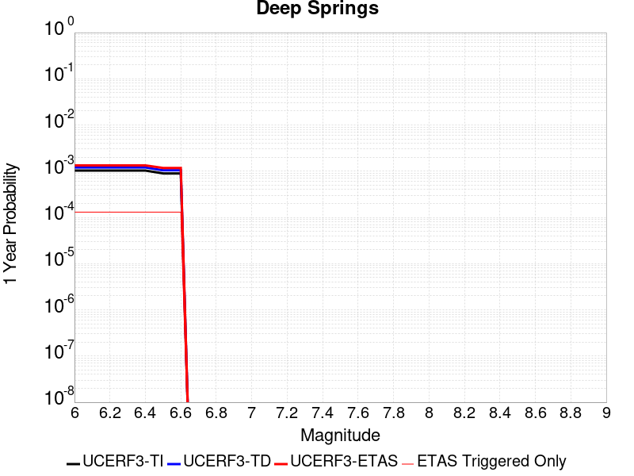 |  |

| Magnitude | 1 wk TI Prob | 1 wk TD Prob | 1 wk ETAS Prob | 1 wk ETAS/TD Gain | 1 wk ETAS Triggered Only | 1 mo TI Prob | 1 mo TD Prob | 1 mo ETAS Prob | 1 mo ETAS/TD Gain | 1 mo ETAS Triggered Only | 1 yr TI Prob | 1 yr TD Prob | 1 yr ETAS Prob | 1 yr ETAS/TD Gain | 1 yr ETAS Triggered Only | 10 yr TI Prob | 10 yr TD Prob | 10 yr ETAS Prob | 10 yr ETAS/TD Gain | 10 yr ETAS Triggered Only |
|-----|-----|-----|-----|-----|-----|-----|-----|-----|-----|-----|-----|-----|-----|-----|-----|-----|-----|-----|-----|-----|
| 6.0 | 1.9810619E-5 | 2.311252E-5 | 2.311252E-5 | 1.0 | 0.0 | 8.489989E-5 | 9.905276E-5 | 9.905276E-5 | 1.0 | 0.0 | 0.001033166 | 0.0012058079 | 0.0012740688 | 1.0566101 | 6.834335E-5 | 0.010283757 | 0.012042425 | 0.0121774655 | 1.0112138 | 1.366867E-4 |
| 6.1 | 1.9810619E-5 | 2.311252E-5 | 2.311252E-5 | 1.0 | 0.0 | 8.489989E-5 | 9.905276E-5 | 9.905276E-5 | 1.0 | 0.0 | 0.001033166 | 0.0012058079 | 0.0012740688 | 1.0566101 | 6.834335E-5 | 0.010283757 | 0.012042425 | 0.0121774655 | 1.0112138 | 1.366867E-4 |
| 6.2 | 1.9810619E-5 | 2.311252E-5 | 2.311252E-5 | 1.0 | 0.0 | 8.489989E-5 | 9.905276E-5 | 9.905276E-5 | 1.0 | 0.0 | 0.001033166 | 0.0012058079 | 0.0012740688 | 1.0566101 | 6.834335E-5 | 0.010283757 | 0.012042425 | 0.0121774655 | 1.0112138 | 1.366867E-4 |
| 6.3 | 1.9810619E-5 | 2.311252E-5 | 2.311252E-5 | 1.0 | 0.0 | 8.489989E-5 | 9.905276E-5 | 9.905276E-5 | 1.0 | 0.0 | 0.001033166 | 0.0012058079 | 0.0012740688 | 1.0566101 | 6.834335E-5 | 0.010283757 | 0.012042425 | 0.0121774655 | 1.0112138 | 1.366867E-4 |
| 6.4 | 1.9810619E-5 | 2.311252E-5 | 2.311252E-5 | 1.0 | 0.0 | 8.489989E-5 | 9.905276E-5 | 9.905276E-5 | 1.0 | 0.0 | 0.001033166 | 0.0012058079 | 0.0012740688 | 1.0566101 | 6.834335E-5 | 0.010283757 | 0.012042425 | 0.0121774655 | 1.0112138 | 1.366867E-4 |
| 6.5 | 1.7190405E-5 | 2.0050555E-5 | 2.0050555E-5 | 1.0 | 0.0 | 7.367108E-5 | 8.593095E-5 | 8.593095E-5 | 1.0 | 0.0 | 8.9657627E-4 | 0.0010462094 | 0.0011144812 | 1.0652564 | 6.834335E-5 | 0.008929676 | 0.010462056 | 0.010597313 | 1.0129284 | 1.366867E-4 |
| 6.6 | 1.7190405E-5 | 2.0050555E-5 | 2.0050555E-5 | 1.0 | 0.0 | 7.367108E-5 | 8.593095E-5 | 8.593095E-5 | 1.0 | 0.0 | 8.9657627E-4 | 0.0010462094 | 0.0011144812 | 1.0652564 | 6.834335E-5 | 0.008929676 | 0.010462056 | 0.010597313 | 1.0129284 | 1.366867E-4 |

## Sheephole
*[(top)](#table-of-contents)*

| 1 Week | 1 Month | 1 Year | 10 Year |
|-----|-----|-----|-----|
|  |  |  |  |

| Magnitude | 1 wk TI Prob | 1 wk TD Prob | 1 wk ETAS Prob | 1 wk ETAS/TD Gain | 1 wk ETAS Triggered Only | 1 mo TI Prob | 1 mo TD Prob | 1 mo ETAS Prob | 1 mo ETAS/TD Gain | 1 mo ETAS Triggered Only | 1 yr TI Prob | 1 yr TD Prob | 1 yr ETAS Prob | 1 yr ETAS/TD Gain | 1 yr ETAS Triggered Only | 10 yr TI Prob | 10 yr TD Prob | 10 yr ETAS Prob | 10 yr ETAS/TD Gain | 10 yr ETAS Triggered Only |
|-----|-----|-----|-----|-----|-----|-----|-----|-----|-----|-----|-----|-----|-----|-----|-----|-----|-----|-----|-----|-----|
| 6.0 | 4.5579695E-6 | 4.7412627E-6 | 7.3084295E-5 | 15.414522 | 6.834335E-5 | 1.9534009E-5 | 2.031957E-5 | 8.866154E-5 | 4.363357 | 6.834335E-5 | 2.3780059E-4 | 2.473682E-4 | 3.1569466E-4 | 1.2762135 | 6.834335E-5 | 0.0023754628 | 0.002471473 | 0.002607822 | 1.0551691 | 1.366867E-4 |
| 6.1 | 4.5579695E-6 | 4.7412627E-6 | 7.3084295E-5 | 15.414522 | 6.834335E-5 | 1.9534009E-5 | 2.031957E-5 | 8.866154E-5 | 4.363357 | 6.834335E-5 | 2.3780059E-4 | 2.473682E-4 | 3.1569466E-4 | 1.2762135 | 6.834335E-5 | 0.0023754628 | 0.002471473 | 0.002607822 | 1.0551691 | 1.366867E-4 |
| 6.2 | 2.6677674E-6 | 2.7873941E-6 | 2.7873941E-6 | 1.0 | 0.0 | 1.1433239E-5 | 1.1945926E-5 | 1.1945926E-5 | 1.0 | 0.0 | 1.3919079E-4 | 1.4543302E-4 | 1.4543302E-4 | 1.0 | 0.0 | 0.0013910364 | 0.0014534844 | 0.0015217285 | 1.046952 | 6.834335E-5 |
| 6.3 | 2.6677674E-6 | 2.7873941E-6 | 2.7873941E-6 | 1.0 | 0.0 | 1.1433239E-5 | 1.1945926E-5 | 1.1945926E-5 | 1.0 | 0.0 | 1.3919079E-4 | 1.4543302E-4 | 1.4543302E-4 | 1.0 | 0.0 | 0.0013910364 | 0.0014534844 | 0.0015217285 | 1.046952 | 6.834335E-5 |
| 6.4 | 2.2159759E-6 | 2.3228788E-6 | 2.3228788E-6 | 1.0 | 0.0 | 9.497005E-6 | 9.955161E-6 | 9.955161E-6 | 1.0 | 0.0 | 1.156199E-4 | 1.2119815E-4 | 1.2119815E-4 | 1.0 | 0.0 | 0.0011555976 | 0.0012113999 | 0.0012113999 | 1.0 | 0.0 |
| 6.5 | 2.1986082E-6 | 2.304759E-6 | 2.304759E-6 | 1.0 | 0.0 | 9.4225725E-6 | 9.877506E-6 | 9.877506E-6 | 1.0 | 0.0 | 1.1471378E-4 | 1.2025281E-4 | 1.2025281E-4 | 1.0 | 0.0 | 0.0011465458 | 0.0012019566 | 0.0012019566 | 1.0 | 0.0 |
| 6.6 | 1.5232331E-6 | 1.6018919E-6 | 1.6018919E-6 | 1.0 | 0.0 | 6.5281256E-6 | 6.865234E-6 | 6.865234E-6 | 1.0 | 0.0 | 7.947703E-5 | 8.35812E-5 | 8.35812E-5 | 1.0 | 0.0 | 7.9448614E-4 | 8.3551643E-4 | 8.3551643E-4 | 1.0 | 0.0 |
| 6.7 | 1.3137362E-6 | 1.382819E-6 | 1.382819E-6 | 1.0 | 0.0 | 5.6302856E-6 | 5.926355E-6 | 5.926355E-6 | 1.0 | 0.0 | 6.854657E-5 | 7.215112E-5 | 7.215112E-5 | 1.0 | 0.0 | 6.8525434E-4 | 7.212908E-4 | 7.212908E-4 | 1.0 | 0.0 |
| 6.8 | 1.2275751E-6 | 1.2922847E-6 | 1.2922847E-6 | 1.0 | 0.0 | 5.2610258E-6 | 5.5383516E-6 | 5.5383516E-6 | 1.0 | 0.0 | 6.4051106E-5 | 6.7427485E-5 | 6.7427485E-5 | 1.0 | 0.0 | 6.4032647E-4 | 6.740836E-4 | 6.740836E-4 | 1.0 | 0.0 |
| 6.9 | 1.1837088E-6 | 1.246102E-6 | 1.246102E-6 | 1.0 | 0.0 | 5.0730278E-6 | 5.340427E-6 | 5.340427E-6 | 1.0 | 0.0 | 6.176237E-5 | 6.501789E-5 | 6.501789E-5 | 1.0 | 0.0 | 6.17452E-4 | 6.5000186E-4 | 6.5000186E-4 | 1.0 | 0.0 |
| 7.0 | 9.849371E-7 | 1.0366288E-6 | 1.0366288E-6 | 1.0 | 0.0 | 4.2211523E-6 | 4.442688E-6 | 4.442688E-6 | 1.0 | 0.0 | 5.1391315E-5 | 5.4088487E-5 | 5.4088487E-5 | 1.0 | 0.0 | 5.137943E-4 | 5.407633E-4 | 5.407633E-4 | 1.0 | 0.0 |
| 7.1 | 8.1643645E-7 | 8.591669E-7 | 8.591669E-7 | 1.0 | 0.0 | 3.4990085E-6 | 3.682139E-6 | 3.682139E-6 | 1.0 | 0.0 | 4.2599597E-5 | 4.482921E-5 | 4.482921E-5 | 1.0 | 0.0 | 4.259143E-4 | 4.4821028E-4 | 4.4821028E-4 | 1.0 | 0.0 |
| 7.2 | 5.7295756E-7 | 6.029502E-7 | 6.029502E-7 | 1.0 | 0.0 | 2.45553E-6 | 2.58407E-6 | 2.58407E-6 | 1.0 | 0.0 | 2.9895667E-5 | 3.1460666E-5 | 3.1460666E-5 | 1.0 | 0.0 | 2.9891645E-4 | 3.145688E-4 | 3.145688E-4 | 1.0 | 0.0 |

## Pitas Point (Lower West)
*[(top)](#table-of-contents)*

| 1 Week | 1 Month | 1 Year | 10 Year |
|-----|-----|-----|-----|
|  |  |  |  |

| Magnitude | 1 wk TI Prob | 1 wk TD Prob | 1 wk ETAS Prob | 1 wk ETAS/TD Gain | 1 wk ETAS Triggered Only | 1 mo TI Prob | 1 mo TD Prob | 1 mo ETAS Prob | 1 mo ETAS/TD Gain | 1 mo ETAS Triggered Only | 1 yr TI Prob | 1 yr TD Prob | 1 yr ETAS Prob | 1 yr ETAS/TD Gain | 1 yr ETAS Triggered Only | 10 yr TI Prob | 10 yr TD Prob | 10 yr ETAS Prob | 10 yr ETAS/TD Gain | 10 yr ETAS Triggered Only |
|-----|-----|-----|-----|-----|-----|-----|-----|-----|-----|-----|-----|-----|-----|-----|-----|-----|-----|-----|-----|-----|
| 6.0 | 8.151497E-6 | 7.855762E-6 | 7.855762E-6 | 1.0 | 0.0 | 3.493452E-5 | 3.3667122E-5 | 3.3667122E-5 | 1.0 | 0.0 | 4.252448E-4 | 4.0982084E-4 | 4.781362E-4 | 1.1666956 | 6.834335E-5 | 0.0042443196 | 0.0040907315 | 0.004226859 | 1.033277 | 1.366867E-4 |
| 6.1 | 8.151497E-6 | 7.855762E-6 | 7.855762E-6 | 1.0 | 0.0 | 3.493452E-5 | 3.3667122E-5 | 3.3667122E-5 | 1.0 | 0.0 | 4.252448E-4 | 4.0982084E-4 | 4.781362E-4 | 1.1666956 | 6.834335E-5 | 0.0042443196 | 0.0040907315 | 0.004226859 | 1.033277 | 1.366867E-4 |
| 6.2 | 8.151497E-6 | 7.855762E-6 | 7.855762E-6 | 1.0 | 0.0 | 3.493452E-5 | 3.3667122E-5 | 3.3667122E-5 | 1.0 | 0.0 | 4.252448E-4 | 4.0982084E-4 | 4.781362E-4 | 1.1666956 | 6.834335E-5 | 0.0042443196 | 0.0040907315 | 0.004226859 | 1.033277 | 1.366867E-4 |
| 6.3 | 8.151497E-6 | 7.855762E-6 | 7.855762E-6 | 1.0 | 0.0 | 3.493452E-5 | 3.3667122E-5 | 3.3667122E-5 | 1.0 | 0.0 | 4.252448E-4 | 4.0982084E-4 | 4.781362E-4 | 1.1666956 | 6.834335E-5 | 0.0042443196 | 0.0040907315 | 0.004226859 | 1.033277 | 1.366867E-4 |
| 6.4 | 8.151497E-6 | 7.855762E-6 | 7.855762E-6 | 1.0 | 0.0 | 3.493452E-5 | 3.3667122E-5 | 3.3667122E-5 | 1.0 | 0.0 | 4.252448E-4 | 4.0982084E-4 | 4.781362E-4 | 1.1666956 | 6.834335E-5 | 0.0042443196 | 0.0040907315 | 0.004226859 | 1.033277 | 1.366867E-4 |
| 6.5 | 8.151497E-6 | 7.855762E-6 | 7.855762E-6 | 1.0 | 0.0 | 3.493452E-5 | 3.3667122E-5 | 3.3667122E-5 | 1.0 | 0.0 | 4.252448E-4 | 4.0982084E-4 | 4.781362E-4 | 1.1666956 | 6.834335E-5 | 0.0042443196 | 0.0040907315 | 0.004226859 | 1.033277 | 1.366867E-4 |
| 6.6 | 8.151497E-6 | 7.855762E-6 | 7.855762E-6 | 1.0 | 0.0 | 3.493452E-5 | 3.3667122E-5 | 3.3667122E-5 | 1.0 | 0.0 | 4.252448E-4 | 4.0982084E-4 | 4.781362E-4 | 1.1666956 | 6.834335E-5 | 0.0042443196 | 0.0040907315 | 0.004226859 | 1.033277 | 1.366867E-4 |
| 6.7 | 8.151497E-6 | 7.855762E-6 | 7.855762E-6 | 1.0 | 0.0 | 3.493452E-5 | 3.3667122E-5 | 3.3667122E-5 | 1.0 | 0.0 | 4.252448E-4 | 4.0982084E-4 | 4.781362E-4 | 1.1666956 | 6.834335E-5 | 0.0042443196 | 0.0040907315 | 0.004226859 | 1.033277 | 1.366867E-4 |
| 6.8 | 8.151497E-6 | 7.855762E-6 | 7.855762E-6 | 1.0 | 0.0 | 3.493452E-5 | 3.3667122E-5 | 3.3667122E-5 | 1.0 | 0.0 | 4.252448E-4 | 4.0982084E-4 | 4.781362E-4 | 1.1666956 | 6.834335E-5 | 0.0042443196 | 0.0040907315 | 0.004226859 | 1.033277 | 1.366867E-4 |
| 6.9 | 8.151497E-6 | 7.855762E-6 | 7.855762E-6 | 1.0 | 0.0 | 3.493452E-5 | 3.3667122E-5 | 3.3667122E-5 | 1.0 | 0.0 | 4.252448E-4 | 4.0982084E-4 | 4.781362E-4 | 1.1666956 | 6.834335E-5 | 0.0042443196 | 0.0040907315 | 0.004226859 | 1.033277 | 1.366867E-4 |
| 7.0 | 8.103535E-6 | 7.805192E-6 | 7.805192E-6 | 1.0 | 0.0 | 3.4728975E-5 | 3.3450397E-5 | 3.3450397E-5 | 1.0 | 0.0 | 4.2274324E-4 | 4.0718322E-4 | 4.7549876E-4 | 1.1677759 | 6.834335E-5 | 0.0042193993 | 0.004064452 | 0.0042005833 | 1.0334932 | 1.366867E-4 |
| 7.1 | 7.853298E-6 | 7.540883E-6 | 7.540883E-6 | 1.0 | 0.0 | 3.3656554E-5 | 3.2317676E-5 | 3.2317676E-5 | 1.0 | 0.0 | 4.096915E-4 | 3.9339735E-4 | 4.6171382E-4 | 1.1736577 | 6.834335E-5 | 0.00408937 | 0.0039270855 | 0.0040632356 | 1.0346695 | 1.366867E-4 |
| 7.2 | 7.771102E-6 | 7.453165E-6 | 7.453165E-6 | 1.0 | 0.0 | 3.33043E-5 | 3.194175E-5 | 3.194175E-5 | 1.0 | 0.0 | 4.0540437E-4 | 3.8882208E-4 | 4.5713887E-4 | 1.1757019 | 6.834335E-5 | 0.0040466557 | 0.0038814936 | 0.0040176497 | 1.0350783 | 1.366867E-4 |
| 7.3 | 7.3945344E-6 | 7.0492697E-6 | 7.0492697E-6 | 1.0 | 0.0 | 3.1690477E-5 | 3.021081E-5 | 3.021081E-5 | 1.0 | 0.0 | 3.8576324E-4 | 3.6775516E-4 | 4.3607337E-4 | 1.185771 | 6.834335E-5 | 0.0038509427 | 0.0036715334 | 0.0038077182 | 1.0370921 | 1.366867E-4 |
| 7.4 | 6.964645E-6 | 6.5901186E-6 | 6.5901186E-6 | 1.0 | 0.0 | 2.9848137E-5 | 2.8243063E-5 | 2.8243063E-5 | 1.0 | 0.0 | 3.6334046E-4 | 3.4380553E-4 | 3.4380553E-4 | 1.0 | 0.0 | 0.0036274698 | 0.0034327896 | 0.0035008984 | 1.0198406 | 6.834335E-5 |
| 7.5 | 6.6525035E-6 | 6.259157E-6 | 6.259157E-6 | 1.0 | 0.0 | 2.851042E-5 | 2.6824686E-5 | 2.6824686E-5 | 1.0 | 0.0 | 3.4705905E-4 | 3.265421E-4 | 3.265421E-4 | 1.0 | 0.0 | 0.0034651754 | 0.0032606742 | 0.0033287948 | 1.0208915 | 6.834335E-5 |
| 7.6 | 5.613338E-6 | 5.151386E-6 | 5.151386E-6 | 1.0 | 0.0 | 2.405694E-5 | 2.2077185E-5 | 2.2077185E-5 | 1.0 | 0.0 | 2.928539E-4 | 2.6875688E-4 | 2.6875688E-4 | 1.0 | 0.0 | 0.0029246826 | 0.0026843501 | 0.00275251 | 1.0253916 | 6.834335E-5 |
| 7.7 | 4.494704E-6 | 3.996911E-6 | 3.996911E-6 | 1.0 | 0.0 | 1.9262876E-5 | 1.7129507E-5 | 1.7129507E-5 | 1.0 | 0.0 | 2.3450027E-4 | 2.0853203E-4 | 2.0853203E-4 | 1.0 | 0.0 | 0.0023425296 | 0.0020833875 | 0.0021515884 | 1.0327356 | 6.834335E-5 |
| 7.8 | 2.6075882E-6 | 2.1836374E-6 | 2.1836374E-6 | 1.0 | 0.0 | 1.117533E-5 | 9.358413E-6 | 9.358413E-6 | 1.0 | 0.0 | 1.3605114E-4 | 1.1393277E-4 | 1.1393277E-4 | 1.0 | 0.0 | 0.0013596788 | 0.0011387484 | 0.0011387484 | 1.0 | 0.0 |
| 7.9 | 4.045984E-7 | 3.242375E-7 | 3.242375E-7 | 1.0 | 0.0 | 1.733992E-6 | 1.3895885E-6 | 1.3895885E-6 | 1.0 | 0.0 | 2.1111147E-5 | 1.6918111E-5 | 1.6918111E-5 | 1.0 | 0.0 | 2.1109142E-4 | 1.6916855E-4 | 1.6916855E-4 | 1.0 | 0.0 |
| 8.0 | 7.791402E-9 | 5.683497E-9 | 5.683497E-9 | 1.0 | 0.0 | 3.3391725E-8 | 2.4357844E-8 | 2.4357844E-8 | 1.0 | 0.0 | 4.0654416E-7 | 2.9655675E-7 | 2.9655675E-7 | 1.0 | 0.0 | 4.065434E-6 | 2.9655655E-6 | 2.9655655E-6 | 1.0 | 0.0 |

## San Cayetano
*[(top)](#table-of-contents)*

| 1 Week | 1 Month | 1 Year | 10 Year |
|-----|-----|-----|-----|
|  |  |  |  |

| Magnitude | 1 wk TI Prob | 1 wk TD Prob | 1 wk ETAS Prob | 1 wk ETAS/TD Gain | 1 wk ETAS Triggered Only | 1 mo TI Prob | 1 mo TD Prob | 1 mo ETAS Prob | 1 mo ETAS/TD Gain | 1 mo ETAS Triggered Only | 1 yr TI Prob | 1 yr TD Prob | 1 yr ETAS Prob | 1 yr ETAS/TD Gain | 1 yr ETAS Triggered Only | 10 yr TI Prob | 10 yr TD Prob | 10 yr ETAS Prob | 10 yr ETAS/TD Gain | 10 yr ETAS Triggered Only |
|-----|-----|-----|-----|-----|-----|-----|-----|-----|-----|-----|-----|-----|-----|-----|-----|-----|-----|-----|-----|-----|
| 6.0 | 2.3476267E-5 | 1.816928E-5 | 8.651139E-5 | 4.7614107 | 6.834335E-5 | 1.0060869E-4 | 7.786603E-5 | 1.4620407E-4 | 1.877636 | 6.834335E-5 | 0.0012242225 | 9.476103E-4 | 0.0010158889 | 1.0720534 | 6.834335E-5 | 0.012175002 | 0.009436584 | 0.009571981 | 1.014348 | 1.366867E-4 |
| 6.1 | 2.3476267E-5 | 1.816928E-5 | 8.651139E-5 | 4.7614107 | 6.834335E-5 | 1.0060869E-4 | 7.786603E-5 | 1.4620407E-4 | 1.877636 | 6.834335E-5 | 0.0012242225 | 9.476103E-4 | 0.0010158889 | 1.0720534 | 6.834335E-5 | 0.012175002 | 0.009436584 | 0.009571981 | 1.014348 | 1.366867E-4 |
| 6.2 | 2.3476267E-5 | 1.816928E-5 | 8.651139E-5 | 4.7614107 | 6.834335E-5 | 1.0060869E-4 | 7.786603E-5 | 1.4620407E-4 | 1.877636 | 6.834335E-5 | 0.0012242225 | 9.476103E-4 | 0.0010158889 | 1.0720534 | 6.834335E-5 | 0.012175002 | 0.009436584 | 0.009571981 | 1.014348 | 1.366867E-4 |
| 6.3 | 2.3476267E-5 | 1.816928E-5 | 8.651139E-5 | 4.7614107 | 6.834335E-5 | 1.0060869E-4 | 7.786603E-5 | 1.4620407E-4 | 1.877636 | 6.834335E-5 | 0.0012242225 | 9.476103E-4 | 0.0010158889 | 1.0720534 | 6.834335E-5 | 0.012175002 | 0.009436584 | 0.009571981 | 1.014348 | 1.366867E-4 |
| 6.4 | 2.3476267E-5 | 1.816928E-5 | 8.651139E-5 | 4.7614107 | 6.834335E-5 | 1.0060869E-4 | 7.786603E-5 | 1.4620407E-4 | 1.877636 | 6.834335E-5 | 0.0012242225 | 9.476103E-4 | 0.0010158889 | 1.0720534 | 6.834335E-5 | 0.012175002 | 0.009436584 | 0.009571981 | 1.014348 | 1.366867E-4 |
| 6.5 | 2.3476267E-5 | 1.816928E-5 | 8.651139E-5 | 4.7614107 | 6.834335E-5 | 1.0060869E-4 | 7.786603E-5 | 1.4620407E-4 | 1.877636 | 6.834335E-5 | 0.0012242225 | 9.476103E-4 | 0.0010158889 | 1.0720534 | 6.834335E-5 | 0.012175002 | 0.009436584 | 0.009571981 | 1.014348 | 1.366867E-4 |
| 6.6 | 2.3476267E-5 | 1.816928E-5 | 8.651139E-5 | 4.7614107 | 6.834335E-5 | 1.0060869E-4 | 7.786603E-5 | 1.4620407E-4 | 1.877636 | 6.834335E-5 | 0.0012242225 | 9.476103E-4 | 0.0010158889 | 1.0720534 | 6.834335E-5 | 0.012175002 | 0.009436584 | 0.009571981 | 1.014348 | 1.366867E-4 |
| 6.7 | 2.3476267E-5 | 1.816928E-5 | 8.651139E-5 | 4.7614107 | 6.834335E-5 | 1.0060869E-4 | 7.786603E-5 | 1.4620407E-4 | 1.877636 | 6.834335E-5 | 0.0012242225 | 9.476103E-4 | 0.0010158889 | 1.0720534 | 6.834335E-5 | 0.012175002 | 0.009436584 | 0.009571981 | 1.014348 | 1.366867E-4 |
| 6.8 | 2.3241924E-5 | 1.7936987E-5 | 8.627912E-5 | 4.810123 | 6.834335E-5 | 9.960445E-5 | 7.687056E-5 | 1.4520866E-4 | 1.8890023 | 6.834335E-5 | 0.0012120095 | 9.3550084E-4 | 0.0010037803 | 1.0729871 | 6.834335E-5 | 0.012054204 | 0.009316482 | 0.009451895 | 1.0145348 | 1.366867E-4 |
| 6.9 | 2.2761007E-5 | 1.7432423E-5 | 8.577459E-5 | 4.9204054 | 6.834335E-5 | 9.7543525E-5 | 7.470827E-5 | 1.4304652E-4 | 1.9147348 | 6.834335E-5 | 0.0011869454 | 9.09197E-4 | 9.774782E-4 | 1.0751005 | 6.834335E-5 | 0.011806256 | 0.009055603 | 0.009191052 | 1.0149574 | 1.366867E-4 |
| 7.0 | 2.240283E-5 | 1.7066168E-5 | 8.5408356E-5 | 5.0045424 | 6.834335E-5 | 9.600859E-5 | 7.313869E-5 | 1.4147705E-4 | 1.9343667 | 6.834335E-5 | 0.0011682777 | 8.9010317E-4 | 9.583857E-4 | 1.0767131 | 6.834335E-5 | 0.011621549 | 0.008866196 | 0.00900167 | 1.0152799 | 1.366867E-4 |
| 7.1 | 2.1871154E-5 | 1.6586018E-5 | 8.4928244E-5 | 5.120472 | 6.834335E-5 | 9.373015E-5 | 7.108101E-5 | 1.3941951E-4 | 1.9614171 | 6.834335E-5 | 0.0011405671 | 8.6507114E-4 | 9.3335536E-4 | 1.0789348 | 6.834335E-5 | 0.011347309 | 0.008617838 | 0.008753347 | 1.0157242 | 1.366867E-4 |
| 7.2 | 2.0714133E-5 | 1.5564561E-5 | 8.390685E-5 | 5.390891 | 6.834335E-5 | 8.8771834E-5 | 6.670357E-5 | 1.3504237E-4 | 2.024515 | 6.834335E-5 | 0.0010802611 | 8.1181666E-4 | 8.8010455E-4 | 1.0841174 | 6.834335E-5 | 0.010750249 | 0.008089285 | 0.008224866 | 1.0167606 | 1.366867E-4 |
| 7.3 | 1.8408395E-5 | 1.3996864E-5 | 8.233926E-5 | 5.8826933 | 6.834335E-5 | 7.8890735E-5 | 5.99852E-5 | 1.2832446E-4 | 2.1392686 | 6.834335E-5 | 9.600714E-4 | 7.300781E-4 | 7.9837156E-4 | 1.0935427 | 6.834335E-5 | 0.009559342 | 0.0072775153 | 0.0074132076 | 1.0186454 | 1.366867E-4 |
| 7.4 | 1.6856795E-5 | 1.28500815E-5 | 8.119256E-5 | 6.318447 | 6.834335E-5 | 7.2241404E-5 | 5.5070628E-5 | 1.2341022E-4 | 2.2409444 | 6.834335E-5 | 8.7918417E-4 | 6.7028153E-4 | 7.38579E-4 | 1.1018938 | 6.834335E-5 | 0.00875714 | 0.0066832784 | 0.0068190517 | 1.0203154 | 1.366867E-4 |
| 7.5 | 1.2822778E-5 | 9.577542E-6 | 7.7920246E-5 | 8.135725 | 6.834335E-5 | 5.495361E-5 | 4.1045972E-5 | 1.0938652E-4 | 2.664976 | 6.834335E-5 | 6.688548E-4 | 4.996217E-4 | 5.679309E-4 | 1.1367218 | 6.834335E-5 | 0.006668452 | 0.0049851555 | 0.0051211608 | 1.0272821 | 1.366867E-4 |
| 7.6 | 5.6272684E-6 | 3.854903E-6 | 7.2197996E-5 | 18.728876 | 6.834335E-5 | 2.4116642E-5 | 1.652091E-5 | 8.486314E-5 | 5.136711 | 6.834335E-5 | 2.9358055E-4 | 2.0112359E-4 | 2.6945322E-4 | 1.3397394 | 6.834335E-5 | 0.0029319301 | 0.0020094267 | 0.0020776326 | 1.033943 | 6.834335E-5 |
| 7.7 | 3.5261346E-6 | 2.3407013E-6 | 2.3407013E-6 | 1.0 | 0.0 | 1.5111918E-5 | 1.0031539E-5 | 1.0031539E-5 | 1.0 | 0.0 | 1.8397206E-4 | 1.2212721E-4 | 1.2212721E-4 | 1.0 | 0.0 | 0.0018381984 | 0.0012206084 | 0.0012206084 | 1.0 | 0.0 |
| 7.8 | 1.4826929E-6 | 1.056428E-6 | 1.056428E-6 | 1.0 | 0.0 | 6.354383E-6 | 4.5275406E-6 | 4.5275406E-6 | 1.0 | 0.0 | 7.736187E-5 | 5.5121433E-5 | 5.5121433E-5 | 1.0 | 0.0 | 7.733494E-4 | 5.5107963E-4 | 5.5107963E-4 | 1.0 | 0.0 |
| 7.9 | 2.7568166E-7 | 1.6978244E-7 | 1.6978244E-7 | 1.0 | 0.0 | 1.1814923E-6 | 7.2763885E-7 | 7.2763885E-7 | 1.0 | 0.0 | 1.4384574E-5 | 8.858967E-6 | 8.858967E-6 | 1.0 | 0.0 | 1.4383643E-4 | 8.8586174E-5 | 8.8586174E-5 | 1.0 | 0.0 |
| 8.0 | 5.407832E-8 | 2.6887697E-8 | 2.6887697E-8 | 1.0 | 0.0 | 2.3176422E-7 | 1.15232986E-7 | 1.15232986E-7 | 1.0 | 0.0 | 2.8217257E-6 | 1.4029607E-6 | 1.4029607E-6 | 1.0 | 0.0 | 2.8216898E-5 | 1.4029522E-5 | 1.4029522E-5 | 1.0 | 0.0 |

## Rose Canyon
*[(top)](#table-of-contents)*

| 1 Week | 1 Month | 1 Year | 10 Year |
|-----|-----|-----|-----|
|  |  | 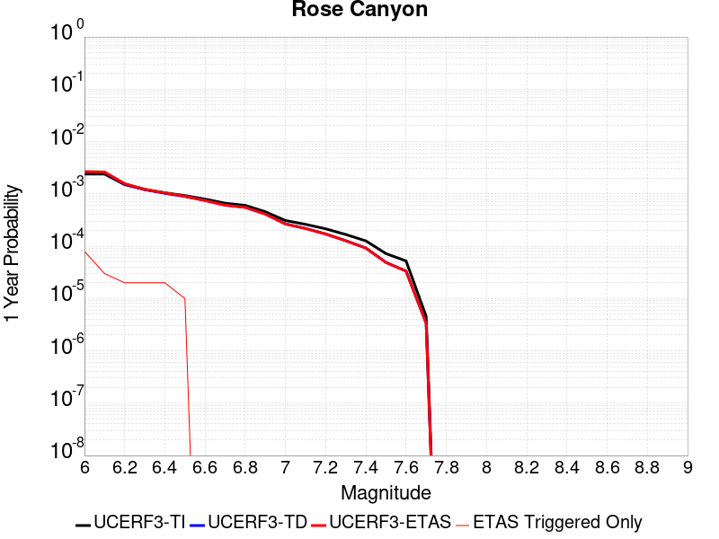 |  |

| Magnitude | 1 wk TI Prob | 1 wk TD Prob | 1 wk ETAS Prob | 1 wk ETAS/TD Gain | 1 wk ETAS Triggered Only | 1 mo TI Prob | 1 mo TD Prob | 1 mo ETAS Prob | 1 mo ETAS/TD Gain | 1 mo ETAS Triggered Only | 1 yr TI Prob | 1 yr TD Prob | 1 yr ETAS Prob | 1 yr ETAS/TD Gain | 1 yr ETAS Triggered Only | 10 yr TI Prob | 10 yr TD Prob | 10 yr ETAS Prob | 10 yr ETAS/TD Gain | 10 yr ETAS Triggered Only |
|-----|-----|-----|-----|-----|-----|-----|-----|-----|-----|-----|-----|-----|-----|-----|-----|-----|-----|-----|-----|-----|
| 6.0 | 4.5923203E-5 | 4.9714225E-5 | 1.1805419E-4 | 2.374656 | 6.834335E-5 | 1.9679888E-4 | 2.1304491E-4 | 3.4970252E-4 | 1.6414497 | 1.366867E-4 | 0.0023933933 | 0.0025909345 | 0.002727267 | 1.0526191 | 1.366867E-4 | 0.023677798 | 0.02563999 | 0.025773173 | 1.0051943 | 1.366867E-4 |
| 6.1 | 4.5923203E-5 | 4.9714225E-5 | 1.1805419E-4 | 2.374656 | 6.834335E-5 | 1.9679888E-4 | 2.1304491E-4 | 2.813737E-4 | 1.3207248 | 6.834335E-5 | 0.0023933933 | 0.0025909345 | 0.0026591008 | 1.0263095 | 6.834335E-5 | 0.023677798 | 0.02563999 | 0.025706582 | 1.0025972 | 6.834335E-5 |
| 6.2 | 2.8844734E-5 | 2.9668723E-5 | 9.801005E-5 | 3.3034806 | 6.834335E-5 | 1.2361443E-4 | 1.2714567E-4 | 1.9548033E-4 | 1.5374517 | 6.834335E-5 | 0.0015039665 | 0.0015468939 | 0.0016151315 | 1.0441127 | 6.834335E-5 | 0.0149382865 | 0.015374276 | 0.015441569 | 1.004377 | 6.834335E-5 |
| 6.3 | 2.3171577E-5 | 2.3161238E-5 | 9.150301E-5 | 3.950696 | 6.834335E-5 | 9.9302975E-5 | 9.9258745E-5 | 1.6759532E-4 | 1.688469 | 6.834335E-5 | 0.0012083431 | 0.0012078186 | 0.0012760794 | 1.0565158 | 6.834335E-5 | 0.012017938 | 0.012022437 | 0.012089958 | 1.0056163 | 6.834335E-5 |
| 6.4 | 2.0066604E-5 | 1.9667024E-5 | 8.800904E-5 | 4.474954 | 6.834335E-5 | 8.599689E-5 | 8.4284584E-5 | 1.5262217E-4 | 1.8107959 | 6.834335E-5 | 0.0010465092 | 0.0010256917 | 0.001093965 | 1.0665631 | 6.834335E-5 | 0.010415946 | 0.010217559 | 0.010285203 | 1.0066205 | 6.834335E-5 |
| 6.5 | 1.776989E-5 | 1.7113807E-5 | 1.7113807E-5 | 1.0 | 0.0 | 7.615444E-5 | 7.334287E-5 | 7.334287E-5 | 1.0 | 0.0 | 9.267859E-4 | 8.925905E-4 | 8.925905E-4 | 1.0 | 0.0 | 0.009229303 | 0.008896211 | 0.008896211 | 1.0 | 0.0 |
| 6.6 | 1.5227364E-5 | 1.433926E-5 | 1.433926E-5 | 1.0 | 0.0 | 6.52585E-5 | 6.1452556E-5 | 6.1452556E-5 | 1.0 | 0.0 | 7.942326E-4 | 7.479332E-4 | 7.479332E-4 | 1.0 | 0.0 | 0.007914 | 0.007458359 | 0.007458359 | 1.0 | 0.0 |
| 6.7 | 1.2703898E-5 | 1.1673274E-5 | 1.1673274E-5 | 1.0 | 0.0 | 5.4444143E-5 | 5.0027378E-5 | 5.0027378E-5 | 1.0 | 0.0 | 6.626558E-4 | 6.089174E-4 | 6.089174E-4 | 1.0 | 0.0 | 0.006606833 | 0.0060750856 | 0.0060750856 | 1.0 | 0.0 |
| 6.8 | 1.1554917E-5 | 1.0609337E-5 | 1.0609337E-5 | 1.0 | 0.0 | 4.9520135E-5 | 4.546782E-5 | 4.546782E-5 | 1.0 | 0.0 | 6.0274085E-4 | 5.5343413E-4 | 5.5343413E-4 | 1.0 | 0.0 | 0.0060110865 | 0.0055225673 | 0.0055225673 | 1.0 | 0.0 |
| 6.9 | 8.732078E-6 | 7.881357E-6 | 7.881357E-6 | 1.0 | 0.0 | 3.7422655E-5 | 3.3776825E-5 | 3.3776825E-5 | 1.0 | 0.0 | 4.5552556E-4 | 4.111582E-4 | 4.111582E-4 | 1.0 | 0.0 | 0.0045459294 | 0.0041048084 | 0.0041048084 | 1.0 | 0.0 |
| 7.0 | 5.9337494E-6 | 5.1074853E-6 | 5.1074853E-6 | 1.0 | 0.0 | 2.5430107E-5 | 2.188904E-5 | 2.188904E-5 | 1.0 | 0.0 | 3.0956755E-4 | 2.664666E-4 | 2.664666E-4 | 1.0 | 0.0 | 0.0030913667 | 0.0026614866 | 0.0026614866 | 1.0 | 0.0 |
| 7.1 | 5.013409E-6 | 4.1773833E-6 | 4.1773833E-6 | 1.0 | 0.0 | 2.1485863E-5 | 1.7902948E-5 | 1.7902948E-5 | 1.0 | 0.0 | 2.6155898E-4 | 2.179467E-4 | 2.179467E-4 | 1.0 | 0.0 | 0.0026125133 | 0.0021773411 | 0.0021773411 | 1.0 | 0.0 |
| 7.2 | 4.120763E-6 | 3.2821383E-6 | 3.2821383E-6 | 1.0 | 0.0 | 1.7660293E-5 | 1.4066231E-5 | 1.4066231E-5 | 1.0 | 0.0 | 2.1499286E-4 | 1.7124301E-4 | 1.7124301E-4 | 1.0 | 0.0 | 0.0021478499 | 0.00171112 | 0.00171112 | 1.0 | 0.0 |
| 7.3 | 3.2081239E-6 | 2.4405372E-6 | 2.4405372E-6 | 1.0 | 0.0 | 1.374903E-5 | 1.0459404E-5 | 1.0459404E-5 | 1.0 | 0.0 | 1.6738157E-4 | 1.2733586E-4 | 1.2733586E-4 | 1.0 | 0.0 | 0.0016725556 | 0.001272636 | 0.001272636 | 1.0 | 0.0 |
| 7.4 | 2.4194755E-6 | 1.7680634E-6 | 1.7680634E-6 | 1.0 | 0.0 | 1.0369139E-5 | 7.577393E-6 | 7.577393E-6 | 1.0 | 0.0 | 1.2623696E-4 | 9.2250906E-5 | 9.2250906E-5 | 1.0 | 0.0 | 0.0012616527 | 9.2213147E-4 | 9.2213147E-4 | 1.0 | 0.0 |
| 7.5 | 1.3842889E-6 | 9.3786275E-7 | 9.3786275E-7 | 1.0 | 0.0 | 5.9326535E-6 | 4.019406E-6 | 4.019406E-6 | 1.0 | 0.0 | 7.222766E-5 | 4.8935202E-5 | 4.8935202E-5 | 1.0 | 0.0 | 7.220419E-4 | 4.892478E-4 | 4.892478E-4 | 1.0 | 0.0 |
| 7.6 | 1.0021575E-6 | 6.411463E-7 | 6.411463E-7 | 1.0 | 0.0 | 4.2949537E-6 | 2.7477672E-6 | 2.7477672E-6 | 1.0 | 0.0 | 5.2289808E-5 | 3.3453573E-5 | 3.3453573E-5 | 1.0 | 0.0 | 5.2277505E-4 | 3.344875E-4 | 3.344875E-4 | 1.0 | 0.0 |
| 7.7 | 8.7620116E-8 | 6.4492404E-8 | 6.4492404E-8 | 1.0 | 0.0 | 3.7551473E-7 | 2.76396E-7 | 2.76396E-7 | 1.0 | 0.0 | 4.5718825E-6 | 3.3651165E-6 | 3.3651165E-6 | 1.0 | 0.0 | 4.5717883E-5 | 3.3650686E-5 | 3.3650686E-5 | 1.0 | 0.0 |

## Santa Ynez (East)
*[(top)](#table-of-contents)*

| 1 Week | 1 Month | 1 Year | 10 Year |
|-----|-----|-----|-----|
|  |  | 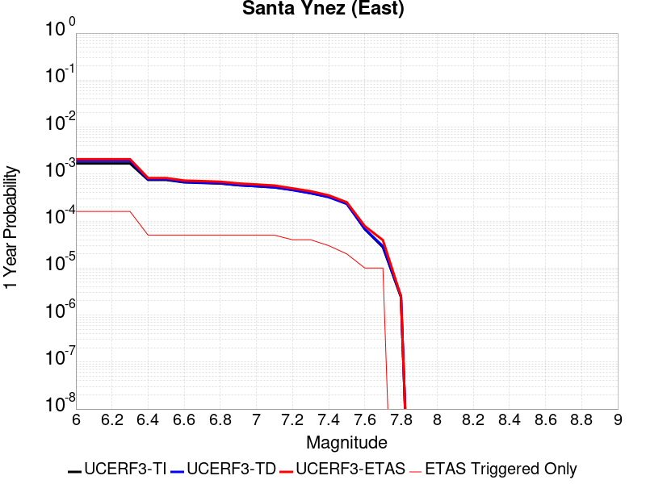 |  |

| Magnitude | 1 wk TI Prob | 1 wk TD Prob | 1 wk ETAS Prob | 1 wk ETAS/TD Gain | 1 wk ETAS Triggered Only | 1 mo TI Prob | 1 mo TD Prob | 1 mo ETAS Prob | 1 mo ETAS/TD Gain | 1 mo ETAS Triggered Only | 1 yr TI Prob | 1 yr TD Prob | 1 yr ETAS Prob | 1 yr ETAS/TD Gain | 1 yr ETAS Triggered Only | 10 yr TI Prob | 10 yr TD Prob | 10 yr ETAS Prob | 10 yr ETAS/TD Gain | 10 yr ETAS Triggered Only |
|-----|-----|-----|-----|-----|-----|-----|-----|-----|-----|-----|-----|-----|-----|-----|-----|-----|-----|-----|-----|-----|
| 6.0 | 3.2269712E-5 | 3.67505E-5 | 1.0509135E-4 | 2.8595893 | 6.834335E-5 | 1.3829143E-4 | 1.5749598E-4 | 2.2582857E-4 | 1.4338689 | 6.834335E-5 | 0.0016823979 | 0.0019164166 | 0.001984629 | 1.0355937 | 6.834335E-5 | 0.016697178 | 0.019056441 | 0.019190524 | 1.0070361 | 1.366867E-4 |
| 6.1 | 3.2269712E-5 | 3.67505E-5 | 1.0509135E-4 | 2.8595893 | 6.834335E-5 | 1.3829143E-4 | 1.5749598E-4 | 2.2582857E-4 | 1.4338689 | 6.834335E-5 | 0.0016823979 | 0.0019164166 | 0.001984629 | 1.0355937 | 6.834335E-5 | 0.016697178 | 0.019056441 | 0.019190524 | 1.0070361 | 1.366867E-4 |
| 6.2 | 3.2269712E-5 | 3.67505E-5 | 1.0509135E-4 | 2.8595893 | 6.834335E-5 | 1.3829143E-4 | 1.5749598E-4 | 2.2582857E-4 | 1.4338689 | 6.834335E-5 | 0.0016823979 | 0.0019164166 | 0.001984629 | 1.0355937 | 6.834335E-5 | 0.016697178 | 0.019056441 | 0.019190524 | 1.0070361 | 1.366867E-4 |
| 6.3 | 3.2269712E-5 | 3.67505E-5 | 1.0509135E-4 | 2.8595893 | 6.834335E-5 | 1.3829143E-4 | 1.5749598E-4 | 2.2582857E-4 | 1.4338689 | 6.834335E-5 | 0.0016823979 | 0.0019164166 | 0.001984629 | 1.0355937 | 6.834335E-5 | 0.016697178 | 0.019056441 | 0.019190524 | 1.0070361 | 1.366867E-4 |
| 6.4 | 1.4404779E-5 | 1.4849382E-5 | 1.4849382E-5 | 1.0 | 0.0 | 6.1733306E-5 | 6.363868E-5 | 6.363868E-5 | 1.0 | 0.0 | 7.513438E-4 | 7.745306E-4 | 7.745306E-4 | 1.0 | 0.0 | 0.0074880854 | 0.007718862 | 0.007718862 | 1.0 | 0.0 |
| 6.5 | 1.4404779E-5 | 1.4849382E-5 | 1.4849382E-5 | 1.0 | 0.0 | 6.1733306E-5 | 6.363868E-5 | 6.363868E-5 | 1.0 | 0.0 | 7.513438E-4 | 7.745306E-4 | 7.745306E-4 | 1.0 | 0.0 | 0.0074880854 | 0.007718862 | 0.007718862 | 1.0 | 0.0 |
| 6.6 | 1.280208E-5 | 1.3011947E-5 | 1.3011947E-5 | 1.0 | 0.0 | 5.4864904E-5 | 5.5764307E-5 | 5.5764307E-5 | 1.0 | 0.0 | 6.6777546E-4 | 6.787207E-4 | 6.787207E-4 | 1.0 | 0.0 | 0.006657724 | 0.0067666885 | 0.0067666885 | 1.0 | 0.0 |
| 6.7 | 1.2457027E-5 | 1.2628468E-5 | 1.2628468E-5 | 1.0 | 0.0 | 5.3386164E-5 | 5.412089E-5 | 5.412089E-5 | 1.0 | 0.0 | 6.497827E-4 | 6.587243E-4 | 6.587243E-4 | 1.0 | 0.0 | 0.00647886 | 0.006567915 | 0.006567915 | 1.0 | 0.0 |
| 6.8 | 1.2095134E-5 | 1.2230915E-5 | 1.2230915E-5 | 1.0 | 0.0 | 5.1835254E-5 | 5.241716E-5 | 5.241716E-5 | 1.0 | 0.0 | 6.309115E-4 | 6.379937E-4 | 6.379937E-4 | 1.0 | 0.0 | 0.0062912325 | 0.006361809 | 0.006361809 | 1.0 | 0.0 |
| 6.9 | 1.1104036E-5 | 1.1157347E-5 | 1.1157347E-5 | 1.0 | 0.0 | 4.758786E-5 | 4.781633E-5 | 4.781633E-5 | 1.0 | 0.0 | 5.7922816E-4 | 5.820096E-4 | 5.820096E-4 | 1.0 | 0.0 | 0.005777207 | 0.0058049993 | 0.0058049993 | 1.0 | 0.0 |
| 7.0 | 1.0577444E-5 | 1.058168E-5 | 1.058168E-5 | 1.0 | 0.0 | 4.5331115E-5 | 4.5349276E-5 | 4.5349276E-5 | 1.0 | 0.0 | 5.5176654E-4 | 5.519888E-4 | 5.519888E-4 | 1.0 | 0.0 | 0.0055039856 | 0.0055063153 | 0.0055063153 | 1.0 | 0.0 |
| 7.1 | 1.0021775E-5 | 9.980988E-6 | 9.980988E-6 | 1.0 | 0.0 | 4.294976E-5 | 4.2774966E-5 | 4.2774966E-5 | 1.0 | 0.0 | 5.2278786E-4 | 5.2066194E-4 | 5.2066194E-4 | 1.0 | 0.0 | 0.0052155964 | 0.0051945536 | 0.0051945536 | 1.0 | 0.0 |
| 7.2 | 8.874109E-6 | 8.748793E-6 | 8.748793E-6 | 1.0 | 0.0 | 3.8031343E-5 | 3.7494297E-5 | 3.7494297E-5 | 1.0 | 0.0 | 4.629332E-4 | 4.5639853E-4 | 4.5639853E-4 | 1.0 | 0.0 | 0.0046197 | 0.0045547304 | 0.0045547304 | 1.0 | 0.0 |
| 7.3 | 7.5504267E-6 | 7.5051175E-6 | 7.5051175E-6 | 1.0 | 0.0 | 3.235857E-5 | 3.21644E-5 | 3.21644E-5 | 1.0 | 0.0 | 3.9389438E-4 | 3.915322E-4 | 3.915322E-4 | 1.0 | 0.0 | 0.0039319694 | 0.003908531 | 0.003908531 | 1.0 | 0.0 |
| 7.4 | 6.309394E-6 | 6.1831556E-6 | 6.1831556E-6 | 1.0 | 0.0 | 2.703998E-5 | 2.6498974E-5 | 2.6498974E-5 | 1.0 | 0.0 | 3.2916202E-4 | 3.225782E-4 | 3.225782E-4 | 1.0 | 0.0 | 0.003286749 | 0.003221197 | 0.003221197 | 1.0 | 0.0 |
| 7.5 | 4.6103073E-6 | 4.4408903E-6 | 4.4408903E-6 | 1.0 | 0.0 | 1.975831E-5 | 1.9032252E-5 | 1.9032252E-5 | 1.0 | 0.0 | 2.4053088E-4 | 2.3169373E-4 | 2.3169373E-4 | 1.0 | 0.0 | 0.002402707 | 0.002314591 | 0.002314591 | 1.0 | 0.0 |
| 7.6 | 1.2858658E-6 | 1.3008173E-6 | 1.3008173E-6 | 1.0 | 0.0 | 5.5108417E-6 | 5.5749197E-6 | 5.5749197E-6 | 1.0 | 0.0 | 6.7092435E-5 | 6.78726E-5 | 6.78726E-5 | 1.0 | 0.0 | 6.707218E-4 | 6.785256E-4 | 6.785256E-4 | 1.0 | 0.0 |
| 7.7 | 5.3302307E-7 | 5.612138E-7 | 5.612138E-7 | 1.0 | 0.0 | 2.2843826E-6 | 2.4052001E-6 | 2.4052001E-6 | 1.0 | 0.0 | 2.7812002E-5 | 2.9282954E-5 | 2.9282954E-5 | 1.0 | 0.0 | 2.7808524E-4 | 2.9279452E-4 | 2.9279452E-4 | 1.0 | 0.0 |
| 7.8 | 4.613933E-8 | 4.80301E-8 | 4.80301E-8 | 1.0 | 0.0 | 1.9773998E-7 | 2.0584326E-7 | 2.0584326E-7 | 1.0 | 0.0 | 2.4074816E-6 | 2.5061388E-6 | 2.5061388E-6 | 1.0 | 0.0 | 2.4074554E-5 | 2.5061116E-5 | 2.5061116E-5 | 1.0 | 0.0 |

## Independence rev 2011
*[(top)](#table-of-contents)*

| 1 Week | 1 Month | 1 Year | 10 Year |
|-----|-----|-----|-----|
|  |  |  |  |

| Magnitude | 1 wk TI Prob | 1 wk TD Prob | 1 wk ETAS Prob | 1 wk ETAS/TD Gain | 1 wk ETAS Triggered Only | 1 mo TI Prob | 1 mo TD Prob | 1 mo ETAS Prob | 1 mo ETAS/TD Gain | 1 mo ETAS Triggered Only | 1 yr TI Prob | 1 yr TD Prob | 1 yr ETAS Prob | 1 yr ETAS/TD Gain | 1 yr ETAS Triggered Only | 10 yr TI Prob | 10 yr TD Prob | 10 yr ETAS Prob | 10 yr ETAS/TD Gain | 10 yr ETAS Triggered Only |
|-----|-----|-----|-----|-----|-----|-----|-----|-----|-----|-----|-----|-----|-----|-----|-----|-----|-----|-----|-----|-----|
| 6.0 | 4.422171E-6 | 4.326227E-6 | 4.326227E-6 | 1.0 | 0.0 | 1.8952025E-5 | 1.8540857E-5 | 8.6882945E-5 | 4.686026 | 6.834335E-5 | 2.3071647E-4 | 2.2571455E-4 | 2.940425E-4 | 1.3027183 | 6.834335E-5 | 0.0023047708 | 0.0022551466 | 0.002391525 | 1.0604743 | 1.366867E-4 |
| 6.1 | 4.422171E-6 | 4.326227E-6 | 4.326227E-6 | 1.0 | 0.0 | 1.8952025E-5 | 1.8540857E-5 | 8.6882945E-5 | 4.686026 | 6.834335E-5 | 2.3071647E-4 | 2.2571455E-4 | 2.940425E-4 | 1.3027183 | 6.834335E-5 | 0.0023047708 | 0.0022551466 | 0.002391525 | 1.0604743 | 1.366867E-4 |
| 6.2 | 4.422171E-6 | 4.326227E-6 | 4.326227E-6 | 1.0 | 0.0 | 1.8952025E-5 | 1.8540857E-5 | 8.6882945E-5 | 4.686026 | 6.834335E-5 | 2.3071647E-4 | 2.2571455E-4 | 2.940425E-4 | 1.3027183 | 6.834335E-5 | 0.0023047708 | 0.0022551466 | 0.002391525 | 1.0604743 | 1.366867E-4 |
| 6.3 | 4.422171E-6 | 4.326227E-6 | 4.326227E-6 | 1.0 | 0.0 | 1.8952025E-5 | 1.8540857E-5 | 8.6882945E-5 | 4.686026 | 6.834335E-5 | 2.3071647E-4 | 2.2571455E-4 | 2.940425E-4 | 1.3027183 | 6.834335E-5 | 0.0023047708 | 0.0022551466 | 0.002391525 | 1.0604743 | 1.366867E-4 |
| 6.4 | 4.422171E-6 | 4.326227E-6 | 4.326227E-6 | 1.0 | 0.0 | 1.8952025E-5 | 1.8540857E-5 | 8.6882945E-5 | 4.686026 | 6.834335E-5 | 2.3071647E-4 | 2.2571455E-4 | 2.940425E-4 | 1.3027183 | 6.834335E-5 | 0.0023047708 | 0.0022551466 | 0.002391525 | 1.0604743 | 1.366867E-4 |
| 6.5 | 4.422171E-6 | 4.326227E-6 | 4.326227E-6 | 1.0 | 0.0 | 1.8952025E-5 | 1.8540857E-5 | 8.6882945E-5 | 4.686026 | 6.834335E-5 | 2.3071647E-4 | 2.2571455E-4 | 2.940425E-4 | 1.3027183 | 6.834335E-5 | 0.0023047708 | 0.0022551466 | 0.002391525 | 1.0604743 | 1.366867E-4 |
| 6.6 | 2.663744E-6 | 2.5319862E-6 | 2.5319862E-6 | 1.0 | 0.0 | 1.1415996E-5 | 1.0851327E-5 | 1.0851327E-5 | 1.0 | 0.0 | 1.3898089E-4 | 1.3210738E-4 | 1.3210738E-4 | 1.0 | 0.0 | 0.0013889399 | 0.0013203367 | 0.0013885899 | 1.0516937 | 6.834335E-5 |
| 6.7 | 2.663744E-6 | 2.5319862E-6 | 2.5319862E-6 | 1.0 | 0.0 | 1.1415996E-5 | 1.0851327E-5 | 1.0851327E-5 | 1.0 | 0.0 | 1.3898089E-4 | 1.3210738E-4 | 1.3210738E-4 | 1.0 | 0.0 | 0.0013889399 | 0.0013203367 | 0.0013885899 | 1.0516937 | 6.834335E-5 |
| 6.8 | 1.9716529E-6 | 1.8322585E-6 | 1.8322585E-6 | 1.0 | 0.0 | 8.449913E-6 | 7.852514E-6 | 7.852514E-6 | 1.0 | 0.0 | 1.0287284E-4 | 9.5600284E-5 | 9.5600284E-5 | 1.0 | 0.0 | 0.0010282523 | 9.556045E-4 | 0.0010238825 | 1.0714501 | 6.834335E-5 |
| 6.9 | 1.8788617E-6 | 1.7429993E-6 | 1.7429993E-6 | 1.0 | 0.0 | 8.0522395E-6 | 7.4699765E-6 | 7.4699765E-6 | 1.0 | 0.0 | 9.80316E-5 | 9.0943286E-5 | 9.0943286E-5 | 1.0 | 0.0 | 9.798837E-4 | 9.0907275E-4 | 9.77354E-4 | 1.0751108 | 6.834335E-5 |
| 7.0 | 1.5045488E-6 | 1.3849503E-6 | 1.3849503E-6 | 1.0 | 0.0 | 6.44805E-6 | 5.9354884E-6 | 5.9354884E-6 | 1.0 | 0.0 | 7.8502184E-5 | 7.226223E-5 | 7.226223E-5 | 1.0 | 0.0 | 7.8474457E-4 | 7.2239246E-4 | 7.906864E-4 | 1.0945386 | 6.834335E-5 |
| 7.1 | 1.272341E-6 | 1.1625096E-6 | 1.1625096E-6 | 1.0 | 0.0 | 5.4528787E-6 | 4.982175E-6 | 4.982175E-6 | 1.0 | 0.0 | 6.6386776E-5 | 6.0656326E-5 | 6.0656326E-5 | 1.0 | 0.0 | 6.636695E-4 | 6.064009E-4 | 6.747028E-4 | 1.1126349 | 6.834335E-5 |
| 7.2 | 1.0416892E-6 | 9.4098806E-7 | 9.4098806E-7 | 1.0 | 0.0 | 4.464375E-6 | 4.0328E-6 | 4.0328E-6 | 1.0 | 0.0 | 5.4352407E-5 | 4.909825E-5 | 4.909825E-5 | 1.0 | 0.0 | 5.4339116E-4 | 4.9087586E-4 | 5.591857E-4 | 1.1391591 | 6.834335E-5 |
| 7.3 | 7.9450155E-7 | 7.235002E-7 | 7.235002E-7 | 1.0 | 0.0 | 3.4050022E-6 | 3.1007114E-6 | 3.1007114E-6 | 1.0 | 0.0 | 4.1455114E-5 | 3.775052E-5 | 3.775052E-5 | 1.0 | 0.0 | 4.144738E-4 | 3.7744216E-4 | 4.4575974E-4 | 1.1810014 | 6.834335E-5 |
| 7.4 | 5.3893444E-7 | 5.019512E-7 | 5.019512E-7 | 1.0 | 0.0 | 2.309717E-6 | 2.1512178E-6 | 2.1512178E-6 | 1.0 | 0.0 | 2.8120441E-5 | 2.6190766E-5 | 2.6190766E-5 | 1.0 | 0.0 | 2.8116882E-4 | 2.6187726E-4 | 3.3020272E-4 | 1.2609065 | 6.834335E-5 |
| 7.5 | 3.8852085E-7 | 3.682554E-7 | 3.682554E-7 | 1.0 | 0.0 | 1.6650882E-6 | 1.5782365E-6 | 1.5782365E-6 | 1.0 | 0.0 | 2.027226E-5 | 1.9214862E-5 | 1.9214862E-5 | 1.0 | 0.0 | 2.0270412E-4 | 1.9213221E-4 | 2.6046243E-4 | 1.3556417 | 6.834335E-5 |
| 7.6 | 2.414929E-7 | 2.345755E-7 | 2.345755E-7 | 1.0 | 0.0 | 1.0349692E-6 | 1.0053232E-6 | 1.0053232E-6 | 1.0 | 0.0 | 1.2600677E-5 | 1.2239742E-5 | 1.2239742E-5 | 1.0 | 0.0 | 1.2599962E-4 | 1.223908E-4 | 1.223908E-4 | 1.0 | 0.0 |
| 7.7 | 6.8298014E-8 | 6.85897E-8 | 6.85897E-8 | 1.0 | 0.0 | 2.9270575E-7 | 2.9395582E-7 | 2.9395582E-7 | 1.0 | 0.0 | 3.5636867E-6 | 3.5789067E-6 | 3.5789067E-6 | 1.0 | 0.0 | 3.5636294E-5 | 3.5788536E-5 | 3.5788536E-5 | 1.0 | 0.0 |

## Lost Hills
*[(top)](#table-of-contents)*

| 1 Week | 1 Month | 1 Year | 10 Year |
|-----|-----|-----|-----|
|  |  |  |  |

| Magnitude | 1 wk TI Prob | 1 wk TD Prob | 1 wk ETAS Prob | 1 wk ETAS/TD Gain | 1 wk ETAS Triggered Only | 1 mo TI Prob | 1 mo TD Prob | 1 mo ETAS Prob | 1 mo ETAS/TD Gain | 1 mo ETAS Triggered Only | 1 yr TI Prob | 1 yr TD Prob | 1 yr ETAS Prob | 1 yr ETAS/TD Gain | 1 yr ETAS Triggered Only | 10 yr TI Prob | 10 yr TD Prob | 10 yr ETAS Prob | 10 yr ETAS/TD Gain | 10 yr ETAS Triggered Only |
|-----|-----|-----|-----|-----|-----|-----|-----|-----|-----|-----|-----|-----|-----|-----|-----|-----|-----|-----|-----|-----|
| 6.0 | 2.233523E-5 | 2.5106583E-5 | 2.5106583E-5 | 1.0 | 0.0 | 9.571891E-5 | 1.0759615E-4 | 2.4426816E-4 | 2.2702315 | 1.366867E-4 | 0.0011647546 | 0.001309364 | 0.0014458718 | 1.104255 | 1.366867E-4 | 0.011586686 | 0.013033091 | 0.013167996 | 1.010351 | 1.366867E-4 |
| 6.1 | 2.233523E-5 | 2.5106583E-5 | 2.5106583E-5 | 1.0 | 0.0 | 9.571891E-5 | 1.0759615E-4 | 2.4426816E-4 | 2.2702315 | 1.366867E-4 | 0.0011647546 | 0.001309364 | 0.0014458718 | 1.104255 | 1.366867E-4 | 0.011586686 | 0.013033091 | 0.013167996 | 1.010351 | 1.366867E-4 |
| 6.2 | 2.233523E-5 | 2.5106583E-5 | 2.5106583E-5 | 1.0 | 0.0 | 9.571891E-5 | 1.0759615E-4 | 2.4426816E-4 | 2.2702315 | 1.366867E-4 | 0.0011647546 | 0.001309364 | 0.0014458718 | 1.104255 | 1.366867E-4 | 0.011586686 | 0.013033091 | 0.013167996 | 1.010351 | 1.366867E-4 |
| 6.3 | 2.233523E-5 | 2.5106583E-5 | 2.5106583E-5 | 1.0 | 0.0 | 9.571891E-5 | 1.0759615E-4 | 2.4426816E-4 | 2.2702315 | 1.366867E-4 | 0.0011647546 | 0.001309364 | 0.0014458718 | 1.104255 | 1.366867E-4 | 0.011586686 | 0.013033091 | 0.013167996 | 1.010351 | 1.366867E-4 |
| 6.4 | 1.2288092E-5 | 1.3781108E-5 | 1.3781108E-5 | 1.0 | 0.0 | 5.2662188E-5 | 5.906108E-5 | 1.9573972E-4 | 3.3141913 | 1.366867E-4 | 6.409735E-4 | 7.189252E-4 | 8.555137E-4 | 1.1899898 | 1.366867E-4 | 0.006391279 | 0.0071752006 | 0.007310907 | 1.0189131 | 1.366867E-4 |
| 6.5 | 1.2288092E-5 | 1.3781108E-5 | 1.3781108E-5 | 1.0 | 0.0 | 5.2662188E-5 | 5.906108E-5 | 1.9573972E-4 | 3.3141913 | 1.366867E-4 | 6.409735E-4 | 7.189252E-4 | 8.555137E-4 | 1.1899898 | 1.366867E-4 | 0.006391279 | 0.0071752006 | 0.007310907 | 1.0189131 | 1.366867E-4 |
| 6.6 | 8.58281E-6 | 9.63377E-6 | 9.63377E-6 | 1.0 | 0.0 | 3.6782953E-5 | 4.12874E-5 | 1.0962794E-4 | 2.6552393 | 6.834335E-5 | 4.4774043E-4 | 5.026414E-4 | 5.709504E-4 | 1.1359001 | 6.834335E-5 | 0.0044683935 | 0.005023205 | 0.0050912052 | 1.0135372 | 6.834335E-5 |
| 6.7 | 7.205685E-6 | 8.088302E-6 | 8.088302E-6 | 1.0 | 0.0 | 3.088114E-5 | 3.466415E-5 | 1.03005135E-4 | 2.9715178 | 6.834335E-5 | 3.7591302E-4 | 4.2203604E-4 | 4.9035053E-4 | 1.1618689 | 6.834335E-5 | 0.0037527776 | 0.0042203604 | 0.0042884154 | 1.0161254 | 6.834335E-5 |

## Pitas Point (Lower)-Montalvo
*[(top)](#table-of-contents)*

| 1 Week | 1 Month | 1 Year | 10 Year |
|-----|-----|-----|-----|
|  |  |  |  |

| Magnitude | 1 wk TI Prob | 1 wk TD Prob | 1 wk ETAS Prob | 1 wk ETAS/TD Gain | 1 wk ETAS Triggered Only | 1 mo TI Prob | 1 mo TD Prob | 1 mo ETAS Prob | 1 mo ETAS/TD Gain | 1 mo ETAS Triggered Only | 1 yr TI Prob | 1 yr TD Prob | 1 yr ETAS Prob | 1 yr ETAS/TD Gain | 1 yr ETAS Triggered Only | 10 yr TI Prob | 10 yr TD Prob | 10 yr ETAS Prob | 10 yr ETAS/TD Gain | 10 yr ETAS Triggered Only |
|-----|-----|-----|-----|-----|-----|-----|-----|-----|-----|-----|-----|-----|-----|-----|-----|-----|-----|-----|-----|-----|
| 6.0 | 5.2543637E-6 | 4.8378706E-6 | 4.8378706E-6 | 1.0 | 0.0 | 2.2518509E-5 | 2.0733567E-5 | 2.0733567E-5 | 1.0 | 0.0 | 2.7412834E-4 | 2.5240227E-4 | 2.5240227E-4 | 1.0 | 0.0 | 0.0027379042 | 0.0025211885 | 0.0025893594 | 1.0270393 | 6.834335E-5 |
| 6.1 | 5.2543637E-6 | 4.8378706E-6 | 4.8378706E-6 | 1.0 | 0.0 | 2.2518509E-5 | 2.0733567E-5 | 2.0733567E-5 | 1.0 | 0.0 | 2.7412834E-4 | 2.5240227E-4 | 2.5240227E-4 | 1.0 | 0.0 | 0.0027379042 | 0.0025211885 | 0.0025893594 | 1.0270393 | 6.834335E-5 |
| 6.2 | 5.2543637E-6 | 4.8378706E-6 | 4.8378706E-6 | 1.0 | 0.0 | 2.2518509E-5 | 2.0733567E-5 | 2.0733567E-5 | 1.0 | 0.0 | 2.7412834E-4 | 2.5240227E-4 | 2.5240227E-4 | 1.0 | 0.0 | 0.0027379042 | 0.0025211885 | 0.0025893594 | 1.0270393 | 6.834335E-5 |
| 6.3 | 5.2543637E-6 | 4.8378706E-6 | 4.8378706E-6 | 1.0 | 0.0 | 2.2518509E-5 | 2.0733567E-5 | 2.0733567E-5 | 1.0 | 0.0 | 2.7412834E-4 | 2.5240227E-4 | 2.5240227E-4 | 1.0 | 0.0 | 0.0027379042 | 0.0025211885 | 0.0025893594 | 1.0270393 | 6.834335E-5 |
| 6.4 | 5.2543637E-6 | 4.8378706E-6 | 4.8378706E-6 | 1.0 | 0.0 | 2.2518509E-5 | 2.0733567E-5 | 2.0733567E-5 | 1.0 | 0.0 | 2.7412834E-4 | 2.5240227E-4 | 2.5240227E-4 | 1.0 | 0.0 | 0.0027379042 | 0.0025211885 | 0.0025893594 | 1.0270393 | 6.834335E-5 |
| 6.5 | 5.2543637E-6 | 4.8378706E-6 | 4.8378706E-6 | 1.0 | 0.0 | 2.2518509E-5 | 2.0733567E-5 | 2.0733567E-5 | 1.0 | 0.0 | 2.7412834E-4 | 2.5240227E-4 | 2.5240227E-4 | 1.0 | 0.0 | 0.0027379042 | 0.0025211885 | 0.0025893594 | 1.0270393 | 6.834335E-5 |
| 6.6 | 5.2543637E-6 | 4.8378706E-6 | 4.8378706E-6 | 1.0 | 0.0 | 2.2518509E-5 | 2.0733567E-5 | 2.0733567E-5 | 1.0 | 0.0 | 2.7412834E-4 | 2.5240227E-4 | 2.5240227E-4 | 1.0 | 0.0 | 0.0027379042 | 0.0025211885 | 0.0025893594 | 1.0270393 | 6.834335E-5 |
| 6.7 | 5.2543637E-6 | 4.8378706E-6 | 4.8378706E-6 | 1.0 | 0.0 | 2.2518509E-5 | 2.0733567E-5 | 2.0733567E-5 | 1.0 | 0.0 | 2.7412834E-4 | 2.5240227E-4 | 2.5240227E-4 | 1.0 | 0.0 | 0.0027379042 | 0.0025211885 | 0.0025893594 | 1.0270393 | 6.834335E-5 |
| 6.8 | 5.2543637E-6 | 4.8378706E-6 | 4.8378706E-6 | 1.0 | 0.0 | 2.2518509E-5 | 2.0733567E-5 | 2.0733567E-5 | 1.0 | 0.0 | 2.7412834E-4 | 2.5240227E-4 | 2.5240227E-4 | 1.0 | 0.0 | 0.0027379042 | 0.0025211885 | 0.0025893594 | 1.0270393 | 6.834335E-5 |
| 6.9 | 5.2543637E-6 | 4.8378706E-6 | 4.8378706E-6 | 1.0 | 0.0 | 2.2518509E-5 | 2.0733567E-5 | 2.0733567E-5 | 1.0 | 0.0 | 2.7412834E-4 | 2.5240227E-4 | 2.5240227E-4 | 1.0 | 0.0 | 0.0027379042 | 0.0025211885 | 0.0025893594 | 1.0270393 | 6.834335E-5 |
| 7.0 | 5.2543637E-6 | 4.8378706E-6 | 4.8378706E-6 | 1.0 | 0.0 | 2.2518509E-5 | 2.0733567E-5 | 2.0733567E-5 | 1.0 | 0.0 | 2.7412834E-4 | 2.5240227E-4 | 2.5240227E-4 | 1.0 | 0.0 | 0.0027379042 | 0.0025211885 | 0.0025893594 | 1.0270393 | 6.834335E-5 |
| 7.1 | 5.2543637E-6 | 4.8378706E-6 | 4.8378706E-6 | 1.0 | 0.0 | 2.2518509E-5 | 2.0733567E-5 | 2.0733567E-5 | 1.0 | 0.0 | 2.7412834E-4 | 2.5240227E-4 | 2.5240227E-4 | 1.0 | 0.0 | 0.0027379042 | 0.0025211885 | 0.0025893594 | 1.0270393 | 6.834335E-5 |
| 7.2 | 5.2458695E-6 | 4.8290244E-6 | 4.8290244E-6 | 1.0 | 0.0 | 2.2482105E-5 | 2.0695656E-5 | 2.0695656E-5 | 1.0 | 0.0 | 2.7368523E-4 | 2.519408E-4 | 2.519408E-4 | 1.0 | 0.0 | 0.0027334841 | 0.0025165842 | 0.0025847554 | 1.0270889 | 6.834335E-5 |
| 7.3 | 5.22665E-6 | 4.8089414E-6 | 4.8089414E-6 | 1.0 | 0.0 | 2.2399736E-5 | 2.0609588E-5 | 2.0609588E-5 | 1.0 | 0.0 | 2.7268266E-4 | 2.5089315E-4 | 2.5089315E-4 | 1.0 | 0.0 | 0.002723483 | 0.0025061315 | 0.0025743037 | 1.0272021 | 6.834335E-5 |
| 7.4 | 5.210642E-6 | 4.792154E-6 | 4.792154E-6 | 1.0 | 0.0 | 2.233113E-5 | 2.0537642E-5 | 2.0537642E-5 | 1.0 | 0.0 | 2.718476E-4 | 2.5001742E-4 | 2.5001742E-4 | 1.0 | 0.0 | 0.002715153 | 0.0024973939 | 0.0025655665 | 1.0272975 | 6.834335E-5 |
| 7.5 | 5.1226016E-6 | 4.7000403E-6 | 4.7000403E-6 | 1.0 | 0.0 | 2.1953823E-5 | 2.0142877E-5 | 2.0142877E-5 | 1.0 | 0.0 | 2.67255E-4 | 2.4521223E-4 | 2.4521223E-4 | 1.0 | 0.0 | 0.0026693381 | 0.0024494485 | 0.0025176243 | 1.0278332 | 6.834335E-5 |
| 7.6 | 4.8796987E-6 | 4.4449403E-6 | 4.4449403E-6 | 1.0 | 0.0 | 2.0912828E-5 | 1.9049607E-5 | 1.9049607E-5 | 1.0 | 0.0 | 2.5458392E-4 | 2.3190459E-4 | 2.3190459E-4 | 1.0 | 0.0 | 0.0025429246 | 0.0023166565 | 0.0023848414 | 1.0294325 | 6.834335E-5 |
| 7.7 | 4.0834398E-6 | 3.6091124E-6 | 3.6091124E-6 | 1.0 | 0.0 | 1.7500339E-5 | 1.5467534E-5 | 1.5467534E-5 | 1.0 | 0.0 | 2.1304579E-4 | 1.8830119E-4 | 1.8830119E-4 | 1.0 | 0.0 | 0.0021284167 | 0.00188144 | 0.0019496549 | 1.0362567 | 6.834335E-5 |
| 7.8 | 2.5445438E-6 | 2.121228E-6 | 2.121228E-6 | 1.0 | 0.0 | 1.0905142E-5 | 9.090945E-6 | 9.090945E-6 | 1.0 | 0.0 | 1.3276201E-4 | 1.1067669E-4 | 1.1067669E-4 | 1.0 | 0.0 | 0.0013268272 | 0.0011062203 | 0.0011062203 | 1.0 | 0.0 |
| 7.9 | 4.1677114E-7 | 3.3293693E-7 | 3.3293693E-7 | 1.0 | 0.0 | 1.7861609E-6 | 1.4268718E-6 | 1.4268718E-6 | 1.0 | 0.0 | 2.1746291E-5 | 1.737203E-5 | 1.737203E-5 | 1.0 | 0.0 | 2.1744163E-4 | 1.7370703E-4 | 1.7370703E-4 | 1.0 | 0.0 |
| 8.0 | 7.791402E-9 | 5.683497E-9 | 5.683497E-9 | 1.0 | 0.0 | 3.3391725E-8 | 2.4357844E-8 | 2.4357844E-8 | 1.0 | 0.0 | 4.0654416E-7 | 2.9655675E-7 | 2.9655675E-7 | 1.0 | 0.0 | 4.065434E-6 | 2.9655655E-6 | 2.9655655E-6 | 1.0 | 0.0 |

## Kern Canyon (Lake Isabella) 2011
*[(top)](#table-of-contents)*

| 1 Week | 1 Month | 1 Year | 10 Year |
|-----|-----|-----|-----|
|  |  |  |  |

| Magnitude | 1 wk TI Prob | 1 wk TD Prob | 1 wk ETAS Prob | 1 wk ETAS/TD Gain | 1 wk ETAS Triggered Only | 1 mo TI Prob | 1 mo TD Prob | 1 mo ETAS Prob | 1 mo ETAS/TD Gain | 1 mo ETAS Triggered Only | 1 yr TI Prob | 1 yr TD Prob | 1 yr ETAS Prob | 1 yr ETAS/TD Gain | 1 yr ETAS Triggered Only | 10 yr TI Prob | 10 yr TD Prob | 10 yr ETAS Prob | 10 yr ETAS/TD Gain | 10 yr ETAS Triggered Only |
|-----|-----|-----|-----|-----|-----|-----|-----|-----|-----|-----|-----|-----|-----|-----|-----|-----|-----|-----|-----|-----|
| 6.0 | 4.2387383E-6 | 4.001639E-6 | 4.001639E-6 | 1.0 | 0.0 | 1.8165894E-5 | 1.7149778E-5 | 1.7149778E-5 | 1.0 | 0.0 | 2.2114732E-4 | 2.087804E-4 | 2.771095E-4 | 1.3272773 | 6.834335E-5 | 0.0022092736 | 0.0020860266 | 0.0021542273 | 1.0326941 | 6.834335E-5 |
| 6.1 | 4.2387383E-6 | 4.001639E-6 | 4.001639E-6 | 1.0 | 0.0 | 1.8165894E-5 | 1.7149778E-5 | 1.7149778E-5 | 1.0 | 0.0 | 2.2114732E-4 | 2.087804E-4 | 2.771095E-4 | 1.3272773 | 6.834335E-5 | 0.0022092736 | 0.0020860266 | 0.0021542273 | 1.0326941 | 6.834335E-5 |
| 6.2 | 4.2387383E-6 | 4.001639E-6 | 4.001639E-6 | 1.0 | 0.0 | 1.8165894E-5 | 1.7149778E-5 | 1.7149778E-5 | 1.0 | 0.0 | 2.2114732E-4 | 2.087804E-4 | 2.771095E-4 | 1.3272773 | 6.834335E-5 | 0.0022092736 | 0.0020860266 | 0.0021542273 | 1.0326941 | 6.834335E-5 |
| 6.3 | 4.2387383E-6 | 4.001639E-6 | 4.001639E-6 | 1.0 | 0.0 | 1.8165894E-5 | 1.7149778E-5 | 1.7149778E-5 | 1.0 | 0.0 | 2.2114732E-4 | 2.087804E-4 | 2.771095E-4 | 1.3272773 | 6.834335E-5 | 0.0022092736 | 0.0020860266 | 0.0021542273 | 1.0326941 | 6.834335E-5 |
| 6.4 | 4.2387383E-6 | 4.001639E-6 | 4.001639E-6 | 1.0 | 0.0 | 1.8165894E-5 | 1.7149778E-5 | 1.7149778E-5 | 1.0 | 0.0 | 2.2114732E-4 | 2.087804E-4 | 2.771095E-4 | 1.3272773 | 6.834335E-5 | 0.0022092736 | 0.0020860266 | 0.0021542273 | 1.0326941 | 6.834335E-5 |
| 6.5 | 2.7857532E-6 | 2.517867E-6 | 2.517867E-6 | 1.0 | 0.0 | 1.1938888E-5 | 1.0790815E-5 | 1.0790815E-5 | 1.0 | 0.0 | 1.4534626E-4 | 1.3137059E-4 | 1.9970497E-4 | 1.520165 | 6.834335E-5 | 0.0014525123 | 0.001312962 | 0.0013812156 | 1.0519844 | 6.834335E-5 |
| 6.6 | 2.2233348E-6 | 1.9441236E-6 | 1.9441236E-6 | 1.0 | 0.0 | 9.528543E-6 | 8.331932E-6 | 8.331932E-6 | 1.0 | 0.0 | 1.1600384E-4 | 1.01436635E-4 | 1.6977306E-4 | 1.6736858 | 6.834335E-5 | 0.001159433 | 0.001013912 | 0.001082186 | 1.0673373 | 6.834335E-5 |
| 6.7 | 2.1635126E-6 | 1.8835036E-6 | 1.8835036E-6 | 1.0 | 0.0 | 9.272164E-6 | 8.072134E-6 | 8.072134E-6 | 1.0 | 0.0 | 1.1288274E-4 | 9.827388E-5 | 1.6661052E-4 | 1.6953694 | 6.834335E-5 | 0.0011282542 | 9.823124E-4 | 0.0010505886 | 1.0695056 | 6.834335E-5 |
| 6.8 | 1.8685711E-6 | 1.5831425E-6 | 1.5831425E-6 | 1.0 | 0.0 | 8.008137E-6 | 6.784879E-6 | 6.784879E-6 | 1.0 | 0.0 | 9.74947E-5 | 8.260282E-5 | 1.5094054E-4 | 1.8273048 | 6.834335E-5 | 9.745194E-4 | 8.2572614E-4 | 8.9401304E-4 | 1.0826993 | 6.834335E-5 |
| 6.9 | 1.5815071E-6 | 1.3064928E-6 | 1.3064928E-6 | 1.0 | 0.0 | 6.77787E-6 | 5.599243E-6 | 5.599243E-6 | 1.0 | 0.0 | 8.251744E-5 | 6.816868E-5 | 1.3650737E-4 | 2.002494 | 6.834335E-5 | 8.248681E-4 | 6.8148033E-4 | 7.4977713E-4 | 1.1002183 | 6.834335E-5 |
| 7.0 | 1.3772564E-6 | 1.1210718E-6 | 1.1210718E-6 | 1.0 | 0.0 | 5.9025137E-6 | 4.8045845E-6 | 4.8045845E-6 | 1.0 | 0.0 | 7.186073E-5 | 5.8494268E-5 | 1.2683363E-4 | 2.1683087 | 6.834335E-5 | 7.18375E-4 | 5.847908E-4 | 6.5309415E-4 | 1.1167997 | 6.834335E-5 |
| 7.1 | 1.0916998E-6 | 8.763777E-7 | 8.763777E-7 | 1.0 | 0.0 | 4.678705E-6 | 3.7558991E-6 | 3.7558991E-6 | 1.0 | 0.0 | 5.6961744E-5 | 4.5727127E-5 | 4.5727127E-5 | 1.0 | 0.0 | 5.6947145E-4 | 4.571785E-4 | 4.571785E-4 | 1.0 | 0.0 |
| 7.2 | 7.6277024E-7 | 5.901454E-7 | 5.901454E-7 | 1.0 | 0.0 | 3.2690114E-6 | 2.5291922E-6 | 2.5291922E-6 | 1.0 | 0.0 | 3.9799485E-5 | 3.0792486E-5 | 3.0792486E-5 | 1.0 | 0.0 | 3.9792358E-4 | 3.0788282E-4 | 3.0788282E-4 | 1.0 | 0.0 |
| 7.3 | 5.3265916E-7 | 4.3824414E-7 | 4.3824414E-7 | 1.0 | 0.0 | 2.282823E-6 | 1.878188E-6 | 1.878188E-6 | 1.0 | 0.0 | 2.7793016E-5 | 2.2866701E-5 | 2.2866701E-5 | 1.0 | 0.0 | 2.778954E-4 | 2.2864387E-4 | 2.2864387E-4 | 1.0 | 0.0 |
| 7.4 | 3.4946007E-7 | 3.006571E-7 | 3.006571E-7 | 1.0 | 0.0 | 1.497685E-6 | 1.2885298E-6 | 1.2885298E-6 | 1.0 | 0.0 | 1.8234163E-5 | 1.568774E-5 | 1.568774E-5 | 1.0 | 0.0 | 1.8232666E-4 | 1.5686655E-4 | 1.5686655E-4 | 1.0 | 0.0 |
| 7.5 | 1.8317026E-7 | 1.4244812E-7 | 1.4244812E-7 | 1.0 | 0.0 | 7.850152E-7 | 6.104918E-7 | 6.104918E-7 | 1.0 | 0.0 | 9.557518E-6 | 7.432713E-6 | 7.432713E-6 | 1.0 | 0.0 | 9.5571064E-5 | 7.432472E-5 | 7.432472E-5 | 1.0 | 0.0 |
| 7.6 | 2.572245E-8 | 1.7352555E-8 | 1.7352555E-8 | 1.0 | 0.0 | 1.10239064E-7 | 7.436809E-8 | 7.436809E-8 | 1.0 | 0.0 | 1.3421597E-6 | 9.054312E-7 | 9.054312E-7 | 1.0 | 0.0 | 1.3421517E-5 | 9.05428E-6 | 9.05428E-6 | 1.0 | 0.0 |

## Channel Islands Thrust
*[(top)](#table-of-contents)*

| 1 Week | 1 Month | 1 Year | 10 Year |
|-----|-----|-----|-----|
|  |  |  |  |

| Magnitude | 1 wk TI Prob | 1 wk TD Prob | 1 wk ETAS Prob | 1 wk ETAS/TD Gain | 1 wk ETAS Triggered Only | 1 mo TI Prob | 1 mo TD Prob | 1 mo ETAS Prob | 1 mo ETAS/TD Gain | 1 mo ETAS Triggered Only | 1 yr TI Prob | 1 yr TD Prob | 1 yr ETAS Prob | 1 yr ETAS/TD Gain | 1 yr ETAS Triggered Only | 10 yr TI Prob | 10 yr TD Prob | 10 yr ETAS Prob | 10 yr ETAS/TD Gain | 10 yr ETAS Triggered Only |
|-----|-----|-----|-----|-----|-----|-----|-----|-----|-----|-----|-----|-----|-----|-----|-----|-----|-----|-----|-----|-----|
| 6.0 | 2.2156251E-5 | 2.4092022E-5 | 2.4092022E-5 | 1.0 | 0.0 | 9.495191E-5 | 1.03248036E-4 | 1.03248036E-4 | 1.0 | 0.0 | 0.0011554264 | 0.0012564264 | 0.0012564264 | 1.0 | 0.0 | 0.011494373 | 0.0125038205 | 0.01257131 | 1.0053974 | 6.834335E-5 |
| 6.1 | 2.2156251E-5 | 2.4092022E-5 | 2.4092022E-5 | 1.0 | 0.0 | 9.495191E-5 | 1.03248036E-4 | 1.03248036E-4 | 1.0 | 0.0 | 0.0011554264 | 0.0012564264 | 0.0012564264 | 1.0 | 0.0 | 0.011494373 | 0.0125038205 | 0.01257131 | 1.0053974 | 6.834335E-5 |
| 6.2 | 2.2156251E-5 | 2.4092022E-5 | 2.4092022E-5 | 1.0 | 0.0 | 9.495191E-5 | 1.03248036E-4 | 1.03248036E-4 | 1.0 | 0.0 | 0.0011554264 | 0.0012564264 | 0.0012564264 | 1.0 | 0.0 | 0.011494373 | 0.0125038205 | 0.01257131 | 1.0053974 | 6.834335E-5 |
| 6.3 | 2.2156251E-5 | 2.4092022E-5 | 2.4092022E-5 | 1.0 | 0.0 | 9.495191E-5 | 1.03248036E-4 | 1.03248036E-4 | 1.0 | 0.0 | 0.0011554264 | 0.0012564264 | 0.0012564264 | 1.0 | 0.0 | 0.011494373 | 0.0125038205 | 0.01257131 | 1.0053974 | 6.834335E-5 |
| 6.4 | 2.2156251E-5 | 2.4092022E-5 | 2.4092022E-5 | 1.0 | 0.0 | 9.495191E-5 | 1.03248036E-4 | 1.03248036E-4 | 1.0 | 0.0 | 0.0011554264 | 0.0012564264 | 0.0012564264 | 1.0 | 0.0 | 0.011494373 | 0.0125038205 | 0.01257131 | 1.0053974 | 6.834335E-5 |
| 6.5 | 2.2156251E-5 | 2.4092022E-5 | 2.4092022E-5 | 1.0 | 0.0 | 9.495191E-5 | 1.03248036E-4 | 1.03248036E-4 | 1.0 | 0.0 | 0.0011554264 | 0.0012564264 | 0.0012564264 | 1.0 | 0.0 | 0.011494373 | 0.0125038205 | 0.01257131 | 1.0053974 | 6.834335E-5 |
| 6.6 | 2.2156251E-5 | 2.4092022E-5 | 2.4092022E-5 | 1.0 | 0.0 | 9.495191E-5 | 1.03248036E-4 | 1.03248036E-4 | 1.0 | 0.0 | 0.0011554264 | 0.0012564264 | 0.0012564264 | 1.0 | 0.0 | 0.011494373 | 0.0125038205 | 0.01257131 | 1.0053974 | 6.834335E-5 |
| 6.7 | 1.0601296E-5 | 1.1379544E-5 | 1.1379544E-5 | 1.0 | 0.0 | 4.5433335E-5 | 4.876859E-5 | 4.876859E-5 | 1.0 | 0.0 | 5.5301044E-4 | 5.936007E-4 | 5.936007E-4 | 1.0 | 0.0 | 0.005516363 | 0.005920653 | 0.005920653 | 1.0 | 0.0 |
| 6.8 | 1.0246747E-5 | 1.0996669E-5 | 1.0996669E-5 | 1.0 | 0.0 | 4.391389E-5 | 4.7127756E-5 | 4.7127756E-5 | 1.0 | 0.0 | 5.345204E-4 | 5.7363417E-4 | 5.7363417E-4 | 1.0 | 0.0 | 0.0053323656 | 0.005722025 | 0.005722025 | 1.0 | 0.0 |
| 6.9 | 9.049551E-6 | 9.699645E-6 | 9.699645E-6 | 1.0 | 0.0 | 3.878322E-5 | 4.1569267E-5 | 4.1569267E-5 | 1.0 | 0.0 | 4.7208337E-4 | 5.059924E-4 | 5.059924E-4 | 1.0 | 0.0 | 0.0047108172 | 0.0050488203 | 0.0050488203 | 1.0 | 0.0 |
| 7.0 | 8.6542195E-6 | 9.274603E-6 | 9.274603E-6 | 1.0 | 0.0 | 3.7088983E-5 | 3.9747716E-5 | 3.9747716E-5 | 1.0 | 0.0 | 4.5146482E-4 | 4.8382508E-4 | 4.8382508E-4 | 1.0 | 0.0 | 0.004505487 | 0.004828129 | 0.004828129 | 1.0 | 0.0 |
| 7.1 | 8.391028E-6 | 8.992924E-6 | 8.992924E-6 | 1.0 | 0.0 | 3.5961057E-5 | 3.854056E-5 | 3.854056E-5 | 1.0 | 0.0 | 4.3773788E-4 | 4.6913436E-4 | 4.6913436E-4 | 1.0 | 0.0 | 0.004368766 | 0.0046818503 | 0.0046818503 | 1.0 | 0.0 |
| 7.2 | 5.965188E-6 | 6.3716952E-6 | 6.3716952E-6 | 1.0 | 0.0 | 2.556484E-5 | 2.7306982E-5 | 2.7306982E-5 | 1.0 | 0.0 | 3.1120746E-4 | 3.3241234E-4 | 3.3241234E-4 | 1.0 | 0.0 | 0.00310772 | 0.0033192092 | 0.0033192092 | 1.0 | 0.0 |
| 7.3 | 4.877518E-6 | 5.2060063E-6 | 5.2060063E-6 | 1.0 | 0.0 | 2.0903482E-5 | 2.2311267E-5 | 2.2311267E-5 | 1.0 | 0.0 | 2.5447016E-4 | 2.716063E-4 | 2.716063E-4 | 1.0 | 0.0 | 0.0025417898 | 0.0027127895 | 0.0027127895 | 1.0 | 0.0 |
| 7.4 | 3.8829853E-6 | 4.141863E-6 | 4.141863E-6 | 1.0 | 0.0 | 1.664126E-5 | 1.7750723E-5 | 1.7750723E-5 | 1.0 | 0.0 | 2.0258849E-4 | 2.1609402E-4 | 2.1609402E-4 | 1.0 | 0.0 | 0.002024039 | 0.0021588807 | 0.0021588807 | 1.0 | 0.0 |
| 7.5 | 1.3489616E-6 | 1.4277903E-6 | 1.4277903E-6 | 1.0 | 0.0 | 5.7812517E-6 | 6.119087E-6 | 6.119087E-6 | 1.0 | 0.0 | 7.038446E-5 | 7.449738E-5 | 7.449738E-5 | 1.0 | 0.0 | 7.036218E-4 | 7.44728E-4 | 7.44728E-4 | 1.0 | 0.0 |
| 7.6 | 6.058192E-7 | 6.353778E-7 | 6.353778E-7 | 1.0 | 0.0 | 2.5963652E-6 | 2.7230449E-6 | 2.7230449E-6 | 1.0 | 0.0 | 3.161029E-5 | 3.3152584E-5 | 3.3152584E-5 | 1.0 | 0.0 | 3.1605794E-4 | 3.31478E-4 | 3.31478E-4 | 1.0 | 0.0 |
| 7.7 | 2.2170494E-7 | 2.2607902E-7 | 2.2607902E-7 | 1.0 | 0.0 | 9.5016367E-7 | 9.689098E-7 | 9.689098E-7 | 1.0 | 0.0 | 1.1568181E-5 | 1.1796425E-5 | 1.1796425E-5 | 1.0 | 0.0 | 1.1567579E-4 | 1.1795909E-4 | 1.1795909E-4 | 1.0 | 0.0 |
| 7.8 | 2.1613102E-8 | 1.5466682E-8 | 1.5466682E-8 | 1.0 | 0.0 | 9.262757E-8 | 6.628578E-8 | 6.628578E-8 | 1.0 | 0.0 | 1.1277401E-6 | 8.070291E-7 | 8.070291E-7 | 1.0 | 0.0 | 1.1277344E-5 | 8.070269E-6 | 8.070269E-6 | 1.0 | 0.0 |

## Sisar
*[(top)](#table-of-contents)*

| 1 Week | 1 Month | 1 Year | 10 Year |
|-----|-----|-----|-----|
|  |  |  |  |

| Magnitude | 1 wk TI Prob | 1 wk TD Prob | 1 wk ETAS Prob | 1 wk ETAS/TD Gain | 1 wk ETAS Triggered Only | 1 mo TI Prob | 1 mo TD Prob | 1 mo ETAS Prob | 1 mo ETAS/TD Gain | 1 mo ETAS Triggered Only | 1 yr TI Prob | 1 yr TD Prob | 1 yr ETAS Prob | 1 yr ETAS/TD Gain | 1 yr ETAS Triggered Only | 10 yr TI Prob | 10 yr TD Prob | 10 yr ETAS Prob | 10 yr ETAS/TD Gain | 10 yr ETAS Triggered Only |
|-----|-----|-----|-----|-----|-----|-----|-----|-----|-----|-----|-----|-----|-----|-----|-----|-----|-----|-----|-----|-----|
| 6.0 | 4.544193E-6 | 3.839576E-6 | 3.839576E-6 | 1.0 | 0.0 | 1.9474966E-5 | 1.6455224E-5 | 1.6455224E-5 | 1.0 | 0.0 | 2.3708193E-4 | 2.0032428E-4 | 2.0032428E-4 | 1.0 | 0.0 | 0.0023682916 | 0.002001471 | 0.0020696775 | 1.0340782 | 6.834335E-5 |
| 6.1 | 4.544193E-6 | 3.839576E-6 | 3.839576E-6 | 1.0 | 0.0 | 1.9474966E-5 | 1.6455224E-5 | 1.6455224E-5 | 1.0 | 0.0 | 2.3708193E-4 | 2.0032428E-4 | 2.0032428E-4 | 1.0 | 0.0 | 0.0023682916 | 0.002001471 | 0.0020696775 | 1.0340782 | 6.834335E-5 |
| 6.2 | 4.544193E-6 | 3.839576E-6 | 3.839576E-6 | 1.0 | 0.0 | 1.9474966E-5 | 1.6455224E-5 | 1.6455224E-5 | 1.0 | 0.0 | 2.3708193E-4 | 2.0032428E-4 | 2.0032428E-4 | 1.0 | 0.0 | 0.0023682916 | 0.002001471 | 0.0020696775 | 1.0340782 | 6.834335E-5 |
| 6.3 | 4.544193E-6 | 3.839576E-6 | 3.839576E-6 | 1.0 | 0.0 | 1.9474966E-5 | 1.6455224E-5 | 1.6455224E-5 | 1.0 | 0.0 | 2.3708193E-4 | 2.0032428E-4 | 2.0032428E-4 | 1.0 | 0.0 | 0.0023682916 | 0.002001471 | 0.0020696775 | 1.0340782 | 6.834335E-5 |
| 6.4 | 4.544193E-6 | 3.839576E-6 | 3.839576E-6 | 1.0 | 0.0 | 1.9474966E-5 | 1.6455224E-5 | 1.6455224E-5 | 1.0 | 0.0 | 2.3708193E-4 | 2.0032428E-4 | 2.0032428E-4 | 1.0 | 0.0 | 0.0023682916 | 0.002001471 | 0.0020696775 | 1.0340782 | 6.834335E-5 |
| 6.5 | 4.544193E-6 | 3.839576E-6 | 3.839576E-6 | 1.0 | 0.0 | 1.9474966E-5 | 1.6455224E-5 | 1.6455224E-5 | 1.0 | 0.0 | 2.3708193E-4 | 2.0032428E-4 | 2.0032428E-4 | 1.0 | 0.0 | 0.0023682916 | 0.002001471 | 0.0020696775 | 1.0340782 | 6.834335E-5 |
| 6.6 | 4.544193E-6 | 3.839576E-6 | 3.839576E-6 | 1.0 | 0.0 | 1.9474966E-5 | 1.6455224E-5 | 1.6455224E-5 | 1.0 | 0.0 | 2.3708193E-4 | 2.0032428E-4 | 2.0032428E-4 | 1.0 | 0.0 | 0.0023682916 | 0.002001471 | 0.0020696775 | 1.0340782 | 6.834335E-5 |
| 6.7 | 4.544193E-6 | 3.839576E-6 | 3.839576E-6 | 1.0 | 0.0 | 1.9474966E-5 | 1.6455224E-5 | 1.6455224E-5 | 1.0 | 0.0 | 2.3708193E-4 | 2.0032428E-4 | 2.0032428E-4 | 1.0 | 0.0 | 0.0023682916 | 0.002001471 | 0.0020696775 | 1.0340782 | 6.834335E-5 |
| 6.8 | 4.544193E-6 | 3.839576E-6 | 3.839576E-6 | 1.0 | 0.0 | 1.9474966E-5 | 1.6455224E-5 | 1.6455224E-5 | 1.0 | 0.0 | 2.3708193E-4 | 2.0032428E-4 | 2.0032428E-4 | 1.0 | 0.0 | 0.0023682916 | 0.002001471 | 0.0020696775 | 1.0340782 | 6.834335E-5 |
| 6.9 | 4.542225E-6 | 3.8375383E-6 | 3.8375383E-6 | 1.0 | 0.0 | 1.9466532E-5 | 1.6446491E-5 | 1.6446491E-5 | 1.0 | 0.0 | 2.3697925E-4 | 2.0021795E-4 | 2.0021795E-4 | 1.0 | 0.0 | 0.002367267 | 0.0020004094 | 0.002068616 | 1.0340964 | 6.834335E-5 |
| 7.0 | 4.5278484E-6 | 3.822602E-6 | 3.822602E-6 | 1.0 | 0.0 | 1.940492E-5 | 1.638248E-5 | 1.638248E-5 | 1.0 | 0.0 | 2.3622929E-4 | 1.9943877E-4 | 1.9943877E-4 | 1.0 | 0.0 | 0.0023597833 | 0.0019926317 | 0.0020608387 | 1.0342296 | 6.834335E-5 |
| 7.1 | 4.5132488E-6 | 3.8073897E-6 | 3.8073897E-6 | 1.0 | 0.0 | 1.9342351E-5 | 1.6317284E-5 | 1.6317284E-5 | 1.0 | 0.0 | 2.3546767E-4 | 1.9864515E-4 | 1.9864515E-4 | 1.0 | 0.0 | 0.0023521832 | 0.0019847096 | 0.0020529174 | 1.0343666 | 6.834335E-5 |
| 7.2 | 4.448859E-6 | 3.7398502E-6 | 3.7398502E-6 | 1.0 | 0.0 | 1.9066398E-5 | 1.6027832E-5 | 1.6027832E-5 | 1.0 | 0.0 | 2.3210866E-4 | 1.9512173E-4 | 1.9512173E-4 | 1.0 | 0.0 | 0.0023186638 | 0.0019495375 | 0.0020177476 | 1.0349878 | 6.834335E-5 |
| 7.3 | 4.3424366E-6 | 3.6336846E-6 | 3.6336846E-6 | 1.0 | 0.0 | 1.861031E-5 | 1.5572843E-5 | 1.5572843E-5 | 1.0 | 0.0 | 2.2655698E-4 | 1.895832E-4 | 1.895832E-4 | 1.0 | 0.0 | 0.0022632615 | 0.0018942481 | 0.0018942481 | 1.0 | 0.0 |
| 7.4 | 4.218641E-6 | 3.5330384E-6 | 3.5330384E-6 | 1.0 | 0.0 | 1.8079765E-5 | 1.5141507E-5 | 1.5141507E-5 | 1.0 | 0.0 | 2.2009891E-4 | 1.8433259E-4 | 1.8433259E-4 | 1.0 | 0.0 | 0.0021988105 | 0.0018418302 | 0.0018418302 | 1.0 | 0.0 |
| 7.5 | 3.983779E-6 | 3.3478068E-6 | 3.3478068E-6 | 1.0 | 0.0 | 1.7073227E-5 | 1.4347666E-5 | 1.4347666E-5 | 1.0 | 0.0 | 2.0784672E-4 | 1.7466917E-4 | 1.7466917E-4 | 1.0 | 0.0 | 0.0020765243 | 0.0017453518 | 0.0017453518 | 1.0 | 0.0 |
| 7.6 | 2.777393E-6 | 2.35225E-6 | 2.35225E-6 | 1.0 | 0.0 | 1.1903058E-5 | 1.0081033E-5 | 1.0081033E-5 | 1.0 | 0.0 | 1.449101E-4 | 1.2272975E-4 | 1.2272975E-4 | 1.0 | 0.0 | 0.0014481564 | 0.0012266274 | 0.0012266274 | 1.0 | 0.0 |
| 7.7 | 1.9028433E-6 | 1.593867E-6 | 1.593867E-6 | 1.0 | 0.0 | 8.155017E-6 | 6.8308404E-6 | 6.8308404E-6 | 1.0 | 0.0 | 9.928281E-5 | 8.3162355E-5 | 8.3162355E-5 | 1.0 | 0.0 | 9.923846E-4 | 8.313171E-4 | 8.313171E-4 | 1.0 | 0.0 |
| 7.8 | 4.9095956E-7 | 4.3583708E-7 | 4.3583708E-7 | 1.0 | 0.0 | 2.1041105E-6 | 1.8678718E-6 | 1.8678718E-6 | 1.0 | 0.0 | 2.5617246E-5 | 2.2741104E-5 | 2.2741104E-5 | 1.0 | 0.0 | 2.5614293E-4 | 2.2738794E-4 | 2.2738794E-4 | 1.0 | 0.0 |
| 7.9 | 1.16657894E-7 | 1.0335569E-7 | 1.0335569E-7 | 1.0 | 0.0 | 4.999623E-7 | 4.4295288E-7 | 4.4295288E-7 | 1.0 | 0.0 | 6.087024E-6 | 5.3929384E-6 | 5.3929384E-6 | 1.0 | 0.0 | 6.0868573E-5 | 5.3928103E-5 | 5.3928103E-5 | 1.0 | 0.0 |
| 8.0 | 2.5100346E-9 | 1.7067566E-9 | 1.7067566E-9 | 1.0 | 0.0 | 1.0757291E-8 | 7.3146724E-9 | 7.3146724E-9 | 1.0 | 0.0 | 1.3097001E-7 | 8.905613E-8 | 8.905613E-8 | 1.0 | 0.0 | 1.3096993E-6 | 8.9056095E-7 | 8.9056095E-7 | 1.0 | 0.0 |

## San Andreas (Santa Cruz Mts) 2011 CFM
*[(top)](#table-of-contents)*

| 1 Week | 1 Month | 1 Year | 10 Year |
|-----|-----|-----|-----|
|  |  |  |  |

| Magnitude | 1 wk TI Prob | 1 wk TD Prob | 1 wk ETAS Prob | 1 wk ETAS/TD Gain | 1 wk ETAS Triggered Only | 1 mo TI Prob | 1 mo TD Prob | 1 mo ETAS Prob | 1 mo ETAS/TD Gain | 1 mo ETAS Triggered Only | 1 yr TI Prob | 1 yr TD Prob | 1 yr ETAS Prob | 1 yr ETAS/TD Gain | 1 yr ETAS Triggered Only | 10 yr TI Prob | 10 yr TD Prob | 10 yr ETAS Prob | 10 yr ETAS/TD Gain | 10 yr ETAS Triggered Only |
|-----|-----|-----|-----|-----|-----|-----|-----|-----|-----|-----|-----|-----|-----|-----|-----|-----|-----|-----|-----|-----|
| 6.0 | 1.7221631E-4 | 1.3793171E-4 | 2.0626564E-4 | 1.4954185 | 6.834335E-5 | 7.378611E-4 | 5.9100403E-4 | 6.59307E-4 | 1.115571 | 6.834335E-5 | 0.008946515 | 0.007172124 | 0.007239977 | 1.0094607 | 6.834335E-5 | 0.08594794 | 0.0705551 | 0.070618615 | 1.0009003 | 6.834335E-5 |
| 6.1 | 1.7221631E-4 | 1.3793171E-4 | 2.0626564E-4 | 1.4954185 | 6.834335E-5 | 7.378611E-4 | 5.9100403E-4 | 6.59307E-4 | 1.115571 | 6.834335E-5 | 0.008946515 | 0.007172124 | 0.007239977 | 1.0094607 | 6.834335E-5 | 0.08594794 | 0.0705551 | 0.070618615 | 1.0009003 | 6.834335E-5 |
| 6.2 | 1.7221631E-4 | 1.3793171E-4 | 2.0626564E-4 | 1.4954185 | 6.834335E-5 | 7.378611E-4 | 5.9100403E-4 | 6.59307E-4 | 1.115571 | 6.834335E-5 | 0.008946515 | 0.007172124 | 0.007239977 | 1.0094607 | 6.834335E-5 | 0.08594794 | 0.0705551 | 0.070618615 | 1.0009003 | 6.834335E-5 |
| 6.3 | 1.716926E-4 | 1.3712609E-4 | 2.0546006E-4 | 1.4983296 | 6.834335E-5 | 7.3561794E-4 | 5.875529E-4 | 6.558561E-4 | 1.1162503 | 6.834335E-5 | 0.008919428 | 0.0071303817 | 0.0071982373 | 1.0095165 | 6.834335E-5 | 0.08569809 | 0.070167266 | 0.07023081 | 1.0009056 | 6.834335E-5 |
| 6.4 | 1.6392978E-4 | 1.3588481E-4 | 2.0421887E-4 | 1.5028824 | 6.834335E-5 | 7.02367E-4 | 5.822355E-4 | 6.5053906E-4 | 1.1173126 | 6.834335E-5 | 0.008517839 | 0.007066063 | 0.0071339235 | 1.0096037 | 6.834335E-5 | 0.08198654 | 0.06940135 | 0.06946495 | 1.0009164 | 6.834335E-5 |
| 6.5 | 1.5742714E-4 | 1.2648388E-4 | 1.9481858E-4 | 1.5402642 | 6.834335E-5 | 6.745133E-4 | 5.4196286E-4 | 6.1026914E-4 | 1.1260351 | 6.834335E-5 | 0.00818132 | 0.0065787593 | 0.0066466527 | 1.0103202 | 6.834335E-5 | 0.078865945 | 0.06486309 | 0.064927004 | 1.0009853 | 6.834335E-5 |
| 6.6 | 1.3038084E-4 | 1.1588213E-4 | 1.8421757E-4 | 1.5896978 | 6.834335E-5 | 5.5865536E-4 | 4.9654447E-4 | 5.648539E-4 | 1.1375695 | 6.834335E-5 | 0.006780438 | 0.0060289134 | 0.0060968446 | 1.0112675 | 6.834335E-5 | 0.0657725 | 0.05932738 | 0.059391666 | 1.0010836 | 6.834335E-5 |
| 6.7 | 1.2867592E-4 | 1.1314701E-4 | 1.8148264E-4 | 1.6039543 | 6.834335E-5 | 5.5135164E-4 | 4.8482692E-4 | 5.5313716E-4 | 1.1408961 | 6.834335E-5 | 0.0066920654 | 0.00588703 | 0.0059549715 | 1.0115408 | 6.834335E-5 | 0.06494093 | 0.058038417 | 0.058102794 | 1.0011092 | 6.834335E-5 |
| 6.8 | 1.2801298E-4 | 1.1252261E-4 | 1.8085827E-4 | 1.6073061 | 6.834335E-5 | 5.485117E-4 | 4.8215193E-4 | 5.5046234E-4 | 1.1416782 | 6.834335E-5 | 0.0066577005 | 0.0058546383 | 0.0059225815 | 1.011605 | 6.834335E-5 | 0.06461738 | 0.057752274 | 0.05781667 | 1.0011151 | 6.834335E-5 |
| 6.9 | 1.269149E-4 | 1.1094465E-4 | 1.7928043E-4 | 1.6159447 | 6.834335E-5 | 5.4380763E-4 | 4.7539172E-4 | 5.4370257E-4 | 1.1436938 | 6.834335E-5 | 0.006600777 | 0.005772772 | 0.0058407206 | 1.0117706 | 6.834335E-5 | 0.06408122 | 0.0570241 | 0.057088543 | 1.0011301 | 6.834335E-5 |
| 7.0 | 1.2030331E-4 | 1.0824504E-4 | 1.76581E-4 | 1.631308 | 6.834335E-5 | 5.154837E-4 | 4.638261E-4 | 5.3213775E-4 | 1.1472785 | 6.834335E-5 | 0.006257969 | 0.0056326967 | 0.005700655 | 1.0120649 | 6.834335E-5 | 0.06084648 | 0.055696685 | 0.05576122 | 1.0011587 | 6.834335E-5 |
| 7.1 | 8.049617E-5 | 5.3926604E-5 | 1.2226627E-4 | 2.267272 | 6.834335E-5 | 3.4493793E-4 | 2.3109373E-4 | 2.9942128E-4 | 1.2956704 | 6.834335E-5 | 0.0041915346 | 0.0028099709 | 0.0028781223 | 1.0242534 | 6.834335E-5 | 0.041133516 | 0.029618956 | 0.029685276 | 1.0022391 | 6.834335E-5 |
| 7.2 | 7.093979E-5 | 4.2937932E-5 | 1.1127835E-4 | 2.5916095 | 6.834335E-5 | 3.0399222E-4 | 1.8400686E-4 | 2.5233763E-4 | 1.3713491 | 6.834335E-5 | 0.0036948253 | 0.0022380045 | 0.002306195 | 1.0304693 | 6.834335E-5 | 0.03633994 | 0.023941692 | 0.024008399 | 1.0027863 | 6.834335E-5 |
| 7.3 | 6.193693E-5 | 2.8894141E-5 | 9.723553E-5 | 3.3652332 | 6.834335E-5 | 2.6541698E-4 | 1.2382616E-4 | 1.9216105E-4 | 1.5518615 | 6.834335E-5 | 0.0032266637 | 0.0015065427 | 0.0015747831 | 1.0452961 | 6.834335E-5 | 0.031802133 | 0.016499156 | 0.016566372 | 1.0040739 | 6.834335E-5 |
| 7.4 | 5.906492E-5 | 2.702346E-5 | 9.536497E-5 | 3.5289695 | 6.834335E-5 | 2.5311083E-4 | 1.1580969E-4 | 1.8414514E-4 | 1.5900667 | 6.834335E-5 | 0.0030772698 | 0.0014090725 | 0.0014773195 | 1.048434 | 6.834335E-5 | 0.030350044 | 0.015471023 | 0.015538309 | 1.0043491 | 6.834335E-5 |
| 7.5 | 5.424296E-5 | 2.4678277E-5 | 9.3019946E-5 | 3.769305 | 6.834335E-5 | 2.324491E-4 | 1.05759755E-4 | 1.7409588E-4 | 1.6461449 | 6.834335E-5 | 0.002826395 | 0.0012868657 | 0.001355121 | 1.05304 | 6.834335E-5 | 0.027907165 | 0.014163188 | 0.014230563 | 1.004757 | 6.834335E-5 |
| 7.6 | 4.43084E-5 | 1.990431E-5 | 8.824631E-5 | 4.4335275 | 6.834335E-5 | 1.8987931E-4 | 8.53014E-5 | 1.5363893E-4 | 1.8011302 | 6.834335E-5 | 0.0023093296 | 0.0010380499 | 0.0011063224 | 1.0657699 | 6.834335E-5 | 0.022854783 | 0.011412679 | 0.011480243 | 1.00592 | 6.834335E-5 |
| 7.7 | 4.118098E-5 | 1.8936442E-5 | 8.72785E-5 | 4.6090236 | 6.834335E-5 | 1.7647797E-4 | 8.115366E-5 | 1.4949146E-4 | 1.8420793 | 6.834335E-5 | 0.002146502 | 9.875982E-4 | 0.001055874 | 1.0691333 | 6.834335E-5 | 0.021258866 | 0.010870468 | 0.010938068 | 1.0062187 | 6.834335E-5 |
| 7.8 | 3.5408906E-5 | 1.856446E-5 | 8.690655E-5 | 4.6813397 | 6.834335E-5 | 1.5174363E-4 | 7.955955E-5 | 1.4789747E-4 | 1.8589531 | 6.834335E-5 | 0.0018459131 | 9.682073E-4 | 0.0010364845 | 1.0705192 | 6.834335E-5 | 0.018306552 | 0.010652021 | 0.0107196355 | 1.0063477 | 6.834335E-5 |
| 7.9 | 2.5860836E-5 | 1.7315993E-5 | 8.565817E-5 | 4.946766 | 6.834335E-5 | 1.10827445E-4 | 7.420929E-5 | 1.4254758E-4 | 1.9208858 | 6.834335E-5 | 0.001348489 | 9.031238E-4 | 9.714055E-4 | 1.0756061 | 6.834335E-5 | 0.013403354 | 0.009907599 | 0.009975265 | 1.0068297 | 6.834335E-5 |
| 8.0 | 1.9777332E-5 | 1.4839596E-5 | 8.318194E-5 | 5.6054044 | 6.834335E-5 | 8.4757245E-5 | 6.3596715E-5 | 1.3193573E-4 | 2.0745683 | 6.834335E-5 | 0.0010314309 | 7.740152E-4 | 8.4230566E-4 | 1.0882288 | 6.834335E-5 | 0.010266567 | 0.008508967 | 0.008576729 | 1.0079635 | 6.834335E-5 |
| 8.1 | 1.468494E-5 | 1.2107374E-5 | 8.044991E-5 | 6.644703 | 6.834335E-5 | 6.293394E-5 | 5.1887713E-5 | 1.2022752E-4 | 2.3170712 | 6.834335E-5 | 7.6595135E-4 | 6.3155E-4 | 6.9985015E-4 | 1.1081469 | 6.834335E-5 | 0.0076331664 | 0.006969149 | 0.007037016 | 1.0097382 | 6.834335E-5 |
| 8.2 | 8.63836E-6 | 5.469061E-6 | 5.469061E-6 | 1.0 | 0.0 | 3.7021015E-5 | 2.3438623E-5 | 2.3438623E-5 | 1.0 | 0.0 | 4.5063766E-4 | 2.8532793E-4 | 2.8532793E-4 | 1.0 | 0.0 | 0.004497249 | 0.00324569 | 0.00324569 | 1.0 | 0.0 |
| 8.3 | 1.983087E-6 | 7.6599065E-7 | 7.6599065E-7 | 1.0 | 0.0 | 8.498917E-6 | 3.282813E-6 | 3.282813E-6 | 1.0 | 0.0 | 1.034694E-4 | 3.9967534E-5 | 3.9967534E-5 | 1.0 | 0.0 | 0.0010342124 | 4.719687E-4 | 4.719687E-4 | 1.0 | 0.0 |

## Great Valley 07 (Orestimba)
*[(top)](#table-of-contents)*

| 1 Week | 1 Month | 1 Year | 10 Year |
|-----|-----|-----|-----|
|  |  |  |  |

| Magnitude | 1 wk TI Prob | 1 wk TD Prob | 1 wk ETAS Prob | 1 wk ETAS/TD Gain | 1 wk ETAS Triggered Only | 1 mo TI Prob | 1 mo TD Prob | 1 mo ETAS Prob | 1 mo ETAS/TD Gain | 1 mo ETAS Triggered Only | 1 yr TI Prob | 1 yr TD Prob | 1 yr ETAS Prob | 1 yr ETAS/TD Gain | 1 yr ETAS Triggered Only | 10 yr TI Prob | 10 yr TD Prob | 10 yr ETAS Prob | 10 yr ETAS/TD Gain | 10 yr ETAS Triggered Only |
|-----|-----|-----|-----|-----|-----|-----|-----|-----|-----|-----|-----|-----|-----|-----|-----|-----|-----|-----|-----|-----|
| 6.0 | 2.9687902E-5 | 3.27575E-5 | 3.27575E-5 | 1.0 | 0.0 | 1.2722766E-4 | 1.4038214E-4 | 1.4038214E-4 | 1.0 | 0.0 | 0.0015478961 | 0.0017078844 | 0.0017761111 | 1.039948 | 6.834335E-5 | 0.015371585 | 0.016955135 | 0.017022321 | 1.0039625 | 6.834335E-5 |
| 6.1 | 2.9687902E-5 | 3.27575E-5 | 3.27575E-5 | 1.0 | 0.0 | 1.2722766E-4 | 1.4038214E-4 | 1.4038214E-4 | 1.0 | 0.0 | 0.0015478961 | 0.0017078844 | 0.0017078844 | 1.0 | 0.0 | 0.015371585 | 0.016955135 | 0.016955135 | 1.0 | 0.0 |
| 6.2 | 1.9231524E-5 | 2.1159167E-5 | 2.1159167E-5 | 1.0 | 0.0 | 8.2418206E-5 | 9.067912E-5 | 9.067912E-5 | 1.0 | 0.0 | 0.0010029797 | 0.0011034822 | 0.0011034822 | 1.0 | 0.0 | 0.00998465 | 0.01098244 | 0.01098244 | 1.0 | 0.0 |
| 6.3 | 1.324766E-5 | 1.4548534E-5 | 1.4548534E-5 | 1.0 | 0.0 | 5.6774446E-5 | 6.234942E-5 | 6.234942E-5 | 1.0 | 0.0 | 6.910097E-4 | 7.5884897E-4 | 7.5884897E-4 | 1.0 | 0.0 | 0.006888649 | 0.0075635235 | 0.0075635235 | 1.0 | 0.0 |
| 6.4 | 7.818645E-6 | 8.57284E-6 | 8.57284E-6 | 1.0 | 0.0 | 3.3508048E-5 | 3.6740246E-5 | 3.6740246E-5 | 1.0 | 0.0 | 4.078841E-4 | 4.4722404E-4 | 4.4722404E-4 | 1.0 | 0.0 | 0.004071363 | 0.0044635804 | 0.0044635804 | 1.0 | 0.0 |
| 6.5 | 5.3076565E-6 | 5.8178007E-6 | 5.8178007E-6 | 1.0 | 0.0 | 2.27469E-5 | 2.4933206E-5 | 2.4933206E-5 | 1.0 | 0.0 | 2.7690834E-4 | 3.035216E-4 | 3.035216E-4 | 1.0 | 0.0 | 0.0027656353 | 0.00303128 | 0.00303128 | 1.0 | 0.0 |
| 6.6 | 3.6003578E-6 | 3.9484953E-6 | 3.9484953E-6 | 1.0 | 0.0 | 1.5430012E-5 | 1.6922022E-5 | 1.6922022E-5 | 1.0 | 0.0 | 1.8784421E-4 | 2.0600771E-4 | 2.0600771E-4 | 1.0 | 0.0 | 0.0018768552 | 0.0020583214 | 0.0020583214 | 1.0 | 0.0 |
| 6.7 | 2.5361826E-6 | 2.7834678E-6 | 2.7834678E-6 | 1.0 | 0.0 | 1.0869308E-5 | 1.1929101E-5 | 1.1929101E-5 | 1.0 | 0.0 | 1.3232579E-4 | 1.4522845E-4 | 1.4522845E-4 | 1.0 | 0.0 | 0.0013224703 | 0.0014514653 | 0.0014514653 | 1.0 | 0.0 |
| 6.8 | 1.2115831E-6 | 1.3313797E-6 | 1.3313797E-6 | 1.0 | 0.0 | 5.1924885E-6 | 5.7059065E-6 | 5.7059065E-6 | 1.0 | 0.0 | 6.3216714E-5 | 6.9468166E-5 | 6.9468166E-5 | 1.0 | 0.0 | 6.3198735E-4 | 6.945596E-4 | 6.945596E-4 | 1.0 | 0.0 |

## White Wolf
*[(top)](#table-of-contents)*

| 1 Week | 1 Month | 1 Year | 10 Year |
|-----|-----|-----|-----|
|  |  |  |  |

| Magnitude | 1 wk TI Prob | 1 wk TD Prob | 1 wk ETAS Prob | 1 wk ETAS/TD Gain | 1 wk ETAS Triggered Only | 1 mo TI Prob | 1 mo TD Prob | 1 mo ETAS Prob | 1 mo ETAS/TD Gain | 1 mo ETAS Triggered Only | 1 yr TI Prob | 1 yr TD Prob | 1 yr ETAS Prob | 1 yr ETAS/TD Gain | 1 yr ETAS Triggered Only | 10 yr TI Prob | 10 yr TD Prob | 10 yr ETAS Prob | 10 yr ETAS/TD Gain | 10 yr ETAS Triggered Only |
|-----|-----|-----|-----|-----|-----|-----|-----|-----|-----|-----|-----|-----|-----|-----|-----|-----|-----|-----|-----|-----|
| 6.0 | 2.0037822E-5 | 1.0469162E-6 | 1.0469162E-6 | 1.0 | 0.0 | 8.587355E-5 | 4.486776E-6 | 4.486776E-6 | 1.0 | 0.0 | 0.001045009 | 5.4625183E-5 | 1.229648E-4 | 2.2510645 | 6.834335E-5 | 0.010401085 | 5.461226E-4 | 6.1442866E-4 | 1.1250745 | 6.834335E-5 |
| 6.1 | 2.0037822E-5 | 1.0469162E-6 | 1.0469162E-6 | 1.0 | 0.0 | 8.587355E-5 | 4.486776E-6 | 4.486776E-6 | 1.0 | 0.0 | 0.001045009 | 5.4625183E-5 | 1.229648E-4 | 2.2510645 | 6.834335E-5 | 0.010401085 | 5.461226E-4 | 6.1442866E-4 | 1.1250745 | 6.834335E-5 |
| 6.2 | 2.0037822E-5 | 1.0469162E-6 | 1.0469162E-6 | 1.0 | 0.0 | 8.587355E-5 | 4.486776E-6 | 4.486776E-6 | 1.0 | 0.0 | 0.001045009 | 5.4625183E-5 | 1.229648E-4 | 2.2510645 | 6.834335E-5 | 0.010401085 | 5.461226E-4 | 6.1442866E-4 | 1.1250745 | 6.834335E-5 |
| 6.3 | 2.0037822E-5 | 1.0469162E-6 | 1.0469162E-6 | 1.0 | 0.0 | 8.587355E-5 | 4.486776E-6 | 4.486776E-6 | 1.0 | 0.0 | 0.001045009 | 5.4625183E-5 | 1.229648E-4 | 2.2510645 | 6.834335E-5 | 0.010401085 | 5.461226E-4 | 6.1442866E-4 | 1.1250745 | 6.834335E-5 |
| 6.4 | 1.132487E-5 | 1.0469162E-6 | 1.0469162E-6 | 1.0 | 0.0 | 4.8534253E-5 | 4.486776E-6 | 4.486776E-6 | 1.0 | 0.0 | 5.907443E-4 | 5.4625183E-5 | 1.229648E-4 | 2.2510645 | 6.834335E-5 | 0.005891764 | 5.461226E-4 | 6.1442866E-4 | 1.1250745 | 6.834335E-5 |
| 6.5 | 1.132487E-5 | 1.0469162E-6 | 1.0469162E-6 | 1.0 | 0.0 | 4.8534253E-5 | 4.486776E-6 | 4.486776E-6 | 1.0 | 0.0 | 5.907443E-4 | 5.4625183E-5 | 1.229648E-4 | 2.2510645 | 6.834335E-5 | 0.005891764 | 5.461226E-4 | 6.1442866E-4 | 1.1250745 | 6.834335E-5 |
| 6.6 | 9.347473E-6 | 1.0469162E-6 | 1.0469162E-6 | 1.0 | 0.0 | 4.0059982E-5 | 4.486776E-6 | 4.486776E-6 | 1.0 | 0.0 | 4.8762115E-4 | 5.4625183E-5 | 1.229648E-4 | 2.2510645 | 6.834335E-5 | 0.0048655253 | 5.461226E-4 | 6.1442866E-4 | 1.1250745 | 6.834335E-5 |
| 6.7 | 7.842647E-6 | 1.0048342E-6 | 1.0048342E-6 | 1.0 | 0.0 | 3.361091E-5 | 4.3064256E-6 | 4.3064256E-6 | 1.0 | 0.0 | 4.0913603E-4 | 5.2429517E-5 | 1.2076929E-4 | 2.30346 | 6.834335E-5 | 0.004083836 | 5.2417646E-4 | 5.9248396E-4 | 1.130314 | 6.834335E-5 |
| 6.8 | 6.26597E-6 | 9.734822E-7 | 9.734822E-7 | 1.0 | 0.0 | 2.685388E-5 | 4.17206E-6 | 4.17206E-6 | 1.0 | 0.0 | 3.2689696E-4 | 5.0793697E-5 | 1.1913358E-4 | 2.3454401 | 6.834335E-5 | 0.003264165 | 5.078258E-4 | 5.761344E-4 | 1.134512 | 6.834335E-5 |
| 6.9 | 5.258436E-6 | 9.183254E-7 | 9.183254E-7 | 1.0 | 0.0 | 2.2535958E-5 | 3.9356746E-6 | 3.9356746E-6 | 1.0 | 0.0 | 2.7434074E-4 | 4.7915833E-5 | 1.1625591E-4 | 2.4262526 | 6.834335E-5 | 0.0027400232 | 4.790598E-4 | 5.473704E-4 | 1.1425931 | 6.834335E-5 |
| 7.0 | 4.675028E-6 | 8.6611794E-7 | 8.6611794E-7 | 1.0 | 0.0 | 2.003568E-5 | 3.7119291E-6 | 3.7119291E-6 | 1.0 | 0.0 | 2.4390711E-4 | 4.5191846E-5 | 1.13532114E-4 | 2.5122256 | 6.834335E-5 | 0.0024363957 | 4.518313E-4 | 5.201438E-4 | 1.1511903 | 6.834335E-5 |
| 7.1 | 2.8270078E-6 | 6.8741696E-7 | 6.8741696E-7 | 1.0 | 0.0 | 1.2115692E-5 | 2.9460696E-6 | 2.9460696E-6 | 1.0 | 0.0 | 1.4749856E-4 | 3.5867848E-5 | 3.5867848E-5 | 1.0 | 0.0 | 0.001474007 | 3.586247E-4 | 3.586247E-4 | 1.0 | 0.0 |
| 7.2 | 1.6881406E-6 | 2.2706382E-7 | 2.2706382E-7 | 1.0 | 0.0 | 7.2348685E-6 | 9.731303E-7 | 9.731303E-7 | 1.0 | 0.0 | 8.808096E-5 | 1.1847799E-5 | 1.1847799E-5 | 1.0 | 0.0 | 8.8046055E-4 | 1.1847183E-4 | 1.1847183E-4 | 1.0 | 0.0 |
| 7.3 | 9.086107E-7 | 1.5266386E-7 | 1.5266386E-7 | 1.0 | 0.0 | 3.8940398E-6 | 6.5427355E-7 | 6.5427355E-7 | 1.0 | 0.0 | 4.7408903E-5 | 7.965752E-6 | 7.965752E-6 | 1.0 | 0.0 | 4.739879E-4 | 7.965475E-5 | 7.965475E-5 | 1.0 | 0.0 |
| 7.4 | 1.9717383E-7 | 9.003913E-8 | 9.003913E-8 | 1.0 | 0.0 | 8.450304E-7 | 3.8588192E-7 | 3.8588192E-7 | 1.0 | 0.0 | 1.0288197E-5 | 4.6981027E-6 | 4.6981027E-6 | 1.0 | 0.0 | 1.028772E-4 | 4.6980065E-5 | 4.6980065E-5 | 1.0 | 0.0 |
| 7.5 | 1.086975E-7 | 6.6597195E-8 | 6.6597195E-8 | 1.0 | 0.0 | 4.6584634E-7 | 2.8541652E-7 | 2.8541652E-7 | 1.0 | 0.0 | 5.6716644E-6 | 3.474941E-6 | 3.474941E-6 | 1.0 | 0.0 | 5.6715195E-5 | 3.474889E-5 | 3.474889E-5 | 1.0 | 0.0 |
| 7.6 | 2.4217808E-8 | 1.5820765E-8 | 1.5820765E-8 | 1.0 | 0.0 | 1.03790605E-7 | 6.780328E-8 | 6.780328E-8 | 1.0 | 0.0 | 1.2636499E-6 | 8.255046E-7 | 8.255046E-7 | 1.0 | 0.0 | 1.2636427E-5 | 8.2550205E-6 | 8.2550205E-6 | 1.0 | 0.0 |

## San Jacinto (Lytle Creek connector)
*[(top)](#table-of-contents)*

| 1 Week | 1 Month | 1 Year | 10 Year |
|-----|-----|-----|-----|
|  |  |  |  |

| Magnitude | 1 wk TI Prob | 1 wk TD Prob | 1 wk ETAS Prob | 1 wk ETAS/TD Gain | 1 wk ETAS Triggered Only | 1 mo TI Prob | 1 mo TD Prob | 1 mo ETAS Prob | 1 mo ETAS/TD Gain | 1 mo ETAS Triggered Only | 1 yr TI Prob | 1 yr TD Prob | 1 yr ETAS Prob | 1 yr ETAS/TD Gain | 1 yr ETAS Triggered Only | 10 yr TI Prob | 10 yr TD Prob | 10 yr ETAS Prob | 10 yr ETAS/TD Gain | 10 yr ETAS Triggered Only |
|-----|-----|-----|-----|-----|-----|-----|-----|-----|-----|-----|-----|-----|-----|-----|-----|-----|-----|-----|-----|-----|
| 6.0 | 6.693995E-6 | 6.660216E-6 | 7.500312E-5 | 11.261364 | 6.834335E-5 | 2.8688235E-5 | 2.854347E-5 | 9.6884876E-5 | 3.394292 | 6.834335E-5 | 3.492233E-4 | 3.4746144E-4 | 4.1578105E-4 | 1.196625 | 6.834335E-5 | 0.00348675 | 0.0035493854 | 0.003617486 | 1.0191866 | 6.834335E-5 |
| 6.1 | 6.693995E-6 | 6.660216E-6 | 7.500312E-5 | 11.261364 | 6.834335E-5 | 2.8688235E-5 | 2.854347E-5 | 9.6884876E-5 | 3.394292 | 6.834335E-5 | 3.492233E-4 | 3.4746144E-4 | 4.1578105E-4 | 1.196625 | 6.834335E-5 | 0.00348675 | 0.0035493854 | 0.003617486 | 1.0191866 | 6.834335E-5 |
| 6.2 | 6.693995E-6 | 6.660216E-6 | 7.500312E-5 | 11.261364 | 6.834335E-5 | 2.8688235E-5 | 2.854347E-5 | 9.6884876E-5 | 3.394292 | 6.834335E-5 | 3.492233E-4 | 3.4746144E-4 | 4.1578105E-4 | 1.196625 | 6.834335E-5 | 0.00348675 | 0.0035493854 | 0.003617486 | 1.0191866 | 6.834335E-5 |
| 6.3 | 6.693995E-6 | 6.660216E-6 | 7.500312E-5 | 11.261364 | 6.834335E-5 | 2.8688235E-5 | 2.854347E-5 | 9.6884876E-5 | 3.394292 | 6.834335E-5 | 3.492233E-4 | 3.4746144E-4 | 4.1578105E-4 | 1.196625 | 6.834335E-5 | 0.00348675 | 0.0035493854 | 0.003617486 | 1.0191866 | 6.834335E-5 |
| 6.4 | 6.693995E-6 | 6.660216E-6 | 7.500312E-5 | 11.261364 | 6.834335E-5 | 2.8688235E-5 | 2.854347E-5 | 9.6884876E-5 | 3.394292 | 6.834335E-5 | 3.492233E-4 | 3.4746144E-4 | 4.1578105E-4 | 1.196625 | 6.834335E-5 | 0.00348675 | 0.0035493854 | 0.003617486 | 1.0191866 | 6.834335E-5 |
| 6.5 | 6.6561875E-6 | 6.6204343E-6 | 7.496334E-5 | 11.323025 | 6.834335E-5 | 2.8526205E-5 | 2.837298E-5 | 9.67144E-5 | 3.4086795 | 6.834335E-5 | 3.472512E-4 | 3.4538636E-4 | 4.1370612E-4 | 1.1978067 | 6.834335E-5 | 0.0034670907 | 0.003528701 | 0.003596803 | 1.0192995 | 6.834335E-5 |
| 6.6 | 6.6561875E-6 | 6.6204343E-6 | 7.496334E-5 | 11.323025 | 6.834335E-5 | 2.8526205E-5 | 2.837298E-5 | 9.67144E-5 | 3.4086795 | 6.834335E-5 | 3.472512E-4 | 3.4538636E-4 | 4.1370612E-4 | 1.1978067 | 6.834335E-5 | 0.0034670907 | 0.003528701 | 0.003596803 | 1.0192995 | 6.834335E-5 |
| 6.7 | 6.5802237E-6 | 6.539611E-6 | 7.488252E-5 | 11.450608 | 6.834335E-5 | 2.8200653E-5 | 2.8026603E-5 | 9.636804E-5 | 3.438449 | 6.834335E-5 | 3.4328885E-4 | 3.4117055E-4 | 4.0949057E-4 | 1.2002518 | 6.834335E-5 | 0.0034275902 | 0.0034866752 | 0.0035547803 | 1.0195329 | 6.834335E-5 |
| 6.8 | 6.575632E-6 | 6.5341005E-6 | 7.487701E-5 | 11.459421 | 6.834335E-5 | 2.8180975E-5 | 2.8002989E-5 | 9.634443E-5 | 3.4405053 | 6.834335E-5 | 3.4304935E-4 | 3.4088313E-4 | 4.0920317E-4 | 1.2004207 | 6.834335E-5 | 0.0034252026 | 0.00348381 | 0.0035519153 | 1.0195491 | 6.834335E-5 |
| 6.9 | 6.570433E-6 | 6.525495E-6 | 7.48684E-5 | 11.473215 | 6.834335E-5 | 2.8158694E-5 | 2.7966107E-5 | 9.630755E-5 | 3.443724 | 6.834335E-5 | 3.4277816E-4 | 3.4043423E-4 | 4.087543E-4 | 1.2006851 | 6.834335E-5 | 0.0034224992 | 0.0034793352 | 0.0035474407 | 1.0195743 | 6.834335E-5 |
| 7.0 | 6.5643826E-6 | 6.515616E-6 | 7.485853E-5 | 11.489095 | 6.834335E-5 | 2.8132765E-5 | 2.792377E-5 | 9.626522E-5 | 3.4474292 | 6.834335E-5 | 3.424626E-4 | 3.3991894E-4 | 4.0823905E-4 | 1.2009895 | 6.834335E-5 | 0.0034193532 | 0.0034741985 | 0.0035423043 | 1.0196034 | 6.834335E-5 |
| 7.1 | 6.557402E-6 | 6.5043278E-6 | 7.484724E-5 | 11.507298 | 6.834335E-5 | 2.8102848E-5 | 2.7875392E-5 | 9.621684E-5 | 3.4516766 | 6.834335E-5 | 3.4209844E-4 | 3.3933012E-4 | 4.0765028E-4 | 1.2013383 | 6.834335E-5 | 0.0034157229 | 0.0034683298 | 0.0035364362 | 1.0196366 | 6.834335E-5 |
| 7.2 | 6.546394E-6 | 6.4862943E-6 | 7.482921E-5 | 11.536511 | 6.834335E-5 | 2.8055672E-5 | 2.7798109E-5 | 9.613956E-5 | 3.458493 | 6.834335E-5 | 3.4152428E-4 | 3.3838948E-4 | 4.0670973E-4 | 1.2018982 | 6.834335E-5 | 0.0034099987 | 0.0034589572 | 0.003527064 | 1.01969 | 6.834335E-5 |
| 7.3 | 6.5364216E-6 | 6.4670803E-6 | 7.480999E-5 | 11.567816 | 6.834335E-5 | 2.8012933E-5 | 2.7715765E-5 | 9.605723E-5 | 3.4657974 | 6.834335E-5 | 3.4100408E-4 | 3.3738726E-4 | 4.0570757E-4 | 1.2024982 | 6.834335E-5 | 0.003404813 | 0.0034489788 | 0.0035170864 | 1.0197471 | 6.834335E-5 |
| 7.4 | 6.5269523E-6 | 6.4481674E-6 | 7.479108E-5 | 11.598812 | 6.834335E-5 | 2.7972354E-5 | 2.7634711E-5 | 9.597618E-5 | 3.4730299 | 6.834335E-5 | 3.4051016E-4 | 3.3640073E-4 | 4.047211E-4 | 1.2030922 | 6.834335E-5 | 0.0033998888 | 0.003439161 | 0.0035072693 | 1.0198038 | 6.834335E-5 |
| 7.5 | 6.5111835E-6 | 6.424442E-6 | 7.476736E-5 | 11.637954 | 6.834335E-5 | 2.7904773E-5 | 2.7533031E-5 | 9.587451E-5 | 3.482163 | 6.834335E-5 | 3.3968766E-4 | 3.3516317E-4 | 4.0348363E-4 | 1.2038424 | 6.834335E-5 | 0.0033916887 | 0.003426834 | 0.0034949433 | 1.0198753 | 6.834335E-5 |
| 7.6 | 6.4768806E-6 | 6.383551E-6 | 7.472647E-5 | 11.706098 | 6.834335E-5 | 2.7757764E-5 | 2.735779E-5 | 9.569927E-5 | 3.498063 | 6.834335E-5 | 3.3789838E-4 | 3.3303024E-4 | 4.0135084E-4 | 1.2051483 | 6.834335E-5 | 0.0033738504 | 0.0034055663 | 0.0034736767 | 1.0199997 | 6.834335E-5 |
| 7.7 | 6.1655364E-6 | 6.1760365E-6 | 7.451897E-5 | 12.0658245 | 6.834335E-5 | 2.642346E-5 | 2.646846E-5 | 9.4810006E-5 | 3.5819995 | 6.834335E-5 | 3.2165812E-4 | 3.2220592E-4 | 3.9052725E-4 | 1.2120425 | 6.834335E-5 | 0.0032119295 | 0.0032971818 | 0.0033652997 | 1.0206594 | 6.834335E-5 |
| 7.8 | 5.5043524E-6 | 5.737097E-6 | 7.408006E-5 | 12.912465 | 6.834335E-5 | 2.3589868E-5 | 2.4587327E-5 | 9.2929E-5 | 3.779549 | 6.834335E-5 | 2.871688E-4 | 2.9930964E-4 | 3.6763254E-4 | 1.2282683 | 6.834335E-5 | 0.0028679797 | 0.0030672832 | 0.0031354171 | 1.0222131 | 6.834335E-5 |
| 7.9 | 3.889249E-6 | 4.076761E-6 | 7.241984E-5 | 17.764063 | 6.834335E-5 | 1.6668104E-5 | 1.7471715E-5 | 8.581388E-5 | 4.9115887 | 6.834335E-5 | 2.0291525E-4 | 2.1269741E-4 | 2.8102624E-4 | 1.3212489 | 6.834335E-5 | 0.0020273007 | 0.0021943315 | 0.0022625248 | 1.031077 | 6.834335E-5 |
| 8.0 | 2.668535E-6 | 2.5315155E-6 | 2.5315155E-6 | 1.0 | 0.0 | 1.1436528E-5 | 1.0849307E-5 | 1.0849307E-5 | 1.0 | 0.0 | 1.3923083E-4 | 1.3208234E-4 | 1.3208234E-4 | 1.0 | 0.0 | 0.0013914363 | 0.0013757964 | 0.0013757964 | 1.0 | 0.0 |
| 8.1 | 1.5911459E-6 | 1.218661E-6 | 1.218661E-6 | 1.0 | 0.0 | 6.8191785E-6 | 5.2228224E-6 | 5.2228224E-6 | 1.0 | 0.0 | 8.3020335E-5 | 6.3586034E-5 | 6.3586034E-5 | 1.0 | 0.0 | 8.298933E-4 | 6.6932244E-4 | 6.6932244E-4 | 1.0 | 0.0 |
| 8.2 | 6.1294963E-7 | 2.1812275E-7 | 2.1812275E-7 | 1.0 | 0.0 | 2.6269242E-6 | 9.3481145E-7 | 9.3481145E-7 | 1.0 | 0.0 | 3.1982334E-5 | 1.138127E-5 | 1.138127E-5 | 1.0 | 0.0 | 3.1977732E-4 | 1.2784546E-4 | 1.2784546E-4 | 1.0 | 0.0 |
| 8.3 | 1.762871E-7 | 4.7546838E-8 | 4.7546838E-8 | 1.0 | 0.0 | 7.5551594E-7 | 2.0377215E-7 | 2.0377215E-7 | 1.0 | 0.0 | 9.1983675E-6 | 2.480923E-6 | 2.480923E-6 | 1.0 | 0.0 | 9.197987E-5 | 2.868753E-5 | 2.868753E-5 | 1.0 | 0.0 |

## Reliz 2011 CFM
*[(top)](#table-of-contents)*

| 1 Week | 1 Month | 1 Year | 10 Year |
|-----|-----|-----|-----|
|  |  |  |  |

| Magnitude | 1 wk TI Prob | 1 wk TD Prob | 1 wk ETAS Prob | 1 wk ETAS/TD Gain | 1 wk ETAS Triggered Only | 1 mo TI Prob | 1 mo TD Prob | 1 mo ETAS Prob | 1 mo ETAS/TD Gain | 1 mo ETAS Triggered Only | 1 yr TI Prob | 1 yr TD Prob | 1 yr ETAS Prob | 1 yr ETAS/TD Gain | 1 yr ETAS Triggered Only | 10 yr TI Prob | 10 yr TD Prob | 10 yr ETAS Prob | 10 yr ETAS/TD Gain | 10 yr ETAS Triggered Only |
|-----|-----|-----|-----|-----|-----|-----|-----|-----|-----|-----|-----|-----|-----|-----|-----|-----|-----|-----|-----|-----|
| 6.0 | 1.6002472E-5 | 1.6282804E-5 | 1.6282804E-5 | 1.0 | 0.0 | 6.8580215E-5 | 6.9781694E-5 | 6.9781694E-5 | 1.0 | 0.0 | 8.3464425E-4 | 8.4928074E-4 | 9.1756607E-4 | 1.0804037 | 6.834335E-5 | 0.008315164 | 0.008462547 | 0.008530312 | 1.0080076 | 6.834335E-5 |
| 6.1 | 1.6002472E-5 | 1.6282804E-5 | 1.6282804E-5 | 1.0 | 0.0 | 6.8580215E-5 | 6.9781694E-5 | 6.9781694E-5 | 1.0 | 0.0 | 8.3464425E-4 | 8.4928074E-4 | 9.1756607E-4 | 1.0804037 | 6.834335E-5 | 0.008315164 | 0.008462547 | 0.008530312 | 1.0080076 | 6.834335E-5 |
| 6.2 | 1.6002472E-5 | 1.6282804E-5 | 1.6282804E-5 | 1.0 | 0.0 | 6.8580215E-5 | 6.9781694E-5 | 6.9781694E-5 | 1.0 | 0.0 | 8.3464425E-4 | 8.4928074E-4 | 9.1756607E-4 | 1.0804037 | 6.834335E-5 | 0.008315164 | 0.008462547 | 0.008530312 | 1.0080076 | 6.834335E-5 |
| 6.3 | 7.792404E-6 | 7.803802E-6 | 7.803802E-6 | 1.0 | 0.0 | 3.339559E-5 | 3.344444E-5 | 3.344444E-5 | 1.0 | 0.0 | 4.0651546E-4 | 4.0711078E-4 | 4.0711078E-4 | 1.0 | 0.0 | 0.0040577264 | 0.004063926 | 0.004063926 | 1.0 | 0.0 |
| 6.4 | 7.792404E-6 | 7.803802E-6 | 7.803802E-6 | 1.0 | 0.0 | 3.339559E-5 | 3.344444E-5 | 3.344444E-5 | 1.0 | 0.0 | 4.0651546E-4 | 4.0711078E-4 | 4.0711078E-4 | 1.0 | 0.0 | 0.0040577264 | 0.004063926 | 0.004063926 | 1.0 | 0.0 |
| 6.5 | 5.9659374E-6 | 5.928738E-6 | 5.928738E-6 | 1.0 | 0.0 | 2.5568053E-5 | 2.5408632E-5 | 2.5408632E-5 | 1.0 | 0.0 | 3.1124658E-4 | 3.093064E-4 | 3.093064E-4 | 1.0 | 0.0 | 0.00310811 | 0.0030889767 | 0.0030889767 | 1.0 | 0.0 |
| 6.6 | 5.2350692E-6 | 5.178986E-6 | 5.178986E-6 | 1.0 | 0.0 | 2.2435817E-5 | 2.2195467E-5 | 2.2195467E-5 | 1.0 | 0.0 | 2.7312184E-4 | 2.7019644E-4 | 2.7019644E-4 | 1.0 | 0.0 | 0.002727864 | 0.0026988892 | 0.0026988892 | 1.0 | 0.0 |
| 6.7 | 4.580206E-6 | 4.5061206E-6 | 4.5061206E-6 | 1.0 | 0.0 | 1.9629308E-5 | 1.9311801E-5 | 1.9311801E-5 | 1.0 | 0.0 | 2.389606E-4 | 2.350959E-4 | 2.350959E-4 | 1.0 | 0.0 | 0.002387038 | 0.0023486738 | 0.0023486738 | 1.0 | 0.0 |
| 6.8 | 4.0765017E-6 | 3.9882384E-6 | 3.9882384E-6 | 1.0 | 0.0 | 1.7470604E-5 | 1.7092338E-5 | 1.7092338E-5 | 1.0 | 0.0 | 2.1268385E-4 | 2.0807938E-4 | 2.0807938E-4 | 1.0 | 0.0 | 0.002124804 | 0.0020790435 | 0.0020790435 | 1.0 | 0.0 |
| 6.9 | 3.5752896E-6 | 3.4725176E-6 | 3.4725176E-6 | 1.0 | 0.0 | 1.532258E-5 | 1.4882134E-5 | 1.4882134E-5 | 1.0 | 0.0 | 1.8653645E-4 | 1.8117494E-4 | 1.8117494E-4 | 1.0 | 0.0 | 0.0018637994 | 0.0018104686 | 0.0018104686 | 1.0 | 0.0 |
| 7.0 | 3.0259848E-6 | 2.9079417E-6 | 2.9079417E-6 | 1.0 | 0.0 | 1.2968442E-5 | 1.2462548E-5 | 1.2462548E-5 | 1.0 | 0.0 | 1.5787935E-4 | 1.5172097E-4 | 1.5172097E-4 | 1.0 | 0.0 | 0.0015776722 | 0.001516369 | 0.001516369 | 1.0 | 0.0 |
| 7.1 | 2.5861116E-6 | 2.455167E-6 | 2.455167E-6 | 1.0 | 0.0 | 1.1083288E-5 | 1.05221025E-5 | 1.05221025E-5 | 1.0 | 0.0 | 1.3493067E-4 | 1.2809907E-4 | 1.2809907E-4 | 1.0 | 0.0 | 0.0013484878 | 0.001280447 | 0.001280447 | 1.0 | 0.0 |
| 7.2 | 2.1482588E-6 | 2.003237E-6 | 2.003237E-6 | 1.0 | 0.0 | 9.20679E-6 | 8.585273E-6 | 8.585273E-6 | 1.0 | 0.0 | 1.12086906E-4 | 1.0452068E-4 | 1.0452068E-4 | 1.0 | 0.0 | 0.0011203039 | 0.0010449095 | 0.0010449095 | 1.0 | 0.0 |
| 7.3 | 1.7194744E-6 | 1.5611241E-6 | 1.5611241E-6 | 1.0 | 0.0 | 7.3691554E-6 | 6.690515E-6 | 6.690515E-6 | 1.0 | 0.0 | 8.971577E-5 | 8.1453974E-5 | 8.1453974E-5 | 1.0 | 0.0 | 8.967956E-4 | 8.1443513E-4 | 8.1443513E-4 | 1.0 | 0.0 |
| 7.4 | 1.2755178E-6 | 1.10563E-6 | 1.10563E-6 | 1.0 | 0.0 | 5.4664933E-6 | 4.7384056E-6 | 4.7384056E-6 | 1.0 | 0.0 | 6.655252E-5 | 5.768856E-5 | 5.768856E-5 | 1.0 | 0.0 | 6.6532596E-4 | 5.7692965E-4 | 5.7692965E-4 | 1.0 | 0.0 |
| 7.5 | 8.8463224E-7 | 7.0580273E-7 | 7.0580273E-7 | 1.0 | 0.0 | 3.7912755E-6 | 3.0248652E-6 | 3.0248652E-6 | 1.0 | 0.0 | 4.6157802E-5 | 3.6827114E-5 | 3.6827114E-5 | 1.0 | 0.0 | 4.6148215E-4 | 3.684038E-4 | 3.684038E-4 | 1.0 | 0.0 |
| 7.6 | 5.291355E-7 | 3.500777E-7 | 3.500777E-7 | 1.0 | 0.0 | 2.2677216E-6 | 1.5003321E-6 | 1.5003321E-6 | 1.0 | 0.0 | 2.760916E-5 | 1.8266392E-5 | 1.8266392E-5 | 1.0 | 0.0 | 2.760573E-4 | 1.8284164E-4 | 1.8284164E-4 | 1.0 | 0.0 |
| 7.7 | 2.9663357E-7 | 1.351113E-7 | 1.351113E-7 | 1.0 | 0.0 | 1.2712861E-6 | 5.7904833E-7 | 5.7904833E-7 | 1.0 | 0.0 | 1.5477797E-5 | 7.049891E-6 | 7.049891E-6 | 1.0 | 0.0 | 1.547672E-4 | 7.068132E-5 | 7.068132E-5 | 1.0 | 0.0 |
| 7.8 | 1.2509386E-7 | 2.7157126E-8 | 2.7157126E-8 | 1.0 | 0.0 | 5.3611643E-7 | 1.1638769E-7 | 1.1638769E-7 | 1.0 | 0.0 | 6.527198E-6 | 1.4170191E-6 | 1.4170191E-6 | 1.0 | 0.0 | 6.527006E-5 | 1.4326506E-5 | 1.4326506E-5 | 1.0 | 0.0 |
| 7.9 | 6.213493E-8 | 1.1482114E-8 | 1.1482114E-8 | 1.0 | 0.0 | 2.6629255E-7 | 4.920906E-8 | 4.920906E-8 | 1.0 | 0.0 | 3.242107E-6 | 5.9912014E-7 | 5.9912014E-7 | 1.0 | 0.0 | 3.2420594E-5 | 6.1224223E-6 | 6.1224223E-6 | 1.0 | 0.0 |
| 8.0 | 5.92383E-9 | 1.677887E-9 | 1.677887E-9 | 1.0 | 0.0 | 2.5387841E-8 | 7.190944E-9 | 7.190944E-9 | 1.0 | 0.0 | 3.0909692E-7 | 8.754974E-8 | 8.754974E-8 | 1.0 | 0.0 | 3.090965E-6 | 9.003061E-7 | 9.003061E-7 | 1.0 | 0.0 |

## Cleghorn Pass
*[(top)](#table-of-contents)*

| 1 Week | 1 Month | 1 Year | 10 Year |
|-----|-----|-----|-----|
|  |  |  |  |

| Magnitude | 1 wk TI Prob | 1 wk TD Prob | 1 wk ETAS Prob | 1 wk ETAS/TD Gain | 1 wk ETAS Triggered Only | 1 mo TI Prob | 1 mo TD Prob | 1 mo ETAS Prob | 1 mo ETAS/TD Gain | 1 mo ETAS Triggered Only | 1 yr TI Prob | 1 yr TD Prob | 1 yr ETAS Prob | 1 yr ETAS/TD Gain | 1 yr ETAS Triggered Only | 10 yr TI Prob | 10 yr TD Prob | 10 yr ETAS Prob | 10 yr ETAS/TD Gain | 10 yr ETAS Triggered Only |
|-----|-----|-----|-----|-----|-----|-----|-----|-----|-----|-----|-----|-----|-----|-----|-----|-----|-----|-----|-----|-----|
| 6.0 | 1.0522846E-5 | 1.1040642E-5 | 1.1040642E-5 | 1.0 | 0.0 | 4.509713E-5 | 4.7316473E-5 | 4.7316473E-5 | 1.0 | 0.0 | 5.4891926E-4 | 5.759784E-4 | 6.4428244E-4 | 1.1185877 | 6.834335E-5 | 0.0054756533 | 0.005750022 | 0.005817972 | 1.0118175 | 6.834335E-5 |
| 6.1 | 1.0522846E-5 | 1.1040642E-5 | 1.1040642E-5 | 1.0 | 0.0 | 4.509713E-5 | 4.7316473E-5 | 4.7316473E-5 | 1.0 | 0.0 | 5.4891926E-4 | 5.759784E-4 | 6.4428244E-4 | 1.1185877 | 6.834335E-5 | 0.0054756533 | 0.005750022 | 0.005817972 | 1.0118175 | 6.834335E-5 |
| 6.2 | 2.1045846E-6 | 2.2082024E-6 | 2.2082024E-6 | 1.0 | 0.0 | 9.019617E-6 | 9.463714E-6 | 9.463714E-6 | 1.0 | 0.0 | 1.098083E-4 | 1.1521882E-4 | 1.8355431E-4 | 1.593093 | 6.834335E-5 | 0.0010975406 | 0.0011520023 | 0.0012202669 | 1.0592574 | 6.834335E-5 |
| 6.3 | 2.1045846E-6 | 2.2082024E-6 | 2.2082024E-6 | 1.0 | 0.0 | 9.019617E-6 | 9.463714E-6 | 9.463714E-6 | 1.0 | 0.0 | 1.098083E-4 | 1.1521882E-4 | 1.8355431E-4 | 1.593093 | 6.834335E-5 | 0.0010975406 | 0.0011520023 | 0.0012202669 | 1.0592574 | 6.834335E-5 |
| 6.4 | 1.7259927E-6 | 1.810877E-6 | 1.810877E-6 | 1.0 | 0.0 | 7.3970905E-6 | 7.760902E-6 | 7.760902E-6 | 1.0 | 0.0 | 9.005586E-5 | 9.4488976E-5 | 9.4488976E-5 | 1.0 | 0.0 | 9.001937E-4 | 9.448898E-4 | 9.448898E-4 | 1.0 | 0.0 |

## Elsinore (Coyote Mountains)
*[(top)](#table-of-contents)*

| 1 Week | 1 Month | 1 Year | 10 Year |
|-----|-----|-----|-----|
|  |  |  |  |

| Magnitude | 1 wk TI Prob | 1 wk TD Prob | 1 wk ETAS Prob | 1 wk ETAS/TD Gain | 1 wk ETAS Triggered Only | 1 mo TI Prob | 1 mo TD Prob | 1 mo ETAS Prob | 1 mo ETAS/TD Gain | 1 mo ETAS Triggered Only | 1 yr TI Prob | 1 yr TD Prob | 1 yr ETAS Prob | 1 yr ETAS/TD Gain | 1 yr ETAS Triggered Only | 10 yr TI Prob | 10 yr TD Prob | 10 yr ETAS Prob | 10 yr ETAS/TD Gain | 10 yr ETAS Triggered Only |
|-----|-----|-----|-----|-----|-----|-----|-----|-----|-----|-----|-----|-----|-----|-----|-----|-----|-----|-----|-----|-----|
| 6.0 | 4.20513E-5 | 4.8631882E-5 | 4.8631882E-5 | 1.0 | 0.0 | 1.8020741E-4 | 2.0840895E-4 | 2.0840895E-4 | 1.0 | 0.0 | 0.0021918174 | 0.002535 | 0.002535 | 1.0 | 0.0 | 0.021703249 | 0.025111282 | 0.025177909 | 1.0026532 | 6.834335E-5 |
| 6.1 | 4.20513E-5 | 4.8631882E-5 | 4.8631882E-5 | 1.0 | 0.0 | 1.8020741E-4 | 2.0840895E-4 | 2.0840895E-4 | 1.0 | 0.0 | 0.0021918174 | 0.002535 | 0.002535 | 1.0 | 0.0 | 0.021703249 | 0.025111282 | 0.025177909 | 1.0026532 | 6.834335E-5 |
| 6.2 | 2.3413893E-5 | 2.469566E-5 | 2.469566E-5 | 1.0 | 0.0 | 1.0034139E-4 | 1.0583479E-4 | 1.0583479E-4 | 1.0 | 0.0 | 0.0012209718 | 0.0012878707 | 0.0012878707 | 1.0 | 0.0 | 0.012142851 | 0.01281264 | 0.012880107 | 1.0052657 | 6.834335E-5 |
| 6.3 | 2.3413893E-5 | 2.469566E-5 | 2.469566E-5 | 1.0 | 0.0 | 1.0034139E-4 | 1.0583479E-4 | 1.0583479E-4 | 1.0 | 0.0 | 0.0012209718 | 0.0012878707 | 0.0012878707 | 1.0 | 0.0 | 0.012142851 | 0.01281264 | 0.012880107 | 1.0052657 | 6.834335E-5 |
| 6.4 | 1.6894814E-5 | 1.6568361E-5 | 1.6568361E-5 | 1.0 | 0.0 | 7.240433E-5 | 7.1005554E-5 | 7.1005554E-5 | 1.0 | 0.0 | 8.811662E-4 | 8.6418656E-4 | 8.6418656E-4 | 1.0 | 0.0 | 0.0087768035 | 0.00861194 | 0.008679695 | 1.0078676 | 6.834335E-5 |
| 6.5 | 1.6894814E-5 | 1.6568361E-5 | 1.6568361E-5 | 1.0 | 0.0 | 7.240433E-5 | 7.1005554E-5 | 7.1005554E-5 | 1.0 | 0.0 | 8.811662E-4 | 8.6418656E-4 | 8.6418656E-4 | 1.0 | 0.0 | 0.0087768035 | 0.00861194 | 0.008679695 | 1.0078676 | 6.834335E-5 |
| 6.6 | 1.1910969E-5 | 1.0530774E-5 | 1.0530774E-5 | 1.0 | 0.0 | 5.1046012E-5 | 4.5131183E-5 | 4.5131183E-5 | 1.0 | 0.0 | 6.21308E-4 | 5.4934516E-4 | 5.4934516E-4 | 1.0 | 0.0 | 0.0061957375 | 0.005481174 | 0.005549143 | 1.0124004 | 6.834335E-5 |
| 6.7 | 9.1486E-6 | 7.2028593E-6 | 7.2028593E-6 | 1.0 | 0.0 | 3.9207694E-5 | 3.0869054E-5 | 3.0869054E-5 | 1.0 | 0.0 | 4.7724912E-4 | 3.757697E-4 | 3.757697E-4 | 1.0 | 0.0 | 0.0047622547 | 0.0037517229 | 0.0038198098 | 1.0181482 | 6.834335E-5 |
| 6.8 | 7.90441E-6 | 5.7290276E-6 | 5.7290276E-6 | 1.0 | 0.0 | 3.3875604E-5 | 2.4552752E-5 | 2.4552752E-5 | 1.0 | 0.0 | 4.1235742E-4 | 2.9889002E-4 | 2.9889002E-4 | 1.0 | 0.0 | 0.0041159308 | 0.002985009 | 0.0030531483 | 1.0228271 | 6.834335E-5 |
| 6.9 | 7.77015E-6 | 5.582982E-6 | 5.582982E-6 | 1.0 | 0.0 | 3.3300217E-5 | 2.3926852E-5 | 2.3926852E-5 | 1.0 | 0.0 | 4.0535472E-4 | 2.9127175E-4 | 2.9127175E-4 | 1.0 | 0.0 | 0.004046161 | 0.002909027 | 0.0029771717 | 1.0234252 | 6.834335E-5 |
| 7.0 | 7.675798E-6 | 5.47984E-6 | 5.47984E-6 | 1.0 | 0.0 | 3.289586E-5 | 2.3484827E-5 | 2.3484827E-5 | 1.0 | 0.0 | 4.004335E-4 | 2.858915E-4 | 2.858915E-4 | 1.0 | 0.0 | 0.003997127 | 0.0028553635 | 0.002923512 | 1.0238668 | 6.834335E-5 |
| 7.1 | 7.447814E-6 | 5.238714E-6 | 5.238714E-6 | 1.0 | 0.0 | 3.191881E-5 | 2.2451446E-5 | 2.2451446E-5 | 1.0 | 0.0 | 3.8854225E-4 | 2.7331332E-4 | 2.7331332E-4 | 1.0 | 0.0 | 0.003878636 | 0.0027298962 | 0.002798053 | 1.0249668 | 6.834335E-5 |
| 7.2 | 7.128185E-6 | 4.905372E-6 | 4.905372E-6 | 1.0 | 0.0 | 3.0549007E-5 | 2.102286E-5 | 2.102286E-5 | 1.0 | 0.0 | 3.7187067E-4 | 2.5592445E-4 | 2.5592445E-4 | 1.0 | 0.0 | 0.00371249 | 0.0025564157 | 0.0026245844 | 1.0266657 | 6.834335E-5 |
| 7.3 | 7.0913875E-6 | 4.874047E-6 | 4.874047E-6 | 1.0 | 0.0 | 3.0391306E-5 | 2.0888614E-5 | 2.0888614E-5 | 1.0 | 0.0 | 3.6995133E-4 | 2.5429038E-4 | 2.5429038E-4 | 1.0 | 0.0 | 0.0036933604 | 0.0025401122 | 0.002608282 | 1.0268373 | 6.834335E-5 |
| 7.4 | 7.051521E-6 | 4.837899E-6 | 4.837899E-6 | 1.0 | 0.0 | 3.0220453E-5 | 2.0733693E-5 | 2.0733693E-5 | 1.0 | 0.0 | 3.6787192E-4 | 2.5240466E-4 | 2.5240466E-4 | 1.0 | 0.0 | 0.0036726352 | 0.0025212981 | 0.002589469 | 1.0270381 | 6.834335E-5 |
| 7.5 | 6.910666E-6 | 4.733448E-6 | 4.733448E-6 | 1.0 | 0.0 | 2.9616802E-5 | 2.0286056E-5 | 2.0286056E-5 | 1.0 | 0.0 | 3.605249E-4 | 2.4695593E-4 | 2.4695593E-4 | 1.0 | 0.0 | 0.0035994058 | 0.0024669329 | 0.0025351075 | 1.0276355 | 6.834335E-5 |
| 7.6 | 6.341753E-6 | 4.3065565E-6 | 4.3065565E-6 | 1.0 | 0.0 | 2.7178658E-5 | 1.8456547E-5 | 1.8456547E-5 | 1.0 | 0.0 | 3.3084993E-4 | 2.2468645E-4 | 2.2468645E-4 | 1.0 | 0.0 | 0.0033035777 | 0.002244708 | 0.002312898 | 1.0303781 | 6.834335E-5 |
| 7.7 | 3.9205916E-6 | 2.2439415E-6 | 2.2439415E-6 | 1.0 | 0.0 | 1.6802427E-5 | 9.616861E-6 | 9.616861E-6 | 1.0 | 0.0 | 2.0455034E-4 | 1.1707973E-4 | 1.1707973E-4 | 1.0 | 0.0 | 0.0020436216 | 0.0011702535 | 0.0012385168 | 1.0583321 | 6.834335E-5 |
| 7.8 | 2.0846227E-7 | 8.486417E-8 | 8.486417E-8 | 1.0 | 0.0 | 8.9340944E-7 | 3.6370355E-7 | 3.6370355E-7 | 1.0 | 0.0 | 1.0877206E-5 | 4.428085E-6 | 4.428085E-6 | 1.0 | 0.0 | 1.0876673E-4 | 4.4280296E-5 | 4.4280296E-5 | 1.0 | 0.0 |
| 7.9 | 4.4969806E-9 | 2.2691855E-9 | 2.2691855E-9 | 1.0 | 0.0 | 1.9272775E-8 | 9.72508E-9 | 9.72508E-9 | 1.0 | 0.0 | 2.3464601E-7 | 1.18402845E-7 | 1.18402845E-7 | 1.0 | 0.0 | 2.3464577E-6 | 1.184028E-6 | 1.184028E-6 | 1.0 | 0.0 |

## Elsinore (Temecula) rev
*[(top)](#table-of-contents)*

| 1 Week | 1 Month | 1 Year | 10 Year |
|-----|-----|-----|-----|
|  |  |  |  |

| Magnitude | 1 wk TI Prob | 1 wk TD Prob | 1 wk ETAS Prob | 1 wk ETAS/TD Gain | 1 wk ETAS Triggered Only | 1 mo TI Prob | 1 mo TD Prob | 1 mo ETAS Prob | 1 mo ETAS/TD Gain | 1 mo ETAS Triggered Only | 1 yr TI Prob | 1 yr TD Prob | 1 yr ETAS Prob | 1 yr ETAS/TD Gain | 1 yr ETAS Triggered Only | 10 yr TI Prob | 10 yr TD Prob | 10 yr ETAS Prob | 10 yr ETAS/TD Gain | 10 yr ETAS Triggered Only |
|-----|-----|-----|-----|-----|-----|-----|-----|-----|-----|-----|-----|-----|-----|-----|-----|-----|-----|-----|-----|-----|
| 6.0 | 2.9514995E-5 | 2.2517117E-5 | 2.2517117E-5 | 1.0 | 0.0 | 1.264867E-4 | 9.649849E-5 | 9.649849E-5 | 1.0 | 0.0 | 0.0015388876 | 0.0011742581 | 0.0011742581 | 1.0 | 0.0 | 0.015282745 | 0.011696897 | 0.011764442 | 1.0057745 | 6.834335E-5 |
| 6.1 | 2.9514995E-5 | 2.2517117E-5 | 2.2517117E-5 | 1.0 | 0.0 | 1.264867E-4 | 9.649849E-5 | 9.649849E-5 | 1.0 | 0.0 | 0.0015388876 | 0.0011742581 | 0.0011742581 | 1.0 | 0.0 | 0.015282745 | 0.011696897 | 0.011764442 | 1.0057745 | 6.834335E-5 |
| 6.2 | 2.9514995E-5 | 2.2517117E-5 | 2.2517117E-5 | 1.0 | 0.0 | 1.264867E-4 | 9.649849E-5 | 9.649849E-5 | 1.0 | 0.0 | 0.0015388876 | 0.0011742581 | 0.0011742581 | 1.0 | 0.0 | 0.015282745 | 0.011696897 | 0.011764442 | 1.0057745 | 6.834335E-5 |
| 6.3 | 2.3223649E-5 | 1.8406454E-5 | 1.8406454E-5 | 1.0 | 0.0 | 9.952613E-5 | 7.888251E-5 | 7.888251E-5 | 1.0 | 0.0 | 0.001211057 | 9.599888E-4 | 9.599888E-4 | 1.0 | 0.0 | 0.012044783 | 0.009569948 | 0.009637637 | 1.0070732 | 6.834335E-5 |
| 6.4 | 2.3223649E-5 | 1.8406454E-5 | 1.8406454E-5 | 1.0 | 0.0 | 9.952613E-5 | 7.888251E-5 | 7.888251E-5 | 1.0 | 0.0 | 0.001211057 | 9.599888E-4 | 9.599888E-4 | 1.0 | 0.0 | 0.012044783 | 0.009569948 | 0.009637637 | 1.0070732 | 6.834335E-5 |
| 6.5 | 1.8338875E-5 | 1.4750118E-5 | 1.4750118E-5 | 1.0 | 0.0 | 7.8592806E-5 | 6.321331E-5 | 6.321331E-5 | 1.0 | 0.0 | 9.5644733E-4 | 7.69359E-4 | 7.69359E-4 | 1.0 | 0.0 | 0.009523412 | 0.0076739118 | 0.0077417307 | 1.0088376 | 6.834335E-5 |
| 6.6 | 1.8223333E-5 | 1.4612673E-5 | 1.4612673E-5 | 1.0 | 0.0 | 7.809766E-5 | 6.262429E-5 | 6.262429E-5 | 1.0 | 0.0 | 9.504242E-4 | 7.6219277E-4 | 7.6219277E-4 | 1.0 | 0.0 | 0.009463696 | 0.0076027405 | 0.0076705646 | 1.0089209 | 6.834335E-5 |
| 6.7 | 1.7512752E-5 | 1.402721E-5 | 1.402721E-5 | 1.0 | 0.0 | 7.505249E-5 | 6.011528E-5 | 6.011528E-5 | 1.0 | 0.0 | 9.13381E-4 | 7.3166634E-4 | 7.3166634E-4 | 1.0 | 0.0 | 0.00909636 | 0.00729892 | 0.0073667644 | 1.0092951 | 6.834335E-5 |
| 6.8 | 1.7417142E-5 | 1.3951195E-5 | 1.3951195E-5 | 1.0 | 0.0 | 7.4642754E-5 | 5.9789512E-5 | 5.9789512E-5 | 1.0 | 0.0 | 9.083966E-4 | 7.277028E-4 | 7.277028E-4 | 1.0 | 0.0 | 0.009046922 | 0.0072594886 | 0.007327336 | 1.009346 | 6.834335E-5 |
| 6.9 | 1.6402591E-5 | 1.2988613E-5 | 1.2988613E-5 | 1.0 | 0.0 | 7.0294926E-5 | 5.5664343E-5 | 5.5664343E-5 | 1.0 | 0.0 | 8.5550465E-4 | 6.775103E-4 | 6.775103E-4 | 1.0 | 0.0 | 0.008522186 | 0.006760169 | 0.00682805 | 1.0100414 | 6.834335E-5 |
| 7.0 | 1.3912486E-5 | 1.0878233E-5 | 1.0878233E-5 | 1.0 | 0.0 | 5.9623577E-5 | 4.6620182E-5 | 4.6620182E-5 | 1.0 | 0.0 | 7.2567526E-4 | 5.674556E-4 | 5.674556E-4 | 1.0 | 0.0 | 0.0072331014 | 0.005663986 | 0.005731942 | 1.0119979 | 6.834335E-5 |
| 7.1 | 1.3405147E-5 | 1.03274215E-5 | 1.03274215E-5 | 1.0 | 0.0 | 5.7449364E-5 | 4.425964E-5 | 4.425964E-5 | 1.0 | 0.0 | 6.9922156E-4 | 5.3873047E-4 | 5.3873047E-4 | 1.0 | 0.0 | 0.0069702556 | 0.005377577 | 0.0054455525 | 1.0126406 | 6.834335E-5 |
| 7.2 | 1.21402E-5 | 8.996737E-6 | 8.996737E-6 | 1.0 | 0.0 | 5.202839E-5 | 3.8556886E-5 | 3.8556886E-5 | 1.0 | 0.0 | 6.332616E-4 | 4.6933076E-4 | 4.6933076E-4 | 1.0 | 0.0 | 0.0063146 | 0.004684821 | 0.004752844 | 1.0145199 | 6.834335E-5 |
| 7.3 | 1.05047775E-5 | 7.571771E-6 | 7.571771E-6 | 1.0 | 0.0 | 4.5019697E-5 | 3.245005E-5 | 3.245005E-5 | 1.0 | 0.0 | 5.4797693E-4 | 3.950092E-4 | 3.950092E-4 | 1.0 | 0.0 | 0.005466277 | 0.00394346 | 0.004011534 | 1.0172625 | 6.834335E-5 |
| 7.4 | 9.624483E-6 | 6.7868696E-6 | 6.7868696E-6 | 1.0 | 0.0 | 4.124713E-5 | 2.9086266E-5 | 2.9086266E-5 | 1.0 | 0.0 | 5.0206814E-4 | 3.5406914E-4 | 3.5406914E-4 | 1.0 | 0.0 | 0.005009353 | 0.003535204 | 0.003603306 | 1.0192639 | 6.834335E-5 |
| 7.5 | 8.215151E-6 | 5.635538E-6 | 5.635538E-6 | 1.0 | 0.0 | 3.5207315E-5 | 2.4152088E-5 | 2.4152088E-5 | 1.0 | 0.0 | 4.2856473E-4 | 2.9401327E-4 | 2.9401327E-4 | 1.0 | 0.0 | 0.004277392 | 0.002936371 | 0.0030045134 | 1.0232065 | 6.834335E-5 |
| 7.6 | 6.975058E-6 | 4.676045E-6 | 4.676045E-6 | 1.0 | 0.0 | 2.9892764E-5 | 2.0040046E-5 | 2.0040046E-5 | 1.0 | 0.0 | 3.6388362E-4 | 2.439614E-4 | 2.439614E-4 | 1.0 | 0.0 | 0.0036328835 | 0.002437052 | 0.0025052289 | 1.0279751 | 6.834335E-5 |
| 7.7 | 4.159604E-6 | 2.3269924E-6 | 2.3269924E-6 | 1.0 | 0.0 | 1.7826753E-5 | 9.97279E-6 | 9.97279E-6 | 1.0 | 0.0 | 2.1701909E-4 | 1.21412704E-4 | 1.21412704E-4 | 1.0 | 0.0 | 0.0021680726 | 0.0012135367 | 0.0012817972 | 1.0562491 | 6.834335E-5 |
| 7.8 | 2.2692414E-7 | 9.3854695E-8 | 9.3854695E-8 | 1.0 | 0.0 | 9.725317E-7 | 4.0223435E-7 | 4.0223435E-7 | 1.0 | 0.0 | 1.1840509E-5 | 4.8971956E-6 | 4.8971956E-6 | 1.0 | 0.0 | 1.1839878E-4 | 4.8971204E-5 | 4.8971204E-5 | 1.0 | 0.0 |
| 7.9 | 6.676829E-9 | 3.439853E-9 | 3.439853E-9 | 1.0 | 0.0 | 2.861498E-8 | 1.4742227E-8 | 1.4742227E-8 | 1.0 | 0.0 | 3.4838732E-7 | 1.7948659E-7 | 1.7948659E-7 | 1.0 | 0.0 | 3.4838679E-6 | 1.7948646E-6 | 1.7948646E-6 | 1.0 | 0.0 |

## Calaveras (So) - Paicines extension 2011 CFM
*[(top)](#table-of-contents)*

| 1 Week | 1 Month | 1 Year | 10 Year |
|-----|-----|-----|-----|
|  |  | 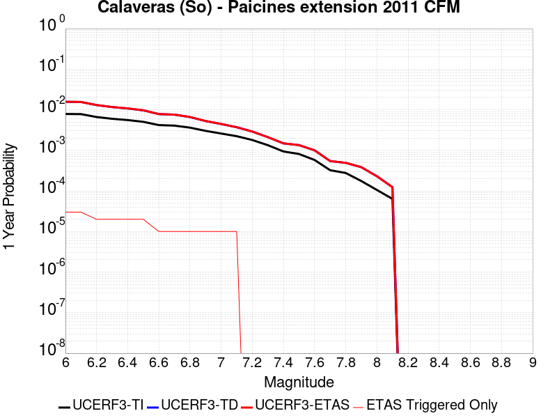 |  |

| Magnitude | 1 wk TI Prob | 1 wk TD Prob | 1 wk ETAS Prob | 1 wk ETAS/TD Gain | 1 wk ETAS Triggered Only | 1 mo TI Prob | 1 mo TD Prob | 1 mo ETAS Prob | 1 mo ETAS/TD Gain | 1 mo ETAS Triggered Only | 1 yr TI Prob | 1 yr TD Prob | 1 yr ETAS Prob | 1 yr ETAS/TD Gain | 1 yr ETAS Triggered Only | 10 yr TI Prob | 10 yr TD Prob | 10 yr ETAS Prob | 10 yr ETAS/TD Gain | 10 yr ETAS Triggered Only |
|-----|-----|-----|-----|-----|-----|-----|-----|-----|-----|-----|-----|-----|-----|-----|-----|-----|-----|-----|-----|-----|
| 6.0 | 1.5183659E-4 | 3.0533716E-4 | 3.0533716E-4 | 1.0 | 0.0 | 6.5056595E-4 | 0.0013069661 | 0.0013069661 | 1.0 | 0.0 | 0.007891912 | 0.01569571 | 0.015762981 | 1.0042859 | 6.834335E-5 | 0.076174594 | 0.13848671 | 0.1385456 | 1.0004251 | 6.834335E-5 |
| 6.1 | 1.5024997E-4 | 3.0227835E-4 | 3.0227835E-4 | 1.0 | 0.0 | 6.437695E-4 | 0.00129387 | 0.00129387 | 1.0 | 0.0 | 0.0078097614 | 0.015539104 | 0.015606386 | 1.0043298 | 6.834335E-5 | 0.075409345 | 0.13715632 | 0.1372153 | 1.00043 | 6.834335E-5 |
| 6.2 | 1.2743923E-4 | 2.5306802E-4 | 2.5306802E-4 | 1.0 | 0.0 | 5.460538E-4 | 0.0010841049 | 0.0010841049 | 1.0 | 0.0 | 0.0066279583 | 0.013046704 | 0.013114155 | 1.00517 | 6.834335E-5 | 0.064337276 | 0.11725405 | 0.117314376 | 1.0005145 | 6.834335E-5 |
| 6.3 | 1.1525114E-4 | 2.2595265E-4 | 2.2595265E-4 | 1.0 | 0.0 | 4.9383997E-4 | 9.6799526E-4 | 9.6799526E-4 | 1.0 | 0.0 | 0.0059959386 | 0.011667927 | 0.011735473 | 1.005789 | 6.834335E-5 | 0.058367174 | 0.10637007 | 0.10643115 | 1.0005741 | 6.834335E-5 |
| 6.4 | 1.07200925E-4 | 2.0836305E-4 | 2.0836305E-4 | 1.0 | 0.0 | 4.5935164E-4 | 8.926636E-4 | 8.926636E-4 | 1.0 | 0.0 | 0.0055782744 | 0.010772766 | 0.010840372 | 1.0062758 | 6.834335E-5 | 0.0544031 | 0.09919256 | 0.099254124 | 1.0006206 | 6.834335E-5 |
| 6.5 | 9.69631E-5 | 1.8729115E-4 | 1.8729115E-4 | 1.0 | 0.0 | 4.1548995E-4 | 8.024135E-4 | 8.024135E-4 | 1.0 | 0.0 | 0.0050468626 | 0.009694662 | 0.009762343 | 1.0069813 | 6.834335E-5 | 0.04933773 | 0.090084255 | 0.090146445 | 1.0006903 | 6.834335E-5 |
| 6.6 | 8.0552316E-5 | 1.5070537E-4 | 1.5070537E-4 | 1.0 | 0.0 | 3.4517853E-4 | 6.456994E-4 | 6.456994E-4 | 1.0 | 0.0 | 0.0041944524 | 0.007826256 | 0.007826256 | 1.0 | 0.0 | 0.04116161 | 0.074854024 | 0.074854024 | 1.0 | 0.0 |
| 6.7 | 7.815757E-5 | 1.4610609E-4 | 1.4610609E-4 | 1.0 | 0.0 | 3.34918E-4 | 6.260017E-4 | 6.260017E-4 | 1.0 | 0.0 | 0.004070005 | 0.0075890915 | 0.0075890915 | 1.0 | 0.0 | 0.039962657 | 0.072703585 | 0.072703585 | 1.0 | 0.0 |
| 6.8 | 6.965264E-5 | 1.2721405E-4 | 1.2721405E-4 | 1.0 | 0.0 | 2.9847719E-4 | 5.450839E-4 | 5.450839E-4 | 1.0 | 0.0 | 0.0036279052 | 0.00661342 | 0.00661342 | 1.0 | 0.0 | 0.03569247 | 0.06379891 | 0.06379891 | 1.0 | 0.0 |
| 6.9 | 5.8000453E-5 | 1.01435086E-4 | 1.01435086E-4 | 1.0 | 0.0 | 2.4854968E-4 | 4.3464993E-4 | 4.3464993E-4 | 1.0 | 0.0 | 0.0030218933 | 0.0052791284 | 0.0052791284 | 1.0 | 0.0 | 0.029811295 | 0.051501602 | 0.051501602 | 1.0 | 0.0 |
| 7.0 | 4.9865852E-5 | 8.567692E-5 | 8.567692E-5 | 1.0 | 0.0 | 2.1369329E-4 | 3.671356E-4 | 3.671356E-4 | 1.0 | 0.0 | 0.0025986114 | 0.0044608037 | 0.0044608037 | 1.0 | 0.0 | 0.025684336 | 0.043781694 | 0.043781694 | 1.0 | 0.0 |
| 7.1 | 4.283875E-5 | 7.112159E-5 | 7.112159E-5 | 1.0 | 0.0 | 1.8358172E-4 | 3.047715E-4 | 3.047715E-4 | 1.0 | 0.0 | 0.0022328163 | 0.003704336 | 0.003704336 | 1.0 | 0.0 | 0.022105146 | 0.03673583 | 0.03673583 | 1.0 | 0.0 |
| 7.2 | 3.450115E-5 | 5.5776054E-5 | 5.5776054E-5 | 1.0 | 0.0 | 1.478537E-4 | 2.390185E-4 | 2.390185E-4 | 1.0 | 0.0 | 0.0017986323 | 0.0029061958 | 0.0029061958 | 1.0 | 0.0 | 0.017841442 | 0.029079199 | 0.029079199 | 1.0 | 0.0 |
| 7.3 | 2.5709045E-5 | 4.0588155E-5 | 4.0588155E-5 | 1.0 | 0.0 | 1.1017697E-4 | 1.7393773E-4 | 1.7393773E-4 | 1.0 | 0.0 | 0.0013405791 | 0.002115652 | 0.002115652 | 1.0 | 0.0 | 0.013325208 | 0.021297242 | 0.021297242 | 1.0 | 0.0 |
| 7.4 | 1.8003093E-5 | 2.8509934E-5 | 2.8509934E-5 | 1.0 | 0.0 | 7.715383E-5 | 1.2217973E-4 | 1.2217973E-4 | 1.0 | 0.0 | 9.3894306E-4 | 0.0014865254 | 0.0014865254 | 1.0 | 0.0 | 0.009349857 | 0.015052196 | 0.015052196 | 1.0 | 0.0 |
| 7.5 | 1.5595824E-5 | 2.5822499E-5 | 2.5822499E-5 | 1.0 | 0.0 | 6.683753E-5 | 1.1066317E-4 | 1.1066317E-4 | 1.0 | 0.0 | 8.134431E-4 | 0.0013464936 | 0.0013464936 | 1.0 | 0.0 | 0.008104719 | 0.01365213 | 0.01365213 | 1.0 | 0.0 |
| 7.6 | 1.1110309E-5 | 1.9222098E-5 | 1.9222098E-5 | 1.0 | 0.0 | 4.761474E-5 | 8.2377825E-5 | 8.2377825E-5 | 1.0 | 0.0 | 5.795553E-4 | 0.0010024898 | 0.0010024898 | 1.0 | 0.0 | 0.0057804612 | 0.010203943 | 0.010203943 | 1.0 | 0.0 |
| 7.7 | 6.2140443E-6 | 1.0437076E-5 | 1.0437076E-5 | 1.0 | 0.0 | 2.6631347E-5 | 4.4729557E-5 | 4.4729557E-5 | 1.0 | 0.0 | 3.241884E-4 | 5.444464E-4 | 5.444464E-4 | 1.0 | 0.0 | 0.0032371588 | 0.005619835 | 0.005619835 | 1.0 | 0.0 |
| 7.8 | 5.305533E-6 | 9.433038E-6 | 9.433038E-6 | 1.0 | 0.0 | 2.27378E-5 | 4.042668E-5 | 4.042668E-5 | 1.0 | 0.0 | 2.7679754E-4 | 4.920837E-4 | 4.920837E-4 | 1.0 | 0.0 | 0.0027645302 | 0.005074324 | 0.005074324 | 1.0 | 0.0 |
| 7.9 | 3.363505E-6 | 7.3848937E-6 | 7.3848937E-6 | 1.0 | 0.0 | 1.4414942E-5 | 3.164916E-5 | 3.164916E-5 | 1.0 | 0.0 | 1.7548777E-4 | 3.8526047E-4 | 3.8526047E-4 | 1.0 | 0.0 | 0.0017534926 | 0.003948527 | 0.003948527 | 1.0 | 0.0 |
| 8.0 | 2.0271132E-6 | 4.413104E-6 | 4.413104E-6 | 1.0 | 0.0 | 8.687599E-6 | 1.8913164E-5 | 1.8913164E-5 | 1.0 | 0.0 | 1.05766376E-4 | 2.302435E-4 | 2.302435E-4 | 1.0 | 0.0 | 0.0010571606 | 0.002351099 | 0.002351099 | 1.0 | 0.0 |
| 8.1 | 1.2206116E-6 | 2.3751331E-6 | 2.3751331E-6 | 1.0 | 0.0 | 5.2311816E-6 | 1.0179103E-5 | 1.0179103E-5 | 1.0 | 0.0 | 6.3687774E-5 | 1.2392356E-4 | 1.2392356E-4 | 1.0 | 0.0 | 6.366953E-4 | 0.0012705477 | 0.0012705477 | 1.0 | 0.0 |

## Robinson Creek
*[(top)](#table-of-contents)*

| 1 Week | 1 Month | 1 Year | 10 Year |
|-----|-----|-----|-----|
|  |  |  | 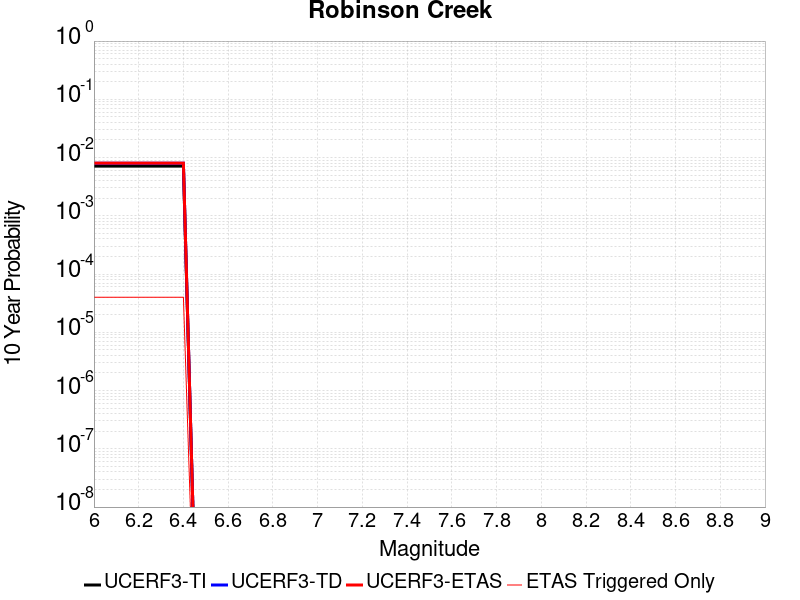 |

| Magnitude | 1 wk TI Prob | 1 wk TD Prob | 1 wk ETAS Prob | 1 wk ETAS/TD Gain | 1 wk ETAS Triggered Only | 1 mo TI Prob | 1 mo TD Prob | 1 mo ETAS Prob | 1 mo ETAS/TD Gain | 1 mo ETAS Triggered Only | 1 yr TI Prob | 1 yr TD Prob | 1 yr ETAS Prob | 1 yr ETAS/TD Gain | 1 yr ETAS Triggered Only | 10 yr TI Prob | 10 yr TD Prob | 10 yr ETAS Prob | 10 yr ETAS/TD Gain | 10 yr ETAS Triggered Only |
|-----|-----|-----|-----|-----|-----|-----|-----|-----|-----|-----|-----|-----|-----|-----|-----|-----|-----|-----|-----|-----|
| 6.0 | 1.3705327E-5 | 1.5285013E-5 | 1.5285013E-5 | 1.0 | 0.0 | 5.8735794E-5 | 6.55072E-5 | 6.55072E-5 | 1.0 | 0.0 | 7.1487366E-4 | 7.9755014E-4 | 8.65839E-4 | 1.0856233 | 6.834335E-5 | 0.0071257832 | 0.007975501 | 0.008043299 | 1.0085008 | 6.834335E-5 |
| 6.1 | 1.3705327E-5 | 1.5285013E-5 | 1.5285013E-5 | 1.0 | 0.0 | 5.8735794E-5 | 6.55072E-5 | 6.55072E-5 | 1.0 | 0.0 | 7.1487366E-4 | 7.9755014E-4 | 8.65839E-4 | 1.0856233 | 6.834335E-5 | 0.0071257832 | 0.007975501 | 0.008043299 | 1.0085008 | 6.834335E-5 |
| 6.2 | 1.3705327E-5 | 1.5285013E-5 | 1.5285013E-5 | 1.0 | 0.0 | 5.8735794E-5 | 6.55072E-5 | 6.55072E-5 | 1.0 | 0.0 | 7.1487366E-4 | 7.9755014E-4 | 8.65839E-4 | 1.0856233 | 6.834335E-5 | 0.0071257832 | 0.007975501 | 0.008043299 | 1.0085008 | 6.834335E-5 |
| 6.3 | 1.3705327E-5 | 1.5285013E-5 | 1.5285013E-5 | 1.0 | 0.0 | 5.8735794E-5 | 6.55072E-5 | 6.55072E-5 | 1.0 | 0.0 | 7.1487366E-4 | 7.9755014E-4 | 8.65839E-4 | 1.0856233 | 6.834335E-5 | 0.0071257832 | 0.007975501 | 0.008043299 | 1.0085008 | 6.834335E-5 |
| 6.4 | 1.3705327E-5 | 1.5285013E-5 | 1.5285013E-5 | 1.0 | 0.0 | 5.8735794E-5 | 6.55072E-5 | 6.55072E-5 | 1.0 | 0.0 | 7.1487366E-4 | 7.9755014E-4 | 8.65839E-4 | 1.0856233 | 6.834335E-5 | 0.0071257832 | 0.007975501 | 0.008043299 | 1.0085008 | 6.834335E-5 |

## Del Valle
*[(top)](#table-of-contents)*

| 1 Week | 1 Month | 1 Year | 10 Year |
|-----|-----|-----|-----|
|  |  | 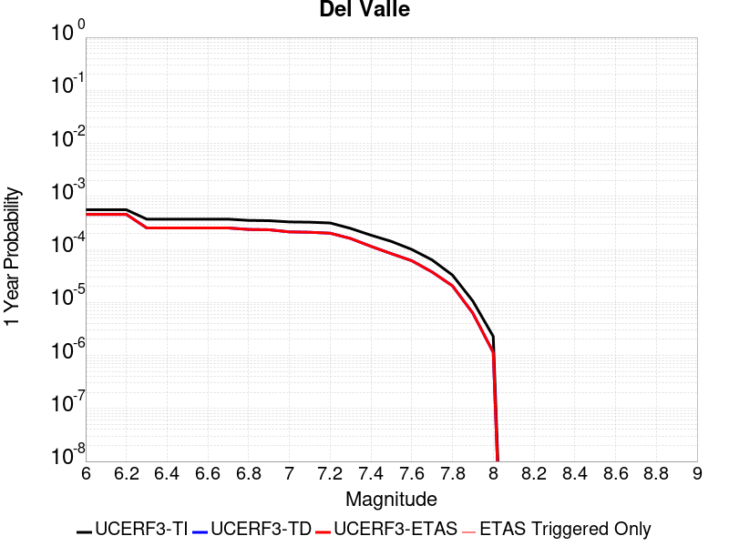 |  |

| Magnitude | 1 wk TI Prob | 1 wk TD Prob | 1 wk ETAS Prob | 1 wk ETAS/TD Gain | 1 wk ETAS Triggered Only | 1 mo TI Prob | 1 mo TD Prob | 1 mo ETAS Prob | 1 mo ETAS/TD Gain | 1 mo ETAS Triggered Only | 1 yr TI Prob | 1 yr TD Prob | 1 yr ETAS Prob | 1 yr ETAS/TD Gain | 1 yr ETAS Triggered Only | 10 yr TI Prob | 10 yr TD Prob | 10 yr ETAS Prob | 10 yr ETAS/TD Gain | 10 yr ETAS Triggered Only |
|-----|-----|-----|-----|-----|-----|-----|-----|-----|-----|-----|-----|-----|-----|-----|-----|-----|-----|-----|-----|-----|
| 6.0 | 1.0716125E-5 | 8.767882E-6 | 8.767882E-6 | 1.0 | 0.0 | 4.592544E-5 | 3.7576207E-5 | 3.7576207E-5 | 1.0 | 0.0 | 5.589988E-4 | 4.5741405E-4 | 4.5741405E-4 | 1.0 | 0.0 | 0.0055759475 | 0.00456668 | 0.0046347114 | 1.0148973 | 6.834335E-5 |
| 6.1 | 1.0716125E-5 | 8.767882E-6 | 8.767882E-6 | 1.0 | 0.0 | 4.592544E-5 | 3.7576207E-5 | 3.7576207E-5 | 1.0 | 0.0 | 5.589988E-4 | 4.5741405E-4 | 4.5741405E-4 | 1.0 | 0.0 | 0.0055759475 | 0.00456668 | 0.0046347114 | 1.0148973 | 6.834335E-5 |
| 6.2 | 1.0716125E-5 | 8.767882E-6 | 8.767882E-6 | 1.0 | 0.0 | 4.592544E-5 | 3.7576207E-5 | 3.7576207E-5 | 1.0 | 0.0 | 5.589988E-4 | 4.5741405E-4 | 4.5741405E-4 | 1.0 | 0.0 | 0.0055759475 | 0.00456668 | 0.0046347114 | 1.0148973 | 6.834335E-5 |
| 6.3 | 7.1293784E-6 | 4.865823E-6 | 4.865823E-6 | 1.0 | 0.0 | 3.055412E-5 | 2.0853364E-5 | 2.0853364E-5 | 1.0 | 0.0 | 3.7193293E-4 | 2.5386087E-4 | 2.5386087E-4 | 1.0 | 0.0 | 0.0037131102 | 0.0025357946 | 0.0026039649 | 1.0268831 | 6.834335E-5 |
| 6.4 | 7.1293784E-6 | 4.865823E-6 | 4.865823E-6 | 1.0 | 0.0 | 3.055412E-5 | 2.0853364E-5 | 2.0853364E-5 | 1.0 | 0.0 | 3.7193293E-4 | 2.5386087E-4 | 2.5386087E-4 | 1.0 | 0.0 | 0.0037131102 | 0.0025357946 | 0.0026039649 | 1.0268831 | 6.834335E-5 |
| 6.5 | 7.1293784E-6 | 4.865823E-6 | 4.865823E-6 | 1.0 | 0.0 | 3.055412E-5 | 2.0853364E-5 | 2.0853364E-5 | 1.0 | 0.0 | 3.7193293E-4 | 2.5386087E-4 | 2.5386087E-4 | 1.0 | 0.0 | 0.0037131102 | 0.0025357946 | 0.0026039649 | 1.0268831 | 6.834335E-5 |
| 6.6 | 7.1293784E-6 | 4.865823E-6 | 4.865823E-6 | 1.0 | 0.0 | 3.055412E-5 | 2.0853364E-5 | 2.0853364E-5 | 1.0 | 0.0 | 3.7193293E-4 | 2.5386087E-4 | 2.5386087E-4 | 1.0 | 0.0 | 0.0037131102 | 0.0025357946 | 0.0026039649 | 1.0268831 | 6.834335E-5 |
| 6.7 | 7.12272E-6 | 4.8631987E-6 | 4.8631987E-6 | 1.0 | 0.0 | 3.0525585E-5 | 2.0842117E-5 | 2.0842117E-5 | 1.0 | 0.0 | 3.7158563E-4 | 2.5372396E-4 | 2.5372396E-4 | 1.0 | 0.0 | 0.003709649 | 0.0025344288 | 0.0026025989 | 1.0268977 | 6.834335E-5 |
| 6.8 | 6.7558703E-6 | 4.5594015E-6 | 4.5594015E-6 | 1.0 | 0.0 | 2.895341E-5 | 1.9540148E-5 | 1.9540148E-5 | 1.0 | 0.0 | 3.5245073E-4 | 2.3787597E-4 | 2.3787597E-4 | 1.0 | 0.0 | 0.0035189227 | 0.0023762889 | 0.0024444696 | 1.0286922 | 6.834335E-5 |
| 6.9 | 6.6700386E-6 | 4.502539E-6 | 4.502539E-6 | 1.0 | 0.0 | 2.8585566E-5 | 1.9296456E-5 | 1.9296456E-5 | 1.0 | 0.0 | 3.479737E-4 | 2.3490966E-4 | 2.3490966E-4 | 1.0 | 0.0 | 0.003474293 | 0.0023466884 | 0.0024148715 | 1.029055 | 6.834335E-5 |
| 7.0 | 6.3181424E-6 | 4.0987034E-6 | 4.0987034E-6 | 1.0 | 0.0 | 2.7077473E-5 | 1.7565755E-5 | 1.7565755E-5 | 1.0 | 0.0 | 3.2961834E-4 | 2.1384252E-4 | 2.1384252E-4 | 1.0 | 0.0 | 0.0032912986 | 0.002136422 | 0.0022046196 | 1.0319213 | 6.834335E-5 |
| 7.1 | 6.248759E-6 | 4.033895E-6 | 4.033895E-6 | 1.0 | 0.0 | 2.678012E-5 | 1.7288008E-5 | 1.7288008E-5 | 1.0 | 0.0 | 3.2599916E-4 | 2.104616E-4 | 2.104616E-4 | 1.0 | 0.0 | 0.0032552136 | 0.0021026772 | 0.0021708768 | 1.0324347 | 6.834335E-5 |
| 7.2 | 6.0411944E-6 | 3.869888E-6 | 3.869888E-6 | 1.0 | 0.0 | 2.5890577E-5 | 1.658513E-5 | 1.658513E-5 | 1.0 | 0.0 | 3.1517216E-4 | 2.0190567E-4 | 2.0190567E-4 | 1.0 | 0.0 | 0.0031472554 | 0.0020172757 | 0.002085481 | 1.0338107 | 6.834335E-5 |
| 7.3 | 4.7691183E-6 | 3.0781202E-6 | 3.0781202E-6 | 1.0 | 0.0 | 2.0438918E-5 | 1.3191879E-5 | 1.3191879E-5 | 1.0 | 0.0 | 2.488154E-4 | 1.605995E-4 | 1.605995E-4 | 1.0 | 0.0 | 0.00248537 | 0.0016048603 | 0.0016730939 | 1.042517 | 6.834335E-5 |
| 7.4 | 3.5524722E-6 | 2.1893363E-6 | 2.1893363E-6 | 1.0 | 0.0 | 1.5224792E-5 | 9.382837E-6 | 9.382837E-6 | 1.0 | 0.0 | 1.8534607E-4 | 1.1423013E-4 | 1.1423013E-4 | 1.0 | 0.0 | 0.0018519156 | 0.0011417224 | 0.0012099878 | 1.0597916 | 6.834335E-5 |
| 7.5 | 2.7133442E-6 | 1.5916097E-6 | 1.5916097E-6 | 1.0 | 0.0 | 1.1628566E-5 | 6.821167E-6 | 6.821167E-6 | 1.0 | 0.0 | 1.415686E-4 | 8.304456E-5 | 8.304456E-5 | 1.0 | 0.0 | 0.0014147845 | 8.301372E-4 | 8.9842384E-4 | 1.0822594 | 6.834335E-5 |
| 7.6 | 1.915338E-6 | 1.173914E-6 | 1.173914E-6 | 1.0 | 0.0 | 8.208566E-6 | 5.0310505E-6 | 5.0310505E-6 | 1.0 | 0.0 | 9.993471E-5 | 6.125133E-5 | 6.125133E-5 | 1.0 | 0.0 | 9.988978E-4 | 6.123454E-4 | 6.123454E-4 | 1.0 | 0.0 |
| 7.7 | 1.2120448E-6 | 7.180313E-7 | 7.180313E-7 | 1.0 | 0.0 | 5.194467E-6 | 3.0772733E-6 | 3.0772733E-6 | 1.0 | 0.0 | 6.3240805E-5 | 3.746516E-5 | 3.746516E-5 | 1.0 | 0.0 | 6.322281E-4 | 3.7458882E-4 | 3.7458882E-4 | 1.0 | 0.0 |
| 7.8 | 6.272381E-7 | 3.932549E-7 | 3.932549E-7 | 1.0 | 0.0 | 2.6881603E-6 | 1.6853771E-6 | 1.6853771E-6 | 1.0 | 0.0 | 3.272786E-5 | 2.0519275E-5 | 2.0519275E-5 | 1.0 | 0.0 | 3.272304E-4 | 2.0517396E-4 | 2.0517396E-4 | 1.0 | 0.0 |
| 7.9 | 2.0292627E-7 | 1.2004622E-7 | 1.2004622E-7 | 1.0 | 0.0 | 8.6968373E-7 | 5.1448376E-7 | 5.1448376E-7 | 1.0 | 0.0 | 1.0588348E-5 | 6.263822E-6 | 6.263822E-6 | 1.0 | 0.0 | 1.0587843E-4 | 6.263647E-5 | 6.263647E-5 | 1.0 | 0.0 |
| 8.0 | 4.374492E-8 | 2.189964E-8 | 2.189964E-8 | 1.0 | 0.0 | 1.8747821E-7 | 9.385559E-8 | 9.385559E-8 | 1.0 | 0.0 | 2.2825448E-6 | 1.1426913E-6 | 1.1426913E-6 | 1.0 | 0.0 | 2.2825214E-5 | 1.1426858E-5 | 1.1426858E-5 | 1.0 | 0.0 |

## San Jacinto (Superstition Mtn)
*[(top)](#table-of-contents)*

| 1 Week | 1 Month | 1 Year | 10 Year |
|-----|-----|-----|-----|
|  |  |  | 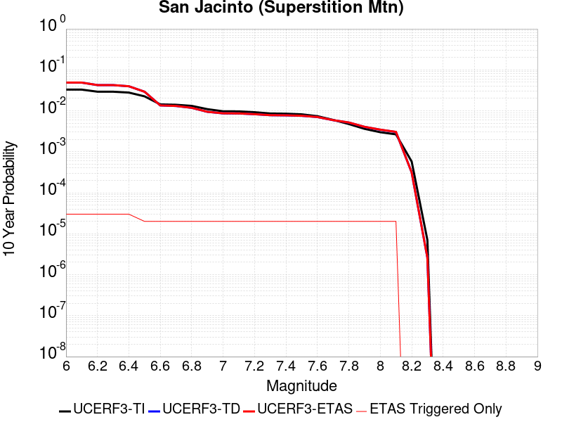 |

| Magnitude | 1 wk TI Prob | 1 wk TD Prob | 1 wk ETAS Prob | 1 wk ETAS/TD Gain | 1 wk ETAS Triggered Only | 1 mo TI Prob | 1 mo TD Prob | 1 mo ETAS Prob | 1 mo ETAS/TD Gain | 1 mo ETAS Triggered Only | 1 yr TI Prob | 1 yr TD Prob | 1 yr ETAS Prob | 1 yr ETAS/TD Gain | 1 yr ETAS Triggered Only | 10 yr TI Prob | 10 yr TD Prob | 10 yr ETAS Prob | 10 yr ETAS/TD Gain | 10 yr ETAS Triggered Only |
|-----|-----|-----|-----|-----|-----|-----|-----|-----|-----|-----|-----|-----|-----|-----|-----|-----|-----|-----|-----|-----|
| 6.0 | 6.4193904E-5 | 9.599367E-5 | 1.6433047E-4 | 1.7118886 | 6.834335E-5 | 2.7508775E-4 | 4.1134638E-4 | 4.796616E-4 | 1.1660771 | 6.834335E-5 | 0.0033440501 | 0.0049980893 | 0.005066091 | 1.0136056 | 6.834335E-5 | 0.03294174 | 0.048823986 | 0.048888993 | 1.0013314 | 6.834335E-5 |
| 6.1 | 6.4193904E-5 | 9.599367E-5 | 1.6433047E-4 | 1.7118886 | 6.834335E-5 | 2.7508775E-4 | 4.1134638E-4 | 4.796616E-4 | 1.1660771 | 6.834335E-5 | 0.0033440501 | 0.0049980893 | 0.005066091 | 1.0136056 | 6.834335E-5 | 0.03294174 | 0.048823986 | 0.048888993 | 1.0013314 | 6.834335E-5 |
| 6.2 | 5.7023593E-5 | 8.3144434E-5 | 1.514821E-4 | 1.8219153 | 6.834335E-5 | 2.4436394E-4 | 3.5629404E-4 | 4.2461304E-4 | 1.191749 | 6.834335E-5 | 0.002971072 | 0.0043308944 | 0.004398942 | 1.015712 | 6.834335E-5 | 0.029316625 | 0.04250403 | 0.04256947 | 1.0015396 | 6.834335E-5 |
| 6.3 | 5.6940098E-5 | 8.298979E-5 | 1.5132748E-4 | 1.8234469 | 6.834335E-5 | 2.4400617E-4 | 3.5563146E-4 | 4.2395052E-4 | 1.1921064 | 6.834335E-5 | 0.002966728 | 0.00432286 | 0.004390908 | 1.0157415 | 6.834335E-5 | 0.029274331 | 0.042427283 | 0.042492725 | 1.0015424 | 6.834335E-5 |
| 6.4 | 5.4171585E-5 | 7.7483564E-5 | 1.4582163E-4 | 1.8819685 | 6.834335E-5 | 2.3214328E-4 | 3.3203943E-4 | 4.003601E-4 | 1.2057607 | 6.834335E-5 | 0.0028226813 | 0.0040367353 | 0.0041048024 | 1.016862 | 6.834335E-5 | 0.02787096 | 0.03971653 | 0.03978216 | 1.0016525 | 6.834335E-5 |
| 6.5 | 4.375144E-5 | 5.642133E-5 | 1.2476083E-4 | 2.2112353 | 6.834335E-5 | 1.874927E-4 | 2.4178992E-4 | 3.1011674E-4 | 1.2825876 | 6.834335E-5 | 0.0022803338 | 0.002940994 | 0.0030091363 | 1.0231699 | 6.834335E-5 | 0.022570757 | 0.029236801 | 0.029303147 | 1.0022693 | 6.834335E-5 |
| 6.6 | 2.772192E-5 | 2.5488358E-5 | 9.382997E-5 | 3.6812875 | 6.834335E-5 | 1.1880282E-4 | 1.09231354E-4 | 1.7756724E-4 | 1.6256069 | 6.834335E-5 | 0.0014454646 | 0.0013290998 | 0.0013973523 | 1.0513525 | 6.834335E-5 | 0.014360986 | 0.01354049 | 0.013607908 | 1.004979 | 6.834335E-5 |
| 6.7 | 2.7124124E-5 | 2.4699386E-5 | 9.304105E-5 | 3.766938 | 6.834335E-5 | 1.1624106E-4 | 1.05850326E-4 | 1.7418645E-4 | 1.645592 | 6.834335E-5 | 0.0014143161 | 0.001287985 | 0.0013562404 | 1.0529939 | 6.834335E-5 | 0.014053487 | 0.013133943 | 0.013201389 | 1.0051352 | 6.834335E-5 |
| 6.8 | 2.5475807E-5 | 2.216446E-5 | 9.05063E-5 | 4.0833974 | 6.834335E-5 | 1.0917746E-4 | 9.4987154E-5 | 1.6332402E-4 | 1.7194327 | 6.834335E-5 | 0.001328425 | 0.001155867 | 0.0012241313 | 1.059059 | 6.834335E-5 | 0.0132051185 | 0.011822182 | 0.011889718 | 1.0057126 | 6.834335E-5 |
| 6.9 | 2.1162023E-5 | 1.7626244E-5 | 8.596839E-5 | 4.8772955 | 6.834335E-5 | 9.069123E-5 | 7.5538876E-5 | 1.4387707E-4 | 1.9046758 | 6.834335E-5 | 0.0011036064 | 9.193016E-4 | 9.875821E-4 | 1.0742743 | 6.834335E-5 | 0.010981417 | 0.00944688 | 0.009514578 | 1.0071661 | 6.834335E-5 |
| 7.0 | 1.8754288E-5 | 1.6161559E-5 | 8.450381E-5 | 5.228692 | 6.834335E-5 | 8.037304E-5 | 6.9261994E-5 | 1.3760063E-4 | 1.9866683 | 6.834335E-5 | 9.781026E-4 | 8.4294105E-4 | 9.112268E-4 | 1.0810089 | 6.834335E-5 | 0.009738087 | 0.008670042 | 0.008737793 | 1.0078144 | 6.834335E-5 |
| 7.1 | 1.8678527E-5 | 1.6086702E-5 | 8.442896E-5 | 5.2483697 | 6.834335E-5 | 8.0048376E-5 | 6.89412E-5 | 1.3727984E-4 | 1.9912599 | 6.834335E-5 | 9.7415317E-4 | 8.3903834E-4 | 9.073243E-4 | 1.0813861 | 6.834335E-5 | 0.009698939 | 0.008630998 | 0.008698751 | 1.00785 | 6.834335E-5 |
| 7.2 | 1.7804578E-5 | 1.5381282E-5 | 8.3723586E-5 | 5.443213 | 6.834335E-5 | 7.6303106E-5 | 6.5918124E-5 | 1.3425697E-4 | 2.0367234 | 6.834335E-5 | 9.285943E-4 | 8.022599E-4 | 8.705484E-4 | 1.0851202 | 6.834335E-5 | 0.009247236 | 0.008262311 | 0.00833009 | 1.0082034 | 6.834335E-5 |
| 7.3 | 1.6583685E-5 | 1.4530388E-5 | 8.287275E-5 | 5.703409 | 6.834335E-5 | 7.1070994E-5 | 6.227162E-5 | 1.3061072E-4 | 2.0974357 | 6.834335E-5 | 8.649459E-4 | 7.5789524E-4 | 8.261868E-4 | 1.0901068 | 6.834335E-5 | 0.00861587 | 0.007817623 | 0.007885433 | 1.0086739 | 6.834335E-5 |
| 7.4 | 1.6387552E-5 | 1.4395274E-5 | 8.273765E-5 | 5.747556 | 6.834335E-5 | 7.023047E-5 | 6.169258E-5 | 1.3003172E-4 | 2.1077368 | 6.834335E-5 | 8.5472054E-4 | 7.5085036E-4 | 8.191424E-4 | 1.0909529 | 6.834335E-5 | 0.008514405 | 0.0077470057 | 0.00781482 | 1.0087535 | 6.834335E-5 |
| 7.5 | 1.5790754E-5 | 1.4035962E-5 | 8.237836E-5 | 5.8690925 | 6.834335E-5 | 6.767291E-5 | 6.0152746E-5 | 1.2849199E-4 | 2.1360953 | 6.834335E-5 | 8.236062E-4 | 7.321156E-4 | 8.004089E-4 | 1.0932821 | 6.834335E-5 | 0.008205604 | 0.007557569 | 0.007625396 | 1.0089747 | 6.834335E-5 |
| 7.6 | 1.4248672E-5 | 1.3054932E-5 | 8.13974E-5 | 6.234992 | 6.834335E-5 | 6.106431E-5 | 5.594852E-5 | 1.2428805E-4 | 2.2214718 | 6.834335E-5 | 7.432043E-4 | 6.8096205E-4 | 7.492589E-4 | 1.1002946 | 6.834335E-5 | 0.007407237 | 0.0070401574 | 0.0071080197 | 1.0096393 | 6.834335E-5 |
| 7.7 | 1.15449975E-5 | 1.090368E-5 | 7.924629E-5 | 7.2678485 | 6.834335E-5 | 4.947762E-5 | 4.6729223E-5 | 1.15069386E-4 | 2.4624717 | 6.834335E-5 | 6.022235E-4 | 5.687805E-4 | 6.37085E-4 | 1.1200893 | 6.834335E-5 | 0.006005941 | 0.0059101824 | 0.005978122 | 1.0114954 | 6.834335E-5 |
| 7.8 | 9.1391985E-6 | 9.514299E-6 | 7.7857E-5 | 8.183158 | 6.834335E-5 | 3.9167408E-5 | 4.0774932E-5 | 1.091155E-4 | 2.6760437 | 6.834335E-5 | 4.767588E-4 | 4.963223E-4 | 5.646318E-4 | 1.1376312 | 6.834335E-5 | 0.0047573727 | 0.0051766867 | 0.005244676 | 1.0131338 | 6.834335E-5 |
| 7.9 | 6.973017E-6 | 7.3821784E-6 | 7.572503E-5 | 10.257816 | 6.834335E-5 | 2.9884017E-5 | 3.1637526E-5 | 9.997872E-5 | 3.1601307 | 6.834335E-5 | 3.6377716E-4 | 3.8511935E-4 | 4.5343637E-4 | 1.1773919 | 6.834335E-5 | 0.0036318225 | 0.0040517948 | 0.004119861 | 1.0167991 | 6.834335E-5 |
| 8.0 | 5.7638235E-6 | 6.259972E-6 | 7.46029E-5 | 11.91745 | 6.834335E-5 | 2.4701867E-5 | 2.6828178E-5 | 9.51697E-5 | 3.5473785 | 6.834335E-5 | 3.0070372E-4 | 3.2658462E-4 | 3.9490566E-4 | 1.2091986 | 6.834335E-5 | 0.0030029714 | 0.0034534496 | 0.0035215567 | 1.0197215 | 6.834335E-5 |
| 8.1 | 5.1124434E-6 | 5.4956718E-6 | 7.383865E-5 | 13.435783 | 6.834335E-5 | 2.1910288E-5 | 2.355267E-5 | 9.189441E-5 | 3.9016562 | 6.834335E-5 | 2.6672508E-4 | 2.867165E-4 | 3.5504025E-4 | 1.2382972 | 6.834335E-5 | 0.0026640517 | 0.003040336 | 0.0031084716 | 1.0224105 | 6.834335E-5 |
| 8.2 | 1.1075938E-6 | 5.336568E-7 | 5.336568E-7 | 1.0 | 0.0 | 4.7468216E-6 | 2.2870988E-6 | 2.2870988E-6 | 1.0 | 0.0 | 5.779102E-5 | 2.7845093E-5 | 2.7845093E-5 | 1.0 | 0.0 | 5.777599E-4 | 3.1346595E-4 | 3.1346595E-4 | 1.0 | 0.0 |
| 8.3 | 1.3584393E-8 | 4.473836E-9 | 4.473836E-9 | 1.0 | 0.0 | 5.8218827E-8 | 1.9173582E-8 | 1.9173582E-8 | 1.0 | 0.0 | 7.0881396E-7 | 2.3343837E-7 | 2.3343837E-7 | 1.0 | 0.0 | 7.0881174E-6 | 2.6163038E-6 | 2.6163038E-6 | 1.0 | 0.0 |

## Ortigalita (North)
*[(top)](#table-of-contents)*

| 1 Week | 1 Month | 1 Year | 10 Year |
|-----|-----|-----|-----|
|  |  | 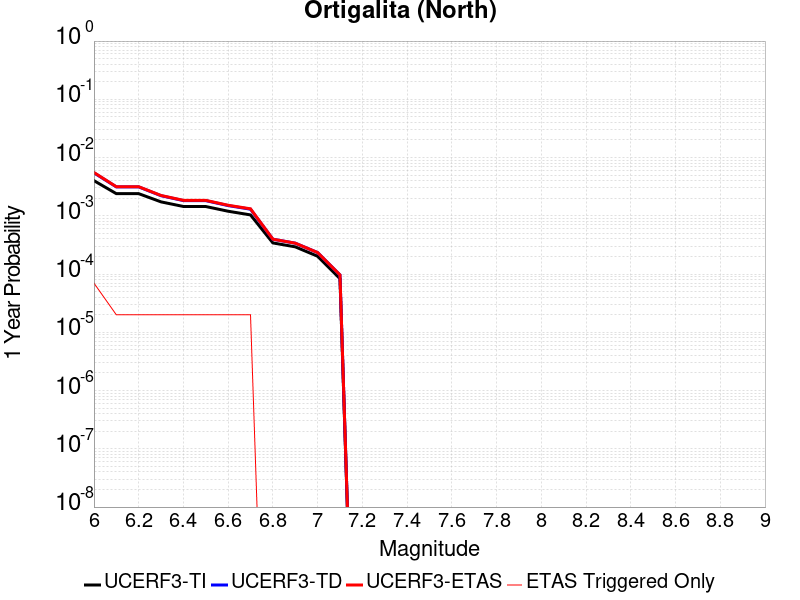 |  |

| Magnitude | 1 wk TI Prob | 1 wk TD Prob | 1 wk ETAS Prob | 1 wk ETAS/TD Gain | 1 wk ETAS Triggered Only | 1 mo TI Prob | 1 mo TD Prob | 1 mo ETAS Prob | 1 mo ETAS/TD Gain | 1 mo ETAS Triggered Only | 1 yr TI Prob | 1 yr TD Prob | 1 yr ETAS Prob | 1 yr ETAS/TD Gain | 1 yr ETAS Triggered Only | 10 yr TI Prob | 10 yr TD Prob | 10 yr ETAS Prob | 10 yr ETAS/TD Gain | 10 yr ETAS Triggered Only |
|-----|-----|-----|-----|-----|-----|-----|-----|-----|-----|-----|-----|-----|-----|-----|-----|-----|-----|-----|-----|-----|
| 6.0 | 7.711876E-5 | 1.05064966E-4 | 1.05064966E-4 | 1.0 | 0.0 | 3.3046713E-4 | 4.502116E-4 | 4.502116E-4 | 1.0 | 0.0 | 0.004016016 | 0.0054681194 | 0.005536089 | 1.0124302 | 6.834335E-5 | 0.039442103 | 0.053454787 | 0.053519476 | 1.0012102 | 6.834335E-5 |
| 6.1 | 4.607858E-5 | 6.0239203E-5 | 6.0239203E-5 | 1.0 | 0.0 | 1.9746469E-4 | 2.5814527E-4 | 2.5814527E-4 | 1.0 | 0.0 | 0.0024014818 | 0.0031387596 | 0.0031387596 | 1.0 | 0.0 | 0.023756953 | 0.030975068 | 0.030975068 | 1.0 | 0.0 |
| 6.2 | 4.607858E-5 | 6.0239203E-5 | 6.0239203E-5 | 1.0 | 0.0 | 1.9746469E-4 | 2.5814527E-4 | 2.5814527E-4 | 1.0 | 0.0 | 0.0024014818 | 0.0031387596 | 0.0031387596 | 1.0 | 0.0 | 0.023756953 | 0.030975068 | 0.030975068 | 1.0 | 0.0 |
| 6.3 | 3.327423E-5 | 4.2475127E-5 | 4.2475127E-5 | 1.0 | 0.0 | 1.4259605E-4 | 1.8202531E-4 | 1.8202531E-4 | 1.0 | 0.0 | 0.0017347244 | 0.002214197 | 0.002214197 | 1.0 | 0.0 | 0.017212452 | 0.021945644 | 0.021945644 | 1.0 | 0.0 |
| 6.4 | 2.7732503E-5 | 3.4998593E-5 | 3.4998593E-5 | 1.0 | 0.0 | 1.1884817E-4 | 1.4998685E-4 | 1.4998685E-4 | 1.0 | 0.0 | 0.001446016 | 0.0018248095 | 0.0018248095 | 1.0 | 0.0 | 0.014366428 | 0.018121224 | 0.018121224 | 1.0 | 0.0 |
| 6.5 | 2.7689714E-5 | 3.4948407E-5 | 3.4948407E-5 | 1.0 | 0.0 | 1.186648E-4 | 1.497718E-4 | 1.497718E-4 | 1.0 | 0.0 | 0.0014437864 | 0.0018221956 | 0.0018221956 | 1.0 | 0.0 | 0.014344421 | 0.01809551 | 0.01809551 | 1.0 | 0.0 |
| 6.6 | 2.2976905E-5 | 2.8718265E-5 | 2.8718265E-5 | 1.0 | 0.0 | 9.846873E-5 | 1.230739E-4 | 1.230739E-4 | 1.0 | 0.0 | 0.0011981975 | 0.0014976363 | 0.0014976363 | 1.0 | 0.0 | 0.011917574 | 0.014898697 | 0.014898697 | 1.0 | 0.0 |
| 6.7 | 1.9871539E-5 | 2.4904411E-5 | 2.4904411E-5 | 1.0 | 0.0 | 8.516096E-5 | 1.0673023E-4 | 1.0673023E-4 | 1.0 | 0.0 | 0.0010363415 | 0.0012989145 | 0.0012989145 | 1.0 | 0.0 | 0.010315218 | 0.012936919 | 0.012936919 | 1.0 | 0.0 |
| 6.8 | 6.5640475E-6 | 7.6054926E-6 | 7.6054926E-6 | 1.0 | 0.0 | 2.813133E-5 | 3.2594577E-5 | 3.2594577E-5 | 1.0 | 0.0 | 3.424451E-4 | 3.9676955E-4 | 3.9676955E-4 | 1.0 | 0.0 | 0.0034191788 | 0.003960899 | 0.003960899 | 1.0 | 0.0 |
| 6.9 | 5.6219683E-6 | 6.5018376E-6 | 6.5018376E-6 | 1.0 | 0.0 | 2.4093928E-5 | 2.7864735E-5 | 2.7864735E-5 | 1.0 | 0.0 | 2.933041E-4 | 3.3920293E-4 | 3.3920293E-4 | 1.0 | 0.0 | 0.0029291727 | 0.003387109 | 0.003387109 | 1.0 | 0.0 |
| 7.0 | 3.875591E-6 | 4.4847548E-6 | 4.4847548E-6 | 1.0 | 0.0 | 1.6609569E-5 | 1.9220248E-5 | 1.9220248E-5 | 1.0 | 0.0 | 2.0220275E-4 | 2.339835E-4 | 2.339835E-4 | 1.0 | 0.0 | 0.0020201886 | 0.0023375798 | 0.0023375798 | 1.0 | 0.0 |
| 7.1 | 1.6017933E-6 | 1.8570418E-6 | 1.8570418E-6 | 1.0 | 0.0 | 6.8648105E-6 | 7.958732E-6 | 7.958732E-6 | 1.0 | 0.0 | 8.357586E-5 | 9.689432E-5 | 9.689432E-5 | 1.0 | 0.0 | 8.3544437E-4 | 9.686254E-4 | 9.686254E-4 | 1.0 | 0.0 |

## San Juan
*[(top)](#table-of-contents)*

| 1 Week | 1 Month | 1 Year | 10 Year |
|-----|-----|-----|-----|
|  |  |  |  |

| Magnitude | 1 wk TI Prob | 1 wk TD Prob | 1 wk ETAS Prob | 1 wk ETAS/TD Gain | 1 wk ETAS Triggered Only | 1 mo TI Prob | 1 mo TD Prob | 1 mo ETAS Prob | 1 mo ETAS/TD Gain | 1 mo ETAS Triggered Only | 1 yr TI Prob | 1 yr TD Prob | 1 yr ETAS Prob | 1 yr ETAS/TD Gain | 1 yr ETAS Triggered Only | 10 yr TI Prob | 10 yr TD Prob | 10 yr ETAS Prob | 10 yr ETAS/TD Gain | 10 yr ETAS Triggered Only |
|-----|-----|-----|-----|-----|-----|-----|-----|-----|-----|-----|-----|-----|-----|-----|-----|-----|-----|-----|-----|-----|
| 6.0 | 8.682808E-6 | 8.7491635E-6 | 8.7491635E-6 | 1.0 | 0.0 | 3.72115E-5 | 3.74959E-5 | 3.74959E-5 | 1.0 | 0.0 | 4.5295584E-4 | 4.564218E-4 | 5.24734E-4 | 1.1496689 | 6.834335E-5 | 0.004520337 | 0.004555385 | 0.004623417 | 1.0149344 | 6.834335E-5 |
| 6.1 | 8.682808E-6 | 8.7491635E-6 | 8.7491635E-6 | 1.0 | 0.0 | 3.72115E-5 | 3.74959E-5 | 3.74959E-5 | 1.0 | 0.0 | 4.5295584E-4 | 4.564218E-4 | 5.24734E-4 | 1.1496689 | 6.834335E-5 | 0.004520337 | 0.004555385 | 0.004623417 | 1.0149344 | 6.834335E-5 |
| 6.2 | 8.682808E-6 | 8.7491635E-6 | 8.7491635E-6 | 1.0 | 0.0 | 3.72115E-5 | 3.74959E-5 | 3.74959E-5 | 1.0 | 0.0 | 4.5295584E-4 | 4.564218E-4 | 5.24734E-4 | 1.1496689 | 6.834335E-5 | 0.004520337 | 0.004555385 | 0.004623417 | 1.0149344 | 6.834335E-5 |
| 6.3 | 6.3054235E-6 | 6.2825848E-6 | 6.2825848E-6 | 1.0 | 0.0 | 2.7022963E-5 | 2.6925094E-5 | 2.6925094E-5 | 1.0 | 0.0 | 3.2895492E-4 | 3.2776513E-4 | 3.2776513E-4 | 1.0 | 0.0 | 0.003284684 | 0.003273017 | 0.003273017 | 1.0 | 0.0 |
| 6.4 | 6.1490473E-6 | 6.1144656E-6 | 6.1144656E-6 | 1.0 | 0.0 | 2.6352795E-5 | 2.6204598E-5 | 2.6204598E-5 | 1.0 | 0.0 | 3.2079802E-4 | 3.1899565E-4 | 3.1899565E-4 | 1.0 | 0.0 | 0.0032033534 | 0.0031855737 | 0.0031855737 | 1.0 | 0.0 |
| 6.5 | 5.204848E-6 | 5.137233E-6 | 5.137233E-6 | 1.0 | 0.0 | 2.23063E-5 | 2.2016533E-5 | 2.2016533E-5 | 1.0 | 0.0 | 2.7154534E-4 | 2.6801927E-4 | 2.6801927E-4 | 1.0 | 0.0 | 0.0027121378 | 0.0026771144 | 0.0026771144 | 1.0 | 0.0 |
| 6.6 | 4.5179986E-6 | 4.4150297E-6 | 4.4150297E-6 | 1.0 | 0.0 | 1.9362706E-5 | 1.8921424E-5 | 1.8921424E-5 | 1.0 | 0.0 | 2.3571544E-4 | 2.3034477E-4 | 2.3034477E-4 | 1.0 | 0.0 | 0.0023546559 | 0.0023011973 | 0.0023011973 | 1.0 | 0.0 |
| 6.7 | 3.9442616E-6 | 3.819828E-6 | 3.819828E-6 | 1.0 | 0.0 | 1.6903869E-5 | 1.6370592E-5 | 1.6370592E-5 | 1.0 | 0.0 | 2.0578515E-4 | 1.992944E-4 | 1.992944E-4 | 1.0 | 0.0 | 0.002055947 | 0.0019912818 | 0.0019912818 | 1.0 | 0.0 |
| 6.8 | 3.4536245E-6 | 3.3163353E-6 | 3.3163353E-6 | 1.0 | 0.0 | 1.4801163E-5 | 1.4212792E-5 | 1.4212792E-5 | 1.0 | 0.0 | 1.8018926E-4 | 1.7302761E-4 | 1.7302761E-4 | 1.0 | 0.0 | 0.0018004322 | 0.0017290477 | 0.0017290477 | 1.0 | 0.0 |
| 6.9 | 3.059865E-6 | 2.9120315E-6 | 2.9120315E-6 | 1.0 | 0.0 | 1.3113641E-5 | 1.2480078E-5 | 1.2480078E-5 | 1.0 | 0.0 | 1.596469E-4 | 1.5193493E-4 | 1.5193493E-4 | 1.0 | 0.0 | 0.0015953224 | 0.0015184252 | 0.0015184252 | 1.0 | 0.0 |
| 7.0 | 2.6504351E-6 | 2.4920002E-6 | 2.4920002E-6 | 1.0 | 0.0 | 1.1358958E-5 | 1.0679961E-5 | 1.0679961E-5 | 1.0 | 0.0 | 1.3828653E-4 | 1.300213E-4 | 1.300213E-4 | 1.0 | 0.0 | 0.0013820052 | 0.0012995641 | 0.0012995641 | 1.0 | 0.0 |
| 7.1 | 2.2039317E-6 | 2.0338296E-6 | 2.0338296E-6 | 1.0 | 0.0 | 9.445387E-6 | 8.716386E-6 | 8.716386E-6 | 1.0 | 0.0 | 1.1499152E-4 | 1.0611736E-4 | 1.0611736E-4 | 1.0 | 0.0 | 0.0011493203 | 0.0010607769 | 0.0010607769 | 1.0 | 0.0 |
| 7.2 | 1.0786707E-6 | 8.7701903E-7 | 8.7701903E-7 | 1.0 | 0.0 | 4.622866E-6 | 3.7586476E-6 | 3.7586476E-6 | 1.0 | 0.0 | 5.628194E-5 | 4.5760586E-5 | 4.5760586E-5 | 1.0 | 0.0 | 5.6267687E-4 | 4.5757066E-4 | 4.5757066E-4 | 1.0 | 0.0 |
| 7.3 | 6.846433E-7 | 4.868805E-7 | 4.868805E-7 | 1.0 | 0.0 | 2.9341822E-6 | 2.086629E-6 | 2.086629E-6 | 1.0 | 0.0 | 3.5723086E-5 | 2.5404412E-5 | 2.5404412E-5 | 1.0 | 0.0 | 3.571734E-4 | 2.540486E-4 | 2.540486E-4 | 1.0 | 0.0 |
| 7.4 | 5.23043E-7 | 3.2628162E-7 | 3.2628162E-7 | 1.0 | 0.0 | 2.2416111E-6 | 1.398349E-6 | 1.398349E-6 | 1.0 | 0.0 | 2.7291273E-5 | 1.7024766E-5 | 1.7024766E-5 | 1.0 | 0.0 | 2.7287923E-4 | 1.7026656E-4 | 1.7026656E-4 | 1.0 | 0.0 |
| 7.5 | 4.648444E-7 | 2.7234944E-7 | 2.7234944E-7 | 1.0 | 0.0 | 1.9921886E-6 | 1.1672114E-6 | 1.1672114E-6 | 1.0 | 0.0 | 2.4254627E-5 | 1.42107065E-5 | 1.42107065E-5 | 1.0 | 0.0 | 2.425198E-4 | 1.421276E-4 | 1.421276E-4 | 1.0 | 0.0 |
| 7.6 | 3.9906567E-7 | 2.2083314E-7 | 2.2083314E-7 | 1.0 | 0.0 | 1.7102802E-6 | 9.464274E-7 | 9.464274E-7 | 1.0 | 0.0 | 2.0822463E-5 | 1.1522693E-5 | 1.1522693E-5 | 1.0 | 0.0 | 2.0820512E-4 | 1.15245566E-4 | 1.15245566E-4 | 1.0 | 0.0 |
| 7.7 | 1.8784601E-7 | 5.3666906E-8 | 5.3666906E-8 | 1.0 | 0.0 | 8.0505407E-7 | 2.30001E-7 | 2.30001E-7 | 1.0 | 0.0 | 9.80149E-6 | 2.8002585E-6 | 2.8002585E-6 | 1.0 | 0.0 | 9.801057E-5 | 2.8011282E-5 | 2.8011282E-5 | 1.0 | 0.0 |
| 7.8 | 1.00154914E-7 | 1.2415832E-8 | 1.2415832E-8 | 1.0 | 0.0 | 4.2923529E-7 | 5.3210716E-8 | 5.3210716E-8 | 1.0 | 0.0 | 5.225927E-6 | 6.4784024E-7 | 6.4784024E-7 | 1.0 | 0.0 | 5.225804E-5 | 6.484273E-6 | 6.484273E-6 | 1.0 | 0.0 |
| 7.9 | 6.171429E-8 | 4.2966155E-9 | 4.2966155E-9 | 1.0 | 0.0 | 2.6448978E-7 | 1.8414067E-8 | 1.8414067E-8 | 1.0 | 0.0 | 3.2201583E-6 | 2.2419121E-7 | 2.2419121E-7 | 1.0 | 0.0 | 3.2201115E-5 | 2.2472002E-6 | 2.2472002E-6 | 1.0 | 0.0 |
| 8.0 | 1.3974572E-8 | 3.3788217E-10 | 3.3788217E-10 | 1.0 | 0.0 | 5.989102E-8 | 1.448067E-9 | 1.448067E-9 | 1.0 | 0.0 | 7.2917294E-7 | 1.763022E-8 | 1.763022E-8 | 1.0 | 0.0 | 7.2917055E-6 | 1.8060365E-7 | 1.8060365E-7 | 1.0 | 0.0 |
| 8.1 | 1.8403477E-9 | 1.1302803E-10 | 1.1302803E-10 | 1.0 | 0.0 | 7.887204E-9 | 4.844063E-10 | 4.844063E-10 | 1.0 | 0.0 | 9.602671E-8 | 5.8976446E-9 | 5.8976446E-9 | 1.0 | 0.0 | 9.602667E-7 | 6.021993E-8 | 6.021993E-8 | 1.0 | 0.0 |

## Pine Mtn
*[(top)](#table-of-contents)*

| 1 Week | 1 Month | 1 Year | 10 Year |
|-----|-----|-----|-----|
|  |  | 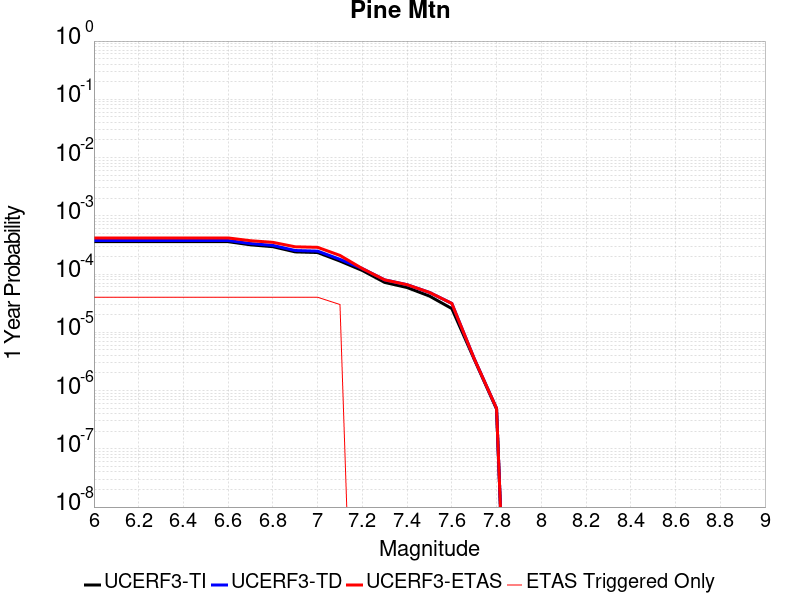 |  |

| Magnitude | 1 wk TI Prob | 1 wk TD Prob | 1 wk ETAS Prob | 1 wk ETAS/TD Gain | 1 wk ETAS Triggered Only | 1 mo TI Prob | 1 mo TD Prob | 1 mo ETAS Prob | 1 mo ETAS/TD Gain | 1 mo ETAS Triggered Only | 1 yr TI Prob | 1 yr TD Prob | 1 yr ETAS Prob | 1 yr ETAS/TD Gain | 1 yr ETAS Triggered Only | 10 yr TI Prob | 10 yr TD Prob | 10 yr ETAS Prob | 10 yr ETAS/TD Gain | 10 yr ETAS Triggered Only |
|-----|-----|-----|-----|-----|-----|-----|-----|-----|-----|-----|-----|-----|-----|-----|-----|-----|-----|-----|-----|-----|
| 6.0 | 6.894797E-6 | 7.225461E-6 | 7.225461E-6 | 1.0 | 0.0 | 2.9548795E-5 | 3.096591E-5 | 9.930715E-5 | 3.206983 | 6.834335E-5 | 3.596972E-4 | 3.7694772E-4 | 4.4526532E-4 | 1.1812389 | 6.834335E-5 | 0.0035911554 | 0.003763381 | 0.0038314671 | 1.0180918 | 6.834335E-5 |
| 6.1 | 6.894797E-6 | 7.225461E-6 | 7.225461E-6 | 1.0 | 0.0 | 2.9548795E-5 | 3.096591E-5 | 9.930715E-5 | 3.206983 | 6.834335E-5 | 3.596972E-4 | 3.7694772E-4 | 4.4526532E-4 | 1.1812389 | 6.834335E-5 | 0.0035911554 | 0.003763381 | 0.0038314671 | 1.0180918 | 6.834335E-5 |
| 6.2 | 6.894797E-6 | 7.225461E-6 | 7.225461E-6 | 1.0 | 0.0 | 2.9548795E-5 | 3.096591E-5 | 9.930715E-5 | 3.206983 | 6.834335E-5 | 3.596972E-4 | 3.7694772E-4 | 4.4526532E-4 | 1.1812389 | 6.834335E-5 | 0.0035911554 | 0.003763381 | 0.0038314671 | 1.0180918 | 6.834335E-5 |
| 6.3 | 6.894797E-6 | 7.225461E-6 | 7.225461E-6 | 1.0 | 0.0 | 2.9548795E-5 | 3.096591E-5 | 9.930715E-5 | 3.206983 | 6.834335E-5 | 3.596972E-4 | 3.7694772E-4 | 4.4526532E-4 | 1.1812389 | 6.834335E-5 | 0.0035911554 | 0.003763381 | 0.0038314671 | 1.0180918 | 6.834335E-5 |
| 6.4 | 6.894797E-6 | 7.225461E-6 | 7.225461E-6 | 1.0 | 0.0 | 2.9548795E-5 | 3.096591E-5 | 9.930715E-5 | 3.206983 | 6.834335E-5 | 3.596972E-4 | 3.7694772E-4 | 4.4526532E-4 | 1.1812389 | 6.834335E-5 | 0.0035911554 | 0.003763381 | 0.0038314671 | 1.0180918 | 6.834335E-5 |
| 6.5 | 6.894797E-6 | 7.225461E-6 | 7.225461E-6 | 1.0 | 0.0 | 2.9548795E-5 | 3.096591E-5 | 9.930715E-5 | 3.206983 | 6.834335E-5 | 3.596972E-4 | 3.7694772E-4 | 4.4526532E-4 | 1.1812389 | 6.834335E-5 | 0.0035911554 | 0.003763381 | 0.0038314671 | 1.0180918 | 6.834335E-5 |
| 6.6 | 6.894797E-6 | 7.225461E-6 | 7.225461E-6 | 1.0 | 0.0 | 2.9548795E-5 | 3.096591E-5 | 9.930715E-5 | 3.206983 | 6.834335E-5 | 3.596972E-4 | 3.7694772E-4 | 4.4526532E-4 | 1.1812389 | 6.834335E-5 | 0.0035911554 | 0.003763381 | 0.0038314671 | 1.0180918 | 6.834335E-5 |
| 6.7 | 6.0867933E-6 | 6.3971133E-6 | 6.3971133E-6 | 1.0 | 0.0 | 2.6085996E-5 | 2.7415923E-5 | 9.575741E-5 | 3.4927661 | 6.834335E-5 | 3.1755073E-4 | 3.3373994E-4 | 4.0206048E-4 | 1.2047119 | 6.834335E-5 | 0.0031709734 | 0.0033326065 | 0.003400722 | 1.0204391 | 6.834335E-5 |
| 6.8 | 5.6530425E-6 | 5.9505956E-6 | 5.9505956E-6 | 1.0 | 0.0 | 2.42271E-5 | 2.5502315E-5 | 9.3843926E-5 | 3.67982 | 6.834335E-5 | 2.94925E-4 | 3.104485E-4 | 3.7877064E-4 | 1.2200756 | 6.834335E-5 | 0.002945339 | 0.0031003528 | 0.0031684842 | 1.0219754 | 6.834335E-5 |
| 6.9 | 4.6015225E-6 | 4.863834E-6 | 4.863834E-6 | 1.0 | 0.0 | 1.9720663E-5 | 2.0844845E-5 | 8.9186775E-5 | 4.278601 | 6.834335E-5 | 2.4007261E-4 | 2.5375787E-4 | 3.2208388E-4 | 1.2692567 | 6.834335E-5 | 0.0023981342 | 0.0025348254 | 0.0026029956 | 1.0268934 | 6.834335E-5 |
| 7.0 | 4.4875965E-6 | 4.747473E-6 | 4.747473E-6 | 1.0 | 0.0 | 1.9232413E-5 | 2.0346162E-5 | 8.868813E-5 | 4.358961 | 6.834335E-5 | 2.3412947E-4 | 2.4768783E-4 | 3.1601425E-4 | 1.2758571 | 6.834335E-5 | 0.0023388295 | 0.0024742614 | 0.0025424357 | 1.0275533 | 6.834335E-5 |
| 7.1 | 3.203907E-6 | 3.4294096E-6 | 3.4294096E-6 | 1.0 | 0.0 | 1.3730958E-5 | 1.4697391E-5 | 8.303974E-5 | 5.6499653 | 6.834335E-5 | 1.6716159E-4 | 1.789267E-4 | 2.4725782E-4 | 1.3818945 | 6.834335E-5 | 0.0016703589 | 0.0017878925 | 0.0018561137 | 1.0381573 | 6.834335E-5 |
| 7.2 | 2.2060601E-6 | 2.3784817E-6 | 2.3784817E-6 | 1.0 | 0.0 | 9.4545085E-6 | 1.0193455E-5 | 1.0193455E-5 | 1.0 | 0.0 | 1.15102564E-4 | 1.240987E-4 | 1.240987E-4 | 1.0 | 0.0 | 0.0011504296 | 0.0012403389 | 0.0012403389 | 1.0 | 0.0 |
| 7.3 | 1.3765207E-6 | 1.5216481E-6 | 1.5216481E-6 | 1.0 | 0.0 | 5.899361E-6 | 6.521333E-6 | 6.521333E-6 | 1.0 | 0.0 | 7.182235E-5 | 7.939443E-5 | 7.939443E-5 | 1.0 | 0.0 | 7.1799144E-4 | 7.936697E-4 | 7.936697E-4 | 1.0 | 0.0 |
| 7.4 | 1.1245983E-6 | 1.2587075E-6 | 1.2587075E-6 | 1.0 | 0.0 | 4.819698E-6 | 5.39445E-6 | 5.39445E-6 | 1.0 | 0.0 | 5.8678244E-5 | 6.567554E-5 | 6.567554E-5 | 1.0 | 0.0 | 5.866275E-4 | 6.5656955E-4 | 6.5656955E-4 | 1.0 | 0.0 |
| 7.5 | 8.031682E-7 | 9.276951E-7 | 9.276951E-7 | 1.0 | 0.0 | 3.4421448E-6 | 3.9758306E-6 | 3.9758306E-6 | 1.0 | 0.0 | 4.1907308E-5 | 4.840473E-5 | 4.840473E-5 | 1.0 | 0.0 | 4.1899405E-4 | 4.8394862E-4 | 4.8394862E-4 | 1.0 | 0.0 |
| 7.6 | 4.8953444E-7 | 6.003009E-7 | 6.003009E-7 | 1.0 | 0.0 | 2.098003E-6 | 2.5727159E-6 | 2.5727159E-6 | 1.0 | 0.0 | 2.5542888E-5 | 3.1322415E-5 | 3.1322415E-5 | 1.0 | 0.0 | 2.5539953E-4 | 3.1318486E-4 | 3.1318486E-4 | 1.0 | 0.0 |
| 7.7 | 6.634529E-8 | 6.788826E-8 | 6.788826E-8 | 1.0 | 0.0 | 2.843369E-7 | 2.9094966E-7 | 2.9094966E-7 | 1.0 | 0.0 | 3.4617963E-6 | 3.5423066E-6 | 3.5423066E-6 | 1.0 | 0.0 | 3.4617424E-5 | 3.542255E-5 | 3.542255E-5 | 1.0 | 0.0 |
| 7.8 | 9.235578E-9 | 9.488566E-9 | 9.488566E-9 | 1.0 | 0.0 | 3.9581046E-8 | 4.0665284E-8 | 4.0665284E-8 | 1.0 | 0.0 | 4.818991E-7 | 4.950997E-7 | 4.950997E-7 | 1.0 | 0.0 | 4.8189804E-6 | 4.950988E-6 | 4.950988E-6 | 1.0 | 0.0 |

## Collayami 2011 CFM
*[(top)](#table-of-contents)*

| 1 Week | 1 Month | 1 Year | 10 Year |
|-----|-----|-----|-----|
|  |  |  |  |

| Magnitude | 1 wk TI Prob | 1 wk TD Prob | 1 wk ETAS Prob | 1 wk ETAS/TD Gain | 1 wk ETAS Triggered Only | 1 mo TI Prob | 1 mo TD Prob | 1 mo ETAS Prob | 1 mo ETAS/TD Gain | 1 mo ETAS Triggered Only | 1 yr TI Prob | 1 yr TD Prob | 1 yr ETAS Prob | 1 yr ETAS/TD Gain | 1 yr ETAS Triggered Only | 10 yr TI Prob | 10 yr TD Prob | 10 yr ETAS Prob | 10 yr ETAS/TD Gain | 10 yr ETAS Triggered Only |
|-----|-----|-----|-----|-----|-----|-----|-----|-----|-----|-----|-----|-----|-----|-----|-----|-----|-----|-----|-----|-----|
| 6.0 | 3.112429E-5 | 3.493857E-5 | 3.493857E-5 | 1.0 | 0.0 | 1.33383E-4 | 1.4972912E-4 | 2.1806224E-4 | 1.4563783 | 6.834335E-5 | 0.0016227282 | 0.0018216016 | 0.0018898206 | 1.03745 | 6.834335E-5 | 0.016109297 | 0.018084232 | 0.01815134 | 1.0037109 | 6.834335E-5 |
| 6.1 | 1.7119446E-5 | 1.9156616E-5 | 1.9156616E-5 | 1.0 | 0.0 | 7.336699E-5 | 8.209753E-5 | 8.209753E-5 | 1.0 | 0.0 | 8.92877E-4 | 9.991383E-4 | 9.991383E-4 | 1.0 | 0.0 | 0.00889298 | 0.009952341 | 0.009952341 | 1.0 | 0.0 |
| 6.2 | 1.7119446E-5 | 1.9156616E-5 | 1.9156616E-5 | 1.0 | 0.0 | 7.336699E-5 | 8.209753E-5 | 8.209753E-5 | 1.0 | 0.0 | 8.92877E-4 | 9.991383E-4 | 9.991383E-4 | 1.0 | 0.0 | 0.00889298 | 0.009952341 | 0.009952341 | 1.0 | 0.0 |
| 6.3 | 9.041288E-6 | 1.0106096E-5 | 1.0106096E-5 | 1.0 | 0.0 | 3.87478E-5 | 4.3311244E-5 | 4.3311244E-5 | 1.0 | 0.0 | 4.7165234E-4 | 5.2720873E-4 | 5.2720873E-4 | 1.0 | 0.0 | 0.0047065257 | 0.005261738 | 0.005261738 | 1.0 | 0.0 |
| 6.4 | 5.5972064E-6 | 6.2580466E-6 | 6.2580466E-6 | 1.0 | 0.0 | 2.3987806E-5 | 2.6820002E-5 | 2.6820002E-5 | 1.0 | 0.0 | 2.920124E-4 | 3.2649818E-4 | 3.2649818E-4 | 1.0 | 0.0 | 0.0029162897 | 0.0032615191 | 0.0032615191 | 1.0 | 0.0 |
| 6.5 | 3.530659E-6 | 3.9520487E-6 | 3.9520487E-6 | 1.0 | 0.0 | 1.5131307E-5 | 1.69373E-5 | 1.69373E-5 | 1.0 | 0.0 | 1.842081E-4 | 2.062025E-4 | 2.062025E-4 | 1.0 | 0.0 | 0.0018405546 | 0.0020611305 | 0.0020611305 | 1.0 | 0.0 |
| 6.6 | 2.4625563E-6 | 2.7572657E-6 | 2.7572657E-6 | 1.0 | 0.0 | 1.0553769E-5 | 1.1816854E-5 | 1.1816854E-5 | 1.0 | 0.0 | 1.2848456E-4 | 1.4387019E-4 | 1.4387019E-4 | 1.0 | 0.0 | 0.001284103 | 0.0014387019 | 0.0014387019 | 1.0 | 0.0 |

## Kern Canyon (South Kern) 2011
*[(top)](#table-of-contents)*

| 1 Week | 1 Month | 1 Year | 10 Year |
|-----|-----|-----|-----|
|  |  |  |  |

| Magnitude | 1 wk TI Prob | 1 wk TD Prob | 1 wk ETAS Prob | 1 wk ETAS/TD Gain | 1 wk ETAS Triggered Only | 1 mo TI Prob | 1 mo TD Prob | 1 mo ETAS Prob | 1 mo ETAS/TD Gain | 1 mo ETAS Triggered Only | 1 yr TI Prob | 1 yr TD Prob | 1 yr ETAS Prob | 1 yr ETAS/TD Gain | 1 yr ETAS Triggered Only | 10 yr TI Prob | 10 yr TD Prob | 10 yr ETAS Prob | 10 yr ETAS/TD Gain | 10 yr ETAS Triggered Only |
|-----|-----|-----|-----|-----|-----|-----|-----|-----|-----|-----|-----|-----|-----|-----|-----|-----|-----|-----|-----|-----|
| 6.0 | 4.105075E-6 | 4.1137264E-6 | 4.1137264E-6 | 1.0 | 0.0 | 1.7593058E-5 | 1.763014E-5 | 1.763014E-5 | 1.0 | 0.0 | 2.1417443E-4 | 2.1462646E-4 | 2.8295515E-4 | 1.3183609 | 6.834335E-5 | 0.0021396813 | 0.0021442557 | 0.0022124525 | 1.0318044 | 6.834335E-5 |
| 6.1 | 4.105075E-6 | 4.1137264E-6 | 4.1137264E-6 | 1.0 | 0.0 | 1.7593058E-5 | 1.763014E-5 | 1.763014E-5 | 1.0 | 0.0 | 2.1417443E-4 | 2.1462646E-4 | 2.8295515E-4 | 1.3183609 | 6.834335E-5 | 0.0021396813 | 0.0021442557 | 0.0022124525 | 1.0318044 | 6.834335E-5 |
| 6.2 | 4.105075E-6 | 4.1137264E-6 | 4.1137264E-6 | 1.0 | 0.0 | 1.7593058E-5 | 1.763014E-5 | 1.763014E-5 | 1.0 | 0.0 | 2.1417443E-4 | 2.1462646E-4 | 2.8295515E-4 | 1.3183609 | 6.834335E-5 | 0.0021396813 | 0.0021442557 | 0.0022124525 | 1.0318044 | 6.834335E-5 |
| 6.3 | 4.105075E-6 | 4.1137264E-6 | 4.1137264E-6 | 1.0 | 0.0 | 1.7593058E-5 | 1.763014E-5 | 1.763014E-5 | 1.0 | 0.0 | 2.1417443E-4 | 2.1462646E-4 | 2.8295515E-4 | 1.3183609 | 6.834335E-5 | 0.0021396813 | 0.0021442557 | 0.0022124525 | 1.0318044 | 6.834335E-5 |
| 6.4 | 4.105075E-6 | 4.1137264E-6 | 4.1137264E-6 | 1.0 | 0.0 | 1.7593058E-5 | 1.763014E-5 | 1.763014E-5 | 1.0 | 0.0 | 2.1417443E-4 | 2.1462646E-4 | 2.8295515E-4 | 1.3183609 | 6.834335E-5 | 0.0021396813 | 0.0021442557 | 0.0022124525 | 1.0318044 | 6.834335E-5 |
| 6.5 | 2.9849807E-6 | 2.9731548E-6 | 2.9731548E-6 | 1.0 | 0.0 | 1.2792712E-5 | 1.274203E-5 | 1.274203E-5 | 1.0 | 0.0 | 1.5574014E-4 | 1.5512333E-4 | 2.2345608E-4 | 1.440506 | 6.834335E-5 | 0.0015563103 | 0.0015501656 | 0.001618403 | 1.0440195 | 6.834335E-5 |
| 6.6 | 2.9849807E-6 | 2.9731548E-6 | 2.9731548E-6 | 1.0 | 0.0 | 1.2792712E-5 | 1.274203E-5 | 1.274203E-5 | 1.0 | 0.0 | 1.5574014E-4 | 1.5512333E-4 | 2.2345608E-4 | 1.440506 | 6.834335E-5 | 0.0015563103 | 0.0015501656 | 0.001618403 | 1.0440195 | 6.834335E-5 |
| 6.7 | 2.6756725E-6 | 2.6582206E-6 | 2.6582206E-6 | 1.0 | 0.0 | 1.1467117E-5 | 1.1392325E-5 | 1.1392325E-5 | 1.0 | 0.0 | 1.396032E-4 | 1.3869285E-4 | 2.0702672E-4 | 1.4926994 | 6.834335E-5 | 0.0013951553 | 0.0013860738 | 0.0014543224 | 1.0492388 | 6.834335E-5 |
| 6.8 | 2.3283721E-6 | 2.3047787E-6 | 2.3047787E-6 | 1.0 | 0.0 | 9.9787E-6 | 9.877586E-6 | 9.877586E-6 | 1.0 | 0.0 | 1.214839E-4 | 1.20253055E-4 | 1.885882E-4 | 1.5682611 | 6.834335E-5 | 0.001214175 | 0.0012018873 | 0.0012701486 | 1.056795 | 6.834335E-5 |
| 6.9 | 2.0972677E-6 | 2.0696411E-6 | 2.0696411E-6 | 1.0 | 0.0 | 8.988259E-6 | 8.869861E-6 | 8.869861E-6 | 1.0 | 0.0 | 1.0942656E-4 | 1.0798526E-4 | 1.7632123E-4 | 1.6328269 | 6.834335E-5 | 0.0010937268 | 0.0010793337 | 0.0011476033 | 1.0632516 | 6.834335E-5 |
| 7.0 | 1.7132242E-6 | 1.6787036E-6 | 1.6787036E-6 | 1.0 | 0.0 | 7.3423685E-6 | 7.194424E-6 | 7.194424E-6 | 1.0 | 0.0 | 8.938967E-5 | 8.758863E-5 | 1.55926E-4 | 1.7802082 | 6.834335E-5 | 8.935372E-4 | 8.7554497E-4 | 9.438285E-4 | 1.0779897 | 6.834335E-5 |
| 7.1 | 1.4215541E-6 | 1.3815752E-6 | 1.3815752E-6 | 1.0 | 0.0 | 6.0923603E-6 | 5.9210233E-6 | 5.9210233E-6 | 1.0 | 0.0 | 7.417196E-5 | 7.20861E-5 | 1.4042453E-4 | 1.9480112 | 6.834335E-5 | 7.414721E-4 | 7.206299E-4 | 7.88924E-4 | 1.0947701 | 6.834335E-5 |
| 7.2 | 9.097853E-7 | 8.6037755E-7 | 8.6037755E-7 | 1.0 | 0.0 | 3.899074E-6 | 3.6873273E-6 | 3.6873273E-6 | 1.0 | 0.0 | 4.7470192E-5 | 4.4892295E-5 | 1.13232585E-4 | 2.5223167 | 6.834335E-5 | 4.7460053E-4 | 4.4883334E-4 | 5.17146E-4 | 1.1522006 | 6.834335E-5 |
| 7.3 | 6.144169E-7 | 5.628206E-7 | 5.628206E-7 | 1.0 | 0.0 | 2.6332125E-6 | 2.4120861E-6 | 2.4120861E-6 | 1.0 | 0.0 | 3.205889E-5 | 2.9366758E-5 | 2.9366758E-5 | 1.0 | 0.0 | 3.2054266E-4 | 2.936293E-4 | 2.936293E-4 | 1.0 | 0.0 |
| 7.4 | 4.049844E-7 | 3.5728314E-7 | 3.5728314E-7 | 1.0 | 0.0 | 1.7356463E-6 | 1.5312125E-6 | 1.5312125E-6 | 1.0 | 0.0 | 2.1131287E-5 | 1.8642357E-5 | 1.8642357E-5 | 1.0 | 0.0 | 2.1129279E-4 | 1.8640817E-4 | 1.8640817E-4 | 1.0 | 0.0 |
| 7.5 | 1.9871162E-7 | 1.583044E-7 | 1.583044E-7 | 1.0 | 0.0 | 8.5162094E-7 | 6.7844724E-7 | 6.7844724E-7 | 1.0 | 0.0 | 1.0368436E-5 | 8.260065E-6 | 8.260065E-6 | 1.0 | 0.0 | 1.0367952E-4 | 8.259767E-5 | 8.259767E-5 | 1.0 | 0.0 |
| 7.6 | 2.572245E-8 | 1.7352555E-8 | 1.7352555E-8 | 1.0 | 0.0 | 1.10239064E-7 | 7.436809E-8 | 7.436809E-8 | 1.0 | 0.0 | 1.3421597E-6 | 9.054312E-7 | 9.054312E-7 | 1.0 | 0.0 | 1.3421517E-5 | 9.05428E-6 | 9.05428E-6 | 1.0 | 0.0 |

## Cerro Prieto
*[(top)](#table-of-contents)*

| 1 Week | 1 Month | 1 Year | 10 Year |
|-----|-----|-----|-----|
|  |  |  |  |

| Magnitude | 1 wk TI Prob | 1 wk TD Prob | 1 wk ETAS Prob | 1 wk ETAS/TD Gain | 1 wk ETAS Triggered Only | 1 mo TI Prob | 1 mo TD Prob | 1 mo ETAS Prob | 1 mo ETAS/TD Gain | 1 mo ETAS Triggered Only | 1 yr TI Prob | 1 yr TD Prob | 1 yr ETAS Prob | 1 yr ETAS/TD Gain | 1 yr ETAS Triggered Only | 10 yr TI Prob | 10 yr TD Prob | 10 yr ETAS Prob | 10 yr ETAS/TD Gain | 10 yr ETAS Triggered Only |
|-----|-----|-----|-----|-----|-----|-----|-----|-----|-----|-----|-----|-----|-----|-----|-----|-----|-----|-----|-----|-----|
| 6.0 | 2.9101528E-4 | 5.964804E-4 | 6.6478294E-4 | 1.1145093 | 6.834335E-5 | 0.0012466122 | 0.002554082 | 0.002622251 | 1.0266901 | 6.834335E-5 | 0.015072231 | 0.03064807 | 0.030714318 | 1.0021616 | 6.834335E-5 | 0.14089979 | 0.25397858 | 0.25402957 | 1.0002007 | 6.834335E-5 |
| 6.1 | 2.9101528E-4 | 5.964804E-4 | 6.6478294E-4 | 1.1145093 | 6.834335E-5 | 0.0012466122 | 0.002554082 | 0.002622251 | 1.0266901 | 6.834335E-5 | 0.015072231 | 0.03064807 | 0.030714318 | 1.0021616 | 6.834335E-5 | 0.14089979 | 0.25397858 | 0.25402957 | 1.0002007 | 6.834335E-5 |
| 6.2 | 2.9101528E-4 | 5.964804E-4 | 6.6478294E-4 | 1.1145093 | 6.834335E-5 | 0.0012466122 | 0.002554082 | 0.002622251 | 1.0266901 | 6.834335E-5 | 0.015072231 | 0.03064807 | 0.030714318 | 1.0021616 | 6.834335E-5 | 0.14089979 | 0.25397858 | 0.25402957 | 1.0002007 | 6.834335E-5 |
| 6.3 | 2.9101528E-4 | 5.964804E-4 | 6.6478294E-4 | 1.1145093 | 6.834335E-5 | 0.0012466122 | 0.002554082 | 0.002622251 | 1.0266901 | 6.834335E-5 | 0.015072231 | 0.03064807 | 0.030714318 | 1.0021616 | 6.834335E-5 | 0.14089979 | 0.25397858 | 0.25402957 | 1.0002007 | 6.834335E-5 |
| 6.4 | 2.508648E-4 | 5.1397446E-4 | 5.8228266E-4 | 1.132902 | 6.834335E-5 | 0.0010746918 | 0.0022010866 | 0.0022692797 | 1.0309815 | 6.834335E-5 | 0.013006088 | 0.026471792 | 0.026538325 | 1.0025134 | 6.834335E-5 | 0.12270685 | 0.22440416 | 0.22445716 | 1.0002362 | 6.834335E-5 |
| 6.5 | 2.508648E-4 | 5.1397446E-4 | 5.8228266E-4 | 1.132902 | 6.834335E-5 | 0.0010746918 | 0.0022010866 | 0.0022692797 | 1.0309815 | 6.834335E-5 | 0.013006088 | 0.026471792 | 0.026538325 | 1.0025134 | 6.834335E-5 | 0.12270685 | 0.22440416 | 0.22445716 | 1.0002362 | 6.834335E-5 |
| 6.6 | 2.294914E-4 | 4.7116808E-4 | 5.3947925E-4 | 1.1449826 | 6.834335E-5 | 9.831638E-4 | 0.0020179166 | 0.002086122 | 1.0337999 | 6.834335E-5 | 0.011904482 | 0.02429866 | 0.024365343 | 1.0027443 | 6.834335E-5 | 0.11286586 | 0.20858558 | 0.20863965 | 1.0002593 | 6.834335E-5 |
| 6.7 | 1.9621674E-4 | 4.0419117E-4 | 4.7250692E-4 | 1.1690184 | 6.834335E-5 | 8.4065786E-4 | 0.0017312564 | 0.0017994813 | 1.0394078 | 6.834335E-5 | 0.010187071 | 0.020884845 | 0.020951761 | 1.003204 | 6.834335E-5 | 0.09732539 | 0.18290249 | 0.18295833 | 1.0003053 | 6.834335E-5 |
| 6.8 | 1.5476145E-4 | 3.056516E-4 | 3.7397406E-4 | 1.2235305 | 6.834335E-5 | 6.6309475E-4 | 0.00130938 | 0.0013776339 | 1.0521269 | 6.834335E-5 | 0.008043335 | 0.015836509 | 0.015903769 | 1.0042472 | 6.834335E-5 | 0.07758363 | 0.14336355 | 0.1434221 | 1.0004084 | 6.834335E-5 |
| 6.9 | 1.20509176E-4 | 2.2582515E-4 | 2.9415308E-4 | 1.30257 | 6.834335E-5 | 5.1636563E-4 | 9.6752634E-4 | 0.0010358036 | 1.0705689 | 6.834335E-5 | 0.006268645 | 0.011726342 | 0.011793884 | 1.0057598 | 6.834335E-5 | 0.060947374 | 0.109451205 | 0.10951207 | 1.0005561 | 6.834335E-5 |
| 7.0 | 9.3269155E-5 | 1.6716642E-4 | 2.3549836E-4 | 1.4087659 | 6.834335E-5 | 3.9966372E-4 | 7.162739E-4 | 7.845683E-4 | 1.0953468 | 6.834335E-5 | 0.0048550544 | 0.008693418 | 0.0087611675 | 1.0077932 | 6.834335E-5 | 0.04750344 | 0.08315912 | 0.08322178 | 1.0007535 | 6.834335E-5 |
| 7.1 | 5.029709E-5 | 8.1718936E-5 | 8.1718936E-5 | 1.0 | 0.0 | 2.1554115E-4 | 3.5019626E-4 | 3.5019626E-4 | 1.0 | 0.0 | 0.0026210553 | 0.0042587193 | 0.0042587193 | 1.0 | 0.0 | 0.025903556 | 0.042365108 | 0.042365108 | 1.0 | 0.0 |
| 7.2 | 6.5445185E-8 | 6.814903E-8 | 6.814903E-8 | 1.0 | 0.0 | 2.8047933E-7 | 2.9206726E-7 | 2.9206726E-7 | 1.0 | 0.0 | 3.4148304E-6 | 3.555919E-6 | 3.555919E-6 | 1.0 | 0.0 | 3.414778E-5 | 3.5559187E-5 | 3.5559187E-5 | 1.0 | 0.0 |

## Laguna Salada
*[(top)](#table-of-contents)*

| 1 Week | 1 Month | 1 Year | 10 Year |
|-----|-----|-----|-----|
|  | 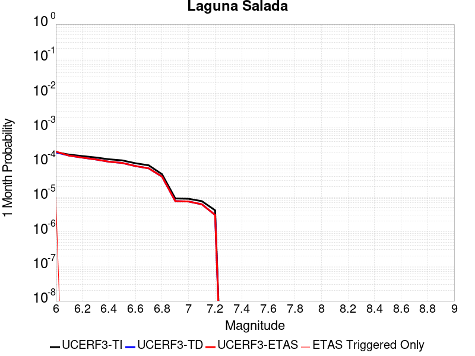 |  |  |

| Magnitude | 1 wk TI Prob | 1 wk TD Prob | 1 wk ETAS Prob | 1 wk ETAS/TD Gain | 1 wk ETAS Triggered Only | 1 mo TI Prob | 1 mo TD Prob | 1 mo ETAS Prob | 1 mo ETAS/TD Gain | 1 mo ETAS Triggered Only | 1 yr TI Prob | 1 yr TD Prob | 1 yr ETAS Prob | 1 yr ETAS/TD Gain | 1 yr ETAS Triggered Only | 10 yr TI Prob | 10 yr TD Prob | 10 yr ETAS Prob | 10 yr ETAS/TD Gain | 10 yr ETAS Triggered Only |
|-----|-----|-----|-----|-----|-----|-----|-----|-----|-----|-----|-----|-----|-----|-----|-----|-----|-----|-----|-----|-----|
| 6.0 | 4.6465593E-5 | 4.634639E-5 | 4.634639E-5 | 1.0 | 0.0 | 1.9912305E-4 | 1.9861311E-4 | 1.9861311E-4 | 1.0 | 0.0 | 0.0024216278 | 0.002415429 | 0.002415429 | 1.0 | 0.0 | 0.02395408 | 0.023975259 | 0.024041964 | 1.0027822 | 6.834335E-5 |
| 6.1 | 3.982297E-5 | 3.7246125E-5 | 3.7246125E-5 | 1.0 | 0.0 | 1.706587E-4 | 1.5961716E-4 | 1.5961716E-4 | 1.0 | 0.0 | 0.0020757897 | 0.0019417295 | 0.0019417295 | 1.0 | 0.0 | 0.020565065 | 0.019331863 | 0.019331863 | 1.0 | 0.0 |
| 6.2 | 3.6067784E-5 | 3.2602693E-5 | 3.2602693E-5 | 1.0 | 0.0 | 1.5456705E-4 | 1.3971896E-4 | 1.3971896E-4 | 1.0 | 0.0 | 0.0018802295 | 0.0016998611 | 0.0016998611 | 1.0 | 0.0 | 0.018644003 | 0.016949628 | 0.016949628 | 1.0 | 0.0 |
| 6.3 | 3.2859112E-5 | 2.8849448E-5 | 2.8849448E-5 | 1.0 | 0.0 | 1.4081717E-4 | 1.2363521E-4 | 1.2363521E-4 | 1.0 | 0.0 | 0.0017131006 | 0.0015043203 | 0.0015043203 | 1.0 | 0.0 | 0.016999546 | 0.015018767 | 0.015018767 | 1.0 | 0.0 |
| 6.4 | 2.9132116E-5 | 2.4852965E-5 | 2.4852965E-5 | 1.0 | 0.0 | 1.2484594E-4 | 1.0650887E-4 | 1.0650887E-4 | 1.0 | 0.0 | 0.0015189396 | 0.001296065 | 0.001296065 | 1.0 | 0.0 | 0.015085992 | 0.012956262 | 0.012956262 | 1.0 | 0.0 |
| 6.5 | 2.7075037E-5 | 2.2825836E-5 | 2.2825836E-5 | 1.0 | 0.0 | 1.1603071E-4 | 9.7821845E-5 | 9.7821845E-5 | 1.0 | 0.0 | 0.0014117584 | 0.0011904186 | 0.0011904186 | 1.0 | 0.0 | 0.014028233 | 0.011907749 | 0.011907749 | 1.0 | 0.0 |
| 6.6 | 2.2367465E-5 | 1.8573526E-5 | 1.8573526E-5 | 1.0 | 0.0 | 9.5857045E-5 | 7.959886E-5 | 7.959886E-5 | 1.0 | 0.0 | 0.0011664346 | 9.6876756E-4 | 9.6876756E-4 | 1.0 | 0.0 | 0.011603311 | 0.009702191 | 0.009702191 | 1.0 | 0.0 |
| 6.7 | 1.9458053E-5 | 1.5914242E-5 | 1.5914242E-5 | 1.0 | 0.0 | 8.338899E-5 | 6.8202564E-5 | 6.8202564E-5 | 1.0 | 0.0 | 0.001014788 | 8.3013024E-4 | 8.3013024E-4 | 1.0 | 0.0 | 0.010101665 | 0.0083209425 | 0.0083209425 | 1.0 | 0.0 |
| 6.8 | 1.0767866E-5 | 9.18435E-6 | 9.18435E-6 | 1.0 | 0.0 | 4.614718E-5 | 3.9361294E-5 | 3.9361294E-5 | 1.0 | 0.0 | 5.6169706E-4 | 4.7918706E-4 | 4.7918706E-4 | 1.0 | 0.0 | 0.0056027942 | 0.0048096925 | 0.0048096925 | 1.0 | 0.0 |
| 6.9 | 2.1384765E-6 | 1.7913675E-6 | 1.7913675E-6 | 1.0 | 0.0 | 9.164866E-6 | 7.677269E-6 | 7.677269E-6 | 1.0 | 0.0 | 1.1157654E-4 | 9.346713E-5 | 9.346713E-5 | 1.0 | 0.0 | 0.0011152053 | 9.343165E-4 | 9.343165E-4 | 1.0 | 0.0 |
| 7.0 | 2.0952946E-6 | 1.7493046E-6 | 1.7493046E-6 | 1.0 | 0.0 | 8.979802E-6 | 7.4970003E-6 | 7.4970003E-6 | 1.0 | 0.0 | 1.0932361E-4 | 9.1272545E-5 | 9.1272545E-5 | 1.0 | 0.0 | 0.0010926984 | 9.123888E-4 | 9.123888E-4 | 1.0 | 0.0 |
| 7.1 | 1.7887576E-6 | 1.4500254E-6 | 1.4500254E-6 | 1.0 | 0.0 | 7.666081E-6 | 6.2143813E-6 | 6.2143813E-6 | 1.0 | 0.0 | 9.333054E-5 | 7.565777E-5 | 7.565777E-5 | 1.0 | 0.0 | 9.329135E-4 | 7.563506E-4 | 7.563506E-4 | 1.0 | 0.0 |
| 7.2 | 9.723109E-7 | 7.135619E-7 | 7.135619E-7 | 1.0 | 0.0 | 4.16704E-6 | 3.0581198E-6 | 3.0581198E-6 | 1.0 | 0.0 | 5.073253E-5 | 3.7232137E-5 | 3.7232137E-5 | 1.0 | 0.0 | 5.072095E-4 | 3.7227524E-4 | 3.7227524E-4 | 1.0 | 0.0 |

## San Gregorio (South) 2011 CFM
*[(top)](#table-of-contents)*

| 1 Week | 1 Month | 1 Year | 10 Year |
|-----|-----|-----|-----|
|  |  |  |  |

| Magnitude | 1 wk TI Prob | 1 wk TD Prob | 1 wk ETAS Prob | 1 wk ETAS/TD Gain | 1 wk ETAS Triggered Only | 1 mo TI Prob | 1 mo TD Prob | 1 mo ETAS Prob | 1 mo ETAS/TD Gain | 1 mo ETAS Triggered Only | 1 yr TI Prob | 1 yr TD Prob | 1 yr ETAS Prob | 1 yr ETAS/TD Gain | 1 yr ETAS Triggered Only | 10 yr TI Prob | 10 yr TD Prob | 10 yr ETAS Prob | 10 yr ETAS/TD Gain | 10 yr ETAS Triggered Only |
|-----|-----|-----|-----|-----|-----|-----|-----|-----|-----|-----|-----|-----|-----|-----|-----|-----|-----|-----|-----|-----|
| 6.0 | 1.8770423E-5 | 1.6279751E-5 | 1.6279751E-5 | 1.0 | 0.0 | 8.044219E-5 | 6.976852E-5 | 6.976852E-5 | 1.0 | 0.0 | 9.789435E-4 | 8.491044E-4 | 8.491044E-4 | 1.0 | 0.0 | 0.009746423 | 0.008471312 | 0.008539076 | 1.0079993 | 6.834335E-5 |
| 6.1 | 1.8770423E-5 | 1.6279751E-5 | 1.6279751E-5 | 1.0 | 0.0 | 8.044219E-5 | 6.976852E-5 | 6.976852E-5 | 1.0 | 0.0 | 9.789435E-4 | 8.491044E-4 | 8.491044E-4 | 1.0 | 0.0 | 0.009746423 | 0.008471312 | 0.008539076 | 1.0079993 | 6.834335E-5 |
| 6.2 | 1.7508692E-5 | 1.4899257E-5 | 1.4899257E-5 | 1.0 | 0.0 | 7.5035096E-5 | 6.3852414E-5 | 6.3852414E-5 | 1.0 | 0.0 | 9.1316935E-4 | 7.7712885E-4 | 7.7712885E-4 | 1.0 | 0.0 | 0.00909426 | 0.00775674 | 0.007824553 | 1.0087425 | 6.834335E-5 |
| 6.3 | 1.7508692E-5 | 1.4899257E-5 | 1.4899257E-5 | 1.0 | 0.0 | 7.5035096E-5 | 6.3852414E-5 | 6.3852414E-5 | 1.0 | 0.0 | 9.1316935E-4 | 7.7712885E-4 | 7.7712885E-4 | 1.0 | 0.0 | 0.00909426 | 0.00775674 | 0.007824553 | 1.0087425 | 6.834335E-5 |
| 6.4 | 1.6004591E-5 | 1.3249094E-5 | 1.3249094E-5 | 1.0 | 0.0 | 6.85893E-5 | 5.6780602E-5 | 5.6780602E-5 | 1.0 | 0.0 | 8.347548E-4 | 6.910856E-4 | 6.910856E-4 | 1.0 | 0.0 | 0.008316261 | 0.006901791 | 0.0069696624 | 1.0098339 | 6.834335E-5 |
| 6.5 | 1.6004591E-5 | 1.3249094E-5 | 1.3249094E-5 | 1.0 | 0.0 | 6.85893E-5 | 5.6780602E-5 | 5.6780602E-5 | 1.0 | 0.0 | 8.347548E-4 | 6.910856E-4 | 6.910856E-4 | 1.0 | 0.0 | 0.008316261 | 0.006901791 | 0.0069696624 | 1.0098339 | 6.834335E-5 |
| 6.6 | 1.5442201E-5 | 1.2633725E-5 | 1.2633725E-5 | 1.0 | 0.0 | 6.617918E-5 | 5.4143416E-5 | 5.4143416E-5 | 1.0 | 0.0 | 8.0543366E-4 | 6.5899757E-4 | 6.5899757E-4 | 1.0 | 0.0 | 0.008025207 | 0.006582842 | 0.0066507356 | 1.0103137 | 6.834335E-5 |
| 6.7 | 1.489921E-5 | 1.2042234E-5 | 1.2042234E-5 | 1.0 | 0.0 | 6.3852196E-5 | 5.1608557E-5 | 5.1608557E-5 | 1.0 | 0.0 | 7.7712315E-4 | 6.2815374E-4 | 6.2815374E-4 | 1.0 | 0.0 | 0.0077441116 | 0.006276176 | 0.00634409 | 1.010821 | 6.834335E-5 |
| 6.8 | 1.3876024E-5 | 1.0921184E-5 | 1.0921184E-5 | 1.0 | 0.0 | 5.9467322E-5 | 4.6804238E-5 | 4.6804238E-5 | 1.0 | 0.0 | 7.237741E-4 | 5.69693E-4 | 5.69693E-4 | 1.0 | 0.0 | 0.0072142133 | 0.0056946846 | 0.005762639 | 1.011933 | 6.834335E-5 |
| 6.9 | 1.33922495E-5 | 1.0392687E-5 | 1.0392687E-5 | 1.0 | 0.0 | 5.7394092E-5 | 4.4539327E-5 | 4.4539327E-5 | 1.0 | 0.0 | 6.9854903E-4 | 5.4213166E-4 | 5.4213166E-4 | 1.0 | 0.0 | 0.0069635725 | 0.005420442 | 0.0054884152 | 1.0125401 | 6.834335E-5 |
| 7.0 | 1.2807324E-5 | 9.752649E-6 | 9.752649E-6 | 1.0 | 0.0 | 5.4887376E-5 | 4.1796397E-5 | 4.1796397E-5 | 1.0 | 0.0 | 6.680489E-4 | 5.087525E-4 | 5.087525E-4 | 1.0 | 0.0 | 0.006660442 | 0.0050882204 | 0.005156216 | 1.0133634 | 6.834335E-5 |
| 7.1 | 1.2191438E-5 | 9.061537E-6 | 9.061537E-6 | 1.0 | 0.0 | 5.224797E-5 | 3.8834576E-5 | 3.8834576E-5 | 1.0 | 0.0 | 6.3593336E-4 | 4.727085E-4 | 4.727085E-4 | 1.0 | 0.0 | 0.0063411663 | 0.0047293645 | 0.0047293645 | 1.0 | 0.0 |
| 7.2 | 1.1769438E-5 | 8.581731E-6 | 8.581731E-6 | 1.0 | 0.0 | 5.0439474E-5 | 3.677833E-5 | 3.677833E-5 | 1.0 | 0.0 | 6.1392755E-4 | 4.4768423E-4 | 4.4768423E-4 | 1.0 | 0.0 | 0.0061223423 | 0.004480157 | 0.004480157 | 1.0 | 0.0 |
| 7.3 | 1.150374E-5 | 8.29716E-6 | 8.29716E-6 | 1.0 | 0.0 | 4.9300812E-5 | 3.5558773E-5 | 3.5558773E-5 | 1.0 | 0.0 | 6.0007203E-4 | 4.3284212E-4 | 4.3284212E-4 | 1.0 | 0.0 | 0.0059845424 | 0.0043323063 | 0.0043323063 | 1.0 | 0.0 |
| 7.4 | 1.12514E-5 | 8.042902E-6 | 8.042902E-6 | 1.0 | 0.0 | 4.8219394E-5 | 3.4469125E-5 | 3.4469125E-5 | 1.0 | 0.0 | 5.8691297E-4 | 4.1958084E-4 | 4.1958084E-4 | 1.0 | 0.0 | 0.005853653 | 0.0042001884 | 0.0042001884 | 1.0 | 0.0 |
| 7.5 | 1.059696E-5 | 7.3931915E-6 | 7.3931915E-6 | 1.0 | 0.0 | 4.5414752E-5 | 3.168472E-5 | 3.168472E-5 | 1.0 | 0.0 | 5.5278436E-4 | 3.8569325E-4 | 3.8569325E-4 | 1.0 | 0.0 | 0.0055141128 | 0.0038624762 | 0.0038624762 | 1.0 | 0.0 |
| 7.6 | 9.018592E-6 | 5.8369624E-6 | 5.8369624E-6 | 1.0 | 0.0 | 3.8650534E-5 | 2.5015313E-5 | 2.5015313E-5 | 1.0 | 0.0 | 4.7046866E-4 | 3.045189E-4 | 3.045189E-4 | 1.0 | 0.0 | 0.004694739 | 0.0030528754 | 0.0030528754 | 1.0 | 0.0 |
| 7.7 | 6.243489E-6 | 3.2395455E-6 | 3.2395455E-6 | 1.0 | 0.0 | 2.6757538E-5 | 1.3883692E-5 | 1.3883692E-5 | 1.0 | 0.0 | 3.257243E-4 | 1.6902086E-4 | 1.6902086E-4 | 1.0 | 0.0 | 0.003252473 | 0.001699108 | 0.001699108 | 1.0 | 0.0 |
| 7.8 | 3.1941963E-6 | 1.3809986E-6 | 1.3809986E-6 | 1.0 | 0.0 | 1.368934E-5 | 5.9185513E-6 | 5.9185513E-6 | 1.0 | 0.0 | 1.6665498E-4 | 7.2055984E-5 | 7.2055984E-5 | 1.0 | 0.0 | 0.0016653005 | 7.263174E-4 | 7.263174E-4 | 1.0 | 0.0 |
| 7.9 | 2.0098398E-6 | 6.9161155E-7 | 6.9161155E-7 | 1.0 | 0.0 | 8.6135715E-6 | 2.964046E-6 | 2.964046E-6 | 1.0 | 0.0 | 1.0486518E-4 | 3.608666E-5 | 3.608666E-5 | 1.0 | 0.0 | 0.0010481571 | 3.657225E-4 | 3.657225E-4 | 1.0 | 0.0 |
| 8.0 | 8.353119E-7 | 3.1623412E-7 | 3.1623412E-7 | 1.0 | 0.0 | 3.579903E-6 | 1.3552883E-6 | 1.3552883E-6 | 1.0 | 0.0 | 4.358445E-5 | 1.6500511E-5 | 1.6500511E-5 | 1.0 | 0.0 | 4.3575902E-4 | 1.6619264E-4 | 1.6619264E-4 | 1.0 | 0.0 |
| 8.1 | 1.5033264E-7 | 6.527624E-8 | 6.527624E-8 | 1.0 | 0.0 | 6.442826E-7 | 2.7975528E-7 | 2.7975528E-7 | 1.0 | 0.0 | 7.844113E-6 | 3.4060151E-6 | 3.4060151E-6 | 1.0 | 0.0 | 7.843835E-5 | 3.407693E-5 | 3.407693E-5 | 1.0 | 0.0 |

## Las Positas
*[(top)](#table-of-contents)*

| 1 Week | 1 Month | 1 Year | 10 Year |
|-----|-----|-----|-----|
|  |  | 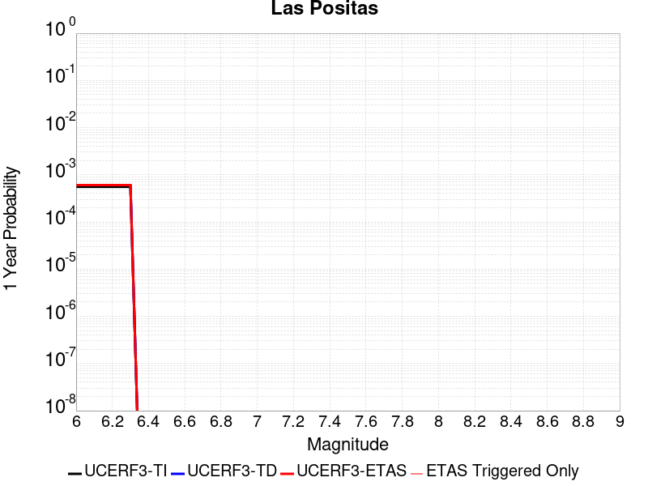 |  |

| Magnitude | 1 wk TI Prob | 1 wk TD Prob | 1 wk ETAS Prob | 1 wk ETAS/TD Gain | 1 wk ETAS Triggered Only | 1 mo TI Prob | 1 mo TD Prob | 1 mo ETAS Prob | 1 mo ETAS/TD Gain | 1 mo ETAS Triggered Only | 1 yr TI Prob | 1 yr TD Prob | 1 yr ETAS Prob | 1 yr ETAS/TD Gain | 1 yr ETAS Triggered Only | 10 yr TI Prob | 10 yr TD Prob | 10 yr ETAS Prob | 10 yr ETAS/TD Gain | 10 yr ETAS Triggered Only |
|-----|-----|-----|-----|-----|-----|-----|-----|-----|-----|-----|-----|-----|-----|-----|-----|-----|-----|-----|-----|-----|
| 6.0 | 1.0659424E-5 | 1.15911225E-5 | 1.15911225E-5 | 1.0 | 0.0 | 4.568245E-5 | 4.9676237E-5 | 4.9676237E-5 | 1.0 | 0.0 | 5.560419E-4 | 6.048082E-4 | 6.048082E-4 | 1.0 | 0.0 | 0.005546526 | 0.006048082 | 0.006116012 | 1.0112317 | 6.834335E-5 |
| 6.1 | 1.0659424E-5 | 1.15911225E-5 | 1.15911225E-5 | 1.0 | 0.0 | 4.568245E-5 | 4.9676237E-5 | 4.9676237E-5 | 1.0 | 0.0 | 5.560419E-4 | 6.048082E-4 | 6.048082E-4 | 1.0 | 0.0 | 0.005546526 | 0.006048082 | 0.006116012 | 1.0112317 | 6.834335E-5 |
| 6.2 | 1.0659424E-5 | 1.15911225E-5 | 1.15911225E-5 | 1.0 | 0.0 | 4.568245E-5 | 4.9676237E-5 | 4.9676237E-5 | 1.0 | 0.0 | 5.560419E-4 | 6.048082E-4 | 6.048082E-4 | 1.0 | 0.0 | 0.005546526 | 0.006048082 | 0.006116012 | 1.0112317 | 6.834335E-5 |
| 6.3 | 1.0659424E-5 | 1.15911225E-5 | 1.15911225E-5 | 1.0 | 0.0 | 4.568245E-5 | 4.9676237E-5 | 4.9676237E-5 | 1.0 | 0.0 | 5.560419E-4 | 6.048082E-4 | 6.048082E-4 | 1.0 | 0.0 | 0.005546526 | 0.006048082 | 0.006116012 | 1.0112317 | 6.834335E-5 |

## San Jacinto (Borrego)
*[(top)](#table-of-contents)*

| 1 Week | 1 Month | 1 Year | 10 Year |
|-----|-----|-----|-----|
| 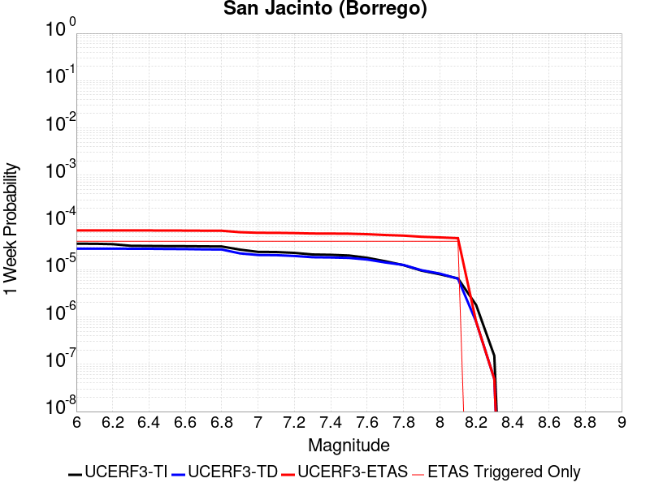 |  |  |  |

| Magnitude | 1 wk TI Prob | 1 wk TD Prob | 1 wk ETAS Prob | 1 wk ETAS/TD Gain | 1 wk ETAS Triggered Only | 1 mo TI Prob | 1 mo TD Prob | 1 mo ETAS Prob | 1 mo ETAS/TD Gain | 1 mo ETAS Triggered Only | 1 yr TI Prob | 1 yr TD Prob | 1 yr ETAS Prob | 1 yr ETAS/TD Gain | 1 yr ETAS Triggered Only | 10 yr TI Prob | 10 yr TD Prob | 10 yr ETAS Prob | 10 yr ETAS/TD Gain | 10 yr ETAS Triggered Only |
|-----|-----|-----|-----|-----|-----|-----|-----|-----|-----|-----|-----|-----|-----|-----|-----|-----|-----|-----|-----|-----|
| 6.0 | 3.543992E-5 | 2.7926513E-5 | 9.626796E-5 | 3.4471889 | 6.834335E-5 | 1.5187653E-4 | 1.1967963E-4 | 1.880148E-4 | 1.5709842 | 6.834335E-5 | 0.0018475284 | 0.0014561379 | 0.0015243817 | 1.0468663 | 6.834335E-5 | 0.018322436 | 0.014869647 | 0.014936974 | 1.0045278 | 6.834335E-5 |
| 6.1 | 3.542281E-5 | 2.7926513E-5 | 9.626796E-5 | 3.4471889 | 6.834335E-5 | 1.5180321E-4 | 1.1967963E-4 | 1.880148E-4 | 1.5709842 | 6.834335E-5 | 0.0018466372 | 0.0014561379 | 0.0015243817 | 1.0468663 | 6.834335E-5 | 0.018313672 | 0.014869647 | 0.014936974 | 1.0045278 | 6.834335E-5 |
| 6.2 | 3.4688688E-5 | 2.7926511E-5 | 9.626796E-5 | 3.4471889 | 6.834335E-5 | 1.4865733E-4 | 1.1967963E-4 | 1.880148E-4 | 1.5709842 | 6.834335E-5 | 0.0018084005 | 0.0014561379 | 0.0015243817 | 1.0468663 | 6.834335E-5 | 0.017937548 | 0.014869647 | 0.014936974 | 1.0045278 | 6.834335E-5 |
| 6.3 | 3.2087122E-5 | 2.7771865E-5 | 9.611333E-5 | 3.4608164 | 6.834335E-5 | 1.3750899E-4 | 1.1901691E-4 | 1.8735214E-4 | 1.5741639 | 6.834335E-5 | 0.0016728862 | 0.00144808 | 0.0015163244 | 1.0471275 | 6.834335E-5 | 0.016603488 | 0.014790683 | 0.014858016 | 1.0045524 | 6.834335E-5 |
| 6.4 | 3.1828724E-5 | 2.7738852E-5 | 9.6080315E-5 | 3.463745 | 6.834335E-5 | 1.364017E-4 | 1.1887544E-4 | 1.8721068E-4 | 1.5748473 | 6.834335E-5 | 0.0016594254 | 0.0014463598 | 0.0015146043 | 1.0471836 | 6.834335E-5 | 0.016470885 | 0.014773762 | 0.014841096 | 1.0045576 | 6.834335E-5 |
| 6.5 | 3.1563577E-5 | 2.747857E-5 | 9.582005E-5 | 3.4870827 | 6.834335E-5 | 1.3526545E-4 | 1.1776006E-4 | 1.8609536E-4 | 1.5802928 | 6.834335E-5 | 0.0016456128 | 0.0014327979 | 0.0015010433 | 1.0476309 | 6.834335E-5 | 0.0163348 | 0.014640348 | 0.014707691 | 1.0045998 | 6.834335E-5 |
| 6.6 | 3.1467625E-5 | 2.7322796E-5 | 9.566428E-5 | 3.5012627 | 6.834335E-5 | 1.3485427E-4 | 1.1709251E-4 | 1.8542787E-4 | 1.5836015 | 6.834335E-5 | 0.0016406142 | 0.0014246812 | 0.0014929272 | 1.0479026 | 6.834335E-5 | 0.016285548 | 0.014560594 | 0.014627943 | 1.0046253 | 6.834335E-5 |
| 6.7 | 3.1223695E-5 | 2.6940816E-5 | 9.528233E-5 | 3.536728 | 6.834335E-5 | 1.3380898E-4 | 1.15455594E-4 | 1.8379105E-4 | 1.5918766 | 6.834335E-5 | 0.0016279068 | 0.0014047775 | 0.001473025 | 1.0485823 | 6.834335E-5 | 0.01616033 | 0.014364966 | 0.014432328 | 1.0046893 | 6.834335E-5 |
| 6.8 | 3.1015585E-5 | 2.6761822E-5 | 9.510335E-5 | 3.553695 | 6.834335E-5 | 1.3291716E-4 | 1.1468855E-4 | 1.8302407E-4 | 1.5958356 | 6.834335E-5 | 0.001617065 | 0.0013954508 | 0.0014636988 | 1.0489075 | 6.834335E-5 | 0.016053487 | 0.014272246 | 0.014339614 | 1.0047202 | 6.834335E-5 |
| 6.9 | 2.6641965E-5 | 2.2184247E-5 | 9.052609E-5 | 4.0806475 | 6.834335E-5 | 1.1417485E-4 | 9.50719E-5 | 1.6340875E-4 | 1.7187914 | 6.834335E-5 | 0.0013891924 | 0.0011568897 | 0.0012251539 | 1.0590067 | 6.834335E-5 | 0.0138054015 | 0.011882438 | 0.01194997 | 1.0056833 | 6.834335E-5 |
| 7.0 | 2.3854353E-5 | 2.0479023E-5 | 8.882098E-5 | 4.3371687 | 6.834335E-5 | 1.02228936E-4 | 8.77643E-5 | 1.5610167E-4 | 1.7786463 | 6.834335E-5 | 0.0012439266 | 0.0010680092 | 0.0011362795 | 1.063923 | 6.834335E-5 | 0.012369866 | 0.0109828 | 0.011050394 | 1.0061544 | 6.834335E-5 |
| 7.1 | 2.3672901E-5 | 2.031551E-5 | 8.865748E-5 | 4.364029 | 6.834335E-5 | 1.0145135E-4 | 8.7063585E-5 | 1.55401E-4 | 1.7849138 | 6.834335E-5 | 0.0012344702 | 0.0010594862 | 0.0011277571 | 1.0644377 | 6.834335E-5 | 0.0122763505 | 0.010897976 | 0.0109655745 | 1.0062028 | 6.834335E-5 |
| 7.2 | 2.2717244E-5 | 1.9542893E-5 | 8.788492E-5 | 4.497027 | 6.834335E-5 | 9.735599E-5 | 8.375258E-5 | 1.5209022E-4 | 1.8159466 | 6.834335E-5 | 0.0011846646 | 0.001019213 | 0.0010874866 | 1.0669867 | 6.834335E-5 | 0.01178369 | 0.010495341 | 0.0105629675 | 1.0064434 | 6.834335E-5 |
| 7.3 | 2.1016205E-5 | 1.8384526E-5 | 8.672663E-5 | 4.717371 | 6.834335E-5 | 9.006634E-5 | 7.878846E-5 | 1.4712643E-4 | 1.8673602 | 6.834335E-5 | 0.001096006 | 9.5882936E-4 | 0.0010271072 | 1.0712095 | 6.834335E-5 | 0.010906163 | 0.009890967 | 0.009958634 | 1.0068413 | 6.834335E-5 |
| 7.4 | 2.0683625E-5 | 1.8187047E-5 | 8.652916E-5 | 4.7577357 | 6.834335E-5 | 8.86411E-5 | 7.794217E-5 | 1.462802E-4 | 1.8767786 | 6.834335E-5 | 0.001078671 | 9.485349E-4 | 0.0010168133 | 1.0719831 | 6.834335E-5 | 0.010734501 | 0.009787692 | 0.009855366 | 1.0069143 | 6.834335E-5 |
| 7.5 | 1.9993966E-5 | 1.7782075E-5 | 8.6124215E-5 | 4.8433166 | 6.834335E-5 | 8.568561E-5 | 7.620667E-5 | 1.4454483E-4 | 1.8967476 | 6.834335E-5 | 0.001042723 | 9.2742336E-4 | 9.957033E-4 | 1.0736233 | 6.834335E-5 | 0.010378438 | 0.009574614 | 0.009642304 | 1.0070696 | 6.834335E-5 |
| 7.6 | 1.788966E-5 | 1.6435291E-5 | 8.477752E-5 | 5.1582613 | 6.834335E-5 | 7.666772E-5 | 7.043507E-5 | 1.3877361E-4 | 1.9702346 | 6.834335E-5 | 9.3302975E-4 | 8.572113E-4 | 9.254961E-4 | 1.0796592 | 6.834335E-5 | 0.00929122 | 0.008866487 | 0.008934224 | 1.0076398 | 6.834335E-5 |
| 7.7 | 1.5125781E-5 | 1.4237377E-5 | 8.257976E-5 | 5.8002086 | 6.834335E-5 | 6.4823165E-5 | 6.1015908E-5 | 1.293551E-4 | 2.1200225 | 6.834335E-5 | 7.889362E-4 | 7.426163E-4 | 8.109089E-4 | 1.0919622 | 6.834335E-5 | 0.007861412 | 0.0077142045 | 0.0077820206 | 1.0087911 | 6.834335E-5 |
| 7.8 | 1.250089E-5 | 1.26304985E-5 | 8.097299E-5 | 6.41091 | 6.834335E-5 | 5.3574146E-5 | 5.412959E-5 | 1.2246924E-4 | 2.2625194 | 6.834335E-5 | 6.5207E-4 | 6.588291E-4 | 7.271274E-4 | 1.1036662 | 6.834335E-5 | 0.006501599 | 0.0068677636 | 0.0069356374 | 1.0098829 | 6.834335E-5 |
| 7.9 | 9.561E-6 | 9.754616E-6 | 7.8097306E-5 | 8.006189 | 6.834335E-5 | 4.0975072E-5 | 4.1804833E-5 | 1.1014533E-4 | 2.634751 | 6.834335E-5 | 4.987573E-4 | 5.088555E-4 | 5.771641E-4 | 1.1342397 | 6.834335E-5 | 0.0049763937 | 0.0053523467 | 0.005420324 | 1.0127006 | 6.834335E-5 |
| 8.0 | 8.01699E-6 | 8.293488E-6 | 7.663628E-5 | 9.240537 | 6.834335E-5 | 3.4358076E-5 | 3.554304E-5 | 1.0388396E-4 | 2.9227655 | 6.834335E-5 | 4.1822926E-4 | 4.3265108E-4 | 5.009649E-4 | 1.1578958 | 6.834335E-5 | 0.0041744304 | 0.004573375 | 0.004641406 | 1.0148754 | 6.834335E-5 |
| 8.1 | 6.541947E-6 | 6.4622354E-6 | 7.480515E-5 | 11.575739 | 6.834335E-5 | 2.8036617E-5 | 2.7695003E-5 | 9.603647E-5 | 3.4676461 | 6.834335E-5 | 3.4129233E-4 | 3.37135E-4 | 4.0545533E-4 | 1.2026497 | 6.834335E-5 | 0.0034076865 | 0.0035806994 | 0.003648798 | 1.0190183 | 6.834335E-5 |
| 8.2 | 1.7968189E-6 | 7.9713476E-7 | 7.9713476E-7 | 1.0 | 0.0 | 7.70063E-6 | 3.4162877E-6 | 3.4162877E-6 | 1.0 | 0.0 | 9.3751136E-5 | 4.159253E-5 | 4.159253E-5 | 1.0 | 0.0 | 9.371159E-4 | 4.712058E-4 | 4.712058E-4 | 1.0 | 0.0 |
| 8.3 | 1.5167889E-7 | 4.897714E-8 | 4.897714E-8 | 1.0 | 0.0 | 6.500522E-7 | 2.09902E-7 | 2.09902E-7 | 1.0 | 0.0 | 7.9143565E-6 | 2.5555544E-6 | 2.5555544E-6 | 1.0 | 0.0 | 7.914075E-5 | 2.969505E-5 | 2.969505E-5 | 1.0 | 0.0 |

## Big Pine (East)
*[(top)](#table-of-contents)*

| 1 Week | 1 Month | 1 Year | 10 Year |
|-----|-----|-----|-----|
|  |  |  |  |

| Magnitude | 1 wk TI Prob | 1 wk TD Prob | 1 wk ETAS Prob | 1 wk ETAS/TD Gain | 1 wk ETAS Triggered Only | 1 mo TI Prob | 1 mo TD Prob | 1 mo ETAS Prob | 1 mo ETAS/TD Gain | 1 mo ETAS Triggered Only | 1 yr TI Prob | 1 yr TD Prob | 1 yr ETAS Prob | 1 yr ETAS/TD Gain | 1 yr ETAS Triggered Only | 10 yr TI Prob | 10 yr TD Prob | 10 yr ETAS Prob | 10 yr ETAS/TD Gain | 10 yr ETAS Triggered Only |
|-----|-----|-----|-----|-----|-----|-----|-----|-----|-----|-----|-----|-----|-----|-----|-----|-----|-----|-----|-----|-----|
| 6.0 | 9.916913E-6 | 1.2816984E-5 | 1.2816984E-5 | 1.0 | 0.0 | 4.250036E-5 | 5.49289E-5 | 1.232685E-4 | 2.2441466 | 6.834335E-5 | 5.173191E-4 | 6.685763E-4 | 7.3687395E-4 | 1.1021539 | 6.834335E-5 | 0.0051611643 | 0.006670441 | 0.0067383284 | 1.0101774 | 6.834335E-5 |
| 6.1 | 9.916913E-6 | 1.2816984E-5 | 1.2816984E-5 | 1.0 | 0.0 | 4.250036E-5 | 5.49289E-5 | 1.232685E-4 | 2.2441466 | 6.834335E-5 | 5.173191E-4 | 6.685763E-4 | 7.3687395E-4 | 1.1021539 | 6.834335E-5 | 0.0051611643 | 0.006670441 | 0.0067383284 | 1.0101774 | 6.834335E-5 |
| 6.2 | 9.916913E-6 | 1.2816984E-5 | 1.2816984E-5 | 1.0 | 0.0 | 4.250036E-5 | 5.49289E-5 | 1.232685E-4 | 2.2441466 | 6.834335E-5 | 5.173191E-4 | 6.685763E-4 | 7.3687395E-4 | 1.1021539 | 6.834335E-5 | 0.0051611643 | 0.006670441 | 0.0067383284 | 1.0101774 | 6.834335E-5 |
| 6.3 | 5.479711E-6 | 8.112951E-6 | 8.112951E-6 | 1.0 | 0.0 | 2.3484265E-5 | 3.4769346E-5 | 1.03110324E-4 | 2.9655526 | 6.834335E-5 | 2.858834E-4 | 4.2323777E-4 | 4.915522E-4 | 1.1614091 | 6.834335E-5 | 0.0028551589 | 0.004227244 | 0.004295298 | 1.016099 | 6.834335E-5 |
| 6.4 | 5.465009E-6 | 8.097245E-6 | 8.097245E-6 | 1.0 | 0.0 | 2.3421257E-5 | 3.4702036E-5 | 1.0304302E-4 | 2.9693654 | 6.834335E-5 | 2.851165E-4 | 4.2241855E-4 | 4.90733E-4 | 1.1617223 | 6.834335E-5 | 0.0028475097 | 0.0042190826 | 0.0042871376 | 1.0161303 | 6.834335E-5 |
| 6.5 | 4.826767E-6 | 7.422301E-6 | 7.422301E-6 | 1.0 | 0.0 | 2.068598E-5 | 3.180949E-5 | 1.00150675E-4 | 3.1484525 | 6.834335E-5 | 2.518227E-4 | 3.872145E-4 | 4.5553138E-4 | 1.1764317 | 6.834335E-5 | 0.0025153751 | 0.003868283 | 0.003936362 | 1.0175992 | 6.834335E-5 |
| 6.6 | 4.3146847E-6 | 6.8822374E-6 | 6.8822374E-6 | 1.0 | 0.0 | 1.8491375E-5 | 2.9494982E-5 | 9.7836324E-5 | 3.3170497 | 6.834335E-5 | 2.2510924E-4 | 3.590447E-4 | 4.273635E-4 | 1.1902795 | 6.834335E-5 | 0.0022488134 | 0.0035874986 | 0.0036555966 | 1.018982 | 6.834335E-5 |
| 6.7 | 3.6968106E-6 | 5.9954727E-6 | 5.9954727E-6 | 1.0 | 0.0 | 1.5843378E-5 | 2.5694639E-5 | 9.403624E-5 | 3.6597612 | 6.834335E-5 | 1.9287605E-4 | 3.1278885E-4 | 3.8111082E-4 | 1.2184285 | 6.834335E-5 | 0.0019270873 | 0.0031262483 | 0.003194378 | 1.0217928 | 6.834335E-5 |
| 6.8 | 3.4671132E-6 | 5.702177E-6 | 5.702177E-6 | 1.0 | 0.0 | 1.4858972E-5 | 2.4437682E-5 | 9.2779366E-5 | 3.79657 | 6.834335E-5 | 1.8089297E-4 | 2.974896E-4 | 3.6581262E-4 | 1.2296653 | 6.834335E-5 | 0.0018074579 | 0.002973667 | 0.0030418073 | 1.0229145 | 6.834335E-5 |
| 6.9 | 2.7686972E-6 | 4.825223E-6 | 4.825223E-6 | 1.0 | 0.0 | 1.1865792E-5 | 2.0679368E-5 | 8.902131E-5 | 4.304837 | 6.834335E-5 | 1.4445644E-4 | 2.5174298E-4 | 3.200691E-4 | 1.2714124 | 6.834335E-5 | 0.0014436257 | 0.0025172636 | 0.002585435 | 1.0270815 | 6.834335E-5 |
| 7.0 | 2.1472624E-6 | 3.9850406E-6 | 3.9850406E-6 | 1.0 | 0.0 | 9.20252E-6 | 1.7078637E-5 | 8.542083E-5 | 5.0016184 | 6.834335E-5 | 1.12034926E-4 | 2.079131E-4 | 2.7624224E-4 | 1.3286428 | 6.834335E-5 | 0.0011197845 | 0.0020798394 | 0.0021480406 | 1.0327916 | 6.834335E-5 |
| 7.1 | 1.7018335E-6 | 3.344876E-6 | 3.344876E-6 | 1.0 | 0.0 | 7.293552E-6 | 1.4335106E-5 | 8.2677485E-5 | 5.767483 | 6.834335E-5 | 8.879537E-5 | 1.7451629E-4 | 2.4284772E-4 | 1.3915476 | 6.834335E-5 | 8.87599E-4 | 0.0017464145 | 0.0018146384 | 1.0390652 | 6.834335E-5 |
| 7.2 | 1.25603E-6 | 2.794484E-6 | 2.794484E-6 | 1.0 | 0.0 | 5.3829745E-6 | 1.1976307E-5 | 1.1976307E-5 | 1.0 | 0.0 | 6.553574E-5 | 1.4580201E-4 | 1.4580201E-4 | 1.0 | 0.0 | 6.551642E-4 | 0.001459661 | 0.001459661 | 1.0 | 0.0 |
| 7.3 | 1.112297E-6 | 2.610332E-6 | 2.610332E-6 | 1.0 | 0.0 | 4.7669787E-6 | 1.118709E-5 | 1.118709E-5 | 1.0 | 0.0 | 5.803642E-5 | 1.3619453E-4 | 1.3619453E-4 | 1.0 | 0.0 | 5.802127E-4 | 0.0013635408 | 0.0013635408 | 1.0 | 0.0 |
| 7.4 | 1.0137181E-6 | 2.4834917E-6 | 2.4834917E-6 | 1.0 | 0.0 | 4.3444993E-6 | 1.0643494E-5 | 1.0643494E-5 | 1.0 | 0.0 | 5.2892992E-5 | 1.2957705E-4 | 1.2957705E-4 | 1.0 | 0.0 | 5.288041E-4 | 0.0012972289 | 0.0012972289 | 1.0 | 0.0 |
| 7.5 | 9.598608E-7 | 2.4071483E-6 | 2.4071483E-6 | 1.0 | 0.0 | 4.1136827E-6 | 1.031631E-5 | 1.031631E-5 | 1.0 | 0.0 | 5.0082934E-5 | 1.2559404E-4 | 1.2559404E-4 | 1.0 | 0.0 | 5.007165E-4 | 0.0012572526 | 0.0012572526 | 1.0 | 0.0 |
| 7.6 | 7.929459E-7 | 2.0448588E-6 | 2.0448588E-6 | 1.0 | 0.0 | 3.3983351E-6 | 8.763653E-6 | 8.763653E-6 | 1.0 | 0.0 | 4.1373947E-5 | 1.06692416E-4 | 1.06692416E-4 | 1.0 | 0.0 | 4.1366243E-4 | 0.0010685222 | 0.0010685222 | 1.0 | 0.0 |
| 7.7 | 4.155788E-7 | 1.1605589E-6 | 1.1605589E-6 | 1.0 | 0.0 | 1.7810507E-6 | 4.9738146E-6 | 4.9738146E-6 | 1.0 | 0.0 | 2.1684076E-5 | 6.0554554E-5 | 6.0554554E-5 | 1.0 | 0.0 | 2.1681961E-4 | 6.0857297E-4 | 6.0857297E-4 | 1.0 | 0.0 |
| 7.8 | 1.14666925E-7 | 2.592015E-7 | 2.592015E-7 | 1.0 | 0.0 | 4.914296E-7 | 1.1108631E-6 | 1.1108631E-6 | 1.0 | 0.0 | 5.9831386E-6 | 1.3524678E-5 | 1.3524678E-5 | 1.0 | 0.0 | 5.9829777E-5 | 1.3634123E-4 | 1.3634123E-4 | 1.0 | 0.0 |
| 7.9 | 2.9231824E-8 | 4.1463963E-8 | 4.1463963E-8 | 1.0 | 0.0 | 1.2527924E-7 | 1.7770269E-7 | 1.7770269E-7 | 1.0 | 0.0 | 1.5252737E-6 | 2.1635283E-6 | 2.1635283E-6 | 1.0 | 0.0 | 1.5252632E-5 | 2.1967755E-5 | 2.1967755E-5 | 1.0 | 0.0 |

## Santa Cruz Catalina Ridge alt1
*[(top)](#table-of-contents)*

| 1 Week | 1 Month | 1 Year | 10 Year |
|-----|-----|-----|-----|
|  |  |  |  |

| Magnitude | 1 wk TI Prob | 1 wk TD Prob | 1 wk ETAS Prob | 1 wk ETAS/TD Gain | 1 wk ETAS Triggered Only | 1 mo TI Prob | 1 mo TD Prob | 1 mo ETAS Prob | 1 mo ETAS/TD Gain | 1 mo ETAS Triggered Only | 1 yr TI Prob | 1 yr TD Prob | 1 yr ETAS Prob | 1 yr ETAS/TD Gain | 1 yr ETAS Triggered Only | 10 yr TI Prob | 10 yr TD Prob | 10 yr ETAS Prob | 10 yr ETAS/TD Gain | 10 yr ETAS Triggered Only |
|-----|-----|-----|-----|-----|-----|-----|-----|-----|-----|-----|-----|-----|-----|-----|-----|-----|-----|-----|-----|-----|
| 6.0 | 3.2833184E-5 | 3.65584E-5 | 1.04899256E-4 | 2.8693614 | 6.834335E-5 | 1.4070606E-4 | 1.5667039E-4 | 2.2500304E-4 | 1.4361556 | 6.834335E-5 | 0.00171175 | 0.0019059596 | 0.0019741727 | 1.0357894 | 6.834335E-5 | 0.016986247 | 0.018913029 | 0.01898008 | 1.0035452 | 6.834335E-5 |
| 6.1 | 1.9835548E-5 | 2.1659505E-5 | 2.1659505E-5 | 1.0 | 0.0 | 8.500672E-5 | 9.282326E-5 | 9.282326E-5 | 1.0 | 0.0 | 0.0010344655 | 0.0011295575 | 0.0011295575 | 1.0 | 0.0 | 0.010296632 | 0.011240295 | 0.011240295 | 1.0 | 0.0 |
| 6.2 | 1.9835548E-5 | 2.1659505E-5 | 2.1659505E-5 | 1.0 | 0.0 | 8.500672E-5 | 9.282326E-5 | 9.282326E-5 | 1.0 | 0.0 | 0.0010344655 | 0.0011295575 | 0.0011295575 | 1.0 | 0.0 | 0.010296632 | 0.011240295 | 0.011240295 | 1.0 | 0.0 |
| 6.3 | 1.5728183E-5 | 1.703395E-5 | 1.703395E-5 | 1.0 | 0.0 | 6.7404755E-5 | 7.300063E-5 | 7.300063E-5 | 1.0 | 0.0 | 8.2034385E-4 | 8.884264E-4 | 8.884264E-4 | 1.0 | 0.0 | 0.008173222 | 0.008849427 | 0.008849427 | 1.0 | 0.0 |
| 6.4 | 1.5728183E-5 | 1.703395E-5 | 1.703395E-5 | 1.0 | 0.0 | 6.7404755E-5 | 7.300063E-5 | 7.300063E-5 | 1.0 | 0.0 | 8.2034385E-4 | 8.884264E-4 | 8.884264E-4 | 1.0 | 0.0 | 0.008173222 | 0.008849427 | 0.008849427 | 1.0 | 0.0 |
| 6.5 | 1.3707734E-5 | 1.4794522E-5 | 1.4794522E-5 | 1.0 | 0.0 | 5.8746107E-5 | 6.3403575E-5 | 6.3403575E-5 | 1.0 | 0.0 | 7.1499916E-4 | 7.716686E-4 | 7.716686E-4 | 1.0 | 0.0 | 0.0071270303 | 0.0076902895 | 0.0076902895 | 1.0 | 0.0 |
| 6.6 | 1.2539813E-5 | 1.3510219E-5 | 1.3510219E-5 | 1.0 | 0.0 | 5.3740947E-5 | 5.789967E-5 | 5.789967E-5 | 1.0 | 0.0 | 6.540996E-4 | 7.0470315E-4 | 7.0470315E-4 | 1.0 | 0.0 | 0.0065217763 | 0.0070249885 | 0.0070249885 | 1.0 | 0.0 |
| 6.7 | 1.1504083E-5 | 1.2377375E-5 | 1.2377375E-5 | 1.0 | 0.0 | 4.930228E-5 | 5.3044827E-5 | 5.3044827E-5 | 1.0 | 0.0 | 6.0008996E-4 | 6.456314E-4 | 6.456314E-4 | 1.0 | 0.0 | 0.005984721 | 0.006437786 | 0.006437786 | 1.0 | 0.0 |
| 6.8 | 1.012739E-5 | 1.0877071E-5 | 1.0877071E-5 | 1.0 | 0.0 | 4.340238E-5 | 4.6615194E-5 | 4.6615194E-5 | 1.0 | 0.0 | 5.282958E-4 | 5.673937E-4 | 5.673937E-4 | 1.0 | 0.0 | 0.0052704164 | 0.0056596193 | 0.0056596193 | 1.0 | 0.0 |
| 6.9 | 8.9607865E-6 | 9.609117E-6 | 9.609117E-6 | 1.0 | 0.0 | 3.8402806E-5 | 4.1181287E-5 | 4.1181287E-5 | 1.0 | 0.0 | 4.6745385E-4 | 5.012679E-4 | 5.012679E-4 | 1.0 | 0.0 | 0.0046647177 | 0.005001492 | 0.005001492 | 1.0 | 0.0 |
| 7.0 | 8.046829E-6 | 8.619746E-6 | 8.619746E-6 | 1.0 | 0.0 | 3.4485955E-5 | 3.694125E-5 | 3.694125E-5 | 1.0 | 0.0 | 4.1978562E-4 | 4.496677E-4 | 4.496677E-4 | 1.0 | 0.0 | 0.004189935 | 0.0044876686 | 0.0044876686 | 1.0 | 0.0 |
| 7.1 | 7.136131E-6 | 7.637656E-6 | 7.637656E-6 | 1.0 | 0.0 | 3.0583058E-5 | 3.2732405E-5 | 3.2732405E-5 | 1.0 | 0.0 | 3.7228514E-4 | 3.9844486E-4 | 3.9844486E-4 | 1.0 | 0.0 | 0.0037166206 | 0.003977381 | 0.003977381 | 1.0 | 0.0 |
| 7.2 | 6.362014E-6 | 6.8049585E-6 | 6.8049585E-6 | 1.0 | 0.0 | 2.726549E-5 | 2.9163786E-5 | 2.9163786E-5 | 1.0 | 0.0 | 3.3190678E-4 | 3.550119E-4 | 3.550119E-4 | 1.0 | 0.0 | 0.0033141149 | 0.003544516 | 0.003544516 | 1.0 | 0.0 |
| 7.3 | 5.004101E-6 | 5.351715E-6 | 5.351715E-6 | 1.0 | 0.0 | 2.1445969E-5 | 2.2935723E-5 | 2.2935723E-5 | 1.0 | 0.0 | 2.6107338E-4 | 2.792072E-4 | 2.792072E-4 | 1.0 | 0.0 | 0.002607669 | 0.0027886187 | 0.0027886187 | 1.0 | 0.0 |
| 7.4 | 3.4901443E-6 | 3.7320526E-6 | 3.7320526E-6 | 1.0 | 0.0 | 1.4957676E-5 | 1.5994416E-5 | 1.5994416E-5 | 1.0 | 0.0 | 1.8209449E-4 | 1.9471499E-4 | 1.9471499E-4 | 1.0 | 0.0 | 0.0018194534 | 0.0019454823 | 0.0019454823 | 1.0 | 0.0 |
| 7.5 | 1.1215045E-6 | 1.189387E-6 | 1.189387E-6 | 1.0 | 0.0 | 4.806439E-6 | 5.097363E-6 | 5.097363E-6 | 1.0 | 0.0 | 5.851682E-5 | 6.205866E-5 | 6.205866E-5 | 1.0 | 0.0 | 5.850142E-4 | 6.2041637E-4 | 6.2041637E-4 | 1.0 | 0.0 |
| 7.6 | 2.8599047E-7 | 2.9951994E-7 | 2.9951994E-7 | 1.0 | 0.0 | 1.2256729E-6 | 1.2836562E-6 | 1.2836562E-6 | 1.0 | 0.0 | 1.4922465E-5 | 1.5628404E-5 | 1.5628404E-5 | 1.0 | 0.0 | 1.4921463E-4 | 1.5627318E-4 | 1.5627318E-4 | 1.0 | 0.0 |
| 7.7 | 2.0781519E-7 | 2.1744323E-7 | 2.1744323E-7 | 1.0 | 0.0 | 8.906362E-7 | 9.3189925E-7 | 9.3189925E-7 | 1.0 | 0.0 | 1.08434415E-5 | 1.13458145E-5 | 1.13458145E-5 | 1.0 | 0.0 | 1.0842913E-4 | 1.1345245E-4 | 1.1345245E-4 | 1.0 | 0.0 |
| 7.8 | 3.614776E-8 | 3.764102E-8 | 3.764102E-8 | 1.0 | 0.0 | 1.5491896E-7 | 1.6131864E-7 | 1.6131864E-7 | 1.0 | 0.0 | 1.8861368E-6 | 1.9640527E-6 | 1.9640527E-6 | 1.0 | 0.0 | 1.8861208E-5 | 1.9640367E-5 | 1.9640367E-5 | 1.0 | 0.0 |

## Great Valley 05 Pittsburg - Kirby Hills alt1
*[(top)](#table-of-contents)*

| 1 Week | 1 Month | 1 Year | 10 Year |
|-----|-----|-----|-----|
|  |  | 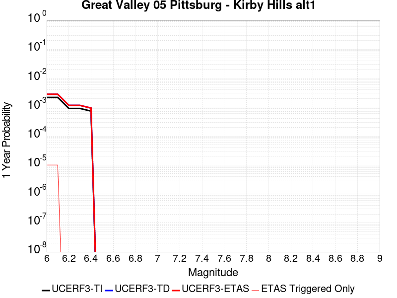 |  |

| Magnitude | 1 wk TI Prob | 1 wk TD Prob | 1 wk ETAS Prob | 1 wk ETAS/TD Gain | 1 wk ETAS Triggered Only | 1 mo TI Prob | 1 mo TD Prob | 1 mo ETAS Prob | 1 mo ETAS/TD Gain | 1 mo ETAS Triggered Only | 1 yr TI Prob | 1 yr TD Prob | 1 yr ETAS Prob | 1 yr ETAS/TD Gain | 1 yr ETAS Triggered Only | 10 yr TI Prob | 10 yr TD Prob | 10 yr ETAS Prob | 10 yr ETAS/TD Gain | 10 yr ETAS Triggered Only |
|-----|-----|-----|-----|-----|-----|-----|-----|-----|-----|-----|-----|-----|-----|-----|-----|-----|-----|-----|-----|-----|
| 6.0 | 4.187212E-5 | 5.3442072E-5 | 5.3442072E-5 | 1.0 | 0.0 | 1.794396E-4 | 2.290231E-4 | 2.290231E-4 | 1.0 | 0.0 | 0.002182488 | 0.0027857882 | 0.0028539412 | 1.0244645 | 6.834335E-5 | 0.021611776 | 0.02760304 | 0.027669495 | 1.0024076 | 6.834335E-5 |
| 6.1 | 4.187212E-5 | 5.3442072E-5 | 5.3442072E-5 | 1.0 | 0.0 | 1.794396E-4 | 2.290231E-4 | 2.290231E-4 | 1.0 | 0.0 | 0.002182488 | 0.0027857882 | 0.0028539412 | 1.0244645 | 6.834335E-5 | 0.021611776 | 0.02760304 | 0.027669495 | 1.0024076 | 6.834335E-5 |
| 6.2 | 1.7353306E-5 | 2.2154374E-5 | 2.2154374E-5 | 1.0 | 0.0 | 7.436919E-5 | 9.494618E-5 | 9.494618E-5 | 1.0 | 0.0 | 9.050688E-4 | 0.0011557543 | 0.0011557543 | 1.0 | 0.0 | 0.009013915 | 0.011535114 | 0.011535114 | 1.0 | 0.0 |
| 6.3 | 1.7353306E-5 | 2.2154374E-5 | 2.2154374E-5 | 1.0 | 0.0 | 7.436919E-5 | 9.494618E-5 | 9.494618E-5 | 1.0 | 0.0 | 9.050688E-4 | 0.0011557543 | 0.0011557543 | 1.0 | 0.0 | 0.009013915 | 0.011535114 | 0.011535114 | 1.0 | 0.0 |
| 6.4 | 1.4028824E-5 | 1.7900597E-5 | 1.7900597E-5 | 1.0 | 0.0 | 6.0122147E-5 | 7.671684E-5 | 7.671684E-5 | 1.0 | 0.0 | 7.3174125E-4 | 9.340275E-4 | 9.340275E-4 | 1.0 | 0.0 | 0.0072933645 | 0.009338138 | 0.009338138 | 1.0 | 0.0 |

## Newport-Inglewood (Offshore)
*[(top)](#table-of-contents)*

| 1 Week | 1 Month | 1 Year | 10 Year |
|-----|-----|-----|-----|
|  |  |  | 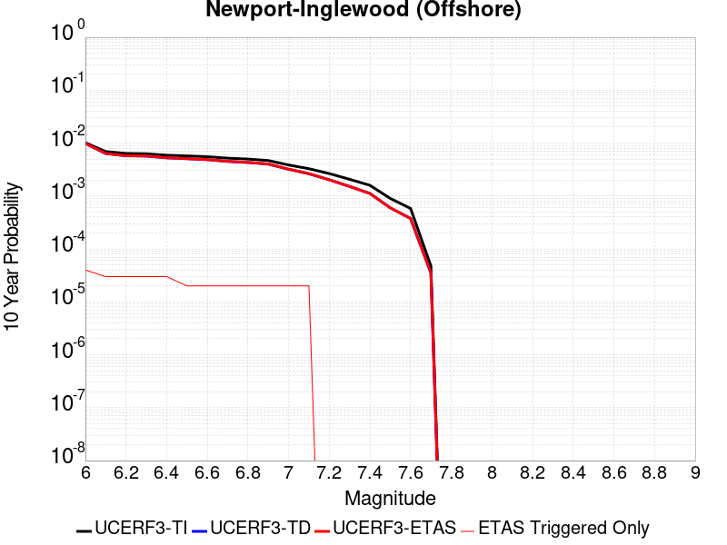 |

| Magnitude | 1 wk TI Prob | 1 wk TD Prob | 1 wk ETAS Prob | 1 wk ETAS/TD Gain | 1 wk ETAS Triggered Only | 1 mo TI Prob | 1 mo TD Prob | 1 mo ETAS Prob | 1 mo ETAS/TD Gain | 1 mo ETAS Triggered Only | 1 yr TI Prob | 1 yr TD Prob | 1 yr ETAS Prob | 1 yr ETAS/TD Gain | 1 yr ETAS Triggered Only | 10 yr TI Prob | 10 yr TD Prob | 10 yr ETAS Prob | 10 yr ETAS/TD Gain | 10 yr ETAS Triggered Only |
|-----|-----|-----|-----|-----|-----|-----|-----|-----|-----|-----|-----|-----|-----|-----|-----|-----|-----|-----|-----|-----|
| 6.0 | 1.9626508E-5 | 1.8965357E-5 | 8.730742E-5 | 4.6035213 | 6.834335E-5 | 8.411089E-5 | 8.1277634E-5 | 1.4961544E-4 | 1.8407947 | 6.834335E-5 | 0.001023569 | 9.891186E-4 | 0.0010573943 | 1.0690268 | 6.834335E-5 | 0.010188672 | 0.009848503 | 0.009916174 | 1.0068711 | 6.834335E-5 |
| 6.1 | 1.331886E-5 | 1.2218092E-5 | 8.056061E-5 | 6.593551 | 6.834335E-5 | 5.707958E-5 | 5.2362207E-5 | 1.2070199E-4 | 2.3051355 | 6.834335E-5 | 6.947222E-4 | 6.3732493E-4 | 7.056247E-4 | 1.1071664 | 6.834335E-5 | 0.006925544 | 0.006355149 | 0.006423058 | 1.0106857 | 6.834335E-5 |
| 6.2 | 1.2250852E-5 | 1.1076029E-5 | 7.941863E-5 | 7.1703157 | 6.834335E-5 | 5.2502597E-5 | 4.7467838E-5 | 1.15807954E-4 | 2.439714 | 6.834335E-5 | 6.3903164E-4 | 5.777687E-4 | 6.4607256E-4 | 1.1182201 | 6.834335E-5 | 0.006371971 | 0.0057627866 | 0.0058307364 | 1.0117911 | 6.834335E-5 |
| 6.3 | 1.2106258E-5 | 1.0918891E-5 | 7.92615E-5 | 7.2591166 | 6.834335E-5 | 5.1882926E-5 | 4.6794412E-5 | 1.1513457E-4 | 2.4604342 | 6.834335E-5 | 6.3149154E-4 | 5.69574E-4 | 6.3787843E-4 | 1.1199219 | 6.834335E-5 | 0.0062970007 | 0.005681259 | 0.005749214 | 1.0119612 | 6.834335E-5 |
| 6.4 | 1.1348758E-5 | 1.0109362E-5 | 7.845203E-5 | 7.7603345 | 6.834335E-5 | 4.8636626E-5 | 4.3325123E-5 | 1.1166552E-4 | 2.577385 | 6.834335E-5 | 5.919901E-4 | 5.273565E-4 | 5.956638E-4 | 1.1295278 | 6.834335E-5 | 0.005904155 | 0.0052611465 | 0.00532913 | 1.0129218 | 6.834335E-5 |
| 6.5 | 1.100837E-5 | 9.7433895E-6 | 9.7433895E-6 | 1.0 | 0.0 | 4.7177873E-5 | 4.1756717E-5 | 4.1756717E-5 | 1.0 | 0.0 | 5.7423924E-4 | 5.082702E-4 | 5.082702E-4 | 1.0 | 0.0 | 0.005727576 | 0.0050711688 | 0.0050711688 | 1.0 | 0.0 |
| 6.6 | 1.0634696E-5 | 9.345544E-6 | 9.345544E-6 | 1.0 | 0.0 | 4.557647E-5 | 4.0051716E-5 | 4.0051716E-5 | 1.0 | 0.0 | 5.5475225E-4 | 4.8752132E-4 | 4.8752132E-4 | 1.0 | 0.0 | 0.0055336943 | 0.0048646047 | 0.0048646047 | 1.0 | 0.0 |
| 6.7 | 9.9780855E-6 | 8.667911E-6 | 8.667911E-6 | 1.0 | 0.0 | 4.276252E-5 | 3.7147664E-5 | 3.7147664E-5 | 1.0 | 0.0 | 5.205093E-4 | 4.5217964E-4 | 4.5217964E-4 | 1.0 | 0.0 | 0.0051929182 | 0.004512675 | 0.004512675 | 1.0 | 0.0 |
| 6.8 | 9.59546E-6 | 8.27295E-6 | 8.27295E-6 | 1.0 | 0.0 | 4.1122752E-5 | 3.5455025E-5 | 3.5455025E-5 | 1.0 | 0.0 | 5.0055445E-4 | 4.315801E-4 | 4.315801E-4 | 1.0 | 0.0 | 0.004994285 | 0.004307495 | 0.004307495 | 1.0 | 0.0 |
| 6.9 | 9.000614E-6 | 7.70684E-6 | 7.70684E-6 | 1.0 | 0.0 | 3.857349E-5 | 3.30289E-5 | 3.30289E-5 | 1.0 | 0.0 | 4.6953102E-4 | 4.0205332E-4 | 4.0205332E-4 | 1.0 | 0.0 | 0.004685402 | 0.0040133307 | 0.0040133307 | 1.0 | 0.0 |
| 7.0 | 7.4070194E-6 | 6.148904E-6 | 6.148904E-6 | 1.0 | 0.0 | 3.1743984E-5 | 2.635218E-5 | 2.635218E-5 | 1.0 | 0.0 | 3.8641447E-4 | 3.207907E-4 | 3.207907E-4 | 1.0 | 0.0 | 0.0038574322 | 0.0032032963 | 0.0032032963 | 1.0 | 0.0 |
| 7.1 | 6.299615E-6 | 5.0565927E-6 | 5.0565927E-6 | 1.0 | 0.0 | 2.699807E-5 | 2.1670932E-5 | 2.1670932E-5 | 1.0 | 0.0 | 3.2865192E-4 | 2.638118E-4 | 2.638118E-4 | 1.0 | 0.0 | 0.003281663 | 0.002635001 | 0.002635001 | 1.0 | 0.0 |
| 7.2 | 5.096653E-6 | 3.892769E-6 | 3.892769E-6 | 1.0 | 0.0 | 2.1842614E-5 | 1.668319E-5 | 1.668319E-5 | 1.0 | 0.0 | 2.6590136E-4 | 2.0309901E-4 | 2.0309901E-4 | 1.0 | 0.0 | 0.0026558342 | 0.0020291451 | 0.0020291451 | 1.0 | 0.0 |
| 7.3 | 3.9753018E-6 | 2.9099103E-6 | 2.9099103E-6 | 1.0 | 0.0 | 1.7036897E-5 | 1.2470985E-5 | 1.2470985E-5 | 1.0 | 0.0 | 2.0740448E-4 | 1.5182374E-4 | 1.5182374E-4 | 1.0 | 0.0 | 0.00207211 | 0.0015172083 | 0.0015172083 | 1.0 | 0.0 |
| 7.4 | 3.0568392E-6 | 2.1449955E-6 | 2.1449955E-6 | 1.0 | 0.0 | 1.3100675E-5 | 9.192806E-6 | 9.192806E-6 | 1.0 | 0.0 | 1.5948903E-4 | 1.1191672E-4 | 1.1191672E-4 | 1.0 | 0.0 | 0.0015937461 | 0.0011186098 | 0.0011186098 | 1.0 | 0.0 |
| 7.5 | 1.7279019E-6 | 1.1469883E-6 | 1.1469883E-6 | 1.0 | 0.0 | 7.405273E-6 | 4.915655E-6 | 4.915655E-6 | 1.0 | 0.0 | 9.015547E-5 | 5.9846494E-5 | 5.9846494E-5 | 1.0 | 0.0 | 9.01189E-4 | 5.9830764E-4 | 5.9830764E-4 | 1.0 | 0.0 |
| 7.6 | 1.1156416E-6 | 7.223012E-7 | 7.223012E-7 | 1.0 | 0.0 | 4.7813123E-6 | 3.095573E-6 | 3.095573E-6 | 1.0 | 0.0 | 5.821092E-5 | 3.7687976E-5 | 3.7687976E-5 | 1.0 | 0.0 | 5.8195676E-4 | 3.7681818E-4 | 3.7681818E-4 | 1.0 | 0.0 |
| 7.7 | 9.117973E-8 | 6.734145E-8 | 6.734145E-8 | 1.0 | 0.0 | 3.907702E-7 | 2.886062E-7 | 2.886062E-7 | 1.0 | 0.0 | 4.757617E-6 | 3.513775E-6 | 3.513775E-6 | 1.0 | 0.0 | 4.7575148E-5 | 3.5137225E-5 | 3.5137225E-5 | 1.0 | 0.0 |

## Newport-Inglewood alt 1
*[(top)](#table-of-contents)*

| 1 Week | 1 Month | 1 Year | 10 Year |
|-----|-----|-----|-----|
|  |  |  |  |

| Magnitude | 1 wk TI Prob | 1 wk TD Prob | 1 wk ETAS Prob | 1 wk ETAS/TD Gain | 1 wk ETAS Triggered Only | 1 mo TI Prob | 1 mo TD Prob | 1 mo ETAS Prob | 1 mo ETAS/TD Gain | 1 mo ETAS Triggered Only | 1 yr TI Prob | 1 yr TD Prob | 1 yr ETAS Prob | 1 yr ETAS/TD Gain | 1 yr ETAS Triggered Only | 10 yr TI Prob | 10 yr TD Prob | 10 yr ETAS Prob | 10 yr ETAS/TD Gain | 10 yr ETAS Triggered Only |
|-----|-----|-----|-----|-----|-----|-----|-----|-----|-----|-----|-----|-----|-----|-----|-----|-----|-----|-----|-----|-----|
| 6.0 | 2.9668912E-5 | 3.0404817E-5 | 3.0404817E-5 | 1.0 | 0.0 | 1.2714628E-4 | 1.303026E-4 | 1.303026E-4 | 1.0 | 0.0 | 0.0015469068 | 0.0015857625 | 0.0015857625 | 1.0 | 0.0 | 0.015361829 | 0.015792042 | 0.015859308 | 1.0042593 | 6.834335E-5 |
| 6.1 | 2.9668912E-5 | 3.0404817E-5 | 3.0404817E-5 | 1.0 | 0.0 | 1.2714628E-4 | 1.303026E-4 | 1.303026E-4 | 1.0 | 0.0 | 0.0015469068 | 0.0015857625 | 0.0015857625 | 1.0 | 0.0 | 0.015361829 | 0.015792042 | 0.015859308 | 1.0042593 | 6.834335E-5 |
| 6.2 | 2.9668912E-5 | 3.0404817E-5 | 3.0404817E-5 | 1.0 | 0.0 | 1.2714628E-4 | 1.303026E-4 | 1.303026E-4 | 1.0 | 0.0 | 0.0015469068 | 0.0015857625 | 0.0015857625 | 1.0 | 0.0 | 0.015361829 | 0.015792042 | 0.015859308 | 1.0042593 | 6.834335E-5 |
| 6.3 | 2.9668912E-5 | 3.0404817E-5 | 3.0404817E-5 | 1.0 | 0.0 | 1.2714628E-4 | 1.303026E-4 | 1.303026E-4 | 1.0 | 0.0 | 0.0015469068 | 0.0015857625 | 0.0015857625 | 1.0 | 0.0 | 0.015361829 | 0.015792042 | 0.015859308 | 1.0042593 | 6.834335E-5 |
| 6.4 | 1.275942E-5 | 1.0272503E-5 | 1.0272503E-5 | 1.0 | 0.0 | 5.4682085E-5 | 4.402429E-5 | 4.402429E-5 | 1.0 | 0.0 | 6.65551E-4 | 5.358681E-4 | 5.358681E-4 | 1.0 | 0.0 | 0.0066356123 | 0.005346184 | 0.005346184 | 1.0 | 0.0 |
| 6.5 | 1.275942E-5 | 1.0272503E-5 | 1.0272503E-5 | 1.0 | 0.0 | 5.4682085E-5 | 4.402429E-5 | 4.402429E-5 | 1.0 | 0.0 | 6.65551E-4 | 5.358681E-4 | 5.358681E-4 | 1.0 | 0.0 | 0.0066356123 | 0.005346184 | 0.005346184 | 1.0 | 0.0 |
| 6.6 | 1.1255358E-5 | 8.661884E-6 | 8.661884E-6 | 1.0 | 0.0 | 4.8236358E-5 | 3.712184E-5 | 3.712184E-5 | 1.0 | 0.0 | 5.871194E-4 | 4.518664E-4 | 4.518664E-4 | 1.0 | 0.0 | 0.005855706 | 0.004509653 | 0.004509653 | 1.0 | 0.0 |
| 6.7 | 1.0504745E-5 | 7.8997955E-6 | 7.8997955E-6 | 1.0 | 0.0 | 4.5019555E-5 | 3.3855835E-5 | 3.3855835E-5 | 1.0 | 0.0 | 5.4797524E-4 | 4.1211807E-4 | 4.1211807E-4 | 1.0 | 0.0 | 0.0054662596 | 0.004113668 | 0.004113668 | 1.0 | 0.0 |
| 6.8 | 1.0476007E-5 | 7.881176E-6 | 7.881176E-6 | 1.0 | 0.0 | 4.4896402E-5 | 3.3776043E-5 | 3.3776043E-5 | 1.0 | 0.0 | 5.464766E-4 | 4.1114696E-4 | 4.1114696E-4 | 1.0 | 0.0 | 0.005451347 | 0.0041039926 | 0.0041039926 | 1.0 | 0.0 |
| 6.9 | 9.076797E-6 | 6.4896312E-6 | 6.4896312E-6 | 1.0 | 0.0 | 3.889998E-5 | 2.781241E-5 | 2.781241E-5 | 1.0 | 0.0 | 4.7350433E-4 | 3.385638E-4 | 3.385638E-4 | 1.0 | 0.0 | 0.004724967 | 0.0033805177 | 0.0033805177 | 1.0 | 0.0 |
| 7.0 | 8.73795E-6 | 6.2120125E-6 | 6.2120125E-6 | 1.0 | 0.0 | 3.7447822E-5 | 2.6622642E-5 | 2.6622642E-5 | 1.0 | 0.0 | 4.5583185E-4 | 3.2408274E-4 | 3.2408274E-4 | 1.0 | 0.0 | 0.0045489795 | 0.0032361327 | 0.0032361327 | 1.0 | 0.0 |
| 7.1 | 8.391299E-6 | 5.95579E-6 | 5.95579E-6 | 1.0 | 0.0 | 3.5962214E-5 | 2.5524565E-5 | 2.5524565E-5 | 1.0 | 0.0 | 4.37752E-4 | 3.1071753E-4 | 3.1071753E-4 | 1.0 | 0.0 | 0.004368907 | 0.0031028606 | 0.0031028606 | 1.0 | 0.0 |
| 7.2 | 7.796882E-6 | 5.4965344E-6 | 5.4965344E-6 | 1.0 | 0.0 | 3.341478E-5 | 2.3556364E-5 | 2.3556364E-5 | 1.0 | 0.0 | 4.06749E-4 | 2.867612E-4 | 2.867612E-4 | 1.0 | 0.0 | 0.0040600533 | 0.0028639357 | 0.0028639357 | 1.0 | 0.0 |
| 7.3 | 6.4738833E-6 | 4.6478162E-6 | 4.6478162E-6 | 1.0 | 0.0 | 2.774492E-5 | 1.9919062E-5 | 1.9919062E-5 | 1.0 | 0.0 | 3.3774204E-4 | 2.4248775E-4 | 2.4248775E-4 | 1.0 | 0.0 | 0.0033722918 | 0.0024222482 | 0.0024222482 | 1.0 | 0.0 |
| 7.4 | 5.382145E-6 | 3.8857597E-6 | 3.8857597E-6 | 1.0 | 0.0 | 2.3066134E-5 | 1.665315E-5 | 1.665315E-5 | 1.0 | 0.0 | 2.8079396E-4 | 2.0273338E-4 | 2.0273338E-4 | 1.0 | 0.0 | 0.0028043943 | 0.0020254988 | 0.0020254988 | 1.0 | 0.0 |
| 7.5 | 3.648244E-6 | 2.5737843E-6 | 2.5737843E-6 | 1.0 | 0.0 | 1.5635238E-5 | 1.1030458E-5 | 1.1030458E-5 | 1.0 | 0.0 | 1.9034238E-4 | 1.3428765E-4 | 1.3428765E-4 | 1.0 | 0.0 | 0.0019017943 | 0.0013420755 | 0.0013420755 | 1.0 | 0.0 |
| 7.6 | 2.2906888E-6 | 1.5479842E-6 | 1.5479842E-6 | 1.0 | 0.0 | 9.817201E-6 | 6.634202E-6 | 6.634202E-6 | 1.0 | 0.0 | 1.1951787E-4 | 8.076848E-5 | 8.076848E-5 | 1.0 | 0.0 | 0.0011945361 | 8.07398E-4 | 8.07398E-4 | 1.0 | 0.0 |
| 7.7 | 6.0479874E-7 | 3.397512E-7 | 3.397512E-7 | 1.0 | 0.0 | 2.5919921E-6 | 1.4560758E-6 | 1.4560758E-6 | 1.0 | 0.0 | 3.1557047E-5 | 1.7727592E-5 | 1.7727592E-5 | 1.0 | 0.0 | 3.1552566E-4 | 1.7726317E-4 | 1.7726317E-4 | 1.0 | 0.0 |
| 7.8 | 1.16056995E-8 | 9.782373E-9 | 9.782373E-9 | 1.0 | 0.0 | 4.9738713E-8 | 4.1924455E-8 | 4.1924455E-8 | 1.0 | 0.0 | 6.0556863E-7 | 5.1043025E-7 | 5.1043025E-7 | 1.0 | 0.0 | 6.05567E-6 | 5.1043025E-6 | 5.1043025E-6 | 1.0 | 0.0 |

## Elsinore (Stepovers Combined)
*[(top)](#table-of-contents)*

| 1 Week | 1 Month | 1 Year | 10 Year |
|-----|-----|-----|-----|
|  |  |  |  |

| Magnitude | 1 wk TI Prob | 1 wk TD Prob | 1 wk ETAS Prob | 1 wk ETAS/TD Gain | 1 wk ETAS Triggered Only | 1 mo TI Prob | 1 mo TD Prob | 1 mo ETAS Prob | 1 mo ETAS/TD Gain | 1 mo ETAS Triggered Only | 1 yr TI Prob | 1 yr TD Prob | 1 yr ETAS Prob | 1 yr ETAS/TD Gain | 1 yr ETAS Triggered Only | 10 yr TI Prob | 10 yr TD Prob | 10 yr ETAS Prob | 10 yr ETAS/TD Gain | 10 yr ETAS Triggered Only |
|-----|-----|-----|-----|-----|-----|-----|-----|-----|-----|-----|-----|-----|-----|-----|-----|-----|-----|-----|-----|-----|
| 6.0 | 2.144392E-5 | 1.9760193E-5 | 1.9760193E-5 | 1.0 | 0.0 | 9.189928E-5 | 8.468392E-5 | 8.468392E-5 | 1.0 | 0.0 | 0.0011182994 | 0.0010305607 | 0.0010305607 | 1.0 | 0.0 | 0.011126885 | 0.010264917 | 0.010332559 | 1.0065897 | 6.834335E-5 |
| 6.1 | 2.144392E-5 | 1.9760193E-5 | 1.9760193E-5 | 1.0 | 0.0 | 9.189928E-5 | 8.468392E-5 | 8.468392E-5 | 1.0 | 0.0 | 0.0011182994 | 0.0010305607 | 0.0010305607 | 1.0 | 0.0 | 0.011126885 | 0.010264917 | 0.010332559 | 1.0065897 | 6.834335E-5 |
| 6.2 | 2.144392E-5 | 1.9760193E-5 | 1.9760193E-5 | 1.0 | 0.0 | 9.189928E-5 | 8.468392E-5 | 8.468392E-5 | 1.0 | 0.0 | 0.0011182994 | 0.0010305607 | 0.0010305607 | 1.0 | 0.0 | 0.011126885 | 0.010264917 | 0.010332559 | 1.0065897 | 6.834335E-5 |
| 6.3 | 1.9751555E-5 | 1.7741453E-5 | 1.7741453E-5 | 1.0 | 0.0 | 8.4646774E-5 | 7.603267E-5 | 7.603267E-5 | 1.0 | 0.0 | 0.0010300872 | 9.253213E-4 | 9.253213E-4 | 1.0 | 0.0 | 0.010253254 | 0.009221276 | 0.00928899 | 1.0073432 | 6.834335E-5 |
| 6.4 | 1.9751555E-5 | 1.7741453E-5 | 1.7741453E-5 | 1.0 | 0.0 | 8.4646774E-5 | 7.603267E-5 | 7.603267E-5 | 1.0 | 0.0 | 0.0010300872 | 9.253213E-4 | 9.253213E-4 | 1.0 | 0.0 | 0.010253254 | 0.009221276 | 0.00928899 | 1.0073432 | 6.834335E-5 |
| 6.5 | 1.9751555E-5 | 1.7741453E-5 | 1.7741453E-5 | 1.0 | 0.0 | 8.4646774E-5 | 7.603267E-5 | 7.603267E-5 | 1.0 | 0.0 | 0.0010300872 | 9.253213E-4 | 9.253213E-4 | 1.0 | 0.0 | 0.010253254 | 0.009221276 | 0.00928899 | 1.0073432 | 6.834335E-5 |
| 6.6 | 1.9188685E-5 | 1.7003393E-5 | 1.7003393E-5 | 1.0 | 0.0 | 8.2234634E-5 | 7.286974E-5 | 7.286974E-5 | 1.0 | 0.0 | 0.0010007467 | 8.868442E-4 | 8.868442E-4 | 1.0 | 0.0 | 0.00996252 | 0.0088398475 | 0.008907586 | 1.0076629 | 6.834335E-5 |
| 6.7 | 1.7608272E-5 | 1.4732616E-5 | 1.4732616E-5 | 1.0 | 0.0 | 7.546184E-5 | 6.3138315E-5 | 6.3138315E-5 | 1.0 | 0.0 | 9.183606E-4 | 7.684476E-4 | 7.684476E-4 | 1.0 | 0.0 | 0.009145746 | 0.00766491 | 0.0077327294 | 1.0088481 | 6.834335E-5 |
| 6.8 | 1.697165E-5 | 1.3783365E-5 | 1.3783365E-5 | 1.0 | 0.0 | 7.273361E-5 | 5.9070277E-5 | 5.9070277E-5 | 1.0 | 0.0 | 8.8517193E-4 | 7.18952E-4 | 7.18952E-4 | 1.0 | 0.0 | 0.008816543 | 0.007172675 | 0.0072405282 | 1.00946 | 6.834335E-5 |
| 6.9 | 1.600365E-5 | 1.2846671E-5 | 1.2846671E-5 | 1.0 | 0.0 | 6.858527E-5 | 5.5056043E-5 | 5.5056043E-5 | 1.0 | 0.0 | 8.347058E-4 | 6.7010894E-4 | 6.7010894E-4 | 1.0 | 0.0 | 0.008315775 | 0.0066867657 | 0.006754652 | 1.0101523 | 6.834335E-5 |
| 7.0 | 1.3314581E-5 | 1.0447548E-5 | 1.0447548E-5 | 1.0 | 0.0 | 5.7061243E-5 | 4.4774453E-5 | 4.4774453E-5 | 1.0 | 0.0 | 6.944992E-4 | 5.449953E-4 | 5.449953E-4 | 1.0 | 0.0 | 0.006923327 | 0.0054405155 | 0.0055084866 | 1.0124936 | 6.834335E-5 |
| 7.1 | 1.2865345E-5 | 9.937536E-6 | 9.937536E-6 | 1.0 | 0.0 | 5.5136024E-5 | 4.258876E-5 | 4.258876E-5 | 1.0 | 0.0 | 6.710743E-4 | 5.183973E-4 | 5.183973E-4 | 1.0 | 0.0 | 0.0066905143 | 0.0051752133 | 0.005243203 | 1.0131376 | 6.834335E-5 |
| 7.2 | 1.1650051E-5 | 8.633809E-6 | 8.633809E-6 | 1.0 | 0.0 | 4.9927836E-5 | 3.7001522E-5 | 3.7001522E-5 | 1.0 | 0.0 | 6.0770183E-4 | 4.504022E-4 | 4.504022E-4 | 1.0 | 0.0 | 0.0060604266 | 0.0044963174 | 0.0045643533 | 1.0151315 | 6.834335E-5 |
| 7.3 | 1.0008533E-5 | 7.2010425E-6 | 7.2010425E-6 | 1.0 | 0.0 | 4.2893007E-5 | 3.0861254E-5 | 3.0861254E-5 | 1.0 | 0.0 | 5.220972E-4 | 3.7567242E-4 | 3.7567242E-4 | 1.0 | 0.0 | 0.005208723 | 0.003750761 | 0.003818848 | 1.0181528 | 6.834335E-5 |
| 7.4 | 9.116759E-6 | 6.410068E-6 | 6.410068E-6 | 1.0 | 0.0 | 3.907124E-5 | 2.747144E-5 | 2.747144E-5 | 1.0 | 0.0 | 4.7558855E-4 | 3.3441483E-4 | 3.3441483E-4 | 1.0 | 0.0 | 0.00474572 | 0.0033392678 | 0.003407383 | 1.0203983 | 6.834335E-5 |
| 7.5 | 7.870524E-6 | 5.3825365E-6 | 5.3825365E-6 | 1.0 | 0.0 | 3.3730383E-5 | 2.3067816E-5 | 2.3067816E-5 | 1.0 | 0.0 | 4.1059E-4 | 2.8081573E-4 | 2.8081573E-4 | 1.0 | 0.0 | 0.0040983222 | 0.0028047354 | 0.0028728873 | 1.0242988 | 6.834335E-5 |
| 7.6 | 6.9774537E-6 | 4.6776067E-6 | 4.6776067E-6 | 1.0 | 0.0 | 2.990303E-5 | 2.0046738E-5 | 2.0046738E-5 | 1.0 | 0.0 | 3.640086E-4 | 2.4404288E-4 | 2.4404288E-4 | 1.0 | 0.0 | 0.003634129 | 0.0024378651 | 0.002506042 | 1.0279658 | 6.834335E-5 |
| 7.7 | 4.1616954E-6 | 2.32834E-6 | 2.32834E-6 | 1.0 | 0.0 | 1.7835715E-5 | 9.978567E-6 | 9.978567E-6 | 1.0 | 0.0 | 2.171282E-4 | 1.2148302E-4 | 1.2148302E-4 | 1.0 | 0.0 | 0.0021691616 | 0.0012142392 | 0.0012824995 | 1.0562166 | 6.834335E-5 |
| 7.8 | 2.2692414E-7 | 9.3854695E-8 | 9.3854695E-8 | 1.0 | 0.0 | 9.725317E-7 | 4.0223435E-7 | 4.0223435E-7 | 1.0 | 0.0 | 1.1840509E-5 | 4.8971956E-6 | 4.8971956E-6 | 1.0 | 0.0 | 1.1839878E-4 | 4.8971204E-5 | 4.8971204E-5 | 1.0 | 0.0 |
| 7.9 | 6.676829E-9 | 3.439853E-9 | 3.439853E-9 | 1.0 | 0.0 | 2.861498E-8 | 1.4742227E-8 | 1.4742227E-8 | 1.0 | 0.0 | 3.4838732E-7 | 1.7948659E-7 | 1.7948659E-7 | 1.0 | 0.0 | 3.4838679E-6 | 1.7948646E-6 | 1.7948646E-6 | 1.0 | 0.0 |

## Simi-Santa Rosa
*[(top)](#table-of-contents)*

| 1 Week | 1 Month | 1 Year | 10 Year |
|-----|-----|-----|-----|
|  |  |  |  |

| Magnitude | 1 wk TI Prob | 1 wk TD Prob | 1 wk ETAS Prob | 1 wk ETAS/TD Gain | 1 wk ETAS Triggered Only | 1 mo TI Prob | 1 mo TD Prob | 1 mo ETAS Prob | 1 mo ETAS/TD Gain | 1 mo ETAS Triggered Only | 1 yr TI Prob | 1 yr TD Prob | 1 yr ETAS Prob | 1 yr ETAS/TD Gain | 1 yr ETAS Triggered Only | 10 yr TI Prob | 10 yr TD Prob | 10 yr ETAS Prob | 10 yr ETAS/TD Gain | 10 yr ETAS Triggered Only |
|-----|-----|-----|-----|-----|-----|-----|-----|-----|-----|-----|-----|-----|-----|-----|-----|-----|-----|-----|-----|-----|
| 6.0 | 2.198912E-5 | 2.2275442E-5 | 2.2275442E-5 | 1.0 | 0.0 | 9.4235686E-5 | 9.5462936E-5 | 9.5462936E-5 | 1.0 | 0.0 | 0.0011467156 | 0.0011616853 | 0.0012299493 | 1.0587629 | 6.834335E-5 | 0.011408163 | 0.011560575 | 0.011628129 | 1.0058434 | 6.834335E-5 |
| 6.1 | 2.198912E-5 | 2.2275442E-5 | 2.2275442E-5 | 1.0 | 0.0 | 9.4235686E-5 | 9.5462936E-5 | 9.5462936E-5 | 1.0 | 0.0 | 0.0011467156 | 0.0011616853 | 0.0012299493 | 1.0587629 | 6.834335E-5 | 0.011408163 | 0.011560575 | 0.011628129 | 1.0058434 | 6.834335E-5 |
| 6.2 | 1.69983E-5 | 1.6668559E-5 | 1.6668559E-5 | 1.0 | 0.0 | 7.284782E-5 | 7.143489E-5 | 7.143489E-5 | 1.0 | 0.0 | 8.865613E-4 | 8.6940196E-4 | 9.376859E-4 | 1.0785413 | 6.834335E-5 | 0.008830327 | 0.008662928 | 0.008730679 | 1.0078208 | 6.834335E-5 |
| 6.3 | 1.69983E-5 | 1.6668559E-5 | 1.6668559E-5 | 1.0 | 0.0 | 7.284782E-5 | 7.143489E-5 | 7.143489E-5 | 1.0 | 0.0 | 8.865613E-4 | 8.6940196E-4 | 9.376859E-4 | 1.0785413 | 6.834335E-5 | 0.008830327 | 0.008662928 | 0.008730679 | 1.0078208 | 6.834335E-5 |
| 6.4 | 1.4666188E-5 | 1.4052543E-5 | 1.4052543E-5 | 1.0 | 0.0 | 6.285358E-5 | 6.0223934E-5 | 6.0223934E-5 | 1.0 | 0.0 | 7.6497364E-4 | 7.3300465E-4 | 8.012979E-4 | 1.093169 | 6.834335E-5 | 0.0076234564 | 0.007308344 | 0.007376188 | 1.0092831 | 6.834335E-5 |
| 6.5 | 1.4666188E-5 | 1.4052543E-5 | 1.4052543E-5 | 1.0 | 0.0 | 6.285358E-5 | 6.0223934E-5 | 6.0223934E-5 | 1.0 | 0.0 | 7.6497364E-4 | 7.3300465E-4 | 8.012979E-4 | 1.093169 | 6.834335E-5 | 0.0076234564 | 0.007308344 | 0.007376188 | 1.0092831 | 6.834335E-5 |
| 6.6 | 1.4377586E-5 | 1.3729583E-5 | 1.3729583E-5 | 1.0 | 0.0 | 6.1616774E-5 | 5.883988E-5 | 5.883988E-5 | 1.0 | 0.0 | 7.4992597E-4 | 7.1616494E-4 | 7.8445935E-4 | 1.0953612 | 6.834335E-5 | 0.007474003 | 0.0071410383 | 0.0072088935 | 1.0095022 | 6.834335E-5 |
| 6.7 | 1.3881404E-5 | 1.320755E-5 | 1.320755E-5 | 1.0 | 0.0 | 5.9490372E-5 | 5.66027E-5 | 5.66027E-5 | 1.0 | 0.0 | 7.240546E-4 | 6.8894465E-4 | 7.572409E-4 | 1.0991317 | 6.834335E-5 | 0.007217 | 0.006870538 | 0.006938412 | 1.009879 | 6.834335E-5 |
| 6.8 | 1.0176516E-5 | 9.154151E-6 | 9.154151E-6 | 1.0 | 0.0 | 4.3612912E-5 | 3.9231574E-5 | 3.9231574E-5 | 1.0 | 0.0 | 5.308578E-4 | 4.7755634E-4 | 5.45867E-4 | 1.1430422 | 6.834335E-5 | 0.0052959146 | 0.004766934 | 0.004834952 | 1.0142686 | 6.834335E-5 |
| 6.9 | 9.699797E-6 | 8.774719E-6 | 8.774719E-6 | 1.0 | 0.0 | 4.15699E-5 | 3.7605492E-5 | 3.7605492E-5 | 1.0 | 0.0 | 5.05996E-4 | 4.577671E-4 | 5.260792E-4 | 1.1492289 | 6.834335E-5 | 0.005048454 | 0.0045698597 | 0.0046378905 | 1.0148869 | 6.834335E-5 |
| 7.0 | 7.4049476E-6 | 6.559333E-6 | 6.559333E-6 | 1.0 | 0.0 | 3.1735104E-5 | 2.8111197E-5 | 2.8111197E-5 | 1.0 | 0.0 | 3.8630638E-4 | 3.422127E-4 | 3.422127E-4 | 1.0 | 0.0 | 0.0038563553 | 0.0034180996 | 0.0034180996 | 1.0 | 0.0 |
| 7.1 | 3.873439E-6 | 2.7595095E-6 | 2.7595095E-6 | 1.0 | 0.0 | 1.6600346E-5 | 1.1826417E-5 | 1.1826417E-5 | 1.0 | 0.0 | 2.0209046E-4 | 1.4397735E-4 | 1.4397735E-4 | 1.0 | 0.0 | 0.0020190678 | 0.0014388643 | 0.0014388643 | 1.0 | 0.0 |
| 7.2 | 3.417706E-6 | 2.3676484E-6 | 2.3676484E-6 | 1.0 | 0.0 | 1.4647229E-5 | 1.0147027E-5 | 1.0147027E-5 | 1.0 | 0.0 | 1.7831543E-4 | 1.2353327E-4 | 1.2353327E-4 | 1.0 | 0.0 | 0.0017817242 | 0.0012346683 | 0.0012346683 | 1.0 | 0.0 |
| 7.3 | 1.90225E-6 | 1.4073753E-6 | 1.4073753E-6 | 1.0 | 0.0 | 8.152474E-6 | 6.0315947E-6 | 6.0315947E-6 | 1.0 | 0.0 | 9.9251854E-5 | 7.343221E-5 | 7.343221E-5 | 1.0 | 0.0 | 9.920754E-4 | 7.340817E-4 | 7.340817E-4 | 1.0 | 0.0 |
| 7.4 | 1.5170556E-6 | 1.1024773E-6 | 1.1024773E-6 | 1.0 | 0.0 | 6.5016507E-6 | 4.724894E-6 | 4.724894E-6 | 1.0 | 0.0 | 7.915472E-5 | 5.7524077E-5 | 5.7524077E-5 | 1.0 | 0.0 | 7.9126534E-4 | 5.7509297E-4 | 5.7509297E-4 | 1.0 | 0.0 |
| 7.5 | 1.178732E-6 | 8.535102E-7 | 8.535102E-7 | 1.0 | 0.0 | 5.0516987E-6 | 3.6578958E-6 | 3.6578958E-6 | 1.0 | 0.0 | 6.1502695E-5 | 4.453398E-5 | 4.453398E-5 | 1.0 | 0.0 | 6.148568E-4 | 4.452515E-4 | 4.452515E-4 | 1.0 | 0.0 |
| 7.6 | 6.8722386E-7 | 4.793198E-7 | 4.793198E-7 | 1.0 | 0.0 | 2.9452417E-6 | 2.054226E-6 | 2.054226E-6 | 1.0 | 0.0 | 3.5857727E-5 | 2.5009915E-5 | 2.5009915E-5 | 1.0 | 0.0 | 3.5851944E-4 | 2.5007114E-4 | 2.5007114E-4 | 1.0 | 0.0 |
| 7.7 | 5.5126515E-7 | 3.6731157E-7 | 3.6731157E-7 | 1.0 | 0.0 | 2.3625628E-6 | 1.5741915E-6 | 1.5741915E-6 | 1.0 | 0.0 | 2.8763823E-5 | 1.9165615E-5 | 1.9165615E-5 | 1.0 | 0.0 | 2.87601E-4 | 1.9163972E-4 | 1.9163972E-4 | 1.0 | 0.0 |
| 7.8 | 3.3860243E-7 | 2.0075942E-7 | 2.0075942E-7 | 1.0 | 0.0 | 1.4511525E-6 | 8.6039717E-7 | 8.6039717E-7 | 1.0 | 0.0 | 1.7667637E-5 | 1.0475286E-5 | 1.0475286E-5 | 1.0 | 0.0 | 1.7666233E-4 | 1.04747975E-4 | 1.04747975E-4 | 1.0 | 0.0 |
| 7.9 | 2.7955386E-7 | 1.4649108E-7 | 1.4649108E-7 | 1.0 | 0.0 | 1.1980875E-6 | 6.278188E-7 | 6.278188E-7 | 1.0 | 0.0 | 1.4586617E-5 | 7.643667E-6 | 7.643667E-6 | 1.0 | 0.0 | 1.458566E-4 | 7.643409E-5 | 7.643409E-5 | 1.0 | 0.0 |
| 8.0 | 5.6259015E-8 | 3.3355324E-8 | 3.3355324E-8 | 1.0 | 0.0 | 2.4111003E-7 | 1.4295138E-7 | 1.4295138E-7 | 1.0 | 0.0 | 2.9355108E-6 | 1.7404317E-6 | 1.7404317E-6 | 1.0 | 0.0 | 2.935472E-5 | 1.7404194E-5 | 1.7404194E-5 | 1.0 | 0.0 |

## Round Valley
*[(top)](#table-of-contents)*

| 1 Week | 1 Month | 1 Year | 10 Year |
|-----|-----|-----|-----|
|  |  |  |  |

| Magnitude | 1 wk TI Prob | 1 wk TD Prob | 1 wk ETAS Prob | 1 wk ETAS/TD Gain | 1 wk ETAS Triggered Only | 1 mo TI Prob | 1 mo TD Prob | 1 mo ETAS Prob | 1 mo ETAS/TD Gain | 1 mo ETAS Triggered Only | 1 yr TI Prob | 1 yr TD Prob | 1 yr ETAS Prob | 1 yr ETAS/TD Gain | 1 yr ETAS Triggered Only | 10 yr TI Prob | 10 yr TD Prob | 10 yr ETAS Prob | 10 yr ETAS/TD Gain | 10 yr ETAS Triggered Only |
|-----|-----|-----|-----|-----|-----|-----|-----|-----|-----|-----|-----|-----|-----|-----|-----|-----|-----|-----|-----|-----|
| 6.0 | 1.588152E-5 | 1.3670716E-5 | 1.3670716E-5 | 1.0 | 0.0 | 6.806188E-5 | 5.8587688E-5 | 5.8587688E-5 | 1.0 | 0.0 | 8.283384E-4 | 7.13111E-4 | 7.8140566E-4 | 1.09577 | 6.834335E-5 | 0.008252576 | 0.0071121147 | 0.0071799723 | 1.009541 | 6.834335E-5 |
| 6.1 | 1.588152E-5 | 1.3670716E-5 | 1.3670716E-5 | 1.0 | 0.0 | 6.806188E-5 | 5.8587688E-5 | 5.8587688E-5 | 1.0 | 0.0 | 8.283384E-4 | 7.13111E-4 | 7.8140566E-4 | 1.09577 | 6.834335E-5 | 0.008252576 | 0.0071121147 | 0.0071799723 | 1.009541 | 6.834335E-5 |
| 6.2 | 1.588152E-5 | 1.3670716E-5 | 1.3670716E-5 | 1.0 | 0.0 | 6.806188E-5 | 5.8587688E-5 | 5.8587688E-5 | 1.0 | 0.0 | 8.283384E-4 | 7.13111E-4 | 7.8140566E-4 | 1.09577 | 6.834335E-5 | 0.008252576 | 0.0071121147 | 0.0071799723 | 1.009541 | 6.834335E-5 |
| 6.3 | 1.588152E-5 | 1.3670716E-5 | 1.3670716E-5 | 1.0 | 0.0 | 6.806188E-5 | 5.8587688E-5 | 5.8587688E-5 | 1.0 | 0.0 | 8.283384E-4 | 7.13111E-4 | 7.8140566E-4 | 1.09577 | 6.834335E-5 | 0.008252576 | 0.0071121147 | 0.0071799723 | 1.009541 | 6.834335E-5 |
| 6.4 | 1.588152E-5 | 1.3670716E-5 | 1.3670716E-5 | 1.0 | 0.0 | 6.806188E-5 | 5.8587688E-5 | 5.8587688E-5 | 1.0 | 0.0 | 8.283384E-4 | 7.13111E-4 | 7.8140566E-4 | 1.09577 | 6.834335E-5 | 0.008252576 | 0.0071121147 | 0.0071799723 | 1.009541 | 6.834335E-5 |
| 6.5 | 1.0646776E-5 | 7.953037E-6 | 7.953037E-6 | 1.0 | 0.0 | 4.5628243E-5 | 3.408405E-5 | 3.408405E-5 | 1.0 | 0.0 | 5.553823E-4 | 4.1490266E-4 | 4.1490266E-4 | 1.0 | 0.0 | 0.005539963 | 0.0041421093 | 0.0041421093 | 1.0 | 0.0 |
| 6.6 | 8.632956E-6 | 5.768742E-6 | 5.768742E-6 | 1.0 | 0.0 | 3.6997862E-5 | 2.4722967E-5 | 2.4722967E-5 | 1.0 | 0.0 | 4.5035584E-4 | 3.009644E-4 | 3.009644E-4 | 1.0 | 0.0 | 0.0044944426 | 0.003005946 | 0.003005946 | 1.0 | 0.0 |
| 6.7 | 8.632956E-6 | 5.768742E-6 | 5.768742E-6 | 1.0 | 0.0 | 3.6997862E-5 | 2.4722967E-5 | 2.4722967E-5 | 1.0 | 0.0 | 4.5035584E-4 | 3.009644E-4 | 3.009644E-4 | 1.0 | 0.0 | 0.0044944426 | 0.003005946 | 0.003005946 | 1.0 | 0.0 |
| 6.8 | 7.143895E-6 | 4.2018346E-6 | 4.2018346E-6 | 1.0 | 0.0 | 3.0616335E-5 | 1.8007748E-5 | 1.8007748E-5 | 1.0 | 0.0 | 3.726901E-4 | 2.1922393E-4 | 2.1922393E-4 | 1.0 | 0.0 | 0.0037206567 | 0.0021902416 | 0.0021902416 | 1.0 | 0.0 |
| 6.9 | 6.5120694E-6 | 3.6644687E-6 | 3.6644687E-6 | 1.0 | 0.0 | 2.790857E-5 | 1.570478E-5 | 1.570478E-5 | 1.0 | 0.0 | 3.3973387E-4 | 1.9119044E-4 | 1.9119044E-4 | 1.0 | 0.0 | 0.0033921495 | 0.0019104085 | 0.0019104085 | 1.0 | 0.0 |
| 7.0 | 5.0614435E-6 | 2.6836676E-6 | 2.6836676E-6 | 1.0 | 0.0 | 2.169172E-5 | 1.1501388E-5 | 1.1501388E-5 | 1.0 | 0.0 | 2.6406467E-4 | 1.4002144E-4 | 1.4002144E-4 | 1.0 | 0.0 | 0.0026375111 | 0.0013994334 | 0.0013994334 | 1.0 | 0.0 |
| 7.1 | 4.41728E-6 | 2.3575074E-6 | 2.3575074E-6 | 1.0 | 0.0 | 1.8931061E-5 | 1.0103569E-5 | 1.0103569E-5 | 1.0 | 0.0 | 2.304613E-4 | 1.23005E-4 | 1.23005E-4 | 1.0 | 0.0 | 0.0023022245 | 0.0012294657 | 0.0012294657 | 1.0 | 0.0 |
| 7.2 | 2.535495E-6 | 1.1208391E-6 | 1.1208391E-6 | 1.0 | 0.0 | 1.0866362E-5 | 4.8035904E-6 | 4.8035904E-6 | 1.0 | 0.0 | 1.3228992E-4 | 5.8482667E-5 | 5.8482667E-5 | 1.0 | 0.0 | 0.0013221119 | 5.84724E-4 | 5.84724E-4 | 1.0 | 0.0 |
| 7.3 | 7.900015E-7 | 4.0889498E-7 | 4.0889498E-7 | 1.0 | 0.0 | 3.3857161E-6 | 1.752407E-6 | 1.752407E-6 | 1.0 | 0.0 | 4.1220315E-5 | 2.1335554E-5 | 2.1335554E-5 | 1.0 | 0.0 | 4.121267E-4 | 2.1335555E-4 | 2.1335555E-4 | 1.0 | 0.0 |

## Elsinore (Julian)
*[(top)](#table-of-contents)*

| 1 Week | 1 Month | 1 Year | 10 Year |
|-----|-----|-----|-----|
|  |  |  |  |

| Magnitude | 1 wk TI Prob | 1 wk TD Prob | 1 wk ETAS Prob | 1 wk ETAS/TD Gain | 1 wk ETAS Triggered Only | 1 mo TI Prob | 1 mo TD Prob | 1 mo ETAS Prob | 1 mo ETAS/TD Gain | 1 mo ETAS Triggered Only | 1 yr TI Prob | 1 yr TD Prob | 1 yr ETAS Prob | 1 yr ETAS/TD Gain | 1 yr ETAS Triggered Only | 10 yr TI Prob | 10 yr TD Prob | 10 yr ETAS Prob | 10 yr ETAS/TD Gain | 10 yr ETAS Triggered Only |
|-----|-----|-----|-----|-----|-----|-----|-----|-----|-----|-----|-----|-----|-----|-----|-----|-----|-----|-----|-----|-----|
| 6.0 | 1.1710231E-5 | 8.845509E-6 | 8.845509E-6 | 1.0 | 0.0 | 5.0185736E-5 | 3.7908783E-5 | 3.7908783E-5 | 1.0 | 0.0 | 6.1084004E-4 | 4.614434E-4 | 4.614434E-4 | 1.0 | 0.0 | 0.006091637 | 0.0046050567 | 0.004673085 | 1.0147725 | 6.834335E-5 |
| 6.1 | 1.1710231E-5 | 8.845509E-6 | 8.845509E-6 | 1.0 | 0.0 | 5.0185736E-5 | 3.7908783E-5 | 3.7908783E-5 | 1.0 | 0.0 | 6.1084004E-4 | 4.614434E-4 | 4.614434E-4 | 1.0 | 0.0 | 0.006091637 | 0.0046050567 | 0.004673085 | 1.0147725 | 6.834335E-5 |
| 6.2 | 1.1710231E-5 | 8.845509E-6 | 8.845509E-6 | 1.0 | 0.0 | 5.0185736E-5 | 3.7908783E-5 | 3.7908783E-5 | 1.0 | 0.0 | 6.1084004E-4 | 4.614434E-4 | 4.614434E-4 | 1.0 | 0.0 | 0.006091637 | 0.0046050567 | 0.004673085 | 1.0147725 | 6.834335E-5 |
| 6.3 | 1.1710231E-5 | 8.845509E-6 | 8.845509E-6 | 1.0 | 0.0 | 5.0185736E-5 | 3.7908783E-5 | 3.7908783E-5 | 1.0 | 0.0 | 6.1084004E-4 | 4.614434E-4 | 4.614434E-4 | 1.0 | 0.0 | 0.006091637 | 0.0046050567 | 0.004673085 | 1.0147725 | 6.834335E-5 |
| 6.4 | 1.1710231E-5 | 8.845509E-6 | 8.845509E-6 | 1.0 | 0.0 | 5.0185736E-5 | 3.7908783E-5 | 3.7908783E-5 | 1.0 | 0.0 | 6.1084004E-4 | 4.614434E-4 | 4.614434E-4 | 1.0 | 0.0 | 0.006091637 | 0.0046050567 | 0.004673085 | 1.0147725 | 6.834335E-5 |
| 6.5 | 1.1710231E-5 | 8.845509E-6 | 8.845509E-6 | 1.0 | 0.0 | 5.0185736E-5 | 3.7908783E-5 | 3.7908783E-5 | 1.0 | 0.0 | 6.1084004E-4 | 4.614434E-4 | 4.614434E-4 | 1.0 | 0.0 | 0.006091637 | 0.0046050567 | 0.004673085 | 1.0147725 | 6.834335E-5 |
| 6.6 | 1.1650619E-5 | 8.777881E-6 | 8.777881E-6 | 1.0 | 0.0 | 4.993027E-5 | 3.7618956E-5 | 3.7618956E-5 | 1.0 | 0.0 | 6.0773146E-4 | 4.5791623E-4 | 4.5791623E-4 | 1.0 | 0.0 | 0.0060607214 | 0.004569931 | 0.0046379617 | 1.0148866 | 6.834335E-5 |
| 6.7 | 1.1650619E-5 | 8.777881E-6 | 8.777881E-6 | 1.0 | 0.0 | 4.993027E-5 | 3.7618956E-5 | 3.7618956E-5 | 1.0 | 0.0 | 6.0773146E-4 | 4.5791623E-4 | 4.5791623E-4 | 1.0 | 0.0 | 0.0060607214 | 0.004569931 | 0.0046379617 | 1.0148866 | 6.834335E-5 |
| 6.8 | 1.1442698E-5 | 8.561041E-6 | 8.561041E-6 | 1.0 | 0.0 | 4.9039216E-5 | 3.6689667E-5 | 3.6689667E-5 | 1.0 | 0.0 | 5.968889E-4 | 4.4660683E-4 | 4.4660683E-4 | 1.0 | 0.0 | 0.0059528816 | 0.004457295 | 0.0045253336 | 1.0152646 | 6.834335E-5 |
| 6.9 | 1.1300589E-5 | 8.408907E-6 | 8.408907E-6 | 1.0 | 0.0 | 4.8430196E-5 | 3.6037683E-5 | 3.6037683E-5 | 1.0 | 0.0 | 5.894781E-4 | 4.3867214E-4 | 4.3867214E-4 | 1.0 | 0.0 | 0.005879169 | 0.0043782624 | 0.0044463063 | 1.0155413 | 6.834335E-5 |
| 7.0 | 1.1117729E-5 | 8.226087E-6 | 8.226087E-6 | 1.0 | 0.0 | 4.764654E-5 | 3.525419E-5 | 3.525419E-5 | 1.0 | 0.0 | 5.799422E-4 | 4.291369E-4 | 4.291369E-4 | 1.0 | 0.0 | 0.0057843104 | 0.004283281 | 0.0043513314 | 1.0158875 | 6.834335E-5 |
| 7.1 | 1.08053955E-5 | 7.9117535E-6 | 7.9117535E-6 | 1.0 | 0.0 | 4.6308014E-5 | 3.3907087E-5 | 3.3907087E-5 | 1.0 | 0.0 | 5.6365423E-4 | 4.127422E-4 | 4.127422E-4 | 1.0 | 0.0 | 0.005622267 | 0.0041199517 | 0.0041880137 | 1.01652 | 6.834335E-5 |
| 7.2 | 1.032804E-5 | 7.433021E-6 | 7.433021E-6 | 1.0 | 0.0 | 4.4262277E-5 | 3.1855423E-5 | 3.1855423E-5 | 1.0 | 0.0 | 5.387599E-4 | 3.8777234E-4 | 3.8777234E-4 | 1.0 | 0.0 | 0.0053745564 | 0.0038711445 | 0.0039392235 | 1.0175862 | 6.834335E-5 |
| 7.3 | 9.622426E-6 | 6.8978457E-6 | 6.8978457E-6 | 1.0 | 0.0 | 4.1238312E-5 | 2.9561868E-5 | 2.9561868E-5 | 1.0 | 0.0 | 5.019608E-4 | 3.5985775E-4 | 3.5985775E-4 | 1.0 | 0.0 | 0.005008285 | 0.0035929221 | 0.00366102 | 1.0189533 | 6.834335E-5 |
| 7.4 | 9.144434E-6 | 6.4963933E-6 | 6.4963933E-6 | 1.0 | 0.0 | 3.9189843E-5 | 2.7841395E-5 | 2.7841395E-5 | 1.0 | 0.0 | 4.7703186E-4 | 3.3891766E-4 | 3.3891766E-4 | 1.0 | 0.0 | 0.0047600917 | 0.0033841513 | 0.0034522633 | 1.0201268 | 6.834335E-5 |
| 7.5 | 7.988981E-6 | 5.4983307E-6 | 5.4983307E-6 | 1.0 | 0.0 | 3.4238044E-5 | 2.356407E-5 | 2.356407E-5 | 1.0 | 0.0 | 4.1676845E-4 | 2.8685606E-4 | 2.8685606E-4 | 1.0 | 0.0 | 0.0041598766 | 0.002864985 | 0.0029331325 | 1.0237863 | 6.834335E-5 |
| 7.6 | 6.9554876E-6 | 4.6625346E-6 | 4.6625346E-6 | 1.0 | 0.0 | 2.9808893E-5 | 1.9982144E-5 | 1.9982144E-5 | 1.0 | 0.0 | 3.6286283E-4 | 2.4325661E-4 | 2.4325661E-4 | 1.0 | 0.0 | 0.0036227088 | 0.0024300197 | 0.002498197 | 1.0280563 | 6.834335E-5 |
| 7.7 | 4.1557314E-6 | 2.3246462E-6 | 2.3246462E-6 | 1.0 | 0.0 | 1.7810156E-5 | 9.962735E-6 | 9.962735E-6 | 1.0 | 0.0 | 2.1681708E-4 | 1.2129029E-4 | 1.2129029E-4 | 1.0 | 0.0 | 0.0021660565 | 0.001212314 | 0.0012805745 | 1.056306 | 6.834335E-5 |
| 7.8 | 2.2597293E-7 | 9.332915E-8 | 9.332915E-8 | 1.0 | 0.0 | 9.684551E-7 | 3.99982E-7 | 3.99982E-7 | 1.0 | 0.0 | 1.1790877E-5 | 4.8697734E-6 | 4.8697734E-6 | 1.0 | 0.0 | 1.17902506E-4 | 4.8696995E-5 | 4.8696995E-5 | 1.0 | 0.0 |
| 7.9 | 6.676829E-9 | 3.439853E-9 | 3.439853E-9 | 1.0 | 0.0 | 2.861498E-8 | 1.4742227E-8 | 1.4742227E-8 | 1.0 | 0.0 | 3.4838732E-7 | 1.7948659E-7 | 1.7948659E-7 | 1.0 | 0.0 | 3.4838679E-6 | 1.7948646E-6 | 1.7948646E-6 | 1.0 | 0.0 |

## San Diego Trough south
*[(top)](#table-of-contents)*

| 1 Week | 1 Month | 1 Year | 10 Year |
|-----|-----|-----|-----|
|  |  | 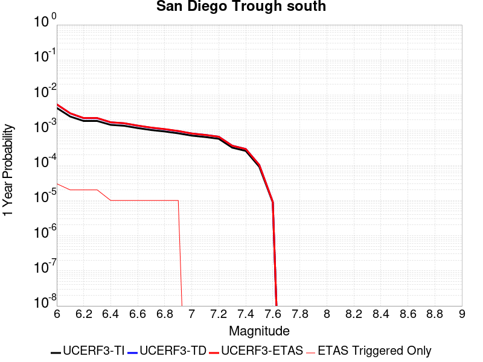 |  |

| Magnitude | 1 wk TI Prob | 1 wk TD Prob | 1 wk ETAS Prob | 1 wk ETAS/TD Gain | 1 wk ETAS Triggered Only | 1 mo TI Prob | 1 mo TD Prob | 1 mo ETAS Prob | 1 mo ETAS/TD Gain | 1 mo ETAS Triggered Only | 1 yr TI Prob | 1 yr TD Prob | 1 yr ETAS Prob | 1 yr ETAS/TD Gain | 1 yr ETAS Triggered Only | 10 yr TI Prob | 10 yr TD Prob | 10 yr ETAS Prob | 10 yr ETAS/TD Gain | 10 yr ETAS Triggered Only |
|-----|-----|-----|-----|-----|-----|-----|-----|-----|-----|-----|-----|-----|-----|-----|-----|-----|-----|-----|-----|-----|
| 6.0 | 8.279495E-5 | 1.04241306E-4 | 1.04241306E-4 | 1.0 | 0.0 | 3.5478722E-4 | 4.4667677E-4 | 4.4667677E-4 | 1.0 | 0.0 | 0.004310982 | 0.0054256152 | 0.005493588 | 1.0125281 | 6.834335E-5 | 0.042283054 | 0.05299221 | 0.05305693 | 1.0012213 | 6.834335E-5 |
| 6.1 | 4.6961468E-5 | 5.772944E-5 | 5.772944E-5 | 1.0 | 0.0 | 2.0124791E-4 | 2.473894E-4 | 2.473894E-4 | 1.0 | 0.0 | 0.00244744 | 0.0030079768 | 0.0030079768 | 1.0 | 0.0 | 0.024206603 | 0.029679462 | 0.029679462 | 1.0 | 0.0 |
| 6.2 | 3.5079658E-5 | 4.214154E-5 | 4.214154E-5 | 1.0 | 0.0 | 1.5033272E-4 | 1.8059435E-4 | 1.8059435E-4 | 1.0 | 0.0 | 0.0018287642 | 0.0021965632 | 0.0021965632 | 1.0 | 0.0 | 0.018137876 | 0.021751117 | 0.021751117 | 1.0 | 0.0 |
| 6.3 | 3.5079658E-5 | 4.214154E-5 | 4.214154E-5 | 1.0 | 0.0 | 1.5033272E-4 | 1.8059435E-4 | 1.8059435E-4 | 1.0 | 0.0 | 0.0018287642 | 0.0021965632 | 0.0021965632 | 1.0 | 0.0 | 0.018137876 | 0.021751117 | 0.021751117 | 1.0 | 0.0 |
| 6.4 | 2.7196904E-5 | 3.2087162E-5 | 3.2087162E-5 | 1.0 | 0.0 | 1.16552954E-4 | 1.3750927E-4 | 1.3750927E-4 | 1.0 | 0.0 | 0.0014181085 | 0.0016729041 | 0.0016729041 | 1.0 | 0.0 | 0.014090929 | 0.016604643 | 0.016604643 | 1.0 | 0.0 |
| 6.5 | 2.5584688E-5 | 3.010164E-5 | 3.010164E-5 | 1.0 | 0.0 | 1.0964406E-4 | 1.2900073E-4 | 1.2900073E-4 | 1.0 | 0.0 | 0.0013340989 | 0.0015694655 | 0.0015694655 | 1.0 | 0.0 | 0.013261181 | 0.015585314 | 0.015585314 | 1.0 | 0.0 |
| 6.6 | 2.2034688E-5 | 2.5742738E-5 | 2.5742738E-5 | 1.0 | 0.0 | 9.443096E-5 | 1.1032141E-4 | 1.1032141E-4 | 1.0 | 0.0 | 0.0011490905 | 0.0013423424 | 0.0013423424 | 1.0 | 0.0 | 0.011431668 | 0.013343317 | 0.013343317 | 1.0 | 0.0 |
| 6.7 | 1.9394853E-5 | 2.254176E-5 | 2.254176E-5 | 1.0 | 0.0 | 8.311815E-5 | 9.6603995E-5 | 9.6603995E-5 | 1.0 | 0.0 | 0.0010114936 | 0.0011755243 | 0.0011755243 | 1.0 | 0.0 | 0.01006902 | 0.011693766 | 0.011693766 | 1.0 | 0.0 |
| 6.8 | 1.7615313E-5 | 2.0403182E-5 | 2.0403182E-5 | 1.0 | 0.0 | 7.549201E-5 | 8.74393E-5 | 8.74393E-5 | 1.0 | 0.0 | 9.1872766E-4 | 0.0010640579 | 0.0010640579 | 1.0 | 0.0 | 0.009149387 | 0.010590198 | 0.010590198 | 1.0 | 0.0 |
| 6.9 | 1.5621423E-5 | 1.8026114E-5 | 1.8026114E-5 | 1.0 | 0.0 | 6.6947236E-5 | 7.725251E-5 | 7.725251E-5 | 1.0 | 0.0 | 8.147778E-4 | 9.40147E-4 | 9.40147E-4 | 1.0 | 0.0 | 0.008117969 | 0.009362142 | 0.009362142 | 1.0 | 0.0 |
| 7.0 | 1.3444376E-5 | 1.544809E-5 | 1.544809E-5 | 1.0 | 0.0 | 5.7617483E-5 | 6.620443E-5 | 6.620443E-5 | 1.0 | 0.0 | 7.0126704E-4 | 8.057436E-4 | 8.057436E-4 | 1.0 | 0.0 | 0.006990582 | 0.008028555 | 0.008028555 | 1.0 | 0.0 |
| 7.1 | 1.2268361E-5 | 1.407303E-5 | 1.407303E-5 | 1.0 | 0.0 | 5.2577634E-5 | 6.0311606E-5 | 6.0311606E-5 | 1.0 | 0.0 | 6.399447E-4 | 7.3404907E-4 | 7.3404907E-4 | 1.0 | 0.0 | 0.0063810493 | 0.0073165493 | 0.0073165493 | 1.0 | 0.0 |
| 7.2 | 1.0922655E-5 | 1.2513563E-5 | 1.2513563E-5 | 1.0 | 0.0 | 4.681054E-5 | 5.3628468E-5 | 5.3628468E-5 | 1.0 | 0.0 | 5.697693E-4 | 6.5273355E-4 | 6.5273355E-4 | 1.0 | 0.0 | 0.0056831064 | 0.0065084435 | 0.0065084435 | 1.0 | 0.0 |
| 7.3 | 6.1106753E-6 | 6.928925E-6 | 6.928925E-6 | 1.0 | 0.0 | 2.6188345E-5 | 2.9695057E-5 | 2.9695057E-5 | 1.0 | 0.0 | 3.1879646E-4 | 3.6147775E-4 | 3.6147775E-4 | 1.0 | 0.0 | 0.0031833951 | 0.003608943 | 0.003608943 | 1.0 | 0.0 |
| 7.4 | 4.933187E-6 | 5.5895525E-6 | 5.5895525E-6 | 1.0 | 0.0 | 2.114206E-5 | 2.3955008E-5 | 2.3955008E-5 | 1.0 | 0.0 | 2.5737417E-4 | 2.9161357E-4 | 2.9161357E-4 | 1.0 | 0.0 | 0.002570763 | 0.0029123505 | 0.0029123505 | 1.0 | 0.0 |
| 7.5 | 1.7489613E-6 | 1.969678E-6 | 1.969678E-6 | 1.0 | 0.0 | 7.495527E-6 | 8.4414505E-6 | 8.4414505E-6 | 1.0 | 0.0 | 9.125422E-5 | 1.02770035E-4 | 1.02770035E-4 | 1.0 | 0.0 | 9.1216754E-4 | 0.0010272472 | 0.0010272472 | 1.0 | 0.0 |
| 7.6 | 1.6988751E-7 | 1.7533823E-7 | 1.7533823E-7 | 1.0 | 0.0 | 7.2808916E-7 | 7.5144936E-7 | 7.5144936E-7 | 1.0 | 0.0 | 8.864449E-6 | 9.14886E-6 | 9.14886E-6 | 1.0 | 0.0 | 8.8640954E-5 | 9.1485024E-5 | 9.1485024E-5 | 1.0 | 0.0 |

## Verdugo
*[(top)](#table-of-contents)*

| 1 Week | 1 Month | 1 Year | 10 Year |
|-----|-----|-----|-----|
|  |  |  |  |

| Magnitude | 1 wk TI Prob | 1 wk TD Prob | 1 wk ETAS Prob | 1 wk ETAS/TD Gain | 1 wk ETAS Triggered Only | 1 mo TI Prob | 1 mo TD Prob | 1 mo ETAS Prob | 1 mo ETAS/TD Gain | 1 mo ETAS Triggered Only | 1 yr TI Prob | 1 yr TD Prob | 1 yr ETAS Prob | 1 yr ETAS/TD Gain | 1 yr ETAS Triggered Only | 10 yr TI Prob | 10 yr TD Prob | 10 yr ETAS Prob | 10 yr ETAS/TD Gain | 10 yr ETAS Triggered Only |
|-----|-----|-----|-----|-----|-----|-----|-----|-----|-----|-----|-----|-----|-----|-----|-----|-----|-----|-----|-----|-----|
| 6.0 | 5.392987E-6 | 4.216517E-6 | 4.216517E-6 | 1.0 | 0.0 | 2.3112598E-5 | 1.8070665E-5 | 1.8070665E-5 | 1.0 | 0.0 | 2.8135953E-4 | 2.1998861E-4 | 2.1998861E-4 | 1.0 | 0.0 | 0.0028100356 | 0.0021977562 | 0.0022659493 | 1.0310285 | 6.834335E-5 |
| 6.1 | 5.392987E-6 | 4.216517E-6 | 4.216517E-6 | 1.0 | 0.0 | 2.3112598E-5 | 1.8070665E-5 | 1.8070665E-5 | 1.0 | 0.0 | 2.8135953E-4 | 2.1998861E-4 | 2.1998861E-4 | 1.0 | 0.0 | 0.0028100356 | 0.0021977562 | 0.0022659493 | 1.0310285 | 6.834335E-5 |
| 6.2 | 5.392987E-6 | 4.216517E-6 | 4.216517E-6 | 1.0 | 0.0 | 2.3112598E-5 | 1.8070665E-5 | 1.8070665E-5 | 1.0 | 0.0 | 2.8135953E-4 | 2.1998861E-4 | 2.1998861E-4 | 1.0 | 0.0 | 0.0028100356 | 0.0021977562 | 0.0022659493 | 1.0310285 | 6.834335E-5 |
| 6.3 | 5.392987E-6 | 4.216517E-6 | 4.216517E-6 | 1.0 | 0.0 | 2.3112598E-5 | 1.8070665E-5 | 1.8070665E-5 | 1.0 | 0.0 | 2.8135953E-4 | 2.1998861E-4 | 2.1998861E-4 | 1.0 | 0.0 | 0.0028100356 | 0.0021977562 | 0.0022659493 | 1.0310285 | 6.834335E-5 |
| 6.4 | 5.392987E-6 | 4.216517E-6 | 4.216517E-6 | 1.0 | 0.0 | 2.3112598E-5 | 1.8070665E-5 | 1.8070665E-5 | 1.0 | 0.0 | 2.8135953E-4 | 2.1998861E-4 | 2.1998861E-4 | 1.0 | 0.0 | 0.0028100356 | 0.0021977562 | 0.0022659493 | 1.0310285 | 6.834335E-5 |
| 6.5 | 4.9154837E-6 | 3.722465E-6 | 3.722465E-6 | 1.0 | 0.0 | 2.1066187E-5 | 1.5953325E-5 | 1.5953325E-5 | 1.0 | 0.0 | 2.5645064E-4 | 1.9421462E-4 | 1.9421462E-4 | 1.0 | 0.0 | 0.002561549 | 0.0019404698 | 0.0020086805 | 1.0351517 | 6.834335E-5 |
| 6.6 | 4.9154837E-6 | 3.722465E-6 | 3.722465E-6 | 1.0 | 0.0 | 2.1066187E-5 | 1.5953325E-5 | 1.5953325E-5 | 1.0 | 0.0 | 2.5645064E-4 | 1.9421462E-4 | 1.9421462E-4 | 1.0 | 0.0 | 0.002561549 | 0.0019404698 | 0.0020086805 | 1.0351517 | 6.834335E-5 |
| 6.7 | 4.817006E-6 | 3.6206518E-6 | 3.6206518E-6 | 1.0 | 0.0 | 2.0644147E-5 | 1.5516987E-5 | 1.5516987E-5 | 1.0 | 0.0 | 2.513135E-4 | 1.8890314E-4 | 1.8890314E-4 | 1.0 | 0.0 | 0.0025102948 | 0.0018874453 | 0.0019556596 | 1.0361412 | 6.834335E-5 |
| 6.8 | 4.507407E-6 | 3.3071042E-6 | 3.3071042E-6 | 1.0 | 0.0 | 1.9317316E-5 | 1.4173227E-5 | 1.4173227E-5 | 1.0 | 0.0 | 2.3516294E-4 | 1.7254551E-4 | 1.7254551E-4 | 1.0 | 0.0 | 0.0023491425 | 0.0017241298 | 0.0017241298 | 1.0 | 0.0 |
| 6.9 | 4.3573054E-6 | 3.161011E-6 | 3.161011E-6 | 1.0 | 0.0 | 1.8674033E-5 | 1.354712E-5 | 1.354712E-5 | 1.0 | 0.0 | 2.2733262E-4 | 1.6492383E-4 | 1.6492383E-4 | 1.0 | 0.0 | 0.0022710022 | 0.0016480266 | 0.0016480266 | 1.0 | 0.0 |
| 7.0 | 4.171527E-6 | 2.9836704E-6 | 2.9836704E-6 | 1.0 | 0.0 | 1.787785E-5 | 1.2787096E-5 | 1.2787096E-5 | 1.0 | 0.0 | 2.1764109E-4 | 1.5567189E-4 | 1.5567189E-4 | 1.0 | 0.0 | 0.0021742806 | 0.0015556397 | 0.0015556397 | 1.0 | 0.0 |
| 7.1 | 4.0405484E-6 | 2.882261E-6 | 2.882261E-6 | 1.0 | 0.0 | 1.731652E-5 | 1.235249E-5 | 1.235249E-5 | 1.0 | 0.0 | 2.1080824E-4 | 1.503813E-4 | 1.503813E-4 | 1.0 | 0.0 | 0.0021060838 | 0.0015028063 | 0.0015028063 | 1.0 | 0.0 |
| 7.2 | 3.8306007E-6 | 2.7018452E-6 | 2.7018452E-6 | 1.0 | 0.0 | 1.6416758E-5 | 1.15792855E-5 | 1.15792855E-5 | 1.0 | 0.0 | 1.9985568E-4 | 1.4096878E-4 | 1.4096878E-4 | 1.0 | 0.0 | 0.0019967605 | 0.0014088044 | 0.0014088044 | 1.0 | 0.0 |
| 7.3 | 3.5750938E-6 | 2.5121758E-6 | 2.5121758E-6 | 1.0 | 0.0 | 1.532174E-5 | 1.0766424E-5 | 1.0766424E-5 | 1.0 | 0.0 | 1.8652623E-4 | 1.3107344E-4 | 1.3107344E-4 | 1.0 | 0.0 | 0.0018636974 | 0.0013099718 | 0.0013099718 | 1.0 | 0.0 |
| 7.4 | 3.3510041E-6 | 2.3408586E-6 | 2.3408586E-6 | 1.0 | 0.0 | 1.4361368E-5 | 1.0032213E-5 | 1.0032213E-5 | 1.0 | 0.0 | 1.7483562E-4 | 1.2213545E-4 | 1.2213545E-4 | 1.0 | 0.0 | 0.0017469813 | 0.0012206937 | 0.0012206937 | 1.0 | 0.0 |
| 7.5 | 2.948287E-6 | 2.0391124E-6 | 2.0391124E-6 | 1.0 | 0.0 | 1.2635454E-5 | 8.739024E-6 | 8.739024E-6 | 1.0 | 0.0 | 1.538258E-4 | 1.0639253E-4 | 1.0639253E-4 | 1.0 | 0.0 | 0.0015371935 | 0.0010634261 | 0.0010634261 | 1.0 | 0.0 |
| 7.6 | 2.0134323E-6 | 1.4471265E-6 | 1.4471265E-6 | 1.0 | 0.0 | 8.628967E-6 | 6.2019562E-6 | 6.2019562E-6 | 1.0 | 0.0 | 1.05052604E-4 | 7.550629E-5 | 7.550629E-5 | 1.0 | 0.0 | 0.0010500296 | 7.548152E-4 | 7.548152E-4 | 1.0 | 0.0 |
| 7.7 | 5.726436E-7 | 4.045248E-7 | 4.045248E-7 | 1.0 | 0.0 | 2.4541846E-6 | 1.7336766E-6 | 1.7336766E-6 | 1.0 | 0.0 | 2.9879287E-5 | 2.1107335E-5 | 2.1107335E-5 | 1.0 | 0.0 | 2.987527E-4 | 2.1105584E-4 | 2.1105584E-4 | 1.0 | 0.0 |
| 7.8 | 1.6248204E-7 | 1.0687696E-7 | 1.0687696E-7 | 1.0 | 0.0 | 6.963514E-7 | 4.5804404E-7 | 4.5804404E-7 | 1.0 | 0.0 | 8.478045E-6 | 5.5766723E-6 | 5.5766723E-6 | 1.0 | 0.0 | 8.477722E-5 | 5.5765355E-5 | 5.5765355E-5 | 1.0 | 0.0 |
| 7.9 | 4.4475744E-8 | 3.0375546E-8 | 3.0375546E-8 | 1.0 | 0.0 | 1.9061031E-7 | 1.301809E-7 | 1.301809E-7 | 1.0 | 0.0 | 2.320678E-6 | 1.5849514E-6 | 1.5849514E-6 | 1.0 | 0.0 | 2.3206538E-5 | 1.5849415E-5 | 1.5849415E-5 | 1.0 | 0.0 |

## Hosgri
*[(top)](#table-of-contents)*

| 1 Week | 1 Month | 1 Year | 10 Year |
|-----|-----|-----|-----|
| 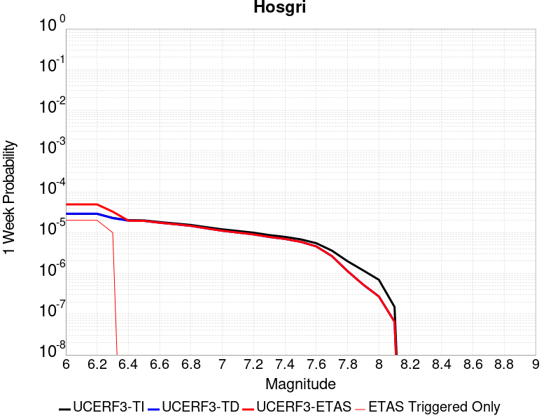 |  |  |  |

| Magnitude | 1 wk TI Prob | 1 wk TD Prob | 1 wk ETAS Prob | 1 wk ETAS/TD Gain | 1 wk ETAS Triggered Only | 1 mo TI Prob | 1 mo TD Prob | 1 mo ETAS Prob | 1 mo ETAS/TD Gain | 1 mo ETAS Triggered Only | 1 yr TI Prob | 1 yr TD Prob | 1 yr ETAS Prob | 1 yr ETAS/TD Gain | 1 yr ETAS Triggered Only | 10 yr TI Prob | 10 yr TD Prob | 10 yr ETAS Prob | 10 yr ETAS/TD Gain | 10 yr ETAS Triggered Only |
|-----|-----|-----|-----|-----|-----|-----|-----|-----|-----|-----|-----|-----|-----|-----|-----|-----|-----|-----|-----|-----|
| 6.0 | 2.883978E-5 | 2.9128416E-5 | 2.9128416E-5 | 1.0 | 0.0 | 1.235932E-4 | 1.2483024E-4 | 1.2483024E-4 | 1.0 | 0.0 | 0.0015037085 | 0.001518776 | 0.001518776 | 1.0 | 0.0 | 0.01493574 | 0.01508774 | 0.015155052 | 1.0044614 | 6.834335E-5 |
| 6.1 | 2.883978E-5 | 2.9128416E-5 | 2.9128416E-5 | 1.0 | 0.0 | 1.235932E-4 | 1.2483024E-4 | 1.2483024E-4 | 1.0 | 0.0 | 0.0015037085 | 0.001518776 | 0.001518776 | 1.0 | 0.0 | 0.01493574 | 0.01508774 | 0.015155052 | 1.0044614 | 6.834335E-5 |
| 6.2 | 2.883978E-5 | 2.9128416E-5 | 2.9128416E-5 | 1.0 | 0.0 | 1.235932E-4 | 1.2483024E-4 | 1.2483024E-4 | 1.0 | 0.0 | 0.0015037085 | 0.001518776 | 0.001518776 | 1.0 | 0.0 | 0.01493574 | 0.01508774 | 0.015155052 | 1.0044614 | 6.834335E-5 |
| 6.3 | 2.2914428E-5 | 2.2641969E-5 | 2.2641969E-5 | 1.0 | 0.0 | 9.8200995E-5 | 9.703343E-5 | 9.703343E-5 | 1.0 | 0.0 | 0.0011949413 | 0.0011807467 | 0.0011807467 | 1.0 | 0.0 | 0.011885363 | 0.011746133 | 0.011813673 | 1.0057501 | 6.834335E-5 |
| 6.4 | 2.0195741E-5 | 1.969656E-5 | 1.969656E-5 | 1.0 | 0.0 | 8.65503E-5 | 8.4411105E-5 | 8.4411105E-5 | 1.0 | 0.0 | 0.0010532405 | 0.0010272227 | 0.0010272227 | 1.0 | 0.0 | 0.010482626 | 0.010225792 | 0.010293437 | 1.006615 | 6.834335E-5 |
| 6.5 | 1.9924333E-5 | 1.940898E-5 | 1.940898E-5 | 1.0 | 0.0 | 8.53872E-5 | 8.3178704E-5 | 8.3178704E-5 | 1.0 | 0.0 | 0.0010390934 | 0.0010122322 | 0.0010122322 | 1.0 | 0.0 | 0.010342481 | 0.010077253 | 0.010144908 | 1.0067136 | 6.834335E-5 |
| 6.6 | 1.809694E-5 | 1.74583E-5 | 1.74583E-5 | 1.0 | 0.0 | 7.7556004E-5 | 7.4819145E-5 | 7.4819145E-5 | 1.0 | 0.0 | 9.438353E-4 | 9.105437E-4 | 9.105437E-4 | 1.0 | 0.0 | 0.009398366 | 0.009069073 | 0.009136797 | 1.0074675 | 6.834335E-5 |
| 6.7 | 1.675989E-5 | 1.6042764E-5 | 1.6042764E-5 | 1.0 | 0.0 | 7.182612E-5 | 6.87529E-5 | 6.87529E-5 | 1.0 | 0.0 | 8.7413215E-4 | 8.3674624E-4 | 8.3674624E-4 | 1.0 | 0.0 | 0.008707017 | 0.0083368635 | 0.008404637 | 1.0081294 | 6.834335E-5 |
| 6.8 | 1.5401129E-5 | 1.4614083E-5 | 1.4614083E-5 | 1.0 | 0.0 | 6.6003166E-5 | 6.2630286E-5 | 6.2630286E-5 | 1.0 | 0.0 | 8.032922E-4 | 7.622578E-4 | 7.622578E-4 | 1.0 | 0.0 | 0.008003947 | 0.007597296 | 0.0076651205 | 1.0089273 | 6.834335E-5 |
| 6.9 | 1.356559E-5 | 1.2689968E-5 | 1.2689968E-5 | 1.0 | 0.0 | 5.8136946E-5 | 5.4384444E-5 | 5.4384444E-5 | 1.0 | 0.0 | 7.0758746E-4 | 6.619299E-4 | 6.619299E-4 | 1.0 | 0.0 | 0.007053386 | 0.006600388 | 0.00666828 | 1.0102861 | 6.834335E-5 |
| 7.0 | 1.2030819E-5 | 1.1095962E-5 | 1.1095962E-5 | 1.0 | 0.0 | 5.155963E-5 | 4.7553254E-5 | 4.7553254E-5 | 1.0 | 0.0 | 6.275577E-4 | 5.7880714E-4 | 5.7880714E-4 | 1.0 | 0.0 | 0.006257884 | 0.005773757 | 0.005841706 | 1.0117686 | 6.834335E-5 |
| 7.1 | 1.0972698E-5 | 1.0022179E-5 | 1.0022179E-5 | 1.0 | 0.0 | 4.7025E-5 | 4.2951488E-5 | 4.2951488E-5 | 1.0 | 0.0 | 5.72379E-4 | 5.22809E-4 | 5.22809E-4 | 1.0 | 0.0 | 0.0057090693 | 0.005216542 | 0.005284529 | 1.0130329 | 6.834335E-5 |
| 7.2 | 9.961926E-6 | 9.034746E-6 | 9.034746E-6 | 1.0 | 0.0 | 4.2693267E-5 | 3.8719765E-5 | 3.8719765E-5 | 1.0 | 0.0 | 5.1966653E-4 | 4.713112E-4 | 4.713112E-4 | 1.0 | 0.0 | 0.00518453 | 0.0047038626 | 0.0047718845 | 1.0144608 | 6.834335E-5 |
| 7.3 | 8.700929E-6 | 7.8281E-6 | 7.8281E-6 | 1.0 | 0.0 | 3.7289166E-5 | 3.354857E-5 | 3.354857E-5 | 1.0 | 0.0 | 4.53901E-4 | 4.0837732E-4 | 4.0837732E-4 | 1.0 | 0.0 | 0.00452975 | 0.004077008 | 0.004145073 | 1.0166948 | 6.834335E-5 |
| 7.4 | 7.866285E-6 | 6.998739E-6 | 6.998739E-6 | 1.0 | 0.0 | 3.3712215E-5 | 2.9994251E-5 | 2.9994251E-5 | 1.0 | 0.0 | 4.103689E-4 | 3.6511885E-4 | 3.6511885E-4 | 1.0 | 0.0 | 0.004096119 | 0.0036459267 | 0.0037140208 | 1.0186768 | 6.834335E-5 |
| 7.5 | 6.8381305E-6 | 5.9596955E-6 | 5.9596955E-6 | 1.0 | 0.0 | 2.9305946E-5 | 2.5541302E-5 | 2.5541302E-5 | 1.0 | 0.0 | 3.5674145E-4 | 3.10921E-4 | 3.10921E-4 | 1.0 | 0.0 | 0.0035616932 | 0.0031055948 | 0.0031055948 | 1.0 | 0.0 |
| 7.6 | 5.503376E-6 | 4.5952443E-6 | 4.5952443E-6 | 1.0 | 0.0 | 2.3585684E-5 | 1.9693754E-5 | 1.9693754E-5 | 1.0 | 0.0 | 2.8711787E-4 | 2.397451E-4 | 2.397451E-4 | 1.0 | 0.0 | 0.002867472 | 0.0023955975 | 0.0023955975 | 1.0 | 0.0 |
| 7.7 | 3.6144982E-6 | 2.6522112E-6 | 2.6522112E-6 | 1.0 | 0.0 | 1.5490614E-5 | 1.1366569E-5 | 1.1366569E-5 | 1.0 | 0.0 | 1.8858191E-4 | 1.383792E-4 | 1.383792E-4 | 1.0 | 0.0 | 0.0018842196 | 0.0013836613 | 0.0013836613 | 1.0 | 0.0 |
| 7.8 | 1.9853494E-6 | 1.1361129E-6 | 1.1361129E-6 | 1.0 | 0.0 | 8.508612E-6 | 4.8690463E-6 | 4.8690463E-6 | 1.0 | 0.0 | 1.0358743E-4 | 5.9279027E-5 | 5.9279027E-5 | 1.0 | 0.0 | 0.0010353916 | 5.9336185E-4 | 5.9336185E-4 | 1.0 | 0.0 |
| 7.9 | 1.1818757E-6 | 5.2951856E-7 | 5.2951856E-7 | 1.0 | 0.0 | 5.0651715E-6 | 2.2693632E-6 | 2.2693632E-6 | 1.0 | 0.0 | 6.1666724E-5 | 2.7629147E-5 | 2.7629147E-5 | 1.0 | 0.0 | 6.1649614E-4 | 2.7694515E-4 | 2.7694515E-4 | 1.0 | 0.0 |
| 8.0 | 6.962958E-7 | 2.7139782E-7 | 2.7139782E-7 | 1.0 | 0.0 | 2.9841215E-6 | 1.163133E-6 | 1.163133E-6 | 1.0 | 0.0 | 3.6331072E-5 | 1.4161053E-5 | 1.4161053E-5 | 1.0 | 0.0 | 3.6325134E-4 | 1.4217179E-4 | 1.4217179E-4 | 1.0 | 0.0 |
| 8.1 | 1.5033264E-7 | 6.527624E-8 | 6.527624E-8 | 1.0 | 0.0 | 6.442826E-7 | 2.7975528E-7 | 2.7975528E-7 | 1.0 | 0.0 | 7.844113E-6 | 3.4060151E-6 | 3.4060151E-6 | 1.0 | 0.0 | 7.843835E-5 | 3.407693E-5 | 3.407693E-5 | 1.0 | 0.0 |

## Dry Mountain
*[(top)](#table-of-contents)*

| 1 Week | 1 Month | 1 Year | 10 Year |
|-----|-----|-----|-----|
|  |  |  |  |

| Magnitude | 1 wk TI Prob | 1 wk TD Prob | 1 wk ETAS Prob | 1 wk ETAS/TD Gain | 1 wk ETAS Triggered Only | 1 mo TI Prob | 1 mo TD Prob | 1 mo ETAS Prob | 1 mo ETAS/TD Gain | 1 mo ETAS Triggered Only | 1 yr TI Prob | 1 yr TD Prob | 1 yr ETAS Prob | 1 yr ETAS/TD Gain | 1 yr ETAS Triggered Only | 10 yr TI Prob | 10 yr TD Prob | 10 yr ETAS Prob | 10 yr ETAS/TD Gain | 10 yr ETAS Triggered Only |
|-----|-----|-----|-----|-----|-----|-----|-----|-----|-----|-----|-----|-----|-----|-----|-----|-----|-----|-----|-----|-----|
| 6.0 | 6.222801E-6 | 6.439381E-6 | 6.439381E-6 | 1.0 | 0.0 | 2.6668875E-5 | 2.7597147E-5 | 2.7597147E-5 | 1.0 | 0.0 | 3.2464517E-4 | 3.3595937E-4 | 4.0427977E-4 | 1.2033591 | 6.834335E-5 | 0.0032417132 | 0.0033560768 | 0.003424191 | 1.0202957 | 6.834335E-5 |
| 6.1 | 6.222801E-6 | 6.439381E-6 | 6.439381E-6 | 1.0 | 0.0 | 2.6668875E-5 | 2.7597147E-5 | 2.7597147E-5 | 1.0 | 0.0 | 3.2464517E-4 | 3.3595937E-4 | 4.0427977E-4 | 1.2033591 | 6.834335E-5 | 0.0032417132 | 0.0033560768 | 0.003424191 | 1.0202957 | 6.834335E-5 |
| 6.2 | 6.222801E-6 | 6.439381E-6 | 6.439381E-6 | 1.0 | 0.0 | 2.6668875E-5 | 2.7597147E-5 | 2.7597147E-5 | 1.0 | 0.0 | 3.2464517E-4 | 3.3595937E-4 | 4.0427977E-4 | 1.2033591 | 6.834335E-5 | 0.0032417132 | 0.0033560768 | 0.003424191 | 1.0202957 | 6.834335E-5 |
| 6.3 | 6.222801E-6 | 6.439381E-6 | 6.439381E-6 | 1.0 | 0.0 | 2.6668875E-5 | 2.7597147E-5 | 2.7597147E-5 | 1.0 | 0.0 | 3.2464517E-4 | 3.3595937E-4 | 4.0427977E-4 | 1.2033591 | 6.834335E-5 | 0.0032417132 | 0.0033560768 | 0.003424191 | 1.0202957 | 6.834335E-5 |
| 6.4 | 6.222801E-6 | 6.439381E-6 | 6.439381E-6 | 1.0 | 0.0 | 2.6668875E-5 | 2.7597147E-5 | 2.7597147E-5 | 1.0 | 0.0 | 3.2464517E-4 | 3.3595937E-4 | 4.0427977E-4 | 1.2033591 | 6.834335E-5 | 0.0032417132 | 0.0033560768 | 0.003424191 | 1.0202957 | 6.834335E-5 |
| 6.5 | 2.8528623E-6 | 2.9521684E-6 | 2.9521684E-6 | 1.0 | 0.0 | 1.22264955E-5 | 1.2652138E-5 | 1.2652138E-5 | 1.0 | 0.0 | 1.4884741E-4 | 1.540376E-4 | 2.2237042E-4 | 1.4436114 | 6.834335E-5 | 0.0014874774 | 0.0015401616 | 0.0016083997 | 1.0443058 | 6.834335E-5 |
| 6.6 | 2.8528623E-6 | 2.9521684E-6 | 2.9521684E-6 | 1.0 | 0.0 | 1.22264955E-5 | 1.2652138E-5 | 1.2652138E-5 | 1.0 | 0.0 | 1.4884741E-4 | 1.540376E-4 | 2.2237042E-4 | 1.4436114 | 6.834335E-5 | 0.0014874774 | 0.0015401616 | 0.0016083997 | 1.0443058 | 6.834335E-5 |
| 6.7 | 2.541E-6 | 2.6293578E-6 | 2.6293578E-6 | 1.0 | 0.0 | 1.0889954E-5 | 1.1268677E-5 | 1.1268677E-5 | 1.0 | 0.0 | 1.3257713E-4 | 1.3719614E-4 | 2.0553012E-4 | 1.4980751 | 6.834335E-5 | 0.0013249806 | 0.0013719613 | 0.001440211 | 1.049746 | 6.834335E-5 |

## Rinconada 2011 CFM
*[(top)](#table-of-contents)*

| 1 Week | 1 Month | 1 Year | 10 Year |
|-----|-----|-----|-----|
| 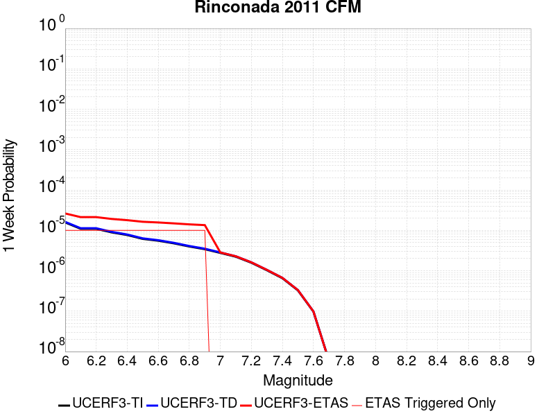 |  |  |  |

| Magnitude | 1 wk TI Prob | 1 wk TD Prob | 1 wk ETAS Prob | 1 wk ETAS/TD Gain | 1 wk ETAS Triggered Only | 1 mo TI Prob | 1 mo TD Prob | 1 mo ETAS Prob | 1 mo ETAS/TD Gain | 1 mo ETAS Triggered Only | 1 yr TI Prob | 1 yr TD Prob | 1 yr ETAS Prob | 1 yr ETAS/TD Gain | 1 yr ETAS Triggered Only | 10 yr TI Prob | 10 yr TD Prob | 10 yr ETAS Prob | 10 yr ETAS/TD Gain | 10 yr ETAS Triggered Only |
|-----|-----|-----|-----|-----|-----|-----|-----|-----|-----|-----|-----|-----|-----|-----|-----|-----|-----|-----|-----|-----|
| 6.0 | 1.5752368E-5 | 1.6274716E-5 | 1.6274716E-5 | 1.0 | 0.0 | 6.75084E-5 | 6.974694E-5 | 6.974694E-5 | 1.0 | 0.0 | 8.2160486E-4 | 8.488412E-4 | 8.488412E-4 | 1.0 | 0.0 | 0.008185739 | 0.00845637 | 0.008524136 | 1.0080135 | 6.834335E-5 |
| 6.1 | 1.0966133E-5 | 1.1323029E-5 | 1.1323029E-5 | 1.0 | 0.0 | 4.6996865E-5 | 4.852637E-5 | 4.852637E-5 | 1.0 | 0.0 | 5.720366E-4 | 5.906491E-4 | 5.906491E-4 | 1.0 | 0.0 | 0.0057056635 | 0.0058908886 | 0.0059588295 | 1.0115331 | 6.834335E-5 |
| 6.2 | 1.0966133E-5 | 1.1323029E-5 | 1.1323029E-5 | 1.0 | 0.0 | 4.6996865E-5 | 4.852637E-5 | 4.852637E-5 | 1.0 | 0.0 | 5.720366E-4 | 5.906491E-4 | 5.906491E-4 | 1.0 | 0.0 | 0.0057056635 | 0.0058908886 | 0.0059588295 | 1.0115331 | 6.834335E-5 |
| 6.3 | 8.926149E-6 | 9.212771E-6 | 9.212771E-6 | 1.0 | 0.0 | 3.8254362E-5 | 3.948271E-5 | 3.948271E-5 | 1.0 | 0.0 | 4.6564735E-4 | 4.805963E-4 | 4.805963E-4 | 1.0 | 0.0 | 0.0046467283 | 0.0047956146 | 0.00486363 | 1.0141829 | 6.834335E-5 |
| 6.4 | 7.676955E-6 | 7.920191E-6 | 7.920191E-6 | 1.0 | 0.0 | 3.290082E-5 | 3.3943234E-5 | 3.3943234E-5 | 1.0 | 0.0 | 4.0049385E-4 | 4.1318068E-4 | 4.1318068E-4 | 1.0 | 0.0 | 0.0039977287 | 0.004124151 | 0.0041922126 | 1.0165031 | 6.834335E-5 |
| 6.5 | 6.1671026E-6 | 6.3589546E-6 | 6.3589546E-6 | 1.0 | 0.0 | 2.6430173E-5 | 2.725238E-5 | 2.725238E-5 | 1.0 | 0.0 | 3.2173982E-4 | 3.317473E-4 | 3.317473E-4 | 1.0 | 0.0 | 0.003212744 | 0.0033125326 | 0.0033806495 | 1.0205634 | 6.834335E-5 |
| 6.6 | 5.553456E-6 | 5.7248126E-6 | 5.7248126E-6 | 1.0 | 0.0 | 2.3800309E-5 | 2.453468E-5 | 2.453468E-5 | 1.0 | 0.0 | 2.897302E-4 | 2.9866883E-4 | 2.9866883E-4 | 1.0 | 0.0 | 0.0028935277 | 0.002982683 | 0.0030508225 | 1.022845 | 6.834335E-5 |
| 6.7 | 4.787857E-6 | 4.9333094E-6 | 4.9333094E-6 | 1.0 | 0.0 | 2.0519226E-5 | 2.1142583E-5 | 2.1142583E-5 | 1.0 | 0.0 | 2.4979294E-4 | 2.573806E-4 | 2.573806E-4 | 1.0 | 0.0 | 0.0024951235 | 0.0025708308 | 0.0026389984 | 1.0265158 | 6.834335E-5 |
| 6.8 | 3.9955166E-6 | 4.1134763E-6 | 4.1134763E-6 | 1.0 | 0.0 | 1.7123532E-5 | 1.7629065E-5 | 1.7629065E-5 | 1.0 | 0.0 | 2.0845905E-4 | 2.1461274E-4 | 2.1461274E-4 | 1.0 | 0.0 | 0.002082636 | 0.0021440585 | 0.0021440585 | 1.0 | 0.0 |
| 6.9 | 3.4250072E-6 | 3.5224464E-6 | 3.5224464E-6 | 1.0 | 0.0 | 1.46785205E-5 | 1.5096111E-5 | 1.5096111E-5 | 1.0 | 0.0 | 1.7869633E-4 | 1.8377967E-4 | 1.8377967E-4 | 1.0 | 0.0 | 0.001785527 | 0.0018362794 | 0.0018362794 | 1.0 | 0.0 |
| 7.0 | 2.7712713E-6 | 2.8467E-6 | 2.8467E-6 | 1.0 | 0.0 | 1.1876823E-5 | 1.2200086E-5 | 1.2200086E-5 | 1.0 | 0.0 | 1.4459073E-4 | 1.4852593E-4 | 1.4852593E-4 | 1.0 | 0.0 | 0.0014449668 | 0.0014842682 | 0.0014842682 | 1.0 | 0.0 |
| 7.1 | 2.227358E-6 | 2.2856984E-6 | 2.2856984E-6 | 1.0 | 0.0 | 9.545785E-6 | 9.795814E-6 | 9.795814E-6 | 1.0 | 0.0 | 1.16213734E-4 | 1.19257515E-4 | 1.19257515E-4 | 1.0 | 0.0 | 0.0011615298 | 0.0011919362 | 0.0011919362 | 1.0 | 0.0 |
| 7.2 | 1.581796E-6 | 1.6209011E-6 | 1.6209011E-6 | 1.0 | 0.0 | 6.779108E-6 | 6.9467005E-6 | 6.9467005E-6 | 1.0 | 0.0 | 8.253252E-5 | 8.457281E-5 | 8.457281E-5 | 1.0 | 0.0 | 8.250187E-4 | 8.454067E-4 | 8.454067E-4 | 1.0 | 0.0 |
| 7.3 | 1.0306567E-6 | 1.0546477E-6 | 1.0546477E-6 | 1.0 | 0.0 | 4.4170924E-6 | 4.519911E-6 | 4.519911E-6 | 1.0 | 0.0 | 5.3776774E-5 | 5.5028526E-5 | 5.5028526E-5 | 1.0 | 0.0 | 5.376376E-4 | 5.5014924E-4 | 5.5014924E-4 | 1.0 | 0.0 |
| 7.4 | 6.535541E-7 | 6.682742E-7 | 6.682742E-7 | 1.0 | 0.0 | 2.800943E-6 | 2.864029E-6 | 2.864029E-6 | 1.0 | 0.0 | 3.4100947E-5 | 3.4868997E-5 | 3.4868997E-5 | 1.0 | 0.0 | 3.4095717E-4 | 3.4863537E-4 | 3.4863537E-4 | 1.0 | 0.0 |
| 7.5 | 3.2656962E-7 | 3.3316687E-7 | 3.3316687E-7 | 1.0 | 0.0 | 1.3995833E-6 | 1.4278572E-6 | 1.4278572E-6 | 1.0 | 0.0 | 1.7039794E-5 | 1.7384024E-5 | 1.7384024E-5 | 1.0 | 0.0 | 1.7038487E-4 | 1.7382667E-4 | 1.7382667E-4 | 1.0 | 0.0 |
| 7.6 | 9.754343E-8 | 9.82099E-8 | 9.82099E-8 | 1.0 | 0.0 | 4.180432E-7 | 4.208995E-7 | 4.208995E-7 | 1.0 | 0.0 | 5.089664E-6 | 5.1244397E-6 | 5.1244397E-6 | 1.0 | 0.0 | 5.0895473E-5 | 5.1243223E-5 | 5.1243223E-5 | 1.0 | 0.0 |
| 7.7 | 6.0001453E-9 | 5.8490435E-9 | 5.8490435E-9 | 1.0 | 0.0 | 2.5714908E-8 | 2.506733E-8 | 2.506733E-8 | 1.0 | 0.0 | 3.1307894E-7 | 3.051947E-7 | 3.051947E-7 | 1.0 | 0.0 | 3.1307852E-6 | 3.051943E-6 | 3.051943E-6 | 1.0 | 0.0 |
| 7.8 | 7.400003E-11 | 7.4654505E-11 | 7.4654505E-11 | 1.0 | 0.0 | 3.171432E-10 | 3.1994773E-10 | 3.1994773E-10 | 1.0 | 0.0 | 3.861218E-9 | 3.895363E-9 | 3.895363E-9 | 1.0 | 0.0 | 3.861218E-8 | 3.895363E-8 | 3.895363E-8 | 1.0 | 0.0 |

## Los Osos 2011
*[(top)](#table-of-contents)*

| 1 Week | 1 Month | 1 Year | 10 Year |
|-----|-----|-----|-----|
|  |  |  |  |

| Magnitude | 1 wk TI Prob | 1 wk TD Prob | 1 wk ETAS Prob | 1 wk ETAS/TD Gain | 1 wk ETAS Triggered Only | 1 mo TI Prob | 1 mo TD Prob | 1 mo ETAS Prob | 1 mo ETAS/TD Gain | 1 mo ETAS Triggered Only | 1 yr TI Prob | 1 yr TD Prob | 1 yr ETAS Prob | 1 yr ETAS/TD Gain | 1 yr ETAS Triggered Only | 10 yr TI Prob | 10 yr TD Prob | 10 yr ETAS Prob | 10 yr ETAS/TD Gain | 10 yr ETAS Triggered Only |
|-----|-----|-----|-----|-----|-----|-----|-----|-----|-----|-----|-----|-----|-----|-----|-----|-----|-----|-----|-----|-----|
| 6.0 | 4.8871775E-6 | 4.9814835E-6 | 4.9814835E-6 | 1.0 | 0.0 | 2.0944879E-5 | 2.1349055E-5 | 2.1349055E-5 | 1.0 | 0.0 | 2.5497406E-4 | 2.5989654E-4 | 2.5989654E-4 | 1.0 | 0.0 | 0.002546817 | 0.0025962002 | 0.0026643663 | 1.0262561 | 6.834335E-5 |
| 6.1 | 4.8871775E-6 | 4.9814835E-6 | 4.9814835E-6 | 1.0 | 0.0 | 2.0944879E-5 | 2.1349055E-5 | 2.1349055E-5 | 1.0 | 0.0 | 2.5497406E-4 | 2.5989654E-4 | 2.5989654E-4 | 1.0 | 0.0 | 0.002546817 | 0.0025962002 | 0.0026643663 | 1.0262561 | 6.834335E-5 |
| 6.2 | 4.8871775E-6 | 4.9814835E-6 | 4.9814835E-6 | 1.0 | 0.0 | 2.0944879E-5 | 2.1349055E-5 | 2.1349055E-5 | 1.0 | 0.0 | 2.5497406E-4 | 2.5989654E-4 | 2.5989654E-4 | 1.0 | 0.0 | 0.002546817 | 0.0025962002 | 0.0026643663 | 1.0262561 | 6.834335E-5 |
| 6.3 | 4.8871775E-6 | 4.9814835E-6 | 4.9814835E-6 | 1.0 | 0.0 | 2.0944879E-5 | 2.1349055E-5 | 2.1349055E-5 | 1.0 | 0.0 | 2.5497406E-4 | 2.5989654E-4 | 2.5989654E-4 | 1.0 | 0.0 | 0.002546817 | 0.0025962002 | 0.0026643663 | 1.0262561 | 6.834335E-5 |
| 6.4 | 4.8871775E-6 | 4.9814835E-6 | 4.9814835E-6 | 1.0 | 0.0 | 2.0944879E-5 | 2.1349055E-5 | 2.1349055E-5 | 1.0 | 0.0 | 2.5497406E-4 | 2.5989654E-4 | 2.5989654E-4 | 1.0 | 0.0 | 0.002546817 | 0.0025962002 | 0.0026643663 | 1.0262561 | 6.834335E-5 |
| 6.5 | 3.1724062E-6 | 3.223395E-6 | 3.223395E-6 | 1.0 | 0.0 | 1.3595956E-5 | 1.3814477E-5 | 1.3814477E-5 | 1.0 | 0.0 | 1.6551818E-4 | 1.681784E-4 | 1.681784E-4 | 1.0 | 0.0 | 0.0016539496 | 0.0016805249 | 0.0017487534 | 1.0405995 | 6.834335E-5 |
| 6.6 | 3.1022591E-6 | 3.1511045E-6 | 3.1511045E-6 | 1.0 | 0.0 | 1.3295328E-5 | 1.3504664E-5 | 1.3504664E-5 | 1.0 | 0.0 | 1.618586E-4 | 1.64407E-4 | 1.64407E-4 | 1.0 | 0.0 | 0.0016174077 | 0.0016428665 | 0.0017110977 | 1.0415317 | 6.834335E-5 |
| 6.7 | 2.611518E-6 | 2.6491832E-6 | 2.6491832E-6 | 1.0 | 0.0 | 1.1192172E-5 | 1.1353593E-5 | 1.1353593E-5 | 1.0 | 0.0 | 1.3625617E-4 | 1.3822126E-4 | 1.3822126E-4 | 1.0 | 0.0 | 0.0013617266 | 0.0013813575 | 0.0014496065 | 1.0494071 | 6.834335E-5 |
| 6.8 | 2.4780884E-6 | 2.5121592E-6 | 2.5121592E-6 | 1.0 | 0.0 | 1.0620336E-5 | 1.0766353E-5 | 1.0766353E-5 | 1.0 | 0.0 | 1.2929492E-4 | 1.3107249E-4 | 1.3107249E-4 | 1.0 | 0.0 | 0.0012921972 | 0.001309956 | 0.0013782098 | 1.0521039 | 6.834335E-5 |
| 6.9 | 2.1376322E-6 | 2.1635055E-6 | 2.1635055E-6 | 1.0 | 0.0 | 9.161248E-6 | 9.272134E-6 | 9.272134E-6 | 1.0 | 0.0 | 1.1153249E-4 | 1.128824E-4 | 1.128824E-4 | 1.0 | 0.0 | 0.0011147653 | 0.0011282525 | 0.0011282525 | 1.0 | 0.0 |
| 7.0 | 1.9282882E-6 | 1.9494585E-6 | 1.9494585E-6 | 1.0 | 0.0 | 8.264066E-6 | 8.354796E-6 | 8.354796E-6 | 1.0 | 0.0 | 1.0061036E-4 | 1.017149E-4 | 1.017149E-4 | 1.0 | 0.0 | 0.0010056482 | 0.0010166848 | 0.0010166848 | 1.0 | 0.0 |
| 7.1 | 1.6353226E-6 | 1.6501118E-6 | 1.6501118E-6 | 1.0 | 0.0 | 7.0085066E-6 | 7.0718884E-6 | 7.0718884E-6 | 1.0 | 0.0 | 8.532523E-5 | 8.609685E-5 | 8.609685E-5 | 1.0 | 0.0 | 8.529247E-4 | 8.6063566E-4 | 8.6063566E-4 | 1.0 | 0.0 |
| 7.2 | 1.4446276E-6 | 1.4553341E-6 | 1.4553341E-6 | 1.0 | 0.0 | 6.191247E-6 | 6.237131E-6 | 6.237131E-6 | 1.0 | 0.0 | 7.537582E-5 | 7.593443E-5 | 7.593443E-5 | 1.0 | 0.0 | 7.535026E-4 | 7.590854E-4 | 7.590854E-4 | 1.0 | 0.0 |
| 7.3 | 1.2014582E-6 | 1.2069073E-6 | 1.2069073E-6 | 1.0 | 0.0 | 5.149096E-6 | 5.1724496E-6 | 5.1724496E-6 | 1.0 | 0.0 | 6.268844E-5 | 6.297276E-5 | 6.297276E-5 | 1.0 | 0.0 | 6.267076E-4 | 6.295495E-4 | 6.295495E-4 | 1.0 | 0.0 |
| 7.4 | 9.707733E-7 | 9.709773E-7 | 9.709773E-7 | 1.0 | 0.0 | 4.16045E-6 | 4.161325E-6 | 4.161325E-6 | 1.0 | 0.0 | 5.0652303E-5 | 5.066295E-5 | 5.066295E-5 | 1.0 | 0.0 | 5.064076E-4 | 5.065143E-4 | 5.065143E-4 | 1.0 | 0.0 |
| 7.5 | 7.174908E-7 | 7.1149134E-7 | 7.1149134E-7 | 1.0 | 0.0 | 3.074957E-6 | 3.0492452E-6 | 3.0492452E-6 | 1.0 | 0.0 | 3.743696E-5 | 3.712393E-5 | 3.712393E-5 | 1.0 | 0.0 | 3.7430652E-4 | 3.7117745E-4 | 3.7117745E-4 | 1.0 | 0.0 |
| 7.6 | 4.5535776E-7 | 4.420792E-7 | 4.420792E-7 | 1.0 | 0.0 | 1.9515319E-6 | 1.8946238E-6 | 1.8946238E-6 | 1.0 | 0.0 | 2.3759641E-5 | 2.3066801E-5 | 2.3066801E-5 | 1.0 | 0.0 | 2.37571E-4 | 2.3064416E-4 | 2.3064416E-4 | 1.0 | 0.0 |
| 7.7 | 2.1173553E-7 | 1.9060796E-7 | 1.9060796E-7 | 1.0 | 0.0 | 9.0743765E-7 | 8.1689103E-7 | 8.1689103E-7 | 1.0 | 0.0 | 1.1047998E-5 | 9.945603E-6 | 9.945603E-6 | 1.0 | 0.0 | 1.1047449E-4 | 9.945161E-5 | 9.945161E-5 | 1.0 | 0.0 |
| 7.8 | 9.873608E-8 | 7.3675665E-8 | 7.3675665E-8 | 1.0 | 0.0 | 4.2315455E-7 | 3.157528E-7 | 3.157528E-7 | 1.0 | 0.0 | 5.1518946E-6 | 3.8442836E-6 | 3.8442836E-6 | 1.0 | 0.0 | 5.1517753E-5 | 3.8442176E-5 | 3.8442176E-5 | 1.0 | 0.0 |
| 7.9 | 5.4399106E-8 | 3.1880155E-8 | 3.1880155E-8 | 1.0 | 0.0 | 2.33139E-7 | 1.3662923E-7 | 1.3662923E-7 | 1.0 | 0.0 | 2.8384638E-6 | 1.6634596E-6 | 1.6634596E-6 | 1.0 | 0.0 | 2.8384275E-5 | 1.6634473E-5 | 1.6634473E-5 | 1.0 | 0.0 |
| 8.0 | 1.817203E-8 | 8.420727E-9 | 8.420727E-9 | 1.0 | 0.0 | 7.7880124E-8 | 3.608883E-8 | 3.608883E-8 | 1.0 | 0.0 | 9.481901E-7 | 4.393814E-7 | 4.393814E-7 | 1.0 | 0.0 | 9.481861E-6 | 4.3938057E-6 | 4.3938057E-6 | 1.0 | 0.0 |

